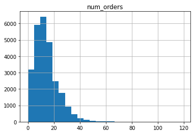

Привет, меня зовут Артем. Сегодня я проверю твой проект.
<br> Дальнейшее общение будет происходить на "ты" если это не вызывает никаких проблем.
<br> Желательно реагировать на каждый мой комментарий ('исправил', 'не понятно как исправить ошибку', ...)
<br> Пожалуйста, не удаляй комментарии ревьюера, так как они повышают качество повторного ревью.

Комментарии будут в <font color='green'>зеленой</font>, <font color='blue'>синей</font> или <font color='red'>красной</font> рамках:

<div class="alert alert-block alert-success">
<b>Успех:</b> Если все сделано отлично
</div>

<div class="alert alert-block alert-info">
<b>Совет: </b> Если можно немного улучшить
</div>

<div class="alert alert-block alert-danger">
<b>Ошибка:</b> Если требуются исправления. Работа не может быть принята с красными комментариями.
</div>

-------------------

Будет очень хорошо, если ты будешь помечать свои действия следующим образом:
<div class="alert alert-block alert-warning">
<b>Комментарий студента:</b> ...
</div>

<div class="alert alert-block alert-warning">
<b>Изменения:</b> Были внесены следующие изменения ...
</div>

#### <font color='orange'>Полезные ссылки:</font>
* Полезная лекция про временные ряды: https://www.youtube.com/watch?v=u433nrxdf5k .

### <font color='orange'>Общее впечатление</font>
* Большое спасибо за проделанную работу. Видно, что приложено много усилий.
* Отлично, что ноутбук хорошо структурирован. Приятно проверять такие работы.
* Над этим проектом нужно будет еще немного поработать. Однако, изменения не должны занять много времени.
* С радостью отвечу на твои вопросы, если они есть. Лучше всего их собрать в следующей ячейке. Жду новую версию проекта.

### <font color='orange'>Общее впечатление (ревью 2)</font>
* После исправлений проект улучшился и теперь он может быть зачтен.
* Удачи в дальнейшем обучении и следующих работах!

<h1>Содержание<span class="tocSkip"></span></h1>
<div class="toc"><ul class="toc-item"><li><ul class="toc-item"><li><ul class="toc-item"><li><span><a href="#Полезные-ссылки:" data-toc-modified-id="Полезные-ссылки:-0.0.1"><span class="toc-item-num">0.0.1&nbsp;&nbsp;</span><font color="orange">Полезные ссылки:</font></a></span></li></ul></li><li><span><a href="#Общее-впечатление" data-toc-modified-id="Общее-впечатление-0.1"><span class="toc-item-num">0.1&nbsp;&nbsp;</span><font color="orange">Общее впечатление</font></a></span></li><li><span><a href="#Общее-впечатление-(ревью-2)" data-toc-modified-id="Общее-впечатление-(ревью-2)-0.2"><span class="toc-item-num">0.2&nbsp;&nbsp;</span><font color="orange">Общее впечатление (ревью 2)</font></a></span></li></ul></li><li><span><a href="#Подготовка" data-toc-modified-id="Подготовка-1"><span class="toc-item-num">1&nbsp;&nbsp;</span>Подготовка</a></span></li><li><span><a href="#Анализ" data-toc-modified-id="Анализ-2"><span class="toc-item-num">2&nbsp;&nbsp;</span>Анализ</a></span></li><li><span><a href="#Обучение" data-toc-modified-id="Обучение-3"><span class="toc-item-num">3&nbsp;&nbsp;</span>Обучение</a></span><ul class="toc-item"><li><span><a href="#Линейная-регрессия" data-toc-modified-id="Линейная-регрессия-3.1"><span class="toc-item-num">3.1&nbsp;&nbsp;</span>Линейная регрессия</a></span></li><li><span><a href="#Гребневая-регрессия" data-toc-modified-id="Гребневая-регрессия-3.2"><span class="toc-item-num">3.2&nbsp;&nbsp;</span>Гребневая регрессия</a></span></li><li><span><a href="#Дерево" data-toc-modified-id="Дерево-3.3"><span class="toc-item-num">3.3&nbsp;&nbsp;</span>Дерево</a></span></li><li><span><a href="#Регрессия-CatBoostRegressor" data-toc-modified-id="Регрессия-CatBoostRegressor-3.4"><span class="toc-item-num">3.4&nbsp;&nbsp;</span>Регрессия CatBoostRegressor</a></span></li><li><span><a href="#Регрессия-LGBMRegressor" data-toc-modified-id="Регрессия-LGBMRegressor-3.5"><span class="toc-item-num">3.5&nbsp;&nbsp;</span>Регрессия LGBMRegressor</a></span></li><li><span><a href="#Вывод" data-toc-modified-id="Вывод-3.6"><span class="toc-item-num">3.6&nbsp;&nbsp;</span>Вывод</a></span></li></ul></li><li><span><a href="#Тестирование" data-toc-modified-id="Тестирование-4"><span class="toc-item-num">4&nbsp;&nbsp;</span>Тестирование</a></span></li><li><span><a href="#Вывод" data-toc-modified-id="Вывод-5"><span class="toc-item-num">5&nbsp;&nbsp;</span>Вывод</a></span></li><li><span><a href="#Чек-лист-проверки" data-toc-modified-id="Чек-лист-проверки-6"><span class="toc-item-num">6&nbsp;&nbsp;</span>Чек-лист проверки</a></span></li></ul></div>

#  Прогнозирование заказов такси

Компания «Чётенькое такси» собрала исторические данные о заказах такси в аэропортах. Чтобы привлекать больше водителей в период пиковой нагрузки, нужно спрогнозировать количество заказов такси на следующий час. Постройте модель для такого предсказания.

Значение метрики *RMSE* на тестовой выборке должно быть не больше 48.

Вам нужно:

1. Загрузить данные и выполнить их ресемплирование по одному часу.
2. Проанализировать данные.
3. Обучить разные модели с различными гиперпараметрами. Сделать тестовую выборку размером 10% от исходных данных.
4. Проверить данные на тестовой выборке и сделать выводы.


Данные лежат в файле `taxi.csv`. Количество заказов находится в столбце `num_orders` (от англ. *number of orders*, «число заказов»).


```python
!pip install shap -q
```


```python
# Загрузка библиотек
import matplotlib.pyplot as plt
import numpy as np
import pandas as pd
from statsmodels.tsa.seasonal import seasonal_decompose
from sklearn.model_selection import cross_val_score, GridSearchCV , train_test_split, TimeSeriesSplit,  RandomizedSearchCV
import shap
import warnings
from sklearn.model_selection import train_test_split
#from sklearn.preprocessing import StandardScaler
#from sklearn.pipeline import Pipeline

from sklearn.metrics import mean_squared_error, mean_absolute_error
from sklearn.preprocessing import OrdinalEncoder
from sklearn.linear_model import LinearRegression
from sklearn.linear_model import Ridge
from sklearn.tree import DecisionTreeRegressor
from sklearn.ensemble import RandomForestClassifier
from catboost import Pool, CatBoostRegressor, cv
from lightgbm import LGBMRegressor
warnings.filterwarnings('ignore')
```

<div class="alert alert-block alert-success">
<b>Успех:</b> Отлично, что все импорты собраны в первой ячейке ноутбука! Если у того, кто будет запускать твой ноутбук будут отсутствовать некоторые библиотеки, то он это увидит сразу, а не в процессе!
</div>


```python
# загрузка файла
data = pd.read_csv("/datasets/taxi.csv", index_col=[0], parse_dates=[0])
```

## Подготовка


```python
# Рассмотрим данные
data.info()
data.head()
```

    <class 'pandas.core.frame.DataFrame'>
    DatetimeIndex: 26496 entries, 2018-03-01 00:00:00 to 2018-08-31 23:50:00
    Data columns (total 1 columns):
     #   Column      Non-Null Count  Dtype
    ---  ------      --------------  -----
     0   num_orders  26496 non-null  int64
    dtypes: int64(1)
    memory usage: 414.0 KB


<div>
<style scoped>
    .dataframe tbody tr th:only-of-type {
        vertical-align: middle;
    }

    .dataframe tbody tr th {
        vertical-align: top;
    }

    .dataframe thead th {
        text-align: right;
    }
</style>
<table border="1" class="dataframe">
  <thead>
    <tr style="text-align: right;">
      <th></th>
      <th>num_orders</th>
    </tr>
    <tr>
      <th>datetime</th>
      <th></th>
    </tr>
  </thead>
  <tbody>
    <tr>
      <th>2018-03-01 00:00:00</th>
      <td>9</td>
    </tr>
    <tr>
      <th>2018-03-01 00:10:00</th>
      <td>14</td>
    </tr>
    <tr>
      <th>2018-03-01 00:20:00</th>
      <td>28</td>
    </tr>
    <tr>
      <th>2018-03-01 00:30:00</th>
      <td>20</td>
    </tr>
    <tr>
      <th>2018-03-01 00:40:00</th>
      <td>32</td>
    </tr>
  </tbody>
</table>
</div>


Как видно данные представляют количество поездок за 10 минут с марта по август 2018 года. Пропуски не были обнаружены.


```python
# проверка монотонности индексов
data.index.is_monotonic
```


    True


Таким образом даты записаны в правильном порядке.


```python
# рассмотрим появление дубликатов среди индексов
data.index.duplicated().sum()
```


    0


```python
# посмотрим есть ли периоды времени с отрицательными значениями
data.query('num_orders<0').sum()
```


    num_orders    0.0
    dtype: float64


Таким образом, у нас информация о 26496 периодов поездок, между мартом и августом 2018 года. Ошибок не было замечано.

## Анализ


```python
# Изучим распределение заказов
data.describe()
```


<div>
<style scoped>
    .dataframe tbody tr th:only-of-type {
        vertical-align: middle;
    }

    .dataframe tbody tr th {
        vertical-align: top;
    }

    .dataframe thead th {
        text-align: right;
    }
</style>
<table border="1" class="dataframe">
  <thead>
    <tr style="text-align: right;">
      <th></th>
      <th>num_orders</th>
    </tr>
  </thead>
  <tbody>
    <tr>
      <th>count</th>
      <td>26496.000000</td>
    </tr>
    <tr>
      <th>mean</th>
      <td>14.070463</td>
    </tr>
    <tr>
      <th>std</th>
      <td>9.211330</td>
    </tr>
    <tr>
      <th>min</th>
      <td>0.000000</td>
    </tr>
    <tr>
      <th>25%</th>
      <td>8.000000</td>
    </tr>
    <tr>
      <th>50%</th>
      <td>13.000000</td>
    </tr>
    <tr>
      <th>75%</th>
      <td>19.000000</td>
    </tr>
    <tr>
      <th>max</th>
      <td>119.000000</td>
    </tr>
  </tbody>
</table>
</div>


```python
data.hist(bins=25)
plt.show()
```


    

    


Как видно, в среднем бывает 13-14 заказов, в половине случаев между 8 и 19 заказов. И обнаружены периоды когда заказов было больше 100. 

<div class="alert alert-block alert-success">
<b>Успех:</b> Данные загружены корректно, первичный осмотр проведен.
</div>


```python
data.boxplot()
plt.show()
```


    

    


```python
# рассмотрним часы когда было больше 70 заказов
data.query('num_orders>70').index
```


    DatetimeIndex(['2018-08-13 01:10:00', '2018-08-13 02:10:00',
                   '2018-08-13 02:20:00', '2018-08-13 02:30:00',
                   '2018-08-20 02:00:00', '2018-08-20 02:10:00',
                   '2018-08-20 02:20:00', '2018-08-20 02:30:00',
                   '2018-08-20 02:40:00', '2018-08-20 03:50:00',
                   '2018-08-20 04:00:00', '2018-08-21 03:50:00',
                   '2018-08-21 04:00:00', '2018-08-27 02:00:00',
                   '2018-08-27 02:10:00', '2018-08-27 02:20:00',
                   '2018-08-27 04:30:00', '2018-08-30 17:40:00',
                   '2018-08-30 17:50:00'],
                  dtype='datetime64[ns]', name='datetime', freq=None)


Периоды когда брались много заказов сгруппированы и обычно приходятся на ночное время и скорее всего связаны с тем, что днем был празник. 

рассмотрим как количество поездок распределны по времени


```python
data.resample('1M').sum().plot(kind='bar')
plt.ylabel('num_orders')
plt.xlabel('datetime')
plt.show()
```


    

    


Видно, что количество поездок увеличивалась


```python
# Рассмотрим распределение по дням
data.resample('1D').sum().plot()
plt.ylabel('num_orders')
plt.xlabel('datetime')
plt.show()
```


    

    


При рассмотре по дням тенденция такая же.


```python
# Разложим на трендовую и сезонную состаявляющую
decomposed = seasonal_decompose(data.resample('1D').sum())

(decomposed.seasonal).plot()
(decomposed.trend).plot()
plt.legend(['сезонная','тренд'])
plt.ylabel('num_orders')
plt.xlabel('datetime')
plt.show()
```


    

    


Тренд об увеличении поездок верен. Теперь рассмотрим сезонную составляющаю.


```python
(decomposed.seasonal)['2018-05-01':'2018-05-18'].plot()
plt.ylabel('num_orders')
plt.xlabel('datetime')
plt.show()
```


    

    


7 мая 2018 года - понедельник, а 13 - воскресение.

Видно, что период сезонной состовляющей состовляет 7 дней (неделю). рассмотрим эту неделю. В понедельник больше всего поездок, во вторник меньше, после чего количество поездок растет до пятницы а потом уменьшается ло воскресения.


```python
decomposed = seasonal_decompose(data.resample('1H').sum())

(decomposed.seasonal)['2018-05-07':'2018-05-13'].plot()
(decomposed.trend)['2018-05-07':'2018-05-13'].plot()
plt.legend(['сезонная','тренд'])
plt.ylabel('num_orders')
plt.xlabel('datetime')
plt.show()
```


    

    


Видно, что созонная состовляющая имеет период в день.


```python
data['2018-05-07'].plot()

plt.ylabel('num_orders')
plt.xlabel('datetime')
plt.show()
```


    

    


Таким образом, на количество заказов оказывает влияние время заказы ( день недели, час). Эти два признака необходимо поместить в файл. Влияние даты можно понять по среднему значению в день.

**Вывод** в среднем бывает 13-14 заказов, в половине случаев между 8 и 19 заказов. И обнаружены периоды когда заказов было больше 100. Периоды когда брались много заказов сгруппированы и обычно приходятся на ночное время и скорее всего связаны с тем, что днем был празник. Был обнаружен тренд об увеличении количества заказов со временем, что может быть связано увеличением рекламы. Также были обнаружена сезонная состовляющая период которой состовляет неделя и сутки. На количество заказов оказывает влияние время заказы ( день недели, час). Эти два признака необходимо поместить в файл. Влияние даты можно понять по среднему значению в день.

<div class="alert alert-block alert-success">
<b>Успех:</b> Декомпозиция была сделана верно. Хорошо, что сезонность была визуализирована на более коротком интервале!
</div>

<div class="alert alert-block alert-info">

<b>Совет: </b> Однако, желательно было сначала првоести декомпозицию всего ряда, а затем взять подотрезок: `seasonal_decompose(data).seasonal['2018-07-31':'2018-08-31']`
</div>

## Обучение

Для начала обучения создадим функция для создания новых признаков. 


```python
def make_new(data,max_lag,rolling_mean_size):
    data['dayofweek'] = data.index.dayofweek
    data['hour'] = data.index.hour
    
    for lag in range(1, max_lag + 1):
        data['lag_{}'.format(lag)] = data['num_orders'].shift(lag)

    data['rolling_mean'] = data['num_orders'].shift().rolling(rolling_mean_size).mean()
    #data = data.dropna()
    
```


```python
df=data.resample('1H').sum() # Для большей точности в качестве пеиода возьмем 1 час.

```


```python
make_new(df,23,168) # в качестве новых признаков возьмем информацию за последние 23 часа и среднее по недели
df=df.dropna()
```

Посмотрим на получившийся таблицу


```python
df.info()
```

    <class 'pandas.core.frame.DataFrame'>
    DatetimeIndex: 4248 entries, 2018-03-08 00:00:00 to 2018-08-31 23:00:00
    Freq: H
    Data columns (total 27 columns):
     #   Column        Non-Null Count  Dtype  
    ---  ------        --------------  -----  
     0   num_orders    4248 non-null   int64  
     1   dayofweek     4248 non-null   int64  
     2   hour          4248 non-null   int64  
     3   lag_1         4248 non-null   float64
     4   lag_2         4248 non-null   float64
     5   lag_3         4248 non-null   float64
     6   lag_4         4248 non-null   float64
     7   lag_5         4248 non-null   float64
     8   lag_6         4248 non-null   float64
     9   lag_7         4248 non-null   float64
     10  lag_8         4248 non-null   float64
     11  lag_9         4248 non-null   float64
     12  lag_10        4248 non-null   float64
     13  lag_11        4248 non-null   float64
     14  lag_12        4248 non-null   float64
     15  lag_13        4248 non-null   float64
     16  lag_14        4248 non-null   float64
     17  lag_15        4248 non-null   float64
     18  lag_16        4248 non-null   float64
     19  lag_17        4248 non-null   float64
     20  lag_18        4248 non-null   float64
     21  lag_19        4248 non-null   float64
     22  lag_20        4248 non-null   float64
     23  lag_21        4248 non-null   float64
     24  lag_22        4248 non-null   float64
     25  lag_23        4248 non-null   float64
     26  rolling_mean  4248 non-null   float64
    dtypes: float64(24), int64(3)
    memory usage: 929.2 KB


```python
df.head(2)
```


<div>
<style scoped>
    .dataframe tbody tr th:only-of-type {
        vertical-align: middle;
    }

    .dataframe tbody tr th {
        vertical-align: top;
    }

    .dataframe thead th {
        text-align: right;
    }
</style>
<table border="1" class="dataframe">
  <thead>
    <tr style="text-align: right;">
      <th></th>
      <th>num_orders</th>
      <th>dayofweek</th>
      <th>hour</th>
      <th>lag_1</th>
      <th>lag_2</th>
      <th>lag_3</th>
      <th>lag_4</th>
      <th>lag_5</th>
      <th>lag_6</th>
      <th>lag_7</th>
      <th>...</th>
      <th>lag_15</th>
      <th>lag_16</th>
      <th>lag_17</th>
      <th>lag_18</th>
      <th>lag_19</th>
      <th>lag_20</th>
      <th>lag_21</th>
      <th>lag_22</th>
      <th>lag_23</th>
      <th>rolling_mean</th>
    </tr>
    <tr>
      <th>datetime</th>
      <th></th>
      <th></th>
      <th></th>
      <th></th>
      <th></th>
      <th></th>
      <th></th>
      <th></th>
      <th></th>
      <th></th>
      <th></th>
      <th></th>
      <th></th>
      <th></th>
      <th></th>
      <th></th>
      <th></th>
      <th></th>
      <th></th>
      <th></th>
      <th></th>
    </tr>
  </thead>
  <tbody>
    <tr>
      <th>2018-03-08 00:00:00</th>
      <td>143</td>
      <td>3</td>
      <td>0</td>
      <td>94.0</td>
      <td>127.0</td>
      <td>108.0</td>
      <td>76.0</td>
      <td>50.0</td>
      <td>99.0</td>
      <td>48.0</td>
      <td>...</td>
      <td>50.0</td>
      <td>38.0</td>
      <td>17.0</td>
      <td>19.0</td>
      <td>10.0</td>
      <td>73.0</td>
      <td>66.0</td>
      <td>24.0</td>
      <td>121.0</td>
      <td>54.226190</td>
    </tr>
    <tr>
      <th>2018-03-08 01:00:00</th>
      <td>78</td>
      <td>3</td>
      <td>1</td>
      <td>143.0</td>
      <td>94.0</td>
      <td>127.0</td>
      <td>108.0</td>
      <td>76.0</td>
      <td>50.0</td>
      <td>99.0</td>
      <td>...</td>
      <td>34.0</td>
      <td>50.0</td>
      <td>38.0</td>
      <td>17.0</td>
      <td>19.0</td>
      <td>10.0</td>
      <td>73.0</td>
      <td>66.0</td>
      <td>24.0</td>
      <td>54.339286</td>
    </tr>
  </tbody>
</table>
<p>2 rows × 27 columns</p>
</div>


Итого, у нас 4248 строк, один целевой признак и 26 принимаемых.

<div class="alert alert-block alert-info">

<b>Совет: </b> Желательно было написать функцию для создания признаков и сделать это таким образом, чтобы она возвращала новый датафрейм, а не изменяла глобальную переменную.
1. Это хорошая практика (не изменять глобальные переменные внутри функции), которая улучшает читаемость кода.
2. В какой-то момент может появиться необходимость подбирать некоторые параметры используемый внутри функции. В этот момент копирование датасета станет обязательным.
</div>


```python
# поразделим данные на тренировочные и тестовые
train, test = train_test_split(df, shuffle=False, test_size=0.1)

features_train = train.drop(['num_orders'], axis=1)
target_train = train['num_orders']
features_test = test.drop(['num_orders'], axis=1)
target_test = test['num_orders']

del train, test
```


```python
print(features_train.shape)
print(features_test.shape)
print(target_train.shape)
print(target_test.shape)
```

    (3823, 26)
    (425, 26)
    (3823,)
    (425,)


Ошибок не замечено.

Для моделирования были использованы "Линейная регрессия", "Гребневая регрессия", "Дерево", "Бустинг", "LGBM".

<div class="alert alert-block alert-success">
<b>Успех:</b> Разбиение было сделано правильно.
</div>

### Линейная регрессия

Изначально рассмотрим линейную регрессию, как наиболее простую модель.


```python
%%time
#модель линейной регрессии
time_cv = TimeSeriesSplit(n_splits=3).split(features_train)
model_lr = LinearRegression() 
score_lr = cross_val_score(model_lr, features_train, target_train, scoring='neg_mean_squared_error', cv=time_cv)
```

    CPU times: user 203 ms, sys: 215 ms, total: 418 ms
    Wall time: 374 ms


```python
print(f"Cреднее качество модели линейной регрессии на кросс-валидации:{round(np.mean(-score_lr)**0.5, 2)}")
```

    Cреднее качество модели линейной регрессии на кросс-валидации:30.37


Как видно, качество модели удовлетворяет нам да и время тоже мало.

<div class="alert alert-block alert-success">
<b>Успех:</b> Отлично, что для подбора параметров использовался метод основанный на кросс-валидации с подходящим под данные сплиттером.
</div>

### Гребневая регрессия


```python
time_cv = TimeSeriesSplit(n_splits=3).split(features_train)
rm = Ridge()
hyperparams = {'alpha':[0,1,2,3,4,5,6,7]}
rm = RandomizedSearchCV(rm, param_distributions=hyperparams,scoring='neg_mean_squared_error', n_iter=100, cv=time_cv)
rm.fit(features_train, target_train)
```


    RandomizedSearchCV(cv=<generator object TimeSeriesSplit.split at 0x7fa51f08c190>,
                       estimator=Ridge(), n_iter=100,
                       param_distributions={'alpha': [0, 1, 2, 3, 4, 5, 6, 7]},
                       scoring='neg_mean_squared_error')


```python
results_ridge = rm.cv_results_
best_index_ridge = rm.best_index_

ridge_fit_time_2 = results_ridge['mean_fit_time'][best_index_ridge]
ridge_score_time_2 = results_ridge['mean_score_time'][best_index_ridge]
ridge_RMSE_2 = (-results_ridge['mean_test_score'][best_index_ridge])**0.5

print(f"Fit time: {ridge_fit_time_2}, Predict time: {ridge_score_time_2}, Best RMSE: {ridge_RMSE_2}")
```

    Fit time: 0.03370769818623861, Predict time: 0.06259012222290039, Best RMSE: 30.365200105375628


Гребневая регрессия быстрее и точне линейной.


```python
del results_ridge, best_index_ridge
```

### Дерево

Рассмотрим нелинейный метод, такой как дерево.


```python
time_cv = TimeSeriesSplit(n_splits=3).split(features_train)
rf = RandomForestClassifier()
hyperparams = {'max_depth':[3,5,10],
              'n_estimators':[10,20],
              'min_samples_leaf':[2,3],
              }
rf = RandomizedSearchCV(rf, param_distributions=hyperparams,scoring='neg_mean_squared_error', n_iter=100, cv=time_cv)
rf.fit(features_train, target_train)
```


    RandomizedSearchCV(cv=<generator object TimeSeriesSplit.split at 0x7fa51f08c740>,
                       estimator=RandomForestClassifier(), n_iter=100,
                       param_distributions={'max_depth': [3, 5, 10],
                                            'min_samples_leaf': [2, 3],
                                            'n_estimators': [10, 20]},
                       scoring='neg_mean_squared_error')


```python
results_ridge = rf.cv_results_
best_index_ridge = rf.best_index_

ridge_fit_time_3 = results_ridge['mean_fit_time'][best_index_ridge]
ridge_score_time_3 = results_ridge['mean_score_time'][best_index_ridge]
ridge_RMSE_3 = (-results_ridge['mean_test_score'][best_index_ridge])**0.5

print(f"Fit time: {ridge_fit_time_3}, Predict time: {ridge_score_time_3}, Best RMSE: {ridge_RMSE_3}")
```

    Fit time: 0.20152942339579263, Predict time: 0.019550164540608723, Best RMSE: 38.565159836679285


Дерево дает более точный результат но его создание модели происходит дольше, чем гребневая, а вот вычисления происходят быстрее.


```python
del results_ridge, best_index_ridge
```

### Регрессия CatBoostRegressor


```python
time_cv = TimeSeriesSplit(n_splits=3).split(features_train)
cat = CatBoostRegressor()
hyperparams = {'learning_rate': [0.03, 0.1],
        'depth': [4, 6],
        'l2_leaf_reg': [1, 3]}
cat = RandomizedSearchCV(cat, param_distributions=hyperparams,scoring='neg_mean_squared_error', n_iter=100, cv=time_cv)
cat.fit(features_train, target_train)
print('End')
```

    0:	learn: 29.1662552	total: 48.2ms	remaining: 48.2s
    1:	learn: 28.8026296	total: 49.9ms	remaining: 24.9s
    2:	learn: 28.4976121	total: 51.5ms	remaining: 17.1s
    3:	learn: 28.1281291	total: 53.1ms	remaining: 13.2s
    4:	learn: 27.8396522	total: 54.5ms	remaining: 10.9s
    5:	learn: 27.6046052	total: 56.1ms	remaining: 9.3s
    6:	learn: 27.3564770	total: 57.7ms	remaining: 8.18s
    7:	learn: 27.0887499	total: 59.3ms	remaining: 7.35s
    8:	learn: 26.8482656	total: 60.7ms	remaining: 6.68s
    9:	learn: 26.5581232	total: 62.2ms	remaining: 6.16s
    10:	learn: 26.3167423	total: 63.6ms	remaining: 5.72s
    11:	learn: 26.0566470	total: 65.2ms	remaining: 5.37s
    12:	learn: 25.8646513	total: 66.7ms	remaining: 5.06s
    13:	learn: 25.6667800	total: 68.2ms	remaining: 4.81s
    14:	learn: 25.4838782	total: 69.7ms	remaining: 4.57s
    15:	learn: 25.2362931	total: 71.1ms	remaining: 4.37s
    16:	learn: 25.0036574	total: 72.6ms	remaining: 4.2s
    17:	learn: 24.8323749	total: 74.1ms	remaining: 4.04s
    18:	learn: 24.6788743	total: 75.7ms	remaining: 3.91s
    19:	learn: 24.5472910	total: 77.1ms	remaining: 3.78s
    20:	learn: 24.3678936	total: 78.6ms	remaining: 3.67s
    21:	learn: 24.1955433	total: 80.1ms	remaining: 3.56s
    22:	learn: 24.0549697	total: 81.7ms	remaining: 3.47s
    23:	learn: 23.9060927	total: 83.2ms	remaining: 3.38s
    24:	learn: 23.7361320	total: 84.6ms	remaining: 3.3s
    25:	learn: 23.5573206	total: 86.1ms	remaining: 3.22s
    26:	learn: 23.3986220	total: 87.5ms	remaining: 3.15s
    27:	learn: 23.2754236	total: 89ms	remaining: 3.09s
    28:	learn: 23.0785942	total: 90.6ms	remaining: 3.03s
    29:	learn: 22.9476032	total: 92.1ms	remaining: 2.98s
    30:	learn: 22.8414939	total: 93.7ms	remaining: 2.93s
    31:	learn: 22.6520971	total: 95.2ms	remaining: 2.88s
    32:	learn: 22.5125535	total: 96.8ms	remaining: 2.83s
    33:	learn: 22.4143288	total: 98.3ms	remaining: 2.79s
    34:	learn: 22.2512382	total: 99.9ms	remaining: 2.75s
    35:	learn: 22.1333607	total: 101ms	remaining: 2.72s
    36:	learn: 22.0482969	total: 103ms	remaining: 2.68s
    37:	learn: 21.9733843	total: 105ms	remaining: 2.65s
    38:	learn: 21.8822693	total: 106ms	remaining: 2.61s
    39:	learn: 21.7434882	total: 108ms	remaining: 2.58s
    40:	learn: 21.6186606	total: 109ms	remaining: 2.55s
    41:	learn: 21.5571704	total: 111ms	remaining: 2.52s
    42:	learn: 21.4747771	total: 112ms	remaining: 2.5s
    43:	learn: 21.3688102	total: 114ms	remaining: 2.47s
    44:	learn: 21.2997064	total: 115ms	remaining: 2.44s
    45:	learn: 21.2100272	total: 117ms	remaining: 2.42s
    46:	learn: 21.1410925	total: 118ms	remaining: 2.39s
    47:	learn: 21.0378652	total: 120ms	remaining: 2.37s
    48:	learn: 20.9687628	total: 121ms	remaining: 2.35s
    49:	learn: 20.9186886	total: 123ms	remaining: 2.33s
    50:	learn: 20.8590095	total: 124ms	remaining: 2.31s
    51:	learn: 20.8042964	total: 126ms	remaining: 2.29s
    52:	learn: 20.7451119	total: 127ms	remaining: 2.27s
    53:	learn: 20.6863638	total: 129ms	remaining: 2.25s
    54:	learn: 20.6306214	total: 130ms	remaining: 2.24s
    55:	learn: 20.5857249	total: 132ms	remaining: 2.22s
    56:	learn: 20.5044752	total: 133ms	remaining: 2.2s
    57:	learn: 20.4534469	total: 135ms	remaining: 2.19s
    58:	learn: 20.3986890	total: 136ms	remaining: 2.17s
    59:	learn: 20.3345777	total: 138ms	remaining: 2.16s
    60:	learn: 20.2532829	total: 139ms	remaining: 2.14s
    61:	learn: 20.2086422	total: 141ms	remaining: 2.13s
    62:	learn: 20.1583217	total: 142ms	remaining: 2.11s
    63:	learn: 20.0897478	total: 144ms	remaining: 2.1s
    64:	learn: 20.0434453	total: 145ms	remaining: 2.09s
    65:	learn: 19.9876881	total: 147ms	remaining: 2.07s
    66:	learn: 19.9324604	total: 148ms	remaining: 2.06s
    67:	learn: 19.8895887	total: 150ms	remaining: 2.05s
    68:	learn: 19.8492146	total: 151ms	remaining: 2.04s
    69:	learn: 19.8082238	total: 153ms	remaining: 2.03s
    70:	learn: 19.7613225	total: 154ms	remaining: 2.02s
    71:	learn: 19.7149000	total: 156ms	remaining: 2s
    72:	learn: 19.6847601	total: 157ms	remaining: 2s
    73:	learn: 19.6435696	total: 159ms	remaining: 1.99s
    74:	learn: 19.6120384	total: 160ms	remaining: 1.97s
    75:	learn: 19.5639699	total: 161ms	remaining: 1.96s
    76:	learn: 19.5176595	total: 163ms	remaining: 1.95s
    77:	learn: 19.4661223	total: 165ms	remaining: 1.95s
    78:	learn: 19.3980109	total: 166ms	remaining: 1.94s
    79:	learn: 19.3700744	total: 168ms	remaining: 1.93s
    80:	learn: 19.3368484	total: 169ms	remaining: 1.92s
    81:	learn: 19.2670200	total: 171ms	remaining: 1.92s
    82:	learn: 19.2253682	total: 173ms	remaining: 1.91s
    83:	learn: 19.1812125	total: 174ms	remaining: 1.9s
    84:	learn: 19.1300308	total: 176ms	remaining: 1.89s
    85:	learn: 19.0954825	total: 177ms	remaining: 1.88s
    86:	learn: 19.0692277	total: 179ms	remaining: 1.87s
    87:	learn: 19.0312595	total: 180ms	remaining: 1.87s
    88:	learn: 18.9922333	total: 182ms	remaining: 1.86s
    89:	learn: 18.9360450	total: 183ms	remaining: 1.85s
    90:	learn: 18.8978052	total: 185ms	remaining: 1.84s
    91:	learn: 18.8573525	total: 186ms	remaining: 1.84s
    92:	learn: 18.8220821	total: 188ms	remaining: 1.83s
    93:	learn: 18.7739584	total: 189ms	remaining: 1.82s
    94:	learn: 18.7414341	total: 191ms	remaining: 1.82s
    95:	learn: 18.6974722	total: 192ms	remaining: 1.81s
    96:	learn: 18.6671771	total: 194ms	remaining: 1.8s
    97:	learn: 18.6237198	total: 195ms	remaining: 1.79s
    98:	learn: 18.5791559	total: 196ms	remaining: 1.79s
    99:	learn: 18.5390598	total: 198ms	remaining: 1.78s
    100:	learn: 18.5056954	total: 199ms	remaining: 1.77s
    101:	learn: 18.4874360	total: 201ms	remaining: 1.77s
    102:	learn: 18.4483556	total: 202ms	remaining: 1.76s
    103:	learn: 18.4091630	total: 204ms	remaining: 1.76s
    104:	learn: 18.3806855	total: 205ms	remaining: 1.75s
    105:	learn: 18.3529118	total: 207ms	remaining: 1.74s
    106:	learn: 18.3244908	total: 208ms	remaining: 1.74s
    107:	learn: 18.2937091	total: 210ms	remaining: 1.73s
    108:	learn: 18.2684043	total: 211ms	remaining: 1.73s
    109:	learn: 18.2297116	total: 213ms	remaining: 1.72s
    110:	learn: 18.1979269	total: 215ms	remaining: 1.72s
    111:	learn: 18.1528815	total: 216ms	remaining: 1.71s
    112:	learn: 18.1349781	total: 218ms	remaining: 1.71s
    113:	learn: 18.1049962	total: 219ms	remaining: 1.7s
    114:	learn: 18.0860841	total: 221ms	remaining: 1.7s
    115:	learn: 18.0626493	total: 222ms	remaining: 1.69s
    116:	learn: 18.0362564	total: 224ms	remaining: 1.69s
    117:	learn: 18.0045956	total: 225ms	remaining: 1.68s
    118:	learn: 17.9630886	total: 227ms	remaining: 1.68s
    119:	learn: 17.9414605	total: 228ms	remaining: 1.67s
    120:	learn: 17.9136091	total: 230ms	remaining: 1.67s
    121:	learn: 17.8833029	total: 231ms	remaining: 1.66s
    122:	learn: 17.8543882	total: 233ms	remaining: 1.66s
    123:	learn: 17.8279628	total: 234ms	remaining: 1.65s
    124:	learn: 17.8048857	total: 236ms	remaining: 1.65s
    125:	learn: 17.7886320	total: 237ms	remaining: 1.65s
    126:	learn: 17.7634108	total: 239ms	remaining: 1.64s
    127:	learn: 17.7416267	total: 240ms	remaining: 1.64s
    128:	learn: 17.7142715	total: 242ms	remaining: 1.63s
    129:	learn: 17.6901094	total: 243ms	remaining: 1.63s
    130:	learn: 17.6650665	total: 245ms	remaining: 1.62s
    131:	learn: 17.6263190	total: 246ms	remaining: 1.62s
    132:	learn: 17.6062939	total: 248ms	remaining: 1.61s
    133:	learn: 17.5801844	total: 249ms	remaining: 1.61s
    134:	learn: 17.5603262	total: 251ms	remaining: 1.61s
    135:	learn: 17.5425275	total: 252ms	remaining: 1.6s
    136:	learn: 17.5281101	total: 254ms	remaining: 1.6s
    137:	learn: 17.5106540	total: 255ms	remaining: 1.59s
    138:	learn: 17.4866743	total: 257ms	remaining: 1.59s
    139:	learn: 17.4713671	total: 258ms	remaining: 1.59s
    140:	learn: 17.4395884	total: 260ms	remaining: 1.58s
    141:	learn: 17.4103246	total: 261ms	remaining: 1.58s
    142:	learn: 17.3919996	total: 263ms	remaining: 1.57s
    143:	learn: 17.3691476	total: 264ms	remaining: 1.57s
    144:	learn: 17.3456957	total: 266ms	remaining: 1.57s
    145:	learn: 17.3265544	total: 267ms	remaining: 1.56s
    146:	learn: 17.3002886	total: 269ms	remaining: 1.56s
    147:	learn: 17.2861154	total: 270ms	remaining: 1.55s
    148:	learn: 17.2563830	total: 272ms	remaining: 1.55s
    149:	learn: 17.2364768	total: 273ms	remaining: 1.55s
    150:	learn: 17.2090915	total: 275ms	remaining: 1.54s
    151:	learn: 17.1826791	total: 276ms	remaining: 1.54s
    152:	learn: 17.1673202	total: 278ms	remaining: 1.54s
    153:	learn: 17.1526805	total: 279ms	remaining: 1.53s
    154:	learn: 17.1175630	total: 280ms	remaining: 1.53s
    155:	learn: 17.0913716	total: 282ms	remaining: 1.52s
    156:	learn: 17.0642562	total: 283ms	remaining: 1.52s
    157:	learn: 17.0527755	total: 285ms	remaining: 1.52s
    158:	learn: 17.0403719	total: 286ms	remaining: 1.51s
    159:	learn: 17.0114479	total: 288ms	remaining: 1.51s
    160:	learn: 16.9928882	total: 289ms	remaining: 1.51s
    161:	learn: 16.9713053	total: 291ms	remaining: 1.5s
    162:	learn: 16.9581214	total: 292ms	remaining: 1.5s
    163:	learn: 16.9394444	total: 293ms	remaining: 1.5s
    164:	learn: 16.9248049	total: 295ms	remaining: 1.49s
    165:	learn: 16.9124230	total: 296ms	remaining: 1.49s
    166:	learn: 16.8927307	total: 298ms	remaining: 1.48s
    167:	learn: 16.8787427	total: 299ms	remaining: 1.48s
    168:	learn: 16.8554189	total: 300ms	remaining: 1.48s
    169:	learn: 16.8406710	total: 302ms	remaining: 1.47s
    170:	learn: 16.8251803	total: 303ms	remaining: 1.47s
    171:	learn: 16.8124586	total: 305ms	remaining: 1.47s
    172:	learn: 16.7933064	total: 306ms	remaining: 1.46s
    173:	learn: 16.7680757	total: 308ms	remaining: 1.46s
    174:	learn: 16.7495853	total: 309ms	remaining: 1.46s
    175:	learn: 16.7326538	total: 311ms	remaining: 1.45s
    176:	learn: 16.7120213	total: 312ms	remaining: 1.45s
    177:	learn: 16.6836993	total: 314ms	remaining: 1.45s
    178:	learn: 16.6656376	total: 315ms	remaining: 1.45s
    179:	learn: 16.6429449	total: 317ms	remaining: 1.44s
    180:	learn: 16.6126477	total: 318ms	remaining: 1.44s
    181:	learn: 16.5893232	total: 320ms	remaining: 1.44s
    182:	learn: 16.5729313	total: 321ms	remaining: 1.43s
    183:	learn: 16.5508039	total: 323ms	remaining: 1.43s
    184:	learn: 16.5316531	total: 324ms	remaining: 1.43s
    185:	learn: 16.5072670	total: 326ms	remaining: 1.43s
    186:	learn: 16.4906474	total: 327ms	remaining: 1.42s
    187:	learn: 16.4809424	total: 329ms	remaining: 1.42s
    188:	learn: 16.4685980	total: 330ms	remaining: 1.42s
    189:	learn: 16.4596914	total: 332ms	remaining: 1.41s
    190:	learn: 16.4333489	total: 333ms	remaining: 1.41s
    191:	learn: 16.4133835	total: 335ms	remaining: 1.41s
    192:	learn: 16.4014740	total: 336ms	remaining: 1.41s
    193:	learn: 16.3898881	total: 338ms	remaining: 1.4s
    194:	learn: 16.3782202	total: 339ms	remaining: 1.4s
    195:	learn: 16.3653012	total: 341ms	remaining: 1.4s
    196:	learn: 16.3467954	total: 342ms	remaining: 1.4s
    197:	learn: 16.3291221	total: 344ms	remaining: 1.39s
    198:	learn: 16.3128007	total: 345ms	remaining: 1.39s
    199:	learn: 16.3042519	total: 347ms	remaining: 1.39s
    200:	learn: 16.2787917	total: 348ms	remaining: 1.38s
    201:	learn: 16.2713933	total: 350ms	remaining: 1.38s
    202:	learn: 16.2486517	total: 352ms	remaining: 1.38s
    203:	learn: 16.2318135	total: 353ms	remaining: 1.38s
    204:	learn: 16.2145069	total: 354ms	remaining: 1.37s
    205:	learn: 16.1916698	total: 356ms	remaining: 1.37s
    206:	learn: 16.1794501	total: 357ms	remaining: 1.37s
    207:	learn: 16.1701199	total: 359ms	remaining: 1.37s
    208:	learn: 16.1539919	total: 360ms	remaining: 1.36s
    209:	learn: 16.1372403	total: 362ms	remaining: 1.36s
    210:	learn: 16.1159309	total: 363ms	remaining: 1.36s
    211:	learn: 16.1017842	total: 365ms	remaining: 1.36s
    212:	learn: 16.0872058	total: 367ms	remaining: 1.35s
    213:	learn: 16.0712392	total: 368ms	remaining: 1.35s
    214:	learn: 16.0635466	total: 370ms	remaining: 1.35s
    215:	learn: 16.0393703	total: 371ms	remaining: 1.35s
    216:	learn: 16.0224783	total: 373ms	remaining: 1.34s
    217:	learn: 16.0024687	total: 374ms	remaining: 1.34s
    218:	learn: 15.9909161	total: 375ms	remaining: 1.34s
    219:	learn: 15.9775402	total: 377ms	remaining: 1.34s
    220:	learn: 15.9678901	total: 379ms	remaining: 1.33s
    221:	learn: 15.9594581	total: 380ms	remaining: 1.33s
    222:	learn: 15.9428979	total: 382ms	remaining: 1.33s
    223:	learn: 15.9246162	total: 383ms	remaining: 1.33s
    224:	learn: 15.9099638	total: 385ms	remaining: 1.32s
    225:	learn: 15.8981340	total: 386ms	remaining: 1.32s
    226:	learn: 15.8776497	total: 387ms	remaining: 1.32s
    227:	learn: 15.8641208	total: 389ms	remaining: 1.32s
    228:	learn: 15.8437154	total: 390ms	remaining: 1.31s
    229:	learn: 15.8239230	total: 392ms	remaining: 1.31s
    230:	learn: 15.7978127	total: 393ms	remaining: 1.31s
    231:	learn: 15.7891273	total: 395ms	remaining: 1.31s
    232:	learn: 15.7600986	total: 396ms	remaining: 1.3s
    233:	learn: 15.7349414	total: 398ms	remaining: 1.3s
    234:	learn: 15.7224313	total: 399ms	remaining: 1.3s
    235:	learn: 15.7127266	total: 400ms	remaining: 1.3s
    236:	learn: 15.6961122	total: 402ms	remaining: 1.29s
    237:	learn: 15.6671892	total: 403ms	remaining: 1.29s
    238:	learn: 15.6461937	total: 405ms	remaining: 1.29s
    239:	learn: 15.6298083	total: 406ms	remaining: 1.29s
    240:	learn: 15.6217157	total: 408ms	remaining: 1.28s
    241:	learn: 15.6081838	total: 409ms	remaining: 1.28s
    242:	learn: 15.5919852	total: 411ms	remaining: 1.28s
    243:	learn: 15.5757000	total: 412ms	remaining: 1.28s
    244:	learn: 15.5490884	total: 414ms	remaining: 1.27s
    245:	learn: 15.5341925	total: 415ms	remaining: 1.27s
    246:	learn: 15.5116622	total: 417ms	remaining: 1.27s
    247:	learn: 15.4961357	total: 418ms	remaining: 1.27s
    248:	learn: 15.4802483	total: 420ms	remaining: 1.27s
    249:	learn: 15.4601646	total: 421ms	remaining: 1.26s
    250:	learn: 15.4426099	total: 423ms	remaining: 1.26s
    251:	learn: 15.4316496	total: 424ms	remaining: 1.26s
    252:	learn: 15.4170147	total: 426ms	remaining: 1.26s
    253:	learn: 15.4023375	total: 427ms	remaining: 1.25s
    254:	learn: 15.3879273	total: 429ms	remaining: 1.25s
    255:	learn: 15.3637814	total: 430ms	remaining: 1.25s
    256:	learn: 15.3491676	total: 431ms	remaining: 1.25s
    257:	learn: 15.3368818	total: 433ms	remaining: 1.24s
    258:	learn: 15.3217609	total: 434ms	remaining: 1.24s
    259:	learn: 15.3032400	total: 435ms	remaining: 1.24s
    260:	learn: 15.2892354	total: 437ms	remaining: 1.24s
    261:	learn: 15.2668740	total: 438ms	remaining: 1.23s
    262:	learn: 15.2437276	total: 440ms	remaining: 1.23s
    263:	learn: 15.2309830	total: 441ms	remaining: 1.23s
    264:	learn: 15.2142878	total: 443ms	remaining: 1.23s
    265:	learn: 15.2015185	total: 444ms	remaining: 1.23s
    266:	learn: 15.1763767	total: 446ms	remaining: 1.22s
    267:	learn: 15.1654701	total: 447ms	remaining: 1.22s
    268:	learn: 15.1543282	total: 449ms	remaining: 1.22s
    269:	learn: 15.1410523	total: 450ms	remaining: 1.22s
    270:	learn: 15.1318212	total: 452ms	remaining: 1.22s
    271:	learn: 15.1169941	total: 453ms	remaining: 1.21s
    272:	learn: 15.1014518	total: 455ms	remaining: 1.21s
    273:	learn: 15.0824613	total: 456ms	remaining: 1.21s
    274:	learn: 15.0673418	total: 458ms	remaining: 1.21s
    275:	learn: 15.0460669	total: 459ms	remaining: 1.2s
    276:	learn: 15.0242933	total: 461ms	remaining: 1.2s
    277:	learn: 14.9987718	total: 462ms	remaining: 1.2s
    278:	learn: 14.9825064	total: 463ms	remaining: 1.2s
    279:	learn: 14.9684476	total: 465ms	remaining: 1.2s
    280:	learn: 14.9522603	total: 466ms	remaining: 1.19s
    281:	learn: 14.9333533	total: 468ms	remaining: 1.19s
    282:	learn: 14.9171571	total: 469ms	remaining: 1.19s
    283:	learn: 14.9012168	total: 471ms	remaining: 1.19s
    284:	learn: 14.8822391	total: 472ms	remaining: 1.18s
    285:	learn: 14.8605115	total: 474ms	remaining: 1.18s
    286:	learn: 14.8540739	total: 475ms	remaining: 1.18s
    287:	learn: 14.8423476	total: 477ms	remaining: 1.18s
    288:	learn: 14.8266253	total: 478ms	remaining: 1.18s
    289:	learn: 14.8118062	total: 480ms	remaining: 1.17s
    290:	learn: 14.7949361	total: 481ms	remaining: 1.17s
    291:	learn: 14.7716859	total: 482ms	remaining: 1.17s
    292:	learn: 14.7526688	total: 484ms	remaining: 1.17s
    293:	learn: 14.7302131	total: 485ms	remaining: 1.17s
    294:	learn: 14.7177968	total: 487ms	remaining: 1.16s
    295:	learn: 14.7038221	total: 488ms	remaining: 1.16s
    296:	learn: 14.6950207	total: 490ms	remaining: 1.16s
    297:	learn: 14.6733285	total: 491ms	remaining: 1.16s
    298:	learn: 14.6566751	total: 493ms	remaining: 1.16s
    299:	learn: 14.6492994	total: 494ms	remaining: 1.15s
    300:	learn: 14.6304347	total: 496ms	remaining: 1.15s
    301:	learn: 14.6127682	total: 497ms	remaining: 1.15s
    302:	learn: 14.5944901	total: 499ms	remaining: 1.15s
    303:	learn: 14.5754508	total: 500ms	remaining: 1.15s
    304:	learn: 14.5574777	total: 502ms	remaining: 1.14s
    305:	learn: 14.5394221	total: 503ms	remaining: 1.14s
    306:	learn: 14.5310108	total: 505ms	remaining: 1.14s
    307:	learn: 14.5241149	total: 506ms	remaining: 1.14s
    308:	learn: 14.5049534	total: 508ms	remaining: 1.14s
    309:	learn: 14.4858243	total: 509ms	remaining: 1.13s
    310:	learn: 14.4688845	total: 511ms	remaining: 1.13s
    311:	learn: 14.4526945	total: 512ms	remaining: 1.13s
    312:	learn: 14.4370371	total: 514ms	remaining: 1.13s
    313:	learn: 14.4201838	total: 515ms	remaining: 1.13s
    314:	learn: 14.3999752	total: 517ms	remaining: 1.12s
    315:	learn: 14.3837390	total: 518ms	remaining: 1.12s
    316:	learn: 14.3648850	total: 520ms	remaining: 1.12s
    317:	learn: 14.3452094	total: 521ms	remaining: 1.12s
    318:	learn: 14.3293014	total: 523ms	remaining: 1.11s
    319:	learn: 14.3157524	total: 524ms	remaining: 1.11s
    320:	learn: 14.2973007	total: 526ms	remaining: 1.11s
    321:	learn: 14.2849011	total: 527ms	remaining: 1.11s
    322:	learn: 14.2652874	total: 529ms	remaining: 1.11s
    323:	learn: 14.2502708	total: 530ms	remaining: 1.1s
    324:	learn: 14.2298241	total: 531ms	remaining: 1.1s
    325:	learn: 14.2117174	total: 533ms	remaining: 1.1s
    326:	learn: 14.1980340	total: 534ms	remaining: 1.1s
    327:	learn: 14.1842838	total: 536ms	remaining: 1.1s
    328:	learn: 14.1657383	total: 537ms	remaining: 1.1s
    329:	learn: 14.1531133	total: 539ms	remaining: 1.09s
    330:	learn: 14.1490461	total: 540ms	remaining: 1.09s
    331:	learn: 14.1318844	total: 542ms	remaining: 1.09s
    332:	learn: 14.1136702	total: 543ms	remaining: 1.09s
    333:	learn: 14.1015891	total: 545ms	remaining: 1.09s
    334:	learn: 14.0896164	total: 546ms	remaining: 1.08s
    335:	learn: 14.0761601	total: 548ms	remaining: 1.08s
    336:	learn: 14.0596929	total: 549ms	remaining: 1.08s
    337:	learn: 14.0428548	total: 551ms	remaining: 1.08s
    338:	learn: 14.0384921	total: 552ms	remaining: 1.08s
    339:	learn: 14.0243807	total: 554ms	remaining: 1.07s
    340:	learn: 14.0191738	total: 555ms	remaining: 1.07s
    341:	learn: 14.0083693	total: 557ms	remaining: 1.07s
    342:	learn: 13.9905381	total: 558ms	remaining: 1.07s
    343:	learn: 13.9758920	total: 560ms	remaining: 1.07s
    344:	learn: 13.9536098	total: 561ms	remaining: 1.06s
    345:	learn: 13.9378338	total: 563ms	remaining: 1.06s
    346:	learn: 13.9172784	total: 564ms	remaining: 1.06s
    347:	learn: 13.9123266	total: 565ms	remaining: 1.06s
    348:	learn: 13.8938132	total: 567ms	remaining: 1.06s
    349:	learn: 13.8826343	total: 568ms	remaining: 1.05s
    350:	learn: 13.8697711	total: 570ms	remaining: 1.05s
    351:	learn: 13.8538463	total: 571ms	remaining: 1.05s
    352:	learn: 13.8428325	total: 573ms	remaining: 1.05s
    353:	learn: 13.8303987	total: 574ms	remaining: 1.05s
    354:	learn: 13.8157208	total: 576ms	remaining: 1.04s
    355:	learn: 13.8093488	total: 577ms	remaining: 1.04s
    356:	learn: 13.7918791	total: 579ms	remaining: 1.04s
    357:	learn: 13.7744156	total: 580ms	remaining: 1.04s
    358:	learn: 13.7604844	total: 581ms	remaining: 1.04s
    359:	learn: 13.7418813	total: 583ms	remaining: 1.04s
    360:	learn: 13.7269680	total: 585ms	remaining: 1.03s
    361:	learn: 13.7184022	total: 586ms	remaining: 1.03s
    362:	learn: 13.7042925	total: 587ms	remaining: 1.03s
    363:	learn: 13.6958530	total: 589ms	remaining: 1.03s
    364:	learn: 13.6794493	total: 591ms	remaining: 1.03s
    365:	learn: 13.6660664	total: 592ms	remaining: 1.02s
    366:	learn: 13.6503624	total: 593ms	remaining: 1.02s
    367:	learn: 13.6391829	total: 595ms	remaining: 1.02s
    368:	learn: 13.6329175	total: 596ms	remaining: 1.02s
    369:	learn: 13.6223651	total: 598ms	remaining: 1.02s
    370:	learn: 13.6059988	total: 599ms	remaining: 1.02s
    371:	learn: 13.5931037	total: 601ms	remaining: 1.01s
    372:	learn: 13.5811948	total: 602ms	remaining: 1.01s
    373:	learn: 13.5671600	total: 604ms	remaining: 1.01s
    374:	learn: 13.5635935	total: 606ms	remaining: 1.01s
    375:	learn: 13.5603050	total: 608ms	remaining: 1.01s
    376:	learn: 13.5473697	total: 609ms	remaining: 1.01s
    377:	learn: 13.5351136	total: 610ms	remaining: 1s
    378:	learn: 13.5245651	total: 612ms	remaining: 1s
    379:	learn: 13.5127428	total: 613ms	remaining: 1s
    380:	learn: 13.5031065	total: 615ms	remaining: 999ms
    381:	learn: 13.4887333	total: 616ms	remaining: 997ms
    382:	learn: 13.4770061	total: 618ms	remaining: 995ms
    383:	learn: 13.4598341	total: 619ms	remaining: 993ms
    384:	learn: 13.4465373	total: 620ms	remaining: 991ms
    385:	learn: 13.4333011	total: 622ms	remaining: 989ms
    386:	learn: 13.4173296	total: 623ms	remaining: 987ms
    387:	learn: 13.4036679	total: 625ms	remaining: 985ms
    388:	learn: 13.3858083	total: 626ms	remaining: 983ms
    389:	learn: 13.3762333	total: 627ms	remaining: 981ms
    390:	learn: 13.3698769	total: 629ms	remaining: 979ms
    391:	learn: 13.3596046	total: 630ms	remaining: 977ms
    392:	learn: 13.3489107	total: 632ms	remaining: 976ms
    393:	learn: 13.3380158	total: 633ms	remaining: 974ms
    394:	learn: 13.3352128	total: 635ms	remaining: 972ms
    395:	learn: 13.3247719	total: 636ms	remaining: 970ms
    396:	learn: 13.3121802	total: 638ms	remaining: 968ms
    397:	learn: 13.2928487	total: 639ms	remaining: 967ms
    398:	learn: 13.2868503	total: 641ms	remaining: 965ms
    399:	learn: 13.2813976	total: 642ms	remaining: 963ms
    400:	learn: 13.2713868	total: 643ms	remaining: 961ms
    401:	learn: 13.2549746	total: 645ms	remaining: 959ms
    402:	learn: 13.2393134	total: 646ms	remaining: 957ms
    403:	learn: 13.2282584	total: 648ms	remaining: 955ms
    404:	learn: 13.2189383	total: 649ms	remaining: 953ms
    405:	learn: 13.2111068	total: 650ms	remaining: 951ms
    406:	learn: 13.1967375	total: 652ms	remaining: 949ms
    407:	learn: 13.1879694	total: 653ms	remaining: 948ms
    408:	learn: 13.1707908	total: 655ms	remaining: 946ms
    409:	learn: 13.1544486	total: 656ms	remaining: 944ms
    410:	learn: 13.1415837	total: 658ms	remaining: 943ms
    411:	learn: 13.1274807	total: 659ms	remaining: 941ms
    412:	learn: 13.1137204	total: 661ms	remaining: 939ms
    413:	learn: 13.0970671	total: 662ms	remaining: 937ms
    414:	learn: 13.0806896	total: 664ms	remaining: 935ms
    415:	learn: 13.0683582	total: 665ms	remaining: 933ms
    416:	learn: 13.0525397	total: 667ms	remaining: 932ms
    417:	learn: 13.0385510	total: 668ms	remaining: 930ms
    418:	learn: 13.0224063	total: 670ms	remaining: 928ms
    419:	learn: 13.0083675	total: 671ms	remaining: 927ms
    420:	learn: 12.9985691	total: 672ms	remaining: 925ms
    421:	learn: 12.9869430	total: 674ms	remaining: 923ms
    422:	learn: 12.9767473	total: 676ms	remaining: 921ms
    423:	learn: 12.9595448	total: 677ms	remaining: 920ms
    424:	learn: 12.9431827	total: 679ms	remaining: 918ms
    425:	learn: 12.9366539	total: 680ms	remaining: 917ms
    426:	learn: 12.9334338	total: 682ms	remaining: 915ms
    427:	learn: 12.9196770	total: 683ms	remaining: 913ms
    428:	learn: 12.9031531	total: 685ms	remaining: 912ms
    429:	learn: 12.8916145	total: 687ms	remaining: 910ms
    430:	learn: 12.8808325	total: 688ms	remaining: 909ms
    431:	learn: 12.8697839	total: 690ms	remaining: 907ms
    432:	learn: 12.8520121	total: 691ms	remaining: 905ms
    433:	learn: 12.8415001	total: 692ms	remaining: 903ms
    434:	learn: 12.8299405	total: 694ms	remaining: 901ms
    435:	learn: 12.8276950	total: 695ms	remaining: 900ms
    436:	learn: 12.8111514	total: 697ms	remaining: 898ms
    437:	learn: 12.8088483	total: 698ms	remaining: 896ms
    438:	learn: 12.8002733	total: 700ms	remaining: 894ms
    439:	learn: 12.7884282	total: 701ms	remaining: 892ms
    440:	learn: 12.7714163	total: 703ms	remaining: 891ms
    441:	learn: 12.7565225	total: 704ms	remaining: 889ms
    442:	learn: 12.7409173	total: 706ms	remaining: 887ms
    443:	learn: 12.7314482	total: 707ms	remaining: 886ms
    444:	learn: 12.7205480	total: 709ms	remaining: 884ms
    445:	learn: 12.7036257	total: 711ms	remaining: 883ms
    446:	learn: 12.7000410	total: 712ms	remaining: 881ms
    447:	learn: 12.6940816	total: 714ms	remaining: 879ms
    448:	learn: 12.6802353	total: 715ms	remaining: 877ms
    449:	learn: 12.6693127	total: 716ms	remaining: 876ms
    450:	learn: 12.6524959	total: 718ms	remaining: 874ms
    451:	learn: 12.6443533	total: 719ms	remaining: 872ms
    452:	learn: 12.6307299	total: 721ms	remaining: 870ms
    453:	learn: 12.6161305	total: 722ms	remaining: 869ms
    454:	learn: 12.6058345	total: 724ms	remaining: 867ms
    455:	learn: 12.5933202	total: 725ms	remaining: 865ms
    456:	learn: 12.5868437	total: 727ms	remaining: 864ms
    457:	learn: 12.5709800	total: 729ms	remaining: 862ms
    458:	learn: 12.5501588	total: 730ms	remaining: 861ms
    459:	learn: 12.5393264	total: 732ms	remaining: 859ms
    460:	learn: 12.5298273	total: 733ms	remaining: 857ms
    461:	learn: 12.5213741	total: 735ms	remaining: 855ms
    462:	learn: 12.5099487	total: 736ms	remaining: 854ms
    463:	learn: 12.5007459	total: 738ms	remaining: 852ms
    464:	learn: 12.4946374	total: 739ms	remaining: 850ms
    465:	learn: 12.4830977	total: 741ms	remaining: 849ms
    466:	learn: 12.4755968	total: 742ms	remaining: 847ms
    467:	learn: 12.4661057	total: 744ms	remaining: 845ms
    468:	learn: 12.4547989	total: 745ms	remaining: 843ms
    469:	learn: 12.4468194	total: 747ms	remaining: 842ms
    470:	learn: 12.4366934	total: 748ms	remaining: 840ms
    471:	learn: 12.4211487	total: 749ms	remaining: 838ms
    472:	learn: 12.4095449	total: 751ms	remaining: 837ms
    473:	learn: 12.4004792	total: 752ms	remaining: 835ms
    474:	learn: 12.3912623	total: 754ms	remaining: 833ms
    475:	learn: 12.3797142	total: 756ms	remaining: 832ms
    476:	learn: 12.3697593	total: 757ms	remaining: 830ms
    477:	learn: 12.3575709	total: 759ms	remaining: 829ms
    478:	learn: 12.3476133	total: 761ms	remaining: 827ms
    479:	learn: 12.3323269	total: 762ms	remaining: 826ms
    480:	learn: 12.3241249	total: 764ms	remaining: 824ms
    481:	learn: 12.3112537	total: 765ms	remaining: 822ms
    482:	learn: 12.2985635	total: 767ms	remaining: 821ms
    483:	learn: 12.2869781	total: 768ms	remaining: 819ms
    484:	learn: 12.2771510	total: 770ms	remaining: 817ms
    485:	learn: 12.2597272	total: 771ms	remaining: 815ms
    486:	learn: 12.2577752	total: 772ms	remaining: 814ms
    487:	learn: 12.2487883	total: 774ms	remaining: 812ms
    488:	learn: 12.2355249	total: 775ms	remaining: 810ms
    489:	learn: 12.2228169	total: 777ms	remaining: 809ms
    490:	learn: 12.2084736	total: 778ms	remaining: 807ms
    491:	learn: 12.2064535	total: 780ms	remaining: 805ms
    492:	learn: 12.1987421	total: 781ms	remaining: 803ms
    493:	learn: 12.1841760	total: 782ms	remaining: 801ms
    494:	learn: 12.1727773	total: 784ms	remaining: 800ms
    495:	learn: 12.1586140	total: 785ms	remaining: 798ms
    496:	learn: 12.1451196	total: 787ms	remaining: 796ms
    497:	learn: 12.1348456	total: 788ms	remaining: 795ms
    498:	learn: 12.1257493	total: 790ms	remaining: 793ms
    499:	learn: 12.1135707	total: 791ms	remaining: 791ms
    500:	learn: 12.1015917	total: 792ms	remaining: 789ms
    501:	learn: 12.0937528	total: 794ms	remaining: 788ms
    502:	learn: 12.0889661	total: 795ms	remaining: 786ms
    503:	learn: 12.0804371	total: 797ms	remaining: 784ms
    504:	learn: 12.0664753	total: 798ms	remaining: 782ms
    505:	learn: 12.0554054	total: 799ms	remaining: 781ms
    506:	learn: 12.0452802	total: 801ms	remaining: 779ms
    507:	learn: 12.0334201	total: 802ms	remaining: 777ms
    508:	learn: 12.0217115	total: 804ms	remaining: 775ms
    509:	learn: 12.0158884	total: 805ms	remaining: 774ms
    510:	learn: 12.0040535	total: 807ms	remaining: 772ms
    511:	learn: 11.9892368	total: 809ms	remaining: 771ms
    512:	learn: 11.9796897	total: 810ms	remaining: 769ms
    513:	learn: 11.9665281	total: 812ms	remaining: 768ms
    514:	learn: 11.9547138	total: 814ms	remaining: 766ms
    515:	learn: 11.9447896	total: 815ms	remaining: 765ms
    516:	learn: 11.9304539	total: 817ms	remaining: 763ms
    517:	learn: 11.9174156	total: 818ms	remaining: 761ms
    518:	learn: 11.9107665	total: 819ms	remaining: 759ms
    519:	learn: 11.9031563	total: 821ms	remaining: 758ms
    520:	learn: 11.8935471	total: 822ms	remaining: 756ms
    521:	learn: 11.8833287	total: 824ms	remaining: 754ms
    522:	learn: 11.8715454	total: 825ms	remaining: 753ms
    523:	learn: 11.8641313	total: 827ms	remaining: 752ms
    524:	learn: 11.8515749	total: 829ms	remaining: 750ms
    525:	learn: 11.8390529	total: 830ms	remaining: 748ms
    526:	learn: 11.8280343	total: 832ms	remaining: 747ms
    527:	learn: 11.8151288	total: 833ms	remaining: 745ms
    528:	learn: 11.8102249	total: 835ms	remaining: 743ms
    529:	learn: 11.8008629	total: 836ms	remaining: 742ms
    530:	learn: 11.7876593	total: 838ms	remaining: 740ms
    531:	learn: 11.7730095	total: 839ms	remaining: 738ms
    532:	learn: 11.7639763	total: 840ms	remaining: 736ms
    533:	learn: 11.7503516	total: 842ms	remaining: 735ms
    534:	learn: 11.7330810	total: 843ms	remaining: 733ms
    535:	learn: 11.7222258	total: 845ms	remaining: 731ms
    536:	learn: 11.7148649	total: 847ms	remaining: 730ms
    537:	learn: 11.7093243	total: 849ms	remaining: 729ms
    538:	learn: 11.7021558	total: 850ms	remaining: 727ms
    539:	learn: 11.6949500	total: 852ms	remaining: 726ms
    540:	learn: 11.6816002	total: 854ms	remaining: 725ms
    541:	learn: 11.6680551	total: 856ms	remaining: 723ms
    542:	learn: 11.6585606	total: 858ms	remaining: 722ms
    543:	learn: 11.6475595	total: 860ms	remaining: 721ms
    544:	learn: 11.6369920	total: 862ms	remaining: 720ms
    545:	learn: 11.6222748	total: 864ms	remaining: 718ms
    546:	learn: 11.6116787	total: 866ms	remaining: 717ms
    547:	learn: 11.6018901	total: 868ms	remaining: 716ms
    548:	learn: 11.5968987	total: 871ms	remaining: 715ms
    549:	learn: 11.5899210	total: 873ms	remaining: 714ms
    550:	learn: 11.5762252	total: 875ms	remaining: 713ms
    551:	learn: 11.5648509	total: 876ms	remaining: 711ms
    552:	learn: 11.5603891	total: 879ms	remaining: 711ms
    553:	learn: 11.5545039	total: 882ms	remaining: 710ms
    554:	learn: 11.5394429	total: 884ms	remaining: 709ms
    555:	learn: 11.5317207	total: 886ms	remaining: 708ms
    556:	learn: 11.5214040	total: 889ms	remaining: 707ms
    557:	learn: 11.5147955	total: 891ms	remaining: 706ms
    558:	learn: 11.5109139	total: 894ms	remaining: 705ms
    559:	learn: 11.5053932	total: 896ms	remaining: 704ms
    560:	learn: 11.4992805	total: 899ms	remaining: 703ms
    561:	learn: 11.4927284	total: 901ms	remaining: 702ms
    562:	learn: 11.4829769	total: 904ms	remaining: 701ms
    563:	learn: 11.4722226	total: 906ms	remaining: 700ms
    564:	learn: 11.4627951	total: 909ms	remaining: 699ms
    565:	learn: 11.4598735	total: 911ms	remaining: 698ms
    566:	learn: 11.4513625	total: 913ms	remaining: 697ms
    567:	learn: 11.4446589	total: 914ms	remaining: 695ms
    568:	learn: 11.4320913	total: 916ms	remaining: 694ms
    569:	learn: 11.4254081	total: 917ms	remaining: 692ms
    570:	learn: 11.4164861	total: 919ms	remaining: 690ms
    571:	learn: 11.4044918	total: 920ms	remaining: 689ms
    572:	learn: 11.3925141	total: 922ms	remaining: 687ms
    573:	learn: 11.3837247	total: 923ms	remaining: 685ms
    574:	learn: 11.3725396	total: 925ms	remaining: 684ms
    575:	learn: 11.3631221	total: 926ms	remaining: 682ms
    576:	learn: 11.3538932	total: 928ms	remaining: 680ms
    577:	learn: 11.3471837	total: 929ms	remaining: 679ms
    578:	learn: 11.3430091	total: 931ms	remaining: 677ms
    579:	learn: 11.3364455	total: 932ms	remaining: 675ms
    580:	learn: 11.3303532	total: 934ms	remaining: 673ms
    581:	learn: 11.3180662	total: 935ms	remaining: 672ms
    582:	learn: 11.3063671	total: 937ms	remaining: 670ms
    583:	learn: 11.2955941	total: 938ms	remaining: 668ms
    584:	learn: 11.2827662	total: 940ms	remaining: 667ms
    585:	learn: 11.2696504	total: 941ms	remaining: 665ms
    586:	learn: 11.2631162	total: 943ms	remaining: 663ms
    587:	learn: 11.2495602	total: 944ms	remaining: 662ms
    588:	learn: 11.2350772	total: 946ms	remaining: 660ms
    589:	learn: 11.2287336	total: 947ms	remaining: 658ms
    590:	learn: 11.2184971	total: 949ms	remaining: 657ms
    591:	learn: 11.2103752	total: 950ms	remaining: 655ms
    592:	learn: 11.2012285	total: 952ms	remaining: 653ms
    593:	learn: 11.1905833	total: 953ms	remaining: 651ms
    594:	learn: 11.1827134	total: 954ms	remaining: 650ms
    595:	learn: 11.1679436	total: 956ms	remaining: 648ms
    596:	learn: 11.1580915	total: 957ms	remaining: 646ms
    597:	learn: 11.1516839	total: 959ms	remaining: 644ms
    598:	learn: 11.1396751	total: 960ms	remaining: 643ms
    599:	learn: 11.1332303	total: 961ms	remaining: 641ms
    600:	learn: 11.1162986	total: 963ms	remaining: 639ms
    601:	learn: 11.1096329	total: 965ms	remaining: 638ms
    602:	learn: 11.1036577	total: 966ms	remaining: 636ms
    603:	learn: 11.0976198	total: 968ms	remaining: 634ms
    604:	learn: 11.0897943	total: 969ms	remaining: 633ms
    605:	learn: 11.0818617	total: 970ms	remaining: 631ms
    606:	learn: 11.0754729	total: 972ms	remaining: 629ms
    607:	learn: 11.0677468	total: 973ms	remaining: 627ms
    608:	learn: 11.0619738	total: 975ms	remaining: 626ms
    609:	learn: 11.0543245	total: 976ms	remaining: 624ms
    610:	learn: 11.0441098	total: 977ms	remaining: 622ms
    611:	learn: 11.0315991	total: 979ms	remaining: 621ms
    612:	learn: 11.0219626	total: 980ms	remaining: 619ms
    613:	learn: 11.0052590	total: 982ms	remaining: 617ms
    614:	learn: 10.9900228	total: 984ms	remaining: 616ms
    615:	learn: 10.9848054	total: 985ms	remaining: 614ms
    616:	learn: 10.9758251	total: 986ms	remaining: 612ms
    617:	learn: 10.9700583	total: 988ms	remaining: 611ms
    618:	learn: 10.9590635	total: 989ms	remaining: 609ms
    619:	learn: 10.9533917	total: 991ms	remaining: 607ms
    620:	learn: 10.9436757	total: 992ms	remaining: 606ms
    621:	learn: 10.9419185	total: 994ms	remaining: 604ms
    622:	learn: 10.9314431	total: 995ms	remaining: 602ms
    623:	learn: 10.9211377	total: 997ms	remaining: 601ms
    624:	learn: 10.9150248	total: 998ms	remaining: 599ms
    625:	learn: 10.9051366	total: 1000ms	remaining: 597ms
    626:	learn: 10.8910079	total: 1s	remaining: 596ms
    627:	learn: 10.8832721	total: 1s	remaining: 594ms
    628:	learn: 10.8748900	total: 1s	remaining: 592ms
    629:	learn: 10.8676435	total: 1s	remaining: 591ms
    630:	learn: 10.8613719	total: 1.01s	remaining: 589ms
    631:	learn: 10.8514879	total: 1.01s	remaining: 587ms
    632:	learn: 10.8443980	total: 1.01s	remaining: 586ms
    633:	learn: 10.8360481	total: 1.01s	remaining: 584ms
    634:	learn: 10.8285586	total: 1.01s	remaining: 582ms
    635:	learn: 10.8205804	total: 1.01s	remaining: 581ms
    636:	learn: 10.8063249	total: 1.02s	remaining: 579ms
    637:	learn: 10.7966630	total: 1.02s	remaining: 577ms
    638:	learn: 10.7922702	total: 1.02s	remaining: 576ms
    639:	learn: 10.7808225	total: 1.02s	remaining: 574ms
    640:	learn: 10.7657395	total: 1.02s	remaining: 572ms
    641:	learn: 10.7590295	total: 1.02s	remaining: 571ms
    642:	learn: 10.7474020	total: 1.02s	remaining: 569ms
    643:	learn: 10.7380751	total: 1.03s	remaining: 567ms
    644:	learn: 10.7240430	total: 1.03s	remaining: 566ms
    645:	learn: 10.7145714	total: 1.03s	remaining: 564ms
    646:	learn: 10.7070556	total: 1.03s	remaining: 563ms
    647:	learn: 10.7023123	total: 1.03s	remaining: 561ms
    648:	learn: 10.6969002	total: 1.03s	remaining: 559ms
    649:	learn: 10.6933683	total: 1.03s	remaining: 558ms
    650:	learn: 10.6827550	total: 1.04s	remaining: 556ms
    651:	learn: 10.6735797	total: 1.04s	remaining: 554ms
    652:	learn: 10.6645543	total: 1.04s	remaining: 553ms
    653:	learn: 10.6561616	total: 1.04s	remaining: 551ms
    654:	learn: 10.6499294	total: 1.04s	remaining: 549ms
    655:	learn: 10.6346976	total: 1.04s	remaining: 548ms
    656:	learn: 10.6243102	total: 1.05s	remaining: 546ms
    657:	learn: 10.6172592	total: 1.05s	remaining: 545ms
    658:	learn: 10.6031327	total: 1.05s	remaining: 543ms
    659:	learn: 10.5959504	total: 1.05s	remaining: 541ms
    660:	learn: 10.5845769	total: 1.05s	remaining: 540ms
    661:	learn: 10.5772173	total: 1.05s	remaining: 538ms
    662:	learn: 10.5669126	total: 1.05s	remaining: 536ms
    663:	learn: 10.5555856	total: 1.06s	remaining: 535ms
    664:	learn: 10.5462314	total: 1.06s	remaining: 533ms
    665:	learn: 10.5367721	total: 1.06s	remaining: 531ms
    666:	learn: 10.5337203	total: 1.06s	remaining: 530ms
    667:	learn: 10.5274323	total: 1.06s	remaining: 528ms
    668:	learn: 10.5175196	total: 1.06s	remaining: 526ms
    669:	learn: 10.5108622	total: 1.06s	remaining: 525ms
    670:	learn: 10.5048149	total: 1.07s	remaining: 523ms
    671:	learn: 10.5027980	total: 1.07s	remaining: 521ms
    672:	learn: 10.4940068	total: 1.07s	remaining: 520ms
    673:	learn: 10.4859258	total: 1.07s	remaining: 518ms
    674:	learn: 10.4718392	total: 1.07s	remaining: 517ms
    675:	learn: 10.4674874	total: 1.07s	remaining: 515ms
    676:	learn: 10.4600988	total: 1.08s	remaining: 514ms
    677:	learn: 10.4511205	total: 1.08s	remaining: 512ms
    678:	learn: 10.4442833	total: 1.08s	remaining: 510ms
    679:	learn: 10.4379015	total: 1.08s	remaining: 509ms
    680:	learn: 10.4262270	total: 1.08s	remaining: 507ms
    681:	learn: 10.4217748	total: 1.08s	remaining: 505ms
    682:	learn: 10.4139483	total: 1.08s	remaining: 504ms
    683:	learn: 10.4043432	total: 1.09s	remaining: 502ms
    684:	learn: 10.3992557	total: 1.09s	remaining: 501ms
    685:	learn: 10.3891002	total: 1.09s	remaining: 499ms
    686:	learn: 10.3784257	total: 1.09s	remaining: 497ms
    687:	learn: 10.3737545	total: 1.09s	remaining: 496ms
    688:	learn: 10.3656132	total: 1.09s	remaining: 494ms
    689:	learn: 10.3580233	total: 1.1s	remaining: 492ms
    690:	learn: 10.3516454	total: 1.1s	remaining: 491ms
    691:	learn: 10.3419911	total: 1.1s	remaining: 489ms
    692:	learn: 10.3343309	total: 1.1s	remaining: 488ms
    693:	learn: 10.3290056	total: 1.1s	remaining: 486ms
    694:	learn: 10.3273902	total: 1.1s	remaining: 485ms
    695:	learn: 10.3195237	total: 1.1s	remaining: 483ms
    696:	learn: 10.3075922	total: 1.11s	remaining: 481ms
    697:	learn: 10.2991200	total: 1.11s	remaining: 480ms
    698:	learn: 10.2898170	total: 1.11s	remaining: 478ms
    699:	learn: 10.2838606	total: 1.11s	remaining: 477ms
    700:	learn: 10.2741468	total: 1.11s	remaining: 475ms
    701:	learn: 10.2630191	total: 1.11s	remaining: 474ms
    702:	learn: 10.2587865	total: 1.12s	remaining: 472ms
    703:	learn: 10.2466273	total: 1.12s	remaining: 470ms
    704:	learn: 10.2409629	total: 1.12s	remaining: 469ms
    705:	learn: 10.2291713	total: 1.12s	remaining: 467ms
    706:	learn: 10.2212827	total: 1.12s	remaining: 466ms
    707:	learn: 10.2148047	total: 1.12s	remaining: 464ms
    708:	learn: 10.2054507	total: 1.13s	remaining: 462ms
    709:	learn: 10.1978283	total: 1.13s	remaining: 461ms
    710:	learn: 10.1963792	total: 1.13s	remaining: 459ms
    711:	learn: 10.1881511	total: 1.13s	remaining: 457ms
    712:	learn: 10.1797238	total: 1.13s	remaining: 456ms
    713:	learn: 10.1780815	total: 1.13s	remaining: 454ms
    714:	learn: 10.1715859	total: 1.14s	remaining: 453ms
    715:	learn: 10.1612871	total: 1.14s	remaining: 451ms
    716:	learn: 10.1561978	total: 1.14s	remaining: 449ms
    717:	learn: 10.1548106	total: 1.14s	remaining: 448ms
    718:	learn: 10.1468465	total: 1.14s	remaining: 446ms
    719:	learn: 10.1375594	total: 1.14s	remaining: 444ms
    720:	learn: 10.1307683	total: 1.14s	remaining: 443ms
    721:	learn: 10.1258512	total: 1.15s	remaining: 441ms
    722:	learn: 10.1144161	total: 1.15s	remaining: 440ms
    723:	learn: 10.1068625	total: 1.15s	remaining: 438ms
    724:	learn: 10.0973751	total: 1.15s	remaining: 436ms
    725:	learn: 10.0882540	total: 1.15s	remaining: 435ms
    726:	learn: 10.0825932	total: 1.15s	remaining: 433ms
    727:	learn: 10.0775720	total: 1.16s	remaining: 432ms
    728:	learn: 10.0692323	total: 1.16s	remaining: 430ms
    729:	learn: 10.0642304	total: 1.16s	remaining: 429ms
    730:	learn: 10.0567341	total: 1.16s	remaining: 427ms
    731:	learn: 10.0513051	total: 1.16s	remaining: 425ms
    732:	learn: 10.0453310	total: 1.16s	remaining: 424ms
    733:	learn: 10.0392599	total: 1.16s	remaining: 422ms
    734:	learn: 10.0295101	total: 1.17s	remaining: 420ms
    735:	learn: 10.0242510	total: 1.17s	remaining: 419ms
    736:	learn: 10.0134642	total: 1.17s	remaining: 418ms
    737:	learn: 10.0118508	total: 1.17s	remaining: 416ms
    738:	learn: 10.0045433	total: 1.17s	remaining: 414ms
    739:	learn: 9.9933206	total: 1.17s	remaining: 413ms
    740:	learn: 9.9837507	total: 1.18s	remaining: 411ms
    741:	learn: 9.9705385	total: 1.18s	remaining: 410ms
    742:	learn: 9.9661641	total: 1.18s	remaining: 408ms
    743:	learn: 9.9574191	total: 1.18s	remaining: 406ms
    744:	learn: 9.9490860	total: 1.18s	remaining: 405ms
    745:	learn: 9.9366570	total: 1.18s	remaining: 403ms
    746:	learn: 9.9298469	total: 1.19s	remaining: 402ms
    747:	learn: 9.9204109	total: 1.19s	remaining: 400ms
    748:	learn: 9.9127460	total: 1.19s	remaining: 399ms
    749:	learn: 9.9018379	total: 1.19s	remaining: 397ms
    750:	learn: 9.8965130	total: 1.19s	remaining: 395ms
    751:	learn: 9.8885461	total: 1.19s	remaining: 394ms
    752:	learn: 9.8755421	total: 1.2s	remaining: 392ms
    753:	learn: 9.8729942	total: 1.2s	remaining: 390ms
    754:	learn: 9.8687309	total: 1.2s	remaining: 389ms
    755:	learn: 9.8598874	total: 1.2s	remaining: 387ms
    756:	learn: 9.8498123	total: 1.2s	remaining: 385ms
    757:	learn: 9.8424265	total: 1.2s	remaining: 384ms
    758:	learn: 9.8377919	total: 1.2s	remaining: 382ms
    759:	learn: 9.8245939	total: 1.21s	remaining: 381ms
    760:	learn: 9.8183709	total: 1.21s	remaining: 379ms
    761:	learn: 9.8130570	total: 1.21s	remaining: 378ms
    762:	learn: 9.8045062	total: 1.21s	remaining: 376ms
    763:	learn: 9.8000897	total: 1.21s	remaining: 375ms
    764:	learn: 9.7901949	total: 1.21s	remaining: 373ms
    765:	learn: 9.7840159	total: 1.22s	remaining: 371ms
    766:	learn: 9.7707215	total: 1.22s	remaining: 370ms
    767:	learn: 9.7596331	total: 1.22s	remaining: 368ms
    768:	learn: 9.7493314	total: 1.22s	remaining: 367ms
    769:	learn: 9.7449530	total: 1.22s	remaining: 365ms
    770:	learn: 9.7378597	total: 1.22s	remaining: 363ms
    771:	learn: 9.7290903	total: 1.22s	remaining: 362ms
    772:	learn: 9.7225420	total: 1.23s	remaining: 360ms
    773:	learn: 9.7152483	total: 1.23s	remaining: 358ms
    774:	learn: 9.7093505	total: 1.23s	remaining: 357ms
    775:	learn: 9.6976435	total: 1.23s	remaining: 355ms
    776:	learn: 9.6897223	total: 1.23s	remaining: 354ms
    777:	learn: 9.6860183	total: 1.23s	remaining: 352ms
    778:	learn: 9.6788869	total: 1.24s	remaining: 350ms
    779:	learn: 9.6736693	total: 1.24s	remaining: 349ms
    780:	learn: 9.6671346	total: 1.24s	remaining: 347ms
    781:	learn: 9.6609593	total: 1.24s	remaining: 346ms
    782:	learn: 9.6539877	total: 1.24s	remaining: 344ms
    783:	learn: 9.6452213	total: 1.24s	remaining: 342ms
    784:	learn: 9.6392810	total: 1.24s	remaining: 341ms
    785:	learn: 9.6355539	total: 1.25s	remaining: 339ms
    786:	learn: 9.6282977	total: 1.25s	remaining: 337ms
    787:	learn: 9.6238435	total: 1.25s	remaining: 336ms
    788:	learn: 9.6201624	total: 1.25s	remaining: 334ms
    789:	learn: 9.6186445	total: 1.25s	remaining: 333ms
    790:	learn: 9.6080909	total: 1.25s	remaining: 331ms
    791:	learn: 9.6015111	total: 1.25s	remaining: 329ms
    792:	learn: 9.5902678	total: 1.25s	remaining: 328ms
    793:	learn: 9.5855873	total: 1.26s	remaining: 326ms
    794:	learn: 9.5799928	total: 1.26s	remaining: 325ms
    795:	learn: 9.5782715	total: 1.26s	remaining: 323ms
    796:	learn: 9.5730874	total: 1.26s	remaining: 321ms
    797:	learn: 9.5666326	total: 1.26s	remaining: 320ms
    798:	learn: 9.5567562	total: 1.26s	remaining: 318ms
    799:	learn: 9.5459289	total: 1.27s	remaining: 317ms
    800:	learn: 9.5444334	total: 1.27s	remaining: 315ms
    801:	learn: 9.5323838	total: 1.27s	remaining: 313ms
    802:	learn: 9.5234595	total: 1.27s	remaining: 312ms
    803:	learn: 9.5130847	total: 1.27s	remaining: 310ms
    804:	learn: 9.5061474	total: 1.27s	remaining: 309ms
    805:	learn: 9.4979173	total: 1.27s	remaining: 307ms
    806:	learn: 9.4921756	total: 1.28s	remaining: 305ms
    807:	learn: 9.4852249	total: 1.28s	remaining: 304ms
    808:	learn: 9.4752448	total: 1.28s	remaining: 302ms
    809:	learn: 9.4701551	total: 1.28s	remaining: 301ms
    810:	learn: 9.4630297	total: 1.28s	remaining: 299ms
    811:	learn: 9.4539726	total: 1.28s	remaining: 297ms
    812:	learn: 9.4499725	total: 1.28s	remaining: 296ms
    813:	learn: 9.4431696	total: 1.29s	remaining: 294ms
    814:	learn: 9.4375498	total: 1.29s	remaining: 293ms
    815:	learn: 9.4348865	total: 1.29s	remaining: 291ms
    816:	learn: 9.4265082	total: 1.29s	remaining: 289ms
    817:	learn: 9.4205529	total: 1.29s	remaining: 288ms
    818:	learn: 9.4133109	total: 1.29s	remaining: 286ms
    819:	learn: 9.4100128	total: 1.29s	remaining: 284ms
    820:	learn: 9.4017516	total: 1.3s	remaining: 283ms
    821:	learn: 9.3976644	total: 1.3s	remaining: 281ms
    822:	learn: 9.3937643	total: 1.3s	remaining: 280ms
    823:	learn: 9.3853565	total: 1.3s	remaining: 278ms
    824:	learn: 9.3789504	total: 1.3s	remaining: 276ms
    825:	learn: 9.3717583	total: 1.3s	remaining: 275ms
    826:	learn: 9.3629174	total: 1.31s	remaining: 273ms
    827:	learn: 9.3575336	total: 1.31s	remaining: 272ms
    828:	learn: 9.3499109	total: 1.31s	remaining: 270ms
    829:	learn: 9.3461562	total: 1.31s	remaining: 268ms
    830:	learn: 9.3385325	total: 1.31s	remaining: 267ms
    831:	learn: 9.3299790	total: 1.31s	remaining: 265ms
    832:	learn: 9.3216338	total: 1.31s	remaining: 264ms
    833:	learn: 9.3184046	total: 1.32s	remaining: 262ms
    834:	learn: 9.3119087	total: 1.32s	remaining: 261ms
    835:	learn: 9.3069690	total: 1.32s	remaining: 259ms
    836:	learn: 9.2996340	total: 1.32s	remaining: 257ms
    837:	learn: 9.2951527	total: 1.32s	remaining: 256ms
    838:	learn: 9.2938556	total: 1.32s	remaining: 254ms
    839:	learn: 9.2829487	total: 1.33s	remaining: 253ms
    840:	learn: 9.2753681	total: 1.33s	remaining: 251ms
    841:	learn: 9.2702836	total: 1.33s	remaining: 249ms
    842:	learn: 9.2651769	total: 1.33s	remaining: 248ms
    843:	learn: 9.2571512	total: 1.33s	remaining: 246ms
    844:	learn: 9.2468850	total: 1.33s	remaining: 245ms
    845:	learn: 9.2399789	total: 1.33s	remaining: 243ms
    846:	learn: 9.2349380	total: 1.34s	remaining: 241ms
    847:	learn: 9.2273384	total: 1.34s	remaining: 240ms
    848:	learn: 9.2202839	total: 1.34s	remaining: 238ms
    849:	learn: 9.2098988	total: 1.34s	remaining: 237ms
    850:	learn: 9.2033749	total: 1.34s	remaining: 235ms
    851:	learn: 9.1993154	total: 1.34s	remaining: 233ms
    852:	learn: 9.1895362	total: 1.34s	remaining: 232ms
    853:	learn: 9.1861581	total: 1.35s	remaining: 230ms
    854:	learn: 9.1785204	total: 1.35s	remaining: 229ms
    855:	learn: 9.1730373	total: 1.35s	remaining: 227ms
    856:	learn: 9.1659195	total: 1.35s	remaining: 226ms
    857:	learn: 9.1609351	total: 1.35s	remaining: 224ms
    858:	learn: 9.1532065	total: 1.35s	remaining: 222ms
    859:	learn: 9.1397722	total: 1.36s	remaining: 221ms
    860:	learn: 9.1331327	total: 1.36s	remaining: 219ms
    861:	learn: 9.1271258	total: 1.36s	remaining: 218ms
    862:	learn: 9.1175551	total: 1.36s	remaining: 216ms
    863:	learn: 9.1139979	total: 1.36s	remaining: 215ms
    864:	learn: 9.1091326	total: 1.36s	remaining: 213ms
    865:	learn: 9.1044147	total: 1.37s	remaining: 211ms
    866:	learn: 9.0981748	total: 1.37s	remaining: 210ms
    867:	learn: 9.0969141	total: 1.37s	remaining: 208ms
    868:	learn: 9.0897329	total: 1.37s	remaining: 207ms
    869:	learn: 9.0829728	total: 1.37s	remaining: 205ms
    870:	learn: 9.0756080	total: 1.37s	remaining: 203ms
    871:	learn: 9.0680664	total: 1.38s	remaining: 202ms
    872:	learn: 9.0620713	total: 1.38s	remaining: 200ms
    873:	learn: 9.0544612	total: 1.38s	remaining: 199ms
    874:	learn: 9.0460687	total: 1.38s	remaining: 197ms
    875:	learn: 9.0419062	total: 1.38s	remaining: 196ms
    876:	learn: 9.0359979	total: 1.38s	remaining: 194ms
    877:	learn: 9.0286161	total: 1.39s	remaining: 193ms
    878:	learn: 9.0249614	total: 1.39s	remaining: 191ms
    879:	learn: 9.0189091	total: 1.39s	remaining: 189ms
    880:	learn: 9.0103658	total: 1.39s	remaining: 188ms
    881:	learn: 9.0078028	total: 1.39s	remaining: 186ms
    882:	learn: 9.0033636	total: 1.39s	remaining: 185ms
    883:	learn: 8.9973561	total: 1.4s	remaining: 183ms
    884:	learn: 8.9896905	total: 1.4s	remaining: 181ms
    885:	learn: 8.9792748	total: 1.4s	remaining: 180ms
    886:	learn: 8.9728398	total: 1.4s	remaining: 178ms
    887:	learn: 8.9677700	total: 1.4s	remaining: 177ms
    888:	learn: 8.9616030	total: 1.4s	remaining: 175ms
    889:	learn: 8.9516846	total: 1.4s	remaining: 174ms
    890:	learn: 8.9503091	total: 1.41s	remaining: 172ms
    891:	learn: 8.9424804	total: 1.41s	remaining: 170ms
    892:	learn: 8.9395852	total: 1.41s	remaining: 169ms
    893:	learn: 8.9358793	total: 1.41s	remaining: 167ms
    894:	learn: 8.9306162	total: 1.41s	remaining: 166ms
    895:	learn: 8.9207461	total: 1.41s	remaining: 164ms
    896:	learn: 8.9179198	total: 1.42s	remaining: 162ms
    897:	learn: 8.9106229	total: 1.42s	remaining: 161ms
    898:	learn: 8.9058010	total: 1.42s	remaining: 159ms
    899:	learn: 8.8996862	total: 1.42s	remaining: 158ms
    900:	learn: 8.8979639	total: 1.42s	remaining: 156ms
    901:	learn: 8.8853116	total: 1.42s	remaining: 155ms
    902:	learn: 8.8824288	total: 1.43s	remaining: 153ms
    903:	learn: 8.8792530	total: 1.43s	remaining: 152ms
    904:	learn: 8.8677868	total: 1.43s	remaining: 150ms
    905:	learn: 8.8654594	total: 1.43s	remaining: 148ms
    906:	learn: 8.8623680	total: 1.43s	remaining: 147ms
    907:	learn: 8.8553267	total: 1.43s	remaining: 145ms
    908:	learn: 8.8499372	total: 1.43s	remaining: 144ms
    909:	learn: 8.8446255	total: 1.44s	remaining: 142ms
    910:	learn: 8.8373141	total: 1.44s	remaining: 140ms
    911:	learn: 8.8321224	total: 1.44s	remaining: 139ms
    912:	learn: 8.8258152	total: 1.44s	remaining: 137ms
    913:	learn: 8.8244502	total: 1.44s	remaining: 136ms
    914:	learn: 8.8211346	total: 1.44s	remaining: 134ms
    915:	learn: 8.8152383	total: 1.44s	remaining: 133ms
    916:	learn: 8.8103848	total: 1.45s	remaining: 131ms
    917:	learn: 8.8027038	total: 1.45s	remaining: 129ms
    918:	learn: 8.7944951	total: 1.45s	remaining: 128ms
    919:	learn: 8.7893092	total: 1.45s	remaining: 126ms
    920:	learn: 8.7824919	total: 1.45s	remaining: 125ms
    921:	learn: 8.7747305	total: 1.45s	remaining: 123ms
    922:	learn: 8.7658048	total: 1.46s	remaining: 121ms
    923:	learn: 8.7557408	total: 1.46s	remaining: 120ms
    924:	learn: 8.7517073	total: 1.46s	remaining: 118ms
    925:	learn: 8.7463897	total: 1.46s	remaining: 117ms
    926:	learn: 8.7417588	total: 1.46s	remaining: 115ms
    927:	learn: 8.7385251	total: 1.46s	remaining: 114ms
    928:	learn: 8.7322669	total: 1.46s	remaining: 112ms
    929:	learn: 8.7275924	total: 1.47s	remaining: 110ms
    930:	learn: 8.7222002	total: 1.47s	remaining: 109ms
    931:	learn: 8.7189506	total: 1.47s	remaining: 107ms
    932:	learn: 8.7132374	total: 1.47s	remaining: 106ms
    933:	learn: 8.7107175	total: 1.47s	remaining: 104ms
    934:	learn: 8.7055233	total: 1.47s	remaining: 102ms
    935:	learn: 8.7004707	total: 1.48s	remaining: 101ms
    936:	learn: 8.6971856	total: 1.48s	remaining: 99.3ms
    937:	learn: 8.6922914	total: 1.48s	remaining: 97.7ms
    938:	learn: 8.6846288	total: 1.48s	remaining: 96.2ms
    939:	learn: 8.6820748	total: 1.48s	remaining: 94.6ms
    940:	learn: 8.6749407	total: 1.48s	remaining: 93ms
    941:	learn: 8.6682501	total: 1.48s	remaining: 91.4ms
    942:	learn: 8.6629316	total: 1.49s	remaining: 89.9ms
    943:	learn: 8.6566183	total: 1.49s	remaining: 88.3ms
    944:	learn: 8.6472592	total: 1.49s	remaining: 86.7ms
    945:	learn: 8.6430016	total: 1.49s	remaining: 85.1ms
    946:	learn: 8.6376375	total: 1.49s	remaining: 83.5ms
    947:	learn: 8.6333021	total: 1.49s	remaining: 82ms
    948:	learn: 8.6302781	total: 1.5s	remaining: 80.4ms
    949:	learn: 8.6264559	total: 1.5s	remaining: 78.8ms
    950:	learn: 8.6183603	total: 1.5s	remaining: 77.2ms
    951:	learn: 8.6079172	total: 1.5s	remaining: 75.6ms
    952:	learn: 8.6018836	total: 1.5s	remaining: 74.1ms
    953:	learn: 8.5965750	total: 1.5s	remaining: 72.5ms
    954:	learn: 8.5911636	total: 1.5s	remaining: 70.9ms
    955:	learn: 8.5853827	total: 1.51s	remaining: 69.3ms
    956:	learn: 8.5790635	total: 1.51s	remaining: 67.7ms
    957:	learn: 8.5721930	total: 1.51s	remaining: 66.2ms
    958:	learn: 8.5706560	total: 1.51s	remaining: 64.6ms
    959:	learn: 8.5659756	total: 1.51s	remaining: 63ms
    960:	learn: 8.5618348	total: 1.51s	remaining: 61.4ms
    961:	learn: 8.5566777	total: 1.51s	remaining: 59.9ms
    962:	learn: 8.5492866	total: 1.52s	remaining: 58.3ms
    963:	learn: 8.5433175	total: 1.52s	remaining: 56.7ms
    964:	learn: 8.5412425	total: 1.52s	remaining: 55.2ms
    965:	learn: 8.5352689	total: 1.52s	remaining: 53.6ms
    966:	learn: 8.5300852	total: 1.52s	remaining: 52ms
    967:	learn: 8.5250845	total: 1.52s	remaining: 50.4ms
    968:	learn: 8.5192178	total: 1.53s	remaining: 48.8ms
    969:	learn: 8.5131610	total: 1.53s	remaining: 47.3ms
    970:	learn: 8.5061924	total: 1.53s	remaining: 45.7ms
    971:	learn: 8.4976105	total: 1.53s	remaining: 44.1ms
    972:	learn: 8.4957160	total: 1.53s	remaining: 42.5ms
    973:	learn: 8.4874754	total: 1.53s	remaining: 41ms
    974:	learn: 8.4839521	total: 1.53s	remaining: 39.4ms
    975:	learn: 8.4781088	total: 1.54s	remaining: 37.8ms
    976:	learn: 8.4716084	total: 1.54s	remaining: 36.2ms
    977:	learn: 8.4662304	total: 1.54s	remaining: 34.7ms
    978:	learn: 8.4574918	total: 1.54s	remaining: 33.1ms
    979:	learn: 8.4510990	total: 1.54s	remaining: 31.5ms
    980:	learn: 8.4455536	total: 1.54s	remaining: 29.9ms
    981:	learn: 8.4402273	total: 1.55s	remaining: 28.4ms
    982:	learn: 8.4349991	total: 1.55s	remaining: 26.8ms
    983:	learn: 8.4318679	total: 1.55s	remaining: 25.2ms
    984:	learn: 8.4234064	total: 1.55s	remaining: 23.6ms
    985:	learn: 8.4183199	total: 1.55s	remaining: 22ms
    986:	learn: 8.4125813	total: 1.55s	remaining: 20.5ms
    987:	learn: 8.4029756	total: 1.55s	remaining: 18.9ms
    988:	learn: 8.3993233	total: 1.56s	remaining: 17.3ms
    989:	learn: 8.3913494	total: 1.56s	remaining: 15.7ms
    990:	learn: 8.3884290	total: 1.56s	remaining: 14.2ms
    991:	learn: 8.3838126	total: 1.56s	remaining: 12.6ms
    992:	learn: 8.3751151	total: 1.56s	remaining: 11ms
    993:	learn: 8.3709452	total: 1.56s	remaining: 9.45ms
    994:	learn: 8.3640556	total: 1.57s	remaining: 7.87ms
    995:	learn: 8.3586699	total: 1.57s	remaining: 6.3ms
    996:	learn: 8.3548163	total: 1.57s	remaining: 4.72ms
    997:	learn: 8.3487813	total: 1.57s	remaining: 3.15ms
    998:	learn: 8.3444059	total: 1.57s	remaining: 1.57ms
    999:	learn: 8.3366819	total: 1.57s	remaining: 0us
    0:	learn: 32.6300690	total: 3.65ms	remaining: 3.65s
    1:	learn: 32.3312344	total: 6.43ms	remaining: 3.21s
    2:	learn: 31.9701482	total: 9.51ms	remaining: 3.16s
    3:	learn: 31.6072728	total: 12.5ms	remaining: 3.12s
    4:	learn: 31.3133471	total: 15.7ms	remaining: 3.12s
    5:	learn: 31.0325399	total: 18.9ms	remaining: 3.13s
    6:	learn: 30.7368534	total: 21.9ms	remaining: 3.1s
    7:	learn: 30.5012763	total: 24.9ms	remaining: 3.09s
    8:	learn: 30.2623197	total: 28ms	remaining: 3.08s
    9:	learn: 29.9324617	total: 31.1ms	remaining: 3.08s
    10:	learn: 29.6957345	total: 34.2ms	remaining: 3.07s
    11:	learn: 29.4556301	total: 37.4ms	remaining: 3.08s
    12:	learn: 29.2167660	total: 39.9ms	remaining: 3.03s
    13:	learn: 28.9882049	total: 42.7ms	remaining: 3.01s
    14:	learn: 28.7928215	total: 45.7ms	remaining: 3s
    15:	learn: 28.5754634	total: 48.5ms	remaining: 2.98s
    16:	learn: 28.4055113	total: 51.5ms	remaining: 2.98s
    17:	learn: 28.2478315	total: 54.6ms	remaining: 2.98s
    18:	learn: 28.0652692	total: 57.6ms	remaining: 2.98s
    19:	learn: 27.9151168	total: 60.6ms	remaining: 2.97s
    20:	learn: 27.7564675	total: 63.6ms	remaining: 2.96s
    21:	learn: 27.5965177	total: 66.6ms	remaining: 2.96s
    22:	learn: 27.4418750	total: 68.8ms	remaining: 2.92s
    23:	learn: 27.2868588	total: 70.8ms	remaining: 2.88s
    24:	learn: 27.0867235	total: 72.8ms	remaining: 2.84s
    25:	learn: 26.9407745	total: 74.7ms	remaining: 2.8s
    26:	learn: 26.8052100	total: 76.6ms	remaining: 2.76s
    27:	learn: 26.6202608	total: 78.4ms	remaining: 2.72s
    28:	learn: 26.4092428	total: 80.4ms	remaining: 2.69s
    29:	learn: 26.2635628	total: 82.3ms	remaining: 2.66s
    30:	learn: 26.1291724	total: 84.2ms	remaining: 2.63s
    31:	learn: 25.9598941	total: 86.1ms	remaining: 2.6s
    32:	learn: 25.8182317	total: 88.1ms	remaining: 2.58s
    33:	learn: 25.7094527	total: 90.1ms	remaining: 2.56s
    34:	learn: 25.6176157	total: 92.1ms	remaining: 2.54s
    35:	learn: 25.5140354	total: 94ms	remaining: 2.52s
    36:	learn: 25.4194221	total: 95.9ms	remaining: 2.5s
    37:	learn: 25.3062966	total: 97.8ms	remaining: 2.47s
    38:	learn: 25.2022980	total: 99.7ms	remaining: 2.46s
    39:	learn: 25.0651143	total: 102ms	remaining: 2.44s
    40:	learn: 24.9692181	total: 104ms	remaining: 2.42s
    41:	learn: 24.8203336	total: 106ms	remaining: 2.41s
    42:	learn: 24.7101369	total: 107ms	remaining: 2.39s
    43:	learn: 24.6050058	total: 109ms	remaining: 2.37s
    44:	learn: 24.5020701	total: 111ms	remaining: 2.36s
    45:	learn: 24.3930058	total: 113ms	remaining: 2.35s
    46:	learn: 24.3137619	total: 115ms	remaining: 2.33s
    47:	learn: 24.2074120	total: 117ms	remaining: 2.32s
    48:	learn: 24.1329127	total: 119ms	remaining: 2.31s
    49:	learn: 24.0396860	total: 121ms	remaining: 2.3s
    50:	learn: 23.9649086	total: 123ms	remaining: 2.29s
    51:	learn: 23.8564204	total: 125ms	remaining: 2.28s
    52:	learn: 23.7864766	total: 127ms	remaining: 2.27s
    53:	learn: 23.7045663	total: 129ms	remaining: 2.25s
    54:	learn: 23.6411603	total: 131ms	remaining: 2.25s
    55:	learn: 23.5785003	total: 132ms	remaining: 2.23s
    56:	learn: 23.5060544	total: 134ms	remaining: 2.22s
    57:	learn: 23.4173687	total: 136ms	remaining: 2.21s
    58:	learn: 23.3476780	total: 138ms	remaining: 2.2s
    59:	learn: 23.2803365	total: 140ms	remaining: 2.19s
    60:	learn: 23.2011873	total: 142ms	remaining: 2.19s
    61:	learn: 23.1419475	total: 144ms	remaining: 2.18s
    62:	learn: 23.0722851	total: 146ms	remaining: 2.17s
    63:	learn: 23.0042428	total: 148ms	remaining: 2.16s
    64:	learn: 22.9532244	total: 150ms	remaining: 2.16s
    65:	learn: 22.8965826	total: 152ms	remaining: 2.15s
    66:	learn: 22.8317937	total: 154ms	remaining: 2.14s
    67:	learn: 22.7822656	total: 156ms	remaining: 2.13s
    68:	learn: 22.7319390	total: 158ms	remaining: 2.13s
    69:	learn: 22.6452018	total: 160ms	remaining: 2.12s
    70:	learn: 22.5825615	total: 161ms	remaining: 2.11s
    71:	learn: 22.5214621	total: 163ms	remaining: 2.11s
    72:	learn: 22.4656682	total: 165ms	remaining: 2.1s
    73:	learn: 22.4042535	total: 168ms	remaining: 2.1s
    74:	learn: 22.3513733	total: 170ms	remaining: 2.1s
    75:	learn: 22.3077329	total: 172ms	remaining: 2.09s
    76:	learn: 22.2574250	total: 174ms	remaining: 2.08s
    77:	learn: 22.2098024	total: 176ms	remaining: 2.08s
    78:	learn: 22.1620183	total: 177ms	remaining: 2.07s
    79:	learn: 22.1252611	total: 179ms	remaining: 2.06s
    80:	learn: 22.0869818	total: 181ms	remaining: 2.05s
    81:	learn: 22.0202695	total: 183ms	remaining: 2.05s
    82:	learn: 21.9769262	total: 185ms	remaining: 2.04s
    83:	learn: 21.9399679	total: 187ms	remaining: 2.04s
    84:	learn: 21.8726150	total: 189ms	remaining: 2.03s
    85:	learn: 21.8346069	total: 191ms	remaining: 2.02s
    86:	learn: 21.7966594	total: 192ms	remaining: 2.02s
    87:	learn: 21.7523820	total: 194ms	remaining: 2.01s
    88:	learn: 21.7107572	total: 196ms	remaining: 2.01s
    89:	learn: 21.6686759	total: 198ms	remaining: 2s
    90:	learn: 21.6154214	total: 200ms	remaining: 2s
    91:	learn: 21.5827060	total: 202ms	remaining: 1.99s
    92:	learn: 21.5271398	total: 204ms	remaining: 1.98s
    93:	learn: 21.4951303	total: 205ms	remaining: 1.98s
    94:	learn: 21.4606445	total: 207ms	remaining: 1.97s
    95:	learn: 21.4079603	total: 209ms	remaining: 1.97s
    96:	learn: 21.3731795	total: 211ms	remaining: 1.96s
    97:	learn: 21.3356993	total: 213ms	remaining: 1.96s
    98:	learn: 21.3026284	total: 215ms	remaining: 1.96s
    99:	learn: 21.2742104	total: 217ms	remaining: 1.95s
    100:	learn: 21.2397846	total: 219ms	remaining: 1.95s
    101:	learn: 21.2017427	total: 220ms	remaining: 1.94s
    102:	learn: 21.1654774	total: 222ms	remaining: 1.94s
    103:	learn: 21.1433886	total: 224ms	remaining: 1.93s
    104:	learn: 21.1190263	total: 226ms	remaining: 1.93s
    105:	learn: 21.0922488	total: 228ms	remaining: 1.92s
    106:	learn: 21.0480894	total: 230ms	remaining: 1.92s
    107:	learn: 21.0215803	total: 232ms	remaining: 1.91s
    108:	learn: 20.9970799	total: 234ms	remaining: 1.91s
    109:	learn: 20.9610563	total: 236ms	remaining: 1.91s
    110:	learn: 20.9295096	total: 237ms	remaining: 1.9s
    111:	learn: 20.9093378	total: 239ms	remaining: 1.9s
    112:	learn: 20.8957622	total: 241ms	remaining: 1.89s
    113:	learn: 20.8650549	total: 243ms	remaining: 1.89s
    114:	learn: 20.8346522	total: 245ms	remaining: 1.88s
    115:	learn: 20.8070356	total: 247ms	remaining: 1.88s
    116:	learn: 20.7852779	total: 249ms	remaining: 1.88s
    117:	learn: 20.7631985	total: 251ms	remaining: 1.87s
    118:	learn: 20.7286253	total: 252ms	remaining: 1.87s
    119:	learn: 20.7010915	total: 254ms	remaining: 1.86s
    120:	learn: 20.6733408	total: 256ms	remaining: 1.86s
    121:	learn: 20.6419090	total: 258ms	remaining: 1.86s
    122:	learn: 20.6261660	total: 260ms	remaining: 1.85s
    123:	learn: 20.5905443	total: 262ms	remaining: 1.85s
    124:	learn: 20.5620712	total: 264ms	remaining: 1.84s
    125:	learn: 20.5291339	total: 266ms	remaining: 1.84s
    126:	learn: 20.5070677	total: 267ms	remaining: 1.84s
    127:	learn: 20.4743352	total: 269ms	remaining: 1.83s
    128:	learn: 20.4522972	total: 271ms	remaining: 1.83s
    129:	learn: 20.4280931	total: 273ms	remaining: 1.83s
    130:	learn: 20.3979263	total: 275ms	remaining: 1.82s
    131:	learn: 20.3594340	total: 277ms	remaining: 1.82s
    132:	learn: 20.3373763	total: 279ms	remaining: 1.82s
    133:	learn: 20.3140520	total: 281ms	remaining: 1.81s
    134:	learn: 20.2939130	total: 282ms	remaining: 1.81s
    135:	learn: 20.2747062	total: 284ms	remaining: 1.81s
    136:	learn: 20.2596776	total: 286ms	remaining: 1.8s
    137:	learn: 20.2462774	total: 288ms	remaining: 1.8s
    138:	learn: 20.2243717	total: 290ms	remaining: 1.8s
    139:	learn: 20.1953825	total: 292ms	remaining: 1.79s
    140:	learn: 20.1723386	total: 294ms	remaining: 1.79s
    141:	learn: 20.1514335	total: 296ms	remaining: 1.79s
    142:	learn: 20.1329939	total: 298ms	remaining: 1.78s
    143:	learn: 20.1155414	total: 300ms	remaining: 1.78s
    144:	learn: 20.1006381	total: 302ms	remaining: 1.78s
    145:	learn: 20.0917594	total: 304ms	remaining: 1.78s
    146:	learn: 20.0740721	total: 306ms	remaining: 1.77s
    147:	learn: 20.0594347	total: 308ms	remaining: 1.77s
    148:	learn: 20.0336985	total: 309ms	remaining: 1.77s
    149:	learn: 20.0047417	total: 311ms	remaining: 1.76s
    150:	learn: 19.9860562	total: 313ms	remaining: 1.76s
    151:	learn: 19.9639865	total: 315ms	remaining: 1.76s
    152:	learn: 19.9317836	total: 317ms	remaining: 1.75s
    153:	learn: 19.9146204	total: 319ms	remaining: 1.75s
    154:	learn: 19.8862061	total: 321ms	remaining: 1.75s
    155:	learn: 19.8659986	total: 322ms	remaining: 1.74s
    156:	learn: 19.8466096	total: 324ms	remaining: 1.74s
    157:	learn: 19.8340822	total: 326ms	remaining: 1.74s
    158:	learn: 19.8199888	total: 328ms	remaining: 1.74s
    159:	learn: 19.7982009	total: 331ms	remaining: 1.74s
    160:	learn: 19.7773884	total: 333ms	remaining: 1.73s
    161:	learn: 19.7661546	total: 335ms	remaining: 1.73s
    162:	learn: 19.7555877	total: 337ms	remaining: 1.73s
    163:	learn: 19.7285046	total: 338ms	remaining: 1.72s
    164:	learn: 19.7166019	total: 340ms	remaining: 1.72s
    165:	learn: 19.6969159	total: 342ms	remaining: 1.72s
    166:	learn: 19.6777906	total: 344ms	remaining: 1.72s
    167:	learn: 19.6617589	total: 346ms	remaining: 1.71s
    168:	learn: 19.6291399	total: 348ms	remaining: 1.71s
    169:	learn: 19.6093002	total: 349ms	remaining: 1.71s
    170:	learn: 19.5727690	total: 351ms	remaining: 1.7s
    171:	learn: 19.5531304	total: 353ms	remaining: 1.7s
    172:	learn: 19.5377956	total: 355ms	remaining: 1.7s
    173:	learn: 19.5119517	total: 357ms	remaining: 1.69s
    174:	learn: 19.4984232	total: 359ms	remaining: 1.69s
    175:	learn: 19.4797309	total: 361ms	remaining: 1.69s
    176:	learn: 19.4591609	total: 363ms	remaining: 1.69s
    177:	learn: 19.4319951	total: 365ms	remaining: 1.68s
    178:	learn: 19.4143792	total: 366ms	remaining: 1.68s
    179:	learn: 19.3895967	total: 368ms	remaining: 1.68s
    180:	learn: 19.3702419	total: 370ms	remaining: 1.68s
    181:	learn: 19.3475153	total: 372ms	remaining: 1.67s
    182:	learn: 19.3300295	total: 374ms	remaining: 1.67s
    183:	learn: 19.3096100	total: 376ms	remaining: 1.67s
    184:	learn: 19.2931580	total: 377ms	remaining: 1.66s
    185:	learn: 19.2733307	total: 379ms	remaining: 1.66s
    186:	learn: 19.2639306	total: 381ms	remaining: 1.66s
    187:	learn: 19.2436804	total: 383ms	remaining: 1.65s
    188:	learn: 19.2189580	total: 385ms	remaining: 1.65s
    189:	learn: 19.2083574	total: 387ms	remaining: 1.65s
    190:	learn: 19.1930611	total: 389ms	remaining: 1.65s
    191:	learn: 19.1811766	total: 390ms	remaining: 1.64s
    192:	learn: 19.1643881	total: 392ms	remaining: 1.64s
    193:	learn: 19.1560124	total: 394ms	remaining: 1.64s
    194:	learn: 19.1465740	total: 396ms	remaining: 1.64s
    195:	learn: 19.1217378	total: 398ms	remaining: 1.63s
    196:	learn: 19.1027420	total: 400ms	remaining: 1.63s
    197:	learn: 19.0812199	total: 402ms	remaining: 1.63s
    198:	learn: 19.0599162	total: 404ms	remaining: 1.63s
    199:	learn: 19.0479810	total: 406ms	remaining: 1.62s
    200:	learn: 19.0308163	total: 408ms	remaining: 1.62s
    201:	learn: 19.0232348	total: 410ms	remaining: 1.62s
    202:	learn: 19.0080410	total: 412ms	remaining: 1.61s
    203:	learn: 18.9925356	total: 413ms	remaining: 1.61s
    204:	learn: 18.9720768	total: 415ms	remaining: 1.61s
    205:	learn: 18.9564137	total: 417ms	remaining: 1.61s
    206:	learn: 18.9449175	total: 419ms	remaining: 1.6s
    207:	learn: 18.9343068	total: 421ms	remaining: 1.6s
    208:	learn: 18.9126748	total: 423ms	remaining: 1.6s
    209:	learn: 18.8865303	total: 425ms	remaining: 1.6s
    210:	learn: 18.8782895	total: 427ms	remaining: 1.59s
    211:	learn: 18.8615826	total: 428ms	remaining: 1.59s
    212:	learn: 18.8488917	total: 430ms	remaining: 1.59s
    213:	learn: 18.8400418	total: 432ms	remaining: 1.59s
    214:	learn: 18.8108704	total: 434ms	remaining: 1.58s
    215:	learn: 18.7933229	total: 436ms	remaining: 1.58s
    216:	learn: 18.7799131	total: 438ms	remaining: 1.58s
    217:	learn: 18.7634556	total: 440ms	remaining: 1.58s
    218:	learn: 18.7442804	total: 442ms	remaining: 1.57s
    219:	learn: 18.7291308	total: 444ms	remaining: 1.57s
    220:	learn: 18.7163532	total: 445ms	remaining: 1.57s
    221:	learn: 18.7040108	total: 447ms	remaining: 1.57s
    222:	learn: 18.6864668	total: 449ms	remaining: 1.56s
    223:	learn: 18.6650304	total: 451ms	remaining: 1.56s
    224:	learn: 18.6539958	total: 453ms	remaining: 1.56s
    225:	learn: 18.6404087	total: 455ms	remaining: 1.56s
    226:	learn: 18.6153663	total: 457ms	remaining: 1.55s
    227:	learn: 18.6058425	total: 458ms	remaining: 1.55s
    228:	learn: 18.5900146	total: 460ms	remaining: 1.55s
    229:	learn: 18.5769607	total: 462ms	remaining: 1.55s
    230:	learn: 18.5615394	total: 464ms	remaining: 1.54s
    231:	learn: 18.5443140	total: 466ms	remaining: 1.54s
    232:	learn: 18.5243743	total: 468ms	remaining: 1.54s
    233:	learn: 18.5077542	total: 470ms	remaining: 1.54s
    234:	learn: 18.5024499	total: 471ms	remaining: 1.53s
    235:	learn: 18.4886386	total: 473ms	remaining: 1.53s
    236:	learn: 18.4759235	total: 475ms	remaining: 1.53s
    237:	learn: 18.4557384	total: 477ms	remaining: 1.53s
    238:	learn: 18.4423914	total: 479ms	remaining: 1.52s
    239:	learn: 18.4258002	total: 481ms	remaining: 1.52s
    240:	learn: 18.4130908	total: 483ms	remaining: 1.52s
    241:	learn: 18.3937279	total: 485ms	remaining: 1.52s
    242:	learn: 18.3773399	total: 486ms	remaining: 1.51s
    243:	learn: 18.3581801	total: 488ms	remaining: 1.51s
    244:	learn: 18.3423385	total: 490ms	remaining: 1.51s
    245:	learn: 18.3251430	total: 492ms	remaining: 1.51s
    246:	learn: 18.3096651	total: 494ms	remaining: 1.5s
    247:	learn: 18.2979890	total: 496ms	remaining: 1.5s
    248:	learn: 18.2820239	total: 499ms	remaining: 1.5s
    249:	learn: 18.2615167	total: 501ms	remaining: 1.5s
    250:	learn: 18.2468633	total: 503ms	remaining: 1.5s
    251:	learn: 18.2344773	total: 504ms	remaining: 1.5s
    252:	learn: 18.2276702	total: 506ms	remaining: 1.49s
    253:	learn: 18.2172691	total: 508ms	remaining: 1.49s
    254:	learn: 18.2006058	total: 510ms	remaining: 1.49s
    255:	learn: 18.1829150	total: 512ms	remaining: 1.49s
    256:	learn: 18.1692586	total: 514ms	remaining: 1.49s
    257:	learn: 18.1578731	total: 516ms	remaining: 1.48s
    258:	learn: 18.1429100	total: 518ms	remaining: 1.48s
    259:	learn: 18.1301629	total: 519ms	remaining: 1.48s
    260:	learn: 18.1172087	total: 521ms	remaining: 1.48s
    261:	learn: 18.1070249	total: 523ms	remaining: 1.47s
    262:	learn: 18.0912256	total: 525ms	remaining: 1.47s
    263:	learn: 18.0790396	total: 527ms	remaining: 1.47s
    264:	learn: 18.0675983	total: 529ms	remaining: 1.47s
    265:	learn: 18.0585982	total: 531ms	remaining: 1.46s
    266:	learn: 18.0504243	total: 532ms	remaining: 1.46s
    267:	learn: 18.0413871	total: 534ms	remaining: 1.46s
    268:	learn: 18.0308875	total: 536ms	remaining: 1.46s
    269:	learn: 18.0240028	total: 538ms	remaining: 1.45s
    270:	learn: 18.0161327	total: 540ms	remaining: 1.45s
    271:	learn: 18.0031350	total: 542ms	remaining: 1.45s
    272:	learn: 17.9836770	total: 544ms	remaining: 1.45s
    273:	learn: 17.9705824	total: 546ms	remaining: 1.45s
    274:	learn: 17.9586933	total: 548ms	remaining: 1.44s
    275:	learn: 17.9463912	total: 549ms	remaining: 1.44s
    276:	learn: 17.9296901	total: 551ms	remaining: 1.44s
    277:	learn: 17.9093106	total: 553ms	remaining: 1.44s
    278:	learn: 17.8998296	total: 555ms	remaining: 1.43s
    279:	learn: 17.8866859	total: 557ms	remaining: 1.43s
    280:	learn: 17.8657084	total: 559ms	remaining: 1.43s
    281:	learn: 17.8543823	total: 561ms	remaining: 1.43s
    282:	learn: 17.8381758	total: 563ms	remaining: 1.43s
    283:	learn: 17.8300055	total: 565ms	remaining: 1.42s
    284:	learn: 17.8188339	total: 567ms	remaining: 1.42s
    285:	learn: 17.8009288	total: 569ms	remaining: 1.42s
    286:	learn: 17.7933549	total: 571ms	remaining: 1.42s
    287:	learn: 17.7850889	total: 573ms	remaining: 1.42s
    288:	learn: 17.7640295	total: 575ms	remaining: 1.41s
    289:	learn: 17.7475197	total: 576ms	remaining: 1.41s
    290:	learn: 17.7342260	total: 578ms	remaining: 1.41s
    291:	learn: 17.7221715	total: 580ms	remaining: 1.41s
    292:	learn: 17.7098867	total: 582ms	remaining: 1.41s
    293:	learn: 17.6966283	total: 584ms	remaining: 1.4s
    294:	learn: 17.6896860	total: 586ms	remaining: 1.4s
    295:	learn: 17.6744733	total: 588ms	remaining: 1.4s
    296:	learn: 17.6666534	total: 590ms	remaining: 1.4s
    297:	learn: 17.6529711	total: 592ms	remaining: 1.39s
    298:	learn: 17.6397730	total: 594ms	remaining: 1.39s
    299:	learn: 17.6346859	total: 595ms	remaining: 1.39s
    300:	learn: 17.6222468	total: 597ms	remaining: 1.39s
    301:	learn: 17.6029124	total: 599ms	remaining: 1.38s
    302:	learn: 17.5922400	total: 601ms	remaining: 1.38s
    303:	learn: 17.5865425	total: 603ms	remaining: 1.38s
    304:	learn: 17.5761213	total: 605ms	remaining: 1.38s
    305:	learn: 17.5605034	total: 607ms	remaining: 1.38s
    306:	learn: 17.5528473	total: 609ms	remaining: 1.37s
    307:	learn: 17.5415198	total: 611ms	remaining: 1.37s
    308:	learn: 17.5262773	total: 613ms	remaining: 1.37s
    309:	learn: 17.5044417	total: 614ms	remaining: 1.37s
    310:	learn: 17.4924547	total: 616ms	remaining: 1.36s
    311:	learn: 17.4848514	total: 618ms	remaining: 1.36s
    312:	learn: 17.4738895	total: 620ms	remaining: 1.36s
    313:	learn: 17.4614964	total: 622ms	remaining: 1.36s
    314:	learn: 17.4439778	total: 624ms	remaining: 1.36s
    315:	learn: 17.4298206	total: 626ms	remaining: 1.35s
    316:	learn: 17.4198664	total: 628ms	remaining: 1.35s
    317:	learn: 17.3992837	total: 629ms	remaining: 1.35s
    318:	learn: 17.3871108	total: 631ms	remaining: 1.35s
    319:	learn: 17.3749701	total: 633ms	remaining: 1.34s
    320:	learn: 17.3704306	total: 635ms	remaining: 1.34s
    321:	learn: 17.3621030	total: 637ms	remaining: 1.34s
    322:	learn: 17.3519634	total: 639ms	remaining: 1.34s
    323:	learn: 17.3411561	total: 640ms	remaining: 1.34s
    324:	learn: 17.3268542	total: 642ms	remaining: 1.33s
    325:	learn: 17.3115741	total: 644ms	remaining: 1.33s
    326:	learn: 17.3018579	total: 646ms	remaining: 1.33s
    327:	learn: 17.2894558	total: 648ms	remaining: 1.33s
    328:	learn: 17.2863313	total: 650ms	remaining: 1.32s
    329:	learn: 17.2745576	total: 652ms	remaining: 1.32s
    330:	learn: 17.2626029	total: 653ms	remaining: 1.32s
    331:	learn: 17.2437460	total: 656ms	remaining: 1.32s
    332:	learn: 17.2277513	total: 658ms	remaining: 1.32s
    333:	learn: 17.2118076	total: 659ms	remaining: 1.31s
    334:	learn: 17.1961677	total: 661ms	remaining: 1.31s
    335:	learn: 17.1858992	total: 663ms	remaining: 1.31s
    336:	learn: 17.1721113	total: 665ms	remaining: 1.31s
    337:	learn: 17.1604292	total: 668ms	remaining: 1.31s
    338:	learn: 17.1399557	total: 670ms	remaining: 1.31s
    339:	learn: 17.1255014	total: 672ms	remaining: 1.3s
    340:	learn: 17.1110907	total: 674ms	remaining: 1.3s
    341:	learn: 17.0934938	total: 676ms	remaining: 1.3s
    342:	learn: 17.0900635	total: 678ms	remaining: 1.3s
    343:	learn: 17.0861541	total: 680ms	remaining: 1.3s
    344:	learn: 17.0709644	total: 682ms	remaining: 1.29s
    345:	learn: 17.0558067	total: 684ms	remaining: 1.29s
    346:	learn: 17.0443422	total: 686ms	remaining: 1.29s
    347:	learn: 17.0338263	total: 688ms	remaining: 1.29s
    348:	learn: 17.0248277	total: 689ms	remaining: 1.29s
    349:	learn: 17.0092695	total: 691ms	remaining: 1.28s
    350:	learn: 16.9961004	total: 693ms	remaining: 1.28s
    351:	learn: 16.9813865	total: 695ms	remaining: 1.28s
    352:	learn: 16.9723425	total: 697ms	remaining: 1.28s
    353:	learn: 16.9586062	total: 699ms	remaining: 1.27s
    354:	learn: 16.9464314	total: 701ms	remaining: 1.27s
    355:	learn: 16.9359550	total: 703ms	remaining: 1.27s
    356:	learn: 16.9257086	total: 705ms	remaining: 1.27s
    357:	learn: 16.9196529	total: 706ms	remaining: 1.27s
    358:	learn: 16.9151335	total: 708ms	remaining: 1.26s
    359:	learn: 16.9000014	total: 710ms	remaining: 1.26s
    360:	learn: 16.8858694	total: 712ms	remaining: 1.26s
    361:	learn: 16.8690748	total: 714ms	remaining: 1.26s
    362:	learn: 16.8574438	total: 716ms	remaining: 1.26s
    363:	learn: 16.8438020	total: 718ms	remaining: 1.25s
    364:	learn: 16.8301507	total: 720ms	remaining: 1.25s
    365:	learn: 16.8177297	total: 722ms	remaining: 1.25s
    366:	learn: 16.8088787	total: 723ms	remaining: 1.25s
    367:	learn: 16.7945241	total: 725ms	remaining: 1.25s
    368:	learn: 16.7847805	total: 727ms	remaining: 1.24s
    369:	learn: 16.7740232	total: 729ms	remaining: 1.24s
    370:	learn: 16.7586493	total: 731ms	remaining: 1.24s
    371:	learn: 16.7481142	total: 733ms	remaining: 1.24s
    372:	learn: 16.7385037	total: 734ms	remaining: 1.23s
    373:	learn: 16.7241575	total: 736ms	remaining: 1.23s
    374:	learn: 16.7112994	total: 738ms	remaining: 1.23s
    375:	learn: 16.7013045	total: 740ms	remaining: 1.23s
    376:	learn: 16.6897710	total: 742ms	remaining: 1.23s
    377:	learn: 16.6796789	total: 744ms	remaining: 1.22s
    378:	learn: 16.6694480	total: 746ms	remaining: 1.22s
    379:	learn: 16.6536725	total: 748ms	remaining: 1.22s
    380:	learn: 16.6441155	total: 750ms	remaining: 1.22s
    381:	learn: 16.6310130	total: 752ms	remaining: 1.22s
    382:	learn: 16.6180323	total: 753ms	remaining: 1.21s
    383:	learn: 16.6102270	total: 755ms	remaining: 1.21s
    384:	learn: 16.5981465	total: 757ms	remaining: 1.21s
    385:	learn: 16.5856936	total: 759ms	remaining: 1.21s
    386:	learn: 16.5833584	total: 761ms	remaining: 1.2s
    387:	learn: 16.5691169	total: 763ms	remaining: 1.2s
    388:	learn: 16.5598078	total: 765ms	remaining: 1.2s
    389:	learn: 16.5461988	total: 766ms	remaining: 1.2s
    390:	learn: 16.5362244	total: 768ms	remaining: 1.2s
    391:	learn: 16.5286306	total: 770ms	remaining: 1.19s
    392:	learn: 16.5151821	total: 772ms	remaining: 1.19s
    393:	learn: 16.5016419	total: 774ms	remaining: 1.19s
    394:	learn: 16.4902750	total: 776ms	remaining: 1.19s
    395:	learn: 16.4793247	total: 777ms	remaining: 1.19s
    396:	learn: 16.4688195	total: 779ms	remaining: 1.18s
    397:	learn: 16.4573296	total: 781ms	remaining: 1.18s
    398:	learn: 16.4552837	total: 783ms	remaining: 1.18s
    399:	learn: 16.4451259	total: 785ms	remaining: 1.18s
    400:	learn: 16.4429181	total: 787ms	remaining: 1.18s
    401:	learn: 16.4327745	total: 788ms	remaining: 1.17s
    402:	learn: 16.4188189	total: 790ms	remaining: 1.17s
    403:	learn: 16.4038405	total: 792ms	remaining: 1.17s
    404:	learn: 16.3961336	total: 794ms	remaining: 1.17s
    405:	learn: 16.3853267	total: 796ms	remaining: 1.16s
    406:	learn: 16.3784779	total: 798ms	remaining: 1.16s
    407:	learn: 16.3690403	total: 800ms	remaining: 1.16s
    408:	learn: 16.3551906	total: 802ms	remaining: 1.16s
    409:	learn: 16.3445787	total: 803ms	remaining: 1.16s
    410:	learn: 16.3358059	total: 805ms	remaining: 1.15s
    411:	learn: 16.3231479	total: 808ms	remaining: 1.15s
    412:	learn: 16.3095825	total: 810ms	remaining: 1.15s
    413:	learn: 16.3009823	total: 812ms	remaining: 1.15s
    414:	learn: 16.2901187	total: 814ms	remaining: 1.15s
    415:	learn: 16.2803995	total: 816ms	remaining: 1.15s
    416:	learn: 16.2670652	total: 818ms	remaining: 1.14s
    417:	learn: 16.2539379	total: 820ms	remaining: 1.14s
    418:	learn: 16.2463333	total: 821ms	remaining: 1.14s
    419:	learn: 16.2384016	total: 823ms	remaining: 1.14s
    420:	learn: 16.2362521	total: 825ms	remaining: 1.13s
    421:	learn: 16.2224127	total: 827ms	remaining: 1.13s
    422:	learn: 16.2123953	total: 829ms	remaining: 1.13s
    423:	learn: 16.2020412	total: 831ms	remaining: 1.13s
    424:	learn: 16.1887313	total: 833ms	remaining: 1.13s
    425:	learn: 16.1772953	total: 835ms	remaining: 1.13s
    426:	learn: 16.1596836	total: 837ms	remaining: 1.12s
    427:	learn: 16.1480107	total: 839ms	remaining: 1.12s
    428:	learn: 16.1357229	total: 841ms	remaining: 1.12s
    429:	learn: 16.1277796	total: 843ms	remaining: 1.12s
    430:	learn: 16.1185661	total: 844ms	remaining: 1.11s
    431:	learn: 16.1101876	total: 846ms	remaining: 1.11s
    432:	learn: 16.1041755	total: 848ms	remaining: 1.11s
    433:	learn: 16.0926673	total: 850ms	remaining: 1.11s
    434:	learn: 16.0849514	total: 852ms	remaining: 1.11s
    435:	learn: 16.0828764	total: 853ms	remaining: 1.1s
    436:	learn: 16.0764198	total: 855ms	remaining: 1.1s
    437:	learn: 16.0662486	total: 857ms	remaining: 1.1s
    438:	learn: 16.0581796	total: 859ms	remaining: 1.1s
    439:	learn: 16.0457363	total: 861ms	remaining: 1.09s
    440:	learn: 16.0392436	total: 862ms	remaining: 1.09s
    441:	learn: 16.0317180	total: 864ms	remaining: 1.09s
    442:	learn: 16.0215323	total: 866ms	remaining: 1.09s
    443:	learn: 16.0121254	total: 868ms	remaining: 1.09s
    444:	learn: 16.0007173	total: 870ms	remaining: 1.08s
    445:	learn: 15.9898960	total: 871ms	remaining: 1.08s
    446:	learn: 15.9810956	total: 873ms	remaining: 1.08s
    447:	learn: 15.9692189	total: 875ms	remaining: 1.08s
    448:	learn: 15.9624270	total: 877ms	remaining: 1.08s
    449:	learn: 15.9514139	total: 879ms	remaining: 1.07s
    450:	learn: 15.9404811	total: 881ms	remaining: 1.07s
    451:	learn: 15.9300820	total: 883ms	remaining: 1.07s
    452:	learn: 15.9229509	total: 884ms	remaining: 1.07s
    453:	learn: 15.9157627	total: 886ms	remaining: 1.06s
    454:	learn: 15.9075134	total: 888ms	remaining: 1.06s
    455:	learn: 15.8954571	total: 890ms	remaining: 1.06s
    456:	learn: 15.8870995	total: 892ms	remaining: 1.06s
    457:	learn: 15.8780874	total: 894ms	remaining: 1.06s
    458:	learn: 15.8714960	total: 896ms	remaining: 1.05s
    459:	learn: 15.8629237	total: 898ms	remaining: 1.05s
    460:	learn: 15.8613675	total: 900ms	remaining: 1.05s
    461:	learn: 15.8541305	total: 902ms	remaining: 1.05s
    462:	learn: 15.8468196	total: 903ms	remaining: 1.05s
    463:	learn: 15.8353985	total: 905ms	remaining: 1.04s
    464:	learn: 15.8191790	total: 907ms	remaining: 1.04s
    465:	learn: 15.8167645	total: 909ms	remaining: 1.04s
    466:	learn: 15.8101803	total: 911ms	remaining: 1.04s
    467:	learn: 15.8003119	total: 913ms	remaining: 1.04s
    468:	learn: 15.7901105	total: 915ms	remaining: 1.03s
    469:	learn: 15.7851559	total: 917ms	remaining: 1.03s
    470:	learn: 15.7835336	total: 918ms	remaining: 1.03s
    471:	learn: 15.7749254	total: 920ms	remaining: 1.03s
    472:	learn: 15.7663759	total: 922ms	remaining: 1.03s
    473:	learn: 15.7524710	total: 924ms	remaining: 1.02s
    474:	learn: 15.7419509	total: 926ms	remaining: 1.02s
    475:	learn: 15.7267380	total: 928ms	remaining: 1.02s
    476:	learn: 15.7155778	total: 930ms	remaining: 1.02s
    477:	learn: 15.7032648	total: 932ms	remaining: 1.02s
    478:	learn: 15.6941365	total: 934ms	remaining: 1.01s
    479:	learn: 15.6842823	total: 936ms	remaining: 1.01s
    480:	learn: 15.6723071	total: 938ms	remaining: 1.01s
    481:	learn: 15.6639466	total: 940ms	remaining: 1.01s
    482:	learn: 15.6570541	total: 942ms	remaining: 1.01s
    483:	learn: 15.6446937	total: 943ms	remaining: 1s
    484:	learn: 15.6339231	total: 945ms	remaining: 1s
    485:	learn: 15.6264447	total: 947ms	remaining: 1s
    486:	learn: 15.6173060	total: 949ms	remaining: 999ms
    487:	learn: 15.6027348	total: 951ms	remaining: 997ms
    488:	learn: 15.5961454	total: 953ms	remaining: 996ms
    489:	learn: 15.5865856	total: 955ms	remaining: 994ms
    490:	learn: 15.5785657	total: 957ms	remaining: 992ms
    491:	learn: 15.5719859	total: 959ms	remaining: 990ms
    492:	learn: 15.5639554	total: 961ms	remaining: 988ms
    493:	learn: 15.5572441	total: 962ms	remaining: 986ms
    494:	learn: 15.5504400	total: 964ms	remaining: 984ms
    495:	learn: 15.5372040	total: 966ms	remaining: 981ms
    496:	learn: 15.5292293	total: 968ms	remaining: 979ms
    497:	learn: 15.5168914	total: 970ms	remaining: 977ms
    498:	learn: 15.5155126	total: 971ms	remaining: 975ms
    499:	learn: 15.5087923	total: 973ms	remaining: 973ms
    500:	learn: 15.5030907	total: 975ms	remaining: 971ms
    501:	learn: 15.4955958	total: 977ms	remaining: 969ms
    502:	learn: 15.4894488	total: 979ms	remaining: 967ms
    503:	learn: 15.4831001	total: 981ms	remaining: 965ms
    504:	learn: 15.4714072	total: 983ms	remaining: 963ms
    505:	learn: 15.4622239	total: 985ms	remaining: 961ms
    506:	learn: 15.4559322	total: 986ms	remaining: 959ms
    507:	learn: 15.4506952	total: 988ms	remaining: 957ms
    508:	learn: 15.4450756	total: 990ms	remaining: 955ms
    509:	learn: 15.4340067	total: 992ms	remaining: 953ms
    510:	learn: 15.4239529	total: 994ms	remaining: 951ms
    511:	learn: 15.4193786	total: 995ms	remaining: 949ms
    512:	learn: 15.4101773	total: 997ms	remaining: 947ms
    513:	learn: 15.4035903	total: 999ms	remaining: 945ms
    514:	learn: 15.3943690	total: 1s	remaining: 944ms
    515:	learn: 15.3844879	total: 1s	remaining: 942ms
    516:	learn: 15.3769018	total: 1s	remaining: 940ms
    517:	learn: 15.3706670	total: 1.01s	remaining: 938ms
    518:	learn: 15.3692782	total: 1.01s	remaining: 936ms
    519:	learn: 15.3604462	total: 1.01s	remaining: 934ms
    520:	learn: 15.3535179	total: 1.01s	remaining: 932ms
    521:	learn: 15.3490698	total: 1.01s	remaining: 930ms
    522:	learn: 15.3423292	total: 1.02s	remaining: 928ms
    523:	learn: 15.3354512	total: 1.02s	remaining: 926ms
    524:	learn: 15.3312831	total: 1.02s	remaining: 924ms
    525:	learn: 15.3217776	total: 1.02s	remaining: 922ms
    526:	learn: 15.3121052	total: 1.02s	remaining: 920ms
    527:	learn: 15.3035122	total: 1.03s	remaining: 918ms
    528:	learn: 15.2916352	total: 1.03s	remaining: 916ms
    529:	learn: 15.2782027	total: 1.03s	remaining: 914ms
    530:	learn: 15.2680605	total: 1.03s	remaining: 912ms
    531:	learn: 15.2597063	total: 1.03s	remaining: 910ms
    532:	learn: 15.2496700	total: 1.04s	remaining: 908ms
    533:	learn: 15.2384648	total: 1.04s	remaining: 906ms
    534:	learn: 15.2235253	total: 1.04s	remaining: 904ms
    535:	learn: 15.2163110	total: 1.04s	remaining: 902ms
    536:	learn: 15.2091401	total: 1.04s	remaining: 900ms
    537:	learn: 15.1981132	total: 1.04s	remaining: 898ms
    538:	learn: 15.1846620	total: 1.05s	remaining: 896ms
    539:	learn: 15.1770922	total: 1.05s	remaining: 894ms
    540:	learn: 15.1715522	total: 1.05s	remaining: 892ms
    541:	learn: 15.1648205	total: 1.05s	remaining: 890ms
    542:	learn: 15.1544567	total: 1.05s	remaining: 888ms
    543:	learn: 15.1447911	total: 1.06s	remaining: 886ms
    544:	learn: 15.1358240	total: 1.06s	remaining: 884ms
    545:	learn: 15.1256200	total: 1.06s	remaining: 882ms
    546:	learn: 15.1227144	total: 1.06s	remaining: 880ms
    547:	learn: 15.1170131	total: 1.06s	remaining: 877ms
    548:	learn: 15.1085208	total: 1.06s	remaining: 875ms
    549:	learn: 15.1006095	total: 1.07s	remaining: 873ms
    550:	learn: 15.0915073	total: 1.07s	remaining: 871ms
    551:	learn: 15.0812614	total: 1.07s	remaining: 869ms
    552:	learn: 15.0719334	total: 1.07s	remaining: 867ms
    553:	learn: 15.0651742	total: 1.07s	remaining: 865ms
    554:	learn: 15.0597000	total: 1.08s	remaining: 863ms
    555:	learn: 15.0497741	total: 1.08s	remaining: 861ms
    556:	learn: 15.0413175	total: 1.08s	remaining: 859ms
    557:	learn: 15.0374175	total: 1.08s	remaining: 857ms
    558:	learn: 15.0311251	total: 1.08s	remaining: 855ms
    559:	learn: 15.0200877	total: 1.08s	remaining: 853ms
    560:	learn: 15.0121516	total: 1.09s	remaining: 851ms
    561:	learn: 15.0027341	total: 1.09s	remaining: 849ms
    562:	learn: 14.9994957	total: 1.09s	remaining: 847ms
    563:	learn: 14.9934730	total: 1.09s	remaining: 845ms
    564:	learn: 14.9832723	total: 1.09s	remaining: 843ms
    565:	learn: 14.9749175	total: 1.1s	remaining: 841ms
    566:	learn: 14.9650701	total: 1.1s	remaining: 839ms
    567:	learn: 14.9543111	total: 1.1s	remaining: 837ms
    568:	learn: 14.9409528	total: 1.1s	remaining: 835ms
    569:	learn: 14.9335654	total: 1.1s	remaining: 833ms
    570:	learn: 14.9251946	total: 1.11s	remaining: 831ms
    571:	learn: 14.9166613	total: 1.11s	remaining: 829ms
    572:	learn: 14.9118804	total: 1.11s	remaining: 827ms
    573:	learn: 14.9044981	total: 1.11s	remaining: 825ms
    574:	learn: 14.9000501	total: 1.11s	remaining: 823ms
    575:	learn: 14.8987625	total: 1.11s	remaining: 821ms
    576:	learn: 14.8897657	total: 1.12s	remaining: 819ms
    577:	learn: 14.8835336	total: 1.12s	remaining: 817ms
    578:	learn: 14.8777801	total: 1.12s	remaining: 815ms
    579:	learn: 14.8651438	total: 1.12s	remaining: 813ms
    580:	learn: 14.8563894	total: 1.12s	remaining: 811ms
    581:	learn: 14.8461634	total: 1.13s	remaining: 809ms
    582:	learn: 14.8402378	total: 1.13s	remaining: 807ms
    583:	learn: 14.8328277	total: 1.13s	remaining: 805ms
    584:	learn: 14.8314443	total: 1.13s	remaining: 803ms
    585:	learn: 14.8224983	total: 1.13s	remaining: 801ms
    586:	learn: 14.8167102	total: 1.14s	remaining: 799ms
    587:	learn: 14.8084547	total: 1.14s	remaining: 797ms
    588:	learn: 14.8007501	total: 1.14s	remaining: 795ms
    589:	learn: 14.7961190	total: 1.14s	remaining: 793ms
    590:	learn: 14.7903476	total: 1.14s	remaining: 791ms
    591:	learn: 14.7817297	total: 1.14s	remaining: 789ms
    592:	learn: 14.7689836	total: 1.15s	remaining: 787ms
    593:	learn: 14.7621964	total: 1.15s	remaining: 785ms
    594:	learn: 14.7561366	total: 1.15s	remaining: 783ms
    595:	learn: 14.7517699	total: 1.15s	remaining: 781ms
    596:	learn: 14.7398330	total: 1.15s	remaining: 779ms
    597:	learn: 14.7312568	total: 1.16s	remaining: 777ms
    598:	learn: 14.7221404	total: 1.16s	remaining: 775ms
    599:	learn: 14.7150761	total: 1.16s	remaining: 773ms
    600:	learn: 14.7074488	total: 1.16s	remaining: 771ms
    601:	learn: 14.7026903	total: 1.16s	remaining: 769ms
    602:	learn: 14.6977203	total: 1.17s	remaining: 767ms
    603:	learn: 14.6910572	total: 1.17s	remaining: 765ms
    604:	learn: 14.6810318	total: 1.17s	remaining: 763ms
    605:	learn: 14.6711229	total: 1.17s	remaining: 762ms
    606:	learn: 14.6638372	total: 1.17s	remaining: 760ms
    607:	learn: 14.6554828	total: 1.18s	remaining: 758ms
    608:	learn: 14.6492281	total: 1.18s	remaining: 756ms
    609:	learn: 14.6402246	total: 1.18s	remaining: 754ms
    610:	learn: 14.6355191	total: 1.18s	remaining: 752ms
    611:	learn: 14.6284300	total: 1.18s	remaining: 750ms
    612:	learn: 14.6229218	total: 1.18s	remaining: 748ms
    613:	learn: 14.6123535	total: 1.19s	remaining: 746ms
    614:	learn: 14.6048846	total: 1.19s	remaining: 744ms
    615:	learn: 14.5987457	total: 1.19s	remaining: 742ms
    616:	learn: 14.5923507	total: 1.19s	remaining: 740ms
    617:	learn: 14.5866638	total: 1.19s	remaining: 738ms
    618:	learn: 14.5784275	total: 1.2s	remaining: 736ms
    619:	learn: 14.5660397	total: 1.2s	remaining: 734ms
    620:	learn: 14.5538845	total: 1.2s	remaining: 732ms
    621:	learn: 14.5471898	total: 1.2s	remaining: 730ms
    622:	learn: 14.5396439	total: 1.2s	remaining: 728ms
    623:	learn: 14.5305685	total: 1.21s	remaining: 726ms
    624:	learn: 14.5223463	total: 1.21s	remaining: 724ms
    625:	learn: 14.5165573	total: 1.21s	remaining: 722ms
    626:	learn: 14.5084293	total: 1.21s	remaining: 720ms
    627:	learn: 14.5072544	total: 1.21s	remaining: 718ms
    628:	learn: 14.5017703	total: 1.21s	remaining: 716ms
    629:	learn: 14.5002278	total: 1.22s	remaining: 714ms
    630:	learn: 14.4925193	total: 1.22s	remaining: 712ms
    631:	learn: 14.4875049	total: 1.22s	remaining: 710ms
    632:	learn: 14.4767248	total: 1.22s	remaining: 708ms
    633:	learn: 14.4659199	total: 1.22s	remaining: 706ms
    634:	learn: 14.4606579	total: 1.23s	remaining: 704ms
    635:	learn: 14.4551289	total: 1.23s	remaining: 702ms
    636:	learn: 14.4461585	total: 1.23s	remaining: 700ms
    637:	learn: 14.4404165	total: 1.23s	remaining: 698ms
    638:	learn: 14.4366903	total: 1.23s	remaining: 696ms
    639:	learn: 14.4278319	total: 1.23s	remaining: 694ms
    640:	learn: 14.4192129	total: 1.24s	remaining: 692ms
    641:	learn: 14.4130634	total: 1.24s	remaining: 690ms
    642:	learn: 14.4034924	total: 1.24s	remaining: 689ms
    643:	learn: 14.3973558	total: 1.24s	remaining: 687ms
    644:	learn: 14.3933277	total: 1.24s	remaining: 685ms
    645:	learn: 14.3822276	total: 1.25s	remaining: 683ms
    646:	learn: 14.3732479	total: 1.25s	remaining: 681ms
    647:	learn: 14.3669557	total: 1.25s	remaining: 679ms
    648:	learn: 14.3610895	total: 1.25s	remaining: 677ms
    649:	learn: 14.3546437	total: 1.25s	remaining: 675ms
    650:	learn: 14.3489919	total: 1.25s	remaining: 673ms
    651:	learn: 14.3412608	total: 1.26s	remaining: 671ms
    652:	learn: 14.3401351	total: 1.26s	remaining: 669ms
    653:	learn: 14.3359663	total: 1.26s	remaining: 667ms
    654:	learn: 14.3327662	total: 1.26s	remaining: 665ms
    655:	learn: 14.3264160	total: 1.26s	remaining: 663ms
    656:	learn: 14.3221748	total: 1.27s	remaining: 661ms
    657:	learn: 14.3176432	total: 1.27s	remaining: 659ms
    658:	learn: 14.3097035	total: 1.27s	remaining: 657ms
    659:	learn: 14.3046088	total: 1.27s	remaining: 655ms
    660:	learn: 14.3015078	total: 1.27s	remaining: 653ms
    661:	learn: 14.2971402	total: 1.27s	remaining: 651ms
    662:	learn: 14.2912922	total: 1.28s	remaining: 649ms
    663:	learn: 14.2813526	total: 1.28s	remaining: 647ms
    664:	learn: 14.2734937	total: 1.28s	remaining: 645ms
    665:	learn: 14.2724337	total: 1.28s	remaining: 643ms
    666:	learn: 14.2694046	total: 1.28s	remaining: 641ms
    667:	learn: 14.2608909	total: 1.28s	remaining: 639ms
    668:	learn: 14.2597048	total: 1.29s	remaining: 637ms
    669:	learn: 14.2564558	total: 1.29s	remaining: 635ms
    670:	learn: 14.2480832	total: 1.29s	remaining: 633ms
    671:	learn: 14.2369720	total: 1.29s	remaining: 631ms
    672:	learn: 14.2308840	total: 1.29s	remaining: 629ms
    673:	learn: 14.2220416	total: 1.3s	remaining: 627ms
    674:	learn: 14.2173431	total: 1.3s	remaining: 625ms
    675:	learn: 14.2112392	total: 1.3s	remaining: 623ms
    676:	learn: 14.2052082	total: 1.3s	remaining: 621ms
    677:	learn: 14.1962739	total: 1.3s	remaining: 619ms
    678:	learn: 14.1952627	total: 1.3s	remaining: 617ms
    679:	learn: 14.1900784	total: 1.31s	remaining: 615ms
    680:	learn: 14.1889686	total: 1.31s	remaining: 614ms
    681:	learn: 14.1822048	total: 1.31s	remaining: 612ms
    682:	learn: 14.1780779	total: 1.31s	remaining: 610ms
    683:	learn: 14.1712292	total: 1.31s	remaining: 608ms
    684:	learn: 14.1628635	total: 1.32s	remaining: 606ms
    685:	learn: 14.1559321	total: 1.32s	remaining: 604ms
    686:	learn: 14.1520005	total: 1.32s	remaining: 602ms
    687:	learn: 14.1433999	total: 1.32s	remaining: 600ms
    688:	learn: 14.1351242	total: 1.32s	remaining: 598ms
    689:	learn: 14.1274615	total: 1.33s	remaining: 596ms
    690:	learn: 14.1208545	total: 1.33s	remaining: 594ms
    691:	learn: 14.1163834	total: 1.33s	remaining: 592ms
    692:	learn: 14.1107610	total: 1.33s	remaining: 590ms
    693:	learn: 14.1052336	total: 1.33s	remaining: 588ms
    694:	learn: 14.1011466	total: 1.34s	remaining: 586ms
    695:	learn: 14.0988273	total: 1.34s	remaining: 584ms
    696:	learn: 14.0919055	total: 1.34s	remaining: 583ms
    697:	learn: 14.0838955	total: 1.34s	remaining: 581ms
    698:	learn: 14.0789553	total: 1.34s	remaining: 579ms
    699:	learn: 14.0721988	total: 1.34s	remaining: 577ms
    700:	learn: 14.0682213	total: 1.35s	remaining: 575ms
    701:	learn: 14.0671605	total: 1.35s	remaining: 573ms
    702:	learn: 14.0560174	total: 1.35s	remaining: 571ms
    703:	learn: 14.0490375	total: 1.35s	remaining: 569ms
    704:	learn: 14.0415201	total: 1.35s	remaining: 567ms
    705:	learn: 14.0347357	total: 1.36s	remaining: 565ms
    706:	learn: 14.0285249	total: 1.36s	remaining: 563ms
    707:	learn: 14.0243780	total: 1.36s	remaining: 561ms
    708:	learn: 14.0162328	total: 1.36s	remaining: 559ms
    709:	learn: 14.0092842	total: 1.36s	remaining: 557ms
    710:	learn: 14.0009680	total: 1.37s	remaining: 555ms
    711:	learn: 13.9976570	total: 1.37s	remaining: 553ms
    712:	learn: 13.9946372	total: 1.37s	remaining: 551ms
    713:	learn: 13.9865294	total: 1.37s	remaining: 550ms
    714:	learn: 13.9839312	total: 1.37s	remaining: 548ms
    715:	learn: 13.9788833	total: 1.38s	remaining: 546ms
    716:	learn: 13.9756191	total: 1.38s	remaining: 544ms
    717:	learn: 13.9718864	total: 1.38s	remaining: 542ms
    718:	learn: 13.9696024	total: 1.38s	remaining: 540ms
    719:	learn: 13.9621262	total: 1.38s	remaining: 538ms
    720:	learn: 13.9549287	total: 1.38s	remaining: 536ms
    721:	learn: 13.9482612	total: 1.39s	remaining: 534ms
    722:	learn: 13.9400299	total: 1.39s	remaining: 532ms
    723:	learn: 13.9351840	total: 1.39s	remaining: 530ms
    724:	learn: 13.9287913	total: 1.39s	remaining: 528ms
    725:	learn: 13.9237800	total: 1.39s	remaining: 526ms
    726:	learn: 13.9176483	total: 1.4s	remaining: 524ms
    727:	learn: 13.9093480	total: 1.4s	remaining: 522ms
    728:	learn: 13.9034349	total: 1.4s	remaining: 520ms
    729:	learn: 13.8971541	total: 1.4s	remaining: 518ms
    730:	learn: 13.8915959	total: 1.4s	remaining: 516ms
    731:	learn: 13.8875721	total: 1.41s	remaining: 514ms
    732:	learn: 13.8829789	total: 1.41s	remaining: 513ms
    733:	learn: 13.8770367	total: 1.41s	remaining: 511ms
    734:	learn: 13.8707797	total: 1.41s	remaining: 509ms
    735:	learn: 13.8640433	total: 1.41s	remaining: 507ms
    736:	learn: 13.8561229	total: 1.41s	remaining: 505ms
    737:	learn: 13.8500893	total: 1.42s	remaining: 503ms
    738:	learn: 13.8440107	total: 1.42s	remaining: 501ms
    739:	learn: 13.8390595	total: 1.42s	remaining: 499ms
    740:	learn: 13.8320038	total: 1.42s	remaining: 497ms
    741:	learn: 13.8183788	total: 1.42s	remaining: 495ms
    742:	learn: 13.8134539	total: 1.43s	remaining: 493ms
    743:	learn: 13.8098835	total: 1.43s	remaining: 491ms
    744:	learn: 13.8061116	total: 1.43s	remaining: 489ms
    745:	learn: 13.8001646	total: 1.43s	remaining: 487ms
    746:	learn: 13.7941247	total: 1.43s	remaining: 485ms
    747:	learn: 13.7903012	total: 1.43s	remaining: 483ms
    748:	learn: 13.7802005	total: 1.44s	remaining: 482ms
    749:	learn: 13.7706165	total: 1.44s	remaining: 480ms
    750:	learn: 13.7613726	total: 1.44s	remaining: 478ms
    751:	learn: 13.7603599	total: 1.44s	remaining: 476ms
    752:	learn: 13.7562332	total: 1.44s	remaining: 474ms
    753:	learn: 13.7530559	total: 1.45s	remaining: 472ms
    754:	learn: 13.7483916	total: 1.45s	remaining: 470ms
    755:	learn: 13.7403327	total: 1.45s	remaining: 468ms
    756:	learn: 13.7353196	total: 1.45s	remaining: 466ms
    757:	learn: 13.7343428	total: 1.45s	remaining: 464ms
    758:	learn: 13.7272607	total: 1.45s	remaining: 462ms
    759:	learn: 13.7220666	total: 1.46s	remaining: 460ms
    760:	learn: 13.7191912	total: 1.46s	remaining: 458ms
    761:	learn: 13.7133028	total: 1.46s	remaining: 456ms
    762:	learn: 13.7078309	total: 1.46s	remaining: 454ms
    763:	learn: 13.7068813	total: 1.46s	remaining: 452ms
    764:	learn: 13.7047802	total: 1.47s	remaining: 450ms
    765:	learn: 13.6968243	total: 1.47s	remaining: 448ms
    766:	learn: 13.6946633	total: 1.47s	remaining: 446ms
    767:	learn: 13.6907615	total: 1.47s	remaining: 444ms
    768:	learn: 13.6835767	total: 1.47s	remaining: 442ms
    769:	learn: 13.6793008	total: 1.47s	remaining: 441ms
    770:	learn: 13.6756314	total: 1.48s	remaining: 439ms
    771:	learn: 13.6747227	total: 1.48s	remaining: 437ms
    772:	learn: 13.6692915	total: 1.48s	remaining: 435ms
    773:	learn: 13.6649058	total: 1.48s	remaining: 433ms
    774:	learn: 13.6615063	total: 1.48s	remaining: 431ms
    775:	learn: 13.6522914	total: 1.49s	remaining: 429ms
    776:	learn: 13.6489502	total: 1.49s	remaining: 427ms
    777:	learn: 13.6444356	total: 1.49s	remaining: 425ms
    778:	learn: 13.6367986	total: 1.49s	remaining: 423ms
    779:	learn: 13.6306508	total: 1.49s	remaining: 421ms
    780:	learn: 13.6272198	total: 1.49s	remaining: 419ms
    781:	learn: 13.6221456	total: 1.5s	remaining: 417ms
    782:	learn: 13.6185545	total: 1.5s	remaining: 415ms
    783:	learn: 13.6097737	total: 1.5s	remaining: 413ms
    784:	learn: 13.6047721	total: 1.5s	remaining: 411ms
    785:	learn: 13.5948948	total: 1.5s	remaining: 409ms
    786:	learn: 13.5869650	total: 1.51s	remaining: 408ms
    787:	learn: 13.5860441	total: 1.51s	remaining: 406ms
    788:	learn: 13.5804106	total: 1.51s	remaining: 404ms
    789:	learn: 13.5774891	total: 1.51s	remaining: 402ms
    790:	learn: 13.5688189	total: 1.51s	remaining: 400ms
    791:	learn: 13.5621740	total: 1.51s	remaining: 398ms
    792:	learn: 13.5569515	total: 1.52s	remaining: 396ms
    793:	learn: 13.5532151	total: 1.52s	remaining: 394ms
    794:	learn: 13.5523217	total: 1.52s	remaining: 392ms
    795:	learn: 13.5454260	total: 1.52s	remaining: 390ms
    796:	learn: 13.5402013	total: 1.52s	remaining: 388ms
    797:	learn: 13.5331658	total: 1.53s	remaining: 386ms
    798:	learn: 13.5293229	total: 1.53s	remaining: 384ms
    799:	learn: 13.5220464	total: 1.53s	remaining: 382ms
    800:	learn: 13.5170056	total: 1.53s	remaining: 380ms
    801:	learn: 13.5142429	total: 1.53s	remaining: 379ms
    802:	learn: 13.5084661	total: 1.53s	remaining: 377ms
    803:	learn: 13.5024289	total: 1.54s	remaining: 375ms
    804:	learn: 13.4967707	total: 1.54s	remaining: 373ms
    805:	learn: 13.4903968	total: 1.54s	remaining: 371ms
    806:	learn: 13.4880792	total: 1.54s	remaining: 369ms
    807:	learn: 13.4851173	total: 1.54s	remaining: 367ms
    808:	learn: 13.4813641	total: 1.54s	remaining: 365ms
    809:	learn: 13.4734616	total: 1.55s	remaining: 363ms
    810:	learn: 13.4717876	total: 1.55s	remaining: 361ms
    811:	learn: 13.4656041	total: 1.55s	remaining: 359ms
    812:	learn: 13.4633618	total: 1.55s	remaining: 357ms
    813:	learn: 13.4584016	total: 1.55s	remaining: 355ms
    814:	learn: 13.4571348	total: 1.55s	remaining: 353ms
    815:	learn: 13.4497307	total: 1.56s	remaining: 351ms
    816:	learn: 13.4435759	total: 1.56s	remaining: 349ms
    817:	learn: 13.4360032	total: 1.56s	remaining: 347ms
    818:	learn: 13.4291787	total: 1.56s	remaining: 346ms
    819:	learn: 13.4266853	total: 1.56s	remaining: 344ms
    820:	learn: 13.4215217	total: 1.57s	remaining: 342ms
    821:	learn: 13.4125217	total: 1.57s	remaining: 340ms
    822:	learn: 13.4084227	total: 1.57s	remaining: 338ms
    823:	learn: 13.4047670	total: 1.57s	remaining: 336ms
    824:	learn: 13.3974902	total: 1.57s	remaining: 334ms
    825:	learn: 13.3966317	total: 1.58s	remaining: 332ms
    826:	learn: 13.3914961	total: 1.58s	remaining: 330ms
    827:	learn: 13.3865456	total: 1.58s	remaining: 328ms
    828:	learn: 13.3776369	total: 1.58s	remaining: 326ms
    829:	learn: 13.3720319	total: 1.58s	remaining: 324ms
    830:	learn: 13.3670357	total: 1.58s	remaining: 323ms
    831:	learn: 13.3620561	total: 1.59s	remaining: 321ms
    832:	learn: 13.3552154	total: 1.59s	remaining: 319ms
    833:	learn: 13.3505548	total: 1.59s	remaining: 317ms
    834:	learn: 13.3446918	total: 1.59s	remaining: 315ms
    835:	learn: 13.3375375	total: 1.59s	remaining: 313ms
    836:	learn: 13.3320771	total: 1.6s	remaining: 311ms
    837:	learn: 13.3275569	total: 1.6s	remaining: 309ms
    838:	learn: 13.3204682	total: 1.6s	remaining: 307ms
    839:	learn: 13.3174756	total: 1.6s	remaining: 305ms
    840:	learn: 13.3126467	total: 1.6s	remaining: 303ms
    841:	learn: 13.3060806	total: 1.61s	remaining: 301ms
    842:	learn: 13.3022453	total: 1.61s	remaining: 299ms
    843:	learn: 13.2958994	total: 1.61s	remaining: 298ms
    844:	learn: 13.2837385	total: 1.61s	remaining: 296ms
    845:	learn: 13.2829111	total: 1.61s	remaining: 294ms
    846:	learn: 13.2754022	total: 1.61s	remaining: 292ms
    847:	learn: 13.2695845	total: 1.62s	remaining: 290ms
    848:	learn: 13.2635729	total: 1.62s	remaining: 288ms
    849:	learn: 13.2532647	total: 1.62s	remaining: 286ms
    850:	learn: 13.2482656	total: 1.62s	remaining: 284ms
    851:	learn: 13.2462996	total: 1.62s	remaining: 282ms
    852:	learn: 13.2414426	total: 1.63s	remaining: 280ms
    853:	learn: 13.2299987	total: 1.63s	remaining: 278ms
    854:	learn: 13.2244937	total: 1.63s	remaining: 276ms
    855:	learn: 13.2205676	total: 1.63s	remaining: 274ms
    856:	learn: 13.2175616	total: 1.63s	remaining: 273ms
    857:	learn: 13.2131424	total: 1.63s	remaining: 271ms
    858:	learn: 13.2055467	total: 1.64s	remaining: 269ms
    859:	learn: 13.1924436	total: 1.64s	remaining: 267ms
    860:	learn: 13.1865711	total: 1.64s	remaining: 265ms
    861:	learn: 13.1809523	total: 1.64s	remaining: 263ms
    862:	learn: 13.1763053	total: 1.64s	remaining: 261ms
    863:	learn: 13.1692564	total: 1.65s	remaining: 259ms
    864:	learn: 13.1653629	total: 1.65s	remaining: 257ms
    865:	learn: 13.1605554	total: 1.65s	remaining: 255ms
    866:	learn: 13.1530410	total: 1.65s	remaining: 253ms
    867:	learn: 13.1466923	total: 1.65s	remaining: 252ms
    868:	learn: 13.1424610	total: 1.66s	remaining: 250ms
    869:	learn: 13.1340014	total: 1.66s	remaining: 248ms
    870:	learn: 13.1273469	total: 1.66s	remaining: 246ms
    871:	learn: 13.1223513	total: 1.66s	remaining: 244ms
    872:	learn: 13.1209922	total: 1.66s	remaining: 242ms
    873:	learn: 13.1185177	total: 1.67s	remaining: 240ms
    874:	learn: 13.1144263	total: 1.67s	remaining: 238ms
    875:	learn: 13.1077553	total: 1.67s	remaining: 236ms
    876:	learn: 13.0998574	total: 1.67s	remaining: 234ms
    877:	learn: 13.0965614	total: 1.67s	remaining: 232ms
    878:	learn: 13.0915312	total: 1.68s	remaining: 231ms
    879:	learn: 13.0838731	total: 1.68s	remaining: 229ms
    880:	learn: 13.0790867	total: 1.68s	remaining: 227ms
    881:	learn: 13.0751990	total: 1.68s	remaining: 225ms
    882:	learn: 13.0711639	total: 1.68s	remaining: 223ms
    883:	learn: 13.0680134	total: 1.68s	remaining: 221ms
    884:	learn: 13.0621842	total: 1.69s	remaining: 219ms
    885:	learn: 13.0580782	total: 1.69s	remaining: 217ms
    886:	learn: 13.0539952	total: 1.69s	remaining: 215ms
    887:	learn: 13.0480470	total: 1.69s	remaining: 213ms
    888:	learn: 13.0415060	total: 1.69s	remaining: 212ms
    889:	learn: 13.0346820	total: 1.7s	remaining: 210ms
    890:	learn: 13.0283460	total: 1.7s	remaining: 208ms
    891:	learn: 13.0214697	total: 1.7s	remaining: 206ms
    892:	learn: 13.0154610	total: 1.7s	remaining: 204ms
    893:	learn: 13.0134375	total: 1.7s	remaining: 202ms
    894:	learn: 13.0087839	total: 1.7s	remaining: 200ms
    895:	learn: 13.0050243	total: 1.71s	remaining: 198ms
    896:	learn: 13.0011444	total: 1.71s	remaining: 196ms
    897:	learn: 12.9974527	total: 1.71s	remaining: 194ms
    898:	learn: 12.9876703	total: 1.71s	remaining: 192ms
    899:	learn: 12.9780159	total: 1.71s	remaining: 190ms
    900:	learn: 12.9721476	total: 1.72s	remaining: 189ms
    901:	learn: 12.9657204	total: 1.72s	remaining: 187ms
    902:	learn: 12.9615482	total: 1.72s	remaining: 185ms
    903:	learn: 12.9550848	total: 1.72s	remaining: 183ms
    904:	learn: 12.9473984	total: 1.72s	remaining: 181ms
    905:	learn: 12.9466151	total: 1.72s	remaining: 179ms
    906:	learn: 12.9404659	total: 1.73s	remaining: 177ms
    907:	learn: 12.9343261	total: 1.73s	remaining: 175ms
    908:	learn: 12.9290902	total: 1.73s	remaining: 173ms
    909:	learn: 12.9260683	total: 1.73s	remaining: 171ms
    910:	learn: 12.9227728	total: 1.74s	remaining: 170ms
    911:	learn: 12.9183102	total: 1.74s	remaining: 168ms
    912:	learn: 12.9136050	total: 1.74s	remaining: 166ms
    913:	learn: 12.9083389	total: 1.74s	remaining: 164ms
    914:	learn: 12.9054995	total: 1.75s	remaining: 162ms
    915:	learn: 12.8968190	total: 1.75s	remaining: 160ms
    916:	learn: 12.8927320	total: 1.75s	remaining: 158ms
    917:	learn: 12.8867845	total: 1.75s	remaining: 156ms
    918:	learn: 12.8837483	total: 1.75s	remaining: 154ms
    919:	learn: 12.8764298	total: 1.75s	remaining: 153ms
    920:	learn: 12.8701639	total: 1.76s	remaining: 151ms
    921:	learn: 12.8648597	total: 1.76s	remaining: 149ms
    922:	learn: 12.8595361	total: 1.76s	remaining: 147ms
    923:	learn: 12.8516158	total: 1.76s	remaining: 145ms
    924:	learn: 12.8509575	total: 1.76s	remaining: 143ms
    925:	learn: 12.8477686	total: 1.76s	remaining: 141ms
    926:	learn: 12.8430758	total: 1.77s	remaining: 139ms
    927:	learn: 12.8380342	total: 1.77s	remaining: 137ms
    928:	learn: 12.8343897	total: 1.77s	remaining: 135ms
    929:	learn: 12.8268921	total: 1.77s	remaining: 133ms
    930:	learn: 12.8247995	total: 1.77s	remaining: 132ms
    931:	learn: 12.8222749	total: 1.78s	remaining: 130ms
    932:	learn: 12.8162077	total: 1.78s	remaining: 128ms
    933:	learn: 12.8124171	total: 1.78s	remaining: 126ms
    934:	learn: 12.8083482	total: 1.78s	remaining: 124ms
    935:	learn: 12.8060469	total: 1.78s	remaining: 122ms
    936:	learn: 12.8031536	total: 1.78s	remaining: 120ms
    937:	learn: 12.8025427	total: 1.79s	remaining: 118ms
    938:	learn: 12.7976518	total: 1.79s	remaining: 116ms
    939:	learn: 12.7917359	total: 1.79s	remaining: 114ms
    940:	learn: 12.7842548	total: 1.79s	remaining: 112ms
    941:	learn: 12.7805380	total: 1.79s	remaining: 110ms
    942:	learn: 12.7766320	total: 1.8s	remaining: 109ms
    943:	learn: 12.7733169	total: 1.8s	remaining: 107ms
    944:	learn: 12.7658889	total: 1.8s	remaining: 105ms
    945:	learn: 12.7585720	total: 1.8s	remaining: 103ms
    946:	learn: 12.7508017	total: 1.81s	remaining: 101ms
    947:	learn: 12.7454597	total: 1.81s	remaining: 99.2ms
    948:	learn: 12.7378470	total: 1.81s	remaining: 97.3ms
    949:	learn: 12.7313131	total: 1.81s	remaining: 95.4ms
    950:	learn: 12.7258400	total: 1.81s	remaining: 93.5ms
    951:	learn: 12.7208114	total: 1.82s	remaining: 91.6ms
    952:	learn: 12.7101888	total: 1.82s	remaining: 89.7ms
    953:	learn: 12.7065653	total: 1.82s	remaining: 87.8ms
    954:	learn: 12.7011572	total: 1.82s	remaining: 85.9ms
    955:	learn: 12.6964682	total: 1.82s	remaining: 84ms
    956:	learn: 12.6899507	total: 1.83s	remaining: 82.1ms
    957:	learn: 12.6819469	total: 1.83s	remaining: 80.1ms
    958:	learn: 12.6772115	total: 1.83s	remaining: 78.2ms
    959:	learn: 12.6713835	total: 1.83s	remaining: 76.3ms
    960:	learn: 12.6653068	total: 1.83s	remaining: 74.4ms
    961:	learn: 12.6589945	total: 1.83s	remaining: 72.5ms
    962:	learn: 12.6524454	total: 1.84s	remaining: 70.6ms
    963:	learn: 12.6451526	total: 1.84s	remaining: 68.7ms
    964:	learn: 12.6431041	total: 1.84s	remaining: 66.8ms
    965:	learn: 12.6357721	total: 1.84s	remaining: 64.9ms
    966:	learn: 12.6288997	total: 1.84s	remaining: 63ms
    967:	learn: 12.6246579	total: 1.85s	remaining: 61ms
    968:	learn: 12.6198605	total: 1.85s	remaining: 59.1ms
    969:	learn: 12.6136181	total: 1.85s	remaining: 57.2ms
    970:	learn: 12.6090259	total: 1.85s	remaining: 55.3ms
    971:	learn: 12.6083058	total: 1.85s	remaining: 53.4ms
    972:	learn: 12.6077171	total: 1.86s	remaining: 51.5ms
    973:	learn: 12.5998256	total: 1.86s	remaining: 49.6ms
    974:	learn: 12.5951760	total: 1.86s	remaining: 47.7ms
    975:	learn: 12.5897631	total: 1.86s	remaining: 45.8ms
    976:	learn: 12.5830309	total: 1.86s	remaining: 43.9ms
    977:	learn: 12.5784743	total: 1.86s	remaining: 42ms
    978:	learn: 12.5747974	total: 1.87s	remaining: 40.1ms
    979:	learn: 12.5742222	total: 1.87s	remaining: 38.1ms
    980:	learn: 12.5705061	total: 1.87s	remaining: 36.2ms
    981:	learn: 12.5642426	total: 1.87s	remaining: 34.3ms
    982:	learn: 12.5600809	total: 1.87s	remaining: 32.4ms
    983:	learn: 12.5543417	total: 1.88s	remaining: 30.5ms
    984:	learn: 12.5525957	total: 1.88s	remaining: 28.6ms
    985:	learn: 12.5502799	total: 1.88s	remaining: 26.7ms
    986:	learn: 12.5473632	total: 1.88s	remaining: 24.8ms
    987:	learn: 12.5437830	total: 1.88s	remaining: 22.9ms
    988:	learn: 12.5380679	total: 1.89s	remaining: 21ms
    989:	learn: 12.5361390	total: 1.89s	remaining: 19.1ms
    990:	learn: 12.5311597	total: 1.89s	remaining: 17.2ms
    991:	learn: 12.5270832	total: 1.89s	remaining: 15.3ms
    992:	learn: 12.5197160	total: 1.89s	remaining: 13.3ms
    993:	learn: 12.5156751	total: 1.89s	remaining: 11.4ms
    994:	learn: 12.5077686	total: 1.9s	remaining: 9.53ms
    995:	learn: 12.5008064	total: 1.9s	remaining: 7.62ms
    996:	learn: 12.4923774	total: 1.9s	remaining: 5.72ms
    997:	learn: 12.4884222	total: 1.9s	remaining: 3.81ms
    998:	learn: 12.4842046	total: 1.9s	remaining: 1.91ms
    999:	learn: 12.4810208	total: 1.91s	remaining: 0us
    0:	learn: 33.5449015	total: 2.67ms	remaining: 2.67s
    1:	learn: 33.2066741	total: 4.93ms	remaining: 2.46s
    2:	learn: 32.8062944	total: 7.2ms	remaining: 2.39s
    3:	learn: 32.4430827	total: 9.23ms	remaining: 2.3s
    4:	learn: 32.1234188	total: 11.4ms	remaining: 2.27s
    5:	learn: 31.8005517	total: 13.5ms	remaining: 2.23s
    6:	learn: 31.4560453	total: 17.3ms	remaining: 2.45s
    7:	learn: 31.2094457	total: 20.9ms	remaining: 2.59s
    8:	learn: 30.9526482	total: 24.5ms	remaining: 2.7s
    9:	learn: 30.6350425	total: 28.1ms	remaining: 2.78s
    10:	learn: 30.3518431	total: 31.6ms	remaining: 2.84s
    11:	learn: 30.0494650	total: 35.4ms	remaining: 2.91s
    12:	learn: 29.7965803	total: 38.7ms	remaining: 2.94s
    13:	learn: 29.5824226	total: 40.9ms	remaining: 2.88s
    14:	learn: 29.3947546	total: 43.1ms	remaining: 2.83s
    15:	learn: 29.1718843	total: 45.4ms	remaining: 2.79s
    16:	learn: 28.9547118	total: 47.5ms	remaining: 2.75s
    17:	learn: 28.7546953	total: 49.8ms	remaining: 2.71s
    18:	learn: 28.5807163	total: 51.9ms	remaining: 2.68s
    19:	learn: 28.4130730	total: 54.2ms	remaining: 2.66s
    20:	learn: 28.2480492	total: 57.2ms	remaining: 2.66s
    21:	learn: 28.0639265	total: 59.6ms	remaining: 2.65s
    22:	learn: 27.8969845	total: 61.9ms	remaining: 2.63s
    23:	learn: 27.7472145	total: 64.4ms	remaining: 2.62s
    24:	learn: 27.5330892	total: 67.3ms	remaining: 2.62s
    25:	learn: 27.3903020	total: 69.9ms	remaining: 2.62s
    26:	learn: 27.1952660	total: 72.3ms	remaining: 2.6s
    27:	learn: 27.0265251	total: 74.4ms	remaining: 2.58s
    28:	learn: 26.8404757	total: 76.6ms	remaining: 2.56s
    29:	learn: 26.6608541	total: 78.7ms	remaining: 2.54s
    30:	learn: 26.5378984	total: 80.8ms	remaining: 2.52s
    31:	learn: 26.3579949	total: 83.3ms	remaining: 2.52s
    32:	learn: 26.2288037	total: 85.7ms	remaining: 2.51s
    33:	learn: 26.1361941	total: 88.1ms	remaining: 2.5s
    34:	learn: 26.0266038	total: 90.4ms	remaining: 2.49s
    35:	learn: 25.9060282	total: 92.6ms	remaining: 2.48s
    36:	learn: 25.8124534	total: 94.7ms	remaining: 2.46s
    37:	learn: 25.7249915	total: 97ms	remaining: 2.46s
    38:	learn: 25.6302290	total: 99.1ms	remaining: 2.44s
    39:	learn: 25.5029447	total: 101ms	remaining: 2.43s
    40:	learn: 25.4105046	total: 104ms	remaining: 2.42s
    41:	learn: 25.2910154	total: 106ms	remaining: 2.41s
    42:	learn: 25.1678094	total: 108ms	remaining: 2.41s
    43:	learn: 25.0784559	total: 111ms	remaining: 2.42s
    44:	learn: 25.0004832	total: 114ms	remaining: 2.41s
    45:	learn: 24.9206999	total: 116ms	remaining: 2.4s
    46:	learn: 24.8492408	total: 118ms	remaining: 2.39s
    47:	learn: 24.7334297	total: 120ms	remaining: 2.38s
    48:	learn: 24.6520989	total: 122ms	remaining: 2.37s
    49:	learn: 24.5795480	total: 124ms	remaining: 2.36s
    50:	learn: 24.5107246	total: 126ms	remaining: 2.35s
    51:	learn: 24.4542695	total: 128ms	remaining: 2.34s
    52:	learn: 24.3903409	total: 130ms	remaining: 2.33s
    53:	learn: 24.3177672	total: 132ms	remaining: 2.32s
    54:	learn: 24.2575311	total: 134ms	remaining: 2.31s
    55:	learn: 24.1931137	total: 136ms	remaining: 2.3s
    56:	learn: 24.1041068	total: 139ms	remaining: 2.29s
    57:	learn: 24.0004951	total: 141ms	remaining: 2.29s
    58:	learn: 23.9331200	total: 143ms	remaining: 2.27s
    59:	learn: 23.8756619	total: 145ms	remaining: 2.27s
    60:	learn: 23.8148136	total: 147ms	remaining: 2.26s
    61:	learn: 23.7684489	total: 149ms	remaining: 2.25s
    62:	learn: 23.7152803	total: 151ms	remaining: 2.25s
    63:	learn: 23.6413700	total: 153ms	remaining: 2.24s
    64:	learn: 23.5979775	total: 155ms	remaining: 2.23s
    65:	learn: 23.5430504	total: 157ms	remaining: 2.23s
    66:	learn: 23.4692621	total: 159ms	remaining: 2.22s
    67:	learn: 23.3841140	total: 162ms	remaining: 2.21s
    68:	learn: 23.3406889	total: 164ms	remaining: 2.21s
    69:	learn: 23.3036700	total: 166ms	remaining: 2.2s
    70:	learn: 23.2579688	total: 168ms	remaining: 2.2s
    71:	learn: 23.2201556	total: 170ms	remaining: 2.19s
    72:	learn: 23.1792865	total: 172ms	remaining: 2.19s
    73:	learn: 23.1390348	total: 175ms	remaining: 2.18s
    74:	learn: 23.0797067	total: 177ms	remaining: 2.18s
    75:	learn: 23.0325124	total: 179ms	remaining: 2.17s
    76:	learn: 22.9721321	total: 181ms	remaining: 2.17s
    77:	learn: 22.9402575	total: 183ms	remaining: 2.17s
    78:	learn: 22.8910032	total: 185ms	remaining: 2.16s
    79:	learn: 22.8492418	total: 188ms	remaining: 2.16s
    80:	learn: 22.7879748	total: 190ms	remaining: 2.15s
    81:	learn: 22.7326392	total: 192ms	remaining: 2.15s
    82:	learn: 22.6936280	total: 194ms	remaining: 2.14s
    83:	learn: 22.6475816	total: 196ms	remaining: 2.13s
    84:	learn: 22.5917416	total: 198ms	remaining: 2.13s
    85:	learn: 22.5573368	total: 200ms	remaining: 2.13s
    86:	learn: 22.5112621	total: 202ms	remaining: 2.12s
    87:	learn: 22.4684705	total: 204ms	remaining: 2.12s
    88:	learn: 22.4394843	total: 206ms	remaining: 2.11s
    89:	learn: 22.3980014	total: 208ms	remaining: 2.1s
    90:	learn: 22.3742128	total: 210ms	remaining: 2.1s
    91:	learn: 22.3520617	total: 212ms	remaining: 2.09s
    92:	learn: 22.3083947	total: 214ms	remaining: 2.09s
    93:	learn: 22.2639650	total: 217ms	remaining: 2.09s
    94:	learn: 22.2299556	total: 219ms	remaining: 2.08s
    95:	learn: 22.1887389	total: 221ms	remaining: 2.08s
    96:	learn: 22.1668854	total: 224ms	remaining: 2.08s
    97:	learn: 22.1383774	total: 226ms	remaining: 2.08s
    98:	learn: 22.1129799	total: 228ms	remaining: 2.08s
    99:	learn: 22.0805519	total: 231ms	remaining: 2.08s
    100:	learn: 22.0347122	total: 233ms	remaining: 2.07s
    101:	learn: 22.0109793	total: 235ms	remaining: 2.07s
    102:	learn: 21.9832229	total: 237ms	remaining: 2.07s
    103:	learn: 21.9564714	total: 239ms	remaining: 2.06s
    104:	learn: 21.9304040	total: 242ms	remaining: 2.06s
    105:	learn: 21.9095812	total: 244ms	remaining: 2.05s
    106:	learn: 21.8685898	total: 246ms	remaining: 2.05s
    107:	learn: 21.8470452	total: 248ms	remaining: 2.05s
    108:	learn: 21.8174396	total: 250ms	remaining: 2.04s
    109:	learn: 21.7889115	total: 252ms	remaining: 2.04s
    110:	learn: 21.7718923	total: 255ms	remaining: 2.04s
    111:	learn: 21.7479856	total: 257ms	remaining: 2.04s
    112:	learn: 21.7323696	total: 259ms	remaining: 2.03s
    113:	learn: 21.7065613	total: 261ms	remaining: 2.03s
    114:	learn: 21.6847337	total: 263ms	remaining: 2.02s
    115:	learn: 21.6632825	total: 266ms	remaining: 2.03s
    116:	learn: 21.6434707	total: 268ms	remaining: 2.02s
    117:	learn: 21.6132486	total: 270ms	remaining: 2.02s
    118:	learn: 21.5923390	total: 272ms	remaining: 2.02s
    119:	learn: 21.5809536	total: 274ms	remaining: 2.01s
    120:	learn: 21.5413079	total: 276ms	remaining: 2.01s
    121:	learn: 21.5176923	total: 279ms	remaining: 2.01s
    122:	learn: 21.4982624	total: 281ms	remaining: 2s
    123:	learn: 21.4745234	total: 284ms	remaining: 2s
    124:	learn: 21.4551700	total: 286ms	remaining: 2s
    125:	learn: 21.4351820	total: 288ms	remaining: 2s
    126:	learn: 21.4077273	total: 290ms	remaining: 2s
    127:	learn: 21.3959453	total: 292ms	remaining: 1.99s
    128:	learn: 21.3717323	total: 294ms	remaining: 1.99s
    129:	learn: 21.3559671	total: 296ms	remaining: 1.98s
    130:	learn: 21.3296245	total: 298ms	remaining: 1.98s
    131:	learn: 21.3130580	total: 300ms	remaining: 1.98s
    132:	learn: 21.2800649	total: 303ms	remaining: 1.97s
    133:	learn: 21.2606338	total: 305ms	remaining: 1.97s
    134:	learn: 21.2358816	total: 307ms	remaining: 1.97s
    135:	learn: 21.2233849	total: 309ms	remaining: 1.96s
    136:	learn: 21.2065669	total: 311ms	remaining: 1.96s
    137:	learn: 21.1855605	total: 313ms	remaining: 1.96s
    138:	learn: 21.1667457	total: 315ms	remaining: 1.95s
    139:	learn: 21.1247479	total: 317ms	remaining: 1.95s
    140:	learn: 21.1068287	total: 319ms	remaining: 1.95s
    141:	learn: 21.0909387	total: 322ms	remaining: 1.94s
    142:	learn: 21.0789484	total: 324ms	remaining: 1.94s
    143:	learn: 21.0655489	total: 326ms	remaining: 1.94s
    144:	learn: 21.0540733	total: 328ms	remaining: 1.93s
    145:	learn: 21.0241843	total: 330ms	remaining: 1.93s
    146:	learn: 21.0090721	total: 332ms	remaining: 1.93s
    147:	learn: 20.9952269	total: 334ms	remaining: 1.93s
    148:	learn: 20.9800760	total: 336ms	remaining: 1.92s
    149:	learn: 20.9639111	total: 338ms	remaining: 1.92s
    150:	learn: 20.9370232	total: 341ms	remaining: 1.91s
    151:	learn: 20.9160031	total: 343ms	remaining: 1.91s
    152:	learn: 20.8915882	total: 345ms	remaining: 1.91s
    153:	learn: 20.8752726	total: 347ms	remaining: 1.91s
    154:	learn: 20.8640815	total: 349ms	remaining: 1.9s
    155:	learn: 20.8463087	total: 351ms	remaining: 1.9s
    156:	learn: 20.8158326	total: 353ms	remaining: 1.9s
    157:	learn: 20.7940927	total: 355ms	remaining: 1.89s
    158:	learn: 20.7764072	total: 358ms	remaining: 1.89s
    159:	learn: 20.7594815	total: 360ms	remaining: 1.89s
    160:	learn: 20.7464851	total: 362ms	remaining: 1.89s
    161:	learn: 20.7363487	total: 365ms	remaining: 1.89s
    162:	learn: 20.7190270	total: 367ms	remaining: 1.88s
    163:	learn: 20.7056459	total: 369ms	remaining: 1.88s
    164:	learn: 20.6952217	total: 371ms	remaining: 1.88s
    165:	learn: 20.6862507	total: 373ms	remaining: 1.88s
    166:	learn: 20.6564400	total: 375ms	remaining: 1.87s
    167:	learn: 20.6462909	total: 378ms	remaining: 1.87s
    168:	learn: 20.6283464	total: 380ms	remaining: 1.87s
    169:	learn: 20.6180800	total: 382ms	remaining: 1.86s
    170:	learn: 20.6011609	total: 384ms	remaining: 1.86s
    171:	learn: 20.5782904	total: 386ms	remaining: 1.86s
    172:	learn: 20.5630271	total: 388ms	remaining: 1.85s
    173:	learn: 20.5462628	total: 390ms	remaining: 1.85s
    174:	learn: 20.5334321	total: 393ms	remaining: 1.85s
    175:	learn: 20.5128584	total: 395ms	remaining: 1.85s
    176:	learn: 20.5077339	total: 397ms	remaining: 1.85s
    177:	learn: 20.4880517	total: 399ms	remaining: 1.84s
    178:	learn: 20.4751339	total: 401ms	remaining: 1.84s
    179:	learn: 20.4508764	total: 403ms	remaining: 1.84s
    180:	learn: 20.4412921	total: 406ms	remaining: 1.83s
    181:	learn: 20.4276646	total: 408ms	remaining: 1.83s
    182:	learn: 20.4152398	total: 410ms	remaining: 1.83s
    183:	learn: 20.3990661	total: 412ms	remaining: 1.83s
    184:	learn: 20.3867432	total: 414ms	remaining: 1.82s
    185:	learn: 20.3724046	total: 416ms	remaining: 1.82s
    186:	learn: 20.3615925	total: 418ms	remaining: 1.82s
    187:	learn: 20.3515438	total: 421ms	remaining: 1.82s
    188:	learn: 20.3419704	total: 423ms	remaining: 1.81s
    189:	learn: 20.3287039	total: 425ms	remaining: 1.81s
    190:	learn: 20.3080884	total: 428ms	remaining: 1.81s
    191:	learn: 20.2976863	total: 430ms	remaining: 1.81s
    192:	learn: 20.2839784	total: 432ms	remaining: 1.8s
    193:	learn: 20.2760046	total: 434ms	remaining: 1.8s
    194:	learn: 20.2602466	total: 436ms	remaining: 1.8s
    195:	learn: 20.2505527	total: 438ms	remaining: 1.8s
    196:	learn: 20.2354310	total: 440ms	remaining: 1.79s
    197:	learn: 20.2297969	total: 442ms	remaining: 1.79s
    198:	learn: 20.2209219	total: 444ms	remaining: 1.79s
    199:	learn: 20.2127634	total: 447ms	remaining: 1.79s
    200:	learn: 20.1964700	total: 449ms	remaining: 1.78s
    201:	learn: 20.1857833	total: 451ms	remaining: 1.78s
    202:	learn: 20.1739609	total: 453ms	remaining: 1.78s
    203:	learn: 20.1630868	total: 455ms	remaining: 1.77s
    204:	learn: 20.1476845	total: 457ms	remaining: 1.77s
    205:	learn: 20.1385925	total: 459ms	remaining: 1.77s
    206:	learn: 20.1332895	total: 461ms	remaining: 1.77s
    207:	learn: 20.1161659	total: 463ms	remaining: 1.76s
    208:	learn: 20.1081155	total: 466ms	remaining: 1.76s
    209:	learn: 20.0957084	total: 468ms	remaining: 1.76s
    210:	learn: 20.0843657	total: 470ms	remaining: 1.76s
    211:	learn: 20.0700259	total: 472ms	remaining: 1.75s
    212:	learn: 20.0539319	total: 474ms	remaining: 1.75s
    213:	learn: 20.0438277	total: 476ms	remaining: 1.75s
    214:	learn: 20.0264901	total: 478ms	remaining: 1.75s
    215:	learn: 20.0147951	total: 480ms	remaining: 1.74s
    216:	learn: 20.0073050	total: 483ms	remaining: 1.74s
    217:	learn: 19.9891984	total: 485ms	remaining: 1.74s
    218:	learn: 19.9743719	total: 487ms	remaining: 1.74s
    219:	learn: 19.9659692	total: 489ms	remaining: 1.73s
    220:	learn: 19.9562141	total: 491ms	remaining: 1.73s
    221:	learn: 19.9493529	total: 493ms	remaining: 1.73s
    222:	learn: 19.9330987	total: 495ms	remaining: 1.73s
    223:	learn: 19.9210492	total: 497ms	remaining: 1.72s
    224:	learn: 19.9123284	total: 499ms	remaining: 1.72s
    225:	learn: 19.8975248	total: 501ms	remaining: 1.72s
    226:	learn: 19.8828529	total: 504ms	remaining: 1.72s
    227:	learn: 19.8761038	total: 507ms	remaining: 1.72s
    228:	learn: 19.8677287	total: 509ms	remaining: 1.71s
    229:	learn: 19.8546994	total: 511ms	remaining: 1.71s
    230:	learn: 19.8412026	total: 513ms	remaining: 1.71s
    231:	learn: 19.8273152	total: 515ms	remaining: 1.71s
    232:	learn: 19.8129578	total: 517ms	remaining: 1.7s
    233:	learn: 19.8053417	total: 519ms	remaining: 1.7s
    234:	learn: 19.7934520	total: 521ms	remaining: 1.7s
    235:	learn: 19.7863363	total: 524ms	remaining: 1.69s
    236:	learn: 19.7801896	total: 526ms	remaining: 1.69s
    237:	learn: 19.7634581	total: 528ms	remaining: 1.69s
    238:	learn: 19.7409614	total: 530ms	remaining: 1.69s
    239:	learn: 19.7340317	total: 532ms	remaining: 1.68s
    240:	learn: 19.7220511	total: 534ms	remaining: 1.68s
    241:	learn: 19.7138374	total: 536ms	remaining: 1.68s
    242:	learn: 19.7055946	total: 538ms	remaining: 1.68s
    243:	learn: 19.6881156	total: 540ms	remaining: 1.67s
    244:	learn: 19.6788519	total: 542ms	remaining: 1.67s
    245:	learn: 19.6711950	total: 544ms	remaining: 1.67s
    246:	learn: 19.6598298	total: 546ms	remaining: 1.67s
    247:	learn: 19.6523436	total: 549ms	remaining: 1.66s
    248:	learn: 19.6450839	total: 551ms	remaining: 1.66s
    249:	learn: 19.6283547	total: 553ms	remaining: 1.66s
    250:	learn: 19.6144177	total: 555ms	remaining: 1.66s
    251:	learn: 19.6079247	total: 557ms	remaining: 1.65s
    252:	learn: 19.6028475	total: 559ms	remaining: 1.65s
    253:	learn: 19.5959163	total: 561ms	remaining: 1.65s
    254:	learn: 19.5869527	total: 563ms	remaining: 1.65s
    255:	learn: 19.5791803	total: 565ms	remaining: 1.64s
    256:	learn: 19.5637778	total: 567ms	remaining: 1.64s
    257:	learn: 19.5579307	total: 569ms	remaining: 1.64s
    258:	learn: 19.5417280	total: 572ms	remaining: 1.64s
    259:	learn: 19.5358356	total: 574ms	remaining: 1.63s
    260:	learn: 19.5206089	total: 576ms	remaining: 1.63s
    261:	learn: 19.5149880	total: 578ms	remaining: 1.63s
    262:	learn: 19.4970283	total: 580ms	remaining: 1.63s
    263:	learn: 19.4789754	total: 582ms	remaining: 1.62s
    264:	learn: 19.4711218	total: 584ms	remaining: 1.62s
    265:	learn: 19.4642405	total: 586ms	remaining: 1.62s
    266:	learn: 19.4445629	total: 588ms	remaining: 1.61s
    267:	learn: 19.4319027	total: 590ms	remaining: 1.61s
    268:	learn: 19.4265876	total: 592ms	remaining: 1.61s
    269:	learn: 19.4217948	total: 595ms	remaining: 1.61s
    270:	learn: 19.4161867	total: 596ms	remaining: 1.6s
    271:	learn: 19.4070282	total: 599ms	remaining: 1.6s
    272:	learn: 19.3943076	total: 601ms	remaining: 1.6s
    273:	learn: 19.3839305	total: 603ms	remaining: 1.6s
    274:	learn: 19.3691752	total: 605ms	remaining: 1.59s
    275:	learn: 19.3612101	total: 607ms	remaining: 1.59s
    276:	learn: 19.3509579	total: 609ms	remaining: 1.59s
    277:	learn: 19.3390481	total: 611ms	remaining: 1.59s
    278:	learn: 19.3318082	total: 613ms	remaining: 1.58s
    279:	learn: 19.3238327	total: 615ms	remaining: 1.58s
    280:	learn: 19.3052062	total: 617ms	remaining: 1.58s
    281:	learn: 19.2889010	total: 619ms	remaining: 1.58s
    282:	learn: 19.2766580	total: 621ms	remaining: 1.57s
    283:	learn: 19.2709802	total: 623ms	remaining: 1.57s
    284:	learn: 19.2644084	total: 626ms	remaining: 1.57s
    285:	learn: 19.2569396	total: 628ms	remaining: 1.57s
    286:	learn: 19.2436738	total: 630ms	remaining: 1.56s
    287:	learn: 19.2313350	total: 632ms	remaining: 1.56s
    288:	learn: 19.2217293	total: 634ms	remaining: 1.56s
    289:	learn: 19.2134321	total: 636ms	remaining: 1.56s
    290:	learn: 19.2050133	total: 638ms	remaining: 1.55s
    291:	learn: 19.1945507	total: 640ms	remaining: 1.55s
    292:	learn: 19.1863212	total: 642ms	remaining: 1.55s
    293:	learn: 19.1742925	total: 644ms	remaining: 1.55s
    294:	learn: 19.1689816	total: 646ms	remaining: 1.54s
    295:	learn: 19.1628266	total: 648ms	remaining: 1.54s
    296:	learn: 19.1573068	total: 650ms	remaining: 1.54s
    297:	learn: 19.1527512	total: 652ms	remaining: 1.54s
    298:	learn: 19.1383229	total: 655ms	remaining: 1.53s
    299:	learn: 19.1325979	total: 657ms	remaining: 1.53s
    300:	learn: 19.1220824	total: 659ms	remaining: 1.53s
    301:	learn: 19.1073089	total: 661ms	remaining: 1.53s
    302:	learn: 19.1015291	total: 663ms	remaining: 1.52s
    303:	learn: 19.0960233	total: 665ms	remaining: 1.52s
    304:	learn: 19.0860071	total: 667ms	remaining: 1.52s
    305:	learn: 19.0745017	total: 669ms	remaining: 1.52s
    306:	learn: 19.0667828	total: 671ms	remaining: 1.51s
    307:	learn: 19.0591645	total: 673ms	remaining: 1.51s
    308:	learn: 19.0424689	total: 675ms	remaining: 1.51s
    309:	learn: 19.0308613	total: 678ms	remaining: 1.51s
    310:	learn: 19.0178938	total: 680ms	remaining: 1.5s
    311:	learn: 19.0100275	total: 682ms	remaining: 1.5s
    312:	learn: 19.0034780	total: 684ms	remaining: 1.5s
    313:	learn: 18.9943684	total: 686ms	remaining: 1.5s
    314:	learn: 18.9845885	total: 688ms	remaining: 1.5s
    315:	learn: 18.9741968	total: 690ms	remaining: 1.49s
    316:	learn: 18.9611711	total: 692ms	remaining: 1.49s
    317:	learn: 18.9515444	total: 696ms	remaining: 1.49s
    318:	learn: 18.9431935	total: 698ms	remaining: 1.49s
    319:	learn: 18.9350711	total: 700ms	remaining: 1.49s
    320:	learn: 18.9266814	total: 702ms	remaining: 1.48s
    321:	learn: 18.9157337	total: 704ms	remaining: 1.48s
    322:	learn: 18.9044808	total: 706ms	remaining: 1.48s
    323:	learn: 18.8902538	total: 708ms	remaining: 1.48s
    324:	learn: 18.8764225	total: 710ms	remaining: 1.47s
    325:	learn: 18.8692589	total: 712ms	remaining: 1.47s
    326:	learn: 18.8533134	total: 714ms	remaining: 1.47s
    327:	learn: 18.8385426	total: 716ms	remaining: 1.47s
    328:	learn: 18.8279610	total: 718ms	remaining: 1.46s
    329:	learn: 18.8148864	total: 720ms	remaining: 1.46s
    330:	learn: 18.8100380	total: 722ms	remaining: 1.46s
    331:	learn: 18.7977315	total: 724ms	remaining: 1.46s
    332:	learn: 18.7913659	total: 726ms	remaining: 1.45s
    333:	learn: 18.7741559	total: 728ms	remaining: 1.45s
    334:	learn: 18.7624987	total: 730ms	remaining: 1.45s
    335:	learn: 18.7553480	total: 732ms	remaining: 1.45s
    336:	learn: 18.7497621	total: 734ms	remaining: 1.44s
    337:	learn: 18.7400633	total: 736ms	remaining: 1.44s
    338:	learn: 18.7312404	total: 738ms	remaining: 1.44s
    339:	learn: 18.7156343	total: 741ms	remaining: 1.44s
    340:	learn: 18.7020989	total: 743ms	remaining: 1.44s
    341:	learn: 18.6942311	total: 745ms	remaining: 1.43s
    342:	learn: 18.6883834	total: 747ms	remaining: 1.43s
    343:	learn: 18.6788408	total: 749ms	remaining: 1.43s
    344:	learn: 18.6725969	total: 751ms	remaining: 1.43s
    345:	learn: 18.6578032	total: 754ms	remaining: 1.42s
    346:	learn: 18.6547431	total: 756ms	remaining: 1.42s
    347:	learn: 18.6386006	total: 758ms	remaining: 1.42s
    348:	learn: 18.6265005	total: 760ms	remaining: 1.42s
    349:	learn: 18.6127039	total: 762ms	remaining: 1.41s
    350:	learn: 18.6054480	total: 764ms	remaining: 1.41s
    351:	learn: 18.5978094	total: 766ms	remaining: 1.41s
    352:	learn: 18.5844407	total: 768ms	remaining: 1.41s
    353:	learn: 18.5730637	total: 770ms	remaining: 1.41s
    354:	learn: 18.5631587	total: 772ms	remaining: 1.4s
    355:	learn: 18.5539325	total: 774ms	remaining: 1.4s
    356:	learn: 18.5480660	total: 776ms	remaining: 1.4s
    357:	learn: 18.5384792	total: 778ms	remaining: 1.4s
    358:	learn: 18.5260863	total: 780ms	remaining: 1.39s
    359:	learn: 18.5122548	total: 783ms	remaining: 1.39s
    360:	learn: 18.5039051	total: 784ms	remaining: 1.39s
    361:	learn: 18.4950968	total: 787ms	remaining: 1.39s
    362:	learn: 18.4826293	total: 789ms	remaining: 1.38s
    363:	learn: 18.4683282	total: 791ms	remaining: 1.38s
    364:	learn: 18.4614572	total: 793ms	remaining: 1.38s
    365:	learn: 18.4504131	total: 795ms	remaining: 1.38s
    366:	learn: 18.4371698	total: 797ms	remaining: 1.38s
    367:	learn: 18.4281618	total: 799ms	remaining: 1.37s
    368:	learn: 18.4165400	total: 801ms	remaining: 1.37s
    369:	learn: 18.4023329	total: 804ms	remaining: 1.37s
    370:	learn: 18.3924315	total: 806ms	remaining: 1.37s
    371:	learn: 18.3822759	total: 808ms	remaining: 1.36s
    372:	learn: 18.3754709	total: 810ms	remaining: 1.36s
    373:	learn: 18.3663361	total: 812ms	remaining: 1.36s
    374:	learn: 18.3579399	total: 814ms	remaining: 1.36s
    375:	learn: 18.3477858	total: 816ms	remaining: 1.35s
    376:	learn: 18.3337190	total: 818ms	remaining: 1.35s
    377:	learn: 18.3246057	total: 821ms	remaining: 1.35s
    378:	learn: 18.3221302	total: 822ms	remaining: 1.35s
    379:	learn: 18.3084139	total: 825ms	remaining: 1.34s
    380:	learn: 18.2978486	total: 827ms	remaining: 1.34s
    381:	learn: 18.2897343	total: 829ms	remaining: 1.34s
    382:	learn: 18.2784578	total: 831ms	remaining: 1.34s
    383:	learn: 18.2660104	total: 833ms	remaining: 1.33s
    384:	learn: 18.2586729	total: 835ms	remaining: 1.33s
    385:	learn: 18.2465255	total: 837ms	remaining: 1.33s
    386:	learn: 18.2370514	total: 839ms	remaining: 1.33s
    387:	learn: 18.2288002	total: 841ms	remaining: 1.33s
    388:	learn: 18.2203723	total: 843ms	remaining: 1.32s
    389:	learn: 18.2109440	total: 845ms	remaining: 1.32s
    390:	learn: 18.2089780	total: 847ms	remaining: 1.32s
    391:	learn: 18.1989348	total: 849ms	remaining: 1.32s
    392:	learn: 18.1905379	total: 851ms	remaining: 1.31s
    393:	learn: 18.1775364	total: 853ms	remaining: 1.31s
    394:	learn: 18.1685299	total: 855ms	remaining: 1.31s
    395:	learn: 18.1593878	total: 857ms	remaining: 1.31s
    396:	learn: 18.1483486	total: 859ms	remaining: 1.3s
    397:	learn: 18.1423295	total: 861ms	remaining: 1.3s
    398:	learn: 18.1356601	total: 863ms	remaining: 1.3s
    399:	learn: 18.1269825	total: 865ms	remaining: 1.3s
    400:	learn: 18.1234282	total: 867ms	remaining: 1.29s
    401:	learn: 18.1102162	total: 870ms	remaining: 1.29s
    402:	learn: 18.1011618	total: 872ms	remaining: 1.29s
    403:	learn: 18.0933948	total: 874ms	remaining: 1.29s
    404:	learn: 18.0832903	total: 876ms	remaining: 1.29s
    405:	learn: 18.0750336	total: 878ms	remaining: 1.28s
    406:	learn: 18.0655203	total: 880ms	remaining: 1.28s
    407:	learn: 18.0541511	total: 882ms	remaining: 1.28s
    408:	learn: 18.0448173	total: 884ms	remaining: 1.28s
    409:	learn: 18.0305657	total: 887ms	remaining: 1.28s
    410:	learn: 18.0241532	total: 889ms	remaining: 1.27s
    411:	learn: 18.0169235	total: 891ms	remaining: 1.27s
    412:	learn: 18.0120899	total: 894ms	remaining: 1.27s
    413:	learn: 17.9999324	total: 896ms	remaining: 1.27s
    414:	learn: 17.9896069	total: 898ms	remaining: 1.26s
    415:	learn: 17.9791772	total: 900ms	remaining: 1.26s
    416:	learn: 17.9670067	total: 902ms	remaining: 1.26s
    417:	learn: 17.9562058	total: 905ms	remaining: 1.26s
    418:	learn: 17.9467199	total: 907ms	remaining: 1.26s
    419:	learn: 17.9353252	total: 909ms	remaining: 1.25s
    420:	learn: 17.9276884	total: 911ms	remaining: 1.25s
    421:	learn: 17.9188528	total: 913ms	remaining: 1.25s
    422:	learn: 17.9120019	total: 916ms	remaining: 1.25s
    423:	learn: 17.9045487	total: 918ms	remaining: 1.25s
    424:	learn: 17.8942536	total: 920ms	remaining: 1.24s
    425:	learn: 17.8832189	total: 922ms	remaining: 1.24s
    426:	learn: 17.8759507	total: 924ms	remaining: 1.24s
    427:	learn: 17.8701862	total: 926ms	remaining: 1.24s
    428:	learn: 17.8629242	total: 928ms	remaining: 1.24s
    429:	learn: 17.8552736	total: 930ms	remaining: 1.23s
    430:	learn: 17.8486711	total: 932ms	remaining: 1.23s
    431:	learn: 17.8395685	total: 935ms	remaining: 1.23s
    432:	learn: 17.8324222	total: 937ms	remaining: 1.23s
    433:	learn: 17.8235283	total: 939ms	remaining: 1.22s
    434:	learn: 17.8123184	total: 941ms	remaining: 1.22s
    435:	learn: 17.8082349	total: 944ms	remaining: 1.22s
    436:	learn: 17.7980476	total: 946ms	remaining: 1.22s
    437:	learn: 17.7904854	total: 948ms	remaining: 1.22s
    438:	learn: 17.7821470	total: 950ms	remaining: 1.21s
    439:	learn: 17.7742494	total: 952ms	remaining: 1.21s
    440:	learn: 17.7692311	total: 954ms	remaining: 1.21s
    441:	learn: 17.7544215	total: 956ms	remaining: 1.21s
    442:	learn: 17.7463912	total: 958ms	remaining: 1.2s
    443:	learn: 17.7447875	total: 960ms	remaining: 1.2s
    444:	learn: 17.7342057	total: 962ms	remaining: 1.2s
    445:	learn: 17.7261919	total: 964ms	remaining: 1.2s
    446:	learn: 17.7177910	total: 966ms	remaining: 1.19s
    447:	learn: 17.7103714	total: 968ms	remaining: 1.19s
    448:	learn: 17.6990317	total: 970ms	remaining: 1.19s
    449:	learn: 17.6924317	total: 972ms	remaining: 1.19s
    450:	learn: 17.6856200	total: 974ms	remaining: 1.19s
    451:	learn: 17.6802840	total: 977ms	remaining: 1.18s
    452:	learn: 17.6735747	total: 979ms	remaining: 1.18s
    453:	learn: 17.6641487	total: 981ms	remaining: 1.18s
    454:	learn: 17.6563498	total: 983ms	remaining: 1.18s
    455:	learn: 17.6464596	total: 987ms	remaining: 1.18s
    456:	learn: 17.6426325	total: 990ms	remaining: 1.18s
    457:	learn: 17.6321996	total: 993ms	remaining: 1.18s
    458:	learn: 17.6205434	total: 996ms	remaining: 1.17s
    459:	learn: 17.6094585	total: 999ms	remaining: 1.17s
    460:	learn: 17.5999543	total: 1s	remaining: 1.17s
    461:	learn: 17.5893124	total: 1s	remaining: 1.17s
    462:	learn: 17.5809585	total: 1.01s	remaining: 1.17s
    463:	learn: 17.5729237	total: 1.01s	remaining: 1.17s
    464:	learn: 17.5638532	total: 1.01s	remaining: 1.17s
    465:	learn: 17.5558865	total: 1.02s	remaining: 1.17s
    466:	learn: 17.5476384	total: 1.02s	remaining: 1.16s
    467:	learn: 17.5363937	total: 1.02s	remaining: 1.16s
    468:	learn: 17.5292472	total: 1.02s	remaining: 1.16s
    469:	learn: 17.5217933	total: 1.03s	remaining: 1.16s
    470:	learn: 17.5159181	total: 1.03s	remaining: 1.15s
    471:	learn: 17.5100222	total: 1.03s	remaining: 1.15s
    472:	learn: 17.4993729	total: 1.03s	remaining: 1.15s
    473:	learn: 17.4935338	total: 1.03s	remaining: 1.15s
    474:	learn: 17.4907662	total: 1.04s	remaining: 1.15s
    475:	learn: 17.4814160	total: 1.04s	remaining: 1.14s
    476:	learn: 17.4731663	total: 1.04s	remaining: 1.14s
    477:	learn: 17.4649587	total: 1.04s	remaining: 1.14s
    478:	learn: 17.4573174	total: 1.04s	remaining: 1.14s
    479:	learn: 17.4484923	total: 1.05s	remaining: 1.13s
    480:	learn: 17.4436188	total: 1.05s	remaining: 1.13s
    481:	learn: 17.4352271	total: 1.05s	remaining: 1.13s
    482:	learn: 17.4333973	total: 1.05s	remaining: 1.13s
    483:	learn: 17.4317841	total: 1.05s	remaining: 1.12s
    484:	learn: 17.4266505	total: 1.06s	remaining: 1.12s
    485:	learn: 17.4181162	total: 1.06s	remaining: 1.12s
    486:	learn: 17.4131277	total: 1.06s	remaining: 1.12s
    487:	learn: 17.4052342	total: 1.06s	remaining: 1.11s
    488:	learn: 17.3984998	total: 1.06s	remaining: 1.11s
    489:	learn: 17.3885521	total: 1.07s	remaining: 1.11s
    490:	learn: 17.3805559	total: 1.07s	remaining: 1.11s
    491:	learn: 17.3748466	total: 1.07s	remaining: 1.1s
    492:	learn: 17.3656076	total: 1.07s	remaining: 1.1s
    493:	learn: 17.3556921	total: 1.07s	remaining: 1.1s
    494:	learn: 17.3492698	total: 1.08s	remaining: 1.1s
    495:	learn: 17.3400812	total: 1.08s	remaining: 1.1s
    496:	learn: 17.3345268	total: 1.08s	remaining: 1.09s
    497:	learn: 17.3276941	total: 1.08s	remaining: 1.09s
    498:	learn: 17.3200259	total: 1.08s	remaining: 1.09s
    499:	learn: 17.3112060	total: 1.09s	remaining: 1.09s
    500:	learn: 17.3017916	total: 1.09s	remaining: 1.08s
    501:	learn: 17.2948386	total: 1.09s	remaining: 1.08s
    502:	learn: 17.2903144	total: 1.09s	remaining: 1.08s
    503:	learn: 17.2823008	total: 1.1s	remaining: 1.08s
    504:	learn: 17.2754057	total: 1.1s	remaining: 1.08s
    505:	learn: 17.2684507	total: 1.1s	remaining: 1.07s
    506:	learn: 17.2595872	total: 1.1s	remaining: 1.07s
    507:	learn: 17.2537381	total: 1.1s	remaining: 1.07s
    508:	learn: 17.2484466	total: 1.1s	remaining: 1.07s
    509:	learn: 17.2394826	total: 1.11s	remaining: 1.06s
    510:	learn: 17.2295362	total: 1.11s	remaining: 1.06s
    511:	learn: 17.2245523	total: 1.11s	remaining: 1.06s
    512:	learn: 17.2178382	total: 1.11s	remaining: 1.06s
    513:	learn: 17.2099435	total: 1.12s	remaining: 1.05s
    514:	learn: 17.1997732	total: 1.12s	remaining: 1.05s
    515:	learn: 17.1931540	total: 1.12s	remaining: 1.05s
    516:	learn: 17.1847167	total: 1.12s	remaining: 1.05s
    517:	learn: 17.1723363	total: 1.13s	remaining: 1.05s
    518:	learn: 17.1684962	total: 1.13s	remaining: 1.04s
    519:	learn: 17.1629150	total: 1.13s	remaining: 1.04s
    520:	learn: 17.1557756	total: 1.13s	remaining: 1.04s
    521:	learn: 17.1488865	total: 1.13s	remaining: 1.04s
    522:	learn: 17.1424036	total: 1.14s	remaining: 1.03s
    523:	learn: 17.1355283	total: 1.14s	remaining: 1.03s
    524:	learn: 17.1323083	total: 1.14s	remaining: 1.03s
    525:	learn: 17.1237421	total: 1.14s	remaining: 1.03s
    526:	learn: 17.1144929	total: 1.14s	remaining: 1.03s
    527:	learn: 17.1132597	total: 1.15s	remaining: 1.02s
    528:	learn: 17.1081346	total: 1.15s	remaining: 1.02s
    529:	learn: 17.0998604	total: 1.15s	remaining: 1.02s
    530:	learn: 17.0959322	total: 1.15s	remaining: 1.02s
    531:	learn: 17.0858275	total: 1.15s	remaining: 1.01s
    532:	learn: 17.0794814	total: 1.16s	remaining: 1.01s
    533:	learn: 17.0700992	total: 1.16s	remaining: 1.01s
    534:	learn: 17.0648839	total: 1.16s	remaining: 1.01s
    535:	learn: 17.0589808	total: 1.16s	remaining: 1s
    536:	learn: 17.0503822	total: 1.16s	remaining: 1s
    537:	learn: 17.0421093	total: 1.17s	remaining: 1s
    538:	learn: 17.0377158	total: 1.17s	remaining: 999ms
    539:	learn: 17.0272269	total: 1.17s	remaining: 996ms
    540:	learn: 17.0209206	total: 1.17s	remaining: 995ms
    541:	learn: 17.0169641	total: 1.18s	remaining: 993ms
    542:	learn: 17.0077762	total: 1.18s	remaining: 991ms
    543:	learn: 17.0031550	total: 1.18s	remaining: 989ms
    544:	learn: 16.9972218	total: 1.18s	remaining: 986ms
    545:	learn: 16.9860589	total: 1.18s	remaining: 984ms
    546:	learn: 16.9790031	total: 1.19s	remaining: 982ms
    547:	learn: 16.9719492	total: 1.19s	remaining: 979ms
    548:	learn: 16.9669117	total: 1.19s	remaining: 977ms
    549:	learn: 16.9602814	total: 1.19s	remaining: 975ms
    550:	learn: 16.9574541	total: 1.19s	remaining: 972ms
    551:	learn: 16.9498851	total: 1.2s	remaining: 970ms
    552:	learn: 16.9393479	total: 1.2s	remaining: 968ms
    553:	learn: 16.9310337	total: 1.2s	remaining: 966ms
    554:	learn: 16.9266598	total: 1.2s	remaining: 963ms
    555:	learn: 16.9217504	total: 1.2s	remaining: 961ms
    556:	learn: 16.9174406	total: 1.21s	remaining: 959ms
    557:	learn: 16.9131203	total: 1.21s	remaining: 956ms
    558:	learn: 16.9046278	total: 1.21s	remaining: 954ms
    559:	learn: 16.8998876	total: 1.21s	remaining: 952ms
    560:	learn: 16.8950613	total: 1.21s	remaining: 949ms
    561:	learn: 16.8919187	total: 1.22s	remaining: 947ms
    562:	learn: 16.8843926	total: 1.22s	remaining: 945ms
    563:	learn: 16.8733531	total: 1.22s	remaining: 943ms
    564:	learn: 16.8654790	total: 1.22s	remaining: 940ms
    565:	learn: 16.8642425	total: 1.22s	remaining: 938ms
    566:	learn: 16.8563421	total: 1.23s	remaining: 936ms
    567:	learn: 16.8502844	total: 1.23s	remaining: 934ms
    568:	learn: 16.8488665	total: 1.23s	remaining: 931ms
    569:	learn: 16.8395664	total: 1.23s	remaining: 929ms
    570:	learn: 16.8347154	total: 1.23s	remaining: 927ms
    571:	learn: 16.8280212	total: 1.24s	remaining: 925ms
    572:	learn: 16.8219352	total: 1.24s	remaining: 922ms
    573:	learn: 16.8120608	total: 1.24s	remaining: 920ms
    574:	learn: 16.8030227	total: 1.24s	remaining: 918ms
    575:	learn: 16.7964120	total: 1.24s	remaining: 916ms
    576:	learn: 16.7905552	total: 1.25s	remaining: 913ms
    577:	learn: 16.7843932	total: 1.25s	remaining: 911ms
    578:	learn: 16.7765056	total: 1.25s	remaining: 909ms
    579:	learn: 16.7707541	total: 1.25s	remaining: 907ms
    580:	learn: 16.7641866	total: 1.25s	remaining: 904ms
    581:	learn: 16.7560410	total: 1.26s	remaining: 902ms
    582:	learn: 16.7533961	total: 1.26s	remaining: 900ms
    583:	learn: 16.7503459	total: 1.26s	remaining: 898ms
    584:	learn: 16.7412073	total: 1.26s	remaining: 895ms
    585:	learn: 16.7345505	total: 1.26s	remaining: 893ms
    586:	learn: 16.7288983	total: 1.26s	remaining: 891ms
    587:	learn: 16.7221925	total: 1.27s	remaining: 888ms
    588:	learn: 16.7185148	total: 1.27s	remaining: 886ms
    589:	learn: 16.7111864	total: 1.27s	remaining: 884ms
    590:	learn: 16.7067006	total: 1.27s	remaining: 882ms
    591:	learn: 16.7012385	total: 1.28s	remaining: 879ms
    592:	learn: 16.6945753	total: 1.28s	remaining: 877ms
    593:	learn: 16.6891093	total: 1.28s	remaining: 875ms
    594:	learn: 16.6825984	total: 1.28s	remaining: 873ms
    595:	learn: 16.6750637	total: 1.28s	remaining: 871ms
    596:	learn: 16.6706079	total: 1.29s	remaining: 868ms
    597:	learn: 16.6643229	total: 1.29s	remaining: 866ms
    598:	learn: 16.6560966	total: 1.29s	remaining: 864ms
    599:	learn: 16.6481075	total: 1.29s	remaining: 862ms
    600:	learn: 16.6422313	total: 1.29s	remaining: 859ms
    601:	learn: 16.6373464	total: 1.3s	remaining: 857ms
    602:	learn: 16.6298070	total: 1.3s	remaining: 855ms
    603:	learn: 16.6210255	total: 1.3s	remaining: 853ms
    604:	learn: 16.6132002	total: 1.3s	remaining: 851ms
    605:	learn: 16.6049081	total: 1.3s	remaining: 848ms
    606:	learn: 16.5991868	total: 1.31s	remaining: 846ms
    607:	learn: 16.5936969	total: 1.31s	remaining: 844ms
    608:	learn: 16.5904676	total: 1.31s	remaining: 842ms
    609:	learn: 16.5866631	total: 1.31s	remaining: 839ms
    610:	learn: 16.5820687	total: 1.31s	remaining: 837ms
    611:	learn: 16.5759774	total: 1.32s	remaining: 835ms
    612:	learn: 16.5669362	total: 1.32s	remaining: 833ms
    613:	learn: 16.5613709	total: 1.32s	remaining: 831ms
    614:	learn: 16.5529603	total: 1.32s	remaining: 829ms
    615:	learn: 16.5478302	total: 1.33s	remaining: 827ms
    616:	learn: 16.5452809	total: 1.33s	remaining: 825ms
    617:	learn: 16.5371212	total: 1.33s	remaining: 822ms
    618:	learn: 16.5308198	total: 1.33s	remaining: 820ms
    619:	learn: 16.5233167	total: 1.33s	remaining: 818ms
    620:	learn: 16.5159628	total: 1.34s	remaining: 816ms
    621:	learn: 16.5069970	total: 1.34s	remaining: 814ms
    622:	learn: 16.5017544	total: 1.34s	remaining: 811ms
    623:	learn: 16.4982521	total: 1.34s	remaining: 809ms
    624:	learn: 16.4864668	total: 1.34s	remaining: 807ms
    625:	learn: 16.4782698	total: 1.35s	remaining: 805ms
    626:	learn: 16.4751731	total: 1.35s	remaining: 802ms
    627:	learn: 16.4740532	total: 1.35s	remaining: 800ms
    628:	learn: 16.4661092	total: 1.35s	remaining: 798ms
    629:	learn: 16.4541052	total: 1.35s	remaining: 796ms
    630:	learn: 16.4498807	total: 1.36s	remaining: 794ms
    631:	learn: 16.4394516	total: 1.36s	remaining: 791ms
    632:	learn: 16.4326040	total: 1.36s	remaining: 789ms
    633:	learn: 16.4277085	total: 1.36s	remaining: 787ms
    634:	learn: 16.4208687	total: 1.36s	remaining: 785ms
    635:	learn: 16.4140450	total: 1.37s	remaining: 782ms
    636:	learn: 16.4071910	total: 1.37s	remaining: 780ms
    637:	learn: 16.4058528	total: 1.37s	remaining: 778ms
    638:	learn: 16.3978142	total: 1.37s	remaining: 776ms
    639:	learn: 16.3935073	total: 1.37s	remaining: 773ms
    640:	learn: 16.3842579	total: 1.38s	remaining: 771ms
    641:	learn: 16.3791995	total: 1.38s	remaining: 769ms
    642:	learn: 16.3731538	total: 1.38s	remaining: 767ms
    643:	learn: 16.3678053	total: 1.38s	remaining: 765ms
    644:	learn: 16.3637629	total: 1.39s	remaining: 763ms
    645:	learn: 16.3565826	total: 1.39s	remaining: 760ms
    646:	learn: 16.3498651	total: 1.39s	remaining: 758ms
    647:	learn: 16.3431973	total: 1.39s	remaining: 756ms
    648:	learn: 16.3358983	total: 1.39s	remaining: 754ms
    649:	learn: 16.3309983	total: 1.4s	remaining: 752ms
    650:	learn: 16.3248473	total: 1.4s	remaining: 749ms
    651:	learn: 16.3174173	total: 1.4s	remaining: 747ms
    652:	learn: 16.3157577	total: 1.4s	remaining: 745ms
    653:	learn: 16.3099959	total: 1.4s	remaining: 743ms
    654:	learn: 16.3050993	total: 1.41s	remaining: 741ms
    655:	learn: 16.2997971	total: 1.41s	remaining: 738ms
    656:	learn: 16.2926443	total: 1.41s	remaining: 736ms
    657:	learn: 16.2890227	total: 1.41s	remaining: 734ms
    658:	learn: 16.2828447	total: 1.41s	remaining: 732ms
    659:	learn: 16.2801757	total: 1.42s	remaining: 730ms
    660:	learn: 16.2757763	total: 1.42s	remaining: 727ms
    661:	learn: 16.2679113	total: 1.42s	remaining: 725ms
    662:	learn: 16.2619104	total: 1.42s	remaining: 723ms
    663:	learn: 16.2573229	total: 1.42s	remaining: 721ms
    664:	learn: 16.2515692	total: 1.43s	remaining: 719ms
    665:	learn: 16.2457535	total: 1.43s	remaining: 717ms
    666:	learn: 16.2447584	total: 1.43s	remaining: 714ms
    667:	learn: 16.2393456	total: 1.43s	remaining: 712ms
    668:	learn: 16.2290729	total: 1.43s	remaining: 710ms
    669:	learn: 16.2189726	total: 1.44s	remaining: 708ms
    670:	learn: 16.2180749	total: 1.44s	remaining: 706ms
    671:	learn: 16.2085691	total: 1.44s	remaining: 703ms
    672:	learn: 16.2062904	total: 1.44s	remaining: 701ms
    673:	learn: 16.1996583	total: 1.45s	remaining: 699ms
    674:	learn: 16.1954195	total: 1.45s	remaining: 697ms
    675:	learn: 16.1900669	total: 1.45s	remaining: 696ms
    676:	learn: 16.1807500	total: 1.45s	remaining: 694ms
    677:	learn: 16.1770572	total: 1.46s	remaining: 692ms
    678:	learn: 16.1738058	total: 1.46s	remaining: 690ms
    679:	learn: 16.1703757	total: 1.46s	remaining: 688ms
    680:	learn: 16.1695575	total: 1.46s	remaining: 686ms
    681:	learn: 16.1643720	total: 1.47s	remaining: 684ms
    682:	learn: 16.1545093	total: 1.47s	remaining: 682ms
    683:	learn: 16.1483584	total: 1.47s	remaining: 680ms
    684:	learn: 16.1402809	total: 1.48s	remaining: 679ms
    685:	learn: 16.1343627	total: 1.48s	remaining: 677ms
    686:	learn: 16.1278616	total: 1.48s	remaining: 674ms
    687:	learn: 16.1241347	total: 1.48s	remaining: 672ms
    688:	learn: 16.1198845	total: 1.49s	remaining: 670ms
    689:	learn: 16.1136011	total: 1.49s	remaining: 668ms
    690:	learn: 16.1065079	total: 1.49s	remaining: 666ms
    691:	learn: 16.1023600	total: 1.49s	remaining: 664ms
    692:	learn: 16.0981928	total: 1.5s	remaining: 663ms
    693:	learn: 16.0912967	total: 1.5s	remaining: 661ms
    694:	learn: 16.0874922	total: 1.5s	remaining: 659ms
    695:	learn: 16.0798093	total: 1.51s	remaining: 658ms
    696:	learn: 16.0726184	total: 1.51s	remaining: 656ms
    697:	learn: 16.0664259	total: 1.51s	remaining: 655ms
    698:	learn: 16.0619212	total: 1.52s	remaining: 653ms
    699:	learn: 16.0569808	total: 1.52s	remaining: 652ms
    700:	learn: 16.0528664	total: 1.52s	remaining: 650ms
    701:	learn: 16.0510688	total: 1.52s	remaining: 648ms
    702:	learn: 16.0443607	total: 1.53s	remaining: 645ms
    703:	learn: 16.0404634	total: 1.53s	remaining: 643ms
    704:	learn: 16.0334518	total: 1.53s	remaining: 641ms
    705:	learn: 16.0282858	total: 1.53s	remaining: 639ms
    706:	learn: 16.0206107	total: 1.54s	remaining: 637ms
    707:	learn: 16.0135204	total: 1.54s	remaining: 635ms
    708:	learn: 16.0087413	total: 1.54s	remaining: 632ms
    709:	learn: 16.0033764	total: 1.54s	remaining: 630ms
    710:	learn: 16.0002749	total: 1.54s	remaining: 628ms
    711:	learn: 15.9936813	total: 1.55s	remaining: 626ms
    712:	learn: 15.9873599	total: 1.55s	remaining: 623ms
    713:	learn: 15.9813269	total: 1.55s	remaining: 621ms
    714:	learn: 15.9742931	total: 1.55s	remaining: 619ms
    715:	learn: 15.9674337	total: 1.55s	remaining: 617ms
    716:	learn: 15.9579307	total: 1.56s	remaining: 615ms
    717:	learn: 15.9547675	total: 1.56s	remaining: 613ms
    718:	learn: 15.9503864	total: 1.56s	remaining: 610ms
    719:	learn: 15.9429720	total: 1.56s	remaining: 609ms
    720:	learn: 15.9366074	total: 1.57s	remaining: 606ms
    721:	learn: 15.9296409	total: 1.57s	remaining: 604ms
    722:	learn: 15.9246390	total: 1.57s	remaining: 602ms
    723:	learn: 15.9206866	total: 1.57s	remaining: 600ms
    724:	learn: 15.9146544	total: 1.57s	remaining: 598ms
    725:	learn: 15.9100624	total: 1.58s	remaining: 596ms
    726:	learn: 15.9066348	total: 1.58s	remaining: 593ms
    727:	learn: 15.9015412	total: 1.58s	remaining: 591ms
    728:	learn: 15.8978945	total: 1.58s	remaining: 589ms
    729:	learn: 15.8953609	total: 1.59s	remaining: 587ms
    730:	learn: 15.8875832	total: 1.59s	remaining: 585ms
    731:	learn: 15.8805318	total: 1.59s	remaining: 582ms
    732:	learn: 15.8741290	total: 1.59s	remaining: 580ms
    733:	learn: 15.8689188	total: 1.59s	remaining: 578ms
    734:	learn: 15.8632709	total: 1.6s	remaining: 576ms
    735:	learn: 15.8587330	total: 1.6s	remaining: 574ms
    736:	learn: 15.8515339	total: 1.6s	remaining: 571ms
    737:	learn: 15.8430751	total: 1.6s	remaining: 569ms
    738:	learn: 15.8362240	total: 1.61s	remaining: 567ms
    739:	learn: 15.8316414	total: 1.61s	remaining: 565ms
    740:	learn: 15.8258243	total: 1.61s	remaining: 563ms
    741:	learn: 15.8217316	total: 1.61s	remaining: 561ms
    742:	learn: 15.8160574	total: 1.61s	remaining: 558ms
    743:	learn: 15.8104961	total: 1.62s	remaining: 556ms
    744:	learn: 15.8031309	total: 1.62s	remaining: 554ms
    745:	learn: 15.7970844	total: 1.62s	remaining: 552ms
    746:	learn: 15.7937815	total: 1.62s	remaining: 550ms
    747:	learn: 15.7852192	total: 1.62s	remaining: 547ms
    748:	learn: 15.7782887	total: 1.63s	remaining: 545ms
    749:	learn: 15.7707026	total: 1.63s	remaining: 543ms
    750:	learn: 15.7641752	total: 1.63s	remaining: 541ms
    751:	learn: 15.7611002	total: 1.63s	remaining: 538ms
    752:	learn: 15.7590056	total: 1.63s	remaining: 536ms
    753:	learn: 15.7512270	total: 1.64s	remaining: 534ms
    754:	learn: 15.7503459	total: 1.64s	remaining: 532ms
    755:	learn: 15.7448382	total: 1.64s	remaining: 529ms
    756:	learn: 15.7411976	total: 1.64s	remaining: 527ms
    757:	learn: 15.7375136	total: 1.64s	remaining: 525ms
    758:	learn: 15.7305545	total: 1.65s	remaining: 523ms
    759:	learn: 15.7235984	total: 1.65s	remaining: 520ms
    760:	learn: 15.7211715	total: 1.65s	remaining: 518ms
    761:	learn: 15.7172249	total: 1.65s	remaining: 516ms
    762:	learn: 15.7111120	total: 1.65s	remaining: 514ms
    763:	learn: 15.7049673	total: 1.66s	remaining: 512ms
    764:	learn: 15.6967027	total: 1.66s	remaining: 509ms
    765:	learn: 15.6957825	total: 1.66s	remaining: 507ms
    766:	learn: 15.6918437	total: 1.66s	remaining: 505ms
    767:	learn: 15.6864234	total: 1.66s	remaining: 503ms
    768:	learn: 15.6845478	total: 1.67s	remaining: 500ms
    769:	learn: 15.6798395	total: 1.67s	remaining: 498ms
    770:	learn: 15.6753584	total: 1.67s	remaining: 496ms
    771:	learn: 15.6688237	total: 1.67s	remaining: 494ms
    772:	learn: 15.6650392	total: 1.67s	remaining: 491ms
    773:	learn: 15.6615919	total: 1.68s	remaining: 489ms
    774:	learn: 15.6577671	total: 1.68s	remaining: 487ms
    775:	learn: 15.6538987	total: 1.68s	remaining: 485ms
    776:	learn: 15.6530493	total: 1.68s	remaining: 483ms
    777:	learn: 15.6484033	total: 1.68s	remaining: 480ms
    778:	learn: 15.6451899	total: 1.69s	remaining: 478ms
    779:	learn: 15.6432388	total: 1.69s	remaining: 476ms
    780:	learn: 15.6398483	total: 1.69s	remaining: 474ms
    781:	learn: 15.6357880	total: 1.69s	remaining: 471ms
    782:	learn: 15.6286266	total: 1.69s	remaining: 469ms
    783:	learn: 15.6225548	total: 1.69s	remaining: 467ms
    784:	learn: 15.6184003	total: 1.7s	remaining: 465ms
    785:	learn: 15.6113293	total: 1.7s	remaining: 462ms
    786:	learn: 15.6080364	total: 1.7s	remaining: 460ms
    787:	learn: 15.6044988	total: 1.7s	remaining: 458ms
    788:	learn: 15.6010895	total: 1.7s	remaining: 456ms
    789:	learn: 15.5974862	total: 1.71s	remaining: 454ms
    790:	learn: 15.5902664	total: 1.71s	remaining: 451ms
    791:	learn: 15.5838325	total: 1.71s	remaining: 449ms
    792:	learn: 15.5794095	total: 1.71s	remaining: 447ms
    793:	learn: 15.5738584	total: 1.71s	remaining: 445ms
    794:	learn: 15.5672679	total: 1.72s	remaining: 442ms
    795:	learn: 15.5633203	total: 1.72s	remaining: 440ms
    796:	learn: 15.5568842	total: 1.72s	remaining: 438ms
    797:	learn: 15.5527434	total: 1.72s	remaining: 436ms
    798:	learn: 15.5462254	total: 1.72s	remaining: 434ms
    799:	learn: 15.5372122	total: 1.73s	remaining: 431ms
    800:	learn: 15.5364641	total: 1.73s	remaining: 429ms
    801:	learn: 15.5324060	total: 1.73s	remaining: 427ms
    802:	learn: 15.5271811	total: 1.73s	remaining: 425ms
    803:	learn: 15.5263775	total: 1.73s	remaining: 423ms
    804:	learn: 15.5232896	total: 1.74s	remaining: 420ms
    805:	learn: 15.5189544	total: 1.74s	remaining: 418ms
    806:	learn: 15.5121831	total: 1.74s	remaining: 416ms
    807:	learn: 15.5097572	total: 1.74s	remaining: 414ms
    808:	learn: 15.5022684	total: 1.74s	remaining: 412ms
    809:	learn: 15.5007697	total: 1.75s	remaining: 409ms
    810:	learn: 15.4955567	total: 1.75s	remaining: 407ms
    811:	learn: 15.4896930	total: 1.75s	remaining: 405ms
    812:	learn: 15.4831925	total: 1.75s	remaining: 403ms
    813:	learn: 15.4766930	total: 1.75s	remaining: 401ms
    814:	learn: 15.4721972	total: 1.75s	remaining: 398ms
    815:	learn: 15.4687452	total: 1.76s	remaining: 396ms
    816:	learn: 15.4627452	total: 1.76s	remaining: 394ms
    817:	learn: 15.4579867	total: 1.76s	remaining: 392ms
    818:	learn: 15.4534366	total: 1.76s	remaining: 390ms
    819:	learn: 15.4479696	total: 1.76s	remaining: 387ms
    820:	learn: 15.4410238	total: 1.77s	remaining: 385ms
    821:	learn: 15.4357891	total: 1.77s	remaining: 383ms
    822:	learn: 15.4321283	total: 1.77s	remaining: 381ms
    823:	learn: 15.4301308	total: 1.77s	remaining: 379ms
    824:	learn: 15.4250918	total: 1.77s	remaining: 376ms
    825:	learn: 15.4203399	total: 1.78s	remaining: 374ms
    826:	learn: 15.4141619	total: 1.78s	remaining: 372ms
    827:	learn: 15.4090319	total: 1.78s	remaining: 370ms
    828:	learn: 15.4071247	total: 1.78s	remaining: 368ms
    829:	learn: 15.4021287	total: 1.78s	remaining: 365ms
    830:	learn: 15.3954121	total: 1.78s	remaining: 363ms
    831:	learn: 15.3945950	total: 1.79s	remaining: 361ms
    832:	learn: 15.3899041	total: 1.79s	remaining: 359ms
    833:	learn: 15.3861378	total: 1.79s	remaining: 357ms
    834:	learn: 15.3806248	total: 1.79s	remaining: 355ms
    835:	learn: 15.3775748	total: 1.8s	remaining: 352ms
    836:	learn: 15.3695537	total: 1.8s	remaining: 350ms
    837:	learn: 15.3664154	total: 1.8s	remaining: 348ms
    838:	learn: 15.3611872	total: 1.8s	remaining: 346ms
    839:	learn: 15.3541246	total: 1.8s	remaining: 344ms
    840:	learn: 15.3493369	total: 1.81s	remaining: 342ms
    841:	learn: 15.3460211	total: 1.81s	remaining: 340ms
    842:	learn: 15.3403206	total: 1.81s	remaining: 338ms
    843:	learn: 15.3326859	total: 1.81s	remaining: 335ms
    844:	learn: 15.3268574	total: 1.82s	remaining: 333ms
    845:	learn: 15.3224124	total: 1.82s	remaining: 331ms
    846:	learn: 15.3178322	total: 1.82s	remaining: 329ms
    847:	learn: 15.3154247	total: 1.82s	remaining: 327ms
    848:	learn: 15.3145007	total: 1.82s	remaining: 325ms
    849:	learn: 15.3062818	total: 1.83s	remaining: 322ms
    850:	learn: 15.3008071	total: 1.83s	remaining: 320ms
    851:	learn: 15.2978607	total: 1.83s	remaining: 318ms
    852:	learn: 15.2917444	total: 1.83s	remaining: 316ms
    853:	learn: 15.2909651	total: 1.83s	remaining: 314ms
    854:	learn: 15.2875500	total: 1.84s	remaining: 312ms
    855:	learn: 15.2848477	total: 1.84s	remaining: 309ms
    856:	learn: 15.2820346	total: 1.84s	remaining: 307ms
    857:	learn: 15.2775519	total: 1.84s	remaining: 305ms
    858:	learn: 15.2714507	total: 1.84s	remaining: 303ms
    859:	learn: 15.2653546	total: 1.85s	remaining: 301ms
    860:	learn: 15.2623839	total: 1.85s	remaining: 298ms
    861:	learn: 15.2590993	total: 1.85s	remaining: 296ms
    862:	learn: 15.2535391	total: 1.85s	remaining: 294ms
    863:	learn: 15.2452164	total: 1.85s	remaining: 292ms
    864:	learn: 15.2399808	total: 1.86s	remaining: 290ms
    865:	learn: 15.2355842	total: 1.86s	remaining: 288ms
    866:	learn: 15.2323969	total: 1.86s	remaining: 285ms
    867:	learn: 15.2270479	total: 1.86s	remaining: 283ms
    868:	learn: 15.2228719	total: 1.86s	remaining: 281ms
    869:	learn: 15.2150127	total: 1.87s	remaining: 279ms
    870:	learn: 15.2083833	total: 1.87s	remaining: 277ms
    871:	learn: 15.2008817	total: 1.87s	remaining: 275ms
    872:	learn: 15.1968090	total: 1.87s	remaining: 273ms
    873:	learn: 15.1954442	total: 1.88s	remaining: 270ms
    874:	learn: 15.1917396	total: 1.88s	remaining: 268ms
    875:	learn: 15.1866508	total: 1.88s	remaining: 266ms
    876:	learn: 15.1859676	total: 1.88s	remaining: 264ms
    877:	learn: 15.1828103	total: 1.88s	remaining: 262ms
    878:	learn: 15.1747575	total: 1.89s	remaining: 260ms
    879:	learn: 15.1700689	total: 1.89s	remaining: 257ms
    880:	learn: 15.1691740	total: 1.89s	remaining: 255ms
    881:	learn: 15.1624723	total: 1.89s	remaining: 253ms
    882:	learn: 15.1569192	total: 1.89s	remaining: 251ms
    883:	learn: 15.1526592	total: 1.9s	remaining: 249ms
    884:	learn: 15.1464570	total: 1.9s	remaining: 247ms
    885:	learn: 15.1385382	total: 1.9s	remaining: 245ms
    886:	learn: 15.1325856	total: 1.9s	remaining: 242ms
    887:	learn: 15.1276922	total: 1.9s	remaining: 240ms
    888:	learn: 15.1234957	total: 1.91s	remaining: 238ms
    889:	learn: 15.1192184	total: 1.91s	remaining: 236ms
    890:	learn: 15.1129696	total: 1.91s	remaining: 234ms
    891:	learn: 15.1081325	total: 1.91s	remaining: 232ms
    892:	learn: 15.1031262	total: 1.91s	remaining: 229ms
    893:	learn: 15.0979205	total: 1.92s	remaining: 227ms
    894:	learn: 15.0920537	total: 1.92s	remaining: 225ms
    895:	learn: 15.0892585	total: 1.92s	remaining: 223ms
    896:	learn: 15.0838367	total: 1.92s	remaining: 221ms
    897:	learn: 15.0807057	total: 1.93s	remaining: 219ms
    898:	learn: 15.0734033	total: 1.93s	remaining: 217ms
    899:	learn: 15.0688644	total: 1.93s	remaining: 214ms
    900:	learn: 15.0640217	total: 1.93s	remaining: 212ms
    901:	learn: 15.0585277	total: 1.93s	remaining: 210ms
    902:	learn: 15.0558660	total: 1.94s	remaining: 208ms
    903:	learn: 15.0502609	total: 1.94s	remaining: 206ms
    904:	learn: 15.0448157	total: 1.94s	remaining: 204ms
    905:	learn: 15.0411169	total: 1.94s	remaining: 202ms
    906:	learn: 15.0358654	total: 1.94s	remaining: 199ms
    907:	learn: 15.0308279	total: 1.95s	remaining: 197ms
    908:	learn: 15.0280601	total: 1.95s	remaining: 195ms
    909:	learn: 15.0261829	total: 1.95s	remaining: 193ms
    910:	learn: 15.0226951	total: 1.95s	remaining: 191ms
    911:	learn: 15.0174255	total: 1.95s	remaining: 189ms
    912:	learn: 15.0124978	total: 1.96s	remaining: 186ms
    913:	learn: 15.0100726	total: 1.96s	remaining: 184ms
    914:	learn: 15.0052123	total: 1.96s	remaining: 182ms
    915:	learn: 15.0015267	total: 1.96s	remaining: 180ms
    916:	learn: 14.9966553	total: 1.96s	remaining: 178ms
    917:	learn: 14.9934481	total: 1.97s	remaining: 176ms
    918:	learn: 14.9912088	total: 1.97s	remaining: 173ms
    919:	learn: 14.9866740	total: 1.97s	remaining: 171ms
    920:	learn: 14.9803721	total: 1.97s	remaining: 169ms
    921:	learn: 14.9774037	total: 1.97s	remaining: 167ms
    922:	learn: 14.9741761	total: 1.98s	remaining: 165ms
    923:	learn: 14.9734765	total: 1.98s	remaining: 163ms
    924:	learn: 14.9657121	total: 1.98s	remaining: 161ms
    925:	learn: 14.9592802	total: 1.98s	remaining: 158ms
    926:	learn: 14.9537711	total: 1.98s	remaining: 156ms
    927:	learn: 14.9474209	total: 1.99s	remaining: 154ms
    928:	learn: 14.9451506	total: 1.99s	remaining: 152ms
    929:	learn: 14.9402286	total: 1.99s	remaining: 150ms
    930:	learn: 14.9358998	total: 1.99s	remaining: 148ms
    931:	learn: 14.9293277	total: 1.99s	remaining: 145ms
    932:	learn: 14.9238418	total: 2s	remaining: 143ms
    933:	learn: 14.9210949	total: 2s	remaining: 141ms
    934:	learn: 14.9172301	total: 2s	remaining: 139ms
    935:	learn: 14.9120471	total: 2s	remaining: 137ms
    936:	learn: 14.9066007	total: 2s	remaining: 135ms
    937:	learn: 14.9019409	total: 2.01s	remaining: 133ms
    938:	learn: 14.8957234	total: 2.01s	remaining: 130ms
    939:	learn: 14.8915064	total: 2.01s	remaining: 128ms
    940:	learn: 14.8881584	total: 2.01s	remaining: 126ms
    941:	learn: 14.8820508	total: 2.01s	remaining: 124ms
    942:	learn: 14.8775426	total: 2.02s	remaining: 122ms
    943:	learn: 14.8717303	total: 2.02s	remaining: 120ms
    944:	learn: 14.8710086	total: 2.02s	remaining: 118ms
    945:	learn: 14.8674913	total: 2.02s	remaining: 115ms
    946:	learn: 14.8596300	total: 2.02s	remaining: 113ms
    947:	learn: 14.8551060	total: 2.03s	remaining: 111ms
    948:	learn: 14.8514220	total: 2.03s	remaining: 109ms
    949:	learn: 14.8472517	total: 2.03s	remaining: 107ms
    950:	learn: 14.8416730	total: 2.03s	remaining: 105ms
    951:	learn: 14.8373479	total: 2.04s	remaining: 103ms
    952:	learn: 14.8341371	total: 2.04s	remaining: 100ms
    953:	learn: 14.8284506	total: 2.04s	remaining: 98.3ms
    954:	learn: 14.8277302	total: 2.04s	remaining: 96.2ms
    955:	learn: 14.8210728	total: 2.04s	remaining: 94ms
    956:	learn: 14.8189750	total: 2.04s	remaining: 91.9ms
    957:	learn: 14.8130357	total: 2.05s	remaining: 89.7ms
    958:	learn: 14.8082562	total: 2.05s	remaining: 87.6ms
    959:	learn: 14.8062148	total: 2.05s	remaining: 85.4ms
    960:	learn: 14.8037749	total: 2.05s	remaining: 83.3ms
    961:	learn: 14.7995129	total: 2.05s	remaining: 81.1ms
    962:	learn: 14.7962779	total: 2.06s	remaining: 79ms
    963:	learn: 14.7935630	total: 2.06s	remaining: 76.9ms
    964:	learn: 14.7909515	total: 2.06s	remaining: 74.7ms
    965:	learn: 14.7874505	total: 2.06s	remaining: 72.6ms
    966:	learn: 14.7828217	total: 2.06s	remaining: 70.4ms
    967:	learn: 14.7774353	total: 2.07s	remaining: 68.3ms
    968:	learn: 14.7738241	total: 2.07s	remaining: 66.2ms
    969:	learn: 14.7692950	total: 2.07s	remaining: 64ms
    970:	learn: 14.7642341	total: 2.07s	remaining: 61.9ms
    971:	learn: 14.7611195	total: 2.07s	remaining: 59.8ms
    972:	learn: 14.7554970	total: 2.08s	remaining: 57.6ms
    973:	learn: 14.7548041	total: 2.08s	remaining: 55.5ms
    974:	learn: 14.7493493	total: 2.08s	remaining: 53.4ms
    975:	learn: 14.7451243	total: 2.08s	remaining: 51.2ms
    976:	learn: 14.7430973	total: 2.08s	remaining: 49.1ms
    977:	learn: 14.7398536	total: 2.09s	remaining: 46.9ms
    978:	learn: 14.7339285	total: 2.09s	remaining: 44.8ms
    979:	learn: 14.7310890	total: 2.09s	remaining: 42.7ms
    980:	learn: 14.7251566	total: 2.09s	remaining: 40.5ms
    981:	learn: 14.7231675	total: 2.09s	remaining: 38.4ms
    982:	learn: 14.7180341	total: 2.1s	remaining: 36.3ms
    983:	learn: 14.7145307	total: 2.1s	remaining: 34.1ms
    984:	learn: 14.7097133	total: 2.1s	remaining: 32ms
    985:	learn: 14.7073507	total: 2.1s	remaining: 29.9ms
    986:	learn: 14.7032077	total: 2.1s	remaining: 27.7ms
    987:	learn: 14.6985478	total: 2.11s	remaining: 25.6ms
    988:	learn: 14.6975814	total: 2.11s	remaining: 23.5ms
    989:	learn: 14.6940779	total: 2.11s	remaining: 21.3ms
    990:	learn: 14.6911060	total: 2.11s	remaining: 19.2ms
    991:	learn: 14.6853171	total: 2.11s	remaining: 17.1ms
    992:	learn: 14.6823142	total: 2.12s	remaining: 14.9ms
    993:	learn: 14.6769385	total: 2.12s	remaining: 12.8ms
    994:	learn: 14.6722979	total: 2.12s	remaining: 10.7ms
    995:	learn: 14.6681263	total: 2.12s	remaining: 8.52ms
    996:	learn: 14.6645167	total: 2.12s	remaining: 6.39ms
    997:	learn: 14.6623211	total: 2.13s	remaining: 4.26ms
    998:	learn: 14.6597511	total: 2.13s	remaining: 2.13ms
    999:	learn: 14.6534380	total: 2.13s	remaining: 0us
    0:	learn: 28.2162849	total: 1.65ms	remaining: 1.65s
    1:	learn: 27.0625994	total: 3.28ms	remaining: 1.64s
    2:	learn: 26.2673141	total: 4.84ms	remaining: 1.61s
    3:	learn: 25.3562069	total: 6.44ms	remaining: 1.6s
    4:	learn: 24.6737697	total: 7.97ms	remaining: 1.58s
    5:	learn: 24.2328760	total: 9.55ms	remaining: 1.58s
    6:	learn: 23.6899667	total: 11ms	remaining: 1.56s
    7:	learn: 23.2938390	total: 12.5ms	remaining: 1.55s
    8:	learn: 22.7692321	total: 14ms	remaining: 1.54s
    9:	learn: 22.3033809	total: 15.5ms	remaining: 1.53s
    10:	learn: 21.9687648	total: 17ms	remaining: 1.53s
    11:	learn: 21.7316465	total: 18.6ms	remaining: 1.53s
    12:	learn: 21.4670578	total: 20.2ms	remaining: 1.53s
    13:	learn: 21.2102708	total: 21.7ms	remaining: 1.53s
    14:	learn: 21.0392932	total: 23.3ms	remaining: 1.53s
    15:	learn: 20.6800516	total: 24.8ms	remaining: 1.53s
    16:	learn: 20.4437943	total: 26.4ms	remaining: 1.53s
    17:	learn: 20.2870093	total: 27.9ms	remaining: 1.52s
    18:	learn: 20.1340680	total: 29.5ms	remaining: 1.52s
    19:	learn: 20.0061085	total: 31ms	remaining: 1.52s
    20:	learn: 19.8263762	total: 32.6ms	remaining: 1.52s
    21:	learn: 19.7249422	total: 34.1ms	remaining: 1.51s
    22:	learn: 19.6458744	total: 35.6ms	remaining: 1.51s
    23:	learn: 19.5379565	total: 37.1ms	remaining: 1.51s
    24:	learn: 19.3953404	total: 38.6ms	remaining: 1.5s
    25:	learn: 19.2525481	total: 40ms	remaining: 1.5s
    26:	learn: 19.1249648	total: 41.5ms	remaining: 1.5s
    27:	learn: 18.9072623	total: 43.2ms	remaining: 1.5s
    28:	learn: 18.7866903	total: 44.8ms	remaining: 1.5s
    29:	learn: 18.6698239	total: 46.4ms	remaining: 1.5s
    30:	learn: 18.5916280	total: 47.9ms	remaining: 1.5s
    31:	learn: 18.4416161	total: 49.4ms	remaining: 1.49s
    32:	learn: 18.3712792	total: 50.8ms	remaining: 1.49s
    33:	learn: 18.2602192	total: 52.3ms	remaining: 1.49s
    34:	learn: 18.1716092	total: 53.8ms	remaining: 1.48s
    35:	learn: 18.0866148	total: 55.3ms	remaining: 1.48s
    36:	learn: 18.0081214	total: 56.8ms	remaining: 1.48s
    37:	learn: 17.9172861	total: 58.4ms	remaining: 1.48s
    38:	learn: 17.8356906	total: 59.8ms	remaining: 1.47s
    39:	learn: 17.7508189	total: 61.3ms	remaining: 1.47s
    40:	learn: 17.6766976	total: 62.7ms	remaining: 1.47s
    41:	learn: 17.6291293	total: 64.2ms	remaining: 1.46s
    42:	learn: 17.5337255	total: 65.5ms	remaining: 1.46s
    43:	learn: 17.4601000	total: 67ms	remaining: 1.45s
    44:	learn: 17.3548916	total: 68.5ms	remaining: 1.45s
    45:	learn: 17.3132187	total: 70ms	remaining: 1.45s
    46:	learn: 17.2514238	total: 71.5ms	remaining: 1.45s
    47:	learn: 17.1745622	total: 73ms	remaining: 1.45s
    48:	learn: 17.1195349	total: 74.5ms	remaining: 1.45s
    49:	learn: 17.0838879	total: 75.9ms	remaining: 1.44s
    50:	learn: 17.0177485	total: 77.4ms	remaining: 1.44s
    51:	learn: 16.9520237	total: 78.8ms	remaining: 1.44s
    52:	learn: 16.9097970	total: 80.3ms	remaining: 1.44s
    53:	learn: 16.8501382	total: 81.8ms	remaining: 1.43s
    54:	learn: 16.7692224	total: 83.2ms	remaining: 1.43s
    55:	learn: 16.7220286	total: 84.7ms	remaining: 1.43s
    56:	learn: 16.6669109	total: 86.1ms	remaining: 1.42s
    57:	learn: 16.6005343	total: 87.7ms	remaining: 1.42s
    58:	learn: 16.5614268	total: 89.1ms	remaining: 1.42s
    59:	learn: 16.5136822	total: 90.6ms	remaining: 1.42s
    60:	learn: 16.4629249	total: 92ms	remaining: 1.42s
    61:	learn: 16.4282998	total: 93.5ms	remaining: 1.41s
    62:	learn: 16.3791853	total: 94.9ms	remaining: 1.41s
    63:	learn: 16.2922090	total: 96.3ms	remaining: 1.41s
    64:	learn: 16.2332504	total: 97.9ms	remaining: 1.41s
    65:	learn: 16.1686110	total: 99.4ms	remaining: 1.41s
    66:	learn: 16.1089593	total: 101ms	remaining: 1.41s
    67:	learn: 16.0613021	total: 102ms	remaining: 1.4s
    68:	learn: 15.9933120	total: 104ms	remaining: 1.41s
    69:	learn: 15.9157006	total: 106ms	remaining: 1.41s
    70:	learn: 15.8446236	total: 108ms	remaining: 1.41s
    71:	learn: 15.8015362	total: 109ms	remaining: 1.41s
    72:	learn: 15.7412889	total: 111ms	remaining: 1.41s
    73:	learn: 15.7073627	total: 112ms	remaining: 1.41s
    74:	learn: 15.6349733	total: 114ms	remaining: 1.4s
    75:	learn: 15.5700029	total: 115ms	remaining: 1.4s
    76:	learn: 15.5016065	total: 117ms	remaining: 1.4s
    77:	learn: 15.4758532	total: 118ms	remaining: 1.4s
    78:	learn: 15.4222544	total: 120ms	remaining: 1.39s
    79:	learn: 15.3795275	total: 121ms	remaining: 1.39s
    80:	learn: 15.3447321	total: 122ms	remaining: 1.39s
    81:	learn: 15.2940570	total: 124ms	remaining: 1.39s
    82:	learn: 15.2186455	total: 125ms	remaining: 1.38s
    83:	learn: 15.1940317	total: 127ms	remaining: 1.38s
    84:	learn: 15.1424364	total: 128ms	remaining: 1.38s
    85:	learn: 15.0635499	total: 130ms	remaining: 1.38s
    86:	learn: 15.0424719	total: 131ms	remaining: 1.38s
    87:	learn: 14.9941513	total: 133ms	remaining: 1.38s
    88:	learn: 14.9398935	total: 134ms	remaining: 1.37s
    89:	learn: 14.8788376	total: 136ms	remaining: 1.37s
    90:	learn: 14.8178616	total: 137ms	remaining: 1.37s
    91:	learn: 14.7556600	total: 139ms	remaining: 1.37s
    92:	learn: 14.7061543	total: 140ms	remaining: 1.37s
    93:	learn: 14.6374648	total: 142ms	remaining: 1.36s
    94:	learn: 14.5715744	total: 143ms	remaining: 1.36s
    95:	learn: 14.5483224	total: 145ms	remaining: 1.36s
    96:	learn: 14.4748029	total: 146ms	remaining: 1.36s
    97:	learn: 14.4144348	total: 148ms	remaining: 1.36s
    98:	learn: 14.3786099	total: 149ms	remaining: 1.36s
    99:	learn: 14.3324271	total: 151ms	remaining: 1.36s
    100:	learn: 14.2598994	total: 152ms	remaining: 1.35s
    101:	learn: 14.2019263	total: 155ms	remaining: 1.36s
    102:	learn: 14.1368645	total: 157ms	remaining: 1.37s
    103:	learn: 14.0787776	total: 160ms	remaining: 1.38s
    104:	learn: 14.0167528	total: 161ms	remaining: 1.37s
    105:	learn: 14.0036055	total: 163ms	remaining: 1.37s
    106:	learn: 13.9609601	total: 165ms	remaining: 1.37s
    107:	learn: 13.9076004	total: 166ms	remaining: 1.37s
    108:	learn: 13.8744311	total: 168ms	remaining: 1.37s
    109:	learn: 13.8204370	total: 170ms	remaining: 1.37s
    110:	learn: 13.7828835	total: 171ms	remaining: 1.37s
    111:	learn: 13.7194740	total: 173ms	remaining: 1.37s
    112:	learn: 13.6810804	total: 174ms	remaining: 1.37s
    113:	learn: 13.6207849	total: 176ms	remaining: 1.36s
    114:	learn: 13.5784507	total: 177ms	remaining: 1.36s
    115:	learn: 13.5291895	total: 179ms	remaining: 1.36s
    116:	learn: 13.4998159	total: 180ms	remaining: 1.36s
    117:	learn: 13.4668255	total: 182ms	remaining: 1.36s
    118:	learn: 13.4070255	total: 183ms	remaining: 1.36s
    119:	learn: 13.3637215	total: 185ms	remaining: 1.35s
    120:	learn: 13.3530031	total: 186ms	remaining: 1.35s
    121:	learn: 13.3366516	total: 188ms	remaining: 1.35s
    122:	learn: 13.3041250	total: 189ms	remaining: 1.35s
    123:	learn: 13.2677288	total: 190ms	remaining: 1.34s
    124:	learn: 13.2196096	total: 192ms	remaining: 1.34s
    125:	learn: 13.1888701	total: 193ms	remaining: 1.34s
    126:	learn: 13.1380586	total: 195ms	remaining: 1.34s
    127:	learn: 13.1185891	total: 196ms	remaining: 1.34s
    128:	learn: 13.0851821	total: 198ms	remaining: 1.33s
    129:	learn: 13.0409452	total: 199ms	remaining: 1.33s
    130:	learn: 13.0015785	total: 201ms	remaining: 1.33s
    131:	learn: 12.9871651	total: 202ms	remaining: 1.33s
    132:	learn: 12.9388134	total: 204ms	remaining: 1.33s
    133:	learn: 12.8949214	total: 205ms	remaining: 1.33s
    134:	learn: 12.8778155	total: 207ms	remaining: 1.32s
    135:	learn: 12.8388709	total: 208ms	remaining: 1.32s
    136:	learn: 12.7985966	total: 210ms	remaining: 1.32s
    137:	learn: 12.7605924	total: 211ms	remaining: 1.32s
    138:	learn: 12.7062931	total: 213ms	remaining: 1.32s
    139:	learn: 12.6512588	total: 214ms	remaining: 1.32s
    140:	learn: 12.6209188	total: 216ms	remaining: 1.31s
    141:	learn: 12.5933054	total: 217ms	remaining: 1.31s
    142:	learn: 12.5524744	total: 219ms	remaining: 1.31s
    143:	learn: 12.5133394	total: 220ms	remaining: 1.31s
    144:	learn: 12.4740822	total: 222ms	remaining: 1.31s
    145:	learn: 12.4237227	total: 223ms	remaining: 1.3s
    146:	learn: 12.3836342	total: 225ms	remaining: 1.3s
    147:	learn: 12.3560748	total: 226ms	remaining: 1.3s
    148:	learn: 12.3185210	total: 228ms	remaining: 1.3s
    149:	learn: 12.2923285	total: 229ms	remaining: 1.3s
    150:	learn: 12.2684238	total: 231ms	remaining: 1.3s
    151:	learn: 12.2607747	total: 232ms	remaining: 1.29s
    152:	learn: 12.2242087	total: 233ms	remaining: 1.29s
    153:	learn: 12.2094136	total: 235ms	remaining: 1.29s
    154:	learn: 12.1729420	total: 236ms	remaining: 1.29s
    155:	learn: 12.1360888	total: 238ms	remaining: 1.28s
    156:	learn: 12.0961576	total: 239ms	remaining: 1.28s
    157:	learn: 12.0481046	total: 241ms	remaining: 1.28s
    158:	learn: 12.0050402	total: 242ms	remaining: 1.28s
    159:	learn: 11.9605922	total: 243ms	remaining: 1.28s
    160:	learn: 11.9261510	total: 245ms	remaining: 1.28s
    161:	learn: 11.9071485	total: 246ms	remaining: 1.27s
    162:	learn: 11.9010527	total: 248ms	remaining: 1.27s
    163:	learn: 11.8500212	total: 249ms	remaining: 1.27s
    164:	learn: 11.8245344	total: 251ms	remaining: 1.27s
    165:	learn: 11.8124392	total: 252ms	remaining: 1.27s
    166:	learn: 11.7824359	total: 254ms	remaining: 1.26s
    167:	learn: 11.7653789	total: 255ms	remaining: 1.26s
    168:	learn: 11.7137072	total: 257ms	remaining: 1.26s
    169:	learn: 11.6856473	total: 259ms	remaining: 1.26s
    170:	learn: 11.6489870	total: 260ms	remaining: 1.26s
    171:	learn: 11.6168464	total: 262ms	remaining: 1.26s
    172:	learn: 11.5601333	total: 264ms	remaining: 1.26s
    173:	learn: 11.5496634	total: 265ms	remaining: 1.26s
    174:	learn: 11.5149274	total: 266ms	remaining: 1.25s
    175:	learn: 11.4756361	total: 268ms	remaining: 1.25s
    176:	learn: 11.4371536	total: 270ms	remaining: 1.25s
    177:	learn: 11.4223421	total: 271ms	remaining: 1.25s
    178:	learn: 11.3806144	total: 273ms	remaining: 1.25s
    179:	learn: 11.3468787	total: 274ms	remaining: 1.25s
    180:	learn: 11.3328138	total: 276ms	remaining: 1.25s
    181:	learn: 11.2956438	total: 277ms	remaining: 1.25s
    182:	learn: 11.2848849	total: 279ms	remaining: 1.24s
    183:	learn: 11.2410489	total: 280ms	remaining: 1.24s
    184:	learn: 11.2155734	total: 281ms	remaining: 1.24s
    185:	learn: 11.1879162	total: 283ms	remaining: 1.24s
    186:	learn: 11.1707045	total: 284ms	remaining: 1.24s
    187:	learn: 11.1559749	total: 286ms	remaining: 1.23s
    188:	learn: 11.1157746	total: 287ms	remaining: 1.23s
    189:	learn: 11.0661383	total: 289ms	remaining: 1.23s
    190:	learn: 11.0357334	total: 290ms	remaining: 1.23s
    191:	learn: 10.9991368	total: 292ms	remaining: 1.23s
    192:	learn: 10.9678208	total: 293ms	remaining: 1.23s
    193:	learn: 10.9311041	total: 295ms	remaining: 1.22s
    194:	learn: 10.8940067	total: 296ms	remaining: 1.22s
    195:	learn: 10.8706655	total: 298ms	remaining: 1.22s
    196:	learn: 10.8324027	total: 299ms	remaining: 1.22s
    197:	learn: 10.8259328	total: 300ms	remaining: 1.22s
    198:	learn: 10.7753645	total: 302ms	remaining: 1.22s
    199:	learn: 10.7440262	total: 303ms	remaining: 1.21s
    200:	learn: 10.7348918	total: 305ms	remaining: 1.21s
    201:	learn: 10.7185428	total: 306ms	remaining: 1.21s
    202:	learn: 10.7025660	total: 308ms	remaining: 1.21s
    203:	learn: 10.6623076	total: 309ms	remaining: 1.21s
    204:	learn: 10.6435624	total: 311ms	remaining: 1.21s
    205:	learn: 10.6325041	total: 312ms	remaining: 1.2s
    206:	learn: 10.5943766	total: 314ms	remaining: 1.2s
    207:	learn: 10.5691948	total: 315ms	remaining: 1.2s
    208:	learn: 10.5363369	total: 317ms	remaining: 1.2s
    209:	learn: 10.5062197	total: 319ms	remaining: 1.2s
    210:	learn: 10.4679491	total: 320ms	remaining: 1.2s
    211:	learn: 10.4635928	total: 322ms	remaining: 1.2s
    212:	learn: 10.4467663	total: 323ms	remaining: 1.19s
    213:	learn: 10.4270481	total: 324ms	remaining: 1.19s
    214:	learn: 10.3910343	total: 326ms	remaining: 1.19s
    215:	learn: 10.3735052	total: 329ms	remaining: 1.19s
    216:	learn: 10.3463345	total: 331ms	remaining: 1.19s
    217:	learn: 10.3275988	total: 332ms	remaining: 1.19s
    218:	learn: 10.2892576	total: 334ms	remaining: 1.19s
    219:	learn: 10.2607140	total: 335ms	remaining: 1.19s
    220:	learn: 10.2279113	total: 336ms	remaining: 1.19s
    221:	learn: 10.2011337	total: 338ms	remaining: 1.18s
    222:	learn: 10.1624132	total: 339ms	remaining: 1.18s
    223:	learn: 10.1327182	total: 341ms	remaining: 1.18s
    224:	learn: 10.1057481	total: 342ms	remaining: 1.18s
    225:	learn: 10.0743336	total: 344ms	remaining: 1.18s
    226:	learn: 10.0291061	total: 346ms	remaining: 1.18s
    227:	learn: 10.0180128	total: 347ms	remaining: 1.17s
    228:	learn: 10.0077034	total: 348ms	remaining: 1.17s
    229:	learn: 10.0038057	total: 350ms	remaining: 1.17s
    230:	learn: 9.9742908	total: 351ms	remaining: 1.17s
    231:	learn: 9.9326398	total: 353ms	remaining: 1.17s
    232:	learn: 9.8981902	total: 354ms	remaining: 1.17s
    233:	learn: 9.8915527	total: 356ms	remaining: 1.16s
    234:	learn: 9.8723167	total: 358ms	remaining: 1.16s
    235:	learn: 9.8376815	total: 359ms	remaining: 1.16s
    236:	learn: 9.8012110	total: 360ms	remaining: 1.16s
    237:	learn: 9.7838731	total: 362ms	remaining: 1.16s
    238:	learn: 9.7614684	total: 363ms	remaining: 1.16s
    239:	learn: 9.7359960	total: 365ms	remaining: 1.16s
    240:	learn: 9.7190250	total: 366ms	remaining: 1.15s
    241:	learn: 9.6985091	total: 368ms	remaining: 1.15s
    242:	learn: 9.6935962	total: 369ms	remaining: 1.15s
    243:	learn: 9.6801188	total: 370ms	remaining: 1.15s
    244:	learn: 9.6394506	total: 372ms	remaining: 1.14s
    245:	learn: 9.6161724	total: 373ms	remaining: 1.14s
    246:	learn: 9.5770834	total: 374ms	remaining: 1.14s
    247:	learn: 9.5703956	total: 376ms	remaining: 1.14s
    248:	learn: 9.5387604	total: 378ms	remaining: 1.14s
    249:	learn: 9.5321007	total: 379ms	remaining: 1.14s
    250:	learn: 9.5196025	total: 380ms	remaining: 1.13s
    251:	learn: 9.4945936	total: 382ms	remaining: 1.13s
    252:	learn: 9.4813897	total: 383ms	remaining: 1.13s
    253:	learn: 9.4477381	total: 385ms	remaining: 1.13s
    254:	learn: 9.4207731	total: 386ms	remaining: 1.13s
    255:	learn: 9.3913103	total: 388ms	remaining: 1.13s
    256:	learn: 9.3732847	total: 389ms	remaining: 1.13s
    257:	learn: 9.3634869	total: 391ms	remaining: 1.12s
    258:	learn: 9.3546514	total: 392ms	remaining: 1.12s
    259:	learn: 9.3412258	total: 394ms	remaining: 1.12s
    260:	learn: 9.3233651	total: 395ms	remaining: 1.12s
    261:	learn: 9.2875481	total: 397ms	remaining: 1.12s
    262:	learn: 9.2622158	total: 398ms	remaining: 1.11s
    263:	learn: 9.2557726	total: 400ms	remaining: 1.11s
    264:	learn: 9.2408617	total: 401ms	remaining: 1.11s
    265:	learn: 9.2234786	total: 402ms	remaining: 1.11s
    266:	learn: 9.2114640	total: 404ms	remaining: 1.11s
    267:	learn: 9.1759602	total: 406ms	remaining: 1.11s
    268:	learn: 9.1612394	total: 407ms	remaining: 1.11s
    269:	learn: 9.1471511	total: 409ms	remaining: 1.1s
    270:	learn: 9.1185538	total: 410ms	remaining: 1.1s
    271:	learn: 9.0864890	total: 411ms	remaining: 1.1s
    272:	learn: 9.0649365	total: 413ms	remaining: 1.1s
    273:	learn: 9.0398357	total: 415ms	remaining: 1.1s
    274:	learn: 9.0254351	total: 416ms	remaining: 1.1s
    275:	learn: 9.0120749	total: 418ms	remaining: 1.09s
    276:	learn: 8.9866879	total: 419ms	remaining: 1.09s
    277:	learn: 8.9829360	total: 421ms	remaining: 1.09s
    278:	learn: 8.9692226	total: 423ms	remaining: 1.09s
    279:	learn: 8.9528735	total: 424ms	remaining: 1.09s
    280:	learn: 8.9343536	total: 426ms	remaining: 1.09s
    281:	learn: 8.9012581	total: 427ms	remaining: 1.09s
    282:	learn: 8.8784297	total: 429ms	remaining: 1.08s
    283:	learn: 8.8728752	total: 430ms	remaining: 1.08s
    284:	learn: 8.8589533	total: 431ms	remaining: 1.08s
    285:	learn: 8.8413008	total: 433ms	remaining: 1.08s
    286:	learn: 8.8307177	total: 434ms	remaining: 1.08s
    287:	learn: 8.8047434	total: 436ms	remaining: 1.08s
    288:	learn: 8.7989065	total: 437ms	remaining: 1.07s
    289:	learn: 8.7594294	total: 439ms	remaining: 1.07s
    290:	learn: 8.7247469	total: 440ms	remaining: 1.07s
    291:	learn: 8.7202272	total: 442ms	remaining: 1.07s
    292:	learn: 8.6977185	total: 443ms	remaining: 1.07s
    293:	learn: 8.6655367	total: 445ms	remaining: 1.07s
    294:	learn: 8.6408040	total: 447ms	remaining: 1.07s
    295:	learn: 8.6133686	total: 448ms	remaining: 1.06s
    296:	learn: 8.5947997	total: 449ms	remaining: 1.06s
    297:	learn: 8.5722812	total: 451ms	remaining: 1.06s
    298:	learn: 8.5446274	total: 453ms	remaining: 1.06s
    299:	learn: 8.5233396	total: 454ms	remaining: 1.06s
    300:	learn: 8.5064620	total: 456ms	remaining: 1.06s
    301:	learn: 8.4979569	total: 457ms	remaining: 1.06s
    302:	learn: 8.4877845	total: 458ms	remaining: 1.05s
    303:	learn: 8.4768300	total: 460ms	remaining: 1.05s
    304:	learn: 8.4742580	total: 461ms	remaining: 1.05s
    305:	learn: 8.4617645	total: 463ms	remaining: 1.05s
    306:	learn: 8.4390814	total: 464ms	remaining: 1.05s
    307:	learn: 8.4326151	total: 466ms	remaining: 1.05s
    308:	learn: 8.4303432	total: 467ms	remaining: 1.04s
    309:	learn: 8.4265162	total: 468ms	remaining: 1.04s
    310:	learn: 8.4112060	total: 470ms	remaining: 1.04s
    311:	learn: 8.3946993	total: 471ms	remaining: 1.04s
    312:	learn: 8.3795534	total: 473ms	remaining: 1.04s
    313:	learn: 8.3644641	total: 474ms	remaining: 1.04s
    314:	learn: 8.3471539	total: 476ms	remaining: 1.03s
    315:	learn: 8.3256277	total: 477ms	remaining: 1.03s
    316:	learn: 8.3096873	total: 479ms	remaining: 1.03s
    317:	learn: 8.2935123	total: 480ms	remaining: 1.03s
    318:	learn: 8.2639367	total: 482ms	remaining: 1.03s
    319:	learn: 8.2458264	total: 483ms	remaining: 1.03s
    320:	learn: 8.2391729	total: 485ms	remaining: 1.02s
    321:	learn: 8.2183693	total: 486ms	remaining: 1.02s
    322:	learn: 8.2161085	total: 488ms	remaining: 1.02s
    323:	learn: 8.1871507	total: 489ms	remaining: 1.02s
    324:	learn: 8.1609192	total: 491ms	remaining: 1.02s
    325:	learn: 8.1426771	total: 492ms	remaining: 1.02s
    326:	learn: 8.1177614	total: 494ms	remaining: 1.02s
    327:	learn: 8.1127107	total: 495ms	remaining: 1.01s
    328:	learn: 8.0901606	total: 497ms	remaining: 1.01s
    329:	learn: 8.0870099	total: 498ms	remaining: 1.01s
    330:	learn: 8.0645352	total: 500ms	remaining: 1.01s
    331:	learn: 8.0620976	total: 501ms	remaining: 1.01s
    332:	learn: 8.0495370	total: 503ms	remaining: 1.01s
    333:	learn: 8.0203417	total: 504ms	remaining: 1s
    334:	learn: 8.0060666	total: 506ms	remaining: 1s
    335:	learn: 7.9959337	total: 507ms	remaining: 1s
    336:	learn: 7.9758716	total: 509ms	remaining: 1s
    337:	learn: 7.9709084	total: 510ms	remaining: 999ms
    338:	learn: 7.9525479	total: 511ms	remaining: 997ms
    339:	learn: 7.9270135	total: 513ms	remaining: 995ms
    340:	learn: 7.9071623	total: 514ms	remaining: 994ms
    341:	learn: 7.9010737	total: 516ms	remaining: 992ms
    342:	learn: 7.8788780	total: 517ms	remaining: 990ms
    343:	learn: 7.8761589	total: 518ms	remaining: 988ms
    344:	learn: 7.8737185	total: 519ms	remaining: 986ms
    345:	learn: 7.8535425	total: 521ms	remaining: 984ms
    346:	learn: 7.8388839	total: 522ms	remaining: 982ms
    347:	learn: 7.8355384	total: 523ms	remaining: 981ms
    348:	learn: 7.8144761	total: 525ms	remaining: 979ms
    349:	learn: 7.7903150	total: 526ms	remaining: 977ms
    350:	learn: 7.7837107	total: 527ms	remaining: 975ms
    351:	learn: 7.7672532	total: 529ms	remaining: 973ms
    352:	learn: 7.7488637	total: 530ms	remaining: 971ms
    353:	learn: 7.7285818	total: 531ms	remaining: 970ms
    354:	learn: 7.7250076	total: 533ms	remaining: 968ms
    355:	learn: 7.7133507	total: 534ms	remaining: 967ms
    356:	learn: 7.7000629	total: 536ms	remaining: 965ms
    357:	learn: 7.6846805	total: 537ms	remaining: 963ms
    358:	learn: 7.6661402	total: 538ms	remaining: 961ms
    359:	learn: 7.6547487	total: 540ms	remaining: 959ms
    360:	learn: 7.6407337	total: 541ms	remaining: 958ms
    361:	learn: 7.6226912	total: 543ms	remaining: 956ms
    362:	learn: 7.5976473	total: 544ms	remaining: 955ms
    363:	learn: 7.5693320	total: 546ms	remaining: 953ms
    364:	learn: 7.5657700	total: 547ms	remaining: 951ms
    365:	learn: 7.5445657	total: 548ms	remaining: 950ms
    366:	learn: 7.5381293	total: 550ms	remaining: 948ms
    367:	learn: 7.5168176	total: 551ms	remaining: 947ms
    368:	learn: 7.4946670	total: 553ms	remaining: 945ms
    369:	learn: 7.4751643	total: 554ms	remaining: 943ms
    370:	learn: 7.4564785	total: 555ms	remaining: 942ms
    371:	learn: 7.4384712	total: 557ms	remaining: 940ms
    372:	learn: 7.4256754	total: 558ms	remaining: 939ms
    373:	learn: 7.4050678	total: 560ms	remaining: 937ms
    374:	learn: 7.3869946	total: 561ms	remaining: 935ms
    375:	learn: 7.3635090	total: 563ms	remaining: 934ms
    376:	learn: 7.3526454	total: 564ms	remaining: 932ms
    377:	learn: 7.3372493	total: 566ms	remaining: 931ms
    378:	learn: 7.3335550	total: 567ms	remaining: 929ms
    379:	learn: 7.3176116	total: 568ms	remaining: 927ms
    380:	learn: 7.2924160	total: 570ms	remaining: 926ms
    381:	learn: 7.2718595	total: 571ms	remaining: 924ms
    382:	learn: 7.2683065	total: 573ms	remaining: 923ms
    383:	learn: 7.2640222	total: 574ms	remaining: 921ms
    384:	learn: 7.2350277	total: 576ms	remaining: 920ms
    385:	learn: 7.2167441	total: 577ms	remaining: 918ms
    386:	learn: 7.1958405	total: 579ms	remaining: 917ms
    387:	learn: 7.1707863	total: 580ms	remaining: 915ms
    388:	learn: 7.1564772	total: 582ms	remaining: 913ms
    389:	learn: 7.1389527	total: 583ms	remaining: 912ms
    390:	learn: 7.1115092	total: 584ms	remaining: 910ms
    391:	learn: 7.0941059	total: 586ms	remaining: 909ms
    392:	learn: 7.0726238	total: 587ms	remaining: 907ms
    393:	learn: 7.0579056	total: 589ms	remaining: 905ms
    394:	learn: 7.0380691	total: 590ms	remaining: 904ms
    395:	learn: 7.0232538	total: 592ms	remaining: 902ms
    396:	learn: 7.0058767	total: 593ms	remaining: 901ms
    397:	learn: 7.0028159	total: 594ms	remaining: 899ms
    398:	learn: 6.9863253	total: 596ms	remaining: 897ms
    399:	learn: 6.9827224	total: 597ms	remaining: 896ms
    400:	learn: 6.9650257	total: 599ms	remaining: 894ms
    401:	learn: 6.9496387	total: 600ms	remaining: 893ms
    402:	learn: 6.9361085	total: 602ms	remaining: 891ms
    403:	learn: 6.9246971	total: 603ms	remaining: 890ms
    404:	learn: 6.9102095	total: 604ms	remaining: 888ms
    405:	learn: 6.9049168	total: 606ms	remaining: 886ms
    406:	learn: 6.8933859	total: 607ms	remaining: 885ms
    407:	learn: 6.8743187	total: 609ms	remaining: 883ms
    408:	learn: 6.8502207	total: 610ms	remaining: 881ms
    409:	learn: 6.8336172	total: 611ms	remaining: 880ms
    410:	learn: 6.8153870	total: 613ms	remaining: 878ms
    411:	learn: 6.8119749	total: 614ms	remaining: 876ms
    412:	learn: 6.8000984	total: 616ms	remaining: 875ms
    413:	learn: 6.7858898	total: 617ms	remaining: 873ms
    414:	learn: 6.7612447	total: 618ms	remaining: 872ms
    415:	learn: 6.7437689	total: 620ms	remaining: 870ms
    416:	learn: 6.7409666	total: 621ms	remaining: 868ms
    417:	learn: 6.7357662	total: 622ms	remaining: 867ms
    418:	learn: 6.7231417	total: 624ms	remaining: 865ms
    419:	learn: 6.7169870	total: 625ms	remaining: 864ms
    420:	learn: 6.6976630	total: 627ms	remaining: 862ms
    421:	learn: 6.6775187	total: 628ms	remaining: 861ms
    422:	learn: 6.6658526	total: 630ms	remaining: 859ms
    423:	learn: 6.6547303	total: 631ms	remaining: 857ms
    424:	learn: 6.6379032	total: 633ms	remaining: 856ms
    425:	learn: 6.6245777	total: 634ms	remaining: 854ms
    426:	learn: 6.6021083	total: 635ms	remaining: 853ms
    427:	learn: 6.5903420	total: 637ms	remaining: 851ms
    428:	learn: 6.5792175	total: 638ms	remaining: 850ms
    429:	learn: 6.5626921	total: 640ms	remaining: 848ms
    430:	learn: 6.5515819	total: 641ms	remaining: 847ms
    431:	learn: 6.5498658	total: 643ms	remaining: 845ms
    432:	learn: 6.5345541	total: 644ms	remaining: 843ms
    433:	learn: 6.5327267	total: 645ms	remaining: 841ms
    434:	learn: 6.5182373	total: 647ms	remaining: 840ms
    435:	learn: 6.5010567	total: 648ms	remaining: 838ms
    436:	learn: 6.4924055	total: 650ms	remaining: 837ms
    437:	learn: 6.4846519	total: 651ms	remaining: 836ms
    438:	learn: 6.4714643	total: 653ms	remaining: 834ms
    439:	learn: 6.4496748	total: 654ms	remaining: 833ms
    440:	learn: 6.4390657	total: 656ms	remaining: 831ms
    441:	learn: 6.4196113	total: 657ms	remaining: 830ms
    442:	learn: 6.4067498	total: 659ms	remaining: 828ms
    443:	learn: 6.3956704	total: 660ms	remaining: 827ms
    444:	learn: 6.3865955	total: 662ms	remaining: 825ms
    445:	learn: 6.3679297	total: 663ms	remaining: 824ms
    446:	learn: 6.3511706	total: 665ms	remaining: 822ms
    447:	learn: 6.3414501	total: 666ms	remaining: 821ms
    448:	learn: 6.3241105	total: 668ms	remaining: 820ms
    449:	learn: 6.3134291	total: 669ms	remaining: 818ms
    450:	learn: 6.3015562	total: 671ms	remaining: 817ms
    451:	learn: 6.2936154	total: 672ms	remaining: 815ms
    452:	learn: 6.2761864	total: 674ms	remaining: 814ms
    453:	learn: 6.2716781	total: 675ms	remaining: 812ms
    454:	learn: 6.2611339	total: 677ms	remaining: 811ms
    455:	learn: 6.2484549	total: 678ms	remaining: 809ms
    456:	learn: 6.2357680	total: 680ms	remaining: 808ms
    457:	learn: 6.2254976	total: 681ms	remaining: 806ms
    458:	learn: 6.2240360	total: 683ms	remaining: 805ms
    459:	learn: 6.2133792	total: 684ms	remaining: 803ms
    460:	learn: 6.1983765	total: 686ms	remaining: 802ms
    461:	learn: 6.1847425	total: 687ms	remaining: 800ms
    462:	learn: 6.1756720	total: 689ms	remaining: 799ms
    463:	learn: 6.1635959	total: 690ms	remaining: 798ms
    464:	learn: 6.1484973	total: 692ms	remaining: 796ms
    465:	learn: 6.1293718	total: 693ms	remaining: 795ms
    466:	learn: 6.1226542	total: 695ms	remaining: 793ms
    467:	learn: 6.1065555	total: 696ms	remaining: 791ms
    468:	learn: 6.0940643	total: 698ms	remaining: 790ms
    469:	learn: 6.0826912	total: 699ms	remaining: 788ms
    470:	learn: 6.0717991	total: 700ms	remaining: 787ms
    471:	learn: 6.0634649	total: 702ms	remaining: 785ms
    472:	learn: 6.0476145	total: 704ms	remaining: 784ms
    473:	learn: 6.0379749	total: 705ms	remaining: 782ms
    474:	learn: 6.0261529	total: 707ms	remaining: 781ms
    475:	learn: 6.0030016	total: 708ms	remaining: 779ms
    476:	learn: 5.9898916	total: 709ms	remaining: 778ms
    477:	learn: 5.9765087	total: 711ms	remaining: 776ms
    478:	learn: 5.9695337	total: 712ms	remaining: 775ms
    479:	learn: 5.9578695	total: 714ms	remaining: 773ms
    480:	learn: 5.9562075	total: 715ms	remaining: 772ms
    481:	learn: 5.9455674	total: 716ms	remaining: 770ms
    482:	learn: 5.9371374	total: 718ms	remaining: 768ms
    483:	learn: 5.9259918	total: 719ms	remaining: 767ms
    484:	learn: 5.9117425	total: 721ms	remaining: 765ms
    485:	learn: 5.8991084	total: 722ms	remaining: 764ms
    486:	learn: 5.8864235	total: 724ms	remaining: 762ms
    487:	learn: 5.8776053	total: 725ms	remaining: 761ms
    488:	learn: 5.8672669	total: 726ms	remaining: 759ms
    489:	learn: 5.8552802	total: 728ms	remaining: 758ms
    490:	learn: 5.8423480	total: 729ms	remaining: 756ms
    491:	learn: 5.8316611	total: 731ms	remaining: 755ms
    492:	learn: 5.8205383	total: 732ms	remaining: 753ms
    493:	learn: 5.8097406	total: 734ms	remaining: 752ms
    494:	learn: 5.8005533	total: 735ms	remaining: 750ms
    495:	learn: 5.7923790	total: 737ms	remaining: 749ms
    496:	learn: 5.7801449	total: 738ms	remaining: 747ms
    497:	learn: 5.7644716	total: 740ms	remaining: 746ms
    498:	learn: 5.7561947	total: 741ms	remaining: 744ms
    499:	learn: 5.7462666	total: 743ms	remaining: 743ms
    500:	learn: 5.7274989	total: 744ms	remaining: 741ms
    501:	learn: 5.7184101	total: 745ms	remaining: 740ms
    502:	learn: 5.6979241	total: 747ms	remaining: 738ms
    503:	learn: 5.6851718	total: 749ms	remaining: 737ms
    504:	learn: 5.6785610	total: 750ms	remaining: 735ms
    505:	learn: 5.6658614	total: 752ms	remaining: 734ms
    506:	learn: 5.6585639	total: 753ms	remaining: 732ms
    507:	learn: 5.6440207	total: 755ms	remaining: 731ms
    508:	learn: 5.6360178	total: 756ms	remaining: 729ms
    509:	learn: 5.6262599	total: 758ms	remaining: 728ms
    510:	learn: 5.6217731	total: 759ms	remaining: 726ms
    511:	learn: 5.6168501	total: 760ms	remaining: 725ms
    512:	learn: 5.6094252	total: 762ms	remaining: 723ms
    513:	learn: 5.5959976	total: 763ms	remaining: 721ms
    514:	learn: 5.5819833	total: 764ms	remaining: 720ms
    515:	learn: 5.5704399	total: 766ms	remaining: 718ms
    516:	learn: 5.5552699	total: 767ms	remaining: 717ms
    517:	learn: 5.5535944	total: 769ms	remaining: 715ms
    518:	learn: 5.5474634	total: 770ms	remaining: 714ms
    519:	learn: 5.5436472	total: 772ms	remaining: 712ms
    520:	learn: 5.5327665	total: 773ms	remaining: 711ms
    521:	learn: 5.5171918	total: 774ms	remaining: 709ms
    522:	learn: 5.5033856	total: 776ms	remaining: 707ms
    523:	learn: 5.4948936	total: 777ms	remaining: 706ms
    524:	learn: 5.4814691	total: 778ms	remaining: 704ms
    525:	learn: 5.4710104	total: 780ms	remaining: 703ms
    526:	learn: 5.4622945	total: 781ms	remaining: 701ms
    527:	learn: 5.4511568	total: 783ms	remaining: 700ms
    528:	learn: 5.4475847	total: 784ms	remaining: 698ms
    529:	learn: 5.4365719	total: 785ms	remaining: 696ms
    530:	learn: 5.4339474	total: 787ms	remaining: 695ms
    531:	learn: 5.4154853	total: 788ms	remaining: 693ms
    532:	learn: 5.4007558	total: 789ms	remaining: 692ms
    533:	learn: 5.3988165	total: 791ms	remaining: 690ms
    534:	learn: 5.3965883	total: 792ms	remaining: 688ms
    535:	learn: 5.3911165	total: 793ms	remaining: 687ms
    536:	learn: 5.3888444	total: 795ms	remaining: 685ms
    537:	learn: 5.3767748	total: 796ms	remaining: 684ms
    538:	learn: 5.3704924	total: 798ms	remaining: 682ms
    539:	learn: 5.3678636	total: 799ms	remaining: 681ms
    540:	learn: 5.3582069	total: 800ms	remaining: 679ms
    541:	learn: 5.3501565	total: 802ms	remaining: 678ms
    542:	learn: 5.3412292	total: 803ms	remaining: 676ms
    543:	learn: 5.3289279	total: 805ms	remaining: 674ms
    544:	learn: 5.3235902	total: 806ms	remaining: 673ms
    545:	learn: 5.3163501	total: 807ms	remaining: 671ms
    546:	learn: 5.3002238	total: 809ms	remaining: 670ms
    547:	learn: 5.2860770	total: 810ms	remaining: 668ms
    548:	learn: 5.2649421	total: 812ms	remaining: 667ms
    549:	learn: 5.2471619	total: 813ms	remaining: 665ms
    550:	learn: 5.2308924	total: 814ms	remaining: 664ms
    551:	learn: 5.2265092	total: 816ms	remaining: 662ms
    552:	learn: 5.2166991	total: 817ms	remaining: 661ms
    553:	learn: 5.2153656	total: 819ms	remaining: 659ms
    554:	learn: 5.2062503	total: 820ms	remaining: 658ms
    555:	learn: 5.1935557	total: 822ms	remaining: 656ms
    556:	learn: 5.1837667	total: 823ms	remaining: 655ms
    557:	learn: 5.1724592	total: 825ms	remaining: 653ms
    558:	learn: 5.1537351	total: 826ms	remaining: 652ms
    559:	learn: 5.1519880	total: 828ms	remaining: 650ms
    560:	learn: 5.1448528	total: 829ms	remaining: 649ms
    561:	learn: 5.1411442	total: 831ms	remaining: 647ms
    562:	learn: 5.1329339	total: 832ms	remaining: 646ms
    563:	learn: 5.1144349	total: 833ms	remaining: 644ms
    564:	learn: 5.1093198	total: 835ms	remaining: 643ms
    565:	learn: 5.0998909	total: 836ms	remaining: 641ms
    566:	learn: 5.0913392	total: 838ms	remaining: 640ms
    567:	learn: 5.0897828	total: 839ms	remaining: 638ms
    568:	learn: 5.0806015	total: 840ms	remaining: 637ms
    569:	learn: 5.0668006	total: 842ms	remaining: 635ms
    570:	learn: 5.0496584	total: 843ms	remaining: 634ms
    571:	learn: 5.0387170	total: 845ms	remaining: 632ms
    572:	learn: 5.0335650	total: 846ms	remaining: 630ms
    573:	learn: 5.0241936	total: 847ms	remaining: 629ms
    574:	learn: 5.0127054	total: 849ms	remaining: 627ms
    575:	learn: 5.0017063	total: 850ms	remaining: 626ms
    576:	learn: 4.9939053	total: 852ms	remaining: 624ms
    577:	learn: 4.9848921	total: 853ms	remaining: 623ms
    578:	learn: 4.9746765	total: 854ms	remaining: 621ms
    579:	learn: 4.9732897	total: 856ms	remaining: 620ms
    580:	learn: 4.9634224	total: 857ms	remaining: 618ms
    581:	learn: 4.9552156	total: 858ms	remaining: 617ms
    582:	learn: 4.9491821	total: 860ms	remaining: 615ms
    583:	learn: 4.9345031	total: 861ms	remaining: 613ms
    584:	learn: 4.9246193	total: 862ms	remaining: 612ms
    585:	learn: 4.9152637	total: 864ms	remaining: 610ms
    586:	learn: 4.9113857	total: 865ms	remaining: 609ms
    587:	learn: 4.8996957	total: 867ms	remaining: 607ms
    588:	learn: 4.8869845	total: 868ms	remaining: 606ms
    589:	learn: 4.8745990	total: 869ms	remaining: 604ms
    590:	learn: 4.8731691	total: 870ms	remaining: 602ms
    591:	learn: 4.8640813	total: 872ms	remaining: 601ms
    592:	learn: 4.8552984	total: 873ms	remaining: 599ms
    593:	learn: 4.8513358	total: 874ms	remaining: 598ms
    594:	learn: 4.8408874	total: 876ms	remaining: 596ms
    595:	learn: 4.8291104	total: 877ms	remaining: 594ms
    596:	learn: 4.8231012	total: 878ms	remaining: 593ms
    597:	learn: 4.8132533	total: 880ms	remaining: 591ms
    598:	learn: 4.8040588	total: 881ms	remaining: 590ms
    599:	learn: 4.8027212	total: 882ms	remaining: 588ms
    600:	learn: 4.7923074	total: 884ms	remaining: 587ms
    601:	learn: 4.7808126	total: 885ms	remaining: 585ms
    602:	learn: 4.7715952	total: 887ms	remaining: 584ms
    603:	learn: 4.7577165	total: 888ms	remaining: 582ms
    604:	learn: 4.7504525	total: 890ms	remaining: 581ms
    605:	learn: 4.7368493	total: 891ms	remaining: 579ms
    606:	learn: 4.7248887	total: 892ms	remaining: 578ms
    607:	learn: 4.7119827	total: 894ms	remaining: 576ms
    608:	learn: 4.7020299	total: 895ms	remaining: 575ms
    609:	learn: 4.6855081	total: 897ms	remaining: 573ms
    610:	learn: 4.6808322	total: 898ms	remaining: 572ms
    611:	learn: 4.6734790	total: 899ms	remaining: 570ms
    612:	learn: 4.6700744	total: 901ms	remaining: 569ms
    613:	learn: 4.6600622	total: 902ms	remaining: 567ms
    614:	learn: 4.6522177	total: 903ms	remaining: 566ms
    615:	learn: 4.6432358	total: 905ms	remaining: 564ms
    616:	learn: 4.6343808	total: 906ms	remaining: 563ms
    617:	learn: 4.6332861	total: 908ms	remaining: 561ms
    618:	learn: 4.6267665	total: 909ms	remaining: 560ms
    619:	learn: 4.6180255	total: 911ms	remaining: 558ms
    620:	learn: 4.6137093	total: 912ms	remaining: 557ms
    621:	learn: 4.6036597	total: 913ms	remaining: 555ms
    622:	learn: 4.5947232	total: 915ms	remaining: 553ms
    623:	learn: 4.5836577	total: 916ms	remaining: 552ms
    624:	learn: 4.5670926	total: 917ms	remaining: 550ms
    625:	learn: 4.5568931	total: 919ms	remaining: 549ms
    626:	learn: 4.5448620	total: 920ms	remaining: 547ms
    627:	learn: 4.5334142	total: 922ms	remaining: 546ms
    628:	learn: 4.5266604	total: 923ms	remaining: 544ms
    629:	learn: 4.5194052	total: 924ms	remaining: 543ms
    630:	learn: 4.5119885	total: 926ms	remaining: 541ms
    631:	learn: 4.5046706	total: 927ms	remaining: 540ms
    632:	learn: 4.4902371	total: 928ms	remaining: 538ms
    633:	learn: 4.4794722	total: 930ms	remaining: 537ms
    634:	learn: 4.4679003	total: 932ms	remaining: 535ms
    635:	learn: 4.4610721	total: 933ms	remaining: 534ms
    636:	learn: 4.4555598	total: 934ms	remaining: 532ms
    637:	learn: 4.4510941	total: 936ms	remaining: 531ms
    638:	learn: 4.4478075	total: 937ms	remaining: 530ms
    639:	learn: 4.4423089	total: 939ms	remaining: 528ms
    640:	learn: 4.4388392	total: 940ms	remaining: 527ms
    641:	learn: 4.4338924	total: 942ms	remaining: 525ms
    642:	learn: 4.4258313	total: 943ms	remaining: 524ms
    643:	learn: 4.4164138	total: 944ms	remaining: 522ms
    644:	learn: 4.4147939	total: 946ms	remaining: 521ms
    645:	learn: 4.4035237	total: 947ms	remaining: 519ms
    646:	learn: 4.3908500	total: 949ms	remaining: 518ms
    647:	learn: 4.3819625	total: 950ms	remaining: 516ms
    648:	learn: 4.3729057	total: 951ms	remaining: 515ms
    649:	learn: 4.3629729	total: 953ms	remaining: 513ms
    650:	learn: 4.3559220	total: 954ms	remaining: 511ms
    651:	learn: 4.3547854	total: 956ms	remaining: 510ms
    652:	learn: 4.3435302	total: 957ms	remaining: 508ms
    653:	learn: 4.3424268	total: 958ms	remaining: 507ms
    654:	learn: 4.3268296	total: 960ms	remaining: 506ms
    655:	learn: 4.3217904	total: 962ms	remaining: 504ms
    656:	learn: 4.3104235	total: 963ms	remaining: 503ms
    657:	learn: 4.3062999	total: 965ms	remaining: 501ms
    658:	learn: 4.2988442	total: 966ms	remaining: 500ms
    659:	learn: 4.2927554	total: 967ms	remaining: 498ms
    660:	learn: 4.2799206	total: 969ms	remaining: 497ms
    661:	learn: 4.2763813	total: 970ms	remaining: 495ms
    662:	learn: 4.2676617	total: 972ms	remaining: 494ms
    663:	learn: 4.2603172	total: 974ms	remaining: 493ms
    664:	learn: 4.2511321	total: 976ms	remaining: 492ms
    665:	learn: 4.2415823	total: 977ms	remaining: 490ms
    666:	learn: 4.2316416	total: 979ms	remaining: 489ms
    667:	learn: 4.2241008	total: 980ms	remaining: 487ms
    668:	learn: 4.2186509	total: 982ms	remaining: 486ms
    669:	learn: 4.2068192	total: 983ms	remaining: 484ms
    670:	learn: 4.1976156	total: 984ms	remaining: 483ms
    671:	learn: 4.1939799	total: 986ms	remaining: 481ms
    672:	learn: 4.1809363	total: 988ms	remaining: 480ms
    673:	learn: 4.1802950	total: 989ms	remaining: 478ms
    674:	learn: 4.1694253	total: 991ms	remaining: 477ms
    675:	learn: 4.1669541	total: 992ms	remaining: 476ms
    676:	learn: 4.1599260	total: 994ms	remaining: 474ms
    677:	learn: 4.1530663	total: 995ms	remaining: 473ms
    678:	learn: 4.1486008	total: 996ms	remaining: 471ms
    679:	learn: 4.1371367	total: 998ms	remaining: 470ms
    680:	learn: 4.1209890	total: 999ms	remaining: 468ms
    681:	learn: 4.1097299	total: 1s	remaining: 467ms
    682:	learn: 4.0970898	total: 1s	remaining: 465ms
    683:	learn: 4.0905777	total: 1s	remaining: 464ms
    684:	learn: 4.0818054	total: 1s	remaining: 462ms
    685:	learn: 4.0750192	total: 1.01s	remaining: 461ms
    686:	learn: 4.0716703	total: 1.01s	remaining: 459ms
    687:	learn: 4.0646086	total: 1.01s	remaining: 458ms
    688:	learn: 4.0531455	total: 1.01s	remaining: 456ms
    689:	learn: 4.0437665	total: 1.01s	remaining: 455ms
    690:	learn: 4.0369006	total: 1.01s	remaining: 453ms
    691:	learn: 4.0244033	total: 1.01s	remaining: 452ms
    692:	learn: 4.0162398	total: 1.02s	remaining: 450ms
    693:	learn: 4.0117305	total: 1.02s	remaining: 449ms
    694:	learn: 4.0106831	total: 1.02s	remaining: 448ms
    695:	learn: 4.0046586	total: 1.02s	remaining: 446ms
    696:	learn: 3.9971034	total: 1.02s	remaining: 445ms
    697:	learn: 3.9929733	total: 1.02s	remaining: 443ms
    698:	learn: 3.9807328	total: 1.02s	remaining: 442ms
    699:	learn: 3.9717832	total: 1.03s	remaining: 440ms
    700:	learn: 3.9662027	total: 1.03s	remaining: 439ms
    701:	learn: 3.9552947	total: 1.03s	remaining: 437ms
    702:	learn: 3.9447440	total: 1.03s	remaining: 436ms
    703:	learn: 3.9339044	total: 1.03s	remaining: 434ms
    704:	learn: 3.9230139	total: 1.03s	remaining: 433ms
    705:	learn: 3.9217489	total: 1.03s	remaining: 431ms
    706:	learn: 3.9186627	total: 1.04s	remaining: 430ms
    707:	learn: 3.9149222	total: 1.04s	remaining: 428ms
    708:	learn: 3.9056407	total: 1.04s	remaining: 427ms
    709:	learn: 3.8980367	total: 1.04s	remaining: 425ms
    710:	learn: 3.8898074	total: 1.04s	remaining: 424ms
    711:	learn: 3.8814816	total: 1.04s	remaining: 422ms
    712:	learn: 3.8746047	total: 1.04s	remaining: 421ms
    713:	learn: 3.8663779	total: 1.05s	remaining: 419ms
    714:	learn: 3.8639018	total: 1.05s	remaining: 418ms
    715:	learn: 3.8560700	total: 1.05s	remaining: 416ms
    716:	learn: 3.8476289	total: 1.05s	remaining: 415ms
    717:	learn: 3.8413659	total: 1.05s	remaining: 414ms
    718:	learn: 3.8337130	total: 1.05s	remaining: 412ms
    719:	learn: 3.8292638	total: 1.06s	remaining: 411ms
    720:	learn: 3.8258493	total: 1.06s	remaining: 409ms
    721:	learn: 3.8204455	total: 1.06s	remaining: 408ms
    722:	learn: 3.8195505	total: 1.06s	remaining: 407ms
    723:	learn: 3.8155370	total: 1.06s	remaining: 405ms
    724:	learn: 3.8024982	total: 1.06s	remaining: 404ms
    725:	learn: 3.7964045	total: 1.07s	remaining: 402ms
    726:	learn: 3.7876788	total: 1.07s	remaining: 401ms
    727:	learn: 3.7871201	total: 1.07s	remaining: 400ms
    728:	learn: 3.7763678	total: 1.07s	remaining: 398ms
    729:	learn: 3.7691415	total: 1.07s	remaining: 397ms
    730:	learn: 3.7604260	total: 1.07s	remaining: 395ms
    731:	learn: 3.7482223	total: 1.07s	remaining: 394ms
    732:	learn: 3.7434646	total: 1.08s	remaining: 392ms
    733:	learn: 3.7344032	total: 1.08s	remaining: 391ms
    734:	learn: 3.7308512	total: 1.08s	remaining: 389ms
    735:	learn: 3.7289121	total: 1.08s	remaining: 388ms
    736:	learn: 3.7194754	total: 1.08s	remaining: 387ms
    737:	learn: 3.7077260	total: 1.08s	remaining: 385ms
    738:	learn: 3.6966746	total: 1.09s	remaining: 384ms
    739:	learn: 3.6945124	total: 1.09s	remaining: 382ms
    740:	learn: 3.6900161	total: 1.09s	remaining: 381ms
    741:	learn: 3.6803013	total: 1.09s	remaining: 379ms
    742:	learn: 3.6722335	total: 1.09s	remaining: 378ms
    743:	learn: 3.6648496	total: 1.09s	remaining: 376ms
    744:	learn: 3.6543340	total: 1.09s	remaining: 375ms
    745:	learn: 3.6451998	total: 1.1s	remaining: 373ms
    746:	learn: 3.6391376	total: 1.1s	remaining: 372ms
    747:	learn: 3.6280406	total: 1.1s	remaining: 371ms
    748:	learn: 3.6249028	total: 1.1s	remaining: 369ms
    749:	learn: 3.6127726	total: 1.1s	remaining: 368ms
    750:	learn: 3.6082168	total: 1.1s	remaining: 366ms
    751:	learn: 3.5992292	total: 1.1s	remaining: 365ms
    752:	learn: 3.5908463	total: 1.11s	remaining: 363ms
    753:	learn: 3.5823217	total: 1.11s	remaining: 362ms
    754:	learn: 3.5749416	total: 1.11s	remaining: 360ms
    755:	learn: 3.5691627	total: 1.11s	remaining: 359ms
    756:	learn: 3.5683638	total: 1.11s	remaining: 357ms
    757:	learn: 3.5600393	total: 1.11s	remaining: 356ms
    758:	learn: 3.5571072	total: 1.11s	remaining: 354ms
    759:	learn: 3.5546677	total: 1.12s	remaining: 353ms
    760:	learn: 3.5454059	total: 1.12s	remaining: 351ms
    761:	learn: 3.5419217	total: 1.12s	remaining: 350ms
    762:	learn: 3.5365365	total: 1.12s	remaining: 348ms
    763:	learn: 3.5261006	total: 1.12s	remaining: 347ms
    764:	learn: 3.5188444	total: 1.12s	remaining: 345ms
    765:	learn: 3.5130068	total: 1.13s	remaining: 344ms
    766:	learn: 3.5093169	total: 1.13s	remaining: 342ms
    767:	learn: 3.5019032	total: 1.13s	remaining: 341ms
    768:	learn: 3.4996151	total: 1.13s	remaining: 340ms
    769:	learn: 3.4939942	total: 1.13s	remaining: 338ms
    770:	learn: 3.4917931	total: 1.13s	remaining: 337ms
    771:	learn: 3.4838599	total: 1.13s	remaining: 335ms
    772:	learn: 3.4777033	total: 1.14s	remaining: 334ms
    773:	learn: 3.4752503	total: 1.14s	remaining: 332ms
    774:	learn: 3.4680767	total: 1.14s	remaining: 331ms
    775:	learn: 3.4607817	total: 1.14s	remaining: 329ms
    776:	learn: 3.4527022	total: 1.14s	remaining: 328ms
    777:	learn: 3.4480945	total: 1.14s	remaining: 326ms
    778:	learn: 3.4417935	total: 1.14s	remaining: 325ms
    779:	learn: 3.4363391	total: 1.15s	remaining: 323ms
    780:	learn: 3.4296421	total: 1.15s	remaining: 322ms
    781:	learn: 3.4224588	total: 1.15s	remaining: 320ms
    782:	learn: 3.4184015	total: 1.15s	remaining: 319ms
    783:	learn: 3.4157799	total: 1.15s	remaining: 317ms
    784:	learn: 3.4114847	total: 1.15s	remaining: 316ms
    785:	learn: 3.4034144	total: 1.16s	remaining: 315ms
    786:	learn: 3.3941720	total: 1.16s	remaining: 313ms
    787:	learn: 3.3854770	total: 1.16s	remaining: 312ms
    788:	learn: 3.3780741	total: 1.16s	remaining: 310ms
    789:	learn: 3.3771686	total: 1.16s	remaining: 309ms
    790:	learn: 3.3751335	total: 1.16s	remaining: 307ms
    791:	learn: 3.3688770	total: 1.16s	remaining: 306ms
    792:	learn: 3.3625598	total: 1.17s	remaining: 304ms
    793:	learn: 3.3557073	total: 1.17s	remaining: 303ms
    794:	learn: 3.3500330	total: 1.17s	remaining: 301ms
    795:	learn: 3.3406904	total: 1.17s	remaining: 300ms
    796:	learn: 3.3336613	total: 1.17s	remaining: 299ms
    797:	learn: 3.3275030	total: 1.17s	remaining: 297ms
    798:	learn: 3.3202821	total: 1.17s	remaining: 296ms
    799:	learn: 3.3189522	total: 1.18s	remaining: 294ms
    800:	learn: 3.3124539	total: 1.18s	remaining: 293ms
    801:	learn: 3.3104234	total: 1.18s	remaining: 291ms
    802:	learn: 3.3097425	total: 1.18s	remaining: 290ms
    803:	learn: 3.3035138	total: 1.18s	remaining: 288ms
    804:	learn: 3.3025469	total: 1.18s	remaining: 287ms
    805:	learn: 3.2938515	total: 1.19s	remaining: 285ms
    806:	learn: 3.2895953	total: 1.19s	remaining: 284ms
    807:	learn: 3.2883001	total: 1.19s	remaining: 282ms
    808:	learn: 3.2817393	total: 1.19s	remaining: 281ms
    809:	learn: 3.2700833	total: 1.19s	remaining: 280ms
    810:	learn: 3.2606890	total: 1.19s	remaining: 278ms
    811:	learn: 3.2542205	total: 1.19s	remaining: 277ms
    812:	learn: 3.2501362	total: 1.2s	remaining: 275ms
    813:	learn: 3.2459263	total: 1.2s	remaining: 274ms
    814:	learn: 3.2402878	total: 1.2s	remaining: 272ms
    815:	learn: 3.2372027	total: 1.2s	remaining: 271ms
    816:	learn: 3.2333933	total: 1.2s	remaining: 269ms
    817:	learn: 3.2288691	total: 1.2s	remaining: 268ms
    818:	learn: 3.2251702	total: 1.21s	remaining: 266ms
    819:	learn: 3.2166713	total: 1.21s	remaining: 265ms
    820:	learn: 3.2157104	total: 1.21s	remaining: 263ms
    821:	learn: 3.2089822	total: 1.21s	remaining: 262ms
    822:	learn: 3.2066220	total: 1.21s	remaining: 261ms
    823:	learn: 3.2018471	total: 1.21s	remaining: 259ms
    824:	learn: 3.1962237	total: 1.21s	remaining: 258ms
    825:	learn: 3.1914876	total: 1.22s	remaining: 256ms
    826:	learn: 3.1850766	total: 1.22s	remaining: 255ms
    827:	learn: 3.1793173	total: 1.22s	remaining: 253ms
    828:	learn: 3.1779273	total: 1.22s	remaining: 252ms
    829:	learn: 3.1730465	total: 1.22s	remaining: 250ms
    830:	learn: 3.1641954	total: 1.22s	remaining: 249ms
    831:	learn: 3.1619190	total: 1.22s	remaining: 247ms
    832:	learn: 3.1518815	total: 1.23s	remaining: 246ms
    833:	learn: 3.1470669	total: 1.23s	remaining: 244ms
    834:	learn: 3.1457947	total: 1.23s	remaining: 243ms
    835:	learn: 3.1401713	total: 1.23s	remaining: 241ms
    836:	learn: 3.1305798	total: 1.23s	remaining: 240ms
    837:	learn: 3.1255892	total: 1.23s	remaining: 239ms
    838:	learn: 3.1194826	total: 1.24s	remaining: 237ms
    839:	learn: 3.1160253	total: 1.24s	remaining: 236ms
    840:	learn: 3.1138423	total: 1.24s	remaining: 234ms
    841:	learn: 3.1080551	total: 1.24s	remaining: 233ms
    842:	learn: 3.1016291	total: 1.24s	remaining: 231ms
    843:	learn: 3.0957134	total: 1.24s	remaining: 230ms
    844:	learn: 3.0876941	total: 1.24s	remaining: 228ms
    845:	learn: 3.0804948	total: 1.25s	remaining: 227ms
    846:	learn: 3.0762437	total: 1.25s	remaining: 225ms
    847:	learn: 3.0712087	total: 1.25s	remaining: 224ms
    848:	learn: 3.0647238	total: 1.25s	remaining: 222ms
    849:	learn: 3.0586650	total: 1.25s	remaining: 221ms
    850:	learn: 3.0517639	total: 1.25s	remaining: 219ms
    851:	learn: 3.0508708	total: 1.25s	remaining: 218ms
    852:	learn: 3.0445069	total: 1.26s	remaining: 217ms
    853:	learn: 3.0393908	total: 1.26s	remaining: 215ms
    854:	learn: 3.0347760	total: 1.26s	remaining: 214ms
    855:	learn: 3.0290819	total: 1.26s	remaining: 212ms
    856:	learn: 3.0222250	total: 1.26s	remaining: 211ms
    857:	learn: 3.0182311	total: 1.26s	remaining: 209ms
    858:	learn: 3.0127988	total: 1.26s	remaining: 208ms
    859:	learn: 3.0077527	total: 1.27s	remaining: 206ms
    860:	learn: 3.0032841	total: 1.27s	remaining: 205ms
    861:	learn: 2.9944830	total: 1.27s	remaining: 203ms
    862:	learn: 2.9870560	total: 1.27s	remaining: 202ms
    863:	learn: 2.9791132	total: 1.27s	remaining: 200ms
    864:	learn: 2.9751715	total: 1.27s	remaining: 199ms
    865:	learn: 2.9698207	total: 1.27s	remaining: 197ms
    866:	learn: 2.9664786	total: 1.28s	remaining: 196ms
    867:	learn: 2.9575902	total: 1.28s	remaining: 195ms
    868:	learn: 2.9531451	total: 1.28s	remaining: 193ms
    869:	learn: 2.9517874	total: 1.28s	remaining: 192ms
    870:	learn: 2.9481268	total: 1.28s	remaining: 190ms
    871:	learn: 2.9437719	total: 1.28s	remaining: 189ms
    872:	learn: 2.9390974	total: 1.29s	remaining: 187ms
    873:	learn: 2.9370147	total: 1.29s	remaining: 186ms
    874:	learn: 2.9305357	total: 1.29s	remaining: 184ms
    875:	learn: 2.9230710	total: 1.29s	remaining: 183ms
    876:	learn: 2.9174996	total: 1.29s	remaining: 181ms
    877:	learn: 2.9155127	total: 1.29s	remaining: 180ms
    878:	learn: 2.9125237	total: 1.29s	remaining: 178ms
    879:	learn: 2.9042363	total: 1.3s	remaining: 177ms
    880:	learn: 2.8998959	total: 1.3s	remaining: 175ms
    881:	learn: 2.8989475	total: 1.3s	remaining: 174ms
    882:	learn: 2.8929509	total: 1.3s	remaining: 172ms
    883:	learn: 2.8885784	total: 1.3s	remaining: 171ms
    884:	learn: 2.8829888	total: 1.3s	remaining: 169ms
    885:	learn: 2.8783663	total: 1.3s	remaining: 168ms
    886:	learn: 2.8749173	total: 1.31s	remaining: 167ms
    887:	learn: 2.8698531	total: 1.31s	remaining: 165ms
    888:	learn: 2.8668191	total: 1.31s	remaining: 164ms
    889:	learn: 2.8607286	total: 1.31s	remaining: 162ms
    890:	learn: 2.8552453	total: 1.31s	remaining: 161ms
    891:	learn: 2.8510686	total: 1.31s	remaining: 159ms
    892:	learn: 2.8502123	total: 1.32s	remaining: 158ms
    893:	learn: 2.8482651	total: 1.32s	remaining: 156ms
    894:	learn: 2.8413347	total: 1.32s	remaining: 155ms
    895:	learn: 2.8392618	total: 1.32s	remaining: 153ms
    896:	learn: 2.8351266	total: 1.32s	remaining: 152ms
    897:	learn: 2.8319736	total: 1.32s	remaining: 150ms
    898:	learn: 2.8233258	total: 1.32s	remaining: 149ms
    899:	learn: 2.8164782	total: 1.33s	remaining: 147ms
    900:	learn: 2.8111431	total: 1.33s	remaining: 146ms
    901:	learn: 2.8086169	total: 1.33s	remaining: 144ms
    902:	learn: 2.8043322	total: 1.33s	remaining: 143ms
    903:	learn: 2.8005216	total: 1.33s	remaining: 142ms
    904:	learn: 2.7929055	total: 1.33s	remaining: 140ms
    905:	learn: 2.7921140	total: 1.33s	remaining: 139ms
    906:	learn: 2.7897018	total: 1.34s	remaining: 137ms
    907:	learn: 2.7825746	total: 1.34s	remaining: 136ms
    908:	learn: 2.7770285	total: 1.34s	remaining: 134ms
    909:	learn: 2.7727829	total: 1.34s	remaining: 133ms
    910:	learn: 2.7692289	total: 1.34s	remaining: 131ms
    911:	learn: 2.7629748	total: 1.34s	remaining: 130ms
    912:	learn: 2.7587808	total: 1.35s	remaining: 128ms
    913:	learn: 2.7577476	total: 1.35s	remaining: 127ms
    914:	learn: 2.7531723	total: 1.35s	remaining: 125ms
    915:	learn: 2.7522710	total: 1.35s	remaining: 124ms
    916:	learn: 2.7451837	total: 1.35s	remaining: 122ms
    917:	learn: 2.7415347	total: 1.35s	remaining: 121ms
    918:	learn: 2.7319522	total: 1.35s	remaining: 120ms
    919:	learn: 2.7315248	total: 1.36s	remaining: 118ms
    920:	learn: 2.7270565	total: 1.36s	remaining: 117ms
    921:	learn: 2.7242072	total: 1.36s	remaining: 115ms
    922:	learn: 2.7236810	total: 1.36s	remaining: 114ms
    923:	learn: 2.7199344	total: 1.36s	remaining: 112ms
    924:	learn: 2.7174444	total: 1.36s	remaining: 111ms
    925:	learn: 2.7167022	total: 1.37s	remaining: 109ms
    926:	learn: 2.7083885	total: 1.37s	remaining: 108ms
    927:	learn: 2.7018904	total: 1.37s	remaining: 106ms
    928:	learn: 2.6994585	total: 1.37s	remaining: 105ms
    929:	learn: 2.6938209	total: 1.37s	remaining: 103ms
    930:	learn: 2.6906559	total: 1.37s	remaining: 102ms
    931:	learn: 2.6900610	total: 1.38s	remaining: 100ms
    932:	learn: 2.6869678	total: 1.38s	remaining: 98.9ms
    933:	learn: 2.6865482	total: 1.38s	remaining: 97.4ms
    934:	learn: 2.6832643	total: 1.38s	remaining: 96ms
    935:	learn: 2.6764701	total: 1.38s	remaining: 94.5ms
    936:	learn: 2.6698261	total: 1.38s	remaining: 93ms
    937:	learn: 2.6670188	total: 1.38s	remaining: 91.5ms
    938:	learn: 2.6666468	total: 1.39s	remaining: 90.1ms
    939:	learn: 2.6615105	total: 1.39s	remaining: 88.6ms
    940:	learn: 2.6610853	total: 1.39s	remaining: 87.1ms
    941:	learn: 2.6555043	total: 1.39s	remaining: 85.6ms
    942:	learn: 2.6459523	total: 1.39s	remaining: 84.2ms
    943:	learn: 2.6453501	total: 1.39s	remaining: 82.7ms
    944:	learn: 2.6419260	total: 1.4s	remaining: 81.2ms
    945:	learn: 2.6380220	total: 1.4s	remaining: 79.7ms
    946:	learn: 2.6325863	total: 1.4s	remaining: 78.3ms
    947:	learn: 2.6301751	total: 1.4s	remaining: 76.8ms
    948:	learn: 2.6265087	total: 1.4s	remaining: 75.3ms
    949:	learn: 2.6256442	total: 1.4s	remaining: 73.8ms
    950:	learn: 2.6194992	total: 1.4s	remaining: 72.3ms
    951:	learn: 2.6124668	total: 1.41s	remaining: 70.9ms
    952:	learn: 2.6069834	total: 1.41s	remaining: 69.4ms
    953:	learn: 2.6052440	total: 1.41s	remaining: 67.9ms
    954:	learn: 2.6010109	total: 1.41s	remaining: 66.4ms
    955:	learn: 2.5939464	total: 1.41s	remaining: 65ms
    956:	learn: 2.5895698	total: 1.41s	remaining: 63.5ms
    957:	learn: 2.5860171	total: 1.41s	remaining: 62ms
    958:	learn: 2.5804355	total: 1.42s	remaining: 60.5ms
    959:	learn: 2.5718312	total: 1.42s	remaining: 59.1ms
    960:	learn: 2.5714243	total: 1.42s	remaining: 57.6ms
    961:	learn: 2.5675294	total: 1.42s	remaining: 56.1ms
    962:	learn: 2.5622945	total: 1.42s	remaining: 54.6ms
    963:	learn: 2.5578313	total: 1.42s	remaining: 53.1ms
    964:	learn: 2.5527902	total: 1.42s	remaining: 51.7ms
    965:	learn: 2.5483394	total: 1.43s	remaining: 50.2ms
    966:	learn: 2.5480290	total: 1.43s	remaining: 48.7ms
    967:	learn: 2.5460587	total: 1.43s	remaining: 47.2ms
    968:	learn: 2.5428656	total: 1.43s	remaining: 45.8ms
    969:	learn: 2.5424815	total: 1.43s	remaining: 44.3ms
    970:	learn: 2.5351538	total: 1.43s	remaining: 42.8ms
    971:	learn: 2.5291295	total: 1.43s	remaining: 41.3ms
    972:	learn: 2.5250183	total: 1.44s	remaining: 39.9ms
    973:	learn: 2.5247423	total: 1.44s	remaining: 38.4ms
    974:	learn: 2.5203831	total: 1.44s	remaining: 36.9ms
    975:	learn: 2.5138240	total: 1.44s	remaining: 35.4ms
    976:	learn: 2.5108280	total: 1.44s	remaining: 33.9ms
    977:	learn: 2.5012544	total: 1.44s	remaining: 32.5ms
    978:	learn: 2.4971913	total: 1.45s	remaining: 31ms
    979:	learn: 2.4928313	total: 1.45s	remaining: 29.5ms
    980:	learn: 2.4871203	total: 1.45s	remaining: 28ms
    981:	learn: 2.4816153	total: 1.45s	remaining: 26.6ms
    982:	learn: 2.4782082	total: 1.45s	remaining: 25.1ms
    983:	learn: 2.4713975	total: 1.45s	remaining: 23.6ms
    984:	learn: 2.4692357	total: 1.45s	remaining: 22.1ms
    985:	learn: 2.4657095	total: 1.46s	remaining: 20.7ms
    986:	learn: 2.4628212	total: 1.46s	remaining: 19.2ms
    987:	learn: 2.4569793	total: 1.46s	remaining: 17.7ms
    988:	learn: 2.4502537	total: 1.46s	remaining: 16.2ms
    989:	learn: 2.4416037	total: 1.46s	remaining: 14.8ms
    990:	learn: 2.4394099	total: 1.46s	remaining: 13.3ms
    991:	learn: 2.4339852	total: 1.46s	remaining: 11.8ms
    992:	learn: 2.4292608	total: 1.47s	remaining: 10.3ms
    993:	learn: 2.4223458	total: 1.47s	remaining: 8.86ms
    994:	learn: 2.4215062	total: 1.47s	remaining: 7.38ms
    995:	learn: 2.4175122	total: 1.47s	remaining: 5.9ms
    996:	learn: 2.4134714	total: 1.47s	remaining: 4.43ms
    997:	learn: 2.4131885	total: 1.47s	remaining: 2.95ms
    998:	learn: 2.4103244	total: 1.47s	remaining: 1.48ms
    999:	learn: 2.4031288	total: 1.48s	remaining: 0us
    0:	learn: 31.7159354	total: 2.06ms	remaining: 2.06s
    1:	learn: 30.8414034	total: 4.32ms	remaining: 2.15s
    2:	learn: 29.7781730	total: 6.41ms	remaining: 2.13s
    3:	learn: 28.8681539	total: 8.35ms	remaining: 2.08s
    4:	learn: 28.0855801	total: 10.3ms	remaining: 2.05s
    5:	learn: 27.4222851	total: 12.3ms	remaining: 2.04s
    6:	learn: 26.8326320	total: 14.2ms	remaining: 2.02s
    7:	learn: 26.3654425	total: 16.1ms	remaining: 1.99s
    8:	learn: 25.9960949	total: 17.9ms	remaining: 1.97s
    9:	learn: 25.4508277	total: 19.9ms	remaining: 1.97s
    10:	learn: 25.1029483	total: 21.8ms	remaining: 1.96s
    11:	learn: 24.7685791	total: 23.7ms	remaining: 1.96s
    12:	learn: 24.4503184	total: 25.6ms	remaining: 1.94s
    13:	learn: 24.1670230	total: 27.5ms	remaining: 1.94s
    14:	learn: 23.9097965	total: 29.3ms	remaining: 1.92s
    15:	learn: 23.6071427	total: 31.3ms	remaining: 1.92s
    16:	learn: 23.3676395	total: 33.2ms	remaining: 1.92s
    17:	learn: 23.1703354	total: 35ms	remaining: 1.91s
    18:	learn: 22.9524522	total: 36.8ms	remaining: 1.9s
    19:	learn: 22.8142690	total: 38.6ms	remaining: 1.89s
    20:	learn: 22.6880683	total: 40.6ms	remaining: 1.89s
    21:	learn: 22.5529431	total: 42.5ms	remaining: 1.89s
    22:	learn: 22.4375109	total: 44.5ms	remaining: 1.89s
    23:	learn: 22.2883490	total: 46.4ms	remaining: 1.89s
    24:	learn: 22.1308966	total: 48.4ms	remaining: 1.89s
    25:	learn: 22.0391876	total: 50.4ms	remaining: 1.89s
    26:	learn: 21.8222066	total: 52.2ms	remaining: 1.88s
    27:	learn: 21.6720329	total: 54.2ms	remaining: 1.88s
    28:	learn: 21.5740543	total: 56ms	remaining: 1.88s
    29:	learn: 21.4032713	total: 58ms	remaining: 1.87s
    30:	learn: 21.2665610	total: 59.9ms	remaining: 1.87s
    31:	learn: 21.1321414	total: 61.9ms	remaining: 1.87s
    32:	learn: 21.0295556	total: 63.8ms	remaining: 1.87s
    33:	learn: 20.9220995	total: 65.7ms	remaining: 1.87s
    34:	learn: 20.8372745	total: 67.7ms	remaining: 1.86s
    35:	learn: 20.7253374	total: 69.6ms	remaining: 1.86s
    36:	learn: 20.6359585	total: 71.5ms	remaining: 1.86s
    37:	learn: 20.5678379	total: 73.4ms	remaining: 1.86s
    38:	learn: 20.5035024	total: 75.2ms	remaining: 1.85s
    39:	learn: 20.4368790	total: 77.2ms	remaining: 1.85s
    40:	learn: 20.3753180	total: 78.9ms	remaining: 1.84s
    41:	learn: 20.3208389	total: 80.9ms	remaining: 1.84s
    42:	learn: 20.2526901	total: 82.7ms	remaining: 1.84s
    43:	learn: 20.1798667	total: 84.7ms	remaining: 1.84s
    44:	learn: 20.0995576	total: 86.7ms	remaining: 1.84s
    45:	learn: 20.0342641	total: 88.6ms	remaining: 1.84s
    46:	learn: 19.9485980	total: 90.5ms	remaining: 1.83s
    47:	learn: 19.8539400	total: 92.5ms	remaining: 1.83s
    48:	learn: 19.7579541	total: 94.2ms	remaining: 1.83s
    49:	learn: 19.7187896	total: 96ms	remaining: 1.82s
    50:	learn: 19.6556755	total: 98ms	remaining: 1.82s
    51:	learn: 19.5961267	total: 99.9ms	remaining: 1.82s
    52:	learn: 19.5309649	total: 102ms	remaining: 1.81s
    53:	learn: 19.4898009	total: 103ms	remaining: 1.81s
    54:	learn: 19.4407117	total: 105ms	remaining: 1.8s
    55:	learn: 19.3665208	total: 107ms	remaining: 1.8s
    56:	learn: 19.2844164	total: 109ms	remaining: 1.8s
    57:	learn: 19.2199273	total: 111ms	remaining: 1.79s
    58:	learn: 19.1712953	total: 112ms	remaining: 1.79s
    59:	learn: 19.1039947	total: 114ms	remaining: 1.79s
    60:	learn: 19.0196911	total: 116ms	remaining: 1.78s
    61:	learn: 18.9776946	total: 118ms	remaining: 1.78s
    62:	learn: 18.9483582	total: 120ms	remaining: 1.78s
    63:	learn: 18.8850749	total: 121ms	remaining: 1.77s
    64:	learn: 18.8211718	total: 123ms	remaining: 1.77s
    65:	learn: 18.7768776	total: 125ms	remaining: 1.77s
    66:	learn: 18.7377340	total: 127ms	remaining: 1.77s
    67:	learn: 18.6683392	total: 129ms	remaining: 1.76s
    68:	learn: 18.6257497	total: 130ms	remaining: 1.76s
    69:	learn: 18.6054659	total: 132ms	remaining: 1.76s
    70:	learn: 18.5554447	total: 134ms	remaining: 1.76s
    71:	learn: 18.4994569	total: 136ms	remaining: 1.75s
    72:	learn: 18.4715179	total: 138ms	remaining: 1.75s
    73:	learn: 18.4117318	total: 140ms	remaining: 1.75s
    74:	learn: 18.3611426	total: 141ms	remaining: 1.74s
    75:	learn: 18.3060282	total: 143ms	remaining: 1.74s
    76:	learn: 18.2487615	total: 145ms	remaining: 1.74s
    77:	learn: 18.2363510	total: 147ms	remaining: 1.74s
    78:	learn: 18.1971563	total: 149ms	remaining: 1.73s
    79:	learn: 18.1707678	total: 150ms	remaining: 1.73s
    80:	learn: 18.1401315	total: 152ms	remaining: 1.73s
    81:	learn: 18.0786772	total: 154ms	remaining: 1.72s
    82:	learn: 18.0278243	total: 156ms	remaining: 1.72s
    83:	learn: 18.0018733	total: 158ms	remaining: 1.72s
    84:	learn: 17.9390469	total: 159ms	remaining: 1.72s
    85:	learn: 17.8953738	total: 161ms	remaining: 1.71s
    86:	learn: 17.8665372	total: 163ms	remaining: 1.71s
    87:	learn: 17.8109234	total: 165ms	remaining: 1.71s
    88:	learn: 17.7488381	total: 167ms	remaining: 1.7s
    89:	learn: 17.7127847	total: 168ms	remaining: 1.7s
    90:	learn: 17.6676629	total: 170ms	remaining: 1.7s
    91:	learn: 17.6119922	total: 172ms	remaining: 1.7s
    92:	learn: 17.5897457	total: 174ms	remaining: 1.69s
    93:	learn: 17.5514056	total: 175ms	remaining: 1.69s
    94:	learn: 17.4805679	total: 177ms	remaining: 1.69s
    95:	learn: 17.4385914	total: 179ms	remaining: 1.68s
    96:	learn: 17.3944740	total: 181ms	remaining: 1.68s
    97:	learn: 17.3566595	total: 182ms	remaining: 1.68s
    98:	learn: 17.3303655	total: 184ms	remaining: 1.68s
    99:	learn: 17.2937416	total: 186ms	remaining: 1.67s
    100:	learn: 17.2442760	total: 188ms	remaining: 1.67s
    101:	learn: 17.1945764	total: 190ms	remaining: 1.67s
    102:	learn: 17.1452098	total: 192ms	remaining: 1.67s
    103:	learn: 17.1349516	total: 194ms	remaining: 1.67s
    104:	learn: 17.0919104	total: 195ms	remaining: 1.67s
    105:	learn: 17.0481117	total: 197ms	remaining: 1.66s
    106:	learn: 17.0190422	total: 199ms	remaining: 1.66s
    107:	learn: 16.9806668	total: 201ms	remaining: 1.66s
    108:	learn: 16.9133775	total: 203ms	remaining: 1.66s
    109:	learn: 16.8677105	total: 204ms	remaining: 1.65s
    110:	learn: 16.8344450	total: 206ms	remaining: 1.65s
    111:	learn: 16.7975825	total: 208ms	remaining: 1.65s
    112:	learn: 16.7489470	total: 210ms	remaining: 1.65s
    113:	learn: 16.6878431	total: 212ms	remaining: 1.65s
    114:	learn: 16.6565845	total: 214ms	remaining: 1.65s
    115:	learn: 16.6221966	total: 216ms	remaining: 1.64s
    116:	learn: 16.5947600	total: 218ms	remaining: 1.64s
    117:	learn: 16.5610643	total: 220ms	remaining: 1.64s
    118:	learn: 16.5228666	total: 221ms	remaining: 1.64s
    119:	learn: 16.5161350	total: 223ms	remaining: 1.64s
    120:	learn: 16.4751116	total: 225ms	remaining: 1.64s
    121:	learn: 16.4471033	total: 227ms	remaining: 1.63s
    122:	learn: 16.4086156	total: 229ms	remaining: 1.63s
    123:	learn: 16.3797717	total: 231ms	remaining: 1.63s
    124:	learn: 16.3470878	total: 232ms	remaining: 1.63s
    125:	learn: 16.3398543	total: 234ms	remaining: 1.62s
    126:	learn: 16.2978993	total: 236ms	remaining: 1.62s
    127:	learn: 16.2745421	total: 238ms	remaining: 1.62s
    128:	learn: 16.2563312	total: 239ms	remaining: 1.62s
    129:	learn: 16.2344790	total: 241ms	remaining: 1.61s
    130:	learn: 16.2074677	total: 243ms	remaining: 1.61s
    131:	learn: 16.1791715	total: 245ms	remaining: 1.61s
    132:	learn: 16.1442777	total: 247ms	remaining: 1.61s
    133:	learn: 16.1210391	total: 249ms	remaining: 1.61s
    134:	learn: 16.1008214	total: 250ms	remaining: 1.6s
    135:	learn: 16.0622396	total: 252ms	remaining: 1.6s
    136:	learn: 16.0372994	total: 254ms	remaining: 1.6s
    137:	learn: 16.0003380	total: 256ms	remaining: 1.6s
    138:	learn: 15.9721344	total: 257ms	remaining: 1.59s
    139:	learn: 15.9400660	total: 259ms	remaining: 1.59s
    140:	learn: 15.9347352	total: 261ms	remaining: 1.59s
    141:	learn: 15.8923189	total: 263ms	remaining: 1.59s
    142:	learn: 15.8601577	total: 265ms	remaining: 1.59s
    143:	learn: 15.8380281	total: 266ms	remaining: 1.58s
    144:	learn: 15.7866420	total: 268ms	remaining: 1.58s
    145:	learn: 15.7547607	total: 270ms	remaining: 1.58s
    146:	learn: 15.7271021	total: 272ms	remaining: 1.58s
    147:	learn: 15.7075331	total: 274ms	remaining: 1.57s
    148:	learn: 15.6775475	total: 275ms	remaining: 1.57s
    149:	learn: 15.6409955	total: 277ms	remaining: 1.57s
    150:	learn: 15.6198909	total: 279ms	remaining: 1.57s
    151:	learn: 15.5793874	total: 281ms	remaining: 1.56s
    152:	learn: 15.5434634	total: 282ms	remaining: 1.56s
    153:	learn: 15.5108170	total: 284ms	remaining: 1.56s
    154:	learn: 15.4768604	total: 286ms	remaining: 1.56s
    155:	learn: 15.4698410	total: 288ms	remaining: 1.56s
    156:	learn: 15.4341564	total: 290ms	remaining: 1.56s
    157:	learn: 15.3957084	total: 292ms	remaining: 1.55s
    158:	learn: 15.3549105	total: 293ms	remaining: 1.55s
    159:	learn: 15.3216120	total: 295ms	remaining: 1.55s
    160:	learn: 15.2842808	total: 297ms	remaining: 1.55s
    161:	learn: 15.2453378	total: 299ms	remaining: 1.55s
    162:	learn: 15.2115101	total: 301ms	remaining: 1.54s
    163:	learn: 15.1908484	total: 303ms	remaining: 1.54s
    164:	learn: 15.1543222	total: 305ms	remaining: 1.54s
    165:	learn: 15.1341796	total: 306ms	remaining: 1.54s
    166:	learn: 15.1066557	total: 308ms	remaining: 1.54s
    167:	learn: 15.0881209	total: 310ms	remaining: 1.53s
    168:	learn: 15.0617175	total: 312ms	remaining: 1.53s
    169:	learn: 15.0204601	total: 314ms	remaining: 1.53s
    170:	learn: 15.0097436	total: 315ms	remaining: 1.53s
    171:	learn: 14.9918017	total: 317ms	remaining: 1.53s
    172:	learn: 14.9684898	total: 319ms	remaining: 1.52s
    173:	learn: 14.9433997	total: 321ms	remaining: 1.52s
    174:	learn: 14.9166691	total: 322ms	remaining: 1.52s
    175:	learn: 14.8972141	total: 324ms	remaining: 1.52s
    176:	learn: 14.8642147	total: 326ms	remaining: 1.51s
    177:	learn: 14.8239318	total: 328ms	remaining: 1.51s
    178:	learn: 14.7939914	total: 330ms	remaining: 1.51s
    179:	learn: 14.7739788	total: 331ms	remaining: 1.51s
    180:	learn: 14.7557489	total: 333ms	remaining: 1.51s
    181:	learn: 14.7373484	total: 335ms	remaining: 1.5s
    182:	learn: 14.7217345	total: 337ms	remaining: 1.5s
    183:	learn: 14.6879614	total: 338ms	remaining: 1.5s
    184:	learn: 14.6632860	total: 340ms	remaining: 1.5s
    185:	learn: 14.6349587	total: 342ms	remaining: 1.5s
    186:	learn: 14.6119601	total: 344ms	remaining: 1.5s
    187:	learn: 14.5816561	total: 346ms	remaining: 1.49s
    188:	learn: 14.5605455	total: 348ms	remaining: 1.49s
    189:	learn: 14.5315732	total: 350ms	remaining: 1.49s
    190:	learn: 14.5273926	total: 351ms	remaining: 1.49s
    191:	learn: 14.5231751	total: 353ms	remaining: 1.49s
    192:	learn: 14.5019521	total: 355ms	remaining: 1.48s
    193:	learn: 14.4823995	total: 357ms	remaining: 1.48s
    194:	learn: 14.4573143	total: 359ms	remaining: 1.48s
    195:	learn: 14.4358818	total: 360ms	remaining: 1.48s
    196:	learn: 14.4054252	total: 362ms	remaining: 1.48s
    197:	learn: 14.3736195	total: 364ms	remaining: 1.47s
    198:	learn: 14.3523589	total: 366ms	remaining: 1.47s
    199:	learn: 14.3204625	total: 368ms	remaining: 1.47s
    200:	learn: 14.2996383	total: 370ms	remaining: 1.47s
    201:	learn: 14.2754096	total: 371ms	remaining: 1.47s
    202:	learn: 14.2528309	total: 373ms	remaining: 1.46s
    203:	learn: 14.2258074	total: 375ms	remaining: 1.46s
    204:	learn: 14.2077942	total: 377ms	remaining: 1.46s
    205:	learn: 14.1804657	total: 378ms	remaining: 1.46s
    206:	learn: 14.1600603	total: 380ms	remaining: 1.46s
    207:	learn: 14.1324797	total: 382ms	remaining: 1.45s
    208:	learn: 14.1114131	total: 384ms	remaining: 1.45s
    209:	learn: 14.0839978	total: 385ms	remaining: 1.45s
    210:	learn: 14.0631102	total: 387ms	remaining: 1.45s
    211:	learn: 14.0379634	total: 389ms	remaining: 1.45s
    212:	learn: 14.0251697	total: 391ms	remaining: 1.44s
    213:	learn: 14.0126957	total: 392ms	remaining: 1.44s
    214:	learn: 13.9895816	total: 394ms	remaining: 1.44s
    215:	learn: 13.9712002	total: 396ms	remaining: 1.44s
    216:	learn: 13.9424782	total: 398ms	remaining: 1.44s
    217:	learn: 13.9157281	total: 400ms	remaining: 1.43s
    218:	learn: 13.8976218	total: 402ms	remaining: 1.43s
    219:	learn: 13.8881063	total: 403ms	remaining: 1.43s
    220:	learn: 13.8693590	total: 405ms	remaining: 1.43s
    221:	learn: 13.8433676	total: 407ms	remaining: 1.43s
    222:	learn: 13.8195048	total: 409ms	remaining: 1.42s
    223:	learn: 13.7949493	total: 411ms	remaining: 1.42s
    224:	learn: 13.7679605	total: 413ms	remaining: 1.42s
    225:	learn: 13.7437022	total: 414ms	remaining: 1.42s
    226:	learn: 13.7301886	total: 416ms	remaining: 1.42s
    227:	learn: 13.7033729	total: 418ms	remaining: 1.41s
    228:	learn: 13.6944892	total: 419ms	remaining: 1.41s
    229:	learn: 13.6705880	total: 421ms	remaining: 1.41s
    230:	learn: 13.6535599	total: 423ms	remaining: 1.41s
    231:	learn: 13.6503043	total: 425ms	remaining: 1.41s
    232:	learn: 13.6347445	total: 427ms	remaining: 1.41s
    233:	learn: 13.6154549	total: 429ms	remaining: 1.4s
    234:	learn: 13.5938556	total: 431ms	remaining: 1.4s
    235:	learn: 13.5614772	total: 432ms	remaining: 1.4s
    236:	learn: 13.5446236	total: 434ms	remaining: 1.4s
    237:	learn: 13.5317330	total: 436ms	remaining: 1.4s
    238:	learn: 13.4951514	total: 438ms	remaining: 1.39s
    239:	learn: 13.4770735	total: 439ms	remaining: 1.39s
    240:	learn: 13.4516945	total: 441ms	remaining: 1.39s
    241:	learn: 13.4282300	total: 443ms	remaining: 1.39s
    242:	learn: 13.4134470	total: 445ms	remaining: 1.39s
    243:	learn: 13.3845513	total: 447ms	remaining: 1.38s
    244:	learn: 13.3674925	total: 448ms	remaining: 1.38s
    245:	learn: 13.3489257	total: 450ms	remaining: 1.38s
    246:	learn: 13.3209333	total: 452ms	remaining: 1.38s
    247:	learn: 13.3124967	total: 454ms	remaining: 1.38s
    248:	learn: 13.2839759	total: 455ms	remaining: 1.37s
    249:	learn: 13.2688558	total: 457ms	remaining: 1.37s
    250:	learn: 13.2586785	total: 459ms	remaining: 1.37s
    251:	learn: 13.2320162	total: 461ms	remaining: 1.37s
    252:	learn: 13.2079330	total: 463ms	remaining: 1.37s
    253:	learn: 13.1754175	total: 465ms	remaining: 1.36s
    254:	learn: 13.1540310	total: 467ms	remaining: 1.36s
    255:	learn: 13.1310870	total: 469ms	remaining: 1.36s
    256:	learn: 13.1183736	total: 470ms	remaining: 1.36s
    257:	learn: 13.0980128	total: 472ms	remaining: 1.36s
    258:	learn: 13.0707666	total: 474ms	remaining: 1.36s
    259:	learn: 13.0419960	total: 476ms	remaining: 1.35s
    260:	learn: 13.0204372	total: 478ms	remaining: 1.35s
    261:	learn: 13.0125975	total: 480ms	remaining: 1.35s
    262:	learn: 12.9899661	total: 481ms	remaining: 1.35s
    263:	learn: 12.9872150	total: 483ms	remaining: 1.35s
    264:	learn: 12.9681228	total: 485ms	remaining: 1.34s
    265:	learn: 12.9481665	total: 487ms	remaining: 1.34s
    266:	learn: 12.9329421	total: 488ms	remaining: 1.34s
    267:	learn: 12.9158479	total: 490ms	remaining: 1.34s
    268:	learn: 12.9020543	total: 492ms	remaining: 1.34s
    269:	learn: 12.8868255	total: 494ms	remaining: 1.33s
    270:	learn: 12.8627843	total: 496ms	remaining: 1.33s
    271:	learn: 12.8575004	total: 497ms	remaining: 1.33s
    272:	learn: 12.8452013	total: 499ms	remaining: 1.33s
    273:	learn: 12.8291951	total: 501ms	remaining: 1.33s
    274:	learn: 12.8146915	total: 503ms	remaining: 1.32s
    275:	learn: 12.7889458	total: 504ms	remaining: 1.32s
    276:	learn: 12.7753726	total: 506ms	remaining: 1.32s
    277:	learn: 12.7588320	total: 508ms	remaining: 1.32s
    278:	learn: 12.7322912	total: 510ms	remaining: 1.32s
    279:	learn: 12.7158572	total: 512ms	remaining: 1.31s
    280:	learn: 12.6977677	total: 513ms	remaining: 1.31s
    281:	learn: 12.6798234	total: 515ms	remaining: 1.31s
    282:	learn: 12.6644958	total: 517ms	remaining: 1.31s
    283:	learn: 12.6466754	total: 519ms	remaining: 1.31s
    284:	learn: 12.6348977	total: 521ms	remaining: 1.31s
    285:	learn: 12.6135868	total: 523ms	remaining: 1.3s
    286:	learn: 12.6000079	total: 524ms	remaining: 1.3s
    287:	learn: 12.5903732	total: 526ms	remaining: 1.3s
    288:	learn: 12.5730010	total: 528ms	remaining: 1.3s
    289:	learn: 12.5607520	total: 530ms	remaining: 1.3s
    290:	learn: 12.5497730	total: 532ms	remaining: 1.29s
    291:	learn: 12.5326218	total: 533ms	remaining: 1.29s
    292:	learn: 12.5143850	total: 535ms	remaining: 1.29s
    293:	learn: 12.4956607	total: 537ms	remaining: 1.29s
    294:	learn: 12.4707881	total: 538ms	remaining: 1.29s
    295:	learn: 12.4408166	total: 540ms	remaining: 1.28s
    296:	learn: 12.4287327	total: 542ms	remaining: 1.28s
    297:	learn: 12.4153373	total: 544ms	remaining: 1.28s
    298:	learn: 12.4036365	total: 546ms	remaining: 1.28s
    299:	learn: 12.3800097	total: 547ms	remaining: 1.28s
    300:	learn: 12.3433632	total: 549ms	remaining: 1.27s
    301:	learn: 12.3246604	total: 551ms	remaining: 1.27s
    302:	learn: 12.3046411	total: 553ms	remaining: 1.27s
    303:	learn: 12.2894169	total: 555ms	remaining: 1.27s
    304:	learn: 12.2784785	total: 557ms	remaining: 1.27s
    305:	learn: 12.2604946	total: 559ms	remaining: 1.27s
    306:	learn: 12.2456041	total: 561ms	remaining: 1.26s
    307:	learn: 12.2247978	total: 562ms	remaining: 1.26s
    308:	learn: 12.2095772	total: 564ms	remaining: 1.26s
    309:	learn: 12.2008859	total: 566ms	remaining: 1.26s
    310:	learn: 12.1921297	total: 568ms	remaining: 1.26s
    311:	learn: 12.1797972	total: 570ms	remaining: 1.26s
    312:	learn: 12.1507206	total: 572ms	remaining: 1.25s
    313:	learn: 12.1338724	total: 573ms	remaining: 1.25s
    314:	learn: 12.1134349	total: 575ms	remaining: 1.25s
    315:	learn: 12.0824952	total: 577ms	remaining: 1.25s
    316:	learn: 12.0789982	total: 579ms	remaining: 1.25s
    317:	learn: 12.0656735	total: 581ms	remaining: 1.25s
    318:	learn: 12.0524599	total: 583ms	remaining: 1.24s
    319:	learn: 12.0392278	total: 584ms	remaining: 1.24s
    320:	learn: 12.0308883	total: 586ms	remaining: 1.24s
    321:	learn: 12.0089007	total: 588ms	remaining: 1.24s
    322:	learn: 12.0030343	total: 590ms	remaining: 1.24s
    323:	learn: 11.9830904	total: 592ms	remaining: 1.23s
    324:	learn: 11.9722206	total: 593ms	remaining: 1.23s
    325:	learn: 11.9634179	total: 595ms	remaining: 1.23s
    326:	learn: 11.9529921	total: 597ms	remaining: 1.23s
    327:	learn: 11.9329095	total: 599ms	remaining: 1.23s
    328:	learn: 11.9162932	total: 600ms	remaining: 1.22s
    329:	learn: 11.9025173	total: 602ms	remaining: 1.22s
    330:	learn: 11.8838237	total: 603ms	remaining: 1.22s
    331:	learn: 11.8599945	total: 605ms	remaining: 1.22s
    332:	learn: 11.8328879	total: 607ms	remaining: 1.22s
    333:	learn: 11.8093102	total: 609ms	remaining: 1.21s
    334:	learn: 11.7909886	total: 611ms	remaining: 1.21s
    335:	learn: 11.7888551	total: 613ms	remaining: 1.21s
    336:	learn: 11.7750289	total: 615ms	remaining: 1.21s
    337:	learn: 11.7623183	total: 616ms	remaining: 1.21s
    338:	learn: 11.7446067	total: 618ms	remaining: 1.21s
    339:	learn: 11.7259882	total: 620ms	remaining: 1.2s
    340:	learn: 11.7093732	total: 622ms	remaining: 1.2s
    341:	learn: 11.6968198	total: 623ms	remaining: 1.2s
    342:	learn: 11.6816806	total: 625ms	remaining: 1.2s
    343:	learn: 11.6791753	total: 627ms	remaining: 1.2s
    344:	learn: 11.6687005	total: 628ms	remaining: 1.19s
    345:	learn: 11.6667860	total: 630ms	remaining: 1.19s
    346:	learn: 11.6581360	total: 632ms	remaining: 1.19s
    347:	learn: 11.6454450	total: 634ms	remaining: 1.19s
    348:	learn: 11.6346447	total: 635ms	remaining: 1.19s
    349:	learn: 11.6213964	total: 637ms	remaining: 1.18s
    350:	learn: 11.6016545	total: 639ms	remaining: 1.18s
    351:	learn: 11.5819083	total: 641ms	remaining: 1.18s
    352:	learn: 11.5795952	total: 642ms	remaining: 1.18s
    353:	learn: 11.5629586	total: 644ms	remaining: 1.18s
    354:	learn: 11.5524126	total: 646ms	remaining: 1.17s
    355:	learn: 11.5370709	total: 648ms	remaining: 1.17s
    356:	learn: 11.5244475	total: 650ms	remaining: 1.17s
    357:	learn: 11.5224916	total: 651ms	remaining: 1.17s
    358:	learn: 11.5119583	total: 653ms	remaining: 1.17s
    359:	learn: 11.4976342	total: 655ms	remaining: 1.16s
    360:	learn: 11.4827660	total: 657ms	remaining: 1.16s
    361:	learn: 11.4681479	total: 659ms	remaining: 1.16s
    362:	learn: 11.4565776	total: 661ms	remaining: 1.16s
    363:	learn: 11.4487996	total: 662ms	remaining: 1.16s
    364:	learn: 11.4406250	total: 664ms	remaining: 1.16s
    365:	learn: 11.4330193	total: 666ms	remaining: 1.15s
    366:	learn: 11.4142215	total: 667ms	remaining: 1.15s
    367:	learn: 11.3865576	total: 669ms	remaining: 1.15s
    368:	learn: 11.3691878	total: 671ms	remaining: 1.15s
    369:	learn: 11.3522880	total: 673ms	remaining: 1.15s
    370:	learn: 11.3365067	total: 675ms	remaining: 1.14s
    371:	learn: 11.3298262	total: 676ms	remaining: 1.14s
    372:	learn: 11.3162412	total: 678ms	remaining: 1.14s
    373:	learn: 11.2990390	total: 680ms	remaining: 1.14s
    374:	learn: 11.2870327	total: 682ms	remaining: 1.14s
    375:	learn: 11.2752540	total: 684ms	remaining: 1.14s
    376:	learn: 11.2672340	total: 686ms	remaining: 1.13s
    377:	learn: 11.2598486	total: 687ms	remaining: 1.13s
    378:	learn: 11.2500315	total: 689ms	remaining: 1.13s
    379:	learn: 11.2353958	total: 691ms	remaining: 1.13s
    380:	learn: 11.2336991	total: 693ms	remaining: 1.13s
    381:	learn: 11.2215317	total: 694ms	remaining: 1.12s
    382:	learn: 11.2167015	total: 696ms	remaining: 1.12s
    383:	learn: 11.1998279	total: 698ms	remaining: 1.12s
    384:	learn: 11.1914307	total: 700ms	remaining: 1.12s
    385:	learn: 11.1887487	total: 701ms	remaining: 1.11s
    386:	learn: 11.1809799	total: 703ms	remaining: 1.11s
    387:	learn: 11.1592535	total: 705ms	remaining: 1.11s
    388:	learn: 11.1549131	total: 707ms	remaining: 1.11s
    389:	learn: 11.1414957	total: 708ms	remaining: 1.11s
    390:	learn: 11.1256390	total: 710ms	remaining: 1.11s
    391:	learn: 11.1073943	total: 712ms	remaining: 1.1s
    392:	learn: 11.1044901	total: 714ms	remaining: 1.1s
    393:	learn: 11.0860691	total: 716ms	remaining: 1.1s
    394:	learn: 11.0749641	total: 718ms	remaining: 1.1s
    395:	learn: 11.0639021	total: 719ms	remaining: 1.1s
    396:	learn: 11.0555283	total: 721ms	remaining: 1.09s
    397:	learn: 11.0450370	total: 723ms	remaining: 1.09s
    398:	learn: 11.0350617	total: 725ms	remaining: 1.09s
    399:	learn: 11.0271405	total: 727ms	remaining: 1.09s
    400:	learn: 11.0141966	total: 729ms	remaining: 1.09s
    401:	learn: 11.0056567	total: 730ms	remaining: 1.09s
    402:	learn: 11.0037209	total: 732ms	remaining: 1.08s
    403:	learn: 10.9978886	total: 734ms	remaining: 1.08s
    404:	learn: 10.9766889	total: 736ms	remaining: 1.08s
    405:	learn: 10.9688658	total: 738ms	remaining: 1.08s
    406:	learn: 10.9575677	total: 740ms	remaining: 1.08s
    407:	learn: 10.9475934	total: 741ms	remaining: 1.07s
    408:	learn: 10.9396133	total: 743ms	remaining: 1.07s
    409:	learn: 10.9258245	total: 745ms	remaining: 1.07s
    410:	learn: 10.9158083	total: 747ms	remaining: 1.07s
    411:	learn: 10.8908323	total: 749ms	remaining: 1.07s
    412:	learn: 10.8835380	total: 750ms	remaining: 1.07s
    413:	learn: 10.8691150	total: 752ms	remaining: 1.06s
    414:	learn: 10.8441140	total: 754ms	remaining: 1.06s
    415:	learn: 10.8286808	total: 756ms	remaining: 1.06s
    416:	learn: 10.8229783	total: 758ms	remaining: 1.06s
    417:	learn: 10.8160345	total: 759ms	remaining: 1.06s
    418:	learn: 10.8026213	total: 761ms	remaining: 1.05s
    419:	learn: 10.7894426	total: 764ms	remaining: 1.05s
    420:	learn: 10.7815625	total: 765ms	remaining: 1.05s
    421:	learn: 10.7729689	total: 767ms	remaining: 1.05s
    422:	learn: 10.7595191	total: 769ms	remaining: 1.05s
    423:	learn: 10.7511438	total: 771ms	remaining: 1.05s
    424:	learn: 10.7373465	total: 773ms	remaining: 1.04s
    425:	learn: 10.7213578	total: 774ms	remaining: 1.04s
    426:	learn: 10.7107871	total: 776ms	remaining: 1.04s
    427:	learn: 10.6967681	total: 778ms	remaining: 1.04s
    428:	learn: 10.6891072	total: 779ms	remaining: 1.04s
    429:	learn: 10.6790477	total: 781ms	remaining: 1.03s
    430:	learn: 10.6603802	total: 783ms	remaining: 1.03s
    431:	learn: 10.6437210	total: 785ms	remaining: 1.03s
    432:	learn: 10.6303992	total: 786ms	remaining: 1.03s
    433:	learn: 10.6201416	total: 788ms	remaining: 1.03s
    434:	learn: 10.5993505	total: 790ms	remaining: 1.03s
    435:	learn: 10.5919267	total: 792ms	remaining: 1.02s
    436:	learn: 10.5734358	total: 794ms	remaining: 1.02s
    437:	learn: 10.5684355	total: 795ms	remaining: 1.02s
    438:	learn: 10.5556472	total: 797ms	remaining: 1.02s
    439:	learn: 10.5540400	total: 799ms	remaining: 1.02s
    440:	learn: 10.5445819	total: 801ms	remaining: 1.01s
    441:	learn: 10.5342462	total: 802ms	remaining: 1.01s
    442:	learn: 10.5297671	total: 804ms	remaining: 1.01s
    443:	learn: 10.5202334	total: 806ms	remaining: 1.01s
    444:	learn: 10.5079781	total: 808ms	remaining: 1.01s
    445:	learn: 10.4921418	total: 810ms	remaining: 1s
    446:	learn: 10.4845357	total: 811ms	remaining: 1s
    447:	learn: 10.4779224	total: 813ms	remaining: 1s
    448:	learn: 10.4648281	total: 815ms	remaining: 1000ms
    449:	learn: 10.4623581	total: 817ms	remaining: 998ms
    450:	learn: 10.4504561	total: 818ms	remaining: 996ms
    451:	learn: 10.4396946	total: 820ms	remaining: 994ms
    452:	learn: 10.4333756	total: 822ms	remaining: 993ms
    453:	learn: 10.4127772	total: 824ms	remaining: 991ms
    454:	learn: 10.4055588	total: 826ms	remaining: 989ms
    455:	learn: 10.3969193	total: 827ms	remaining: 987ms
    456:	learn: 10.3840880	total: 829ms	remaining: 985ms
    457:	learn: 10.3716476	total: 831ms	remaining: 984ms
    458:	learn: 10.3612741	total: 833ms	remaining: 982ms
    459:	learn: 10.3493304	total: 835ms	remaining: 980ms
    460:	learn: 10.3398791	total: 837ms	remaining: 978ms
    461:	learn: 10.3239158	total: 838ms	remaining: 976ms
    462:	learn: 10.3086193	total: 840ms	remaining: 974ms
    463:	learn: 10.2937246	total: 842ms	remaining: 973ms
    464:	learn: 10.2861946	total: 844ms	remaining: 971ms
    465:	learn: 10.2718815	total: 846ms	remaining: 969ms
    466:	learn: 10.2696105	total: 847ms	remaining: 967ms
    467:	learn: 10.2522692	total: 849ms	remaining: 965ms
    468:	learn: 10.2451988	total: 851ms	remaining: 963ms
    469:	learn: 10.2381187	total: 853ms	remaining: 962ms
    470:	learn: 10.2273368	total: 854ms	remaining: 960ms
    471:	learn: 10.2064947	total: 856ms	remaining: 958ms
    472:	learn: 10.2005197	total: 858ms	remaining: 956ms
    473:	learn: 10.1919625	total: 860ms	remaining: 954ms
    474:	learn: 10.1755394	total: 862ms	remaining: 952ms
    475:	learn: 10.1622745	total: 864ms	remaining: 951ms
    476:	learn: 10.1585621	total: 865ms	remaining: 949ms
    477:	learn: 10.1387050	total: 867ms	remaining: 947ms
    478:	learn: 10.1198542	total: 869ms	remaining: 945ms
    479:	learn: 10.0993034	total: 871ms	remaining: 943ms
    480:	learn: 10.0806127	total: 873ms	remaining: 942ms
    481:	learn: 10.0726462	total: 874ms	remaining: 940ms
    482:	learn: 10.0618263	total: 876ms	remaining: 938ms
    483:	learn: 10.0510509	total: 878ms	remaining: 936ms
    484:	learn: 10.0447905	total: 880ms	remaining: 935ms
    485:	learn: 10.0306494	total: 882ms	remaining: 933ms
    486:	learn: 10.0221563	total: 884ms	remaining: 931ms
    487:	learn: 10.0163702	total: 886ms	remaining: 929ms
    488:	learn: 10.0030921	total: 887ms	remaining: 927ms
    489:	learn: 9.9902372	total: 890ms	remaining: 926ms
    490:	learn: 9.9889202	total: 891ms	remaining: 924ms
    491:	learn: 9.9833292	total: 893ms	remaining: 922ms
    492:	learn: 9.9788578	total: 895ms	remaining: 920ms
    493:	learn: 9.9736468	total: 897ms	remaining: 918ms
    494:	learn: 9.9670608	total: 899ms	remaining: 917ms
    495:	learn: 9.9530971	total: 900ms	remaining: 915ms
    496:	learn: 9.9447160	total: 902ms	remaining: 913ms
    497:	learn: 9.9360408	total: 904ms	remaining: 911ms
    498:	learn: 9.9240792	total: 906ms	remaining: 910ms
    499:	learn: 9.9101546	total: 908ms	remaining: 908ms
    500:	learn: 9.9050550	total: 910ms	remaining: 906ms
    501:	learn: 9.8882341	total: 912ms	remaining: 904ms
    502:	learn: 9.8775362	total: 913ms	remaining: 903ms
    503:	learn: 9.8730649	total: 915ms	remaining: 901ms
    504:	learn: 9.8569213	total: 917ms	remaining: 899ms
    505:	learn: 9.8449551	total: 919ms	remaining: 897ms
    506:	learn: 9.8320503	total: 921ms	remaining: 896ms
    507:	learn: 9.8167605	total: 923ms	remaining: 894ms
    508:	learn: 9.8047011	total: 925ms	remaining: 892ms
    509:	learn: 9.7968152	total: 927ms	remaining: 890ms
    510:	learn: 9.7902229	total: 929ms	remaining: 889ms
    511:	learn: 9.7777388	total: 931ms	remaining: 887ms
    512:	learn: 9.7594167	total: 932ms	remaining: 885ms
    513:	learn: 9.7494155	total: 934ms	remaining: 883ms
    514:	learn: 9.7426650	total: 936ms	remaining: 882ms
    515:	learn: 9.7315343	total: 938ms	remaining: 880ms
    516:	learn: 9.7261728	total: 940ms	remaining: 878ms
    517:	learn: 9.7131768	total: 942ms	remaining: 876ms
    518:	learn: 9.7071187	total: 944ms	remaining: 875ms
    519:	learn: 9.7017021	total: 946ms	remaining: 873ms
    520:	learn: 9.6989887	total: 947ms	remaining: 871ms
    521:	learn: 9.6864447	total: 949ms	remaining: 869ms
    522:	learn: 9.6718478	total: 951ms	remaining: 867ms
    523:	learn: 9.6587479	total: 953ms	remaining: 866ms
    524:	learn: 9.6573200	total: 955ms	remaining: 864ms
    525:	learn: 9.6458827	total: 957ms	remaining: 862ms
    526:	learn: 9.6348465	total: 958ms	remaining: 860ms
    527:	learn: 9.6227157	total: 960ms	remaining: 858ms
    528:	learn: 9.6140478	total: 962ms	remaining: 857ms
    529:	learn: 9.6114901	total: 964ms	remaining: 855ms
    530:	learn: 9.6101996	total: 966ms	remaining: 853ms
    531:	learn: 9.6056165	total: 968ms	remaining: 851ms
    532:	learn: 9.5920980	total: 970ms	remaining: 849ms
    533:	learn: 9.5858401	total: 971ms	remaining: 848ms
    534:	learn: 9.5741865	total: 973ms	remaining: 846ms
    535:	learn: 9.5595843	total: 975ms	remaining: 844ms
    536:	learn: 9.5505604	total: 977ms	remaining: 842ms
    537:	learn: 9.5427747	total: 979ms	remaining: 840ms
    538:	learn: 9.5349084	total: 981ms	remaining: 839ms
    539:	learn: 9.5323097	total: 982ms	remaining: 837ms
    540:	learn: 9.5313329	total: 984ms	remaining: 835ms
    541:	learn: 9.5153823	total: 986ms	remaining: 833ms
    542:	learn: 9.5041923	total: 988ms	remaining: 832ms
    543:	learn: 9.4862793	total: 990ms	remaining: 830ms
    544:	learn: 9.4780804	total: 992ms	remaining: 828ms
    545:	learn: 9.4690444	total: 994ms	remaining: 826ms
    546:	learn: 9.4555058	total: 996ms	remaining: 825ms
    547:	learn: 9.4431032	total: 998ms	remaining: 823ms
    548:	learn: 9.4412317	total: 999ms	remaining: 821ms
    549:	learn: 9.4383347	total: 1s	remaining: 819ms
    550:	learn: 9.4302204	total: 1s	remaining: 817ms
    551:	learn: 9.4182000	total: 1s	remaining: 816ms
    552:	learn: 9.4088543	total: 1.01s	remaining: 814ms
    553:	learn: 9.4051003	total: 1.01s	remaining: 812ms
    554:	learn: 9.3894677	total: 1.01s	remaining: 810ms
    555:	learn: 9.3777462	total: 1.01s	remaining: 809ms
    556:	learn: 9.3659124	total: 1.01s	remaining: 807ms
    557:	learn: 9.3555039	total: 1.02s	remaining: 805ms
    558:	learn: 9.3432039	total: 1.02s	remaining: 803ms
    559:	learn: 9.3349850	total: 1.02s	remaining: 801ms
    560:	learn: 9.3190960	total: 1.02s	remaining: 800ms
    561:	learn: 9.3090680	total: 1.02s	remaining: 798ms
    562:	learn: 9.3037445	total: 1.02s	remaining: 796ms
    563:	learn: 9.2944705	total: 1.03s	remaining: 794ms
    564:	learn: 9.2885659	total: 1.03s	remaining: 793ms
    565:	learn: 9.2806876	total: 1.03s	remaining: 791ms
    566:	learn: 9.2699012	total: 1.03s	remaining: 789ms
    567:	learn: 9.2617042	total: 1.03s	remaining: 788ms
    568:	learn: 9.2526584	total: 1.04s	remaining: 786ms
    569:	learn: 9.2419517	total: 1.04s	remaining: 784ms
    570:	learn: 9.2318943	total: 1.04s	remaining: 782ms
    571:	learn: 9.2249773	total: 1.04s	remaining: 780ms
    572:	learn: 9.2160604	total: 1.04s	remaining: 778ms
    573:	learn: 9.2148107	total: 1.05s	remaining: 777ms
    574:	learn: 9.2023005	total: 1.05s	remaining: 775ms
    575:	learn: 9.1931457	total: 1.05s	remaining: 773ms
    576:	learn: 9.1779729	total: 1.05s	remaining: 771ms
    577:	learn: 9.1692383	total: 1.05s	remaining: 769ms
    578:	learn: 9.1646631	total: 1.05s	remaining: 767ms
    579:	learn: 9.1530463	total: 1.06s	remaining: 766ms
    580:	learn: 9.1360615	total: 1.06s	remaining: 764ms
    581:	learn: 9.1310856	total: 1.06s	remaining: 762ms
    582:	learn: 9.1196898	total: 1.06s	remaining: 760ms
    583:	learn: 9.1077517	total: 1.06s	remaining: 758ms
    584:	learn: 9.1065177	total: 1.07s	remaining: 757ms
    585:	learn: 9.0940670	total: 1.07s	remaining: 755ms
    586:	learn: 9.0882226	total: 1.07s	remaining: 753ms
    587:	learn: 9.0814956	total: 1.07s	remaining: 751ms
    588:	learn: 9.0684268	total: 1.07s	remaining: 749ms
    589:	learn: 9.0577626	total: 1.07s	remaining: 747ms
    590:	learn: 9.0449732	total: 1.08s	remaining: 746ms
    591:	learn: 9.0388917	total: 1.08s	remaining: 744ms
    592:	learn: 9.0379776	total: 1.08s	remaining: 742ms
    593:	learn: 9.0325028	total: 1.08s	remaining: 740ms
    594:	learn: 9.0284093	total: 1.08s	remaining: 738ms
    595:	learn: 9.0177749	total: 1.09s	remaining: 736ms
    596:	learn: 9.0086842	total: 1.09s	remaining: 735ms
    597:	learn: 8.9947523	total: 1.09s	remaining: 733ms
    598:	learn: 8.9781668	total: 1.09s	remaining: 731ms
    599:	learn: 8.9671141	total: 1.09s	remaining: 729ms
    600:	learn: 8.9579354	total: 1.09s	remaining: 727ms
    601:	learn: 8.9542110	total: 1.1s	remaining: 725ms
    602:	learn: 8.9467682	total: 1.1s	remaining: 724ms
    603:	learn: 8.9350942	total: 1.1s	remaining: 722ms
    604:	learn: 8.9262509	total: 1.1s	remaining: 720ms
    605:	learn: 8.9131732	total: 1.1s	remaining: 718ms
    606:	learn: 8.9098167	total: 1.11s	remaining: 716ms
    607:	learn: 8.8959205	total: 1.11s	remaining: 714ms
    608:	learn: 8.8934164	total: 1.11s	remaining: 713ms
    609:	learn: 8.8833693	total: 1.11s	remaining: 711ms
    610:	learn: 8.8772859	total: 1.11s	remaining: 709ms
    611:	learn: 8.8765921	total: 1.11s	remaining: 707ms
    612:	learn: 8.8656451	total: 1.12s	remaining: 705ms
    613:	learn: 8.8604977	total: 1.12s	remaining: 703ms
    614:	learn: 8.8480493	total: 1.12s	remaining: 702ms
    615:	learn: 8.8394114	total: 1.12s	remaining: 700ms
    616:	learn: 8.8386767	total: 1.12s	remaining: 698ms
    617:	learn: 8.8257270	total: 1.13s	remaining: 696ms
    618:	learn: 8.8113419	total: 1.13s	remaining: 694ms
    619:	learn: 8.8041306	total: 1.13s	remaining: 693ms
    620:	learn: 8.7935600	total: 1.13s	remaining: 691ms
    621:	learn: 8.7813749	total: 1.13s	remaining: 689ms
    622:	learn: 8.7804094	total: 1.14s	remaining: 687ms
    623:	learn: 8.7690838	total: 1.14s	remaining: 685ms
    624:	learn: 8.7625787	total: 1.14s	remaining: 683ms
    625:	learn: 8.7603255	total: 1.14s	remaining: 681ms
    626:	learn: 8.7522521	total: 1.14s	remaining: 680ms
    627:	learn: 8.7357520	total: 1.14s	remaining: 678ms
    628:	learn: 8.7300020	total: 1.15s	remaining: 676ms
    629:	learn: 8.7218664	total: 1.15s	remaining: 674ms
    630:	learn: 8.7103933	total: 1.15s	remaining: 673ms
    631:	learn: 8.7008734	total: 1.15s	remaining: 671ms
    632:	learn: 8.6854139	total: 1.15s	remaining: 669ms
    633:	learn: 8.6810592	total: 1.16s	remaining: 667ms
    634:	learn: 8.6740833	total: 1.16s	remaining: 665ms
    635:	learn: 8.6630449	total: 1.16s	remaining: 663ms
    636:	learn: 8.6508862	total: 1.16s	remaining: 662ms
    637:	learn: 8.6381635	total: 1.16s	remaining: 660ms
    638:	learn: 8.6333788	total: 1.16s	remaining: 658ms
    639:	learn: 8.6236003	total: 1.17s	remaining: 656ms
    640:	learn: 8.6095185	total: 1.17s	remaining: 654ms
    641:	learn: 8.5949019	total: 1.17s	remaining: 653ms
    642:	learn: 8.5903283	total: 1.17s	remaining: 651ms
    643:	learn: 8.5808469	total: 1.17s	remaining: 649ms
    644:	learn: 8.5759018	total: 1.18s	remaining: 647ms
    645:	learn: 8.5667701	total: 1.18s	remaining: 645ms
    646:	learn: 8.5658650	total: 1.18s	remaining: 643ms
    647:	learn: 8.5517139	total: 1.18s	remaining: 641ms
    648:	learn: 8.5402085	total: 1.18s	remaining: 640ms
    649:	learn: 8.5300097	total: 1.18s	remaining: 638ms
    650:	learn: 8.5212500	total: 1.19s	remaining: 636ms
    651:	learn: 8.5097986	total: 1.19s	remaining: 634ms
    652:	learn: 8.5047917	total: 1.19s	remaining: 632ms
    653:	learn: 8.5024103	total: 1.19s	remaining: 631ms
    654:	learn: 8.4943276	total: 1.19s	remaining: 629ms
    655:	learn: 8.4850930	total: 1.2s	remaining: 627ms
    656:	learn: 8.4742748	total: 1.2s	remaining: 625ms
    657:	learn: 8.4597801	total: 1.2s	remaining: 624ms
    658:	learn: 8.4493350	total: 1.2s	remaining: 622ms
    659:	learn: 8.4480095	total: 1.2s	remaining: 620ms
    660:	learn: 8.4412064	total: 1.21s	remaining: 618ms
    661:	learn: 8.4350386	total: 1.21s	remaining: 616ms
    662:	learn: 8.4281047	total: 1.21s	remaining: 614ms
    663:	learn: 8.4223517	total: 1.21s	remaining: 613ms
    664:	learn: 8.4217137	total: 1.21s	remaining: 611ms
    665:	learn: 8.4206503	total: 1.21s	remaining: 609ms
    666:	learn: 8.4112557	total: 1.22s	remaining: 607ms
    667:	learn: 8.4084965	total: 1.22s	remaining: 605ms
    668:	learn: 8.4033525	total: 1.22s	remaining: 603ms
    669:	learn: 8.3992010	total: 1.22s	remaining: 602ms
    670:	learn: 8.3966013	total: 1.22s	remaining: 600ms
    671:	learn: 8.3858347	total: 1.23s	remaining: 598ms
    672:	learn: 8.3753833	total: 1.23s	remaining: 596ms
    673:	learn: 8.3624795	total: 1.23s	remaining: 594ms
    674:	learn: 8.3531867	total: 1.23s	remaining: 593ms
    675:	learn: 8.3490536	total: 1.23s	remaining: 591ms
    676:	learn: 8.3353264	total: 1.23s	remaining: 589ms
    677:	learn: 8.3308448	total: 1.24s	remaining: 587ms
    678:	learn: 8.3241449	total: 1.24s	remaining: 585ms
    679:	learn: 8.3135085	total: 1.24s	remaining: 584ms
    680:	learn: 8.3074189	total: 1.24s	remaining: 582ms
    681:	learn: 8.2979083	total: 1.24s	remaining: 580ms
    682:	learn: 8.2878879	total: 1.25s	remaining: 578ms
    683:	learn: 8.2805274	total: 1.25s	remaining: 576ms
    684:	learn: 8.2680255	total: 1.25s	remaining: 575ms
    685:	learn: 8.2597312	total: 1.25s	remaining: 573ms
    686:	learn: 8.2518490	total: 1.25s	remaining: 571ms
    687:	learn: 8.2422940	total: 1.25s	remaining: 569ms
    688:	learn: 8.2339241	total: 1.26s	remaining: 567ms
    689:	learn: 8.2256592	total: 1.26s	remaining: 566ms
    690:	learn: 8.2133821	total: 1.26s	remaining: 564ms
    691:	learn: 8.2091456	total: 1.26s	remaining: 562ms
    692:	learn: 8.1991353	total: 1.26s	remaining: 560ms
    693:	learn: 8.1973486	total: 1.27s	remaining: 558ms
    694:	learn: 8.1898663	total: 1.27s	remaining: 557ms
    695:	learn: 8.1772309	total: 1.27s	remaining: 555ms
    696:	learn: 8.1708861	total: 1.27s	remaining: 553ms
    697:	learn: 8.1632345	total: 1.27s	remaining: 551ms
    698:	learn: 8.1546901	total: 1.27s	remaining: 549ms
    699:	learn: 8.1460462	total: 1.28s	remaining: 548ms
    700:	learn: 8.1405764	total: 1.28s	remaining: 546ms
    701:	learn: 8.1280401	total: 1.28s	remaining: 544ms
    702:	learn: 8.1216316	total: 1.28s	remaining: 542ms
    703:	learn: 8.1140075	total: 1.28s	remaining: 540ms
    704:	learn: 8.1056913	total: 1.29s	remaining: 538ms
    705:	learn: 8.0976898	total: 1.29s	remaining: 537ms
    706:	learn: 8.0857918	total: 1.29s	remaining: 535ms
    707:	learn: 8.0724516	total: 1.29s	remaining: 533ms
    708:	learn: 8.0592563	total: 1.29s	remaining: 531ms
    709:	learn: 8.0485860	total: 1.29s	remaining: 529ms
    710:	learn: 8.0378081	total: 1.3s	remaining: 527ms
    711:	learn: 8.0221860	total: 1.3s	remaining: 525ms
    712:	learn: 8.0175116	total: 1.3s	remaining: 524ms
    713:	learn: 8.0073391	total: 1.3s	remaining: 522ms
    714:	learn: 7.9924278	total: 1.3s	remaining: 520ms
    715:	learn: 7.9809001	total: 1.31s	remaining: 518ms
    716:	learn: 7.9709021	total: 1.31s	remaining: 516ms
    717:	learn: 7.9660950	total: 1.31s	remaining: 515ms
    718:	learn: 7.9539434	total: 1.31s	remaining: 513ms
    719:	learn: 7.9458522	total: 1.31s	remaining: 511ms
    720:	learn: 7.9405085	total: 1.31s	remaining: 509ms
    721:	learn: 7.9353596	total: 1.32s	remaining: 507ms
    722:	learn: 7.9254233	total: 1.32s	remaining: 506ms
    723:	learn: 7.9167879	total: 1.32s	remaining: 504ms
    724:	learn: 7.9069584	total: 1.32s	remaining: 502ms
    725:	learn: 7.8946606	total: 1.32s	remaining: 500ms
    726:	learn: 7.8861243	total: 1.33s	remaining: 498ms
    727:	learn: 7.8734746	total: 1.33s	remaining: 497ms
    728:	learn: 7.8615058	total: 1.33s	remaining: 495ms
    729:	learn: 7.8508624	total: 1.33s	remaining: 493ms
    730:	learn: 7.8414688	total: 1.33s	remaining: 491ms
    731:	learn: 7.8280952	total: 1.34s	remaining: 489ms
    732:	learn: 7.8156718	total: 1.34s	remaining: 488ms
    733:	learn: 7.8112499	total: 1.34s	remaining: 486ms
    734:	learn: 7.8021095	total: 1.34s	remaining: 484ms
    735:	learn: 7.7970783	total: 1.34s	remaining: 482ms
    736:	learn: 7.7871083	total: 1.34s	remaining: 480ms
    737:	learn: 7.7862412	total: 1.35s	remaining: 478ms
    738:	learn: 7.7844643	total: 1.35s	remaining: 477ms
    739:	learn: 7.7747725	total: 1.35s	remaining: 475ms
    740:	learn: 7.7664175	total: 1.35s	remaining: 473ms
    741:	learn: 7.7563445	total: 1.35s	remaining: 471ms
    742:	learn: 7.7499911	total: 1.36s	remaining: 469ms
    743:	learn: 7.7405536	total: 1.36s	remaining: 468ms
    744:	learn: 7.7315874	total: 1.36s	remaining: 466ms
    745:	learn: 7.7238972	total: 1.36s	remaining: 464ms
    746:	learn: 7.7126524	total: 1.36s	remaining: 462ms
    747:	learn: 7.7029987	total: 1.37s	remaining: 460ms
    748:	learn: 7.6841891	total: 1.37s	remaining: 459ms
    749:	learn: 7.6778224	total: 1.37s	remaining: 457ms
    750:	learn: 7.6669376	total: 1.37s	remaining: 455ms
    751:	learn: 7.6580734	total: 1.37s	remaining: 453ms
    752:	learn: 7.6471758	total: 1.38s	remaining: 451ms
    753:	learn: 7.6378272	total: 1.38s	remaining: 449ms
    754:	learn: 7.6344282	total: 1.38s	remaining: 448ms
    755:	learn: 7.6265180	total: 1.38s	remaining: 446ms
    756:	learn: 7.6209355	total: 1.38s	remaining: 444ms
    757:	learn: 7.6134278	total: 1.39s	remaining: 442ms
    758:	learn: 7.6118037	total: 1.39s	remaining: 440ms
    759:	learn: 7.6023656	total: 1.39s	remaining: 439ms
    760:	learn: 7.5918186	total: 1.39s	remaining: 437ms
    761:	learn: 7.5857067	total: 1.39s	remaining: 435ms
    762:	learn: 7.5756224	total: 1.39s	remaining: 433ms
    763:	learn: 7.5669280	total: 1.4s	remaining: 431ms
    764:	learn: 7.5617832	total: 1.4s	remaining: 429ms
    765:	learn: 7.5487818	total: 1.4s	remaining: 428ms
    766:	learn: 7.5417974	total: 1.4s	remaining: 426ms
    767:	learn: 7.5407084	total: 1.4s	remaining: 424ms
    768:	learn: 7.5335517	total: 1.41s	remaining: 422ms
    769:	learn: 7.5308421	total: 1.41s	remaining: 420ms
    770:	learn: 7.5235654	total: 1.41s	remaining: 418ms
    771:	learn: 7.5163403	total: 1.41s	remaining: 417ms
    772:	learn: 7.5102178	total: 1.41s	remaining: 415ms
    773:	learn: 7.5029457	total: 1.41s	remaining: 413ms
    774:	learn: 7.4875435	total: 1.42s	remaining: 411ms
    775:	learn: 7.4811152	total: 1.42s	remaining: 409ms
    776:	learn: 7.4794439	total: 1.42s	remaining: 407ms
    777:	learn: 7.4689615	total: 1.42s	remaining: 406ms
    778:	learn: 7.4629497	total: 1.42s	remaining: 404ms
    779:	learn: 7.4551475	total: 1.43s	remaining: 402ms
    780:	learn: 7.4472417	total: 1.43s	remaining: 400ms
    781:	learn: 7.4360239	total: 1.43s	remaining: 398ms
    782:	learn: 7.4258723	total: 1.43s	remaining: 397ms
    783:	learn: 7.4222081	total: 1.43s	remaining: 395ms
    784:	learn: 7.4158029	total: 1.44s	remaining: 393ms
    785:	learn: 7.4043933	total: 1.44s	remaining: 391ms
    786:	learn: 7.3948107	total: 1.44s	remaining: 390ms
    787:	learn: 7.3859926	total: 1.44s	remaining: 388ms
    788:	learn: 7.3778956	total: 1.44s	remaining: 386ms
    789:	learn: 7.3645333	total: 1.45s	remaining: 384ms
    790:	learn: 7.3590165	total: 1.45s	remaining: 382ms
    791:	learn: 7.3448248	total: 1.45s	remaining: 381ms
    792:	learn: 7.3372452	total: 1.45s	remaining: 379ms
    793:	learn: 7.3259777	total: 1.45s	remaining: 377ms
    794:	learn: 7.3234209	total: 1.46s	remaining: 376ms
    795:	learn: 7.3163130	total: 1.46s	remaining: 374ms
    796:	learn: 7.3067542	total: 1.46s	remaining: 373ms
    797:	learn: 7.2986246	total: 1.46s	remaining: 371ms
    798:	learn: 7.2912068	total: 1.47s	remaining: 369ms
    799:	learn: 7.2883540	total: 1.47s	remaining: 367ms
    800:	learn: 7.2863964	total: 1.47s	remaining: 365ms
    801:	learn: 7.2767122	total: 1.47s	remaining: 364ms
    802:	learn: 7.2689919	total: 1.47s	remaining: 362ms
    803:	learn: 7.2655826	total: 1.48s	remaining: 360ms
    804:	learn: 7.2595898	total: 1.48s	remaining: 358ms
    805:	learn: 7.2533944	total: 1.48s	remaining: 356ms
    806:	learn: 7.2472530	total: 1.48s	remaining: 354ms
    807:	learn: 7.2406046	total: 1.48s	remaining: 353ms
    808:	learn: 7.2317721	total: 1.49s	remaining: 351ms
    809:	learn: 7.2235490	total: 1.49s	remaining: 349ms
    810:	learn: 7.2142936	total: 1.49s	remaining: 347ms
    811:	learn: 7.2035900	total: 1.49s	remaining: 346ms
    812:	learn: 7.1938439	total: 1.49s	remaining: 344ms
    813:	learn: 7.1849999	total: 1.5s	remaining: 342ms
    814:	learn: 7.1745344	total: 1.5s	remaining: 340ms
    815:	learn: 7.1685895	total: 1.5s	remaining: 338ms
    816:	learn: 7.1622788	total: 1.5s	remaining: 337ms
    817:	learn: 7.1564590	total: 1.5s	remaining: 335ms
    818:	learn: 7.1500171	total: 1.51s	remaining: 333ms
    819:	learn: 7.1426174	total: 1.51s	remaining: 332ms
    820:	learn: 7.1373832	total: 1.51s	remaining: 330ms
    821:	learn: 7.1326944	total: 1.52s	remaining: 329ms
    822:	learn: 7.1243337	total: 1.52s	remaining: 327ms
    823:	learn: 7.1211949	total: 1.52s	remaining: 326ms
    824:	learn: 7.1158596	total: 1.53s	remaining: 324ms
    825:	learn: 7.1074978	total: 1.53s	remaining: 322ms
    826:	learn: 7.0990444	total: 1.53s	remaining: 321ms
    827:	learn: 7.0909651	total: 1.53s	remaining: 319ms
    828:	learn: 7.0835191	total: 1.54s	remaining: 317ms
    829:	learn: 7.0825624	total: 1.54s	remaining: 316ms
    830:	learn: 7.0811888	total: 1.54s	remaining: 314ms
    831:	learn: 7.0674589	total: 1.55s	remaining: 313ms
    832:	learn: 7.0587730	total: 1.55s	remaining: 311ms
    833:	learn: 7.0578270	total: 1.55s	remaining: 309ms
    834:	learn: 7.0516687	total: 1.56s	remaining: 307ms
    835:	learn: 7.0508466	total: 1.56s	remaining: 306ms
    836:	learn: 7.0425568	total: 1.56s	remaining: 304ms
    837:	learn: 7.0372471	total: 1.56s	remaining: 303ms
    838:	learn: 7.0318909	total: 1.57s	remaining: 301ms
    839:	learn: 7.0217557	total: 1.57s	remaining: 299ms
    840:	learn: 7.0172529	total: 1.57s	remaining: 298ms
    841:	learn: 7.0059864	total: 1.58s	remaining: 296ms
    842:	learn: 6.9938640	total: 1.58s	remaining: 294ms
    843:	learn: 6.9876516	total: 1.58s	remaining: 293ms
    844:	learn: 6.9782950	total: 1.58s	remaining: 291ms
    845:	learn: 6.9662918	total: 1.59s	remaining: 289ms
    846:	learn: 6.9580410	total: 1.59s	remaining: 288ms
    847:	learn: 6.9532617	total: 1.59s	remaining: 286ms
    848:	learn: 6.9449667	total: 1.59s	remaining: 284ms
    849:	learn: 6.9422654	total: 1.6s	remaining: 282ms
    850:	learn: 6.9354657	total: 1.6s	remaining: 280ms
    851:	learn: 6.9306774	total: 1.6s	remaining: 278ms
    852:	learn: 6.9297894	total: 1.6s	remaining: 276ms
    853:	learn: 6.9240666	total: 1.6s	remaining: 275ms
    854:	learn: 6.9175773	total: 1.61s	remaining: 273ms
    855:	learn: 6.9128235	total: 1.61s	remaining: 271ms
    856:	learn: 6.9067531	total: 1.61s	remaining: 269ms
    857:	learn: 6.9003841	total: 1.61s	remaining: 267ms
    858:	learn: 6.8927593	total: 1.61s	remaining: 265ms
    859:	learn: 6.8794506	total: 1.62s	remaining: 263ms
    860:	learn: 6.8708182	total: 1.62s	remaining: 261ms
    861:	learn: 6.8702298	total: 1.62s	remaining: 259ms
    862:	learn: 6.8602197	total: 1.62s	remaining: 258ms
    863:	learn: 6.8562303	total: 1.62s	remaining: 256ms
    864:	learn: 6.8519033	total: 1.63s	remaining: 254ms
    865:	learn: 6.8454485	total: 1.63s	remaining: 252ms
    866:	learn: 6.8393898	total: 1.63s	remaining: 250ms
    867:	learn: 6.8354962	total: 1.63s	remaining: 248ms
    868:	learn: 6.8286537	total: 1.63s	remaining: 246ms
    869:	learn: 6.8276425	total: 1.64s	remaining: 244ms
    870:	learn: 6.8194980	total: 1.64s	remaining: 243ms
    871:	learn: 6.8190313	total: 1.64s	remaining: 241ms
    872:	learn: 6.8123183	total: 1.64s	remaining: 239ms
    873:	learn: 6.8041011	total: 1.64s	remaining: 237ms
    874:	learn: 6.7968358	total: 1.65s	remaining: 235ms
    875:	learn: 6.7872896	total: 1.65s	remaining: 233ms
    876:	learn: 6.7817389	total: 1.65s	remaining: 231ms
    877:	learn: 6.7792032	total: 1.65s	remaining: 229ms
    878:	learn: 6.7769161	total: 1.65s	remaining: 228ms
    879:	learn: 6.7693285	total: 1.65s	remaining: 226ms
    880:	learn: 6.7635007	total: 1.66s	remaining: 224ms
    881:	learn: 6.7595801	total: 1.66s	remaining: 222ms
    882:	learn: 6.7545153	total: 1.66s	remaining: 220ms
    883:	learn: 6.7540602	total: 1.66s	remaining: 218ms
    884:	learn: 6.7516295	total: 1.66s	remaining: 216ms
    885:	learn: 6.7459547	total: 1.67s	remaining: 214ms
    886:	learn: 6.7415500	total: 1.67s	remaining: 212ms
    887:	learn: 6.7356799	total: 1.67s	remaining: 211ms
    888:	learn: 6.7305501	total: 1.67s	remaining: 209ms
    889:	learn: 6.7223268	total: 1.67s	remaining: 207ms
    890:	learn: 6.7188925	total: 1.68s	remaining: 205ms
    891:	learn: 6.7174791	total: 1.68s	remaining: 203ms
    892:	learn: 6.7167367	total: 1.68s	remaining: 201ms
    893:	learn: 6.7075690	total: 1.68s	remaining: 199ms
    894:	learn: 6.7036006	total: 1.68s	remaining: 197ms
    895:	learn: 6.6959951	total: 1.68s	remaining: 196ms
    896:	learn: 6.6884351	total: 1.69s	remaining: 194ms
    897:	learn: 6.6824261	total: 1.69s	remaining: 192ms
    898:	learn: 6.6761486	total: 1.69s	remaining: 190ms
    899:	learn: 6.6680094	total: 1.69s	remaining: 188ms
    900:	learn: 6.6608013	total: 1.69s	remaining: 186ms
    901:	learn: 6.6531955	total: 1.7s	remaining: 184ms
    902:	learn: 6.6476850	total: 1.7s	remaining: 182ms
    903:	learn: 6.6352406	total: 1.7s	remaining: 181ms
    904:	learn: 6.6328149	total: 1.7s	remaining: 179ms
    905:	learn: 6.6314402	total: 1.7s	remaining: 177ms
    906:	learn: 6.6241891	total: 1.71s	remaining: 175ms
    907:	learn: 6.6191261	total: 1.71s	remaining: 173ms
    908:	learn: 6.6111632	total: 1.71s	remaining: 171ms
    909:	learn: 6.6070479	total: 1.71s	remaining: 169ms
    910:	learn: 6.6002862	total: 1.71s	remaining: 167ms
    911:	learn: 6.5923283	total: 1.72s	remaining: 166ms
    912:	learn: 6.5900012	total: 1.72s	remaining: 164ms
    913:	learn: 6.5864087	total: 1.72s	remaining: 162ms
    914:	learn: 6.5816108	total: 1.72s	remaining: 160ms
    915:	learn: 6.5772192	total: 1.72s	remaining: 158ms
    916:	learn: 6.5674421	total: 1.73s	remaining: 156ms
    917:	learn: 6.5632563	total: 1.73s	remaining: 154ms
    918:	learn: 6.5559601	total: 1.73s	remaining: 152ms
    919:	learn: 6.5539986	total: 1.73s	remaining: 151ms
    920:	learn: 6.5511675	total: 1.73s	remaining: 149ms
    921:	learn: 6.5459640	total: 1.73s	remaining: 147ms
    922:	learn: 6.5400251	total: 1.74s	remaining: 145ms
    923:	learn: 6.5355066	total: 1.74s	remaining: 143ms
    924:	learn: 6.5326299	total: 1.74s	remaining: 141ms
    925:	learn: 6.5268539	total: 1.74s	remaining: 139ms
    926:	learn: 6.5164645	total: 1.74s	remaining: 137ms
    927:	learn: 6.5157603	total: 1.75s	remaining: 135ms
    928:	learn: 6.5103766	total: 1.75s	remaining: 134ms
    929:	learn: 6.5024769	total: 1.75s	remaining: 132ms
    930:	learn: 6.4957713	total: 1.75s	remaining: 130ms
    931:	learn: 6.4939328	total: 1.75s	remaining: 128ms
    932:	learn: 6.4909604	total: 1.76s	remaining: 126ms
    933:	learn: 6.4876937	total: 1.76s	remaining: 124ms
    934:	learn: 6.4869892	total: 1.76s	remaining: 122ms
    935:	learn: 6.4822763	total: 1.76s	remaining: 120ms
    936:	learn: 6.4723417	total: 1.76s	remaining: 119ms
    937:	learn: 6.4695605	total: 1.76s	remaining: 117ms
    938:	learn: 6.4610081	total: 1.77s	remaining: 115ms
    939:	learn: 6.4553130	total: 1.77s	remaining: 113ms
    940:	learn: 6.4473657	total: 1.77s	remaining: 111ms
    941:	learn: 6.4367307	total: 1.77s	remaining: 109ms
    942:	learn: 6.4317621	total: 1.77s	remaining: 107ms
    943:	learn: 6.4257241	total: 1.78s	remaining: 105ms
    944:	learn: 6.4210716	total: 1.78s	remaining: 104ms
    945:	learn: 6.4200225	total: 1.78s	remaining: 102ms
    946:	learn: 6.4123183	total: 1.78s	remaining: 99.8ms
    947:	learn: 6.4088623	total: 1.78s	remaining: 98ms
    948:	learn: 6.4023828	total: 1.79s	remaining: 96.1ms
    949:	learn: 6.3986860	total: 1.79s	remaining: 94.2ms
    950:	learn: 6.3884506	total: 1.79s	remaining: 92.3ms
    951:	learn: 6.3804480	total: 1.79s	remaining: 90.4ms
    952:	learn: 6.3735854	total: 1.79s	remaining: 88.5ms
    953:	learn: 6.3688217	total: 1.8s	remaining: 86.6ms
    954:	learn: 6.3631817	total: 1.8s	remaining: 84.7ms
    955:	learn: 6.3574872	total: 1.8s	remaining: 82.9ms
    956:	learn: 6.3553128	total: 1.8s	remaining: 81ms
    957:	learn: 6.3539614	total: 1.8s	remaining: 79.1ms
    958:	learn: 6.3504295	total: 1.8s	remaining: 77.2ms
    959:	learn: 6.3472561	total: 1.81s	remaining: 75.3ms
    960:	learn: 6.3459020	total: 1.81s	remaining: 73.4ms
    961:	learn: 6.3366310	total: 1.81s	remaining: 71.5ms
    962:	learn: 6.3306440	total: 1.81s	remaining: 69.7ms
    963:	learn: 6.3254555	total: 1.81s	remaining: 67.8ms
    964:	learn: 6.3196313	total: 1.82s	remaining: 65.9ms
    965:	learn: 6.3136637	total: 1.82s	remaining: 64ms
    966:	learn: 6.3045365	total: 1.82s	remaining: 62.1ms
    967:	learn: 6.2985383	total: 1.82s	remaining: 60.3ms
    968:	learn: 6.2975780	total: 1.82s	remaining: 58.4ms
    969:	learn: 6.2948378	total: 1.83s	remaining: 56.5ms
    970:	learn: 6.2889120	total: 1.83s	remaining: 54.6ms
    971:	learn: 6.2834213	total: 1.83s	remaining: 52.7ms
    972:	learn: 6.2769058	total: 1.83s	remaining: 50.8ms
    973:	learn: 6.2741085	total: 1.83s	remaining: 49ms
    974:	learn: 6.2661396	total: 1.83s	remaining: 47.1ms
    975:	learn: 6.2647636	total: 1.84s	remaining: 45.2ms
    976:	learn: 6.2593638	total: 1.84s	remaining: 43.3ms
    977:	learn: 6.2589982	total: 1.84s	remaining: 41.4ms
    978:	learn: 6.2573042	total: 1.84s	remaining: 39.5ms
    979:	learn: 6.2485472	total: 1.84s	remaining: 37.7ms
    980:	learn: 6.2408173	total: 1.85s	remaining: 35.8ms
    981:	learn: 6.2350546	total: 1.85s	remaining: 33.9ms
    982:	learn: 6.2345477	total: 1.85s	remaining: 32ms
    983:	learn: 6.2290434	total: 1.85s	remaining: 30.1ms
    984:	learn: 6.2234212	total: 1.85s	remaining: 28.2ms
    985:	learn: 6.2163583	total: 1.86s	remaining: 26.4ms
    986:	learn: 6.2128213	total: 1.86s	remaining: 24.5ms
    987:	learn: 6.2034029	total: 1.86s	remaining: 22.6ms
    988:	learn: 6.1976913	total: 1.86s	remaining: 20.7ms
    989:	learn: 6.1906266	total: 1.86s	remaining: 18.8ms
    990:	learn: 6.1818601	total: 1.87s	remaining: 17ms
    991:	learn: 6.1751700	total: 1.87s	remaining: 15.1ms
    992:	learn: 6.1664147	total: 1.87s	remaining: 13.2ms
    993:	learn: 6.1600572	total: 1.87s	remaining: 11.3ms
    994:	learn: 6.1534951	total: 1.87s	remaining: 9.42ms
    995:	learn: 6.1437295	total: 1.88s	remaining: 7.54ms
    996:	learn: 6.1396222	total: 1.88s	remaining: 5.65ms
    997:	learn: 6.1296158	total: 1.88s	remaining: 3.77ms
    998:	learn: 6.1200229	total: 1.88s	remaining: 1.88ms
    999:	learn: 6.1112879	total: 1.88s	remaining: 0us
    0:	learn: 32.5810935	total: 2.38ms	remaining: 2.37s
    1:	learn: 31.6946171	total: 4.64ms	remaining: 2.32s
    2:	learn: 30.5704658	total: 6.99ms	remaining: 2.32s
    3:	learn: 29.6726288	total: 9.19ms	remaining: 2.29s
    4:	learn: 28.9696194	total: 11.4ms	remaining: 2.27s
    5:	learn: 28.2557001	total: 13.6ms	remaining: 2.25s
    6:	learn: 27.6169222	total: 15.8ms	remaining: 2.25s
    7:	learn: 27.0359233	total: 18.2ms	remaining: 2.26s
    8:	learn: 26.5444680	total: 20.4ms	remaining: 2.25s
    9:	learn: 26.1661237	total: 22.6ms	remaining: 2.24s
    10:	learn: 25.7224340	total: 24.8ms	remaining: 2.23s
    11:	learn: 25.3715557	total: 27ms	remaining: 2.22s
    12:	learn: 25.1068905	total: 29.2ms	remaining: 2.21s
    13:	learn: 24.8314906	total: 31.5ms	remaining: 2.22s
    14:	learn: 24.6165310	total: 33.6ms	remaining: 2.21s
    15:	learn: 24.3951604	total: 35.8ms	remaining: 2.2s
    16:	learn: 24.1487788	total: 38ms	remaining: 2.2s
    17:	learn: 23.9553827	total: 40.1ms	remaining: 2.19s
    18:	learn: 23.7876371	total: 42.3ms	remaining: 2.19s
    19:	learn: 23.6331120	total: 44.6ms	remaining: 2.18s
    20:	learn: 23.4983408	total: 46.7ms	remaining: 2.18s
    21:	learn: 23.3269351	total: 48.9ms	remaining: 2.17s
    22:	learn: 23.2355111	total: 51.2ms	remaining: 2.17s
    23:	learn: 23.1343672	total: 53.3ms	remaining: 2.17s
    24:	learn: 22.9474739	total: 55.5ms	remaining: 2.16s
    25:	learn: 22.8372376	total: 57.7ms	remaining: 2.16s
    26:	learn: 22.6188570	total: 60ms	remaining: 2.16s
    27:	learn: 22.5072446	total: 62.2ms	remaining: 2.16s
    28:	learn: 22.3222528	total: 64.3ms	remaining: 2.15s
    29:	learn: 22.2005082	total: 66.6ms	remaining: 2.15s
    30:	learn: 22.1090325	total: 69.5ms	remaining: 2.17s
    31:	learn: 21.9684546	total: 71.7ms	remaining: 2.17s
    32:	learn: 21.9048979	total: 74.3ms	remaining: 2.18s
    33:	learn: 21.8375894	total: 76.5ms	remaining: 2.17s
    34:	learn: 21.7668026	total: 78.8ms	remaining: 2.17s
    35:	learn: 21.6567377	total: 81ms	remaining: 2.17s
    36:	learn: 21.5877325	total: 83.4ms	remaining: 2.17s
    37:	learn: 21.4631333	total: 85.6ms	remaining: 2.17s
    38:	learn: 21.4121233	total: 87.8ms	remaining: 2.16s
    39:	learn: 21.3348629	total: 90.1ms	remaining: 2.16s
    40:	learn: 21.2829969	total: 92.4ms	remaining: 2.16s
    41:	learn: 21.2093336	total: 94.7ms	remaining: 2.16s
    42:	learn: 21.1654097	total: 96.9ms	remaining: 2.16s
    43:	learn: 21.1068582	total: 99.1ms	remaining: 2.15s
    44:	learn: 21.0393283	total: 101ms	remaining: 2.15s
    45:	learn: 20.9823513	total: 103ms	remaining: 2.15s
    46:	learn: 20.9399954	total: 106ms	remaining: 2.14s
    47:	learn: 20.8450051	total: 108ms	remaining: 2.14s
    48:	learn: 20.7555374	total: 110ms	remaining: 2.14s
    49:	learn: 20.6887663	total: 112ms	remaining: 2.13s
    50:	learn: 20.6546489	total: 114ms	remaining: 2.13s
    51:	learn: 20.6072201	total: 117ms	remaining: 2.13s
    52:	learn: 20.5622242	total: 119ms	remaining: 2.12s
    53:	learn: 20.5133941	total: 121ms	remaining: 2.12s
    54:	learn: 20.4777078	total: 123ms	remaining: 2.11s
    55:	learn: 20.4418163	total: 125ms	remaining: 2.11s
    56:	learn: 20.3829332	total: 127ms	remaining: 2.1s
    57:	learn: 20.3423917	total: 129ms	remaining: 2.1s
    58:	learn: 20.3187850	total: 131ms	remaining: 2.09s
    59:	learn: 20.2949716	total: 134ms	remaining: 2.09s
    60:	learn: 20.2492733	total: 136ms	remaining: 2.1s
    61:	learn: 20.2024398	total: 138ms	remaining: 2.1s
    62:	learn: 20.1902796	total: 141ms	remaining: 2.1s
    63:	learn: 20.1368415	total: 143ms	remaining: 2.09s
    64:	learn: 20.0995570	total: 145ms	remaining: 2.09s
    65:	learn: 20.0450393	total: 148ms	remaining: 2.09s
    66:	learn: 19.9957384	total: 150ms	remaining: 2.09s
    67:	learn: 19.9508875	total: 152ms	remaining: 2.09s
    68:	learn: 19.9288127	total: 155ms	remaining: 2.09s
    69:	learn: 19.9111609	total: 157ms	remaining: 2.08s
    70:	learn: 19.8840987	total: 159ms	remaining: 2.08s
    71:	learn: 19.8586104	total: 161ms	remaining: 2.08s
    72:	learn: 19.8384070	total: 163ms	remaining: 2.07s
    73:	learn: 19.7872998	total: 166ms	remaining: 2.07s
    74:	learn: 19.7333174	total: 168ms	remaining: 2.07s
    75:	learn: 19.7061944	total: 170ms	remaining: 2.06s
    76:	learn: 19.6755022	total: 172ms	remaining: 2.06s
    77:	learn: 19.6419079	total: 174ms	remaining: 2.06s
    78:	learn: 19.5902032	total: 177ms	remaining: 2.06s
    79:	learn: 19.5450998	total: 179ms	remaining: 2.06s
    80:	learn: 19.5281435	total: 181ms	remaining: 2.05s
    81:	learn: 19.4896961	total: 183ms	remaining: 2.05s
    82:	learn: 19.4751326	total: 186ms	remaining: 2.05s
    83:	learn: 19.4255810	total: 188ms	remaining: 2.05s
    84:	learn: 19.4029043	total: 190ms	remaining: 2.05s
    85:	learn: 19.3657610	total: 192ms	remaining: 2.04s
    86:	learn: 19.3310751	total: 195ms	remaining: 2.04s
    87:	learn: 19.2722529	total: 197ms	remaining: 2.04s
    88:	learn: 19.2363875	total: 199ms	remaining: 2.04s
    89:	learn: 19.1770225	total: 202ms	remaining: 2.04s
    90:	learn: 19.1270978	total: 204ms	remaining: 2.04s
    91:	learn: 19.0938377	total: 206ms	remaining: 2.03s
    92:	learn: 19.0668417	total: 208ms	remaining: 2.03s
    93:	learn: 19.0385566	total: 211ms	remaining: 2.03s
    94:	learn: 19.0038286	total: 213ms	remaining: 2.03s
    95:	learn: 18.9551551	total: 215ms	remaining: 2.02s
    96:	learn: 18.9173292	total: 217ms	remaining: 2.02s
    97:	learn: 18.8942392	total: 219ms	remaining: 2.02s
    98:	learn: 18.8732092	total: 222ms	remaining: 2.02s
    99:	learn: 18.8485164	total: 224ms	remaining: 2.01s
    100:	learn: 18.8073815	total: 226ms	remaining: 2.01s
    101:	learn: 18.7868390	total: 228ms	remaining: 2.01s
    102:	learn: 18.7383965	total: 230ms	remaining: 2s
    103:	learn: 18.7055916	total: 232ms	remaining: 2s
    104:	learn: 18.6568767	total: 235ms	remaining: 2s
    105:	learn: 18.6195672	total: 237ms	remaining: 2s
    106:	learn: 18.5925222	total: 239ms	remaining: 1.99s
    107:	learn: 18.5512934	total: 241ms	remaining: 1.99s
    108:	learn: 18.5285139	total: 244ms	remaining: 1.99s
    109:	learn: 18.4964671	total: 246ms	remaining: 1.99s
    110:	learn: 18.4447643	total: 248ms	remaining: 1.99s
    111:	learn: 18.4051030	total: 250ms	remaining: 1.98s
    112:	learn: 18.3629103	total: 252ms	remaining: 1.98s
    113:	learn: 18.3277055	total: 254ms	remaining: 1.98s
    114:	learn: 18.2998464	total: 257ms	remaining: 1.98s
    115:	learn: 18.2681800	total: 259ms	remaining: 1.97s
    116:	learn: 18.2364396	total: 261ms	remaining: 1.97s
    117:	learn: 18.2071710	total: 263ms	remaining: 1.97s
    118:	learn: 18.1831714	total: 265ms	remaining: 1.96s
    119:	learn: 18.1503125	total: 268ms	remaining: 1.96s
    120:	learn: 18.1235430	total: 270ms	remaining: 1.96s
    121:	learn: 18.1154108	total: 272ms	remaining: 1.96s
    122:	learn: 18.0729895	total: 274ms	remaining: 1.95s
    123:	learn: 18.0361357	total: 276ms	remaining: 1.95s
    124:	learn: 17.9955146	total: 278ms	remaining: 1.95s
    125:	learn: 17.9574629	total: 280ms	remaining: 1.94s
    126:	learn: 17.9379617	total: 282ms	remaining: 1.94s
    127:	learn: 17.9121397	total: 284ms	remaining: 1.94s
    128:	learn: 17.8825669	total: 286ms	remaining: 1.93s
    129:	learn: 17.8520387	total: 289ms	remaining: 1.93s
    130:	learn: 17.8319503	total: 291ms	remaining: 1.93s
    131:	learn: 17.8038189	total: 293ms	remaining: 1.93s
    132:	learn: 17.7736030	total: 295ms	remaining: 1.92s
    133:	learn: 17.7536177	total: 297ms	remaining: 1.92s
    134:	learn: 17.7179216	total: 299ms	remaining: 1.92s
    135:	learn: 17.6986363	total: 301ms	remaining: 1.92s
    136:	learn: 17.6730213	total: 304ms	remaining: 1.91s
    137:	learn: 17.6540632	total: 306ms	remaining: 1.91s
    138:	learn: 17.6234748	total: 308ms	remaining: 1.91s
    139:	learn: 17.5998241	total: 310ms	remaining: 1.9s
    140:	learn: 17.5717498	total: 312ms	remaining: 1.9s
    141:	learn: 17.5660056	total: 314ms	remaining: 1.9s
    142:	learn: 17.5240134	total: 316ms	remaining: 1.9s
    143:	learn: 17.5050231	total: 319ms	remaining: 1.89s
    144:	learn: 17.4815787	total: 321ms	remaining: 1.89s
    145:	learn: 17.4453579	total: 323ms	remaining: 1.89s
    146:	learn: 17.4302917	total: 325ms	remaining: 1.89s
    147:	learn: 17.4185052	total: 327ms	remaining: 1.88s
    148:	learn: 17.3828150	total: 329ms	remaining: 1.88s
    149:	learn: 17.3685909	total: 331ms	remaining: 1.88s
    150:	learn: 17.3276480	total: 334ms	remaining: 1.88s
    151:	learn: 17.2938081	total: 336ms	remaining: 1.87s
    152:	learn: 17.2763888	total: 338ms	remaining: 1.87s
    153:	learn: 17.2477581	total: 341ms	remaining: 1.87s
    154:	learn: 17.2249882	total: 343ms	remaining: 1.87s
    155:	learn: 17.2090869	total: 345ms	remaining: 1.87s
    156:	learn: 17.1774931	total: 347ms	remaining: 1.86s
    157:	learn: 17.1483465	total: 349ms	remaining: 1.86s
    158:	learn: 17.1238029	total: 351ms	remaining: 1.86s
    159:	learn: 17.0992879	total: 354ms	remaining: 1.85s
    160:	learn: 17.0778332	total: 356ms	remaining: 1.85s
    161:	learn: 17.0590951	total: 358ms	remaining: 1.85s
    162:	learn: 17.0394678	total: 360ms	remaining: 1.85s
    163:	learn: 17.0241052	total: 362ms	remaining: 1.84s
    164:	learn: 17.0051186	total: 364ms	remaining: 1.84s
    165:	learn: 16.9890123	total: 366ms	remaining: 1.84s
    166:	learn: 16.9576417	total: 368ms	remaining: 1.84s
    167:	learn: 16.9442143	total: 370ms	remaining: 1.83s
    168:	learn: 16.9157606	total: 373ms	remaining: 1.83s
    169:	learn: 16.8935249	total: 375ms	remaining: 1.83s
    170:	learn: 16.8676739	total: 377ms	remaining: 1.83s
    171:	learn: 16.8519439	total: 379ms	remaining: 1.82s
    172:	learn: 16.8296712	total: 381ms	remaining: 1.82s
    173:	learn: 16.8101254	total: 383ms	remaining: 1.82s
    174:	learn: 16.8019738	total: 386ms	remaining: 1.82s
    175:	learn: 16.7765673	total: 388ms	remaining: 1.81s
    176:	learn: 16.7595971	total: 390ms	remaining: 1.81s
    177:	learn: 16.7454168	total: 392ms	remaining: 1.81s
    178:	learn: 16.7408573	total: 394ms	remaining: 1.8s
    179:	learn: 16.7211844	total: 396ms	remaining: 1.8s
    180:	learn: 16.6935161	total: 398ms	remaining: 1.8s
    181:	learn: 16.6690762	total: 400ms	remaining: 1.8s
    182:	learn: 16.6427227	total: 402ms	remaining: 1.8s
    183:	learn: 16.6206329	total: 405ms	remaining: 1.79s
    184:	learn: 16.6067185	total: 407ms	remaining: 1.79s
    185:	learn: 16.6024932	total: 409ms	remaining: 1.79s
    186:	learn: 16.5781265	total: 411ms	remaining: 1.79s
    187:	learn: 16.5709015	total: 413ms	remaining: 1.78s
    188:	learn: 16.5460299	total: 415ms	remaining: 1.78s
    189:	learn: 16.5154550	total: 417ms	remaining: 1.78s
    190:	learn: 16.4955793	total: 420ms	remaining: 1.78s
    191:	learn: 16.4776678	total: 422ms	remaining: 1.77s
    192:	learn: 16.4495552	total: 424ms	remaining: 1.77s
    193:	learn: 16.4355843	total: 426ms	remaining: 1.77s
    194:	learn: 16.4200483	total: 428ms	remaining: 1.77s
    195:	learn: 16.4091799	total: 431ms	remaining: 1.76s
    196:	learn: 16.3908465	total: 433ms	remaining: 1.76s
    197:	learn: 16.3696776	total: 435ms	remaining: 1.76s
    198:	learn: 16.3593164	total: 437ms	remaining: 1.76s
    199:	learn: 16.3352439	total: 439ms	remaining: 1.76s
    200:	learn: 16.3069587	total: 442ms	remaining: 1.75s
    201:	learn: 16.2879457	total: 444ms	remaining: 1.75s
    202:	learn: 16.2607972	total: 446ms	remaining: 1.75s
    203:	learn: 16.2377247	total: 448ms	remaining: 1.75s
    204:	learn: 16.2192576	total: 450ms	remaining: 1.75s
    205:	learn: 16.1963365	total: 453ms	remaining: 1.74s
    206:	learn: 16.1789909	total: 455ms	remaining: 1.74s
    207:	learn: 16.1608453	total: 457ms	remaining: 1.74s
    208:	learn: 16.1435291	total: 459ms	remaining: 1.74s
    209:	learn: 16.1262883	total: 461ms	remaining: 1.74s
    210:	learn: 16.1047862	total: 463ms	remaining: 1.73s
    211:	learn: 16.0837006	total: 466ms	remaining: 1.73s
    212:	learn: 16.0619634	total: 468ms	remaining: 1.73s
    213:	learn: 16.0397460	total: 471ms	remaining: 1.73s
    214:	learn: 16.0308457	total: 473ms	remaining: 1.73s
    215:	learn: 16.0276549	total: 475ms	remaining: 1.73s
    216:	learn: 16.0064994	total: 477ms	remaining: 1.72s
    217:	learn: 15.9787391	total: 480ms	remaining: 1.72s
    218:	learn: 15.9604553	total: 482ms	remaining: 1.72s
    219:	learn: 15.9506491	total: 484ms	remaining: 1.72s
    220:	learn: 15.9415137	total: 486ms	remaining: 1.71s
    221:	learn: 15.9129744	total: 488ms	remaining: 1.71s
    222:	learn: 15.8931280	total: 491ms	remaining: 1.71s
    223:	learn: 15.8873032	total: 493ms	remaining: 1.71s
    224:	learn: 15.8725073	total: 495ms	remaining: 1.71s
    225:	learn: 15.8641633	total: 498ms	remaining: 1.7s
    226:	learn: 15.8519021	total: 500ms	remaining: 1.7s
    227:	learn: 15.8371339	total: 502ms	remaining: 1.7s
    228:	learn: 15.8220598	total: 504ms	remaining: 1.7s
    229:	learn: 15.8024078	total: 506ms	remaining: 1.69s
    230:	learn: 15.7806124	total: 508ms	remaining: 1.69s
    231:	learn: 15.7681636	total: 511ms	remaining: 1.69s
    232:	learn: 15.7653675	total: 513ms	remaining: 1.69s
    233:	learn: 15.7498707	total: 515ms	remaining: 1.69s
    234:	learn: 15.7403247	total: 517ms	remaining: 1.68s
    235:	learn: 15.7212907	total: 519ms	remaining: 1.68s
    236:	learn: 15.7174104	total: 521ms	remaining: 1.68s
    237:	learn: 15.6967691	total: 523ms	remaining: 1.67s
    238:	learn: 15.6714802	total: 525ms	remaining: 1.67s
    239:	learn: 15.6595816	total: 527ms	remaining: 1.67s
    240:	learn: 15.6487004	total: 529ms	remaining: 1.67s
    241:	learn: 15.6307725	total: 532ms	remaining: 1.67s
    242:	learn: 15.6098406	total: 534ms	remaining: 1.66s
    243:	learn: 15.5920644	total: 536ms	remaining: 1.66s
    244:	learn: 15.5727161	total: 538ms	remaining: 1.66s
    245:	learn: 15.5525077	total: 540ms	remaining: 1.65s
    246:	learn: 15.5415145	total: 542ms	remaining: 1.65s
    247:	learn: 15.5162377	total: 544ms	remaining: 1.65s
    248:	learn: 15.4950226	total: 546ms	remaining: 1.65s
    249:	learn: 15.4731708	total: 548ms	remaining: 1.64s
    250:	learn: 15.4703669	total: 550ms	remaining: 1.64s
    251:	learn: 15.4517896	total: 552ms	remaining: 1.64s
    252:	learn: 15.4276251	total: 554ms	remaining: 1.64s
    253:	learn: 15.4163508	total: 556ms	remaining: 1.63s
    254:	learn: 15.3935559	total: 558ms	remaining: 1.63s
    255:	learn: 15.3797196	total: 560ms	remaining: 1.63s
    256:	learn: 15.3680057	total: 562ms	remaining: 1.63s
    257:	learn: 15.3475707	total: 564ms	remaining: 1.62s
    258:	learn: 15.3323368	total: 567ms	remaining: 1.62s
    259:	learn: 15.3093979	total: 569ms	remaining: 1.62s
    260:	learn: 15.2974746	total: 571ms	remaining: 1.62s
    261:	learn: 15.2763223	total: 573ms	remaining: 1.61s
    262:	learn: 15.2520561	total: 576ms	remaining: 1.61s
    263:	learn: 15.2375012	total: 578ms	remaining: 1.61s
    264:	learn: 15.2192536	total: 580ms	remaining: 1.61s
    265:	learn: 15.2025169	total: 582ms	remaining: 1.6s
    266:	learn: 15.1962519	total: 584ms	remaining: 1.6s
    267:	learn: 15.1726195	total: 586ms	remaining: 1.6s
    268:	learn: 15.1514521	total: 588ms	remaining: 1.6s
    269:	learn: 15.1442194	total: 590ms	remaining: 1.6s
    270:	learn: 15.1227799	total: 593ms	remaining: 1.59s
    271:	learn: 15.1038046	total: 594ms	remaining: 1.59s
    272:	learn: 15.0790831	total: 597ms	remaining: 1.59s
    273:	learn: 15.0682332	total: 599ms	remaining: 1.59s
    274:	learn: 15.0484721	total: 601ms	remaining: 1.58s
    275:	learn: 15.0362669	total: 603ms	remaining: 1.58s
    276:	learn: 15.0283782	total: 605ms	remaining: 1.58s
    277:	learn: 15.0086479	total: 608ms	remaining: 1.58s
    278:	learn: 14.9947579	total: 610ms	remaining: 1.57s
    279:	learn: 14.9812755	total: 612ms	remaining: 1.57s
    280:	learn: 14.9574028	total: 614ms	remaining: 1.57s
    281:	learn: 14.9380820	total: 616ms	remaining: 1.57s
    282:	learn: 14.9259103	total: 619ms	remaining: 1.57s
    283:	learn: 14.9121926	total: 621ms	remaining: 1.56s
    284:	learn: 14.8943473	total: 623ms	remaining: 1.56s
    285:	learn: 14.8921949	total: 625ms	remaining: 1.56s
    286:	learn: 14.8698312	total: 627ms	remaining: 1.56s
    287:	learn: 14.8615745	total: 629ms	remaining: 1.55s
    288:	learn: 14.8431353	total: 631ms	remaining: 1.55s
    289:	learn: 14.8381947	total: 633ms	remaining: 1.55s
    290:	learn: 14.8230818	total: 636ms	remaining: 1.55s
    291:	learn: 14.8076984	total: 638ms	remaining: 1.55s
    292:	learn: 14.7938811	total: 640ms	remaining: 1.54s
    293:	learn: 14.7755063	total: 642ms	remaining: 1.54s
    294:	learn: 14.7729050	total: 644ms	remaining: 1.54s
    295:	learn: 14.7569853	total: 646ms	remaining: 1.54s
    296:	learn: 14.7369892	total: 649ms	remaining: 1.53s
    297:	learn: 14.7159555	total: 651ms	remaining: 1.53s
    298:	learn: 14.6993962	total: 653ms	remaining: 1.53s
    299:	learn: 14.6893414	total: 655ms	remaining: 1.53s
    300:	learn: 14.6670106	total: 657ms	remaining: 1.52s
    301:	learn: 14.6546788	total: 659ms	remaining: 1.52s
    302:	learn: 14.6415178	total: 661ms	remaining: 1.52s
    303:	learn: 14.6262091	total: 663ms	remaining: 1.52s
    304:	learn: 14.6091150	total: 665ms	remaining: 1.52s
    305:	learn: 14.5904040	total: 667ms	remaining: 1.51s
    306:	learn: 14.5734356	total: 670ms	remaining: 1.51s
    307:	learn: 14.5636198	total: 672ms	remaining: 1.51s
    308:	learn: 14.5603667	total: 674ms	remaining: 1.51s
    309:	learn: 14.5582489	total: 676ms	remaining: 1.5s
    310:	learn: 14.5452202	total: 678ms	remaining: 1.5s
    311:	learn: 14.5363541	total: 680ms	remaining: 1.5s
    312:	learn: 14.5267704	total: 682ms	remaining: 1.5s
    313:	learn: 14.5129900	total: 684ms	remaining: 1.49s
    314:	learn: 14.5070772	total: 686ms	remaining: 1.49s
    315:	learn: 14.4891179	total: 688ms	remaining: 1.49s
    316:	learn: 14.4692289	total: 690ms	remaining: 1.49s
    317:	learn: 14.4570114	total: 692ms	remaining: 1.48s
    318:	learn: 14.4409140	total: 695ms	remaining: 1.48s
    319:	learn: 14.4310397	total: 697ms	remaining: 1.48s
    320:	learn: 14.4266663	total: 699ms	remaining: 1.48s
    321:	learn: 14.4117365	total: 701ms	remaining: 1.48s
    322:	learn: 14.3911745	total: 703ms	remaining: 1.47s
    323:	learn: 14.3759703	total: 705ms	remaining: 1.47s
    324:	learn: 14.3603236	total: 708ms	remaining: 1.47s
    325:	learn: 14.3426261	total: 710ms	remaining: 1.47s
    326:	learn: 14.3276638	total: 712ms	remaining: 1.46s
    327:	learn: 14.3138474	total: 714ms	remaining: 1.46s
    328:	learn: 14.3034440	total: 716ms	remaining: 1.46s
    329:	learn: 14.2920113	total: 718ms	remaining: 1.46s
    330:	learn: 14.2861924	total: 720ms	remaining: 1.46s
    331:	learn: 14.2704004	total: 722ms	remaining: 1.45s
    332:	learn: 14.2647135	total: 724ms	remaining: 1.45s
    333:	learn: 14.2447596	total: 726ms	remaining: 1.45s
    334:	learn: 14.2244300	total: 728ms	remaining: 1.45s
    335:	learn: 14.2029175	total: 730ms	remaining: 1.44s
    336:	learn: 14.1899567	total: 732ms	remaining: 1.44s
    337:	learn: 14.1708221	total: 734ms	remaining: 1.44s
    338:	learn: 14.1539713	total: 736ms	remaining: 1.44s
    339:	learn: 14.1350449	total: 738ms	remaining: 1.43s
    340:	learn: 14.1302206	total: 740ms	remaining: 1.43s
    341:	learn: 14.1087238	total: 742ms	remaining: 1.43s
    342:	learn: 14.0996397	total: 745ms	remaining: 1.43s
    343:	learn: 14.0858270	total: 747ms	remaining: 1.42s
    344:	learn: 14.0701831	total: 749ms	remaining: 1.42s
    345:	learn: 14.0570197	total: 751ms	remaining: 1.42s
    346:	learn: 14.0476046	total: 753ms	remaining: 1.42s
    347:	learn: 14.0438965	total: 755ms	remaining: 1.41s
    348:	learn: 14.0326230	total: 757ms	remaining: 1.41s
    349:	learn: 14.0274296	total: 759ms	remaining: 1.41s
    350:	learn: 14.0126028	total: 761ms	remaining: 1.41s
    351:	learn: 14.0071009	total: 763ms	remaining: 1.4s
    352:	learn: 13.9877991	total: 765ms	remaining: 1.4s
    353:	learn: 13.9834107	total: 767ms	remaining: 1.4s
    354:	learn: 13.9663303	total: 769ms	remaining: 1.4s
    355:	learn: 13.9518857	total: 771ms	remaining: 1.4s
    356:	learn: 13.9388153	total: 773ms	remaining: 1.39s
    357:	learn: 13.9256821	total: 775ms	remaining: 1.39s
    358:	learn: 13.9091381	total: 777ms	remaining: 1.39s
    359:	learn: 13.8907964	total: 779ms	remaining: 1.39s
    360:	learn: 13.8692536	total: 782ms	remaining: 1.38s
    361:	learn: 13.8541750	total: 784ms	remaining: 1.38s
    362:	learn: 13.8421727	total: 786ms	remaining: 1.38s
    363:	learn: 13.8293471	total: 788ms	remaining: 1.38s
    364:	learn: 13.8149703	total: 790ms	remaining: 1.37s
    365:	learn: 13.8079460	total: 792ms	remaining: 1.37s
    366:	learn: 13.7987721	total: 794ms	remaining: 1.37s
    367:	learn: 13.7847619	total: 796ms	remaining: 1.37s
    368:	learn: 13.7750053	total: 798ms	remaining: 1.36s
    369:	learn: 13.7634517	total: 800ms	remaining: 1.36s
    370:	learn: 13.7488482	total: 802ms	remaining: 1.36s
    371:	learn: 13.7370658	total: 804ms	remaining: 1.36s
    372:	learn: 13.7192050	total: 806ms	remaining: 1.35s
    373:	learn: 13.7090024	total: 809ms	remaining: 1.35s
    374:	learn: 13.6983049	total: 811ms	remaining: 1.35s
    375:	learn: 13.6869262	total: 813ms	remaining: 1.35s
    376:	learn: 13.6724598	total: 815ms	remaining: 1.35s
    377:	learn: 13.6595282	total: 817ms	remaining: 1.34s
    378:	learn: 13.6483949	total: 819ms	remaining: 1.34s
    379:	learn: 13.6377822	total: 821ms	remaining: 1.34s
    380:	learn: 13.6209875	total: 823ms	remaining: 1.34s
    381:	learn: 13.6083990	total: 826ms	remaining: 1.33s
    382:	learn: 13.5944305	total: 829ms	remaining: 1.33s
    383:	learn: 13.5783895	total: 832ms	remaining: 1.33s
    384:	learn: 13.5622764	total: 836ms	remaining: 1.33s
    385:	learn: 13.5549079	total: 839ms	remaining: 1.33s
    386:	learn: 13.5432246	total: 843ms	remaining: 1.33s
    387:	learn: 13.5328444	total: 846ms	remaining: 1.33s
    388:	learn: 13.5132772	total: 850ms	remaining: 1.33s
    389:	learn: 13.4969889	total: 854ms	remaining: 1.33s
    390:	learn: 13.4812399	total: 857ms	remaining: 1.33s
    391:	learn: 13.4689820	total: 861ms	remaining: 1.33s
    392:	learn: 13.4578792	total: 864ms	remaining: 1.33s
    393:	learn: 13.4466667	total: 866ms	remaining: 1.33s
    394:	learn: 13.4285259	total: 868ms	remaining: 1.33s
    395:	learn: 13.4204525	total: 870ms	remaining: 1.33s
    396:	learn: 13.4144641	total: 872ms	remaining: 1.32s
    397:	learn: 13.3965604	total: 874ms	remaining: 1.32s
    398:	learn: 13.3878153	total: 876ms	remaining: 1.32s
    399:	learn: 13.3768847	total: 879ms	remaining: 1.32s
    400:	learn: 13.3612000	total: 882ms	remaining: 1.32s
    401:	learn: 13.3479980	total: 884ms	remaining: 1.31s
    402:	learn: 13.3454643	total: 886ms	remaining: 1.31s
    403:	learn: 13.3370879	total: 888ms	remaining: 1.31s
    404:	learn: 13.3232272	total: 890ms	remaining: 1.31s
    405:	learn: 13.3084871	total: 892ms	remaining: 1.3s
    406:	learn: 13.2942341	total: 894ms	remaining: 1.3s
    407:	learn: 13.2771409	total: 896ms	remaining: 1.3s
    408:	learn: 13.2722811	total: 898ms	remaining: 1.3s
    409:	learn: 13.2606577	total: 900ms	remaining: 1.29s
    410:	learn: 13.2566574	total: 902ms	remaining: 1.29s
    411:	learn: 13.2418823	total: 904ms	remaining: 1.29s
    412:	learn: 13.2338884	total: 906ms	remaining: 1.29s
    413:	learn: 13.2260301	total: 908ms	remaining: 1.28s
    414:	learn: 13.2160041	total: 910ms	remaining: 1.28s
    415:	learn: 13.2058180	total: 912ms	remaining: 1.28s
    416:	learn: 13.1934165	total: 914ms	remaining: 1.28s
    417:	learn: 13.1808702	total: 916ms	remaining: 1.27s
    418:	learn: 13.1697264	total: 918ms	remaining: 1.27s
    419:	learn: 13.1570883	total: 920ms	remaining: 1.27s
    420:	learn: 13.1439125	total: 922ms	remaining: 1.27s
    421:	learn: 13.1324336	total: 925ms	remaining: 1.27s
    422:	learn: 13.1122577	total: 927ms	remaining: 1.26s
    423:	learn: 13.0995915	total: 929ms	remaining: 1.26s
    424:	learn: 13.0837440	total: 931ms	remaining: 1.26s
    425:	learn: 13.0681832	total: 933ms	remaining: 1.26s
    426:	learn: 13.0541484	total: 935ms	remaining: 1.25s
    427:	learn: 13.0417075	total: 937ms	remaining: 1.25s
    428:	learn: 13.0280226	total: 939ms	remaining: 1.25s
    429:	learn: 13.0147832	total: 941ms	remaining: 1.25s
    430:	learn: 13.0030076	total: 943ms	remaining: 1.24s
    431:	learn: 12.9914736	total: 945ms	remaining: 1.24s
    432:	learn: 12.9763189	total: 947ms	remaining: 1.24s
    433:	learn: 12.9648974	total: 949ms	remaining: 1.24s
    434:	learn: 12.9619464	total: 951ms	remaining: 1.23s
    435:	learn: 12.9510290	total: 953ms	remaining: 1.23s
    436:	learn: 12.9439417	total: 955ms	remaining: 1.23s
    437:	learn: 12.9354683	total: 957ms	remaining: 1.23s
    438:	learn: 12.9228924	total: 960ms	remaining: 1.23s
    439:	learn: 12.9198079	total: 962ms	remaining: 1.22s
    440:	learn: 12.9061176	total: 964ms	remaining: 1.22s
    441:	learn: 12.8911156	total: 966ms	remaining: 1.22s
    442:	learn: 12.8822430	total: 968ms	remaining: 1.22s
    443:	learn: 12.8702101	total: 970ms	remaining: 1.21s
    444:	learn: 12.8568355	total: 972ms	remaining: 1.21s
    445:	learn: 12.8453127	total: 974ms	remaining: 1.21s
    446:	learn: 12.8366689	total: 976ms	remaining: 1.21s
    447:	learn: 12.8350959	total: 978ms	remaining: 1.21s
    448:	learn: 12.8208891	total: 980ms	remaining: 1.2s
    449:	learn: 12.8049438	total: 982ms	remaining: 1.2s
    450:	learn: 12.7955347	total: 984ms	remaining: 1.2s
    451:	learn: 12.7847414	total: 986ms	remaining: 1.2s
    452:	learn: 12.7680083	total: 988ms	remaining: 1.19s
    453:	learn: 12.7543903	total: 990ms	remaining: 1.19s
    454:	learn: 12.7369118	total: 992ms	remaining: 1.19s
    455:	learn: 12.7223474	total: 994ms	remaining: 1.19s
    456:	learn: 12.7136303	total: 997ms	remaining: 1.18s
    457:	learn: 12.7082327	total: 999ms	remaining: 1.18s
    458:	learn: 12.6923482	total: 1s	remaining: 1.18s
    459:	learn: 12.6799265	total: 1s	remaining: 1.18s
    460:	learn: 12.6677988	total: 1.01s	remaining: 1.18s
    461:	learn: 12.6551986	total: 1.01s	remaining: 1.18s
    462:	learn: 12.6410776	total: 1.01s	remaining: 1.18s
    463:	learn: 12.6324932	total: 1.01s	remaining: 1.17s
    464:	learn: 12.6247697	total: 1.02s	remaining: 1.17s
    465:	learn: 12.6108607	total: 1.02s	remaining: 1.17s
    466:	learn: 12.6077612	total: 1.02s	remaining: 1.17s
    467:	learn: 12.5916639	total: 1.02s	remaining: 1.16s
    468:	learn: 12.5775969	total: 1.03s	remaining: 1.16s
    469:	learn: 12.5645889	total: 1.03s	remaining: 1.16s
    470:	learn: 12.5534713	total: 1.03s	remaining: 1.16s
    471:	learn: 12.5390831	total: 1.03s	remaining: 1.16s
    472:	learn: 12.5227977	total: 1.03s	remaining: 1.15s
    473:	learn: 12.5106737	total: 1.04s	remaining: 1.15s
    474:	learn: 12.4996365	total: 1.04s	remaining: 1.15s
    475:	learn: 12.4955326	total: 1.04s	remaining: 1.15s
    476:	learn: 12.4817788	total: 1.04s	remaining: 1.14s
    477:	learn: 12.4657499	total: 1.04s	remaining: 1.14s
    478:	learn: 12.4552254	total: 1.05s	remaining: 1.14s
    479:	learn: 12.4489918	total: 1.05s	remaining: 1.14s
    480:	learn: 12.4328469	total: 1.05s	remaining: 1.13s
    481:	learn: 12.4235174	total: 1.05s	remaining: 1.13s
    482:	learn: 12.4167000	total: 1.05s	remaining: 1.13s
    483:	learn: 12.4076547	total: 1.06s	remaining: 1.13s
    484:	learn: 12.4018528	total: 1.06s	remaining: 1.13s
    485:	learn: 12.3885429	total: 1.06s	remaining: 1.13s
    486:	learn: 12.3767394	total: 1.07s	remaining: 1.12s
    487:	learn: 12.3648668	total: 1.07s	remaining: 1.12s
    488:	learn: 12.3533984	total: 1.07s	remaining: 1.12s
    489:	learn: 12.3389098	total: 1.07s	remaining: 1.12s
    490:	learn: 12.3322678	total: 1.07s	remaining: 1.11s
    491:	learn: 12.3215138	total: 1.08s	remaining: 1.11s
    492:	learn: 12.3195458	total: 1.08s	remaining: 1.11s
    493:	learn: 12.3179632	total: 1.08s	remaining: 1.11s
    494:	learn: 12.3013917	total: 1.08s	remaining: 1.1s
    495:	learn: 12.2908344	total: 1.08s	remaining: 1.1s
    496:	learn: 12.2825961	total: 1.09s	remaining: 1.1s
    497:	learn: 12.2796840	total: 1.09s	remaining: 1.1s
    498:	learn: 12.2704931	total: 1.09s	remaining: 1.09s
    499:	learn: 12.2614242	total: 1.09s	remaining: 1.09s
    500:	learn: 12.2526266	total: 1.09s	remaining: 1.09s
    501:	learn: 12.2405365	total: 1.1s	remaining: 1.09s
    502:	learn: 12.2312694	total: 1.1s	remaining: 1.09s
    503:	learn: 12.2171423	total: 1.1s	remaining: 1.08s
    504:	learn: 12.2082001	total: 1.1s	remaining: 1.08s
    505:	learn: 12.2061794	total: 1.1s	remaining: 1.08s
    506:	learn: 12.1963868	total: 1.11s	remaining: 1.08s
    507:	learn: 12.1850346	total: 1.11s	remaining: 1.07s
    508:	learn: 12.1810696	total: 1.11s	remaining: 1.07s
    509:	learn: 12.1753049	total: 1.11s	remaining: 1.07s
    510:	learn: 12.1740781	total: 1.11s	remaining: 1.07s
    511:	learn: 12.1604381	total: 1.12s	remaining: 1.06s
    512:	learn: 12.1471731	total: 1.12s	remaining: 1.06s
    513:	learn: 12.1377815	total: 1.12s	remaining: 1.06s
    514:	learn: 12.1230093	total: 1.12s	remaining: 1.06s
    515:	learn: 12.1128200	total: 1.13s	remaining: 1.06s
    516:	learn: 12.1026771	total: 1.13s	remaining: 1.05s
    517:	learn: 12.0965767	total: 1.13s	remaining: 1.05s
    518:	learn: 12.0804040	total: 1.13s	remaining: 1.05s
    519:	learn: 12.0703187	total: 1.13s	remaining: 1.05s
    520:	learn: 12.0645495	total: 1.14s	remaining: 1.04s
    521:	learn: 12.0559111	total: 1.14s	remaining: 1.04s
    522:	learn: 12.0467047	total: 1.14s	remaining: 1.04s
    523:	learn: 12.0337887	total: 1.14s	remaining: 1.04s
    524:	learn: 12.0298543	total: 1.14s	remaining: 1.03s
    525:	learn: 12.0221867	total: 1.15s	remaining: 1.03s
    526:	learn: 12.0110380	total: 1.15s	remaining: 1.03s
    527:	learn: 12.0013951	total: 1.15s	remaining: 1.03s
    528:	learn: 11.9887188	total: 1.15s	remaining: 1.03s
    529:	learn: 11.9780049	total: 1.15s	remaining: 1.02s
    530:	learn: 11.9748521	total: 1.16s	remaining: 1.02s
    531:	learn: 11.9689710	total: 1.16s	remaining: 1.02s
    532:	learn: 11.9533606	total: 1.16s	remaining: 1.02s
    533:	learn: 11.9476256	total: 1.16s	remaining: 1.01s
    534:	learn: 11.9382858	total: 1.16s	remaining: 1.01s
    535:	learn: 11.9278683	total: 1.17s	remaining: 1.01s
    536:	learn: 11.9191544	total: 1.17s	remaining: 1.01s
    537:	learn: 11.9052844	total: 1.17s	remaining: 1s
    538:	learn: 11.8898547	total: 1.17s	remaining: 1s
    539:	learn: 11.8785796	total: 1.18s	remaining: 1s
    540:	learn: 11.8696368	total: 1.18s	remaining: 999ms
    541:	learn: 11.8626899	total: 1.18s	remaining: 997ms
    542:	learn: 11.8502550	total: 1.18s	remaining: 995ms
    543:	learn: 11.8357746	total: 1.18s	remaining: 992ms
    544:	learn: 11.8340407	total: 1.19s	remaining: 990ms
    545:	learn: 11.8233398	total: 1.19s	remaining: 988ms
    546:	learn: 11.8089117	total: 1.19s	remaining: 985ms
    547:	learn: 11.8016996	total: 1.19s	remaining: 983ms
    548:	learn: 11.7958333	total: 1.19s	remaining: 981ms
    549:	learn: 11.7831025	total: 1.2s	remaining: 979ms
    550:	learn: 11.7796786	total: 1.2s	remaining: 976ms
    551:	learn: 11.7699127	total: 1.2s	remaining: 974ms
    552:	learn: 11.7616295	total: 1.2s	remaining: 972ms
    553:	learn: 11.7492105	total: 1.2s	remaining: 970ms
    554:	learn: 11.7469696	total: 1.21s	remaining: 967ms
    555:	learn: 11.7369069	total: 1.21s	remaining: 965ms
    556:	learn: 11.7263408	total: 1.21s	remaining: 963ms
    557:	learn: 11.7206995	total: 1.21s	remaining: 960ms
    558:	learn: 11.7093161	total: 1.21s	remaining: 958ms
    559:	learn: 11.6974110	total: 1.22s	remaining: 956ms
    560:	learn: 11.6843087	total: 1.22s	remaining: 954ms
    561:	learn: 11.6724391	total: 1.22s	remaining: 952ms
    562:	learn: 11.6639856	total: 1.22s	remaining: 950ms
    563:	learn: 11.6525985	total: 1.23s	remaining: 947ms
    564:	learn: 11.6474682	total: 1.23s	remaining: 945ms
    565:	learn: 11.6351340	total: 1.23s	remaining: 943ms
    566:	learn: 11.6268775	total: 1.23s	remaining: 941ms
    567:	learn: 11.6174180	total: 1.23s	remaining: 939ms
    568:	learn: 11.6118005	total: 1.24s	remaining: 936ms
    569:	learn: 11.6027880	total: 1.24s	remaining: 934ms
    570:	learn: 11.5927166	total: 1.24s	remaining: 932ms
    571:	learn: 11.5792388	total: 1.24s	remaining: 930ms
    572:	learn: 11.5672018	total: 1.24s	remaining: 927ms
    573:	learn: 11.5496801	total: 1.25s	remaining: 925ms
    574:	learn: 11.5350238	total: 1.25s	remaining: 923ms
    575:	learn: 11.5233259	total: 1.25s	remaining: 921ms
    576:	learn: 11.5180045	total: 1.25s	remaining: 919ms
    577:	learn: 11.5131447	total: 1.25s	remaining: 916ms
    578:	learn: 11.5097330	total: 1.26s	remaining: 914ms
    579:	learn: 11.5002871	total: 1.26s	remaining: 912ms
    580:	learn: 11.4914090	total: 1.26s	remaining: 910ms
    581:	learn: 11.4761087	total: 1.26s	remaining: 907ms
    582:	learn: 11.4655279	total: 1.26s	remaining: 905ms
    583:	learn: 11.4572920	total: 1.27s	remaining: 903ms
    584:	learn: 11.4501608	total: 1.27s	remaining: 900ms
    585:	learn: 11.4444463	total: 1.27s	remaining: 898ms
    586:	learn: 11.4323326	total: 1.27s	remaining: 896ms
    587:	learn: 11.4218062	total: 1.27s	remaining: 894ms
    588:	learn: 11.4189419	total: 1.28s	remaining: 891ms
    589:	learn: 11.4068096	total: 1.28s	remaining: 889ms
    590:	learn: 11.3982258	total: 1.28s	remaining: 887ms
    591:	learn: 11.3891329	total: 1.28s	remaining: 885ms
    592:	learn: 11.3770866	total: 1.28s	remaining: 882ms
    593:	learn: 11.3689086	total: 1.29s	remaining: 880ms
    594:	learn: 11.3586393	total: 1.29s	remaining: 878ms
    595:	learn: 11.3556599	total: 1.29s	remaining: 875ms
    596:	learn: 11.3513930	total: 1.29s	remaining: 873ms
    597:	learn: 11.3429486	total: 1.29s	remaining: 871ms
    598:	learn: 11.3346709	total: 1.3s	remaining: 869ms
    599:	learn: 11.3174423	total: 1.3s	remaining: 866ms
    600:	learn: 11.3089890	total: 1.3s	remaining: 864ms
    601:	learn: 11.3058122	total: 1.3s	remaining: 862ms
    602:	learn: 11.2958154	total: 1.3s	remaining: 859ms
    603:	learn: 11.2948652	total: 1.31s	remaining: 857ms
    604:	learn: 11.2875487	total: 1.31s	remaining: 855ms
    605:	learn: 11.2753693	total: 1.31s	remaining: 853ms
    606:	learn: 11.2675331	total: 1.31s	remaining: 851ms
    607:	learn: 11.2592963	total: 1.32s	remaining: 849ms
    608:	learn: 11.2471966	total: 1.32s	remaining: 846ms
    609:	learn: 11.2377292	total: 1.32s	remaining: 844ms
    610:	learn: 11.2316697	total: 1.32s	remaining: 842ms
    611:	learn: 11.2234611	total: 1.32s	remaining: 840ms
    612:	learn: 11.2122772	total: 1.33s	remaining: 837ms
    613:	learn: 11.1988904	total: 1.33s	remaining: 835ms
    614:	learn: 11.1916917	total: 1.33s	remaining: 833ms
    615:	learn: 11.1806343	total: 1.33s	remaining: 831ms
    616:	learn: 11.1782534	total: 1.33s	remaining: 828ms
    617:	learn: 11.1686290	total: 1.34s	remaining: 826ms
    618:	learn: 11.1593902	total: 1.34s	remaining: 824ms
    619:	learn: 11.1569422	total: 1.34s	remaining: 822ms
    620:	learn: 11.1540507	total: 1.34s	remaining: 819ms
    621:	learn: 11.1414064	total: 1.34s	remaining: 817ms
    622:	learn: 11.1374642	total: 1.35s	remaining: 815ms
    623:	learn: 11.1296524	total: 1.35s	remaining: 813ms
    624:	learn: 11.1228953	total: 1.35s	remaining: 810ms
    625:	learn: 11.1128530	total: 1.35s	remaining: 808ms
    626:	learn: 11.1053589	total: 1.35s	remaining: 806ms
    627:	learn: 11.0976897	total: 1.36s	remaining: 804ms
    628:	learn: 11.0879066	total: 1.36s	remaining: 802ms
    629:	learn: 11.0762591	total: 1.36s	remaining: 799ms
    630:	learn: 11.0677667	total: 1.36s	remaining: 797ms
    631:	learn: 11.0568061	total: 1.36s	remaining: 795ms
    632:	learn: 11.0503389	total: 1.37s	remaining: 793ms
    633:	learn: 11.0462797	total: 1.37s	remaining: 791ms
    634:	learn: 11.0408649	total: 1.37s	remaining: 788ms
    635:	learn: 11.0381338	total: 1.37s	remaining: 786ms
    636:	learn: 11.0276989	total: 1.38s	remaining: 784ms
    637:	learn: 11.0231939	total: 1.38s	remaining: 782ms
    638:	learn: 11.0205437	total: 1.38s	remaining: 779ms
    639:	learn: 11.0127696	total: 1.38s	remaining: 777ms
    640:	learn: 11.0118985	total: 1.38s	remaining: 775ms
    641:	learn: 11.0033816	total: 1.39s	remaining: 773ms
    642:	learn: 10.9968044	total: 1.39s	remaining: 770ms
    643:	learn: 10.9928074	total: 1.39s	remaining: 768ms
    644:	learn: 10.9785334	total: 1.39s	remaining: 766ms
    645:	learn: 10.9682999	total: 1.39s	remaining: 764ms
    646:	learn: 10.9616855	total: 1.4s	remaining: 762ms
    647:	learn: 10.9537161	total: 1.4s	remaining: 760ms
    648:	learn: 10.9426861	total: 1.4s	remaining: 757ms
    649:	learn: 10.9346302	total: 1.4s	remaining: 755ms
    650:	learn: 10.9293847	total: 1.4s	remaining: 753ms
    651:	learn: 10.9223058	total: 1.41s	remaining: 751ms
    652:	learn: 10.9122953	total: 1.41s	remaining: 748ms
    653:	learn: 10.9088180	total: 1.41s	remaining: 746ms
    654:	learn: 10.8991751	total: 1.41s	remaining: 744ms
    655:	learn: 10.8901038	total: 1.41s	remaining: 742ms
    656:	learn: 10.8845583	total: 1.42s	remaining: 740ms
    657:	learn: 10.8822401	total: 1.42s	remaining: 737ms
    658:	learn: 10.8690369	total: 1.42s	remaining: 735ms
    659:	learn: 10.8605847	total: 1.42s	remaining: 733ms
    660:	learn: 10.8582458	total: 1.42s	remaining: 731ms
    661:	learn: 10.8502738	total: 1.43s	remaining: 729ms
    662:	learn: 10.8396305	total: 1.43s	remaining: 727ms
    663:	learn: 10.8294857	total: 1.43s	remaining: 724ms
    664:	learn: 10.8259912	total: 1.43s	remaining: 722ms
    665:	learn: 10.8199566	total: 1.44s	remaining: 720ms
    666:	learn: 10.8051566	total: 1.44s	remaining: 718ms
    667:	learn: 10.7957018	total: 1.44s	remaining: 716ms
    668:	learn: 10.7934209	total: 1.44s	remaining: 713ms
    669:	learn: 10.7837960	total: 1.44s	remaining: 712ms
    670:	learn: 10.7732872	total: 1.45s	remaining: 709ms
    671:	learn: 10.7674285	total: 1.45s	remaining: 707ms
    672:	learn: 10.7590004	total: 1.45s	remaining: 705ms
    673:	learn: 10.7521837	total: 1.45s	remaining: 703ms
    674:	learn: 10.7411748	total: 1.45s	remaining: 701ms
    675:	learn: 10.7295312	total: 1.46s	remaining: 698ms
    676:	learn: 10.7214856	total: 1.46s	remaining: 696ms
    677:	learn: 10.7187242	total: 1.46s	remaining: 694ms
    678:	learn: 10.7179774	total: 1.46s	remaining: 692ms
    679:	learn: 10.7146512	total: 1.47s	remaining: 690ms
    680:	learn: 10.7072271	total: 1.47s	remaining: 687ms
    681:	learn: 10.6979788	total: 1.47s	remaining: 685ms
    682:	learn: 10.6895435	total: 1.47s	remaining: 683ms
    683:	learn: 10.6823288	total: 1.47s	remaining: 681ms
    684:	learn: 10.6775766	total: 1.48s	remaining: 679ms
    685:	learn: 10.6740771	total: 1.48s	remaining: 677ms
    686:	learn: 10.6616460	total: 1.48s	remaining: 674ms
    687:	learn: 10.6592450	total: 1.48s	remaining: 672ms
    688:	learn: 10.6487200	total: 1.48s	remaining: 670ms
    689:	learn: 10.6353967	total: 1.49s	remaining: 668ms
    690:	learn: 10.6247030	total: 1.49s	remaining: 666ms
    691:	learn: 10.6211374	total: 1.49s	remaining: 663ms
    692:	learn: 10.6127173	total: 1.49s	remaining: 661ms
    693:	learn: 10.6078066	total: 1.49s	remaining: 659ms
    694:	learn: 10.5991021	total: 1.5s	remaining: 657ms
    695:	learn: 10.5940526	total: 1.5s	remaining: 655ms
    696:	learn: 10.5888962	total: 1.5s	remaining: 653ms
    697:	learn: 10.5794038	total: 1.5s	remaining: 650ms
    698:	learn: 10.5755895	total: 1.5s	remaining: 648ms
    699:	learn: 10.5654959	total: 1.51s	remaining: 646ms
    700:	learn: 10.5604262	total: 1.51s	remaining: 644ms
    701:	learn: 10.5530497	total: 1.51s	remaining: 642ms
    702:	learn: 10.5440245	total: 1.51s	remaining: 640ms
    703:	learn: 10.5341652	total: 1.52s	remaining: 638ms
    704:	learn: 10.5315198	total: 1.52s	remaining: 635ms
    705:	learn: 10.5229336	total: 1.52s	remaining: 633ms
    706:	learn: 10.5117368	total: 1.52s	remaining: 631ms
    707:	learn: 10.5066098	total: 1.52s	remaining: 629ms
    708:	learn: 10.4990369	total: 1.53s	remaining: 627ms
    709:	learn: 10.4964536	total: 1.53s	remaining: 625ms
    710:	learn: 10.4857390	total: 1.53s	remaining: 622ms
    711:	learn: 10.4773278	total: 1.53s	remaining: 620ms
    712:	learn: 10.4693547	total: 1.53s	remaining: 618ms
    713:	learn: 10.4664880	total: 1.54s	remaining: 616ms
    714:	learn: 10.4564325	total: 1.54s	remaining: 614ms
    715:	learn: 10.4459464	total: 1.54s	remaining: 612ms
    716:	learn: 10.4370352	total: 1.54s	remaining: 609ms
    717:	learn: 10.4244392	total: 1.55s	remaining: 607ms
    718:	learn: 10.4125096	total: 1.55s	remaining: 605ms
    719:	learn: 10.4030722	total: 1.55s	remaining: 603ms
    720:	learn: 10.3944049	total: 1.55s	remaining: 601ms
    721:	learn: 10.3813327	total: 1.55s	remaining: 599ms
    722:	learn: 10.3766536	total: 1.56s	remaining: 596ms
    723:	learn: 10.3667772	total: 1.56s	remaining: 594ms
    724:	learn: 10.3590695	total: 1.56s	remaining: 592ms
    725:	learn: 10.3515706	total: 1.56s	remaining: 590ms
    726:	learn: 10.3430117	total: 1.56s	remaining: 588ms
    727:	learn: 10.3335560	total: 1.57s	remaining: 586ms
    728:	learn: 10.3197782	total: 1.57s	remaining: 583ms
    729:	learn: 10.3082717	total: 1.57s	remaining: 581ms
    730:	learn: 10.3012781	total: 1.57s	remaining: 579ms
    731:	learn: 10.2915669	total: 1.57s	remaining: 577ms
    732:	learn: 10.2877674	total: 1.58s	remaining: 575ms
    733:	learn: 10.2806848	total: 1.58s	remaining: 573ms
    734:	learn: 10.2731926	total: 1.58s	remaining: 570ms
    735:	learn: 10.2635717	total: 1.58s	remaining: 568ms
    736:	learn: 10.2573765	total: 1.59s	remaining: 566ms
    737:	learn: 10.2547334	total: 1.59s	remaining: 564ms
    738:	learn: 10.2540697	total: 1.59s	remaining: 562ms
    739:	learn: 10.2526958	total: 1.59s	remaining: 559ms
    740:	learn: 10.2406803	total: 1.59s	remaining: 557ms
    741:	learn: 10.2350401	total: 1.6s	remaining: 555ms
    742:	learn: 10.2305078	total: 1.6s	remaining: 553ms
    743:	learn: 10.2272370	total: 1.6s	remaining: 551ms
    744:	learn: 10.2201910	total: 1.6s	remaining: 549ms
    745:	learn: 10.2078785	total: 1.6s	remaining: 546ms
    746:	learn: 10.2033073	total: 1.61s	remaining: 544ms
    747:	learn: 10.1998172	total: 1.61s	remaining: 542ms
    748:	learn: 10.1893291	total: 1.61s	remaining: 540ms
    749:	learn: 10.1854918	total: 1.61s	remaining: 538ms
    750:	learn: 10.1779856	total: 1.61s	remaining: 536ms
    751:	learn: 10.1661476	total: 1.62s	remaining: 533ms
    752:	learn: 10.1637793	total: 1.62s	remaining: 531ms
    753:	learn: 10.1528126	total: 1.62s	remaining: 529ms
    754:	learn: 10.1442565	total: 1.62s	remaining: 527ms
    755:	learn: 10.1417903	total: 1.63s	remaining: 525ms
    756:	learn: 10.1359104	total: 1.63s	remaining: 523ms
    757:	learn: 10.1253317	total: 1.63s	remaining: 520ms
    758:	learn: 10.1160295	total: 1.63s	remaining: 518ms
    759:	learn: 10.1060147	total: 1.63s	remaining: 516ms
    760:	learn: 10.1041437	total: 1.64s	remaining: 514ms
    761:	learn: 10.0933506	total: 1.64s	remaining: 512ms
    762:	learn: 10.0841684	total: 1.64s	remaining: 510ms
    763:	learn: 10.0718409	total: 1.64s	remaining: 507ms
    764:	learn: 10.0711901	total: 1.64s	remaining: 505ms
    765:	learn: 10.0603262	total: 1.65s	remaining: 503ms
    766:	learn: 10.0551962	total: 1.65s	remaining: 501ms
    767:	learn: 10.0447373	total: 1.65s	remaining: 499ms
    768:	learn: 10.0392276	total: 1.65s	remaining: 497ms
    769:	learn: 10.0302003	total: 1.66s	remaining: 494ms
    770:	learn: 10.0210701	total: 1.66s	remaining: 492ms
    771:	learn: 10.0102593	total: 1.66s	remaining: 490ms
    772:	learn: 10.0054455	total: 1.66s	remaining: 488ms
    773:	learn: 9.9960151	total: 1.66s	remaining: 486ms
    774:	learn: 9.9920454	total: 1.67s	remaining: 484ms
    775:	learn: 9.9890463	total: 1.67s	remaining: 481ms
    776:	learn: 9.9807098	total: 1.67s	remaining: 479ms
    777:	learn: 9.9728459	total: 1.67s	remaining: 477ms
    778:	learn: 9.9643176	total: 1.67s	remaining: 475ms
    779:	learn: 9.9542127	total: 1.68s	remaining: 473ms
    780:	learn: 9.9466636	total: 1.68s	remaining: 471ms
    781:	learn: 9.9383419	total: 1.68s	remaining: 469ms
    782:	learn: 9.9357804	total: 1.68s	remaining: 466ms
    783:	learn: 9.9293695	total: 1.68s	remaining: 464ms
    784:	learn: 9.9222439	total: 1.69s	remaining: 462ms
    785:	learn: 9.9151189	total: 1.69s	remaining: 460ms
    786:	learn: 9.9079529	total: 1.69s	remaining: 458ms
    787:	learn: 9.9021055	total: 1.69s	remaining: 456ms
    788:	learn: 9.8976540	total: 1.7s	remaining: 453ms
    789:	learn: 9.8863056	total: 1.7s	remaining: 451ms
    790:	learn: 9.8770636	total: 1.7s	remaining: 449ms
    791:	learn: 9.8686055	total: 1.7s	remaining: 447ms
    792:	learn: 9.8605693	total: 1.7s	remaining: 445ms
    793:	learn: 9.8546889	total: 1.71s	remaining: 443ms
    794:	learn: 9.8453982	total: 1.71s	remaining: 441ms
    795:	learn: 9.8384674	total: 1.71s	remaining: 438ms
    796:	learn: 9.8345585	total: 1.71s	remaining: 436ms
    797:	learn: 9.8285945	total: 1.72s	remaining: 434ms
    798:	learn: 9.8148325	total: 1.72s	remaining: 432ms
    799:	learn: 9.8076788	total: 1.72s	remaining: 430ms
    800:	learn: 9.8009223	total: 1.72s	remaining: 428ms
    801:	learn: 9.7902607	total: 1.72s	remaining: 426ms
    802:	learn: 9.7783736	total: 1.73s	remaining: 423ms
    803:	learn: 9.7707999	total: 1.73s	remaining: 421ms
    804:	learn: 9.7626158	total: 1.73s	remaining: 419ms
    805:	learn: 9.7597196	total: 1.73s	remaining: 417ms
    806:	learn: 9.7478922	total: 1.73s	remaining: 415ms
    807:	learn: 9.7447533	total: 1.74s	remaining: 412ms
    808:	learn: 9.7357960	total: 1.74s	remaining: 410ms
    809:	learn: 9.7348033	total: 1.74s	remaining: 408ms
    810:	learn: 9.7286038	total: 1.74s	remaining: 406ms
    811:	learn: 9.7235965	total: 1.74s	remaining: 404ms
    812:	learn: 9.7154480	total: 1.75s	remaining: 402ms
    813:	learn: 9.7100007	total: 1.75s	remaining: 400ms
    814:	learn: 9.7034076	total: 1.75s	remaining: 397ms
    815:	learn: 9.7023384	total: 1.75s	remaining: 395ms
    816:	learn: 9.6992514	total: 1.75s	remaining: 393ms
    817:	learn: 9.6947058	total: 1.76s	remaining: 391ms
    818:	learn: 9.6899998	total: 1.76s	remaining: 389ms
    819:	learn: 9.6836365	total: 1.76s	remaining: 386ms
    820:	learn: 9.6769544	total: 1.76s	remaining: 384ms
    821:	learn: 9.6708046	total: 1.76s	remaining: 382ms
    822:	learn: 9.6670728	total: 1.77s	remaining: 380ms
    823:	learn: 9.6613777	total: 1.77s	remaining: 378ms
    824:	learn: 9.6586089	total: 1.77s	remaining: 376ms
    825:	learn: 9.6498563	total: 1.77s	remaining: 374ms
    826:	learn: 9.6433988	total: 1.77s	remaining: 371ms
    827:	learn: 9.6324714	total: 1.78s	remaining: 369ms
    828:	learn: 9.6311094	total: 1.78s	remaining: 367ms
    829:	learn: 9.6260103	total: 1.78s	remaining: 365ms
    830:	learn: 9.6205124	total: 1.78s	remaining: 363ms
    831:	learn: 9.6108401	total: 1.78s	remaining: 361ms
    832:	learn: 9.6014627	total: 1.79s	remaining: 358ms
    833:	learn: 9.5946573	total: 1.79s	remaining: 356ms
    834:	learn: 9.5865952	total: 1.79s	remaining: 354ms
    835:	learn: 9.5782027	total: 1.79s	remaining: 352ms
    836:	learn: 9.5740255	total: 1.8s	remaining: 350ms
    837:	learn: 9.5663170	total: 1.8s	remaining: 348ms
    838:	learn: 9.5588331	total: 1.8s	remaining: 345ms
    839:	learn: 9.5498860	total: 1.8s	remaining: 343ms
    840:	learn: 9.5439849	total: 1.8s	remaining: 341ms
    841:	learn: 9.5369358	total: 1.81s	remaining: 339ms
    842:	learn: 9.5267544	total: 1.81s	remaining: 337ms
    843:	learn: 9.5206990	total: 1.81s	remaining: 335ms
    844:	learn: 9.5176667	total: 1.81s	remaining: 332ms
    845:	learn: 9.5102349	total: 1.81s	remaining: 330ms
    846:	learn: 9.5048688	total: 1.82s	remaining: 328ms
    847:	learn: 9.4978709	total: 1.82s	remaining: 326ms
    848:	learn: 9.4958036	total: 1.82s	remaining: 324ms
    849:	learn: 9.4856168	total: 1.82s	remaining: 322ms
    850:	learn: 9.4776778	total: 1.82s	remaining: 320ms
    851:	learn: 9.4687279	total: 1.83s	remaining: 317ms
    852:	learn: 9.4631435	total: 1.83s	remaining: 315ms
    853:	learn: 9.4510313	total: 1.83s	remaining: 313ms
    854:	learn: 9.4441982	total: 1.83s	remaining: 311ms
    855:	learn: 9.4409196	total: 1.83s	remaining: 309ms
    856:	learn: 9.4347496	total: 1.84s	remaining: 307ms
    857:	learn: 9.4267080	total: 1.84s	remaining: 304ms
    858:	learn: 9.4232080	total: 1.84s	remaining: 302ms
    859:	learn: 9.4165380	total: 1.84s	remaining: 300ms
    860:	learn: 9.4098935	total: 1.84s	remaining: 298ms
    861:	learn: 9.4005633	total: 1.85s	remaining: 296ms
    862:	learn: 9.3933562	total: 1.85s	remaining: 294ms
    863:	learn: 9.3902773	total: 1.85s	remaining: 291ms
    864:	learn: 9.3821791	total: 1.85s	remaining: 289ms
    865:	learn: 9.3751927	total: 1.86s	remaining: 287ms
    866:	learn: 9.3657938	total: 1.86s	remaining: 285ms
    867:	learn: 9.3569989	total: 1.86s	remaining: 283ms
    868:	learn: 9.3448480	total: 1.86s	remaining: 281ms
    869:	learn: 9.3375641	total: 1.87s	remaining: 279ms
    870:	learn: 9.3307631	total: 1.87s	remaining: 277ms
    871:	learn: 9.3233808	total: 1.87s	remaining: 275ms
    872:	learn: 9.3192254	total: 1.87s	remaining: 273ms
    873:	learn: 9.3185984	total: 1.88s	remaining: 270ms
    874:	learn: 9.3100581	total: 1.88s	remaining: 268ms
    875:	learn: 9.3019583	total: 1.88s	remaining: 266ms
    876:	learn: 9.2969487	total: 1.88s	remaining: 264ms
    877:	learn: 9.2961900	total: 1.88s	remaining: 262ms
    878:	learn: 9.2922453	total: 1.89s	remaining: 260ms
    879:	learn: 9.2853594	total: 1.89s	remaining: 258ms
    880:	learn: 9.2774398	total: 1.89s	remaining: 255ms
    881:	learn: 9.2710478	total: 1.89s	remaining: 253ms
    882:	learn: 9.2653922	total: 1.89s	remaining: 251ms
    883:	learn: 9.2592744	total: 1.9s	remaining: 249ms
    884:	learn: 9.2535426	total: 1.9s	remaining: 247ms
    885:	learn: 9.2479128	total: 1.9s	remaining: 245ms
    886:	learn: 9.2394735	total: 1.9s	remaining: 242ms
    887:	learn: 9.2280675	total: 1.9s	remaining: 240ms
    888:	learn: 9.2236928	total: 1.91s	remaining: 238ms
    889:	learn: 9.2149776	total: 1.91s	remaining: 236ms
    890:	learn: 9.2062895	total: 1.91s	remaining: 234ms
    891:	learn: 9.2040388	total: 1.91s	remaining: 232ms
    892:	learn: 9.1974131	total: 1.92s	remaining: 230ms
    893:	learn: 9.1879000	total: 1.92s	remaining: 227ms
    894:	learn: 9.1866684	total: 1.92s	remaining: 225ms
    895:	learn: 9.1812191	total: 1.92s	remaining: 223ms
    896:	learn: 9.1804393	total: 1.92s	remaining: 221ms
    897:	learn: 9.1739079	total: 1.93s	remaining: 219ms
    898:	learn: 9.1656050	total: 1.93s	remaining: 217ms
    899:	learn: 9.1583400	total: 1.93s	remaining: 214ms
    900:	learn: 9.1515677	total: 1.93s	remaining: 212ms
    901:	learn: 9.1446080	total: 1.93s	remaining: 210ms
    902:	learn: 9.1440944	total: 1.94s	remaining: 208ms
    903:	learn: 9.1369890	total: 1.94s	remaining: 206ms
    904:	learn: 9.1318350	total: 1.94s	remaining: 204ms
    905:	learn: 9.1267543	total: 1.94s	remaining: 202ms
    906:	learn: 9.1248948	total: 1.94s	remaining: 199ms
    907:	learn: 9.1185381	total: 1.95s	remaining: 197ms
    908:	learn: 9.1136141	total: 1.95s	remaining: 195ms
    909:	learn: 9.1080412	total: 1.95s	remaining: 193ms
    910:	learn: 9.1033057	total: 1.95s	remaining: 191ms
    911:	learn: 9.0967542	total: 1.96s	remaining: 189ms
    912:	learn: 9.0918951	total: 1.96s	remaining: 186ms
    913:	learn: 9.0826235	total: 1.96s	remaining: 184ms
    914:	learn: 9.0765681	total: 1.96s	remaining: 182ms
    915:	learn: 9.0759502	total: 1.96s	remaining: 180ms
    916:	learn: 9.0692419	total: 1.97s	remaining: 178ms
    917:	learn: 9.0623420	total: 1.97s	remaining: 176ms
    918:	learn: 9.0580115	total: 1.97s	remaining: 174ms
    919:	learn: 9.0528551	total: 1.97s	remaining: 171ms
    920:	learn: 9.0433614	total: 1.97s	remaining: 169ms
    921:	learn: 9.0374395	total: 1.98s	remaining: 167ms
    922:	learn: 9.0329203	total: 1.98s	remaining: 165ms
    923:	learn: 9.0232774	total: 1.98s	remaining: 163ms
    924:	learn: 9.0168907	total: 1.98s	remaining: 161ms
    925:	learn: 9.0100608	total: 1.98s	remaining: 159ms
    926:	learn: 9.0015126	total: 1.99s	remaining: 156ms
    927:	learn: 8.9948266	total: 1.99s	remaining: 154ms
    928:	learn: 8.9897177	total: 1.99s	remaining: 152ms
    929:	learn: 8.9808268	total: 1.99s	remaining: 150ms
    930:	learn: 8.9776020	total: 2s	remaining: 148ms
    931:	learn: 8.9721872	total: 2s	remaining: 146ms
    932:	learn: 8.9704698	total: 2s	remaining: 144ms
    933:	learn: 8.9649565	total: 2s	remaining: 141ms
    934:	learn: 8.9555673	total: 2s	remaining: 139ms
    935:	learn: 8.9477573	total: 2s	remaining: 137ms
    936:	learn: 8.9472164	total: 2.01s	remaining: 135ms
    937:	learn: 8.9415855	total: 2.01s	remaining: 133ms
    938:	learn: 8.9349498	total: 2.01s	remaining: 131ms
    939:	learn: 8.9284406	total: 2.01s	remaining: 129ms
    940:	learn: 8.9214894	total: 2.02s	remaining: 126ms
    941:	learn: 8.9177402	total: 2.02s	remaining: 124ms
    942:	learn: 8.9130880	total: 2.02s	remaining: 122ms
    943:	learn: 8.9040902	total: 2.02s	remaining: 120ms
    944:	learn: 8.9019244	total: 2.02s	remaining: 118ms
    945:	learn: 8.8974333	total: 2.02s	remaining: 116ms
    946:	learn: 8.8933813	total: 2.03s	remaining: 113ms
    947:	learn: 8.8881558	total: 2.03s	remaining: 111ms
    948:	learn: 8.8769928	total: 2.03s	remaining: 109ms
    949:	learn: 8.8696842	total: 2.03s	remaining: 107ms
    950:	learn: 8.8648533	total: 2.04s	remaining: 105ms
    951:	learn: 8.8623243	total: 2.04s	remaining: 103ms
    952:	learn: 8.8549141	total: 2.04s	remaining: 101ms
    953:	learn: 8.8505018	total: 2.04s	remaining: 98.5ms
    954:	learn: 8.8420345	total: 2.04s	remaining: 96.3ms
    955:	learn: 8.8357403	total: 2.05s	remaining: 94.2ms
    956:	learn: 8.8265861	total: 2.05s	remaining: 92ms
    957:	learn: 8.8216516	total: 2.05s	remaining: 89.9ms
    958:	learn: 8.8177594	total: 2.05s	remaining: 87.7ms
    959:	learn: 8.8138412	total: 2.05s	remaining: 85.6ms
    960:	learn: 8.8059376	total: 2.06s	remaining: 83.5ms
    961:	learn: 8.7968506	total: 2.06s	remaining: 81.3ms
    962:	learn: 8.7911957	total: 2.06s	remaining: 79.2ms
    963:	learn: 8.7856098	total: 2.06s	remaining: 77ms
    964:	learn: 8.7796183	total: 2.06s	remaining: 74.9ms
    965:	learn: 8.7774773	total: 2.07s	remaining: 72.8ms
    966:	learn: 8.7719329	total: 2.07s	remaining: 70.6ms
    967:	learn: 8.7687881	total: 2.07s	remaining: 68.5ms
    968:	learn: 8.7667342	total: 2.07s	remaining: 66.3ms
    969:	learn: 8.7628217	total: 2.08s	remaining: 64.2ms
    970:	learn: 8.7623812	total: 2.08s	remaining: 62ms
    971:	learn: 8.7561445	total: 2.08s	remaining: 59.9ms
    972:	learn: 8.7486387	total: 2.08s	remaining: 57.8ms
    973:	learn: 8.7444421	total: 2.08s	remaining: 55.6ms
    974:	learn: 8.7434530	total: 2.08s	remaining: 53.5ms
    975:	learn: 8.7404384	total: 2.09s	remaining: 51.3ms
    976:	learn: 8.7338757	total: 2.09s	remaining: 49.2ms
    977:	learn: 8.7223469	total: 2.09s	remaining: 47ms
    978:	learn: 8.7186445	total: 2.09s	remaining: 44.9ms
    979:	learn: 8.7131591	total: 2.1s	remaining: 42.8ms
    980:	learn: 8.7047459	total: 2.1s	remaining: 40.6ms
    981:	learn: 8.6996890	total: 2.1s	remaining: 38.5ms
    982:	learn: 8.6929802	total: 2.1s	remaining: 36.3ms
    983:	learn: 8.6849258	total: 2.1s	remaining: 34.2ms
    984:	learn: 8.6831727	total: 2.1s	remaining: 32.1ms
    985:	learn: 8.6826159	total: 2.11s	remaining: 29.9ms
    986:	learn: 8.6795213	total: 2.11s	remaining: 27.8ms
    987:	learn: 8.6697191	total: 2.11s	remaining: 25.7ms
    988:	learn: 8.6669943	total: 2.11s	remaining: 23.5ms
    989:	learn: 8.6578080	total: 2.12s	remaining: 21.4ms
    990:	learn: 8.6520127	total: 2.12s	remaining: 19.2ms
    991:	learn: 8.6448108	total: 2.12s	remaining: 17.1ms
    992:	learn: 8.6437341	total: 2.12s	remaining: 15ms
    993:	learn: 8.6390586	total: 2.13s	remaining: 12.8ms
    994:	learn: 8.6329221	total: 2.13s	remaining: 10.7ms
    995:	learn: 8.6273091	total: 2.13s	remaining: 8.55ms
    996:	learn: 8.6189654	total: 2.13s	remaining: 6.41ms
    997:	learn: 8.6121553	total: 2.13s	remaining: 4.28ms
    998:	learn: 8.6064952	total: 2.13s	remaining: 2.14ms
    999:	learn: 8.6006499	total: 2.14s	remaining: 0us
    0:	learn: 29.1856205	total: 1.6ms	remaining: 1.6s
    1:	learn: 28.8353072	total: 3.14ms	remaining: 1.57s
    2:	learn: 28.5425156	total: 4.75ms	remaining: 1.58s
    3:	learn: 28.1851322	total: 6.35ms	remaining: 1.58s
    4:	learn: 27.9109082	total: 7.8ms	remaining: 1.55s
    5:	learn: 27.6814540	total: 9.27ms	remaining: 1.54s
    6:	learn: 27.4459326	total: 10.8ms	remaining: 1.53s
    7:	learn: 27.1849476	total: 12.3ms	remaining: 1.52s
    8:	learn: 26.9520439	total: 13.9ms	remaining: 1.53s
    9:	learn: 26.6746096	total: 15.4ms	remaining: 1.53s
    10:	learn: 26.4421311	total: 16.8ms	remaining: 1.51s
    11:	learn: 26.1897286	total: 18.2ms	remaining: 1.5s
    12:	learn: 25.9797631	total: 19.7ms	remaining: 1.5s
    13:	learn: 25.7896904	total: 21.2ms	remaining: 1.49s
    14:	learn: 25.5990738	total: 22.6ms	remaining: 1.48s
    15:	learn: 25.3549893	total: 24.1ms	remaining: 1.48s
    16:	learn: 25.1299504	total: 25.6ms	remaining: 1.48s
    17:	learn: 24.9630429	total: 27.2ms	remaining: 1.48s
    18:	learn: 24.8121110	total: 28.6ms	remaining: 1.48s
    19:	learn: 24.6832283	total: 30.1ms	remaining: 1.48s
    20:	learn: 24.5056173	total: 31.6ms	remaining: 1.47s
    21:	learn: 24.3088478	total: 33.1ms	remaining: 1.47s
    22:	learn: 24.1704603	total: 34.5ms	remaining: 1.47s
    23:	learn: 24.0272723	total: 35.9ms	remaining: 1.46s
    24:	learn: 23.8590080	total: 37.5ms	remaining: 1.46s
    25:	learn: 23.6861214	total: 39ms	remaining: 1.46s
    26:	learn: 23.5340355	total: 40.5ms	remaining: 1.46s
    27:	learn: 23.4123361	total: 42.1ms	remaining: 1.46s
    28:	learn: 23.2155373	total: 43.6ms	remaining: 1.46s
    29:	learn: 23.0878357	total: 45.1ms	remaining: 1.46s
    30:	learn: 22.9886373	total: 46.6ms	remaining: 1.46s
    31:	learn: 22.8018001	total: 48.1ms	remaining: 1.45s
    32:	learn: 22.6650992	total: 49.5ms	remaining: 1.45s
    33:	learn: 22.5701355	total: 51ms	remaining: 1.45s
    34:	learn: 22.4138620	total: 52.6ms	remaining: 1.45s
    35:	learn: 22.3001312	total: 54.2ms	remaining: 1.45s
    36:	learn: 22.2138371	total: 55.9ms	remaining: 1.45s
    37:	learn: 22.1405140	total: 57.5ms	remaining: 1.46s
    38:	learn: 22.0587272	total: 58.9ms	remaining: 1.45s
    39:	learn: 21.9281452	total: 60.5ms	remaining: 1.45s
    40:	learn: 21.8060730	total: 62ms	remaining: 1.45s
    41:	learn: 21.7207653	total: 63.7ms	remaining: 1.45s
    42:	learn: 21.6189732	total: 65.6ms	remaining: 1.46s
    43:	learn: 21.5340785	total: 67.2ms	remaining: 1.46s
    44:	learn: 21.4578653	total: 68.6ms	remaining: 1.46s
    45:	learn: 21.3740317	total: 70.1ms	remaining: 1.45s
    46:	learn: 21.2922029	total: 71.7ms	remaining: 1.45s
    47:	learn: 21.1875322	total: 73.3ms	remaining: 1.45s
    48:	learn: 21.0970634	total: 74.8ms	remaining: 1.45s
    49:	learn: 21.0477783	total: 76.2ms	remaining: 1.45s
    50:	learn: 20.9880397	total: 77.7ms	remaining: 1.45s
    51:	learn: 20.9344325	total: 79.1ms	remaining: 1.44s
    52:	learn: 20.8744984	total: 80.6ms	remaining: 1.44s
    53:	learn: 20.8241798	total: 81.9ms	remaining: 1.44s
    54:	learn: 20.7712617	total: 83.5ms	remaining: 1.43s
    55:	learn: 20.7274573	total: 84.9ms	remaining: 1.43s
    56:	learn: 20.6535523	total: 86.4ms	remaining: 1.43s
    57:	learn: 20.6126049	total: 87.7ms	remaining: 1.42s
    58:	learn: 20.5489201	total: 89.1ms	remaining: 1.42s
    59:	learn: 20.4866472	total: 90.6ms	remaining: 1.42s
    60:	learn: 20.4057491	total: 92.1ms	remaining: 1.42s
    61:	learn: 20.3619255	total: 93.7ms	remaining: 1.42s
    62:	learn: 20.2707997	total: 95.1ms	remaining: 1.41s
    63:	learn: 20.2007520	total: 96.5ms	remaining: 1.41s
    64:	learn: 20.1612924	total: 98.1ms	remaining: 1.41s
    65:	learn: 20.1228825	total: 99.6ms	remaining: 1.41s
    66:	learn: 20.0756498	total: 101ms	remaining: 1.41s
    67:	learn: 20.0363400	total: 103ms	remaining: 1.41s
    68:	learn: 19.9949145	total: 104ms	remaining: 1.4s
    69:	learn: 19.9492376	total: 105ms	remaining: 1.4s
    70:	learn: 19.9105155	total: 107ms	remaining: 1.4s
    71:	learn: 19.8621586	total: 108ms	remaining: 1.4s
    72:	learn: 19.8180650	total: 110ms	remaining: 1.4s
    73:	learn: 19.7571499	total: 112ms	remaining: 1.4s
    74:	learn: 19.7215021	total: 113ms	remaining: 1.39s
    75:	learn: 19.6717360	total: 114ms	remaining: 1.39s
    76:	learn: 19.6262447	total: 116ms	remaining: 1.39s
    77:	learn: 19.5796365	total: 117ms	remaining: 1.39s
    78:	learn: 19.5135463	total: 119ms	remaining: 1.39s
    79:	learn: 19.4773307	total: 120ms	remaining: 1.38s
    80:	learn: 19.4445282	total: 122ms	remaining: 1.38s
    81:	learn: 19.3838753	total: 123ms	remaining: 1.38s
    82:	learn: 19.3455124	total: 125ms	remaining: 1.38s
    83:	learn: 19.3137511	total: 126ms	remaining: 1.38s
    84:	learn: 19.2630315	total: 128ms	remaining: 1.38s
    85:	learn: 19.2359061	total: 129ms	remaining: 1.37s
    86:	learn: 19.2058687	total: 131ms	remaining: 1.37s
    87:	learn: 19.1568816	total: 132ms	remaining: 1.37s
    88:	learn: 19.1287216	total: 134ms	remaining: 1.37s
    89:	learn: 19.0734973	total: 135ms	remaining: 1.37s
    90:	learn: 19.0371924	total: 137ms	remaining: 1.37s
    91:	learn: 18.9963792	total: 138ms	remaining: 1.37s
    92:	learn: 18.9653236	total: 140ms	remaining: 1.37s
    93:	learn: 18.9222713	total: 142ms	remaining: 1.37s
    94:	learn: 18.8855961	total: 143ms	remaining: 1.36s
    95:	learn: 18.8433689	total: 145ms	remaining: 1.36s
    96:	learn: 18.8148936	total: 146ms	remaining: 1.36s
    97:	learn: 18.7740144	total: 148ms	remaining: 1.36s
    98:	learn: 18.7433822	total: 149ms	remaining: 1.36s
    99:	learn: 18.7059234	total: 151ms	remaining: 1.35s
    100:	learn: 18.6756395	total: 152ms	remaining: 1.35s
    101:	learn: 18.6377768	total: 154ms	remaining: 1.35s
    102:	learn: 18.6002865	total: 155ms	remaining: 1.35s
    103:	learn: 18.5634117	total: 156ms	remaining: 1.35s
    104:	learn: 18.5330801	total: 158ms	remaining: 1.35s
    105:	learn: 18.5079623	total: 159ms	remaining: 1.34s
    106:	learn: 18.4828259	total: 161ms	remaining: 1.34s
    107:	learn: 18.4580119	total: 163ms	remaining: 1.34s
    108:	learn: 18.4372368	total: 164ms	remaining: 1.34s
    109:	learn: 18.4013357	total: 166ms	remaining: 1.34s
    110:	learn: 18.3729052	total: 167ms	remaining: 1.34s
    111:	learn: 18.3312224	total: 169ms	remaining: 1.34s
    112:	learn: 18.3178642	total: 170ms	remaining: 1.34s
    113:	learn: 18.2879778	total: 172ms	remaining: 1.33s
    114:	learn: 18.2684973	total: 173ms	remaining: 1.33s
    115:	learn: 18.2455396	total: 175ms	remaining: 1.33s
    116:	learn: 18.2229670	total: 176ms	remaining: 1.33s
    117:	learn: 18.1956496	total: 178ms	remaining: 1.33s
    118:	learn: 18.1832160	total: 179ms	remaining: 1.33s
    119:	learn: 18.1622099	total: 181ms	remaining: 1.32s
    120:	learn: 18.1352383	total: 182ms	remaining: 1.32s
    121:	learn: 18.1018022	total: 184ms	remaining: 1.32s
    122:	learn: 18.0748403	total: 185ms	remaining: 1.32s
    123:	learn: 18.0489537	total: 186ms	remaining: 1.32s
    124:	learn: 18.0286696	total: 188ms	remaining: 1.31s
    125:	learn: 18.0139534	total: 189ms	remaining: 1.31s
    126:	learn: 18.0013246	total: 191ms	remaining: 1.31s
    127:	learn: 17.9811340	total: 192ms	remaining: 1.31s
    128:	learn: 17.9537495	total: 194ms	remaining: 1.31s
    129:	learn: 17.9410696	total: 195ms	remaining: 1.31s
    130:	learn: 17.9186847	total: 197ms	remaining: 1.3s
    131:	learn: 17.8832460	total: 198ms	remaining: 1.3s
    132:	learn: 17.8697411	total: 200ms	remaining: 1.3s
    133:	learn: 17.8398506	total: 201ms	remaining: 1.3s
    134:	learn: 17.8199872	total: 203ms	remaining: 1.3s
    135:	learn: 17.7958930	total: 204ms	remaining: 1.3s
    136:	learn: 17.7741191	total: 206ms	remaining: 1.3s
    137:	learn: 17.7572316	total: 207ms	remaining: 1.29s
    138:	learn: 17.7343450	total: 209ms	remaining: 1.29s
    139:	learn: 17.7210591	total: 210ms	remaining: 1.29s
    140:	learn: 17.6850663	total: 212ms	remaining: 1.29s
    141:	learn: 17.6538233	total: 213ms	remaining: 1.29s
    142:	learn: 17.6353098	total: 215ms	remaining: 1.29s
    143:	learn: 17.6141988	total: 216ms	remaining: 1.28s
    144:	learn: 17.5911375	total: 218ms	remaining: 1.28s
    145:	learn: 17.5715174	total: 219ms	remaining: 1.28s
    146:	learn: 17.5428306	total: 221ms	remaining: 1.28s
    147:	learn: 17.5284650	total: 222ms	remaining: 1.28s
    148:	learn: 17.5019254	total: 224ms	remaining: 1.28s
    149:	learn: 17.4866701	total: 225ms	remaining: 1.28s
    150:	learn: 17.4725335	total: 227ms	remaining: 1.27s
    151:	learn: 17.4467432	total: 228ms	remaining: 1.27s
    152:	learn: 17.4326100	total: 230ms	remaining: 1.27s
    153:	learn: 17.4101546	total: 231ms	remaining: 1.27s
    154:	learn: 17.3912194	total: 233ms	remaining: 1.27s
    155:	learn: 17.3826287	total: 234ms	remaining: 1.27s
    156:	learn: 17.3672738	total: 236ms	remaining: 1.27s
    157:	learn: 17.3500647	total: 237ms	remaining: 1.26s
    158:	learn: 17.3466904	total: 239ms	remaining: 1.26s
    159:	learn: 17.3186391	total: 240ms	remaining: 1.26s
    160:	learn: 17.3019080	total: 242ms	remaining: 1.26s
    161:	learn: 17.2828600	total: 243ms	remaining: 1.26s
    162:	learn: 17.2647287	total: 245ms	remaining: 1.26s
    163:	learn: 17.2467847	total: 247ms	remaining: 1.26s
    164:	learn: 17.2345329	total: 248ms	remaining: 1.25s
    165:	learn: 17.2230045	total: 249ms	remaining: 1.25s
    166:	learn: 17.1962791	total: 251ms	remaining: 1.25s
    167:	learn: 17.1742289	total: 252ms	remaining: 1.25s
    168:	learn: 17.1583678	total: 254ms	remaining: 1.25s
    169:	learn: 17.1313403	total: 256ms	remaining: 1.25s
    170:	learn: 17.1136474	total: 257ms	remaining: 1.25s
    171:	learn: 17.0849187	total: 259ms	remaining: 1.25s
    172:	learn: 17.0738192	total: 260ms	remaining: 1.24s
    173:	learn: 17.0524834	total: 262ms	remaining: 1.24s
    174:	learn: 17.0350127	total: 263ms	remaining: 1.24s
    175:	learn: 17.0203639	total: 265ms	remaining: 1.24s
    176:	learn: 17.0045948	total: 266ms	remaining: 1.24s
    177:	learn: 16.9762174	total: 268ms	remaining: 1.24s
    178:	learn: 16.9627681	total: 269ms	remaining: 1.24s
    179:	learn: 16.9576431	total: 271ms	remaining: 1.23s
    180:	learn: 16.9457768	total: 272ms	remaining: 1.23s
    181:	learn: 16.9384032	total: 274ms	remaining: 1.23s
    182:	learn: 16.9125367	total: 276ms	remaining: 1.23s
    183:	learn: 16.9026878	total: 277ms	remaining: 1.23s
    184:	learn: 16.8761460	total: 279ms	remaining: 1.23s
    185:	learn: 16.8488013	total: 280ms	remaining: 1.23s
    186:	learn: 16.8324030	total: 282ms	remaining: 1.22s
    187:	learn: 16.8174735	total: 283ms	remaining: 1.22s
    188:	learn: 16.8100244	total: 285ms	remaining: 1.22s
    189:	learn: 16.8027108	total: 286ms	remaining: 1.22s
    190:	learn: 16.7827454	total: 288ms	remaining: 1.22s
    191:	learn: 16.7630525	total: 289ms	remaining: 1.22s
    192:	learn: 16.7370413	total: 291ms	remaining: 1.22s
    193:	learn: 16.7209501	total: 292ms	remaining: 1.21s
    194:	learn: 16.7098468	total: 294ms	remaining: 1.21s
    195:	learn: 16.6987632	total: 295ms	remaining: 1.21s
    196:	learn: 16.6792876	total: 297ms	remaining: 1.21s
    197:	learn: 16.6633133	total: 298ms	remaining: 1.21s
    198:	learn: 16.6465168	total: 300ms	remaining: 1.21s
    199:	learn: 16.6414286	total: 301ms	remaining: 1.2s
    200:	learn: 16.6181909	total: 303ms	remaining: 1.2s
    201:	learn: 16.6149761	total: 304ms	remaining: 1.2s
    202:	learn: 16.6015132	total: 306ms	remaining: 1.2s
    203:	learn: 16.5909588	total: 307ms	remaining: 1.2s
    204:	learn: 16.5737196	total: 309ms	remaining: 1.2s
    205:	learn: 16.5680243	total: 311ms	remaining: 1.2s
    206:	learn: 16.5568288	total: 312ms	remaining: 1.2s
    207:	learn: 16.5473291	total: 314ms	remaining: 1.19s
    208:	learn: 16.5355472	total: 315ms	remaining: 1.19s
    209:	learn: 16.5184221	total: 317ms	remaining: 1.19s
    210:	learn: 16.4989643	total: 318ms	remaining: 1.19s
    211:	learn: 16.4912882	total: 320ms	remaining: 1.19s
    212:	learn: 16.4727578	total: 322ms	remaining: 1.19s
    213:	learn: 16.4542333	total: 323ms	remaining: 1.19s
    214:	learn: 16.4485374	total: 325ms	remaining: 1.19s
    215:	learn: 16.4300116	total: 326ms	remaining: 1.18s
    216:	learn: 16.4111548	total: 328ms	remaining: 1.18s
    217:	learn: 16.3930390	total: 330ms	remaining: 1.18s
    218:	learn: 16.3799791	total: 332ms	remaining: 1.18s
    219:	learn: 16.3693790	total: 333ms	remaining: 1.18s
    220:	learn: 16.3511011	total: 335ms	remaining: 1.18s
    221:	learn: 16.3451648	total: 336ms	remaining: 1.18s
    222:	learn: 16.3295192	total: 338ms	remaining: 1.18s
    223:	learn: 16.3273081	total: 339ms	remaining: 1.18s
    224:	learn: 16.3133134	total: 341ms	remaining: 1.17s
    225:	learn: 16.3095836	total: 342ms	remaining: 1.17s
    226:	learn: 16.2956788	total: 344ms	remaining: 1.17s
    227:	learn: 16.2812664	total: 345ms	remaining: 1.17s
    228:	learn: 16.2658774	total: 347ms	remaining: 1.17s
    229:	learn: 16.2494941	total: 348ms	remaining: 1.17s
    230:	learn: 16.2277544	total: 350ms	remaining: 1.17s
    231:	learn: 16.2199708	total: 352ms	remaining: 1.16s
    232:	learn: 16.2080574	total: 353ms	remaining: 1.16s
    233:	learn: 16.1938941	total: 354ms	remaining: 1.16s
    234:	learn: 16.1896276	total: 356ms	remaining: 1.16s
    235:	learn: 16.1844164	total: 357ms	remaining: 1.16s
    236:	learn: 16.1749878	total: 359ms	remaining: 1.16s
    237:	learn: 16.1592660	total: 360ms	remaining: 1.15s
    238:	learn: 16.1422589	total: 362ms	remaining: 1.15s
    239:	learn: 16.1293918	total: 363ms	remaining: 1.15s
    240:	learn: 16.1267575	total: 365ms	remaining: 1.15s
    241:	learn: 16.1137045	total: 366ms	remaining: 1.15s
    242:	learn: 16.1004064	total: 368ms	remaining: 1.15s
    243:	learn: 16.0863186	total: 369ms	remaining: 1.14s
    244:	learn: 16.0834892	total: 371ms	remaining: 1.14s
    245:	learn: 16.0581897	total: 372ms	remaining: 1.14s
    246:	learn: 16.0481137	total: 374ms	remaining: 1.14s
    247:	learn: 16.0366366	total: 376ms	remaining: 1.14s
    248:	learn: 16.0195558	total: 377ms	remaining: 1.14s
    249:	learn: 16.0090728	total: 379ms	remaining: 1.14s
    250:	learn: 15.9926656	total: 380ms	remaining: 1.13s
    251:	learn: 15.9843241	total: 382ms	remaining: 1.13s
    252:	learn: 15.9816141	total: 383ms	remaining: 1.13s
    253:	learn: 15.9686529	total: 385ms	remaining: 1.13s
    254:	learn: 15.9557545	total: 386ms	remaining: 1.13s
    255:	learn: 15.9426809	total: 388ms	remaining: 1.13s
    256:	learn: 15.9397918	total: 389ms	remaining: 1.13s
    257:	learn: 15.9194105	total: 391ms	remaining: 1.12s
    258:	learn: 15.8999001	total: 392ms	remaining: 1.12s
    259:	learn: 15.8899651	total: 394ms	remaining: 1.12s
    260:	learn: 15.8730430	total: 395ms	remaining: 1.12s
    261:	learn: 15.8600598	total: 397ms	remaining: 1.12s
    262:	learn: 15.8538647	total: 398ms	remaining: 1.12s
    263:	learn: 15.8359250	total: 400ms	remaining: 1.11s
    264:	learn: 15.8176060	total: 401ms	remaining: 1.11s
    265:	learn: 15.8100272	total: 403ms	remaining: 1.11s
    266:	learn: 15.7921859	total: 404ms	remaining: 1.11s
    267:	learn: 15.7889775	total: 406ms	remaining: 1.11s
    268:	learn: 15.7864789	total: 407ms	remaining: 1.11s
    269:	learn: 15.7838118	total: 409ms	remaining: 1.1s
    270:	learn: 15.7771366	total: 410ms	remaining: 1.1s
    271:	learn: 15.7682966	total: 412ms	remaining: 1.1s
    272:	learn: 15.7479438	total: 413ms	remaining: 1.1s
    273:	learn: 15.7251510	total: 414ms	remaining: 1.1s
    274:	learn: 15.7230947	total: 416ms	remaining: 1.1s
    275:	learn: 15.7206740	total: 417ms	remaining: 1.09s
    276:	learn: 15.7055112	total: 419ms	remaining: 1.09s
    277:	learn: 15.6985850	total: 420ms	remaining: 1.09s
    278:	learn: 15.6938373	total: 421ms	remaining: 1.09s
    279:	learn: 15.6761590	total: 423ms	remaining: 1.09s
    280:	learn: 15.6504833	total: 424ms	remaining: 1.08s
    281:	learn: 15.6366387	total: 426ms	remaining: 1.08s
    282:	learn: 15.6329716	total: 427ms	remaining: 1.08s
    283:	learn: 15.6169657	total: 429ms	remaining: 1.08s
    284:	learn: 15.6033094	total: 430ms	remaining: 1.08s
    285:	learn: 15.5885818	total: 431ms	remaining: 1.08s
    286:	learn: 15.5839408	total: 433ms	remaining: 1.07s
    287:	learn: 15.5719613	total: 434ms	remaining: 1.07s
    288:	learn: 15.5539967	total: 436ms	remaining: 1.07s
    289:	learn: 15.5518356	total: 437ms	remaining: 1.07s
    290:	learn: 15.5414601	total: 439ms	remaining: 1.07s
    291:	learn: 15.5231623	total: 440ms	remaining: 1.07s
    292:	learn: 15.5155837	total: 442ms	remaining: 1.06s
    293:	learn: 15.5049291	total: 444ms	remaining: 1.06s
    294:	learn: 15.5026305	total: 445ms	remaining: 1.06s
    295:	learn: 15.4902362	total: 447ms	remaining: 1.06s
    296:	learn: 15.4737438	total: 448ms	remaining: 1.06s
    297:	learn: 15.4508886	total: 449ms	remaining: 1.06s
    298:	learn: 15.4401933	total: 451ms	remaining: 1.06s
    299:	learn: 15.4335316	total: 452ms	remaining: 1.05s
    300:	learn: 15.4173113	total: 454ms	remaining: 1.05s
    301:	learn: 15.3962867	total: 455ms	remaining: 1.05s
    302:	learn: 15.3887736	total: 457ms	remaining: 1.05s
    303:	learn: 15.3619872	total: 458ms	remaining: 1.05s
    304:	learn: 15.3457584	total: 460ms	remaining: 1.05s
    305:	learn: 15.3278236	total: 461ms	remaining: 1.05s
    306:	learn: 15.3163547	total: 463ms	remaining: 1.04s
    307:	learn: 15.3142129	total: 465ms	remaining: 1.04s
    308:	learn: 15.2973801	total: 466ms	remaining: 1.04s
    309:	learn: 15.2952692	total: 468ms	remaining: 1.04s
    310:	learn: 15.2842135	total: 469ms	remaining: 1.04s
    311:	learn: 15.2657420	total: 471ms	remaining: 1.04s
    312:	learn: 15.2365682	total: 472ms	remaining: 1.04s
    313:	learn: 15.2167896	total: 474ms	remaining: 1.03s
    314:	learn: 15.1947554	total: 475ms	remaining: 1.03s
    315:	learn: 15.1827514	total: 477ms	remaining: 1.03s
    316:	learn: 15.1683136	total: 478ms	remaining: 1.03s
    317:	learn: 15.1465513	total: 480ms	remaining: 1.03s
    318:	learn: 15.1413225	total: 481ms	remaining: 1.03s
    319:	learn: 15.1229270	total: 483ms	remaining: 1.02s
    320:	learn: 15.1054563	total: 484ms	remaining: 1.02s
    321:	learn: 15.0922623	total: 486ms	remaining: 1.02s
    322:	learn: 15.0902401	total: 487ms	remaining: 1.02s
    323:	learn: 15.0759074	total: 489ms	remaining: 1.02s
    324:	learn: 15.0537705	total: 490ms	remaining: 1.02s
    325:	learn: 15.0391928	total: 492ms	remaining: 1.02s
    326:	learn: 15.0208804	total: 493ms	remaining: 1.01s
    327:	learn: 15.0052217	total: 495ms	remaining: 1.01s
    328:	learn: 14.9896819	total: 496ms	remaining: 1.01s
    329:	learn: 14.9707507	total: 498ms	remaining: 1.01s
    330:	learn: 14.9687759	total: 499ms	remaining: 1.01s
    331:	learn: 14.9488992	total: 501ms	remaining: 1.01s
    332:	learn: 14.9293606	total: 502ms	remaining: 1.01s
    333:	learn: 14.9136337	total: 504ms	remaining: 1s
    334:	learn: 14.8979224	total: 506ms	remaining: 1s
    335:	learn: 14.8783240	total: 507ms	remaining: 1s
    336:	learn: 14.8682080	total: 508ms	remaining: 1s
    337:	learn: 14.8531002	total: 510ms	remaining: 999ms
    338:	learn: 14.8398977	total: 511ms	remaining: 997ms
    339:	learn: 14.8200449	total: 513ms	remaining: 996ms
    340:	learn: 14.8093253	total: 514ms	remaining: 994ms
    341:	learn: 14.7868689	total: 516ms	remaining: 993ms
    342:	learn: 14.7732787	total: 517ms	remaining: 991ms
    343:	learn: 14.7583075	total: 519ms	remaining: 990ms
    344:	learn: 14.7494817	total: 520ms	remaining: 988ms
    345:	learn: 14.7364921	total: 522ms	remaining: 987ms
    346:	learn: 14.7205221	total: 524ms	remaining: 985ms
    347:	learn: 14.7034764	total: 525ms	remaining: 984ms
    348:	learn: 14.6864892	total: 526ms	remaining: 982ms
    349:	learn: 14.6688677	total: 528ms	remaining: 981ms
    350:	learn: 14.6483438	total: 530ms	remaining: 979ms
    351:	learn: 14.6345664	total: 531ms	remaining: 978ms
    352:	learn: 14.6176063	total: 533ms	remaining: 977ms
    353:	learn: 14.6036955	total: 534ms	remaining: 975ms
    354:	learn: 14.5926917	total: 536ms	remaining: 973ms
    355:	learn: 14.5808961	total: 537ms	remaining: 972ms
    356:	learn: 14.5728536	total: 539ms	remaining: 971ms
    357:	learn: 14.5623814	total: 540ms	remaining: 969ms
    358:	learn: 14.5467410	total: 542ms	remaining: 968ms
    359:	learn: 14.5277426	total: 544ms	remaining: 966ms
    360:	learn: 14.5196442	total: 545ms	remaining: 965ms
    361:	learn: 14.5052894	total: 547ms	remaining: 963ms
    362:	learn: 14.4822086	total: 548ms	remaining: 962ms
    363:	learn: 14.4682566	total: 550ms	remaining: 960ms
    364:	learn: 14.4548439	total: 551ms	remaining: 959ms
    365:	learn: 14.4457588	total: 553ms	remaining: 957ms
    366:	learn: 14.4362708	total: 554ms	remaining: 956ms
    367:	learn: 14.4228626	total: 556ms	remaining: 955ms
    368:	learn: 14.4003911	total: 557ms	remaining: 953ms
    369:	learn: 14.3985871	total: 559ms	remaining: 952ms
    370:	learn: 14.3856259	total: 560ms	remaining: 950ms
    371:	learn: 14.3668388	total: 562ms	remaining: 949ms
    372:	learn: 14.3503334	total: 564ms	remaining: 947ms
    373:	learn: 14.3303132	total: 565ms	remaining: 946ms
    374:	learn: 14.3218361	total: 567ms	remaining: 945ms
    375:	learn: 14.3200780	total: 568ms	remaining: 943ms
    376:	learn: 14.3173195	total: 570ms	remaining: 942ms
    377:	learn: 14.3052996	total: 571ms	remaining: 940ms
    378:	learn: 14.2962326	total: 573ms	remaining: 939ms
    379:	learn: 14.2946314	total: 574ms	remaining: 937ms
    380:	learn: 14.2776560	total: 576ms	remaining: 936ms
    381:	learn: 14.2588196	total: 578ms	remaining: 935ms
    382:	learn: 14.2506463	total: 579ms	remaining: 933ms
    383:	learn: 14.2347174	total: 581ms	remaining: 932ms
    384:	learn: 14.2136973	total: 582ms	remaining: 930ms
    385:	learn: 14.2111722	total: 584ms	remaining: 929ms
    386:	learn: 14.1960392	total: 585ms	remaining: 927ms
    387:	learn: 14.1845197	total: 587ms	remaining: 926ms
    388:	learn: 14.1673287	total: 588ms	remaining: 924ms
    389:	learn: 14.1656856	total: 590ms	remaining: 923ms
    390:	learn: 14.1631845	total: 592ms	remaining: 921ms
    391:	learn: 14.1484001	total: 593ms	remaining: 920ms
    392:	learn: 14.1347623	total: 595ms	remaining: 918ms
    393:	learn: 14.1189917	total: 596ms	remaining: 917ms
    394:	learn: 14.1072357	total: 598ms	remaining: 915ms
    395:	learn: 14.0925851	total: 599ms	remaining: 914ms
    396:	learn: 14.0815862	total: 601ms	remaining: 912ms
    397:	learn: 14.0607388	total: 602ms	remaining: 911ms
    398:	learn: 14.0438590	total: 604ms	remaining: 909ms
    399:	learn: 14.0297406	total: 605ms	remaining: 908ms
    400:	learn: 14.0122273	total: 607ms	remaining: 906ms
    401:	learn: 13.9956145	total: 608ms	remaining: 905ms
    402:	learn: 13.9784820	total: 610ms	remaining: 903ms
    403:	learn: 13.9690801	total: 611ms	remaining: 902ms
    404:	learn: 13.9604574	total: 613ms	remaining: 900ms
    405:	learn: 13.9467350	total: 614ms	remaining: 899ms
    406:	learn: 13.9387294	total: 616ms	remaining: 897ms
    407:	learn: 13.9291755	total: 617ms	remaining: 895ms
    408:	learn: 13.9160897	total: 619ms	remaining: 894ms
    409:	learn: 13.8961803	total: 620ms	remaining: 892ms
    410:	learn: 13.8837754	total: 622ms	remaining: 891ms
    411:	learn: 13.8738697	total: 623ms	remaining: 889ms
    412:	learn: 13.8602433	total: 625ms	remaining: 888ms
    413:	learn: 13.8413704	total: 626ms	remaining: 887ms
    414:	learn: 13.8289709	total: 628ms	remaining: 885ms
    415:	learn: 13.8095571	total: 629ms	remaining: 884ms
    416:	learn: 13.7997638	total: 631ms	remaining: 882ms
    417:	learn: 13.7874737	total: 633ms	remaining: 881ms
    418:	learn: 13.7752989	total: 634ms	remaining: 880ms
    419:	learn: 13.7581092	total: 636ms	remaining: 878ms
    420:	learn: 13.7484934	total: 637ms	remaining: 877ms
    421:	learn: 13.7427446	total: 639ms	remaining: 875ms
    422:	learn: 13.7362634	total: 640ms	remaining: 874ms
    423:	learn: 13.7239031	total: 642ms	remaining: 872ms
    424:	learn: 13.7119402	total: 643ms	remaining: 871ms
    425:	learn: 13.7002393	total: 645ms	remaining: 869ms
    426:	learn: 13.6898563	total: 646ms	remaining: 867ms
    427:	learn: 13.6859958	total: 648ms	remaining: 866ms
    428:	learn: 13.6693964	total: 649ms	remaining: 864ms
    429:	learn: 13.6526369	total: 651ms	remaining: 863ms
    430:	learn: 13.6427415	total: 653ms	remaining: 862ms
    431:	learn: 13.6308540	total: 654ms	remaining: 860ms
    432:	learn: 13.6189478	total: 656ms	remaining: 859ms
    433:	learn: 13.6091195	total: 657ms	remaining: 857ms
    434:	learn: 13.5934782	total: 659ms	remaining: 856ms
    435:	learn: 13.5831889	total: 661ms	remaining: 855ms
    436:	learn: 13.5715985	total: 662ms	remaining: 853ms
    437:	learn: 13.5619099	total: 664ms	remaining: 852ms
    438:	learn: 13.5494386	total: 665ms	remaining: 850ms
    439:	learn: 13.5372864	total: 667ms	remaining: 849ms
    440:	learn: 13.5234450	total: 668ms	remaining: 847ms
    441:	learn: 13.5130822	total: 670ms	remaining: 846ms
    442:	learn: 13.5040410	total: 671ms	remaining: 844ms
    443:	learn: 13.4955518	total: 673ms	remaining: 843ms
    444:	learn: 13.4900898	total: 674ms	remaining: 841ms
    445:	learn: 13.4866456	total: 676ms	remaining: 839ms
    446:	learn: 13.4744546	total: 677ms	remaining: 838ms
    447:	learn: 13.4674878	total: 679ms	remaining: 837ms
    448:	learn: 13.4558677	total: 680ms	remaining: 835ms
    449:	learn: 13.4501725	total: 682ms	remaining: 833ms
    450:	learn: 13.4406582	total: 683ms	remaining: 832ms
    451:	learn: 13.4292192	total: 685ms	remaining: 830ms
    452:	learn: 13.4176412	total: 687ms	remaining: 829ms
    453:	learn: 13.4041839	total: 688ms	remaining: 827ms
    454:	learn: 13.3936477	total: 690ms	remaining: 826ms
    455:	learn: 13.3805679	total: 691ms	remaining: 825ms
    456:	learn: 13.3692588	total: 693ms	remaining: 823ms
    457:	learn: 13.3615444	total: 694ms	remaining: 821ms
    458:	learn: 13.3507435	total: 696ms	remaining: 820ms
    459:	learn: 13.3449100	total: 697ms	remaining: 819ms
    460:	learn: 13.3319582	total: 699ms	remaining: 817ms
    461:	learn: 13.3181455	total: 700ms	remaining: 816ms
    462:	learn: 13.3057498	total: 702ms	remaining: 814ms
    463:	learn: 13.2943909	total: 703ms	remaining: 813ms
    464:	learn: 13.2906213	total: 705ms	remaining: 811ms
    465:	learn: 13.2774096	total: 706ms	remaining: 809ms
    466:	learn: 13.2641117	total: 708ms	remaining: 808ms
    467:	learn: 13.2564168	total: 709ms	remaining: 806ms
    468:	learn: 13.2477481	total: 711ms	remaining: 805ms
    469:	learn: 13.2360136	total: 712ms	remaining: 803ms
    470:	learn: 13.2287300	total: 714ms	remaining: 802ms
    471:	learn: 13.2167187	total: 715ms	remaining: 800ms
    472:	learn: 13.2075745	total: 717ms	remaining: 798ms
    473:	learn: 13.2054787	total: 718ms	remaining: 797ms
    474:	learn: 13.1957556	total: 720ms	remaining: 795ms
    475:	learn: 13.1799307	total: 721ms	remaining: 794ms
    476:	learn: 13.1645565	total: 723ms	remaining: 792ms
    477:	learn: 13.1483237	total: 724ms	remaining: 791ms
    478:	learn: 13.1400363	total: 726ms	remaining: 789ms
    479:	learn: 13.1261808	total: 727ms	remaining: 788ms
    480:	learn: 13.1129316	total: 729ms	remaining: 786ms
    481:	learn: 13.1005303	total: 730ms	remaining: 785ms
    482:	learn: 13.0932083	total: 732ms	remaining: 783ms
    483:	learn: 13.0761590	total: 733ms	remaining: 782ms
    484:	learn: 13.0645771	total: 735ms	remaining: 780ms
    485:	learn: 13.0530542	total: 736ms	remaining: 779ms
    486:	learn: 13.0518038	total: 738ms	remaining: 777ms
    487:	learn: 13.0395409	total: 739ms	remaining: 775ms
    488:	learn: 13.0304135	total: 741ms	remaining: 774ms
    489:	learn: 13.0291140	total: 742ms	remaining: 772ms
    490:	learn: 13.0208920	total: 744ms	remaining: 771ms
    491:	learn: 13.0126889	total: 745ms	remaining: 769ms
    492:	learn: 13.0003992	total: 747ms	remaining: 768ms
    493:	learn: 12.9922566	total: 748ms	remaining: 766ms
    494:	learn: 12.9834835	total: 750ms	remaining: 765ms
    495:	learn: 12.9727785	total: 751ms	remaining: 763ms
    496:	learn: 12.9590847	total: 752ms	remaining: 761ms
    497:	learn: 12.9461365	total: 754ms	remaining: 760ms
    498:	learn: 12.9449251	total: 755ms	remaining: 758ms
    499:	learn: 12.9371019	total: 757ms	remaining: 757ms
    500:	learn: 12.9257982	total: 758ms	remaining: 755ms
    501:	learn: 12.9150932	total: 760ms	remaining: 754ms
    502:	learn: 12.9050999	total: 762ms	remaining: 753ms
    503:	learn: 12.8883694	total: 763ms	remaining: 751ms
    504:	learn: 12.8811604	total: 765ms	remaining: 750ms
    505:	learn: 12.8754853	total: 766ms	remaining: 748ms
    506:	learn: 12.8742413	total: 768ms	remaining: 747ms
    507:	learn: 12.8725025	total: 769ms	remaining: 745ms
    508:	learn: 12.8713357	total: 771ms	remaining: 743ms
    509:	learn: 12.8657778	total: 772ms	remaining: 742ms
    510:	learn: 12.8543072	total: 774ms	remaining: 740ms
    511:	learn: 12.8453612	total: 775ms	remaining: 739ms
    512:	learn: 12.8420341	total: 777ms	remaining: 737ms
    513:	learn: 12.8388522	total: 778ms	remaining: 736ms
    514:	learn: 12.8354880	total: 780ms	remaining: 734ms
    515:	learn: 12.8342944	total: 781ms	remaining: 733ms
    516:	learn: 12.8199456	total: 783ms	remaining: 731ms
    517:	learn: 12.8092252	total: 784ms	remaining: 730ms
    518:	learn: 12.7995178	total: 786ms	remaining: 728ms
    519:	learn: 12.7849047	total: 787ms	remaining: 727ms
    520:	learn: 12.7737008	total: 789ms	remaining: 725ms
    521:	learn: 12.7707811	total: 790ms	remaining: 724ms
    522:	learn: 12.7622573	total: 792ms	remaining: 722ms
    523:	learn: 12.7510501	total: 793ms	remaining: 721ms
    524:	learn: 12.7399190	total: 795ms	remaining: 719ms
    525:	learn: 12.7296431	total: 796ms	remaining: 717ms
    526:	learn: 12.7206420	total: 798ms	remaining: 716ms
    527:	learn: 12.7129794	total: 799ms	remaining: 714ms
    528:	learn: 12.7047759	total: 801ms	remaining: 713ms
    529:	learn: 12.6933406	total: 802ms	remaining: 711ms
    530:	learn: 12.6867106	total: 804ms	remaining: 710ms
    531:	learn: 12.6856094	total: 805ms	remaining: 708ms
    532:	learn: 12.6778815	total: 807ms	remaining: 707ms
    533:	learn: 12.6726076	total: 808ms	remaining: 705ms
    534:	learn: 12.6586247	total: 809ms	remaining: 704ms
    535:	learn: 12.6446136	total: 811ms	remaining: 702ms
    536:	learn: 12.6365189	total: 812ms	remaining: 700ms
    537:	learn: 12.6354345	total: 814ms	remaining: 699ms
    538:	learn: 12.6337921	total: 815ms	remaining: 697ms
    539:	learn: 12.6247648	total: 817ms	remaining: 696ms
    540:	learn: 12.6122411	total: 819ms	remaining: 695ms
    541:	learn: 12.5979829	total: 821ms	remaining: 694ms
    542:	learn: 12.5821116	total: 823ms	remaining: 692ms
    543:	learn: 12.5678745	total: 824ms	remaining: 691ms
    544:	learn: 12.5600720	total: 826ms	remaining: 690ms
    545:	learn: 12.5590687	total: 828ms	remaining: 689ms
    546:	learn: 12.5490547	total: 830ms	remaining: 687ms
    547:	learn: 12.5364815	total: 832ms	remaining: 686ms
    548:	learn: 12.5251616	total: 834ms	remaining: 685ms
    549:	learn: 12.5150855	total: 836ms	remaining: 684ms
    550:	learn: 12.5049595	total: 839ms	remaining: 683ms
    551:	learn: 12.4929886	total: 840ms	remaining: 682ms
    552:	learn: 12.4880651	total: 843ms	remaining: 681ms
    553:	learn: 12.4734788	total: 844ms	remaining: 680ms
    554:	learn: 12.4702827	total: 847ms	remaining: 679ms
    555:	learn: 12.4613339	total: 848ms	remaining: 677ms
    556:	learn: 12.4524197	total: 850ms	remaining: 676ms
    557:	learn: 12.4492853	total: 851ms	remaining: 674ms
    558:	learn: 12.4411843	total: 853ms	remaining: 673ms
    559:	learn: 12.4401112	total: 854ms	remaining: 671ms
    560:	learn: 12.4339051	total: 856ms	remaining: 670ms
    561:	learn: 12.4258788	total: 857ms	remaining: 668ms
    562:	learn: 12.4137254	total: 859ms	remaining: 667ms
    563:	learn: 12.4052719	total: 860ms	remaining: 665ms
    564:	learn: 12.4022542	total: 862ms	remaining: 664ms
    565:	learn: 12.3988789	total: 863ms	remaining: 662ms
    566:	learn: 12.3947216	total: 865ms	remaining: 660ms
    567:	learn: 12.3817347	total: 866ms	remaining: 659ms
    568:	learn: 12.3763288	total: 868ms	remaining: 657ms
    569:	learn: 12.3678447	total: 869ms	remaining: 656ms
    570:	learn: 12.3533579	total: 871ms	remaining: 654ms
    571:	learn: 12.3392505	total: 872ms	remaining: 653ms
    572:	learn: 12.3336543	total: 874ms	remaining: 651ms
    573:	learn: 12.3255019	total: 875ms	remaining: 650ms
    574:	learn: 12.3240793	total: 877ms	remaining: 648ms
    575:	learn: 12.3072036	total: 879ms	remaining: 647ms
    576:	learn: 12.2968087	total: 880ms	remaining: 645ms
    577:	learn: 12.2897170	total: 882ms	remaining: 644ms
    578:	learn: 12.2882766	total: 883ms	remaining: 642ms
    579:	learn: 12.2798740	total: 885ms	remaining: 641ms
    580:	learn: 12.2636201	total: 886ms	remaining: 639ms
    581:	learn: 12.2510669	total: 888ms	remaining: 638ms
    582:	learn: 12.2442235	total: 890ms	remaining: 636ms
    583:	learn: 12.2263669	total: 891ms	remaining: 635ms
    584:	learn: 12.2160985	total: 893ms	remaining: 633ms
    585:	learn: 12.2076460	total: 894ms	remaining: 632ms
    586:	learn: 12.2021763	total: 896ms	remaining: 630ms
    587:	learn: 12.1942743	total: 897ms	remaining: 629ms
    588:	learn: 12.1873286	total: 899ms	remaining: 627ms
    589:	learn: 12.1776567	total: 900ms	remaining: 625ms
    590:	learn: 12.1682993	total: 902ms	remaining: 624ms
    591:	learn: 12.1625002	total: 903ms	remaining: 622ms
    592:	learn: 12.1502907	total: 904ms	remaining: 621ms
    593:	learn: 12.1400145	total: 907ms	remaining: 620ms
    594:	learn: 12.1390027	total: 908ms	remaining: 618ms
    595:	learn: 12.1246204	total: 910ms	remaining: 617ms
    596:	learn: 12.1205807	total: 911ms	remaining: 615ms
    597:	learn: 12.1111280	total: 913ms	remaining: 613ms
    598:	learn: 12.1101327	total: 914ms	remaining: 612ms
    599:	learn: 12.0995592	total: 916ms	remaining: 610ms
    600:	learn: 12.0857608	total: 917ms	remaining: 609ms
    601:	learn: 12.0798195	total: 918ms	remaining: 607ms
    602:	learn: 12.0746667	total: 920ms	remaining: 605ms
    603:	learn: 12.0567351	total: 921ms	remaining: 604ms
    604:	learn: 12.0554917	total: 923ms	remaining: 602ms
    605:	learn: 12.0446115	total: 924ms	remaining: 601ms
    606:	learn: 12.0366198	total: 925ms	remaining: 599ms
    607:	learn: 12.0356030	total: 927ms	remaining: 598ms
    608:	learn: 12.0232471	total: 928ms	remaining: 596ms
    609:	learn: 12.0126954	total: 930ms	remaining: 595ms
    610:	learn: 12.0017057	total: 931ms	remaining: 593ms
    611:	learn: 11.9890578	total: 933ms	remaining: 591ms
    612:	learn: 11.9790896	total: 934ms	remaining: 590ms
    613:	learn: 11.9632975	total: 936ms	remaining: 588ms
    614:	learn: 11.9480968	total: 937ms	remaining: 587ms
    615:	learn: 11.9438179	total: 939ms	remaining: 585ms
    616:	learn: 11.9316752	total: 940ms	remaining: 584ms
    617:	learn: 11.9178196	total: 942ms	remaining: 582ms
    618:	learn: 11.9073408	total: 943ms	remaining: 581ms
    619:	learn: 11.9030295	total: 945ms	remaining: 579ms
    620:	learn: 11.8912466	total: 947ms	remaining: 578ms
    621:	learn: 11.8821103	total: 948ms	remaining: 576ms
    622:	learn: 11.8689413	total: 950ms	remaining: 575ms
    623:	learn: 11.8522363	total: 951ms	remaining: 573ms
    624:	learn: 11.8437477	total: 953ms	remaining: 572ms
    625:	learn: 11.8359175	total: 954ms	remaining: 570ms
    626:	learn: 11.8217224	total: 956ms	remaining: 569ms
    627:	learn: 11.8208297	total: 957ms	remaining: 567ms
    628:	learn: 11.8121103	total: 959ms	remaining: 566ms
    629:	learn: 11.8054478	total: 960ms	remaining: 564ms
    630:	learn: 11.7918100	total: 962ms	remaining: 563ms
    631:	learn: 11.7887101	total: 964ms	remaining: 561ms
    632:	learn: 11.7749933	total: 965ms	remaining: 560ms
    633:	learn: 11.7611528	total: 967ms	remaining: 558ms
    634:	learn: 11.7520214	total: 968ms	remaining: 557ms
    635:	learn: 11.7436080	total: 970ms	remaining: 555ms
    636:	learn: 11.7301464	total: 971ms	remaining: 553ms
    637:	learn: 11.7198445	total: 973ms	remaining: 552ms
    638:	learn: 11.7170389	total: 974ms	remaining: 550ms
    639:	learn: 11.7032684	total: 976ms	remaining: 549ms
    640:	learn: 11.6950899	total: 977ms	remaining: 547ms
    641:	learn: 11.6861300	total: 979ms	remaining: 546ms
    642:	learn: 11.6785242	total: 980ms	remaining: 544ms
    643:	learn: 11.6717736	total: 982ms	remaining: 543ms
    644:	learn: 11.6615443	total: 983ms	remaining: 541ms
    645:	learn: 11.6597680	total: 985ms	remaining: 540ms
    646:	learn: 11.6515626	total: 986ms	remaining: 538ms
    647:	learn: 11.6367018	total: 988ms	remaining: 536ms
    648:	learn: 11.6323753	total: 989ms	remaining: 535ms
    649:	learn: 11.6299472	total: 991ms	remaining: 533ms
    650:	learn: 11.6290896	total: 992ms	remaining: 532ms
    651:	learn: 11.6172312	total: 994ms	remaining: 530ms
    652:	learn: 11.6078226	total: 995ms	remaining: 529ms
    653:	learn: 11.5965303	total: 997ms	remaining: 527ms
    654:	learn: 11.5906330	total: 998ms	remaining: 526ms
    655:	learn: 11.5881923	total: 1000ms	remaining: 524ms
    656:	learn: 11.5795485	total: 1s	remaining: 523ms
    657:	learn: 11.5709322	total: 1s	remaining: 521ms
    658:	learn: 11.5662787	total: 1s	remaining: 520ms
    659:	learn: 11.5594366	total: 1s	remaining: 518ms
    660:	learn: 11.5527155	total: 1.01s	remaining: 516ms
    661:	learn: 11.5445463	total: 1.01s	remaining: 515ms
    662:	learn: 11.5331954	total: 1.01s	remaining: 513ms
    663:	learn: 11.5230557	total: 1.01s	remaining: 512ms
    664:	learn: 11.5105243	total: 1.01s	remaining: 510ms
    665:	learn: 11.5092148	total: 1.01s	remaining: 509ms
    666:	learn: 11.5027705	total: 1.02s	remaining: 507ms
    667:	learn: 11.4956640	total: 1.02s	remaining: 506ms
    668:	learn: 11.4857610	total: 1.02s	remaining: 504ms
    669:	learn: 11.4796586	total: 1.02s	remaining: 503ms
    670:	learn: 11.4685892	total: 1.02s	remaining: 501ms
    671:	learn: 11.4596417	total: 1.02s	remaining: 500ms
    672:	learn: 11.4587671	total: 1.02s	remaining: 498ms
    673:	learn: 11.4502990	total: 1.03s	remaining: 496ms
    674:	learn: 11.4435254	total: 1.03s	remaining: 495ms
    675:	learn: 11.4316269	total: 1.03s	remaining: 493ms
    676:	learn: 11.4162484	total: 1.03s	remaining: 492ms
    677:	learn: 11.4124940	total: 1.03s	remaining: 490ms
    678:	learn: 11.4095176	total: 1.03s	remaining: 489ms
    679:	learn: 11.4028150	total: 1.03s	remaining: 487ms
    680:	learn: 11.3999644	total: 1.04s	remaining: 486ms
    681:	learn: 11.3905627	total: 1.04s	remaining: 484ms
    682:	learn: 11.3810921	total: 1.04s	remaining: 483ms
    683:	learn: 11.3738135	total: 1.04s	remaining: 481ms
    684:	learn: 11.3643388	total: 1.04s	remaining: 480ms
    685:	learn: 11.3526321	total: 1.04s	remaining: 478ms
    686:	learn: 11.3466440	total: 1.05s	remaining: 477ms
    687:	learn: 11.3437211	total: 1.05s	remaining: 475ms
    688:	learn: 11.3302732	total: 1.05s	remaining: 474ms
    689:	learn: 11.3145640	total: 1.05s	remaining: 472ms
    690:	learn: 11.3135730	total: 1.05s	remaining: 471ms
    691:	learn: 11.3082745	total: 1.05s	remaining: 469ms
    692:	learn: 11.3028117	total: 1.05s	remaining: 467ms
    693:	learn: 11.2881503	total: 1.06s	remaining: 466ms
    694:	learn: 11.2805241	total: 1.06s	remaining: 464ms
    695:	learn: 11.2740062	total: 1.06s	remaining: 463ms
    696:	learn: 11.2686690	total: 1.06s	remaining: 461ms
    697:	learn: 11.2540500	total: 1.06s	remaining: 460ms
    698:	learn: 11.2457159	total: 1.06s	remaining: 458ms
    699:	learn: 11.2363941	total: 1.06s	remaining: 456ms
    700:	learn: 11.2297481	total: 1.07s	remaining: 455ms
    701:	learn: 11.2233191	total: 1.07s	remaining: 453ms
    702:	learn: 11.2119445	total: 1.07s	remaining: 452ms
    703:	learn: 11.2111269	total: 1.07s	remaining: 450ms
    704:	learn: 11.2031559	total: 1.07s	remaining: 449ms
    705:	learn: 11.1954475	total: 1.07s	remaining: 447ms
    706:	learn: 11.1889269	total: 1.07s	remaining: 446ms
    707:	learn: 11.1792681	total: 1.08s	remaining: 444ms
    708:	learn: 11.1779324	total: 1.08s	remaining: 443ms
    709:	learn: 11.1683358	total: 1.08s	remaining: 441ms
    710:	learn: 11.1606231	total: 1.08s	remaining: 440ms
    711:	learn: 11.1539085	total: 1.08s	remaining: 438ms
    712:	learn: 11.1482312	total: 1.08s	remaining: 436ms
    713:	learn: 11.1383769	total: 1.08s	remaining: 435ms
    714:	learn: 11.1315868	total: 1.09s	remaining: 433ms
    715:	learn: 11.1227716	total: 1.09s	remaining: 432ms
    716:	learn: 11.1150123	total: 1.09s	remaining: 430ms
    717:	learn: 11.1130017	total: 1.09s	remaining: 429ms
    718:	learn: 11.1079284	total: 1.09s	remaining: 427ms
    719:	learn: 11.1001139	total: 1.09s	remaining: 426ms
    720:	learn: 11.0931983	total: 1.09s	remaining: 424ms
    721:	learn: 11.0872056	total: 1.1s	remaining: 423ms
    722:	learn: 11.0864371	total: 1.1s	remaining: 421ms
    723:	learn: 11.0758573	total: 1.1s	remaining: 419ms
    724:	learn: 11.0674432	total: 1.1s	remaining: 418ms
    725:	learn: 11.0600500	total: 1.1s	remaining: 416ms
    726:	learn: 11.0534410	total: 1.1s	remaining: 415ms
    727:	learn: 11.0461791	total: 1.11s	remaining: 413ms
    728:	learn: 11.0372282	total: 1.11s	remaining: 412ms
    729:	learn: 11.0332399	total: 1.11s	remaining: 410ms
    730:	learn: 11.0188534	total: 1.11s	remaining: 409ms
    731:	learn: 11.0148286	total: 1.11s	remaining: 407ms
    732:	learn: 11.0046347	total: 1.11s	remaining: 406ms
    733:	learn: 10.9934596	total: 1.11s	remaining: 404ms
    734:	learn: 10.9847721	total: 1.12s	remaining: 403ms
    735:	learn: 10.9781909	total: 1.12s	remaining: 401ms
    736:	learn: 10.9683877	total: 1.12s	remaining: 399ms
    737:	learn: 10.9664297	total: 1.12s	remaining: 398ms
    738:	learn: 10.9591944	total: 1.12s	remaining: 396ms
    739:	learn: 10.9583896	total: 1.12s	remaining: 395ms
    740:	learn: 10.9454690	total: 1.13s	remaining: 393ms
    741:	learn: 10.9307793	total: 1.13s	remaining: 392ms
    742:	learn: 10.9188753	total: 1.13s	remaining: 390ms
    743:	learn: 10.9128544	total: 1.13s	remaining: 389ms
    744:	learn: 10.9058611	total: 1.13s	remaining: 387ms
    745:	learn: 10.8989625	total: 1.13s	remaining: 386ms
    746:	learn: 10.8938620	total: 1.13s	remaining: 384ms
    747:	learn: 10.8917357	total: 1.14s	remaining: 382ms
    748:	learn: 10.8832652	total: 1.14s	remaining: 381ms
    749:	learn: 10.8700776	total: 1.14s	remaining: 379ms
    750:	learn: 10.8628969	total: 1.14s	remaining: 378ms
    751:	learn: 10.8559926	total: 1.14s	remaining: 376ms
    752:	learn: 10.8480065	total: 1.14s	remaining: 375ms
    753:	learn: 10.8444467	total: 1.14s	remaining: 373ms
    754:	learn: 10.8388333	total: 1.15s	remaining: 372ms
    755:	learn: 10.8367457	total: 1.15s	remaining: 370ms
    756:	learn: 10.8277703	total: 1.15s	remaining: 369ms
    757:	learn: 10.8194192	total: 1.15s	remaining: 367ms
    758:	learn: 10.8087964	total: 1.15s	remaining: 366ms
    759:	learn: 10.8016411	total: 1.15s	remaining: 364ms
    760:	learn: 10.7977047	total: 1.15s	remaining: 363ms
    761:	learn: 10.7869893	total: 1.16s	remaining: 361ms
    762:	learn: 10.7761220	total: 1.16s	remaining: 360ms
    763:	learn: 10.7694260	total: 1.16s	remaining: 358ms
    764:	learn: 10.7631181	total: 1.16s	remaining: 357ms
    765:	learn: 10.7567031	total: 1.16s	remaining: 355ms
    766:	learn: 10.7420965	total: 1.16s	remaining: 354ms
    767:	learn: 10.7287427	total: 1.17s	remaining: 352ms
    768:	learn: 10.7205659	total: 1.17s	remaining: 351ms
    769:	learn: 10.7103935	total: 1.17s	remaining: 349ms
    770:	learn: 10.7010823	total: 1.17s	remaining: 347ms
    771:	learn: 10.6961460	total: 1.17s	remaining: 346ms
    772:	learn: 10.6840203	total: 1.17s	remaining: 344ms
    773:	learn: 10.6739768	total: 1.17s	remaining: 343ms
    774:	learn: 10.6680982	total: 1.18s	remaining: 341ms
    775:	learn: 10.6585645	total: 1.18s	remaining: 340ms
    776:	learn: 10.6546978	total: 1.18s	remaining: 338ms
    777:	learn: 10.6465164	total: 1.18s	remaining: 337ms
    778:	learn: 10.6412253	total: 1.18s	remaining: 335ms
    779:	learn: 10.6345257	total: 1.18s	remaining: 334ms
    780:	learn: 10.6294357	total: 1.18s	remaining: 332ms
    781:	learn: 10.6239702	total: 1.19s	remaining: 331ms
    782:	learn: 10.6188438	total: 1.19s	remaining: 329ms
    783:	learn: 10.6081570	total: 1.19s	remaining: 328ms
    784:	learn: 10.6058638	total: 1.19s	remaining: 326ms
    785:	learn: 10.6035138	total: 1.19s	remaining: 325ms
    786:	learn: 10.6013470	total: 1.19s	remaining: 323ms
    787:	learn: 10.5976558	total: 1.2s	remaining: 322ms
    788:	learn: 10.5912040	total: 1.2s	remaining: 320ms
    789:	learn: 10.5797278	total: 1.2s	remaining: 318ms
    790:	learn: 10.5735967	total: 1.2s	remaining: 317ms
    791:	learn: 10.5646288	total: 1.2s	remaining: 316ms
    792:	learn: 10.5593298	total: 1.2s	remaining: 314ms
    793:	learn: 10.5508869	total: 1.2s	remaining: 312ms
    794:	learn: 10.5455582	total: 1.21s	remaining: 311ms
    795:	learn: 10.5381365	total: 1.21s	remaining: 309ms
    796:	learn: 10.5290392	total: 1.21s	remaining: 308ms
    797:	learn: 10.5235889	total: 1.21s	remaining: 306ms
    798:	learn: 10.5189208	total: 1.21s	remaining: 305ms
    799:	learn: 10.5153538	total: 1.21s	remaining: 303ms
    800:	learn: 10.5055220	total: 1.22s	remaining: 302ms
    801:	learn: 10.4984756	total: 1.22s	remaining: 300ms
    802:	learn: 10.4959802	total: 1.22s	remaining: 299ms
    803:	learn: 10.4861549	total: 1.22s	remaining: 297ms
    804:	learn: 10.4802789	total: 1.22s	remaining: 296ms
    805:	learn: 10.4753253	total: 1.22s	remaining: 294ms
    806:	learn: 10.4706453	total: 1.22s	remaining: 293ms
    807:	learn: 10.4638201	total: 1.23s	remaining: 291ms
    808:	learn: 10.4534527	total: 1.23s	remaining: 290ms
    809:	learn: 10.4454064	total: 1.23s	remaining: 288ms
    810:	learn: 10.4423311	total: 1.23s	remaining: 287ms
    811:	learn: 10.4403911	total: 1.23s	remaining: 285ms
    812:	learn: 10.4397157	total: 1.23s	remaining: 284ms
    813:	learn: 10.4283907	total: 1.23s	remaining: 282ms
    814:	learn: 10.4198274	total: 1.24s	remaining: 281ms
    815:	learn: 10.4140729	total: 1.24s	remaining: 279ms
    816:	learn: 10.4127104	total: 1.24s	remaining: 277ms
    817:	learn: 10.3997366	total: 1.24s	remaining: 276ms
    818:	learn: 10.3896287	total: 1.24s	remaining: 274ms
    819:	learn: 10.3885124	total: 1.24s	remaining: 273ms
    820:	learn: 10.3837430	total: 1.24s	remaining: 271ms
    821:	learn: 10.3736601	total: 1.25s	remaining: 270ms
    822:	learn: 10.3661756	total: 1.25s	remaining: 268ms
    823:	learn: 10.3596933	total: 1.25s	remaining: 267ms
    824:	learn: 10.3490139	total: 1.25s	remaining: 265ms
    825:	learn: 10.3411935	total: 1.25s	remaining: 264ms
    826:	learn: 10.3375981	total: 1.25s	remaining: 262ms
    827:	learn: 10.3286779	total: 1.25s	remaining: 261ms
    828:	learn: 10.3199146	total: 1.26s	remaining: 259ms
    829:	learn: 10.3166272	total: 1.26s	remaining: 258ms
    830:	learn: 10.3083982	total: 1.26s	remaining: 256ms
    831:	learn: 10.3045176	total: 1.26s	remaining: 255ms
    832:	learn: 10.3017065	total: 1.26s	remaining: 253ms
    833:	learn: 10.2910361	total: 1.26s	remaining: 252ms
    834:	learn: 10.2848611	total: 1.26s	remaining: 250ms
    835:	learn: 10.2767566	total: 1.27s	remaining: 249ms
    836:	learn: 10.2750834	total: 1.27s	remaining: 247ms
    837:	learn: 10.2662050	total: 1.27s	remaining: 246ms
    838:	learn: 10.2590772	total: 1.27s	remaining: 244ms
    839:	learn: 10.2495675	total: 1.27s	remaining: 243ms
    840:	learn: 10.2436590	total: 1.27s	remaining: 241ms
    841:	learn: 10.2374002	total: 1.28s	remaining: 239ms
    842:	learn: 10.2286582	total: 1.28s	remaining: 238ms
    843:	learn: 10.2195748	total: 1.28s	remaining: 236ms
    844:	learn: 10.2154593	total: 1.28s	remaining: 235ms
    845:	learn: 10.2113798	total: 1.28s	remaining: 233ms
    846:	learn: 10.2067922	total: 1.28s	remaining: 232ms
    847:	learn: 10.2035875	total: 1.28s	remaining: 230ms
    848:	learn: 10.1955838	total: 1.29s	remaining: 229ms
    849:	learn: 10.1907604	total: 1.29s	remaining: 227ms
    850:	learn: 10.1840828	total: 1.29s	remaining: 226ms
    851:	learn: 10.1798362	total: 1.29s	remaining: 224ms
    852:	learn: 10.1750988	total: 1.29s	remaining: 223ms
    853:	learn: 10.1717355	total: 1.29s	remaining: 221ms
    854:	learn: 10.1630173	total: 1.29s	remaining: 220ms
    855:	learn: 10.1547385	total: 1.3s	remaining: 218ms
    856:	learn: 10.1534954	total: 1.3s	remaining: 217ms
    857:	learn: 10.1489642	total: 1.3s	remaining: 215ms
    858:	learn: 10.1402353	total: 1.3s	remaining: 214ms
    859:	learn: 10.1282679	total: 1.3s	remaining: 212ms
    860:	learn: 10.1221717	total: 1.3s	remaining: 211ms
    861:	learn: 10.1150321	total: 1.31s	remaining: 209ms
    862:	learn: 10.1088877	total: 1.31s	remaining: 208ms
    863:	learn: 10.1016335	total: 1.31s	remaining: 206ms
    864:	learn: 10.0959249	total: 1.31s	remaining: 205ms
    865:	learn: 10.0850669	total: 1.31s	remaining: 203ms
    866:	learn: 10.0785233	total: 1.31s	remaining: 202ms
    867:	learn: 10.0686650	total: 1.32s	remaining: 200ms
    868:	learn: 10.0668499	total: 1.32s	remaining: 199ms
    869:	learn: 10.0566774	total: 1.32s	remaining: 197ms
    870:	learn: 10.0436503	total: 1.32s	remaining: 196ms
    871:	learn: 10.0429861	total: 1.32s	remaining: 194ms
    872:	learn: 10.0397606	total: 1.32s	remaining: 193ms
    873:	learn: 10.0327780	total: 1.32s	remaining: 191ms
    874:	learn: 10.0235831	total: 1.33s	remaining: 190ms
    875:	learn: 10.0188176	total: 1.33s	remaining: 188ms
    876:	learn: 10.0107384	total: 1.33s	remaining: 187ms
    877:	learn: 10.0018587	total: 1.33s	remaining: 185ms
    878:	learn: 10.0011577	total: 1.33s	remaining: 184ms
    879:	learn: 10.0004698	total: 1.33s	remaining: 182ms
    880:	learn: 9.9998128	total: 1.34s	remaining: 180ms
    881:	learn: 9.9922924	total: 1.34s	remaining: 179ms
    882:	learn: 9.9884774	total: 1.34s	remaining: 177ms
    883:	learn: 9.9801457	total: 1.34s	remaining: 176ms
    884:	learn: 9.9739981	total: 1.34s	remaining: 174ms
    885:	learn: 9.9665544	total: 1.34s	remaining: 173ms
    886:	learn: 9.9606762	total: 1.34s	remaining: 171ms
    887:	learn: 9.9580749	total: 1.35s	remaining: 170ms
    888:	learn: 9.9546162	total: 1.35s	remaining: 168ms
    889:	learn: 9.9461667	total: 1.35s	remaining: 167ms
    890:	learn: 9.9455621	total: 1.35s	remaining: 165ms
    891:	learn: 9.9400734	total: 1.35s	remaining: 164ms
    892:	learn: 9.9392403	total: 1.35s	remaining: 162ms
    893:	learn: 9.9300525	total: 1.35s	remaining: 161ms
    894:	learn: 9.9231995	total: 1.36s	remaining: 159ms
    895:	learn: 9.9168968	total: 1.36s	remaining: 158ms
    896:	learn: 9.9163318	total: 1.36s	remaining: 156ms
    897:	learn: 9.9151842	total: 1.36s	remaining: 155ms
    898:	learn: 9.9095647	total: 1.36s	remaining: 153ms
    899:	learn: 9.9041216	total: 1.36s	remaining: 152ms
    900:	learn: 9.8989390	total: 1.37s	remaining: 150ms
    901:	learn: 9.8900554	total: 1.37s	remaining: 149ms
    902:	learn: 9.8891274	total: 1.37s	remaining: 147ms
    903:	learn: 9.8871353	total: 1.37s	remaining: 146ms
    904:	learn: 9.8849081	total: 1.37s	remaining: 144ms
    905:	learn: 9.8725706	total: 1.37s	remaining: 143ms
    906:	learn: 9.8645004	total: 1.38s	remaining: 141ms
    907:	learn: 9.8592128	total: 1.38s	remaining: 140ms
    908:	learn: 9.8537387	total: 1.38s	remaining: 138ms
    909:	learn: 9.8514162	total: 1.38s	remaining: 136ms
    910:	learn: 9.8458781	total: 1.38s	remaining: 135ms
    911:	learn: 9.8351652	total: 1.38s	remaining: 133ms
    912:	learn: 9.8300921	total: 1.38s	remaining: 132ms
    913:	learn: 9.8254189	total: 1.39s	remaining: 130ms
    914:	learn: 9.8215218	total: 1.39s	remaining: 129ms
    915:	learn: 9.8132677	total: 1.39s	remaining: 127ms
    916:	learn: 9.8076715	total: 1.39s	remaining: 126ms
    917:	learn: 9.7994004	total: 1.39s	remaining: 124ms
    918:	learn: 9.7975767	total: 1.39s	remaining: 123ms
    919:	learn: 9.7891542	total: 1.39s	remaining: 121ms
    920:	learn: 9.7870921	total: 1.4s	remaining: 120ms
    921:	learn: 9.7799811	total: 1.4s	remaining: 118ms
    922:	learn: 9.7741509	total: 1.4s	remaining: 117ms
    923:	learn: 9.7613644	total: 1.4s	remaining: 115ms
    924:	learn: 9.7534526	total: 1.4s	remaining: 114ms
    925:	learn: 9.7481539	total: 1.4s	remaining: 112ms
    926:	learn: 9.7413847	total: 1.41s	remaining: 111ms
    927:	learn: 9.7376165	total: 1.41s	remaining: 109ms
    928:	learn: 9.7304755	total: 1.41s	remaining: 108ms
    929:	learn: 9.7255039	total: 1.41s	remaining: 106ms
    930:	learn: 9.7204459	total: 1.41s	remaining: 105ms
    931:	learn: 9.7156704	total: 1.41s	remaining: 103ms
    932:	learn: 9.7108975	total: 1.41s	remaining: 102ms
    933:	learn: 9.7102129	total: 1.42s	remaining: 100ms
    934:	learn: 9.7055104	total: 1.42s	remaining: 98.5ms
    935:	learn: 9.7034077	total: 1.42s	remaining: 97ms
    936:	learn: 9.6998145	total: 1.42s	remaining: 95.5ms
    937:	learn: 9.6915832	total: 1.42s	remaining: 94ms
    938:	learn: 9.6837934	total: 1.42s	remaining: 92.5ms
    939:	learn: 9.6790057	total: 1.42s	remaining: 91ms
    940:	learn: 9.6721192	total: 1.43s	remaining: 89.4ms
    941:	learn: 9.6652969	total: 1.43s	remaining: 87.9ms
    942:	learn: 9.6582112	total: 1.43s	remaining: 86.4ms
    943:	learn: 9.6515676	total: 1.43s	remaining: 84.9ms
    944:	learn: 9.6418256	total: 1.43s	remaining: 83.4ms
    945:	learn: 9.6349794	total: 1.43s	remaining: 81.9ms
    946:	learn: 9.6291097	total: 1.44s	remaining: 80.3ms
    947:	learn: 9.6214680	total: 1.44s	remaining: 78.8ms
    948:	learn: 9.6110854	total: 1.44s	remaining: 77.3ms
    949:	learn: 9.6088885	total: 1.44s	remaining: 75.8ms
    950:	learn: 9.5999469	total: 1.44s	remaining: 74.3ms
    951:	learn: 9.5942767	total: 1.44s	remaining: 72.7ms
    952:	learn: 9.5875833	total: 1.44s	remaining: 71.2ms
    953:	learn: 9.5841624	total: 1.45s	remaining: 69.7ms
    954:	learn: 9.5765094	total: 1.45s	remaining: 68.2ms
    955:	learn: 9.5664776	total: 1.45s	remaining: 66.7ms
    956:	learn: 9.5571706	total: 1.45s	remaining: 65.2ms
    957:	learn: 9.5510066	total: 1.45s	remaining: 63.6ms
    958:	learn: 9.5455050	total: 1.45s	remaining: 62.1ms
    959:	learn: 9.5393734	total: 1.45s	remaining: 60.6ms
    960:	learn: 9.5295248	total: 1.46s	remaining: 59.1ms
    961:	learn: 9.5247527	total: 1.46s	remaining: 57.6ms
    962:	learn: 9.5225765	total: 1.46s	remaining: 56.1ms
    963:	learn: 9.5211534	total: 1.46s	remaining: 54.6ms
    964:	learn: 9.5138758	total: 1.46s	remaining: 53ms
    965:	learn: 9.5105315	total: 1.46s	remaining: 51.5ms
    966:	learn: 9.5048113	total: 1.47s	remaining: 50ms
    967:	learn: 9.4998530	total: 1.47s	remaining: 48.5ms
    968:	learn: 9.4910313	total: 1.47s	remaining: 47ms
    969:	learn: 9.4842640	total: 1.47s	remaining: 45.5ms
    970:	learn: 9.4763873	total: 1.47s	remaining: 43.9ms
    971:	learn: 9.4718246	total: 1.47s	remaining: 42.4ms
    972:	learn: 9.4685289	total: 1.47s	remaining: 40.9ms
    973:	learn: 9.4653650	total: 1.48s	remaining: 39.4ms
    974:	learn: 9.4603184	total: 1.48s	remaining: 37.9ms
    975:	learn: 9.4566585	total: 1.48s	remaining: 36.4ms
    976:	learn: 9.4503959	total: 1.48s	remaining: 34.8ms
    977:	learn: 9.4417438	total: 1.48s	remaining: 33.3ms
    978:	learn: 9.4373963	total: 1.48s	remaining: 31.8ms
    979:	learn: 9.4363796	total: 1.48s	remaining: 30.3ms
    980:	learn: 9.4336756	total: 1.49s	remaining: 28.8ms
    981:	learn: 9.4257198	total: 1.49s	remaining: 27.3ms
    982:	learn: 9.4208561	total: 1.49s	remaining: 25.7ms
    983:	learn: 9.4184103	total: 1.49s	remaining: 24.2ms
    984:	learn: 9.4152322	total: 1.49s	remaining: 22.7ms
    985:	learn: 9.4110396	total: 1.49s	remaining: 21.2ms
    986:	learn: 9.4044007	total: 1.49s	remaining: 19.7ms
    987:	learn: 9.4021533	total: 1.5s	remaining: 18.2ms
    988:	learn: 9.3957369	total: 1.5s	remaining: 16.7ms
    989:	learn: 9.3871700	total: 1.5s	remaining: 15.1ms
    990:	learn: 9.3832140	total: 1.5s	remaining: 13.6ms
    991:	learn: 9.3796151	total: 1.5s	remaining: 12.1ms
    992:	learn: 9.3751739	total: 1.5s	remaining: 10.6ms
    993:	learn: 9.3707073	total: 1.5s	remaining: 9.08ms
    994:	learn: 9.3665421	total: 1.51s	remaining: 7.57ms
    995:	learn: 9.3623322	total: 1.51s	remaining: 6.05ms
    996:	learn: 9.3577292	total: 1.51s	remaining: 4.54ms
    997:	learn: 9.3555884	total: 1.51s	remaining: 3.03ms
    998:	learn: 9.3525611	total: 1.51s	remaining: 1.51ms
    999:	learn: 9.3460213	total: 1.51s	remaining: 0us
    0:	learn: 32.6360537	total: 2.02ms	remaining: 2.02s
    1:	learn: 32.3437294	total: 4.28ms	remaining: 2.13s
    2:	learn: 31.9911540	total: 6.17ms	remaining: 2.05s
    3:	learn: 31.6341070	total: 8.21ms	remaining: 2.04s
    4:	learn: 31.3446640	total: 10.2ms	remaining: 2.03s
    5:	learn: 31.0504525	total: 12.2ms	remaining: 2.02s
    6:	learn: 30.7617422	total: 14.1ms	remaining: 2.01s
    7:	learn: 30.5305038	total: 16.2ms	remaining: 2.01s
    8:	learn: 30.2866191	total: 18.1ms	remaining: 2s
    9:	learn: 29.9625720	total: 20.1ms	remaining: 1.99s
    10:	learn: 29.7311584	total: 22ms	remaining: 1.98s
    11:	learn: 29.4953883	total: 23.9ms	remaining: 1.97s
    12:	learn: 29.2611045	total: 25.8ms	remaining: 1.96s
    13:	learn: 29.0406075	total: 27.6ms	remaining: 1.95s
    14:	learn: 28.8466099	total: 29.4ms	remaining: 1.93s
    15:	learn: 28.6328775	total: 31.4ms	remaining: 1.93s
    16:	learn: 28.4637027	total: 33.2ms	remaining: 1.92s
    17:	learn: 28.3039968	total: 35.1ms	remaining: 1.91s
    18:	learn: 28.1188282	total: 37ms	remaining: 1.91s
    19:	learn: 27.9717998	total: 38.8ms	remaining: 1.9s
    20:	learn: 27.8143126	total: 40.8ms	remaining: 1.9s
    21:	learn: 27.6556841	total: 42.8ms	remaining: 1.9s
    22:	learn: 27.5028091	total: 44.7ms	remaining: 1.9s
    23:	learn: 27.3318151	total: 46.6ms	remaining: 1.89s
    24:	learn: 27.1321618	total: 48.6ms	remaining: 1.9s
    25:	learn: 26.9929223	total: 50.5ms	remaining: 1.89s
    26:	learn: 26.8075189	total: 52.4ms	remaining: 1.89s
    27:	learn: 26.6192497	total: 54.3ms	remaining: 1.88s
    28:	learn: 26.4123243	total: 56.2ms	remaining: 1.88s
    29:	learn: 26.2167536	total: 58.2ms	remaining: 1.88s
    30:	learn: 26.0644565	total: 60.1ms	remaining: 1.88s
    31:	learn: 25.9060614	total: 62ms	remaining: 1.88s
    32:	learn: 25.7959988	total: 64ms	remaining: 1.87s
    33:	learn: 25.6942968	total: 65.9ms	remaining: 1.87s
    34:	learn: 25.6039718	total: 67.8ms	remaining: 1.87s
    35:	learn: 25.5083539	total: 69.8ms	remaining: 1.87s
    36:	learn: 25.4213508	total: 71.7ms	remaining: 1.87s
    37:	learn: 25.3296032	total: 73.7ms	remaining: 1.87s
    38:	learn: 25.2329999	total: 75.5ms	remaining: 1.86s
    39:	learn: 25.1047002	total: 77.5ms	remaining: 1.86s
    40:	learn: 25.0158526	total: 79.4ms	remaining: 1.86s
    41:	learn: 24.8698734	total: 81.3ms	remaining: 1.85s
    42:	learn: 24.7661823	total: 83.1ms	remaining: 1.85s
    43:	learn: 24.6633067	total: 85.1ms	remaining: 1.85s
    44:	learn: 24.5616104	total: 86.9ms	remaining: 1.84s
    45:	learn: 24.4556098	total: 88.6ms	remaining: 1.84s
    46:	learn: 24.3768806	total: 90.5ms	remaining: 1.83s
    47:	learn: 24.2560369	total: 92.4ms	remaining: 1.83s
    48:	learn: 24.1815305	total: 94.3ms	remaining: 1.83s
    49:	learn: 24.0899178	total: 96.2ms	remaining: 1.83s
    50:	learn: 24.0166319	total: 98.2ms	remaining: 1.83s
    51:	learn: 23.9515533	total: 100ms	remaining: 1.82s
    52:	learn: 23.8790925	total: 102ms	remaining: 1.82s
    53:	learn: 23.7993614	total: 104ms	remaining: 1.82s
    54:	learn: 23.7422463	total: 106ms	remaining: 1.82s
    55:	learn: 23.6862662	total: 108ms	remaining: 1.81s
    56:	learn: 23.6171660	total: 110ms	remaining: 1.81s
    57:	learn: 23.5179469	total: 112ms	remaining: 1.81s
    58:	learn: 23.4443419	total: 113ms	remaining: 1.81s
    59:	learn: 23.3879029	total: 115ms	remaining: 1.81s
    60:	learn: 23.3080758	total: 117ms	remaining: 1.8s
    61:	learn: 23.2457864	total: 119ms	remaining: 1.8s
    62:	learn: 23.1922899	total: 121ms	remaining: 1.8s
    63:	learn: 23.1098055	total: 123ms	remaining: 1.79s
    64:	learn: 23.0612930	total: 125ms	remaining: 1.79s
    65:	learn: 23.0061863	total: 126ms	remaining: 1.79s
    66:	learn: 22.9416755	total: 128ms	remaining: 1.79s
    67:	learn: 22.8957222	total: 130ms	remaining: 1.78s
    68:	learn: 22.8476282	total: 132ms	remaining: 1.78s
    69:	learn: 22.8093867	total: 134ms	remaining: 1.78s
    70:	learn: 22.7643122	total: 136ms	remaining: 1.78s
    71:	learn: 22.7124461	total: 138ms	remaining: 1.77s
    72:	learn: 22.6583209	total: 140ms	remaining: 1.77s
    73:	learn: 22.5954356	total: 142ms	remaining: 1.77s
    74:	learn: 22.5391007	total: 144ms	remaining: 1.77s
    75:	learn: 22.4874167	total: 146ms	remaining: 1.77s
    76:	learn: 22.4408176	total: 148ms	remaining: 1.77s
    77:	learn: 22.4020754	total: 150ms	remaining: 1.77s
    78:	learn: 22.3441186	total: 152ms	remaining: 1.77s
    79:	learn: 22.3080028	total: 153ms	remaining: 1.76s
    80:	learn: 22.2705926	total: 155ms	remaining: 1.76s
    81:	learn: 22.2057109	total: 157ms	remaining: 1.76s
    82:	learn: 22.1606769	total: 159ms	remaining: 1.76s
    83:	learn: 22.1214443	total: 161ms	remaining: 1.76s
    84:	learn: 22.0534831	total: 163ms	remaining: 1.75s
    85:	learn: 22.0164258	total: 165ms	remaining: 1.75s
    86:	learn: 21.9790731	total: 167ms	remaining: 1.75s
    87:	learn: 21.9364786	total: 169ms	remaining: 1.75s
    88:	learn: 21.8909914	total: 171ms	remaining: 1.75s
    89:	learn: 21.8204338	total: 173ms	remaining: 1.75s
    90:	learn: 21.7670063	total: 175ms	remaining: 1.75s
    91:	learn: 21.7399649	total: 177ms	remaining: 1.75s
    92:	learn: 21.7151149	total: 179ms	remaining: 1.75s
    93:	learn: 21.6830890	total: 181ms	remaining: 1.74s
    94:	learn: 21.6556762	total: 183ms	remaining: 1.74s
    95:	learn: 21.6003583	total: 185ms	remaining: 1.74s
    96:	learn: 21.5738563	total: 187ms	remaining: 1.74s
    97:	learn: 21.5463786	total: 189ms	remaining: 1.74s
    98:	learn: 21.5149989	total: 191ms	remaining: 1.73s
    99:	learn: 21.4808467	total: 192ms	remaining: 1.73s
    100:	learn: 21.4373871	total: 194ms	remaining: 1.73s
    101:	learn: 21.4035618	total: 196ms	remaining: 1.73s
    102:	learn: 21.3662615	total: 198ms	remaining: 1.72s
    103:	learn: 21.3452730	total: 200ms	remaining: 1.72s
    104:	learn: 21.3211788	total: 202ms	remaining: 1.72s
    105:	learn: 21.2939155	total: 204ms	remaining: 1.72s
    106:	learn: 21.2462662	total: 206ms	remaining: 1.72s
    107:	learn: 21.2211592	total: 208ms	remaining: 1.71s
    108:	learn: 21.1927343	total: 209ms	remaining: 1.71s
    109:	learn: 21.1547220	total: 211ms	remaining: 1.71s
    110:	learn: 21.1206847	total: 213ms	remaining: 1.71s
    111:	learn: 21.0957901	total: 215ms	remaining: 1.7s
    112:	learn: 21.0738454	total: 217ms	remaining: 1.7s
    113:	learn: 21.0404595	total: 219ms	remaining: 1.7s
    114:	learn: 21.0041098	total: 221ms	remaining: 1.7s
    115:	learn: 20.9817962	total: 222ms	remaining: 1.69s
    116:	learn: 20.9610694	total: 224ms	remaining: 1.69s
    117:	learn: 20.9182507	total: 226ms	remaining: 1.69s
    118:	learn: 20.8882229	total: 228ms	remaining: 1.69s
    119:	learn: 20.8706257	total: 230ms	remaining: 1.68s
    120:	learn: 20.8413133	total: 232ms	remaining: 1.68s
    121:	learn: 20.8130947	total: 234ms	remaining: 1.68s
    122:	learn: 20.7923113	total: 235ms	remaining: 1.68s
    123:	learn: 20.7599467	total: 237ms	remaining: 1.68s
    124:	learn: 20.7342821	total: 239ms	remaining: 1.68s
    125:	learn: 20.6929108	total: 241ms	remaining: 1.67s
    126:	learn: 20.6594471	total: 243ms	remaining: 1.67s
    127:	learn: 20.6323239	total: 245ms	remaining: 1.67s
    128:	learn: 20.6066359	total: 247ms	remaining: 1.67s
    129:	learn: 20.5923631	total: 249ms	remaining: 1.67s
    130:	learn: 20.5629142	total: 251ms	remaining: 1.67s
    131:	learn: 20.5226077	total: 253ms	remaining: 1.66s
    132:	learn: 20.4973310	total: 255ms	remaining: 1.66s
    133:	learn: 20.4764185	total: 257ms	remaining: 1.66s
    134:	learn: 20.4522103	total: 259ms	remaining: 1.66s
    135:	learn: 20.4270687	total: 261ms	remaining: 1.66s
    136:	learn: 20.4087871	total: 263ms	remaining: 1.65s
    137:	learn: 20.3918397	total: 264ms	remaining: 1.65s
    138:	learn: 20.3750393	total: 266ms	remaining: 1.65s
    139:	learn: 20.3582610	total: 268ms	remaining: 1.65s
    140:	learn: 20.3294889	total: 270ms	remaining: 1.65s
    141:	learn: 20.3084165	total: 272ms	remaining: 1.64s
    142:	learn: 20.2932051	total: 274ms	remaining: 1.64s
    143:	learn: 20.2758023	total: 276ms	remaining: 1.64s
    144:	learn: 20.2621215	total: 278ms	remaining: 1.64s
    145:	learn: 20.2524057	total: 280ms	remaining: 1.64s
    146:	learn: 20.2216175	total: 281ms	remaining: 1.63s
    147:	learn: 20.2071193	total: 283ms	remaining: 1.63s
    148:	learn: 20.1814017	total: 285ms	remaining: 1.63s
    149:	learn: 20.1604990	total: 287ms	remaining: 1.63s
    150:	learn: 20.1393332	total: 289ms	remaining: 1.63s
    151:	learn: 20.1076727	total: 291ms	remaining: 1.62s
    152:	learn: 20.0773625	total: 293ms	remaining: 1.62s
    153:	learn: 20.0600831	total: 295ms	remaining: 1.62s
    154:	learn: 20.0353296	total: 297ms	remaining: 1.62s
    155:	learn: 20.0162155	total: 299ms	remaining: 1.61s
    156:	learn: 20.0002683	total: 300ms	remaining: 1.61s
    157:	learn: 19.9863211	total: 302ms	remaining: 1.61s
    158:	learn: 19.9735997	total: 304ms	remaining: 1.61s
    159:	learn: 19.9487162	total: 306ms	remaining: 1.6s
    160:	learn: 19.9322499	total: 308ms	remaining: 1.6s
    161:	learn: 19.9106080	total: 309ms	remaining: 1.6s
    162:	learn: 19.8978738	total: 311ms	remaining: 1.6s
    163:	learn: 19.8711202	total: 313ms	remaining: 1.59s
    164:	learn: 19.8598439	total: 315ms	remaining: 1.59s
    165:	learn: 19.8362055	total: 317ms	remaining: 1.59s
    166:	learn: 19.8175741	total: 319ms	remaining: 1.59s
    167:	learn: 19.8023410	total: 321ms	remaining: 1.59s
    168:	learn: 19.7791424	total: 322ms	remaining: 1.58s
    169:	learn: 19.7589670	total: 324ms	remaining: 1.58s
    170:	learn: 19.7239765	total: 326ms	remaining: 1.58s
    171:	learn: 19.7050796	total: 328ms	remaining: 1.58s
    172:	learn: 19.6850144	total: 330ms	remaining: 1.58s
    173:	learn: 19.6646073	total: 332ms	remaining: 1.57s
    174:	learn: 19.6485587	total: 334ms	remaining: 1.57s
    175:	learn: 19.6295496	total: 336ms	remaining: 1.57s
    176:	learn: 19.6037958	total: 338ms	remaining: 1.57s
    177:	learn: 19.5795811	total: 339ms	remaining: 1.57s
    178:	learn: 19.5639039	total: 341ms	remaining: 1.56s
    179:	learn: 19.5341853	total: 343ms	remaining: 1.56s
    180:	learn: 19.5088001	total: 346ms	remaining: 1.56s
    181:	learn: 19.4870334	total: 347ms	remaining: 1.56s
    182:	learn: 19.4625066	total: 349ms	remaining: 1.56s
    183:	learn: 19.4326650	total: 351ms	remaining: 1.56s
    184:	learn: 19.4183654	total: 353ms	remaining: 1.55s
    185:	learn: 19.4011802	total: 355ms	remaining: 1.55s
    186:	learn: 19.3900309	total: 357ms	remaining: 1.55s
    187:	learn: 19.3749210	total: 359ms	remaining: 1.55s
    188:	learn: 19.3444662	total: 360ms	remaining: 1.55s
    189:	learn: 19.3275792	total: 362ms	remaining: 1.54s
    190:	learn: 19.3129839	total: 364ms	remaining: 1.54s
    191:	learn: 19.3017847	total: 366ms	remaining: 1.54s
    192:	learn: 19.2897332	total: 368ms	remaining: 1.54s
    193:	learn: 19.2820246	total: 370ms	remaining: 1.53s
    194:	learn: 19.2710473	total: 371ms	remaining: 1.53s
    195:	learn: 19.2476603	total: 373ms	remaining: 1.53s
    196:	learn: 19.2341722	total: 375ms	remaining: 1.53s
    197:	learn: 19.2209689	total: 377ms	remaining: 1.53s
    198:	learn: 19.2081817	total: 379ms	remaining: 1.52s
    199:	learn: 19.1999724	total: 380ms	remaining: 1.52s
    200:	learn: 19.1836436	total: 382ms	remaining: 1.52s
    201:	learn: 19.1710245	total: 384ms	remaining: 1.52s
    202:	learn: 19.1514784	total: 386ms	remaining: 1.51s
    203:	learn: 19.1377006	total: 388ms	remaining: 1.51s
    204:	learn: 19.1258811	total: 390ms	remaining: 1.51s
    205:	learn: 19.1119899	total: 392ms	remaining: 1.51s
    206:	learn: 19.0974564	total: 394ms	remaining: 1.51s
    207:	learn: 19.0874078	total: 396ms	remaining: 1.51s
    208:	learn: 19.0666290	total: 397ms	remaining: 1.5s
    209:	learn: 19.0456849	total: 399ms	remaining: 1.5s
    210:	learn: 19.0364320	total: 401ms	remaining: 1.5s
    211:	learn: 19.0177216	total: 403ms	remaining: 1.5s
    212:	learn: 19.0074041	total: 405ms	remaining: 1.5s
    213:	learn: 18.9979311	total: 407ms	remaining: 1.49s
    214:	learn: 18.9703059	total: 409ms	remaining: 1.49s
    215:	learn: 18.9574019	total: 411ms	remaining: 1.49s
    216:	learn: 18.9501436	total: 412ms	remaining: 1.49s
    217:	learn: 18.9273878	total: 414ms	remaining: 1.49s
    218:	learn: 18.9109844	total: 416ms	remaining: 1.48s
    219:	learn: 18.8945818	total: 418ms	remaining: 1.48s
    220:	learn: 18.8762587	total: 420ms	remaining: 1.48s
    221:	learn: 18.8599809	total: 422ms	remaining: 1.48s
    222:	learn: 18.8472841	total: 424ms	remaining: 1.48s
    223:	learn: 18.8282351	total: 426ms	remaining: 1.47s
    224:	learn: 18.8186720	total: 428ms	remaining: 1.47s
    225:	learn: 18.8087391	total: 430ms	remaining: 1.47s
    226:	learn: 18.7904118	total: 431ms	remaining: 1.47s
    227:	learn: 18.7813530	total: 433ms	remaining: 1.47s
    228:	learn: 18.7655618	total: 435ms	remaining: 1.47s
    229:	learn: 18.7527599	total: 437ms	remaining: 1.46s
    230:	learn: 18.7406183	total: 439ms	remaining: 1.46s
    231:	learn: 18.7253650	total: 441ms	remaining: 1.46s
    232:	learn: 18.7089427	total: 443ms	remaining: 1.46s
    233:	learn: 18.6931512	total: 445ms	remaining: 1.46s
    234:	learn: 18.6799887	total: 446ms	remaining: 1.45s
    235:	learn: 18.6691512	total: 448ms	remaining: 1.45s
    236:	learn: 18.6581245	total: 450ms	remaining: 1.45s
    237:	learn: 18.6389172	total: 452ms	remaining: 1.45s
    238:	learn: 18.6263297	total: 454ms	remaining: 1.45s
    239:	learn: 18.6182649	total: 456ms	remaining: 1.44s
    240:	learn: 18.6060653	total: 457ms	remaining: 1.44s
    241:	learn: 18.5946466	total: 459ms	remaining: 1.44s
    242:	learn: 18.5822417	total: 461ms	remaining: 1.44s
    243:	learn: 18.5607859	total: 463ms	remaining: 1.43s
    244:	learn: 18.5459221	total: 465ms	remaining: 1.43s
    245:	learn: 18.5329779	total: 467ms	remaining: 1.43s
    246:	learn: 18.5227332	total: 468ms	remaining: 1.43s
    247:	learn: 18.5113617	total: 470ms	remaining: 1.43s
    248:	learn: 18.4978220	total: 472ms	remaining: 1.42s
    249:	learn: 18.4818660	total: 474ms	remaining: 1.42s
    250:	learn: 18.4671702	total: 476ms	remaining: 1.42s
    251:	learn: 18.4565207	total: 478ms	remaining: 1.42s
    252:	learn: 18.4554363	total: 480ms	remaining: 1.42s
    253:	learn: 18.4488974	total: 481ms	remaining: 1.41s
    254:	learn: 18.4345842	total: 483ms	remaining: 1.41s
    255:	learn: 18.4204979	total: 485ms	remaining: 1.41s
    256:	learn: 18.4113325	total: 487ms	remaining: 1.41s
    257:	learn: 18.4028295	total: 489ms	remaining: 1.41s
    258:	learn: 18.3919188	total: 491ms	remaining: 1.4s
    259:	learn: 18.3771114	total: 492ms	remaining: 1.4s
    260:	learn: 18.3694790	total: 494ms	remaining: 1.4s
    261:	learn: 18.3600953	total: 496ms	remaining: 1.4s
    262:	learn: 18.3438312	total: 498ms	remaining: 1.4s
    263:	learn: 18.3255080	total: 500ms	remaining: 1.39s
    264:	learn: 18.3134971	total: 502ms	remaining: 1.39s
    265:	learn: 18.3103902	total: 504ms	remaining: 1.39s
    266:	learn: 18.3036267	total: 506ms	remaining: 1.39s
    267:	learn: 18.3012972	total: 508ms	remaining: 1.39s
    268:	learn: 18.2923499	total: 510ms	remaining: 1.38s
    269:	learn: 18.2862888	total: 511ms	remaining: 1.38s
    270:	learn: 18.2797593	total: 513ms	remaining: 1.38s
    271:	learn: 18.2716212	total: 516ms	remaining: 1.38s
    272:	learn: 18.2553497	total: 518ms	remaining: 1.38s
    273:	learn: 18.2411072	total: 519ms	remaining: 1.38s
    274:	learn: 18.2241805	total: 521ms	remaining: 1.37s
    275:	learn: 18.2158561	total: 523ms	remaining: 1.37s
    276:	learn: 18.1992672	total: 525ms	remaining: 1.37s
    277:	learn: 18.1838570	total: 526ms	remaining: 1.37s
    278:	learn: 18.1758156	total: 528ms	remaining: 1.36s
    279:	learn: 18.1663229	total: 530ms	remaining: 1.36s
    280:	learn: 18.1436478	total: 532ms	remaining: 1.36s
    281:	learn: 18.1374554	total: 534ms	remaining: 1.36s
    282:	learn: 18.1324063	total: 536ms	remaining: 1.36s
    283:	learn: 18.1195140	total: 538ms	remaining: 1.35s
    284:	learn: 18.1056189	total: 539ms	remaining: 1.35s
    285:	learn: 18.0955387	total: 541ms	remaining: 1.35s
    286:	learn: 18.0889288	total: 543ms	remaining: 1.35s
    287:	learn: 18.0807689	total: 545ms	remaining: 1.35s
    288:	learn: 18.0721262	total: 546ms	remaining: 1.34s
    289:	learn: 18.0588438	total: 548ms	remaining: 1.34s
    290:	learn: 18.0572972	total: 550ms	remaining: 1.34s
    291:	learn: 18.0522048	total: 552ms	remaining: 1.34s
    292:	learn: 18.0494497	total: 554ms	remaining: 1.34s
    293:	learn: 18.0332398	total: 556ms	remaining: 1.33s
    294:	learn: 18.0319742	total: 557ms	remaining: 1.33s
    295:	learn: 18.0177852	total: 559ms	remaining: 1.33s
    296:	learn: 18.0112820	total: 561ms	remaining: 1.33s
    297:	learn: 17.9997227	total: 563ms	remaining: 1.33s
    298:	learn: 17.9874373	total: 565ms	remaining: 1.32s
    299:	learn: 17.9861729	total: 567ms	remaining: 1.32s
    300:	learn: 17.9775350	total: 568ms	remaining: 1.32s
    301:	learn: 17.9664503	total: 570ms	remaining: 1.32s
    302:	learn: 17.9633990	total: 572ms	remaining: 1.32s
    303:	learn: 17.9608219	total: 574ms	remaining: 1.31s
    304:	learn: 17.9497277	total: 576ms	remaining: 1.31s
    305:	learn: 17.9418439	total: 577ms	remaining: 1.31s
    306:	learn: 17.9350282	total: 579ms	remaining: 1.31s
    307:	learn: 17.9213715	total: 581ms	remaining: 1.3s
    308:	learn: 17.9084112	total: 583ms	remaining: 1.3s
    309:	learn: 17.8974290	total: 585ms	remaining: 1.3s
    310:	learn: 17.8856515	total: 587ms	remaining: 1.3s
    311:	learn: 17.8843977	total: 589ms	remaining: 1.3s
    312:	learn: 17.8629711	total: 591ms	remaining: 1.3s
    313:	learn: 17.8511870	total: 593ms	remaining: 1.29s
    314:	learn: 17.8498753	total: 595ms	remaining: 1.29s
    315:	learn: 17.8459773	total: 596ms	remaining: 1.29s
    316:	learn: 17.8432230	total: 598ms	remaining: 1.29s
    317:	learn: 17.8308084	total: 600ms	remaining: 1.29s
    318:	learn: 17.8189390	total: 602ms	remaining: 1.28s
    319:	learn: 17.8070950	total: 604ms	remaining: 1.28s
    320:	learn: 17.7993916	total: 606ms	remaining: 1.28s
    321:	learn: 17.7908833	total: 607ms	remaining: 1.28s
    322:	learn: 17.7896780	total: 609ms	remaining: 1.28s
    323:	learn: 17.7885282	total: 611ms	remaining: 1.27s
    324:	learn: 17.7796132	total: 613ms	remaining: 1.27s
    325:	learn: 17.7782964	total: 615ms	remaining: 1.27s
    326:	learn: 17.7674677	total: 616ms	remaining: 1.27s
    327:	learn: 17.7534948	total: 618ms	remaining: 1.27s
    328:	learn: 17.7523455	total: 620ms	remaining: 1.26s
    329:	learn: 17.7357823	total: 622ms	remaining: 1.26s
    330:	learn: 17.7346564	total: 624ms	remaining: 1.26s
    331:	learn: 17.7156578	total: 626ms	remaining: 1.26s
    332:	learn: 17.7145644	total: 628ms	remaining: 1.26s
    333:	learn: 17.7016476	total: 629ms	remaining: 1.25s
    334:	learn: 17.6857427	total: 631ms	remaining: 1.25s
    335:	learn: 17.6795786	total: 633ms	remaining: 1.25s
    336:	learn: 17.6784824	total: 635ms	remaining: 1.25s
    337:	learn: 17.6682987	total: 637ms	remaining: 1.25s
    338:	learn: 17.6664155	total: 638ms	remaining: 1.24s
    339:	learn: 17.6508886	total: 640ms	remaining: 1.24s
    340:	learn: 17.6372742	total: 642ms	remaining: 1.24s
    341:	learn: 17.6169620	total: 644ms	remaining: 1.24s
    342:	learn: 17.6158554	total: 646ms	remaining: 1.24s
    343:	learn: 17.6148246	total: 647ms	remaining: 1.23s
    344:	learn: 17.6009258	total: 649ms	remaining: 1.23s
    345:	learn: 17.5998926	total: 651ms	remaining: 1.23s
    346:	learn: 17.5879348	total: 653ms	remaining: 1.23s
    347:	learn: 17.5766920	total: 654ms	remaining: 1.23s
    348:	learn: 17.5707911	total: 656ms	remaining: 1.22s
    349:	learn: 17.5596882	total: 658ms	remaining: 1.22s
    350:	learn: 17.5468593	total: 660ms	remaining: 1.22s
    351:	learn: 17.5370968	total: 662ms	remaining: 1.22s
    352:	learn: 17.5228875	total: 664ms	remaining: 1.22s
    353:	learn: 17.5092414	total: 665ms	remaining: 1.21s
    354:	learn: 17.4914234	total: 667ms	remaining: 1.21s
    355:	learn: 17.4817418	total: 669ms	remaining: 1.21s
    356:	learn: 17.4765627	total: 671ms	remaining: 1.21s
    357:	learn: 17.4581667	total: 673ms	remaining: 1.21s
    358:	learn: 17.4567017	total: 675ms	remaining: 1.2s
    359:	learn: 17.4469219	total: 677ms	remaining: 1.2s
    360:	learn: 17.4331496	total: 678ms	remaining: 1.2s
    361:	learn: 17.4321574	total: 680ms	remaining: 1.2s
    362:	learn: 17.4232092	total: 682ms	remaining: 1.2s
    363:	learn: 17.4113873	total: 684ms	remaining: 1.2s
    364:	learn: 17.4020472	total: 686ms	remaining: 1.19s
    365:	learn: 17.3953687	total: 688ms	remaining: 1.19s
    366:	learn: 17.3847232	total: 690ms	remaining: 1.19s
    367:	learn: 17.3716361	total: 692ms	remaining: 1.19s
    368:	learn: 17.3665616	total: 693ms	remaining: 1.19s
    369:	learn: 17.3580328	total: 696ms	remaining: 1.18s
    370:	learn: 17.3566465	total: 697ms	remaining: 1.18s
    371:	learn: 17.3445172	total: 699ms	remaining: 1.18s
    372:	learn: 17.3381847	total: 701ms	remaining: 1.18s
    373:	learn: 17.3372295	total: 703ms	remaining: 1.18s
    374:	learn: 17.3362738	total: 705ms	remaining: 1.17s
    375:	learn: 17.3249582	total: 707ms	remaining: 1.17s
    376:	learn: 17.3090540	total: 709ms	remaining: 1.17s
    377:	learn: 17.3000453	total: 710ms	remaining: 1.17s
    378:	learn: 17.2912232	total: 712ms	remaining: 1.17s
    379:	learn: 17.2831381	total: 714ms	remaining: 1.16s
    380:	learn: 17.2730515	total: 716ms	remaining: 1.16s
    381:	learn: 17.2620481	total: 718ms	remaining: 1.16s
    382:	learn: 17.2611165	total: 719ms	remaining: 1.16s
    383:	learn: 17.2525324	total: 721ms	remaining: 1.16s
    384:	learn: 17.2516154	total: 723ms	remaining: 1.15s
    385:	learn: 17.2403150	total: 725ms	remaining: 1.15s
    386:	learn: 17.2354467	total: 726ms	remaining: 1.15s
    387:	learn: 17.2180341	total: 728ms	remaining: 1.15s
    388:	learn: 17.2113498	total: 730ms	remaining: 1.15s
    389:	learn: 17.2045344	total: 732ms	remaining: 1.15s
    390:	learn: 17.1900686	total: 734ms	remaining: 1.14s
    391:	learn: 17.1837780	total: 736ms	remaining: 1.14s
    392:	learn: 17.1710802	total: 738ms	remaining: 1.14s
    393:	learn: 17.1701890	total: 740ms	remaining: 1.14s
    394:	learn: 17.1549941	total: 741ms	remaining: 1.14s
    395:	learn: 17.1488640	total: 743ms	remaining: 1.13s
    396:	learn: 17.1374288	total: 745ms	remaining: 1.13s
    397:	learn: 17.1253192	total: 747ms	remaining: 1.13s
    398:	learn: 17.1115454	total: 749ms	remaining: 1.13s
    399:	learn: 17.1039942	total: 751ms	remaining: 1.13s
    400:	learn: 17.0942861	total: 752ms	remaining: 1.12s
    401:	learn: 17.0855050	total: 754ms	remaining: 1.12s
    402:	learn: 17.0772341	total: 756ms	remaining: 1.12s
    403:	learn: 17.0616992	total: 758ms	remaining: 1.12s
    404:	learn: 17.0607766	total: 760ms	remaining: 1.12s
    405:	learn: 17.0597703	total: 761ms	remaining: 1.11s
    406:	learn: 17.0589066	total: 763ms	remaining: 1.11s
    407:	learn: 17.0444445	total: 765ms	remaining: 1.11s
    408:	learn: 17.0324829	total: 767ms	remaining: 1.11s
    409:	learn: 17.0235428	total: 769ms	remaining: 1.11s
    410:	learn: 17.0158093	total: 771ms	remaining: 1.1s
    411:	learn: 17.0049587	total: 773ms	remaining: 1.1s
    412:	learn: 16.9936636	total: 774ms	remaining: 1.1s
    413:	learn: 16.9833644	total: 776ms	remaining: 1.1s
    414:	learn: 16.9692469	total: 778ms	remaining: 1.1s
    415:	learn: 16.9595130	total: 780ms	remaining: 1.09s
    416:	learn: 16.9454135	total: 782ms	remaining: 1.09s
    417:	learn: 16.9379522	total: 784ms	remaining: 1.09s
    418:	learn: 16.9235671	total: 786ms	remaining: 1.09s
    419:	learn: 16.9158147	total: 788ms	remaining: 1.09s
    420:	learn: 16.9066128	total: 789ms	remaining: 1.08s
    421:	learn: 16.8936839	total: 792ms	remaining: 1.08s
    422:	learn: 16.8924369	total: 794ms	remaining: 1.08s
    423:	learn: 16.8842844	total: 795ms	remaining: 1.08s
    424:	learn: 16.8660126	total: 797ms	remaining: 1.08s
    425:	learn: 16.8639799	total: 799ms	remaining: 1.08s
    426:	learn: 16.8500434	total: 801ms	remaining: 1.07s
    427:	learn: 16.8492222	total: 803ms	remaining: 1.07s
    428:	learn: 16.8372867	total: 805ms	remaining: 1.07s
    429:	learn: 16.8364697	total: 807ms	remaining: 1.07s
    430:	learn: 16.8263199	total: 809ms	remaining: 1.07s
    431:	learn: 16.8203871	total: 811ms	remaining: 1.07s
    432:	learn: 16.8114770	total: 813ms	remaining: 1.06s
    433:	learn: 16.8016170	total: 815ms	remaining: 1.06s
    434:	learn: 16.7892625	total: 817ms	remaining: 1.06s
    435:	learn: 16.7884567	total: 818ms	remaining: 1.06s
    436:	learn: 16.7796646	total: 820ms	remaining: 1.06s
    437:	learn: 16.7788708	total: 822ms	remaining: 1.05s
    438:	learn: 16.7686226	total: 824ms	remaining: 1.05s
    439:	learn: 16.7546684	total: 825ms	remaining: 1.05s
    440:	learn: 16.7473207	total: 827ms	remaining: 1.05s
    441:	learn: 16.7333262	total: 829ms	remaining: 1.05s
    442:	learn: 16.7241903	total: 831ms	remaining: 1.04s
    443:	learn: 16.7144184	total: 833ms	remaining: 1.04s
    444:	learn: 16.7034968	total: 834ms	remaining: 1.04s
    445:	learn: 16.6940213	total: 836ms	remaining: 1.04s
    446:	learn: 16.6849523	total: 838ms	remaining: 1.04s
    447:	learn: 16.6746968	total: 840ms	remaining: 1.03s
    448:	learn: 16.6630934	total: 842ms	remaining: 1.03s
    449:	learn: 16.6499121	total: 844ms	remaining: 1.03s
    450:	learn: 16.6491345	total: 846ms	remaining: 1.03s
    451:	learn: 16.6371271	total: 847ms	remaining: 1.03s
    452:	learn: 16.6307039	total: 849ms	remaining: 1.02s
    453:	learn: 16.6192426	total: 851ms	remaining: 1.02s
    454:	learn: 16.6067841	total: 853ms	remaining: 1.02s
    455:	learn: 16.5998410	total: 855ms	remaining: 1.02s
    456:	learn: 16.5893183	total: 857ms	remaining: 1.02s
    457:	learn: 16.5812211	total: 858ms	remaining: 1.01s
    458:	learn: 16.5804635	total: 860ms	remaining: 1.01s
    459:	learn: 16.5684833	total: 862ms	remaining: 1.01s
    460:	learn: 16.5606560	total: 864ms	remaining: 1.01s
    461:	learn: 16.5541149	total: 866ms	remaining: 1.01s
    462:	learn: 16.5433966	total: 868ms	remaining: 1.01s
    463:	learn: 16.5315460	total: 870ms	remaining: 1s
    464:	learn: 16.5308038	total: 871ms	remaining: 1s
    465:	learn: 16.5166254	total: 873ms	remaining: 1s
    466:	learn: 16.5158936	total: 875ms	remaining: 998ms
    467:	learn: 16.5037120	total: 877ms	remaining: 997ms
    468:	learn: 16.4939646	total: 879ms	remaining: 995ms
    469:	learn: 16.4829383	total: 881ms	remaining: 993ms
    470:	learn: 16.4726939	total: 882ms	remaining: 991ms
    471:	learn: 16.4594428	total: 884ms	remaining: 989ms
    472:	learn: 16.4493322	total: 886ms	remaining: 987ms
    473:	learn: 16.4453275	total: 888ms	remaining: 985ms
    474:	learn: 16.4439526	total: 890ms	remaining: 983ms
    475:	learn: 16.4331803	total: 891ms	remaining: 981ms
    476:	learn: 16.4237907	total: 893ms	remaining: 979ms
    477:	learn: 16.4146603	total: 895ms	remaining: 977ms
    478:	learn: 16.4070759	total: 897ms	remaining: 976ms
    479:	learn: 16.4023725	total: 899ms	remaining: 974ms
    480:	learn: 16.3965602	total: 901ms	remaining: 972ms
    481:	learn: 16.3843939	total: 903ms	remaining: 970ms
    482:	learn: 16.3794883	total: 904ms	remaining: 968ms
    483:	learn: 16.3669446	total: 906ms	remaining: 966ms
    484:	learn: 16.3536498	total: 908ms	remaining: 964ms
    485:	learn: 16.3448530	total: 910ms	remaining: 962ms
    486:	learn: 16.3330163	total: 912ms	remaining: 960ms
    487:	learn: 16.3257661	total: 914ms	remaining: 959ms
    488:	learn: 16.3203471	total: 915ms	remaining: 957ms
    489:	learn: 16.3101154	total: 917ms	remaining: 955ms
    490:	learn: 16.2977943	total: 919ms	remaining: 953ms
    491:	learn: 16.2856028	total: 921ms	remaining: 951ms
    492:	learn: 16.2742420	total: 923ms	remaining: 949ms
    493:	learn: 16.2644433	total: 925ms	remaining: 947ms
    494:	learn: 16.2564310	total: 927ms	remaining: 945ms
    495:	learn: 16.2484216	total: 929ms	remaining: 944ms
    496:	learn: 16.2375390	total: 931ms	remaining: 942ms
    497:	learn: 16.2300480	total: 932ms	remaining: 940ms
    498:	learn: 16.2206258	total: 934ms	remaining: 938ms
    499:	learn: 16.2135150	total: 936ms	remaining: 936ms
    500:	learn: 16.2071383	total: 938ms	remaining: 934ms
    501:	learn: 16.1989517	total: 940ms	remaining: 932ms
    502:	learn: 16.1887338	total: 942ms	remaining: 930ms
    503:	learn: 16.1778110	total: 943ms	remaining: 928ms
    504:	learn: 16.1665159	total: 945ms	remaining: 927ms
    505:	learn: 16.1557067	total: 947ms	remaining: 925ms
    506:	learn: 16.1462816	total: 949ms	remaining: 923ms
    507:	learn: 16.1395057	total: 951ms	remaining: 921ms
    508:	learn: 16.1302542	total: 952ms	remaining: 919ms
    509:	learn: 16.1214782	total: 954ms	remaining: 917ms
    510:	learn: 16.1179609	total: 956ms	remaining: 915ms
    511:	learn: 16.1076599	total: 958ms	remaining: 913ms
    512:	learn: 16.0967816	total: 960ms	remaining: 911ms
    513:	learn: 16.0915534	total: 962ms	remaining: 910ms
    514:	learn: 16.0853139	total: 964ms	remaining: 908ms
    515:	learn: 16.0846010	total: 965ms	remaining: 906ms
    516:	learn: 16.0742435	total: 967ms	remaining: 904ms
    517:	learn: 16.0670676	total: 969ms	remaining: 902ms
    518:	learn: 16.0664138	total: 971ms	remaining: 900ms
    519:	learn: 16.0562494	total: 973ms	remaining: 898ms
    520:	learn: 16.0459178	total: 975ms	remaining: 896ms
    521:	learn: 16.0386800	total: 976ms	remaining: 894ms
    522:	learn: 16.0306045	total: 978ms	remaining: 892ms
    523:	learn: 16.0161932	total: 980ms	remaining: 890ms
    524:	learn: 16.0057308	total: 982ms	remaining: 888ms
    525:	learn: 15.9962924	total: 984ms	remaining: 887ms
    526:	learn: 15.9825845	total: 986ms	remaining: 885ms
    527:	learn: 15.9723483	total: 988ms	remaining: 883ms
    528:	learn: 15.9612884	total: 990ms	remaining: 881ms
    529:	learn: 15.9515422	total: 991ms	remaining: 879ms
    530:	learn: 15.9454675	total: 993ms	remaining: 877ms
    531:	learn: 15.9364647	total: 995ms	remaining: 875ms
    532:	learn: 15.9284832	total: 997ms	remaining: 873ms
    533:	learn: 15.9227574	total: 999ms	remaining: 872ms
    534:	learn: 15.9207884	total: 1s	remaining: 870ms
    535:	learn: 15.9179849	total: 1s	remaining: 868ms
    536:	learn: 15.9081713	total: 1s	remaining: 866ms
    537:	learn: 15.9075355	total: 1.01s	remaining: 864ms
    538:	learn: 15.9001391	total: 1.01s	remaining: 862ms
    539:	learn: 15.8876819	total: 1.01s	remaining: 860ms
    540:	learn: 15.8746332	total: 1.01s	remaining: 858ms
    541:	learn: 15.8641724	total: 1.01s	remaining: 857ms
    542:	learn: 15.8528380	total: 1.01s	remaining: 855ms
    543:	learn: 15.8451234	total: 1.02s	remaining: 853ms
    544:	learn: 15.8394478	total: 1.02s	remaining: 851ms
    545:	learn: 15.8331102	total: 1.02s	remaining: 849ms
    546:	learn: 15.8256861	total: 1.02s	remaining: 847ms
    547:	learn: 15.8168651	total: 1.02s	remaining: 846ms
    548:	learn: 15.8064930	total: 1.03s	remaining: 844ms
    549:	learn: 15.8002619	total: 1.03s	remaining: 842ms
    550:	learn: 15.7922157	total: 1.03s	remaining: 840ms
    551:	learn: 15.7805078	total: 1.03s	remaining: 838ms
    552:	learn: 15.7692269	total: 1.03s	remaining: 836ms
    553:	learn: 15.7632965	total: 1.04s	remaining: 835ms
    554:	learn: 15.7596563	total: 1.04s	remaining: 833ms
    555:	learn: 15.7483254	total: 1.04s	remaining: 831ms
    556:	learn: 15.7414913	total: 1.04s	remaining: 829ms
    557:	learn: 15.7340376	total: 1.04s	remaining: 827ms
    558:	learn: 15.7325170	total: 1.04s	remaining: 825ms
    559:	learn: 15.7319562	total: 1.05s	remaining: 823ms
    560:	learn: 15.7213217	total: 1.05s	remaining: 821ms
    561:	learn: 15.7116703	total: 1.05s	remaining: 819ms
    562:	learn: 15.7024655	total: 1.05s	remaining: 817ms
    563:	learn: 15.6961807	total: 1.05s	remaining: 816ms
    564:	learn: 15.6855837	total: 1.06s	remaining: 814ms
    565:	learn: 15.6747445	total: 1.06s	remaining: 812ms
    566:	learn: 15.6741390	total: 1.06s	remaining: 810ms
    567:	learn: 15.6647040	total: 1.06s	remaining: 808ms
    568:	learn: 15.6522239	total: 1.06s	remaining: 806ms
    569:	learn: 15.6419516	total: 1.07s	remaining: 804ms
    570:	learn: 15.6333821	total: 1.07s	remaining: 803ms
    571:	learn: 15.6262664	total: 1.07s	remaining: 801ms
    572:	learn: 15.6167939	total: 1.07s	remaining: 799ms
    573:	learn: 15.6109805	total: 1.07s	remaining: 797ms
    574:	learn: 15.6059353	total: 1.07s	remaining: 795ms
    575:	learn: 15.5967058	total: 1.08s	remaining: 793ms
    576:	learn: 15.5895096	total: 1.08s	remaining: 791ms
    577:	learn: 15.5821554	total: 1.08s	remaining: 789ms
    578:	learn: 15.5727913	total: 1.08s	remaining: 788ms
    579:	learn: 15.5631090	total: 1.08s	remaining: 786ms
    580:	learn: 15.5549866	total: 1.09s	remaining: 784ms
    581:	learn: 15.5463238	total: 1.09s	remaining: 782ms
    582:	learn: 15.5368599	total: 1.09s	remaining: 780ms
    583:	learn: 15.5299530	total: 1.09s	remaining: 778ms
    584:	learn: 15.5212027	total: 1.09s	remaining: 776ms
    585:	learn: 15.5132080	total: 1.09s	remaining: 774ms
    586:	learn: 15.5109230	total: 1.1s	remaining: 772ms
    587:	learn: 15.5021266	total: 1.1s	remaining: 771ms
    588:	learn: 15.4950258	total: 1.1s	remaining: 769ms
    589:	learn: 15.4904019	total: 1.1s	remaining: 767ms
    590:	learn: 15.4827915	total: 1.1s	remaining: 765ms
    591:	learn: 15.4779542	total: 1.11s	remaining: 763ms
    592:	learn: 15.4697103	total: 1.11s	remaining: 761ms
    593:	learn: 15.4634162	total: 1.11s	remaining: 759ms
    594:	learn: 15.4528515	total: 1.11s	remaining: 757ms
    595:	learn: 15.4435861	total: 1.11s	remaining: 755ms
    596:	learn: 15.4330369	total: 1.12s	remaining: 754ms
    597:	learn: 15.4325719	total: 1.12s	remaining: 752ms
    598:	learn: 15.4236656	total: 1.12s	remaining: 750ms
    599:	learn: 15.4155755	total: 1.12s	remaining: 748ms
    600:	learn: 15.4099237	total: 1.12s	remaining: 746ms
    601:	learn: 15.4011052	total: 1.13s	remaining: 744ms
    602:	learn: 15.3920772	total: 1.13s	remaining: 742ms
    603:	learn: 15.3861361	total: 1.13s	remaining: 740ms
    604:	learn: 15.3769537	total: 1.13s	remaining: 738ms
    605:	learn: 15.3698040	total: 1.13s	remaining: 737ms
    606:	learn: 15.3638466	total: 1.13s	remaining: 735ms
    607:	learn: 15.3575005	total: 1.14s	remaining: 733ms
    608:	learn: 15.3476523	total: 1.14s	remaining: 731ms
    609:	learn: 15.3419596	total: 1.14s	remaining: 729ms
    610:	learn: 15.3350314	total: 1.14s	remaining: 727ms
    611:	learn: 15.3299207	total: 1.14s	remaining: 725ms
    612:	learn: 15.3235149	total: 1.15s	remaining: 723ms
    613:	learn: 15.3177414	total: 1.15s	remaining: 721ms
    614:	learn: 15.3096226	total: 1.15s	remaining: 720ms
    615:	learn: 15.3009828	total: 1.15s	remaining: 718ms
    616:	learn: 15.2955232	total: 1.15s	remaining: 716ms
    617:	learn: 15.2885624	total: 1.16s	remaining: 714ms
    618:	learn: 15.2783849	total: 1.16s	remaining: 712ms
    619:	learn: 15.2689666	total: 1.16s	remaining: 710ms
    620:	learn: 15.2566259	total: 1.16s	remaining: 708ms
    621:	learn: 15.2514194	total: 1.16s	remaining: 706ms
    622:	learn: 15.2458294	total: 1.16s	remaining: 705ms
    623:	learn: 15.2405644	total: 1.17s	remaining: 703ms
    624:	learn: 15.2312611	total: 1.17s	remaining: 701ms
    625:	learn: 15.2263718	total: 1.17s	remaining: 699ms
    626:	learn: 15.2144590	total: 1.17s	remaining: 697ms
    627:	learn: 15.2053604	total: 1.17s	remaining: 695ms
    628:	learn: 15.1996298	total: 1.18s	remaining: 694ms
    629:	learn: 15.1910942	total: 1.18s	remaining: 692ms
    630:	learn: 15.1807725	total: 1.18s	remaining: 690ms
    631:	learn: 15.1758771	total: 1.18s	remaining: 688ms
    632:	learn: 15.1695364	total: 1.18s	remaining: 686ms
    633:	learn: 15.1690312	total: 1.19s	remaining: 684ms
    634:	learn: 15.1635459	total: 1.19s	remaining: 682ms
    635:	learn: 15.1592095	total: 1.19s	remaining: 681ms
    636:	learn: 15.1509834	total: 1.19s	remaining: 679ms
    637:	learn: 15.1466207	total: 1.19s	remaining: 677ms
    638:	learn: 15.1368746	total: 1.19s	remaining: 675ms
    639:	learn: 15.1290351	total: 1.2s	remaining: 673ms
    640:	learn: 15.1204987	total: 1.2s	remaining: 671ms
    641:	learn: 15.1176934	total: 1.2s	remaining: 670ms
    642:	learn: 15.1127610	total: 1.2s	remaining: 668ms
    643:	learn: 15.1079481	total: 1.2s	remaining: 666ms
    644:	learn: 15.1033075	total: 1.21s	remaining: 664ms
    645:	learn: 15.1003501	total: 1.21s	remaining: 662ms
    646:	learn: 15.0945295	total: 1.21s	remaining: 660ms
    647:	learn: 15.0878058	total: 1.21s	remaining: 658ms
    648:	learn: 15.0800956	total: 1.21s	remaining: 657ms
    649:	learn: 15.0747240	total: 1.22s	remaining: 655ms
    650:	learn: 15.0663653	total: 1.22s	remaining: 653ms
    651:	learn: 15.0617219	total: 1.22s	remaining: 651ms
    652:	learn: 15.0611831	total: 1.22s	remaining: 649ms
    653:	learn: 15.0562934	total: 1.22s	remaining: 647ms
    654:	learn: 15.0483789	total: 1.23s	remaining: 645ms
    655:	learn: 15.0418897	total: 1.23s	remaining: 643ms
    656:	learn: 15.0321684	total: 1.23s	remaining: 642ms
    657:	learn: 15.0299228	total: 1.23s	remaining: 640ms
    658:	learn: 15.0197127	total: 1.23s	remaining: 638ms
    659:	learn: 15.0112358	total: 1.23s	remaining: 636ms
    660:	learn: 15.0066546	total: 1.24s	remaining: 634ms
    661:	learn: 15.0001262	total: 1.24s	remaining: 632ms
    662:	learn: 14.9927511	total: 1.24s	remaining: 630ms
    663:	learn: 14.9846816	total: 1.24s	remaining: 628ms
    664:	learn: 14.9766987	total: 1.24s	remaining: 627ms
    665:	learn: 14.9710186	total: 1.25s	remaining: 625ms
    666:	learn: 14.9594380	total: 1.25s	remaining: 623ms
    667:	learn: 14.9543301	total: 1.25s	remaining: 621ms
    668:	learn: 14.9470797	total: 1.25s	remaining: 619ms
    669:	learn: 14.9374083	total: 1.25s	remaining: 617ms
    670:	learn: 14.9296094	total: 1.25s	remaining: 615ms
    671:	learn: 14.9221735	total: 1.26s	remaining: 614ms
    672:	learn: 14.9146499	total: 1.26s	remaining: 612ms
    673:	learn: 14.9068462	total: 1.26s	remaining: 610ms
    674:	learn: 14.9025099	total: 1.26s	remaining: 608ms
    675:	learn: 14.8954946	total: 1.26s	remaining: 606ms
    676:	learn: 14.8896762	total: 1.27s	remaining: 604ms
    677:	learn: 14.8852443	total: 1.27s	remaining: 602ms
    678:	learn: 14.8776182	total: 1.27s	remaining: 601ms
    679:	learn: 14.8728084	total: 1.27s	remaining: 599ms
    680:	learn: 14.8645637	total: 1.27s	remaining: 597ms
    681:	learn: 14.8570694	total: 1.28s	remaining: 595ms
    682:	learn: 14.8515159	total: 1.28s	remaining: 593ms
    683:	learn: 14.8453747	total: 1.28s	remaining: 591ms
    684:	learn: 14.8383202	total: 1.28s	remaining: 589ms
    685:	learn: 14.8313970	total: 1.28s	remaining: 588ms
    686:	learn: 14.8229026	total: 1.28s	remaining: 586ms
    687:	learn: 14.8162757	total: 1.29s	remaining: 584ms
    688:	learn: 14.8108338	total: 1.29s	remaining: 582ms
    689:	learn: 14.8053775	total: 1.29s	remaining: 580ms
    690:	learn: 14.7988984	total: 1.29s	remaining: 578ms
    691:	learn: 14.7925014	total: 1.29s	remaining: 576ms
    692:	learn: 14.7863241	total: 1.3s	remaining: 574ms
    693:	learn: 14.7822004	total: 1.3s	remaining: 573ms
    694:	learn: 14.7729047	total: 1.3s	remaining: 571ms
    695:	learn: 14.7691427	total: 1.3s	remaining: 569ms
    696:	learn: 14.7605543	total: 1.3s	remaining: 567ms
    697:	learn: 14.7527014	total: 1.31s	remaining: 565ms
    698:	learn: 14.7462554	total: 1.31s	remaining: 563ms
    699:	learn: 14.7383375	total: 1.31s	remaining: 561ms
    700:	learn: 14.7371845	total: 1.31s	remaining: 559ms
    701:	learn: 14.7290336	total: 1.31s	remaining: 558ms
    702:	learn: 14.7226005	total: 1.31s	remaining: 556ms
    703:	learn: 14.7218232	total: 1.32s	remaining: 554ms
    704:	learn: 14.7170219	total: 1.32s	remaining: 552ms
    705:	learn: 14.7164344	total: 1.32s	remaining: 550ms
    706:	learn: 14.7117436	total: 1.32s	remaining: 548ms
    707:	learn: 14.7064902	total: 1.32s	remaining: 546ms
    708:	learn: 14.6979653	total: 1.33s	remaining: 544ms
    709:	learn: 14.6875376	total: 1.33s	remaining: 543ms
    710:	learn: 14.6822882	total: 1.33s	remaining: 541ms
    711:	learn: 14.6760464	total: 1.33s	remaining: 539ms
    712:	learn: 14.6673574	total: 1.33s	remaining: 537ms
    713:	learn: 14.6560846	total: 1.33s	remaining: 535ms
    714:	learn: 14.6508309	total: 1.34s	remaining: 533ms
    715:	learn: 14.6471342	total: 1.34s	remaining: 531ms
    716:	learn: 14.6402155	total: 1.34s	remaining: 529ms
    717:	learn: 14.6356261	total: 1.34s	remaining: 528ms
    718:	learn: 14.6337942	total: 1.34s	remaining: 526ms
    719:	learn: 14.6330204	total: 1.35s	remaining: 524ms
    720:	learn: 14.6260446	total: 1.35s	remaining: 522ms
    721:	learn: 14.6208405	total: 1.35s	remaining: 520ms
    722:	learn: 14.6152878	total: 1.35s	remaining: 518ms
    723:	learn: 14.6112901	total: 1.35s	remaining: 516ms
    724:	learn: 14.6060829	total: 1.35s	remaining: 514ms
    725:	learn: 14.6031474	total: 1.36s	remaining: 512ms
    726:	learn: 14.6018995	total: 1.36s	remaining: 510ms
    727:	learn: 14.5971140	total: 1.36s	remaining: 509ms
    728:	learn: 14.5899876	total: 1.36s	remaining: 507ms
    729:	learn: 14.5831348	total: 1.36s	remaining: 505ms
    730:	learn: 14.5826448	total: 1.37s	remaining: 503ms
    731:	learn: 14.5787492	total: 1.37s	remaining: 501ms
    732:	learn: 14.5741026	total: 1.37s	remaining: 499ms
    733:	learn: 14.5702833	total: 1.37s	remaining: 497ms
    734:	learn: 14.5697888	total: 1.37s	remaining: 495ms
    735:	learn: 14.5666899	total: 1.38s	remaining: 493ms
    736:	learn: 14.5566941	total: 1.38s	remaining: 492ms
    737:	learn: 14.5526947	total: 1.38s	remaining: 490ms
    738:	learn: 14.5452964	total: 1.38s	remaining: 488ms
    739:	learn: 14.5345606	total: 1.38s	remaining: 486ms
    740:	learn: 14.5266203	total: 1.38s	remaining: 484ms
    741:	learn: 14.5258958	total: 1.39s	remaining: 482ms
    742:	learn: 14.5198356	total: 1.39s	remaining: 480ms
    743:	learn: 14.5127322	total: 1.39s	remaining: 478ms
    744:	learn: 14.5029376	total: 1.39s	remaining: 476ms
    745:	learn: 14.5024583	total: 1.39s	remaining: 475ms
    746:	learn: 14.4987718	total: 1.4s	remaining: 473ms
    747:	learn: 14.4929234	total: 1.4s	remaining: 471ms
    748:	learn: 14.4863608	total: 1.4s	remaining: 469ms
    749:	learn: 14.4821382	total: 1.4s	remaining: 467ms
    750:	learn: 14.4726227	total: 1.4s	remaining: 465ms
    751:	learn: 14.4673643	total: 1.4s	remaining: 463ms
    752:	learn: 14.4584443	total: 1.41s	remaining: 461ms
    753:	learn: 14.4535116	total: 1.41s	remaining: 460ms
    754:	learn: 14.4498316	total: 1.41s	remaining: 458ms
    755:	learn: 14.4453512	total: 1.41s	remaining: 456ms
    756:	learn: 14.4384907	total: 1.41s	remaining: 454ms
    757:	learn: 14.4380228	total: 1.42s	remaining: 452ms
    758:	learn: 14.4336640	total: 1.42s	remaining: 450ms
    759:	learn: 14.4282708	total: 1.42s	remaining: 448ms
    760:	learn: 14.4240179	total: 1.42s	remaining: 446ms
    761:	learn: 14.4172741	total: 1.42s	remaining: 445ms
    762:	learn: 14.4101657	total: 1.43s	remaining: 443ms
    763:	learn: 14.4048813	total: 1.43s	remaining: 441ms
    764:	learn: 14.3994438	total: 1.43s	remaining: 439ms
    765:	learn: 14.3927599	total: 1.43s	remaining: 437ms
    766:	learn: 14.3853461	total: 1.43s	remaining: 435ms
    767:	learn: 14.3745457	total: 1.43s	remaining: 433ms
    768:	learn: 14.3679502	total: 1.44s	remaining: 432ms
    769:	learn: 14.3584720	total: 1.44s	remaining: 430ms
    770:	learn: 14.3481723	total: 1.44s	remaining: 428ms
    771:	learn: 14.3475654	total: 1.44s	remaining: 426ms
    772:	learn: 14.3407143	total: 1.44s	remaining: 424ms
    773:	learn: 14.3359857	total: 1.45s	remaining: 422ms
    774:	learn: 14.3309254	total: 1.45s	remaining: 420ms
    775:	learn: 14.3217767	total: 1.45s	remaining: 418ms
    776:	learn: 14.3180230	total: 1.45s	remaining: 417ms
    777:	learn: 14.3139859	total: 1.45s	remaining: 415ms
    778:	learn: 14.3087439	total: 1.46s	remaining: 413ms
    779:	learn: 14.3041625	total: 1.46s	remaining: 411ms
    780:	learn: 14.3010501	total: 1.46s	remaining: 409ms
    781:	learn: 14.2959897	total: 1.46s	remaining: 407ms
    782:	learn: 14.2895459	total: 1.46s	remaining: 405ms
    783:	learn: 14.2843311	total: 1.46s	remaining: 403ms
    784:	learn: 14.2793111	total: 1.47s	remaining: 402ms
    785:	learn: 14.2688045	total: 1.47s	remaining: 400ms
    786:	learn: 14.2609114	total: 1.47s	remaining: 398ms
    787:	learn: 14.2542172	total: 1.47s	remaining: 396ms
    788:	learn: 14.2537035	total: 1.47s	remaining: 394ms
    789:	learn: 14.2489027	total: 1.48s	remaining: 392ms
    790:	learn: 14.2431259	total: 1.48s	remaining: 390ms
    791:	learn: 14.2391109	total: 1.48s	remaining: 388ms
    792:	learn: 14.2321233	total: 1.48s	remaining: 387ms
    793:	learn: 14.2252687	total: 1.48s	remaining: 385ms
    794:	learn: 14.2185381	total: 1.48s	remaining: 383ms
    795:	learn: 14.2106195	total: 1.49s	remaining: 381ms
    796:	learn: 14.2019993	total: 1.49s	remaining: 379ms
    797:	learn: 14.1928841	total: 1.49s	remaining: 377ms
    798:	learn: 14.1873380	total: 1.49s	remaining: 375ms
    799:	learn: 14.1772859	total: 1.49s	remaining: 373ms
    800:	learn: 14.1715972	total: 1.5s	remaining: 372ms
    801:	learn: 14.1644797	total: 1.5s	remaining: 370ms
    802:	learn: 14.1589879	total: 1.5s	remaining: 368ms
    803:	learn: 14.1524124	total: 1.5s	remaining: 366ms
    804:	learn: 14.1489066	total: 1.5s	remaining: 364ms
    805:	learn: 14.1473804	total: 1.5s	remaining: 362ms
    806:	learn: 14.1413541	total: 1.51s	remaining: 360ms
    807:	learn: 14.1408953	total: 1.51s	remaining: 358ms
    808:	learn: 14.1404539	total: 1.51s	remaining: 357ms
    809:	learn: 14.1397879	total: 1.51s	remaining: 355ms
    810:	learn: 14.1385865	total: 1.51s	remaining: 353ms
    811:	learn: 14.1377668	total: 1.51s	remaining: 351ms
    812:	learn: 14.1335287	total: 1.52s	remaining: 349ms
    813:	learn: 14.1254529	total: 1.52s	remaining: 347ms
    814:	learn: 14.1181597	total: 1.52s	remaining: 345ms
    815:	learn: 14.1103262	total: 1.52s	remaining: 343ms
    816:	learn: 14.1090923	total: 1.52s	remaining: 342ms
    817:	learn: 14.0999200	total: 1.53s	remaining: 340ms
    818:	learn: 14.0962437	total: 1.53s	remaining: 338ms
    819:	learn: 14.0895065	total: 1.53s	remaining: 336ms
    820:	learn: 14.0823622	total: 1.53s	remaining: 334ms
    821:	learn: 14.0742805	total: 1.53s	remaining: 332ms
    822:	learn: 14.0686052	total: 1.54s	remaining: 330ms
    823:	learn: 14.0679517	total: 1.54s	remaining: 329ms
    824:	learn: 14.0675678	total: 1.54s	remaining: 327ms
    825:	learn: 14.0630329	total: 1.54s	remaining: 325ms
    826:	learn: 14.0619471	total: 1.54s	remaining: 323ms
    827:	learn: 14.0548290	total: 1.54s	remaining: 321ms
    828:	learn: 14.0515443	total: 1.55s	remaining: 319ms
    829:	learn: 14.0424314	total: 1.55s	remaining: 317ms
    830:	learn: 14.0388052	total: 1.55s	remaining: 315ms
    831:	learn: 14.0382424	total: 1.55s	remaining: 314ms
    832:	learn: 14.0285848	total: 1.55s	remaining: 312ms
    833:	learn: 14.0234532	total: 1.56s	remaining: 310ms
    834:	learn: 14.0183032	total: 1.56s	remaining: 308ms
    835:	learn: 14.0118869	total: 1.56s	remaining: 306ms
    836:	learn: 14.0060735	total: 1.56s	remaining: 304ms
    837:	learn: 14.0032484	total: 1.56s	remaining: 302ms
    838:	learn: 14.0026974	total: 1.56s	remaining: 300ms
    839:	learn: 13.9929512	total: 1.57s	remaining: 299ms
    840:	learn: 13.9893290	total: 1.57s	remaining: 297ms
    841:	learn: 13.9814290	total: 1.57s	remaining: 295ms
    842:	learn: 13.9735699	total: 1.57s	remaining: 293ms
    843:	learn: 13.9694104	total: 1.57s	remaining: 291ms
    844:	learn: 13.9629449	total: 1.58s	remaining: 289ms
    845:	learn: 13.9593114	total: 1.58s	remaining: 287ms
    846:	learn: 13.9540734	total: 1.58s	remaining: 286ms
    847:	learn: 13.9482900	total: 1.58s	remaining: 284ms
    848:	learn: 13.9421188	total: 1.58s	remaining: 282ms
    849:	learn: 13.9363435	total: 1.59s	remaining: 280ms
    850:	learn: 13.9288276	total: 1.59s	remaining: 278ms
    851:	learn: 13.9243382	total: 1.59s	remaining: 276ms
    852:	learn: 13.9222972	total: 1.59s	remaining: 274ms
    853:	learn: 13.9170194	total: 1.59s	remaining: 273ms
    854:	learn: 13.9121301	total: 1.59s	remaining: 271ms
    855:	learn: 13.9083438	total: 1.6s	remaining: 269ms
    856:	learn: 13.9041907	total: 1.6s	remaining: 267ms
    857:	learn: 13.9000781	total: 1.6s	remaining: 265ms
    858:	learn: 13.8928898	total: 1.6s	remaining: 263ms
    859:	learn: 13.8882700	total: 1.6s	remaining: 261ms
    860:	learn: 13.8794530	total: 1.61s	remaining: 259ms
    861:	learn: 13.8739021	total: 1.61s	remaining: 258ms
    862:	learn: 13.8703712	total: 1.61s	remaining: 256ms
    863:	learn: 13.8627650	total: 1.61s	remaining: 254ms
    864:	learn: 13.8591705	total: 1.61s	remaining: 252ms
    865:	learn: 13.8555595	total: 1.62s	remaining: 250ms
    866:	learn: 13.8550059	total: 1.62s	remaining: 248ms
    867:	learn: 13.8500471	total: 1.62s	remaining: 246ms
    868:	learn: 13.8439602	total: 1.62s	remaining: 244ms
    869:	learn: 13.8391782	total: 1.62s	remaining: 243ms
    870:	learn: 13.8341293	total: 1.63s	remaining: 241ms
    871:	learn: 13.8298078	total: 1.63s	remaining: 239ms
    872:	learn: 13.8249541	total: 1.63s	remaining: 237ms
    873:	learn: 13.8237111	total: 1.63s	remaining: 235ms
    874:	learn: 13.8229999	total: 1.63s	remaining: 233ms
    875:	learn: 13.8219212	total: 1.63s	remaining: 231ms
    876:	learn: 13.8213964	total: 1.64s	remaining: 229ms
    877:	learn: 13.8127510	total: 1.64s	remaining: 228ms
    878:	learn: 13.8027846	total: 1.64s	remaining: 226ms
    879:	learn: 13.7997986	total: 1.64s	remaining: 224ms
    880:	learn: 13.7990176	total: 1.64s	remaining: 222ms
    881:	learn: 13.7925083	total: 1.65s	remaining: 220ms
    882:	learn: 13.7904019	total: 1.65s	remaining: 218ms
    883:	learn: 13.7842003	total: 1.65s	remaining: 216ms
    884:	learn: 13.7763226	total: 1.65s	remaining: 215ms
    885:	learn: 13.7699496	total: 1.65s	remaining: 213ms
    886:	learn: 13.7668276	total: 1.65s	remaining: 211ms
    887:	learn: 13.7609296	total: 1.66s	remaining: 209ms
    888:	learn: 13.7559199	total: 1.66s	remaining: 207ms
    889:	learn: 13.7510936	total: 1.66s	remaining: 205ms
    890:	learn: 13.7438055	total: 1.66s	remaining: 203ms
    891:	learn: 13.7395774	total: 1.66s	remaining: 201ms
    892:	learn: 13.7338426	total: 1.67s	remaining: 200ms
    893:	learn: 13.7290180	total: 1.67s	remaining: 198ms
    894:	learn: 13.7215797	total: 1.67s	remaining: 196ms
    895:	learn: 13.7177330	total: 1.67s	remaining: 194ms
    896:	learn: 13.7089043	total: 1.67s	remaining: 192ms
    897:	learn: 13.7024391	total: 1.68s	remaining: 190ms
    898:	learn: 13.6951805	total: 1.68s	remaining: 188ms
    899:	learn: 13.6892816	total: 1.68s	remaining: 187ms
    900:	learn: 13.6886095	total: 1.68s	remaining: 185ms
    901:	learn: 13.6839870	total: 1.68s	remaining: 183ms
    902:	learn: 13.6808339	total: 1.68s	remaining: 181ms
    903:	learn: 13.6731041	total: 1.69s	remaining: 179ms
    904:	learn: 13.6683657	total: 1.69s	remaining: 177ms
    905:	learn: 13.6632629	total: 1.69s	remaining: 175ms
    906:	learn: 13.6578993	total: 1.69s	remaining: 174ms
    907:	learn: 13.6537176	total: 1.69s	remaining: 172ms
    908:	learn: 13.6485156	total: 1.7s	remaining: 170ms
    909:	learn: 13.6470866	total: 1.7s	remaining: 168ms
    910:	learn: 13.6427500	total: 1.7s	remaining: 166ms
    911:	learn: 13.6384622	total: 1.7s	remaining: 164ms
    912:	learn: 13.6315862	total: 1.7s	remaining: 162ms
    913:	learn: 13.6254607	total: 1.71s	remaining: 160ms
    914:	learn: 13.6204977	total: 1.71s	remaining: 159ms
    915:	learn: 13.6156043	total: 1.71s	remaining: 157ms
    916:	learn: 13.6151480	total: 1.71s	remaining: 155ms
    917:	learn: 13.6130801	total: 1.71s	remaining: 153ms
    918:	learn: 13.6040220	total: 1.71s	remaining: 151ms
    919:	learn: 13.5993198	total: 1.72s	remaining: 149ms
    920:	learn: 13.5916596	total: 1.72s	remaining: 147ms
    921:	learn: 13.5856502	total: 1.72s	remaining: 146ms
    922:	learn: 13.5790749	total: 1.72s	remaining: 144ms
    923:	learn: 13.5719532	total: 1.72s	remaining: 142ms
    924:	learn: 13.5666405	total: 1.73s	remaining: 140ms
    925:	learn: 13.5631548	total: 1.73s	remaining: 138ms
    926:	learn: 13.5592641	total: 1.73s	remaining: 136ms
    927:	learn: 13.5515511	total: 1.73s	remaining: 134ms
    928:	learn: 13.5477086	total: 1.73s	remaining: 133ms
    929:	learn: 13.5371465	total: 1.74s	remaining: 131ms
    930:	learn: 13.5366453	total: 1.74s	remaining: 129ms
    931:	learn: 13.5309896	total: 1.74s	remaining: 127ms
    932:	learn: 13.5276189	total: 1.74s	remaining: 125ms
    933:	learn: 13.5229249	total: 1.74s	remaining: 123ms
    934:	learn: 13.5208831	total: 1.75s	remaining: 121ms
    935:	learn: 13.5187966	total: 1.75s	remaining: 119ms
    936:	learn: 13.5147216	total: 1.75s	remaining: 118ms
    937:	learn: 13.5079010	total: 1.75s	remaining: 116ms
    938:	learn: 13.5001799	total: 1.75s	remaining: 114ms
    939:	learn: 13.4954900	total: 1.75s	remaining: 112ms
    940:	learn: 13.4915357	total: 1.76s	remaining: 110ms
    941:	learn: 13.4841462	total: 1.76s	remaining: 108ms
    942:	learn: 13.4816355	total: 1.76s	remaining: 106ms
    943:	learn: 13.4794359	total: 1.76s	remaining: 105ms
    944:	learn: 13.4721957	total: 1.76s	remaining: 103ms
    945:	learn: 13.4671520	total: 1.76s	remaining: 101ms
    946:	learn: 13.4666603	total: 1.77s	remaining: 98.9ms
    947:	learn: 13.4617564	total: 1.77s	remaining: 97.1ms
    948:	learn: 13.4583278	total: 1.77s	remaining: 95.2ms
    949:	learn: 13.4492552	total: 1.77s	remaining: 93.3ms
    950:	learn: 13.4413088	total: 1.77s	remaining: 91.5ms
    951:	learn: 13.4369199	total: 1.78s	remaining: 89.6ms
    952:	learn: 13.4354207	total: 1.78s	remaining: 87.7ms
    953:	learn: 13.4311018	total: 1.78s	remaining: 85.8ms
    954:	learn: 13.4259083	total: 1.78s	remaining: 84ms
    955:	learn: 13.4228863	total: 1.78s	remaining: 82.1ms
    956:	learn: 13.4170340	total: 1.78s	remaining: 80.2ms
    957:	learn: 13.4088512	total: 1.79s	remaining: 78.4ms
    958:	learn: 13.4038564	total: 1.79s	remaining: 76.5ms
    959:	learn: 13.3993625	total: 1.79s	remaining: 74.7ms
    960:	learn: 13.3953955	total: 1.79s	remaining: 72.8ms
    961:	learn: 13.3915861	total: 1.79s	remaining: 70.9ms
    962:	learn: 13.3840087	total: 1.8s	remaining: 69.1ms
    963:	learn: 13.3783782	total: 1.8s	remaining: 67.2ms
    964:	learn: 13.3746651	total: 1.8s	remaining: 65.3ms
    965:	learn: 13.3706735	total: 1.8s	remaining: 63.5ms
    966:	learn: 13.3636046	total: 1.8s	remaining: 61.6ms
    967:	learn: 13.3598258	total: 1.81s	remaining: 59.7ms
    968:	learn: 13.3526014	total: 1.81s	remaining: 57.9ms
    969:	learn: 13.3438986	total: 1.81s	remaining: 56ms
    970:	learn: 13.3369845	total: 1.81s	remaining: 54.1ms
    971:	learn: 13.3304288	total: 1.81s	remaining: 52.3ms
    972:	learn: 13.3288972	total: 1.81s	remaining: 50.4ms
    973:	learn: 13.3191612	total: 1.82s	remaining: 48.5ms
    974:	learn: 13.3135043	total: 1.82s	remaining: 46.7ms
    975:	learn: 13.3096816	total: 1.82s	remaining: 44.8ms
    976:	learn: 13.3031833	total: 1.82s	remaining: 42.9ms
    977:	learn: 13.2960067	total: 1.82s	remaining: 41.1ms
    978:	learn: 13.2943213	total: 1.83s	remaining: 39.2ms
    979:	learn: 13.2938891	total: 1.83s	remaining: 37.3ms
    980:	learn: 13.2892033	total: 1.83s	remaining: 35.5ms
    981:	learn: 13.2887195	total: 1.83s	remaining: 33.6ms
    982:	learn: 13.2852401	total: 1.83s	remaining: 31.7ms
    983:	learn: 13.2789718	total: 1.84s	remaining: 29.9ms
    984:	learn: 13.2735286	total: 1.84s	remaining: 28ms
    985:	learn: 13.2718758	total: 1.84s	remaining: 26.1ms
    986:	learn: 13.2654485	total: 1.84s	remaining: 24.3ms
    987:	learn: 13.2591375	total: 1.84s	remaining: 22.4ms
    988:	learn: 13.2587037	total: 1.85s	remaining: 20.5ms
    989:	learn: 13.2550811	total: 1.85s	remaining: 18.7ms
    990:	learn: 13.2487643	total: 1.85s	remaining: 16.8ms
    991:	learn: 13.2421992	total: 1.85s	remaining: 14.9ms
    992:	learn: 13.2417987	total: 1.85s	remaining: 13.1ms
    993:	learn: 13.2392032	total: 1.85s	remaining: 11.2ms
    994:	learn: 13.2280198	total: 1.86s	remaining: 9.33ms
    995:	learn: 13.2236600	total: 1.86s	remaining: 7.47ms
    996:	learn: 13.2186466	total: 1.86s	remaining: 5.6ms
    997:	learn: 13.2151740	total: 1.86s	remaining: 3.73ms
    998:	learn: 13.2086856	total: 1.86s	remaining: 1.87ms
    999:	learn: 13.2031570	total: 1.87s	remaining: 0us
    0:	learn: 33.5500773	total: 2.28ms	remaining: 2.28s
    1:	learn: 33.2181773	total: 4.83ms	remaining: 2.41s
    2:	learn: 32.8223849	total: 6.9ms	remaining: 2.29s
    3:	learn: 32.4632605	total: 9.11ms	remaining: 2.27s
    4:	learn: 32.1471198	total: 11.1ms	remaining: 2.21s
    5:	learn: 31.8858588	total: 13.2ms	remaining: 2.19s
    6:	learn: 31.5437418	total: 15.4ms	remaining: 2.18s
    7:	learn: 31.3014479	total: 17.6ms	remaining: 2.18s
    8:	learn: 31.0258282	total: 19.6ms	remaining: 2.16s
    9:	learn: 30.7089692	total: 21.6ms	remaining: 2.14s
    10:	learn: 30.4311250	total: 23.7ms	remaining: 2.13s
    11:	learn: 30.1308700	total: 25.8ms	remaining: 2.13s
    12:	learn: 29.8814068	total: 27.9ms	remaining: 2.12s
    13:	learn: 29.6678790	total: 30ms	remaining: 2.11s
    14:	learn: 29.4757896	total: 32.1ms	remaining: 2.11s
    15:	learn: 29.2616293	total: 34.1ms	remaining: 2.1s
    16:	learn: 29.0509947	total: 36.2ms	remaining: 2.09s
    17:	learn: 28.8275138	total: 38.3ms	remaining: 2.09s
    18:	learn: 28.6388954	total: 40.6ms	remaining: 2.1s
    19:	learn: 28.4758126	total: 42.8ms	remaining: 2.09s
    20:	learn: 28.3121065	total: 44.8ms	remaining: 2.09s
    21:	learn: 28.1288371	total: 47.1ms	remaining: 2.09s
    22:	learn: 27.9643941	total: 49.3ms	remaining: 2.09s
    23:	learn: 27.8103023	total: 51.5ms	remaining: 2.09s
    24:	learn: 27.5991760	total: 53.7ms	remaining: 2.09s
    25:	learn: 27.4082287	total: 55.9ms	remaining: 2.09s
    26:	learn: 27.2207026	total: 58.2ms	remaining: 2.1s
    27:	learn: 27.0352488	total: 60.2ms	remaining: 2.09s
    28:	learn: 26.8582594	total: 62.4ms	remaining: 2.09s
    29:	learn: 26.7198165	total: 64.5ms	remaining: 2.09s
    30:	learn: 26.6008661	total: 66.7ms	remaining: 2.08s
    31:	learn: 26.4265958	total: 68.7ms	remaining: 2.08s
    32:	learn: 26.2969296	total: 70.8ms	remaining: 2.08s
    33:	learn: 26.1983416	total: 72.9ms	remaining: 2.07s
    34:	learn: 26.1082429	total: 75.1ms	remaining: 2.07s
    35:	learn: 25.9911274	total: 77.6ms	remaining: 2.08s
    36:	learn: 25.8969054	total: 79.7ms	remaining: 2.08s
    37:	learn: 25.7885719	total: 82ms	remaining: 2.08s
    38:	learn: 25.6966688	total: 84.1ms	remaining: 2.07s
    39:	learn: 25.5988616	total: 86.6ms	remaining: 2.08s
    40:	learn: 25.5089451	total: 89.5ms	remaining: 2.09s
    41:	learn: 25.4158375	total: 91.9ms	remaining: 2.1s
    42:	learn: 25.2909893	total: 94ms	remaining: 2.09s
    43:	learn: 25.2021978	total: 96.2ms	remaining: 2.09s
    44:	learn: 25.1243633	total: 98.3ms	remaining: 2.09s
    45:	learn: 25.0264632	total: 100ms	remaining: 2.08s
    46:	learn: 24.9485770	total: 103ms	remaining: 2.08s
    47:	learn: 24.8338161	total: 105ms	remaining: 2.07s
    48:	learn: 24.7518817	total: 107ms	remaining: 2.07s
    49:	learn: 24.6785490	total: 109ms	remaining: 2.07s
    50:	learn: 24.6089229	total: 111ms	remaining: 2.06s
    51:	learn: 24.5397746	total: 113ms	remaining: 2.06s
    52:	learn: 24.4675442	total: 115ms	remaining: 2.05s
    53:	learn: 24.3959814	total: 117ms	remaining: 2.05s
    54:	learn: 24.3362991	total: 119ms	remaining: 2.05s
    55:	learn: 24.2667896	total: 121ms	remaining: 2.04s
    56:	learn: 24.1794946	total: 123ms	remaining: 2.04s
    57:	learn: 24.0796561	total: 125ms	remaining: 2.04s
    58:	learn: 24.0225865	total: 128ms	remaining: 2.04s
    59:	learn: 23.9639662	total: 130ms	remaining: 2.03s
    60:	learn: 23.9051856	total: 132ms	remaining: 2.02s
    61:	learn: 23.8255039	total: 134ms	remaining: 2.02s
    62:	learn: 23.7776755	total: 136ms	remaining: 2.02s
    63:	learn: 23.7289667	total: 138ms	remaining: 2.02s
    64:	learn: 23.6826101	total: 140ms	remaining: 2.02s
    65:	learn: 23.6279691	total: 142ms	remaining: 2.01s
    66:	learn: 23.5603914	total: 144ms	remaining: 2.01s
    67:	learn: 23.5231337	total: 146ms	remaining: 2.01s
    68:	learn: 23.4808264	total: 149ms	remaining: 2s
    69:	learn: 23.4242231	total: 151ms	remaining: 2s
    70:	learn: 23.3820107	total: 153ms	remaining: 2s
    71:	learn: 23.3373509	total: 155ms	remaining: 2s
    72:	learn: 23.2815691	total: 157ms	remaining: 1.99s
    73:	learn: 23.2514432	total: 159ms	remaining: 1.99s
    74:	learn: 23.2008751	total: 161ms	remaining: 1.99s
    75:	learn: 23.1544946	total: 163ms	remaining: 1.98s
    76:	learn: 23.1166542	total: 165ms	remaining: 1.98s
    77:	learn: 23.0833134	total: 168ms	remaining: 1.98s
    78:	learn: 23.0350840	total: 170ms	remaining: 1.98s
    79:	learn: 22.9969066	total: 172ms	remaining: 1.98s
    80:	learn: 22.9309431	total: 174ms	remaining: 1.97s
    81:	learn: 22.8683171	total: 176ms	remaining: 1.97s
    82:	learn: 22.8284961	total: 178ms	remaining: 1.97s
    83:	learn: 22.7918898	total: 180ms	remaining: 1.96s
    84:	learn: 22.7380480	total: 182ms	remaining: 1.96s
    85:	learn: 22.7036957	total: 184ms	remaining: 1.96s
    86:	learn: 22.6583901	total: 186ms	remaining: 1.96s
    87:	learn: 22.6153231	total: 188ms	remaining: 1.95s
    88:	learn: 22.5793642	total: 190ms	remaining: 1.95s
    89:	learn: 22.5289499	total: 192ms	remaining: 1.95s
    90:	learn: 22.5068829	total: 194ms	remaining: 1.94s
    91:	learn: 22.4770768	total: 196ms	remaining: 1.94s
    92:	learn: 22.4372274	total: 199ms	remaining: 1.94s
    93:	learn: 22.3943067	total: 201ms	remaining: 1.93s
    94:	learn: 22.3695401	total: 203ms	remaining: 1.93s
    95:	learn: 22.3275455	total: 205ms	remaining: 1.93s
    96:	learn: 22.3047957	total: 207ms	remaining: 1.93s
    97:	learn: 22.2823937	total: 209ms	remaining: 1.92s
    98:	learn: 22.2564413	total: 211ms	remaining: 1.92s
    99:	learn: 22.2266568	total: 213ms	remaining: 1.92s
    100:	learn: 22.1804549	total: 215ms	remaining: 1.91s
    101:	learn: 22.1586879	total: 217ms	remaining: 1.91s
    102:	learn: 22.1253457	total: 219ms	remaining: 1.91s
    103:	learn: 22.1018608	total: 221ms	remaining: 1.91s
    104:	learn: 22.0768373	total: 223ms	remaining: 1.9s
    105:	learn: 22.0568772	total: 226ms	remaining: 1.9s
    106:	learn: 22.0414038	total: 228ms	remaining: 1.9s
    107:	learn: 22.0181022	total: 230ms	remaining: 1.9s
    108:	learn: 21.9893833	total: 232ms	remaining: 1.89s
    109:	learn: 21.9607175	total: 234ms	remaining: 1.89s
    110:	learn: 21.9427992	total: 236ms	remaining: 1.89s
    111:	learn: 21.9185491	total: 238ms	remaining: 1.89s
    112:	learn: 21.9019910	total: 240ms	remaining: 1.88s
    113:	learn: 21.8797959	total: 242ms	remaining: 1.88s
    114:	learn: 21.8576275	total: 244ms	remaining: 1.88s
    115:	learn: 21.8352636	total: 246ms	remaining: 1.87s
    116:	learn: 21.8170293	total: 248ms	remaining: 1.87s
    117:	learn: 21.7875459	total: 250ms	remaining: 1.87s
    118:	learn: 21.7661792	total: 252ms	remaining: 1.87s
    119:	learn: 21.7547642	total: 255ms	remaining: 1.87s
    120:	learn: 21.7384103	total: 257ms	remaining: 1.86s
    121:	learn: 21.7131519	total: 259ms	remaining: 1.86s
    122:	learn: 21.6949794	total: 261ms	remaining: 1.86s
    123:	learn: 21.6767805	total: 263ms	remaining: 1.86s
    124:	learn: 21.6647076	total: 265ms	remaining: 1.86s
    125:	learn: 21.6449897	total: 267ms	remaining: 1.85s
    126:	learn: 21.6254450	total: 269ms	remaining: 1.85s
    127:	learn: 21.6077464	total: 271ms	remaining: 1.85s
    128:	learn: 21.5825955	total: 273ms	remaining: 1.84s
    129:	learn: 21.5682845	total: 275ms	remaining: 1.84s
    130:	learn: 21.5418384	total: 277ms	remaining: 1.84s
    131:	learn: 21.5117876	total: 279ms	remaining: 1.84s
    132:	learn: 21.4904814	total: 281ms	remaining: 1.83s
    133:	learn: 21.4681178	total: 283ms	remaining: 1.83s
    134:	learn: 21.4428462	total: 286ms	remaining: 1.83s
    135:	learn: 21.4319904	total: 288ms	remaining: 1.83s
    136:	learn: 21.4193195	total: 290ms	remaining: 1.82s
    137:	learn: 21.4021862	total: 292ms	remaining: 1.82s
    138:	learn: 21.3844776	total: 294ms	remaining: 1.82s
    139:	learn: 21.3416763	total: 296ms	remaining: 1.82s
    140:	learn: 21.3237591	total: 298ms	remaining: 1.81s
    141:	learn: 21.2992940	total: 300ms	remaining: 1.81s
    142:	learn: 21.2893215	total: 302ms	remaining: 1.81s
    143:	learn: 21.2753392	total: 304ms	remaining: 1.81s
    144:	learn: 21.2607572	total: 307ms	remaining: 1.81s
    145:	learn: 21.2315536	total: 309ms	remaining: 1.8s
    146:	learn: 21.2184074	total: 311ms	remaining: 1.8s
    147:	learn: 21.1873786	total: 313ms	remaining: 1.8s
    148:	learn: 21.1701517	total: 315ms	remaining: 1.8s
    149:	learn: 21.1534160	total: 317ms	remaining: 1.8s
    150:	learn: 21.1278202	total: 319ms	remaining: 1.79s
    151:	learn: 21.1066209	total: 321ms	remaining: 1.79s
    152:	learn: 21.0780881	total: 324ms	remaining: 1.79s
    153:	learn: 21.0606333	total: 326ms	remaining: 1.79s
    154:	learn: 21.0422642	total: 328ms	remaining: 1.79s
    155:	learn: 21.0211548	total: 330ms	remaining: 1.78s
    156:	learn: 21.0133952	total: 332ms	remaining: 1.78s
    157:	learn: 20.9913999	total: 334ms	remaining: 1.78s
    158:	learn: 20.9738509	total: 336ms	remaining: 1.78s
    159:	learn: 20.9569283	total: 338ms	remaining: 1.78s
    160:	learn: 20.9426001	total: 340ms	remaining: 1.77s
    161:	learn: 20.9170424	total: 342ms	remaining: 1.77s
    162:	learn: 20.9055312	total: 344ms	remaining: 1.77s
    163:	learn: 20.8839961	total: 347ms	remaining: 1.77s
    164:	learn: 20.8750170	total: 349ms	remaining: 1.76s
    165:	learn: 20.8671565	total: 351ms	remaining: 1.76s
    166:	learn: 20.8391810	total: 353ms	remaining: 1.76s
    167:	learn: 20.8315603	total: 356ms	remaining: 1.76s
    168:	learn: 20.8204055	total: 358ms	remaining: 1.76s
    169:	learn: 20.8071336	total: 360ms	remaining: 1.76s
    170:	learn: 20.7899718	total: 363ms	remaining: 1.76s
    171:	learn: 20.7749328	total: 365ms	remaining: 1.76s
    172:	learn: 20.7633474	total: 367ms	remaining: 1.75s
    173:	learn: 20.7497231	total: 369ms	remaining: 1.75s
    174:	learn: 20.7308898	total: 371ms	remaining: 1.75s
    175:	learn: 20.7106518	total: 373ms	remaining: 1.75s
    176:	learn: 20.6929936	total: 376ms	remaining: 1.75s
    177:	learn: 20.6743391	total: 378ms	remaining: 1.74s
    178:	learn: 20.6612753	total: 380ms	remaining: 1.74s
    179:	learn: 20.6368074	total: 382ms	remaining: 1.74s
    180:	learn: 20.6189265	total: 384ms	remaining: 1.74s
    181:	learn: 20.6016379	total: 386ms	remaining: 1.73s
    182:	learn: 20.5884289	total: 388ms	remaining: 1.73s
    183:	learn: 20.5718722	total: 390ms	remaining: 1.73s
    184:	learn: 20.5610409	total: 392ms	remaining: 1.73s
    185:	learn: 20.5464026	total: 395ms	remaining: 1.73s
    186:	learn: 20.5355678	total: 397ms	remaining: 1.73s
    187:	learn: 20.5249621	total: 399ms	remaining: 1.72s
    188:	learn: 20.5156421	total: 401ms	remaining: 1.72s
    189:	learn: 20.5078082	total: 403ms	remaining: 1.72s
    190:	learn: 20.4919030	total: 405ms	remaining: 1.72s
    191:	learn: 20.4821825	total: 407ms	remaining: 1.71s
    192:	learn: 20.4602966	total: 409ms	remaining: 1.71s
    193:	learn: 20.4526247	total: 411ms	remaining: 1.71s
    194:	learn: 20.4379060	total: 413ms	remaining: 1.71s
    195:	learn: 20.4270324	total: 415ms	remaining: 1.7s
    196:	learn: 20.4125938	total: 418ms	remaining: 1.7s
    197:	learn: 20.4031974	total: 420ms	remaining: 1.7s
    198:	learn: 20.3950362	total: 422ms	remaining: 1.7s
    199:	learn: 20.3864861	total: 424ms	remaining: 1.7s
    200:	learn: 20.3752898	total: 426ms	remaining: 1.69s
    201:	learn: 20.3704123	total: 428ms	remaining: 1.69s
    202:	learn: 20.3610643	total: 430ms	remaining: 1.69s
    203:	learn: 20.3432808	total: 432ms	remaining: 1.69s
    204:	learn: 20.3281787	total: 434ms	remaining: 1.68s
    205:	learn: 20.3073943	total: 436ms	remaining: 1.68s
    206:	learn: 20.2995295	total: 438ms	remaining: 1.68s
    207:	learn: 20.2857401	total: 440ms	remaining: 1.68s
    208:	learn: 20.2794483	total: 442ms	remaining: 1.67s
    209:	learn: 20.2624470	total: 445ms	remaining: 1.67s
    210:	learn: 20.2554701	total: 447ms	remaining: 1.67s
    211:	learn: 20.2416060	total: 449ms	remaining: 1.67s
    212:	learn: 20.2295459	total: 451ms	remaining: 1.67s
    213:	learn: 20.2196352	total: 453ms	remaining: 1.66s
    214:	learn: 20.2056882	total: 455ms	remaining: 1.66s
    215:	learn: 20.1933414	total: 457ms	remaining: 1.66s
    216:	learn: 20.1794726	total: 460ms	remaining: 1.66s
    217:	learn: 20.1632197	total: 462ms	remaining: 1.66s
    218:	learn: 20.1489284	total: 464ms	remaining: 1.65s
    219:	learn: 20.1388428	total: 466ms	remaining: 1.65s
    220:	learn: 20.1251014	total: 468ms	remaining: 1.65s
    221:	learn: 20.1173316	total: 470ms	remaining: 1.65s
    222:	learn: 20.1071996	total: 472ms	remaining: 1.65s
    223:	learn: 20.0945651	total: 474ms	remaining: 1.64s
    224:	learn: 20.0869004	total: 477ms	remaining: 1.64s
    225:	learn: 20.0761070	total: 479ms	remaining: 1.64s
    226:	learn: 20.0617818	total: 481ms	remaining: 1.64s
    227:	learn: 20.0521391	total: 483ms	remaining: 1.64s
    228:	learn: 20.0449297	total: 485ms	remaining: 1.63s
    229:	learn: 20.0320761	total: 487ms	remaining: 1.63s
    230:	learn: 20.0143598	total: 490ms	remaining: 1.63s
    231:	learn: 19.9994492	total: 492ms	remaining: 1.63s
    232:	learn: 19.9880756	total: 494ms	remaining: 1.63s
    233:	learn: 19.9769349	total: 496ms	remaining: 1.62s
    234:	learn: 19.9652651	total: 498ms	remaining: 1.62s
    235:	learn: 19.9585072	total: 500ms	remaining: 1.62s
    236:	learn: 19.9482274	total: 503ms	remaining: 1.62s
    237:	learn: 19.9331151	total: 505ms	remaining: 1.61s
    238:	learn: 19.9087936	total: 507ms	remaining: 1.61s
    239:	learn: 19.9026082	total: 509ms	remaining: 1.61s
    240:	learn: 19.8963037	total: 511ms	remaining: 1.61s
    241:	learn: 19.8819334	total: 513ms	remaining: 1.61s
    242:	learn: 19.8718490	total: 515ms	remaining: 1.6s
    243:	learn: 19.8551386	total: 517ms	remaining: 1.6s
    244:	learn: 19.8435582	total: 520ms	remaining: 1.6s
    245:	learn: 19.8196665	total: 523ms	remaining: 1.6s
    246:	learn: 19.8111266	total: 525ms	remaining: 1.6s
    247:	learn: 19.8010999	total: 527ms	remaining: 1.6s
    248:	learn: 19.7886954	total: 529ms	remaining: 1.59s
    249:	learn: 19.7721156	total: 531ms	remaining: 1.59s
    250:	learn: 19.7581905	total: 533ms	remaining: 1.59s
    251:	learn: 19.7513705	total: 535ms	remaining: 1.59s
    252:	learn: 19.7495056	total: 537ms	remaining: 1.58s
    253:	learn: 19.7425564	total: 539ms	remaining: 1.58s
    254:	learn: 19.7318509	total: 541ms	remaining: 1.58s
    255:	learn: 19.7245704	total: 543ms	remaining: 1.58s
    256:	learn: 19.7068899	total: 545ms	remaining: 1.58s
    257:	learn: 19.7012801	total: 548ms	remaining: 1.57s
    258:	learn: 19.6887953	total: 550ms	remaining: 1.57s
    259:	learn: 19.6816916	total: 552ms	remaining: 1.57s
    260:	learn: 19.6671766	total: 554ms	remaining: 1.57s
    261:	learn: 19.6603871	total: 556ms	remaining: 1.56s
    262:	learn: 19.6417563	total: 558ms	remaining: 1.56s
    263:	learn: 19.6234554	total: 560ms	remaining: 1.56s
    264:	learn: 19.6106181	total: 562ms	remaining: 1.56s
    265:	learn: 19.6035414	total: 565ms	remaining: 1.56s
    266:	learn: 19.5840697	total: 567ms	remaining: 1.55s
    267:	learn: 19.5800515	total: 569ms	remaining: 1.55s
    268:	learn: 19.5749020	total: 571ms	remaining: 1.55s
    269:	learn: 19.5705812	total: 573ms	remaining: 1.55s
    270:	learn: 19.5663331	total: 575ms	remaining: 1.55s
    271:	learn: 19.5587584	total: 577ms	remaining: 1.54s
    272:	learn: 19.5505413	total: 579ms	remaining: 1.54s
    273:	learn: 19.5415448	total: 581ms	remaining: 1.54s
    274:	learn: 19.5260377	total: 584ms	remaining: 1.54s
    275:	learn: 19.5198119	total: 586ms	remaining: 1.54s
    276:	learn: 19.5125070	total: 588ms	remaining: 1.53s
    277:	learn: 19.4997439	total: 590ms	remaining: 1.53s
    278:	learn: 19.4926062	total: 592ms	remaining: 1.53s
    279:	learn: 19.4778601	total: 594ms	remaining: 1.53s
    280:	learn: 19.4601716	total: 596ms	remaining: 1.52s
    281:	learn: 19.4534871	total: 598ms	remaining: 1.52s
    282:	learn: 19.4415804	total: 600ms	remaining: 1.52s
    283:	learn: 19.4361510	total: 602ms	remaining: 1.52s
    284:	learn: 19.4277325	total: 604ms	remaining: 1.51s
    285:	learn: 19.4208102	total: 606ms	remaining: 1.51s
    286:	learn: 19.4161202	total: 608ms	remaining: 1.51s
    287:	learn: 19.4050082	total: 610ms	remaining: 1.51s
    288:	learn: 19.3936345	total: 612ms	remaining: 1.51s
    289:	learn: 19.3848349	total: 615ms	remaining: 1.5s
    290:	learn: 19.3753818	total: 617ms	remaining: 1.5s
    291:	learn: 19.3663744	total: 619ms	remaining: 1.5s
    292:	learn: 19.3633004	total: 621ms	remaining: 1.5s
    293:	learn: 19.3523183	total: 623ms	remaining: 1.5s
    294:	learn: 19.3452550	total: 625ms	remaining: 1.49s
    295:	learn: 19.3381118	total: 627ms	remaining: 1.49s
    296:	learn: 19.3340628	total: 629ms	remaining: 1.49s
    297:	learn: 19.3298805	total: 631ms	remaining: 1.49s
    298:	learn: 19.3212916	total: 633ms	remaining: 1.48s
    299:	learn: 19.3145482	total: 635ms	remaining: 1.48s
    300:	learn: 19.3025054	total: 637ms	remaining: 1.48s
    301:	learn: 19.2877240	total: 639ms	remaining: 1.48s
    302:	learn: 19.2729450	total: 641ms	remaining: 1.47s
    303:	learn: 19.2720654	total: 643ms	remaining: 1.47s
    304:	learn: 19.2624258	total: 645ms	remaining: 1.47s
    305:	learn: 19.2514762	total: 647ms	remaining: 1.47s
    306:	learn: 19.2423971	total: 649ms	remaining: 1.47s
    307:	learn: 19.2414773	total: 651ms	remaining: 1.46s
    308:	learn: 19.2244503	total: 653ms	remaining: 1.46s
    309:	learn: 19.2113897	total: 655ms	remaining: 1.46s
    310:	learn: 19.2025225	total: 658ms	remaining: 1.46s
    311:	learn: 19.1991098	total: 660ms	remaining: 1.45s
    312:	learn: 19.1868399	total: 662ms	remaining: 1.45s
    313:	learn: 19.1785255	total: 664ms	remaining: 1.45s
    314:	learn: 19.1681228	total: 666ms	remaining: 1.45s
    315:	learn: 19.1655986	total: 668ms	remaining: 1.45s
    316:	learn: 19.1541828	total: 670ms	remaining: 1.44s
    317:	learn: 19.1444742	total: 672ms	remaining: 1.44s
    318:	learn: 19.1337691	total: 674ms	remaining: 1.44s
    319:	learn: 19.1237632	total: 676ms	remaining: 1.44s
    320:	learn: 19.1164838	total: 679ms	remaining: 1.44s
    321:	learn: 19.1073207	total: 681ms	remaining: 1.43s
    322:	learn: 19.1061371	total: 683ms	remaining: 1.43s
    323:	learn: 19.1033803	total: 685ms	remaining: 1.43s
    324:	learn: 19.0909027	total: 687ms	remaining: 1.43s
    325:	learn: 19.0880423	total: 689ms	remaining: 1.42s
    326:	learn: 19.0793399	total: 691ms	remaining: 1.42s
    327:	learn: 19.0662461	total: 693ms	remaining: 1.42s
    328:	learn: 19.0583889	total: 695ms	remaining: 1.42s
    329:	learn: 19.0458998	total: 697ms	remaining: 1.42s
    330:	learn: 19.0419069	total: 699ms	remaining: 1.41s
    331:	learn: 19.0410751	total: 702ms	remaining: 1.41s
    332:	learn: 19.0371476	total: 704ms	remaining: 1.41s
    333:	learn: 19.0360224	total: 706ms	remaining: 1.41s
    334:	learn: 19.0349091	total: 708ms	remaining: 1.4s
    335:	learn: 19.0337593	total: 710ms	remaining: 1.4s
    336:	learn: 19.0329545	total: 712ms	remaining: 1.4s
    337:	learn: 19.0237934	total: 714ms	remaining: 1.4s
    338:	learn: 19.0158179	total: 716ms	remaining: 1.4s
    339:	learn: 19.0048963	total: 718ms	remaining: 1.39s
    340:	learn: 19.0041026	total: 720ms	remaining: 1.39s
    341:	learn: 18.9972719	total: 722ms	remaining: 1.39s
    342:	learn: 18.9950123	total: 724ms	remaining: 1.39s
    343:	learn: 18.9865430	total: 727ms	remaining: 1.39s
    344:	learn: 18.9787846	total: 729ms	remaining: 1.38s
    345:	learn: 18.9665999	total: 731ms	remaining: 1.38s
    346:	learn: 18.9656544	total: 733ms	remaining: 1.38s
    347:	learn: 18.9509980	total: 735ms	remaining: 1.38s
    348:	learn: 18.9491100	total: 737ms	remaining: 1.37s
    349:	learn: 18.9327154	total: 739ms	remaining: 1.37s
    350:	learn: 18.9207780	total: 741ms	remaining: 1.37s
    351:	learn: 18.9194427	total: 744ms	remaining: 1.37s
    352:	learn: 18.9069147	total: 746ms	remaining: 1.37s
    353:	learn: 18.8952019	total: 748ms	remaining: 1.36s
    354:	learn: 18.8866431	total: 750ms	remaining: 1.36s
    355:	learn: 18.8768398	total: 752ms	remaining: 1.36s
    356:	learn: 18.8646560	total: 754ms	remaining: 1.36s
    357:	learn: 18.8582194	total: 756ms	remaining: 1.35s
    358:	learn: 18.8557704	total: 758ms	remaining: 1.35s
    359:	learn: 18.8401283	total: 760ms	remaining: 1.35s
    360:	learn: 18.8337024	total: 762ms	remaining: 1.35s
    361:	learn: 18.8254307	total: 764ms	remaining: 1.35s
    362:	learn: 18.8136179	total: 766ms	remaining: 1.34s
    363:	learn: 18.7983580	total: 768ms	remaining: 1.34s
    364:	learn: 18.7870764	total: 770ms	remaining: 1.34s
    365:	learn: 18.7772090	total: 772ms	remaining: 1.34s
    366:	learn: 18.7676011	total: 774ms	remaining: 1.33s
    367:	learn: 18.7592212	total: 776ms	remaining: 1.33s
    368:	learn: 18.7517672	total: 779ms	remaining: 1.33s
    369:	learn: 18.7500496	total: 781ms	remaining: 1.33s
    370:	learn: 18.7374166	total: 783ms	remaining: 1.33s
    371:	learn: 18.7288651	total: 785ms	remaining: 1.32s
    372:	learn: 18.7200375	total: 787ms	remaining: 1.32s
    373:	learn: 18.7100918	total: 789ms	remaining: 1.32s
    374:	learn: 18.7024306	total: 791ms	remaining: 1.32s
    375:	learn: 18.6950003	total: 793ms	remaining: 1.31s
    376:	learn: 18.6842718	total: 795ms	remaining: 1.31s
    377:	learn: 18.6761390	total: 797ms	remaining: 1.31s
    378:	learn: 18.6672459	total: 799ms	remaining: 1.31s
    379:	learn: 18.6560178	total: 801ms	remaining: 1.31s
    380:	learn: 18.6470773	total: 803ms	remaining: 1.3s
    381:	learn: 18.6398746	total: 805ms	remaining: 1.3s
    382:	learn: 18.6289916	total: 807ms	remaining: 1.3s
    383:	learn: 18.6159249	total: 809ms	remaining: 1.3s
    384:	learn: 18.6065011	total: 811ms	remaining: 1.3s
    385:	learn: 18.5927347	total: 814ms	remaining: 1.29s
    386:	learn: 18.5808796	total: 816ms	remaining: 1.29s
    387:	learn: 18.5688251	total: 818ms	remaining: 1.29s
    388:	learn: 18.5559853	total: 820ms	remaining: 1.29s
    389:	learn: 18.5479909	total: 822ms	remaining: 1.28s
    390:	learn: 18.5448135	total: 824ms	remaining: 1.28s
    391:	learn: 18.5439584	total: 826ms	remaining: 1.28s
    392:	learn: 18.5361185	total: 828ms	remaining: 1.28s
    393:	learn: 18.5303335	total: 830ms	remaining: 1.28s
    394:	learn: 18.5205701	total: 832ms	remaining: 1.27s
    395:	learn: 18.5125824	total: 834ms	remaining: 1.27s
    396:	learn: 18.4993397	total: 836ms	remaining: 1.27s
    397:	learn: 18.4902870	total: 839ms	remaining: 1.27s
    398:	learn: 18.4809925	total: 841ms	remaining: 1.27s
    399:	learn: 18.4715291	total: 843ms	remaining: 1.26s
    400:	learn: 18.4683491	total: 845ms	remaining: 1.26s
    401:	learn: 18.4557710	total: 847ms	remaining: 1.26s
    402:	learn: 18.4550631	total: 849ms	remaining: 1.26s
    403:	learn: 18.4423146	total: 851ms	remaining: 1.25s
    404:	learn: 18.4342977	total: 853ms	remaining: 1.25s
    405:	learn: 18.4283636	total: 855ms	remaining: 1.25s
    406:	learn: 18.4192084	total: 857ms	remaining: 1.25s
    407:	learn: 18.4092295	total: 859ms	remaining: 1.25s
    408:	learn: 18.4026023	total: 861ms	remaining: 1.24s
    409:	learn: 18.3906819	total: 863ms	remaining: 1.24s
    410:	learn: 18.3839337	total: 865ms	remaining: 1.24s
    411:	learn: 18.3772913	total: 867ms	remaining: 1.24s
    412:	learn: 18.3685328	total: 869ms	remaining: 1.24s
    413:	learn: 18.3619424	total: 871ms	remaining: 1.23s
    414:	learn: 18.3523310	total: 873ms	remaining: 1.23s
    415:	learn: 18.3426026	total: 876ms	remaining: 1.23s
    416:	learn: 18.3301887	total: 879ms	remaining: 1.23s
    417:	learn: 18.3228670	total: 881ms	remaining: 1.23s
    418:	learn: 18.3219021	total: 884ms	remaining: 1.23s
    419:	learn: 18.3117844	total: 887ms	remaining: 1.23s
    420:	learn: 18.3105505	total: 890ms	remaining: 1.22s
    421:	learn: 18.3096756	total: 894ms	remaining: 1.22s
    422:	learn: 18.3011869	total: 897ms	remaining: 1.22s
    423:	learn: 18.2939243	total: 900ms	remaining: 1.22s
    424:	learn: 18.2841356	total: 904ms	remaining: 1.22s
    425:	learn: 18.2729049	total: 907ms	remaining: 1.22s
    426:	learn: 18.2669966	total: 911ms	remaining: 1.22s
    427:	learn: 18.2597269	total: 914ms	remaining: 1.22s
    428:	learn: 18.2494425	total: 917ms	remaining: 1.22s
    429:	learn: 18.2453357	total: 919ms	remaining: 1.22s
    430:	learn: 18.2385890	total: 923ms	remaining: 1.22s
    431:	learn: 18.2311010	total: 926ms	remaining: 1.22s
    432:	learn: 18.2224258	total: 929ms	remaining: 1.22s
    433:	learn: 18.2135537	total: 933ms	remaining: 1.22s
    434:	learn: 18.2024190	total: 936ms	remaining: 1.22s
    435:	learn: 18.1953629	total: 940ms	remaining: 1.22s
    436:	learn: 18.1850455	total: 943ms	remaining: 1.22s
    437:	learn: 18.1785284	total: 946ms	remaining: 1.21s
    438:	learn: 18.1701829	total: 949ms	remaining: 1.21s
    439:	learn: 18.1628638	total: 952ms	remaining: 1.21s
    440:	learn: 18.1543342	total: 956ms	remaining: 1.21s
    441:	learn: 18.1475881	total: 959ms	remaining: 1.21s
    442:	learn: 18.1383292	total: 962ms	remaining: 1.21s
    443:	learn: 18.1376697	total: 965ms	remaining: 1.21s
    444:	learn: 18.1310573	total: 968ms	remaining: 1.21s
    445:	learn: 18.1201611	total: 972ms	remaining: 1.21s
    446:	learn: 18.1092763	total: 974ms	remaining: 1.21s
    447:	learn: 18.0985971	total: 978ms	remaining: 1.2s
    448:	learn: 18.0907409	total: 981ms	remaining: 1.2s
    449:	learn: 18.0835284	total: 984ms	remaining: 1.2s
    450:	learn: 18.0769886	total: 986ms	remaining: 1.2s
    451:	learn: 18.0695641	total: 989ms	remaining: 1.2s
    452:	learn: 18.0621578	total: 991ms	remaining: 1.2s
    453:	learn: 18.0613263	total: 993ms	remaining: 1.19s
    454:	learn: 18.0533713	total: 995ms	remaining: 1.19s
    455:	learn: 18.0488121	total: 997ms	remaining: 1.19s
    456:	learn: 18.0384028	total: 1000ms	remaining: 1.19s
    457:	learn: 18.0308241	total: 1s	remaining: 1.19s
    458:	learn: 18.0218272	total: 1s	remaining: 1.18s
    459:	learn: 18.0131994	total: 1.01s	remaining: 1.18s
    460:	learn: 18.0080154	total: 1.01s	remaining: 1.18s
    461:	learn: 17.9975469	total: 1.01s	remaining: 1.18s
    462:	learn: 17.9936493	total: 1.01s	remaining: 1.17s
    463:	learn: 17.9848893	total: 1.01s	remaining: 1.17s
    464:	learn: 17.9745189	total: 1.02s	remaining: 1.17s
    465:	learn: 17.9681936	total: 1.02s	remaining: 1.17s
    466:	learn: 17.9634532	total: 1.02s	remaining: 1.17s
    467:	learn: 17.9521765	total: 1.02s	remaining: 1.16s
    468:	learn: 17.9450921	total: 1.02s	remaining: 1.16s
    469:	learn: 17.9366190	total: 1.03s	remaining: 1.16s
    470:	learn: 17.9269266	total: 1.03s	remaining: 1.16s
    471:	learn: 17.9174555	total: 1.03s	remaining: 1.16s
    472:	learn: 17.9092015	total: 1.03s	remaining: 1.15s
    473:	learn: 17.9014937	total: 1.04s	remaining: 1.15s
    474:	learn: 17.8922384	total: 1.04s	remaining: 1.15s
    475:	learn: 17.8832564	total: 1.04s	remaining: 1.15s
    476:	learn: 17.8819248	total: 1.04s	remaining: 1.14s
    477:	learn: 17.8731220	total: 1.04s	remaining: 1.14s
    478:	learn: 17.8639391	total: 1.05s	remaining: 1.14s
    479:	learn: 17.8573948	total: 1.05s	remaining: 1.14s
    480:	learn: 17.8509578	total: 1.05s	remaining: 1.14s
    481:	learn: 17.8408102	total: 1.05s	remaining: 1.13s
    482:	learn: 17.8325009	total: 1.06s	remaining: 1.13s
    483:	learn: 17.8275066	total: 1.06s	remaining: 1.13s
    484:	learn: 17.8189779	total: 1.06s	remaining: 1.13s
    485:	learn: 17.8091606	total: 1.06s	remaining: 1.12s
    486:	learn: 17.8057175	total: 1.06s	remaining: 1.12s
    487:	learn: 17.7977826	total: 1.07s	remaining: 1.12s
    488:	learn: 17.7918352	total: 1.07s	remaining: 1.12s
    489:	learn: 17.7801217	total: 1.07s	remaining: 1.11s
    490:	learn: 17.7732747	total: 1.07s	remaining: 1.11s
    491:	learn: 17.7685962	total: 1.07s	remaining: 1.11s
    492:	learn: 17.7577071	total: 1.08s	remaining: 1.11s
    493:	learn: 17.7502047	total: 1.08s	remaining: 1.1s
    494:	learn: 17.7490850	total: 1.08s	remaining: 1.1s
    495:	learn: 17.7391202	total: 1.08s	remaining: 1.1s
    496:	learn: 17.7316567	total: 1.08s	remaining: 1.1s
    497:	learn: 17.7245988	total: 1.09s	remaining: 1.09s
    498:	learn: 17.7235119	total: 1.09s	remaining: 1.09s
    499:	learn: 17.7183221	total: 1.09s	remaining: 1.09s
    500:	learn: 17.7085159	total: 1.09s	remaining: 1.09s
    501:	learn: 17.6990124	total: 1.1s	remaining: 1.09s
    502:	learn: 17.6920174	total: 1.1s	remaining: 1.08s
    503:	learn: 17.6870587	total: 1.1s	remaining: 1.08s
    504:	learn: 17.6789030	total: 1.1s	remaining: 1.08s
    505:	learn: 17.6702578	total: 1.1s	remaining: 1.08s
    506:	learn: 17.6610850	total: 1.11s	remaining: 1.08s
    507:	learn: 17.6519120	total: 1.11s	remaining: 1.07s
    508:	learn: 17.6448819	total: 1.11s	remaining: 1.07s
    509:	learn: 17.6384349	total: 1.11s	remaining: 1.07s
    510:	learn: 17.6376992	total: 1.11s	remaining: 1.07s
    511:	learn: 17.6269521	total: 1.12s	remaining: 1.06s
    512:	learn: 17.6194910	total: 1.12s	remaining: 1.06s
    513:	learn: 17.6184205	total: 1.12s	remaining: 1.06s
    514:	learn: 17.6143016	total: 1.12s	remaining: 1.06s
    515:	learn: 17.6090763	total: 1.13s	remaining: 1.05s
    516:	learn: 17.6039817	total: 1.13s	remaining: 1.05s
    517:	learn: 17.5992563	total: 1.13s	remaining: 1.05s
    518:	learn: 17.5941155	total: 1.13s	remaining: 1.05s
    519:	learn: 17.5863086	total: 1.13s	remaining: 1.05s
    520:	learn: 17.5784082	total: 1.14s	remaining: 1.04s
    521:	learn: 17.5706236	total: 1.14s	remaining: 1.04s
    522:	learn: 17.5621122	total: 1.14s	remaining: 1.04s
    523:	learn: 17.5551979	total: 1.14s	remaining: 1.04s
    524:	learn: 17.5481141	total: 1.14s	remaining: 1.03s
    525:	learn: 17.5405765	total: 1.15s	remaining: 1.03s
    526:	learn: 17.5394744	total: 1.15s	remaining: 1.03s
    527:	learn: 17.5337987	total: 1.15s	remaining: 1.03s
    528:	learn: 17.5234598	total: 1.15s	remaining: 1.03s
    529:	learn: 17.5150045	total: 1.15s	remaining: 1.02s
    530:	learn: 17.5061767	total: 1.16s	remaining: 1.02s
    531:	learn: 17.4988588	total: 1.16s	remaining: 1.02s
    532:	learn: 17.4893454	total: 1.16s	remaining: 1.02s
    533:	learn: 17.4832287	total: 1.16s	remaining: 1.01s
    534:	learn: 17.4750632	total: 1.17s	remaining: 1.01s
    535:	learn: 17.4645147	total: 1.17s	remaining: 1.01s
    536:	learn: 17.4557738	total: 1.17s	remaining: 1.01s
    537:	learn: 17.4453004	total: 1.17s	remaining: 1.01s
    538:	learn: 17.4399246	total: 1.17s	remaining: 1s
    539:	learn: 17.4282904	total: 1.18s	remaining: 1s
    540:	learn: 17.4276104	total: 1.18s	remaining: 999ms
    541:	learn: 17.4178473	total: 1.18s	remaining: 997ms
    542:	learn: 17.4087538	total: 1.18s	remaining: 995ms
    543:	learn: 17.4036116	total: 1.18s	remaining: 992ms
    544:	learn: 17.3960779	total: 1.19s	remaining: 990ms
    545:	learn: 17.3886403	total: 1.19s	remaining: 988ms
    546:	learn: 17.3840849	total: 1.19s	remaining: 985ms
    547:	learn: 17.3720699	total: 1.19s	remaining: 983ms
    548:	learn: 17.3623432	total: 1.19s	remaining: 981ms
    549:	learn: 17.3542146	total: 1.2s	remaining: 979ms
    550:	learn: 17.3468245	total: 1.2s	remaining: 976ms
    551:	learn: 17.3399275	total: 1.2s	remaining: 974ms
    552:	learn: 17.3350047	total: 1.2s	remaining: 972ms
    553:	learn: 17.3298819	total: 1.2s	remaining: 970ms
    554:	learn: 17.3222609	total: 1.21s	remaining: 968ms
    555:	learn: 17.3169213	total: 1.21s	remaining: 965ms
    556:	learn: 17.3098080	total: 1.21s	remaining: 963ms
    557:	learn: 17.3008355	total: 1.21s	remaining: 961ms
    558:	learn: 17.2894152	total: 1.22s	remaining: 959ms
    559:	learn: 17.2854181	total: 1.22s	remaining: 957ms
    560:	learn: 17.2847010	total: 1.22s	remaining: 955ms
    561:	learn: 17.2839982	total: 1.22s	remaining: 952ms
    562:	learn: 17.2777515	total: 1.22s	remaining: 950ms
    563:	learn: 17.2748301	total: 1.23s	remaining: 948ms
    564:	learn: 17.2667090	total: 1.23s	remaining: 945ms
    565:	learn: 17.2620963	total: 1.23s	remaining: 943ms
    566:	learn: 17.2515837	total: 1.23s	remaining: 941ms
    567:	learn: 17.2458082	total: 1.23s	remaining: 939ms
    568:	learn: 17.2350428	total: 1.24s	remaining: 937ms
    569:	learn: 17.2324991	total: 1.24s	remaining: 934ms
    570:	learn: 17.2253770	total: 1.24s	remaining: 932ms
    571:	learn: 17.2181624	total: 1.24s	remaining: 930ms
    572:	learn: 17.2103082	total: 1.25s	remaining: 928ms
    573:	learn: 17.2040768	total: 1.25s	remaining: 926ms
    574:	learn: 17.1983630	total: 1.25s	remaining: 923ms
    575:	learn: 17.1937619	total: 1.25s	remaining: 921ms
    576:	learn: 17.1902159	total: 1.25s	remaining: 919ms
    577:	learn: 17.1821924	total: 1.25s	remaining: 917ms
    578:	learn: 17.1740907	total: 1.26s	remaining: 914ms
    579:	learn: 17.1679624	total: 1.26s	remaining: 912ms
    580:	learn: 17.1600588	total: 1.26s	remaining: 910ms
    581:	learn: 17.1519564	total: 1.26s	remaining: 908ms
    582:	learn: 17.1494577	total: 1.26s	remaining: 905ms
    583:	learn: 17.1400661	total: 1.27s	remaining: 903ms
    584:	learn: 17.1333087	total: 1.27s	remaining: 901ms
    585:	learn: 17.1282740	total: 1.27s	remaining: 899ms
    586:	learn: 17.1218712	total: 1.27s	remaining: 896ms
    587:	learn: 17.1147098	total: 1.27s	remaining: 894ms
    588:	learn: 17.1074814	total: 1.28s	remaining: 892ms
    589:	learn: 17.1019487	total: 1.28s	remaining: 890ms
    590:	learn: 17.0951040	total: 1.28s	remaining: 887ms
    591:	learn: 17.0876223	total: 1.28s	remaining: 885ms
    592:	learn: 17.0858200	total: 1.29s	remaining: 883ms
    593:	learn: 17.0833141	total: 1.29s	remaining: 881ms
    594:	learn: 17.0787218	total: 1.29s	remaining: 879ms
    595:	learn: 17.0721998	total: 1.29s	remaining: 876ms
    596:	learn: 17.0642187	total: 1.29s	remaining: 874ms
    597:	learn: 17.0624072	total: 1.3s	remaining: 872ms
    598:	learn: 17.0555850	total: 1.3s	remaining: 870ms
    599:	learn: 17.0474952	total: 1.3s	remaining: 868ms
    600:	learn: 17.0413612	total: 1.3s	remaining: 865ms
    601:	learn: 17.0407082	total: 1.3s	remaining: 863ms
    602:	learn: 17.0322692	total: 1.31s	remaining: 861ms
    603:	learn: 17.0282136	total: 1.31s	remaining: 859ms
    604:	learn: 17.0243691	total: 1.31s	remaining: 857ms
    605:	learn: 17.0195592	total: 1.31s	remaining: 854ms
    606:	learn: 17.0140471	total: 1.31s	remaining: 852ms
    607:	learn: 17.0096847	total: 1.32s	remaining: 850ms
    608:	learn: 17.0012908	total: 1.32s	remaining: 847ms
    609:	learn: 16.9954238	total: 1.32s	remaining: 845ms
    610:	learn: 16.9899609	total: 1.32s	remaining: 843ms
    611:	learn: 16.9848662	total: 1.33s	remaining: 841ms
    612:	learn: 16.9792186	total: 1.33s	remaining: 839ms
    613:	learn: 16.9703628	total: 1.33s	remaining: 837ms
    614:	learn: 16.9656172	total: 1.33s	remaining: 835ms
    615:	learn: 16.9613650	total: 1.33s	remaining: 832ms
    616:	learn: 16.9536762	total: 1.34s	remaining: 830ms
    617:	learn: 16.9453645	total: 1.34s	remaining: 828ms
    618:	learn: 16.9373257	total: 1.34s	remaining: 826ms
    619:	learn: 16.9362008	total: 1.34s	remaining: 823ms
    620:	learn: 16.9327041	total: 1.34s	remaining: 821ms
    621:	learn: 16.9258997	total: 1.35s	remaining: 819ms
    622:	learn: 16.9209868	total: 1.35s	remaining: 817ms
    623:	learn: 16.9146178	total: 1.35s	remaining: 814ms
    624:	learn: 16.9077551	total: 1.35s	remaining: 812ms
    625:	learn: 16.9024208	total: 1.35s	remaining: 810ms
    626:	learn: 16.8951745	total: 1.36s	remaining: 808ms
    627:	learn: 16.8890649	total: 1.36s	remaining: 805ms
    628:	learn: 16.8884859	total: 1.36s	remaining: 803ms
    629:	learn: 16.8853047	total: 1.36s	remaining: 801ms
    630:	learn: 16.8813274	total: 1.36s	remaining: 799ms
    631:	learn: 16.8735559	total: 1.37s	remaining: 796ms
    632:	learn: 16.8686512	total: 1.37s	remaining: 794ms
    633:	learn: 16.8681366	total: 1.37s	remaining: 792ms
    634:	learn: 16.8620263	total: 1.37s	remaining: 790ms
    635:	learn: 16.8549210	total: 1.38s	remaining: 788ms
    636:	learn: 16.8470697	total: 1.38s	remaining: 785ms
    637:	learn: 16.8460361	total: 1.38s	remaining: 783ms
    638:	learn: 16.8454304	total: 1.38s	remaining: 781ms
    639:	learn: 16.8404112	total: 1.38s	remaining: 779ms
    640:	learn: 16.8357393	total: 1.39s	remaining: 777ms
    641:	learn: 16.8308038	total: 1.39s	remaining: 774ms
    642:	learn: 16.8250229	total: 1.39s	remaining: 772ms
    643:	learn: 16.8216161	total: 1.39s	remaining: 770ms
    644:	learn: 16.8171935	total: 1.39s	remaining: 767ms
    645:	learn: 16.8096934	total: 1.4s	remaining: 765ms
    646:	learn: 16.8090985	total: 1.4s	remaining: 763ms
    647:	learn: 16.8037595	total: 1.4s	remaining: 761ms
    648:	learn: 16.7975767	total: 1.4s	remaining: 758ms
    649:	learn: 16.7935593	total: 1.4s	remaining: 756ms
    650:	learn: 16.7867409	total: 1.41s	remaining: 754ms
    651:	learn: 16.7819156	total: 1.41s	remaining: 752ms
    652:	learn: 16.7748390	total: 1.41s	remaining: 749ms
    653:	learn: 16.7662752	total: 1.41s	remaining: 747ms
    654:	learn: 16.7615098	total: 1.41s	remaining: 745ms
    655:	learn: 16.7562703	total: 1.42s	remaining: 743ms
    656:	learn: 16.7485840	total: 1.42s	remaining: 740ms
    657:	learn: 16.7439360	total: 1.42s	remaining: 738ms
    658:	learn: 16.7357238	total: 1.42s	remaining: 736ms
    659:	learn: 16.7346950	total: 1.42s	remaining: 734ms
    660:	learn: 16.7297663	total: 1.43s	remaining: 731ms
    661:	learn: 16.7251911	total: 1.43s	remaining: 729ms
    662:	learn: 16.7178270	total: 1.43s	remaining: 727ms
    663:	learn: 16.7137499	total: 1.43s	remaining: 725ms
    664:	learn: 16.7073661	total: 1.43s	remaining: 723ms
    665:	learn: 16.7015825	total: 1.44s	remaining: 720ms
    666:	learn: 16.6973516	total: 1.44s	remaining: 718ms
    667:	learn: 16.6913416	total: 1.44s	remaining: 716ms
    668:	learn: 16.6870427	total: 1.44s	remaining: 714ms
    669:	learn: 16.6799903	total: 1.44s	remaining: 711ms
    670:	learn: 16.6737375	total: 1.45s	remaining: 709ms
    671:	learn: 16.6685938	total: 1.45s	remaining: 707ms
    672:	learn: 16.6637935	total: 1.45s	remaining: 704ms
    673:	learn: 16.6589089	total: 1.45s	remaining: 702ms
    674:	learn: 16.6567842	total: 1.45s	remaining: 700ms
    675:	learn: 16.6508048	total: 1.46s	remaining: 698ms
    676:	learn: 16.6438254	total: 1.46s	remaining: 695ms
    677:	learn: 16.6386788	total: 1.46s	remaining: 693ms
    678:	learn: 16.6323781	total: 1.46s	remaining: 691ms
    679:	learn: 16.6263547	total: 1.46s	remaining: 689ms
    680:	learn: 16.6222410	total: 1.47s	remaining: 687ms
    681:	learn: 16.6201789	total: 1.47s	remaining: 684ms
    682:	learn: 16.6116127	total: 1.47s	remaining: 682ms
    683:	learn: 16.6049018	total: 1.47s	remaining: 680ms
    684:	learn: 16.6014064	total: 1.47s	remaining: 678ms
    685:	learn: 16.6008352	total: 1.48s	remaining: 675ms
    686:	learn: 16.5976204	total: 1.48s	remaining: 673ms
    687:	learn: 16.5905170	total: 1.48s	remaining: 671ms
    688:	learn: 16.5870306	total: 1.48s	remaining: 669ms
    689:	learn: 16.5823600	total: 1.48s	remaining: 666ms
    690:	learn: 16.5753822	total: 1.49s	remaining: 664ms
    691:	learn: 16.5704829	total: 1.49s	remaining: 662ms
    692:	learn: 16.5603271	total: 1.49s	remaining: 660ms
    693:	learn: 16.5534123	total: 1.49s	remaining: 657ms
    694:	learn: 16.5460198	total: 1.49s	remaining: 655ms
    695:	learn: 16.5439632	total: 1.5s	remaining: 653ms
    696:	learn: 16.5378782	total: 1.5s	remaining: 651ms
    697:	learn: 16.5336268	total: 1.5s	remaining: 649ms
    698:	learn: 16.5294585	total: 1.5s	remaining: 646ms
    699:	learn: 16.5258707	total: 1.5s	remaining: 644ms
    700:	learn: 16.5189930	total: 1.5s	remaining: 642ms
    701:	learn: 16.5169816	total: 1.51s	remaining: 640ms
    702:	learn: 16.5121743	total: 1.51s	remaining: 637ms
    703:	learn: 16.5044826	total: 1.51s	remaining: 635ms
    704:	learn: 16.5001734	total: 1.51s	remaining: 633ms
    705:	learn: 16.4957078	total: 1.51s	remaining: 631ms
    706:	learn: 16.4951983	total: 1.52s	remaining: 629ms
    707:	learn: 16.4905563	total: 1.52s	remaining: 626ms
    708:	learn: 16.4850166	total: 1.52s	remaining: 624ms
    709:	learn: 16.4780042	total: 1.52s	remaining: 622ms
    710:	learn: 16.4750440	total: 1.52s	remaining: 620ms
    711:	learn: 16.4710710	total: 1.53s	remaining: 618ms
    712:	learn: 16.4669998	total: 1.53s	remaining: 616ms
    713:	learn: 16.4601258	total: 1.53s	remaining: 613ms
    714:	learn: 16.4549614	total: 1.53s	remaining: 611ms
    715:	learn: 16.4545187	total: 1.53s	remaining: 609ms
    716:	learn: 16.4479846	total: 1.54s	remaining: 607ms
    717:	learn: 16.4469636	total: 1.54s	remaining: 604ms
    718:	learn: 16.4454894	total: 1.54s	remaining: 602ms
    719:	learn: 16.4398482	total: 1.54s	remaining: 600ms
    720:	learn: 16.4379358	total: 1.54s	remaining: 598ms
    721:	learn: 16.4310253	total: 1.55s	remaining: 596ms
    722:	learn: 16.4246398	total: 1.55s	remaining: 594ms
    723:	learn: 16.4209357	total: 1.55s	remaining: 591ms
    724:	learn: 16.4143944	total: 1.55s	remaining: 589ms
    725:	learn: 16.4081908	total: 1.55s	remaining: 587ms
    726:	learn: 16.4045879	total: 1.56s	remaining: 585ms
    727:	learn: 16.3999467	total: 1.56s	remaining: 583ms
    728:	learn: 16.3949212	total: 1.56s	remaining: 581ms
    729:	learn: 16.3911473	total: 1.56s	remaining: 578ms
    730:	learn: 16.3843894	total: 1.56s	remaining: 576ms
    731:	learn: 16.3786515	total: 1.57s	remaining: 574ms
    732:	learn: 16.3691974	total: 1.57s	remaining: 572ms
    733:	learn: 16.3619834	total: 1.57s	remaining: 570ms
    734:	learn: 16.3585244	total: 1.57s	remaining: 567ms
    735:	learn: 16.3492698	total: 1.58s	remaining: 565ms
    736:	learn: 16.3457314	total: 1.58s	remaining: 563ms
    737:	learn: 16.3393030	total: 1.58s	remaining: 561ms
    738:	learn: 16.3357233	total: 1.58s	remaining: 559ms
    739:	learn: 16.3299117	total: 1.58s	remaining: 557ms
    740:	learn: 16.3218469	total: 1.59s	remaining: 555ms
    741:	learn: 16.3154146	total: 1.59s	remaining: 552ms
    742:	learn: 16.3143899	total: 1.59s	remaining: 550ms
    743:	learn: 16.3098375	total: 1.59s	remaining: 548ms
    744:	learn: 16.3060135	total: 1.59s	remaining: 546ms
    745:	learn: 16.3000962	total: 1.6s	remaining: 544ms
    746:	learn: 16.2968071	total: 1.6s	remaining: 542ms
    747:	learn: 16.2912345	total: 1.6s	remaining: 539ms
    748:	learn: 16.2893650	total: 1.6s	remaining: 537ms
    749:	learn: 16.2817689	total: 1.6s	remaining: 535ms
    750:	learn: 16.2752423	total: 1.61s	remaining: 533ms
    751:	learn: 16.2700123	total: 1.61s	remaining: 531ms
    752:	learn: 16.2681969	total: 1.61s	remaining: 528ms
    753:	learn: 16.2666382	total: 1.61s	remaining: 526ms
    754:	learn: 16.2593817	total: 1.61s	remaining: 524ms
    755:	learn: 16.2589070	total: 1.62s	remaining: 522ms
    756:	learn: 16.2565526	total: 1.62s	remaining: 520ms
    757:	learn: 16.2560880	total: 1.62s	remaining: 518ms
    758:	learn: 16.2513248	total: 1.62s	remaining: 515ms
    759:	learn: 16.2473687	total: 1.63s	remaining: 513ms
    760:	learn: 16.2426284	total: 1.63s	remaining: 511ms
    761:	learn: 16.2398716	total: 1.63s	remaining: 509ms
    762:	learn: 16.2381370	total: 1.63s	remaining: 507ms
    763:	learn: 16.2311159	total: 1.63s	remaining: 505ms
    764:	learn: 16.2262960	total: 1.64s	remaining: 502ms
    765:	learn: 16.2239885	total: 1.64s	remaining: 500ms
    766:	learn: 16.2222372	total: 1.64s	remaining: 498ms
    767:	learn: 16.2166993	total: 1.64s	remaining: 496ms
    768:	learn: 16.2132567	total: 1.64s	remaining: 494ms
    769:	learn: 16.2087975	total: 1.65s	remaining: 492ms
    770:	learn: 16.2028227	total: 1.65s	remaining: 489ms
    771:	learn: 16.1986968	total: 1.65s	remaining: 487ms
    772:	learn: 16.1943266	total: 1.65s	remaining: 485ms
    773:	learn: 16.1886166	total: 1.65s	remaining: 483ms
    774:	learn: 16.1850240	total: 1.66s	remaining: 481ms
    775:	learn: 16.1792427	total: 1.66s	remaining: 479ms
    776:	learn: 16.1728596	total: 1.66s	remaining: 477ms
    777:	learn: 16.1694392	total: 1.66s	remaining: 474ms
    778:	learn: 16.1664530	total: 1.66s	remaining: 472ms
    779:	learn: 16.1607349	total: 1.67s	remaining: 470ms
    780:	learn: 16.1536886	total: 1.67s	remaining: 468ms
    781:	learn: 16.1522266	total: 1.67s	remaining: 466ms
    782:	learn: 16.1514315	total: 1.67s	remaining: 464ms
    783:	learn: 16.1472678	total: 1.67s	remaining: 461ms
    784:	learn: 16.1392169	total: 1.68s	remaining: 459ms
    785:	learn: 16.1382457	total: 1.68s	remaining: 457ms
    786:	learn: 16.1351515	total: 1.68s	remaining: 455ms
    787:	learn: 16.1308455	total: 1.68s	remaining: 453ms
    788:	learn: 16.1291777	total: 1.69s	remaining: 451ms
    789:	learn: 16.1282367	total: 1.69s	remaining: 448ms
    790:	learn: 16.1235039	total: 1.69s	remaining: 446ms
    791:	learn: 16.1181432	total: 1.69s	remaining: 444ms
    792:	learn: 16.1137050	total: 1.69s	remaining: 442ms
    793:	learn: 16.1071478	total: 1.7s	remaining: 440ms
    794:	learn: 16.1026036	total: 1.7s	remaining: 438ms
    795:	learn: 16.0985877	total: 1.7s	remaining: 435ms
    796:	learn: 16.0920584	total: 1.7s	remaining: 433ms
    797:	learn: 16.0892638	total: 1.7s	remaining: 431ms
    798:	learn: 16.0870680	total: 1.71s	remaining: 429ms
    799:	learn: 16.0817875	total: 1.71s	remaining: 427ms
    800:	learn: 16.0748521	total: 1.71s	remaining: 425ms
    801:	learn: 16.0682780	total: 1.71s	remaining: 422ms
    802:	learn: 16.0616371	total: 1.71s	remaining: 420ms
    803:	learn: 16.0612041	total: 1.72s	remaining: 418ms
    804:	learn: 16.0562830	total: 1.72s	remaining: 416ms
    805:	learn: 16.0516717	total: 1.72s	remaining: 414ms
    806:	learn: 16.0438112	total: 1.72s	remaining: 412ms
    807:	learn: 16.0347483	total: 1.72s	remaining: 410ms
    808:	learn: 16.0309977	total: 1.73s	remaining: 407ms
    809:	learn: 16.0258124	total: 1.73s	remaining: 405ms
    810:	learn: 16.0254164	total: 1.73s	remaining: 403ms
    811:	learn: 16.0201146	total: 1.73s	remaining: 401ms
    812:	learn: 16.0135799	total: 1.73s	remaining: 399ms
    813:	learn: 16.0078129	total: 1.74s	remaining: 397ms
    814:	learn: 16.0031404	total: 1.74s	remaining: 394ms
    815:	learn: 15.9976702	total: 1.74s	remaining: 392ms
    816:	learn: 15.9928288	total: 1.74s	remaining: 390ms
    817:	learn: 15.9911621	total: 1.74s	remaining: 388ms
    818:	learn: 15.9907821	total: 1.75s	remaining: 386ms
    819:	learn: 15.9895161	total: 1.75s	remaining: 384ms
    820:	learn: 15.9839016	total: 1.75s	remaining: 382ms
    821:	learn: 15.9765881	total: 1.75s	remaining: 379ms
    822:	learn: 15.9716335	total: 1.75s	remaining: 377ms
    823:	learn: 15.9655432	total: 1.75s	remaining: 375ms
    824:	learn: 15.9606574	total: 1.76s	remaining: 373ms
    825:	learn: 15.9523838	total: 1.76s	remaining: 371ms
    826:	learn: 15.9452433	total: 1.76s	remaining: 369ms
    827:	learn: 15.9411814	total: 1.76s	remaining: 366ms
    828:	learn: 15.9342721	total: 1.76s	remaining: 364ms
    829:	learn: 15.9321206	total: 1.77s	remaining: 362ms
    830:	learn: 15.9261719	total: 1.77s	remaining: 360ms
    831:	learn: 15.9216244	total: 1.77s	remaining: 358ms
    832:	learn: 15.9185987	total: 1.77s	remaining: 356ms
    833:	learn: 15.9111638	total: 1.77s	remaining: 353ms
    834:	learn: 15.9061581	total: 1.78s	remaining: 351ms
    835:	learn: 15.9001935	total: 1.78s	remaining: 349ms
    836:	learn: 15.8935680	total: 1.78s	remaining: 347ms
    837:	learn: 15.8901953	total: 1.78s	remaining: 345ms
    838:	learn: 15.8897651	total: 1.78s	remaining: 343ms
    839:	learn: 15.8834848	total: 1.79s	remaining: 341ms
    840:	learn: 15.8827215	total: 1.79s	remaining: 338ms
    841:	learn: 15.8762836	total: 1.79s	remaining: 336ms
    842:	learn: 15.8697188	total: 1.79s	remaining: 334ms
    843:	learn: 15.8633425	total: 1.79s	remaining: 332ms
    844:	learn: 15.8562880	total: 1.8s	remaining: 330ms
    845:	learn: 15.8504675	total: 1.8s	remaining: 328ms
    846:	learn: 15.8444533	total: 1.8s	remaining: 325ms
    847:	learn: 15.8368355	total: 1.8s	remaining: 323ms
    848:	learn: 15.8310194	total: 1.8s	remaining: 321ms
    849:	learn: 15.8231946	total: 1.81s	remaining: 319ms
    850:	learn: 15.8189173	total: 1.81s	remaining: 317ms
    851:	learn: 15.8140665	total: 1.81s	remaining: 315ms
    852:	learn: 15.8068589	total: 1.81s	remaining: 313ms
    853:	learn: 15.8013627	total: 1.81s	remaining: 310ms
    854:	learn: 15.8010152	total: 1.82s	remaining: 308ms
    855:	learn: 15.7981843	total: 1.82s	remaining: 306ms
    856:	learn: 15.7950315	total: 1.82s	remaining: 304ms
    857:	learn: 15.7893490	total: 1.82s	remaining: 302ms
    858:	learn: 15.7843705	total: 1.82s	remaining: 300ms
    859:	learn: 15.7790699	total: 1.83s	remaining: 298ms
    860:	learn: 15.7766405	total: 1.83s	remaining: 295ms
    861:	learn: 15.7729895	total: 1.83s	remaining: 293ms
    862:	learn: 15.7674409	total: 1.83s	remaining: 291ms
    863:	learn: 15.7586528	total: 1.83s	remaining: 289ms
    864:	learn: 15.7523120	total: 1.84s	remaining: 287ms
    865:	learn: 15.7486168	total: 1.84s	remaining: 285ms
    866:	learn: 15.7406357	total: 1.84s	remaining: 283ms
    867:	learn: 15.7378481	total: 1.84s	remaining: 280ms
    868:	learn: 15.7331508	total: 1.85s	remaining: 278ms
    869:	learn: 15.7271680	total: 1.85s	remaining: 276ms
    870:	learn: 15.7256646	total: 1.85s	remaining: 274ms
    871:	learn: 15.7182765	total: 1.85s	remaining: 272ms
    872:	learn: 15.7128293	total: 1.85s	remaining: 270ms
    873:	learn: 15.7065338	total: 1.86s	remaining: 268ms
    874:	learn: 15.6997289	total: 1.86s	remaining: 266ms
    875:	learn: 15.6948126	total: 1.86s	remaining: 263ms
    876:	learn: 15.6905911	total: 1.86s	remaining: 261ms
    877:	learn: 15.6832232	total: 1.86s	remaining: 259ms
    878:	learn: 15.6802293	total: 1.87s	remaining: 257ms
    879:	learn: 15.6765712	total: 1.87s	remaining: 255ms
    880:	learn: 15.6760384	total: 1.87s	remaining: 253ms
    881:	learn: 15.6712606	total: 1.87s	remaining: 251ms
    882:	learn: 15.6651847	total: 1.88s	remaining: 248ms
    883:	learn: 15.6614262	total: 1.88s	remaining: 246ms
    884:	learn: 15.6566933	total: 1.88s	remaining: 244ms
    885:	learn: 15.6486065	total: 1.88s	remaining: 242ms
    886:	learn: 15.6413266	total: 1.88s	remaining: 240ms
    887:	learn: 15.6384550	total: 1.89s	remaining: 238ms
    888:	learn: 15.6312990	total: 1.89s	remaining: 236ms
    889:	learn: 15.6247852	total: 1.89s	remaining: 234ms
    890:	learn: 15.6207533	total: 1.89s	remaining: 231ms
    891:	learn: 15.6165501	total: 1.89s	remaining: 229ms
    892:	learn: 15.6123091	total: 1.9s	remaining: 227ms
    893:	learn: 15.6068061	total: 1.9s	remaining: 225ms
    894:	learn: 15.6044220	total: 1.9s	remaining: 223ms
    895:	learn: 15.5999837	total: 1.9s	remaining: 221ms
    896:	learn: 15.5995514	total: 1.9s	remaining: 219ms
    897:	learn: 15.5958832	total: 1.91s	remaining: 217ms
    898:	learn: 15.5911457	total: 1.91s	remaining: 214ms
    899:	learn: 15.5842574	total: 1.91s	remaining: 212ms
    900:	learn: 15.5838682	total: 1.91s	remaining: 210ms
    901:	learn: 15.5801816	total: 1.92s	remaining: 208ms
    902:	learn: 15.5774979	total: 1.92s	remaining: 206ms
    903:	learn: 15.5724904	total: 1.92s	remaining: 204ms
    904:	learn: 15.5667221	total: 1.92s	remaining: 202ms
    905:	learn: 15.5606531	total: 1.92s	remaining: 200ms
    906:	learn: 15.5546314	total: 1.93s	remaining: 197ms
    907:	learn: 15.5519331	total: 1.93s	remaining: 195ms
    908:	learn: 15.5478999	total: 1.93s	remaining: 193ms
    909:	learn: 15.5471991	total: 1.93s	remaining: 191ms
    910:	learn: 15.5425973	total: 1.93s	remaining: 189ms
    911:	learn: 15.5372953	total: 1.94s	remaining: 187ms
    912:	learn: 15.5289627	total: 1.94s	remaining: 185ms
    913:	learn: 15.5285894	total: 1.94s	remaining: 183ms
    914:	learn: 15.5224106	total: 1.94s	remaining: 180ms
    915:	learn: 15.5195176	total: 1.94s	remaining: 178ms
    916:	learn: 15.5134266	total: 1.95s	remaining: 176ms
    917:	learn: 15.5107487	total: 1.95s	remaining: 174ms
    918:	learn: 15.5089173	total: 1.95s	remaining: 172ms
    919:	learn: 15.5030255	total: 1.95s	remaining: 170ms
    920:	learn: 15.4973269	total: 1.95s	remaining: 168ms
    921:	learn: 15.4930245	total: 1.96s	remaining: 165ms
    922:	learn: 15.4880246	total: 1.96s	remaining: 163ms
    923:	learn: 15.4851047	total: 1.96s	remaining: 161ms
    924:	learn: 15.4772113	total: 1.96s	remaining: 159ms
    925:	learn: 15.4716010	total: 1.96s	remaining: 157ms
    926:	learn: 15.4687148	total: 1.97s	remaining: 155ms
    927:	learn: 15.4663701	total: 1.97s	remaining: 153ms
    928:	learn: 15.4635905	total: 1.97s	remaining: 151ms
    929:	learn: 15.4608182	total: 1.97s	remaining: 148ms
    930:	learn: 15.4593930	total: 1.97s	remaining: 146ms
    931:	learn: 15.4545242	total: 1.98s	remaining: 144ms
    932:	learn: 15.4496216	total: 1.98s	remaining: 142ms
    933:	learn: 15.4439624	total: 1.98s	remaining: 140ms
    934:	learn: 15.4396209	total: 1.98s	remaining: 138ms
    935:	learn: 15.4352088	total: 1.98s	remaining: 136ms
    936:	learn: 15.4310196	total: 1.99s	remaining: 134ms
    937:	learn: 15.4267176	total: 1.99s	remaining: 131ms
    938:	learn: 15.4223210	total: 1.99s	remaining: 129ms
    939:	learn: 15.4167302	total: 1.99s	remaining: 127ms
    940:	learn: 15.4126935	total: 1.99s	remaining: 125ms
    941:	learn: 15.4066513	total: 2s	remaining: 123ms
    942:	learn: 15.4005287	total: 2s	remaining: 121ms
    943:	learn: 15.4001643	total: 2s	remaining: 119ms
    944:	learn: 15.3948680	total: 2s	remaining: 117ms
    945:	learn: 15.3929095	total: 2s	remaining: 114ms
    946:	learn: 15.3865908	total: 2.01s	remaining: 112ms
    947:	learn: 15.3822082	total: 2.01s	remaining: 110ms
    948:	learn: 15.3765271	total: 2.01s	remaining: 108ms
    949:	learn: 15.3689929	total: 2.01s	remaining: 106ms
    950:	learn: 15.3650985	total: 2.02s	remaining: 104ms
    951:	learn: 15.3609720	total: 2.02s	remaining: 102ms
    952:	learn: 15.3546667	total: 2.02s	remaining: 99.6ms
    953:	learn: 15.3519522	total: 2.02s	remaining: 97.5ms
    954:	learn: 15.3490565	total: 2.02s	remaining: 95.3ms
    955:	learn: 15.3487022	total: 2.02s	remaining: 93.2ms
    956:	learn: 15.3419480	total: 2.03s	remaining: 91.1ms
    957:	learn: 15.3342880	total: 2.03s	remaining: 89ms
    958:	learn: 15.3304719	total: 2.03s	remaining: 86.9ms
    959:	learn: 15.3243933	total: 2.03s	remaining: 84.7ms
    960:	learn: 15.3218228	total: 2.04s	remaining: 82.6ms
    961:	learn: 15.3199339	total: 2.04s	remaining: 80.5ms
    962:	learn: 15.3195861	total: 2.04s	remaining: 78.4ms
    963:	learn: 15.3158240	total: 2.04s	remaining: 76.3ms
    964:	learn: 15.3144492	total: 2.04s	remaining: 74.1ms
    965:	learn: 15.3136385	total: 2.04s	remaining: 72ms
    966:	learn: 15.3072789	total: 2.05s	remaining: 69.9ms
    967:	learn: 15.3026543	total: 2.05s	remaining: 67.8ms
    968:	learn: 15.2997999	total: 2.05s	remaining: 65.6ms
    969:	learn: 15.2950455	total: 2.05s	remaining: 63.5ms
    970:	learn: 15.2913536	total: 2.06s	remaining: 61.4ms
    971:	learn: 15.2910128	total: 2.06s	remaining: 59.3ms
    972:	learn: 15.2852552	total: 2.06s	remaining: 57.2ms
    973:	learn: 15.2824289	total: 2.06s	remaining: 55.1ms
    974:	learn: 15.2773259	total: 2.06s	remaining: 53ms
    975:	learn: 15.2739403	total: 2.07s	remaining: 50.8ms
    976:	learn: 15.2709460	total: 2.07s	remaining: 48.7ms
    977:	learn: 15.2667367	total: 2.07s	remaining: 46.6ms
    978:	learn: 15.2604651	total: 2.07s	remaining: 44.5ms
    979:	learn: 15.2552144	total: 2.08s	remaining: 42.4ms
    980:	learn: 15.2521270	total: 2.08s	remaining: 40.2ms
    981:	learn: 15.2455909	total: 2.08s	remaining: 38.1ms
    982:	learn: 15.2437058	total: 2.08s	remaining: 36ms
    983:	learn: 15.2413648	total: 2.08s	remaining: 33.9ms
    984:	learn: 15.2363407	total: 2.09s	remaining: 31.8ms
    985:	learn: 15.2326011	total: 2.09s	remaining: 29.7ms
    986:	learn: 15.2290506	total: 2.09s	remaining: 27.5ms
    987:	learn: 15.2243940	total: 2.09s	remaining: 25.4ms
    988:	learn: 15.2238366	total: 2.09s	remaining: 23.3ms
    989:	learn: 15.2181974	total: 2.1s	remaining: 21.2ms
    990:	learn: 15.2124920	total: 2.1s	remaining: 19.1ms
    991:	learn: 15.2064454	total: 2.1s	remaining: 16.9ms
    992:	learn: 15.2042133	total: 2.1s	remaining: 14.8ms
    993:	learn: 15.1997079	total: 2.1s	remaining: 12.7ms
    994:	learn: 15.1992222	total: 2.11s	remaining: 10.6ms
    995:	learn: 15.1950971	total: 2.11s	remaining: 8.47ms
    996:	learn: 15.1870561	total: 2.11s	remaining: 6.35ms
    997:	learn: 15.1857199	total: 2.11s	remaining: 4.24ms
    998:	learn: 15.1844183	total: 2.12s	remaining: 2.12ms
    999:	learn: 15.1787830	total: 2.12s	remaining: 0us
    0:	learn: 28.2788116	total: 1.66ms	remaining: 1.66s
    1:	learn: 27.2434671	total: 3.44ms	remaining: 1.72s
    2:	learn: 26.4826838	total: 5.03ms	remaining: 1.67s
    3:	learn: 25.5668038	total: 6.59ms	remaining: 1.64s
    4:	learn: 24.9544512	total: 8.12ms	remaining: 1.62s
    5:	learn: 24.4868565	total: 9.69ms	remaining: 1.61s
    6:	learn: 23.9416284	total: 11.2ms	remaining: 1.59s
    7:	learn: 23.5574424	total: 12.8ms	remaining: 1.59s
    8:	learn: 23.0527421	total: 14.4ms	remaining: 1.58s
    9:	learn: 22.5582857	total: 15.9ms	remaining: 1.57s
    10:	learn: 22.2371715	total: 17.4ms	remaining: 1.57s
    11:	learn: 21.8969866	total: 18.9ms	remaining: 1.56s
    12:	learn: 21.6297158	total: 20.5ms	remaining: 1.55s
    13:	learn: 21.3507870	total: 21.9ms	remaining: 1.54s
    14:	learn: 21.1487419	total: 23.5ms	remaining: 1.54s
    15:	learn: 20.8600268	total: 24.9ms	remaining: 1.53s
    16:	learn: 20.6367663	total: 26.4ms	remaining: 1.53s
    17:	learn: 20.4539608	total: 28ms	remaining: 1.52s
    18:	learn: 20.3127764	total: 29.6ms	remaining: 1.53s
    19:	learn: 20.1934549	total: 31.5ms	remaining: 1.54s
    20:	learn: 20.0223000	total: 33.3ms	remaining: 1.55s
    21:	learn: 19.9247016	total: 34.8ms	remaining: 1.55s
    22:	learn: 19.7918516	total: 36.3ms	remaining: 1.54s
    23:	learn: 19.6482442	total: 37.6ms	remaining: 1.53s
    24:	learn: 19.4992641	total: 39.1ms	remaining: 1.52s
    25:	learn: 19.3747367	total: 40.5ms	remaining: 1.52s
    26:	learn: 19.2689604	total: 42.1ms	remaining: 1.52s
    27:	learn: 19.1133400	total: 43.6ms	remaining: 1.51s
    28:	learn: 19.0408510	total: 45.2ms	remaining: 1.51s
    29:	learn: 18.9389175	total: 46.7ms	remaining: 1.51s
    30:	learn: 18.8159933	total: 48.2ms	remaining: 1.51s
    31:	learn: 18.6979041	total: 49.7ms	remaining: 1.5s
    32:	learn: 18.5692152	total: 51.2ms	remaining: 1.5s
    33:	learn: 18.4585419	total: 52.8ms	remaining: 1.5s
    34:	learn: 18.3642601	total: 54.3ms	remaining: 1.5s
    35:	learn: 18.2796289	total: 55.8ms	remaining: 1.5s
    36:	learn: 18.1723290	total: 57.3ms	remaining: 1.49s
    37:	learn: 18.1212587	total: 58.9ms	remaining: 1.49s
    38:	learn: 18.0724235	total: 60.4ms	remaining: 1.49s
    39:	learn: 18.0347348	total: 61.9ms	remaining: 1.49s
    40:	learn: 17.9619420	total: 63.5ms	remaining: 1.48s
    41:	learn: 17.8988054	total: 64.8ms	remaining: 1.48s
    42:	learn: 17.8290170	total: 66.2ms	remaining: 1.47s
    43:	learn: 17.7474650	total: 67.7ms	remaining: 1.47s
    44:	learn: 17.6726857	total: 69.1ms	remaining: 1.47s
    45:	learn: 17.5590086	total: 70.7ms	remaining: 1.47s
    46:	learn: 17.4977768	total: 72.2ms	remaining: 1.46s
    47:	learn: 17.4015067	total: 73.6ms	remaining: 1.46s
    48:	learn: 17.3909559	total: 75.1ms	remaining: 1.46s
    49:	learn: 17.3544345	total: 76.5ms	remaining: 1.45s
    50:	learn: 17.3018382	total: 77.9ms	remaining: 1.45s
    51:	learn: 17.2405160	total: 79.4ms	remaining: 1.45s
    52:	learn: 17.1956443	total: 80.8ms	remaining: 1.44s
    53:	learn: 17.1370767	total: 82.2ms	remaining: 1.44s
    54:	learn: 17.0847572	total: 83.7ms	remaining: 1.44s
    55:	learn: 17.0404539	total: 85.2ms	remaining: 1.44s
    56:	learn: 16.9803033	total: 86.8ms	remaining: 1.44s
    57:	learn: 16.9454287	total: 88.3ms	remaining: 1.43s
    58:	learn: 16.9007282	total: 89.8ms	remaining: 1.43s
    59:	learn: 16.8706910	total: 91.2ms	remaining: 1.43s
    60:	learn: 16.8294076	total: 92.6ms	remaining: 1.43s
    61:	learn: 16.7724724	total: 94.1ms	remaining: 1.42s
    62:	learn: 16.7499082	total: 95.7ms	remaining: 1.42s
    63:	learn: 16.6676586	total: 97.1ms	remaining: 1.42s
    64:	learn: 16.6359672	total: 98.7ms	remaining: 1.42s
    65:	learn: 16.5817970	total: 100ms	remaining: 1.42s
    66:	learn: 16.5222254	total: 102ms	remaining: 1.42s
    67:	learn: 16.4501893	total: 103ms	remaining: 1.42s
    68:	learn: 16.3813596	total: 105ms	remaining: 1.42s
    69:	learn: 16.3375574	total: 106ms	remaining: 1.41s
    70:	learn: 16.2770597	total: 108ms	remaining: 1.41s
    71:	learn: 16.2428181	total: 109ms	remaining: 1.41s
    72:	learn: 16.1814981	total: 111ms	remaining: 1.41s
    73:	learn: 16.1383687	total: 112ms	remaining: 1.41s
    74:	learn: 16.0974254	total: 114ms	remaining: 1.4s
    75:	learn: 16.0841862	total: 115ms	remaining: 1.4s
    76:	learn: 16.0242830	total: 117ms	remaining: 1.4s
    77:	learn: 15.9763633	total: 118ms	remaining: 1.4s
    78:	learn: 15.9426690	total: 120ms	remaining: 1.39s
    79:	learn: 15.8884650	total: 121ms	remaining: 1.39s
    80:	learn: 15.8597835	total: 123ms	remaining: 1.39s
    81:	learn: 15.8173481	total: 124ms	remaining: 1.39s
    82:	learn: 15.8099801	total: 125ms	remaining: 1.39s
    83:	learn: 15.8030701	total: 127ms	remaining: 1.39s
    84:	learn: 15.7487829	total: 128ms	remaining: 1.38s
    85:	learn: 15.7418194	total: 130ms	remaining: 1.38s
    86:	learn: 15.6897776	total: 132ms	remaining: 1.38s
    87:	learn: 15.6280853	total: 133ms	remaining: 1.38s
    88:	learn: 15.5599121	total: 135ms	remaining: 1.38s
    89:	learn: 15.4894054	total: 136ms	remaining: 1.38s
    90:	learn: 15.4066466	total: 138ms	remaining: 1.38s
    91:	learn: 15.3645820	total: 139ms	remaining: 1.38s
    92:	learn: 15.3509152	total: 141ms	remaining: 1.37s
    93:	learn: 15.2907798	total: 142ms	remaining: 1.37s
    94:	learn: 15.2315824	total: 144ms	remaining: 1.37s
    95:	learn: 15.1508629	total: 146ms	remaining: 1.37s
    96:	learn: 15.0826920	total: 147ms	remaining: 1.37s
    97:	learn: 15.0264253	total: 149ms	remaining: 1.37s
    98:	learn: 14.9834112	total: 150ms	remaining: 1.37s
    99:	learn: 14.9220646	total: 152ms	remaining: 1.37s
    100:	learn: 14.8972976	total: 153ms	remaining: 1.36s
    101:	learn: 14.8343980	total: 155ms	remaining: 1.36s
    102:	learn: 14.7858882	total: 156ms	remaining: 1.36s
    103:	learn: 14.7486825	total: 158ms	remaining: 1.36s
    104:	learn: 14.6715066	total: 159ms	remaining: 1.36s
    105:	learn: 14.6173875	total: 161ms	remaining: 1.36s
    106:	learn: 14.5937280	total: 162ms	remaining: 1.35s
    107:	learn: 14.5517952	total: 164ms	remaining: 1.35s
    108:	learn: 14.5081923	total: 166ms	remaining: 1.35s
    109:	learn: 14.4618671	total: 167ms	remaining: 1.35s
    110:	learn: 14.4288563	total: 169ms	remaining: 1.35s
    111:	learn: 14.3881614	total: 170ms	remaining: 1.35s
    112:	learn: 14.3178102	total: 172ms	remaining: 1.35s
    113:	learn: 14.2820261	total: 173ms	remaining: 1.35s
    114:	learn: 14.2492287	total: 175ms	remaining: 1.35s
    115:	learn: 14.2428760	total: 176ms	remaining: 1.34s
    116:	learn: 14.1893686	total: 178ms	remaining: 1.34s
    117:	learn: 14.1678225	total: 179ms	remaining: 1.34s
    118:	learn: 14.1141987	total: 181ms	remaining: 1.34s
    119:	learn: 14.0549535	total: 183ms	remaining: 1.34s
    120:	learn: 14.0122725	total: 184ms	remaining: 1.34s
    121:	learn: 13.9667789	total: 186ms	remaining: 1.33s
    122:	learn: 13.9005331	total: 187ms	remaining: 1.33s
    123:	learn: 13.8689909	total: 188ms	remaining: 1.33s
    124:	learn: 13.8511756	total: 190ms	remaining: 1.33s
    125:	learn: 13.8066750	total: 191ms	remaining: 1.33s
    126:	learn: 13.8010653	total: 193ms	remaining: 1.33s
    127:	learn: 13.7517696	total: 194ms	remaining: 1.32s
    128:	learn: 13.7445824	total: 196ms	remaining: 1.32s
    129:	learn: 13.7084446	total: 197ms	remaining: 1.32s
    130:	learn: 13.6767747	total: 199ms	remaining: 1.32s
    131:	learn: 13.6241486	total: 200ms	remaining: 1.32s
    132:	learn: 13.5809304	total: 202ms	remaining: 1.31s
    133:	learn: 13.5447590	total: 203ms	remaining: 1.31s
    134:	learn: 13.4849266	total: 205ms	remaining: 1.31s
    135:	learn: 13.4403444	total: 207ms	remaining: 1.31s
    136:	learn: 13.3717855	total: 208ms	remaining: 1.31s
    137:	learn: 13.3425103	total: 210ms	remaining: 1.31s
    138:	learn: 13.3367383	total: 211ms	remaining: 1.31s
    139:	learn: 13.2934188	total: 213ms	remaining: 1.3s
    140:	learn: 13.2388521	total: 214ms	remaining: 1.3s
    141:	learn: 13.2262993	total: 216ms	remaining: 1.3s
    142:	learn: 13.1937063	total: 218ms	remaining: 1.31s
    143:	learn: 13.1846727	total: 221ms	remaining: 1.31s
    144:	learn: 13.1411655	total: 223ms	remaining: 1.31s
    145:	learn: 13.1087376	total: 225ms	remaining: 1.32s
    146:	learn: 13.0876673	total: 228ms	remaining: 1.32s
    147:	learn: 13.0567531	total: 230ms	remaining: 1.32s
    148:	learn: 13.0143276	total: 232ms	remaining: 1.32s
    149:	learn: 12.9650101	total: 233ms	remaining: 1.32s
    150:	learn: 12.9333891	total: 235ms	remaining: 1.32s
    151:	learn: 12.9156236	total: 236ms	remaining: 1.32s
    152:	learn: 12.8942456	total: 238ms	remaining: 1.31s
    153:	learn: 12.8706130	total: 239ms	remaining: 1.31s
    154:	learn: 12.8315258	total: 241ms	remaining: 1.31s
    155:	learn: 12.7966790	total: 242ms	remaining: 1.31s
    156:	learn: 12.7668876	total: 244ms	remaining: 1.31s
    157:	learn: 12.7313764	total: 245ms	remaining: 1.31s
    158:	learn: 12.6898330	total: 247ms	remaining: 1.3s
    159:	learn: 12.6517153	total: 248ms	remaining: 1.3s
    160:	learn: 12.6102994	total: 250ms	remaining: 1.3s
    161:	learn: 12.5739764	total: 251ms	remaining: 1.3s
    162:	learn: 12.5329392	total: 253ms	remaining: 1.3s
    163:	learn: 12.5088545	total: 254ms	remaining: 1.3s
    164:	learn: 12.4805709	total: 256ms	remaining: 1.29s
    165:	learn: 12.4530092	total: 258ms	remaining: 1.29s
    166:	learn: 12.4284475	total: 260ms	remaining: 1.29s
    167:	learn: 12.4095032	total: 262ms	remaining: 1.3s
    168:	learn: 12.3773870	total: 263ms	remaining: 1.29s
    169:	learn: 12.3396759	total: 265ms	remaining: 1.29s
    170:	learn: 12.3122772	total: 267ms	remaining: 1.29s
    171:	learn: 12.2816982	total: 268ms	remaining: 1.29s
    172:	learn: 12.2555383	total: 270ms	remaining: 1.29s
    173:	learn: 12.2121333	total: 271ms	remaining: 1.29s
    174:	learn: 12.1812435	total: 273ms	remaining: 1.29s
    175:	learn: 12.1527972	total: 274ms	remaining: 1.28s
    176:	learn: 12.1304849	total: 276ms	remaining: 1.28s
    177:	learn: 12.0750829	total: 277ms	remaining: 1.28s
    178:	learn: 12.0583626	total: 279ms	remaining: 1.28s
    179:	learn: 12.0422644	total: 280ms	remaining: 1.28s
    180:	learn: 12.0270708	total: 282ms	remaining: 1.27s
    181:	learn: 11.9832217	total: 283ms	remaining: 1.27s
    182:	learn: 11.9514866	total: 285ms	remaining: 1.27s
    183:	learn: 11.9077155	total: 286ms	remaining: 1.27s
    184:	learn: 11.8745106	total: 288ms	remaining: 1.27s
    185:	learn: 11.8436018	total: 290ms	remaining: 1.27s
    186:	learn: 11.7876534	total: 291ms	remaining: 1.26s
    187:	learn: 11.7837344	total: 293ms	remaining: 1.26s
    188:	learn: 11.7733004	total: 294ms	remaining: 1.26s
    189:	learn: 11.7267098	total: 296ms	remaining: 1.26s
    190:	learn: 11.6840030	total: 297ms	remaining: 1.26s
    191:	learn: 11.6729969	total: 298ms	remaining: 1.26s
    192:	learn: 11.6414400	total: 300ms	remaining: 1.25s
    193:	learn: 11.6191467	total: 302ms	remaining: 1.25s
    194:	learn: 11.6158147	total: 303ms	remaining: 1.25s
    195:	learn: 11.5944394	total: 304ms	remaining: 1.25s
    196:	learn: 11.5611073	total: 306ms	remaining: 1.25s
    197:	learn: 11.5389329	total: 307ms	remaining: 1.25s
    198:	learn: 11.5357639	total: 309ms	remaining: 1.24s
    199:	learn: 11.5165197	total: 310ms	remaining: 1.24s
    200:	learn: 11.4881958	total: 312ms	remaining: 1.24s
    201:	learn: 11.4662807	total: 313ms	remaining: 1.24s
    202:	learn: 11.4434440	total: 315ms	remaining: 1.24s
    203:	learn: 11.4107149	total: 316ms	remaining: 1.23s
    204:	learn: 11.3881858	total: 318ms	remaining: 1.23s
    205:	learn: 11.3568943	total: 320ms	remaining: 1.23s
    206:	learn: 11.3274150	total: 321ms	remaining: 1.23s
    207:	learn: 11.3118762	total: 323ms	remaining: 1.23s
    208:	learn: 11.2837219	total: 325ms	remaining: 1.23s
    209:	learn: 11.2417337	total: 326ms	remaining: 1.23s
    210:	learn: 11.2223211	total: 328ms	remaining: 1.23s
    211:	learn: 11.1916820	total: 329ms	remaining: 1.22s
    212:	learn: 11.1733346	total: 331ms	remaining: 1.22s
    213:	learn: 11.1549733	total: 332ms	remaining: 1.22s
    214:	learn: 11.1319744	total: 334ms	remaining: 1.22s
    215:	learn: 11.0908776	total: 336ms	remaining: 1.22s
    216:	learn: 11.0627964	total: 337ms	remaining: 1.22s
    217:	learn: 11.0230931	total: 339ms	remaining: 1.22s
    218:	learn: 10.9973483	total: 341ms	remaining: 1.21s
    219:	learn: 10.9672674	total: 342ms	remaining: 1.21s
    220:	learn: 10.9397255	total: 344ms	remaining: 1.21s
    221:	learn: 10.8940643	total: 345ms	remaining: 1.21s
    222:	learn: 10.8746667	total: 347ms	remaining: 1.21s
    223:	learn: 10.8577327	total: 348ms	remaining: 1.21s
    224:	learn: 10.8412870	total: 350ms	remaining: 1.2s
    225:	learn: 10.8228342	total: 351ms	remaining: 1.2s
    226:	learn: 10.8174549	total: 353ms	remaining: 1.2s
    227:	learn: 10.7887075	total: 354ms	remaining: 1.2s
    228:	learn: 10.7606601	total: 356ms	remaining: 1.2s
    229:	learn: 10.7345286	total: 357ms	remaining: 1.2s
    230:	learn: 10.7293509	total: 358ms	remaining: 1.19s
    231:	learn: 10.7194471	total: 360ms	remaining: 1.19s
    232:	learn: 10.7054046	total: 361ms	remaining: 1.19s
    233:	learn: 10.6803265	total: 363ms	remaining: 1.19s
    234:	learn: 10.6580672	total: 364ms	remaining: 1.19s
    235:	learn: 10.6334591	total: 366ms	remaining: 1.18s
    236:	learn: 10.6307968	total: 367ms	remaining: 1.18s
    237:	learn: 10.5998586	total: 369ms	remaining: 1.18s
    238:	learn: 10.5719275	total: 370ms	remaining: 1.18s
    239:	learn: 10.5475457	total: 372ms	remaining: 1.18s
    240:	learn: 10.5361591	total: 373ms	remaining: 1.17s
    241:	learn: 10.5161552	total: 374ms	remaining: 1.17s
    242:	learn: 10.4722933	total: 376ms	remaining: 1.17s
    243:	learn: 10.4436709	total: 377ms	remaining: 1.17s
    244:	learn: 10.4222859	total: 379ms	remaining: 1.17s
    245:	learn: 10.4074263	total: 380ms	remaining: 1.17s
    246:	learn: 10.4028254	total: 382ms	remaining: 1.16s
    247:	learn: 10.3938851	total: 383ms	remaining: 1.16s
    248:	learn: 10.3793695	total: 385ms	remaining: 1.16s
    249:	learn: 10.3695220	total: 386ms	remaining: 1.16s
    250:	learn: 10.3667237	total: 388ms	remaining: 1.16s
    251:	learn: 10.3369091	total: 389ms	remaining: 1.16s
    252:	learn: 10.3119159	total: 391ms	remaining: 1.15s
    253:	learn: 10.2940494	total: 392ms	remaining: 1.15s
    254:	learn: 10.2668063	total: 394ms	remaining: 1.15s
    255:	learn: 10.2565357	total: 395ms	remaining: 1.15s
    256:	learn: 10.2538920	total: 396ms	remaining: 1.15s
    257:	learn: 10.2361050	total: 398ms	remaining: 1.14s
    258:	learn: 10.2170196	total: 399ms	remaining: 1.14s
    259:	learn: 10.1926893	total: 401ms	remaining: 1.14s
    260:	learn: 10.1626416	total: 402ms	remaining: 1.14s
    261:	learn: 10.1376054	total: 404ms	remaining: 1.14s
    262:	learn: 10.1004511	total: 405ms	remaining: 1.14s
    263:	learn: 10.0728384	total: 407ms	remaining: 1.13s
    264:	learn: 10.0680059	total: 408ms	remaining: 1.13s
    265:	learn: 10.0448437	total: 409ms	remaining: 1.13s
    266:	learn: 10.0423588	total: 411ms	remaining: 1.13s
    267:	learn: 10.0189065	total: 412ms	remaining: 1.13s
    268:	learn: 10.0008887	total: 414ms	remaining: 1.12s
    269:	learn: 9.9725267	total: 416ms	remaining: 1.12s
    270:	learn: 9.9452807	total: 417ms	remaining: 1.12s
    271:	learn: 9.9202900	total: 419ms	remaining: 1.12s
    272:	learn: 9.9077894	total: 420ms	remaining: 1.12s
    273:	learn: 9.8859071	total: 421ms	remaining: 1.12s
    274:	learn: 9.8527514	total: 423ms	remaining: 1.11s
    275:	learn: 9.8267805	total: 424ms	remaining: 1.11s
    276:	learn: 9.8151880	total: 426ms	remaining: 1.11s
    277:	learn: 9.8050792	total: 427ms	remaining: 1.11s
    278:	learn: 9.7926635	total: 429ms	remaining: 1.11s
    279:	learn: 9.7701817	total: 430ms	remaining: 1.11s
    280:	learn: 9.7551513	total: 432ms	remaining: 1.1s
    281:	learn: 9.7316920	total: 433ms	remaining: 1.1s
    282:	learn: 9.6987273	total: 435ms	remaining: 1.1s
    283:	learn: 9.6677611	total: 436ms	remaining: 1.1s
    284:	learn: 9.6518154	total: 438ms	remaining: 1.1s
    285:	learn: 9.6363995	total: 439ms	remaining: 1.1s
    286:	learn: 9.6190297	total: 441ms	remaining: 1.09s
    287:	learn: 9.5824031	total: 442ms	remaining: 1.09s
    288:	learn: 9.5502966	total: 444ms	remaining: 1.09s
    289:	learn: 9.5244750	total: 446ms	remaining: 1.09s
    290:	learn: 9.5223353	total: 447ms	remaining: 1.09s
    291:	learn: 9.5201386	total: 449ms	remaining: 1.09s
    292:	learn: 9.4828551	total: 450ms	remaining: 1.08s
    293:	learn: 9.4505666	total: 452ms	remaining: 1.08s
    294:	learn: 9.4173139	total: 453ms	remaining: 1.08s
    295:	learn: 9.3949987	total: 455ms	remaining: 1.08s
    296:	learn: 9.3788522	total: 456ms	remaining: 1.08s
    297:	learn: 9.3616720	total: 458ms	remaining: 1.08s
    298:	learn: 9.3382843	total: 459ms	remaining: 1.08s
    299:	learn: 9.3360740	total: 461ms	remaining: 1.07s
    300:	learn: 9.3167689	total: 462ms	remaining: 1.07s
    301:	learn: 9.2942730	total: 464ms	remaining: 1.07s
    302:	learn: 9.2819097	total: 465ms	remaining: 1.07s
    303:	learn: 9.2698907	total: 466ms	remaining: 1.07s
    304:	learn: 9.2236984	total: 468ms	remaining: 1.07s
    305:	learn: 9.2035295	total: 469ms	remaining: 1.06s
    306:	learn: 9.2011644	total: 471ms	remaining: 1.06s
    307:	learn: 9.1751686	total: 472ms	remaining: 1.06s
    308:	learn: 9.1363567	total: 474ms	remaining: 1.06s
    309:	learn: 9.1070225	total: 475ms	remaining: 1.06s
    310:	learn: 9.0836344	total: 477ms	remaining: 1.05s
    311:	learn: 9.0636522	total: 478ms	remaining: 1.05s
    312:	learn: 9.0448045	total: 479ms	remaining: 1.05s
    313:	learn: 9.0104988	total: 481ms	remaining: 1.05s
    314:	learn: 9.0086245	total: 482ms	remaining: 1.05s
    315:	learn: 8.9943504	total: 483ms	remaining: 1.05s
    316:	learn: 8.9674106	total: 485ms	remaining: 1.04s
    317:	learn: 8.9495138	total: 486ms	remaining: 1.04s
    318:	learn: 8.9374697	total: 488ms	remaining: 1.04s
    319:	learn: 8.9338665	total: 489ms	remaining: 1.04s
    320:	learn: 8.9312428	total: 491ms	remaining: 1.04s
    321:	learn: 8.9087383	total: 492ms	remaining: 1.04s
    322:	learn: 8.9055214	total: 494ms	remaining: 1.03s
    323:	learn: 8.8737664	total: 495ms	remaining: 1.03s
    324:	learn: 8.8506861	total: 496ms	remaining: 1.03s
    325:	learn: 8.8418406	total: 498ms	remaining: 1.03s
    326:	learn: 8.8216819	total: 499ms	remaining: 1.03s
    327:	learn: 8.8059770	total: 501ms	remaining: 1.03s
    328:	learn: 8.7903525	total: 502ms	remaining: 1.02s
    329:	learn: 8.7867780	total: 504ms	remaining: 1.02s
    330:	learn: 8.7664926	total: 506ms	remaining: 1.02s
    331:	learn: 8.7539455	total: 507ms	remaining: 1.02s
    332:	learn: 8.7444443	total: 509ms	remaining: 1.02s
    333:	learn: 8.7313141	total: 510ms	remaining: 1.02s
    334:	learn: 8.7190275	total: 511ms	remaining: 1.01s
    335:	learn: 8.7110241	total: 513ms	remaining: 1.01s
    336:	learn: 8.6927373	total: 514ms	remaining: 1.01s
    337:	learn: 8.6610247	total: 516ms	remaining: 1.01s
    338:	learn: 8.6504031	total: 517ms	remaining: 1.01s
    339:	learn: 8.6199378	total: 519ms	remaining: 1.01s
    340:	learn: 8.5875051	total: 520ms	remaining: 1s
    341:	learn: 8.5730737	total: 522ms	remaining: 1s
    342:	learn: 8.5569899	total: 523ms	remaining: 1s
    343:	learn: 8.5370851	total: 525ms	remaining: 1s
    344:	learn: 8.5206070	total: 526ms	remaining: 999ms
    345:	learn: 8.4944211	total: 528ms	remaining: 998ms
    346:	learn: 8.4688400	total: 529ms	remaining: 996ms
    347:	learn: 8.4484608	total: 531ms	remaining: 994ms
    348:	learn: 8.4440763	total: 532ms	remaining: 992ms
    349:	learn: 8.4242353	total: 534ms	remaining: 991ms
    350:	learn: 8.4177555	total: 535ms	remaining: 989ms
    351:	learn: 8.3935225	total: 537ms	remaining: 988ms
    352:	learn: 8.3644639	total: 538ms	remaining: 986ms
    353:	learn: 8.3627486	total: 540ms	remaining: 985ms
    354:	learn: 8.3422845	total: 541ms	remaining: 983ms
    355:	learn: 8.3204619	total: 542ms	remaining: 981ms
    356:	learn: 8.3016078	total: 544ms	remaining: 980ms
    357:	learn: 8.2754377	total: 545ms	remaining: 978ms
    358:	learn: 8.2660994	total: 547ms	remaining: 976ms
    359:	learn: 8.2465608	total: 548ms	remaining: 975ms
    360:	learn: 8.2286755	total: 550ms	remaining: 973ms
    361:	learn: 8.2184479	total: 551ms	remaining: 972ms
    362:	learn: 8.2024232	total: 553ms	remaining: 970ms
    363:	learn: 8.2002447	total: 554ms	remaining: 969ms
    364:	learn: 8.1984690	total: 556ms	remaining: 967ms
    365:	learn: 8.1892263	total: 557ms	remaining: 966ms
    366:	learn: 8.1785730	total: 559ms	remaining: 964ms
    367:	learn: 8.1630279	total: 560ms	remaining: 962ms
    368:	learn: 8.1459467	total: 562ms	remaining: 961ms
    369:	learn: 8.1342374	total: 563ms	remaining: 959ms
    370:	learn: 8.1164502	total: 565ms	remaining: 957ms
    371:	learn: 8.1134664	total: 566ms	remaining: 956ms
    372:	learn: 8.0938057	total: 568ms	remaining: 954ms
    373:	learn: 8.0802572	total: 569ms	remaining: 953ms
    374:	learn: 8.0615318	total: 571ms	remaining: 951ms
    375:	learn: 8.0472254	total: 572ms	remaining: 949ms
    376:	learn: 8.0273567	total: 573ms	remaining: 948ms
    377:	learn: 8.0247341	total: 575ms	remaining: 946ms
    378:	learn: 8.0072530	total: 576ms	remaining: 944ms
    379:	learn: 8.0054565	total: 578ms	remaining: 943ms
    380:	learn: 7.9849616	total: 579ms	remaining: 941ms
    381:	learn: 7.9817586	total: 581ms	remaining: 940ms
    382:	learn: 7.9678440	total: 582ms	remaining: 938ms
    383:	learn: 7.9538968	total: 584ms	remaining: 937ms
    384:	learn: 7.9360101	total: 585ms	remaining: 935ms
    385:	learn: 7.9325942	total: 587ms	remaining: 934ms
    386:	learn: 7.9140736	total: 588ms	remaining: 932ms
    387:	learn: 7.8966759	total: 590ms	remaining: 930ms
    388:	learn: 7.8840471	total: 591ms	remaining: 929ms
    389:	learn: 7.8604212	total: 593ms	remaining: 927ms
    390:	learn: 7.8360691	total: 594ms	remaining: 926ms
    391:	learn: 7.8168237	total: 596ms	remaining: 924ms
    392:	learn: 7.8032910	total: 597ms	remaining: 922ms
    393:	learn: 7.7868674	total: 599ms	remaining: 921ms
    394:	learn: 7.7853727	total: 600ms	remaining: 919ms
    395:	learn: 7.7717874	total: 602ms	remaining: 918ms
    396:	learn: 7.7596453	total: 603ms	remaining: 916ms
    397:	learn: 7.7406413	total: 604ms	remaining: 914ms
    398:	learn: 7.7338810	total: 606ms	remaining: 913ms
    399:	learn: 7.7189051	total: 607ms	remaining: 911ms
    400:	learn: 7.7158471	total: 609ms	remaining: 910ms
    401:	learn: 7.7144458	total: 611ms	remaining: 909ms
    402:	learn: 7.6936608	total: 612ms	remaining: 907ms
    403:	learn: 7.6874250	total: 614ms	remaining: 906ms
    404:	learn: 7.6780387	total: 615ms	remaining: 904ms
    405:	learn: 7.6767242	total: 617ms	remaining: 902ms
    406:	learn: 7.6659959	total: 618ms	remaining: 901ms
    407:	learn: 7.6623601	total: 620ms	remaining: 899ms
    408:	learn: 7.6377362	total: 621ms	remaining: 897ms
    409:	learn: 7.6243712	total: 623ms	remaining: 896ms
    410:	learn: 7.6220562	total: 624ms	remaining: 894ms
    411:	learn: 7.6034152	total: 625ms	remaining: 892ms
    412:	learn: 7.5835002	total: 627ms	remaining: 891ms
    413:	learn: 7.5728185	total: 628ms	remaining: 889ms
    414:	learn: 7.5512337	total: 630ms	remaining: 888ms
    415:	learn: 7.5336107	total: 631ms	remaining: 886ms
    416:	learn: 7.5134584	total: 633ms	remaining: 884ms
    417:	learn: 7.4931030	total: 634ms	remaining: 883ms
    418:	learn: 7.4870419	total: 635ms	remaining: 881ms
    419:	learn: 7.4704334	total: 637ms	remaining: 879ms
    420:	learn: 7.4547359	total: 638ms	remaining: 878ms
    421:	learn: 7.4302343	total: 640ms	remaining: 876ms
    422:	learn: 7.4179458	total: 641ms	remaining: 875ms
    423:	learn: 7.4067713	total: 643ms	remaining: 873ms
    424:	learn: 7.3905929	total: 644ms	remaining: 872ms
    425:	learn: 7.3711899	total: 646ms	remaining: 870ms
    426:	learn: 7.3474034	total: 647ms	remaining: 869ms
    427:	learn: 7.3352568	total: 649ms	remaining: 867ms
    428:	learn: 7.3197528	total: 650ms	remaining: 865ms
    429:	learn: 7.3100789	total: 652ms	remaining: 864ms
    430:	learn: 7.3055006	total: 653ms	remaining: 862ms
    431:	learn: 7.2931547	total: 655ms	remaining: 861ms
    432:	learn: 7.2796055	total: 656ms	remaining: 859ms
    433:	learn: 7.2767488	total: 658ms	remaining: 858ms
    434:	learn: 7.2626352	total: 659ms	remaining: 856ms
    435:	learn: 7.2491338	total: 660ms	remaining: 854ms
    436:	learn: 7.2389751	total: 662ms	remaining: 853ms
    437:	learn: 7.2238762	total: 663ms	remaining: 851ms
    438:	learn: 7.2085258	total: 665ms	remaining: 849ms
    439:	learn: 7.1861362	total: 666ms	remaining: 848ms
    440:	learn: 7.1731176	total: 668ms	remaining: 846ms
    441:	learn: 7.1611852	total: 669ms	remaining: 845ms
    442:	learn: 7.1470923	total: 671ms	remaining: 843ms
    443:	learn: 7.1446946	total: 672ms	remaining: 842ms
    444:	learn: 7.1383089	total: 674ms	remaining: 840ms
    445:	learn: 7.1237545	total: 675ms	remaining: 839ms
    446:	learn: 7.1217120	total: 677ms	remaining: 837ms
    447:	learn: 7.1152769	total: 678ms	remaining: 836ms
    448:	learn: 7.0988033	total: 680ms	remaining: 834ms
    449:	learn: 7.0847213	total: 681ms	remaining: 833ms
    450:	learn: 7.0623381	total: 683ms	remaining: 831ms
    451:	learn: 7.0486666	total: 684ms	remaining: 830ms
    452:	learn: 7.0328766	total: 686ms	remaining: 828ms
    453:	learn: 7.0251020	total: 687ms	remaining: 827ms
    454:	learn: 7.0167456	total: 689ms	remaining: 825ms
    455:	learn: 7.0095806	total: 691ms	remaining: 824ms
    456:	learn: 7.0004819	total: 692ms	remaining: 822ms
    457:	learn: 6.9865574	total: 694ms	remaining: 821ms
    458:	learn: 6.9667514	total: 695ms	remaining: 820ms
    459:	learn: 6.9656252	total: 697ms	remaining: 818ms
    460:	learn: 6.9643821	total: 699ms	remaining: 817ms
    461:	learn: 6.9587441	total: 700ms	remaining: 815ms
    462:	learn: 6.9575052	total: 702ms	remaining: 814ms
    463:	learn: 6.9442821	total: 703ms	remaining: 812ms
    464:	learn: 6.9267895	total: 705ms	remaining: 811ms
    465:	learn: 6.9171127	total: 706ms	remaining: 809ms
    466:	learn: 6.9079487	total: 708ms	remaining: 807ms
    467:	learn: 6.8997036	total: 709ms	remaining: 806ms
    468:	learn: 6.8932139	total: 710ms	remaining: 804ms
    469:	learn: 6.8826164	total: 712ms	remaining: 803ms
    470:	learn: 6.8673973	total: 713ms	remaining: 801ms
    471:	learn: 6.8473072	total: 715ms	remaining: 800ms
    472:	learn: 6.8401240	total: 716ms	remaining: 798ms
    473:	learn: 6.8365996	total: 718ms	remaining: 797ms
    474:	learn: 6.8204427	total: 719ms	remaining: 795ms
    475:	learn: 6.8031332	total: 721ms	remaining: 794ms
    476:	learn: 6.8022495	total: 722ms	remaining: 792ms
    477:	learn: 6.7877112	total: 724ms	remaining: 791ms
    478:	learn: 6.7675398	total: 725ms	remaining: 789ms
    479:	learn: 6.7576157	total: 727ms	remaining: 787ms
    480:	learn: 6.7554139	total: 728ms	remaining: 786ms
    481:	learn: 6.7427840	total: 730ms	remaining: 784ms
    482:	learn: 6.7344948	total: 731ms	remaining: 783ms
    483:	learn: 6.7179540	total: 733ms	remaining: 781ms
    484:	learn: 6.7027954	total: 734ms	remaining: 780ms
    485:	learn: 6.6909921	total: 736ms	remaining: 778ms
    486:	learn: 6.6778089	total: 737ms	remaining: 777ms
    487:	learn: 6.6589819	total: 739ms	remaining: 775ms
    488:	learn: 6.6531071	total: 741ms	remaining: 774ms
    489:	learn: 6.6465184	total: 742ms	remaining: 772ms
    490:	learn: 6.6423150	total: 744ms	remaining: 771ms
    491:	learn: 6.6353700	total: 745ms	remaining: 769ms
    492:	learn: 6.6332651	total: 747ms	remaining: 768ms
    493:	learn: 6.6236314	total: 748ms	remaining: 766ms
    494:	learn: 6.6152633	total: 750ms	remaining: 765ms
    495:	learn: 6.6018163	total: 751ms	remaining: 763ms
    496:	learn: 6.5924062	total: 753ms	remaining: 762ms
    497:	learn: 6.5889316	total: 754ms	remaining: 760ms
    498:	learn: 6.5744036	total: 756ms	remaining: 759ms
    499:	learn: 6.5610890	total: 757ms	remaining: 757ms
    500:	learn: 6.5593966	total: 759ms	remaining: 756ms
    501:	learn: 6.5476827	total: 760ms	remaining: 754ms
    502:	learn: 6.5342530	total: 762ms	remaining: 753ms
    503:	learn: 6.5207712	total: 763ms	remaining: 751ms
    504:	learn: 6.5143219	total: 765ms	remaining: 750ms
    505:	learn: 6.5033208	total: 766ms	remaining: 748ms
    506:	learn: 6.4966079	total: 768ms	remaining: 747ms
    507:	learn: 6.4950241	total: 769ms	remaining: 745ms
    508:	learn: 6.4818758	total: 771ms	remaining: 744ms
    509:	learn: 6.4695471	total: 772ms	remaining: 742ms
    510:	learn: 6.4578401	total: 774ms	remaining: 741ms
    511:	learn: 6.4502250	total: 775ms	remaining: 739ms
    512:	learn: 6.4427948	total: 777ms	remaining: 737ms
    513:	learn: 6.4305250	total: 778ms	remaining: 736ms
    514:	learn: 6.4246535	total: 780ms	remaining: 734ms
    515:	learn: 6.4038692	total: 781ms	remaining: 733ms
    516:	learn: 6.3926320	total: 783ms	remaining: 732ms
    517:	learn: 6.3827391	total: 785ms	remaining: 730ms
    518:	learn: 6.3714030	total: 786ms	remaining: 728ms
    519:	learn: 6.3628355	total: 787ms	remaining: 727ms
    520:	learn: 6.3471552	total: 789ms	remaining: 725ms
    521:	learn: 6.3398619	total: 791ms	remaining: 724ms
    522:	learn: 6.3366496	total: 792ms	remaining: 722ms
    523:	learn: 6.3313839	total: 794ms	remaining: 721ms
    524:	learn: 6.3177604	total: 795ms	remaining: 719ms
    525:	learn: 6.3032864	total: 797ms	remaining: 718ms
    526:	learn: 6.2962273	total: 798ms	remaining: 716ms
    527:	learn: 6.2820934	total: 800ms	remaining: 715ms
    528:	learn: 6.2760999	total: 801ms	remaining: 713ms
    529:	learn: 6.2625180	total: 803ms	remaining: 712ms
    530:	learn: 6.2462427	total: 804ms	remaining: 710ms
    531:	learn: 6.2332349	total: 806ms	remaining: 709ms
    532:	learn: 6.2203070	total: 807ms	remaining: 707ms
    533:	learn: 6.2135189	total: 809ms	remaining: 706ms
    534:	learn: 6.2027257	total: 810ms	remaining: 704ms
    535:	learn: 6.1902202	total: 812ms	remaining: 703ms
    536:	learn: 6.1846999	total: 813ms	remaining: 701ms
    537:	learn: 6.1743205	total: 815ms	remaining: 700ms
    538:	learn: 6.1657734	total: 816ms	remaining: 698ms
    539:	learn: 6.1639610	total: 818ms	remaining: 697ms
    540:	learn: 6.1456947	total: 819ms	remaining: 695ms
    541:	learn: 6.1435020	total: 821ms	remaining: 693ms
    542:	learn: 6.1248962	total: 822ms	remaining: 692ms
    543:	learn: 6.1182067	total: 824ms	remaining: 690ms
    544:	learn: 6.1165072	total: 825ms	remaining: 689ms
    545:	learn: 6.1032103	total: 827ms	remaining: 687ms
    546:	learn: 6.0991245	total: 828ms	remaining: 686ms
    547:	learn: 6.0788144	total: 830ms	remaining: 684ms
    548:	learn: 6.0770146	total: 831ms	remaining: 683ms
    549:	learn: 6.0628543	total: 833ms	remaining: 681ms
    550:	learn: 6.0541732	total: 834ms	remaining: 680ms
    551:	learn: 6.0441720	total: 836ms	remaining: 678ms
    552:	learn: 6.0407292	total: 837ms	remaining: 677ms
    553:	learn: 6.0329756	total: 839ms	remaining: 675ms
    554:	learn: 6.0252789	total: 840ms	remaining: 674ms
    555:	learn: 6.0188709	total: 842ms	remaining: 672ms
    556:	learn: 6.0033795	total: 843ms	remaining: 671ms
    557:	learn: 5.9955322	total: 845ms	remaining: 669ms
    558:	learn: 5.9894372	total: 846ms	remaining: 668ms
    559:	learn: 5.9785991	total: 848ms	remaining: 666ms
    560:	learn: 5.9715032	total: 849ms	remaining: 665ms
    561:	learn: 5.9667279	total: 851ms	remaining: 663ms
    562:	learn: 5.9597738	total: 852ms	remaining: 662ms
    563:	learn: 5.9586013	total: 854ms	remaining: 660ms
    564:	learn: 5.9576857	total: 855ms	remaining: 659ms
    565:	learn: 5.9515914	total: 857ms	remaining: 657ms
    566:	learn: 5.9423596	total: 858ms	remaining: 656ms
    567:	learn: 5.9322640	total: 860ms	remaining: 654ms
    568:	learn: 5.9179884	total: 862ms	remaining: 653ms
    569:	learn: 5.9055880	total: 863ms	remaining: 651ms
    570:	learn: 5.8919884	total: 865ms	remaining: 650ms
    571:	learn: 5.8769096	total: 866ms	remaining: 648ms
    572:	learn: 5.8694293	total: 868ms	remaining: 647ms
    573:	learn: 5.8660391	total: 869ms	remaining: 645ms
    574:	learn: 5.8644540	total: 870ms	remaining: 643ms
    575:	learn: 5.8603528	total: 872ms	remaining: 642ms
    576:	learn: 5.8508258	total: 873ms	remaining: 640ms
    577:	learn: 5.8422056	total: 875ms	remaining: 639ms
    578:	learn: 5.8372558	total: 877ms	remaining: 637ms
    579:	learn: 5.8335688	total: 878ms	remaining: 636ms
    580:	learn: 5.8287478	total: 880ms	remaining: 634ms
    581:	learn: 5.8218264	total: 881ms	remaining: 633ms
    582:	learn: 5.8201525	total: 883ms	remaining: 631ms
    583:	learn: 5.8033491	total: 884ms	remaining: 630ms
    584:	learn: 5.7948531	total: 886ms	remaining: 628ms
    585:	learn: 5.7845109	total: 887ms	remaining: 627ms
    586:	learn: 5.7836346	total: 888ms	remaining: 625ms
    587:	learn: 5.7678254	total: 890ms	remaining: 624ms
    588:	learn: 5.7644137	total: 891ms	remaining: 622ms
    589:	learn: 5.7508025	total: 893ms	remaining: 621ms
    590:	learn: 5.7498747	total: 894ms	remaining: 619ms
    591:	learn: 5.7374859	total: 896ms	remaining: 617ms
    592:	learn: 5.7356356	total: 897ms	remaining: 616ms
    593:	learn: 5.7342648	total: 899ms	remaining: 614ms
    594:	learn: 5.7211692	total: 900ms	remaining: 613ms
    595:	learn: 5.7109019	total: 902ms	remaining: 611ms
    596:	learn: 5.7024506	total: 903ms	remaining: 610ms
    597:	learn: 5.6937183	total: 905ms	remaining: 608ms
    598:	learn: 5.6813828	total: 906ms	remaining: 607ms
    599:	learn: 5.6653897	total: 908ms	remaining: 605ms
    600:	learn: 5.6553988	total: 909ms	remaining: 604ms
    601:	learn: 5.6544626	total: 911ms	remaining: 602ms
    602:	learn: 5.6418121	total: 912ms	remaining: 601ms
    603:	learn: 5.6302066	total: 914ms	remaining: 599ms
    604:	learn: 5.6185167	total: 915ms	remaining: 598ms
    605:	learn: 5.6072827	total: 917ms	remaining: 596ms
    606:	learn: 5.5962471	total: 918ms	remaining: 594ms
    607:	learn: 5.5839833	total: 920ms	remaining: 593ms
    608:	learn: 5.5746893	total: 921ms	remaining: 591ms
    609:	learn: 5.5732598	total: 923ms	remaining: 590ms
    610:	learn: 5.5605726	total: 924ms	remaining: 588ms
    611:	learn: 5.5519009	total: 925ms	remaining: 587ms
    612:	learn: 5.5382842	total: 927ms	remaining: 585ms
    613:	learn: 5.5358858	total: 928ms	remaining: 584ms
    614:	learn: 5.5282739	total: 930ms	remaining: 582ms
    615:	learn: 5.5126927	total: 931ms	remaining: 581ms
    616:	learn: 5.5120402	total: 933ms	remaining: 579ms
    617:	learn: 5.5006808	total: 934ms	remaining: 578ms
    618:	learn: 5.4868759	total: 936ms	remaining: 576ms
    619:	learn: 5.4743666	total: 937ms	remaining: 574ms
    620:	learn: 5.4733809	total: 939ms	remaining: 573ms
    621:	learn: 5.4663672	total: 940ms	remaining: 571ms
    622:	learn: 5.4642293	total: 942ms	remaining: 570ms
    623:	learn: 5.4532593	total: 943ms	remaining: 568ms
    624:	learn: 5.4431222	total: 945ms	remaining: 567ms
    625:	learn: 5.4412722	total: 946ms	remaining: 565ms
    626:	learn: 5.4346465	total: 948ms	remaining: 564ms
    627:	learn: 5.4234744	total: 949ms	remaining: 562ms
    628:	learn: 5.4194233	total: 950ms	remaining: 561ms
    629:	learn: 5.4142616	total: 952ms	remaining: 559ms
    630:	learn: 5.4057232	total: 953ms	remaining: 557ms
    631:	learn: 5.3958551	total: 955ms	remaining: 556ms
    632:	learn: 5.3850657	total: 956ms	remaining: 554ms
    633:	learn: 5.3787893	total: 958ms	remaining: 553ms
    634:	learn: 5.3640222	total: 959ms	remaining: 551ms
    635:	learn: 5.3566055	total: 961ms	remaining: 550ms
    636:	learn: 5.3485422	total: 962ms	remaining: 548ms
    637:	learn: 5.3344005	total: 964ms	remaining: 547ms
    638:	learn: 5.3287606	total: 965ms	remaining: 545ms
    639:	learn: 5.3157017	total: 967ms	remaining: 544ms
    640:	learn: 5.3114655	total: 968ms	remaining: 542ms
    641:	learn: 5.2984297	total: 970ms	remaining: 541ms
    642:	learn: 5.2931568	total: 971ms	remaining: 539ms
    643:	learn: 5.2839820	total: 973ms	remaining: 538ms
    644:	learn: 5.2832583	total: 974ms	remaining: 536ms
    645:	learn: 5.2719630	total: 976ms	remaining: 535ms
    646:	learn: 5.2711484	total: 977ms	remaining: 533ms
    647:	learn: 5.2633854	total: 979ms	remaining: 532ms
    648:	learn: 5.2626344	total: 980ms	remaining: 530ms
    649:	learn: 5.2513315	total: 982ms	remaining: 529ms
    650:	learn: 5.2387060	total: 983ms	remaining: 527ms
    651:	learn: 5.2377637	total: 985ms	remaining: 526ms
    652:	learn: 5.2371341	total: 986ms	remaining: 524ms
    653:	learn: 5.2290549	total: 988ms	remaining: 523ms
    654:	learn: 5.2190533	total: 989ms	remaining: 521ms
    655:	learn: 5.2082123	total: 991ms	remaining: 519ms
    656:	learn: 5.1975793	total: 992ms	remaining: 518ms
    657:	learn: 5.1832846	total: 993ms	remaining: 516ms
    658:	learn: 5.1781272	total: 995ms	remaining: 515ms
    659:	learn: 5.1687702	total: 997ms	remaining: 513ms
    660:	learn: 5.1675504	total: 998ms	remaining: 512ms
    661:	learn: 5.1574459	total: 999ms	remaining: 510ms
    662:	learn: 5.1445663	total: 1s	remaining: 509ms
    663:	learn: 5.1431992	total: 1s	remaining: 507ms
    664:	learn: 5.1267703	total: 1s	remaining: 506ms
    665:	learn: 5.1256354	total: 1s	remaining: 504ms
    666:	learn: 5.1236804	total: 1.01s	remaining: 503ms
    667:	learn: 5.1143918	total: 1.01s	remaining: 501ms
    668:	learn: 5.1070389	total: 1.01s	remaining: 500ms
    669:	learn: 5.1061526	total: 1.01s	remaining: 498ms
    670:	learn: 5.0962251	total: 1.01s	remaining: 497ms
    671:	learn: 5.0884206	total: 1.01s	remaining: 495ms
    672:	learn: 5.0796771	total: 1.01s	remaining: 494ms
    673:	learn: 5.0698444	total: 1.02s	remaining: 492ms
    674:	learn: 5.0607221	total: 1.02s	remaining: 491ms
    675:	learn: 5.0541106	total: 1.02s	remaining: 489ms
    676:	learn: 5.0453909	total: 1.02s	remaining: 487ms
    677:	learn: 5.0381491	total: 1.02s	remaining: 486ms
    678:	learn: 5.0324645	total: 1.02s	remaining: 484ms
    679:	learn: 5.0232094	total: 1.03s	remaining: 483ms
    680:	learn: 5.0109003	total: 1.03s	remaining: 481ms
    681:	learn: 5.0044177	total: 1.03s	remaining: 480ms
    682:	learn: 4.9956281	total: 1.03s	remaining: 478ms
    683:	learn: 4.9872429	total: 1.03s	remaining: 477ms
    684:	learn: 4.9794123	total: 1.03s	remaining: 475ms
    685:	learn: 4.9744530	total: 1.03s	remaining: 474ms
    686:	learn: 4.9665811	total: 1.04s	remaining: 472ms
    687:	learn: 4.9582799	total: 1.04s	remaining: 471ms
    688:	learn: 4.9510512	total: 1.04s	remaining: 469ms
    689:	learn: 4.9413379	total: 1.04s	remaining: 468ms
    690:	learn: 4.9309929	total: 1.04s	remaining: 466ms
    691:	learn: 4.9298148	total: 1.04s	remaining: 465ms
    692:	learn: 4.9183771	total: 1.04s	remaining: 463ms
    693:	learn: 4.9160840	total: 1.05s	remaining: 462ms
    694:	learn: 4.9153515	total: 1.05s	remaining: 460ms
    695:	learn: 4.9028867	total: 1.05s	remaining: 459ms
    696:	learn: 4.8951985	total: 1.05s	remaining: 457ms
    697:	learn: 4.8796319	total: 1.05s	remaining: 456ms
    698:	learn: 4.8678612	total: 1.05s	remaining: 454ms
    699:	learn: 4.8608699	total: 1.05s	remaining: 453ms
    700:	learn: 4.8528804	total: 1.06s	remaining: 451ms
    701:	learn: 4.8443540	total: 1.06s	remaining: 449ms
    702:	learn: 4.8376916	total: 1.06s	remaining: 448ms
    703:	learn: 4.8270112	total: 1.06s	remaining: 446ms
    704:	learn: 4.8234187	total: 1.06s	remaining: 445ms
    705:	learn: 4.8172154	total: 1.06s	remaining: 443ms
    706:	learn: 4.8108337	total: 1.07s	remaining: 442ms
    707:	learn: 4.8038515	total: 1.07s	remaining: 440ms
    708:	learn: 4.7922456	total: 1.07s	remaining: 439ms
    709:	learn: 4.7896239	total: 1.07s	remaining: 437ms
    710:	learn: 4.7889317	total: 1.07s	remaining: 436ms
    711:	learn: 4.7755239	total: 1.07s	remaining: 434ms
    712:	learn: 4.7659977	total: 1.07s	remaining: 433ms
    713:	learn: 4.7595553	total: 1.08s	remaining: 431ms
    714:	learn: 4.7518241	total: 1.08s	remaining: 430ms
    715:	learn: 4.7434600	total: 1.08s	remaining: 428ms
    716:	learn: 4.7424287	total: 1.08s	remaining: 426ms
    717:	learn: 4.7379002	total: 1.08s	remaining: 425ms
    718:	learn: 4.7309758	total: 1.08s	remaining: 423ms
    719:	learn: 4.7238811	total: 1.08s	remaining: 422ms
    720:	learn: 4.7230370	total: 1.09s	remaining: 420ms
    721:	learn: 4.7157073	total: 1.09s	remaining: 419ms
    722:	learn: 4.7044842	total: 1.09s	remaining: 417ms
    723:	learn: 4.6966825	total: 1.09s	remaining: 416ms
    724:	learn: 4.6888238	total: 1.09s	remaining: 414ms
    725:	learn: 4.6756011	total: 1.09s	remaining: 413ms
    726:	learn: 4.6688966	total: 1.09s	remaining: 411ms
    727:	learn: 4.6681594	total: 1.1s	remaining: 410ms
    728:	learn: 4.6624568	total: 1.1s	remaining: 408ms
    729:	learn: 4.6578685	total: 1.1s	remaining: 407ms
    730:	learn: 4.6471854	total: 1.1s	remaining: 405ms
    731:	learn: 4.6427963	total: 1.1s	remaining: 404ms
    732:	learn: 4.6305932	total: 1.1s	remaining: 402ms
    733:	learn: 4.6210657	total: 1.1s	remaining: 401ms
    734:	learn: 4.6162001	total: 1.11s	remaining: 399ms
    735:	learn: 4.6078330	total: 1.11s	remaining: 398ms
    736:	learn: 4.6001052	total: 1.11s	remaining: 396ms
    737:	learn: 4.5992843	total: 1.11s	remaining: 394ms
    738:	learn: 4.5886868	total: 1.11s	remaining: 393ms
    739:	learn: 4.5744324	total: 1.11s	remaining: 391ms
    740:	learn: 4.5663110	total: 1.11s	remaining: 390ms
    741:	learn: 4.5654710	total: 1.12s	remaining: 388ms
    742:	learn: 4.5648693	total: 1.12s	remaining: 387ms
    743:	learn: 4.5582055	total: 1.12s	remaining: 385ms
    744:	learn: 4.5526174	total: 1.12s	remaining: 384ms
    745:	learn: 4.5500555	total: 1.12s	remaining: 382ms
    746:	learn: 4.5414336	total: 1.12s	remaining: 381ms
    747:	learn: 4.5350816	total: 1.13s	remaining: 379ms
    748:	learn: 4.5248745	total: 1.13s	remaining: 378ms
    749:	learn: 4.5135972	total: 1.13s	remaining: 376ms
    750:	learn: 4.5069690	total: 1.13s	remaining: 375ms
    751:	learn: 4.4973357	total: 1.13s	remaining: 373ms
    752:	learn: 4.4898936	total: 1.13s	remaining: 372ms
    753:	learn: 4.4858387	total: 1.13s	remaining: 370ms
    754:	learn: 4.4738110	total: 1.14s	remaining: 369ms
    755:	learn: 4.4610206	total: 1.14s	remaining: 367ms
    756:	learn: 4.4477803	total: 1.14s	remaining: 366ms
    757:	learn: 4.4471271	total: 1.14s	remaining: 364ms
    758:	learn: 4.4462171	total: 1.14s	remaining: 362ms
    759:	learn: 4.4457535	total: 1.14s	remaining: 361ms
    760:	learn: 4.4320968	total: 1.14s	remaining: 359ms
    761:	learn: 4.4230754	total: 1.15s	remaining: 358ms
    762:	learn: 4.4150569	total: 1.15s	remaining: 356ms
    763:	learn: 4.4082370	total: 1.15s	remaining: 355ms
    764:	learn: 4.3988540	total: 1.15s	remaining: 353ms
    765:	learn: 4.3927970	total: 1.15s	remaining: 352ms
    766:	learn: 4.3793402	total: 1.15s	remaining: 350ms
    767:	learn: 4.3702194	total: 1.16s	remaining: 349ms
    768:	learn: 4.3695759	total: 1.16s	remaining: 347ms
    769:	learn: 4.3690094	total: 1.16s	remaining: 346ms
    770:	learn: 4.3622049	total: 1.16s	remaining: 344ms
    771:	learn: 4.3530084	total: 1.16s	remaining: 343ms
    772:	learn: 4.3467704	total: 1.16s	remaining: 341ms
    773:	learn: 4.3394051	total: 1.16s	remaining: 340ms
    774:	learn: 4.3299086	total: 1.17s	remaining: 338ms
    775:	learn: 4.3235457	total: 1.17s	remaining: 337ms
    776:	learn: 4.3156158	total: 1.17s	remaining: 335ms
    777:	learn: 4.3105856	total: 1.17s	remaining: 334ms
    778:	learn: 4.3020887	total: 1.17s	remaining: 332ms
    779:	learn: 4.2971224	total: 1.17s	remaining: 331ms
    780:	learn: 4.2944078	total: 1.17s	remaining: 329ms
    781:	learn: 4.2938579	total: 1.18s	remaining: 328ms
    782:	learn: 4.2827282	total: 1.18s	remaining: 326ms
    783:	learn: 4.2740426	total: 1.18s	remaining: 325ms
    784:	learn: 4.2719675	total: 1.18s	remaining: 323ms
    785:	learn: 4.2659162	total: 1.18s	remaining: 322ms
    786:	learn: 4.2609782	total: 1.18s	remaining: 320ms
    787:	learn: 4.2515937	total: 1.18s	remaining: 319ms
    788:	learn: 4.2402495	total: 1.19s	remaining: 317ms
    789:	learn: 4.2338751	total: 1.19s	remaining: 316ms
    790:	learn: 4.2298025	total: 1.19s	remaining: 314ms
    791:	learn: 4.2248424	total: 1.19s	remaining: 313ms
    792:	learn: 4.2177341	total: 1.19s	remaining: 311ms
    793:	learn: 4.2171642	total: 1.19s	remaining: 310ms
    794:	learn: 4.2107880	total: 1.19s	remaining: 308ms
    795:	learn: 4.2049321	total: 1.2s	remaining: 307ms
    796:	learn: 4.2015147	total: 1.2s	remaining: 305ms
    797:	learn: 4.1929456	total: 1.2s	remaining: 304ms
    798:	learn: 4.1824319	total: 1.2s	remaining: 302ms
    799:	learn: 4.1758099	total: 1.2s	remaining: 301ms
    800:	learn: 4.1665605	total: 1.2s	remaining: 299ms
    801:	learn: 4.1637922	total: 1.21s	remaining: 298ms
    802:	learn: 4.1578679	total: 1.21s	remaining: 296ms
    803:	learn: 4.1543949	total: 1.21s	remaining: 295ms
    804:	learn: 4.1531982	total: 1.21s	remaining: 293ms
    805:	learn: 4.1525534	total: 1.21s	remaining: 292ms
    806:	learn: 4.1476558	total: 1.21s	remaining: 290ms
    807:	learn: 4.1406551	total: 1.21s	remaining: 289ms
    808:	learn: 4.1352201	total: 1.22s	remaining: 287ms
    809:	learn: 4.1237643	total: 1.22s	remaining: 286ms
    810:	learn: 4.1112028	total: 1.22s	remaining: 284ms
    811:	learn: 4.1000422	total: 1.22s	remaining: 283ms
    812:	learn: 4.0981901	total: 1.22s	remaining: 281ms
    813:	learn: 4.0931216	total: 1.22s	remaining: 280ms
    814:	learn: 4.0868476	total: 1.22s	remaining: 278ms
    815:	learn: 4.0863936	total: 1.23s	remaining: 276ms
    816:	learn: 4.0835607	total: 1.23s	remaining: 275ms
    817:	learn: 4.0771939	total: 1.23s	remaining: 273ms
    818:	learn: 4.0688339	total: 1.23s	remaining: 272ms
    819:	learn: 4.0630885	total: 1.23s	remaining: 270ms
    820:	learn: 4.0571322	total: 1.23s	remaining: 269ms
    821:	learn: 4.0562660	total: 1.23s	remaining: 267ms
    822:	learn: 4.0427036	total: 1.24s	remaining: 266ms
    823:	learn: 4.0329785	total: 1.24s	remaining: 264ms
    824:	learn: 4.0211038	total: 1.24s	remaining: 263ms
    825:	learn: 4.0193549	total: 1.24s	remaining: 261ms
    826:	learn: 4.0187792	total: 1.24s	remaining: 260ms
    827:	learn: 4.0088032	total: 1.24s	remaining: 258ms
    828:	learn: 4.0027617	total: 1.24s	remaining: 257ms
    829:	learn: 3.9973662	total: 1.25s	remaining: 255ms
    830:	learn: 3.9957599	total: 1.25s	remaining: 254ms
    831:	learn: 3.9907268	total: 1.25s	remaining: 252ms
    832:	learn: 3.9835979	total: 1.25s	remaining: 251ms
    833:	learn: 3.9792327	total: 1.25s	remaining: 249ms
    834:	learn: 3.9742629	total: 1.25s	remaining: 248ms
    835:	learn: 3.9642503	total: 1.25s	remaining: 246ms
    836:	learn: 3.9563633	total: 1.25s	remaining: 245ms
    837:	learn: 3.9504936	total: 1.26s	remaining: 243ms
    838:	learn: 3.9496806	total: 1.26s	remaining: 241ms
    839:	learn: 3.9440783	total: 1.26s	remaining: 240ms
    840:	learn: 3.9401215	total: 1.26s	remaining: 238ms
    841:	learn: 3.9359582	total: 1.26s	remaining: 237ms
    842:	learn: 3.9263602	total: 1.26s	remaining: 235ms
    843:	learn: 3.9185984	total: 1.27s	remaining: 234ms
    844:	learn: 3.9118575	total: 1.27s	remaining: 232ms
    845:	learn: 3.9037192	total: 1.27s	remaining: 231ms
    846:	learn: 3.8978576	total: 1.27s	remaining: 229ms
    847:	learn: 3.8875901	total: 1.27s	remaining: 228ms
    848:	learn: 3.8798140	total: 1.27s	remaining: 226ms
    849:	learn: 3.8720166	total: 1.27s	remaining: 225ms
    850:	learn: 3.8657076	total: 1.28s	remaining: 223ms
    851:	learn: 3.8522320	total: 1.28s	remaining: 222ms
    852:	learn: 3.8475084	total: 1.28s	remaining: 220ms
    853:	learn: 3.8404277	total: 1.28s	remaining: 219ms
    854:	learn: 3.8323515	total: 1.28s	remaining: 217ms
    855:	learn: 3.8246497	total: 1.28s	remaining: 216ms
    856:	learn: 3.8193383	total: 1.28s	remaining: 214ms
    857:	learn: 3.8188276	total: 1.29s	remaining: 213ms
    858:	learn: 3.8145830	total: 1.29s	remaining: 211ms
    859:	learn: 3.8067676	total: 1.29s	remaining: 210ms
    860:	learn: 3.7999702	total: 1.29s	remaining: 208ms
    861:	learn: 3.7964227	total: 1.29s	remaining: 207ms
    862:	learn: 3.7934082	total: 1.29s	remaining: 205ms
    863:	learn: 3.7877512	total: 1.29s	remaining: 204ms
    864:	learn: 3.7802263	total: 1.3s	remaining: 202ms
    865:	learn: 3.7788363	total: 1.3s	remaining: 201ms
    866:	learn: 3.7746305	total: 1.3s	remaining: 199ms
    867:	learn: 3.7736931	total: 1.3s	remaining: 198ms
    868:	learn: 3.7684561	total: 1.3s	remaining: 196ms
    869:	learn: 3.7619083	total: 1.3s	remaining: 195ms
    870:	learn: 3.7506632	total: 1.3s	remaining: 193ms
    871:	learn: 3.7471843	total: 1.31s	remaining: 192ms
    872:	learn: 3.7444284	total: 1.31s	remaining: 190ms
    873:	learn: 3.7404793	total: 1.31s	remaining: 189ms
    874:	learn: 3.7398927	total: 1.31s	remaining: 187ms
    875:	learn: 3.7304332	total: 1.31s	remaining: 186ms
    876:	learn: 3.7229668	total: 1.31s	remaining: 184ms
    877:	learn: 3.7221855	total: 1.31s	remaining: 183ms
    878:	learn: 3.7202446	total: 1.31s	remaining: 181ms
    879:	learn: 3.7138386	total: 1.32s	remaining: 180ms
    880:	learn: 3.7124960	total: 1.32s	remaining: 178ms
    881:	learn: 3.7058083	total: 1.32s	remaining: 177ms
    882:	learn: 3.6975022	total: 1.32s	remaining: 175ms
    883:	learn: 3.6887093	total: 1.32s	remaining: 174ms
    884:	learn: 3.6864976	total: 1.32s	remaining: 172ms
    885:	learn: 3.6803237	total: 1.32s	remaining: 171ms
    886:	learn: 3.6797648	total: 1.33s	remaining: 169ms
    887:	learn: 3.6743725	total: 1.33s	remaining: 168ms
    888:	learn: 3.6649540	total: 1.33s	remaining: 166ms
    889:	learn: 3.6622065	total: 1.33s	remaining: 165ms
    890:	learn: 3.6569444	total: 1.33s	remaining: 163ms
    891:	learn: 3.6553547	total: 1.33s	remaining: 162ms
    892:	learn: 3.6493682	total: 1.33s	remaining: 160ms
    893:	learn: 3.6467639	total: 1.34s	remaining: 158ms
    894:	learn: 3.6361355	total: 1.34s	remaining: 157ms
    895:	learn: 3.6350795	total: 1.34s	remaining: 156ms
    896:	learn: 3.6331477	total: 1.34s	remaining: 154ms
    897:	learn: 3.6294337	total: 1.34s	remaining: 152ms
    898:	learn: 3.6234168	total: 1.34s	remaining: 151ms
    899:	learn: 3.6189626	total: 1.34s	remaining: 149ms
    900:	learn: 3.6178934	total: 1.35s	remaining: 148ms
    901:	learn: 3.6138183	total: 1.35s	remaining: 146ms
    902:	learn: 3.6047130	total: 1.35s	remaining: 145ms
    903:	learn: 3.5980460	total: 1.35s	remaining: 143ms
    904:	learn: 3.5935037	total: 1.35s	remaining: 142ms
    905:	learn: 3.5901592	total: 1.35s	remaining: 140ms
    906:	learn: 3.5821307	total: 1.35s	remaining: 139ms
    907:	learn: 3.5762944	total: 1.36s	remaining: 137ms
    908:	learn: 3.5698883	total: 1.36s	remaining: 136ms
    909:	learn: 3.5669621	total: 1.36s	remaining: 134ms
    910:	learn: 3.5598006	total: 1.36s	remaining: 133ms
    911:	learn: 3.5510285	total: 1.36s	remaining: 131ms
    912:	learn: 3.5445485	total: 1.36s	remaining: 130ms
    913:	learn: 3.5382228	total: 1.36s	remaining: 128ms
    914:	learn: 3.5297166	total: 1.37s	remaining: 127ms
    915:	learn: 3.5175101	total: 1.37s	remaining: 126ms
    916:	learn: 3.5135919	total: 1.37s	remaining: 124ms
    917:	learn: 3.5088131	total: 1.37s	remaining: 122ms
    918:	learn: 3.4995581	total: 1.37s	remaining: 121ms
    919:	learn: 3.4990571	total: 1.37s	remaining: 119ms
    920:	learn: 3.4956786	total: 1.38s	remaining: 118ms
    921:	learn: 3.4898202	total: 1.38s	remaining: 117ms
    922:	learn: 3.4827519	total: 1.38s	remaining: 115ms
    923:	learn: 3.4783303	total: 1.38s	remaining: 114ms
    924:	learn: 3.4725782	total: 1.38s	remaining: 112ms
    925:	learn: 3.4652492	total: 1.38s	remaining: 111ms
    926:	learn: 3.4645465	total: 1.38s	remaining: 109ms
    927:	learn: 3.4579234	total: 1.39s	remaining: 108ms
    928:	learn: 3.4491122	total: 1.39s	remaining: 106ms
    929:	learn: 3.4484665	total: 1.39s	remaining: 105ms
    930:	learn: 3.4397314	total: 1.39s	remaining: 103ms
    931:	learn: 3.4388605	total: 1.39s	remaining: 102ms
    932:	learn: 3.4342921	total: 1.39s	remaining: 100ms
    933:	learn: 3.4277542	total: 1.39s	remaining: 98.5ms
    934:	learn: 3.4222718	total: 1.4s	remaining: 97ms
    935:	learn: 3.4207256	total: 1.4s	remaining: 95.5ms
    936:	learn: 3.4162405	total: 1.4s	remaining: 94ms
    937:	learn: 3.4084123	total: 1.4s	remaining: 92.5ms
    938:	learn: 3.4031373	total: 1.4s	remaining: 91ms
    939:	learn: 3.3996623	total: 1.4s	remaining: 89.5ms
    940:	learn: 3.3948529	total: 1.4s	remaining: 88ms
    941:	learn: 3.3877249	total: 1.41s	remaining: 86.6ms
    942:	learn: 3.3815614	total: 1.41s	remaining: 85.1ms
    943:	learn: 3.3811045	total: 1.41s	remaining: 83.6ms
    944:	learn: 3.3758754	total: 1.41s	remaining: 82.1ms
    945:	learn: 3.3751075	total: 1.41s	remaining: 80.6ms
    946:	learn: 3.3684015	total: 1.41s	remaining: 79.1ms
    947:	learn: 3.3583057	total: 1.41s	remaining: 77.6ms
    948:	learn: 3.3503788	total: 1.42s	remaining: 76.1ms
    949:	learn: 3.3457099	total: 1.42s	remaining: 74.6ms
    950:	learn: 3.3427611	total: 1.42s	remaining: 73.1ms
    951:	learn: 3.3409654	total: 1.42s	remaining: 71.6ms
    952:	learn: 3.3343565	total: 1.42s	remaining: 70.1ms
    953:	learn: 3.3314334	total: 1.42s	remaining: 68.7ms
    954:	learn: 3.3224581	total: 1.43s	remaining: 67.2ms
    955:	learn: 3.3190237	total: 1.43s	remaining: 65.7ms
    956:	learn: 3.3141463	total: 1.43s	remaining: 64.2ms
    957:	learn: 3.3071404	total: 1.43s	remaining: 62.7ms
    958:	learn: 3.3043577	total: 1.43s	remaining: 61.2ms
    959:	learn: 3.3012212	total: 1.43s	remaining: 59.7ms
    960:	learn: 3.2969986	total: 1.43s	remaining: 58.2ms
    961:	learn: 3.2935821	total: 1.44s	remaining: 56.7ms
    962:	learn: 3.2865859	total: 1.44s	remaining: 55.2ms
    963:	learn: 3.2835982	total: 1.44s	remaining: 53.7ms
    964:	learn: 3.2809394	total: 1.44s	remaining: 52.2ms
    965:	learn: 3.2763482	total: 1.44s	remaining: 50.7ms
    966:	learn: 3.2697118	total: 1.44s	remaining: 49.2ms
    967:	learn: 3.2661519	total: 1.44s	remaining: 47.7ms
    968:	learn: 3.2651570	total: 1.45s	remaining: 46.2ms
    969:	learn: 3.2593388	total: 1.45s	remaining: 44.8ms
    970:	learn: 3.2584072	total: 1.45s	remaining: 43.3ms
    971:	learn: 3.2562324	total: 1.45s	remaining: 41.8ms
    972:	learn: 3.2511696	total: 1.45s	remaining: 40.3ms
    973:	learn: 3.2463084	total: 1.45s	remaining: 38.8ms
    974:	learn: 3.2432847	total: 1.45s	remaining: 37.3ms
    975:	learn: 3.2375695	total: 1.46s	remaining: 35.8ms
    976:	learn: 3.2370590	total: 1.46s	remaining: 34.3ms
    977:	learn: 3.2362482	total: 1.46s	remaining: 32.8ms
    978:	learn: 3.2309206	total: 1.46s	remaining: 31.3ms
    979:	learn: 3.2208294	total: 1.46s	remaining: 29.8ms
    980:	learn: 3.2138241	total: 1.46s	remaining: 28.3ms
    981:	learn: 3.2098714	total: 1.46s	remaining: 26.9ms
    982:	learn: 3.2076348	total: 1.47s	remaining: 25.4ms
    983:	learn: 3.2029224	total: 1.47s	remaining: 23.9ms
    984:	learn: 3.2023943	total: 1.47s	remaining: 22.4ms
    985:	learn: 3.2018411	total: 1.47s	remaining: 20.9ms
    986:	learn: 3.1998326	total: 1.47s	remaining: 19.4ms
    987:	learn: 3.1961182	total: 1.47s	remaining: 17.9ms
    988:	learn: 3.1938835	total: 1.48s	remaining: 16.4ms
    989:	learn: 3.1899102	total: 1.48s	remaining: 14.9ms
    990:	learn: 3.1873908	total: 1.48s	remaining: 13.4ms
    991:	learn: 3.1803689	total: 1.48s	remaining: 11.9ms
    992:	learn: 3.1761806	total: 1.48s	remaining: 10.4ms
    993:	learn: 3.1758356	total: 1.48s	remaining: 8.95ms
    994:	learn: 3.1653961	total: 1.48s	remaining: 7.46ms
    995:	learn: 3.1618647	total: 1.49s	remaining: 5.96ms
    996:	learn: 3.1571322	total: 1.49s	remaining: 4.47ms
    997:	learn: 3.1517196	total: 1.49s	remaining: 2.98ms
    998:	learn: 3.1456884	total: 1.49s	remaining: 1.49ms
    999:	learn: 3.1431333	total: 1.49s	remaining: 0us
    0:	learn: 31.7351360	total: 2.04ms	remaining: 2.04s
    1:	learn: 30.8812594	total: 4.4ms	remaining: 2.2s
    2:	learn: 29.8836614	total: 6.29ms	remaining: 2.09s
    3:	learn: 28.9951683	total: 8.27ms	remaining: 2.06s
    4:	learn: 28.2279173	total: 10.1ms	remaining: 2s
    5:	learn: 27.7367283	total: 12ms	remaining: 1.98s
    6:	learn: 27.1125388	total: 13.8ms	remaining: 1.95s
    7:	learn: 26.6393491	total: 15.7ms	remaining: 1.95s
    8:	learn: 26.2807773	total: 17.6ms	remaining: 1.93s
    9:	learn: 25.7312567	total: 19.5ms	remaining: 1.93s
    10:	learn: 25.3805292	total: 21.3ms	remaining: 1.92s
    11:	learn: 24.9967109	total: 23ms	remaining: 1.9s
    12:	learn: 24.5935216	total: 24.8ms	remaining: 1.89s
    13:	learn: 24.3004696	total: 26.6ms	remaining: 1.87s
    14:	learn: 24.0504785	total: 28.6ms	remaining: 1.88s
    15:	learn: 23.7544629	total: 30.4ms	remaining: 1.87s
    16:	learn: 23.5114071	total: 32.3ms	remaining: 1.87s
    17:	learn: 23.3013981	total: 34.1ms	remaining: 1.86s
    18:	learn: 23.1205771	total: 36.1ms	remaining: 1.86s
    19:	learn: 22.9490951	total: 37.8ms	remaining: 1.85s
    20:	learn: 22.8174414	total: 39.6ms	remaining: 1.85s
    21:	learn: 22.6803373	total: 41.5ms	remaining: 1.84s
    22:	learn: 22.5599212	total: 43.3ms	remaining: 1.84s
    23:	learn: 22.4582462	total: 45.1ms	remaining: 1.83s
    24:	learn: 22.3196447	total: 46.9ms	remaining: 1.83s
    25:	learn: 22.2277683	total: 48.8ms	remaining: 1.83s
    26:	learn: 21.9869314	total: 50.7ms	remaining: 1.83s
    27:	learn: 21.8392422	total: 52.6ms	remaining: 1.82s
    28:	learn: 21.7317030	total: 54.4ms	remaining: 1.82s
    29:	learn: 21.6189554	total: 56.2ms	remaining: 1.82s
    30:	learn: 21.4848450	total: 58ms	remaining: 1.81s
    31:	learn: 21.3362341	total: 59.9ms	remaining: 1.81s
    32:	learn: 21.2557667	total: 61.7ms	remaining: 1.81s
    33:	learn: 21.1687325	total: 63.5ms	remaining: 1.8s
    34:	learn: 21.0829236	total: 65.3ms	remaining: 1.8s
    35:	learn: 20.9843246	total: 67.2ms	remaining: 1.8s
    36:	learn: 20.8879757	total: 69.1ms	remaining: 1.8s
    37:	learn: 20.8409200	total: 70.8ms	remaining: 1.79s
    38:	learn: 20.7755661	total: 72.6ms	remaining: 1.79s
    39:	learn: 20.6752897	total: 74.2ms	remaining: 1.78s
    40:	learn: 20.6139554	total: 75.9ms	remaining: 1.77s
    41:	learn: 20.5710892	total: 77.7ms	remaining: 1.77s
    42:	learn: 20.5043239	total: 79.5ms	remaining: 1.77s
    43:	learn: 20.4289539	total: 81.3ms	remaining: 1.77s
    44:	learn: 20.3751980	total: 83.2ms	remaining: 1.76s
    45:	learn: 20.3185058	total: 84.9ms	remaining: 1.76s
    46:	learn: 20.2335972	total: 86.7ms	remaining: 1.76s
    47:	learn: 20.1469297	total: 88.5ms	remaining: 1.75s
    48:	learn: 20.0596117	total: 90.2ms	remaining: 1.75s
    49:	learn: 20.0150867	total: 92.1ms	remaining: 1.75s
    50:	learn: 19.9499082	total: 93.9ms	remaining: 1.75s
    51:	learn: 19.8982424	total: 95.7ms	remaining: 1.75s
    52:	learn: 19.8310334	total: 97.4ms	remaining: 1.74s
    53:	learn: 19.7971220	total: 99.1ms	remaining: 1.74s
    54:	learn: 19.7609129	total: 101ms	remaining: 1.73s
    55:	learn: 19.6824853	total: 103ms	remaining: 1.73s
    56:	learn: 19.6452488	total: 104ms	remaining: 1.72s
    57:	learn: 19.5661277	total: 106ms	remaining: 1.72s
    58:	learn: 19.5146198	total: 108ms	remaining: 1.72s
    59:	learn: 19.4469518	total: 110ms	remaining: 1.72s
    60:	learn: 19.3984704	total: 111ms	remaining: 1.72s
    61:	learn: 19.3415722	total: 113ms	remaining: 1.71s
    62:	learn: 19.3309459	total: 115ms	remaining: 1.71s
    63:	learn: 19.2865357	total: 117ms	remaining: 1.71s
    64:	learn: 19.2356825	total: 119ms	remaining: 1.71s
    65:	learn: 19.1687361	total: 121ms	remaining: 1.71s
    66:	learn: 19.0802348	total: 123ms	remaining: 1.71s
    67:	learn: 19.0071352	total: 124ms	remaining: 1.71s
    68:	learn: 18.9803435	total: 126ms	remaining: 1.7s
    69:	learn: 18.9587325	total: 128ms	remaining: 1.7s
    70:	learn: 18.9076031	total: 130ms	remaining: 1.7s
    71:	learn: 18.8445562	total: 131ms	remaining: 1.69s
    72:	learn: 18.8200637	total: 133ms	remaining: 1.69s
    73:	learn: 18.7722424	total: 135ms	remaining: 1.69s
    74:	learn: 18.7223510	total: 137ms	remaining: 1.69s
    75:	learn: 18.7040486	total: 138ms	remaining: 1.68s
    76:	learn: 18.6468266	total: 140ms	remaining: 1.68s
    77:	learn: 18.6187739	total: 142ms	remaining: 1.68s
    78:	learn: 18.6078561	total: 144ms	remaining: 1.68s
    79:	learn: 18.5857163	total: 145ms	remaining: 1.67s
    80:	learn: 18.5632580	total: 147ms	remaining: 1.67s
    81:	learn: 18.4950761	total: 149ms	remaining: 1.67s
    82:	learn: 18.4362985	total: 151ms	remaining: 1.67s
    83:	learn: 18.4322717	total: 153ms	remaining: 1.67s
    84:	learn: 18.3941412	total: 154ms	remaining: 1.66s
    85:	learn: 18.3642377	total: 156ms	remaining: 1.66s
    86:	learn: 18.3368375	total: 158ms	remaining: 1.66s
    87:	learn: 18.3145200	total: 160ms	remaining: 1.66s
    88:	learn: 18.3033618	total: 161ms	remaining: 1.65s
    89:	learn: 18.2485527	total: 163ms	remaining: 1.65s
    90:	learn: 18.1869341	total: 165ms	remaining: 1.65s
    91:	learn: 18.1828232	total: 167ms	remaining: 1.65s
    92:	learn: 18.1791461	total: 169ms	remaining: 1.65s
    93:	learn: 18.1750039	total: 171ms	remaining: 1.65s
    94:	learn: 18.1178894	total: 173ms	remaining: 1.65s
    95:	learn: 18.1032269	total: 175ms	remaining: 1.64s
    96:	learn: 18.0420676	total: 176ms	remaining: 1.64s
    97:	learn: 18.0038674	total: 178ms	remaining: 1.64s
    98:	learn: 17.9691119	total: 180ms	remaining: 1.64s
    99:	learn: 17.9652885	total: 182ms	remaining: 1.64s
    100:	learn: 17.9615140	total: 184ms	remaining: 1.64s
    101:	learn: 17.9577044	total: 185ms	remaining: 1.63s
    102:	learn: 17.9115693	total: 187ms	remaining: 1.63s
    103:	learn: 17.8666609	total: 189ms	remaining: 1.63s
    104:	learn: 17.8058368	total: 191ms	remaining: 1.63s
    105:	learn: 17.7656875	total: 193ms	remaining: 1.63s
    106:	learn: 17.7339696	total: 195ms	remaining: 1.63s
    107:	learn: 17.6813212	total: 197ms	remaining: 1.63s
    108:	learn: 17.6449680	total: 199ms	remaining: 1.62s
    109:	learn: 17.6035192	total: 200ms	remaining: 1.62s
    110:	learn: 17.5733156	total: 202ms	remaining: 1.62s
    111:	learn: 17.5154562	total: 204ms	remaining: 1.62s
    112:	learn: 17.4889293	total: 206ms	remaining: 1.61s
    113:	learn: 17.4446268	total: 208ms	remaining: 1.61s
    114:	learn: 17.4004942	total: 209ms	remaining: 1.61s
    115:	learn: 17.3705848	total: 211ms	remaining: 1.61s
    116:	learn: 17.3353168	total: 213ms	remaining: 1.61s
    117:	learn: 17.3007152	total: 215ms	remaining: 1.6s
    118:	learn: 17.2664031	total: 217ms	remaining: 1.6s
    119:	learn: 17.2413993	total: 218ms	remaining: 1.6s
    120:	learn: 17.2012034	total: 220ms	remaining: 1.6s
    121:	learn: 17.1972717	total: 222ms	remaining: 1.6s
    122:	learn: 17.1591504	total: 224ms	remaining: 1.6s
    123:	learn: 17.1491595	total: 226ms	remaining: 1.59s
    124:	learn: 17.1051364	total: 227ms	remaining: 1.59s
    125:	learn: 17.1022004	total: 229ms	remaining: 1.59s
    126:	learn: 17.0511747	total: 231ms	remaining: 1.59s
    127:	learn: 17.0000599	total: 233ms	remaining: 1.58s
    128:	learn: 16.9563477	total: 234ms	remaining: 1.58s
    129:	learn: 16.9233796	total: 236ms	remaining: 1.58s
    130:	learn: 16.8801337	total: 238ms	remaining: 1.58s
    131:	learn: 16.8445920	total: 240ms	remaining: 1.58s
    132:	learn: 16.8205096	total: 241ms	remaining: 1.57s
    133:	learn: 16.7953604	total: 243ms	remaining: 1.57s
    134:	learn: 16.7626310	total: 245ms	remaining: 1.57s
    135:	learn: 16.7362483	total: 247ms	remaining: 1.57s
    136:	learn: 16.7008098	total: 249ms	remaining: 1.57s
    137:	learn: 16.6818541	total: 251ms	remaining: 1.56s
    138:	learn: 16.6497983	total: 252ms	remaining: 1.56s
    139:	learn: 16.6134704	total: 254ms	remaining: 1.56s
    140:	learn: 16.5855724	total: 256ms	remaining: 1.56s
    141:	learn: 16.5828236	total: 258ms	remaining: 1.56s
    142:	learn: 16.5633989	total: 260ms	remaining: 1.56s
    143:	learn: 16.5399423	total: 262ms	remaining: 1.56s
    144:	learn: 16.5166572	total: 264ms	remaining: 1.55s
    145:	learn: 16.4728562	total: 266ms	remaining: 1.55s
    146:	learn: 16.4410866	total: 268ms	remaining: 1.55s
    147:	learn: 16.3992329	total: 270ms	remaining: 1.55s
    148:	learn: 16.3709930	total: 272ms	remaining: 1.55s
    149:	learn: 16.3683090	total: 273ms	remaining: 1.55s
    150:	learn: 16.3441904	total: 275ms	remaining: 1.55s
    151:	learn: 16.3167831	total: 277ms	remaining: 1.54s
    152:	learn: 16.2722617	total: 279ms	remaining: 1.54s
    153:	learn: 16.2697399	total: 281ms	remaining: 1.54s
    154:	learn: 16.2392655	total: 283ms	remaining: 1.54s
    155:	learn: 16.2065189	total: 285ms	remaining: 1.54s
    156:	learn: 16.1860479	total: 286ms	remaining: 1.54s
    157:	learn: 16.1674866	total: 288ms	remaining: 1.53s
    158:	learn: 16.1395340	total: 290ms	remaining: 1.53s
    159:	learn: 16.1194435	total: 292ms	remaining: 1.53s
    160:	learn: 16.1025582	total: 293ms	remaining: 1.53s
    161:	learn: 16.0751051	total: 296ms	remaining: 1.53s
    162:	learn: 16.0343520	total: 298ms	remaining: 1.53s
    163:	learn: 16.0136368	total: 300ms	remaining: 1.53s
    164:	learn: 15.9924246	total: 301ms	remaining: 1.52s
    165:	learn: 15.9752447	total: 303ms	remaining: 1.52s
    166:	learn: 15.9477546	total: 305ms	remaining: 1.52s
    167:	learn: 15.9029732	total: 307ms	remaining: 1.52s
    168:	learn: 15.8868276	total: 309ms	remaining: 1.52s
    169:	learn: 15.8651276	total: 311ms	remaining: 1.52s
    170:	learn: 15.8305265	total: 313ms	remaining: 1.52s
    171:	learn: 15.8283842	total: 315ms	remaining: 1.51s
    172:	learn: 15.7905632	total: 316ms	remaining: 1.51s
    173:	learn: 15.7624192	total: 318ms	remaining: 1.51s
    174:	learn: 15.7415477	total: 320ms	remaining: 1.51s
    175:	learn: 15.7248753	total: 322ms	remaining: 1.51s
    176:	learn: 15.7025368	total: 324ms	remaining: 1.51s
    177:	learn: 15.6820695	total: 326ms	remaining: 1.5s
    178:	learn: 15.6543108	total: 328ms	remaining: 1.5s
    179:	learn: 15.6209975	total: 329ms	remaining: 1.5s
    180:	learn: 15.6014993	total: 331ms	remaining: 1.5s
    181:	learn: 15.5718575	total: 333ms	remaining: 1.5s
    182:	learn: 15.5580276	total: 335ms	remaining: 1.5s
    183:	learn: 15.5184974	total: 337ms	remaining: 1.49s
    184:	learn: 15.4867331	total: 339ms	remaining: 1.49s
    185:	learn: 15.4820532	total: 340ms	remaining: 1.49s
    186:	learn: 15.4642367	total: 343ms	remaining: 1.49s
    187:	learn: 15.4370594	total: 345ms	remaining: 1.49s
    188:	learn: 15.4159435	total: 346ms	remaining: 1.49s
    189:	learn: 15.4010212	total: 348ms	remaining: 1.49s
    190:	learn: 15.3987769	total: 350ms	remaining: 1.48s
    191:	learn: 15.3738366	total: 352ms	remaining: 1.48s
    192:	learn: 15.3426134	total: 354ms	remaining: 1.48s
    193:	learn: 15.3105745	total: 356ms	remaining: 1.48s
    194:	learn: 15.2960817	total: 358ms	remaining: 1.48s
    195:	learn: 15.2707905	total: 359ms	remaining: 1.47s
    196:	learn: 15.2506807	total: 361ms	remaining: 1.47s
    197:	learn: 15.2318144	total: 363ms	remaining: 1.47s
    198:	learn: 15.2098749	total: 365ms	remaining: 1.47s
    199:	learn: 15.1783132	total: 367ms	remaining: 1.47s
    200:	learn: 15.1629182	total: 369ms	remaining: 1.47s
    201:	learn: 15.1301407	total: 371ms	remaining: 1.46s
    202:	learn: 15.1231883	total: 373ms	remaining: 1.46s
    203:	learn: 15.1210785	total: 375ms	remaining: 1.46s
    204:	learn: 15.1057166	total: 376ms	remaining: 1.46s
    205:	learn: 15.0759299	total: 378ms	remaining: 1.46s
    206:	learn: 15.0419087	total: 380ms	remaining: 1.46s
    207:	learn: 15.0230431	total: 382ms	remaining: 1.45s
    208:	learn: 15.0063444	total: 384ms	remaining: 1.45s
    209:	learn: 14.9921400	total: 386ms	remaining: 1.45s
    210:	learn: 14.9792885	total: 387ms	remaining: 1.45s
    211:	learn: 14.9564243	total: 389ms	remaining: 1.45s
    212:	learn: 14.9250681	total: 391ms	remaining: 1.45s
    213:	learn: 14.9079625	total: 393ms	remaining: 1.44s
    214:	learn: 14.9006336	total: 395ms	remaining: 1.44s
    215:	learn: 14.8838418	total: 397ms	remaining: 1.44s
    216:	learn: 14.8792366	total: 399ms	remaining: 1.44s
    217:	learn: 14.8533186	total: 400ms	remaining: 1.44s
    218:	learn: 14.8373024	total: 402ms	remaining: 1.43s
    219:	learn: 14.8039135	total: 404ms	remaining: 1.43s
    220:	learn: 14.7811261	total: 406ms	remaining: 1.43s
    221:	learn: 14.7486039	total: 408ms	remaining: 1.43s
    222:	learn: 14.7250277	total: 410ms	remaining: 1.43s
    223:	learn: 14.7092841	total: 412ms	remaining: 1.43s
    224:	learn: 14.6875678	total: 414ms	remaining: 1.42s
    225:	learn: 14.6624447	total: 415ms	remaining: 1.42s
    226:	learn: 14.6486013	total: 417ms	remaining: 1.42s
    227:	learn: 14.6347563	total: 419ms	remaining: 1.42s
    228:	learn: 14.6219113	total: 421ms	remaining: 1.42s
    229:	learn: 14.5888407	total: 423ms	remaining: 1.42s
    230:	learn: 14.5869173	total: 425ms	remaining: 1.41s
    231:	learn: 14.5716889	total: 426ms	remaining: 1.41s
    232:	learn: 14.5364027	total: 428ms	remaining: 1.41s
    233:	learn: 14.5222678	total: 430ms	remaining: 1.41s
    234:	learn: 14.4997593	total: 432ms	remaining: 1.41s
    235:	learn: 14.4979531	total: 434ms	remaining: 1.4s
    236:	learn: 14.4961961	total: 435ms	remaining: 1.4s
    237:	learn: 14.4794513	total: 437ms	remaining: 1.4s
    238:	learn: 14.4526223	total: 439ms	remaining: 1.4s
    239:	learn: 14.4347932	total: 441ms	remaining: 1.4s
    240:	learn: 14.4111421	total: 443ms	remaining: 1.39s
    241:	learn: 14.3940573	total: 444ms	remaining: 1.39s
    242:	learn: 14.3755773	total: 446ms	remaining: 1.39s
    243:	learn: 14.3588454	total: 448ms	remaining: 1.39s
    244:	learn: 14.3394193	total: 450ms	remaining: 1.39s
    245:	learn: 14.3198577	total: 452ms	remaining: 1.39s
    246:	learn: 14.3182143	total: 454ms	remaining: 1.38s
    247:	learn: 14.3031067	total: 456ms	remaining: 1.38s
    248:	learn: 14.2846009	total: 458ms	remaining: 1.38s
    249:	learn: 14.2707866	total: 460ms	remaining: 1.38s
    250:	learn: 14.2607800	total: 461ms	remaining: 1.38s
    251:	learn: 14.2320498	total: 463ms	remaining: 1.38s
    252:	learn: 14.1942045	total: 465ms	remaining: 1.37s
    253:	learn: 14.1770218	total: 467ms	remaining: 1.37s
    254:	learn: 14.1439976	total: 469ms	remaining: 1.37s
    255:	learn: 14.1289296	total: 471ms	remaining: 1.37s
    256:	learn: 14.1075181	total: 473ms	remaining: 1.37s
    257:	learn: 14.0937623	total: 475ms	remaining: 1.36s
    258:	learn: 14.0796775	total: 476ms	remaining: 1.36s
    259:	learn: 14.0628000	total: 478ms	remaining: 1.36s
    260:	learn: 14.0341384	total: 480ms	remaining: 1.36s
    261:	learn: 14.0102398	total: 482ms	remaining: 1.36s
    262:	learn: 13.9863347	total: 484ms	remaining: 1.36s
    263:	learn: 13.9647948	total: 486ms	remaining: 1.35s
    264:	learn: 13.9328503	total: 488ms	remaining: 1.35s
    265:	learn: 13.9125768	total: 490ms	remaining: 1.35s
    266:	learn: 13.8867860	total: 492ms	remaining: 1.35s
    267:	learn: 13.8712457	total: 493ms	remaining: 1.35s
    268:	learn: 13.8545046	total: 495ms	remaining: 1.34s
    269:	learn: 13.8270037	total: 497ms	remaining: 1.34s
    270:	learn: 13.8128728	total: 499ms	remaining: 1.34s
    271:	learn: 13.7913692	total: 501ms	remaining: 1.34s
    272:	learn: 13.7615288	total: 502ms	remaining: 1.34s
    273:	learn: 13.7310990	total: 504ms	remaining: 1.34s
    274:	learn: 13.7297005	total: 506ms	remaining: 1.33s
    275:	learn: 13.7282106	total: 508ms	remaining: 1.33s
    276:	learn: 13.7084340	total: 510ms	remaining: 1.33s
    277:	learn: 13.6973569	total: 512ms	remaining: 1.33s
    278:	learn: 13.6784384	total: 514ms	remaining: 1.33s
    279:	learn: 13.6650584	total: 516ms	remaining: 1.32s
    280:	learn: 13.6526722	total: 518ms	remaining: 1.32s
    281:	learn: 13.6280915	total: 519ms	remaining: 1.32s
    282:	learn: 13.6158882	total: 521ms	remaining: 1.32s
    283:	learn: 13.6044547	total: 523ms	remaining: 1.32s
    284:	learn: 13.6030716	total: 525ms	remaining: 1.32s
    285:	learn: 13.5888944	total: 526ms	remaining: 1.31s
    286:	learn: 13.5851130	total: 528ms	remaining: 1.31s
    287:	learn: 13.5832157	total: 530ms	remaining: 1.31s
    288:	learn: 13.5737931	total: 532ms	remaining: 1.31s
    289:	learn: 13.5643500	total: 534ms	remaining: 1.31s
    290:	learn: 13.5332604	total: 536ms	remaining: 1.3s
    291:	learn: 13.5165665	total: 538ms	remaining: 1.3s
    292:	learn: 13.4929236	total: 539ms	remaining: 1.3s
    293:	learn: 13.4641086	total: 541ms	remaining: 1.3s
    294:	learn: 13.4493780	total: 543ms	remaining: 1.3s
    295:	learn: 13.4253476	total: 545ms	remaining: 1.3s
    296:	learn: 13.4172556	total: 547ms	remaining: 1.29s
    297:	learn: 13.3911280	total: 549ms	remaining: 1.29s
    298:	learn: 13.3792857	total: 550ms	remaining: 1.29s
    299:	learn: 13.3712641	total: 552ms	remaining: 1.29s
    300:	learn: 13.3557253	total: 554ms	remaining: 1.29s
    301:	learn: 13.3410859	total: 556ms	remaining: 1.28s
    302:	learn: 13.3101932	total: 558ms	remaining: 1.28s
    303:	learn: 13.2845155	total: 560ms	remaining: 1.28s
    304:	learn: 13.2658009	total: 562ms	remaining: 1.28s
    305:	learn: 13.2643318	total: 563ms	remaining: 1.28s
    306:	learn: 13.2412930	total: 565ms	remaining: 1.27s
    307:	learn: 13.2241855	total: 567ms	remaining: 1.27s
    308:	learn: 13.2032226	total: 569ms	remaining: 1.27s
    309:	learn: 13.1832382	total: 571ms	remaining: 1.27s
    310:	learn: 13.1819486	total: 573ms	remaining: 1.27s
    311:	learn: 13.1639151	total: 574ms	remaining: 1.27s
    312:	learn: 13.1422241	total: 576ms	remaining: 1.26s
    313:	learn: 13.1278661	total: 578ms	remaining: 1.26s
    314:	learn: 13.1033465	total: 580ms	remaining: 1.26s
    315:	learn: 13.0920859	total: 582ms	remaining: 1.26s
    316:	learn: 13.0868595	total: 584ms	remaining: 1.26s
    317:	learn: 13.0843443	total: 585ms	remaining: 1.25s
    318:	learn: 13.0673489	total: 587ms	remaining: 1.25s
    319:	learn: 13.0493904	total: 589ms	remaining: 1.25s
    320:	learn: 13.0355978	total: 591ms	remaining: 1.25s
    321:	learn: 13.0214390	total: 593ms	remaining: 1.25s
    322:	learn: 13.0041667	total: 595ms	remaining: 1.25s
    323:	learn: 12.9941859	total: 597ms	remaining: 1.24s
    324:	learn: 12.9930758	total: 598ms	remaining: 1.24s
    325:	learn: 12.9753081	total: 600ms	remaining: 1.24s
    326:	learn: 12.9660966	total: 602ms	remaining: 1.24s
    327:	learn: 12.9650923	total: 604ms	remaining: 1.24s
    328:	learn: 12.9391518	total: 606ms	remaining: 1.24s
    329:	learn: 12.9164807	total: 608ms	remaining: 1.23s
    330:	learn: 12.9075147	total: 609ms	remaining: 1.23s
    331:	learn: 12.9014201	total: 611ms	remaining: 1.23s
    332:	learn: 12.8858474	total: 613ms	remaining: 1.23s
    333:	learn: 12.8708238	total: 615ms	remaining: 1.23s
    334:	learn: 12.8600839	total: 617ms	remaining: 1.22s
    335:	learn: 12.8474581	total: 619ms	remaining: 1.22s
    336:	learn: 12.8464595	total: 621ms	remaining: 1.22s
    337:	learn: 12.8353149	total: 623ms	remaining: 1.22s
    338:	learn: 12.8179425	total: 624ms	remaining: 1.22s
    339:	learn: 12.7965485	total: 626ms	remaining: 1.22s
    340:	learn: 12.7792887	total: 628ms	remaining: 1.21s
    341:	learn: 12.7641632	total: 630ms	remaining: 1.21s
    342:	learn: 12.7452941	total: 632ms	remaining: 1.21s
    343:	learn: 12.7372428	total: 634ms	remaining: 1.21s
    344:	learn: 12.7251957	total: 636ms	remaining: 1.21s
    345:	learn: 12.7138938	total: 637ms	remaining: 1.2s
    346:	learn: 12.7009639	total: 639ms	remaining: 1.2s
    347:	learn: 12.6840550	total: 641ms	remaining: 1.2s
    348:	learn: 12.6723244	total: 643ms	remaining: 1.2s
    349:	learn: 12.6646084	total: 645ms	remaining: 1.2s
    350:	learn: 12.6577145	total: 647ms	remaining: 1.2s
    351:	learn: 12.6412915	total: 649ms	remaining: 1.19s
    352:	learn: 12.6218640	total: 651ms	remaining: 1.19s
    353:	learn: 12.6174673	total: 652ms	remaining: 1.19s
    354:	learn: 12.6165488	total: 654ms	remaining: 1.19s
    355:	learn: 12.6043682	total: 656ms	remaining: 1.19s
    356:	learn: 12.5987301	total: 658ms	remaining: 1.18s
    357:	learn: 12.5808881	total: 660ms	remaining: 1.18s
    358:	learn: 12.5620488	total: 662ms	remaining: 1.18s
    359:	learn: 12.5399466	total: 664ms	remaining: 1.18s
    360:	learn: 12.5258125	total: 666ms	remaining: 1.18s
    361:	learn: 12.5038335	total: 668ms	remaining: 1.18s
    362:	learn: 12.4873228	total: 669ms	remaining: 1.17s
    363:	learn: 12.4712501	total: 671ms	remaining: 1.17s
    364:	learn: 12.4515536	total: 673ms	remaining: 1.17s
    365:	learn: 12.4505312	total: 675ms	remaining: 1.17s
    366:	learn: 12.4479815	total: 677ms	remaining: 1.17s
    367:	learn: 12.4180527	total: 679ms	remaining: 1.17s
    368:	learn: 12.4061941	total: 681ms	remaining: 1.16s
    369:	learn: 12.3846984	total: 683ms	remaining: 1.16s
    370:	learn: 12.3734050	total: 685ms	remaining: 1.16s
    371:	learn: 12.3725582	total: 686ms	remaining: 1.16s
    372:	learn: 12.3647930	total: 688ms	remaining: 1.16s
    373:	learn: 12.3640681	total: 690ms	remaining: 1.16s
    374:	learn: 12.3411663	total: 692ms	remaining: 1.15s
    375:	learn: 12.3279755	total: 694ms	remaining: 1.15s
    376:	learn: 12.3148023	total: 696ms	remaining: 1.15s
    377:	learn: 12.3007742	total: 698ms	remaining: 1.15s
    378:	learn: 12.2897627	total: 700ms	remaining: 1.15s
    379:	learn: 12.2821135	total: 702ms	remaining: 1.14s
    380:	learn: 12.2645268	total: 703ms	remaining: 1.14s
    381:	learn: 12.2540061	total: 705ms	remaining: 1.14s
    382:	learn: 12.2387617	total: 707ms	remaining: 1.14s
    383:	learn: 12.2248477	total: 709ms	remaining: 1.14s
    384:	learn: 12.2200707	total: 711ms	remaining: 1.14s
    385:	learn: 12.2049559	total: 713ms	remaining: 1.13s
    386:	learn: 12.1880092	total: 715ms	remaining: 1.13s
    387:	learn: 12.1720210	total: 717ms	remaining: 1.13s
    388:	learn: 12.1640424	total: 718ms	remaining: 1.13s
    389:	learn: 12.1557235	total: 720ms	remaining: 1.13s
    390:	learn: 12.1388883	total: 722ms	remaining: 1.12s
    391:	learn: 12.1238467	total: 724ms	remaining: 1.12s
    392:	learn: 12.1057037	total: 726ms	remaining: 1.12s
    393:	learn: 12.0921270	total: 728ms	remaining: 1.12s
    394:	learn: 12.0849124	total: 730ms	remaining: 1.12s
    395:	learn: 12.0689177	total: 732ms	remaining: 1.11s
    396:	learn: 12.0680615	total: 733ms	remaining: 1.11s
    397:	learn: 12.0593595	total: 735ms	remaining: 1.11s
    398:	learn: 12.0349077	total: 737ms	remaining: 1.11s
    399:	learn: 12.0247038	total: 739ms	remaining: 1.11s
    400:	learn: 12.0047773	total: 741ms	remaining: 1.11s
    401:	learn: 11.9843879	total: 743ms	remaining: 1.1s
    402:	learn: 11.9701754	total: 744ms	remaining: 1.1s
    403:	learn: 11.9691705	total: 746ms	remaining: 1.1s
    404:	learn: 11.9677810	total: 748ms	remaining: 1.1s
    405:	learn: 11.9561371	total: 750ms	remaining: 1.1s
    406:	learn: 11.9410823	total: 752ms	remaining: 1.09s
    407:	learn: 11.9250613	total: 754ms	remaining: 1.09s
    408:	learn: 11.9132413	total: 756ms	remaining: 1.09s
    409:	learn: 11.9006991	total: 757ms	remaining: 1.09s
    410:	learn: 11.8862731	total: 759ms	remaining: 1.09s
    411:	learn: 11.8810268	total: 761ms	remaining: 1.09s
    412:	learn: 11.8631967	total: 763ms	remaining: 1.08s
    413:	learn: 11.8355962	total: 765ms	remaining: 1.08s
    414:	learn: 11.8252726	total: 767ms	remaining: 1.08s
    415:	learn: 11.8120805	total: 769ms	remaining: 1.08s
    416:	learn: 11.8112564	total: 771ms	remaining: 1.08s
    417:	learn: 11.7936319	total: 772ms	remaining: 1.07s
    418:	learn: 11.7799875	total: 774ms	remaining: 1.07s
    419:	learn: 11.7768018	total: 776ms	remaining: 1.07s
    420:	learn: 11.7641825	total: 778ms	remaining: 1.07s
    421:	learn: 11.7585814	total: 780ms	remaining: 1.07s
    422:	learn: 11.7418203	total: 782ms	remaining: 1.07s
    423:	learn: 11.7264395	total: 784ms	remaining: 1.06s
    424:	learn: 11.7165265	total: 786ms	remaining: 1.06s
    425:	learn: 11.7022951	total: 788ms	remaining: 1.06s
    426:	learn: 11.6888039	total: 790ms	remaining: 1.06s
    427:	learn: 11.6704724	total: 793ms	remaining: 1.06s
    428:	learn: 11.6563650	total: 795ms	remaining: 1.06s
    429:	learn: 11.6483406	total: 798ms	remaining: 1.06s
    430:	learn: 11.6306191	total: 801ms	remaining: 1.06s
    431:	learn: 11.6141073	total: 803ms	remaining: 1.06s
    432:	learn: 11.6013624	total: 806ms	remaining: 1.05s
    433:	learn: 11.5897672	total: 808ms	remaining: 1.05s
    434:	learn: 11.5888548	total: 810ms	remaining: 1.05s
    435:	learn: 11.5717979	total: 812ms	remaining: 1.05s
    436:	learn: 11.5588467	total: 815ms	remaining: 1.05s
    437:	learn: 11.5402184	total: 818ms	remaining: 1.05s
    438:	learn: 11.5201776	total: 821ms	remaining: 1.05s
    439:	learn: 11.5183402	total: 824ms	remaining: 1.05s
    440:	learn: 11.5043253	total: 827ms	remaining: 1.05s
    441:	learn: 11.4899187	total: 830ms	remaining: 1.05s
    442:	learn: 11.4776050	total: 834ms	remaining: 1.05s
    443:	learn: 11.4695414	total: 837ms	remaining: 1.05s
    444:	learn: 11.4662019	total: 840ms	remaining: 1.05s
    445:	learn: 11.4546807	total: 843ms	remaining: 1.05s
    446:	learn: 11.4529072	total: 845ms	remaining: 1.04s
    447:	learn: 11.4338050	total: 847ms	remaining: 1.04s
    448:	learn: 11.4265430	total: 849ms	remaining: 1.04s
    449:	learn: 11.4202115	total: 851ms	remaining: 1.04s
    450:	learn: 11.4062800	total: 853ms	remaining: 1.04s
    451:	learn: 11.3989498	total: 855ms	remaining: 1.04s
    452:	learn: 11.3935350	total: 857ms	remaining: 1.03s
    453:	learn: 11.3732064	total: 859ms	remaining: 1.03s
    454:	learn: 11.3710138	total: 860ms	remaining: 1.03s
    455:	learn: 11.3557329	total: 862ms	remaining: 1.03s
    456:	learn: 11.3424101	total: 864ms	remaining: 1.03s
    457:	learn: 11.3415568	total: 866ms	remaining: 1.02s
    458:	learn: 11.3310502	total: 868ms	remaining: 1.02s
    459:	learn: 11.3173646	total: 870ms	remaining: 1.02s
    460:	learn: 11.3018388	total: 872ms	remaining: 1.02s
    461:	learn: 11.3004635	total: 873ms	remaining: 1.02s
    462:	learn: 11.2850574	total: 875ms	remaining: 1.01s
    463:	learn: 11.2799682	total: 877ms	remaining: 1.01s
    464:	learn: 11.2578592	total: 879ms	remaining: 1.01s
    465:	learn: 11.2483320	total: 881ms	remaining: 1.01s
    466:	learn: 11.2475360	total: 882ms	remaining: 1.01s
    467:	learn: 11.2295277	total: 884ms	remaining: 1s
    468:	learn: 11.2239176	total: 886ms	remaining: 1s
    469:	learn: 11.2047716	total: 889ms	remaining: 1s
    470:	learn: 11.1906159	total: 890ms	remaining: 1000ms
    471:	learn: 11.1763827	total: 892ms	remaining: 998ms
    472:	learn: 11.1649987	total: 894ms	remaining: 996ms
    473:	learn: 11.1507771	total: 896ms	remaining: 994ms
    474:	learn: 11.1472814	total: 898ms	remaining: 992ms
    475:	learn: 11.1347282	total: 900ms	remaining: 990ms
    476:	learn: 11.1339492	total: 901ms	remaining: 988ms
    477:	learn: 11.1209611	total: 903ms	remaining: 986ms
    478:	learn: 11.1135749	total: 905ms	remaining: 984ms
    479:	learn: 11.1019399	total: 907ms	remaining: 982ms
    480:	learn: 11.0892145	total: 909ms	remaining: 981ms
    481:	learn: 11.0763040	total: 911ms	remaining: 979ms
    482:	learn: 11.0693751	total: 913ms	remaining: 977ms
    483:	learn: 11.0576651	total: 915ms	remaining: 975ms
    484:	learn: 11.0443758	total: 916ms	remaining: 973ms
    485:	learn: 11.0370548	total: 918ms	remaining: 971ms
    486:	learn: 11.0249155	total: 920ms	remaining: 969ms
    487:	learn: 11.0204922	total: 922ms	remaining: 967ms
    488:	learn: 11.0112877	total: 924ms	remaining: 966ms
    489:	learn: 11.0038960	total: 926ms	remaining: 964ms
    490:	learn: 10.9962080	total: 928ms	remaining: 962ms
    491:	learn: 10.9933146	total: 930ms	remaining: 960ms
    492:	learn: 10.9904146	total: 931ms	remaining: 958ms
    493:	learn: 10.9837698	total: 933ms	remaining: 956ms
    494:	learn: 10.9667859	total: 935ms	remaining: 954ms
    495:	learn: 10.9551558	total: 937ms	remaining: 952ms
    496:	learn: 10.9471279	total: 939ms	remaining: 950ms
    497:	learn: 10.9441401	total: 941ms	remaining: 948ms
    498:	learn: 10.9433797	total: 943ms	remaining: 946ms
    499:	learn: 10.9292407	total: 945ms	remaining: 945ms
    500:	learn: 10.9200665	total: 946ms	remaining: 943ms
    501:	learn: 10.9178097	total: 948ms	remaining: 941ms
    502:	learn: 10.9035918	total: 950ms	remaining: 939ms
    503:	learn: 10.8911367	total: 952ms	remaining: 937ms
    504:	learn: 10.8782921	total: 954ms	remaining: 935ms
    505:	learn: 10.8628886	total: 956ms	remaining: 933ms
    506:	learn: 10.8460390	total: 958ms	remaining: 932ms
    507:	learn: 10.8345407	total: 960ms	remaining: 930ms
    508:	learn: 10.8234287	total: 962ms	remaining: 928ms
    509:	learn: 10.8225946	total: 964ms	remaining: 926ms
    510:	learn: 10.8137321	total: 966ms	remaining: 924ms
    511:	learn: 10.8130269	total: 967ms	remaining: 922ms
    512:	learn: 10.7988388	total: 969ms	remaining: 920ms
    513:	learn: 10.7767019	total: 971ms	remaining: 918ms
    514:	learn: 10.7758543	total: 973ms	remaining: 916ms
    515:	learn: 10.7645959	total: 975ms	remaining: 914ms
    516:	learn: 10.7634299	total: 977ms	remaining: 912ms
    517:	learn: 10.7530610	total: 979ms	remaining: 911ms
    518:	learn: 10.7426822	total: 980ms	remaining: 909ms
    519:	learn: 10.7341779	total: 982ms	remaining: 907ms
    520:	learn: 10.7252095	total: 984ms	remaining: 905ms
    521:	learn: 10.7101790	total: 986ms	remaining: 903ms
    522:	learn: 10.7039781	total: 988ms	remaining: 901ms
    523:	learn: 10.6919685	total: 990ms	remaining: 899ms
    524:	learn: 10.6786212	total: 991ms	remaining: 897ms
    525:	learn: 10.6658273	total: 993ms	remaining: 895ms
    526:	learn: 10.6575548	total: 995ms	remaining: 893ms
    527:	learn: 10.6568910	total: 997ms	remaining: 891ms
    528:	learn: 10.6490665	total: 999ms	remaining: 889ms
    529:	learn: 10.6464356	total: 1s	remaining: 887ms
    530:	learn: 10.6457890	total: 1s	remaining: 885ms
    531:	learn: 10.6362719	total: 1s	remaining: 884ms
    532:	learn: 10.6162370	total: 1.01s	remaining: 882ms
    533:	learn: 10.6073862	total: 1.01s	remaining: 880ms
    534:	learn: 10.5947335	total: 1.01s	remaining: 878ms
    535:	learn: 10.5939366	total: 1.01s	remaining: 876ms
    536:	learn: 10.5898991	total: 1.01s	remaining: 874ms
    537:	learn: 10.5773659	total: 1.01s	remaining: 872ms
    538:	learn: 10.5723973	total: 1.02s	remaining: 870ms
    539:	learn: 10.5680467	total: 1.02s	remaining: 868ms
    540:	learn: 10.5566428	total: 1.02s	remaining: 866ms
    541:	learn: 10.5478287	total: 1.02s	remaining: 864ms
    542:	learn: 10.5238581	total: 1.02s	remaining: 862ms
    543:	learn: 10.5127637	total: 1.03s	remaining: 861ms
    544:	learn: 10.5038870	total: 1.03s	remaining: 859ms
    545:	learn: 10.4983558	total: 1.03s	remaining: 857ms
    546:	learn: 10.4977329	total: 1.03s	remaining: 855ms
    547:	learn: 10.4843810	total: 1.03s	remaining: 853ms
    548:	learn: 10.4779289	total: 1.04s	remaining: 851ms
    549:	learn: 10.4674616	total: 1.04s	remaining: 850ms
    550:	learn: 10.4554327	total: 1.04s	remaining: 848ms
    551:	learn: 10.4424711	total: 1.04s	remaining: 846ms
    552:	learn: 10.4253201	total: 1.04s	remaining: 844ms
    553:	learn: 10.4176705	total: 1.04s	remaining: 842ms
    554:	learn: 10.4030191	total: 1.05s	remaining: 840ms
    555:	learn: 10.3949554	total: 1.05s	remaining: 838ms
    556:	learn: 10.3874138	total: 1.05s	remaining: 836ms
    557:	learn: 10.3740984	total: 1.05s	remaining: 834ms
    558:	learn: 10.3640610	total: 1.05s	remaining: 832ms
    559:	learn: 10.3550226	total: 1.06s	remaining: 830ms
    560:	learn: 10.3396089	total: 1.06s	remaining: 828ms
    561:	learn: 10.3268497	total: 1.06s	remaining: 826ms
    562:	learn: 10.3126678	total: 1.06s	remaining: 825ms
    563:	learn: 10.2932566	total: 1.06s	remaining: 823ms
    564:	learn: 10.2874688	total: 1.06s	remaining: 821ms
    565:	learn: 10.2770188	total: 1.07s	remaining: 819ms
    566:	learn: 10.2763776	total: 1.07s	remaining: 817ms
    567:	learn: 10.2703559	total: 1.07s	remaining: 815ms
    568:	learn: 10.2640657	total: 1.07s	remaining: 813ms
    569:	learn: 10.2547263	total: 1.07s	remaining: 811ms
    570:	learn: 10.2477583	total: 1.08s	remaining: 809ms
    571:	learn: 10.2354533	total: 1.08s	remaining: 807ms
    572:	learn: 10.2181740	total: 1.08s	remaining: 805ms
    573:	learn: 10.2019316	total: 1.08s	remaining: 803ms
    574:	learn: 10.1856134	total: 1.08s	remaining: 801ms
    575:	learn: 10.1798860	total: 1.09s	remaining: 799ms
    576:	learn: 10.1689467	total: 1.09s	remaining: 798ms
    577:	learn: 10.1601244	total: 1.09s	remaining: 796ms
    578:	learn: 10.1468302	total: 1.09s	remaining: 794ms
    579:	learn: 10.1343999	total: 1.09s	remaining: 792ms
    580:	learn: 10.1260154	total: 1.09s	remaining: 790ms
    581:	learn: 10.1182570	total: 1.1s	remaining: 788ms
    582:	learn: 10.1062846	total: 1.1s	remaining: 786ms
    583:	learn: 10.0949052	total: 1.1s	remaining: 784ms
    584:	learn: 10.0807406	total: 1.1s	remaining: 782ms
    585:	learn: 10.0680483	total: 1.1s	remaining: 780ms
    586:	learn: 10.0624836	total: 1.11s	remaining: 778ms
    587:	learn: 10.0556853	total: 1.11s	remaining: 776ms
    588:	learn: 10.0486347	total: 1.11s	remaining: 774ms
    589:	learn: 10.0329862	total: 1.11s	remaining: 773ms
    590:	learn: 10.0290103	total: 1.11s	remaining: 771ms
    591:	learn: 10.0182145	total: 1.11s	remaining: 769ms
    592:	learn: 10.0112968	total: 1.12s	remaining: 767ms
    593:	learn: 10.0062989	total: 1.12s	remaining: 765ms
    594:	learn: 9.9982413	total: 1.12s	remaining: 763ms
    595:	learn: 9.9800095	total: 1.12s	remaining: 761ms
    596:	learn: 9.9739468	total: 1.12s	remaining: 759ms
    597:	learn: 9.9615001	total: 1.13s	remaining: 757ms
    598:	learn: 9.9477888	total: 1.13s	remaining: 756ms
    599:	learn: 9.9375904	total: 1.13s	remaining: 754ms
    600:	learn: 9.9287009	total: 1.13s	remaining: 752ms
    601:	learn: 9.9263059	total: 1.13s	remaining: 750ms
    602:	learn: 9.9226446	total: 1.14s	remaining: 748ms
    603:	learn: 9.9064924	total: 1.14s	remaining: 746ms
    604:	learn: 9.8940939	total: 1.14s	remaining: 744ms
    605:	learn: 9.8848906	total: 1.14s	remaining: 743ms
    606:	learn: 9.8781188	total: 1.14s	remaining: 741ms
    607:	learn: 9.8744493	total: 1.15s	remaining: 739ms
    608:	learn: 9.8581812	total: 1.15s	remaining: 737ms
    609:	learn: 9.8469463	total: 1.15s	remaining: 735ms
    610:	learn: 9.8350399	total: 1.15s	remaining: 733ms
    611:	learn: 9.8306227	total: 1.15s	remaining: 731ms
    612:	learn: 9.8204719	total: 1.16s	remaining: 730ms
    613:	learn: 9.8037721	total: 1.16s	remaining: 728ms
    614:	learn: 9.7954886	total: 1.16s	remaining: 726ms
    615:	learn: 9.7909614	total: 1.16s	remaining: 724ms
    616:	learn: 9.7794076	total: 1.16s	remaining: 722ms
    617:	learn: 9.7690947	total: 1.17s	remaining: 720ms
    618:	learn: 9.7646572	total: 1.17s	remaining: 718ms
    619:	learn: 9.7545170	total: 1.17s	remaining: 716ms
    620:	learn: 9.7502052	total: 1.17s	remaining: 714ms
    621:	learn: 9.7365919	total: 1.17s	remaining: 713ms
    622:	learn: 9.7231541	total: 1.17s	remaining: 711ms
    623:	learn: 9.7116111	total: 1.18s	remaining: 709ms
    624:	learn: 9.7004574	total: 1.18s	remaining: 707ms
    625:	learn: 9.6991968	total: 1.18s	remaining: 705ms
    626:	learn: 9.6881713	total: 1.18s	remaining: 703ms
    627:	learn: 9.6822908	total: 1.18s	remaining: 701ms
    628:	learn: 9.6717934	total: 1.19s	remaining: 699ms
    629:	learn: 9.6628286	total: 1.19s	remaining: 697ms
    630:	learn: 9.6484995	total: 1.19s	remaining: 696ms
    631:	learn: 9.6382240	total: 1.19s	remaining: 694ms
    632:	learn: 9.6305733	total: 1.19s	remaining: 692ms
    633:	learn: 9.6296027	total: 1.2s	remaining: 690ms
    634:	learn: 9.6235640	total: 1.2s	remaining: 689ms
    635:	learn: 9.6129173	total: 1.2s	remaining: 687ms
    636:	learn: 9.6072155	total: 1.2s	remaining: 685ms
    637:	learn: 9.5995276	total: 1.2s	remaining: 683ms
    638:	learn: 9.5930667	total: 1.21s	remaining: 681ms
    639:	learn: 9.5820172	total: 1.21s	remaining: 680ms
    640:	learn: 9.5744529	total: 1.21s	remaining: 678ms
    641:	learn: 9.5653790	total: 1.21s	remaining: 676ms
    642:	learn: 9.5636822	total: 1.21s	remaining: 674ms
    643:	learn: 9.5531796	total: 1.22s	remaining: 672ms
    644:	learn: 9.5389893	total: 1.22s	remaining: 670ms
    645:	learn: 9.5293656	total: 1.22s	remaining: 669ms
    646:	learn: 9.5257796	total: 1.22s	remaining: 667ms
    647:	learn: 9.5173158	total: 1.22s	remaining: 665ms
    648:	learn: 9.5107591	total: 1.23s	remaining: 663ms
    649:	learn: 9.5037234	total: 1.23s	remaining: 661ms
    650:	learn: 9.4985077	total: 1.23s	remaining: 659ms
    651:	learn: 9.4837986	total: 1.23s	remaining: 657ms
    652:	learn: 9.4728966	total: 1.23s	remaining: 656ms
    653:	learn: 9.4604171	total: 1.24s	remaining: 654ms
    654:	learn: 9.4523559	total: 1.24s	remaining: 652ms
    655:	learn: 9.4350295	total: 1.24s	remaining: 650ms
    656:	learn: 9.4290578	total: 1.24s	remaining: 648ms
    657:	learn: 9.4147746	total: 1.24s	remaining: 646ms
    658:	learn: 9.4042116	total: 1.25s	remaining: 644ms
    659:	learn: 9.3950546	total: 1.25s	remaining: 642ms
    660:	learn: 9.3863738	total: 1.25s	remaining: 641ms
    661:	learn: 9.3818054	total: 1.25s	remaining: 639ms
    662:	learn: 9.3643792	total: 1.25s	remaining: 637ms
    663:	learn: 9.3623982	total: 1.25s	remaining: 635ms
    664:	learn: 9.3553672	total: 1.26s	remaining: 633ms
    665:	learn: 9.3494548	total: 1.26s	remaining: 631ms
    666:	learn: 9.3489205	total: 1.26s	remaining: 629ms
    667:	learn: 9.3388852	total: 1.26s	remaining: 627ms
    668:	learn: 9.3237736	total: 1.26s	remaining: 626ms
    669:	learn: 9.3131103	total: 1.27s	remaining: 624ms
    670:	learn: 9.3060591	total: 1.27s	remaining: 622ms
    671:	learn: 9.2998553	total: 1.27s	remaining: 620ms
    672:	learn: 9.2913745	total: 1.27s	remaining: 618ms
    673:	learn: 9.2797250	total: 1.27s	remaining: 616ms
    674:	learn: 9.2727501	total: 1.27s	remaining: 614ms
    675:	learn: 9.2595362	total: 1.28s	remaining: 612ms
    676:	learn: 9.2393186	total: 1.28s	remaining: 611ms
    677:	learn: 9.2310729	total: 1.28s	remaining: 609ms
    678:	learn: 9.2215599	total: 1.28s	remaining: 607ms
    679:	learn: 9.2083716	total: 1.28s	remaining: 605ms
    680:	learn: 9.1984643	total: 1.29s	remaining: 603ms
    681:	learn: 9.1891751	total: 1.29s	remaining: 601ms
    682:	learn: 9.1820406	total: 1.29s	remaining: 599ms
    683:	learn: 9.1719697	total: 1.29s	remaining: 598ms
    684:	learn: 9.1614271	total: 1.29s	remaining: 596ms
    685:	learn: 9.1511071	total: 1.3s	remaining: 594ms
    686:	learn: 9.1395041	total: 1.3s	remaining: 592ms
    687:	learn: 9.1318959	total: 1.3s	remaining: 590ms
    688:	learn: 9.1159524	total: 1.3s	remaining: 588ms
    689:	learn: 9.1086779	total: 1.3s	remaining: 586ms
    690:	learn: 9.0990520	total: 1.31s	remaining: 584ms
    691:	learn: 9.0922014	total: 1.31s	remaining: 582ms
    692:	learn: 9.0880104	total: 1.31s	remaining: 581ms
    693:	learn: 9.0787425	total: 1.31s	remaining: 579ms
    694:	learn: 9.0713148	total: 1.31s	remaining: 577ms
    695:	learn: 9.0657573	total: 1.32s	remaining: 575ms
    696:	learn: 9.0592468	total: 1.32s	remaining: 573ms
    697:	learn: 9.0498256	total: 1.32s	remaining: 571ms
    698:	learn: 9.0490144	total: 1.32s	remaining: 569ms
    699:	learn: 9.0394060	total: 1.32s	remaining: 567ms
    700:	learn: 9.0268885	total: 1.32s	remaining: 565ms
    701:	learn: 9.0211179	total: 1.33s	remaining: 563ms
    702:	learn: 9.0119211	total: 1.33s	remaining: 561ms
    703:	learn: 8.9973711	total: 1.33s	remaining: 559ms
    704:	learn: 8.9882720	total: 1.33s	remaining: 558ms
    705:	learn: 8.9860247	total: 1.33s	remaining: 556ms
    706:	learn: 8.9829502	total: 1.34s	remaining: 554ms
    707:	learn: 8.9670154	total: 1.34s	remaining: 552ms
    708:	learn: 8.9530125	total: 1.34s	remaining: 550ms
    709:	learn: 8.9410033	total: 1.34s	remaining: 548ms
    710:	learn: 8.9331411	total: 1.34s	remaining: 546ms
    711:	learn: 8.9291062	total: 1.34s	remaining: 544ms
    712:	learn: 8.9193544	total: 1.35s	remaining: 542ms
    713:	learn: 8.9128448	total: 1.35s	remaining: 541ms
    714:	learn: 8.9027883	total: 1.35s	remaining: 539ms
    715:	learn: 8.9015545	total: 1.35s	remaining: 537ms
    716:	learn: 8.9007692	total: 1.35s	remaining: 535ms
    717:	learn: 8.8960572	total: 1.36s	remaining: 533ms
    718:	learn: 8.8954466	total: 1.36s	remaining: 531ms
    719:	learn: 8.8919483	total: 1.36s	remaining: 529ms
    720:	learn: 8.8775518	total: 1.36s	remaining: 527ms
    721:	learn: 8.8672457	total: 1.36s	remaining: 526ms
    722:	learn: 8.8575742	total: 1.37s	remaining: 524ms
    723:	learn: 8.8499899	total: 1.37s	remaining: 522ms
    724:	learn: 8.8436989	total: 1.37s	remaining: 520ms
    725:	learn: 8.8376750	total: 1.37s	remaining: 518ms
    726:	learn: 8.8369993	total: 1.37s	remaining: 516ms
    727:	learn: 8.8327124	total: 1.38s	remaining: 514ms
    728:	learn: 8.8238510	total: 1.38s	remaining: 512ms
    729:	learn: 8.8218934	total: 1.38s	remaining: 510ms
    730:	learn: 8.8091373	total: 1.38s	remaining: 508ms
    731:	learn: 8.8014647	total: 1.38s	remaining: 507ms
    732:	learn: 8.7964812	total: 1.39s	remaining: 505ms
    733:	learn: 8.7872995	total: 1.39s	remaining: 503ms
    734:	learn: 8.7810691	total: 1.39s	remaining: 501ms
    735:	learn: 8.7771470	total: 1.39s	remaining: 499ms
    736:	learn: 8.7667314	total: 1.39s	remaining: 497ms
    737:	learn: 8.7564563	total: 1.39s	remaining: 495ms
    738:	learn: 8.7494176	total: 1.4s	remaining: 493ms
    739:	learn: 8.7378634	total: 1.4s	remaining: 491ms
    740:	learn: 8.7345685	total: 1.4s	remaining: 489ms
    741:	learn: 8.7274767	total: 1.4s	remaining: 487ms
    742:	learn: 8.7185937	total: 1.4s	remaining: 485ms
    743:	learn: 8.7084629	total: 1.41s	remaining: 484ms
    744:	learn: 8.7032131	total: 1.41s	remaining: 482ms
    745:	learn: 8.7011748	total: 1.41s	remaining: 480ms
    746:	learn: 8.6989702	total: 1.41s	remaining: 478ms
    747:	learn: 8.6886367	total: 1.41s	remaining: 476ms
    748:	learn: 8.6812166	total: 1.41s	remaining: 474ms
    749:	learn: 8.6726347	total: 1.42s	remaining: 472ms
    750:	learn: 8.6719016	total: 1.42s	remaining: 471ms
    751:	learn: 8.6674765	total: 1.42s	remaining: 469ms
    752:	learn: 8.6577698	total: 1.42s	remaining: 467ms
    753:	learn: 8.6482322	total: 1.43s	remaining: 465ms
    754:	learn: 8.6413501	total: 1.43s	remaining: 464ms
    755:	learn: 8.6324665	total: 1.43s	remaining: 462ms
    756:	learn: 8.6245331	total: 1.43s	remaining: 460ms
    757:	learn: 8.6172793	total: 1.43s	remaining: 458ms
    758:	learn: 8.6101415	total: 1.44s	remaining: 456ms
    759:	learn: 8.6096157	total: 1.44s	remaining: 454ms
    760:	learn: 8.6011696	total: 1.44s	remaining: 452ms
    761:	learn: 8.5877356	total: 1.44s	remaining: 450ms
    762:	learn: 8.5798268	total: 1.44s	remaining: 448ms
    763:	learn: 8.5695739	total: 1.45s	remaining: 446ms
    764:	learn: 8.5604209	total: 1.45s	remaining: 445ms
    765:	learn: 8.5506930	total: 1.45s	remaining: 443ms
    766:	learn: 8.5502562	total: 1.45s	remaining: 441ms
    767:	learn: 8.5396091	total: 1.45s	remaining: 439ms
    768:	learn: 8.5340956	total: 1.45s	remaining: 437ms
    769:	learn: 8.5227301	total: 1.46s	remaining: 435ms
    770:	learn: 8.5186402	total: 1.46s	remaining: 433ms
    771:	learn: 8.5155430	total: 1.46s	remaining: 431ms
    772:	learn: 8.5024262	total: 1.46s	remaining: 429ms
    773:	learn: 8.4953541	total: 1.46s	remaining: 427ms
    774:	learn: 8.4854614	total: 1.47s	remaining: 426ms
    775:	learn: 8.4809882	total: 1.47s	remaining: 424ms
    776:	learn: 8.4746163	total: 1.47s	remaining: 422ms
    777:	learn: 8.4689377	total: 1.47s	remaining: 420ms
    778:	learn: 8.4647123	total: 1.47s	remaining: 418ms
    779:	learn: 8.4640577	total: 1.48s	remaining: 416ms
    780:	learn: 8.4553305	total: 1.48s	remaining: 414ms
    781:	learn: 8.4427368	total: 1.48s	remaining: 412ms
    782:	learn: 8.4388599	total: 1.48s	remaining: 410ms
    783:	learn: 8.4320175	total: 1.48s	remaining: 409ms
    784:	learn: 8.4236978	total: 1.48s	remaining: 407ms
    785:	learn: 8.4152432	total: 1.49s	remaining: 405ms
    786:	learn: 8.4107519	total: 1.49s	remaining: 403ms
    787:	learn: 8.4060862	total: 1.49s	remaining: 401ms
    788:	learn: 8.4005347	total: 1.49s	remaining: 399ms
    789:	learn: 8.3980175	total: 1.49s	remaining: 397ms
    790:	learn: 8.3973381	total: 1.5s	remaining: 395ms
    791:	learn: 8.3948912	total: 1.5s	remaining: 393ms
    792:	learn: 8.3868071	total: 1.5s	remaining: 392ms
    793:	learn: 8.3791663	total: 1.5s	remaining: 390ms
    794:	learn: 8.3713830	total: 1.5s	remaining: 388ms
    795:	learn: 8.3540083	total: 1.5s	remaining: 386ms
    796:	learn: 8.3471411	total: 1.51s	remaining: 384ms
    797:	learn: 8.3399516	total: 1.51s	remaining: 382ms
    798:	learn: 8.3298108	total: 1.51s	remaining: 380ms
    799:	learn: 8.3210806	total: 1.51s	remaining: 378ms
    800:	learn: 8.3061379	total: 1.51s	remaining: 376ms
    801:	learn: 8.3028391	total: 1.52s	remaining: 375ms
    802:	learn: 8.2987187	total: 1.52s	remaining: 373ms
    803:	learn: 8.2909542	total: 1.52s	remaining: 371ms
    804:	learn: 8.2856217	total: 1.52s	remaining: 369ms
    805:	learn: 8.2831039	total: 1.52s	remaining: 367ms
    806:	learn: 8.2759767	total: 1.53s	remaining: 365ms
    807:	learn: 8.2716596	total: 1.53s	remaining: 363ms
    808:	learn: 8.2631271	total: 1.53s	remaining: 361ms
    809:	learn: 8.2483280	total: 1.53s	remaining: 359ms
    810:	learn: 8.2429850	total: 1.53s	remaining: 358ms
    811:	learn: 8.2356371	total: 1.54s	remaining: 356ms
    812:	learn: 8.2248882	total: 1.54s	remaining: 354ms
    813:	learn: 8.2205867	total: 1.54s	remaining: 352ms
    814:	learn: 8.2156179	total: 1.54s	remaining: 350ms
    815:	learn: 8.2079812	total: 1.54s	remaining: 348ms
    816:	learn: 8.1984889	total: 1.54s	remaining: 346ms
    817:	learn: 8.1835761	total: 1.55s	remaining: 344ms
    818:	learn: 8.1773001	total: 1.55s	remaining: 342ms
    819:	learn: 8.1716293	total: 1.55s	remaining: 341ms
    820:	learn: 8.1622800	total: 1.55s	remaining: 339ms
    821:	learn: 8.1578675	total: 1.55s	remaining: 337ms
    822:	learn: 8.1472311	total: 1.56s	remaining: 335ms
    823:	learn: 8.1317180	total: 1.56s	remaining: 333ms
    824:	learn: 8.1312353	total: 1.56s	remaining: 331ms
    825:	learn: 8.1252386	total: 1.56s	remaining: 329ms
    826:	learn: 8.1174917	total: 1.56s	remaining: 327ms
    827:	learn: 8.1141889	total: 1.57s	remaining: 325ms
    828:	learn: 8.0999745	total: 1.57s	remaining: 323ms
    829:	learn: 8.0898303	total: 1.57s	remaining: 322ms
    830:	learn: 8.0818362	total: 1.57s	remaining: 320ms
    831:	learn: 8.0753776	total: 1.57s	remaining: 318ms
    832:	learn: 8.0674508	total: 1.57s	remaining: 316ms
    833:	learn: 8.0585657	total: 1.58s	remaining: 314ms
    834:	learn: 8.0581100	total: 1.58s	remaining: 312ms
    835:	learn: 8.0547729	total: 1.58s	remaining: 310ms
    836:	learn: 8.0500527	total: 1.58s	remaining: 308ms
    837:	learn: 8.0440779	total: 1.58s	remaining: 306ms
    838:	learn: 8.0369967	total: 1.59s	remaining: 305ms
    839:	learn: 8.0310160	total: 1.59s	remaining: 303ms
    840:	learn: 8.0176740	total: 1.59s	remaining: 301ms
    841:	learn: 8.0040718	total: 1.59s	remaining: 299ms
    842:	learn: 7.9978490	total: 1.59s	remaining: 297ms
    843:	learn: 7.9911631	total: 1.6s	remaining: 295ms
    844:	learn: 7.9881549	total: 1.6s	remaining: 293ms
    845:	learn: 7.9741350	total: 1.6s	remaining: 291ms
    846:	learn: 7.9641797	total: 1.6s	remaining: 289ms
    847:	learn: 7.9629677	total: 1.6s	remaining: 287ms
    848:	learn: 7.9552648	total: 1.6s	remaining: 286ms
    849:	learn: 7.9493277	total: 1.61s	remaining: 284ms
    850:	learn: 7.9408125	total: 1.61s	remaining: 282ms
    851:	learn: 7.9360515	total: 1.61s	remaining: 280ms
    852:	learn: 7.9282183	total: 1.61s	remaining: 278ms
    853:	learn: 7.9273331	total: 1.61s	remaining: 276ms
    854:	learn: 7.9242787	total: 1.62s	remaining: 274ms
    855:	learn: 7.9148980	total: 1.62s	remaining: 272ms
    856:	learn: 7.9083753	total: 1.62s	remaining: 270ms
    857:	learn: 7.8989117	total: 1.62s	remaining: 269ms
    858:	learn: 7.8932996	total: 1.62s	remaining: 267ms
    859:	learn: 7.8862799	total: 1.63s	remaining: 265ms
    860:	learn: 7.8791945	total: 1.63s	remaining: 263ms
    861:	learn: 7.8786026	total: 1.63s	remaining: 261ms
    862:	learn: 7.8712274	total: 1.63s	remaining: 259ms
    863:	learn: 7.8609356	total: 1.63s	remaining: 257ms
    864:	learn: 7.8535951	total: 1.64s	remaining: 255ms
    865:	learn: 7.8529202	total: 1.64s	remaining: 253ms
    866:	learn: 7.8524949	total: 1.64s	remaining: 251ms
    867:	learn: 7.8517702	total: 1.64s	remaining: 250ms
    868:	learn: 7.8472772	total: 1.64s	remaining: 248ms
    869:	learn: 7.8401677	total: 1.64s	remaining: 246ms
    870:	learn: 7.8293935	total: 1.65s	remaining: 244ms
    871:	learn: 7.8231349	total: 1.65s	remaining: 242ms
    872:	learn: 7.8205751	total: 1.65s	remaining: 240ms
    873:	learn: 7.8138275	total: 1.65s	remaining: 238ms
    874:	learn: 7.8018006	total: 1.65s	remaining: 236ms
    875:	learn: 7.7951530	total: 1.66s	remaining: 234ms
    876:	learn: 7.7902509	total: 1.66s	remaining: 233ms
    877:	learn: 7.7896891	total: 1.66s	remaining: 231ms
    878:	learn: 7.7812567	total: 1.66s	remaining: 229ms
    879:	learn: 7.7688581	total: 1.66s	remaining: 227ms
    880:	learn: 7.7656860	total: 1.67s	remaining: 225ms
    881:	learn: 7.7604499	total: 1.67s	remaining: 223ms
    882:	learn: 7.7582862	total: 1.67s	remaining: 221ms
    883:	learn: 7.7520280	total: 1.67s	remaining: 219ms
    884:	learn: 7.7406848	total: 1.67s	remaining: 217ms
    885:	learn: 7.7279820	total: 1.67s	remaining: 215ms
    886:	learn: 7.7213863	total: 1.68s	remaining: 214ms
    887:	learn: 7.7145852	total: 1.68s	remaining: 212ms
    888:	learn: 7.7138449	total: 1.68s	remaining: 210ms
    889:	learn: 7.7036491	total: 1.68s	remaining: 208ms
    890:	learn: 7.6942355	total: 1.68s	remaining: 206ms
    891:	learn: 7.6936434	total: 1.69s	remaining: 204ms
    892:	learn: 7.6897897	total: 1.69s	remaining: 202ms
    893:	learn: 7.6822516	total: 1.69s	remaining: 200ms
    894:	learn: 7.6751043	total: 1.69s	remaining: 198ms
    895:	learn: 7.6718611	total: 1.69s	remaining: 197ms
    896:	learn: 7.6659357	total: 1.7s	remaining: 195ms
    897:	learn: 7.6554805	total: 1.7s	remaining: 193ms
    898:	learn: 7.6490886	total: 1.7s	remaining: 191ms
    899:	learn: 7.6429338	total: 1.7s	remaining: 189ms
    900:	learn: 7.6402358	total: 1.7s	remaining: 187ms
    901:	learn: 7.6312474	total: 1.71s	remaining: 185ms
    902:	learn: 7.6248800	total: 1.71s	remaining: 183ms
    903:	learn: 7.6189281	total: 1.71s	remaining: 182ms
    904:	learn: 7.6185728	total: 1.71s	remaining: 180ms
    905:	learn: 7.6100566	total: 1.71s	remaining: 178ms
    906:	learn: 7.6097230	total: 1.72s	remaining: 176ms
    907:	learn: 7.6035079	total: 1.72s	remaining: 174ms
    908:	learn: 7.5944929	total: 1.72s	remaining: 172ms
    909:	learn: 7.5911229	total: 1.72s	remaining: 170ms
    910:	learn: 7.5821192	total: 1.72s	remaining: 168ms
    911:	learn: 7.5768271	total: 1.73s	remaining: 166ms
    912:	learn: 7.5671660	total: 1.73s	remaining: 165ms
    913:	learn: 7.5665622	total: 1.73s	remaining: 163ms
    914:	learn: 7.5586060	total: 1.73s	remaining: 161ms
    915:	learn: 7.5491134	total: 1.73s	remaining: 159ms
    916:	learn: 7.5462628	total: 1.73s	remaining: 157ms
    917:	learn: 7.5411001	total: 1.74s	remaining: 155ms
    918:	learn: 7.5345625	total: 1.74s	remaining: 153ms
    919:	learn: 7.5257160	total: 1.74s	remaining: 151ms
    920:	learn: 7.5151523	total: 1.74s	remaining: 150ms
    921:	learn: 7.5076572	total: 1.75s	remaining: 148ms
    922:	learn: 7.5014087	total: 1.75s	remaining: 146ms
    923:	learn: 7.4961206	total: 1.75s	remaining: 144ms
    924:	learn: 7.4905519	total: 1.75s	remaining: 142ms
    925:	learn: 7.4848240	total: 1.75s	remaining: 140ms
    926:	learn: 7.4773361	total: 1.75s	remaining: 138ms
    927:	learn: 7.4702196	total: 1.76s	remaining: 136ms
    928:	learn: 7.4696672	total: 1.76s	remaining: 134ms
    929:	learn: 7.4580648	total: 1.76s	remaining: 133ms
    930:	learn: 7.4576877	total: 1.76s	remaining: 131ms
    931:	learn: 7.4548848	total: 1.76s	remaining: 129ms
    932:	learn: 7.4527180	total: 1.77s	remaining: 127ms
    933:	learn: 7.4438704	total: 1.77s	remaining: 125ms
    934:	learn: 7.4382368	total: 1.77s	remaining: 123ms
    935:	learn: 7.4308745	total: 1.77s	remaining: 121ms
    936:	learn: 7.4164960	total: 1.77s	remaining: 119ms
    937:	learn: 7.4133707	total: 1.78s	remaining: 117ms
    938:	learn: 7.4058568	total: 1.78s	remaining: 116ms
    939:	learn: 7.3998477	total: 1.78s	remaining: 114ms
    940:	learn: 7.3881095	total: 1.78s	remaining: 112ms
    941:	learn: 7.3729894	total: 1.78s	remaining: 110ms
    942:	learn: 7.3665939	total: 1.78s	remaining: 108ms
    943:	learn: 7.3633691	total: 1.79s	remaining: 106ms
    944:	learn: 7.3553985	total: 1.79s	remaining: 104ms
    945:	learn: 7.3549925	total: 1.79s	remaining: 102ms
    946:	learn: 7.3481978	total: 1.79s	remaining: 100ms
    947:	learn: 7.3443387	total: 1.79s	remaining: 98.5ms
    948:	learn: 7.3369450	total: 1.8s	remaining: 96.6ms
    949:	learn: 7.3318739	total: 1.8s	remaining: 94.7ms
    950:	learn: 7.3283881	total: 1.8s	remaining: 92.8ms
    951:	learn: 7.3171828	total: 1.8s	remaining: 90.9ms
    952:	learn: 7.3109234	total: 1.8s	remaining: 89ms
    953:	learn: 7.3059892	total: 1.81s	remaining: 87.1ms
    954:	learn: 7.2958111	total: 1.81s	remaining: 85.2ms
    955:	learn: 7.2931608	total: 1.81s	remaining: 83.3ms
    956:	learn: 7.2885762	total: 1.81s	remaining: 81.4ms
    957:	learn: 7.2870551	total: 1.81s	remaining: 79.6ms
    958:	learn: 7.2774535	total: 1.82s	remaining: 77.7ms
    959:	learn: 7.2696725	total: 1.82s	remaining: 75.8ms
    960:	learn: 7.2615988	total: 1.82s	remaining: 73.9ms
    961:	learn: 7.2608626	total: 1.82s	remaining: 72ms
    962:	learn: 7.2547318	total: 1.82s	remaining: 70.1ms
    963:	learn: 7.2523359	total: 1.83s	remaining: 68.2ms
    964:	learn: 7.2452186	total: 1.83s	remaining: 66.3ms
    965:	learn: 7.2448368	total: 1.83s	remaining: 64.4ms
    966:	learn: 7.2397335	total: 1.83s	remaining: 62.5ms
    967:	learn: 7.2384440	total: 1.83s	remaining: 60.6ms
    968:	learn: 7.2359172	total: 1.83s	remaining: 58.7ms
    969:	learn: 7.2355813	total: 1.84s	remaining: 56.8ms
    970:	learn: 7.2298476	total: 1.84s	remaining: 54.9ms
    971:	learn: 7.2229747	total: 1.84s	remaining: 53ms
    972:	learn: 7.2116236	total: 1.84s	remaining: 51.1ms
    973:	learn: 7.2044216	total: 1.84s	remaining: 49.2ms
    974:	learn: 7.1955036	total: 1.85s	remaining: 47.4ms
    975:	learn: 7.1937639	total: 1.85s	remaining: 45.5ms
    976:	learn: 7.1829026	total: 1.85s	remaining: 43.6ms
    977:	learn: 7.1770150	total: 1.85s	remaining: 41.7ms
    978:	learn: 7.1687799	total: 1.85s	remaining: 39.8ms
    979:	learn: 7.1586006	total: 1.86s	remaining: 37.9ms
    980:	learn: 7.1549165	total: 1.86s	remaining: 36ms
    981:	learn: 7.1480777	total: 1.86s	remaining: 34.1ms
    982:	learn: 7.1429539	total: 1.86s	remaining: 32.2ms
    983:	learn: 7.1339732	total: 1.86s	remaining: 30.3ms
    984:	learn: 7.1301090	total: 1.86s	remaining: 28.4ms
    985:	learn: 7.1248362	total: 1.87s	remaining: 26.5ms
    986:	learn: 7.1240681	total: 1.87s	remaining: 24.6ms
    987:	learn: 7.1156610	total: 1.87s	remaining: 22.7ms
    988:	learn: 7.1085749	total: 1.87s	remaining: 20.8ms
    989:	learn: 7.0981494	total: 1.88s	remaining: 18.9ms
    990:	learn: 7.0927952	total: 1.88s	remaining: 17.1ms
    991:	learn: 7.0875533	total: 1.88s	remaining: 15.2ms
    992:	learn: 7.0814001	total: 1.88s	remaining: 13.3ms
    993:	learn: 7.0808782	total: 1.88s	remaining: 11.4ms
    994:	learn: 7.0729804	total: 1.89s	remaining: 9.48ms
    995:	learn: 7.0699679	total: 1.89s	remaining: 7.58ms
    996:	learn: 7.0667959	total: 1.89s	remaining: 5.69ms
    997:	learn: 7.0652118	total: 1.89s	remaining: 3.79ms
    998:	learn: 7.0621245	total: 1.89s	remaining: 1.9ms
    999:	learn: 7.0543316	total: 1.9s	remaining: 0us
    0:	learn: 32.5976234	total: 2.4ms	remaining: 2.4s
    1:	learn: 31.7257783	total: 4.75ms	remaining: 2.37s
    2:	learn: 30.6368104	total: 7.06ms	remaining: 2.35s
    3:	learn: 29.6899002	total: 9.38ms	remaining: 2.33s
    4:	learn: 28.9713675	total: 11.5ms	remaining: 2.3s
    5:	learn: 28.2838715	total: 13.8ms	remaining: 2.29s
    6:	learn: 27.6703643	total: 16.1ms	remaining: 2.29s
    7:	learn: 27.0650591	total: 18.4ms	remaining: 2.28s
    8:	learn: 26.6335988	total: 20.6ms	remaining: 2.27s
    9:	learn: 26.2490565	total: 22.8ms	remaining: 2.25s
    10:	learn: 25.8188951	total: 25.1ms	remaining: 2.25s
    11:	learn: 25.5035229	total: 27.2ms	remaining: 2.24s
    12:	learn: 25.1917313	total: 29.5ms	remaining: 2.24s
    13:	learn: 24.7782088	total: 31.7ms	remaining: 2.23s
    14:	learn: 24.5703976	total: 33.9ms	remaining: 2.23s
    15:	learn: 24.3426467	total: 36ms	remaining: 2.21s
    16:	learn: 24.0501817	total: 38.2ms	remaining: 2.21s
    17:	learn: 23.8673840	total: 40.3ms	remaining: 2.2s
    18:	learn: 23.6658426	total: 42.6ms	remaining: 2.2s
    19:	learn: 23.5113986	total: 44.7ms	remaining: 2.19s
    20:	learn: 23.2864369	total: 46.8ms	remaining: 2.18s
    21:	learn: 23.1840932	total: 49ms	remaining: 2.18s
    22:	learn: 23.1031867	total: 51.1ms	remaining: 2.17s
    23:	learn: 22.9950517	total: 53.2ms	remaining: 2.16s
    24:	learn: 22.8888493	total: 55.2ms	remaining: 2.15s
    25:	learn: 22.7729506	total: 57.3ms	remaining: 2.15s
    26:	learn: 22.6200437	total: 59.5ms	remaining: 2.15s
    27:	learn: 22.4597428	total: 61.7ms	remaining: 2.14s
    28:	learn: 22.3133313	total: 63.8ms	remaining: 2.13s
    29:	learn: 22.1928093	total: 65.9ms	remaining: 2.13s
    30:	learn: 22.1177396	total: 68.1ms	remaining: 2.13s
    31:	learn: 22.0220014	total: 70ms	remaining: 2.12s
    32:	learn: 21.9519350	total: 72.2ms	remaining: 2.12s
    33:	learn: 21.8545068	total: 74.4ms	remaining: 2.11s
    34:	learn: 21.7886225	total: 76.4ms	remaining: 2.11s
    35:	learn: 21.6574446	total: 78.5ms	remaining: 2.1s
    36:	learn: 21.5720017	total: 80.8ms	remaining: 2.1s
    37:	learn: 21.5411348	total: 83.1ms	remaining: 2.1s
    38:	learn: 21.4851999	total: 85.3ms	remaining: 2.1s
    39:	learn: 21.4062437	total: 87.3ms	remaining: 2.09s
    40:	learn: 21.3477140	total: 89.4ms	remaining: 2.09s
    41:	learn: 21.3092639	total: 91.8ms	remaining: 2.09s
    42:	learn: 21.2393964	total: 93.7ms	remaining: 2.09s
    43:	learn: 21.1621355	total: 96.1ms	remaining: 2.09s
    44:	learn: 21.0766100	total: 98.3ms	remaining: 2.08s
    45:	learn: 21.0214835	total: 100ms	remaining: 2.08s
    46:	learn: 20.9510989	total: 103ms	remaining: 2.08s
    47:	learn: 20.8739654	total: 105ms	remaining: 2.08s
    48:	learn: 20.8103740	total: 107ms	remaining: 2.07s
    49:	learn: 20.7672092	total: 109ms	remaining: 2.07s
    50:	learn: 20.7022420	total: 111ms	remaining: 2.07s
    51:	learn: 20.6543121	total: 113ms	remaining: 2.06s
    52:	learn: 20.5760461	total: 117ms	remaining: 2.08s
    53:	learn: 20.5346181	total: 119ms	remaining: 2.08s
    54:	learn: 20.4901327	total: 121ms	remaining: 2.08s
    55:	learn: 20.4608216	total: 123ms	remaining: 2.07s
    56:	learn: 20.4014528	total: 125ms	remaining: 2.06s
    57:	learn: 20.3561747	total: 127ms	remaining: 2.06s
    58:	learn: 20.3187051	total: 129ms	remaining: 2.06s
    59:	learn: 20.2895961	total: 131ms	remaining: 2.05s
    60:	learn: 20.2574841	total: 133ms	remaining: 2.05s
    61:	learn: 20.2110787	total: 135ms	remaining: 2.04s
    62:	learn: 20.2024859	total: 137ms	remaining: 2.04s
    63:	learn: 20.1566566	total: 139ms	remaining: 2.03s
    64:	learn: 20.1047429	total: 141ms	remaining: 2.03s
    65:	learn: 20.0513356	total: 143ms	remaining: 2.03s
    66:	learn: 20.0027779	total: 145ms	remaining: 2.02s
    67:	learn: 19.9627405	total: 147ms	remaining: 2.02s
    68:	learn: 19.9403124	total: 149ms	remaining: 2.01s
    69:	learn: 19.9151968	total: 151ms	remaining: 2.01s
    70:	learn: 19.8810695	total: 153ms	remaining: 2.01s
    71:	learn: 19.8613368	total: 155ms	remaining: 2s
    72:	learn: 19.8255107	total: 157ms	remaining: 2s
    73:	learn: 19.7849401	total: 160ms	remaining: 2s
    74:	learn: 19.7336496	total: 162ms	remaining: 1.99s
    75:	learn: 19.6923515	total: 164ms	remaining: 1.99s
    76:	learn: 19.6616942	total: 166ms	remaining: 1.98s
    77:	learn: 19.6303383	total: 168ms	remaining: 1.98s
    78:	learn: 19.5952080	total: 170ms	remaining: 1.98s
    79:	learn: 19.5770879	total: 172ms	remaining: 1.97s
    80:	learn: 19.5596423	total: 174ms	remaining: 1.97s
    81:	learn: 19.5183262	total: 176ms	remaining: 1.97s
    82:	learn: 19.5056057	total: 178ms	remaining: 1.96s
    83:	learn: 19.4956693	total: 180ms	remaining: 1.96s
    84:	learn: 19.4634471	total: 182ms	remaining: 1.95s
    85:	learn: 19.4451185	total: 184ms	remaining: 1.95s
    86:	learn: 19.4185550	total: 186ms	remaining: 1.95s
    87:	learn: 19.3710539	total: 188ms	remaining: 1.95s
    88:	learn: 19.3587071	total: 190ms	remaining: 1.94s
    89:	learn: 19.3112697	total: 192ms	remaining: 1.94s
    90:	learn: 19.2659708	total: 194ms	remaining: 1.94s
    91:	learn: 19.2362938	total: 196ms	remaining: 1.94s
    92:	learn: 19.2276769	total: 198ms	remaining: 1.93s
    93:	learn: 19.1929725	total: 200ms	remaining: 1.93s
    94:	learn: 19.1399640	total: 202ms	remaining: 1.93s
    95:	learn: 19.0829715	total: 204ms	remaining: 1.93s
    96:	learn: 19.0729751	total: 206ms	remaining: 1.92s
    97:	learn: 19.0524381	total: 208ms	remaining: 1.92s
    98:	learn: 19.0167429	total: 211ms	remaining: 1.92s
    99:	learn: 19.0102229	total: 213ms	remaining: 1.91s
    100:	learn: 18.9641955	total: 215ms	remaining: 1.91s
    101:	learn: 18.9590319	total: 217ms	remaining: 1.91s
    102:	learn: 18.9361329	total: 219ms	remaining: 1.9s
    103:	learn: 18.9035308	total: 221ms	remaining: 1.9s
    104:	learn: 18.8824411	total: 223ms	remaining: 1.9s
    105:	learn: 18.8786210	total: 225ms	remaining: 1.89s
    106:	learn: 18.8751392	total: 227ms	remaining: 1.89s
    107:	learn: 18.8717956	total: 229ms	remaining: 1.89s
    108:	learn: 18.8406651	total: 231ms	remaining: 1.89s
    109:	learn: 18.8171600	total: 233ms	remaining: 1.88s
    110:	learn: 18.7692186	total: 235ms	remaining: 1.88s
    111:	learn: 18.7495855	total: 237ms	remaining: 1.88s
    112:	learn: 18.7167703	total: 239ms	remaining: 1.88s
    113:	learn: 18.6930780	total: 241ms	remaining: 1.87s
    114:	learn: 18.6501984	total: 243ms	remaining: 1.87s
    115:	learn: 18.6441626	total: 246ms	remaining: 1.87s
    116:	learn: 18.6089214	total: 248ms	remaining: 1.87s
    117:	learn: 18.5755676	total: 250ms	remaining: 1.87s
    118:	learn: 18.5731237	total: 252ms	remaining: 1.86s
    119:	learn: 18.5486836	total: 254ms	remaining: 1.86s
    120:	learn: 18.5186405	total: 256ms	remaining: 1.86s
    121:	learn: 18.4889024	total: 258ms	remaining: 1.85s
    122:	learn: 18.4525619	total: 260ms	remaining: 1.85s
    123:	learn: 18.4183056	total: 262ms	remaining: 1.85s
    124:	learn: 18.3825800	total: 264ms	remaining: 1.85s
    125:	learn: 18.3535513	total: 266ms	remaining: 1.85s
    126:	learn: 18.3237598	total: 268ms	remaining: 1.84s
    127:	learn: 18.2979524	total: 271ms	remaining: 1.84s
    128:	learn: 18.2770749	total: 273ms	remaining: 1.84s
    129:	learn: 18.2409238	total: 275ms	remaining: 1.84s
    130:	learn: 18.2020360	total: 277ms	remaining: 1.84s
    131:	learn: 18.1760784	total: 279ms	remaining: 1.83s
    132:	learn: 18.1511737	total: 281ms	remaining: 1.83s
    133:	learn: 18.1192458	total: 283ms	remaining: 1.83s
    134:	learn: 18.0890798	total: 285ms	remaining: 1.83s
    135:	learn: 18.0716318	total: 287ms	remaining: 1.82s
    136:	learn: 18.0305300	total: 289ms	remaining: 1.82s
    137:	learn: 18.0080247	total: 291ms	remaining: 1.82s
    138:	learn: 17.9833271	total: 293ms	remaining: 1.81s
    139:	learn: 17.9706525	total: 295ms	remaining: 1.81s
    140:	learn: 17.9417265	total: 297ms	remaining: 1.81s
    141:	learn: 17.9222356	total: 299ms	remaining: 1.81s
    142:	learn: 17.9008261	total: 301ms	remaining: 1.81s
    143:	learn: 17.8982481	total: 303ms	remaining: 1.8s
    144:	learn: 17.8615635	total: 305ms	remaining: 1.8s
    145:	learn: 17.8358353	total: 308ms	remaining: 1.8s
    146:	learn: 17.8228770	total: 309ms	remaining: 1.79s
    147:	learn: 17.7888668	total: 311ms	remaining: 1.79s
    148:	learn: 17.7691838	total: 313ms	remaining: 1.79s
    149:	learn: 17.7329197	total: 316ms	remaining: 1.79s
    150:	learn: 17.7126219	total: 318ms	remaining: 1.79s
    151:	learn: 17.6902535	total: 320ms	remaining: 1.78s
    152:	learn: 17.6555012	total: 322ms	remaining: 1.78s
    153:	learn: 17.6531647	total: 324ms	remaining: 1.78s
    154:	learn: 17.6296463	total: 326ms	remaining: 1.78s
    155:	learn: 17.6097147	total: 328ms	remaining: 1.78s
    156:	learn: 17.5899963	total: 331ms	remaining: 1.77s
    157:	learn: 17.5585080	total: 333ms	remaining: 1.77s
    158:	learn: 17.5392988	total: 335ms	remaining: 1.77s
    159:	learn: 17.5085030	total: 337ms	remaining: 1.77s
    160:	learn: 17.4867864	total: 339ms	remaining: 1.76s
    161:	learn: 17.4848176	total: 341ms	remaining: 1.76s
    162:	learn: 17.4589586	total: 343ms	remaining: 1.76s
    163:	learn: 17.4293342	total: 345ms	remaining: 1.76s
    164:	learn: 17.4158008	total: 347ms	remaining: 1.76s
    165:	learn: 17.4126146	total: 349ms	remaining: 1.75s
    166:	learn: 17.3830299	total: 351ms	remaining: 1.75s
    167:	learn: 17.3498073	total: 353ms	remaining: 1.75s
    168:	learn: 17.3229823	total: 356ms	remaining: 1.75s
    169:	learn: 17.3026874	total: 358ms	remaining: 1.75s
    170:	learn: 17.2738607	total: 360ms	remaining: 1.74s
    171:	learn: 17.2488570	total: 362ms	remaining: 1.74s
    172:	learn: 17.2297485	total: 364ms	remaining: 1.74s
    173:	learn: 17.2090199	total: 366ms	remaining: 1.74s
    174:	learn: 17.1855388	total: 368ms	remaining: 1.74s
    175:	learn: 17.1532515	total: 371ms	remaining: 1.74s
    176:	learn: 17.1427680	total: 373ms	remaining: 1.73s
    177:	learn: 17.1268538	total: 375ms	remaining: 1.73s
    178:	learn: 17.1059395	total: 377ms	remaining: 1.73s
    179:	learn: 17.0793219	total: 379ms	remaining: 1.73s
    180:	learn: 17.0634511	total: 381ms	remaining: 1.72s
    181:	learn: 17.0402543	total: 383ms	remaining: 1.72s
    182:	learn: 17.0258499	total: 385ms	remaining: 1.72s
    183:	learn: 17.0069689	total: 387ms	remaining: 1.72s
    184:	learn: 17.0009086	total: 389ms	remaining: 1.71s
    185:	learn: 16.9752703	total: 392ms	remaining: 1.71s
    186:	learn: 16.9472920	total: 394ms	remaining: 1.71s
    187:	learn: 16.9326958	total: 396ms	remaining: 1.71s
    188:	learn: 16.9033049	total: 398ms	remaining: 1.71s
    189:	learn: 16.8850672	total: 400ms	remaining: 1.7s
    190:	learn: 16.8680134	total: 402ms	remaining: 1.7s
    191:	learn: 16.8395432	total: 404ms	remaining: 1.7s
    192:	learn: 16.8199397	total: 406ms	remaining: 1.7s
    193:	learn: 16.7990428	total: 408ms	remaining: 1.7s
    194:	learn: 16.7867555	total: 411ms	remaining: 1.7s
    195:	learn: 16.7792499	total: 413ms	remaining: 1.69s
    196:	learn: 16.7625068	total: 415ms	remaining: 1.69s
    197:	learn: 16.7458316	total: 418ms	remaining: 1.69s
    198:	learn: 16.7283543	total: 420ms	remaining: 1.69s
    199:	learn: 16.7129207	total: 422ms	remaining: 1.69s
    200:	learn: 16.6976245	total: 424ms	remaining: 1.69s
    201:	learn: 16.6877269	total: 426ms	remaining: 1.68s
    202:	learn: 16.6668954	total: 428ms	remaining: 1.68s
    203:	learn: 16.6497301	total: 430ms	remaining: 1.68s
    204:	learn: 16.6204047	total: 432ms	remaining: 1.68s
    205:	learn: 16.6037514	total: 434ms	remaining: 1.67s
    206:	learn: 16.5799096	total: 436ms	remaining: 1.67s
    207:	learn: 16.5611382	total: 439ms	remaining: 1.67s
    208:	learn: 16.5419860	total: 441ms	remaining: 1.67s
    209:	learn: 16.5176639	total: 443ms	remaining: 1.67s
    210:	learn: 16.4972609	total: 445ms	remaining: 1.66s
    211:	learn: 16.4761438	total: 447ms	remaining: 1.66s
    212:	learn: 16.4549349	total: 449ms	remaining: 1.66s
    213:	learn: 16.4364251	total: 451ms	remaining: 1.66s
    214:	learn: 16.4123644	total: 453ms	remaining: 1.66s
    215:	learn: 16.3899819	total: 455ms	remaining: 1.65s
    216:	learn: 16.3674630	total: 457ms	remaining: 1.65s
    217:	learn: 16.3430454	total: 459ms	remaining: 1.65s
    218:	learn: 16.3320371	total: 461ms	remaining: 1.65s
    219:	learn: 16.3106413	total: 463ms	remaining: 1.64s
    220:	learn: 16.2843891	total: 465ms	remaining: 1.64s
    221:	learn: 16.2686654	total: 467ms	remaining: 1.64s
    222:	learn: 16.2550299	total: 470ms	remaining: 1.64s
    223:	learn: 16.2428863	total: 472ms	remaining: 1.63s
    224:	learn: 16.2359183	total: 474ms	remaining: 1.63s
    225:	learn: 16.2134104	total: 476ms	remaining: 1.63s
    226:	learn: 16.1912794	total: 478ms	remaining: 1.63s
    227:	learn: 16.1773531	total: 480ms	remaining: 1.62s
    228:	learn: 16.1635014	total: 482ms	remaining: 1.62s
    229:	learn: 16.1469092	total: 484ms	remaining: 1.62s
    230:	learn: 16.1326870	total: 486ms	remaining: 1.62s
    231:	learn: 16.1110236	total: 488ms	remaining: 1.61s
    232:	learn: 16.0977369	total: 490ms	remaining: 1.61s
    233:	learn: 16.0809141	total: 492ms	remaining: 1.61s
    234:	learn: 16.0532874	total: 494ms	remaining: 1.61s
    235:	learn: 16.0296490	total: 496ms	remaining: 1.6s
    236:	learn: 16.0262717	total: 498ms	remaining: 1.6s
    237:	learn: 16.0086817	total: 500ms	remaining: 1.6s
    238:	learn: 15.9955079	total: 502ms	remaining: 1.6s
    239:	learn: 15.9771234	total: 504ms	remaining: 1.6s
    240:	learn: 15.9621559	total: 506ms	remaining: 1.59s
    241:	learn: 15.9419519	total: 508ms	remaining: 1.59s
    242:	learn: 15.9155199	total: 510ms	remaining: 1.59s
    243:	learn: 15.9056257	total: 512ms	remaining: 1.59s
    244:	learn: 15.8890898	total: 514ms	remaining: 1.58s
    245:	learn: 15.8727811	total: 516ms	remaining: 1.58s
    246:	learn: 15.8686300	total: 518ms	remaining: 1.58s
    247:	learn: 15.8512307	total: 520ms	remaining: 1.58s
    248:	learn: 15.8362968	total: 523ms	remaining: 1.58s
    249:	learn: 15.8163561	total: 525ms	remaining: 1.57s
    250:	learn: 15.8015430	total: 527ms	remaining: 1.57s
    251:	learn: 15.7859341	total: 529ms	remaining: 1.57s
    252:	learn: 15.7773212	total: 531ms	remaining: 1.57s
    253:	learn: 15.7525696	total: 534ms	remaining: 1.57s
    254:	learn: 15.7511293	total: 536ms	remaining: 1.56s
    255:	learn: 15.7380423	total: 538ms	remaining: 1.56s
    256:	learn: 15.7175624	total: 540ms	remaining: 1.56s
    257:	learn: 15.7021383	total: 542ms	remaining: 1.56s
    258:	learn: 15.6873200	total: 544ms	remaining: 1.55s
    259:	learn: 15.6664627	total: 546ms	remaining: 1.55s
    260:	learn: 15.6450602	total: 548ms	remaining: 1.55s
    261:	learn: 15.6353940	total: 551ms	remaining: 1.55s
    262:	learn: 15.6117499	total: 553ms	remaining: 1.55s
    263:	learn: 15.6023719	total: 555ms	remaining: 1.55s
    264:	learn: 15.5799924	total: 557ms	remaining: 1.54s
    265:	learn: 15.5614029	total: 559ms	remaining: 1.54s
    266:	learn: 15.5361815	total: 561ms	remaining: 1.54s
    267:	learn: 15.5243300	total: 563ms	remaining: 1.54s
    268:	learn: 15.5144164	total: 565ms	remaining: 1.53s
    269:	learn: 15.4983506	total: 567ms	remaining: 1.53s
    270:	learn: 15.4929468	total: 569ms	remaining: 1.53s
    271:	learn: 15.4739277	total: 571ms	remaining: 1.53s
    272:	learn: 15.4587184	total: 573ms	remaining: 1.53s
    273:	learn: 15.4573565	total: 575ms	remaining: 1.52s
    274:	learn: 15.4470750	total: 577ms	remaining: 1.52s
    275:	learn: 15.4308642	total: 579ms	remaining: 1.52s
    276:	learn: 15.4259285	total: 581ms	remaining: 1.52s
    277:	learn: 15.4126988	total: 584ms	remaining: 1.51s
    278:	learn: 15.4108401	total: 586ms	remaining: 1.51s
    279:	learn: 15.4017119	total: 588ms	remaining: 1.51s
    280:	learn: 15.3887871	total: 590ms	remaining: 1.51s
    281:	learn: 15.3743479	total: 592ms	remaining: 1.51s
    282:	learn: 15.3666188	total: 594ms	remaining: 1.5s
    283:	learn: 15.3577136	total: 596ms	remaining: 1.5s
    284:	learn: 15.3537276	total: 598ms	remaining: 1.5s
    285:	learn: 15.3384217	total: 600ms	remaining: 1.5s
    286:	learn: 15.3371470	total: 602ms	remaining: 1.5s
    287:	learn: 15.3236053	total: 604ms	remaining: 1.49s
    288:	learn: 15.3129563	total: 606ms	remaining: 1.49s
    289:	learn: 15.2935307	total: 608ms	remaining: 1.49s
    290:	learn: 15.2814305	total: 610ms	remaining: 1.49s
    291:	learn: 15.2778642	total: 612ms	remaining: 1.48s
    292:	learn: 15.2578610	total: 614ms	remaining: 1.48s
    293:	learn: 15.2554392	total: 616ms	remaining: 1.48s
    294:	learn: 15.2505585	total: 618ms	remaining: 1.48s
    295:	learn: 15.2306626	total: 620ms	remaining: 1.48s
    296:	learn: 15.2229912	total: 622ms	remaining: 1.47s
    297:	learn: 15.2069271	total: 624ms	remaining: 1.47s
    298:	learn: 15.1989154	total: 626ms	remaining: 1.47s
    299:	learn: 15.1808343	total: 628ms	remaining: 1.47s
    300:	learn: 15.1616108	total: 630ms	remaining: 1.46s
    301:	learn: 15.1457514	total: 632ms	remaining: 1.46s
    302:	learn: 15.1348358	total: 634ms	remaining: 1.46s
    303:	learn: 15.1272662	total: 636ms	remaining: 1.46s
    304:	learn: 15.1062183	total: 638ms	remaining: 1.45s
    305:	learn: 15.0852479	total: 640ms	remaining: 1.45s
    306:	learn: 15.0791300	total: 642ms	remaining: 1.45s
    307:	learn: 15.0680196	total: 644ms	remaining: 1.45s
    308:	learn: 15.0652955	total: 646ms	remaining: 1.45s
    309:	learn: 15.0639259	total: 648ms	remaining: 1.44s
    310:	learn: 15.0627254	total: 651ms	remaining: 1.44s
    311:	learn: 15.0555625	total: 653ms	remaining: 1.44s
    312:	learn: 15.0372946	total: 655ms	remaining: 1.44s
    313:	learn: 15.0289955	total: 657ms	remaining: 1.43s
    314:	learn: 15.0232279	total: 659ms	remaining: 1.43s
    315:	learn: 15.0213881	total: 661ms	remaining: 1.43s
    316:	learn: 15.0044892	total: 663ms	remaining: 1.43s
    317:	learn: 15.0009494	total: 665ms	remaining: 1.43s
    318:	learn: 14.9883776	total: 667ms	remaining: 1.42s
    319:	learn: 14.9705861	total: 669ms	remaining: 1.42s
    320:	learn: 14.9570535	total: 671ms	remaining: 1.42s
    321:	learn: 14.9341334	total: 673ms	remaining: 1.42s
    322:	learn: 14.9195597	total: 675ms	remaining: 1.42s
    323:	learn: 14.9012930	total: 677ms	remaining: 1.41s
    324:	learn: 14.8853946	total: 680ms	remaining: 1.41s
    325:	learn: 14.8729835	total: 682ms	remaining: 1.41s
    326:	learn: 14.8718626	total: 684ms	remaining: 1.41s
    327:	learn: 14.8626704	total: 686ms	remaining: 1.41s
    328:	learn: 14.8532022	total: 688ms	remaining: 1.4s
    329:	learn: 14.8374484	total: 691ms	remaining: 1.4s
    330:	learn: 14.8342195	total: 693ms	remaining: 1.4s
    331:	learn: 14.8225123	total: 695ms	remaining: 1.4s
    332:	learn: 14.8039268	total: 697ms	remaining: 1.4s
    333:	learn: 14.7903043	total: 699ms	remaining: 1.39s
    334:	learn: 14.7682224	total: 701ms	remaining: 1.39s
    335:	learn: 14.7511002	total: 703ms	remaining: 1.39s
    336:	learn: 14.7434015	total: 705ms	remaining: 1.39s
    337:	learn: 14.7321432	total: 707ms	remaining: 1.39s
    338:	learn: 14.7149196	total: 709ms	remaining: 1.38s
    339:	learn: 14.6940643	total: 712ms	remaining: 1.38s
    340:	learn: 14.6863152	total: 714ms	remaining: 1.38s
    341:	learn: 14.6724668	total: 716ms	remaining: 1.38s
    342:	learn: 14.6640250	total: 718ms	remaining: 1.38s
    343:	learn: 14.6508523	total: 720ms	remaining: 1.37s
    344:	learn: 14.6339437	total: 722ms	remaining: 1.37s
    345:	learn: 14.6258346	total: 724ms	remaining: 1.37s
    346:	learn: 14.6239956	total: 726ms	remaining: 1.37s
    347:	learn: 14.6056243	total: 728ms	remaining: 1.36s
    348:	learn: 14.5972178	total: 730ms	remaining: 1.36s
    349:	learn: 14.5961657	total: 732ms	remaining: 1.36s
    350:	learn: 14.5763833	total: 734ms	remaining: 1.36s
    351:	learn: 14.5742993	total: 736ms	remaining: 1.35s
    352:	learn: 14.5652256	total: 739ms	remaining: 1.35s
    353:	learn: 14.5489022	total: 741ms	remaining: 1.35s
    354:	learn: 14.5328426	total: 743ms	remaining: 1.35s
    355:	learn: 14.5144960	total: 745ms	remaining: 1.35s
    356:	learn: 14.5049802	total: 747ms	remaining: 1.34s
    357:	learn: 14.4913591	total: 749ms	remaining: 1.34s
    358:	learn: 14.4758702	total: 751ms	remaining: 1.34s
    359:	learn: 14.4571274	total: 753ms	remaining: 1.34s
    360:	learn: 14.4452945	total: 755ms	remaining: 1.34s
    361:	learn: 14.4320784	total: 757ms	remaining: 1.33s
    362:	learn: 14.4197179	total: 759ms	remaining: 1.33s
    363:	learn: 14.4053841	total: 761ms	remaining: 1.33s
    364:	learn: 14.3921465	total: 763ms	remaining: 1.33s
    365:	learn: 14.3862985	total: 765ms	remaining: 1.32s
    366:	learn: 14.3737203	total: 767ms	remaining: 1.32s
    367:	learn: 14.3553467	total: 769ms	remaining: 1.32s
    368:	learn: 14.3535252	total: 771ms	remaining: 1.32s
    369:	learn: 14.3514117	total: 773ms	remaining: 1.32s
    370:	learn: 14.3319141	total: 775ms	remaining: 1.31s
    371:	learn: 14.3309236	total: 778ms	remaining: 1.31s
    372:	learn: 14.3143016	total: 780ms	remaining: 1.31s
    373:	learn: 14.3065156	total: 782ms	remaining: 1.31s
    374:	learn: 14.2975768	total: 784ms	remaining: 1.31s
    375:	learn: 14.2795785	total: 786ms	remaining: 1.3s
    376:	learn: 14.2528939	total: 788ms	remaining: 1.3s
    377:	learn: 14.2397247	total: 790ms	remaining: 1.3s
    378:	learn: 14.2312195	total: 792ms	remaining: 1.3s
    379:	learn: 14.2180065	total: 794ms	remaining: 1.29s
    380:	learn: 14.1975757	total: 796ms	remaining: 1.29s
    381:	learn: 14.1929416	total: 798ms	remaining: 1.29s
    382:	learn: 14.1901129	total: 800ms	remaining: 1.29s
    383:	learn: 14.1738872	total: 802ms	remaining: 1.29s
    384:	learn: 14.1640292	total: 804ms	remaining: 1.28s
    385:	learn: 14.1563948	total: 806ms	remaining: 1.28s
    386:	learn: 14.1519727	total: 808ms	remaining: 1.28s
    387:	learn: 14.1350916	total: 810ms	remaining: 1.28s
    388:	learn: 14.1196951	total: 812ms	remaining: 1.27s
    389:	learn: 14.1157836	total: 814ms	remaining: 1.27s
    390:	learn: 14.1056515	total: 816ms	remaining: 1.27s
    391:	learn: 14.0865019	total: 818ms	remaining: 1.27s
    392:	learn: 14.0739497	total: 820ms	remaining: 1.27s
    393:	learn: 14.0730106	total: 822ms	remaining: 1.26s
    394:	learn: 14.0676209	total: 824ms	remaining: 1.26s
    395:	learn: 14.0666531	total: 826ms	remaining: 1.26s
    396:	learn: 14.0657759	total: 828ms	remaining: 1.26s
    397:	learn: 14.0536460	total: 830ms	remaining: 1.25s
    398:	learn: 14.0527800	total: 832ms	remaining: 1.25s
    399:	learn: 14.0418836	total: 834ms	remaining: 1.25s
    400:	learn: 14.0410905	total: 837ms	remaining: 1.25s
    401:	learn: 14.0289541	total: 839ms	remaining: 1.25s
    402:	learn: 14.0145203	total: 841ms	remaining: 1.25s
    403:	learn: 13.9968498	total: 843ms	remaining: 1.24s
    404:	learn: 13.9838988	total: 845ms	remaining: 1.24s
    405:	learn: 13.9766988	total: 847ms	remaining: 1.24s
    406:	learn: 13.9628955	total: 849ms	remaining: 1.24s
    407:	learn: 13.9618365	total: 851ms	remaining: 1.24s
    408:	learn: 13.9461033	total: 854ms	remaining: 1.23s
    409:	learn: 13.9344970	total: 856ms	remaining: 1.23s
    410:	learn: 13.9215990	total: 858ms	remaining: 1.23s
    411:	learn: 13.9100854	total: 860ms	remaining: 1.23s
    412:	learn: 13.8981231	total: 862ms	remaining: 1.23s
    413:	learn: 13.8831867	total: 864ms	remaining: 1.22s
    414:	learn: 13.8744893	total: 866ms	remaining: 1.22s
    415:	learn: 13.8556150	total: 869ms	remaining: 1.22s
    416:	learn: 13.8356047	total: 871ms	remaining: 1.22s
    417:	learn: 13.8247604	total: 873ms	remaining: 1.22s
    418:	learn: 13.8171133	total: 875ms	remaining: 1.21s
    419:	learn: 13.8082607	total: 877ms	remaining: 1.21s
    420:	learn: 13.8020264	total: 879ms	remaining: 1.21s
    421:	learn: 13.8004010	total: 881ms	remaining: 1.21s
    422:	learn: 13.7889828	total: 883ms	remaining: 1.2s
    423:	learn: 13.7842217	total: 885ms	remaining: 1.2s
    424:	learn: 13.7834058	total: 887ms	remaining: 1.2s
    425:	learn: 13.7739869	total: 889ms	remaining: 1.2s
    426:	learn: 13.7580205	total: 891ms	remaining: 1.2s
    427:	learn: 13.7470828	total: 893ms	remaining: 1.19s
    428:	learn: 13.7375182	total: 896ms	remaining: 1.19s
    429:	learn: 13.7189012	total: 898ms	remaining: 1.19s
    430:	learn: 13.7151302	total: 900ms	remaining: 1.19s
    431:	learn: 13.7133790	total: 902ms	remaining: 1.19s
    432:	learn: 13.6977265	total: 904ms	remaining: 1.18s
    433:	learn: 13.6966939	total: 906ms	remaining: 1.18s
    434:	learn: 13.6828340	total: 908ms	remaining: 1.18s
    435:	learn: 13.6681106	total: 910ms	remaining: 1.18s
    436:	learn: 13.6562817	total: 912ms	remaining: 1.18s
    437:	learn: 13.6433986	total: 915ms	remaining: 1.17s
    438:	learn: 13.6255443	total: 917ms	remaining: 1.17s
    439:	learn: 13.6100602	total: 919ms	remaining: 1.17s
    440:	learn: 13.6058078	total: 921ms	remaining: 1.17s
    441:	learn: 13.5922035	total: 923ms	remaining: 1.17s
    442:	learn: 13.5799356	total: 925ms	remaining: 1.16s
    443:	learn: 13.5716847	total: 927ms	remaining: 1.16s
    444:	learn: 13.5569959	total: 930ms	remaining: 1.16s
    445:	learn: 13.5445586	total: 932ms	remaining: 1.16s
    446:	learn: 13.5369153	total: 934ms	remaining: 1.16s
    447:	learn: 13.5235385	total: 936ms	remaining: 1.15s
    448:	learn: 13.5135685	total: 938ms	remaining: 1.15s
    449:	learn: 13.5064012	total: 941ms	remaining: 1.15s
    450:	learn: 13.5034867	total: 943ms	remaining: 1.15s
    451:	learn: 13.4960475	total: 945ms	remaining: 1.15s
    452:	learn: 13.4939929	total: 947ms	remaining: 1.14s
    453:	learn: 13.4842242	total: 949ms	remaining: 1.14s
    454:	learn: 13.4720911	total: 951ms	remaining: 1.14s
    455:	learn: 13.4560825	total: 953ms	remaining: 1.14s
    456:	learn: 13.4446029	total: 955ms	remaining: 1.14s
    457:	learn: 13.4291597	total: 958ms	remaining: 1.13s
    458:	learn: 13.4151745	total: 960ms	remaining: 1.13s
    459:	learn: 13.4053508	total: 962ms	remaining: 1.13s
    460:	learn: 13.3910352	total: 964ms	remaining: 1.13s
    461:	learn: 13.3859530	total: 966ms	remaining: 1.12s
    462:	learn: 13.3842741	total: 968ms	remaining: 1.12s
    463:	learn: 13.3769841	total: 970ms	remaining: 1.12s
    464:	learn: 13.3639639	total: 972ms	remaining: 1.12s
    465:	learn: 13.3598830	total: 974ms	remaining: 1.12s
    466:	learn: 13.3472145	total: 976ms	remaining: 1.11s
    467:	learn: 13.3355762	total: 979ms	remaining: 1.11s
    468:	learn: 13.3239106	total: 981ms	remaining: 1.11s
    469:	learn: 13.3123183	total: 983ms	remaining: 1.11s
    470:	learn: 13.3005398	total: 985ms	remaining: 1.11s
    471:	learn: 13.2957030	total: 987ms	remaining: 1.1s
    472:	learn: 13.2846482	total: 989ms	remaining: 1.1s
    473:	learn: 13.2753692	total: 991ms	remaining: 1.1s
    474:	learn: 13.2644989	total: 993ms	remaining: 1.1s
    475:	learn: 13.2579958	total: 995ms	remaining: 1.09s
    476:	learn: 13.2473289	total: 998ms	remaining: 1.09s
    477:	learn: 13.2345340	total: 1000ms	remaining: 1.09s
    478:	learn: 13.2273776	total: 1s	remaining: 1.09s
    479:	learn: 13.2195290	total: 1s	remaining: 1.09s
    480:	learn: 13.2070419	total: 1.01s	remaining: 1.08s
    481:	learn: 13.1898329	total: 1.01s	remaining: 1.08s
    482:	learn: 13.1858400	total: 1.01s	remaining: 1.08s
    483:	learn: 13.1723941	total: 1.01s	remaining: 1.08s
    484:	learn: 13.1639593	total: 1.01s	remaining: 1.08s
    485:	learn: 13.1477752	total: 1.02s	remaining: 1.07s
    486:	learn: 13.1353897	total: 1.02s	remaining: 1.07s
    487:	learn: 13.1222121	total: 1.02s	remaining: 1.07s
    488:	learn: 13.1127544	total: 1.02s	remaining: 1.07s
    489:	learn: 13.1041391	total: 1.03s	remaining: 1.07s
    490:	learn: 13.0933920	total: 1.03s	remaining: 1.06s
    491:	learn: 13.0815103	total: 1.03s	remaining: 1.06s
    492:	learn: 13.0693825	total: 1.03s	remaining: 1.06s
    493:	learn: 13.0537554	total: 1.03s	remaining: 1.06s
    494:	learn: 13.0415995	total: 1.04s	remaining: 1.06s
    495:	learn: 13.0374200	total: 1.04s	remaining: 1.05s
    496:	learn: 13.0278463	total: 1.04s	remaining: 1.05s
    497:	learn: 13.0229253	total: 1.04s	remaining: 1.05s
    498:	learn: 13.0119932	total: 1.04s	remaining: 1.05s
    499:	learn: 13.0112829	total: 1.05s	remaining: 1.05s
    500:	learn: 13.0001988	total: 1.05s	remaining: 1.04s
    501:	learn: 12.9853364	total: 1.05s	remaining: 1.04s
    502:	learn: 12.9781964	total: 1.05s	remaining: 1.04s
    503:	learn: 12.9715253	total: 1.05s	remaining: 1.04s
    504:	learn: 12.9701200	total: 1.06s	remaining: 1.04s
    505:	learn: 12.9603329	total: 1.06s	remaining: 1.03s
    506:	learn: 12.9487071	total: 1.06s	remaining: 1.03s
    507:	learn: 12.9456540	total: 1.06s	remaining: 1.03s
    508:	learn: 12.9330708	total: 1.07s	remaining: 1.03s
    509:	learn: 12.9190250	total: 1.07s	remaining: 1.03s
    510:	learn: 12.9057825	total: 1.07s	remaining: 1.02s
    511:	learn: 12.9049669	total: 1.07s	remaining: 1.02s
    512:	learn: 12.8949221	total: 1.07s	remaining: 1.02s
    513:	learn: 12.8817703	total: 1.08s	remaining: 1.02s
    514:	learn: 12.8741767	total: 1.08s	remaining: 1.02s
    515:	learn: 12.8657605	total: 1.08s	remaining: 1.01s
    516:	learn: 12.8587849	total: 1.08s	remaining: 1.01s
    517:	learn: 12.8528408	total: 1.09s	remaining: 1.01s
    518:	learn: 12.8484571	total: 1.09s	remaining: 1.01s
    519:	learn: 12.8367354	total: 1.09s	remaining: 1.01s
    520:	learn: 12.8274792	total: 1.09s	remaining: 1s
    521:	learn: 12.8201969	total: 1.1s	remaining: 1s
    522:	learn: 12.8057109	total: 1.1s	remaining: 1s
    523:	learn: 12.7919701	total: 1.1s	remaining: 1000ms
    524:	learn: 12.7791143	total: 1.1s	remaining: 998ms
    525:	learn: 12.7696056	total: 1.1s	remaining: 996ms
    526:	learn: 12.7646744	total: 1.11s	remaining: 993ms
    527:	learn: 12.7525491	total: 1.11s	remaining: 991ms
    528:	learn: 12.7496262	total: 1.11s	remaining: 989ms
    529:	learn: 12.7390896	total: 1.11s	remaining: 987ms
    530:	learn: 12.7262480	total: 1.11s	remaining: 985ms
    531:	learn: 12.7121929	total: 1.12s	remaining: 983ms
    532:	learn: 12.7113944	total: 1.12s	remaining: 981ms
    533:	learn: 12.7039527	total: 1.12s	remaining: 979ms
    534:	learn: 12.6984817	total: 1.12s	remaining: 977ms
    535:	learn: 12.6870450	total: 1.13s	remaining: 975ms
    536:	learn: 12.6748417	total: 1.13s	remaining: 973ms
    537:	learn: 12.6656711	total: 1.13s	remaining: 970ms
    538:	learn: 12.6650723	total: 1.13s	remaining: 968ms
    539:	learn: 12.6572865	total: 1.13s	remaining: 966ms
    540:	learn: 12.6461434	total: 1.14s	remaining: 964ms
    541:	learn: 12.6330077	total: 1.14s	remaining: 962ms
    542:	learn: 12.6216073	total: 1.14s	remaining: 960ms
    543:	learn: 12.6097324	total: 1.14s	remaining: 958ms
    544:	learn: 12.5994770	total: 1.15s	remaining: 956ms
    545:	learn: 12.5910652	total: 1.15s	remaining: 954ms
    546:	learn: 12.5811502	total: 1.15s	remaining: 952ms
    547:	learn: 12.5679064	total: 1.15s	remaining: 950ms
    548:	learn: 12.5549809	total: 1.15s	remaining: 948ms
    549:	learn: 12.5454401	total: 1.16s	remaining: 946ms
    550:	learn: 12.5393386	total: 1.16s	remaining: 944ms
    551:	learn: 12.5295935	total: 1.16s	remaining: 942ms
    552:	learn: 12.5206725	total: 1.16s	remaining: 940ms
    553:	learn: 12.5160377	total: 1.16s	remaining: 938ms
    554:	learn: 12.5117028	total: 1.17s	remaining: 935ms
    555:	learn: 12.5033465	total: 1.17s	remaining: 933ms
    556:	learn: 12.4944401	total: 1.17s	remaining: 931ms
    557:	learn: 12.4903787	total: 1.17s	remaining: 929ms
    558:	learn: 12.4782105	total: 1.17s	remaining: 927ms
    559:	learn: 12.4727987	total: 1.18s	remaining: 925ms
    560:	learn: 12.4611005	total: 1.18s	remaining: 923ms
    561:	learn: 12.4539914	total: 1.18s	remaining: 921ms
    562:	learn: 12.4533118	total: 1.18s	remaining: 918ms
    563:	learn: 12.4460343	total: 1.19s	remaining: 916ms
    564:	learn: 12.4391574	total: 1.19s	remaining: 914ms
    565:	learn: 12.4288793	total: 1.19s	remaining: 912ms
    566:	learn: 12.4276856	total: 1.19s	remaining: 910ms
    567:	learn: 12.4128405	total: 1.19s	remaining: 908ms
    568:	learn: 12.4068021	total: 1.2s	remaining: 906ms
    569:	learn: 12.3961109	total: 1.2s	remaining: 904ms
    570:	learn: 12.3889290	total: 1.2s	remaining: 901ms
    571:	learn: 12.3816990	total: 1.2s	remaining: 899ms
    572:	learn: 12.3682656	total: 1.2s	remaining: 897ms
    573:	learn: 12.3578468	total: 1.21s	remaining: 895ms
    574:	learn: 12.3561962	total: 1.21s	remaining: 893ms
    575:	learn: 12.3478741	total: 1.21s	remaining: 891ms
    576:	learn: 12.3301575	total: 1.21s	remaining: 889ms
    577:	learn: 12.3190009	total: 1.21s	remaining: 887ms
    578:	learn: 12.3079667	total: 1.22s	remaining: 885ms
    579:	learn: 12.2936630	total: 1.22s	remaining: 883ms
    580:	learn: 12.2879729	total: 1.22s	remaining: 881ms
    581:	learn: 12.2775784	total: 1.22s	remaining: 879ms
    582:	learn: 12.2697723	total: 1.23s	remaining: 876ms
    583:	learn: 12.2652177	total: 1.23s	remaining: 874ms
    584:	learn: 12.2580577	total: 1.23s	remaining: 872ms
    585:	learn: 12.2445656	total: 1.23s	remaining: 870ms
    586:	learn: 12.2286163	total: 1.23s	remaining: 868ms
    587:	learn: 12.2187989	total: 1.24s	remaining: 866ms
    588:	learn: 12.2179980	total: 1.24s	remaining: 864ms
    589:	learn: 12.2065361	total: 1.24s	remaining: 862ms
    590:	learn: 12.1917942	total: 1.24s	remaining: 860ms
    591:	learn: 12.1840813	total: 1.24s	remaining: 858ms
    592:	learn: 12.1819057	total: 1.25s	remaining: 855ms
    593:	learn: 12.1704625	total: 1.25s	remaining: 853ms
    594:	learn: 12.1590486	total: 1.25s	remaining: 851ms
    595:	learn: 12.1474695	total: 1.25s	remaining: 849ms
    596:	learn: 12.1419157	total: 1.25s	remaining: 847ms
    597:	learn: 12.1287287	total: 1.26s	remaining: 845ms
    598:	learn: 12.1228503	total: 1.26s	remaining: 843ms
    599:	learn: 12.1101791	total: 1.26s	remaining: 841ms
    600:	learn: 12.0985955	total: 1.26s	remaining: 839ms
    601:	learn: 12.0893612	total: 1.26s	remaining: 837ms
    602:	learn: 12.0851680	total: 1.27s	remaining: 834ms
    603:	learn: 12.0718314	total: 1.27s	remaining: 832ms
    604:	learn: 12.0645670	total: 1.27s	remaining: 830ms
    605:	learn: 12.0639070	total: 1.27s	remaining: 829ms
    606:	learn: 12.0505992	total: 1.28s	remaining: 827ms
    607:	learn: 12.0438223	total: 1.28s	remaining: 825ms
    608:	learn: 12.0411508	total: 1.28s	remaining: 824ms
    609:	learn: 12.0297893	total: 1.28s	remaining: 822ms
    610:	learn: 12.0232813	total: 1.29s	remaining: 820ms
    611:	learn: 12.0161526	total: 1.29s	remaining: 818ms
    612:	learn: 12.0046023	total: 1.29s	remaining: 816ms
    613:	learn: 11.9945048	total: 1.3s	remaining: 815ms
    614:	learn: 11.9903983	total: 1.3s	remaining: 813ms
    615:	learn: 11.9762260	total: 1.3s	remaining: 811ms
    616:	learn: 11.9747229	total: 1.3s	remaining: 809ms
    617:	learn: 11.9729423	total: 1.31s	remaining: 808ms
    618:	learn: 11.9631937	total: 1.31s	remaining: 806ms
    619:	learn: 11.9521809	total: 1.31s	remaining: 803ms
    620:	learn: 11.9507575	total: 1.31s	remaining: 801ms
    621:	learn: 11.9439431	total: 1.31s	remaining: 799ms
    622:	learn: 11.9397921	total: 1.32s	remaining: 797ms
    623:	learn: 11.9279814	total: 1.32s	remaining: 795ms
    624:	learn: 11.9273470	total: 1.32s	remaining: 793ms
    625:	learn: 11.9230810	total: 1.32s	remaining: 790ms
    626:	learn: 11.9122853	total: 1.32s	remaining: 788ms
    627:	learn: 11.9000379	total: 1.33s	remaining: 786ms
    628:	learn: 11.8887749	total: 1.33s	remaining: 784ms
    629:	learn: 11.8810734	total: 1.33s	remaining: 782ms
    630:	learn: 11.8710713	total: 1.33s	remaining: 780ms
    631:	learn: 11.8633928	total: 1.33s	remaining: 778ms
    632:	learn: 11.8512644	total: 1.34s	remaining: 776ms
    633:	learn: 11.8432360	total: 1.34s	remaining: 774ms
    634:	learn: 11.8427155	total: 1.34s	remaining: 771ms
    635:	learn: 11.8314248	total: 1.34s	remaining: 769ms
    636:	learn: 11.8296389	total: 1.35s	remaining: 767ms
    637:	learn: 11.8277675	total: 1.35s	remaining: 765ms
    638:	learn: 11.8271547	total: 1.35s	remaining: 763ms
    639:	learn: 11.8155000	total: 1.35s	remaining: 761ms
    640:	learn: 11.8060812	total: 1.35s	remaining: 759ms
    641:	learn: 11.8030559	total: 1.36s	remaining: 757ms
    642:	learn: 11.7956193	total: 1.36s	remaining: 755ms
    643:	learn: 11.7948160	total: 1.36s	remaining: 753ms
    644:	learn: 11.7886685	total: 1.36s	remaining: 751ms
    645:	learn: 11.7797185	total: 1.36s	remaining: 749ms
    646:	learn: 11.7752594	total: 1.37s	remaining: 746ms
    647:	learn: 11.7691572	total: 1.37s	remaining: 744ms
    648:	learn: 11.7593261	total: 1.37s	remaining: 742ms
    649:	learn: 11.7582947	total: 1.37s	remaining: 740ms
    650:	learn: 11.7482667	total: 1.38s	remaining: 738ms
    651:	learn: 11.7375448	total: 1.38s	remaining: 736ms
    652:	learn: 11.7301000	total: 1.38s	remaining: 734ms
    653:	learn: 11.7240952	total: 1.38s	remaining: 732ms
    654:	learn: 11.7124622	total: 1.38s	remaining: 729ms
    655:	learn: 11.7026424	total: 1.39s	remaining: 727ms
    656:	learn: 11.6949422	total: 1.39s	remaining: 725ms
    657:	learn: 11.6938724	total: 1.39s	remaining: 723ms
    658:	learn: 11.6799677	total: 1.39s	remaining: 721ms
    659:	learn: 11.6747693	total: 1.4s	remaining: 719ms
    660:	learn: 11.6621850	total: 1.4s	remaining: 717ms
    661:	learn: 11.6566540	total: 1.4s	remaining: 715ms
    662:	learn: 11.6444987	total: 1.4s	remaining: 712ms
    663:	learn: 11.6353818	total: 1.4s	remaining: 710ms
    664:	learn: 11.6271613	total: 1.41s	remaining: 708ms
    665:	learn: 11.6151134	total: 1.41s	remaining: 706ms
    666:	learn: 11.6102682	total: 1.41s	remaining: 704ms
    667:	learn: 11.6029635	total: 1.41s	remaining: 702ms
    668:	learn: 11.5953618	total: 1.41s	remaining: 700ms
    669:	learn: 11.5890242	total: 1.42s	remaining: 697ms
    670:	learn: 11.5769533	total: 1.42s	remaining: 695ms
    671:	learn: 11.5648464	total: 1.42s	remaining: 693ms
    672:	learn: 11.5574141	total: 1.42s	remaining: 691ms
    673:	learn: 11.5510755	total: 1.42s	remaining: 689ms
    674:	learn: 11.5414396	total: 1.43s	remaining: 687ms
    675:	learn: 11.5250594	total: 1.43s	remaining: 685ms
    676:	learn: 11.5221528	total: 1.43s	remaining: 683ms
    677:	learn: 11.5148738	total: 1.43s	remaining: 681ms
    678:	learn: 11.5052794	total: 1.43s	remaining: 678ms
    679:	learn: 11.4897765	total: 1.44s	remaining: 676ms
    680:	learn: 11.4831304	total: 1.44s	remaining: 674ms
    681:	learn: 11.4744885	total: 1.44s	remaining: 672ms
    682:	learn: 11.4598881	total: 1.44s	remaining: 670ms
    683:	learn: 11.4491385	total: 1.45s	remaining: 668ms
    684:	learn: 11.4419583	total: 1.45s	remaining: 666ms
    685:	learn: 11.4302817	total: 1.45s	remaining: 664ms
    686:	learn: 11.4200725	total: 1.45s	remaining: 661ms
    687:	learn: 11.4139454	total: 1.45s	remaining: 659ms
    688:	learn: 11.4118085	total: 1.46s	remaining: 657ms
    689:	learn: 11.4066532	total: 1.46s	remaining: 655ms
    690:	learn: 11.3968662	total: 1.46s	remaining: 653ms
    691:	learn: 11.3882082	total: 1.46s	remaining: 651ms
    692:	learn: 11.3876896	total: 1.46s	remaining: 649ms
    693:	learn: 11.3833060	total: 1.47s	remaining: 647ms
    694:	learn: 11.3753168	total: 1.47s	remaining: 645ms
    695:	learn: 11.3698726	total: 1.47s	remaining: 642ms
    696:	learn: 11.3668652	total: 1.47s	remaining: 640ms
    697:	learn: 11.3546114	total: 1.47s	remaining: 638ms
    698:	learn: 11.3435842	total: 1.48s	remaining: 636ms
    699:	learn: 11.3366557	total: 1.48s	remaining: 634ms
    700:	learn: 11.3328221	total: 1.48s	remaining: 632ms
    701:	learn: 11.3259505	total: 1.48s	remaining: 630ms
    702:	learn: 11.3236244	total: 1.49s	remaining: 628ms
    703:	learn: 11.3179867	total: 1.49s	remaining: 626ms
    704:	learn: 11.3163608	total: 1.49s	remaining: 623ms
    705:	learn: 11.3104518	total: 1.49s	remaining: 621ms
    706:	learn: 11.3050649	total: 1.49s	remaining: 619ms
    707:	learn: 11.2974831	total: 1.5s	remaining: 617ms
    708:	learn: 11.2888377	total: 1.5s	remaining: 615ms
    709:	learn: 11.2820556	total: 1.5s	remaining: 613ms
    710:	learn: 11.2723907	total: 1.5s	remaining: 611ms
    711:	learn: 11.2640234	total: 1.5s	remaining: 608ms
    712:	learn: 11.2551613	total: 1.51s	remaining: 606ms
    713:	learn: 11.2510778	total: 1.51s	remaining: 604ms
    714:	learn: 11.2506180	total: 1.51s	remaining: 602ms
    715:	learn: 11.2418974	total: 1.51s	remaining: 600ms
    716:	learn: 11.2319337	total: 1.51s	remaining: 598ms
    717:	learn: 11.2214504	total: 1.52s	remaining: 596ms
    718:	learn: 11.2090203	total: 1.52s	remaining: 594ms
    719:	learn: 11.1983593	total: 1.52s	remaining: 592ms
    720:	learn: 11.1893121	total: 1.52s	remaining: 589ms
    721:	learn: 11.1798388	total: 1.52s	remaining: 587ms
    722:	learn: 11.1675509	total: 1.53s	remaining: 585ms
    723:	learn: 11.1614187	total: 1.53s	remaining: 583ms
    724:	learn: 11.1572199	total: 1.53s	remaining: 581ms
    725:	learn: 11.1472396	total: 1.53s	remaining: 579ms
    726:	learn: 11.1390079	total: 1.54s	remaining: 577ms
    727:	learn: 11.1349541	total: 1.54s	remaining: 575ms
    728:	learn: 11.1253858	total: 1.54s	remaining: 573ms
    729:	learn: 11.1207165	total: 1.54s	remaining: 570ms
    730:	learn: 11.1146117	total: 1.54s	remaining: 568ms
    731:	learn: 11.1080629	total: 1.55s	remaining: 566ms
    732:	learn: 11.0981091	total: 1.55s	remaining: 564ms
    733:	learn: 11.0874980	total: 1.55s	remaining: 562ms
    734:	learn: 11.0864583	total: 1.55s	remaining: 560ms
    735:	learn: 11.0809312	total: 1.55s	remaining: 558ms
    736:	learn: 11.0688588	total: 1.56s	remaining: 556ms
    737:	learn: 11.0641093	total: 1.56s	remaining: 553ms
    738:	learn: 11.0552883	total: 1.56s	remaining: 551ms
    739:	learn: 11.0492771	total: 1.56s	remaining: 549ms
    740:	learn: 11.0428783	total: 1.56s	remaining: 547ms
    741:	learn: 11.0346177	total: 1.57s	remaining: 545ms
    742:	learn: 11.0267811	total: 1.57s	remaining: 543ms
    743:	learn: 11.0120198	total: 1.57s	remaining: 541ms
    744:	learn: 11.0061863	total: 1.57s	remaining: 539ms
    745:	learn: 11.0051280	total: 1.57s	remaining: 536ms
    746:	learn: 10.9981875	total: 1.58s	remaining: 534ms
    747:	learn: 10.9902448	total: 1.58s	remaining: 532ms
    748:	learn: 10.9807752	total: 1.58s	remaining: 530ms
    749:	learn: 10.9714497	total: 1.58s	remaining: 528ms
    750:	learn: 10.9640059	total: 1.58s	remaining: 526ms
    751:	learn: 10.9535689	total: 1.59s	remaining: 524ms
    752:	learn: 10.9434989	total: 1.59s	remaining: 522ms
    753:	learn: 10.9345688	total: 1.59s	remaining: 519ms
    754:	learn: 10.9250773	total: 1.59s	remaining: 517ms
    755:	learn: 10.9196433	total: 1.6s	remaining: 515ms
    756:	learn: 10.9168379	total: 1.6s	remaining: 513ms
    757:	learn: 10.9104124	total: 1.6s	remaining: 511ms
    758:	learn: 10.9025644	total: 1.6s	remaining: 509ms
    759:	learn: 10.9016304	total: 1.6s	remaining: 507ms
    760:	learn: 10.8917974	total: 1.61s	remaining: 505ms
    761:	learn: 10.8836583	total: 1.61s	remaining: 503ms
    762:	learn: 10.8830663	total: 1.61s	remaining: 500ms
    763:	learn: 10.8739816	total: 1.61s	remaining: 498ms
    764:	learn: 10.8665494	total: 1.61s	remaining: 496ms
    765:	learn: 10.8575599	total: 1.62s	remaining: 494ms
    766:	learn: 10.8500466	total: 1.62s	remaining: 492ms
    767:	learn: 10.8488218	total: 1.62s	remaining: 490ms
    768:	learn: 10.8409471	total: 1.62s	remaining: 488ms
    769:	learn: 10.8351176	total: 1.63s	remaining: 486ms
    770:	learn: 10.8316510	total: 1.63s	remaining: 484ms
    771:	learn: 10.8301670	total: 1.63s	remaining: 481ms
    772:	learn: 10.8212185	total: 1.63s	remaining: 479ms
    773:	learn: 10.8131562	total: 1.63s	remaining: 477ms
    774:	learn: 10.8124033	total: 1.64s	remaining: 475ms
    775:	learn: 10.8057348	total: 1.64s	remaining: 473ms
    776:	learn: 10.7953337	total: 1.64s	remaining: 471ms
    777:	learn: 10.7871231	total: 1.64s	remaining: 469ms
    778:	learn: 10.7838893	total: 1.64s	remaining: 467ms
    779:	learn: 10.7764818	total: 1.65s	remaining: 464ms
    780:	learn: 10.7685306	total: 1.65s	remaining: 462ms
    781:	learn: 10.7636591	total: 1.65s	remaining: 460ms
    782:	learn: 10.7566104	total: 1.65s	remaining: 458ms
    783:	learn: 10.7468098	total: 1.66s	remaining: 456ms
    784:	learn: 10.7383083	total: 1.66s	remaining: 454ms
    785:	learn: 10.7378323	total: 1.66s	remaining: 452ms
    786:	learn: 10.7299256	total: 1.66s	remaining: 450ms
    787:	learn: 10.7236398	total: 1.66s	remaining: 447ms
    788:	learn: 10.7117501	total: 1.67s	remaining: 445ms
    789:	learn: 10.7012300	total: 1.67s	remaining: 443ms
    790:	learn: 10.7004079	total: 1.67s	remaining: 441ms
    791:	learn: 10.6880433	total: 1.67s	remaining: 439ms
    792:	learn: 10.6784245	total: 1.67s	remaining: 437ms
    793:	learn: 10.6673447	total: 1.68s	remaining: 435ms
    794:	learn: 10.6665593	total: 1.68s	remaining: 433ms
    795:	learn: 10.6612541	total: 1.68s	remaining: 430ms
    796:	learn: 10.6516269	total: 1.68s	remaining: 428ms
    797:	learn: 10.6463588	total: 1.68s	remaining: 426ms
    798:	learn: 10.6402503	total: 1.69s	remaining: 424ms
    799:	learn: 10.6349544	total: 1.69s	remaining: 422ms
    800:	learn: 10.6227356	total: 1.69s	remaining: 420ms
    801:	learn: 10.6173603	total: 1.69s	remaining: 418ms
    802:	learn: 10.6055481	total: 1.69s	remaining: 416ms
    803:	learn: 10.5963651	total: 1.7s	remaining: 414ms
    804:	learn: 10.5926876	total: 1.7s	remaining: 411ms
    805:	learn: 10.5911207	total: 1.7s	remaining: 409ms
    806:	learn: 10.5814594	total: 1.7s	remaining: 407ms
    807:	learn: 10.5734739	total: 1.71s	remaining: 405ms
    808:	learn: 10.5718662	total: 1.71s	remaining: 403ms
    809:	learn: 10.5711407	total: 1.71s	remaining: 401ms
    810:	learn: 10.5706916	total: 1.71s	remaining: 399ms
    811:	learn: 10.5608768	total: 1.71s	remaining: 397ms
    812:	learn: 10.5558499	total: 1.72s	remaining: 395ms
    813:	learn: 10.5517792	total: 1.72s	remaining: 393ms
    814:	learn: 10.5469824	total: 1.72s	remaining: 390ms
    815:	learn: 10.5424322	total: 1.72s	remaining: 388ms
    816:	learn: 10.5369031	total: 1.72s	remaining: 386ms
    817:	learn: 10.5264667	total: 1.73s	remaining: 384ms
    818:	learn: 10.5193060	total: 1.73s	remaining: 382ms
    819:	learn: 10.5183050	total: 1.73s	remaining: 380ms
    820:	learn: 10.5089628	total: 1.73s	remaining: 378ms
    821:	learn: 10.4999357	total: 1.74s	remaining: 376ms
    822:	learn: 10.4936886	total: 1.74s	remaining: 374ms
    823:	learn: 10.4862727	total: 1.74s	remaining: 372ms
    824:	learn: 10.4786287	total: 1.74s	remaining: 369ms
    825:	learn: 10.4667222	total: 1.74s	remaining: 367ms
    826:	learn: 10.4602197	total: 1.75s	remaining: 365ms
    827:	learn: 10.4534904	total: 1.75s	remaining: 363ms
    828:	learn: 10.4491804	total: 1.75s	remaining: 361ms
    829:	learn: 10.4403621	total: 1.75s	remaining: 359ms
    830:	learn: 10.4393229	total: 1.75s	remaining: 357ms
    831:	learn: 10.4293981	total: 1.76s	remaining: 355ms
    832:	learn: 10.4288618	total: 1.76s	remaining: 353ms
    833:	learn: 10.4204427	total: 1.76s	remaining: 350ms
    834:	learn: 10.4113875	total: 1.76s	remaining: 348ms
    835:	learn: 10.4061218	total: 1.76s	remaining: 346ms
    836:	learn: 10.3971800	total: 1.77s	remaining: 344ms
    837:	learn: 10.3879478	total: 1.77s	remaining: 342ms
    838:	learn: 10.3800717	total: 1.77s	remaining: 340ms
    839:	learn: 10.3796870	total: 1.77s	remaining: 338ms
    840:	learn: 10.3706427	total: 1.77s	remaining: 336ms
    841:	learn: 10.3625570	total: 1.78s	remaining: 334ms
    842:	learn: 10.3537782	total: 1.78s	remaining: 331ms
    843:	learn: 10.3492186	total: 1.78s	remaining: 329ms
    844:	learn: 10.3396783	total: 1.78s	remaining: 327ms
    845:	learn: 10.3324333	total: 1.79s	remaining: 325ms
    846:	learn: 10.3234052	total: 1.79s	remaining: 323ms
    847:	learn: 10.3230416	total: 1.79s	remaining: 321ms
    848:	learn: 10.3223017	total: 1.79s	remaining: 319ms
    849:	learn: 10.3141581	total: 1.79s	remaining: 317ms
    850:	learn: 10.3038149	total: 1.8s	remaining: 315ms
    851:	learn: 10.2972693	total: 1.8s	remaining: 312ms
    852:	learn: 10.2858910	total: 1.8s	remaining: 310ms
    853:	learn: 10.2799457	total: 1.8s	remaining: 308ms
    854:	learn: 10.2743283	total: 1.8s	remaining: 306ms
    855:	learn: 10.2659533	total: 1.81s	remaining: 304ms
    856:	learn: 10.2586330	total: 1.81s	remaining: 302ms
    857:	learn: 10.2542681	total: 1.81s	remaining: 300ms
    858:	learn: 10.2537273	total: 1.81s	remaining: 298ms
    859:	learn: 10.2444574	total: 1.82s	remaining: 296ms
    860:	learn: 10.2387316	total: 1.82s	remaining: 294ms
    861:	learn: 10.2313457	total: 1.82s	remaining: 291ms
    862:	learn: 10.2272638	total: 1.82s	remaining: 289ms
    863:	learn: 10.2236498	total: 1.82s	remaining: 287ms
    864:	learn: 10.2168193	total: 1.83s	remaining: 285ms
    865:	learn: 10.2084806	total: 1.83s	remaining: 283ms
    866:	learn: 10.1994974	total: 1.83s	remaining: 281ms
    867:	learn: 10.1990070	total: 1.83s	remaining: 279ms
    868:	learn: 10.1908809	total: 1.83s	remaining: 277ms
    869:	learn: 10.1861720	total: 1.84s	remaining: 275ms
    870:	learn: 10.1800258	total: 1.84s	remaining: 272ms
    871:	learn: 10.1780579	total: 1.84s	remaining: 270ms
    872:	learn: 10.1711979	total: 1.84s	remaining: 268ms
    873:	learn: 10.1648909	total: 1.84s	remaining: 266ms
    874:	learn: 10.1543673	total: 1.85s	remaining: 264ms
    875:	learn: 10.1466658	total: 1.85s	remaining: 262ms
    876:	learn: 10.1367931	total: 1.85s	remaining: 260ms
    877:	learn: 10.1361787	total: 1.85s	remaining: 258ms
    878:	learn: 10.1313902	total: 1.86s	remaining: 256ms
    879:	learn: 10.1234298	total: 1.86s	remaining: 253ms
    880:	learn: 10.1227093	total: 1.86s	remaining: 251ms
    881:	learn: 10.1161976	total: 1.86s	remaining: 249ms
    882:	learn: 10.1086811	total: 1.86s	remaining: 247ms
    883:	learn: 10.0968765	total: 1.87s	remaining: 245ms
    884:	learn: 10.0894753	total: 1.87s	remaining: 243ms
    885:	learn: 10.0828547	total: 1.87s	remaining: 241ms
    886:	learn: 10.0820634	total: 1.87s	remaining: 239ms
    887:	learn: 10.0757771	total: 1.88s	remaining: 237ms
    888:	learn: 10.0691803	total: 1.88s	remaining: 234ms
    889:	learn: 10.0605281	total: 1.88s	remaining: 232ms
    890:	learn: 10.0544991	total: 1.88s	remaining: 230ms
    891:	learn: 10.0534719	total: 1.88s	remaining: 228ms
    892:	learn: 10.0433227	total: 1.89s	remaining: 226ms
    893:	learn: 10.0391093	total: 1.89s	remaining: 224ms
    894:	learn: 10.0324989	total: 1.89s	remaining: 222ms
    895:	learn: 10.0257735	total: 1.89s	remaining: 220ms
    896:	learn: 10.0227100	total: 1.89s	remaining: 218ms
    897:	learn: 10.0193106	total: 1.9s	remaining: 215ms
    898:	learn: 10.0134204	total: 1.9s	remaining: 213ms
    899:	learn: 10.0081425	total: 1.9s	remaining: 211ms
    900:	learn: 10.0076764	total: 1.9s	remaining: 209ms
    901:	learn: 10.0056972	total: 1.91s	remaining: 207ms
    902:	learn: 10.0028246	total: 1.91s	remaining: 205ms
    903:	learn: 9.9952181	total: 1.91s	remaining: 203ms
    904:	learn: 9.9905569	total: 1.91s	remaining: 201ms
    905:	learn: 9.9813469	total: 1.91s	remaining: 199ms
    906:	learn: 9.9761411	total: 1.92s	remaining: 196ms
    907:	learn: 9.9728656	total: 1.92s	remaining: 194ms
    908:	learn: 9.9690340	total: 1.92s	remaining: 192ms
    909:	learn: 9.9686688	total: 1.92s	remaining: 190ms
    910:	learn: 9.9570794	total: 1.92s	remaining: 188ms
    911:	learn: 9.9490378	total: 1.93s	remaining: 186ms
    912:	learn: 9.9426536	total: 1.93s	remaining: 184ms
    913:	learn: 9.9411829	total: 1.93s	remaining: 182ms
    914:	learn: 9.9277978	total: 1.93s	remaining: 179ms
    915:	learn: 9.9222616	total: 1.93s	remaining: 177ms
    916:	learn: 9.9161415	total: 1.94s	remaining: 175ms
    917:	learn: 9.9075074	total: 1.94s	remaining: 173ms
    918:	learn: 9.9050782	total: 1.94s	remaining: 171ms
    919:	learn: 9.8970413	total: 1.94s	remaining: 169ms
    920:	learn: 9.8945578	total: 1.94s	remaining: 167ms
    921:	learn: 9.8862453	total: 1.95s	remaining: 165ms
    922:	learn: 9.8759787	total: 1.95s	remaining: 163ms
    923:	learn: 9.8719066	total: 1.95s	remaining: 160ms
    924:	learn: 9.8671780	total: 1.95s	remaining: 158ms
    925:	learn: 9.8643777	total: 1.96s	remaining: 156ms
    926:	learn: 9.8570665	total: 1.96s	remaining: 154ms
    927:	learn: 9.8494748	total: 1.96s	remaining: 152ms
    928:	learn: 9.8420030	total: 1.96s	remaining: 150ms
    929:	learn: 9.8386921	total: 1.96s	remaining: 148ms
    930:	learn: 9.8310731	total: 1.97s	remaining: 146ms
    931:	learn: 9.8184545	total: 1.97s	remaining: 144ms
    932:	learn: 9.8071198	total: 1.97s	remaining: 141ms
    933:	learn: 9.8002656	total: 1.97s	remaining: 139ms
    934:	learn: 9.7997257	total: 1.97s	remaining: 137ms
    935:	learn: 9.7932672	total: 1.98s	remaining: 135ms
    936:	learn: 9.7905499	total: 1.98s	remaining: 133ms
    937:	learn: 9.7867748	total: 1.98s	remaining: 131ms
    938:	learn: 9.7797362	total: 1.98s	remaining: 129ms
    939:	learn: 9.7734557	total: 1.98s	remaining: 127ms
    940:	learn: 9.7643292	total: 1.99s	remaining: 125ms
    941:	learn: 9.7552303	total: 1.99s	remaining: 122ms
    942:	learn: 9.7488918	total: 1.99s	remaining: 120ms
    943:	learn: 9.7453099	total: 1.99s	remaining: 118ms
    944:	learn: 9.7416855	total: 1.99s	remaining: 116ms
    945:	learn: 9.7406648	total: 2s	remaining: 114ms
    946:	learn: 9.7312360	total: 2s	remaining: 112ms
    947:	learn: 9.7239511	total: 2s	remaining: 110ms
    948:	learn: 9.7178597	total: 2s	remaining: 108ms
    949:	learn: 9.7066462	total: 2s	remaining: 106ms
    950:	learn: 9.7017495	total: 2.01s	remaining: 103ms
    951:	learn: 9.6948204	total: 2.01s	remaining: 101ms
    952:	learn: 9.6878230	total: 2.01s	remaining: 99.2ms
    953:	learn: 9.6865109	total: 2.01s	remaining: 97.1ms
    954:	learn: 9.6806355	total: 2.02s	remaining: 95ms
    955:	learn: 9.6689640	total: 2.02s	remaining: 92.9ms
    956:	learn: 9.6655192	total: 2.02s	remaining: 90.8ms
    957:	learn: 9.6633881	total: 2.02s	remaining: 88.6ms
    958:	learn: 9.6493909	total: 2.02s	remaining: 86.5ms
    959:	learn: 9.6400400	total: 2.03s	remaining: 84.4ms
    960:	learn: 9.6291677	total: 2.03s	remaining: 82.3ms
    961:	learn: 9.6248508	total: 2.03s	remaining: 80.2ms
    962:	learn: 9.6126694	total: 2.03s	remaining: 78.1ms
    963:	learn: 9.6090930	total: 2.03s	remaining: 76ms
    964:	learn: 9.6042282	total: 2.04s	remaining: 73.9ms
    965:	learn: 9.6013365	total: 2.04s	remaining: 71.7ms
    966:	learn: 9.5925978	total: 2.04s	remaining: 69.6ms
    967:	learn: 9.5855953	total: 2.04s	remaining: 67.5ms
    968:	learn: 9.5784016	total: 2.04s	remaining: 65.4ms
    969:	learn: 9.5696636	total: 2.05s	remaining: 63.3ms
    970:	learn: 9.5667712	total: 2.05s	remaining: 61.2ms
    971:	learn: 9.5584934	total: 2.05s	remaining: 59.1ms
    972:	learn: 9.5533145	total: 2.05s	remaining: 57ms
    973:	learn: 9.5471302	total: 2.06s	remaining: 54.9ms
    974:	learn: 9.5424204	total: 2.06s	remaining: 52.8ms
    975:	learn: 9.5379720	total: 2.06s	remaining: 50.7ms
    976:	learn: 9.5375373	total: 2.06s	remaining: 48.5ms
    977:	learn: 9.5318643	total: 2.06s	remaining: 46.4ms
    978:	learn: 9.5264114	total: 2.07s	remaining: 44.3ms
    979:	learn: 9.5209286	total: 2.07s	remaining: 42.2ms
    980:	learn: 9.5149081	total: 2.07s	remaining: 40.1ms
    981:	learn: 9.5124464	total: 2.07s	remaining: 38ms
    982:	learn: 9.5058831	total: 2.07s	remaining: 35.9ms
    983:	learn: 9.4993160	total: 2.08s	remaining: 33.8ms
    984:	learn: 9.4986432	total: 2.08s	remaining: 31.7ms
    985:	learn: 9.4937052	total: 2.08s	remaining: 29.5ms
    986:	learn: 9.4923577	total: 2.08s	remaining: 27.4ms
    987:	learn: 9.4846562	total: 2.08s	remaining: 25.3ms
    988:	learn: 9.4759462	total: 2.09s	remaining: 23.2ms
    989:	learn: 9.4727624	total: 2.09s	remaining: 21.1ms
    990:	learn: 9.4637416	total: 2.09s	remaining: 19ms
    991:	learn: 9.4566581	total: 2.09s	remaining: 16.9ms
    992:	learn: 9.4488881	total: 2.1s	remaining: 14.8ms
    993:	learn: 9.4414254	total: 2.1s	remaining: 12.7ms
    994:	learn: 9.4371429	total: 2.1s	remaining: 10.6ms
    995:	learn: 9.4325599	total: 2.1s	remaining: 8.44ms
    996:	learn: 9.4230774	total: 2.1s	remaining: 6.33ms
    997:	learn: 9.4143510	total: 2.11s	remaining: 4.22ms
    998:	learn: 9.4068941	total: 2.11s	remaining: 2.11ms
    999:	learn: 9.4014952	total: 2.11s	remaining: 0us
    0:	learn: 29.1736186	total: 5.1ms	remaining: 5.09s
    1:	learn: 28.7757613	total: 8.84ms	remaining: 4.41s
    2:	learn: 28.4332276	total: 12.5ms	remaining: 4.17s
    3:	learn: 28.0204779	total: 16.4ms	remaining: 4.07s
    4:	learn: 27.6833701	total: 19.7ms	remaining: 3.92s
    5:	learn: 27.4386181	total: 23.2ms	remaining: 3.85s
    6:	learn: 27.1218391	total: 26.7ms	remaining: 3.79s
    7:	learn: 26.7803205	total: 30.3ms	remaining: 3.76s
    8:	learn: 26.5295520	total: 33.8ms	remaining: 3.72s
    9:	learn: 26.2627555	total: 37.2ms	remaining: 3.68s
    10:	learn: 25.9601129	total: 40.7ms	remaining: 3.66s
    11:	learn: 25.7162034	total: 44.3ms	remaining: 3.65s
    12:	learn: 25.4380810	total: 47.8ms	remaining: 3.63s
    13:	learn: 25.1669077	total: 51.4ms	remaining: 3.62s
    14:	learn: 24.9797500	total: 54.9ms	remaining: 3.61s
    15:	learn: 24.7497574	total: 58.8ms	remaining: 3.62s
    16:	learn: 24.4783028	total: 62.6ms	remaining: 3.62s
    17:	learn: 24.2484917	total: 66.3ms	remaining: 3.62s
    18:	learn: 24.0607955	total: 69.7ms	remaining: 3.6s
    19:	learn: 23.8457002	total: 73.3ms	remaining: 3.59s
    20:	learn: 23.6421061	total: 76.7ms	remaining: 3.58s
    21:	learn: 23.4394120	total: 80.4ms	remaining: 3.57s
    22:	learn: 23.2256203	total: 84.1ms	remaining: 3.57s
    23:	learn: 23.0540163	total: 87.6ms	remaining: 3.56s
    24:	learn: 22.9073059	total: 90.9ms	remaining: 3.54s
    25:	learn: 22.7684702	total: 95ms	remaining: 3.56s
    26:	learn: 22.5867555	total: 98.4ms	remaining: 3.55s
    27:	learn: 22.3961308	total: 102ms	remaining: 3.54s
    28:	learn: 22.1736129	total: 105ms	remaining: 3.53s
    29:	learn: 22.0125975	total: 109ms	remaining: 3.52s
    30:	learn: 21.8834200	total: 113ms	remaining: 3.53s
    31:	learn: 21.7449896	total: 117ms	remaining: 3.54s
    32:	learn: 21.6043987	total: 122ms	remaining: 3.58s
    33:	learn: 21.4747085	total: 128ms	remaining: 3.63s
    34:	learn: 21.3404785	total: 134ms	remaining: 3.69s
    35:	learn: 21.2478970	total: 140ms	remaining: 3.75s
    36:	learn: 21.0792560	total: 146ms	remaining: 3.79s
    37:	learn: 20.9663012	total: 151ms	remaining: 3.83s
    38:	learn: 20.8458858	total: 157ms	remaining: 3.87s
    39:	learn: 20.7097411	total: 163ms	remaining: 3.91s
    40:	learn: 20.5784916	total: 169ms	remaining: 3.96s
    41:	learn: 20.4533695	total: 175ms	remaining: 3.99s
    42:	learn: 20.3276074	total: 181ms	remaining: 4.03s
    43:	learn: 20.2353345	total: 186ms	remaining: 4.05s
    44:	learn: 20.1201310	total: 193ms	remaining: 4.09s
    45:	learn: 20.0213154	total: 198ms	remaining: 4.11s
    46:	learn: 19.9270979	total: 203ms	remaining: 4.11s
    47:	learn: 19.8095773	total: 207ms	remaining: 4.1s
    48:	learn: 19.7277760	total: 212ms	remaining: 4.1s
    49:	learn: 19.6426731	total: 216ms	remaining: 4.11s
    50:	learn: 19.5433981	total: 221ms	remaining: 4.11s
    51:	learn: 19.4343065	total: 224ms	remaining: 4.09s
    52:	learn: 19.3755457	total: 228ms	remaining: 4.08s
    53:	learn: 19.2743721	total: 232ms	remaining: 4.06s
    54:	learn: 19.1731120	total: 235ms	remaining: 4.04s
    55:	learn: 19.0993333	total: 239ms	remaining: 4.03s
    56:	learn: 19.0107952	total: 242ms	remaining: 4.01s
    57:	learn: 18.9574579	total: 246ms	remaining: 4s
    58:	learn: 18.9000564	total: 250ms	remaining: 3.98s
    59:	learn: 18.8208760	total: 253ms	remaining: 3.97s
    60:	learn: 18.7315954	total: 257ms	remaining: 3.96s
    61:	learn: 18.6566106	total: 260ms	remaining: 3.94s
    62:	learn: 18.5892045	total: 264ms	remaining: 3.92s
    63:	learn: 18.5248406	total: 267ms	remaining: 3.91s
    64:	learn: 18.4342359	total: 271ms	remaining: 3.89s
    65:	learn: 18.3728690	total: 274ms	remaining: 3.88s
    66:	learn: 18.2975919	total: 278ms	remaining: 3.87s
    67:	learn: 18.2436000	total: 281ms	remaining: 3.86s
    68:	learn: 18.1869847	total: 285ms	remaining: 3.84s
    69:	learn: 18.1031346	total: 288ms	remaining: 3.83s
    70:	learn: 18.0567208	total: 292ms	remaining: 3.82s
    71:	learn: 17.9907279	total: 296ms	remaining: 3.82s
    72:	learn: 17.9467921	total: 300ms	remaining: 3.81s
    73:	learn: 17.8800894	total: 304ms	remaining: 3.8s
    74:	learn: 17.8307497	total: 307ms	remaining: 3.79s
    75:	learn: 17.7782410	total: 311ms	remaining: 3.77s
    76:	learn: 17.7090604	total: 314ms	remaining: 3.77s
    77:	learn: 17.6480367	total: 318ms	remaining: 3.76s
    78:	learn: 17.5769555	total: 322ms	remaining: 3.75s
    79:	learn: 17.5352264	total: 325ms	remaining: 3.74s
    80:	learn: 17.4982459	total: 328ms	remaining: 3.73s
    81:	learn: 17.4480162	total: 332ms	remaining: 3.71s
    82:	learn: 17.4219016	total: 335ms	remaining: 3.7s
    83:	learn: 17.3739807	total: 339ms	remaining: 3.7s
    84:	learn: 17.3134308	total: 343ms	remaining: 3.69s
    85:	learn: 17.2521976	total: 346ms	remaining: 3.68s
    86:	learn: 17.2147249	total: 350ms	remaining: 3.67s
    87:	learn: 17.1668338	total: 353ms	remaining: 3.66s
    88:	learn: 17.1102591	total: 357ms	remaining: 3.65s
    89:	learn: 17.0561983	total: 360ms	remaining: 3.64s
    90:	learn: 17.0113363	total: 364ms	remaining: 3.63s
    91:	learn: 16.9719242	total: 368ms	remaining: 3.63s
    92:	learn: 16.9273420	total: 372ms	remaining: 3.62s
    93:	learn: 16.8786817	total: 375ms	remaining: 3.62s
    94:	learn: 16.8201549	total: 379ms	remaining: 3.61s
    95:	learn: 16.7726969	total: 382ms	remaining: 3.6s
    96:	learn: 16.7217025	total: 385ms	remaining: 3.59s
    97:	learn: 16.6858613	total: 389ms	remaining: 3.58s
    98:	learn: 16.6492921	total: 392ms	remaining: 3.57s
    99:	learn: 16.5958519	total: 396ms	remaining: 3.56s
    100:	learn: 16.5307403	total: 400ms	remaining: 3.56s
    101:	learn: 16.4974649	total: 403ms	remaining: 3.55s
    102:	learn: 16.4512725	total: 407ms	remaining: 3.54s
    103:	learn: 16.4133146	total: 410ms	remaining: 3.53s
    104:	learn: 16.3757742	total: 414ms	remaining: 3.53s
    105:	learn: 16.3443291	total: 417ms	remaining: 3.52s
    106:	learn: 16.2948512	total: 420ms	remaining: 3.51s
    107:	learn: 16.2588153	total: 424ms	remaining: 3.5s
    108:	learn: 16.2162059	total: 427ms	remaining: 3.49s
    109:	learn: 16.1586266	total: 430ms	remaining: 3.48s
    110:	learn: 16.1171809	total: 434ms	remaining: 3.48s
    111:	learn: 16.0767495	total: 438ms	remaining: 3.47s
    112:	learn: 16.0295735	total: 441ms	remaining: 3.46s
    113:	learn: 15.9917414	total: 445ms	remaining: 3.46s
    114:	learn: 15.9585823	total: 448ms	remaining: 3.45s
    115:	learn: 15.9309040	total: 452ms	remaining: 3.44s
    116:	learn: 15.8787851	total: 455ms	remaining: 3.44s
    117:	learn: 15.8282606	total: 459ms	remaining: 3.43s
    118:	learn: 15.8026244	total: 462ms	remaining: 3.42s
    119:	learn: 15.7674779	total: 466ms	remaining: 3.41s
    120:	learn: 15.7119237	total: 469ms	remaining: 3.41s
    121:	learn: 15.6754444	total: 473ms	remaining: 3.4s
    122:	learn: 15.6424913	total: 477ms	remaining: 3.4s
    123:	learn: 15.5994798	total: 480ms	remaining: 3.39s
    124:	learn: 15.5773897	total: 483ms	remaining: 3.38s
    125:	learn: 15.5498585	total: 487ms	remaining: 3.38s
    126:	learn: 15.5115233	total: 490ms	remaining: 3.37s
    127:	learn: 15.4780214	total: 494ms	remaining: 3.36s
    128:	learn: 15.4507767	total: 497ms	remaining: 3.36s
    129:	learn: 15.4069297	total: 501ms	remaining: 3.35s
    130:	learn: 15.3682824	total: 504ms	remaining: 3.34s
    131:	learn: 15.3323065	total: 507ms	remaining: 3.33s
    132:	learn: 15.3075839	total: 511ms	remaining: 3.33s
    133:	learn: 15.2760011	total: 514ms	remaining: 3.32s
    134:	learn: 15.2598649	total: 518ms	remaining: 3.32s
    135:	learn: 15.2335510	total: 522ms	remaining: 3.31s
    136:	learn: 15.1953231	total: 525ms	remaining: 3.31s
    137:	learn: 15.1471352	total: 528ms	remaining: 3.3s
    138:	learn: 15.1260154	total: 532ms	remaining: 3.29s
    139:	learn: 15.0948604	total: 535ms	remaining: 3.29s
    140:	learn: 15.0649720	total: 539ms	remaining: 3.28s
    141:	learn: 15.0296552	total: 542ms	remaining: 3.28s
    142:	learn: 15.0017343	total: 546ms	remaining: 3.27s
    143:	learn: 14.9800063	total: 550ms	remaining: 3.27s
    144:	learn: 14.9492676	total: 553ms	remaining: 3.26s
    145:	learn: 14.9187323	total: 557ms	remaining: 3.25s
    146:	learn: 14.8913813	total: 560ms	remaining: 3.25s
    147:	learn: 14.8687617	total: 564ms	remaining: 3.24s
    148:	learn: 14.8337072	total: 567ms	remaining: 3.24s
    149:	learn: 14.8074335	total: 571ms	remaining: 3.23s
    150:	learn: 14.7792657	total: 575ms	remaining: 3.23s
    151:	learn: 14.7568123	total: 578ms	remaining: 3.23s
    152:	learn: 14.7249105	total: 582ms	remaining: 3.22s
    153:	learn: 14.6923284	total: 585ms	remaining: 3.21s
    154:	learn: 14.6666889	total: 589ms	remaining: 3.21s
    155:	learn: 14.6393004	total: 592ms	remaining: 3.21s
    156:	learn: 14.6088310	total: 596ms	remaining: 3.2s
    157:	learn: 14.5821574	total: 600ms	remaining: 3.19s
    158:	learn: 14.5599905	total: 603ms	remaining: 3.19s
    159:	learn: 14.5371976	total: 606ms	remaining: 3.18s
    160:	learn: 14.5118925	total: 610ms	remaining: 3.18s
    161:	learn: 14.4816473	total: 614ms	remaining: 3.17s
    162:	learn: 14.4651411	total: 617ms	remaining: 3.17s
    163:	learn: 14.4487808	total: 622ms	remaining: 3.17s
    164:	learn: 14.4207465	total: 626ms	remaining: 3.17s
    165:	learn: 14.3984720	total: 630ms	remaining: 3.16s
    166:	learn: 14.3764160	total: 633ms	remaining: 3.16s
    167:	learn: 14.3553730	total: 637ms	remaining: 3.15s
    168:	learn: 14.3327612	total: 640ms	remaining: 3.15s
    169:	learn: 14.3054691	total: 644ms	remaining: 3.14s
    170:	learn: 14.2743556	total: 648ms	remaining: 3.14s
    171:	learn: 14.2558603	total: 651ms	remaining: 3.13s
    172:	learn: 14.2338597	total: 654ms	remaining: 3.13s
    173:	learn: 14.2024805	total: 658ms	remaining: 3.12s
    174:	learn: 14.1747700	total: 662ms	remaining: 3.12s
    175:	learn: 14.1615938	total: 665ms	remaining: 3.11s
    176:	learn: 14.1227027	total: 669ms	remaining: 3.11s
    177:	learn: 14.0972656	total: 672ms	remaining: 3.1s
    178:	learn: 14.0659683	total: 676ms	remaining: 3.1s
    179:	learn: 14.0423001	total: 679ms	remaining: 3.09s
    180:	learn: 14.0244672	total: 683ms	remaining: 3.09s
    181:	learn: 14.0082316	total: 686ms	remaining: 3.08s
    182:	learn: 13.9697549	total: 689ms	remaining: 3.08s
    183:	learn: 13.9469711	total: 693ms	remaining: 3.07s
    184:	learn: 13.9365820	total: 696ms	remaining: 3.06s
    185:	learn: 13.9101421	total: 700ms	remaining: 3.06s
    186:	learn: 13.8791555	total: 703ms	remaining: 3.06s
    187:	learn: 13.8450032	total: 706ms	remaining: 3.05s
    188:	learn: 13.8311267	total: 710ms	remaining: 3.04s
    189:	learn: 13.8055360	total: 713ms	remaining: 3.04s
    190:	learn: 13.7911741	total: 717ms	remaining: 3.04s
    191:	learn: 13.7671669	total: 720ms	remaining: 3.03s
    192:	learn: 13.7535199	total: 724ms	remaining: 3.02s
    193:	learn: 13.7272487	total: 727ms	remaining: 3.02s
    194:	learn: 13.7125710	total: 731ms	remaining: 3.02s
    195:	learn: 13.6852388	total: 734ms	remaining: 3.01s
    196:	learn: 13.6687163	total: 738ms	remaining: 3.01s
    197:	learn: 13.6519905	total: 741ms	remaining: 3s
    198:	learn: 13.6372045	total: 745ms	remaining: 3s
    199:	learn: 13.6063336	total: 748ms	remaining: 2.99s
    200:	learn: 13.5832313	total: 752ms	remaining: 2.99s
    201:	learn: 13.5616484	total: 756ms	remaining: 2.98s
    202:	learn: 13.5290993	total: 759ms	remaining: 2.98s
    203:	learn: 13.5073096	total: 763ms	remaining: 2.98s
    204:	learn: 13.4807496	total: 766ms	remaining: 2.97s
    205:	learn: 13.4725133	total: 770ms	remaining: 2.97s
    206:	learn: 13.4440920	total: 773ms	remaining: 2.96s
    207:	learn: 13.4295421	total: 777ms	remaining: 2.96s
    208:	learn: 13.3896495	total: 781ms	remaining: 2.95s
    209:	learn: 13.3704885	total: 784ms	remaining: 2.95s
    210:	learn: 13.3540044	total: 788ms	remaining: 2.94s
    211:	learn: 13.3225540	total: 791ms	remaining: 2.94s
    212:	learn: 13.2995133	total: 795ms	remaining: 2.94s
    213:	learn: 13.2772019	total: 798ms	remaining: 2.93s
    214:	learn: 13.2442997	total: 802ms	remaining: 2.93s
    215:	learn: 13.2218174	total: 806ms	remaining: 2.92s
    216:	learn: 13.2033754	total: 809ms	remaining: 2.92s
    217:	learn: 13.1725175	total: 813ms	remaining: 2.92s
    218:	learn: 13.1551517	total: 816ms	remaining: 2.91s
    219:	learn: 13.1389583	total: 819ms	remaining: 2.9s
    220:	learn: 13.1076692	total: 823ms	remaining: 2.9s
    221:	learn: 13.0965191	total: 826ms	remaining: 2.9s
    222:	learn: 13.0797806	total: 830ms	remaining: 2.89s
    223:	learn: 13.0607368	total: 834ms	remaining: 2.89s
    224:	learn: 13.0318506	total: 837ms	remaining: 2.88s
    225:	learn: 13.0045119	total: 841ms	remaining: 2.88s
    226:	learn: 12.9848640	total: 844ms	remaining: 2.88s
    227:	learn: 12.9553243	total: 848ms	remaining: 2.87s
    228:	learn: 12.9362276	total: 852ms	remaining: 2.87s
    229:	learn: 12.9190010	total: 855ms	remaining: 2.86s
    230:	learn: 12.9112930	total: 859ms	remaining: 2.86s
    231:	learn: 12.8841103	total: 862ms	remaining: 2.85s
    232:	learn: 12.8584217	total: 866ms	remaining: 2.85s
    233:	learn: 12.8241395	total: 869ms	remaining: 2.85s
    234:	learn: 12.8087697	total: 873ms	remaining: 2.84s
    235:	learn: 12.7920873	total: 876ms	remaining: 2.84s
    236:	learn: 12.7654895	total: 880ms	remaining: 2.83s
    237:	learn: 12.7469297	total: 883ms	remaining: 2.83s
    238:	learn: 12.7243602	total: 887ms	remaining: 2.82s
    239:	learn: 12.6937447	total: 891ms	remaining: 2.82s
    240:	learn: 12.6750899	total: 894ms	remaining: 2.82s
    241:	learn: 12.6613347	total: 898ms	remaining: 2.81s
    242:	learn: 12.6445200	total: 901ms	remaining: 2.81s
    243:	learn: 12.6287874	total: 905ms	remaining: 2.8s
    244:	learn: 12.6152057	total: 909ms	remaining: 2.8s
    245:	learn: 12.5885790	total: 912ms	remaining: 2.79s
    246:	learn: 12.5751358	total: 916ms	remaining: 2.79s
    247:	learn: 12.5493340	total: 919ms	remaining: 2.79s
    248:	learn: 12.5336851	total: 923ms	remaining: 2.78s
    249:	learn: 12.5034472	total: 926ms	remaining: 2.78s
    250:	learn: 12.4871745	total: 930ms	remaining: 2.77s
    251:	learn: 12.4710541	total: 934ms	remaining: 2.77s
    252:	learn: 12.4493214	total: 937ms	remaining: 2.77s
    253:	learn: 12.4243659	total: 941ms	remaining: 2.76s
    254:	learn: 12.4010333	total: 945ms	remaining: 2.76s
    255:	learn: 12.3849514	total: 949ms	remaining: 2.76s
    256:	learn: 12.3525575	total: 953ms	remaining: 2.75s
    257:	learn: 12.3291017	total: 956ms	remaining: 2.75s
    258:	learn: 12.3012143	total: 959ms	remaining: 2.74s
    259:	learn: 12.2713199	total: 963ms	remaining: 2.74s
    260:	learn: 12.2418407	total: 966ms	remaining: 2.73s
    261:	learn: 12.2090015	total: 969ms	remaining: 2.73s
    262:	learn: 12.1850716	total: 973ms	remaining: 2.73s
    263:	learn: 12.1688546	total: 976ms	remaining: 2.72s
    264:	learn: 12.1581246	total: 980ms	remaining: 2.72s
    265:	learn: 12.1347056	total: 983ms	remaining: 2.71s
    266:	learn: 12.1060891	total: 987ms	remaining: 2.71s
    267:	learn: 12.0824512	total: 990ms	remaining: 2.7s
    268:	learn: 12.0760234	total: 994ms	remaining: 2.7s
    269:	learn: 12.0633032	total: 997ms	remaining: 2.7s
    270:	learn: 12.0538938	total: 1s	remaining: 2.69s
    271:	learn: 12.0272035	total: 1s	remaining: 2.69s
    272:	learn: 12.0062846	total: 1.01s	remaining: 2.68s
    273:	learn: 11.9909152	total: 1.01s	remaining: 2.68s
    274:	learn: 11.9744625	total: 1.01s	remaining: 2.67s
    275:	learn: 11.9472281	total: 1.02s	remaining: 2.67s
    276:	learn: 11.9303776	total: 1.02s	remaining: 2.67s
    277:	learn: 11.9131678	total: 1.02s	remaining: 2.66s
    278:	learn: 11.8905884	total: 1.03s	remaining: 2.66s
    279:	learn: 11.8709903	total: 1.03s	remaining: 2.65s
    280:	learn: 11.8522703	total: 1.04s	remaining: 2.65s
    281:	learn: 11.8360173	total: 1.04s	remaining: 2.65s
    282:	learn: 11.8177596	total: 1.04s	remaining: 2.64s
    283:	learn: 11.8021228	total: 1.05s	remaining: 2.64s
    284:	learn: 11.7824439	total: 1.05s	remaining: 2.64s
    285:	learn: 11.7720384	total: 1.05s	remaining: 2.63s
    286:	learn: 11.7523859	total: 1.06s	remaining: 2.63s
    287:	learn: 11.7356641	total: 1.06s	remaining: 2.62s
    288:	learn: 11.7116616	total: 1.06s	remaining: 2.62s
    289:	learn: 11.6904113	total: 1.07s	remaining: 2.62s
    290:	learn: 11.6693227	total: 1.07s	remaining: 2.61s
    291:	learn: 11.6494287	total: 1.08s	remaining: 2.61s
    292:	learn: 11.6245663	total: 1.08s	remaining: 2.6s
    293:	learn: 11.5988439	total: 1.08s	remaining: 2.6s
    294:	learn: 11.5827163	total: 1.09s	remaining: 2.6s
    295:	learn: 11.5650916	total: 1.09s	remaining: 2.59s
    296:	learn: 11.5449198	total: 1.09s	remaining: 2.59s
    297:	learn: 11.5253179	total: 1.1s	remaining: 2.59s
    298:	learn: 11.5046978	total: 1.1s	remaining: 2.58s
    299:	learn: 11.4808162	total: 1.1s	remaining: 2.58s
    300:	learn: 11.4470808	total: 1.11s	remaining: 2.58s
    301:	learn: 11.4242326	total: 1.11s	remaining: 2.57s
    302:	learn: 11.4060464	total: 1.12s	remaining: 2.57s
    303:	learn: 11.3944175	total: 1.12s	remaining: 2.56s
    304:	learn: 11.3802910	total: 1.12s	remaining: 2.56s
    305:	learn: 11.3662059	total: 1.13s	remaining: 2.56s
    306:	learn: 11.3416583	total: 1.13s	remaining: 2.55s
    307:	learn: 11.3212874	total: 1.13s	remaining: 2.55s
    308:	learn: 11.3002374	total: 1.14s	remaining: 2.54s
    309:	learn: 11.2808592	total: 1.14s	remaining: 2.54s
    310:	learn: 11.2632168	total: 1.14s	remaining: 2.54s
    311:	learn: 11.2425508	total: 1.15s	remaining: 2.53s
    312:	learn: 11.2247376	total: 1.15s	remaining: 2.53s
    313:	learn: 11.2127132	total: 1.16s	remaining: 2.52s
    314:	learn: 11.1854782	total: 1.16s	remaining: 2.52s
    315:	learn: 11.1797630	total: 1.16s	remaining: 2.52s
    316:	learn: 11.1591755	total: 1.17s	remaining: 2.51s
    317:	learn: 11.1417064	total: 1.17s	remaining: 2.51s
    318:	learn: 11.1196956	total: 1.17s	remaining: 2.51s
    319:	learn: 11.1055997	total: 1.18s	remaining: 2.5s
    320:	learn: 11.1004955	total: 1.18s	remaining: 2.5s
    321:	learn: 11.0805055	total: 1.18s	remaining: 2.5s
    322:	learn: 11.0613543	total: 1.19s	remaining: 2.49s
    323:	learn: 11.0484109	total: 1.19s	remaining: 2.49s
    324:	learn: 11.0231917	total: 1.2s	remaining: 2.48s
    325:	learn: 11.0106784	total: 1.2s	remaining: 2.48s
    326:	learn: 10.9884566	total: 1.2s	remaining: 2.48s
    327:	learn: 10.9778520	total: 1.21s	remaining: 2.48s
    328:	learn: 10.9613282	total: 1.21s	remaining: 2.47s
    329:	learn: 10.9348902	total: 1.22s	remaining: 2.47s
    330:	learn: 10.9080788	total: 1.22s	remaining: 2.46s
    331:	learn: 10.8817819	total: 1.22s	remaining: 2.46s
    332:	learn: 10.8588388	total: 1.23s	remaining: 2.46s
    333:	learn: 10.8327653	total: 1.23s	remaining: 2.45s
    334:	learn: 10.8190806	total: 1.23s	remaining: 2.45s
    335:	learn: 10.7999594	total: 1.24s	remaining: 2.44s
    336:	learn: 10.7719281	total: 1.24s	remaining: 2.44s
    337:	learn: 10.7445365	total: 1.24s	remaining: 2.44s
    338:	learn: 10.7258957	total: 1.25s	remaining: 2.43s
    339:	learn: 10.7045587	total: 1.25s	remaining: 2.43s
    340:	learn: 10.6886272	total: 1.25s	remaining: 2.42s
    341:	learn: 10.6592334	total: 1.26s	remaining: 2.42s
    342:	learn: 10.6400330	total: 1.26s	remaining: 2.42s
    343:	learn: 10.6275770	total: 1.26s	remaining: 2.41s
    344:	learn: 10.6028409	total: 1.27s	remaining: 2.41s
    345:	learn: 10.5877631	total: 1.27s	remaining: 2.41s
    346:	learn: 10.5765157	total: 1.28s	remaining: 2.4s
    347:	learn: 10.5654195	total: 1.28s	remaining: 2.4s
    348:	learn: 10.5534309	total: 1.28s	remaining: 2.4s
    349:	learn: 10.5325642	total: 1.29s	remaining: 2.39s
    350:	learn: 10.5163511	total: 1.29s	remaining: 2.39s
    351:	learn: 10.4914685	total: 1.29s	remaining: 2.38s
    352:	learn: 10.4670338	total: 1.3s	remaining: 2.38s
    353:	learn: 10.4524962	total: 1.3s	remaining: 2.38s
    354:	learn: 10.4306870	total: 1.3s	remaining: 2.37s
    355:	learn: 10.4136955	total: 1.31s	remaining: 2.37s
    356:	learn: 10.4091315	total: 1.31s	remaining: 2.36s
    357:	learn: 10.3864588	total: 1.32s	remaining: 2.36s
    358:	learn: 10.3739762	total: 1.32s	remaining: 2.35s
    359:	learn: 10.3576748	total: 1.32s	remaining: 2.35s
    360:	learn: 10.3433116	total: 1.33s	remaining: 2.35s
    361:	learn: 10.3244441	total: 1.33s	remaining: 2.34s
    362:	learn: 10.2995769	total: 1.33s	remaining: 2.34s
    363:	learn: 10.2772872	total: 1.34s	remaining: 2.33s
    364:	learn: 10.2698052	total: 1.34s	remaining: 2.33s
    365:	learn: 10.2447131	total: 1.34s	remaining: 2.33s
    366:	learn: 10.2324257	total: 1.35s	remaining: 2.32s
    367:	learn: 10.2130466	total: 1.35s	remaining: 2.32s
    368:	learn: 10.1952760	total: 1.35s	remaining: 2.32s
    369:	learn: 10.1778671	total: 1.36s	remaining: 2.31s
    370:	learn: 10.1553200	total: 1.36s	remaining: 2.31s
    371:	learn: 10.1423147	total: 1.36s	remaining: 2.3s
    372:	learn: 10.1333451	total: 1.37s	remaining: 2.3s
    373:	learn: 10.1160572	total: 1.37s	remaining: 2.3s
    374:	learn: 10.0999120	total: 1.38s	remaining: 2.29s
    375:	learn: 10.0764468	total: 1.38s	remaining: 2.29s
    376:	learn: 10.0551481	total: 1.38s	remaining: 2.29s
    377:	learn: 10.0346653	total: 1.39s	remaining: 2.28s
    378:	learn: 10.0189255	total: 1.39s	remaining: 2.28s
    379:	learn: 10.0094189	total: 1.39s	remaining: 2.27s
    380:	learn: 9.9856982	total: 1.4s	remaining: 2.27s
    381:	learn: 9.9765989	total: 1.4s	remaining: 2.27s
    382:	learn: 9.9612745	total: 1.4s	remaining: 2.26s
    383:	learn: 9.9525071	total: 1.41s	remaining: 2.26s
    384:	learn: 9.9383582	total: 1.41s	remaining: 2.25s
    385:	learn: 9.9149159	total: 1.42s	remaining: 2.25s
    386:	learn: 9.9014994	total: 1.42s	remaining: 2.25s
    387:	learn: 9.8780818	total: 1.42s	remaining: 2.24s
    388:	learn: 9.8624969	total: 1.43s	remaining: 2.24s
    389:	learn: 9.8533290	total: 1.43s	remaining: 2.24s
    390:	learn: 9.8434967	total: 1.43s	remaining: 2.23s
    391:	learn: 9.8324473	total: 1.44s	remaining: 2.23s
    392:	learn: 9.8159394	total: 1.44s	remaining: 2.22s
    393:	learn: 9.7962047	total: 1.44s	remaining: 2.22s
    394:	learn: 9.7770150	total: 1.45s	remaining: 2.22s
    395:	learn: 9.7638799	total: 1.45s	remaining: 2.21s
    396:	learn: 9.7520111	total: 1.46s	remaining: 2.21s
    397:	learn: 9.7465562	total: 1.46s	remaining: 2.21s
    398:	learn: 9.7344746	total: 1.46s	remaining: 2.2s
    399:	learn: 9.7128095	total: 1.47s	remaining: 2.2s
    400:	learn: 9.7008699	total: 1.47s	remaining: 2.2s
    401:	learn: 9.6879101	total: 1.47s	remaining: 2.19s
    402:	learn: 9.6710666	total: 1.48s	remaining: 2.19s
    403:	learn: 9.6608246	total: 1.48s	remaining: 2.19s
    404:	learn: 9.6476168	total: 1.49s	remaining: 2.18s
    405:	learn: 9.6401295	total: 1.49s	remaining: 2.18s
    406:	learn: 9.6281446	total: 1.49s	remaining: 2.17s
    407:	learn: 9.6174326	total: 1.5s	remaining: 2.17s
    408:	learn: 9.6000680	total: 1.5s	remaining: 2.17s
    409:	learn: 9.5818718	total: 1.5s	remaining: 2.16s
    410:	learn: 9.5658068	total: 1.51s	remaining: 2.16s
    411:	learn: 9.5586582	total: 1.51s	remaining: 2.16s
    412:	learn: 9.5460630	total: 1.51s	remaining: 2.15s
    413:	learn: 9.5345945	total: 1.52s	remaining: 2.15s
    414:	learn: 9.5253161	total: 1.52s	remaining: 2.15s
    415:	learn: 9.5145825	total: 1.52s	remaining: 2.14s
    416:	learn: 9.5054894	total: 1.53s	remaining: 2.14s
    417:	learn: 9.4899879	total: 1.53s	remaining: 2.13s
    418:	learn: 9.4717725	total: 1.53s	remaining: 2.13s
    419:	learn: 9.4561472	total: 1.54s	remaining: 2.13s
    420:	learn: 9.4409281	total: 1.54s	remaining: 2.12s
    421:	learn: 9.4265889	total: 1.55s	remaining: 2.12s
    422:	learn: 9.4112266	total: 1.55s	remaining: 2.11s
    423:	learn: 9.3950306	total: 1.55s	remaining: 2.11s
    424:	learn: 9.3751189	total: 1.56s	remaining: 2.11s
    425:	learn: 9.3556364	total: 1.56s	remaining: 2.1s
    426:	learn: 9.3502137	total: 1.56s	remaining: 2.1s
    427:	learn: 9.3435525	total: 1.57s	remaining: 2.1s
    428:	learn: 9.3195802	total: 1.57s	remaining: 2.09s
    429:	learn: 9.3067308	total: 1.57s	remaining: 2.09s
    430:	learn: 9.2862685	total: 1.58s	remaining: 2.08s
    431:	learn: 9.2747800	total: 1.58s	remaining: 2.08s
    432:	learn: 9.2607568	total: 1.59s	remaining: 2.08s
    433:	learn: 9.2512911	total: 1.59s	remaining: 2.07s
    434:	learn: 9.2370450	total: 1.59s	remaining: 2.07s
    435:	learn: 9.2230100	total: 1.6s	remaining: 2.07s
    436:	learn: 9.2053928	total: 1.6s	remaining: 2.06s
    437:	learn: 9.1956332	total: 1.6s	remaining: 2.06s
    438:	learn: 9.1781182	total: 1.61s	remaining: 2.05s
    439:	learn: 9.1667384	total: 1.61s	remaining: 2.05s
    440:	learn: 9.1543511	total: 1.61s	remaining: 2.05s
    441:	learn: 9.1324439	total: 1.62s	remaining: 2.04s
    442:	learn: 9.1174968	total: 1.62s	remaining: 2.04s
    443:	learn: 9.1047125	total: 1.63s	remaining: 2.04s
    444:	learn: 9.0984389	total: 1.63s	remaining: 2.03s
    445:	learn: 9.0921354	total: 1.63s	remaining: 2.03s
    446:	learn: 9.0825945	total: 1.64s	remaining: 2.02s
    447:	learn: 9.0612838	total: 1.64s	remaining: 2.02s
    448:	learn: 9.0463641	total: 1.64s	remaining: 2.02s
    449:	learn: 9.0244220	total: 1.65s	remaining: 2.01s
    450:	learn: 9.0163900	total: 1.65s	remaining: 2.01s
    451:	learn: 9.0013353	total: 1.66s	remaining: 2.01s
    452:	learn: 8.9839081	total: 1.66s	remaining: 2s
    453:	learn: 8.9681107	total: 1.66s	remaining: 2s
    454:	learn: 8.9481803	total: 1.67s	remaining: 2s
    455:	learn: 8.9400468	total: 1.67s	remaining: 1.99s
    456:	learn: 8.9209002	total: 1.67s	remaining: 1.99s
    457:	learn: 8.9131094	total: 1.68s	remaining: 1.98s
    458:	learn: 8.9036899	total: 1.68s	remaining: 1.98s
    459:	learn: 8.8946231	total: 1.68s	remaining: 1.98s
    460:	learn: 8.8850792	total: 1.69s	remaining: 1.97s
    461:	learn: 8.8717626	total: 1.69s	remaining: 1.97s
    462:	learn: 8.8656181	total: 1.69s	remaining: 1.96s
    463:	learn: 8.8520659	total: 1.7s	remaining: 1.96s
    464:	learn: 8.8408368	total: 1.7s	remaining: 1.96s
    465:	learn: 8.8276426	total: 1.7s	remaining: 1.95s
    466:	learn: 8.8100503	total: 1.71s	remaining: 1.95s
    467:	learn: 8.7926002	total: 1.71s	remaining: 1.95s
    468:	learn: 8.7719523	total: 1.72s	remaining: 1.94s
    469:	learn: 8.7602682	total: 1.72s	remaining: 1.94s
    470:	learn: 8.7508786	total: 1.72s	remaining: 1.94s
    471:	learn: 8.7376534	total: 1.73s	remaining: 1.93s
    472:	learn: 8.7263120	total: 1.73s	remaining: 1.93s
    473:	learn: 8.7181421	total: 1.73s	remaining: 1.92s
    474:	learn: 8.6996578	total: 1.74s	remaining: 1.92s
    475:	learn: 8.6929900	total: 1.74s	remaining: 1.92s
    476:	learn: 8.6753894	total: 1.75s	remaining: 1.91s
    477:	learn: 8.6652622	total: 1.75s	remaining: 1.91s
    478:	learn: 8.6603683	total: 1.75s	remaining: 1.91s
    479:	learn: 8.6502933	total: 1.75s	remaining: 1.9s
    480:	learn: 8.6407314	total: 1.76s	remaining: 1.9s
    481:	learn: 8.6294568	total: 1.76s	remaining: 1.89s
    482:	learn: 8.6204103	total: 1.77s	remaining: 1.89s
    483:	learn: 8.6066149	total: 1.77s	remaining: 1.89s
    484:	learn: 8.5985562	total: 1.77s	remaining: 1.88s
    485:	learn: 8.5862763	total: 1.78s	remaining: 1.88s
    486:	learn: 8.5715137	total: 1.78s	remaining: 1.88s
    487:	learn: 8.5589844	total: 1.78s	remaining: 1.87s
    488:	learn: 8.5489048	total: 1.79s	remaining: 1.87s
    489:	learn: 8.5298313	total: 1.79s	remaining: 1.86s
    490:	learn: 8.5137579	total: 1.79s	remaining: 1.86s
    491:	learn: 8.5048540	total: 1.8s	remaining: 1.86s
    492:	learn: 8.4971281	total: 1.8s	remaining: 1.85s
    493:	learn: 8.4822598	total: 1.8s	remaining: 1.85s
    494:	learn: 8.4699810	total: 1.81s	remaining: 1.84s
    495:	learn: 8.4667720	total: 1.81s	remaining: 1.84s
    496:	learn: 8.4516154	total: 1.82s	remaining: 1.84s
    497:	learn: 8.4260818	total: 1.82s	remaining: 1.83s
    498:	learn: 8.4094578	total: 1.82s	remaining: 1.83s
    499:	learn: 8.3984703	total: 1.83s	remaining: 1.83s
    500:	learn: 8.3930173	total: 1.83s	remaining: 1.82s
    501:	learn: 8.3778537	total: 1.83s	remaining: 1.82s
    502:	learn: 8.3686874	total: 1.84s	remaining: 1.81s
    503:	learn: 8.3524587	total: 1.84s	remaining: 1.81s
    504:	learn: 8.3502955	total: 1.84s	remaining: 1.81s
    505:	learn: 8.3384572	total: 1.85s	remaining: 1.8s
    506:	learn: 8.3272416	total: 1.85s	remaining: 1.8s
    507:	learn: 8.3135893	total: 1.85s	remaining: 1.8s
    508:	learn: 8.3116217	total: 1.86s	remaining: 1.79s
    509:	learn: 8.3023799	total: 1.86s	remaining: 1.79s
    510:	learn: 8.2879372	total: 1.87s	remaining: 1.79s
    511:	learn: 8.2860689	total: 1.87s	remaining: 1.78s
    512:	learn: 8.2687817	total: 1.87s	remaining: 1.78s
    513:	learn: 8.2542079	total: 1.88s	remaining: 1.77s
    514:	learn: 8.2465331	total: 1.88s	remaining: 1.77s
    515:	learn: 8.2386236	total: 1.88s	remaining: 1.77s
    516:	learn: 8.2276544	total: 1.89s	remaining: 1.76s
    517:	learn: 8.2147559	total: 1.89s	remaining: 1.76s
    518:	learn: 8.2071700	total: 1.89s	remaining: 1.75s
    519:	learn: 8.1951066	total: 1.9s	remaining: 1.75s
    520:	learn: 8.1862155	total: 1.9s	remaining: 1.75s
    521:	learn: 8.1720700	total: 1.91s	remaining: 1.74s
    522:	learn: 8.1580805	total: 1.91s	remaining: 1.74s
    523:	learn: 8.1477988	total: 1.91s	remaining: 1.74s
    524:	learn: 8.1365586	total: 1.92s	remaining: 1.73s
    525:	learn: 8.1124660	total: 1.92s	remaining: 1.73s
    526:	learn: 8.1015251	total: 1.92s	remaining: 1.73s
    527:	learn: 8.0887698	total: 1.93s	remaining: 1.72s
    528:	learn: 8.0794122	total: 1.93s	remaining: 1.72s
    529:	learn: 8.0603656	total: 1.93s	remaining: 1.72s
    530:	learn: 8.0508806	total: 1.94s	remaining: 1.71s
    531:	learn: 8.0358203	total: 1.94s	remaining: 1.71s
    532:	learn: 8.0292731	total: 1.95s	remaining: 1.7s
    533:	learn: 8.0138966	total: 1.95s	remaining: 1.7s
    534:	learn: 8.0042237	total: 1.95s	remaining: 1.7s
    535:	learn: 7.9871076	total: 1.96s	remaining: 1.69s
    536:	learn: 7.9839750	total: 1.96s	remaining: 1.69s
    537:	learn: 7.9720964	total: 1.96s	remaining: 1.69s
    538:	learn: 7.9627861	total: 1.97s	remaining: 1.68s
    539:	learn: 7.9481793	total: 1.97s	remaining: 1.68s
    540:	learn: 7.9372707	total: 1.97s	remaining: 1.67s
    541:	learn: 7.9202598	total: 1.98s	remaining: 1.67s
    542:	learn: 7.9014019	total: 1.98s	remaining: 1.67s
    543:	learn: 7.8963756	total: 1.98s	remaining: 1.66s
    544:	learn: 7.8859973	total: 1.99s	remaining: 1.66s
    545:	learn: 7.8708570	total: 1.99s	remaining: 1.65s
    546:	learn: 7.8542594	total: 1.99s	remaining: 1.65s
    547:	learn: 7.8476204	total: 2s	remaining: 1.65s
    548:	learn: 7.8384809	total: 2s	remaining: 1.64s
    549:	learn: 7.8252463	total: 2s	remaining: 1.64s
    550:	learn: 7.8189587	total: 2.01s	remaining: 1.64s
    551:	learn: 7.8039416	total: 2.01s	remaining: 1.63s
    552:	learn: 7.7871470	total: 2.02s	remaining: 1.63s
    553:	learn: 7.7666807	total: 2.02s	remaining: 1.62s
    554:	learn: 7.7642401	total: 2.02s	remaining: 1.62s
    555:	learn: 7.7580107	total: 2.02s	remaining: 1.62s
    556:	learn: 7.7509930	total: 2.03s	remaining: 1.61s
    557:	learn: 7.7334079	total: 2.03s	remaining: 1.61s
    558:	learn: 7.7237367	total: 2.03s	remaining: 1.6s
    559:	learn: 7.7094967	total: 2.04s	remaining: 1.6s
    560:	learn: 7.6998586	total: 2.04s	remaining: 1.6s
    561:	learn: 7.6883043	total: 2.05s	remaining: 1.6s
    562:	learn: 7.6763668	total: 2.05s	remaining: 1.59s
    563:	learn: 7.6669493	total: 2.06s	remaining: 1.59s
    564:	learn: 7.6543460	total: 2.06s	remaining: 1.59s
    565:	learn: 7.6440001	total: 2.06s	remaining: 1.58s
    566:	learn: 7.6359149	total: 2.07s	remaining: 1.58s
    567:	learn: 7.6265607	total: 2.07s	remaining: 1.58s
    568:	learn: 7.6173820	total: 2.08s	remaining: 1.57s
    569:	learn: 7.6061859	total: 2.08s	remaining: 1.57s
    570:	learn: 7.5933747	total: 2.08s	remaining: 1.56s
    571:	learn: 7.5813559	total: 2.09s	remaining: 1.56s
    572:	learn: 7.5592665	total: 2.09s	remaining: 1.56s
    573:	learn: 7.5576621	total: 2.09s	remaining: 1.55s
    574:	learn: 7.5488330	total: 2.1s	remaining: 1.55s
    575:	learn: 7.5433641	total: 2.1s	remaining: 1.55s
    576:	learn: 7.5273439	total: 2.1s	remaining: 1.54s
    577:	learn: 7.5123412	total: 2.11s	remaining: 1.54s
    578:	learn: 7.5061845	total: 2.11s	remaining: 1.53s
    579:	learn: 7.4942934	total: 2.12s	remaining: 1.53s
    580:	learn: 7.4855339	total: 2.12s	remaining: 1.53s
    581:	learn: 7.4721636	total: 2.12s	remaining: 1.52s
    582:	learn: 7.4617568	total: 2.13s	remaining: 1.52s
    583:	learn: 7.4497801	total: 2.13s	remaining: 1.52s
    584:	learn: 7.4450029	total: 2.13s	remaining: 1.51s
    585:	learn: 7.4360680	total: 2.14s	remaining: 1.51s
    586:	learn: 7.4245936	total: 2.14s	remaining: 1.5s
    587:	learn: 7.4193686	total: 2.14s	remaining: 1.5s
    588:	learn: 7.4105092	total: 2.15s	remaining: 1.5s
    589:	learn: 7.3987871	total: 2.15s	remaining: 1.49s
    590:	learn: 7.3902900	total: 2.15s	remaining: 1.49s
    591:	learn: 7.3815421	total: 2.16s	remaining: 1.49s
    592:	learn: 7.3723998	total: 2.16s	remaining: 1.48s
    593:	learn: 7.3582684	total: 2.16s	remaining: 1.48s
    594:	learn: 7.3465959	total: 2.17s	remaining: 1.48s
    595:	learn: 7.3325591	total: 2.17s	remaining: 1.47s
    596:	learn: 7.3244229	total: 2.17s	remaining: 1.47s
    597:	learn: 7.3155635	total: 2.18s	remaining: 1.46s
    598:	learn: 7.3073894	total: 2.18s	remaining: 1.46s
    599:	learn: 7.3007249	total: 2.19s	remaining: 1.46s
    600:	learn: 7.2927013	total: 2.19s	remaining: 1.45s
    601:	learn: 7.2825092	total: 2.19s	remaining: 1.45s
    602:	learn: 7.2692299	total: 2.2s	remaining: 1.45s
    603:	learn: 7.2585770	total: 2.2s	remaining: 1.44s
    604:	learn: 7.2519356	total: 2.2s	remaining: 1.44s
    605:	learn: 7.2440271	total: 2.21s	remaining: 1.43s
    606:	learn: 7.2273166	total: 2.21s	remaining: 1.43s
    607:	learn: 7.2188795	total: 2.21s	remaining: 1.43s
    608:	learn: 7.2054118	total: 2.22s	remaining: 1.42s
    609:	learn: 7.1940865	total: 2.22s	remaining: 1.42s
    610:	learn: 7.1778251	total: 2.22s	remaining: 1.42s
    611:	learn: 7.1694886	total: 2.23s	remaining: 1.41s
    612:	learn: 7.1568722	total: 2.23s	remaining: 1.41s
    613:	learn: 7.1477556	total: 2.23s	remaining: 1.41s
    614:	learn: 7.1395143	total: 2.24s	remaining: 1.4s
    615:	learn: 7.1302478	total: 2.24s	remaining: 1.4s
    616:	learn: 7.1145189	total: 2.25s	remaining: 1.39s
    617:	learn: 7.1010136	total: 2.25s	remaining: 1.39s
    618:	learn: 7.0974342	total: 2.25s	remaining: 1.39s
    619:	learn: 7.0863139	total: 2.25s	remaining: 1.38s
    620:	learn: 7.0686751	total: 2.26s	remaining: 1.38s
    621:	learn: 7.0561813	total: 2.26s	remaining: 1.38s
    622:	learn: 7.0460898	total: 2.27s	remaining: 1.37s
    623:	learn: 7.0378318	total: 2.27s	remaining: 1.37s
    624:	learn: 7.0317251	total: 2.27s	remaining: 1.36s
    625:	learn: 7.0224720	total: 2.28s	remaining: 1.36s
    626:	learn: 7.0137431	total: 2.28s	remaining: 1.36s
    627:	learn: 7.0042629	total: 2.28s	remaining: 1.35s
    628:	learn: 7.0009078	total: 2.29s	remaining: 1.35s
    629:	learn: 6.9910331	total: 2.29s	remaining: 1.34s
    630:	learn: 6.9792180	total: 2.29s	remaining: 1.34s
    631:	learn: 6.9706395	total: 2.3s	remaining: 1.34s
    632:	learn: 6.9638204	total: 2.3s	remaining: 1.33s
    633:	learn: 6.9509927	total: 2.31s	remaining: 1.33s
    634:	learn: 6.9457821	total: 2.31s	remaining: 1.33s
    635:	learn: 6.9397821	total: 2.31s	remaining: 1.32s
    636:	learn: 6.9336315	total: 2.32s	remaining: 1.32s
    637:	learn: 6.9175731	total: 2.32s	remaining: 1.32s
    638:	learn: 6.9095510	total: 2.32s	remaining: 1.31s
    639:	learn: 6.9006087	total: 2.33s	remaining: 1.31s
    640:	learn: 6.8989920	total: 2.33s	remaining: 1.3s
    641:	learn: 6.8863754	total: 2.33s	remaining: 1.3s
    642:	learn: 6.8725641	total: 2.34s	remaining: 1.3s
    643:	learn: 6.8657559	total: 2.34s	remaining: 1.29s
    644:	learn: 6.8555747	total: 2.34s	remaining: 1.29s
    645:	learn: 6.8449953	total: 2.35s	remaining: 1.29s
    646:	learn: 6.8308967	total: 2.35s	remaining: 1.28s
    647:	learn: 6.8156855	total: 2.35s	remaining: 1.28s
    648:	learn: 6.8054674	total: 2.36s	remaining: 1.27s
    649:	learn: 6.7991609	total: 2.36s	remaining: 1.27s
    650:	learn: 6.7909705	total: 2.36s	remaining: 1.27s
    651:	learn: 6.7780834	total: 2.37s	remaining: 1.26s
    652:	learn: 6.7598580	total: 2.37s	remaining: 1.26s
    653:	learn: 6.7488721	total: 2.38s	remaining: 1.26s
    654:	learn: 6.7412572	total: 2.38s	remaining: 1.25s
    655:	learn: 6.7289438	total: 2.38s	remaining: 1.25s
    656:	learn: 6.7200942	total: 2.39s	remaining: 1.25s
    657:	learn: 6.7104806	total: 2.39s	remaining: 1.24s
    658:	learn: 6.7094026	total: 2.39s	remaining: 1.24s
    659:	learn: 6.7024603	total: 2.4s	remaining: 1.23s
    660:	learn: 6.6942942	total: 2.4s	remaining: 1.23s
    661:	learn: 6.6847855	total: 2.4s	remaining: 1.23s
    662:	learn: 6.6725629	total: 2.41s	remaining: 1.22s
    663:	learn: 6.6588500	total: 2.41s	remaining: 1.22s
    664:	learn: 6.6496144	total: 2.41s	remaining: 1.22s
    665:	learn: 6.6426806	total: 2.42s	remaining: 1.21s
    666:	learn: 6.6288709	total: 2.42s	remaining: 1.21s
    667:	learn: 6.6183860	total: 2.42s	remaining: 1.21s
    668:	learn: 6.6063677	total: 2.43s	remaining: 1.2s
    669:	learn: 6.5947303	total: 2.43s	remaining: 1.2s
    670:	learn: 6.5870508	total: 2.44s	remaining: 1.19s
    671:	learn: 6.5806684	total: 2.44s	remaining: 1.19s
    672:	learn: 6.5704258	total: 2.44s	remaining: 1.19s
    673:	learn: 6.5627227	total: 2.45s	remaining: 1.18s
    674:	learn: 6.5563809	total: 2.45s	remaining: 1.18s
    675:	learn: 6.5456825	total: 2.45s	remaining: 1.18s
    676:	learn: 6.5444099	total: 2.46s	remaining: 1.17s
    677:	learn: 6.5319645	total: 2.46s	remaining: 1.17s
    678:	learn: 6.5248072	total: 2.46s	remaining: 1.16s
    679:	learn: 6.5128218	total: 2.47s	remaining: 1.16s
    680:	learn: 6.5032726	total: 2.47s	remaining: 1.16s
    681:	learn: 6.4916982	total: 2.47s	remaining: 1.15s
    682:	learn: 6.4739937	total: 2.48s	remaining: 1.15s
    683:	learn: 6.4642912	total: 2.48s	remaining: 1.15s
    684:	learn: 6.4543969	total: 2.48s	remaining: 1.14s
    685:	learn: 6.4452709	total: 2.49s	remaining: 1.14s
    686:	learn: 6.4354974	total: 2.49s	remaining: 1.14s
    687:	learn: 6.4256757	total: 2.5s	remaining: 1.13s
    688:	learn: 6.4188823	total: 2.5s	remaining: 1.13s
    689:	learn: 6.4117413	total: 2.5s	remaining: 1.12s
    690:	learn: 6.4027814	total: 2.51s	remaining: 1.12s
    691:	learn: 6.3904521	total: 2.51s	remaining: 1.12s
    692:	learn: 6.3799162	total: 2.51s	remaining: 1.11s
    693:	learn: 6.3707767	total: 2.52s	remaining: 1.11s
    694:	learn: 6.3631915	total: 2.52s	remaining: 1.11s
    695:	learn: 6.3593050	total: 2.52s	remaining: 1.1s
    696:	learn: 6.3516228	total: 2.53s	remaining: 1.1s
    697:	learn: 6.3445308	total: 2.53s	remaining: 1.09s
    698:	learn: 6.3406447	total: 2.54s	remaining: 1.09s
    699:	learn: 6.3351347	total: 2.54s	remaining: 1.09s
    700:	learn: 6.3336687	total: 2.54s	remaining: 1.08s
    701:	learn: 6.3222175	total: 2.55s	remaining: 1.08s
    702:	learn: 6.3115642	total: 2.55s	remaining: 1.08s
    703:	learn: 6.3085851	total: 2.55s	remaining: 1.07s
    704:	learn: 6.3005354	total: 2.56s	remaining: 1.07s
    705:	learn: 6.2912778	total: 2.56s	remaining: 1.07s
    706:	learn: 6.2810517	total: 2.56s	remaining: 1.06s
    707:	learn: 6.2729708	total: 2.57s	remaining: 1.06s
    708:	learn: 6.2607112	total: 2.57s	remaining: 1.05s
    709:	learn: 6.2527622	total: 2.57s	remaining: 1.05s
    710:	learn: 6.2427646	total: 2.58s	remaining: 1.05s
    711:	learn: 6.2321952	total: 2.58s	remaining: 1.04s
    712:	learn: 6.2297767	total: 2.58s	remaining: 1.04s
    713:	learn: 6.2153500	total: 2.59s	remaining: 1.04s
    714:	learn: 6.2068058	total: 2.59s	remaining: 1.03s
    715:	learn: 6.1974266	total: 2.59s	remaining: 1.03s
    716:	learn: 6.1802781	total: 2.6s	remaining: 1.02s
    717:	learn: 6.1740947	total: 2.6s	remaining: 1.02s
    718:	learn: 6.1649132	total: 2.6s	remaining: 1.02s
    719:	learn: 6.1522579	total: 2.61s	remaining: 1.01s
    720:	learn: 6.1402192	total: 2.61s	remaining: 1.01s
    721:	learn: 6.1324261	total: 2.62s	remaining: 1.01s
    722:	learn: 6.1251310	total: 2.62s	remaining: 1s
    723:	learn: 6.1208956	total: 2.62s	remaining: 1000ms
    724:	learn: 6.1106806	total: 2.63s	remaining: 996ms
    725:	learn: 6.1017200	total: 2.63s	remaining: 992ms
    726:	learn: 6.0934801	total: 2.63s	remaining: 989ms
    727:	learn: 6.0923902	total: 2.64s	remaining: 985ms
    728:	learn: 6.0873512	total: 2.64s	remaining: 981ms
    729:	learn: 6.0776300	total: 2.64s	remaining: 978ms
    730:	learn: 6.0666370	total: 2.65s	remaining: 974ms
    731:	learn: 6.0547604	total: 2.65s	remaining: 971ms
    732:	learn: 6.0444101	total: 2.65s	remaining: 967ms
    733:	learn: 6.0432673	total: 2.66s	remaining: 963ms
    734:	learn: 6.0293209	total: 2.66s	remaining: 960ms
    735:	learn: 6.0281721	total: 2.67s	remaining: 956ms
    736:	learn: 6.0174916	total: 2.67s	remaining: 952ms
    737:	learn: 6.0092647	total: 2.67s	remaining: 949ms
    738:	learn: 6.0022264	total: 2.67s	remaining: 945ms
    739:	learn: 5.9939539	total: 2.68s	remaining: 941ms
    740:	learn: 5.9859549	total: 2.68s	remaining: 938ms
    741:	learn: 5.9775741	total: 2.69s	remaining: 934ms
    742:	learn: 5.9742627	total: 2.69s	remaining: 930ms
    743:	learn: 5.9674917	total: 2.69s	remaining: 927ms
    744:	learn: 5.9553591	total: 2.7s	remaining: 923ms
    745:	learn: 5.9454170	total: 2.7s	remaining: 919ms
    746:	learn: 5.9401262	total: 2.7s	remaining: 915ms
    747:	learn: 5.9363586	total: 2.71s	remaining: 912ms
    748:	learn: 5.9252739	total: 2.71s	remaining: 908ms
    749:	learn: 5.9179316	total: 2.71s	remaining: 904ms
    750:	learn: 5.9037140	total: 2.72s	remaining: 901ms
    751:	learn: 5.8929060	total: 2.72s	remaining: 897ms
    752:	learn: 5.8861567	total: 2.72s	remaining: 894ms
    753:	learn: 5.8793718	total: 2.73s	remaining: 890ms
    754:	learn: 5.8716655	total: 2.73s	remaining: 886ms
    755:	learn: 5.8702471	total: 2.73s	remaining: 883ms
    756:	learn: 5.8598179	total: 2.74s	remaining: 879ms
    757:	learn: 5.8494805	total: 2.74s	remaining: 875ms
    758:	learn: 5.8402017	total: 2.74s	remaining: 872ms
    759:	learn: 5.8302542	total: 2.75s	remaining: 868ms
    760:	learn: 5.8213446	total: 2.75s	remaining: 864ms
    761:	learn: 5.8164000	total: 2.75s	remaining: 861ms
    762:	learn: 5.8115457	total: 2.76s	remaining: 857ms
    763:	learn: 5.8038587	total: 2.76s	remaining: 853ms
    764:	learn: 5.7986384	total: 2.77s	remaining: 850ms
    765:	learn: 5.7912261	total: 2.77s	remaining: 846ms
    766:	learn: 5.7812887	total: 2.77s	remaining: 842ms
    767:	learn: 5.7679996	total: 2.78s	remaining: 839ms
    768:	learn: 5.7571630	total: 2.78s	remaining: 835ms
    769:	learn: 5.7504741	total: 2.78s	remaining: 831ms
    770:	learn: 5.7431297	total: 2.79s	remaining: 828ms
    771:	learn: 5.7299983	total: 2.79s	remaining: 824ms
    772:	learn: 5.7185680	total: 2.79s	remaining: 820ms
    773:	learn: 5.7143349	total: 2.8s	remaining: 817ms
    774:	learn: 5.7135128	total: 2.8s	remaining: 813ms
    775:	learn: 5.7120293	total: 2.8s	remaining: 809ms
    776:	learn: 5.7016894	total: 2.81s	remaining: 806ms
    777:	learn: 5.6896770	total: 2.81s	remaining: 802ms
    778:	learn: 5.6829381	total: 2.81s	remaining: 799ms
    779:	learn: 5.6737675	total: 2.82s	remaining: 795ms
    780:	learn: 5.6625363	total: 2.82s	remaining: 792ms
    781:	learn: 5.6551367	total: 2.83s	remaining: 788ms
    782:	learn: 5.6429336	total: 2.83s	remaining: 784ms
    783:	learn: 5.6345188	total: 2.83s	remaining: 781ms
    784:	learn: 5.6285209	total: 2.84s	remaining: 777ms
    785:	learn: 5.6198588	total: 2.84s	remaining: 773ms
    786:	learn: 5.6132703	total: 2.84s	remaining: 770ms
    787:	learn: 5.6066068	total: 2.85s	remaining: 766ms
    788:	learn: 5.5964782	total: 2.85s	remaining: 763ms
    789:	learn: 5.5899332	total: 2.85s	remaining: 759ms
    790:	learn: 5.5833878	total: 2.86s	remaining: 755ms
    791:	learn: 5.5775109	total: 2.86s	remaining: 752ms
    792:	learn: 5.5712100	total: 2.87s	remaining: 748ms
    793:	learn: 5.5627234	total: 2.87s	remaining: 744ms
    794:	learn: 5.5520621	total: 2.87s	remaining: 741ms
    795:	learn: 5.5454374	total: 2.88s	remaining: 737ms
    796:	learn: 5.5393320	total: 2.88s	remaining: 733ms
    797:	learn: 5.5350796	total: 2.88s	remaining: 730ms
    798:	learn: 5.5232799	total: 2.89s	remaining: 726ms
    799:	learn: 5.5167279	total: 2.89s	remaining: 723ms
    800:	learn: 5.5133089	total: 2.89s	remaining: 719ms
    801:	learn: 5.5065566	total: 2.9s	remaining: 715ms
    802:	learn: 5.4988840	total: 2.9s	remaining: 712ms
    803:	learn: 5.4898946	total: 2.9s	remaining: 708ms
    804:	learn: 5.4828821	total: 2.91s	remaining: 705ms
    805:	learn: 5.4710844	total: 2.91s	remaining: 701ms
    806:	learn: 5.4612153	total: 2.92s	remaining: 697ms
    807:	learn: 5.4533761	total: 2.92s	remaining: 694ms
    808:	learn: 5.4510645	total: 2.92s	remaining: 690ms
    809:	learn: 5.4447572	total: 2.93s	remaining: 687ms
    810:	learn: 5.4354803	total: 2.93s	remaining: 683ms
    811:	learn: 5.4343679	total: 2.93s	remaining: 679ms
    812:	learn: 5.4331900	total: 2.94s	remaining: 676ms
    813:	learn: 5.4299788	total: 2.94s	remaining: 672ms
    814:	learn: 5.4182983	total: 2.94s	remaining: 668ms
    815:	learn: 5.4039506	total: 2.95s	remaining: 664ms
    816:	learn: 5.4028583	total: 2.95s	remaining: 661ms
    817:	learn: 5.3960271	total: 2.95s	remaining: 657ms
    818:	learn: 5.3876815	total: 2.96s	remaining: 654ms
    819:	learn: 5.3801347	total: 2.96s	remaining: 650ms
    820:	learn: 5.3720223	total: 2.96s	remaining: 646ms
    821:	learn: 5.3702169	total: 2.97s	remaining: 643ms
    822:	learn: 5.3614650	total: 2.97s	remaining: 639ms
    823:	learn: 5.3569238	total: 2.97s	remaining: 635ms
    824:	learn: 5.3519470	total: 2.98s	remaining: 632ms
    825:	learn: 5.3404253	total: 2.98s	remaining: 628ms
    826:	learn: 5.3331853	total: 2.98s	remaining: 625ms
    827:	learn: 5.3259423	total: 2.99s	remaining: 621ms
    828:	learn: 5.3205022	total: 2.99s	remaining: 617ms
    829:	learn: 5.3110455	total: 3s	remaining: 614ms
    830:	learn: 5.3028833	total: 3s	remaining: 610ms
    831:	learn: 5.2965943	total: 3s	remaining: 607ms
    832:	learn: 5.2954363	total: 3.01s	remaining: 603ms
    833:	learn: 5.2945570	total: 3.01s	remaining: 599ms
    834:	learn: 5.2887374	total: 3.01s	remaining: 596ms
    835:	learn: 5.2818085	total: 3.02s	remaining: 592ms
    836:	learn: 5.2809736	total: 3.02s	remaining: 589ms
    837:	learn: 5.2740017	total: 3.02s	remaining: 585ms
    838:	learn: 5.2701748	total: 3.03s	remaining: 581ms
    839:	learn: 5.2617129	total: 3.03s	remaining: 578ms
    840:	learn: 5.2564275	total: 3.04s	remaining: 574ms
    841:	learn: 5.2447828	total: 3.04s	remaining: 570ms
    842:	learn: 5.2359780	total: 3.04s	remaining: 567ms
    843:	learn: 5.2297324	total: 3.05s	remaining: 563ms
    844:	learn: 5.2211469	total: 3.05s	remaining: 560ms
    845:	learn: 5.2106244	total: 3.05s	remaining: 556ms
    846:	learn: 5.1999651	total: 3.06s	remaining: 552ms
    847:	learn: 5.1939451	total: 3.06s	remaining: 549ms
    848:	learn: 5.1870824	total: 3.06s	remaining: 545ms
    849:	learn: 5.1730361	total: 3.07s	remaining: 542ms
    850:	learn: 5.1658725	total: 3.07s	remaining: 538ms
    851:	learn: 5.1645945	total: 3.08s	remaining: 534ms
    852:	learn: 5.1592166	total: 3.08s	remaining: 531ms
    853:	learn: 5.1482442	total: 3.08s	remaining: 527ms
    854:	learn: 5.1440897	total: 3.09s	remaining: 524ms
    855:	learn: 5.1363397	total: 3.09s	remaining: 520ms
    856:	learn: 5.1287827	total: 3.09s	remaining: 516ms
    857:	learn: 5.1221503	total: 3.1s	remaining: 513ms
    858:	learn: 5.1165790	total: 3.1s	remaining: 509ms
    859:	learn: 5.1057152	total: 3.1s	remaining: 505ms
    860:	learn: 5.0954748	total: 3.11s	remaining: 502ms
    861:	learn: 5.0877907	total: 3.11s	remaining: 498ms
    862:	learn: 5.0812406	total: 3.12s	remaining: 495ms
    863:	learn: 5.0744267	total: 3.12s	remaining: 491ms
    864:	learn: 5.0701652	total: 3.12s	remaining: 487ms
    865:	learn: 5.0677493	total: 3.13s	remaining: 484ms
    866:	learn: 5.0624782	total: 3.13s	remaining: 480ms
    867:	learn: 5.0617001	total: 3.13s	remaining: 476ms
    868:	learn: 5.0563677	total: 3.14s	remaining: 473ms
    869:	learn: 5.0503594	total: 3.14s	remaining: 469ms
    870:	learn: 5.0419105	total: 3.14s	remaining: 466ms
    871:	learn: 5.0335870	total: 3.15s	remaining: 462ms
    872:	learn: 5.0253750	total: 3.15s	remaining: 458ms
    873:	learn: 5.0246018	total: 3.15s	remaining: 455ms
    874:	learn: 5.0176593	total: 3.16s	remaining: 451ms
    875:	learn: 5.0107809	total: 3.16s	remaining: 448ms
    876:	learn: 5.0070816	total: 3.17s	remaining: 444ms
    877:	learn: 5.0025453	total: 3.17s	remaining: 440ms
    878:	learn: 4.9966864	total: 3.17s	remaining: 437ms
    879:	learn: 4.9895076	total: 3.18s	remaining: 433ms
    880:	learn: 4.9849484	total: 3.18s	remaining: 430ms
    881:	learn: 4.9757303	total: 3.18s	remaining: 426ms
    882:	learn: 4.9691796	total: 3.19s	remaining: 422ms
    883:	learn: 4.9642295	total: 3.19s	remaining: 419ms
    884:	learn: 4.9542676	total: 3.19s	remaining: 415ms
    885:	learn: 4.9465694	total: 3.2s	remaining: 411ms
    886:	learn: 4.9450413	total: 3.2s	remaining: 408ms
    887:	learn: 4.9368144	total: 3.2s	remaining: 404ms
    888:	learn: 4.9304564	total: 3.21s	remaining: 401ms
    889:	learn: 4.9220434	total: 3.21s	remaining: 397ms
    890:	learn: 4.9137029	total: 3.21s	remaining: 393ms
    891:	learn: 4.9075470	total: 3.22s	remaining: 390ms
    892:	learn: 4.8994115	total: 3.22s	remaining: 386ms
    893:	learn: 4.8915758	total: 3.23s	remaining: 382ms
    894:	learn: 4.8908758	total: 3.23s	remaining: 379ms
    895:	learn: 4.8801721	total: 3.23s	remaining: 375ms
    896:	learn: 4.8773653	total: 3.23s	remaining: 371ms
    897:	learn: 4.8703722	total: 3.24s	remaining: 368ms
    898:	learn: 4.8651146	total: 3.24s	remaining: 364ms
    899:	learn: 4.8632590	total: 3.24s	remaining: 361ms
    900:	learn: 4.8565931	total: 3.25s	remaining: 357ms
    901:	learn: 4.8529123	total: 3.25s	remaining: 353ms
    902:	learn: 4.8461906	total: 3.25s	remaining: 350ms
    903:	learn: 4.8455233	total: 3.26s	remaining: 346ms
    904:	learn: 4.8388383	total: 3.26s	remaining: 342ms
    905:	learn: 4.8333842	total: 3.27s	remaining: 339ms
    906:	learn: 4.8258292	total: 3.27s	remaining: 335ms
    907:	learn: 4.8167693	total: 3.27s	remaining: 332ms
    908:	learn: 4.8117280	total: 3.28s	remaining: 328ms
    909:	learn: 4.8052571	total: 3.28s	remaining: 325ms
    910:	learn: 4.8044179	total: 3.28s	remaining: 321ms
    911:	learn: 4.7968450	total: 3.29s	remaining: 317ms
    912:	learn: 4.7895016	total: 3.29s	remaining: 314ms
    913:	learn: 4.7834749	total: 3.29s	remaining: 310ms
    914:	learn: 4.7743649	total: 3.3s	remaining: 306ms
    915:	learn: 4.7694066	total: 3.3s	remaining: 303ms
    916:	learn: 4.7643961	total: 3.31s	remaining: 299ms
    917:	learn: 4.7616645	total: 3.31s	remaining: 296ms
    918:	learn: 4.7589436	total: 3.31s	remaining: 292ms
    919:	learn: 4.7547038	total: 3.32s	remaining: 288ms
    920:	learn: 4.7464522	total: 3.32s	remaining: 285ms
    921:	learn: 4.7369692	total: 3.32s	remaining: 281ms
    922:	learn: 4.7355921	total: 3.33s	remaining: 278ms
    923:	learn: 4.7241684	total: 3.33s	remaining: 274ms
    924:	learn: 4.7156995	total: 3.33s	remaining: 270ms
    925:	learn: 4.7078862	total: 3.34s	remaining: 267ms
    926:	learn: 4.7040502	total: 3.34s	remaining: 263ms
    927:	learn: 4.6966658	total: 3.35s	remaining: 260ms
    928:	learn: 4.6903153	total: 3.35s	remaining: 256ms
    929:	learn: 4.6869877	total: 3.35s	remaining: 252ms
    930:	learn: 4.6791486	total: 3.36s	remaining: 249ms
    931:	learn: 4.6716635	total: 3.36s	remaining: 245ms
    932:	learn: 4.6659884	total: 3.37s	remaining: 242ms
    933:	learn: 4.6595499	total: 3.37s	remaining: 238ms
    934:	learn: 4.6588302	total: 3.37s	remaining: 234ms
    935:	learn: 4.6510357	total: 3.38s	remaining: 231ms
    936:	learn: 4.6419819	total: 3.38s	remaining: 227ms
    937:	learn: 4.6413625	total: 3.38s	remaining: 224ms
    938:	learn: 4.6370806	total: 3.39s	remaining: 220ms
    939:	learn: 4.6308900	total: 3.39s	remaining: 216ms
    940:	learn: 4.6251831	total: 3.39s	remaining: 213ms
    941:	learn: 4.6202162	total: 3.4s	remaining: 209ms
    942:	learn: 4.6101961	total: 3.4s	remaining: 206ms
    943:	learn: 4.6006010	total: 3.4s	remaining: 202ms
    944:	learn: 4.5971707	total: 3.41s	remaining: 198ms
    945:	learn: 4.5872703	total: 3.41s	remaining: 195ms
    946:	learn: 4.5808191	total: 3.42s	remaining: 191ms
    947:	learn: 4.5740634	total: 3.42s	remaining: 188ms
    948:	learn: 4.5732340	total: 3.42s	remaining: 184ms
    949:	learn: 4.5679669	total: 3.43s	remaining: 180ms
    950:	learn: 4.5609248	total: 3.43s	remaining: 177ms
    951:	learn: 4.5517213	total: 3.43s	remaining: 173ms
    952:	learn: 4.5480455	total: 3.44s	remaining: 170ms
    953:	learn: 4.5471361	total: 3.44s	remaining: 166ms
    954:	learn: 4.5430665	total: 3.44s	remaining: 162ms
    955:	learn: 4.5383334	total: 3.45s	remaining: 159ms
    956:	learn: 4.5294937	total: 3.45s	remaining: 155ms
    957:	learn: 4.5215591	total: 3.46s	remaining: 151ms
    958:	learn: 4.5147964	total: 3.46s	remaining: 148ms
    959:	learn: 4.5107320	total: 3.46s	remaining: 144ms
    960:	learn: 4.5061948	total: 3.46s	remaining: 141ms
    961:	learn: 4.5018753	total: 3.47s	remaining: 137ms
    962:	learn: 4.4944689	total: 3.47s	remaining: 133ms
    963:	learn: 4.4886194	total: 3.48s	remaining: 130ms
    964:	learn: 4.4818208	total: 3.48s	remaining: 126ms
    965:	learn: 4.4767246	total: 3.48s	remaining: 123ms
    966:	learn: 4.4722412	total: 3.49s	remaining: 119ms
    967:	learn: 4.4716999	total: 3.49s	remaining: 115ms
    968:	learn: 4.4680701	total: 3.49s	remaining: 112ms
    969:	learn: 4.4648347	total: 3.5s	remaining: 108ms
    970:	learn: 4.4539883	total: 3.5s	remaining: 105ms
    971:	learn: 4.4479875	total: 3.5s	remaining: 101ms
    972:	learn: 4.4452556	total: 3.51s	remaining: 97.3ms
    973:	learn: 4.4424791	total: 3.51s	remaining: 93.7ms
    974:	learn: 4.4417405	total: 3.51s	remaining: 90.1ms
    975:	learn: 4.4407651	total: 3.52s	remaining: 86.5ms
    976:	learn: 4.4357312	total: 3.52s	remaining: 82.9ms
    977:	learn: 4.4302925	total: 3.52s	remaining: 79.3ms
    978:	learn: 4.4241892	total: 3.53s	remaining: 75.7ms
    979:	learn: 4.4152667	total: 3.53s	remaining: 72.1ms
    980:	learn: 4.4099934	total: 3.54s	remaining: 68.5ms
    981:	learn: 4.4012068	total: 3.54s	remaining: 64.9ms
    982:	learn: 4.3960073	total: 3.55s	remaining: 61.3ms
    983:	learn: 4.3890862	total: 3.55s	remaining: 57.7ms
    984:	learn: 4.3803377	total: 3.55s	remaining: 54.1ms
    985:	learn: 4.3727336	total: 3.56s	remaining: 50.5ms
    986:	learn: 4.3620663	total: 3.56s	remaining: 46.9ms
    987:	learn: 4.3554763	total: 3.56s	remaining: 43.3ms
    988:	learn: 4.3491320	total: 3.57s	remaining: 39.7ms
    989:	learn: 4.3409670	total: 3.57s	remaining: 36.1ms
    990:	learn: 4.3357384	total: 3.58s	remaining: 32.5ms
    991:	learn: 4.3254661	total: 3.58s	remaining: 28.9ms
    992:	learn: 4.3202012	total: 3.58s	remaining: 25.3ms
    993:	learn: 4.3111275	total: 3.58s	remaining: 21.6ms
    994:	learn: 4.3082609	total: 3.59s	remaining: 18ms
    995:	learn: 4.3032150	total: 3.59s	remaining: 14.4ms
    996:	learn: 4.2935546	total: 3.6s	remaining: 10.8ms
    997:	learn: 4.2854039	total: 3.6s	remaining: 7.21ms
    998:	learn: 4.2845956	total: 3.6s	remaining: 3.61ms
    999:	learn: 4.2830210	total: 3.61s	remaining: 0us
    0:	learn: 32.6049388	total: 6ms	remaining: 5.99s
    1:	learn: 32.1957305	total: 10.8ms	remaining: 5.38s
    2:	learn: 31.7870510	total: 15.3ms	remaining: 5.09s
    3:	learn: 31.4302064	total: 19.6ms	remaining: 4.88s
    4:	learn: 31.0379329	total: 23.7ms	remaining: 4.72s
    5:	learn: 30.6521478	total: 28.2ms	remaining: 4.67s
    6:	learn: 30.3481151	total: 32.5ms	remaining: 4.61s
    7:	learn: 30.0092729	total: 37ms	remaining: 4.59s
    8:	learn: 29.6657232	total: 41.5ms	remaining: 4.57s
    9:	learn: 29.3735707	total: 47ms	remaining: 4.65s
    10:	learn: 29.1226006	total: 51.5ms	remaining: 4.63s
    11:	learn: 28.8586600	total: 56ms	remaining: 4.61s
    12:	learn: 28.5502462	total: 60.5ms	remaining: 4.59s
    13:	learn: 28.2768478	total: 65ms	remaining: 4.58s
    14:	learn: 28.0039869	total: 69.3ms	remaining: 4.55s
    15:	learn: 27.7826139	total: 73.6ms	remaining: 4.53s
    16:	learn: 27.5349384	total: 78ms	remaining: 4.51s
    17:	learn: 27.2910209	total: 82.6ms	remaining: 4.5s
    18:	learn: 27.0924159	total: 86.9ms	remaining: 4.49s
    19:	learn: 26.8568570	total: 91.4ms	remaining: 4.48s
    20:	learn: 26.6279699	total: 95.8ms	remaining: 4.47s
    21:	learn: 26.3833835	total: 100ms	remaining: 4.45s
    22:	learn: 26.1963784	total: 105ms	remaining: 4.44s
    23:	learn: 26.0231398	total: 109ms	remaining: 4.43s
    24:	learn: 25.8521001	total: 113ms	remaining: 4.42s
    25:	learn: 25.6236961	total: 117ms	remaining: 4.4s
    26:	learn: 25.4325755	total: 122ms	remaining: 4.39s
    27:	learn: 25.2840157	total: 126ms	remaining: 4.37s
    28:	learn: 25.0889486	total: 130ms	remaining: 4.35s
    29:	learn: 24.9476548	total: 134ms	remaining: 4.34s
    30:	learn: 24.8064683	total: 139ms	remaining: 4.34s
    31:	learn: 24.6122034	total: 143ms	remaining: 4.33s
    32:	learn: 24.4637145	total: 148ms	remaining: 4.33s
    33:	learn: 24.3297112	total: 152ms	remaining: 4.32s
    34:	learn: 24.2183374	total: 157ms	remaining: 4.32s
    35:	learn: 24.0303069	total: 161ms	remaining: 4.31s
    36:	learn: 23.8882658	total: 166ms	remaining: 4.31s
    37:	learn: 23.7621530	total: 170ms	remaining: 4.31s
    38:	learn: 23.6279050	total: 175ms	remaining: 4.31s
    39:	learn: 23.5203393	total: 179ms	remaining: 4.3s
    40:	learn: 23.3766448	total: 183ms	remaining: 4.29s
    41:	learn: 23.2740238	total: 188ms	remaining: 4.28s
    42:	learn: 23.1504303	total: 192ms	remaining: 4.28s
    43:	learn: 23.0524915	total: 197ms	remaining: 4.27s
    44:	learn: 22.9442097	total: 201ms	remaining: 4.26s
    45:	learn: 22.8371792	total: 205ms	remaining: 4.26s
    46:	learn: 22.7430937	total: 210ms	remaining: 4.26s
    47:	learn: 22.6474739	total: 214ms	remaining: 4.25s
    48:	learn: 22.5561859	total: 219ms	remaining: 4.24s
    49:	learn: 22.4652430	total: 223ms	remaining: 4.23s
    50:	learn: 22.3841278	total: 227ms	remaining: 4.22s
    51:	learn: 22.2978513	total: 232ms	remaining: 4.23s
    52:	learn: 22.1763952	total: 236ms	remaining: 4.22s
    53:	learn: 22.0800508	total: 241ms	remaining: 4.21s
    54:	learn: 22.0039415	total: 245ms	remaining: 4.2s
    55:	learn: 21.9146610	total: 249ms	remaining: 4.2s
    56:	learn: 21.8317994	total: 254ms	remaining: 4.2s
    57:	learn: 21.7450779	total: 258ms	remaining: 4.19s
    58:	learn: 21.6466383	total: 263ms	remaining: 4.2s
    59:	learn: 21.5670576	total: 268ms	remaining: 4.19s
    60:	learn: 21.5015176	total: 272ms	remaining: 4.18s
    61:	learn: 21.4049701	total: 277ms	remaining: 4.18s
    62:	learn: 21.3436741	total: 282ms	remaining: 4.19s
    63:	learn: 21.2791445	total: 286ms	remaining: 4.19s
    64:	learn: 21.1973812	total: 290ms	remaining: 4.18s
    65:	learn: 21.1313776	total: 295ms	remaining: 4.17s
    66:	learn: 21.0606739	total: 299ms	remaining: 4.16s
    67:	learn: 21.0042871	total: 303ms	remaining: 4.16s
    68:	learn: 20.9508609	total: 309ms	remaining: 4.17s
    69:	learn: 20.8736028	total: 316ms	remaining: 4.2s
    70:	learn: 20.8164665	total: 324ms	remaining: 4.24s
    71:	learn: 20.7526972	total: 331ms	remaining: 4.27s
    72:	learn: 20.6948413	total: 336ms	remaining: 4.27s
    73:	learn: 20.6297763	total: 341ms	remaining: 4.27s
    74:	learn: 20.5782874	total: 345ms	remaining: 4.26s
    75:	learn: 20.5215635	total: 350ms	remaining: 4.25s
    76:	learn: 20.4484410	total: 354ms	remaining: 4.25s
    77:	learn: 20.4166107	total: 359ms	remaining: 4.24s
    78:	learn: 20.3676988	total: 363ms	remaining: 4.24s
    79:	learn: 20.3162903	total: 368ms	remaining: 4.23s
    80:	learn: 20.2543958	total: 372ms	remaining: 4.22s
    81:	learn: 20.2003769	total: 377ms	remaining: 4.22s
    82:	learn: 20.1312623	total: 381ms	remaining: 4.21s
    83:	learn: 20.0792560	total: 386ms	remaining: 4.21s
    84:	learn: 20.0093676	total: 390ms	remaining: 4.2s
    85:	learn: 19.9713624	total: 395ms	remaining: 4.19s
    86:	learn: 19.9159014	total: 399ms	remaining: 4.19s
    87:	learn: 19.8703580	total: 404ms	remaining: 4.18s
    88:	learn: 19.8268035	total: 408ms	remaining: 4.18s
    89:	learn: 19.7843088	total: 413ms	remaining: 4.18s
    90:	learn: 19.7433387	total: 417ms	remaining: 4.17s
    91:	learn: 19.7116769	total: 422ms	remaining: 4.16s
    92:	learn: 19.6689780	total: 426ms	remaining: 4.16s
    93:	learn: 19.6161214	total: 431ms	remaining: 4.15s
    94:	learn: 19.5734187	total: 435ms	remaining: 4.15s
    95:	learn: 19.5229230	total: 440ms	remaining: 4.14s
    96:	learn: 19.4888185	total: 445ms	remaining: 4.14s
    97:	learn: 19.4532274	total: 449ms	remaining: 4.13s
    98:	learn: 19.4116616	total: 454ms	remaining: 4.13s
    99:	learn: 19.3835068	total: 458ms	remaining: 4.13s
    100:	learn: 19.3387417	total: 463ms	remaining: 4.12s
    101:	learn: 19.3067662	total: 468ms	remaining: 4.12s
    102:	learn: 19.2702931	total: 472ms	remaining: 4.11s
    103:	learn: 19.2326332	total: 477ms	remaining: 4.11s
    104:	learn: 19.1946717	total: 481ms	remaining: 4.1s
    105:	learn: 19.1439993	total: 486ms	remaining: 4.09s
    106:	learn: 19.0948421	total: 490ms	remaining: 4.09s
    107:	learn: 19.0551859	total: 494ms	remaining: 4.08s
    108:	learn: 19.0121874	total: 499ms	remaining: 4.08s
    109:	learn: 18.9663127	total: 503ms	remaining: 4.07s
    110:	learn: 18.9084414	total: 508ms	remaining: 4.07s
    111:	learn: 18.8762666	total: 512ms	remaining: 4.06s
    112:	learn: 18.8271928	total: 517ms	remaining: 4.06s
    113:	learn: 18.7908685	total: 521ms	remaining: 4.05s
    114:	learn: 18.7596782	total: 526ms	remaining: 4.05s
    115:	learn: 18.7244354	total: 530ms	remaining: 4.04s
    116:	learn: 18.6905832	total: 535ms	remaining: 4.04s
    117:	learn: 18.6617000	total: 540ms	remaining: 4.03s
    118:	learn: 18.6430368	total: 544ms	remaining: 4.03s
    119:	learn: 18.6061510	total: 549ms	remaining: 4.03s
    120:	learn: 18.5698593	total: 553ms	remaining: 4.02s
    121:	learn: 18.5335002	total: 558ms	remaining: 4.01s
    122:	learn: 18.4986222	total: 562ms	remaining: 4.01s
    123:	learn: 18.4632147	total: 567ms	remaining: 4s
    124:	learn: 18.4303030	total: 571ms	remaining: 4s
    125:	learn: 18.3982484	total: 576ms	remaining: 3.99s
    126:	learn: 18.3617425	total: 580ms	remaining: 3.99s
    127:	learn: 18.3388802	total: 584ms	remaining: 3.98s
    128:	learn: 18.3091515	total: 589ms	remaining: 3.97s
    129:	learn: 18.2777120	total: 593ms	remaining: 3.97s
    130:	learn: 18.2472156	total: 598ms	remaining: 3.96s
    131:	learn: 18.2169182	total: 602ms	remaining: 3.96s
    132:	learn: 18.1836864	total: 607ms	remaining: 3.95s
    133:	learn: 18.1362172	total: 611ms	remaining: 3.95s
    134:	learn: 18.1102313	total: 615ms	remaining: 3.94s
    135:	learn: 18.0873511	total: 620ms	remaining: 3.94s
    136:	learn: 18.0543369	total: 625ms	remaining: 3.93s
    137:	learn: 18.0131863	total: 629ms	remaining: 3.93s
    138:	learn: 17.9822760	total: 633ms	remaining: 3.92s
    139:	learn: 17.9579111	total: 638ms	remaining: 3.92s
    140:	learn: 17.9329484	total: 642ms	remaining: 3.91s
    141:	learn: 17.8997255	total: 647ms	remaining: 3.91s
    142:	learn: 17.8665094	total: 651ms	remaining: 3.9s
    143:	learn: 17.8444732	total: 655ms	remaining: 3.89s
    144:	learn: 17.8125816	total: 660ms	remaining: 3.89s
    145:	learn: 17.7879189	total: 664ms	remaining: 3.88s
    146:	learn: 17.7709281	total: 668ms	remaining: 3.88s
    147:	learn: 17.7419475	total: 673ms	remaining: 3.87s
    148:	learn: 17.7131172	total: 677ms	remaining: 3.87s
    149:	learn: 17.6936471	total: 681ms	remaining: 3.86s
    150:	learn: 17.6776842	total: 686ms	remaining: 3.85s
    151:	learn: 17.6583329	total: 690ms	remaining: 3.85s
    152:	learn: 17.6262190	total: 694ms	remaining: 3.84s
    153:	learn: 17.6014569	total: 698ms	remaining: 3.83s
    154:	learn: 17.5852315	total: 703ms	remaining: 3.83s
    155:	learn: 17.5608201	total: 707ms	remaining: 3.82s
    156:	learn: 17.5349698	total: 711ms	remaining: 3.82s
    157:	learn: 17.5066676	total: 716ms	remaining: 3.81s
    158:	learn: 17.4767432	total: 720ms	remaining: 3.81s
    159:	learn: 17.4556689	total: 724ms	remaining: 3.8s
    160:	learn: 17.4229442	total: 729ms	remaining: 3.8s
    161:	learn: 17.4037359	total: 734ms	remaining: 3.8s
    162:	learn: 17.3875596	total: 738ms	remaining: 3.79s
    163:	learn: 17.3615746	total: 743ms	remaining: 3.79s
    164:	learn: 17.3320344	total: 747ms	remaining: 3.78s
    165:	learn: 17.2989391	total: 751ms	remaining: 3.77s
    166:	learn: 17.2708045	total: 756ms	remaining: 3.77s
    167:	learn: 17.2521874	total: 760ms	remaining: 3.77s
    168:	learn: 17.2346634	total: 765ms	remaining: 3.76s
    169:	learn: 17.2204600	total: 769ms	remaining: 3.75s
    170:	learn: 17.1955603	total: 773ms	remaining: 3.75s
    171:	learn: 17.1732628	total: 778ms	remaining: 3.75s
    172:	learn: 17.1530493	total: 782ms	remaining: 3.74s
    173:	learn: 17.1301617	total: 787ms	remaining: 3.73s
    174:	learn: 17.1122188	total: 791ms	remaining: 3.73s
    175:	learn: 17.0885791	total: 796ms	remaining: 3.73s
    176:	learn: 17.0626910	total: 800ms	remaining: 3.72s
    177:	learn: 17.0426488	total: 805ms	remaining: 3.71s
    178:	learn: 17.0095231	total: 809ms	remaining: 3.71s
    179:	learn: 16.9837986	total: 813ms	remaining: 3.71s
    180:	learn: 16.9772286	total: 818ms	remaining: 3.7s
    181:	learn: 16.9593159	total: 823ms	remaining: 3.7s
    182:	learn: 16.9350833	total: 827ms	remaining: 3.69s
    183:	learn: 16.9109321	total: 832ms	remaining: 3.69s
    184:	learn: 16.8950274	total: 836ms	remaining: 3.68s
    185:	learn: 16.8661440	total: 840ms	remaining: 3.68s
    186:	learn: 16.8399287	total: 844ms	remaining: 3.67s
    187:	learn: 16.8257841	total: 849ms	remaining: 3.67s
    188:	learn: 16.8136041	total: 853ms	remaining: 3.66s
    189:	learn: 16.7986740	total: 858ms	remaining: 3.66s
    190:	learn: 16.7829199	total: 862ms	remaining: 3.65s
    191:	learn: 16.7504678	total: 867ms	remaining: 3.65s
    192:	learn: 16.7347658	total: 872ms	remaining: 3.64s
    193:	learn: 16.7083549	total: 878ms	remaining: 3.65s
    194:	learn: 16.6978338	total: 882ms	remaining: 3.64s
    195:	learn: 16.6762340	total: 887ms	remaining: 3.64s
    196:	learn: 16.6548394	total: 892ms	remaining: 3.64s
    197:	learn: 16.6334369	total: 897ms	remaining: 3.63s
    198:	learn: 16.6156838	total: 901ms	remaining: 3.63s
    199:	learn: 16.5970668	total: 906ms	remaining: 3.62s
    200:	learn: 16.5784305	total: 912ms	remaining: 3.63s
    201:	learn: 16.5580577	total: 918ms	remaining: 3.63s
    202:	learn: 16.5507327	total: 924ms	remaining: 3.63s
    203:	learn: 16.5230021	total: 931ms	remaining: 3.63s
    204:	learn: 16.4994313	total: 937ms	remaining: 3.63s
    205:	learn: 16.4765602	total: 943ms	remaining: 3.63s
    206:	learn: 16.4610576	total: 949ms	remaining: 3.63s
    207:	learn: 16.4412723	total: 954ms	remaining: 3.63s
    208:	learn: 16.4253241	total: 960ms	remaining: 3.63s
    209:	learn: 16.4036074	total: 964ms	remaining: 3.63s
    210:	learn: 16.3879512	total: 969ms	remaining: 3.62s
    211:	learn: 16.3603476	total: 974ms	remaining: 3.62s
    212:	learn: 16.3384446	total: 979ms	remaining: 3.62s
    213:	learn: 16.3215174	total: 983ms	remaining: 3.61s
    214:	learn: 16.2862660	total: 988ms	remaining: 3.61s
    215:	learn: 16.2705021	total: 993ms	remaining: 3.6s
    216:	learn: 16.2614893	total: 998ms	remaining: 3.6s
    217:	learn: 16.2328911	total: 1s	remaining: 3.6s
    218:	learn: 16.2202397	total: 1.01s	remaining: 3.59s
    219:	learn: 16.2014931	total: 1.01s	remaining: 3.59s
    220:	learn: 16.1826092	total: 1.02s	remaining: 3.58s
    221:	learn: 16.1656694	total: 1.02s	remaining: 3.58s
    222:	learn: 16.1452995	total: 1.02s	remaining: 3.57s
    223:	learn: 16.1295959	total: 1.03s	remaining: 3.57s
    224:	learn: 16.1108232	total: 1.03s	remaining: 3.56s
    225:	learn: 16.1000222	total: 1.04s	remaining: 3.56s
    226:	learn: 16.0847045	total: 1.04s	remaining: 3.56s
    227:	learn: 16.0674466	total: 1.05s	remaining: 3.55s
    228:	learn: 16.0507955	total: 1.05s	remaining: 3.55s
    229:	learn: 16.0390368	total: 1.06s	remaining: 3.54s
    230:	learn: 16.0201654	total: 1.06s	remaining: 3.54s
    231:	learn: 16.0000678	total: 1.07s	remaining: 3.53s
    232:	learn: 15.9863422	total: 1.07s	remaining: 3.53s
    233:	learn: 15.9635644	total: 1.08s	remaining: 3.53s
    234:	learn: 15.9430189	total: 1.08s	remaining: 3.52s
    235:	learn: 15.9262215	total: 1.09s	remaining: 3.52s
    236:	learn: 15.9112747	total: 1.09s	remaining: 3.51s
    237:	learn: 15.8902779	total: 1.1s	remaining: 3.51s
    238:	learn: 15.8685101	total: 1.1s	remaining: 3.51s
    239:	learn: 15.8514017	total: 1.1s	remaining: 3.5s
    240:	learn: 15.8296353	total: 1.11s	remaining: 3.5s
    241:	learn: 15.8201617	total: 1.11s	remaining: 3.49s
    242:	learn: 15.8095719	total: 1.12s	remaining: 3.49s
    243:	learn: 15.7918780	total: 1.12s	remaining: 3.48s
    244:	learn: 15.7801944	total: 1.13s	remaining: 3.48s
    245:	learn: 15.7700624	total: 1.13s	remaining: 3.48s
    246:	learn: 15.7567306	total: 1.14s	remaining: 3.47s
    247:	learn: 15.7375615	total: 1.14s	remaining: 3.47s
    248:	learn: 15.7277491	total: 1.15s	remaining: 3.47s
    249:	learn: 15.7109447	total: 1.15s	remaining: 3.46s
    250:	learn: 15.6932803	total: 1.16s	remaining: 3.46s
    251:	learn: 15.6810476	total: 1.16s	remaining: 3.45s
    252:	learn: 15.6602925	total: 1.17s	remaining: 3.45s
    253:	learn: 15.6338305	total: 1.17s	remaining: 3.44s
    254:	learn: 15.6209919	total: 1.18s	remaining: 3.44s
    255:	learn: 15.6118511	total: 1.18s	remaining: 3.44s
    256:	learn: 15.5965611	total: 1.19s	remaining: 3.43s
    257:	learn: 15.5770728	total: 1.19s	remaining: 3.43s
    258:	learn: 15.5485615	total: 1.2s	remaining: 3.42s
    259:	learn: 15.5347333	total: 1.2s	remaining: 3.42s
    260:	learn: 15.5137329	total: 1.21s	remaining: 3.42s
    261:	learn: 15.4920809	total: 1.21s	remaining: 3.41s
    262:	learn: 15.4751466	total: 1.22s	remaining: 3.41s
    263:	learn: 15.4593342	total: 1.22s	remaining: 3.4s
    264:	learn: 15.4475462	total: 1.22s	remaining: 3.4s
    265:	learn: 15.4279843	total: 1.23s	remaining: 3.39s
    266:	learn: 15.4128297	total: 1.23s	remaining: 3.39s
    267:	learn: 15.3980367	total: 1.24s	remaining: 3.38s
    268:	learn: 15.3779185	total: 1.24s	remaining: 3.38s
    269:	learn: 15.3608898	total: 1.25s	remaining: 3.37s
    270:	learn: 15.3471392	total: 1.25s	remaining: 3.37s
    271:	learn: 15.3252545	total: 1.26s	remaining: 3.37s
    272:	learn: 15.3121668	total: 1.26s	remaining: 3.36s
    273:	learn: 15.2945377	total: 1.27s	remaining: 3.36s
    274:	learn: 15.2738150	total: 1.27s	remaining: 3.35s
    275:	learn: 15.2621511	total: 1.27s	remaining: 3.35s
    276:	learn: 15.2484195	total: 1.28s	remaining: 3.34s
    277:	learn: 15.2352427	total: 1.28s	remaining: 3.33s
    278:	learn: 15.2199584	total: 1.29s	remaining: 3.33s
    279:	learn: 15.2136000	total: 1.29s	remaining: 3.33s
    280:	learn: 15.2022478	total: 1.3s	remaining: 3.32s
    281:	learn: 15.1763526	total: 1.3s	remaining: 3.32s
    282:	learn: 15.1601251	total: 1.31s	remaining: 3.31s
    283:	learn: 15.1537402	total: 1.31s	remaining: 3.31s
    284:	learn: 15.1369172	total: 1.32s	remaining: 3.3s
    285:	learn: 15.1219655	total: 1.32s	remaining: 3.3s
    286:	learn: 15.0982160	total: 1.32s	remaining: 3.29s
    287:	learn: 15.0863503	total: 1.33s	remaining: 3.29s
    288:	learn: 15.0691224	total: 1.33s	remaining: 3.28s
    289:	learn: 15.0547878	total: 1.34s	remaining: 3.27s
    290:	learn: 15.0359186	total: 1.34s	remaining: 3.27s
    291:	learn: 15.0112074	total: 1.35s	remaining: 3.27s
    292:	learn: 14.9891649	total: 1.35s	remaining: 3.26s
    293:	learn: 14.9714547	total: 1.36s	remaining: 3.26s
    294:	learn: 14.9599852	total: 1.36s	remaining: 3.25s
    295:	learn: 14.9446077	total: 1.36s	remaining: 3.25s
    296:	learn: 14.9348362	total: 1.37s	remaining: 3.24s
    297:	learn: 14.9122301	total: 1.37s	remaining: 3.24s
    298:	learn: 14.8987729	total: 1.38s	remaining: 3.23s
    299:	learn: 14.8913691	total: 1.38s	remaining: 3.23s
    300:	learn: 14.8661736	total: 1.39s	remaining: 3.22s
    301:	learn: 14.8497852	total: 1.39s	remaining: 3.22s
    302:	learn: 14.8397056	total: 1.4s	remaining: 3.21s
    303:	learn: 14.8227151	total: 1.4s	remaining: 3.21s
    304:	learn: 14.8022007	total: 1.41s	remaining: 3.2s
    305:	learn: 14.7835144	total: 1.41s	remaining: 3.2s
    306:	learn: 14.7619672	total: 1.41s	remaining: 3.19s
    307:	learn: 14.7472270	total: 1.42s	remaining: 3.19s
    308:	learn: 14.7346429	total: 1.42s	remaining: 3.18s
    309:	learn: 14.7213352	total: 1.43s	remaining: 3.18s
    310:	learn: 14.7021588	total: 1.43s	remaining: 3.17s
    311:	learn: 14.6881703	total: 1.44s	remaining: 3.17s
    312:	learn: 14.6723730	total: 1.44s	remaining: 3.17s
    313:	learn: 14.6630870	total: 1.45s	remaining: 3.16s
    314:	learn: 14.6465235	total: 1.45s	remaining: 3.15s
    315:	learn: 14.6316793	total: 1.46s	remaining: 3.15s
    316:	learn: 14.6159262	total: 1.46s	remaining: 3.15s
    317:	learn: 14.6010459	total: 1.46s	remaining: 3.14s
    318:	learn: 14.5972218	total: 1.47s	remaining: 3.14s
    319:	learn: 14.5862780	total: 1.47s	remaining: 3.13s
    320:	learn: 14.5748442	total: 1.48s	remaining: 3.13s
    321:	learn: 14.5530201	total: 1.48s	remaining: 3.12s
    322:	learn: 14.5333625	total: 1.49s	remaining: 3.12s
    323:	learn: 14.5207513	total: 1.49s	remaining: 3.11s
    324:	learn: 14.5065573	total: 1.5s	remaining: 3.11s
    325:	learn: 14.4895779	total: 1.5s	remaining: 3.1s
    326:	learn: 14.4723629	total: 1.5s	remaining: 3.1s
    327:	learn: 14.4579299	total: 1.51s	remaining: 3.09s
    328:	learn: 14.4406183	total: 1.51s	remaining: 3.09s
    329:	learn: 14.4268072	total: 1.52s	remaining: 3.08s
    330:	learn: 14.4184125	total: 1.52s	remaining: 3.08s
    331:	learn: 14.4023754	total: 1.53s	remaining: 3.07s
    332:	learn: 14.3876950	total: 1.53s	remaining: 3.07s
    333:	learn: 14.3791820	total: 1.54s	remaining: 3.06s
    334:	learn: 14.3766616	total: 1.54s	remaining: 3.06s
    335:	learn: 14.3603162	total: 1.55s	remaining: 3.06s
    336:	learn: 14.3447188	total: 1.55s	remaining: 3.05s
    337:	learn: 14.3289818	total: 1.55s	remaining: 3.05s
    338:	learn: 14.3093174	total: 1.56s	remaining: 3.04s
    339:	learn: 14.2844474	total: 1.56s	remaining: 3.04s
    340:	learn: 14.2620035	total: 1.57s	remaining: 3.03s
    341:	learn: 14.2387681	total: 1.57s	remaining: 3.03s
    342:	learn: 14.2340988	total: 1.58s	remaining: 3.02s
    343:	learn: 14.2197870	total: 1.58s	remaining: 3.02s
    344:	learn: 14.2175229	total: 1.59s	remaining: 3.01s
    345:	learn: 14.2142773	total: 1.59s	remaining: 3.01s
    346:	learn: 14.1984833	total: 1.6s	remaining: 3s
    347:	learn: 14.1866363	total: 1.6s	remaining: 3s
    348:	learn: 14.1759492	total: 1.6s	remaining: 2.99s
    349:	learn: 14.1588362	total: 1.61s	remaining: 2.99s
    350:	learn: 14.1391335	total: 1.61s	remaining: 2.98s
    351:	learn: 14.1258611	total: 1.62s	remaining: 2.98s
    352:	learn: 14.1020062	total: 1.62s	remaining: 2.98s
    353:	learn: 14.0853129	total: 1.63s	remaining: 2.97s
    354:	learn: 14.0658352	total: 1.63s	remaining: 2.97s
    355:	learn: 14.0495628	total: 1.64s	remaining: 2.96s
    356:	learn: 14.0352246	total: 1.64s	remaining: 2.96s
    357:	learn: 14.0166014	total: 1.65s	remaining: 2.95s
    358:	learn: 14.0021980	total: 1.65s	remaining: 2.95s
    359:	learn: 13.9896460	total: 1.66s	remaining: 2.95s
    360:	learn: 13.9699008	total: 1.66s	remaining: 2.94s
    361:	learn: 13.9546346	total: 1.67s	remaining: 2.94s
    362:	learn: 13.9389754	total: 1.67s	remaining: 2.93s
    363:	learn: 13.9177568	total: 1.68s	remaining: 2.93s
    364:	learn: 13.9073645	total: 1.68s	remaining: 2.92s
    365:	learn: 13.8966450	total: 1.69s	remaining: 2.92s
    366:	learn: 13.8783823	total: 1.69s	remaining: 2.92s
    367:	learn: 13.8570849	total: 1.7s	remaining: 2.91s
    368:	learn: 13.8448889	total: 1.7s	remaining: 2.91s
    369:	learn: 13.8255235	total: 1.71s	remaining: 2.9s
    370:	learn: 13.8116509	total: 1.71s	remaining: 2.9s
    371:	learn: 13.8018884	total: 1.71s	remaining: 2.89s
    372:	learn: 13.7841865	total: 1.72s	remaining: 2.89s
    373:	learn: 13.7618886	total: 1.72s	remaining: 2.89s
    374:	learn: 13.7501421	total: 1.73s	remaining: 2.88s
    375:	learn: 13.7366810	total: 1.73s	remaining: 2.88s
    376:	learn: 13.7157618	total: 1.74s	remaining: 2.87s
    377:	learn: 13.6987381	total: 1.74s	remaining: 2.87s
    378:	learn: 13.6961731	total: 1.75s	remaining: 2.86s
    379:	learn: 13.6784662	total: 1.75s	remaining: 2.86s
    380:	learn: 13.6662031	total: 1.76s	remaining: 2.85s
    381:	learn: 13.6548593	total: 1.76s	remaining: 2.85s
    382:	learn: 13.6377478	total: 1.76s	remaining: 2.84s
    383:	learn: 13.6291223	total: 1.77s	remaining: 2.84s
    384:	learn: 13.6184471	total: 1.77s	remaining: 2.83s
    385:	learn: 13.5957470	total: 1.78s	remaining: 2.83s
    386:	learn: 13.5774089	total: 1.78s	remaining: 2.83s
    387:	learn: 13.5661719	total: 1.79s	remaining: 2.82s
    388:	learn: 13.5459104	total: 1.79s	remaining: 2.82s
    389:	learn: 13.5325563	total: 1.8s	remaining: 2.81s
    390:	learn: 13.5176595	total: 1.8s	remaining: 2.81s
    391:	learn: 13.5000825	total: 1.81s	remaining: 2.8s
    392:	learn: 13.4806092	total: 1.81s	remaining: 2.8s
    393:	learn: 13.4636467	total: 1.82s	remaining: 2.79s
    394:	learn: 13.4464531	total: 1.82s	remaining: 2.79s
    395:	learn: 13.4324765	total: 1.83s	remaining: 2.79s
    396:	learn: 13.4179590	total: 1.83s	remaining: 2.78s
    397:	learn: 13.4018506	total: 1.83s	remaining: 2.78s
    398:	learn: 13.3980204	total: 1.84s	remaining: 2.77s
    399:	learn: 13.3795681	total: 1.84s	remaining: 2.77s
    400:	learn: 13.3580600	total: 1.85s	remaining: 2.76s
    401:	learn: 13.3400579	total: 1.85s	remaining: 2.76s
    402:	learn: 13.3266846	total: 1.86s	remaining: 2.75s
    403:	learn: 13.3183429	total: 1.86s	remaining: 2.75s
    404:	learn: 13.2998332	total: 1.87s	remaining: 2.74s
    405:	learn: 13.2857561	total: 1.87s	remaining: 2.74s
    406:	learn: 13.2707024	total: 1.88s	remaining: 2.73s
    407:	learn: 13.2668368	total: 1.88s	remaining: 2.73s
    408:	learn: 13.2489576	total: 1.89s	remaining: 2.72s
    409:	learn: 13.2394584	total: 1.89s	remaining: 2.72s
    410:	learn: 13.2264814	total: 1.89s	remaining: 2.71s
    411:	learn: 13.2248964	total: 1.9s	remaining: 2.71s
    412:	learn: 13.2061510	total: 1.9s	remaining: 2.71s
    413:	learn: 13.1912190	total: 1.91s	remaining: 2.7s
    414:	learn: 13.1734140	total: 1.91s	remaining: 2.7s
    415:	learn: 13.1557512	total: 1.92s	remaining: 2.69s
    416:	learn: 13.1393623	total: 1.92s	remaining: 2.69s
    417:	learn: 13.1296730	total: 1.93s	remaining: 2.68s
    418:	learn: 13.1151282	total: 1.93s	remaining: 2.68s
    419:	learn: 13.1018796	total: 1.94s	remaining: 2.67s
    420:	learn: 13.0840919	total: 1.94s	remaining: 2.67s
    421:	learn: 13.0719309	total: 1.94s	remaining: 2.66s
    422:	learn: 13.0601195	total: 1.95s	remaining: 2.66s
    423:	learn: 13.0406600	total: 1.95s	remaining: 2.65s
    424:	learn: 13.0318943	total: 1.96s	remaining: 2.65s
    425:	learn: 13.0174803	total: 1.96s	remaining: 2.64s
    426:	learn: 13.0086315	total: 1.97s	remaining: 2.64s
    427:	learn: 12.9983891	total: 1.97s	remaining: 2.63s
    428:	learn: 12.9967122	total: 1.98s	remaining: 2.63s
    429:	learn: 12.9850043	total: 1.98s	remaining: 2.63s
    430:	learn: 12.9730088	total: 1.99s	remaining: 2.62s
    431:	learn: 12.9595778	total: 1.99s	remaining: 2.62s
    432:	learn: 12.9420500	total: 2s	remaining: 2.61s
    433:	learn: 12.9315558	total: 2s	remaining: 2.61s
    434:	learn: 12.9217612	total: 2s	remaining: 2.6s
    435:	learn: 12.9030158	total: 2.01s	remaining: 2.6s
    436:	learn: 12.8854248	total: 2.01s	remaining: 2.59s
    437:	learn: 12.8731024	total: 2.02s	remaining: 2.59s
    438:	learn: 12.8589012	total: 2.02s	remaining: 2.58s
    439:	learn: 12.8426704	total: 2.03s	remaining: 2.58s
    440:	learn: 12.8311557	total: 2.03s	remaining: 2.58s
    441:	learn: 12.8152109	total: 2.04s	remaining: 2.57s
    442:	learn: 12.8044353	total: 2.04s	remaining: 2.57s
    443:	learn: 12.7902868	total: 2.05s	remaining: 2.56s
    444:	learn: 12.7693318	total: 2.05s	remaining: 2.56s
    445:	learn: 12.7562454	total: 2.06s	remaining: 2.55s
    446:	learn: 12.7441309	total: 2.06s	remaining: 2.55s
    447:	learn: 12.7425201	total: 2.07s	remaining: 2.54s
    448:	learn: 12.7270419	total: 2.07s	remaining: 2.54s
    449:	learn: 12.7137971	total: 2.08s	remaining: 2.54s
    450:	learn: 12.6970482	total: 2.08s	remaining: 2.53s
    451:	learn: 12.6833196	total: 2.08s	remaining: 2.53s
    452:	learn: 12.6728114	total: 2.09s	remaining: 2.52s
    453:	learn: 12.6711463	total: 2.09s	remaining: 2.52s
    454:	learn: 12.6576146	total: 2.1s	remaining: 2.51s
    455:	learn: 12.6440081	total: 2.1s	remaining: 2.51s
    456:	learn: 12.6340693	total: 2.11s	remaining: 2.5s
    457:	learn: 12.6234328	total: 2.11s	remaining: 2.5s
    458:	learn: 12.6082585	total: 2.12s	remaining: 2.5s
    459:	learn: 12.5971679	total: 2.12s	remaining: 2.49s
    460:	learn: 12.5791212	total: 2.13s	remaining: 2.48s
    461:	learn: 12.5634112	total: 2.13s	remaining: 2.48s
    462:	learn: 12.5496093	total: 2.13s	remaining: 2.48s
    463:	learn: 12.5395761	total: 2.14s	remaining: 2.47s
    464:	learn: 12.5255680	total: 2.15s	remaining: 2.47s
    465:	learn: 12.5112791	total: 2.15s	remaining: 2.46s
    466:	learn: 12.4951131	total: 2.15s	remaining: 2.46s
    467:	learn: 12.4778176	total: 2.16s	remaining: 2.45s
    468:	learn: 12.4633681	total: 2.16s	remaining: 2.45s
    469:	learn: 12.4547809	total: 2.17s	remaining: 2.44s
    470:	learn: 12.4438125	total: 2.17s	remaining: 2.44s
    471:	learn: 12.4307616	total: 2.18s	remaining: 2.44s
    472:	learn: 12.4197330	total: 2.18s	remaining: 2.43s
    473:	learn: 12.4107190	total: 2.19s	remaining: 2.43s
    474:	learn: 12.3997045	total: 2.19s	remaining: 2.42s
    475:	learn: 12.3887349	total: 2.2s	remaining: 2.42s
    476:	learn: 12.3731137	total: 2.2s	remaining: 2.42s
    477:	learn: 12.3566808	total: 2.21s	remaining: 2.41s
    478:	learn: 12.3486695	total: 2.21s	remaining: 2.41s
    479:	learn: 12.3345846	total: 2.22s	remaining: 2.4s
    480:	learn: 12.3257683	total: 2.22s	remaining: 2.4s
    481:	learn: 12.3242868	total: 2.23s	remaining: 2.39s
    482:	learn: 12.3128558	total: 2.23s	remaining: 2.39s
    483:	learn: 12.2989520	total: 2.23s	remaining: 2.38s
    484:	learn: 12.2885046	total: 2.24s	remaining: 2.38s
    485:	learn: 12.2794407	total: 2.25s	remaining: 2.37s
    486:	learn: 12.2662006	total: 2.25s	remaining: 2.37s
    487:	learn: 12.2586298	total: 2.25s	remaining: 2.37s
    488:	learn: 12.2412012	total: 2.26s	remaining: 2.36s
    489:	learn: 12.2328101	total: 2.26s	remaining: 2.36s
    490:	learn: 12.2213235	total: 2.27s	remaining: 2.35s
    491:	learn: 12.2115651	total: 2.27s	remaining: 2.35s
    492:	learn: 12.1994680	total: 2.28s	remaining: 2.34s
    493:	learn: 12.1913761	total: 2.28s	remaining: 2.34s
    494:	learn: 12.1797800	total: 2.29s	remaining: 2.33s
    495:	learn: 12.1670152	total: 2.29s	remaining: 2.33s
    496:	learn: 12.1583079	total: 2.3s	remaining: 2.33s
    497:	learn: 12.1431785	total: 2.3s	remaining: 2.32s
    498:	learn: 12.1416394	total: 2.31s	remaining: 2.32s
    499:	learn: 12.1296311	total: 2.31s	remaining: 2.31s
    500:	learn: 12.1196496	total: 2.32s	remaining: 2.31s
    501:	learn: 12.1062075	total: 2.32s	remaining: 2.3s
    502:	learn: 12.0908867	total: 2.33s	remaining: 2.3s
    503:	learn: 12.0804218	total: 2.33s	remaining: 2.29s
    504:	learn: 12.0682384	total: 2.33s	remaining: 2.29s
    505:	learn: 12.0587541	total: 2.34s	remaining: 2.28s
    506:	learn: 12.0478560	total: 2.34s	remaining: 2.28s
    507:	learn: 12.0380155	total: 2.35s	remaining: 2.27s
    508:	learn: 12.0292659	total: 2.35s	remaining: 2.27s
    509:	learn: 12.0192069	total: 2.36s	remaining: 2.27s
    510:	learn: 12.0092659	total: 2.36s	remaining: 2.26s
    511:	learn: 11.9981144	total: 2.37s	remaining: 2.26s
    512:	learn: 11.9893339	total: 2.37s	remaining: 2.25s
    513:	learn: 11.9753387	total: 2.38s	remaining: 2.25s
    514:	learn: 11.9597690	total: 2.38s	remaining: 2.24s
    515:	learn: 11.9505086	total: 2.39s	remaining: 2.24s
    516:	learn: 11.9390725	total: 2.39s	remaining: 2.23s
    517:	learn: 11.9328337	total: 2.4s	remaining: 2.23s
    518:	learn: 11.9314044	total: 2.4s	remaining: 2.22s
    519:	learn: 11.9222884	total: 2.4s	remaining: 2.22s
    520:	learn: 11.9192109	total: 2.41s	remaining: 2.21s
    521:	learn: 11.9021146	total: 2.41s	remaining: 2.21s
    522:	learn: 11.8908087	total: 2.42s	remaining: 2.21s
    523:	learn: 11.8771301	total: 2.42s	remaining: 2.2s
    524:	learn: 11.8612467	total: 2.43s	remaining: 2.2s
    525:	learn: 11.8454354	total: 2.43s	remaining: 2.19s
    526:	learn: 11.8368215	total: 2.44s	remaining: 2.19s
    527:	learn: 11.8276927	total: 2.44s	remaining: 2.18s
    528:	learn: 11.8166038	total: 2.44s	remaining: 2.18s
    529:	learn: 11.8038439	total: 2.45s	remaining: 2.17s
    530:	learn: 11.7898783	total: 2.45s	remaining: 2.17s
    531:	learn: 11.7763186	total: 2.46s	remaining: 2.16s
    532:	learn: 11.7584561	total: 2.46s	remaining: 2.16s
    533:	learn: 11.7463011	total: 2.47s	remaining: 2.15s
    534:	learn: 11.7375481	total: 2.47s	remaining: 2.15s
    535:	learn: 11.7270646	total: 2.48s	remaining: 2.14s
    536:	learn: 11.7161621	total: 2.48s	remaining: 2.14s
    537:	learn: 11.7035776	total: 2.49s	remaining: 2.13s
    538:	learn: 11.6936271	total: 2.49s	remaining: 2.13s
    539:	learn: 11.6781476	total: 2.5s	remaining: 2.13s
    540:	learn: 11.6689316	total: 2.5s	remaining: 2.12s
    541:	learn: 11.6551291	total: 2.5s	remaining: 2.12s
    542:	learn: 11.6492174	total: 2.51s	remaining: 2.11s
    543:	learn: 11.6376552	total: 2.51s	remaining: 2.11s
    544:	learn: 11.6263615	total: 2.52s	remaining: 2.1s
    545:	learn: 11.6170457	total: 2.52s	remaining: 2.1s
    546:	learn: 11.6010317	total: 2.53s	remaining: 2.09s
    547:	learn: 11.5935063	total: 2.53s	remaining: 2.09s
    548:	learn: 11.5837412	total: 2.54s	remaining: 2.08s
    549:	learn: 11.5723719	total: 2.54s	remaining: 2.08s
    550:	learn: 11.5576656	total: 2.55s	remaining: 2.08s
    551:	learn: 11.5418326	total: 2.55s	remaining: 2.07s
    552:	learn: 11.5325225	total: 2.56s	remaining: 2.07s
    553:	learn: 11.5164305	total: 2.56s	remaining: 2.06s
    554:	learn: 11.5107587	total: 2.57s	remaining: 2.06s
    555:	learn: 11.4957361	total: 2.57s	remaining: 2.05s
    556:	learn: 11.4858154	total: 2.58s	remaining: 2.05s
    557:	learn: 11.4735603	total: 2.58s	remaining: 2.04s
    558:	learn: 11.4622940	total: 2.58s	remaining: 2.04s
    559:	learn: 11.4516676	total: 2.59s	remaining: 2.03s
    560:	learn: 11.4437944	total: 2.59s	remaining: 2.03s
    561:	learn: 11.4354015	total: 2.6s	remaining: 2.02s
    562:	learn: 11.4292671	total: 2.6s	remaining: 2.02s
    563:	learn: 11.4208811	total: 2.61s	remaining: 2.02s
    564:	learn: 11.4092904	total: 2.61s	remaining: 2.01s
    565:	learn: 11.3987048	total: 2.62s	remaining: 2.01s
    566:	learn: 11.3871756	total: 2.62s	remaining: 2s
    567:	learn: 11.3801891	total: 2.63s	remaining: 2s
    568:	learn: 11.3708385	total: 2.63s	remaining: 1.99s
    569:	learn: 11.3612845	total: 2.63s	remaining: 1.99s
    570:	learn: 11.3526355	total: 2.64s	remaining: 1.98s
    571:	learn: 11.3439014	total: 2.65s	remaining: 1.98s
    572:	learn: 11.3279819	total: 2.65s	remaining: 1.97s
    573:	learn: 11.3194072	total: 2.65s	remaining: 1.97s
    574:	learn: 11.3103739	total: 2.66s	remaining: 1.97s
    575:	learn: 11.2966278	total: 2.66s	remaining: 1.96s
    576:	learn: 11.2869522	total: 2.67s	remaining: 1.96s
    577:	learn: 11.2771805	total: 2.67s	remaining: 1.95s
    578:	learn: 11.2689321	total: 2.68s	remaining: 1.95s
    579:	learn: 11.2565921	total: 2.68s	remaining: 1.94s
    580:	learn: 11.2502554	total: 2.69s	remaining: 1.94s
    581:	learn: 11.2331611	total: 2.69s	remaining: 1.93s
    582:	learn: 11.2205268	total: 2.7s	remaining: 1.93s
    583:	learn: 11.2109800	total: 2.7s	remaining: 1.92s
    584:	learn: 11.1995940	total: 2.71s	remaining: 1.92s
    585:	learn: 11.1932959	total: 2.71s	remaining: 1.92s
    586:	learn: 11.1917399	total: 2.71s	remaining: 1.91s
    587:	learn: 11.1863893	total: 2.72s	remaining: 1.91s
    588:	learn: 11.1762675	total: 2.72s	remaining: 1.9s
    589:	learn: 11.1657768	total: 2.73s	remaining: 1.9s
    590:	learn: 11.1576323	total: 2.73s	remaining: 1.89s
    591:	learn: 11.1447215	total: 2.74s	remaining: 1.89s
    592:	learn: 11.1378879	total: 2.74s	remaining: 1.88s
    593:	learn: 11.1282783	total: 2.75s	remaining: 1.88s
    594:	learn: 11.1182771	total: 2.75s	remaining: 1.87s
    595:	learn: 11.1115097	total: 2.76s	remaining: 1.87s
    596:	learn: 11.0972879	total: 2.76s	remaining: 1.86s
    597:	learn: 11.0894983	total: 2.77s	remaining: 1.86s
    598:	learn: 11.0773186	total: 2.77s	remaining: 1.85s
    599:	learn: 11.0682109	total: 2.77s	remaining: 1.85s
    600:	learn: 11.0627010	total: 2.78s	remaining: 1.84s
    601:	learn: 11.0521144	total: 2.78s	remaining: 1.84s
    602:	learn: 11.0424772	total: 2.79s	remaining: 1.84s
    603:	learn: 11.0302085	total: 2.79s	remaining: 1.83s
    604:	learn: 11.0196154	total: 2.8s	remaining: 1.83s
    605:	learn: 11.0095246	total: 2.8s	remaining: 1.82s
    606:	learn: 10.9988399	total: 2.81s	remaining: 1.82s
    607:	learn: 10.9938804	total: 2.81s	remaining: 1.81s
    608:	learn: 10.9854876	total: 2.82s	remaining: 1.81s
    609:	learn: 10.9765451	total: 2.82s	remaining: 1.8s
    610:	learn: 10.9642934	total: 2.83s	remaining: 1.8s
    611:	learn: 10.9593174	total: 2.83s	remaining: 1.79s
    612:	learn: 10.9525983	total: 2.83s	remaining: 1.79s
    613:	learn: 10.9429554	total: 2.84s	remaining: 1.78s
    614:	learn: 10.9380466	total: 2.84s	remaining: 1.78s
    615:	learn: 10.9287367	total: 2.85s	remaining: 1.77s
    616:	learn: 10.9146522	total: 2.85s	remaining: 1.77s
    617:	learn: 10.9053658	total: 2.86s	remaining: 1.77s
    618:	learn: 10.8960195	total: 2.86s	remaining: 1.76s
    619:	learn: 10.8875833	total: 2.87s	remaining: 1.76s
    620:	learn: 10.8777490	total: 2.87s	remaining: 1.75s
    621:	learn: 10.8674831	total: 2.88s	remaining: 1.75s
    622:	learn: 10.8612418	total: 2.88s	remaining: 1.74s
    623:	learn: 10.8565274	total: 2.88s	remaining: 1.74s
    624:	learn: 10.8466259	total: 2.89s	remaining: 1.73s
    625:	learn: 10.8328458	total: 2.89s	remaining: 1.73s
    626:	learn: 10.8241110	total: 2.9s	remaining: 1.72s
    627:	learn: 10.8137633	total: 2.9s	remaining: 1.72s
    628:	learn: 10.8121179	total: 2.91s	remaining: 1.72s
    629:	learn: 10.8003520	total: 2.91s	remaining: 1.71s
    630:	learn: 10.7876075	total: 2.92s	remaining: 1.71s
    631:	learn: 10.7782105	total: 2.92s	remaining: 1.7s
    632:	learn: 10.7693263	total: 2.93s	remaining: 1.7s
    633:	learn: 10.7626949	total: 2.93s	remaining: 1.69s
    634:	learn: 10.7553426	total: 2.94s	remaining: 1.69s
    635:	learn: 10.7470912	total: 2.94s	remaining: 1.68s
    636:	learn: 10.7343932	total: 2.95s	remaining: 1.68s
    637:	learn: 10.7244079	total: 2.95s	remaining: 1.67s
    638:	learn: 10.7148034	total: 2.96s	remaining: 1.67s
    639:	learn: 10.7056317	total: 2.96s	remaining: 1.67s
    640:	learn: 10.6986796	total: 2.96s	remaining: 1.66s
    641:	learn: 10.6913075	total: 2.97s	remaining: 1.66s
    642:	learn: 10.6865845	total: 2.97s	remaining: 1.65s
    643:	learn: 10.6800468	total: 2.98s	remaining: 1.65s
    644:	learn: 10.6666669	total: 2.98s	remaining: 1.64s
    645:	learn: 10.6612842	total: 2.99s	remaining: 1.64s
    646:	learn: 10.6562239	total: 2.99s	remaining: 1.63s
    647:	learn: 10.6491820	total: 3s	remaining: 1.63s
    648:	learn: 10.6449145	total: 3s	remaining: 1.62s
    649:	learn: 10.6395102	total: 3.01s	remaining: 1.62s
    650:	learn: 10.6268995	total: 3.01s	remaining: 1.61s
    651:	learn: 10.6128732	total: 3.02s	remaining: 1.61s
    652:	learn: 10.6068676	total: 3.02s	remaining: 1.6s
    653:	learn: 10.5994330	total: 3.02s	remaining: 1.6s
    654:	learn: 10.5891401	total: 3.03s	remaining: 1.59s
    655:	learn: 10.5790941	total: 3.03s	remaining: 1.59s
    656:	learn: 10.5707405	total: 3.04s	remaining: 1.59s
    657:	learn: 10.5678299	total: 3.04s	remaining: 1.58s
    658:	learn: 10.5645831	total: 3.05s	remaining: 1.58s
    659:	learn: 10.5572972	total: 3.05s	remaining: 1.57s
    660:	learn: 10.5470709	total: 3.06s	remaining: 1.57s
    661:	learn: 10.5407122	total: 3.06s	remaining: 1.56s
    662:	learn: 10.5330756	total: 3.07s	remaining: 1.56s
    663:	learn: 10.5272606	total: 3.07s	remaining: 1.55s
    664:	learn: 10.5192178	total: 3.08s	remaining: 1.55s
    665:	learn: 10.5114601	total: 3.08s	remaining: 1.54s
    666:	learn: 10.5038117	total: 3.08s	remaining: 1.54s
    667:	learn: 10.4914171	total: 3.09s	remaining: 1.54s
    668:	learn: 10.4803429	total: 3.1s	remaining: 1.53s
    669:	learn: 10.4732485	total: 3.1s	remaining: 1.53s
    670:	learn: 10.4628986	total: 3.1s	remaining: 1.52s
    671:	learn: 10.4582976	total: 3.11s	remaining: 1.52s
    672:	learn: 10.4516444	total: 3.12s	remaining: 1.51s
    673:	learn: 10.4468349	total: 3.12s	remaining: 1.51s
    674:	learn: 10.4371079	total: 3.12s	remaining: 1.5s
    675:	learn: 10.4318091	total: 3.13s	remaining: 1.5s
    676:	learn: 10.4187312	total: 3.13s	remaining: 1.5s
    677:	learn: 10.4064255	total: 3.14s	remaining: 1.49s
    678:	learn: 10.3952322	total: 3.14s	remaining: 1.49s
    679:	learn: 10.3823973	total: 3.15s	remaining: 1.48s
    680:	learn: 10.3748582	total: 3.15s	remaining: 1.48s
    681:	learn: 10.3690988	total: 3.16s	remaining: 1.47s
    682:	learn: 10.3600731	total: 3.16s	remaining: 1.47s
    683:	learn: 10.3538706	total: 3.17s	remaining: 1.46s
    684:	learn: 10.3465118	total: 3.17s	remaining: 1.46s
    685:	learn: 10.3403767	total: 3.18s	remaining: 1.45s
    686:	learn: 10.3314788	total: 3.18s	remaining: 1.45s
    687:	learn: 10.3237015	total: 3.19s	remaining: 1.45s
    688:	learn: 10.3053491	total: 3.19s	remaining: 1.44s
    689:	learn: 10.2964005	total: 3.2s	remaining: 1.44s
    690:	learn: 10.2867590	total: 3.2s	remaining: 1.43s
    691:	learn: 10.2762146	total: 3.21s	remaining: 1.43s
    692:	learn: 10.2724848	total: 3.21s	remaining: 1.42s
    693:	learn: 10.2684725	total: 3.21s	remaining: 1.42s
    694:	learn: 10.2579710	total: 3.22s	remaining: 1.41s
    695:	learn: 10.2468686	total: 3.23s	remaining: 1.41s
    696:	learn: 10.2380347	total: 3.23s	remaining: 1.4s
    697:	learn: 10.2275816	total: 3.23s	remaining: 1.4s
    698:	learn: 10.2205324	total: 3.24s	remaining: 1.4s
    699:	learn: 10.2138824	total: 3.25s	remaining: 1.39s
    700:	learn: 10.2079416	total: 3.25s	remaining: 1.39s
    701:	learn: 10.2039972	total: 3.25s	remaining: 1.38s
    702:	learn: 10.1996599	total: 3.26s	remaining: 1.38s
    703:	learn: 10.1985929	total: 3.26s	remaining: 1.37s
    704:	learn: 10.1922012	total: 3.27s	remaining: 1.37s
    705:	learn: 10.1892325	total: 3.27s	remaining: 1.36s
    706:	learn: 10.1763050	total: 3.28s	remaining: 1.36s
    707:	learn: 10.1695759	total: 3.28s	remaining: 1.35s
    708:	learn: 10.1629408	total: 3.29s	remaining: 1.35s
    709:	learn: 10.1530170	total: 3.29s	remaining: 1.34s
    710:	learn: 10.1486084	total: 3.3s	remaining: 1.34s
    711:	learn: 10.1365338	total: 3.3s	remaining: 1.34s
    712:	learn: 10.1335534	total: 3.31s	remaining: 1.33s
    713:	learn: 10.1255868	total: 3.31s	remaining: 1.33s
    714:	learn: 10.1149340	total: 3.32s	remaining: 1.32s
    715:	learn: 10.1029644	total: 3.32s	remaining: 1.32s
    716:	learn: 10.0970397	total: 3.33s	remaining: 1.31s
    717:	learn: 10.0888851	total: 3.33s	remaining: 1.31s
    718:	learn: 10.0780391	total: 3.34s	remaining: 1.3s
    719:	learn: 10.0644608	total: 3.34s	remaining: 1.3s
    720:	learn: 10.0596885	total: 3.35s	remaining: 1.29s
    721:	learn: 10.0526201	total: 3.35s	remaining: 1.29s
    722:	learn: 10.0452204	total: 3.36s	remaining: 1.28s
    723:	learn: 10.0350896	total: 3.36s	remaining: 1.28s
    724:	learn: 10.0273322	total: 3.37s	remaining: 1.28s
    725:	learn: 10.0172144	total: 3.37s	remaining: 1.27s
    726:	learn: 10.0080761	total: 3.38s	remaining: 1.27s
    727:	learn: 10.0011783	total: 3.38s	remaining: 1.26s
    728:	learn: 9.9951594	total: 3.38s	remaining: 1.26s
    729:	learn: 9.9881371	total: 3.39s	remaining: 1.25s
    730:	learn: 9.9787371	total: 3.39s	remaining: 1.25s
    731:	learn: 9.9718512	total: 3.4s	remaining: 1.24s
    732:	learn: 9.9637982	total: 3.4s	remaining: 1.24s
    733:	learn: 9.9595340	total: 3.41s	remaining: 1.24s
    734:	learn: 9.9519946	total: 3.41s	remaining: 1.23s
    735:	learn: 9.9459939	total: 3.42s	remaining: 1.23s
    736:	learn: 9.9450954	total: 3.42s	remaining: 1.22s
    737:	learn: 9.9380331	total: 3.43s	remaining: 1.22s
    738:	learn: 9.9304306	total: 3.43s	remaining: 1.21s
    739:	learn: 9.9231815	total: 3.44s	remaining: 1.21s
    740:	learn: 9.9140259	total: 3.44s	remaining: 1.2s
    741:	learn: 9.9131364	total: 3.44s	remaining: 1.2s
    742:	learn: 9.9123518	total: 3.45s	remaining: 1.19s
    743:	learn: 9.9032836	total: 3.46s	remaining: 1.19s
    744:	learn: 9.8973906	total: 3.46s	remaining: 1.18s
    745:	learn: 9.8886344	total: 3.46s	remaining: 1.18s
    746:	learn: 9.8876051	total: 3.47s	remaining: 1.17s
    747:	learn: 9.8831989	total: 3.47s	remaining: 1.17s
    748:	learn: 9.8748351	total: 3.48s	remaining: 1.17s
    749:	learn: 9.8685007	total: 3.48s	remaining: 1.16s
    750:	learn: 9.8626613	total: 3.49s	remaining: 1.16s
    751:	learn: 9.8572583	total: 3.49s	remaining: 1.15s
    752:	learn: 9.8523075	total: 3.5s	remaining: 1.15s
    753:	learn: 9.8452858	total: 3.5s	remaining: 1.14s
    754:	learn: 9.8387226	total: 3.51s	remaining: 1.14s
    755:	learn: 9.8268727	total: 3.51s	remaining: 1.13s
    756:	learn: 9.8213374	total: 3.52s	remaining: 1.13s
    757:	learn: 9.8173246	total: 3.52s	remaining: 1.12s
    758:	learn: 9.8132177	total: 3.53s	remaining: 1.12s
    759:	learn: 9.8054161	total: 3.53s	remaining: 1.11s
    760:	learn: 9.7990578	total: 3.54s	remaining: 1.11s
    761:	learn: 9.7927215	total: 3.54s	remaining: 1.11s
    762:	learn: 9.7891629	total: 3.55s	remaining: 1.1s
    763:	learn: 9.7833342	total: 3.55s	remaining: 1.1s
    764:	learn: 9.7811737	total: 3.56s	remaining: 1.09s
    765:	learn: 9.7723174	total: 3.56s	remaining: 1.09s
    766:	learn: 9.7592980	total: 3.56s	remaining: 1.08s
    767:	learn: 9.7521170	total: 3.57s	remaining: 1.08s
    768:	learn: 9.7432004	total: 3.57s	remaining: 1.07s
    769:	learn: 9.7370287	total: 3.58s	remaining: 1.07s
    770:	learn: 9.7259842	total: 3.58s	remaining: 1.06s
    771:	learn: 9.7163609	total: 3.59s	remaining: 1.06s
    772:	learn: 9.7085993	total: 3.59s	remaining: 1.05s
    773:	learn: 9.7026048	total: 3.6s	remaining: 1.05s
    774:	learn: 9.6960658	total: 3.6s	remaining: 1.04s
    775:	learn: 9.6857866	total: 3.61s	remaining: 1.04s
    776:	learn: 9.6776119	total: 3.61s	remaining: 1.04s
    777:	learn: 9.6722786	total: 3.62s	remaining: 1.03s
    778:	learn: 9.6654060	total: 3.62s	remaining: 1.03s
    779:	learn: 9.6597755	total: 3.62s	remaining: 1.02s
    780:	learn: 9.6536347	total: 3.63s	remaining: 1.02s
    781:	learn: 9.6436913	total: 3.63s	remaining: 1.01s
    782:	learn: 9.6366051	total: 3.64s	remaining: 1.01s
    783:	learn: 9.6288692	total: 3.64s	remaining: 1s
    784:	learn: 9.6199047	total: 3.65s	remaining: 999ms
    785:	learn: 9.6106272	total: 3.65s	remaining: 994ms
    786:	learn: 9.6008809	total: 3.66s	remaining: 990ms
    787:	learn: 9.5905059	total: 3.66s	remaining: 985ms
    788:	learn: 9.5824253	total: 3.67s	remaining: 980ms
    789:	learn: 9.5671462	total: 3.67s	remaining: 976ms
    790:	learn: 9.5586610	total: 3.67s	remaining: 971ms
    791:	learn: 9.5530897	total: 3.68s	remaining: 967ms
    792:	learn: 9.5414675	total: 3.68s	remaining: 962ms
    793:	learn: 9.5322394	total: 3.69s	remaining: 957ms
    794:	learn: 9.5315014	total: 3.69s	remaining: 953ms
    795:	learn: 9.5245176	total: 3.7s	remaining: 948ms
    796:	learn: 9.5167678	total: 3.7s	remaining: 943ms
    797:	learn: 9.5066662	total: 3.71s	remaining: 939ms
    798:	learn: 9.4953611	total: 3.71s	remaining: 934ms
    799:	learn: 9.4945504	total: 3.72s	remaining: 929ms
    800:	learn: 9.4899456	total: 3.72s	remaining: 925ms
    801:	learn: 9.4849615	total: 3.73s	remaining: 920ms
    802:	learn: 9.4821891	total: 3.73s	remaining: 915ms
    803:	learn: 9.4726390	total: 3.73s	remaining: 911ms
    804:	learn: 9.4613295	total: 3.74s	remaining: 906ms
    805:	learn: 9.4517737	total: 3.74s	remaining: 901ms
    806:	learn: 9.4459896	total: 3.75s	remaining: 897ms
    807:	learn: 9.4378807	total: 3.75s	remaining: 892ms
    808:	learn: 9.4368635	total: 3.76s	remaining: 888ms
    809:	learn: 9.4259455	total: 3.76s	remaining: 883ms
    810:	learn: 9.4194875	total: 3.77s	remaining: 878ms
    811:	learn: 9.4098242	total: 3.77s	remaining: 874ms
    812:	learn: 9.4015296	total: 3.78s	remaining: 869ms
    813:	learn: 9.3907421	total: 3.78s	remaining: 864ms
    814:	learn: 9.3826336	total: 3.79s	remaining: 860ms
    815:	learn: 9.3790255	total: 3.79s	remaining: 855ms
    816:	learn: 9.3705839	total: 3.79s	remaining: 850ms
    817:	learn: 9.3606075	total: 3.8s	remaining: 845ms
    818:	learn: 9.3550972	total: 3.8s	remaining: 841ms
    819:	learn: 9.3501963	total: 3.81s	remaining: 836ms
    820:	learn: 9.3460087	total: 3.81s	remaining: 831ms
    821:	learn: 9.3370782	total: 3.82s	remaining: 827ms
    822:	learn: 9.3333816	total: 3.82s	remaining: 822ms
    823:	learn: 9.3262398	total: 3.83s	remaining: 817ms
    824:	learn: 9.3207389	total: 3.83s	remaining: 813ms
    825:	learn: 9.3133462	total: 3.84s	remaining: 808ms
    826:	learn: 9.3080035	total: 3.84s	remaining: 804ms
    827:	learn: 9.2988670	total: 3.85s	remaining: 799ms
    828:	learn: 9.2875746	total: 3.85s	remaining: 794ms
    829:	learn: 9.2813967	total: 3.85s	remaining: 790ms
    830:	learn: 9.2709979	total: 3.86s	remaining: 785ms
    831:	learn: 9.2677644	total: 3.86s	remaining: 780ms
    832:	learn: 9.2593976	total: 3.87s	remaining: 776ms
    833:	learn: 9.2510268	total: 3.87s	remaining: 771ms
    834:	learn: 9.2423226	total: 3.88s	remaining: 766ms
    835:	learn: 9.2349483	total: 3.88s	remaining: 762ms
    836:	learn: 9.2310839	total: 3.89s	remaining: 757ms
    837:	learn: 9.2213408	total: 3.89s	remaining: 752ms
    838:	learn: 9.2190109	total: 3.9s	remaining: 748ms
    839:	learn: 9.2098473	total: 3.9s	remaining: 743ms
    840:	learn: 9.2040870	total: 3.9s	remaining: 738ms
    841:	learn: 9.1955339	total: 3.91s	remaining: 734ms
    842:	learn: 9.1891156	total: 3.92s	remaining: 729ms
    843:	learn: 9.1768291	total: 3.92s	remaining: 724ms
    844:	learn: 9.1720694	total: 3.92s	remaining: 720ms
    845:	learn: 9.1640752	total: 3.93s	remaining: 715ms
    846:	learn: 9.1535842	total: 3.93s	remaining: 710ms
    847:	learn: 9.1447349	total: 3.94s	remaining: 706ms
    848:	learn: 9.1364762	total: 3.94s	remaining: 701ms
    849:	learn: 9.1357202	total: 3.95s	remaining: 696ms
    850:	learn: 9.1286654	total: 3.95s	remaining: 692ms
    851:	learn: 9.1279521	total: 3.96s	remaining: 687ms
    852:	learn: 9.1250756	total: 3.96s	remaining: 682ms
    853:	learn: 9.1207264	total: 3.96s	remaining: 678ms
    854:	learn: 9.1131536	total: 3.97s	remaining: 673ms
    855:	learn: 9.1084689	total: 3.97s	remaining: 668ms
    856:	learn: 9.1005447	total: 3.98s	remaining: 664ms
    857:	learn: 9.0904606	total: 3.98s	remaining: 659ms
    858:	learn: 9.0866874	total: 3.99s	remaining: 654ms
    859:	learn: 9.0748046	total: 3.99s	remaining: 650ms
    860:	learn: 9.0652299	total: 4s	remaining: 645ms
    861:	learn: 9.0602913	total: 4s	remaining: 641ms
    862:	learn: 9.0528164	total: 4s	remaining: 636ms
    863:	learn: 9.0431294	total: 4.01s	remaining: 631ms
    864:	learn: 9.0334554	total: 4.01s	remaining: 627ms
    865:	learn: 9.0328142	total: 4.02s	remaining: 622ms
    866:	learn: 9.0285655	total: 4.02s	remaining: 617ms
    867:	learn: 9.0232921	total: 4.03s	remaining: 613ms
    868:	learn: 9.0215248	total: 4.03s	remaining: 608ms
    869:	learn: 9.0166671	total: 4.04s	remaining: 603ms
    870:	learn: 9.0082700	total: 4.04s	remaining: 599ms
    871:	learn: 9.0001950	total: 4.05s	remaining: 594ms
    872:	learn: 8.9946860	total: 4.05s	remaining: 589ms
    873:	learn: 8.9889865	total: 4.06s	remaining: 585ms
    874:	learn: 8.9835920	total: 4.06s	remaining: 580ms
    875:	learn: 8.9777306	total: 4.07s	remaining: 576ms
    876:	learn: 8.9691648	total: 4.07s	remaining: 571ms
    877:	learn: 8.9602034	total: 4.08s	remaining: 566ms
    878:	learn: 8.9521133	total: 4.08s	remaining: 562ms
    879:	learn: 8.9441543	total: 4.08s	remaining: 557ms
    880:	learn: 8.9364615	total: 4.09s	remaining: 552ms
    881:	learn: 8.9288730	total: 4.09s	remaining: 548ms
    882:	learn: 8.9198513	total: 4.1s	remaining: 543ms
    883:	learn: 8.9111340	total: 4.1s	remaining: 538ms
    884:	learn: 8.9061086	total: 4.11s	remaining: 534ms
    885:	learn: 8.8971993	total: 4.11s	remaining: 529ms
    886:	learn: 8.8965217	total: 4.12s	remaining: 524ms
    887:	learn: 8.8904980	total: 4.12s	remaining: 520ms
    888:	learn: 8.8805124	total: 4.13s	remaining: 515ms
    889:	learn: 8.8699039	total: 4.13s	remaining: 511ms
    890:	learn: 8.8618979	total: 4.13s	remaining: 506ms
    891:	learn: 8.8557152	total: 4.14s	remaining: 501ms
    892:	learn: 8.8551004	total: 4.14s	remaining: 497ms
    893:	learn: 8.8509001	total: 4.15s	remaining: 492ms
    894:	learn: 8.8503090	total: 4.15s	remaining: 487ms
    895:	learn: 8.8402774	total: 4.16s	remaining: 483ms
    896:	learn: 8.8356111	total: 4.16s	remaining: 478ms
    897:	learn: 8.8318835	total: 4.17s	remaining: 473ms
    898:	learn: 8.8274535	total: 4.17s	remaining: 469ms
    899:	learn: 8.8203907	total: 4.18s	remaining: 464ms
    900:	learn: 8.8144252	total: 4.18s	remaining: 459ms
    901:	learn: 8.8097610	total: 4.18s	remaining: 455ms
    902:	learn: 8.8030465	total: 4.19s	remaining: 450ms
    903:	learn: 8.8023997	total: 4.19s	remaining: 445ms
    904:	learn: 8.7940033	total: 4.2s	remaining: 441ms
    905:	learn: 8.7900725	total: 4.2s	remaining: 436ms
    906:	learn: 8.7890354	total: 4.21s	remaining: 431ms
    907:	learn: 8.7814713	total: 4.21s	remaining: 427ms
    908:	learn: 8.7712353	total: 4.22s	remaining: 422ms
    909:	learn: 8.7672131	total: 4.22s	remaining: 418ms
    910:	learn: 8.7623923	total: 4.23s	remaining: 413ms
    911:	learn: 8.7550421	total: 4.23s	remaining: 408ms
    912:	learn: 8.7471218	total: 4.24s	remaining: 404ms
    913:	learn: 8.7382575	total: 4.24s	remaining: 399ms
    914:	learn: 8.7336493	total: 4.25s	remaining: 394ms
    915:	learn: 8.7295511	total: 4.25s	remaining: 390ms
    916:	learn: 8.7221557	total: 4.25s	remaining: 385ms
    917:	learn: 8.7172008	total: 4.26s	remaining: 380ms
    918:	learn: 8.7134974	total: 4.26s	remaining: 376ms
    919:	learn: 8.7066814	total: 4.27s	remaining: 371ms
    920:	learn: 8.6981780	total: 4.27s	remaining: 366ms
    921:	learn: 8.6894885	total: 4.28s	remaining: 362ms
    922:	learn: 8.6835020	total: 4.28s	remaining: 357ms
    923:	learn: 8.6786495	total: 4.29s	remaining: 353ms
    924:	learn: 8.6660822	total: 4.29s	remaining: 348ms
    925:	learn: 8.6590345	total: 4.29s	remaining: 343ms
    926:	learn: 8.6578364	total: 4.3s	remaining: 339ms
    927:	learn: 8.6524559	total: 4.3s	remaining: 334ms
    928:	learn: 8.6432843	total: 4.31s	remaining: 329ms
    929:	learn: 8.6395468	total: 4.31s	remaining: 325ms
    930:	learn: 8.6354182	total: 4.32s	remaining: 320ms
    931:	learn: 8.6335524	total: 4.32s	remaining: 315ms
    932:	learn: 8.6264448	total: 4.33s	remaining: 311ms
    933:	learn: 8.6203731	total: 4.33s	remaining: 306ms
    934:	learn: 8.6122461	total: 4.34s	remaining: 302ms
    935:	learn: 8.6117227	total: 4.34s	remaining: 297ms
    936:	learn: 8.6077386	total: 4.35s	remaining: 292ms
    937:	learn: 8.6045757	total: 4.35s	remaining: 288ms
    938:	learn: 8.5972406	total: 4.36s	remaining: 283ms
    939:	learn: 8.5900885	total: 4.36s	remaining: 278ms
    940:	learn: 8.5839631	total: 4.36s	remaining: 274ms
    941:	learn: 8.5780028	total: 4.37s	remaining: 269ms
    942:	learn: 8.5756521	total: 4.37s	remaining: 264ms
    943:	learn: 8.5693735	total: 4.38s	remaining: 260ms
    944:	learn: 8.5652675	total: 4.38s	remaining: 255ms
    945:	learn: 8.5607658	total: 4.38s	remaining: 250ms
    946:	learn: 8.5585394	total: 4.39s	remaining: 246ms
    947:	learn: 8.5521665	total: 4.39s	remaining: 241ms
    948:	learn: 8.5452569	total: 4.4s	remaining: 236ms
    949:	learn: 8.5406391	total: 4.4s	remaining: 232ms
    950:	learn: 8.5378092	total: 4.41s	remaining: 227ms
    951:	learn: 8.5334633	total: 4.41s	remaining: 223ms
    952:	learn: 8.5275012	total: 4.42s	remaining: 218ms
    953:	learn: 8.5264001	total: 4.42s	remaining: 213ms
    954:	learn: 8.5179157	total: 4.43s	remaining: 209ms
    955:	learn: 8.5116530	total: 4.43s	remaining: 204ms
    956:	learn: 8.5034198	total: 4.44s	remaining: 199ms
    957:	learn: 8.4951849	total: 4.44s	remaining: 195ms
    958:	learn: 8.4945532	total: 4.45s	remaining: 190ms
    959:	learn: 8.4869000	total: 4.45s	remaining: 185ms
    960:	learn: 8.4863307	total: 4.45s	remaining: 181ms
    961:	learn: 8.4798271	total: 4.46s	remaining: 176ms
    962:	learn: 8.4732190	total: 4.46s	remaining: 171ms
    963:	learn: 8.4675811	total: 4.47s	remaining: 167ms
    964:	learn: 8.4625969	total: 4.47s	remaining: 162ms
    965:	learn: 8.4552503	total: 4.48s	remaining: 158ms
    966:	learn: 8.4506354	total: 4.48s	remaining: 153ms
    967:	learn: 8.4449292	total: 4.49s	remaining: 148ms
    968:	learn: 8.4443330	total: 4.49s	remaining: 144ms
    969:	learn: 8.4364912	total: 4.5s	remaining: 139ms
    970:	learn: 8.4303742	total: 4.5s	remaining: 134ms
    971:	learn: 8.4289340	total: 4.5s	remaining: 130ms
    972:	learn: 8.4269418	total: 4.51s	remaining: 125ms
    973:	learn: 8.4173128	total: 4.51s	remaining: 120ms
    974:	learn: 8.4100878	total: 4.52s	remaining: 116ms
    975:	learn: 8.4074616	total: 4.52s	remaining: 111ms
    976:	learn: 8.4001746	total: 4.53s	remaining: 107ms
    977:	learn: 8.3916310	total: 4.53s	remaining: 102ms
    978:	learn: 8.3875121	total: 4.54s	remaining: 97.3ms
    979:	learn: 8.3869405	total: 4.54s	remaining: 92.7ms
    980:	learn: 8.3845323	total: 4.54s	remaining: 88ms
    981:	learn: 8.3777031	total: 4.55s	remaining: 83.4ms
    982:	learn: 8.3711535	total: 4.55s	remaining: 78.8ms
    983:	learn: 8.3632729	total: 4.56s	remaining: 74.1ms
    984:	learn: 8.3564796	total: 4.56s	remaining: 69.5ms
    985:	learn: 8.3505237	total: 4.57s	remaining: 64.9ms
    986:	learn: 8.3431105	total: 4.57s	remaining: 60.2ms
    987:	learn: 8.3371344	total: 4.58s	remaining: 55.6ms
    988:	learn: 8.3308636	total: 4.58s	remaining: 51ms
    989:	learn: 8.3272414	total: 4.59s	remaining: 46.3ms
    990:	learn: 8.3194750	total: 4.59s	remaining: 41.7ms
    991:	learn: 8.3135852	total: 4.6s	remaining: 37.1ms
    992:	learn: 8.3067606	total: 4.6s	remaining: 32.4ms
    993:	learn: 8.3037809	total: 4.61s	remaining: 27.8ms
    994:	learn: 8.2976494	total: 4.61s	remaining: 23.2ms
    995:	learn: 8.2896718	total: 4.61s	remaining: 18.5ms
    996:	learn: 8.2807185	total: 4.62s	remaining: 13.9ms
    997:	learn: 8.2781335	total: 4.62s	remaining: 9.27ms
    998:	learn: 8.2700756	total: 4.63s	remaining: 4.63ms
    999:	learn: 8.2645809	total: 4.63s	remaining: 0us
    0:	learn: 33.5339021	total: 5.94ms	remaining: 5.93s
    1:	learn: 33.0708742	total: 11.5ms	remaining: 5.74s
    2:	learn: 32.5978332	total: 17ms	remaining: 5.63s
    3:	learn: 32.1708581	total: 22.5ms	remaining: 5.61s
    4:	learn: 31.7867517	total: 28ms	remaining: 5.56s
    5:	learn: 31.4546916	total: 33.4ms	remaining: 5.54s
    6:	learn: 31.1313253	total: 38.6ms	remaining: 5.47s
    7:	learn: 30.7645123	total: 43.9ms	remaining: 5.45s
    8:	learn: 30.4453337	total: 49.1ms	remaining: 5.41s
    9:	learn: 30.1541293	total: 54.4ms	remaining: 5.39s
    10:	learn: 29.8921180	total: 59.5ms	remaining: 5.35s
    11:	learn: 29.6018819	total: 66.6ms	remaining: 5.48s
    12:	learn: 29.2997488	total: 73.5ms	remaining: 5.58s
    13:	learn: 29.0202795	total: 81.8ms	remaining: 5.76s
    14:	learn: 28.7485989	total: 89.9ms	remaining: 5.91s
    15:	learn: 28.5068867	total: 97.6ms	remaining: 6s
    16:	learn: 28.2229999	total: 106ms	remaining: 6.15s
    17:	learn: 27.9879318	total: 115ms	remaining: 6.27s
    18:	learn: 27.7632854	total: 123ms	remaining: 6.36s
    19:	learn: 27.5459349	total: 131ms	remaining: 6.44s
    20:	learn: 27.3503269	total: 139ms	remaining: 6.48s
    21:	learn: 27.1059964	total: 148ms	remaining: 6.57s
    22:	learn: 26.9282176	total: 155ms	remaining: 6.58s
    23:	learn: 26.7205149	total: 161ms	remaining: 6.56s
    24:	learn: 26.5499502	total: 167ms	remaining: 6.53s
    25:	learn: 26.3270858	total: 174ms	remaining: 6.52s
    26:	learn: 26.1266492	total: 180ms	remaining: 6.48s
    27:	learn: 25.9459950	total: 186ms	remaining: 6.45s
    28:	learn: 25.8026830	total: 191ms	remaining: 6.4s
    29:	learn: 25.6541313	total: 196ms	remaining: 6.34s
    30:	learn: 25.4877315	total: 202ms	remaining: 6.3s
    31:	learn: 25.3608626	total: 207ms	remaining: 6.26s
    32:	learn: 25.2202882	total: 212ms	remaining: 6.22s
    33:	learn: 25.1040005	total: 217ms	remaining: 6.17s
    34:	learn: 24.9496554	total: 223ms	remaining: 6.14s
    35:	learn: 24.8158896	total: 228ms	remaining: 6.11s
    36:	learn: 24.6867176	total: 233ms	remaining: 6.07s
    37:	learn: 24.5648263	total: 239ms	remaining: 6.04s
    38:	learn: 24.4175694	total: 244ms	remaining: 6.01s
    39:	learn: 24.2785156	total: 249ms	remaining: 5.98s
    40:	learn: 24.1638867	total: 257ms	remaining: 6.01s
    41:	learn: 24.0273028	total: 263ms	remaining: 5.99s
    42:	learn: 23.9120108	total: 268ms	remaining: 5.97s
    43:	learn: 23.8076659	total: 273ms	remaining: 5.93s
    44:	learn: 23.7007485	total: 278ms	remaining: 5.91s
    45:	learn: 23.5838575	total: 283ms	remaining: 5.88s
    46:	learn: 23.4930391	total: 289ms	remaining: 5.85s
    47:	learn: 23.4171324	total: 294ms	remaining: 5.83s
    48:	learn: 23.3382297	total: 299ms	remaining: 5.8s
    49:	learn: 23.2580148	total: 304ms	remaining: 5.77s
    50:	learn: 23.1824115	total: 309ms	remaining: 5.75s
    51:	learn: 23.1034075	total: 314ms	remaining: 5.72s
    52:	learn: 23.0053253	total: 319ms	remaining: 5.69s
    53:	learn: 22.9148417	total: 324ms	remaining: 5.67s
    54:	learn: 22.8485537	total: 328ms	remaining: 5.64s
    55:	learn: 22.7624931	total: 334ms	remaining: 5.62s
    56:	learn: 22.6771110	total: 339ms	remaining: 5.61s
    57:	learn: 22.5909881	total: 344ms	remaining: 5.59s
    58:	learn: 22.5053241	total: 349ms	remaining: 5.57s
    59:	learn: 22.4371858	total: 354ms	remaining: 5.54s
    60:	learn: 22.3701214	total: 359ms	remaining: 5.52s
    61:	learn: 22.2856823	total: 364ms	remaining: 5.5s
    62:	learn: 22.2243055	total: 369ms	remaining: 5.48s
    63:	learn: 22.1563914	total: 374ms	remaining: 5.46s
    64:	learn: 22.0908865	total: 380ms	remaining: 5.46s
    65:	learn: 22.0132443	total: 385ms	remaining: 5.44s
    66:	learn: 21.9555017	total: 390ms	remaining: 5.43s
    67:	learn: 21.9037875	total: 395ms	remaining: 5.41s
    68:	learn: 21.8459793	total: 400ms	remaining: 5.39s
    69:	learn: 21.7894299	total: 404ms	remaining: 5.37s
    70:	learn: 21.7267282	total: 409ms	remaining: 5.36s
    71:	learn: 21.6743141	total: 414ms	remaining: 5.34s
    72:	learn: 21.6281549	total: 419ms	remaining: 5.32s
    73:	learn: 21.5624016	total: 424ms	remaining: 5.31s
    74:	learn: 21.5214392	total: 429ms	remaining: 5.29s
    75:	learn: 21.4791634	total: 434ms	remaining: 5.28s
    76:	learn: 21.4385209	total: 440ms	remaining: 5.27s
    77:	learn: 21.4069811	total: 445ms	remaining: 5.26s
    78:	learn: 21.3689556	total: 450ms	remaining: 5.24s
    79:	learn: 21.3254299	total: 455ms	remaining: 5.23s
    80:	learn: 21.2748184	total: 460ms	remaining: 5.21s
    81:	learn: 21.2289648	total: 464ms	remaining: 5.2s
    82:	learn: 21.1936698	total: 469ms	remaining: 5.18s
    83:	learn: 21.1216943	total: 474ms	remaining: 5.17s
    84:	learn: 21.0628837	total: 479ms	remaining: 5.16s
    85:	learn: 21.0176726	total: 484ms	remaining: 5.14s
    86:	learn: 20.9707418	total: 489ms	remaining: 5.13s
    87:	learn: 20.9364948	total: 494ms	remaining: 5.12s
    88:	learn: 20.8921901	total: 499ms	remaining: 5.1s
    89:	learn: 20.8584851	total: 503ms	remaining: 5.09s
    90:	learn: 20.8113909	total: 508ms	remaining: 5.08s
    91:	learn: 20.7711970	total: 513ms	remaining: 5.06s
    92:	learn: 20.7249472	total: 518ms	remaining: 5.05s
    93:	learn: 20.6727874	total: 523ms	remaining: 5.04s
    94:	learn: 20.6528964	total: 528ms	remaining: 5.03s
    95:	learn: 20.6080642	total: 533ms	remaining: 5.02s
    96:	learn: 20.5698440	total: 538ms	remaining: 5.01s
    97:	learn: 20.5369980	total: 543ms	remaining: 5s
    98:	learn: 20.5073762	total: 548ms	remaining: 4.99s
    99:	learn: 20.4601822	total: 553ms	remaining: 4.98s
    100:	learn: 20.4146873	total: 559ms	remaining: 4.97s
    101:	learn: 20.3696632	total: 565ms	remaining: 4.97s
    102:	learn: 20.3292283	total: 570ms	remaining: 4.96s
    103:	learn: 20.3051829	total: 575ms	remaining: 4.95s
    104:	learn: 20.2761782	total: 580ms	remaining: 4.94s
    105:	learn: 20.2404786	total: 585ms	remaining: 4.93s
    106:	learn: 20.1976777	total: 590ms	remaining: 4.92s
    107:	learn: 20.1681317	total: 595ms	remaining: 4.92s
    108:	learn: 20.1419108	total: 601ms	remaining: 4.91s
    109:	learn: 20.1120494	total: 606ms	remaining: 4.9s
    110:	learn: 20.0792389	total: 611ms	remaining: 4.89s
    111:	learn: 20.0449948	total: 616ms	remaining: 4.88s
    112:	learn: 20.0210827	total: 621ms	remaining: 4.87s
    113:	learn: 19.9911553	total: 626ms	remaining: 4.87s
    114:	learn: 19.9669861	total: 631ms	remaining: 4.86s
    115:	learn: 19.9322487	total: 636ms	remaining: 4.85s
    116:	learn: 19.9099992	total: 641ms	remaining: 4.84s
    117:	learn: 19.8746897	total: 647ms	remaining: 4.83s
    118:	learn: 19.8450576	total: 652ms	remaining: 4.83s
    119:	learn: 19.8189374	total: 657ms	remaining: 4.82s
    120:	learn: 19.7964023	total: 662ms	remaining: 4.81s
    121:	learn: 19.7638149	total: 667ms	remaining: 4.8s
    122:	learn: 19.7415470	total: 672ms	remaining: 4.79s
    123:	learn: 19.7193839	total: 677ms	remaining: 4.78s
    124:	learn: 19.7010768	total: 682ms	remaining: 4.78s
    125:	learn: 19.6776046	total: 688ms	remaining: 4.77s
    126:	learn: 19.6490423	total: 693ms	remaining: 4.76s
    127:	learn: 19.6254891	total: 698ms	remaining: 4.75s
    128:	learn: 19.6005715	total: 703ms	remaining: 4.74s
    129:	learn: 19.5833011	total: 707ms	remaining: 4.73s
    130:	learn: 19.5554469	total: 713ms	remaining: 4.73s
    131:	learn: 19.5338566	total: 718ms	remaining: 4.72s
    132:	learn: 19.5022178	total: 723ms	remaining: 4.71s
    133:	learn: 19.4744304	total: 728ms	remaining: 4.7s
    134:	learn: 19.4524869	total: 733ms	remaining: 4.7s
    135:	learn: 19.4297845	total: 738ms	remaining: 4.69s
    136:	learn: 19.4115788	total: 743ms	remaining: 4.68s
    137:	learn: 19.3781928	total: 748ms	remaining: 4.67s
    138:	learn: 19.3569032	total: 753ms	remaining: 4.67s
    139:	learn: 19.3348726	total: 758ms	remaining: 4.66s
    140:	learn: 19.3132913	total: 763ms	remaining: 4.65s
    141:	learn: 19.2786891	total: 768ms	remaining: 4.64s
    142:	learn: 19.2468225	total: 773ms	remaining: 4.63s
    143:	learn: 19.2240788	total: 782ms	remaining: 4.65s
    144:	learn: 19.1979313	total: 787ms	remaining: 4.64s
    145:	learn: 19.1839191	total: 792ms	remaining: 4.63s
    146:	learn: 19.1668089	total: 798ms	remaining: 4.63s
    147:	learn: 19.1367221	total: 802ms	remaining: 4.62s
    148:	learn: 19.0958006	total: 807ms	remaining: 4.61s
    149:	learn: 19.0751932	total: 812ms	remaining: 4.6s
    150:	learn: 19.0536852	total: 818ms	remaining: 4.6s
    151:	learn: 19.0359498	total: 823ms	remaining: 4.59s
    152:	learn: 19.0129831	total: 828ms	remaining: 4.59s
    153:	learn: 18.9869568	total: 834ms	remaining: 4.58s
    154:	learn: 18.9758893	total: 839ms	remaining: 4.57s
    155:	learn: 18.9538460	total: 844ms	remaining: 4.57s
    156:	learn: 18.9385320	total: 849ms	remaining: 4.56s
    157:	learn: 18.9149647	total: 854ms	remaining: 4.55s
    158:	learn: 18.8893150	total: 860ms	remaining: 4.55s
    159:	learn: 18.8790120	total: 865ms	remaining: 4.54s
    160:	learn: 18.8638704	total: 870ms	remaining: 4.53s
    161:	learn: 18.8421474	total: 875ms	remaining: 4.53s
    162:	learn: 18.8297219	total: 880ms	remaining: 4.52s
    163:	learn: 18.8085236	total: 885ms	remaining: 4.51s
    164:	learn: 18.7862168	total: 890ms	remaining: 4.5s
    165:	learn: 18.7640290	total: 895ms	remaining: 4.5s
    166:	learn: 18.7513186	total: 900ms	remaining: 4.49s
    167:	learn: 18.7336322	total: 905ms	remaining: 4.48s
    168:	learn: 18.7126338	total: 910ms	remaining: 4.47s
    169:	learn: 18.6920792	total: 915ms	remaining: 4.47s
    170:	learn: 18.6777003	total: 920ms	remaining: 4.46s
    171:	learn: 18.6628461	total: 925ms	remaining: 4.45s
    172:	learn: 18.6423404	total: 930ms	remaining: 4.45s
    173:	learn: 18.6198390	total: 935ms	remaining: 4.44s
    174:	learn: 18.6073214	total: 940ms	remaining: 4.43s
    175:	learn: 18.5930591	total: 945ms	remaining: 4.42s
    176:	learn: 18.5754509	total: 950ms	remaining: 4.42s
    177:	learn: 18.5534692	total: 955ms	remaining: 4.41s
    178:	learn: 18.5325971	total: 960ms	remaining: 4.41s
    179:	learn: 18.5149360	total: 965ms	remaining: 4.4s
    180:	learn: 18.5049273	total: 970ms	remaining: 4.39s
    181:	learn: 18.4937514	total: 975ms	remaining: 4.38s
    182:	learn: 18.4709309	total: 980ms	remaining: 4.38s
    183:	learn: 18.4614555	total: 986ms	remaining: 4.37s
    184:	learn: 18.4499187	total: 991ms	remaining: 4.36s
    185:	learn: 18.4320872	total: 995ms	remaining: 4.36s
    186:	learn: 18.4078954	total: 1s	remaining: 4.35s
    187:	learn: 18.3954081	total: 1s	remaining: 4.34s
    188:	learn: 18.3811132	total: 1.01s	remaining: 4.34s
    189:	learn: 18.3609475	total: 1.01s	remaining: 4.33s
    190:	learn: 18.3451613	total: 1.02s	remaining: 4.32s
    191:	learn: 18.3278176	total: 1.02s	remaining: 4.32s
    192:	learn: 18.3120487	total: 1.03s	remaining: 4.31s
    193:	learn: 18.3016984	total: 1.03s	remaining: 4.3s
    194:	learn: 18.2904549	total: 1.04s	remaining: 4.29s
    195:	learn: 18.2726411	total: 1.04s	remaining: 4.29s
    196:	learn: 18.2535944	total: 1.05s	remaining: 4.28s
    197:	learn: 18.2387284	total: 1.05s	remaining: 4.27s
    198:	learn: 18.2243947	total: 1.06s	remaining: 4.27s
    199:	learn: 18.2083934	total: 1.06s	remaining: 4.26s
    200:	learn: 18.1945316	total: 1.07s	remaining: 4.25s
    201:	learn: 18.1811888	total: 1.07s	remaining: 4.25s
    202:	learn: 18.1678027	total: 1.08s	remaining: 4.24s
    203:	learn: 18.1436174	total: 1.08s	remaining: 4.23s
    204:	learn: 18.1283075	total: 1.09s	remaining: 4.22s
    205:	learn: 18.1209416	total: 1.09s	remaining: 4.22s
    206:	learn: 18.1081345	total: 1.1s	remaining: 4.21s
    207:	learn: 18.0999279	total: 1.1s	remaining: 4.2s
    208:	learn: 18.0898268	total: 1.11s	remaining: 4.2s
    209:	learn: 18.0670648	total: 1.11s	remaining: 4.19s
    210:	learn: 18.0513767	total: 1.12s	remaining: 4.19s
    211:	learn: 18.0323513	total: 1.12s	remaining: 4.18s
    212:	learn: 18.0179579	total: 1.13s	remaining: 4.17s
    213:	learn: 18.0051618	total: 1.13s	remaining: 4.17s
    214:	learn: 17.9902881	total: 1.14s	remaining: 4.16s
    215:	learn: 17.9757839	total: 1.14s	remaining: 4.16s
    216:	learn: 17.9615404	total: 1.15s	remaining: 4.15s
    217:	learn: 17.9468614	total: 1.15s	remaining: 4.14s
    218:	learn: 17.9342616	total: 1.16s	remaining: 4.14s
    219:	learn: 17.9204732	total: 1.17s	remaining: 4.13s
    220:	learn: 17.9068599	total: 1.17s	remaining: 4.12s
    221:	learn: 17.8880619	total: 1.18s	remaining: 4.12s
    222:	learn: 17.8663575	total: 1.18s	remaining: 4.11s
    223:	learn: 17.8590721	total: 1.19s	remaining: 4.11s
    224:	learn: 17.8459214	total: 1.19s	remaining: 4.1s
    225:	learn: 17.8338305	total: 1.2s	remaining: 4.09s
    226:	learn: 17.8234558	total: 1.2s	remaining: 4.09s
    227:	learn: 17.8041201	total: 1.21s	remaining: 4.08s
    228:	learn: 17.7864184	total: 1.21s	remaining: 4.08s
    229:	learn: 17.7812387	total: 1.22s	remaining: 4.07s
    230:	learn: 17.7656352	total: 1.22s	remaining: 4.06s
    231:	learn: 17.7550390	total: 1.23s	remaining: 4.06s
    232:	learn: 17.7421843	total: 1.23s	remaining: 4.05s
    233:	learn: 17.7336538	total: 1.24s	remaining: 4.04s
    234:	learn: 17.7204571	total: 1.24s	remaining: 4.04s
    235:	learn: 17.7025718	total: 1.25s	remaining: 4.03s
    236:	learn: 17.6949927	total: 1.25s	remaining: 4.03s
    237:	learn: 17.6727958	total: 1.25s	remaining: 4.02s
    238:	learn: 17.6669248	total: 1.26s	remaining: 4.01s
    239:	learn: 17.6528598	total: 1.27s	remaining: 4.01s
    240:	learn: 17.6409156	total: 1.27s	remaining: 4s
    241:	learn: 17.6274094	total: 1.28s	remaining: 4s
    242:	learn: 17.6141383	total: 1.28s	remaining: 3.99s
    243:	learn: 17.6026393	total: 1.29s	remaining: 3.98s
    244:	learn: 17.5834483	total: 1.29s	remaining: 3.98s
    245:	learn: 17.5671741	total: 1.3s	remaining: 3.97s
    246:	learn: 17.5501542	total: 1.3s	remaining: 3.97s
    247:	learn: 17.5420913	total: 1.31s	remaining: 3.96s
    248:	learn: 17.5308009	total: 1.31s	remaining: 3.96s
    249:	learn: 17.5219065	total: 1.32s	remaining: 3.95s
    250:	learn: 17.5112480	total: 1.32s	remaining: 3.94s
    251:	learn: 17.5036441	total: 1.33s	remaining: 3.94s
    252:	learn: 17.4840982	total: 1.33s	remaining: 3.93s
    253:	learn: 17.4704817	total: 1.34s	remaining: 3.92s
    254:	learn: 17.4550566	total: 1.34s	remaining: 3.92s
    255:	learn: 17.4483010	total: 1.35s	remaining: 3.91s
    256:	learn: 17.4254017	total: 1.35s	remaining: 3.91s
    257:	learn: 17.4155336	total: 1.36s	remaining: 3.9s
    258:	learn: 17.3934297	total: 1.36s	remaining: 3.9s
    259:	learn: 17.3809792	total: 1.37s	remaining: 3.89s
    260:	learn: 17.3723010	total: 1.37s	remaining: 3.88s
    261:	learn: 17.3606263	total: 1.38s	remaining: 3.88s
    262:	learn: 17.3405734	total: 1.38s	remaining: 3.87s
    263:	learn: 17.3322651	total: 1.39s	remaining: 3.86s
    264:	learn: 17.3199837	total: 1.39s	remaining: 3.86s
    265:	learn: 17.3003599	total: 1.4s	remaining: 3.85s
    266:	learn: 17.2877897	total: 1.4s	remaining: 3.85s
    267:	learn: 17.2758284	total: 1.41s	remaining: 3.84s
    268:	learn: 17.2648119	total: 1.41s	remaining: 3.83s
    269:	learn: 17.2506146	total: 1.42s	remaining: 3.83s
    270:	learn: 17.2364315	total: 1.42s	remaining: 3.82s
    271:	learn: 17.2198221	total: 1.42s	remaining: 3.81s
    272:	learn: 17.2122947	total: 1.43s	remaining: 3.81s
    273:	learn: 17.2026285	total: 1.43s	remaining: 3.8s
    274:	learn: 17.1897669	total: 1.44s	remaining: 3.79s
    275:	learn: 17.1743427	total: 1.44s	remaining: 3.79s
    276:	learn: 17.1638295	total: 1.45s	remaining: 3.78s
    277:	learn: 17.1458328	total: 1.45s	remaining: 3.78s
    278:	learn: 17.1363051	total: 1.46s	remaining: 3.77s
    279:	learn: 17.1293400	total: 1.46s	remaining: 3.77s
    280:	learn: 17.1195281	total: 1.47s	remaining: 3.76s
    281:	learn: 17.1089317	total: 1.47s	remaining: 3.75s
    282:	learn: 17.0962907	total: 1.48s	remaining: 3.75s
    283:	learn: 17.0896073	total: 1.48s	remaining: 3.74s
    284:	learn: 17.0781865	total: 1.49s	remaining: 3.73s
    285:	learn: 17.0685325	total: 1.49s	remaining: 3.73s
    286:	learn: 17.0519339	total: 1.5s	remaining: 3.72s
    287:	learn: 17.0402487	total: 1.5s	remaining: 3.72s
    288:	learn: 17.0282198	total: 1.51s	remaining: 3.71s
    289:	learn: 17.0196109	total: 1.51s	remaining: 3.71s
    290:	learn: 17.0133491	total: 1.52s	remaining: 3.7s
    291:	learn: 16.9920166	total: 1.52s	remaining: 3.69s
    292:	learn: 16.9804001	total: 1.53s	remaining: 3.69s
    293:	learn: 16.9691420	total: 1.53s	remaining: 3.68s
    294:	learn: 16.9529788	total: 1.54s	remaining: 3.68s
    295:	learn: 16.9375115	total: 1.54s	remaining: 3.67s
    296:	learn: 16.9278273	total: 1.55s	remaining: 3.66s
    297:	learn: 16.9153978	total: 1.55s	remaining: 3.66s
    298:	learn: 16.8990503	total: 1.56s	remaining: 3.65s
    299:	learn: 16.8888561	total: 1.56s	remaining: 3.65s
    300:	learn: 16.8747313	total: 1.57s	remaining: 3.64s
    301:	learn: 16.8540889	total: 1.57s	remaining: 3.64s
    302:	learn: 16.8452665	total: 1.58s	remaining: 3.63s
    303:	learn: 16.8241033	total: 1.58s	remaining: 3.62s
    304:	learn: 16.8053302	total: 1.59s	remaining: 3.62s
    305:	learn: 16.7996883	total: 1.59s	remaining: 3.61s
    306:	learn: 16.7898501	total: 1.6s	remaining: 3.61s
    307:	learn: 16.7832652	total: 1.6s	remaining: 3.6s
    308:	learn: 16.7747685	total: 1.61s	remaining: 3.6s
    309:	learn: 16.7590931	total: 1.61s	remaining: 3.59s
    310:	learn: 16.7428950	total: 1.62s	remaining: 3.58s
    311:	learn: 16.7299114	total: 1.62s	remaining: 3.58s
    312:	learn: 16.7209945	total: 1.63s	remaining: 3.57s
    313:	learn: 16.7062280	total: 1.63s	remaining: 3.57s
    314:	learn: 16.6925024	total: 1.64s	remaining: 3.56s
    315:	learn: 16.6719914	total: 1.64s	remaining: 3.56s
    316:	learn: 16.6605540	total: 1.65s	remaining: 3.55s
    317:	learn: 16.6556854	total: 1.65s	remaining: 3.54s
    318:	learn: 16.6478753	total: 1.66s	remaining: 3.54s
    319:	learn: 16.6359845	total: 1.66s	remaining: 3.53s
    320:	learn: 16.6212420	total: 1.67s	remaining: 3.52s
    321:	learn: 16.6017638	total: 1.67s	remaining: 3.52s
    322:	learn: 16.5859136	total: 1.68s	remaining: 3.52s
    323:	learn: 16.5643853	total: 1.68s	remaining: 3.51s
    324:	learn: 16.5533777	total: 1.69s	remaining: 3.5s
    325:	learn: 16.5473246	total: 1.69s	remaining: 3.5s
    326:	learn: 16.5271254	total: 1.7s	remaining: 3.49s
    327:	learn: 16.5158789	total: 1.7s	remaining: 3.49s
    328:	learn: 16.5085592	total: 1.71s	remaining: 3.48s
    329:	learn: 16.4925018	total: 1.71s	remaining: 3.48s
    330:	learn: 16.4714497	total: 1.72s	remaining: 3.47s
    331:	learn: 16.4553547	total: 1.72s	remaining: 3.46s
    332:	learn: 16.4494833	total: 1.73s	remaining: 3.46s
    333:	learn: 16.4418316	total: 1.73s	remaining: 3.45s
    334:	learn: 16.4382703	total: 1.74s	remaining: 3.45s
    335:	learn: 16.4188459	total: 1.74s	remaining: 3.44s
    336:	learn: 16.4047941	total: 1.75s	remaining: 3.44s
    337:	learn: 16.3905135	total: 1.75s	remaining: 3.43s
    338:	learn: 16.3762068	total: 1.76s	remaining: 3.43s
    339:	learn: 16.3541315	total: 1.76s	remaining: 3.42s
    340:	learn: 16.3438283	total: 1.77s	remaining: 3.42s
    341:	learn: 16.3297909	total: 1.77s	remaining: 3.41s
    342:	learn: 16.3111057	total: 1.78s	remaining: 3.4s
    343:	learn: 16.2971049	total: 1.78s	remaining: 3.4s
    344:	learn: 16.2821670	total: 1.79s	remaining: 3.39s
    345:	learn: 16.2701648	total: 1.79s	remaining: 3.39s
    346:	learn: 16.2523476	total: 1.8s	remaining: 3.38s
    347:	learn: 16.2354983	total: 1.8s	remaining: 3.38s
    348:	learn: 16.2175768	total: 1.81s	remaining: 3.37s
    349:	learn: 16.2069790	total: 1.81s	remaining: 3.36s
    350:	learn: 16.2022490	total: 1.82s	remaining: 3.36s
    351:	learn: 16.1891052	total: 1.82s	remaining: 3.35s
    352:	learn: 16.1756868	total: 1.83s	remaining: 3.35s
    353:	learn: 16.1593377	total: 1.83s	remaining: 3.34s
    354:	learn: 16.1492225	total: 1.84s	remaining: 3.34s
    355:	learn: 16.1337512	total: 1.84s	remaining: 3.33s
    356:	learn: 16.1198323	total: 1.85s	remaining: 3.33s
    357:	learn: 16.1121096	total: 1.85s	remaining: 3.32s
    358:	learn: 16.0965811	total: 1.86s	remaining: 3.31s
    359:	learn: 16.0871838	total: 1.86s	remaining: 3.31s
    360:	learn: 16.0710962	total: 1.87s	remaining: 3.3s
    361:	learn: 16.0553222	total: 1.87s	remaining: 3.3s
    362:	learn: 16.0523008	total: 1.88s	remaining: 3.29s
    363:	learn: 16.0371989	total: 1.88s	remaining: 3.29s
    364:	learn: 16.0239204	total: 1.89s	remaining: 3.28s
    365:	learn: 16.0083538	total: 1.89s	remaining: 3.27s
    366:	learn: 15.9966616	total: 1.9s	remaining: 3.27s
    367:	learn: 15.9827458	total: 1.9s	remaining: 3.26s
    368:	learn: 15.9691411	total: 1.91s	remaining: 3.26s
    369:	learn: 15.9663452	total: 1.91s	remaining: 3.25s
    370:	learn: 15.9524803	total: 1.92s	remaining: 3.25s
    371:	learn: 15.9431722	total: 1.92s	remaining: 3.24s
    372:	learn: 15.9246622	total: 1.93s	remaining: 3.24s
    373:	learn: 15.9140532	total: 1.93s	remaining: 3.23s
    374:	learn: 15.9087496	total: 1.94s	remaining: 3.23s
    375:	learn: 15.9059921	total: 1.94s	remaining: 3.22s
    376:	learn: 15.8874885	total: 1.95s	remaining: 3.21s
    377:	learn: 15.8792544	total: 1.95s	remaining: 3.21s
    378:	learn: 15.8667802	total: 1.96s	remaining: 3.2s
    379:	learn: 15.8533082	total: 1.96s	remaining: 3.2s
    380:	learn: 15.8503068	total: 1.97s	remaining: 3.19s
    381:	learn: 15.8363008	total: 1.97s	remaining: 3.19s
    382:	learn: 15.8236150	total: 1.98s	remaining: 3.18s
    383:	learn: 15.8137149	total: 1.98s	remaining: 3.17s
    384:	learn: 15.8028535	total: 1.99s	remaining: 3.17s
    385:	learn: 15.7850415	total: 2s	remaining: 3.17s
    386:	learn: 15.7684830	total: 2s	remaining: 3.18s
    387:	learn: 15.7550739	total: 2.01s	remaining: 3.17s
    388:	learn: 15.7386691	total: 2.02s	remaining: 3.17s
    389:	learn: 15.7295492	total: 2.02s	remaining: 3.16s
    390:	learn: 15.7119448	total: 2.03s	remaining: 3.16s
    391:	learn: 15.6994829	total: 2.03s	remaining: 3.15s
    392:	learn: 15.6841006	total: 2.04s	remaining: 3.15s
    393:	learn: 15.6729710	total: 2.04s	remaining: 3.14s
    394:	learn: 15.6586965	total: 2.05s	remaining: 3.14s
    395:	learn: 15.6434451	total: 2.05s	remaining: 3.13s
    396:	learn: 15.6313225	total: 2.06s	remaining: 3.13s
    397:	learn: 15.6207686	total: 2.06s	remaining: 3.12s
    398:	learn: 15.6030084	total: 2.07s	remaining: 3.12s
    399:	learn: 15.5943989	total: 2.08s	remaining: 3.12s
    400:	learn: 15.5874210	total: 2.08s	remaining: 3.11s
    401:	learn: 15.5781378	total: 2.09s	remaining: 3.11s
    402:	learn: 15.5584322	total: 2.09s	remaining: 3.1s
    403:	learn: 15.5527503	total: 2.1s	remaining: 3.1s
    404:	learn: 15.5392814	total: 2.1s	remaining: 3.09s
    405:	learn: 15.5250592	total: 2.11s	remaining: 3.08s
    406:	learn: 15.5088968	total: 2.11s	remaining: 3.08s
    407:	learn: 15.4990289	total: 2.12s	remaining: 3.07s
    408:	learn: 15.4892381	total: 2.12s	remaining: 3.07s
    409:	learn: 15.4702498	total: 2.13s	remaining: 3.06s
    410:	learn: 15.4598357	total: 2.13s	remaining: 3.06s
    411:	learn: 15.4544910	total: 2.14s	remaining: 3.05s
    412:	learn: 15.4422342	total: 2.14s	remaining: 3.05s
    413:	learn: 15.4294708	total: 2.15s	remaining: 3.04s
    414:	learn: 15.4148058	total: 2.15s	remaining: 3.04s
    415:	learn: 15.4001914	total: 2.16s	remaining: 3.03s
    416:	learn: 15.3917796	total: 2.16s	remaining: 3.03s
    417:	learn: 15.3761866	total: 2.17s	remaining: 3.02s
    418:	learn: 15.3667101	total: 2.17s	remaining: 3.01s
    419:	learn: 15.3619909	total: 2.18s	remaining: 3.01s
    420:	learn: 15.3539784	total: 2.18s	remaining: 3s
    421:	learn: 15.3401221	total: 2.19s	remaining: 3s
    422:	learn: 15.3334702	total: 2.19s	remaining: 2.99s
    423:	learn: 15.3306713	total: 2.2s	remaining: 2.99s
    424:	learn: 15.3188398	total: 2.2s	remaining: 2.98s
    425:	learn: 15.3097776	total: 2.21s	remaining: 2.98s
    426:	learn: 15.3009622	total: 2.21s	remaining: 2.97s
    427:	learn: 15.2899003	total: 2.22s	remaining: 2.96s
    428:	learn: 15.2792730	total: 2.22s	remaining: 2.96s
    429:	learn: 15.2637934	total: 2.23s	remaining: 2.95s
    430:	learn: 15.2618150	total: 2.23s	remaining: 2.95s
    431:	learn: 15.2508096	total: 2.24s	remaining: 2.94s
    432:	learn: 15.2407830	total: 2.24s	remaining: 2.94s
    433:	learn: 15.2257835	total: 2.25s	remaining: 2.93s
    434:	learn: 15.2134089	total: 2.25s	remaining: 2.92s
    435:	learn: 15.2057742	total: 2.25s	remaining: 2.92s
    436:	learn: 15.1977620	total: 2.26s	remaining: 2.91s
    437:	learn: 15.1846541	total: 2.27s	remaining: 2.91s
    438:	learn: 15.1711399	total: 2.27s	remaining: 2.9s
    439:	learn: 15.1616251	total: 2.28s	remaining: 2.9s
    440:	learn: 15.1450367	total: 2.28s	remaining: 2.89s
    441:	learn: 15.1359794	total: 2.29s	remaining: 2.89s
    442:	learn: 15.1278572	total: 2.29s	remaining: 2.88s
    443:	learn: 15.1150983	total: 2.29s	remaining: 2.87s
    444:	learn: 15.1090706	total: 2.3s	remaining: 2.87s
    445:	learn: 15.1011909	total: 2.3s	remaining: 2.86s
    446:	learn: 15.0910725	total: 2.31s	remaining: 2.86s
    447:	learn: 15.0825040	total: 2.31s	remaining: 2.85s
    448:	learn: 15.0647786	total: 2.32s	remaining: 2.85s
    449:	learn: 15.0530193	total: 2.32s	remaining: 2.84s
    450:	learn: 15.0360281	total: 2.33s	remaining: 2.83s
    451:	learn: 15.0316856	total: 2.33s	remaining: 2.83s
    452:	learn: 15.0181771	total: 2.34s	remaining: 2.82s
    453:	learn: 15.0136007	total: 2.35s	remaining: 2.82s
    454:	learn: 15.0113816	total: 2.35s	remaining: 2.81s
    455:	learn: 14.9974038	total: 2.35s	remaining: 2.81s
    456:	learn: 14.9846398	total: 2.36s	remaining: 2.8s
    457:	learn: 14.9726928	total: 2.36s	remaining: 2.8s
    458:	learn: 14.9572445	total: 2.37s	remaining: 2.79s
    459:	learn: 14.9508211	total: 2.38s	remaining: 2.79s
    460:	learn: 14.9452669	total: 2.38s	remaining: 2.78s
    461:	learn: 14.9371679	total: 2.38s	remaining: 2.78s
    462:	learn: 14.9283637	total: 2.39s	remaining: 2.77s
    463:	learn: 14.9130548	total: 2.4s	remaining: 2.77s
    464:	learn: 14.9037566	total: 2.4s	remaining: 2.76s
    465:	learn: 14.9020004	total: 2.4s	remaining: 2.76s
    466:	learn: 14.8970409	total: 2.41s	remaining: 2.75s
    467:	learn: 14.8883707	total: 2.41s	remaining: 2.75s
    468:	learn: 14.8867500	total: 2.42s	remaining: 2.74s
    469:	learn: 14.8705281	total: 2.42s	remaining: 2.73s
    470:	learn: 14.8564835	total: 2.43s	remaining: 2.73s
    471:	learn: 14.8479456	total: 2.43s	remaining: 2.72s
    472:	learn: 14.8320171	total: 2.44s	remaining: 2.72s
    473:	learn: 14.8250571	total: 2.44s	remaining: 2.71s
    474:	learn: 14.8093008	total: 2.45s	remaining: 2.71s
    475:	learn: 14.7989293	total: 2.45s	remaining: 2.7s
    476:	learn: 14.7855354	total: 2.46s	remaining: 2.7s
    477:	learn: 14.7840208	total: 2.46s	remaining: 2.69s
    478:	learn: 14.7723729	total: 2.47s	remaining: 2.69s
    479:	learn: 14.7555216	total: 2.47s	remaining: 2.68s
    480:	learn: 14.7474477	total: 2.48s	remaining: 2.67s
    481:	learn: 14.7382376	total: 2.48s	remaining: 2.67s
    482:	learn: 14.7241891	total: 2.49s	remaining: 2.66s
    483:	learn: 14.7164701	total: 2.49s	remaining: 2.66s
    484:	learn: 14.7032340	total: 2.5s	remaining: 2.65s
    485:	learn: 14.7014638	total: 2.5s	remaining: 2.65s
    486:	learn: 14.6897882	total: 2.51s	remaining: 2.64s
    487:	learn: 14.6808833	total: 2.51s	remaining: 2.64s
    488:	learn: 14.6687884	total: 2.52s	remaining: 2.63s
    489:	learn: 14.6592486	total: 2.52s	remaining: 2.63s
    490:	learn: 14.6411693	total: 2.53s	remaining: 2.62s
    491:	learn: 14.6312265	total: 2.53s	remaining: 2.62s
    492:	learn: 14.6181216	total: 2.54s	remaining: 2.61s
    493:	learn: 14.6081149	total: 2.54s	remaining: 2.6s
    494:	learn: 14.5926579	total: 2.55s	remaining: 2.6s
    495:	learn: 14.5802847	total: 2.55s	remaining: 2.59s
    496:	learn: 14.5729729	total: 2.56s	remaining: 2.59s
    497:	learn: 14.5577971	total: 2.56s	remaining: 2.58s
    498:	learn: 14.5495098	total: 2.57s	remaining: 2.58s
    499:	learn: 14.5395033	total: 2.57s	remaining: 2.57s
    500:	learn: 14.5296956	total: 2.58s	remaining: 2.57s
    501:	learn: 14.5211992	total: 2.58s	remaining: 2.56s
    502:	learn: 14.5072935	total: 2.59s	remaining: 2.56s
    503:	learn: 14.4990257	total: 2.59s	remaining: 2.55s
    504:	learn: 14.4882693	total: 2.6s	remaining: 2.54s
    505:	learn: 14.4795189	total: 2.6s	remaining: 2.54s
    506:	learn: 14.4721957	total: 2.6s	remaining: 2.53s
    507:	learn: 14.4631260	total: 2.61s	remaining: 2.53s
    508:	learn: 14.4576350	total: 2.61s	remaining: 2.52s
    509:	learn: 14.4481082	total: 2.62s	remaining: 2.52s
    510:	learn: 14.4367963	total: 2.62s	remaining: 2.51s
    511:	learn: 14.4219986	total: 2.63s	remaining: 2.51s
    512:	learn: 14.4196961	total: 2.63s	remaining: 2.5s
    513:	learn: 14.4086663	total: 2.64s	remaining: 2.5s
    514:	learn: 14.3931445	total: 2.64s	remaining: 2.49s
    515:	learn: 14.3918884	total: 2.65s	remaining: 2.48s
    516:	learn: 14.3786767	total: 2.65s	remaining: 2.48s
    517:	learn: 14.3697801	total: 2.66s	remaining: 2.47s
    518:	learn: 14.3572504	total: 2.66s	remaining: 2.47s
    519:	learn: 14.3471969	total: 2.67s	remaining: 2.46s
    520:	learn: 14.3420498	total: 2.67s	remaining: 2.46s
    521:	learn: 14.3312045	total: 2.68s	remaining: 2.45s
    522:	learn: 14.3231072	total: 2.69s	remaining: 2.45s
    523:	learn: 14.3143762	total: 2.69s	remaining: 2.44s
    524:	learn: 14.3043428	total: 2.7s	remaining: 2.44s
    525:	learn: 14.2956321	total: 2.7s	remaining: 2.43s
    526:	learn: 14.2923042	total: 2.71s	remaining: 2.43s
    527:	learn: 14.2797679	total: 2.71s	remaining: 2.42s
    528:	learn: 14.2715168	total: 2.72s	remaining: 2.42s
    529:	learn: 14.2571131	total: 2.72s	remaining: 2.41s
    530:	learn: 14.2456917	total: 2.73s	remaining: 2.41s
    531:	learn: 14.2339735	total: 2.73s	remaining: 2.4s
    532:	learn: 14.2230843	total: 2.74s	remaining: 2.4s
    533:	learn: 14.2138527	total: 2.74s	remaining: 2.39s
    534:	learn: 14.2075672	total: 2.75s	remaining: 2.39s
    535:	learn: 14.1930463	total: 2.75s	remaining: 2.38s
    536:	learn: 14.1850834	total: 2.76s	remaining: 2.38s
    537:	learn: 14.1752743	total: 2.76s	remaining: 2.37s
    538:	learn: 14.1645955	total: 2.77s	remaining: 2.37s
    539:	learn: 14.1536136	total: 2.77s	remaining: 2.36s
    540:	learn: 14.1464169	total: 2.78s	remaining: 2.35s
    541:	learn: 14.1387103	total: 2.78s	remaining: 2.35s
    542:	learn: 14.1337193	total: 2.79s	remaining: 2.34s
    543:	learn: 14.1232977	total: 2.79s	remaining: 2.34s
    544:	learn: 14.1201777	total: 2.79s	remaining: 2.33s
    545:	learn: 14.1180895	total: 2.8s	remaining: 2.33s
    546:	learn: 14.1086762	total: 2.8s	remaining: 2.32s
    547:	learn: 14.0934708	total: 2.81s	remaining: 2.32s
    548:	learn: 14.0817825	total: 2.81s	remaining: 2.31s
    549:	learn: 14.0766614	total: 2.82s	remaining: 2.31s
    550:	learn: 14.0696992	total: 2.82s	remaining: 2.3s
    551:	learn: 14.0618344	total: 2.83s	remaining: 2.29s
    552:	learn: 14.0459912	total: 2.83s	remaining: 2.29s
    553:	learn: 14.0347990	total: 2.84s	remaining: 2.29s
    554:	learn: 14.0229412	total: 2.84s	remaining: 2.28s
    555:	learn: 14.0172864	total: 2.85s	remaining: 2.27s
    556:	learn: 14.0070322	total: 2.85s	remaining: 2.27s
    557:	learn: 14.0001512	total: 2.86s	remaining: 2.26s
    558:	learn: 13.9838536	total: 2.86s	remaining: 2.26s
    559:	learn: 13.9760232	total: 2.87s	remaining: 2.25s
    560:	learn: 13.9705092	total: 2.87s	remaining: 2.25s
    561:	learn: 13.9610099	total: 2.88s	remaining: 2.24s
    562:	learn: 13.9533249	total: 2.88s	remaining: 2.24s
    563:	learn: 13.9399079	total: 2.89s	remaining: 2.23s
    564:	learn: 13.9310662	total: 2.89s	remaining: 2.23s
    565:	learn: 13.9246865	total: 2.9s	remaining: 2.22s
    566:	learn: 13.9169830	total: 2.9s	remaining: 2.21s
    567:	learn: 13.9107498	total: 2.91s	remaining: 2.21s
    568:	learn: 13.8982617	total: 2.91s	remaining: 2.2s
    569:	learn: 13.8854776	total: 2.92s	remaining: 2.2s
    570:	learn: 13.8801692	total: 2.92s	remaining: 2.19s
    571:	learn: 13.8788725	total: 2.92s	remaining: 2.19s
    572:	learn: 13.8752623	total: 2.93s	remaining: 2.18s
    573:	learn: 13.8623953	total: 2.94s	remaining: 2.18s
    574:	learn: 13.8539203	total: 2.94s	remaining: 2.17s
    575:	learn: 13.8448676	total: 2.94s	remaining: 2.17s
    576:	learn: 13.8387429	total: 2.95s	remaining: 2.16s
    577:	learn: 13.8311462	total: 2.95s	remaining: 2.16s
    578:	learn: 13.8244720	total: 2.96s	remaining: 2.15s
    579:	learn: 13.8158794	total: 2.96s	remaining: 2.15s
    580:	learn: 13.8094159	total: 2.97s	remaining: 2.14s
    581:	learn: 13.7958257	total: 2.97s	remaining: 2.13s
    582:	learn: 13.7873792	total: 2.98s	remaining: 2.13s
    583:	learn: 13.7756748	total: 2.98s	remaining: 2.13s
    584:	learn: 13.7612824	total: 2.99s	remaining: 2.12s
    585:	learn: 13.7539228	total: 2.99s	remaining: 2.12s
    586:	learn: 13.7445997	total: 3s	remaining: 2.11s
    587:	learn: 13.7380766	total: 3s	remaining: 2.1s
    588:	learn: 13.7258483	total: 3.01s	remaining: 2.1s
    589:	learn: 13.7169234	total: 3.01s	remaining: 2.09s
    590:	learn: 13.7082082	total: 3.02s	remaining: 2.09s
    591:	learn: 13.6998506	total: 3.02s	remaining: 2.08s
    592:	learn: 13.6905783	total: 3.03s	remaining: 2.08s
    593:	learn: 13.6834163	total: 3.03s	remaining: 2.07s
    594:	learn: 13.6822024	total: 3.04s	remaining: 2.07s
    595:	learn: 13.6723214	total: 3.04s	remaining: 2.06s
    596:	learn: 13.6580004	total: 3.05s	remaining: 2.06s
    597:	learn: 13.6488643	total: 3.05s	remaining: 2.05s
    598:	learn: 13.6376738	total: 3.06s	remaining: 2.05s
    599:	learn: 13.6288103	total: 3.06s	remaining: 2.04s
    600:	learn: 13.6154038	total: 3.07s	remaining: 2.04s
    601:	learn: 13.6110342	total: 3.07s	remaining: 2.03s
    602:	learn: 13.6018692	total: 3.08s	remaining: 2.03s
    603:	learn: 13.5947758	total: 3.08s	remaining: 2.02s
    604:	learn: 13.5838515	total: 3.09s	remaining: 2.02s
    605:	learn: 13.5707776	total: 3.09s	remaining: 2.01s
    606:	learn: 13.5605033	total: 3.1s	remaining: 2.01s
    607:	learn: 13.5537909	total: 3.1s	remaining: 2s
    608:	learn: 13.5516096	total: 3.11s	remaining: 2s
    609:	learn: 13.5425673	total: 3.11s	remaining: 1.99s
    610:	learn: 13.5350582	total: 3.12s	remaining: 1.99s
    611:	learn: 13.5247747	total: 3.12s	remaining: 1.98s
    612:	learn: 13.5140937	total: 3.13s	remaining: 1.98s
    613:	learn: 13.5025348	total: 3.13s	remaining: 1.97s
    614:	learn: 13.4940414	total: 3.14s	remaining: 1.96s
    615:	learn: 13.4848592	total: 3.14s	remaining: 1.96s
    616:	learn: 13.4796782	total: 3.15s	remaining: 1.95s
    617:	learn: 13.4730968	total: 3.15s	remaining: 1.95s
    618:	learn: 13.4717275	total: 3.16s	remaining: 1.94s
    619:	learn: 13.4637500	total: 3.16s	remaining: 1.94s
    620:	learn: 13.4566720	total: 3.17s	remaining: 1.93s
    621:	learn: 13.4437440	total: 3.17s	remaining: 1.93s
    622:	learn: 13.4396283	total: 3.18s	remaining: 1.92s
    623:	learn: 13.4330759	total: 3.18s	remaining: 1.92s
    624:	learn: 13.4294239	total: 3.19s	remaining: 1.91s
    625:	learn: 13.4191458	total: 3.19s	remaining: 1.91s
    626:	learn: 13.4139580	total: 3.2s	remaining: 1.9s
    627:	learn: 13.4029015	total: 3.2s	remaining: 1.9s
    628:	learn: 13.3945348	total: 3.21s	remaining: 1.89s
    629:	learn: 13.3873757	total: 3.21s	remaining: 1.89s
    630:	learn: 13.3784054	total: 3.22s	remaining: 1.88s
    631:	learn: 13.3728936	total: 3.22s	remaining: 1.88s
    632:	learn: 13.3626676	total: 3.23s	remaining: 1.87s
    633:	learn: 13.3539366	total: 3.23s	remaining: 1.87s
    634:	learn: 13.3459335	total: 3.24s	remaining: 1.86s
    635:	learn: 13.3448880	total: 3.24s	remaining: 1.86s
    636:	learn: 13.3337362	total: 3.25s	remaining: 1.85s
    637:	learn: 13.3285312	total: 3.25s	remaining: 1.85s
    638:	learn: 13.3275347	total: 3.26s	remaining: 1.84s
    639:	learn: 13.3155901	total: 3.26s	remaining: 1.84s
    640:	learn: 13.3027751	total: 3.27s	remaining: 1.83s
    641:	learn: 13.2938671	total: 3.27s	remaining: 1.83s
    642:	learn: 13.2872906	total: 3.28s	remaining: 1.82s
    643:	learn: 13.2749656	total: 3.29s	remaining: 1.82s
    644:	learn: 13.2631115	total: 3.29s	remaining: 1.81s
    645:	learn: 13.2555463	total: 3.3s	remaining: 1.81s
    646:	learn: 13.2500007	total: 3.3s	remaining: 1.8s
    647:	learn: 13.2412955	total: 3.31s	remaining: 1.8s
    648:	learn: 13.2361101	total: 3.31s	remaining: 1.79s
    649:	learn: 13.2254323	total: 3.32s	remaining: 1.79s
    650:	learn: 13.2127088	total: 3.32s	remaining: 1.78s
    651:	learn: 13.2079394	total: 3.33s	remaining: 1.78s
    652:	learn: 13.2022286	total: 3.33s	remaining: 1.77s
    653:	learn: 13.1937040	total: 3.34s	remaining: 1.76s
    654:	learn: 13.1818200	total: 3.34s	remaining: 1.76s
    655:	learn: 13.1739528	total: 3.35s	remaining: 1.75s
    656:	learn: 13.1694059	total: 3.35s	remaining: 1.75s
    657:	learn: 13.1605570	total: 3.36s	remaining: 1.75s
    658:	learn: 13.1521547	total: 3.36s	remaining: 1.74s
    659:	learn: 13.1461070	total: 3.37s	remaining: 1.74s
    660:	learn: 13.1373350	total: 3.37s	remaining: 1.73s
    661:	learn: 13.1285278	total: 3.38s	remaining: 1.73s
    662:	learn: 13.1184640	total: 3.38s	remaining: 1.72s
    663:	learn: 13.1083215	total: 3.39s	remaining: 1.71s
    664:	learn: 13.0969618	total: 3.39s	remaining: 1.71s
    665:	learn: 13.0896268	total: 3.4s	remaining: 1.7s
    666:	learn: 13.0887310	total: 3.4s	remaining: 1.7s
    667:	learn: 13.0819307	total: 3.41s	remaining: 1.69s
    668:	learn: 13.0718523	total: 3.41s	remaining: 1.69s
    669:	learn: 13.0655601	total: 3.42s	remaining: 1.68s
    670:	learn: 13.0587624	total: 3.42s	remaining: 1.68s
    671:	learn: 13.0518129	total: 3.43s	remaining: 1.67s
    672:	learn: 13.0491317	total: 3.43s	remaining: 1.67s
    673:	learn: 13.0449944	total: 3.44s	remaining: 1.66s
    674:	learn: 13.0416426	total: 3.44s	remaining: 1.66s
    675:	learn: 13.0348631	total: 3.45s	remaining: 1.65s
    676:	learn: 13.0301585	total: 3.45s	remaining: 1.65s
    677:	learn: 13.0226214	total: 3.46s	remaining: 1.64s
    678:	learn: 13.0091555	total: 3.46s	remaining: 1.64s
    679:	learn: 12.9997512	total: 3.47s	remaining: 1.63s
    680:	learn: 12.9933031	total: 3.47s	remaining: 1.63s
    681:	learn: 12.9794985	total: 3.48s	remaining: 1.62s
    682:	learn: 12.9745342	total: 3.48s	remaining: 1.62s
    683:	learn: 12.9681295	total: 3.49s	remaining: 1.61s
    684:	learn: 12.9551599	total: 3.49s	remaining: 1.6s
    685:	learn: 12.9490442	total: 3.5s	remaining: 1.6s
    686:	learn: 12.9425753	total: 3.5s	remaining: 1.59s
    687:	learn: 12.9374774	total: 3.51s	remaining: 1.59s
    688:	learn: 12.9324914	total: 3.51s	remaining: 1.58s
    689:	learn: 12.9233062	total: 3.52s	remaining: 1.58s
    690:	learn: 12.9221229	total: 3.52s	remaining: 1.57s
    691:	learn: 12.9106711	total: 3.53s	remaining: 1.57s
    692:	learn: 12.9040753	total: 3.53s	remaining: 1.56s
    693:	learn: 12.8992880	total: 3.54s	remaining: 1.56s
    694:	learn: 12.8877717	total: 3.54s	remaining: 1.55s
    695:	learn: 12.8827179	total: 3.55s	remaining: 1.55s
    696:	learn: 12.8769468	total: 3.55s	remaining: 1.54s
    697:	learn: 12.8658250	total: 3.56s	remaining: 1.54s
    698:	learn: 12.8562105	total: 3.56s	remaining: 1.53s
    699:	learn: 12.8540848	total: 3.57s	remaining: 1.53s
    700:	learn: 12.8424282	total: 3.57s	remaining: 1.52s
    701:	learn: 12.8291690	total: 3.58s	remaining: 1.52s
    702:	learn: 12.8207694	total: 3.58s	remaining: 1.51s
    703:	learn: 12.8147711	total: 3.59s	remaining: 1.51s
    704:	learn: 12.8051499	total: 3.59s	remaining: 1.5s
    705:	learn: 12.7961577	total: 3.6s	remaining: 1.5s
    706:	learn: 12.7894109	total: 3.6s	remaining: 1.49s
    707:	learn: 12.7824894	total: 3.6s	remaining: 1.49s
    708:	learn: 12.7764131	total: 3.61s	remaining: 1.48s
    709:	learn: 12.7737055	total: 3.62s	remaining: 1.48s
    710:	learn: 12.7624326	total: 3.62s	remaining: 1.47s
    711:	learn: 12.7477939	total: 3.63s	remaining: 1.47s
    712:	learn: 12.7418397	total: 3.63s	remaining: 1.46s
    713:	learn: 12.7356364	total: 3.63s	remaining: 1.46s
    714:	learn: 12.7235001	total: 3.64s	remaining: 1.45s
    715:	learn: 12.7101891	total: 3.65s	remaining: 1.45s
    716:	learn: 12.7011356	total: 3.65s	remaining: 1.44s
    717:	learn: 12.6968742	total: 3.65s	remaining: 1.44s
    718:	learn: 12.6913356	total: 3.66s	remaining: 1.43s
    719:	learn: 12.6842867	total: 3.67s	remaining: 1.43s
    720:	learn: 12.6775816	total: 3.67s	remaining: 1.42s
    721:	learn: 12.6724456	total: 3.67s	remaining: 1.42s
    722:	learn: 12.6638561	total: 3.68s	remaining: 1.41s
    723:	learn: 12.6558396	total: 3.69s	remaining: 1.4s
    724:	learn: 12.6513135	total: 3.69s	remaining: 1.4s
    725:	learn: 12.6421652	total: 3.69s	remaining: 1.39s
    726:	learn: 12.6339655	total: 3.7s	remaining: 1.39s
    727:	learn: 12.6222712	total: 3.71s	remaining: 1.38s
    728:	learn: 12.6139924	total: 3.71s	remaining: 1.38s
    729:	learn: 12.6057228	total: 3.71s	remaining: 1.37s
    730:	learn: 12.5962043	total: 3.72s	remaining: 1.37s
    731:	learn: 12.5877171	total: 3.73s	remaining: 1.36s
    732:	learn: 12.5806337	total: 3.73s	remaining: 1.36s
    733:	learn: 12.5722039	total: 3.73s	remaining: 1.35s
    734:	learn: 12.5594754	total: 3.74s	remaining: 1.35s
    735:	learn: 12.5489240	total: 3.75s	remaining: 1.34s
    736:	learn: 12.5363243	total: 3.75s	remaining: 1.34s
    737:	learn: 12.5303517	total: 3.75s	remaining: 1.33s
    738:	learn: 12.5248824	total: 3.76s	remaining: 1.33s
    739:	learn: 12.5151321	total: 3.77s	remaining: 1.32s
    740:	learn: 12.5053194	total: 3.77s	remaining: 1.32s
    741:	learn: 12.5006470	total: 3.77s	remaining: 1.31s
    742:	learn: 12.4995575	total: 3.78s	remaining: 1.31s
    743:	learn: 12.4955838	total: 3.79s	remaining: 1.3s
    744:	learn: 12.4925250	total: 3.79s	remaining: 1.3s
    745:	learn: 12.4860857	total: 3.79s	remaining: 1.29s
    746:	learn: 12.4763814	total: 3.8s	remaining: 1.29s
    747:	learn: 12.4663649	total: 3.8s	remaining: 1.28s
    748:	learn: 12.4565050	total: 3.81s	remaining: 1.28s
    749:	learn: 12.4505609	total: 3.81s	remaining: 1.27s
    750:	learn: 12.4467232	total: 3.82s	remaining: 1.27s
    751:	learn: 12.4376587	total: 3.82s	remaining: 1.26s
    752:	learn: 12.4368658	total: 3.83s	remaining: 1.25s
    753:	learn: 12.4295377	total: 3.83s	remaining: 1.25s
    754:	learn: 12.4283252	total: 3.84s	remaining: 1.25s
    755:	learn: 12.4226603	total: 3.84s	remaining: 1.24s
    756:	learn: 12.4143684	total: 3.85s	remaining: 1.24s
    757:	learn: 12.4031705	total: 3.85s	remaining: 1.23s
    758:	learn: 12.3950496	total: 3.86s	remaining: 1.22s
    759:	learn: 12.3898975	total: 3.86s	remaining: 1.22s
    760:	learn: 12.3856308	total: 3.87s	remaining: 1.21s
    761:	learn: 12.3813579	total: 3.87s	remaining: 1.21s
    762:	learn: 12.3737073	total: 3.88s	remaining: 1.2s
    763:	learn: 12.3655027	total: 3.88s	remaining: 1.2s
    764:	learn: 12.3561372	total: 3.89s	remaining: 1.19s
    765:	learn: 12.3490538	total: 3.89s	remaining: 1.19s
    766:	learn: 12.3374141	total: 3.9s	remaining: 1.18s
    767:	learn: 12.3283688	total: 3.9s	remaining: 1.18s
    768:	learn: 12.3240936	total: 3.91s	remaining: 1.17s
    769:	learn: 12.3137282	total: 3.91s	remaining: 1.17s
    770:	learn: 12.3071172	total: 3.92s	remaining: 1.16s
    771:	learn: 12.2985165	total: 3.92s	remaining: 1.16s
    772:	learn: 12.2932981	total: 3.92s	remaining: 1.15s
    773:	learn: 12.2874430	total: 3.93s	remaining: 1.15s
    774:	learn: 12.2781664	total: 3.94s	remaining: 1.14s
    775:	learn: 12.2662809	total: 3.94s	remaining: 1.14s
    776:	learn: 12.2605827	total: 3.94s	remaining: 1.13s
    777:	learn: 12.2524576	total: 3.95s	remaining: 1.13s
    778:	learn: 12.2450371	total: 3.95s	remaining: 1.12s
    779:	learn: 12.2428089	total: 3.96s	remaining: 1.12s
    780:	learn: 12.2364778	total: 3.96s	remaining: 1.11s
    781:	learn: 12.2285728	total: 3.97s	remaining: 1.11s
    782:	learn: 12.2236426	total: 3.97s	remaining: 1.1s
    783:	learn: 12.2185867	total: 3.98s	remaining: 1.1s
    784:	learn: 12.2115459	total: 3.98s	remaining: 1.09s
    785:	learn: 12.2040843	total: 3.99s	remaining: 1.08s
    786:	learn: 12.1986718	total: 3.99s	remaining: 1.08s
    787:	learn: 12.1933735	total: 4s	remaining: 1.07s
    788:	learn: 12.1872452	total: 4s	remaining: 1.07s
    789:	learn: 12.1784571	total: 4.01s	remaining: 1.06s
    790:	learn: 12.1773972	total: 4.01s	remaining: 1.06s
    791:	learn: 12.1717016	total: 4.02s	remaining: 1.05s
    792:	learn: 12.1657320	total: 4.02s	remaining: 1.05s
    793:	learn: 12.1553456	total: 4.03s	remaining: 1.04s
    794:	learn: 12.1475009	total: 4.03s	remaining: 1.04s
    795:	learn: 12.1439899	total: 4.04s	remaining: 1.03s
    796:	learn: 12.1342017	total: 4.04s	remaining: 1.03s
    797:	learn: 12.1298057	total: 4.05s	remaining: 1.02s
    798:	learn: 12.1216478	total: 4.05s	remaining: 1.02s
    799:	learn: 12.1144349	total: 4.06s	remaining: 1.01s
    800:	learn: 12.1068698	total: 4.06s	remaining: 1.01s
    801:	learn: 12.1039327	total: 4.07s	remaining: 1s
    802:	learn: 12.1029542	total: 4.07s	remaining: 999ms
    803:	learn: 12.0947605	total: 4.08s	remaining: 994ms
    804:	learn: 12.0868987	total: 4.08s	remaining: 989ms
    805:	learn: 12.0781555	total: 4.09s	remaining: 984ms
    806:	learn: 12.0748695	total: 4.09s	remaining: 978ms
    807:	learn: 12.0641458	total: 4.09s	remaining: 973ms
    808:	learn: 12.0567175	total: 4.1s	remaining: 968ms
    809:	learn: 12.0489996	total: 4.1s	remaining: 963ms
    810:	learn: 12.0413105	total: 4.11s	remaining: 958ms
    811:	learn: 12.0321587	total: 4.11s	remaining: 953ms
    812:	learn: 12.0244548	total: 4.12s	remaining: 947ms
    813:	learn: 12.0099975	total: 4.12s	remaining: 942ms
    814:	learn: 12.0024478	total: 4.13s	remaining: 937ms
    815:	learn: 11.9958217	total: 4.13s	remaining: 932ms
    816:	learn: 11.9900981	total: 4.14s	remaining: 927ms
    817:	learn: 11.9771838	total: 4.14s	remaining: 922ms
    818:	learn: 11.9709893	total: 4.15s	remaining: 917ms
    819:	learn: 11.9629730	total: 4.15s	remaining: 912ms
    820:	learn: 11.9533870	total: 4.16s	remaining: 906ms
    821:	learn: 11.9478561	total: 4.16s	remaining: 901ms
    822:	learn: 11.9423498	total: 4.17s	remaining: 896ms
    823:	learn: 11.9353251	total: 4.17s	remaining: 891ms
    824:	learn: 11.9258914	total: 4.18s	remaining: 886ms
    825:	learn: 11.9193272	total: 4.18s	remaining: 881ms
    826:	learn: 11.9064810	total: 4.19s	remaining: 876ms
    827:	learn: 11.8964304	total: 4.19s	remaining: 871ms
    828:	learn: 11.8884107	total: 4.2s	remaining: 866ms
    829:	learn: 11.8811983	total: 4.2s	remaining: 861ms
    830:	learn: 11.8774804	total: 4.21s	remaining: 856ms
    831:	learn: 11.8668577	total: 4.21s	remaining: 851ms
    832:	learn: 11.8607754	total: 4.22s	remaining: 846ms
    833:	learn: 11.8498935	total: 4.22s	remaining: 840ms
    834:	learn: 11.8448523	total: 4.23s	remaining: 835ms
    835:	learn: 11.8391632	total: 4.23s	remaining: 830ms
    836:	learn: 11.8278372	total: 4.24s	remaining: 825ms
    837:	learn: 11.8199175	total: 4.24s	remaining: 820ms
    838:	learn: 11.8122104	total: 4.25s	remaining: 815ms
    839:	learn: 11.8035380	total: 4.25s	remaining: 810ms
    840:	learn: 11.7957756	total: 4.26s	remaining: 805ms
    841:	learn: 11.7857116	total: 4.26s	remaining: 800ms
    842:	learn: 11.7791511	total: 4.27s	remaining: 795ms
    843:	learn: 11.7722799	total: 4.27s	remaining: 790ms
    844:	learn: 11.7663823	total: 4.28s	remaining: 785ms
    845:	learn: 11.7554602	total: 4.28s	remaining: 779ms
    846:	learn: 11.7456637	total: 4.29s	remaining: 774ms
    847:	learn: 11.7346333	total: 4.29s	remaining: 769ms
    848:	learn: 11.7282571	total: 4.3s	remaining: 764ms
    849:	learn: 11.7238801	total: 4.3s	remaining: 759ms
    850:	learn: 11.7138972	total: 4.31s	remaining: 754ms
    851:	learn: 11.7046782	total: 4.31s	remaining: 749ms
    852:	learn: 11.6943618	total: 4.32s	remaining: 744ms
    853:	learn: 11.6834370	total: 4.32s	remaining: 739ms
    854:	learn: 11.6758658	total: 4.33s	remaining: 734ms
    855:	learn: 11.6671657	total: 4.33s	remaining: 729ms
    856:	learn: 11.6664076	total: 4.33s	remaining: 723ms
    857:	learn: 11.6602368	total: 4.34s	remaining: 718ms
    858:	learn: 11.6569038	total: 4.34s	remaining: 713ms
    859:	learn: 11.6504971	total: 4.35s	remaining: 708ms
    860:	learn: 11.6440233	total: 4.36s	remaining: 703ms
    861:	learn: 11.6365762	total: 4.36s	remaining: 698ms
    862:	learn: 11.6323040	total: 4.37s	remaining: 693ms
    863:	learn: 11.6242176	total: 4.37s	remaining: 688ms
    864:	learn: 11.6138338	total: 4.38s	remaining: 683ms
    865:	learn: 11.6107222	total: 4.38s	remaining: 678ms
    866:	learn: 11.6005150	total: 4.38s	remaining: 673ms
    867:	learn: 11.5972342	total: 4.39s	remaining: 668ms
    868:	learn: 11.5908787	total: 4.39s	remaining: 663ms
    869:	learn: 11.5853402	total: 4.4s	remaining: 657ms
    870:	learn: 11.5785686	total: 4.4s	remaining: 652ms
    871:	learn: 11.5751339	total: 4.41s	remaining: 647ms
    872:	learn: 11.5647620	total: 4.41s	remaining: 642ms
    873:	learn: 11.5572645	total: 4.42s	remaining: 637ms
    874:	learn: 11.5528506	total: 4.42s	remaining: 632ms
    875:	learn: 11.5407974	total: 4.43s	remaining: 627ms
    876:	learn: 11.5338019	total: 4.43s	remaining: 622ms
    877:	learn: 11.5285634	total: 4.44s	remaining: 617ms
    878:	learn: 11.5221479	total: 4.44s	remaining: 612ms
    879:	learn: 11.5127007	total: 4.45s	remaining: 607ms
    880:	learn: 11.5027501	total: 4.45s	remaining: 602ms
    881:	learn: 11.4970855	total: 4.46s	remaining: 597ms
    882:	learn: 11.4923245	total: 4.46s	remaining: 592ms
    883:	learn: 11.4881503	total: 4.47s	remaining: 586ms
    884:	learn: 11.4828953	total: 4.47s	remaining: 581ms
    885:	learn: 11.4822407	total: 4.48s	remaining: 576ms
    886:	learn: 11.4746976	total: 4.48s	remaining: 571ms
    887:	learn: 11.4699454	total: 4.49s	remaining: 566ms
    888:	learn: 11.4630493	total: 4.49s	remaining: 561ms
    889:	learn: 11.4595089	total: 4.5s	remaining: 556ms
    890:	learn: 11.4516691	total: 4.5s	remaining: 551ms
    891:	learn: 11.4453430	total: 4.51s	remaining: 546ms
    892:	learn: 11.4356709	total: 4.51s	remaining: 541ms
    893:	learn: 11.4304255	total: 4.52s	remaining: 536ms
    894:	learn: 11.4227208	total: 4.52s	remaining: 531ms
    895:	learn: 11.4166811	total: 4.53s	remaining: 526ms
    896:	learn: 11.4112193	total: 4.53s	remaining: 521ms
    897:	learn: 11.4020700	total: 4.54s	remaining: 515ms
    898:	learn: 11.3975211	total: 4.54s	remaining: 510ms
    899:	learn: 11.3939010	total: 4.55s	remaining: 505ms
    900:	learn: 11.3887213	total: 4.55s	remaining: 500ms
    901:	learn: 11.3880764	total: 4.56s	remaining: 495ms
    902:	learn: 11.3800148	total: 4.56s	remaining: 490ms
    903:	learn: 11.3719798	total: 4.57s	remaining: 485ms
    904:	learn: 11.3679738	total: 4.57s	remaining: 480ms
    905:	learn: 11.3619664	total: 4.58s	remaining: 475ms
    906:	learn: 11.3502872	total: 4.58s	remaining: 470ms
    907:	learn: 11.3440425	total: 4.59s	remaining: 465ms
    908:	learn: 11.3341632	total: 4.59s	remaining: 460ms
    909:	learn: 11.3318189	total: 4.6s	remaining: 455ms
    910:	learn: 11.3222933	total: 4.6s	remaining: 450ms
    911:	learn: 11.3154413	total: 4.61s	remaining: 444ms
    912:	learn: 11.3098536	total: 4.61s	remaining: 439ms
    913:	learn: 11.3020553	total: 4.62s	remaining: 434ms
    914:	learn: 11.2942247	total: 4.62s	remaining: 429ms
    915:	learn: 11.2879483	total: 4.63s	remaining: 424ms
    916:	learn: 11.2790948	total: 4.63s	remaining: 419ms
    917:	learn: 11.2737152	total: 4.64s	remaining: 414ms
    918:	learn: 11.2675036	total: 4.64s	remaining: 409ms
    919:	learn: 11.2633356	total: 4.65s	remaining: 404ms
    920:	learn: 11.2614853	total: 4.65s	remaining: 399ms
    921:	learn: 11.2563577	total: 4.66s	remaining: 394ms
    922:	learn: 11.2452445	total: 4.66s	remaining: 389ms
    923:	learn: 11.2392476	total: 4.67s	remaining: 384ms
    924:	learn: 11.2314477	total: 4.67s	remaining: 379ms
    925:	learn: 11.2233322	total: 4.67s	remaining: 374ms
    926:	learn: 11.2160477	total: 4.68s	remaining: 369ms
    927:	learn: 11.2094179	total: 4.68s	remaining: 363ms
    928:	learn: 11.2040407	total: 4.69s	remaining: 358ms
    929:	learn: 11.1999963	total: 4.69s	remaining: 353ms
    930:	learn: 11.1904400	total: 4.7s	remaining: 348ms
    931:	learn: 11.1773504	total: 4.7s	remaining: 343ms
    932:	learn: 11.1737757	total: 4.71s	remaining: 338ms
    933:	learn: 11.1691306	total: 4.71s	remaining: 333ms
    934:	learn: 11.1632217	total: 4.72s	remaining: 328ms
    935:	learn: 11.1574155	total: 4.72s	remaining: 323ms
    936:	learn: 11.1496100	total: 4.73s	remaining: 318ms
    937:	learn: 11.1434803	total: 4.73s	remaining: 313ms
    938:	learn: 11.1378774	total: 4.74s	remaining: 308ms
    939:	learn: 11.1335685	total: 4.74s	remaining: 303ms
    940:	learn: 11.1302217	total: 4.75s	remaining: 298ms
    941:	learn: 11.1199611	total: 4.75s	remaining: 293ms
    942:	learn: 11.1150524	total: 4.76s	remaining: 288ms
    943:	learn: 11.1117181	total: 4.76s	remaining: 283ms
    944:	learn: 11.1045485	total: 4.77s	remaining: 278ms
    945:	learn: 11.0997622	total: 4.77s	remaining: 273ms
    946:	learn: 11.0949884	total: 4.78s	remaining: 267ms
    947:	learn: 11.0867329	total: 4.78s	remaining: 262ms
    948:	learn: 11.0769531	total: 4.79s	remaining: 257ms
    949:	learn: 11.0676593	total: 4.79s	remaining: 252ms
    950:	learn: 11.0618077	total: 4.8s	remaining: 247ms
    951:	learn: 11.0535266	total: 4.8s	remaining: 242ms
    952:	learn: 11.0491596	total: 4.81s	remaining: 237ms
    953:	learn: 11.0391908	total: 4.81s	remaining: 232ms
    954:	learn: 11.0294898	total: 4.82s	remaining: 227ms
    955:	learn: 11.0232675	total: 4.83s	remaining: 222ms
    956:	learn: 11.0147721	total: 4.83s	remaining: 217ms
    957:	learn: 11.0068162	total: 4.83s	remaining: 212ms
    958:	learn: 10.9997473	total: 4.84s	remaining: 207ms
    959:	learn: 10.9930403	total: 4.84s	remaining: 202ms
    960:	learn: 10.9890089	total: 4.85s	remaining: 197ms
    961:	learn: 10.9790103	total: 4.86s	remaining: 192ms
    962:	learn: 10.9694340	total: 4.87s	remaining: 187ms
    963:	learn: 10.9613442	total: 4.87s	remaining: 182ms
    964:	learn: 10.9547548	total: 4.87s	remaining: 177ms
    965:	learn: 10.9465881	total: 4.88s	remaining: 172ms
    966:	learn: 10.9390126	total: 4.88s	remaining: 167ms
    967:	learn: 10.9353682	total: 4.89s	remaining: 162ms
    968:	learn: 10.9261482	total: 4.89s	remaining: 157ms
    969:	learn: 10.9181251	total: 4.9s	remaining: 152ms
    970:	learn: 10.9131337	total: 4.9s	remaining: 146ms
    971:	learn: 10.9101022	total: 4.91s	remaining: 141ms
    972:	learn: 10.9044620	total: 4.91s	remaining: 136ms
    973:	learn: 10.8955380	total: 4.92s	remaining: 131ms
    974:	learn: 10.8899376	total: 4.92s	remaining: 126ms
    975:	learn: 10.8813480	total: 4.93s	remaining: 121ms
    976:	learn: 10.8759202	total: 4.93s	remaining: 116ms
    977:	learn: 10.8660384	total: 4.94s	remaining: 111ms
    978:	learn: 10.8576900	total: 4.94s	remaining: 106ms
    979:	learn: 10.8513595	total: 4.95s	remaining: 101ms
    980:	learn: 10.8447843	total: 4.95s	remaining: 96ms
    981:	learn: 10.8372191	total: 4.96s	remaining: 90.9ms
    982:	learn: 10.8305949	total: 4.96s	remaining: 85.8ms
    983:	learn: 10.8280618	total: 4.97s	remaining: 80.8ms
    984:	learn: 10.8226244	total: 4.97s	remaining: 75.7ms
    985:	learn: 10.8216685	total: 4.98s	remaining: 70.7ms
    986:	learn: 10.8211029	total: 4.98s	remaining: 65.6ms
    987:	learn: 10.8171800	total: 4.99s	remaining: 60.6ms
    988:	learn: 10.8122113	total: 4.99s	remaining: 55.5ms
    989:	learn: 10.8092220	total: 5s	remaining: 50.5ms
    990:	learn: 10.7991658	total: 5s	remaining: 45.4ms
    991:	learn: 10.7886468	total: 5.01s	remaining: 40.4ms
    992:	learn: 10.7801497	total: 5.01s	remaining: 35.4ms
    993:	learn: 10.7759176	total: 5.02s	remaining: 30.3ms
    994:	learn: 10.7665503	total: 5.02s	remaining: 25.3ms
    995:	learn: 10.7641132	total: 5.03s	remaining: 20.2ms
    996:	learn: 10.7581774	total: 5.03s	remaining: 15.1ms
    997:	learn: 10.7478382	total: 5.04s	remaining: 10.1ms
    998:	learn: 10.7422866	total: 5.04s	remaining: 5.05ms
    999:	learn: 10.7318334	total: 5.05s	remaining: 0us
    0:	learn: 28.2384360	total: 3.73ms	remaining: 3.72s
    1:	learn: 27.0460169	total: 7.6ms	remaining: 3.79s
    2:	learn: 26.0210301	total: 11.1ms	remaining: 3.7s
    3:	learn: 25.1892861	total: 14.8ms	remaining: 3.68s
    4:	learn: 24.4011828	total: 18.4ms	remaining: 3.65s
    5:	learn: 23.8340764	total: 22ms	remaining: 3.64s
    6:	learn: 23.2536455	total: 25.5ms	remaining: 3.62s
    7:	learn: 22.6626130	total: 29.1ms	remaining: 3.61s
    8:	learn: 22.1320202	total: 32.7ms	remaining: 3.6s
    9:	learn: 21.5642876	total: 36.3ms	remaining: 3.59s
    10:	learn: 21.1266670	total: 39.7ms	remaining: 3.57s
    11:	learn: 20.7417058	total: 43.3ms	remaining: 3.57s
    12:	learn: 20.3730883	total: 46.8ms	remaining: 3.55s
    13:	learn: 19.9945862	total: 50.2ms	remaining: 3.54s
    14:	learn: 19.7670363	total: 53.7ms	remaining: 3.52s
    15:	learn: 19.5142163	total: 57.2ms	remaining: 3.52s
    16:	learn: 19.1706243	total: 60.9ms	remaining: 3.52s
    17:	learn: 18.8293591	total: 64.3ms	remaining: 3.51s
    18:	learn: 18.6048020	total: 67.8ms	remaining: 3.5s
    19:	learn: 18.3766108	total: 71.8ms	remaining: 3.52s
    20:	learn: 18.1551089	total: 75.3ms	remaining: 3.51s
    21:	learn: 17.9814048	total: 78.8ms	remaining: 3.5s
    22:	learn: 17.8430616	total: 82.3ms	remaining: 3.5s
    23:	learn: 17.6424918	total: 86ms	remaining: 3.5s
    24:	learn: 17.4225438	total: 89.8ms	remaining: 3.5s
    25:	learn: 17.1987595	total: 93.7ms	remaining: 3.51s
    26:	learn: 16.9854938	total: 97.2ms	remaining: 3.5s
    27:	learn: 16.8135552	total: 101ms	remaining: 3.5s
    28:	learn: 16.6467601	total: 105ms	remaining: 3.5s
    29:	learn: 16.5620092	total: 109ms	remaining: 3.51s
    30:	learn: 16.4252682	total: 112ms	remaining: 3.51s
    31:	learn: 16.2621436	total: 116ms	remaining: 3.5s
    32:	learn: 16.1357544	total: 119ms	remaining: 3.5s
    33:	learn: 16.0305397	total: 123ms	remaining: 3.5s
    34:	learn: 15.8959428	total: 127ms	remaining: 3.49s
    35:	learn: 15.7603308	total: 130ms	remaining: 3.48s
    36:	learn: 15.6307294	total: 134ms	remaining: 3.48s
    37:	learn: 15.5070091	total: 137ms	remaining: 3.47s
    38:	learn: 15.4141566	total: 141ms	remaining: 3.47s
    39:	learn: 15.3621423	total: 144ms	remaining: 3.46s
    40:	learn: 15.2953852	total: 148ms	remaining: 3.46s
    41:	learn: 15.1766967	total: 151ms	remaining: 3.46s
    42:	learn: 15.0840021	total: 155ms	remaining: 3.46s
    43:	learn: 14.9225423	total: 159ms	remaining: 3.46s
    44:	learn: 14.7857656	total: 163ms	remaining: 3.46s
    45:	learn: 14.6697866	total: 167ms	remaining: 3.47s
    46:	learn: 14.5655643	total: 171ms	remaining: 3.47s
    47:	learn: 14.4634723	total: 175ms	remaining: 3.46s
    48:	learn: 14.3528119	total: 178ms	remaining: 3.46s
    49:	learn: 14.3051499	total: 182ms	remaining: 3.46s
    50:	learn: 14.2369809	total: 186ms	remaining: 3.46s
    51:	learn: 14.1447493	total: 189ms	remaining: 3.45s
    52:	learn: 14.0697522	total: 193ms	remaining: 3.45s
    53:	learn: 14.0074157	total: 197ms	remaining: 3.44s
    54:	learn: 13.9365212	total: 200ms	remaining: 3.44s
    55:	learn: 13.8824486	total: 204ms	remaining: 3.44s
    56:	learn: 13.8304092	total: 207ms	remaining: 3.43s
    57:	learn: 13.7701891	total: 211ms	remaining: 3.42s
    58:	learn: 13.6579708	total: 214ms	remaining: 3.42s
    59:	learn: 13.5986623	total: 218ms	remaining: 3.41s
    60:	learn: 13.5294503	total: 221ms	remaining: 3.41s
    61:	learn: 13.4812946	total: 225ms	remaining: 3.4s
    62:	learn: 13.4043748	total: 231ms	remaining: 3.44s
    63:	learn: 13.3233149	total: 235ms	remaining: 3.44s
    64:	learn: 13.2307855	total: 239ms	remaining: 3.44s
    65:	learn: 13.1216539	total: 243ms	remaining: 3.44s
    66:	learn: 13.0391043	total: 246ms	remaining: 3.43s
    67:	learn: 12.9574645	total: 250ms	remaining: 3.43s
    68:	learn: 12.8798758	total: 253ms	remaining: 3.42s
    69:	learn: 12.7885305	total: 257ms	remaining: 3.42s
    70:	learn: 12.7227934	total: 261ms	remaining: 3.41s
    71:	learn: 12.6534501	total: 264ms	remaining: 3.4s
    72:	learn: 12.5897170	total: 267ms	remaining: 3.39s
    73:	learn: 12.5177993	total: 271ms	remaining: 3.39s
    74:	learn: 12.4649883	total: 274ms	remaining: 3.38s
    75:	learn: 12.3862294	total: 277ms	remaining: 3.37s
    76:	learn: 12.3003087	total: 281ms	remaining: 3.37s
    77:	learn: 12.1924852	total: 284ms	remaining: 3.36s
    78:	learn: 12.0907661	total: 288ms	remaining: 3.35s
    79:	learn: 12.0448506	total: 291ms	remaining: 3.35s
    80:	learn: 11.9730044	total: 295ms	remaining: 3.35s
    81:	learn: 11.8932720	total: 299ms	remaining: 3.34s
    82:	learn: 11.8112874	total: 302ms	remaining: 3.34s
    83:	learn: 11.7598454	total: 306ms	remaining: 3.33s
    84:	learn: 11.7061249	total: 309ms	remaining: 3.33s
    85:	learn: 11.6349212	total: 313ms	remaining: 3.33s
    86:	learn: 11.5707829	total: 317ms	remaining: 3.33s
    87:	learn: 11.4799058	total: 320ms	remaining: 3.32s
    88:	learn: 11.4405478	total: 324ms	remaining: 3.31s
    89:	learn: 11.3712953	total: 327ms	remaining: 3.31s
    90:	learn: 11.2907428	total: 331ms	remaining: 3.31s
    91:	learn: 11.2387746	total: 334ms	remaining: 3.3s
    92:	learn: 11.1556802	total: 338ms	remaining: 3.3s
    93:	learn: 11.0814396	total: 341ms	remaining: 3.29s
    94:	learn: 11.0180903	total: 345ms	remaining: 3.29s
    95:	learn: 10.9490087	total: 348ms	remaining: 3.28s
    96:	learn: 10.8819337	total: 352ms	remaining: 3.27s
    97:	learn: 10.8414459	total: 355ms	remaining: 3.27s
    98:	learn: 10.7684557	total: 359ms	remaining: 3.27s
    99:	learn: 10.7221389	total: 363ms	remaining: 3.27s
    100:	learn: 10.6561382	total: 366ms	remaining: 3.26s
    101:	learn: 10.6128023	total: 370ms	remaining: 3.26s
    102:	learn: 10.5430918	total: 374ms	remaining: 3.26s
    103:	learn: 10.4968960	total: 378ms	remaining: 3.25s
    104:	learn: 10.4429455	total: 381ms	remaining: 3.25s
    105:	learn: 10.3771049	total: 385ms	remaining: 3.25s
    106:	learn: 10.3138564	total: 388ms	remaining: 3.24s
    107:	learn: 10.2873142	total: 392ms	remaining: 3.24s
    108:	learn: 10.2410263	total: 396ms	remaining: 3.23s
    109:	learn: 10.1682047	total: 399ms	remaining: 3.23s
    110:	learn: 10.0826726	total: 403ms	remaining: 3.23s
    111:	learn: 10.0288563	total: 406ms	remaining: 3.22s
    112:	learn: 9.9631093	total: 410ms	remaining: 3.22s
    113:	learn: 9.9044167	total: 414ms	remaining: 3.21s
    114:	learn: 9.8329991	total: 417ms	remaining: 3.21s
    115:	learn: 9.7833130	total: 421ms	remaining: 3.21s
    116:	learn: 9.7166949	total: 425ms	remaining: 3.21s
    117:	learn: 9.6740367	total: 428ms	remaining: 3.2s
    118:	learn: 9.6541844	total: 432ms	remaining: 3.19s
    119:	learn: 9.6024334	total: 435ms	remaining: 3.19s
    120:	learn: 9.5222894	total: 438ms	remaining: 3.18s
    121:	learn: 9.4899242	total: 442ms	remaining: 3.18s
    122:	learn: 9.4625426	total: 445ms	remaining: 3.17s
    123:	learn: 9.4027103	total: 449ms	remaining: 3.17s
    124:	learn: 9.3301686	total: 453ms	remaining: 3.17s
    125:	learn: 9.2806365	total: 456ms	remaining: 3.16s
    126:	learn: 9.2327613	total: 460ms	remaining: 3.16s
    127:	learn: 9.1882810	total: 464ms	remaining: 3.16s
    128:	learn: 9.1278803	total: 468ms	remaining: 3.16s
    129:	learn: 9.0879946	total: 471ms	remaining: 3.15s
    130:	learn: 9.0511871	total: 475ms	remaining: 3.15s
    131:	learn: 8.9775314	total: 479ms	remaining: 3.15s
    132:	learn: 8.9412708	total: 482ms	remaining: 3.14s
    133:	learn: 8.8942838	total: 486ms	remaining: 3.14s
    134:	learn: 8.8289349	total: 490ms	remaining: 3.14s
    135:	learn: 8.7625029	total: 494ms	remaining: 3.14s
    136:	learn: 8.7379558	total: 498ms	remaining: 3.14s
    137:	learn: 8.6655570	total: 502ms	remaining: 3.13s
    138:	learn: 8.6166061	total: 505ms	remaining: 3.13s
    139:	learn: 8.5694323	total: 509ms	remaining: 3.13s
    140:	learn: 8.5228705	total: 513ms	remaining: 3.12s
    141:	learn: 8.4618699	total: 516ms	remaining: 3.12s
    142:	learn: 8.4380991	total: 520ms	remaining: 3.12s
    143:	learn: 8.4013035	total: 524ms	remaining: 3.11s
    144:	learn: 8.3651197	total: 528ms	remaining: 3.11s
    145:	learn: 8.3454019	total: 531ms	remaining: 3.11s
    146:	learn: 8.3176463	total: 535ms	remaining: 3.1s
    147:	learn: 8.2814103	total: 539ms	remaining: 3.1s
    148:	learn: 8.2373255	total: 542ms	remaining: 3.1s
    149:	learn: 8.2023592	total: 546ms	remaining: 3.09s
    150:	learn: 8.1560879	total: 550ms	remaining: 3.09s
    151:	learn: 8.1125445	total: 553ms	remaining: 3.09s
    152:	learn: 8.0768784	total: 557ms	remaining: 3.08s
    153:	learn: 8.0354618	total: 561ms	remaining: 3.08s
    154:	learn: 7.9877559	total: 565ms	remaining: 3.08s
    155:	learn: 7.9460485	total: 569ms	remaining: 3.08s
    156:	learn: 7.8938820	total: 572ms	remaining: 3.07s
    157:	learn: 7.8455422	total: 576ms	remaining: 3.07s
    158:	learn: 7.8079697	total: 579ms	remaining: 3.06s
    159:	learn: 7.7601681	total: 583ms	remaining: 3.06s
    160:	learn: 7.7367254	total: 586ms	remaining: 3.06s
    161:	learn: 7.6943748	total: 590ms	remaining: 3.05s
    162:	learn: 7.6572437	total: 594ms	remaining: 3.05s
    163:	learn: 7.6200488	total: 597ms	remaining: 3.04s
    164:	learn: 7.5773748	total: 601ms	remaining: 3.04s
    165:	learn: 7.5437867	total: 605ms	remaining: 3.04s
    166:	learn: 7.4841005	total: 609ms	remaining: 3.04s
    167:	learn: 7.4388485	total: 613ms	remaining: 3.03s
    168:	learn: 7.3988395	total: 616ms	remaining: 3.03s
    169:	learn: 7.3751918	total: 620ms	remaining: 3.03s
    170:	learn: 7.3321092	total: 624ms	remaining: 3.02s
    171:	learn: 7.2881524	total: 627ms	remaining: 3.02s
    172:	learn: 7.2708374	total: 631ms	remaining: 3.02s
    173:	learn: 7.2426786	total: 634ms	remaining: 3.01s
    174:	learn: 7.2228228	total: 638ms	remaining: 3.01s
    175:	learn: 7.1901874	total: 642ms	remaining: 3s
    176:	learn: 7.1735952	total: 645ms	remaining: 3s
    177:	learn: 7.1444795	total: 649ms	remaining: 3s
    178:	learn: 7.0931757	total: 653ms	remaining: 2.99s
    179:	learn: 7.0773176	total: 656ms	remaining: 2.99s
    180:	learn: 7.0385881	total: 661ms	remaining: 2.99s
    181:	learn: 7.0224194	total: 665ms	remaining: 2.99s
    182:	learn: 6.9852320	total: 669ms	remaining: 2.99s
    183:	learn: 6.9670498	total: 673ms	remaining: 2.98s
    184:	learn: 6.9366691	total: 676ms	remaining: 2.98s
    185:	learn: 6.8939127	total: 680ms	remaining: 2.98s
    186:	learn: 6.8671914	total: 684ms	remaining: 2.97s
    187:	learn: 6.8308622	total: 688ms	remaining: 2.97s
    188:	learn: 6.7671892	total: 691ms	remaining: 2.96s
    189:	learn: 6.7366127	total: 694ms	remaining: 2.96s
    190:	learn: 6.6982649	total: 698ms	remaining: 2.96s
    191:	learn: 6.6535920	total: 701ms	remaining: 2.95s
    192:	learn: 6.6305729	total: 705ms	remaining: 2.95s
    193:	learn: 6.5921303	total: 709ms	remaining: 2.94s
    194:	learn: 6.5579904	total: 712ms	remaining: 2.94s
    195:	learn: 6.5297685	total: 716ms	remaining: 2.94s
    196:	learn: 6.4839170	total: 720ms	remaining: 2.93s
    197:	learn: 6.4741328	total: 723ms	remaining: 2.93s
    198:	learn: 6.4438175	total: 727ms	remaining: 2.92s
    199:	learn: 6.4382543	total: 730ms	remaining: 2.92s
    200:	learn: 6.4126069	total: 734ms	remaining: 2.92s
    201:	learn: 6.3752414	total: 738ms	remaining: 2.92s
    202:	learn: 6.3449303	total: 742ms	remaining: 2.91s
    203:	learn: 6.3107423	total: 746ms	remaining: 2.91s
    204:	learn: 6.2835287	total: 750ms	remaining: 2.91s
    205:	learn: 6.2391906	total: 754ms	remaining: 2.9s
    206:	learn: 6.2225996	total: 757ms	remaining: 2.9s
    207:	learn: 6.1858828	total: 761ms	remaining: 2.9s
    208:	learn: 6.1596465	total: 765ms	remaining: 2.89s
    209:	learn: 6.1395819	total: 769ms	remaining: 2.89s
    210:	learn: 6.1261083	total: 772ms	remaining: 2.89s
    211:	learn: 6.1078382	total: 776ms	remaining: 2.88s
    212:	learn: 6.0881890	total: 780ms	remaining: 2.88s
    213:	learn: 6.0503978	total: 784ms	remaining: 2.88s
    214:	learn: 6.0190550	total: 787ms	remaining: 2.87s
    215:	learn: 6.0134602	total: 791ms	remaining: 2.87s
    216:	learn: 5.9800186	total: 795ms	remaining: 2.87s
    217:	learn: 5.9366960	total: 798ms	remaining: 2.86s
    218:	learn: 5.8990919	total: 802ms	remaining: 2.86s
    219:	learn: 5.8695333	total: 808ms	remaining: 2.86s
    220:	learn: 5.8420252	total: 813ms	remaining: 2.87s
    221:	learn: 5.8088131	total: 819ms	remaining: 2.87s
    222:	learn: 5.7814984	total: 825ms	remaining: 2.87s
    223:	learn: 5.7595939	total: 831ms	remaining: 2.88s
    224:	learn: 5.7427757	total: 865ms	remaining: 2.98s
    225:	learn: 5.7273949	total: 871ms	remaining: 2.98s
    226:	learn: 5.7097288	total: 876ms	remaining: 2.98s
    227:	learn: 5.6816411	total: 882ms	remaining: 2.98s
    228:	learn: 5.6479389	total: 888ms	remaining: 2.99s
    229:	learn: 5.6201424	total: 893ms	remaining: 2.99s
    230:	learn: 5.5846794	total: 899ms	remaining: 2.99s
    231:	learn: 5.5584412	total: 903ms	remaining: 2.99s
    232:	learn: 5.5214017	total: 959ms	remaining: 3.15s
    233:	learn: 5.4902003	total: 962ms	remaining: 3.15s
    234:	learn: 5.4568075	total: 966ms	remaining: 3.14s
    235:	learn: 5.4398833	total: 970ms	remaining: 3.14s
    236:	learn: 5.4151986	total: 973ms	remaining: 3.13s
    237:	learn: 5.4040514	total: 977ms	remaining: 3.13s
    238:	learn: 5.3960275	total: 981ms	remaining: 3.12s
    239:	learn: 5.3668141	total: 984ms	remaining: 3.12s
    240:	learn: 5.3432969	total: 988ms	remaining: 3.11s
    241:	learn: 5.3147355	total: 992ms	remaining: 3.1s
    242:	learn: 5.2804843	total: 995ms	remaining: 3.1s
    243:	learn: 5.2558344	total: 999ms	remaining: 3.1s
    244:	learn: 5.2533958	total: 1s	remaining: 3.09s
    245:	learn: 5.2250754	total: 1.01s	remaining: 3.09s
    246:	learn: 5.1971047	total: 1.01s	remaining: 3.08s
    247:	learn: 5.1726397	total: 1.01s	remaining: 3.08s
    248:	learn: 5.1443884	total: 1.02s	remaining: 3.07s
    249:	learn: 5.1195685	total: 1.02s	remaining: 3.07s
    250:	learn: 5.1038045	total: 1.03s	remaining: 3.06s
    251:	learn: 5.0938179	total: 1.03s	remaining: 3.06s
    252:	learn: 5.0670081	total: 1.03s	remaining: 3.05s
    253:	learn: 5.0432781	total: 1.04s	remaining: 3.05s
    254:	learn: 5.0157952	total: 1.04s	remaining: 3.04s
    255:	learn: 4.9827616	total: 1.04s	remaining: 3.04s
    256:	learn: 4.9628490	total: 1.05s	remaining: 3.03s
    257:	learn: 4.9405733	total: 1.05s	remaining: 3.03s
    258:	learn: 4.9033890	total: 1.06s	remaining: 3.02s
    259:	learn: 4.8853769	total: 1.06s	remaining: 3.02s
    260:	learn: 4.8628900	total: 1.06s	remaining: 3.01s
    261:	learn: 4.8497370	total: 1.07s	remaining: 3.01s
    262:	learn: 4.8439687	total: 1.11s	remaining: 3.1s
    263:	learn: 4.8226619	total: 1.11s	remaining: 3.1s
    264:	learn: 4.7833735	total: 1.12s	remaining: 3.1s
    265:	learn: 4.7489683	total: 1.12s	remaining: 3.1s
    266:	learn: 4.7245575	total: 1.13s	remaining: 3.1s
    267:	learn: 4.7059330	total: 1.13s	remaining: 3.09s
    268:	learn: 4.6906720	total: 1.14s	remaining: 3.08s
    269:	learn: 4.6596973	total: 1.14s	remaining: 3.08s
    270:	learn: 4.6487419	total: 1.14s	remaining: 3.07s
    271:	learn: 4.6195017	total: 1.15s	remaining: 3.07s
    272:	learn: 4.5990084	total: 1.15s	remaining: 3.06s
    273:	learn: 4.5866219	total: 1.15s	remaining: 3.05s
    274:	learn: 4.5825092	total: 1.16s	remaining: 3.05s
    275:	learn: 4.5664433	total: 1.16s	remaining: 3.04s
    276:	learn: 4.5521323	total: 1.16s	remaining: 3.04s
    277:	learn: 4.5463804	total: 1.17s	remaining: 3.03s
    278:	learn: 4.5442972	total: 1.17s	remaining: 3.03s
    279:	learn: 4.5284794	total: 1.17s	remaining: 3.02s
    280:	learn: 4.5144390	total: 1.18s	remaining: 3.02s
    281:	learn: 4.5085777	total: 1.18s	remaining: 3.01s
    282:	learn: 4.4804225	total: 1.19s	remaining: 3s
    283:	learn: 4.4584702	total: 1.19s	remaining: 3s
    284:	learn: 4.4484034	total: 1.19s	remaining: 2.99s
    285:	learn: 4.4257266	total: 1.2s	remaining: 2.99s
    286:	learn: 4.4023963	total: 1.2s	remaining: 2.98s
    287:	learn: 4.3809349	total: 1.2s	remaining: 2.98s
    288:	learn: 4.3539976	total: 1.21s	remaining: 2.97s
    289:	learn: 4.3450781	total: 1.21s	remaining: 2.97s
    290:	learn: 4.3271835	total: 1.22s	remaining: 2.96s
    291:	learn: 4.3178873	total: 1.22s	remaining: 2.96s
    292:	learn: 4.3065265	total: 1.22s	remaining: 2.95s
    293:	learn: 4.2873107	total: 1.23s	remaining: 2.94s
    294:	learn: 4.2760807	total: 1.23s	remaining: 2.94s
    295:	learn: 4.2681967	total: 1.23s	remaining: 2.93s
    296:	learn: 4.2665710	total: 1.24s	remaining: 2.93s
    297:	learn: 4.2425938	total: 1.24s	remaining: 2.92s
    298:	learn: 4.2130034	total: 1.24s	remaining: 2.92s
    299:	learn: 4.2011250	total: 1.25s	remaining: 2.91s
    300:	learn: 4.1649421	total: 1.25s	remaining: 2.91s
    301:	learn: 4.1600708	total: 1.25s	remaining: 2.9s
    302:	learn: 4.1443699	total: 1.26s	remaining: 2.9s
    303:	learn: 4.1346627	total: 1.26s	remaining: 2.89s
    304:	learn: 4.1115998	total: 1.26s	remaining: 2.88s
    305:	learn: 4.1091488	total: 1.27s	remaining: 2.88s
    306:	learn: 4.0848513	total: 1.27s	remaining: 2.87s
    307:	learn: 4.0624411	total: 1.28s	remaining: 2.87s
    308:	learn: 4.0494233	total: 1.28s	remaining: 2.86s
    309:	learn: 4.0311310	total: 1.28s	remaining: 2.86s
    310:	learn: 4.0253690	total: 1.29s	remaining: 2.85s
    311:	learn: 4.0181701	total: 1.29s	remaining: 2.85s
    312:	learn: 3.9989013	total: 1.29s	remaining: 2.84s
    313:	learn: 3.9750432	total: 1.3s	remaining: 2.84s
    314:	learn: 3.9664315	total: 1.3s	remaining: 2.83s
    315:	learn: 3.9416730	total: 1.31s	remaining: 2.83s
    316:	learn: 3.9171982	total: 1.31s	remaining: 2.82s
    317:	learn: 3.8994775	total: 1.31s	remaining: 2.82s
    318:	learn: 3.8909286	total: 1.32s	remaining: 2.81s
    319:	learn: 3.8718566	total: 1.32s	remaining: 2.81s
    320:	learn: 3.8652597	total: 1.32s	remaining: 2.8s
    321:	learn: 3.8557306	total: 1.33s	remaining: 2.8s
    322:	learn: 3.8343244	total: 1.33s	remaining: 2.79s
    323:	learn: 3.8151203	total: 1.33s	remaining: 2.79s
    324:	learn: 3.7868769	total: 1.34s	remaining: 2.78s
    325:	learn: 3.7730231	total: 1.34s	remaining: 2.77s
    326:	learn: 3.7661279	total: 1.34s	remaining: 2.77s
    327:	learn: 3.7551555	total: 1.35s	remaining: 2.76s
    328:	learn: 3.7359578	total: 1.35s	remaining: 2.76s
    329:	learn: 3.7182540	total: 1.36s	remaining: 2.75s
    330:	learn: 3.7027083	total: 1.36s	remaining: 2.75s
    331:	learn: 3.6786831	total: 1.36s	remaining: 2.74s
    332:	learn: 3.6765346	total: 1.37s	remaining: 2.74s
    333:	learn: 3.6662009	total: 1.37s	remaining: 2.73s
    334:	learn: 3.6487479	total: 1.37s	remaining: 2.73s
    335:	learn: 3.6461217	total: 1.38s	remaining: 2.72s
    336:	learn: 3.6302409	total: 1.38s	remaining: 2.72s
    337:	learn: 3.6070635	total: 1.39s	remaining: 2.71s
    338:	learn: 3.5868605	total: 1.39s	remaining: 2.71s
    339:	learn: 3.5661356	total: 1.39s	remaining: 2.7s
    340:	learn: 3.5499307	total: 1.4s	remaining: 2.7s
    341:	learn: 3.5449587	total: 1.4s	remaining: 2.69s
    342:	learn: 3.5220202	total: 1.4s	remaining: 2.69s
    343:	learn: 3.5200996	total: 1.41s	remaining: 2.68s
    344:	learn: 3.5086773	total: 1.41s	remaining: 2.68s
    345:	learn: 3.4944307	total: 1.41s	remaining: 2.67s
    346:	learn: 3.4818033	total: 1.42s	remaining: 2.67s
    347:	learn: 3.4700303	total: 1.42s	remaining: 2.66s
    348:	learn: 3.4549106	total: 1.43s	remaining: 2.66s
    349:	learn: 3.4446072	total: 1.43s	remaining: 2.65s
    350:	learn: 3.4297109	total: 1.43s	remaining: 2.65s
    351:	learn: 3.4197449	total: 1.44s	remaining: 2.64s
    352:	learn: 3.3968744	total: 1.44s	remaining: 2.64s
    353:	learn: 3.3927602	total: 1.44s	remaining: 2.63s
    354:	learn: 3.3869749	total: 1.45s	remaining: 2.63s
    355:	learn: 3.3856897	total: 1.45s	remaining: 2.62s
    356:	learn: 3.3697962	total: 1.45s	remaining: 2.62s
    357:	learn: 3.3613474	total: 1.46s	remaining: 2.61s
    358:	learn: 3.3491680	total: 1.46s	remaining: 2.61s
    359:	learn: 3.3338895	total: 1.46s	remaining: 2.6s
    360:	learn: 3.3271416	total: 1.47s	remaining: 2.6s
    361:	learn: 3.3202661	total: 1.47s	remaining: 2.59s
    362:	learn: 3.3126682	total: 1.47s	remaining: 2.59s
    363:	learn: 3.2907871	total: 1.48s	remaining: 2.58s
    364:	learn: 3.2843902	total: 1.48s	remaining: 2.58s
    365:	learn: 3.2568015	total: 1.48s	remaining: 2.57s
    366:	learn: 3.2518492	total: 1.49s	remaining: 2.57s
    367:	learn: 3.2368706	total: 1.49s	remaining: 2.56s
    368:	learn: 3.2296058	total: 1.5s	remaining: 2.56s
    369:	learn: 3.2205663	total: 1.5s	remaining: 2.55s
    370:	learn: 3.2072151	total: 1.5s	remaining: 2.55s
    371:	learn: 3.2052903	total: 1.5s	remaining: 2.54s
    372:	learn: 3.2018184	total: 1.51s	remaining: 2.54s
    373:	learn: 3.1866595	total: 1.51s	remaining: 2.53s
    374:	learn: 3.1607303	total: 1.52s	remaining: 2.53s
    375:	learn: 3.1407035	total: 1.52s	remaining: 2.52s
    376:	learn: 3.1213767	total: 1.52s	remaining: 2.52s
    377:	learn: 3.0991885	total: 1.53s	remaining: 2.51s
    378:	learn: 3.0836232	total: 1.53s	remaining: 2.51s
    379:	learn: 3.0693947	total: 1.53s	remaining: 2.5s
    380:	learn: 3.0680051	total: 1.54s	remaining: 2.5s
    381:	learn: 3.0580466	total: 1.54s	remaining: 2.49s
    382:	learn: 3.0551520	total: 1.54s	remaining: 2.49s
    383:	learn: 3.0387366	total: 1.55s	remaining: 2.48s
    384:	learn: 3.0256021	total: 1.55s	remaining: 2.48s
    385:	learn: 3.0152045	total: 1.55s	remaining: 2.47s
    386:	learn: 3.0029919	total: 1.56s	remaining: 2.47s
    387:	learn: 2.9909686	total: 1.56s	remaining: 2.46s
    388:	learn: 2.9762704	total: 1.56s	remaining: 2.46s
    389:	learn: 2.9518568	total: 1.57s	remaining: 2.45s
    390:	learn: 2.9451976	total: 1.57s	remaining: 2.45s
    391:	learn: 2.9395141	total: 1.57s	remaining: 2.44s
    392:	learn: 2.9259294	total: 1.58s	remaining: 2.44s
    393:	learn: 2.9067968	total: 1.58s	remaining: 2.43s
    394:	learn: 2.8864756	total: 1.59s	remaining: 2.43s
    395:	learn: 2.8795363	total: 1.59s	remaining: 2.42s
    396:	learn: 2.8740702	total: 1.59s	remaining: 2.42s
    397:	learn: 2.8517534	total: 1.6s	remaining: 2.42s
    398:	learn: 2.8369019	total: 1.6s	remaining: 2.41s
    399:	learn: 2.8262901	total: 1.6s	remaining: 2.41s
    400:	learn: 2.8135829	total: 1.61s	remaining: 2.4s
    401:	learn: 2.8018647	total: 1.61s	remaining: 2.4s
    402:	learn: 2.7967367	total: 1.61s	remaining: 2.39s
    403:	learn: 2.7857113	total: 1.62s	remaining: 2.39s
    404:	learn: 2.7771115	total: 1.62s	remaining: 2.38s
    405:	learn: 2.7641049	total: 1.63s	remaining: 2.38s
    406:	learn: 2.7553073	total: 1.63s	remaining: 2.37s
    407:	learn: 2.7474283	total: 1.63s	remaining: 2.37s
    408:	learn: 2.7285479	total: 1.64s	remaining: 2.36s
    409:	learn: 2.7150795	total: 1.64s	remaining: 2.36s
    410:	learn: 2.6973635	total: 1.64s	remaining: 2.35s
    411:	learn: 2.6906095	total: 1.65s	remaining: 2.35s
    412:	learn: 2.6848864	total: 1.65s	remaining: 2.35s
    413:	learn: 2.6726195	total: 1.65s	remaining: 2.34s
    414:	learn: 2.6538881	total: 1.66s	remaining: 2.34s
    415:	learn: 2.6390559	total: 1.66s	remaining: 2.33s
    416:	learn: 2.6190986	total: 1.66s	remaining: 2.33s
    417:	learn: 2.6183326	total: 1.67s	remaining: 2.32s
    418:	learn: 2.6009221	total: 1.67s	remaining: 2.32s
    419:	learn: 2.5875811	total: 1.67s	remaining: 2.31s
    420:	learn: 2.5715321	total: 1.68s	remaining: 2.31s
    421:	learn: 2.5625964	total: 1.68s	remaining: 2.3s
    422:	learn: 2.5616343	total: 1.68s	remaining: 2.3s
    423:	learn: 2.5478259	total: 1.69s	remaining: 2.29s
    424:	learn: 2.5319212	total: 1.69s	remaining: 2.29s
    425:	learn: 2.5219582	total: 1.69s	remaining: 2.28s
    426:	learn: 2.5201228	total: 1.7s	remaining: 2.28s
    427:	learn: 2.5099182	total: 1.7s	remaining: 2.27s
    428:	learn: 2.4956677	total: 1.7s	remaining: 2.27s
    429:	learn: 2.4889466	total: 1.71s	remaining: 2.26s
    430:	learn: 2.4756619	total: 1.71s	remaining: 2.26s
    431:	learn: 2.4703123	total: 1.71s	remaining: 2.25s
    432:	learn: 2.4560456	total: 1.72s	remaining: 2.25s
    433:	learn: 2.4521583	total: 1.72s	remaining: 2.24s
    434:	learn: 2.4418213	total: 1.72s	remaining: 2.24s
    435:	learn: 2.4321033	total: 1.73s	remaining: 2.23s
    436:	learn: 2.4237660	total: 1.73s	remaining: 2.23s
    437:	learn: 2.4037395	total: 1.73s	remaining: 2.22s
    438:	learn: 2.4020088	total: 1.74s	remaining: 2.22s
    439:	learn: 2.4009663	total: 1.74s	remaining: 2.21s
    440:	learn: 2.3857165	total: 1.74s	remaining: 2.21s
    441:	learn: 2.3786527	total: 1.75s	remaining: 2.2s
    442:	learn: 2.3709218	total: 1.75s	remaining: 2.2s
    443:	learn: 2.3571946	total: 1.75s	remaining: 2.19s
    444:	learn: 2.3559003	total: 1.76s	remaining: 2.19s
    445:	learn: 2.3405964	total: 1.76s	remaining: 2.19s
    446:	learn: 2.3391370	total: 1.76s	remaining: 2.18s
    447:	learn: 2.3208908	total: 1.77s	remaining: 2.18s
    448:	learn: 2.3096255	total: 1.77s	remaining: 2.17s
    449:	learn: 2.2991651	total: 1.77s	remaining: 2.17s
    450:	learn: 2.2851318	total: 1.78s	remaining: 2.16s
    451:	learn: 2.2804027	total: 1.78s	remaining: 2.16s
    452:	learn: 2.2674825	total: 1.78s	remaining: 2.15s
    453:	learn: 2.2598292	total: 1.79s	remaining: 2.15s
    454:	learn: 2.2488474	total: 1.79s	remaining: 2.15s
    455:	learn: 2.2407993	total: 1.79s	remaining: 2.14s
    456:	learn: 2.2318519	total: 1.8s	remaining: 2.14s
    457:	learn: 2.2225693	total: 1.8s	remaining: 2.13s
    458:	learn: 2.2113908	total: 1.81s	remaining: 2.13s
    459:	learn: 2.2024699	total: 1.81s	remaining: 2.12s
    460:	learn: 2.1914017	total: 1.81s	remaining: 2.12s
    461:	learn: 2.1788994	total: 1.82s	remaining: 2.12s
    462:	learn: 2.1723634	total: 1.82s	remaining: 2.11s
    463:	learn: 2.1605418	total: 1.82s	remaining: 2.11s
    464:	learn: 2.1493221	total: 1.83s	remaining: 2.1s
    465:	learn: 2.1465890	total: 1.83s	remaining: 2.1s
    466:	learn: 2.1440940	total: 1.83s	remaining: 2.09s
    467:	learn: 2.1351777	total: 1.83s	remaining: 2.09s
    468:	learn: 2.1273978	total: 1.84s	remaining: 2.08s
    469:	learn: 2.1248728	total: 1.84s	remaining: 2.08s
    470:	learn: 2.1158505	total: 1.85s	remaining: 2.07s
    471:	learn: 2.1032904	total: 1.85s	remaining: 2.07s
    472:	learn: 2.0883836	total: 1.85s	remaining: 2.06s
    473:	learn: 2.0810890	total: 1.86s	remaining: 2.06s
    474:	learn: 2.0767143	total: 1.86s	remaining: 2.06s
    475:	learn: 2.0720906	total: 1.86s	remaining: 2.05s
    476:	learn: 2.0708961	total: 1.87s	remaining: 2.05s
    477:	learn: 2.0593454	total: 1.87s	remaining: 2.04s
    478:	learn: 2.0515020	total: 1.87s	remaining: 2.04s
    479:	learn: 2.0496090	total: 1.88s	remaining: 2.03s
    480:	learn: 2.0458147	total: 1.88s	remaining: 2.03s
    481:	learn: 2.0343830	total: 1.88s	remaining: 2.02s
    482:	learn: 2.0248479	total: 1.89s	remaining: 2.02s
    483:	learn: 2.0177201	total: 1.89s	remaining: 2.01s
    484:	learn: 2.0086428	total: 1.89s	remaining: 2.01s
    485:	learn: 2.0029448	total: 1.9s	remaining: 2s
    486:	learn: 1.9969380	total: 1.9s	remaining: 2s
    487:	learn: 1.9903512	total: 1.9s	remaining: 2s
    488:	learn: 1.9848485	total: 1.91s	remaining: 1.99s
    489:	learn: 1.9748558	total: 1.91s	remaining: 1.99s
    490:	learn: 1.9633089	total: 1.91s	remaining: 1.98s
    491:	learn: 1.9618390	total: 1.92s	remaining: 1.98s
    492:	learn: 1.9534119	total: 1.92s	remaining: 1.97s
    493:	learn: 1.9430471	total: 1.92s	remaining: 1.97s
    494:	learn: 1.9315927	total: 1.93s	remaining: 1.96s
    495:	learn: 1.9246981	total: 1.93s	remaining: 1.96s
    496:	learn: 1.9125291	total: 1.93s	remaining: 1.96s
    497:	learn: 1.9093250	total: 1.94s	remaining: 1.95s
    498:	learn: 1.9074035	total: 1.94s	remaining: 1.95s
    499:	learn: 1.9068102	total: 1.94s	remaining: 1.94s
    500:	learn: 1.8987848	total: 1.95s	remaining: 1.94s
    501:	learn: 1.8896937	total: 1.95s	remaining: 1.93s
    502:	learn: 1.8817886	total: 1.95s	remaining: 1.93s
    503:	learn: 1.8727393	total: 1.96s	remaining: 1.92s
    504:	learn: 1.8606302	total: 1.96s	remaining: 1.92s
    505:	learn: 1.8563817	total: 1.96s	remaining: 1.92s
    506:	learn: 1.8542073	total: 1.97s	remaining: 1.91s
    507:	learn: 1.8456209	total: 1.97s	remaining: 1.91s
    508:	learn: 1.8399020	total: 1.97s	remaining: 1.9s
    509:	learn: 1.8344756	total: 1.98s	remaining: 1.9s
    510:	learn: 1.8339996	total: 1.98s	remaining: 1.89s
    511:	learn: 1.8278119	total: 1.98s	remaining: 1.89s
    512:	learn: 1.8161961	total: 1.99s	remaining: 1.89s
    513:	learn: 1.8065531	total: 1.99s	remaining: 1.88s
    514:	learn: 1.7994061	total: 1.99s	remaining: 1.88s
    515:	learn: 1.7890613	total: 2s	remaining: 1.87s
    516:	learn: 1.7762009	total: 2s	remaining: 1.87s
    517:	learn: 1.7750136	total: 2s	remaining: 1.86s
    518:	learn: 1.7654554	total: 2s	remaining: 1.86s
    519:	learn: 1.7569947	total: 2.01s	remaining: 1.85s
    520:	learn: 1.7469331	total: 2.01s	remaining: 1.85s
    521:	learn: 1.7431290	total: 2.02s	remaining: 1.84s
    522:	learn: 1.7331555	total: 2.02s	remaining: 1.84s
    523:	learn: 1.7212546	total: 2.02s	remaining: 1.84s
    524:	learn: 1.7185361	total: 2.02s	remaining: 1.83s
    525:	learn: 1.7106309	total: 2.03s	remaining: 1.83s
    526:	learn: 1.7046993	total: 2.03s	remaining: 1.82s
    527:	learn: 1.6944851	total: 2.04s	remaining: 1.82s
    528:	learn: 1.6892577	total: 2.04s	remaining: 1.82s
    529:	learn: 1.6852321	total: 2.04s	remaining: 1.81s
    530:	learn: 1.6774944	total: 2.05s	remaining: 1.81s
    531:	learn: 1.6670451	total: 2.05s	remaining: 1.8s
    532:	learn: 1.6644540	total: 2.05s	remaining: 1.8s
    533:	learn: 1.6617372	total: 2.06s	remaining: 1.79s
    534:	learn: 1.6548175	total: 2.06s	remaining: 1.79s
    535:	learn: 1.6525741	total: 2.06s	remaining: 1.79s
    536:	learn: 1.6456703	total: 2.07s	remaining: 1.78s
    537:	learn: 1.6380563	total: 2.07s	remaining: 1.78s
    538:	learn: 1.6319191	total: 2.07s	remaining: 1.77s
    539:	learn: 1.6293001	total: 2.08s	remaining: 1.77s
    540:	learn: 1.6221574	total: 2.08s	remaining: 1.76s
    541:	learn: 1.6167983	total: 2.08s	remaining: 1.76s
    542:	learn: 1.6092544	total: 2.09s	remaining: 1.76s
    543:	learn: 1.6085961	total: 2.09s	remaining: 1.75s
    544:	learn: 1.6047798	total: 2.09s	remaining: 1.75s
    545:	learn: 1.6010879	total: 2.1s	remaining: 1.74s
    546:	learn: 1.5946188	total: 2.1s	remaining: 1.74s
    547:	learn: 1.5887921	total: 2.1s	remaining: 1.74s
    548:	learn: 1.5883434	total: 2.11s	remaining: 1.73s
    549:	learn: 1.5804919	total: 2.11s	remaining: 1.73s
    550:	learn: 1.5801766	total: 2.12s	remaining: 1.72s
    551:	learn: 1.5703367	total: 2.12s	remaining: 1.72s
    552:	learn: 1.5695583	total: 2.12s	remaining: 1.72s
    553:	learn: 1.5641134	total: 2.13s	remaining: 1.71s
    554:	learn: 1.5576144	total: 2.13s	remaining: 1.71s
    555:	learn: 1.5519268	total: 2.13s	remaining: 1.7s
    556:	learn: 1.5458668	total: 2.14s	remaining: 1.7s
    557:	learn: 1.5411572	total: 2.14s	remaining: 1.7s
    558:	learn: 1.5346267	total: 2.15s	remaining: 1.69s
    559:	learn: 1.5252940	total: 2.15s	remaining: 1.69s
    560:	learn: 1.5235404	total: 2.15s	remaining: 1.68s
    561:	learn: 1.5118758	total: 2.16s	remaining: 1.68s
    562:	learn: 1.5029401	total: 2.16s	remaining: 1.68s
    563:	learn: 1.4936874	total: 2.16s	remaining: 1.67s
    564:	learn: 1.4887409	total: 2.17s	remaining: 1.67s
    565:	learn: 1.4787489	total: 2.17s	remaining: 1.67s
    566:	learn: 1.4675841	total: 2.17s	remaining: 1.66s
    567:	learn: 1.4619536	total: 2.18s	remaining: 1.66s
    568:	learn: 1.4607068	total: 2.18s	remaining: 1.65s
    569:	learn: 1.4588475	total: 2.19s	remaining: 1.65s
    570:	learn: 1.4544903	total: 2.19s	remaining: 1.65s
    571:	learn: 1.4475829	total: 2.19s	remaining: 1.64s
    572:	learn: 1.4422813	total: 2.2s	remaining: 1.64s
    573:	learn: 1.4388212	total: 2.2s	remaining: 1.63s
    574:	learn: 1.4337729	total: 2.2s	remaining: 1.63s
    575:	learn: 1.4256708	total: 2.21s	remaining: 1.63s
    576:	learn: 1.4234649	total: 2.21s	remaining: 1.62s
    577:	learn: 1.4147313	total: 2.21s	remaining: 1.62s
    578:	learn: 1.4094920	total: 2.22s	remaining: 1.61s
    579:	learn: 1.4048836	total: 2.22s	remaining: 1.61s
    580:	learn: 1.4011527	total: 2.23s	remaining: 1.6s
    581:	learn: 1.3956907	total: 2.23s	remaining: 1.6s
    582:	learn: 1.3921727	total: 2.23s	remaining: 1.6s
    583:	learn: 1.3873092	total: 2.24s	remaining: 1.59s
    584:	learn: 1.3830642	total: 2.24s	remaining: 1.59s
    585:	learn: 1.3767481	total: 2.24s	remaining: 1.58s
    586:	learn: 1.3718542	total: 2.25s	remaining: 1.58s
    587:	learn: 1.3660171	total: 2.25s	remaining: 1.58s
    588:	learn: 1.3608372	total: 2.25s	remaining: 1.57s
    589:	learn: 1.3511977	total: 2.26s	remaining: 1.57s
    590:	learn: 1.3477142	total: 2.26s	remaining: 1.56s
    591:	learn: 1.3424191	total: 2.26s	remaining: 1.56s
    592:	learn: 1.3349732	total: 2.27s	remaining: 1.56s
    593:	learn: 1.3275729	total: 2.27s	remaining: 1.55s
    594:	learn: 1.3239488	total: 2.27s	remaining: 1.55s
    595:	learn: 1.3180695	total: 2.28s	remaining: 1.54s
    596:	learn: 1.3092520	total: 2.28s	remaining: 1.54s
    597:	learn: 1.3082236	total: 2.29s	remaining: 1.54s
    598:	learn: 1.2992408	total: 2.29s	remaining: 1.53s
    599:	learn: 1.2937752	total: 2.29s	remaining: 1.53s
    600:	learn: 1.2894671	total: 2.29s	remaining: 1.52s
    601:	learn: 1.2887374	total: 2.3s	remaining: 1.52s
    602:	learn: 1.2823566	total: 2.3s	remaining: 1.52s
    603:	learn: 1.2762494	total: 2.31s	remaining: 1.51s
    604:	learn: 1.2706615	total: 2.31s	remaining: 1.51s
    605:	learn: 1.2644344	total: 2.32s	remaining: 1.51s
    606:	learn: 1.2592381	total: 2.32s	remaining: 1.5s
    607:	learn: 1.2560421	total: 2.32s	remaining: 1.5s
    608:	learn: 1.2515148	total: 2.33s	remaining: 1.49s
    609:	learn: 1.2462338	total: 2.33s	remaining: 1.49s
    610:	learn: 1.2385325	total: 2.33s	remaining: 1.49s
    611:	learn: 1.2342535	total: 2.34s	remaining: 1.48s
    612:	learn: 1.2259375	total: 2.34s	remaining: 1.48s
    613:	learn: 1.2235828	total: 2.34s	remaining: 1.47s
    614:	learn: 1.2213330	total: 2.35s	remaining: 1.47s
    615:	learn: 1.2148994	total: 2.35s	remaining: 1.47s
    616:	learn: 1.2093304	total: 2.35s	remaining: 1.46s
    617:	learn: 1.2036972	total: 2.36s	remaining: 1.46s
    618:	learn: 1.1974150	total: 2.36s	remaining: 1.45s
    619:	learn: 1.1926626	total: 2.36s	remaining: 1.45s
    620:	learn: 1.1865706	total: 2.37s	remaining: 1.45s
    621:	learn: 1.1806898	total: 2.37s	remaining: 1.44s
    622:	learn: 1.1702684	total: 2.38s	remaining: 1.44s
    623:	learn: 1.1659927	total: 2.38s	remaining: 1.43s
    624:	learn: 1.1598193	total: 2.38s	remaining: 1.43s
    625:	learn: 1.1529346	total: 2.39s	remaining: 1.43s
    626:	learn: 1.1470986	total: 2.39s	remaining: 1.42s
    627:	learn: 1.1437345	total: 2.39s	remaining: 1.42s
    628:	learn: 1.1387979	total: 2.4s	remaining: 1.41s
    629:	learn: 1.1341565	total: 2.4s	remaining: 1.41s
    630:	learn: 1.1309149	total: 2.4s	remaining: 1.41s
    631:	learn: 1.1271498	total: 2.41s	remaining: 1.4s
    632:	learn: 1.1224328	total: 2.41s	remaining: 1.4s
    633:	learn: 1.1210930	total: 2.41s	remaining: 1.39s
    634:	learn: 1.1176706	total: 2.42s	remaining: 1.39s
    635:	learn: 1.1146749	total: 2.42s	remaining: 1.39s
    636:	learn: 1.1106969	total: 2.42s	remaining: 1.38s
    637:	learn: 1.1101519	total: 2.43s	remaining: 1.38s
    638:	learn: 1.1045827	total: 2.43s	remaining: 1.37s
    639:	learn: 1.1009453	total: 2.44s	remaining: 1.37s
    640:	learn: 1.0955250	total: 2.44s	remaining: 1.36s
    641:	learn: 1.0903347	total: 2.44s	remaining: 1.36s
    642:	learn: 1.0833906	total: 2.44s	remaining: 1.36s
    643:	learn: 1.0796579	total: 2.45s	remaining: 1.35s
    644:	learn: 1.0755809	total: 2.45s	remaining: 1.35s
    645:	learn: 1.0711440	total: 2.46s	remaining: 1.34s
    646:	learn: 1.0668661	total: 2.46s	remaining: 1.34s
    647:	learn: 1.0626841	total: 2.46s	remaining: 1.34s
    648:	learn: 1.0575743	total: 2.47s	remaining: 1.33s
    649:	learn: 1.0552186	total: 2.47s	remaining: 1.33s
    650:	learn: 1.0513206	total: 2.47s	remaining: 1.32s
    651:	learn: 1.0477653	total: 2.48s	remaining: 1.32s
    652:	learn: 1.0444324	total: 2.48s	remaining: 1.32s
    653:	learn: 1.0406879	total: 2.48s	remaining: 1.31s
    654:	learn: 1.0377036	total: 2.49s	remaining: 1.31s
    655:	learn: 1.0343133	total: 2.49s	remaining: 1.31s
    656:	learn: 1.0320319	total: 2.49s	remaining: 1.3s
    657:	learn: 1.0290804	total: 2.5s	remaining: 1.3s
    658:	learn: 1.0237558	total: 2.5s	remaining: 1.29s
    659:	learn: 1.0194321	total: 2.5s	remaining: 1.29s
    660:	learn: 1.0155168	total: 2.51s	remaining: 1.29s
    661:	learn: 1.0118140	total: 2.51s	remaining: 1.28s
    662:	learn: 1.0104442	total: 2.51s	remaining: 1.28s
    663:	learn: 1.0065601	total: 2.52s	remaining: 1.27s
    664:	learn: 1.0059453	total: 2.52s	remaining: 1.27s
    665:	learn: 1.0026597	total: 2.52s	remaining: 1.27s
    666:	learn: 0.9974500	total: 2.53s	remaining: 1.26s
    667:	learn: 0.9936288	total: 2.53s	remaining: 1.26s
    668:	learn: 0.9910659	total: 2.54s	remaining: 1.25s
    669:	learn: 0.9864727	total: 2.54s	remaining: 1.25s
    670:	learn: 0.9828348	total: 2.54s	remaining: 1.25s
    671:	learn: 0.9794317	total: 2.55s	remaining: 1.24s
    672:	learn: 0.9747316	total: 2.55s	remaining: 1.24s
    673:	learn: 0.9714344	total: 2.55s	remaining: 1.24s
    674:	learn: 0.9681867	total: 2.56s	remaining: 1.23s
    675:	learn: 0.9660802	total: 2.56s	remaining: 1.23s
    676:	learn: 0.9627179	total: 2.56s	remaining: 1.22s
    677:	learn: 0.9589498	total: 2.57s	remaining: 1.22s
    678:	learn: 0.9532636	total: 2.57s	remaining: 1.22s
    679:	learn: 0.9526229	total: 2.57s	remaining: 1.21s
    680:	learn: 0.9483050	total: 2.58s	remaining: 1.21s
    681:	learn: 0.9447521	total: 2.58s	remaining: 1.2s
    682:	learn: 0.9434478	total: 2.59s	remaining: 1.2s
    683:	learn: 0.9396262	total: 2.59s	remaining: 1.2s
    684:	learn: 0.9362439	total: 2.59s	remaining: 1.19s
    685:	learn: 0.9308630	total: 2.6s	remaining: 1.19s
    686:	learn: 0.9294853	total: 2.6s	remaining: 1.18s
    687:	learn: 0.9252943	total: 2.6s	remaining: 1.18s
    688:	learn: 0.9199974	total: 2.61s	remaining: 1.18s
    689:	learn: 0.9149654	total: 2.61s	remaining: 1.17s
    690:	learn: 0.9098752	total: 2.61s	remaining: 1.17s
    691:	learn: 0.9032587	total: 2.62s	remaining: 1.17s
    692:	learn: 0.8992523	total: 2.62s	remaining: 1.16s
    693:	learn: 0.8955853	total: 2.63s	remaining: 1.16s
    694:	learn: 0.8913662	total: 2.63s	remaining: 1.15s
    695:	learn: 0.8887422	total: 2.63s	remaining: 1.15s
    696:	learn: 0.8849783	total: 2.63s	remaining: 1.15s
    697:	learn: 0.8809483	total: 2.64s	remaining: 1.14s
    698:	learn: 0.8757928	total: 2.64s	remaining: 1.14s
    699:	learn: 0.8734006	total: 2.65s	remaining: 1.13s
    700:	learn: 0.8714956	total: 2.65s	remaining: 1.13s
    701:	learn: 0.8674666	total: 2.65s	remaining: 1.13s
    702:	learn: 0.8657774	total: 2.66s	remaining: 1.12s
    703:	learn: 0.8611381	total: 2.66s	remaining: 1.12s
    704:	learn: 0.8575389	total: 2.66s	remaining: 1.11s
    705:	learn: 0.8558493	total: 2.67s	remaining: 1.11s
    706:	learn: 0.8485600	total: 2.67s	remaining: 1.11s
    707:	learn: 0.8463888	total: 2.67s	remaining: 1.1s
    708:	learn: 0.8395823	total: 2.68s	remaining: 1.1s
    709:	learn: 0.8347375	total: 2.68s	remaining: 1.09s
    710:	learn: 0.8311427	total: 2.69s	remaining: 1.09s
    711:	learn: 0.8250736	total: 2.69s	remaining: 1.09s
    712:	learn: 0.8201420	total: 2.69s	remaining: 1.08s
    713:	learn: 0.8170942	total: 2.69s	remaining: 1.08s
    714:	learn: 0.8166047	total: 2.7s	remaining: 1.08s
    715:	learn: 0.8141336	total: 2.7s	remaining: 1.07s
    716:	learn: 0.8095997	total: 2.71s	remaining: 1.07s
    717:	learn: 0.8062392	total: 2.71s	remaining: 1.06s
    718:	learn: 0.8039222	total: 2.71s	remaining: 1.06s
    719:	learn: 0.8012040	total: 2.72s	remaining: 1.06s
    720:	learn: 0.7999572	total: 2.72s	remaining: 1.05s
    721:	learn: 0.7945844	total: 2.72s	remaining: 1.05s
    722:	learn: 0.7941671	total: 2.73s	remaining: 1.04s
    723:	learn: 0.7911180	total: 2.73s	remaining: 1.04s
    724:	learn: 0.7857808	total: 2.73s	remaining: 1.04s
    725:	learn: 0.7842132	total: 2.74s	remaining: 1.03s
    726:	learn: 0.7823979	total: 2.74s	remaining: 1.03s
    727:	learn: 0.7799784	total: 2.75s	remaining: 1.02s
    728:	learn: 0.7756952	total: 2.75s	remaining: 1.02s
    729:	learn: 0.7726676	total: 2.75s	remaining: 1.02s
    730:	learn: 0.7689783	total: 2.76s	remaining: 1.01s
    731:	learn: 0.7643807	total: 2.76s	remaining: 1.01s
    732:	learn: 0.7615704	total: 2.76s	remaining: 1.01s
    733:	learn: 0.7603584	total: 2.77s	remaining: 1s
    734:	learn: 0.7570082	total: 2.77s	remaining: 999ms
    735:	learn: 0.7549793	total: 2.77s	remaining: 995ms
    736:	learn: 0.7507337	total: 2.78s	remaining: 991ms
    737:	learn: 0.7491427	total: 2.78s	remaining: 987ms
    738:	learn: 0.7447886	total: 2.78s	remaining: 983ms
    739:	learn: 0.7410728	total: 2.79s	remaining: 979ms
    740:	learn: 0.7382034	total: 2.79s	remaining: 976ms
    741:	learn: 0.7346452	total: 2.79s	remaining: 972ms
    742:	learn: 0.7310924	total: 2.8s	remaining: 968ms
    743:	learn: 0.7301981	total: 2.8s	remaining: 964ms
    744:	learn: 0.7279362	total: 2.8s	remaining: 960ms
    745:	learn: 0.7252217	total: 2.81s	remaining: 956ms
    746:	learn: 0.7219447	total: 2.81s	remaining: 952ms
    747:	learn: 0.7188814	total: 2.81s	remaining: 948ms
    748:	learn: 0.7169209	total: 2.82s	remaining: 945ms
    749:	learn: 0.7140855	total: 2.82s	remaining: 941ms
    750:	learn: 0.7099952	total: 2.83s	remaining: 937ms
    751:	learn: 0.7088699	total: 2.83s	remaining: 933ms
    752:	learn: 0.7043357	total: 2.83s	remaining: 929ms
    753:	learn: 0.7026308	total: 2.84s	remaining: 925ms
    754:	learn: 0.7007352	total: 2.84s	remaining: 921ms
    755:	learn: 0.6974111	total: 2.84s	remaining: 918ms
    756:	learn: 0.6945380	total: 2.85s	remaining: 914ms
    757:	learn: 0.6916818	total: 2.85s	remaining: 910ms
    758:	learn: 0.6877946	total: 2.85s	remaining: 906ms
    759:	learn: 0.6839115	total: 2.85s	remaining: 902ms
    760:	learn: 0.6816083	total: 2.86s	remaining: 898ms
    761:	learn: 0.6778226	total: 2.86s	remaining: 894ms
    762:	learn: 0.6733084	total: 2.87s	remaining: 890ms
    763:	learn: 0.6702776	total: 2.87s	remaining: 886ms
    764:	learn: 0.6679009	total: 2.87s	remaining: 882ms
    765:	learn: 0.6649511	total: 2.88s	remaining: 878ms
    766:	learn: 0.6616664	total: 2.88s	remaining: 875ms
    767:	learn: 0.6599726	total: 2.88s	remaining: 871ms
    768:	learn: 0.6573078	total: 2.88s	remaining: 867ms
    769:	learn: 0.6535465	total: 2.89s	remaining: 863ms
    770:	learn: 0.6505525	total: 2.89s	remaining: 859ms
    771:	learn: 0.6467519	total: 2.9s	remaining: 855ms
    772:	learn: 0.6454969	total: 2.9s	remaining: 851ms
    773:	learn: 0.6448262	total: 2.9s	remaining: 847ms
    774:	learn: 0.6438002	total: 2.9s	remaining: 843ms
    775:	learn: 0.6435477	total: 2.91s	remaining: 839ms
    776:	learn: 0.6402949	total: 2.91s	remaining: 836ms
    777:	learn: 0.6368492	total: 2.92s	remaining: 832ms
    778:	learn: 0.6353246	total: 2.92s	remaining: 828ms
    779:	learn: 0.6320389	total: 2.92s	remaining: 824ms
    780:	learn: 0.6290414	total: 2.92s	remaining: 820ms
    781:	learn: 0.6286655	total: 2.93s	remaining: 816ms
    782:	learn: 0.6265558	total: 2.93s	remaining: 812ms
    783:	learn: 0.6235864	total: 2.93s	remaining: 809ms
    784:	learn: 0.6203115	total: 2.94s	remaining: 805ms
    785:	learn: 0.6185852	total: 2.94s	remaining: 801ms
    786:	learn: 0.6153720	total: 2.94s	remaining: 797ms
    787:	learn: 0.6108023	total: 2.95s	remaining: 793ms
    788:	learn: 0.6067588	total: 2.95s	remaining: 789ms
    789:	learn: 0.6064791	total: 2.95s	remaining: 785ms
    790:	learn: 0.6016768	total: 2.96s	remaining: 782ms
    791:	learn: 0.6002970	total: 2.96s	remaining: 778ms
    792:	learn: 0.5988266	total: 2.96s	remaining: 774ms
    793:	learn: 0.5950867	total: 2.97s	remaining: 770ms
    794:	learn: 0.5932164	total: 2.97s	remaining: 766ms
    795:	learn: 0.5899512	total: 2.98s	remaining: 763ms
    796:	learn: 0.5869415	total: 2.98s	remaining: 759ms
    797:	learn: 0.5842386	total: 2.98s	remaining: 755ms
    798:	learn: 0.5818480	total: 2.98s	remaining: 751ms
    799:	learn: 0.5788544	total: 2.99s	remaining: 747ms
    800:	learn: 0.5761458	total: 2.99s	remaining: 743ms
    801:	learn: 0.5732357	total: 3s	remaining: 740ms
    802:	learn: 0.5712144	total: 3s	remaining: 736ms
    803:	learn: 0.5681878	total: 3s	remaining: 732ms
    804:	learn: 0.5661779	total: 3s	remaining: 728ms
    805:	learn: 0.5637495	total: 3.01s	remaining: 724ms
    806:	learn: 0.5618535	total: 3.01s	remaining: 720ms
    807:	learn: 0.5592763	total: 3.02s	remaining: 717ms
    808:	learn: 0.5562805	total: 3.02s	remaining: 713ms
    809:	learn: 0.5545182	total: 3.02s	remaining: 709ms
    810:	learn: 0.5523161	total: 3.02s	remaining: 705ms
    811:	learn: 0.5487283	total: 3.03s	remaining: 701ms
    812:	learn: 0.5483330	total: 3.03s	remaining: 698ms
    813:	learn: 0.5461333	total: 3.04s	remaining: 694ms
    814:	learn: 0.5442091	total: 3.04s	remaining: 690ms
    815:	learn: 0.5436392	total: 3.04s	remaining: 686ms
    816:	learn: 0.5417332	total: 3.05s	remaining: 682ms
    817:	learn: 0.5390462	total: 3.05s	remaining: 679ms
    818:	learn: 0.5365292	total: 3.05s	remaining: 675ms
    819:	learn: 0.5362809	total: 3.06s	remaining: 671ms
    820:	learn: 0.5335546	total: 3.06s	remaining: 667ms
    821:	learn: 0.5328931	total: 3.06s	remaining: 664ms
    822:	learn: 0.5300843	total: 3.07s	remaining: 660ms
    823:	learn: 0.5266573	total: 3.07s	remaining: 656ms
    824:	learn: 0.5248035	total: 3.07s	remaining: 652ms
    825:	learn: 0.5227221	total: 3.08s	remaining: 649ms
    826:	learn: 0.5216629	total: 3.08s	remaining: 645ms
    827:	learn: 0.5193588	total: 3.08s	remaining: 641ms
    828:	learn: 0.5156546	total: 3.09s	remaining: 637ms
    829:	learn: 0.5126615	total: 3.09s	remaining: 633ms
    830:	learn: 0.5097455	total: 3.1s	remaining: 630ms
    831:	learn: 0.5075258	total: 3.1s	remaining: 626ms
    832:	learn: 0.5053921	total: 3.1s	remaining: 622ms
    833:	learn: 0.5043923	total: 3.11s	remaining: 618ms
    834:	learn: 0.5033199	total: 3.11s	remaining: 615ms
    835:	learn: 0.5019814	total: 3.11s	remaining: 611ms
    836:	learn: 0.4993967	total: 3.12s	remaining: 607ms
    837:	learn: 0.4985472	total: 3.12s	remaining: 603ms
    838:	learn: 0.4965339	total: 3.12s	remaining: 599ms
    839:	learn: 0.4949200	total: 3.13s	remaining: 596ms
    840:	learn: 0.4939002	total: 3.13s	remaining: 592ms
    841:	learn: 0.4916773	total: 3.13s	remaining: 588ms
    842:	learn: 0.4904060	total: 3.14s	remaining: 584ms
    843:	learn: 0.4872622	total: 3.14s	remaining: 580ms
    844:	learn: 0.4856028	total: 3.14s	remaining: 577ms
    845:	learn: 0.4841381	total: 3.15s	remaining: 573ms
    846:	learn: 0.4810521	total: 3.15s	remaining: 569ms
    847:	learn: 0.4790780	total: 3.15s	remaining: 565ms
    848:	learn: 0.4774813	total: 3.16s	remaining: 562ms
    849:	learn: 0.4742574	total: 3.16s	remaining: 558ms
    850:	learn: 0.4740462	total: 3.16s	remaining: 554ms
    851:	learn: 0.4715870	total: 3.17s	remaining: 550ms
    852:	learn: 0.4694789	total: 3.17s	remaining: 546ms
    853:	learn: 0.4679747	total: 3.17s	remaining: 543ms
    854:	learn: 0.4660362	total: 3.18s	remaining: 539ms
    855:	learn: 0.4654661	total: 3.18s	remaining: 535ms
    856:	learn: 0.4643916	total: 3.19s	remaining: 532ms
    857:	learn: 0.4620990	total: 3.19s	remaining: 528ms
    858:	learn: 0.4596757	total: 3.19s	remaining: 524ms
    859:	learn: 0.4573398	total: 3.2s	remaining: 520ms
    860:	learn: 0.4546438	total: 3.2s	remaining: 517ms
    861:	learn: 0.4519075	total: 3.2s	remaining: 513ms
    862:	learn: 0.4495889	total: 3.21s	remaining: 509ms
    863:	learn: 0.4480219	total: 3.21s	remaining: 505ms
    864:	learn: 0.4456799	total: 3.21s	remaining: 501ms
    865:	learn: 0.4435459	total: 3.22s	remaining: 498ms
    866:	learn: 0.4423688	total: 3.22s	remaining: 494ms
    867:	learn: 0.4404476	total: 3.22s	remaining: 490ms
    868:	learn: 0.4391954	total: 3.23s	remaining: 487ms
    869:	learn: 0.4367062	total: 3.23s	remaining: 483ms
    870:	learn: 0.4356855	total: 3.23s	remaining: 479ms
    871:	learn: 0.4329829	total: 3.24s	remaining: 475ms
    872:	learn: 0.4306361	total: 3.24s	remaining: 472ms
    873:	learn: 0.4281899	total: 3.25s	remaining: 468ms
    874:	learn: 0.4277403	total: 3.25s	remaining: 464ms
    875:	learn: 0.4263018	total: 3.25s	remaining: 460ms
    876:	learn: 0.4246084	total: 3.25s	remaining: 457ms
    877:	learn: 0.4227597	total: 3.26s	remaining: 453ms
    878:	learn: 0.4211054	total: 3.26s	remaining: 449ms
    879:	learn: 0.4189800	total: 3.27s	remaining: 445ms
    880:	learn: 0.4175809	total: 3.27s	remaining: 442ms
    881:	learn: 0.4167516	total: 3.27s	remaining: 438ms
    882:	learn: 0.4152262	total: 3.28s	remaining: 434ms
    883:	learn: 0.4139646	total: 3.28s	remaining: 430ms
    884:	learn: 0.4119267	total: 3.28s	remaining: 427ms
    885:	learn: 0.4102833	total: 3.29s	remaining: 423ms
    886:	learn: 0.4076535	total: 3.29s	remaining: 419ms
    887:	learn: 0.4059755	total: 3.29s	remaining: 415ms
    888:	learn: 0.4040112	total: 3.3s	remaining: 412ms
    889:	learn: 0.4013757	total: 3.3s	remaining: 408ms
    890:	learn: 0.4000688	total: 3.3s	remaining: 404ms
    891:	learn: 0.3996369	total: 3.31s	remaining: 400ms
    892:	learn: 0.3988015	total: 3.31s	remaining: 397ms
    893:	learn: 0.3967440	total: 3.31s	remaining: 393ms
    894:	learn: 0.3955393	total: 3.32s	remaining: 389ms
    895:	learn: 0.3941945	total: 3.32s	remaining: 385ms
    896:	learn: 0.3921508	total: 3.32s	remaining: 382ms
    897:	learn: 0.3907345	total: 3.33s	remaining: 378ms
    898:	learn: 0.3895003	total: 3.33s	remaining: 374ms
    899:	learn: 0.3884749	total: 3.33s	remaining: 370ms
    900:	learn: 0.3858872	total: 3.34s	remaining: 367ms
    901:	learn: 0.3839085	total: 3.34s	remaining: 363ms
    902:	learn: 0.3828773	total: 3.34s	remaining: 359ms
    903:	learn: 0.3814175	total: 3.35s	remaining: 355ms
    904:	learn: 0.3801359	total: 3.35s	remaining: 352ms
    905:	learn: 0.3789174	total: 3.35s	remaining: 348ms
    906:	learn: 0.3776352	total: 3.36s	remaining: 344ms
    907:	learn: 0.3761770	total: 3.36s	remaining: 341ms
    908:	learn: 0.3760020	total: 3.36s	remaining: 337ms
    909:	learn: 0.3737121	total: 3.37s	remaining: 333ms
    910:	learn: 0.3715705	total: 3.37s	remaining: 329ms
    911:	learn: 0.3706749	total: 3.38s	remaining: 326ms
    912:	learn: 0.3698886	total: 3.38s	remaining: 322ms
    913:	learn: 0.3678968	total: 3.38s	remaining: 318ms
    914:	learn: 0.3661555	total: 3.38s	remaining: 314ms
    915:	learn: 0.3642969	total: 3.39s	remaining: 311ms
    916:	learn: 0.3640561	total: 3.39s	remaining: 307ms
    917:	learn: 0.3622380	total: 3.4s	remaining: 303ms
    918:	learn: 0.3615856	total: 3.4s	remaining: 300ms
    919:	learn: 0.3613913	total: 3.4s	remaining: 296ms
    920:	learn: 0.3597244	total: 3.4s	remaining: 292ms
    921:	learn: 0.3592290	total: 3.41s	remaining: 288ms
    922:	learn: 0.3571704	total: 3.41s	remaining: 285ms
    923:	learn: 0.3555740	total: 3.41s	remaining: 281ms
    924:	learn: 0.3553284	total: 3.42s	remaining: 277ms
    925:	learn: 0.3526849	total: 3.42s	remaining: 273ms
    926:	learn: 0.3516444	total: 3.42s	remaining: 270ms
    927:	learn: 0.3496713	total: 3.43s	remaining: 266ms
    928:	learn: 0.3475266	total: 3.43s	remaining: 262ms
    929:	learn: 0.3467701	total: 3.43s	remaining: 259ms
    930:	learn: 0.3449616	total: 3.44s	remaining: 255ms
    931:	learn: 0.3438664	total: 3.44s	remaining: 251ms
    932:	learn: 0.3420422	total: 3.44s	remaining: 247ms
    933:	learn: 0.3406147	total: 3.45s	remaining: 244ms
    934:	learn: 0.3391237	total: 3.45s	remaining: 240ms
    935:	learn: 0.3381335	total: 3.45s	remaining: 236ms
    936:	learn: 0.3379543	total: 3.46s	remaining: 233ms
    937:	learn: 0.3362478	total: 3.46s	remaining: 229ms
    938:	learn: 0.3341952	total: 3.46s	remaining: 225ms
    939:	learn: 0.3330553	total: 3.47s	remaining: 221ms
    940:	learn: 0.3321928	total: 3.47s	remaining: 218ms
    941:	learn: 0.3311205	total: 3.48s	remaining: 214ms
    942:	learn: 0.3294603	total: 3.48s	remaining: 210ms
    943:	learn: 0.3274281	total: 3.48s	remaining: 207ms
    944:	learn: 0.3264829	total: 3.48s	remaining: 203ms
    945:	learn: 0.3252496	total: 3.49s	remaining: 199ms
    946:	learn: 0.3243129	total: 3.49s	remaining: 195ms
    947:	learn: 0.3234577	total: 3.5s	remaining: 192ms
    948:	learn: 0.3224843	total: 3.5s	remaining: 188ms
    949:	learn: 0.3208701	total: 3.5s	remaining: 184ms
    950:	learn: 0.3190788	total: 3.5s	remaining: 181ms
    951:	learn: 0.3178172	total: 3.51s	remaining: 177ms
    952:	learn: 0.3158669	total: 3.51s	remaining: 173ms
    953:	learn: 0.3152581	total: 3.52s	remaining: 170ms
    954:	learn: 0.3136939	total: 3.52s	remaining: 166ms
    955:	learn: 0.3128641	total: 3.53s	remaining: 163ms
    956:	learn: 0.3113215	total: 3.54s	remaining: 159ms
    957:	learn: 0.3095527	total: 3.54s	remaining: 155ms
    958:	learn: 0.3081091	total: 3.55s	remaining: 152ms
    959:	learn: 0.3067579	total: 3.55s	remaining: 148ms
    960:	learn: 0.3052620	total: 3.56s	remaining: 144ms
    961:	learn: 0.3039187	total: 3.56s	remaining: 141ms
    962:	learn: 0.3025053	total: 3.57s	remaining: 137ms
    963:	learn: 0.3015780	total: 3.57s	remaining: 133ms
    964:	learn: 0.3006608	total: 3.58s	remaining: 130ms
    965:	learn: 0.3001368	total: 3.58s	remaining: 126ms
    966:	learn: 0.2983414	total: 3.59s	remaining: 122ms
    967:	learn: 0.2971447	total: 3.59s	remaining: 119ms
    968:	learn: 0.2953773	total: 3.6s	remaining: 115ms
    969:	learn: 0.2931564	total: 3.6s	remaining: 111ms
    970:	learn: 0.2926699	total: 3.61s	remaining: 108ms
    971:	learn: 0.2913152	total: 3.61s	remaining: 104ms
    972:	learn: 0.2901771	total: 3.61s	remaining: 100ms
    973:	learn: 0.2886700	total: 3.62s	remaining: 96.6ms
    974:	learn: 0.2869814	total: 3.62s	remaining: 92.8ms
    975:	learn: 0.2863614	total: 3.62s	remaining: 89.1ms
    976:	learn: 0.2851015	total: 3.63s	remaining: 85.4ms
    977:	learn: 0.2846285	total: 3.63s	remaining: 81.7ms
    978:	learn: 0.2833922	total: 3.63s	remaining: 78ms
    979:	learn: 0.2810964	total: 3.64s	remaining: 74.3ms
    980:	learn: 0.2799804	total: 3.64s	remaining: 70.5ms
    981:	learn: 0.2792538	total: 3.65s	remaining: 66.8ms
    982:	learn: 0.2783757	total: 3.65s	remaining: 63.1ms
    983:	learn: 0.2774103	total: 3.65s	remaining: 59.4ms
    984:	learn: 0.2764014	total: 3.66s	remaining: 55.7ms
    985:	learn: 0.2755193	total: 3.66s	remaining: 52ms
    986:	learn: 0.2747644	total: 3.66s	remaining: 48.3ms
    987:	learn: 0.2744758	total: 3.67s	remaining: 44.5ms
    988:	learn: 0.2725881	total: 3.67s	remaining: 40.8ms
    989:	learn: 0.2713276	total: 3.67s	remaining: 37.1ms
    990:	learn: 0.2699878	total: 3.68s	remaining: 33.4ms
    991:	learn: 0.2694408	total: 3.68s	remaining: 29.7ms
    992:	learn: 0.2681022	total: 3.68s	remaining: 26ms
    993:	learn: 0.2670016	total: 3.69s	remaining: 22.3ms
    994:	learn: 0.2658641	total: 3.69s	remaining: 18.6ms
    995:	learn: 0.2647904	total: 3.7s	remaining: 14.8ms
    996:	learn: 0.2631569	total: 3.7s	remaining: 11.1ms
    997:	learn: 0.2624678	total: 3.7s	remaining: 7.42ms
    998:	learn: 0.2617661	total: 3.71s	remaining: 3.71ms
    999:	learn: 0.2605353	total: 3.71s	remaining: 0us
    0:	learn: 31.6318137	total: 4.83ms	remaining: 4.83s
    1:	learn: 30.2927980	total: 9.75ms	remaining: 4.87s
    2:	learn: 29.0379277	total: 14.3ms	remaining: 4.76s
    3:	learn: 28.2193674	total: 19.1ms	remaining: 4.75s
    4:	learn: 27.3787759	total: 23.8ms	remaining: 4.73s
    5:	learn: 26.7582415	total: 28.5ms	remaining: 4.71s
    6:	learn: 26.0964839	total: 32.9ms	remaining: 4.67s
    7:	learn: 25.4499034	total: 37.7ms	remaining: 4.67s
    8:	learn: 24.8340747	total: 42.4ms	remaining: 4.67s
    9:	learn: 24.3920723	total: 47ms	remaining: 4.65s
    10:	learn: 24.0445251	total: 51.2ms	remaining: 4.6s
    11:	learn: 23.6327886	total: 56.5ms	remaining: 4.65s
    12:	learn: 23.1807796	total: 60.8ms	remaining: 4.62s
    13:	learn: 22.7035521	total: 65.3ms	remaining: 4.6s
    14:	learn: 22.2983185	total: 69.7ms	remaining: 4.57s
    15:	learn: 22.1031640	total: 74.1ms	remaining: 4.56s
    16:	learn: 21.8202368	total: 78.4ms	remaining: 4.54s
    17:	learn: 21.5524352	total: 82.9ms	remaining: 4.52s
    18:	learn: 21.2999583	total: 87.1ms	remaining: 4.5s
    19:	learn: 21.0405664	total: 91.6ms	remaining: 4.49s
    20:	learn: 20.8267132	total: 96ms	remaining: 4.47s
    21:	learn: 20.6587434	total: 100ms	remaining: 4.46s
    22:	learn: 20.4532760	total: 105ms	remaining: 4.45s
    23:	learn: 20.3079498	total: 109ms	remaining: 4.44s
    24:	learn: 20.1072157	total: 113ms	remaining: 4.42s
    25:	learn: 19.9299171	total: 118ms	remaining: 4.41s
    26:	learn: 19.7733353	total: 122ms	remaining: 4.4s
    27:	learn: 19.6298123	total: 127ms	remaining: 4.4s
    28:	learn: 19.4974203	total: 131ms	remaining: 4.39s
    29:	learn: 19.3393261	total: 136ms	remaining: 4.4s
    30:	learn: 19.2242947	total: 140ms	remaining: 4.39s
    31:	learn: 19.0853699	total: 145ms	remaining: 4.38s
    32:	learn: 18.9506459	total: 150ms	remaining: 4.38s
    33:	learn: 18.8497379	total: 154ms	remaining: 4.37s
    34:	learn: 18.7145685	total: 158ms	remaining: 4.36s
    35:	learn: 18.6097634	total: 162ms	remaining: 4.34s
    36:	learn: 18.4846490	total: 167ms	remaining: 4.34s
    37:	learn: 18.3814813	total: 171ms	remaining: 4.32s
    38:	learn: 18.2646698	total: 176ms	remaining: 4.34s
    39:	learn: 18.1947254	total: 181ms	remaining: 4.33s
    40:	learn: 18.1200809	total: 185ms	remaining: 4.33s
    41:	learn: 18.0386905	total: 189ms	remaining: 4.32s
    42:	learn: 17.9945331	total: 194ms	remaining: 4.31s
    43:	learn: 17.8672217	total: 198ms	remaining: 4.31s
    44:	learn: 17.7699133	total: 203ms	remaining: 4.3s
    45:	learn: 17.7181056	total: 207ms	remaining: 4.29s
    46:	learn: 17.6595366	total: 211ms	remaining: 4.29s
    47:	learn: 17.5831617	total: 216ms	remaining: 4.29s
    48:	learn: 17.5362828	total: 221ms	remaining: 4.28s
    49:	learn: 17.4707291	total: 225ms	remaining: 4.27s
    50:	learn: 17.4390462	total: 229ms	remaining: 4.27s
    51:	learn: 17.3788925	total: 234ms	remaining: 4.26s
    52:	learn: 17.2904788	total: 238ms	remaining: 4.25s
    53:	learn: 17.2279907	total: 242ms	remaining: 4.24s
    54:	learn: 17.1457309	total: 247ms	remaining: 4.24s
    55:	learn: 17.0878955	total: 251ms	remaining: 4.24s
    56:	learn: 17.0187718	total: 255ms	remaining: 4.23s
    57:	learn: 16.9608797	total: 259ms	remaining: 4.21s
    58:	learn: 16.8617657	total: 264ms	remaining: 4.21s
    59:	learn: 16.8065789	total: 268ms	remaining: 4.2s
    60:	learn: 16.7709022	total: 272ms	remaining: 4.19s
    61:	learn: 16.7216448	total: 276ms	remaining: 4.18s
    62:	learn: 16.6495732	total: 281ms	remaining: 4.17s
    63:	learn: 16.5880640	total: 285ms	remaining: 4.17s
    64:	learn: 16.5199972	total: 289ms	remaining: 4.16s
    65:	learn: 16.4431974	total: 293ms	remaining: 4.15s
    66:	learn: 16.3814624	total: 298ms	remaining: 4.14s
    67:	learn: 16.3253539	total: 302ms	remaining: 4.14s
    68:	learn: 16.2594978	total: 306ms	remaining: 4.13s
    69:	learn: 16.1904543	total: 310ms	remaining: 4.12s
    70:	learn: 16.1340728	total: 316ms	remaining: 4.13s
    71:	learn: 16.0605928	total: 320ms	remaining: 4.13s
    72:	learn: 16.0121177	total: 325ms	remaining: 4.13s
    73:	learn: 15.9674538	total: 330ms	remaining: 4.13s
    74:	learn: 15.8929971	total: 334ms	remaining: 4.12s
    75:	learn: 15.8284118	total: 339ms	remaining: 4.12s
    76:	learn: 15.7558898	total: 343ms	remaining: 4.12s
    77:	learn: 15.7312722	total: 348ms	remaining: 4.11s
    78:	learn: 15.6700405	total: 352ms	remaining: 4.11s
    79:	learn: 15.5996600	total: 357ms	remaining: 4.1s
    80:	learn: 15.5255110	total: 361ms	remaining: 4.09s
    81:	learn: 15.4675417	total: 365ms	remaining: 4.09s
    82:	learn: 15.4342054	total: 370ms	remaining: 4.08s
    83:	learn: 15.3825211	total: 374ms	remaining: 4.08s
    84:	learn: 15.3201776	total: 378ms	remaining: 4.07s
    85:	learn: 15.2779645	total: 382ms	remaining: 4.06s
    86:	learn: 15.2114140	total: 387ms	remaining: 4.06s
    87:	learn: 15.1529768	total: 392ms	remaining: 4.06s
    88:	learn: 15.1136093	total: 397ms	remaining: 4.06s
    89:	learn: 15.0360817	total: 401ms	remaining: 4.05s
    90:	learn: 14.9722175	total: 405ms	remaining: 4.05s
    91:	learn: 14.9221128	total: 410ms	remaining: 4.04s
    92:	learn: 14.8635343	total: 414ms	remaining: 4.04s
    93:	learn: 14.8227841	total: 418ms	remaining: 4.03s
    94:	learn: 14.7707714	total: 422ms	remaining: 4.02s
    95:	learn: 14.7193455	total: 427ms	remaining: 4.02s
    96:	learn: 14.6559263	total: 431ms	remaining: 4.01s
    97:	learn: 14.5856587	total: 435ms	remaining: 4.01s
    98:	learn: 14.5155793	total: 440ms	remaining: 4s
    99:	learn: 14.4867359	total: 444ms	remaining: 3.99s
    100:	learn: 14.4294388	total: 448ms	remaining: 3.99s
    101:	learn: 14.3895169	total: 452ms	remaining: 3.98s
    102:	learn: 14.3412790	total: 456ms	remaining: 3.98s
    103:	learn: 14.2951278	total: 461ms	remaining: 3.97s
    104:	learn: 14.2419849	total: 465ms	remaining: 3.96s
    105:	learn: 14.2324240	total: 469ms	remaining: 3.96s
    106:	learn: 14.1762979	total: 473ms	remaining: 3.95s
    107:	learn: 14.1085980	total: 477ms	remaining: 3.94s
    108:	learn: 14.0586437	total: 482ms	remaining: 3.94s
    109:	learn: 13.9965208	total: 486ms	remaining: 3.93s
    110:	learn: 13.9239665	total: 490ms	remaining: 3.93s
    111:	learn: 13.8595982	total: 494ms	remaining: 3.92s
    112:	learn: 13.8205150	total: 499ms	remaining: 3.91s
    113:	learn: 13.8050222	total: 503ms	remaining: 3.91s
    114:	learn: 13.7421781	total: 508ms	remaining: 3.91s
    115:	learn: 13.7082110	total: 512ms	remaining: 3.9s
    116:	learn: 13.6407367	total: 516ms	remaining: 3.89s
    117:	learn: 13.5896358	total: 520ms	remaining: 3.89s
    118:	learn: 13.5644424	total: 524ms	remaining: 3.88s
    119:	learn: 13.5162881	total: 528ms	remaining: 3.87s
    120:	learn: 13.4847474	total: 532ms	remaining: 3.87s
    121:	learn: 13.4528830	total: 537ms	remaining: 3.86s
    122:	learn: 13.3999458	total: 541ms	remaining: 3.86s
    123:	learn: 13.3694941	total: 545ms	remaining: 3.85s
    124:	learn: 13.3061048	total: 550ms	remaining: 3.85s
    125:	learn: 13.2793803	total: 554ms	remaining: 3.84s
    126:	learn: 13.2426354	total: 558ms	remaining: 3.84s
    127:	learn: 13.1690912	total: 563ms	remaining: 3.83s
    128:	learn: 13.1346727	total: 567ms	remaining: 3.83s
    129:	learn: 13.0907704	total: 571ms	remaining: 3.82s
    130:	learn: 13.0491603	total: 576ms	remaining: 3.82s
    131:	learn: 13.0247160	total: 580ms	remaining: 3.82s
    132:	learn: 12.9875285	total: 585ms	remaining: 3.82s
    133:	learn: 12.9580351	total: 590ms	remaining: 3.81s
    134:	learn: 12.9215762	total: 595ms	remaining: 3.81s
    135:	learn: 12.8689570	total: 600ms	remaining: 3.81s
    136:	learn: 12.8294099	total: 605ms	remaining: 3.81s
    137:	learn: 12.7885911	total: 612ms	remaining: 3.82s
    138:	learn: 12.7580141	total: 620ms	remaining: 3.84s
    139:	learn: 12.7230876	total: 626ms	remaining: 3.85s
    140:	learn: 12.6756022	total: 634ms	remaining: 3.86s
    141:	learn: 12.6259001	total: 640ms	remaining: 3.87s
    142:	learn: 12.5690557	total: 647ms	remaining: 3.88s
    143:	learn: 12.5177038	total: 652ms	remaining: 3.87s
    144:	learn: 12.4695295	total: 656ms	remaining: 3.87s
    145:	learn: 12.4287664	total: 661ms	remaining: 3.87s
    146:	learn: 12.3806457	total: 665ms	remaining: 3.86s
    147:	learn: 12.3456841	total: 670ms	remaining: 3.86s
    148:	learn: 12.3165409	total: 675ms	remaining: 3.85s
    149:	learn: 12.2754428	total: 679ms	remaining: 3.85s
    150:	learn: 12.2488439	total: 684ms	remaining: 3.84s
    151:	learn: 12.2189890	total: 688ms	remaining: 3.84s
    152:	learn: 12.1832987	total: 693ms	remaining: 3.83s
    153:	learn: 12.1372301	total: 697ms	remaining: 3.83s
    154:	learn: 12.0835965	total: 702ms	remaining: 3.83s
    155:	learn: 12.0774862	total: 706ms	remaining: 3.82s
    156:	learn: 12.0528954	total: 711ms	remaining: 3.82s
    157:	learn: 12.0049137	total: 715ms	remaining: 3.81s
    158:	learn: 11.9629042	total: 720ms	remaining: 3.81s
    159:	learn: 11.9023110	total: 724ms	remaining: 3.8s
    160:	learn: 11.8704037	total: 728ms	remaining: 3.79s
    161:	learn: 11.8320843	total: 733ms	remaining: 3.79s
    162:	learn: 11.7880873	total: 737ms	remaining: 3.78s
    163:	learn: 11.7563831	total: 742ms	remaining: 3.78s
    164:	learn: 11.7242466	total: 747ms	remaining: 3.78s
    165:	learn: 11.6935195	total: 751ms	remaining: 3.77s
    166:	learn: 11.6523192	total: 756ms	remaining: 3.77s
    167:	learn: 11.6230781	total: 760ms	remaining: 3.77s
    168:	learn: 11.5818553	total: 765ms	remaining: 3.76s
    169:	learn: 11.5695470	total: 769ms	remaining: 3.76s
    170:	learn: 11.5394965	total: 774ms	remaining: 3.75s
    171:	learn: 11.4921212	total: 779ms	remaining: 3.75s
    172:	learn: 11.4544060	total: 783ms	remaining: 3.74s
    173:	learn: 11.4261186	total: 787ms	remaining: 3.74s
    174:	learn: 11.4025261	total: 791ms	remaining: 3.73s
    175:	learn: 11.3754962	total: 796ms	remaining: 3.72s
    176:	learn: 11.3301115	total: 800ms	remaining: 3.72s
    177:	learn: 11.2760201	total: 805ms	remaining: 3.72s
    178:	learn: 11.2407115	total: 809ms	remaining: 3.71s
    179:	learn: 11.2137919	total: 814ms	remaining: 3.71s
    180:	learn: 11.1991033	total: 818ms	remaining: 3.7s
    181:	learn: 11.1546092	total: 823ms	remaining: 3.7s
    182:	learn: 11.1248039	total: 829ms	remaining: 3.7s
    183:	learn: 11.0935814	total: 833ms	remaining: 3.7s
    184:	learn: 11.0606251	total: 838ms	remaining: 3.69s
    185:	learn: 11.0126328	total: 843ms	remaining: 3.69s
    186:	learn: 10.9762316	total: 847ms	remaining: 3.68s
    187:	learn: 10.9172145	total: 852ms	remaining: 3.68s
    188:	learn: 10.8982739	total: 856ms	remaining: 3.67s
    189:	learn: 10.8697019	total: 860ms	remaining: 3.67s
    190:	learn: 10.8419291	total: 865ms	remaining: 3.66s
    191:	learn: 10.8119508	total: 869ms	remaining: 3.65s
    192:	learn: 10.8082896	total: 873ms	remaining: 3.65s
    193:	learn: 10.7822852	total: 878ms	remaining: 3.65s
    194:	learn: 10.7537430	total: 882ms	remaining: 3.64s
    195:	learn: 10.7206185	total: 886ms	remaining: 3.64s
    196:	learn: 10.7094468	total: 891ms	remaining: 3.63s
    197:	learn: 10.7026966	total: 895ms	remaining: 3.62s
    198:	learn: 10.6729343	total: 899ms	remaining: 3.62s
    199:	learn: 10.6522440	total: 903ms	remaining: 3.61s
    200:	learn: 10.6044308	total: 908ms	remaining: 3.61s
    201:	learn: 10.5780708	total: 913ms	remaining: 3.6s
    202:	learn: 10.5515092	total: 918ms	remaining: 3.6s
    203:	learn: 10.5256134	total: 922ms	remaining: 3.6s
    204:	learn: 10.4890375	total: 927ms	remaining: 3.59s
    205:	learn: 10.4640521	total: 931ms	remaining: 3.59s
    206:	learn: 10.4498707	total: 936ms	remaining: 3.58s
    207:	learn: 10.4233660	total: 940ms	remaining: 3.58s
    208:	learn: 10.3981109	total: 944ms	remaining: 3.57s
    209:	learn: 10.3792973	total: 949ms	remaining: 3.57s
    210:	learn: 10.3375977	total: 954ms	remaining: 3.57s
    211:	learn: 10.3159602	total: 958ms	remaining: 3.56s
    212:	learn: 10.2898903	total: 962ms	remaining: 3.56s
    213:	learn: 10.2616885	total: 967ms	remaining: 3.55s
    214:	learn: 10.2258562	total: 971ms	remaining: 3.55s
    215:	learn: 10.2036438	total: 976ms	remaining: 3.54s
    216:	learn: 10.1774537	total: 980ms	remaining: 3.54s
    217:	learn: 10.1421098	total: 984ms	remaining: 3.53s
    218:	learn: 10.1305975	total: 989ms	remaining: 3.53s
    219:	learn: 10.0876410	total: 993ms	remaining: 3.52s
    220:	learn: 10.0684103	total: 998ms	remaining: 3.52s
    221:	learn: 10.0488665	total: 1s	remaining: 3.51s
    222:	learn: 10.0116468	total: 1.01s	remaining: 3.51s
    223:	learn: 9.9921626	total: 1.01s	remaining: 3.5s
    224:	learn: 9.9609882	total: 1.01s	remaining: 3.5s
    225:	learn: 9.9321013	total: 1.02s	remaining: 3.49s
    226:	learn: 9.8966522	total: 1.02s	remaining: 3.49s
    227:	learn: 9.8678814	total: 1.03s	remaining: 3.48s
    228:	learn: 9.8382574	total: 1.03s	remaining: 3.48s
    229:	learn: 9.8148866	total: 1.04s	remaining: 3.47s
    230:	learn: 9.7933558	total: 1.04s	remaining: 3.47s
    231:	learn: 9.7704197	total: 1.05s	remaining: 3.46s
    232:	learn: 9.7297534	total: 1.05s	remaining: 3.46s
    233:	learn: 9.7122510	total: 1.05s	remaining: 3.45s
    234:	learn: 9.6810764	total: 1.06s	remaining: 3.45s
    235:	learn: 9.6613775	total: 1.06s	remaining: 3.44s
    236:	learn: 9.6339216	total: 1.07s	remaining: 3.44s
    237:	learn: 9.6312591	total: 1.07s	remaining: 3.43s
    238:	learn: 9.6194010	total: 1.08s	remaining: 3.43s
    239:	learn: 9.5889018	total: 1.08s	remaining: 3.42s
    240:	learn: 9.5727503	total: 1.08s	remaining: 3.42s
    241:	learn: 9.5701834	total: 1.09s	remaining: 3.41s
    242:	learn: 9.5458014	total: 1.09s	remaining: 3.41s
    243:	learn: 9.5153866	total: 1.1s	remaining: 3.4s
    244:	learn: 9.4966741	total: 1.1s	remaining: 3.4s
    245:	learn: 9.4865622	total: 1.11s	remaining: 3.39s
    246:	learn: 9.4843506	total: 1.11s	remaining: 3.39s
    247:	learn: 9.4451955	total: 1.11s	remaining: 3.38s
    248:	learn: 9.4109068	total: 1.12s	remaining: 3.38s
    249:	learn: 9.4004433	total: 1.12s	remaining: 3.37s
    250:	learn: 9.3676663	total: 1.13s	remaining: 3.37s
    251:	learn: 9.3456374	total: 1.13s	remaining: 3.36s
    252:	learn: 9.3196212	total: 1.14s	remaining: 3.36s
    253:	learn: 9.2903080	total: 1.14s	remaining: 3.35s
    254:	learn: 9.2814220	total: 1.15s	remaining: 3.35s
    255:	learn: 9.2552381	total: 1.15s	remaining: 3.34s
    256:	learn: 9.2376995	total: 1.15s	remaining: 3.34s
    257:	learn: 9.2141885	total: 1.16s	remaining: 3.33s
    258:	learn: 9.1962863	total: 1.16s	remaining: 3.33s
    259:	learn: 9.1799818	total: 1.17s	remaining: 3.32s
    260:	learn: 9.1528611	total: 1.17s	remaining: 3.32s
    261:	learn: 9.1201563	total: 1.18s	remaining: 3.31s
    262:	learn: 9.0936421	total: 1.18s	remaining: 3.31s
    263:	learn: 9.0747766	total: 1.19s	remaining: 3.31s
    264:	learn: 9.0347477	total: 1.19s	remaining: 3.3s
    265:	learn: 9.0147785	total: 1.2s	remaining: 3.3s
    266:	learn: 9.0009472	total: 1.2s	remaining: 3.29s
    267:	learn: 8.9830129	total: 1.2s	remaining: 3.29s
    268:	learn: 8.9510273	total: 1.21s	remaining: 3.29s
    269:	learn: 8.9238913	total: 1.21s	remaining: 3.28s
    270:	learn: 8.9014159	total: 1.22s	remaining: 3.28s
    271:	learn: 8.8936557	total: 1.22s	remaining: 3.27s
    272:	learn: 8.8859808	total: 1.23s	remaining: 3.27s
    273:	learn: 8.8625352	total: 1.23s	remaining: 3.27s
    274:	learn: 8.8244735	total: 1.24s	remaining: 3.26s
    275:	learn: 8.8133836	total: 1.24s	remaining: 3.26s
    276:	learn: 8.7940734	total: 1.25s	remaining: 3.26s
    277:	learn: 8.7863130	total: 1.26s	remaining: 3.26s
    278:	learn: 8.7612204	total: 1.26s	remaining: 3.26s
    279:	learn: 8.7276311	total: 1.27s	remaining: 3.26s
    280:	learn: 8.7097840	total: 1.27s	remaining: 3.25s
    281:	learn: 8.7061746	total: 1.27s	remaining: 3.25s
    282:	learn: 8.6867400	total: 1.28s	remaining: 3.24s
    283:	learn: 8.6574304	total: 1.28s	remaining: 3.24s
    284:	learn: 8.6372827	total: 1.29s	remaining: 3.23s
    285:	learn: 8.6024396	total: 1.29s	remaining: 3.23s
    286:	learn: 8.5788468	total: 1.3s	remaining: 3.22s
    287:	learn: 8.5562760	total: 1.3s	remaining: 3.22s
    288:	learn: 8.5541498	total: 1.3s	remaining: 3.21s
    289:	learn: 8.5404947	total: 1.31s	remaining: 3.21s
    290:	learn: 8.5207205	total: 1.32s	remaining: 3.21s
    291:	learn: 8.4883522	total: 1.32s	remaining: 3.21s
    292:	learn: 8.4653886	total: 1.33s	remaining: 3.2s
    293:	learn: 8.4360137	total: 1.33s	remaining: 3.2s
    294:	learn: 8.4146008	total: 1.34s	remaining: 3.19s
    295:	learn: 8.3727262	total: 1.34s	remaining: 3.19s
    296:	learn: 8.3530526	total: 1.35s	remaining: 3.19s
    297:	learn: 8.3240353	total: 1.35s	remaining: 3.18s
    298:	learn: 8.3057347	total: 1.36s	remaining: 3.18s
    299:	learn: 8.2783837	total: 1.36s	remaining: 3.18s
    300:	learn: 8.2522534	total: 1.36s	remaining: 3.17s
    301:	learn: 8.2137995	total: 1.37s	remaining: 3.17s
    302:	learn: 8.1961562	total: 1.37s	remaining: 3.16s
    303:	learn: 8.1683375	total: 1.38s	remaining: 3.16s
    304:	learn: 8.1553181	total: 1.38s	remaining: 3.15s
    305:	learn: 8.1350682	total: 1.39s	remaining: 3.15s
    306:	learn: 8.1235877	total: 1.39s	remaining: 3.14s
    307:	learn: 8.1025675	total: 1.4s	remaining: 3.14s
    308:	learn: 8.0837858	total: 1.4s	remaining: 3.13s
    309:	learn: 8.0616769	total: 1.41s	remaining: 3.13s
    310:	learn: 8.0307915	total: 1.41s	remaining: 3.12s
    311:	learn: 8.0245566	total: 1.41s	remaining: 3.12s
    312:	learn: 7.9965231	total: 1.42s	remaining: 3.11s
    313:	learn: 7.9905502	total: 1.42s	remaining: 3.11s
    314:	learn: 7.9711352	total: 1.43s	remaining: 3.1s
    315:	learn: 7.9478026	total: 1.43s	remaining: 3.1s
    316:	learn: 7.9246692	total: 1.44s	remaining: 3.1s
    317:	learn: 7.9009314	total: 1.44s	remaining: 3.09s
    318:	learn: 7.8847167	total: 1.45s	remaining: 3.09s
    319:	learn: 7.8599501	total: 1.45s	remaining: 3.08s
    320:	learn: 7.8581616	total: 1.46s	remaining: 3.08s
    321:	learn: 7.8419655	total: 1.46s	remaining: 3.07s
    322:	learn: 7.8251548	total: 1.46s	remaining: 3.07s
    323:	learn: 7.7979207	total: 1.47s	remaining: 3.06s
    324:	learn: 7.7788040	total: 1.47s	remaining: 3.06s
    325:	learn: 7.7702089	total: 1.48s	remaining: 3.06s
    326:	learn: 7.7583916	total: 1.48s	remaining: 3.05s
    327:	learn: 7.7389550	total: 1.49s	remaining: 3.05s
    328:	learn: 7.7294862	total: 1.49s	remaining: 3.04s
    329:	learn: 7.7278855	total: 1.5s	remaining: 3.04s
    330:	learn: 7.7093002	total: 1.5s	remaining: 3.03s
    331:	learn: 7.6930278	total: 1.5s	remaining: 3.03s
    332:	learn: 7.6794333	total: 1.51s	remaining: 3.02s
    333:	learn: 7.6545443	total: 1.51s	remaining: 3.02s
    334:	learn: 7.6363035	total: 1.52s	remaining: 3.01s
    335:	learn: 7.6159604	total: 1.52s	remaining: 3.01s
    336:	learn: 7.5999891	total: 1.53s	remaining: 3s
    337:	learn: 7.5895343	total: 1.53s	remaining: 3s
    338:	learn: 7.5666836	total: 1.54s	remaining: 3s
    339:	learn: 7.5521404	total: 1.54s	remaining: 2.99s
    340:	learn: 7.5260050	total: 1.54s	remaining: 2.98s
    341:	learn: 7.4914210	total: 1.55s	remaining: 2.98s
    342:	learn: 7.4709797	total: 1.55s	remaining: 2.98s
    343:	learn: 7.4544345	total: 1.56s	remaining: 2.97s
    344:	learn: 7.4457369	total: 1.56s	remaining: 2.97s
    345:	learn: 7.4340062	total: 1.57s	remaining: 2.96s
    346:	learn: 7.4060801	total: 1.57s	remaining: 2.96s
    347:	learn: 7.3960363	total: 1.58s	remaining: 2.95s
    348:	learn: 7.3734026	total: 1.58s	remaining: 2.95s
    349:	learn: 7.3574913	total: 1.58s	remaining: 2.94s
    350:	learn: 7.3342805	total: 1.59s	remaining: 2.94s
    351:	learn: 7.3169205	total: 1.59s	remaining: 2.93s
    352:	learn: 7.3071935	total: 1.6s	remaining: 2.93s
    353:	learn: 7.2913739	total: 1.6s	remaining: 2.92s
    354:	learn: 7.2706460	total: 1.61s	remaining: 2.92s
    355:	learn: 7.2562267	total: 1.61s	remaining: 2.92s
    356:	learn: 7.2316982	total: 1.62s	remaining: 2.91s
    357:	learn: 7.2298243	total: 1.62s	remaining: 2.9s
    358:	learn: 7.2133725	total: 1.62s	remaining: 2.9s
    359:	learn: 7.1978777	total: 1.63s	remaining: 2.9s
    360:	learn: 7.1962850	total: 1.63s	remaining: 2.89s
    361:	learn: 7.1710565	total: 1.64s	remaining: 2.89s
    362:	learn: 7.1521205	total: 1.64s	remaining: 2.88s
    363:	learn: 7.1356915	total: 1.65s	remaining: 2.88s
    364:	learn: 7.1156316	total: 1.65s	remaining: 2.87s
    365:	learn: 7.1050183	total: 1.66s	remaining: 2.87s
    366:	learn: 7.0934562	total: 1.66s	remaining: 2.87s
    367:	learn: 7.0817052	total: 1.67s	remaining: 2.86s
    368:	learn: 7.0663740	total: 1.67s	remaining: 2.86s
    369:	learn: 7.0491666	total: 1.68s	remaining: 2.85s
    370:	learn: 7.0409219	total: 1.68s	remaining: 2.85s
    371:	learn: 7.0178478	total: 1.68s	remaining: 2.84s
    372:	learn: 7.0006563	total: 1.69s	remaining: 2.84s
    373:	learn: 6.9883857	total: 1.69s	remaining: 2.83s
    374:	learn: 6.9727894	total: 1.7s	remaining: 2.83s
    375:	learn: 6.9508971	total: 1.7s	remaining: 2.82s
    376:	learn: 6.9383073	total: 1.71s	remaining: 2.82s
    377:	learn: 6.9117778	total: 1.71s	remaining: 2.82s
    378:	learn: 6.9058278	total: 1.72s	remaining: 2.81s
    379:	learn: 6.8976108	total: 1.72s	remaining: 2.81s
    380:	learn: 6.8846396	total: 1.73s	remaining: 2.8s
    381:	learn: 6.8742375	total: 1.73s	remaining: 2.8s
    382:	learn: 6.8664109	total: 1.73s	remaining: 2.79s
    383:	learn: 6.8446985	total: 1.74s	remaining: 2.79s
    384:	learn: 6.8307507	total: 1.74s	remaining: 2.78s
    385:	learn: 6.8164100	total: 1.75s	remaining: 2.78s
    386:	learn: 6.8125965	total: 1.75s	remaining: 2.77s
    387:	learn: 6.7980931	total: 1.76s	remaining: 2.77s
    388:	learn: 6.7857586	total: 1.76s	remaining: 2.76s
    389:	learn: 6.7795188	total: 1.76s	remaining: 2.76s
    390:	learn: 6.7653770	total: 1.77s	remaining: 2.75s
    391:	learn: 6.7390926	total: 1.77s	remaining: 2.75s
    392:	learn: 6.7285573	total: 1.78s	remaining: 2.75s
    393:	learn: 6.7211441	total: 1.78s	remaining: 2.74s
    394:	learn: 6.7063115	total: 1.79s	remaining: 2.74s
    395:	learn: 6.6934222	total: 1.79s	remaining: 2.73s
    396:	learn: 6.6821861	total: 1.79s	remaining: 2.73s
    397:	learn: 6.6615029	total: 1.8s	remaining: 2.72s
    398:	learn: 6.6491934	total: 1.8s	remaining: 2.72s
    399:	learn: 6.6373621	total: 1.81s	remaining: 2.71s
    400:	learn: 6.6261774	total: 1.81s	remaining: 2.71s
    401:	learn: 6.6137341	total: 1.82s	remaining: 2.71s
    402:	learn: 6.6058360	total: 1.82s	remaining: 2.7s
    403:	learn: 6.5973017	total: 1.83s	remaining: 2.7s
    404:	learn: 6.5872073	total: 1.83s	remaining: 2.69s
    405:	learn: 6.5847112	total: 1.84s	remaining: 2.69s
    406:	learn: 6.5705569	total: 1.84s	remaining: 2.68s
    407:	learn: 6.5613719	total: 1.85s	remaining: 2.68s
    408:	learn: 6.5464449	total: 1.85s	remaining: 2.67s
    409:	learn: 6.5365965	total: 1.85s	remaining: 2.67s
    410:	learn: 6.5231145	total: 1.86s	remaining: 2.66s
    411:	learn: 6.4994736	total: 1.86s	remaining: 2.66s
    412:	learn: 6.4743681	total: 1.87s	remaining: 2.65s
    413:	learn: 6.4626236	total: 1.87s	remaining: 2.65s
    414:	learn: 6.4456426	total: 1.88s	remaining: 2.65s
    415:	learn: 6.4306039	total: 1.88s	remaining: 2.64s
    416:	learn: 6.4086454	total: 1.89s	remaining: 2.64s
    417:	learn: 6.3851356	total: 1.89s	remaining: 2.63s
    418:	learn: 6.3757993	total: 1.89s	remaining: 2.63s
    419:	learn: 6.3601292	total: 1.9s	remaining: 2.62s
    420:	learn: 6.3415381	total: 1.9s	remaining: 2.62s
    421:	learn: 6.3268746	total: 1.91s	remaining: 2.61s
    422:	learn: 6.3069467	total: 1.91s	remaining: 2.61s
    423:	learn: 6.2854194	total: 1.92s	remaining: 2.6s
    424:	learn: 6.2658660	total: 1.92s	remaining: 2.6s
    425:	learn: 6.2540708	total: 1.93s	remaining: 2.59s
    426:	learn: 6.2524546	total: 1.93s	remaining: 2.59s
    427:	learn: 6.2496740	total: 1.93s	remaining: 2.58s
    428:	learn: 6.2361670	total: 1.94s	remaining: 2.58s
    429:	learn: 6.2199521	total: 1.94s	remaining: 2.58s
    430:	learn: 6.1957010	total: 1.95s	remaining: 2.57s
    431:	learn: 6.1877533	total: 1.95s	remaining: 2.57s
    432:	learn: 6.1700184	total: 1.96s	remaining: 2.56s
    433:	learn: 6.1523906	total: 1.96s	remaining: 2.56s
    434:	learn: 6.1444114	total: 1.97s	remaining: 2.55s
    435:	learn: 6.1387022	total: 1.97s	remaining: 2.55s
    436:	learn: 6.1254380	total: 1.98s	remaining: 2.54s
    437:	learn: 6.1145014	total: 1.98s	remaining: 2.54s
    438:	learn: 6.0900401	total: 1.98s	remaining: 2.54s
    439:	learn: 6.0665872	total: 1.99s	remaining: 2.53s
    440:	learn: 6.0520757	total: 1.99s	remaining: 2.53s
    441:	learn: 6.0390442	total: 2s	remaining: 2.52s
    442:	learn: 6.0280468	total: 2s	remaining: 2.52s
    443:	learn: 6.0088491	total: 2.01s	remaining: 2.51s
    444:	learn: 5.9907364	total: 2.01s	remaining: 2.51s
    445:	learn: 5.9716968	total: 2.02s	remaining: 2.5s
    446:	learn: 5.9571710	total: 2.02s	remaining: 2.5s
    447:	learn: 5.9426100	total: 2.02s	remaining: 2.5s
    448:	learn: 5.9408884	total: 2.03s	remaining: 2.49s
    449:	learn: 5.9270900	total: 2.03s	remaining: 2.48s
    450:	learn: 5.9183068	total: 2.04s	remaining: 2.48s
    451:	learn: 5.9088576	total: 2.04s	remaining: 2.48s
    452:	learn: 5.9063591	total: 2.05s	remaining: 2.47s
    453:	learn: 5.8905313	total: 2.05s	remaining: 2.47s
    454:	learn: 5.8870514	total: 2.05s	remaining: 2.46s
    455:	learn: 5.8759417	total: 2.06s	remaining: 2.46s
    456:	learn: 5.8666956	total: 2.06s	remaining: 2.45s
    457:	learn: 5.8492046	total: 2.07s	remaining: 2.45s
    458:	learn: 5.8436402	total: 2.07s	remaining: 2.44s
    459:	learn: 5.8292310	total: 2.08s	remaining: 2.44s
    460:	learn: 5.8217163	total: 2.08s	remaining: 2.43s
    461:	learn: 5.8091035	total: 2.08s	remaining: 2.43s
    462:	learn: 5.7989503	total: 2.09s	remaining: 2.42s
    463:	learn: 5.7817894	total: 2.09s	remaining: 2.42s
    464:	learn: 5.7722304	total: 2.1s	remaining: 2.41s
    465:	learn: 5.7643140	total: 2.1s	remaining: 2.41s
    466:	learn: 5.7586976	total: 2.11s	remaining: 2.4s
    467:	learn: 5.7430702	total: 2.11s	remaining: 2.4s
    468:	learn: 5.7336662	total: 2.11s	remaining: 2.39s
    469:	learn: 5.7067897	total: 2.12s	remaining: 2.39s
    470:	learn: 5.6940368	total: 2.12s	remaining: 2.39s
    471:	learn: 5.6904607	total: 2.13s	remaining: 2.38s
    472:	learn: 5.6776487	total: 2.13s	remaining: 2.38s
    473:	learn: 5.6637425	total: 2.14s	remaining: 2.37s
    474:	learn: 5.6596405	total: 2.14s	remaining: 2.37s
    475:	learn: 5.6531115	total: 2.15s	remaining: 2.36s
    476:	learn: 5.6518632	total: 2.15s	remaining: 2.36s
    477:	learn: 5.6388403	total: 2.15s	remaining: 2.35s
    478:	learn: 5.6284030	total: 2.16s	remaining: 2.35s
    479:	learn: 5.6115694	total: 2.16s	remaining: 2.34s
    480:	learn: 5.5946739	total: 2.17s	remaining: 2.34s
    481:	learn: 5.5732182	total: 2.17s	remaining: 2.33s
    482:	learn: 5.5579788	total: 2.18s	remaining: 2.33s
    483:	learn: 5.5451427	total: 2.18s	remaining: 2.33s
    484:	learn: 5.5427735	total: 2.19s	remaining: 2.32s
    485:	learn: 5.5280426	total: 2.19s	remaining: 2.32s
    486:	learn: 5.5208716	total: 2.19s	remaining: 2.31s
    487:	learn: 5.5011151	total: 2.2s	remaining: 2.31s
    488:	learn: 5.4896590	total: 2.2s	remaining: 2.3s
    489:	learn: 5.4844696	total: 2.21s	remaining: 2.3s
    490:	learn: 5.4772517	total: 2.21s	remaining: 2.29s
    491:	learn: 5.4592112	total: 2.22s	remaining: 2.29s
    492:	learn: 5.4524022	total: 2.22s	remaining: 2.28s
    493:	learn: 5.4406915	total: 2.23s	remaining: 2.28s
    494:	learn: 5.4326493	total: 2.23s	remaining: 2.27s
    495:	learn: 5.4218326	total: 2.23s	remaining: 2.27s
    496:	learn: 5.3990122	total: 2.24s	remaining: 2.27s
    497:	learn: 5.3792916	total: 2.24s	remaining: 2.26s
    498:	learn: 5.3706632	total: 2.25s	remaining: 2.26s
    499:	learn: 5.3589863	total: 2.25s	remaining: 2.25s
    500:	learn: 5.3428730	total: 2.26s	remaining: 2.25s
    501:	learn: 5.3325880	total: 2.26s	remaining: 2.24s
    502:	learn: 5.3141010	total: 2.26s	remaining: 2.24s
    503:	learn: 5.2995727	total: 2.27s	remaining: 2.23s
    504:	learn: 5.2780010	total: 2.27s	remaining: 2.23s
    505:	learn: 5.2548982	total: 2.28s	remaining: 2.22s
    506:	learn: 5.2528740	total: 2.28s	remaining: 2.22s
    507:	learn: 5.2472333	total: 2.29s	remaining: 2.21s
    508:	learn: 5.2355892	total: 2.29s	remaining: 2.21s
    509:	learn: 5.2311866	total: 2.3s	remaining: 2.21s
    510:	learn: 5.2105438	total: 2.3s	remaining: 2.2s
    511:	learn: 5.2010696	total: 2.31s	remaining: 2.2s
    512:	learn: 5.1839830	total: 2.31s	remaining: 2.19s
    513:	learn: 5.1762600	total: 2.31s	remaining: 2.19s
    514:	learn: 5.1680396	total: 2.32s	remaining: 2.18s
    515:	learn: 5.1580819	total: 2.32s	remaining: 2.18s
    516:	learn: 5.1470296	total: 2.33s	remaining: 2.17s
    517:	learn: 5.1456463	total: 2.33s	remaining: 2.17s
    518:	learn: 5.1371042	total: 2.33s	remaining: 2.16s
    519:	learn: 5.1291006	total: 2.34s	remaining: 2.16s
    520:	learn: 5.1198251	total: 2.34s	remaining: 2.15s
    521:	learn: 5.1034091	total: 2.35s	remaining: 2.15s
    522:	learn: 5.0939691	total: 2.35s	remaining: 2.15s
    523:	learn: 5.0702735	total: 2.36s	remaining: 2.14s
    524:	learn: 5.0611471	total: 2.36s	remaining: 2.14s
    525:	learn: 5.0520515	total: 2.37s	remaining: 2.13s
    526:	learn: 5.0366685	total: 2.37s	remaining: 2.13s
    527:	learn: 5.0253910	total: 2.38s	remaining: 2.12s
    528:	learn: 5.0193338	total: 2.38s	remaining: 2.12s
    529:	learn: 5.0025122	total: 2.38s	remaining: 2.11s
    530:	learn: 4.9889627	total: 2.39s	remaining: 2.11s
    531:	learn: 4.9822448	total: 2.39s	remaining: 2.1s
    532:	learn: 4.9640294	total: 2.4s	remaining: 2.1s
    533:	learn: 4.9473642	total: 2.4s	remaining: 2.1s
    534:	learn: 4.9463680	total: 2.4s	remaining: 2.09s
    535:	learn: 4.9275235	total: 2.41s	remaining: 2.09s
    536:	learn: 4.9105766	total: 2.41s	remaining: 2.08s
    537:	learn: 4.9032063	total: 2.42s	remaining: 2.08s
    538:	learn: 4.8915055	total: 2.42s	remaining: 2.07s
    539:	learn: 4.8907140	total: 2.43s	remaining: 2.07s
    540:	learn: 4.8846380	total: 2.43s	remaining: 2.06s
    541:	learn: 4.8723191	total: 2.44s	remaining: 2.06s
    542:	learn: 4.8606355	total: 2.44s	remaining: 2.05s
    543:	learn: 4.8510237	total: 2.44s	remaining: 2.05s
    544:	learn: 4.8421370	total: 2.45s	remaining: 2.04s
    545:	learn: 4.8304009	total: 2.45s	remaining: 2.04s
    546:	learn: 4.8163098	total: 2.46s	remaining: 2.04s
    547:	learn: 4.8068290	total: 2.46s	remaining: 2.03s
    548:	learn: 4.7917821	total: 2.47s	remaining: 2.03s
    549:	learn: 4.7886543	total: 2.47s	remaining: 2.02s
    550:	learn: 4.7825571	total: 2.48s	remaining: 2.02s
    551:	learn: 4.7729925	total: 2.48s	remaining: 2.01s
    552:	learn: 4.7530697	total: 2.48s	remaining: 2.01s
    553:	learn: 4.7461128	total: 2.49s	remaining: 2s
    554:	learn: 4.7452308	total: 2.49s	remaining: 2s
    555:	learn: 4.7370114	total: 2.5s	remaining: 1.99s
    556:	learn: 4.7303968	total: 2.5s	remaining: 1.99s
    557:	learn: 4.7201501	total: 2.5s	remaining: 1.98s
    558:	learn: 4.7105279	total: 2.51s	remaining: 1.98s
    559:	learn: 4.6938435	total: 2.51s	remaining: 1.98s
    560:	learn: 4.6826305	total: 2.52s	remaining: 1.97s
    561:	learn: 4.6701867	total: 2.52s	remaining: 1.97s
    562:	learn: 4.6586961	total: 2.53s	remaining: 1.96s
    563:	learn: 4.6490587	total: 2.53s	remaining: 1.96s
    564:	learn: 4.6430943	total: 2.54s	remaining: 1.95s
    565:	learn: 4.6340016	total: 2.54s	remaining: 1.95s
    566:	learn: 4.6234294	total: 2.54s	remaining: 1.94s
    567:	learn: 4.6130490	total: 2.55s	remaining: 1.94s
    568:	learn: 4.6098940	total: 2.55s	remaining: 1.94s
    569:	learn: 4.5962916	total: 2.56s	remaining: 1.93s
    570:	learn: 4.5878224	total: 2.56s	remaining: 1.93s
    571:	learn: 4.5764957	total: 2.57s	remaining: 1.92s
    572:	learn: 4.5698117	total: 2.57s	remaining: 1.92s
    573:	learn: 4.5625852	total: 2.58s	remaining: 1.91s
    574:	learn: 4.5486012	total: 2.58s	remaining: 1.91s
    575:	learn: 4.5429868	total: 2.59s	remaining: 1.9s
    576:	learn: 4.5362950	total: 2.59s	remaining: 1.9s
    577:	learn: 4.5248906	total: 2.6s	remaining: 1.89s
    578:	learn: 4.5114934	total: 2.6s	remaining: 1.89s
    579:	learn: 4.5044815	total: 2.6s	remaining: 1.89s
    580:	learn: 4.4942327	total: 2.61s	remaining: 1.88s
    581:	learn: 4.4866989	total: 2.61s	remaining: 1.88s
    582:	learn: 4.4859312	total: 2.62s	remaining: 1.87s
    583:	learn: 4.4762349	total: 2.62s	remaining: 1.87s
    584:	learn: 4.4660270	total: 2.63s	remaining: 1.86s
    585:	learn: 4.4514459	total: 2.63s	remaining: 1.86s
    586:	learn: 4.4443750	total: 2.64s	remaining: 1.85s
    587:	learn: 4.4368782	total: 2.64s	remaining: 1.85s
    588:	learn: 4.4238841	total: 2.65s	remaining: 1.84s
    589:	learn: 4.4114918	total: 2.65s	remaining: 1.84s
    590:	learn: 4.3968288	total: 2.65s	remaining: 1.84s
    591:	learn: 4.3891049	total: 2.66s	remaining: 1.83s
    592:	learn: 4.3755555	total: 2.66s	remaining: 1.83s
    593:	learn: 4.3721957	total: 2.67s	remaining: 1.82s
    594:	learn: 4.3629294	total: 2.67s	remaining: 1.82s
    595:	learn: 4.3533806	total: 2.67s	remaining: 1.81s
    596:	learn: 4.3359262	total: 2.68s	remaining: 1.81s
    597:	learn: 4.3240548	total: 2.68s	remaining: 1.8s
    598:	learn: 4.3089943	total: 2.69s	remaining: 1.8s
    599:	learn: 4.3067347	total: 2.69s	remaining: 1.79s
    600:	learn: 4.2962414	total: 2.7s	remaining: 1.79s
    601:	learn: 4.2903123	total: 2.7s	remaining: 1.79s
    602:	learn: 4.2775421	total: 2.71s	remaining: 1.78s
    603:	learn: 4.2633781	total: 2.71s	remaining: 1.78s
    604:	learn: 4.2537954	total: 2.71s	remaining: 1.77s
    605:	learn: 4.2528273	total: 2.72s	remaining: 1.77s
    606:	learn: 4.2441666	total: 2.72s	remaining: 1.76s
    607:	learn: 4.2314281	total: 2.73s	remaining: 1.76s
    608:	learn: 4.2250053	total: 2.73s	remaining: 1.75s
    609:	learn: 4.2173651	total: 2.74s	remaining: 1.75s
    610:	learn: 4.2097876	total: 2.74s	remaining: 1.75s
    611:	learn: 4.2035299	total: 2.75s	remaining: 1.74s
    612:	learn: 4.1906003	total: 2.75s	remaining: 1.74s
    613:	learn: 4.1774108	total: 2.75s	remaining: 1.73s
    614:	learn: 4.1687997	total: 2.76s	remaining: 1.73s
    615:	learn: 4.1590927	total: 2.76s	remaining: 1.72s
    616:	learn: 4.1520502	total: 2.77s	remaining: 1.72s
    617:	learn: 4.1512413	total: 2.77s	remaining: 1.71s
    618:	learn: 4.1380656	total: 2.78s	remaining: 1.71s
    619:	learn: 4.1279681	total: 2.78s	remaining: 1.71s
    620:	learn: 4.1160510	total: 2.79s	remaining: 1.7s
    621:	learn: 4.1047841	total: 2.79s	remaining: 1.7s
    622:	learn: 4.0938542	total: 2.8s	remaining: 1.69s
    623:	learn: 4.0866358	total: 2.8s	remaining: 1.69s
    624:	learn: 4.0750884	total: 2.81s	remaining: 1.68s
    625:	learn: 4.0660896	total: 2.81s	remaining: 1.68s
    626:	learn: 4.0542846	total: 2.81s	remaining: 1.67s
    627:	learn: 4.0431003	total: 2.82s	remaining: 1.67s
    628:	learn: 4.0340468	total: 2.82s	remaining: 1.67s
    629:	learn: 4.0289645	total: 2.83s	remaining: 1.66s
    630:	learn: 4.0212517	total: 2.83s	remaining: 1.66s
    631:	learn: 4.0063219	total: 2.84s	remaining: 1.65s
    632:	learn: 3.9984072	total: 2.84s	remaining: 1.65s
    633:	learn: 3.9928668	total: 2.85s	remaining: 1.64s
    634:	learn: 3.9852738	total: 2.85s	remaining: 1.64s
    635:	learn: 3.9789039	total: 2.85s	remaining: 1.63s
    636:	learn: 3.9726757	total: 2.86s	remaining: 1.63s
    637:	learn: 3.9693492	total: 2.86s	remaining: 1.62s
    638:	learn: 3.9600873	total: 2.87s	remaining: 1.62s
    639:	learn: 3.9533614	total: 2.87s	remaining: 1.61s
    640:	learn: 3.9450226	total: 2.88s	remaining: 1.61s
    641:	learn: 3.9327293	total: 2.88s	remaining: 1.61s
    642:	learn: 3.9233522	total: 2.89s	remaining: 1.6s
    643:	learn: 3.9154766	total: 2.89s	remaining: 1.6s
    644:	learn: 3.9066040	total: 2.9s	remaining: 1.59s
    645:	learn: 3.8975946	total: 2.9s	remaining: 1.59s
    646:	learn: 3.8896042	total: 2.9s	remaining: 1.58s
    647:	learn: 3.8824352	total: 2.91s	remaining: 1.58s
    648:	learn: 3.8672292	total: 2.91s	remaining: 1.58s
    649:	learn: 3.8598590	total: 2.92s	remaining: 1.57s
    650:	learn: 3.8496668	total: 2.92s	remaining: 1.57s
    651:	learn: 3.8382774	total: 2.93s	remaining: 1.56s
    652:	learn: 3.8255282	total: 2.93s	remaining: 1.56s
    653:	learn: 3.8188941	total: 2.94s	remaining: 1.55s
    654:	learn: 3.8080872	total: 2.94s	remaining: 1.55s
    655:	learn: 3.7992725	total: 2.94s	remaining: 1.54s
    656:	learn: 3.7938458	total: 2.95s	remaining: 1.54s
    657:	learn: 3.7811030	total: 2.96s	remaining: 1.53s
    658:	learn: 3.7803092	total: 2.96s	remaining: 1.53s
    659:	learn: 3.7713390	total: 2.96s	remaining: 1.53s
    660:	learn: 3.7663603	total: 2.97s	remaining: 1.52s
    661:	learn: 3.7585157	total: 2.97s	remaining: 1.52s
    662:	learn: 3.7482696	total: 2.98s	remaining: 1.51s
    663:	learn: 3.7431454	total: 2.98s	remaining: 1.51s
    664:	learn: 3.7321368	total: 2.99s	remaining: 1.5s
    665:	learn: 3.7239744	total: 2.99s	remaining: 1.5s
    666:	learn: 3.7131256	total: 3s	remaining: 1.5s
    667:	learn: 3.7025303	total: 3s	remaining: 1.49s
    668:	learn: 3.6903601	total: 3.01s	remaining: 1.49s
    669:	learn: 3.6846073	total: 3.01s	remaining: 1.48s
    670:	learn: 3.6754518	total: 3.02s	remaining: 1.48s
    671:	learn: 3.6696635	total: 3.02s	remaining: 1.47s
    672:	learn: 3.6688671	total: 3.02s	remaining: 1.47s
    673:	learn: 3.6602695	total: 3.03s	remaining: 1.46s
    674:	learn: 3.6546387	total: 3.03s	remaining: 1.46s
    675:	learn: 3.6477461	total: 3.04s	remaining: 1.46s
    676:	learn: 3.6354782	total: 3.04s	remaining: 1.45s
    677:	learn: 3.6253373	total: 3.05s	remaining: 1.45s
    678:	learn: 3.6173873	total: 3.05s	remaining: 1.44s
    679:	learn: 3.6069653	total: 3.06s	remaining: 1.44s
    680:	learn: 3.5989258	total: 3.06s	remaining: 1.43s
    681:	learn: 3.5891840	total: 3.07s	remaining: 1.43s
    682:	learn: 3.5809134	total: 3.07s	remaining: 1.43s
    683:	learn: 3.5760691	total: 3.08s	remaining: 1.42s
    684:	learn: 3.5699567	total: 3.08s	remaining: 1.42s
    685:	learn: 3.5667937	total: 3.08s	remaining: 1.41s
    686:	learn: 3.5477127	total: 3.09s	remaining: 1.41s
    687:	learn: 3.5419003	total: 3.09s	remaining: 1.4s
    688:	learn: 3.5262060	total: 3.1s	remaining: 1.4s
    689:	learn: 3.5188811	total: 3.1s	remaining: 1.39s
    690:	learn: 3.5107471	total: 3.11s	remaining: 1.39s
    691:	learn: 3.4970302	total: 3.11s	remaining: 1.39s
    692:	learn: 3.4935576	total: 3.12s	remaining: 1.38s
    693:	learn: 3.4911157	total: 3.12s	remaining: 1.38s
    694:	learn: 3.4836353	total: 3.13s	remaining: 1.37s
    695:	learn: 3.4735192	total: 3.13s	remaining: 1.37s
    696:	learn: 3.4649348	total: 3.13s	remaining: 1.36s
    697:	learn: 3.4560760	total: 3.14s	remaining: 1.36s
    698:	learn: 3.4511918	total: 3.14s	remaining: 1.35s
    699:	learn: 3.4458023	total: 3.15s	remaining: 1.35s
    700:	learn: 3.4340774	total: 3.15s	remaining: 1.34s
    701:	learn: 3.4277649	total: 3.16s	remaining: 1.34s
    702:	learn: 3.4174878	total: 3.16s	remaining: 1.33s
    703:	learn: 3.4063677	total: 3.17s	remaining: 1.33s
    704:	learn: 3.4048070	total: 3.17s	remaining: 1.33s
    705:	learn: 3.4013598	total: 3.17s	remaining: 1.32s
    706:	learn: 3.3953673	total: 3.18s	remaining: 1.32s
    707:	learn: 3.3852761	total: 3.18s	remaining: 1.31s
    708:	learn: 3.3832630	total: 3.19s	remaining: 1.31s
    709:	learn: 3.3826429	total: 3.19s	remaining: 1.3s
    710:	learn: 3.3763280	total: 3.2s	remaining: 1.3s
    711:	learn: 3.3648225	total: 3.2s	remaining: 1.29s
    712:	learn: 3.3551272	total: 3.21s	remaining: 1.29s
    713:	learn: 3.3507575	total: 3.21s	remaining: 1.28s
    714:	learn: 3.3389811	total: 3.21s	remaining: 1.28s
    715:	learn: 3.3307650	total: 3.22s	remaining: 1.28s
    716:	learn: 3.3259673	total: 3.22s	remaining: 1.27s
    717:	learn: 3.3182441	total: 3.23s	remaining: 1.27s
    718:	learn: 3.3123014	total: 3.23s	remaining: 1.26s
    719:	learn: 3.3012082	total: 3.24s	remaining: 1.26s
    720:	learn: 3.2930247	total: 3.24s	remaining: 1.25s
    721:	learn: 3.2840395	total: 3.25s	remaining: 1.25s
    722:	learn: 3.2784393	total: 3.25s	remaining: 1.25s
    723:	learn: 3.2719477	total: 3.25s	remaining: 1.24s
    724:	learn: 3.2647375	total: 3.26s	remaining: 1.24s
    725:	learn: 3.2550437	total: 3.26s	remaining: 1.23s
    726:	learn: 3.2484091	total: 3.27s	remaining: 1.23s
    727:	learn: 3.2414668	total: 3.27s	remaining: 1.22s
    728:	learn: 3.2302573	total: 3.28s	remaining: 1.22s
    729:	learn: 3.2210415	total: 3.28s	remaining: 1.21s
    730:	learn: 3.2086987	total: 3.29s	remaining: 1.21s
    731:	learn: 3.2003054	total: 3.29s	remaining: 1.2s
    732:	learn: 3.1910030	total: 3.29s	remaining: 1.2s
    733:	learn: 3.1849642	total: 3.3s	remaining: 1.2s
    734:	learn: 3.1744413	total: 3.3s	remaining: 1.19s
    735:	learn: 3.1677696	total: 3.31s	remaining: 1.19s
    736:	learn: 3.1607759	total: 3.31s	remaining: 1.18s
    737:	learn: 3.1537942	total: 3.32s	remaining: 1.18s
    738:	learn: 3.1443673	total: 3.32s	remaining: 1.17s
    739:	learn: 3.1386795	total: 3.33s	remaining: 1.17s
    740:	learn: 3.1354206	total: 3.33s	remaining: 1.16s
    741:	learn: 3.1301585	total: 3.33s	remaining: 1.16s
    742:	learn: 3.1222571	total: 3.34s	remaining: 1.16s
    743:	learn: 3.1177157	total: 3.34s	remaining: 1.15s
    744:	learn: 3.1159154	total: 3.35s	remaining: 1.15s
    745:	learn: 3.1080127	total: 3.35s	remaining: 1.14s
    746:	learn: 3.1020228	total: 3.36s	remaining: 1.14s
    747:	learn: 3.0940613	total: 3.36s	remaining: 1.13s
    748:	learn: 3.0873304	total: 3.37s	remaining: 1.13s
    749:	learn: 3.0815740	total: 3.37s	remaining: 1.12s
    750:	learn: 3.0769877	total: 3.38s	remaining: 1.12s
    751:	learn: 3.0660238	total: 3.38s	remaining: 1.11s
    752:	learn: 3.0627366	total: 3.38s	remaining: 1.11s
    753:	learn: 3.0552541	total: 3.39s	remaining: 1.1s
    754:	learn: 3.0481170	total: 3.39s	remaining: 1.1s
    755:	learn: 3.0383338	total: 3.4s	remaining: 1.1s
    756:	learn: 3.0315781	total: 3.4s	remaining: 1.09s
    757:	learn: 3.0258531	total: 3.4s	remaining: 1.09s
    758:	learn: 3.0203777	total: 3.41s	remaining: 1.08s
    759:	learn: 3.0156844	total: 3.41s	remaining: 1.08s
    760:	learn: 3.0096979	total: 3.42s	remaining: 1.07s
    761:	learn: 3.0021245	total: 3.42s	remaining: 1.07s
    762:	learn: 2.9931467	total: 3.43s	remaining: 1.06s
    763:	learn: 2.9846002	total: 3.43s	remaining: 1.06s
    764:	learn: 2.9801060	total: 3.44s	remaining: 1.05s
    765:	learn: 2.9761523	total: 3.44s	remaining: 1.05s
    766:	learn: 2.9700693	total: 3.45s	remaining: 1.05s
    767:	learn: 2.9607166	total: 3.45s	remaining: 1.04s
    768:	learn: 2.9541848	total: 3.46s	remaining: 1.04s
    769:	learn: 2.9473315	total: 3.46s	remaining: 1.03s
    770:	learn: 2.9423248	total: 3.46s	remaining: 1.03s
    771:	learn: 2.9361137	total: 3.47s	remaining: 1.02s
    772:	learn: 2.9270448	total: 3.47s	remaining: 1.02s
    773:	learn: 2.9183931	total: 3.48s	remaining: 1.01s
    774:	learn: 2.9110729	total: 3.48s	remaining: 1.01s
    775:	learn: 2.9037796	total: 3.49s	remaining: 1.01s
    776:	learn: 2.8987638	total: 3.49s	remaining: 1s
    777:	learn: 2.8911513	total: 3.5s	remaining: 998ms
    778:	learn: 2.8856750	total: 3.5s	remaining: 993ms
    779:	learn: 2.8795925	total: 3.5s	remaining: 989ms
    780:	learn: 2.8725267	total: 3.51s	remaining: 984ms
    781:	learn: 2.8641611	total: 3.51s	remaining: 980ms
    782:	learn: 2.8564185	total: 3.52s	remaining: 975ms
    783:	learn: 2.8492536	total: 3.52s	remaining: 971ms
    784:	learn: 2.8447694	total: 3.53s	remaining: 966ms
    785:	learn: 2.8389089	total: 3.53s	remaining: 962ms
    786:	learn: 2.8310618	total: 3.54s	remaining: 957ms
    787:	learn: 2.8225920	total: 3.54s	remaining: 953ms
    788:	learn: 2.8156017	total: 3.55s	remaining: 949ms
    789:	learn: 2.8074812	total: 3.55s	remaining: 944ms
    790:	learn: 2.8007593	total: 3.56s	remaining: 940ms
    791:	learn: 2.7966588	total: 3.56s	remaining: 935ms
    792:	learn: 2.7916546	total: 3.57s	remaining: 931ms
    793:	learn: 2.7813053	total: 3.57s	remaining: 926ms
    794:	learn: 2.7766506	total: 3.58s	remaining: 922ms
    795:	learn: 2.7635050	total: 3.58s	remaining: 918ms
    796:	learn: 2.7571034	total: 3.58s	remaining: 913ms
    797:	learn: 2.7475789	total: 3.59s	remaining: 909ms
    798:	learn: 2.7464638	total: 3.59s	remaining: 904ms
    799:	learn: 2.7428597	total: 3.6s	remaining: 900ms
    800:	learn: 2.7385105	total: 3.6s	remaining: 895ms
    801:	learn: 2.7302711	total: 3.61s	remaining: 891ms
    802:	learn: 2.7235920	total: 3.61s	remaining: 887ms
    803:	learn: 2.7186798	total: 3.62s	remaining: 882ms
    804:	learn: 2.7136389	total: 3.62s	remaining: 878ms
    805:	learn: 2.7092300	total: 3.63s	remaining: 873ms
    806:	learn: 2.7015861	total: 3.63s	remaining: 869ms
    807:	learn: 2.6945894	total: 3.64s	remaining: 864ms
    808:	learn: 2.6866712	total: 3.64s	remaining: 860ms
    809:	learn: 2.6816370	total: 3.65s	remaining: 855ms
    810:	learn: 2.6744960	total: 3.65s	remaining: 851ms
    811:	learn: 2.6684173	total: 3.65s	remaining: 846ms
    812:	learn: 2.6572243	total: 3.66s	remaining: 842ms
    813:	learn: 2.6506109	total: 3.66s	remaining: 837ms
    814:	learn: 2.6445850	total: 3.67s	remaining: 833ms
    815:	learn: 2.6396293	total: 3.67s	remaining: 828ms
    816:	learn: 2.6336160	total: 3.68s	remaining: 824ms
    817:	learn: 2.6272363	total: 3.68s	remaining: 819ms
    818:	learn: 2.6228792	total: 3.69s	remaining: 815ms
    819:	learn: 2.6103456	total: 3.69s	remaining: 811ms
    820:	learn: 2.6065347	total: 3.7s	remaining: 806ms
    821:	learn: 2.6023398	total: 3.7s	remaining: 801ms
    822:	learn: 2.5943415	total: 3.71s	remaining: 797ms
    823:	learn: 2.5886863	total: 3.71s	remaining: 793ms
    824:	learn: 2.5820614	total: 3.71s	remaining: 788ms
    825:	learn: 2.5788366	total: 3.72s	remaining: 784ms
    826:	learn: 2.5726490	total: 3.72s	remaining: 779ms
    827:	learn: 2.5654539	total: 3.73s	remaining: 775ms
    828:	learn: 2.5573630	total: 3.73s	remaining: 770ms
    829:	learn: 2.5530661	total: 3.74s	remaining: 766ms
    830:	learn: 2.5513581	total: 3.74s	remaining: 761ms
    831:	learn: 2.5440052	total: 3.75s	remaining: 756ms
    832:	learn: 2.5402905	total: 3.75s	remaining: 752ms
    833:	learn: 2.5349462	total: 3.75s	remaining: 748ms
    834:	learn: 2.5285483	total: 3.76s	remaining: 743ms
    835:	learn: 2.5247767	total: 3.76s	remaining: 738ms
    836:	learn: 2.5218720	total: 3.77s	remaining: 734ms
    837:	learn: 2.5183205	total: 3.77s	remaining: 729ms
    838:	learn: 2.5128740	total: 3.78s	remaining: 725ms
    839:	learn: 2.5079852	total: 3.78s	remaining: 721ms
    840:	learn: 2.5003996	total: 3.79s	remaining: 716ms
    841:	learn: 2.4955847	total: 3.79s	remaining: 712ms
    842:	learn: 2.4906804	total: 3.8s	remaining: 707ms
    843:	learn: 2.4831370	total: 3.8s	remaining: 703ms
    844:	learn: 2.4754522	total: 3.81s	remaining: 698ms
    845:	learn: 2.4710301	total: 3.81s	remaining: 694ms
    846:	learn: 2.4623543	total: 3.81s	remaining: 689ms
    847:	learn: 2.4579660	total: 3.82s	remaining: 685ms
    848:	learn: 2.4538310	total: 3.82s	remaining: 680ms
    849:	learn: 2.4454885	total: 3.83s	remaining: 676ms
    850:	learn: 2.4404324	total: 3.83s	remaining: 671ms
    851:	learn: 2.4343786	total: 3.84s	remaining: 667ms
    852:	learn: 2.4335255	total: 3.84s	remaining: 662ms
    853:	learn: 2.4300482	total: 3.85s	remaining: 658ms
    854:	learn: 2.4274171	total: 3.85s	remaining: 653ms
    855:	learn: 2.4194766	total: 3.85s	remaining: 649ms
    856:	learn: 2.4112636	total: 3.86s	remaining: 644ms
    857:	learn: 2.4031739	total: 3.86s	remaining: 640ms
    858:	learn: 2.4009845	total: 3.87s	remaining: 635ms
    859:	learn: 2.3952753	total: 3.87s	remaining: 631ms
    860:	learn: 2.3897520	total: 3.88s	remaining: 626ms
    861:	learn: 2.3807523	total: 3.88s	remaining: 622ms
    862:	learn: 2.3742107	total: 3.89s	remaining: 617ms
    863:	learn: 2.3708827	total: 3.89s	remaining: 613ms
    864:	learn: 2.3662739	total: 3.9s	remaining: 608ms
    865:	learn: 2.3626628	total: 3.9s	remaining: 604ms
    866:	learn: 2.3570541	total: 3.91s	remaining: 599ms
    867:	learn: 2.3520143	total: 3.91s	remaining: 595ms
    868:	learn: 2.3472702	total: 3.92s	remaining: 590ms
    869:	learn: 2.3414025	total: 3.92s	remaining: 586ms
    870:	learn: 2.3367449	total: 3.92s	remaining: 581ms
    871:	learn: 2.3306521	total: 3.93s	remaining: 577ms
    872:	learn: 2.3216973	total: 3.93s	remaining: 572ms
    873:	learn: 2.3160029	total: 3.94s	remaining: 568ms
    874:	learn: 2.3156888	total: 3.94s	remaining: 563ms
    875:	learn: 2.3109528	total: 3.95s	remaining: 559ms
    876:	learn: 2.3056691	total: 3.95s	remaining: 554ms
    877:	learn: 2.3037094	total: 3.96s	remaining: 550ms
    878:	learn: 2.2975398	total: 3.96s	remaining: 545ms
    879:	learn: 2.2963133	total: 3.97s	remaining: 541ms
    880:	learn: 2.2920269	total: 3.97s	remaining: 536ms
    881:	learn: 2.2845165	total: 3.98s	remaining: 532ms
    882:	learn: 2.2810515	total: 3.98s	remaining: 527ms
    883:	learn: 2.2789287	total: 3.98s	remaining: 523ms
    884:	learn: 2.2698630	total: 3.99s	remaining: 518ms
    885:	learn: 2.2633533	total: 3.99s	remaining: 514ms
    886:	learn: 2.2606313	total: 4s	remaining: 509ms
    887:	learn: 2.2553797	total: 4s	remaining: 505ms
    888:	learn: 2.2524439	total: 4.01s	remaining: 500ms
    889:	learn: 2.2514416	total: 4.01s	remaining: 496ms
    890:	learn: 2.2468799	total: 4.02s	remaining: 491ms
    891:	learn: 2.2460978	total: 4.02s	remaining: 487ms
    892:	learn: 2.2382632	total: 4.03s	remaining: 482ms
    893:	learn: 2.2349019	total: 4.03s	remaining: 478ms
    894:	learn: 2.2295369	total: 4.04s	remaining: 473ms
    895:	learn: 2.2214654	total: 4.04s	remaining: 469ms
    896:	learn: 2.2179698	total: 4.04s	remaining: 464ms
    897:	learn: 2.2161079	total: 4.05s	remaining: 460ms
    898:	learn: 2.2104563	total: 4.05s	remaining: 456ms
    899:	learn: 2.2049877	total: 4.06s	remaining: 451ms
    900:	learn: 2.2025613	total: 4.07s	remaining: 447ms
    901:	learn: 2.1948943	total: 4.08s	remaining: 443ms
    902:	learn: 2.1884706	total: 4.08s	remaining: 439ms
    903:	learn: 2.1837876	total: 4.09s	remaining: 434ms
    904:	learn: 2.1788751	total: 4.09s	remaining: 430ms
    905:	learn: 2.1753362	total: 4.1s	remaining: 425ms
    906:	learn: 2.1732772	total: 4.1s	remaining: 421ms
    907:	learn: 2.1680988	total: 4.11s	remaining: 416ms
    908:	learn: 2.1646978	total: 4.11s	remaining: 412ms
    909:	learn: 2.1592796	total: 4.12s	remaining: 407ms
    910:	learn: 2.1515857	total: 4.12s	remaining: 403ms
    911:	learn: 2.1449697	total: 4.13s	remaining: 398ms
    912:	learn: 2.1385491	total: 4.13s	remaining: 394ms
    913:	learn: 2.1364229	total: 4.13s	remaining: 389ms
    914:	learn: 2.1314485	total: 4.14s	remaining: 384ms
    915:	learn: 2.1247401	total: 4.14s	remaining: 380ms
    916:	learn: 2.1205304	total: 4.15s	remaining: 375ms
    917:	learn: 2.1153182	total: 4.15s	remaining: 371ms
    918:	learn: 2.1116834	total: 4.16s	remaining: 366ms
    919:	learn: 2.1066192	total: 4.16s	remaining: 362ms
    920:	learn: 2.1029570	total: 4.17s	remaining: 357ms
    921:	learn: 2.0980159	total: 4.17s	remaining: 353ms
    922:	learn: 2.0948258	total: 4.17s	remaining: 348ms
    923:	learn: 2.0924308	total: 4.18s	remaining: 344ms
    924:	learn: 2.0859684	total: 4.18s	remaining: 339ms
    925:	learn: 2.0815911	total: 4.19s	remaining: 335ms
    926:	learn: 2.0749279	total: 4.19s	remaining: 330ms
    927:	learn: 2.0683418	total: 4.2s	remaining: 326ms
    928:	learn: 2.0597086	total: 4.2s	remaining: 321ms
    929:	learn: 2.0536108	total: 4.21s	remaining: 317ms
    930:	learn: 2.0496177	total: 4.21s	remaining: 312ms
    931:	learn: 2.0435854	total: 4.21s	remaining: 308ms
    932:	learn: 2.0389944	total: 4.22s	remaining: 303ms
    933:	learn: 2.0334263	total: 4.22s	remaining: 299ms
    934:	learn: 2.0306019	total: 4.23s	remaining: 294ms
    935:	learn: 2.0285819	total: 4.23s	remaining: 289ms
    936:	learn: 2.0222323	total: 4.24s	remaining: 285ms
    937:	learn: 2.0204655	total: 4.24s	remaining: 280ms
    938:	learn: 2.0154078	total: 4.25s	remaining: 276ms
    939:	learn: 2.0110389	total: 4.25s	remaining: 271ms
    940:	learn: 2.0062570	total: 4.26s	remaining: 267ms
    941:	learn: 2.0005240	total: 4.26s	remaining: 262ms
    942:	learn: 1.9974779	total: 4.26s	remaining: 258ms
    943:	learn: 1.9926700	total: 4.27s	remaining: 253ms
    944:	learn: 1.9883889	total: 4.27s	remaining: 249ms
    945:	learn: 1.9791093	total: 4.28s	remaining: 244ms
    946:	learn: 1.9745395	total: 4.28s	remaining: 240ms
    947:	learn: 1.9688377	total: 4.29s	remaining: 235ms
    948:	learn: 1.9629646	total: 4.29s	remaining: 231ms
    949:	learn: 1.9577032	total: 4.3s	remaining: 226ms
    950:	learn: 1.9514089	total: 4.3s	remaining: 222ms
    951:	learn: 1.9474385	total: 4.31s	remaining: 217ms
    952:	learn: 1.9428000	total: 4.31s	remaining: 213ms
    953:	learn: 1.9378323	total: 4.32s	remaining: 208ms
    954:	learn: 1.9370239	total: 4.32s	remaining: 204ms
    955:	learn: 1.9299706	total: 4.32s	remaining: 199ms
    956:	learn: 1.9243836	total: 4.33s	remaining: 195ms
    957:	learn: 1.9204495	total: 4.33s	remaining: 190ms
    958:	learn: 1.9154847	total: 4.34s	remaining: 186ms
    959:	learn: 1.9100037	total: 4.34s	remaining: 181ms
    960:	learn: 1.9063126	total: 4.35s	remaining: 177ms
    961:	learn: 1.9031144	total: 4.35s	remaining: 172ms
    962:	learn: 1.9018555	total: 4.36s	remaining: 167ms
    963:	learn: 1.9000211	total: 4.36s	remaining: 163ms
    964:	learn: 1.8958444	total: 4.37s	remaining: 158ms
    965:	learn: 1.8917818	total: 4.37s	remaining: 154ms
    966:	learn: 1.8876239	total: 4.38s	remaining: 149ms
    967:	learn: 1.8833799	total: 4.38s	remaining: 145ms
    968:	learn: 1.8797903	total: 4.38s	remaining: 140ms
    969:	learn: 1.8785080	total: 4.39s	remaining: 136ms
    970:	learn: 1.8755828	total: 4.39s	remaining: 131ms
    971:	learn: 1.8702731	total: 4.4s	remaining: 127ms
    972:	learn: 1.8668450	total: 4.4s	remaining: 122ms
    973:	learn: 1.8614804	total: 4.41s	remaining: 118ms
    974:	learn: 1.8606740	total: 4.42s	remaining: 113ms
    975:	learn: 1.8585381	total: 4.42s	remaining: 109ms
    976:	learn: 1.8547840	total: 4.43s	remaining: 104ms
    977:	learn: 1.8504923	total: 4.43s	remaining: 99.7ms
    978:	learn: 1.8438627	total: 4.44s	remaining: 95.2ms
    979:	learn: 1.8371384	total: 4.44s	remaining: 90.6ms
    980:	learn: 1.8316175	total: 4.45s	remaining: 86.1ms
    981:	learn: 1.8286062	total: 4.45s	remaining: 81.6ms
    982:	learn: 1.8251245	total: 4.46s	remaining: 77.1ms
    983:	learn: 1.8194633	total: 4.46s	remaining: 72.5ms
    984:	learn: 1.8144787	total: 4.47s	remaining: 68ms
    985:	learn: 1.8135094	total: 4.47s	remaining: 63.5ms
    986:	learn: 1.8113438	total: 4.47s	remaining: 58.9ms
    987:	learn: 1.8083550	total: 4.48s	remaining: 54.4ms
    988:	learn: 1.8050923	total: 4.48s	remaining: 49.9ms
    989:	learn: 1.8048008	total: 4.49s	remaining: 45.3ms
    990:	learn: 1.8003631	total: 4.49s	remaining: 40.8ms
    991:	learn: 1.7978976	total: 4.5s	remaining: 36.3ms
    992:	learn: 1.7935647	total: 4.5s	remaining: 31.7ms
    993:	learn: 1.7887402	total: 4.51s	remaining: 27.2ms
    994:	learn: 1.7857657	total: 4.51s	remaining: 22.7ms
    995:	learn: 1.7824715	total: 4.52s	remaining: 18.1ms
    996:	learn: 1.7792259	total: 4.52s	remaining: 13.6ms
    997:	learn: 1.7736684	total: 4.53s	remaining: 9.07ms
    998:	learn: 1.7698205	total: 4.53s	remaining: 4.54ms
    999:	learn: 1.7667705	total: 4.54s	remaining: 0us
    0:	learn: 32.5437878	total: 4.89ms	remaining: 4.88s
    1:	learn: 31.1067042	total: 10.2ms	remaining: 5.1s
    2:	learn: 29.8010608	total: 16.1ms	remaining: 5.33s
    3:	learn: 28.7567442	total: 21.4ms	remaining: 5.33s
    4:	learn: 27.8096348	total: 26.7ms	remaining: 5.31s
    5:	learn: 27.1774149	total: 31.9ms	remaining: 5.28s
    6:	learn: 26.5232741	total: 37ms	remaining: 5.25s
    7:	learn: 25.9256927	total: 42.1ms	remaining: 5.22s
    8:	learn: 25.4255046	total: 47.3ms	remaining: 5.21s
    9:	learn: 24.9330373	total: 52.5ms	remaining: 5.2s
    10:	learn: 24.5736523	total: 57.6ms	remaining: 5.17s
    11:	learn: 24.1705410	total: 62.6ms	remaining: 5.16s
    12:	learn: 23.7751801	total: 67.2ms	remaining: 5.1s
    13:	learn: 23.4165233	total: 72.1ms	remaining: 5.08s
    14:	learn: 23.0772343	total: 77.1ms	remaining: 5.07s
    15:	learn: 22.8615961	total: 82.2ms	remaining: 5.06s
    16:	learn: 22.6137325	total: 87.1ms	remaining: 5.04s
    17:	learn: 22.3175919	total: 92ms	remaining: 5.02s
    18:	learn: 22.0712459	total: 96.9ms	remaining: 5s
    19:	learn: 21.8055630	total: 102ms	remaining: 4.99s
    20:	learn: 21.6491906	total: 107ms	remaining: 4.97s
    21:	learn: 21.5174744	total: 111ms	remaining: 4.95s
    22:	learn: 21.3641931	total: 116ms	remaining: 4.94s
    23:	learn: 21.1833835	total: 121ms	remaining: 4.93s
    24:	learn: 21.0426782	total: 126ms	remaining: 4.92s
    25:	learn: 20.9061580	total: 131ms	remaining: 4.91s
    26:	learn: 20.7675849	total: 136ms	remaining: 4.91s
    27:	learn: 20.6753254	total: 142ms	remaining: 4.91s
    28:	learn: 20.5561348	total: 146ms	remaining: 4.9s
    29:	learn: 20.4230304	total: 151ms	remaining: 4.88s
    30:	learn: 20.3500203	total: 156ms	remaining: 4.87s
    31:	learn: 20.2246397	total: 161ms	remaining: 4.86s
    32:	learn: 20.1210352	total: 166ms	remaining: 4.86s
    33:	learn: 20.0526834	total: 170ms	remaining: 4.84s
    34:	learn: 19.9333853	total: 175ms	remaining: 4.83s
    35:	learn: 19.8169098	total: 180ms	remaining: 4.83s
    36:	learn: 19.7240860	total: 185ms	remaining: 4.82s
    37:	learn: 19.6722893	total: 191ms	remaining: 4.83s
    38:	learn: 19.6091661	total: 196ms	remaining: 4.83s
    39:	learn: 19.5605879	total: 201ms	remaining: 4.83s
    40:	learn: 19.5195046	total: 206ms	remaining: 4.83s
    41:	learn: 19.4397537	total: 211ms	remaining: 4.82s
    42:	learn: 19.4054593	total: 216ms	remaining: 4.81s
    43:	learn: 19.3280691	total: 221ms	remaining: 4.81s
    44:	learn: 19.2725631	total: 226ms	remaining: 4.8s
    45:	learn: 19.2283898	total: 232ms	remaining: 4.81s
    46:	learn: 19.1725325	total: 237ms	remaining: 4.8s
    47:	learn: 19.1122846	total: 242ms	remaining: 4.8s
    48:	learn: 19.0764180	total: 247ms	remaining: 4.79s
    49:	learn: 19.0040458	total: 252ms	remaining: 4.79s
    50:	learn: 18.9349599	total: 257ms	remaining: 4.79s
    51:	learn: 18.8691623	total: 263ms	remaining: 4.79s
    52:	learn: 18.8097645	total: 268ms	remaining: 4.78s
    53:	learn: 18.7556721	total: 273ms	remaining: 4.78s
    54:	learn: 18.6897990	total: 278ms	remaining: 4.77s
    55:	learn: 18.6408573	total: 284ms	remaining: 4.78s
    56:	learn: 18.5757153	total: 289ms	remaining: 4.78s
    57:	learn: 18.5313661	total: 294ms	remaining: 4.77s
    58:	learn: 18.4712679	total: 299ms	remaining: 4.76s
    59:	learn: 18.4274612	total: 304ms	remaining: 4.75s
    60:	learn: 18.3596487	total: 308ms	remaining: 4.75s
    61:	learn: 18.3081483	total: 313ms	remaining: 4.74s
    62:	learn: 18.2533776	total: 318ms	remaining: 4.73s
    63:	learn: 18.2044444	total: 323ms	remaining: 4.72s
    64:	learn: 18.1433529	total: 328ms	remaining: 4.71s
    65:	learn: 18.0821570	total: 333ms	remaining: 4.71s
    66:	learn: 18.0632979	total: 338ms	remaining: 4.7s
    67:	learn: 18.0175361	total: 343ms	remaining: 4.69s
    68:	learn: 17.9736294	total: 347ms	remaining: 4.69s
    69:	learn: 17.9438476	total: 352ms	remaining: 4.68s
    70:	learn: 17.9068825	total: 357ms	remaining: 4.67s
    71:	learn: 17.8369983	total: 362ms	remaining: 4.67s
    72:	learn: 17.7823506	total: 367ms	remaining: 4.66s
    73:	learn: 17.7265091	total: 372ms	remaining: 4.66s
    74:	learn: 17.6491012	total: 377ms	remaining: 4.65s
    75:	learn: 17.5902773	total: 382ms	remaining: 4.65s
    76:	learn: 17.5135031	total: 387ms	remaining: 4.64s
    77:	learn: 17.4498459	total: 393ms	remaining: 4.64s
    78:	learn: 17.4240832	total: 398ms	remaining: 4.64s
    79:	learn: 17.3718191	total: 403ms	remaining: 4.63s
    80:	learn: 17.3124640	total: 408ms	remaining: 4.63s
    81:	learn: 17.2685009	total: 413ms	remaining: 4.62s
    82:	learn: 17.2295453	total: 418ms	remaining: 4.62s
    83:	learn: 17.1955889	total: 423ms	remaining: 4.61s
    84:	learn: 17.1533302	total: 428ms	remaining: 4.61s
    85:	learn: 17.1286954	total: 433ms	remaining: 4.6s
    86:	learn: 17.0795806	total: 438ms	remaining: 4.6s
    87:	learn: 17.0050009	total: 443ms	remaining: 4.6s
    88:	learn: 16.9604317	total: 448ms	remaining: 4.59s
    89:	learn: 16.9318208	total: 453ms	remaining: 4.58s
    90:	learn: 16.8674986	total: 458ms	remaining: 4.58s
    91:	learn: 16.8045524	total: 464ms	remaining: 4.58s
    92:	learn: 16.7789018	total: 469ms	remaining: 4.57s
    93:	learn: 16.7452003	total: 474ms	remaining: 4.57s
    94:	learn: 16.7001459	total: 479ms	remaining: 4.56s
    95:	learn: 16.6296090	total: 484ms	remaining: 4.56s
    96:	learn: 16.5962978	total: 489ms	remaining: 4.56s
    97:	learn: 16.5412815	total: 495ms	remaining: 4.55s
    98:	learn: 16.4966534	total: 500ms	remaining: 4.55s
    99:	learn: 16.4334728	total: 505ms	remaining: 4.54s
    100:	learn: 16.3943641	total: 510ms	remaining: 4.54s
    101:	learn: 16.3247431	total: 515ms	remaining: 4.53s
    102:	learn: 16.2725104	total: 521ms	remaining: 4.54s
    103:	learn: 16.2115363	total: 526ms	remaining: 4.54s
    104:	learn: 16.1799311	total: 531ms	remaining: 4.53s
    105:	learn: 16.1629627	total: 536ms	remaining: 4.52s
    106:	learn: 16.1041588	total: 542ms	remaining: 4.52s
    107:	learn: 16.0542481	total: 547ms	remaining: 4.52s
    108:	learn: 16.0061815	total: 552ms	remaining: 4.51s
    109:	learn: 15.9767539	total: 557ms	remaining: 4.51s
    110:	learn: 15.9294742	total: 562ms	remaining: 4.5s
    111:	learn: 15.8895513	total: 567ms	remaining: 4.5s
    112:	learn: 15.8398333	total: 572ms	remaining: 4.49s
    113:	learn: 15.8009030	total: 577ms	remaining: 4.48s
    114:	learn: 15.7628442	total: 582ms	remaining: 4.48s
    115:	learn: 15.7232821	total: 588ms	remaining: 4.48s
    116:	learn: 15.7037020	total: 593ms	remaining: 4.47s
    117:	learn: 15.6607947	total: 598ms	remaining: 4.47s
    118:	learn: 15.6479904	total: 603ms	remaining: 4.46s
    119:	learn: 15.6119365	total: 608ms	remaining: 4.46s
    120:	learn: 15.6001116	total: 613ms	remaining: 4.46s
    121:	learn: 15.5510415	total: 618ms	remaining: 4.45s
    122:	learn: 15.4974900	total: 624ms	remaining: 4.45s
    123:	learn: 15.4543026	total: 629ms	remaining: 4.45s
    124:	learn: 15.4196728	total: 634ms	remaining: 4.44s
    125:	learn: 15.3815655	total: 640ms	remaining: 4.44s
    126:	learn: 15.3404005	total: 645ms	remaining: 4.43s
    127:	learn: 15.3081984	total: 650ms	remaining: 4.43s
    128:	learn: 15.2555270	total: 655ms	remaining: 4.42s
    129:	learn: 15.2244941	total: 660ms	remaining: 4.42s
    130:	learn: 15.2072598	total: 665ms	remaining: 4.41s
    131:	learn: 15.1586713	total: 670ms	remaining: 4.41s
    132:	learn: 15.1161708	total: 675ms	remaining: 4.4s
    133:	learn: 15.0603815	total: 681ms	remaining: 4.4s
    134:	learn: 15.0209171	total: 687ms	remaining: 4.4s
    135:	learn: 15.0009755	total: 692ms	remaining: 4.4s
    136:	learn: 14.9618868	total: 697ms	remaining: 4.39s
    137:	learn: 14.9187882	total: 702ms	remaining: 4.39s
    138:	learn: 14.8924062	total: 707ms	remaining: 4.38s
    139:	learn: 14.8355492	total: 713ms	remaining: 4.38s
    140:	learn: 14.8002781	total: 718ms	remaining: 4.37s
    141:	learn: 14.7590510	total: 723ms	remaining: 4.37s
    142:	learn: 14.7132460	total: 728ms	remaining: 4.36s
    143:	learn: 14.6560484	total: 734ms	remaining: 4.36s
    144:	learn: 14.6226110	total: 739ms	remaining: 4.36s
    145:	learn: 14.5984472	total: 744ms	remaining: 4.35s
    146:	learn: 14.5526363	total: 751ms	remaining: 4.36s
    147:	learn: 14.5359200	total: 756ms	remaining: 4.35s
    148:	learn: 14.5124837	total: 761ms	remaining: 4.35s
    149:	learn: 14.4605408	total: 766ms	remaining: 4.34s
    150:	learn: 14.4428892	total: 772ms	remaining: 4.34s
    151:	learn: 14.4133804	total: 777ms	remaining: 4.33s
    152:	learn: 14.3588921	total: 782ms	remaining: 4.33s
    153:	learn: 14.3290307	total: 787ms	remaining: 4.32s
    154:	learn: 14.3112001	total: 792ms	remaining: 4.32s
    155:	learn: 14.2716087	total: 797ms	remaining: 4.31s
    156:	learn: 14.2277836	total: 803ms	remaining: 4.31s
    157:	learn: 14.1937277	total: 808ms	remaining: 4.3s
    158:	learn: 14.1547934	total: 813ms	remaining: 4.3s
    159:	learn: 14.1189747	total: 818ms	remaining: 4.29s
    160:	learn: 14.0731091	total: 823ms	remaining: 4.29s
    161:	learn: 14.0314450	total: 828ms	remaining: 4.28s
    162:	learn: 14.0071483	total: 833ms	remaining: 4.28s
    163:	learn: 13.9671803	total: 838ms	remaining: 4.27s
    164:	learn: 13.9462090	total: 843ms	remaining: 4.27s
    165:	learn: 13.9105457	total: 848ms	remaining: 4.26s
    166:	learn: 13.8821577	total: 853ms	remaining: 4.25s
    167:	learn: 13.8533738	total: 858ms	remaining: 4.25s
    168:	learn: 13.8375139	total: 863ms	remaining: 4.24s
    169:	learn: 13.8147995	total: 868ms	remaining: 4.24s
    170:	learn: 13.7912753	total: 873ms	remaining: 4.23s
    171:	learn: 13.7495225	total: 879ms	remaining: 4.23s
    172:	learn: 13.7170923	total: 884ms	remaining: 4.22s
    173:	learn: 13.6819540	total: 889ms	remaining: 4.22s
    174:	learn: 13.6555460	total: 894ms	remaining: 4.21s
    175:	learn: 13.6204742	total: 899ms	remaining: 4.21s
    176:	learn: 13.5892005	total: 904ms	remaining: 4.2s
    177:	learn: 13.5725298	total: 909ms	remaining: 4.2s
    178:	learn: 13.5394925	total: 914ms	remaining: 4.19s
    179:	learn: 13.5043648	total: 919ms	remaining: 4.19s
    180:	learn: 13.4649558	total: 924ms	remaining: 4.18s
    181:	learn: 13.4567524	total: 929ms	remaining: 4.17s
    182:	learn: 13.4181726	total: 934ms	remaining: 4.17s
    183:	learn: 13.4037670	total: 939ms	remaining: 4.16s
    184:	learn: 13.3700360	total: 944ms	remaining: 4.16s
    185:	learn: 13.3558644	total: 948ms	remaining: 4.15s
    186:	learn: 13.3400535	total: 953ms	remaining: 4.14s
    187:	learn: 13.3167718	total: 958ms	remaining: 4.14s
    188:	learn: 13.2856015	total: 963ms	remaining: 4.13s
    189:	learn: 13.2516131	total: 968ms	remaining: 4.13s
    190:	learn: 13.2345585	total: 973ms	remaining: 4.12s
    191:	learn: 13.2152853	total: 979ms	remaining: 4.12s
    192:	learn: 13.1808135	total: 984ms	remaining: 4.11s
    193:	learn: 13.1493809	total: 989ms	remaining: 4.11s
    194:	learn: 13.1244370	total: 995ms	remaining: 4.11s
    195:	learn: 13.0970931	total: 999ms	remaining: 4.1s
    196:	learn: 13.0742702	total: 1s	remaining: 4.09s
    197:	learn: 13.0496243	total: 1.01s	remaining: 4.09s
    198:	learn: 13.0239586	total: 1.01s	remaining: 4.08s
    199:	learn: 12.9970512	total: 1.02s	remaining: 4.07s
    200:	learn: 12.9740443	total: 1.02s	remaining: 4.07s
    201:	learn: 12.9474950	total: 1.03s	remaining: 4.06s
    202:	learn: 12.9110930	total: 1.03s	remaining: 4.05s
    203:	learn: 12.8734882	total: 1.04s	remaining: 4.05s
    204:	learn: 12.8534119	total: 1.04s	remaining: 4.04s
    205:	learn: 12.8258633	total: 1.05s	remaining: 4.03s
    206:	learn: 12.8100575	total: 1.05s	remaining: 4.03s
    207:	learn: 12.7970635	total: 1.06s	remaining: 4.02s
    208:	learn: 12.7612972	total: 1.06s	remaining: 4.02s
    209:	learn: 12.7310526	total: 1.07s	remaining: 4.01s
    210:	learn: 12.6978884	total: 1.07s	remaining: 4.01s
    211:	learn: 12.6573597	total: 1.08s	remaining: 4.01s
    212:	learn: 12.6422815	total: 1.08s	remaining: 4s
    213:	learn: 12.6186584	total: 1.09s	remaining: 4s
    214:	learn: 12.5982433	total: 1.09s	remaining: 3.99s
    215:	learn: 12.5593793	total: 1.1s	remaining: 3.98s
    216:	learn: 12.5207655	total: 1.1s	remaining: 3.98s
    217:	learn: 12.4902096	total: 1.11s	remaining: 3.97s
    218:	learn: 12.4833161	total: 1.11s	remaining: 3.97s
    219:	learn: 12.4621057	total: 1.12s	remaining: 3.96s
    220:	learn: 12.4290924	total: 1.12s	remaining: 3.96s
    221:	learn: 12.3895318	total: 1.13s	remaining: 3.95s
    222:	learn: 12.3770212	total: 1.13s	remaining: 3.94s
    223:	learn: 12.3552729	total: 1.14s	remaining: 3.94s
    224:	learn: 12.3281446	total: 1.14s	remaining: 3.93s
    225:	learn: 12.3197644	total: 1.15s	remaining: 3.92s
    226:	learn: 12.3025734	total: 1.15s	remaining: 3.92s
    227:	learn: 12.2752435	total: 1.16s	remaining: 3.91s
    228:	learn: 12.2538296	total: 1.16s	remaining: 3.91s
    229:	learn: 12.2138369	total: 1.17s	remaining: 3.9s
    230:	learn: 12.1861166	total: 1.17s	remaining: 3.9s
    231:	learn: 12.1759632	total: 1.18s	remaining: 3.89s
    232:	learn: 12.1605235	total: 1.18s	remaining: 3.89s
    233:	learn: 12.1311438	total: 1.19s	remaining: 3.88s
    234:	learn: 12.1122962	total: 1.19s	remaining: 3.88s
    235:	learn: 12.0931167	total: 1.2s	remaining: 3.87s
    236:	learn: 12.0600684	total: 1.2s	remaining: 3.87s
    237:	learn: 12.0345748	total: 1.21s	remaining: 3.86s
    238:	learn: 12.0321800	total: 1.21s	remaining: 3.85s
    239:	learn: 12.0067367	total: 1.22s	remaining: 3.85s
    240:	learn: 11.9715569	total: 1.22s	remaining: 3.85s
    241:	learn: 11.9483412	total: 1.23s	remaining: 3.84s
    242:	learn: 11.9183068	total: 1.23s	remaining: 3.83s
    243:	learn: 11.9027618	total: 1.24s	remaining: 3.83s
    244:	learn: 11.8835016	total: 1.24s	remaining: 3.83s
    245:	learn: 11.8737891	total: 1.25s	remaining: 3.82s
    246:	learn: 11.8513136	total: 1.25s	remaining: 3.82s
    247:	learn: 11.8258578	total: 1.26s	remaining: 3.81s
    248:	learn: 11.7971831	total: 1.26s	remaining: 3.81s
    249:	learn: 11.7686460	total: 1.27s	remaining: 3.8s
    250:	learn: 11.7452156	total: 1.27s	remaining: 3.8s
    251:	learn: 11.7244798	total: 1.28s	remaining: 3.79s
    252:	learn: 11.7123980	total: 1.28s	remaining: 3.79s
    253:	learn: 11.6838275	total: 1.29s	remaining: 3.78s
    254:	learn: 11.6580676	total: 1.29s	remaining: 3.78s
    255:	learn: 11.6513525	total: 1.3s	remaining: 3.77s
    256:	learn: 11.6179729	total: 1.3s	remaining: 3.77s
    257:	learn: 11.5861697	total: 1.31s	remaining: 3.76s
    258:	learn: 11.5818432	total: 1.31s	remaining: 3.76s
    259:	learn: 11.5731502	total: 1.32s	remaining: 3.75s
    260:	learn: 11.5568131	total: 1.32s	remaining: 3.75s
    261:	learn: 11.5344083	total: 1.33s	remaining: 3.74s
    262:	learn: 11.5235802	total: 1.33s	remaining: 3.74s
    263:	learn: 11.5005428	total: 1.34s	remaining: 3.73s
    264:	learn: 11.4859048	total: 1.34s	remaining: 3.73s
    265:	learn: 11.4737240	total: 1.35s	remaining: 3.72s
    266:	learn: 11.4482617	total: 1.35s	remaining: 3.72s
    267:	learn: 11.4169555	total: 1.36s	remaining: 3.71s
    268:	learn: 11.3864254	total: 1.36s	remaining: 3.71s
    269:	learn: 11.3641548	total: 1.37s	remaining: 3.7s
    270:	learn: 11.3485211	total: 1.37s	remaining: 3.7s
    271:	learn: 11.3348597	total: 1.38s	remaining: 3.69s
    272:	learn: 11.3112783	total: 1.38s	remaining: 3.69s
    273:	learn: 11.2773302	total: 1.39s	remaining: 3.68s
    274:	learn: 11.2303347	total: 1.39s	remaining: 3.67s
    275:	learn: 11.1981015	total: 1.4s	remaining: 3.67s
    276:	learn: 11.1960685	total: 1.4s	remaining: 3.67s
    277:	learn: 11.1781587	total: 1.41s	remaining: 3.66s
    278:	learn: 11.1471539	total: 1.41s	remaining: 3.65s
    279:	learn: 11.1322974	total: 1.42s	remaining: 3.65s
    280:	learn: 11.1109178	total: 1.42s	remaining: 3.64s
    281:	learn: 11.0943479	total: 1.43s	remaining: 3.64s
    282:	learn: 11.0656186	total: 1.43s	remaining: 3.63s
    283:	learn: 11.0515925	total: 1.44s	remaining: 3.63s
    284:	learn: 11.0122235	total: 1.44s	remaining: 3.62s
    285:	learn: 10.9848869	total: 1.45s	remaining: 3.62s
    286:	learn: 10.9571513	total: 1.45s	remaining: 3.61s
    287:	learn: 10.9357605	total: 1.46s	remaining: 3.61s
    288:	learn: 10.9111979	total: 1.46s	remaining: 3.6s
    289:	learn: 10.8804723	total: 1.47s	remaining: 3.59s
    290:	learn: 10.8649323	total: 1.47s	remaining: 3.59s
    291:	learn: 10.8415010	total: 1.48s	remaining: 3.58s
    292:	learn: 10.8199438	total: 1.48s	remaining: 3.58s
    293:	learn: 10.7924113	total: 1.49s	remaining: 3.57s
    294:	learn: 10.7867712	total: 1.49s	remaining: 3.56s
    295:	learn: 10.7726599	total: 1.5s	remaining: 3.56s
    296:	learn: 10.7589556	total: 1.5s	remaining: 3.55s
    297:	learn: 10.7389945	total: 1.51s	remaining: 3.55s
    298:	learn: 10.7272525	total: 1.51s	remaining: 3.54s
    299:	learn: 10.7030727	total: 1.52s	remaining: 3.54s
    300:	learn: 10.6788125	total: 1.52s	remaining: 3.53s
    301:	learn: 10.6722581	total: 1.53s	remaining: 3.53s
    302:	learn: 10.6432746	total: 1.53s	remaining: 3.52s
    303:	learn: 10.6182470	total: 1.54s	remaining: 3.52s
    304:	learn: 10.5978779	total: 1.54s	remaining: 3.51s
    305:	learn: 10.5785868	total: 1.55s	remaining: 3.51s
    306:	learn: 10.5571442	total: 1.55s	remaining: 3.5s
    307:	learn: 10.5295323	total: 1.56s	remaining: 3.5s
    308:	learn: 10.5013445	total: 1.56s	remaining: 3.49s
    309:	learn: 10.4792175	total: 1.56s	remaining: 3.48s
    310:	learn: 10.4614323	total: 1.57s	remaining: 3.48s
    311:	learn: 10.4550305	total: 1.57s	remaining: 3.47s
    312:	learn: 10.4286737	total: 1.58s	remaining: 3.47s
    313:	learn: 10.4198213	total: 1.58s	remaining: 3.46s
    314:	learn: 10.3910583	total: 1.59s	remaining: 3.46s
    315:	learn: 10.3631998	total: 1.59s	remaining: 3.45s
    316:	learn: 10.3379171	total: 1.6s	remaining: 3.45s
    317:	learn: 10.3224613	total: 1.6s	remaining: 3.44s
    318:	learn: 10.3088645	total: 1.61s	remaining: 3.44s
    319:	learn: 10.2844897	total: 1.61s	remaining: 3.43s
    320:	learn: 10.2702892	total: 1.62s	remaining: 3.43s
    321:	learn: 10.2537839	total: 1.63s	remaining: 3.42s
    322:	learn: 10.2396533	total: 1.63s	remaining: 3.42s
    323:	learn: 10.2170724	total: 1.63s	remaining: 3.41s
    324:	learn: 10.1983360	total: 1.64s	remaining: 3.4s
    325:	learn: 10.1740437	total: 1.64s	remaining: 3.4s
    326:	learn: 10.1541858	total: 1.65s	remaining: 3.4s
    327:	learn: 10.1324785	total: 1.65s	remaining: 3.39s
    328:	learn: 10.1085457	total: 1.66s	remaining: 3.38s
    329:	learn: 10.0943276	total: 1.66s	remaining: 3.38s
    330:	learn: 10.0731025	total: 1.67s	remaining: 3.37s
    331:	learn: 10.0457638	total: 1.67s	remaining: 3.37s
    332:	learn: 10.0237829	total: 1.68s	remaining: 3.36s
    333:	learn: 10.0110576	total: 1.68s	remaining: 3.36s
    334:	learn: 10.0026812	total: 1.69s	remaining: 3.35s
    335:	learn: 9.9825330	total: 1.69s	remaining: 3.35s
    336:	learn: 9.9577013	total: 1.7s	remaining: 3.34s
    337:	learn: 9.9383594	total: 1.7s	remaining: 3.33s
    338:	learn: 9.9153246	total: 1.71s	remaining: 3.33s
    339:	learn: 9.8919933	total: 1.71s	remaining: 3.32s
    340:	learn: 9.8677739	total: 1.72s	remaining: 3.32s
    341:	learn: 9.8559708	total: 1.72s	remaining: 3.31s
    342:	learn: 9.8323637	total: 1.73s	remaining: 3.31s
    343:	learn: 9.8103991	total: 1.73s	remaining: 3.3s
    344:	learn: 9.7796401	total: 1.74s	remaining: 3.29s
    345:	learn: 9.7568735	total: 1.74s	remaining: 3.29s
    346:	learn: 9.7393632	total: 1.74s	remaining: 3.28s
    347:	learn: 9.7232309	total: 1.75s	remaining: 3.28s
    348:	learn: 9.7013832	total: 1.75s	remaining: 3.27s
    349:	learn: 9.6837736	total: 1.76s	remaining: 3.27s
    350:	learn: 9.6488310	total: 1.76s	remaining: 3.26s
    351:	learn: 9.6320906	total: 1.77s	remaining: 3.25s
    352:	learn: 9.6120877	total: 1.77s	remaining: 3.25s
    353:	learn: 9.6001380	total: 1.78s	remaining: 3.24s
    354:	learn: 9.5793490	total: 1.78s	remaining: 3.24s
    355:	learn: 9.5650616	total: 1.79s	remaining: 3.23s
    356:	learn: 9.5476168	total: 1.79s	remaining: 3.23s
    357:	learn: 9.5328012	total: 1.8s	remaining: 3.22s
    358:	learn: 9.5043815	total: 1.8s	remaining: 3.21s
    359:	learn: 9.4880661	total: 1.8s	remaining: 3.21s
    360:	learn: 9.4710669	total: 1.81s	remaining: 3.2s
    361:	learn: 9.4561471	total: 1.81s	remaining: 3.2s
    362:	learn: 9.4402935	total: 1.82s	remaining: 3.19s
    363:	learn: 9.4187587	total: 1.82s	remaining: 3.19s
    364:	learn: 9.4028992	total: 1.83s	remaining: 3.18s
    365:	learn: 9.3862549	total: 1.83s	remaining: 3.17s
    366:	learn: 9.3753335	total: 1.83s	remaining: 3.17s
    367:	learn: 9.3574722	total: 1.84s	remaining: 3.16s
    368:	learn: 9.3411580	total: 1.84s	remaining: 3.15s
    369:	learn: 9.3281724	total: 1.85s	remaining: 3.15s
    370:	learn: 9.3040291	total: 1.85s	remaining: 3.14s
    371:	learn: 9.2904617	total: 1.86s	remaining: 3.14s
    372:	learn: 9.2859485	total: 1.86s	remaining: 3.13s
    373:	learn: 9.2627748	total: 1.87s	remaining: 3.13s
    374:	learn: 9.2472690	total: 1.87s	remaining: 3.12s
    375:	learn: 9.2274750	total: 1.88s	remaining: 3.11s
    376:	learn: 9.2077984	total: 1.88s	remaining: 3.11s
    377:	learn: 9.2004621	total: 1.89s	remaining: 3.1s
    378:	learn: 9.1878482	total: 1.89s	remaining: 3.1s
    379:	learn: 9.1774281	total: 1.89s	remaining: 3.09s
    380:	learn: 9.1674075	total: 1.9s	remaining: 3.09s
    381:	learn: 9.1477365	total: 1.9s	remaining: 3.08s
    382:	learn: 9.1362132	total: 1.91s	remaining: 3.07s
    383:	learn: 9.1194406	total: 1.91s	remaining: 3.07s
    384:	learn: 9.1113522	total: 1.92s	remaining: 3.06s
    385:	learn: 9.0892602	total: 1.92s	remaining: 3.06s
    386:	learn: 9.0768815	total: 1.93s	remaining: 3.05s
    387:	learn: 9.0631286	total: 1.93s	remaining: 3.05s
    388:	learn: 9.0455883	total: 1.94s	remaining: 3.04s
    389:	learn: 9.0233334	total: 1.94s	remaining: 3.04s
    390:	learn: 9.0142802	total: 1.95s	remaining: 3.03s
    391:	learn: 8.9951575	total: 1.95s	remaining: 3.02s
    392:	learn: 8.9871215	total: 1.95s	remaining: 3.02s
    393:	learn: 8.9835525	total: 1.96s	remaining: 3.01s
    394:	learn: 8.9565696	total: 1.96s	remaining: 3.01s
    395:	learn: 8.9329320	total: 1.97s	remaining: 3s
    396:	learn: 8.9246248	total: 1.97s	remaining: 3s
    397:	learn: 8.9000738	total: 1.98s	remaining: 2.99s
    398:	learn: 8.8796611	total: 1.98s	remaining: 2.99s
    399:	learn: 8.8633952	total: 1.99s	remaining: 2.98s
    400:	learn: 8.8477209	total: 1.99s	remaining: 2.98s
    401:	learn: 8.8361798	total: 2s	remaining: 2.97s
    402:	learn: 8.8326145	total: 2s	remaining: 2.97s
    403:	learn: 8.8094999	total: 2.01s	remaining: 2.96s
    404:	learn: 8.7975127	total: 2.01s	remaining: 2.96s
    405:	learn: 8.7916179	total: 2.02s	remaining: 2.95s
    406:	learn: 8.7895985	total: 2.02s	remaining: 2.94s
    407:	learn: 8.7732032	total: 2.03s	remaining: 2.94s
    408:	learn: 8.7576837	total: 2.03s	remaining: 2.94s
    409:	learn: 8.7500709	total: 2.04s	remaining: 2.93s
    410:	learn: 8.7322166	total: 2.04s	remaining: 2.92s
    411:	learn: 8.7154146	total: 2.04s	remaining: 2.92s
    412:	learn: 8.6987362	total: 2.05s	remaining: 2.92s
    413:	learn: 8.6884313	total: 2.06s	remaining: 2.91s
    414:	learn: 8.6716371	total: 2.06s	remaining: 2.91s
    415:	learn: 8.6576703	total: 2.07s	remaining: 2.9s
    416:	learn: 8.6298933	total: 2.07s	remaining: 2.9s
    417:	learn: 8.6017534	total: 2.08s	remaining: 2.89s
    418:	learn: 8.5749747	total: 2.08s	remaining: 2.89s
    419:	learn: 8.5554427	total: 2.09s	remaining: 2.88s
    420:	learn: 8.5535179	total: 2.09s	remaining: 2.88s
    421:	learn: 8.5269484	total: 2.1s	remaining: 2.88s
    422:	learn: 8.5145418	total: 2.11s	remaining: 2.87s
    423:	learn: 8.5020388	total: 2.11s	remaining: 2.87s
    424:	learn: 8.4880153	total: 2.12s	remaining: 2.87s
    425:	learn: 8.4663809	total: 2.12s	remaining: 2.86s
    426:	learn: 8.4532110	total: 2.13s	remaining: 2.86s
    427:	learn: 8.4358271	total: 2.13s	remaining: 2.85s
    428:	learn: 8.4098964	total: 2.14s	remaining: 2.85s
    429:	learn: 8.3881082	total: 2.15s	remaining: 2.84s
    430:	learn: 8.3664589	total: 2.15s	remaining: 2.84s
    431:	learn: 8.3460049	total: 2.15s	remaining: 2.83s
    432:	learn: 8.3347888	total: 2.16s	remaining: 2.83s
    433:	learn: 8.3260776	total: 2.16s	remaining: 2.82s
    434:	learn: 8.3112706	total: 2.17s	remaining: 2.82s
    435:	learn: 8.2981984	total: 2.17s	remaining: 2.81s
    436:	learn: 8.2851116	total: 2.18s	remaining: 2.81s
    437:	learn: 8.2715951	total: 2.18s	remaining: 2.8s
    438:	learn: 8.2533636	total: 2.19s	remaining: 2.8s
    439:	learn: 8.2418241	total: 2.19s	remaining: 2.79s
    440:	learn: 8.2155601	total: 2.2s	remaining: 2.79s
    441:	learn: 8.2060373	total: 2.2s	remaining: 2.78s
    442:	learn: 8.1846976	total: 2.21s	remaining: 2.78s
    443:	learn: 8.1645974	total: 2.21s	remaining: 2.77s
    444:	learn: 8.1509041	total: 2.22s	remaining: 2.77s
    445:	learn: 8.1427166	total: 2.22s	remaining: 2.76s
    446:	learn: 8.1357732	total: 2.23s	remaining: 2.75s
    447:	learn: 8.1134329	total: 2.23s	remaining: 2.75s
    448:	learn: 8.0944541	total: 2.24s	remaining: 2.75s
    449:	learn: 8.0864050	total: 2.24s	remaining: 2.74s
    450:	learn: 8.0773354	total: 2.25s	remaining: 2.73s
    451:	learn: 8.0670217	total: 2.25s	remaining: 2.73s
    452:	learn: 8.0595553	total: 2.26s	remaining: 2.72s
    453:	learn: 8.0498510	total: 2.26s	remaining: 2.72s
    454:	learn: 8.0285936	total: 2.27s	remaining: 2.71s
    455:	learn: 8.0153845	total: 2.27s	remaining: 2.71s
    456:	learn: 7.9981608	total: 2.27s	remaining: 2.7s
    457:	learn: 7.9895386	total: 2.28s	remaining: 2.7s
    458:	learn: 7.9666800	total: 2.29s	remaining: 2.69s
    459:	learn: 7.9485130	total: 2.29s	remaining: 2.69s
    460:	learn: 7.9436151	total: 2.3s	remaining: 2.68s
    461:	learn: 7.9282886	total: 2.3s	remaining: 2.68s
    462:	learn: 7.9071504	total: 2.31s	remaining: 2.67s
    463:	learn: 7.8970291	total: 2.31s	remaining: 2.67s
    464:	learn: 7.8773922	total: 2.31s	remaining: 2.66s
    465:	learn: 7.8643034	total: 2.32s	remaining: 2.66s
    466:	learn: 7.8407076	total: 2.33s	remaining: 2.65s
    467:	learn: 7.8269501	total: 2.33s	remaining: 2.65s
    468:	learn: 7.8192742	total: 2.33s	remaining: 2.64s
    469:	learn: 7.8064550	total: 2.34s	remaining: 2.64s
    470:	learn: 7.8050049	total: 2.35s	remaining: 2.63s
    471:	learn: 7.7857066	total: 2.35s	remaining: 2.63s
    472:	learn: 7.7689830	total: 2.36s	remaining: 2.63s
    473:	learn: 7.7603655	total: 2.36s	remaining: 2.62s
    474:	learn: 7.7498742	total: 2.37s	remaining: 2.62s
    475:	learn: 7.7404767	total: 2.37s	remaining: 2.61s
    476:	learn: 7.7186872	total: 2.38s	remaining: 2.6s
    477:	learn: 7.6970473	total: 2.38s	remaining: 2.6s
    478:	learn: 7.6851234	total: 2.39s	remaining: 2.6s
    479:	learn: 7.6723432	total: 2.39s	remaining: 2.59s
    480:	learn: 7.6660238	total: 2.4s	remaining: 2.58s
    481:	learn: 7.6545924	total: 2.4s	remaining: 2.58s
    482:	learn: 7.6427724	total: 2.41s	remaining: 2.58s
    483:	learn: 7.6363653	total: 2.41s	remaining: 2.57s
    484:	learn: 7.6243399	total: 2.42s	remaining: 2.56s
    485:	learn: 7.6229029	total: 2.42s	remaining: 2.56s
    486:	learn: 7.6132295	total: 2.43s	remaining: 2.56s
    487:	learn: 7.5995797	total: 2.43s	remaining: 2.55s
    488:	learn: 7.5830944	total: 2.44s	remaining: 2.54s
    489:	learn: 7.5681159	total: 2.44s	remaining: 2.54s
    490:	learn: 7.5525977	total: 2.44s	remaining: 2.54s
    491:	learn: 7.5472546	total: 2.45s	remaining: 2.53s
    492:	learn: 7.5391106	total: 2.46s	remaining: 2.53s
    493:	learn: 7.5262998	total: 2.46s	remaining: 2.52s
    494:	learn: 7.5226414	total: 2.47s	remaining: 2.52s
    495:	learn: 7.5160773	total: 2.47s	remaining: 2.51s
    496:	learn: 7.4980099	total: 2.48s	remaining: 2.51s
    497:	learn: 7.4809716	total: 2.48s	remaining: 2.5s
    498:	learn: 7.4632933	total: 2.48s	remaining: 2.5s
    499:	learn: 7.4537224	total: 2.49s	remaining: 2.49s
    500:	learn: 7.4528852	total: 2.5s	remaining: 2.48s
    501:	learn: 7.4333848	total: 2.5s	remaining: 2.48s
    502:	learn: 7.4236682	total: 2.5s	remaining: 2.47s
    503:	learn: 7.4220683	total: 2.51s	remaining: 2.47s
    504:	learn: 7.4210595	total: 2.51s	remaining: 2.46s
    505:	learn: 7.4100620	total: 2.52s	remaining: 2.46s
    506:	learn: 7.4010682	total: 2.52s	remaining: 2.45s
    507:	learn: 7.3929638	total: 2.53s	remaining: 2.45s
    508:	learn: 7.3758959	total: 2.53s	remaining: 2.44s
    509:	learn: 7.3620383	total: 2.54s	remaining: 2.44s
    510:	learn: 7.3462591	total: 2.54s	remaining: 2.43s
    511:	learn: 7.3321971	total: 2.55s	remaining: 2.43s
    512:	learn: 7.3234813	total: 2.55s	remaining: 2.42s
    513:	learn: 7.3075613	total: 2.56s	remaining: 2.42s
    514:	learn: 7.3021850	total: 2.56s	remaining: 2.41s
    515:	learn: 7.2889467	total: 2.57s	remaining: 2.41s
    516:	learn: 7.2810796	total: 2.57s	remaining: 2.4s
    517:	learn: 7.2672117	total: 2.58s	remaining: 2.4s
    518:	learn: 7.2505484	total: 2.58s	remaining: 2.39s
    519:	learn: 7.2477907	total: 2.59s	remaining: 2.39s
    520:	learn: 7.2238741	total: 2.59s	remaining: 2.38s
    521:	learn: 7.2079930	total: 2.6s	remaining: 2.38s
    522:	learn: 7.1991890	total: 2.6s	remaining: 2.37s
    523:	learn: 7.1897353	total: 2.61s	remaining: 2.37s
    524:	learn: 7.1734166	total: 2.61s	remaining: 2.36s
    525:	learn: 7.1635943	total: 2.62s	remaining: 2.36s
    526:	learn: 7.1458580	total: 2.62s	remaining: 2.35s
    527:	learn: 7.1343998	total: 2.63s	remaining: 2.35s
    528:	learn: 7.1204101	total: 2.63s	remaining: 2.34s
    529:	learn: 7.1028860	total: 2.64s	remaining: 2.34s
    530:	learn: 7.0955467	total: 2.64s	remaining: 2.33s
    531:	learn: 7.0864136	total: 2.65s	remaining: 2.33s
    532:	learn: 7.0744083	total: 2.65s	remaining: 2.32s
    533:	learn: 7.0487400	total: 2.66s	remaining: 2.32s
    534:	learn: 7.0441117	total: 2.66s	remaining: 2.31s
    535:	learn: 7.0336204	total: 2.67s	remaining: 2.31s
    536:	learn: 7.0213295	total: 2.67s	remaining: 2.3s
    537:	learn: 7.0076576	total: 2.67s	remaining: 2.3s
    538:	learn: 6.9944076	total: 2.68s	remaining: 2.29s
    539:	learn: 6.9833324	total: 2.69s	remaining: 2.29s
    540:	learn: 6.9773951	total: 2.69s	remaining: 2.28s
    541:	learn: 6.9764981	total: 2.69s	remaining: 2.28s
    542:	learn: 6.9620861	total: 2.7s	remaining: 2.27s
    543:	learn: 6.9519228	total: 2.71s	remaining: 2.27s
    544:	learn: 6.9346160	total: 2.71s	remaining: 2.26s
    545:	learn: 6.9317854	total: 2.71s	remaining: 2.26s
    546:	learn: 6.9136144	total: 2.72s	remaining: 2.25s
    547:	learn: 6.9054257	total: 2.72s	remaining: 2.25s
    548:	learn: 6.8931913	total: 2.73s	remaining: 2.24s
    549:	learn: 6.8867143	total: 2.73s	remaining: 2.24s
    550:	learn: 6.8735226	total: 2.74s	remaining: 2.23s
    551:	learn: 6.8666474	total: 2.74s	remaining: 2.23s
    552:	learn: 6.8563243	total: 2.75s	remaining: 2.22s
    553:	learn: 6.8370476	total: 2.75s	remaining: 2.22s
    554:	learn: 6.8232451	total: 2.76s	remaining: 2.21s
    555:	learn: 6.8128203	total: 2.76s	remaining: 2.21s
    556:	learn: 6.7974841	total: 2.77s	remaining: 2.2s
    557:	learn: 6.7878008	total: 2.77s	remaining: 2.2s
    558:	learn: 6.7768134	total: 2.78s	remaining: 2.19s
    559:	learn: 6.7591665	total: 2.78s	remaining: 2.19s
    560:	learn: 6.7421332	total: 2.79s	remaining: 2.18s
    561:	learn: 6.7305790	total: 2.79s	remaining: 2.18s
    562:	learn: 6.7226808	total: 2.8s	remaining: 2.17s
    563:	learn: 6.7063070	total: 2.8s	remaining: 2.17s
    564:	learn: 6.6923609	total: 2.81s	remaining: 2.16s
    565:	learn: 6.6795975	total: 2.81s	remaining: 2.16s
    566:	learn: 6.6691614	total: 2.82s	remaining: 2.15s
    567:	learn: 6.6609722	total: 2.82s	remaining: 2.15s
    568:	learn: 6.6449571	total: 2.83s	remaining: 2.14s
    569:	learn: 6.6270305	total: 2.83s	remaining: 2.14s
    570:	learn: 6.6156007	total: 2.84s	remaining: 2.13s
    571:	learn: 6.6009684	total: 2.84s	remaining: 2.13s
    572:	learn: 6.6000711	total: 2.85s	remaining: 2.12s
    573:	learn: 6.5878824	total: 2.85s	remaining: 2.12s
    574:	learn: 6.5754195	total: 2.86s	remaining: 2.11s
    575:	learn: 6.5631077	total: 2.86s	remaining: 2.11s
    576:	learn: 6.5454518	total: 2.87s	remaining: 2.1s
    577:	learn: 6.5332716	total: 2.87s	remaining: 2.1s
    578:	learn: 6.5185195	total: 2.88s	remaining: 2.09s
    579:	learn: 6.5108375	total: 2.88s	remaining: 2.09s
    580:	learn: 6.4992244	total: 2.89s	remaining: 2.08s
    581:	learn: 6.4875685	total: 2.89s	remaining: 2.08s
    582:	learn: 6.4716127	total: 2.9s	remaining: 2.07s
    583:	learn: 6.4578717	total: 2.9s	remaining: 2.07s
    584:	learn: 6.4525950	total: 2.91s	remaining: 2.06s
    585:	learn: 6.4417824	total: 2.91s	remaining: 2.06s
    586:	learn: 6.4266812	total: 2.92s	remaining: 2.05s
    587:	learn: 6.4096941	total: 2.92s	remaining: 2.05s
    588:	learn: 6.3980176	total: 2.93s	remaining: 2.04s
    589:	learn: 6.3853587	total: 2.93s	remaining: 2.04s
    590:	learn: 6.3712541	total: 2.94s	remaining: 2.03s
    591:	learn: 6.3627422	total: 2.94s	remaining: 2.03s
    592:	learn: 6.3524428	total: 2.95s	remaining: 2.02s
    593:	learn: 6.3377906	total: 2.95s	remaining: 2.02s
    594:	learn: 6.3333068	total: 2.96s	remaining: 2.01s
    595:	learn: 6.3254860	total: 2.96s	remaining: 2.01s
    596:	learn: 6.3184853	total: 2.96s	remaining: 2s
    597:	learn: 6.3044352	total: 2.97s	remaining: 2s
    598:	learn: 6.2935784	total: 2.98s	remaining: 1.99s
    599:	learn: 6.2789216	total: 2.98s	remaining: 1.99s
    600:	learn: 6.2715412	total: 2.98s	remaining: 1.98s
    601:	learn: 6.2568716	total: 2.99s	remaining: 1.98s
    602:	learn: 6.2447412	total: 2.99s	remaining: 1.97s
    603:	learn: 6.2300834	total: 3s	remaining: 1.97s
    604:	learn: 6.2162538	total: 3s	remaining: 1.96s
    605:	learn: 6.2061912	total: 3.01s	remaining: 1.96s
    606:	learn: 6.1939148	total: 3.01s	remaining: 1.95s
    607:	learn: 6.1791779	total: 3.02s	remaining: 1.95s
    608:	learn: 6.1632888	total: 3.02s	remaining: 1.94s
    609:	learn: 6.1491996	total: 3.03s	remaining: 1.94s
    610:	learn: 6.1390371	total: 3.04s	remaining: 1.93s
    611:	learn: 6.1286977	total: 3.04s	remaining: 1.93s
    612:	learn: 6.1182222	total: 3.04s	remaining: 1.92s
    613:	learn: 6.1026257	total: 3.05s	remaining: 1.92s
    614:	learn: 6.0938235	total: 3.06s	remaining: 1.91s
    615:	learn: 6.0818619	total: 3.06s	remaining: 1.91s
    616:	learn: 6.0732021	total: 3.07s	remaining: 1.9s
    617:	learn: 6.0627990	total: 3.07s	remaining: 1.9s
    618:	learn: 6.0531580	total: 3.08s	remaining: 1.89s
    619:	learn: 6.0483757	total: 3.08s	remaining: 1.89s
    620:	learn: 6.0389281	total: 3.09s	remaining: 1.88s
    621:	learn: 6.0319165	total: 3.09s	remaining: 1.88s
    622:	learn: 6.0149304	total: 3.1s	remaining: 1.87s
    623:	learn: 6.0142792	total: 3.1s	remaining: 1.87s
    624:	learn: 6.0018689	total: 3.11s	remaining: 1.86s
    625:	learn: 6.0005835	total: 3.11s	remaining: 1.86s
    626:	learn: 5.9958460	total: 3.12s	remaining: 1.85s
    627:	learn: 5.9889175	total: 3.12s	remaining: 1.85s
    628:	learn: 5.9783701	total: 3.13s	remaining: 1.84s
    629:	learn: 5.9726530	total: 3.13s	remaining: 1.84s
    630:	learn: 5.9621180	total: 3.14s	remaining: 1.83s
    631:	learn: 5.9495811	total: 3.14s	remaining: 1.83s
    632:	learn: 5.9460385	total: 3.15s	remaining: 1.82s
    633:	learn: 5.9431143	total: 3.15s	remaining: 1.82s
    634:	learn: 5.9292608	total: 3.16s	remaining: 1.81s
    635:	learn: 5.9181954	total: 3.16s	remaining: 1.81s
    636:	learn: 5.9047616	total: 3.17s	remaining: 1.8s
    637:	learn: 5.8942558	total: 3.17s	remaining: 1.8s
    638:	learn: 5.8856078	total: 3.18s	remaining: 1.79s
    639:	learn: 5.8744664	total: 3.18s	remaining: 1.79s
    640:	learn: 5.8601419	total: 3.19s	remaining: 1.78s
    641:	learn: 5.8520807	total: 3.19s	remaining: 1.78s
    642:	learn: 5.8439154	total: 3.19s	remaining: 1.77s
    643:	learn: 5.8303281	total: 3.2s	remaining: 1.77s
    644:	learn: 5.8212060	total: 3.21s	remaining: 1.76s
    645:	learn: 5.8123685	total: 3.21s	remaining: 1.76s
    646:	learn: 5.8005665	total: 3.21s	remaining: 1.75s
    647:	learn: 5.7919469	total: 3.22s	remaining: 1.75s
    648:	learn: 5.7853702	total: 3.22s	remaining: 1.74s
    649:	learn: 5.7702897	total: 3.23s	remaining: 1.74s
    650:	learn: 5.7614877	total: 3.23s	remaining: 1.73s
    651:	learn: 5.7474405	total: 3.24s	remaining: 1.73s
    652:	learn: 5.7355874	total: 3.24s	remaining: 1.72s
    653:	learn: 5.7280691	total: 3.25s	remaining: 1.72s
    654:	learn: 5.7201610	total: 3.25s	remaining: 1.71s
    655:	learn: 5.7105946	total: 3.26s	remaining: 1.71s
    656:	learn: 5.7076159	total: 3.26s	remaining: 1.7s
    657:	learn: 5.7006902	total: 3.27s	remaining: 1.7s
    658:	learn: 5.6917818	total: 3.27s	remaining: 1.69s
    659:	learn: 5.6839341	total: 3.28s	remaining: 1.69s
    660:	learn: 5.6759070	total: 3.28s	remaining: 1.68s
    661:	learn: 5.6630517	total: 3.29s	remaining: 1.68s
    662:	learn: 5.6500418	total: 3.29s	remaining: 1.67s
    663:	learn: 5.6368263	total: 3.3s	remaining: 1.67s
    664:	learn: 5.6249605	total: 3.31s	remaining: 1.66s
    665:	learn: 5.6154810	total: 3.31s	remaining: 1.66s
    666:	learn: 5.6051532	total: 3.32s	remaining: 1.66s
    667:	learn: 5.5954481	total: 3.33s	remaining: 1.65s
    668:	learn: 5.5833906	total: 3.33s	remaining: 1.65s
    669:	learn: 5.5723440	total: 3.34s	remaining: 1.65s
    670:	learn: 5.5627442	total: 3.35s	remaining: 1.64s
    671:	learn: 5.5563134	total: 3.36s	remaining: 1.64s
    672:	learn: 5.5444698	total: 3.37s	remaining: 1.64s
    673:	learn: 5.5362561	total: 3.38s	remaining: 1.63s
    674:	learn: 5.5224659	total: 3.38s	remaining: 1.63s
    675:	learn: 5.5198308	total: 3.39s	remaining: 1.63s
    676:	learn: 5.5116960	total: 3.4s	remaining: 1.62s
    677:	learn: 5.5021656	total: 3.4s	remaining: 1.62s
    678:	learn: 5.4927319	total: 3.41s	remaining: 1.61s
    679:	learn: 5.4856075	total: 3.42s	remaining: 1.61s
    680:	learn: 5.4817951	total: 3.42s	remaining: 1.6s
    681:	learn: 5.4690153	total: 3.43s	remaining: 1.6s
    682:	learn: 5.4594800	total: 3.44s	remaining: 1.59s
    683:	learn: 5.4464888	total: 3.44s	remaining: 1.59s
    684:	learn: 5.4397137	total: 3.45s	remaining: 1.58s
    685:	learn: 5.4289247	total: 3.45s	remaining: 1.58s
    686:	learn: 5.4167966	total: 3.46s	remaining: 1.57s
    687:	learn: 5.4079855	total: 3.46s	remaining: 1.57s
    688:	learn: 5.4014975	total: 3.47s	remaining: 1.56s
    689:	learn: 5.3939521	total: 3.47s	remaining: 1.56s
    690:	learn: 5.3795358	total: 3.48s	remaining: 1.55s
    691:	learn: 5.3729769	total: 3.48s	remaining: 1.55s
    692:	learn: 5.3664359	total: 3.49s	remaining: 1.54s
    693:	learn: 5.3562232	total: 3.49s	remaining: 1.54s
    694:	learn: 5.3484522	total: 3.5s	remaining: 1.53s
    695:	learn: 5.3361336	total: 3.5s	remaining: 1.53s
    696:	learn: 5.3233444	total: 3.51s	remaining: 1.52s
    697:	learn: 5.3125087	total: 3.51s	remaining: 1.52s
    698:	learn: 5.3048529	total: 3.52s	remaining: 1.51s
    699:	learn: 5.2999966	total: 3.52s	remaining: 1.51s
    700:	learn: 5.2911960	total: 3.53s	remaining: 1.5s
    701:	learn: 5.2740597	total: 3.53s	remaining: 1.5s
    702:	learn: 5.2628889	total: 3.54s	remaining: 1.49s
    703:	learn: 5.2536058	total: 3.54s	remaining: 1.49s
    704:	learn: 5.2468362	total: 3.54s	remaining: 1.48s
    705:	learn: 5.2363610	total: 3.55s	remaining: 1.48s
    706:	learn: 5.2240643	total: 3.56s	remaining: 1.47s
    707:	learn: 5.2150624	total: 3.56s	remaining: 1.47s
    708:	learn: 5.2143243	total: 3.56s	remaining: 1.46s
    709:	learn: 5.2036585	total: 3.57s	remaining: 1.46s
    710:	learn: 5.1995780	total: 3.57s	remaining: 1.45s
    711:	learn: 5.1878106	total: 3.58s	remaining: 1.45s
    712:	learn: 5.1815456	total: 3.58s	remaining: 1.44s
    713:	learn: 5.1704305	total: 3.59s	remaining: 1.44s
    714:	learn: 5.1601244	total: 3.59s	remaining: 1.43s
    715:	learn: 5.1487155	total: 3.6s	remaining: 1.43s
    716:	learn: 5.1408877	total: 3.6s	remaining: 1.42s
    717:	learn: 5.1278764	total: 3.61s	remaining: 1.42s
    718:	learn: 5.1224963	total: 3.61s	remaining: 1.41s
    719:	learn: 5.1130400	total: 3.62s	remaining: 1.41s
    720:	learn: 5.1075866	total: 3.62s	remaining: 1.4s
    721:	learn: 5.1052387	total: 3.63s	remaining: 1.4s
    722:	learn: 5.1009351	total: 3.63s	remaining: 1.39s
    723:	learn: 5.0936272	total: 3.64s	remaining: 1.39s
    724:	learn: 5.0931022	total: 3.64s	remaining: 1.38s
    725:	learn: 5.0841683	total: 3.65s	remaining: 1.38s
    726:	learn: 5.0785183	total: 3.65s	remaining: 1.37s
    727:	learn: 5.0704200	total: 3.66s	remaining: 1.37s
    728:	learn: 5.0636403	total: 3.66s	remaining: 1.36s
    729:	learn: 5.0537577	total: 3.67s	remaining: 1.36s
    730:	learn: 5.0448564	total: 3.67s	remaining: 1.35s
    731:	learn: 5.0361266	total: 3.68s	remaining: 1.35s
    732:	learn: 5.0256283	total: 3.68s	remaining: 1.34s
    733:	learn: 5.0151232	total: 3.69s	remaining: 1.34s
    734:	learn: 5.0107153	total: 3.69s	remaining: 1.33s
    735:	learn: 5.0048311	total: 3.7s	remaining: 1.33s
    736:	learn: 4.9996581	total: 3.7s	remaining: 1.32s
    737:	learn: 4.9920644	total: 3.71s	remaining: 1.32s
    738:	learn: 4.9840218	total: 3.71s	remaining: 1.31s
    739:	learn: 4.9755169	total: 3.72s	remaining: 1.31s
    740:	learn: 4.9719993	total: 3.72s	remaining: 1.3s
    741:	learn: 4.9622711	total: 3.73s	remaining: 1.3s
    742:	learn: 4.9549985	total: 3.73s	remaining: 1.29s
    743:	learn: 4.9454222	total: 3.74s	remaining: 1.29s
    744:	learn: 4.9335969	total: 3.74s	remaining: 1.28s
    745:	learn: 4.9214521	total: 3.75s	remaining: 1.28s
    746:	learn: 4.9141872	total: 3.75s	remaining: 1.27s
    747:	learn: 4.9033822	total: 3.76s	remaining: 1.27s
    748:	learn: 4.8990586	total: 3.76s	remaining: 1.26s
    749:	learn: 4.8929995	total: 3.77s	remaining: 1.26s
    750:	learn: 4.8865332	total: 3.77s	remaining: 1.25s
    751:	learn: 4.8843644	total: 3.78s	remaining: 1.25s
    752:	learn: 4.8753247	total: 3.78s	remaining: 1.24s
    753:	learn: 4.8647960	total: 3.79s	remaining: 1.24s
    754:	learn: 4.8561541	total: 3.79s	remaining: 1.23s
    755:	learn: 4.8496176	total: 3.8s	remaining: 1.23s
    756:	learn: 4.8443038	total: 3.8s	remaining: 1.22s
    757:	learn: 4.8385569	total: 3.81s	remaining: 1.22s
    758:	learn: 4.8315844	total: 3.81s	remaining: 1.21s
    759:	learn: 4.8257693	total: 3.82s	remaining: 1.21s
    760:	learn: 4.8230370	total: 3.82s	remaining: 1.2s
    761:	learn: 4.8112361	total: 3.83s	remaining: 1.2s
    762:	learn: 4.8051585	total: 3.83s	remaining: 1.19s
    763:	learn: 4.8021691	total: 3.84s	remaining: 1.19s
    764:	learn: 4.7953120	total: 3.84s	remaining: 1.18s
    765:	learn: 4.7846265	total: 3.85s	remaining: 1.18s
    766:	learn: 4.7786138	total: 3.85s	remaining: 1.17s
    767:	learn: 4.7709349	total: 3.86s	remaining: 1.17s
    768:	learn: 4.7704148	total: 3.86s	remaining: 1.16s
    769:	learn: 4.7618389	total: 3.87s	remaining: 1.15s
    770:	learn: 4.7470443	total: 3.87s	remaining: 1.15s
    771:	learn: 4.7371415	total: 3.88s	remaining: 1.14s
    772:	learn: 4.7285349	total: 3.88s	remaining: 1.14s
    773:	learn: 4.7251518	total: 3.88s	remaining: 1.13s
    774:	learn: 4.7145184	total: 3.89s	remaining: 1.13s
    775:	learn: 4.7085746	total: 3.9s	remaining: 1.12s
    776:	learn: 4.7001953	total: 3.9s	remaining: 1.12s
    777:	learn: 4.6963032	total: 3.9s	remaining: 1.11s
    778:	learn: 4.6865887	total: 3.91s	remaining: 1.11s
    779:	learn: 4.6736566	total: 3.92s	remaining: 1.1s
    780:	learn: 4.6646535	total: 3.92s	remaining: 1.1s
    781:	learn: 4.6641790	total: 3.92s	remaining: 1.09s
    782:	learn: 4.6584523	total: 3.93s	remaining: 1.09s
    783:	learn: 4.6529222	total: 3.94s	remaining: 1.08s
    784:	learn: 4.6437076	total: 3.94s	remaining: 1.08s
    785:	learn: 4.6370763	total: 3.95s	remaining: 1.07s
    786:	learn: 4.6305925	total: 3.95s	remaining: 1.07s
    787:	learn: 4.6170763	total: 3.96s	remaining: 1.06s
    788:	learn: 4.6063532	total: 3.96s	remaining: 1.06s
    789:	learn: 4.5984691	total: 3.96s	remaining: 1.05s
    790:	learn: 4.5981381	total: 3.97s	remaining: 1.05s
    791:	learn: 4.5914121	total: 3.98s	remaining: 1.04s
    792:	learn: 4.5824625	total: 3.98s	remaining: 1.04s
    793:	learn: 4.5742624	total: 3.98s	remaining: 1.03s
    794:	learn: 4.5655973	total: 3.99s	remaining: 1.03s
    795:	learn: 4.5576312	total: 4s	remaining: 1.02s
    796:	learn: 4.5464151	total: 4s	remaining: 1.02s
    797:	learn: 4.5384637	total: 4s	remaining: 1.01s
    798:	learn: 4.5276523	total: 4.01s	remaining: 1.01s
    799:	learn: 4.5222423	total: 4.01s	remaining: 1s
    800:	learn: 4.5144096	total: 4.02s	remaining: 999ms
    801:	learn: 4.5061667	total: 4.03s	remaining: 994ms
    802:	learn: 4.5048045	total: 4.03s	remaining: 989ms
    803:	learn: 4.4943305	total: 4.04s	remaining: 984ms
    804:	learn: 4.4855332	total: 4.04s	remaining: 979ms
    805:	learn: 4.4846803	total: 4.04s	remaining: 974ms
    806:	learn: 4.4758928	total: 4.05s	remaining: 969ms
    807:	learn: 4.4680882	total: 4.05s	remaining: 964ms
    808:	learn: 4.4595384	total: 4.06s	remaining: 959ms
    809:	learn: 4.4511543	total: 4.07s	remaining: 954ms
    810:	learn: 4.4430261	total: 4.07s	remaining: 949ms
    811:	learn: 4.4328065	total: 4.08s	remaining: 944ms
    812:	learn: 4.4220180	total: 4.08s	remaining: 939ms
    813:	learn: 4.4145722	total: 4.08s	remaining: 934ms
    814:	learn: 4.4059596	total: 4.09s	remaining: 929ms
    815:	learn: 4.4014346	total: 4.09s	remaining: 924ms
    816:	learn: 4.3911194	total: 4.1s	remaining: 919ms
    817:	learn: 4.3858741	total: 4.11s	remaining: 914ms
    818:	learn: 4.3802163	total: 4.11s	remaining: 908ms
    819:	learn: 4.3721975	total: 4.12s	remaining: 903ms
    820:	learn: 4.3661322	total: 4.12s	remaining: 898ms
    821:	learn: 4.3591621	total: 4.13s	remaining: 893ms
    822:	learn: 4.3502353	total: 4.13s	remaining: 888ms
    823:	learn: 4.3435397	total: 4.13s	remaining: 883ms
    824:	learn: 4.3318662	total: 4.14s	remaining: 878ms
    825:	learn: 4.3240829	total: 4.14s	remaining: 873ms
    826:	learn: 4.3143676	total: 4.15s	remaining: 868ms
    827:	learn: 4.3056892	total: 4.16s	remaining: 863ms
    828:	learn: 4.2963299	total: 4.16s	remaining: 858ms
    829:	learn: 4.2884770	total: 4.17s	remaining: 853ms
    830:	learn: 4.2867210	total: 4.17s	remaining: 848ms
    831:	learn: 4.2788714	total: 4.17s	remaining: 843ms
    832:	learn: 4.2712243	total: 4.18s	remaining: 838ms
    833:	learn: 4.2614320	total: 4.18s	remaining: 833ms
    834:	learn: 4.2549763	total: 4.19s	remaining: 828ms
    835:	learn: 4.2460616	total: 4.2s	remaining: 823ms
    836:	learn: 4.2383464	total: 4.2s	remaining: 818ms
    837:	learn: 4.2294774	total: 4.21s	remaining: 813ms
    838:	learn: 4.2233705	total: 4.21s	remaining: 808ms
    839:	learn: 4.2178477	total: 4.21s	remaining: 803ms
    840:	learn: 4.2094445	total: 4.22s	remaining: 798ms
    841:	learn: 4.2010926	total: 4.22s	remaining: 793ms
    842:	learn: 4.1965039	total: 4.23s	remaining: 788ms
    843:	learn: 4.1893375	total: 4.23s	remaining: 783ms
    844:	learn: 4.1798900	total: 4.24s	remaining: 778ms
    845:	learn: 4.1794906	total: 4.24s	remaining: 773ms
    846:	learn: 4.1734509	total: 4.25s	remaining: 768ms
    847:	learn: 4.1718631	total: 4.25s	remaining: 763ms
    848:	learn: 4.1658435	total: 4.26s	remaining: 758ms
    849:	learn: 4.1573406	total: 4.26s	remaining: 752ms
    850:	learn: 4.1534364	total: 4.27s	remaining: 747ms
    851:	learn: 4.1474108	total: 4.27s	remaining: 742ms
    852:	learn: 4.1443480	total: 4.28s	remaining: 737ms
    853:	learn: 4.1363463	total: 4.28s	remaining: 732ms
    854:	learn: 4.1298643	total: 4.29s	remaining: 727ms
    855:	learn: 4.1204697	total: 4.29s	remaining: 722ms
    856:	learn: 4.1127563	total: 4.3s	remaining: 717ms
    857:	learn: 4.1024944	total: 4.3s	remaining: 712ms
    858:	learn: 4.1013503	total: 4.31s	remaining: 707ms
    859:	learn: 4.0938290	total: 4.31s	remaining: 702ms
    860:	learn: 4.0934996	total: 4.32s	remaining: 697ms
    861:	learn: 4.0870353	total: 4.32s	remaining: 692ms
    862:	learn: 4.0831167	total: 4.33s	remaining: 687ms
    863:	learn: 4.0793819	total: 4.33s	remaining: 682ms
    864:	learn: 4.0708223	total: 4.34s	remaining: 677ms
    865:	learn: 4.0644119	total: 4.34s	remaining: 672ms
    866:	learn: 4.0559790	total: 4.35s	remaining: 667ms
    867:	learn: 4.0510087	total: 4.35s	remaining: 662ms
    868:	learn: 4.0436559	total: 4.36s	remaining: 657ms
    869:	learn: 4.0386341	total: 4.36s	remaining: 652ms
    870:	learn: 4.0314801	total: 4.37s	remaining: 647ms
    871:	learn: 4.0249611	total: 4.37s	remaining: 642ms
    872:	learn: 4.0179924	total: 4.38s	remaining: 637ms
    873:	learn: 4.0089005	total: 4.38s	remaining: 632ms
    874:	learn: 4.0023151	total: 4.39s	remaining: 627ms
    875:	learn: 3.9957638	total: 4.39s	remaining: 622ms
    876:	learn: 3.9883010	total: 4.4s	remaining: 617ms
    877:	learn: 3.9828016	total: 4.4s	remaining: 612ms
    878:	learn: 3.9786732	total: 4.41s	remaining: 607ms
    879:	learn: 3.9717093	total: 4.41s	remaining: 602ms
    880:	learn: 3.9642303	total: 4.42s	remaining: 597ms
    881:	learn: 3.9595907	total: 4.42s	remaining: 592ms
    882:	learn: 3.9528928	total: 4.43s	remaining: 587ms
    883:	learn: 3.9482924	total: 4.43s	remaining: 582ms
    884:	learn: 3.9376976	total: 4.44s	remaining: 577ms
    885:	learn: 3.9301850	total: 4.44s	remaining: 572ms
    886:	learn: 3.9231031	total: 4.45s	remaining: 567ms
    887:	learn: 3.9152333	total: 4.45s	remaining: 562ms
    888:	learn: 3.9047853	total: 4.46s	remaining: 556ms
    889:	learn: 3.8998268	total: 4.46s	remaining: 551ms
    890:	learn: 3.8918317	total: 4.47s	remaining: 546ms
    891:	learn: 3.8880321	total: 4.47s	remaining: 541ms
    892:	learn: 3.8797191	total: 4.47s	remaining: 536ms
    893:	learn: 3.8720316	total: 4.48s	remaining: 531ms
    894:	learn: 3.8616054	total: 4.49s	remaining: 526ms
    895:	learn: 3.8602669	total: 4.49s	remaining: 521ms
    896:	learn: 3.8540244	total: 4.49s	remaining: 516ms
    897:	learn: 3.8492005	total: 4.5s	remaining: 511ms
    898:	learn: 3.8446684	total: 4.5s	remaining: 506ms
    899:	learn: 3.8395105	total: 4.51s	remaining: 501ms
    900:	learn: 3.8302364	total: 4.51s	remaining: 496ms
    901:	learn: 3.8216186	total: 4.52s	remaining: 491ms
    902:	learn: 3.8155452	total: 4.52s	remaining: 486ms
    903:	learn: 3.8090433	total: 4.53s	remaining: 481ms
    904:	learn: 3.8046795	total: 4.53s	remaining: 476ms
    905:	learn: 3.8016749	total: 4.54s	remaining: 471ms
    906:	learn: 3.8014073	total: 4.54s	remaining: 466ms
    907:	learn: 3.7943236	total: 4.55s	remaining: 461ms
    908:	learn: 3.7896050	total: 4.55s	remaining: 456ms
    909:	learn: 3.7822357	total: 4.56s	remaining: 451ms
    910:	learn: 3.7758036	total: 4.56s	remaining: 446ms
    911:	learn: 3.7695422	total: 4.57s	remaining: 441ms
    912:	learn: 3.7608500	total: 4.57s	remaining: 436ms
    913:	learn: 3.7544170	total: 4.58s	remaining: 431ms
    914:	learn: 3.7486928	total: 4.58s	remaining: 426ms
    915:	learn: 3.7450634	total: 4.59s	remaining: 421ms
    916:	learn: 3.7363088	total: 4.59s	remaining: 416ms
    917:	learn: 3.7283900	total: 4.6s	remaining: 411ms
    918:	learn: 3.7245688	total: 4.6s	remaining: 406ms
    919:	learn: 3.7177317	total: 4.61s	remaining: 401ms
    920:	learn: 3.7101189	total: 4.61s	remaining: 396ms
    921:	learn: 3.7019367	total: 4.62s	remaining: 391ms
    922:	learn: 3.6989800	total: 4.62s	remaining: 386ms
    923:	learn: 3.6951945	total: 4.63s	remaining: 380ms
    924:	learn: 3.6897495	total: 4.63s	remaining: 375ms
    925:	learn: 3.6825459	total: 4.63s	remaining: 370ms
    926:	learn: 3.6823290	total: 4.64s	remaining: 365ms
    927:	learn: 3.6743954	total: 4.64s	remaining: 360ms
    928:	learn: 3.6730116	total: 4.65s	remaining: 355ms
    929:	learn: 3.6666502	total: 4.65s	remaining: 350ms
    930:	learn: 3.6580734	total: 4.66s	remaining: 345ms
    931:	learn: 3.6530414	total: 4.66s	remaining: 340ms
    932:	learn: 3.6471643	total: 4.67s	remaining: 335ms
    933:	learn: 3.6426086	total: 4.67s	remaining: 330ms
    934:	learn: 3.6371983	total: 4.68s	remaining: 325ms
    935:	learn: 3.6316017	total: 4.68s	remaining: 320ms
    936:	learn: 3.6261029	total: 4.69s	remaining: 315ms
    937:	learn: 3.6256513	total: 4.69s	remaining: 310ms
    938:	learn: 3.6176867	total: 4.7s	remaining: 305ms
    939:	learn: 3.6115893	total: 4.7s	remaining: 300ms
    940:	learn: 3.6052821	total: 4.71s	remaining: 295ms
    941:	learn: 3.6000699	total: 4.71s	remaining: 290ms
    942:	learn: 3.5901737	total: 4.72s	remaining: 285ms
    943:	learn: 3.5866483	total: 4.72s	remaining: 280ms
    944:	learn: 3.5770550	total: 4.73s	remaining: 275ms
    945:	learn: 3.5698795	total: 4.73s	remaining: 270ms
    946:	learn: 3.5636534	total: 4.74s	remaining: 265ms
    947:	learn: 3.5613043	total: 4.74s	remaining: 260ms
    948:	learn: 3.5572467	total: 4.75s	remaining: 255ms
    949:	learn: 3.5527787	total: 4.75s	remaining: 250ms
    950:	learn: 3.5474594	total: 4.76s	remaining: 245ms
    951:	learn: 3.5471444	total: 4.76s	remaining: 240ms
    952:	learn: 3.5443245	total: 4.77s	remaining: 235ms
    953:	learn: 3.5440672	total: 4.77s	remaining: 230ms
    954:	learn: 3.5326962	total: 4.78s	remaining: 225ms
    955:	learn: 3.5280232	total: 4.78s	remaining: 220ms
    956:	learn: 3.5231310	total: 4.79s	remaining: 215ms
    957:	learn: 3.5203840	total: 4.79s	remaining: 210ms
    958:	learn: 3.5136785	total: 4.8s	remaining: 205ms
    959:	learn: 3.5075490	total: 4.8s	remaining: 200ms
    960:	learn: 3.4993474	total: 4.81s	remaining: 195ms
    961:	learn: 3.4936373	total: 4.81s	remaining: 190ms
    962:	learn: 3.4861889	total: 4.82s	remaining: 185ms
    963:	learn: 3.4799108	total: 4.82s	remaining: 180ms
    964:	learn: 3.4763477	total: 4.83s	remaining: 175ms
    965:	learn: 3.4697337	total: 4.83s	remaining: 170ms
    966:	learn: 3.4641770	total: 4.84s	remaining: 165ms
    967:	learn: 3.4620644	total: 4.84s	remaining: 160ms
    968:	learn: 3.4546010	total: 4.85s	remaining: 155ms
    969:	learn: 3.4502393	total: 4.85s	remaining: 150ms
    970:	learn: 3.4462096	total: 4.86s	remaining: 145ms
    971:	learn: 3.4378936	total: 4.86s	remaining: 140ms
    972:	learn: 3.4323100	total: 4.87s	remaining: 135ms
    973:	learn: 3.4277188	total: 4.87s	remaining: 130ms
    974:	learn: 3.4237083	total: 4.88s	remaining: 125ms
    975:	learn: 3.4231476	total: 4.88s	remaining: 120ms
    976:	learn: 3.4192589	total: 4.89s	remaining: 115ms
    977:	learn: 3.4168632	total: 4.89s	remaining: 110ms
    978:	learn: 3.4109870	total: 4.9s	remaining: 105ms
    979:	learn: 3.4047131	total: 4.9s	remaining: 100ms
    980:	learn: 3.4023306	total: 4.91s	remaining: 95ms
    981:	learn: 3.3994240	total: 4.91s	remaining: 90ms
    982:	learn: 3.3914878	total: 4.92s	remaining: 85ms
    983:	learn: 3.3850206	total: 4.92s	remaining: 80ms
    984:	learn: 3.3777238	total: 4.93s	remaining: 75ms
    985:	learn: 3.3754217	total: 4.93s	remaining: 70ms
    986:	learn: 3.3671335	total: 4.93s	remaining: 65ms
    987:	learn: 3.3629124	total: 4.94s	remaining: 60ms
    988:	learn: 3.3624001	total: 4.95s	remaining: 55ms
    989:	learn: 3.3581560	total: 4.95s	remaining: 50ms
    990:	learn: 3.3540964	total: 4.96s	remaining: 45ms
    991:	learn: 3.3528313	total: 4.96s	remaining: 40ms
    992:	learn: 3.3450501	total: 4.96s	remaining: 35ms
    993:	learn: 3.3427155	total: 4.97s	remaining: 30ms
    994:	learn: 3.3375374	total: 4.97s	remaining: 25ms
    995:	learn: 3.3344246	total: 4.98s	remaining: 20ms
    996:	learn: 3.3265318	total: 4.98s	remaining: 15ms
    997:	learn: 3.3243217	total: 4.99s	remaining: 10ms
    998:	learn: 3.3161117	total: 4.99s	remaining: 5ms
    999:	learn: 3.3106063	total: 5s	remaining: 0us
    0:	learn: 29.2192971	total: 3.81ms	remaining: 3.81s
    1:	learn: 28.8385477	total: 7.68ms	remaining: 3.83s
    2:	learn: 28.5319493	total: 11.4ms	remaining: 3.78s
    3:	learn: 28.1450427	total: 15ms	remaining: 3.74s
    4:	learn: 27.8407569	total: 18.6ms	remaining: 3.69s
    5:	learn: 27.5321925	total: 22.3ms	remaining: 3.69s
    6:	learn: 27.2505176	total: 25.9ms	remaining: 3.67s
    7:	learn: 26.9670267	total: 29.7ms	remaining: 3.68s
    8:	learn: 26.6959943	total: 33.4ms	remaining: 3.68s
    9:	learn: 26.4750734	total: 37.1ms	remaining: 3.67s
    10:	learn: 26.2410377	total: 40.8ms	remaining: 3.67s
    11:	learn: 25.9752974	total: 44.6ms	remaining: 3.67s
    12:	learn: 25.7183539	total: 48ms	remaining: 3.65s
    13:	learn: 25.4614535	total: 51.8ms	remaining: 3.65s
    14:	learn: 25.2365389	total: 55.6ms	remaining: 3.65s
    15:	learn: 25.0244466	total: 59.3ms	remaining: 3.65s
    16:	learn: 24.7696348	total: 63.1ms	remaining: 3.65s
    17:	learn: 24.5436778	total: 66.6ms	remaining: 3.63s
    18:	learn: 24.3627163	total: 70.3ms	remaining: 3.63s
    19:	learn: 24.1557153	total: 73.8ms	remaining: 3.62s
    20:	learn: 23.9788627	total: 77.4ms	remaining: 3.61s
    21:	learn: 23.7837593	total: 81ms	remaining: 3.6s
    22:	learn: 23.5910665	total: 84.6ms	remaining: 3.59s
    23:	learn: 23.4269611	total: 88.5ms	remaining: 3.6s
    24:	learn: 23.2658313	total: 92.2ms	remaining: 3.6s
    25:	learn: 23.1336533	total: 96ms	remaining: 3.59s
    26:	learn: 22.9605610	total: 99.7ms	remaining: 3.59s
    27:	learn: 22.8004350	total: 103ms	remaining: 3.58s
    28:	learn: 22.6083110	total: 107ms	remaining: 3.57s
    29:	learn: 22.4397587	total: 110ms	remaining: 3.56s
    30:	learn: 22.3365211	total: 114ms	remaining: 3.55s
    31:	learn: 22.2064090	total: 117ms	remaining: 3.54s
    32:	learn: 22.0635304	total: 121ms	remaining: 3.54s
    33:	learn: 21.9374850	total: 124ms	remaining: 3.53s
    34:	learn: 21.8124850	total: 128ms	remaining: 3.52s
    35:	learn: 21.6782913	total: 132ms	remaining: 3.52s
    36:	learn: 21.5230928	total: 135ms	remaining: 3.52s
    37:	learn: 21.4151183	total: 139ms	remaining: 3.51s
    38:	learn: 21.3006069	total: 142ms	remaining: 3.51s
    39:	learn: 21.1795004	total: 146ms	remaining: 3.51s
    40:	learn: 21.0607445	total: 150ms	remaining: 3.51s
    41:	learn: 20.9332481	total: 154ms	remaining: 3.51s
    42:	learn: 20.8360985	total: 157ms	remaining: 3.5s
    43:	learn: 20.7445486	total: 161ms	remaining: 3.5s
    44:	learn: 20.6363298	total: 165ms	remaining: 3.5s
    45:	learn: 20.5397447	total: 169ms	remaining: 3.5s
    46:	learn: 20.4522168	total: 172ms	remaining: 3.5s
    47:	learn: 20.3380538	total: 176ms	remaining: 3.49s
    48:	learn: 20.2562193	total: 180ms	remaining: 3.48s
    49:	learn: 20.1811045	total: 183ms	remaining: 3.48s
    50:	learn: 20.0806747	total: 187ms	remaining: 3.48s
    51:	learn: 19.9717288	total: 191ms	remaining: 3.48s
    52:	learn: 19.8965570	total: 194ms	remaining: 3.47s
    53:	learn: 19.8051606	total: 198ms	remaining: 3.46s
    54:	learn: 19.7219915	total: 201ms	remaining: 3.46s
    55:	learn: 19.6262969	total: 205ms	remaining: 3.46s
    56:	learn: 19.5399117	total: 208ms	remaining: 3.45s
    57:	learn: 19.4744308	total: 212ms	remaining: 3.45s
    58:	learn: 19.3830137	total: 216ms	remaining: 3.45s
    59:	learn: 19.3087657	total: 220ms	remaining: 3.44s
    60:	learn: 19.2193747	total: 224ms	remaining: 3.44s
    61:	learn: 19.1282874	total: 228ms	remaining: 3.44s
    62:	learn: 19.0780365	total: 231ms	remaining: 3.44s
    63:	learn: 19.0121710	total: 236ms	remaining: 3.44s
    64:	learn: 18.9168217	total: 240ms	remaining: 3.45s
    65:	learn: 18.8567061	total: 244ms	remaining: 3.45s
    66:	learn: 18.7867212	total: 247ms	remaining: 3.44s
    67:	learn: 18.7318332	total: 251ms	remaining: 3.44s
    68:	learn: 18.6723643	total: 255ms	remaining: 3.44s
    69:	learn: 18.6123105	total: 259ms	remaining: 3.44s
    70:	learn: 18.5687382	total: 263ms	remaining: 3.44s
    71:	learn: 18.5189978	total: 267ms	remaining: 3.44s
    72:	learn: 18.4562086	total: 271ms	remaining: 3.44s
    73:	learn: 18.3903033	total: 274ms	remaining: 3.43s
    74:	learn: 18.3498059	total: 278ms	remaining: 3.43s
    75:	learn: 18.2996895	total: 282ms	remaining: 3.43s
    76:	learn: 18.2423433	total: 286ms	remaining: 3.43s
    77:	learn: 18.1885825	total: 290ms	remaining: 3.43s
    78:	learn: 18.1245974	total: 294ms	remaining: 3.43s
    79:	learn: 18.0769422	total: 298ms	remaining: 3.43s
    80:	learn: 18.0280349	total: 302ms	remaining: 3.42s
    81:	learn: 17.9828400	total: 306ms	remaining: 3.42s
    82:	learn: 17.9466969	total: 309ms	remaining: 3.42s
    83:	learn: 17.9076286	total: 313ms	remaining: 3.41s
    84:	learn: 17.8464013	total: 317ms	remaining: 3.41s
    85:	learn: 17.8062604	total: 320ms	remaining: 3.4s
    86:	learn: 17.7690131	total: 324ms	remaining: 3.4s
    87:	learn: 17.7242422	total: 328ms	remaining: 3.39s
    88:	learn: 17.6715377	total: 331ms	remaining: 3.39s
    89:	learn: 17.6245132	total: 335ms	remaining: 3.39s
    90:	learn: 17.5734592	total: 339ms	remaining: 3.38s
    91:	learn: 17.5308404	total: 342ms	remaining: 3.38s
    92:	learn: 17.4787180	total: 346ms	remaining: 3.37s
    93:	learn: 17.4305726	total: 349ms	remaining: 3.37s
    94:	learn: 17.4015980	total: 353ms	remaining: 3.36s
    95:	learn: 17.3594898	total: 357ms	remaining: 3.36s
    96:	learn: 17.2986777	total: 360ms	remaining: 3.35s
    97:	learn: 17.2663952	total: 364ms	remaining: 3.35s
    98:	learn: 17.2325213	total: 368ms	remaining: 3.35s
    99:	learn: 17.1829565	total: 372ms	remaining: 3.34s
    100:	learn: 17.1093960	total: 375ms	remaining: 3.34s
    101:	learn: 17.0781559	total: 379ms	remaining: 3.34s
    102:	learn: 17.0346671	total: 383ms	remaining: 3.33s
    103:	learn: 17.0027616	total: 387ms	remaining: 3.33s
    104:	learn: 16.9763132	total: 391ms	remaining: 3.33s
    105:	learn: 16.9410982	total: 395ms	remaining: 3.33s
    106:	learn: 16.9048203	total: 398ms	remaining: 3.33s
    107:	learn: 16.8680286	total: 402ms	remaining: 3.32s
    108:	learn: 16.8365371	total: 406ms	remaining: 3.32s
    109:	learn: 16.7787915	total: 409ms	remaining: 3.31s
    110:	learn: 16.7396408	total: 413ms	remaining: 3.31s
    111:	learn: 16.7002788	total: 417ms	remaining: 3.3s
    112:	learn: 16.6626580	total: 420ms	remaining: 3.3s
    113:	learn: 16.6086358	total: 424ms	remaining: 3.29s
    114:	learn: 16.5747068	total: 427ms	remaining: 3.29s
    115:	learn: 16.5355710	total: 431ms	remaining: 3.28s
    116:	learn: 16.4880415	total: 435ms	remaining: 3.28s
    117:	learn: 16.4473335	total: 438ms	remaining: 3.28s
    118:	learn: 16.4236545	total: 442ms	remaining: 3.27s
    119:	learn: 16.3861788	total: 445ms	remaining: 3.27s
    120:	learn: 16.3503704	total: 449ms	remaining: 3.26s
    121:	learn: 16.3146211	total: 453ms	remaining: 3.26s
    122:	learn: 16.2730268	total: 457ms	remaining: 3.25s
    123:	learn: 16.2322085	total: 460ms	remaining: 3.25s
    124:	learn: 16.2104428	total: 464ms	remaining: 3.25s
    125:	learn: 16.1829360	total: 467ms	remaining: 3.24s
    126:	learn: 16.1489126	total: 471ms	remaining: 3.24s
    127:	learn: 16.1139593	total: 475ms	remaining: 3.23s
    128:	learn: 16.0860970	total: 478ms	remaining: 3.23s
    129:	learn: 16.0706695	total: 482ms	remaining: 3.22s
    130:	learn: 16.0325411	total: 486ms	remaining: 3.22s
    131:	learn: 16.0058762	total: 489ms	remaining: 3.22s
    132:	learn: 15.9783665	total: 493ms	remaining: 3.21s
    133:	learn: 15.9497733	total: 496ms	remaining: 3.21s
    134:	learn: 15.9411800	total: 500ms	remaining: 3.2s
    135:	learn: 15.9096045	total: 504ms	remaining: 3.2s
    136:	learn: 15.8705918	total: 507ms	remaining: 3.2s
    137:	learn: 15.8402692	total: 511ms	remaining: 3.19s
    138:	learn: 15.8066491	total: 515ms	remaining: 3.19s
    139:	learn: 15.7737808	total: 519ms	remaining: 3.19s
    140:	learn: 15.7402913	total: 523ms	remaining: 3.18s
    141:	learn: 15.7048720	total: 526ms	remaining: 3.18s
    142:	learn: 15.6910108	total: 530ms	remaining: 3.17s
    143:	learn: 15.6674095	total: 533ms	remaining: 3.17s
    144:	learn: 15.6269750	total: 537ms	remaining: 3.17s
    145:	learn: 15.5956808	total: 541ms	remaining: 3.16s
    146:	learn: 15.5704380	total: 544ms	remaining: 3.16s
    147:	learn: 15.5420898	total: 548ms	remaining: 3.16s
    148:	learn: 15.5096074	total: 552ms	remaining: 3.15s
    149:	learn: 15.4930387	total: 556ms	remaining: 3.15s
    150:	learn: 15.4813511	total: 559ms	remaining: 3.14s
    151:	learn: 15.4524972	total: 563ms	remaining: 3.14s
    152:	learn: 15.4344270	total: 566ms	remaining: 3.13s
    153:	learn: 15.3992378	total: 570ms	remaining: 3.13s
    154:	learn: 15.3748882	total: 574ms	remaining: 3.13s
    155:	learn: 15.3544122	total: 577ms	remaining: 3.12s
    156:	learn: 15.3281200	total: 581ms	remaining: 3.12s
    157:	learn: 15.3048018	total: 585ms	remaining: 3.12s
    158:	learn: 15.2732464	total: 588ms	remaining: 3.11s
    159:	learn: 15.2586610	total: 592ms	remaining: 3.11s
    160:	learn: 15.2379419	total: 595ms	remaining: 3.1s
    161:	learn: 15.2309250	total: 599ms	remaining: 3.1s
    162:	learn: 15.1875501	total: 602ms	remaining: 3.09s
    163:	learn: 15.1779189	total: 606ms	remaining: 3.09s
    164:	learn: 15.1507500	total: 610ms	remaining: 3.08s
    165:	learn: 15.1311585	total: 613ms	remaining: 3.08s
    166:	learn: 15.1118753	total: 617ms	remaining: 3.08s
    167:	learn: 15.0858956	total: 620ms	remaining: 3.07s
    168:	learn: 15.0655766	total: 623ms	remaining: 3.06s
    169:	learn: 15.0366115	total: 627ms	remaining: 3.06s
    170:	learn: 15.0100477	total: 631ms	remaining: 3.06s
    171:	learn: 14.9948182	total: 634ms	remaining: 3.05s
    172:	learn: 14.9743716	total: 638ms	remaining: 3.05s
    173:	learn: 14.9558095	total: 641ms	remaining: 3.04s
    174:	learn: 14.9473943	total: 645ms	remaining: 3.04s
    175:	learn: 14.9427076	total: 648ms	remaining: 3.04s
    176:	learn: 14.9012401	total: 652ms	remaining: 3.03s
    177:	learn: 14.8850589	total: 655ms	remaining: 3.03s
    178:	learn: 14.8677496	total: 659ms	remaining: 3.02s
    179:	learn: 14.8460594	total: 663ms	remaining: 3.02s
    180:	learn: 14.8203397	total: 666ms	remaining: 3.02s
    181:	learn: 14.8049288	total: 670ms	remaining: 3.01s
    182:	learn: 14.7711871	total: 673ms	remaining: 3.01s
    183:	learn: 14.7476675	total: 677ms	remaining: 3s
    184:	learn: 14.7337861	total: 681ms	remaining: 3s
    185:	learn: 14.7104098	total: 684ms	remaining: 3s
    186:	learn: 14.6771735	total: 688ms	remaining: 2.99s
    187:	learn: 14.6565024	total: 692ms	remaining: 2.99s
    188:	learn: 14.6393046	total: 695ms	remaining: 2.98s
    189:	learn: 14.6152210	total: 699ms	remaining: 2.98s
    190:	learn: 14.6077348	total: 702ms	remaining: 2.98s
    191:	learn: 14.5967475	total: 706ms	remaining: 2.97s
    192:	learn: 14.5907597	total: 710ms	remaining: 2.97s
    193:	learn: 14.5521078	total: 714ms	remaining: 2.96s
    194:	learn: 14.5375883	total: 717ms	remaining: 2.96s
    195:	learn: 14.5129963	total: 721ms	remaining: 2.96s
    196:	learn: 14.4979818	total: 724ms	remaining: 2.95s
    197:	learn: 14.4747143	total: 728ms	remaining: 2.95s
    198:	learn: 14.4572118	total: 732ms	remaining: 2.94s
    199:	learn: 14.4354781	total: 735ms	remaining: 2.94s
    200:	learn: 14.4153749	total: 739ms	remaining: 2.94s
    201:	learn: 14.3972334	total: 742ms	remaining: 2.93s
    202:	learn: 14.3759938	total: 746ms	remaining: 2.93s
    203:	learn: 14.3486464	total: 750ms	remaining: 2.92s
    204:	learn: 14.3238921	total: 753ms	remaining: 2.92s
    205:	learn: 14.3201101	total: 757ms	remaining: 2.92s
    206:	learn: 14.3036356	total: 761ms	remaining: 2.91s
    207:	learn: 14.2788214	total: 765ms	remaining: 2.91s
    208:	learn: 14.2690879	total: 768ms	remaining: 2.91s
    209:	learn: 14.2654609	total: 772ms	remaining: 2.9s
    210:	learn: 14.2450194	total: 776ms	remaining: 2.9s
    211:	learn: 14.2340487	total: 779ms	remaining: 2.9s
    212:	learn: 14.2116143	total: 783ms	remaining: 2.89s
    213:	learn: 14.1899018	total: 787ms	remaining: 2.89s
    214:	learn: 14.1685218	total: 790ms	remaining: 2.88s
    215:	learn: 14.1472238	total: 794ms	remaining: 2.88s
    216:	learn: 14.1395366	total: 797ms	remaining: 2.88s
    217:	learn: 14.1299298	total: 801ms	remaining: 2.87s
    218:	learn: 14.1113774	total: 805ms	remaining: 2.87s
    219:	learn: 14.0940029	total: 808ms	remaining: 2.87s
    220:	learn: 14.0661864	total: 812ms	remaining: 2.86s
    221:	learn: 14.0640965	total: 816ms	remaining: 2.86s
    222:	learn: 14.0463688	total: 819ms	remaining: 2.85s
    223:	learn: 14.0290141	total: 823ms	remaining: 2.85s
    224:	learn: 13.9970593	total: 826ms	remaining: 2.85s
    225:	learn: 13.9765024	total: 830ms	remaining: 2.84s
    226:	learn: 13.9568176	total: 834ms	remaining: 2.84s
    227:	learn: 13.9449279	total: 837ms	remaining: 2.83s
    228:	learn: 13.9299870	total: 841ms	remaining: 2.83s
    229:	learn: 13.9223443	total: 845ms	remaining: 2.83s
    230:	learn: 13.8872336	total: 848ms	remaining: 2.82s
    231:	learn: 13.8630437	total: 852ms	remaining: 2.82s
    232:	learn: 13.8454569	total: 855ms	remaining: 2.81s
    233:	learn: 13.8196102	total: 859ms	remaining: 2.81s
    234:	learn: 13.8044279	total: 863ms	remaining: 2.81s
    235:	learn: 13.7909139	total: 866ms	remaining: 2.8s
    236:	learn: 13.7668651	total: 870ms	remaining: 2.8s
    237:	learn: 13.7584276	total: 874ms	remaining: 2.8s
    238:	learn: 13.7559134	total: 878ms	remaining: 2.79s
    239:	learn: 13.7298889	total: 881ms	remaining: 2.79s
    240:	learn: 13.7121856	total: 885ms	remaining: 2.79s
    241:	learn: 13.6947442	total: 889ms	remaining: 2.78s
    242:	learn: 13.6801298	total: 892ms	remaining: 2.78s
    243:	learn: 13.6628342	total: 896ms	remaining: 2.77s
    244:	learn: 13.6458566	total: 899ms	remaining: 2.77s
    245:	learn: 13.6366056	total: 903ms	remaining: 2.77s
    246:	learn: 13.6193053	total: 906ms	remaining: 2.76s
    247:	learn: 13.6132392	total: 910ms	remaining: 2.76s
    248:	learn: 13.6006560	total: 914ms	remaining: 2.76s
    249:	learn: 13.5706619	total: 918ms	remaining: 2.75s
    250:	learn: 13.5442681	total: 921ms	remaining: 2.75s
    251:	learn: 13.5245795	total: 925ms	remaining: 2.75s
    252:	learn: 13.5013226	total: 929ms	remaining: 2.74s
    253:	learn: 13.4788118	total: 932ms	remaining: 2.74s
    254:	learn: 13.4704192	total: 936ms	remaining: 2.73s
    255:	learn: 13.4567187	total: 939ms	remaining: 2.73s
    256:	learn: 13.4213675	total: 943ms	remaining: 2.73s
    257:	learn: 13.4004178	total: 947ms	remaining: 2.72s
    258:	learn: 13.3775126	total: 950ms	remaining: 2.72s
    259:	learn: 13.3642400	total: 954ms	remaining: 2.71s
    260:	learn: 13.3467085	total: 958ms	remaining: 2.71s
    261:	learn: 13.3218915	total: 961ms	remaining: 2.71s
    262:	learn: 13.3195079	total: 965ms	remaining: 2.7s
    263:	learn: 13.3030138	total: 969ms	remaining: 2.7s
    264:	learn: 13.2952026	total: 972ms	remaining: 2.7s
    265:	learn: 13.2841148	total: 976ms	remaining: 2.69s
    266:	learn: 13.2776491	total: 980ms	remaining: 2.69s
    267:	learn: 13.2552041	total: 983ms	remaining: 2.69s
    268:	learn: 13.2469776	total: 987ms	remaining: 2.68s
    269:	learn: 13.2318504	total: 990ms	remaining: 2.68s
    270:	learn: 13.2271276	total: 994ms	remaining: 2.67s
    271:	learn: 13.2037678	total: 998ms	remaining: 2.67s
    272:	learn: 13.1859242	total: 1s	remaining: 2.67s
    273:	learn: 13.1738711	total: 1s	remaining: 2.66s
    274:	learn: 13.1443216	total: 1.01s	remaining: 2.66s
    275:	learn: 13.1396787	total: 1.01s	remaining: 2.65s
    276:	learn: 13.1144294	total: 1.01s	remaining: 2.65s
    277:	learn: 13.1027343	total: 1.02s	remaining: 2.65s
    278:	learn: 13.0817821	total: 1.02s	remaining: 2.64s
    279:	learn: 13.0501073	total: 1.03s	remaining: 2.64s
    280:	learn: 13.0238712	total: 1.03s	remaining: 2.63s
    281:	learn: 13.0156145	total: 1.03s	remaining: 2.63s
    282:	learn: 12.9920467	total: 1.04s	remaining: 2.63s
    283:	learn: 12.9781006	total: 1.04s	remaining: 2.62s
    284:	learn: 12.9595959	total: 1.04s	remaining: 2.62s
    285:	learn: 12.9552268	total: 1.05s	remaining: 2.62s
    286:	learn: 12.9515100	total: 1.05s	remaining: 2.61s
    287:	learn: 12.9292849	total: 1.05s	remaining: 2.61s
    288:	learn: 12.8983306	total: 1.06s	remaining: 2.6s
    289:	learn: 12.8917054	total: 1.06s	remaining: 2.6s
    290:	learn: 12.8667115	total: 1.06s	remaining: 2.6s
    291:	learn: 12.8456959	total: 1.07s	remaining: 2.59s
    292:	learn: 12.8192202	total: 1.07s	remaining: 2.59s
    293:	learn: 12.7909223	total: 1.08s	remaining: 2.58s
    294:	learn: 12.7858374	total: 1.08s	remaining: 2.58s
    295:	learn: 12.7738109	total: 1.08s	remaining: 2.58s
    296:	learn: 12.7651768	total: 1.09s	remaining: 2.57s
    297:	learn: 12.7559829	total: 1.09s	remaining: 2.57s
    298:	learn: 12.7383344	total: 1.09s	remaining: 2.56s
    299:	learn: 12.7273628	total: 1.1s	remaining: 2.56s
    300:	learn: 12.6972432	total: 1.1s	remaining: 2.56s
    301:	learn: 12.6767216	total: 1.1s	remaining: 2.55s
    302:	learn: 12.6657728	total: 1.11s	remaining: 2.55s
    303:	learn: 12.6384162	total: 1.11s	remaining: 2.54s
    304:	learn: 12.6217438	total: 1.11s	remaining: 2.54s
    305:	learn: 12.5856590	total: 1.12s	remaining: 2.54s
    306:	learn: 12.5578324	total: 1.12s	remaining: 2.53s
    307:	learn: 12.5553898	total: 1.13s	remaining: 2.53s
    308:	learn: 12.5315299	total: 1.13s	remaining: 2.53s
    309:	learn: 12.5293150	total: 1.13s	remaining: 2.52s
    310:	learn: 12.5018374	total: 1.14s	remaining: 2.52s
    311:	learn: 12.4821796	total: 1.14s	remaining: 2.52s
    312:	learn: 12.4693454	total: 1.14s	remaining: 2.51s
    313:	learn: 12.4674096	total: 1.15s	remaining: 2.51s
    314:	learn: 12.4418577	total: 1.15s	remaining: 2.51s
    315:	learn: 12.4180228	total: 1.16s	remaining: 2.5s
    316:	learn: 12.3942895	total: 1.16s	remaining: 2.5s
    317:	learn: 12.3750174	total: 1.16s	remaining: 2.49s
    318:	learn: 12.3494268	total: 1.17s	remaining: 2.49s
    319:	learn: 12.3474768	total: 1.17s	remaining: 2.49s
    320:	learn: 12.3222396	total: 1.17s	remaining: 2.48s
    321:	learn: 12.2997503	total: 1.18s	remaining: 2.48s
    322:	learn: 12.2745152	total: 1.18s	remaining: 2.47s
    323:	learn: 12.2548812	total: 1.18s	remaining: 2.47s
    324:	learn: 12.2417167	total: 1.19s	remaining: 2.47s
    325:	learn: 12.2379308	total: 1.19s	remaining: 2.46s
    326:	learn: 12.2158034	total: 1.19s	remaining: 2.46s
    327:	learn: 12.2134481	total: 1.2s	remaining: 2.45s
    328:	learn: 12.1919152	total: 1.2s	remaining: 2.45s
    329:	learn: 12.1641333	total: 1.2s	remaining: 2.44s
    330:	learn: 12.1421701	total: 1.21s	remaining: 2.44s
    331:	learn: 12.1182173	total: 1.21s	remaining: 2.44s
    332:	learn: 12.1027885	total: 1.22s	remaining: 2.43s
    333:	learn: 12.0876052	total: 1.22s	remaining: 2.43s
    334:	learn: 12.0721656	total: 1.22s	remaining: 2.43s
    335:	learn: 12.0532705	total: 1.23s	remaining: 2.42s
    336:	learn: 12.0293581	total: 1.23s	remaining: 2.42s
    337:	learn: 12.0226470	total: 1.23s	remaining: 2.42s
    338:	learn: 12.0163134	total: 1.24s	remaining: 2.41s
    339:	learn: 11.9992951	total: 1.24s	remaining: 2.41s
    340:	learn: 11.9741892	total: 1.24s	remaining: 2.4s
    341:	learn: 11.9481641	total: 1.25s	remaining: 2.4s
    342:	learn: 11.9213367	total: 1.25s	remaining: 2.4s
    343:	learn: 11.8943248	total: 1.25s	remaining: 2.39s
    344:	learn: 11.8682239	total: 1.26s	remaining: 2.39s
    345:	learn: 11.8453880	total: 1.26s	remaining: 2.38s
    346:	learn: 11.8241437	total: 1.26s	remaining: 2.38s
    347:	learn: 11.8068359	total: 1.27s	remaining: 2.38s
    348:	learn: 11.7785790	total: 1.27s	remaining: 2.37s
    349:	learn: 11.7526393	total: 1.28s	remaining: 2.37s
    350:	learn: 11.7300303	total: 1.28s	remaining: 2.37s
    351:	learn: 11.7273150	total: 1.28s	remaining: 2.36s
    352:	learn: 11.7043648	total: 1.29s	remaining: 2.36s
    353:	learn: 11.6848006	total: 1.29s	remaining: 2.36s
    354:	learn: 11.6739764	total: 1.29s	remaining: 2.35s
    355:	learn: 11.6503980	total: 1.3s	remaining: 2.35s
    356:	learn: 11.6347254	total: 1.3s	remaining: 2.35s
    357:	learn: 11.6192443	total: 1.3s	remaining: 2.34s
    358:	learn: 11.5903236	total: 1.31s	remaining: 2.34s
    359:	learn: 11.5774505	total: 1.31s	remaining: 2.33s
    360:	learn: 11.5514284	total: 1.32s	remaining: 2.33s
    361:	learn: 11.5310593	total: 1.32s	remaining: 2.33s
    362:	learn: 11.5092413	total: 1.32s	remaining: 2.32s
    363:	learn: 11.4920371	total: 1.33s	remaining: 2.32s
    364:	learn: 11.4677303	total: 1.33s	remaining: 2.31s
    365:	learn: 11.4547452	total: 1.33s	remaining: 2.31s
    366:	learn: 11.4396358	total: 1.34s	remaining: 2.31s
    367:	learn: 11.4347769	total: 1.34s	remaining: 2.3s
    368:	learn: 11.4166692	total: 1.34s	remaining: 2.3s
    369:	learn: 11.3941783	total: 1.35s	remaining: 2.3s
    370:	learn: 11.3668995	total: 1.35s	remaining: 2.29s
    371:	learn: 11.3536983	total: 1.36s	remaining: 2.29s
    372:	learn: 11.3348924	total: 1.36s	remaining: 2.29s
    373:	learn: 11.3191733	total: 1.36s	remaining: 2.28s
    374:	learn: 11.2984465	total: 1.37s	remaining: 2.28s
    375:	learn: 11.2790827	total: 1.37s	remaining: 2.27s
    376:	learn: 11.2624383	total: 1.37s	remaining: 2.27s
    377:	learn: 11.2430245	total: 1.38s	remaining: 2.27s
    378:	learn: 11.2216016	total: 1.38s	remaining: 2.26s
    379:	learn: 11.2081769	total: 1.39s	remaining: 2.26s
    380:	learn: 11.1863469	total: 1.39s	remaining: 2.26s
    381:	learn: 11.1848902	total: 1.39s	remaining: 2.25s
    382:	learn: 11.1684126	total: 1.4s	remaining: 2.25s
    383:	learn: 11.1508236	total: 1.4s	remaining: 2.25s
    384:	learn: 11.1362393	total: 1.4s	remaining: 2.24s
    385:	learn: 11.1196839	total: 1.41s	remaining: 2.24s
    386:	learn: 11.0999597	total: 1.41s	remaining: 2.23s
    387:	learn: 11.0829388	total: 1.41s	remaining: 2.23s
    388:	learn: 11.0702781	total: 1.42s	remaining: 2.23s
    389:	learn: 11.0539542	total: 1.42s	remaining: 2.22s
    390:	learn: 11.0302426	total: 1.42s	remaining: 2.22s
    391:	learn: 11.0208466	total: 1.43s	remaining: 2.21s
    392:	learn: 11.0025193	total: 1.43s	remaining: 2.21s
    393:	learn: 10.9800920	total: 1.43s	remaining: 2.21s
    394:	learn: 10.9652155	total: 1.44s	remaining: 2.2s
    395:	learn: 10.9475073	total: 1.44s	remaining: 2.2s
    396:	learn: 10.9391490	total: 1.45s	remaining: 2.19s
    397:	learn: 10.9209625	total: 1.45s	remaining: 2.19s
    398:	learn: 10.9195779	total: 1.45s	remaining: 2.19s
    399:	learn: 10.8980216	total: 1.46s	remaining: 2.18s
    400:	learn: 10.8860686	total: 1.46s	remaining: 2.18s
    401:	learn: 10.8698889	total: 1.46s	remaining: 2.18s
    402:	learn: 10.8530228	total: 1.47s	remaining: 2.17s
    403:	learn: 10.8297448	total: 1.47s	remaining: 2.17s
    404:	learn: 10.8114645	total: 1.47s	remaining: 2.17s
    405:	learn: 10.7947273	total: 1.48s	remaining: 2.16s
    406:	learn: 10.7833425	total: 1.48s	remaining: 2.16s
    407:	learn: 10.7726266	total: 1.48s	remaining: 2.15s
    408:	learn: 10.7569125	total: 1.49s	remaining: 2.15s
    409:	learn: 10.7469304	total: 1.49s	remaining: 2.15s
    410:	learn: 10.7250082	total: 1.49s	remaining: 2.14s
    411:	learn: 10.7128635	total: 1.5s	remaining: 2.14s
    412:	learn: 10.7016400	total: 1.5s	remaining: 2.13s
    413:	learn: 10.6847744	total: 1.5s	remaining: 2.13s
    414:	learn: 10.6707428	total: 1.51s	remaining: 2.13s
    415:	learn: 10.6540672	total: 1.51s	remaining: 2.12s
    416:	learn: 10.6388208	total: 1.52s	remaining: 2.12s
    417:	learn: 10.6235936	total: 1.52s	remaining: 2.12s
    418:	learn: 10.6116598	total: 1.52s	remaining: 2.11s
    419:	learn: 10.5954608	total: 1.53s	remaining: 2.11s
    420:	learn: 10.5899811	total: 1.53s	remaining: 2.1s
    421:	learn: 10.5763134	total: 1.53s	remaining: 2.1s
    422:	learn: 10.5558860	total: 1.54s	remaining: 2.1s
    423:	learn: 10.5411251	total: 1.54s	remaining: 2.09s
    424:	learn: 10.5289998	total: 1.54s	remaining: 2.09s
    425:	learn: 10.5096462	total: 1.55s	remaining: 2.09s
    426:	learn: 10.4979968	total: 1.55s	remaining: 2.08s
    427:	learn: 10.4894354	total: 1.56s	remaining: 2.08s
    428:	learn: 10.4693167	total: 1.56s	remaining: 2.08s
    429:	learn: 10.4573265	total: 1.56s	remaining: 2.07s
    430:	learn: 10.4373315	total: 1.57s	remaining: 2.07s
    431:	learn: 10.4327066	total: 1.57s	remaining: 2.06s
    432:	learn: 10.4192351	total: 1.57s	remaining: 2.06s
    433:	learn: 10.3996422	total: 1.58s	remaining: 2.06s
    434:	learn: 10.3758815	total: 1.58s	remaining: 2.05s
    435:	learn: 10.3580620	total: 1.58s	remaining: 2.05s
    436:	learn: 10.3487545	total: 1.59s	remaining: 2.05s
    437:	learn: 10.3408995	total: 1.59s	remaining: 2.04s
    438:	learn: 10.3289483	total: 1.6s	remaining: 2.04s
    439:	learn: 10.3072724	total: 1.6s	remaining: 2.04s
    440:	learn: 10.2956295	total: 1.6s	remaining: 2.03s
    441:	learn: 10.2811867	total: 1.61s	remaining: 2.03s
    442:	learn: 10.2675452	total: 1.61s	remaining: 2.02s
    443:	learn: 10.2496502	total: 1.61s	remaining: 2.02s
    444:	learn: 10.2403602	total: 1.62s	remaining: 2.02s
    445:	learn: 10.2193312	total: 1.62s	remaining: 2.01s
    446:	learn: 10.2063730	total: 1.63s	remaining: 2.01s
    447:	learn: 10.1971228	total: 1.63s	remaining: 2.01s
    448:	learn: 10.1866574	total: 1.63s	remaining: 2s
    449:	learn: 10.1686651	total: 1.64s	remaining: 2s
    450:	learn: 10.1517950	total: 1.64s	remaining: 2s
    451:	learn: 10.1329267	total: 1.64s	remaining: 1.99s
    452:	learn: 10.1192059	total: 1.65s	remaining: 1.99s
    453:	learn: 10.1091923	total: 1.65s	remaining: 1.99s
    454:	learn: 10.0983439	total: 1.66s	remaining: 1.98s
    455:	learn: 10.0898746	total: 1.66s	remaining: 1.98s
    456:	learn: 10.0791447	total: 1.66s	remaining: 1.98s
    457:	learn: 10.0664768	total: 1.67s	remaining: 1.97s
    458:	learn: 10.0528340	total: 1.67s	remaining: 1.97s
    459:	learn: 10.0430502	total: 1.67s	remaining: 1.97s
    460:	learn: 10.0250038	total: 1.68s	remaining: 1.96s
    461:	learn: 10.0106384	total: 1.68s	remaining: 1.96s
    462:	learn: 9.9946098	total: 1.68s	remaining: 1.95s
    463:	learn: 9.9848076	total: 1.69s	remaining: 1.95s
    464:	learn: 9.9681893	total: 1.69s	remaining: 1.95s
    465:	learn: 9.9570391	total: 1.7s	remaining: 1.94s
    466:	learn: 9.9484322	total: 1.7s	remaining: 1.94s
    467:	learn: 9.9346047	total: 1.7s	remaining: 1.94s
    468:	learn: 9.9264653	total: 1.71s	remaining: 1.93s
    469:	learn: 9.9114082	total: 1.71s	remaining: 1.93s
    470:	learn: 9.8993570	total: 1.71s	remaining: 1.92s
    471:	learn: 9.8845610	total: 1.72s	remaining: 1.92s
    472:	learn: 9.8813194	total: 1.72s	remaining: 1.92s
    473:	learn: 9.8702375	total: 1.72s	remaining: 1.91s
    474:	learn: 9.8507497	total: 1.73s	remaining: 1.91s
    475:	learn: 9.8410673	total: 1.73s	remaining: 1.91s
    476:	learn: 9.8216283	total: 1.73s	remaining: 1.9s
    477:	learn: 9.8114914	total: 1.74s	remaining: 1.9s
    478:	learn: 9.8082713	total: 1.74s	remaining: 1.89s
    479:	learn: 9.8070190	total: 1.75s	remaining: 1.89s
    480:	learn: 9.7986102	total: 1.75s	remaining: 1.89s
    481:	learn: 9.7829400	total: 1.75s	remaining: 1.88s
    482:	learn: 9.7659283	total: 1.76s	remaining: 1.88s
    483:	learn: 9.7552087	total: 1.76s	remaining: 1.88s
    484:	learn: 9.7393982	total: 1.76s	remaining: 1.87s
    485:	learn: 9.7236681	total: 1.77s	remaining: 1.87s
    486:	learn: 9.7111458	total: 1.77s	remaining: 1.86s
    487:	learn: 9.7058787	total: 1.77s	remaining: 1.86s
    488:	learn: 9.6945815	total: 1.78s	remaining: 1.86s
    489:	learn: 9.6847121	total: 1.78s	remaining: 1.85s
    490:	learn: 9.6731328	total: 1.78s	remaining: 1.85s
    491:	learn: 9.6627002	total: 1.79s	remaining: 1.85s
    492:	learn: 9.6503713	total: 1.79s	remaining: 1.84s
    493:	learn: 9.6348942	total: 1.8s	remaining: 1.84s
    494:	learn: 9.6202811	total: 1.8s	remaining: 1.84s
    495:	learn: 9.6046291	total: 1.8s	remaining: 1.83s
    496:	learn: 9.5878869	total: 1.81s	remaining: 1.83s
    497:	learn: 9.5676581	total: 1.81s	remaining: 1.82s
    498:	learn: 9.5491676	total: 1.81s	remaining: 1.82s
    499:	learn: 9.5385144	total: 1.82s	remaining: 1.82s
    500:	learn: 9.5255037	total: 1.82s	remaining: 1.81s
    501:	learn: 9.5113672	total: 1.82s	remaining: 1.81s
    502:	learn: 9.5059669	total: 1.83s	remaining: 1.81s
    503:	learn: 9.4924355	total: 1.83s	remaining: 1.8s
    504:	learn: 9.4784857	total: 1.84s	remaining: 1.8s
    505:	learn: 9.4729802	total: 1.84s	remaining: 1.8s
    506:	learn: 9.4660627	total: 1.84s	remaining: 1.79s
    507:	learn: 9.4508413	total: 1.85s	remaining: 1.79s
    508:	learn: 9.4389714	total: 1.85s	remaining: 1.78s
    509:	learn: 9.4269545	total: 1.85s	remaining: 1.78s
    510:	learn: 9.4154616	total: 1.86s	remaining: 1.78s
    511:	learn: 9.4071729	total: 1.86s	remaining: 1.77s
    512:	learn: 9.3904377	total: 1.86s	remaining: 1.77s
    513:	learn: 9.3815067	total: 1.87s	remaining: 1.77s
    514:	learn: 9.3662185	total: 1.87s	remaining: 1.76s
    515:	learn: 9.3555208	total: 1.88s	remaining: 1.76s
    516:	learn: 9.3389586	total: 1.88s	remaining: 1.76s
    517:	learn: 9.3288823	total: 1.88s	remaining: 1.75s
    518:	learn: 9.3207717	total: 1.89s	remaining: 1.75s
    519:	learn: 9.3120291	total: 1.89s	remaining: 1.74s
    520:	learn: 9.3053986	total: 1.89s	remaining: 1.74s
    521:	learn: 9.2943791	total: 1.9s	remaining: 1.74s
    522:	learn: 9.2796484	total: 1.9s	remaining: 1.73s
    523:	learn: 9.2663952	total: 1.91s	remaining: 1.73s
    524:	learn: 9.2556159	total: 1.91s	remaining: 1.73s
    525:	learn: 9.2346789	total: 1.91s	remaining: 1.72s
    526:	learn: 9.2255237	total: 1.92s	remaining: 1.72s
    527:	learn: 9.2124053	total: 1.92s	remaining: 1.72s
    528:	learn: 9.2008766	total: 1.92s	remaining: 1.71s
    529:	learn: 9.1828420	total: 1.93s	remaining: 1.71s
    530:	learn: 9.1697231	total: 1.93s	remaining: 1.71s
    531:	learn: 9.1612597	total: 1.93s	remaining: 1.7s
    532:	learn: 9.1440665	total: 1.94s	remaining: 1.7s
    533:	learn: 9.1351438	total: 1.94s	remaining: 1.69s
    534:	learn: 9.1200069	total: 1.95s	remaining: 1.69s
    535:	learn: 9.0982402	total: 1.95s	remaining: 1.69s
    536:	learn: 9.0803693	total: 1.95s	remaining: 1.68s
    537:	learn: 9.0701563	total: 1.96s	remaining: 1.68s
    538:	learn: 9.0611110	total: 1.96s	remaining: 1.68s
    539:	learn: 9.0420343	total: 1.96s	remaining: 1.67s
    540:	learn: 9.0250361	total: 1.97s	remaining: 1.67s
    541:	learn: 9.0104241	total: 1.97s	remaining: 1.67s
    542:	learn: 9.0014349	total: 1.97s	remaining: 1.66s
    543:	learn: 8.9898282	total: 1.98s	remaining: 1.66s
    544:	learn: 8.9823193	total: 1.98s	remaining: 1.65s
    545:	learn: 8.9734455	total: 1.99s	remaining: 1.65s
    546:	learn: 8.9653454	total: 1.99s	remaining: 1.65s
    547:	learn: 8.9471371	total: 1.99s	remaining: 1.64s
    548:	learn: 8.9332145	total: 2s	remaining: 1.64s
    549:	learn: 8.9234483	total: 2s	remaining: 1.64s
    550:	learn: 8.9091569	total: 2s	remaining: 1.63s
    551:	learn: 8.8990971	total: 2.01s	remaining: 1.63s
    552:	learn: 8.8844933	total: 2.01s	remaining: 1.63s
    553:	learn: 8.8739417	total: 2.01s	remaining: 1.62s
    554:	learn: 8.8613125	total: 2.02s	remaining: 1.62s
    555:	learn: 8.8481030	total: 2.02s	remaining: 1.61s
    556:	learn: 8.8386729	total: 2.02s	remaining: 1.61s
    557:	learn: 8.8300021	total: 2.03s	remaining: 1.61s
    558:	learn: 8.8212682	total: 2.03s	remaining: 1.6s
    559:	learn: 8.8152662	total: 2.04s	remaining: 1.6s
    560:	learn: 8.8073316	total: 2.04s	remaining: 1.6s
    561:	learn: 8.7936736	total: 2.04s	remaining: 1.59s
    562:	learn: 8.7845488	total: 2.05s	remaining: 1.59s
    563:	learn: 8.7701725	total: 2.05s	remaining: 1.58s
    564:	learn: 8.7576715	total: 2.06s	remaining: 1.58s
    565:	learn: 8.7386513	total: 2.06s	remaining: 1.58s
    566:	learn: 8.7310950	total: 2.06s	remaining: 1.57s
    567:	learn: 8.7249338	total: 2.06s	remaining: 1.57s
    568:	learn: 8.7100640	total: 2.07s	remaining: 1.57s
    569:	learn: 8.6928004	total: 2.07s	remaining: 1.56s
    570:	learn: 8.6840663	total: 2.08s	remaining: 1.56s
    571:	learn: 8.6730933	total: 2.08s	remaining: 1.56s
    572:	learn: 8.6653305	total: 2.08s	remaining: 1.55s
    573:	learn: 8.6631369	total: 2.09s	remaining: 1.55s
    574:	learn: 8.6484628	total: 2.09s	remaining: 1.54s
    575:	learn: 8.6387069	total: 2.09s	remaining: 1.54s
    576:	learn: 8.6288931	total: 2.1s	remaining: 1.54s
    577:	learn: 8.6188378	total: 2.1s	remaining: 1.53s
    578:	learn: 8.6030507	total: 2.1s	remaining: 1.53s
    579:	learn: 8.5882785	total: 2.11s	remaining: 1.53s
    580:	learn: 8.5805977	total: 2.11s	remaining: 1.52s
    581:	learn: 8.5691989	total: 2.12s	remaining: 1.52s
    582:	learn: 8.5601253	total: 2.12s	remaining: 1.52s
    583:	learn: 8.5417743	total: 2.12s	remaining: 1.51s
    584:	learn: 8.5292533	total: 2.13s	remaining: 1.51s
    585:	learn: 8.5220250	total: 2.13s	remaining: 1.5s
    586:	learn: 8.5119010	total: 2.13s	remaining: 1.5s
    587:	learn: 8.5046536	total: 2.14s	remaining: 1.5s
    588:	learn: 8.4931295	total: 2.14s	remaining: 1.49s
    589:	learn: 8.4883793	total: 2.15s	remaining: 1.49s
    590:	learn: 8.4801796	total: 2.15s	remaining: 1.49s
    591:	learn: 8.4679934	total: 2.15s	remaining: 1.48s
    592:	learn: 8.4653158	total: 2.16s	remaining: 1.48s
    593:	learn: 8.4504291	total: 2.16s	remaining: 1.48s
    594:	learn: 8.4416422	total: 2.16s	remaining: 1.47s
    595:	learn: 8.4285045	total: 2.17s	remaining: 1.47s
    596:	learn: 8.4154474	total: 2.17s	remaining: 1.47s
    597:	learn: 8.4076994	total: 2.17s	remaining: 1.46s
    598:	learn: 8.3948288	total: 2.18s	remaining: 1.46s
    599:	learn: 8.3846283	total: 2.18s	remaining: 1.46s
    600:	learn: 8.3728578	total: 2.19s	remaining: 1.45s
    601:	learn: 8.3502290	total: 2.19s	remaining: 1.45s
    602:	learn: 8.3394137	total: 2.19s	remaining: 1.44s
    603:	learn: 8.3346540	total: 2.2s	remaining: 1.44s
    604:	learn: 8.3265858	total: 2.2s	remaining: 1.44s
    605:	learn: 8.3173504	total: 2.21s	remaining: 1.43s
    606:	learn: 8.3091396	total: 2.21s	remaining: 1.43s
    607:	learn: 8.3007931	total: 2.21s	remaining: 1.43s
    608:	learn: 8.2952392	total: 2.21s	remaining: 1.42s
    609:	learn: 8.2930300	total: 2.22s	remaining: 1.42s
    610:	learn: 8.2778822	total: 2.22s	remaining: 1.42s
    611:	learn: 8.2672139	total: 2.23s	remaining: 1.41s
    612:	learn: 8.2534334	total: 2.23s	remaining: 1.41s
    613:	learn: 8.2461470	total: 2.23s	remaining: 1.4s
    614:	learn: 8.2267259	total: 2.24s	remaining: 1.4s
    615:	learn: 8.2187560	total: 2.24s	remaining: 1.4s
    616:	learn: 8.2166819	total: 2.24s	remaining: 1.39s
    617:	learn: 8.2049853	total: 2.25s	remaining: 1.39s
    618:	learn: 8.2014797	total: 2.25s	remaining: 1.39s
    619:	learn: 8.1897147	total: 2.25s	remaining: 1.38s
    620:	learn: 8.1707960	total: 2.26s	remaining: 1.38s
    621:	learn: 8.1624288	total: 2.26s	remaining: 1.38s
    622:	learn: 8.1496764	total: 2.27s	remaining: 1.37s
    623:	learn: 8.1379255	total: 2.27s	remaining: 1.37s
    624:	learn: 8.1316314	total: 2.27s	remaining: 1.36s
    625:	learn: 8.1200219	total: 2.28s	remaining: 1.36s
    626:	learn: 8.1058659	total: 2.28s	remaining: 1.36s
    627:	learn: 8.0965280	total: 2.28s	remaining: 1.35s
    628:	learn: 8.0868579	total: 2.29s	remaining: 1.35s
    629:	learn: 8.0830987	total: 2.29s	remaining: 1.35s
    630:	learn: 8.0791477	total: 2.29s	remaining: 1.34s
    631:	learn: 8.0709951	total: 2.3s	remaining: 1.34s
    632:	learn: 8.0575807	total: 2.3s	remaining: 1.33s
    633:	learn: 8.0505061	total: 2.31s	remaining: 1.33s
    634:	learn: 8.0423741	total: 2.31s	remaining: 1.33s
    635:	learn: 8.0345024	total: 2.31s	remaining: 1.32s
    636:	learn: 8.0260687	total: 2.32s	remaining: 1.32s
    637:	learn: 8.0174612	total: 2.32s	remaining: 1.32s
    638:	learn: 8.0056585	total: 2.32s	remaining: 1.31s
    639:	learn: 7.9982218	total: 2.33s	remaining: 1.31s
    640:	learn: 7.9886874	total: 2.33s	remaining: 1.31s
    641:	learn: 7.9849988	total: 2.34s	remaining: 1.3s
    642:	learn: 7.9709501	total: 2.34s	remaining: 1.3s
    643:	learn: 7.9700351	total: 2.34s	remaining: 1.29s
    644:	learn: 7.9629715	total: 2.35s	remaining: 1.29s
    645:	learn: 7.9560826	total: 2.35s	remaining: 1.29s
    646:	learn: 7.9498774	total: 2.35s	remaining: 1.28s
    647:	learn: 7.9450588	total: 2.36s	remaining: 1.28s
    648:	learn: 7.9309794	total: 2.36s	remaining: 1.28s
    649:	learn: 7.9223506	total: 2.37s	remaining: 1.27s
    650:	learn: 7.9094234	total: 2.37s	remaining: 1.27s
    651:	learn: 7.9063240	total: 2.37s	remaining: 1.27s
    652:	learn: 7.8936442	total: 2.38s	remaining: 1.26s
    653:	learn: 7.8840814	total: 2.38s	remaining: 1.26s
    654:	learn: 7.8766427	total: 2.38s	remaining: 1.25s
    655:	learn: 7.8714764	total: 2.39s	remaining: 1.25s
    656:	learn: 7.8620555	total: 2.39s	remaining: 1.25s
    657:	learn: 7.8500964	total: 2.39s	remaining: 1.24s
    658:	learn: 7.8394419	total: 2.4s	remaining: 1.24s
    659:	learn: 7.8308966	total: 2.4s	remaining: 1.24s
    660:	learn: 7.8263057	total: 2.41s	remaining: 1.23s
    661:	learn: 7.8165052	total: 2.41s	remaining: 1.23s
    662:	learn: 7.8059081	total: 2.41s	remaining: 1.23s
    663:	learn: 7.8049015	total: 2.42s	remaining: 1.22s
    664:	learn: 7.7970574	total: 2.42s	remaining: 1.22s
    665:	learn: 7.7815199	total: 2.42s	remaining: 1.22s
    666:	learn: 7.7706239	total: 2.43s	remaining: 1.21s
    667:	learn: 7.7600127	total: 2.43s	remaining: 1.21s
    668:	learn: 7.7519170	total: 2.44s	remaining: 1.21s
    669:	learn: 7.7427683	total: 2.44s	remaining: 1.2s
    670:	learn: 7.7352804	total: 2.44s	remaining: 1.2s
    671:	learn: 7.7223616	total: 2.45s	remaining: 1.19s
    672:	learn: 7.7109221	total: 2.45s	remaining: 1.19s
    673:	learn: 7.7099815	total: 2.45s	remaining: 1.19s
    674:	learn: 7.6986725	total: 2.46s	remaining: 1.18s
    675:	learn: 7.6944552	total: 2.46s	remaining: 1.18s
    676:	learn: 7.6849570	total: 2.46s	remaining: 1.18s
    677:	learn: 7.6782782	total: 2.47s	remaining: 1.17s
    678:	learn: 7.6771045	total: 2.47s	remaining: 1.17s
    679:	learn: 7.6762267	total: 2.48s	remaining: 1.17s
    680:	learn: 7.6612025	total: 2.48s	remaining: 1.16s
    681:	learn: 7.6551884	total: 2.48s	remaining: 1.16s
    682:	learn: 7.6380500	total: 2.49s	remaining: 1.15s
    683:	learn: 7.6275109	total: 2.49s	remaining: 1.15s
    684:	learn: 7.6144454	total: 2.49s	remaining: 1.15s
    685:	learn: 7.6076922	total: 2.5s	remaining: 1.14s
    686:	learn: 7.5956236	total: 2.5s	remaining: 1.14s
    687:	learn: 7.5859233	total: 2.5s	remaining: 1.14s
    688:	learn: 7.5750305	total: 2.51s	remaining: 1.13s
    689:	learn: 7.5720667	total: 2.51s	remaining: 1.13s
    690:	learn: 7.5653931	total: 2.51s	remaining: 1.12s
    691:	learn: 7.5597700	total: 2.52s	remaining: 1.12s
    692:	learn: 7.5519002	total: 2.52s	remaining: 1.12s
    693:	learn: 7.5432339	total: 2.52s	remaining: 1.11s
    694:	learn: 7.5422611	total: 2.53s	remaining: 1.11s
    695:	learn: 7.5355036	total: 2.53s	remaining: 1.11s
    696:	learn: 7.5240617	total: 2.54s	remaining: 1.1s
    697:	learn: 7.5131515	total: 2.54s	remaining: 1.1s
    698:	learn: 7.5062784	total: 2.54s	remaining: 1.09s
    699:	learn: 7.4967048	total: 2.55s	remaining: 1.09s
    700:	learn: 7.4891291	total: 2.55s	remaining: 1.09s
    701:	learn: 7.4808380	total: 2.55s	remaining: 1.08s
    702:	learn: 7.4741442	total: 2.56s	remaining: 1.08s
    703:	learn: 7.4651970	total: 2.56s	remaining: 1.08s
    704:	learn: 7.4581087	total: 2.56s	remaining: 1.07s
    705:	learn: 7.4479213	total: 2.57s	remaining: 1.07s
    706:	learn: 7.4446517	total: 2.57s	remaining: 1.06s
    707:	learn: 7.4364853	total: 2.58s	remaining: 1.06s
    708:	learn: 7.4260871	total: 2.58s	remaining: 1.06s
    709:	learn: 7.4177370	total: 2.58s	remaining: 1.05s
    710:	learn: 7.4047001	total: 2.59s	remaining: 1.05s
    711:	learn: 7.3910139	total: 2.59s	remaining: 1.05s
    712:	learn: 7.3794648	total: 2.59s	remaining: 1.04s
    713:	learn: 7.3693771	total: 2.6s	remaining: 1.04s
    714:	learn: 7.3637362	total: 2.6s	remaining: 1.04s
    715:	learn: 7.3586499	total: 2.6s	remaining: 1.03s
    716:	learn: 7.3491793	total: 2.61s	remaining: 1.03s
    717:	learn: 7.3418218	total: 2.61s	remaining: 1.03s
    718:	learn: 7.3333808	total: 2.62s	remaining: 1.02s
    719:	learn: 7.3231412	total: 2.62s	remaining: 1.02s
    720:	learn: 7.3133006	total: 2.63s	remaining: 1.02s
    721:	learn: 7.2996132	total: 2.63s	remaining: 1.01s
    722:	learn: 7.2901160	total: 2.63s	remaining: 1.01s
    723:	learn: 7.2830363	total: 2.64s	remaining: 1s
    724:	learn: 7.2692455	total: 2.64s	remaining: 1s
    725:	learn: 7.2604706	total: 2.64s	remaining: 998ms
    726:	learn: 7.2542451	total: 2.65s	remaining: 994ms
    727:	learn: 7.2430787	total: 2.65s	remaining: 991ms
    728:	learn: 7.2368112	total: 2.65s	remaining: 987ms
    729:	learn: 7.2238104	total: 2.66s	remaining: 983ms
    730:	learn: 7.2222319	total: 2.66s	remaining: 980ms
    731:	learn: 7.2069334	total: 2.67s	remaining: 976ms
    732:	learn: 7.1981852	total: 2.67s	remaining: 973ms
    733:	learn: 7.1877657	total: 2.67s	remaining: 969ms
    734:	learn: 7.1845770	total: 2.68s	remaining: 965ms
    735:	learn: 7.1767045	total: 2.68s	remaining: 962ms
    736:	learn: 7.1601445	total: 2.68s	remaining: 958ms
    737:	learn: 7.1525912	total: 2.69s	remaining: 954ms
    738:	learn: 7.1428106	total: 2.69s	remaining: 950ms
    739:	learn: 7.1350007	total: 2.69s	remaining: 947ms
    740:	learn: 7.1338294	total: 2.7s	remaining: 943ms
    741:	learn: 7.1263196	total: 2.7s	remaining: 939ms
    742:	learn: 7.1156922	total: 2.71s	remaining: 936ms
    743:	learn: 7.1083580	total: 2.71s	remaining: 932ms
    744:	learn: 7.0985584	total: 2.71s	remaining: 928ms
    745:	learn: 7.0936687	total: 2.71s	remaining: 925ms
    746:	learn: 7.0850526	total: 2.72s	remaining: 921ms
    747:	learn: 7.0757550	total: 2.72s	remaining: 917ms
    748:	learn: 7.0647459	total: 2.73s	remaining: 914ms
    749:	learn: 7.0569814	total: 2.73s	remaining: 910ms
    750:	learn: 7.0549912	total: 2.73s	remaining: 906ms
    751:	learn: 7.0482256	total: 2.74s	remaining: 903ms
    752:	learn: 7.0475902	total: 2.74s	remaining: 899ms
    753:	learn: 7.0403897	total: 2.74s	remaining: 895ms
    754:	learn: 7.0326884	total: 2.75s	remaining: 892ms
    755:	learn: 7.0261796	total: 2.75s	remaining: 888ms
    756:	learn: 7.0109539	total: 2.75s	remaining: 884ms
    757:	learn: 7.0020108	total: 2.76s	remaining: 881ms
    758:	learn: 6.9945361	total: 2.76s	remaining: 877ms
    759:	learn: 6.9866741	total: 2.77s	remaining: 873ms
    760:	learn: 6.9744411	total: 2.77s	remaining: 870ms
    761:	learn: 6.9690509	total: 2.77s	remaining: 866ms
    762:	learn: 6.9629938	total: 2.78s	remaining: 862ms
    763:	learn: 6.9536193	total: 2.78s	remaining: 859ms
    764:	learn: 6.9446092	total: 2.78s	remaining: 855ms
    765:	learn: 6.9361183	total: 2.79s	remaining: 851ms
    766:	learn: 6.9233815	total: 2.79s	remaining: 848ms
    767:	learn: 6.9171149	total: 2.79s	remaining: 844ms
    768:	learn: 6.9103172	total: 2.8s	remaining: 840ms
    769:	learn: 6.9091720	total: 2.8s	remaining: 837ms
    770:	learn: 6.9008977	total: 2.8s	remaining: 833ms
    771:	learn: 6.8957263	total: 2.81s	remaining: 829ms
    772:	learn: 6.8932177	total: 2.81s	remaining: 826ms
    773:	learn: 6.8883183	total: 2.81s	remaining: 822ms
    774:	learn: 6.8789002	total: 2.82s	remaining: 818ms
    775:	learn: 6.8667211	total: 2.82s	remaining: 815ms
    776:	learn: 6.8563013	total: 2.83s	remaining: 811ms
    777:	learn: 6.8508830	total: 2.83s	remaining: 807ms
    778:	learn: 6.8401838	total: 2.83s	remaining: 804ms
    779:	learn: 6.8354809	total: 2.84s	remaining: 800ms
    780:	learn: 6.8268944	total: 2.84s	remaining: 797ms
    781:	learn: 6.8261586	total: 2.84s	remaining: 793ms
    782:	learn: 6.8254663	total: 2.85s	remaining: 789ms
    783:	learn: 6.8189266	total: 2.85s	remaining: 786ms
    784:	learn: 6.8083874	total: 2.85s	remaining: 782ms
    785:	learn: 6.8060052	total: 2.86s	remaining: 778ms
    786:	learn: 6.7999133	total: 2.86s	remaining: 775ms
    787:	learn: 6.7979449	total: 2.87s	remaining: 771ms
    788:	learn: 6.7884986	total: 2.87s	remaining: 767ms
    789:	learn: 6.7773095	total: 2.87s	remaining: 764ms
    790:	learn: 6.7714281	total: 2.88s	remaining: 760ms
    791:	learn: 6.7656947	total: 2.88s	remaining: 756ms
    792:	learn: 6.7633882	total: 2.88s	remaining: 753ms
    793:	learn: 6.7546894	total: 2.89s	remaining: 749ms
    794:	learn: 6.7477310	total: 2.89s	remaining: 745ms
    795:	learn: 6.7378842	total: 2.89s	remaining: 742ms
    796:	learn: 6.7310139	total: 2.9s	remaining: 738ms
    797:	learn: 6.7233294	total: 2.9s	remaining: 734ms
    798:	learn: 6.7220537	total: 2.9s	remaining: 730ms
    799:	learn: 6.7211204	total: 2.91s	remaining: 727ms
    800:	learn: 6.7064249	total: 2.91s	remaining: 723ms
    801:	learn: 6.6999069	total: 2.91s	remaining: 720ms
    802:	learn: 6.6931258	total: 2.92s	remaining: 716ms
    803:	learn: 6.6790633	total: 2.92s	remaining: 712ms
    804:	learn: 6.6728696	total: 2.92s	remaining: 709ms
    805:	learn: 6.6630145	total: 2.93s	remaining: 705ms
    806:	learn: 6.6561280	total: 2.93s	remaining: 701ms
    807:	learn: 6.6490347	total: 2.94s	remaining: 698ms
    808:	learn: 6.6393878	total: 2.94s	remaining: 694ms
    809:	learn: 6.6321679	total: 2.94s	remaining: 690ms
    810:	learn: 6.6255762	total: 2.95s	remaining: 687ms
    811:	learn: 6.6177860	total: 2.95s	remaining: 683ms
    812:	learn: 6.6078743	total: 2.95s	remaining: 679ms
    813:	learn: 6.6072162	total: 2.96s	remaining: 676ms
    814:	learn: 6.5955286	total: 2.96s	remaining: 672ms
    815:	learn: 6.5828975	total: 2.96s	remaining: 668ms
    816:	learn: 6.5748274	total: 2.97s	remaining: 665ms
    817:	learn: 6.5683357	total: 2.97s	remaining: 661ms
    818:	learn: 6.5591782	total: 2.97s	remaining: 657ms
    819:	learn: 6.5500022	total: 2.98s	remaining: 654ms
    820:	learn: 6.5352039	total: 2.98s	remaining: 650ms
    821:	learn: 6.5295522	total: 2.98s	remaining: 647ms
    822:	learn: 6.5223597	total: 2.99s	remaining: 643ms
    823:	learn: 6.5188104	total: 2.99s	remaining: 639ms
    824:	learn: 6.5137508	total: 3s	remaining: 636ms
    825:	learn: 6.5130804	total: 3s	remaining: 632ms
    826:	learn: 6.5006631	total: 3s	remaining: 628ms
    827:	learn: 6.4913039	total: 3.01s	remaining: 625ms
    828:	learn: 6.4890889	total: 3.01s	remaining: 621ms
    829:	learn: 6.4884880	total: 3.01s	remaining: 617ms
    830:	learn: 6.4742507	total: 3.02s	remaining: 614ms
    831:	learn: 6.4628281	total: 3.02s	remaining: 610ms
    832:	learn: 6.4542608	total: 3.02s	remaining: 607ms
    833:	learn: 6.4481906	total: 3.03s	remaining: 603ms
    834:	learn: 6.4426668	total: 3.03s	remaining: 599ms
    835:	learn: 6.4420402	total: 3.04s	remaining: 596ms
    836:	learn: 6.4308902	total: 3.04s	remaining: 592ms
    837:	learn: 6.4302601	total: 3.04s	remaining: 588ms
    838:	learn: 6.4267064	total: 3.05s	remaining: 585ms
    839:	learn: 6.4218135	total: 3.05s	remaining: 581ms
    840:	learn: 6.4126648	total: 3.05s	remaining: 578ms
    841:	learn: 6.4094384	total: 3.06s	remaining: 574ms
    842:	learn: 6.4032152	total: 3.06s	remaining: 570ms
    843:	learn: 6.4001130	total: 3.06s	remaining: 567ms
    844:	learn: 6.3981735	total: 3.07s	remaining: 563ms
    845:	learn: 6.3924516	total: 3.07s	remaining: 559ms
    846:	learn: 6.3861996	total: 3.08s	remaining: 556ms
    847:	learn: 6.3789542	total: 3.08s	remaining: 552ms
    848:	learn: 6.3735618	total: 3.08s	remaining: 548ms
    849:	learn: 6.3645655	total: 3.09s	remaining: 545ms
    850:	learn: 6.3549554	total: 3.09s	remaining: 541ms
    851:	learn: 6.3526958	total: 3.09s	remaining: 538ms
    852:	learn: 6.3431693	total: 3.1s	remaining: 534ms
    853:	learn: 6.3367245	total: 3.1s	remaining: 530ms
    854:	learn: 6.3286781	total: 3.1s	remaining: 527ms
    855:	learn: 6.3281340	total: 3.11s	remaining: 523ms
    856:	learn: 6.3230949	total: 3.11s	remaining: 519ms
    857:	learn: 6.3149996	total: 3.12s	remaining: 516ms
    858:	learn: 6.3052343	total: 3.12s	remaining: 512ms
    859:	learn: 6.2977236	total: 3.12s	remaining: 509ms
    860:	learn: 6.2858020	total: 3.13s	remaining: 505ms
    861:	learn: 6.2784930	total: 3.13s	remaining: 501ms
    862:	learn: 6.2710018	total: 3.13s	remaining: 498ms
    863:	learn: 6.2673736	total: 3.14s	remaining: 494ms
    864:	learn: 6.2667492	total: 3.14s	remaining: 491ms
    865:	learn: 6.2625414	total: 3.15s	remaining: 487ms
    866:	learn: 6.2543167	total: 3.15s	remaining: 483ms
    867:	learn: 6.2506044	total: 3.15s	remaining: 480ms
    868:	learn: 6.2403514	total: 3.16s	remaining: 476ms
    869:	learn: 6.2332394	total: 3.16s	remaining: 472ms
    870:	learn: 6.2263191	total: 3.17s	remaining: 469ms
    871:	learn: 6.2176675	total: 3.17s	remaining: 465ms
    872:	learn: 6.2065499	total: 3.17s	remaining: 462ms
    873:	learn: 6.2060286	total: 3.18s	remaining: 458ms
    874:	learn: 6.1965433	total: 3.18s	remaining: 454ms
    875:	learn: 6.1858415	total: 3.18s	remaining: 451ms
    876:	learn: 6.1763335	total: 3.19s	remaining: 447ms
    877:	learn: 6.1708000	total: 3.19s	remaining: 443ms
    878:	learn: 6.1632687	total: 3.19s	remaining: 440ms
    879:	learn: 6.1528464	total: 3.2s	remaining: 436ms
    880:	learn: 6.1411836	total: 3.2s	remaining: 433ms
    881:	learn: 6.1323536	total: 3.21s	remaining: 429ms
    882:	learn: 6.1317835	total: 3.21s	remaining: 425ms
    883:	learn: 6.1199083	total: 3.21s	remaining: 422ms
    884:	learn: 6.1112652	total: 3.22s	remaining: 418ms
    885:	learn: 6.1048498	total: 3.22s	remaining: 414ms
    886:	learn: 6.0999002	total: 3.22s	remaining: 411ms
    887:	learn: 6.0963359	total: 3.23s	remaining: 407ms
    888:	learn: 6.0912184	total: 3.23s	remaining: 403ms
    889:	learn: 6.0813514	total: 3.23s	remaining: 400ms
    890:	learn: 6.0727802	total: 3.24s	remaining: 396ms
    891:	learn: 6.0668555	total: 3.24s	remaining: 392ms
    892:	learn: 6.0655396	total: 3.24s	remaining: 389ms
    893:	learn: 6.0627307	total: 3.25s	remaining: 385ms
    894:	learn: 6.0600107	total: 3.25s	remaining: 381ms
    895:	learn: 6.0548508	total: 3.25s	remaining: 378ms
    896:	learn: 6.0542862	total: 3.26s	remaining: 374ms
    897:	learn: 6.0445892	total: 3.26s	remaining: 371ms
    898:	learn: 6.0315746	total: 3.27s	remaining: 367ms
    899:	learn: 6.0301666	total: 3.27s	remaining: 363ms
    900:	learn: 6.0260141	total: 3.27s	remaining: 360ms
    901:	learn: 6.0228979	total: 3.28s	remaining: 356ms
    902:	learn: 6.0149799	total: 3.28s	remaining: 352ms
    903:	learn: 6.0117714	total: 3.28s	remaining: 349ms
    904:	learn: 6.0056854	total: 3.29s	remaining: 345ms
    905:	learn: 5.9970017	total: 3.29s	remaining: 342ms
    906:	learn: 5.9962747	total: 3.3s	remaining: 338ms
    907:	learn: 5.9878218	total: 3.3s	remaining: 335ms
    908:	learn: 5.9859576	total: 3.31s	remaining: 331ms
    909:	learn: 5.9781886	total: 3.31s	remaining: 328ms
    910:	learn: 5.9721632	total: 3.32s	remaining: 324ms
    911:	learn: 5.9623008	total: 3.32s	remaining: 320ms
    912:	learn: 5.9542473	total: 3.33s	remaining: 317ms
    913:	learn: 5.9498754	total: 3.33s	remaining: 313ms
    914:	learn: 5.9422042	total: 3.33s	remaining: 310ms
    915:	learn: 5.9335052	total: 3.34s	remaining: 306ms
    916:	learn: 5.9243167	total: 3.34s	remaining: 302ms
    917:	learn: 5.9136416	total: 3.34s	remaining: 299ms
    918:	learn: 5.9035562	total: 3.35s	remaining: 295ms
    919:	learn: 5.8945611	total: 3.36s	remaining: 292ms
    920:	learn: 5.8875059	total: 3.36s	remaining: 288ms
    921:	learn: 5.8771365	total: 3.37s	remaining: 285ms
    922:	learn: 5.8682758	total: 3.37s	remaining: 281ms
    923:	learn: 5.8673034	total: 3.37s	remaining: 277ms
    924:	learn: 5.8667075	total: 3.38s	remaining: 274ms
    925:	learn: 5.8602926	total: 3.38s	remaining: 270ms
    926:	learn: 5.8526653	total: 3.38s	remaining: 266ms
    927:	learn: 5.8460629	total: 3.39s	remaining: 263ms
    928:	learn: 5.8393327	total: 3.39s	remaining: 259ms
    929:	learn: 5.8380823	total: 3.39s	remaining: 256ms
    930:	learn: 5.8304520	total: 3.4s	remaining: 252ms
    931:	learn: 5.8229543	total: 3.4s	remaining: 248ms
    932:	learn: 5.8170201	total: 3.4s	remaining: 245ms
    933:	learn: 5.8164740	total: 3.41s	remaining: 241ms
    934:	learn: 5.8104113	total: 3.41s	remaining: 237ms
    935:	learn: 5.8036939	total: 3.42s	remaining: 234ms
    936:	learn: 5.7984111	total: 3.42s	remaining: 230ms
    937:	learn: 5.7931350	total: 3.42s	remaining: 226ms
    938:	learn: 5.7804689	total: 3.43s	remaining: 223ms
    939:	learn: 5.7748922	total: 3.43s	remaining: 219ms
    940:	learn: 5.7670357	total: 3.43s	remaining: 215ms
    941:	learn: 5.7590031	total: 3.44s	remaining: 212ms
    942:	learn: 5.7558215	total: 3.44s	remaining: 208ms
    943:	learn: 5.7536738	total: 3.44s	remaining: 204ms
    944:	learn: 5.7531178	total: 3.45s	remaining: 201ms
    945:	learn: 5.7521881	total: 3.45s	remaining: 197ms
    946:	learn: 5.7458499	total: 3.46s	remaining: 193ms
    947:	learn: 5.7380783	total: 3.46s	remaining: 190ms
    948:	learn: 5.7349317	total: 3.46s	remaining: 186ms
    949:	learn: 5.7344806	total: 3.47s	remaining: 182ms
    950:	learn: 5.7279288	total: 3.47s	remaining: 179ms
    951:	learn: 5.7206732	total: 3.47s	remaining: 175ms
    952:	learn: 5.7111810	total: 3.48s	remaining: 172ms
    953:	learn: 5.7033011	total: 3.48s	remaining: 168ms
    954:	learn: 5.7005371	total: 3.48s	remaining: 164ms
    955:	learn: 5.6999853	total: 3.49s	remaining: 161ms
    956:	learn: 5.6940011	total: 3.49s	remaining: 157ms
    957:	learn: 5.6928093	total: 3.5s	remaining: 153ms
    958:	learn: 5.6907630	total: 3.5s	remaining: 150ms
    959:	learn: 5.6850509	total: 3.5s	remaining: 146ms
    960:	learn: 5.6799548	total: 3.51s	remaining: 142ms
    961:	learn: 5.6795000	total: 3.51s	remaining: 139ms
    962:	learn: 5.6733192	total: 3.52s	remaining: 135ms
    963:	learn: 5.6683836	total: 3.52s	remaining: 131ms
    964:	learn: 5.6613181	total: 3.52s	remaining: 128ms
    965:	learn: 5.6559475	total: 3.53s	remaining: 124ms
    966:	learn: 5.6493282	total: 3.53s	remaining: 120ms
    967:	learn: 5.6424106	total: 3.53s	remaining: 117ms
    968:	learn: 5.6351657	total: 3.54s	remaining: 113ms
    969:	learn: 5.6292756	total: 3.54s	remaining: 110ms
    970:	learn: 5.6223016	total: 3.55s	remaining: 106ms
    971:	learn: 5.6218896	total: 3.55s	remaining: 102ms
    972:	learn: 5.6208612	total: 3.55s	remaining: 98.6ms
    973:	learn: 5.6195686	total: 3.56s	remaining: 94.9ms
    974:	learn: 5.6147406	total: 3.56s	remaining: 91.3ms
    975:	learn: 5.6070041	total: 3.56s	remaining: 87.6ms
    976:	learn: 5.6024565	total: 3.57s	remaining: 84ms
    977:	learn: 5.6018287	total: 3.57s	remaining: 80.3ms
    978:	learn: 5.5981707	total: 3.57s	remaining: 76.7ms
    979:	learn: 5.5959236	total: 3.58s	remaining: 73ms
    980:	learn: 5.5895956	total: 3.58s	remaining: 69.4ms
    981:	learn: 5.5804998	total: 3.58s	remaining: 65.7ms
    982:	learn: 5.5745758	total: 3.59s	remaining: 62.1ms
    983:	learn: 5.5694561	total: 3.59s	remaining: 58.4ms
    984:	learn: 5.5665130	total: 3.6s	remaining: 54.8ms
    985:	learn: 5.5578146	total: 3.6s	remaining: 51.1ms
    986:	learn: 5.5504600	total: 3.6s	remaining: 47.5ms
    987:	learn: 5.5472407	total: 3.61s	remaining: 43.8ms
    988:	learn: 5.5451925	total: 3.61s	remaining: 40.2ms
    989:	learn: 5.5398707	total: 3.61s	remaining: 36.5ms
    990:	learn: 5.5377674	total: 3.62s	remaining: 32.9ms
    991:	learn: 5.5301565	total: 3.62s	remaining: 29.2ms
    992:	learn: 5.5189493	total: 3.62s	remaining: 25.6ms
    993:	learn: 5.5136461	total: 3.63s	remaining: 21.9ms
    994:	learn: 5.5104269	total: 3.63s	remaining: 18.3ms
    995:	learn: 5.5032202	total: 3.63s	remaining: 14.6ms
    996:	learn: 5.4955304	total: 3.64s	remaining: 10.9ms
    997:	learn: 5.4855925	total: 3.64s	remaining: 7.3ms
    998:	learn: 5.4802759	total: 3.65s	remaining: 3.65ms
    999:	learn: 5.4786176	total: 3.65s	remaining: 0us
    0:	learn: 32.6241659	total: 4.83ms	remaining: 4.83s
    1:	learn: 32.1817839	total: 9.59ms	remaining: 4.78s
    2:	learn: 31.8015739	total: 14.4ms	remaining: 4.78s
    3:	learn: 31.4543483	total: 19ms	remaining: 4.73s
    4:	learn: 31.1044052	total: 23.4ms	remaining: 4.66s
    5:	learn: 30.7326167	total: 28.2ms	remaining: 4.67s
    6:	learn: 30.3967923	total: 32.8ms	remaining: 4.65s
    7:	learn: 30.1030588	total: 37.3ms	remaining: 4.63s
    8:	learn: 29.7723158	total: 41.8ms	remaining: 4.61s
    9:	learn: 29.4584294	total: 46.3ms	remaining: 4.59s
    10:	learn: 29.2246014	total: 51ms	remaining: 4.58s
    11:	learn: 28.9412301	total: 55.7ms	remaining: 4.59s
    12:	learn: 28.6504626	total: 60.5ms	remaining: 4.59s
    13:	learn: 28.3925116	total: 65ms	remaining: 4.58s
    14:	learn: 28.1050793	total: 69.6ms	remaining: 4.57s
    15:	learn: 27.8842451	total: 73.9ms	remaining: 4.55s
    16:	learn: 27.6458472	total: 78.3ms	remaining: 4.53s
    17:	learn: 27.4112163	total: 82.9ms	remaining: 4.52s
    18:	learn: 27.1818494	total: 87.4ms	remaining: 4.51s
    19:	learn: 26.9631812	total: 91.8ms	remaining: 4.5s
    20:	learn: 26.7145637	total: 96.3ms	remaining: 4.49s
    21:	learn: 26.4866177	total: 101ms	remaining: 4.47s
    22:	learn: 26.3011689	total: 105ms	remaining: 4.46s
    23:	learn: 26.1238751	total: 109ms	remaining: 4.45s
    24:	learn: 25.9612714	total: 114ms	remaining: 4.44s
    25:	learn: 25.7431789	total: 118ms	remaining: 4.43s
    26:	learn: 25.5794516	total: 123ms	remaining: 4.42s
    27:	learn: 25.4035938	total: 127ms	remaining: 4.41s
    28:	learn: 25.2621800	total: 132ms	remaining: 4.41s
    29:	learn: 25.1164588	total: 136ms	remaining: 4.4s
    30:	learn: 24.9859921	total: 141ms	remaining: 4.39s
    31:	learn: 24.8030457	total: 145ms	remaining: 4.38s
    32:	learn: 24.6801718	total: 149ms	remaining: 4.38s
    33:	learn: 24.5216270	total: 154ms	remaining: 4.38s
    34:	learn: 24.4051288	total: 159ms	remaining: 4.37s
    35:	learn: 24.2318227	total: 163ms	remaining: 4.37s
    36:	learn: 24.1010607	total: 168ms	remaining: 4.36s
    37:	learn: 23.9709030	total: 172ms	remaining: 4.35s
    38:	learn: 23.8380606	total: 176ms	remaining: 4.34s
    39:	learn: 23.7387498	total: 181ms	remaining: 4.33s
    40:	learn: 23.6237470	total: 185ms	remaining: 4.33s
    41:	learn: 23.5110917	total: 190ms	remaining: 4.34s
    42:	learn: 23.4299319	total: 195ms	remaining: 4.33s
    43:	learn: 23.3331278	total: 199ms	remaining: 4.32s
    44:	learn: 23.2258662	total: 203ms	remaining: 4.31s
    45:	learn: 23.1258143	total: 208ms	remaining: 4.31s
    46:	learn: 23.0256958	total: 212ms	remaining: 4.3s
    47:	learn: 22.9447112	total: 216ms	remaining: 4.29s
    48:	learn: 22.8485550	total: 221ms	remaining: 4.29s
    49:	learn: 22.7610782	total: 225ms	remaining: 4.28s
    50:	learn: 22.6820504	total: 229ms	remaining: 4.27s
    51:	learn: 22.6024185	total: 234ms	remaining: 4.26s
    52:	learn: 22.5120711	total: 238ms	remaining: 4.25s
    53:	learn: 22.4206884	total: 243ms	remaining: 4.25s
    54:	learn: 22.3487005	total: 247ms	remaining: 4.25s
    55:	learn: 22.2744641	total: 252ms	remaining: 4.24s
    56:	learn: 22.1912397	total: 256ms	remaining: 4.24s
    57:	learn: 22.0949187	total: 261ms	remaining: 4.25s
    58:	learn: 22.0134057	total: 266ms	remaining: 4.24s
    59:	learn: 21.9482030	total: 271ms	remaining: 4.24s
    60:	learn: 21.8818571	total: 275ms	remaining: 4.23s
    61:	learn: 21.7841379	total: 279ms	remaining: 4.23s
    62:	learn: 21.7328030	total: 284ms	remaining: 4.22s
    63:	learn: 21.6739354	total: 288ms	remaining: 4.21s
    64:	learn: 21.5922900	total: 293ms	remaining: 4.21s
    65:	learn: 21.5296770	total: 297ms	remaining: 4.2s
    66:	learn: 21.4689980	total: 301ms	remaining: 4.2s
    67:	learn: 21.4009184	total: 306ms	remaining: 4.19s
    68:	learn: 21.3328681	total: 310ms	remaining: 4.18s
    69:	learn: 21.2678306	total: 315ms	remaining: 4.18s
    70:	learn: 21.2041343	total: 319ms	remaining: 4.17s
    71:	learn: 21.1518258	total: 323ms	remaining: 4.17s
    72:	learn: 21.0980370	total: 328ms	remaining: 4.16s
    73:	learn: 21.0276848	total: 332ms	remaining: 4.16s
    74:	learn: 20.9857445	total: 337ms	remaining: 4.15s
    75:	learn: 20.9302363	total: 341ms	remaining: 4.15s
    76:	learn: 20.8648207	total: 346ms	remaining: 4.14s
    77:	learn: 20.8217195	total: 350ms	remaining: 4.14s
    78:	learn: 20.7731529	total: 354ms	remaining: 4.13s
    79:	learn: 20.7335215	total: 359ms	remaining: 4.12s
    80:	learn: 20.6800268	total: 363ms	remaining: 4.12s
    81:	learn: 20.6154512	total: 367ms	remaining: 4.11s
    82:	learn: 20.5485699	total: 372ms	remaining: 4.11s
    83:	learn: 20.5028310	total: 376ms	remaining: 4.1s
    84:	learn: 20.4357953	total: 381ms	remaining: 4.1s
    85:	learn: 20.3931785	total: 385ms	remaining: 4.09s
    86:	learn: 20.3291958	total: 389ms	remaining: 4.08s
    87:	learn: 20.2864416	total: 394ms	remaining: 4.08s
    88:	learn: 20.2430430	total: 398ms	remaining: 4.07s
    89:	learn: 20.2083637	total: 404ms	remaining: 4.08s
    90:	learn: 20.1644047	total: 410ms	remaining: 4.09s
    91:	learn: 20.1207350	total: 414ms	remaining: 4.08s
    92:	learn: 20.0586482	total: 418ms	remaining: 4.08s
    93:	learn: 20.0072267	total: 423ms	remaining: 4.08s
    94:	learn: 19.9744062	total: 427ms	remaining: 4.07s
    95:	learn: 19.9322053	total: 432ms	remaining: 4.07s
    96:	learn: 19.8899596	total: 437ms	remaining: 4.06s
    97:	learn: 19.8579340	total: 441ms	remaining: 4.06s
    98:	learn: 19.8169699	total: 446ms	remaining: 4.06s
    99:	learn: 19.7732374	total: 450ms	remaining: 4.05s
    100:	learn: 19.7311912	total: 455ms	remaining: 4.05s
    101:	learn: 19.6992784	total: 459ms	remaining: 4.04s
    102:	learn: 19.6623076	total: 464ms	remaining: 4.04s
    103:	learn: 19.6284247	total: 468ms	remaining: 4.03s
    104:	learn: 19.5909766	total: 472ms	remaining: 4.03s
    105:	learn: 19.5538566	total: 477ms	remaining: 4.02s
    106:	learn: 19.5082695	total: 481ms	remaining: 4.02s
    107:	learn: 19.4685144	total: 486ms	remaining: 4.01s
    108:	learn: 19.4182235	total: 490ms	remaining: 4.01s
    109:	learn: 19.3797455	total: 494ms	remaining: 4s
    110:	learn: 19.3300898	total: 499ms	remaining: 3.99s
    111:	learn: 19.2999472	total: 503ms	remaining: 3.99s
    112:	learn: 19.2634144	total: 507ms	remaining: 3.98s
    113:	learn: 19.2306221	total: 512ms	remaining: 3.98s
    114:	learn: 19.2010100	total: 517ms	remaining: 3.98s
    115:	learn: 19.1652337	total: 522ms	remaining: 3.98s
    116:	learn: 19.1375842	total: 527ms	remaining: 3.97s
    117:	learn: 19.1158283	total: 531ms	remaining: 3.97s
    118:	learn: 19.0971425	total: 536ms	remaining: 3.96s
    119:	learn: 19.0519089	total: 540ms	remaining: 3.96s
    120:	learn: 19.0277899	total: 545ms	remaining: 3.96s
    121:	learn: 18.9977533	total: 549ms	remaining: 3.95s
    122:	learn: 18.9490344	total: 554ms	remaining: 3.95s
    123:	learn: 18.9151199	total: 558ms	remaining: 3.94s
    124:	learn: 18.8791721	total: 563ms	remaining: 3.94s
    125:	learn: 18.8573750	total: 567ms	remaining: 3.93s
    126:	learn: 18.8213393	total: 571ms	remaining: 3.93s
    127:	learn: 18.7918934	total: 576ms	remaining: 3.92s
    128:	learn: 18.7505972	total: 580ms	remaining: 3.92s
    129:	learn: 18.7191645	total: 585ms	remaining: 3.91s
    130:	learn: 18.6680840	total: 589ms	remaining: 3.91s
    131:	learn: 18.6255019	total: 594ms	remaining: 3.9s
    132:	learn: 18.5936344	total: 598ms	remaining: 3.9s
    133:	learn: 18.5504933	total: 603ms	remaining: 3.9s
    134:	learn: 18.5290524	total: 607ms	remaining: 3.89s
    135:	learn: 18.5010264	total: 612ms	remaining: 3.89s
    136:	learn: 18.4642215	total: 616ms	remaining: 3.88s
    137:	learn: 18.4357629	total: 621ms	remaining: 3.88s
    138:	learn: 18.4128949	total: 625ms	remaining: 3.87s
    139:	learn: 18.3926507	total: 630ms	remaining: 3.87s
    140:	learn: 18.3736116	total: 634ms	remaining: 3.86s
    141:	learn: 18.3410944	total: 639ms	remaining: 3.86s
    142:	learn: 18.3212901	total: 643ms	remaining: 3.85s
    143:	learn: 18.3032822	total: 647ms	remaining: 3.85s
    144:	learn: 18.2693935	total: 652ms	remaining: 3.84s
    145:	learn: 18.2466966	total: 656ms	remaining: 3.84s
    146:	learn: 18.2262285	total: 661ms	remaining: 3.83s
    147:	learn: 18.2047375	total: 665ms	remaining: 3.83s
    148:	learn: 18.1810595	total: 670ms	remaining: 3.82s
    149:	learn: 18.1643662	total: 674ms	remaining: 3.82s
    150:	learn: 18.1435832	total: 679ms	remaining: 3.81s
    151:	learn: 18.1190981	total: 683ms	remaining: 3.81s
    152:	learn: 18.0916466	total: 688ms	remaining: 3.81s
    153:	learn: 18.0811607	total: 692ms	remaining: 3.8s
    154:	learn: 18.0670738	total: 696ms	remaining: 3.79s
    155:	learn: 18.0482365	total: 701ms	remaining: 3.79s
    156:	learn: 18.0255011	total: 705ms	remaining: 3.79s
    157:	learn: 18.0071208	total: 710ms	remaining: 3.78s
    158:	learn: 17.9860598	total: 714ms	remaining: 3.78s
    159:	learn: 17.9642069	total: 718ms	remaining: 3.77s
    160:	learn: 17.9382868	total: 723ms	remaining: 3.77s
    161:	learn: 17.9104871	total: 728ms	remaining: 3.77s
    162:	learn: 17.8941823	total: 732ms	remaining: 3.76s
    163:	learn: 17.8654904	total: 737ms	remaining: 3.75s
    164:	learn: 17.8358246	total: 741ms	remaining: 3.75s
    165:	learn: 17.8057702	total: 746ms	remaining: 3.75s
    166:	learn: 17.7814619	total: 751ms	remaining: 3.75s
    167:	learn: 17.7618365	total: 756ms	remaining: 3.74s
    168:	learn: 17.7425562	total: 760ms	remaining: 3.74s
    169:	learn: 17.7214911	total: 765ms	remaining: 3.73s
    170:	learn: 17.7049479	total: 770ms	remaining: 3.73s
    171:	learn: 17.6815818	total: 775ms	remaining: 3.73s
    172:	learn: 17.6617418	total: 779ms	remaining: 3.73s
    173:	learn: 17.6354312	total: 784ms	remaining: 3.72s
    174:	learn: 17.6175771	total: 788ms	remaining: 3.72s
    175:	learn: 17.5989255	total: 793ms	remaining: 3.71s
    176:	learn: 17.5757479	total: 798ms	remaining: 3.71s
    177:	learn: 17.5560395	total: 803ms	remaining: 3.71s
    178:	learn: 17.5319219	total: 808ms	remaining: 3.7s
    179:	learn: 17.5125105	total: 812ms	remaining: 3.7s
    180:	learn: 17.5002931	total: 817ms	remaining: 3.7s
    181:	learn: 17.4858534	total: 822ms	remaining: 3.69s
    182:	learn: 17.4567776	total: 826ms	remaining: 3.69s
    183:	learn: 17.4471271	total: 831ms	remaining: 3.68s
    184:	learn: 17.4202429	total: 836ms	remaining: 3.68s
    185:	learn: 17.3952146	total: 840ms	remaining: 3.68s
    186:	learn: 17.3726408	total: 845ms	remaining: 3.67s
    187:	learn: 17.3599008	total: 850ms	remaining: 3.67s
    188:	learn: 17.3370880	total: 854ms	remaining: 3.67s
    189:	learn: 17.3236605	total: 859ms	remaining: 3.66s
    190:	learn: 17.3050911	total: 863ms	remaining: 3.65s
    191:	learn: 17.2748218	total: 867ms	remaining: 3.65s
    192:	learn: 17.2632765	total: 872ms	remaining: 3.65s
    193:	learn: 17.2386530	total: 876ms	remaining: 3.64s
    194:	learn: 17.2274176	total: 881ms	remaining: 3.64s
    195:	learn: 17.2076420	total: 886ms	remaining: 3.63s
    196:	learn: 17.1948710	total: 890ms	remaining: 3.63s
    197:	learn: 17.1673934	total: 894ms	remaining: 3.62s
    198:	learn: 17.1539109	total: 899ms	remaining: 3.62s
    199:	learn: 17.1379338	total: 904ms	remaining: 3.62s
    200:	learn: 17.1226775	total: 909ms	remaining: 3.61s
    201:	learn: 17.1001023	total: 913ms	remaining: 3.61s
    202:	learn: 17.0801038	total: 917ms	remaining: 3.6s
    203:	learn: 17.0666171	total: 922ms	remaining: 3.6s
    204:	learn: 17.0440266	total: 926ms	remaining: 3.59s
    205:	learn: 17.0225411	total: 931ms	remaining: 3.59s
    206:	learn: 17.0088448	total: 936ms	remaining: 3.58s
    207:	learn: 16.9894244	total: 940ms	remaining: 3.58s
    208:	learn: 16.9784041	total: 945ms	remaining: 3.58s
    209:	learn: 16.9619756	total: 950ms	remaining: 3.57s
    210:	learn: 16.9466251	total: 954ms	remaining: 3.57s
    211:	learn: 16.9316208	total: 959ms	remaining: 3.56s
    212:	learn: 16.9131950	total: 964ms	remaining: 3.56s
    213:	learn: 16.8930470	total: 968ms	remaining: 3.56s
    214:	learn: 16.8658792	total: 973ms	remaining: 3.55s
    215:	learn: 16.8491017	total: 977ms	remaining: 3.55s
    216:	learn: 16.8393625	total: 982ms	remaining: 3.54s
    217:	learn: 16.8167907	total: 987ms	remaining: 3.54s
    218:	learn: 16.8033845	total: 991ms	remaining: 3.53s
    219:	learn: 16.7908353	total: 996ms	remaining: 3.53s
    220:	learn: 16.7763669	total: 1s	remaining: 3.53s
    221:	learn: 16.7632795	total: 1s	remaining: 3.52s
    222:	learn: 16.7449354	total: 1.01s	remaining: 3.52s
    223:	learn: 16.7305695	total: 1.01s	remaining: 3.51s
    224:	learn: 16.7114065	total: 1.02s	remaining: 3.51s
    225:	learn: 16.6999885	total: 1.02s	remaining: 3.5s
    226:	learn: 16.6825110	total: 1.03s	remaining: 3.5s
    227:	learn: 16.6684530	total: 1.03s	remaining: 3.5s
    228:	learn: 16.6534214	total: 1.04s	remaining: 3.49s
    229:	learn: 16.6369677	total: 1.04s	remaining: 3.49s
    230:	learn: 16.6237641	total: 1.05s	remaining: 3.48s
    231:	learn: 16.6082468	total: 1.05s	remaining: 3.48s
    232:	learn: 16.5906608	total: 1.05s	remaining: 3.48s
    233:	learn: 16.5720344	total: 1.06s	remaining: 3.47s
    234:	learn: 16.5536290	total: 1.06s	remaining: 3.47s
    235:	learn: 16.5402959	total: 1.07s	remaining: 3.46s
    236:	learn: 16.5204410	total: 1.07s	remaining: 3.46s
    237:	learn: 16.5003971	total: 1.08s	remaining: 3.45s
    238:	learn: 16.4838122	total: 1.08s	remaining: 3.45s
    239:	learn: 16.4688824	total: 1.09s	remaining: 3.44s
    240:	learn: 16.4542929	total: 1.09s	remaining: 3.44s
    241:	learn: 16.4483016	total: 1.1s	remaining: 3.44s
    242:	learn: 16.4366220	total: 1.1s	remaining: 3.43s
    243:	learn: 16.4210892	total: 1.11s	remaining: 3.43s
    244:	learn: 16.4112118	total: 1.11s	remaining: 3.42s
    245:	learn: 16.3909464	total: 1.11s	remaining: 3.42s
    246:	learn: 16.3760874	total: 1.12s	remaining: 3.41s
    247:	learn: 16.3524452	total: 1.12s	remaining: 3.41s
    248:	learn: 16.3392021	total: 1.13s	remaining: 3.4s
    249:	learn: 16.3137295	total: 1.13s	remaining: 3.4s
    250:	learn: 16.2969383	total: 1.14s	remaining: 3.4s
    251:	learn: 16.2850586	total: 1.14s	remaining: 3.39s
    252:	learn: 16.2656668	total: 1.15s	remaining: 3.39s
    253:	learn: 16.2499926	total: 1.15s	remaining: 3.38s
    254:	learn: 16.2324063	total: 1.16s	remaining: 3.38s
    255:	learn: 16.2277521	total: 1.16s	remaining: 3.37s
    256:	learn: 16.2009559	total: 1.17s	remaining: 3.37s
    257:	learn: 16.1725944	total: 1.17s	remaining: 3.36s
    258:	learn: 16.1469888	total: 1.17s	remaining: 3.36s
    259:	learn: 16.1325241	total: 1.18s	remaining: 3.35s
    260:	learn: 16.1101813	total: 1.18s	remaining: 3.35s
    261:	learn: 16.0900064	total: 1.19s	remaining: 3.35s
    262:	learn: 16.0741577	total: 1.19s	remaining: 3.34s
    263:	learn: 16.0682014	total: 1.2s	remaining: 3.34s
    264:	learn: 16.0595232	total: 1.2s	remaining: 3.33s
    265:	learn: 16.0397768	total: 1.21s	remaining: 3.33s
    266:	learn: 16.0203981	total: 1.21s	remaining: 3.32s
    267:	learn: 16.0149466	total: 1.21s	remaining: 3.32s
    268:	learn: 16.0086999	total: 1.22s	remaining: 3.31s
    269:	learn: 16.0003619	total: 1.22s	remaining: 3.31s
    270:	learn: 15.9968467	total: 1.23s	remaining: 3.3s
    271:	learn: 15.9717705	total: 1.23s	remaining: 3.3s
    272:	learn: 15.9559364	total: 1.24s	remaining: 3.29s
    273:	learn: 15.9328567	total: 1.24s	remaining: 3.29s
    274:	learn: 15.9128973	total: 1.25s	remaining: 3.28s
    275:	learn: 15.9063823	total: 1.25s	remaining: 3.28s
    276:	learn: 15.8939730	total: 1.25s	remaining: 3.27s
    277:	learn: 15.8778006	total: 1.26s	remaining: 3.27s
    278:	learn: 15.8690994	total: 1.26s	remaining: 3.27s
    279:	learn: 15.8589925	total: 1.27s	remaining: 3.26s
    280:	learn: 15.8510429	total: 1.27s	remaining: 3.26s
    281:	learn: 15.8282093	total: 1.28s	remaining: 3.25s
    282:	learn: 15.8171671	total: 1.28s	remaining: 3.25s
    283:	learn: 15.8101427	total: 1.29s	remaining: 3.24s
    284:	learn: 15.8019518	total: 1.29s	remaining: 3.24s
    285:	learn: 15.7991694	total: 1.29s	remaining: 3.23s
    286:	learn: 15.7977708	total: 1.3s	remaining: 3.23s
    287:	learn: 15.7758834	total: 1.3s	remaining: 3.22s
    288:	learn: 15.7579118	total: 1.31s	remaining: 3.22s
    289:	learn: 15.7549532	total: 1.31s	remaining: 3.21s
    290:	learn: 15.7365199	total: 1.32s	remaining: 3.21s
    291:	learn: 15.7284304	total: 1.32s	remaining: 3.21s
    292:	learn: 15.7071385	total: 1.33s	remaining: 3.2s
    293:	learn: 15.6913891	total: 1.33s	remaining: 3.2s
    294:	learn: 15.6754598	total: 1.33s	remaining: 3.19s
    295:	learn: 15.6736812	total: 1.34s	remaining: 3.19s
    296:	learn: 15.6724806	total: 1.34s	remaining: 3.18s
    297:	learn: 15.6675514	total: 1.35s	remaining: 3.18s
    298:	learn: 15.6516657	total: 1.35s	remaining: 3.17s
    299:	learn: 15.6490160	total: 1.36s	remaining: 3.17s
    300:	learn: 15.6299880	total: 1.36s	remaining: 3.17s
    301:	learn: 15.6287860	total: 1.37s	remaining: 3.16s
    302:	learn: 15.6265051	total: 1.37s	remaining: 3.16s
    303:	learn: 15.6047627	total: 1.38s	remaining: 3.15s
    304:	learn: 15.5869458	total: 1.38s	remaining: 3.15s
    305:	learn: 15.5848576	total: 1.39s	remaining: 3.14s
    306:	learn: 15.5631985	total: 1.39s	remaining: 3.14s
    307:	learn: 15.5619987	total: 1.39s	remaining: 3.13s
    308:	learn: 15.5607497	total: 1.4s	remaining: 3.13s
    309:	learn: 15.5596803	total: 1.4s	remaining: 3.12s
    310:	learn: 15.5538952	total: 1.41s	remaining: 3.12s
    311:	learn: 15.5527112	total: 1.41s	remaining: 3.11s
    312:	learn: 15.5515517	total: 1.42s	remaining: 3.11s
    313:	learn: 15.5504010	total: 1.42s	remaining: 3.1s
    314:	learn: 15.5405623	total: 1.43s	remaining: 3.1s
    315:	learn: 15.5202215	total: 1.43s	remaining: 3.09s
    316:	learn: 15.4964319	total: 1.43s	remaining: 3.09s
    317:	learn: 15.4952025	total: 1.44s	remaining: 3.08s
    318:	learn: 15.4939439	total: 1.44s	remaining: 3.08s
    319:	learn: 15.4852004	total: 1.45s	remaining: 3.07s
    320:	learn: 15.4666629	total: 1.45s	remaining: 3.07s
    321:	learn: 15.4569450	total: 1.46s	remaining: 3.06s
    322:	learn: 15.4250793	total: 1.46s	remaining: 3.06s
    323:	learn: 15.4129102	total: 1.46s	remaining: 3.06s
    324:	learn: 15.3946865	total: 1.47s	remaining: 3.05s
    325:	learn: 15.3933852	total: 1.47s	remaining: 3.05s
    326:	learn: 15.3773850	total: 1.48s	remaining: 3.04s
    327:	learn: 15.3761638	total: 1.48s	remaining: 3.04s
    328:	learn: 15.3563224	total: 1.49s	remaining: 3.03s
    329:	learn: 15.3427750	total: 1.49s	remaining: 3.03s
    330:	learn: 15.3260927	total: 1.5s	remaining: 3.02s
    331:	learn: 15.3065449	total: 1.5s	remaining: 3.02s
    332:	learn: 15.2857545	total: 1.5s	remaining: 3.01s
    333:	learn: 15.2752100	total: 1.51s	remaining: 3.01s
    334:	learn: 15.2550989	total: 1.51s	remaining: 3s
    335:	learn: 15.2385403	total: 1.52s	remaining: 3s
    336:	learn: 15.2154743	total: 1.52s	remaining: 2.99s
    337:	learn: 15.2143906	total: 1.53s	remaining: 2.99s
    338:	learn: 15.1959707	total: 1.53s	remaining: 2.98s
    339:	learn: 15.1789405	total: 1.53s	remaining: 2.98s
    340:	learn: 15.1633371	total: 1.54s	remaining: 2.98s
    341:	learn: 15.1477343	total: 1.54s	remaining: 2.97s
    342:	learn: 15.1372540	total: 1.55s	remaining: 2.96s
    343:	learn: 15.1141639	total: 1.55s	remaining: 2.96s
    344:	learn: 15.1130985	total: 1.56s	remaining: 2.96s
    345:	learn: 15.1114700	total: 1.56s	remaining: 2.95s
    346:	learn: 15.0932472	total: 1.56s	remaining: 2.95s
    347:	learn: 15.0921699	total: 1.57s	remaining: 2.94s
    348:	learn: 15.0782770	total: 1.57s	remaining: 2.94s
    349:	learn: 15.0676851	total: 1.58s	remaining: 2.93s
    350:	learn: 15.0540678	total: 1.58s	remaining: 2.93s
    351:	learn: 15.0392612	total: 1.59s	remaining: 2.92s
    352:	learn: 15.0375982	total: 1.59s	remaining: 2.92s
    353:	learn: 15.0246947	total: 1.6s	remaining: 2.91s
    354:	learn: 15.0100785	total: 1.6s	remaining: 2.91s
    355:	learn: 14.9906515	total: 1.6s	remaining: 2.9s
    356:	learn: 14.9807314	total: 1.61s	remaining: 2.9s
    357:	learn: 14.9676093	total: 1.61s	remaining: 2.89s
    358:	learn: 14.9480386	total: 1.62s	remaining: 2.89s
    359:	learn: 14.9471116	total: 1.62s	remaining: 2.88s
    360:	learn: 14.9310917	total: 1.63s	remaining: 2.88s
    361:	learn: 14.9165398	total: 1.63s	remaining: 2.88s
    362:	learn: 14.9155660	total: 1.64s	remaining: 2.87s
    363:	learn: 14.8972647	total: 1.64s	remaining: 2.87s
    364:	learn: 14.8819536	total: 1.65s	remaining: 2.86s
    365:	learn: 14.8645386	total: 1.65s	remaining: 2.86s
    366:	learn: 14.8451448	total: 1.65s	remaining: 2.85s
    367:	learn: 14.8346036	total: 1.66s	remaining: 2.85s
    368:	learn: 14.8143596	total: 1.66s	remaining: 2.84s
    369:	learn: 14.7907546	total: 1.67s	remaining: 2.84s
    370:	learn: 14.7747097	total: 1.67s	remaining: 2.83s
    371:	learn: 14.7570669	total: 1.68s	remaining: 2.83s
    372:	learn: 14.7559162	total: 1.68s	remaining: 2.83s
    373:	learn: 14.7395049	total: 1.69s	remaining: 2.82s
    374:	learn: 14.7172545	total: 1.69s	remaining: 2.82s
    375:	learn: 14.6972870	total: 1.7s	remaining: 2.81s
    376:	learn: 14.6842695	total: 1.7s	remaining: 2.81s
    377:	learn: 14.6673446	total: 1.7s	remaining: 2.8s
    378:	learn: 14.6499732	total: 1.71s	remaining: 2.8s
    379:	learn: 14.6360564	total: 1.71s	remaining: 2.79s
    380:	learn: 14.6173543	total: 1.72s	remaining: 2.79s
    381:	learn: 14.6057535	total: 1.72s	remaining: 2.78s
    382:	learn: 14.5972653	total: 1.73s	remaining: 2.78s
    383:	learn: 14.5963453	total: 1.73s	remaining: 2.77s
    384:	learn: 14.5790832	total: 1.73s	remaining: 2.77s
    385:	learn: 14.5652273	total: 1.74s	remaining: 2.77s
    386:	learn: 14.5492471	total: 1.74s	remaining: 2.76s
    387:	learn: 14.5393566	total: 1.75s	remaining: 2.76s
    388:	learn: 14.5253180	total: 1.75s	remaining: 2.75s
    389:	learn: 14.5130155	total: 1.76s	remaining: 2.75s
    390:	learn: 14.4964180	total: 1.76s	remaining: 2.74s
    391:	learn: 14.4832336	total: 1.77s	remaining: 2.74s
    392:	learn: 14.4640750	total: 1.77s	remaining: 2.73s
    393:	learn: 14.4535855	total: 1.77s	remaining: 2.73s
    394:	learn: 14.4436039	total: 1.78s	remaining: 2.73s
    395:	learn: 14.4190195	total: 1.78s	remaining: 2.72s
    396:	learn: 14.4035947	total: 1.79s	remaining: 2.72s
    397:	learn: 14.3913118	total: 1.79s	remaining: 2.71s
    398:	learn: 14.3887299	total: 1.8s	remaining: 2.71s
    399:	learn: 14.3772038	total: 1.8s	remaining: 2.7s
    400:	learn: 14.3646477	total: 1.81s	remaining: 2.7s
    401:	learn: 14.3637155	total: 1.81s	remaining: 2.69s
    402:	learn: 14.3491234	total: 1.82s	remaining: 2.69s
    403:	learn: 14.3380303	total: 1.82s	remaining: 2.69s
    404:	learn: 14.3205848	total: 1.82s	remaining: 2.68s
    405:	learn: 14.3053300	total: 1.83s	remaining: 2.68s
    406:	learn: 14.2914176	total: 1.83s	remaining: 2.67s
    407:	learn: 14.2777535	total: 1.84s	remaining: 2.67s
    408:	learn: 14.2643859	total: 1.84s	remaining: 2.66s
    409:	learn: 14.2520692	total: 1.85s	remaining: 2.66s
    410:	learn: 14.2511438	total: 1.85s	remaining: 2.66s
    411:	learn: 14.2363456	total: 1.86s	remaining: 2.65s
    412:	learn: 14.2344117	total: 1.86s	remaining: 2.65s
    413:	learn: 14.2237288	total: 1.87s	remaining: 2.64s
    414:	learn: 14.2093494	total: 1.87s	remaining: 2.64s
    415:	learn: 14.1919912	total: 1.88s	remaining: 2.63s
    416:	learn: 14.1828048	total: 1.88s	remaining: 2.63s
    417:	learn: 14.1711152	total: 1.89s	remaining: 2.63s
    418:	learn: 14.1542687	total: 1.89s	remaining: 2.62s
    419:	learn: 14.1416951	total: 1.9s	remaining: 2.62s
    420:	learn: 14.1407901	total: 1.9s	remaining: 2.61s
    421:	learn: 14.1211886	total: 1.9s	remaining: 2.61s
    422:	learn: 14.1087396	total: 1.91s	remaining: 2.6s
    423:	learn: 14.0913736	total: 1.91s	remaining: 2.6s
    424:	learn: 14.0786370	total: 1.92s	remaining: 2.59s
    425:	learn: 14.0634833	total: 1.92s	remaining: 2.59s
    426:	learn: 14.0508174	total: 1.93s	remaining: 2.58s
    427:	learn: 14.0385780	total: 1.93s	remaining: 2.58s
    428:	learn: 14.0377003	total: 1.94s	remaining: 2.58s
    429:	learn: 14.0300718	total: 1.94s	remaining: 2.57s
    430:	learn: 14.0291670	total: 1.94s	remaining: 2.57s
    431:	learn: 14.0283328	total: 1.95s	remaining: 2.56s
    432:	learn: 14.0275150	total: 1.95s	remaining: 2.56s
    433:	learn: 14.0164106	total: 1.96s	remaining: 2.55s
    434:	learn: 14.0001998	total: 1.96s	remaining: 2.55s
    435:	learn: 13.9879929	total: 1.97s	remaining: 2.54s
    436:	learn: 13.9775042	total: 1.97s	remaining: 2.54s
    437:	learn: 13.9673140	total: 1.97s	remaining: 2.53s
    438:	learn: 13.9655385	total: 1.98s	remaining: 2.53s
    439:	learn: 13.9503183	total: 1.98s	remaining: 2.52s
    440:	learn: 13.9304410	total: 1.99s	remaining: 2.52s
    441:	learn: 13.9148198	total: 1.99s	remaining: 2.51s
    442:	learn: 13.8995965	total: 2s	remaining: 2.51s
    443:	learn: 13.8987330	total: 2s	remaining: 2.5s
    444:	learn: 13.8804525	total: 2s	remaining: 2.5s
    445:	learn: 13.8702040	total: 2.01s	remaining: 2.5s
    446:	learn: 13.8571223	total: 2.01s	remaining: 2.49s
    447:	learn: 13.8472938	total: 2.02s	remaining: 2.49s
    448:	learn: 13.8394212	total: 2.02s	remaining: 2.48s
    449:	learn: 13.8285135	total: 2.03s	remaining: 2.48s
    450:	learn: 13.8119231	total: 2.03s	remaining: 2.47s
    451:	learn: 13.8031160	total: 2.04s	remaining: 2.47s
    452:	learn: 13.7946508	total: 2.04s	remaining: 2.46s
    453:	learn: 13.7827951	total: 2.04s	remaining: 2.46s
    454:	learn: 13.7681060	total: 2.05s	remaining: 2.46s
    455:	learn: 13.7543357	total: 2.06s	remaining: 2.45s
    456:	learn: 13.7534826	total: 2.06s	remaining: 2.45s
    457:	learn: 13.7413124	total: 2.06s	remaining: 2.44s
    458:	learn: 13.7294344	total: 2.07s	remaining: 2.44s
    459:	learn: 13.7161008	total: 2.07s	remaining: 2.43s
    460:	learn: 13.7056737	total: 2.08s	remaining: 2.43s
    461:	learn: 13.6971404	total: 2.08s	remaining: 2.42s
    462:	learn: 13.6825329	total: 2.09s	remaining: 2.42s
    463:	learn: 13.6687791	total: 2.09s	remaining: 2.42s
    464:	learn: 13.6572633	total: 2.1s	remaining: 2.41s
    465:	learn: 13.6445063	total: 2.1s	remaining: 2.41s
    466:	learn: 13.6398583	total: 2.1s	remaining: 2.4s
    467:	learn: 13.6273826	total: 2.11s	remaining: 2.4s
    468:	learn: 13.6149006	total: 2.11s	remaining: 2.39s
    469:	learn: 13.6104176	total: 2.12s	remaining: 2.39s
    470:	learn: 13.6096417	total: 2.12s	remaining: 2.38s
    471:	learn: 13.5974122	total: 2.13s	remaining: 2.38s
    472:	learn: 13.5864605	total: 2.13s	remaining: 2.37s
    473:	learn: 13.5792678	total: 2.13s	remaining: 2.37s
    474:	learn: 13.5718904	total: 2.14s	remaining: 2.36s
    475:	learn: 13.5611307	total: 2.14s	remaining: 2.36s
    476:	learn: 13.5468377	total: 2.15s	remaining: 2.35s
    477:	learn: 13.5326473	total: 2.15s	remaining: 2.35s
    478:	learn: 13.5277321	total: 2.16s	remaining: 2.35s
    479:	learn: 13.5154203	total: 2.16s	remaining: 2.34s
    480:	learn: 13.4999367	total: 2.17s	remaining: 2.34s
    481:	learn: 13.4984981	total: 2.17s	remaining: 2.33s
    482:	learn: 13.4849741	total: 2.17s	remaining: 2.33s
    483:	learn: 13.4829904	total: 2.18s	remaining: 2.32s
    484:	learn: 13.4714708	total: 2.18s	remaining: 2.32s
    485:	learn: 13.4584553	total: 2.19s	remaining: 2.31s
    486:	learn: 13.4576837	total: 2.19s	remaining: 2.31s
    487:	learn: 13.4569120	total: 2.2s	remaining: 2.31s
    488:	learn: 13.4467759	total: 2.2s	remaining: 2.3s
    489:	learn: 13.4365686	total: 2.21s	remaining: 2.3s
    490:	learn: 13.4358223	total: 2.21s	remaining: 2.29s
    491:	learn: 13.4244206	total: 2.21s	remaining: 2.29s
    492:	learn: 13.4070142	total: 2.22s	remaining: 2.28s
    493:	learn: 13.3955596	total: 2.22s	remaining: 2.28s
    494:	learn: 13.3850781	total: 2.23s	remaining: 2.27s
    495:	learn: 13.3801347	total: 2.23s	remaining: 2.27s
    496:	learn: 13.3684393	total: 2.24s	remaining: 2.27s
    497:	learn: 13.3520853	total: 2.24s	remaining: 2.26s
    498:	learn: 13.3335115	total: 2.25s	remaining: 2.26s
    499:	learn: 13.3161665	total: 2.25s	remaining: 2.25s
    500:	learn: 13.3032636	total: 2.25s	remaining: 2.25s
    501:	learn: 13.2874190	total: 2.26s	remaining: 2.24s
    502:	learn: 13.2866946	total: 2.27s	remaining: 2.24s
    503:	learn: 13.2832101	total: 2.27s	remaining: 2.23s
    504:	learn: 13.2654716	total: 2.27s	remaining: 2.23s
    505:	learn: 13.2647591	total: 2.28s	remaining: 2.22s
    506:	learn: 13.2532019	total: 2.28s	remaining: 2.22s
    507:	learn: 13.2405206	total: 2.29s	remaining: 2.21s
    508:	learn: 13.2307020	total: 2.29s	remaining: 2.21s
    509:	learn: 13.2300004	total: 2.3s	remaining: 2.21s
    510:	learn: 13.2150763	total: 2.3s	remaining: 2.2s
    511:	learn: 13.1971703	total: 2.31s	remaining: 2.2s
    512:	learn: 13.1948264	total: 2.31s	remaining: 2.19s
    513:	learn: 13.1863330	total: 2.31s	remaining: 2.19s
    514:	learn: 13.1752896	total: 2.32s	remaining: 2.18s
    515:	learn: 13.1603021	total: 2.32s	remaining: 2.18s
    516:	learn: 13.1504464	total: 2.33s	remaining: 2.17s
    517:	learn: 13.1409400	total: 2.33s	remaining: 2.17s
    518:	learn: 13.1325303	total: 2.34s	remaining: 2.17s
    519:	learn: 13.1225822	total: 2.34s	remaining: 2.16s
    520:	learn: 13.1150333	total: 2.35s	remaining: 2.16s
    521:	learn: 13.1097734	total: 2.35s	remaining: 2.15s
    522:	learn: 13.1027239	total: 2.35s	remaining: 2.15s
    523:	learn: 13.0936617	total: 2.36s	remaining: 2.14s
    524:	learn: 13.0777600	total: 2.36s	remaining: 2.14s
    525:	learn: 13.0621044	total: 2.37s	remaining: 2.13s
    526:	learn: 13.0522231	total: 2.37s	remaining: 2.13s
    527:	learn: 13.0389872	total: 2.38s	remaining: 2.13s
    528:	learn: 13.0278127	total: 2.38s	remaining: 2.12s
    529:	learn: 13.0141278	total: 2.39s	remaining: 2.12s
    530:	learn: 12.9973809	total: 2.39s	remaining: 2.11s
    531:	learn: 12.9870238	total: 2.4s	remaining: 2.11s
    532:	learn: 12.9759988	total: 2.4s	remaining: 2.1s
    533:	learn: 12.9652640	total: 2.4s	remaining: 2.1s
    534:	learn: 12.9550023	total: 2.41s	remaining: 2.09s
    535:	learn: 12.9440935	total: 2.41s	remaining: 2.09s
    536:	learn: 12.9311470	total: 2.42s	remaining: 2.08s
    537:	learn: 12.9247986	total: 2.42s	remaining: 2.08s
    538:	learn: 12.9100699	total: 2.43s	remaining: 2.08s
    539:	learn: 12.8976807	total: 2.43s	remaining: 2.07s
    540:	learn: 12.8874961	total: 2.44s	remaining: 2.07s
    541:	learn: 12.8747204	total: 2.44s	remaining: 2.06s
    542:	learn: 12.8703167	total: 2.44s	remaining: 2.06s
    543:	learn: 12.8540706	total: 2.45s	remaining: 2.05s
    544:	learn: 12.8380896	total: 2.46s	remaining: 2.05s
    545:	learn: 12.8304809	total: 2.46s	remaining: 2.04s
    546:	learn: 12.8151538	total: 2.46s	remaining: 2.04s
    547:	learn: 12.8080267	total: 2.47s	remaining: 2.04s
    548:	learn: 12.7948522	total: 2.47s	remaining: 2.03s
    549:	learn: 12.7941904	total: 2.48s	remaining: 2.03s
    550:	learn: 12.7841516	total: 2.48s	remaining: 2.02s
    551:	learn: 12.7745310	total: 2.49s	remaining: 2.02s
    552:	learn: 12.7649966	total: 2.49s	remaining: 2.01s
    553:	learn: 12.7546725	total: 2.5s	remaining: 2.01s
    554:	learn: 12.7437487	total: 2.5s	remaining: 2s
    555:	learn: 12.7336255	total: 2.5s	remaining: 2s
    556:	learn: 12.7259549	total: 2.51s	remaining: 2s
    557:	learn: 12.7161085	total: 2.51s	remaining: 1.99s
    558:	learn: 12.7023088	total: 2.52s	remaining: 1.99s
    559:	learn: 12.6975787	total: 2.52s	remaining: 1.98s
    560:	learn: 12.6854009	total: 2.53s	remaining: 1.98s
    561:	learn: 12.6761706	total: 2.53s	remaining: 1.97s
    562:	learn: 12.6752234	total: 2.54s	remaining: 1.97s
    563:	learn: 12.6690362	total: 2.54s	remaining: 1.96s
    564:	learn: 12.6553046	total: 2.54s	remaining: 1.96s
    565:	learn: 12.6416337	total: 2.55s	remaining: 1.96s
    566:	learn: 12.6369992	total: 2.55s	remaining: 1.95s
    567:	learn: 12.6237187	total: 2.56s	remaining: 1.95s
    568:	learn: 12.6074049	total: 2.56s	remaining: 1.94s
    569:	learn: 12.6067729	total: 2.57s	remaining: 1.94s
    570:	learn: 12.5944796	total: 2.57s	remaining: 1.93s
    571:	learn: 12.5861606	total: 2.58s	remaining: 1.93s
    572:	learn: 12.5745828	total: 2.58s	remaining: 1.92s
    573:	learn: 12.5739255	total: 2.59s	remaining: 1.92s
    574:	learn: 12.5682408	total: 2.59s	remaining: 1.92s
    575:	learn: 12.5633557	total: 2.6s	remaining: 1.91s
    576:	learn: 12.5557779	total: 2.6s	remaining: 1.91s
    577:	learn: 12.5479338	total: 2.6s	remaining: 1.9s
    578:	learn: 12.5392594	total: 2.61s	remaining: 1.9s
    579:	learn: 12.5267622	total: 2.61s	remaining: 1.89s
    580:	learn: 12.5204981	total: 2.62s	remaining: 1.89s
    581:	learn: 12.5136463	total: 2.62s	remaining: 1.88s
    582:	learn: 12.4996256	total: 2.63s	remaining: 1.88s
    583:	learn: 12.4930625	total: 2.63s	remaining: 1.88s
    584:	learn: 12.4848450	total: 2.64s	remaining: 1.87s
    585:	learn: 12.4733317	total: 2.64s	remaining: 1.87s
    586:	learn: 12.4728076	total: 2.65s	remaining: 1.86s
    587:	learn: 12.4647049	total: 2.65s	remaining: 1.86s
    588:	learn: 12.4641003	total: 2.65s	remaining: 1.85s
    589:	learn: 12.4543796	total: 2.66s	remaining: 1.85s
    590:	learn: 12.4457320	total: 2.66s	remaining: 1.84s
    591:	learn: 12.4371138	total: 2.67s	remaining: 1.84s
    592:	learn: 12.4244135	total: 2.67s	remaining: 1.83s
    593:	learn: 12.4117220	total: 2.68s	remaining: 1.83s
    594:	learn: 12.4060774	total: 2.68s	remaining: 1.82s
    595:	learn: 12.3983848	total: 2.69s	remaining: 1.82s
    596:	learn: 12.3977877	total: 2.69s	remaining: 1.82s
    597:	learn: 12.3972469	total: 2.69s	remaining: 1.81s
    598:	learn: 12.3853939	total: 2.7s	remaining: 1.81s
    599:	learn: 12.3759530	total: 2.71s	remaining: 1.8s
    600:	learn: 12.3647615	total: 2.71s	remaining: 1.8s
    601:	learn: 12.3508495	total: 2.71s	remaining: 1.79s
    602:	learn: 12.3430167	total: 2.72s	remaining: 1.79s
    603:	learn: 12.3282756	total: 2.72s	remaining: 1.79s
    604:	learn: 12.3141271	total: 2.73s	remaining: 1.78s
    605:	learn: 12.3019462	total: 2.73s	remaining: 1.78s
    606:	learn: 12.2904758	total: 2.74s	remaining: 1.77s
    607:	learn: 12.2860596	total: 2.74s	remaining: 1.77s
    608:	learn: 12.2777371	total: 2.75s	remaining: 1.76s
    609:	learn: 12.2599786	total: 2.75s	remaining: 1.76s
    610:	learn: 12.2534840	total: 2.75s	remaining: 1.75s
    611:	learn: 12.2418710	total: 2.76s	remaining: 1.75s
    612:	learn: 12.2284788	total: 2.76s	remaining: 1.75s
    613:	learn: 12.2251280	total: 2.77s	remaining: 1.74s
    614:	learn: 12.2111115	total: 2.77s	remaining: 1.74s
    615:	learn: 12.1970586	total: 2.78s	remaining: 1.73s
    616:	learn: 12.1889555	total: 2.78s	remaining: 1.73s
    617:	learn: 12.1806394	total: 2.79s	remaining: 1.72s
    618:	learn: 12.1664554	total: 2.79s	remaining: 1.72s
    619:	learn: 12.1589318	total: 2.8s	remaining: 1.71s
    620:	learn: 12.1545176	total: 2.8s	remaining: 1.71s
    621:	learn: 12.1445525	total: 2.81s	remaining: 1.7s
    622:	learn: 12.1402071	total: 2.81s	remaining: 1.7s
    623:	learn: 12.1305699	total: 2.81s	remaining: 1.7s
    624:	learn: 12.1251917	total: 2.82s	remaining: 1.69s
    625:	learn: 12.1128421	total: 2.82s	remaining: 1.69s
    626:	learn: 12.1008049	total: 2.83s	remaining: 1.68s
    627:	learn: 12.0916791	total: 2.83s	remaining: 1.68s
    628:	learn: 12.0810569	total: 2.84s	remaining: 1.67s
    629:	learn: 12.0751690	total: 2.84s	remaining: 1.67s
    630:	learn: 12.0647006	total: 2.85s	remaining: 1.67s
    631:	learn: 12.0540402	total: 2.85s	remaining: 1.66s
    632:	learn: 12.0494957	total: 2.86s	remaining: 1.66s
    633:	learn: 12.0403261	total: 2.87s	remaining: 1.65s
    634:	learn: 12.0277897	total: 2.87s	remaining: 1.65s
    635:	learn: 12.0236196	total: 2.88s	remaining: 1.65s
    636:	learn: 12.0153473	total: 2.89s	remaining: 1.64s
    637:	learn: 12.0063024	total: 2.89s	remaining: 1.64s
    638:	learn: 11.9954478	total: 2.9s	remaining: 1.64s
    639:	learn: 11.9807417	total: 2.91s	remaining: 1.64s
    640:	learn: 11.9691291	total: 2.91s	remaining: 1.63s
    641:	learn: 11.9630480	total: 2.92s	remaining: 1.63s
    642:	learn: 11.9509614	total: 2.93s	remaining: 1.63s
    643:	learn: 11.9504394	total: 2.93s	remaining: 1.62s
    644:	learn: 11.9428995	total: 2.94s	remaining: 1.62s
    645:	learn: 11.9423162	total: 2.95s	remaining: 1.61s
    646:	learn: 11.9329177	total: 2.95s	remaining: 1.61s
    647:	learn: 11.9171990	total: 2.96s	remaining: 1.6s
    648:	learn: 11.9065075	total: 2.96s	remaining: 1.6s
    649:	learn: 11.8940105	total: 2.96s	remaining: 1.6s
    650:	learn: 11.8830552	total: 2.97s	remaining: 1.59s
    651:	learn: 11.8762040	total: 2.98s	remaining: 1.59s
    652:	learn: 11.8701274	total: 2.98s	remaining: 1.58s
    653:	learn: 11.8598069	total: 2.98s	remaining: 1.58s
    654:	learn: 11.8534713	total: 2.99s	remaining: 1.57s
    655:	learn: 11.8506642	total: 2.99s	remaining: 1.57s
    656:	learn: 11.8425247	total: 3s	remaining: 1.56s
    657:	learn: 11.8382745	total: 3s	remaining: 1.56s
    658:	learn: 11.8300337	total: 3.01s	remaining: 1.55s
    659:	learn: 11.8200695	total: 3.01s	remaining: 1.55s
    660:	learn: 11.8109694	total: 3.02s	remaining: 1.55s
    661:	learn: 11.8050801	total: 3.02s	remaining: 1.54s
    662:	learn: 11.7896050	total: 3.02s	remaining: 1.54s
    663:	learn: 11.7777123	total: 3.03s	remaining: 1.53s
    664:	learn: 11.7623983	total: 3.04s	remaining: 1.53s
    665:	learn: 11.7538805	total: 3.04s	remaining: 1.52s
    666:	learn: 11.7408951	total: 3.05s	remaining: 1.52s
    667:	learn: 11.7357607	total: 3.05s	remaining: 1.52s
    668:	learn: 11.7246629	total: 3.06s	remaining: 1.51s
    669:	learn: 11.7139649	total: 3.06s	remaining: 1.51s
    670:	learn: 11.7044331	total: 3.07s	remaining: 1.5s
    671:	learn: 11.6977741	total: 3.07s	remaining: 1.5s
    672:	learn: 11.6943906	total: 3.08s	remaining: 1.49s
    673:	learn: 11.6902441	total: 3.08s	remaining: 1.49s
    674:	learn: 11.6826318	total: 3.08s	remaining: 1.48s
    675:	learn: 11.6737264	total: 3.09s	remaining: 1.48s
    676:	learn: 11.6626312	total: 3.09s	remaining: 1.48s
    677:	learn: 11.6548589	total: 3.1s	remaining: 1.47s
    678:	learn: 11.6460657	total: 3.1s	remaining: 1.47s
    679:	learn: 11.6347856	total: 3.11s	remaining: 1.46s
    680:	learn: 11.6272496	total: 3.11s	remaining: 1.46s
    681:	learn: 11.6199444	total: 3.11s	remaining: 1.45s
    682:	learn: 11.6117156	total: 3.12s	remaining: 1.45s
    683:	learn: 11.6023090	total: 3.12s	remaining: 1.44s
    684:	learn: 11.5983961	total: 3.13s	remaining: 1.44s
    685:	learn: 11.5913025	total: 3.13s	remaining: 1.43s
    686:	learn: 11.5818922	total: 3.14s	remaining: 1.43s
    687:	learn: 11.5736035	total: 3.14s	remaining: 1.42s
    688:	learn: 11.5697922	total: 3.15s	remaining: 1.42s
    689:	learn: 11.5637779	total: 3.15s	remaining: 1.42s
    690:	learn: 11.5524059	total: 3.15s	remaining: 1.41s
    691:	learn: 11.5423175	total: 3.16s	remaining: 1.41s
    692:	learn: 11.5367057	total: 3.16s	remaining: 1.4s
    693:	learn: 11.5362338	total: 3.17s	remaining: 1.4s
    694:	learn: 11.5293526	total: 3.17s	remaining: 1.39s
    695:	learn: 11.5191160	total: 3.18s	remaining: 1.39s
    696:	learn: 11.5114480	total: 3.18s	remaining: 1.38s
    697:	learn: 11.5044045	total: 3.19s	remaining: 1.38s
    698:	learn: 11.5037286	total: 3.19s	remaining: 1.37s
    699:	learn: 11.4972616	total: 3.19s	remaining: 1.37s
    700:	learn: 11.4913012	total: 3.2s	remaining: 1.36s
    701:	learn: 11.4848511	total: 3.2s	remaining: 1.36s
    702:	learn: 11.4799015	total: 3.21s	remaining: 1.35s
    703:	learn: 11.4718989	total: 3.21s	remaining: 1.35s
    704:	learn: 11.4645584	total: 3.22s	remaining: 1.34s
    705:	learn: 11.4558490	total: 3.22s	remaining: 1.34s
    706:	learn: 11.4447159	total: 3.23s	remaining: 1.34s
    707:	learn: 11.4321254	total: 3.23s	remaining: 1.33s
    708:	learn: 11.4316051	total: 3.23s	remaining: 1.33s
    709:	learn: 11.4258402	total: 3.24s	remaining: 1.32s
    710:	learn: 11.4122993	total: 3.24s	remaining: 1.32s
    711:	learn: 11.4060736	total: 3.25s	remaining: 1.31s
    712:	learn: 11.4056153	total: 3.25s	remaining: 1.31s
    713:	learn: 11.3988122	total: 3.25s	remaining: 1.3s
    714:	learn: 11.3898440	total: 3.26s	remaining: 1.3s
    715:	learn: 11.3774255	total: 3.26s	remaining: 1.29s
    716:	learn: 11.3740533	total: 3.27s	remaining: 1.29s
    717:	learn: 11.3628459	total: 3.27s	remaining: 1.28s
    718:	learn: 11.3540407	total: 3.28s	remaining: 1.28s
    719:	learn: 11.3459017	total: 3.28s	remaining: 1.27s
    720:	learn: 11.3360424	total: 3.29s	remaining: 1.27s
    721:	learn: 11.3339843	total: 3.29s	remaining: 1.27s
    722:	learn: 11.3256916	total: 3.29s	remaining: 1.26s
    723:	learn: 11.3178341	total: 3.3s	remaining: 1.26s
    724:	learn: 11.3173207	total: 3.3s	remaining: 1.25s
    725:	learn: 11.3065580	total: 3.31s	remaining: 1.25s
    726:	learn: 11.2949625	total: 3.31s	remaining: 1.24s
    727:	learn: 11.2845178	total: 3.32s	remaining: 1.24s
    728:	learn: 11.2838686	total: 3.32s	remaining: 1.23s
    729:	learn: 11.2728829	total: 3.33s	remaining: 1.23s
    730:	learn: 11.2646747	total: 3.33s	remaining: 1.23s
    731:	learn: 11.2602960	total: 3.33s	remaining: 1.22s
    732:	learn: 11.2508417	total: 3.34s	remaining: 1.22s
    733:	learn: 11.2392898	total: 3.34s	remaining: 1.21s
    734:	learn: 11.2296618	total: 3.35s	remaining: 1.21s
    735:	learn: 11.2209990	total: 3.35s	remaining: 1.2s
    736:	learn: 11.2154556	total: 3.36s	remaining: 1.2s
    737:	learn: 11.2106264	total: 3.36s	remaining: 1.19s
    738:	learn: 11.2069406	total: 3.37s	remaining: 1.19s
    739:	learn: 11.1983617	total: 3.37s	remaining: 1.18s
    740:	learn: 11.1901563	total: 3.38s	remaining: 1.18s
    741:	learn: 11.1814385	total: 3.38s	remaining: 1.18s
    742:	learn: 11.1759167	total: 3.38s	remaining: 1.17s
    743:	learn: 11.1684721	total: 3.39s	remaining: 1.17s
    744:	learn: 11.1608818	total: 3.39s	remaining: 1.16s
    745:	learn: 11.1476300	total: 3.4s	remaining: 1.16s
    746:	learn: 11.1375054	total: 3.4s	remaining: 1.15s
    747:	learn: 11.1310039	total: 3.41s	remaining: 1.15s
    748:	learn: 11.1264858	total: 3.41s	remaining: 1.14s
    749:	learn: 11.1204447	total: 3.42s	remaining: 1.14s
    750:	learn: 11.1140527	total: 3.42s	remaining: 1.13s
    751:	learn: 11.1026215	total: 3.42s	remaining: 1.13s
    752:	learn: 11.0943294	total: 3.43s	remaining: 1.12s
    753:	learn: 11.0859779	total: 3.43s	remaining: 1.12s
    754:	learn: 11.0794437	total: 3.44s	remaining: 1.11s
    755:	learn: 11.0693473	total: 3.44s	remaining: 1.11s
    756:	learn: 11.0541921	total: 3.45s	remaining: 1.11s
    757:	learn: 11.0436707	total: 3.45s	remaining: 1.1s
    758:	learn: 11.0371546	total: 3.46s	remaining: 1.1s
    759:	learn: 11.0300081	total: 3.46s	remaining: 1.09s
    760:	learn: 11.0228182	total: 3.46s	remaining: 1.09s
    761:	learn: 11.0166832	total: 3.47s	remaining: 1.08s
    762:	learn: 11.0037768	total: 3.47s	remaining: 1.08s
    763:	learn: 10.9918109	total: 3.48s	remaining: 1.07s
    764:	learn: 10.9859178	total: 3.48s	remaining: 1.07s
    765:	learn: 10.9759066	total: 3.49s	remaining: 1.06s
    766:	learn: 10.9689169	total: 3.49s	remaining: 1.06s
    767:	learn: 10.9592501	total: 3.5s	remaining: 1.05s
    768:	learn: 10.9507748	total: 3.5s	remaining: 1.05s
    769:	learn: 10.9395534	total: 3.5s	remaining: 1.05s
    770:	learn: 10.9305389	total: 3.51s	remaining: 1.04s
    771:	learn: 10.9225599	total: 3.51s	remaining: 1.04s
    772:	learn: 10.9168910	total: 3.52s	remaining: 1.03s
    773:	learn: 10.9101530	total: 3.52s	remaining: 1.03s
    774:	learn: 10.9006676	total: 3.52s	remaining: 1.02s
    775:	learn: 10.8944369	total: 3.53s	remaining: 1.02s
    776:	learn: 10.8845116	total: 3.53s	remaining: 1.01s
    777:	learn: 10.8690672	total: 3.54s	remaining: 1.01s
    778:	learn: 10.8617790	total: 3.54s	remaining: 1s
    779:	learn: 10.8561993	total: 3.55s	remaining: 1s
    780:	learn: 10.8477556	total: 3.55s	remaining: 996ms
    781:	learn: 10.8366567	total: 3.56s	remaining: 991ms
    782:	learn: 10.8237610	total: 3.56s	remaining: 987ms
    783:	learn: 10.8170178	total: 3.56s	remaining: 982ms
    784:	learn: 10.8102828	total: 3.57s	remaining: 977ms
    785:	learn: 10.8041424	total: 3.57s	remaining: 973ms
    786:	learn: 10.7959838	total: 3.58s	remaining: 968ms
    787:	learn: 10.7879385	total: 3.58s	remaining: 964ms
    788:	learn: 10.7758380	total: 3.59s	remaining: 959ms
    789:	learn: 10.7731328	total: 3.59s	remaining: 954ms
    790:	learn: 10.7623439	total: 3.6s	remaining: 950ms
    791:	learn: 10.7567498	total: 3.6s	remaining: 945ms
    792:	learn: 10.7455351	total: 3.6s	remaining: 941ms
    793:	learn: 10.7418870	total: 3.61s	remaining: 936ms
    794:	learn: 10.7365847	total: 3.61s	remaining: 932ms
    795:	learn: 10.7255018	total: 3.62s	remaining: 927ms
    796:	learn: 10.7159570	total: 3.62s	remaining: 923ms
    797:	learn: 10.7089523	total: 3.63s	remaining: 918ms
    798:	learn: 10.7044140	total: 3.63s	remaining: 914ms
    799:	learn: 10.6951741	total: 3.63s	remaining: 909ms
    800:	learn: 10.6866080	total: 3.64s	remaining: 904ms
    801:	learn: 10.6807798	total: 3.65s	remaining: 900ms
    802:	learn: 10.6692785	total: 3.65s	remaining: 895ms
    803:	learn: 10.6614731	total: 3.65s	remaining: 891ms
    804:	learn: 10.6484231	total: 3.66s	remaining: 886ms
    805:	learn: 10.6427862	total: 3.66s	remaining: 882ms
    806:	learn: 10.6394026	total: 3.67s	remaining: 877ms
    807:	learn: 10.6290322	total: 3.67s	remaining: 873ms
    808:	learn: 10.6285778	total: 3.68s	remaining: 868ms
    809:	learn: 10.6236458	total: 3.68s	remaining: 864ms
    810:	learn: 10.6224641	total: 3.69s	remaining: 859ms
    811:	learn: 10.6138276	total: 3.69s	remaining: 854ms
    812:	learn: 10.6058916	total: 3.69s	remaining: 850ms
    813:	learn: 10.5990559	total: 3.7s	remaining: 845ms
    814:	learn: 10.5981849	total: 3.7s	remaining: 841ms
    815:	learn: 10.5931922	total: 3.71s	remaining: 836ms
    816:	learn: 10.5853281	total: 3.71s	remaining: 832ms
    817:	learn: 10.5803983	total: 3.72s	remaining: 827ms
    818:	learn: 10.5752277	total: 3.72s	remaining: 823ms
    819:	learn: 10.5647866	total: 3.73s	remaining: 818ms
    820:	learn: 10.5550261	total: 3.73s	remaining: 814ms
    821:	learn: 10.5503123	total: 3.74s	remaining: 809ms
    822:	learn: 10.5399837	total: 3.74s	remaining: 805ms
    823:	learn: 10.5362329	total: 3.75s	remaining: 801ms
    824:	learn: 10.5269571	total: 3.75s	remaining: 796ms
    825:	learn: 10.5190952	total: 3.76s	remaining: 792ms
    826:	learn: 10.5117610	total: 3.76s	remaining: 787ms
    827:	learn: 10.4982413	total: 3.77s	remaining: 783ms
    828:	learn: 10.4939231	total: 3.77s	remaining: 778ms
    829:	learn: 10.4884894	total: 3.78s	remaining: 774ms
    830:	learn: 10.4802078	total: 3.78s	remaining: 769ms
    831:	learn: 10.4739736	total: 3.79s	remaining: 764ms
    832:	learn: 10.4603673	total: 3.79s	remaining: 760ms
    833:	learn: 10.4545107	total: 3.79s	remaining: 755ms
    834:	learn: 10.4475052	total: 3.8s	remaining: 751ms
    835:	learn: 10.4384835	total: 3.8s	remaining: 746ms
    836:	learn: 10.4341661	total: 3.81s	remaining: 742ms
    837:	learn: 10.4265284	total: 3.81s	remaining: 737ms
    838:	learn: 10.4183027	total: 3.82s	remaining: 732ms
    839:	learn: 10.4113129	total: 3.82s	remaining: 728ms
    840:	learn: 10.4037161	total: 3.83s	remaining: 723ms
    841:	learn: 10.3969765	total: 3.83s	remaining: 719ms
    842:	learn: 10.3862022	total: 3.83s	remaining: 714ms
    843:	learn: 10.3779498	total: 3.84s	remaining: 710ms
    844:	learn: 10.3696426	total: 3.84s	remaining: 705ms
    845:	learn: 10.3605714	total: 3.85s	remaining: 701ms
    846:	learn: 10.3488980	total: 3.85s	remaining: 696ms
    847:	learn: 10.3382219	total: 3.86s	remaining: 691ms
    848:	learn: 10.3330775	total: 3.86s	remaining: 687ms
    849:	learn: 10.3251639	total: 3.87s	remaining: 682ms
    850:	learn: 10.3201690	total: 3.87s	remaining: 678ms
    851:	learn: 10.3134252	total: 3.88s	remaining: 673ms
    852:	learn: 10.3046223	total: 3.88s	remaining: 669ms
    853:	learn: 10.2976220	total: 3.88s	remaining: 664ms
    854:	learn: 10.2919041	total: 3.89s	remaining: 660ms
    855:	learn: 10.2859387	total: 3.89s	remaining: 655ms
    856:	learn: 10.2757679	total: 3.9s	remaining: 651ms
    857:	learn: 10.2704871	total: 3.9s	remaining: 646ms
    858:	learn: 10.2618788	total: 3.91s	remaining: 641ms
    859:	learn: 10.2614358	total: 3.91s	remaining: 637ms
    860:	learn: 10.2530537	total: 3.92s	remaining: 632ms
    861:	learn: 10.2486216	total: 3.92s	remaining: 628ms
    862:	learn: 10.2430697	total: 3.92s	remaining: 623ms
    863:	learn: 10.2363832	total: 3.93s	remaining: 619ms
    864:	learn: 10.2306529	total: 3.93s	remaining: 614ms
    865:	learn: 10.2263336	total: 3.94s	remaining: 610ms
    866:	learn: 10.2258806	total: 3.94s	remaining: 605ms
    867:	learn: 10.2254574	total: 3.95s	remaining: 600ms
    868:	learn: 10.2249334	total: 3.95s	remaining: 596ms
    869:	learn: 10.2142829	total: 3.96s	remaining: 591ms
    870:	learn: 10.2062946	total: 3.96s	remaining: 587ms
    871:	learn: 10.1994118	total: 3.97s	remaining: 582ms
    872:	learn: 10.1929110	total: 3.97s	remaining: 578ms
    873:	learn: 10.1870764	total: 3.98s	remaining: 573ms
    874:	learn: 10.1806863	total: 3.98s	remaining: 569ms
    875:	learn: 10.1688701	total: 3.99s	remaining: 564ms
    876:	learn: 10.1623776	total: 3.99s	remaining: 560ms
    877:	learn: 10.1570845	total: 4s	remaining: 555ms
    878:	learn: 10.1432411	total: 4s	remaining: 551ms
    879:	learn: 10.1390548	total: 4s	remaining: 546ms
    880:	learn: 10.1368909	total: 4.01s	remaining: 542ms
    881:	learn: 10.1272827	total: 4.01s	remaining: 537ms
    882:	learn: 10.1217031	total: 4.02s	remaining: 532ms
    883:	learn: 10.1111155	total: 4.02s	remaining: 528ms
    884:	learn: 10.1051034	total: 4.03s	remaining: 523ms
    885:	learn: 10.0917892	total: 4.03s	remaining: 519ms
    886:	learn: 10.0858025	total: 4.04s	remaining: 514ms
    887:	learn: 10.0825015	total: 4.04s	remaining: 510ms
    888:	learn: 10.0763830	total: 4.05s	remaining: 505ms
    889:	learn: 10.0643480	total: 4.05s	remaining: 501ms
    890:	learn: 10.0626247	total: 4.05s	remaining: 496ms
    891:	learn: 10.0598562	total: 4.06s	remaining: 492ms
    892:	learn: 10.0527229	total: 4.06s	remaining: 487ms
    893:	learn: 10.0462077	total: 4.07s	remaining: 483ms
    894:	learn: 10.0405455	total: 4.07s	remaining: 478ms
    895:	learn: 10.0337879	total: 4.08s	remaining: 473ms
    896:	learn: 10.0290386	total: 4.08s	remaining: 469ms
    897:	learn: 10.0211086	total: 4.09s	remaining: 464ms
    898:	learn: 10.0086585	total: 4.09s	remaining: 460ms
    899:	learn: 9.9972454	total: 4.1s	remaining: 455ms
    900:	learn: 9.9930474	total: 4.1s	remaining: 451ms
    901:	learn: 9.9858081	total: 4.11s	remaining: 446ms
    902:	learn: 9.9810185	total: 4.11s	remaining: 442ms
    903:	learn: 9.9694558	total: 4.12s	remaining: 437ms
    904:	learn: 9.9622003	total: 4.12s	remaining: 433ms
    905:	learn: 9.9579820	total: 4.12s	remaining: 428ms
    906:	learn: 9.9575908	total: 4.13s	remaining: 423ms
    907:	learn: 9.9536469	total: 4.13s	remaining: 419ms
    908:	learn: 9.9461078	total: 4.14s	remaining: 414ms
    909:	learn: 9.9420659	total: 4.14s	remaining: 410ms
    910:	learn: 9.9317153	total: 4.15s	remaining: 405ms
    911:	learn: 9.9241162	total: 4.15s	remaining: 401ms
    912:	learn: 9.9204509	total: 4.16s	remaining: 396ms
    913:	learn: 9.9150550	total: 4.16s	remaining: 392ms
    914:	learn: 9.9101298	total: 4.17s	remaining: 387ms
    915:	learn: 9.9015913	total: 4.17s	remaining: 382ms
    916:	learn: 9.8978079	total: 4.17s	remaining: 378ms
    917:	learn: 9.8908552	total: 4.18s	remaining: 373ms
    918:	learn: 9.8878999	total: 4.18s	remaining: 369ms
    919:	learn: 9.8874924	total: 4.19s	remaining: 364ms
    920:	learn: 9.8830833	total: 4.19s	remaining: 360ms
    921:	learn: 9.8767403	total: 4.2s	remaining: 355ms
    922:	learn: 9.8713459	total: 4.2s	remaining: 350ms
    923:	learn: 9.8646426	total: 4.2s	remaining: 346ms
    924:	learn: 9.8571950	total: 4.21s	remaining: 341ms
    925:	learn: 9.8512260	total: 4.21s	remaining: 337ms
    926:	learn: 9.8426322	total: 4.22s	remaining: 332ms
    927:	learn: 9.8334061	total: 4.22s	remaining: 328ms
    928:	learn: 9.8274912	total: 4.23s	remaining: 323ms
    929:	learn: 9.8171498	total: 4.23s	remaining: 319ms
    930:	learn: 9.8111315	total: 4.24s	remaining: 314ms
    931:	learn: 9.8107310	total: 4.24s	remaining: 309ms
    932:	learn: 9.8029081	total: 4.25s	remaining: 305ms
    933:	learn: 9.7944939	total: 4.25s	remaining: 300ms
    934:	learn: 9.7867405	total: 4.25s	remaining: 296ms
    935:	learn: 9.7804096	total: 4.26s	remaining: 291ms
    936:	learn: 9.7743991	total: 4.26s	remaining: 287ms
    937:	learn: 9.7662627	total: 4.27s	remaining: 282ms
    938:	learn: 9.7578509	total: 4.27s	remaining: 278ms
    939:	learn: 9.7515532	total: 4.28s	remaining: 273ms
    940:	learn: 9.7488148	total: 4.28s	remaining: 269ms
    941:	learn: 9.7484688	total: 4.29s	remaining: 264ms
    942:	learn: 9.7480819	total: 4.29s	remaining: 259ms
    943:	learn: 9.7477290	total: 4.3s	remaining: 255ms
    944:	learn: 9.7426653	total: 4.3s	remaining: 250ms
    945:	learn: 9.7363467	total: 4.31s	remaining: 246ms
    946:	learn: 9.7334718	total: 4.31s	remaining: 241ms
    947:	learn: 9.7251353	total: 4.32s	remaining: 237ms
    948:	learn: 9.7179507	total: 4.32s	remaining: 232ms
    949:	learn: 9.7175775	total: 4.32s	remaining: 228ms
    950:	learn: 9.7095846	total: 4.33s	remaining: 223ms
    951:	learn: 9.7056124	total: 4.33s	remaining: 219ms
    952:	learn: 9.6984122	total: 4.34s	remaining: 214ms
    953:	learn: 9.6924816	total: 4.34s	remaining: 209ms
    954:	learn: 9.6867841	total: 4.35s	remaining: 205ms
    955:	learn: 9.6806377	total: 4.35s	remaining: 200ms
    956:	learn: 9.6716737	total: 4.36s	remaining: 196ms
    957:	learn: 9.6671742	total: 4.36s	remaining: 191ms
    958:	learn: 9.6632810	total: 4.37s	remaining: 187ms
    959:	learn: 9.6629311	total: 4.37s	remaining: 182ms
    960:	learn: 9.6577131	total: 4.38s	remaining: 178ms
    961:	learn: 9.6502830	total: 4.38s	remaining: 173ms
    962:	learn: 9.6441872	total: 4.38s	remaining: 168ms
    963:	learn: 9.6370862	total: 4.39s	remaining: 164ms
    964:	learn: 9.6314528	total: 4.39s	remaining: 159ms
    965:	learn: 9.6310996	total: 4.4s	remaining: 155ms
    966:	learn: 9.6249463	total: 4.4s	remaining: 150ms
    967:	learn: 9.6161827	total: 4.41s	remaining: 146ms
    968:	learn: 9.6108663	total: 4.41s	remaining: 141ms
    969:	learn: 9.6059640	total: 4.42s	remaining: 137ms
    970:	learn: 9.5981331	total: 4.42s	remaining: 132ms
    971:	learn: 9.5938299	total: 4.43s	remaining: 128ms
    972:	learn: 9.5855236	total: 4.43s	remaining: 123ms
    973:	learn: 9.5755033	total: 4.44s	remaining: 118ms
    974:	learn: 9.5690911	total: 4.44s	remaining: 114ms
    975:	learn: 9.5629255	total: 4.45s	remaining: 109ms
    976:	learn: 9.5618264	total: 4.45s	remaining: 105ms
    977:	learn: 9.5571347	total: 4.46s	remaining: 100ms
    978:	learn: 9.5513995	total: 4.46s	remaining: 95.7ms
    979:	learn: 9.5446587	total: 4.46s	remaining: 91.1ms
    980:	learn: 9.5363379	total: 4.47s	remaining: 86.6ms
    981:	learn: 9.5305327	total: 4.47s	remaining: 82ms
    982:	learn: 9.5234704	total: 4.48s	remaining: 77.5ms
    983:	learn: 9.5163467	total: 4.48s	remaining: 72.9ms
    984:	learn: 9.5117284	total: 4.49s	remaining: 68.3ms
    985:	learn: 9.5044243	total: 4.49s	remaining: 63.8ms
    986:	learn: 9.4944648	total: 4.5s	remaining: 59.2ms
    987:	learn: 9.4856506	total: 4.5s	remaining: 54.7ms
    988:	learn: 9.4793586	total: 4.51s	remaining: 50.1ms
    989:	learn: 9.4788613	total: 4.51s	remaining: 45.6ms
    990:	learn: 9.4784944	total: 4.52s	remaining: 41ms
    991:	learn: 9.4739935	total: 4.52s	remaining: 36.5ms
    992:	learn: 9.4676980	total: 4.53s	remaining: 31.9ms
    993:	learn: 9.4605349	total: 4.53s	remaining: 27.3ms
    994:	learn: 9.4546960	total: 4.53s	remaining: 22.8ms
    995:	learn: 9.4543539	total: 4.54s	remaining: 18.2ms
    996:	learn: 9.4487973	total: 4.54s	remaining: 13.7ms
    997:	learn: 9.4440886	total: 4.55s	remaining: 9.11ms
    998:	learn: 9.4405164	total: 4.55s	remaining: 4.56ms
    999:	learn: 9.4335233	total: 4.56s	remaining: 0us
    0:	learn: 33.5511134	total: 5.14ms	remaining: 5.14s
    1:	learn: 33.1005303	total: 10.9ms	remaining: 5.44s
    2:	learn: 32.6440067	total: 16ms	remaining: 5.33s
    3:	learn: 32.2296591	total: 21.3ms	remaining: 5.3s
    4:	learn: 31.8591177	total: 26.5ms	remaining: 5.28s
    5:	learn: 31.5319076	total: 31.7ms	remaining: 5.24s
    6:	learn: 31.2178693	total: 36.4ms	remaining: 5.16s
    7:	learn: 30.8552066	total: 41.4ms	remaining: 5.13s
    8:	learn: 30.5468048	total: 46.4ms	remaining: 5.11s
    9:	learn: 30.2150258	total: 51.5ms	remaining: 5.09s
    10:	learn: 29.9728849	total: 56.3ms	remaining: 5.06s
    11:	learn: 29.6868465	total: 61.3ms	remaining: 5.05s
    12:	learn: 29.3967629	total: 66.3ms	remaining: 5.04s
    13:	learn: 29.1208698	total: 71.4ms	remaining: 5.03s
    14:	learn: 28.8543597	total: 76.4ms	remaining: 5.01s
    15:	learn: 28.6283830	total: 81.3ms	remaining: 5s
    16:	learn: 28.3532281	total: 86.6ms	remaining: 5.01s
    17:	learn: 28.1223756	total: 91.8ms	remaining: 5.01s
    18:	learn: 27.8815510	total: 97ms	remaining: 5.01s
    19:	learn: 27.6623170	total: 102ms	remaining: 5s
    20:	learn: 27.4434426	total: 107ms	remaining: 5s
    21:	learn: 27.2571609	total: 112ms	remaining: 4.97s
    22:	learn: 27.0908836	total: 117ms	remaining: 4.97s
    23:	learn: 26.8864995	total: 122ms	remaining: 4.96s
    24:	learn: 26.6978639	total: 127ms	remaining: 4.95s
    25:	learn: 26.5219600	total: 131ms	remaining: 4.92s
    26:	learn: 26.3317767	total: 136ms	remaining: 4.91s
    27:	learn: 26.1395395	total: 141ms	remaining: 4.9s
    28:	learn: 26.0026061	total: 146ms	remaining: 4.89s
    29:	learn: 25.8617471	total: 151ms	remaining: 4.89s
    30:	learn: 25.6935680	total: 156ms	remaining: 4.88s
    31:	learn: 25.5266165	total: 161ms	remaining: 4.88s
    32:	learn: 25.3876367	total: 166ms	remaining: 4.88s
    33:	learn: 25.2592645	total: 171ms	remaining: 4.87s
    34:	learn: 25.0969082	total: 176ms	remaining: 4.86s
    35:	learn: 24.9682324	total: 182ms	remaining: 4.87s
    36:	learn: 24.8249296	total: 187ms	remaining: 4.86s
    37:	learn: 24.7054848	total: 191ms	remaining: 4.85s
    38:	learn: 24.5616401	total: 197ms	remaining: 4.85s
    39:	learn: 24.4257097	total: 202ms	remaining: 4.84s
    40:	learn: 24.3127124	total: 207ms	remaining: 4.84s
    41:	learn: 24.1938099	total: 212ms	remaining: 4.83s
    42:	learn: 24.0911808	total: 217ms	remaining: 4.83s
    43:	learn: 23.9847070	total: 222ms	remaining: 4.83s
    44:	learn: 23.8772545	total: 227ms	remaining: 4.83s
    45:	learn: 23.7613853	total: 233ms	remaining: 4.82s
    46:	learn: 23.6691079	total: 238ms	remaining: 4.82s
    47:	learn: 23.5794077	total: 243ms	remaining: 4.82s
    48:	learn: 23.5123901	total: 248ms	remaining: 4.82s
    49:	learn: 23.4402162	total: 253ms	remaining: 4.81s
    50:	learn: 23.3646782	total: 258ms	remaining: 4.81s
    51:	learn: 23.2835835	total: 263ms	remaining: 4.8s
    52:	learn: 23.1863039	total: 268ms	remaining: 4.79s
    53:	learn: 23.0994437	total: 273ms	remaining: 4.78s
    54:	learn: 23.0295413	total: 278ms	remaining: 4.78s
    55:	learn: 22.9380548	total: 283ms	remaining: 4.77s
    56:	learn: 22.8546431	total: 288ms	remaining: 4.77s
    57:	learn: 22.7578700	total: 293ms	remaining: 4.76s
    58:	learn: 22.6693059	total: 299ms	remaining: 4.76s
    59:	learn: 22.5985382	total: 304ms	remaining: 4.75s
    60:	learn: 22.5484415	total: 308ms	remaining: 4.75s
    61:	learn: 22.4720564	total: 314ms	remaining: 4.74s
    62:	learn: 22.3879796	total: 319ms	remaining: 4.74s
    63:	learn: 22.3200965	total: 324ms	remaining: 4.73s
    64:	learn: 22.2539665	total: 329ms	remaining: 4.73s
    65:	learn: 22.1973209	total: 334ms	remaining: 4.72s
    66:	learn: 22.1415249	total: 339ms	remaining: 4.72s
    67:	learn: 22.0902551	total: 344ms	remaining: 4.71s
    68:	learn: 22.0374130	total: 349ms	remaining: 4.71s
    69:	learn: 21.9810093	total: 354ms	remaining: 4.7s
    70:	learn: 21.9276271	total: 359ms	remaining: 4.69s
    71:	learn: 21.8865851	total: 364ms	remaining: 4.69s
    72:	learn: 21.8372269	total: 369ms	remaining: 4.68s
    73:	learn: 21.7719609	total: 374ms	remaining: 4.68s
    74:	learn: 21.7287224	total: 379ms	remaining: 4.68s
    75:	learn: 21.6759352	total: 385ms	remaining: 4.68s
    76:	learn: 21.6217396	total: 390ms	remaining: 4.67s
    77:	learn: 21.5770105	total: 395ms	remaining: 4.66s
    78:	learn: 21.5381828	total: 399ms	remaining: 4.66s
    79:	learn: 21.4883124	total: 404ms	remaining: 4.65s
    80:	learn: 21.4397482	total: 409ms	remaining: 4.64s
    81:	learn: 21.3771535	total: 414ms	remaining: 4.64s
    82:	learn: 21.3258775	total: 419ms	remaining: 4.63s
    83:	learn: 21.2825400	total: 424ms	remaining: 4.63s
    84:	learn: 21.2298294	total: 430ms	remaining: 4.62s
    85:	learn: 21.1982870	total: 435ms	remaining: 4.62s
    86:	learn: 21.1501896	total: 440ms	remaining: 4.62s
    87:	learn: 21.1136039	total: 445ms	remaining: 4.61s
    88:	learn: 21.0693494	total: 450ms	remaining: 4.61s
    89:	learn: 21.0326535	total: 455ms	remaining: 4.6s
    90:	learn: 20.9900175	total: 460ms	remaining: 4.6s
    91:	learn: 20.9602291	total: 465ms	remaining: 4.59s
    92:	learn: 20.9151185	total: 471ms	remaining: 4.59s
    93:	learn: 20.8687977	total: 476ms	remaining: 4.59s
    94:	learn: 20.8400707	total: 481ms	remaining: 4.58s
    95:	learn: 20.8079511	total: 486ms	remaining: 4.58s
    96:	learn: 20.7720038	total: 491ms	remaining: 4.57s
    97:	learn: 20.7464431	total: 496ms	remaining: 4.57s
    98:	learn: 20.7226887	total: 501ms	remaining: 4.56s
    99:	learn: 20.6869830	total: 506ms	remaining: 4.56s
    100:	learn: 20.6464937	total: 512ms	remaining: 4.55s
    101:	learn: 20.6253206	total: 517ms	remaining: 4.55s
    102:	learn: 20.5844755	total: 522ms	remaining: 4.54s
    103:	learn: 20.5536882	total: 527ms	remaining: 4.54s
    104:	learn: 20.5246260	total: 532ms	remaining: 4.53s
    105:	learn: 20.5022579	total: 536ms	remaining: 4.52s
    106:	learn: 20.4625285	total: 541ms	remaining: 4.52s
    107:	learn: 20.4311476	total: 547ms	remaining: 4.51s
    108:	learn: 20.3964028	total: 552ms	remaining: 4.51s
    109:	learn: 20.3675084	total: 557ms	remaining: 4.5s
    110:	learn: 20.3424065	total: 562ms	remaining: 4.5s
    111:	learn: 20.3060941	total: 567ms	remaining: 4.49s
    112:	learn: 20.2766635	total: 572ms	remaining: 4.49s
    113:	learn: 20.2477855	total: 577ms	remaining: 4.49s
    114:	learn: 20.2239655	total: 582ms	remaining: 4.48s
    115:	learn: 20.2103483	total: 587ms	remaining: 4.47s
    116:	learn: 20.1930260	total: 592ms	remaining: 4.47s
    117:	learn: 20.1754359	total: 597ms	remaining: 4.46s
    118:	learn: 20.1486186	total: 602ms	remaining: 4.46s
    119:	learn: 20.1242103	total: 607ms	remaining: 4.45s
    120:	learn: 20.1019872	total: 612ms	remaining: 4.45s
    121:	learn: 20.0701888	total: 617ms	remaining: 4.44s
    122:	learn: 20.0521478	total: 622ms	remaining: 4.43s
    123:	learn: 20.0266128	total: 627ms	remaining: 4.43s
    124:	learn: 20.0057631	total: 632ms	remaining: 4.42s
    125:	learn: 19.9872541	total: 637ms	remaining: 4.42s
    126:	learn: 19.9605245	total: 642ms	remaining: 4.41s
    127:	learn: 19.9323826	total: 647ms	remaining: 4.41s
    128:	learn: 19.9105787	total: 652ms	remaining: 4.4s
    129:	learn: 19.8906375	total: 657ms	remaining: 4.39s
    130:	learn: 19.8636948	total: 661ms	remaining: 4.39s
    131:	learn: 19.8378415	total: 666ms	remaining: 4.38s
    132:	learn: 19.8124327	total: 671ms	remaining: 4.38s
    133:	learn: 19.7900079	total: 676ms	remaining: 4.37s
    134:	learn: 19.7744276	total: 681ms	remaining: 4.36s
    135:	learn: 19.7512127	total: 686ms	remaining: 4.36s
    136:	learn: 19.7334513	total: 691ms	remaining: 4.35s
    137:	learn: 19.7003424	total: 695ms	remaining: 4.34s
    138:	learn: 19.6787378	total: 700ms	remaining: 4.34s
    139:	learn: 19.6603557	total: 705ms	remaining: 4.33s
    140:	learn: 19.6416690	total: 710ms	remaining: 4.32s
    141:	learn: 19.6160150	total: 714ms	remaining: 4.32s
    142:	learn: 19.5874320	total: 719ms	remaining: 4.31s
    143:	learn: 19.5647907	total: 724ms	remaining: 4.3s
    144:	learn: 19.5425107	total: 729ms	remaining: 4.3s
    145:	learn: 19.5256848	total: 733ms	remaining: 4.29s
    146:	learn: 19.5088365	total: 738ms	remaining: 4.28s
    147:	learn: 19.4840144	total: 743ms	remaining: 4.27s
    148:	learn: 19.4642160	total: 748ms	remaining: 4.27s
    149:	learn: 19.4455412	total: 753ms	remaining: 4.26s
    150:	learn: 19.4280431	total: 757ms	remaining: 4.26s
    151:	learn: 19.4072438	total: 762ms	remaining: 4.25s
    152:	learn: 19.3845047	total: 766ms	remaining: 4.24s
    153:	learn: 19.3596864	total: 771ms	remaining: 4.23s
    154:	learn: 19.3402078	total: 776ms	remaining: 4.23s
    155:	learn: 19.3253364	total: 780ms	remaining: 4.22s
    156:	learn: 19.3045721	total: 785ms	remaining: 4.21s
    157:	learn: 19.2860653	total: 789ms	remaining: 4.2s
    158:	learn: 19.2747929	total: 793ms	remaining: 4.2s
    159:	learn: 19.2619296	total: 798ms	remaining: 4.19s
    160:	learn: 19.2452308	total: 803ms	remaining: 4.18s
    161:	learn: 19.2218130	total: 808ms	remaining: 4.18s
    162:	learn: 19.2112496	total: 812ms	remaining: 4.17s
    163:	learn: 19.1936537	total: 817ms	remaining: 4.16s
    164:	learn: 19.1734389	total: 821ms	remaining: 4.16s
    165:	learn: 19.1505675	total: 826ms	remaining: 4.15s
    166:	learn: 19.1315461	total: 831ms	remaining: 4.14s
    167:	learn: 19.1132285	total: 836ms	remaining: 4.14s
    168:	learn: 19.0891616	total: 841ms	remaining: 4.13s
    169:	learn: 19.0679691	total: 845ms	remaining: 4.13s
    170:	learn: 19.0500650	total: 850ms	remaining: 4.12s
    171:	learn: 19.0333051	total: 854ms	remaining: 4.11s
    172:	learn: 19.0211414	total: 859ms	remaining: 4.11s
    173:	learn: 19.0029144	total: 864ms	remaining: 4.1s
    174:	learn: 18.9923600	total: 868ms	remaining: 4.09s
    175:	learn: 18.9805059	total: 874ms	remaining: 4.09s
    176:	learn: 18.9626004	total: 879ms	remaining: 4.09s
    177:	learn: 18.9420527	total: 884ms	remaining: 4.08s
    178:	learn: 18.9257587	total: 889ms	remaining: 4.08s
    179:	learn: 18.9037576	total: 893ms	remaining: 4.07s
    180:	learn: 18.8897656	total: 898ms	remaining: 4.06s
    181:	learn: 18.8793237	total: 903ms	remaining: 4.06s
    182:	learn: 18.8607233	total: 907ms	remaining: 4.05s
    183:	learn: 18.8520445	total: 913ms	remaining: 4.05s
    184:	learn: 18.8396187	total: 917ms	remaining: 4.04s
    185:	learn: 18.8212234	total: 922ms	remaining: 4.04s
    186:	learn: 18.8064133	total: 927ms	remaining: 4.03s
    187:	learn: 18.7952927	total: 931ms	remaining: 4.02s
    188:	learn: 18.7814179	total: 937ms	remaining: 4.02s
    189:	learn: 18.7671456	total: 942ms	remaining: 4.01s
    190:	learn: 18.7562748	total: 946ms	remaining: 4.01s
    191:	learn: 18.7512003	total: 951ms	remaining: 4s
    192:	learn: 18.7335059	total: 955ms	remaining: 4s
    193:	learn: 18.7247547	total: 960ms	remaining: 3.99s
    194:	learn: 18.7168256	total: 964ms	remaining: 3.98s
    195:	learn: 18.7016750	total: 969ms	remaining: 3.98s
    196:	learn: 18.6843435	total: 974ms	remaining: 3.97s
    197:	learn: 18.6639694	total: 979ms	remaining: 3.96s
    198:	learn: 18.6504783	total: 984ms	remaining: 3.96s
    199:	learn: 18.6400721	total: 989ms	remaining: 3.95s
    200:	learn: 18.6273353	total: 993ms	remaining: 3.95s
    201:	learn: 18.6181123	total: 998ms	remaining: 3.94s
    202:	learn: 18.6070468	total: 1s	remaining: 3.94s
    203:	learn: 18.5831574	total: 1.01s	remaining: 3.93s
    204:	learn: 18.5615423	total: 1.01s	remaining: 3.93s
    205:	learn: 18.5536429	total: 1.02s	remaining: 3.92s
    206:	learn: 18.5414410	total: 1.02s	remaining: 3.92s
    207:	learn: 18.5330967	total: 1.03s	remaining: 3.91s
    208:	learn: 18.5173479	total: 1.03s	remaining: 3.91s
    209:	learn: 18.5085104	total: 1.04s	remaining: 3.9s
    210:	learn: 18.4960140	total: 1.04s	remaining: 3.9s
    211:	learn: 18.4813784	total: 1.05s	remaining: 3.89s
    212:	learn: 18.4697749	total: 1.05s	remaining: 3.89s
    213:	learn: 18.4572068	total: 1.06s	remaining: 3.88s
    214:	learn: 18.4412884	total: 1.06s	remaining: 3.88s
    215:	learn: 18.4280617	total: 1.07s	remaining: 3.87s
    216:	learn: 18.4153078	total: 1.07s	remaining: 3.87s
    217:	learn: 18.3980004	total: 1.08s	remaining: 3.86s
    218:	learn: 18.3852220	total: 1.08s	remaining: 3.86s
    219:	learn: 18.3712338	total: 1.09s	remaining: 3.85s
    220:	learn: 18.3540241	total: 1.09s	remaining: 3.85s
    221:	learn: 18.3373026	total: 1.1s	remaining: 3.84s
    222:	learn: 18.3270792	total: 1.1s	remaining: 3.83s
    223:	learn: 18.3204958	total: 1.1s	remaining: 3.83s
    224:	learn: 18.3016928	total: 1.11s	remaining: 3.82s
    225:	learn: 18.2910354	total: 1.11s	remaining: 3.82s
    226:	learn: 18.2734845	total: 1.12s	remaining: 3.82s
    227:	learn: 18.2578856	total: 1.13s	remaining: 3.81s
    228:	learn: 18.2437124	total: 1.13s	remaining: 3.81s
    229:	learn: 18.2391937	total: 1.14s	remaining: 3.8s
    230:	learn: 18.2245634	total: 1.14s	remaining: 3.79s
    231:	learn: 18.2085482	total: 1.14s	remaining: 3.79s
    232:	learn: 18.1985735	total: 1.15s	remaining: 3.78s
    233:	learn: 18.1803217	total: 1.16s	remaining: 3.78s
    234:	learn: 18.1653540	total: 1.16s	remaining: 3.78s
    235:	learn: 18.1461363	total: 1.17s	remaining: 3.77s
    236:	learn: 18.1366973	total: 1.17s	remaining: 3.77s
    237:	learn: 18.1202359	total: 1.17s	remaining: 3.76s
    238:	learn: 18.1078494	total: 1.18s	remaining: 3.76s
    239:	learn: 18.0956617	total: 1.18s	remaining: 3.75s
    240:	learn: 18.0850622	total: 1.19s	remaining: 3.75s
    241:	learn: 18.0826115	total: 1.19s	remaining: 3.74s
    242:	learn: 18.0737891	total: 1.2s	remaining: 3.74s
    243:	learn: 18.0693568	total: 1.2s	remaining: 3.73s
    244:	learn: 18.0662011	total: 1.21s	remaining: 3.73s
    245:	learn: 18.0498257	total: 1.21s	remaining: 3.72s
    246:	learn: 18.0308727	total: 1.22s	remaining: 3.71s
    247:	learn: 18.0188245	total: 1.22s	remaining: 3.71s
    248:	learn: 18.0109943	total: 1.23s	remaining: 3.7s
    249:	learn: 17.9942258	total: 1.23s	remaining: 3.7s
    250:	learn: 17.9860444	total: 1.24s	remaining: 3.69s
    251:	learn: 17.9773340	total: 1.24s	remaining: 3.69s
    252:	learn: 17.9569022	total: 1.25s	remaining: 3.68s
    253:	learn: 17.9466795	total: 1.25s	remaining: 3.68s
    254:	learn: 17.9344752	total: 1.26s	remaining: 3.67s
    255:	learn: 17.9269032	total: 1.26s	remaining: 3.67s
    256:	learn: 17.9038743	total: 1.26s	remaining: 3.66s
    257:	learn: 17.8952653	total: 1.27s	remaining: 3.65s
    258:	learn: 17.8835133	total: 1.27s	remaining: 3.65s
    259:	learn: 17.8734907	total: 1.28s	remaining: 3.64s
    260:	learn: 17.8616023	total: 1.28s	remaining: 3.64s
    261:	learn: 17.8482566	total: 1.29s	remaining: 3.63s
    262:	learn: 17.8355165	total: 1.29s	remaining: 3.63s
    263:	learn: 17.8232790	total: 1.3s	remaining: 3.62s
    264:	learn: 17.8090503	total: 1.3s	remaining: 3.62s
    265:	learn: 17.7896544	total: 1.31s	remaining: 3.61s
    266:	learn: 17.7735492	total: 1.31s	remaining: 3.6s
    267:	learn: 17.7700275	total: 1.32s	remaining: 3.6s
    268:	learn: 17.7640730	total: 1.32s	remaining: 3.59s
    269:	learn: 17.7472626	total: 1.33s	remaining: 3.59s
    270:	learn: 17.7362785	total: 1.33s	remaining: 3.58s
    271:	learn: 17.7261666	total: 1.34s	remaining: 3.58s
    272:	learn: 17.7186049	total: 1.34s	remaining: 3.57s
    273:	learn: 17.7078384	total: 1.35s	remaining: 3.57s
    274:	learn: 17.6935182	total: 1.35s	remaining: 3.56s
    275:	learn: 17.6863810	total: 1.36s	remaining: 3.56s
    276:	learn: 17.6724476	total: 1.36s	remaining: 3.55s
    277:	learn: 17.6669288	total: 1.37s	remaining: 3.55s
    278:	learn: 17.6540289	total: 1.37s	remaining: 3.54s
    279:	learn: 17.6474592	total: 1.38s	remaining: 3.54s
    280:	learn: 17.6371990	total: 1.38s	remaining: 3.53s
    281:	learn: 17.6244861	total: 1.39s	remaining: 3.53s
    282:	learn: 17.6108261	total: 1.39s	remaining: 3.52s
    283:	learn: 17.6010966	total: 1.4s	remaining: 3.52s
    284:	learn: 17.5950713	total: 1.4s	remaining: 3.51s
    285:	learn: 17.5875540	total: 1.4s	remaining: 3.51s
    286:	learn: 17.5685345	total: 1.41s	remaining: 3.5s
    287:	learn: 17.5611820	total: 1.41s	remaining: 3.5s
    288:	learn: 17.5478881	total: 1.42s	remaining: 3.49s
    289:	learn: 17.5392143	total: 1.42s	remaining: 3.48s
    290:	learn: 17.5275823	total: 1.43s	remaining: 3.48s
    291:	learn: 17.5098111	total: 1.43s	remaining: 3.47s
    292:	learn: 17.4877658	total: 1.44s	remaining: 3.47s
    293:	learn: 17.4778104	total: 1.44s	remaining: 3.46s
    294:	learn: 17.4665707	total: 1.45s	remaining: 3.46s
    295:	learn: 17.4645864	total: 1.45s	remaining: 3.45s
    296:	learn: 17.4583128	total: 1.46s	remaining: 3.45s
    297:	learn: 17.4574392	total: 1.46s	remaining: 3.44s
    298:	learn: 17.4455103	total: 1.47s	remaining: 3.44s
    299:	learn: 17.4388007	total: 1.47s	remaining: 3.43s
    300:	learn: 17.4315413	total: 1.48s	remaining: 3.42s
    301:	learn: 17.4110738	total: 1.48s	remaining: 3.42s
    302:	learn: 17.3972354	total: 1.48s	remaining: 3.42s
    303:	learn: 17.3769538	total: 1.49s	remaining: 3.41s
    304:	learn: 17.3666913	total: 1.5s	remaining: 3.41s
    305:	learn: 17.3541340	total: 1.5s	remaining: 3.4s
    306:	learn: 17.3423830	total: 1.5s	remaining: 3.4s
    307:	learn: 17.3372264	total: 1.51s	remaining: 3.39s
    308:	learn: 17.3359137	total: 1.51s	remaining: 3.39s
    309:	learn: 17.3336871	total: 1.52s	remaining: 3.38s
    310:	learn: 17.3311811	total: 1.52s	remaining: 3.38s
    311:	learn: 17.3281222	total: 1.53s	remaining: 3.37s
    312:	learn: 17.3266622	total: 1.53s	remaining: 3.37s
    313:	learn: 17.3175527	total: 1.54s	remaining: 3.36s
    314:	learn: 17.3031657	total: 1.54s	remaining: 3.36s
    315:	learn: 17.3022373	total: 1.55s	remaining: 3.35s
    316:	learn: 17.2919617	total: 1.55s	remaining: 3.35s
    317:	learn: 17.2885185	total: 1.56s	remaining: 3.34s
    318:	learn: 17.2875332	total: 1.56s	remaining: 3.33s
    319:	learn: 17.2861518	total: 1.57s	remaining: 3.33s
    320:	learn: 17.2730574	total: 1.57s	remaining: 3.33s
    321:	learn: 17.2585253	total: 1.58s	remaining: 3.32s
    322:	learn: 17.2414584	total: 1.58s	remaining: 3.31s
    323:	learn: 17.2207381	total: 1.59s	remaining: 3.31s
    324:	learn: 17.2135057	total: 1.59s	remaining: 3.3s
    325:	learn: 17.2119658	total: 1.59s	remaining: 3.3s
    326:	learn: 17.2005820	total: 1.6s	remaining: 3.29s
    327:	learn: 17.1990944	total: 1.6s	remaining: 3.29s
    328:	learn: 17.1883938	total: 1.61s	remaining: 3.28s
    329:	learn: 17.1708496	total: 1.61s	remaining: 3.28s
    330:	learn: 17.1646538	total: 1.62s	remaining: 3.27s
    331:	learn: 17.1485125	total: 1.62s	remaining: 3.27s
    332:	learn: 17.1425530	total: 1.63s	remaining: 3.26s
    333:	learn: 17.1394899	total: 1.63s	remaining: 3.26s
    334:	learn: 17.1288858	total: 1.64s	remaining: 3.25s
    335:	learn: 17.1140049	total: 1.64s	remaining: 3.25s
    336:	learn: 17.1031014	total: 1.65s	remaining: 3.24s
    337:	learn: 17.0820909	total: 1.65s	remaining: 3.24s
    338:	learn: 17.0686444	total: 1.66s	remaining: 3.23s
    339:	learn: 17.0527338	total: 1.66s	remaining: 3.23s
    340:	learn: 17.0338468	total: 1.67s	remaining: 3.22s
    341:	learn: 17.0168795	total: 1.67s	remaining: 3.21s
    342:	learn: 16.9960416	total: 1.68s	remaining: 3.21s
    343:	learn: 16.9820341	total: 1.68s	remaining: 3.21s
    344:	learn: 16.9699042	total: 1.69s	remaining: 3.2s
    345:	learn: 16.9562144	total: 1.69s	remaining: 3.2s
    346:	learn: 16.9391623	total: 1.7s	remaining: 3.19s
    347:	learn: 16.9184271	total: 1.7s	remaining: 3.19s
    348:	learn: 16.9054294	total: 1.71s	remaining: 3.18s
    349:	learn: 16.8898833	total: 1.71s	remaining: 3.18s
    350:	learn: 16.8863432	total: 1.72s	remaining: 3.17s
    351:	learn: 16.8708575	total: 1.72s	remaining: 3.17s
    352:	learn: 16.8548331	total: 1.72s	remaining: 3.16s
    353:	learn: 16.8376962	total: 1.73s	remaining: 3.15s
    354:	learn: 16.8236721	total: 1.73s	remaining: 3.15s
    355:	learn: 16.8132642	total: 1.74s	remaining: 3.15s
    356:	learn: 16.7971647	total: 1.74s	remaining: 3.14s
    357:	learn: 16.7793163	total: 1.75s	remaining: 3.13s
    358:	learn: 16.7785490	total: 1.75s	remaining: 3.13s
    359:	learn: 16.7777946	total: 1.76s	remaining: 3.12s
    360:	learn: 16.7661899	total: 1.76s	remaining: 3.12s
    361:	learn: 16.7585100	total: 1.77s	remaining: 3.11s
    362:	learn: 16.7473270	total: 1.77s	remaining: 3.11s
    363:	learn: 16.7307080	total: 1.78s	remaining: 3.1s
    364:	learn: 16.7276410	total: 1.78s	remaining: 3.1s
    365:	learn: 16.7200736	total: 1.78s	remaining: 3.09s
    366:	learn: 16.7109571	total: 1.79s	remaining: 3.09s
    367:	learn: 16.7048207	total: 1.79s	remaining: 3.08s
    368:	learn: 16.6934081	total: 1.8s	remaining: 3.08s
    369:	learn: 16.6921680	total: 1.8s	remaining: 3.07s
    370:	learn: 16.6768087	total: 1.81s	remaining: 3.07s
    371:	learn: 16.6675255	total: 1.81s	remaining: 3.06s
    372:	learn: 16.6568055	total: 1.82s	remaining: 3.06s
    373:	learn: 16.6456117	total: 1.82s	remaining: 3.05s
    374:	learn: 16.6326502	total: 1.83s	remaining: 3.05s
    375:	learn: 16.6193124	total: 1.83s	remaining: 3.04s
    376:	learn: 16.6059022	total: 1.84s	remaining: 3.04s
    377:	learn: 16.5938442	total: 1.84s	remaining: 3.03s
    378:	learn: 16.5866126	total: 1.85s	remaining: 3.03s
    379:	learn: 16.5705702	total: 1.85s	remaining: 3.02s
    380:	learn: 16.5561078	total: 1.86s	remaining: 3.02s
    381:	learn: 16.5467312	total: 1.86s	remaining: 3.01s
    382:	learn: 16.5356995	total: 1.87s	remaining: 3.01s
    383:	learn: 16.5214798	total: 1.87s	remaining: 3s
    384:	learn: 16.5093444	total: 1.88s	remaining: 3s
    385:	learn: 16.4902373	total: 1.88s	remaining: 2.99s
    386:	learn: 16.4747456	total: 1.89s	remaining: 2.99s
    387:	learn: 16.4719132	total: 1.89s	remaining: 2.98s
    388:	learn: 16.4585822	total: 1.9s	remaining: 2.98s
    389:	learn: 16.4430453	total: 1.9s	remaining: 2.98s
    390:	learn: 16.4369577	total: 1.91s	remaining: 2.97s
    391:	learn: 16.4360299	total: 1.91s	remaining: 2.96s
    392:	learn: 16.4231171	total: 1.92s	remaining: 2.96s
    393:	learn: 16.4113128	total: 1.92s	remaining: 2.96s
    394:	learn: 16.4022711	total: 1.93s	remaining: 2.95s
    395:	learn: 16.3889947	total: 1.93s	remaining: 2.95s
    396:	learn: 16.3749248	total: 1.94s	remaining: 2.94s
    397:	learn: 16.3631744	total: 1.94s	remaining: 2.94s
    398:	learn: 16.3476165	total: 1.95s	remaining: 2.93s
    399:	learn: 16.3366293	total: 1.95s	remaining: 2.92s
    400:	learn: 16.3283668	total: 1.96s	remaining: 2.92s
    401:	learn: 16.3173694	total: 1.96s	remaining: 2.92s
    402:	learn: 16.3051931	total: 1.96s	remaining: 2.91s
    403:	learn: 16.2886562	total: 1.97s	remaining: 2.9s
    404:	learn: 16.2738505	total: 1.97s	remaining: 2.9s
    405:	learn: 16.2580844	total: 1.98s	remaining: 2.9s
    406:	learn: 16.2438800	total: 1.98s	remaining: 2.89s
    407:	learn: 16.2336766	total: 1.99s	remaining: 2.88s
    408:	learn: 16.2235205	total: 1.99s	remaining: 2.88s
    409:	learn: 16.2226383	total: 2s	remaining: 2.88s
    410:	learn: 16.2138451	total: 2s	remaining: 2.87s
    411:	learn: 16.2063470	total: 2.01s	remaining: 2.87s
    412:	learn: 16.1919088	total: 2.01s	remaining: 2.86s
    413:	learn: 16.1772382	total: 2.02s	remaining: 2.86s
    414:	learn: 16.1617174	total: 2.02s	remaining: 2.85s
    415:	learn: 16.1479471	total: 2.03s	remaining: 2.85s
    416:	learn: 16.1355701	total: 2.03s	remaining: 2.84s
    417:	learn: 16.1253014	total: 2.04s	remaining: 2.84s
    418:	learn: 16.1130891	total: 2.04s	remaining: 2.83s
    419:	learn: 16.1015373	total: 2.05s	remaining: 2.83s
    420:	learn: 16.0916895	total: 2.05s	remaining: 2.82s
    421:	learn: 16.0789815	total: 2.06s	remaining: 2.82s
    422:	learn: 16.0662441	total: 2.06s	remaining: 2.81s
    423:	learn: 16.0495563	total: 2.06s	remaining: 2.81s
    424:	learn: 16.0407709	total: 2.07s	remaining: 2.8s
    425:	learn: 16.0291655	total: 2.08s	remaining: 2.8s
    426:	learn: 16.0238962	total: 2.08s	remaining: 2.79s
    427:	learn: 16.0173966	total: 2.08s	remaining: 2.79s
    428:	learn: 16.0054110	total: 2.09s	remaining: 2.78s
    429:	learn: 15.9876687	total: 2.09s	remaining: 2.78s
    430:	learn: 15.9773031	total: 2.1s	remaining: 2.77s
    431:	learn: 15.9603485	total: 2.1s	remaining: 2.77s
    432:	learn: 15.9465193	total: 2.11s	remaining: 2.76s
    433:	learn: 15.9456987	total: 2.11s	remaining: 2.75s
    434:	learn: 15.9308188	total: 2.12s	remaining: 2.75s
    435:	learn: 15.9182627	total: 2.12s	remaining: 2.75s
    436:	learn: 15.9049105	total: 2.13s	remaining: 2.74s
    437:	learn: 15.8907023	total: 2.13s	remaining: 2.74s
    438:	learn: 15.8768598	total: 2.14s	remaining: 2.73s
    439:	learn: 15.8659667	total: 2.14s	remaining: 2.73s
    440:	learn: 15.8501913	total: 2.15s	remaining: 2.72s
    441:	learn: 15.8469087	total: 2.15s	remaining: 2.72s
    442:	learn: 15.8342663	total: 2.16s	remaining: 2.71s
    443:	learn: 15.8240341	total: 2.16s	remaining: 2.71s
    444:	learn: 15.8134251	total: 2.17s	remaining: 2.7s
    445:	learn: 15.8123631	total: 2.17s	remaining: 2.7s
    446:	learn: 15.7968919	total: 2.18s	remaining: 2.69s
    447:	learn: 15.7919036	total: 2.18s	remaining: 2.69s
    448:	learn: 15.7817178	total: 2.19s	remaining: 2.68s
    449:	learn: 15.7709164	total: 2.19s	remaining: 2.68s
    450:	learn: 15.7606244	total: 2.2s	remaining: 2.67s
    451:	learn: 15.7490157	total: 2.2s	remaining: 2.67s
    452:	learn: 15.7373178	total: 2.21s	remaining: 2.66s
    453:	learn: 15.7262313	total: 2.21s	remaining: 2.66s
    454:	learn: 15.7254577	total: 2.21s	remaining: 2.65s
    455:	learn: 15.7247258	total: 2.22s	remaining: 2.65s
    456:	learn: 15.7238320	total: 2.22s	remaining: 2.64s
    457:	learn: 15.7130106	total: 2.23s	remaining: 2.64s
    458:	learn: 15.6967148	total: 2.23s	remaining: 2.63s
    459:	learn: 15.6847266	total: 2.24s	remaining: 2.63s
    460:	learn: 15.6822441	total: 2.24s	remaining: 2.62s
    461:	learn: 15.6759582	total: 2.25s	remaining: 2.62s
    462:	learn: 15.6637583	total: 2.25s	remaining: 2.61s
    463:	learn: 15.6472226	total: 2.26s	remaining: 2.61s
    464:	learn: 15.6431502	total: 2.26s	remaining: 2.6s
    465:	learn: 15.6315977	total: 2.27s	remaining: 2.6s
    466:	learn: 15.6237293	total: 2.27s	remaining: 2.6s
    467:	learn: 15.6148170	total: 2.28s	remaining: 2.59s
    468:	learn: 15.6039945	total: 2.28s	remaining: 2.58s
    469:	learn: 15.5960347	total: 2.29s	remaining: 2.58s
    470:	learn: 15.5804476	total: 2.29s	remaining: 2.58s
    471:	learn: 15.5671820	total: 2.3s	remaining: 2.57s
    472:	learn: 15.5557724	total: 2.3s	remaining: 2.57s
    473:	learn: 15.5496132	total: 2.31s	remaining: 2.56s
    474:	learn: 15.5418802	total: 2.31s	remaining: 2.56s
    475:	learn: 15.5324968	total: 2.32s	remaining: 2.55s
    476:	learn: 15.5202195	total: 2.32s	remaining: 2.55s
    477:	learn: 15.5151066	total: 2.33s	remaining: 2.54s
    478:	learn: 15.5007093	total: 2.33s	remaining: 2.54s
    479:	learn: 15.4894793	total: 2.34s	remaining: 2.53s
    480:	learn: 15.4879902	total: 2.34s	remaining: 2.53s
    481:	learn: 15.4867285	total: 2.35s	remaining: 2.52s
    482:	learn: 15.4736494	total: 2.35s	remaining: 2.52s
    483:	learn: 15.4729842	total: 2.36s	remaining: 2.51s
    484:	learn: 15.4643065	total: 2.36s	remaining: 2.51s
    485:	learn: 15.4558434	total: 2.37s	remaining: 2.5s
    486:	learn: 15.4551459	total: 2.37s	remaining: 2.5s
    487:	learn: 15.4439943	total: 2.38s	remaining: 2.49s
    488:	learn: 15.4428901	total: 2.38s	remaining: 2.49s
    489:	learn: 15.4316073	total: 2.39s	remaining: 2.48s
    490:	learn: 15.4194599	total: 2.39s	remaining: 2.48s
    491:	learn: 15.4063862	total: 2.4s	remaining: 2.47s
    492:	learn: 15.3934571	total: 2.4s	remaining: 2.47s
    493:	learn: 15.3794872	total: 2.41s	remaining: 2.46s
    494:	learn: 15.3685116	total: 2.41s	remaining: 2.46s
    495:	learn: 15.3565788	total: 2.42s	remaining: 2.45s
    496:	learn: 15.3452634	total: 2.42s	remaining: 2.45s
    497:	learn: 15.3374764	total: 2.42s	remaining: 2.44s
    498:	learn: 15.3257518	total: 2.43s	remaining: 2.44s
    499:	learn: 15.3248653	total: 2.44s	remaining: 2.44s
    500:	learn: 15.3106191	total: 2.44s	remaining: 2.43s
    501:	learn: 15.3002162	total: 2.44s	remaining: 2.42s
    502:	learn: 15.2926247	total: 2.45s	remaining: 2.42s
    503:	learn: 15.2903136	total: 2.45s	remaining: 2.42s
    504:	learn: 15.2775338	total: 2.46s	remaining: 2.41s
    505:	learn: 15.2758182	total: 2.46s	remaining: 2.4s
    506:	learn: 15.2703039	total: 2.47s	remaining: 2.4s
    507:	learn: 15.2633828	total: 2.47s	remaining: 2.4s
    508:	learn: 15.2582420	total: 2.48s	remaining: 2.39s
    509:	learn: 15.2519000	total: 2.48s	remaining: 2.38s
    510:	learn: 15.2411499	total: 2.49s	remaining: 2.38s
    511:	learn: 15.2274237	total: 2.49s	remaining: 2.38s
    512:	learn: 15.2259404	total: 2.5s	remaining: 2.37s
    513:	learn: 15.2098311	total: 2.5s	remaining: 2.37s
    514:	learn: 15.1939833	total: 2.51s	remaining: 2.36s
    515:	learn: 15.1837371	total: 2.51s	remaining: 2.35s
    516:	learn: 15.1719342	total: 2.52s	remaining: 2.35s
    517:	learn: 15.1572185	total: 2.52s	remaining: 2.35s
    518:	learn: 15.1473310	total: 2.52s	remaining: 2.34s
    519:	learn: 15.1363168	total: 2.53s	remaining: 2.33s
    520:	learn: 15.1262035	total: 2.54s	remaining: 2.33s
    521:	learn: 15.1184994	total: 2.54s	remaining: 2.33s
    522:	learn: 15.1057702	total: 2.54s	remaining: 2.32s
    523:	learn: 15.0921003	total: 2.55s	remaining: 2.31s
    524:	learn: 15.0907721	total: 2.55s	remaining: 2.31s
    525:	learn: 15.0801403	total: 2.56s	remaining: 2.31s
    526:	learn: 15.0665179	total: 2.56s	remaining: 2.3s
    527:	learn: 15.0558215	total: 2.57s	remaining: 2.3s
    528:	learn: 15.0463969	total: 2.57s	remaining: 2.29s
    529:	learn: 15.0355624	total: 2.58s	remaining: 2.29s
    530:	learn: 15.0268616	total: 2.58s	remaining: 2.28s
    531:	learn: 15.0146819	total: 2.59s	remaining: 2.27s
    532:	learn: 15.0061381	total: 2.59s	remaining: 2.27s
    533:	learn: 14.9934668	total: 2.6s	remaining: 2.27s
    534:	learn: 14.9809402	total: 2.6s	remaining: 2.26s
    535:	learn: 14.9722640	total: 2.6s	remaining: 2.25s
    536:	learn: 14.9662684	total: 2.61s	remaining: 2.25s
    537:	learn: 14.9548716	total: 2.61s	remaining: 2.25s
    538:	learn: 14.9475220	total: 2.62s	remaining: 2.24s
    539:	learn: 14.9374305	total: 2.62s	remaining: 2.23s
    540:	learn: 14.9316266	total: 2.63s	remaining: 2.23s
    541:	learn: 14.9218077	total: 2.63s	remaining: 2.22s
    542:	learn: 14.9145343	total: 2.64s	remaining: 2.22s
    543:	learn: 14.9066081	total: 2.64s	remaining: 2.21s
    544:	learn: 14.9059399	total: 2.65s	remaining: 2.21s
    545:	learn: 14.9048125	total: 2.65s	remaining: 2.2s
    546:	learn: 14.8997424	total: 2.65s	remaining: 2.2s
    547:	learn: 14.8890631	total: 2.66s	remaining: 2.19s
    548:	learn: 14.8792414	total: 2.66s	remaining: 2.19s
    549:	learn: 14.8739223	total: 2.67s	remaining: 2.18s
    550:	learn: 14.8651753	total: 2.67s	remaining: 2.18s
    551:	learn: 14.8489506	total: 2.68s	remaining: 2.17s
    552:	learn: 14.8404680	total: 2.68s	remaining: 2.17s
    553:	learn: 14.8346745	total: 2.69s	remaining: 2.16s
    554:	learn: 14.8277621	total: 2.69s	remaining: 2.16s
    555:	learn: 14.8195932	total: 2.7s	remaining: 2.15s
    556:	learn: 14.8085796	total: 2.7s	remaining: 2.15s
    557:	learn: 14.8017701	total: 2.71s	remaining: 2.15s
    558:	learn: 14.7866656	total: 2.71s	remaining: 2.14s
    559:	learn: 14.7788196	total: 2.72s	remaining: 2.13s
    560:	learn: 14.7701852	total: 2.72s	remaining: 2.13s
    561:	learn: 14.7552930	total: 2.73s	remaining: 2.13s
    562:	learn: 14.7465280	total: 2.73s	remaining: 2.12s
    563:	learn: 14.7387496	total: 2.74s	remaining: 2.12s
    564:	learn: 14.7275243	total: 2.74s	remaining: 2.11s
    565:	learn: 14.7155953	total: 2.75s	remaining: 2.11s
    566:	learn: 14.7050652	total: 2.75s	remaining: 2.1s
    567:	learn: 14.6930679	total: 2.76s	remaining: 2.1s
    568:	learn: 14.6833117	total: 2.76s	remaining: 2.09s
    569:	learn: 14.6688308	total: 2.77s	remaining: 2.09s
    570:	learn: 14.6615834	total: 2.77s	remaining: 2.08s
    571:	learn: 14.6606840	total: 2.77s	remaining: 2.08s
    572:	learn: 14.6526800	total: 2.78s	remaining: 2.07s
    573:	learn: 14.6448722	total: 2.79s	remaining: 2.07s
    574:	learn: 14.6319618	total: 2.79s	remaining: 2.06s
    575:	learn: 14.6241015	total: 2.79s	remaining: 2.06s
    576:	learn: 14.6192436	total: 2.8s	remaining: 2.05s
    577:	learn: 14.6083597	total: 2.8s	remaining: 2.05s
    578:	learn: 14.5985028	total: 2.81s	remaining: 2.04s
    579:	learn: 14.5870342	total: 2.81s	remaining: 2.04s
    580:	learn: 14.5784614	total: 2.82s	remaining: 2.03s
    581:	learn: 14.5683082	total: 2.82s	remaining: 2.03s
    582:	learn: 14.5571660	total: 2.83s	remaining: 2.02s
    583:	learn: 14.5456257	total: 2.83s	remaining: 2.02s
    584:	learn: 14.5447557	total: 2.84s	remaining: 2.01s
    585:	learn: 14.5381998	total: 2.84s	remaining: 2.01s
    586:	learn: 14.5312924	total: 2.85s	remaining: 2s
    587:	learn: 14.5184015	total: 2.85s	remaining: 2s
    588:	learn: 14.5178772	total: 2.85s	remaining: 1.99s
    589:	learn: 14.5024604	total: 2.86s	remaining: 1.99s
    590:	learn: 14.4945270	total: 2.87s	remaining: 1.98s
    591:	learn: 14.4836022	total: 2.87s	remaining: 1.98s
    592:	learn: 14.4745719	total: 2.88s	remaining: 1.97s
    593:	learn: 14.4662365	total: 2.88s	remaining: 1.97s
    594:	learn: 14.4543218	total: 2.88s	remaining: 1.96s
    595:	learn: 14.4459516	total: 2.89s	remaining: 1.96s
    596:	learn: 14.4368530	total: 2.9s	remaining: 1.95s
    597:	learn: 14.4271686	total: 2.9s	remaining: 1.95s
    598:	learn: 14.4164639	total: 2.9s	remaining: 1.94s
    599:	learn: 14.4075863	total: 2.91s	remaining: 1.94s
    600:	learn: 14.4031170	total: 2.91s	remaining: 1.94s
    601:	learn: 14.3956584	total: 2.92s	remaining: 1.93s
    602:	learn: 14.3857196	total: 2.92s	remaining: 1.93s
    603:	learn: 14.3786665	total: 2.93s	remaining: 1.92s
    604:	learn: 14.3721161	total: 2.93s	remaining: 1.92s
    605:	learn: 14.3659508	total: 2.94s	remaining: 1.91s
    606:	learn: 14.3550093	total: 2.94s	remaining: 1.91s
    607:	learn: 14.3466519	total: 2.95s	remaining: 1.9s
    608:	learn: 14.3459266	total: 2.95s	remaining: 1.9s
    609:	learn: 14.3391424	total: 2.96s	remaining: 1.89s
    610:	learn: 14.3327071	total: 2.96s	remaining: 1.89s
    611:	learn: 14.3224366	total: 2.97s	remaining: 1.88s
    612:	learn: 14.3172982	total: 2.97s	remaining: 1.88s
    613:	learn: 14.3067364	total: 2.98s	remaining: 1.87s
    614:	learn: 14.2959996	total: 2.98s	remaining: 1.87s
    615:	learn: 14.2870972	total: 2.98s	remaining: 1.86s
    616:	learn: 14.2752062	total: 2.99s	remaining: 1.86s
    617:	learn: 14.2688896	total: 3s	remaining: 1.85s
    618:	learn: 14.2595018	total: 3s	remaining: 1.85s
    619:	learn: 14.2544609	total: 3s	remaining: 1.84s
    620:	learn: 14.2457398	total: 3.01s	remaining: 1.84s
    621:	learn: 14.2382783	total: 3.01s	remaining: 1.83s
    622:	learn: 14.2341764	total: 3.02s	remaining: 1.83s
    623:	learn: 14.2284922	total: 3.02s	remaining: 1.82s
    624:	learn: 14.2167312	total: 3.03s	remaining: 1.82s
    625:	learn: 14.2091172	total: 3.03s	remaining: 1.81s
    626:	learn: 14.1980081	total: 3.04s	remaining: 1.81s
    627:	learn: 14.1870105	total: 3.04s	remaining: 1.8s
    628:	learn: 14.1745145	total: 3.05s	remaining: 1.8s
    629:	learn: 14.1736148	total: 3.05s	remaining: 1.79s
    630:	learn: 14.1644563	total: 3.06s	remaining: 1.79s
    631:	learn: 14.1631281	total: 3.06s	remaining: 1.78s
    632:	learn: 14.1533088	total: 3.07s	remaining: 1.78s
    633:	learn: 14.1454784	total: 3.07s	remaining: 1.77s
    634:	learn: 14.1408698	total: 3.08s	remaining: 1.77s
    635:	learn: 14.1302120	total: 3.08s	remaining: 1.76s
    636:	learn: 14.1201108	total: 3.09s	remaining: 1.76s
    637:	learn: 14.1151075	total: 3.09s	remaining: 1.75s
    638:	learn: 14.1096044	total: 3.1s	remaining: 1.75s
    639:	learn: 14.1011481	total: 3.1s	remaining: 1.75s
    640:	learn: 14.1005979	total: 3.11s	remaining: 1.74s
    641:	learn: 14.1001036	total: 3.12s	remaining: 1.74s
    642:	learn: 14.0922591	total: 3.12s	remaining: 1.73s
    643:	learn: 14.0812459	total: 3.13s	remaining: 1.73s
    644:	learn: 14.0711943	total: 3.14s	remaining: 1.73s
    645:	learn: 14.0707092	total: 3.14s	remaining: 1.72s
    646:	learn: 14.0609654	total: 3.15s	remaining: 1.72s
    647:	learn: 14.0506390	total: 3.16s	remaining: 1.72s
    648:	learn: 14.0494602	total: 3.16s	remaining: 1.71s
    649:	learn: 14.0395352	total: 3.17s	remaining: 1.71s
    650:	learn: 14.0286549	total: 3.17s	remaining: 1.7s
    651:	learn: 14.0251829	total: 3.18s	remaining: 1.7s
    652:	learn: 14.0178030	total: 3.19s	remaining: 1.69s
    653:	learn: 14.0097738	total: 3.19s	remaining: 1.69s
    654:	learn: 13.9989011	total: 3.2s	remaining: 1.68s
    655:	learn: 13.9978884	total: 3.2s	remaining: 1.68s
    656:	learn: 13.9892093	total: 3.21s	remaining: 1.67s
    657:	learn: 13.9842342	total: 3.21s	remaining: 1.67s
    658:	learn: 13.9776772	total: 3.22s	remaining: 1.66s
    659:	learn: 13.9715011	total: 3.22s	remaining: 1.66s
    660:	learn: 13.9564755	total: 3.23s	remaining: 1.65s
    661:	learn: 13.9559841	total: 3.23s	remaining: 1.65s
    662:	learn: 13.9492562	total: 3.24s	remaining: 1.65s
    663:	learn: 13.9460174	total: 3.24s	remaining: 1.64s
    664:	learn: 13.9361346	total: 3.25s	remaining: 1.64s
    665:	learn: 13.9287205	total: 3.25s	remaining: 1.63s
    666:	learn: 13.9186439	total: 3.26s	remaining: 1.63s
    667:	learn: 13.9084469	total: 3.26s	remaining: 1.62s
    668:	learn: 13.9002947	total: 3.27s	remaining: 1.62s
    669:	learn: 13.8884643	total: 3.27s	remaining: 1.61s
    670:	learn: 13.8765708	total: 3.28s	remaining: 1.61s
    671:	learn: 13.8637071	total: 3.28s	remaining: 1.6s
    672:	learn: 13.8569704	total: 3.29s	remaining: 1.6s
    673:	learn: 13.8495106	total: 3.29s	remaining: 1.59s
    674:	learn: 13.8449148	total: 3.3s	remaining: 1.59s
    675:	learn: 13.8343770	total: 3.3s	remaining: 1.58s
    676:	learn: 13.8330346	total: 3.31s	remaining: 1.58s
    677:	learn: 13.8287344	total: 3.31s	remaining: 1.57s
    678:	learn: 13.8224135	total: 3.32s	remaining: 1.57s
    679:	learn: 13.8118521	total: 3.32s	remaining: 1.56s
    680:	learn: 13.8065822	total: 3.33s	remaining: 1.56s
    681:	learn: 13.7960421	total: 3.33s	remaining: 1.55s
    682:	learn: 13.7892953	total: 3.34s	remaining: 1.55s
    683:	learn: 13.7802397	total: 3.34s	remaining: 1.54s
    684:	learn: 13.7722095	total: 3.35s	remaining: 1.54s
    685:	learn: 13.7660706	total: 3.35s	remaining: 1.53s
    686:	learn: 13.7598167	total: 3.36s	remaining: 1.53s
    687:	learn: 13.7588770	total: 3.36s	remaining: 1.52s
    688:	learn: 13.7577223	total: 3.37s	remaining: 1.52s
    689:	learn: 13.7473888	total: 3.37s	remaining: 1.51s
    690:	learn: 13.7386074	total: 3.38s	remaining: 1.51s
    691:	learn: 13.7233439	total: 3.38s	remaining: 1.5s
    692:	learn: 13.7224270	total: 3.38s	remaining: 1.5s
    693:	learn: 13.7164800	total: 3.39s	remaining: 1.49s
    694:	learn: 13.7058299	total: 3.39s	remaining: 1.49s
    695:	learn: 13.7049368	total: 3.4s	remaining: 1.48s
    696:	learn: 13.6955321	total: 3.4s	remaining: 1.48s
    697:	learn: 13.6837372	total: 3.41s	remaining: 1.48s
    698:	learn: 13.6731852	total: 3.41s	remaining: 1.47s
    699:	learn: 13.6625621	total: 3.42s	remaining: 1.47s
    700:	learn: 13.6559485	total: 3.42s	remaining: 1.46s
    701:	learn: 13.6471572	total: 3.43s	remaining: 1.46s
    702:	learn: 13.6394376	total: 3.43s	remaining: 1.45s
    703:	learn: 13.6386056	total: 3.44s	remaining: 1.45s
    704:	learn: 13.6327897	total: 3.44s	remaining: 1.44s
    705:	learn: 13.6244500	total: 3.45s	remaining: 1.44s
    706:	learn: 13.6144778	total: 3.45s	remaining: 1.43s
    707:	learn: 13.6084478	total: 3.46s	remaining: 1.43s
    708:	learn: 13.5970821	total: 3.46s	remaining: 1.42s
    709:	learn: 13.5865409	total: 3.47s	remaining: 1.42s
    710:	learn: 13.5825967	total: 3.47s	remaining: 1.41s
    711:	learn: 13.5761544	total: 3.48s	remaining: 1.41s
    712:	learn: 13.5661043	total: 3.48s	remaining: 1.4s
    713:	learn: 13.5638047	total: 3.49s	remaining: 1.4s
    714:	learn: 13.5632739	total: 3.49s	remaining: 1.39s
    715:	learn: 13.5498634	total: 3.5s	remaining: 1.39s
    716:	learn: 13.5489547	total: 3.5s	remaining: 1.38s
    717:	learn: 13.5410169	total: 3.51s	remaining: 1.38s
    718:	learn: 13.5309372	total: 3.51s	remaining: 1.37s
    719:	learn: 13.5213002	total: 3.52s	remaining: 1.37s
    720:	learn: 13.5131608	total: 3.52s	remaining: 1.36s
    721:	learn: 13.5061499	total: 3.53s	remaining: 1.36s
    722:	learn: 13.4989101	total: 3.53s	remaining: 1.35s
    723:	learn: 13.4907798	total: 3.54s	remaining: 1.35s
    724:	learn: 13.4840989	total: 3.54s	remaining: 1.34s
    725:	learn: 13.4784951	total: 3.55s	remaining: 1.34s
    726:	learn: 13.4731305	total: 3.55s	remaining: 1.33s
    727:	learn: 13.4663337	total: 3.56s	remaining: 1.33s
    728:	learn: 13.4577603	total: 3.56s	remaining: 1.32s
    729:	learn: 13.4496010	total: 3.57s	remaining: 1.32s
    730:	learn: 13.4428996	total: 3.57s	remaining: 1.31s
    731:	learn: 13.4339368	total: 3.58s	remaining: 1.31s
    732:	learn: 13.4256027	total: 3.58s	remaining: 1.3s
    733:	learn: 13.4184174	total: 3.59s	remaining: 1.3s
    734:	learn: 13.4179954	total: 3.59s	remaining: 1.29s
    735:	learn: 13.4109298	total: 3.6s	remaining: 1.29s
    736:	learn: 13.4066373	total: 3.6s	remaining: 1.28s
    737:	learn: 13.3957102	total: 3.6s	remaining: 1.28s
    738:	learn: 13.3905364	total: 3.61s	remaining: 1.27s
    739:	learn: 13.3814095	total: 3.61s	remaining: 1.27s
    740:	learn: 13.3734685	total: 3.62s	remaining: 1.26s
    741:	learn: 13.3640677	total: 3.63s	remaining: 1.26s
    742:	learn: 13.3527446	total: 3.63s	remaining: 1.25s
    743:	learn: 13.3521731	total: 3.63s	remaining: 1.25s
    744:	learn: 13.3457483	total: 3.64s	remaining: 1.25s
    745:	learn: 13.3372398	total: 3.64s	remaining: 1.24s
    746:	learn: 13.3285548	total: 3.65s	remaining: 1.24s
    747:	learn: 13.3191323	total: 3.65s	remaining: 1.23s
    748:	learn: 13.3136473	total: 3.66s	remaining: 1.23s
    749:	learn: 13.3076162	total: 3.66s	remaining: 1.22s
    750:	learn: 13.3028055	total: 3.67s	remaining: 1.22s
    751:	learn: 13.2933397	total: 3.67s	remaining: 1.21s
    752:	learn: 13.2840783	total: 3.68s	remaining: 1.21s
    753:	learn: 13.2778626	total: 3.68s	remaining: 1.2s
    754:	learn: 13.2705007	total: 3.69s	remaining: 1.2s
    755:	learn: 13.2626415	total: 3.69s	remaining: 1.19s
    756:	learn: 13.2544799	total: 3.7s	remaining: 1.19s
    757:	learn: 13.2459425	total: 3.7s	remaining: 1.18s
    758:	learn: 13.2418352	total: 3.71s	remaining: 1.18s
    759:	learn: 13.2397429	total: 3.71s	remaining: 1.17s
    760:	learn: 13.2366820	total: 3.72s	remaining: 1.17s
    761:	learn: 13.2314222	total: 3.72s	remaining: 1.16s
    762:	learn: 13.2241992	total: 3.73s	remaining: 1.16s
    763:	learn: 13.2162961	total: 3.73s	remaining: 1.15s
    764:	learn: 13.2155385	total: 3.74s	remaining: 1.15s
    765:	learn: 13.2086260	total: 3.74s	remaining: 1.14s
    766:	learn: 13.1982195	total: 3.75s	remaining: 1.14s
    767:	learn: 13.1921593	total: 3.75s	remaining: 1.13s
    768:	learn: 13.1839852	total: 3.76s	remaining: 1.13s
    769:	learn: 13.1801455	total: 3.76s	remaining: 1.12s
    770:	learn: 13.1733515	total: 3.77s	remaining: 1.12s
    771:	learn: 13.1620716	total: 3.77s	remaining: 1.11s
    772:	learn: 13.1616308	total: 3.78s	remaining: 1.11s
    773:	learn: 13.1559423	total: 3.79s	remaining: 1.1s
    774:	learn: 13.1494838	total: 3.79s	remaining: 1.1s
    775:	learn: 13.1449442	total: 3.79s	remaining: 1.09s
    776:	learn: 13.1395004	total: 3.8s	remaining: 1.09s
    777:	learn: 13.1390267	total: 3.81s	remaining: 1.08s
    778:	learn: 13.1341591	total: 3.81s	remaining: 1.08s
    779:	learn: 13.1267083	total: 3.81s	remaining: 1.08s
    780:	learn: 13.1197111	total: 3.82s	remaining: 1.07s
    781:	learn: 13.1191945	total: 3.82s	remaining: 1.07s
    782:	learn: 13.1111593	total: 3.83s	remaining: 1.06s
    783:	learn: 13.1061721	total: 3.83s	remaining: 1.06s
    784:	learn: 13.0998920	total: 3.84s	remaining: 1.05s
    785:	learn: 13.0903962	total: 3.84s	remaining: 1.05s
    786:	learn: 13.0888329	total: 3.85s	remaining: 1.04s
    787:	learn: 13.0839382	total: 3.85s	remaining: 1.04s
    788:	learn: 13.0786537	total: 3.86s	remaining: 1.03s
    789:	learn: 13.0692203	total: 3.86s	remaining: 1.03s
    790:	learn: 13.0687201	total: 3.87s	remaining: 1.02s
    791:	learn: 13.0632271	total: 3.87s	remaining: 1.02s
    792:	learn: 13.0542436	total: 3.88s	remaining: 1.01s
    793:	learn: 13.0472684	total: 3.88s	remaining: 1.01s
    794:	learn: 13.0458845	total: 3.89s	remaining: 1s
    795:	learn: 13.0417172	total: 3.89s	remaining: 997ms
    796:	learn: 13.0322840	total: 3.9s	remaining: 992ms
    797:	learn: 13.0268237	total: 3.9s	remaining: 987ms
    798:	learn: 13.0207302	total: 3.9s	remaining: 982ms
    799:	learn: 13.0102622	total: 3.91s	remaining: 978ms
    800:	learn: 13.0017188	total: 3.91s	remaining: 973ms
    801:	learn: 12.9969741	total: 3.92s	remaining: 968ms
    802:	learn: 12.9866204	total: 3.92s	remaining: 963ms
    803:	learn: 12.9802455	total: 3.93s	remaining: 958ms
    804:	learn: 12.9755585	total: 3.93s	remaining: 953ms
    805:	learn: 12.9702214	total: 3.94s	remaining: 948ms
    806:	learn: 12.9662263	total: 3.94s	remaining: 943ms
    807:	learn: 12.9574624	total: 3.95s	remaining: 938ms
    808:	learn: 12.9538911	total: 3.95s	remaining: 933ms
    809:	learn: 12.9471687	total: 3.96s	remaining: 928ms
    810:	learn: 12.9384038	total: 3.96s	remaining: 923ms
    811:	learn: 12.9325584	total: 3.97s	remaining: 918ms
    812:	learn: 12.9316545	total: 3.97s	remaining: 914ms
    813:	learn: 12.9251027	total: 3.98s	remaining: 909ms
    814:	learn: 12.9177067	total: 3.98s	remaining: 904ms
    815:	learn: 12.9122454	total: 3.99s	remaining: 899ms
    816:	learn: 12.9068879	total: 3.99s	remaining: 894ms
    817:	learn: 12.9004776	total: 4s	remaining: 889ms
    818:	learn: 12.8990547	total: 4s	remaining: 884ms
    819:	learn: 12.8915460	total: 4s	remaining: 879ms
    820:	learn: 12.8837043	total: 4.01s	remaining: 874ms
    821:	learn: 12.8783320	total: 4.01s	remaining: 870ms
    822:	learn: 12.8677570	total: 4.02s	remaining: 865ms
    823:	learn: 12.8626035	total: 4.02s	remaining: 860ms
    824:	learn: 12.8533392	total: 4.03s	remaining: 855ms
    825:	learn: 12.8492798	total: 4.04s	remaining: 850ms
    826:	learn: 12.8407207	total: 4.04s	remaining: 845ms
    827:	learn: 12.8305711	total: 4.05s	remaining: 840ms
    828:	learn: 12.8212236	total: 4.05s	remaining: 836ms
    829:	learn: 12.8133004	total: 4.05s	remaining: 831ms
    830:	learn: 12.8055690	total: 4.06s	remaining: 826ms
    831:	learn: 12.8000176	total: 4.07s	remaining: 821ms
    832:	learn: 12.7941648	total: 4.07s	remaining: 816ms
    833:	learn: 12.7881289	total: 4.08s	remaining: 811ms
    834:	learn: 12.7836189	total: 4.08s	remaining: 806ms
    835:	learn: 12.7797530	total: 4.08s	remaining: 801ms
    836:	learn: 12.7757641	total: 4.09s	remaining: 796ms
    837:	learn: 12.7656780	total: 4.09s	remaining: 792ms
    838:	learn: 12.7597275	total: 4.1s	remaining: 787ms
    839:	learn: 12.7592669	total: 4.1s	remaining: 782ms
    840:	learn: 12.7505924	total: 4.11s	remaining: 777ms
    841:	learn: 12.7428239	total: 4.11s	remaining: 772ms
    842:	learn: 12.7351048	total: 4.12s	remaining: 767ms
    843:	learn: 12.7284615	total: 4.12s	remaining: 762ms
    844:	learn: 12.7212184	total: 4.13s	remaining: 757ms
    845:	learn: 12.7207678	total: 4.13s	remaining: 752ms
    846:	learn: 12.7116181	total: 4.14s	remaining: 748ms
    847:	learn: 12.7025267	total: 4.14s	remaining: 743ms
    848:	learn: 12.6939504	total: 4.15s	remaining: 738ms
    849:	learn: 12.6883745	total: 4.15s	remaining: 733ms
    850:	learn: 12.6784213	total: 4.16s	remaining: 728ms
    851:	learn: 12.6690066	total: 4.16s	remaining: 723ms
    852:	learn: 12.6574615	total: 4.17s	remaining: 718ms
    853:	learn: 12.6510810	total: 4.17s	remaining: 713ms
    854:	learn: 12.6436112	total: 4.18s	remaining: 708ms
    855:	learn: 12.6361864	total: 4.18s	remaining: 703ms
    856:	learn: 12.6320709	total: 4.18s	remaining: 698ms
    857:	learn: 12.6308171	total: 4.19s	remaining: 694ms
    858:	learn: 12.6243579	total: 4.19s	remaining: 689ms
    859:	learn: 12.6152543	total: 4.2s	remaining: 684ms
    860:	learn: 12.6082253	total: 4.2s	remaining: 679ms
    861:	learn: 12.6037949	total: 4.21s	remaining: 674ms
    862:	learn: 12.5954392	total: 4.21s	remaining: 669ms
    863:	learn: 12.5917720	total: 4.22s	remaining: 664ms
    864:	learn: 12.5845950	total: 4.22s	remaining: 659ms
    865:	learn: 12.5792081	total: 4.23s	remaining: 654ms
    866:	learn: 12.5738412	total: 4.23s	remaining: 650ms
    867:	learn: 12.5681552	total: 4.24s	remaining: 645ms
    868:	learn: 12.5673946	total: 4.24s	remaining: 640ms
    869:	learn: 12.5564329	total: 4.25s	remaining: 635ms
    870:	learn: 12.5495940	total: 4.25s	remaining: 630ms
    871:	learn: 12.5445368	total: 4.26s	remaining: 625ms
    872:	learn: 12.5353993	total: 4.26s	remaining: 620ms
    873:	learn: 12.5222133	total: 4.27s	remaining: 615ms
    874:	learn: 12.5111777	total: 4.27s	remaining: 610ms
    875:	learn: 12.5096665	total: 4.28s	remaining: 605ms
    876:	learn: 12.5003086	total: 4.28s	remaining: 601ms
    877:	learn: 12.4910178	total: 4.29s	remaining: 596ms
    878:	learn: 12.4832335	total: 4.29s	remaining: 591ms
    879:	learn: 12.4730236	total: 4.3s	remaining: 586ms
    880:	learn: 12.4676334	total: 4.3s	remaining: 581ms
    881:	learn: 12.4616946	total: 4.31s	remaining: 576ms
    882:	learn: 12.4514081	total: 4.31s	remaining: 571ms
    883:	learn: 12.4432860	total: 4.32s	remaining: 567ms
    884:	learn: 12.4351454	total: 4.32s	remaining: 562ms
    885:	learn: 12.4274482	total: 4.33s	remaining: 557ms
    886:	learn: 12.4184271	total: 4.33s	remaining: 552ms
    887:	learn: 12.4085375	total: 4.34s	remaining: 547ms
    888:	learn: 12.4014714	total: 4.34s	remaining: 542ms
    889:	learn: 12.3921599	total: 4.35s	remaining: 537ms
    890:	learn: 12.3870564	total: 4.35s	remaining: 532ms
    891:	learn: 12.3802542	total: 4.36s	remaining: 527ms
    892:	learn: 12.3718338	total: 4.36s	remaining: 522ms
    893:	learn: 12.3654049	total: 4.37s	remaining: 518ms
    894:	learn: 12.3555553	total: 4.37s	remaining: 513ms
    895:	learn: 12.3493338	total: 4.38s	remaining: 508ms
    896:	learn: 12.3416935	total: 4.38s	remaining: 503ms
    897:	learn: 12.3377451	total: 4.38s	remaining: 498ms
    898:	learn: 12.3325488	total: 4.39s	remaining: 493ms
    899:	learn: 12.3284903	total: 4.39s	remaining: 488ms
    900:	learn: 12.3235144	total: 4.4s	remaining: 483ms
    901:	learn: 12.3168962	total: 4.41s	remaining: 479ms
    902:	learn: 12.3162064	total: 4.41s	remaining: 474ms
    903:	learn: 12.3134335	total: 4.42s	remaining: 469ms
    904:	learn: 12.3065809	total: 4.42s	remaining: 464ms
    905:	learn: 12.3006035	total: 4.42s	remaining: 459ms
    906:	learn: 12.2902463	total: 4.43s	remaining: 454ms
    907:	learn: 12.2873150	total: 4.43s	remaining: 449ms
    908:	learn: 12.2824733	total: 4.44s	remaining: 444ms
    909:	learn: 12.2820528	total: 4.44s	remaining: 439ms
    910:	learn: 12.2743101	total: 4.45s	remaining: 435ms
    911:	learn: 12.2719846	total: 4.45s	remaining: 430ms
    912:	learn: 12.2677339	total: 4.46s	remaining: 425ms
    913:	learn: 12.2601998	total: 4.46s	remaining: 420ms
    914:	learn: 12.2533629	total: 4.47s	remaining: 415ms
    915:	learn: 12.2481682	total: 4.47s	remaining: 410ms
    916:	learn: 12.2445458	total: 4.48s	remaining: 405ms
    917:	learn: 12.2396671	total: 4.48s	remaining: 400ms
    918:	learn: 12.2305138	total: 4.49s	remaining: 395ms
    919:	learn: 12.2245874	total: 4.49s	remaining: 391ms
    920:	learn: 12.2167239	total: 4.5s	remaining: 386ms
    921:	learn: 12.2120001	total: 4.5s	remaining: 381ms
    922:	learn: 12.2064346	total: 4.51s	remaining: 376ms
    923:	learn: 12.2008289	total: 4.51s	remaining: 371ms
    924:	learn: 12.1932686	total: 4.52s	remaining: 366ms
    925:	learn: 12.1873192	total: 4.52s	remaining: 361ms
    926:	learn: 12.1792601	total: 4.53s	remaining: 356ms
    927:	learn: 12.1785169	total: 4.53s	remaining: 352ms
    928:	learn: 12.1749899	total: 4.54s	remaining: 347ms
    929:	learn: 12.1701193	total: 4.54s	remaining: 342ms
    930:	learn: 12.1628563	total: 4.54s	remaining: 337ms
    931:	learn: 12.1538579	total: 4.55s	remaining: 332ms
    932:	learn: 12.1488896	total: 4.55s	remaining: 327ms
    933:	learn: 12.1460894	total: 4.56s	remaining: 322ms
    934:	learn: 12.1414067	total: 4.56s	remaining: 317ms
    935:	learn: 12.1341187	total: 4.57s	remaining: 312ms
    936:	learn: 12.1270260	total: 4.57s	remaining: 308ms
    937:	learn: 12.1214063	total: 4.58s	remaining: 303ms
    938:	learn: 12.1150499	total: 4.58s	remaining: 298ms
    939:	learn: 12.1054633	total: 4.59s	remaining: 293ms
    940:	learn: 12.1015571	total: 4.59s	remaining: 288ms
    941:	learn: 12.0956466	total: 4.6s	remaining: 283ms
    942:	learn: 12.0890880	total: 4.6s	remaining: 278ms
    943:	learn: 12.0818730	total: 4.61s	remaining: 273ms
    944:	learn: 12.0743743	total: 4.61s	remaining: 268ms
    945:	learn: 12.0695719	total: 4.62s	remaining: 264ms
    946:	learn: 12.0632341	total: 4.62s	remaining: 259ms
    947:	learn: 12.0535567	total: 4.63s	remaining: 254ms
    948:	learn: 12.0441316	total: 4.63s	remaining: 249ms
    949:	learn: 12.0347797	total: 4.64s	remaining: 244ms
    950:	learn: 12.0315292	total: 4.64s	remaining: 239ms
    951:	learn: 12.0252891	total: 4.64s	remaining: 234ms
    952:	learn: 12.0186232	total: 4.65s	remaining: 229ms
    953:	learn: 12.0109480	total: 4.66s	remaining: 224ms
    954:	learn: 12.0063465	total: 4.66s	remaining: 220ms
    955:	learn: 11.9966353	total: 4.67s	remaining: 215ms
    956:	learn: 11.9915195	total: 4.67s	remaining: 210ms
    957:	learn: 11.9844637	total: 4.67s	remaining: 205ms
    958:	learn: 11.9769847	total: 4.68s	remaining: 200ms
    959:	learn: 11.9705091	total: 4.68s	remaining: 195ms
    960:	learn: 11.9633211	total: 4.69s	remaining: 190ms
    961:	learn: 11.9537741	total: 4.69s	remaining: 185ms
    962:	learn: 11.9498382	total: 4.7s	remaining: 181ms
    963:	learn: 11.9439173	total: 4.7s	remaining: 176ms
    964:	learn: 11.9380218	total: 4.71s	remaining: 171ms
    965:	learn: 11.9279228	total: 4.71s	remaining: 166ms
    966:	learn: 11.9230742	total: 4.72s	remaining: 161ms
    967:	learn: 11.9186228	total: 4.72s	remaining: 156ms
    968:	learn: 11.9130483	total: 4.73s	remaining: 151ms
    969:	learn: 11.9084731	total: 4.73s	remaining: 146ms
    970:	learn: 11.8993335	total: 4.74s	remaining: 141ms
    971:	learn: 11.8899353	total: 4.74s	remaining: 137ms
    972:	learn: 11.8833037	total: 4.75s	remaining: 132ms
    973:	learn: 11.8732107	total: 4.75s	remaining: 127ms
    974:	learn: 11.8657033	total: 4.76s	remaining: 122ms
    975:	learn: 11.8653521	total: 4.76s	remaining: 117ms
    976:	learn: 11.8612830	total: 4.77s	remaining: 112ms
    977:	learn: 11.8558697	total: 4.77s	remaining: 107ms
    978:	learn: 11.8463351	total: 4.78s	remaining: 102ms
    979:	learn: 11.8406996	total: 4.78s	remaining: 97.6ms
    980:	learn: 11.8345460	total: 4.79s	remaining: 92.7ms
    981:	learn: 11.8281762	total: 4.79s	remaining: 87.9ms
    982:	learn: 11.8214046	total: 4.8s	remaining: 83ms
    983:	learn: 11.8154249	total: 4.8s	remaining: 78.1ms
    984:	learn: 11.8077275	total: 4.81s	remaining: 73.2ms
    985:	learn: 11.8023509	total: 4.81s	remaining: 68.3ms
    986:	learn: 11.7985709	total: 4.82s	remaining: 63.5ms
    987:	learn: 11.7954244	total: 4.82s	remaining: 58.6ms
    988:	learn: 11.7890649	total: 4.83s	remaining: 53.7ms
    989:	learn: 11.7822525	total: 4.83s	remaining: 48.8ms
    990:	learn: 11.7739058	total: 4.84s	remaining: 43.9ms
    991:	learn: 11.7684423	total: 4.84s	remaining: 39.1ms
    992:	learn: 11.7614584	total: 4.85s	remaining: 34.2ms
    993:	learn: 11.7556225	total: 4.85s	remaining: 29.3ms
    994:	learn: 11.7481041	total: 4.86s	remaining: 24.4ms
    995:	learn: 11.7405416	total: 4.86s	remaining: 19.5ms
    996:	learn: 11.7366897	total: 4.87s	remaining: 14.6ms
    997:	learn: 11.7338959	total: 4.87s	remaining: 9.76ms
    998:	learn: 11.7286076	total: 4.88s	remaining: 4.88ms
    999:	learn: 11.7194769	total: 4.88s	remaining: 0us
    0:	learn: 28.3867478	total: 3.67ms	remaining: 3.67s
    1:	learn: 27.2248392	total: 7.5ms	remaining: 3.74s
    2:	learn: 26.3642880	total: 11.2ms	remaining: 3.73s
    3:	learn: 25.5307630	total: 14.8ms	remaining: 3.68s
    4:	learn: 24.8537392	total: 18.1ms	remaining: 3.6s
    5:	learn: 24.3007571	total: 22.5ms	remaining: 3.73s
    6:	learn: 23.6622357	total: 26ms	remaining: 3.69s
    7:	learn: 23.1382810	total: 30.6ms	remaining: 3.79s
    8:	learn: 22.6765896	total: 34.3ms	remaining: 3.78s
    9:	learn: 22.1237929	total: 37.9ms	remaining: 3.75s
    10:	learn: 21.6508234	total: 41.5ms	remaining: 3.73s
    11:	learn: 21.2480707	total: 45.2ms	remaining: 3.72s
    12:	learn: 20.8184626	total: 48.6ms	remaining: 3.69s
    13:	learn: 20.4226804	total: 52.2ms	remaining: 3.67s
    14:	learn: 20.1745327	total: 55.7ms	remaining: 3.66s
    15:	learn: 19.8890611	total: 59.3ms	remaining: 3.65s
    16:	learn: 19.5974759	total: 63ms	remaining: 3.64s
    17:	learn: 19.2373046	total: 66.5ms	remaining: 3.63s
    18:	learn: 18.9582304	total: 69.9ms	remaining: 3.61s
    19:	learn: 18.7139265	total: 73.4ms	remaining: 3.6s
    20:	learn: 18.4569404	total: 76.9ms	remaining: 3.58s
    21:	learn: 18.2449403	total: 80.4ms	remaining: 3.58s
    22:	learn: 18.1465026	total: 83.9ms	remaining: 3.56s
    23:	learn: 18.0279409	total: 87.6ms	remaining: 3.56s
    24:	learn: 17.8481468	total: 91.3ms	remaining: 3.56s
    25:	learn: 17.6972074	total: 94.9ms	remaining: 3.55s
    26:	learn: 17.5178697	total: 98.4ms	remaining: 3.54s
    27:	learn: 17.3583908	total: 102ms	remaining: 3.54s
    28:	learn: 17.2243096	total: 106ms	remaining: 3.53s
    29:	learn: 17.1320920	total: 109ms	remaining: 3.53s
    30:	learn: 17.0343926	total: 113ms	remaining: 3.53s
    31:	learn: 16.8665251	total: 116ms	remaining: 3.52s
    32:	learn: 16.7303806	total: 120ms	remaining: 3.52s
    33:	learn: 16.5958455	total: 124ms	remaining: 3.51s
    34:	learn: 16.5018612	total: 127ms	remaining: 3.5s
    35:	learn: 16.4010430	total: 131ms	remaining: 3.5s
    36:	learn: 16.2846429	total: 134ms	remaining: 3.49s
    37:	learn: 16.1719239	total: 138ms	remaining: 3.49s
    38:	learn: 16.0771083	total: 141ms	remaining: 3.48s
    39:	learn: 16.0068268	total: 145ms	remaining: 3.48s
    40:	learn: 15.9187004	total: 149ms	remaining: 3.47s
    41:	learn: 15.7756372	total: 152ms	remaining: 3.47s
    42:	learn: 15.6636272	total: 156ms	remaining: 3.47s
    43:	learn: 15.5589331	total: 159ms	remaining: 3.46s
    44:	learn: 15.5258731	total: 163ms	remaining: 3.45s
    45:	learn: 15.4880689	total: 166ms	remaining: 3.45s
    46:	learn: 15.4740340	total: 170ms	remaining: 3.44s
    47:	learn: 15.3778728	total: 174ms	remaining: 3.44s
    48:	learn: 15.3456511	total: 177ms	remaining: 3.44s
    49:	learn: 15.2782613	total: 181ms	remaining: 3.43s
    50:	learn: 15.2431055	total: 185ms	remaining: 3.43s
    51:	learn: 15.1736838	total: 188ms	remaining: 3.43s
    52:	learn: 15.1291016	total: 192ms	remaining: 3.42s
    53:	learn: 15.0415051	total: 195ms	remaining: 3.42s
    54:	learn: 14.9842543	total: 199ms	remaining: 3.41s
    55:	learn: 14.9517042	total: 202ms	remaining: 3.41s
    56:	learn: 14.9068622	total: 206ms	remaining: 3.4s
    57:	learn: 14.8873508	total: 209ms	remaining: 3.4s
    58:	learn: 14.7831052	total: 213ms	remaining: 3.4s
    59:	learn: 14.7551189	total: 216ms	remaining: 3.39s
    60:	learn: 14.6863711	total: 221ms	remaining: 3.4s
    61:	learn: 14.6102582	total: 225ms	remaining: 3.4s
    62:	learn: 14.5103575	total: 228ms	remaining: 3.39s
    63:	learn: 14.4553386	total: 232ms	remaining: 3.39s
    64:	learn: 14.3608011	total: 236ms	remaining: 3.39s
    65:	learn: 14.2993734	total: 239ms	remaining: 3.39s
    66:	learn: 14.2186487	total: 243ms	remaining: 3.39s
    67:	learn: 14.1645553	total: 247ms	remaining: 3.38s
    68:	learn: 14.0568293	total: 250ms	remaining: 3.38s
    69:	learn: 14.0107626	total: 254ms	remaining: 3.37s
    70:	learn: 13.9631901	total: 257ms	remaining: 3.36s
    71:	learn: 13.8587124	total: 260ms	remaining: 3.35s
    72:	learn: 13.7949219	total: 263ms	remaining: 3.35s
    73:	learn: 13.7320286	total: 267ms	remaining: 3.34s
    74:	learn: 13.6303719	total: 271ms	remaining: 3.34s
    75:	learn: 13.6083136	total: 274ms	remaining: 3.33s
    76:	learn: 13.5292569	total: 278ms	remaining: 3.33s
    77:	learn: 13.4545990	total: 281ms	remaining: 3.32s
    78:	learn: 13.4057265	total: 284ms	remaining: 3.31s
    79:	learn: 13.3438858	total: 288ms	remaining: 3.31s
    80:	learn: 13.2601357	total: 292ms	remaining: 3.31s
    81:	learn: 13.2444066	total: 295ms	remaining: 3.3s
    82:	learn: 13.2338755	total: 298ms	remaining: 3.29s
    83:	learn: 13.1670337	total: 302ms	remaining: 3.29s
    84:	learn: 13.1295241	total: 305ms	remaining: 3.29s
    85:	learn: 13.0839553	total: 309ms	remaining: 3.28s
    86:	learn: 12.9836956	total: 312ms	remaining: 3.28s
    87:	learn: 12.9085816	total: 316ms	remaining: 3.27s
    88:	learn: 12.8581878	total: 319ms	remaining: 3.27s
    89:	learn: 12.8273679	total: 323ms	remaining: 3.26s
    90:	learn: 12.7638753	total: 326ms	remaining: 3.26s
    91:	learn: 12.7056761	total: 329ms	remaining: 3.25s
    92:	learn: 12.6181360	total: 333ms	remaining: 3.25s
    93:	learn: 12.5633054	total: 336ms	remaining: 3.24s
    94:	learn: 12.4966427	total: 340ms	remaining: 3.23s
    95:	learn: 12.4366282	total: 343ms	remaining: 3.23s
    96:	learn: 12.3686099	total: 346ms	remaining: 3.22s
    97:	learn: 12.3057989	total: 349ms	remaining: 3.21s
    98:	learn: 12.2352526	total: 352ms	remaining: 3.21s
    99:	learn: 12.2082599	total: 355ms	remaining: 3.2s
    100:	learn: 12.1773423	total: 359ms	remaining: 3.19s
    101:	learn: 12.1151110	total: 362ms	remaining: 3.19s
    102:	learn: 12.0339890	total: 366ms	remaining: 3.18s
    103:	learn: 12.0141129	total: 369ms	remaining: 3.18s
    104:	learn: 11.9306276	total: 372ms	remaining: 3.17s
    105:	learn: 11.8617225	total: 376ms	remaining: 3.17s
    106:	learn: 11.8031114	total: 379ms	remaining: 3.17s
    107:	learn: 11.7336521	total: 383ms	remaining: 3.16s
    108:	learn: 11.7247986	total: 387ms	remaining: 3.16s
    109:	learn: 11.6898234	total: 390ms	remaining: 3.16s
    110:	learn: 11.6363201	total: 394ms	remaining: 3.15s
    111:	learn: 11.6294910	total: 398ms	remaining: 3.15s
    112:	learn: 11.5888693	total: 401ms	remaining: 3.15s
    113:	learn: 11.5452432	total: 404ms	remaining: 3.14s
    114:	learn: 11.4680039	total: 408ms	remaining: 3.14s
    115:	learn: 11.4157506	total: 412ms	remaining: 3.14s
    116:	learn: 11.4034778	total: 415ms	remaining: 3.13s
    117:	learn: 11.3543094	total: 419ms	remaining: 3.13s
    118:	learn: 11.3062111	total: 422ms	remaining: 3.13s
    119:	learn: 11.2684093	total: 426ms	remaining: 3.12s
    120:	learn: 11.2054591	total: 429ms	remaining: 3.12s
    121:	learn: 11.1972157	total: 433ms	remaining: 3.11s
    122:	learn: 11.1904705	total: 436ms	remaining: 3.11s
    123:	learn: 11.1473811	total: 440ms	remaining: 3.1s
    124:	learn: 11.0770823	total: 443ms	remaining: 3.1s
    125:	learn: 11.0000948	total: 447ms	remaining: 3.1s
    126:	learn: 10.9206276	total: 450ms	remaining: 3.09s
    127:	learn: 10.8748526	total: 454ms	remaining: 3.09s
    128:	learn: 10.8083848	total: 457ms	remaining: 3.09s
    129:	learn: 10.7284931	total: 461ms	remaining: 3.08s
    130:	learn: 10.6679485	total: 464ms	remaining: 3.08s
    131:	learn: 10.6022433	total: 467ms	remaining: 3.07s
    132:	learn: 10.5544673	total: 471ms	remaining: 3.07s
    133:	learn: 10.4935512	total: 474ms	remaining: 3.06s
    134:	learn: 10.4605763	total: 478ms	remaining: 3.06s
    135:	learn: 10.3980229	total: 481ms	remaining: 3.06s
    136:	learn: 10.3417914	total: 484ms	remaining: 3.05s
    137:	learn: 10.2947263	total: 488ms	remaining: 3.05s
    138:	learn: 10.2557270	total: 491ms	remaining: 3.04s
    139:	learn: 10.1895691	total: 495ms	remaining: 3.04s
    140:	learn: 10.1401932	total: 498ms	remaining: 3.04s
    141:	learn: 10.0947875	total: 502ms	remaining: 3.03s
    142:	learn: 10.0551100	total: 505ms	remaining: 3.03s
    143:	learn: 10.0186279	total: 509ms	remaining: 3.02s
    144:	learn: 9.9661301	total: 513ms	remaining: 3.02s
    145:	learn: 9.8960114	total: 516ms	remaining: 3.02s
    146:	learn: 9.8279503	total: 520ms	remaining: 3.02s
    147:	learn: 9.7534547	total: 523ms	remaining: 3.01s
    148:	learn: 9.7023396	total: 527ms	remaining: 3.01s
    149:	learn: 9.6718199	total: 530ms	remaining: 3s
    150:	learn: 9.6190542	total: 533ms	remaining: 3s
    151:	learn: 9.5817003	total: 537ms	remaining: 3s
    152:	learn: 9.5410762	total: 540ms	remaining: 2.99s
    153:	learn: 9.5066404	total: 544ms	remaining: 2.99s
    154:	learn: 9.4626921	total: 548ms	remaining: 2.98s
    155:	learn: 9.4201898	total: 551ms	remaining: 2.98s
    156:	learn: 9.3874219	total: 555ms	remaining: 2.98s
    157:	learn: 9.3538548	total: 558ms	remaining: 2.97s
    158:	learn: 9.3452217	total: 562ms	remaining: 2.97s
    159:	learn: 9.2904510	total: 565ms	remaining: 2.97s
    160:	learn: 9.2586426	total: 569ms	remaining: 2.96s
    161:	learn: 9.2140263	total: 572ms	remaining: 2.96s
    162:	learn: 9.1926684	total: 576ms	remaining: 2.96s
    163:	learn: 9.1847622	total: 579ms	remaining: 2.95s
    164:	learn: 9.1399905	total: 582ms	remaining: 2.95s
    165:	learn: 9.0610803	total: 586ms	remaining: 2.94s
    166:	learn: 9.0183478	total: 590ms	remaining: 2.94s
    167:	learn: 8.9961895	total: 593ms	remaining: 2.94s
    168:	learn: 8.9925014	total: 597ms	remaining: 2.94s
    169:	learn: 8.9362337	total: 601ms	remaining: 2.93s
    170:	learn: 8.8935318	total: 604ms	remaining: 2.93s
    171:	learn: 8.8626442	total: 608ms	remaining: 2.92s
    172:	learn: 8.8135049	total: 611ms	remaining: 2.92s
    173:	learn: 8.7603210	total: 615ms	remaining: 2.92s
    174:	learn: 8.7533272	total: 618ms	remaining: 2.92s
    175:	learn: 8.6881518	total: 622ms	remaining: 2.91s
    176:	learn: 8.6318295	total: 625ms	remaining: 2.91s
    177:	learn: 8.5952851	total: 629ms	remaining: 2.9s
    178:	learn: 8.5517874	total: 633ms	remaining: 2.9s
    179:	learn: 8.5114650	total: 637ms	remaining: 2.9s
    180:	learn: 8.4705841	total: 641ms	remaining: 2.9s
    181:	learn: 8.4485213	total: 644ms	remaining: 2.9s
    182:	learn: 8.4267844	total: 648ms	remaining: 2.89s
    183:	learn: 8.3825514	total: 652ms	remaining: 2.89s
    184:	learn: 8.3639487	total: 656ms	remaining: 2.89s
    185:	learn: 8.3224299	total: 659ms	remaining: 2.88s
    186:	learn: 8.2761878	total: 663ms	remaining: 2.88s
    187:	learn: 8.2727703	total: 666ms	remaining: 2.88s
    188:	learn: 8.2431156	total: 670ms	remaining: 2.87s
    189:	learn: 8.2384020	total: 673ms	remaining: 2.87s
    190:	learn: 8.1950874	total: 677ms	remaining: 2.87s
    191:	learn: 8.1355068	total: 680ms	remaining: 2.86s
    192:	learn: 8.1019525	total: 684ms	remaining: 2.86s
    193:	learn: 8.0660462	total: 687ms	remaining: 2.85s
    194:	learn: 8.0542613	total: 691ms	remaining: 2.85s
    195:	learn: 8.0172336	total: 694ms	remaining: 2.85s
    196:	learn: 8.0140866	total: 698ms	remaining: 2.85s
    197:	learn: 7.9819243	total: 702ms	remaining: 2.84s
    198:	learn: 7.9521435	total: 705ms	remaining: 2.84s
    199:	learn: 7.9443309	total: 708ms	remaining: 2.83s
    200:	learn: 7.9177181	total: 712ms	remaining: 2.83s
    201:	learn: 7.8895050	total: 715ms	remaining: 2.83s
    202:	learn: 7.8550958	total: 719ms	remaining: 2.82s
    203:	learn: 7.8507130	total: 722ms	remaining: 2.82s
    204:	learn: 7.8445692	total: 726ms	remaining: 2.81s
    205:	learn: 7.8120688	total: 729ms	remaining: 2.81s
    206:	learn: 7.7813915	total: 733ms	remaining: 2.81s
    207:	learn: 7.7609531	total: 736ms	remaining: 2.8s
    208:	learn: 7.7582178	total: 740ms	remaining: 2.8s
    209:	learn: 7.7211175	total: 743ms	remaining: 2.8s
    210:	learn: 7.7032092	total: 747ms	remaining: 2.79s
    211:	learn: 7.7003472	total: 751ms	remaining: 2.79s
    212:	learn: 7.6745886	total: 754ms	remaining: 2.79s
    213:	learn: 7.6602479	total: 758ms	remaining: 2.78s
    214:	learn: 7.6004252	total: 762ms	remaining: 2.78s
    215:	learn: 7.5915760	total: 765ms	remaining: 2.78s
    216:	learn: 7.5497209	total: 769ms	remaining: 2.77s
    217:	learn: 7.5061330	total: 773ms	remaining: 2.77s
    218:	learn: 7.4695625	total: 776ms	remaining: 2.77s
    219:	learn: 7.4111941	total: 780ms	remaining: 2.77s
    220:	learn: 7.3752154	total: 784ms	remaining: 2.76s
    221:	learn: 7.3323312	total: 788ms	remaining: 2.76s
    222:	learn: 7.2759149	total: 791ms	remaining: 2.76s
    223:	learn: 7.2725068	total: 795ms	remaining: 2.75s
    224:	learn: 7.2577698	total: 798ms	remaining: 2.75s
    225:	learn: 7.2358745	total: 802ms	remaining: 2.75s
    226:	learn: 7.2327965	total: 806ms	remaining: 2.74s
    227:	learn: 7.2000921	total: 809ms	remaining: 2.74s
    228:	learn: 7.1974001	total: 812ms	remaining: 2.73s
    229:	learn: 7.1723688	total: 816ms	remaining: 2.73s
    230:	learn: 7.1369346	total: 819ms	remaining: 2.73s
    231:	learn: 7.1103670	total: 823ms	remaining: 2.72s
    232:	learn: 7.0703736	total: 826ms	remaining: 2.72s
    233:	learn: 7.0368077	total: 830ms	remaining: 2.72s
    234:	learn: 6.9952565	total: 834ms	remaining: 2.71s
    235:	learn: 6.9737859	total: 837ms	remaining: 2.71s
    236:	learn: 6.9245264	total: 841ms	remaining: 2.71s
    237:	learn: 6.9054530	total: 845ms	remaining: 2.7s
    238:	learn: 6.8925868	total: 848ms	remaining: 2.7s
    239:	learn: 6.8801088	total: 852ms	remaining: 2.7s
    240:	learn: 6.8366207	total: 855ms	remaining: 2.69s
    241:	learn: 6.8157317	total: 859ms	remaining: 2.69s
    242:	learn: 6.7818889	total: 862ms	remaining: 2.69s
    243:	learn: 6.7549045	total: 866ms	remaining: 2.68s
    244:	learn: 6.7101587	total: 870ms	remaining: 2.68s
    245:	learn: 6.6707921	total: 873ms	remaining: 2.68s
    246:	learn: 6.6539215	total: 877ms	remaining: 2.67s
    247:	learn: 6.6421192	total: 881ms	remaining: 2.67s
    248:	learn: 6.6188815	total: 884ms	remaining: 2.67s
    249:	learn: 6.6031925	total: 888ms	remaining: 2.66s
    250:	learn: 6.5856517	total: 891ms	remaining: 2.66s
    251:	learn: 6.5680787	total: 895ms	remaining: 2.66s
    252:	learn: 6.5391516	total: 899ms	remaining: 2.65s
    253:	learn: 6.5303169	total: 902ms	remaining: 2.65s
    254:	learn: 6.5007423	total: 906ms	remaining: 2.65s
    255:	learn: 6.4756678	total: 910ms	remaining: 2.64s
    256:	learn: 6.4552229	total: 913ms	remaining: 2.64s
    257:	learn: 6.4078122	total: 917ms	remaining: 2.64s
    258:	learn: 6.4056966	total: 920ms	remaining: 2.63s
    259:	learn: 6.3731313	total: 924ms	remaining: 2.63s
    260:	learn: 6.3612440	total: 927ms	remaining: 2.63s
    261:	learn: 6.3574605	total: 931ms	remaining: 2.62s
    262:	learn: 6.3483810	total: 934ms	remaining: 2.62s
    263:	learn: 6.3423903	total: 937ms	remaining: 2.61s
    264:	learn: 6.3166008	total: 941ms	remaining: 2.61s
    265:	learn: 6.2888731	total: 944ms	remaining: 2.61s
    266:	learn: 6.2656451	total: 948ms	remaining: 2.6s
    267:	learn: 6.2322204	total: 951ms	remaining: 2.6s
    268:	learn: 6.1994052	total: 955ms	remaining: 2.6s
    269:	learn: 6.1780672	total: 959ms	remaining: 2.59s
    270:	learn: 6.1539749	total: 962ms	remaining: 2.59s
    271:	learn: 6.1274758	total: 965ms	remaining: 2.58s
    272:	learn: 6.1054469	total: 969ms	remaining: 2.58s
    273:	learn: 6.0749661	total: 972ms	remaining: 2.58s
    274:	learn: 6.0539831	total: 975ms	remaining: 2.57s
    275:	learn: 6.0220807	total: 979ms	remaining: 2.57s
    276:	learn: 6.0137611	total: 982ms	remaining: 2.56s
    277:	learn: 5.9688346	total: 985ms	remaining: 2.56s
    278:	learn: 5.9563828	total: 988ms	remaining: 2.55s
    279:	learn: 5.9388890	total: 992ms	remaining: 2.55s
    280:	learn: 5.9212696	total: 995ms	remaining: 2.54s
    281:	learn: 5.9195668	total: 998ms	remaining: 2.54s
    282:	learn: 5.8819601	total: 1s	remaining: 2.54s
    283:	learn: 5.8582762	total: 1s	remaining: 2.53s
    284:	learn: 5.8242737	total: 1.01s	remaining: 2.53s
    285:	learn: 5.8147819	total: 1.01s	remaining: 2.52s
    286:	learn: 5.8131580	total: 1.01s	remaining: 2.52s
    287:	learn: 5.7750919	total: 1.02s	remaining: 2.52s
    288:	learn: 5.7735854	total: 1.02s	remaining: 2.51s
    289:	learn: 5.7632665	total: 1.02s	remaining: 2.51s
    290:	learn: 5.7423494	total: 1.03s	remaining: 2.51s
    291:	learn: 5.7100373	total: 1.03s	remaining: 2.5s
    292:	learn: 5.7068904	total: 1.03s	remaining: 2.5s
    293:	learn: 5.6900518	total: 1.04s	remaining: 2.5s
    294:	learn: 5.6564398	total: 1.04s	remaining: 2.49s
    295:	learn: 5.6549447	total: 1.04s	remaining: 2.49s
    296:	learn: 5.6184036	total: 1.05s	remaining: 2.48s
    297:	learn: 5.5882560	total: 1.05s	remaining: 2.48s
    298:	learn: 5.5780301	total: 1.06s	remaining: 2.48s
    299:	learn: 5.5579658	total: 1.06s	remaining: 2.47s
    300:	learn: 5.5471711	total: 1.06s	remaining: 2.47s
    301:	learn: 5.5199361	total: 1.07s	remaining: 2.47s
    302:	learn: 5.5033155	total: 1.07s	remaining: 2.46s
    303:	learn: 5.4887322	total: 1.07s	remaining: 2.46s
    304:	learn: 5.4645836	total: 1.08s	remaining: 2.46s
    305:	learn: 5.4437549	total: 1.08s	remaining: 2.45s
    306:	learn: 5.4199553	total: 1.08s	remaining: 2.45s
    307:	learn: 5.4078879	total: 1.09s	remaining: 2.45s
    308:	learn: 5.3849148	total: 1.09s	remaining: 2.44s
    309:	learn: 5.3806410	total: 1.1s	remaining: 2.44s
    310:	learn: 5.3684210	total: 1.1s	remaining: 2.44s
    311:	learn: 5.3438926	total: 1.1s	remaining: 2.43s
    312:	learn: 5.3242593	total: 1.11s	remaining: 2.43s
    313:	learn: 5.3076183	total: 1.11s	remaining: 2.42s
    314:	learn: 5.2833428	total: 1.11s	remaining: 2.42s
    315:	learn: 5.2818742	total: 1.12s	remaining: 2.42s
    316:	learn: 5.2664557	total: 1.12s	remaining: 2.41s
    317:	learn: 5.2453844	total: 1.12s	remaining: 2.41s
    318:	learn: 5.2156778	total: 1.13s	remaining: 2.41s
    319:	learn: 5.2020470	total: 1.13s	remaining: 2.4s
    320:	learn: 5.2001861	total: 1.13s	remaining: 2.4s
    321:	learn: 5.1976147	total: 1.14s	remaining: 2.4s
    322:	learn: 5.1888665	total: 1.14s	remaining: 2.39s
    323:	learn: 5.1686075	total: 1.14s	remaining: 2.39s
    324:	learn: 5.1509285	total: 1.15s	remaining: 2.38s
    325:	learn: 5.1217939	total: 1.15s	remaining: 2.38s
    326:	learn: 5.0991281	total: 1.15s	remaining: 2.37s
    327:	learn: 5.0720870	total: 1.16s	remaining: 2.37s
    328:	learn: 5.0410033	total: 1.16s	remaining: 2.37s
    329:	learn: 5.0397591	total: 1.16s	remaining: 2.36s
    330:	learn: 5.0190173	total: 1.17s	remaining: 2.36s
    331:	learn: 4.9918972	total: 1.17s	remaining: 2.35s
    332:	learn: 4.9722984	total: 1.17s	remaining: 2.35s
    333:	learn: 4.9514005	total: 1.18s	remaining: 2.35s
    334:	learn: 4.9494204	total: 1.18s	remaining: 2.35s
    335:	learn: 4.9247499	total: 1.18s	remaining: 2.34s
    336:	learn: 4.9128765	total: 1.19s	remaining: 2.34s
    337:	learn: 4.9107008	total: 1.19s	remaining: 2.33s
    338:	learn: 4.9065478	total: 1.19s	remaining: 2.33s
    339:	learn: 4.8785690	total: 1.2s	remaining: 2.32s
    340:	learn: 4.8495631	total: 1.2s	remaining: 2.32s
    341:	learn: 4.8468796	total: 1.2s	remaining: 2.32s
    342:	learn: 4.8246715	total: 1.21s	remaining: 2.31s
    343:	learn: 4.8069495	total: 1.21s	remaining: 2.31s
    344:	learn: 4.8032337	total: 1.21s	remaining: 2.31s
    345:	learn: 4.7805272	total: 1.22s	remaining: 2.3s
    346:	learn: 4.7442096	total: 1.22s	remaining: 2.3s
    347:	learn: 4.7164055	total: 1.23s	remaining: 2.29s
    348:	learn: 4.7052564	total: 1.23s	remaining: 2.29s
    349:	learn: 4.6846147	total: 1.23s	remaining: 2.29s
    350:	learn: 4.6592801	total: 1.24s	remaining: 2.28s
    351:	learn: 4.6397422	total: 1.24s	remaining: 2.28s
    352:	learn: 4.6274295	total: 1.24s	remaining: 2.28s
    353:	learn: 4.6035347	total: 1.25s	remaining: 2.27s
    354:	learn: 4.6018628	total: 1.25s	remaining: 2.27s
    355:	learn: 4.5909312	total: 1.25s	remaining: 2.27s
    356:	learn: 4.5720779	total: 1.26s	remaining: 2.26s
    357:	learn: 4.5533048	total: 1.26s	remaining: 2.26s
    358:	learn: 4.5413484	total: 1.26s	remaining: 2.26s
    359:	learn: 4.5315096	total: 1.27s	remaining: 2.25s
    360:	learn: 4.5159429	total: 1.27s	remaining: 2.25s
    361:	learn: 4.4917622	total: 1.27s	remaining: 2.25s
    362:	learn: 4.4725731	total: 1.28s	remaining: 2.24s
    363:	learn: 4.4551792	total: 1.28s	remaining: 2.24s
    364:	learn: 4.4347216	total: 1.28s	remaining: 2.23s
    365:	learn: 4.4148782	total: 1.29s	remaining: 2.23s
    366:	learn: 4.3986390	total: 1.29s	remaining: 2.23s
    367:	learn: 4.3861611	total: 1.29s	remaining: 2.23s
    368:	learn: 4.3657199	total: 1.3s	remaining: 2.22s
    369:	learn: 4.3594661	total: 1.3s	remaining: 2.22s
    370:	learn: 4.3449650	total: 1.31s	remaining: 2.21s
    371:	learn: 4.3270803	total: 1.31s	remaining: 2.21s
    372:	learn: 4.3064722	total: 1.31s	remaining: 2.21s
    373:	learn: 4.2912983	total: 1.32s	remaining: 2.2s
    374:	learn: 4.2708142	total: 1.32s	remaining: 2.2s
    375:	learn: 4.2452275	total: 1.32s	remaining: 2.2s
    376:	learn: 4.2251221	total: 1.33s	remaining: 2.19s
    377:	learn: 4.2091549	total: 1.33s	remaining: 2.19s
    378:	learn: 4.1897821	total: 1.33s	remaining: 2.19s
    379:	learn: 4.1662780	total: 1.34s	remaining: 2.18s
    380:	learn: 4.1652180	total: 1.34s	remaining: 2.18s
    381:	learn: 4.1465295	total: 1.35s	remaining: 2.18s
    382:	learn: 4.1283275	total: 1.35s	remaining: 2.17s
    383:	learn: 4.1180186	total: 1.35s	remaining: 2.17s
    384:	learn: 4.1043934	total: 1.36s	remaining: 2.17s
    385:	learn: 4.1028257	total: 1.37s	remaining: 2.17s
    386:	learn: 4.1017549	total: 1.37s	remaining: 2.17s
    387:	learn: 4.0864820	total: 1.38s	remaining: 2.17s
    388:	learn: 4.0712172	total: 1.38s	remaining: 2.17s
    389:	learn: 4.0516999	total: 1.39s	remaining: 2.17s
    390:	learn: 4.0354202	total: 1.39s	remaining: 2.17s
    391:	learn: 4.0267410	total: 1.4s	remaining: 2.17s
    392:	learn: 4.0016797	total: 1.41s	remaining: 2.17s
    393:	learn: 4.0006008	total: 1.41s	remaining: 2.17s
    394:	learn: 3.9846873	total: 1.42s	remaining: 2.17s
    395:	learn: 3.9720796	total: 1.42s	remaining: 2.17s
    396:	learn: 3.9609004	total: 1.43s	remaining: 2.17s
    397:	learn: 3.9599379	total: 1.43s	remaining: 2.17s
    398:	learn: 3.9326372	total: 1.44s	remaining: 2.17s
    399:	learn: 3.9125451	total: 1.44s	remaining: 2.16s
    400:	learn: 3.9007346	total: 1.45s	remaining: 2.16s
    401:	learn: 3.8878484	total: 1.45s	remaining: 2.16s
    402:	learn: 3.8868115	total: 1.46s	remaining: 2.16s
    403:	learn: 3.8856458	total: 1.46s	remaining: 2.15s
    404:	learn: 3.8648895	total: 1.46s	remaining: 2.15s
    405:	learn: 3.8551749	total: 1.47s	remaining: 2.15s
    406:	learn: 3.8489346	total: 1.47s	remaining: 2.14s
    407:	learn: 3.8481194	total: 1.48s	remaining: 2.14s
    408:	learn: 3.8315240	total: 1.48s	remaining: 2.14s
    409:	learn: 3.8171954	total: 1.48s	remaining: 2.13s
    410:	learn: 3.8000464	total: 1.49s	remaining: 2.13s
    411:	learn: 3.7863700	total: 1.49s	remaining: 2.13s
    412:	learn: 3.7768432	total: 1.49s	remaining: 2.12s
    413:	learn: 3.7496098	total: 1.5s	remaining: 2.12s
    414:	learn: 3.7380849	total: 1.5s	remaining: 2.11s
    415:	learn: 3.7198716	total: 1.5s	remaining: 2.11s
    416:	learn: 3.7046220	total: 1.51s	remaining: 2.11s
    417:	learn: 3.6912988	total: 1.51s	remaining: 2.1s
    418:	learn: 3.6820439	total: 1.51s	remaining: 2.1s
    419:	learn: 3.6683414	total: 1.52s	remaining: 2.1s
    420:	learn: 3.6527030	total: 1.52s	remaining: 2.09s
    421:	learn: 3.6393304	total: 1.52s	remaining: 2.09s
    422:	learn: 3.6382520	total: 1.53s	remaining: 2.08s
    423:	learn: 3.6150797	total: 1.53s	remaining: 2.08s
    424:	learn: 3.6073243	total: 1.54s	remaining: 2.08s
    425:	learn: 3.5933241	total: 1.54s	remaining: 2.07s
    426:	learn: 3.5733889	total: 1.54s	remaining: 2.07s
    427:	learn: 3.5719384	total: 1.55s	remaining: 2.07s
    428:	learn: 3.5563998	total: 1.55s	remaining: 2.06s
    429:	learn: 3.5345363	total: 1.55s	remaining: 2.06s
    430:	learn: 3.5255492	total: 1.56s	remaining: 2.06s
    431:	learn: 3.5077992	total: 1.56s	remaining: 2.05s
    432:	learn: 3.5017158	total: 1.56s	remaining: 2.05s
    433:	learn: 3.4858394	total: 1.57s	remaining: 2.04s
    434:	learn: 3.4621536	total: 1.57s	remaining: 2.04s
    435:	learn: 3.4473493	total: 1.57s	remaining: 2.04s
    436:	learn: 3.4430724	total: 1.58s	remaining: 2.03s
    437:	learn: 3.4423234	total: 1.58s	remaining: 2.03s
    438:	learn: 3.4279795	total: 1.58s	remaining: 2.02s
    439:	learn: 3.4095303	total: 1.59s	remaining: 2.02s
    440:	learn: 3.4075001	total: 1.59s	remaining: 2.02s
    441:	learn: 3.3971798	total: 1.59s	remaining: 2.01s
    442:	learn: 3.3956069	total: 1.6s	remaining: 2.01s
    443:	learn: 3.3796872	total: 1.6s	remaining: 2.01s
    444:	learn: 3.3580569	total: 1.6s	remaining: 2s
    445:	learn: 3.3427985	total: 1.61s	remaining: 2s
    446:	learn: 3.3420296	total: 1.61s	remaining: 2s
    447:	learn: 3.3327277	total: 1.62s	remaining: 1.99s
    448:	learn: 3.3319585	total: 1.62s	remaining: 1.99s
    449:	learn: 3.3205139	total: 1.62s	remaining: 1.98s
    450:	learn: 3.2987355	total: 1.63s	remaining: 1.98s
    451:	learn: 3.2897855	total: 1.63s	remaining: 1.98s
    452:	learn: 3.2767190	total: 1.63s	remaining: 1.97s
    453:	learn: 3.2602399	total: 1.64s	remaining: 1.97s
    454:	learn: 3.2594218	total: 1.64s	remaining: 1.97s
    455:	learn: 3.2587121	total: 1.64s	remaining: 1.96s
    456:	learn: 3.2429491	total: 1.65s	remaining: 1.96s
    457:	learn: 3.2346667	total: 1.65s	remaining: 1.95s
    458:	learn: 3.2214639	total: 1.66s	remaining: 1.95s
    459:	learn: 3.2038577	total: 1.66s	remaining: 1.95s
    460:	learn: 3.1889822	total: 1.66s	remaining: 1.94s
    461:	learn: 3.1874841	total: 1.67s	remaining: 1.94s
    462:	learn: 3.1731341	total: 1.67s	remaining: 1.94s
    463:	learn: 3.1577984	total: 1.67s	remaining: 1.93s
    464:	learn: 3.1568531	total: 1.68s	remaining: 1.93s
    465:	learn: 3.1446415	total: 1.68s	remaining: 1.93s
    466:	learn: 3.1431608	total: 1.69s	remaining: 1.92s
    467:	learn: 3.1408367	total: 1.69s	remaining: 1.92s
    468:	learn: 3.1402053	total: 1.69s	remaining: 1.92s
    469:	learn: 3.1299257	total: 1.7s	remaining: 1.91s
    470:	learn: 3.1111997	total: 1.7s	remaining: 1.91s
    471:	learn: 3.0981252	total: 1.7s	remaining: 1.9s
    472:	learn: 3.0970556	total: 1.71s	remaining: 1.9s
    473:	learn: 3.0794360	total: 1.71s	remaining: 1.9s
    474:	learn: 3.0689718	total: 1.71s	remaining: 1.89s
    475:	learn: 3.0500800	total: 1.72s	remaining: 1.89s
    476:	learn: 3.0491787	total: 1.72s	remaining: 1.89s
    477:	learn: 3.0355065	total: 1.72s	remaining: 1.88s
    478:	learn: 3.0343197	total: 1.73s	remaining: 1.88s
    479:	learn: 3.0265308	total: 1.73s	remaining: 1.87s
    480:	learn: 3.0149741	total: 1.73s	remaining: 1.87s
    481:	learn: 2.9923977	total: 1.74s	remaining: 1.87s
    482:	learn: 2.9895482	total: 1.74s	remaining: 1.86s
    483:	learn: 2.9889627	total: 1.74s	remaining: 1.86s
    484:	learn: 2.9792997	total: 1.75s	remaining: 1.86s
    485:	learn: 2.9694806	total: 1.75s	remaining: 1.85s
    486:	learn: 2.9669891	total: 1.75s	remaining: 1.85s
    487:	learn: 2.9563288	total: 1.76s	remaining: 1.84s
    488:	learn: 2.9457465	total: 1.76s	remaining: 1.84s
    489:	learn: 2.9342411	total: 1.76s	remaining: 1.84s
    490:	learn: 2.9337417	total: 1.77s	remaining: 1.83s
    491:	learn: 2.9244897	total: 1.77s	remaining: 1.83s
    492:	learn: 2.9240169	total: 1.77s	remaining: 1.83s
    493:	learn: 2.9164853	total: 1.78s	remaining: 1.82s
    494:	learn: 2.9083532	total: 1.78s	remaining: 1.82s
    495:	learn: 2.8952065	total: 1.79s	remaining: 1.81s
    496:	learn: 2.8947001	total: 1.79s	remaining: 1.81s
    497:	learn: 2.8835533	total: 1.79s	remaining: 1.81s
    498:	learn: 2.8777230	total: 1.8s	remaining: 1.8s
    499:	learn: 2.8771038	total: 1.8s	remaining: 1.8s
    500:	learn: 2.8637516	total: 1.8s	remaining: 1.79s
    501:	learn: 2.8552309	total: 1.81s	remaining: 1.79s
    502:	learn: 2.8441496	total: 1.81s	remaining: 1.79s
    503:	learn: 2.8415628	total: 1.81s	remaining: 1.78s
    504:	learn: 2.8402451	total: 1.82s	remaining: 1.78s
    505:	learn: 2.8319558	total: 1.82s	remaining: 1.78s
    506:	learn: 2.8314933	total: 1.82s	remaining: 1.77s
    507:	learn: 2.8234249	total: 1.83s	remaining: 1.77s
    508:	learn: 2.8135327	total: 1.83s	remaining: 1.77s
    509:	learn: 2.8013516	total: 1.83s	remaining: 1.76s
    510:	learn: 2.8008378	total: 1.84s	remaining: 1.76s
    511:	learn: 2.7913877	total: 1.84s	remaining: 1.76s
    512:	learn: 2.7881960	total: 1.84s	remaining: 1.75s
    513:	learn: 2.7789637	total: 1.85s	remaining: 1.75s
    514:	learn: 2.7691530	total: 1.85s	remaining: 1.75s
    515:	learn: 2.7597764	total: 1.86s	remaining: 1.74s
    516:	learn: 2.7533145	total: 1.86s	remaining: 1.74s
    517:	learn: 2.7503493	total: 1.86s	remaining: 1.73s
    518:	learn: 2.7364872	total: 1.87s	remaining: 1.73s
    519:	learn: 2.7302391	total: 1.87s	remaining: 1.73s
    520:	learn: 2.7182331	total: 1.87s	remaining: 1.72s
    521:	learn: 2.7031337	total: 1.88s	remaining: 1.72s
    522:	learn: 2.6915362	total: 1.88s	remaining: 1.72s
    523:	learn: 2.6809927	total: 1.88s	remaining: 1.71s
    524:	learn: 2.6687576	total: 1.89s	remaining: 1.71s
    525:	learn: 2.6680739	total: 1.89s	remaining: 1.7s
    526:	learn: 2.6569859	total: 1.89s	remaining: 1.7s
    527:	learn: 2.6564711	total: 1.9s	remaining: 1.7s
    528:	learn: 2.6446518	total: 1.9s	remaining: 1.69s
    529:	learn: 2.6367015	total: 1.9s	remaining: 1.69s
    530:	learn: 2.6209028	total: 1.91s	remaining: 1.69s
    531:	learn: 2.6130418	total: 1.91s	remaining: 1.68s
    532:	learn: 2.6106101	total: 1.92s	remaining: 1.68s
    533:	learn: 2.5943871	total: 1.92s	remaining: 1.67s
    534:	learn: 2.5913000	total: 1.92s	remaining: 1.67s
    535:	learn: 2.5770279	total: 1.93s	remaining: 1.67s
    536:	learn: 2.5718988	total: 1.93s	remaining: 1.66s
    537:	learn: 2.5600806	total: 1.93s	remaining: 1.66s
    538:	learn: 2.5475000	total: 1.94s	remaining: 1.66s
    539:	learn: 2.5416590	total: 1.94s	remaining: 1.65s
    540:	learn: 2.5336821	total: 1.94s	remaining: 1.65s
    541:	learn: 2.5257081	total: 1.95s	remaining: 1.64s
    542:	learn: 2.5191755	total: 1.95s	remaining: 1.64s
    543:	learn: 2.5113276	total: 1.95s	remaining: 1.64s
    544:	learn: 2.4975546	total: 1.96s	remaining: 1.63s
    545:	learn: 2.4968567	total: 1.96s	remaining: 1.63s
    546:	learn: 2.4870882	total: 1.96s	remaining: 1.63s
    547:	learn: 2.4824275	total: 1.97s	remaining: 1.62s
    548:	learn: 2.4820371	total: 1.97s	remaining: 1.62s
    549:	learn: 2.4775011	total: 1.97s	remaining: 1.61s
    550:	learn: 2.4704227	total: 1.98s	remaining: 1.61s
    551:	learn: 2.4649334	total: 1.98s	remaining: 1.61s
    552:	learn: 2.4547558	total: 1.98s	remaining: 1.6s
    553:	learn: 2.4389795	total: 1.99s	remaining: 1.6s
    554:	learn: 2.4335159	total: 1.99s	remaining: 1.6s
    555:	learn: 2.4294019	total: 1.99s	remaining: 1.59s
    556:	learn: 2.4242291	total: 2s	remaining: 1.59s
    557:	learn: 2.4182976	total: 2s	remaining: 1.58s
    558:	learn: 2.4057047	total: 2s	remaining: 1.58s
    559:	learn: 2.4038569	total: 2.01s	remaining: 1.58s
    560:	learn: 2.3926198	total: 2.01s	remaining: 1.57s
    561:	learn: 2.3856231	total: 2.02s	remaining: 1.57s
    562:	learn: 2.3734462	total: 2.02s	remaining: 1.57s
    563:	learn: 2.3728229	total: 2.02s	remaining: 1.56s
    564:	learn: 2.3682725	total: 2.02s	remaining: 1.56s
    565:	learn: 2.3606547	total: 2.03s	remaining: 1.56s
    566:	learn: 2.3511074	total: 2.03s	remaining: 1.55s
    567:	learn: 2.3488311	total: 2.04s	remaining: 1.55s
    568:	learn: 2.3433017	total: 2.04s	remaining: 1.54s
    569:	learn: 2.3362686	total: 2.04s	remaining: 1.54s
    570:	learn: 2.3344647	total: 2.05s	remaining: 1.54s
    571:	learn: 2.3273707	total: 2.05s	remaining: 1.53s
    572:	learn: 2.3228514	total: 2.05s	remaining: 1.53s
    573:	learn: 2.3197535	total: 2.06s	remaining: 1.52s
    574:	learn: 2.3112662	total: 2.06s	remaining: 1.52s
    575:	learn: 2.3028121	total: 2.06s	remaining: 1.52s
    576:	learn: 2.2941129	total: 2.07s	remaining: 1.51s
    577:	learn: 2.2904773	total: 2.07s	remaining: 1.51s
    578:	learn: 2.2840394	total: 2.07s	remaining: 1.51s
    579:	learn: 2.2810336	total: 2.08s	remaining: 1.5s
    580:	learn: 2.2806052	total: 2.08s	remaining: 1.5s
    581:	learn: 2.2774854	total: 2.08s	remaining: 1.5s
    582:	learn: 2.2677237	total: 2.09s	remaining: 1.49s
    583:	learn: 2.2590721	total: 2.09s	remaining: 1.49s
    584:	learn: 2.2524953	total: 2.09s	remaining: 1.49s
    585:	learn: 2.2441716	total: 2.1s	remaining: 1.48s
    586:	learn: 2.2327942	total: 2.1s	remaining: 1.48s
    587:	learn: 2.2250934	total: 2.1s	remaining: 1.47s
    588:	learn: 2.2146794	total: 2.11s	remaining: 1.47s
    589:	learn: 2.2042105	total: 2.11s	remaining: 1.47s
    590:	learn: 2.1956806	total: 2.11s	remaining: 1.46s
    591:	learn: 2.1820260	total: 2.12s	remaining: 1.46s
    592:	learn: 2.1783469	total: 2.12s	remaining: 1.46s
    593:	learn: 2.1779446	total: 2.13s	remaining: 1.45s
    594:	learn: 2.1713021	total: 2.13s	remaining: 1.45s
    595:	learn: 2.1664457	total: 2.13s	remaining: 1.45s
    596:	learn: 2.1614005	total: 2.13s	remaining: 1.44s
    597:	learn: 2.1521199	total: 2.14s	remaining: 1.44s
    598:	learn: 2.1445843	total: 2.14s	remaining: 1.43s
    599:	learn: 2.1366522	total: 2.14s	remaining: 1.43s
    600:	learn: 2.1324847	total: 2.15s	remaining: 1.43s
    601:	learn: 2.1319087	total: 2.15s	remaining: 1.42s
    602:	learn: 2.1209043	total: 2.15s	remaining: 1.42s
    603:	learn: 2.1123835	total: 2.16s	remaining: 1.41s
    604:	learn: 2.1071604	total: 2.16s	remaining: 1.41s
    605:	learn: 2.0981285	total: 2.17s	remaining: 1.41s
    606:	learn: 2.0897985	total: 2.17s	remaining: 1.4s
    607:	learn: 2.0880897	total: 2.17s	remaining: 1.4s
    608:	learn: 2.0728521	total: 2.17s	remaining: 1.4s
    609:	learn: 2.0618027	total: 2.18s	remaining: 1.39s
    610:	learn: 2.0613603	total: 2.18s	remaining: 1.39s
    611:	learn: 2.0479763	total: 2.19s	remaining: 1.39s
    612:	learn: 2.0414526	total: 2.19s	remaining: 1.38s
    613:	learn: 2.0323542	total: 2.19s	remaining: 1.38s
    614:	learn: 2.0244616	total: 2.2s	remaining: 1.38s
    615:	learn: 2.0196064	total: 2.2s	remaining: 1.37s
    616:	learn: 2.0117005	total: 2.2s	remaining: 1.37s
    617:	learn: 2.0046904	total: 2.21s	remaining: 1.36s
    618:	learn: 1.9948332	total: 2.21s	remaining: 1.36s
    619:	learn: 1.9939201	total: 2.21s	remaining: 1.36s
    620:	learn: 1.9913271	total: 2.22s	remaining: 1.35s
    621:	learn: 1.9786560	total: 2.22s	remaining: 1.35s
    622:	learn: 1.9704759	total: 2.22s	remaining: 1.35s
    623:	learn: 1.9624048	total: 2.23s	remaining: 1.34s
    624:	learn: 1.9550194	total: 2.23s	remaining: 1.34s
    625:	learn: 1.9504676	total: 2.23s	remaining: 1.33s
    626:	learn: 1.9429944	total: 2.24s	remaining: 1.33s
    627:	learn: 1.9369232	total: 2.24s	remaining: 1.33s
    628:	learn: 1.9358487	total: 2.25s	remaining: 1.32s
    629:	learn: 1.9304447	total: 2.25s	remaining: 1.32s
    630:	learn: 1.9299011	total: 2.25s	remaining: 1.32s
    631:	learn: 1.9236211	total: 2.26s	remaining: 1.31s
    632:	learn: 1.9191210	total: 2.26s	remaining: 1.31s
    633:	learn: 1.9138898	total: 2.26s	remaining: 1.31s
    634:	learn: 1.9056643	total: 2.27s	remaining: 1.3s
    635:	learn: 1.8985459	total: 2.27s	remaining: 1.3s
    636:	learn: 1.8894392	total: 2.27s	remaining: 1.29s
    637:	learn: 1.8885025	total: 2.28s	remaining: 1.29s
    638:	learn: 1.8803452	total: 2.28s	remaining: 1.29s
    639:	learn: 1.8798549	total: 2.28s	remaining: 1.28s
    640:	learn: 1.8741169	total: 2.29s	remaining: 1.28s
    641:	learn: 1.8706538	total: 2.29s	remaining: 1.28s
    642:	learn: 1.8616322	total: 2.29s	remaining: 1.27s
    643:	learn: 1.8552435	total: 2.3s	remaining: 1.27s
    644:	learn: 1.8474968	total: 2.3s	remaining: 1.27s
    645:	learn: 1.8404506	total: 2.3s	remaining: 1.26s
    646:	learn: 1.8304748	total: 2.31s	remaining: 1.26s
    647:	learn: 1.8247230	total: 2.31s	remaining: 1.25s
    648:	learn: 1.8177090	total: 2.31s	remaining: 1.25s
    649:	learn: 1.8124779	total: 2.32s	remaining: 1.25s
    650:	learn: 1.8076744	total: 2.32s	remaining: 1.24s
    651:	learn: 1.8034369	total: 2.33s	remaining: 1.24s
    652:	learn: 1.8003092	total: 2.33s	remaining: 1.24s
    653:	learn: 1.7933319	total: 2.33s	remaining: 1.23s
    654:	learn: 1.7895872	total: 2.34s	remaining: 1.23s
    655:	learn: 1.7876524	total: 2.34s	remaining: 1.23s
    656:	learn: 1.7845195	total: 2.34s	remaining: 1.22s
    657:	learn: 1.7759880	total: 2.35s	remaining: 1.22s
    658:	learn: 1.7678867	total: 2.35s	remaining: 1.22s
    659:	learn: 1.7620429	total: 2.35s	remaining: 1.21s
    660:	learn: 1.7544518	total: 2.36s	remaining: 1.21s
    661:	learn: 1.7474575	total: 2.36s	remaining: 1.21s
    662:	learn: 1.7471501	total: 2.36s	remaining: 1.2s
    663:	learn: 1.7404592	total: 2.37s	remaining: 1.2s
    664:	learn: 1.7401482	total: 2.37s	remaining: 1.19s
    665:	learn: 1.7386204	total: 2.37s	remaining: 1.19s
    666:	learn: 1.7329349	total: 2.38s	remaining: 1.19s
    667:	learn: 1.7291650	total: 2.38s	remaining: 1.18s
    668:	learn: 1.7194927	total: 2.38s	remaining: 1.18s
    669:	learn: 1.7111148	total: 2.39s	remaining: 1.18s
    670:	learn: 1.7026215	total: 2.39s	remaining: 1.17s
    671:	learn: 1.6970599	total: 2.4s	remaining: 1.17s
    672:	learn: 1.6915034	total: 2.4s	remaining: 1.17s
    673:	learn: 1.6910942	total: 2.4s	remaining: 1.16s
    674:	learn: 1.6884157	total: 2.41s	remaining: 1.16s
    675:	learn: 1.6829197	total: 2.41s	remaining: 1.15s
    676:	learn: 1.6762281	total: 2.41s	remaining: 1.15s
    677:	learn: 1.6698785	total: 2.42s	remaining: 1.15s
    678:	learn: 1.6630665	total: 2.42s	remaining: 1.14s
    679:	learn: 1.6625073	total: 2.42s	remaining: 1.14s
    680:	learn: 1.6567059	total: 2.43s	remaining: 1.14s
    681:	learn: 1.6478208	total: 2.43s	remaining: 1.13s
    682:	learn: 1.6408953	total: 2.43s	remaining: 1.13s
    683:	learn: 1.6366333	total: 2.44s	remaining: 1.13s
    684:	learn: 1.6324474	total: 2.44s	remaining: 1.12s
    685:	learn: 1.6267500	total: 2.44s	remaining: 1.12s
    686:	learn: 1.6222670	total: 2.45s	remaining: 1.11s
    687:	learn: 1.6173424	total: 2.45s	remaining: 1.11s
    688:	learn: 1.6120550	total: 2.45s	remaining: 1.11s
    689:	learn: 1.6068586	total: 2.46s	remaining: 1.1s
    690:	learn: 1.6003370	total: 2.46s	remaining: 1.1s
    691:	learn: 1.5945190	total: 2.46s	remaining: 1.1s
    692:	learn: 1.5887615	total: 2.47s	remaining: 1.09s
    693:	learn: 1.5801974	total: 2.47s	remaining: 1.09s
    694:	learn: 1.5721892	total: 2.48s	remaining: 1.09s
    695:	learn: 1.5651534	total: 2.48s	remaining: 1.08s
    696:	learn: 1.5598664	total: 2.48s	remaining: 1.08s
    697:	learn: 1.5594634	total: 2.48s	remaining: 1.07s
    698:	learn: 1.5524879	total: 2.49s	remaining: 1.07s
    699:	learn: 1.5492553	total: 2.49s	remaining: 1.07s
    700:	learn: 1.5481744	total: 2.5s	remaining: 1.06s
    701:	learn: 1.5430383	total: 2.5s	remaining: 1.06s
    702:	learn: 1.5346637	total: 2.5s	remaining: 1.06s
    703:	learn: 1.5294917	total: 2.5s	remaining: 1.05s
    704:	learn: 1.5245612	total: 2.51s	remaining: 1.05s
    705:	learn: 1.5195696	total: 2.51s	remaining: 1.05s
    706:	learn: 1.5180608	total: 2.52s	remaining: 1.04s
    707:	learn: 1.5145083	total: 2.52s	remaining: 1.04s
    708:	learn: 1.5090893	total: 2.52s	remaining: 1.03s
    709:	learn: 1.5067051	total: 2.52s	remaining: 1.03s
    710:	learn: 1.5038444	total: 2.53s	remaining: 1.03s
    711:	learn: 1.5035922	total: 2.53s	remaining: 1.02s
    712:	learn: 1.4957503	total: 2.54s	remaining: 1.02s
    713:	learn: 1.4882919	total: 2.54s	remaining: 1.02s
    714:	learn: 1.4838323	total: 2.54s	remaining: 1.01s
    715:	learn: 1.4828390	total: 2.55s	remaining: 1.01s
    716:	learn: 1.4821976	total: 2.55s	remaining: 1.01s
    717:	learn: 1.4801894	total: 2.55s	remaining: 1s
    718:	learn: 1.4700380	total: 2.56s	remaining: 999ms
    719:	learn: 1.4654847	total: 2.56s	remaining: 995ms
    720:	learn: 1.4610813	total: 2.56s	remaining: 992ms
    721:	learn: 1.4542008	total: 2.57s	remaining: 988ms
    722:	learn: 1.4493554	total: 2.57s	remaining: 985ms
    723:	learn: 1.4426348	total: 2.57s	remaining: 981ms
    724:	learn: 1.4394418	total: 2.58s	remaining: 978ms
    725:	learn: 1.4326633	total: 2.58s	remaining: 974ms
    726:	learn: 1.4255369	total: 2.58s	remaining: 971ms
    727:	learn: 1.4194559	total: 2.59s	remaining: 967ms
    728:	learn: 1.4154055	total: 2.59s	remaining: 963ms
    729:	learn: 1.4120715	total: 2.6s	remaining: 960ms
    730:	learn: 1.4053558	total: 2.6s	remaining: 956ms
    731:	learn: 1.3999311	total: 2.6s	remaining: 953ms
    732:	learn: 1.3965522	total: 2.6s	remaining: 949ms
    733:	learn: 1.3958567	total: 2.61s	remaining: 945ms
    734:	learn: 1.3916233	total: 2.61s	remaining: 942ms
    735:	learn: 1.3845705	total: 2.62s	remaining: 938ms
    736:	learn: 1.3779995	total: 2.62s	remaining: 935ms
    737:	learn: 1.3767568	total: 2.62s	remaining: 931ms
    738:	learn: 1.3724282	total: 2.63s	remaining: 928ms
    739:	learn: 1.3690041	total: 2.63s	remaining: 924ms
    740:	learn: 1.3638266	total: 2.63s	remaining: 920ms
    741:	learn: 1.3575110	total: 2.64s	remaining: 917ms
    742:	learn: 1.3544077	total: 2.64s	remaining: 913ms
    743:	learn: 1.3494361	total: 2.64s	remaining: 910ms
    744:	learn: 1.3469950	total: 2.65s	remaining: 906ms
    745:	learn: 1.3396550	total: 2.65s	remaining: 903ms
    746:	learn: 1.3375787	total: 2.65s	remaining: 899ms
    747:	learn: 1.3320729	total: 2.66s	remaining: 896ms
    748:	learn: 1.3276133	total: 2.66s	remaining: 892ms
    749:	learn: 1.3248807	total: 2.67s	remaining: 888ms
    750:	learn: 1.3206949	total: 2.67s	remaining: 885ms
    751:	learn: 1.3186033	total: 2.67s	remaining: 881ms
    752:	learn: 1.3140015	total: 2.67s	remaining: 878ms
    753:	learn: 1.3056459	total: 2.68s	remaining: 874ms
    754:	learn: 1.3004177	total: 2.68s	remaining: 871ms
    755:	learn: 1.2941870	total: 2.69s	remaining: 867ms
    756:	learn: 1.2884922	total: 2.69s	remaining: 863ms
    757:	learn: 1.2861287	total: 2.69s	remaining: 860ms
    758:	learn: 1.2804614	total: 2.7s	remaining: 856ms
    759:	learn: 1.2747767	total: 2.7s	remaining: 853ms
    760:	learn: 1.2706648	total: 2.7s	remaining: 849ms
    761:	learn: 1.2692602	total: 2.71s	remaining: 846ms
    762:	learn: 1.2657204	total: 2.71s	remaining: 842ms
    763:	learn: 1.2611167	total: 2.71s	remaining: 839ms
    764:	learn: 1.2576642	total: 2.72s	remaining: 835ms
    765:	learn: 1.2509454	total: 2.72s	remaining: 831ms
    766:	learn: 1.2461464	total: 2.73s	remaining: 828ms
    767:	learn: 1.2457854	total: 2.73s	remaining: 824ms
    768:	learn: 1.2427772	total: 2.73s	remaining: 821ms
    769:	learn: 1.2408224	total: 2.74s	remaining: 817ms
    770:	learn: 1.2371283	total: 2.74s	remaining: 814ms
    771:	learn: 1.2346533	total: 2.74s	remaining: 810ms
    772:	learn: 1.2267399	total: 2.75s	remaining: 807ms
    773:	learn: 1.2204880	total: 2.75s	remaining: 803ms
    774:	learn: 1.2133232	total: 2.75s	remaining: 800ms
    775:	learn: 1.2051782	total: 2.76s	remaining: 796ms
    776:	learn: 1.2000654	total: 2.76s	remaining: 793ms
    777:	learn: 1.1964881	total: 2.77s	remaining: 789ms
    778:	learn: 1.1915325	total: 2.77s	remaining: 786ms
    779:	learn: 1.1863509	total: 2.77s	remaining: 782ms
    780:	learn: 1.1794404	total: 2.78s	remaining: 779ms
    781:	learn: 1.1791096	total: 2.78s	remaining: 775ms
    782:	learn: 1.1752127	total: 2.78s	remaining: 771ms
    783:	learn: 1.1702164	total: 2.79s	remaining: 768ms
    784:	learn: 1.1669094	total: 2.79s	remaining: 764ms
    785:	learn: 1.1667660	total: 2.79s	remaining: 761ms
    786:	learn: 1.1591879	total: 2.8s	remaining: 757ms
    787:	learn: 1.1540593	total: 2.8s	remaining: 753ms
    788:	learn: 1.1535547	total: 2.8s	remaining: 750ms
    789:	learn: 1.1490839	total: 2.81s	remaining: 746ms
    790:	learn: 1.1463206	total: 2.81s	remaining: 743ms
    791:	learn: 1.1425587	total: 2.81s	remaining: 739ms
    792:	learn: 1.1388440	total: 2.82s	remaining: 736ms
    793:	learn: 1.1368174	total: 2.82s	remaining: 732ms
    794:	learn: 1.1346030	total: 2.83s	remaining: 729ms
    795:	learn: 1.1290562	total: 2.83s	remaining: 725ms
    796:	learn: 1.1237256	total: 2.83s	remaining: 721ms
    797:	learn: 1.1234929	total: 2.83s	remaining: 718ms
    798:	learn: 1.1193131	total: 2.84s	remaining: 714ms
    799:	learn: 1.1161344	total: 2.84s	remaining: 711ms
    800:	learn: 1.1106551	total: 2.85s	remaining: 707ms
    801:	learn: 1.1070041	total: 2.85s	remaining: 703ms
    802:	learn: 1.1036606	total: 2.85s	remaining: 700ms
    803:	learn: 1.1002800	total: 2.86s	remaining: 696ms
    804:	learn: 1.0953208	total: 2.86s	remaining: 693ms
    805:	learn: 1.0942039	total: 2.86s	remaining: 689ms
    806:	learn: 1.0852252	total: 2.87s	remaining: 686ms
    807:	learn: 1.0824547	total: 2.87s	remaining: 682ms
    808:	learn: 1.0785913	total: 2.88s	remaining: 679ms
    809:	learn: 1.0777195	total: 2.88s	remaining: 675ms
    810:	learn: 1.0743657	total: 2.88s	remaining: 672ms
    811:	learn: 1.0692076	total: 2.88s	remaining: 668ms
    812:	learn: 1.0659574	total: 2.89s	remaining: 665ms
    813:	learn: 1.0576290	total: 2.89s	remaining: 661ms
    814:	learn: 1.0542638	total: 2.9s	remaining: 658ms
    815:	learn: 1.0501990	total: 2.9s	remaining: 654ms
    816:	learn: 1.0448714	total: 2.9s	remaining: 650ms
    817:	learn: 1.0410258	total: 2.91s	remaining: 647ms
    818:	learn: 1.0364116	total: 2.91s	remaining: 643ms
    819:	learn: 1.0318057	total: 2.91s	remaining: 640ms
    820:	learn: 1.0255081	total: 2.92s	remaining: 636ms
    821:	learn: 1.0215098	total: 2.92s	remaining: 633ms
    822:	learn: 1.0212601	total: 2.92s	remaining: 629ms
    823:	learn: 1.0184297	total: 2.93s	remaining: 626ms
    824:	learn: 1.0131941	total: 2.93s	remaining: 622ms
    825:	learn: 1.0089109	total: 2.94s	remaining: 618ms
    826:	learn: 1.0062070	total: 2.94s	remaining: 615ms
    827:	learn: 1.0043142	total: 2.94s	remaining: 611ms
    828:	learn: 1.0012185	total: 2.94s	remaining: 608ms
    829:	learn: 0.9997484	total: 2.95s	remaining: 604ms
    830:	learn: 0.9950640	total: 2.95s	remaining: 600ms
    831:	learn: 0.9907684	total: 2.96s	remaining: 597ms
    832:	learn: 0.9857350	total: 2.96s	remaining: 593ms
    833:	learn: 0.9829576	total: 2.96s	remaining: 590ms
    834:	learn: 0.9809587	total: 2.97s	remaining: 586ms
    835:	learn: 0.9779253	total: 2.97s	remaining: 583ms
    836:	learn: 0.9726880	total: 2.97s	remaining: 579ms
    837:	learn: 0.9704390	total: 2.98s	remaining: 575ms
    838:	learn: 0.9673922	total: 2.98s	remaining: 572ms
    839:	learn: 0.9643778	total: 2.98s	remaining: 568ms
    840:	learn: 0.9611506	total: 2.99s	remaining: 565ms
    841:	learn: 0.9606061	total: 2.99s	remaining: 561ms
    842:	learn: 0.9594488	total: 2.99s	remaining: 558ms
    843:	learn: 0.9554316	total: 3s	remaining: 554ms
    844:	learn: 0.9537817	total: 3s	remaining: 551ms
    845:	learn: 0.9503460	total: 3s	remaining: 547ms
    846:	learn: 0.9500929	total: 3.01s	remaining: 544ms
    847:	learn: 0.9467244	total: 3.01s	remaining: 540ms
    848:	learn: 0.9434896	total: 3.02s	remaining: 536ms
    849:	learn: 0.9404645	total: 3.02s	remaining: 533ms
    850:	learn: 0.9378554	total: 3.02s	remaining: 529ms
    851:	learn: 0.9364722	total: 3.03s	remaining: 526ms
    852:	learn: 0.9335330	total: 3.03s	remaining: 522ms
    853:	learn: 0.9313552	total: 3.03s	remaining: 519ms
    854:	learn: 0.9273470	total: 3.04s	remaining: 515ms
    855:	learn: 0.9233980	total: 3.04s	remaining: 511ms
    856:	learn: 0.9216197	total: 3.04s	remaining: 508ms
    857:	learn: 0.9202455	total: 3.05s	remaining: 504ms
    858:	learn: 0.9199601	total: 3.05s	remaining: 501ms
    859:	learn: 0.9156403	total: 3.05s	remaining: 497ms
    860:	learn: 0.9121091	total: 3.06s	remaining: 494ms
    861:	learn: 0.9103110	total: 3.06s	remaining: 490ms
    862:	learn: 0.9081505	total: 3.06s	remaining: 486ms
    863:	learn: 0.9054912	total: 3.07s	remaining: 483ms
    864:	learn: 0.9032345	total: 3.07s	remaining: 479ms
    865:	learn: 0.8992472	total: 3.07s	remaining: 476ms
    866:	learn: 0.8990945	total: 3.08s	remaining: 472ms
    867:	learn: 0.8949646	total: 3.08s	remaining: 469ms
    868:	learn: 0.8916767	total: 3.09s	remaining: 466ms
    869:	learn: 0.8879903	total: 3.09s	remaining: 462ms
    870:	learn: 0.8876419	total: 3.1s	remaining: 459ms
    871:	learn: 0.8851526	total: 3.11s	remaining: 456ms
    872:	learn: 0.8818982	total: 3.11s	remaining: 453ms
    873:	learn: 0.8773463	total: 3.12s	remaining: 449ms
    874:	learn: 0.8748800	total: 3.12s	remaining: 446ms
    875:	learn: 0.8705623	total: 3.13s	remaining: 443ms
    876:	learn: 0.8702766	total: 3.13s	remaining: 439ms
    877:	learn: 0.8667321	total: 3.13s	remaining: 435ms
    878:	learn: 0.8638158	total: 3.14s	remaining: 432ms
    879:	learn: 0.8591728	total: 3.14s	remaining: 428ms
    880:	learn: 0.8586897	total: 3.14s	remaining: 425ms
    881:	learn: 0.8528914	total: 3.15s	remaining: 421ms
    882:	learn: 0.8493354	total: 3.15s	remaining: 418ms
    883:	learn: 0.8484206	total: 3.15s	remaining: 414ms
    884:	learn: 0.8430935	total: 3.16s	remaining: 411ms
    885:	learn: 0.8403069	total: 3.16s	remaining: 407ms
    886:	learn: 0.8400457	total: 3.17s	remaining: 403ms
    887:	learn: 0.8347988	total: 3.17s	remaining: 400ms
    888:	learn: 0.8316047	total: 3.17s	remaining: 396ms
    889:	learn: 0.8278181	total: 3.18s	remaining: 393ms
    890:	learn: 0.8249937	total: 3.18s	remaining: 389ms
    891:	learn: 0.8227949	total: 3.18s	remaining: 386ms
    892:	learn: 0.8214377	total: 3.19s	remaining: 382ms
    893:	learn: 0.8190292	total: 3.19s	remaining: 378ms
    894:	learn: 0.8160102	total: 3.19s	remaining: 375ms
    895:	learn: 0.8118764	total: 3.2s	remaining: 371ms
    896:	learn: 0.8103576	total: 3.2s	remaining: 368ms
    897:	learn: 0.8067174	total: 3.2s	remaining: 364ms
    898:	learn: 0.8041027	total: 3.21s	remaining: 360ms
    899:	learn: 0.8021031	total: 3.21s	remaining: 357ms
    900:	learn: 0.7993388	total: 3.21s	remaining: 353ms
    901:	learn: 0.7956932	total: 3.22s	remaining: 350ms
    902:	learn: 0.7955283	total: 3.22s	remaining: 346ms
    903:	learn: 0.7933980	total: 3.22s	remaining: 342ms
    904:	learn: 0.7887083	total: 3.23s	remaining: 339ms
    905:	learn: 0.7851340	total: 3.23s	remaining: 335ms
    906:	learn: 0.7832714	total: 3.24s	remaining: 332ms
    907:	learn: 0.7797493	total: 3.24s	remaining: 328ms
    908:	learn: 0.7774872	total: 3.24s	remaining: 325ms
    909:	learn: 0.7752849	total: 3.25s	remaining: 321ms
    910:	learn: 0.7715842	total: 3.25s	remaining: 318ms
    911:	learn: 0.7688457	total: 3.25s	remaining: 314ms
    912:	learn: 0.7686955	total: 3.26s	remaining: 310ms
    913:	learn: 0.7658763	total: 3.26s	remaining: 307ms
    914:	learn: 0.7630135	total: 3.26s	remaining: 303ms
    915:	learn: 0.7599608	total: 3.27s	remaining: 300ms
    916:	learn: 0.7586064	total: 3.27s	remaining: 296ms
    917:	learn: 0.7555311	total: 3.27s	remaining: 292ms
    918:	learn: 0.7553700	total: 3.28s	remaining: 289ms
    919:	learn: 0.7528115	total: 3.28s	remaining: 285ms
    920:	learn: 0.7488646	total: 3.28s	remaining: 282ms
    921:	learn: 0.7463816	total: 3.29s	remaining: 278ms
    922:	learn: 0.7424657	total: 3.29s	remaining: 275ms
    923:	learn: 0.7399942	total: 3.29s	remaining: 271ms
    924:	learn: 0.7387956	total: 3.3s	remaining: 267ms
    925:	learn: 0.7345739	total: 3.3s	remaining: 264ms
    926:	learn: 0.7304862	total: 3.3s	remaining: 260ms
    927:	learn: 0.7255610	total: 3.31s	remaining: 257ms
    928:	learn: 0.7239286	total: 3.31s	remaining: 253ms
    929:	learn: 0.7213259	total: 3.31s	remaining: 249ms
    930:	learn: 0.7198119	total: 3.32s	remaining: 246ms
    931:	learn: 0.7180407	total: 3.32s	remaining: 242ms
    932:	learn: 0.7158102	total: 3.33s	remaining: 239ms
    933:	learn: 0.7129012	total: 3.33s	remaining: 235ms
    934:	learn: 0.7102236	total: 3.33s	remaining: 232ms
    935:	learn: 0.7063461	total: 3.34s	remaining: 228ms
    936:	learn: 0.7028530	total: 3.34s	remaining: 225ms
    937:	learn: 0.6987097	total: 3.34s	remaining: 221ms
    938:	learn: 0.6962927	total: 3.35s	remaining: 217ms
    939:	learn: 0.6935648	total: 3.35s	remaining: 214ms
    940:	learn: 0.6917460	total: 3.35s	remaining: 210ms
    941:	learn: 0.6901608	total: 3.36s	remaining: 207ms
    942:	learn: 0.6860427	total: 3.36s	remaining: 203ms
    943:	learn: 0.6831781	total: 3.36s	remaining: 200ms
    944:	learn: 0.6814071	total: 3.37s	remaining: 196ms
    945:	learn: 0.6779167	total: 3.37s	remaining: 192ms
    946:	learn: 0.6766936	total: 3.38s	remaining: 189ms
    947:	learn: 0.6731388	total: 3.38s	remaining: 185ms
    948:	learn: 0.6712401	total: 3.39s	remaining: 182ms
    949:	learn: 0.6675005	total: 3.39s	remaining: 179ms
    950:	learn: 0.6634592	total: 3.4s	remaining: 175ms
    951:	learn: 0.6618781	total: 3.4s	remaining: 171ms
    952:	learn: 0.6599239	total: 3.4s	remaining: 168ms
    953:	learn: 0.6571480	total: 3.4s	remaining: 164ms
    954:	learn: 0.6548884	total: 3.41s	remaining: 161ms
    955:	learn: 0.6540130	total: 3.41s	remaining: 157ms
    956:	learn: 0.6507315	total: 3.42s	remaining: 154ms
    957:	learn: 0.6505233	total: 3.42s	remaining: 150ms
    958:	learn: 0.6477041	total: 3.42s	remaining: 146ms
    959:	learn: 0.6457315	total: 3.43s	remaining: 143ms
    960:	learn: 0.6438888	total: 3.43s	remaining: 139ms
    961:	learn: 0.6419899	total: 3.43s	remaining: 136ms
    962:	learn: 0.6401659	total: 3.44s	remaining: 132ms
    963:	learn: 0.6372774	total: 3.44s	remaining: 129ms
    964:	learn: 0.6371275	total: 3.44s	remaining: 125ms
    965:	learn: 0.6331950	total: 3.45s	remaining: 121ms
    966:	learn: 0.6321116	total: 3.45s	remaining: 118ms
    967:	learn: 0.6293294	total: 3.45s	remaining: 114ms
    968:	learn: 0.6272635	total: 3.46s	remaining: 111ms
    969:	learn: 0.6247372	total: 3.46s	remaining: 107ms
    970:	learn: 0.6216825	total: 3.47s	remaining: 104ms
    971:	learn: 0.6212271	total: 3.47s	remaining: 99.9ms
    972:	learn: 0.6185703	total: 3.47s	remaining: 96.4ms
    973:	learn: 0.6151844	total: 3.48s	remaining: 92.8ms
    974:	learn: 0.6133796	total: 3.48s	remaining: 89.2ms
    975:	learn: 0.6105572	total: 3.48s	remaining: 85.7ms
    976:	learn: 0.6103309	total: 3.49s	remaining: 82.1ms
    977:	learn: 0.6094846	total: 3.49s	remaining: 78.5ms
    978:	learn: 0.6080256	total: 3.49s	remaining: 74.9ms
    979:	learn: 0.6078716	total: 3.5s	remaining: 71.4ms
    980:	learn: 0.6050714	total: 3.5s	remaining: 67.8ms
    981:	learn: 0.6018223	total: 3.5s	remaining: 64.2ms
    982:	learn: 0.5996134	total: 3.51s	remaining: 60.6ms
    983:	learn: 0.5994601	total: 3.51s	remaining: 57.1ms
    984:	learn: 0.5975112	total: 3.51s	remaining: 53.5ms
    985:	learn: 0.5945203	total: 3.52s	remaining: 49.9ms
    986:	learn: 0.5938555	total: 3.52s	remaining: 46.4ms
    987:	learn: 0.5911197	total: 3.52s	remaining: 42.8ms
    988:	learn: 0.5909998	total: 3.53s	remaining: 39.2ms
    989:	learn: 0.5901757	total: 3.53s	remaining: 35.7ms
    990:	learn: 0.5877469	total: 3.53s	remaining: 32.1ms
    991:	learn: 0.5866594	total: 3.54s	remaining: 28.5ms
    992:	learn: 0.5844974	total: 3.54s	remaining: 25ms
    993:	learn: 0.5840219	total: 3.54s	remaining: 21.4ms
    994:	learn: 0.5815148	total: 3.55s	remaining: 17.8ms
    995:	learn: 0.5802728	total: 3.55s	remaining: 14.3ms
    996:	learn: 0.5801739	total: 3.55s	remaining: 10.7ms
    997:	learn: 0.5785277	total: 3.56s	remaining: 7.13ms
    998:	learn: 0.5762787	total: 3.56s	remaining: 3.56ms
    999:	learn: 0.5737708	total: 3.56s	remaining: 0us
    0:	learn: 31.6935520	total: 4.93ms	remaining: 4.92s
    1:	learn: 30.5314167	total: 9.76ms	remaining: 4.87s
    2:	learn: 29.4310644	total: 14.4ms	remaining: 4.78s
    3:	learn: 28.4146686	total: 18.8ms	remaining: 4.69s
    4:	learn: 27.5885543	total: 23.5ms	remaining: 4.67s
    5:	learn: 26.9598177	total: 28.2ms	remaining: 4.67s
    6:	learn: 26.3480246	total: 32.7ms	remaining: 4.64s
    7:	learn: 25.6814545	total: 37.2ms	remaining: 4.61s
    8:	learn: 25.1207573	total: 41.9ms	remaining: 4.62s
    9:	learn: 24.6371775	total: 46.2ms	remaining: 4.58s
    10:	learn: 24.3104847	total: 50.7ms	remaining: 4.56s
    11:	learn: 23.8898547	total: 55.1ms	remaining: 4.54s
    12:	learn: 23.5713960	total: 59.1ms	remaining: 4.49s
    13:	learn: 23.2060998	total: 63.8ms	remaining: 4.49s
    14:	learn: 22.8537805	total: 68.5ms	remaining: 4.49s
    15:	learn: 22.4650810	total: 73ms	remaining: 4.49s
    16:	learn: 22.1326691	total: 77.5ms	remaining: 4.48s
    17:	learn: 21.8682394	total: 82ms	remaining: 4.47s
    18:	learn: 21.6564141	total: 86.7ms	remaining: 4.47s
    19:	learn: 21.3611190	total: 91.5ms	remaining: 4.48s
    20:	learn: 21.1016655	total: 96.1ms	remaining: 4.48s
    21:	learn: 20.9547752	total: 101ms	remaining: 4.48s
    22:	learn: 20.7546110	total: 105ms	remaining: 4.47s
    23:	learn: 20.6047353	total: 110ms	remaining: 4.46s
    24:	learn: 20.4494478	total: 114ms	remaining: 4.46s
    25:	learn: 20.3481054	total: 119ms	remaining: 4.44s
    26:	learn: 20.1535840	total: 123ms	remaining: 4.43s
    27:	learn: 20.0143098	total: 128ms	remaining: 4.44s
    28:	learn: 19.8553821	total: 132ms	remaining: 4.43s
    29:	learn: 19.7024902	total: 137ms	remaining: 4.43s
    30:	learn: 19.6213325	total: 142ms	remaining: 4.42s
    31:	learn: 19.4903106	total: 146ms	remaining: 4.42s
    32:	learn: 19.3536917	total: 151ms	remaining: 4.42s
    33:	learn: 19.2531308	total: 156ms	remaining: 4.42s
    34:	learn: 19.1326991	total: 160ms	remaining: 4.41s
    35:	learn: 18.9974450	total: 165ms	remaining: 4.41s
    36:	learn: 18.8914566	total: 169ms	remaining: 4.4s
    37:	learn: 18.7803906	total: 174ms	remaining: 4.4s
    38:	learn: 18.6967364	total: 178ms	remaining: 4.39s
    39:	learn: 18.6420854	total: 183ms	remaining: 4.38s
    40:	learn: 18.5616351	total: 187ms	remaining: 4.38s
    41:	learn: 18.4890973	total: 192ms	remaining: 4.38s
    42:	learn: 18.4226911	total: 196ms	remaining: 4.37s
    43:	learn: 18.3243218	total: 201ms	remaining: 4.36s
    44:	learn: 18.2373079	total: 205ms	remaining: 4.36s
    45:	learn: 18.1694554	total: 210ms	remaining: 4.35s
    46:	learn: 18.0938808	total: 214ms	remaining: 4.34s
    47:	learn: 18.0339919	total: 218ms	remaining: 4.33s
    48:	learn: 17.9854207	total: 222ms	remaining: 4.31s
    49:	learn: 17.9097470	total: 227ms	remaining: 4.31s
    50:	learn: 17.8740239	total: 231ms	remaining: 4.3s
    51:	learn: 17.7940461	total: 235ms	remaining: 4.29s
    52:	learn: 17.7326844	total: 240ms	remaining: 4.28s
    53:	learn: 17.6495054	total: 244ms	remaining: 4.27s
    54:	learn: 17.5893560	total: 248ms	remaining: 4.27s
    55:	learn: 17.5383756	total: 253ms	remaining: 4.26s
    56:	learn: 17.4794433	total: 257ms	remaining: 4.25s
    57:	learn: 17.4310300	total: 262ms	remaining: 4.25s
    58:	learn: 17.3433380	total: 266ms	remaining: 4.25s
    59:	learn: 17.2688268	total: 271ms	remaining: 4.24s
    60:	learn: 17.2083481	total: 275ms	remaining: 4.24s
    61:	learn: 17.1453216	total: 280ms	remaining: 4.24s
    62:	learn: 17.0986800	total: 285ms	remaining: 4.23s
    63:	learn: 17.0501380	total: 289ms	remaining: 4.23s
    64:	learn: 16.9792864	total: 294ms	remaining: 4.23s
    65:	learn: 16.9325256	total: 299ms	remaining: 4.23s
    66:	learn: 16.8747563	total: 303ms	remaining: 4.22s
    67:	learn: 16.7938333	total: 307ms	remaining: 4.21s
    68:	learn: 16.7015727	total: 312ms	remaining: 4.21s
    69:	learn: 16.6208691	total: 316ms	remaining: 4.2s
    70:	learn: 16.5574263	total: 321ms	remaining: 4.2s
    71:	learn: 16.5067384	total: 325ms	remaining: 4.19s
    72:	learn: 16.4530226	total: 329ms	remaining: 4.18s
    73:	learn: 16.4258944	total: 334ms	remaining: 4.17s
    74:	learn: 16.3793089	total: 338ms	remaining: 4.17s
    75:	learn: 16.3575928	total: 342ms	remaining: 4.16s
    76:	learn: 16.2927964	total: 347ms	remaining: 4.16s
    77:	learn: 16.2313043	total: 351ms	remaining: 4.15s
    78:	learn: 16.1642709	total: 356ms	remaining: 4.15s
    79:	learn: 16.1020523	total: 360ms	remaining: 4.14s
    80:	learn: 16.0486752	total: 365ms	remaining: 4.14s
    81:	learn: 16.0413470	total: 369ms	remaining: 4.13s
    82:	learn: 16.0159313	total: 374ms	remaining: 4.13s
    83:	learn: 15.9766235	total: 379ms	remaining: 4.13s
    84:	learn: 15.9405429	total: 383ms	remaining: 4.12s
    85:	learn: 15.8944446	total: 388ms	remaining: 4.12s
    86:	learn: 15.8416891	total: 392ms	remaining: 4.12s
    87:	learn: 15.8100360	total: 397ms	remaining: 4.11s
    88:	learn: 15.8016687	total: 401ms	remaining: 4.11s
    89:	learn: 15.7225552	total: 406ms	remaining: 4.1s
    90:	learn: 15.6691440	total: 410ms	remaining: 4.09s
    91:	learn: 15.6158338	total: 414ms	remaining: 4.09s
    92:	learn: 15.6091847	total: 418ms	remaining: 4.08s
    93:	learn: 15.5760458	total: 423ms	remaining: 4.07s
    94:	learn: 15.5682519	total: 427ms	remaining: 4.07s
    95:	learn: 15.5077181	total: 432ms	remaining: 4.06s
    96:	learn: 15.4630561	total: 436ms	remaining: 4.06s
    97:	learn: 15.4589595	total: 440ms	remaining: 4.05s
    98:	learn: 15.4011966	total: 445ms	remaining: 4.05s
    99:	learn: 15.3242261	total: 449ms	remaining: 4.04s
    100:	learn: 15.2939273	total: 453ms	remaining: 4.04s
    101:	learn: 15.2296395	total: 458ms	remaining: 4.03s
    102:	learn: 15.2259117	total: 462ms	remaining: 4.02s
    103:	learn: 15.2220925	total: 466ms	remaining: 4.01s
    104:	learn: 15.1662567	total: 470ms	remaining: 4.01s
    105:	learn: 15.1132499	total: 475ms	remaining: 4s
    106:	learn: 15.1062697	total: 479ms	remaining: 4s
    107:	learn: 15.0382579	total: 483ms	remaining: 3.99s
    108:	learn: 14.9780338	total: 487ms	remaining: 3.98s
    109:	learn: 14.9305187	total: 492ms	remaining: 3.98s
    110:	learn: 14.8530773	total: 496ms	remaining: 3.98s
    111:	learn: 14.8202198	total: 501ms	remaining: 3.97s
    112:	learn: 14.7820938	total: 505ms	remaining: 3.96s
    113:	learn: 14.7523386	total: 509ms	remaining: 3.96s
    114:	learn: 14.7072400	total: 514ms	remaining: 3.95s
    115:	learn: 14.6615624	total: 518ms	remaining: 3.95s
    116:	learn: 14.6293939	total: 522ms	remaining: 3.94s
    117:	learn: 14.5771825	total: 526ms	remaining: 3.93s
    118:	learn: 14.5268151	total: 531ms	remaining: 3.93s
    119:	learn: 14.4724608	total: 535ms	remaining: 3.92s
    120:	learn: 14.4240988	total: 539ms	remaining: 3.92s
    121:	learn: 14.3631663	total: 544ms	remaining: 3.91s
    122:	learn: 14.3070119	total: 548ms	remaining: 3.91s
    123:	learn: 14.2744286	total: 553ms	remaining: 3.9s
    124:	learn: 14.2711787	total: 557ms	remaining: 3.9s
    125:	learn: 14.2681399	total: 563ms	remaining: 3.9s
    126:	learn: 14.2343260	total: 567ms	remaining: 3.9s
    127:	learn: 14.2314186	total: 571ms	remaining: 3.89s
    128:	learn: 14.1737377	total: 576ms	remaining: 3.89s
    129:	learn: 14.1029305	total: 580ms	remaining: 3.88s
    130:	learn: 14.0533892	total: 584ms	remaining: 3.88s
    131:	learn: 13.9934325	total: 589ms	remaining: 3.87s
    132:	learn: 13.9581589	total: 593ms	remaining: 3.87s
    133:	learn: 13.9235643	total: 598ms	remaining: 3.86s
    134:	learn: 13.8791446	total: 602ms	remaining: 3.86s
    135:	learn: 13.8503655	total: 606ms	remaining: 3.85s
    136:	learn: 13.8097042	total: 610ms	remaining: 3.84s
    137:	learn: 13.7598334	total: 614ms	remaining: 3.84s
    138:	learn: 13.7498394	total: 619ms	remaining: 3.83s
    139:	learn: 13.7035277	total: 623ms	remaining: 3.83s
    140:	learn: 13.6723131	total: 628ms	remaining: 3.83s
    141:	learn: 13.6442313	total: 632ms	remaining: 3.82s
    142:	learn: 13.6116441	total: 637ms	remaining: 3.81s
    143:	learn: 13.6088139	total: 641ms	remaining: 3.81s
    144:	learn: 13.5687353	total: 646ms	remaining: 3.81s
    145:	learn: 13.5228571	total: 650ms	remaining: 3.8s
    146:	learn: 13.4787077	total: 655ms	remaining: 3.8s
    147:	learn: 13.4760296	total: 659ms	remaining: 3.79s
    148:	learn: 13.4734507	total: 663ms	remaining: 3.79s
    149:	learn: 13.4295773	total: 668ms	remaining: 3.78s
    150:	learn: 13.4241535	total: 672ms	remaining: 3.78s
    151:	learn: 13.4068428	total: 676ms	remaining: 3.77s
    152:	learn: 13.3827381	total: 680ms	remaining: 3.77s
    153:	learn: 13.3469270	total: 684ms	remaining: 3.76s
    154:	learn: 13.3445152	total: 689ms	remaining: 3.75s
    155:	learn: 13.3073758	total: 693ms	remaining: 3.75s
    156:	learn: 13.2585501	total: 698ms	remaining: 3.75s
    157:	learn: 13.2208461	total: 702ms	remaining: 3.74s
    158:	learn: 13.1647256	total: 707ms	remaining: 3.74s
    159:	learn: 13.1615885	total: 711ms	remaining: 3.73s
    160:	learn: 13.1344261	total: 715ms	remaining: 3.73s
    161:	learn: 13.0965648	total: 720ms	remaining: 3.72s
    162:	learn: 13.0526166	total: 724ms	remaining: 3.72s
    163:	learn: 12.9919753	total: 728ms	remaining: 3.71s
    164:	learn: 12.9578567	total: 733ms	remaining: 3.71s
    165:	learn: 12.9286497	total: 737ms	remaining: 3.7s
    166:	learn: 12.9107525	total: 742ms	remaining: 3.7s
    167:	learn: 12.8846431	total: 746ms	remaining: 3.7s
    168:	learn: 12.8409235	total: 751ms	remaining: 3.69s
    169:	learn: 12.8101946	total: 755ms	remaining: 3.69s
    170:	learn: 12.7839651	total: 759ms	remaining: 3.68s
    171:	learn: 12.7350330	total: 764ms	remaining: 3.68s
    172:	learn: 12.6958552	total: 769ms	remaining: 3.67s
    173:	learn: 12.6935709	total: 773ms	remaining: 3.67s
    174:	learn: 12.6504560	total: 777ms	remaining: 3.67s
    175:	learn: 12.6073695	total: 782ms	remaining: 3.66s
    176:	learn: 12.5743217	total: 786ms	remaining: 3.65s
    177:	learn: 12.5198495	total: 790ms	remaining: 3.65s
    178:	learn: 12.4933553	total: 795ms	remaining: 3.65s
    179:	learn: 12.4541211	total: 799ms	remaining: 3.64s
    180:	learn: 12.4370280	total: 804ms	remaining: 3.63s
    181:	learn: 12.4086034	total: 808ms	remaining: 3.63s
    182:	learn: 12.3628797	total: 812ms	remaining: 3.63s
    183:	learn: 12.3470813	total: 817ms	remaining: 3.62s
    184:	learn: 12.3450081	total: 821ms	remaining: 3.62s
    185:	learn: 12.3130048	total: 826ms	remaining: 3.62s
    186:	learn: 12.2789858	total: 831ms	remaining: 3.61s
    187:	learn: 12.2459407	total: 835ms	remaining: 3.61s
    188:	learn: 12.2283026	total: 840ms	remaining: 3.6s
    189:	learn: 12.1854180	total: 844ms	remaining: 3.6s
    190:	learn: 12.1684269	total: 848ms	remaining: 3.59s
    191:	learn: 12.1358317	total: 853ms	remaining: 3.59s
    192:	learn: 12.1248017	total: 858ms	remaining: 3.58s
    193:	learn: 12.0892335	total: 862ms	remaining: 3.58s
    194:	learn: 12.0579909	total: 866ms	remaining: 3.58s
    195:	learn: 12.0511425	total: 871ms	remaining: 3.57s
    196:	learn: 12.0277063	total: 875ms	remaining: 3.57s
    197:	learn: 12.0056594	total: 879ms	remaining: 3.56s
    198:	learn: 11.9670896	total: 884ms	remaining: 3.56s
    199:	learn: 11.9349279	total: 888ms	remaining: 3.55s
    200:	learn: 11.9329104	total: 892ms	remaining: 3.55s
    201:	learn: 11.8843219	total: 896ms	remaining: 3.54s
    202:	learn: 11.8395795	total: 901ms	remaining: 3.54s
    203:	learn: 11.8194308	total: 905ms	remaining: 3.53s
    204:	learn: 11.7951383	total: 910ms	remaining: 3.53s
    205:	learn: 11.7591182	total: 914ms	remaining: 3.52s
    206:	learn: 11.7205376	total: 919ms	remaining: 3.52s
    207:	learn: 11.6919670	total: 923ms	remaining: 3.52s
    208:	learn: 11.6587953	total: 928ms	remaining: 3.51s
    209:	learn: 11.6099443	total: 932ms	remaining: 3.51s
    210:	learn: 11.5841439	total: 937ms	remaining: 3.5s
    211:	learn: 11.5556935	total: 941ms	remaining: 3.5s
    212:	learn: 11.5255046	total: 945ms	remaining: 3.49s
    213:	learn: 11.5028566	total: 950ms	remaining: 3.49s
    214:	learn: 11.4752417	total: 954ms	remaining: 3.48s
    215:	learn: 11.4604139	total: 958ms	remaining: 3.48s
    216:	learn: 11.4215472	total: 962ms	remaining: 3.47s
    217:	learn: 11.3789512	total: 966ms	remaining: 3.47s
    218:	learn: 11.3385395	total: 971ms	remaining: 3.46s
    219:	learn: 11.3062562	total: 975ms	remaining: 3.46s
    220:	learn: 11.2951493	total: 979ms	remaining: 3.45s
    221:	learn: 11.2932781	total: 983ms	remaining: 3.45s
    222:	learn: 11.2547016	total: 988ms	remaining: 3.44s
    223:	learn: 11.2193754	total: 992ms	remaining: 3.44s
    224:	learn: 11.1909523	total: 997ms	remaining: 3.43s
    225:	learn: 11.1725751	total: 1s	remaining: 3.43s
    226:	learn: 11.1453781	total: 1s	remaining: 3.42s
    227:	learn: 11.1082078	total: 1.01s	remaining: 3.42s
    228:	learn: 11.0770798	total: 1.01s	remaining: 3.41s
    229:	learn: 11.0541267	total: 1.02s	remaining: 3.41s
    230:	learn: 11.0266686	total: 1.02s	remaining: 3.41s
    231:	learn: 11.0032994	total: 1.03s	remaining: 3.4s
    232:	learn: 10.9729043	total: 1.03s	remaining: 3.4s
    233:	learn: 10.9490146	total: 1.04s	remaining: 3.39s
    234:	learn: 10.9271348	total: 1.04s	remaining: 3.39s
    235:	learn: 10.9050500	total: 1.04s	remaining: 3.38s
    236:	learn: 10.8673736	total: 1.05s	remaining: 3.38s
    237:	learn: 10.8417675	total: 1.05s	remaining: 3.38s
    238:	learn: 10.8276568	total: 1.06s	remaining: 3.37s
    239:	learn: 10.8093562	total: 1.06s	remaining: 3.37s
    240:	learn: 10.7791481	total: 1.07s	remaining: 3.37s
    241:	learn: 10.7753039	total: 1.07s	remaining: 3.36s
    242:	learn: 10.7737343	total: 1.08s	remaining: 3.36s
    243:	learn: 10.7549099	total: 1.08s	remaining: 3.35s
    244:	learn: 10.7479429	total: 1.09s	remaining: 3.35s
    245:	learn: 10.7452902	total: 1.09s	remaining: 3.34s
    246:	learn: 10.7153221	total: 1.09s	remaining: 3.34s
    247:	learn: 10.6956399	total: 1.1s	remaining: 3.33s
    248:	learn: 10.6680520	total: 1.1s	remaining: 3.33s
    249:	learn: 10.6500857	total: 1.11s	remaining: 3.33s
    250:	learn: 10.6204749	total: 1.11s	remaining: 3.32s
    251:	learn: 10.6065744	total: 1.12s	remaining: 3.32s
    252:	learn: 10.6035313	total: 1.12s	remaining: 3.31s
    253:	learn: 10.5752583	total: 1.13s	remaining: 3.31s
    254:	learn: 10.5529843	total: 1.13s	remaining: 3.31s
    255:	learn: 10.5233792	total: 1.14s	remaining: 3.3s
    256:	learn: 10.5022494	total: 1.14s	remaining: 3.29s
    257:	learn: 10.4687169	total: 1.14s	remaining: 3.29s
    258:	learn: 10.4330563	total: 1.15s	remaining: 3.29s
    259:	learn: 10.3983370	total: 1.15s	remaining: 3.28s
    260:	learn: 10.3969645	total: 1.16s	remaining: 3.27s
    261:	learn: 10.3567350	total: 1.16s	remaining: 3.27s
    262:	learn: 10.3361617	total: 1.17s	remaining: 3.27s
    263:	learn: 10.3159005	total: 1.17s	remaining: 3.27s
    264:	learn: 10.2999450	total: 1.18s	remaining: 3.26s
    265:	learn: 10.2757639	total: 1.18s	remaining: 3.26s
    266:	learn: 10.2549965	total: 1.19s	remaining: 3.25s
    267:	learn: 10.2461535	total: 1.19s	remaining: 3.25s
    268:	learn: 10.2243839	total: 1.19s	remaining: 3.25s
    269:	learn: 10.2066725	total: 1.2s	remaining: 3.24s
    270:	learn: 10.1890115	total: 1.2s	remaining: 3.23s
    271:	learn: 10.1597542	total: 1.21s	remaining: 3.23s
    272:	learn: 10.1161127	total: 1.21s	remaining: 3.22s
    273:	learn: 10.0970995	total: 1.22s	remaining: 3.22s
    274:	learn: 10.0841041	total: 1.22s	remaining: 3.21s
    275:	learn: 10.0593587	total: 1.22s	remaining: 3.21s
    276:	learn: 10.0455922	total: 1.23s	remaining: 3.21s
    277:	learn: 10.0298528	total: 1.23s	remaining: 3.2s
    278:	learn: 9.9979046	total: 1.24s	remaining: 3.19s
    279:	learn: 9.9787449	total: 1.24s	remaining: 3.19s
    280:	learn: 9.9534185	total: 1.24s	remaining: 3.18s
    281:	learn: 9.9158227	total: 1.25s	remaining: 3.18s
    282:	learn: 9.9106032	total: 1.25s	remaining: 3.17s
    283:	learn: 9.8732899	total: 1.26s	remaining: 3.17s
    284:	learn: 9.8504671	total: 1.26s	remaining: 3.16s
    285:	learn: 9.8234816	total: 1.26s	remaining: 3.16s
    286:	learn: 9.7965972	total: 1.27s	remaining: 3.15s
    287:	learn: 9.7630742	total: 1.27s	remaining: 3.15s
    288:	learn: 9.7517561	total: 1.28s	remaining: 3.15s
    289:	learn: 9.7378144	total: 1.28s	remaining: 3.14s
    290:	learn: 9.7356042	total: 1.29s	remaining: 3.13s
    291:	learn: 9.7196790	total: 1.29s	remaining: 3.13s
    292:	learn: 9.6780789	total: 1.29s	remaining: 3.13s
    293:	learn: 9.6715063	total: 1.3s	remaining: 3.12s
    294:	learn: 9.6474313	total: 1.3s	remaining: 3.12s
    295:	learn: 9.6279404	total: 1.31s	remaining: 3.11s
    296:	learn: 9.5988319	total: 1.31s	remaining: 3.11s
    297:	learn: 9.5725287	total: 1.32s	remaining: 3.1s
    298:	learn: 9.5485498	total: 1.32s	remaining: 3.1s
    299:	learn: 9.5222388	total: 1.32s	remaining: 3.09s
    300:	learn: 9.5011217	total: 1.33s	remaining: 3.09s
    301:	learn: 9.4818145	total: 1.33s	remaining: 3.08s
    302:	learn: 9.4670941	total: 1.34s	remaining: 3.08s
    303:	learn: 9.4404861	total: 1.34s	remaining: 3.07s
    304:	learn: 9.4145390	total: 1.35s	remaining: 3.07s
    305:	learn: 9.3903325	total: 1.35s	remaining: 3.06s
    306:	learn: 9.3629814	total: 1.35s	remaining: 3.06s
    307:	learn: 9.3612753	total: 1.36s	remaining: 3.05s
    308:	learn: 9.3423716	total: 1.36s	remaining: 3.05s
    309:	learn: 9.3258735	total: 1.37s	remaining: 3.04s
    310:	learn: 9.3006549	total: 1.37s	remaining: 3.04s
    311:	learn: 9.2991133	total: 1.38s	remaining: 3.03s
    312:	learn: 9.2809682	total: 1.38s	remaining: 3.03s
    313:	learn: 9.2593708	total: 1.39s	remaining: 3.03s
    314:	learn: 9.2338268	total: 1.39s	remaining: 3.02s
    315:	learn: 9.2212085	total: 1.39s	remaining: 3.02s
    316:	learn: 9.2199062	total: 1.4s	remaining: 3.01s
    317:	learn: 9.2059023	total: 1.4s	remaining: 3.01s
    318:	learn: 9.1841302	total: 1.41s	remaining: 3s
    319:	learn: 9.1727985	total: 1.41s	remaining: 3s
    320:	learn: 9.1381984	total: 1.42s	remaining: 2.99s
    321:	learn: 9.1205537	total: 1.42s	remaining: 2.99s
    322:	learn: 9.1002098	total: 1.42s	remaining: 2.98s
    323:	learn: 9.0870136	total: 1.43s	remaining: 2.98s
    324:	learn: 9.0664085	total: 1.43s	remaining: 2.98s
    325:	learn: 9.0388688	total: 1.44s	remaining: 2.97s
    326:	learn: 9.0213849	total: 1.44s	remaining: 2.97s
    327:	learn: 9.0005203	total: 1.45s	remaining: 2.96s
    328:	learn: 8.9703240	total: 1.45s	remaining: 2.96s
    329:	learn: 8.9372311	total: 1.46s	remaining: 2.96s
    330:	learn: 8.9146971	total: 1.46s	remaining: 2.95s
    331:	learn: 8.8863266	total: 1.46s	remaining: 2.95s
    332:	learn: 8.8736058	total: 1.47s	remaining: 2.94s
    333:	learn: 8.8700022	total: 1.47s	remaining: 2.94s
    334:	learn: 8.8570594	total: 1.48s	remaining: 2.93s
    335:	learn: 8.8375631	total: 1.48s	remaining: 2.93s
    336:	learn: 8.8328194	total: 1.49s	remaining: 2.92s
    337:	learn: 8.8078751	total: 1.49s	remaining: 2.92s
    338:	learn: 8.7845027	total: 1.5s	remaining: 2.92s
    339:	learn: 8.7594538	total: 1.5s	remaining: 2.91s
    340:	learn: 8.7575590	total: 1.5s	remaining: 2.9s
    341:	learn: 8.7380307	total: 1.51s	remaining: 2.9s
    342:	learn: 8.7230166	total: 1.51s	remaining: 2.9s
    343:	learn: 8.7015356	total: 1.52s	remaining: 2.89s
    344:	learn: 8.6880695	total: 1.52s	remaining: 2.89s
    345:	learn: 8.6727855	total: 1.52s	remaining: 2.88s
    346:	learn: 8.6557273	total: 1.53s	remaining: 2.88s
    347:	learn: 8.6387049	total: 1.53s	remaining: 2.87s
    348:	learn: 8.6209605	total: 1.54s	remaining: 2.87s
    349:	learn: 8.6070238	total: 1.54s	remaining: 2.86s
    350:	learn: 8.5873677	total: 1.55s	remaining: 2.86s
    351:	learn: 8.5600082	total: 1.55s	remaining: 2.85s
    352:	learn: 8.5375947	total: 1.55s	remaining: 2.85s
    353:	learn: 8.5163926	total: 1.56s	remaining: 2.85s
    354:	learn: 8.4888086	total: 1.56s	remaining: 2.84s
    355:	learn: 8.4745121	total: 1.57s	remaining: 2.84s
    356:	learn: 8.4534364	total: 1.57s	remaining: 2.83s
    357:	learn: 8.4216615	total: 1.58s	remaining: 2.83s
    358:	learn: 8.3964807	total: 1.58s	remaining: 2.82s
    359:	learn: 8.3762096	total: 1.59s	remaining: 2.82s
    360:	learn: 8.3749786	total: 1.59s	remaining: 2.81s
    361:	learn: 8.3592801	total: 1.59s	remaining: 2.81s
    362:	learn: 8.3396729	total: 1.6s	remaining: 2.81s
    363:	learn: 8.3284781	total: 1.6s	remaining: 2.8s
    364:	learn: 8.3261170	total: 1.61s	remaining: 2.8s
    365:	learn: 8.3249735	total: 1.61s	remaining: 2.79s
    366:	learn: 8.3130039	total: 1.62s	remaining: 2.79s
    367:	learn: 8.2944101	total: 1.62s	remaining: 2.78s
    368:	learn: 8.2834243	total: 1.63s	remaining: 2.78s
    369:	learn: 8.2747051	total: 1.63s	remaining: 2.77s
    370:	learn: 8.2631467	total: 1.63s	remaining: 2.77s
    371:	learn: 8.2450819	total: 1.64s	remaining: 2.77s
    372:	learn: 8.2185086	total: 1.64s	remaining: 2.76s
    373:	learn: 8.2020149	total: 1.65s	remaining: 2.76s
    374:	learn: 8.1876951	total: 1.65s	remaining: 2.75s
    375:	learn: 8.1715682	total: 1.66s	remaining: 2.75s
    376:	learn: 8.1505248	total: 1.66s	remaining: 2.75s
    377:	learn: 8.1342304	total: 1.67s	remaining: 2.74s
    378:	learn: 8.1123585	total: 1.67s	remaining: 2.74s
    379:	learn: 8.0964962	total: 1.67s	remaining: 2.73s
    380:	learn: 8.0855750	total: 1.68s	remaining: 2.73s
    381:	learn: 8.0784263	total: 1.68s	remaining: 2.72s
    382:	learn: 8.0717055	total: 1.69s	remaining: 2.72s
    383:	learn: 8.0593139	total: 1.69s	remaining: 2.71s
    384:	learn: 8.0353254	total: 1.7s	remaining: 2.71s
    385:	learn: 8.0342352	total: 1.7s	remaining: 2.7s
    386:	learn: 8.0256484	total: 1.7s	remaining: 2.7s
    387:	learn: 8.0245748	total: 1.71s	remaining: 2.69s
    388:	learn: 8.0096230	total: 1.71s	remaining: 2.69s
    389:	learn: 7.9975282	total: 1.72s	remaining: 2.69s
    390:	learn: 7.9852459	total: 1.72s	remaining: 2.68s
    391:	learn: 7.9789233	total: 1.73s	remaining: 2.68s
    392:	learn: 7.9687007	total: 1.73s	remaining: 2.67s
    393:	learn: 7.9498392	total: 1.74s	remaining: 2.67s
    394:	learn: 7.9484975	total: 1.74s	remaining: 2.67s
    395:	learn: 7.9344095	total: 1.74s	remaining: 2.66s
    396:	learn: 7.9119715	total: 1.75s	remaining: 2.66s
    397:	learn: 7.8921099	total: 1.75s	remaining: 2.65s
    398:	learn: 7.8656862	total: 1.76s	remaining: 2.65s
    399:	learn: 7.8571571	total: 1.76s	remaining: 2.64s
    400:	learn: 7.8444171	total: 1.77s	remaining: 2.64s
    401:	learn: 7.8430586	total: 1.77s	remaining: 2.64s
    402:	learn: 7.8375688	total: 1.78s	remaining: 2.63s
    403:	learn: 7.8165171	total: 1.78s	remaining: 2.63s
    404:	learn: 7.7941035	total: 1.78s	remaining: 2.62s
    405:	learn: 7.7767079	total: 1.79s	remaining: 2.62s
    406:	learn: 7.7488819	total: 1.79s	remaining: 2.61s
    407:	learn: 7.7160813	total: 1.8s	remaining: 2.61s
    408:	learn: 7.7036874	total: 1.8s	remaining: 2.6s
    409:	learn: 7.6816689	total: 1.81s	remaining: 2.6s
    410:	learn: 7.6696207	total: 1.81s	remaining: 2.6s
    411:	learn: 7.6507469	total: 1.81s	remaining: 2.59s
    412:	learn: 7.6292631	total: 1.82s	remaining: 2.59s
    413:	learn: 7.6174586	total: 1.82s	remaining: 2.58s
    414:	learn: 7.6022677	total: 1.83s	remaining: 2.58s
    415:	learn: 7.5974691	total: 1.83s	remaining: 2.57s
    416:	learn: 7.5818286	total: 1.84s	remaining: 2.57s
    417:	learn: 7.5636789	total: 1.84s	remaining: 2.56s
    418:	learn: 7.5497984	total: 1.84s	remaining: 2.56s
    419:	learn: 7.5266796	total: 1.85s	remaining: 2.55s
    420:	learn: 7.5091900	total: 1.85s	remaining: 2.55s
    421:	learn: 7.5044223	total: 1.86s	remaining: 2.54s
    422:	learn: 7.4836902	total: 1.86s	remaining: 2.54s
    423:	learn: 7.4617477	total: 1.87s	remaining: 2.54s
    424:	learn: 7.4498690	total: 1.87s	remaining: 2.53s
    425:	learn: 7.4455277	total: 1.88s	remaining: 2.53s
    426:	learn: 7.4283090	total: 1.88s	remaining: 2.52s
    427:	learn: 7.4053447	total: 1.88s	remaining: 2.52s
    428:	learn: 7.3944343	total: 1.89s	remaining: 2.51s
    429:	learn: 7.3828636	total: 1.89s	remaining: 2.51s
    430:	learn: 7.3798640	total: 1.9s	remaining: 2.5s
    431:	learn: 7.3558263	total: 1.9s	remaining: 2.5s
    432:	learn: 7.3394993	total: 1.91s	remaining: 2.5s
    433:	learn: 7.3198963	total: 1.91s	remaining: 2.49s
    434:	learn: 7.3055739	total: 1.91s	remaining: 2.48s
    435:	learn: 7.2884777	total: 1.92s	remaining: 2.48s
    436:	learn: 7.2771494	total: 1.92s	remaining: 2.48s
    437:	learn: 7.2659309	total: 1.93s	remaining: 2.47s
    438:	learn: 7.2526873	total: 1.93s	remaining: 2.47s
    439:	learn: 7.2485905	total: 1.93s	remaining: 2.46s
    440:	learn: 7.2344906	total: 1.94s	remaining: 2.46s
    441:	learn: 7.2060212	total: 1.94s	remaining: 2.45s
    442:	learn: 7.1996644	total: 1.95s	remaining: 2.45s
    443:	learn: 7.1854426	total: 1.95s	remaining: 2.44s
    444:	learn: 7.1791091	total: 1.96s	remaining: 2.44s
    445:	learn: 7.1715489	total: 1.96s	remaining: 2.43s
    446:	learn: 7.1658428	total: 1.96s	remaining: 2.43s
    447:	learn: 7.1564933	total: 1.97s	remaining: 2.42s
    448:	learn: 7.1426391	total: 1.97s	remaining: 2.42s
    449:	learn: 7.1266525	total: 1.98s	remaining: 2.42s
    450:	learn: 7.1122972	total: 1.98s	remaining: 2.41s
    451:	learn: 7.0976434	total: 1.99s	remaining: 2.41s
    452:	learn: 7.0881735	total: 1.99s	remaining: 2.4s
    453:	learn: 7.0746727	total: 1.99s	remaining: 2.4s
    454:	learn: 7.0671294	total: 2s	remaining: 2.39s
    455:	learn: 7.0631541	total: 2s	remaining: 2.39s
    456:	learn: 7.0490694	total: 2.01s	remaining: 2.38s
    457:	learn: 7.0439104	total: 2.01s	remaining: 2.38s
    458:	learn: 7.0298860	total: 2.02s	remaining: 2.38s
    459:	learn: 7.0229822	total: 2.02s	remaining: 2.37s
    460:	learn: 7.0221719	total: 2.02s	remaining: 2.37s
    461:	learn: 7.0080932	total: 2.03s	remaining: 2.36s
    462:	learn: 6.9822919	total: 2.03s	remaining: 2.36s
    463:	learn: 6.9695388	total: 2.04s	remaining: 2.35s
    464:	learn: 6.9671419	total: 2.04s	remaining: 2.35s
    465:	learn: 6.9662568	total: 2.05s	remaining: 2.35s
    466:	learn: 6.9410768	total: 2.05s	remaining: 2.34s
    467:	learn: 6.9265272	total: 2.06s	remaining: 2.34s
    468:	learn: 6.9140730	total: 2.06s	remaining: 2.33s
    469:	learn: 6.9051063	total: 2.06s	remaining: 2.33s
    470:	learn: 6.8823039	total: 2.07s	remaining: 2.32s
    471:	learn: 6.8793885	total: 2.07s	remaining: 2.32s
    472:	learn: 6.8601303	total: 2.08s	remaining: 2.31s
    473:	learn: 6.8428942	total: 2.08s	remaining: 2.31s
    474:	learn: 6.8354179	total: 2.09s	remaining: 2.31s
    475:	learn: 6.8345998	total: 2.09s	remaining: 2.3s
    476:	learn: 6.8199144	total: 2.1s	remaining: 2.3s
    477:	learn: 6.8041113	total: 2.1s	remaining: 2.29s
    478:	learn: 6.7879321	total: 2.1s	remaining: 2.29s
    479:	learn: 6.7739422	total: 2.11s	remaining: 2.28s
    480:	learn: 6.7656952	total: 2.11s	remaining: 2.28s
    481:	learn: 6.7491629	total: 2.12s	remaining: 2.27s
    482:	learn: 6.7409917	total: 2.12s	remaining: 2.27s
    483:	learn: 6.7279321	total: 2.13s	remaining: 2.27s
    484:	learn: 6.7132988	total: 2.13s	remaining: 2.26s
    485:	learn: 6.7018485	total: 2.13s	remaining: 2.26s
    486:	learn: 6.6851745	total: 2.14s	remaining: 2.25s
    487:	learn: 6.6740935	total: 2.14s	remaining: 2.25s
    488:	learn: 6.6733370	total: 2.15s	remaining: 2.24s
    489:	learn: 6.6556171	total: 2.15s	remaining: 2.24s
    490:	learn: 6.6440321	total: 2.16s	remaining: 2.23s
    491:	learn: 6.6374760	total: 2.16s	remaining: 2.23s
    492:	learn: 6.6273161	total: 2.17s	remaining: 2.23s
    493:	learn: 6.6216231	total: 2.17s	remaining: 2.22s
    494:	learn: 6.6076611	total: 2.17s	remaining: 2.22s
    495:	learn: 6.5963456	total: 2.18s	remaining: 2.21s
    496:	learn: 6.5851690	total: 2.18s	remaining: 2.21s
    497:	learn: 6.5735228	total: 2.19s	remaining: 2.21s
    498:	learn: 6.5570723	total: 2.19s	remaining: 2.2s
    499:	learn: 6.5531132	total: 2.2s	remaining: 2.2s
    500:	learn: 6.5387279	total: 2.2s	remaining: 2.19s
    501:	learn: 6.5190997	total: 2.2s	remaining: 2.19s
    502:	learn: 6.4966195	total: 2.21s	remaining: 2.18s
    503:	learn: 6.4827426	total: 2.21s	remaining: 2.18s
    504:	learn: 6.4736174	total: 2.22s	remaining: 2.17s
    505:	learn: 6.4586209	total: 2.22s	remaining: 2.17s
    506:	learn: 6.4387036	total: 2.23s	remaining: 2.17s
    507:	learn: 6.4210991	total: 2.23s	remaining: 2.16s
    508:	learn: 6.4036695	total: 2.24s	remaining: 2.16s
    509:	learn: 6.3983749	total: 2.24s	remaining: 2.15s
    510:	learn: 6.3972050	total: 2.25s	remaining: 2.15s
    511:	learn: 6.3839185	total: 2.25s	remaining: 2.14s
    512:	learn: 6.3831218	total: 2.25s	remaining: 2.14s
    513:	learn: 6.3765841	total: 2.26s	remaining: 2.13s
    514:	learn: 6.3643190	total: 2.26s	remaining: 2.13s
    515:	learn: 6.3545970	total: 2.27s	remaining: 2.13s
    516:	learn: 6.3486258	total: 2.27s	remaining: 2.12s
    517:	learn: 6.3291769	total: 2.28s	remaining: 2.12s
    518:	learn: 6.3219710	total: 2.28s	remaining: 2.11s
    519:	learn: 6.3042673	total: 2.29s	remaining: 2.11s
    520:	learn: 6.2927343	total: 2.29s	remaining: 2.1s
    521:	learn: 6.2797086	total: 2.29s	remaining: 2.1s
    522:	learn: 6.2780238	total: 2.3s	remaining: 2.1s
    523:	learn: 6.2669673	total: 2.3s	remaining: 2.09s
    524:	learn: 6.2567488	total: 2.31s	remaining: 2.09s
    525:	learn: 6.2434843	total: 2.31s	remaining: 2.08s
    526:	learn: 6.2374427	total: 2.32s	remaining: 2.08s
    527:	learn: 6.2265547	total: 2.32s	remaining: 2.07s
    528:	learn: 6.2167253	total: 2.33s	remaining: 2.07s
    529:	learn: 6.2025434	total: 2.33s	remaining: 2.06s
    530:	learn: 6.1953055	total: 2.33s	remaining: 2.06s
    531:	learn: 6.1928730	total: 2.34s	remaining: 2.06s
    532:	learn: 6.1786752	total: 2.34s	remaining: 2.05s
    533:	learn: 6.1656641	total: 2.35s	remaining: 2.05s
    534:	learn: 6.1481441	total: 2.35s	remaining: 2.04s
    535:	learn: 6.1336464	total: 2.36s	remaining: 2.04s
    536:	learn: 6.1162133	total: 2.36s	remaining: 2.04s
    537:	learn: 6.1086690	total: 2.37s	remaining: 2.03s
    538:	learn: 6.1005529	total: 2.37s	remaining: 2.03s
    539:	learn: 6.0993807	total: 2.38s	remaining: 2.02s
    540:	learn: 6.0809633	total: 2.38s	remaining: 2.02s
    541:	learn: 6.0671252	total: 2.38s	remaining: 2.01s
    542:	learn: 6.0490427	total: 2.39s	remaining: 2.01s
    543:	learn: 6.0344352	total: 2.39s	remaining: 2.01s
    544:	learn: 6.0192547	total: 2.4s	remaining: 2s
    545:	learn: 6.0152526	total: 2.4s	remaining: 2s
    546:	learn: 6.0066481	total: 2.41s	remaining: 1.99s
    547:	learn: 6.0060204	total: 2.41s	remaining: 1.99s
    548:	learn: 5.9972335	total: 2.42s	remaining: 1.98s
    549:	learn: 5.9905022	total: 2.42s	remaining: 1.98s
    550:	learn: 5.9805742	total: 2.42s	remaining: 1.98s
    551:	learn: 5.9688719	total: 2.43s	remaining: 1.97s
    552:	learn: 5.9579630	total: 2.43s	remaining: 1.97s
    553:	learn: 5.9571690	total: 2.44s	remaining: 1.96s
    554:	learn: 5.9471151	total: 2.44s	remaining: 1.96s
    555:	learn: 5.9337805	total: 2.45s	remaining: 1.95s
    556:	learn: 5.9233388	total: 2.45s	remaining: 1.95s
    557:	learn: 5.9155670	total: 2.46s	remaining: 1.94s
    558:	learn: 5.8953661	total: 2.46s	remaining: 1.94s
    559:	learn: 5.8817718	total: 2.46s	remaining: 1.94s
    560:	learn: 5.8812906	total: 2.47s	remaining: 1.93s
    561:	learn: 5.8680354	total: 2.47s	remaining: 1.93s
    562:	learn: 5.8557192	total: 2.48s	remaining: 1.92s
    563:	learn: 5.8367677	total: 2.48s	remaining: 1.92s
    564:	learn: 5.8313556	total: 2.49s	remaining: 1.92s
    565:	learn: 5.8176583	total: 2.49s	remaining: 1.91s
    566:	learn: 5.8046793	total: 2.5s	remaining: 1.91s
    567:	learn: 5.7886986	total: 2.5s	remaining: 1.9s
    568:	learn: 5.7774838	total: 2.51s	remaining: 1.9s
    569:	learn: 5.7699678	total: 2.51s	remaining: 1.89s
    570:	learn: 5.7554017	total: 2.52s	remaining: 1.89s
    571:	learn: 5.7481794	total: 2.52s	remaining: 1.89s
    572:	learn: 5.7474732	total: 2.52s	remaining: 1.88s
    573:	learn: 5.7341101	total: 2.53s	remaining: 1.88s
    574:	learn: 5.7174435	total: 2.53s	remaining: 1.87s
    575:	learn: 5.7052528	total: 2.54s	remaining: 1.87s
    576:	learn: 5.7005295	total: 2.54s	remaining: 1.86s
    577:	learn: 5.6891418	total: 2.55s	remaining: 1.86s
    578:	learn: 5.6786572	total: 2.55s	remaining: 1.85s
    579:	learn: 5.6725761	total: 2.56s	remaining: 1.85s
    580:	learn: 5.6631278	total: 2.56s	remaining: 1.85s
    581:	learn: 5.6489273	total: 2.56s	remaining: 1.84s
    582:	learn: 5.6345288	total: 2.57s	remaining: 1.84s
    583:	learn: 5.6329878	total: 2.58s	remaining: 1.83s
    584:	learn: 5.6257369	total: 2.58s	remaining: 1.83s
    585:	learn: 5.6221527	total: 2.58s	remaining: 1.82s
    586:	learn: 5.6216654	total: 2.59s	remaining: 1.82s
    587:	learn: 5.6127889	total: 2.59s	remaining: 1.82s
    588:	learn: 5.5993939	total: 2.6s	remaining: 1.81s
    589:	learn: 5.5909256	total: 2.6s	remaining: 1.81s
    590:	learn: 5.5822874	total: 2.6s	remaining: 1.8s
    591:	learn: 5.5749884	total: 2.61s	remaining: 1.8s
    592:	learn: 5.5639902	total: 2.61s	remaining: 1.79s
    593:	learn: 5.5495138	total: 2.62s	remaining: 1.79s
    594:	learn: 5.5382875	total: 2.62s	remaining: 1.78s
    595:	learn: 5.5377141	total: 2.63s	remaining: 1.78s
    596:	learn: 5.5227024	total: 2.63s	remaining: 1.78s
    597:	learn: 5.5107738	total: 2.63s	remaining: 1.77s
    598:	learn: 5.5034224	total: 2.64s	remaining: 1.77s
    599:	learn: 5.4916710	total: 2.64s	remaining: 1.76s
    600:	learn: 5.4871720	total: 2.65s	remaining: 1.76s
    601:	learn: 5.4864496	total: 2.65s	remaining: 1.75s
    602:	learn: 5.4719002	total: 2.66s	remaining: 1.75s
    603:	learn: 5.4512878	total: 2.66s	remaining: 1.75s
    604:	learn: 5.4396080	total: 2.67s	remaining: 1.74s
    605:	learn: 5.4260319	total: 2.67s	remaining: 1.74s
    606:	learn: 5.4129081	total: 2.67s	remaining: 1.73s
    607:	learn: 5.3998266	total: 2.68s	remaining: 1.73s
    608:	learn: 5.3878235	total: 2.68s	remaining: 1.72s
    609:	learn: 5.3709917	total: 2.69s	remaining: 1.72s
    610:	learn: 5.3620908	total: 2.69s	remaining: 1.71s
    611:	learn: 5.3553464	total: 2.7s	remaining: 1.71s
    612:	learn: 5.3434404	total: 2.7s	remaining: 1.71s
    613:	learn: 5.3378471	total: 2.71s	remaining: 1.7s
    614:	learn: 5.3310130	total: 2.71s	remaining: 1.7s
    615:	learn: 5.3151838	total: 2.71s	remaining: 1.69s
    616:	learn: 5.3039055	total: 2.72s	remaining: 1.69s
    617:	learn: 5.2992921	total: 2.72s	remaining: 1.68s
    618:	learn: 5.2869654	total: 2.73s	remaining: 1.68s
    619:	learn: 5.2779765	total: 2.73s	remaining: 1.67s
    620:	learn: 5.2663568	total: 2.74s	remaining: 1.67s
    621:	learn: 5.2514346	total: 2.74s	remaining: 1.67s
    622:	learn: 5.2414727	total: 2.75s	remaining: 1.66s
    623:	learn: 5.2325330	total: 2.75s	remaining: 1.66s
    624:	learn: 5.2221844	total: 2.75s	remaining: 1.65s
    625:	learn: 5.2184904	total: 2.76s	remaining: 1.65s
    626:	learn: 5.2117691	total: 2.76s	remaining: 1.64s
    627:	learn: 5.2094958	total: 2.77s	remaining: 1.64s
    628:	learn: 5.1961409	total: 2.77s	remaining: 1.63s
    629:	learn: 5.1897298	total: 2.78s	remaining: 1.63s
    630:	learn: 5.1892704	total: 2.78s	remaining: 1.63s
    631:	learn: 5.1838331	total: 2.78s	remaining: 1.62s
    632:	learn: 5.1748707	total: 2.79s	remaining: 1.62s
    633:	learn: 5.1743582	total: 2.79s	remaining: 1.61s
    634:	learn: 5.1708172	total: 2.8s	remaining: 1.61s
    635:	learn: 5.1596785	total: 2.8s	remaining: 1.6s
    636:	learn: 5.1446334	total: 2.81s	remaining: 1.6s
    637:	learn: 5.1314293	total: 2.81s	remaining: 1.59s
    638:	learn: 5.1139759	total: 2.81s	remaining: 1.59s
    639:	learn: 5.1068340	total: 2.82s	remaining: 1.59s
    640:	learn: 5.0970838	total: 2.82s	remaining: 1.58s
    641:	learn: 5.0825084	total: 2.83s	remaining: 1.58s
    642:	learn: 5.0669253	total: 2.83s	remaining: 1.57s
    643:	learn: 5.0664404	total: 2.84s	remaining: 1.57s
    644:	learn: 5.0566105	total: 2.84s	remaining: 1.56s
    645:	learn: 5.0483748	total: 2.85s	remaining: 1.56s
    646:	learn: 5.0351362	total: 2.85s	remaining: 1.55s
    647:	learn: 5.0199501	total: 2.85s	remaining: 1.55s
    648:	learn: 5.0071678	total: 2.86s	remaining: 1.55s
    649:	learn: 5.0004866	total: 2.86s	remaining: 1.54s
    650:	learn: 4.9931721	total: 2.87s	remaining: 1.54s
    651:	learn: 4.9887592	total: 2.87s	remaining: 1.53s
    652:	learn: 4.9771117	total: 2.88s	remaining: 1.53s
    653:	learn: 4.9616138	total: 2.88s	remaining: 1.52s
    654:	learn: 4.9517259	total: 2.88s	remaining: 1.52s
    655:	learn: 4.9389549	total: 2.89s	remaining: 1.51s
    656:	learn: 4.9336925	total: 2.89s	remaining: 1.51s
    657:	learn: 4.9225566	total: 2.9s	remaining: 1.5s
    658:	learn: 4.9193455	total: 2.9s	remaining: 1.5s
    659:	learn: 4.9101413	total: 2.91s	remaining: 1.5s
    660:	learn: 4.9032705	total: 2.91s	remaining: 1.49s
    661:	learn: 4.8893341	total: 2.92s	remaining: 1.49s
    662:	learn: 4.8811687	total: 2.92s	remaining: 1.48s
    663:	learn: 4.8669907	total: 2.92s	remaining: 1.48s
    664:	learn: 4.8509951	total: 2.93s	remaining: 1.48s
    665:	learn: 4.8503522	total: 2.93s	remaining: 1.47s
    666:	learn: 4.8458502	total: 2.94s	remaining: 1.47s
    667:	learn: 4.8340772	total: 2.94s	remaining: 1.46s
    668:	learn: 4.8292207	total: 2.95s	remaining: 1.46s
    669:	learn: 4.8148381	total: 2.95s	remaining: 1.45s
    670:	learn: 4.8082779	total: 2.96s	remaining: 1.45s
    671:	learn: 4.8009707	total: 2.96s	remaining: 1.44s
    672:	learn: 4.7914976	total: 2.96s	remaining: 1.44s
    673:	learn: 4.7855959	total: 2.97s	remaining: 1.44s
    674:	learn: 4.7837287	total: 2.97s	remaining: 1.43s
    675:	learn: 4.7749912	total: 2.98s	remaining: 1.43s
    676:	learn: 4.7687612	total: 2.98s	remaining: 1.42s
    677:	learn: 4.7640761	total: 2.98s	remaining: 1.42s
    678:	learn: 4.7565615	total: 2.99s	remaining: 1.41s
    679:	learn: 4.7513285	total: 2.99s	remaining: 1.41s
    680:	learn: 4.7469269	total: 3s	remaining: 1.4s
    681:	learn: 4.7355846	total: 3s	remaining: 1.4s
    682:	learn: 4.7273836	total: 3.01s	remaining: 1.4s
    683:	learn: 4.7195544	total: 3.01s	remaining: 1.39s
    684:	learn: 4.7084885	total: 3.02s	remaining: 1.39s
    685:	learn: 4.7021905	total: 3.02s	remaining: 1.38s
    686:	learn: 4.6967441	total: 3.02s	remaining: 1.38s
    687:	learn: 4.6963174	total: 3.03s	remaining: 1.37s
    688:	learn: 4.6838999	total: 3.03s	remaining: 1.37s
    689:	learn: 4.6738647	total: 3.04s	remaining: 1.36s
    690:	learn: 4.6563380	total: 3.04s	remaining: 1.36s
    691:	learn: 4.6485212	total: 3.04s	remaining: 1.35s
    692:	learn: 4.6374265	total: 3.05s	remaining: 1.35s
    693:	learn: 4.6367956	total: 3.05s	remaining: 1.35s
    694:	learn: 4.6251411	total: 3.06s	remaining: 1.34s
    695:	learn: 4.6134482	total: 3.06s	remaining: 1.34s
    696:	learn: 4.6091776	total: 3.07s	remaining: 1.33s
    697:	learn: 4.6022145	total: 3.07s	remaining: 1.33s
    698:	learn: 4.5951408	total: 3.08s	remaining: 1.32s
    699:	learn: 4.5835079	total: 3.08s	remaining: 1.32s
    700:	learn: 4.5713625	total: 3.08s	remaining: 1.31s
    701:	learn: 4.5657919	total: 3.09s	remaining: 1.31s
    702:	learn: 4.5538207	total: 3.09s	remaining: 1.31s
    703:	learn: 4.5494652	total: 3.1s	remaining: 1.3s
    704:	learn: 4.5456187	total: 3.1s	remaining: 1.3s
    705:	learn: 4.5427575	total: 3.1s	remaining: 1.29s
    706:	learn: 4.5325679	total: 3.11s	remaining: 1.29s
    707:	learn: 4.5251968	total: 3.11s	remaining: 1.28s
    708:	learn: 4.5116372	total: 3.12s	remaining: 1.28s
    709:	learn: 4.5059951	total: 3.12s	remaining: 1.27s
    710:	learn: 4.4966606	total: 3.13s	remaining: 1.27s
    711:	learn: 4.4874806	total: 3.13s	remaining: 1.27s
    712:	learn: 4.4800647	total: 3.14s	remaining: 1.26s
    713:	learn: 4.4797081	total: 3.15s	remaining: 1.26s
    714:	learn: 4.4746994	total: 3.15s	remaining: 1.26s
    715:	learn: 4.4664775	total: 3.16s	remaining: 1.25s
    716:	learn: 4.4530297	total: 3.17s	remaining: 1.25s
    717:	learn: 4.4526704	total: 3.17s	remaining: 1.25s
    718:	learn: 4.4480154	total: 3.18s	remaining: 1.24s
    719:	learn: 4.4401234	total: 3.18s	remaining: 1.24s
    720:	learn: 4.4332843	total: 3.18s	remaining: 1.23s
    721:	learn: 4.4257026	total: 3.19s	remaining: 1.23s
    722:	learn: 4.4173207	total: 3.19s	remaining: 1.22s
    723:	learn: 4.4031752	total: 3.2s	remaining: 1.22s
    724:	learn: 4.3910413	total: 3.2s	remaining: 1.21s
    725:	learn: 4.3803740	total: 3.21s	remaining: 1.21s
    726:	learn: 4.3788895	total: 3.21s	remaining: 1.21s
    727:	learn: 4.3707234	total: 3.21s	remaining: 1.2s
    728:	learn: 4.3665759	total: 3.22s	remaining: 1.2s
    729:	learn: 4.3574786	total: 3.22s	remaining: 1.19s
    730:	learn: 4.3475264	total: 3.23s	remaining: 1.19s
    731:	learn: 4.3383711	total: 3.23s	remaining: 1.18s
    732:	learn: 4.3240798	total: 3.24s	remaining: 1.18s
    733:	learn: 4.3135915	total: 3.24s	remaining: 1.17s
    734:	learn: 4.3033685	total: 3.25s	remaining: 1.17s
    735:	learn: 4.2948527	total: 3.25s	remaining: 1.17s
    736:	learn: 4.2858095	total: 3.25s	remaining: 1.16s
    737:	learn: 4.2737934	total: 3.26s	remaining: 1.16s
    738:	learn: 4.2656467	total: 3.26s	remaining: 1.15s
    739:	learn: 4.2651160	total: 3.27s	remaining: 1.15s
    740:	learn: 4.2628243	total: 3.27s	remaining: 1.14s
    741:	learn: 4.2533427	total: 3.27s	remaining: 1.14s
    742:	learn: 4.2455010	total: 3.28s	remaining: 1.13s
    743:	learn: 4.2378703	total: 3.28s	remaining: 1.13s
    744:	learn: 4.2242500	total: 3.29s	remaining: 1.13s
    745:	learn: 4.2219008	total: 3.29s	remaining: 1.12s
    746:	learn: 4.2147087	total: 3.3s	remaining: 1.12s
    747:	learn: 4.2086277	total: 3.3s	remaining: 1.11s
    748:	learn: 4.1934072	total: 3.31s	remaining: 1.11s
    749:	learn: 4.1833710	total: 3.31s	remaining: 1.1s
    750:	learn: 4.1775252	total: 3.31s	remaining: 1.1s
    751:	learn: 4.1662487	total: 3.32s	remaining: 1.09s
    752:	learn: 4.1568743	total: 3.32s	remaining: 1.09s
    753:	learn: 4.1439107	total: 3.33s	remaining: 1.09s
    754:	learn: 4.1355840	total: 3.33s	remaining: 1.08s
    755:	learn: 4.1284306	total: 3.34s	remaining: 1.08s
    756:	learn: 4.1231239	total: 3.34s	remaining: 1.07s
    757:	learn: 4.1182839	total: 3.35s	remaining: 1.07s
    758:	learn: 4.1160898	total: 3.35s	remaining: 1.06s
    759:	learn: 4.1066631	total: 3.35s	remaining: 1.06s
    760:	learn: 4.1014361	total: 3.36s	remaining: 1.05s
    761:	learn: 4.0978016	total: 3.36s	remaining: 1.05s
    762:	learn: 4.0973410	total: 3.37s	remaining: 1.05s
    763:	learn: 4.0969808	total: 3.37s	remaining: 1.04s
    764:	learn: 4.0830073	total: 3.38s	remaining: 1.04s
    765:	learn: 4.0741679	total: 3.38s	remaining: 1.03s
    766:	learn: 4.0663179	total: 3.39s	remaining: 1.03s
    767:	learn: 4.0608663	total: 3.39s	remaining: 1.02s
    768:	learn: 4.0573503	total: 3.39s	remaining: 1.02s
    769:	learn: 4.0527636	total: 3.4s	remaining: 1.01s
    770:	learn: 4.0470275	total: 3.4s	remaining: 1.01s
    771:	learn: 4.0358025	total: 3.41s	remaining: 1.01s
    772:	learn: 4.0225769	total: 3.41s	remaining: 1s
    773:	learn: 4.0190485	total: 3.42s	remaining: 997ms
    774:	learn: 4.0111690	total: 3.42s	remaining: 993ms
    775:	learn: 3.9996632	total: 3.42s	remaining: 989ms
    776:	learn: 3.9882170	total: 3.43s	remaining: 984ms
    777:	learn: 3.9816034	total: 3.43s	remaining: 980ms
    778:	learn: 3.9756498	total: 3.44s	remaining: 975ms
    779:	learn: 3.9624712	total: 3.44s	remaining: 971ms
    780:	learn: 3.9561204	total: 3.45s	remaining: 966ms
    781:	learn: 3.9521347	total: 3.45s	remaining: 962ms
    782:	learn: 3.9472731	total: 3.46s	remaining: 958ms
    783:	learn: 3.9458558	total: 3.46s	remaining: 953ms
    784:	learn: 3.9363616	total: 3.46s	remaining: 949ms
    785:	learn: 3.9280048	total: 3.47s	remaining: 944ms
    786:	learn: 3.9178409	total: 3.47s	remaining: 940ms
    787:	learn: 3.9077740	total: 3.48s	remaining: 936ms
    788:	learn: 3.9037381	total: 3.48s	remaining: 931ms
    789:	learn: 3.9022579	total: 3.49s	remaining: 927ms
    790:	learn: 3.9018081	total: 3.49s	remaining: 922ms
    791:	learn: 3.8911622	total: 3.49s	remaining: 918ms
    792:	learn: 3.8865341	total: 3.5s	remaining: 913ms
    793:	learn: 3.8764214	total: 3.5s	remaining: 909ms
    794:	learn: 3.8730084	total: 3.51s	remaining: 904ms
    795:	learn: 3.8610738	total: 3.51s	remaining: 900ms
    796:	learn: 3.8471836	total: 3.52s	remaining: 896ms
    797:	learn: 3.8364057	total: 3.52s	remaining: 891ms
    798:	learn: 3.8322007	total: 3.52s	remaining: 887ms
    799:	learn: 3.8241860	total: 3.53s	remaining: 883ms
    800:	learn: 3.8164772	total: 3.53s	remaining: 878ms
    801:	learn: 3.8124010	total: 3.54s	remaining: 874ms
    802:	learn: 3.8060344	total: 3.54s	remaining: 869ms
    803:	learn: 3.8002117	total: 3.55s	remaining: 865ms
    804:	learn: 3.7915919	total: 3.55s	remaining: 860ms
    805:	learn: 3.7866665	total: 3.56s	remaining: 856ms
    806:	learn: 3.7803401	total: 3.56s	remaining: 852ms
    807:	learn: 3.7682928	total: 3.56s	remaining: 847ms
    808:	learn: 3.7607020	total: 3.57s	remaining: 843ms
    809:	learn: 3.7553666	total: 3.57s	remaining: 838ms
    810:	learn: 3.7435133	total: 3.58s	remaining: 834ms
    811:	learn: 3.7326949	total: 3.58s	remaining: 830ms
    812:	learn: 3.7230631	total: 3.59s	remaining: 825ms
    813:	learn: 3.7225164	total: 3.59s	remaining: 821ms
    814:	learn: 3.7221901	total: 3.6s	remaining: 817ms
    815:	learn: 3.7136233	total: 3.6s	remaining: 812ms
    816:	learn: 3.7001229	total: 3.61s	remaining: 808ms
    817:	learn: 3.6910764	total: 3.61s	remaining: 804ms
    818:	learn: 3.6831850	total: 3.62s	remaining: 799ms
    819:	learn: 3.6757501	total: 3.62s	remaining: 795ms
    820:	learn: 3.6719674	total: 3.63s	remaining: 790ms
    821:	learn: 3.6600391	total: 3.63s	remaining: 786ms
    822:	learn: 3.6556635	total: 3.63s	remaining: 782ms
    823:	learn: 3.6477313	total: 3.64s	remaining: 777ms
    824:	learn: 3.6403677	total: 3.64s	remaining: 773ms
    825:	learn: 3.6301534	total: 3.65s	remaining: 769ms
    826:	learn: 3.6260120	total: 3.65s	remaining: 764ms
    827:	learn: 3.6151798	total: 3.66s	remaining: 760ms
    828:	learn: 3.6147561	total: 3.66s	remaining: 755ms
    829:	learn: 3.6057169	total: 3.67s	remaining: 751ms
    830:	learn: 3.6030985	total: 3.67s	remaining: 747ms
    831:	learn: 3.6001297	total: 3.67s	remaining: 742ms
    832:	learn: 3.5912738	total: 3.68s	remaining: 738ms
    833:	learn: 3.5846917	total: 3.68s	remaining: 733ms
    834:	learn: 3.5813173	total: 3.69s	remaining: 729ms
    835:	learn: 3.5723414	total: 3.69s	remaining: 725ms
    836:	learn: 3.5721095	total: 3.7s	remaining: 720ms
    837:	learn: 3.5663289	total: 3.7s	remaining: 716ms
    838:	learn: 3.5536032	total: 3.71s	remaining: 711ms
    839:	learn: 3.5444966	total: 3.71s	remaining: 707ms
    840:	learn: 3.5410061	total: 3.72s	remaining: 703ms
    841:	learn: 3.5284598	total: 3.72s	remaining: 698ms
    842:	learn: 3.5210660	total: 3.73s	remaining: 694ms
    843:	learn: 3.5138843	total: 3.73s	remaining: 690ms
    844:	learn: 3.5080218	total: 3.73s	remaining: 685ms
    845:	learn: 3.5013633	total: 3.74s	remaining: 681ms
    846:	learn: 3.4976124	total: 3.74s	remaining: 676ms
    847:	learn: 3.4931910	total: 3.75s	remaining: 672ms
    848:	learn: 3.4884027	total: 3.75s	remaining: 667ms
    849:	learn: 3.4813264	total: 3.76s	remaining: 663ms
    850:	learn: 3.4725422	total: 3.76s	remaining: 659ms
    851:	learn: 3.4607212	total: 3.77s	remaining: 654ms
    852:	learn: 3.4502496	total: 3.77s	remaining: 650ms
    853:	learn: 3.4444805	total: 3.77s	remaining: 645ms
    854:	learn: 3.4377541	total: 3.78s	remaining: 641ms
    855:	learn: 3.4303174	total: 3.78s	remaining: 636ms
    856:	learn: 3.4175590	total: 3.79s	remaining: 632ms
    857:	learn: 3.4089444	total: 3.79s	remaining: 628ms
    858:	learn: 3.4030236	total: 3.8s	remaining: 623ms
    859:	learn: 3.3971064	total: 3.8s	remaining: 619ms
    860:	learn: 3.3924443	total: 3.81s	remaining: 615ms
    861:	learn: 3.3857520	total: 3.81s	remaining: 610ms
    862:	learn: 3.3792026	total: 3.81s	remaining: 606ms
    863:	learn: 3.3693022	total: 3.82s	remaining: 601ms
    864:	learn: 3.3627835	total: 3.82s	remaining: 597ms
    865:	learn: 3.3560151	total: 3.83s	remaining: 592ms
    866:	learn: 3.3492219	total: 3.83s	remaining: 588ms
    867:	learn: 3.3375162	total: 3.84s	remaining: 584ms
    868:	learn: 3.3279690	total: 3.84s	remaining: 579ms
    869:	learn: 3.3210011	total: 3.85s	remaining: 575ms
    870:	learn: 3.3170741	total: 3.85s	remaining: 571ms
    871:	learn: 3.3099346	total: 3.86s	remaining: 566ms
    872:	learn: 3.3029725	total: 3.86s	remaining: 562ms
    873:	learn: 3.2979345	total: 3.87s	remaining: 557ms
    874:	learn: 3.2923000	total: 3.87s	remaining: 553ms
    875:	learn: 3.2833372	total: 3.88s	remaining: 549ms
    876:	learn: 3.2788845	total: 3.88s	remaining: 544ms
    877:	learn: 3.2734468	total: 3.88s	remaining: 540ms
    878:	learn: 3.2645196	total: 3.89s	remaining: 535ms
    879:	learn: 3.2617422	total: 3.89s	remaining: 531ms
    880:	learn: 3.2514190	total: 3.9s	remaining: 527ms
    881:	learn: 3.2427827	total: 3.9s	remaining: 522ms
    882:	learn: 3.2365694	total: 3.91s	remaining: 518ms
    883:	learn: 3.2262751	total: 3.91s	remaining: 514ms
    884:	learn: 3.2198903	total: 3.92s	remaining: 509ms
    885:	learn: 3.2124744	total: 3.92s	remaining: 505ms
    886:	learn: 3.2042772	total: 3.93s	remaining: 500ms
    887:	learn: 3.1974776	total: 3.93s	remaining: 496ms
    888:	learn: 3.1914527	total: 3.94s	remaining: 492ms
    889:	learn: 3.1871963	total: 3.94s	remaining: 487ms
    890:	learn: 3.1796933	total: 3.95s	remaining: 483ms
    891:	learn: 3.1737860	total: 3.95s	remaining: 478ms
    892:	learn: 3.1705417	total: 3.96s	remaining: 474ms
    893:	learn: 3.1628745	total: 3.96s	remaining: 470ms
    894:	learn: 3.1568016	total: 3.96s	remaining: 465ms
    895:	learn: 3.1493198	total: 3.97s	remaining: 461ms
    896:	learn: 3.1442975	total: 3.97s	remaining: 456ms
    897:	learn: 3.1425304	total: 3.98s	remaining: 452ms
    898:	learn: 3.1384452	total: 3.98s	remaining: 448ms
    899:	learn: 3.1278788	total: 3.99s	remaining: 443ms
    900:	learn: 3.1229943	total: 3.99s	remaining: 439ms
    901:	learn: 3.1173322	total: 4s	remaining: 434ms
    902:	learn: 3.1159377	total: 4s	remaining: 430ms
    903:	learn: 3.1105061	total: 4s	remaining: 425ms
    904:	learn: 3.1019790	total: 4.01s	remaining: 421ms
    905:	learn: 3.0968444	total: 4.01s	remaining: 417ms
    906:	learn: 3.0910635	total: 4.02s	remaining: 412ms
    907:	learn: 3.0830696	total: 4.02s	remaining: 408ms
    908:	learn: 3.0827305	total: 4.03s	remaining: 403ms
    909:	learn: 3.0789162	total: 4.03s	remaining: 399ms
    910:	learn: 3.0718634	total: 4.04s	remaining: 394ms
    911:	learn: 3.0613582	total: 4.04s	remaining: 390ms
    912:	learn: 3.0584914	total: 4.04s	remaining: 386ms
    913:	learn: 3.0582432	total: 4.05s	remaining: 381ms
    914:	learn: 3.0523620	total: 4.05s	remaining: 377ms
    915:	learn: 3.0500456	total: 4.06s	remaining: 372ms
    916:	learn: 3.0493443	total: 4.06s	remaining: 368ms
    917:	learn: 3.0428755	total: 4.07s	remaining: 363ms
    918:	learn: 3.0367571	total: 4.07s	remaining: 359ms
    919:	learn: 3.0272943	total: 4.08s	remaining: 354ms
    920:	learn: 3.0204495	total: 4.08s	remaining: 350ms
    921:	learn: 3.0201079	total: 4.08s	remaining: 346ms
    922:	learn: 3.0171170	total: 4.09s	remaining: 341ms
    923:	learn: 3.0168228	total: 4.09s	remaining: 337ms
    924:	learn: 3.0118750	total: 4.1s	remaining: 332ms
    925:	learn: 3.0072308	total: 4.1s	remaining: 328ms
    926:	learn: 3.0010294	total: 4.11s	remaining: 323ms
    927:	learn: 2.9965292	total: 4.11s	remaining: 319ms
    928:	learn: 2.9921696	total: 4.12s	remaining: 315ms
    929:	learn: 2.9903397	total: 4.12s	remaining: 310ms
    930:	learn: 2.9841943	total: 4.12s	remaining: 306ms
    931:	learn: 2.9820763	total: 4.13s	remaining: 301ms
    932:	learn: 2.9774292	total: 4.13s	remaining: 297ms
    933:	learn: 2.9737804	total: 4.14s	remaining: 292ms
    934:	learn: 2.9676925	total: 4.14s	remaining: 288ms
    935:	learn: 2.9638732	total: 4.15s	remaining: 284ms
    936:	learn: 2.9581874	total: 4.15s	remaining: 279ms
    937:	learn: 2.9539462	total: 4.16s	remaining: 275ms
    938:	learn: 2.9469750	total: 4.16s	remaining: 270ms
    939:	learn: 2.9468256	total: 4.16s	remaining: 266ms
    940:	learn: 2.9400903	total: 4.17s	remaining: 261ms
    941:	learn: 2.9348679	total: 4.17s	remaining: 257ms
    942:	learn: 2.9271302	total: 4.18s	remaining: 253ms
    943:	learn: 2.9243269	total: 4.18s	remaining: 248ms
    944:	learn: 2.9217476	total: 4.19s	remaining: 244ms
    945:	learn: 2.9174126	total: 4.19s	remaining: 239ms
    946:	learn: 2.9112768	total: 4.2s	remaining: 235ms
    947:	learn: 2.9064330	total: 4.2s	remaining: 230ms
    948:	learn: 2.9019500	total: 4.21s	remaining: 226ms
    949:	learn: 2.8992979	total: 4.21s	remaining: 222ms
    950:	learn: 2.8940537	total: 4.21s	remaining: 217ms
    951:	learn: 2.8892498	total: 4.22s	remaining: 213ms
    952:	learn: 2.8824638	total: 4.22s	remaining: 208ms
    953:	learn: 2.8748061	total: 4.23s	remaining: 204ms
    954:	learn: 2.8672471	total: 4.23s	remaining: 199ms
    955:	learn: 2.8628247	total: 4.24s	remaining: 195ms
    956:	learn: 2.8579093	total: 4.24s	remaining: 191ms
    957:	learn: 2.8556398	total: 4.25s	remaining: 186ms
    958:	learn: 2.8468403	total: 4.25s	remaining: 182ms
    959:	learn: 2.8435200	total: 4.25s	remaining: 177ms
    960:	learn: 2.8379673	total: 4.26s	remaining: 173ms
    961:	learn: 2.8331926	total: 4.26s	remaining: 168ms
    962:	learn: 2.8312076	total: 4.27s	remaining: 164ms
    963:	learn: 2.8277147	total: 4.27s	remaining: 159ms
    964:	learn: 2.8244436	total: 4.27s	remaining: 155ms
    965:	learn: 2.8181700	total: 4.28s	remaining: 151ms
    966:	learn: 2.8120649	total: 4.28s	remaining: 146ms
    967:	learn: 2.8074494	total: 4.29s	remaining: 142ms
    968:	learn: 2.8031301	total: 4.29s	remaining: 137ms
    969:	learn: 2.7972240	total: 4.3s	remaining: 133ms
    970:	learn: 2.7926989	total: 4.3s	remaining: 128ms
    971:	learn: 2.7880336	total: 4.31s	remaining: 124ms
    972:	learn: 2.7804555	total: 4.31s	remaining: 120ms
    973:	learn: 2.7726607	total: 4.32s	remaining: 115ms
    974:	learn: 2.7671733	total: 4.32s	remaining: 111ms
    975:	learn: 2.7591950	total: 4.32s	remaining: 106ms
    976:	learn: 2.7541018	total: 4.33s	remaining: 102ms
    977:	learn: 2.7475686	total: 4.33s	remaining: 97.5ms
    978:	learn: 2.7405053	total: 4.34s	remaining: 93.1ms
    979:	learn: 2.7351583	total: 4.34s	remaining: 88.6ms
    980:	learn: 2.7306109	total: 4.35s	remaining: 84.2ms
    981:	learn: 2.7247932	total: 4.35s	remaining: 79.8ms
    982:	learn: 2.7190822	total: 4.36s	remaining: 75.3ms
    983:	learn: 2.7147274	total: 4.36s	remaining: 70.9ms
    984:	learn: 2.7090811	total: 4.37s	remaining: 66.5ms
    985:	learn: 2.6993403	total: 4.37s	remaining: 62ms
    986:	learn: 2.6896973	total: 4.37s	remaining: 57.6ms
    987:	learn: 2.6850301	total: 4.38s	remaining: 53.2ms
    988:	learn: 2.6810204	total: 4.38s	remaining: 48.8ms
    989:	learn: 2.6759396	total: 4.39s	remaining: 44.3ms
    990:	learn: 2.6723162	total: 4.39s	remaining: 39.9ms
    991:	learn: 2.6685025	total: 4.4s	remaining: 35.5ms
    992:	learn: 2.6619231	total: 4.4s	remaining: 31ms
    993:	learn: 2.6568740	total: 4.41s	remaining: 26.6ms
    994:	learn: 2.6524042	total: 4.41s	remaining: 22.2ms
    995:	learn: 2.6464794	total: 4.41s	remaining: 17.7ms
    996:	learn: 2.6420521	total: 4.42s	remaining: 13.3ms
    997:	learn: 2.6393013	total: 4.42s	remaining: 8.86ms
    998:	learn: 2.6301235	total: 4.43s	remaining: 4.43ms
    999:	learn: 2.6259127	total: 4.43s	remaining: 0us
    0:	learn: 32.5990751	total: 5.16ms	remaining: 5.15s
    1:	learn: 31.1937674	total: 10.4ms	remaining: 5.18s
    2:	learn: 29.9250143	total: 15.3ms	remaining: 5.08s
    3:	learn: 28.8993396	total: 20.4ms	remaining: 5.09s
    4:	learn: 27.9713200	total: 25.2ms	remaining: 5s
    5:	learn: 27.3579882	total: 30.2ms	remaining: 5s
    6:	learn: 26.7268558	total: 35.2ms	remaining: 4.99s
    7:	learn: 26.0884128	total: 40.3ms	remaining: 4.99s
    8:	learn: 25.6007789	total: 45ms	remaining: 4.95s
    9:	learn: 25.1205806	total: 49.6ms	remaining: 4.91s
    10:	learn: 24.7699440	total: 54.4ms	remaining: 4.89s
    11:	learn: 24.3684439	total: 59.5ms	remaining: 4.89s
    12:	learn: 23.9789904	total: 63.9ms	remaining: 4.85s
    13:	learn: 23.6170796	total: 68.7ms	remaining: 4.84s
    14:	learn: 23.2764638	total: 73.3ms	remaining: 4.81s
    15:	learn: 23.0645796	total: 78.3ms	remaining: 4.82s
    16:	learn: 22.8027820	total: 83.2ms	remaining: 4.81s
    17:	learn: 22.5461320	total: 88ms	remaining: 4.8s
    18:	learn: 22.3040725	total: 92.8ms	remaining: 4.79s
    19:	learn: 22.0968014	total: 97.5ms	remaining: 4.78s
    20:	learn: 21.9211152	total: 103ms	remaining: 4.78s
    21:	learn: 21.7525898	total: 107ms	remaining: 4.77s
    22:	learn: 21.5853909	total: 113ms	remaining: 4.78s
    23:	learn: 21.4341759	total: 117ms	remaining: 4.77s
    24:	learn: 21.2953036	total: 122ms	remaining: 4.77s
    25:	learn: 21.1847152	total: 127ms	remaining: 4.76s
    26:	learn: 21.0521551	total: 133ms	remaining: 4.78s
    27:	learn: 20.9590672	total: 138ms	remaining: 4.77s
    28:	learn: 20.8498955	total: 142ms	remaining: 4.76s
    29:	learn: 20.7574408	total: 147ms	remaining: 4.75s
    30:	learn: 20.6326689	total: 152ms	remaining: 4.75s
    31:	learn: 20.5244570	total: 157ms	remaining: 4.74s
    32:	learn: 20.4256932	total: 162ms	remaining: 4.74s
    33:	learn: 20.3601111	total: 166ms	remaining: 4.72s
    34:	learn: 20.2560195	total: 171ms	remaining: 4.71s
    35:	learn: 20.1486148	total: 175ms	remaining: 4.69s
    36:	learn: 20.0615440	total: 180ms	remaining: 4.68s
    37:	learn: 20.0079640	total: 185ms	remaining: 4.67s
    38:	learn: 19.9508511	total: 189ms	remaining: 4.66s
    39:	learn: 19.8869693	total: 194ms	remaining: 4.66s
    40:	learn: 19.8233269	total: 201ms	remaining: 4.7s
    41:	learn: 19.7435768	total: 206ms	remaining: 4.69s
    42:	learn: 19.6869525	total: 210ms	remaining: 4.68s
    43:	learn: 19.6098583	total: 216ms	remaining: 4.7s
    44:	learn: 19.5562356	total: 221ms	remaining: 4.69s
    45:	learn: 19.4915326	total: 226ms	remaining: 4.69s
    46:	learn: 19.4317714	total: 231ms	remaining: 4.68s
    47:	learn: 19.3784136	total: 236ms	remaining: 4.68s
    48:	learn: 19.3442011	total: 241ms	remaining: 4.68s
    49:	learn: 19.2615837	total: 246ms	remaining: 4.67s
    50:	learn: 19.1977816	total: 251ms	remaining: 4.66s
    51:	learn: 19.1673111	total: 255ms	remaining: 4.66s
    52:	learn: 19.1218069	total: 260ms	remaining: 4.65s
    53:	learn: 19.0332564	total: 265ms	remaining: 4.64s
    54:	learn: 18.9695673	total: 270ms	remaining: 4.63s
    55:	learn: 18.9343900	total: 274ms	remaining: 4.62s
    56:	learn: 18.8699190	total: 281ms	remaining: 4.66s
    57:	learn: 18.8271532	total: 287ms	remaining: 4.66s
    58:	learn: 18.7700539	total: 292ms	remaining: 4.65s
    59:	learn: 18.7303425	total: 297ms	remaining: 4.65s
    60:	learn: 18.6860471	total: 301ms	remaining: 4.64s
    61:	learn: 18.6376075	total: 306ms	remaining: 4.63s
    62:	learn: 18.5879354	total: 311ms	remaining: 4.63s
    63:	learn: 18.5327150	total: 316ms	remaining: 4.63s
    64:	learn: 18.4861890	total: 322ms	remaining: 4.63s
    65:	learn: 18.4331918	total: 327ms	remaining: 4.62s
    66:	learn: 18.4119480	total: 331ms	remaining: 4.62s
    67:	learn: 18.3695501	total: 336ms	remaining: 4.61s
    68:	learn: 18.3403992	total: 341ms	remaining: 4.6s
    69:	learn: 18.2813061	total: 346ms	remaining: 4.59s
    70:	learn: 18.2306649	total: 351ms	remaining: 4.59s
    71:	learn: 18.1666289	total: 356ms	remaining: 4.58s
    72:	learn: 18.1362061	total: 361ms	remaining: 4.58s
    73:	learn: 18.0829191	total: 365ms	remaining: 4.57s
    74:	learn: 18.0321080	total: 370ms	remaining: 4.57s
    75:	learn: 17.9734566	total: 375ms	remaining: 4.56s
    76:	learn: 17.9056041	total: 380ms	remaining: 4.56s
    77:	learn: 17.8772792	total: 385ms	remaining: 4.55s
    78:	learn: 17.8545535	total: 390ms	remaining: 4.55s
    79:	learn: 17.8037003	total: 395ms	remaining: 4.54s
    80:	learn: 17.7575888	total: 400ms	remaining: 4.54s
    81:	learn: 17.7349173	total: 405ms	remaining: 4.53s
    82:	learn: 17.7139322	total: 410ms	remaining: 4.53s
    83:	learn: 17.6626968	total: 415ms	remaining: 4.52s
    84:	learn: 17.6105818	total: 421ms	remaining: 4.53s
    85:	learn: 17.5969762	total: 426ms	remaining: 4.53s
    86:	learn: 17.5497754	total: 432ms	remaining: 4.53s
    87:	learn: 17.5052077	total: 437ms	remaining: 4.52s
    88:	learn: 17.4978774	total: 441ms	remaining: 4.52s
    89:	learn: 17.4669624	total: 446ms	remaining: 4.51s
    90:	learn: 17.4590366	total: 451ms	remaining: 4.5s
    91:	learn: 17.4343256	total: 456ms	remaining: 4.5s
    92:	learn: 17.4302165	total: 461ms	remaining: 4.5s
    93:	learn: 17.4231454	total: 466ms	remaining: 4.49s
    94:	learn: 17.3844566	total: 471ms	remaining: 4.48s
    95:	learn: 17.3124543	total: 475ms	remaining: 4.48s
    96:	learn: 17.2732173	total: 480ms	remaining: 4.47s
    97:	learn: 17.2150799	total: 485ms	remaining: 4.46s
    98:	learn: 17.1713057	total: 490ms	remaining: 4.46s
    99:	learn: 17.1608630	total: 495ms	remaining: 4.45s
    100:	learn: 17.1300404	total: 500ms	remaining: 4.45s
    101:	learn: 17.0750792	total: 505ms	remaining: 4.45s
    102:	learn: 17.0248125	total: 510ms	remaining: 4.44s
    103:	learn: 16.9906385	total: 515ms	remaining: 4.44s
    104:	learn: 16.9394552	total: 520ms	remaining: 4.43s
    105:	learn: 16.9333224	total: 525ms	remaining: 4.43s
    106:	learn: 16.8696337	total: 530ms	remaining: 4.42s
    107:	learn: 16.8663352	total: 535ms	remaining: 4.42s
    108:	learn: 16.8148693	total: 539ms	remaining: 4.41s
    109:	learn: 16.8121494	total: 544ms	remaining: 4.4s
    110:	learn: 16.7577681	total: 549ms	remaining: 4.4s
    111:	learn: 16.6970317	total: 554ms	remaining: 4.39s
    112:	learn: 16.6289806	total: 559ms	remaining: 4.39s
    113:	learn: 16.5936020	total: 564ms	remaining: 4.38s
    114:	learn: 16.5896676	total: 568ms	remaining: 4.37s
    115:	learn: 16.5498224	total: 573ms	remaining: 4.36s
    116:	learn: 16.5204795	total: 578ms	remaining: 4.36s
    117:	learn: 16.4606942	total: 583ms	remaining: 4.36s
    118:	learn: 16.4040923	total: 589ms	remaining: 4.36s
    119:	learn: 16.3660239	total: 594ms	remaining: 4.35s
    120:	learn: 16.3182072	total: 599ms	remaining: 4.35s
    121:	learn: 16.2609599	total: 604ms	remaining: 4.35s
    122:	learn: 16.2068834	total: 609ms	remaining: 4.34s
    123:	learn: 16.1637249	total: 614ms	remaining: 4.34s
    124:	learn: 16.1606304	total: 619ms	remaining: 4.33s
    125:	learn: 16.1505293	total: 624ms	remaining: 4.33s
    126:	learn: 16.1075616	total: 629ms	remaining: 4.32s
    127:	learn: 16.0793498	total: 633ms	remaining: 4.32s
    128:	learn: 16.0483016	total: 638ms	remaining: 4.31s
    129:	learn: 16.0095216	total: 643ms	remaining: 4.3s
    130:	learn: 15.9684392	total: 648ms	remaining: 4.3s
    131:	learn: 15.9326437	total: 653ms	remaining: 4.29s
    132:	learn: 15.9106955	total: 658ms	remaining: 4.29s
    133:	learn: 15.8705164	total: 663ms	remaining: 4.29s
    134:	learn: 15.8438116	total: 668ms	remaining: 4.28s
    135:	learn: 15.7879798	total: 673ms	remaining: 4.28s
    136:	learn: 15.7590875	total: 678ms	remaining: 4.27s
    137:	learn: 15.7352159	total: 682ms	remaining: 4.26s
    138:	learn: 15.6880802	total: 687ms	remaining: 4.25s
    139:	learn: 15.6532665	total: 692ms	remaining: 4.25s
    140:	learn: 15.6036258	total: 697ms	remaining: 4.24s
    141:	learn: 15.5675838	total: 702ms	remaining: 4.24s
    142:	learn: 15.5303688	total: 706ms	remaining: 4.23s
    143:	learn: 15.5218832	total: 711ms	remaining: 4.22s
    144:	learn: 15.4645448	total: 716ms	remaining: 4.22s
    145:	learn: 15.4376138	total: 720ms	remaining: 4.21s
    146:	learn: 15.3934378	total: 725ms	remaining: 4.21s
    147:	learn: 15.3568780	total: 730ms	remaining: 4.2s
    148:	learn: 15.3291752	total: 734ms	remaining: 4.19s
    149:	learn: 15.2877393	total: 739ms	remaining: 4.19s
    150:	learn: 15.2637555	total: 744ms	remaining: 4.18s
    151:	learn: 15.2584913	total: 748ms	remaining: 4.17s
    152:	learn: 15.2389474	total: 753ms	remaining: 4.17s
    153:	learn: 15.2071289	total: 758ms	remaining: 4.17s
    154:	learn: 15.2030826	total: 763ms	remaining: 4.16s
    155:	learn: 15.1572624	total: 768ms	remaining: 4.16s
    156:	learn: 15.0985177	total: 773ms	remaining: 4.15s
    157:	learn: 15.0621610	total: 778ms	remaining: 4.14s
    158:	learn: 15.0349918	total: 782ms	remaining: 4.14s
    159:	learn: 15.0004416	total: 787ms	remaining: 4.13s
    160:	learn: 14.9791434	total: 792ms	remaining: 4.13s
    161:	learn: 14.9492451	total: 796ms	remaining: 4.12s
    162:	learn: 14.9121304	total: 801ms	remaining: 4.11s
    163:	learn: 14.8702577	total: 806ms	remaining: 4.11s
    164:	learn: 14.8208532	total: 811ms	remaining: 4.1s
    165:	learn: 14.7979860	total: 815ms	remaining: 4.1s
    166:	learn: 14.7691795	total: 820ms	remaining: 4.09s
    167:	learn: 14.7670674	total: 824ms	remaining: 4.08s
    168:	learn: 14.7428099	total: 829ms	remaining: 4.08s
    169:	learn: 14.7401002	total: 834ms	remaining: 4.07s
    170:	learn: 14.7241172	total: 839ms	remaining: 4.07s
    171:	learn: 14.6884510	total: 844ms	remaining: 4.06s
    172:	learn: 14.6863508	total: 848ms	remaining: 4.05s
    173:	learn: 14.6596502	total: 853ms	remaining: 4.05s
    174:	learn: 14.6238709	total: 858ms	remaining: 4.04s
    175:	learn: 14.5757844	total: 863ms	remaining: 4.04s
    176:	learn: 14.5438917	total: 868ms	remaining: 4.04s
    177:	learn: 14.5194591	total: 873ms	remaining: 4.03s
    178:	learn: 14.4898776	total: 878ms	remaining: 4.03s
    179:	learn: 14.4574845	total: 883ms	remaining: 4.02s
    180:	learn: 14.4275989	total: 888ms	remaining: 4.02s
    181:	learn: 14.4250487	total: 893ms	remaining: 4.01s
    182:	learn: 14.3887642	total: 898ms	remaining: 4.01s
    183:	learn: 14.3630518	total: 903ms	remaining: 4s
    184:	learn: 14.3241935	total: 907ms	remaining: 4s
    185:	learn: 14.3075832	total: 912ms	remaining: 3.99s
    186:	learn: 14.2953445	total: 917ms	remaining: 3.98s
    187:	learn: 14.2767700	total: 921ms	remaining: 3.98s
    188:	learn: 14.2601338	total: 926ms	remaining: 3.97s
    189:	learn: 14.2571730	total: 930ms	remaining: 3.97s
    190:	learn: 14.2469800	total: 935ms	remaining: 3.96s
    191:	learn: 14.2126582	total: 940ms	remaining: 3.96s
    192:	learn: 14.1721731	total: 945ms	remaining: 3.95s
    193:	learn: 14.1465427	total: 949ms	remaining: 3.94s
    194:	learn: 14.1262065	total: 954ms	remaining: 3.94s
    195:	learn: 14.0952972	total: 959ms	remaining: 3.93s
    196:	learn: 14.0923730	total: 963ms	remaining: 3.93s
    197:	learn: 14.0773170	total: 968ms	remaining: 3.92s
    198:	learn: 14.0470789	total: 973ms	remaining: 3.92s
    199:	learn: 14.0299160	total: 978ms	remaining: 3.91s
    200:	learn: 13.9958132	total: 982ms	remaining: 3.9s
    201:	learn: 13.9759201	total: 987ms	remaining: 3.9s
    202:	learn: 13.9431476	total: 992ms	remaining: 3.9s
    203:	learn: 13.9070572	total: 997ms	remaining: 3.89s
    204:	learn: 13.8810205	total: 1s	remaining: 3.88s
    205:	learn: 13.8443807	total: 1.01s	remaining: 3.88s
    206:	learn: 13.8184433	total: 1.01s	remaining: 3.87s
    207:	learn: 13.7928135	total: 1.02s	remaining: 3.87s
    208:	learn: 13.7789566	total: 1.02s	remaining: 3.87s
    209:	learn: 13.7547417	total: 1.03s	remaining: 3.86s
    210:	learn: 13.7298024	total: 1.03s	remaining: 3.86s
    211:	learn: 13.6923106	total: 1.04s	remaining: 3.85s
    212:	learn: 13.6675649	total: 1.04s	remaining: 3.85s
    213:	learn: 13.6616720	total: 1.04s	remaining: 3.84s
    214:	learn: 13.6163201	total: 1.05s	remaining: 3.84s
    215:	learn: 13.5796394	total: 1.05s	remaining: 3.83s
    216:	learn: 13.5440844	total: 1.06s	remaining: 3.82s
    217:	learn: 13.5136487	total: 1.06s	remaining: 3.82s
    218:	learn: 13.4839876	total: 1.07s	remaining: 3.81s
    219:	learn: 13.4694932	total: 1.07s	remaining: 3.81s
    220:	learn: 13.4382447	total: 1.08s	remaining: 3.8s
    221:	learn: 13.4102818	total: 1.08s	remaining: 3.8s
    222:	learn: 13.3886136	total: 1.09s	remaining: 3.79s
    223:	learn: 13.3607516	total: 1.09s	remaining: 3.78s
    224:	learn: 13.3314766	total: 1.1s	remaining: 3.78s
    225:	learn: 13.3250373	total: 1.1s	remaining: 3.77s
    226:	learn: 13.3072773	total: 1.11s	remaining: 3.77s
    227:	learn: 13.2992416	total: 1.11s	remaining: 3.76s
    228:	learn: 13.2752464	total: 1.11s	remaining: 3.75s
    229:	learn: 13.2609531	total: 1.12s	remaining: 3.75s
    230:	learn: 13.2368813	total: 1.12s	remaining: 3.74s
    231:	learn: 13.2316970	total: 1.13s	remaining: 3.74s
    232:	learn: 13.2160174	total: 1.13s	remaining: 3.73s
    233:	learn: 13.1675219	total: 1.14s	remaining: 3.73s
    234:	learn: 13.1453645	total: 1.14s	remaining: 3.72s
    235:	learn: 13.1438304	total: 1.15s	remaining: 3.71s
    236:	learn: 13.1206002	total: 1.15s	remaining: 3.71s
    237:	learn: 13.0953367	total: 1.16s	remaining: 3.71s
    238:	learn: 13.0796290	total: 1.16s	remaining: 3.7s
    239:	learn: 13.0505031	total: 1.17s	remaining: 3.69s
    240:	learn: 13.0411571	total: 1.17s	remaining: 3.69s
    241:	learn: 13.0274016	total: 1.18s	remaining: 3.68s
    242:	learn: 13.0087224	total: 1.18s	remaining: 3.67s
    243:	learn: 13.0011265	total: 1.18s	remaining: 3.67s
    244:	learn: 12.9794787	total: 1.19s	remaining: 3.66s
    245:	learn: 12.9663938	total: 1.19s	remaining: 3.66s
    246:	learn: 12.9522072	total: 1.2s	remaining: 3.65s
    247:	learn: 12.9194665	total: 1.2s	remaining: 3.64s
    248:	learn: 12.8990774	total: 1.21s	remaining: 3.64s
    249:	learn: 12.8807249	total: 1.21s	remaining: 3.63s
    250:	learn: 12.8530216	total: 1.22s	remaining: 3.63s
    251:	learn: 12.8278272	total: 1.22s	remaining: 3.62s
    252:	learn: 12.8002117	total: 1.23s	remaining: 3.62s
    253:	learn: 12.7724457	total: 1.23s	remaining: 3.62s
    254:	learn: 12.7426883	total: 1.24s	remaining: 3.61s
    255:	learn: 12.7243162	total: 1.24s	remaining: 3.6s
    256:	learn: 12.7034113	total: 1.25s	remaining: 3.6s
    257:	learn: 12.6788765	total: 1.25s	remaining: 3.6s
    258:	learn: 12.6561173	total: 1.25s	remaining: 3.59s
    259:	learn: 12.6548852	total: 1.26s	remaining: 3.58s
    260:	learn: 12.6214588	total: 1.26s	remaining: 3.58s
    261:	learn: 12.5960616	total: 1.27s	remaining: 3.58s
    262:	learn: 12.5855034	total: 1.27s	remaining: 3.57s
    263:	learn: 12.5645114	total: 1.28s	remaining: 3.56s
    264:	learn: 12.5521647	total: 1.28s	remaining: 3.56s
    265:	learn: 12.5241920	total: 1.29s	remaining: 3.56s
    266:	learn: 12.4927588	total: 1.29s	remaining: 3.55s
    267:	learn: 12.4743705	total: 1.3s	remaining: 3.55s
    268:	learn: 12.4500944	total: 1.3s	remaining: 3.54s
    269:	learn: 12.4242228	total: 1.31s	remaining: 3.54s
    270:	learn: 12.4068601	total: 1.31s	remaining: 3.53s
    271:	learn: 12.3845005	total: 1.32s	remaining: 3.52s
    272:	learn: 12.3509707	total: 1.32s	remaining: 3.52s
    273:	learn: 12.3487135	total: 1.33s	remaining: 3.52s
    274:	learn: 12.3239669	total: 1.33s	remaining: 3.51s
    275:	learn: 12.3041678	total: 1.33s	remaining: 3.5s
    276:	learn: 12.2755652	total: 1.34s	remaining: 3.5s
    277:	learn: 12.2492426	total: 1.34s	remaining: 3.49s
    278:	learn: 12.2265471	total: 1.35s	remaining: 3.49s
    279:	learn: 12.2184581	total: 1.35s	remaining: 3.48s
    280:	learn: 12.1895758	total: 1.36s	remaining: 3.48s
    281:	learn: 12.1757916	total: 1.36s	remaining: 3.47s
    282:	learn: 12.1503367	total: 1.37s	remaining: 3.47s
    283:	learn: 12.1217032	total: 1.37s	remaining: 3.46s
    284:	learn: 12.0934194	total: 1.38s	remaining: 3.46s
    285:	learn: 12.0822614	total: 1.38s	remaining: 3.45s
    286:	learn: 12.0659859	total: 1.39s	remaining: 3.45s
    287:	learn: 12.0488857	total: 1.39s	remaining: 3.44s
    288:	learn: 12.0465027	total: 1.4s	remaining: 3.44s
    289:	learn: 12.0163912	total: 1.4s	remaining: 3.43s
    290:	learn: 12.0004796	total: 1.41s	remaining: 3.43s
    291:	learn: 11.9738847	total: 1.41s	remaining: 3.42s
    292:	learn: 11.9531161	total: 1.42s	remaining: 3.42s
    293:	learn: 11.9297259	total: 1.42s	remaining: 3.41s
    294:	learn: 11.9039303	total: 1.43s	remaining: 3.41s
    295:	learn: 11.8821238	total: 1.43s	remaining: 3.4s
    296:	learn: 11.8551567	total: 1.44s	remaining: 3.4s
    297:	learn: 11.8327522	total: 1.44s	remaining: 3.39s
    298:	learn: 11.8191413	total: 1.44s	remaining: 3.39s
    299:	learn: 11.7917831	total: 1.45s	remaining: 3.38s
    300:	learn: 11.7631287	total: 1.45s	remaining: 3.38s
    301:	learn: 11.7352237	total: 1.46s	remaining: 3.37s
    302:	learn: 11.7076215	total: 1.46s	remaining: 3.37s
    303:	learn: 11.6912660	total: 1.47s	remaining: 3.36s
    304:	learn: 11.6718659	total: 1.47s	remaining: 3.36s
    305:	learn: 11.6513633	total: 1.48s	remaining: 3.35s
    306:	learn: 11.6341305	total: 1.48s	remaining: 3.35s
    307:	learn: 11.6139935	total: 1.49s	remaining: 3.34s
    308:	learn: 11.6102207	total: 1.49s	remaining: 3.34s
    309:	learn: 11.6091958	total: 1.5s	remaining: 3.33s
    310:	learn: 11.5798791	total: 1.5s	remaining: 3.33s
    311:	learn: 11.5429066	total: 1.51s	remaining: 3.32s
    312:	learn: 11.5251543	total: 1.51s	remaining: 3.32s
    313:	learn: 11.5107308	total: 1.52s	remaining: 3.31s
    314:	learn: 11.5097544	total: 1.52s	remaining: 3.31s
    315:	learn: 11.4846752	total: 1.53s	remaining: 3.31s
    316:	learn: 11.4828258	total: 1.53s	remaining: 3.3s
    317:	learn: 11.4582486	total: 1.54s	remaining: 3.3s
    318:	learn: 11.4351871	total: 1.54s	remaining: 3.29s
    319:	learn: 11.4091302	total: 1.55s	remaining: 3.29s
    320:	learn: 11.3887560	total: 1.55s	remaining: 3.29s
    321:	learn: 11.3781229	total: 1.56s	remaining: 3.29s
    322:	learn: 11.3610237	total: 1.57s	remaining: 3.29s
    323:	learn: 11.3554170	total: 1.58s	remaining: 3.29s
    324:	learn: 11.3469544	total: 1.58s	remaining: 3.29s
    325:	learn: 11.3246509	total: 1.59s	remaining: 3.29s
    326:	learn: 11.3075955	total: 1.6s	remaining: 3.29s
    327:	learn: 11.2754138	total: 1.61s	remaining: 3.29s
    328:	learn: 11.2535755	total: 1.62s	remaining: 3.3s
    329:	learn: 11.2287866	total: 1.63s	remaining: 3.3s
    330:	learn: 11.2087808	total: 1.63s	remaining: 3.3s
    331:	learn: 11.1818925	total: 1.64s	remaining: 3.3s
    332:	learn: 11.1695789	total: 1.65s	remaining: 3.3s
    333:	learn: 11.1559953	total: 1.66s	remaining: 3.3s
    334:	learn: 11.1315233	total: 1.66s	remaining: 3.29s
    335:	learn: 11.1068461	total: 1.67s	remaining: 3.29s
    336:	learn: 11.0845720	total: 1.67s	remaining: 3.29s
    337:	learn: 11.0799889	total: 1.68s	remaining: 3.28s
    338:	learn: 11.0574947	total: 1.68s	remaining: 3.28s
    339:	learn: 11.0393767	total: 1.69s	remaining: 3.27s
    340:	learn: 11.0292800	total: 1.69s	remaining: 3.27s
    341:	learn: 11.0033918	total: 1.7s	remaining: 3.26s
    342:	learn: 10.9839512	total: 1.7s	remaining: 3.26s
    343:	learn: 10.9641828	total: 1.71s	remaining: 3.25s
    344:	learn: 10.9462668	total: 1.71s	remaining: 3.25s
    345:	learn: 10.9194947	total: 1.72s	remaining: 3.24s
    346:	learn: 10.9020677	total: 1.72s	remaining: 3.24s
    347:	learn: 10.8791333	total: 1.73s	remaining: 3.23s
    348:	learn: 10.8631753	total: 1.73s	remaining: 3.23s
    349:	learn: 10.8348622	total: 1.74s	remaining: 3.22s
    350:	learn: 10.8131294	total: 1.74s	remaining: 3.22s
    351:	learn: 10.7905243	total: 1.75s	remaining: 3.21s
    352:	learn: 10.7670762	total: 1.75s	remaining: 3.21s
    353:	learn: 10.7538676	total: 1.76s	remaining: 3.2s
    354:	learn: 10.7342590	total: 1.76s	remaining: 3.2s
    355:	learn: 10.7165898	total: 1.76s	remaining: 3.19s
    356:	learn: 10.6922141	total: 1.77s	remaining: 3.19s
    357:	learn: 10.6705385	total: 1.78s	remaining: 3.19s
    358:	learn: 10.6522185	total: 1.78s	remaining: 3.18s
    359:	learn: 10.6409847	total: 1.78s	remaining: 3.17s
    360:	learn: 10.6259650	total: 1.79s	remaining: 3.17s
    361:	learn: 10.6016960	total: 1.8s	remaining: 3.17s
    362:	learn: 10.5895037	total: 1.8s	remaining: 3.16s
    363:	learn: 10.5727661	total: 1.8s	remaining: 3.15s
    364:	learn: 10.5433757	total: 1.81s	remaining: 3.15s
    365:	learn: 10.5234830	total: 1.81s	remaining: 3.14s
    366:	learn: 10.5045252	total: 1.82s	remaining: 3.14s
    367:	learn: 10.4845702	total: 1.82s	remaining: 3.13s
    368:	learn: 10.4686156	total: 1.83s	remaining: 3.13s
    369:	learn: 10.4674110	total: 1.83s	remaining: 3.12s
    370:	learn: 10.4549877	total: 1.84s	remaining: 3.12s
    371:	learn: 10.4336578	total: 1.84s	remaining: 3.11s
    372:	learn: 10.4140955	total: 1.85s	remaining: 3.11s
    373:	learn: 10.4003131	total: 1.85s	remaining: 3.1s
    374:	learn: 10.3809653	total: 1.86s	remaining: 3.1s
    375:	learn: 10.3639261	total: 1.86s	remaining: 3.09s
    376:	learn: 10.3614273	total: 1.87s	remaining: 3.09s
    377:	learn: 10.3405434	total: 1.87s	remaining: 3.08s
    378:	learn: 10.3148239	total: 1.88s	remaining: 3.08s
    379:	learn: 10.3007596	total: 1.88s	remaining: 3.07s
    380:	learn: 10.2857187	total: 1.89s	remaining: 3.07s
    381:	learn: 10.2695196	total: 1.89s	remaining: 3.06s
    382:	learn: 10.2497356	total: 1.9s	remaining: 3.06s
    383:	learn: 10.2356622	total: 1.9s	remaining: 3.05s
    384:	learn: 10.2148095	total: 1.91s	remaining: 3.05s
    385:	learn: 10.1947776	total: 1.91s	remaining: 3.04s
    386:	learn: 10.1725853	total: 1.92s	remaining: 3.04s
    387:	learn: 10.1580164	total: 1.93s	remaining: 3.04s
    388:	learn: 10.1327375	total: 1.93s	remaining: 3.03s
    389:	learn: 10.1091707	total: 1.94s	remaining: 3.03s
    390:	learn: 10.0968255	total: 1.94s	remaining: 3.02s
    391:	learn: 10.0786874	total: 1.95s	remaining: 3.02s
    392:	learn: 10.0630017	total: 1.95s	remaining: 3.01s
    393:	learn: 10.0425239	total: 1.96s	remaining: 3.01s
    394:	learn: 10.0388233	total: 1.96s	remaining: 3s
    395:	learn: 10.0161491	total: 1.97s	remaining: 3s
    396:	learn: 10.0003204	total: 1.97s	remaining: 2.99s
    397:	learn: 9.9808510	total: 1.98s	remaining: 2.99s
    398:	learn: 9.9793754	total: 1.98s	remaining: 2.98s
    399:	learn: 9.9617806	total: 1.99s	remaining: 2.98s
    400:	learn: 9.9578763	total: 1.99s	remaining: 2.97s
    401:	learn: 9.9389036	total: 1.99s	remaining: 2.97s
    402:	learn: 9.9233313	total: 2s	remaining: 2.96s
    403:	learn: 9.9052457	total: 2s	remaining: 2.96s
    404:	learn: 9.8810759	total: 2.01s	remaining: 2.95s
    405:	learn: 9.8649124	total: 2.01s	remaining: 2.95s
    406:	learn: 9.8489815	total: 2.02s	remaining: 2.94s
    407:	learn: 9.8269058	total: 2.02s	remaining: 2.94s
    408:	learn: 9.8168542	total: 2.03s	remaining: 2.93s
    409:	learn: 9.8052636	total: 2.03s	remaining: 2.93s
    410:	learn: 9.7902298	total: 2.04s	remaining: 2.93s
    411:	learn: 9.7751358	total: 2.05s	remaining: 2.93s
    412:	learn: 9.7585272	total: 2.06s	remaining: 2.92s
    413:	learn: 9.7475168	total: 2.06s	remaining: 2.92s
    414:	learn: 9.7378470	total: 2.07s	remaining: 2.92s
    415:	learn: 9.7354644	total: 2.07s	remaining: 2.91s
    416:	learn: 9.7142101	total: 2.08s	remaining: 2.91s
    417:	learn: 9.7026488	total: 2.08s	remaining: 2.9s
    418:	learn: 9.7019094	total: 2.09s	remaining: 2.9s
    419:	learn: 9.6919240	total: 2.09s	remaining: 2.89s
    420:	learn: 9.6851189	total: 2.1s	remaining: 2.88s
    421:	learn: 9.6756379	total: 2.1s	remaining: 2.88s
    422:	learn: 9.6602748	total: 2.11s	remaining: 2.88s
    423:	learn: 9.6542125	total: 2.11s	remaining: 2.87s
    424:	learn: 9.6535374	total: 2.12s	remaining: 2.86s
    425:	learn: 9.6368140	total: 2.12s	remaining: 2.86s
    426:	learn: 9.6207697	total: 2.13s	remaining: 2.85s
    427:	learn: 9.6192341	total: 2.13s	remaining: 2.85s
    428:	learn: 9.6083258	total: 2.14s	remaining: 2.84s
    429:	learn: 9.6007437	total: 2.14s	remaining: 2.84s
    430:	learn: 9.5848324	total: 2.15s	remaining: 2.83s
    431:	learn: 9.5808853	total: 2.15s	remaining: 2.83s
    432:	learn: 9.5626304	total: 2.15s	remaining: 2.82s
    433:	learn: 9.5543100	total: 2.16s	remaining: 2.82s
    434:	learn: 9.5373109	total: 2.16s	remaining: 2.81s
    435:	learn: 9.5182080	total: 2.17s	remaining: 2.81s
    436:	learn: 9.5007900	total: 2.17s	remaining: 2.8s
    437:	learn: 9.4839907	total: 2.18s	remaining: 2.8s
    438:	learn: 9.4627037	total: 2.18s	remaining: 2.79s
    439:	learn: 9.4418266	total: 2.19s	remaining: 2.79s
    440:	learn: 9.4247379	total: 2.19s	remaining: 2.78s
    441:	learn: 9.4125110	total: 2.2s	remaining: 2.77s
    442:	learn: 9.3958332	total: 2.2s	remaining: 2.77s
    443:	learn: 9.3890149	total: 2.21s	remaining: 2.76s
    444:	learn: 9.3800150	total: 2.21s	remaining: 2.76s
    445:	learn: 9.3596149	total: 2.22s	remaining: 2.75s
    446:	learn: 9.3463889	total: 2.22s	remaining: 2.75s
    447:	learn: 9.3344712	total: 2.23s	remaining: 2.74s
    448:	learn: 9.3206282	total: 2.23s	remaining: 2.74s
    449:	learn: 9.3095839	total: 2.24s	remaining: 2.73s
    450:	learn: 9.2966632	total: 2.24s	remaining: 2.73s
    451:	learn: 9.2857423	total: 2.25s	remaining: 2.72s
    452:	learn: 9.2840742	total: 2.25s	remaining: 2.72s
    453:	learn: 9.2818606	total: 2.25s	remaining: 2.71s
    454:	learn: 9.2657758	total: 2.26s	remaining: 2.71s
    455:	learn: 9.2559719	total: 2.26s	remaining: 2.7s
    456:	learn: 9.2433942	total: 2.27s	remaining: 2.69s
    457:	learn: 9.2316490	total: 2.27s	remaining: 2.69s
    458:	learn: 9.2187775	total: 2.28s	remaining: 2.69s
    459:	learn: 9.2087021	total: 2.28s	remaining: 2.68s
    460:	learn: 9.1933427	total: 2.29s	remaining: 2.67s
    461:	learn: 9.1753903	total: 2.29s	remaining: 2.67s
    462:	learn: 9.1554475	total: 2.3s	remaining: 2.66s
    463:	learn: 9.1546204	total: 2.3s	remaining: 2.66s
    464:	learn: 9.1409752	total: 2.31s	remaining: 2.65s
    465:	learn: 9.1400764	total: 2.31s	remaining: 2.65s
    466:	learn: 9.1206376	total: 2.32s	remaining: 2.64s
    467:	learn: 9.1109299	total: 2.32s	remaining: 2.64s
    468:	learn: 9.1035689	total: 2.33s	remaining: 2.63s
    469:	learn: 9.1008104	total: 2.33s	remaining: 2.63s
    470:	learn: 9.0827702	total: 2.33s	remaining: 2.62s
    471:	learn: 9.0723380	total: 2.34s	remaining: 2.62s
    472:	learn: 9.0601899	total: 2.34s	remaining: 2.61s
    473:	learn: 9.0445575	total: 2.35s	remaining: 2.61s
    474:	learn: 9.0267371	total: 2.35s	remaining: 2.6s
    475:	learn: 9.0134757	total: 2.36s	remaining: 2.6s
    476:	learn: 9.0121527	total: 2.36s	remaining: 2.59s
    477:	learn: 9.0031478	total: 2.37s	remaining: 2.58s
    478:	learn: 8.9873754	total: 2.37s	remaining: 2.58s
    479:	learn: 8.9668578	total: 2.38s	remaining: 2.57s
    480:	learn: 8.9655925	total: 2.38s	remaining: 2.57s
    481:	learn: 8.9487026	total: 2.39s	remaining: 2.56s
    482:	learn: 8.9339936	total: 2.39s	remaining: 2.56s
    483:	learn: 8.9241853	total: 2.4s	remaining: 2.55s
    484:	learn: 8.9149249	total: 2.4s	remaining: 2.55s
    485:	learn: 8.9041867	total: 2.4s	remaining: 2.54s
    486:	learn: 8.8897463	total: 2.41s	remaining: 2.54s
    487:	learn: 8.8639947	total: 2.41s	remaining: 2.53s
    488:	learn: 8.8633898	total: 2.42s	remaining: 2.53s
    489:	learn: 8.8627543	total: 2.42s	remaining: 2.52s
    490:	learn: 8.8513841	total: 2.43s	remaining: 2.52s
    491:	learn: 8.8368827	total: 2.43s	remaining: 2.51s
    492:	learn: 8.8359490	total: 2.44s	remaining: 2.51s
    493:	learn: 8.8210052	total: 2.44s	remaining: 2.5s
    494:	learn: 8.8030773	total: 2.45s	remaining: 2.5s
    495:	learn: 8.7863179	total: 2.45s	remaining: 2.49s
    496:	learn: 8.7742340	total: 2.46s	remaining: 2.48s
    497:	learn: 8.7605845	total: 2.46s	remaining: 2.48s
    498:	learn: 8.7455162	total: 2.46s	remaining: 2.47s
    499:	learn: 8.7261104	total: 2.47s	remaining: 2.47s
    500:	learn: 8.7172362	total: 2.47s	remaining: 2.46s
    501:	learn: 8.7020164	total: 2.48s	remaining: 2.46s
    502:	learn: 8.6925135	total: 2.48s	remaining: 2.45s
    503:	learn: 8.6813891	total: 2.49s	remaining: 2.45s
    504:	learn: 8.6699686	total: 2.49s	remaining: 2.44s
    505:	learn: 8.6634197	total: 2.5s	remaining: 2.44s
    506:	learn: 8.6483842	total: 2.5s	remaining: 2.43s
    507:	learn: 8.6338508	total: 2.51s	remaining: 2.43s
    508:	learn: 8.6117434	total: 2.51s	remaining: 2.42s
    509:	learn: 8.6016749	total: 2.52s	remaining: 2.42s
    510:	learn: 8.5899146	total: 2.52s	remaining: 2.41s
    511:	learn: 8.5808117	total: 2.52s	remaining: 2.41s
    512:	learn: 8.5628590	total: 2.53s	remaining: 2.4s
    513:	learn: 8.5526496	total: 2.53s	remaining: 2.4s
    514:	learn: 8.5311068	total: 2.54s	remaining: 2.39s
    515:	learn: 8.5138406	total: 2.54s	remaining: 2.39s
    516:	learn: 8.5014640	total: 2.55s	remaining: 2.38s
    517:	learn: 8.4895194	total: 2.55s	remaining: 2.38s
    518:	learn: 8.4781567	total: 2.56s	remaining: 2.37s
    519:	learn: 8.4639486	total: 2.56s	remaining: 2.36s
    520:	learn: 8.4559131	total: 2.57s	remaining: 2.36s
    521:	learn: 8.4417922	total: 2.57s	remaining: 2.35s
    522:	learn: 8.4247403	total: 2.58s	remaining: 2.35s
    523:	learn: 8.4092896	total: 2.58s	remaining: 2.34s
    524:	learn: 8.4072205	total: 2.58s	remaining: 2.34s
    525:	learn: 8.3916728	total: 2.59s	remaining: 2.33s
    526:	learn: 8.3791420	total: 2.59s	remaining: 2.33s
    527:	learn: 8.3650822	total: 2.6s	remaining: 2.32s
    528:	learn: 8.3533087	total: 2.6s	remaining: 2.32s
    529:	learn: 8.3437880	total: 2.61s	remaining: 2.31s
    530:	learn: 8.3406963	total: 2.61s	remaining: 2.31s
    531:	learn: 8.3258481	total: 2.62s	remaining: 2.3s
    532:	learn: 8.3137393	total: 2.62s	remaining: 2.3s
    533:	learn: 8.3000082	total: 2.63s	remaining: 2.29s
    534:	learn: 8.2979407	total: 2.63s	remaining: 2.29s
    535:	learn: 8.2858798	total: 2.63s	remaining: 2.28s
    536:	learn: 8.2785846	total: 2.64s	remaining: 2.28s
    537:	learn: 8.2609070	total: 2.64s	remaining: 2.27s
    538:	learn: 8.2461938	total: 2.65s	remaining: 2.27s
    539:	learn: 8.2278003	total: 2.65s	remaining: 2.26s
    540:	learn: 8.2204818	total: 2.66s	remaining: 2.25s
    541:	learn: 8.2108817	total: 2.66s	remaining: 2.25s
    542:	learn: 8.1973252	total: 2.67s	remaining: 2.24s
    543:	learn: 8.1783362	total: 2.67s	remaining: 2.24s
    544:	learn: 8.1652328	total: 2.68s	remaining: 2.23s
    545:	learn: 8.1564908	total: 2.68s	remaining: 2.23s
    546:	learn: 8.1439091	total: 2.69s	remaining: 2.22s
    547:	learn: 8.1370061	total: 2.69s	remaining: 2.22s
    548:	learn: 8.1231249	total: 2.69s	remaining: 2.21s
    549:	learn: 8.1091320	total: 2.7s	remaining: 2.21s
    550:	learn: 8.0968770	total: 2.7s	remaining: 2.2s
    551:	learn: 8.0855174	total: 2.71s	remaining: 2.2s
    552:	learn: 8.0761762	total: 2.71s	remaining: 2.19s
    553:	learn: 8.0628877	total: 2.72s	remaining: 2.19s
    554:	learn: 8.0585861	total: 2.72s	remaining: 2.18s
    555:	learn: 8.0470445	total: 2.73s	remaining: 2.18s
    556:	learn: 8.0337814	total: 2.73s	remaining: 2.17s
    557:	learn: 8.0209470	total: 2.74s	remaining: 2.17s
    558:	learn: 8.0131074	total: 2.74s	remaining: 2.16s
    559:	learn: 7.9987600	total: 2.75s	remaining: 2.16s
    560:	learn: 7.9871357	total: 2.75s	remaining: 2.15s
    561:	learn: 7.9741313	total: 2.76s	remaining: 2.15s
    562:	learn: 7.9668360	total: 2.76s	remaining: 2.14s
    563:	learn: 7.9547046	total: 2.77s	remaining: 2.14s
    564:	learn: 7.9440766	total: 2.77s	remaining: 2.13s
    565:	learn: 7.9336294	total: 2.77s	remaining: 2.13s
    566:	learn: 7.9195222	total: 2.78s	remaining: 2.12s
    567:	learn: 7.9098563	total: 2.78s	remaining: 2.12s
    568:	learn: 7.8960856	total: 2.79s	remaining: 2.11s
    569:	learn: 7.8771031	total: 2.79s	remaining: 2.11s
    570:	learn: 7.8688580	total: 2.8s	remaining: 2.1s
    571:	learn: 7.8512875	total: 2.8s	remaining: 2.1s
    572:	learn: 7.8296040	total: 2.81s	remaining: 2.09s
    573:	learn: 7.8270198	total: 2.81s	remaining: 2.09s
    574:	learn: 7.8229310	total: 2.81s	remaining: 2.08s
    575:	learn: 7.8217342	total: 2.82s	remaining: 2.08s
    576:	learn: 7.8048858	total: 2.82s	remaining: 2.07s
    577:	learn: 7.7943124	total: 2.83s	remaining: 2.07s
    578:	learn: 7.7938311	total: 2.83s	remaining: 2.06s
    579:	learn: 7.7798892	total: 2.84s	remaining: 2.06s
    580:	learn: 7.7684827	total: 2.84s	remaining: 2.05s
    581:	learn: 7.7669719	total: 2.85s	remaining: 2.04s
    582:	learn: 7.7518160	total: 2.85s	remaining: 2.04s
    583:	learn: 7.7458085	total: 2.86s	remaining: 2.04s
    584:	learn: 7.7207544	total: 2.86s	remaining: 2.03s
    585:	learn: 7.7102458	total: 2.87s	remaining: 2.02s
    586:	learn: 7.6994051	total: 2.87s	remaining: 2.02s
    587:	learn: 7.6973683	total: 2.88s	remaining: 2.02s
    588:	learn: 7.6833666	total: 2.88s	remaining: 2.01s
    589:	learn: 7.6664300	total: 2.89s	remaining: 2.01s
    590:	learn: 7.6539736	total: 2.89s	remaining: 2s
    591:	learn: 7.6412204	total: 2.9s	remaining: 2s
    592:	learn: 7.6308092	total: 2.9s	remaining: 1.99s
    593:	learn: 7.6183265	total: 2.9s	remaining: 1.99s
    594:	learn: 7.6040407	total: 2.91s	remaining: 1.98s
    595:	learn: 7.5874828	total: 2.92s	remaining: 1.98s
    596:	learn: 7.5779948	total: 2.92s	remaining: 1.97s
    597:	learn: 7.5743786	total: 2.92s	remaining: 1.97s
    598:	learn: 7.5639897	total: 2.93s	remaining: 1.96s
    599:	learn: 7.5527068	total: 2.93s	remaining: 1.96s
    600:	learn: 7.5377890	total: 2.94s	remaining: 1.95s
    601:	learn: 7.5295812	total: 2.94s	remaining: 1.95s
    602:	learn: 7.5188057	total: 2.95s	remaining: 1.94s
    603:	learn: 7.5007542	total: 2.95s	remaining: 1.94s
    604:	learn: 7.4891721	total: 2.96s	remaining: 1.93s
    605:	learn: 7.4807307	total: 2.96s	remaining: 1.93s
    606:	learn: 7.4679570	total: 2.97s	remaining: 1.92s
    607:	learn: 7.4564944	total: 2.97s	remaining: 1.92s
    608:	learn: 7.4543794	total: 2.98s	remaining: 1.91s
    609:	learn: 7.4406008	total: 2.98s	remaining: 1.91s
    610:	learn: 7.4292481	total: 2.99s	remaining: 1.9s
    611:	learn: 7.4222915	total: 2.99s	remaining: 1.9s
    612:	learn: 7.4151456	total: 3s	remaining: 1.89s
    613:	learn: 7.3987610	total: 3s	remaining: 1.89s
    614:	learn: 7.3928569	total: 3s	remaining: 1.88s
    615:	learn: 7.3804076	total: 3.01s	remaining: 1.88s
    616:	learn: 7.3708912	total: 3.02s	remaining: 1.87s
    617:	learn: 7.3629452	total: 3.02s	remaining: 1.87s
    618:	learn: 7.3622990	total: 3.02s	remaining: 1.86s
    619:	learn: 7.3481904	total: 3.03s	remaining: 1.86s
    620:	learn: 7.3476620	total: 3.03s	remaining: 1.85s
    621:	learn: 7.3369281	total: 3.04s	remaining: 1.85s
    622:	learn: 7.3288559	total: 3.04s	remaining: 1.84s
    623:	learn: 7.3162911	total: 3.05s	remaining: 1.84s
    624:	learn: 7.2998407	total: 3.05s	remaining: 1.83s
    625:	learn: 7.2962314	total: 3.06s	remaining: 1.83s
    626:	learn: 7.2854038	total: 3.06s	remaining: 1.82s
    627:	learn: 7.2702285	total: 3.07s	remaining: 1.82s
    628:	learn: 7.2585219	total: 3.07s	remaining: 1.81s
    629:	learn: 7.2450394	total: 3.08s	remaining: 1.81s
    630:	learn: 7.2409737	total: 3.08s	remaining: 1.8s
    631:	learn: 7.2302515	total: 3.09s	remaining: 1.8s
    632:	learn: 7.2214903	total: 3.09s	remaining: 1.79s
    633:	learn: 7.2208240	total: 3.1s	remaining: 1.79s
    634:	learn: 7.2135360	total: 3.1s	remaining: 1.78s
    635:	learn: 7.1989930	total: 3.1s	remaining: 1.78s
    636:	learn: 7.1841469	total: 3.11s	remaining: 1.77s
    637:	learn: 7.1709044	total: 3.12s	remaining: 1.77s
    638:	learn: 7.1590504	total: 3.12s	remaining: 1.76s
    639:	learn: 7.1584568	total: 3.13s	remaining: 1.76s
    640:	learn: 7.1452978	total: 3.13s	remaining: 1.75s
    641:	learn: 7.1355077	total: 3.14s	remaining: 1.75s
    642:	learn: 7.1242327	total: 3.14s	remaining: 1.74s
    643:	learn: 7.1106358	total: 3.15s	remaining: 1.74s
    644:	learn: 7.0999272	total: 3.15s	remaining: 1.73s
    645:	learn: 7.0830478	total: 3.15s	remaining: 1.73s
    646:	learn: 7.0707255	total: 3.16s	remaining: 1.72s
    647:	learn: 7.0584054	total: 3.17s	remaining: 1.72s
    648:	learn: 7.0539299	total: 3.17s	remaining: 1.71s
    649:	learn: 7.0469846	total: 3.17s	remaining: 1.71s
    650:	learn: 7.0402165	total: 3.18s	remaining: 1.7s
    651:	learn: 7.0293485	total: 3.18s	remaining: 1.7s
    652:	learn: 7.0289654	total: 3.19s	remaining: 1.69s
    653:	learn: 7.0194955	total: 3.19s	remaining: 1.69s
    654:	learn: 7.0145624	total: 3.2s	remaining: 1.69s
    655:	learn: 6.9960994	total: 3.2s	remaining: 1.68s
    656:	learn: 6.9775638	total: 3.21s	remaining: 1.68s
    657:	learn: 6.9644688	total: 3.21s	remaining: 1.67s
    658:	learn: 6.9603181	total: 3.22s	remaining: 1.67s
    659:	learn: 6.9478135	total: 3.22s	remaining: 1.66s
    660:	learn: 6.9400203	total: 3.23s	remaining: 1.66s
    661:	learn: 6.9250805	total: 3.23s	remaining: 1.65s
    662:	learn: 6.9177668	total: 3.24s	remaining: 1.65s
    663:	learn: 6.9113033	total: 3.24s	remaining: 1.64s
    664:	learn: 6.9037192	total: 3.25s	remaining: 1.64s
    665:	learn: 6.8911350	total: 3.25s	remaining: 1.63s
    666:	learn: 6.8841141	total: 3.26s	remaining: 1.63s
    667:	learn: 6.8724393	total: 3.26s	remaining: 1.62s
    668:	learn: 6.8623001	total: 3.27s	remaining: 1.62s
    669:	learn: 6.8537446	total: 3.27s	remaining: 1.61s
    670:	learn: 6.8464982	total: 3.28s	remaining: 1.61s
    671:	learn: 6.8457710	total: 3.28s	remaining: 1.6s
    672:	learn: 6.8364427	total: 3.29s	remaining: 1.6s
    673:	learn: 6.8266668	total: 3.29s	remaining: 1.59s
    674:	learn: 6.8188839	total: 3.29s	remaining: 1.59s
    675:	learn: 6.8158326	total: 3.3s	remaining: 1.58s
    676:	learn: 6.8052849	total: 3.31s	remaining: 1.58s
    677:	learn: 6.7905738	total: 3.31s	remaining: 1.57s
    678:	learn: 6.7789058	total: 3.31s	remaining: 1.57s
    679:	learn: 6.7661762	total: 3.32s	remaining: 1.56s
    680:	learn: 6.7593411	total: 3.32s	remaining: 1.56s
    681:	learn: 6.7527041	total: 3.33s	remaining: 1.55s
    682:	learn: 6.7392673	total: 3.33s	remaining: 1.55s
    683:	learn: 6.7246006	total: 3.34s	remaining: 1.54s
    684:	learn: 6.7165562	total: 3.34s	remaining: 1.54s
    685:	learn: 6.7157992	total: 3.35s	remaining: 1.53s
    686:	learn: 6.7024273	total: 3.35s	remaining: 1.53s
    687:	learn: 6.6927096	total: 3.36s	remaining: 1.52s
    688:	learn: 6.6825440	total: 3.36s	remaining: 1.52s
    689:	learn: 6.6733979	total: 3.37s	remaining: 1.51s
    690:	learn: 6.6621463	total: 3.37s	remaining: 1.51s
    691:	learn: 6.6528974	total: 3.38s	remaining: 1.5s
    692:	learn: 6.6418330	total: 3.38s	remaining: 1.5s
    693:	learn: 6.6413080	total: 3.39s	remaining: 1.49s
    694:	learn: 6.6383466	total: 3.39s	remaining: 1.49s
    695:	learn: 6.6308938	total: 3.4s	remaining: 1.48s
    696:	learn: 6.6269839	total: 3.4s	remaining: 1.48s
    697:	learn: 6.6198616	total: 3.41s	remaining: 1.47s
    698:	learn: 6.6102889	total: 3.41s	remaining: 1.47s
    699:	learn: 6.5988944	total: 3.42s	remaining: 1.46s
    700:	learn: 6.5944383	total: 3.42s	remaining: 1.46s
    701:	learn: 6.5866931	total: 3.42s	remaining: 1.45s
    702:	learn: 6.5829651	total: 3.43s	remaining: 1.45s
    703:	learn: 6.5713214	total: 3.44s	remaining: 1.44s
    704:	learn: 6.5595211	total: 3.44s	remaining: 1.44s
    705:	learn: 6.5573387	total: 3.44s	remaining: 1.43s
    706:	learn: 6.5435222	total: 3.45s	remaining: 1.43s
    707:	learn: 6.5359239	total: 3.45s	remaining: 1.42s
    708:	learn: 6.5238991	total: 3.46s	remaining: 1.42s
    709:	learn: 6.5120595	total: 3.46s	remaining: 1.42s
    710:	learn: 6.4958411	total: 3.47s	remaining: 1.41s
    711:	learn: 6.4902530	total: 3.48s	remaining: 1.41s
    712:	learn: 6.4820602	total: 3.48s	remaining: 1.4s
    713:	learn: 6.4790422	total: 3.48s	remaining: 1.4s
    714:	learn: 6.4650401	total: 3.49s	remaining: 1.39s
    715:	learn: 6.4549895	total: 3.5s	remaining: 1.39s
    716:	learn: 6.4454869	total: 3.5s	remaining: 1.38s
    717:	learn: 6.4330191	total: 3.5s	remaining: 1.38s
    718:	learn: 6.4218650	total: 3.51s	remaining: 1.37s
    719:	learn: 6.4171823	total: 3.52s	remaining: 1.37s
    720:	learn: 6.4094967	total: 3.52s	remaining: 1.36s
    721:	learn: 6.4032538	total: 3.52s	remaining: 1.36s
    722:	learn: 6.3944220	total: 3.53s	remaining: 1.35s
    723:	learn: 6.3865500	total: 3.53s	remaining: 1.35s
    724:	learn: 6.3767396	total: 3.54s	remaining: 1.34s
    725:	learn: 6.3730574	total: 3.55s	remaining: 1.34s
    726:	learn: 6.3660612	total: 3.55s	remaining: 1.33s
    727:	learn: 6.3528711	total: 3.56s	remaining: 1.33s
    728:	learn: 6.3401491	total: 3.56s	remaining: 1.32s
    729:	learn: 6.3294079	total: 3.57s	remaining: 1.32s
    730:	learn: 6.3222276	total: 3.57s	remaining: 1.31s
    731:	learn: 6.3179753	total: 3.58s	remaining: 1.31s
    732:	learn: 6.3124127	total: 3.58s	remaining: 1.3s
    733:	learn: 6.3064633	total: 3.59s	remaining: 1.3s
    734:	learn: 6.2965658	total: 3.59s	remaining: 1.29s
    735:	learn: 6.2773542	total: 3.6s	remaining: 1.29s
    736:	learn: 6.2646077	total: 3.6s	remaining: 1.28s
    737:	learn: 6.2589047	total: 3.61s	remaining: 1.28s
    738:	learn: 6.2512726	total: 3.61s	remaining: 1.28s
    739:	learn: 6.2457030	total: 3.62s	remaining: 1.27s
    740:	learn: 6.2338261	total: 3.62s	remaining: 1.27s
    741:	learn: 6.2227802	total: 3.63s	remaining: 1.26s
    742:	learn: 6.2150969	total: 3.63s	remaining: 1.26s
    743:	learn: 6.2057303	total: 3.64s	remaining: 1.25s
    744:	learn: 6.1954394	total: 3.64s	remaining: 1.25s
    745:	learn: 6.1846435	total: 3.65s	remaining: 1.24s
    746:	learn: 6.1742404	total: 3.65s	remaining: 1.24s
    747:	learn: 6.1639290	total: 3.65s	remaining: 1.23s
    748:	learn: 6.1525141	total: 3.66s	remaining: 1.23s
    749:	learn: 6.1471315	total: 3.66s	remaining: 1.22s
    750:	learn: 6.1359281	total: 3.67s	remaining: 1.22s
    751:	learn: 6.1300182	total: 3.67s	remaining: 1.21s
    752:	learn: 6.1228885	total: 3.68s	remaining: 1.21s
    753:	learn: 6.1182891	total: 3.68s	remaining: 1.2s
    754:	learn: 6.1095484	total: 3.69s	remaining: 1.2s
    755:	learn: 6.0973709	total: 3.69s	remaining: 1.19s
    756:	learn: 6.0877972	total: 3.7s	remaining: 1.19s
    757:	learn: 6.0818261	total: 3.7s	remaining: 1.18s
    758:	learn: 6.0723977	total: 3.71s	remaining: 1.18s
    759:	learn: 6.0622467	total: 3.71s	remaining: 1.17s
    760:	learn: 6.0533538	total: 3.72s	remaining: 1.17s
    761:	learn: 6.0435888	total: 3.72s	remaining: 1.16s
    762:	learn: 6.0325453	total: 3.73s	remaining: 1.16s
    763:	learn: 6.0284684	total: 3.73s	remaining: 1.15s
    764:	learn: 6.0134308	total: 3.73s	remaining: 1.15s
    765:	learn: 6.0027933	total: 3.74s	remaining: 1.14s
    766:	learn: 5.9978760	total: 3.74s	remaining: 1.14s
    767:	learn: 5.9955329	total: 3.75s	remaining: 1.13s
    768:	learn: 5.9843335	total: 3.75s	remaining: 1.13s
    769:	learn: 5.9715002	total: 3.76s	remaining: 1.12s
    770:	learn: 5.9615272	total: 3.76s	remaining: 1.12s
    771:	learn: 5.9543089	total: 3.77s	remaining: 1.11s
    772:	learn: 5.9411076	total: 3.77s	remaining: 1.11s
    773:	learn: 5.9261903	total: 3.78s	remaining: 1.1s
    774:	learn: 5.9169195	total: 3.78s	remaining: 1.1s
    775:	learn: 5.9091482	total: 3.79s	remaining: 1.09s
    776:	learn: 5.9069494	total: 3.79s	remaining: 1.09s
    777:	learn: 5.8988604	total: 3.79s	remaining: 1.08s
    778:	learn: 5.8867356	total: 3.8s	remaining: 1.08s
    779:	learn: 5.8782021	total: 3.8s	remaining: 1.07s
    780:	learn: 5.8719546	total: 3.81s	remaining: 1.07s
    781:	learn: 5.8638643	total: 3.81s	remaining: 1.06s
    782:	learn: 5.8572091	total: 3.82s	remaining: 1.06s
    783:	learn: 5.8457415	total: 3.82s	remaining: 1.05s
    784:	learn: 5.8361437	total: 3.83s	remaining: 1.05s
    785:	learn: 5.8319539	total: 3.83s	remaining: 1.04s
    786:	learn: 5.8204202	total: 3.84s	remaining: 1.04s
    787:	learn: 5.8117940	total: 3.84s	remaining: 1.03s
    788:	learn: 5.8012478	total: 3.85s	remaining: 1.03s
    789:	learn: 5.7892043	total: 3.85s	remaining: 1.02s
    790:	learn: 5.7825344	total: 3.86s	remaining: 1.02s
    791:	learn: 5.7737521	total: 3.86s	remaining: 1.01s
    792:	learn: 5.7654132	total: 3.87s	remaining: 1.01s
    793:	learn: 5.7611824	total: 3.87s	remaining: 1s
    794:	learn: 5.7557719	total: 3.88s	remaining: 999ms
    795:	learn: 5.7439324	total: 3.88s	remaining: 994ms
    796:	learn: 5.7352654	total: 3.88s	remaining: 990ms
    797:	learn: 5.7330669	total: 3.89s	remaining: 985ms
    798:	learn: 5.7240254	total: 3.89s	remaining: 980ms
    799:	learn: 5.7179935	total: 3.9s	remaining: 975ms
    800:	learn: 5.7174188	total: 3.9s	remaining: 970ms
    801:	learn: 5.7078330	total: 3.91s	remaining: 965ms
    802:	learn: 5.7046805	total: 3.91s	remaining: 960ms
    803:	learn: 5.6971046	total: 3.92s	remaining: 955ms
    804:	learn: 5.6904376	total: 3.92s	remaining: 950ms
    805:	learn: 5.6834360	total: 3.93s	remaining: 946ms
    806:	learn: 5.6764153	total: 3.93s	remaining: 941ms
    807:	learn: 5.6690921	total: 3.94s	remaining: 936ms
    808:	learn: 5.6654481	total: 3.94s	remaining: 931ms
    809:	learn: 5.6586128	total: 3.95s	remaining: 926ms
    810:	learn: 5.6503047	total: 3.95s	remaining: 921ms
    811:	learn: 5.6420353	total: 3.96s	remaining: 916ms
    812:	learn: 5.6361642	total: 3.96s	remaining: 911ms
    813:	learn: 5.6357013	total: 3.97s	remaining: 907ms
    814:	learn: 5.6289881	total: 3.97s	remaining: 902ms
    815:	learn: 5.6286854	total: 3.98s	remaining: 897ms
    816:	learn: 5.6203608	total: 3.98s	remaining: 892ms
    817:	learn: 5.6101117	total: 3.98s	remaining: 887ms
    818:	learn: 5.6008054	total: 3.99s	remaining: 882ms
    819:	learn: 5.5896046	total: 3.99s	remaining: 877ms
    820:	learn: 5.5861416	total: 4s	remaining: 872ms
    821:	learn: 5.5849101	total: 4s	remaining: 867ms
    822:	learn: 5.5739746	total: 4.01s	remaining: 862ms
    823:	learn: 5.5659295	total: 4.01s	remaining: 857ms
    824:	learn: 5.5542483	total: 4.02s	remaining: 852ms
    825:	learn: 5.5492474	total: 4.02s	remaining: 847ms
    826:	learn: 5.5483185	total: 4.03s	remaining: 843ms
    827:	learn: 5.5402201	total: 4.03s	remaining: 838ms
    828:	learn: 5.5333057	total: 4.04s	remaining: 833ms
    829:	learn: 5.5249118	total: 4.04s	remaining: 828ms
    830:	learn: 5.5105093	total: 4.05s	remaining: 823ms
    831:	learn: 5.4998661	total: 4.05s	remaining: 818ms
    832:	learn: 5.4933505	total: 4.06s	remaining: 813ms
    833:	learn: 5.4849351	total: 4.06s	remaining: 808ms
    834:	learn: 5.4787783	total: 4.07s	remaining: 804ms
    835:	learn: 5.4650901	total: 4.07s	remaining: 799ms
    836:	learn: 5.4570020	total: 4.08s	remaining: 794ms
    837:	learn: 5.4468224	total: 4.08s	remaining: 789ms
    838:	learn: 5.4419015	total: 4.08s	remaining: 784ms
    839:	learn: 5.4365626	total: 4.09s	remaining: 779ms
    840:	learn: 5.4252402	total: 4.09s	remaining: 774ms
    841:	learn: 5.4142415	total: 4.1s	remaining: 769ms
    842:	learn: 5.4069452	total: 4.1s	remaining: 764ms
    843:	learn: 5.4004430	total: 4.11s	remaining: 759ms
    844:	learn: 5.3891418	total: 4.11s	remaining: 754ms
    845:	learn: 5.3806469	total: 4.12s	remaining: 749ms
    846:	learn: 5.3749212	total: 4.12s	remaining: 745ms
    847:	learn: 5.3691432	total: 4.13s	remaining: 740ms
    848:	learn: 5.3615734	total: 4.13s	remaining: 735ms
    849:	learn: 5.3575649	total: 4.14s	remaining: 730ms
    850:	learn: 5.3490872	total: 4.14s	remaining: 725ms
    851:	learn: 5.3456298	total: 4.14s	remaining: 720ms
    852:	learn: 5.3452282	total: 4.15s	remaining: 715ms
    853:	learn: 5.3407501	total: 4.15s	remaining: 710ms
    854:	learn: 5.3374035	total: 4.16s	remaining: 705ms
    855:	learn: 5.3327723	total: 4.16s	remaining: 700ms
    856:	learn: 5.3238191	total: 4.17s	remaining: 695ms
    857:	learn: 5.3169298	total: 4.17s	remaining: 690ms
    858:	learn: 5.3114816	total: 4.18s	remaining: 686ms
    859:	learn: 5.3023170	total: 4.18s	remaining: 681ms
    860:	learn: 5.2976106	total: 4.18s	remaining: 676ms
    861:	learn: 5.2926957	total: 4.19s	remaining: 671ms
    862:	learn: 5.2842043	total: 4.19s	remaining: 666ms
    863:	learn: 5.2774172	total: 4.2s	remaining: 661ms
    864:	learn: 5.2715879	total: 4.2s	remaining: 656ms
    865:	learn: 5.2705340	total: 4.21s	remaining: 651ms
    866:	learn: 5.2700471	total: 4.21s	remaining: 646ms
    867:	learn: 5.2624415	total: 4.22s	remaining: 641ms
    868:	learn: 5.2569707	total: 4.22s	remaining: 636ms
    869:	learn: 5.2499752	total: 4.23s	remaining: 632ms
    870:	learn: 5.2429554	total: 4.23s	remaining: 627ms
    871:	learn: 5.2321113	total: 4.24s	remaining: 622ms
    872:	learn: 5.2232525	total: 4.24s	remaining: 617ms
    873:	learn: 5.2156850	total: 4.25s	remaining: 612ms
    874:	learn: 5.2082975	total: 4.25s	remaining: 607ms
    875:	learn: 5.1978869	total: 4.25s	remaining: 602ms
    876:	learn: 5.1850716	total: 4.26s	remaining: 598ms
    877:	learn: 5.1774485	total: 4.26s	remaining: 593ms
    878:	learn: 5.1681477	total: 4.27s	remaining: 588ms
    879:	learn: 5.1630555	total: 4.27s	remaining: 583ms
    880:	learn: 5.1544456	total: 4.28s	remaining: 578ms
    881:	learn: 5.1470551	total: 4.28s	remaining: 573ms
    882:	learn: 5.1394810	total: 4.29s	remaining: 568ms
    883:	learn: 5.1330991	total: 4.29s	remaining: 563ms
    884:	learn: 5.1282033	total: 4.3s	remaining: 559ms
    885:	learn: 5.1222294	total: 4.3s	remaining: 554ms
    886:	learn: 5.1131604	total: 4.31s	remaining: 549ms
    887:	learn: 5.1027835	total: 4.31s	remaining: 544ms
    888:	learn: 5.0969972	total: 4.32s	remaining: 539ms
    889:	learn: 5.0914226	total: 4.32s	remaining: 534ms
    890:	learn: 5.0805856	total: 4.33s	remaining: 529ms
    891:	learn: 5.0727453	total: 4.33s	remaining: 525ms
    892:	learn: 5.0674082	total: 4.34s	remaining: 520ms
    893:	learn: 5.0566854	total: 4.34s	remaining: 515ms
    894:	learn: 5.0528203	total: 4.35s	remaining: 510ms
    895:	learn: 5.0515954	total: 4.35s	remaining: 505ms
    896:	learn: 5.0411330	total: 4.35s	remaining: 500ms
    897:	learn: 5.0349708	total: 4.36s	remaining: 495ms
    898:	learn: 5.0276090	total: 4.36s	remaining: 490ms
    899:	learn: 5.0241226	total: 4.37s	remaining: 485ms
    900:	learn: 5.0168337	total: 4.37s	remaining: 480ms
    901:	learn: 5.0107558	total: 4.38s	remaining: 476ms
    902:	learn: 5.0067279	total: 4.38s	remaining: 471ms
    903:	learn: 5.0009395	total: 4.39s	remaining: 466ms
    904:	learn: 4.9971176	total: 4.39s	remaining: 461ms
    905:	learn: 4.9883593	total: 4.39s	remaining: 456ms
    906:	learn: 4.9805678	total: 4.4s	remaining: 451ms
    907:	learn: 4.9706564	total: 4.41s	remaining: 446ms
    908:	learn: 4.9686429	total: 4.41s	remaining: 441ms
    909:	learn: 4.9640122	total: 4.41s	remaining: 437ms
    910:	learn: 4.9613686	total: 4.42s	remaining: 432ms
    911:	learn: 4.9556657	total: 4.42s	remaining: 427ms
    912:	learn: 4.9487781	total: 4.43s	remaining: 422ms
    913:	learn: 4.9414639	total: 4.43s	remaining: 417ms
    914:	learn: 4.9391516	total: 4.44s	remaining: 412ms
    915:	learn: 4.9351220	total: 4.44s	remaining: 407ms
    916:	learn: 4.9346689	total: 4.45s	remaining: 403ms
    917:	learn: 4.9268043	total: 4.45s	remaining: 398ms
    918:	learn: 4.9171978	total: 4.46s	remaining: 393ms
    919:	learn: 4.9093346	total: 4.46s	remaining: 388ms
    920:	learn: 4.9032058	total: 4.47s	remaining: 383ms
    921:	learn: 4.8959564	total: 4.47s	remaining: 378ms
    922:	learn: 4.8892028	total: 4.47s	remaining: 373ms
    923:	learn: 4.8825472	total: 4.48s	remaining: 369ms
    924:	learn: 4.8777173	total: 4.48s	remaining: 364ms
    925:	learn: 4.8700934	total: 4.49s	remaining: 359ms
    926:	learn: 4.8613663	total: 4.49s	remaining: 354ms
    927:	learn: 4.8569848	total: 4.5s	remaining: 349ms
    928:	learn: 4.8497021	total: 4.5s	remaining: 344ms
    929:	learn: 4.8483550	total: 4.51s	remaining: 339ms
    930:	learn: 4.8465246	total: 4.51s	remaining: 334ms
    931:	learn: 4.8416994	total: 4.52s	remaining: 330ms
    932:	learn: 4.8352866	total: 4.52s	remaining: 325ms
    933:	learn: 4.8348271	total: 4.52s	remaining: 320ms
    934:	learn: 4.8307582	total: 4.53s	remaining: 315ms
    935:	learn: 4.8260920	total: 4.53s	remaining: 310ms
    936:	learn: 4.8192502	total: 4.54s	remaining: 305ms
    937:	learn: 4.8073619	total: 4.54s	remaining: 300ms
    938:	learn: 4.7990987	total: 4.55s	remaining: 295ms
    939:	learn: 4.7923693	total: 4.55s	remaining: 291ms
    940:	learn: 4.7908359	total: 4.56s	remaining: 286ms
    941:	learn: 4.7831752	total: 4.56s	remaining: 281ms
    942:	learn: 4.7754274	total: 4.57s	remaining: 276ms
    943:	learn: 4.7704912	total: 4.57s	remaining: 271ms
    944:	learn: 4.7597399	total: 4.58s	remaining: 266ms
    945:	learn: 4.7535061	total: 4.58s	remaining: 262ms
    946:	learn: 4.7469254	total: 4.59s	remaining: 257ms
    947:	learn: 4.7408323	total: 4.59s	remaining: 252ms
    948:	learn: 4.7362464	total: 4.6s	remaining: 247ms
    949:	learn: 4.7250320	total: 4.6s	remaining: 242ms
    950:	learn: 4.7173049	total: 4.61s	remaining: 237ms
    951:	learn: 4.7060989	total: 4.61s	remaining: 232ms
    952:	learn: 4.6986383	total: 4.61s	remaining: 228ms
    953:	learn: 4.6936085	total: 4.62s	remaining: 223ms
    954:	learn: 4.6859687	total: 4.62s	remaining: 218ms
    955:	learn: 4.6793806	total: 4.63s	remaining: 213ms
    956:	learn: 4.6689374	total: 4.63s	remaining: 208ms
    957:	learn: 4.6631462	total: 4.64s	remaining: 203ms
    958:	learn: 4.6591050	total: 4.64s	remaining: 198ms
    959:	learn: 4.6532721	total: 4.65s	remaining: 194ms
    960:	learn: 4.6497219	total: 4.65s	remaining: 189ms
    961:	learn: 4.6445664	total: 4.66s	remaining: 184ms
    962:	learn: 4.6387914	total: 4.66s	remaining: 179ms
    963:	learn: 4.6328993	total: 4.67s	remaining: 174ms
    964:	learn: 4.6326296	total: 4.67s	remaining: 169ms
    965:	learn: 4.6282502	total: 4.67s	remaining: 165ms
    966:	learn: 4.6221227	total: 4.68s	remaining: 160ms
    967:	learn: 4.6171092	total: 4.68s	remaining: 155ms
    968:	learn: 4.6085531	total: 4.69s	remaining: 150ms
    969:	learn: 4.6001065	total: 4.69s	remaining: 145ms
    970:	learn: 4.5918065	total: 4.7s	remaining: 140ms
    971:	learn: 4.5855137	total: 4.7s	remaining: 136ms
    972:	learn: 4.5813102	total: 4.71s	remaining: 131ms
    973:	learn: 4.5795695	total: 4.71s	remaining: 126ms
    974:	learn: 4.5713910	total: 4.72s	remaining: 121ms
    975:	learn: 4.5626712	total: 4.72s	remaining: 116ms
    976:	learn: 4.5619786	total: 4.73s	remaining: 111ms
    977:	learn: 4.5537262	total: 4.73s	remaining: 106ms
    978:	learn: 4.5534560	total: 4.74s	remaining: 102ms
    979:	learn: 4.5462530	total: 4.74s	remaining: 96.7ms
    980:	learn: 4.5422776	total: 4.74s	remaining: 91.9ms
    981:	learn: 4.5352900	total: 4.75s	remaining: 87.1ms
    982:	learn: 4.5312928	total: 4.75s	remaining: 82.2ms
    983:	learn: 4.5309918	total: 4.76s	remaining: 77.4ms
    984:	learn: 4.5307570	total: 4.76s	remaining: 72.5ms
    985:	learn: 4.5213465	total: 4.77s	remaining: 67.7ms
    986:	learn: 4.5180367	total: 4.77s	remaining: 62.9ms
    987:	learn: 4.5134400	total: 4.78s	remaining: 58ms
    988:	learn: 4.5058332	total: 4.78s	remaining: 53.2ms
    989:	learn: 4.4977325	total: 4.79s	remaining: 48.3ms
    990:	learn: 4.4930716	total: 4.79s	remaining: 43.5ms
    991:	learn: 4.4903284	total: 4.79s	remaining: 38.7ms
    992:	learn: 4.4836626	total: 4.8s	remaining: 33.8ms
    993:	learn: 4.4760117	total: 4.8s	remaining: 29ms
    994:	learn: 4.4715106	total: 4.81s	remaining: 24.2ms
    995:	learn: 4.4641283	total: 4.81s	remaining: 19.3ms
    996:	learn: 4.4552548	total: 4.82s	remaining: 14.5ms
    997:	learn: 4.4496340	total: 4.82s	remaining: 9.66ms
    998:	learn: 4.4436372	total: 4.83s	remaining: 4.83ms
    999:	learn: 4.4364490	total: 4.83s	remaining: 0us
    0:	learn: 38.3032918	total: 2.73ms	remaining: 2.72s
    1:	learn: 37.8995173	total: 5.7ms	remaining: 2.84s
    2:	learn: 37.4531652	total: 8.32ms	remaining: 2.76s
    3:	learn: 37.0226386	total: 10.9ms	remaining: 2.72s
    4:	learn: 36.6700113	total: 13.5ms	remaining: 2.69s
    5:	learn: 36.3118002	total: 16.3ms	remaining: 2.7s
    6:	learn: 35.9477951	total: 18.9ms	remaining: 2.68s
    7:	learn: 35.6130246	total: 21.3ms	remaining: 2.64s
    8:	learn: 35.3213492	total: 23.9ms	remaining: 2.63s
    9:	learn: 34.9099849	total: 26.4ms	remaining: 2.62s
    10:	learn: 34.5856419	total: 29ms	remaining: 2.6s
    11:	learn: 34.2816078	total: 31.5ms	remaining: 2.59s
    12:	learn: 34.0055043	total: 34.2ms	remaining: 2.6s
    13:	learn: 33.6741309	total: 36.9ms	remaining: 2.6s
    14:	learn: 33.4371233	total: 39.4ms	remaining: 2.59s
    15:	learn: 33.1787177	total: 42ms	remaining: 2.58s
    16:	learn: 32.8639034	total: 44.6ms	remaining: 2.58s
    17:	learn: 32.6292914	total: 47.1ms	remaining: 2.57s
    18:	learn: 32.3863723	total: 49.7ms	remaining: 2.57s
    19:	learn: 32.1865463	total: 52.2ms	remaining: 2.56s
    20:	learn: 31.9473247	total: 54.8ms	remaining: 2.55s
    21:	learn: 31.7657844	total: 57.3ms	remaining: 2.55s
    22:	learn: 31.5375262	total: 59.8ms	remaining: 2.54s
    23:	learn: 31.3480565	total: 62.3ms	remaining: 2.54s
    24:	learn: 31.1398567	total: 65ms	remaining: 2.53s
    25:	learn: 30.9455109	total: 67.5ms	remaining: 2.53s
    26:	learn: 30.7269217	total: 69.9ms	remaining: 2.52s
    27:	learn: 30.4823385	total: 72.6ms	remaining: 2.52s
    28:	learn: 30.2472682	total: 75.3ms	remaining: 2.52s
    29:	learn: 30.0309074	total: 77.8ms	remaining: 2.51s
    30:	learn: 29.8857261	total: 80.2ms	remaining: 2.51s
    31:	learn: 29.6751013	total: 82.8ms	remaining: 2.5s
    32:	learn: 29.5152678	total: 85.3ms	remaining: 2.5s
    33:	learn: 29.3685148	total: 87.9ms	remaining: 2.5s
    34:	learn: 29.2714411	total: 90.5ms	remaining: 2.49s
    35:	learn: 29.1342564	total: 92.9ms	remaining: 2.49s
    36:	learn: 29.0106843	total: 95.5ms	remaining: 2.48s
    37:	learn: 28.9005900	total: 98ms	remaining: 2.48s
    38:	learn: 28.7906138	total: 100ms	remaining: 2.48s
    39:	learn: 28.6939261	total: 103ms	remaining: 2.47s
    40:	learn: 28.5364807	total: 105ms	remaining: 2.46s
    41:	learn: 28.4260505	total: 108ms	remaining: 2.46s
    42:	learn: 28.3333263	total: 110ms	remaining: 2.45s
    43:	learn: 28.2257336	total: 113ms	remaining: 2.45s
    44:	learn: 28.1206505	total: 115ms	remaining: 2.44s
    45:	learn: 28.0191449	total: 118ms	remaining: 2.44s
    46:	learn: 27.9099853	total: 120ms	remaining: 2.44s
    47:	learn: 27.7810199	total: 123ms	remaining: 2.43s
    48:	learn: 27.6889253	total: 125ms	remaining: 2.43s
    49:	learn: 27.5887136	total: 128ms	remaining: 2.43s
    50:	learn: 27.5158946	total: 130ms	remaining: 2.43s
    51:	learn: 27.3869115	total: 133ms	remaining: 2.42s
    52:	learn: 27.3109378	total: 136ms	remaining: 2.42s
    53:	learn: 27.2194962	total: 138ms	remaining: 2.42s
    54:	learn: 27.1616753	total: 141ms	remaining: 2.41s
    55:	learn: 27.0901073	total: 143ms	remaining: 2.42s
    56:	learn: 26.9849575	total: 146ms	remaining: 2.41s
    57:	learn: 26.9073608	total: 148ms	remaining: 2.4s
    58:	learn: 26.8386753	total: 151ms	remaining: 2.4s
    59:	learn: 26.7709570	total: 153ms	remaining: 2.4s
    60:	learn: 26.7068646	total: 156ms	remaining: 2.4s
    61:	learn: 26.6222524	total: 158ms	remaining: 2.39s
    62:	learn: 26.5581171	total: 161ms	remaining: 2.39s
    63:	learn: 26.4567857	total: 163ms	remaining: 2.39s
    64:	learn: 26.3593065	total: 166ms	remaining: 2.38s
    65:	learn: 26.3093026	total: 168ms	remaining: 2.38s
    66:	learn: 26.2334212	total: 171ms	remaining: 2.38s
    67:	learn: 26.1384365	total: 173ms	remaining: 2.37s
    68:	learn: 26.0860123	total: 176ms	remaining: 2.37s
    69:	learn: 25.9961125	total: 178ms	remaining: 2.37s
    70:	learn: 25.9282145	total: 181ms	remaining: 2.37s
    71:	learn: 25.8732219	total: 184ms	remaining: 2.37s
    72:	learn: 25.8046318	total: 186ms	remaining: 2.36s
    73:	learn: 25.7563926	total: 189ms	remaining: 2.36s
    74:	learn: 25.7020871	total: 191ms	remaining: 2.36s
    75:	learn: 25.6497636	total: 194ms	remaining: 2.36s
    76:	learn: 25.5994953	total: 196ms	remaining: 2.35s
    77:	learn: 25.5704367	total: 199ms	remaining: 2.35s
    78:	learn: 25.5229899	total: 201ms	remaining: 2.35s
    79:	learn: 25.4739058	total: 204ms	remaining: 2.34s
    80:	learn: 25.3972853	total: 207ms	remaining: 2.34s
    81:	learn: 25.3314711	total: 209ms	remaining: 2.34s
    82:	learn: 25.3122367	total: 212ms	remaining: 2.34s
    83:	learn: 25.2392097	total: 214ms	remaining: 2.33s
    84:	learn: 25.1890752	total: 217ms	remaining: 2.33s
    85:	learn: 25.1477310	total: 219ms	remaining: 2.33s
    86:	learn: 25.1406516	total: 222ms	remaining: 2.33s
    87:	learn: 25.1214134	total: 224ms	remaining: 2.32s
    88:	learn: 25.0796663	total: 227ms	remaining: 2.32s
    89:	learn: 25.0728387	total: 229ms	remaining: 2.31s
    90:	learn: 25.0464684	total: 232ms	remaining: 2.31s
    91:	learn: 24.9881347	total: 234ms	remaining: 2.31s
    92:	learn: 24.9424740	total: 237ms	remaining: 2.31s
    93:	learn: 24.9352596	total: 239ms	remaining: 2.3s
    94:	learn: 24.9035888	total: 242ms	remaining: 2.3s
    95:	learn: 24.8547935	total: 244ms	remaining: 2.3s
    96:	learn: 24.8303300	total: 247ms	remaining: 2.3s
    97:	learn: 24.7880744	total: 249ms	remaining: 2.29s
    98:	learn: 24.7625843	total: 252ms	remaining: 2.29s
    99:	learn: 24.7146339	total: 254ms	remaining: 2.29s
    100:	learn: 24.7078079	total: 256ms	remaining: 2.28s
    101:	learn: 24.7017075	total: 259ms	remaining: 2.28s
    102:	learn: 24.6788492	total: 261ms	remaining: 2.27s
    103:	learn: 24.6501563	total: 264ms	remaining: 2.27s
    104:	learn: 24.6227269	total: 266ms	remaining: 2.27s
    105:	learn: 24.5977992	total: 269ms	remaining: 2.27s
    106:	learn: 24.5838767	total: 271ms	remaining: 2.26s
    107:	learn: 24.5623661	total: 273ms	remaining: 2.26s
    108:	learn: 24.5530507	total: 276ms	remaining: 2.25s
    109:	learn: 24.5460110	total: 278ms	remaining: 2.25s
    110:	learn: 24.5389876	total: 281ms	remaining: 2.25s
    111:	learn: 24.5104528	total: 283ms	remaining: 2.25s
    112:	learn: 24.5041536	total: 286ms	remaining: 2.24s
    113:	learn: 24.4786375	total: 288ms	remaining: 2.24s
    114:	learn: 24.4467762	total: 291ms	remaining: 2.24s
    115:	learn: 24.4408822	total: 293ms	remaining: 2.23s
    116:	learn: 24.4143353	total: 296ms	remaining: 2.23s
    117:	learn: 24.3579262	total: 298ms	remaining: 2.23s
    118:	learn: 24.3510640	total: 301ms	remaining: 2.23s
    119:	learn: 24.3118101	total: 303ms	remaining: 2.22s
    120:	learn: 24.2761306	total: 306ms	remaining: 2.22s
    121:	learn: 24.2468679	total: 308ms	remaining: 2.22s
    122:	learn: 24.2337007	total: 311ms	remaining: 2.21s
    123:	learn: 24.1980044	total: 313ms	remaining: 2.21s
    124:	learn: 24.1922964	total: 315ms	remaining: 2.21s
    125:	learn: 24.1703388	total: 318ms	remaining: 2.21s
    126:	learn: 24.1624350	total: 320ms	remaining: 2.2s
    127:	learn: 24.1256558	total: 323ms	remaining: 2.2s
    128:	learn: 24.1201658	total: 325ms	remaining: 2.2s
    129:	learn: 24.1083495	total: 328ms	remaining: 2.19s
    130:	learn: 24.0821897	total: 330ms	remaining: 2.19s
    131:	learn: 24.0491402	total: 333ms	remaining: 2.19s
    132:	learn: 24.0436687	total: 335ms	remaining: 2.18s
    133:	learn: 24.0322976	total: 338ms	remaining: 2.18s
    134:	learn: 24.0097918	total: 340ms	remaining: 2.18s
    135:	learn: 23.9605207	total: 342ms	remaining: 2.17s
    136:	learn: 23.9430671	total: 345ms	remaining: 2.17s
    137:	learn: 23.9226481	total: 347ms	remaining: 2.17s
    138:	learn: 23.9037450	total: 350ms	remaining: 2.17s
    139:	learn: 23.8776649	total: 353ms	remaining: 2.17s
    140:	learn: 23.8608405	total: 355ms	remaining: 2.16s
    141:	learn: 23.8559771	total: 358ms	remaining: 2.16s
    142:	learn: 23.8391892	total: 360ms	remaining: 2.16s
    143:	learn: 23.8145603	total: 363ms	remaining: 2.16s
    144:	learn: 23.8100619	total: 365ms	remaining: 2.15s
    145:	learn: 23.7957016	total: 368ms	remaining: 2.15s
    146:	learn: 23.7881495	total: 371ms	remaining: 2.15s
    147:	learn: 23.7702041	total: 373ms	remaining: 2.15s
    148:	learn: 23.7472883	total: 375ms	remaining: 2.14s
    149:	learn: 23.7191768	total: 378ms	remaining: 2.14s
    150:	learn: 23.6947091	total: 380ms	remaining: 2.14s
    151:	learn: 23.6904458	total: 383ms	remaining: 2.13s
    152:	learn: 23.6854183	total: 385ms	remaining: 2.13s
    153:	learn: 23.6803321	total: 387ms	remaining: 2.13s
    154:	learn: 23.6711921	total: 390ms	remaining: 2.12s
    155:	learn: 23.6671645	total: 392ms	remaining: 2.12s
    156:	learn: 23.6631947	total: 394ms	remaining: 2.12s
    157:	learn: 23.6576260	total: 397ms	remaining: 2.11s
    158:	learn: 23.6405129	total: 399ms	remaining: 2.11s
    159:	learn: 23.6192309	total: 402ms	remaining: 2.11s
    160:	learn: 23.6035875	total: 404ms	remaining: 2.11s
    161:	learn: 23.5945659	total: 407ms	remaining: 2.1s
    162:	learn: 23.5822100	total: 409ms	remaining: 2.1s
    163:	learn: 23.5628083	total: 412ms	remaining: 2.1s
    164:	learn: 23.5539408	total: 414ms	remaining: 2.1s
    165:	learn: 23.5439654	total: 416ms	remaining: 2.09s
    166:	learn: 23.5133896	total: 420ms	remaining: 2.09s
    167:	learn: 23.5001904	total: 422ms	remaining: 2.09s
    168:	learn: 23.4706057	total: 424ms	remaining: 2.09s
    169:	learn: 23.4606680	total: 427ms	remaining: 2.08s
    170:	learn: 23.4455114	total: 429ms	remaining: 2.08s
    171:	learn: 23.4417113	total: 432ms	remaining: 2.08s
    172:	learn: 23.4245468	total: 435ms	remaining: 2.08s
    173:	learn: 23.4201698	total: 437ms	remaining: 2.07s
    174:	learn: 23.3977507	total: 439ms	remaining: 2.07s
    175:	learn: 23.3906523	total: 442ms	remaining: 2.07s
    176:	learn: 23.3691535	total: 445ms	remaining: 2.07s
    177:	learn: 23.3497698	total: 447ms	remaining: 2.06s
    178:	learn: 23.3334768	total: 450ms	remaining: 2.06s
    179:	learn: 23.2984083	total: 452ms	remaining: 2.06s
    180:	learn: 23.2954905	total: 455ms	remaining: 2.06s
    181:	learn: 23.2761785	total: 457ms	remaining: 2.06s
    182:	learn: 23.2708833	total: 460ms	remaining: 2.05s
    183:	learn: 23.2386141	total: 462ms	remaining: 2.05s
    184:	learn: 23.2357033	total: 465ms	remaining: 2.05s
    185:	learn: 23.2214664	total: 467ms	remaining: 2.04s
    186:	learn: 23.2063615	total: 470ms	remaining: 2.04s
    187:	learn: 23.2030862	total: 472ms	remaining: 2.04s
    188:	learn: 23.2000784	total: 475ms	remaining: 2.04s
    189:	learn: 23.1824202	total: 477ms	remaining: 2.03s
    190:	learn: 23.1597288	total: 480ms	remaining: 2.03s
    191:	learn: 23.1553285	total: 482ms	remaining: 2.03s
    192:	learn: 23.1469311	total: 485ms	remaining: 2.03s
    193:	learn: 23.1441072	total: 487ms	remaining: 2.02s
    194:	learn: 23.1150255	total: 490ms	remaining: 2.02s
    195:	learn: 23.1118610	total: 492ms	remaining: 2.02s
    196:	learn: 23.0883567	total: 495ms	remaining: 2.02s
    197:	learn: 23.0793572	total: 497ms	remaining: 2.01s
    198:	learn: 23.0766966	total: 500ms	remaining: 2.01s
    199:	learn: 23.0742821	total: 502ms	remaining: 2.01s
    200:	learn: 23.0577242	total: 504ms	remaining: 2s
    201:	learn: 23.0488182	total: 507ms	remaining: 2s
    202:	learn: 23.0445388	total: 509ms	remaining: 2s
    203:	learn: 23.0416033	total: 512ms	remaining: 2s
    204:	learn: 23.0292633	total: 514ms	remaining: 1.99s
    205:	learn: 22.9961014	total: 517ms	remaining: 1.99s
    206:	learn: 22.9938331	total: 519ms	remaining: 1.99s
    207:	learn: 22.9910361	total: 521ms	remaining: 1.98s
    208:	learn: 22.9850835	total: 524ms	remaining: 1.98s
    209:	learn: 22.9747188	total: 526ms	remaining: 1.98s
    210:	learn: 22.9655534	total: 529ms	remaining: 1.98s
    211:	learn: 22.9524037	total: 531ms	remaining: 1.97s
    212:	learn: 22.9348652	total: 534ms	remaining: 1.97s
    213:	learn: 22.9280743	total: 536ms	remaining: 1.97s
    214:	learn: 22.9225916	total: 538ms	remaining: 1.96s
    215:	learn: 22.9052173	total: 541ms	remaining: 1.96s
    216:	learn: 22.8847592	total: 543ms	remaining: 1.96s
    217:	learn: 22.8594118	total: 546ms	remaining: 1.96s
    218:	learn: 22.8370937	total: 548ms	remaining: 1.96s
    219:	learn: 22.8352814	total: 550ms	remaining: 1.95s
    220:	learn: 22.8244988	total: 553ms	remaining: 1.95s
    221:	learn: 22.8142045	total: 555ms	remaining: 1.95s
    222:	learn: 22.8001362	total: 558ms	remaining: 1.94s
    223:	learn: 22.7860457	total: 560ms	remaining: 1.94s
    224:	learn: 22.7730687	total: 563ms	remaining: 1.94s
    225:	learn: 22.7662989	total: 565ms	remaining: 1.94s
    226:	learn: 22.7580696	total: 568ms	remaining: 1.93s
    227:	learn: 22.7525006	total: 570ms	remaining: 1.93s
    228:	learn: 22.7443288	total: 573ms	remaining: 1.93s
    229:	learn: 22.7413584	total: 575ms	remaining: 1.93s
    230:	learn: 22.7191422	total: 578ms	remaining: 1.92s
    231:	learn: 22.7080746	total: 580ms	remaining: 1.92s
    232:	learn: 22.6928281	total: 583ms	remaining: 1.92s
    233:	learn: 22.6889947	total: 585ms	remaining: 1.91s
    234:	learn: 22.6761105	total: 587ms	remaining: 1.91s
    235:	learn: 22.6519045	total: 590ms	remaining: 1.91s
    236:	learn: 22.6436476	total: 592ms	remaining: 1.91s
    237:	learn: 22.6296726	total: 595ms	remaining: 1.9s
    238:	learn: 22.6147943	total: 597ms	remaining: 1.9s
    239:	learn: 22.6010986	total: 599ms	remaining: 1.9s
    240:	learn: 22.5985463	total: 602ms	remaining: 1.89s
    241:	learn: 22.5911260	total: 604ms	remaining: 1.89s
    242:	learn: 22.5829015	total: 606ms	remaining: 1.89s
    243:	learn: 22.5676489	total: 609ms	remaining: 1.89s
    244:	learn: 22.5639923	total: 611ms	remaining: 1.88s
    245:	learn: 22.5473574	total: 614ms	remaining: 1.88s
    246:	learn: 22.5453154	total: 616ms	remaining: 1.88s
    247:	learn: 22.5353508	total: 619ms	remaining: 1.88s
    248:	learn: 22.5243643	total: 621ms	remaining: 1.87s
    249:	learn: 22.5120299	total: 624ms	remaining: 1.87s
    250:	learn: 22.5028712	total: 626ms	remaining: 1.87s
    251:	learn: 22.4977967	total: 629ms	remaining: 1.87s
    252:	learn: 22.4806742	total: 632ms	remaining: 1.86s
    253:	learn: 22.4732442	total: 634ms	remaining: 1.86s
    254:	learn: 22.4584862	total: 637ms	remaining: 1.86s
    255:	learn: 22.4544881	total: 639ms	remaining: 1.86s
    256:	learn: 22.4452056	total: 642ms	remaining: 1.85s
    257:	learn: 22.4394164	total: 644ms	remaining: 1.85s
    258:	learn: 22.4232499	total: 646ms	remaining: 1.85s
    259:	learn: 22.4138716	total: 649ms	remaining: 1.85s
    260:	learn: 22.4016423	total: 651ms	remaining: 1.84s
    261:	learn: 22.3923081	total: 654ms	remaining: 1.84s
    262:	learn: 22.3776970	total: 656ms	remaining: 1.84s
    263:	learn: 22.3482814	total: 659ms	remaining: 1.84s
    264:	learn: 22.3394508	total: 661ms	remaining: 1.83s
    265:	learn: 22.3215484	total: 664ms	remaining: 1.83s
    266:	learn: 22.3112129	total: 666ms	remaining: 1.83s
    267:	learn: 22.3043107	total: 669ms	remaining: 1.83s
    268:	learn: 22.2995733	total: 671ms	remaining: 1.82s
    269:	learn: 22.2916688	total: 673ms	remaining: 1.82s
    270:	learn: 22.2809081	total: 676ms	remaining: 1.82s
    271:	learn: 22.2779399	total: 678ms	remaining: 1.81s
    272:	learn: 22.2657255	total: 681ms	remaining: 1.81s
    273:	learn: 22.2521963	total: 683ms	remaining: 1.81s
    274:	learn: 22.2275446	total: 686ms	remaining: 1.81s
    275:	learn: 22.2111420	total: 688ms	remaining: 1.8s
    276:	learn: 22.2085726	total: 690ms	remaining: 1.8s
    277:	learn: 22.1976739	total: 693ms	remaining: 1.8s
    278:	learn: 22.1838937	total: 695ms	remaining: 1.8s
    279:	learn: 22.1737582	total: 698ms	remaining: 1.79s
    280:	learn: 22.1468454	total: 700ms	remaining: 1.79s
    281:	learn: 22.1421509	total: 703ms	remaining: 1.79s
    282:	learn: 22.1293008	total: 705ms	remaining: 1.79s
    283:	learn: 22.1134338	total: 707ms	remaining: 1.78s
    284:	learn: 22.0978179	total: 710ms	remaining: 1.78s
    285:	learn: 22.0838934	total: 713ms	remaining: 1.78s
    286:	learn: 22.0817265	total: 715ms	remaining: 1.78s
    287:	learn: 22.0732175	total: 718ms	remaining: 1.77s
    288:	learn: 22.0708089	total: 720ms	remaining: 1.77s
    289:	learn: 22.0577465	total: 723ms	remaining: 1.77s
    290:	learn: 22.0390811	total: 725ms	remaining: 1.77s
    291:	learn: 22.0367732	total: 727ms	remaining: 1.76s
    292:	learn: 22.0353692	total: 730ms	remaining: 1.76s
    293:	learn: 22.0224191	total: 732ms	remaining: 1.76s
    294:	learn: 22.0201723	total: 734ms	remaining: 1.75s
    295:	learn: 22.0088614	total: 737ms	remaining: 1.75s
    296:	learn: 21.9972974	total: 739ms	remaining: 1.75s
    297:	learn: 21.9955042	total: 741ms	remaining: 1.75s
    298:	learn: 21.9837310	total: 744ms	remaining: 1.74s
    299:	learn: 21.9733901	total: 746ms	remaining: 1.74s
    300:	learn: 21.9669930	total: 748ms	remaining: 1.74s
    301:	learn: 21.9512604	total: 751ms	remaining: 1.73s
    302:	learn: 21.9422103	total: 753ms	remaining: 1.73s
    303:	learn: 21.9404883	total: 755ms	remaining: 1.73s
    304:	learn: 21.9291861	total: 758ms	remaining: 1.73s
    305:	learn: 21.9133328	total: 760ms	remaining: 1.72s
    306:	learn: 21.9017079	total: 762ms	remaining: 1.72s
    307:	learn: 21.8918398	total: 764ms	remaining: 1.72s
    308:	learn: 21.8732013	total: 767ms	remaining: 1.72s
    309:	learn: 21.8595408	total: 769ms	remaining: 1.71s
    310:	learn: 21.8442564	total: 773ms	remaining: 1.71s
    311:	learn: 21.8389703	total: 775ms	remaining: 1.71s
    312:	learn: 21.8140889	total: 778ms	remaining: 1.71s
    313:	learn: 21.8086138	total: 780ms	remaining: 1.7s
    314:	learn: 21.7986801	total: 783ms	remaining: 1.7s
    315:	learn: 21.7749670	total: 785ms	remaining: 1.7s
    316:	learn: 21.7698337	total: 788ms	remaining: 1.7s
    317:	learn: 21.7562463	total: 790ms	remaining: 1.7s
    318:	learn: 21.7460166	total: 793ms	remaining: 1.69s
    319:	learn: 21.7293571	total: 795ms	remaining: 1.69s
    320:	learn: 21.7274659	total: 798ms	remaining: 1.69s
    321:	learn: 21.7183448	total: 800ms	remaining: 1.68s
    322:	learn: 21.7036845	total: 803ms	remaining: 1.68s
    323:	learn: 21.6887319	total: 805ms	remaining: 1.68s
    324:	learn: 21.6733621	total: 808ms	remaining: 1.68s
    325:	learn: 21.6616607	total: 810ms	remaining: 1.67s
    326:	learn: 21.6471867	total: 813ms	remaining: 1.67s
    327:	learn: 21.6265768	total: 815ms	remaining: 1.67s
    328:	learn: 21.6122631	total: 817ms	remaining: 1.67s
    329:	learn: 21.6051308	total: 820ms	remaining: 1.66s
    330:	learn: 21.6032951	total: 822ms	remaining: 1.66s
    331:	learn: 21.5926143	total: 825ms	remaining: 1.66s
    332:	learn: 21.5858469	total: 827ms	remaining: 1.66s
    333:	learn: 21.5745854	total: 830ms	remaining: 1.65s
    334:	learn: 21.5638239	total: 832ms	remaining: 1.65s
    335:	learn: 21.5592752	total: 835ms	remaining: 1.65s
    336:	learn: 21.5576243	total: 837ms	remaining: 1.65s
    337:	learn: 21.5460683	total: 839ms	remaining: 1.64s
    338:	learn: 21.5445355	total: 842ms	remaining: 1.64s
    339:	learn: 21.5244539	total: 844ms	remaining: 1.64s
    340:	learn: 21.5092952	total: 847ms	remaining: 1.64s
    341:	learn: 21.4977484	total: 849ms	remaining: 1.63s
    342:	learn: 21.4874261	total: 852ms	remaining: 1.63s
    343:	learn: 21.4799845	total: 854ms	remaining: 1.63s
    344:	learn: 21.4782906	total: 857ms	remaining: 1.63s
    345:	learn: 21.4767324	total: 859ms	remaining: 1.62s
    346:	learn: 21.4750746	total: 861ms	remaining: 1.62s
    347:	learn: 21.4629844	total: 864ms	remaining: 1.62s
    348:	learn: 21.4538748	total: 866ms	remaining: 1.61s
    349:	learn: 21.4460685	total: 869ms	remaining: 1.61s
    350:	learn: 21.4370651	total: 871ms	remaining: 1.61s
    351:	learn: 21.4354556	total: 873ms	remaining: 1.61s
    352:	learn: 21.4234958	total: 876ms	remaining: 1.6s
    353:	learn: 21.4129621	total: 878ms	remaining: 1.6s
    354:	learn: 21.4015385	total: 881ms	remaining: 1.6s
    355:	learn: 21.4000930	total: 883ms	remaining: 1.6s
    356:	learn: 21.3901075	total: 886ms	remaining: 1.59s
    357:	learn: 21.3811694	total: 888ms	remaining: 1.59s
    358:	learn: 21.3702322	total: 891ms	remaining: 1.59s
    359:	learn: 21.3623117	total: 894ms	remaining: 1.59s
    360:	learn: 21.3508021	total: 896ms	remaining: 1.59s
    361:	learn: 21.3440609	total: 898ms	remaining: 1.58s
    362:	learn: 21.3301977	total: 901ms	remaining: 1.58s
    363:	learn: 21.3175563	total: 903ms	remaining: 1.58s
    364:	learn: 21.3101938	total: 906ms	remaining: 1.57s
    365:	learn: 21.3088173	total: 908ms	remaining: 1.57s
    366:	learn: 21.3010414	total: 911ms	remaining: 1.57s
    367:	learn: 21.3000304	total: 913ms	remaining: 1.57s
    368:	learn: 21.2889521	total: 915ms	remaining: 1.56s
    369:	learn: 21.2769955	total: 918ms	remaining: 1.56s
    370:	learn: 21.2661325	total: 920ms	remaining: 1.56s
    371:	learn: 21.2527859	total: 923ms	remaining: 1.56s
    372:	learn: 21.2421493	total: 925ms	remaining: 1.55s
    373:	learn: 21.2258974	total: 928ms	remaining: 1.55s
    374:	learn: 21.2184124	total: 930ms	remaining: 1.55s
    375:	learn: 21.2171000	total: 932ms	remaining: 1.55s
    376:	learn: 21.2049533	total: 935ms	remaining: 1.54s
    377:	learn: 21.1926067	total: 937ms	remaining: 1.54s
    378:	learn: 21.1878969	total: 940ms	remaining: 1.54s
    379:	learn: 21.1814885	total: 942ms	remaining: 1.54s
    380:	learn: 21.1710463	total: 945ms	remaining: 1.53s
    381:	learn: 21.1697613	total: 947ms	remaining: 1.53s
    382:	learn: 21.1684989	total: 949ms	remaining: 1.53s
    383:	learn: 21.1562956	total: 952ms	remaining: 1.53s
    384:	learn: 21.1550556	total: 954ms	remaining: 1.52s
    385:	learn: 21.1429600	total: 957ms	remaining: 1.52s
    386:	learn: 21.1271058	total: 959ms	remaining: 1.52s
    387:	learn: 21.1184770	total: 962ms	remaining: 1.52s
    388:	learn: 21.1055997	total: 964ms	remaining: 1.51s
    389:	learn: 21.0963861	total: 967ms	remaining: 1.51s
    390:	learn: 21.0810699	total: 969ms	remaining: 1.51s
    391:	learn: 21.0751124	total: 972ms	remaining: 1.51s
    392:	learn: 21.0643646	total: 974ms	remaining: 1.5s
    393:	learn: 21.0631555	total: 977ms	remaining: 1.5s
    394:	learn: 21.0503854	total: 979ms	remaining: 1.5s
    395:	learn: 21.0338503	total: 982ms	remaining: 1.5s
    396:	learn: 21.0232243	total: 984ms	remaining: 1.49s
    397:	learn: 21.0133346	total: 987ms	remaining: 1.49s
    398:	learn: 21.0050507	total: 989ms	remaining: 1.49s
    399:	learn: 20.9957247	total: 992ms	remaining: 1.49s
    400:	learn: 20.9901218	total: 994ms	remaining: 1.48s
    401:	learn: 20.9798460	total: 996ms	remaining: 1.48s
    402:	learn: 20.9656358	total: 999ms	remaining: 1.48s
    403:	learn: 20.9536737	total: 1s	remaining: 1.48s
    404:	learn: 20.9468027	total: 1s	remaining: 1.47s
    405:	learn: 20.9457865	total: 1s	remaining: 1.47s
    406:	learn: 20.9447856	total: 1.01s	remaining: 1.47s
    407:	learn: 20.9349775	total: 1.01s	remaining: 1.47s
    408:	learn: 20.9268178	total: 1.01s	remaining: 1.46s
    409:	learn: 20.9138234	total: 1.01s	remaining: 1.46s
    410:	learn: 20.9016950	total: 1.02s	remaining: 1.46s
    411:	learn: 20.9007158	total: 1.02s	remaining: 1.46s
    412:	learn: 20.8949087	total: 1.02s	remaining: 1.45s
    413:	learn: 20.8889462	total: 1.02s	remaining: 1.45s
    414:	learn: 20.8770646	total: 1.03s	remaining: 1.45s
    415:	learn: 20.8693419	total: 1.03s	remaining: 1.45s
    416:	learn: 20.8550545	total: 1.03s	remaining: 1.44s
    417:	learn: 20.8540849	total: 1.03s	remaining: 1.44s
    418:	learn: 20.8432811	total: 1.04s	remaining: 1.44s
    419:	learn: 20.8324452	total: 1.04s	remaining: 1.44s
    420:	learn: 20.8314906	total: 1.04s	remaining: 1.43s
    421:	learn: 20.8215289	total: 1.04s	remaining: 1.43s
    422:	learn: 20.8130292	total: 1.05s	remaining: 1.43s
    423:	learn: 20.8049411	total: 1.05s	remaining: 1.43s
    424:	learn: 20.7951485	total: 1.05s	remaining: 1.42s
    425:	learn: 20.7816023	total: 1.05s	remaining: 1.42s
    426:	learn: 20.7745510	total: 1.06s	remaining: 1.42s
    427:	learn: 20.7644071	total: 1.06s	remaining: 1.42s
    428:	learn: 20.7539784	total: 1.06s	remaining: 1.41s
    429:	learn: 20.7437356	total: 1.06s	remaining: 1.41s
    430:	learn: 20.7333930	total: 1.07s	remaining: 1.41s
    431:	learn: 20.7325468	total: 1.07s	remaining: 1.41s
    432:	learn: 20.7316349	total: 1.07s	remaining: 1.4s
    433:	learn: 20.7267897	total: 1.07s	remaining: 1.4s
    434:	learn: 20.7183190	total: 1.08s	remaining: 1.4s
    435:	learn: 20.7121331	total: 1.08s	remaining: 1.4s
    436:	learn: 20.6994619	total: 1.08s	remaining: 1.39s
    437:	learn: 20.6900851	total: 1.08s	remaining: 1.39s
    438:	learn: 20.6835469	total: 1.08s	remaining: 1.39s
    439:	learn: 20.6703188	total: 1.09s	remaining: 1.39s
    440:	learn: 20.6695024	total: 1.09s	remaining: 1.38s
    441:	learn: 20.6570966	total: 1.09s	remaining: 1.38s
    442:	learn: 20.6516041	total: 1.09s	remaining: 1.38s
    443:	learn: 20.6422188	total: 1.1s	remaining: 1.37s
    444:	learn: 20.6413395	total: 1.1s	remaining: 1.37s
    445:	learn: 20.6286369	total: 1.1s	remaining: 1.37s
    446:	learn: 20.6148773	total: 1.1s	remaining: 1.37s
    447:	learn: 20.6035275	total: 1.11s	remaining: 1.36s
    448:	learn: 20.5979471	total: 1.11s	remaining: 1.36s
    449:	learn: 20.5844162	total: 1.11s	remaining: 1.36s
    450:	learn: 20.5737733	total: 1.11s	remaining: 1.36s
    451:	learn: 20.5632830	total: 1.12s	remaining: 1.35s
    452:	learn: 20.5540019	total: 1.12s	remaining: 1.35s
    453:	learn: 20.5416881	total: 1.12s	remaining: 1.35s
    454:	learn: 20.5297437	total: 1.13s	remaining: 1.35s
    455:	learn: 20.5200240	total: 1.13s	remaining: 1.34s
    456:	learn: 20.5093663	total: 1.13s	remaining: 1.34s
    457:	learn: 20.5006023	total: 1.13s	remaining: 1.34s
    458:	learn: 20.4953617	total: 1.14s	remaining: 1.34s
    459:	learn: 20.4822088	total: 1.14s	remaining: 1.33s
    460:	learn: 20.4720899	total: 1.14s	remaining: 1.33s
    461:	learn: 20.4712430	total: 1.14s	remaining: 1.33s
    462:	learn: 20.4608143	total: 1.15s	remaining: 1.33s
    463:	learn: 20.4498002	total: 1.15s	remaining: 1.32s
    464:	learn: 20.4420372	total: 1.15s	remaining: 1.32s
    465:	learn: 20.4303870	total: 1.15s	remaining: 1.32s
    466:	learn: 20.4229442	total: 1.15s	remaining: 1.32s
    467:	learn: 20.4162253	total: 1.16s	remaining: 1.31s
    468:	learn: 20.4029308	total: 1.16s	remaining: 1.31s
    469:	learn: 20.3959852	total: 1.16s	remaining: 1.31s
    470:	learn: 20.3851141	total: 1.16s	remaining: 1.31s
    471:	learn: 20.3757506	total: 1.17s	remaining: 1.3s
    472:	learn: 20.3681327	total: 1.17s	remaining: 1.3s
    473:	learn: 20.3613235	total: 1.17s	remaining: 1.3s
    474:	learn: 20.3515128	total: 1.17s	remaining: 1.3s
    475:	learn: 20.3428838	total: 1.18s	remaining: 1.29s
    476:	learn: 20.3320873	total: 1.18s	remaining: 1.29s
    477:	learn: 20.3229010	total: 1.18s	remaining: 1.29s
    478:	learn: 20.3141972	total: 1.18s	remaining: 1.29s
    479:	learn: 20.3072524	total: 1.19s	remaining: 1.28s
    480:	learn: 20.2951842	total: 1.19s	remaining: 1.28s
    481:	learn: 20.2858808	total: 1.19s	remaining: 1.28s
    482:	learn: 20.2779592	total: 1.19s	remaining: 1.28s
    483:	learn: 20.2684673	total: 1.2s	remaining: 1.27s
    484:	learn: 20.2605980	total: 1.2s	remaining: 1.27s
    485:	learn: 20.2536055	total: 1.2s	remaining: 1.27s
    486:	learn: 20.2444861	total: 1.2s	remaining: 1.27s
    487:	learn: 20.2436673	total: 1.21s	remaining: 1.26s
    488:	learn: 20.2401161	total: 1.21s	remaining: 1.26s
    489:	learn: 20.2298620	total: 1.21s	remaining: 1.26s
    490:	learn: 20.2211263	total: 1.21s	remaining: 1.26s
    491:	learn: 20.2147088	total: 1.22s	remaining: 1.25s
    492:	learn: 20.2023480	total: 1.22s	remaining: 1.25s
    493:	learn: 20.1938608	total: 1.22s	remaining: 1.25s
    494:	learn: 20.1869894	total: 1.22s	remaining: 1.25s
    495:	learn: 20.1750303	total: 1.23s	remaining: 1.25s
    496:	learn: 20.1688436	total: 1.23s	remaining: 1.24s
    497:	learn: 20.1579164	total: 1.23s	remaining: 1.24s
    498:	learn: 20.1468879	total: 1.23s	remaining: 1.24s
    499:	learn: 20.1355203	total: 1.24s	remaining: 1.24s
    500:	learn: 20.1264199	total: 1.24s	remaining: 1.23s
    501:	learn: 20.1147041	total: 1.24s	remaining: 1.23s
    502:	learn: 20.1139009	total: 1.24s	remaining: 1.23s
    503:	learn: 20.1070067	total: 1.25s	remaining: 1.23s
    504:	learn: 20.0981819	total: 1.25s	remaining: 1.22s
    505:	learn: 20.0867853	total: 1.25s	remaining: 1.22s
    506:	learn: 20.0762449	total: 1.25s	remaining: 1.22s
    507:	learn: 20.0678769	total: 1.26s	remaining: 1.22s
    508:	learn: 20.0592966	total: 1.26s	remaining: 1.21s
    509:	learn: 20.0494418	total: 1.26s	remaining: 1.21s
    510:	learn: 20.0368558	total: 1.26s	remaining: 1.21s
    511:	learn: 20.0301752	total: 1.27s	remaining: 1.21s
    512:	learn: 20.0205336	total: 1.27s	remaining: 1.2s
    513:	learn: 20.0140651	total: 1.27s	remaining: 1.2s
    514:	learn: 20.0036813	total: 1.27s	remaining: 1.2s
    515:	learn: 19.9966496	total: 1.28s	remaining: 1.2s
    516:	learn: 19.9875681	total: 1.28s	remaining: 1.19s
    517:	learn: 19.9811137	total: 1.28s	remaining: 1.19s
    518:	learn: 19.9717355	total: 1.28s	remaining: 1.19s
    519:	learn: 19.9610392	total: 1.29s	remaining: 1.19s
    520:	learn: 19.9538123	total: 1.29s	remaining: 1.19s
    521:	learn: 19.9430909	total: 1.29s	remaining: 1.18s
    522:	learn: 19.9317262	total: 1.29s	remaining: 1.18s
    523:	learn: 19.9232971	total: 1.3s	remaining: 1.18s
    524:	learn: 19.9226029	total: 1.3s	remaining: 1.18s
    525:	learn: 19.9153817	total: 1.3s	remaining: 1.17s
    526:	learn: 19.9097770	total: 1.3s	remaining: 1.17s
    527:	learn: 19.9005732	total: 1.31s	remaining: 1.17s
    528:	learn: 19.8899337	total: 1.31s	remaining: 1.17s
    529:	learn: 19.8834882	total: 1.31s	remaining: 1.16s
    530:	learn: 19.8828090	total: 1.31s	remaining: 1.16s
    531:	learn: 19.8732117	total: 1.32s	remaining: 1.16s
    532:	learn: 19.8662533	total: 1.32s	remaining: 1.16s
    533:	learn: 19.8586482	total: 1.32s	remaining: 1.15s
    534:	learn: 19.8545000	total: 1.32s	remaining: 1.15s
    535:	learn: 19.8480034	total: 1.33s	remaining: 1.15s
    536:	learn: 19.8472612	total: 1.33s	remaining: 1.15s
    537:	learn: 19.8465295	total: 1.33s	remaining: 1.14s
    538:	learn: 19.8373946	total: 1.33s	remaining: 1.14s
    539:	learn: 19.8267172	total: 1.33s	remaining: 1.14s
    540:	learn: 19.8201018	total: 1.34s	remaining: 1.14s
    541:	learn: 19.8193884	total: 1.34s	remaining: 1.13s
    542:	learn: 19.8106903	total: 1.34s	remaining: 1.13s
    543:	learn: 19.8009117	total: 1.34s	remaining: 1.13s
    544:	learn: 19.7948228	total: 1.35s	remaining: 1.13s
    545:	learn: 19.7886779	total: 1.35s	remaining: 1.12s
    546:	learn: 19.7794064	total: 1.35s	remaining: 1.12s
    547:	learn: 19.7750601	total: 1.35s	remaining: 1.12s
    548:	learn: 19.7694103	total: 1.36s	remaining: 1.11s
    549:	learn: 19.7655281	total: 1.36s	remaining: 1.11s
    550:	learn: 19.7561414	total: 1.36s	remaining: 1.11s
    551:	learn: 19.7508145	total: 1.36s	remaining: 1.11s
    552:	learn: 19.7464137	total: 1.37s	remaining: 1.1s
    553:	learn: 19.7364591	total: 1.37s	remaining: 1.1s
    554:	learn: 19.7300203	total: 1.37s	remaining: 1.1s
    555:	learn: 19.7243539	total: 1.37s	remaining: 1.1s
    556:	learn: 19.7177251	total: 1.38s	remaining: 1.09s
    557:	learn: 19.7080002	total: 1.38s	remaining: 1.09s
    558:	learn: 19.6996167	total: 1.38s	remaining: 1.09s
    559:	learn: 19.6929897	total: 1.38s	remaining: 1.09s
    560:	learn: 19.6861949	total: 1.39s	remaining: 1.08s
    561:	learn: 19.6799641	total: 1.39s	remaining: 1.08s
    562:	learn: 19.6713285	total: 1.39s	remaining: 1.08s
    563:	learn: 19.6644535	total: 1.39s	remaining: 1.08s
    564:	learn: 19.6588993	total: 1.4s	remaining: 1.07s
    565:	learn: 19.6514608	total: 1.4s	remaining: 1.07s
    566:	learn: 19.6434215	total: 1.4s	remaining: 1.07s
    567:	learn: 19.6367192	total: 1.4s	remaining: 1.07s
    568:	learn: 19.6304063	total: 1.41s	remaining: 1.06s
    569:	learn: 19.6198327	total: 1.41s	remaining: 1.06s
    570:	learn: 19.6135669	total: 1.41s	remaining: 1.06s
    571:	learn: 19.6099067	total: 1.41s	remaining: 1.06s
    572:	learn: 19.6039260	total: 1.42s	remaining: 1.05s
    573:	learn: 19.5966487	total: 1.42s	remaining: 1.05s
    574:	learn: 19.5872632	total: 1.42s	remaining: 1.05s
    575:	learn: 19.5806214	total: 1.42s	remaining: 1.05s
    576:	learn: 19.5732370	total: 1.43s	remaining: 1.04s
    577:	learn: 19.5665079	total: 1.43s	remaining: 1.04s
    578:	learn: 19.5587675	total: 1.43s	remaining: 1.04s
    579:	learn: 19.5536517	total: 1.43s	remaining: 1.04s
    580:	learn: 19.5486047	total: 1.43s	remaining: 1.03s
    581:	learn: 19.5412961	total: 1.44s	remaining: 1.03s
    582:	learn: 19.5371246	total: 1.44s	remaining: 1.03s
    583:	learn: 19.5301264	total: 1.44s	remaining: 1.03s
    584:	learn: 19.5211065	total: 1.44s	remaining: 1.02s
    585:	learn: 19.5160442	total: 1.45s	remaining: 1.02s
    586:	learn: 19.5099260	total: 1.45s	remaining: 1.02s
    587:	learn: 19.5030516	total: 1.45s	remaining: 1.02s
    588:	learn: 19.4947755	total: 1.45s	remaining: 1.01s
    589:	learn: 19.4941645	total: 1.46s	remaining: 1.01s
    590:	learn: 19.4934941	total: 1.46s	remaining: 1.01s
    591:	learn: 19.4928192	total: 1.46s	remaining: 1.01s
    592:	learn: 19.4856736	total: 1.46s	remaining: 1s
    593:	learn: 19.4807409	total: 1.47s	remaining: 1s
    594:	learn: 19.4740240	total: 1.47s	remaining: 1000ms
    595:	learn: 19.4703141	total: 1.47s	remaining: 997ms
    596:	learn: 19.4635459	total: 1.47s	remaining: 995ms
    597:	learn: 19.4550839	total: 1.48s	remaining: 992ms
    598:	learn: 19.4457851	total: 1.48s	remaining: 990ms
    599:	learn: 19.4382081	total: 1.48s	remaining: 987ms
    600:	learn: 19.4298306	total: 1.48s	remaining: 985ms
    601:	learn: 19.4256925	total: 1.49s	remaining: 982ms
    602:	learn: 19.4250500	total: 1.49s	remaining: 979ms
    603:	learn: 19.4177109	total: 1.49s	remaining: 977ms
    604:	learn: 19.4136765	total: 1.49s	remaining: 974ms
    605:	learn: 19.4130430	total: 1.49s	remaining: 972ms
    606:	learn: 19.4070896	total: 1.5s	remaining: 969ms
    607:	learn: 19.4014996	total: 1.5s	remaining: 967ms
    608:	learn: 19.3947085	total: 1.5s	remaining: 964ms
    609:	learn: 19.3880424	total: 1.5s	remaining: 962ms
    610:	learn: 19.3837908	total: 1.51s	remaining: 959ms
    611:	learn: 19.3745463	total: 1.51s	remaining: 956ms
    612:	learn: 19.3657212	total: 1.51s	remaining: 954ms
    613:	learn: 19.3588651	total: 1.51s	remaining: 951ms
    614:	learn: 19.3520758	total: 1.51s	remaining: 949ms
    615:	learn: 19.3488800	total: 1.52s	remaining: 946ms
    616:	learn: 19.3449951	total: 1.52s	remaining: 943ms
    617:	learn: 19.3361194	total: 1.52s	remaining: 941ms
    618:	learn: 19.3307599	total: 1.52s	remaining: 938ms
    619:	learn: 19.3243176	total: 1.53s	remaining: 936ms
    620:	learn: 19.3159859	total: 1.53s	remaining: 934ms
    621:	learn: 19.3102103	total: 1.53s	remaining: 931ms
    622:	learn: 19.3095956	total: 1.53s	remaining: 928ms
    623:	learn: 19.2999894	total: 1.54s	remaining: 926ms
    624:	learn: 19.2895339	total: 1.54s	remaining: 923ms
    625:	learn: 19.2814584	total: 1.54s	remaining: 921ms
    626:	learn: 19.2732690	total: 1.54s	remaining: 919ms
    627:	learn: 19.2680409	total: 1.55s	remaining: 916ms
    628:	learn: 19.2674338	total: 1.55s	remaining: 914ms
    629:	learn: 19.2613077	total: 1.55s	remaining: 911ms
    630:	learn: 19.2607718	total: 1.55s	remaining: 909ms
    631:	learn: 19.2521527	total: 1.56s	remaining: 907ms
    632:	learn: 19.2444456	total: 1.56s	remaining: 904ms
    633:	learn: 19.2438534	total: 1.56s	remaining: 902ms
    634:	learn: 19.2381653	total: 1.56s	remaining: 899ms
    635:	learn: 19.2333101	total: 1.57s	remaining: 897ms
    636:	learn: 19.2272702	total: 1.57s	remaining: 894ms
    637:	learn: 19.2181164	total: 1.57s	remaining: 892ms
    638:	learn: 19.2106499	total: 1.57s	remaining: 889ms
    639:	learn: 19.2047001	total: 1.58s	remaining: 887ms
    640:	learn: 19.2041038	total: 1.58s	remaining: 884ms
    641:	learn: 19.1992517	total: 1.58s	remaining: 882ms
    642:	learn: 19.1956856	total: 1.58s	remaining: 879ms
    643:	learn: 19.1900868	total: 1.58s	remaining: 877ms
    644:	learn: 19.1820848	total: 1.59s	remaining: 874ms
    645:	learn: 19.1815053	total: 1.59s	remaining: 872ms
    646:	learn: 19.1739719	total: 1.59s	remaining: 869ms
    647:	learn: 19.1680969	total: 1.59s	remaining: 866ms
    648:	learn: 19.1627309	total: 1.6s	remaining: 864ms
    649:	learn: 19.1547327	total: 1.6s	remaining: 862ms
    650:	learn: 19.1493062	total: 1.6s	remaining: 859ms
    651:	learn: 19.1402422	total: 1.6s	remaining: 857ms
    652:	learn: 19.1318490	total: 1.61s	remaining: 854ms
    653:	learn: 19.1254219	total: 1.61s	remaining: 852ms
    654:	learn: 19.1220997	total: 1.61s	remaining: 849ms
    655:	learn: 19.1174620	total: 1.61s	remaining: 847ms
    656:	learn: 19.1126982	total: 1.62s	remaining: 844ms
    657:	learn: 19.1066256	total: 1.62s	remaining: 842ms
    658:	learn: 19.0993074	total: 1.62s	remaining: 839ms
    659:	learn: 19.0912211	total: 1.62s	remaining: 837ms
    660:	learn: 19.0830018	total: 1.63s	remaining: 834ms
    661:	learn: 19.0790138	total: 1.63s	remaining: 832ms
    662:	learn: 19.0736776	total: 1.63s	remaining: 830ms
    663:	learn: 19.0731671	total: 1.63s	remaining: 827ms
    664:	learn: 19.0688368	total: 1.64s	remaining: 824ms
    665:	learn: 19.0617986	total: 1.64s	remaining: 822ms
    666:	learn: 19.0536835	total: 1.64s	remaining: 820ms
    667:	learn: 19.0471172	total: 1.64s	remaining: 817ms
    668:	learn: 19.0416314	total: 1.65s	remaining: 815ms
    669:	learn: 19.0410672	total: 1.65s	remaining: 812ms
    670:	learn: 19.0356708	total: 1.65s	remaining: 810ms
    671:	learn: 19.0279139	total: 1.65s	remaining: 807ms
    672:	learn: 19.0213645	total: 1.66s	remaining: 805ms
    673:	learn: 19.0157664	total: 1.66s	remaining: 802ms
    674:	learn: 19.0069451	total: 1.66s	remaining: 800ms
    675:	learn: 19.0013529	total: 1.66s	remaining: 797ms
    676:	learn: 18.9948123	total: 1.67s	remaining: 795ms
    677:	learn: 18.9896283	total: 1.67s	remaining: 793ms
    678:	learn: 18.9846158	total: 1.67s	remaining: 790ms
    679:	learn: 18.9791226	total: 1.67s	remaining: 788ms
    680:	learn: 18.9736512	total: 1.68s	remaining: 785ms
    681:	learn: 18.9670918	total: 1.68s	remaining: 783ms
    682:	learn: 18.9622812	total: 1.68s	remaining: 780ms
    683:	learn: 18.9564733	total: 1.68s	remaining: 778ms
    684:	learn: 18.9500082	total: 1.69s	remaining: 775ms
    685:	learn: 18.9450887	total: 1.69s	remaining: 773ms
    686:	learn: 18.9445382	total: 1.69s	remaining: 770ms
    687:	learn: 18.9403163	total: 1.69s	remaining: 768ms
    688:	learn: 18.9397733	total: 1.7s	remaining: 765ms
    689:	learn: 18.9337214	total: 1.7s	remaining: 763ms
    690:	learn: 18.9275554	total: 1.7s	remaining: 760ms
    691:	learn: 18.9193166	total: 1.7s	remaining: 758ms
    692:	learn: 18.9138964	total: 1.71s	remaining: 756ms
    693:	learn: 18.9061417	total: 1.71s	remaining: 753ms
    694:	learn: 18.9015831	total: 1.71s	remaining: 751ms
    695:	learn: 18.8965331	total: 1.71s	remaining: 748ms
    696:	learn: 18.8927198	total: 1.72s	remaining: 746ms
    697:	learn: 18.8878385	total: 1.72s	remaining: 743ms
    698:	learn: 18.8828422	total: 1.72s	remaining: 741ms
    699:	learn: 18.8770686	total: 1.72s	remaining: 738ms
    700:	learn: 18.8686571	total: 1.72s	remaining: 736ms
    701:	learn: 18.8681267	total: 1.73s	remaining: 733ms
    702:	learn: 18.8604378	total: 1.73s	remaining: 731ms
    703:	learn: 18.8599157	total: 1.73s	remaining: 728ms
    704:	learn: 18.8526347	total: 1.73s	remaining: 726ms
    705:	learn: 18.8466029	total: 1.74s	remaining: 723ms
    706:	learn: 18.8460894	total: 1.74s	remaining: 721ms
    707:	learn: 18.8395080	total: 1.74s	remaining: 718ms
    708:	learn: 18.8343189	total: 1.74s	remaining: 716ms
    709:	learn: 18.8276346	total: 1.75s	remaining: 713ms
    710:	learn: 18.8232290	total: 1.75s	remaining: 711ms
    711:	learn: 18.8178289	total: 1.75s	remaining: 709ms
    712:	learn: 18.8173246	total: 1.75s	remaining: 706ms
    713:	learn: 18.8124178	total: 1.76s	remaining: 704ms
    714:	learn: 18.8079795	total: 1.76s	remaining: 701ms
    715:	learn: 18.7999281	total: 1.76s	remaining: 699ms
    716:	learn: 18.7931917	total: 1.76s	remaining: 696ms
    717:	learn: 18.7883718	total: 1.77s	remaining: 694ms
    718:	learn: 18.7841251	total: 1.77s	remaining: 691ms
    719:	learn: 18.7763407	total: 1.77s	remaining: 689ms
    720:	learn: 18.7692426	total: 1.77s	remaining: 686ms
    721:	learn: 18.7665436	total: 1.78s	remaining: 684ms
    722:	learn: 18.7602045	total: 1.78s	remaining: 682ms
    723:	learn: 18.7539159	total: 1.78s	remaining: 679ms
    724:	learn: 18.7466556	total: 1.78s	remaining: 677ms
    725:	learn: 18.7412332	total: 1.79s	remaining: 674ms
    726:	learn: 18.7353510	total: 1.79s	remaining: 672ms
    727:	learn: 18.7341216	total: 1.79s	remaining: 669ms
    728:	learn: 18.7336255	total: 1.79s	remaining: 667ms
    729:	learn: 18.7294497	total: 1.8s	remaining: 664ms
    730:	learn: 18.7215591	total: 1.8s	remaining: 662ms
    731:	learn: 18.7175899	total: 1.8s	remaining: 659ms
    732:	learn: 18.7149778	total: 1.8s	remaining: 657ms
    733:	learn: 18.7082240	total: 1.8s	remaining: 654ms
    734:	learn: 18.7043280	total: 1.81s	remaining: 652ms
    735:	learn: 18.7038399	total: 1.81s	remaining: 649ms
    736:	learn: 18.7008402	total: 1.81s	remaining: 647ms
    737:	learn: 18.6954798	total: 1.81s	remaining: 644ms
    738:	learn: 18.6905689	total: 1.82s	remaining: 642ms
    739:	learn: 18.6854643	total: 1.82s	remaining: 640ms
    740:	learn: 18.6777439	total: 1.82s	remaining: 637ms
    741:	learn: 18.6700487	total: 1.82s	remaining: 635ms
    742:	learn: 18.6630723	total: 1.83s	remaining: 632ms
    743:	learn: 18.6563892	total: 1.83s	remaining: 630ms
    744:	learn: 18.6502107	total: 1.83s	remaining: 627ms
    745:	learn: 18.6450701	total: 1.83s	remaining: 625ms
    746:	learn: 18.6445863	total: 1.84s	remaining: 622ms
    747:	learn: 18.6404086	total: 1.84s	remaining: 620ms
    748:	learn: 18.6390287	total: 1.84s	remaining: 618ms
    749:	learn: 18.6339623	total: 1.84s	remaining: 615ms
    750:	learn: 18.6273358	total: 1.85s	remaining: 613ms
    751:	learn: 18.6181803	total: 1.85s	remaining: 610ms
    752:	learn: 18.6170481	total: 1.85s	remaining: 608ms
    753:	learn: 18.6112912	total: 1.85s	remaining: 605ms
    754:	learn: 18.6071718	total: 1.86s	remaining: 603ms
    755:	learn: 18.6012213	total: 1.86s	remaining: 600ms
    756:	learn: 18.5932045	total: 1.86s	remaining: 598ms
    757:	learn: 18.5880940	total: 1.86s	remaining: 595ms
    758:	learn: 18.5851811	total: 1.87s	remaining: 593ms
    759:	learn: 18.5792819	total: 1.87s	remaining: 590ms
    760:	learn: 18.5743047	total: 1.87s	remaining: 588ms
    761:	learn: 18.5698594	total: 1.87s	remaining: 585ms
    762:	learn: 18.5650191	total: 1.88s	remaining: 583ms
    763:	learn: 18.5592465	total: 1.88s	remaining: 580ms
    764:	learn: 18.5550342	total: 1.88s	remaining: 578ms
    765:	learn: 18.5505955	total: 1.88s	remaining: 576ms
    766:	learn: 18.5481885	total: 1.89s	remaining: 573ms
    767:	learn: 18.5425086	total: 1.89s	remaining: 571ms
    768:	learn: 18.5373488	total: 1.89s	remaining: 568ms
    769:	learn: 18.5318812	total: 1.89s	remaining: 566ms
    770:	learn: 18.5266980	total: 1.9s	remaining: 563ms
    771:	learn: 18.5200557	total: 1.9s	remaining: 561ms
    772:	learn: 18.5195862	total: 1.9s	remaining: 558ms
    773:	learn: 18.5150988	total: 1.9s	remaining: 556ms
    774:	learn: 18.5123782	total: 1.91s	remaining: 553ms
    775:	learn: 18.5076457	total: 1.91s	remaining: 551ms
    776:	learn: 18.5037132	total: 1.91s	remaining: 548ms
    777:	learn: 18.4984758	total: 1.91s	remaining: 546ms
    778:	learn: 18.4950993	total: 1.92s	remaining: 543ms
    779:	learn: 18.4909015	total: 1.92s	remaining: 541ms
    780:	learn: 18.4904492	total: 1.92s	remaining: 538ms
    781:	learn: 18.4835994	total: 1.92s	remaining: 536ms
    782:	learn: 18.4765866	total: 1.92s	remaining: 533ms
    783:	learn: 18.4761280	total: 1.93s	remaining: 531ms
    784:	learn: 18.4708298	total: 1.93s	remaining: 528ms
    785:	learn: 18.4681688	total: 1.93s	remaining: 526ms
    786:	learn: 18.4633434	total: 1.93s	remaining: 523ms
    787:	learn: 18.4622722	total: 1.94s	remaining: 521ms
    788:	learn: 18.4575417	total: 1.94s	remaining: 518ms
    789:	learn: 18.4530241	total: 1.94s	remaining: 516ms
    790:	learn: 18.4470612	total: 1.94s	remaining: 513ms
    791:	learn: 18.4458162	total: 1.95s	remaining: 511ms
    792:	learn: 18.4398917	total: 1.95s	remaining: 508ms
    793:	learn: 18.4371639	total: 1.95s	remaining: 506ms
    794:	learn: 18.4300897	total: 1.95s	remaining: 504ms
    795:	learn: 18.4255263	total: 1.96s	remaining: 501ms
    796:	learn: 18.4191458	total: 1.96s	remaining: 499ms
    797:	learn: 18.4119782	total: 1.96s	remaining: 496ms
    798:	learn: 18.4067104	total: 1.96s	remaining: 494ms
    799:	learn: 18.4024178	total: 1.97s	remaining: 491ms
    800:	learn: 18.3953670	total: 1.97s	remaining: 489ms
    801:	learn: 18.3902544	total: 1.97s	remaining: 486ms
    802:	learn: 18.3833102	total: 1.97s	remaining: 484ms
    803:	learn: 18.3793553	total: 1.98s	remaining: 482ms
    804:	learn: 18.3749466	total: 1.98s	remaining: 479ms
    805:	learn: 18.3683257	total: 1.98s	remaining: 477ms
    806:	learn: 18.3620045	total: 1.98s	remaining: 474ms
    807:	learn: 18.3565009	total: 1.98s	remaining: 472ms
    808:	learn: 18.3520436	total: 1.99s	remaining: 469ms
    809:	learn: 18.3485345	total: 1.99s	remaining: 467ms
    810:	learn: 18.3426606	total: 1.99s	remaining: 464ms
    811:	learn: 18.3394607	total: 1.99s	remaining: 462ms
    812:	learn: 18.3356718	total: 2s	remaining: 459ms
    813:	learn: 18.3330376	total: 2s	remaining: 457ms
    814:	learn: 18.3274391	total: 2s	remaining: 454ms
    815:	learn: 18.3215020	total: 2s	remaining: 452ms
    816:	learn: 18.3150024	total: 2.01s	remaining: 449ms
    817:	learn: 18.3115303	total: 2.01s	remaining: 447ms
    818:	learn: 18.3065618	total: 2.01s	remaining: 445ms
    819:	learn: 18.3023128	total: 2.01s	remaining: 442ms
    820:	learn: 18.2986967	total: 2.02s	remaining: 440ms
    821:	learn: 18.2946257	total: 2.02s	remaining: 437ms
    822:	learn: 18.2887925	total: 2.02s	remaining: 435ms
    823:	learn: 18.2823722	total: 2.02s	remaining: 432ms
    824:	learn: 18.2779861	total: 2.03s	remaining: 430ms
    825:	learn: 18.2775415	total: 2.03s	remaining: 427ms
    826:	learn: 18.2717239	total: 2.03s	remaining: 425ms
    827:	learn: 18.2648615	total: 2.03s	remaining: 423ms
    828:	learn: 18.2638876	total: 2.04s	remaining: 420ms
    829:	learn: 18.2597342	total: 2.04s	remaining: 418ms
    830:	learn: 18.2551060	total: 2.04s	remaining: 416ms
    831:	learn: 18.2513878	total: 2.05s	remaining: 413ms
    832:	learn: 18.2433629	total: 2.05s	remaining: 411ms
    833:	learn: 18.2396566	total: 2.05s	remaining: 409ms
    834:	learn: 18.2337129	total: 2.06s	remaining: 406ms
    835:	learn: 18.2294051	total: 2.06s	remaining: 404ms
    836:	learn: 18.2262339	total: 2.06s	remaining: 402ms
    837:	learn: 18.2210969	total: 2.07s	remaining: 399ms
    838:	learn: 18.2206654	total: 2.07s	remaining: 397ms
    839:	learn: 18.2147591	total: 2.07s	remaining: 395ms
    840:	learn: 18.2138179	total: 2.07s	remaining: 392ms
    841:	learn: 18.2083870	total: 2.08s	remaining: 390ms
    842:	learn: 18.2038272	total: 2.08s	remaining: 387ms
    843:	learn: 18.1979933	total: 2.08s	remaining: 385ms
    844:	learn: 18.1929519	total: 2.08s	remaining: 382ms
    845:	learn: 18.1896822	total: 2.09s	remaining: 380ms
    846:	learn: 18.1846737	total: 2.09s	remaining: 378ms
    847:	learn: 18.1793180	total: 2.09s	remaining: 375ms
    848:	learn: 18.1723604	total: 2.1s	remaining: 373ms
    849:	learn: 18.1672509	total: 2.1s	remaining: 370ms
    850:	learn: 18.1619875	total: 2.1s	remaining: 368ms
    851:	learn: 18.1588453	total: 2.1s	remaining: 365ms
    852:	learn: 18.1527529	total: 2.11s	remaining: 363ms
    853:	learn: 18.1518309	total: 2.11s	remaining: 360ms
    854:	learn: 18.1472849	total: 2.11s	remaining: 358ms
    855:	learn: 18.1429333	total: 2.11s	remaining: 355ms
    856:	learn: 18.1400135	total: 2.12s	remaining: 353ms
    857:	learn: 18.1333516	total: 2.12s	remaining: 351ms
    858:	learn: 18.1277122	total: 2.12s	remaining: 348ms
    859:	learn: 18.1226202	total: 2.12s	remaining: 346ms
    860:	learn: 18.1146012	total: 2.13s	remaining: 343ms
    861:	learn: 18.1110614	total: 2.13s	remaining: 341ms
    862:	learn: 18.1050595	total: 2.13s	remaining: 338ms
    863:	learn: 18.0973714	total: 2.13s	remaining: 336ms
    864:	learn: 18.0936230	total: 2.14s	remaining: 333ms
    865:	learn: 18.0931963	total: 2.14s	remaining: 331ms
    866:	learn: 18.0903826	total: 2.14s	remaining: 328ms
    867:	learn: 18.0869755	total: 2.14s	remaining: 326ms
    868:	learn: 18.0828301	total: 2.15s	remaining: 323ms
    869:	learn: 18.0751067	total: 2.15s	remaining: 321ms
    870:	learn: 18.0704243	total: 2.15s	remaining: 319ms
    871:	learn: 18.0695331	total: 2.15s	remaining: 316ms
    872:	learn: 18.0682381	total: 2.15s	remaining: 314ms
    873:	learn: 18.0638968	total: 2.16s	remaining: 311ms
    874:	learn: 18.0628932	total: 2.16s	remaining: 309ms
    875:	learn: 18.0584560	total: 2.16s	remaining: 306ms
    876:	learn: 18.0530208	total: 2.16s	remaining: 304ms
    877:	learn: 18.0464996	total: 2.17s	remaining: 301ms
    878:	learn: 18.0428462	total: 2.17s	remaining: 299ms
    879:	learn: 18.0388356	total: 2.17s	remaining: 296ms
    880:	learn: 18.0329050	total: 2.17s	remaining: 294ms
    881:	learn: 18.0285445	total: 2.18s	remaining: 291ms
    882:	learn: 18.0244893	total: 2.18s	remaining: 289ms
    883:	learn: 18.0240536	total: 2.18s	remaining: 286ms
    884:	learn: 18.0189304	total: 2.18s	remaining: 284ms
    885:	learn: 18.0156140	total: 2.19s	remaining: 281ms
    886:	learn: 18.0152104	total: 2.19s	remaining: 279ms
    887:	learn: 18.0120407	total: 2.19s	remaining: 276ms
    888:	learn: 18.0070689	total: 2.19s	remaining: 274ms
    889:	learn: 18.0013411	total: 2.19s	remaining: 271ms
    890:	learn: 17.9981155	total: 2.2s	remaining: 269ms
    891:	learn: 17.9929165	total: 2.2s	remaining: 266ms
    892:	learn: 17.9892828	total: 2.2s	remaining: 264ms
    893:	learn: 17.9820564	total: 2.21s	remaining: 262ms
    894:	learn: 17.9765746	total: 2.21s	remaining: 259ms
    895:	learn: 17.9709979	total: 2.21s	remaining: 257ms
    896:	learn: 17.9671218	total: 2.21s	remaining: 254ms
    897:	learn: 17.9624272	total: 2.21s	remaining: 252ms
    898:	learn: 17.9569823	total: 2.22s	remaining: 249ms
    899:	learn: 17.9524526	total: 2.22s	remaining: 247ms
    900:	learn: 17.9520579	total: 2.22s	remaining: 244ms
    901:	learn: 17.9474831	total: 2.22s	remaining: 242ms
    902:	learn: 17.9421737	total: 2.23s	remaining: 239ms
    903:	learn: 17.9417865	total: 2.23s	remaining: 237ms
    904:	learn: 17.9361506	total: 2.23s	remaining: 234ms
    905:	learn: 17.9336888	total: 2.23s	remaining: 232ms
    906:	learn: 17.9303050	total: 2.24s	remaining: 229ms
    907:	learn: 17.9277985	total: 2.24s	remaining: 227ms
    908:	learn: 17.9249564	total: 2.24s	remaining: 224ms
    909:	learn: 17.9209454	total: 2.24s	remaining: 222ms
    910:	learn: 17.9153839	total: 2.25s	remaining: 220ms
    911:	learn: 17.9150028	total: 2.25s	remaining: 217ms
    912:	learn: 17.9116939	total: 2.25s	remaining: 215ms
    913:	learn: 17.9074707	total: 2.25s	remaining: 212ms
    914:	learn: 17.9046836	total: 2.26s	remaining: 210ms
    915:	learn: 17.9006592	total: 2.26s	remaining: 207ms
    916:	learn: 17.8957958	total: 2.26s	remaining: 205ms
    917:	learn: 17.8901576	total: 2.26s	remaining: 202ms
    918:	learn: 17.8846114	total: 2.27s	remaining: 200ms
    919:	learn: 17.8816268	total: 2.27s	remaining: 197ms
    920:	learn: 17.8763755	total: 2.27s	remaining: 195ms
    921:	learn: 17.8710618	total: 2.27s	remaining: 192ms
    922:	learn: 17.8680613	total: 2.27s	remaining: 190ms
    923:	learn: 17.8635911	total: 2.28s	remaining: 187ms
    924:	learn: 17.8588354	total: 2.28s	remaining: 185ms
    925:	learn: 17.8532440	total: 2.28s	remaining: 182ms
    926:	learn: 17.8498098	total: 2.29s	remaining: 180ms
    927:	learn: 17.8489627	total: 2.29s	remaining: 177ms
    928:	learn: 17.8481782	total: 2.29s	remaining: 175ms
    929:	learn: 17.8446704	total: 2.29s	remaining: 173ms
    930:	learn: 17.8405267	total: 2.29s	remaining: 170ms
    931:	learn: 17.8377499	total: 2.3s	remaining: 168ms
    932:	learn: 17.8353640	total: 2.3s	remaining: 165ms
    933:	learn: 17.8290860	total: 2.3s	remaining: 163ms
    934:	learn: 17.8249564	total: 2.3s	remaining: 160ms
    935:	learn: 17.8224857	total: 2.31s	remaining: 158ms
    936:	learn: 17.8183121	total: 2.31s	remaining: 155ms
    937:	learn: 17.8145807	total: 2.31s	remaining: 153ms
    938:	learn: 17.8087543	total: 2.31s	remaining: 150ms
    939:	learn: 17.8036779	total: 2.31s	remaining: 148ms
    940:	learn: 17.7979983	total: 2.32s	remaining: 145ms
    941:	learn: 17.7919175	total: 2.32s	remaining: 143ms
    942:	learn: 17.7879888	total: 2.32s	remaining: 140ms
    943:	learn: 17.7872561	total: 2.33s	remaining: 138ms
    944:	learn: 17.7868839	total: 2.33s	remaining: 135ms
    945:	learn: 17.7811196	total: 2.33s	remaining: 133ms
    946:	learn: 17.7802928	total: 2.33s	remaining: 131ms
    947:	learn: 17.7751564	total: 2.33s	remaining: 128ms
    948:	learn: 17.7706234	total: 2.34s	remaining: 126ms
    949:	learn: 17.7669695	total: 2.34s	remaining: 123ms
    950:	learn: 17.7607468	total: 2.34s	remaining: 121ms
    951:	learn: 17.7560650	total: 2.34s	remaining: 118ms
    952:	learn: 17.7557022	total: 2.35s	remaining: 116ms
    953:	learn: 17.7505531	total: 2.35s	remaining: 113ms
    954:	learn: 17.7492561	total: 2.35s	remaining: 111ms
    955:	learn: 17.7451241	total: 2.35s	remaining: 108ms
    956:	learn: 17.7398394	total: 2.36s	remaining: 106ms
    957:	learn: 17.7363213	total: 2.36s	remaining: 103ms
    958:	learn: 17.7318341	total: 2.36s	remaining: 101ms
    959:	learn: 17.7258004	total: 2.36s	remaining: 98.5ms
    960:	learn: 17.7190013	total: 2.37s	remaining: 96ms
    961:	learn: 17.7137023	total: 2.37s	remaining: 93.5ms
    962:	learn: 17.7072474	total: 2.37s	remaining: 91.1ms
    963:	learn: 17.7043169	total: 2.37s	remaining: 88.6ms
    964:	learn: 17.7003514	total: 2.37s	remaining: 86.1ms
    965:	learn: 17.6951750	total: 2.38s	remaining: 83.7ms
    966:	learn: 17.6896228	total: 2.38s	remaining: 81.2ms
    967:	learn: 17.6852846	total: 2.38s	remaining: 78.7ms
    968:	learn: 17.6795255	total: 2.38s	remaining: 76.3ms
    969:	learn: 17.6752360	total: 2.39s	remaining: 73.8ms
    970:	learn: 17.6706075	total: 2.39s	remaining: 71.3ms
    971:	learn: 17.6680393	total: 2.39s	remaining: 68.9ms
    972:	learn: 17.6649899	total: 2.39s	remaining: 66.4ms
    973:	learn: 17.6600948	total: 2.4s	remaining: 64ms
    974:	learn: 17.6552518	total: 2.4s	remaining: 61.5ms
    975:	learn: 17.6543545	total: 2.4s	remaining: 59ms
    976:	learn: 17.6494344	total: 2.4s	remaining: 56.6ms
    977:	learn: 17.6444186	total: 2.4s	remaining: 54.1ms
    978:	learn: 17.6407230	total: 2.41s	remaining: 51.6ms
    979:	learn: 17.6403596	total: 2.41s	remaining: 49.2ms
    980:	learn: 17.6367429	total: 2.41s	remaining: 46.7ms
    981:	learn: 17.6339995	total: 2.41s	remaining: 44.3ms
    982:	learn: 17.6292020	total: 2.42s	remaining: 41.8ms
    983:	learn: 17.6247563	total: 2.42s	remaining: 39.3ms
    984:	learn: 17.6210278	total: 2.42s	remaining: 36.9ms
    985:	learn: 17.6165172	total: 2.42s	remaining: 34.4ms
    986:	learn: 17.6120979	total: 2.43s	remaining: 32ms
    987:	learn: 17.6115022	total: 2.43s	remaining: 29.5ms
    988:	learn: 17.6107804	total: 2.43s	remaining: 27.1ms
    989:	learn: 17.6069533	total: 2.43s	remaining: 24.6ms
    990:	learn: 17.6020362	total: 2.44s	remaining: 22.1ms
    991:	learn: 17.5970581	total: 2.44s	remaining: 19.7ms
    992:	learn: 17.5926769	total: 2.44s	remaining: 17.2ms
    993:	learn: 17.5892592	total: 2.44s	remaining: 14.8ms
    994:	learn: 17.5832937	total: 2.45s	remaining: 12.3ms
    995:	learn: 17.5794193	total: 2.45s	remaining: 9.84ms
    996:	learn: 17.5744956	total: 2.45s	remaining: 7.38ms
    997:	learn: 17.5709525	total: 2.45s	remaining: 4.92ms
    998:	learn: 17.5672746	total: 2.46s	remaining: 2.46ms
    999:	learn: 17.5605084	total: 2.46s	remaining: 0us
    End


```python
results_ridge = cat.cv_results_
best_index_ridge = cat.best_index_

ridge_fit_time_4 = results_ridge['mean_fit_time'][best_index_ridge]
ridge_score_time_4 = results_ridge['mean_score_time'][best_index_ridge]
ridge_RMSE_4 = (-results_ridge['mean_test_score'][best_index_ridge])**0.5

print(f"Fit time: {ridge_fit_time_4}, Predict time: {ridge_score_time_4}, Best RMSE: {ridge_RMSE_4}")
```

    Fit time: 2.6470982233683267, Predict time: 0.003517786661783854, Best RMSE: 26.93940662173755


Бустинг дает еще более точный результат и пресказывает быстрее, но создание модели самое долгое


```python
del results_ridge, best_index_ridge
```

### Регрессия LGBMRegressor

Последним необходимо проверить LightGBM.


```python
time_cv = TimeSeriesSplit(n_splits=3).split(features_train)
lgbm = LGBMRegressor()
hyperparams = {
    'num_leaves': [7, 14, 21],
    'learning_rate': [0.1, 0.03, 0.003],
    'max_depth': [ 3, 5],
    'n_estimators': [10, 20],
}
lgbm = RandomizedSearchCV(lgbm, param_distributions=hyperparams,scoring='neg_mean_squared_error', n_iter=100, cv=time_cv)
lgbm.fit(features_train, target_train)
```


    RandomizedSearchCV(cv=<generator object TimeSeriesSplit.split at 0x7fa51f06c900>,
                       estimator=LGBMRegressor(), n_iter=100,
                       param_distributions={'learning_rate': [0.1, 0.03, 0.003],
                                            'max_depth': [3, 5],
                                            'n_estimators': [10, 20],
                                            'num_leaves': [7, 14, 21]},
                       scoring='neg_mean_squared_error')


```python
results_ridge = lgbm.cv_results_
best_index_ridge = lgbm.best_index_

ridge_fit_time_5 = results_ridge['mean_fit_time'][best_index_ridge]
ridge_score_time_5 = results_ridge['mean_score_time'][best_index_ridge]
ridge_RMSE_5 = (-results_ridge['mean_test_score'][best_index_ridge])**0.5

print(f"Fit time: {ridge_fit_time_5}, Predict time: {ridge_score_time_5}, Best RMSE: {ridge_RMSE_5}")
```

    Fit time: 0.16386119524637857, Predict time: 0.003223260243733724, Best RMSE: 29.89812190471004


А вот LGBMRegressor менее точная, чем бустинг, но времени занимает меньше

### Вывод


```python
result=[[0.453,0.359,np.mean(-score_lr)**0.5],
       [ridge_fit_time_2,ridge_score_time_2,ridge_RMSE_2],
       [ridge_fit_time_3,ridge_score_time_3,ridge_RMSE_3],
       [ridge_fit_time_4,ridge_score_time_4,ridge_RMSE_4],
       [ridge_fit_time_5,ridge_score_time_5,ridge_RMSE_5]]
model=["Линейная регрессия", "Гребневая регрессия", "Дерево", "Бустинг", "LGBM"]
pd.DataFrame(data=result, index=model, columns=["моделирование, с", "предсказание, с", "RMSE"])
```


<div>
<style scoped>
    .dataframe tbody tr th:only-of-type {
        vertical-align: middle;
    }

    .dataframe tbody tr th {
        vertical-align: top;
    }

    .dataframe thead th {
        text-align: right;
    }
</style>
<table border="1" class="dataframe">
  <thead>
    <tr style="text-align: right;">
      <th></th>
      <th>моделирование, с</th>
      <th>предсказание, с</th>
      <th>RMSE</th>
    </tr>
  </thead>
  <tbody>
    <tr>
      <th>Линейная регрессия</th>
      <td>0.453000</td>
      <td>0.359000</td>
      <td>30.365233</td>
    </tr>
    <tr>
      <th>Гребневая регрессия</th>
      <td>0.033708</td>
      <td>0.062590</td>
      <td>30.365200</td>
    </tr>
    <tr>
      <th>Дерево</th>
      <td>0.201529</td>
      <td>0.019550</td>
      <td>38.565160</td>
    </tr>
    <tr>
      <th>Бустинг</th>
      <td>2.647098</td>
      <td>0.003518</td>
      <td>26.939407</td>
    </tr>
    <tr>
      <th>LGBM</th>
      <td>0.163861</td>
      <td>0.003223</td>
      <td>29.898122</td>
    </tr>
  </tbody>
</table>
</div>


**Вывод**: Все модели так или иначе удовлятворяют условию точности, но бустинг оказалсяч самым лучшим. Хотя бустинг содает модель дольше.

<div class="alert alert-block alert-success">
<b>Успех:</b> Молодец, что попробовал разные модели в этом шаге!
</div>

## Тестирование


```python
# Изначально надо определить качество прогноза без создания модели
pred_previous = target_test.shift()
pred_previous.iloc[0] = target_train.iloc[-1]

print('RMSE для проверки модели на адекватность:', round(mean_squared_error(target_test, pred_previous)**0.5, 3))
```

    RMSE для проверки модели на адекватность: 58.82


<div class="alert alert-block alert-danger">
<b>Ошибка:</b> А почему ты считаешь тут МАЕ?
</div>

Теперь рассмотрим получившиеся модели.


```python
# Для более точного рассмотрения посчтроим график истинного и предсказаного значения за октябрь и точнее за 22 октября
def plot_pred(predictions):
    model_data = pd.DataFrame({"target":target_test, "predict":predictions})
    model_data.plot(figsize=(18, 6))
    model_data['2018-08-22'].plot(figsize=(18, 6))
    plt.ylabel('num_orders')
    plt.xlabel('datetime')
    plt.show()
```


```python
cat_prediction=cat.best_estimator_.predict(features_test)
round(mean_squared_error(cat_prediction,target_test)**0.5,2)
```


    42.65


```python
plot_pred(cat_prediction)
```


    

    


    

    


Бустинг показал себя лучше линейных моделей. Но большая ошибка достигается в час ночи.


```python
# Также рассмотрим влияние параметров
pd.DataFrame(index=features_train.columns,data=cat.best_estimator_.feature_importances_).plot(kind='bar')
plt.ylabel('importance')
plt.xlabel('parameters')
plt.show()
plt.show()
```


    

    


Наиболее важными парамертами является час, количество заказов в предыдуший час и сутки назад, а также среднее за неделю.


```python
time_cv
```


    <generator object TimeSeriesSplit.split at 0x7fa51f06c900>


<div class="alert alert-block alert-danger">

<b>Ошибка:</b> На тестовой выборке нужно измерить только одну – лучшую модель. Сравнение моделей нужно провести только на кросс-валидации `grid.best_score_` (с одним и тем же параметром "cv") или только на валидационной выборке.
</div>

## Вывод 

Полученные данные представляют количество поездок за 10 минут с марта по август 2018 года, информация о 26496 периодов поездок. Пропуски и ошибки не были обнаружены. Данные были записаны в правильной (монотонной) последовательности. 

Был проведен анализ данных. В среднем бывает 13-14 заказов, в половине случаев между 8 и 19 заказов. И обнаружены периоды когда заказов было больше 100. Периоды когда брались много заказов сгруппированы и обычно приходятся на ночное время и скорее всего связаны с тем, что вечером был празник или концерт. Люди приежали в разное время а уежали после мероприятия в одно и тоже время. Также было обнаружено, что количество поездок увеличивается со временем. Была обнаружена сезонная составляющая поездок и тренд. Тренд гласил об увеличении поездок, а сезонная состовляющая имела период 1 неделя и 1 день.

Для большей точности используется количество поездок за час. Также были добавлены новые признаки, такие как количество поездок в предыдущие часы, день недели и час, а также среднее за неделю. 

Были использованы пять моделей для предсказания: "Линейная регрессия", "Гребневая регрессия", "Дерево", "Бустинг", "LGBM". "Бустинг", "LGBM" дольше всех создаются. Все модели так или иначе удовлятворяют условию точности, но "Бустинг" лучше всего. Его метрика на тренировочных данных состовляет ~27. Для дальнейщего анализа необходимо проверить на валидационных данных.

Была проведена проверка на адекватность. Получившпаяся метрика равна 58.82. В дальнейщем была исследована получившаяся модель для предсказаний. Её метрика на валидационной выборке состовляет 42.65. 

## Чек-лист проверки

- [x]  Jupyter Notebook открыт
- [ ]  Весь код выполняется без ошибок
- [ ]  Ячейки с кодом расположены в порядке исполнения
- [ ]  Данные загружены и подготовлены
- [ ]  Данные проанализированы
- [ ]  Модель обучена, гиперпараметры подобраны
- [ ]  Качество моделей проверено, выводы сделаны
- [ ]  Значение *RMSE* на тестовой выборке не больше 48
