Привет! меня зовут Люман Аблаев. Сегодня я проверю твой проект.
<br> Дальнейшее общение будет происходить на "ты" если это не вызывает никаких проблем.
<br> Желательно реагировать на красные комментарии ('исправил', 'не понятно как исправить ошибку', ...)
<br> Пожалуйста, не удаляй комментарии ревьюера, так как они повышают качество повторного ревью.

Комментарии будут в <font color='green'>зеленой</font>, <font color='blue'>синей</font> или <font color='red'>красной</font> рамках:


<div class="alert alert-block alert-success">
<b>Успех:</b> Если все сделано отлично
</div>

<div class="alert alert-block alert-info">
<b>Совет: </b> Если можно немного улучшить
</div>

<div class="alert alert-block alert-danger">
<b>Ошибка:</b> Если требуются исправления. Работа не может быть принята с красными комментариями.
</div>

-------------------

Будет очень хорошо, если ты будешь помечать свои действия следующим образом:
<div class="alert alert-block alert-warning">
<b>Комментарий студента:</b> ..
</div>
<div class="alert alert-block alert-warning">
<b>Изменения:</b> Были внесены следующие изменения ...
</div>

<font color='orange' style='font-size:24px; font-weight:bold'>Общее впечатление</font>
* Спасибо за  качественную работу, было интересно ее проверять.
- Я оставил некоторые советы надеюсь они будут полезными или интересными.
- Есть небольшие недочеты, но думаю у тебя не составить труда их исправить
- Жду обновленную работу!

<font color='orange' style='font-size:24px; font-weight:bold'>Общее впечатление[3]</font>
* Спасибо за оперативность
- Недочеты исправлены - работа полностью корректна
- Рад был быть полезен. Удачи в дальнейшем обучении!

# Выбор локации для скважины

Допустим, вы работаете в добывающей компании «ГлавРосГосНефть». Нужно решить, где бурить новую скважину.

Вам предоставлены пробы нефти в трёх регионах: в каждом 10 000 месторождений, где измерили качество нефти и объём её запасов. Постройте модель машинного обучения, которая поможет определить регион, где добыча принесёт наибольшую прибыль. Проанализируйте возможную прибыль и риски техникой *Bootstrap.*

Шаги для выбора локации:

- В избранном регионе ищут месторождения, для каждого определяют значения признаков;
- Строят модель и оценивают объём запасов;
- Выбирают месторождения с самым высокими оценками значений. Количество месторождений зависит от бюджета компании и стоимости разработки одной скважины;
- Прибыль равна суммарной прибыли отобранных месторождений.

## Загрузка и подготовка данных


```python
# загружаем пипы
!pip install phik  -q
!pip install matplotlib==3.5.0 -q
!pip install scikit-learn==1.3.2 -q
```


```python
# загружаем библиотеки (Все которые могут понадобиться)
import numpy as np
import pandas as pd
import seaborn as sns
import matplotlib.pyplot as plt
import phik 
import scipy.stats as st
from sklearn.model_selection import train_test_split
from sklearn.pipeline import Pipeline
from sklearn.compose import ColumnTransformer
from sklearn.preprocessing import OneHotEncoder, OrdinalEncoder, StandardScaler, MinMaxScaler, RobustScaler
from sklearn.impute import SimpleImputer
from sklearn.metrics import mean_squared_error
from sklearn.metrics import make_scorer
from sklearn.linear_model import LinearRegression
from numpy.random import RandomState
```


<div class="alert alert-block alert-success">
<b>Успех:</b> Импорты  на месте
</div>


```python
# Загрузим данные по регионом
data1=pd.read_csv('/datasets/geo_data_0.csv')# первый регион
data2=pd.read_csv('/datasets/geo_data_1.csv')# второй регион
data3=pd.read_csv('/datasets/geo_data_2.csv')# третий регион
```

Посмотрим на данные


```python
data1.info()
```

    <class 'pandas.core.frame.DataFrame'>
    RangeIndex: 100000 entries, 0 to 99999
    Data columns (total 5 columns):
     #   Column   Non-Null Count   Dtype  
    ---  ------   --------------   -----  
     0   id       100000 non-null  object 
     1   f0       100000 non-null  float64
     2   f1       100000 non-null  float64
     3   f2       100000 non-null  float64
     4   product  100000 non-null  float64
    dtypes: float64(4), object(1)
    memory usage: 3.8+ MB


```python
data1.sample()
```


<div>
<style scoped>
    .dataframe tbody tr th:only-of-type {
        vertical-align: middle;
    }

    .dataframe tbody tr th {
        vertical-align: top;
    }

    .dataframe thead th {
        text-align: right;
    }
</style>
<table border="1" class="dataframe">
  <thead>
    <tr style="text-align: right;">
      <th></th>
      <th>id</th>
      <th>f0</th>
      <th>f1</th>
      <th>f2</th>
      <th>product</th>
    </tr>
  </thead>
  <tbody>
    <tr>
      <th>21774</th>
      <td>n09Mw</td>
      <td>-0.725867</td>
      <td>0.633438</td>
      <td>-4.006776</td>
      <td>41.381861</td>
    </tr>
  </tbody>
</table>
</div>


```python
data2.info()
```

    <class 'pandas.core.frame.DataFrame'>
    RangeIndex: 100000 entries, 0 to 99999
    Data columns (total 5 columns):
     #   Column   Non-Null Count   Dtype  
    ---  ------   --------------   -----  
     0   id       100000 non-null  object 
     1   f0       100000 non-null  float64
     2   f1       100000 non-null  float64
     3   f2       100000 non-null  float64
     4   product  100000 non-null  float64
    dtypes: float64(4), object(1)
    memory usage: 3.8+ MB


```python
data2.sample()
```


<div>
<style scoped>
    .dataframe tbody tr th:only-of-type {
        vertical-align: middle;
    }

    .dataframe tbody tr th {
        vertical-align: top;
    }

    .dataframe thead th {
        text-align: right;
    }
</style>
<table border="1" class="dataframe">
  <thead>
    <tr style="text-align: right;">
      <th></th>
      <th>id</th>
      <th>f0</th>
      <th>f1</th>
      <th>f2</th>
      <th>product</th>
    </tr>
  </thead>
  <tbody>
    <tr>
      <th>70869</th>
      <td>ejW1A</td>
      <td>10.978249</td>
      <td>-6.428693</td>
      <td>4.00183</td>
      <td>107.813044</td>
    </tr>
  </tbody>
</table>
</div>


```python
data3.info()
```

    <class 'pandas.core.frame.DataFrame'>
    RangeIndex: 100000 entries, 0 to 99999
    Data columns (total 5 columns):
     #   Column   Non-Null Count   Dtype  
    ---  ------   --------------   -----  
     0   id       100000 non-null  object 
     1   f0       100000 non-null  float64
     2   f1       100000 non-null  float64
     3   f2       100000 non-null  float64
     4   product  100000 non-null  float64
    dtypes: float64(4), object(1)
    memory usage: 3.8+ MB


```python
data3.head(2)
```


<div>
<style scoped>
    .dataframe tbody tr th:only-of-type {
        vertical-align: middle;
    }

    .dataframe tbody tr th {
        vertical-align: top;
    }

    .dataframe thead th {
        text-align: right;
    }
</style>
<table border="1" class="dataframe">
  <thead>
    <tr style="text-align: right;">
      <th></th>
      <th>id</th>
      <th>f0</th>
      <th>f1</th>
      <th>f2</th>
      <th>product</th>
    </tr>
  </thead>
  <tbody>
    <tr>
      <th>0</th>
      <td>fwXo0</td>
      <td>-1.146987</td>
      <td>0.963328</td>
      <td>-0.828965</td>
      <td>27.758673</td>
    </tr>
    <tr>
      <th>1</th>
      <td>WJtFt</td>
      <td>0.262778</td>
      <td>0.269839</td>
      <td>-2.530187</td>
      <td>56.069697</td>
    </tr>
  </tbody>
</table>
</div>


В данных нет пропусков и неподходящих элементов

Для дальнейщего исследования необходимо посмотреть на статиску распределения данных.


```python
# построим функцию для выводу данных
def plot_info(date):
    # статистика
    print(date.describe().T)
    print('-----------')
    # Создание графиков
    for column in [ 'f0', 'f1', 'f2', 'product']:
        print(column)
        plt.subplots( figsize=(20, 5))
       
        plt.subplot(1, 2, 2)
        date[column].hist()
        plt.ylabel(column)
        plt.subplot(1, 2, 1)
        sns.boxplot(data=date,x=column)
        plt.show()
    
```


```python
# рассмотрим первый регион
plot_info(data1)
```

                count       mean        std        min        25%        50%  \
    f0       100000.0   0.500419   0.871832  -1.408605  -0.072580   0.502360   
    f1       100000.0   0.250143   0.504433  -0.848218  -0.200881   0.250252   
    f2       100000.0   2.502647   3.248248 -12.088328   0.287748   2.515969   
    product  100000.0  92.500000  44.288691   0.000000  56.497507  91.849972   
    
                    75%         max  
    f0         1.073581    2.362331  
    f1         0.700646    1.343769  
    f2         4.715088   16.003790  
    product  128.564089  185.364347  
    -----------
    f0


    
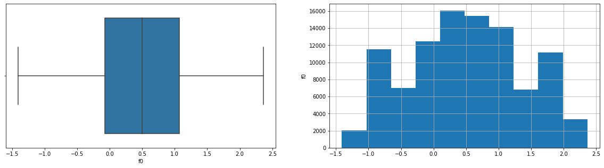
    


    f1


    
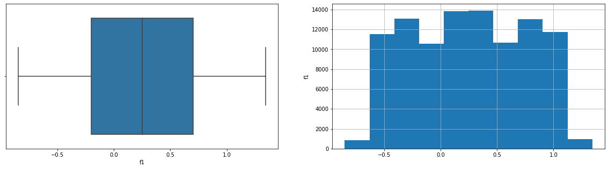
    


    f2


    
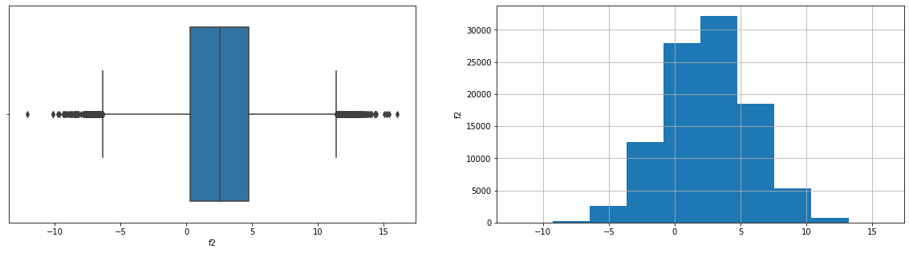
    


    product


    
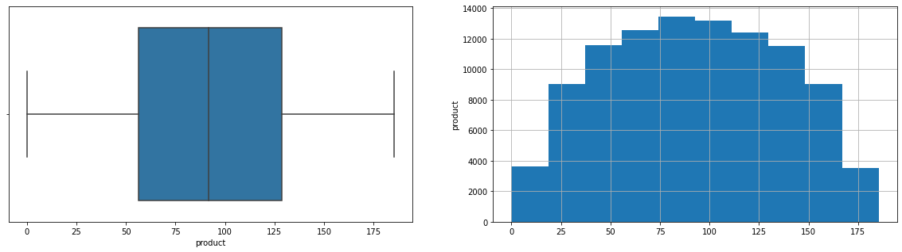
    


Для первого региона: 
- f0 почти равномерно распределен между -1.4 и 2.4
- f1 равномерно распределен между -0.8 и 1.3
- f2 расположен между -12 и 16 с явновыраженым максимом 3.4
- продукт распределены нормально с максимомом 90 между 0 и 185


```python
# рассмотрим второй регион
plot_info(data2)
```

                count       mean        std        min        25%        50%  \
    f0       100000.0   1.141296   8.965932 -31.609576  -6.298551   1.153055   
    f1       100000.0  -4.796579   5.119872 -26.358598  -8.267985  -4.813172   
    f2       100000.0   2.494541   1.703572  -0.018144   1.000021   2.011479   
    product  100000.0  68.825000  45.944423   0.000000  26.953261  57.085625   
    
                    75%         max  
    f0         8.621015   29.421755  
    f1        -1.332816   18.734063  
    f2         3.999904    5.019721  
    product  107.813044  137.945408  
    -----------
    f0


    
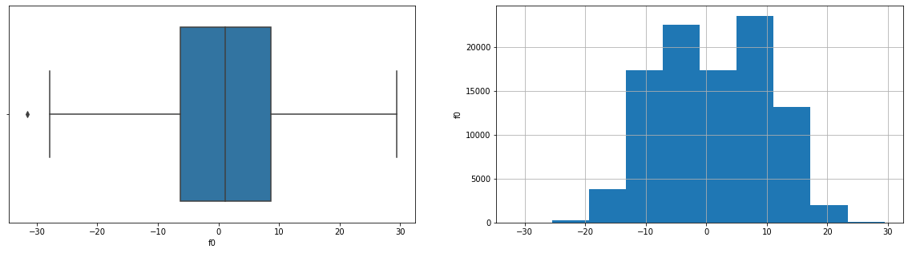
    


    f1


    
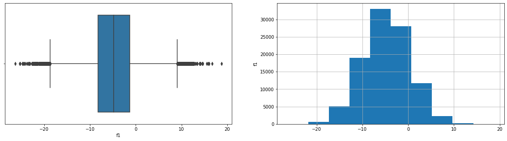
    


    f2


    
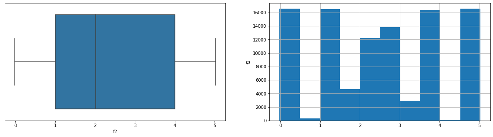
    


    product


    
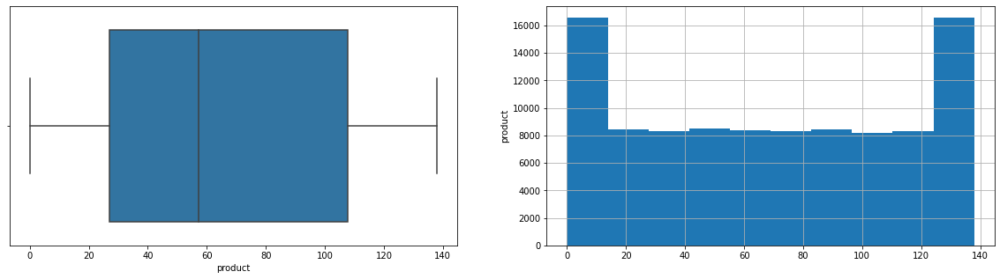
    


Для второго региона:
- f0 распределен нормально между -30 и 30 с максимом 0
- f1 распределен меджду -20 и 10 нормально с максимом -7
- f2 распределено почти что равномерно между 0 и 5
- добытая нефть равномернно между 0 и 138 с пиками на концах.


```python
# рассмотрим трети1 регион
plot_info(data3)
```

                count       mean        std        min        25%        50%  \
    f0       100000.0   0.002023   1.732045  -8.760004  -1.162288   0.009424   
    f1       100000.0  -0.002081   1.730417  -7.084020  -1.174820  -0.009482   
    f2       100000.0   2.495128   3.473445 -11.970335   0.130359   2.484236   
    product  100000.0  95.000000  44.749921   0.000000  59.450441  94.925613   
    
                    75%         max  
    f0         1.158535    7.238262  
    f1         1.163678    7.844801  
    f2         4.858794   16.739402  
    product  130.595027  190.029838  
    -----------
    f0


    
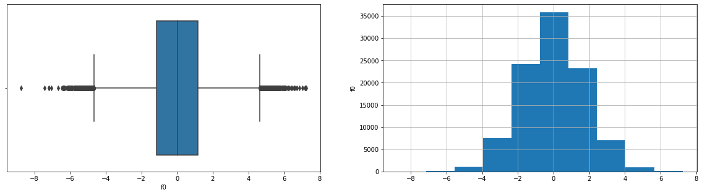
    


    f1


    
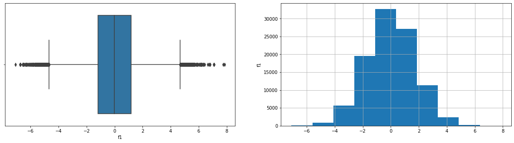
    


    f2


    
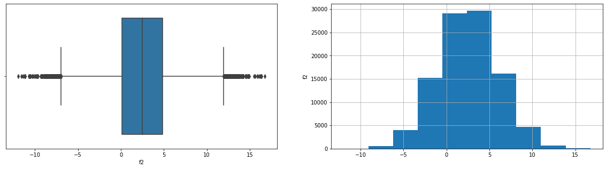
    


    product


    
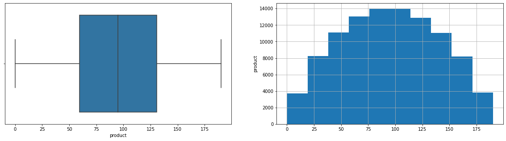
    


Для третьего региона:
- f0 распределен нормально между -6 и 7
- f1 распределен нормально между -6 и 6
- f2 распределен нормально между -10 и 15
- добыча распределена нармаль6нго между 0 и 190.


```python
# Создадим функцию для создания корреляцимонной матрицы.
def mat(date):
    train_copy = date.drop('id', axis=1)


    # расчет коэффициентов корреляции Phik
    correlation_matrix = phik.phik_matrix(train_copy ) #interval_cols=ic

    # построение графика корреляции
    plt.figure(figsize=(20, 15))
    sns.heatmap(correlation_matrix, annot=True, cmap="coolwarm")

    plt.title("Матрица корреляции (Phik)")
    plt.show();
```


```python
mat(data1)
```

    interval columns not set, guessing: ['f0', 'f1', 'f2', 'product']


    
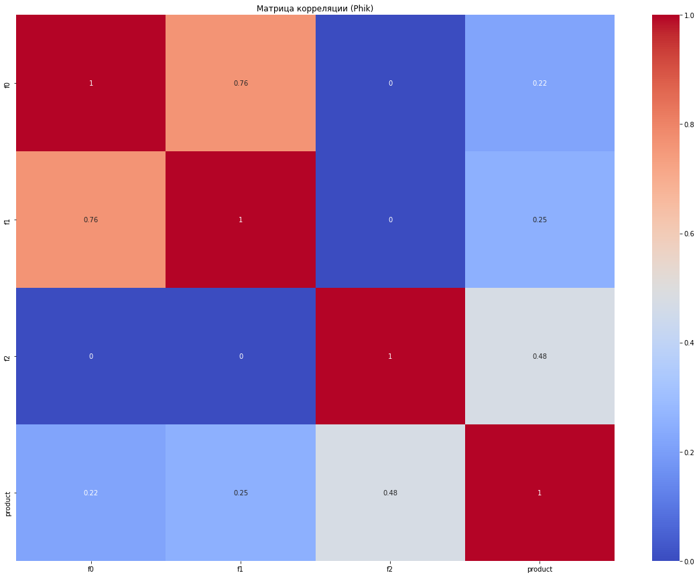
    


В первом регионе добыча наиболее зависит от параметра f2. f1 и f0 заметно кореллируют.


```python
mat(data2)
```

    interval columns not set, guessing: ['f0', 'f1', 'f2', 'product']


    
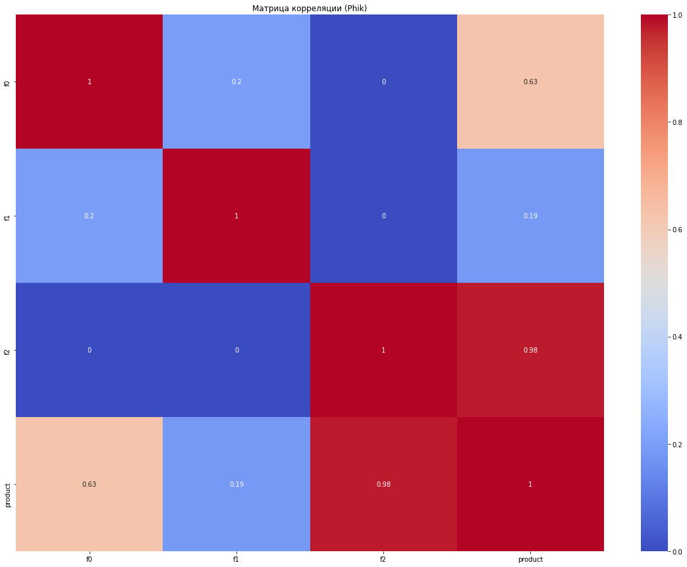
    


Во втором регионе добыча заметно зависит от параметра f0 и очень сильно от f2. Вводные парамтры слабо зависят друг от друга.


```python
mat(data3)
```

    interval columns not set, guessing: ['f0', 'f1', 'f2', 'product']


    

    


Добыча слабо умерено зависит от параметра f2. Кореляции между признаками не обнаружено.

*Вывод*  Одноименные входные признаки имеют разное распределение в что либо вызвано тем, что в каждом регионе они очень сильно различаются либо вообще другие. Добыча нефти находиться в диапозоне от 0 до 190.

Распределения параметров первого и третьего региона схожи, что говорит о схожести данных: данные имеют одинаковое значение и регионы близки.

Во всех регионов заметна корреляция добычи нефти от параметра f2. Наиболее сильно она проявляется во втором регионе.

Никаких ошибок и артефактов не было обнаружено.


<div class="alert alert-block alert-success">
<b>Успех:</b> Данные осмотрены хорошо, особенно радует, что изучены корреляции, так как мы планируем использовать линейные модели, а для них это важно. 
</div>
<div class="alert alert-block alert-info">
<b>Совет:</b>  Советую обратить внимание на библиотеки sweetviz и ydata_profiling помогут в проведении более тщательного EDA анализа. Исследовательский анализ можно делать и с помощью ручного вызова функций дефолтных библиотек. Данные библиотеки хороши для максимизации комфорта презентации результатов анализа бизнес-пользователям.  

Очень просты в использоовании, на вход кладется датафрейм: ydata_profiling.ProfileReport(df) 
</div>


## Обучение и проверка модели

Данные для дальнейшего использования необходимо масштабировать. Для каждого региона масштабирование отличается и поэтому необходимо импользовать пайплайн.


```python
num_columns=['f0', 'f1', 'f2']
```


```python
# Масштабирование
data_preprocessor = ColumnTransformer([('num', StandardScaler(), num_columns)], remainder='passthrough')
```


```python
# создание единого
pipe_final = Pipeline([
    ('preprocessor', data_preprocessor),
    ('models', LinearRegression())
])
```

Раздалим данные


```python
# разделим данные на обучающую (75%) и валидационную выборки (25%), зададим стратификацию, чтобы сохраненить баланс классов
# определим random_state
RANDOM_STATE = 42
TEST_SIZE = 0.25
```


```python
# Выделим входные и целевые данные для первого региона т разделем на тренировочную и валидационную
X1_train,X1_valid,y1_train,y1_valid=train_test_split(
    data1[num_columns],data1['product'],
    test_size = TEST_SIZE, random_state = RANDOM_STATE, 
    #stratify = data1['product']
)
# Размеры выборок
print(X1_train.shape,X1_valid.shape)
```

    (75000, 3) (25000, 3)


```python
# Построим модель для первого региона
model1=pipe_final.fit(X1_train,y1_train)
```


```python
# предсказаные значение валидационных данных
y1_vp=model1.predict(X1_valid)
```


```python
print(f'RMSE-модели первого региона:{round(np.sqrt(mean_squared_error(y1_valid, y1_vp)),2)}')
```

    RMSE-модели первого региона:37.76


```python

print(f'Среднее количество добываемой в первом регионе нефти - {round(model1.predict(data1[num_columns]).mean(),2)} тыс. баралей')
```

    Среднее количество добываемой в первом регионе нефти - 92.52 тыс. баралей


```python
# Выделим входные и целевые данные для второго региона т разделем на тренировочную и валидационную
X2_train,X2_valid,y2_train,y2_valid=train_test_split(
    data2[num_columns],data2['product'],
    test_size = TEST_SIZE, random_state = RANDOM_STATE, 
    #stratify = data1['product']
)
# Размеры выборок
print(X2_train.shape,X2_valid.shape)
```

    (75000, 3) (25000, 3)


```python
# Построим модель для второго региона
model2=pipe_final.fit(X2_train,y2_train)
```


```python
# предсказаные значение валидационных данных
y2_vp=model2.predict(X2_valid)
```


```python
print(f'RMSE-модели второго региона:{round(np.sqrt(mean_squared_error(y2_valid, y2_vp)),2)}')
```

    RMSE-модели второго региона:0.89


```python
print(f'Среднее количество добываемой во втором регионе нефти - {round(model2.predict(data2[num_columns]).mean(),2)} тыс. баралей')
```

    Среднее количество добываемой во втором регионе нефти - 68.82 тыс. баралей


```python
# Выделим входные и целевые данные для третьего региона т разделем на тренировочную и валидационную
X3_train,X3_valid,y3_train,y3_valid=train_test_split(
    data3[num_columns],data3['product'],
    test_size = TEST_SIZE, random_state = RANDOM_STATE, 
    #stratify = data1['product']
)
# Размеры выборок
print(X3_train.shape,X3_valid.shape)
```

    (75000, 3) (25000, 3)


```python
# Построим модель для третьего региона
model3=pipe_final.fit(X3_train,y3_train)
```


```python
# предсказаные значение валидационных данных
y3_vp=model3.predict(X3_valid)
```


```python
print(f'RMSE-модели третьего региона:{round(np.sqrt(mean_squared_error(y3_valid, y3_vp)),2)}')
```

    RMSE-модели третьего региона:40.15


```python
print(f'Среднее количество добываемой в третьем регионе нефти - {round(model3.predict(data3[num_columns]).mean(),2)} тыс. баралей')
```

    Среднее количество добываемой в третьем регионе нефти - 94.91 тыс. баралей


**Вывод** Были получены линейные модели для нахождения добытой нефти. Модели для первого и третьего региона имеют метрику около 40, в то время как для второго метрика почти равна нулю. Это соответствует данным о корреляциям (п1).
    В тоже время первый и третий регион приносит в среднем 92 и 95 тыс. бар. нефте в то время как второй всего 68 тыс. Такое сходство еще раз показывает, что первый и третий регион близки по параметрам.

<div class="alert alert-block alert-success">
<b>Успех:</b> Шаг проделан хорошо, все метрики посчитаны корректно
</div> 


<div class="alert alert-block alert-info">
<b>Совет: </b>  Можно было бы использовать циклы/функции и избежать дублирования кода. Дублирование кода, часто приводит к глупым ошибкам, которые тяжело отследить.
</div>

## Подготовка к расчёту прибыли


<div class="alert alert-block alert-danger">
<b>Ошибка:</b> Все ключевые значения нужно записать в переменные - константы. Ниже магических чисел быть не должно.
</div> 


<div class="alert alert-block alert-warning">
<b>Изменения:</b>Все в данном параграфе было удалено.
</div>

<div class="alert alert-block alert-success">
    
<b>Успех[2]:</b> 👍
</div>

Проведем расчет достаточного объема сырья для безубыточности. На один регион тратиться 10е9 рублей, один баррель стоит 450 рублей. Из 500 месторождений выбирают 200.


```python
Bud=10e9 # Бюджет на разоработку
Pr=450e3 # доход с тысячи баррелей
Wells=200 # Количество скважин в регионе
```


<div class="alert alert-block alert-danger">
    
<b>Ошибка[2]:</b> Количество скважин для разработки  200, а не 10е3
</div> 


<div class="alert alert-block alert-success">
    
<b>Успех[3]:</b> Исправлено
</div>


<div class="alert alert-block alert-danger">
    
<b>Ошибка:</b> Значение посчитано неверно.  Вот тебе подсказка. Выведем простейшее уравнение:

$$Bud - (Pr * Wells * Vol) = 0\;\;\;\;(1)$$

Где,
$$Bud\;-\;Бюджет\;на\;разработку$$
$$Pr - Доход\;с\;единицы\;товара$$
$$Wells - Количество\;скважин\;для\;разработки$$
$$Vol - Минимальный\;объем\;нефти\;в\;каждой\;скважине$$

В этом уравнении нам неизвестен только объем, поэтому выведем уравнение для него из (1). Отсюда имеем:

$$Vol = Bud / (Pr * Wells)\;\;\;\;(1)$$
</div> 


```python
Vol=Bud/(Pr*Wells) # Минимальный объем добычи для окупаемости скважены.
Ex=Bud/Wells # Расходы на одну скважину
```


```python
print(f'Минимальный объем добычи из одной скважины состовляет {round(Vol,2)} тыс. бар.')
print(f'Расходы на одну скважину {Ex}')
```

    Минимальный объем добычи из одной скважины состовляет 111.11 тыс. бар.
    Расходы на одну скважину 50000000.0


Минимальный объем добычи с одной скважены больше средних значенний добычи по всем регионам. Это говорит о том, что большинство скважен убыточны.

## Расчёт прибыли и рисков 

Благодаря полученной модели найдем прибыль которую принесет каждая из скважин.


<div class="alert alert-block alert-danger">
<b>Ошибка:</b>

`Прибыль = доходы - расходы` - а у тебя здесь только доходы.

</div>

<div class="alert alert-block alert-warning">
<b>Изменения:</b> В качестве изменений переделаны значения в столбце profit, где были учтены затраты на добычу нефти
</div>

<div class="alert alert-block alert-success">
    
<b>Успех[2]:</b> Есть
</div>


```python
# прибыль для каждой из скважин в первом регионе
data1['profit']=model1.predict(data1[num_columns])*Pr-Ex
```


```python
# прибыль для каждой из скважин в втором регионе
data2['profit']=model2.predict(data2[num_columns])*Pr-Ex
```


```python
# прибыль для каждой из скважин в третем регионе
data3['profit']=model3.predict(data3[num_columns])*Pr-Ex
```


```python
data1.sample()
```


<div>
<style scoped>
    .dataframe tbody tr th:only-of-type {
        vertical-align: middle;
    }

    .dataframe tbody tr th {
        vertical-align: top;
    }

    .dataframe thead th {
        text-align: right;
    }
</style>
<table border="1" class="dataframe">
  <thead>
    <tr style="text-align: right;">
      <th></th>
      <th>id</th>
      <th>f0</th>
      <th>f1</th>
      <th>f2</th>
      <th>product</th>
      <th>profit</th>
    </tr>
  </thead>
  <tbody>
    <tr>
      <th>9778</th>
      <td>hsikN</td>
      <td>0.126007</td>
      <td>0.028064</td>
      <td>2.195159</td>
      <td>135.877501</td>
      <td>-8.073838e+06</td>
    </tr>
  </tbody>
</table>
</div>


```python
data2.sample()
```


<div>
<style scoped>
    .dataframe tbody tr th:only-of-type {
        vertical-align: middle;
    }

    .dataframe tbody tr th {
        vertical-align: top;
    }

    .dataframe thead th {
        text-align: right;
    }
</style>
<table border="1" class="dataframe">
  <thead>
    <tr style="text-align: right;">
      <th></th>
      <th>id</th>
      <th>f0</th>
      <th>f1</th>
      <th>f2</th>
      <th>product</th>
      <th>profit</th>
    </tr>
  </thead>
  <tbody>
    <tr>
      <th>24236</th>
      <td>OuKCq</td>
      <td>-12.881591</td>
      <td>-1.869103</td>
      <td>3.000043</td>
      <td>84.038886</td>
      <td>-5.485346e+06</td>
    </tr>
  </tbody>
</table>
</div>


```python
data3.sample()
```


<div>
<style scoped>
    .dataframe tbody tr th:only-of-type {
        vertical-align: middle;
    }

    .dataframe tbody tr th {
        vertical-align: top;
    }

    .dataframe thead th {
        text-align: right;
    }
</style>
<table border="1" class="dataframe">
  <thead>
    <tr style="text-align: right;">
      <th></th>
      <th>id</th>
      <th>f0</th>
      <th>f1</th>
      <th>f2</th>
      <th>product</th>
      <th>profit</th>
    </tr>
  </thead>
  <tbody>
    <tr>
      <th>28588</th>
      <td>oi722</td>
      <td>3.320074</td>
      <td>1.284057</td>
      <td>-0.065346</td>
      <td>108.441522</td>
      <td>-1.405272e+07</td>
    </tr>
  </tbody>
</table>
</div>


<div class="alert alert-block alert-warning">
<b>Изменения:</b> В качестве изменений также измениться функция поиска принесенной прибыли из 500 скважин
</div>

<div class="alert alert-block alert-success">
    
<b>Успех[2]:</b> Есть контакт
</div>

Как уже говорили в регионе выбирается 500 скважен и из них используется 200 лучших (по прибыли).


```python
# функция для поиска прибыли от лучших скважен
def profit(date):
    p=date.sort_values(by='profit',ascending=False).head(200)# 200 из 500 самых прибыльных по модели скважен
    return p['product'].sum()*Pr-200*Ex # доходы от них по данным
#data1.sort_values(by='profit',ascending=False).head(200)   
    
    
```

**Вывод** На основе полученных моделей была найдена прибыль которую принесут каждый регион. Она больше 10 млрд, что указывает, что все регионы рентабельны.


<div class="alert alert-block alert-danger">
<b>Ошибка:</b>  Эти шаги нужно будет немного переделать
    
1. В предыдущих шагах ты получил 25000 настоящих и предсказанных значений для каждого региона.
2. Здесь нужно определить функцию, которая на вход будет принимать 500 настоящих и 500 предсказанных значений для каждого региона (можно в виде датафрейма). Для выбора 200 лучших скважин нужно использовать предсказанные значения. А вот для подсчета прибыли должны использоваться настоящие значения соответствующих ячеек.
3. Затем нужно реализовать технику бутстрап (цикл из 1000 итераций), где на каждой итерации будет отбираться случайные 500 точек (сэмлпировать нужно с возвращением replace=True) и для выбранных 500 точек нужно считать прибыль, используя ранее определенную функцию прибыли.
4. В результате у тебя получится 1000 значений прибыли для каждого региона. По нему нужно посчитать 3 статистики:
    * Среднюю прибыль
    * Интервал с помощью метода квантилей
    * Риск убытков – долю случаев, в которых прибыль отрицательна.
</div>


Необходимо также расчитать риски (т.е. доля отрицательной прибыли).

Распределение вероятности получение определенного объему нефти ( и выручки) имеет сложную форму, но по закону больших чисел распределение средних значений при увеличении их количества стремиться к нормальному. 

Поэтому из выборки берутся подвыборки по 500 скважин случайным образом и для них находиться прибыль.

Полученную последовательность необходимо проанализировать и так как она близка к нормальной, то надо найти квантиль 2.5% и 97.5% чтобы составить доверительный интервал


```python
# функция для расчета статистики
def stat_profit(date):
    mp=[] # Все прибыли
    m=0 # Количество положительной
    state = RandomState(12345)
    for i in range(1000):
        p=profit(date.sample(n=500,random_state=state,replace=True))
        mp.append(p)
        if p>0:
            m=m+1
    print(f'Средняя прибыль: {np.mean(mp)} ')
    print(f'Доверительный интервал 95% прибыли: {np.quantile(mp,0.025)} - {np.quantile(mp,0.975)}')
    print(f'Риск: {(pd.Series(mp) < 0).mean() * 100}%')
```


<div class="alert alert-block alert-danger">
<b>Ошибка[2]:</b> Сэмлпировать нужно 500 скважин, а не 200. А так по остальным пунктам все ок - ты молодец!


<div class="alert alert-block alert-info">
<b>Совет[2]: </b>
    
Риски можно лаконично считать в 1 строку: `(pd.Series(mp) < 0).mean() * 100`
</div>                                                              


<div class="alert alert-block alert-success">
    
<b>Успех[3]:</b> Теперь все в порядке
</div>


<div class="alert alert-block alert-danger">
<b>Ошибка:</b> 
    
1) Использовать для бутстрапа нужно 25 тысяч валидационных скважин, а не весь датасет
    
2) На каждой итерации нужно отбирать 500 скважин, то есть `frac` должен быть другой
    
3) На каждой итерации нужно для 500-ста скважин вызывать функцию прибыли (считать прибыль), используя предсказания для сортировка, а фактические значения для самого подсчета прибыли.
    
4) Вызывая **`st.t.interval(...)`**, ты находишь 95%-доверительный интервал для значения **`средней прибыли`**, то есть промежуток, в котором с большой вероятностью при проведении аналогичных экспериментов окажется **`средняя прибыль`**. По заданию требовалось оценить 95%-доверительный интервал для значения **`прибыли`**, то есть найти такой промежуток, в котором с большой вероятностью окажется **`прибыль`**, случайно выбранного месторождения данного региона. Нижняя граница этого интервала – это 2.5%-квантиль полученных значений прибыли, верхняя граница – 97.5%-квантиль.

5) риск убытков для каждого региона - это доля отрицательной прибыли. То есть `количетство отрицательных прибылей (убытков) /  количество всех прибылей`


```python
stat_profit(data1) # первый регион
```

    Средняя прибыль: 281490257.34078383 
    Доверительный интервал 95% прибыли: -256016881.47526664 - 829517687.6599494
    Риск: 14.099999999999998%


```python
stat_profit(data2) # второй регион
```

    Средняя прибыль: 448806475.80419725 
    Доверительный интервал 95% прибыли: 38892905.79234433 - 825224751.4667691
    Риск: 1.4000000000000001%


```python
stat_profit(data3) # третий регион
```

    Средняя прибыль: 374728178.20543355 
    Доверительный интервал 95% прибыли: -167255058.77871084 - 894085505.1283832
    Риск: 9.0%


# Заключение

Изначально были данные по нефтянным скважинам трех регионов. Не было в данных найдено пропусков или ошибок. Всего 10000 скважин на каждый регион.

Данные были проанализированы и было установлено, что:
- Для первого региона:f0 почти равномерно распределен между -1.4 и 2.4, f1 равномерно распределен между -0.8 и 1.3, f2 расположен между -12 и 16 с явновыраженым максимом 3.4, продукт распределены нормально с максимомом 90 между 0 и 185.
- Для второго региона: f0 распределен нормально между -30 и 30 с максимом 0, f1 распределен меджду -20 и 10 нормально с максимом -7, f2 распределено почти что равномерно между 0 и 5, добытая нефть равномернно между 0 и 138 с пиками на концах.
- Для третьего региона:f0 распределен нормально между -6 и 7, f1 распределен нормально между -6 и 6, f2 распределен нормально между -10 и 15,добыча распределена нармаль6нго между 0 и 190.
- В первом регионе добыча наиболее зависит от параметра f2. f1 и f0 заметно кореллируют.
- Во втором регионе добыча заметно зависит от параметра f0 и очень сильно от f2. Вводные парамтры слабо зависят друг от друга.
- В третьем регионе добыча слабо умерено зависит от параметра f2. Кореляции между признаками не обнаружено.


Распределения параметров первого и третьего региона схожи, что говорит о том, что и нефтезалежи в этих регионах похожи.

На основе полученных данных были составлены модели, которые по входмым парамтрем(признакам) рассчитывали количество нефти в скважине. В качестве метрике был взят RSME. Его значения для первого и третьего региона примерно 40, в то время как у второго близко к 0. Это соотвествует корреляциям. 

По моделям найдена прибыль которую принесет каждая из скважин. В каждом регионе было найдена прибыль которую в среднем принесут 500 скважан: первый регион - 281490257.34078383 рублей, второй -  448806475.80419725  рублей, третий - 374728178.20543355 рублей.  Риски для каждого из регионов разные: в первом - 14%, во втором 1.4%, в третем 9%. Это говорит о том, что лучший для добычи второй регион. Также видно, что доверительный интервал прибыли для первого и третьего региона включает отрицательные значения. Скорее всего это связано с близким к нулю показателем f2. 


<div class="alert alert-block alert-info">
<b>Совет: </b>
    
Не забудь обновить выводы, если потребуется
</div>                                                              


<div class="alert alert-block alert-success">
<b>Успех[3]:</b> Отлично, проведено детальное исследование и был выбран правильный регион!
</div>


<div class="alert alert-block alert-info">
<b>Совет[3]: </b> Если интересно изучить тему бутстрапа глубже - я оставлю  ниже несколько интересных и полезных ссылок по теме:
        
1. "Bootstrap Hypothesis Testing in Statistics with Example" 
        
https://www.youtube.com/watch?v=9STZ7MxkNVg
        
2. "How to Calculate Bootstrap Confidence Intervals For Machine Learning Results in Python" 
        
https://machinelearningmastery.com/calculate-bootstrap-confidence-intervals-machine-learning-results-python/
        
3. "A Gentle Introduction to the Bootstrap Method" 

https://machinelearningmastery.com/a-gentle-introduction-to-the-bootstrap-method/
        
4. "An Introduction to the Bootstrap Method" 
        
https://towardsdatascience.com/an-introduction-to-the-bootstrap-method-58bcb51b4d60#:~:text=The%20basic%20idea%20of%20bootstrap,population%20mean)%20on%20sample%20data.&amp;text=A%20sample%20from%20population%20with%20sample%20size%20n
        
5. "Bootstrapping and Resampling in Statistics with Example" 
        
        
https://www.youtube.com/watch?v=O_Fj4q8lgmc

6. Также одна из программ на рынке по этой теме управлненеческого моделирования - AnyLogic - интересный продукт. Можешь видео из интернета посмотреть по какому-нибудь примеру с её использованием. Тогда тема управленческого моделирования и бутстрапа может по-другому лечь.
</div>


## Чек-лист готовности проекта

Поставьте 'x' в выполненных пунктах. Далее нажмите Shift+Enter.

- [x]  Jupyter Notebook открыт
- [ ]  Весь код выполняется без ошибок
- [ ]  Ячейки с кодом расположены в порядке исполнения
- [ ]  Выполнен шаг 1: данные подготовлены
- [ ]  Выполнен шаг 2: модели обучены и проверены
    - [ ]  Данные корректно разбиты на обучающую и валидационную выборки
    - [ ]  Модели обучены, предсказания сделаны
    - [ ]  Предсказания и правильные ответы на валидационной выборке сохранены
    - [ ]  На экране напечатаны результаты
    - [ ]  Сделаны выводы
- [ ]  Выполнен шаг 3: проведена подготовка к расчёту прибыли
    - [ ]  Для всех ключевых значений созданы константы Python
    - [ ]  Посчитано минимальное среднее количество продукта в месторождениях региона, достаточное для разработки
    - [ ]  По предыдущему пункту сделаны выводы
    - [ ]  Написана функция расчёта прибыли
- [ ]  Выполнен шаг 4: посчитаны риски и прибыль
    - [ ]  Проведена процедура *Bootstrap*
    - [ ]  Все параметры бутстрепа соответствуют условию
    - [ ]  Найдены все нужные величины
    - [ ]  Предложен регион для разработки месторождения
    - [ ]  Выбор региона обоснован


