<font color='blue' size=5><b>Комментарий ревьюера</b></font>

<font color='blue'>Привет, Александр! Меня зовут Павел Григорьев, и я буду проверять этот проект.<br>Моя основная цель - не указать на совершённые тобой ошибки, а поделиться своим опытом и помочь тебе совершенствоваться как профессионалу.<br>Спасибо за проделанную работу! Предлагаю общаться на «ты».</font>
<details>
	<summary><u>Инструкция по организационным моментам (кликабельно)</u>⤵</summary>
<font color='blue'>Я буду использовать различные цвета, чтобы было удобнее воспринимать мои комментарии:</font>


---


<font color='blue'>синий текст - просто текст комментария</font>

<font color='green'>✔️ и зеленый текст - все отлично</font>

<font color='orange'>⚠️ и оранжевый текст - сделано все правильно, однако есть рекомендации, на что стоит обратить внимание</font>

<font color='red'>❌ и красный текст - есть недочеты</font>


</details>    
</br>
<font color='blue'>Пожалуйста, не удаляй мои комментарии в случае возврата работы, так будет проще разобраться, какие были недочеты, а также сразу увидеть исправленное. </font>

<font color='blue'>Ответы на мои комментарии лучше тоже помечать.
Например:</font><font color='purple'><b>Комментарий студента</b></font>

<font color='blue'><b>Давай смотреть, что получилось!</b></font>

<font color='blue' size=3><b>Комментарий ревьюера 2</b></font>

<font color='blue'>Привет еще раз. Спасибо, за исправления. Оформление комментариев по работе сохраняется. Только обозначим, что это вторая итерация.</font>

<font color='blue' size=3><b>Комментарий ревьюера 3</b></font>

<font color='blue'>Привет еще раз. Спасибо, за исправления. Оформление комментариев по работе сохраняется.</font>

*Цель проекта: увеличить прибыль магазина. Для этого необходимо удержать активность клиентов. 
    *Решение: по данным по покупателям создать модель описывающию их активность (упадет ли она или нет). Оценить доход, который приносят покупатели и найти вероятность падения активность. Используя модель составить персональное предложение для покупателей. 


##  Загрузка данных


```python
!pip install shap -q
!pip install phik  -q
!pip install matplotlib==3.5.0 -q
!pip install scikit-learn==1.3.2 -q
```


```python

import numpy as np
import pandas as pd
import seaborn as sns
import matplotlib.pyplot as plt
import phik 
import shap
from sklearn.linear_model import LogisticRegression
from sklearn.neighbors import KNeighborsClassifier
from sklearn.svm import SVC
from sklearn.tree import DecisionTreeClassifier
from sklearn.model_selection import train_test_split, RandomizedSearchCV
from sklearn.preprocessing import MinMaxScaler, OneHotEncoder, OrdinalEncoder, StandardScaler
from sklearn.pipeline import Pipeline
from sklearn.compose import ColumnTransformer
from sklearn.metrics import roc_auc_score
pd.set_option('display.max_columns', None)
%matplotlib inline
market_file = pd.read_csv('/datasets/market_file.csv')
market_money = pd.read_csv('/datasets/market_money.csv')
market_time = pd.read_csv('/datasets/market_time.csv')
money = pd.read_csv('/datasets/money.csv', sep=';', decimal=',')
```

<font color='blue'><b>Комментарий ревьюера: </b></font> ✔️\
<font color='green'> Хорошее оформление импортов! \
Импорты собраны в одной ячейке, сгрупированы по функциональности. Можно ещё разделить группы пустой строкой.</font>

<font color='blue'><b>Комментарий ревьюера : </b></font> ⚠️\
<font color='darkorange'> Пипы и загрузку данных лучше размещать отдельно от импортов, что бы не запускать этот код, если понадобится дополнять или редактировать импорты.</font>

<font color='blue'><b>Комментарий ревьюера 2: </b></font> ✔️\
<font color='green'> 👍</font>

Посмотрим файлы

Вначале первый


```python
market_file.head()
```


<div>
<style scoped>
    .dataframe tbody tr th:only-of-type {
        vertical-align: middle;
    }

    .dataframe tbody tr th {
        vertical-align: top;
    }

    .dataframe thead th {
        text-align: right;
    }
</style>
<table border="1" class="dataframe">
  <thead>
    <tr style="text-align: right;">
      <th></th>
      <th>id</th>
      <th>Покупательская активность</th>
      <th>Тип сервиса</th>
      <th>Разрешить сообщать</th>
      <th>Маркет_актив_6_мес</th>
      <th>Маркет_актив_тек_мес</th>
      <th>Длительность</th>
      <th>Акционные_покупки</th>
      <th>Популярная_категория</th>
      <th>Средний_просмотр_категорий_за_визит</th>
      <th>Неоплаченные_продукты_штук_квартал</th>
      <th>Ошибка_сервиса</th>
      <th>Страниц_за_визит</th>
    </tr>
  </thead>
  <tbody>
    <tr>
      <th>0</th>
      <td>215348</td>
      <td>Снизилась</td>
      <td>премиум</td>
      <td>да</td>
      <td>3.4</td>
      <td>5</td>
      <td>121</td>
      <td>0.00</td>
      <td>Товары для детей</td>
      <td>6</td>
      <td>2</td>
      <td>1</td>
      <td>5</td>
    </tr>
    <tr>
      <th>1</th>
      <td>215349</td>
      <td>Снизилась</td>
      <td>премиум</td>
      <td>да</td>
      <td>4.4</td>
      <td>4</td>
      <td>819</td>
      <td>0.75</td>
      <td>Товары для детей</td>
      <td>4</td>
      <td>4</td>
      <td>2</td>
      <td>5</td>
    </tr>
    <tr>
      <th>2</th>
      <td>215350</td>
      <td>Снизилась</td>
      <td>стандартт</td>
      <td>нет</td>
      <td>4.9</td>
      <td>3</td>
      <td>539</td>
      <td>0.14</td>
      <td>Домашний текстиль</td>
      <td>5</td>
      <td>2</td>
      <td>1</td>
      <td>5</td>
    </tr>
    <tr>
      <th>3</th>
      <td>215351</td>
      <td>Снизилась</td>
      <td>стандартт</td>
      <td>да</td>
      <td>3.2</td>
      <td>5</td>
      <td>896</td>
      <td>0.99</td>
      <td>Товары для детей</td>
      <td>5</td>
      <td>0</td>
      <td>6</td>
      <td>4</td>
    </tr>
    <tr>
      <th>4</th>
      <td>215352</td>
      <td>Снизилась</td>
      <td>стандартт</td>
      <td>нет</td>
      <td>5.1</td>
      <td>3</td>
      <td>1064</td>
      <td>0.94</td>
      <td>Товары для детей</td>
      <td>3</td>
      <td>2</td>
      <td>3</td>
      <td>2</td>
    </tr>
  </tbody>
</table>
</div>


```python
market_file.info()
```

    <class 'pandas.core.frame.DataFrame'>
    RangeIndex: 1300 entries, 0 to 1299
    Data columns (total 13 columns):
     #   Column                               Non-Null Count  Dtype  
    ---  ------                               --------------  -----  
     0   id                                   1300 non-null   int64  
     1   Покупательская активность            1300 non-null   object 
     2   Тип сервиса                          1300 non-null   object 
     3   Разрешить сообщать                   1300 non-null   object 
     4   Маркет_актив_6_мес                   1300 non-null   float64
     5   Маркет_актив_тек_мес                 1300 non-null   int64  
     6   Длительность                         1300 non-null   int64  
     7   Акционные_покупки                    1300 non-null   float64
     8   Популярная_категория                 1300 non-null   object 
     9   Средний_просмотр_категорий_за_визит  1300 non-null   int64  
     10  Неоплаченные_продукты_штук_квартал   1300 non-null   int64  
     11  Ошибка_сервиса                       1300 non-null   int64  
     12  Страниц_за_визит                     1300 non-null   int64  
    dtypes: float64(2), int64(7), object(4)
    memory usage: 132.2+ KB


```python
market_money.head()
```


<div>
<style scoped>
    .dataframe tbody tr th:only-of-type {
        vertical-align: middle;
    }

    .dataframe tbody tr th {
        vertical-align: top;
    }

    .dataframe thead th {
        text-align: right;
    }
</style>
<table border="1" class="dataframe">
  <thead>
    <tr style="text-align: right;">
      <th></th>
      <th>id</th>
      <th>Период</th>
      <th>Выручка</th>
    </tr>
  </thead>
  <tbody>
    <tr>
      <th>0</th>
      <td>215348</td>
      <td>препредыдущий_месяц</td>
      <td>0.0</td>
    </tr>
    <tr>
      <th>1</th>
      <td>215348</td>
      <td>текущий_месяц</td>
      <td>3293.1</td>
    </tr>
    <tr>
      <th>2</th>
      <td>215348</td>
      <td>предыдущий_месяц</td>
      <td>0.0</td>
    </tr>
    <tr>
      <th>3</th>
      <td>215349</td>
      <td>препредыдущий_месяц</td>
      <td>4472.0</td>
    </tr>
    <tr>
      <th>4</th>
      <td>215349</td>
      <td>текущий_месяц</td>
      <td>4971.6</td>
    </tr>
  </tbody>
</table>
</div>


```python
market_money.info()
```

    <class 'pandas.core.frame.DataFrame'>
    RangeIndex: 3900 entries, 0 to 3899
    Data columns (total 3 columns):
     #   Column   Non-Null Count  Dtype  
    ---  ------   --------------  -----  
     0   id       3900 non-null   int64  
     1   Период   3900 non-null   object 
     2   Выручка  3900 non-null   float64
    dtypes: float64(1), int64(1), object(1)
    memory usage: 91.5+ KB


Ошибок и пропусков нет


```python
market_time.head()
```


<div>
<style scoped>
    .dataframe tbody tr th:only-of-type {
        vertical-align: middle;
    }

    .dataframe tbody tr th {
        vertical-align: top;
    }

    .dataframe thead th {
        text-align: right;
    }
</style>
<table border="1" class="dataframe">
  <thead>
    <tr style="text-align: right;">
      <th></th>
      <th>id</th>
      <th>Период</th>
      <th>минут</th>
    </tr>
  </thead>
  <tbody>
    <tr>
      <th>0</th>
      <td>215348</td>
      <td>текущий_месяц</td>
      <td>14</td>
    </tr>
    <tr>
      <th>1</th>
      <td>215348</td>
      <td>предыдцщий_месяц</td>
      <td>13</td>
    </tr>
    <tr>
      <th>2</th>
      <td>215349</td>
      <td>текущий_месяц</td>
      <td>10</td>
    </tr>
    <tr>
      <th>3</th>
      <td>215349</td>
      <td>предыдцщий_месяц</td>
      <td>12</td>
    </tr>
    <tr>
      <th>4</th>
      <td>215350</td>
      <td>текущий_месяц</td>
      <td>13</td>
    </tr>
  </tbody>
</table>
</div>


```python
market_time.info()
```

    <class 'pandas.core.frame.DataFrame'>
    RangeIndex: 2600 entries, 0 to 2599
    Data columns (total 3 columns):
     #   Column  Non-Null Count  Dtype 
    ---  ------  --------------  ----- 
     0   id      2600 non-null   int64 
     1   Период  2600 non-null   object
     2   минут   2600 non-null   int64 
    dtypes: int64(2), object(1)
    memory usage: 61.1+ KB


Ошибок и пропусков нет


```python
money.head()
```


<div>
<style scoped>
    .dataframe tbody tr th:only-of-type {
        vertical-align: middle;
    }

    .dataframe tbody tr th {
        vertical-align: top;
    }

    .dataframe thead th {
        text-align: right;
    }
</style>
<table border="1" class="dataframe">
  <thead>
    <tr style="text-align: right;">
      <th></th>
      <th>id</th>
      <th>Прибыль</th>
    </tr>
  </thead>
  <tbody>
    <tr>
      <th>0</th>
      <td>215348</td>
      <td>0.98</td>
    </tr>
    <tr>
      <th>1</th>
      <td>215349</td>
      <td>4.16</td>
    </tr>
    <tr>
      <th>2</th>
      <td>215350</td>
      <td>3.13</td>
    </tr>
    <tr>
      <th>3</th>
      <td>215351</td>
      <td>4.87</td>
    </tr>
    <tr>
      <th>4</th>
      <td>215352</td>
      <td>4.21</td>
    </tr>
  </tbody>
</table>
</div>


```python
money.info()
```

    <class 'pandas.core.frame.DataFrame'>
    RangeIndex: 1300 entries, 0 to 1299
    Data columns (total 2 columns):
     #   Column   Non-Null Count  Dtype  
    ---  ------   --------------  -----  
     0   id       1300 non-null   int64  
     1   Прибыль  1300 non-null   float64
    dtypes: float64(1), int64(1)
    memory usage: 20.4 KB


Аналогично предыдущему датасету.

Данные готовы к дальнейщему анализу

<font color='blue'><b>Комментарий ревьюера: </b></font> ✔️\
<font color='green'>Данные загружены корректно, первичный осмотр проведен.</font>

## Предобработка данных

Для начала рассмотрим названия столбцов


```python
# выведем названия столбцов первого датафрейма
market_file.columns
```


    Index(['id', 'Покупательская активность', 'Тип сервиса', 'Разрешить сообщать',
           'Маркет_актив_6_мес', 'Маркет_актив_тек_мес', 'Длительность',
           'Акционные_покупки', 'Популярная_категория',
           'Средний_просмотр_категорий_за_визит',
           'Неоплаченные_продукты_штук_квартал', 'Ошибка_сервиса',
           'Страниц_за_визит'],
          dtype='object')


Название столбцов надо изменить так чтобы ощибок в их написании не было. Для этого все Прописные буквы и пробелы надо заменить на строчные и подчеркивания.


```python
market_file.columns=[ x.lower().replace(' ','_') for x in market_file.columns ]
market_file.columns
```


    Index(['id', 'покупательская_активность', 'тип_сервиса', 'разрешить_сообщать',
           'маркет_актив_6_мес', 'маркет_актив_тек_мес', 'длительность',
           'акционные_покупки', 'популярная_категория',
           'средний_просмотр_категорий_за_визит',
           'неоплаченные_продукты_штук_квартал', 'ошибка_сервиса',
           'страниц_за_визит'],
          dtype='object')


<font color='blue'><b>Комментарий ревьюера 3: </b></font> ✔️\
<font color='green'> Отлично!  👍</font>

<font color='blue'><b>Комментарий ревьюера: </b></font> ❌\
<font color='red'> ~~Нужно давать понятные имена переменным (колонкам таблицы). Твоим исследованием будут пользоваться другие люди, используемые имена будут сильно влиять на воспроизводимость и поддержку кода.~~</font>


<font color='purpure'><b>Комментарий студента: </b></font> ❌\
<font color='purpure'>Все названия столбцов являются либо абвеатурами либо связаны с значениям. Чтобы проще ориентироваться был создан словарь, где и находятся обозначения.</font>

<font color='blue'><b>Комментарий ревьюера 2: </b></font> ❌\
<font color='red'><s>Я понимаю твою точку зрения относительно использования сокращений для экономии времени при кодировании, и наличие словаря действительно помогает в навигации. Тем не менее, стоит учитывать, что кроме написания кода, важно обеспечить его легкость в понимании и поддержке. Читаемые имена снижают вероятность ошибок при будущем использовании данных, так как ясно передают смысл каждой переменной. Это особенно актуально, если код будет аудироваться, проверяться другими участниками команды или использоваться как основа для дальнейших проектов.

<font color='red'>Кроме того, твой словарь переименования добавляет дополнительный шаг в процесс анализа данных. Для новых членов команды или сторонних аналитиков это может стать причиной путаницы и увеличить время на вхождение в проект. Более понятные и описательные имена позволят легко переходить от одного анализа к другому без необходимости постоянного обращения к словарю.</font>

<font color='red'>Имена достаточно привести к нижнему регистру (lower) и заменить пробелы на подччёркивания (replace). Это проще и читабельнее, чем хардкодить словарь. И не нарушает PEP. Как тебе такой вариант?</s></font>


```python
# проверим, что получилось
market_file.sample(5)
```


<div>
<style scoped>
    .dataframe tbody tr th:only-of-type {
        vertical-align: middle;
    }

    .dataframe tbody tr th {
        vertical-align: top;
    }

    .dataframe thead th {
        text-align: right;
    }
</style>
<table border="1" class="dataframe">
  <thead>
    <tr style="text-align: right;">
      <th></th>
      <th>id</th>
      <th>покупательская_активность</th>
      <th>тип_сервиса</th>
      <th>разрешить_сообщать</th>
      <th>маркет_актив_6_мес</th>
      <th>маркет_актив_тек_мес</th>
      <th>длительность</th>
      <th>акционные_покупки</th>
      <th>популярная_категория</th>
      <th>средний_просмотр_категорий_за_визит</th>
      <th>неоплаченные_продукты_штук_квартал</th>
      <th>ошибка_сервиса</th>
      <th>страниц_за_визит</th>
    </tr>
  </thead>
  <tbody>
    <tr>
      <th>206</th>
      <td>215554</td>
      <td>Снизилась</td>
      <td>стандарт</td>
      <td>да</td>
      <td>3.4</td>
      <td>3</td>
      <td>1017</td>
      <td>0.35</td>
      <td>Кухонная посуда</td>
      <td>3</td>
      <td>5</td>
      <td>2</td>
      <td>7</td>
    </tr>
    <tr>
      <th>935</th>
      <td>216283</td>
      <td>Прежний уровень</td>
      <td>стандарт</td>
      <td>нет</td>
      <td>5.7</td>
      <td>5</td>
      <td>471</td>
      <td>0.19</td>
      <td>Косметика и аксесуары</td>
      <td>4</td>
      <td>2</td>
      <td>4</td>
      <td>8</td>
    </tr>
    <tr>
      <th>119</th>
      <td>215467</td>
      <td>Снизилась</td>
      <td>стандарт</td>
      <td>да</td>
      <td>4.4</td>
      <td>4</td>
      <td>503</td>
      <td>0.90</td>
      <td>Мелкая бытовая техника и электроника</td>
      <td>2</td>
      <td>3</td>
      <td>3</td>
      <td>3</td>
    </tr>
    <tr>
      <th>1079</th>
      <td>216427</td>
      <td>Прежний уровень</td>
      <td>стандарт</td>
      <td>да</td>
      <td>3.9</td>
      <td>5</td>
      <td>513</td>
      <td>0.30</td>
      <td>Косметика и аксесуары</td>
      <td>2</td>
      <td>4</td>
      <td>3</td>
      <td>9</td>
    </tr>
    <tr>
      <th>390</th>
      <td>215738</td>
      <td>Снизилась</td>
      <td>премиум</td>
      <td>нет</td>
      <td>4.6</td>
      <td>5</td>
      <td>187</td>
      <td>0.23</td>
      <td>Мелкая бытовая техника и электроника</td>
      <td>1</td>
      <td>3</td>
      <td>3</td>
      <td>2</td>
    </tr>
  </tbody>
</table>
</div>


повторим для других датафреймов


```python
# выведем названия столбцов второго датафрейма
market_money.columns
```


    Index(['id', 'Период', 'Выручка'], dtype='object')


Приведем все столбцы к строчным буквам. Изменим их названия, чтобы понимать суть.


```python
column_mapping = {
    'Период': 'месяц',
    'Выручка': 'прибыль'
}

market_money.rename(columns=column_mapping, inplace=True)
```


```python
#теперь посмотрим на файл, проверим результат
market_money.head()
```


<div>
<style scoped>
    .dataframe tbody tr th:only-of-type {
        vertical-align: middle;
    }

    .dataframe tbody tr th {
        vertical-align: top;
    }

    .dataframe thead th {
        text-align: right;
    }
</style>
<table border="1" class="dataframe">
  <thead>
    <tr style="text-align: right;">
      <th></th>
      <th>id</th>
      <th>месяц</th>
      <th>прибыль</th>
    </tr>
  </thead>
  <tbody>
    <tr>
      <th>0</th>
      <td>215348</td>
      <td>препредыдущий_месяц</td>
      <td>0.0</td>
    </tr>
    <tr>
      <th>1</th>
      <td>215348</td>
      <td>текущий_месяц</td>
      <td>3293.1</td>
    </tr>
    <tr>
      <th>2</th>
      <td>215348</td>
      <td>предыдущий_месяц</td>
      <td>0.0</td>
    </tr>
    <tr>
      <th>3</th>
      <td>215349</td>
      <td>препредыдущий_месяц</td>
      <td>4472.0</td>
    </tr>
    <tr>
      <th>4</th>
      <td>215349</td>
      <td>текущий_месяц</td>
      <td>4971.6</td>
    </tr>
  </tbody>
</table>
</div>


посмотрим третий файл


```python
# выведем названия столбцов третьего датафрейма
market_time.columns
```


    Index(['id', 'Период', 'минут'], dtype='object')


Изменим названия столбцов этого датафрейма.


```python
column_mapping = {
    'Период': 'месяц',
    'минут': 'минуты'
}

market_time.rename(columns=column_mapping, inplace=True)
```


```python
# проверим, что получилось
market_time.sample(5)
```


<div>
<style scoped>
    .dataframe tbody tr th:only-of-type {
        vertical-align: middle;
    }

    .dataframe tbody tr th {
        vertical-align: top;
    }

    .dataframe thead th {
        text-align: right;
    }
</style>
<table border="1" class="dataframe">
  <thead>
    <tr style="text-align: right;">
      <th></th>
      <th>id</th>
      <th>месяц</th>
      <th>минуты</th>
    </tr>
  </thead>
  <tbody>
    <tr>
      <th>1835</th>
      <td>216265</td>
      <td>предыдцщий_месяц</td>
      <td>15</td>
    </tr>
    <tr>
      <th>1095</th>
      <td>215895</td>
      <td>предыдцщий_месяц</td>
      <td>11</td>
    </tr>
    <tr>
      <th>229</th>
      <td>215462</td>
      <td>предыдцщий_месяц</td>
      <td>6</td>
    </tr>
    <tr>
      <th>1500</th>
      <td>216098</td>
      <td>предыдцщий_месяц</td>
      <td>15</td>
    </tr>
    <tr>
      <th>251</th>
      <td>215473</td>
      <td>предыдцщий_месяц</td>
      <td>8</td>
    </tr>
  </tbody>
</table>
</div>


```python
# выведем названия столбцов четвертого датафрейма
money.columns
```


    Index(['id', 'Прибыль'], dtype='object')


```python
# приведем название к норма
money.rename(columns={'Прибыль': 'прибыль'}, inplace=True)
```


```python
# проверим, что получилось
money.sample(5)
```


<div>
<style scoped>
    .dataframe tbody tr th:only-of-type {
        vertical-align: middle;
    }

    .dataframe tbody tr th {
        vertical-align: top;
    }

    .dataframe thead th {
        text-align: right;
    }
</style>
<table border="1" class="dataframe">
  <thead>
    <tr style="text-align: right;">
      <th></th>
      <th>id</th>
      <th>прибыль</th>
    </tr>
  </thead>
  <tbody>
    <tr>
      <th>618</th>
      <td>215966</td>
      <td>2.35</td>
    </tr>
    <tr>
      <th>1270</th>
      <td>216618</td>
      <td>4.15</td>
    </tr>
    <tr>
      <th>416</th>
      <td>215764</td>
      <td>3.58</td>
    </tr>
    <tr>
      <th>615</th>
      <td>215963</td>
      <td>4.50</td>
    </tr>
    <tr>
      <th>47</th>
      <td>215395</td>
      <td>3.28</td>
    </tr>
  </tbody>
</table>
</div>


Было изменино названия столбцов, привели их к общепринятому виду.
Продолжим предобработку данных.
Поскольку пропусков в данных нет, начнем поиск и обработку дубликатов и других аномалий.

Для начала проверим наличие уникальных строковых значений в датафреймах, чтобы выявить опечатки в данных.


```python
market_file.head(1)
```


<div>
<style scoped>
    .dataframe tbody tr th:only-of-type {
        vertical-align: middle;
    }

    .dataframe tbody tr th {
        vertical-align: top;
    }

    .dataframe thead th {
        text-align: right;
    }
</style>
<table border="1" class="dataframe">
  <thead>
    <tr style="text-align: right;">
      <th></th>
      <th>id</th>
      <th>покупательская_активность</th>
      <th>тип_сервиса</th>
      <th>разрешить_сообщать</th>
      <th>маркет_актив_6_мес</th>
      <th>маркет_актив_тек_мес</th>
      <th>длительность</th>
      <th>акционные_покупки</th>
      <th>популярная_категория</th>
      <th>средний_просмотр_категорий_за_визит</th>
      <th>неоплаченные_продукты_штук_квартал</th>
      <th>ошибка_сервиса</th>
      <th>страниц_за_визит</th>
    </tr>
  </thead>
  <tbody>
    <tr>
      <th>0</th>
      <td>215348</td>
      <td>Снизилась</td>
      <td>премиум</td>
      <td>да</td>
      <td>3.4</td>
      <td>5</td>
      <td>121</td>
      <td>0.0</td>
      <td>Товары для детей</td>
      <td>6</td>
      <td>2</td>
      <td>1</td>
      <td>5</td>
    </tr>
  </tbody>
</table>
</div>


```python
# рассмотрим качественные значение (строки) в первом датафрейме
print("Датафрейм market_file")
for i in ['покупательская_активность','тип_сервиса','разрешить_сообщать','популярная_категория']:
    print('уникальные значения столбца',i,':',market_file[i].unique())
```

    Датафрейм market_file
    уникальные значения столбца покупательская_активность : ['Снизилась' 'Прежний уровень']
    уникальные значения столбца тип_сервиса : ['премиум' 'стандартт' 'стандарт']
    уникальные значения столбца разрешить_сообщать : ['да' 'нет']
    уникальные значения столбца популярная_категория : ['Товары для детей' 'Домашний текстиль' 'Косметика и аксесуары'
     'Техника для красоты и здоровья' 'Кухонная посуда'
     'Мелкая бытовая техника и электроника']


Итак, в столбце `сервис` датафрейма `market_file` обнаружилась опечатка в значении `стандарт`, исправим ее.


```python
market_file['тип_сервиса'] = market_file['тип_сервиса'].replace('стандартт', 'стандарт')
```

<font color='blue'><b>Комментарий ревьюера : </b></font> ✔️\
<font color='green'> 👍</font>


```python
# проверим, что получилось
market_file['тип_сервиса'].unique()
```


    array(['премиум', 'стандарт'], dtype=object)


Обнаруженные опечатки в первом датафрейме исправлены.


```python
# рассмотрим второй датафрейм
market_money.head(1)
```


<div>
<style scoped>
    .dataframe tbody tr th:only-of-type {
        vertical-align: middle;
    }

    .dataframe tbody tr th {
        vertical-align: top;
    }

    .dataframe thead th {
        text-align: right;
    }
</style>
<table border="1" class="dataframe">
  <thead>
    <tr style="text-align: right;">
      <th></th>
      <th>id</th>
      <th>месяц</th>
      <th>прибыль</th>
    </tr>
  </thead>
  <tbody>
    <tr>
      <th>0</th>
      <td>215348</td>
      <td>препредыдущий_месяц</td>
      <td>0.0</td>
    </tr>
  </tbody>
</table>
</div>


```python
# рассмотрим столбец "месяц"
print("Датафрейм market_money \n","Уникальные значения в столбце месяц:",market_money['месяц'].unique())

```

    Датафрейм market_money 
     Уникальные значения в столбце месяц: ['препредыдущий_месяц' 'текущий_месяц' 'предыдущий_месяц']


Итак, в столбце `period` датафрейма `market_money` обнаружилась опечатка в значении `препредыдущий_месяц`, в слове пропущена буква `Д` (приставка "пред", пишем "преДпредыдущий"), исправим ошибку.


```python
market_money['месяц'] = market_money['месяц'].replace('препредыдущий_месяц', 'предпредыдущий_месяц')
```

<font color='blue'><b>Комментарий ревьюера : </b></font> ✔️\
<font color='green'> 👍</font>


```python
# проверим, что получилось
market_money['месяц'].unique()
```


    array(['предпредыдущий_месяц', 'текущий_месяц', 'предыдущий_месяц'],
          dtype=object)


Обнаруженные опечатки во втором датафрейме исправлены.


```python
# рассмотрим третий датафрейм
print("Датафрейм market_time \n","Уникальные значения в столбце месяц:",market_time['месяц'].unique())

```

    Датафрейм market_time 
     Уникальные значения в столбце месяц: ['текущий_месяц' 'предыдцщий_месяц']


В столбце `period` датафрейма `market_time` мы видим опечатку в значении `предыдущий_месяц` (буква `ц` вместо буквы `у`), исправим ее.


```python
market_time['месяц'] = market_time['месяц'].replace('предыдцщий_месяц', 'предыдущий_месяц')
```

<font color='blue'><b>Комментарий ревьюера : </b></font> ✔️\
<font color='green'> 👍</font>


```python
# проверим, что получилось
market_time['месяц'].unique()
```


    array(['текущий_месяц', 'предыдущий_месяц'], dtype=object)


Обнаруженные опечатки в третьем датафрейме исправлены.

В четвертом датафрейме нет строковых значений, проверять данные на опечатки не будем.

Проверим датафреймы на явные дубликаты.


```python
market_file.duplicated().sum()
```


    0


```python
market_money.duplicated().sum()
```


    0


```python
market_time.duplicated().sum()
```


    0


```python
money.duplicated().sum()
```


    0


Явные дубликаты в предотсавленных датафреймах не обнаружены.

**Вывод**

В ходе предобработки данных для удобства дальнейшей работы были заменены названия столбцов с словосочетания на слово или абвеатуру, с нижними подчеркиваниями и без заглавных букв. Далее были обработаны опечатки в данных. Типы данных в таблицах соответствуют заявленным данным, поэтому изменения типов не требуются. Продолжим работу.

<font color='blue'><b>Комментарий ревьюера: </b></font> ✔️ <br>
<font color='green'>Здорово, что не забываешь про промежуточные выводы.</font>

## Исследовательский анализ данных

### Проанализируем датафрейм `market_file`


```python
# просмотрим статистику датафрейма market_file
market_file.describe().T
```


<div>
<style scoped>
    .dataframe tbody tr th:only-of-type {
        vertical-align: middle;
    }

    .dataframe tbody tr th {
        vertical-align: top;
    }

    .dataframe thead th {
        text-align: right;
    }
</style>
<table border="1" class="dataframe">
  <thead>
    <tr style="text-align: right;">
      <th></th>
      <th>count</th>
      <th>mean</th>
      <th>std</th>
      <th>min</th>
      <th>25%</th>
      <th>50%</th>
      <th>75%</th>
      <th>max</th>
    </tr>
  </thead>
  <tbody>
    <tr>
      <th>id</th>
      <td>1300.0</td>
      <td>215997.500000</td>
      <td>375.421985</td>
      <td>215348.0</td>
      <td>215672.75</td>
      <td>215997.50</td>
      <td>216322.25</td>
      <td>216647.00</td>
    </tr>
    <tr>
      <th>маркет_актив_6_мес</th>
      <td>1300.0</td>
      <td>4.253769</td>
      <td>1.014814</td>
      <td>0.9</td>
      <td>3.70</td>
      <td>4.20</td>
      <td>4.90</td>
      <td>6.60</td>
    </tr>
    <tr>
      <th>маркет_актив_тек_мес</th>
      <td>1300.0</td>
      <td>4.011538</td>
      <td>0.696868</td>
      <td>3.0</td>
      <td>4.00</td>
      <td>4.00</td>
      <td>4.00</td>
      <td>5.00</td>
    </tr>
    <tr>
      <th>длительность</th>
      <td>1300.0</td>
      <td>601.898462</td>
      <td>249.856289</td>
      <td>110.0</td>
      <td>405.50</td>
      <td>606.00</td>
      <td>806.00</td>
      <td>1079.00</td>
    </tr>
    <tr>
      <th>акционные_покупки</th>
      <td>1300.0</td>
      <td>0.319808</td>
      <td>0.249843</td>
      <td>0.0</td>
      <td>0.17</td>
      <td>0.24</td>
      <td>0.30</td>
      <td>0.99</td>
    </tr>
    <tr>
      <th>средний_просмотр_категорий_за_визит</th>
      <td>1300.0</td>
      <td>3.270000</td>
      <td>1.355350</td>
      <td>1.0</td>
      <td>2.00</td>
      <td>3.00</td>
      <td>4.00</td>
      <td>6.00</td>
    </tr>
    <tr>
      <th>неоплаченные_продукты_штук_квартал</th>
      <td>1300.0</td>
      <td>2.840000</td>
      <td>1.971451</td>
      <td>0.0</td>
      <td>1.00</td>
      <td>3.00</td>
      <td>4.00</td>
      <td>10.00</td>
    </tr>
    <tr>
      <th>ошибка_сервиса</th>
      <td>1300.0</td>
      <td>4.185385</td>
      <td>1.955298</td>
      <td>0.0</td>
      <td>3.00</td>
      <td>4.00</td>
      <td>6.00</td>
      <td>9.00</td>
    </tr>
    <tr>
      <th>страниц_за_визит</th>
      <td>1300.0</td>
      <td>8.176923</td>
      <td>3.978126</td>
      <td>1.0</td>
      <td>5.00</td>
      <td>8.00</td>
      <td>11.00</td>
      <td>20.00</td>
    </tr>
  </tbody>
</table>
</div>


Из полученной статистики мы видим, что среднее **среднемесячное значение маркетинговых коммуникаций** (`маркет_актив_6_мес`) компании, которое приходилось на покупателя за последние 6 месяцев, составляет `4.25` ед., среднее **количество маркетинговых коммуникаций в текущем месяце** (`маркет_актив_тек_мес`) на покупателя — `4` ед.

В **среднем** покупатели пользуются сайтом магазина **с момента регистрации** (`длительность`) около 2х лет (`602` дня), **минимальное время** пользования сайтом с момента решистрации составляет около 4 мес (`110` дней), **максимальное время** — около 3х лет (`1079` дней).

Средняя **среднемесячная доля покупок по акции от общего числа покупок за последние 6 месяцев** (`акционные_покупки`) составляет `0.32`, есть пользователи, которые не пользуются акциями (минимальное значение данного показателя `0.0`), есть пользователи, которые практически все покупают по акции (максимальное значение данного показателя `0.99`).

Среднее значение того, **сколько в среднем категорий покупатель просмотрел за визит в течение последнего месяца** (`средний_просмотр_категорий_за_визит`), составляет `3.27` ед., **минимальное значение** равно `1 категории`, **максимальное** — `6 категориям`.

**Общее число неоплаченных товаров в корзине за последние 3 месяца** (`неоплаченные_продукты_штук_квартал	`) в среднем составляет `2.84` ед., минимальное значение — `0`, максимальное — `10`.

**Число сбоев, которые коснулись покупателя во время посещения сайта** (`ошибка_сервиса`), в среднем составляет `4.2` ед., взаимодействие с сайтом может происходить без ошибок (**минимальное значение** — `0`), но иногда сбоев происходит достаточно много (**максимальное значение** — `9`).

В среднем **среднее количество страниц, которые просмотрел покупатель за один визит на сайт за последние 3 месяца**(`страниц_за_визит	`), составляет `8.2`стр., **минимум** за визит покупатель смотрит `1 стр.`, а **максимум** — `20 стр.`

#### Построим графики

Для удобства построения графиков и избежания дублирования кода напишем функции: будем строить гистограммы и ящики с усами для количественных признаков и столбчатые диаграммы для категориальных признаков.

Для того, чтобы посмотреть на распределения признаков в разрезе целевого признака (снижения покупательской активности), разделим исходный датафрейм на два датафрейма: в одном останутся объекты со сниженной покупательской активностью (`decr`), во втором — с активностью на прежнем уровне (`stab`). то позволит выделить нужны зависимости.


```python
# датафрейм с данными, где покупательская активность снизилась
decr = market_file.query("покупательская_активность == 'Снизилась'")
decr.shape #посмотрим размер
```


    (498, 13)


```python
# датафрейм с данными, где покупательская активность на прежнем уровне
stab = market_file.query("покупательская_активность == 'Прежний уровень'")
stab.shape #опрелделим сколько покупателей с пониженной активностью
```


    (802, 13)


Датафрейм, в котором покупательская активность осталась на прежнем уровне, в два раза больше второго. Но в любом случае надо будет отследить общие тенденции.

Приступим к построению графиков. Для начала создадим функцию для строительства: с подписями и цветом.


```python
# функция для построения гистограмм
def plot_hist(df1, df2, column):
    plt.figure(figsize=(10, 6))

    # для сниженной активности
    plt.subplot(1, 2, 2)
    plt.hist(df1[column], bins=10, alpha=0.5, color="blue")
    plt.title("Сниженая активность")
    plt.xlabel(column)
    plt.ylabel("Частота")

    # для прежнего уровня активности
    plt.subplot(1, 2, 1)
    plt.hist(df2[column], bins=10, alpha=0.5, color="green")
    plt.title("Прежний уровень активности")
    plt.xlabel(column)
    plt.ylabel("Частота")

    plt.tight_layout()
    plt.show()
    
# функция для построения ящиков с усами     
def plot_box(df1, df2, column):
    plt.figure(figsize=(10, 6))

    # для сниженной активности
    plt.subplot(1, 2, 2)
    sns.boxplot(data=df1, y=column, color='blue')
    plt.title("Сниженая активность")
    plt.ylabel(column)

    # для прежнего уровня активности
    plt.subplot(1, 2, 1)
    sns.boxplot(data=df2, y=column, color='green')
    plt.title("Прежний уровень активности")
    plt.ylabel(column)

    plt.tight_layout()
    plt.show()

# функция для построения столбчатых диаграмм
def plot_cat(df1, df2, column):
    plt.figure(figsize=(15, 6))
    
    # для сниженной активности
    plt.subplot(1, 2, 2)
    if column == 'популярная_категория':
        colors = {
            'Товары для детей': 'magenta',
            'Домашний текстиль': 'blue',
            'Косметика и аксесуары': 'green',
            'Кухонная посуда':'red' ,
            'Техника для красоты и здоровья': 'yellow',
            'Мелкая бытовая техника и электроника': 'pink'
        }
        df1_grouped = df1[column].value_counts(normalize=True)[
            ['Товары для детей', 'Домашний текстиль', 'Косметика и аксесуары', 
             'Кухонная посуда', 'Техника для красоты и здоровья', 'Мелкая бытовая техника и электроника']
        ]
        df1_grouped.plot(kind='bar', color=[colors[x] for x in df1_grouped.index])
        for i, v in enumerate(df1_grouped):
            plt.text(i, v, str(round(v * 100, 2)) + "%", ha='center', va='bottom')
    else:
        colors = ['blue', 'green']
        df1[column].value_counts(normalize=True).plot(kind='bar', color=colors)
        for i, v in enumerate(df1[column].value_counts(normalize=True)):
            plt.text(i, v, str(round(v * 100, 2)) + "%", ha='center', va='bottom')
    
    plt.title("Снижение активности")
    plt.xlabel(column)
    plt.ylabel("Частота (%)")
    
    # для прежнего уровня активности
    plt.subplot(1, 2, 1)
    if column == 'популярная_категория':
        df2_grouped = df2[column].value_counts(normalize=True)[
            ['Товары для детей', 'Домашний текстиль', 'Косметика и аксесуары',
             'Кухонная посуда', 'Техника для красоты и здоровья', 'Мелкая бытовая техника и электроника']
        ]
        df2_grouped.plot(kind='bar', color=[colors[x] for x in df2_grouped.index])
        for i, v in enumerate(df2_grouped):
            plt.text(i, v, str(round(v * 100, 2)) + "%", ha='center', va='bottom')
    else:
        df2[column].value_counts(normalize=True).plot(kind='bar', color=colors)
        for i, v in enumerate(df2[column].value_counts(normalize=True)):
            plt.text(i, v, str(round(v * 100, 2)) + "%", ha='center', va='bottom')
    
    plt.title("Прежний уровень активности")
    plt.xlabel(column)
    plt.ylabel("Частота (%)")

    plt.show()
```


```python
market_file.head(1)
```


<div>
<style scoped>
    .dataframe tbody tr th:only-of-type {
        vertical-align: middle;
    }

    .dataframe tbody tr th {
        vertical-align: top;
    }

    .dataframe thead th {
        text-align: right;
    }
</style>
<table border="1" class="dataframe">
  <thead>
    <tr style="text-align: right;">
      <th></th>
      <th>id</th>
      <th>покупательская_активность</th>
      <th>тип_сервиса</th>
      <th>разрешить_сообщать</th>
      <th>маркет_актив_6_мес</th>
      <th>маркет_актив_тек_мес</th>
      <th>длительность</th>
      <th>акционные_покупки</th>
      <th>популярная_категория</th>
      <th>средний_просмотр_категорий_за_визит</th>
      <th>неоплаченные_продукты_штук_квартал</th>
      <th>ошибка_сервиса</th>
      <th>страниц_за_визит</th>
    </tr>
  </thead>
  <tbody>
    <tr>
      <th>0</th>
      <td>215348</td>
      <td>Снизилась</td>
      <td>премиум</td>
      <td>да</td>
      <td>3.4</td>
      <td>5</td>
      <td>121</td>
      <td>0.0</td>
      <td>Товары для детей</td>
      <td>6</td>
      <td>2</td>
      <td>1</td>
      <td>5</td>
    </tr>
  </tbody>
</table>
</div>


```python
# выберем столбцы датафреймов с количественными и категориальными признаками
market_file_num = ['маркет_актив_6_мес', 'маркет_актив_тек_мес',
               'длительность', 'акционные_покупки', 'средний_просмотр_категорий_за_визит',
               'неоплаченные_продукты_штук_квартал', 'ошибка_сервиса', 'страниц_за_визит']
market_file_cat = ['тип_сервиса', 'разрешить_сообщать', 'популярная_категория']
```

Рассмотрим **количественные признаки** с учетом целевого признака.


```python
# построим гистограммы
for col in market_file_num:
    plot_hist(decr, stab, col)
```


    
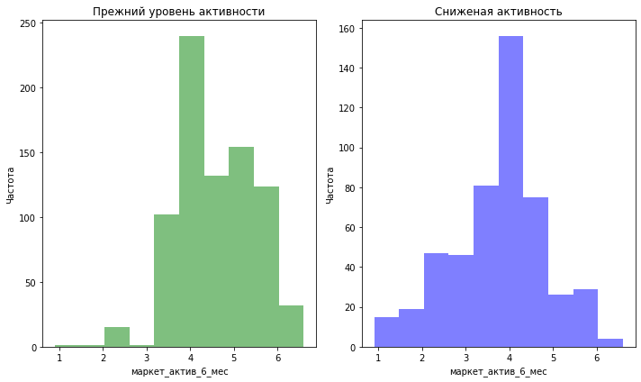
    


    
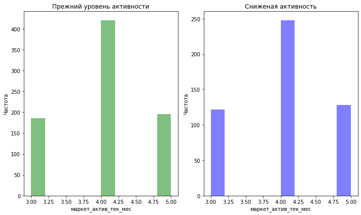
    


    
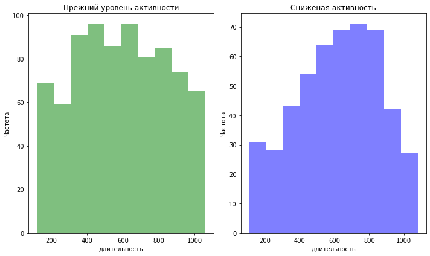
    


    
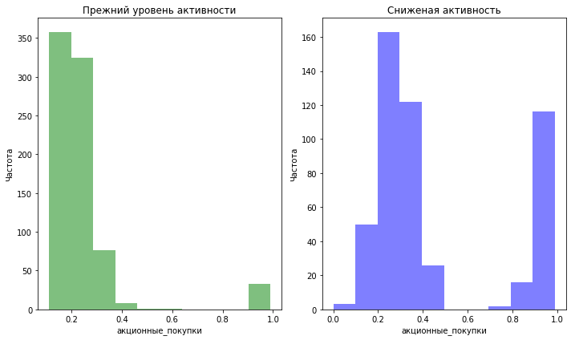
    


    
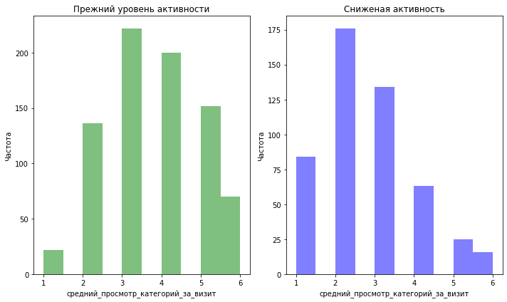
    


    
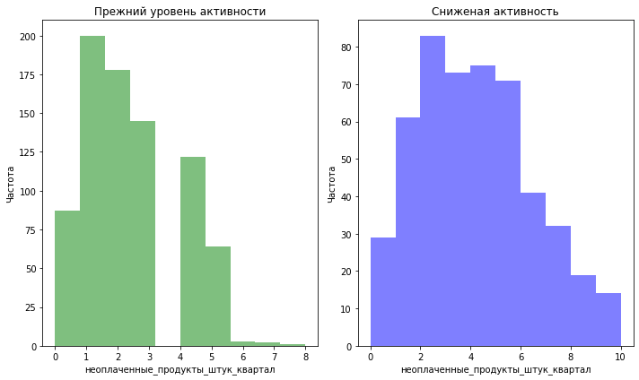
    


    
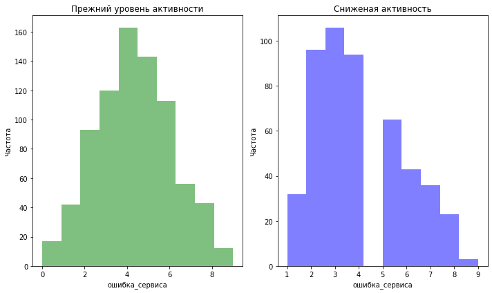
    


    
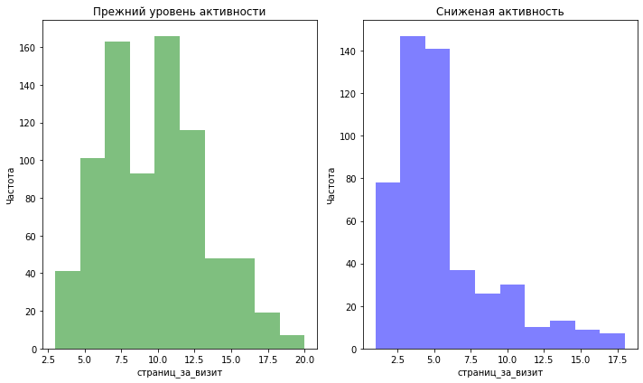
    


```python
# построим ящики с усами
for col in market_file_num:
    plot_box(decr, stab, col)
```


    
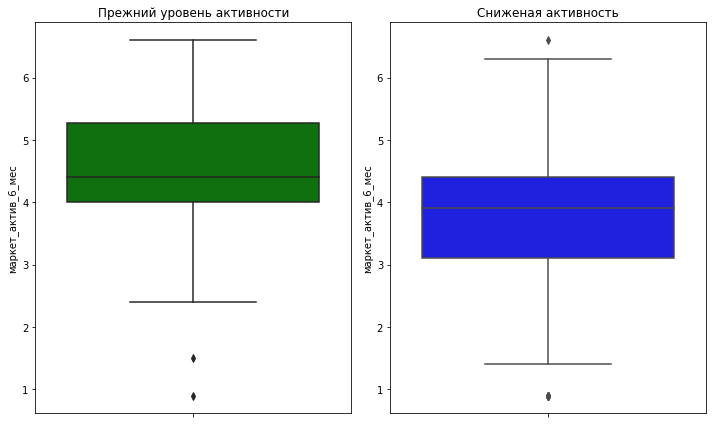
    


    
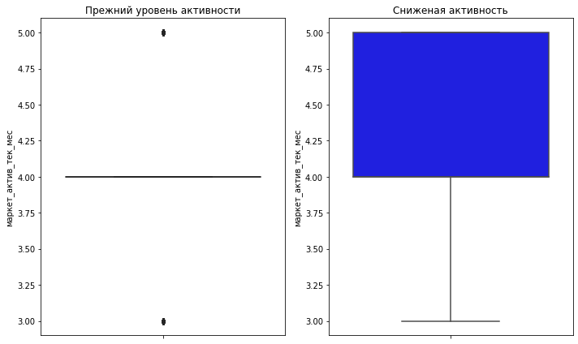
    


    
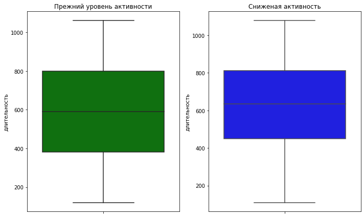
    


    
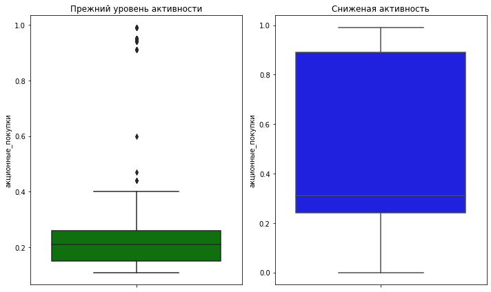
    


    

    


    
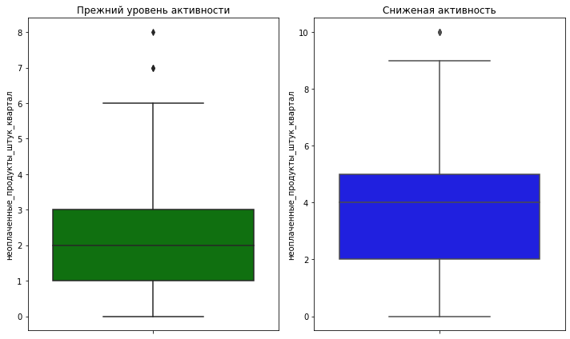
    


    
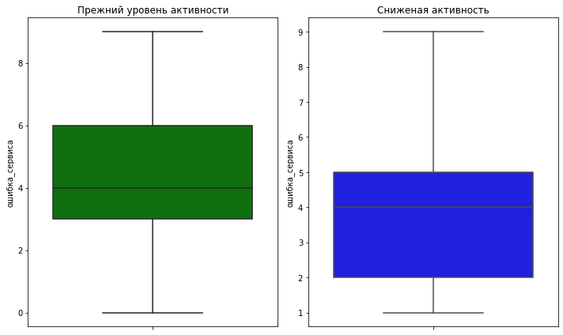
    


    
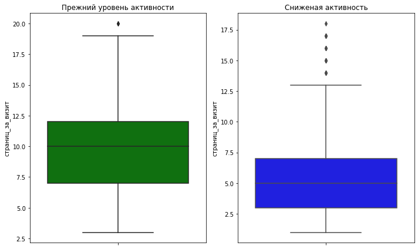
    


<u>**Промежуточные выводы по полученным графикам для количественных признаков**</u>
    Покапатели с прежней и сниженной покупательской активностью зарегистрированы на сайте магазина примерно одно и то же время, так как их распределения схожи.
    Из полученных графиков видно, что **количество коммуникаций за текущий месяц** у тех покупателей, у кого упала активноть больше чем у активных, в то время как **среднее количество коммуникаций за шесть месяцев** различается незначительно. Возможно неправильны подход оттолкнул некоторых покупателей.
    **Доля покупок по акции** у пользователь со сниженной активностью больше чем те кто сохранил её.
    Покупатели с прежним уровнем активности просматривают большее **количество категорий за визит** по сравнению с покупателями со сниженной активностью.
    **Количество неоплаченных товаров в корзинах** у покупателей со сниженной покупательской активностью больше, чем у другой категории покупателей. Вероятно, они ожидают каких-то акций или скидок на отложенные товары либо более привередливы.
    Покупательская активность не зависит от **количество сбоев в работе сайта**. Видно, что при взаимодействии с сайтом у клиентов со сниженной покупательской активностью количество сбоев даже меньше, чем у тех, кто по-прежнему активно делает покупки, а сбои врядли привлекают покупателей.
    Стоит отметить, что покупаели с прежним уровнем активности просматривают почти в два большее **количество страниц сайта** магазина за визит. Возможно, они ищут что-то конкретное и у них достаточно сил для поиска нужного товара.

  

Теперь рассмотрим **категориальные признаки** с учетом целевого признака.


```python
# построим столбчатые диаграммы для категориальных признаков
for col in market_file_cat:
    plot_cat(decr, stab, col)
```


    
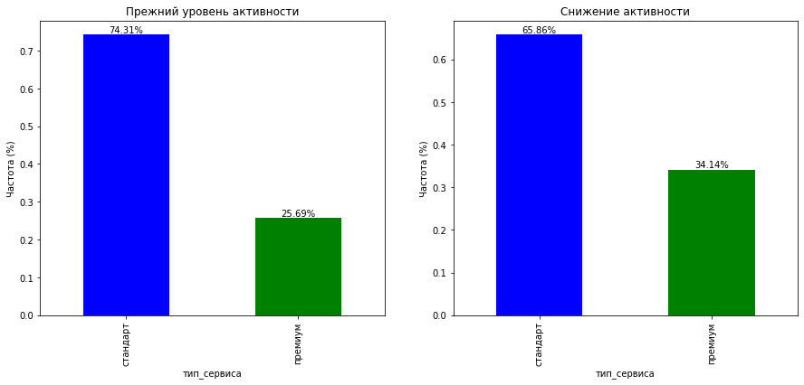
    


    
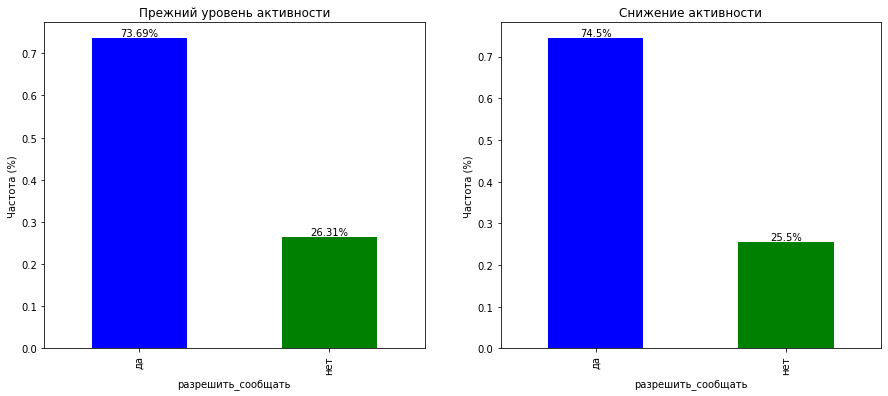
    


    
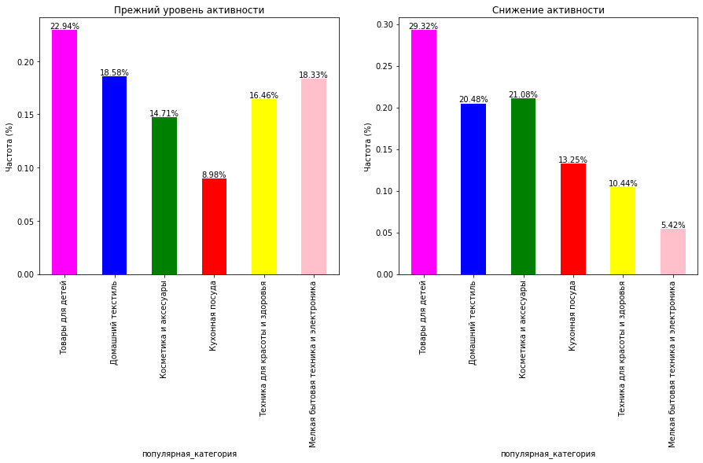
    


<u>**Выводы по полученным графикам для категориальных признаков**</u>

**Тип обслуживания** покупателя и **разрешение на рассылку** не сильно влияют на снижение покупательской активности, а вот **популярные категории товаров** для покупки следует рассмотреть .

Покупатели с изначальны уровне активности покупали больше вещей категории <u>техника для красоты и здоровья</u> и <u>мелкая бытовая техника и электроника</u> чем те у кого покупательская активность снизилась. Вероятней всего люди либо решили свои проблемы со здоровьем и крастой другими методами, или они здоровы и красивы и им не нужна данные товыры. Мелкая бытовая техника скорее всего у них тоже уже есть и покупать её нет необходимости.

Покупка остальных категорий товаров при снижении покупательской активности немного подросла.

### Проанализируем датафрейм market_money


```python
# просмотрим статистику датафрейма market_money
market_money.describe().T
```


<div>
<style scoped>
    .dataframe tbody tr th:only-of-type {
        vertical-align: middle;
    }

    .dataframe tbody tr th {
        vertical-align: top;
    }

    .dataframe thead th {
        text-align: right;
    }
</style>
<table border="1" class="dataframe">
  <thead>
    <tr style="text-align: right;">
      <th></th>
      <th>count</th>
      <th>mean</th>
      <th>std</th>
      <th>min</th>
      <th>25%</th>
      <th>50%</th>
      <th>75%</th>
      <th>max</th>
    </tr>
  </thead>
  <tbody>
    <tr>
      <th>id</th>
      <td>3900.0</td>
      <td>215997.500000</td>
      <td>375.325686</td>
      <td>215348.0</td>
      <td>215672.75</td>
      <td>215997.5</td>
      <td>216322.25</td>
      <td>216647.0</td>
    </tr>
    <tr>
      <th>прибыль</th>
      <td>3900.0</td>
      <td>5025.696051</td>
      <td>1777.704104</td>
      <td>0.0</td>
      <td>4590.15</td>
      <td>4957.5</td>
      <td>5363.00</td>
      <td>106862.2</td>
    </tr>
  </tbody>
</table>
</div>


В данном файле есть только один количественный столбец. Но можно заметить, что максимум прибыли слишком большой, он в двадцать раз больше чем квантиль 75%. Следовательно есть выбросы. Найдем их.


```python
# построим гистограмму
plt.figure(figsize=(10, 5))
sns.set()
sns.histplot(market_money['прибыль'], kde=True, bins=1000, color='green')
plt.title('Распределение выручки')
plt.xlabel('Выручка')
plt.ylabel('Количество')
plt.show()
```


    

    


```python
# построим ящик с усами
plt.figure(figsize=(10, 5))
sns.boxplot(x=market_money['прибыль'], color='green')
plt.title(f'Ящик с усами для признака "Выручка"')
plt.xlabel('Выручка')
plt.show();
```


    
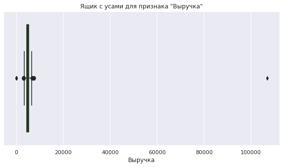
    


Видно, что почти все значения прибыли меньше 10000, но больше 3000. Есть выбросы, их надо удалить.


```python
market_money = market_money[(market_money['прибыль'] <= 10000) & (market_money['прибыль'] >= 3000)]
```

<font color='blue'><b>Комментарий ревьюера : </b></font> ✔️\
<font color='green'>Действительно явный выброс.
Можно удалить, а можно и заполнить, например значением предыдущего месяца.</font>

<font color='blue'><b>Комментарий ревьюера : </b></font> ✔️\
<font color='green'>Неактивные удалены 👌</font>


```python
# проверим максимальное значение после удаления выброса
market_money['прибыль'].max()
```


    7799.4


Это значение кажется нормальным, так что  еще раз построим график.


```python
# построим ящик с усами
plt.figure(figsize=(10, 5))
sns.boxplot(x=market_money['прибыль'], color='green')
plt.title(f'Ящик с усами для признака "Выручка"')
plt.xlabel('Выручка')
plt.xlim(0, 10000)
plt.show();
```


    
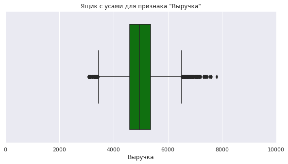
    


<u>**Вывод по датафрейму `market_money`**</u>

В ходе изучения этого датафрейма был обнаружены выбросы, который мог повлиять на дальнейшую работу с данными. Этот выброс был удален.

### Проанализируем датафрейм market_time


```python
# просмотрим статистику датафрейма market_time
market_time.describe().T
```


<div>
<style scoped>
    .dataframe tbody tr th:only-of-type {
        vertical-align: middle;
    }

    .dataframe tbody tr th {
        vertical-align: top;
    }

    .dataframe thead th {
        text-align: right;
    }
</style>
<table border="1" class="dataframe">
  <thead>
    <tr style="text-align: right;">
      <th></th>
      <th>count</th>
      <th>mean</th>
      <th>std</th>
      <th>min</th>
      <th>25%</th>
      <th>50%</th>
      <th>75%</th>
      <th>max</th>
    </tr>
  </thead>
  <tbody>
    <tr>
      <th>id</th>
      <td>2600.0</td>
      <td>215997.500000</td>
      <td>375.349754</td>
      <td>215348.0</td>
      <td>215672.75</td>
      <td>215997.5</td>
      <td>216322.25</td>
      <td>216647.0</td>
    </tr>
    <tr>
      <th>минуты</th>
      <td>2600.0</td>
      <td>13.336154</td>
      <td>4.080198</td>
      <td>4.0</td>
      <td>10.00</td>
      <td>13.0</td>
      <td>16.00</td>
      <td>23.0</td>
    </tr>
  </tbody>
</table>
</div>


Данный датафрейм содержит один количественный признак. Рассмотрим распределение минут.


```python
# построим гистограмму
plt.figure(figsize=(10, 5))
sns.set()
sns.histplot(market_time['минуты'], kde=True, bins=10, color='green')
plt.title('Распределение времени')
plt.xlabel('Время')
plt.ylabel('Количество')
plt.show();
```


    
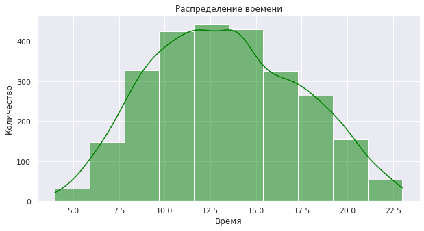
    


```python
# построим ящик с усами
plt.figure(figsize=(10, 5))
sns.boxplot(x=market_time['минуты'], color='green')
plt.title(f'Ящик с усами для признака "Время на сайте"')
plt.xlabel('Время')
plt.show();
```


    
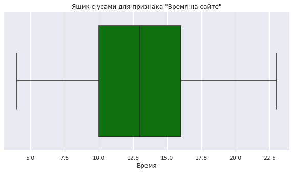
    


<u>**Вывод по датафрейму `market_time`**</u>
Время, проведенное пользователями на сайте, распределено примерно нормально, выбросов нет. 
В **среднем** покупатели проводят на сайте примерно `13` минут, **максимум** — `23` минуты, **минимум** — `4` минуты.

### Проанализируем датафрейм money


```python
# просмотрим статистику датафрейма money
money.describe().T
```


<div>
<style scoped>
    .dataframe tbody tr th:only-of-type {
        vertical-align: middle;
    }

    .dataframe tbody tr th {
        vertical-align: top;
    }

    .dataframe thead th {
        text-align: right;
    }
</style>
<table border="1" class="dataframe">
  <thead>
    <tr style="text-align: right;">
      <th></th>
      <th>count</th>
      <th>mean</th>
      <th>std</th>
      <th>min</th>
      <th>25%</th>
      <th>50%</th>
      <th>75%</th>
      <th>max</th>
    </tr>
  </thead>
  <tbody>
    <tr>
      <th>id</th>
      <td>1300.0</td>
      <td>215997.500000</td>
      <td>375.421985</td>
      <td>215348.00</td>
      <td>215672.75</td>
      <td>215997.500</td>
      <td>216322.25</td>
      <td>216647.00</td>
    </tr>
    <tr>
      <th>прибыль</th>
      <td>1300.0</td>
      <td>3.996631</td>
      <td>1.013722</td>
      <td>0.86</td>
      <td>3.30</td>
      <td>4.045</td>
      <td>4.67</td>
      <td>7.43</td>
    </tr>
  </tbody>
</table>
</div>


Данный датафрейм содержит один количественный признак. Это прибыль.


```python
# построим гистограмму
plt.figure(figsize=(10, 5))
sns.set()
sns.histplot(money['прибыль'], kde=True, bins=10, color='green')
plt.title('Распределение прибыли')
plt.xlabel('Прибыль')
plt.ylabel('Количество')
plt.show();
```


    
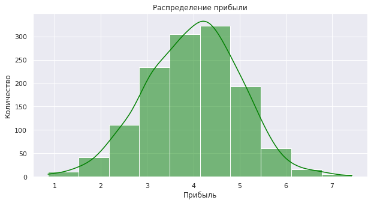
    


```python
# построим ящик с усами
plt.figure(figsize=(10, 5))
sns.boxplot(x=money['прибыль'], color='green')
plt.title(f'Ящик с усами для признака "Прибыль"')
plt.xlabel('Прибыль')
plt.show();
```


    
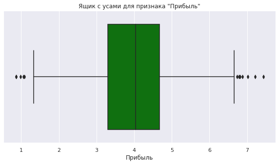
    


<u>**Вывод по датафрейму `money`**</u>

Значение прибыли распределено нормально, выбросы есть, но они соответствуют реальности, огромных значений нет.

### Общий вывод по исследовательскому анализу данных

Был проведен анализ количественных и качественных признаков во всех предоставленных датафреймах, изучено распределение данных с учетом целевого признака — покупательской активности. Во время проведения анализа обнаружены выбросы, которые были успешно удалены. Полученные распределения схожи с нормальными.

<font color='blue'><b>Комментарий ревьюера : </b></font> ✔️\
<font color='green'>Хорошая работа в части исследования данных: молодец, что используешь функции, а также применяешь подходящие для типов данных инструменты.</font>

## Объединение таблиц

Необходимо оставить покупателей с активностью не менее трех месяцев, для этого нужно сделать так, чтобы данные о прибыли были за все три месяца.

Поэтому выполним следующее: 
* создадим сводную таблицу по выручке за 3 месяца из датафрейма `market_money`, 
* создадим сводную таблицу по выручке за 2 месяца из датафрейма `market_time`,
* объединим полученные сводные таблицы с датафреймом `market_file`,
* удалим покупателей с пропусками в одной из колонок прибыли за 3 месяца.


```python
# создадим сводную таблицу по выручке из датафрейма market_money, с целью найти выручку за три месяца
pivot_table_market_money = pd.pivot_table(market_money, index='id', values='прибыль', columns='месяц')
pivot_table_market_money.head(5)
```


<div>
<style scoped>
    .dataframe tbody tr th:only-of-type {
        vertical-align: middle;
    }

    .dataframe tbody tr th {
        vertical-align: top;
    }

    .dataframe thead th {
        text-align: right;
    }
</style>
<table border="1" class="dataframe">
  <thead>
    <tr style="text-align: right;">
      <th>месяц</th>
      <th>предпредыдущий_месяц</th>
      <th>предыдущий_месяц</th>
      <th>текущий_месяц</th>
    </tr>
    <tr>
      <th>id</th>
      <th></th>
      <th></th>
      <th></th>
    </tr>
  </thead>
  <tbody>
    <tr>
      <th>215348</th>
      <td>NaN</td>
      <td>NaN</td>
      <td>3293.1</td>
    </tr>
    <tr>
      <th>215349</th>
      <td>4472.0</td>
      <td>5216.0</td>
      <td>4971.6</td>
    </tr>
    <tr>
      <th>215350</th>
      <td>4826.0</td>
      <td>5457.5</td>
      <td>5058.4</td>
    </tr>
    <tr>
      <th>215351</th>
      <td>4793.0</td>
      <td>6158.0</td>
      <td>6610.4</td>
    </tr>
    <tr>
      <th>215352</th>
      <td>4594.0</td>
      <td>5807.5</td>
      <td>5872.5</td>
    </tr>
  </tbody>
</table>
</div>


Чтобы не запутаться изменим название столбцов


```python
column_mapping = {
    'предпредыдущий_месяц': 'выручка_предпредыдущий_месяц',
    'предыдущий_месяц': 'выручка_предыдущий_месяц',
    'текущий_месяц': 'выручка_текущий_месяц'
}

pivot_table_market_money.rename(columns=column_mapping, inplace=True)
```


```python
# создадим сводную таблицу по выручке из датафрейма market_time, найти время проведенное на сайте за два месяца
pivot_table_market_time = pd.pivot_table(market_time, index='id', values='минуты', columns='месяц')
pivot_table_market_time.head(5)
```


<div>
<style scoped>
    .dataframe tbody tr th:only-of-type {
        vertical-align: middle;
    }

    .dataframe tbody tr th {
        vertical-align: top;
    }

    .dataframe thead th {
        text-align: right;
    }
</style>
<table border="1" class="dataframe">
  <thead>
    <tr style="text-align: right;">
      <th>месяц</th>
      <th>предыдущий_месяц</th>
      <th>текущий_месяц</th>
    </tr>
    <tr>
      <th>id</th>
      <th></th>
      <th></th>
    </tr>
  </thead>
  <tbody>
    <tr>
      <th>215348</th>
      <td>13</td>
      <td>14</td>
    </tr>
    <tr>
      <th>215349</th>
      <td>12</td>
      <td>10</td>
    </tr>
    <tr>
      <th>215350</th>
      <td>8</td>
      <td>13</td>
    </tr>
    <tr>
      <th>215351</th>
      <td>11</td>
      <td>13</td>
    </tr>
    <tr>
      <th>215352</th>
      <td>8</td>
      <td>11</td>
    </tr>
  </tbody>
</table>
</div>


<font color='blue'><b>Комментарий ревьюера: </b></font> ✔️\
<font color='green'> Отлично!  Развернули таблицы.</font>


```python
column_mapping = {
    'предыдущий_месяц': 'время_предыдущий_месяц',
    'текущий_месяц': 'время_текущий_месяц'
}

pivot_table_market_time.rename(columns=column_mapping, inplace=True)
```


```python
# объединим полученные сводные таблицы с датафреймом market_file
merged_market_file = market_file.merge(pivot_table_market_money, on='id', how='left')
```

<font color='blue'><b>Комментарий ревьюера : </b></font> ✔️\
<font color='green'> Верно, при объединении таблиц нужно привязаться к уникальному `"id"`.</font>


```python
# проверим результат объединения
merged_market_file.sample(5)
```


<div>
<style scoped>
    .dataframe tbody tr th:only-of-type {
        vertical-align: middle;
    }

    .dataframe tbody tr th {
        vertical-align: top;
    }

    .dataframe thead th {
        text-align: right;
    }
</style>
<table border="1" class="dataframe">
  <thead>
    <tr style="text-align: right;">
      <th></th>
      <th>id</th>
      <th>покупательская_активность</th>
      <th>тип_сервиса</th>
      <th>разрешить_сообщать</th>
      <th>маркет_актив_6_мес</th>
      <th>маркет_актив_тек_мес</th>
      <th>длительность</th>
      <th>акционные_покупки</th>
      <th>популярная_категория</th>
      <th>средний_просмотр_категорий_за_визит</th>
      <th>неоплаченные_продукты_штук_квартал</th>
      <th>ошибка_сервиса</th>
      <th>страниц_за_визит</th>
      <th>выручка_предпредыдущий_месяц</th>
      <th>выручка_предыдущий_месяц</th>
      <th>выручка_текущий_месяц</th>
    </tr>
  </thead>
  <tbody>
    <tr>
      <th>178</th>
      <td>215526</td>
      <td>Снизилась</td>
      <td>стандарт</td>
      <td>да</td>
      <td>3.1</td>
      <td>4</td>
      <td>572</td>
      <td>0.29</td>
      <td>Домашний текстиль</td>
      <td>1</td>
      <td>8</td>
      <td>8</td>
      <td>5</td>
      <td>4508.0</td>
      <td>5880.5</td>
      <td>6713.8</td>
    </tr>
    <tr>
      <th>82</th>
      <td>215430</td>
      <td>Снизилась</td>
      <td>стандарт</td>
      <td>да</td>
      <td>2.9</td>
      <td>4</td>
      <td>824</td>
      <td>0.29</td>
      <td>Кухонная посуда</td>
      <td>2</td>
      <td>2</td>
      <td>5</td>
      <td>3</td>
      <td>4712.0</td>
      <td>5289.5</td>
      <td>5780.9</td>
    </tr>
    <tr>
      <th>648</th>
      <td>215996</td>
      <td>Прежний уровень</td>
      <td>премиум</td>
      <td>да</td>
      <td>4.4</td>
      <td>3</td>
      <td>807</td>
      <td>0.14</td>
      <td>Мелкая бытовая техника и электроника</td>
      <td>5</td>
      <td>1</td>
      <td>3</td>
      <td>9</td>
      <td>4667.0</td>
      <td>4284.5</td>
      <td>4083.0</td>
    </tr>
    <tr>
      <th>408</th>
      <td>215756</td>
      <td>Прежний уровень</td>
      <td>стандарт</td>
      <td>нет</td>
      <td>5.4</td>
      <td>4</td>
      <td>923</td>
      <td>0.15</td>
      <td>Кухонная посуда</td>
      <td>2</td>
      <td>1</td>
      <td>6</td>
      <td>10</td>
      <td>4943.0</td>
      <td>5205.5</td>
      <td>5563.0</td>
    </tr>
    <tr>
      <th>425</th>
      <td>215773</td>
      <td>Прежний уровень</td>
      <td>стандарт</td>
      <td>да</td>
      <td>5.1</td>
      <td>5</td>
      <td>831</td>
      <td>0.12</td>
      <td>Косметика и аксесуары</td>
      <td>2</td>
      <td>1</td>
      <td>3</td>
      <td>10</td>
      <td>5103.0</td>
      <td>4515.0</td>
      <td>4135.4</td>
    </tr>
  </tbody>
</table>
</div>


```python
merged_market_file = merged_market_file.merge(pivot_table_market_time, on='id', how='left')
```


```python
# проверим результат объединения
merged_market_file.sample(5)
```


<div>
<style scoped>
    .dataframe tbody tr th:only-of-type {
        vertical-align: middle;
    }

    .dataframe tbody tr th {
        vertical-align: top;
    }

    .dataframe thead th {
        text-align: right;
    }
</style>
<table border="1" class="dataframe">
  <thead>
    <tr style="text-align: right;">
      <th></th>
      <th>id</th>
      <th>покупательская_активность</th>
      <th>тип_сервиса</th>
      <th>разрешить_сообщать</th>
      <th>маркет_актив_6_мес</th>
      <th>маркет_актив_тек_мес</th>
      <th>длительность</th>
      <th>акционные_покупки</th>
      <th>популярная_категория</th>
      <th>средний_просмотр_категорий_за_визит</th>
      <th>неоплаченные_продукты_штук_квартал</th>
      <th>ошибка_сервиса</th>
      <th>страниц_за_визит</th>
      <th>выручка_предпредыдущий_месяц</th>
      <th>выручка_предыдущий_месяц</th>
      <th>выручка_текущий_месяц</th>
      <th>время_предыдущий_месяц</th>
      <th>время_текущий_месяц</th>
    </tr>
  </thead>
  <tbody>
    <tr>
      <th>1078</th>
      <td>216426</td>
      <td>Прежний уровень</td>
      <td>стандарт</td>
      <td>нет</td>
      <td>3.3</td>
      <td>3</td>
      <td>712</td>
      <td>0.13</td>
      <td>Домашний текстиль</td>
      <td>2</td>
      <td>0</td>
      <td>7</td>
      <td>8</td>
      <td>4522.0</td>
      <td>4090.0</td>
      <td>3845.6</td>
      <td>19</td>
      <td>14</td>
    </tr>
    <tr>
      <th>674</th>
      <td>216022</td>
      <td>Прежний уровень</td>
      <td>стандарт</td>
      <td>да</td>
      <td>4.5</td>
      <td>4</td>
      <td>662</td>
      <td>0.16</td>
      <td>Домашний текстиль</td>
      <td>4</td>
      <td>2</td>
      <td>3</td>
      <td>13</td>
      <td>4981.0</td>
      <td>4906.0</td>
      <td>4971.0</td>
      <td>18</td>
      <td>11</td>
    </tr>
    <tr>
      <th>266</th>
      <td>215614</td>
      <td>Снизилась</td>
      <td>стандарт</td>
      <td>да</td>
      <td>4.0</td>
      <td>3</td>
      <td>952</td>
      <td>0.22</td>
      <td>Кухонная посуда</td>
      <td>4</td>
      <td>5</td>
      <td>1</td>
      <td>5</td>
      <td>4767.0</td>
      <td>5808.0</td>
      <td>6593.2</td>
      <td>14</td>
      <td>11</td>
    </tr>
    <tr>
      <th>723</th>
      <td>216071</td>
      <td>Прежний уровень</td>
      <td>стандарт</td>
      <td>да</td>
      <td>5.5</td>
      <td>5</td>
      <td>930</td>
      <td>0.17</td>
      <td>Косметика и аксесуары</td>
      <td>3</td>
      <td>3</td>
      <td>3</td>
      <td>6</td>
      <td>4341.0</td>
      <td>4812.0</td>
      <td>5350.2</td>
      <td>16</td>
      <td>11</td>
    </tr>
    <tr>
      <th>660</th>
      <td>216008</td>
      <td>Прежний уровень</td>
      <td>стандарт</td>
      <td>да</td>
      <td>6.1</td>
      <td>4</td>
      <td>953</td>
      <td>0.26</td>
      <td>Домашний текстиль</td>
      <td>5</td>
      <td>2</td>
      <td>5</td>
      <td>10</td>
      <td>4999.0</td>
      <td>5690.5</td>
      <td>6419.8</td>
      <td>8</td>
      <td>8</td>
    </tr>
  </tbody>
</table>
</div>


```python
# проверим размерность получившегося датафрейма (кол-во столбцов увеличилось на 5, как и предполагалось)
merged_market_file.shape
```


    (1300, 18)


Объединение таблиц прошло успешно. теперь для каждого пользователя указано, сколько он потратил в проследнии три месяца и сколько он провел времени на сайте за последние два
Изучим получившийся датафрейм более подробно.


```python
merged_market_file.info()
```

    <class 'pandas.core.frame.DataFrame'>
    Int64Index: 1300 entries, 0 to 1299
    Data columns (total 18 columns):
     #   Column                               Non-Null Count  Dtype  
    ---  ------                               --------------  -----  
     0   id                                   1300 non-null   int64  
     1   покупательская_активность            1300 non-null   object 
     2   тип_сервиса                          1300 non-null   object 
     3   разрешить_сообщать                   1300 non-null   object 
     4   маркет_актив_6_мес                   1300 non-null   float64
     5   маркет_актив_тек_мес                 1300 non-null   int64  
     6   длительность                         1300 non-null   int64  
     7   акционные_покупки                    1300 non-null   float64
     8   популярная_категория                 1300 non-null   object 
     9   средний_просмотр_категорий_за_визит  1300 non-null   int64  
     10  неоплаченные_продукты_штук_квартал   1300 non-null   int64  
     11  ошибка_сервиса                       1300 non-null   int64  
     12  страниц_за_визит                     1300 non-null   int64  
     13  выручка_предпредыдущий_месяц         1297 non-null   float64
     14  выручка_предыдущий_месяц             1293 non-null   float64
     15  выручка_текущий_месяц                1297 non-null   float64
     16  время_предыдущий_месяц               1300 non-null   int64  
     17  время_текущий_месяц                  1300 non-null   int64  
    dtypes: float64(5), int64(9), object(4)
    memory usage: 193.0+ KB


Как видим, в данных есть пропуски которые вришли из датасета `market_money`. Посчитаем сколько их. 


```python
merged_market_file.isna().sum()
```


    id                                     0
    покупательская_активность              0
    тип_сервиса                            0
    разрешить_сообщать                     0
    маркет_актив_6_мес                     0
    маркет_актив_тек_мес                   0
    длительность                           0
    акционные_покупки                      0
    популярная_категория                   0
    средний_просмотр_категорий_за_визит    0
    неоплаченные_продукты_штук_квартал     0
    ошибка_сервиса                         0
    страниц_за_визит                       0
    выручка_предпредыдущий_месяц           3
    выручка_предыдущий_месяц               7
    выручка_текущий_месяц                  3
    время_предыдущий_месяц                 0
    время_текущий_месяц                    0
    dtype: int64


Пропуски присутствуют в столбцах, отражающих прибыль за последние три месяца (`выручка_предпредыдущий_месяц`, `выручка_предыдущий_месяц`, `выручка_текущий_месяц`), и поскольку это означает отсутствие покупательской активности за указанное время, соответствующие объекты можно смело удалить. 


```python
merged_market_file = merged_market_file.dropna()
merged_market_file.isna().sum()
```


    id                                     0
    покупательская_активность              0
    тип_сервиса                            0
    разрешить_сообщать                     0
    маркет_актив_6_мес                     0
    маркет_актив_тек_мес                   0
    длительность                           0
    акционные_покупки                      0
    популярная_категория                   0
    средний_просмотр_категорий_за_визит    0
    неоплаченные_продукты_штук_квартал     0
    ошибка_сервиса                         0
    страниц_за_визит                       0
    выручка_предпредыдущий_месяц           0
    выручка_предыдущий_месяц               0
    выручка_текущий_месяц                  0
    время_предыдущий_месяц                 0
    время_текущий_месяц                    0
    dtype: int64


Пропуски удалены. Проверим наличие явных дубликатов.


```python
merged_market_file.duplicated().sum()
```


    0


Явных дубликатов не обнаружено.

**Вывод**

В соответствии с поставленной задачей требовалось отобрать клиентов с покупательской активностью не менее трёх месяцев, то есть таких, которые что-либо покупали в этот период. При объединении таблиц данная цель была достигнута: мы получили полную таблицу, отражающую активность покупателей за указанный срок.

<font color='blue'><b>Комментарий ревьюера : </b></font> ✔️\
<font color='green'> 👍</font>

## Корреляционный анализ

Напомним какие есть столбцы в объединноной таблице.


```python
merged_market_file.columns
```


    Index(['id', 'покупательская_активность', 'тип_сервиса', 'разрешить_сообщать',
           'маркет_актив_6_мес', 'маркет_актив_тек_мес', 'длительность',
           'акционные_покупки', 'популярная_категория',
           'средний_просмотр_категорий_за_визит',
           'неоплаченные_продукты_штук_квартал', 'ошибка_сервиса',
           'страниц_за_визит', 'выручка_предпредыдущий_месяц',
           'выручка_предыдущий_месяц', 'выручка_текущий_месяц',
           'время_предыдущий_месяц', 'время_текущий_месяц'],
          dtype='object')


Матрица Phik широко используется для анализа корреляции между переменными в наборах данных. В данном случае мы будем использовать эту матрицу, поскольку она может учитывать корреляцию не только между количественными, но и между категориальными переменными. А нам эту нужно с целью понимания взаимосвязей в данных.


```python
# создадим копию датафрейма без столбца идентификатора пользователя магазина для построения матрицы корреляции
merged_market_file_copy = merged_market_file.drop('id', axis=1)
# переменные
ic=['маркет_актив_6_мес', 'маркет_актив_тек_мес', 'длительность',
       'акционные_покупки', 
       'средний_просмотр_категорий_за_визит',
       'неоплаченные_продукты_штук_квартал', 'ошибка_сервиса',
       'страниц_за_визит', 'выручка_предпредыдущий_месяц',
       'выручка_предыдущий_месяц', 'выручка_текущий_месяц',
       'время_предыдущий_месяц', 'время_текущий_месяц']
# расчет коэффициентов корреляции Phik
correlation_matrix = phik.phik_matrix(merged_market_file_copy, interval_cols=ic)

# построение графика корреляции
plt.figure(figsize=(20, 15))
sns.heatmap(correlation_matrix, annot=True, cmap="coolwarm")

plt.title("Матрица корреляции (Phik)")
plt.show();
```


    
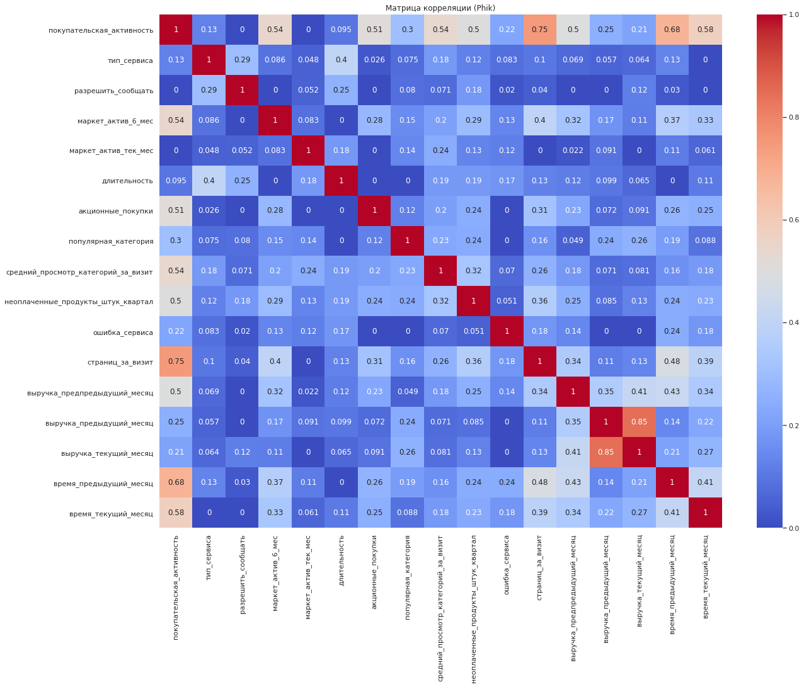
    


- Для оценки мультиколлинеарности используют шкалу Чеддока. Весьма высокая корреляция соответствует значению коэффициента корреляции от `0.9` до `0.95` по модулю. Здесь таких значений мы не наблюдаем.
- Исходя из получившегося графика, мы видим достаточную (`0.7—0.9` - высокая по шкале Чеддока) корреляцию между `прибылью за текущий месяц` и `прибылью за предыдущий месяц` — `0.85` и между `покупательской активностью`  и `количеством просмотренных страниц за визит` — `0.75`.
- Также наблюдается приемлемая (`0.5—0.7`- заметная по шкале Чеддока) корреляция наблюдается между `покупательской активностью`  и `временем в минутах, проведенном на сайте за предыдущий месяц`  — `0.68`, между `покупательской активностью`  и `временем в минутах, проведенном на сайте за текущий месяц`  — `0.58`, между `покупательской активностью`  и `средним количеством просмотренных категорий за визит за последний месяц**  и **количеством маркетинговых коммуникаций компаниис покупателем за последние 6 месяцев`  — `0.54`, между `покупательской активностью`  и `акционными покупками`  — `0.51`, между `покупательской активностью`  и `выручкой за предпредыдущий месяц`  и `количеством неоплаченных товаров в корзине за последние 3 месяца` -- Остальные признаки имеют незначительную кореляцию или вообще не имеют её (по шкале Чеддока это слабая и умеренная).

<font color='blue'><b>Комментарий ревьюера : </b></font> ✔️\
<font color='green'>Здорово,что применена `phik` для анализа и нелинейных зависимостей</font>

## Использование пайплайнов

Поскольку целевой признак **покупательская активность** (`покупательская_активность`) у нас является категориальным, для начала перед разделением данных заменим доступные значения следующим образом: `Снизилась` на `1`, `Прежний уровень` на `0`.


```python
merged_market_file['покупательская_активность'] = merged_market_file['покупательская_активность'].apply(lambda x: 1 if x == 'Снизилась' else (0 if x == 'Прежний уровень' else x))
```

Убедимся, что замена выполнена успешно.


```python
merged_market_file.sample(1)
```


<div>
<style scoped>
    .dataframe tbody tr th:only-of-type {
        vertical-align: middle;
    }

    .dataframe tbody tr th {
        vertical-align: top;
    }

    .dataframe thead th {
        text-align: right;
    }
</style>
<table border="1" class="dataframe">
  <thead>
    <tr style="text-align: right;">
      <th></th>
      <th>id</th>
      <th>покупательская_активность</th>
      <th>тип_сервиса</th>
      <th>разрешить_сообщать</th>
      <th>маркет_актив_6_мес</th>
      <th>маркет_актив_тек_мес</th>
      <th>длительность</th>
      <th>акционные_покупки</th>
      <th>популярная_категория</th>
      <th>средний_просмотр_категорий_за_визит</th>
      <th>неоплаченные_продукты_штук_квартал</th>
      <th>ошибка_сервиса</th>
      <th>страниц_за_визит</th>
      <th>выручка_предпредыдущий_месяц</th>
      <th>выручка_предыдущий_месяц</th>
      <th>выручка_текущий_месяц</th>
      <th>время_предыдущий_месяц</th>
      <th>время_текущий_месяц</th>
    </tr>
  </thead>
  <tbody>
    <tr>
      <th>361</th>
      <td>215709</td>
      <td>1</td>
      <td>стандарт</td>
      <td>нет</td>
      <td>4.6</td>
      <td>5</td>
      <td>352</td>
      <td>0.89</td>
      <td>Домашний текстиль</td>
      <td>1</td>
      <td>3</td>
      <td>2</td>
      <td>6</td>
      <td>4755.0</td>
      <td>5221.5</td>
      <td>5606.3</td>
      <td>12</td>
      <td>10</td>
    </tr>
  </tbody>
</table>
</div>


Приступим к созданию пайплайна.

Для выполнения поставленной задачи будем использовать **метрику ROC-AUC** (Receiver Operating Characteristic - Area Under the Curve) — это метрика оценивает способность модели различать объекты классов. Она измеряет площадь под ROC-кривой, которая показывает отношение между долей верно классифицированных положительных и долей ложноположительных результатов при изменении порогового значения. Чем выше значение ROC-AUC, тем лучше модель проводит различие между положительным и отрицательным классами.

<font color='blue'><b>Комментарий ревьюера : </b></font> ✔️\
<font color='green'> 👍</font>


```python
# разделим данные на обучающую (80%) и тестовую выборки (20%), зададим стратификацию, чтобы сохраненить баланс классов
# определим random_state
RANDOM_STATE = 42
TEST_SIZE = 0.2

X_train, X_test, y_train, y_test = train_test_split(
    merged_market_file.drop(['id','покупательская_активность'], axis=1),
    merged_market_file['покупательская_активность'],
    test_size = TEST_SIZE, 
    random_state = RANDOM_STATE,
    stratify = merged_market_file['покупательская_активность']
)

# проверим размер получившихся выборок
print(X_train.shape, X_test.shape)
```

    (1032, 16) (258, 16)


разделим столбцы на три части в зависимости от операций с ними.


```python
# создадим списки с названиями признаков

ohe_columns = ['популярная_категория']#кодирование категориальных
ord_columns = ['тип_сервиса', 'разрешить_сообщать']# кодирование порядкоых
num_columns = [
    'маркет_актив_6_мес', 'маркет_актив_тек_мес',
    'длительность', 'акционные_покупки', 'средний_просмотр_категорий_за_визит',
    'неоплаченные_продукты_штук_квартал', 'ошибка_сервиса', 'страниц_за_визит',
    'выручка_предпредыдущий_месяц', 'выручка_предыдущий_месяц',
    'выручка_текущий_месяц', 'время_предыдущий_месяц',
    'время_текущий_месяц'
]#масштабирование
```


```python
# у нас нет пропусков в данных, поэтому SimpleImputer использовать не будем

# пайплайн для кодирования категориальных признаков
ohe_pipe = Pipeline(
    [('ohe', OneHotEncoder(drop='first', handle_unknown='error', sparse_output=False))]
)

# пайплайн для кодирования порядковых признаков
ord_pipe = Pipeline(
    [('ord', OrdinalEncoder(
        categories=[
            ['стандарт', 'премиум'],
            ['нет', 'да'],
        ],
        handle_unknown='use_encoded_value', unknown_value=np.nan
    ))]
)

# пайплайн для масштабирования количественных признаков
num_pipe = Pipeline(
    [('scaler', StandardScaler())]
)

# объединяем все пайплайны с помощью ColumnTransformer
data_preprocessor = ColumnTransformer([
    ('ohe', ohe_pipe, ohe_columns),
    ('ord', ord_pipe, ord_columns),
    ('num', num_pipe, num_columns)
], remainder='passthrough')

# итоговый пайплайн
pipe_final = Pipeline([
    ('preprocessor', data_preprocessor),
    ('model', DecisionTreeClassifier(random_state=RANDOM_STATE))
])
```

<font color='blue'><b>Комментарий ревьюера : </b></font> ✔️\
<font color='green'> 👍</font>

Создадим словарь параметров


```python
param_grid = [
    # словарь для модели KNeighborsClassifier()
    {
        'model': [KNeighborsClassifier()],
        'model__n_neighbors': range(3, 8),
        'preprocessor__num': [StandardScaler(), MinMaxScaler(), 'passthrough']
    },
    
    # словарь для модели DecisionTreeClassifier()
    {
        'model': [DecisionTreeClassifier(random_state=RANDOM_STATE)],
        'model__max_depth': range(1, 10),
        'model__min_samples_split': range(2, 10),
        'model__min_samples_leaf': range(2, 10),
        'preprocessor__num': [StandardScaler(), MinMaxScaler(), 'passthrough']    
    },
    
    # словарь для модели LogisticRegression()
    {
        'model': [LogisticRegression(random_state=RANDOM_STATE, solver='liblinear', penalty='l1')],
        'model__C': range(1, 7), 
        'preprocessor__num': [StandardScaler(), MinMaxScaler(), 'passthrough']
    },
    
    # словарь для модели SVC()
    {
        'model': [SVC(random_state=RANDOM_STATE, probability=True)],
        'model__C': [0.01, 0.1, 1, 10],
        'model__kernel': ['linear', 'rbf', 'sigmoid', 'poly'], 
        'model__gamma': [0.01, 0.1, 1, 10],
        'model__degree': [2, 3, 4],
        'preprocessor__num': [StandardScaler(), MinMaxScaler(), 'passthrough'] 
    }
]
```

Теперь найдем лучшею модель из списка самых прмаеняемых: **KNeighborsClassifier**, **DecisionTreeClassifier**, **LogisticRegression** и  **SVC**.


```python
random_search = RandomizedSearchCV(
    pipe_final,
    param_grid,
    cv=5,
    scoring='roc_auc',
    n_jobs=-1,
    random_state=RANDOM_STATE)

random_search.fit(X_train, y_train)

print('Лучшая модель и ее параметры:\n\n', random_search.best_estimator_)
print('Метрика лучшей модели на тренировочной выборке:', random_search.best_score_)

probabilities = random_search.predict_proba(X_test)
probabilities_one = probabilities[:, 1]
print('Площадь ROC-кривой:', roc_auc_score(y_test, probabilities_one))
```

    Лучшая модель и ее параметры:
    
     Pipeline(steps=[('preprocessor',
                     ColumnTransformer(remainder='passthrough',
                                       transformers=[('ohe',
                                                      Pipeline(steps=[('ohe',
                                                                       OneHotEncoder(drop='first',
                                                                                     sparse_output=False))]),
                                                      ['популярная_категория']),
                                                     ('ord',
                                                      Pipeline(steps=[('ord',
                                                                       OrdinalEncoder(categories=[['стандарт',
                                                                                                   'премиум'],
                                                                                                  ['нет',
                                                                                                   'да']],
                                                                                      handle_unknown='use_encoded_value',
                                                                                      unknown_value=nan))]),
                                                      ['ти...
                                                       'акционные_покупки',
                                                       'средний_просмотр_категорий_за_визит',
                                                       'неоплаченные_продукты_штук_квартал',
                                                       'ошибка_сервиса',
                                                       'страниц_за_визит',
                                                       'выручка_предпредыдущий_месяц',
                                                       'выручка_предыдущий_месяц',
                                                       'выручка_текущий_месяц',
                                                       'время_предыдущий_месяц',
                                                       'время_текущий_месяц'])])),
                    ('model',
                     SVC(C=1, degree=4, gamma=1, kernel='linear', probability=True,
                         random_state=42))])
    Метрика лучшей модели на тренировочной выборке: 0.901351529535865
    Площадь ROC-кривой: 0.896875


<font color='blue'><b>Комментарий ревьюера: </b></font> ✔️\
<font color='green'>Тестирование проведено верно.</font>

**Вывод**

В результате в качестве лучшей модели выбрана **SVC** (Support Vector Classifier — метод опорных векторов) со следующими параметрами:
- `C` (параметр регуляризации) равен `1`,
- `degree` (степень полиномиальной функции ядра) равна `4`,
- `gamma` (коэффициент влияния) равен `1`,
- `kernel` (ядро) задано `linear` (линейное),
- `probability`(дополнительные вычисления для оценки вероятностей принадлежности к каждому классу) определено `True`,
- `random_state` равно `42`.
Метрика лучшей модели на тренировочной выборке составляет с примерно`0.9`, что указывает на высокую точности модели на обучающих данных. Это вполне ожибаемо так как данные тренировочные.
Значение **площади под ROC-кривой (ROC-AUC)** равное с примерно `0.9` означает, что модель достигла достаточно хороших результатов в классификации.


## Анализ важности признаков

В дальнейщем необходимо провести оценку важность признаков для лучшей модели и построим график важности с помощью метода SHAP.


Столбчатая диаграмма `shap.plots.bar` отражает общий вклад признаков в прогнозы модели. Она показывает средние SHAP-значения признака по всем наблюдениям. Для расчета средних берут значения Шепли по модулю, чтобы положительные и отрицательные значения не сводили друг друга к нулю.


```python
X_train = pipe_final.named_steps['preprocessor'].fit_transform(X_train)# преобразуем данные обучающей выборки

```


```python
# преобразуем данные тестовой выборки
X_test = pipe_final.named_steps['preprocessor'].transform(X_test)
#X_test
```


```python
# создадим объект explainer
explainer = shap.LinearExplainer(random_search.best_estimator_.named_steps['model'], X_test)
# получим имена признаков
feature_names = pipe_final.named_steps['preprocessor'].get_feature_names_out()
```


```python
# создадим датафрейм для тестовых данных с именами признаков
X_test = pd.DataFrame(X_test, columns=feature_names)
```


```python
# посчитаем значения SHAP для тестовых данных
shap_values = explainer(X_test)
shap_values[0]
```


    .values =
    array([-0.05464016, -0.00543771,  0.07225091,  0.05240022,  0.03711223,
            0.15162457,  0.01448094, -0.27677957, -0.00184025,  0.01609077,
           -0.17459833,  0.07839075, -0.22524776, -0.04002904, -0.13545595,
           -0.01935824, -0.04003447,  0.0749173 , -0.09082248,  0.13921005])
    
    .base_values =
    -0.4506280476403346
    
    .data =
    array([ 1.        ,  0.        ,  0.        ,  0.        ,  0.        ,
            1.        ,  1.        ,  1.23146135, -0.04844324,  0.71739954,
           -0.35825082, -0.18653763, -0.94543949,  0.9308136 ,  0.19268892,
            0.01544383, -0.18660389, -0.3642643 ,  0.11189596, -0.54088133])


```python
# визуализируем значения SHAP в виде графика "осиное гнездо"
shap.plots.beeswarm(shap_values,max_display=20)
```


    
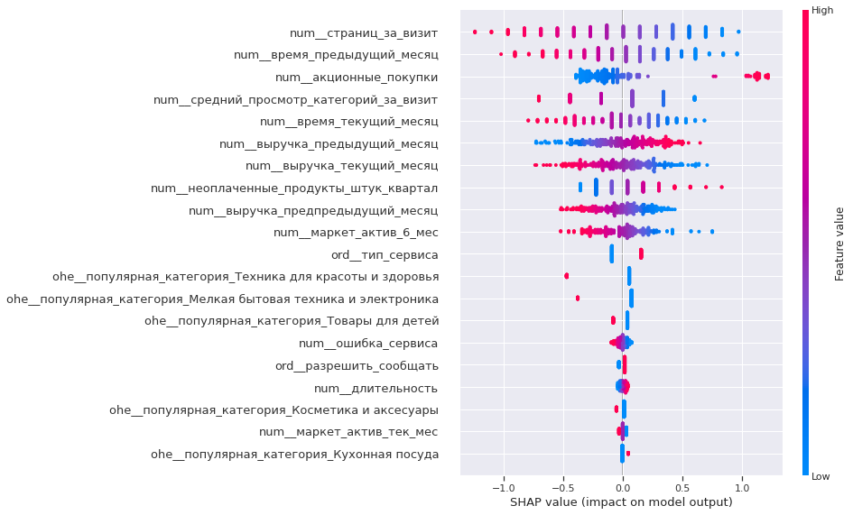
    


```python
shap.plots.bar(shap_values,max_display=20)
# Странно, этот график появляется от случая к случию.
```


    
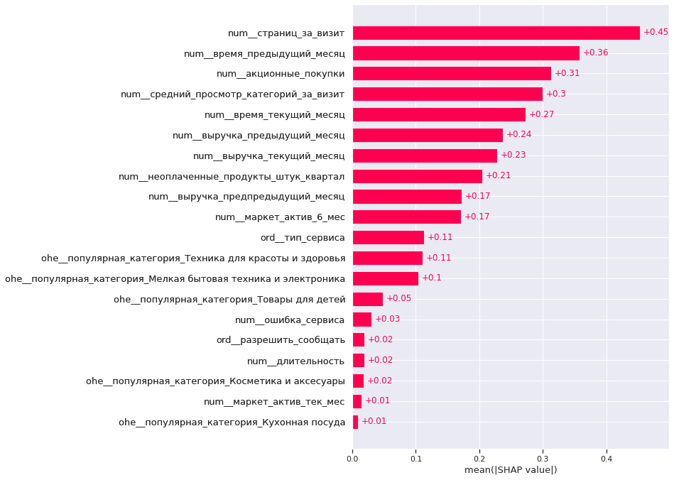
    


<font color='blue'><b>Комментарий ревьюера 2: </b></font> \
<font color='blue'> Здесь нужна matplotlib==3.5.0 </font>

**Вывод**
- Сильнее всего на целевой признак влияют влияют следующие признаки: количество страниц за визит, время, проведенное на сайте в предыдущем и текущем месяце, среднемесячная доля покупок по акции от общего числа покупок за последние 6 месяцев, среднее количество категорий, просмотренных покупателем за визит в течение последнего месяца. 
- Выручка за текущий, предыдущий и предпредыдущий месяц, напрямую зависят от активности покупателей, а также их влияние не так значимо. Поэтому их можно не учитывать.
- Количество неоплаченных товаров в корзине за последние 3 месяца и среднемесячное значение маркетинговых коммуникаций компании, которое приходилось на покупателя за последние 6 месяцев не так значимы.
- Все остальные параметры несуществены, их влияние  можно пренебреч.      


<u>**На основе данных наблюдений моно сделать следующих бизнес-решений**:</u>

1. Время проведенное на сайте и количество просмотренных страниц оказывают отрицательное влияние на активность. Это возможно связано с тем, что долгий поиск нужных товаров отталкивает клиентов и они отказываются от них или покупают в другом магазине. Следовательно надо улучшить навигацию на сайте, чтобы посетители могли легко находить интересующую их информацию или продукты. Необходимо создать больше разнообразных категорий по которым можно искать товар, необходимо сделать так, чтобы с помощью заданых категорий покупатели выделяли меньший круг товаров и быстрее находили нужный

2. Видно достаточно сильное положительное влияние акций на активность потребителей, что говори т о том, что необходимо продолжать распростронаять акции для увеличения потребления. Но так как акции могут иметь разное влияние, необходимо использовать акции текущего времени для распространения.

3. Так, что необходимо провести анализ рынка для дальненйщего составления акций.

<font color='blue'><b>Комментарий ревьюера : </b></font> ✔️\
<font color='green'> 👍</font>

## Сегментация покупателей

Как было обнаружено в предыдущем пункте акции влияют на активность покупателей. Но в отличие от времени просмотра, для акций надо разобраться как именно влияют при разных параметров.

Нашей целью является получение высокой прибыли и снижение вероятности спада покупаительской активности, поэтому проанализировать надо лишь тех клиентов у которых высокая вероятность спада и высокие траты (они клиенты, которых не хочется отпускать больше всего).

Выполним сегментацию покупателей. 
Для начала создадим новый датасет `cust_seg` в котором будут данные из датасета `merged_market_file`. 

<font color='blue'><b>Комментарий ревьюера : </b></font> ❌\
<font color='red'> ~~Сначала нужно выделить сегмент по двум переменным (вероятность снижения и прибыль), для этого определяем и аргументируем два порога по этим осям.\
Это, условно, те с кем имеет смысл работать.\
Затем определяем группу клиентов из сегмента (например по акционным покупкам) и сравниваем этих клиентов со всеми остальньнымим по другим факторам, для выявления различий (можно строить парные графики или накладывать гистограммы). На основании сравнения формируем рекомендации.~~</font>


```python
cust_seg = merged_market_file.copy()
cust_seg.head(2)
```


<div>
<style scoped>
    .dataframe tbody tr th:only-of-type {
        vertical-align: middle;
    }

    .dataframe tbody tr th {
        vertical-align: top;
    }

    .dataframe thead th {
        text-align: right;
    }
</style>
<table border="1" class="dataframe">
  <thead>
    <tr style="text-align: right;">
      <th></th>
      <th>id</th>
      <th>покупательская_активность</th>
      <th>тип_сервиса</th>
      <th>разрешить_сообщать</th>
      <th>маркет_актив_6_мес</th>
      <th>маркет_актив_тек_мес</th>
      <th>длительность</th>
      <th>акционные_покупки</th>
      <th>популярная_категория</th>
      <th>средний_просмотр_категорий_за_визит</th>
      <th>неоплаченные_продукты_штук_квартал</th>
      <th>ошибка_сервиса</th>
      <th>страниц_за_визит</th>
      <th>выручка_предпредыдущий_месяц</th>
      <th>выручка_предыдущий_месяц</th>
      <th>выручка_текущий_месяц</th>
      <th>время_предыдущий_месяц</th>
      <th>время_текущий_месяц</th>
    </tr>
  </thead>
  <tbody>
    <tr>
      <th>1</th>
      <td>215349</td>
      <td>1</td>
      <td>премиум</td>
      <td>да</td>
      <td>4.4</td>
      <td>4</td>
      <td>819</td>
      <td>0.75</td>
      <td>Товары для детей</td>
      <td>4</td>
      <td>4</td>
      <td>2</td>
      <td>5</td>
      <td>4472.0</td>
      <td>5216.0</td>
      <td>4971.6</td>
      <td>12</td>
      <td>10</td>
    </tr>
    <tr>
      <th>2</th>
      <td>215350</td>
      <td>1</td>
      <td>стандарт</td>
      <td>нет</td>
      <td>4.9</td>
      <td>3</td>
      <td>539</td>
      <td>0.14</td>
      <td>Домашний текстиль</td>
      <td>5</td>
      <td>2</td>
      <td>1</td>
      <td>5</td>
      <td>4826.0</td>
      <td>5457.5</td>
      <td>5058.4</td>
      <td>8</td>
      <td>13</td>
    </tr>
  </tbody>
</table>
</div>


Добавим значения выручки.


```python
cust_seg=cust_seg.merge(money,how='inner')
```


```python
cust_seg.info()
```

    <class 'pandas.core.frame.DataFrame'>
    Int64Index: 1290 entries, 0 to 1289
    Data columns (total 19 columns):
     #   Column                               Non-Null Count  Dtype  
    ---  ------                               --------------  -----  
     0   id                                   1290 non-null   int64  
     1   покупательская_активность            1290 non-null   int64  
     2   тип_сервиса                          1290 non-null   object 
     3   разрешить_сообщать                   1290 non-null   object 
     4   маркет_актив_6_мес                   1290 non-null   float64
     5   маркет_актив_тек_мес                 1290 non-null   int64  
     6   длительность                         1290 non-null   int64  
     7   акционные_покупки                    1290 non-null   float64
     8   популярная_категория                 1290 non-null   object 
     9   средний_просмотр_категорий_за_визит  1290 non-null   int64  
     10  неоплаченные_продукты_штук_квартал   1290 non-null   int64  
     11  ошибка_сервиса                       1290 non-null   int64  
     12  страниц_за_визит                     1290 non-null   int64  
     13  выручка_предпредыдущий_месяц         1290 non-null   float64
     14  выручка_предыдущий_месяц             1290 non-null   float64
     15  выручка_текущий_месяц                1290 non-null   float64
     16  время_предыдущий_месяц               1290 non-null   int64  
     17  время_текущий_месяц                  1290 non-null   int64  
     18  прибыль                              1290 non-null   float64
    dtypes: float64(6), int64(10), object(3)
    memory usage: 201.6+ KB


<font color='blue'><b>Комментарий ревьюера : </b></font> ✔️\
<font color='green'> 👍</font>

Также с помощью лучшей обученной модели, выбранной с помощью `random_search`, найдем вероятность снижения активности покупателей и полученные значения поместим в датасет `cust_seg` в новый столбец `вероятность_спада` (**вероятность спада покупательской активности**).


```python
proba = random_search.predict_proba(merged_market_file.drop(['покупательская_активность', 'id'], axis=1))
cust_seg['вероятность_спада'] = proba[:, 1]
```


```python
cust_seg.nunique()
```


    id                                     1290
    покупательская_активность                 2
    тип_сервиса                               2
    разрешить_сообщать                        2
    маркет_актив_6_мес                       41
    маркет_актив_тек_мес                      3
    длительность                            656
    акционные_покупки                        41
    популярная_категория                      6
    средний_просмотр_категорий_за_визит       6
    неоплаченные_продукты_штук_квартал       11
    ошибка_сервиса                           10
    страниц_за_визит                         20
    выручка_предпредыдущий_месяц            786
    выручка_предыдущий_месяц               1114
    выручка_текущий_месяц                  1232
    время_предыдущий_месяц                   19
    время_текущий_месяц                      20
    прибыль                                 397
    вероятность_спада                      1274
    dtype: int64


Видно, что значен6ие прибыли разбиты по кластерам. 


```python
cust_seg.sample(5)
```


<div>
<style scoped>
    .dataframe tbody tr th:only-of-type {
        vertical-align: middle;
    }

    .dataframe tbody tr th {
        vertical-align: top;
    }

    .dataframe thead th {
        text-align: right;
    }
</style>
<table border="1" class="dataframe">
  <thead>
    <tr style="text-align: right;">
      <th></th>
      <th>id</th>
      <th>покупательская_активность</th>
      <th>тип_сервиса</th>
      <th>разрешить_сообщать</th>
      <th>маркет_актив_6_мес</th>
      <th>маркет_актив_тек_мес</th>
      <th>длительность</th>
      <th>акционные_покупки</th>
      <th>популярная_категория</th>
      <th>средний_просмотр_категорий_за_визит</th>
      <th>неоплаченные_продукты_штук_квартал</th>
      <th>ошибка_сервиса</th>
      <th>страниц_за_визит</th>
      <th>выручка_предпредыдущий_месяц</th>
      <th>выручка_предыдущий_месяц</th>
      <th>выручка_текущий_месяц</th>
      <th>время_предыдущий_месяц</th>
      <th>время_текущий_месяц</th>
      <th>прибыль</th>
      <th>вероятность_спада</th>
    </tr>
  </thead>
  <tbody>
    <tr>
      <th>321</th>
      <td>215677</td>
      <td>1</td>
      <td>премиум</td>
      <td>да</td>
      <td>4.6</td>
      <td>4</td>
      <td>993</td>
      <td>0.24</td>
      <td>Домашний текстиль</td>
      <td>2</td>
      <td>3</td>
      <td>9</td>
      <td>11</td>
      <td>4538.0</td>
      <td>4829.0</td>
      <td>5211.2</td>
      <td>17</td>
      <td>16</td>
      <td>3.98</td>
      <td>0.221925</td>
    </tr>
    <tr>
      <th>400</th>
      <td>215756</td>
      <td>0</td>
      <td>стандарт</td>
      <td>нет</td>
      <td>5.4</td>
      <td>4</td>
      <td>923</td>
      <td>0.15</td>
      <td>Кухонная посуда</td>
      <td>2</td>
      <td>1</td>
      <td>6</td>
      <td>10</td>
      <td>4943.0</td>
      <td>5205.5</td>
      <td>5563.0</td>
      <td>18</td>
      <td>17</td>
      <td>5.23</td>
      <td>0.058876</td>
    </tr>
    <tr>
      <th>992</th>
      <td>216349</td>
      <td>0</td>
      <td>стандарт</td>
      <td>нет</td>
      <td>5.5</td>
      <td>4</td>
      <td>341</td>
      <td>0.16</td>
      <td>Косметика и аксесуары</td>
      <td>4</td>
      <td>1</td>
      <td>2</td>
      <td>10</td>
      <td>5394.0</td>
      <td>5230.5</td>
      <td>5218.8</td>
      <td>13</td>
      <td>11</td>
      <td>2.32</td>
      <td>0.081246</td>
    </tr>
    <tr>
      <th>1219</th>
      <td>216576</td>
      <td>0</td>
      <td>стандарт</td>
      <td>да</td>
      <td>5.8</td>
      <td>4</td>
      <td>176</td>
      <td>0.28</td>
      <td>Домашний текстиль</td>
      <td>6</td>
      <td>2</td>
      <td>4</td>
      <td>6</td>
      <td>5150.0</td>
      <td>4334.0</td>
      <td>3756.8</td>
      <td>18</td>
      <td>15</td>
      <td>3.20</td>
      <td>0.061626</td>
    </tr>
    <tr>
      <th>237</th>
      <td>215593</td>
      <td>1</td>
      <td>премиум</td>
      <td>нет</td>
      <td>4.6</td>
      <td>3</td>
      <td>947</td>
      <td>0.33</td>
      <td>Товары для детей</td>
      <td>6</td>
      <td>8</td>
      <td>3</td>
      <td>5</td>
      <td>4414.0</td>
      <td>3141.0</td>
      <td>4005.5</td>
      <td>8</td>
      <td>9</td>
      <td>3.12</td>
      <td>0.832327</td>
    </tr>
  </tbody>
</table>
</div>


<font color='blue'><b>Комментарий ревьюера: </b></font> ❌\
<font color='red'> ~~Нас интересует вероятность снижения па, нужнен класс 1.~~</font>

<font color='blue'><b>Комментарий ревьюера 3: </b></font> ✔️\
<font color='green'> 👍</font>

Рассмотрим оси `прибыль` и	`вероятность_спада`.


```python
cust_seg[['прибыль','вероятность_спада']].describe().T
```


<div>
<style scoped>
    .dataframe tbody tr th:only-of-type {
        vertical-align: middle;
    }

    .dataframe tbody tr th {
        vertical-align: top;
    }

    .dataframe thead th {
        text-align: right;
    }
</style>
<table border="1" class="dataframe">
  <thead>
    <tr style="text-align: right;">
      <th></th>
      <th>count</th>
      <th>mean</th>
      <th>std</th>
      <th>min</th>
      <th>25%</th>
      <th>50%</th>
      <th>75%</th>
      <th>max</th>
    </tr>
  </thead>
  <tbody>
    <tr>
      <th>прибыль</th>
      <td>1290.0</td>
      <td>3.998977</td>
      <td>1.010638</td>
      <td>0.860000</td>
      <td>3.300000</td>
      <td>4.050000</td>
      <td>4.670000</td>
      <td>7.430000</td>
    </tr>
    <tr>
      <th>вероятность_спада</th>
      <td>1290.0</td>
      <td>0.382340</td>
      <td>0.362178</td>
      <td>0.003031</td>
      <td>0.075561</td>
      <td>0.214696</td>
      <td>0.803683</td>
      <td>0.999992</td>
    </tr>
  </tbody>
</table>
</div>


- В полученном распределении видно, что 75% покупателей приносят более 3.3 у.е. и теЮ кто приносит больше и надо учитывать.
- Видно, что у большинства покупателей (75%) вероятность спада покупательской активности не превышает 0.8.

Уберем все ненужные элементы.

Рассмотрим, выделенный сегмент.


```python
### создаем цветовую карту для акций
cmap = plt.get_cmap('Greens')
# обозначаем выделенный сегмент
seg=(cust_seg['вероятность_спада']>0.8)&(cust_seg['прибыль']>3.3)
# создаем массив цветов в зависимости от значения доли товаров покупаемых по акции
colors = [cmap(0.4*x+0.3) for x in seg]

plt.figure(figsize=(12, 6))
plt.scatter(x='вероятность_спада', y='прибыль', data=cust_seg,
            c=colors, alpha=0.7)
#plt.colorbar(label='Доля покупок по акции')  # добавим цветовую шкалу для акций
#plt.legend()
plt.title('Анализ взаимосвязи вероятности снижения активности и прибыли от покупателя')
plt.xlabel('Вероятность снижения покупательской активности')
plt.ylabel('Прибыль')
plt.axvline(x=0.8,color='purple',linestyle='--')
plt.axhline(y=3.3,color='purple',linestyle='--')
plt.show()
```


    
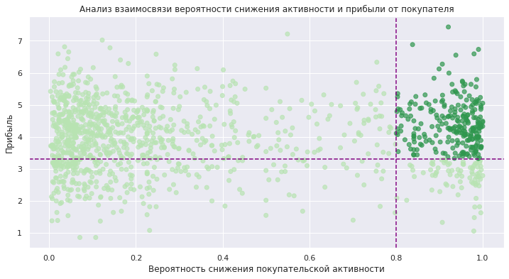
    


<font color='blue'><b>Комментарий ревьюера 3: </b></font> ✔️\
<font color='green'> Отлично!  👍</font>
<font color='blue'><b>Комментарий ревьюера 2: </b></font> ❌\
<font color='red'> <s>Нужно выделить сегмент по двум переменным (вероятность снижения (`predict_proba()[:, 1]`) и прибыль), для этого определяем и аргументируем два порога по этим осям, проще всего это посмотреть на рассеивание.


Это, условно, те с кем имеет смысл работать.\
Затем определяем группу клиентов из сегмента (например по акционным покупкам) и сравниваем этих клиентов со всеми остальньнымим по другим факторам, для выявления различий (можно строить парные графики или накладывать гистограммы). На основании сравнения формируем рекомендации.</s></font>
Создадим новый датасет `target`, куда поместим лишь нужные нам значения.


```python
target=cust_seg.query('(вероятность_спада>0.8)&(прибыль>3.3)')
```


```python
target.info()
```

    <class 'pandas.core.frame.DataFrame'>
    Int64Index: 250 entries, 0 to 1278
    Data columns (total 20 columns):
     #   Column                               Non-Null Count  Dtype  
    ---  ------                               --------------  -----  
     0   id                                   250 non-null    int64  
     1   покупательская_активность            250 non-null    int64  
     2   тип_сервиса                          250 non-null    object 
     3   разрешить_сообщать                   250 non-null    object 
     4   маркет_актив_6_мес                   250 non-null    float64
     5   маркет_актив_тек_мес                 250 non-null    int64  
     6   длительность                         250 non-null    int64  
     7   акционные_покупки                    250 non-null    float64
     8   популярная_категория                 250 non-null    object 
     9   средний_просмотр_категорий_за_визит  250 non-null    int64  
     10  неоплаченные_продукты_штук_квартал   250 non-null    int64  
     11  ошибка_сервиса                       250 non-null    int64  
     12  страниц_за_визит                     250 non-null    int64  
     13  выручка_предпредыдущий_месяц         250 non-null    float64
     14  выручка_предыдущий_месяц             250 non-null    float64
     15  выручка_текущий_месяц                250 non-null    float64
     16  время_предыдущий_месяц               250 non-null    int64  
     17  время_текущий_месяц                  250 non-null    int64  
     18  прибыль                              250 non-null    float64
     19  вероятность_спада                    250 non-null    float64
    dtypes: float64(7), int64(10), object(3)
    memory usage: 41.0+ KB


Создадим корреляционную матрицу для исследования зависимости у целевой группы покупателей. Так как точная природа зависимости неизвестна будем использовать ранговую кореляцию Спирмана.


```python
correlation_matrix = target.drop(['id'], axis=1).corr(method='spearman')
plt.figure(figsize=(15, 6))
sns.heatmap(correlation_matrix, annot=True, cmap='Greens')
plt.yticks()
plt.title(f'Матрица корреляции')
plt.show()
```


    
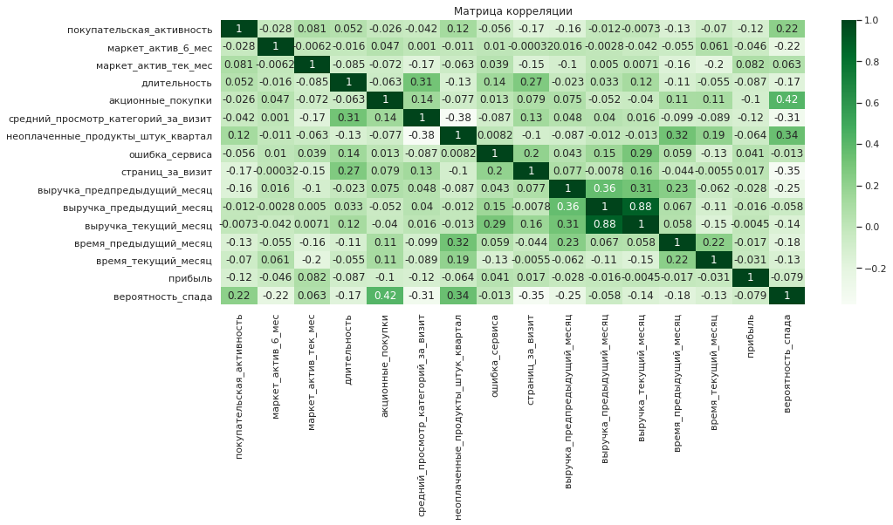
    


Обнаружена умеренная корреляция   между вероятностью снижения покупательской активности и долей покупок по акциям(`0.42`), неоплаченных продуктов (`0.34`) и просмотренных страниц за визит (`0,31`). 

Таким образом, необходимо оценить влияние покупок по акциям на выручку и проанализировать влияние других параметров.

Посмотрим по подробнее на параметры целевой группы.


```python
target.sample(2)
```


<div>
<style scoped>
    .dataframe tbody tr th:only-of-type {
        vertical-align: middle;
    }

    .dataframe tbody tr th {
        vertical-align: top;
    }

    .dataframe thead th {
        text-align: right;
    }
</style>
<table border="1" class="dataframe">
  <thead>
    <tr style="text-align: right;">
      <th></th>
      <th>id</th>
      <th>покупательская_активность</th>
      <th>тип_сервиса</th>
      <th>разрешить_сообщать</th>
      <th>маркет_актив_6_мес</th>
      <th>маркет_актив_тек_мес</th>
      <th>длительность</th>
      <th>акционные_покупки</th>
      <th>популярная_категория</th>
      <th>средний_просмотр_категорий_за_визит</th>
      <th>неоплаченные_продукты_штук_квартал</th>
      <th>ошибка_сервиса</th>
      <th>страниц_за_визит</th>
      <th>выручка_предпредыдущий_месяц</th>
      <th>выручка_предыдущий_месяц</th>
      <th>выручка_текущий_месяц</th>
      <th>время_предыдущий_месяц</th>
      <th>время_текущий_месяц</th>
      <th>прибыль</th>
      <th>вероятность_спада</th>
    </tr>
  </thead>
  <tbody>
    <tr>
      <th>130</th>
      <td>215484</td>
      <td>1</td>
      <td>премиум</td>
      <td>нет</td>
      <td>2.9</td>
      <td>5</td>
      <td>448</td>
      <td>0.23</td>
      <td>Товары для детей</td>
      <td>4</td>
      <td>2</td>
      <td>6</td>
      <td>3</td>
      <td>4267.0</td>
      <td>5059.0</td>
      <td>5018.7</td>
      <td>5</td>
      <td>7</td>
      <td>5.64</td>
      <td>0.959282</td>
    </tr>
    <tr>
      <th>275</th>
      <td>215631</td>
      <td>1</td>
      <td>стандарт</td>
      <td>нет</td>
      <td>4.6</td>
      <td>5</td>
      <td>345</td>
      <td>0.28</td>
      <td>Товары для детей</td>
      <td>2</td>
      <td>2</td>
      <td>1</td>
      <td>1</td>
      <td>4566.0</td>
      <td>5020.5</td>
      <td>4802.1</td>
      <td>6</td>
      <td>7</td>
      <td>3.47</td>
      <td>0.964724</td>
    </tr>
  </tbody>
</table>
</div>


### Анализ целевой группы


```python
# функция для построения круговой диаграммы
def pie_dg1(data, column):
    columns_counts = data[column].value_counts()
    plt.figure(figsize=(5, 5))
    plt.pie(columns_counts, labels=columns_counts.index, autopct='%1.1f%%')
    plt.title(f'Распределение "{column}"')
    plt.show()
    
# функция для построения гистограммы
def draw_hist1(data, column):
    plt.figure(figsize=(7, 5))
    sns.set()
    sns.histplot(data=data, x=column, kde=True, bins=15, color='green')
    plt.title(f'Плотность распределения "{column}"')
    plt.xlabel(column, fontsize=14)
    plt.ylabel('Частота', fontsize=14)
    plt.show()
    
 # Сравнение двух таблиц   
    
 # функция для построения круговой диаграммы
def pie_dg2(data1,data2, column):
    fig, axes = plt.subplots(nrows=1, ncols=2, figsize=(20, 5))
    columns_counts1 = data1[column].value_counts()
    columns_counts2 = data2[column].value_counts()
    plt.figure(figsize=(5, 5))
   
    axes[0].pie(columns_counts1, labels=columns_counts1.index, autopct='%1.1f%%',normalize=True)
    axes[1].pie(columns_counts2, labels=columns_counts2.index, autopct='%1.1f%%',normalize=True)
    axes[0].set_title(f'Распределение "{column}" при доле акционных покупок меньше 0.6')
    axes[1].set_title(f'Распределение "{column}" при доле акционных покупок больше 0.6')
    plt.show()
    
# функция для построения гистограммы
def draw_hist2(data1,data2, column):
    plt.figure(figsize=(7, 5))
    sns.set()
    sns.histplot(data=data1, x=column, kde=True, bins=15, color='green')
    sns.histplot(data=data2, x=column, kde=True, bins=15, color='blue')
    plt.title(f'Плотность распределения "{column}"')
    plt.xlabel(column, fontsize=14)
    plt.ylabel('Частота', fontsize=14)
    plt.legend(['меньше 0.6','больше 0.6'])
    plt.show()   
```

Построим круговые диаграммы для каждой таблицы, чтобы определить какие категории товаров приобретались пользователями с пониженой и сохранненой активностью.


```python
cat = ['популярная_категория','тип_сервиса', 'разрешить_сообщать','покупательская_активность']# категшориальные признаки
num = ['маркет_актив_6_мес', 'маркет_актив_тек_мес',
    'длительность', 'акционные_покупки', 'средний_просмотр_категорий_за_визит',
    'неоплаченные_продукты_штук_квартал', 'ошибка_сервиса', 'страниц_за_визит',
    'выручка_предпредыдущий_месяц', 'выручка_предыдущий_месяц',
    'выручка_текущий_месяц', 'время_предыдущий_месяц',
    'время_текущий_месяц','вероятность_спада','прибыль']#количественные признаки
```


```python
# вызовем функцию и построим график для распределение доли акционных покупоки
draw_hist1(target, 'акционные_покупки')
```


    
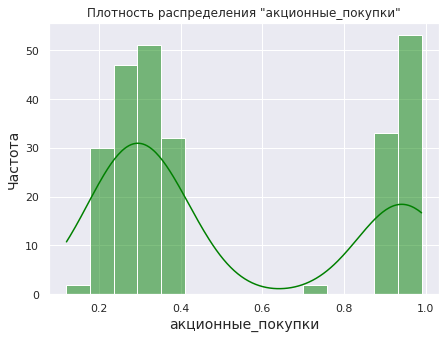
    


```python
target['акционные_покупки'].describe().T
```


    count    250.000000
    mean       0.522280
    std        0.311872
    min        0.120000
    25%        0.280000
    50%        0.350000
    75%        0.930000
    max        0.990000
    Name: акционные_покупки, dtype: float64


Видно, что доля акционных покупок сгруппирована в два кластера. 


```python
(target.query('акционные_покупки<0.6'))['акционные_покупки'].describe().T
```


    count    162.000000
    mean       0.296605
    std        0.061726
    min        0.120000
    25%        0.240000
    50%        0.300000
    75%        0.350000
    max        0.400000
    Name: акционные_покупки, dtype: float64


```python
(target.query('акционные_покупки>0.6'))['акционные_покупки'].describe().T
```


    count    88.000000
    mean      0.937727
    std       0.043727
    min       0.740000
    25%       0.930000
    50%       0.940000
    75%       0.980000
    max       0.990000
    Name: акционные_покупки, dtype: float64


Один кластер от 0 до 0.4, второй от 0.74 до 1. Предположительно, первая подгруппа получила мало акций, а вторая много. Но те и другие брали их, что говорит о заинтересованости покупателей в акциооных программ.

Разделим датасет `target` на две части, в зависимости дольше доля акционных покупок 0.6 или нет.


```python
# разделение таблицы
target1=target.query('акционные_покупки<0.6')
target2=target.query('акционные_покупки>0.6')
```


```python
target1.shape
```


    (162, 20)


```python
target2.shape
```


    (88, 20)


Как видно в целевой группе покупателей, у которых акционных покупок  меньше 0.4 в два раза больше чем тех, у кого акционных покупок больше 0.74

Посмотрим как распределены параметры в подгруппах.


```python
# вызовем функцию и построим графики для количественных признаков
for i in num:
    draw_hist2(target1,target2, i)
   
    
```


    
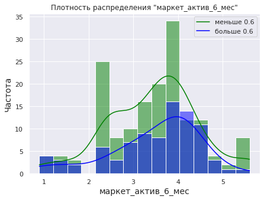
    


    
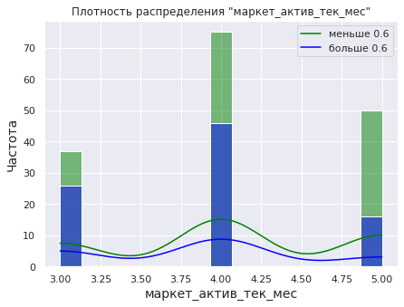
    


    
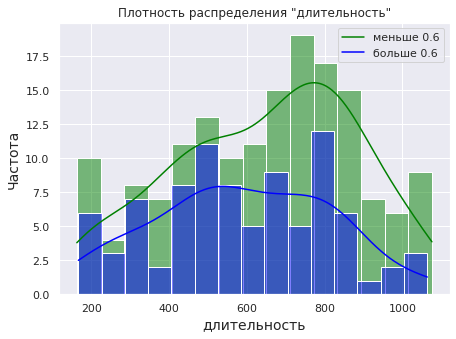
    


    
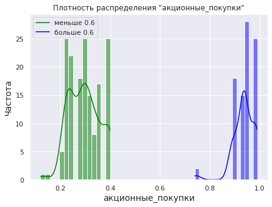
    


    
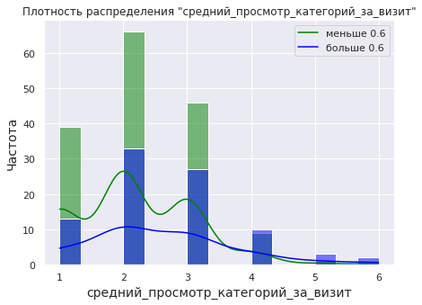
    


    
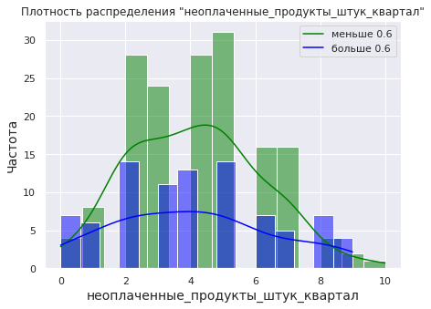
    


    
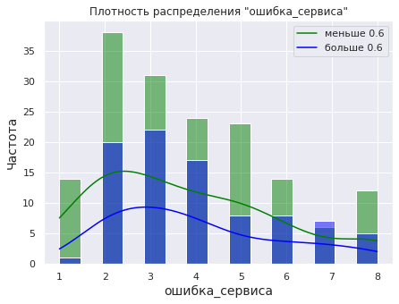
    


    
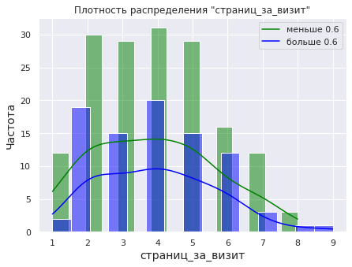
    


    
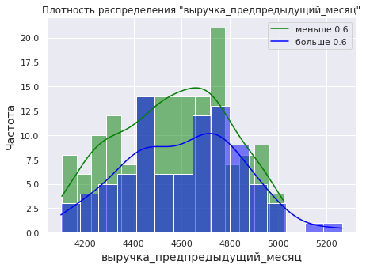
    


    
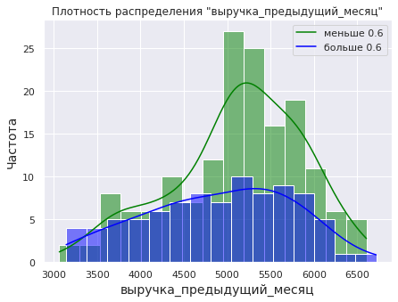
    


    
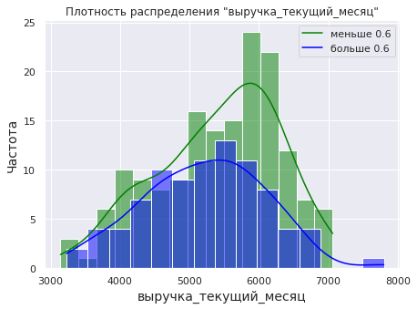
    


    
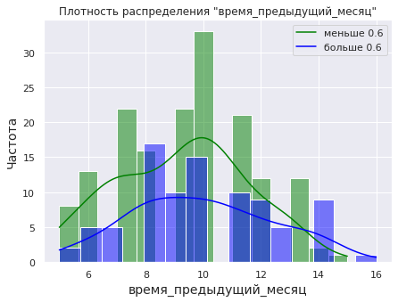
    


    
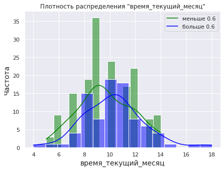
    


    
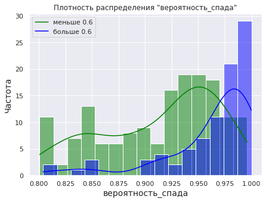
    


    

    


**Вывод**: Можно заметить, что распределения не слишком сильно различаются для большинства параметров. Но в значениях выручки за три предыдуших месяца для тех, кто имеет долю акционных покупок меньше 0.6, наблюдается новый пик:
- В предпредыдущем месяце слабый при в диапозоне 4400-4800.
- В предыдущем месяце заметный при диапозоне 5000-6000.
- В текущем заметный в диапозоне 5000-6500.
Это может говорить, что акции на товары в данном диапозоне цен было трудно найти.
Для тех, кто использует много акций, вероятность спада покупательской активности стремиться к 1.0, в то время для остальных к 0,95. Это можно, объяснить, что те кто имел скидку уже купили нужный товар, а цена без акции их не устраивает.

Проведем анализ для качественных признаков.


```python
for i in cat:
    pie_dg2(target1,target2, i)
```


    
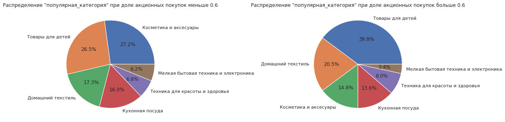
    


    <Figure size 360x360 with 0 Axes>


    
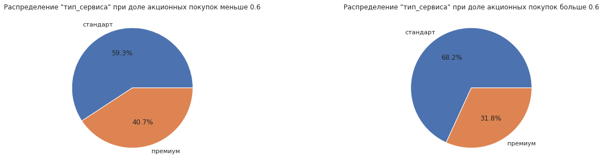
    


    <Figure size 360x360 with 0 Axes>


    
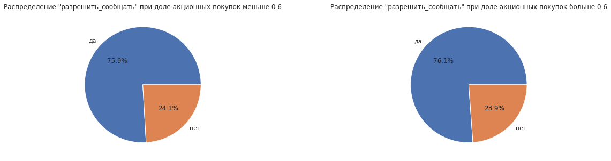
    


    <Figure size 360x360 with 0 Axes>


    
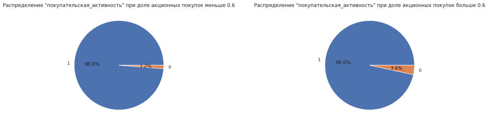
    


    <Figure size 360x360 with 0 Axes>


**Вывод**: Можно заметить, что больще всего различий в разделе популярные категории товаров. 
- `Косметика и аксесуары` и `Мелкая бытовая электроника` больше покупают без скидки.
- `Товары для детей` больше покупают по акции.
Покупатели с высокой долей акционных покупок имеет меньшию долю сервиса типа Премиум. Возможно это связано, что сервис Премиум способен компенсировать, часть акций.

Можно предположить, что акции для категорий `Косметика и аксесуары` и `Мелкая бытовая электроника` трудно доступны и неспособность их найти приводит к спаду активности. Для категории `Товары для детей` акции приводят к тому, что покупатель присытивается и теряет дальнейщий интерес их покупать.

<font color='blue'><b>Комментарий ревьюера 3: </b></font> ✔️\
<font color='green'> 👍</font>

**Выводы:**

Для более детального рассмотрения данных была выбрана целевая группа пользователей со среднемесячной прибылью, полученной магазином за последние 3 месяца, больше 4 (среднее значение прибыли) и высокой верояностью снижения покупательской активности — более 80%. 

Обнаружена умеренная корреляция между вероятностью снижения покупательской активности и долей покупок по акциям(`0.42`), неоплаченных продуктов (`0.34`) и просмотренных страниц за визит (`0,31`). Так количество неоплаченных продуктов и просмотренных страниц за визит сложно индивидуально контролировать (это связано с работой всего сайта), то было рассмотрено влияние акций. 

В целевой группе было обнаружено, что доля акционных покупок сгруппирована в два кластера. Один кластер от 0 до 0.4, второй от 0.74 до 1. Предположительно, первая подгруппа получила мало акций, а вторая много. Но те и другие брали их, что говорит о заинтересованости покупателей в акционных программ. Как видно в целевой группе покупателей, у которых акционных покупок  меньше 0.4 в два раза больше чем тех, у кого акционных покупок больше 0.74.

Можно заметить, что распределения не слишком сильно различаются от доли акционных покупок для большинства параметров. Но в значениях выручки за три предыдуших месяца для тех, кто имеет долю акционных покупок меньше 0.6, наблюдается новый пик:
- В предпредыдущем месяце слабый при в диапозоне 4400-4800.
- В предыдущем месяце заметный при диапозоне 5000-6000.
- В текущем заметный в диапозоне 5000-6500.
Это может говорить, что акции на товары в данном диапозоне цен было трудно найти.
Для тех, кто использует много акций, вероятность спада покупательской активности стремиться к 1.0, в то время для остальных к 0,95. Это можно, объяснить, что те кто имел скидку уже купили нужный товар, а цена без акции их не устраивает. Значит акции заканчиваются.

Можно заметить, что больще всего различий в разделе популярные категории товаров. 
- `Косметика и аксесуары` и `Мелкая бытовая электроника` больше покупают без скидки.
- `Товары для детей` больше покупают по акции.

Можно предположить, что акции для категорий `Косметика и аксесуары` и `Мелкая бытовая электроника` трудно доступны и неспособность их найти приводит к спаду активности. Для категории `Товары для детей` акции приводят к тому, что покупатель присытивается и теряет дальнейщий интерес их покупать.

Покупатели с высокой долей акционных покупок имеет меньшию долю сервиса типа Премиум. Возможно это связано, что сервис Премиум способен компенсировать, часть акций.


---------

Исходя из этого, можно сделать следующие предложения по работе для увеличения активности:

1. Нужно для каждого покупателя составить профель и найти вероятность снижения активности.
2. Для категорий товаров `Косметика и аксесуары` и `Мелкая бытовая электроника`создать персонализированные акции и программы и сделать их доступнее, чтобы покупатели остались на сайте. Скорее всего нужно больше скидок на товары с ценой 4000-6000.
3. Для категории товаров `Товары для детей` уменьшить количество акций, чтобы покупатели не пресышались. Будут меньше покупать в месяц, но остануться на сайтею

<font color='blue'><b>Комментарий ревьюера 3: </b></font> ✔️\
<font color='green'> 👍</font>

## Общий вывод

<u>Задача</u>: разработать решение, которое позволит персонализировать предложения постоянным клиентам Интернет-магазина «В один клик», чтобы увеличить их покупательскую активность.

Для работы было предоставлено четыре файла:
* `market_file.csv`: таблица, которая содержит данные о поведении покупателя на сайте, о коммуникациях с покупателем и его продуктовом поведении.
* `market_money.csv`: таблица с данными о выручке, которую получает магазин с покупателя, то есть сколько покупатель всего потратил за период взаимодействия с сайтом.
* `market_time.csv`: таблица с данными о времени (в минутах), которое покупатель провёл на сайте в течение периода.
* `money.csv`: таблица с данными о среднемесячной прибыли покупателя за последние 3 месяца: какую прибыль получает магазин от продаж каждому покупателю.

На этапе предобработки были исправлены ошибки в обозначении временных периодов, удалены выбросы, дубликаты явные и неявные обнаружены не были, работы с пропусками также не было ввиду их отсутствия.

Был проведен исследовательский анализ количественных и качественных признаков, каких-либо аномальных или оторванных от реальности значений обнаружено не было.

Были оттобраны клеенты котопрые совершали покупки в течении последних трех месяцев. Для этого были объединены таблицы, и получены полная таблица, отражающая активность покупателей за указанный срок. Был выполнен корреляционный анализ данных, представленных в этой таблице и были найдены признаки с высокой и заметной корреляцией.

Для обучения были выбраны следующие модели: `KNeighborsClassifier()`, `DecisionTreeClassifier()`, `LogisticRegression()` и `SVC()` с различными параметрами и гиперпараметрами. Для подбора гиперпараметров и выбора лучшей модели использовался метод `RandomizedSearchCV`. Для облегчения работы использовались пайплайны с различными кодировщиками (`OneHotEncoder()`, `OrdinalEncoder()`, `StandardScaler()`, `MinMaxScaler()`). Лучшей моделью выбрана модель **SVC** с парамерами C=1, degree=4, gamma=1, kernel='linear', probability=True и random_state=42. Метрика лучшей модели на тренировочной выборке с округлением составляет `0.9`. Площадь под ROC-кривой с округлением составляет `0.9`. С помощью метода SHAP были отобраны наиболее важные признаки, которые лучшая модель учитывала при принятии решений.

В качестве целевой группы были отобраны пользователи  с высокими затратами на покупки и с не низкой вероятностью снижения покупательской активности.

<u>Предложения по работе </u>

1. Увеличить разнообразия категория для поиска товаров для облегчения покупки.

2. Для категорий `Косметика и аксесуары` и `Мелкая бытовая электроника` разработать новую программу акций.

3. Для тех кто ищет их на сайте в персональном порядке отправлять акции, чтобы завлеч их. 

4. Особенно увеличить количество скидок на товары в ценовом диапозоне 4000-6000.

5. Для `Товары для детей` переработать акционную политику и увеличить расходы на ректаму в ущерб скидкам.

Используя эти предложения можно увеличить прибыль и уменьшить снижение покупательской активности.

<font color='blue'><b>Комментарий ревьюера : </b></font> ✔️\
<font color='green'> Очень приятно видеть вывод в конце проекта!\
Приведены ответы на главные вопросы проекта.</font>

<font color='blue'><b>Итоговый комментарий ревьюера</b></font>\
<font color='green'>Александр, хороший проект получился!
Большое спасибо за проделанную работу. Видно, что приложено много усилий.
Выводы и рассуждения получились содержательными, их было интересно читать.
</font>

<font color='steelblue'>Над проектом ещё стоит поработать - есть рекомендации по дополнению некоторых твоих шагов проекта. Такие рекомендации я отметил жёлтыми комментариями. Будет здорово, если ты учтёшь их - так проект станет структурно и содержательно более совершенным.

Также в работе есть критические замечания. К этим замечаниям я оставил пояснительные комментарии красного цвета, в которых перечислил возможные варианты дальнейших действий. Уверен, ты быстро с этим управишься:)

Если о том, что нужно сделать в рамках комментариев, будут возникать вопросы - оставь их, пожалуйста, в комментариях, и я отвечу на них во время следующего ревью.

Также буду рад ответить на любые твои вопросы по проекту или на какие-либо другие, если они у тебя имеются - оставь их в комментариях, и я постараюсь ответить:)</font>

<font color='blue'><b>Жду твой проект на повторном ревью. До встречи :) </b></font>

<font color='blue'><b>Итоговый комментарий ревьюера 2</b></font>\
<font color='green'>Александр, большое спасибо за доработку.
</font>

<font color='blue'>Что нужно исправить:</font>
<ul><font color='red'>Поправь названия столбцов в таблице.</font></ul>
<ul><font color='red'>Поправь сегментацию покупателей.</font></ul>

<font color='blue'><b>Жду новую версию проекта :)</b></font>

<font color='blue'><b>Итоговый комментарий ревьюера 3</b></font>\
<font color='green'> Александр, проект принят! \
Все этапы пройдены. Все рекомендации учтены.\
Надеюсь, тебе понравился процесс выполнения и результат.</font> \
<font color='blue'><b>Спасибо, удачи в освоении профессии!</b></font>
