<div style="border:solid Chocolate 2px; padding: 40px">
 
<b> Александр, привет!👋</b>  

Меня зовут Кирилл Васильев, я буду ревьюером твоего проекта. Я предлагаю общаться на «ты», но если привычнее на «вы», просто скажи об этом! 

Я буду оставлять комментарии в твоем проекте. Пожалуйста, не удаляй их, они могут быть полезны в случае повторной проверки.

Свои комментарии я буду обозначать <font color='green'>зеленым</font>, <font color='gold'>желтым</font> и <font color='red'>красным</font> цветами, например:
  
<br/>

<div class="alert alert-success">
<h2> Комментарий ревьюера <a class="tocSkip"> </h2>

<b>Все отлично!👍:</b> В случае, если решение на отдельном шаге является полностью правильным. Здесь же я могу давать советы и предложения.
</div>
 
<br/>

<div class="alert alert-warning">
    <h2> Комментарий ревьюера <a class="tocSkip"> </h2>
    
<b>Некоторые замечания и рекомендации💡:</b> В случае, когда решение на отдельном шаге станет еще лучше, если внести небольшие коррективы.
</div> 


<br/>
<div class="alert alert-block alert-danger">
<h2> Комментарий ревьюера <a class="tocSkip"></h2>

     
<b>На доработку🤔:</b>
 В случае, когда решение на отдельном шаге требует существенной переработки и внесения правок. Напоминаю, что проект не может быть принят с первого раза, если ревью содержит комментарии, рекомендующие доработать шаги.
</div>
 
<br/>
<div class="alert alert-info">
Рекомендую для твоих комментариев использовать синий или любой другой цветной фон. Я постараюсь ничего не пропустить, но если комментарии будут выделены, то это мне очень поможет!
</div>
    
Увидев у тебя неточность, в первый раз я лишь укажу на ее наличие и дам тебе возможность самостоятельно найти и исправить ее. На реальной работе твой руководитель будет поступать также. Но если ты пока не справишься с такой задачей - при следующей проверке я дам более точную подсказку.

Владелец молочного хозяйства хочет купить новых коров. Его уелью является купить тех коров, что дают не менее 6000 кг молока и оно должно быть вкусным. Целью проэкта является на основе данных, которые есть у молочного хозяйства, составить модель прогнозирования характеристик молока

<div class="alert alert-success">
<h2> Комментарий ревьюера <a class="tocSkip"> </h2>
 
👍 Коротко, но ясно.
</div>    

## Загрузка данных


```python
import pandas as pd 
import numpy as np 
import seaborn as sns
from math import sqrt
import datetime as dt
import scipy.stats as st
from scipy.stats import binom, norm, spearmanr
from matplotlib import pyplot as plt
from sklearn.linear_model import LinearRegression 
from sklearn.linear_model import LogisticRegression
from sklearn.model_selection import train_test_split
from sklearn.metrics import mean_squared_error
from sklearn.metrics import r2_score
from sklearn.preprocessing import OneHotEncoder 
from sklearn.preprocessing import StandardScaler
from sklearn.metrics import accuracy_score
from sklearn.metrics import recall_score
from sklearn.metrics import precision_score
from sklearn.metrics import confusion_matrix
from sklearn.metrics import mean_absolute_error

```

<div class="alert alert-warning">
<h2> Комментарий ревьюера <a class="tocSkip"> </h2>
    
<b>Некоторые замечания и рекомендации💡:</b> 
    
Если загружаем несколько функций из одного пакета, то удобнее записать это через запятую.
    
`from sklearn.metrics import r2_score, accuracy_score, precision_score, recall_score, confusion_matrix`
    
А если через запятую будет больше трех-четырех позиций (а длина строки больше 90 символов), в таком случае здесь было бы идеально привести оформление в соответствие с <a href="https://pythonworld.ru/osnovy/pep-8-rukovodstvo-po-napisaniyu-koda-na-python.html">pep8</a> - не оставлять длинных строк. 

Такое оформление предпочтительнее:    
    
`from sklearn.metrics import (
    accuracy_score, 
    confusion_matrix, 
    r2_score,
    precision_score,
    recall_score
)`
    
        
</div>


Загрузим файлы о коровах на ферме, их родителях и коровах на покупку.


```python
ferma=pd.read_csv('/datasets/ferma_main.csv',delimiter=';')
dad=pd.read_csv('/datasets/ferma_dad.csv',delimiter=';')
buy=pd.read_csv('/datasets/cow_buy.csv',delimiter=';')
```

 
<div class="alert alert-success"> 
<h2> Комментарий ревьюера <a class="tocSkip"> </h2>

👍 Чтобы считывать запятую в разделителе цифр можно уже на этапе загрузки определить разделитель:
    
`ferma_main = pd.read_csv('/datasets/ferma_main.csv', sep = ';', decimal = ',')`
</div>  

##  Предобработка данных

проверим полученные датачеты

В начале рассмотрим данные по коровам в молочном хозяйстве


```python
ferma.head()
```


<div>
<style scoped>
    .dataframe tbody tr th:only-of-type {
        vertical-align: middle;
    }

    .dataframe tbody tr th {
        vertical-align: top;
    }

    .dataframe thead th {
        text-align: right;
    }
</style>
<table border="1" class="dataframe">
  <thead>
    <tr style="text-align: right;">
      <th></th>
      <th>id</th>
      <th>Удой, кг</th>
      <th>ЭКЕ (Энергетическая кормовая единица)</th>
      <th>Сырой протеин, г</th>
      <th>СПО (Сахаро-протеиновое соотношение)</th>
      <th>Порода</th>
      <th>Тип пастбища</th>
      <th>порода папы_быка</th>
      <th>Жирность,%</th>
      <th>Белок,%</th>
      <th>Вкус молока</th>
      <th>Возраст</th>
    </tr>
  </thead>
  <tbody>
    <tr>
      <th>0</th>
      <td>1</td>
      <td>5863</td>
      <td>14,2</td>
      <td>1743</td>
      <td>0,89</td>
      <td>Вис Бик Айдиал</td>
      <td>Равнинное</td>
      <td>Айдиал</td>
      <td>3,58</td>
      <td>3,076</td>
      <td>вкусно</td>
      <td>более_2_лет</td>
    </tr>
    <tr>
      <th>1</th>
      <td>2</td>
      <td>5529</td>
      <td>12,8</td>
      <td>2138</td>
      <td>0,89</td>
      <td>Вис Бик Айдиал</td>
      <td>Равнинные</td>
      <td>Соверин</td>
      <td>3,54</td>
      <td>3,079</td>
      <td>вкусно</td>
      <td>менее_2_лет</td>
    </tr>
    <tr>
      <th>2</th>
      <td>3</td>
      <td>5810</td>
      <td>14</td>
      <td>1854</td>
      <td>0,885</td>
      <td>РефлешнСоверинг</td>
      <td>Холмистое</td>
      <td>Соверин</td>
      <td>3,59</td>
      <td>3,074</td>
      <td>не вкусно</td>
      <td>более_2_лет</td>
    </tr>
    <tr>
      <th>3</th>
      <td>4</td>
      <td>5895</td>
      <td>12,4</td>
      <td>2012</td>
      <td>0,885</td>
      <td>РефлешнСоверинг</td>
      <td>Холмистое</td>
      <td>Айдиал</td>
      <td>3,4</td>
      <td>3,075</td>
      <td>не вкусно</td>
      <td>более_2_лет</td>
    </tr>
    <tr>
      <th>4</th>
      <td>5</td>
      <td>5302</td>
      <td>12,8</td>
      <td>1675</td>
      <td>0,885</td>
      <td>Вис Бик Айдиал</td>
      <td>Равнинные</td>
      <td>Соверин</td>
      <td>3,73</td>
      <td>3,073</td>
      <td>вкусно</td>
      <td>менее_2_лет</td>
    </tr>
  </tbody>
</table>
</div>


```python
ferma.info()
```

    <class 'pandas.core.frame.DataFrame'>
    RangeIndex: 634 entries, 0 to 633
    Data columns (total 12 columns):
     #   Column                                 Non-Null Count  Dtype 
    ---  ------                                 --------------  ----- 
     0   id                                     634 non-null    int64 
     1   Удой, кг                               634 non-null    int64 
     2   ЭКЕ (Энергетическая кормовая единица)  634 non-null    object
     3   Сырой протеин, г                       634 non-null    int64 
     4   СПО (Сахаро-протеиновое соотношение)   634 non-null    object
     5   Порода                                 634 non-null    object
     6   Тип пастбища                           634 non-null    object
     7   порода папы_быка                       634 non-null    object
     8   Жирность,%                             634 non-null    object
     9   Белок,%                                634 non-null    object
     10  Вкус молока                            634 non-null    object
     11  Возраст                                634 non-null    object
    dtypes: int64(3), object(9)
    memory usage: 59.6+ KB


Можно увидеть, что количественные величины такие как ЭКЕ; СПО; Жирность,%; Белок,% имеют тип object. Это надо изменить. Также надо исметить названия столбцов для упрощения работы.


```python
ferma=ferma.rename(columns={'Удой, кг':'удой',
                           'ЭКЕ (Энергетическая кормовая единица)':'эке',
                           'Сырой протеин, г':'протеин',
                           'СПО (Сахаро-протеиновое соотношение)':'спо',
                           'Тип пастбища':'пастбище',
                           'Порода':'порода',
                           'порода папы_быка':'папа',
                           'Жирность,%':'жир',
                           'Белок,%':'белок',
                           'Вкус молока':'вкус',
                           'Возраст':'возраст'})
```


```python
ferma.info()
```

    <class 'pandas.core.frame.DataFrame'>
    RangeIndex: 634 entries, 0 to 633
    Data columns (total 12 columns):
     #   Column    Non-Null Count  Dtype 
    ---  ------    --------------  ----- 
     0   id        634 non-null    int64 
     1   удой      634 non-null    int64 
     2   эке       634 non-null    object
     3   протеин   634 non-null    int64 
     4   спо       634 non-null    object
     5   порода    634 non-null    object
     6   пастбище  634 non-null    object
     7   папа      634 non-null    object
     8   жир       634 non-null    object
     9   белок     634 non-null    object
     10  вкус      634 non-null    object
     11  возраст   634 non-null    object
    dtypes: int64(3), object(9)
    memory usage: 59.6+ KB


```python
t=['эке','спо','жир','белок']#столбцы в которых ьнгадо поменять формат
for n in t:
    ferma[n]=ferma[n].apply(lambda x: x.replace(',','.'))
    ferma[n]=pd.to_numeric(ferma[n], errors='raise', downcast=None)
#ferma['протеин']=pd.to_numeric(ferma['протеин'], errors='raise', downcast=None)
    
```

<div class="alert alert-success">
<h2> Комментарий ревьюера <a class="tocSkip"> </h2>
 
👍  Если при загрузке определить разделитель, то это действие будет излишним. 
</div>  
  


id же надо заменить на строчки


```python
ferma['id']=ferma['id'].astype(str)
```


```python
ferma.info()
```

    <class 'pandas.core.frame.DataFrame'>
    RangeIndex: 634 entries, 0 to 633
    Data columns (total 12 columns):
     #   Column    Non-Null Count  Dtype  
    ---  ------    --------------  -----  
     0   id        634 non-null    object 
     1   удой      634 non-null    int64  
     2   эке       634 non-null    float64
     3   протеин   634 non-null    int64  
     4   спо       634 non-null    float64
     5   порода    634 non-null    object 
     6   пастбище  634 non-null    object 
     7   папа      634 non-null    object 
     8   жир       634 non-null    float64
     9   белок     634 non-null    float64
     10  вкус      634 non-null    object 
     11  возраст   634 non-null    object 
    dtypes: float64(4), int64(2), object(6)
    memory usage: 59.6+ KB


Как можно увидеть у всех количественных переменных тип данных float64


```python
ferma.duplicated().sum()
```


    5


есть явные дубликаты. Их надо удалить


```python
ferma=ferma.drop_duplicates().reset_index(drop=True)
```


```python
ferma['id'].duplicated().sum()
```


    0


Посмотрим есть ли не явные дубликаты в качественныхз признаках


```python
for x in ['порода','пастбище','папа','вкус','возраст']:
    print(x,':')
    print(ferma[x].unique())
```

    порода :
    ['Вис Бик Айдиал' 'РефлешнСоверинг']
    пастбище :
    ['Равнинное' 'Равнинные' 'Холмистое']
    папа :
    ['Айдиал' 'Соверин' 'Айдиалл']
    вкус :
    ['вкусно' 'не вкусно']
    возраст :
    ['более_2_лет' 'менее_2_лет']


Видно, что в столбцах пастбище и папа есть неявные дубликаты. Заменим их на одно значение


```python
ferma.loc[ferma['пастбище'] == 'Равнинные','пастбище']='равнинное'
ferma.loc[ferma['пастбище'] =='Равнинное' ,'пастбище']='равнинное'
ferma.loc[ferma['пастбище']=='Холмистое','пастбище']='холмистое'
ferma.loc[ferma['папа']=='Айдиалл','папа']='Айдиал'
```

<div class="alert alert-success">
<h2> Комментарий ревьюера <a class="tocSkip"> </h2>
 
👍  Отлично по неявным дублям.
</div>  


Посмотрим снова


```python
for x in ['порода','пастбище','папа','вкус','возраст']:
    print(x,':')
    print(ferma[x].unique())
```

    порода :
    ['Вис Бик Айдиал' 'РефлешнСоверинг']
    пастбище :
    ['равнинное' 'холмистое']
    папа :
    ['Айдиал' 'Соверин']
    вкус :
    ['вкусно' 'не вкусно']
    возраст :
    ['более_2_лет' 'менее_2_лет']


неявные дубликаты не обнаружзены

Рассмотрим датасет о отцах коров


```python
dad.head()
```


<div>
<style scoped>
    .dataframe tbody tr th:only-of-type {
        vertical-align: middle;
    }

    .dataframe tbody tr th {
        vertical-align: top;
    }

    .dataframe thead th {
        text-align: right;
    }
</style>
<table border="1" class="dataframe">
  <thead>
    <tr style="text-align: right;">
      <th></th>
      <th>id</th>
      <th>Имя Папы</th>
    </tr>
  </thead>
  <tbody>
    <tr>
      <th>0</th>
      <td>1</td>
      <td>Буйный</td>
    </tr>
    <tr>
      <th>1</th>
      <td>2</td>
      <td>Соловчик</td>
    </tr>
    <tr>
      <th>2</th>
      <td>3</td>
      <td>Барин</td>
    </tr>
    <tr>
      <th>3</th>
      <td>4</td>
      <td>Буйный</td>
    </tr>
    <tr>
      <th>4</th>
      <td>5</td>
      <td>Барин</td>
    </tr>
  </tbody>
</table>
</div>


```python
dad.info()
```

    <class 'pandas.core.frame.DataFrame'>
    RangeIndex: 629 entries, 0 to 628
    Data columns (total 2 columns):
     #   Column    Non-Null Count  Dtype 
    ---  ------    --------------  ----- 
     0   id        629 non-null    int64 
     1   Имя Папы  629 non-null    object
    dtypes: int64(1), object(1)
    memory usage: 10.0+ KB


Пропусков нет. Тип данных возражений не вызывает


```python
dad.duplicated().sum()
```


    0


```python
dad['id'].duplicated().sum()
```


    0


```python
dad['Имя Папы'].unique()
```


    array(['Буйный', 'Соловчик', 'Барин', 'Геркулес'], dtype=object)


Дубликатов нет. Все имена коров появляются один раз.

Столбец Имя Папы следует заменить на лаконичное род


```python
dad=dad.rename(columns={'Имя Папы':'род'})
```

Для дальнейщего анализа id надо заменить на строчный тип


```python
dad['id']=dad['id'].astype(str)
```


```python
buy.head()
```


<div>
<style scoped>
    .dataframe tbody tr th:only-of-type {
        vertical-align: middle;
    }

    .dataframe tbody tr th {
        vertical-align: top;
    }

    .dataframe thead th {
        text-align: right;
    }
</style>
<table border="1" class="dataframe">
  <thead>
    <tr style="text-align: right;">
      <th></th>
      <th>Порода</th>
      <th>Тип пастбища</th>
      <th>порода папы_быка</th>
      <th>Имя_папы</th>
      <th>Текущая_жирность,%</th>
      <th>Текущий_уровень_белок,%</th>
      <th>Возраст</th>
    </tr>
  </thead>
  <tbody>
    <tr>
      <th>0</th>
      <td>Вис Бик Айдиал</td>
      <td>холмистое</td>
      <td>Айдиал</td>
      <td>Геркулес</td>
      <td>3,58</td>
      <td>3,076</td>
      <td>более_2_лет</td>
    </tr>
    <tr>
      <th>1</th>
      <td>Вис Бик Айдиал</td>
      <td>равнинное</td>
      <td>Соверин</td>
      <td>Буйный</td>
      <td>3,54</td>
      <td>3,081</td>
      <td>менее_2_лет</td>
    </tr>
    <tr>
      <th>2</th>
      <td>РефлешнСоверинг</td>
      <td>равнинное</td>
      <td>Соверин</td>
      <td>Барин</td>
      <td>3,59</td>
      <td>3,074</td>
      <td>более_2_лет</td>
    </tr>
    <tr>
      <th>3</th>
      <td>РефлешнСоверинг</td>
      <td>холмистое</td>
      <td>Айдиал</td>
      <td>Буйный</td>
      <td>3,4</td>
      <td>3,061</td>
      <td>более_2_лет</td>
    </tr>
    <tr>
      <th>4</th>
      <td>РефлешнСоверинг</td>
      <td>равнинное</td>
      <td>Айдиал</td>
      <td>Буйный</td>
      <td>3,64</td>
      <td>3,074</td>
      <td>более_2_лет</td>
    </tr>
  </tbody>
</table>
</div>


```python
buy.info()
```

    <class 'pandas.core.frame.DataFrame'>
    RangeIndex: 20 entries, 0 to 19
    Data columns (total 7 columns):
     #   Column                   Non-Null Count  Dtype 
    ---  ------                   --------------  ----- 
     0   Порода                   20 non-null     object
     1   Тип пастбища             20 non-null     object
     2   порода папы_быка         20 non-null     object
     3   Имя_папы                 20 non-null     object
     4   Текущая_жирность,%       20 non-null     object
     5   Текущий_уровень_белок,%  20 non-null     object
     6   Возраст                  20 non-null     object
    dtypes: object(7)
    memory usage: 1.2+ KB


Для начала заменим названия столбцов на более простые


```python
buy=buy.rename(columns={'Тип пастбища':'пастбище','Порода':'порода','порода папы_быка':'папа','Имя_папы':'род','Текущая_жирность,%':'жир','Текущий_уровень_белок,%':'белок','Возраст':'возраст'})
```

Найдем дубликаты и если они есть удалим


```python
buy.duplicated().sum()
```


    4


```python
buy=buy.drop_duplicates().reset_index(drop=True)
```

<div class="alert alert-warning">
<h2> Комментарий ревьюера <a class="tocSkip"> </h2>
    
<b>Некоторые замечания и рекомендации💡:</b> 

Предположу, что в таблице коров на покупку у нас все-таки разные коровы. Там мало признаков, категорий тоже немного - вероятность повторов ненулевая.
    
В случае сомнения нам выгоднее оставить здесь дубли: легче будет в дальнейшем их удалить, чем восстановить. Эта таблица в обучении моделей не участвует, так что дубли не критичны.
    
И если здесь делаем reset_index, то не сможем потом просто восстановить, для каких коров у нас получились прогнозы.
       
</div> 


```python
for x in ['порода','пастбище','папа','род','возраст']:
    print(x,':')
    print(buy[x].unique())
```

    порода :
    ['Вис Бик Айдиал' 'РефлешнСоверинг']
    пастбище :
    ['холмистое' 'равнинное']
    папа :
    ['Айдиал' 'Соверин']
    род :
    ['Геркулес' 'Буйный' 'Барин' 'Соловчик']
    возраст :
    ['более_2_лет' 'менее_2_лет']


```python
buy.info()
```

    <class 'pandas.core.frame.DataFrame'>
    RangeIndex: 16 entries, 0 to 15
    Data columns (total 7 columns):
     #   Column    Non-Null Count  Dtype 
    ---  ------    --------------  ----- 
     0   порода    16 non-null     object
     1   пастбище  16 non-null     object
     2   папа      16 non-null     object
     3   род       16 non-null     object
     4   жир       16 non-null     object
     5   белок     16 non-null     object
     6   возраст   16 non-null     object
    dtypes: object(7)
    memory usage: 1.0+ KB


Изменим тип данных для жиров и белков


```python
t=['жир','белок']#столбцы в которых ьнгадо поменять формат
for n in t:
    buy[n]=buy[n].apply(lambda x: x.replace(',','.'))
    buy[n]=pd.to_numeric(buy[n], errors='raise', downcast=None)
```


```python
buy.info()
```

    <class 'pandas.core.frame.DataFrame'>
    RangeIndex: 16 entries, 0 to 15
    Data columns (total 7 columns):
     #   Column    Non-Null Count  Dtype  
    ---  ------    --------------  -----  
     0   порода    16 non-null     object 
     1   пастбище  16 non-null     object 
     2   папа      16 non-null     object 
     3   род       16 non-null     object 
     4   жир       16 non-null     float64
     5   белок     16 non-null     float64
     6   возраст   16 non-null     object 
    dtypes: float64(2), object(5)
    memory usage: 1.0+ KB


## Исследовательский анализ данных

Рассмотрим, как распреджелены данные коров 


```python
ferma.info()
```

    <class 'pandas.core.frame.DataFrame'>
    RangeIndex: 629 entries, 0 to 628
    Data columns (total 12 columns):
     #   Column    Non-Null Count  Dtype  
    ---  ------    --------------  -----  
     0   id        629 non-null    object 
     1   удой      629 non-null    int64  
     2   эке       629 non-null    float64
     3   протеин   629 non-null    int64  
     4   спо       629 non-null    float64
     5   порода    629 non-null    object 
     6   пастбище  629 non-null    object 
     7   папа      629 non-null    object 
     8   жир       629 non-null    float64
     9   белок     629 non-null    float64
     10  вкус      629 non-null    object 
     11  возраст   629 non-null    object 
    dtypes: float64(4), int64(2), object(6)
    memory usage: 59.1+ KB


Рассмотрим все количественные признаки


```python
ferma[['удой','эке','протеин','спо','жир','белок']].hist(bins=30)

```


    array([[<AxesSubplot:title={'center':'удой'}>,
            <AxesSubplot:title={'center':'эке'}>],
           [<AxesSubplot:title={'center':'протеин'}>,
            <AxesSubplot:title={'center':'спо'}>],
           [<AxesSubplot:title={'center':'жир'}>,
            <AxesSubplot:title={'center':'белок'}>]], dtype=object)


    
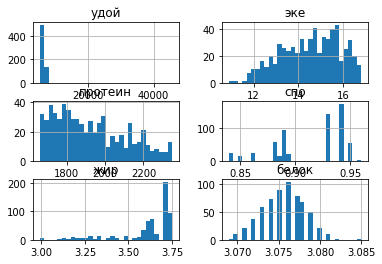
    


<div class="alert alert-warning">
<h2> Комментарий ревьюера <a class="tocSkip"> </h2>
    
<b>Некоторые замечания и рекомендации💡:</b> 

Логично убрать вывод служебной информации перед графиками (добавив «;»). Сами графики лучше увеличить.
    
`ferma[['удой','эке','протеин','спо','жир','белок']].hist(bins=30);`
       
</div> 

Рассмотрим расределение удоя


```python
plt.boxplot(ferma['удой'])
plt.title('разброс удоя')
plt.show()

```


    
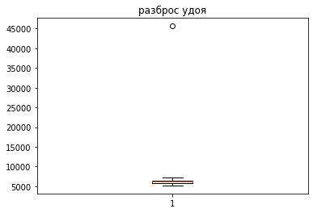
    


Согласно совеременным даным в среднем корова за год дает 5000-6000 кг. Так что можно заметить выброс, который не возможен. Строку с этим выбросом надо удалить.


```python
ferma.query('удой > 10000')
```


<div>
<style scoped>
    .dataframe tbody tr th:only-of-type {
        vertical-align: middle;
    }

    .dataframe tbody tr th {
        vertical-align: top;
    }

    .dataframe thead th {
        text-align: right;
    }
</style>
<table border="1" class="dataframe">
  <thead>
    <tr style="text-align: right;">
      <th></th>
      <th>id</th>
      <th>удой</th>
      <th>эке</th>
      <th>протеин</th>
      <th>спо</th>
      <th>порода</th>
      <th>пастбище</th>
      <th>папа</th>
      <th>жир</th>
      <th>белок</th>
      <th>вкус</th>
      <th>возраст</th>
    </tr>
  </thead>
  <tbody>
    <tr>
      <th>16</th>
      <td>17</td>
      <td>45616</td>
      <td>11.5</td>
      <td>1675</td>
      <td>0.93</td>
      <td>Вис Бик Айдиал</td>
      <td>холмистое</td>
      <td>Айдиал</td>
      <td>3.22</td>
      <td>3.076</td>
      <td>вкусно</td>
      <td>более_2_лет</td>
    </tr>
  </tbody>
</table>
</div>


<div class="alert alert-success"> 
<h2> Комментарий ревьюера <a class="tocSkip"> </h2>

👍 Согласен
</div>  


```python
ferma=ferma.query('удой < 10000').reset_index(drop=True)
```


```python
ferma['удой'].hist()
plt.title('распределение удоя')
plt.show()
```


    
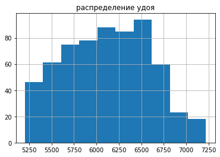
    


```python
ferma['удой'].describe()
```


    count     628.000000
    mean     6125.968153
    std       475.857053
    min      5204.000000
    25%      5749.750000
    50%      6132.500000
    75%      6501.000000
    max      7222.000000
    Name: удой, dtype: float64


В среднем коровы дают 6100 кг молока в год. БОльше половины коров дают от 5700 до 6500 кг. Все коровы дают от 5200 до 7200 кг


Все оставшиеся данные о удое совпадают с данными из справочников.


```python
ferma.query('удой >= 6000')['удой'].count()/ferma['удой'].count()*100
```


    58.917197452229296


59% коров дают удой не меньше 6000 кг

Рассмотрим ЭКЕ


```python
plt.boxplot(ferma['эке'])
plt.title('разброс эке')
plt.show()
```


    

    


```python
ferma['эке'].describe()
```


    count    628.000000
    mean      14.548726
    std        1.301777
    min       10.900000
    25%       13.500000
    50%       14.700000
    75%       15.600000
    max       16.800000
    Name: эке, dtype: float64


Энергитическая ценность корма колблется от 11 до 17 ЭКЕ. В среднем он состовляет 14,5. 

Значения протеина записывалась в натуральных числах


```python
plt.boxplot(ferma['протеин'])
plt.title('разброс протеина')
plt.show()
```


    
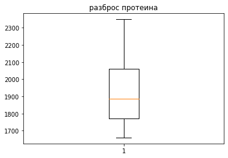
    


```python
ferma['протеин'].hist(bins=13)
plt.title('распределение протеина')
plt.show()
```


    
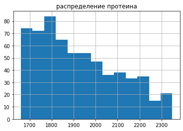
    


```python
ferma['протеин'].describe()
```


    count     628.000000
    mean     1923.759554
    std       182.832816
    min      1660.000000
    25%      1771.750000
    50%      1888.000000
    75%      2062.250000
    max      2349.000000
    Name: протеин, dtype: float64


Протеин находиться меджу 1660 и 2350 г. В среднем в корме 1023 г протеина.

Теперь рассмотрим как распределены значение СПО


```python
ferma['спо'].hist(bins=15)
plt.title('распределение спо')
plt.show()
plt.title('разброс спо')
plt.boxplot(ferma['спо'])
plt.show()
```


    

    


    
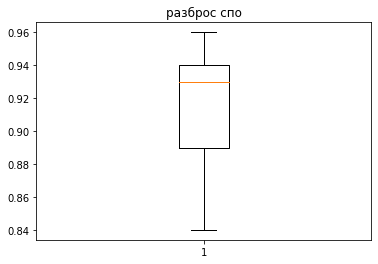
    


График СПО достаточно отличается от предыдуших. Для дальнейщего исследования введем критерий содержание сахара, как произведение содержание протеина на спо


<div class="alert alert-block alert-danger">
<h2><S> Комментарий ревьюера <a class="tocSkip"></h2>
  
<b>На доработку🤔:</b>
 
Здесь нужно пояснить логику такого решения. 

</div>


<br/>
<div class="alert alert-info">
Мне показалась странным разброс спо. Я предположил, что если спо это отношение сахара к протеину, то это коственная величинра и лучше посмотреть на распределение содержания сахара в корме, так как это первичная величина
</div>

<div class="alert alert-warning">
<h2> Комментарий ревьюера  #2 <a class="tocSkip"> </h2>
    
<b>Некоторые замечания и рекомендации💡:</b> 

Ок, для анализа почему бы и нет. Но тогда важно не использовать такую фичу в обучении.
    
       
</div>


<div class="alert alert-warning">
<h2> Комментарий ревьюера <a class="tocSkip"> </h2>
    
<b>Некоторые замечания и рекомендации💡:</b> 

По заданию проекта здесь нужно прокомментировать, во всех ли количественных признаках наблюдаем нормальное распределение.
       
</div> 


```python
ferma['сахар']=ferma['протеин']*ferma['спо']
```


```python
ferma['сахар'].hist()
plt.title('распределение содержание сахара')
plt.show()
```


    
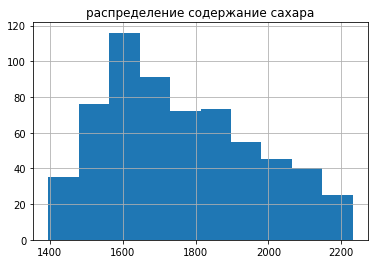
    


```python
ferma['сахар'].describe()
```


    count     628.000000
    mean     1759.189220
    std       203.080657
    min      1396.080000
    25%      1595.781250
    50%      1723.490000
    75%      1902.990000
    max      2231.550000
    Name: сахар, dtype: float64


Теперь рассмотрим содержание жира и белка в молоке

Построим распределение жира


```python
plt.boxplot(ferma['жир'])
plt.title('разброс жирности')
plt.show()
```


    
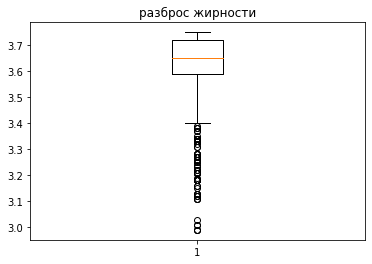
    


Можно заметить что есть выбрасы, но коровы в поле способны давать такое молоко. К примеру Джесийская корова дает молоко с жирностью 8%


```python
ferma['жир'].hist(bins=15)
plt.title('распределение жирности')
plt.show()
```


    
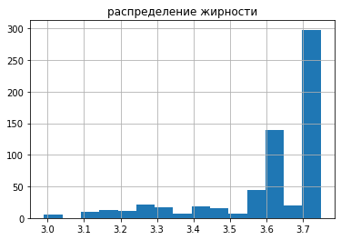
    


```python
ferma['жир'].describe()
```


    count    628.000000
    mean       3.604268
    std        0.168093
    min        2.990000
    25%        3.590000
    50%        3.650000
    75%        3.720000
    max        3.750000
    Name: жир, dtype: float64


```python
ferma.query('жир < 3.5')['жир'].count()/ferma['жир'].count()*100
```


    18.949044585987263


19% коров имеют жирность молока меньше 3,5%. Средняя жирность 3,6% и она находиться между 2 и 3,75 %.

Также раcсмотрим сренюю жиронсть для каждой породы.


```python
ferma.groupby('порода')['жир'].median().plot(kind='bar')
plt.title('среднее содержание жирности')
plt.show()
```


    
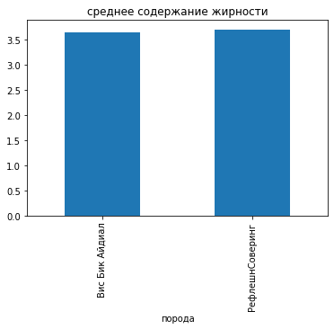
    


Теперь посмотрим содержание белка в молоке


```python
plt.boxplot(ferma['белок'])
plt.title('белок')
plt.show()
```


    
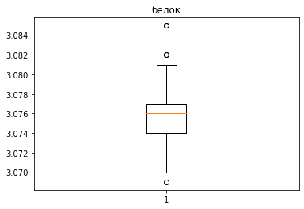
    


В среднем в молоке 3,3 % белка. В показаном графике разброса есть выбросы, но они в полне реальны.

 <div class="alert alert-block alert-danger">
<h2><s> Комментарий ревьюера <a class="tocSkip"></h2>
  
<b>На доработку🤔:</b>
 
Графики в проекте необходимо подписать. 
    
Вывод служебной информации нужно убрать. 
    
```
    
{'whiskers': [<matplotlib.lines.Line2D at 0x7f6f4d1f5be0>,
  <matplotlib.lines.Line2D at 0x7f6f4d1f5f40>],
 'caps': [<matplotlib.lines.Line2D at 0x7f6f4d2032e0>,
  <matplotlib.lines.Line2D at 0x7f6f4d203640>],
 'boxes': [<matplotlib.lines.Line2D at 0x7f6f4d1f5880>],
 'medians': [<matplotlib.lines.Line2D at 0x7f6f4d2039a0>],
 'fliers': [<matplotlib.lines.Line2D at 0x7f6f4d203d00>],
 'means': []}
      
``` 
      
Такая информация приближает нас к решению задачи. Для читателей проекта (коллег, заказчика) она тоже не принесет счастья.

</div>


<div class="alert alert-warning">
<h2> Комментарий ревьюера  #2 <a class="tocSkip"> </h2>
    
<b>Некоторые замечания и рекомендации💡:</b> 

В начале проекта осталось несколько неподписанных графиков.
       
</div>


```python
ferma['белок'].describe()
```


    count    628.000000
    mean       3.075670
    std        0.002551
    min        3.069000
    25%        3.074000
    50%        3.076000
    75%        3.077000
    max        3.085000
    Name: белок, dtype: float64


В среднем в молоке 3,076 %. Значение белка находиться между 3,07 и 3,085. 

Рассмотрим качественные величины. Это 'порода','пастбище','папа','вкус','возраст'


```python
for x in ['порода','пастбище','папа','вкус','возраст']:
    ferma.groupby(x)[x].count().plot(kind='pie',autopct='%.0f%%')
    plt.show()
```


    
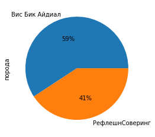
    


    
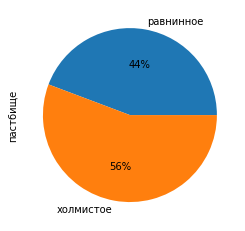
    


    
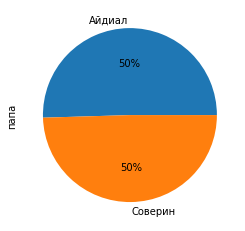
    


    
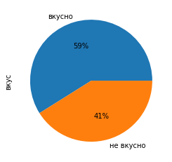
    


    
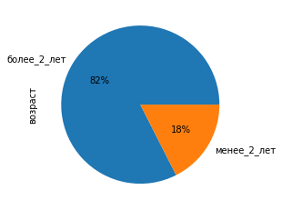
    


Большая часть коров старше двух лет, но остальные качественнные признаки равны

Теперь посмотрим на отцов коров


```python
dad.info()
```

    <class 'pandas.core.frame.DataFrame'>
    RangeIndex: 629 entries, 0 to 628
    Data columns (total 2 columns):
     #   Column  Non-Null Count  Dtype 
    ---  ------  --------------  ----- 
     0   id      629 non-null    object
     1   род     629 non-null    object
    dtypes: object(2)
    memory usage: 10.0+ KB


```python
dad.groupby('род')['род'].count().plot(kind='pie',autopct='%.0f%%')
plt.show()
```


    

    


Есть четыре быка осеменителя и их влияние тоже надо учитывать

Изучим также данные у продавца коров


```python
buy.info()
```

    <class 'pandas.core.frame.DataFrame'>
    RangeIndex: 16 entries, 0 to 15
    Data columns (total 7 columns):
     #   Column    Non-Null Count  Dtype  
    ---  ------    --------------  -----  
     0   порода    16 non-null     object 
     1   пастбище  16 non-null     object 
     2   папа      16 non-null     object 
     3   род       16 non-null     object 
     4   жир       16 non-null     float64
     5   белок     16 non-null     float64
     6   возраст   16 non-null     object 
    dtypes: float64(2), object(5)
    memory usage: 1.0+ KB


Посмотрим как распределено содержание жира и белка в молоке


```python
buy[['жир','белок']].hist()

plt.show()
```


    
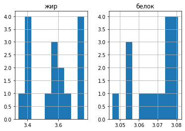
    


```python
plt.boxplot(buy[['жир','белок']])

plt.show()
```


    
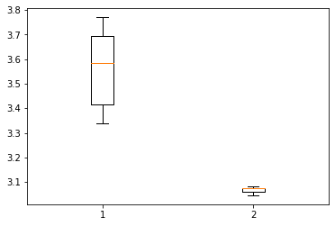
    


```python
buy[['жир','белок']].describe()
```


<div>
<style scoped>
    .dataframe tbody tr th:only-of-type {
        vertical-align: middle;
    }

    .dataframe tbody tr th {
        vertical-align: top;
    }

    .dataframe thead th {
        text-align: right;
    }
</style>
<table border="1" class="dataframe">
  <thead>
    <tr style="text-align: right;">
      <th></th>
      <th>жир</th>
      <th>белок</th>
    </tr>
  </thead>
  <tbody>
    <tr>
      <th>count</th>
      <td>16.000000</td>
      <td>16.000000</td>
    </tr>
    <tr>
      <th>mean</th>
      <td>3.571875</td>
      <td>3.068250</td>
    </tr>
    <tr>
      <th>std</th>
      <td>0.141620</td>
      <td>0.011264</td>
    </tr>
    <tr>
      <th>min</th>
      <td>3.340000</td>
      <td>3.046000</td>
    </tr>
    <tr>
      <th>25%</th>
      <td>3.415000</td>
      <td>3.059500</td>
    </tr>
    <tr>
      <th>50%</th>
      <td>3.585000</td>
      <td>3.073500</td>
    </tr>
    <tr>
      <th>75%</th>
      <td>3.692500</td>
      <td>3.076750</td>
    </tr>
    <tr>
      <th>max</th>
      <td>3.770000</td>
      <td>3.081000</td>
    </tr>
  </tbody>
</table>
</div>


Жирность в среднем 3,58, а белок 3,07. Это находиться в пределах ральности. Ошибок нет.

Теперь надо рассмотреть качественные признаки


```python
for x in ['порода','пастбище','папа','род','возраст']:
    buy.groupby(x)[x].count().plot(kind='pie',autopct='%.0f%%')
    plt.show()
```


    
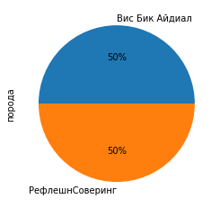
    


    
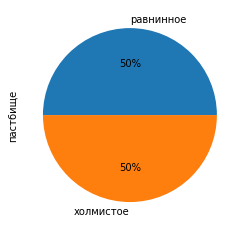
    


    
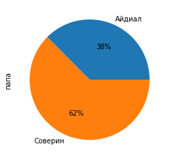
    


    
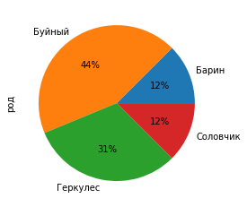
    


    
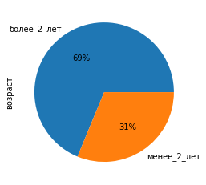
    


Как видно каждый из призканов надо учитывать

Можно заметить, что количественные признаки находятся в определенных интервалов. Любое изменение их вызванное изменением других параметров, будет находиться в этих интервалов. Поэтому для дальнейшего моделирования надо привести масштабирование. Качественные признаки надо учитывать, но их влияние на вкус молока и удой еще надо изучить.

## Корреляционный анализ

Найдем корелляцию параметров коров на ферме.


```python
corr = ferma.corr()
corr.style.background_gradient(cmap='coolwarm')
```


<style  type="text/css" >
#T_97c90_row0_col0,#T_97c90_row1_col1,#T_97c90_row2_col2,#T_97c90_row3_col3,#T_97c90_row4_col4,#T_97c90_row5_col5,#T_97c90_row6_col6{
            background-color:  #b40426;
            color:  #f1f1f1;
        }#T_97c90_row0_col1{
            background-color:  #f29274;
            color:  #000000;
        }#T_97c90_row0_col2,#T_97c90_row3_col2{
            background-color:  #98b9ff;
            color:  #000000;
        }#T_97c90_row0_col3{
            background-color:  #ef886b;
            color:  #000000;
        }#T_97c90_row0_col4,#T_97c90_row6_col0{
            background-color:  #f3c8b2;
            color:  #000000;
        }#T_97c90_row0_col5{
            background-color:  #4358cb;
            color:  #f1f1f1;
        }#T_97c90_row0_col6{
            background-color:  #dfdbd9;
            color:  #000000;
        }#T_97c90_row1_col0{
            background-color:  #f39475;
            color:  #000000;
        }#T_97c90_row1_col2{
            background-color:  #7ea1fa;
            color:  #000000;
        }#T_97c90_row1_col3{
            background-color:  #f6a283;
            color:  #000000;
        }#T_97c90_row1_col4{
            background-color:  #f6bea4;
            color:  #000000;
        }#T_97c90_row1_col5{
            background-color:  #3f53c6;
            color:  #f1f1f1;
        }#T_97c90_row1_col6{
            background-color:  #c9d7f0;
            color:  #000000;
        }#T_97c90_row2_col0{
            background-color:  #cdd9ec;
            color:  #000000;
        }#T_97c90_row2_col1{
            background-color:  #bed2f6;
            color:  #000000;
        }#T_97c90_row2_col3{
            background-color:  #c0d4f5;
            color:  #000000;
        }#T_97c90_row2_col4{
            background-color:  #b7cff9;
            color:  #000000;
        }#T_97c90_row2_col5{
            background-color:  #8caffe;
            color:  #000000;
        }#T_97c90_row2_col6{
            background-color:  #c43032;
            color:  #f1f1f1;
        }#T_97c90_row3_col0{
            background-color:  #ec8165;
            color:  #000000;
        }#T_97c90_row3_col1{
            background-color:  #f4987a;
            color:  #000000;
        }#T_97c90_row3_col4,#T_97c90_row4_col1{
            background-color:  #f5c0a7;
            color:  #000000;
        }#T_97c90_row3_col5{
            background-color:  #5977e3;
            color:  #000000;
        }#T_97c90_row3_col6{
            background-color:  #efcfbf;
            color:  #000000;
        }#T_97c90_row4_col0,#T_97c90_row4_col3{
            background-color:  #f2cbb7;
            color:  #000000;
        }#T_97c90_row4_col2{
            background-color:  #7093f3;
            color:  #000000;
        }#T_97c90_row4_col5,#T_97c90_row5_col0,#T_97c90_row5_col1,#T_97c90_row5_col2,#T_97c90_row5_col3,#T_97c90_row5_col4,#T_97c90_row5_col6{
            background-color:  #3b4cc0;
            color:  #f1f1f1;
        }#T_97c90_row4_col6{
            background-color:  #aec9fc;
            color:  #000000;
        }#T_97c90_row6_col1{
            background-color:  #e9d5cb;
            color:  #000000;
        }#T_97c90_row6_col2{
            background-color:  #c53334;
            color:  #f1f1f1;
        }#T_97c90_row6_col3{
            background-color:  #f6bfa6;
            color:  #000000;
        }#T_97c90_row6_col4{
            background-color:  #dbdcde;
            color:  #000000;
        }#T_97c90_row6_col5{
            background-color:  #85a8fc;
            color:  #000000;
        }</style><table id="T_97c90_" ><thead>    <tr>        <th class="blank level0" ></th>        <th class="col_heading level0 col0" >удой</th>        <th class="col_heading level0 col1" >эке</th>        <th class="col_heading level0 col2" >протеин</th>        <th class="col_heading level0 col3" >спо</th>        <th class="col_heading level0 col4" >жир</th>        <th class="col_heading level0 col5" >белок</th>        <th class="col_heading level0 col6" >сахар</th>    </tr></thead><tbody>
                <tr>
                        <th id="T_97c90_level0_row0" class="row_heading level0 row0" >удой</th>
                        <td id="T_97c90_row0_col0" class="data row0 col0" >1.000000</td>
                        <td id="T_97c90_row0_col1" class="data row0 col1" >0.765098</td>
                        <td id="T_97c90_row0_col2" class="data row0 col2" >0.446731</td>
                        <td id="T_97c90_row0_col3" class="data row0 col3" >0.806339</td>
                        <td id="T_97c90_row0_col4" class="data row0 col4" >0.600902</td>
                        <td id="T_97c90_row0_col5" class="data row0 col5" >0.002966</td>
                        <td id="T_97c90_row0_col6" class="data row0 col6" >0.612097</td>
            </tr>
            <tr>
                        <th id="T_97c90_level0_row1" class="row_heading level0 row1" >эке</th>
                        <td id="T_97c90_row1_col0" class="data row1 col0" >0.765098</td>
                        <td id="T_97c90_row1_col1" class="data row1 col1" >1.000000</td>
                        <td id="T_97c90_row1_col2" class="data row1 col2" >0.387875</td>
                        <td id="T_97c90_row1_col3" class="data row1 col3" >0.749007</td>
                        <td id="T_97c90_row1_col4" class="data row1 col4" >0.637279</td>
                        <td id="T_97c90_row1_col5" class="data row1 col5" >-0.008939</td>
                        <td id="T_97c90_row1_col6" class="data row1 col6" >0.546613</td>
            </tr>
            <tr>
                        <th id="T_97c90_level0_row2" class="row_heading level0 row2" >протеин</th>
                        <td id="T_97c90_row2_col0" class="data row2 col0" >0.446731</td>
                        <td id="T_97c90_row2_col1" class="data row2 col1" >0.387875</td>
                        <td id="T_97c90_row2_col2" class="data row2 col2" >1.000000</td>
                        <td id="T_97c90_row2_col3" class="data row2 col3" >0.446332</td>
                        <td id="T_97c90_row2_col4" class="data row2 col4" >0.357793</td>
                        <td id="T_97c90_row2_col5" class="data row2 col5" >0.226802</td>
                        <td id="T_97c90_row2_col6" class="data row2 col6" >0.963722</td>
            </tr>
            <tr>
                        <th id="T_97c90_level0_row3" class="row_heading level0 row3" >спо</th>
                        <td id="T_97c90_row3_col0" class="data row3 col0" >0.806339</td>
                        <td id="T_97c90_row3_col1" class="data row3 col1" >0.749007</td>
                        <td id="T_97c90_row3_col2" class="data row3 col2" >0.446332</td>
                        <td id="T_97c90_row3_col3" class="data row3 col3" >1.000000</td>
                        <td id="T_97c90_row3_col4" class="data row3 col4" >0.629098</td>
                        <td id="T_97c90_row3_col5" class="data row3 col5" >0.073718</td>
                        <td id="T_97c90_row3_col6" class="data row3 col6" >0.667959</td>
            </tr>
            <tr>
                        <th id="T_97c90_level0_row4" class="row_heading level0 row4" >жир</th>
                        <td id="T_97c90_row4_col0" class="data row4 col0" >0.600902</td>
                        <td id="T_97c90_row4_col1" class="data row4 col1" >0.637279</td>
                        <td id="T_97c90_row4_col2" class="data row4 col2" >0.357793</td>
                        <td id="T_97c90_row4_col3" class="data row4 col3" >0.629098</td>
                        <td id="T_97c90_row4_col4" class="data row4 col4" >1.000000</td>
                        <td id="T_97c90_row4_col5" class="data row4 col5" >-0.026542</td>
                        <td id="T_97c90_row4_col6" class="data row4 col6" >0.481232</td>
            </tr>
            <tr>
                        <th id="T_97c90_level0_row5" class="row_heading level0 row5" >белок</th>
                        <td id="T_97c90_row5_col0" class="data row5 col0" >0.002966</td>
                        <td id="T_97c90_row5_col1" class="data row5 col1" >-0.008939</td>
                        <td id="T_97c90_row5_col2" class="data row5 col2" >0.226802</td>
                        <td id="T_97c90_row5_col3" class="data row5 col3" >0.073718</td>
                        <td id="T_97c90_row5_col4" class="data row5 col4" >-0.026542</td>
                        <td id="T_97c90_row5_col5" class="data row5 col5" >1.000000</td>
                        <td id="T_97c90_row5_col6" class="data row5 col6" >0.208183</td>
            </tr>
            <tr>
                        <th id="T_97c90_level0_row6" class="row_heading level0 row6" >сахар</th>
                        <td id="T_97c90_row6_col0" class="data row6 col0" >0.612097</td>
                        <td id="T_97c90_row6_col1" class="data row6 col1" >0.546613</td>
                        <td id="T_97c90_row6_col2" class="data row6 col2" >0.963722</td>
                        <td id="T_97c90_row6_col3" class="data row6 col3" >0.667959</td>
                        <td id="T_97c90_row6_col4" class="data row6 col4" >0.481232</td>
                        <td id="T_97c90_row6_col5" class="data row6 col5" >0.208183</td>
                        <td id="T_97c90_row6_col6" class="data row6 col6" >1.000000</td>
            </tr>
    </tbody></table>


Так как распределение спо скорее всего ненормально и скорее всего значение спо дискретны, то надо воспользоваться ранговой корреляцией


```python
corr=ferma.corr(method='spearman')
corr.style.background_gradient(cmap='coolwarm')
```


<style  type="text/css" >
#T_52926_row0_col0,#T_52926_row1_col1,#T_52926_row2_col2,#T_52926_row3_col3,#T_52926_row4_col4,#T_52926_row5_col5,#T_52926_row6_col6{
            background-color:  #b40426;
            color:  #f1f1f1;
        }#T_52926_row0_col1,#T_52926_row1_col0{
            background-color:  #f29274;
            color:  #000000;
        }#T_52926_row0_col2{
            background-color:  #94b6ff;
            color:  #000000;
        }#T_52926_row0_col3{
            background-color:  #f39577;
            color:  #000000;
        }#T_52926_row0_col4,#T_52926_row1_col4{
            background-color:  #f7b599;
            color:  #000000;
        }#T_52926_row0_col5{
            background-color:  #3c4ec2;
            color:  #f1f1f1;
        }#T_52926_row0_col6{
            background-color:  #e4d9d2;
            color:  #000000;
        }#T_52926_row1_col2{
            background-color:  #7b9ff9;
            color:  #000000;
        }#T_52926_row1_col3{
            background-color:  #f7a98b;
            color:  #000000;
        }#T_52926_row1_col5,#T_52926_row5_col0,#T_52926_row5_col1,#T_52926_row5_col2,#T_52926_row5_col3,#T_52926_row5_col4,#T_52926_row5_col6{
            background-color:  #3b4cc0;
            color:  #f1f1f1;
        }#T_52926_row1_col6,#T_52926_row2_col0{
            background-color:  #ccd9ed;
            color:  #000000;
        }#T_52926_row2_col1{
            background-color:  #bed2f6;
            color:  #000000;
        }#T_52926_row2_col3{
            background-color:  #c7d7f0;
            color:  #000000;
        }#T_52926_row2_col4{
            background-color:  #b5cdfa;
            color:  #000000;
        }#T_52926_row2_col5{
            background-color:  #89acfd;
            color:  #000000;
        }#T_52926_row2_col6,#T_52926_row6_col2{
            background-color:  #ca3b37;
            color:  #f1f1f1;
        }#T_52926_row3_col0{
            background-color:  #ef886b;
            color:  #000000;
        }#T_52926_row3_col1{
            background-color:  #f59c7d;
            color:  #000000;
        }#T_52926_row3_col2{
            background-color:  #aac7fd;
            color:  #000000;
        }#T_52926_row3_col4,#T_52926_row4_col0,#T_52926_row4_col1{
            background-color:  #f7b093;
            color:  #000000;
        }#T_52926_row3_col5{
            background-color:  #6180e9;
            color:  #000000;
        }#T_52926_row3_col6{
            background-color:  #f5c2aa;
            color:  #000000;
        }#T_52926_row4_col2{
            background-color:  #80a3fa;
            color:  #000000;
        }#T_52926_row4_col3{
            background-color:  #f7b89c;
            color:  #000000;
        }#T_52926_row4_col5{
            background-color:  #4b64d5;
            color:  #f1f1f1;
        }#T_52926_row4_col6{
            background-color:  #cbd8ee;
            color:  #000000;
        }#T_52926_row6_col0{
            background-color:  #f5c4ac;
            color:  #000000;
        }#T_52926_row6_col1{
            background-color:  #ebd3c6;
            color:  #000000;
        }#T_52926_row6_col3{
            background-color:  #f7b79b;
            color:  #000000;
        }#T_52926_row6_col4{
            background-color:  #e5d8d1;
            color:  #000000;
        }#T_52926_row6_col5{
            background-color:  #81a4fb;
            color:  #000000;
        }</style><table id="T_52926_" ><thead>    <tr>        <th class="blank level0" ></th>        <th class="col_heading level0 col0" >удой</th>        <th class="col_heading level0 col1" >эке</th>        <th class="col_heading level0 col2" >протеин</th>        <th class="col_heading level0 col3" >спо</th>        <th class="col_heading level0 col4" >жир</th>        <th class="col_heading level0 col5" >белок</th>        <th class="col_heading level0 col6" >сахар</th>    </tr></thead><tbody>
                <tr>
                        <th id="T_52926_level0_row0" class="row_heading level0 row0" >удой</th>
                        <td id="T_52926_row0_col0" class="data row0 col0" >1.000000</td>
                        <td id="T_52926_row0_col1" class="data row0 col1" >0.765144</td>
                        <td id="T_52926_row0_col2" class="data row0 col2" >0.437543</td>
                        <td id="T_52926_row0_col3" class="data row0 col3" >0.787904</td>
                        <td id="T_52926_row0_col4" class="data row0 col4" >0.688506</td>
                        <td id="T_52926_row0_col5" class="data row0 col5" >-0.005701</td>
                        <td id="T_52926_row0_col6" class="data row0 col6" >0.626648</td>
            </tr>
            <tr>
                        <th id="T_52926_level0_row1" class="row_heading level0 row1" >эке</th>
                        <td id="T_52926_row1_col0" class="data row1 col0" >0.765144</td>
                        <td id="T_52926_row1_col1" class="data row1 col1" >1.000000</td>
                        <td id="T_52926_row1_col2" class="data row1 col2" >0.384747</td>
                        <td id="T_52926_row1_col3" class="data row1 col3" >0.741962</td>
                        <td id="T_52926_row1_col4" class="data row1 col4" >0.686973</td>
                        <td id="T_52926_row1_col5" class="data row1 col5" >-0.013321</td>
                        <td id="T_52926_row1_col6" class="data row1 col6" >0.555357</td>
            </tr>
            <tr>
                        <th id="T_52926_level0_row2" class="row_heading level0 row2" >протеин</th>
                        <td id="T_52926_row2_col0" class="data row2 col0" >0.437543</td>
                        <td id="T_52926_row2_col1" class="data row2 col1" >0.384747</td>
                        <td id="T_52926_row2_col2" class="data row2 col2" >1.000000</td>
                        <td id="T_52926_row2_col3" class="data row2 col3" >0.485890</td>
                        <td id="T_52926_row2_col4" class="data row2 col4" >0.392822</td>
                        <td id="T_52926_row2_col5" class="data row2 col5" >0.229051</td>
                        <td id="T_52926_row2_col6" class="data row2 col6" >0.952033</td>
            </tr>
            <tr>
                        <th id="T_52926_level0_row3" class="row_heading level0 row3" >спо</th>
                        <td id="T_52926_row3_col0" class="data row3 col0" >0.787904</td>
                        <td id="T_52926_row3_col1" class="data row3 col1" >0.741962</td>
                        <td id="T_52926_row3_col2" class="data row3 col2" >0.485890</td>
                        <td id="T_52926_row3_col3" class="data row3 col3" >1.000000</td>
                        <td id="T_52926_row3_col4" class="data row3 col4" >0.701044</td>
                        <td id="T_52926_row3_col5" class="data row3 col5" >0.109924</td>
                        <td id="T_52926_row3_col6" class="data row3 col6" >0.706246</td>
            </tr>
            <tr>
                        <th id="T_52926_level0_row4" class="row_heading level0 row4" >жир</th>
                        <td id="T_52926_row4_col0" class="data row4 col0" >0.688506</td>
                        <td id="T_52926_row4_col1" class="data row4 col1" >0.686973</td>
                        <td id="T_52926_row4_col2" class="data row4 col2" >0.392822</td>
                        <td id="T_52926_row4_col3" class="data row4 col3" >0.701044</td>
                        <td id="T_52926_row4_col4" class="data row4 col4" >1.000000</td>
                        <td id="T_52926_row4_col5" class="data row4 col5" >0.043125</td>
                        <td id="T_52926_row4_col6" class="data row4 col6" >0.552998</td>
            </tr>
            <tr>
                        <th id="T_52926_level0_row5" class="row_heading level0 row5" >белок</th>
                        <td id="T_52926_row5_col0" class="data row5 col0" >-0.005701</td>
                        <td id="T_52926_row5_col1" class="data row5 col1" >-0.013321</td>
                        <td id="T_52926_row5_col2" class="data row5 col2" >0.229051</td>
                        <td id="T_52926_row5_col3" class="data row5 col3" >0.109924</td>
                        <td id="T_52926_row5_col4" class="data row5 col4" >0.043125</td>
                        <td id="T_52926_row5_col5" class="data row5 col5" >1.000000</td>
                        <td id="T_52926_row5_col6" class="data row5 col6" >0.206612</td>
            </tr>
            <tr>
                        <th id="T_52926_level0_row6" class="row_heading level0 row6" >сахар</th>
                        <td id="T_52926_row6_col0" class="data row6 col0" >0.626648</td>
                        <td id="T_52926_row6_col1" class="data row6 col1" >0.555357</td>
                        <td id="T_52926_row6_col2" class="data row6 col2" >0.952033</td>
                        <td id="T_52926_row6_col3" class="data row6 col3" >0.706246</td>
                        <td id="T_52926_row6_col4" class="data row6 col4" >0.552998</td>
                        <td id="T_52926_row6_col5" class="data row6 col5" >0.206612</td>
                        <td id="T_52926_row6_col6" class="data row6 col6" >1.000000</td>
            </tr>
    </tbody></table>


Данная корреляция значима и сильная положительный

<div class="alert alert-block alert-danger">
<h2><s> Комментарий ревьюера <a class="tocSkip"></h2>
  
<b>На доработку🤔:</b>
 
Если выше мы заметили, что не все признаки распределены нормально, то здесь нужно использовать корреляцию Спирмана или Phik или иные подходы, которые устойчивы к выбросам и ненормальному распределению. Корреляция Пирсона, которая здесь используется по умолчанию, нам не подходит.

</div>
  


<div class="alert alert-block alert-danger" style="border-radius: 15px; box-shadow: 4px 4px 4px; border: 1px solid ">
<h2><s> Комментарий ревьюера #2 <a class="tocSkip"></h2>
  
<b>На доработку🤔:</b>
 
`corr = ferma.corr()` - здесь используешь корреляцию Пирсона, она нам не подходит.
    
Можно заменить на `corr = ferma.corr(method='spearman')`

</div>


Удой сильно зависит от ЭКЕ и СПО корма, слабо от сахара, и еще более слабо от протеина. ЭКЕ корма зависит от СПО. Содержание жира слабо зависит от ЭКЕ и СПО, а белок не зависит от всех параметров.

<div class="alert alert-warning">
<h2> Комментарий ревьюера <a class="tocSkip"> </h2>
    
<b>Некоторые замечания и рекомендации💡:</b> 

Важно прокомментировать, есть ли мультиколлинеарность?
       
</div> 
  


```python
def sg(quality,quantity):
    if quality=='no':
        print('зависимость удоя от параметров',quantity)
        sns.scatterplot(data=ferma,x=quantity,y='удой')
        plt.show()
    else:
        print('зависимость удоя от параметров',quality,'и',quantity)
        sns.scatterplot(data=ferma,x=quantity,y='удой',hue=quality)
        plt.show()
```

Разделим признаки на количественные ['эке','протеин','спо','жир','белок','сахар'] и качественные ['порода','пастбище','вкус','возраст'] и посмотрим как они влияют на удой.


```python
for x in ['эке','протеин','спо','жир','белок','сахар']:
    for y in ['порода','пастбище','вкус','возраст']:
        sg(y,x)
```

Из графиков следует, что молока дают больше молодые коровы, а такде, что коровы пасущиеся на холмах дают немного дольше молокаЮ чем равниные


```python
ferma['эке'].apply(lambda x: x**0.5).corr(ferma['удой'])
```

Таким образом удой слино зависит от ЭКЕ корма, возраста коровы, слабо от содержания сахара, спо, жирности и типа пастбища. На ЭКЕ влияет возраст коровы. Протеин ничтожно мало влияет на удой, но сильно вляет на сахар. Влияние возраста нелинейно. СПО разбито на два кластера (больше или меньше 0,92) так что и его можно считать нелинейным.

<div class="alert alert-warning">
<h2> Комментарий ревьюера <a class="tocSkip"> </h2>
    
<b>Некоторые замечания и рекомендации💡:</b> 

По ЭКЕ и удою у нас что-то среднее между линейной и квадратичной зависимостью. Если присмотреться, можно увидеть кривую. В проекте нам предлагается устранить здесь квадратичную зависимость (взять квадрат признака), чтобы модель могла корректно учитывать признак.
       
</div> 


### Создание предваритенльной модели линейной регрессии

 В качестве целевого признака надо взять удой. Входными признаками является ЭКЕ корма, Возраст коровы, сореджание протеина и сахара в корме (Возьмем вместо сахара СПО, так как сахар зависит от протеина и СПО). Также надо учесть тип пастбища. Но на всякий случий учтем все параметры вроде, породы, а также жирности и содержания белка в молоке.


```python

ferma.info()
```

Удой как целевой признак обозначим как y, а остальные как Х


```python
RANDOM_STATE = 42

X = ferma.drop('удой', axis=1)
y = ferma['удой']

X_train, X_test, y_train, y_test = train_test_split(
    X, 
    y, 
    random_state=RANDOM_STATE)

X_train.info()
```


```python
cat_col_names = ['порода', 'пастбище', 'порода', 'возраст'] # качественные
num_col_names = ['эке', 'протеин', 'спо'] # количественные
```

<div class="alert alert-block alert-danger">
<h2> <s>Комментарий ревьюера <a class="tocSkip"></h2>
  
<b>На доработку🤔:</b>
 
Жирность и белок в молоке - характеристики самого молока, а не питания коровы. Эти харакетристики зависят от питания, породы итд - и коррелируют с удоем, но не связаны с ним причинно-следственными связями и не влияют на него. Нам важно отобрать те признаки, которые влияют на таргет.
    
Так как у нас неплохой набор признаков, которые определяют удой, то я бы не стал здесь в моделях использовать жирность и белок - эти признаки скорее будут вносить шум и провоцировать модель находить ложные зависимости.
    
Со вкусом молока та же история − это характеристика молока. Не берем.

Также понятно, что id - полностью случайный признак, его брать в модель не нужно.     
    
А вот все остальные признаки пригодятся. Должно получиться семь: три количественных, четыре категориальных.
 
</div>


<br/>
<div class="alert alert-info">
Вкус это понятие относительное и связоно с составом молока, поэтому его не берем. Но состав молока (жир и белок) связаны не только с тем чем ест корова, но и с индивидуальными особенностями коровы, которые тоже могут оказывать влияние на удой. Ну ладно я убираю их
</div>

<div class="alert alert-success">
<h2> Комментарий ревьюера #2 <a class="tocSkip"> </h2>

👍 Скорее согласен с гипотезой по жирности. Возможно, стоило бы ее проверить. Cпасибо за доработку.
</div>


```python
# подготовка признаков (масштабирование и кодирование)

encoder = OneHotEncoder(drop='first', sparse=False)
X_train_ohe = encoder.fit_transform(X_train[cat_col_names])
X_test_ohe = encoder.transform(X_test[cat_col_names])

encoder_col_names = encoder.get_feature_names()

scaler = StandardScaler()
X_train_scaled = scaler.fit_transform(X_train[num_col_names])
X_test_scaled = scaler.transform(X_test[num_col_names])

X_train_ohe = pd.DataFrame(X_train_ohe, columns=encoder_col_names)
X_test_ohe = pd.DataFrame(X_test_ohe, columns=encoder_col_names)

X_train_scaled = pd.DataFrame(X_train_scaled, columns=num_col_names)
X_test_scaled = pd.DataFrame(X_test_scaled, columns=num_col_names)

X_train = pd.concat([X_train_ohe, X_train_scaled], axis=1)
X_test = pd.concat([X_test_ohe, X_test_scaled], axis=1)

# обучение модели и предсказание удоя
model_lr  = LinearRegression()
model_lr.fit(X_train, y_train)
predictions1 = model_lr.predict(X_test)

# рассчет остатков
residuals = y_test - predictions1


# гистограмма распределения и диаграмма рассеяния
fig, axes = plt.subplots(nrows=1, ncols=2, figsize=(10,5))
axes[0].hist(residuals)
axes[0].set_title('Гистограмма распределения остатков')
axes[0].set_xlabel('Остатки')

axes[1].scatter(predictions1, residuals)
axes[1].set_xlabel('Предсказания модели')
axes[1].set_ylabel('Остатки')
axes[1].set_title('Анализ дисперсии')
plt.show()
```

<div class="alert alert-success">
<h2> Комментарий ревьюера <a class="tocSkip"> </h2>

👍 Здесь все корректно.
</div> 
  
     


```python
r2 = r2_score(y_test, predictions1)  
r2
```

Коэффицент детерминации для данной модели состовляет 0,75, что больше 70 %. Считается, что коэффицент детерминации должен быть не менее 0,7 для признания модели приемлемой.

Одним из возмождных вариантов повышения качества модели:
- включить в модель СПО как категориальный признак
- взять квадрат ЭКЕ
- совсем не использовались данные из остальных двух таблиц" 

 
<div class="alert alert-warning">
<h2> Комментарий ревьюера <a class="tocSkip"> </h2>
    
<b>Некоторые замечания и рекомендации💡:</b> 

`Коэффицент детерминации для данной модели состовляет 0,75, что больше 70 %. Это говорит о том (см. Википедию) она подходит` - не совсем понял, куда, к чему подходит? 
    
Возможно, стоит переформулировать в терминах, что модель имеет достаточно высокое качество, модель адекватна, выше константной, как-то иначе выразить. «модель подходит» звучит слишком абстрактно. Не ясно, что имеется ввиду и вообще, хорошо это или плохо, что она «подходит».
       
</div> 
  

### Обучение обновленной модели линейной регрессии 

В начале изменяем некоторые параметры (спо и эке)

Сохраним среднее СПО 


```python
menSPO=ferma['спо'].median()
menSPO
```

<div class="alert alert-success">
<h2> Комментарий ревьюера <a class="tocSkip"> </h2>
 
А зачем нам среднее СПО?
</div>  
      


```python
ferma.loc[ferma['спо']<0.92, ['спо1']] = 0
ferma.loc[ferma['спо']>=0.92, ['спо1']] = 1
ferma['спо1']=ferma['спо1'].astype(str)
```

<div class="alert alert-success">
<h2> Комментарий ревьюера <a class="tocSkip"> </h2>
 
👍  Ок 
</div>    


```python
ferma['эке2'] = ferma['эке']**2
```

<div class="alert alert-block alert-danger">
<h2><s> Комментарий ревьюера <a class="tocSkip"></h2>
  
<b>На доработку🤔:</b>
 
Важный момент: если меняем значение признаков в колонке, важно поменять и название колонки. Иначе теперь название не соответствует содержанию.
    
Нельзя же, например, просто переписать всему заводу зарплату, возведя ее в квадрат и оставив название ведомости как есть. Кроме нас данными могут пользоваться и другие коллеги, которые не будут знать о преобразовании. В случае с заводом большинство работников, конечно, будет не против, но радость будет не долгой. 
</div>


```python
ferma.head()
```


```python
ferma.info()
```


```python
sns.scatterplot(data=ferma, x="удой", y="эке2")
```

Как видно после изменений зависимость от ЭКЕ выглядит линейной

<div class="alert alert-success">
<h2> Комментарий ревьюера <a class="tocSkip"> </h2>

👍 Согласен.
</div> 

<div class="alert alert-warning">
<h2> Комментарий ревьюера <a class="tocSkip"> </h2>
    
<b>Некоторые замечания и рекомендации💡:</b> 

Графики в проекте нужно подписать.
       
</div> 

Теперь повторим процедуру аналогично первой


```python
RANDOM_STATE = 42

X = ferma.drop('удой', axis=1)
y = ferma['удой']

X_train, X_test, y_train, y_test = train_test_split(
    X, 
    y, 
    random_state=RANDOM_STATE)

X_train.info()
```


```python
cat_col_names = ['порода', 'пастбище', 'папа', 'спо1', 'возраст']
num_col_names = ['эке2', 'протеин']
```


```python
#обработка категориальных показателей
encoder = OneHotEncoder(drop='first', sparse=False)
X_train_ohe = encoder.fit_transform(X_train[cat_col_names])
X_test_ohe = encoder.transform(X_test[cat_col_names])

encoder_col_names = encoder.get_feature_names()
encoder_col_names
```


```python
#обработка количественные показатели
scaler = StandardScaler()
X_train_scaled = scaler.fit_transform(X_train[num_col_names])
X_test_scaled = scaler.transform(X_test[num_col_names])
```


```python
#объедение  
X_train_ohe = pd.DataFrame(X_train_ohe, columns=encoder_col_names)
X_test_ohe = pd.DataFrame(X_test_ohe, columns=encoder_col_names)

X_train_scaled = pd.DataFrame(X_train_scaled, columns=num_col_names)
X_test_scaled = pd.DataFrame(X_test_scaled, columns=num_col_names)

X_train = pd.concat([X_train_ohe, X_train_scaled], axis=1)
X_test = pd.concat([X_test_ohe, X_test_scaled], axis=1)
```


```python
# получение модели и предсказаний
model_lr  = LinearRegression()
model_lr.fit(X_train, y_train)
predictions2 = model_lr.predict(X_test)
r2 = r2_score(y_test, predictions2)  
r2
```


```python

residuals = y_test - predictions2

# построение графиков
fig, axes = plt.subplots(nrows=1, ncols=2, figsize=(10,5))
axes[0].hist(residuals)
axes[0].set_title('Гистограмма распределения остатков')
axes[0].set_xlabel('Остатки')

axes[1].scatter(predictions2, residuals)
axes[1].set_xlabel('Предсказания модели')
axes[1].set_ylabel('Остатки')
axes[1].set_title('Анализ дисперсии')
plt.show()
```

Коэффицент детерминации увеличился и стал 0,82, что означает что модель достаточно хороша для использования.
Остатки распределены нопмально по своей величине и равномерно по предсказаниям. Это значит, что их можно считать случайной величиной.


<div class="alert alert-warning">
<h2> Комментарий ревьюера <a class="tocSkip"> </h2>
    
<b>Некоторые замечания и рекомендации💡:</b> 

А по остаткам модели? Распределены равномерно? О чем это говорит?
       
</div> 

### Обучение модели линейной регрессии с дополнительными входными данными


```python
ferma.head()
```


```python
ferma.info()
```

Добавив в данные имя папы коровы


```python
dad.head()
```


```python
ferma = ferma.merge(dad, how  ='inner', on = 'id')
```


```python
ferma.head()
```

<div class="alert alert-success">
<h2> Комментарий ревьюера <a class="tocSkip"> </h2>

👍 Всё верно  
</div> 

Повторим действия и создадим новую модель


```python
RANDOM_STATE = 42

X = ferma.drop('удой', axis=1)
y = ferma['удой']

X_train, X_test, y_train, y_test = train_test_split(
    X, 
    y, 
    random_state=RANDOM_STATE)

X_train.info()
```


```python
cat_col_names = ['порода', 'пастбище', 'папа', 'спо1', 'род', 'возраст']
num_col_names = ['эке2', 'протеин']
#категориальные признаки
encoder = OneHotEncoder(drop='first', sparse=False)
X_train_ohe = encoder.fit_transform(X_train[cat_col_names])
X_test_ohe = encoder.transform(X_test[cat_col_names])
encoder_col_names = encoder.get_feature_names()
encoder_col_names
```

 
<div class="alert alert-warning">
<h2> Комментарий ревьюера <a class="tocSkip"> </h2>
    
<b>Некоторые замечания и рекомендации💡:</b> 

По признакам во всех случаях нужно перепроверить.
       
</div> 


```python
#количественные признаки
scaler = StandardScaler()
X_train_scaled = scaler.fit_transform(X_train[num_col_names])
X_test_scaled = scaler.transform(X_test[num_col_names])
```


```python
#объедение
X_train_ohe = pd.DataFrame(X_train_ohe, columns=encoder_col_names)
X_test_ohe = pd.DataFrame(X_test_ohe, columns=encoder_col_names)

X_train_scaled = pd.DataFrame(X_train_scaled, columns=num_col_names)
X_test_scaled = pd.DataFrame(X_test_scaled, columns=num_col_names)

X_train = pd.concat([X_train_ohe, X_train_scaled], axis=1)
X_test = pd.concat([X_test_ohe, X_test_scaled], axis=1)
```


```python
# создание модели и нахождение предсказаных значений
model_lr  = LinearRegression()
model_lr.fit(X_train, y_train)
predictions3 = model_lr.predict(X_test)
```


```python
# расчет остатков
residuals = y_test - predictions3

#графики
fig, axes = plt.subplots(nrows=1, ncols=2, figsize=(10,5))
axes[0].hist(residuals)
axes[0].set_title('Гистограмма распределения остатков')
axes[0].set_xlabel('Остатки')

axes[1].scatter(predictions3, residuals)
axes[1].set_xlabel('Предсказания модели')
axes[1].set_ylabel('Остатки')
axes[1].set_title('Анализ дисперсии')
plt.show()
```


```python
r2 = r2_score(y_test, predictions3)  
r2
```

Коэффицент детерминирования увеличился незначительно. Эту модель лучше предыдуших.

Посмотрим на коэффиценты этой модели


```python
model_lr.coef_
```

### Анализ моделей

Прежде вспомним как выглядят входные данные


```python
X_train.head()
```

Посмотрим на другие параметры моделей


```python
def par(a, b, c):
    mae = mean_absolute_error(b, c)
    mse = mean_squared_error(b, c)
    rmse = np.sqrt(mse)
    print(a, ', mae:',mae, ', mse:', mse, ', rmse:', rmse)
```


```python
par('Модель1',y_test, predictions1)
```


```python
par('Модель2',y_test, predictions2)
```


```python
par('Модель3',y_test, predictions3)
```

Как видно, третья модель делает наименьшию ошибку 189 кг. 


```python
predictions3.size
```

Если считать предсказаные в результате моделирование значения удоя распределенными нормально, то можно обозначить интервал в котором можно считать модель достоверной, как доверительный интервал с доверительной вероятностью 5%


```python
print('5% доверительный интервал =', st.norm.interval(0.95, loc=np.mean(predictions3), scale=st.sem(predictions3)))
```

<div class="alert alert-success">
<h2> Комментарий ревьюера <a class="tocSkip"> </h2>

👍 Отлично по этой части.
</div> 
  

### Прогноз удоя


```python
buy.head()
```


```python
ferma.head()
```

Добавим к характеристикам коров, которые можно купить, характеристики корма увеличенные на 5 %


```python
buynew = buy[buy.columns]

```


```python
ferma.describe()
```


```python
buynew['эке2'] = (ferma['эке'].mean()*1.05)**2 # так как эке возведено в квадрат
buynew['спо1'] = (1.0 if ferma['спо'].median()*1.05 > 0.92 else 0.0)
buynew['спо1'] =buynew['спо1'].astype(str) # так как СПО это расматривается как качественная величина
buynew['протеин'] = ferma['протеин'].mean()*1.05
```

<div class="alert alert-block alert-danger">
<h2><s> Комментарий ревьюера <a class="tocSkip"></h2>
  
<b>На доработку🤔:</b>
 
<s>`buynew['эке'] = ferma['эке'].mean()*1.05*1.05 ` - здесь ты берешь среднее по ЭКЕ и увеличиваешь его на 5%. Дальше ты берешь, что получилось и снова увеличиваешь на 5%. Это действие не эквивалентно возведению в квадрат.</s>
    
Нам важно сначала увеличить на 5%, а затем получившееся число возвести в квадрат `**2`.
    
***
    
    
ААААА.. вот я сам и попался в ловушку) У тебя же здесь уже ЭКЕ в квадрате. 
    
Важно выше переназвать параметр. А здесь нам нужно все-таки взять изначальный, просто ЭКЕ, увеличить на 5% и только затем возвести в квадрат. Действия в другом порядке будут не эквивалентыми, поэтому будут неправильными. Ниже будем несколько завышать удои и занижать вероятность вкусного молока.

</div>


```python
buynew.info()
```


```python
buynew.head()
```


```python
cat_col_names = ['порода', 'пастбище', 'папа', 'спо1', 'род', 'возраст']
num_col_names = ['эке2', 'протеин']
```


```python
#обробатываем категориальные признаки
#encoder = OneHotEncoder(drop='first', sparse=False)
buynew_ohe = encoder.transform(buynew[cat_col_names])

encoder_col_names = encoder.get_feature_names()
encoder_col_names
```


```python
#обробатываем количественные признаки
buynew_scaled = scaler.transform(buynew[num_col_names])
#объеденяем 
X_test_ohe = pd.DataFrame(buynew_ohe, columns=encoder_col_names)
X_test_scaled = pd.DataFrame(buynew_scaled, columns=num_col_names)

X_test = pd.concat([X_test_ohe, X_test_scaled], axis=1)
```


```python
# обучение модели и получение предсказаний на тестовых данных

predictions_buynew_scaled = model_lr.predict(X_test)
predictions_buynew_scaled
```


```python
result = buy[buy.columns]
result['удой'] = predictions_buynew_scaled
result
```

Видно, что все коровы дадут более 6000 кг


```python
result.query('удой>6000')['удой'].count()
```

вывод: Было установлено, что наибольшой точностью обладает модель с обработанными и дополниными параметрами. Из покупных коров все обладают нужным количеством молока

<div class="alert alert-success">
<h2> Комментарий ревьюера <a class="tocSkip"> </h2>

👍 Выше нужно поправить по вычислениям ЭКЕ, в остальном все хорошо.
</div> 

## Обучение модели логистической регрессии

Создадим модель предсказания вкуса молока. Замение вкусно/невкусно на 1 и 0


```python
#ferma.loc[ferma['спо']<0.92, ['спо']] = 0
#ferma.loc[ferma['спо']>=0.92, ['спо']] = 1
ferma['вкус'] = ferma['вкус'].apply(lambda x: 1 if x == 'вкусно' else 0)
ferma['вкус'] = ferma['вкус'].astype(float)
ferma.head()
```

<div class="alert alert-success">
<h2> Комментарий ревьюера <a class="tocSkip"> </h2>

👍 Абсолютно правильно, нужно перевести таргет в численный тип.
</div> 


```python
ferma.info()
```

Разобьем данные и проведем подготовку аналогичную предыдущей


```python
RANDOM_STATE = 42

X = ferma.drop('вкус', axis=1)
y = ferma['вкус']

X_train, X_test, y_train, y_test = train_test_split(
    X, 
    y, 
    random_state=RANDOM_STATE)

X_train.info()
```


```python
cat_col_names = ['порода', 'пастбище', 'папа', 'спо1', 'род', 'возраст']
num_col_names = ['эке2', 'протеин']
```


```python
#количественные признаки
scaler = StandardScaler()
X_train_scaled = scaler.fit_transform(X_train[num_col_names])
X_test_scaled = scaler.transform(X_test[num_col_names])
#категориальные признаки
encoder = OneHotEncoder(drop='first', sparse=False)
X_train_ohe = encoder.fit_transform(X_train[cat_col_names])
X_test_ohe = encoder.transform(X_test[cat_col_names])

encoder_col_names = encoder.get_feature_names()
encoder_col_names
```


```python
#объеденение
X_train_ohe = pd.DataFrame(X_train_ohe, columns=encoder_col_names)
X_test_ohe = pd.DataFrame(X_test_ohe, columns=encoder_col_names)

X_train_scaled = pd.DataFrame(X_train_scaled, columns=num_col_names)
X_test_scaled = pd.DataFrame(X_test_scaled, columns=num_col_names)

X_train = pd.concat([X_train_ohe, X_train_scaled], axis=1)
X_test = pd.concat([X_test_ohe, X_test_scaled], axis=1)
```


```python
X_train.head()
```


```python
y_train.head()
```


```python
# проведем обучение логической модели и найдем предсказания
clf = LogisticRegression()
clf.fit(X_train, y_train)
y_pred = clf.predict(X_test)

```

Проанализируем результаты

В начале посмотрим долю правильных предсказаний


```python
acc = accuracy_score(y_test, y_pred)
recall = recall_score(y_pred,y_test)
precision = precision_score(y_pred,y_test)


print('accuracy: ',round(acc ,3)*100,'%')
print('recall: ',round(recall ,3))
print('precision: ',round(precision,3))
```

построим матрицу ошибок


```python
cm = confusion_matrix(y_test, y_pred)
sns.heatmap(cm, annot=True, fmt='d', cmap='Blues_r')
plt.ylabel('Истиное')
plt.xlabel('Предсказание'); 
```

Матрица ошибок говорит о том, что модель делает ошибочные предсказание: 
- что молоко будет вкусным (1), но на самом деле нет (0) в 48 случаях - False Positive - ошибка 1-ого рода 
- что молоко будет НЕвкусным (0), а на самом деле вкусным (1) в 12 случаях - False Negative - ошибка 2-ого рода

Учитывая постановку задачи, фермеру важно, чтобы молоко было вкусным, поэтому наиболее критичным представляются ошибки первого рода. За мнимизацию ошибок первого рода отвечает метрика precision - и она у нас достаточно высока 86,4%, то есть в 13,6% модель считает ошибочно что молоко является вкусным

<div class="alert alert-success">
<h2> Комментарий ревьюера <a class="tocSkip"> </h2>

👍 Точно так!
</div> 

### Улучшение логической модели модели

Рассмотрим вероятность того, что молоко вкусное для каждой коровы


```python
y_proba = clf.predict_proba(X_test)[:,1]

data = pd.DataFrame(zip(y_test, y_proba),
             columns = ['y_valid', 'y_proba']).sort_values(by='y_proba',ascending=False)

print(data.head())
```

Посмотрим оные пороги


```python
thresholds = [round(i,2) for i in np.linspace(0.65,0.95,num = 30,endpoint=False)]
print(thresholds) 
```


```python
# создаём переменную, которая будет хранить список порогов
columns = []

# занесем в таблицу какие значения проходят выбранный порог, а какие нет
for i in thresholds:
    columns.append(str(i))
    data[str(i)] = data['y_proba'].apply(lambda x: 1 if x > i else 0 )
```


```python
porog = []#теперь посмотрим долю правильных предсказаний для каждого порога 
porog = pd.DataFrame(columns=['Порог', 'Precision'])

rw = 0
for i in data.columns[2:]:
    precision = precision_score(data['y_valid'],data[i])
    porog.loc[rw] = [i, precision]
    rw = rw+1
porog
```


```python
predel=porog['Precision'].max()
porog.query('Precision == @predel')
```

Как видно предсказания по вероятности полностью совпадают лишь между 81 и 86 % порогами

Получается, оптимальный порог = 0,8, при котором минимизируется критическая для нас ошибка первого рода

Теперь бы нам необходимо спрогнозировать вкус молока у покупаемых коров и применить в том числе полученный порог

<div class="alert alert-success">
<h2> Комментарий ревьюера <a class="tocSkip"> </h2>

👍 Всё верно. Хорошее исследование и аргументация по порогу.
</div> 

Полвторим аналогичный процесс как и в предыдушем пункте


```python
buynew.head()
```


```python
buynew.describe()
```


```python
cat_col_names = ['порода', 'пастбище', 'папа', 'спо1', 'род', 'возраст']
num_col_names = ['эке2', 'протеин']
```

Разделяем на количественные и качественные признаки


```python
#количественные
buynew_scaled = scaler.transform(buynew[num_col_names])
#качкственные

buynew_ohe = encoder.transform(buynew[cat_col_names])


encoder_col_names = encoder.get_feature_names()
encoder_col_names
```


```python
#объеденеяем
X_test_ohe = pd.DataFrame(buynew_ohe, columns=encoder_col_names)
X_test_scaled = pd.DataFrame(buynew_scaled, columns=num_col_names)

X_test = pd.concat([X_test_ohe, X_test_scaled], axis=1)
```


```python
# получение предсказаний

predictions_buynew_scaled = clf.predict_proba(X_test)[:,1] > 0.8   #Смотрим проходит ли порог
predictions_buynew_scaled  = ['вусное' if x==True else 'Не вкусное' for x in predictions_buynew_scaled]
#result=buy
result['вкус']=predictions_buynew_scaled

```


```python
result
```


```python
result[(result['удой'] >= 6000)&(result['вкус'] != 'Не вкусное')]
```

Ни одна корова не дает вкусное молоко

<div class="alert alert-success">
<h2> Комментарий ревьюера <a class="tocSkip"> </h2>

👍 Странный, но правильный результат.
</div> 

## Итоговые выводы

Данные состоят из трех таблиц: данные по фермерскому стаду, данные по покупаемому стаду и справочная таблица

На превом этапе была осуществлена предобработка данных:

- были проверены пропуски в таблицах и таковых обнаружено не было
- были преобразован тип данных в столбцах 'ЭКЕ', 'СПО', 'Жирность,%', 'Белок,%' с категориального на числовой формат
- все названия столбцов были преведены к нижнему регистру и упрошены
 - в категориальных признаках были убраны дубликаты (явные и неявные)
 
На втором этапе был проведен статистический анализ данных:
- были выявлены выбросы в данных по распределению Удоя, которые были удалены 
- Белок не влияет на удой
- имеет сильную и относительно линейную связь (с большим стандартным отклонением) с Удоями параметр ЭКЕ
- слабую  зависимость с целевой переменной имеет параметр Протеин и Жир
- также два признака  СПО имеют нелинейную зависимость, т.к. распределение ненормальное

    По этим данным была составлена модель удоя. R2 составил 72% что достаточно много, но еще не достаточно. В дальнейщем была проведено улучшение модели:
    - ЭКЕ заменили на квадраты
    - был веден порог для СПО в 0.92
    - введен новый параметр - кличка папы коровы
     В результате коэффицент детерминации увеличился до 0.82. Имено эту модель нужно использовать. Была продедена оценка доверительного интервала с доверительнойвероятностью 5% что состовляет (6092.122764834589, 6223.063466405035).
     По удою выяснилось, что все коровы дадут не менее 6000 кг молока.
Была также построена логистическая регрессия для прогнозирования вкуса молока:
- Была составлена модель которая давала высокую погрешность.
- был найден порог в размере 0,8, который сводит к минимуму ошибку прогнозирования вкуса молока (ошибку первого рода, при которой вкус молока прогнозируется вкусным, хотя в реальности таковым не является). Выяснилось, что ни одна из коров не дает вкусное молоко.
    Таким образом все коровы на ферме дают много невкусного молока.
    Для улучшения модели надо получить необходимо изучить другие факторы и определить их влияние. Для простоты считая влияние малым можно перейти к линейной или регрисионной модели


<div class="alert alert-warning">
<h2> Комментарий ревьюера <a class="tocSkip"> </h2>
    
<b>Некоторые замечания и рекомендации💡:</b> 

По заданию проекта здесь также важно ответить на некоторые вопросы (пункт 7, если не ошибаюсь), среди которых: как можем улучшить качество моделей?
       
</div> 

<div style="border:solid Chocolate 2px; padding: 40px">

**Общий вывод по проекту**
    
Спасибо за твой проект! Работа требовала большой концентрации внимания, наблюдательности и нахождения в контексте задачи. С этим все отлично.

    
**Отмечу положительные моменты проекта🚀**
    
* Хорошая структура проекта. Заметно точное понимание задачи, многие решения оптимальны, без лишних шагов.
* Внимательная предобработка и подготовка признаков.
* Хорошие решения по коду: обучение моделей, подбор порога, предсказания.
    
**На что стоит обратить внимание🤔**
    
* Графики в проекте нужно дооформить: добавить название, убрать вывод служебной информации.
* Важно использовать корректный подход для замера корреляции.
* При модификации признаков важно отразить это в название. В нашем случае лучше сохранять в таблице оба варианта признака (И ЭКЕ, и ЭКЕ**2, также и с СПО). При вычислении ЭКЕ для стада на покупку важно взять изначальное значение ЭКЕ, затем умножить на 1.05, и только затем возвести в квадрат. 
* Нужно перепроверить по признакам для моделей.
* Эти и остальные замечания я также написал по ходу проекта.
    
**Желаю удачи и жду твой проект на повторное ревью!**😉
    
    
</div>


<div style="border:solid Chocolate 2px; padding: 40px">

**Комментарий ко второй проверке**

Спасибо за качественную доработку. Практически все верно. Однако еще кое-что осталось.

Важно уточнить по расчету корреляции. 

**Желаю удачи и жду твой проект на повторное ревью!**😉
</div>


<div style="border:solid Chocolate 2px; padding: 40px">

**Комментарий к финальной проверке**

Спасибо за доработку. Критичных комментариев нет. 

Желаю удачи в дальнейшей учебе!

</div>


