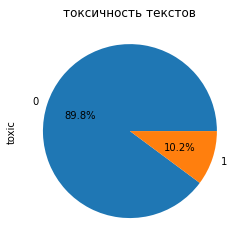

<span style="color: blue; font-size: 20px; font-weight: bold;">Комментарий ревьюера</span>

<span style="color: blue">Привет, Александр! Меня зовут Павел Григорьев, и я буду проверять этот проект.<br>Моя основная цель - не указать на совершённые тобой ошибки, а поделиться своим опытом и помочь тебе совершенствоваться как профессионалу.<br>Спасибо за проделанную работу! Предлагаю общаться на «ты».</span>
<details>
	<summary><u>Инструкция по организационным моментам (кликабельно)</u>⤵</summary>
<span style="color: blue">Я буду использовать различные цвета, чтобы было удобнее воспринимать мои комментарии:</span>


---


<span style="color: blue">синий текст - просто текст комментария</span>

<span style="color: green">✔️ и зеленый текст - все отлично</span>

<span style="color: orange">⚠️ и оранжевый текст - сделано все правильно, однако есть рекомендации, на что стоит обратить внимание</span>

<span style="color: red">❌ и красный текст - есть недочеты</span>


</details>    
</br>
<span style="color: blue">Пожалуйста, не удаляй мои комментарии в случае возврата работы, так будет проще разобраться, какие были недочеты, а также сразу увидеть исправленное.</span>

<span style="color: blue">Ответы на мои комментарии лучше тоже помечать.<br>
Например: </span><br><span style="color: purple; font-weight: bold">Комментарий студента</span>

<span style="color: blue; font-weight: bold;">Давай смотреть, что получилось!</span>

<span style="color: blue; font-size: 18px; font-weight: bold;">Комментарий ревьюера 2</span>

<span style="color: blue">Привет еще раз. Спасибо, за исправления. Оформление комментариев по работе сохраняется. Только обозначим, что это вторая итерация.</span> 

<span style="color: blue; font-size: 18px; font-weight: bold;">Комментарий ревьюера 3</span>

<span style="color: blue">Привет еще раз. Спасибо, за исправления. Оформление комментариев по работе сохраняется.</span> 

<h1>Содержание<span class="tocSkip"></span></h1>
<div class="toc"><ul class="toc-item"><li><span><a href="#Подготовка" data-toc-modified-id="Подготовка-1"><span class="toc-item-num">1&nbsp;&nbsp;</span>Подготовка</a></span></li><li><span><a href="#Обучение" data-toc-modified-id="Обучение-2"><span class="toc-item-num">2&nbsp;&nbsp;</span>Обучение</a></span></li><li><span><a href="#Выводы" data-toc-modified-id="Выводы-3"><span class="toc-item-num">3&nbsp;&nbsp;</span>Выводы</a></span></li><li><span><a href="#Чек-лист-проверки" data-toc-modified-id="Чек-лист-проверки-4"><span class="toc-item-num">4&nbsp;&nbsp;</span>Чек-лист проверки</a></span></li></ul></div>

# Проект для «Викишоп»

Интернет-магазин «Викишоп» запускает новый сервис. Теперь пользователи могут редактировать и дополнять описания товаров, как в вики-сообществах. То есть клиенты предлагают свои правки и комментируют изменения других. Магазину нужен инструмент, который будет искать токсичные комментарии и отправлять их на модерацию. 

Обучите модель классифицировать комментарии на позитивные и негативные. В вашем распоряжении набор данных с разметкой о токсичности правок.

Постройте модель со значением метрики качества *F1* не меньше 0.75. 

**Инструкция по выполнению проекта**

1. Загрузите и подготовьте данные.
2. Обучите разные модели. 
3. Сделайте выводы.

Для выполнения проекта применять *BERT* необязательно, но вы можете попробовать.

**Описание данных**

Данные находятся в файле `toxic_comments.csv`. Столбец *text* в нём содержит текст комментария, а *toxic* — целевой признак.

## Подготовка


```python
!pip install matplotlib==3.5.0 -q
!pip install scikit-learn==1.3.2 -q
!pip install catboost --q
!pip install lightgbm --q
```


```python
# загрузка библиотек
import pandas as pd
from pymystem3 import Mystem
import re
import matplotlib.pyplot as plt
import random
import time

import nltk
from nltk.corpus import stopwords
nltk.download('stopwords')
nltk.download('wordnet')
from nltk.stem import WordNetLemmatizer
from nltk.corpus import wordnet 

from nltk.corpus import stopwords as nltk_stopwords
from sklearn.feature_extraction.text import TfidfVectorizer
from sklearn.preprocessing import MinMaxScaler, StandardScaler
from sklearn.pipeline import Pipeline

from sklearn.linear_model import LogisticRegression
from sklearn.neighbors import KNeighborsClassifier
from sklearn.svm import SVC
from sklearn.tree import DecisionTreeClassifier
from lightgbm import LGBMClassifier
from catboost import CatBoostClassifier
from sklearn.model_selection import train_test_split, RandomizedSearchCV

from sklearn.metrics import roc_auc_score, f1_score
```

    [nltk_data] Downloading package stopwords to /home/jovyan/nltk_data...
    [nltk_data]   Package stopwords is already up-to-date!
    [nltk_data] Downloading package wordnet to /home/jovyan/nltk_data...
    [nltk_data]   Package wordnet is already up-to-date!


<font color='blue'><b>Комментарий ревьюера: </b></font> ✔️\
<font color='green'> Хорошее оформление импортов! \
Импорты собраны в одной ячейке, разделены на функциональные группы пустой строкой.</font>


```python
# загрузка текста
data = pd.read_csv('/datasets/toxic_comments.csv')
```


```python
# Рассмотрим таблицу
data.info()
data.sample(2)
```

    <class 'pandas.core.frame.DataFrame'>
    RangeIndex: 159292 entries, 0 to 159291
    Data columns (total 3 columns):
     #   Column      Non-Null Count   Dtype 
    ---  ------      --------------   ----- 
     0   Unnamed: 0  159292 non-null  int64 
     1   text        159292 non-null  object
     2   toxic       159292 non-null  int64 
    dtypes: int64(2), object(1)
    memory usage: 3.6+ MB


<div>
<style scoped>
    .dataframe tbody tr th:only-of-type {
        vertical-align: middle;
    }

    .dataframe tbody tr th {
        vertical-align: top;
    }

    .dataframe thead th {
        text-align: right;
    }
</style>
<table border="1" class="dataframe">
  <thead>
    <tr style="text-align: right;">
      <th></th>
      <th>Unnamed: 0</th>
      <th>text</th>
      <th>toxic</th>
    </tr>
  </thead>
  <tbody>
    <tr>
      <th>25840</th>
      <td>25864</td>
      <td>Regarding edits made during November 22 2006 (...</td>
      <td>0</td>
    </tr>
    <tr>
      <th>152272</th>
      <td>152429</td>
      <td>"\nNice D That one really made me laugh hard. ...</td>
      <td>0</td>
    </tr>
  </tbody>
</table>
</div>


Как видно у нас таблица из 159292 текстов и их оценок на токсичность.

Как видно пропусков не обнаружено.


```python
# найдем дубликаты
data.duplicated().sum()
```


    0


```python
# посмотрим есть ли схожие тексты
data['text'].duplicated().sum()
```


    0


Дубликаты не были обнаружены.

<font color='blue'><b>Комментарий ревьюера: </b></font> ✔️\
<font color='green'>Данные загружены корректно, первичный осмотр проведен.</font>

Поищем ошибки в оценки токсичности, т.е. посмотрим какие именно зеачения есть в столбце "toxic".


```python
data['toxic'].unique()
```


    array([0, 1])


Ошибок обнаружено не было.


```python
data['toxic'].value_counts().plot(kind='pie',autopct='%1.1f%%')
plt.title('токсичность текстов')
plt.show()
```


    

    


Данные несбалансированы так как токсичных коментариев (`класс 1`) в разы меньше, чем позитивных (`класс 0`). Причина этого в высокой культурности людей.

<font color='blue'><b>Комментарий ревьюера: </b></font> ✔️\
<font color='green'> Мы обнаружили серьёзный дисбаланс при исследовании данных. Как дополнительные материалы, рекомендую статью <a href='https://dyakonov.org/2021/05/27/imbalance/'>Дисбаланс классов</a>, очень классная, как и весь блог Дьяконова. Ещё такой <a href='https://github.com/Dyakonov/ml_hacks/blob/master/book_disbalance_public_v1.ipynb'>ноутбук</a> есть.</font>

<font color='blue'><b>Комментарий ревьюера: </b></font> ❌\
<font color='red'> ~~Мы не можем балансировать весь датасет, поскольку в этом случае мы балансируем также тестовую выборку. С такой тестовой выборкой метрика не сможет адекватно оценить работу модели на входящих данных с реальным распределением таргетов.~~ </font>

У нас анлийский текст. Его нужно лемматизировать и оставить только слова. Цифры тоже надо убрать так как они не несут токсичные значения.


```python
def get_wordnet_pos(word):
    """функцмя используящая POS-тег для определения части речи"""
    tag = nltk.pos_tag([word])[0][1][0].upper()
    tag_dict = {"J": wordnet.ADJ, # прилагательное
                "N": wordnet.NOUN, # существительное
                "V": wordnet.VERB, # глагол
                "R": wordnet.ADV} # наречие
    return tag_dict.get(tag, wordnet.NOUN)
```


```python
lemmatizer = WordNetLemmatizer()

def lc(text):
    #clean_text = " ".join(re.sub(r'[^a-zA-Z]', ' ', text).lower().split())
    stopwords = set(nltk_stopwords.words('english')) # стоп-слова которые будут удалены
    list_word = nltk.word_tokenize(re.sub(r'[^a-zA-Z]', ' ', text).lower())
    lemmatized_list = ' '.join([lemmatizer.lemmatize(w,get_wordnet_pos(w)) for w in list_word if not w in stopwords])    
    return lemmatized_list


```

<font color='blue'><b>Комментарий ревьюера: </b></font> ✔️\
<font color='green'> Очистка сделана верно! Мы оставили только символы Латинского алфавита.</font> \
<font color='darkorange'>Можно ещё привести символы к одному регистру. Это уменьшит словарь уникальных слов.</font>


```python
# проверим её на втором тексте

print('изначальный :',data['text'][0])
print('леммитизированый и очишенный :',lc(data['text'][0]))

```

    изначальный : Explanation
    Why the edits made under my username Hardcore Metallica Fan were reverted? They weren't vandalisms, just closure on some GAs after I voted at New York Dolls FAC. And please don't remove the template from the talk page since I'm retired now.89.205.38.27
    леммитизированый и очишенный : explanation edits make username hardcore metallica fan revert vandalism closure gas vote new york doll fac please remove template talk page since retire


<font color='blue'><b>Комментарий ревьюера 3: </b></font> ✔️\
<font color='green'> Отлично! Теперь видно, что слова в начальных формах.</font>

<font color='blue'><b>Комментарий ревьюера 2: </b></font> ❌\
<font color='red'>~~Обрати внимание, не все слова приведены к начальным формам. Чтобы корректно обработались все части речи, для WordNetLemmatizer() нужно использовать POS-теги (Part of Speech, части речи). Примеры работы с WordNetLemmatizer(), а также с другими инструментами для лемматизации, можно найти в~~ [этой статье](https://webdevblog.ru/podhody-lemmatizacii-s-primerami-v-python/)</font>

<font color='blue'><b>Комментарий ревьюера: </b></font> ❌\
<font color='red'> ~~Обрати внимание, лемматизация не выполнена. pymystem работает только для русского языка, и здесь бесполезна. Про другие инструменты для лемматизации (Wordnet Lemmatizer или Spacy Lemmatizer) можно почитать [тут](https://webdevblog.ru/podhody-lemmatizacii-s-primerami-v-python/). Обрати внимание на POS-теги. Для некоторых лемматизаторов они необходимы.~~</font>

<font color='blue'><b>Комментарий ревьюера: </b></font>\
<font color='blue'>Присмотрись к spaCy - работает быстрее и кода меньше.</font>

Таким образом планируемая леммитизация и очистка произошли успешно.

Необходимо провести через данную процедуру все тексты.

Как видно преобразование отлично работает. Необходимо сделать это массово.


```python
features=data['text'].apply(lc)
```


```python
features.head()
```


    0    explanation edits make username hardcore metal...
    1    aww match background colour seemingly stuck th...
    2    hey man really try edit war guy constantly rem...
    3    make real suggestion improvement wonder sectio...
    4                        sir hero chance remember page
    Name: text, dtype: object


```python
target=data['toxic']
```


```python
print('features :',features.shape,'  target:',target.shape)
```

    features : (159292,)   target: (159292,)


Отлично, были выделены входные параметры и целевой признак

<font color='blue'><b>Комментарий ревьюера: </b></font> ✔️\
<font color='green'>Здорово что выводишь данные, так удобно отлаживать код, сразу видно, что функция работает корректно.</font>

Тест обрабатывать сдожнее и поэтому надо найти их TF-IDF.

<font color='blue'><b>Комментарий ревьюера: </b></font> ❌\
<font color='red'> ~~Метод .astype('U') кодирует текст в максимально широкий Юникод U32, содержащий все возможные символы и эмоджи. Такое форматирование здесь не имеет смысла, так как после очистки останется только латинница (тексты, в основном, и так уже в Юникоде "utf-8"). Ни одна из используемых в проекте моделей не требует кодировки в Юникод. Можно обойтись и без него.~~</font>

<font color='blue'><b>Комментарий ревьюера: </b></font> ❌\
<font color='red'> ~~У нас тексты только на латинице. Стоп-слова должны быть Английские.~~</font>

<font color='blue'><b>Комментарий ревьюера: </b></font> ❌\
<font color='red'> ~~К сожалению, мы не можем обучать Векторайзер на полном корпусе текстов. Векторизация не должна учитывать тестовый и валидационный  наборы данных. Поэтому обучение Векторайзера только на трейне, остальное только трансформируем.~~</font>

<font color='blue'><b>Комментарий ревьюера: </b></font> ⚠️\
<font color='darkorange'> Можно объединить Векторизатор с моделью через Pipeline. Так можно избежать утечек даже при кроссвалидации моделей.<br> Материалы по Pipeline:<br> [О Пайплайн](https://dzen.ru/a/YBBkKJBsUV9MPret)<br>

[Примеры работы с текстами](https://scikit-learn.org/stable/auto_examples/model_selection/plot_grid_search_text_feature_extraction.html)</font>

Таким образом были создан признаки и целевой параметр.

## Обучение


```python
# разделим данные на обучающую (80%) и тестовую выборки (20%)
# определим random_state
RANDOM_STATE = 42
TEST_SIZE = 0.2

X_train, X_test, y_train, y_test = train_test_split(
    features,
    target,
    test_size = TEST_SIZE, 
    random_state = RANDOM_STATE,
    stratify = target
)

# проверим размер получившихся выборок
print(X_train.shape, X_test.shape)
```

    (127433,) (31859,)


<font color='blue'><b>Комментарий ревьюера: </b></font> ✔️\
<font color='green'> Здорово , что у нас есть выборка для тестов!</font>


```python
#stopwords = set(nltk_stopwords.words('english'))

# cоздаем пиплайн
pipeline=Pipeline([("vect",TfidfVectorizer()),
        ("model",DecisionTreeClassifier(random_state=RANDOM_STATE))
      
    ]
)
```

<font color='blue'><b>Комментарий ревьюера 2: </b></font> ✔️\
<font color='green'>Классно, что используешь pipeline. Так можно избежать утечек даже при кроссвалидации моделей. \
С Pipeline можно подбирать гиперпараметры не только к классификатору, но и к предобработчикам.</font>

    В качестве модели возьмем линейную регрессию и lgbm-бустинг с различными гиперпараметрами. Также просмотрим различные гиперпараметры для векториязации текста.


```python
param_grid = [
    # словарь для модели LogisticRegression
    {
        "vect__max_df": (0.2, 0.6, 0.8),
        "vect__min_df": (1, 3, 5),
        "vect__ngram_range": ((1, 1), (1, 2)),  # unigrams or bigrams
        "vect__norm": ("l1", "l2"),
        'model': [LogisticRegression(random_state=RANDOM_STATE, solver='liblinear', penalty='l1')],
        'model__C': range(1, 7)
    },
    
    {
        "vect__max_df": (0.2, 0.6, 0.8),
        "vect__min_df": (1, 3, 5),
        "vect__ngram_range": ((1, 1), (1, 2)),  # unigrams or bigrams
        "vect__norm": ("l1", "l2"),
        'model': [LGBMClassifier()]
    }

   
]
```

<span style="color: blue; font-weight: bold">Комментарий ревьюера 2: </span>  ❌\
<span style="color: red">~~Нужно проверить несколько млделей.~~ </span>
```Markdown
2. Обучите разные модели.
```


```python
random_search = RandomizedSearchCV(
    estimator=pipeline,
    param_distributions=param_grid,
    scoring='f1',
    error_score='raise',
    n_iter=20,
    random_state=RANDOM_STATE,
    n_jobs=-1,
    cv=5,
    verbose=1
)
random_search.fit(X_train, y_train)
```

    Fitting 5 folds for each of 20 candidates, totalling 100 fits


    /opt/conda/lib/python3.9/site-packages/sklearn/svm/_base.py:1250: ConvergenceWarning: Liblinear failed to converge, increase the number of iterations.
      warnings.warn(
    /opt/conda/lib/python3.9/site-packages/sklearn/svm/_base.py:1250: ConvergenceWarning: Liblinear failed to converge, increase the number of iterations.
      warnings.warn(
    /opt/conda/lib/python3.9/site-packages/sklearn/svm/_base.py:1250: ConvergenceWarning: Liblinear failed to converge, increase the number of iterations.
      warnings.warn(
    /opt/conda/lib/python3.9/site-packages/sklearn/svm/_base.py:1250: ConvergenceWarning: Liblinear failed to converge, increase the number of iterations.
      warnings.warn(
    /opt/conda/lib/python3.9/site-packages/sklearn/svm/_base.py:1250: ConvergenceWarning: Liblinear failed to converge, increase the number of iterations.
      warnings.warn(
    /opt/conda/lib/python3.9/site-packages/sklearn/svm/_base.py:1250: ConvergenceWarning: Liblinear failed to converge, increase the number of iterations.
      warnings.warn(
    /opt/conda/lib/python3.9/site-packages/sklearn/svm/_base.py:1250: ConvergenceWarning: Liblinear failed to converge, increase the number of iterations.
      warnings.warn(
    /opt/conda/lib/python3.9/site-packages/sklearn/svm/_base.py:1250: ConvergenceWarning: Liblinear failed to converge, increase the number of iterations.
      warnings.warn(


<style>#sk-container-id-1 {color: black;}#sk-container-id-1 pre{padding: 0;}#sk-container-id-1 div.sk-toggleable {background-color: white;}#sk-container-id-1 label.sk-toggleable__label {cursor: pointer;display: block;width: 100%;margin-bottom: 0;padding: 0.3em;box-sizing: border-box;text-align: center;}#sk-container-id-1 label.sk-toggleable__label-arrow:before {content: "▸";float: left;margin-right: 0.25em;color: #696969;}#sk-container-id-1 label.sk-toggleable__label-arrow:hover:before {color: black;}#sk-container-id-1 div.sk-estimator:hover label.sk-toggleable__label-arrow:before {color: black;}#sk-container-id-1 div.sk-toggleable__content {max-height: 0;max-width: 0;overflow: hidden;text-align: left;background-color: #f0f8ff;}#sk-container-id-1 div.sk-toggleable__content pre {margin: 0.2em;color: black;border-radius: 0.25em;background-color: #f0f8ff;}#sk-container-id-1 input.sk-toggleable__control:checked~div.sk-toggleable__content {max-height: 200px;max-width: 100%;overflow: auto;}#sk-container-id-1 input.sk-toggleable__control:checked~label.sk-toggleable__label-arrow:before {content: "▾";}#sk-container-id-1 div.sk-estimator input.sk-toggleable__control:checked~label.sk-toggleable__label {background-color: #d4ebff;}#sk-container-id-1 div.sk-label input.sk-toggleable__control:checked~label.sk-toggleable__label {background-color: #d4ebff;}#sk-container-id-1 input.sk-hidden--visually {border: 0;clip: rect(1px 1px 1px 1px);clip: rect(1px, 1px, 1px, 1px);height: 1px;margin: -1px;overflow: hidden;padding: 0;position: absolute;width: 1px;}#sk-container-id-1 div.sk-estimator {font-family: monospace;background-color: #f0f8ff;border: 1px dotted black;border-radius: 0.25em;box-sizing: border-box;margin-bottom: 0.5em;}#sk-container-id-1 div.sk-estimator:hover {background-color: #d4ebff;}#sk-container-id-1 div.sk-parallel-item::after {content: "";width: 100%;border-bottom: 1px solid gray;flex-grow: 1;}#sk-container-id-1 div.sk-label:hover label.sk-toggleable__label {background-color: #d4ebff;}#sk-container-id-1 div.sk-serial::before {content: "";position: absolute;border-left: 1px solid gray;box-sizing: border-box;top: 0;bottom: 0;left: 50%;z-index: 0;}#sk-container-id-1 div.sk-serial {display: flex;flex-direction: column;align-items: center;background-color: white;padding-right: 0.2em;padding-left: 0.2em;position: relative;}#sk-container-id-1 div.sk-item {position: relative;z-index: 1;}#sk-container-id-1 div.sk-parallel {display: flex;align-items: stretch;justify-content: center;background-color: white;position: relative;}#sk-container-id-1 div.sk-item::before, #sk-container-id-1 div.sk-parallel-item::before {content: "";position: absolute;border-left: 1px solid gray;box-sizing: border-box;top: 0;bottom: 0;left: 50%;z-index: -1;}#sk-container-id-1 div.sk-parallel-item {display: flex;flex-direction: column;z-index: 1;position: relative;background-color: white;}#sk-container-id-1 div.sk-parallel-item:first-child::after {align-self: flex-end;width: 50%;}#sk-container-id-1 div.sk-parallel-item:last-child::after {align-self: flex-start;width: 50%;}#sk-container-id-1 div.sk-parallel-item:only-child::after {width: 0;}#sk-container-id-1 div.sk-dashed-wrapped {border: 1px dashed gray;margin: 0 0.4em 0.5em 0.4em;box-sizing: border-box;padding-bottom: 0.4em;background-color: white;}#sk-container-id-1 div.sk-label label {font-family: monospace;font-weight: bold;display: inline-block;line-height: 1.2em;}#sk-container-id-1 div.sk-label-container {text-align: center;}#sk-container-id-1 div.sk-container {/* jupyter's `normalize.less` sets `[hidden] { display: none; }` but bootstrap.min.css set `[hidden] { display: none !important; }` so we also need the `!important` here to be able to override the default hidden behavior on the sphinx rendered scikit-learn.org. See: https://github.com/scikit-learn/scikit-learn/issues/21755 */display: inline-block !important;position: relative;}#sk-container-id-1 div.sk-text-repr-fallback {display: none;}</style><div id="sk-container-id-1" class="sk-top-container"><div class="sk-text-repr-fallback"><pre>RandomizedSearchCV(cv=5, error_score=&#x27;raise&#x27;,
                   estimator=Pipeline(steps=[(&#x27;vect&#x27;, TfidfVectorizer()),
                                             (&#x27;model&#x27;,
                                              DecisionTreeClassifier(random_state=42))]),
                   n_iter=20, n_jobs=-1,
                   param_distributions=[{&#x27;model&#x27;: [LogisticRegression(penalty=&#x27;l1&#x27;,
                                                                      random_state=42,
                                                                      solver=&#x27;liblinear&#x27;)],
                                         &#x27;model__C&#x27;: range(1, 7),
                                         &#x27;vect__max_df&#x27;: (0.2, 0.6, 0.8),
                                         &#x27;vect__min_df&#x27;: (1, 3, 5),
                                         &#x27;vect__ngram_range&#x27;: ((1, 1), (1, 2)),
                                         &#x27;vect__norm&#x27;: (&#x27;l1&#x27;, &#x27;l2&#x27;)},
                                        {&#x27;model&#x27;: [LGBMClassifier()],
                                         &#x27;vect__max_df&#x27;: (0.2, 0.6, 0.8),
                                         &#x27;vect__min_df&#x27;: (1, 3, 5),
                                         &#x27;vect__ngram_range&#x27;: ((1, 1), (1, 2)),
                                         &#x27;vect__norm&#x27;: (&#x27;l1&#x27;, &#x27;l2&#x27;)}],
                   random_state=42, scoring=&#x27;f1&#x27;, verbose=1)</pre><b>In a Jupyter environment, please rerun this cell to show the HTML representation or trust the notebook. <br />On GitHub, the HTML representation is unable to render, please try loading this page with nbviewer.org.</b></div><div class="sk-container" hidden><div class="sk-item sk-dashed-wrapped"><div class="sk-label-container"><div class="sk-label sk-toggleable"><input class="sk-toggleable__control sk-hidden--visually" id="sk-estimator-id-1" type="checkbox" ><label for="sk-estimator-id-1" class="sk-toggleable__label sk-toggleable__label-arrow">RandomizedSearchCV</label><div class="sk-toggleable__content"><pre>RandomizedSearchCV(cv=5, error_score=&#x27;raise&#x27;,
                   estimator=Pipeline(steps=[(&#x27;vect&#x27;, TfidfVectorizer()),
                                             (&#x27;model&#x27;,
                                              DecisionTreeClassifier(random_state=42))]),
                   n_iter=20, n_jobs=-1,
                   param_distributions=[{&#x27;model&#x27;: [LogisticRegression(penalty=&#x27;l1&#x27;,
                                                                      random_state=42,
                                                                      solver=&#x27;liblinear&#x27;)],
                                         &#x27;model__C&#x27;: range(1, 7),
                                         &#x27;vect__max_df&#x27;: (0.2, 0.6, 0.8),
                                         &#x27;vect__min_df&#x27;: (1, 3, 5),
                                         &#x27;vect__ngram_range&#x27;: ((1, 1), (1, 2)),
                                         &#x27;vect__norm&#x27;: (&#x27;l1&#x27;, &#x27;l2&#x27;)},
                                        {&#x27;model&#x27;: [LGBMClassifier()],
                                         &#x27;vect__max_df&#x27;: (0.2, 0.6, 0.8),
                                         &#x27;vect__min_df&#x27;: (1, 3, 5),
                                         &#x27;vect__ngram_range&#x27;: ((1, 1), (1, 2)),
                                         &#x27;vect__norm&#x27;: (&#x27;l1&#x27;, &#x27;l2&#x27;)}],
                   random_state=42, scoring=&#x27;f1&#x27;, verbose=1)</pre></div></div></div><div class="sk-parallel"><div class="sk-parallel-item"><div class="sk-item"><div class="sk-label-container"><div class="sk-label sk-toggleable"><input class="sk-toggleable__control sk-hidden--visually" id="sk-estimator-id-2" type="checkbox" ><label for="sk-estimator-id-2" class="sk-toggleable__label sk-toggleable__label-arrow">estimator: Pipeline</label><div class="sk-toggleable__content"><pre>Pipeline(steps=[(&#x27;vect&#x27;, TfidfVectorizer()),
                (&#x27;model&#x27;, DecisionTreeClassifier(random_state=42))])</pre></div></div></div><div class="sk-serial"><div class="sk-item"><div class="sk-serial"><div class="sk-item"><div class="sk-estimator sk-toggleable"><input class="sk-toggleable__control sk-hidden--visually" id="sk-estimator-id-3" type="checkbox" ><label for="sk-estimator-id-3" class="sk-toggleable__label sk-toggleable__label-arrow">TfidfVectorizer</label><div class="sk-toggleable__content"><pre>TfidfVectorizer()</pre></div></div></div><div class="sk-item"><div class="sk-estimator sk-toggleable"><input class="sk-toggleable__control sk-hidden--visually" id="sk-estimator-id-4" type="checkbox" ><label for="sk-estimator-id-4" class="sk-toggleable__label sk-toggleable__label-arrow">DecisionTreeClassifier</label><div class="sk-toggleable__content"><pre>DecisionTreeClassifier(random_state=42)</pre></div></div></div></div></div></div></div></div></div></div></div></div>


```python
print('Лучшая модель и ее параметры:\n\n', random_search.best_estimator_)
print('F1-метрика лучшей модели на тренировочной выборке:', round(random_search.best_score_,4))

#probabilities = 
print('F1-метрика лучшей модели на тестовой выборке:', round(f1_score(y_test, random_search.predict(X_test)),4))
```

    Лучшая модель и ее параметры:
    
     Pipeline(steps=[('vect', TfidfVectorizer(max_df=0.2, ngram_range=(1, 2))),
                    ('model',
                     LogisticRegression(C=4, penalty='l1', random_state=42,
                                        solver='liblinear'))])
    F1-метрика лучшей модели на тренировочной выборке: 0.7918
    F1-метрика лучшей модели на тестовой выборке: 0.7972


<span style="color: blue; font-weight: bold">Комментарий ревьюера : </span> ⚠️\
<span style="color: darkorange"> Словарь нигде не применяется.</span>

Была найдена лучшая модель и это линейная регрессия.

Метрика лучшей модели удовлетворяет условиям.

## Выводы

Целью данного проэкта является создание модели способной определять является ли комментарий токсичным или же нет с тоностью F1 больше 0.75. Для этого использовались данные таблицы о комментариях. В данной таблице 159292 строки и три столбца: номер комментария, сам комментарий и его оценка на токсичность. 

В таблице не обнаружено пропусков. Тексты написаны по английски с изпользованием пунктуации. Токсичность комментария обозначается цифрой 0 и 1. Ошибок не было обнаружено. Дубликаты текста также не были обнаружены, все тексты уникальны. Дальнейщие исследования показали, что только 10.2 % текстов имеют класс 1 и, следовательно, габлюдается дисбаланс, который может присести к переобучению (модель будет склоняться к классу 0 чем 1). 

Для дальнейщего анализа текстов был создан пайплан в котором происходит векторизация и использована модель (линейная регриссия и lgbm). На тренировачнных данных лучшая модель - линейная регрессия и она дала метрику 0.79, а на тестовых 0.80, что удовлетворяет условиям.


<font color='blue'><b>Комментарий ревьюера: </b></font> ✔️\
<font color='green'> Очень приятно видеть вывод в конце проекта!\
Приведены ответы на главные вопросы проекта.</font>

<font color='blue'><b>Итоговый комментарий ревьюера</b></font>\
<font color='green'>Александр, хороший проект получился!
Большое спасибо за проделанную работу. Видно, что приложено много усилий.
Выводы и рассуждения получились содержательными, их было интересно читать.
</font>

<font color='steelblue'>Над проектом ещё стоит поработать - есть рекомендации по дополнению некоторых твоих шагов проекта. Такие рекомендации я отметил жёлтыми комментариями. Будет здорово, если ты учтёшь их - так проект станет структурно и содержательно более совершенным.

Также в работе есть критические замечания. К этим замечаниям я оставил пояснительные комментарии красного цвета, в которых перечислил возможные варианты дальнейших действий. Уверен, ты быстро с этим управишься:)

Если о том, что нужно сделать в рамках комментариев, будут возникать вопросы - оставь их, пожалуйста, в комментариях, и я отвечу на них во время следующего ревью.

Также буду рад ответить на любые твои вопросы по проекту или на какие-либо другие, если они у тебя имеются - оставь их в комментариях, и я постараюсь ответить:)</font>

<font color='blue'><b>Жду твой проект на повторном ревью. До встречи :) </b></font>

<font color='blue'><b>Итоговый комментарий ревьюера 2</b></font>\
<font color='green'>Александр, большое спасибо за доработку.
</font>

<font color='blue'>Что нужно исправить:</font>
<ul><font color='red'>Поправь Лемматизацию.</font></ul>
<ul><font color='red'> Обучи разные модели.</font></ul>

<font color='blue'><b>Жду новую версию проекта :)</b></font>

<font color='blue'><b>Итоговый комментарий ревьюера 3</b></font>\
<font color='green'> Александр, проект принят! \
Все этапы пройдены. Все рекомендации учтены.\
Надеюсь, тебе понравился процесс выполнения и результат.</font> \
<font color='blue'><b>Спасибо, удачи в освоении профессии!</b></font>

<font color='green'><b>Полезные (и просто интересные) материалы:</b> \
Для работы с текстами используют и другие подходы. Например, сейчас активно используются RNN (LSTM) и трансформеры (BERT и другие с улицы Сезам, например, ELMO). НО! Они не являются панацеей, не всегда они нужны, так как и TF-IDF или Word2Vec + модели из классического ML тоже могут справляться. \
BERT тяжелый, существует много его вариаций для разных задач, есть готовые модели, есть надстройки над библиотекой transformers. Если, обучать BERT на GPU (можно в Google Colab или Kaggle), то должно быть побыстрее.\
https://huggingface.co/transformers/model_doc/bert.html \
https://colah.github.io/posts/2015-08-Understanding-LSTMs/ - Про LSTM \
https://web.stanford.edu/~jurafsky/slp3/10.pdf - про энкодер-декодер модели, этеншены\
https://pytorch.org/tutorials/beginner/transformer_tutorial.html - официальный гайд
по трансформеру от создателей pytorch\
Библиотеки: allennlp, fairseq, transformers, tensorflow-text — множествореализованных
методов для трансформеров методов NLP \
Word2Vec https://radimrehurek.com/gensim/models/word2vec.html

<font color='green'>Пример BERT с GPU:
```python
%%time
from tqdm import notebook
batch_size = 2 # для примера возьмем такой батч, где будет всего две строки датасета
embeddings = []
model.cuda()   # закидываем модель на GPU
for i in notebook.tqdm(range(input_ids.shape[0] // batch_size)):
        batch = torch.LongTensor(input_ids[batch_size*i:batch_size*(i+1)]).cuda() # закидываем тензор на GPU
        attention_mask_batch = torch.LongTensor(attention_mask[batch_size*i:batch_size*(i+1)]).cuda()

        with torch.no_grad():
            batch_embeddings = model(batch, attention_mask=attention_mask_batch)

        embeddings.append(batch_embeddings[0][:,0,:].cpu().numpy()) # перевод обратно на проц, чтобы в нумпай кинуть
        del batch
        del attention_mask_batch
        del batch_embeddings

features = np.concatenate(embeddings)
```
Можно сделать предварительную проверку на наличие GPU.\
Например, так: ```device = torch.device("cuda:0") if torch.cuda.is_available() else torch.device("cpu")```\
Тогда вместо .cuda() нужно писать .to(device)

Если понравилась работа с текстами, то можешь посмотреть очень интересный (но очень-очень сложный) курс лекций: https://github.com/yandexdataschool/nlp_course .


NLP от Samsung https://stepik.org/course/54098/promo \
NLP от Huawei https://ods.ai/tracks/nlp-course-spring-2024 \
Transformers от Hugging Face https://huggingface.co/learn/nlp-course/ru/chapter1/1
</font>

## Чек-лист проверки

- [x]  Jupyter Notebook открыт
- [ ]  Весь код выполняется без ошибок
- [ ]  Ячейки с кодом расположены в порядке исполнения
- [ ]  Данные загружены и подготовлены
- [ ]  Модели обучены
- [ ]  Значение метрики *F1* не меньше 0.75
- [ ]  Выводы написаны
