<div class="alert alert-info">
Привет, Александр! Меня зовут Светлана Чих и я буду проверять твой проект. Моя основная цель — не указать на совершенные тобою ошибки, а поделиться своим опытом и помочь тебе. Предлагаю общаться на «ты». Но если это не удобно - дай знать, и мы перейдем на «вы».

<div class="alert alert-success">
<b>👍 Успех:</b> Зелёным цветом отмечены удачные и элегантные решения, на которые можно опираться в будущих проектах.
</div>
<div class="alert alert-warning">
<b>🤔 Рекомендация:</b> Жёлтым цветом выделено то, что в следующий раз можно сделать по-другому. Ты можешь учесть эти комментарии при выполнении будущих заданий или доработать проект сейчас (однако это не обязательно).
</div>
<div class="alert alert-danger">
<b>😔 Необходимо исправить:</b> Красным цветом выделены комментарии, без исправления которых, я не смогу принять проект :(
</div>
<div class="alert alert-info">
<b>👂 Совет:</b> Какие-то дополнительные материалы
</div>
Давай работать над проектом в диалоге: если ты что-то меняешь в проекте по моим рекомендациям — пиши об этом.
Мне будет легче отследить изменения, если ты выделишь свои комментарии:
<div class="alert alert-info"> <b>🎓 Комментарий студента:</b> Например, вот так.</div>
Пожалуйста, не перемещай, не изменяй и не удаляй мои комментарии. Всё это поможет выполнить повторную проверку твоего проекта быстрее.
 </div>

Проэкт: проанализировать данные о бизнесе и составить рекомендации по улучшению. Данные представляют информацию о работниках, а для некторых их мнение о работе и данные о увольнениях. Необходимо составить модель которая предсказывала удовлетворенность от работы и увольнение сотрудников. Для простоты проэкт разделен на две части: создание модели отношения работников к работе, и состовление модели предсказывающие увольнение. Благодаря этому можно легче отвечать на бизнесс-вопросы.


```python
# загружаем пипы
!pip install shap -q
!pip install phik  -q
!pip install matplotlib==3.5.0 -q
!pip install scikit-learn==1.3.2 -q
```


```python
# загружаем библиотеки
import pandas as pd
from sklearn.linear_model import LinearRegression
from sklearn.tree import DecisionTreeRegressor
import numpy as np
import matplotlib.pyplot as plt
import seaborn as sns
from sklearn.model_selection import train_test_split
from sklearn.pipeline import Pipeline
from sklearn.compose import ColumnTransformer
from sklearn.preprocessing import OneHotEncoder, OrdinalEncoder, StandardScaler, MinMaxScaler, RobustScaler
from sklearn.impute import SimpleImputer
from sklearn.metrics import roc_auc_score
from sklearn.tree import DecisionTreeClassifier
from sklearn.model_selection import GridSearchCV
from sklearn.model_selection import RandomizedSearchCV
from sklearn.linear_model import LogisticRegression
from sklearn.neighbors import KNeighborsClassifier
from sklearn.tree import DecisionTreeClassifier
from sklearn.svm import SVC
from sklearn.feature_selection import SelectKBest, f_classif
from sklearn.preprocessing import StandardScaler, PolynomialFeatures
from sklearn.datasets import make_classification
from sklearn import svm
from sklearn import model_selection, metrics
from sklearn.metrics import make_scorer
import phik
import shap
from phik.report import plot_correlation_matrix
from phik import report
from sklearn.impute import SimpleImputer 
from sklearn.ensemble import RandomForestClassifier
pd.set_option('display.max_columns', None)
%matplotlib inline
```

<div class="alert alert-success">
<b>👍 Успех:</b> Импортированы нужные библиотеки!
</div>

# Задание 1. Состовлении модели удовлетворенности.

## Загрузка данных


```python
# загружаем файлы 
train = pd.read_csv('/datasets/train_job_satisfaction_rate.csv') # тренировачные данные
data = pd.read_csv('/datasets/test_features.csv') # входные данные тестовой выборки
target = pd.read_csv('/datasets/test_target_job_satisfaction_rate.csv') # целевой признак тестовой выборки
```

<div class="alert alert-success">
<b>👍 Успех:</b> Датасеты загружены!
</div>

## Предобработка данных

Рассмотрим каждую таблицу по отдельности.


```python
train.sample(2)# тренировачные данные
```


<div>
<style scoped>
    .dataframe tbody tr th:only-of-type {
        vertical-align: middle;
    }

    .dataframe tbody tr th {
        vertical-align: top;
    }

    .dataframe thead th {
        text-align: right;
    }
</style>
<table border="1" class="dataframe">
  <thead>
    <tr style="text-align: right;">
      <th></th>
      <th>id</th>
      <th>dept</th>
      <th>level</th>
      <th>workload</th>
      <th>employment_years</th>
      <th>last_year_promo</th>
      <th>last_year_violations</th>
      <th>supervisor_evaluation</th>
      <th>salary</th>
      <th>job_satisfaction_rate</th>
    </tr>
  </thead>
  <tbody>
    <tr>
      <th>1398</th>
      <td>115447</td>
      <td>technology</td>
      <td>middle</td>
      <td>high</td>
      <td>6</td>
      <td>no</td>
      <td>no</td>
      <td>3</td>
      <td>57600</td>
      <td>0.44</td>
    </tr>
    <tr>
      <th>1374</th>
      <td>673606</td>
      <td>technology</td>
      <td>middle</td>
      <td>high</td>
      <td>7</td>
      <td>no</td>
      <td>no</td>
      <td>3</td>
      <td>56400</td>
      <td>0.55</td>
    </tr>
  </tbody>
</table>
</div>


```python
train.info()
```

    <class 'pandas.core.frame.DataFrame'>
    RangeIndex: 4000 entries, 0 to 3999
    Data columns (total 10 columns):
     #   Column                 Non-Null Count  Dtype  
    ---  ------                 --------------  -----  
     0   id                     4000 non-null   int64  
     1   dept                   3994 non-null   object 
     2   level                  3996 non-null   object 
     3   workload               4000 non-null   object 
     4   employment_years       4000 non-null   int64  
     5   last_year_promo        4000 non-null   object 
     6   last_year_violations   4000 non-null   object 
     7   supervisor_evaluation  4000 non-null   int64  
     8   salary                 4000 non-null   int64  
     9   job_satisfaction_rate  4000 non-null   float64
    dtypes: float64(1), int64(4), object(5)
    memory usage: 312.6+ KB


 Видны пропуски но они часто появляются так как собрать информацию о сотрудниках трудно. Пропуски есть линь в наименовании отделов и уровней. 

<div class="alert alert-success">
<b>👍 Успех:</b> Все верно!
</div>

названия столбцов написаны по английски и для тех, кто плохо в нем разбирается, лучше заменить названия на русские.


```python
column_mapping = {
    'dept': 'отдел',
    'level': 'уровень',
    'workload': 'загруженость',
    'employment_years': 'стаж',
    'last_year_promo': 'повышение',
    'last_year_violations': 'нарушение',
    'supervisor_evaluation': 'оценка',
    'salary': 'зарплата',  
    'job_satisfaction_rate': 'удовольствие',
    }

train.rename(columns=column_mapping, inplace=True)
```


```python
train.sample(2)
```


<div>
<style scoped>
    .dataframe tbody tr th:only-of-type {
        vertical-align: middle;
    }

    .dataframe tbody tr th {
        vertical-align: top;
    }

    .dataframe thead th {
        text-align: right;
    }
</style>
<table border="1" class="dataframe">
  <thead>
    <tr style="text-align: right;">
      <th></th>
      <th>id</th>
      <th>отдел</th>
      <th>уровень</th>
      <th>загруженость</th>
      <th>стаж</th>
      <th>повышение</th>
      <th>нарушение</th>
      <th>оценка</th>
      <th>зарплата</th>
      <th>удовольствие</th>
    </tr>
  </thead>
  <tbody>
    <tr>
      <th>1176</th>
      <td>313180</td>
      <td>technology</td>
      <td>middle</td>
      <td>medium</td>
      <td>4</td>
      <td>no</td>
      <td>no</td>
      <td>4</td>
      <td>52800</td>
      <td>0.67</td>
    </tr>
    <tr>
      <th>1437</th>
      <td>479323</td>
      <td>sales</td>
      <td>middle</td>
      <td>high</td>
      <td>8</td>
      <td>no</td>
      <td>no</td>
      <td>3</td>
      <td>55200</td>
      <td>0.51</td>
    </tr>
  </tbody>
</table>
</div>


```python
#Для начало проверим нет ли явных дубликатов.
train.duplicated().sum()
```


    0


```python
# Есть ли дубликаты среди индексов.
train['id'].duplicated().sum()
```


    0


Рассмотрим качественные параметры 


```python
num=['стаж','оценка','зарплата','удовольствие'] # количественные
cat=['отдел','уровень','загруженость','повышение','нарушение'] # качественные
```


```python
for i in cat:
    print('Уникальные значения в стобце',i,' - это',train[i].unique())
```

    Уникальные значения в стобце отдел  - это ['sales' 'hr' 'technology' 'purchasing' 'marketing' nan]
    Уникальные значения в стобце уровень  - это ['junior' 'middle' 'sinior' nan]
    Уникальные значения в стобце загруженость  - это ['medium' 'high' 'low']
    Уникальные значения в стобце повышение  - это ['no' 'yes']
    Уникальные значения в стобце нарушение  - это ['no' 'yes']


Ошибок не обнаружено.

<div class="alert alert-success">
<b>👍 Успех:</b> Все верно!
</div>


```python
data.info() # входные данные тестовой выборки
```

    <class 'pandas.core.frame.DataFrame'>
    RangeIndex: 2000 entries, 0 to 1999
    Data columns (total 9 columns):
     #   Column                 Non-Null Count  Dtype 
    ---  ------                 --------------  ----- 
     0   id                     2000 non-null   int64 
     1   dept                   1998 non-null   object
     2   level                  1999 non-null   object
     3   workload               2000 non-null   object
     4   employment_years       2000 non-null   int64 
     5   last_year_promo        2000 non-null   object
     6   last_year_violations   2000 non-null   object
     7   supervisor_evaluation  2000 non-null   int64 
     8   salary                 2000 non-null   int64 
    dtypes: int64(4), object(5)
    memory usage: 140.8+ KB


Видно, что данных в тестовой выборки в два раза меньше чем в тренировочной.

Повторим процедуру изменения названия столбцов


```python
column_mapping = {
    'dept': 'отдел',
    'level': 'уровень',
    'workload': 'загруженость',
    'employment_years': 'стаж',
    'last_year_promo': 'повышение',
    'last_year_violations': 'нарушение',
    'supervisor_evaluation': 'оценка',
    'salary': 'зарплата',  
    #'job_satisfaction_rate': 'удовольствие',
    }

data.rename(columns=column_mapping, inplace=True)
```


```python
data.sample(2)
```


<div>
<style scoped>
    .dataframe tbody tr th:only-of-type {
        vertical-align: middle;
    }

    .dataframe tbody tr th {
        vertical-align: top;
    }

    .dataframe thead th {
        text-align: right;
    }
</style>
<table border="1" class="dataframe">
  <thead>
    <tr style="text-align: right;">
      <th></th>
      <th>id</th>
      <th>отдел</th>
      <th>уровень</th>
      <th>загруженость</th>
      <th>стаж</th>
      <th>повышение</th>
      <th>нарушение</th>
      <th>оценка</th>
      <th>зарплата</th>
    </tr>
  </thead>
  <tbody>
    <tr>
      <th>1549</th>
      <td>310595</td>
      <td>sales</td>
      <td>sinior</td>
      <td>high</td>
      <td>4</td>
      <td>no</td>
      <td>no</td>
      <td>4</td>
      <td>70800</td>
    </tr>
    <tr>
      <th>1016</th>
      <td>173430</td>
      <td>purchasing</td>
      <td>middle</td>
      <td>high</td>
      <td>5</td>
      <td>no</td>
      <td>no</td>
      <td>4</td>
      <td>58800</td>
    </tr>
  </tbody>
</table>
</div>


Посмотрим есть ли явные дубликаты.


```python
data.duplicated().sum()
```


    0


```python
# есть ли дубликаты в индексах
data['id'].duplicated().sum()
```


    0


Рассмотрим значения качественныз признаков


```python
for i in cat:
    print('Уникальные значения в стобце',i,' - это',data[i].unique())
```

    Уникальные значения в стобце отдел  - это ['marketing' 'hr' 'sales' 'purchasing' 'technology' nan ' ']
    Уникальные значения в стобце уровень  - это ['junior' 'middle' 'sinior' nan]
    Уникальные значения в стобце загруженость  - это ['medium' 'low' 'high' ' ']
    Уникальные значения в стобце повышение  - это ['no' 'yes']
    Уникальные значения в стобце нарушение  - это ['no' 'yes']


Видно, что в загружености есть пропуски, но в столбце `загруженость` и `отдел` есть значение ''. Это пропуски, но программа будет считать его значением, поятому его надо изменить.


```python
for i in cat:
    data[i]=data[i].replace(' ', np.nan)
```

Рассмотрим снова уникальные значения.


```python
for i in cat:
    print('Уникальные значения в стобце',i,' - это',data[i].unique())
```

    Уникальные значения в стобце отдел  - это ['marketing' 'hr' 'sales' 'purchasing' 'technology' nan]
    Уникальные значения в стобце уровень  - это ['junior' 'middle' 'sinior' nan]
    Уникальные значения в стобце загруженость  - это ['medium' 'low' 'high' nan]
    Уникальные значения в стобце повышение  - это ['no' 'yes']
    Уникальные значения в стобце нарушение  - это ['no' 'yes']


Как видно ошибок больше нет.

<div class="alert alert-success">
<b>👍 Успех:</b> Все верно!
</div>


```python
target.head(2) # целевой признак
```


<div>
<style scoped>
    .dataframe tbody tr th:only-of-type {
        vertical-align: middle;
    }

    .dataframe tbody tr th {
        vertical-align: top;
    }

    .dataframe thead th {
        text-align: right;
    }
</style>
<table border="1" class="dataframe">
  <thead>
    <tr style="text-align: right;">
      <th></th>
      <th>id</th>
      <th>job_satisfaction_rate</th>
    </tr>
  </thead>
  <tbody>
    <tr>
      <th>0</th>
      <td>130604</td>
      <td>0.74</td>
    </tr>
    <tr>
      <th>1</th>
      <td>825977</td>
      <td>0.75</td>
    </tr>
  </tbody>
</table>
</div>


```python
target.info()
```

    <class 'pandas.core.frame.DataFrame'>
    RangeIndex: 2000 entries, 0 to 1999
    Data columns (total 2 columns):
     #   Column                 Non-Null Count  Dtype  
    ---  ------                 --------------  -----  
     0   id                     2000 non-null   int64  
     1   job_satisfaction_rate  2000 non-null   float64
    dtypes: float64(1), int64(1)
    memory usage: 31.4 KB


пропусков нет. 


```python
# Заменим название на уже использованное
target.rename(columns={'job_satisfaction_rate': 'удовольствие'}, inplace=True)
target.info()
```

    <class 'pandas.core.frame.DataFrame'>
    RangeIndex: 2000 entries, 0 to 1999
    Data columns (total 2 columns):
     #   Column        Non-Null Count  Dtype  
    ---  ------        --------------  -----  
     0   id            2000 non-null   int64  
     1   удовольствие  2000 non-null   float64
    dtypes: float64(1), int64(1)
    memory usage: 31.4 KB


```python
#Главное надо проверить, что индексы входных данных и целевого признака совпадают.
(data['id']==target['id']).sum()
```


    0


```python
data.head(3)
```


<div>
<style scoped>
    .dataframe tbody tr th:only-of-type {
        vertical-align: middle;
    }

    .dataframe tbody tr th {
        vertical-align: top;
    }

    .dataframe thead th {
        text-align: right;
    }
</style>
<table border="1" class="dataframe">
  <thead>
    <tr style="text-align: right;">
      <th></th>
      <th>id</th>
      <th>отдел</th>
      <th>уровень</th>
      <th>загруженость</th>
      <th>стаж</th>
      <th>повышение</th>
      <th>нарушение</th>
      <th>оценка</th>
      <th>зарплата</th>
    </tr>
  </thead>
  <tbody>
    <tr>
      <th>0</th>
      <td>485046</td>
      <td>marketing</td>
      <td>junior</td>
      <td>medium</td>
      <td>2</td>
      <td>no</td>
      <td>no</td>
      <td>5</td>
      <td>28800</td>
    </tr>
    <tr>
      <th>1</th>
      <td>686555</td>
      <td>hr</td>
      <td>junior</td>
      <td>medium</td>
      <td>1</td>
      <td>no</td>
      <td>no</td>
      <td>4</td>
      <td>30000</td>
    </tr>
    <tr>
      <th>2</th>
      <td>467458</td>
      <td>sales</td>
      <td>middle</td>
      <td>low</td>
      <td>5</td>
      <td>no</td>
      <td>no</td>
      <td>4</td>
      <td>19200</td>
    </tr>
  </tbody>
</table>
</div>


```python
target.head(3)
```


<div>
<style scoped>
    .dataframe tbody tr th:only-of-type {
        vertical-align: middle;
    }

    .dataframe tbody tr th {
        vertical-align: top;
    }

    .dataframe thead th {
        text-align: right;
    }
</style>
<table border="1" class="dataframe">
  <thead>
    <tr style="text-align: right;">
      <th></th>
      <th>id</th>
      <th>удовольствие</th>
    </tr>
  </thead>
  <tbody>
    <tr>
      <th>0</th>
      <td>130604</td>
      <td>0.74</td>
    </tr>
    <tr>
      <th>1</th>
      <td>825977</td>
      <td>0.75</td>
    </tr>
    <tr>
      <th>2</th>
      <td>418490</td>
      <td>0.60</td>
    </tr>
  </tbody>
</table>
</div>


Вполне возможно, что индексы записаны не в том порядке.


```python
(data.sort_values(by='id').reset_index(drop=True)['id']==target.sort_values(by='id').reset_index(drop=True)['id']).sum()
```


    2000


Следовательно входные признаки и целевой совпадапют.

**Вывод** Были загружены таблица. В них не было нейдено опечаток. Названия столбцов были изменены.

<div class="alert alert-success">
<b>👍 Успех:</b> Все верно!
</div>

## Исследовательский анализ

Для начала рпассмотрим статистику таблиц.


```python
train.describe().T # Тренировочные данные
```


<div>
<style scoped>
    .dataframe tbody tr th:only-of-type {
        vertical-align: middle;
    }

    .dataframe tbody tr th {
        vertical-align: top;
    }

    .dataframe thead th {
        text-align: right;
    }
</style>
<table border="1" class="dataframe">
  <thead>
    <tr style="text-align: right;">
      <th></th>
      <th>count</th>
      <th>mean</th>
      <th>std</th>
      <th>min</th>
      <th>25%</th>
      <th>50%</th>
      <th>75%</th>
      <th>max</th>
    </tr>
  </thead>
  <tbody>
    <tr>
      <th>id</th>
      <td>4000.0</td>
      <td>544957.621000</td>
      <td>257883.104622</td>
      <td>100954.00</td>
      <td>322836.75</td>
      <td>534082.50</td>
      <td>771446.00</td>
      <td>999521.0</td>
    </tr>
    <tr>
      <th>стаж</th>
      <td>4000.0</td>
      <td>3.718500</td>
      <td>2.542513</td>
      <td>1.00</td>
      <td>2.00</td>
      <td>3.00</td>
      <td>6.00</td>
      <td>10.0</td>
    </tr>
    <tr>
      <th>оценка</th>
      <td>4000.0</td>
      <td>3.476500</td>
      <td>1.008812</td>
      <td>1.00</td>
      <td>3.00</td>
      <td>4.00</td>
      <td>4.00</td>
      <td>5.0</td>
    </tr>
    <tr>
      <th>зарплата</th>
      <td>4000.0</td>
      <td>33926.700000</td>
      <td>14900.703838</td>
      <td>12000.00</td>
      <td>22800.00</td>
      <td>30000.00</td>
      <td>43200.00</td>
      <td>98400.0</td>
    </tr>
    <tr>
      <th>удовольствие</th>
      <td>4000.0</td>
      <td>0.533995</td>
      <td>0.225327</td>
      <td>0.03</td>
      <td>0.36</td>
      <td>0.56</td>
      <td>0.71</td>
      <td>1.0</td>
    </tr>
  </tbody>
</table>
</div>


В тренировочных данных видно, что в среднем 3 годы, максимум 10. Лучшая оценка это 5 (как и следовало ожидать), в среднем это 3,5 ( по медиане 4) да и большая часть оценок находится между 3 и 4. Зарплата находиться в диапозоне от 12 до 98,4 тыс., а всреднем состовляет 30 тыс. (медианое значение блико). Значение удовлетворенности от работы есть разное, но в среднем это 0.5. 


```python
data.describe().T # тестовые данные входные
```


<div>
<style scoped>
    .dataframe tbody tr th:only-of-type {
        vertical-align: middle;
    }

    .dataframe tbody tr th {
        vertical-align: top;
    }

    .dataframe thead th {
        text-align: right;
    }
</style>
<table border="1" class="dataframe">
  <thead>
    <tr style="text-align: right;">
      <th></th>
      <th>count</th>
      <th>mean</th>
      <th>std</th>
      <th>min</th>
      <th>25%</th>
      <th>50%</th>
      <th>75%</th>
      <th>max</th>
    </tr>
  </thead>
  <tbody>
    <tr>
      <th>id</th>
      <td>2000.0</td>
      <td>552765.2135</td>
      <td>253851.326129</td>
      <td>100298.0</td>
      <td>339052.0</td>
      <td>550793.0</td>
      <td>765763.75</td>
      <td>999029.0</td>
    </tr>
    <tr>
      <th>стаж</th>
      <td>2000.0</td>
      <td>3.6665</td>
      <td>2.537222</td>
      <td>1.0</td>
      <td>1.0</td>
      <td>3.0</td>
      <td>6.00</td>
      <td>10.0</td>
    </tr>
    <tr>
      <th>оценка</th>
      <td>2000.0</td>
      <td>3.5265</td>
      <td>0.996892</td>
      <td>1.0</td>
      <td>3.0</td>
      <td>4.0</td>
      <td>4.00</td>
      <td>5.0</td>
    </tr>
    <tr>
      <th>зарплата</th>
      <td>2000.0</td>
      <td>34066.8000</td>
      <td>15398.436729</td>
      <td>12000.0</td>
      <td>22800.0</td>
      <td>30000.0</td>
      <td>43200.00</td>
      <td>96000.0</td>
    </tr>
  </tbody>
</table>
</div>


```python
target.describe().T # целевой признак
```


<div>
<style scoped>
    .dataframe tbody tr th:only-of-type {
        vertical-align: middle;
    }

    .dataframe tbody tr th {
        vertical-align: top;
    }

    .dataframe thead th {
        text-align: right;
    }
</style>
<table border="1" class="dataframe">
  <thead>
    <tr style="text-align: right;">
      <th></th>
      <th>count</th>
      <th>mean</th>
      <th>std</th>
      <th>min</th>
      <th>25%</th>
      <th>50%</th>
      <th>75%</th>
      <th>max</th>
    </tr>
  </thead>
  <tbody>
    <tr>
      <th>id</th>
      <td>2000.0</td>
      <td>552765.21350</td>
      <td>253851.326129</td>
      <td>100298.00</td>
      <td>339052.00</td>
      <td>550793.00</td>
      <td>765763.75</td>
      <td>999029.0</td>
    </tr>
    <tr>
      <th>удовольствие</th>
      <td>2000.0</td>
      <td>0.54878</td>
      <td>0.220110</td>
      <td>0.03</td>
      <td>0.38</td>
      <td>0.58</td>
      <td>0.72</td>
      <td>1.0</td>
    </tr>
  </tbody>
</table>
</div>


Статистика тестовых данные очень похожа на статистику тренировачных данных.

<div class="alert alert-success">
<b>👍 Успех:</b> Все верно!
</div>

### Построение графиков

Для наглядности посмотрим распределение параметров на графикоах.

Для удобства построения графиков и избежания дублирования кода напишем функции: будем строить гистограммы и ящики с усами для количественных признаков и столбчатые диаграммы для категориальных признаков.


```python
# Гистограммы для выборок
def plot_hist(df1,df2,column):
    # для тренировочная
    plt.subplot(1, 2, 2)
    plt.hist(df1[column], bins=10, alpha=0.5, color="blue")
    plt.title("тренировочная выборка")
    plt.xlabel(column)
    plt.ylabel("Частота")

    # для тестовая
    plt.subplot(1, 2, 1)
    plt.hist(df2[column], bins=10, alpha=0.5, color="green")
    plt.title("Тестовая выборка")
    plt.xlabel(column)
    plt.ylabel("Частота")

    plt.tight_layout()
    plt.show()

# Ящик с усами
def plot_box(df1, df2, column):
    plt.figure(figsize=(10, 6))

    # для тренировка
    plt.subplot(1, 2, 2)
    sns.boxplot(data=df1, y=column, color='blue')
    plt.title("Тренировочная выборка")
    plt.ylabel(column)

    # для тест
    plt.subplot(1, 2, 1)
    sns.boxplot(data=df2, y=column, color='green')
    plt.title("Тестовая выборка")
    plt.ylabel(column)

    plt.tight_layout()
    plt.show()
    
        
def plot_cat(df1,df2,column):
    
    fig, axes = plt.subplots(nrows=1, ncols=2, figsize=(20, 5))
    
    print(column)

    dn1=df1[column].value_counts()
    axes[0].pie(dn1,labels=dn1.index,autopct='%1.1f%%')
    axes[0].set_title('Тренировочная выборка ', fontweight='bold')

    
    dn2=df2[column].value_counts()
    axes[1].pie(dn2,labels=dn2.index, autopct='%1.1f%%')
    axes[1].set_title('Тестовая выборка ', fontweight='bold')
    
    plt.show()

    
```


```python
for i in ['стаж','оценка','зарплата']:
    plot_hist(train,data,i)
    plot_box(train,data,i)
```


    
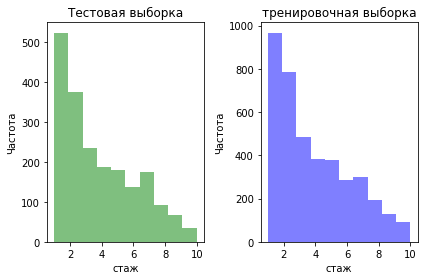
    


    
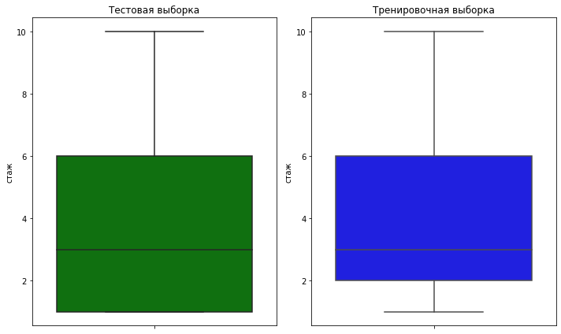
    


    
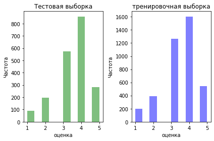
    


    
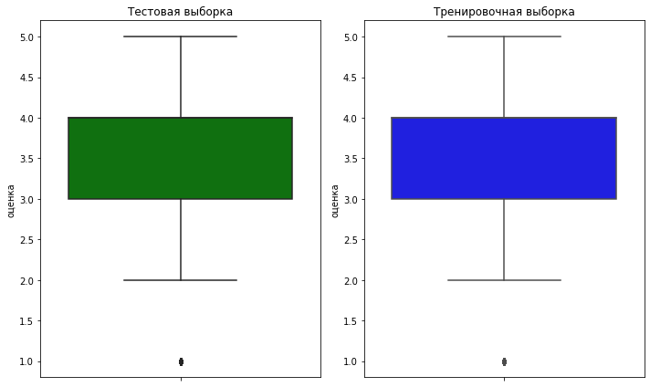
    


    
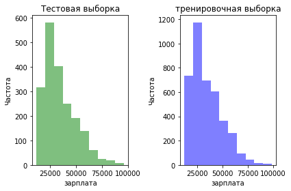
    


    
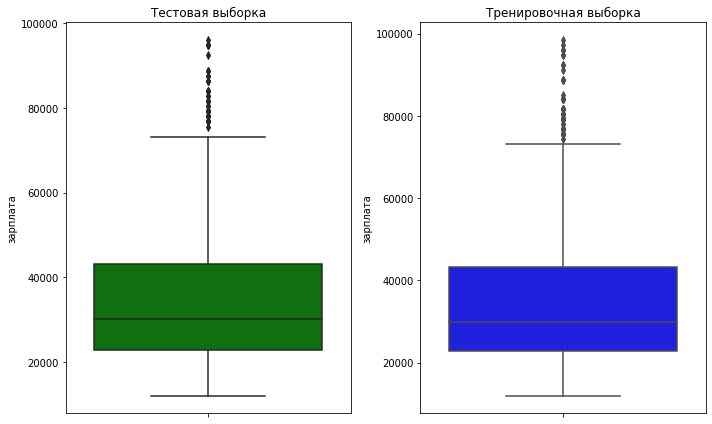
    


```python
plot_hist(train,target,'удовольствие')
plot_box(train,target,'удовольствие')
```


    
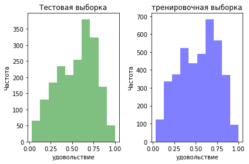
    


    
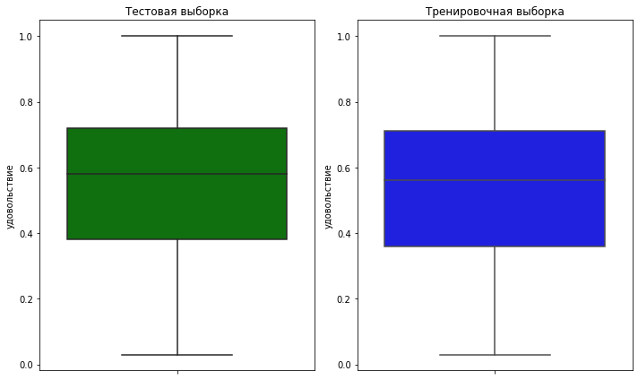
    


Количественные признаки распределены похожим образом в тестовой и тренировочной выборки.


```python
for i in ['отдел','уровень','загруженость','повышение','нарушение']:
    plot_cat(train,data,i)
```

    отдел


    
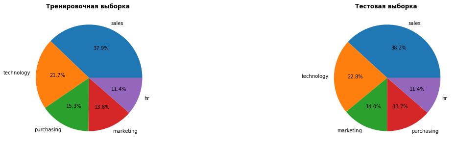
    


    уровень


    
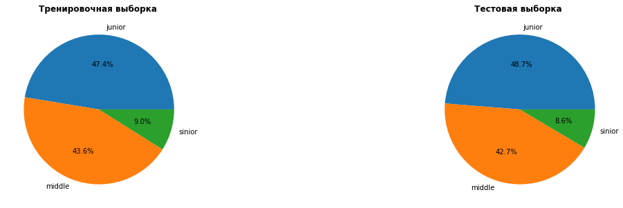
    


    загруженость


    
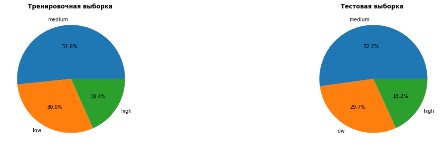
    


    повышение


    
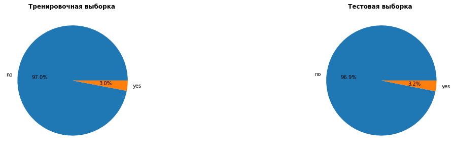
    


    нарушение


    
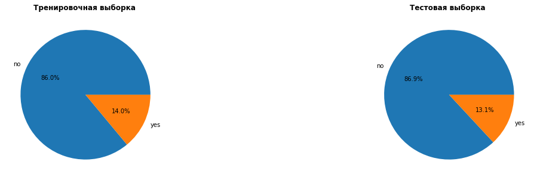
    


Различия в распределениях качественных признаокв не превышает 1%. Большая часть сотрудниках либо младшие либо среднее.

Все значения параметров имею примерно одинаковое количество (одни больши других максимум в два раза), кроме стобца о нарушениях.Наруения совершили около 13% работниокв. Повышениен получает лишь только три процента. Большая часть сотрудников имеет среднею заруженость.

<div class="alert alert-success">
<b>👍 Успех:</b> Все верно!
</div>

### Корреляция и установление зависимостей.

Матрица Phik широко используется для анализа корреляции между переменными в наборах данных. В данном случае мы будем использовать эту матрицу, поскольку она может учитывать корреляцию не только между количественными, но и между категориальными переменными. А нам эту нужно с целью понимания взаимосвязей в данных.


```python
train_copy = train.drop('id', axis=1)


# расчет коэффициентов корреляции Phik
correlation_matrix = phik.phik_matrix(train_copy ) #interval_cols=ic

# построение графика корреляции
plt.figure(figsize=(20, 15))
sns.heatmap(correlation_matrix, annot=True, cmap="coolwarm")

plt.title("Матрица корреляции (Phik)")
plt.show();
```

    interval columns not set, guessing: ['стаж', 'оценка', 'зарплата', 'удовольствие']


    
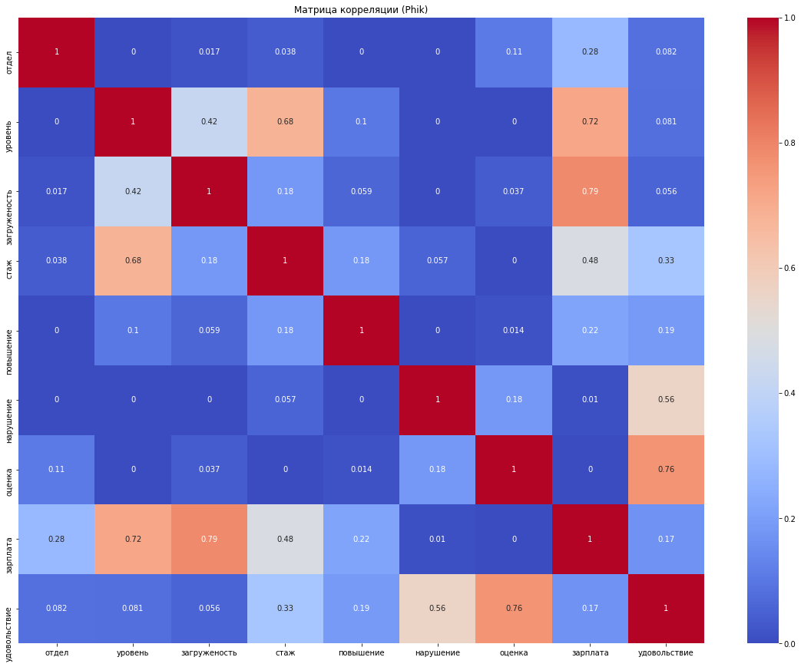
    


Для тренировочных данных видна зависимость зарплаты от загружености и уровня занимаемой должности, уровень должности от стажа, а также оценка качества работы зависит от удовлетворенности сотрудника от неё.

<div class="alert alert-success">
<b>👍 Успех:</b> Все верно! Молодец, что используешь корреляцию, подходящую для категориальных признаков
</div>

Для точности нужно объединить таблицы data и target  таблицу test, чтобы было проще провсети корреляционный анализ и последующий тест.


```python
test=data.merge(target,how='outer')
```


```python
test.info()
```

    <class 'pandas.core.frame.DataFrame'>
    Int64Index: 2000 entries, 0 to 1999
    Data columns (total 10 columns):
     #   Column        Non-Null Count  Dtype  
    ---  ------        --------------  -----  
     0   id            2000 non-null   int64  
     1   отдел         1997 non-null   object 
     2   уровень       1999 non-null   object 
     3   загруженость  1999 non-null   object 
     4   стаж          2000 non-null   int64  
     5   повышение     2000 non-null   object 
     6   нарушение     2000 non-null   object 
     7   оценка        2000 non-null   int64  
     8   зарплата      2000 non-null   int64  
     9   удовольствие  2000 non-null   float64
    dtypes: float64(1), int64(4), object(5)
    memory usage: 171.9+ KB


```python
test.head(3)
```


<div>
<style scoped>
    .dataframe tbody tr th:only-of-type {
        vertical-align: middle;
    }

    .dataframe tbody tr th {
        vertical-align: top;
    }

    .dataframe thead th {
        text-align: right;
    }
</style>
<table border="1" class="dataframe">
  <thead>
    <tr style="text-align: right;">
      <th></th>
      <th>id</th>
      <th>отдел</th>
      <th>уровень</th>
      <th>загруженость</th>
      <th>стаж</th>
      <th>повышение</th>
      <th>нарушение</th>
      <th>оценка</th>
      <th>зарплата</th>
      <th>удовольствие</th>
    </tr>
  </thead>
  <tbody>
    <tr>
      <th>0</th>
      <td>485046</td>
      <td>marketing</td>
      <td>junior</td>
      <td>medium</td>
      <td>2</td>
      <td>no</td>
      <td>no</td>
      <td>5</td>
      <td>28800</td>
      <td>0.79</td>
    </tr>
    <tr>
      <th>1</th>
      <td>686555</td>
      <td>hr</td>
      <td>junior</td>
      <td>medium</td>
      <td>1</td>
      <td>no</td>
      <td>no</td>
      <td>4</td>
      <td>30000</td>
      <td>0.72</td>
    </tr>
    <tr>
      <th>2</th>
      <td>467458</td>
      <td>sales</td>
      <td>middle</td>
      <td>low</td>
      <td>5</td>
      <td>no</td>
      <td>no</td>
      <td>4</td>
      <td>19200</td>
      <td>0.64</td>
    </tr>
  </tbody>
</table>
</div>


Рассмотрим теперь кореляцию тестовых данных.


```python
test_copy = test.drop('id', axis=1)


# расчет коэффициентов корреляции Phik
correlation_matrix = phik.phik_matrix(test_copy ) #interval_cols=ic

# построение графика корреляции
plt.figure(figsize=(20, 15))
sns.heatmap(correlation_matrix, annot=True, cmap="coolwarm")

plt.title("Матрица корреляции (Phik)")
plt.show();
```

    interval columns not set, guessing: ['стаж', 'оценка', 'зарплата', 'удовольствие']


    
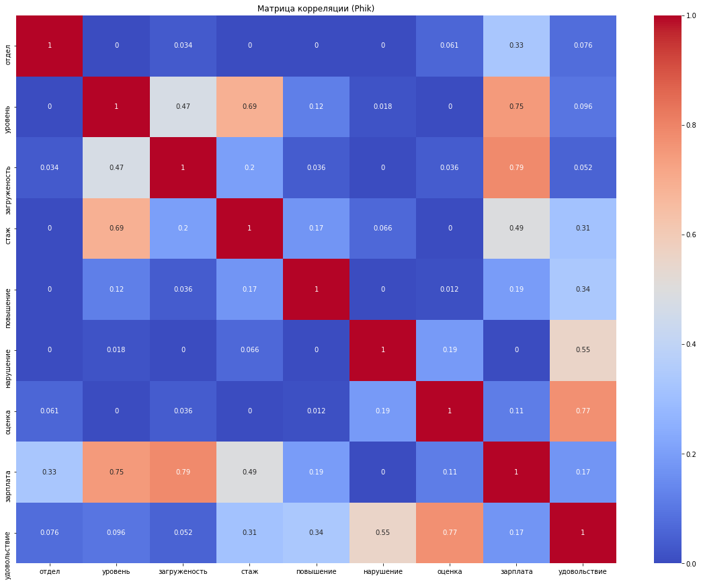
    


Зависимости такие же как и в тренировочной выборки. Это говорит о том, что обучившись на тренировочных данных модель будет также работать и на тестовых.


**Вывод** 
Тестовые и тренировочные данные похожи.
В среднем 3 годы, максимум 10. Лучшая оценка это 5 (как и следовало ожидать), в среднем это 3,5 ( по медиане 4) да и большая часть оценок находится между 3 и 4. Зарплата находиться в диапозоне от 12 до 98,4 тыс., а всреднем состовляет 30 тыс. (медианое значение блико). Значение удовлетворенности от работы есть разное, но в среднем это 0.5. 
Зависимость зарплаты от загружености и уровня занимаемой должности, уровень должности от стажа, а также оценка качества работы зависит от удовлетворенности сотрудника от неё. Большая часть сотрудниках либо младшие либо среднее.

<div class="alert alert-success">
<b>👍 Успех:</b> Все верно!
</div>

## Подготовка данных

Для подготовки данных и дальнейщем моделировании лучше всего использовать пайплан.

Для начала перечислим характеристики данных:

- отдел, нарушение и повышение — нужно кодировать с помощью OneHotEncoder т.к их отделы нельзя ни как соотнести, нарушение и повышение имеют только два значения..
- уровень должности и занятость — нужно кодировать с помощью OrdinalEncoder, т.к. их можено соотнести.
- стаж, оценка работы и зарплата - нужно масштабировать.
- Удовольствие - целевой признак. 

В признаках пропуски встречаются и обработаем их в пайплайне.

<div class="alert alert-success">
<b>👍 Успех:</b> Хорошее решение, молодец!
</div>

Но могут быть сотрудники с одинаковыми параметрами


```python
# тренировочные данные
train.drop(['id'],axis=1).duplicated().sum()
```


    245


```python
# тестовые данные
test.drop(['id'],axis=1).duplicated().sum()
```


    83


Создадим выборки, делить их не надо.


```python
X_train=train.drop(['id','удовольствие'],axis=1)
y_train=train['удовольствие']
X_test=test.drop(['id','удовольствие'],axis=1)
y_test=test['удовольствие']

```


```python
# Посмотрим, правильно ли все сделано
X_train.sample()
```


<div>
<style scoped>
    .dataframe tbody tr th:only-of-type {
        vertical-align: middle;
    }

    .dataframe tbody tr th {
        vertical-align: top;
    }

    .dataframe thead th {
        text-align: right;
    }
</style>
<table border="1" class="dataframe">
  <thead>
    <tr style="text-align: right;">
      <th></th>
      <th>отдел</th>
      <th>уровень</th>
      <th>загруженость</th>
      <th>стаж</th>
      <th>повышение</th>
      <th>нарушение</th>
      <th>оценка</th>
      <th>зарплата</th>
    </tr>
  </thead>
  <tbody>
    <tr>
      <th>2915</th>
      <td>purchasing</td>
      <td>middle</td>
      <td>high</td>
      <td>3</td>
      <td>no</td>
      <td>no</td>
      <td>4</td>
      <td>55200</td>
    </tr>
  </tbody>
</table>
</div>


```python
# Признаки
ohe_columns = ['отдел', 'повышение', 'нарушение'] #OneHotEncoder
ord_columns = ['уровень', 'загруженость'] #OrdinalEncoder
num_columns = ['стаж', 'оценка', 'зарплата'] #StandardScaler

```


```python
# создадим пайлайн
# уберем все пробелы и заменим их на наиболее частые
ohe_pipe = Pipeline(
    [('simpleImputer_ohe', SimpleImputer(missing_values=np.nan, strategy='most_frequent')),
     ('ohe', OneHotEncoder(drop='first', handle_unknown='ignore', sparse_output=False))
    ]
)

# аналогично
ord_pipe = Pipeline(
    [('simpleImputer_before_ord', SimpleImputer(missing_values=np.nan, strategy='most_frequent')),
     ('ord',  OrdinalEncoder(
                categories=[
                    ['junior', 'middle', 'sinior'], 
                    ['low', 'medium', 'high']
                ], 
                handle_unknown='use_encoded_value', unknown_value=np.nan
            )
        ),
     ('simpleImputer_after_ord', SimpleImputer(missing_values=np.nan, strategy='most_frequent')),

    ]
)

# объединение
data_preprocessor = ColumnTransformer(
    [('ohe', ohe_pipe, ohe_columns),
     ('ord', ord_pipe, ord_columns),
     ('num', StandardScaler(), num_columns)
    ], 
    remainder='passthrough'
)

# создание модели
pipe_final = Pipeline([
    ('preprocessor', data_preprocessor),
    ('models', LinearRegression())
])
```

<div class="alert alert-success">
<b>👍 Успех:</b> Все верно!
</div>

Для большей точности надо проверить не только линейную модель , но и дерево решений.


```python
# Создаем параметры для проверяемых моделей
RANDOM_STATE = 100
TEST_SIZE = 0.25

param_grid = [

    {
        'models': [LinearRegression()],
        'preprocessor__num': [StandardScaler(), MinMaxScaler(), 'passthrough']   
    },

    {
        'models': [DecisionTreeRegressor(random_state=RANDOM_STATE)],
        'models__max_depth': range(5, 15),
        'models__max_features': range(5, 15),
        'preprocessor__num': [StandardScaler(), MinMaxScaler(), 'passthrough']  
    }
]
```


```python
# Создадим функция для определения SMAPE и на её осонве создадим новую метрику
def smape(y_true, y_pred):
    return 100/len(y_true) * np.sum(2 * np.abs(y_pred - y_true) / (np.abs(y_true) + np.abs(y_pred)))

smape_scorer = make_scorer(score_func=smape, greater_is_better=False)
```

<div class="alert alert-success">
<b>👍 Успех:</b> Все верно, метрика создана!
</div>

## Обучение модели

Благодаря выше описаному пайплану можно обучить две модели (линейную регресию и дерево решений) и определить какое из них лучшее и при каких параметрах.


```python
grid_search = GridSearchCV(
    pipe_final,
    param_grid,
    n_jobs=-1,
    cv=5,
    scoring=smape_scorer
)
grid_search.fit(X_train, y_train)
```


<style>#sk-container-id-1 {color: black;}#sk-container-id-1 pre{padding: 0;}#sk-container-id-1 div.sk-toggleable {background-color: white;}#sk-container-id-1 label.sk-toggleable__label {cursor: pointer;display: block;width: 100%;margin-bottom: 0;padding: 0.3em;box-sizing: border-box;text-align: center;}#sk-container-id-1 label.sk-toggleable__label-arrow:before {content: "▸";float: left;margin-right: 0.25em;color: #696969;}#sk-container-id-1 label.sk-toggleable__label-arrow:hover:before {color: black;}#sk-container-id-1 div.sk-estimator:hover label.sk-toggleable__label-arrow:before {color: black;}#sk-container-id-1 div.sk-toggleable__content {max-height: 0;max-width: 0;overflow: hidden;text-align: left;background-color: #f0f8ff;}#sk-container-id-1 div.sk-toggleable__content pre {margin: 0.2em;color: black;border-radius: 0.25em;background-color: #f0f8ff;}#sk-container-id-1 input.sk-toggleable__control:checked~div.sk-toggleable__content {max-height: 200px;max-width: 100%;overflow: auto;}#sk-container-id-1 input.sk-toggleable__control:checked~label.sk-toggleable__label-arrow:before {content: "▾";}#sk-container-id-1 div.sk-estimator input.sk-toggleable__control:checked~label.sk-toggleable__label {background-color: #d4ebff;}#sk-container-id-1 div.sk-label input.sk-toggleable__control:checked~label.sk-toggleable__label {background-color: #d4ebff;}#sk-container-id-1 input.sk-hidden--visually {border: 0;clip: rect(1px 1px 1px 1px);clip: rect(1px, 1px, 1px, 1px);height: 1px;margin: -1px;overflow: hidden;padding: 0;position: absolute;width: 1px;}#sk-container-id-1 div.sk-estimator {font-family: monospace;background-color: #f0f8ff;border: 1px dotted black;border-radius: 0.25em;box-sizing: border-box;margin-bottom: 0.5em;}#sk-container-id-1 div.sk-estimator:hover {background-color: #d4ebff;}#sk-container-id-1 div.sk-parallel-item::after {content: "";width: 100%;border-bottom: 1px solid gray;flex-grow: 1;}#sk-container-id-1 div.sk-label:hover label.sk-toggleable__label {background-color: #d4ebff;}#sk-container-id-1 div.sk-serial::before {content: "";position: absolute;border-left: 1px solid gray;box-sizing: border-box;top: 0;bottom: 0;left: 50%;z-index: 0;}#sk-container-id-1 div.sk-serial {display: flex;flex-direction: column;align-items: center;background-color: white;padding-right: 0.2em;padding-left: 0.2em;position: relative;}#sk-container-id-1 div.sk-item {position: relative;z-index: 1;}#sk-container-id-1 div.sk-parallel {display: flex;align-items: stretch;justify-content: center;background-color: white;position: relative;}#sk-container-id-1 div.sk-item::before, #sk-container-id-1 div.sk-parallel-item::before {content: "";position: absolute;border-left: 1px solid gray;box-sizing: border-box;top: 0;bottom: 0;left: 50%;z-index: -1;}#sk-container-id-1 div.sk-parallel-item {display: flex;flex-direction: column;z-index: 1;position: relative;background-color: white;}#sk-container-id-1 div.sk-parallel-item:first-child::after {align-self: flex-end;width: 50%;}#sk-container-id-1 div.sk-parallel-item:last-child::after {align-self: flex-start;width: 50%;}#sk-container-id-1 div.sk-parallel-item:only-child::after {width: 0;}#sk-container-id-1 div.sk-dashed-wrapped {border: 1px dashed gray;margin: 0 0.4em 0.5em 0.4em;box-sizing: border-box;padding-bottom: 0.4em;background-color: white;}#sk-container-id-1 div.sk-label label {font-family: monospace;font-weight: bold;display: inline-block;line-height: 1.2em;}#sk-container-id-1 div.sk-label-container {text-align: center;}#sk-container-id-1 div.sk-container {/* jupyter's `normalize.less` sets `[hidden] { display: none; }` but bootstrap.min.css set `[hidden] { display: none !important; }` so we also need the `!important` here to be able to override the default hidden behavior on the sphinx rendered scikit-learn.org. See: https://github.com/scikit-learn/scikit-learn/issues/21755 */display: inline-block !important;position: relative;}#sk-container-id-1 div.sk-text-repr-fallback {display: none;}</style><div id="sk-container-id-1" class="sk-top-container"><div class="sk-text-repr-fallback"><pre>GridSearchCV(cv=5,
             estimator=Pipeline(steps=[(&#x27;preprocessor&#x27;,
                                        ColumnTransformer(remainder=&#x27;passthrough&#x27;,
                                                          transformers=[(&#x27;ohe&#x27;,
                                                                         Pipeline(steps=[(&#x27;simpleImputer_ohe&#x27;,
                                                                                          SimpleImputer(strategy=&#x27;most_frequent&#x27;)),
                                                                                         (&#x27;ohe&#x27;,
                                                                                          OneHotEncoder(drop=&#x27;first&#x27;,
                                                                                                        handle_unknown=&#x27;ignore&#x27;,
                                                                                                        sparse_output=False))]),
                                                                         [&#x27;отдел&#x27;,
                                                                          &#x27;повышение&#x27;,
                                                                          &#x27;нарушение&#x27;]),
                                                                        (&#x27;ord&#x27;,
                                                                         Pipeline(steps=[(&#x27;simpleI...
             param_grid=[{&#x27;models&#x27;: [LinearRegression()],
                          &#x27;preprocessor__num&#x27;: [StandardScaler(),
                                                MinMaxScaler(),
                                                &#x27;passthrough&#x27;]},
                         {&#x27;models&#x27;: [DecisionTreeRegressor(random_state=100)],
                          &#x27;models__max_depth&#x27;: range(5, 15),
                          &#x27;models__max_features&#x27;: range(5, 15),
                          &#x27;preprocessor__num&#x27;: [StandardScaler(),
                                                MinMaxScaler(),
                                                &#x27;passthrough&#x27;]}],
             scoring=make_scorer(smape, greater_is_better=False))</pre><b>In a Jupyter environment, please rerun this cell to show the HTML representation or trust the notebook. <br />On GitHub, the HTML representation is unable to render, please try loading this page with nbviewer.org.</b></div><div class="sk-container" hidden><div class="sk-item sk-dashed-wrapped"><div class="sk-label-container"><div class="sk-label sk-toggleable"><input class="sk-toggleable__control sk-hidden--visually" id="sk-estimator-id-1" type="checkbox" ><label for="sk-estimator-id-1" class="sk-toggleable__label sk-toggleable__label-arrow">GridSearchCV</label><div class="sk-toggleable__content"><pre>GridSearchCV(cv=5,
             estimator=Pipeline(steps=[(&#x27;preprocessor&#x27;,
                                        ColumnTransformer(remainder=&#x27;passthrough&#x27;,
                                                          transformers=[(&#x27;ohe&#x27;,
                                                                         Pipeline(steps=[(&#x27;simpleImputer_ohe&#x27;,
                                                                                          SimpleImputer(strategy=&#x27;most_frequent&#x27;)),
                                                                                         (&#x27;ohe&#x27;,
                                                                                          OneHotEncoder(drop=&#x27;first&#x27;,
                                                                                                        handle_unknown=&#x27;ignore&#x27;,
                                                                                                        sparse_output=False))]),
                                                                         [&#x27;отдел&#x27;,
                                                                          &#x27;повышение&#x27;,
                                                                          &#x27;нарушение&#x27;]),
                                                                        (&#x27;ord&#x27;,
                                                                         Pipeline(steps=[(&#x27;simpleI...
             param_grid=[{&#x27;models&#x27;: [LinearRegression()],
                          &#x27;preprocessor__num&#x27;: [StandardScaler(),
                                                MinMaxScaler(),
                                                &#x27;passthrough&#x27;]},
                         {&#x27;models&#x27;: [DecisionTreeRegressor(random_state=100)],
                          &#x27;models__max_depth&#x27;: range(5, 15),
                          &#x27;models__max_features&#x27;: range(5, 15),
                          &#x27;preprocessor__num&#x27;: [StandardScaler(),
                                                MinMaxScaler(),
                                                &#x27;passthrough&#x27;]}],
             scoring=make_scorer(smape, greater_is_better=False))</pre></div></div></div><div class="sk-parallel"><div class="sk-parallel-item"><div class="sk-item"><div class="sk-label-container"><div class="sk-label sk-toggleable"><input class="sk-toggleable__control sk-hidden--visually" id="sk-estimator-id-2" type="checkbox" ><label for="sk-estimator-id-2" class="sk-toggleable__label sk-toggleable__label-arrow">estimator: Pipeline</label><div class="sk-toggleable__content"><pre>Pipeline(steps=[(&#x27;preprocessor&#x27;,
                 ColumnTransformer(remainder=&#x27;passthrough&#x27;,
                                   transformers=[(&#x27;ohe&#x27;,
                                                  Pipeline(steps=[(&#x27;simpleImputer_ohe&#x27;,
                                                                   SimpleImputer(strategy=&#x27;most_frequent&#x27;)),
                                                                  (&#x27;ohe&#x27;,
                                                                   OneHotEncoder(drop=&#x27;first&#x27;,
                                                                                 handle_unknown=&#x27;ignore&#x27;,
                                                                                 sparse_output=False))]),
                                                  [&#x27;отдел&#x27;, &#x27;повышение&#x27;,
                                                   &#x27;нарушение&#x27;]),
                                                 (&#x27;ord&#x27;,
                                                  Pipeline(steps=[(&#x27;simpleImputer_before_ord&#x27;,
                                                                   SimpleImp...gy=&#x27;most_frequent&#x27;)),
                                                                  (&#x27;ord&#x27;,
                                                                   OrdinalEncoder(categories=[[&#x27;junior&#x27;,
                                                                                               &#x27;middle&#x27;,
                                                                                               &#x27;sinior&#x27;],
                                                                                              [&#x27;low&#x27;,
                                                                                               &#x27;medium&#x27;,
                                                                                               &#x27;high&#x27;]],
                                                                                  handle_unknown=&#x27;use_encoded_value&#x27;,
                                                                                  unknown_value=nan)),
                                                                  (&#x27;simpleImputer_after_ord&#x27;,
                                                                   SimpleImputer(strategy=&#x27;most_frequent&#x27;))]),
                                                  [&#x27;уровень&#x27;, &#x27;загруженость&#x27;]),
                                                 (&#x27;num&#x27;, StandardScaler(),
                                                  [&#x27;стаж&#x27;, &#x27;оценка&#x27;,
                                                   &#x27;зарплата&#x27;])])),
                (&#x27;models&#x27;, LinearRegression())])</pre></div></div></div><div class="sk-serial"><div class="sk-item"><div class="sk-serial"><div class="sk-item sk-dashed-wrapped"><div class="sk-label-container"><div class="sk-label sk-toggleable"><input class="sk-toggleable__control sk-hidden--visually" id="sk-estimator-id-3" type="checkbox" ><label for="sk-estimator-id-3" class="sk-toggleable__label sk-toggleable__label-arrow">preprocessor: ColumnTransformer</label><div class="sk-toggleable__content"><pre>ColumnTransformer(remainder=&#x27;passthrough&#x27;,
                  transformers=[(&#x27;ohe&#x27;,
                                 Pipeline(steps=[(&#x27;simpleImputer_ohe&#x27;,
                                                  SimpleImputer(strategy=&#x27;most_frequent&#x27;)),
                                                 (&#x27;ohe&#x27;,
                                                  OneHotEncoder(drop=&#x27;first&#x27;,
                                                                handle_unknown=&#x27;ignore&#x27;,
                                                                sparse_output=False))]),
                                 [&#x27;отдел&#x27;, &#x27;повышение&#x27;, &#x27;нарушение&#x27;]),
                                (&#x27;ord&#x27;,
                                 Pipeline(steps=[(&#x27;simpleImputer_before_ord&#x27;,
                                                  SimpleImputer(strategy=&#x27;most_frequent&#x27;)),
                                                 (&#x27;ord&#x27;,
                                                  OrdinalEncoder(categories=[[&#x27;junior&#x27;,
                                                                              &#x27;middle&#x27;,
                                                                              &#x27;sinior&#x27;],
                                                                             [&#x27;low&#x27;,
                                                                              &#x27;medium&#x27;,
                                                                              &#x27;high&#x27;]],
                                                                 handle_unknown=&#x27;use_encoded_value&#x27;,
                                                                 unknown_value=nan)),
                                                 (&#x27;simpleImputer_after_ord&#x27;,
                                                  SimpleImputer(strategy=&#x27;most_frequent&#x27;))]),
                                 [&#x27;уровень&#x27;, &#x27;загруженость&#x27;]),
                                (&#x27;num&#x27;, StandardScaler(),
                                 [&#x27;стаж&#x27;, &#x27;оценка&#x27;, &#x27;зарплата&#x27;])])</pre></div></div></div><div class="sk-parallel"><div class="sk-parallel-item"><div class="sk-item"><div class="sk-label-container"><div class="sk-label sk-toggleable"><input class="sk-toggleable__control sk-hidden--visually" id="sk-estimator-id-4" type="checkbox" ><label for="sk-estimator-id-4" class="sk-toggleable__label sk-toggleable__label-arrow">ohe</label><div class="sk-toggleable__content"><pre>[&#x27;отдел&#x27;, &#x27;повышение&#x27;, &#x27;нарушение&#x27;]</pre></div></div></div><div class="sk-serial"><div class="sk-item"><div class="sk-serial"><div class="sk-item"><div class="sk-estimator sk-toggleable"><input class="sk-toggleable__control sk-hidden--visually" id="sk-estimator-id-5" type="checkbox" ><label for="sk-estimator-id-5" class="sk-toggleable__label sk-toggleable__label-arrow">SimpleImputer</label><div class="sk-toggleable__content"><pre>SimpleImputer(strategy=&#x27;most_frequent&#x27;)</pre></div></div></div><div class="sk-item"><div class="sk-estimator sk-toggleable"><input class="sk-toggleable__control sk-hidden--visually" id="sk-estimator-id-6" type="checkbox" ><label for="sk-estimator-id-6" class="sk-toggleable__label sk-toggleable__label-arrow">OneHotEncoder</label><div class="sk-toggleable__content"><pre>OneHotEncoder(drop=&#x27;first&#x27;, handle_unknown=&#x27;ignore&#x27;, sparse_output=False)</pre></div></div></div></div></div></div></div></div><div class="sk-parallel-item"><div class="sk-item"><div class="sk-label-container"><div class="sk-label sk-toggleable"><input class="sk-toggleable__control sk-hidden--visually" id="sk-estimator-id-7" type="checkbox" ><label for="sk-estimator-id-7" class="sk-toggleable__label sk-toggleable__label-arrow">ord</label><div class="sk-toggleable__content"><pre>[&#x27;уровень&#x27;, &#x27;загруженость&#x27;]</pre></div></div></div><div class="sk-serial"><div class="sk-item"><div class="sk-serial"><div class="sk-item"><div class="sk-estimator sk-toggleable"><input class="sk-toggleable__control sk-hidden--visually" id="sk-estimator-id-8" type="checkbox" ><label for="sk-estimator-id-8" class="sk-toggleable__label sk-toggleable__label-arrow">SimpleImputer</label><div class="sk-toggleable__content"><pre>SimpleImputer(strategy=&#x27;most_frequent&#x27;)</pre></div></div></div><div class="sk-item"><div class="sk-estimator sk-toggleable"><input class="sk-toggleable__control sk-hidden--visually" id="sk-estimator-id-9" type="checkbox" ><label for="sk-estimator-id-9" class="sk-toggleable__label sk-toggleable__label-arrow">OrdinalEncoder</label><div class="sk-toggleable__content"><pre>OrdinalEncoder(categories=[[&#x27;junior&#x27;, &#x27;middle&#x27;, &#x27;sinior&#x27;],
                           [&#x27;low&#x27;, &#x27;medium&#x27;, &#x27;high&#x27;]],
               handle_unknown=&#x27;use_encoded_value&#x27;, unknown_value=nan)</pre></div></div></div><div class="sk-item"><div class="sk-estimator sk-toggleable"><input class="sk-toggleable__control sk-hidden--visually" id="sk-estimator-id-10" type="checkbox" ><label for="sk-estimator-id-10" class="sk-toggleable__label sk-toggleable__label-arrow">SimpleImputer</label><div class="sk-toggleable__content"><pre>SimpleImputer(strategy=&#x27;most_frequent&#x27;)</pre></div></div></div></div></div></div></div></div><div class="sk-parallel-item"><div class="sk-item"><div class="sk-label-container"><div class="sk-label sk-toggleable"><input class="sk-toggleable__control sk-hidden--visually" id="sk-estimator-id-11" type="checkbox" ><label for="sk-estimator-id-11" class="sk-toggleable__label sk-toggleable__label-arrow">num</label><div class="sk-toggleable__content"><pre>[&#x27;стаж&#x27;, &#x27;оценка&#x27;, &#x27;зарплата&#x27;]</pre></div></div></div><div class="sk-serial"><div class="sk-item"><div class="sk-estimator sk-toggleable"><input class="sk-toggleable__control sk-hidden--visually" id="sk-estimator-id-12" type="checkbox" ><label for="sk-estimator-id-12" class="sk-toggleable__label sk-toggleable__label-arrow">StandardScaler</label><div class="sk-toggleable__content"><pre>StandardScaler()</pre></div></div></div></div></div></div><div class="sk-parallel-item"><div class="sk-item"><div class="sk-label-container"><div class="sk-label sk-toggleable"><input class="sk-toggleable__control sk-hidden--visually" id="sk-estimator-id-13" type="checkbox" ><label for="sk-estimator-id-13" class="sk-toggleable__label sk-toggleable__label-arrow">remainder</label><div class="sk-toggleable__content"><pre></pre></div></div></div><div class="sk-serial"><div class="sk-item"><div class="sk-estimator sk-toggleable"><input class="sk-toggleable__control sk-hidden--visually" id="sk-estimator-id-14" type="checkbox" ><label for="sk-estimator-id-14" class="sk-toggleable__label sk-toggleable__label-arrow">passthrough</label><div class="sk-toggleable__content"><pre>passthrough</pre></div></div></div></div></div></div></div></div><div class="sk-item"><div class="sk-estimator sk-toggleable"><input class="sk-toggleable__control sk-hidden--visually" id="sk-estimator-id-15" type="checkbox" ><label for="sk-estimator-id-15" class="sk-toggleable__label sk-toggleable__label-arrow">LinearRegression</label><div class="sk-toggleable__content"><pre>LinearRegression()</pre></div></div></div></div></div></div></div></div></div></div></div></div>


```python
# определим лучшию модель и её рараметры
best_model = grid_search.best_estimator_
print('Лучшая модель и её параметры:\n\n', grid_search.best_estimator_)
print ('Метрика лучшей модели на тренировочной выборке:', round(grid_search.best_score_*(-1),4))
```

    Лучшая модель и её параметры:
    
     Pipeline(steps=[('preprocessor',
                     ColumnTransformer(remainder='passthrough',
                                       transformers=[('ohe',
                                                      Pipeline(steps=[('simpleImputer_ohe',
                                                                       SimpleImputer(strategy='most_frequent')),
                                                                      ('ohe',
                                                                       OneHotEncoder(drop='first',
                                                                                     handle_unknown='ignore',
                                                                                     sparse_output=False))]),
                                                      ['отдел', 'повышение',
                                                       'нарушение']),
                                                     ('ord',
                                                      Pipeline(steps=[('simpleImputer_before_ord',
                                                                       SimpleImp...
                                                                       OrdinalEncoder(categories=[['junior',
                                                                                                   'middle',
                                                                                                   'sinior'],
                                                                                                  ['low',
                                                                                                   'medium',
                                                                                                   'high']],
                                                                                      handle_unknown='use_encoded_value',
                                                                                      unknown_value=nan)),
                                                                      ('simpleImputer_after_ord',
                                                                       SimpleImputer(strategy='most_frequent'))]),
                                                      ['уровень', 'загруженость']),
                                                     ('num', 'passthrough',
                                                      ['стаж', 'оценка',
                                                       'зарплата'])])),
                    ('models',
                     DecisionTreeRegressor(max_depth=14, max_features=10,
                                           random_state=100))])
    Метрика лучшей модели на тренировочной выборке: 14.837


Как видно метрика SMAPE почти равна 15 но меньше. Следовательно лучшая модель хорошо описывает тренировочные данные.

<div class="alert alert-success">
<b>👍 Успех:</b> Все верно, нужная метрика достигнута!
</div>


```python
print(f'SMAPE-метрика лучшей модели для тестовой выборки:{round(smape(y_test, best_model.predict(X_test)),4)}')
```

    SMAPE-метрика лучшей модели для тестовой выборки:13.9711


Тестовые данные модель тоже описывает приемлемо (даже немного лучше тренировочных).

## Выводы

В ходе выполнения работы было сделано:
* Были проанализированы данные тестовой и тренировочной выборки
* Были найде и исправлены ошибки в данных
* Были найдены пропуски и определен метод их заполнения
* Была составлен пайплан для подготовки данных к обучению
* Были обучены две модели (дерево решений и линейная регрессия) с различными параметрами
В результате была получена лучшая модель для определения удовлетворенности от работы: DecisionTreeRegressor(max_depth=14, max_features=10,random_state=100)). Её метрика на тренировочных данных состовляет 13.9711, что говорит о приемлености её применения.

<div class="alert alert-success">
<b>👍 Успех:</b> Отличная работа, молодец!
</div>

# Задача 2

## Загрузка новых данных

Загрузим новые данные


```python
train_new = pd.read_csv('/datasets/train_quit.csv') # тренировочные данные
data_new = pd.read_csv('/datasets/test_features.csv') # тестовые входные данные
target_new = pd.read_csv('/datasets/test_target_quit.csv') # тестовые целевые данные
```

## Предобработка новых данных


```python
# посмотрим на Тренировочные данные
train_new.head()
```


<div>
<style scoped>
    .dataframe tbody tr th:only-of-type {
        vertical-align: middle;
    }

    .dataframe tbody tr th {
        vertical-align: top;
    }

    .dataframe thead th {
        text-align: right;
    }
</style>
<table border="1" class="dataframe">
  <thead>
    <tr style="text-align: right;">
      <th></th>
      <th>id</th>
      <th>dept</th>
      <th>level</th>
      <th>workload</th>
      <th>employment_years</th>
      <th>last_year_promo</th>
      <th>last_year_violations</th>
      <th>supervisor_evaluation</th>
      <th>salary</th>
      <th>quit</th>
    </tr>
  </thead>
  <tbody>
    <tr>
      <th>0</th>
      <td>723290</td>
      <td>sales</td>
      <td>middle</td>
      <td>high</td>
      <td>2</td>
      <td>no</td>
      <td>no</td>
      <td>4</td>
      <td>54000</td>
      <td>no</td>
    </tr>
    <tr>
      <th>1</th>
      <td>814010</td>
      <td>sales</td>
      <td>junior</td>
      <td>medium</td>
      <td>2</td>
      <td>no</td>
      <td>no</td>
      <td>4</td>
      <td>27600</td>
      <td>no</td>
    </tr>
    <tr>
      <th>2</th>
      <td>155091</td>
      <td>purchasing</td>
      <td>middle</td>
      <td>medium</td>
      <td>5</td>
      <td>no</td>
      <td>no</td>
      <td>1</td>
      <td>37200</td>
      <td>no</td>
    </tr>
    <tr>
      <th>3</th>
      <td>257132</td>
      <td>sales</td>
      <td>junior</td>
      <td>medium</td>
      <td>2</td>
      <td>no</td>
      <td>yes</td>
      <td>3</td>
      <td>24000</td>
      <td>yes</td>
    </tr>
    <tr>
      <th>4</th>
      <td>910140</td>
      <td>marketing</td>
      <td>junior</td>
      <td>medium</td>
      <td>2</td>
      <td>no</td>
      <td>no</td>
      <td>5</td>
      <td>25200</td>
      <td>no</td>
    </tr>
  </tbody>
</table>
</div>


```python
# посмотрим на их
train_new.info()
```

    <class 'pandas.core.frame.DataFrame'>
    RangeIndex: 4000 entries, 0 to 3999
    Data columns (total 10 columns):
     #   Column                 Non-Null Count  Dtype 
    ---  ------                 --------------  ----- 
     0   id                     4000 non-null   int64 
     1   dept                   4000 non-null   object
     2   level                  4000 non-null   object
     3   workload               4000 non-null   object
     4   employment_years       4000 non-null   int64 
     5   last_year_promo        4000 non-null   object
     6   last_year_violations   4000 non-null   object
     7   supervisor_evaluation  4000 non-null   int64 
     8   salary                 4000 non-null   int64 
     9   quit                   4000 non-null   object
    dtypes: int64(4), object(6)
    memory usage: 312.6+ KB


Пропусков не наблюдается. Формат данных тоже подходит. Но названия столбцов надол сменить на русские.


```python
train_new.rename(columns=column_mapping, inplace=True)
train_new.rename(columns={'quit':'увольнение'}, inplace=True)
column_mapping
```


    {'dept': 'отдел',
     'level': 'уровень',
     'workload': 'загруженость',
     'employment_years': 'стаж',
     'last_year_promo': 'повышение',
     'last_year_violations': 'нарушение',
     'supervisor_evaluation': 'оценка',
     'salary': 'зарплата'}


```python
train_new.head(2)
```


<div>
<style scoped>
    .dataframe tbody tr th:only-of-type {
        vertical-align: middle;
    }

    .dataframe tbody tr th {
        vertical-align: top;
    }

    .dataframe thead th {
        text-align: right;
    }
</style>
<table border="1" class="dataframe">
  <thead>
    <tr style="text-align: right;">
      <th></th>
      <th>id</th>
      <th>отдел</th>
      <th>уровень</th>
      <th>загруженость</th>
      <th>стаж</th>
      <th>повышение</th>
      <th>нарушение</th>
      <th>оценка</th>
      <th>зарплата</th>
      <th>увольнение</th>
    </tr>
  </thead>
  <tbody>
    <tr>
      <th>0</th>
      <td>723290</td>
      <td>sales</td>
      <td>middle</td>
      <td>high</td>
      <td>2</td>
      <td>no</td>
      <td>no</td>
      <td>4</td>
      <td>54000</td>
      <td>no</td>
    </tr>
    <tr>
      <th>1</th>
      <td>814010</td>
      <td>sales</td>
      <td>junior</td>
      <td>medium</td>
      <td>2</td>
      <td>no</td>
      <td>no</td>
      <td>4</td>
      <td>27600</td>
      <td>no</td>
    </tr>
  </tbody>
</table>
</div>


```python
# рассмотрим какие значения принимают качественные признакии
for i in ['отдел','уровень','загруженость','повышение','нарушение','увольнение']:
    print('Уникальные значения в стобце',i,' - это',train_new[i].unique())
```

    Уникальные значения в стобце отдел  - это ['sales' 'purchasing' 'marketing' 'technology' 'hr']
    Уникальные значения в стобце уровень  - это ['middle' 'junior' 'sinior']
    Уникальные значения в стобце загруженость  - это ['high' 'medium' 'low']
    Уникальные значения в стобце повышение  - это ['no' 'yes']
    Уникальные значения в стобце нарушение  - это ['no' 'yes']
    Уникальные значения в стобце увольнение  - это ['no' 'yes']


Никаких пропусков и ошибок не наблюдается


```python
# Есть ли дубликаты
train_new.duplicated().sum()
```


    0


```python
# Есть ли дубликаты в названии
train_new['id'].duplicated().sum()
```


    0


```python
# Есть ли дубликаты в параметрах
train_new.drop(['id','увольнение'],axis=1).duplicated().sum()
```


    1545


```python
print(1545/4000*100,'% сотрудников имеют схожие данные')
```

    38.625 % сотрудников имеют схожие данные


<div class="alert alert-success">
<b>👍 Успех:</b> Все верно!
</div>

Теперь рассмотрим тестовую выборку


```python
data_new.info()
```

    <class 'pandas.core.frame.DataFrame'>
    RangeIndex: 2000 entries, 0 to 1999
    Data columns (total 9 columns):
     #   Column                 Non-Null Count  Dtype 
    ---  ------                 --------------  ----- 
     0   id                     2000 non-null   int64 
     1   dept                   1998 non-null   object
     2   level                  1999 non-null   object
     3   workload               2000 non-null   object
     4   employment_years       2000 non-null   int64 
     5   last_year_promo        2000 non-null   object
     6   last_year_violations   2000 non-null   object
     7   supervisor_evaluation  2000 non-null   int64 
     8   salary                 2000 non-null   int64 
    dtypes: int64(4), object(5)
    memory usage: 140.8+ KB


Видны пропуски в столцах отдел и уровень.


```python
# Нужно заменить названия столбцов
data_new.rename(columns=column_mapping, inplace=True)
```


```python
data_new.sample()
```


<div>
<style scoped>
    .dataframe tbody tr th:only-of-type {
        vertical-align: middle;
    }

    .dataframe tbody tr th {
        vertical-align: top;
    }

    .dataframe thead th {
        text-align: right;
    }
</style>
<table border="1" class="dataframe">
  <thead>
    <tr style="text-align: right;">
      <th></th>
      <th>id</th>
      <th>отдел</th>
      <th>уровень</th>
      <th>загруженость</th>
      <th>стаж</th>
      <th>повышение</th>
      <th>нарушение</th>
      <th>оценка</th>
      <th>зарплата</th>
    </tr>
  </thead>
  <tbody>
    <tr>
      <th>644</th>
      <td>705199</td>
      <td>marketing</td>
      <td>middle</td>
      <td>medium</td>
      <td>3</td>
      <td>no</td>
      <td>yes</td>
      <td>1</td>
      <td>39600</td>
    </tr>
  </tbody>
</table>
</div>


```python
# Расмотрим значения качественных параметров
for i in ['отдел','уровень','загруженость','повышение','нарушение']:
    print('Уникальные значения в стобце',i,' - это',data[i].unique())
```

    Уникальные значения в стобце отдел  - это ['marketing' 'hr' 'sales' 'purchasing' 'technology' nan]
    Уникальные значения в стобце уровень  - это ['junior' 'middle' 'sinior' nan]
    Уникальные значения в стобце загруженость  - это ['medium' 'low' 'high' nan]
    Уникальные значения в стобце повышение  - это ['no' 'yes']
    Уникальные значения в стобце нарушение  - это ['no' 'yes']


Никаких ошибок не было обнаружено.


```python
# Есть ли дубликаты
data_new.duplicated().sum()
```


    0


```python
# Есть ли дубликаты в названии
data_new['id'].duplicated().sum()
```


    0


```python
# Есть ли дубликаты в параметрах
data_new.drop(['id'],axis=1).duplicated().sum()
```


    557


```python
print(557/2000*100,'% параметров одинаковы')
```

    27.85 % параметров одинаковы


```python
target_new.info()
```

    <class 'pandas.core.frame.DataFrame'>
    RangeIndex: 2000 entries, 0 to 1999
    Data columns (total 2 columns):
     #   Column  Non-Null Count  Dtype 
    ---  ------  --------------  ----- 
     0   id      2000 non-null   int64 
     1   quit    2000 non-null   object
    dtypes: int64(1), object(1)
    memory usage: 31.4+ KB


```python
# Заменим название на уже использованное
target_new.rename(columns={'quit': 'увольнение'}, inplace=True)
target_new.info()
```

    <class 'pandas.core.frame.DataFrame'>
    RangeIndex: 2000 entries, 0 to 1999
    Data columns (total 2 columns):
     #   Column      Non-Null Count  Dtype 
    ---  ------      --------------  ----- 
     0   id          2000 non-null   int64 
     1   увольнение  2000 non-null   object
    dtypes: int64(1), object(1)
    memory usage: 31.4+ KB


```python
print('Уникальные значения столбца''- это',target_new['увольнение'].unique())
```

    Уникальные значения столбца- это ['yes' 'no']


```python
# теперь надо проверить соотносятся ли входные параметры с целевыми по id
(data_new.sort_values(by='id').reset_index(drop=True)['id']==target_new.sort_values(by='id').reset_index(drop=True)['id']).sum()
```


    2000


Как видно все впорядке и поэтому для простоты необходимо объединить тестовые данные в одну таблицу


```python
test_new=data_new.merge(target_new,on='id',how='inner')
test_new.sample()
```


<div>
<style scoped>
    .dataframe tbody tr th:only-of-type {
        vertical-align: middle;
    }

    .dataframe tbody tr th {
        vertical-align: top;
    }

    .dataframe thead th {
        text-align: right;
    }
</style>
<table border="1" class="dataframe">
  <thead>
    <tr style="text-align: right;">
      <th></th>
      <th>id</th>
      <th>отдел</th>
      <th>уровень</th>
      <th>загруженость</th>
      <th>стаж</th>
      <th>повышение</th>
      <th>нарушение</th>
      <th>оценка</th>
      <th>зарплата</th>
      <th>увольнение</th>
    </tr>
  </thead>
  <tbody>
    <tr>
      <th>551</th>
      <td>226834</td>
      <td>technology</td>
      <td>junior</td>
      <td>medium</td>
      <td>1</td>
      <td>no</td>
      <td>no</td>
      <td>5</td>
      <td>34800</td>
      <td>no</td>
    </tr>
  </tbody>
</table>
</div>


```python
test_new.info()
```

    <class 'pandas.core.frame.DataFrame'>
    Int64Index: 2000 entries, 0 to 1999
    Data columns (total 10 columns):
     #   Column        Non-Null Count  Dtype 
    ---  ------        --------------  ----- 
     0   id            2000 non-null   int64 
     1   отдел         1998 non-null   object
     2   уровень       1999 non-null   object
     3   загруженость  2000 non-null   object
     4   стаж          2000 non-null   int64 
     5   повышение     2000 non-null   object
     6   нарушение     2000 non-null   object
     7   оценка        2000 non-null   int64 
     8   зарплата      2000 non-null   int64 
     9   увольнение    2000 non-null   object
    dtypes: int64(4), object(6)
    memory usage: 171.9+ KB


Соединение прпоизошло нормально, ошибок нет

<div class="alert alert-success">
<b>👍 Успех:</b> Все верно!
</div>

## Исследовательский анализ данных


```python
#Рассмотрим распределение в таблицах
train_new.describe().T
```


<div>
<style scoped>
    .dataframe tbody tr th:only-of-type {
        vertical-align: middle;
    }

    .dataframe tbody tr th {
        vertical-align: top;
    }

    .dataframe thead th {
        text-align: right;
    }
</style>
<table border="1" class="dataframe">
  <thead>
    <tr style="text-align: right;">
      <th></th>
      <th>count</th>
      <th>mean</th>
      <th>std</th>
      <th>min</th>
      <th>25%</th>
      <th>50%</th>
      <th>75%</th>
      <th>max</th>
    </tr>
  </thead>
  <tbody>
    <tr>
      <th>id</th>
      <td>4000.0</td>
      <td>552099.28375</td>
      <td>260158.031387</td>
      <td>100222.0</td>
      <td>327785.75</td>
      <td>546673.0</td>
      <td>781497.75</td>
      <td>999915.0</td>
    </tr>
    <tr>
      <th>стаж</th>
      <td>4000.0</td>
      <td>3.70150</td>
      <td>2.541852</td>
      <td>1.0</td>
      <td>2.00</td>
      <td>3.0</td>
      <td>6.00</td>
      <td>10.0</td>
    </tr>
    <tr>
      <th>оценка</th>
      <td>4000.0</td>
      <td>3.47475</td>
      <td>1.004049</td>
      <td>1.0</td>
      <td>3.00</td>
      <td>4.0</td>
      <td>4.00</td>
      <td>5.0</td>
    </tr>
    <tr>
      <th>зарплата</th>
      <td>4000.0</td>
      <td>33805.80000</td>
      <td>15152.415163</td>
      <td>12000.0</td>
      <td>22800.00</td>
      <td>30000.0</td>
      <td>43200.00</td>
      <td>96000.0</td>
    </tr>
  </tbody>
</table>
</div>


В среднем работники служат 3,7 лет и максимально 10. Оценки у большинство между 3 и 4. Зарплата в среднеи 30 тыс. в диапозоне от 12 тыс. до 96 тыс.


```python
test_new.describe().T
```


<div>
<style scoped>
    .dataframe tbody tr th:only-of-type {
        vertical-align: middle;
    }

    .dataframe tbody tr th {
        vertical-align: top;
    }

    .dataframe thead th {
        text-align: right;
    }
</style>
<table border="1" class="dataframe">
  <thead>
    <tr style="text-align: right;">
      <th></th>
      <th>count</th>
      <th>mean</th>
      <th>std</th>
      <th>min</th>
      <th>25%</th>
      <th>50%</th>
      <th>75%</th>
      <th>max</th>
    </tr>
  </thead>
  <tbody>
    <tr>
      <th>id</th>
      <td>2000.0</td>
      <td>552765.2135</td>
      <td>253851.326129</td>
      <td>100298.0</td>
      <td>339052.0</td>
      <td>550793.0</td>
      <td>765763.75</td>
      <td>999029.0</td>
    </tr>
    <tr>
      <th>стаж</th>
      <td>2000.0</td>
      <td>3.6665</td>
      <td>2.537222</td>
      <td>1.0</td>
      <td>1.0</td>
      <td>3.0</td>
      <td>6.00</td>
      <td>10.0</td>
    </tr>
    <tr>
      <th>оценка</th>
      <td>2000.0</td>
      <td>3.5265</td>
      <td>0.996892</td>
      <td>1.0</td>
      <td>3.0</td>
      <td>4.0</td>
      <td>4.00</td>
      <td>5.0</td>
    </tr>
    <tr>
      <th>зарплата</th>
      <td>2000.0</td>
      <td>34066.8000</td>
      <td>15398.436729</td>
      <td>12000.0</td>
      <td>22800.0</td>
      <td>30000.0</td>
      <td>43200.00</td>
      <td>96000.0</td>
    </tr>
  </tbody>
</table>
</div>


Тестовые данные схожи по статистики с тренировочными.

Для дальнейщего анализа нужно построить графики.


```python
# Сравнение распределения тестовой и тренировочной выборки
for i in ['стаж','оценка','зарплата']:
    plot_hist(train_new,test_new,i)
    plot_box(train_new,test_new,i)
```


    

    


    

    


    
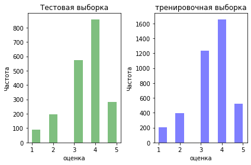
    


    

    


    
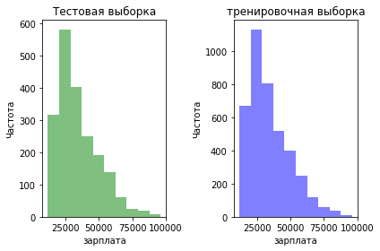
    


    
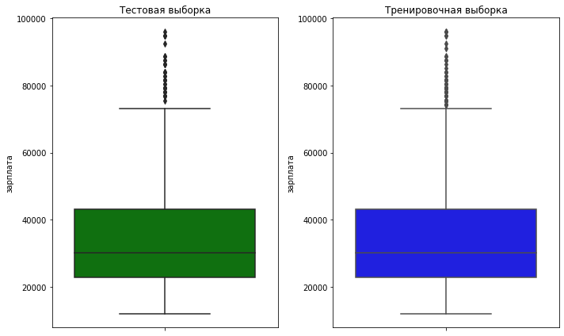
    


Видно, что в обоих выбока большая часть работников была нанято максимум 5 лет назад. Видно что чем больше зарплата, тем меньше роботников её получают. Сверхвысокую зарплату это выше 70 тыс.


```python
for i in ['отдел','уровень','загруженость','повышение','нарушение','увольнение']:
    plot_cat(train_new,test_new,i)
```

    отдел


    
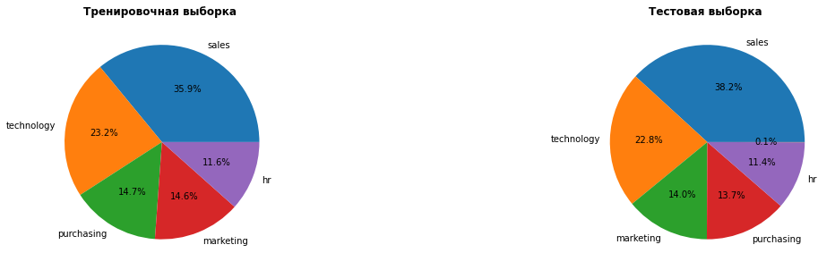
    


    уровень


    
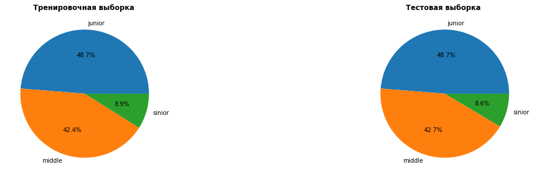
    


    загруженость


    
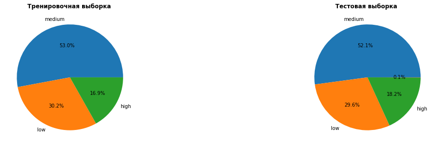
    


    повышение


    

    


    нарушение


    
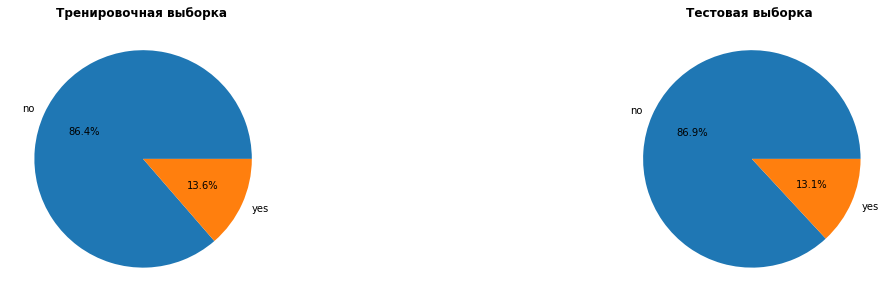
    


    увольнение


    
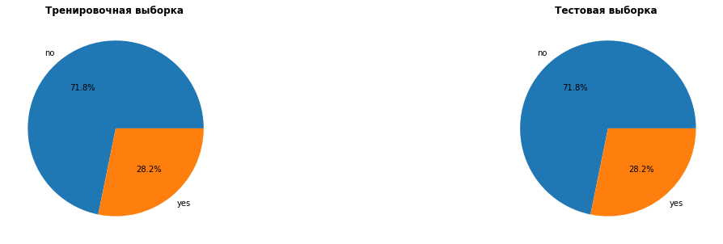
    


Видно, что 28,2 % сотрудников уволились. Наруения совершили около 13% работниокв. Повышениен получает лишь только три процента. Большая часть сотрудников имеет среднею заруженость.


```python
# Проведем кореляционный анализ, чтобы установить зависимости
train_copy = train_new.drop('id', axis=1)


# расчет коэффициентов корреляции Phik
correlation_matrix = phik.phik_matrix(train_copy ) #interval_cols=ic

# построение графика корреляции
plt.figure(figsize=(20, 15))
sns.heatmap(correlation_matrix, annot=True, cmap="coolwarm")

plt.title("Матрица корреляции (Phik)")
plt.show();
```

    interval columns not set, guessing: ['стаж', 'оценка', 'зарплата']


    
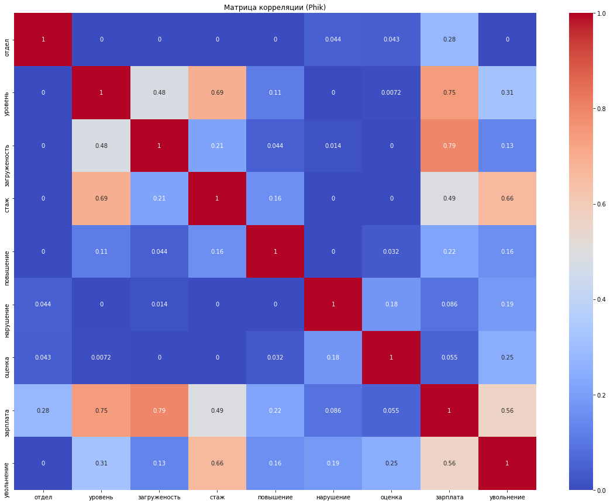
    


Видно, что зарплата связана с загруженость и уровнем, а на уровень вияет и стажб но не сильно.  Видно, что наиболее сильно на увольнение влияет стаж и зарплата.


```python
# Проведем кореляционный анализ, чтобы установить зависимости
test_copy = train_new.drop('id', axis=1)


# расчет коэффициентов корреляции Phik
correlation_matrix = phik.phik_matrix(train_copy ) #interval_cols=ic

# построение графика корреляции
plt.figure(figsize=(20, 15))
sns.heatmap(correlation_matrix, annot=True, cmap="coolwarm")

plt.title("Матрица корреляции (Phik)")
plt.show();
```

    interval columns not set, guessing: ['стаж', 'оценка', 'зарплата']


    

    


Корреляции тренировочных и тестовых даненых схожи.

<div class="alert alert-success">
<b>👍 Успех:</b> Все верно!
</div>

### Исследование увольнений

Как видно стаж и зарплата оказывают наибольшее влияние. Но следует посмотреть как признаки отличаются у уволившихся и оставшихся.


```python
# создадим статистику для оставшихся
train_new.query('увольнение=="no"').describe().T
```


<div>
<style scoped>
    .dataframe tbody tr th:only-of-type {
        vertical-align: middle;
    }

    .dataframe tbody tr th {
        vertical-align: top;
    }

    .dataframe thead th {
        text-align: right;
    }
</style>
<table border="1" class="dataframe">
  <thead>
    <tr style="text-align: right;">
      <th></th>
      <th>count</th>
      <th>mean</th>
      <th>std</th>
      <th>min</th>
      <th>25%</th>
      <th>50%</th>
      <th>75%</th>
      <th>max</th>
    </tr>
  </thead>
  <tbody>
    <tr>
      <th>id</th>
      <td>2872.0</td>
      <td>555066.499652</td>
      <td>260962.518935</td>
      <td>100469.0</td>
      <td>329560.5</td>
      <td>548319.5</td>
      <td>793533.5</td>
      <td>999915.0</td>
    </tr>
    <tr>
      <th>стаж</th>
      <td>2872.0</td>
      <td>4.430710</td>
      <td>2.544635</td>
      <td>1.0</td>
      <td>2.0</td>
      <td>4.0</td>
      <td>6.0</td>
      <td>10.0</td>
    </tr>
    <tr>
      <th>оценка</th>
      <td>2872.0</td>
      <td>3.643106</td>
      <td>0.965295</td>
      <td>1.0</td>
      <td>3.0</td>
      <td>4.0</td>
      <td>4.0</td>
      <td>5.0</td>
    </tr>
    <tr>
      <th>зарплата</th>
      <td>2872.0</td>
      <td>37702.228412</td>
      <td>15218.977339</td>
      <td>12000.0</td>
      <td>25200.0</td>
      <td>34800.0</td>
      <td>46800.0</td>
      <td>96000.0</td>
    </tr>
  </tbody>
</table>
</div>


```python
# создадим статистику для уволеных
train_new.query('увольнение=="yes"').describe().T
```


<div>
<style scoped>
    .dataframe tbody tr th:only-of-type {
        vertical-align: middle;
    }

    .dataframe tbody tr th {
        vertical-align: top;
    }

    .dataframe thead th {
        text-align: right;
    }
</style>
<table border="1" class="dataframe">
  <thead>
    <tr style="text-align: right;">
      <th></th>
      <th>count</th>
      <th>mean</th>
      <th>std</th>
      <th>min</th>
      <th>25%</th>
      <th>50%</th>
      <th>75%</th>
      <th>max</th>
    </tr>
  </thead>
  <tbody>
    <tr>
      <th>id</th>
      <td>1128.0</td>
      <td>544544.457447</td>
      <td>258059.498361</td>
      <td>100222.0</td>
      <td>325073.0</td>
      <td>545003.5</td>
      <td>756296.0</td>
      <td>999158.0</td>
    </tr>
    <tr>
      <th>стаж</th>
      <td>1128.0</td>
      <td>1.844858</td>
      <td>1.274920</td>
      <td>1.0</td>
      <td>1.0</td>
      <td>1.0</td>
      <td>2.0</td>
      <td>10.0</td>
    </tr>
    <tr>
      <th>оценка</th>
      <td>1128.0</td>
      <td>3.046099</td>
      <td>0.973291</td>
      <td>1.0</td>
      <td>3.0</td>
      <td>3.0</td>
      <td>4.0</td>
      <td>5.0</td>
    </tr>
    <tr>
      <th>зарплата</th>
      <td>1128.0</td>
      <td>23885.106383</td>
      <td>9351.599505</td>
      <td>12000.0</td>
      <td>16800.0</td>
      <td>22800.0</td>
      <td>27600.0</td>
      <td>79200.0</td>
    </tr>
  </tbody>
</table>
</div>


Видно, что в среднем уволившиеся работали 1-2 года, в то время как оставшиеся 4 года. Зарплата уволившихся состовляет в среднем 17-18 тыс. в то время как оставшихся 25-47 тыс. Да и оценки работу у уволившихся немного меньше.

Можно предположить что увольняюся в основном, те кто пророботал мало и мало чего достиг.


```python
# создадим статистику для оставшихся
test_new.query('увольнение=="no"').describe().T
```


<div>
<style scoped>
    .dataframe tbody tr th:only-of-type {
        vertical-align: middle;
    }

    .dataframe tbody tr th {
        vertical-align: top;
    }

    .dataframe thead th {
        text-align: right;
    }
</style>
<table border="1" class="dataframe">
  <thead>
    <tr style="text-align: right;">
      <th></th>
      <th>count</th>
      <th>mean</th>
      <th>std</th>
      <th>min</th>
      <th>25%</th>
      <th>50%</th>
      <th>75%</th>
      <th>max</th>
    </tr>
  </thead>
  <tbody>
    <tr>
      <th>id</th>
      <td>1436.0</td>
      <td>548680.699164</td>
      <td>254730.637881</td>
      <td>100298.0</td>
      <td>327477.75</td>
      <td>546372.0</td>
      <td>761578.5</td>
      <td>998900.0</td>
    </tr>
    <tr>
      <th>стаж</th>
      <td>1436.0</td>
      <td>4.330780</td>
      <td>2.540800</td>
      <td>1.0</td>
      <td>2.00</td>
      <td>4.0</td>
      <td>6.0</td>
      <td>10.0</td>
    </tr>
    <tr>
      <th>оценка</th>
      <td>1436.0</td>
      <td>3.716574</td>
      <td>0.958965</td>
      <td>1.0</td>
      <td>3.00</td>
      <td>4.0</td>
      <td>4.0</td>
      <td>5.0</td>
    </tr>
    <tr>
      <th>зарплата</th>
      <td>1436.0</td>
      <td>37645.403900</td>
      <td>15503.475156</td>
      <td>12000.0</td>
      <td>25200.00</td>
      <td>33600.0</td>
      <td>48000.0</td>
      <td>96000.0</td>
    </tr>
  </tbody>
</table>
</div>


```python
# создадим статистику для уволеных
test_new.query('увольнение=="yes"').describe().T
```


<div>
<style scoped>
    .dataframe tbody tr th:only-of-type {
        vertical-align: middle;
    }

    .dataframe tbody tr th {
        vertical-align: top;
    }

    .dataframe thead th {
        text-align: right;
    }
</style>
<table border="1" class="dataframe">
  <thead>
    <tr style="text-align: right;">
      <th></th>
      <th>count</th>
      <th>mean</th>
      <th>std</th>
      <th>min</th>
      <th>25%</th>
      <th>50%</th>
      <th>75%</th>
      <th>max</th>
    </tr>
  </thead>
  <tbody>
    <tr>
      <th>id</th>
      <td>564.0</td>
      <td>563164.792553</td>
      <td>251523.775926</td>
      <td>103221.0</td>
      <td>358969.5</td>
      <td>554657.0</td>
      <td>781640.25</td>
      <td>999029.0</td>
    </tr>
    <tr>
      <th>стаж</th>
      <td>564.0</td>
      <td>1.975177</td>
      <td>1.552888</td>
      <td>1.0</td>
      <td>1.0</td>
      <td>1.0</td>
      <td>2.00</td>
      <td>10.0</td>
    </tr>
    <tr>
      <th>оценка</th>
      <td>564.0</td>
      <td>3.042553</td>
      <td>0.926211</td>
      <td>1.0</td>
      <td>3.0</td>
      <td>3.0</td>
      <td>4.00</td>
      <td>5.0</td>
    </tr>
    <tr>
      <th>зарплата</th>
      <td>564.0</td>
      <td>24955.319149</td>
      <td>10650.300744</td>
      <td>12000.0</td>
      <td>18000.0</td>
      <td>22800.0</td>
      <td>30000.00</td>
      <td>80400.0</td>
    </tr>
  </tbody>
</table>
</div>


Статистика для тренировочной и тестовой выборки совпадвает

<div class="alert alert-success">
<b>👍 Успех:</b> Все верно!
</div>

### Создание графиков

Для большей наглядности будут созданны графики, показывающие разницу меджу уволившимися и оставшимися.


```python
def plot_num(df,column):
    
    plt.title(column)
    df1=df.loc[df['увольнение']=='no']
    df2=df.loc[df['увольнение']=='yes']
    # уволенные
    plt.subplot(1, 1, 1)
    plt.hist(df2[column], bins=10, alpha=0.5, color="blue")
    #plt.title("уволеные")
    plt.xlabel(column)
    plt.ylabel("Частота")

    # оставшиеся
    plt.subplot(1, 1, 1)
    plt.hist(df1[column], bins=10, alpha=0.5, color="green")
    #plt.title("Тестовая выборка")
    plt.xlabel(column)
    plt.ylabel("Частота")
    plt.legend(['уволенные','оставшиеся'])
    plt.tight_layout()
    plt.show()
    
def p_cat(df,column):
    
    plt.title(column)
    df1=df.loc[df['увольнение']=='no',column].value_counts()
    df2=df.loc[df['увольнение']=='yes',column].value_counts()
    # уволенные
    plt.subplot(1, 2, 2)
    plt.pie(df2,labels=df2.index,autopct='%1.1f%%')
    plt.title("уволеные")
    plt.xlabel(column)
    #plt.ylabel("Частота")

    # оставшиеся
    plt.subplot(1, 2, 1)
    plt.pie(df1,labels=df1.index,autopct='%1.1f%%')
    plt.title("оставшиеся")
    plt.xlabel(column)
    #plt.ylabel("Частота")
    #plt.legend(['уволенные','оставшиеся'])
    plt.tight_layout()
    plt.show()    
```

Создадим графики распределения значений признаков


```python
# рассмотрим количественные признаки
for i in ['стаж','оценка','зарплата']:
    plot_num(train_new,i)

```


    
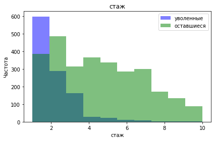
    


    
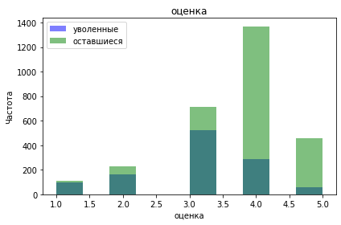
    


    
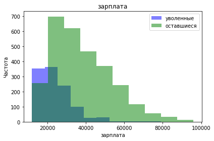
    


Видно, что у волившихся низкий стад до 4 лет и зарплата до 40 тыс.. Также у уволивщихся редки оценки выше 3.

<div class="alert alert-success">
<b>👍 Успех:</b> Все верно!
</div>


```python
train_new.sample()
```


<div>
<style scoped>
    .dataframe tbody tr th:only-of-type {
        vertical-align: middle;
    }

    .dataframe tbody tr th {
        vertical-align: top;
    }

    .dataframe thead th {
        text-align: right;
    }
</style>
<table border="1" class="dataframe">
  <thead>
    <tr style="text-align: right;">
      <th></th>
      <th>id</th>
      <th>отдел</th>
      <th>уровень</th>
      <th>загруженость</th>
      <th>стаж</th>
      <th>повышение</th>
      <th>нарушение</th>
      <th>оценка</th>
      <th>зарплата</th>
      <th>увольнение</th>
    </tr>
  </thead>
  <tbody>
    <tr>
      <th>1238</th>
      <td>369771</td>
      <td>purchasing</td>
      <td>junior</td>
      <td>medium</td>
      <td>1</td>
      <td>no</td>
      <td>no</td>
      <td>4</td>
      <td>22800</td>
      <td>no</td>
    </tr>
  </tbody>
</table>
</div>


```python
for i in ['отдел','уровень','загруженость','повышение','нарушение']:
    p_cat(train_new,i)
```


    
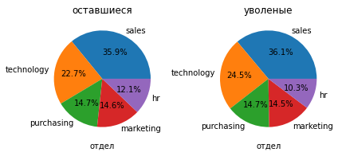
    


    
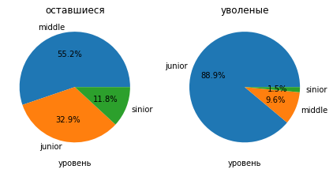
    


    
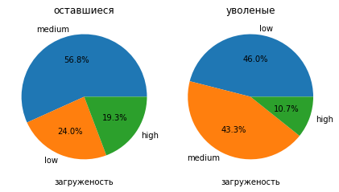
    


    
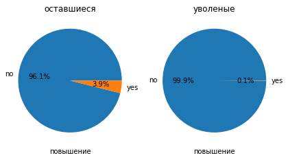
    


    
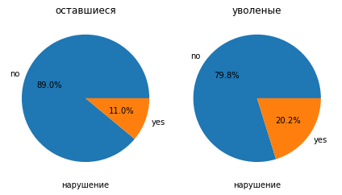
    


Видно, что увольнения не зависят от отдела. Большая часть уволившихся - это уровень младший с низкой загруженостью.  Также они получают куда меньше повышений и имеют больше нарушений.

<div class="alert alert-success">
<b>👍 Успех:</b> Все верно!
</div>


```python
# рассмотрим количественные признаки
for i in ['стаж','оценка','зарплата']:
    plot_num(test_new,i)
```


    
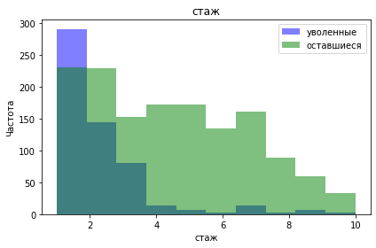
    


    
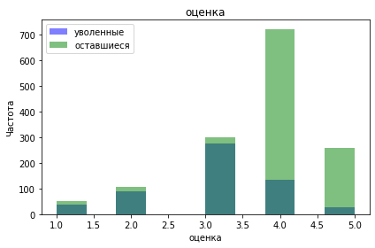
    


    
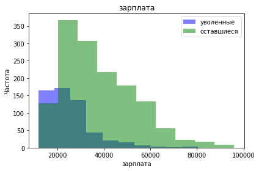
    


```python
for i in ['отдел','уровень','загруженость','повышение','нарушение']:
    p_cat(test_new,i)
```


    

    


    
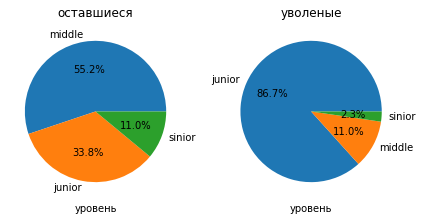
    


    
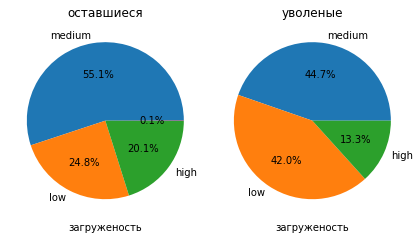
    


    
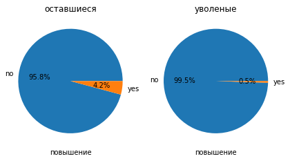
    


    

    


Распределение тестовой и тренировочной выборки похожи.

**Вывод** : Портрет уволившегося сотрудника получается следующим: работал не более 4 лет, имеет зарплату не более 40 тыс., имеет младщий уровень должности и скорее всего не получал повышений. Это все мотивирует искать другиую работу.

<div class="alert alert-success">
<b>👍 Успех:</b> Все верно!
</div>

## Добавление нового признака

Но есть и еще один признак - удовлетворенность от работы.

Была разработана модель позволяющая найти удовольствие от работы.
Чтобы не усложнять следующию модель добавим найденые значения удовольствия в таблицы.

<div class="alert alert-success">
<b>👍 Успех:</b> Все верно! Теперь у нас все нужные данные
</div>


```python
train_new['удовольствие'] = best_model.predict(train_new)# тренировочные
test_new['удовольствие'] = best_model.predict(test_new)# тестовые
```

    /opt/conda/lib/python3.9/site-packages/sklearn/preprocessing/_encoders.py:228: UserWarning: Found unknown categories in columns [0] during transform. These unknown categories will be encoded as all zeros
      warnings.warn(


Посмотрим какие данные получились.


```python
train_new.info()
```

    <class 'pandas.core.frame.DataFrame'>
    RangeIndex: 4000 entries, 0 to 3999
    Data columns (total 11 columns):
     #   Column        Non-Null Count  Dtype  
    ---  ------        --------------  -----  
     0   id            4000 non-null   int64  
     1   отдел         4000 non-null   object 
     2   уровень       4000 non-null   object 
     3   загруженость  4000 non-null   object 
     4   стаж          4000 non-null   int64  
     5   повышение     4000 non-null   object 
     6   нарушение     4000 non-null   object 
     7   оценка        4000 non-null   int64  
     8   зарплата      4000 non-null   int64  
     9   увольнение    4000 non-null   object 
     10  удовольствие  4000 non-null   float64
    dtypes: float64(1), int64(4), object(6)
    memory usage: 343.9+ KB


```python
test_new.info()
```

    <class 'pandas.core.frame.DataFrame'>
    Int64Index: 2000 entries, 0 to 1999
    Data columns (total 11 columns):
     #   Column        Non-Null Count  Dtype  
    ---  ------        --------------  -----  
     0   id            2000 non-null   int64  
     1   отдел         1998 non-null   object 
     2   уровень       1999 non-null   object 
     3   загруженость  2000 non-null   object 
     4   стаж          2000 non-null   int64  
     5   повышение     2000 non-null   object 
     6   нарушение     2000 non-null   object 
     7   оценка        2000 non-null   int64  
     8   зарплата      2000 non-null   int64  
     9   увольнение    2000 non-null   object 
     10  удовольствие  2000 non-null   float64
    dtypes: float64(1), int64(4), object(6)
    memory usage: 187.5+ KB


Рассмотрим как зависят распределение удовольствия от работы у уволеных и оставшихся


```python
plot_num(train_new,'удовольствие')
```


    

    


Видно, что в целом оставшиеся куда более удовлетворенны от работы, чем уволившиеся

Также стоит заменить увольнение с да и нет на число 1 и 0 соотвественною


```python
train_new['увольнение'] = train_new['увольнение'].apply(lambda x: 1 if x =='yes' else 0)
test_new['увольнение'] = test_new['увольнение'].apply(lambda x: 1 if x =='yes' else 0)
```

<div class="alert alert-success">
<b>👍 Успех:</b> Все верно!
</div>

## Подготовка данных

Для создания модели нужно создать пайплайн.

Для начала перечислим характеристики данных:

- отдел, нарушение и повышение — нужно кодировать с помощью OneHotEncoder т.к их отделы нельзя ни как соотнести, нарушение и повышение имеют только два значения..
- уровень должности и занятость — нужно кодировать с помощью OrdinalEncoder, т.к. их можено соотнести.
- стаж, оценка работы, удовольствие и зарплата - нужно масштабировать.
- Увольнение - целевой признак. 

В признаках пропуски встречаются и обработаем их в пайплайне.


```python
train_new.sample()
```


<div>
<style scoped>
    .dataframe tbody tr th:only-of-type {
        vertical-align: middle;
    }

    .dataframe tbody tr th {
        vertical-align: top;
    }

    .dataframe thead th {
        text-align: right;
    }
</style>
<table border="1" class="dataframe">
  <thead>
    <tr style="text-align: right;">
      <th></th>
      <th>id</th>
      <th>отдел</th>
      <th>уровень</th>
      <th>загруженость</th>
      <th>стаж</th>
      <th>повышение</th>
      <th>нарушение</th>
      <th>оценка</th>
      <th>зарплата</th>
      <th>увольнение</th>
      <th>удовольствие</th>
    </tr>
  </thead>
  <tbody>
    <tr>
      <th>353</th>
      <td>625643</td>
      <td>technology</td>
      <td>junior</td>
      <td>medium</td>
      <td>5</td>
      <td>no</td>
      <td>no</td>
      <td>3</td>
      <td>31200</td>
      <td>0</td>
      <td>0.28</td>
    </tr>
  </tbody>
</table>
</div>


```python
# разделем признаки на входные и целевые
X_train=train_new.drop(['id','увольнение'],axis=1)
y_train=train_new['увольнение']
X_test=test_new.drop(['id','увольнение'],axis=1)
y_test=test_new['увольнение']
```


```python
X_test.head()
```


<div>
<style scoped>
    .dataframe tbody tr th:only-of-type {
        vertical-align: middle;
    }

    .dataframe tbody tr th {
        vertical-align: top;
    }

    .dataframe thead th {
        text-align: right;
    }
</style>
<table border="1" class="dataframe">
  <thead>
    <tr style="text-align: right;">
      <th></th>
      <th>отдел</th>
      <th>уровень</th>
      <th>загруженость</th>
      <th>стаж</th>
      <th>повышение</th>
      <th>нарушение</th>
      <th>оценка</th>
      <th>зарплата</th>
      <th>удовольствие</th>
    </tr>
  </thead>
  <tbody>
    <tr>
      <th>0</th>
      <td>marketing</td>
      <td>junior</td>
      <td>medium</td>
      <td>2</td>
      <td>no</td>
      <td>no</td>
      <td>5</td>
      <td>28800</td>
      <td>0.866667</td>
    </tr>
    <tr>
      <th>1</th>
      <td>hr</td>
      <td>junior</td>
      <td>medium</td>
      <td>1</td>
      <td>no</td>
      <td>no</td>
      <td>4</td>
      <td>30000</td>
      <td>0.676667</td>
    </tr>
    <tr>
      <th>2</th>
      <td>sales</td>
      <td>middle</td>
      <td>low</td>
      <td>5</td>
      <td>no</td>
      <td>no</td>
      <td>4</td>
      <td>19200</td>
      <td>0.657143</td>
    </tr>
    <tr>
      <th>3</th>
      <td>sales</td>
      <td>middle</td>
      <td>low</td>
      <td>6</td>
      <td>no</td>
      <td>no</td>
      <td>4</td>
      <td>19200</td>
      <td>0.655000</td>
    </tr>
    <tr>
      <th>4</th>
      <td>hr</td>
      <td>middle</td>
      <td>medium</td>
      <td>5</td>
      <td>no</td>
      <td>no</td>
      <td>5</td>
      <td>40800</td>
      <td>0.792000</td>
    </tr>
  </tbody>
</table>
</div>


```python
# Признаки
ohe_columns = ['отдел', 'повышение', 'нарушение'] #OneHotEncoder
ord_columns = ['уровень', 'загруженость'] #OrdinalEncoder
num_columns = ['стаж', 'оценка', 'зарплата','удовольствие'] #StandardScaler
```


```python
# создадим пайлайн
# уберем все пробелы и заменим их на наиболее частые
ohe_pipe = Pipeline(
    [('simpleImputer_ohe', SimpleImputer(missing_values=np.nan, strategy='most_frequent')),
     ('ohe', OneHotEncoder(drop='first', handle_unknown='ignore', sparse_output=False))
    ]
)

# аналогично
ord_pipe = Pipeline(
    [('simpleImputer_before_ord', SimpleImputer(missing_values=np.nan, strategy='most_frequent')),
     ('ord',  OrdinalEncoder(
                categories=[
                    ['junior', 'middle', 'sinior'], 
                    ['low', 'medium', 'high']
                ], 
                handle_unknown='use_encoded_value', unknown_value=np.nan
            )
        ),
     ('simpleImputer_after_ord', SimpleImputer(missing_values=np.nan, strategy='most_frequent')),

    ]
)

# объединение
data_preprocessor = ColumnTransformer(
    [('ohe', ohe_pipe, ohe_columns),
     ('ord', ord_pipe, ord_columns),
     ('num', StandardScaler(), num_columns)
    ], 
    remainder='passthrough'
)

# создание модели
pipe_final = Pipeline([
    ('preprocessor', data_preprocessor),
    ('models', LinearRegression())
])
```

<div class="alert alert-success">
<b>👍 Успех:</b> Все верно!
</div>

Будет рассмотрено несколько моделей: дерево решений, метод ближних соседей и метод случайного леса. Будет найден лучший из них.


```python
RANDOM_STATE = 100
TEST_SIZE = 0.25
# Создаем гиперпараметры для моделей
param_grid = [

    {
        'models': [RandomForestClassifier()],
        'preprocessor__num': [StandardScaler(), MinMaxScaler(), 'passthrough']   
    },

    {
        'models': [DecisionTreeClassifier(random_state=RANDOM_STATE)],
        'models__max_depth': range(5, 15),
        'models__max_features': range(5, 15),
        'preprocessor__num': [StandardScaler(), MinMaxScaler(), 'passthrough']  
    },
    {
        'models': [KNeighborsClassifier()],
        'models__n_neighbors': range(10, 20),
        'preprocessor__num': [StandardScaler(), MinMaxScaler(), 'passthrough']   
    }
]
```

Таким образом была проведена подготовка к последующему созданию модели.

<div class="alert alert-success">
<b>👍 Успех:</b> Все верно!
</div>

## Обучение модели увольнений

Благодаря вышеописаному пайплайну можно найти лучшию регрессионную модель. В качестве метрики использовалась ROC-AUC. 


```python
grid_search = GridSearchCV(
    pipe_final,
    param_grid,
    n_jobs=-1,
    cv=5,
    scoring='roc_auc'
)
grid_search.fit(X_train, y_train)
```


<style>#sk-container-id-2 {color: black;}#sk-container-id-2 pre{padding: 0;}#sk-container-id-2 div.sk-toggleable {background-color: white;}#sk-container-id-2 label.sk-toggleable__label {cursor: pointer;display: block;width: 100%;margin-bottom: 0;padding: 0.3em;box-sizing: border-box;text-align: center;}#sk-container-id-2 label.sk-toggleable__label-arrow:before {content: "▸";float: left;margin-right: 0.25em;color: #696969;}#sk-container-id-2 label.sk-toggleable__label-arrow:hover:before {color: black;}#sk-container-id-2 div.sk-estimator:hover label.sk-toggleable__label-arrow:before {color: black;}#sk-container-id-2 div.sk-toggleable__content {max-height: 0;max-width: 0;overflow: hidden;text-align: left;background-color: #f0f8ff;}#sk-container-id-2 div.sk-toggleable__content pre {margin: 0.2em;color: black;border-radius: 0.25em;background-color: #f0f8ff;}#sk-container-id-2 input.sk-toggleable__control:checked~div.sk-toggleable__content {max-height: 200px;max-width: 100%;overflow: auto;}#sk-container-id-2 input.sk-toggleable__control:checked~label.sk-toggleable__label-arrow:before {content: "▾";}#sk-container-id-2 div.sk-estimator input.sk-toggleable__control:checked~label.sk-toggleable__label {background-color: #d4ebff;}#sk-container-id-2 div.sk-label input.sk-toggleable__control:checked~label.sk-toggleable__label {background-color: #d4ebff;}#sk-container-id-2 input.sk-hidden--visually {border: 0;clip: rect(1px 1px 1px 1px);clip: rect(1px, 1px, 1px, 1px);height: 1px;margin: -1px;overflow: hidden;padding: 0;position: absolute;width: 1px;}#sk-container-id-2 div.sk-estimator {font-family: monospace;background-color: #f0f8ff;border: 1px dotted black;border-radius: 0.25em;box-sizing: border-box;margin-bottom: 0.5em;}#sk-container-id-2 div.sk-estimator:hover {background-color: #d4ebff;}#sk-container-id-2 div.sk-parallel-item::after {content: "";width: 100%;border-bottom: 1px solid gray;flex-grow: 1;}#sk-container-id-2 div.sk-label:hover label.sk-toggleable__label {background-color: #d4ebff;}#sk-container-id-2 div.sk-serial::before {content: "";position: absolute;border-left: 1px solid gray;box-sizing: border-box;top: 0;bottom: 0;left: 50%;z-index: 0;}#sk-container-id-2 div.sk-serial {display: flex;flex-direction: column;align-items: center;background-color: white;padding-right: 0.2em;padding-left: 0.2em;position: relative;}#sk-container-id-2 div.sk-item {position: relative;z-index: 1;}#sk-container-id-2 div.sk-parallel {display: flex;align-items: stretch;justify-content: center;background-color: white;position: relative;}#sk-container-id-2 div.sk-item::before, #sk-container-id-2 div.sk-parallel-item::before {content: "";position: absolute;border-left: 1px solid gray;box-sizing: border-box;top: 0;bottom: 0;left: 50%;z-index: -1;}#sk-container-id-2 div.sk-parallel-item {display: flex;flex-direction: column;z-index: 1;position: relative;background-color: white;}#sk-container-id-2 div.sk-parallel-item:first-child::after {align-self: flex-end;width: 50%;}#sk-container-id-2 div.sk-parallel-item:last-child::after {align-self: flex-start;width: 50%;}#sk-container-id-2 div.sk-parallel-item:only-child::after {width: 0;}#sk-container-id-2 div.sk-dashed-wrapped {border: 1px dashed gray;margin: 0 0.4em 0.5em 0.4em;box-sizing: border-box;padding-bottom: 0.4em;background-color: white;}#sk-container-id-2 div.sk-label label {font-family: monospace;font-weight: bold;display: inline-block;line-height: 1.2em;}#sk-container-id-2 div.sk-label-container {text-align: center;}#sk-container-id-2 div.sk-container {/* jupyter's `normalize.less` sets `[hidden] { display: none; }` but bootstrap.min.css set `[hidden] { display: none !important; }` so we also need the `!important` here to be able to override the default hidden behavior on the sphinx rendered scikit-learn.org. See: https://github.com/scikit-learn/scikit-learn/issues/21755 */display: inline-block !important;position: relative;}#sk-container-id-2 div.sk-text-repr-fallback {display: none;}</style><div id="sk-container-id-2" class="sk-top-container"><div class="sk-text-repr-fallback"><pre>GridSearchCV(cv=5,
             estimator=Pipeline(steps=[(&#x27;preprocessor&#x27;,
                                        ColumnTransformer(remainder=&#x27;passthrough&#x27;,
                                                          transformers=[(&#x27;ohe&#x27;,
                                                                         Pipeline(steps=[(&#x27;simpleImputer_ohe&#x27;,
                                                                                          SimpleImputer(strategy=&#x27;most_frequent&#x27;)),
                                                                                         (&#x27;ohe&#x27;,
                                                                                          OneHotEncoder(drop=&#x27;first&#x27;,
                                                                                                        handle_unknown=&#x27;ignore&#x27;,
                                                                                                        sparse_output=False))]),
                                                                         [&#x27;отдел&#x27;,
                                                                          &#x27;повышение&#x27;,
                                                                          &#x27;нарушение&#x27;]),
                                                                        (&#x27;ord&#x27;,
                                                                         Pipeline(steps=[(&#x27;simpleI...
                                                &#x27;passthrough&#x27;]},
                         {&#x27;models&#x27;: [DecisionTreeClassifier(random_state=100)],
                          &#x27;models__max_depth&#x27;: range(5, 15),
                          &#x27;models__max_features&#x27;: range(5, 15),
                          &#x27;preprocessor__num&#x27;: [StandardScaler(),
                                                MinMaxScaler(),
                                                &#x27;passthrough&#x27;]},
                         {&#x27;models&#x27;: [KNeighborsClassifier()],
                          &#x27;models__n_neighbors&#x27;: range(10, 20),
                          &#x27;preprocessor__num&#x27;: [StandardScaler(),
                                                MinMaxScaler(),
                                                &#x27;passthrough&#x27;]}],
             scoring=&#x27;roc_auc&#x27;)</pre><b>In a Jupyter environment, please rerun this cell to show the HTML representation or trust the notebook. <br />On GitHub, the HTML representation is unable to render, please try loading this page with nbviewer.org.</b></div><div class="sk-container" hidden><div class="sk-item sk-dashed-wrapped"><div class="sk-label-container"><div class="sk-label sk-toggleable"><input class="sk-toggleable__control sk-hidden--visually" id="sk-estimator-id-16" type="checkbox" ><label for="sk-estimator-id-16" class="sk-toggleable__label sk-toggleable__label-arrow">GridSearchCV</label><div class="sk-toggleable__content"><pre>GridSearchCV(cv=5,
             estimator=Pipeline(steps=[(&#x27;preprocessor&#x27;,
                                        ColumnTransformer(remainder=&#x27;passthrough&#x27;,
                                                          transformers=[(&#x27;ohe&#x27;,
                                                                         Pipeline(steps=[(&#x27;simpleImputer_ohe&#x27;,
                                                                                          SimpleImputer(strategy=&#x27;most_frequent&#x27;)),
                                                                                         (&#x27;ohe&#x27;,
                                                                                          OneHotEncoder(drop=&#x27;first&#x27;,
                                                                                                        handle_unknown=&#x27;ignore&#x27;,
                                                                                                        sparse_output=False))]),
                                                                         [&#x27;отдел&#x27;,
                                                                          &#x27;повышение&#x27;,
                                                                          &#x27;нарушение&#x27;]),
                                                                        (&#x27;ord&#x27;,
                                                                         Pipeline(steps=[(&#x27;simpleI...
                                                &#x27;passthrough&#x27;]},
                         {&#x27;models&#x27;: [DecisionTreeClassifier(random_state=100)],
                          &#x27;models__max_depth&#x27;: range(5, 15),
                          &#x27;models__max_features&#x27;: range(5, 15),
                          &#x27;preprocessor__num&#x27;: [StandardScaler(),
                                                MinMaxScaler(),
                                                &#x27;passthrough&#x27;]},
                         {&#x27;models&#x27;: [KNeighborsClassifier()],
                          &#x27;models__n_neighbors&#x27;: range(10, 20),
                          &#x27;preprocessor__num&#x27;: [StandardScaler(),
                                                MinMaxScaler(),
                                                &#x27;passthrough&#x27;]}],
             scoring=&#x27;roc_auc&#x27;)</pre></div></div></div><div class="sk-parallel"><div class="sk-parallel-item"><div class="sk-item"><div class="sk-label-container"><div class="sk-label sk-toggleable"><input class="sk-toggleable__control sk-hidden--visually" id="sk-estimator-id-17" type="checkbox" ><label for="sk-estimator-id-17" class="sk-toggleable__label sk-toggleable__label-arrow">estimator: Pipeline</label><div class="sk-toggleable__content"><pre>Pipeline(steps=[(&#x27;preprocessor&#x27;,
                 ColumnTransformer(remainder=&#x27;passthrough&#x27;,
                                   transformers=[(&#x27;ohe&#x27;,
                                                  Pipeline(steps=[(&#x27;simpleImputer_ohe&#x27;,
                                                                   SimpleImputer(strategy=&#x27;most_frequent&#x27;)),
                                                                  (&#x27;ohe&#x27;,
                                                                   OneHotEncoder(drop=&#x27;first&#x27;,
                                                                                 handle_unknown=&#x27;ignore&#x27;,
                                                                                 sparse_output=False))]),
                                                  [&#x27;отдел&#x27;, &#x27;повышение&#x27;,
                                                   &#x27;нарушение&#x27;]),
                                                 (&#x27;ord&#x27;,
                                                  Pipeline(steps=[(&#x27;simpleImputer_before_ord&#x27;,
                                                                   SimpleImp...nt&#x27;)),
                                                                  (&#x27;ord&#x27;,
                                                                   OrdinalEncoder(categories=[[&#x27;junior&#x27;,
                                                                                               &#x27;middle&#x27;,
                                                                                               &#x27;sinior&#x27;],
                                                                                              [&#x27;low&#x27;,
                                                                                               &#x27;medium&#x27;,
                                                                                               &#x27;high&#x27;]],
                                                                                  handle_unknown=&#x27;use_encoded_value&#x27;,
                                                                                  unknown_value=nan)),
                                                                  (&#x27;simpleImputer_after_ord&#x27;,
                                                                   SimpleImputer(strategy=&#x27;most_frequent&#x27;))]),
                                                  [&#x27;уровень&#x27;, &#x27;загруженость&#x27;]),
                                                 (&#x27;num&#x27;, StandardScaler(),
                                                  [&#x27;стаж&#x27;, &#x27;оценка&#x27;, &#x27;зарплата&#x27;,
                                                   &#x27;удовольствие&#x27;])])),
                (&#x27;models&#x27;, LinearRegression())])</pre></div></div></div><div class="sk-serial"><div class="sk-item"><div class="sk-serial"><div class="sk-item sk-dashed-wrapped"><div class="sk-label-container"><div class="sk-label sk-toggleable"><input class="sk-toggleable__control sk-hidden--visually" id="sk-estimator-id-18" type="checkbox" ><label for="sk-estimator-id-18" class="sk-toggleable__label sk-toggleable__label-arrow">preprocessor: ColumnTransformer</label><div class="sk-toggleable__content"><pre>ColumnTransformer(remainder=&#x27;passthrough&#x27;,
                  transformers=[(&#x27;ohe&#x27;,
                                 Pipeline(steps=[(&#x27;simpleImputer_ohe&#x27;,
                                                  SimpleImputer(strategy=&#x27;most_frequent&#x27;)),
                                                 (&#x27;ohe&#x27;,
                                                  OneHotEncoder(drop=&#x27;first&#x27;,
                                                                handle_unknown=&#x27;ignore&#x27;,
                                                                sparse_output=False))]),
                                 [&#x27;отдел&#x27;, &#x27;повышение&#x27;, &#x27;нарушение&#x27;]),
                                (&#x27;ord&#x27;,
                                 Pipeline(steps=[(&#x27;simpleImputer_before_ord&#x27;,
                                                  SimpleImputer(strategy=&#x27;most_frequent&#x27;)),
                                                 (&#x27;ord&#x27;,
                                                  OrdinalEncoder(categories=[[&#x27;junior&#x27;,
                                                                              &#x27;middle&#x27;,
                                                                              &#x27;sinior&#x27;],
                                                                             [&#x27;low&#x27;,
                                                                              &#x27;medium&#x27;,
                                                                              &#x27;high&#x27;]],
                                                                 handle_unknown=&#x27;use_encoded_value&#x27;,
                                                                 unknown_value=nan)),
                                                 (&#x27;simpleImputer_after_ord&#x27;,
                                                  SimpleImputer(strategy=&#x27;most_frequent&#x27;))]),
                                 [&#x27;уровень&#x27;, &#x27;загруженость&#x27;]),
                                (&#x27;num&#x27;, StandardScaler(),
                                 [&#x27;стаж&#x27;, &#x27;оценка&#x27;, &#x27;зарплата&#x27;,
                                  &#x27;удовольствие&#x27;])])</pre></div></div></div><div class="sk-parallel"><div class="sk-parallel-item"><div class="sk-item"><div class="sk-label-container"><div class="sk-label sk-toggleable"><input class="sk-toggleable__control sk-hidden--visually" id="sk-estimator-id-19" type="checkbox" ><label for="sk-estimator-id-19" class="sk-toggleable__label sk-toggleable__label-arrow">ohe</label><div class="sk-toggleable__content"><pre>[&#x27;отдел&#x27;, &#x27;повышение&#x27;, &#x27;нарушение&#x27;]</pre></div></div></div><div class="sk-serial"><div class="sk-item"><div class="sk-serial"><div class="sk-item"><div class="sk-estimator sk-toggleable"><input class="sk-toggleable__control sk-hidden--visually" id="sk-estimator-id-20" type="checkbox" ><label for="sk-estimator-id-20" class="sk-toggleable__label sk-toggleable__label-arrow">SimpleImputer</label><div class="sk-toggleable__content"><pre>SimpleImputer(strategy=&#x27;most_frequent&#x27;)</pre></div></div></div><div class="sk-item"><div class="sk-estimator sk-toggleable"><input class="sk-toggleable__control sk-hidden--visually" id="sk-estimator-id-21" type="checkbox" ><label for="sk-estimator-id-21" class="sk-toggleable__label sk-toggleable__label-arrow">OneHotEncoder</label><div class="sk-toggleable__content"><pre>OneHotEncoder(drop=&#x27;first&#x27;, handle_unknown=&#x27;ignore&#x27;, sparse_output=False)</pre></div></div></div></div></div></div></div></div><div class="sk-parallel-item"><div class="sk-item"><div class="sk-label-container"><div class="sk-label sk-toggleable"><input class="sk-toggleable__control sk-hidden--visually" id="sk-estimator-id-22" type="checkbox" ><label for="sk-estimator-id-22" class="sk-toggleable__label sk-toggleable__label-arrow">ord</label><div class="sk-toggleable__content"><pre>[&#x27;уровень&#x27;, &#x27;загруженость&#x27;]</pre></div></div></div><div class="sk-serial"><div class="sk-item"><div class="sk-serial"><div class="sk-item"><div class="sk-estimator sk-toggleable"><input class="sk-toggleable__control sk-hidden--visually" id="sk-estimator-id-23" type="checkbox" ><label for="sk-estimator-id-23" class="sk-toggleable__label sk-toggleable__label-arrow">SimpleImputer</label><div class="sk-toggleable__content"><pre>SimpleImputer(strategy=&#x27;most_frequent&#x27;)</pre></div></div></div><div class="sk-item"><div class="sk-estimator sk-toggleable"><input class="sk-toggleable__control sk-hidden--visually" id="sk-estimator-id-24" type="checkbox" ><label for="sk-estimator-id-24" class="sk-toggleable__label sk-toggleable__label-arrow">OrdinalEncoder</label><div class="sk-toggleable__content"><pre>OrdinalEncoder(categories=[[&#x27;junior&#x27;, &#x27;middle&#x27;, &#x27;sinior&#x27;],
                           [&#x27;low&#x27;, &#x27;medium&#x27;, &#x27;high&#x27;]],
               handle_unknown=&#x27;use_encoded_value&#x27;, unknown_value=nan)</pre></div></div></div><div class="sk-item"><div class="sk-estimator sk-toggleable"><input class="sk-toggleable__control sk-hidden--visually" id="sk-estimator-id-25" type="checkbox" ><label for="sk-estimator-id-25" class="sk-toggleable__label sk-toggleable__label-arrow">SimpleImputer</label><div class="sk-toggleable__content"><pre>SimpleImputer(strategy=&#x27;most_frequent&#x27;)</pre></div></div></div></div></div></div></div></div><div class="sk-parallel-item"><div class="sk-item"><div class="sk-label-container"><div class="sk-label sk-toggleable"><input class="sk-toggleable__control sk-hidden--visually" id="sk-estimator-id-26" type="checkbox" ><label for="sk-estimator-id-26" class="sk-toggleable__label sk-toggleable__label-arrow">num</label><div class="sk-toggleable__content"><pre>[&#x27;стаж&#x27;, &#x27;оценка&#x27;, &#x27;зарплата&#x27;, &#x27;удовольствие&#x27;]</pre></div></div></div><div class="sk-serial"><div class="sk-item"><div class="sk-estimator sk-toggleable"><input class="sk-toggleable__control sk-hidden--visually" id="sk-estimator-id-27" type="checkbox" ><label for="sk-estimator-id-27" class="sk-toggleable__label sk-toggleable__label-arrow">StandardScaler</label><div class="sk-toggleable__content"><pre>StandardScaler()</pre></div></div></div></div></div></div><div class="sk-parallel-item"><div class="sk-item"><div class="sk-label-container"><div class="sk-label sk-toggleable"><input class="sk-toggleable__control sk-hidden--visually" id="sk-estimator-id-28" type="checkbox" ><label for="sk-estimator-id-28" class="sk-toggleable__label sk-toggleable__label-arrow">remainder</label><div class="sk-toggleable__content"><pre></pre></div></div></div><div class="sk-serial"><div class="sk-item"><div class="sk-estimator sk-toggleable"><input class="sk-toggleable__control sk-hidden--visually" id="sk-estimator-id-29" type="checkbox" ><label for="sk-estimator-id-29" class="sk-toggleable__label sk-toggleable__label-arrow">passthrough</label><div class="sk-toggleable__content"><pre>passthrough</pre></div></div></div></div></div></div></div></div><div class="sk-item"><div class="sk-estimator sk-toggleable"><input class="sk-toggleable__control sk-hidden--visually" id="sk-estimator-id-30" type="checkbox" ><label for="sk-estimator-id-30" class="sk-toggleable__label sk-toggleable__label-arrow">LinearRegression</label><div class="sk-toggleable__content"><pre>LinearRegression()</pre></div></div></div></div></div></div></div></div></div></div></div></div>


```python
best_model = grid_search.best_estimator_
print('Лучшая модель и её параметры:\n\n', grid_search.best_estimator_)
print(f'Метрика ROC-AUC лучшей модели по кросс-валидации на обучающих данных: {round(grid_search.best_score_,4)}')
```

    Лучшая модель и её параметры:
    
     Pipeline(steps=[('preprocessor',
                     ColumnTransformer(remainder='passthrough',
                                       transformers=[('ohe',
                                                      Pipeline(steps=[('simpleImputer_ohe',
                                                                       SimpleImputer(strategy='most_frequent')),
                                                                      ('ohe',
                                                                       OneHotEncoder(drop='first',
                                                                                     handle_unknown='ignore',
                                                                                     sparse_output=False))]),
                                                      ['отдел', 'повышение',
                                                       'нарушение']),
                                                     ('ord',
                                                      Pipeline(steps=[('simpleImputer_before_ord',
                                                                       SimpleImp...)),
                                                                      ('ord',
                                                                       OrdinalEncoder(categories=[['junior',
                                                                                                   'middle',
                                                                                                   'sinior'],
                                                                                                  ['low',
                                                                                                   'medium',
                                                                                                   'high']],
                                                                                      handle_unknown='use_encoded_value',
                                                                                      unknown_value=nan)),
                                                                      ('simpleImputer_after_ord',
                                                                       SimpleImputer(strategy='most_frequent'))]),
                                                      ['уровень', 'загруженость']),
                                                     ('num', 'passthrough',
                                                      ['стаж', 'оценка', 'зарплата',
                                                       'удовольствие'])])),
                    ('models', RandomForestClassifier())])
    Метрика ROC-AUC лучшей модели по кросс-валидации на обучающих данных: 0.9315


```python
print(f'Метрика ROC-AUC лучшей модели на тестовой выборке: {round(roc_auc_score(y_test, grid_search.predict_proba(X_test)[:, 1]),4)}')
```

    Метрика ROC-AUC лучшей модели на тестовой выборке: 0.9243


    /opt/conda/lib/python3.9/site-packages/sklearn/preprocessing/_encoders.py:228: UserWarning: Found unknown categories in columns [0] during transform. These unknown categories will be encoded as all zeros
      warnings.warn(


**Выводы** Лучшей моделью оказалась RandomForestClassifier(). На тренировочных данные её метрика 0.9327, а на тестовых 0.9252. Это говорит о том, что модель вполне успешна. Возможно это связано с тем, что зависимость увольнения от параметров работников сложна.

<div class="alert alert-success">
<b>👍 Успех:</b> Отличный результат, молодец!
</div>

# Вывод

В данном проекте решалась целью является оптимизация бизнесса. Для этого были полученны данные о сотрудниках, а также их мнения о работе. Для оптимизации дела необходимо составить модель которая позволит предсказать удовлетворенность от работы. На основе этой модели нужно составить также модель которая предскажит отток работников.
Таким образом работу можно разделить на несколько этапов:
- предварительная обработка данных на предмет ошибок и неточностей.
- анализ данных для представления образа среднего работника и зависимостей полученных параметров.
- создание модели предсказывающей удовлетворенность от работы.
- анализ увольнений и составление портрета среднего уволившегося сотрудника.
- анализ влияние удовлетворенности от работы на увольнения.
- состовление модели увольнений.
- принятие бизнес-решений.

В ходе предварительной предобработки были найдены пропуски (их заменяли на момент состовления модели) и обнаружено, что в разделе отделы были пропуски которые записали как название отдела, поэтому их пришлось заменить напропуски. Некоторые таблицы пришлось соединить, чтобы входные параметры соответствовали целевым. Других опечаток и ошибок не было обнаружено и данные были готовы к дальнейщему анализу.

В ходе анализа было установлено, что тестовые и тренировочные данные похожи.Был составлен портрет среднего работника: в среднем работает 3 года, максимум 10, лучшая оценка это 5 (как и следовало ожидать), в среднем это 3,5 ( по медиане 4) да и большая часть оценок находится между 3 и 4, зарплата находиться в диапозоне от 12 до 98,4 тыс., а всреднем состовляет 30 тыс. (медианое значение блико), значение удовлетворенности от работы есть разное, но в среднем это 0.5. 
Зависимость зарплаты от загружености и уровня занимаемой должности, уровень должности от стажа, а также оценка качества работы зависит от удовлетворенности сотрудника от неё. Большая часть сотрудниках либо младшие либо среднее.

Были обучены две модели (дерево решений и линейная регрессия) с различными параметрами В результате была получена лучшая модель для определения удовлетворенности от работы: DecisionTreeRegressor(max_depth=14, max_features=10,random_state=100)). Её метрика на тренировочных данных состовляет 13.9711, что говорит о приемлености её применения.

Портрет уволившегося сотрудника получается следующим: работал не более 4 лет, имеет зарплату не более 40 тыс., имеет младщий уровень должности и скорее всего не получал повышений. Это все мотивирует искать другиую работу. Также при дальнейщем анализе удовлетворенности от рабты выяснилось, что у большинства уволившихся удовлетворенность не больше 0,5.

Рассмотрено несколько моделей: дерево решений, метод ближних соседей и метод случайного леса.Лучшей моделью оказалась RandomForestClassifier(). На тренировочных данные её метрика 0.9327, а на тестовых 0.9252. Это говорит о том, что модель вполне успешна. Возможно это связано с тем, что зависимость увольнения от параметров работников сложна.

В качестве совета: необходимо поощерять сотрудников повышениями и хорошими зарплатами. Многие уходят, чтобы найти место по лучше не проработав и 4 года. Эти 4 года лучше сделать испытательными для работников имеющих низкие должности и в качестве состовления плана учитывать, что они могут уволиться.


<div class="alert alert-success">
<b>👍 Успех:</b> Отличная работа! Было очень приятно проверять твой проект!

Оставлю хороший учебник по ML:
+  https://academy.yandex.ru/handbook/ml

Немного новостей с мира DL(вдруг заинтересует):
+  https://habr.com/ru/company/ods/blog/686962/

Вот тут проходят всякие соревнования, можешь себя попробовать:
+  https://hacks-ai.ru/


Возможно, что нить пригодится:
+  https://arxiv.org/ftp/arxiv/papers/2201/2201.00650.pdf
+  https://github.com/slgero/testovoe


Курс от МФТИ математика для DS:

+  https://www.youtube.com/watch?v=xccjt6lOoow&list=PLk4h7dmY2eYHHTyfLyrl7HmP-H3mMAW08&index=1


Тут много соревнований/лекций:

+  https://ods.ai/

stepic NLP/CV:

+  https://stepik.org/course/54098/syllabus
+  https://stepik.org/course/50352/syllabus

Еще есть от ВШЭ:

+  https://www.youtube.com/watch?v=mwjQaNt8qxk&list=PLEwK9wdS5g0og-DcF1apxutSM0GDLHz_3&ab_channel=%D0%A4%D0%9A%D0%9D%D0%92%D0%A8%D0%AD%E2%80%94%D0%B4%D0%B8%D1%81%D1%82%D0%B0%D0%BD%D1%86%D0%B8%D0%BE%D0%BD%D0%BD%D1%8B%D0%B5%D0%B7%D0%B0%D0%BD%D1%8F%D1%82%D0%B8%D1%8F
+  https://github.com/hse-ds/iad-deep-learning

Удачи в следующих проектах!!!
</div>


```python

```
