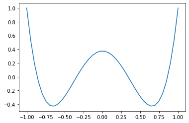
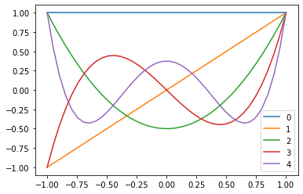
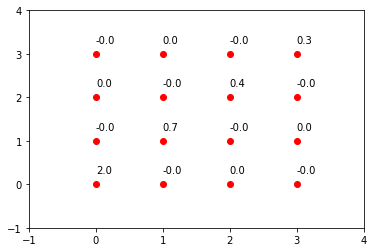
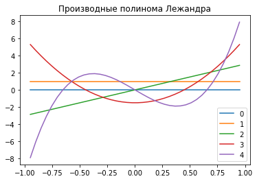
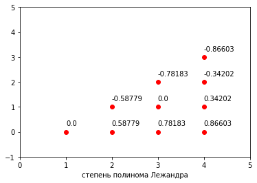

Решим уравнение лежандра

[(1-x^2)P']'+n(n+1)P=0


```python
import pandas as pd
import numpy as np
import math
import matplotlib.pyplot as plt
```


```python
def leg_poly(x,n):
    if n==0:
        return 1
    if n==1:
        return x
    else:
        return ((2*n-1)*x*leg_poly(x,n-1)/n)-(n-1)*leg_poly(x,n-2)/n
    
```

построим график функции


```python
def plot_leg(n,h=0.05,nmax=10):
    k=int(2/h)
    x1=np.linspace(-1,1,k)
    y1=map(lambda x: leg_poly(x,n), x1)
    plt.plot(x1,list(y1))
    plt.show()
```


```python
plot_leg(4)
```


    

    


```python
def plot_leg_range(n,h=0.05):
    k=int(2/h)
    x1=np.linspace(-1,1,k)
    for i in range(n):
        y1=map(lambda x: leg_poly(x,i), x1)
        plt.plot(x1,list(y1))
    plt.legend(range(n))
    plt.show()
```


```python
plot_leg_range(5)
```


    

    


найдем скалярное произведение полиномов


```python
def integ_leg(n,m,h=0.05): # скалярное произведение
    s=0
    i=-1
    while i<1:
        s=s+h*leg_poly(i,n)*leg_poly(i,m)
        i=i+h
    return s
```


```python
round(integ_leg(2,2))
```


    0


```python
def leg_norm(n):
    plt.axis([-1,n+1,-1,n+1])
   
    for i in range(n+1):
        for j in range(n+1):
            plt.text(i,j+0.25,round(integ_leg(i,j),1))
            plt.plot(i,j,'ro')
```


```python
leg_norm(3)
```


    

    


найдем нули функции


```python
# формула производной
def leg_der(x,n):
    if n>0:
        return n*(leg_poly(x,n-1)-x*leg_poly(x,n))/(1-x**2)
    else:
        return 0
```


```python
h=0.05
k=int(2/h)
x1=np.linspace(-1+h,1-h,k)
for i in range(5):
    y1=map(lambda x: leg_der(x,i), x1)
    plt.plot(x1,list(y1))
plt.legend(range(5))
plt.title('Производные полинома Лежандра')
plt.show()
```


    

    


```python
# начальные значения
def x_null(i,n):
    return math.cos(math.pi*(4*i-1)/(4*n+2))
```


```python
def result(n,e=1e6):
    res=np.ones(n)
    for i in range(1,n+1):
        x=x_null(i,n)
        while 1:
            y=x-leg_poly(x,n)/leg_der(x,n)
            if np.abs(x-y)<e:
                break
            x=y
        res[i-1]=x
    return res
            
 # нахождение нулей полинома       
```


```python
result(0)
```


    array([], dtype=float64)


```python
range(1)
```


    range(0, 1)


```python
def leg_null(n):
    plt.axis([0,n+1,-1,n+1])
    plt.xlabel('степень полинома Лежандра')

    for i in range(n+1):
        res=result(i)
        for j in range(i):
            plt.text(i,j+0.25,round(res[j],5))
            plt.plot(i,j,'ro')
```


```python
leg_null(4)
```


    

    

