<div style="border:solid green 3px; padding: 20px">
																					
<b>Привет!</b>
																					
Меня зовут Сороколетов Илья и я буду проверять твой проект. 
																					
Предлагаю общаться на «**ты**», но если тебе будет комфортнее общаться на «**вы**», то сообщи об этом в комментариях)
																					
																					
Для твоего удобства, я буду выделять свои комментарии следующим образом:
																					
<div class="alert alert-danger">
<b>❌ Комментарий ревьюера v1:</b> Самые важные замечания. Они указывают на ключевые моменты, которые влияют на конечный результат проекта. </div>
																					
<div class="alert alert-warning">
<b>⚠️ Комментарий ревьюера v1:</b> Советы или замечания, которые помогут сделать твою работу лучше, но необязательны к выполнению.
																					
</div>
																					
<div class="alert alert-success">
<b>✔️ Комментарий ревьюера v1:</b> Так я выделяю все остальные комментарии.</div>
																					
																					
Пометками <b>v1-v2-v3-...</b> я буду отмечать версию проверки. Так ты сможешь быстро найти мои новые комментарии.
																					
Давай работать над проектом в диалоге: если ты что-то меняешь в проекте по моим рекомендациям — пиши об этом. Выбери для своих комментариев какой-то заметный цвет, так мне будет легче отследить изменения, например вот так:
																					    
<div class="alert alert-info">
<b>Комментарий студента:</b>
<br>
</div>
																					
<b>Пожалуйста, не перемещай, не изменяй и не удаляй мои комментарии.</b> Если ты оставляешь свои комментарии, то делай это под моими, чтобы сообщения были расположены в хронологическом порядке. Всё это поможет выполнить повторную проверку твоего проекта быстрее. 
																					
Перед отправкой работы я рекомендую нажимать Kernel -> Restart & Run All. Это перезапустит ядро и по очереди выполнит все ячейки. Так ты сможешь проверить, что всё работает корректно. Кнопка Kernel находится в панели сверху
																					
Обязательно задавай вопросы если они возникнут, а я перехожу к проверке)
																					
P.S. На всякий случай, я оставлю пустой шаблон для твоих комментариев ниже. Кликни два раза на мой комментарий, скопируй последние четыре строчки кода и вставляй их в пустую ячейку там, где ты хочешь оставить комментарий. Не забудь только перед этим сменить тип ячейки на Markdown. Быстро это можно сделать так: кликнуть на ячейку - нажать ESC - нажать M. 
																					    
																					    
<div class="alert alert-info">
<b>Комментарий студента:</b>
<br>Удали этот текст и вместо него напиши свой комментарий 🙂
</div>

<div class="alert alert-danger">
<b>❌ Комментарий ревьюера v1:</b> 
<br>Важно оставлять перед проектом краткое описание задачи. Это поможет тебе быстро вспомнить о чем проект, если спустя время ты решишь к нему вернуться)
</div>

В данном проекте был получен информация о пользователях сервиса GoFast и их поездках. Целью данного проэкта является анализ полученых данных, с целью новых предложений для улучшения видения бизнесса. Для этого надо сделать предварительные оценки для длительности и расстояния поездок , а также полученной прибыли. Полученные предложения надо проверить и принять их в новую бизнес-стратегию

<div class="alert alert-info">
<b>Комментарий студента:</b>
<br> Я считаю, что это и определялось в проекте
</div>

<div class="alert alert-danger">
<b>❌ Комментарий ревьюера v2:</b> 
<br>Проанализировать для чего? Какая главная цель проекта? Описание должно содержать эту информацию
</div>

<div class="alert alert-success">
<b>✔️ Комментарий ревьюера v3:</b>
<br>Правка выполнена 👍
</div>


```python
import pandas as pd
import numpy as np
import scipy.stats as st
import matplotlib.pyplot as plt
from math import sqrt
```

<div class="alert alert-success">
<b>✔️ Комментарий ревьюера v1:</b> 
<br>Молодец, что импортируешь все библиотеки отдельно в первой ячейке. Это позволит тебе в любой момент добавить ещё одну библиотеку без перезаписи переменных.
</div>

#### Шаг 1. Загрузка данных


```python
user=pd.read_csv('/datasets/users_go.csv') #пользователи
rider=pd.read_csv('/datasets/rides_go.csv')#поездки
script=pd.read_csv('/datasets/subscriptions_go.csv')#подписки
```


```python
user.head(3)
```


<div>
<style scoped>
    .dataframe tbody tr th:only-of-type {
        vertical-align: middle;
    }

    .dataframe tbody tr th {
        vertical-align: top;
    }

    .dataframe thead th {
        text-align: right;
    }
</style>
<table border="1" class="dataframe">
  <thead>
    <tr style="text-align: right;">
      <th></th>
      <th>user_id</th>
      <th>name</th>
      <th>age</th>
      <th>city</th>
      <th>subscription_type</th>
    </tr>
  </thead>
  <tbody>
    <tr>
      <th>0</th>
      <td>1</td>
      <td>Кира</td>
      <td>22</td>
      <td>Тюмень</td>
      <td>ultra</td>
    </tr>
    <tr>
      <th>1</th>
      <td>2</td>
      <td>Станислав</td>
      <td>31</td>
      <td>Омск</td>
      <td>ultra</td>
    </tr>
    <tr>
      <th>2</th>
      <td>3</td>
      <td>Алексей</td>
      <td>20</td>
      <td>Москва</td>
      <td>ultra</td>
    </tr>
  </tbody>
</table>
</div>


```python
user.info()
```

    <class 'pandas.core.frame.DataFrame'>
    RangeIndex: 1565 entries, 0 to 1564
    Data columns (total 5 columns):
     #   Column             Non-Null Count  Dtype 
    ---  ------             --------------  ----- 
     0   user_id            1565 non-null   int64 
     1   name               1565 non-null   object
     2   age                1565 non-null   int64 
     3   city               1565 non-null   object
     4   subscription_type  1565 non-null   object
    dtypes: int64(2), object(3)
    memory usage: 61.3+ KB


Все колонки заполнены. Ошибки не наблюдаюся


```python
rider.head(3)
```


<div>
<style scoped>
    .dataframe tbody tr th:only-of-type {
        vertical-align: middle;
    }

    .dataframe tbody tr th {
        vertical-align: top;
    }

    .dataframe thead th {
        text-align: right;
    }
</style>
<table border="1" class="dataframe">
  <thead>
    <tr style="text-align: right;">
      <th></th>
      <th>user_id</th>
      <th>distance</th>
      <th>duration</th>
      <th>date</th>
    </tr>
  </thead>
  <tbody>
    <tr>
      <th>0</th>
      <td>1</td>
      <td>4409.919140</td>
      <td>25.599769</td>
      <td>2021-01-01</td>
    </tr>
    <tr>
      <th>1</th>
      <td>1</td>
      <td>2617.592153</td>
      <td>15.816871</td>
      <td>2021-01-18</td>
    </tr>
    <tr>
      <th>2</th>
      <td>1</td>
      <td>754.159807</td>
      <td>6.232113</td>
      <td>2021-04-20</td>
    </tr>
  </tbody>
</table>
</div>


```python
rider.info()
```

    <class 'pandas.core.frame.DataFrame'>
    RangeIndex: 18068 entries, 0 to 18067
    Data columns (total 4 columns):
     #   Column    Non-Null Count  Dtype  
    ---  ------    --------------  -----  
     0   user_id   18068 non-null  int64  
     1   distance  18068 non-null  float64
     2   duration  18068 non-null  float64
     3   date      18068 non-null  object 
    dtypes: float64(2), int64(1), object(1)
    memory usage: 564.8+ KB


Пропусков нет, но необходимо обработать данные. Как минимум даты записаны не в том формате


```python
script.head()
```


<div>
<style scoped>
    .dataframe tbody tr th:only-of-type {
        vertical-align: middle;
    }

    .dataframe tbody tr th {
        vertical-align: top;
    }

    .dataframe thead th {
        text-align: right;
    }
</style>
<table border="1" class="dataframe">
  <thead>
    <tr style="text-align: right;">
      <th></th>
      <th>subscription_type</th>
      <th>minute_price</th>
      <th>start_ride_price</th>
      <th>subscription_fee</th>
    </tr>
  </thead>
  <tbody>
    <tr>
      <th>0</th>
      <td>free</td>
      <td>8</td>
      <td>50</td>
      <td>0</td>
    </tr>
    <tr>
      <th>1</th>
      <td>ultra</td>
      <td>6</td>
      <td>0</td>
      <td>199</td>
    </tr>
  </tbody>
</table>
</div>


```python
script.info()
```

    <class 'pandas.core.frame.DataFrame'>
    RangeIndex: 2 entries, 0 to 1
    Data columns (total 4 columns):
     #   Column             Non-Null Count  Dtype 
    ---  ------             --------------  ----- 
     0   subscription_type  2 non-null      object
     1   minute_price       2 non-null      int64 
     2   start_ride_price   2 non-null      int64 
     3   subscription_fee   2 non-null      int64 
    dtypes: int64(3), object(1)
    memory usage: 192.0+ bytes


Всего есть две подписки. Формат данных нареканий не вызывает

<div class="alert alert-success">
<b>✔️ Комментарий ревьюера v1:</b> 
<br>Первичный анализ данных выполнен верно. Можем переходить к следующему этапу)
</div>

#### Шаг 2. Предобработка данных

Наибольшие проблемы вызывает столбец дат в файле о поездках. Его необходимо перевести в формат datetime64.


```python
rider['date']=pd.to_datetime(rider['date'],format='%Y-%m-%d')
```


```python
rider.info()
```

    <class 'pandas.core.frame.DataFrame'>
    RangeIndex: 18068 entries, 0 to 18067
    Data columns (total 4 columns):
     #   Column    Non-Null Count  Dtype         
    ---  ------    --------------  -----         
     0   user_id   18068 non-null  int64         
     1   distance  18068 non-null  float64       
     2   duration  18068 non-null  float64       
     3   date      18068 non-null  datetime64[ns]
    dtypes: datetime64[ns](1), float64(2), int64(1)
    memory usage: 564.8 KB


<div class="alert alert-success">
<b>✔️ Комментарий ревьюера v1:</b> 
<br>Тип данных изменён верно! 
</div>
				
<div class="alert alert-warning">
<b>⚠️ Комментарий ревьюера v1:</b> 
<br>Если при загрузке данных добавить параметр parse_dates: parse_dates=['date'] то список столбцов автоматически переведется в даты. Подробнее про это можно прочитать по ссылке ниже
				
	https://newtechaudit.ru/gruzi-daty-krasivo/
</div>


```python
rider['date'].dt.year.unique()
```


    array([2021])


Все поездки были совершены в одном году

На поездки оказывает влияние погода. Погода  может резко изменяться по дням, так что создадим столбец месяцев, для учета влияния погодных условий.


```python
rider['month']=rider['date'].dt.month
```

<div class="alert alert-success">
<b>✔️ Комментарий ревьюера v1:</b> 
<br>Новый столбец создан верно!
</div>

посмотрим как изменились датефрейм поездки


```python
rider.head()
```


<div>
<style scoped>
    .dataframe tbody tr th:only-of-type {
        vertical-align: middle;
    }

    .dataframe tbody tr th {
        vertical-align: top;
    }

    .dataframe thead th {
        text-align: right;
    }
</style>
<table border="1" class="dataframe">
  <thead>
    <tr style="text-align: right;">
      <th></th>
      <th>user_id</th>
      <th>distance</th>
      <th>duration</th>
      <th>date</th>
      <th>month</th>
    </tr>
  </thead>
  <tbody>
    <tr>
      <th>0</th>
      <td>1</td>
      <td>4409.919140</td>
      <td>25.599769</td>
      <td>2021-01-01</td>
      <td>1</td>
    </tr>
    <tr>
      <th>1</th>
      <td>1</td>
      <td>2617.592153</td>
      <td>15.816871</td>
      <td>2021-01-18</td>
      <td>1</td>
    </tr>
    <tr>
      <th>2</th>
      <td>1</td>
      <td>754.159807</td>
      <td>6.232113</td>
      <td>2021-04-20</td>
      <td>4</td>
    </tr>
    <tr>
      <th>3</th>
      <td>1</td>
      <td>2694.783254</td>
      <td>18.511000</td>
      <td>2021-08-11</td>
      <td>8</td>
    </tr>
    <tr>
      <th>4</th>
      <td>1</td>
      <td>4028.687306</td>
      <td>26.265803</td>
      <td>2021-08-28</td>
      <td>8</td>
    </tr>
  </tbody>
</table>
</div>


Проверим на наличие дубликатов


```python
user.duplicated().sum()
```


    31


Имеется 31 дубликат. Их надо удалить.


```python
user=user.drop_duplicates().reset_index(drop=True)
```


```python
user.duplicated().sum()
```


    0


```python
rider.duplicated().sum()
```


    0


```python
script.duplicated().sum()
```


    0


В остальных дубликаты замечаны не были

<div class="alert alert-success">
<b>✔️ Комментарий ревьюера v1:</b>
<br>Проверка на дубликаты выполнена!
</div>

#### Шаг 3. Исследовательский анализ данных

Рассмотрим как распределяются данные пользователей.


```python
user.groupby('city')['city'].count().plot.bar(color='#0000CC')
plt.xlabel('города')
plt.ylabel('количество пользователей ')
plt.title('распределение пользователей по городам')
plt.show()
```


    
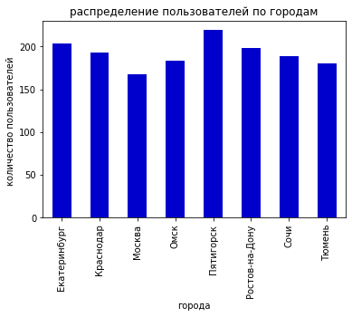
    


<div class="alert alert-danger">
<b>❌ Комментарий ревьюера v1:</b> 
<br>Графики должны быть наглядным без контекста (т.к. в реальной практике ты будешь показывать презентацию или отчет заказчику). Необходимо проследить чтобы всегда был заголовок и подписаны оси. Этот комментарий относится ко всем графикам во всем проекте
</div>

Как видно меньше всего пользователь в москве, а больше в Пятигорске, но их в каждом городе больше 150

<div class="alert alert-danger">
<b>❌ Комментарий ревьюера v2:</b> 
<br>Нет подписи заголовка у графика. Проверь наличие подписей у всех графиков
</div>

<div class="alert alert-success">
<b>✔️ Комментарий ревьюера v3:</b>
<br>Правка выполнена 👍
</div>

<div class="alert alert-danger">
<b>❌ Комментарий ревьюера v1:</b> 
<br>Также здесь стоит добавить таблицу со значениями частотности городов
</div>


```python
user.groupby('city')['city'].count()/user['city'].count()*100
```


    city
    Екатеринбург      13.298566
    Краснодар         12.581486
    Москва            10.951760
    Омск              11.929596
    Пятигорск         14.276402
    Ростов-на-Дону    12.907432
    Сочи              12.320730
    Тюмень            11.734029
    Name: city, dtype: float64


<div class="alert alert-success">
<b>✔️ Комментарий ревьюера v2:</b>
<br>Правка выполнена 👍
</div>

Рассмотрим сколько пользователей имеют подписку а сколько нет


```python
user.loc[user['subscription_type']=='free','user_id'].count()
```


    835


835 пользователей не имеют подписки


```python
user.loc[user['subscription_type']=='ultra','user_id'].count()
```


    699


699 пользователей имеют подписку


```python
user.loc[~user['subscription_type'].isin(['free','ultra']),'user_id'].count()
```


    0


Каких то других подписок нет


```python
user.groupby('subscription_type')['subscription_type'].count().plot(kind='pie',autopct='%1.0f%%')
plt.title('подписки')
```


    Text(0.5, 1.0, 'подписки')


    
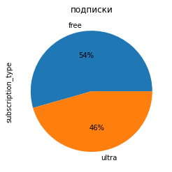
    


<div class="alert alert-danger">
<b>❌ Комментарий ревьюера v1:</b> 
<br>Для того чтобы посмотреть соотношение пользователей нужно отобразить долю каждой группы. Для этого хорошо пойдет круговая диаграмма
</div>

<div class="alert alert-success">
<b>✔️ Комментарий ревьюера v2:</b>
<br>Правка выполнена 👍
</div>

Рассмотрим возраст всех пользователей.


```python
user['age'].hist(bins=30)
plt.xlabel('возраст')
```


    Text(0.5, 0, 'возраст')


    
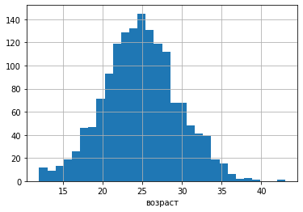
    


```python
user['age'].describe()
```


    count    1534.000000
    mean       24.903520
    std         4.572367
    min        12.000000
    25%        22.000000
    50%        25.000000
    75%        28.000000
    max        43.000000
    Name: age, dtype: float64


Средний возраст состоявяет 25 лет. Половина всех пользователей имеет возраст от 20 до 30 лет

<div class="alert alert-success">
<b>✔️ Комментарий ревьюера v1:</b>
<br>Молодец, что кроме графика ещё используешь метод describe()
</div>

Рассмотрим теперь сами поездки

В начале рассмотрим расстояние пройденное 


```python
rider['distance'].hist(bins=30)
plt.xlabel('расстояние, м')
```


    Text(0.5, 0, 'расстояние, м')


    
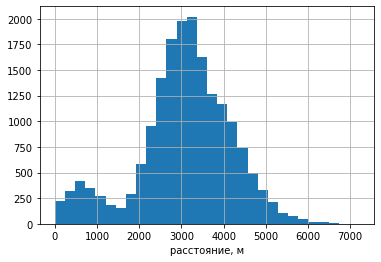
    


```python
rider['distance'].describe()
```


    count    18068.000000
    mean      3070.659976
    std       1116.831209
    min          0.855683
    25%       2543.226360
    50%       3133.609994
    75%       3776.222735
    max       7211.007745
    Name: distance, dtype: float64


В среднем было пройдено 3 км, но есть еще малый пик соответствующий поездки в среднем 500 м.

Потом рассмотрим время которое катались 


```python
rider['duration'].hist(bins=30)
plt.xlabel('время, мин')
```


    Text(0.5, 0, 'время, мин')


    
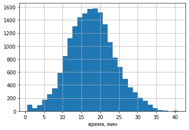
    


```python
rider['duration'].describe()
```


    count    18068.000000
    mean        17.805011
    std          6.091051
    min          0.500000
    25%         13.597563
    50%         17.678395
    75%         21.724800
    max         40.823963
    Name: duration, dtype: float64


В среднем 17,8 минут

<div class="alert alert-success">
<b>✔️ Комментарий ревьюера v1:</b>
<br>Тут всё верно
</div>

<div class="alert alert-danger">
<b>❌ Комментарий ревьюера v1:</b> 
<br>В конце каждого раздела, необходимо написать короткий промежуточный вывод. Проверь самостоятельно, чтобы дальше по проекту выводы были
</div>

Таким образом пользователи распределены достаточно равномерно между городами. В среднем они едут 3 км за 17,8 минут. Есть также расстояние в 500 м которое меньшая доля пользователей проежает.

<div class="alert alert-success">
<b>✔️ Комментарий ревьюера v2:</b>
<br>Правка выполнена 👍
</div>

#### Шаг 4. Объединение данных

Объединим все таблицы


```python
data=pd.merge(user,rider).merge(script)
```


```python
data.head()
```


<div>
<style scoped>
    .dataframe tbody tr th:only-of-type {
        vertical-align: middle;
    }

    .dataframe tbody tr th {
        vertical-align: top;
    }

    .dataframe thead th {
        text-align: right;
    }
</style>
<table border="1" class="dataframe">
  <thead>
    <tr style="text-align: right;">
      <th></th>
      <th>user_id</th>
      <th>name</th>
      <th>age</th>
      <th>city</th>
      <th>subscription_type</th>
      <th>distance</th>
      <th>duration</th>
      <th>date</th>
      <th>month</th>
      <th>minute_price</th>
      <th>start_ride_price</th>
      <th>subscription_fee</th>
    </tr>
  </thead>
  <tbody>
    <tr>
      <th>0</th>
      <td>1</td>
      <td>Кира</td>
      <td>22</td>
      <td>Тюмень</td>
      <td>ultra</td>
      <td>4409.919140</td>
      <td>25.599769</td>
      <td>2021-01-01</td>
      <td>1</td>
      <td>6</td>
      <td>0</td>
      <td>199</td>
    </tr>
    <tr>
      <th>1</th>
      <td>1</td>
      <td>Кира</td>
      <td>22</td>
      <td>Тюмень</td>
      <td>ultra</td>
      <td>2617.592153</td>
      <td>15.816871</td>
      <td>2021-01-18</td>
      <td>1</td>
      <td>6</td>
      <td>0</td>
      <td>199</td>
    </tr>
    <tr>
      <th>2</th>
      <td>1</td>
      <td>Кира</td>
      <td>22</td>
      <td>Тюмень</td>
      <td>ultra</td>
      <td>754.159807</td>
      <td>6.232113</td>
      <td>2021-04-20</td>
      <td>4</td>
      <td>6</td>
      <td>0</td>
      <td>199</td>
    </tr>
    <tr>
      <th>3</th>
      <td>1</td>
      <td>Кира</td>
      <td>22</td>
      <td>Тюмень</td>
      <td>ultra</td>
      <td>2694.783254</td>
      <td>18.511000</td>
      <td>2021-08-11</td>
      <td>8</td>
      <td>6</td>
      <td>0</td>
      <td>199</td>
    </tr>
    <tr>
      <th>4</th>
      <td>1</td>
      <td>Кира</td>
      <td>22</td>
      <td>Тюмень</td>
      <td>ultra</td>
      <td>4028.687306</td>
      <td>26.265803</td>
      <td>2021-08-28</td>
      <td>8</td>
      <td>6</td>
      <td>0</td>
      <td>199</td>
    </tr>
  </tbody>
</table>
</div>


теперь разделим таблицу на две части в зависимости от подписки 


```python
data_free=data.loc[data['subscription_type']=='free'].drop('subscription_type',axis=1).reset_index(drop=True)
```


```python
data_free.head()
```


<div>
<style scoped>
    .dataframe tbody tr th:only-of-type {
        vertical-align: middle;
    }

    .dataframe tbody tr th {
        vertical-align: top;
    }

    .dataframe thead th {
        text-align: right;
    }
</style>
<table border="1" class="dataframe">
  <thead>
    <tr style="text-align: right;">
      <th></th>
      <th>user_id</th>
      <th>name</th>
      <th>age</th>
      <th>city</th>
      <th>distance</th>
      <th>duration</th>
      <th>date</th>
      <th>month</th>
      <th>minute_price</th>
      <th>start_ride_price</th>
      <th>subscription_fee</th>
    </tr>
  </thead>
  <tbody>
    <tr>
      <th>0</th>
      <td>700</td>
      <td>Айдар</td>
      <td>22</td>
      <td>Омск</td>
      <td>2515.690719</td>
      <td>14.944286</td>
      <td>2021-01-02</td>
      <td>1</td>
      <td>8</td>
      <td>50</td>
      <td>0</td>
    </tr>
    <tr>
      <th>1</th>
      <td>700</td>
      <td>Айдар</td>
      <td>22</td>
      <td>Омск</td>
      <td>846.932642</td>
      <td>16.234663</td>
      <td>2021-02-01</td>
      <td>2</td>
      <td>8</td>
      <td>50</td>
      <td>0</td>
    </tr>
    <tr>
      <th>2</th>
      <td>700</td>
      <td>Айдар</td>
      <td>22</td>
      <td>Омск</td>
      <td>4004.434142</td>
      <td>20.016628</td>
      <td>2021-02-04</td>
      <td>2</td>
      <td>8</td>
      <td>50</td>
      <td>0</td>
    </tr>
    <tr>
      <th>3</th>
      <td>700</td>
      <td>Айдар</td>
      <td>22</td>
      <td>Омск</td>
      <td>1205.911290</td>
      <td>9.782872</td>
      <td>2021-02-10</td>
      <td>2</td>
      <td>8</td>
      <td>50</td>
      <td>0</td>
    </tr>
    <tr>
      <th>4</th>
      <td>700</td>
      <td>Айдар</td>
      <td>22</td>
      <td>Омск</td>
      <td>3047.379435</td>
      <td>17.427673</td>
      <td>2021-02-14</td>
      <td>2</td>
      <td>8</td>
      <td>50</td>
      <td>0</td>
    </tr>
  </tbody>
</table>
</div>


```python
data_ultra=data.loc[data['subscription_type']=='ultra'].drop('subscription_type',axis=1).reset_index(drop=True)
```


```python
data_ultra.head()
```


<div>
<style scoped>
    .dataframe tbody tr th:only-of-type {
        vertical-align: middle;
    }

    .dataframe tbody tr th {
        vertical-align: top;
    }

    .dataframe thead th {
        text-align: right;
    }
</style>
<table border="1" class="dataframe">
  <thead>
    <tr style="text-align: right;">
      <th></th>
      <th>user_id</th>
      <th>name</th>
      <th>age</th>
      <th>city</th>
      <th>distance</th>
      <th>duration</th>
      <th>date</th>
      <th>month</th>
      <th>minute_price</th>
      <th>start_ride_price</th>
      <th>subscription_fee</th>
    </tr>
  </thead>
  <tbody>
    <tr>
      <th>0</th>
      <td>1</td>
      <td>Кира</td>
      <td>22</td>
      <td>Тюмень</td>
      <td>4409.919140</td>
      <td>25.599769</td>
      <td>2021-01-01</td>
      <td>1</td>
      <td>6</td>
      <td>0</td>
      <td>199</td>
    </tr>
    <tr>
      <th>1</th>
      <td>1</td>
      <td>Кира</td>
      <td>22</td>
      <td>Тюмень</td>
      <td>2617.592153</td>
      <td>15.816871</td>
      <td>2021-01-18</td>
      <td>1</td>
      <td>6</td>
      <td>0</td>
      <td>199</td>
    </tr>
    <tr>
      <th>2</th>
      <td>1</td>
      <td>Кира</td>
      <td>22</td>
      <td>Тюмень</td>
      <td>754.159807</td>
      <td>6.232113</td>
      <td>2021-04-20</td>
      <td>4</td>
      <td>6</td>
      <td>0</td>
      <td>199</td>
    </tr>
    <tr>
      <th>3</th>
      <td>1</td>
      <td>Кира</td>
      <td>22</td>
      <td>Тюмень</td>
      <td>2694.783254</td>
      <td>18.511000</td>
      <td>2021-08-11</td>
      <td>8</td>
      <td>6</td>
      <td>0</td>
      <td>199</td>
    </tr>
    <tr>
      <th>4</th>
      <td>1</td>
      <td>Кира</td>
      <td>22</td>
      <td>Тюмень</td>
      <td>4028.687306</td>
      <td>26.265803</td>
      <td>2021-08-28</td>
      <td>8</td>
      <td>6</td>
      <td>0</td>
      <td>199</td>
    </tr>
  </tbody>
</table>
</div>


Из этих двух таблиц были удален столбец подписок и упорядочены индексы.

<div class="alert alert-warning">
<b>⚠️ Комментарий ревьюера v1:</b> 
<br>Не забывай проверять размерность таблиц после любых операций с ними (создание, срезы, объединение). Это позволит понять, ничего ли не потерялось при объединении
</div>


```python
data.info()
```

    <class 'pandas.core.frame.DataFrame'>
    Int64Index: 18068 entries, 0 to 18067
    Data columns (total 12 columns):
     #   Column             Non-Null Count  Dtype         
    ---  ------             --------------  -----         
     0   user_id            18068 non-null  int64         
     1   name               18068 non-null  object        
     2   age                18068 non-null  int64         
     3   city               18068 non-null  object        
     4   subscription_type  18068 non-null  object        
     5   distance           18068 non-null  float64       
     6   duration           18068 non-null  float64       
     7   date               18068 non-null  datetime64[ns]
     8   month              18068 non-null  int64         
     9   minute_price       18068 non-null  int64         
     10  start_ride_price   18068 non-null  int64         
     11  subscription_fee   18068 non-null  int64         
    dtypes: datetime64[ns](1), float64(2), int64(6), object(3)
    memory usage: 1.8+ MB


Посмотрим пройденное расстояние и время


```python
data_free['distance'].hist(bins=25)
plt.xlabel('расстояние, м')
plt.title('без подписки')
```


    Text(0.5, 1.0, 'без подписки')


    
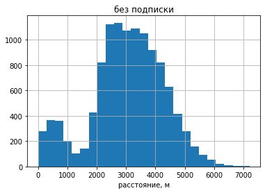
    


```python
data_free['distance'].describe()
```


    count    11568.000000
    mean      3045.495282
    std       1246.173806
    min          0.855683
    25%       2366.562689
    50%       3114.648465
    75%       3905.697894
    max       7211.007745
    Name: distance, dtype: float64


```python
data_ultra['distance'].hist(bins=25)
plt.xlabel('расстояние, м')
plt.title('с подпиской')
```


    Text(0.5, 1.0, 'с подпиской')


    
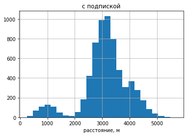
    


```python
data_ultra['distance'].describe()
```


    count    6500.000000
    mean     3115.445388
    std       836.895330
    min       244.210438
    25%      2785.444017
    50%      3148.637229
    75%      3560.574425
    max      5699.769662
    Name: distance, dtype: float64


Можно заметить, что поездок с подпиской в два раза меньше, чем с без неё.


```python
data_free['distance'].hist(bins=25)
data_ultra['distance'].hist(bins=25)
plt.legend(['без подписки','с подпиской'])
plt.xlabel('расстояние, м')
```


    Text(0.5, 0, 'расстояние, м')


    
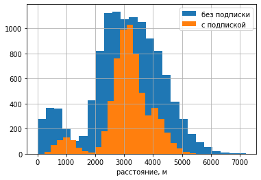
    


```python
data_free['duration'].hist(bins=25)
plt.xlabel('время, мин')
plt.title('без подписки')
```


    Text(0.5, 1.0, 'без подписки')


    
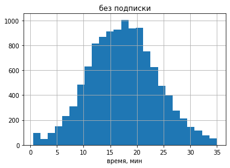
    


```python
data_free['duration'].describe()
```


    count    11568.000000
    mean        17.390909
    std          6.326803
    min          0.500000
    25%         12.958437
    50%         17.326890
    75%         21.594071
    max         34.948498
    Name: duration, dtype: float64


```python
data_ultra['duration'].hist(bins=25)
plt.xlabel('время, мин')
plt.title('с подпиской')
```


    Text(0.5, 1.0, 'с подпиской')


    
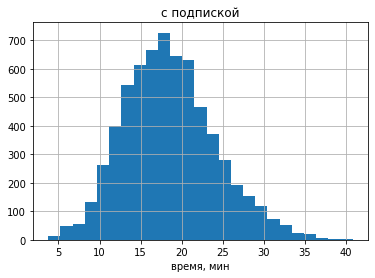
    


```python
data_ultra['duration'].describe()
```


    count    6500.000000
    mean       18.541985
    std         5.572048
    min         3.760353
    25%        14.524654
    50%        18.178153
    75%        21.884129
    max        40.823963
    Name: duration, dtype: float64


```python
data_free['duration'].hist(bins=25)
data_ultra['duration'].hist(bins=25)
plt.legend(['без подписки','с подпиской'])
plt.xlabel('время, мин')

```


    Text(0.5, 0, 'время, мин')


    
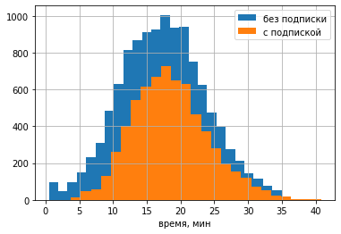
    


Люди с подпиской в среднем ездеют на 1 минуту больше чем без нее.

<div class="alert alert-success">
<b>✔️ Комментарий ревьюера v1:</b>
<br>Вывод верный!
</div>

<div class="alert alert-warning">
<b>⚠️ Комментарий ревьюера v1:</b> 
<br>Здесь можно было бы наложить графики распределений друг на друга, чтобы их было проще сравнить друг с другом
</div>

Можно сказать, что пользователи с подпиской какаются меньше, но дольше в среднем. Но эти утверждения надо проверить.

#### Шаг 5. Подсчёт выручки

Подсчитаем расстояние пройденное, количество поездок и суммарное время для каждого пользователя за каждый месяц

Запишем все в сводную таблицу


```python
data['duration']=np.ceil(data['duration'])
```

<div class="alert alert-success">
<b>✔️ Комментарий ревьюера v1:</b>
<br>Верно! Округлить длительности каждой поездки нужно до того, как ты перейдешь к расчетам revenue
</div>


```python
good_data=data.pivot_table(index=['user_id','name','month'],values=['distance','duration',
                                                                    'minute_price','start_ride_price','subscription_fee','subscription_type'],
                           aggfunc={'distance':['sum','count'],'duration':'sum','minute_price':'first','start_ride_price':'first',
                                    'subscription_fee':'first','subscription_type':'first'
                                   })

```


```python
good_data.head()
```


<div>
<style scoped>
    .dataframe tbody tr th:only-of-type {
        vertical-align: middle;
    }

    .dataframe tbody tr th {
        vertical-align: top;
    }

    .dataframe thead tr th {
        text-align: left;
    }

    .dataframe thead tr:last-of-type th {
        text-align: right;
    }
</style>
<table border="1" class="dataframe">
  <thead>
    <tr>
      <th></th>
      <th></th>
      <th></th>
      <th colspan="2" halign="left">distance</th>
      <th>duration</th>
      <th>minute_price</th>
      <th>start_ride_price</th>
      <th>subscription_fee</th>
      <th>subscription_type</th>
    </tr>
    <tr>
      <th></th>
      <th></th>
      <th></th>
      <th>count</th>
      <th>sum</th>
      <th>sum</th>
      <th>first</th>
      <th>first</th>
      <th>first</th>
      <th>first</th>
    </tr>
    <tr>
      <th>user_id</th>
      <th>name</th>
      <th>month</th>
      <th></th>
      <th></th>
      <th></th>
      <th></th>
      <th></th>
      <th></th>
      <th></th>
    </tr>
  </thead>
  <tbody>
    <tr>
      <th rowspan="5" valign="top">1</th>
      <th rowspan="5" valign="top">Кира</th>
      <th>1</th>
      <td>2</td>
      <td>7027.511294</td>
      <td>42.0</td>
      <td>6</td>
      <td>0</td>
      <td>199</td>
      <td>ultra</td>
    </tr>
    <tr>
      <th>4</th>
      <td>1</td>
      <td>754.159807</td>
      <td>7.0</td>
      <td>6</td>
      <td>0</td>
      <td>199</td>
      <td>ultra</td>
    </tr>
    <tr>
      <th>8</th>
      <td>2</td>
      <td>6723.470560</td>
      <td>46.0</td>
      <td>6</td>
      <td>0</td>
      <td>199</td>
      <td>ultra</td>
    </tr>
    <tr>
      <th>10</th>
      <td>2</td>
      <td>5809.911100</td>
      <td>32.0</td>
      <td>6</td>
      <td>0</td>
      <td>199</td>
      <td>ultra</td>
    </tr>
    <tr>
      <th>11</th>
      <td>3</td>
      <td>7003.499363</td>
      <td>56.0</td>
      <td>6</td>
      <td>0</td>
      <td>199</td>
      <td>ultra</td>
    </tr>
  </tbody>
</table>
</div>


```python
good_data.info()
```

    <class 'pandas.core.frame.DataFrame'>
    MultiIndex: 11331 entries, (1, 'Кира', 1) to (1534, 'Альберт', 12)
    Data columns (total 7 columns):
     #   Column                      Non-Null Count  Dtype  
    ---  ------                      --------------  -----  
     0   (distance, count)           11331 non-null  int64  
     1   (distance, sum)             11331 non-null  float64
     2   (duration, sum)             11331 non-null  float64
     3   (minute_price, first)       11331 non-null  int64  
     4   (start_ride_price, first)   11331 non-null  int64  
     5   (subscription_fee, first)   11331 non-null  int64  
     6   (subscription_type, first)  11331 non-null  object 
    dtypes: float64(2), int64(4), object(1)
    memory usage: 688.7+ KB


```python
good_data['price']=good_data['subscription_fee','first']+good_data['minute_price','first']*good_data['duration','sum']+good_data['start_ride_price','first']*good_data['distance','count']
```


```python

good_data.head()
```


<div>
<style scoped>
    .dataframe tbody tr th:only-of-type {
        vertical-align: middle;
    }

    .dataframe tbody tr th {
        vertical-align: top;
    }

    .dataframe thead tr th {
        text-align: left;
    }

    .dataframe thead tr:last-of-type th {
        text-align: right;
    }
</style>
<table border="1" class="dataframe">
  <thead>
    <tr>
      <th></th>
      <th></th>
      <th></th>
      <th colspan="2" halign="left">distance</th>
      <th>duration</th>
      <th>minute_price</th>
      <th>start_ride_price</th>
      <th>subscription_fee</th>
      <th>subscription_type</th>
      <th>price</th>
    </tr>
    <tr>
      <th></th>
      <th></th>
      <th></th>
      <th>count</th>
      <th>sum</th>
      <th>sum</th>
      <th>first</th>
      <th>first</th>
      <th>first</th>
      <th>first</th>
      <th></th>
    </tr>
    <tr>
      <th>user_id</th>
      <th>name</th>
      <th>month</th>
      <th></th>
      <th></th>
      <th></th>
      <th></th>
      <th></th>
      <th></th>
      <th></th>
      <th></th>
    </tr>
  </thead>
  <tbody>
    <tr>
      <th rowspan="5" valign="top">1</th>
      <th rowspan="5" valign="top">Кира</th>
      <th>1</th>
      <td>2</td>
      <td>7027.511294</td>
      <td>42.0</td>
      <td>6</td>
      <td>0</td>
      <td>199</td>
      <td>ultra</td>
      <td>451.0</td>
    </tr>
    <tr>
      <th>4</th>
      <td>1</td>
      <td>754.159807</td>
      <td>7.0</td>
      <td>6</td>
      <td>0</td>
      <td>199</td>
      <td>ultra</td>
      <td>241.0</td>
    </tr>
    <tr>
      <th>8</th>
      <td>2</td>
      <td>6723.470560</td>
      <td>46.0</td>
      <td>6</td>
      <td>0</td>
      <td>199</td>
      <td>ultra</td>
      <td>475.0</td>
    </tr>
    <tr>
      <th>10</th>
      <td>2</td>
      <td>5809.911100</td>
      <td>32.0</td>
      <td>6</td>
      <td>0</td>
      <td>199</td>
      <td>ultra</td>
      <td>391.0</td>
    </tr>
    <tr>
      <th>11</th>
      <td>3</td>
      <td>7003.499363</td>
      <td>56.0</td>
      <td>6</td>
      <td>0</td>
      <td>199</td>
      <td>ultra</td>
      <td>535.0</td>
    </tr>
  </tbody>
</table>
</div>


Столюец price это сумма потраченная в месяц одним из пользователей.


```python
good_data['price'].hist(bins=20)
plt.xlabel('выручка с одного человека за месяц')

```


    Text(0.5, 0, 'выручка с одного человека за месяц')


    
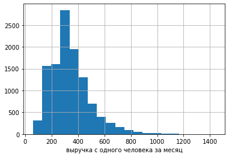
    


```python
good_data['price'].describe()
```


    count    11331.000000
    mean       342.303504
    std        153.875346
    min         58.000000
    25%        234.000000
    50%        319.000000
    75%        415.000000
    max       1444.000000
    Name: price, dtype: float64


<div class="alert alert-success">
<b>✔️ Комментарий ревьюера v1:</b>
<br>Выручка расчитана верно!
</div>

В среднем выручка за месяц состовляет 320-340. Больше половины пользователей тратят в интервале 230-420 за месяц

#### Шаг 6. Проверка гипотез

Проверим утверждение, что пользователи с подпиской тратят больше времени, чем без неё на поездки.


```python
data_free['duration'].median()
```


    17.326890226082043


```python
data_ultra['duration'].median()
```


    18.17815320055055


В качестве нулевой гипотезы примем, что истиные средние значения времени с и без подписки равны.

Альтернативная гипотеза заключаетмся в том, что истинное среднее время которое катаются льди с подпиской больше истинногго среднего времени которое катаются люди без подписки.


```python
result=st.ttest_ind(data_ultra['duration'],data_free['duration'],equal_var=False,alternative='greater')
```


```python
result.pvalue
```


    5.6757813771289775e-37


<div class="alert alert-danger">
<b>❌ Комментарий ревьюера v1:</b> 
<br>Вопрос в задании звучит как "Важно понять, тратят ли пользователи с подпиской больше времени на поездки?" Следовательно правильнее будет использовать параметр alternative='greater'. Альтернативную гипотезу нужны будет поправить соотвествующим образом. Также нужно поменять выборки местами
</div>

Это очень маленькое число, поэтому опровергаем нулевую гипотезу

<div class="alert alert-success">
<b>✔️ Комментарий ревьюера v2:</b>
<br>Правка выполнена 👍
</div>

Люди с подпиской катаются дольше чем без неё.

Проверим как является ли расстояние 3130 м оптимальным.

<div class="alert alert-danger">
<b>❌ Комментарий ревьюера v1:</b> 
<br>Перед расчетами необходимо сформулировать нулевую и альтернативную гипотезу. H₀(нулевую гипотезу) нужно формулировать так, чтобы использовать знак равенства "=". 
</div>

<div class="alert alert-success">
<b>✔️ Комментарий ревьюера v2:</b>
<br>Правка выполнена 👍
</div>

    Для ее проверки введем 
    нулевую гипотезу, что истинное среднее расстояние которое поежает пользователь с подпиской равно 3130 м,
    а альтернативная, что истинное среднее расстояние которое поежает пользователь с подпиской больше 3130


```python
st.ttest_1samp(data_ultra['distance'],3130,alternative='greater').pvalue
```


    0.9195368847849785


Это больше 0.05. Следовательно нулевая гипотеза не опровергается и  будем считать что среднее знечение не больше чем 3130 м

Теперь рассмотрим, как подписка влияет на доход. Считается что больше тратят в месяц те у кого подписка. Это будем считать альтернативной гипотезой. А нулевой будет их равенство


```python
pu=good_data[(good_data['subscription_type','first']=='ultra')]['price']# месячные траты с подпиской
pf=good_data[(good_data['subscription_type','first']=='free')]['price']# месячные траты с подпискойи
```


```python
print(pu.median(),pf.median())
```

    337.0 274.0


```python
st.ttest_ind(pu,pf,equal_var=False,alternative='greater').pvalue
```


    8.874140893976874e-40


Это очень маленькое число и это значит что нулевая гипотеза опровергнута

<div class="alert alert-danger">
<b>❌ Комментарий ревьюера v1:</b> 
<br>В данном случае тоже нужно использовать параметр alternative='greater', соотвественно и альтернативную гипотезу нужно сформулировать подходящим образом
</div>

<div class="alert alert-success">
<b>✔️ Комментарий ревьюера v2:</b>
<br>Правка выполнена 👍
</div>

Люди с подпиской тратят больше

Представьте такую ситуацию: техническая команда сервиса обновила сервера, с которыми взаимодействует мобильное приложение. Она надеется, что из-за этого количество обращений в техподдержку значимо снизилось. Некоторый файл содержит для каждого пользователя данные о количестве обращений до обновления и после него. Какой тест вам понадобился бы для проверки этой гипотезы?

Для проверки гипотезы понадобится односторонний тест ttest_rel

<div class="alert alert-success">
<b>✔️ Комментарий ревьюера v1:</b>
<br>Метод выбран верно!
</div>

#### Шаг 7. Распределения

Отделу маркетинга GoFast поставили задачу: нужно провести акцию с раздачей промокодов на один бесплатный месяц подписки, в рамках которой как минимум 100 существующих клиентов должны продлить эту подписку. То есть по завершении периода действия подписки пользователь может либо отказаться от неё, либо продлить, совершив соответствующий платёж. 
Эта акция уже проводилась ранее и по итогу выяснилось, что после бесплатного пробного периода подписку продлевают 10 % пользователей. Выясните, какое минимальное количество промокодов нужно разослать, чтобы вероятность не выполнить план была примерно 5 %. 

Перед нами примерн биноминального распределения. Вероятность одного события равна p=0.1

Пусть у нас N промокодов. N больше 100 и целое. Вероятность того, что произошло не более 100 событий (продление подписки) с вероятность 10% определяется кумулятивной функцией биноминального распределения. 


```python
k=100
n=101
p=0.1
while st.binom.cdf(k,n,p)>0.05:
    n=n+1
n
    

```


    1172


```python
st.binom.cdf(k,n,p)
```


    0.04954795210203071


Таким образом уже при 1172 промокодов вероятность срыва плана не более 5% 

В качестве доказательства приведен график распределения


```python
x=list(range(n+1))
y=[st.binom.pmf(r, n, p) for r in x ]
plt.plot(x,y)
plt.title('биноминальное распределение')
plt.xlabel('количество продленных подписок')
plt.ylabel('плотность вероятности')
plt.show()
n
```

    /opt/conda/lib/python3.9/site-packages/scipy/stats/_discrete_distns.py:78: RuntimeWarning: divide by zero encountered in _binom_pdf
      return _boost._binom_pdf(x, n, p)


    
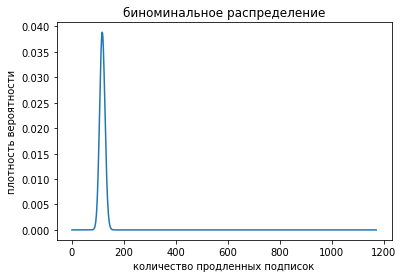
    


    1172


 Отдел маркетинга рассылает клиентам push-уведомления в мобильном приложении. Клиенты могут открыть его или не открывать. Известно, что уведомления открывают около 
40 % получивших клиентов. Отдел планирует разослать 1 млн уведомлений. С помощью аппроксимации постройте примерный график распределения и оцените вероятность того, что уведомление откроют не более  399,5 тыс. пользователей.

Переднами биноминальное распределения. У него следующие параметры.


```python
n=1e6
k=399500
p=0.4
```

Но так как n большое, то можно апроксимировать его нормальным распределением.


```python
u=n*p # математическое ожидание
s=sqrt(n*p*(1-p)) # среднеквадратичное отклонение
u,s
```


    (400000.0, 489.89794855663564)


построим график этого распределения


```python
x=np.arange(0,n+1)
plt.plot (x, st.norm.pdf (x, u, s))
plt.title('биноминальное распределение')
plt.xlabel('количество продленных подписок')
plt.ylabel('плотность вероятности')
plt.show()
```


    
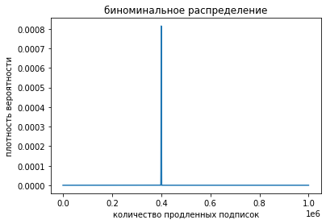
    


```python
st.norm.cdf (k, u, s)
```


    0.15371708296369768


вероятность 15,4%

<div class="alert alert-success">
<b>✔️ Комментарий ревьюера v1:</b>
<br>Дополнительное задание выполнено верно!
</div>

### Вывод

    1.Изначально был получено три файла: пользователи (1565 строк), поездки (18068 строк) и подписки (2 строки). Ни в одном из них не было пропусков. Было обнаружено, что в файле о поездках дата указана как object, и надо перевести их в формат datetime64. Все даты соответствуют 2021 году. В отдельном столбце был записан месяц поездки. В файле о пользователях было 31 дубликат. Они были удалены. В других файлов дубликатов не обнаружено. В дальнейшем был проведен анализ данных.
    2. Было определено, сколько пользователей в каждом из город. Их количество больше 150 но меньше 250 человек в каждом городе. 835 человек не пользуются подпиской, а 699 пользуются. Каких-то странных подписок не было обнаружено.Средний возраст состоявяет 25 лет. Половина всех пользователей имеет возраст от 20 до 30 лет. В среднем было пройдено 3 км, а катались 17 минут, но есть еще малый пик соответствующий поездки в среднем 500 м.
     3. После объединения таблиц били изучены поездки с подпиской и без неё. Было обнаружено что средее время и дистанция поезки с подпиской состовляют 18,5 минут и 3115 метров соответственно. Без - 17,4 минуты и 3045 метров сооттвественно. На глаз поездок без подписки как минимум в 2 раза больше чем с подпиской. В дальнейщем было проведено более серьезное исследование. Из него выяснено, что пользователи с подпиской катаются дольше чем пользователи без неё. В среднем подписанные пользователи катаются не более 3130 м.
     4. В дальнейщем были вычислены потраченные на поездки деньги за каждый месяц для каждого пользователя. В среднем тратили 342 за месяц. Анализ показал, что люди без подписки тратят в месяц меньше, чем те у кого подписка. В среднем с подпиской люди тратят 337, а без нее 247 в месяц.
     5. Для проверки гипотезы о влиянии обновленного сервиса понадобится односторонний тест ttest_rel.
     6. Было также исполнены дополнительные задания. В первом было найдено минимальное количество промокодов (1172) при котором более 100 человек продлят подписку с вероятностью 95%. Во втором найдена вероятность открытия не более 399,5 тыс. пользователей.

<div class="alert alert-danger">
<b>❌ Итоговый комментарий ревьюера v1:</b> 
<br>Необходимо поправить:
<br>- добавить описание задачи в начале проекта
<br>- проверить наличие подписей у каждого графика
<br>- добавить таблицу частотности городов в задании 3.1
<br>- отобразить долю каждой группы пользователей
<br>- проверить наличие вывода после каждого раздела
<br>- корректно выполнить шаг 6

<br>После всех внесённых правок не забудь поправить выводы там, где это необходимо
</div>

<div class="alert alert-danger">
<b>❌ Итоговый комментарий ревьюера v2:</b> 
<br>Необходимо поправить:
<br>- добавить описание задачи в начале проекта
<br>- проверить наличие подписей у каждого графика

</div>

<div class="alert alert-success">
<b>✔️ Итоговый комментарий ревьюера v3:</b>
<br>Все правки выполнены. Молодец!
<br>Я рад был поработать над проверкой твоей работы) В качестве дополнительного материала для изучения могу порекомендовать следующие материалы:

    Курс "Вероятность и статистика" | Глеб Михайлов (free): https://www.youtube.com/playlist?list=PLQJ7ptkRY-xbHLLI66KdscKp_FJt0FsIi

    Методы обнаружения выбросов: https://youtu.be/TOK7Kq7x0yc

<br>Поздравляю со сдачей проекта и желаю удачи в дальнейшем обучении! 😉    
</div>
