<font color='blue' size=5><b>Комментарий ментора</b></font>

<font color='blue'>Здравствуй, Евгений! Это Демин Вячеслав. Мы делаем очень классный проект, давайте смотреть, что получилось.
<br> Если ты не против, давай перейдем на "ты". Согласен?
    
<font color='blue'>Я буду использовать различные цвета и знаки, чтобы было удобнее воспринимать мои комментарии:</font>


---


<font color='blue'>Синий текст - просто текст комментария</font>

<font color='green'> ✔️Зеленый текст - все отлично</font>

<font color='darkorange'>⚠️Оранжевый текст - есть рекомендации, на что стоит обратить внимание</font>

<font color='crimson'> ❌Красный текст - есть недочеты</font>

---

<font color='blue'><b>Прошу не удалять и перемещать мои комментарии, каждый следующий проект должен включать предыдущий со всем комментариями.</b></font>

<font color='blue'>Твои комментарии можно помечать так:
    
<b>Комментарий студента: ...</b></font>

<font color='blue' size=5><b>Комментарий ментора V2</b></font>
<font color='blue'><br>Новые комментарии буду вести с меткой V2.
<br> Спасибо, что учел замечания, я буду оставлять новые комментарии ниже старых. Старые выполненные буду зачеркивать <strike>так</strike>.</font>

<font color='blue' size=5><b>Комментарий ментора V3</b></font>
<font color='blue'><br>Посмотрим, что у нас получилось

# Описание проекта: промышленность
Чтобы оптимизировать производственные расходы, металлургический комбинат «Стальная птица» решил уменьшить потребление электроэнергии на этапе обработки стали. Для этого комбинату нужно контролировать температуру сплава. Ваша задача — построить модель, которая будет её предсказывать. 
Заказчик хочет использовать разработанную модель для имитации технологического процесса. Ниже расскажем о деталях этого процесса. Их важно знать, прежде чем генерировать новые признаки.
Описание этапа обработки
Сталь обрабатывают в металлическом ковше вместимостью около 100 тонн. Чтобы ковш выдерживал высокие температуры, изнутри его облицовывают огнеупорным кирпичом. Расплавленную сталь заливают в ковш и подогревают до нужной температуры графитовыми электродами. Они установлены в крышке ковша. 
Из сплава выводится сера (этот процесс — десульфурация), добавлением примесей корректируется химический состав и отбираются пробы. Сталь легируют — изменяют её состав — подавая куски сплава из бункера для сыпучих материалов или проволоку через специальный трайб-аппарат (от англ. tribe — «масса»).
Перед тем как первый раз ввести легирующие добавки, измеряют температуру стали и производят её химический анализ. Потом температуру на несколько минут повышают, добавляют легирующие материалы и продувают сплав инертным газом. Затем его перемешивают и снова проводят измерения. Такой цикл повторяется до достижения целевого химического состава и оптимальной температуры плавки.
Тогда расплавленная сталь отправляется на доводку металла или поступает в машину непрерывной разливки. Оттуда готовый продукт выходит в виде заготовок-слябов (от англ. slab — «плита»).
# Описание данных
Данные состоят из нескольких файлов, полученных из разных источников:
* data_arc_new.csv — данные об электродах:
** key — номер партии;
** Начало нагрева дугой — время начала нагрева;
** Конец нагрева дугой — время окончания нагрева;
** Активная мощность — значение активной мощности;
** Реактивная мощность — значение реактивной мощности.
* data_bulk_new.csv — данные о подаче сыпучих материалов (объём):
** key — номер партии;
** Bulk 1 … Bulk 15 — объём подаваемого материала.
* data_bulk_time_new.csv — данные о подаче сыпучих материалов (время):
** key — номер партии;
** Bulk 1 … Bulk 15 — время подачи материала.
* data_gas_new.csv — данные о продувке сплава газом:
** key — номер партии;
** Газ 1 — объём подаваемого газа.
* data_temp_new.csv — результаты измерения температуры:
** key — номер партии;
** Время замера — время замера;
** Температура — значение температуры.
* data_wire_new.csv — данные о проволочных материалах (объём):
** key — номер партии;
** Wire 1 … Wire 9 — объём подаваемых проволочных материалов.
* data_wire_time_new.csv — данные о проволочных материалах (время):
** key — номер партии;
** Wire 1 … Wire 9 — время подачи проволочных материалов.

# План работы

* Шаг 1. Загрузка данных
Загрузите данные и выполните их первичный осмотр.
* Шаг 2. Исследовательский анализ и предобработка данных
Выполните исследовательский анализ каждого датафрейма и при необходимости выполните предобработку. Сделайте выводы об имеющихся признаках: понадобятся ли они для обучения моделей.
* Шаг 3. Объединение данных
Объедините выбранные вами признаки в один датафрейм по ключу.
* Шаг 4. Исследовательский анализ и предобработка данных объединённого датафрейма
Выполните исследовательский анализ объединённого датафрейма, визуализируйте распределения признаков и при необходимости выполните предобработку. Проведите корреляционный анализ. Напоминаем, что вы можете использовать не только имеющиеся признаки, но и генерировать новые.
* Шаг 5. Подготовка данных
Выполните подготовку данных для обучения модели. Разделите данные на две выборки, при масштабировании и кодировании учитывайте особенности данных и моделей.
* Шаг 6. Обучение моделей машинного обучения
Обучите как минимум две модели. Хотя бы для одной из них подберите как минимум два гиперпараметра.
* Шаг 7. Выбор лучшей модели
Выберите лучшую модель и проверьте её качество на тестовой выборке.
* Шаг 8. Общий вывод и рекомендации заказчику
Сделайте общий вывод о проделанной работе: опишите основные этапы работы, полученные результаты и дайте рекомендации для бизнеса.

<font color='blue'><b>Комментарий ментора</b></font><strike>
<br><font color='crimson'> ❌ У проекта должно быть название, описание процесса и описание данных. Заказчик будет изучать тетрадку


```python
from IPython.core.display import display, HTML
display(HTML("<style>.container { width:90% !important; }</style>"))
```


<style>.container { width:90% !important; }</style>


## загрузка данных


```python
# загружаем пипы
!pip install shap -q
!pip install phik  -q
!pip install matplotlib==3.5.0 -q
!pip install scikit-learn==1.3.2 -q
!pip install catboost --q
!pip install lightgbm --q
```


```python
# загрузка бибилотект
import pandas as pd
import numpy as np 
from math import atan, pi
from matplotlib import pyplot as plt
import datetime as dt
import seaborn as sns
import shap

from sklearn.model_selection import train_test_split, RandomizedSearchCV, cross_val_score
from sklearn.pipeline import Pipeline
from sklearn.preprocessing import MinMaxScaler, StandardScaler

from sklearn.metrics import mean_absolute_error
from sklearn.linear_model import LinearRegression, Ridge
from sklearn.tree import DecisionTreeRegressor
from sklearn.ensemble import RandomForestRegressor
from catboost import CatBoostRegressor
from lightgbm import LGBMRegressor
from sklearn.dummy import DummyRegressor
import warnings
warnings.filterwarnings("ignore")
```


```python
# загрузка  данных об электродах
arc=pd.read_csv('/datasets/data_arc_new.csv')
```


```python
arc.info()
```

    <class 'pandas.core.frame.DataFrame'>
    RangeIndex: 14876 entries, 0 to 14875
    Data columns (total 5 columns):
     #   Column                Non-Null Count  Dtype  
    ---  ------                --------------  -----  
     0   key                   14876 non-null  int64  
     1   Начало нагрева дугой  14876 non-null  object 
     2   Конец нагрева дугой   14876 non-null  object 
     3   Активная мощность     14876 non-null  float64
     4   Реактивная мощность   14876 non-null  float64
    dtypes: float64(2), int64(1), object(2)
    memory usage: 581.2+ KB


```python
arc.head(2)
```


<div>
<style scoped>
    .dataframe tbody tr th:only-of-type {
        vertical-align: middle;
    }

    .dataframe tbody tr th {
        vertical-align: top;
    }

    .dataframe thead th {
        text-align: right;
    }
</style>
<table border="1" class="dataframe">
  <thead>
    <tr style="text-align: right;">
      <th></th>
      <th>key</th>
      <th>Начало нагрева дугой</th>
      <th>Конец нагрева дугой</th>
      <th>Активная мощность</th>
      <th>Реактивная мощность</th>
    </tr>
  </thead>
  <tbody>
    <tr>
      <th>0</th>
      <td>1</td>
      <td>2019-05-03 11:02:14</td>
      <td>2019-05-03 11:06:02</td>
      <td>0.305130</td>
      <td>0.211253</td>
    </tr>
    <tr>
      <th>1</th>
      <td>1</td>
      <td>2019-05-03 11:07:28</td>
      <td>2019-05-03 11:10:33</td>
      <td>0.765658</td>
      <td>0.477438</td>
    </tr>
  </tbody>
</table>
</div>


В данных о электродах пропусков не обнаружено. 


```python
# загрузка  данных об объеме подаче сыпучих материалов
bulk=pd.read_csv('/datasets/data_bulk_new.csv')
```


```python
bulk.info()
```

    <class 'pandas.core.frame.DataFrame'>
    RangeIndex: 3129 entries, 0 to 3128
    Data columns (total 16 columns):
     #   Column   Non-Null Count  Dtype  
    ---  ------   --------------  -----  
     0   key      3129 non-null   int64  
     1   Bulk 1   252 non-null    float64
     2   Bulk 2   22 non-null     float64
     3   Bulk 3   1298 non-null   float64
     4   Bulk 4   1014 non-null   float64
     5   Bulk 5   77 non-null     float64
     6   Bulk 6   576 non-null    float64
     7   Bulk 7   25 non-null     float64
     8   Bulk 8   1 non-null      float64
     9   Bulk 9   19 non-null     float64
     10  Bulk 10  176 non-null    float64
     11  Bulk 11  177 non-null    float64
     12  Bulk 12  2450 non-null   float64
     13  Bulk 13  18 non-null     float64
     14  Bulk 14  2806 non-null   float64
     15  Bulk 15  2248 non-null   float64
    dtypes: float64(15), int64(1)
    memory usage: 391.2 KB


```python
bulk.head(2)
```


<div>
<style scoped>
    .dataframe tbody tr th:only-of-type {
        vertical-align: middle;
    }

    .dataframe tbody tr th {
        vertical-align: top;
    }

    .dataframe thead th {
        text-align: right;
    }
</style>
<table border="1" class="dataframe">
  <thead>
    <tr style="text-align: right;">
      <th></th>
      <th>key</th>
      <th>Bulk 1</th>
      <th>Bulk 2</th>
      <th>Bulk 3</th>
      <th>Bulk 4</th>
      <th>Bulk 5</th>
      <th>Bulk 6</th>
      <th>Bulk 7</th>
      <th>Bulk 8</th>
      <th>Bulk 9</th>
      <th>Bulk 10</th>
      <th>Bulk 11</th>
      <th>Bulk 12</th>
      <th>Bulk 13</th>
      <th>Bulk 14</th>
      <th>Bulk 15</th>
    </tr>
  </thead>
  <tbody>
    <tr>
      <th>0</th>
      <td>1</td>
      <td>NaN</td>
      <td>NaN</td>
      <td>NaN</td>
      <td>43.0</td>
      <td>NaN</td>
      <td>NaN</td>
      <td>NaN</td>
      <td>NaN</td>
      <td>NaN</td>
      <td>NaN</td>
      <td>NaN</td>
      <td>206.0</td>
      <td>NaN</td>
      <td>150.0</td>
      <td>154.0</td>
    </tr>
    <tr>
      <th>1</th>
      <td>2</td>
      <td>NaN</td>
      <td>NaN</td>
      <td>NaN</td>
      <td>73.0</td>
      <td>NaN</td>
      <td>NaN</td>
      <td>NaN</td>
      <td>NaN</td>
      <td>NaN</td>
      <td>NaN</td>
      <td>NaN</td>
      <td>206.0</td>
      <td>NaN</td>
      <td>149.0</td>
      <td>154.0</td>
    </tr>
  </tbody>
</table>
</div>


Наблюдаются многочисленные пропуски, которые скорее всего обозначают отсутствие подачи материала, но все ключи (номера патрий) на месте.


```python
# загрузка  данных об времени подаче сыпучих материалов
bulk_time=pd.read_csv('/datasets/data_bulk_time_new.csv')
```


```python
bulk_time.info()
```

    <class 'pandas.core.frame.DataFrame'>
    RangeIndex: 3129 entries, 0 to 3128
    Data columns (total 16 columns):
     #   Column   Non-Null Count  Dtype 
    ---  ------   --------------  ----- 
     0   key      3129 non-null   int64 
     1   Bulk 1   252 non-null    object
     2   Bulk 2   22 non-null     object
     3   Bulk 3   1298 non-null   object
     4   Bulk 4   1014 non-null   object
     5   Bulk 5   77 non-null     object
     6   Bulk 6   576 non-null    object
     7   Bulk 7   25 non-null     object
     8   Bulk 8   1 non-null      object
     9   Bulk 9   19 non-null     object
     10  Bulk 10  176 non-null    object
     11  Bulk 11  177 non-null    object
     12  Bulk 12  2450 non-null   object
     13  Bulk 13  18 non-null     object
     14  Bulk 14  2806 non-null   object
     15  Bulk 15  2248 non-null   object
    dtypes: int64(1), object(15)
    memory usage: 391.2+ KB


```python
bulk_time.head(2)
```


<div>
<style scoped>
    .dataframe tbody tr th:only-of-type {
        vertical-align: middle;
    }

    .dataframe tbody tr th {
        vertical-align: top;
    }

    .dataframe thead th {
        text-align: right;
    }
</style>
<table border="1" class="dataframe">
  <thead>
    <tr style="text-align: right;">
      <th></th>
      <th>key</th>
      <th>Bulk 1</th>
      <th>Bulk 2</th>
      <th>Bulk 3</th>
      <th>Bulk 4</th>
      <th>Bulk 5</th>
      <th>Bulk 6</th>
      <th>Bulk 7</th>
      <th>Bulk 8</th>
      <th>Bulk 9</th>
      <th>Bulk 10</th>
      <th>Bulk 11</th>
      <th>Bulk 12</th>
      <th>Bulk 13</th>
      <th>Bulk 14</th>
      <th>Bulk 15</th>
    </tr>
  </thead>
  <tbody>
    <tr>
      <th>0</th>
      <td>1</td>
      <td>NaN</td>
      <td>NaN</td>
      <td>NaN</td>
      <td>2019-05-03 11:28:48</td>
      <td>NaN</td>
      <td>NaN</td>
      <td>NaN</td>
      <td>NaN</td>
      <td>NaN</td>
      <td>NaN</td>
      <td>NaN</td>
      <td>2019-05-03 11:24:31</td>
      <td>NaN</td>
      <td>2019-05-03 11:14:50</td>
      <td>2019-05-03 11:10:43</td>
    </tr>
    <tr>
      <th>1</th>
      <td>2</td>
      <td>NaN</td>
      <td>NaN</td>
      <td>NaN</td>
      <td>2019-05-03 11:36:50</td>
      <td>NaN</td>
      <td>NaN</td>
      <td>NaN</td>
      <td>NaN</td>
      <td>NaN</td>
      <td>NaN</td>
      <td>NaN</td>
      <td>2019-05-03 11:53:30</td>
      <td>NaN</td>
      <td>2019-05-03 11:48:37</td>
      <td>2019-05-03 11:44:39</td>
    </tr>
  </tbody>
</table>
</div>


Наблюдаются многочисленные пропуски, которые скорее всего обозначают отсутствие подачи материала, но все ключи (номера патрий) на месте.


```python
# загрузка  данных об продувки инертного газа
gas=pd.read_csv('/datasets/data_gas_new.csv')
```


```python
gas.info()
```

    <class 'pandas.core.frame.DataFrame'>
    RangeIndex: 3239 entries, 0 to 3238
    Data columns (total 2 columns):
     #   Column  Non-Null Count  Dtype  
    ---  ------  --------------  -----  
     0   key     3239 non-null   int64  
     1   Газ 1   3239 non-null   float64
    dtypes: float64(1), int64(1)
    memory usage: 50.7 KB


```python
gas.head(2)
```


<div>
<style scoped>
    .dataframe tbody tr th:only-of-type {
        vertical-align: middle;
    }

    .dataframe tbody tr th {
        vertical-align: top;
    }

    .dataframe thead th {
        text-align: right;
    }
</style>
<table border="1" class="dataframe">
  <thead>
    <tr style="text-align: right;">
      <th></th>
      <th>key</th>
      <th>Газ 1</th>
    </tr>
  </thead>
  <tbody>
    <tr>
      <th>0</th>
      <td>1</td>
      <td>29.749986</td>
    </tr>
    <tr>
      <th>1</th>
      <td>2</td>
      <td>12.555561</td>
    </tr>
  </tbody>
</table>
</div>


пропусков не наблюдается


```python
# загрузка  данных об температуре
temp=pd.read_csv('/datasets/data_temp_new.csv')
```


```python
temp.info()
```

    <class 'pandas.core.frame.DataFrame'>
    RangeIndex: 18092 entries, 0 to 18091
    Data columns (total 3 columns):
     #   Column        Non-Null Count  Dtype  
    ---  ------        --------------  -----  
     0   key           18092 non-null  int64  
     1   Время замера  18092 non-null  object 
     2   Температура   14665 non-null  float64
    dtypes: float64(1), int64(1), object(1)
    memory usage: 424.2+ KB


```python
temp.head(2)
```


<div>
<style scoped>
    .dataframe tbody tr th:only-of-type {
        vertical-align: middle;
    }

    .dataframe tbody tr th {
        vertical-align: top;
    }

    .dataframe thead th {
        text-align: right;
    }
</style>
<table border="1" class="dataframe">
  <thead>
    <tr style="text-align: right;">
      <th></th>
      <th>key</th>
      <th>Время замера</th>
      <th>Температура</th>
    </tr>
  </thead>
  <tbody>
    <tr>
      <th>0</th>
      <td>1</td>
      <td>2019-05-03 11:02:04</td>
      <td>1571.0</td>
    </tr>
    <tr>
      <th>1</th>
      <td>1</td>
      <td>2019-05-03 11:07:18</td>
      <td>1604.0</td>
    </tr>
  </tbody>
</table>
</div>


никаких пропусков нет.


```python
# загрузка  данных об объеме подаче проволочных материалов
wire=pd.read_csv('/datasets/data_wire_new.csv')
```


```python
wire.info()
```

    <class 'pandas.core.frame.DataFrame'>
    RangeIndex: 3081 entries, 0 to 3080
    Data columns (total 10 columns):
     #   Column  Non-Null Count  Dtype  
    ---  ------  --------------  -----  
     0   key     3081 non-null   int64  
     1   Wire 1  3055 non-null   float64
     2   Wire 2  1079 non-null   float64
     3   Wire 3  63 non-null     float64
     4   Wire 4  14 non-null     float64
     5   Wire 5  1 non-null      float64
     6   Wire 6  73 non-null     float64
     7   Wire 7  11 non-null     float64
     8   Wire 8  19 non-null     float64
     9   Wire 9  29 non-null     float64
    dtypes: float64(9), int64(1)
    memory usage: 240.8 KB


```python
wire.head(2)
```


<div>
<style scoped>
    .dataframe tbody tr th:only-of-type {
        vertical-align: middle;
    }

    .dataframe tbody tr th {
        vertical-align: top;
    }

    .dataframe thead th {
        text-align: right;
    }
</style>
<table border="1" class="dataframe">
  <thead>
    <tr style="text-align: right;">
      <th></th>
      <th>key</th>
      <th>Wire 1</th>
      <th>Wire 2</th>
      <th>Wire 3</th>
      <th>Wire 4</th>
      <th>Wire 5</th>
      <th>Wire 6</th>
      <th>Wire 7</th>
      <th>Wire 8</th>
      <th>Wire 9</th>
    </tr>
  </thead>
  <tbody>
    <tr>
      <th>0</th>
      <td>1</td>
      <td>60.059998</td>
      <td>NaN</td>
      <td>NaN</td>
      <td>NaN</td>
      <td>NaN</td>
      <td>NaN</td>
      <td>NaN</td>
      <td>NaN</td>
      <td>NaN</td>
    </tr>
    <tr>
      <th>1</th>
      <td>2</td>
      <td>96.052315</td>
      <td>NaN</td>
      <td>NaN</td>
      <td>NaN</td>
      <td>NaN</td>
      <td>NaN</td>
      <td>NaN</td>
      <td>NaN</td>
      <td>NaN</td>
    </tr>
  </tbody>
</table>
</div>


Как и ожидалось, обнаружены многочисленные пропуски, но всен ключи на месте.


```python
# загрузка  данных об времени подаче сыпучих материалов
wire_time=pd.read_csv('/datasets/data_wire_time_new.csv')
```


```python
wire_time.info()
```

    <class 'pandas.core.frame.DataFrame'>
    RangeIndex: 3081 entries, 0 to 3080
    Data columns (total 10 columns):
     #   Column  Non-Null Count  Dtype 
    ---  ------  --------------  ----- 
     0   key     3081 non-null   int64 
     1   Wire 1  3055 non-null   object
     2   Wire 2  1079 non-null   object
     3   Wire 3  63 non-null     object
     4   Wire 4  14 non-null     object
     5   Wire 5  1 non-null      object
     6   Wire 6  73 non-null     object
     7   Wire 7  11 non-null     object
     8   Wire 8  19 non-null     object
     9   Wire 9  29 non-null     object
    dtypes: int64(1), object(9)
    memory usage: 240.8+ KB


```python
wire_time.head(2)
```


<div>
<style scoped>
    .dataframe tbody tr th:only-of-type {
        vertical-align: middle;
    }

    .dataframe tbody tr th {
        vertical-align: top;
    }

    .dataframe thead th {
        text-align: right;
    }
</style>
<table border="1" class="dataframe">
  <thead>
    <tr style="text-align: right;">
      <th></th>
      <th>key</th>
      <th>Wire 1</th>
      <th>Wire 2</th>
      <th>Wire 3</th>
      <th>Wire 4</th>
      <th>Wire 5</th>
      <th>Wire 6</th>
      <th>Wire 7</th>
      <th>Wire 8</th>
      <th>Wire 9</th>
    </tr>
  </thead>
  <tbody>
    <tr>
      <th>0</th>
      <td>1</td>
      <td>2019-05-03 11:06:19</td>
      <td>NaN</td>
      <td>NaN</td>
      <td>NaN</td>
      <td>NaN</td>
      <td>NaN</td>
      <td>NaN</td>
      <td>NaN</td>
      <td>NaN</td>
    </tr>
    <tr>
      <th>1</th>
      <td>2</td>
      <td>2019-05-03 11:36:50</td>
      <td>NaN</td>
      <td>NaN</td>
      <td>NaN</td>
      <td>NaN</td>
      <td>NaN</td>
      <td>NaN</td>
      <td>NaN</td>
      <td>NaN</td>
    </tr>
  </tbody>
</table>
</div>


Как и ожидалось, обнаружены многочисленные пропуски, но всен ключи на месте.

Для дальнейщего анализа было созданы таблица: arc, bulk, bulk_time, gas, temp, wire, wire_time.

##  Исследовательский анализ и предобработка данных

Всего получилось 7 таблиц. Можно понять, что bulk, bulk_time и  wire, wire_time связаны и их надо изучать вместе.

### Электроды


```python
print(arc.head(2))
arc.info()
```

       key Начало нагрева дугой  Конец нагрева дугой  Активная мощность  \
    0    1  2019-05-03 11:02:14  2019-05-03 11:06:02           0.305130   
    1    1  2019-05-03 11:07:28  2019-05-03 11:10:33           0.765658   
    
       Реактивная мощность  
    0             0.211253  
    1             0.477438  
    <class 'pandas.core.frame.DataFrame'>
    RangeIndex: 14876 entries, 0 to 14875
    Data columns (total 5 columns):
     #   Column                Non-Null Count  Dtype  
    ---  ------                --------------  -----  
     0   key                   14876 non-null  int64  
     1   Начало нагрева дугой  14876 non-null  object 
     2   Конец нагрева дугой   14876 non-null  object 
     3   Активная мощность     14876 non-null  float64
     4   Реактивная мощность   14876 non-null  float64
    dtypes: float64(2), int64(1), object(2)
    memory usage: 581.2+ KB


Как видно начало и конец нагрева имеют тип данных object, но на самом деле это время и его надо изметить.


```python
arc['Начало нагрева дугой']=pd.to_datetime(arc['Начало нагрева дугой'], format='%Y-%m-%dT%H:%M:%S')
arc['Конец нагрева дугой']=pd.to_datetime(arc['Конец нагрева дугой'], format='%Y-%m-%dT%H:%M:%S')
print(arc.head(2))
arc.info()
```

       key Начало нагрева дугой Конец нагрева дугой  Активная мощность  \
    0    1  2019-05-03 11:02:14 2019-05-03 11:06:02           0.305130   
    1    1  2019-05-03 11:07:28 2019-05-03 11:10:33           0.765658   
    
       Реактивная мощность  
    0             0.211253  
    1             0.477438  
    <class 'pandas.core.frame.DataFrame'>
    RangeIndex: 14876 entries, 0 to 14875
    Data columns (total 5 columns):
     #   Column                Non-Null Count  Dtype         
    ---  ------                --------------  -----         
     0   key                   14876 non-null  int64         
     1   Начало нагрева дугой  14876 non-null  datetime64[ns]
     2   Конец нагрева дугой   14876 non-null  datetime64[ns]
     3   Активная мощность     14876 non-null  float64       
     4   Реактивная мощность   14876 non-null  float64       
    dtypes: datetime64[ns](2), float64(2), int64(1)
    memory usage: 581.2 KB


```python
arc.duplicated().sum()
```


    0


Дубликатов нет


```python
# Изучим ключи
arc['key'].describe()
```


    count    14876.000000
    mean      1615.220422
    std        934.571502
    min          1.000000
    25%        806.000000
    50%       1617.000000
    75%       2429.000000
    max       3241.000000
    Name: key, dtype: float64


```python
arc['key'].hist(bins=100)
plt.xlabel('номер партии стали')
plt.ylabel('Количество')
plt.show()
```


    
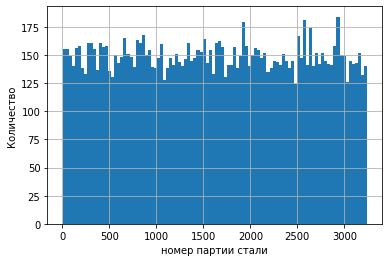
    


Всего у нас информация от 1 до 3241 партии стали. 


```python
a=[]
for i in range(3241):
    if i not in arc['key'].unique():
        a.append(i)
a
```


    [0,
     41,
     42,
     195,
     279,
     355,
     382,
     506,
     529,
     540,
     607,
     683,
     710,
     766,
     1133,
     1300,
     1437,
     2031,
     2103,
     2278,
     2356,
     2373,
     2446,
     2469,
     2491,
     2683,
     3200,
     3207]


Но некоторые номера пропушены


```python
arc.groupby('key')['key'].count().plot()
plt.xlabel('номер партии стали')
plt.ylabel('Количество')
plt.show()
```


    
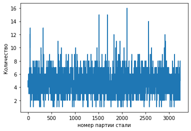
    


```python
arc.groupby('key')['key'].count().describe()
```


    count    3214.000000
    mean        4.628500
    std         1.608647
    min         1.000000
    25%         4.000000
    50%         4.000000
    75%         6.000000
    max        16.000000
    Name: key, dtype: float64


В среднем на каждую партию приходиться 4,5 нагрева, минимум 1, максимум 16.

Посмотрим на начало и конец нагрева


```python
arc['Начало нагрева дугой'].describe(datetime_is_numeric=True).T
```


    count                            14876
    mean     2019-07-05 12:25:51.921081088
    min                2019-05-03 11:02:14
    25%      2019-06-03 23:18:23.249999872
    50%         2019-07-03 01:31:26.500000
    75%      2019-08-07 22:52:20.750000128
    max                2019-09-06 17:24:54
    Name: Начало нагрева дугой, dtype: object


```python
arc['Конец нагрева дугой'].describe(datetime_is_numeric=True).T
```


    count                            14876
    mean     2019-07-05 12:28:43.592027392
    min                2019-05-03 11:06:02
    25%                2019-06-03 23:21:35
    50%                2019-07-03 01:35:13
    75%                2019-08-07 22:56:47
    max                2019-09-06 17:26:15
    Name: Конец нагрева дугой, dtype: object


Видно, что что нагревы проходили между майем и сентябрем


```python
arc.groupby('key')['Начало нагрева дугой'].min().plot()
arc.groupby('key')['Конец нагрева дугой'].max().plot()
plt.legend()
plt.xlabel('партия')
plt.ylabel('время')
plt.show()
```


    
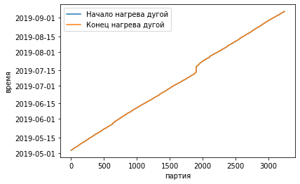
    


Посмотрим сколько времени занимает нагрев


```python
((arc['Конец нагрева дугой']<arc['Начало нагрева дугой'])).sum()
```


    0


```python
((arc['Конец нагрева дугой']-arc['Начало нагрева дугой'])).describe()
```


    count                        14876
    mean     0 days 00:02:51.670946490
    std      0 days 00:01:38.186802680
    min                0 days 00:00:11
    25%                0 days 00:01:47
    50%                0 days 00:02:27
    75%                0 days 00:03:34
    max                0 days 00:15:07
    dtype: object


Ни один нагрев не длился более более 15 минут. В среднем он длилися 2-3 минуты.


```python
# для каждого нагрвера создадим еще столбец тоторый указывает на то, сколько времени награвалоась
#arc['Нагрев']=(arc['Конец нагрева дугой']-arc['Начало нагрева дугой']).astype('timedelta64[s]')
```


```python
arc.info()
```

    <class 'pandas.core.frame.DataFrame'>
    RangeIndex: 14876 entries, 0 to 14875
    Data columns (total 5 columns):
     #   Column                Non-Null Count  Dtype         
    ---  ------                --------------  -----         
     0   key                   14876 non-null  int64         
     1   Начало нагрева дугой  14876 non-null  datetime64[ns]
     2   Конец нагрева дугой   14876 non-null  datetime64[ns]
     3   Активная мощность     14876 non-null  float64       
     4   Реактивная мощность   14876 non-null  float64       
    dtypes: datetime64[ns](2), float64(2), int64(1)
    memory usage: 581.2 KB


```python
arc.head(2)
```


<div>
<style scoped>
    .dataframe tbody tr th:only-of-type {
        vertical-align: middle;
    }

    .dataframe tbody tr th {
        vertical-align: top;
    }

    .dataframe thead th {
        text-align: right;
    }
</style>
<table border="1" class="dataframe">
  <thead>
    <tr style="text-align: right;">
      <th></th>
      <th>key</th>
      <th>Начало нагрева дугой</th>
      <th>Конец нагрева дугой</th>
      <th>Активная мощность</th>
      <th>Реактивная мощность</th>
    </tr>
  </thead>
  <tbody>
    <tr>
      <th>0</th>
      <td>1</td>
      <td>2019-05-03 11:02:14</td>
      <td>2019-05-03 11:06:02</td>
      <td>0.305130</td>
      <td>0.211253</td>
    </tr>
    <tr>
      <th>1</th>
      <td>1</td>
      <td>2019-05-03 11:07:28</td>
      <td>2019-05-03 11:10:33</td>
      <td>0.765658</td>
      <td>0.477438</td>
    </tr>
  </tbody>
</table>
</div>


Теперь надо изучить мощность


```python
arc['Активная мощность'].describe()
```


    count    14876.000000
    mean         0.662752
    std          0.258885
    min          0.223120
    25%          0.467115
    50%          0.599587
    75%          0.830070
    max          1.463773
    Name: Активная мощность, dtype: float64


```python
arc['Активная мощность'].hist()
plt.title('Активная мощность')
plt.xlabel('Мощность')
plt.ylabel('количество применений')
plt.show()
```


    
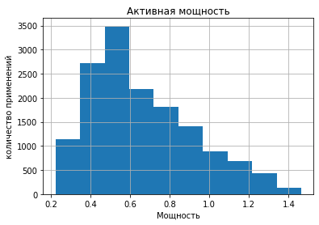
    


<font color='blue'><b>Комментарий ментора</b></font><strike>
<br><font color='crimson'> ❌ Для графиков нужны подписи осей и заголовок. Точно задатут представители бизнеса, что представлено на графике

Видно, что большая часть активная мощностей находиться между 0.4 и 0.8 максимкм 1.46, а минимум 0.25.


```python
arc['Реактивная мощность'].describe()
```


    count    14876.000000
    mean         0.438986
    std          5.873485
    min       -715.479924
    25%          0.337175
    50%          0.441639
    75%          0.608201
    max          1.270284
    Name: Реактивная мощность, dtype: float64


```python
arc.boxplot('Реактивная мощность')
plt.show()
```


    
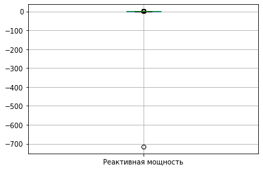
    


наблюдается аноналия.


```python
arc.loc[arc['Реактивная мощность']<-700]
```


<div>
<style scoped>
    .dataframe tbody tr th:only-of-type {
        vertical-align: middle;
    }

    .dataframe tbody tr th {
        vertical-align: top;
    }

    .dataframe thead th {
        text-align: right;
    }
</style>
<table border="1" class="dataframe">
  <thead>
    <tr style="text-align: right;">
      <th></th>
      <th>key</th>
      <th>Начало нагрева дугой</th>
      <th>Конец нагрева дугой</th>
      <th>Активная мощность</th>
      <th>Реактивная мощность</th>
    </tr>
  </thead>
  <tbody>
    <tr>
      <th>9780</th>
      <td>2116</td>
      <td>2019-07-28 02:22:08</td>
      <td>2019-07-28 02:23:57</td>
      <td>0.705344</td>
      <td>-715.479924</td>
    </tr>
  </tbody>
</table>
</div>


```python
 #Рассмотрим все нагревы данной партии
arc.loc[arc['key']==2116]    
```


<div>
<style scoped>
    .dataframe tbody tr th:only-of-type {
        vertical-align: middle;
    }

    .dataframe tbody tr th {
        vertical-align: top;
    }

    .dataframe thead th {
        text-align: right;
    }
</style>
<table border="1" class="dataframe">
  <thead>
    <tr style="text-align: right;">
      <th></th>
      <th>key</th>
      <th>Начало нагрева дугой</th>
      <th>Конец нагрева дугой</th>
      <th>Активная мощность</th>
      <th>Реактивная мощность</th>
    </tr>
  </thead>
  <tbody>
    <tr>
      <th>9778</th>
      <td>2116</td>
      <td>2019-07-28 02:07:12</td>
      <td>2019-07-28 02:09:14</td>
      <td>0.787549</td>
      <td>0.693881</td>
    </tr>
    <tr>
      <th>9779</th>
      <td>2116</td>
      <td>2019-07-28 02:13:10</td>
      <td>2019-07-28 02:15:25</td>
      <td>0.580263</td>
      <td>0.411498</td>
    </tr>
    <tr>
      <th>9780</th>
      <td>2116</td>
      <td>2019-07-28 02:22:08</td>
      <td>2019-07-28 02:23:57</td>
      <td>0.705344</td>
      <td>-715.479924</td>
    </tr>
    <tr>
      <th>9781</th>
      <td>2116</td>
      <td>2019-07-28 02:29:11</td>
      <td>2019-07-28 02:30:18</td>
      <td>0.563641</td>
      <td>0.408513</td>
    </tr>
  </tbody>
</table>
</div>


Для большей точности необходимо изучить всю информацию о этой сдвиге фаз 


```python
((arc.loc[(arc['key']!=2116)]['Активная мощность']/arc.loc[arc['key']!=2116]['Реактивная мощность']).apply(atan)*180/pi).describe()
```


    count    14872.000000
    mean        53.779405
    std          2.648722
    min         45.049874
    25%         52.004411
    50%         54.067124
    75%         55.795760
    max         61.703096
    dtype: float64


```python
((arc.loc[(arc['key']!=2116)]['Активная мощность']/arc.loc[arc['key']!=2116]['Реактивная мощность']).apply(atan)*180/pi).hist()
plt.ylabel('Количество')
plt.xlabel('Угол, градусы')
plt.title('Угол сдвига')
plt.show()
```


    
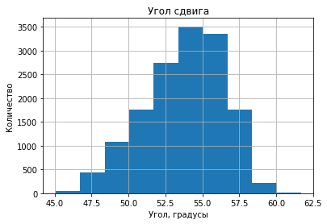
    


Как видно, сдвиг фаз меняется не сильно в пределене от 45 до 61 градуса, в среднем 54 градуса

Поэтому лучше заменить на произведение активной мощности и среднего сдвига


```python
arc['Реактивная мощность'][9780]=arc['Активная мощность'][9780]*(arc.loc[(arc['key']!=2116)]['Активная мощность']/arc.loc[arc['key']!=2116]['Реактивная мощность']).median()
```


```python
arc.boxplot('Реактивная мощность')
plt.show()
```


    
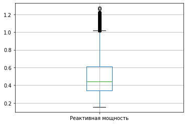
    


Каких-то аномалий не было замечено


```python
arc['Реактивная мощность'].describe()
```


    count    14876.000000
    mean         0.487148
    std          0.197646
    min          0.153777
    25%          0.337192
    50%          0.441667
    75%          0.608308
    max          1.270284
    Name: Реактивная мощность, dtype: float64


```python
arc['Реактивная мощность'].hist(range=(0,1.5))
plt.title('Реактивная мощность')
plt.xlabel('Мощность')
plt.ylabel('количество применений')
plt.show()
```


    
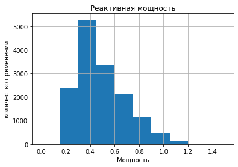
    


Реактивная мощность 0.4-0.5 в среднем, минимкм 0.15 максимум 1.27.

Но для дальнейшего использования данных их надо изменить.

Изменение:
    ** Т.к. температура - это параметр внутренней потенциальной энергии тела, тодля определения изменения температуры важно знать, сколько энергии мы передали
    ** На нагрев идет в основном активная мощность, поэтому надо знать еще сдвиг, (проще взять отношение активной и реактивной мощности)
    ** Время нагрева тоже надо знать


```python
arc.head(2)
```


<div>
<style scoped>
    .dataframe tbody tr th:only-of-type {
        vertical-align: middle;
    }

    .dataframe tbody tr th {
        vertical-align: top;
    }

    .dataframe thead th {
        text-align: right;
    }
</style>
<table border="1" class="dataframe">
  <thead>
    <tr style="text-align: right;">
      <th></th>
      <th>key</th>
      <th>Начало нагрева дугой</th>
      <th>Конец нагрева дугой</th>
      <th>Активная мощность</th>
      <th>Реактивная мощность</th>
    </tr>
  </thead>
  <tbody>
    <tr>
      <th>0</th>
      <td>1</td>
      <td>2019-05-03 11:02:14</td>
      <td>2019-05-03 11:06:02</td>
      <td>0.305130</td>
      <td>0.211253</td>
    </tr>
    <tr>
      <th>1</th>
      <td>1</td>
      <td>2019-05-03 11:07:28</td>
      <td>2019-05-03 11:10:33</td>
      <td>0.765658</td>
      <td>0.477438</td>
    </tr>
  </tbody>
</table>
</div>


```python
arc.info()
```

    <class 'pandas.core.frame.DataFrame'>
    RangeIndex: 14876 entries, 0 to 14875
    Data columns (total 5 columns):
     #   Column                Non-Null Count  Dtype         
    ---  ------                --------------  -----         
     0   key                   14876 non-null  int64         
     1   Начало нагрева дугой  14876 non-null  datetime64[ns]
     2   Конец нагрева дугой   14876 non-null  datetime64[ns]
     3   Активная мощность     14876 non-null  float64       
     4   Реактивная мощность   14876 non-null  float64       
    dtypes: datetime64[ns](2), float64(2), int64(1)
    memory usage: 581.2 KB


Также нужно определить, есть ли нагревы которые выходят за период наблюдений.


```python
temp.head(2)
```


<div>
<style scoped>
    .dataframe tbody tr th:only-of-type {
        vertical-align: middle;
    }

    .dataframe tbody tr th {
        vertical-align: top;
    }

    .dataframe thead th {
        text-align: right;
    }
</style>
<table border="1" class="dataframe">
  <thead>
    <tr style="text-align: right;">
      <th></th>
      <th>key</th>
      <th>Время замера</th>
      <th>Температура</th>
    </tr>
  </thead>
  <tbody>
    <tr>
      <th>0</th>
      <td>1</td>
      <td>2019-05-03 11:02:04</td>
      <td>1571.0</td>
    </tr>
    <tr>
      <th>1</th>
      <td>1</td>
      <td>2019-05-03 11:07:18</td>
      <td>1604.0</td>
    </tr>
  </tbody>
</table>
</div>


```python
ss=temp.groupby('key').agg({'Время замера': 'first'}).merge(arc.groupby('key').agg({'Начало нагрева дугой': 'first'}),on='key')
(ss['Время замера']>ss['Начало нагрева дугой']).sum()
```


    0


```python
ss=temp.groupby('key').agg({'Время замера': 'last'}).merge(arc.groupby('key').agg({'Начало нагрева дугой': 'last'}),on='key')
(ss['Время замера']<ss['Начало нагрева дугой']).sum()
```


    0


Как видно, все нагревы происодят во время наблюдений


```python
arc['мощность']=(arc['Активная мощность']**2+arc['Реактивная мощность']**2)**0.5
arc['нагрев']=(arc['Конец нагрева дугой']-arc['Начало нагрева дугой']).astype('timedelta64[s]')
arc['энергия']=arc['мощность']*arc['нагрев']
arc['сдвиг']=arc['Реактивная мощность']/arc['Активная мощность']  
```


```python
arc.head(2)
```


<div>
<style scoped>
    .dataframe tbody tr th:only-of-type {
        vertical-align: middle;
    }

    .dataframe tbody tr th {
        vertical-align: top;
    }

    .dataframe thead th {
        text-align: right;
    }
</style>
<table border="1" class="dataframe">
  <thead>
    <tr style="text-align: right;">
      <th></th>
      <th>key</th>
      <th>Начало нагрева дугой</th>
      <th>Конец нагрева дугой</th>
      <th>Активная мощность</th>
      <th>Реактивная мощность</th>
      <th>мощность</th>
      <th>нагрев</th>
      <th>энергия</th>
      <th>сдвиг</th>
    </tr>
  </thead>
  <tbody>
    <tr>
      <th>0</th>
      <td>1</td>
      <td>2019-05-03 11:02:14</td>
      <td>2019-05-03 11:06:02</td>
      <td>0.305130</td>
      <td>0.211253</td>
      <td>0.371123</td>
      <td>228.0</td>
      <td>84.616003</td>
      <td>0.692338</td>
    </tr>
    <tr>
      <th>1</th>
      <td>1</td>
      <td>2019-05-03 11:07:28</td>
      <td>2019-05-03 11:10:33</td>
      <td>0.765658</td>
      <td>0.477438</td>
      <td>0.902319</td>
      <td>185.0</td>
      <td>166.928978</td>
      <td>0.623566</td>
    </tr>
  </tbody>
</table>
</div>


```python
arc.info()
```

    <class 'pandas.core.frame.DataFrame'>
    RangeIndex: 14876 entries, 0 to 14875
    Data columns (total 9 columns):
     #   Column                Non-Null Count  Dtype         
    ---  ------                --------------  -----         
     0   key                   14876 non-null  int64         
     1   Начало нагрева дугой  14876 non-null  datetime64[ns]
     2   Конец нагрева дугой   14876 non-null  datetime64[ns]
     3   Активная мощность     14876 non-null  float64       
     4   Реактивная мощность   14876 non-null  float64       
     5   мощность              14876 non-null  float64       
     6   нагрев                14876 non-null  float64       
     7   энергия               14876 non-null  float64       
     8   сдвиг                 14876 non-null  float64       
    dtypes: datetime64[ns](2), float64(6), int64(1)
    memory usage: 1.0 MB


Рассмотрим парпамерт энергия


```python
arc['энергия'].describe()
```


    count    14876.000000
    mean       141.646284
    std        103.196945
    min          6.409531
    25%         71.158372
    50%        114.486341
    75%        181.345716
    max       1084.729420
    Name: энергия, dtype: float64


```python
arc['энергия'].hist()
plt.title('Полная энергия')
plt.xlabel('Энергия')
plt.ylabel('количество применений')
plt.show()
```


    
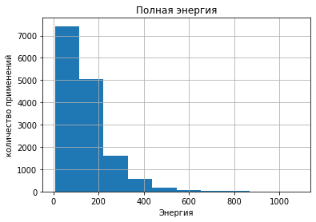
    


```python
arc.boxplot('энергия')

plt.show()
```


    
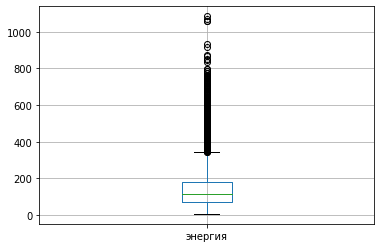
    


Видно, что за раз добавляли от 6 до 1084. Большая часть добавленной энергии находиться в промежутке между 71 и 181, в среднем 1145

Теперь необходимо провести агрегацию: мощность и сдвиг усреднить, нагрев и энергию  просумировать.


```python
data_arc=arc.groupby('key').agg({'key':'count','мощность':'median','энергия':'sum','нагрев':'sum','сдвиг':'median'}).rename(columns={'key':'циклы'})
```


```python
data_arc.head(2)
```


<div>
<style scoped>
    .dataframe tbody tr th:only-of-type {
        vertical-align: middle;
    }

    .dataframe tbody tr th {
        vertical-align: top;
    }

    .dataframe thead th {
        text-align: right;
    }
</style>
<table border="1" class="dataframe">
  <thead>
    <tr style="text-align: right;">
      <th></th>
      <th>циклы</th>
      <th>мощность</th>
      <th>энергия</th>
      <th>нагрев</th>
      <th>сдвиг</th>
    </tr>
    <tr>
      <th>key</th>
      <th></th>
      <th></th>
      <th></th>
      <th></th>
      <th></th>
    </tr>
  </thead>
  <tbody>
    <tr>
      <th>1</th>
      <td>5</td>
      <td>0.722536</td>
      <td>770.282114</td>
      <td>1098.0</td>
      <td>0.732848</td>
    </tr>
    <tr>
      <th>2</th>
      <td>4</td>
      <td>0.650151</td>
      <td>481.760005</td>
      <td>811.0</td>
      <td>0.686351</td>
    </tr>
  </tbody>
</table>
</div>


```python
data_arc.info()
```

    <class 'pandas.core.frame.DataFrame'>
    Int64Index: 3214 entries, 1 to 3241
    Data columns (total 5 columns):
     #   Column    Non-Null Count  Dtype  
    ---  ------    --------------  -----  
     0   циклы     3214 non-null   int64  
     1   мощность  3214 non-null   float64
     2   энергия   3214 non-null   float64
     3   нагрев    3214 non-null   float64
     4   сдвиг     3214 non-null   float64
    dtypes: float64(4), int64(1)
    memory usage: 150.7 KB


**ВЫВОД ** Всего у нас информация от 1 до 3241 партии стали, но некоторые были пропущены. В среднем на каждую партию приходиться 4,5 нагрева, минимум 1, максимум 16. Ни один нагрев не длился более более 15 минут. В среднем он длилися 2-3 минуты. Видно, что большая часть активная мощностей находиться между 0.4 и 0.8 максимкм 1.46, а минимум 0.25. Реактивная мощность 0.4-0.5 в среднем, минимкм 0.15 максимум 1.27. Наблюдается аномалия, которую кдалось замень на среднее. Добавлены новые значения энегия, мощность, нагрев и сдвиг

### Продувочный газ

Посмотрим на объем подоваемого продувочного газа


```python
gas.head(2)
```


<div>
<style scoped>
    .dataframe tbody tr th:only-of-type {
        vertical-align: middle;
    }

    .dataframe tbody tr th {
        vertical-align: top;
    }

    .dataframe thead th {
        text-align: right;
    }
</style>
<table border="1" class="dataframe">
  <thead>
    <tr style="text-align: right;">
      <th></th>
      <th>key</th>
      <th>Газ 1</th>
    </tr>
  </thead>
  <tbody>
    <tr>
      <th>0</th>
      <td>1</td>
      <td>29.749986</td>
    </tr>
    <tr>
      <th>1</th>
      <td>2</td>
      <td>12.555561</td>
    </tr>
  </tbody>
</table>
</div>


```python
gas.info()
```

    <class 'pandas.core.frame.DataFrame'>
    RangeIndex: 3239 entries, 0 to 3238
    Data columns (total 2 columns):
     #   Column  Non-Null Count  Dtype  
    ---  ------  --------------  -----  
     0   key     3239 non-null   int64  
     1   Газ 1   3239 non-null   float64
    dtypes: float64(1), int64(1)
    memory usage: 50.7 KB


```python
# Найдем дубликаты
gas['key'].duplicated().sum()
```


    0


Посмотрим на распредеделение


```python
gas['Газ 1'].describe().T
```


    count    3239.000000
    mean       11.002062
    std         6.220327
    min         0.008399
    25%         7.043089
    50%         9.836267
    75%        13.769915
    max        77.995040
    Name: Газ 1, dtype: float64


```python
gas['Газ 1'].hist()
plt.title('Продувочный Газ')
plt.xlabel('объем')
plt.ylabel('частота')

plt.show()
```


    
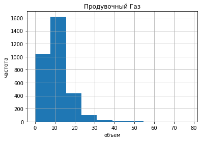
    


```python
gas.boxplot('Газ 1')
plt.show()
```


    
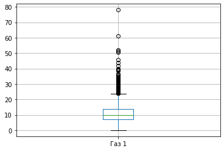
    


В среднем продувают 7-13, минимум близок к 0, а максимум 77.

Для удобства столбец нужно переименовать


```python
gas=gas.rename(columns={'Газ 1':'Газ'})
```


```python
gas.info()
```

    <class 'pandas.core.frame.DataFrame'>
    RangeIndex: 3239 entries, 0 to 3238
    Data columns (total 2 columns):
     #   Column  Non-Null Count  Dtype  
    ---  ------  --------------  -----  
     0   key     3239 non-null   int64  
     1   Газ     3239 non-null   float64
    dtypes: float64(1), int64(1)
    memory usage: 50.7 KB


### Сыпучие материалы

Информация о сыпучих материалов дана в таблицах bulk и bunk_time. Рассмотрим их.


```python
bulk.info()
```

    <class 'pandas.core.frame.DataFrame'>
    RangeIndex: 3129 entries, 0 to 3128
    Data columns (total 16 columns):
     #   Column   Non-Null Count  Dtype  
    ---  ------   --------------  -----  
     0   key      3129 non-null   int64  
     1   Bulk 1   252 non-null    float64
     2   Bulk 2   22 non-null     float64
     3   Bulk 3   1298 non-null   float64
     4   Bulk 4   1014 non-null   float64
     5   Bulk 5   77 non-null     float64
     6   Bulk 6   576 non-null    float64
     7   Bulk 7   25 non-null     float64
     8   Bulk 8   1 non-null      float64
     9   Bulk 9   19 non-null     float64
     10  Bulk 10  176 non-null    float64
     11  Bulk 11  177 non-null    float64
     12  Bulk 12  2450 non-null   float64
     13  Bulk 13  18 non-null     float64
     14  Bulk 14  2806 non-null   float64
     15  Bulk 15  2248 non-null   float64
    dtypes: float64(15), int64(1)
    memory usage: 391.2 KB


```python
bulk_time.info()
```

    <class 'pandas.core.frame.DataFrame'>
    RangeIndex: 3129 entries, 0 to 3128
    Data columns (total 16 columns):
     #   Column   Non-Null Count  Dtype 
    ---  ------   --------------  ----- 
     0   key      3129 non-null   int64 
     1   Bulk 1   252 non-null    object
     2   Bulk 2   22 non-null     object
     3   Bulk 3   1298 non-null   object
     4   Bulk 4   1014 non-null   object
     5   Bulk 5   77 non-null     object
     6   Bulk 6   576 non-null    object
     7   Bulk 7   25 non-null     object
     8   Bulk 8   1 non-null      object
     9   Bulk 9   19 non-null     object
     10  Bulk 10  176 non-null    object
     11  Bulk 11  177 non-null    object
     12  Bulk 12  2450 non-null   object
     13  Bulk 13  18 non-null     object
     14  Bulk 14  2806 non-null   object
     15  Bulk 15  2248 non-null   object
    dtypes: int64(1), object(15)
    memory usage: 391.2+ KB


```python
#Рассмотрим есть ли дубликаты
print(bulk.duplicated().sum())
bulk_time.duplicated().sum()
```

    0


    0


Как видно дубликатов нет.

Проверим совпадают ли ключи в каждой строке или они перепутаны ?


```python
(bulk['key']!=bulk_time['key']).sum()
```


    0


Очевидно, что ключ (номер партии) совпадает

Посмотрим как распрелены все значения.


```python
bulk.describe().T
```


<div>
<style scoped>
    .dataframe tbody tr th:only-of-type {
        vertical-align: middle;
    }

    .dataframe tbody tr th {
        vertical-align: top;
    }

    .dataframe thead th {
        text-align: right;
    }
</style>
<table border="1" class="dataframe">
  <thead>
    <tr style="text-align: right;">
      <th></th>
      <th>count</th>
      <th>mean</th>
      <th>std</th>
      <th>min</th>
      <th>25%</th>
      <th>50%</th>
      <th>75%</th>
      <th>max</th>
    </tr>
  </thead>
  <tbody>
    <tr>
      <th>key</th>
      <td>3129.0</td>
      <td>1624.383509</td>
      <td>933.337642</td>
      <td>1.0</td>
      <td>816.00</td>
      <td>1622.0</td>
      <td>2431.00</td>
      <td>3241.0</td>
    </tr>
    <tr>
      <th>Bulk 1</th>
      <td>252.0</td>
      <td>39.242063</td>
      <td>18.277654</td>
      <td>10.0</td>
      <td>27.00</td>
      <td>31.0</td>
      <td>46.00</td>
      <td>185.0</td>
    </tr>
    <tr>
      <th>Bulk 2</th>
      <td>22.0</td>
      <td>253.045455</td>
      <td>21.180578</td>
      <td>228.0</td>
      <td>242.00</td>
      <td>251.5</td>
      <td>257.75</td>
      <td>325.0</td>
    </tr>
    <tr>
      <th>Bulk 3</th>
      <td>1298.0</td>
      <td>113.879045</td>
      <td>75.483494</td>
      <td>6.0</td>
      <td>58.00</td>
      <td>97.5</td>
      <td>152.00</td>
      <td>454.0</td>
    </tr>
    <tr>
      <th>Bulk 4</th>
      <td>1014.0</td>
      <td>104.394477</td>
      <td>48.184126</td>
      <td>12.0</td>
      <td>72.00</td>
      <td>102.0</td>
      <td>133.00</td>
      <td>281.0</td>
    </tr>
    <tr>
      <th>Bulk 5</th>
      <td>77.0</td>
      <td>107.025974</td>
      <td>81.790646</td>
      <td>11.0</td>
      <td>70.00</td>
      <td>86.0</td>
      <td>132.00</td>
      <td>603.0</td>
    </tr>
    <tr>
      <th>Bulk 6</th>
      <td>576.0</td>
      <td>118.925347</td>
      <td>72.057776</td>
      <td>17.0</td>
      <td>69.75</td>
      <td>100.0</td>
      <td>157.00</td>
      <td>503.0</td>
    </tr>
    <tr>
      <th>Bulk 7</th>
      <td>25.0</td>
      <td>305.600000</td>
      <td>191.022904</td>
      <td>47.0</td>
      <td>155.00</td>
      <td>298.0</td>
      <td>406.00</td>
      <td>772.0</td>
    </tr>
    <tr>
      <th>Bulk 8</th>
      <td>1.0</td>
      <td>49.000000</td>
      <td>NaN</td>
      <td>49.0</td>
      <td>49.00</td>
      <td>49.0</td>
      <td>49.00</td>
      <td>49.0</td>
    </tr>
    <tr>
      <th>Bulk 9</th>
      <td>19.0</td>
      <td>76.315789</td>
      <td>21.720581</td>
      <td>63.0</td>
      <td>66.00</td>
      <td>68.0</td>
      <td>70.50</td>
      <td>147.0</td>
    </tr>
    <tr>
      <th>Bulk 10</th>
      <td>176.0</td>
      <td>83.284091</td>
      <td>26.060347</td>
      <td>24.0</td>
      <td>64.00</td>
      <td>86.5</td>
      <td>102.00</td>
      <td>159.0</td>
    </tr>
    <tr>
      <th>Bulk 11</th>
      <td>177.0</td>
      <td>76.819209</td>
      <td>59.655365</td>
      <td>8.0</td>
      <td>25.00</td>
      <td>64.0</td>
      <td>106.00</td>
      <td>313.0</td>
    </tr>
    <tr>
      <th>Bulk 12</th>
      <td>2450.0</td>
      <td>260.471020</td>
      <td>120.649269</td>
      <td>53.0</td>
      <td>204.00</td>
      <td>208.0</td>
      <td>316.00</td>
      <td>1849.0</td>
    </tr>
    <tr>
      <th>Bulk 13</th>
      <td>18.0</td>
      <td>181.111111</td>
      <td>46.088009</td>
      <td>151.0</td>
      <td>153.25</td>
      <td>155.5</td>
      <td>203.50</td>
      <td>305.0</td>
    </tr>
    <tr>
      <th>Bulk 14</th>
      <td>2806.0</td>
      <td>170.284747</td>
      <td>65.868652</td>
      <td>16.0</td>
      <td>119.00</td>
      <td>151.0</td>
      <td>205.75</td>
      <td>636.0</td>
    </tr>
    <tr>
      <th>Bulk 15</th>
      <td>2248.0</td>
      <td>160.513345</td>
      <td>51.765319</td>
      <td>1.0</td>
      <td>105.00</td>
      <td>160.0</td>
      <td>205.00</td>
      <td>405.0</td>
    </tr>
  </tbody>
</table>
</div>


```python

bulk.drop('key',axis=1).boxplot(figsize=(20,10))
bulk.drop('key',axis=1).hist(figsize=(20,10))

plt.show()
```


    
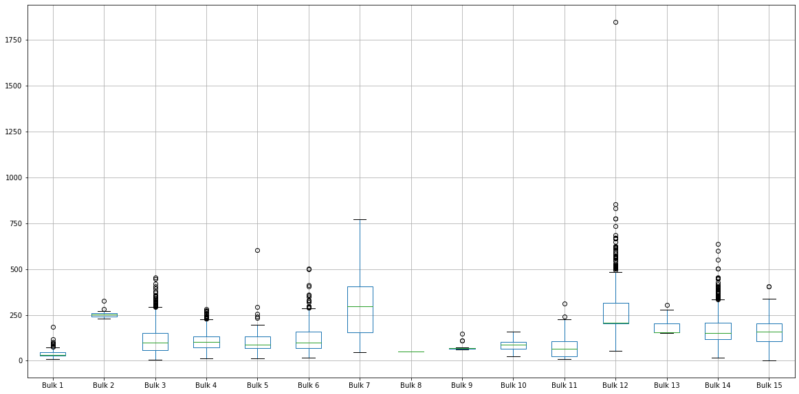
    


    
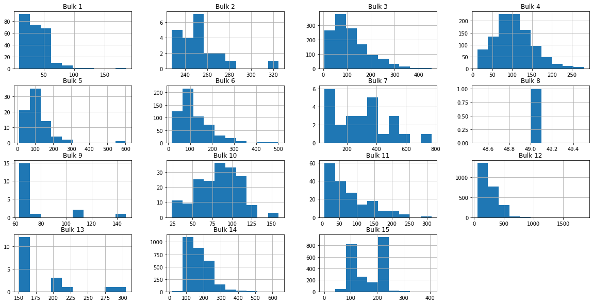
    


<font color='blue'><b>Комментарий ментора</b></font><strike>
<br><font color='crimson'> ❌ Нижние графики не читаемы. Для каждого boxplot и hist настрой внутри параметр figsize. Это касается нен только этих графиков, но и ниже

Также нужно проверить совпадают или пропучки


```python
for i in bulk.columns:
    print('Количество несовпадений пропусков в столбце',i,':',(bulk[i].isnull()!=bulk_time[i].isnull()).sum())

```

    Количество несовпадений пропусков в столбце key : 0
    Количество несовпадений пропусков в столбце Bulk 1 : 0
    Количество несовпадений пропусков в столбце Bulk 2 : 0
    Количество несовпадений пропусков в столбце Bulk 3 : 0
    Количество несовпадений пропусков в столбце Bulk 4 : 0
    Количество несовпадений пропусков в столбце Bulk 5 : 0
    Количество несовпадений пропусков в столбце Bulk 6 : 0
    Количество несовпадений пропусков в столбце Bulk 7 : 0
    Количество несовпадений пропусков в столбце Bulk 8 : 0
    Количество несовпадений пропусков в столбце Bulk 9 : 0
    Количество несовпадений пропусков в столбце Bulk 10 : 0
    Количество несовпадений пропусков в столбце Bulk 11 : 0
    Количество несовпадений пропусков в столбце Bulk 12 : 0
    Количество несовпадений пропусков в столбце Bulk 13 : 0
    Количество несовпадений пропусков в столбце Bulk 14 : 0
    Количество несовпадений пропусков в столбце Bulk 15 : 0


В bulk_time необходимо изменить тип данных на время.


```python
for i in bulk.columns:
    if i!='key':
        bulk_time[i]=pd.to_datetime(bulk_time[i], format='%Y-%m-%dT%H:%M:%S')
```


```python
bulk_time.info()
```

    <class 'pandas.core.frame.DataFrame'>
    RangeIndex: 3129 entries, 0 to 3128
    Data columns (total 16 columns):
     #   Column   Non-Null Count  Dtype         
    ---  ------   --------------  -----         
     0   key      3129 non-null   int64         
     1   Bulk 1   252 non-null    datetime64[ns]
     2   Bulk 2   22 non-null     datetime64[ns]
     3   Bulk 3   1298 non-null   datetime64[ns]
     4   Bulk 4   1014 non-null   datetime64[ns]
     5   Bulk 5   77 non-null     datetime64[ns]
     6   Bulk 6   576 non-null    datetime64[ns]
     7   Bulk 7   25 non-null     datetime64[ns]
     8   Bulk 8   1 non-null      datetime64[ns]
     9   Bulk 9   19 non-null     datetime64[ns]
     10  Bulk 10  176 non-null    datetime64[ns]
     11  Bulk 11  177 non-null    datetime64[ns]
     12  Bulk 12  2450 non-null   datetime64[ns]
     13  Bulk 13  18 non-null     datetime64[ns]
     14  Bulk 14  2806 non-null   datetime64[ns]
     15  Bulk 15  2248 non-null   datetime64[ns]
    dtypes: datetime64[ns](15), int64(1)
    memory usage: 391.2 KB


```python
bulk_time.describe(datetime_is_numeric=True).T
```


<div>
<style scoped>
    .dataframe tbody tr th:only-of-type {
        vertical-align: middle;
    }

    .dataframe tbody tr th {
        vertical-align: top;
    }

    .dataframe thead th {
        text-align: right;
    }
</style>
<table border="1" class="dataframe">
  <thead>
    <tr style="text-align: right;">
      <th></th>
      <th>count</th>
      <th>mean</th>
      <th>min</th>
      <th>25%</th>
      <th>50%</th>
      <th>75%</th>
      <th>max</th>
      <th>std</th>
    </tr>
  </thead>
  <tbody>
    <tr>
      <th>key</th>
      <td>3129.0</td>
      <td>1624.383509</td>
      <td>1.0</td>
      <td>816.0</td>
      <td>1622.0</td>
      <td>2431.0</td>
      <td>3241.0</td>
      <td>933.337642</td>
    </tr>
    <tr>
      <th>Bulk 1</th>
      <td>252</td>
      <td>2019-06-29 23:24:44.769841152</td>
      <td>2019-05-03 17:42:46</td>
      <td>2019-05-29 14:48:48.500000</td>
      <td>2019-06-25 11:09:13</td>
      <td>2019-07-31 05:58:18.249999872</td>
      <td>2019-09-05 09:11:32</td>
      <td>NaN</td>
    </tr>
    <tr>
      <th>Bulk 2</th>
      <td>22</td>
      <td>2019-07-12 07:57:13.045454592</td>
      <td>2019-05-07 15:39:35</td>
      <td>2019-05-28 02:29:31.500000</td>
      <td>2019-07-27 17:18:38.500000</td>
      <td>2019-08-13 02:20:08</td>
      <td>2019-08-13 11:47:39</td>
      <td>NaN</td>
    </tr>
    <tr>
      <th>Bulk 3</th>
      <td>1298</td>
      <td>2019-07-08 13:50:14.630970624</td>
      <td>2019-05-03 20:40:25</td>
      <td>2019-06-08 03:50:23.500000</td>
      <td>2019-07-04 09:31:42</td>
      <td>2019-08-11 01:00:36.750000128</td>
      <td>2019-09-06 12:26:52</td>
      <td>NaN</td>
    </tr>
    <tr>
      <th>Bulk 4</th>
      <td>1014</td>
      <td>2019-07-03 11:17:28.834319616</td>
      <td>2019-05-03 11:28:48</td>
      <td>2019-05-30 21:36:11.249999872</td>
      <td>2019-06-28 03:44:42.500000</td>
      <td>2019-08-04 04:15:46.500000</td>
      <td>2019-09-05 03:35:21</td>
      <td>NaN</td>
    </tr>
    <tr>
      <th>Bulk 5</th>
      <td>77</td>
      <td>2019-07-13 17:18:29.090908928</td>
      <td>2019-05-07 15:19:17</td>
      <td>2019-06-19 23:32:44</td>
      <td>2019-07-25 17:59:41</td>
      <td>2019-08-13 04:23:23</td>
      <td>2019-09-02 18:16:52</td>
      <td>NaN</td>
    </tr>
    <tr>
      <th>Bulk 6</th>
      <td>576</td>
      <td>2019-07-06 13:50:06.345486080</td>
      <td>2019-05-03 19:09:15</td>
      <td>2019-06-06 22:46:10.500000</td>
      <td>2019-07-09 03:34:57.500000</td>
      <td>2019-08-07 18:55:01.249999872</td>
      <td>2019-09-06 16:24:28</td>
      <td>NaN</td>
    </tr>
    <tr>
      <th>Bulk 7</th>
      <td>25</td>
      <td>2019-07-27 18:09:05.079999744</td>
      <td>2019-05-07 18:11:01</td>
      <td>2019-07-20 23:48:47</td>
      <td>2019-07-27 18:07:02</td>
      <td>2019-08-13 04:19:43</td>
      <td>2019-09-05 19:07:49</td>
      <td>NaN</td>
    </tr>
    <tr>
      <th>Bulk 8</th>
      <td>1</td>
      <td>2019-07-08 17:14:53</td>
      <td>2019-07-08 17:14:53</td>
      <td>2019-07-08 17:14:53</td>
      <td>2019-07-08 17:14:53</td>
      <td>2019-07-08 17:14:53</td>
      <td>2019-07-08 17:14:53</td>
      <td>NaN</td>
    </tr>
    <tr>
      <th>Bulk 9</th>
      <td>19</td>
      <td>2019-06-23 08:08:47.578947328</td>
      <td>2019-05-14 11:57:58</td>
      <td>2019-05-14 14:31:08</td>
      <td>2019-05-14 16:55:09</td>
      <td>2019-08-16 05:43:31</td>
      <td>2019-08-16 09:11:56</td>
      <td>NaN</td>
    </tr>
    <tr>
      <th>Bulk 10</th>
      <td>176</td>
      <td>2019-07-06 23:55:10.954545408</td>
      <td>2019-05-06 07:54:02</td>
      <td>2019-06-02 05:12:00.500000</td>
      <td>2019-07-06 07:05:20</td>
      <td>2019-08-04 02:23:35.750000128</td>
      <td>2019-09-04 10:03:22</td>
      <td>NaN</td>
    </tr>
    <tr>
      <th>Bulk 11</th>
      <td>177</td>
      <td>2019-07-15 07:01:00.615819264</td>
      <td>2019-05-05 23:43:24</td>
      <td>2019-06-14 20:24:48</td>
      <td>2019-07-24 11:17:22</td>
      <td>2019-08-11 05:21:01</td>
      <td>2019-09-06 05:03:14</td>
      <td>NaN</td>
    </tr>
    <tr>
      <th>Bulk 12</th>
      <td>2450</td>
      <td>2019-07-05 22:55:11.468571392</td>
      <td>2019-05-03 11:24:31</td>
      <td>2019-06-03 12:48:47.249999872</td>
      <td>2019-07-03 01:32:00</td>
      <td>2019-08-08 14:55:05.249999872</td>
      <td>2019-09-06 15:01:44</td>
      <td>NaN</td>
    </tr>
    <tr>
      <th>Bulk 13</th>
      <td>18</td>
      <td>2019-07-01 18:32:46.944444416</td>
      <td>2019-05-05 02:10:21</td>
      <td>2019-05-29 10:43:31.249999872</td>
      <td>2019-07-01 12:59:36.500000</td>
      <td>2019-08-04 23:32:00.249999872</td>
      <td>2019-09-01 01:53:02</td>
      <td>NaN</td>
    </tr>
    <tr>
      <th>Bulk 14</th>
      <td>2806</td>
      <td>2019-07-06 07:17:48.372772608</td>
      <td>2019-05-03 11:14:50</td>
      <td>2019-06-04 04:50:42</td>
      <td>2019-07-03 21:54:13.500000</td>
      <td>2019-08-09 04:22:40.500000</td>
      <td>2019-09-06 17:26:33</td>
      <td>NaN</td>
    </tr>
    <tr>
      <th>Bulk 15</th>
      <td>2248</td>
      <td>2019-07-06 13:24:51.912366336</td>
      <td>2019-05-03 11:10:43</td>
      <td>2019-06-04 11:28:18</td>
      <td>2019-07-03 16:43:28.500000</td>
      <td>2019-08-09 09:18:31.750000128</td>
      <td>2019-09-06 17:23:15</td>
      <td>NaN</td>
    </tr>
  </tbody>
</table>
</div>


```python
bulk.drop('key',axis=1).count().plot(kind='bar')
plt.title('Сыпучие добавки')
plt.xlabel('добавка')
plt.ylabel('Количество применений')
plt.show()
```


    
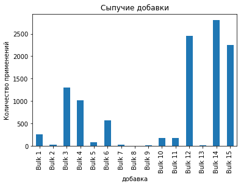
    


Видно, что самым часто использумый это 14_й, а 8-й использовали всего один раз


```python
bulk['key'].duplicated().sum()
```


    0


Каждую партию подвергают лишь одному циклу добавок.


```python
# Переименуем столбцы в bulk
col=[]
s=0
for i in bulk.columns:
    if i=='key':
        col.append(i)
        
    else:
        col.append(f'bulk_{s}')
    s=s+1

bulk.columns=col
bulk.head(2)
```


<div>
<style scoped>
    .dataframe tbody tr th:only-of-type {
        vertical-align: middle;
    }

    .dataframe tbody tr th {
        vertical-align: top;
    }

    .dataframe thead th {
        text-align: right;
    }
</style>
<table border="1" class="dataframe">
  <thead>
    <tr style="text-align: right;">
      <th></th>
      <th>key</th>
      <th>bulk_1</th>
      <th>bulk_2</th>
      <th>bulk_3</th>
      <th>bulk_4</th>
      <th>bulk_5</th>
      <th>bulk_6</th>
      <th>bulk_7</th>
      <th>bulk_8</th>
      <th>bulk_9</th>
      <th>bulk_10</th>
      <th>bulk_11</th>
      <th>bulk_12</th>
      <th>bulk_13</th>
      <th>bulk_14</th>
      <th>bulk_15</th>
    </tr>
  </thead>
  <tbody>
    <tr>
      <th>0</th>
      <td>1</td>
      <td>NaN</td>
      <td>NaN</td>
      <td>NaN</td>
      <td>43.0</td>
      <td>NaN</td>
      <td>NaN</td>
      <td>NaN</td>
      <td>NaN</td>
      <td>NaN</td>
      <td>NaN</td>
      <td>NaN</td>
      <td>206.0</td>
      <td>NaN</td>
      <td>150.0</td>
      <td>154.0</td>
    </tr>
    <tr>
      <th>1</th>
      <td>2</td>
      <td>NaN</td>
      <td>NaN</td>
      <td>NaN</td>
      <td>73.0</td>
      <td>NaN</td>
      <td>NaN</td>
      <td>NaN</td>
      <td>NaN</td>
      <td>NaN</td>
      <td>NaN</td>
      <td>NaN</td>
      <td>206.0</td>
      <td>NaN</td>
      <td>149.0</td>
      <td>154.0</td>
    </tr>
  </tbody>
</table>
</div>


```python
# Переименуем столбцы в bulk_time
col=[]
s=0
for i in bulk_time.columns:
    if i=='key':
        col.append(i)
        
    else:
        col.append(f'bulk_time_{s}')
    s=s+1

bulk_time.columns=col
bulk_time.head(2)
```


<div>
<style scoped>
    .dataframe tbody tr th:only-of-type {
        vertical-align: middle;
    }

    .dataframe tbody tr th {
        vertical-align: top;
    }

    .dataframe thead th {
        text-align: right;
    }
</style>
<table border="1" class="dataframe">
  <thead>
    <tr style="text-align: right;">
      <th></th>
      <th>key</th>
      <th>bulk_time_1</th>
      <th>bulk_time_2</th>
      <th>bulk_time_3</th>
      <th>bulk_time_4</th>
      <th>bulk_time_5</th>
      <th>bulk_time_6</th>
      <th>bulk_time_7</th>
      <th>bulk_time_8</th>
      <th>bulk_time_9</th>
      <th>bulk_time_10</th>
      <th>bulk_time_11</th>
      <th>bulk_time_12</th>
      <th>bulk_time_13</th>
      <th>bulk_time_14</th>
      <th>bulk_time_15</th>
    </tr>
  </thead>
  <tbody>
    <tr>
      <th>0</th>
      <td>1</td>
      <td>NaT</td>
      <td>NaT</td>
      <td>NaT</td>
      <td>2019-05-03 11:28:48</td>
      <td>NaT</td>
      <td>NaT</td>
      <td>NaT</td>
      <td>NaT</td>
      <td>NaT</td>
      <td>NaT</td>
      <td>NaT</td>
      <td>2019-05-03 11:24:31</td>
      <td>NaT</td>
      <td>2019-05-03 11:14:50</td>
      <td>2019-05-03 11:10:43</td>
    </tr>
    <tr>
      <th>1</th>
      <td>2</td>
      <td>NaT</td>
      <td>NaT</td>
      <td>NaT</td>
      <td>2019-05-03 11:36:50</td>
      <td>NaT</td>
      <td>NaT</td>
      <td>NaT</td>
      <td>NaT</td>
      <td>NaT</td>
      <td>NaT</td>
      <td>NaT</td>
      <td>2019-05-03 11:53:30</td>
      <td>NaT</td>
      <td>2019-05-03 11:48:37</td>
      <td>2019-05-03 11:44:39</td>
    </tr>
  </tbody>
</table>
</div>


Посморим, сколько добавок до и после периода наблюдения


```python
s=2
ss=temp.groupby('key').agg({'Время замера':'first'}).merge(bulk_time,on='key')
for i in range(1,16):
    print(f'bulk_time_{i} :',(ss['Время замера']>ss[f'bulk_time_{i}']).sum())
```

    bulk_time_1 : 0
    bulk_time_2 : 0
    bulk_time_3 : 0
    bulk_time_4 : 0
    bulk_time_5 : 0
    bulk_time_6 : 0
    bulk_time_7 : 0
    bulk_time_8 : 0
    bulk_time_9 : 0
    bulk_time_10 : 0
    bulk_time_11 : 0
    bulk_time_12 : 0
    bulk_time_13 : 0
    bulk_time_14 : 0
    bulk_time_15 : 0


```python
ss=temp.groupby('key').agg({'Время замера':'last'}).merge(bulk_time,on='key')
for i in range(1,16):
    print(f'bulk_time_{i} :',(ss['Время замера']<ss[f'bulk_time_{i}']).sum())
```

    bulk_time_1 : 0
    bulk_time_2 : 0
    bulk_time_3 : 0
    bulk_time_4 : 0
    bulk_time_5 : 0
    bulk_time_6 : 1
    bulk_time_7 : 0
    bulk_time_8 : 0
    bulk_time_9 : 0
    bulk_time_10 : 0
    bulk_time_11 : 0
    bulk_time_12 : 0
    bulk_time_13 : 0
    bulk_time_14 : 0
    bulk_time_15 : 0


Все добавки находятся в нужном промежутке.

### Температура

Температура - это целевой признак.


```python
temp.info()
```

    <class 'pandas.core.frame.DataFrame'>
    RangeIndex: 18092 entries, 0 to 18091
    Data columns (total 3 columns):
     #   Column        Non-Null Count  Dtype  
    ---  ------        --------------  -----  
     0   key           18092 non-null  int64  
     1   Время замера  18092 non-null  object 
     2   Температура   14665 non-null  float64
    dtypes: float64(1), int64(1), object(1)
    memory usage: 424.2+ KB


Видно, что время замера имеет неправильный тип иданных.


```python
temp['Время замера']=pd.to_datetime(temp['Время замера'], format='%Y-%m-%dT%H:%M:%S')
```


```python
temp.info()
```

    <class 'pandas.core.frame.DataFrame'>
    RangeIndex: 18092 entries, 0 to 18091
    Data columns (total 3 columns):
     #   Column        Non-Null Count  Dtype         
    ---  ------        --------------  -----         
     0   key           18092 non-null  int64         
     1   Время замера  18092 non-null  datetime64[ns]
     2   Температура   14665 non-null  float64       
    dtypes: datetime64[ns](1), float64(1), int64(1)
    memory usage: 424.2 KB


Видно, что есть пропуски в температуре но нет пропусков во времени.


```python
# Удалим все пропуски
temp=temp.dropna()
```


```python
temp.describe(datetime_is_numeric=True)
```


<div>
<style scoped>
    .dataframe tbody tr th:only-of-type {
        vertical-align: middle;
    }

    .dataframe tbody tr th {
        vertical-align: top;
    }

    .dataframe thead th {
        text-align: right;
    }
</style>
<table border="1" class="dataframe">
  <thead>
    <tr style="text-align: right;">
      <th></th>
      <th>key</th>
      <th>Время замера</th>
      <th>Температура</th>
    </tr>
  </thead>
  <tbody>
    <tr>
      <th>count</th>
      <td>14665.000000</td>
      <td>14665</td>
      <td>14665.000000</td>
    </tr>
    <tr>
      <th>mean</th>
      <td>1325.484214</td>
      <td>2019-06-23 23:59:11.606341632</td>
      <td>1590.722741</td>
    </tr>
    <tr>
      <th>min</th>
      <td>1.000000</td>
      <td>2019-05-03 11:02:04</td>
      <td>1191.000000</td>
    </tr>
    <tr>
      <th>25%</th>
      <td>654.000000</td>
      <td>2019-05-28 23:56:49</td>
      <td>1580.000000</td>
    </tr>
    <tr>
      <th>50%</th>
      <td>1314.000000</td>
      <td>2019-06-21 22:55:49</td>
      <td>1590.000000</td>
    </tr>
    <tr>
      <th>75%</th>
      <td>1963.000000</td>
      <td>2019-07-21 22:58:20</td>
      <td>1599.000000</td>
    </tr>
    <tr>
      <th>max</th>
      <td>3241.000000</td>
      <td>2019-09-06 16:48:55</td>
      <td>1705.000000</td>
    </tr>
    <tr>
      <th>std</th>
      <td>787.375969</td>
      <td>NaN</td>
      <td>20.394381</td>
    </tr>
  </tbody>
</table>
</div>


```python
temp['Температура'].hist()
plt.ylabel('Частота')
plt.xlabel('температура')
plt.title('распределение температур')
plt.show()
```


    
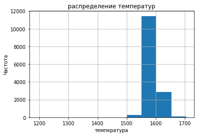
    


```python
temp.boxplot('Температура')
plt.show()
```


    
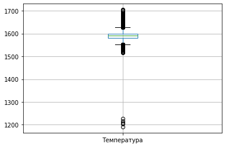
    


Видно, что температура зафиксирована от 1191 до 1705, в среднем 1590. Наблюдается меньшество которое меньше 1300.

<font color='blue'><b>Комментарий ментора</b></font><strike>
<br><font color='crimson'> ❌ Обрати внимание, что найдены не первая и не последняя температура, а минимальная и максимальная. Попробуй использовать first и last агрегации

<font color='blue'><b>Комментарий ментора</b></font><strike>
<br><font color='crimson'> ❌ С чем связана одинаковая темпераутра начала и конца?

<font color='blue'><b>Комментарий ментора</b></font><strike>
<br><font color='crimson'> ❌ По условию задачи нужно предсказывать последнюю температуру, а не разницу температур. Изменять целевой признак нельзя. Дальше нужно все переделать

Найдем начальную и конечную температуру.


```python
temp_first=temp.groupby('key').agg('first').rename(columns={'Время замера':'first_time','Температура':'first_temp'})
temp_last=temp.groupby('key').agg('last').rename(columns={'Время замера':'last_time','Температура':'last_temp'})
temp0=pd.merge(temp_first,temp_last,on='key',how='inner')
temp0['key']=temp0.index
temp0.head()
```


<div>
<style scoped>
    .dataframe tbody tr th:only-of-type {
        vertical-align: middle;
    }

    .dataframe tbody tr th {
        vertical-align: top;
    }

    .dataframe thead th {
        text-align: right;
    }
</style>
<table border="1" class="dataframe">
  <thead>
    <tr style="text-align: right;">
      <th></th>
      <th>first_time</th>
      <th>first_temp</th>
      <th>last_time</th>
      <th>last_temp</th>
      <th>key</th>
    </tr>
    <tr>
      <th>key</th>
      <th></th>
      <th></th>
      <th></th>
      <th></th>
      <th></th>
    </tr>
  </thead>
  <tbody>
    <tr>
      <th>1</th>
      <td>2019-05-03 11:02:04</td>
      <td>1571.0</td>
      <td>2019-05-03 11:30:38</td>
      <td>1613.0</td>
      <td>1</td>
    </tr>
    <tr>
      <th>2</th>
      <td>2019-05-03 11:34:04</td>
      <td>1581.0</td>
      <td>2019-05-03 11:55:09</td>
      <td>1602.0</td>
      <td>2</td>
    </tr>
    <tr>
      <th>3</th>
      <td>2019-05-03 12:06:44</td>
      <td>1596.0</td>
      <td>2019-05-03 12:35:57</td>
      <td>1599.0</td>
      <td>3</td>
    </tr>
    <tr>
      <th>4</th>
      <td>2019-05-03 12:39:27</td>
      <td>1601.0</td>
      <td>2019-05-03 12:59:47</td>
      <td>1625.0</td>
      <td>4</td>
    </tr>
    <tr>
      <th>5</th>
      <td>2019-05-03 13:11:03</td>
      <td>1576.0</td>
      <td>2019-05-03 13:36:39</td>
      <td>1602.0</td>
      <td>5</td>
    </tr>
  </tbody>
</table>
</div>


```python
temp0.info()
```

    <class 'pandas.core.frame.DataFrame'>
    Int64Index: 3216 entries, 1 to 3241
    Data columns (total 5 columns):
     #   Column      Non-Null Count  Dtype         
    ---  ------      --------------  -----         
     0   first_time  3216 non-null   datetime64[ns]
     1   first_temp  3216 non-null   float64       
     2   last_time   3216 non-null   datetime64[ns]
     3   last_temp   3216 non-null   float64       
     4   key         3216 non-null   int64         
    dtypes: datetime64[ns](2), float64(2), int64(1)
    memory usage: 150.8 KB


```python
# Но если было лишь одно наблюдение, то прогноз составить не получиться и поэтому такие надо удалить

temp0=temp0.query("first_time < last_time").reset_index(drop=True)
```


```python
temp0['time']=(temp0['last_time']-temp0['first_time']).astype(int)
```


```python
temp0.info()
```

    <class 'pandas.core.frame.DataFrame'>
    RangeIndex: 2475 entries, 0 to 2474
    Data columns (total 6 columns):
     #   Column      Non-Null Count  Dtype         
    ---  ------      --------------  -----         
     0   first_time  2475 non-null   datetime64[ns]
     1   first_temp  2475 non-null   float64       
     2   last_time   2475 non-null   datetime64[ns]
     3   last_temp   2475 non-null   float64       
     4   key         2475 non-null   int64         
     5   time        2475 non-null   int64         
    dtypes: datetime64[ns](2), float64(2), int64(2)
    memory usage: 116.1 KB


В результате получено 2474 наблюдения о начальной и конечной температуре. Конечная температура - это целевой признак.

### Проволочные добавки

Избавимся от ошибочных данных


```python
wire.info()
```

    <class 'pandas.core.frame.DataFrame'>
    RangeIndex: 3081 entries, 0 to 3080
    Data columns (total 10 columns):
     #   Column  Non-Null Count  Dtype  
    ---  ------  --------------  -----  
     0   key     3081 non-null   int64  
     1   Wire 1  3055 non-null   float64
     2   Wire 2  1079 non-null   float64
     3   Wire 3  63 non-null     float64
     4   Wire 4  14 non-null     float64
     5   Wire 5  1 non-null      float64
     6   Wire 6  73 non-null     float64
     7   Wire 7  11 non-null     float64
     8   Wire 8  19 non-null     float64
     9   Wire 9  29 non-null     float64
    dtypes: float64(9), int64(1)
    memory usage: 240.8 KB


```python
wire_time.info()
```

    <class 'pandas.core.frame.DataFrame'>
    RangeIndex: 3081 entries, 0 to 3080
    Data columns (total 10 columns):
     #   Column  Non-Null Count  Dtype 
    ---  ------  --------------  ----- 
     0   key     3081 non-null   int64 
     1   Wire 1  3055 non-null   object
     2   Wire 2  1079 non-null   object
     3   Wire 3  63 non-null     object
     4   Wire 4  14 non-null     object
     5   Wire 5  1 non-null      object
     6   Wire 6  73 non-null     object
     7   Wire 7  11 non-null     object
     8   Wire 8  19 non-null     object
     9   Wire 9  29 non-null     object
    dtypes: int64(1), object(9)
    memory usage: 240.8+ KB


Рассмотрим wire


```python
wire.drop('key',axis=1).hist(figsize=(20,10))
wire.describe()

```


<div>
<style scoped>
    .dataframe tbody tr th:only-of-type {
        vertical-align: middle;
    }

    .dataframe tbody tr th {
        vertical-align: top;
    }

    .dataframe thead th {
        text-align: right;
    }
</style>
<table border="1" class="dataframe">
  <thead>
    <tr style="text-align: right;">
      <th></th>
      <th>key</th>
      <th>Wire 1</th>
      <th>Wire 2</th>
      <th>Wire 3</th>
      <th>Wire 4</th>
      <th>Wire 5</th>
      <th>Wire 6</th>
      <th>Wire 7</th>
      <th>Wire 8</th>
      <th>Wire 9</th>
    </tr>
  </thead>
  <tbody>
    <tr>
      <th>count</th>
      <td>3081.000000</td>
      <td>3055.000000</td>
      <td>1079.000000</td>
      <td>63.000000</td>
      <td>14.000000</td>
      <td>1.000</td>
      <td>73.000000</td>
      <td>11.000000</td>
      <td>19.000000</td>
      <td>29.000000</td>
    </tr>
    <tr>
      <th>mean</th>
      <td>1623.426485</td>
      <td>100.895853</td>
      <td>50.577323</td>
      <td>189.482681</td>
      <td>57.442841</td>
      <td>15.132</td>
      <td>48.016974</td>
      <td>10.039007</td>
      <td>53.625193</td>
      <td>34.155752</td>
    </tr>
    <tr>
      <th>std</th>
      <td>932.996726</td>
      <td>42.012518</td>
      <td>39.320216</td>
      <td>99.513444</td>
      <td>28.824667</td>
      <td>NaN</td>
      <td>33.919845</td>
      <td>8.610584</td>
      <td>16.881728</td>
      <td>19.931616</td>
    </tr>
    <tr>
      <th>min</th>
      <td>1.000000</td>
      <td>1.918800</td>
      <td>0.030160</td>
      <td>0.144144</td>
      <td>24.148801</td>
      <td>15.132</td>
      <td>0.034320</td>
      <td>0.234208</td>
      <td>45.076721</td>
      <td>4.622800</td>
    </tr>
    <tr>
      <th>25%</th>
      <td>823.000000</td>
      <td>72.115684</td>
      <td>20.193680</td>
      <td>95.135044</td>
      <td>40.807002</td>
      <td>15.132</td>
      <td>25.053600</td>
      <td>6.762756</td>
      <td>46.094879</td>
      <td>22.058401</td>
    </tr>
    <tr>
      <th>50%</th>
      <td>1619.000000</td>
      <td>100.158234</td>
      <td>40.142956</td>
      <td>235.194977</td>
      <td>45.234282</td>
      <td>15.132</td>
      <td>42.076324</td>
      <td>9.017009</td>
      <td>46.279999</td>
      <td>30.066399</td>
    </tr>
    <tr>
      <th>75%</th>
      <td>2434.000000</td>
      <td>126.060483</td>
      <td>70.227558</td>
      <td>276.252014</td>
      <td>76.124619</td>
      <td>15.132</td>
      <td>64.212723</td>
      <td>11.886057</td>
      <td>48.089603</td>
      <td>43.862003</td>
    </tr>
    <tr>
      <th>max</th>
      <td>3241.000000</td>
      <td>330.314424</td>
      <td>282.780152</td>
      <td>385.008668</td>
      <td>113.231044</td>
      <td>15.132</td>
      <td>180.454575</td>
      <td>32.847674</td>
      <td>102.762401</td>
      <td>90.053604</td>
    </tr>
  </tbody>
</table>
</div>


    
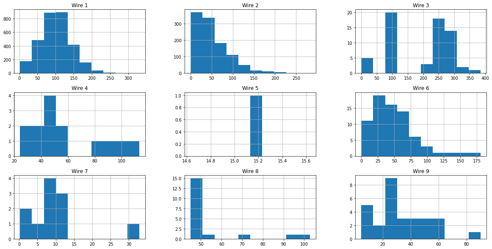
    


```python
wire.drop('key',axis=1).count().plot(kind='bar')
plt.title('Проволочные добавки')
plt.xlabel('добавка')
plt.ylabel('Количество применений')
plt.show()
```


    
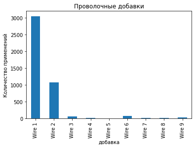
    


В wire_time  надо изменить тип данных


```python
for i in wire.columns:
    if i!='key':
        wire_time[i]=pd.to_datetime(wire_time[i], format='%Y-%m-%dT%H:%M:%S')
```


```python
wire_time.info()
```

    <class 'pandas.core.frame.DataFrame'>
    RangeIndex: 3081 entries, 0 to 3080
    Data columns (total 10 columns):
     #   Column  Non-Null Count  Dtype         
    ---  ------  --------------  -----         
     0   key     3081 non-null   int64         
     1   Wire 1  3055 non-null   datetime64[ns]
     2   Wire 2  1079 non-null   datetime64[ns]
     3   Wire 3  63 non-null     datetime64[ns]
     4   Wire 4  14 non-null     datetime64[ns]
     5   Wire 5  1 non-null      datetime64[ns]
     6   Wire 6  73 non-null     datetime64[ns]
     7   Wire 7  11 non-null     datetime64[ns]
     8   Wire 8  19 non-null     datetime64[ns]
     9   Wire 9  29 non-null     datetime64[ns]
    dtypes: datetime64[ns](9), int64(1)
    memory usage: 240.8 KB


```python
wire.duplicated().sum()
```


    0


```python
wire_time.duplicated().sum()
```


    0


Дубликатов нет


```python
wire_time.describe(datetime_is_numeric=True)
```


<div>
<style scoped>
    .dataframe tbody tr th:only-of-type {
        vertical-align: middle;
    }

    .dataframe tbody tr th {
        vertical-align: top;
    }

    .dataframe thead th {
        text-align: right;
    }
</style>
<table border="1" class="dataframe">
  <thead>
    <tr style="text-align: right;">
      <th></th>
      <th>key</th>
      <th>Wire 1</th>
      <th>Wire 2</th>
      <th>Wire 3</th>
      <th>Wire 4</th>
      <th>Wire 5</th>
      <th>Wire 6</th>
      <th>Wire 7</th>
      <th>Wire 8</th>
      <th>Wire 9</th>
    </tr>
  </thead>
  <tbody>
    <tr>
      <th>count</th>
      <td>3081.000000</td>
      <td>3055</td>
      <td>1079</td>
      <td>63</td>
      <td>14</td>
      <td>1</td>
      <td>73</td>
      <td>11</td>
      <td>19</td>
      <td>29</td>
    </tr>
    <tr>
      <th>mean</th>
      <td>1623.426485</td>
      <td>2019-07-05 23:22:34.279541760</td>
      <td>2019-07-07 01:07:08.735866624</td>
      <td>2019-07-10 15:09:58.650793472</td>
      <td>2019-07-11 13:44:37</td>
      <td>2019-08-13 06:14:30</td>
      <td>2019-07-07 11:51:15.095890432</td>
      <td>2019-08-07 01:16:08.090909184</td>
      <td>2019-06-23 07:47:49.052631552</td>
      <td>2019-07-01 11:56:04.793103616</td>
    </tr>
    <tr>
      <th>min</th>
      <td>1.000000</td>
      <td>2019-05-03 11:06:19</td>
      <td>2019-05-03 13:15:34</td>
      <td>2019-05-04 04:34:27</td>
      <td>2019-05-07 15:19:17</td>
      <td>2019-08-13 06:14:30</td>
      <td>2019-05-07 14:46:05</td>
      <td>2019-07-27 05:49:05</td>
      <td>2019-05-14 11:29:24</td>
      <td>2019-05-04 17:21:27</td>
    </tr>
    <tr>
      <th>25%</th>
      <td>823.000000</td>
      <td>2019-06-04 19:30:11.500000</td>
      <td>2019-06-05 14:50:26.500000</td>
      <td>2019-06-11 14:17:38.500000</td>
      <td>2019-07-20 17:58:53.750000128</td>
      <td>2019-08-13 06:14:30</td>
      <td>2019-05-08 21:47:30</td>
      <td>2019-07-27 16:27:27</td>
      <td>2019-05-14 14:20:07.500000</td>
      <td>2019-06-09 19:36:17</td>
    </tr>
    <tr>
      <th>50%</th>
      <td>1619.000000</td>
      <td>2019-07-03 06:36:23</td>
      <td>2019-07-04 23:13:39</td>
      <td>2019-07-21 10:04:47</td>
      <td>2019-07-27 05:45:26.500000</td>
      <td>2019-08-13 06:14:30</td>
      <td>2019-07-28 05:00:32</td>
      <td>2019-08-12 21:48:11</td>
      <td>2019-05-14 16:55:09</td>
      <td>2019-06-11 10:10:21</td>
    </tr>
    <tr>
      <th>75%</th>
      <td>2434.000000</td>
      <td>2019-08-08 08:56:06.500000</td>
      <td>2019-08-08 23:15:17</td>
      <td>2019-08-12 22:54:46</td>
      <td>2019-07-27 16:20:04.750000128</td>
      <td>2019-08-13 06:14:30</td>
      <td>2019-08-13 13:33:02</td>
      <td>2019-08-13 02:02:55.500000</td>
      <td>2019-08-16 05:06:53.500000</td>
      <td>2019-08-09 06:49:04</td>
    </tr>
    <tr>
      <th>max</th>
      <td>3241.000000</td>
      <td>2019-09-06 17:10:06</td>
      <td>2019-09-06 07:35:40</td>
      <td>2019-09-02 07:14:44</td>
      <td>2019-08-13 03:16:45</td>
      <td>2019-08-13 06:14:30</td>
      <td>2019-08-18 19:10:56</td>
      <td>2019-08-13 10:25:22</td>
      <td>2019-08-16 08:56:23</td>
      <td>2019-09-03 12:55:23</td>
    </tr>
    <tr>
      <th>std</th>
      <td>932.996726</td>
      <td>NaN</td>
      <td>NaN</td>
      <td>NaN</td>
      <td>NaN</td>
      <td>NaN</td>
      <td>NaN</td>
      <td>NaN</td>
      <td>NaN</td>
      <td>NaN</td>
    </tr>
  </tbody>
</table>
</div>


```python
# проверим совпадают ли ключи
(wire['key']!=wire_time['key']).sum()
```


    0


```python
# проверим, совпадают ли пропуски
(wire.isnull()!=wire_time.isnull()).sum()
```


    key       0
    Wire 1    0
    Wire 2    0
    Wire 3    0
    Wire 4    0
    Wire 5    0
    Wire 6    0
    Wire 7    0
    Wire 8    0
    Wire 9    0
    dtype: int64


Обе таблицы совпадают


```python
# посмотрим на количество циклов добавок
wire['key'].duplicated().sum()

```


    0


Каждая партия подвергалась лишь одному циклу добавок.


```python
# Переименуем столбцы в wire
col=[]
s=0
for i in wire.columns:
    if i=='key':
        col.append(i)
        
    else:
        col.append(f'wire_{s}')
    s=s+1

wire.columns=col
wire.head(2)
```


<div>
<style scoped>
    .dataframe tbody tr th:only-of-type {
        vertical-align: middle;
    }

    .dataframe tbody tr th {
        vertical-align: top;
    }

    .dataframe thead th {
        text-align: right;
    }
</style>
<table border="1" class="dataframe">
  <thead>
    <tr style="text-align: right;">
      <th></th>
      <th>key</th>
      <th>wire_1</th>
      <th>wire_2</th>
      <th>wire_3</th>
      <th>wire_4</th>
      <th>wire_5</th>
      <th>wire_6</th>
      <th>wire_7</th>
      <th>wire_8</th>
      <th>wire_9</th>
    </tr>
  </thead>
  <tbody>
    <tr>
      <th>0</th>
      <td>1</td>
      <td>60.059998</td>
      <td>NaN</td>
      <td>NaN</td>
      <td>NaN</td>
      <td>NaN</td>
      <td>NaN</td>
      <td>NaN</td>
      <td>NaN</td>
      <td>NaN</td>
    </tr>
    <tr>
      <th>1</th>
      <td>2</td>
      <td>96.052315</td>
      <td>NaN</td>
      <td>NaN</td>
      <td>NaN</td>
      <td>NaN</td>
      <td>NaN</td>
      <td>NaN</td>
      <td>NaN</td>
      <td>NaN</td>
    </tr>
  </tbody>
</table>
</div>


```python
# Переименуем столбцы в wire_time
col=[]
s=0
for i in wire_time.columns:
    if i=='key':
        col.append(i)
        
    else:
        col.append(f'wire_time_{s}')
    s=s+1

wire_time.columns=col
wire_time.head(2)
```


<div>
<style scoped>
    .dataframe tbody tr th:only-of-type {
        vertical-align: middle;
    }

    .dataframe tbody tr th {
        vertical-align: top;
    }

    .dataframe thead th {
        text-align: right;
    }
</style>
<table border="1" class="dataframe">
  <thead>
    <tr style="text-align: right;">
      <th></th>
      <th>key</th>
      <th>wire_time_1</th>
      <th>wire_time_2</th>
      <th>wire_time_3</th>
      <th>wire_time_4</th>
      <th>wire_time_5</th>
      <th>wire_time_6</th>
      <th>wire_time_7</th>
      <th>wire_time_8</th>
      <th>wire_time_9</th>
    </tr>
  </thead>
  <tbody>
    <tr>
      <th>0</th>
      <td>1</td>
      <td>2019-05-03 11:06:19</td>
      <td>NaT</td>
      <td>NaT</td>
      <td>NaT</td>
      <td>NaT</td>
      <td>NaT</td>
      <td>NaT</td>
      <td>NaT</td>
      <td>NaT</td>
    </tr>
    <tr>
      <th>1</th>
      <td>2</td>
      <td>2019-05-03 11:36:50</td>
      <td>NaT</td>
      <td>NaT</td>
      <td>NaT</td>
      <td>NaT</td>
      <td>NaT</td>
      <td>NaT</td>
      <td>NaT</td>
      <td>NaT</td>
    </tr>
  </tbody>
</table>
</div>


```python
wire_time.info()
```

    <class 'pandas.core.frame.DataFrame'>
    RangeIndex: 3081 entries, 0 to 3080
    Data columns (total 10 columns):
     #   Column       Non-Null Count  Dtype         
    ---  ------       --------------  -----         
     0   key          3081 non-null   int64         
     1   wire_time_1  3055 non-null   datetime64[ns]
     2   wire_time_2  1079 non-null   datetime64[ns]
     3   wire_time_3  63 non-null     datetime64[ns]
     4   wire_time_4  14 non-null     datetime64[ns]
     5   wire_time_5  1 non-null      datetime64[ns]
     6   wire_time_6  73 non-null     datetime64[ns]
     7   wire_time_7  11 non-null     datetime64[ns]
     8   wire_time_8  19 non-null     datetime64[ns]
     9   wire_time_9  29 non-null     datetime64[ns]
    dtypes: datetime64[ns](9), int64(1)
    memory usage: 240.8 KB


Посморим, сколько добавок до и после периода наблюдения


```python
s=2
ss=temp.groupby('key').agg({'Время замера':'first'}).merge(wire_time,on='key')
for i in range(1,10):
    print(f'wire_time_{i} :',(ss['Время замера']>ss[f'wire_time_{i}']).sum())
```

    wire_time_1 : 0
    wire_time_2 : 0
    wire_time_3 : 0
    wire_time_4 : 0
    wire_time_5 : 0
    wire_time_6 : 0
    wire_time_7 : 0
    wire_time_8 : 0
    wire_time_9 : 0


```python
ss=temp.groupby('key').agg({'Время замера':'last'}).merge(wire_time,on='key')
for i in range(1,10):
    print(f'wire_time_{i} :',(ss['Время замера']<ss[f'wire_time_{i}']).sum())
```

    wire_time_1 : 707
    wire_time_2 : 246
    wire_time_3 : 24
    wire_time_4 : 2
    wire_time_5 : 1
    wire_time_6 : 28
    wire_time_7 : 7
    wire_time_8 : 6
    wire_time_9 : 1


Видно, что достаточно много проволочных добавок было добавлено после наблюдений и поэтому их не надо учитывать.

### Сравнение ключей

Для последующего объединения необходимо определить совпадают ли все ключи.


```python
# функция ищущая значения ключей в перовй таблице, которых нет во второй и наоборот

def compere_table(a,b,s=0):
    #a=df1['key']
    #b=df2['key']
    
    akey=[]
    bkey=[]
    
    for i in a:
        if i not in b:
            akey.append(i)
            
    for i in b:
        if i not in a:
            bkey.append(i)
            
    
    if s==0:
        print('первый',len(akey))
        print('второй',len(bkey))
    else:
        print('первый',len(akey),':',akey)
        print('второй',len(bkey),':',bkey)
    
```


```python
compere_table(bulk['key'],wire['key'])
```

    первый 157
    второй 111


Как видно есть стали в которые добавляли лишь сыпучие или проволочные материалы, а не все всесте.


```python
compere_table(gas['key'],temp0['key'],2)
```

    первый 767 : [2475, 2476, 2477, 2478, 2479, 2480, 2481, 2482, 2483, 2484, 2485, 2486, 2487, 2488, 2489, 2490, 2491, 2492, 2493, 2494, 2495, 2496, 2497, 2498, 2499, 2500, 2501, 2502, 2503, 2504, 2505, 2506, 2507, 2508, 2509, 2510, 2511, 2512, 2513, 2514, 2515, 2516, 2517, 2518, 2519, 2520, 2521, 2522, 2523, 2524, 2525, 2526, 2527, 2528, 2529, 2530, 2531, 2532, 2533, 2534, 2535, 2536, 2537, 2538, 2539, 2540, 2541, 2542, 2543, 2544, 2545, 2546, 2547, 2548, 2549, 2550, 2551, 2552, 2553, 2554, 2555, 2556, 2557, 2558, 2559, 2560, 2561, 2562, 2563, 2564, 2565, 2566, 2567, 2568, 2569, 2570, 2571, 2572, 2573, 2574, 2575, 2576, 2577, 2578, 2579, 2580, 2581, 2582, 2583, 2584, 2585, 2586, 2587, 2588, 2589, 2590, 2591, 2592, 2593, 2594, 2595, 2596, 2597, 2598, 2599, 2600, 2601, 2602, 2603, 2604, 2605, 2606, 2607, 2608, 2609, 2610, 2611, 2612, 2613, 2614, 2615, 2616, 2617, 2618, 2619, 2620, 2621, 2622, 2623, 2624, 2625, 2626, 2627, 2628, 2629, 2630, 2631, 2632, 2633, 2634, 2635, 2636, 2637, 2638, 2639, 2640, 2641, 2642, 2643, 2644, 2645, 2646, 2647, 2648, 2649, 2650, 2651, 2652, 2653, 2654, 2655, 2656, 2657, 2658, 2659, 2660, 2661, 2662, 2663, 2664, 2665, 2666, 2667, 2668, 2669, 2670, 2671, 2672, 2673, 2674, 2675, 2676, 2677, 2678, 2679, 2680, 2681, 2682, 2683, 2684, 2685, 2686, 2687, 2688, 2689, 2690, 2691, 2692, 2693, 2694, 2695, 2696, 2697, 2698, 2699, 2700, 2701, 2702, 2703, 2704, 2705, 2706, 2707, 2708, 2709, 2710, 2711, 2712, 2713, 2714, 2715, 2716, 2717, 2718, 2719, 2720, 2721, 2722, 2723, 2724, 2725, 2726, 2727, 2728, 2729, 2730, 2731, 2732, 2733, 2734, 2735, 2736, 2737, 2738, 2739, 2740, 2741, 2742, 2743, 2744, 2745, 2746, 2747, 2748, 2749, 2750, 2751, 2752, 2753, 2754, 2755, 2756, 2757, 2758, 2759, 2760, 2761, 2762, 2763, 2764, 2765, 2766, 2767, 2768, 2769, 2770, 2771, 2772, 2773, 2774, 2775, 2776, 2777, 2778, 2779, 2780, 2781, 2782, 2783, 2784, 2785, 2786, 2787, 2788, 2789, 2790, 2791, 2792, 2793, 2794, 2795, 2796, 2797, 2798, 2799, 2800, 2801, 2802, 2803, 2804, 2805, 2806, 2807, 2808, 2809, 2810, 2811, 2812, 2813, 2814, 2815, 2816, 2817, 2818, 2819, 2820, 2821, 2822, 2823, 2824, 2825, 2826, 2827, 2828, 2829, 2830, 2831, 2832, 2833, 2834, 2835, 2836, 2837, 2838, 2839, 2840, 2841, 2842, 2843, 2844, 2845, 2846, 2847, 2848, 2849, 2850, 2851, 2852, 2853, 2854, 2855, 2856, 2857, 2858, 2859, 2860, 2861, 2862, 2863, 2864, 2865, 2866, 2867, 2868, 2869, 2870, 2871, 2872, 2873, 2874, 2875, 2876, 2877, 2878, 2879, 2880, 2881, 2882, 2883, 2884, 2885, 2886, 2887, 2888, 2889, 2890, 2891, 2892, 2893, 2894, 2895, 2896, 2897, 2898, 2899, 2900, 2901, 2902, 2903, 2904, 2905, 2906, 2907, 2908, 2909, 2910, 2911, 2912, 2913, 2914, 2915, 2916, 2917, 2918, 2919, 2920, 2921, 2922, 2923, 2924, 2925, 2926, 2927, 2928, 2929, 2930, 2931, 2932, 2933, 2934, 2935, 2936, 2937, 2938, 2939, 2940, 2941, 2942, 2943, 2944, 2945, 2946, 2947, 2948, 2949, 2950, 2951, 2952, 2953, 2954, 2955, 2956, 2957, 2958, 2959, 2960, 2961, 2962, 2963, 2964, 2965, 2966, 2967, 2968, 2969, 2970, 2971, 2972, 2973, 2974, 2975, 2976, 2977, 2978, 2979, 2980, 2981, 2982, 2983, 2984, 2985, 2986, 2987, 2988, 2989, 2990, 2991, 2992, 2993, 2994, 2995, 2996, 2997, 2998, 2999, 3000, 3001, 3002, 3003, 3004, 3005, 3006, 3007, 3008, 3009, 3010, 3011, 3012, 3013, 3014, 3015, 3016, 3017, 3018, 3019, 3020, 3021, 3022, 3023, 3024, 3025, 3026, 3027, 3028, 3029, 3030, 3031, 3032, 3033, 3034, 3035, 3036, 3037, 3038, 3039, 3040, 3041, 3042, 3043, 3044, 3045, 3046, 3047, 3048, 3049, 3050, 3051, 3052, 3053, 3054, 3055, 3056, 3057, 3058, 3059, 3060, 3061, 3062, 3063, 3064, 3065, 3066, 3067, 3068, 3069, 3070, 3071, 3072, 3073, 3074, 3075, 3076, 3077, 3078, 3079, 3080, 3081, 3082, 3083, 3084, 3085, 3086, 3087, 3088, 3089, 3090, 3091, 3092, 3093, 3094, 3095, 3096, 3097, 3098, 3099, 3100, 3101, 3102, 3103, 3104, 3105, 3106, 3107, 3108, 3109, 3110, 3111, 3112, 3113, 3114, 3115, 3116, 3117, 3118, 3119, 3120, 3121, 3122, 3123, 3124, 3125, 3126, 3127, 3128, 3129, 3130, 3131, 3132, 3133, 3134, 3135, 3136, 3137, 3138, 3139, 3140, 3141, 3142, 3143, 3144, 3145, 3146, 3147, 3148, 3149, 3150, 3151, 3152, 3153, 3154, 3155, 3156, 3157, 3158, 3159, 3160, 3161, 3162, 3163, 3164, 3165, 3166, 3167, 3168, 3169, 3170, 3171, 3172, 3173, 3174, 3175, 3176, 3177, 3178, 3179, 3180, 3181, 3182, 3183, 3184, 3185, 3186, 3187, 3188, 3189, 3190, 3191, 3192, 3193, 3194, 3195, 3196, 3197, 3198, 3199, 3200, 3201, 3202, 3203, 3204, 3205, 3206, 3207, 3208, 3209, 3210, 3211, 3212, 3213, 3214, 3215, 3216, 3217, 3218, 3219, 3220, 3221, 3222, 3223, 3224, 3225, 3226, 3227, 3228, 3229, 3230, 3231, 3232, 3233, 3234, 3235, 3236, 3237, 3238, 3239, 3240, 3241]
    второй 0 : []


Есть 768 партий, где не используется продувочный газ.


```python
compere_table(temp['key'],bulk['key'])
```

    первый 111
    второй 0


```python
compere_table(temp['key'],wire['key'])
```

    первый 159
    второй 0


У 601 из замеренных партий не было сыпучих материалов, а у 867 - проволочных.


```python
compere_table(temp['key'],pd.concat([wire['key'],bulk['key']]))
```

    первый 111
    второй 0


Видно, что у 597 наблюдаемых сталей не было добавок


```python
compere_table(arc['key'],temp['key'])
```

    первый 0
    второй 0


А вот нагревание было у всех.

### Общий Вывод

 Всего у нас информация от 1 до 3241 партии стали, но некоторые были пропущены. В среднем на каждую партию приходиться 4,5 нагрева, минимум 1, максимум 16. Ни один нагрев не длился более более 15 минут. В среднем он длилися 2-3 минуты. Видно, что большая часть активная мощностей находиться между 0.4 и 0.8 максимкм 1.46, а минимум 0.25. Реактивная мощность 0.4-0.5 в среднем, минимкм 0.15 максимум 1.27. Был добавлен новый признак "Нагрев" (время нагрева), мощность, энергия и сдвиг и заменина реактивная мощность в партии 2116, т.к. в ней была ошибка. Время измерения в среднем состовляет 33 минуты, максимум 6 часов. В среднем делалось 5 измерений для партии, большая часть между 3 и 6, максимум 17. Температура зафиксирована от 1191 до 1705, в среднем 1590. В среднем продувают 7-13, минимум близок к 0, а максимум 77. Видно, что самым часто использумый сыпучий материал это 14_й, а 8-й использовали всего один раз, а для проволочного максимальный 1-й, а минимальный 5-й. Для таблиц с добавками пропуски и ключи у таблиц с объемом и временем добавки совпадают. Каждая партия подвергалась лишь одному циклу добавок. Есть 26 партий, где не используется продувочный газ.У 601 из замеренных партий не было сыпучих материалов, а у 867 - проволочных. Видно, что у 597 наблюдаемых сталей не было добавок. А вот нагревание было у всех.

## Объединение данных

Начнем с объединения схожих таблиц


```python
bulk0=bulk.merge(bulk_time,left_on='key',right_on='key',how='inner')
```


```python
bulk0.head(2)
```


<div>
<style scoped>
    .dataframe tbody tr th:only-of-type {
        vertical-align: middle;
    }

    .dataframe tbody tr th {
        vertical-align: top;
    }

    .dataframe thead th {
        text-align: right;
    }
</style>
<table border="1" class="dataframe">
  <thead>
    <tr style="text-align: right;">
      <th></th>
      <th>key</th>
      <th>bulk_1</th>
      <th>bulk_2</th>
      <th>bulk_3</th>
      <th>bulk_4</th>
      <th>bulk_5</th>
      <th>bulk_6</th>
      <th>bulk_7</th>
      <th>bulk_8</th>
      <th>bulk_9</th>
      <th>...</th>
      <th>bulk_time_6</th>
      <th>bulk_time_7</th>
      <th>bulk_time_8</th>
      <th>bulk_time_9</th>
      <th>bulk_time_10</th>
      <th>bulk_time_11</th>
      <th>bulk_time_12</th>
      <th>bulk_time_13</th>
      <th>bulk_time_14</th>
      <th>bulk_time_15</th>
    </tr>
  </thead>
  <tbody>
    <tr>
      <th>0</th>
      <td>1</td>
      <td>NaN</td>
      <td>NaN</td>
      <td>NaN</td>
      <td>43.0</td>
      <td>NaN</td>
      <td>NaN</td>
      <td>NaN</td>
      <td>NaN</td>
      <td>NaN</td>
      <td>...</td>
      <td>NaT</td>
      <td>NaT</td>
      <td>NaT</td>
      <td>NaT</td>
      <td>NaT</td>
      <td>NaT</td>
      <td>2019-05-03 11:24:31</td>
      <td>NaT</td>
      <td>2019-05-03 11:14:50</td>
      <td>2019-05-03 11:10:43</td>
    </tr>
    <tr>
      <th>1</th>
      <td>2</td>
      <td>NaN</td>
      <td>NaN</td>
      <td>NaN</td>
      <td>73.0</td>
      <td>NaN</td>
      <td>NaN</td>
      <td>NaN</td>
      <td>NaN</td>
      <td>NaN</td>
      <td>...</td>
      <td>NaT</td>
      <td>NaT</td>
      <td>NaT</td>
      <td>NaT</td>
      <td>NaT</td>
      <td>NaT</td>
      <td>2019-05-03 11:53:30</td>
      <td>NaT</td>
      <td>2019-05-03 11:48:37</td>
      <td>2019-05-03 11:44:39</td>
    </tr>
  </tbody>
</table>
<p>2 rows × 31 columns</p>
</div>


```python
wire0=wire.merge(wire_time,left_on='key',right_on='key',how='inner')
```


```python
wire0.head(2)
```


<div>
<style scoped>
    .dataframe tbody tr th:only-of-type {
        vertical-align: middle;
    }

    .dataframe tbody tr th {
        vertical-align: top;
    }

    .dataframe thead th {
        text-align: right;
    }
</style>
<table border="1" class="dataframe">
  <thead>
    <tr style="text-align: right;">
      <th></th>
      <th>key</th>
      <th>wire_1</th>
      <th>wire_2</th>
      <th>wire_3</th>
      <th>wire_4</th>
      <th>wire_5</th>
      <th>wire_6</th>
      <th>wire_7</th>
      <th>wire_8</th>
      <th>wire_9</th>
      <th>wire_time_1</th>
      <th>wire_time_2</th>
      <th>wire_time_3</th>
      <th>wire_time_4</th>
      <th>wire_time_5</th>
      <th>wire_time_6</th>
      <th>wire_time_7</th>
      <th>wire_time_8</th>
      <th>wire_time_9</th>
    </tr>
  </thead>
  <tbody>
    <tr>
      <th>0</th>
      <td>1</td>
      <td>60.059998</td>
      <td>NaN</td>
      <td>NaN</td>
      <td>NaN</td>
      <td>NaN</td>
      <td>NaN</td>
      <td>NaN</td>
      <td>NaN</td>
      <td>NaN</td>
      <td>2019-05-03 11:06:19</td>
      <td>NaT</td>
      <td>NaT</td>
      <td>NaT</td>
      <td>NaT</td>
      <td>NaT</td>
      <td>NaT</td>
      <td>NaT</td>
      <td>NaT</td>
    </tr>
    <tr>
      <th>1</th>
      <td>2</td>
      <td>96.052315</td>
      <td>NaN</td>
      <td>NaN</td>
      <td>NaN</td>
      <td>NaN</td>
      <td>NaN</td>
      <td>NaN</td>
      <td>NaN</td>
      <td>NaN</td>
      <td>2019-05-03 11:36:50</td>
      <td>NaT</td>
      <td>NaT</td>
      <td>NaT</td>
      <td>NaT</td>
      <td>NaT</td>
      <td>NaT</td>
      <td>NaT</td>
      <td>NaT</td>
    </tr>
  </tbody>
</table>
</div>


```python
bulk0.info()
```

    <class 'pandas.core.frame.DataFrame'>
    Int64Index: 3129 entries, 0 to 3128
    Data columns (total 31 columns):
     #   Column        Non-Null Count  Dtype         
    ---  ------        --------------  -----         
     0   key           3129 non-null   int64         
     1   bulk_1        252 non-null    float64       
     2   bulk_2        22 non-null     float64       
     3   bulk_3        1298 non-null   float64       
     4   bulk_4        1014 non-null   float64       
     5   bulk_5        77 non-null     float64       
     6   bulk_6        576 non-null    float64       
     7   bulk_7        25 non-null     float64       
     8   bulk_8        1 non-null      float64       
     9   bulk_9        19 non-null     float64       
     10  bulk_10       176 non-null    float64       
     11  bulk_11       177 non-null    float64       
     12  bulk_12       2450 non-null   float64       
     13  bulk_13       18 non-null     float64       
     14  bulk_14       2806 non-null   float64       
     15  bulk_15       2248 non-null   float64       
     16  bulk_time_1   252 non-null    datetime64[ns]
     17  bulk_time_2   22 non-null     datetime64[ns]
     18  bulk_time_3   1298 non-null   datetime64[ns]
     19  bulk_time_4   1014 non-null   datetime64[ns]
     20  bulk_time_5   77 non-null     datetime64[ns]
     21  bulk_time_6   576 non-null    datetime64[ns]
     22  bulk_time_7   25 non-null     datetime64[ns]
     23  bulk_time_8   1 non-null      datetime64[ns]
     24  bulk_time_9   19 non-null     datetime64[ns]
     25  bulk_time_10  176 non-null    datetime64[ns]
     26  bulk_time_11  177 non-null    datetime64[ns]
     27  bulk_time_12  2450 non-null   datetime64[ns]
     28  bulk_time_13  18 non-null     datetime64[ns]
     29  bulk_time_14  2806 non-null   datetime64[ns]
     30  bulk_time_15  2248 non-null   datetime64[ns]
    dtypes: datetime64[ns](15), float64(15), int64(1)
    memory usage: 782.2 KB


```python
wire0.info()
```

    <class 'pandas.core.frame.DataFrame'>
    Int64Index: 3081 entries, 0 to 3080
    Data columns (total 19 columns):
     #   Column       Non-Null Count  Dtype         
    ---  ------       --------------  -----         
     0   key          3081 non-null   int64         
     1   wire_1       3055 non-null   float64       
     2   wire_2       1079 non-null   float64       
     3   wire_3       63 non-null     float64       
     4   wire_4       14 non-null     float64       
     5   wire_5       1 non-null      float64       
     6   wire_6       73 non-null     float64       
     7   wire_7       11 non-null     float64       
     8   wire_8       19 non-null     float64       
     9   wire_9       29 non-null     float64       
     10  wire_time_1  3055 non-null   datetime64[ns]
     11  wire_time_2  1079 non-null   datetime64[ns]
     12  wire_time_3  63 non-null     datetime64[ns]
     13  wire_time_4  14 non-null     datetime64[ns]
     14  wire_time_5  1 non-null      datetime64[ns]
     15  wire_time_6  73 non-null     datetime64[ns]
     16  wire_time_7  11 non-null     datetime64[ns]
     17  wire_time_8  19 non-null     datetime64[ns]
     18  wire_time_9  29 non-null     datetime64[ns]
    dtypes: datetime64[ns](9), float64(9), int64(1)
    memory usage: 481.4 KB


```python
leg=bulk0.merge(wire0,left_on='key',right_on='key',how='outer') # объединим все таблицы о добавках. Используется outer из-за того что в некоторых партиях используется один фид добовак
```


```python
leg.head(2)
```


<div>
<style scoped>
    .dataframe tbody tr th:only-of-type {
        vertical-align: middle;
    }

    .dataframe tbody tr th {
        vertical-align: top;
    }

    .dataframe thead th {
        text-align: right;
    }
</style>
<table border="1" class="dataframe">
  <thead>
    <tr style="text-align: right;">
      <th></th>
      <th>key</th>
      <th>bulk_1</th>
      <th>bulk_2</th>
      <th>bulk_3</th>
      <th>bulk_4</th>
      <th>bulk_5</th>
      <th>bulk_6</th>
      <th>bulk_7</th>
      <th>bulk_8</th>
      <th>bulk_9</th>
      <th>...</th>
      <th>wire_9</th>
      <th>wire_time_1</th>
      <th>wire_time_2</th>
      <th>wire_time_3</th>
      <th>wire_time_4</th>
      <th>wire_time_5</th>
      <th>wire_time_6</th>
      <th>wire_time_7</th>
      <th>wire_time_8</th>
      <th>wire_time_9</th>
    </tr>
  </thead>
  <tbody>
    <tr>
      <th>0</th>
      <td>1</td>
      <td>NaN</td>
      <td>NaN</td>
      <td>NaN</td>
      <td>43.0</td>
      <td>NaN</td>
      <td>NaN</td>
      <td>NaN</td>
      <td>NaN</td>
      <td>NaN</td>
      <td>...</td>
      <td>NaN</td>
      <td>2019-05-03 11:06:19</td>
      <td>NaT</td>
      <td>NaT</td>
      <td>NaT</td>
      <td>NaT</td>
      <td>NaT</td>
      <td>NaT</td>
      <td>NaT</td>
      <td>NaT</td>
    </tr>
    <tr>
      <th>1</th>
      <td>2</td>
      <td>NaN</td>
      <td>NaN</td>
      <td>NaN</td>
      <td>73.0</td>
      <td>NaN</td>
      <td>NaN</td>
      <td>NaN</td>
      <td>NaN</td>
      <td>NaN</td>
      <td>...</td>
      <td>NaN</td>
      <td>2019-05-03 11:36:50</td>
      <td>NaT</td>
      <td>NaT</td>
      <td>NaT</td>
      <td>NaT</td>
      <td>NaT</td>
      <td>NaT</td>
      <td>NaT</td>
      <td>NaT</td>
    </tr>
  </tbody>
</table>
<p>2 rows × 49 columns</p>
</div>


```python
leg.info()
```

    <class 'pandas.core.frame.DataFrame'>
    Int64Index: 3185 entries, 0 to 3184
    Data columns (total 49 columns):
     #   Column        Non-Null Count  Dtype         
    ---  ------        --------------  -----         
     0   key           3185 non-null   int64         
     1   bulk_1        252 non-null    float64       
     2   bulk_2        22 non-null     float64       
     3   bulk_3        1298 non-null   float64       
     4   bulk_4        1014 non-null   float64       
     5   bulk_5        77 non-null     float64       
     6   bulk_6        576 non-null    float64       
     7   bulk_7        25 non-null     float64       
     8   bulk_8        1 non-null      float64       
     9   bulk_9        19 non-null     float64       
     10  bulk_10       176 non-null    float64       
     11  bulk_11       177 non-null    float64       
     12  bulk_12       2450 non-null   float64       
     13  bulk_13       18 non-null     float64       
     14  bulk_14       2806 non-null   float64       
     15  bulk_15       2248 non-null   float64       
     16  bulk_time_1   252 non-null    datetime64[ns]
     17  bulk_time_2   22 non-null     datetime64[ns]
     18  bulk_time_3   1298 non-null   datetime64[ns]
     19  bulk_time_4   1014 non-null   datetime64[ns]
     20  bulk_time_5   77 non-null     datetime64[ns]
     21  bulk_time_6   576 non-null    datetime64[ns]
     22  bulk_time_7   25 non-null     datetime64[ns]
     23  bulk_time_8   1 non-null      datetime64[ns]
     24  bulk_time_9   19 non-null     datetime64[ns]
     25  bulk_time_10  176 non-null    datetime64[ns]
     26  bulk_time_11  177 non-null    datetime64[ns]
     27  bulk_time_12  2450 non-null   datetime64[ns]
     28  bulk_time_13  18 non-null     datetime64[ns]
     29  bulk_time_14  2806 non-null   datetime64[ns]
     30  bulk_time_15  2248 non-null   datetime64[ns]
     31  wire_1        3055 non-null   float64       
     32  wire_2        1079 non-null   float64       
     33  wire_3        63 non-null     float64       
     34  wire_4        14 non-null     float64       
     35  wire_5        1 non-null      float64       
     36  wire_6        73 non-null     float64       
     37  wire_7        11 non-null     float64       
     38  wire_8        19 non-null     float64       
     39  wire_9        29 non-null     float64       
     40  wire_time_1   3055 non-null   datetime64[ns]
     41  wire_time_2   1079 non-null   datetime64[ns]
     42  wire_time_3   63 non-null     datetime64[ns]
     43  wire_time_4   14 non-null     datetime64[ns]
     44  wire_time_5   1 non-null      datetime64[ns]
     45  wire_time_6   73 non-null     datetime64[ns]
     46  wire_time_7   11 non-null     datetime64[ns]
     47  wire_time_8   19 non-null     datetime64[ns]
     48  wire_time_9   29 non-null     datetime64[ns]
    dtypes: datetime64[ns](24), float64(24), int64(1)
    memory usage: 1.2 MB


Информацию об времени и объеме добавок прошла успешно.

Объединим таблицу примесей с данными о температуре газом и нагревом. Неодходимо использовать 'left' т.к у некоторых партий не было газа или добавок.


```python
data2=temp0.merge(leg,left_on='key',right_on='key',how='left')
```

<font color='blue'><b>Комментарий ментора</b></font><strike>
<br><font color='crimson'> ❌ Объединять можно все только сагрегированные партии по принципу одна строка - одна партия. data_arc и data_temp должны быть меньше


```python
data2.info()
```

    <class 'pandas.core.frame.DataFrame'>
    Int64Index: 2475 entries, 0 to 2474
    Data columns (total 54 columns):
     #   Column        Non-Null Count  Dtype         
    ---  ------        --------------  -----         
     0   first_time    2475 non-null   datetime64[ns]
     1   first_temp    2475 non-null   float64       
     2   last_time     2475 non-null   datetime64[ns]
     3   last_temp     2475 non-null   float64       
     4   key           2475 non-null   int64         
     5   time          2475 non-null   int64         
     6   bulk_1        199 non-null    float64       
     7   bulk_2        13 non-null     float64       
     8   bulk_3        965 non-null    float64       
     9   bulk_4        814 non-null    float64       
     10  bulk_5        53 non-null     float64       
     11  bulk_6        443 non-null    float64       
     12  bulk_7        14 non-null     float64       
     13  bulk_8        1 non-null      float64       
     14  bulk_9        13 non-null     float64       
     15  bulk_10       143 non-null    float64       
     16  bulk_11       130 non-null    float64       
     17  bulk_12       1882 non-null   float64       
     18  bulk_13       14 non-null     float64       
     19  bulk_14       2137 non-null   float64       
     20  bulk_15       1713 non-null   float64       
     21  bulk_time_1   199 non-null    datetime64[ns]
     22  bulk_time_2   13 non-null     datetime64[ns]
     23  bulk_time_3   965 non-null    datetime64[ns]
     24  bulk_time_4   814 non-null    datetime64[ns]
     25  bulk_time_5   53 non-null     datetime64[ns]
     26  bulk_time_6   443 non-null    datetime64[ns]
     27  bulk_time_7   14 non-null     datetime64[ns]
     28  bulk_time_8   1 non-null      datetime64[ns]
     29  bulk_time_9   13 non-null     datetime64[ns]
     30  bulk_time_10  143 non-null    datetime64[ns]
     31  bulk_time_11  130 non-null    datetime64[ns]
     32  bulk_time_12  1882 non-null   datetime64[ns]
     33  bulk_time_13  14 non-null     datetime64[ns]
     34  bulk_time_14  2137 non-null   datetime64[ns]
     35  bulk_time_15  1713 non-null   datetime64[ns]
     36  wire_1        2348 non-null   float64       
     37  wire_2        833 non-null    float64       
     38  wire_3        39 non-null     float64       
     39  wire_4        12 non-null     float64       
     40  wire_5        0 non-null      float64       
     41  wire_6        45 non-null     float64       
     42  wire_7        4 non-null      float64       
     43  wire_8        13 non-null     float64       
     44  wire_9        28 non-null     float64       
     45  wire_time_1   2348 non-null   datetime64[ns]
     46  wire_time_2   833 non-null    datetime64[ns]
     47  wire_time_3   39 non-null     datetime64[ns]
     48  wire_time_4   12 non-null     datetime64[ns]
     49  wire_time_5   0 non-null      datetime64[ns]
     50  wire_time_6   45 non-null     datetime64[ns]
     51  wire_time_7   4 non-null      datetime64[ns]
     52  wire_time_8   13 non-null     datetime64[ns]
     53  wire_time_9   28 non-null     datetime64[ns]
    dtypes: datetime64[ns](26), float64(26), int64(2)
    memory usage: 1.0 MB


```python
data1=data2.merge(gas,left_on='key',right_on='key',how='left')
data1.info()
```

    <class 'pandas.core.frame.DataFrame'>
    Int64Index: 2475 entries, 0 to 2474
    Data columns (total 55 columns):
     #   Column        Non-Null Count  Dtype         
    ---  ------        --------------  -----         
     0   first_time    2475 non-null   datetime64[ns]
     1   first_temp    2475 non-null   float64       
     2   last_time     2475 non-null   datetime64[ns]
     3   last_temp     2475 non-null   float64       
     4   key           2475 non-null   int64         
     5   time          2475 non-null   int64         
     6   bulk_1        199 non-null    float64       
     7   bulk_2        13 non-null     float64       
     8   bulk_3        965 non-null    float64       
     9   bulk_4        814 non-null    float64       
     10  bulk_5        53 non-null     float64       
     11  bulk_6        443 non-null    float64       
     12  bulk_7        14 non-null     float64       
     13  bulk_8        1 non-null      float64       
     14  bulk_9        13 non-null     float64       
     15  bulk_10       143 non-null    float64       
     16  bulk_11       130 non-null    float64       
     17  bulk_12       1882 non-null   float64       
     18  bulk_13       14 non-null     float64       
     19  bulk_14       2137 non-null   float64       
     20  bulk_15       1713 non-null   float64       
     21  bulk_time_1   199 non-null    datetime64[ns]
     22  bulk_time_2   13 non-null     datetime64[ns]
     23  bulk_time_3   965 non-null    datetime64[ns]
     24  bulk_time_4   814 non-null    datetime64[ns]
     25  bulk_time_5   53 non-null     datetime64[ns]
     26  bulk_time_6   443 non-null    datetime64[ns]
     27  bulk_time_7   14 non-null     datetime64[ns]
     28  bulk_time_8   1 non-null      datetime64[ns]
     29  bulk_time_9   13 non-null     datetime64[ns]
     30  bulk_time_10  143 non-null    datetime64[ns]
     31  bulk_time_11  130 non-null    datetime64[ns]
     32  bulk_time_12  1882 non-null   datetime64[ns]
     33  bulk_time_13  14 non-null     datetime64[ns]
     34  bulk_time_14  2137 non-null   datetime64[ns]
     35  bulk_time_15  1713 non-null   datetime64[ns]
     36  wire_1        2348 non-null   float64       
     37  wire_2        833 non-null    float64       
     38  wire_3        39 non-null     float64       
     39  wire_4        12 non-null     float64       
     40  wire_5        0 non-null      float64       
     41  wire_6        45 non-null     float64       
     42  wire_7        4 non-null      float64       
     43  wire_8        13 non-null     float64       
     44  wire_9        28 non-null     float64       
     45  wire_time_1   2348 non-null   datetime64[ns]
     46  wire_time_2   833 non-null    datetime64[ns]
     47  wire_time_3   39 non-null     datetime64[ns]
     48  wire_time_4   12 non-null     datetime64[ns]
     49  wire_time_5   0 non-null      datetime64[ns]
     50  wire_time_6   45 non-null     datetime64[ns]
     51  wire_time_7   4 non-null      datetime64[ns]
     52  wire_time_8   13 non-null     datetime64[ns]
     53  wire_time_9   28 non-null     datetime64[ns]
     54  Газ           2473 non-null   float64       
    dtypes: datetime64[ns](26), float64(27), int64(2)
    memory usage: 1.1 MB


```python
data=data1.merge(data_arc,left_on='key',right_on='key',how='left')
data.info()
```

    <class 'pandas.core.frame.DataFrame'>
    Int64Index: 2475 entries, 0 to 2474
    Data columns (total 60 columns):
     #   Column        Non-Null Count  Dtype         
    ---  ------        --------------  -----         
     0   first_time    2475 non-null   datetime64[ns]
     1   first_temp    2475 non-null   float64       
     2   last_time     2475 non-null   datetime64[ns]
     3   last_temp     2475 non-null   float64       
     4   key           2475 non-null   int64         
     5   time          2475 non-null   int64         
     6   bulk_1        199 non-null    float64       
     7   bulk_2        13 non-null     float64       
     8   bulk_3        965 non-null    float64       
     9   bulk_4        814 non-null    float64       
     10  bulk_5        53 non-null     float64       
     11  bulk_6        443 non-null    float64       
     12  bulk_7        14 non-null     float64       
     13  bulk_8        1 non-null      float64       
     14  bulk_9        13 non-null     float64       
     15  bulk_10       143 non-null    float64       
     16  bulk_11       130 non-null    float64       
     17  bulk_12       1882 non-null   float64       
     18  bulk_13       14 non-null     float64       
     19  bulk_14       2137 non-null   float64       
     20  bulk_15       1713 non-null   float64       
     21  bulk_time_1   199 non-null    datetime64[ns]
     22  bulk_time_2   13 non-null     datetime64[ns]
     23  bulk_time_3   965 non-null    datetime64[ns]
     24  bulk_time_4   814 non-null    datetime64[ns]
     25  bulk_time_5   53 non-null     datetime64[ns]
     26  bulk_time_6   443 non-null    datetime64[ns]
     27  bulk_time_7   14 non-null     datetime64[ns]
     28  bulk_time_8   1 non-null      datetime64[ns]
     29  bulk_time_9   13 non-null     datetime64[ns]
     30  bulk_time_10  143 non-null    datetime64[ns]
     31  bulk_time_11  130 non-null    datetime64[ns]
     32  bulk_time_12  1882 non-null   datetime64[ns]
     33  bulk_time_13  14 non-null     datetime64[ns]
     34  bulk_time_14  2137 non-null   datetime64[ns]
     35  bulk_time_15  1713 non-null   datetime64[ns]
     36  wire_1        2348 non-null   float64       
     37  wire_2        833 non-null    float64       
     38  wire_3        39 non-null     float64       
     39  wire_4        12 non-null     float64       
     40  wire_5        0 non-null      float64       
     41  wire_6        45 non-null     float64       
     42  wire_7        4 non-null      float64       
     43  wire_8        13 non-null     float64       
     44  wire_9        28 non-null     float64       
     45  wire_time_1   2348 non-null   datetime64[ns]
     46  wire_time_2   833 non-null    datetime64[ns]
     47  wire_time_3   39 non-null     datetime64[ns]
     48  wire_time_4   12 non-null     datetime64[ns]
     49  wire_time_5   0 non-null      datetime64[ns]
     50  wire_time_6   45 non-null     datetime64[ns]
     51  wire_time_7   4 non-null      datetime64[ns]
     52  wire_time_8   13 non-null     datetime64[ns]
     53  wire_time_9   28 non-null     datetime64[ns]
     54  Газ           2473 non-null   float64       
     55  циклы         2475 non-null   int64         
     56  мощность      2475 non-null   float64       
     57  энергия       2475 non-null   float64       
     58  нагрев        2475 non-null   float64       
     59  сдвиг         2475 non-null   float64       
    dtypes: datetime64[ns](26), float64(31), int64(3)
    memory usage: 1.2 MB


```python
data.head()
```


<div>
<style scoped>
    .dataframe tbody tr th:only-of-type {
        vertical-align: middle;
    }

    .dataframe tbody tr th {
        vertical-align: top;
    }

    .dataframe thead th {
        text-align: right;
    }
</style>
<table border="1" class="dataframe">
  <thead>
    <tr style="text-align: right;">
      <th></th>
      <th>first_time</th>
      <th>first_temp</th>
      <th>last_time</th>
      <th>last_temp</th>
      <th>key</th>
      <th>time</th>
      <th>bulk_1</th>
      <th>bulk_2</th>
      <th>bulk_3</th>
      <th>bulk_4</th>
      <th>...</th>
      <th>wire_time_6</th>
      <th>wire_time_7</th>
      <th>wire_time_8</th>
      <th>wire_time_9</th>
      <th>Газ</th>
      <th>циклы</th>
      <th>мощность</th>
      <th>энергия</th>
      <th>нагрев</th>
      <th>сдвиг</th>
    </tr>
  </thead>
  <tbody>
    <tr>
      <th>0</th>
      <td>2019-05-03 11:02:04</td>
      <td>1571.0</td>
      <td>2019-05-03 11:30:38</td>
      <td>1613.0</td>
      <td>1</td>
      <td>1714000000000</td>
      <td>NaN</td>
      <td>NaN</td>
      <td>NaN</td>
      <td>43.0</td>
      <td>...</td>
      <td>NaT</td>
      <td>NaT</td>
      <td>NaT</td>
      <td>NaT</td>
      <td>29.749986</td>
      <td>5</td>
      <td>0.722536</td>
      <td>770.282114</td>
      <td>1098.0</td>
      <td>0.732848</td>
    </tr>
    <tr>
      <th>1</th>
      <td>2019-05-03 11:34:04</td>
      <td>1581.0</td>
      <td>2019-05-03 11:55:09</td>
      <td>1602.0</td>
      <td>2</td>
      <td>1265000000000</td>
      <td>NaN</td>
      <td>NaN</td>
      <td>NaN</td>
      <td>73.0</td>
      <td>...</td>
      <td>NaT</td>
      <td>NaT</td>
      <td>NaT</td>
      <td>NaT</td>
      <td>12.555561</td>
      <td>4</td>
      <td>0.650151</td>
      <td>481.760005</td>
      <td>811.0</td>
      <td>0.686351</td>
    </tr>
    <tr>
      <th>2</th>
      <td>2019-05-03 12:06:44</td>
      <td>1596.0</td>
      <td>2019-05-03 12:35:57</td>
      <td>1599.0</td>
      <td>3</td>
      <td>1753000000000</td>
      <td>NaN</td>
      <td>NaN</td>
      <td>NaN</td>
      <td>34.0</td>
      <td>...</td>
      <td>NaT</td>
      <td>NaT</td>
      <td>NaT</td>
      <td>NaT</td>
      <td>28.554793</td>
      <td>5</td>
      <td>0.925082</td>
      <td>722.837668</td>
      <td>655.0</td>
      <td>0.706216</td>
    </tr>
    <tr>
      <th>3</th>
      <td>2019-05-03 12:39:27</td>
      <td>1601.0</td>
      <td>2019-05-03 12:59:47</td>
      <td>1625.0</td>
      <td>4</td>
      <td>1220000000000</td>
      <td>NaN</td>
      <td>NaN</td>
      <td>NaN</td>
      <td>81.0</td>
      <td>...</td>
      <td>NaT</td>
      <td>NaT</td>
      <td>NaT</td>
      <td>NaT</td>
      <td>18.841219</td>
      <td>4</td>
      <td>0.954624</td>
      <td>683.455597</td>
      <td>741.0</td>
      <td>0.767518</td>
    </tr>
    <tr>
      <th>4</th>
      <td>2019-05-03 13:11:03</td>
      <td>1576.0</td>
      <td>2019-05-03 13:36:39</td>
      <td>1602.0</td>
      <td>5</td>
      <td>1536000000000</td>
      <td>NaN</td>
      <td>NaN</td>
      <td>NaN</td>
      <td>78.0</td>
      <td>...</td>
      <td>NaT</td>
      <td>NaT</td>
      <td>NaT</td>
      <td>NaT</td>
      <td>5.413692</td>
      <td>4</td>
      <td>0.639021</td>
      <td>512.169934</td>
      <td>869.0</td>
      <td>0.752905</td>
    </tr>
  </tbody>
</table>
<p>5 rows × 60 columns</p>
</div>


Нужно посмотреть пропуски


```python
(~data.isnull()).sum()
    
```


    first_time      2475
    first_temp      2475
    last_time       2475
    last_temp       2475
    key             2475
    time            2475
    bulk_1           199
    bulk_2            13
    bulk_3           965
    bulk_4           814
    bulk_5            53
    bulk_6           443
    bulk_7            14
    bulk_8             1
    bulk_9            13
    bulk_10          143
    bulk_11          130
    bulk_12         1882
    bulk_13           14
    bulk_14         2137
    bulk_15         1713
    bulk_time_1      199
    bulk_time_2       13
    bulk_time_3      965
    bulk_time_4      814
    bulk_time_5       53
    bulk_time_6      443
    bulk_time_7       14
    bulk_time_8        1
    bulk_time_9       13
    bulk_time_10     143
    bulk_time_11     130
    bulk_time_12    1882
    bulk_time_13      14
    bulk_time_14    2137
    bulk_time_15    1713
    wire_1          2348
    wire_2           833
    wire_3            39
    wire_4            12
    wire_5             0
    wire_6            45
    wire_7             4
    wire_8            13
    wire_9            28
    wire_time_1     2348
    wire_time_2      833
    wire_time_3       39
    wire_time_4       12
    wire_time_5        0
    wire_time_6       45
    wire_time_7        4
    wire_time_8       13
    wire_time_9       28
    Газ             2473
    циклы           2475
    мощность        2475
    энергия         2475
    нагрев          2475
    сдвиг           2475
    dtype: int64


**Вывод**: В ходе объединения получилполучился датасет из 59 столбцов

##  Исследовательский анализ и предобработка данных объединённого датафрейма

Для дальнейшего анализа необходимо перевести время в разность между временем и первым наблюдением. Отрицательные значения надо сохранить, а вот те, что были после наблюдений надо удатить.

Заменим все пропуски в датах на первую возможную дату ('1970-01-01 00:00:00'), а в значениях на 0.


```python
time_0=pd.to_datetime('1970-01-01 00:00:00', format='%Y-%m-%dT%H:%M:%S')
time_0
```


    Timestamp('1970-01-01 00:00:00')


```python

for i in range(1,16):  # сыпучие добавки
    data[f'bulk_time_{i}']=data[f'bulk_time_{i}'].fillna(time_0)  
    
for i in range(1,10):  # проволочные добавки
    data[f'wire_time_{i}']=data[f'wire_time_{i}'].fillna(time_0)
```


```python


for i in range(1,16):  # сыпучие добавки
    data[f'bulk_{i}']=data[f'bulk_{i}'].fillna(0)  
    
for i in range(1,10):  # проволочные добавки
    data[f'wire_{i}']=data[f'wire_{i}'].fillna(0)
    
data['Газ']=data[f'Газ'].fillna(0) # продувочный газ
```


```python
data.info()
```

    <class 'pandas.core.frame.DataFrame'>
    Int64Index: 2475 entries, 0 to 2474
    Data columns (total 60 columns):
     #   Column        Non-Null Count  Dtype         
    ---  ------        --------------  -----         
     0   first_time    2475 non-null   datetime64[ns]
     1   first_temp    2475 non-null   float64       
     2   last_time     2475 non-null   datetime64[ns]
     3   last_temp     2475 non-null   float64       
     4   key           2475 non-null   int64         
     5   time          2475 non-null   int64         
     6   bulk_1        2475 non-null   float64       
     7   bulk_2        2475 non-null   float64       
     8   bulk_3        2475 non-null   float64       
     9   bulk_4        2475 non-null   float64       
     10  bulk_5        2475 non-null   float64       
     11  bulk_6        2475 non-null   float64       
     12  bulk_7        2475 non-null   float64       
     13  bulk_8        2475 non-null   float64       
     14  bulk_9        2475 non-null   float64       
     15  bulk_10       2475 non-null   float64       
     16  bulk_11       2475 non-null   float64       
     17  bulk_12       2475 non-null   float64       
     18  bulk_13       2475 non-null   float64       
     19  bulk_14       2475 non-null   float64       
     20  bulk_15       2475 non-null   float64       
     21  bulk_time_1   2475 non-null   datetime64[ns]
     22  bulk_time_2   2475 non-null   datetime64[ns]
     23  bulk_time_3   2475 non-null   datetime64[ns]
     24  bulk_time_4   2475 non-null   datetime64[ns]
     25  bulk_time_5   2475 non-null   datetime64[ns]
     26  bulk_time_6   2475 non-null   datetime64[ns]
     27  bulk_time_7   2475 non-null   datetime64[ns]
     28  bulk_time_8   2475 non-null   datetime64[ns]
     29  bulk_time_9   2475 non-null   datetime64[ns]
     30  bulk_time_10  2475 non-null   datetime64[ns]
     31  bulk_time_11  2475 non-null   datetime64[ns]
     32  bulk_time_12  2475 non-null   datetime64[ns]
     33  bulk_time_13  2475 non-null   datetime64[ns]
     34  bulk_time_14  2475 non-null   datetime64[ns]
     35  bulk_time_15  2475 non-null   datetime64[ns]
     36  wire_1        2475 non-null   float64       
     37  wire_2        2475 non-null   float64       
     38  wire_3        2475 non-null   float64       
     39  wire_4        2475 non-null   float64       
     40  wire_5        2475 non-null   float64       
     41  wire_6        2475 non-null   float64       
     42  wire_7        2475 non-null   float64       
     43  wire_8        2475 non-null   float64       
     44  wire_9        2475 non-null   float64       
     45  wire_time_1   2475 non-null   datetime64[ns]
     46  wire_time_2   2475 non-null   datetime64[ns]
     47  wire_time_3   2475 non-null   datetime64[ns]
     48  wire_time_4   2475 non-null   datetime64[ns]
     49  wire_time_5   2475 non-null   datetime64[ns]
     50  wire_time_6   2475 non-null   datetime64[ns]
     51  wire_time_7   2475 non-null   datetime64[ns]
     52  wire_time_8   2475 non-null   datetime64[ns]
     53  wire_time_9   2475 non-null   datetime64[ns]
     54  Газ           2475 non-null   float64       
     55  циклы         2475 non-null   int64         
     56  мощность      2475 non-null   float64       
     57  энергия       2475 non-null   float64       
     58  нагрев        2475 non-null   float64       
     59  сдвиг         2475 non-null   float64       
    dtypes: datetime64[ns](26), float64(31), int64(3)
    memory usage: 1.2 MB


Найдем эту разность времен.


```python

for i in range(1,16):  # сыпучие добавки
    data[f'bulk_time_{i}']=(data[f'bulk_time_{i}']-data['first_time']).astype('timedelta64[s]')  
    
for i in range(1,10):  # проволочные добавки
    data[f'wire_time_{i}']=(data[f'wire_time_{i}']-data['first_time']).astype('timedelta64[s]')
```


```python
#i=6 Посмотрим на результат
data.info()
```

    <class 'pandas.core.frame.DataFrame'>
    Int64Index: 2475 entries, 0 to 2474
    Data columns (total 60 columns):
     #   Column        Non-Null Count  Dtype         
    ---  ------        --------------  -----         
     0   first_time    2475 non-null   datetime64[ns]
     1   first_temp    2475 non-null   float64       
     2   last_time     2475 non-null   datetime64[ns]
     3   last_temp     2475 non-null   float64       
     4   key           2475 non-null   int64         
     5   time          2475 non-null   int64         
     6   bulk_1        2475 non-null   float64       
     7   bulk_2        2475 non-null   float64       
     8   bulk_3        2475 non-null   float64       
     9   bulk_4        2475 non-null   float64       
     10  bulk_5        2475 non-null   float64       
     11  bulk_6        2475 non-null   float64       
     12  bulk_7        2475 non-null   float64       
     13  bulk_8        2475 non-null   float64       
     14  bulk_9        2475 non-null   float64       
     15  bulk_10       2475 non-null   float64       
     16  bulk_11       2475 non-null   float64       
     17  bulk_12       2475 non-null   float64       
     18  bulk_13       2475 non-null   float64       
     19  bulk_14       2475 non-null   float64       
     20  bulk_15       2475 non-null   float64       
     21  bulk_time_1   2475 non-null   float64       
     22  bulk_time_2   2475 non-null   float64       
     23  bulk_time_3   2475 non-null   float64       
     24  bulk_time_4   2475 non-null   float64       
     25  bulk_time_5   2475 non-null   float64       
     26  bulk_time_6   2475 non-null   float64       
     27  bulk_time_7   2475 non-null   float64       
     28  bulk_time_8   2475 non-null   float64       
     29  bulk_time_9   2475 non-null   float64       
     30  bulk_time_10  2475 non-null   float64       
     31  bulk_time_11  2475 non-null   float64       
     32  bulk_time_12  2475 non-null   float64       
     33  bulk_time_13  2475 non-null   float64       
     34  bulk_time_14  2475 non-null   float64       
     35  bulk_time_15  2475 non-null   float64       
     36  wire_1        2475 non-null   float64       
     37  wire_2        2475 non-null   float64       
     38  wire_3        2475 non-null   float64       
     39  wire_4        2475 non-null   float64       
     40  wire_5        2475 non-null   float64       
     41  wire_6        2475 non-null   float64       
     42  wire_7        2475 non-null   float64       
     43  wire_8        2475 non-null   float64       
     44  wire_9        2475 non-null   float64       
     45  wire_time_1   2475 non-null   float64       
     46  wire_time_2   2475 non-null   float64       
     47  wire_time_3   2475 non-null   float64       
     48  wire_time_4   2475 non-null   float64       
     49  wire_time_5   2475 non-null   float64       
     50  wire_time_6   2475 non-null   float64       
     51  wire_time_7   2475 non-null   float64       
     52  wire_time_8   2475 non-null   float64       
     53  wire_time_9   2475 non-null   float64       
     54  Газ           2475 non-null   float64       
     55  циклы         2475 non-null   int64         
     56  мощность      2475 non-null   float64       
     57  энергия       2475 non-null   float64       
     58  нагрев        2475 non-null   float64       
     59  сдвиг         2475 non-null   float64       
    dtypes: datetime64[ns](2), float64(55), int64(3)
    memory usage: 1.2 MB


Теперь надо убрать те добавки которые были использованы после наблюдения


```python
# создадим функцию, которая обращает в ноль все добавки у которых время больше времени наблюдения
def null_time(x,y,z):
    if y>z:
        return 0
    else:
        return x
```


```python
null_time(200,3.4,4)
```


    200


```python
for i in range(1,16):  # сыпучие добавки
    data[f'bulk_{i}']=data.apply(lambda x: null_time(x[f'bulk_{i}'],x[f'bulk_time_{i}'],x['time']),axis=1)  
    
for i in range(1,10):  # проволочные добавки
    data[f'wire_{i}']=data.apply(lambda x: null_time(x[f'wire_{i}'],x[f'wire_time_{i}'],x['time']),axis=1)
```

Заполнение таблицы завершено.

Необходимо провести корреляционный анализ.

Для удобства надо разделить таблицу на части


```python
col_temp=['time','Газ','last_temp']

```


```python

sns.heatmap(data[col_temp].corr(), annot=True, cmap='coolwarm')
plt.title('Корреляционная матрица')
plt.show()
```


    
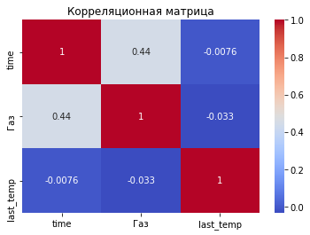
    


как видно на конечную температуру время не влияет. А вот с газом обнаружена слабая корреляция.

Теперь посмотрим как влияет энегия на температуру.


```python
col_arc=pd.DataFrame(data[['last_temp','first_temp','time','циклы','сдвиг','мощность','энергия','нагрев']])


```


```python
sns.heatmap(col_arc.corr(), annot=True, cmap='coolwarm')
plt.title('Корреляционная матрица')
plt.show()
```


    
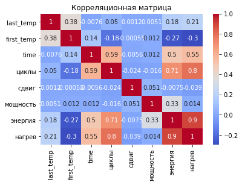
    


Конечная температура слабо зависит от других параметров, но энергия и нагрев зависят от времени, количества циклов и очень сильно друг от друга


```python
sns.pairplot(data[['циклы','энергия','нагрев','time']])

plt.show()
```


    
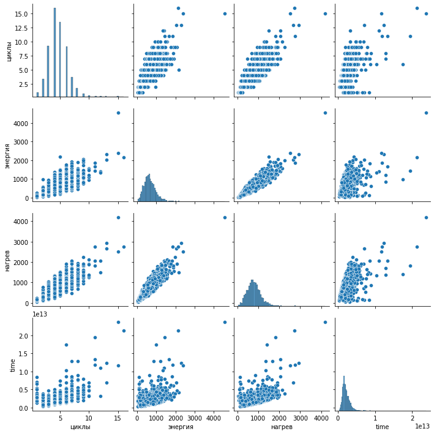
    


Видна сльная корреляция, которая объяснима тем, что чес больше было нагревов и чем дольше они были, тем больше энергии получила сталь


```python
# корреляция среди добавок
sns.heatmap(data[bulk.columns.drop('key')].corr(), annot=True, cmap='coolwarm')
plt.title('Корреляционная матрица')
plt.show()

sns.heatmap(data[wire.columns.drop('key')].corr(), annot=True, cmap='coolwarm')
plt.title('Корреляционная матрица')
plt.show()
```


    
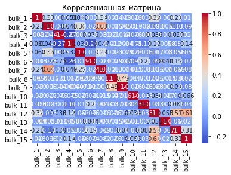
    


    
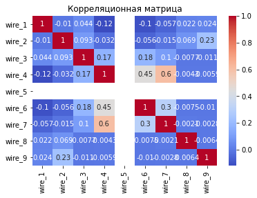
    


Наблюдается слабая корреляция между сыпучими добавками  12 c 14 и 15, 8 с 9, 2 с 7. У проволочных слабая зависимость 4 с 6 и 7.


```python
sns.pairplot(data[['bulk_12','bulk_14','bulk_15']])
sns.pairplot(data[['bulk_8','bulk_9']])
sns.pairplot(data[['bulk_8','bulk_9']])
sns.pairplot(data[['wire_4','wire_6','wire_7']])
plt.show()
```


    
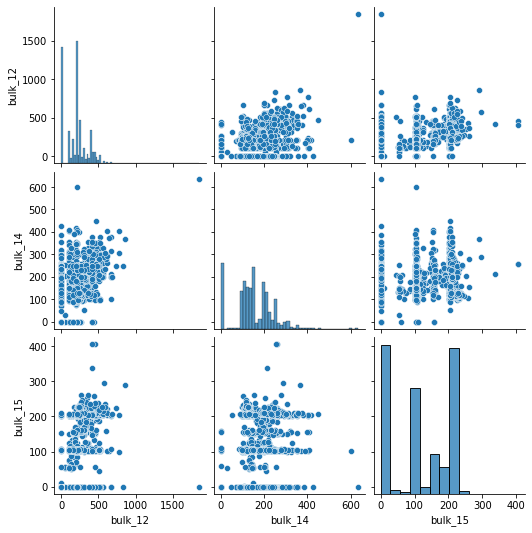
    


    
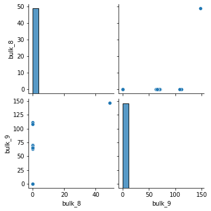
    


    

    


    
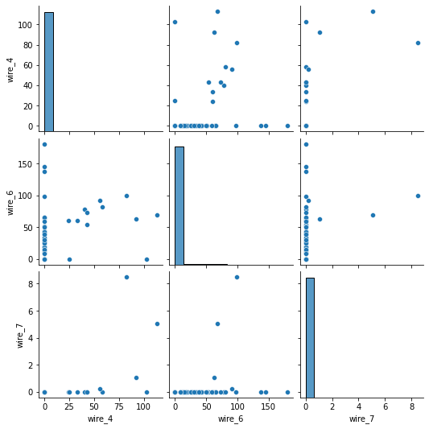
    


Корреляция заметна между сыпучими добавками 12, 14 и 15.


```python
col=['last_temp','time']
for i in range(1,10):
    col.append(f'bulk_{i}')

    
sns.heatmap(data[col].corr(), annot=True, cmap='coolwarm')
plt.title('Корреляционная матрица')
plt.show()

col=['last_temp','time']
for i in range(1,10):
    col.append(f'wire_{i}')
    
sns.heatmap(data[col].corr(), annot=True, cmap='coolwarm')
plt.title('Корреляционная матрица')
plt.show()
```


    
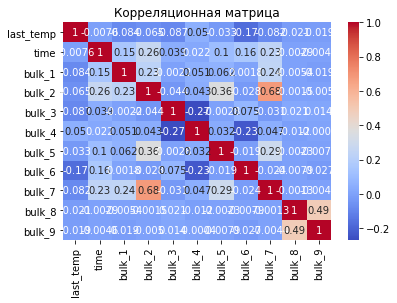
    


    
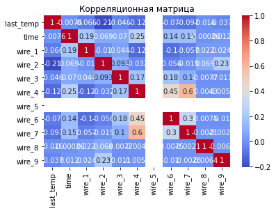
    


Влияние примесей на изменение температуры отсутствует.


```python
#Расмотрим вляние времени

col=['last_temp','time','first_temp']
for i in range(1,10):
    col.append(f'bulk_time_{i}')

    
sns.heatmap(data[col].corr(), annot=True, cmap='coolwarm')
plt.title('Корреляционная матрица')
plt.show()

col=['last_temp','time','first_temp']
for i in range(1,10):
    col.append(f'wire_time_{i}')
    
sns.heatmap(data[col].corr(), annot=True, cmap='coolwarm')
plt.title('Корреляционная матрица')
plt.show()
```


    
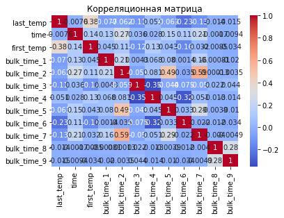
    


    
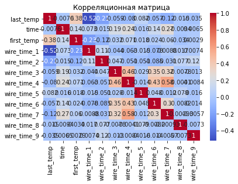
    


 Была замечена крайне сильная корреляция между времения применения сыпучих добавок 2 с 5 и 7. У проволочных 3 , 4, 6 и 7.


```python
sns.heatmap(data[['last_temp','first_temp']].corr(), annot=True, cmap='coolwarm')
plt.title('Корреляционная матрица')
plt.show()
```


    
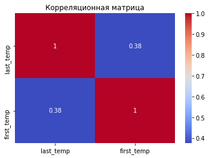
    


```python
sns.pairplot(data[['last_temp','first_temp']])
plt.show()
```


    
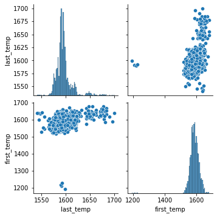
    


* Вывод * : все таблицы были объединены и на основе их была создана единая таблица данных, для каждого наблюдения за температурой. Все пропуски были заменены на нули и дату начала 1970 года. В дальнейщем все значения времени были заменины на количество секунд и первого наблюдения за партией. Все значения времени нагрева которые меньше нуля или больше времени наблюдения были заменены на ноль и время наблюдения соответственно. Для добавок, которые были раньше перпого наблюдения время установленно на ноль, а для тех что после времени наблюдения добавка равна нулю.

Были замечаны следующие корреляции: между энергией, нагревом и количеством циклов; слабая корреляция между некоторыми добавками и сильная между всеменем добавления. На изменение температуры сильной корреляции нет, кроме начальной температуры, но и даже это можно объяснить тем, что в одних случаях нагрев наблюдается на более ранних стадиях, чем на других.

##  Подготовка данных

В полученной таблице целевым признаком является last_temp, который обозначает как изменилась температура. Остальные, кроме номера партии, начального времени наблюдения и значение реактивной мощности являются входными параметрами.

Создадим список удаленных столбцов


```python
col_drop=['key','last_temp','first_time','last_time']
```


```python
col_drop
```


    ['key', 'last_temp', 'first_time', 'last_time']


```python
data.drop(col_drop,axis=1).columns
```


    Index(['first_temp', 'time', 'bulk_1', 'bulk_2', 'bulk_3', 'bulk_4', 'bulk_5',
           'bulk_6', 'bulk_7', 'bulk_8', 'bulk_9', 'bulk_10', 'bulk_11', 'bulk_12',
           'bulk_13', 'bulk_14', 'bulk_15', 'bulk_time_1', 'bulk_time_2',
           'bulk_time_3', 'bulk_time_4', 'bulk_time_5', 'bulk_time_6',
           'bulk_time_7', 'bulk_time_8', 'bulk_time_9', 'bulk_time_10',
           'bulk_time_11', 'bulk_time_12', 'bulk_time_13', 'bulk_time_14',
           'bulk_time_15', 'wire_1', 'wire_2', 'wire_3', 'wire_4', 'wire_5',
           'wire_6', 'wire_7', 'wire_8', 'wire_9', 'wire_time_1', 'wire_time_2',
           'wire_time_3', 'wire_time_4', 'wire_time_5', 'wire_time_6',
           'wire_time_7', 'wire_time_8', 'wire_time_9', 'Газ', 'циклы', 'мощность',
           'энергия', 'нагрев', 'сдвиг'],
          dtype='object')


Остались лишь нужные параметры.


```python
data['last_temp']
```


    0       1613.0
    1       1602.0
    2       1599.0
    3       1625.0
    4       1602.0
             ...  
    2470    1591.0
    2471    1591.0
    2472    1589.0
    2473    1594.0
    2474    1603.0
    Name: last_temp, Length: 2475, dtype: float64


```python
# разделим данные на обучающую (75%) и тестовую выборки (25%), зададим стратификацию
# определим random_state
RANDOM_STATE = 121124 
TEST_SIZE = 0.25

X_train, X_test, y_train, y_test = train_test_split(
    data.drop(col_drop, axis=1),
    data['last_temp'],
    test_size = TEST_SIZE, 
    random_state = RANDOM_STATE
)

# проверим размер получившихся выборок
print(X_train.shape, X_test.shape)
```

    (1856, 56) (619, 56)


<font color='blue'><b>Комментарий ментора</b></font><strike>
<br><font color='crimson'> ❌ RS должен быть одинаковым у всех в группе.
<br><font color='crimson'> ❌ Деление выборок происходит как 3:1 или 75:25

В дальнейшем надо задать модель. Для большей точности данные в линейной регрессии должны масштабироваться.

Для анализа данных я планирую использовать следующие модели: линейная модель, гребневая регрессия, дерево решений, Случайный лес, LGBM

В результате были подготовлены тренировочные входные и целевые признаки.

<font color='blue'><b>Комментарий ментора</b></font><br><strike>
<font color='darkorange'>⚠️ Классный пайплай. Единственное не понятно, получится ли опробовать все модели? Каждую модель лучше разнести в свой RandomizedSearchCV, чтобы получить сравнительную таблицу для заказчика. Моет полчуится так, что никогда лучшая модель может не попасть на вывод</font>

## Создание модели 

### Линейная регрессия

В начале надо стандартизировать данные.


```python
scaler = StandardScaler()
X_train_1 = scaler.fit_transform(X_train)
X_train_1 = pd.DataFrame(X_train_1, columns=X_train.columns)
```

И масштабировать


```python
minmax = MinMaxScaler()
X_train_2 = minmax.fit_transform(X_train_1)
X_train_2 = pd.DataFrame(X_train_1, columns=X_train.columns)
```

Изначально проведем линейную регрессию. Ни каких параметров нет.


```python
%%time
#модель линейной регрессии
model_lr = LinearRegression() 
score_lr = -cross_val_score(model_lr, X_train_2, y_train, scoring='neg_mean_absolute_error', cv=5).mean()
```

    CPU times: user 628 ms, sys: 851 ms, total: 1.48 s
    Wall time: 1.4 s


```python
print('Метрика МАЕ ',round(score_lr))
```

    Метрика МАЕ  181864253091


Линейная регрессия дает  очень большую ошибку

### Регрессия Ridge

Для более точного анализа можно использовать гребневую регрессию.


```python
rm = Ridge()
hyperparams = {'alpha':[0,1,2,3,4,5,6,7]}
rm = RandomizedSearchCV(rm, param_distributions=hyperparams,scoring='neg_mean_absolute_error', n_iter=100, cv=5)
rm.fit(X_train_2, y_train)
```


<style>#sk-container-id-1 {color: black;}#sk-container-id-1 pre{padding: 0;}#sk-container-id-1 div.sk-toggleable {background-color: white;}#sk-container-id-1 label.sk-toggleable__label {cursor: pointer;display: block;width: 100%;margin-bottom: 0;padding: 0.3em;box-sizing: border-box;text-align: center;}#sk-container-id-1 label.sk-toggleable__label-arrow:before {content: "▸";float: left;margin-right: 0.25em;color: #696969;}#sk-container-id-1 label.sk-toggleable__label-arrow:hover:before {color: black;}#sk-container-id-1 div.sk-estimator:hover label.sk-toggleable__label-arrow:before {color: black;}#sk-container-id-1 div.sk-toggleable__content {max-height: 0;max-width: 0;overflow: hidden;text-align: left;background-color: #f0f8ff;}#sk-container-id-1 div.sk-toggleable__content pre {margin: 0.2em;color: black;border-radius: 0.25em;background-color: #f0f8ff;}#sk-container-id-1 input.sk-toggleable__control:checked~div.sk-toggleable__content {max-height: 200px;max-width: 100%;overflow: auto;}#sk-container-id-1 input.sk-toggleable__control:checked~label.sk-toggleable__label-arrow:before {content: "▾";}#sk-container-id-1 div.sk-estimator input.sk-toggleable__control:checked~label.sk-toggleable__label {background-color: #d4ebff;}#sk-container-id-1 div.sk-label input.sk-toggleable__control:checked~label.sk-toggleable__label {background-color: #d4ebff;}#sk-container-id-1 input.sk-hidden--visually {border: 0;clip: rect(1px 1px 1px 1px);clip: rect(1px, 1px, 1px, 1px);height: 1px;margin: -1px;overflow: hidden;padding: 0;position: absolute;width: 1px;}#sk-container-id-1 div.sk-estimator {font-family: monospace;background-color: #f0f8ff;border: 1px dotted black;border-radius: 0.25em;box-sizing: border-box;margin-bottom: 0.5em;}#sk-container-id-1 div.sk-estimator:hover {background-color: #d4ebff;}#sk-container-id-1 div.sk-parallel-item::after {content: "";width: 100%;border-bottom: 1px solid gray;flex-grow: 1;}#sk-container-id-1 div.sk-label:hover label.sk-toggleable__label {background-color: #d4ebff;}#sk-container-id-1 div.sk-serial::before {content: "";position: absolute;border-left: 1px solid gray;box-sizing: border-box;top: 0;bottom: 0;left: 50%;z-index: 0;}#sk-container-id-1 div.sk-serial {display: flex;flex-direction: column;align-items: center;background-color: white;padding-right: 0.2em;padding-left: 0.2em;position: relative;}#sk-container-id-1 div.sk-item {position: relative;z-index: 1;}#sk-container-id-1 div.sk-parallel {display: flex;align-items: stretch;justify-content: center;background-color: white;position: relative;}#sk-container-id-1 div.sk-item::before, #sk-container-id-1 div.sk-parallel-item::before {content: "";position: absolute;border-left: 1px solid gray;box-sizing: border-box;top: 0;bottom: 0;left: 50%;z-index: -1;}#sk-container-id-1 div.sk-parallel-item {display: flex;flex-direction: column;z-index: 1;position: relative;background-color: white;}#sk-container-id-1 div.sk-parallel-item:first-child::after {align-self: flex-end;width: 50%;}#sk-container-id-1 div.sk-parallel-item:last-child::after {align-self: flex-start;width: 50%;}#sk-container-id-1 div.sk-parallel-item:only-child::after {width: 0;}#sk-container-id-1 div.sk-dashed-wrapped {border: 1px dashed gray;margin: 0 0.4em 0.5em 0.4em;box-sizing: border-box;padding-bottom: 0.4em;background-color: white;}#sk-container-id-1 div.sk-label label {font-family: monospace;font-weight: bold;display: inline-block;line-height: 1.2em;}#sk-container-id-1 div.sk-label-container {text-align: center;}#sk-container-id-1 div.sk-container {/* jupyter's `normalize.less` sets `[hidden] { display: none; }` but bootstrap.min.css set `[hidden] { display: none !important; }` so we also need the `!important` here to be able to override the default hidden behavior on the sphinx rendered scikit-learn.org. See: https://github.com/scikit-learn/scikit-learn/issues/21755 */display: inline-block !important;position: relative;}#sk-container-id-1 div.sk-text-repr-fallback {display: none;}</style><div id="sk-container-id-1" class="sk-top-container"><div class="sk-text-repr-fallback"><pre>RandomizedSearchCV(cv=5, estimator=Ridge(), n_iter=100,
                   param_distributions={&#x27;alpha&#x27;: [0, 1, 2, 3, 4, 5, 6, 7]},
                   scoring=&#x27;neg_mean_absolute_error&#x27;)</pre><b>In a Jupyter environment, please rerun this cell to show the HTML representation or trust the notebook. <br />On GitHub, the HTML representation is unable to render, please try loading this page with nbviewer.org.</b></div><div class="sk-container" hidden><div class="sk-item sk-dashed-wrapped"><div class="sk-label-container"><div class="sk-label sk-toggleable"><input class="sk-toggleable__control sk-hidden--visually" id="sk-estimator-id-1" type="checkbox" ><label for="sk-estimator-id-1" class="sk-toggleable__label sk-toggleable__label-arrow">RandomizedSearchCV</label><div class="sk-toggleable__content"><pre>RandomizedSearchCV(cv=5, estimator=Ridge(), n_iter=100,
                   param_distributions={&#x27;alpha&#x27;: [0, 1, 2, 3, 4, 5, 6, 7]},
                   scoring=&#x27;neg_mean_absolute_error&#x27;)</pre></div></div></div><div class="sk-parallel"><div class="sk-parallel-item"><div class="sk-item"><div class="sk-label-container"><div class="sk-label sk-toggleable"><input class="sk-toggleable__control sk-hidden--visually" id="sk-estimator-id-2" type="checkbox" ><label for="sk-estimator-id-2" class="sk-toggleable__label sk-toggleable__label-arrow">estimator: Ridge</label><div class="sk-toggleable__content"><pre>Ridge()</pre></div></div></div><div class="sk-serial"><div class="sk-item"><div class="sk-estimator sk-toggleable"><input class="sk-toggleable__control sk-hidden--visually" id="sk-estimator-id-3" type="checkbox" ><label for="sk-estimator-id-3" class="sk-toggleable__label sk-toggleable__label-arrow">Ridge</label><div class="sk-toggleable__content"><pre>Ridge()</pre></div></div></div></div></div></div></div></div></div></div>


```python
results_ridge = rm.cv_results_
best_index_ridge = rm.best_index_
rm_MAE = -(results_ridge['mean_test_score'][best_index_ridge])
print('Метрика МАЕ ',round(rm_MAE,2))
print()
```

    Метрика МАЕ  6.83
    


```python
results_ridge['param_alpha'][best_index_ridge]
```


    7


Гребневая регрессия куда лучше.

### Дерево

Рассмотрим дерево.


```python
tree = DecisionTreeRegressor(random_state=RANDOM_STATE)
hyperparams = {'max_depth': [5, 10, 15],
        'max_features': [5, 10, 15] }
tree = RandomizedSearchCV(tree, param_distributions=hyperparams,scoring='neg_mean_absolute_error', n_iter=100, cv=5)
tree.fit(X_train, y_train)
```


<style>#sk-container-id-2 {color: black;}#sk-container-id-2 pre{padding: 0;}#sk-container-id-2 div.sk-toggleable {background-color: white;}#sk-container-id-2 label.sk-toggleable__label {cursor: pointer;display: block;width: 100%;margin-bottom: 0;padding: 0.3em;box-sizing: border-box;text-align: center;}#sk-container-id-2 label.sk-toggleable__label-arrow:before {content: "▸";float: left;margin-right: 0.25em;color: #696969;}#sk-container-id-2 label.sk-toggleable__label-arrow:hover:before {color: black;}#sk-container-id-2 div.sk-estimator:hover label.sk-toggleable__label-arrow:before {color: black;}#sk-container-id-2 div.sk-toggleable__content {max-height: 0;max-width: 0;overflow: hidden;text-align: left;background-color: #f0f8ff;}#sk-container-id-2 div.sk-toggleable__content pre {margin: 0.2em;color: black;border-radius: 0.25em;background-color: #f0f8ff;}#sk-container-id-2 input.sk-toggleable__control:checked~div.sk-toggleable__content {max-height: 200px;max-width: 100%;overflow: auto;}#sk-container-id-2 input.sk-toggleable__control:checked~label.sk-toggleable__label-arrow:before {content: "▾";}#sk-container-id-2 div.sk-estimator input.sk-toggleable__control:checked~label.sk-toggleable__label {background-color: #d4ebff;}#sk-container-id-2 div.sk-label input.sk-toggleable__control:checked~label.sk-toggleable__label {background-color: #d4ebff;}#sk-container-id-2 input.sk-hidden--visually {border: 0;clip: rect(1px 1px 1px 1px);clip: rect(1px, 1px, 1px, 1px);height: 1px;margin: -1px;overflow: hidden;padding: 0;position: absolute;width: 1px;}#sk-container-id-2 div.sk-estimator {font-family: monospace;background-color: #f0f8ff;border: 1px dotted black;border-radius: 0.25em;box-sizing: border-box;margin-bottom: 0.5em;}#sk-container-id-2 div.sk-estimator:hover {background-color: #d4ebff;}#sk-container-id-2 div.sk-parallel-item::after {content: "";width: 100%;border-bottom: 1px solid gray;flex-grow: 1;}#sk-container-id-2 div.sk-label:hover label.sk-toggleable__label {background-color: #d4ebff;}#sk-container-id-2 div.sk-serial::before {content: "";position: absolute;border-left: 1px solid gray;box-sizing: border-box;top: 0;bottom: 0;left: 50%;z-index: 0;}#sk-container-id-2 div.sk-serial {display: flex;flex-direction: column;align-items: center;background-color: white;padding-right: 0.2em;padding-left: 0.2em;position: relative;}#sk-container-id-2 div.sk-item {position: relative;z-index: 1;}#sk-container-id-2 div.sk-parallel {display: flex;align-items: stretch;justify-content: center;background-color: white;position: relative;}#sk-container-id-2 div.sk-item::before, #sk-container-id-2 div.sk-parallel-item::before {content: "";position: absolute;border-left: 1px solid gray;box-sizing: border-box;top: 0;bottom: 0;left: 50%;z-index: -1;}#sk-container-id-2 div.sk-parallel-item {display: flex;flex-direction: column;z-index: 1;position: relative;background-color: white;}#sk-container-id-2 div.sk-parallel-item:first-child::after {align-self: flex-end;width: 50%;}#sk-container-id-2 div.sk-parallel-item:last-child::after {align-self: flex-start;width: 50%;}#sk-container-id-2 div.sk-parallel-item:only-child::after {width: 0;}#sk-container-id-2 div.sk-dashed-wrapped {border: 1px dashed gray;margin: 0 0.4em 0.5em 0.4em;box-sizing: border-box;padding-bottom: 0.4em;background-color: white;}#sk-container-id-2 div.sk-label label {font-family: monospace;font-weight: bold;display: inline-block;line-height: 1.2em;}#sk-container-id-2 div.sk-label-container {text-align: center;}#sk-container-id-2 div.sk-container {/* jupyter's `normalize.less` sets `[hidden] { display: none; }` but bootstrap.min.css set `[hidden] { display: none !important; }` so we also need the `!important` here to be able to override the default hidden behavior on the sphinx rendered scikit-learn.org. See: https://github.com/scikit-learn/scikit-learn/issues/21755 */display: inline-block !important;position: relative;}#sk-container-id-2 div.sk-text-repr-fallback {display: none;}</style><div id="sk-container-id-2" class="sk-top-container"><div class="sk-text-repr-fallback"><pre>RandomizedSearchCV(cv=5, estimator=DecisionTreeRegressor(random_state=121124),
                   n_iter=100,
                   param_distributions={&#x27;max_depth&#x27;: [5, 10, 15],
                                        &#x27;max_features&#x27;: [5, 10, 15]},
                   scoring=&#x27;neg_mean_absolute_error&#x27;)</pre><b>In a Jupyter environment, please rerun this cell to show the HTML representation or trust the notebook. <br />On GitHub, the HTML representation is unable to render, please try loading this page with nbviewer.org.</b></div><div class="sk-container" hidden><div class="sk-item sk-dashed-wrapped"><div class="sk-label-container"><div class="sk-label sk-toggleable"><input class="sk-toggleable__control sk-hidden--visually" id="sk-estimator-id-4" type="checkbox" ><label for="sk-estimator-id-4" class="sk-toggleable__label sk-toggleable__label-arrow">RandomizedSearchCV</label><div class="sk-toggleable__content"><pre>RandomizedSearchCV(cv=5, estimator=DecisionTreeRegressor(random_state=121124),
                   n_iter=100,
                   param_distributions={&#x27;max_depth&#x27;: [5, 10, 15],
                                        &#x27;max_features&#x27;: [5, 10, 15]},
                   scoring=&#x27;neg_mean_absolute_error&#x27;)</pre></div></div></div><div class="sk-parallel"><div class="sk-parallel-item"><div class="sk-item"><div class="sk-label-container"><div class="sk-label sk-toggleable"><input class="sk-toggleable__control sk-hidden--visually" id="sk-estimator-id-5" type="checkbox" ><label for="sk-estimator-id-5" class="sk-toggleable__label sk-toggleable__label-arrow">estimator: DecisionTreeRegressor</label><div class="sk-toggleable__content"><pre>DecisionTreeRegressor(random_state=121124)</pre></div></div></div><div class="sk-serial"><div class="sk-item"><div class="sk-estimator sk-toggleable"><input class="sk-toggleable__control sk-hidden--visually" id="sk-estimator-id-6" type="checkbox" ><label for="sk-estimator-id-6" class="sk-toggleable__label sk-toggleable__label-arrow">DecisionTreeRegressor</label><div class="sk-toggleable__content"><pre>DecisionTreeRegressor(random_state=121124)</pre></div></div></div></div></div></div></div></div></div></div>


```python
results_ridge = tree.cv_results_
best_index_ridge = tree.best_index_
tree_MAE = -(results_ridge['mean_test_score'][best_index_ridge])
print('Метрика МАЕ ',round(tree_MAE,2))
print()
```

    Метрика МАЕ  8.43
    


Дерево решений дает немного более точный результат.

### Случайный лес

Дальше воспользуемся случайным лесом


```python
rf = RandomForestRegressor(random_state=RANDOM_STATE)
hyperparams = {'max_depth': [5, 10, 15],
        'max_features': [5, 10, 15] }
rf = RandomizedSearchCV(rf, param_distributions=hyperparams,scoring='neg_mean_absolute_error', n_iter=100, cv=5)
rf.fit(X_train, y_train)
```


<style>#sk-container-id-3 {color: black;}#sk-container-id-3 pre{padding: 0;}#sk-container-id-3 div.sk-toggleable {background-color: white;}#sk-container-id-3 label.sk-toggleable__label {cursor: pointer;display: block;width: 100%;margin-bottom: 0;padding: 0.3em;box-sizing: border-box;text-align: center;}#sk-container-id-3 label.sk-toggleable__label-arrow:before {content: "▸";float: left;margin-right: 0.25em;color: #696969;}#sk-container-id-3 label.sk-toggleable__label-arrow:hover:before {color: black;}#sk-container-id-3 div.sk-estimator:hover label.sk-toggleable__label-arrow:before {color: black;}#sk-container-id-3 div.sk-toggleable__content {max-height: 0;max-width: 0;overflow: hidden;text-align: left;background-color: #f0f8ff;}#sk-container-id-3 div.sk-toggleable__content pre {margin: 0.2em;color: black;border-radius: 0.25em;background-color: #f0f8ff;}#sk-container-id-3 input.sk-toggleable__control:checked~div.sk-toggleable__content {max-height: 200px;max-width: 100%;overflow: auto;}#sk-container-id-3 input.sk-toggleable__control:checked~label.sk-toggleable__label-arrow:before {content: "▾";}#sk-container-id-3 div.sk-estimator input.sk-toggleable__control:checked~label.sk-toggleable__label {background-color: #d4ebff;}#sk-container-id-3 div.sk-label input.sk-toggleable__control:checked~label.sk-toggleable__label {background-color: #d4ebff;}#sk-container-id-3 input.sk-hidden--visually {border: 0;clip: rect(1px 1px 1px 1px);clip: rect(1px, 1px, 1px, 1px);height: 1px;margin: -1px;overflow: hidden;padding: 0;position: absolute;width: 1px;}#sk-container-id-3 div.sk-estimator {font-family: monospace;background-color: #f0f8ff;border: 1px dotted black;border-radius: 0.25em;box-sizing: border-box;margin-bottom: 0.5em;}#sk-container-id-3 div.sk-estimator:hover {background-color: #d4ebff;}#sk-container-id-3 div.sk-parallel-item::after {content: "";width: 100%;border-bottom: 1px solid gray;flex-grow: 1;}#sk-container-id-3 div.sk-label:hover label.sk-toggleable__label {background-color: #d4ebff;}#sk-container-id-3 div.sk-serial::before {content: "";position: absolute;border-left: 1px solid gray;box-sizing: border-box;top: 0;bottom: 0;left: 50%;z-index: 0;}#sk-container-id-3 div.sk-serial {display: flex;flex-direction: column;align-items: center;background-color: white;padding-right: 0.2em;padding-left: 0.2em;position: relative;}#sk-container-id-3 div.sk-item {position: relative;z-index: 1;}#sk-container-id-3 div.sk-parallel {display: flex;align-items: stretch;justify-content: center;background-color: white;position: relative;}#sk-container-id-3 div.sk-item::before, #sk-container-id-3 div.sk-parallel-item::before {content: "";position: absolute;border-left: 1px solid gray;box-sizing: border-box;top: 0;bottom: 0;left: 50%;z-index: -1;}#sk-container-id-3 div.sk-parallel-item {display: flex;flex-direction: column;z-index: 1;position: relative;background-color: white;}#sk-container-id-3 div.sk-parallel-item:first-child::after {align-self: flex-end;width: 50%;}#sk-container-id-3 div.sk-parallel-item:last-child::after {align-self: flex-start;width: 50%;}#sk-container-id-3 div.sk-parallel-item:only-child::after {width: 0;}#sk-container-id-3 div.sk-dashed-wrapped {border: 1px dashed gray;margin: 0 0.4em 0.5em 0.4em;box-sizing: border-box;padding-bottom: 0.4em;background-color: white;}#sk-container-id-3 div.sk-label label {font-family: monospace;font-weight: bold;display: inline-block;line-height: 1.2em;}#sk-container-id-3 div.sk-label-container {text-align: center;}#sk-container-id-3 div.sk-container {/* jupyter's `normalize.less` sets `[hidden] { display: none; }` but bootstrap.min.css set `[hidden] { display: none !important; }` so we also need the `!important` here to be able to override the default hidden behavior on the sphinx rendered scikit-learn.org. See: https://github.com/scikit-learn/scikit-learn/issues/21755 */display: inline-block !important;position: relative;}#sk-container-id-3 div.sk-text-repr-fallback {display: none;}</style><div id="sk-container-id-3" class="sk-top-container"><div class="sk-text-repr-fallback"><pre>RandomizedSearchCV(cv=5, estimator=RandomForestRegressor(random_state=121124),
                   n_iter=100,
                   param_distributions={&#x27;max_depth&#x27;: [5, 10, 15],
                                        &#x27;max_features&#x27;: [5, 10, 15]},
                   scoring=&#x27;neg_mean_absolute_error&#x27;)</pre><b>In a Jupyter environment, please rerun this cell to show the HTML representation or trust the notebook. <br />On GitHub, the HTML representation is unable to render, please try loading this page with nbviewer.org.</b></div><div class="sk-container" hidden><div class="sk-item sk-dashed-wrapped"><div class="sk-label-container"><div class="sk-label sk-toggleable"><input class="sk-toggleable__control sk-hidden--visually" id="sk-estimator-id-7" type="checkbox" ><label for="sk-estimator-id-7" class="sk-toggleable__label sk-toggleable__label-arrow">RandomizedSearchCV</label><div class="sk-toggleable__content"><pre>RandomizedSearchCV(cv=5, estimator=RandomForestRegressor(random_state=121124),
                   n_iter=100,
                   param_distributions={&#x27;max_depth&#x27;: [5, 10, 15],
                                        &#x27;max_features&#x27;: [5, 10, 15]},
                   scoring=&#x27;neg_mean_absolute_error&#x27;)</pre></div></div></div><div class="sk-parallel"><div class="sk-parallel-item"><div class="sk-item"><div class="sk-label-container"><div class="sk-label sk-toggleable"><input class="sk-toggleable__control sk-hidden--visually" id="sk-estimator-id-8" type="checkbox" ><label for="sk-estimator-id-8" class="sk-toggleable__label sk-toggleable__label-arrow">estimator: RandomForestRegressor</label><div class="sk-toggleable__content"><pre>RandomForestRegressor(random_state=121124)</pre></div></div></div><div class="sk-serial"><div class="sk-item"><div class="sk-estimator sk-toggleable"><input class="sk-toggleable__control sk-hidden--visually" id="sk-estimator-id-9" type="checkbox" ><label for="sk-estimator-id-9" class="sk-toggleable__label sk-toggleable__label-arrow">RandomForestRegressor</label><div class="sk-toggleable__content"><pre>RandomForestRegressor(random_state=121124)</pre></div></div></div></div></div></div></div></div></div></div>


```python
results_ridge = rf.cv_results_
best_index_ridge = rf.best_index_
rf_MAE = -(results_ridge['mean_test_score'][best_index_ridge])
print('Метрика МАЕ ',round(rf_MAE,2))
```

    Метрика МАЕ  6.76


Случайный лес дает более точную модель.

### Регрессия CatBoostRegressor

Для дальнейщего анализ используем CatBoost.


```python
cat = CatBoostRegressor()
hyperparams = {'learning_rate': [0.03, 0.1],
        'depth': [4, 6],
        'l2_leaf_reg': [1, 3]}
cat = RandomizedSearchCV(cat, param_distributions=hyperparams,scoring='neg_mean_absolute_error', n_iter=100, cv=5)
cat.fit(X_train, y_train)
print('End')
```

    0:	learn: 15.9353773	total: 53.4ms	remaining: 53.4s
    1:	learn: 15.7117472	total: 59ms	remaining: 29.5s
    2:	learn: 15.4880406	total: 64.6ms	remaining: 21.5s
    3:	learn: 15.2798687	total: 69.8ms	remaining: 17.4s
    4:	learn: 15.0931231	total: 73.3ms	remaining: 14.6s
    5:	learn: 14.9092466	total: 76.7ms	remaining: 12.7s
    6:	learn: 14.7133832	total: 80.2ms	remaining: 11.4s
    7:	learn: 14.5227637	total: 83.7ms	remaining: 10.4s
    8:	learn: 14.3330387	total: 87.8ms	remaining: 9.67s
    9:	learn: 14.1714456	total: 92.9ms	remaining: 9.2s
    10:	learn: 14.0009426	total: 97.6ms	remaining: 8.78s
    11:	learn: 13.8299353	total: 101ms	remaining: 8.32s
    12:	learn: 13.6804314	total: 105ms	remaining: 7.97s
    13:	learn: 13.5407312	total: 108ms	remaining: 7.63s
    14:	learn: 13.3995131	total: 112ms	remaining: 7.34s
    15:	learn: 13.2428402	total: 115ms	remaining: 7.09s
    16:	learn: 13.1298533	total: 119ms	remaining: 6.87s
    17:	learn: 13.0115353	total: 122ms	remaining: 6.66s
    18:	learn: 12.8856081	total: 125ms	remaining: 6.47s
    19:	learn: 12.7723824	total: 129ms	remaining: 6.3s
    20:	learn: 12.6473925	total: 132ms	remaining: 6.15s
    21:	learn: 12.5426964	total: 135ms	remaining: 6.01s
    22:	learn: 12.4340135	total: 141ms	remaining: 5.97s
    23:	learn: 12.3221784	total: 146ms	remaining: 5.94s
    24:	learn: 12.2052834	total: 151ms	remaining: 5.9s
    25:	learn: 12.1056377	total: 157ms	remaining: 5.87s
    26:	learn: 11.9965187	total: 162ms	remaining: 5.84s
    27:	learn: 11.9089996	total: 167ms	remaining: 5.81s
    28:	learn: 11.8065853	total: 172ms	remaining: 5.77s
    29:	learn: 11.7251478	total: 178ms	remaining: 5.74s
    30:	learn: 11.6505771	total: 183ms	remaining: 5.71s
    31:	learn: 11.5684427	total: 187ms	remaining: 5.65s
    32:	learn: 11.4921959	total: 190ms	remaining: 5.58s
    33:	learn: 11.3921615	total: 194ms	remaining: 5.5s
    34:	learn: 11.3146593	total: 197ms	remaining: 5.43s
    35:	learn: 11.2470574	total: 200ms	remaining: 5.37s
    36:	learn: 11.1847736	total: 204ms	remaining: 5.3s
    37:	learn: 11.1266881	total: 207ms	remaining: 5.24s
    38:	learn: 11.0665361	total: 210ms	remaining: 5.17s
    39:	learn: 11.0059155	total: 213ms	remaining: 5.12s
    40:	learn: 10.9504436	total: 217ms	remaining: 5.07s
    41:	learn: 10.9129555	total: 220ms	remaining: 5.02s
    42:	learn: 10.8649761	total: 224ms	remaining: 4.97s
    43:	learn: 10.8128683	total: 227ms	remaining: 4.93s
    44:	learn: 10.7441845	total: 231ms	remaining: 4.91s
    45:	learn: 10.7015225	total: 237ms	remaining: 4.91s
    46:	learn: 10.6481505	total: 241ms	remaining: 4.89s
    47:	learn: 10.5982823	total: 245ms	remaining: 4.86s
    48:	learn: 10.5446134	total: 249ms	remaining: 4.83s
    49:	learn: 10.5025951	total: 252ms	remaining: 4.79s
    50:	learn: 10.4450843	total: 255ms	remaining: 4.75s
    51:	learn: 10.3987088	total: 259ms	remaining: 4.72s
    52:	learn: 10.3548216	total: 262ms	remaining: 4.68s
    53:	learn: 10.3076720	total: 266ms	remaining: 4.65s
    54:	learn: 10.2713308	total: 269ms	remaining: 4.62s
    55:	learn: 10.2175774	total: 272ms	remaining: 4.59s
    56:	learn: 10.1677012	total: 276ms	remaining: 4.56s
    57:	learn: 10.1254404	total: 279ms	remaining: 4.53s
    58:	learn: 10.0894451	total: 282ms	remaining: 4.5s
    59:	learn: 10.0516677	total: 286ms	remaining: 4.47s
    60:	learn: 10.0097649	total: 289ms	remaining: 4.45s
    61:	learn: 9.9629519	total: 292ms	remaining: 4.42s
    62:	learn: 9.9202893	total: 296ms	remaining: 4.4s
    63:	learn: 9.8780810	total: 299ms	remaining: 4.38s
    64:	learn: 9.8338951	total: 303ms	remaining: 4.35s
    65:	learn: 9.7991687	total: 306ms	remaining: 4.33s
    66:	learn: 9.7541555	total: 310ms	remaining: 4.31s
    67:	learn: 9.7193382	total: 315ms	remaining: 4.32s
    68:	learn: 9.6837664	total: 320ms	remaining: 4.32s
    69:	learn: 9.6452252	total: 325ms	remaining: 4.32s
    70:	learn: 9.6184320	total: 330ms	remaining: 4.32s
    71:	learn: 9.5773963	total: 334ms	remaining: 4.3s
    72:	learn: 9.5505894	total: 337ms	remaining: 4.28s
    73:	learn: 9.5276532	total: 340ms	remaining: 4.26s
    74:	learn: 9.4982460	total: 344ms	remaining: 4.24s
    75:	learn: 9.4703728	total: 347ms	remaining: 4.22s
    76:	learn: 9.4439399	total: 350ms	remaining: 4.2s
    77:	learn: 9.4092543	total: 354ms	remaining: 4.18s
    78:	learn: 9.3837559	total: 357ms	remaining: 4.16s
    79:	learn: 9.3629672	total: 360ms	remaining: 4.14s
    80:	learn: 9.3365663	total: 363ms	remaining: 4.12s
    81:	learn: 9.3040554	total: 367ms	remaining: 4.11s
    82:	learn: 9.2790901	total: 371ms	remaining: 4.09s
    83:	learn: 9.2532262	total: 374ms	remaining: 4.08s
    84:	learn: 9.2364979	total: 377ms	remaining: 4.06s
    85:	learn: 9.2118648	total: 380ms	remaining: 4.04s
    86:	learn: 9.1826224	total: 383ms	remaining: 4.02s
    87:	learn: 9.1605391	total: 387ms	remaining: 4.01s
    88:	learn: 9.1329008	total: 390ms	remaining: 3.99s
    89:	learn: 9.1053349	total: 393ms	remaining: 3.98s
    90:	learn: 9.0864039	total: 397ms	remaining: 3.96s
    91:	learn: 9.0594470	total: 400ms	remaining: 3.95s
    92:	learn: 9.0339005	total: 406ms	remaining: 3.96s
    93:	learn: 9.0102885	total: 411ms	remaining: 3.96s
    94:	learn: 8.9900816	total: 417ms	remaining: 3.97s
    95:	learn: 8.9769153	total: 422ms	remaining: 3.98s
    96:	learn: 8.9486977	total: 428ms	remaining: 3.98s
    97:	learn: 8.9328591	total: 433ms	remaining: 3.99s
    98:	learn: 8.9091973	total: 437ms	remaining: 3.98s
    99:	learn: 8.8906031	total: 440ms	remaining: 3.96s
    100:	learn: 8.8657610	total: 444ms	remaining: 3.95s
    101:	learn: 8.8466893	total: 447ms	remaining: 3.93s
    102:	learn: 8.8274441	total: 450ms	remaining: 3.92s
    103:	learn: 8.8116594	total: 453ms	remaining: 3.91s
    104:	learn: 8.7900265	total: 457ms	remaining: 3.89s
    105:	learn: 8.7700365	total: 460ms	remaining: 3.88s
    106:	learn: 8.7533361	total: 463ms	remaining: 3.87s
    107:	learn: 8.7357604	total: 466ms	remaining: 3.85s
    108:	learn: 8.7192580	total: 470ms	remaining: 3.84s
    109:	learn: 8.7011355	total: 473ms	remaining: 3.83s
    110:	learn: 8.6851037	total: 477ms	remaining: 3.82s
    111:	learn: 8.6620928	total: 480ms	remaining: 3.8s
    112:	learn: 8.6424610	total: 483ms	remaining: 3.79s
    113:	learn: 8.6287925	total: 486ms	remaining: 3.78s
    114:	learn: 8.6130913	total: 490ms	remaining: 3.77s
    115:	learn: 8.5989318	total: 493ms	remaining: 3.76s
    116:	learn: 8.5808760	total: 497ms	remaining: 3.75s
    117:	learn: 8.5707483	total: 500ms	remaining: 3.74s
    118:	learn: 8.5561943	total: 504ms	remaining: 3.73s
    119:	learn: 8.5437838	total: 507ms	remaining: 3.72s
    120:	learn: 8.5307494	total: 510ms	remaining: 3.71s
    121:	learn: 8.5154909	total: 514ms	remaining: 3.7s
    122:	learn: 8.4972136	total: 517ms	remaining: 3.68s
    123:	learn: 8.4802164	total: 520ms	remaining: 3.67s
    124:	learn: 8.4646474	total: 523ms	remaining: 3.66s
    125:	learn: 8.4470286	total: 526ms	remaining: 3.65s
    126:	learn: 8.4255057	total: 530ms	remaining: 3.64s
    127:	learn: 8.4137054	total: 533ms	remaining: 3.63s
    128:	learn: 8.3992495	total: 536ms	remaining: 3.62s
    129:	learn: 8.3728772	total: 540ms	remaining: 3.61s
    130:	learn: 8.3635938	total: 543ms	remaining: 3.6s
    131:	learn: 8.3496246	total: 546ms	remaining: 3.59s
    132:	learn: 8.3274262	total: 550ms	remaining: 3.58s
    133:	learn: 8.3176795	total: 554ms	remaining: 3.58s
    134:	learn: 8.3026400	total: 558ms	remaining: 3.57s
    135:	learn: 8.2929909	total: 561ms	remaining: 3.56s
    136:	learn: 8.2852803	total: 564ms	remaining: 3.55s
    137:	learn: 8.2709806	total: 567ms	remaining: 3.54s
    138:	learn: 8.2572098	total: 571ms	remaining: 3.54s
    139:	learn: 8.2480130	total: 574ms	remaining: 3.52s
    140:	learn: 8.2395403	total: 577ms	remaining: 3.52s
    141:	learn: 8.2255777	total: 581ms	remaining: 3.51s
    142:	learn: 8.2124466	total: 584ms	remaining: 3.5s
    143:	learn: 8.2017322	total: 589ms	remaining: 3.5s
    144:	learn: 8.1934378	total: 595ms	remaining: 3.51s
    145:	learn: 8.1833494	total: 600ms	remaining: 3.51s
    146:	learn: 8.1732868	total: 606ms	remaining: 3.52s
    147:	learn: 8.1538822	total: 611ms	remaining: 3.52s
    148:	learn: 8.1438841	total: 617ms	remaining: 3.52s
    149:	learn: 8.1369665	total: 622ms	remaining: 3.53s
    150:	learn: 8.1293730	total: 628ms	remaining: 3.53s
    151:	learn: 8.1236127	total: 633ms	remaining: 3.53s
    152:	learn: 8.1100089	total: 639ms	remaining: 3.53s
    153:	learn: 8.0965553	total: 642ms	remaining: 3.53s
    154:	learn: 8.0803855	total: 646ms	remaining: 3.52s
    155:	learn: 8.0732857	total: 649ms	remaining: 3.51s
    156:	learn: 8.0627655	total: 653ms	remaining: 3.5s
    157:	learn: 8.0509029	total: 656ms	remaining: 3.5s
    158:	learn: 8.0331573	total: 659ms	remaining: 3.49s
    159:	learn: 8.0256394	total: 663ms	remaining: 3.48s
    160:	learn: 8.0160038	total: 666ms	remaining: 3.47s
    161:	learn: 8.0092200	total: 670ms	remaining: 3.46s
    162:	learn: 7.9994913	total: 673ms	remaining: 3.46s
    163:	learn: 7.9878759	total: 678ms	remaining: 3.45s
    164:	learn: 7.9817156	total: 683ms	remaining: 3.46s
    165:	learn: 7.9758073	total: 689ms	remaining: 3.46s
    166:	learn: 7.9613174	total: 694ms	remaining: 3.46s
    167:	learn: 7.9554547	total: 699ms	remaining: 3.46s
    168:	learn: 7.9490362	total: 703ms	remaining: 3.46s
    169:	learn: 7.9430447	total: 707ms	remaining: 3.45s
    170:	learn: 7.9368997	total: 710ms	remaining: 3.44s
    171:	learn: 7.9260079	total: 714ms	remaining: 3.44s
    172:	learn: 7.9140802	total: 717ms	remaining: 3.43s
    173:	learn: 7.8951712	total: 720ms	remaining: 3.42s
    174:	learn: 7.8806024	total: 723ms	remaining: 3.41s
    175:	learn: 7.8670035	total: 727ms	remaining: 3.4s
    176:	learn: 7.8598423	total: 730ms	remaining: 3.39s
    177:	learn: 7.8508257	total: 733ms	remaining: 3.38s
    178:	learn: 7.8369961	total: 736ms	remaining: 3.38s
    179:	learn: 7.8321561	total: 740ms	remaining: 3.37s
    180:	learn: 7.8184034	total: 743ms	remaining: 3.36s
    181:	learn: 7.8093749	total: 747ms	remaining: 3.36s
    182:	learn: 7.8008266	total: 750ms	remaining: 3.35s
    183:	learn: 7.7939138	total: 753ms	remaining: 3.34s
    184:	learn: 7.7870142	total: 756ms	remaining: 3.33s
    185:	learn: 7.7778523	total: 760ms	remaining: 3.32s
    186:	learn: 7.7702322	total: 763ms	remaining: 3.32s
    187:	learn: 7.7623102	total: 766ms	remaining: 3.31s
    188:	learn: 7.7579657	total: 770ms	remaining: 3.3s
    189:	learn: 7.7498461	total: 773ms	remaining: 3.29s
    190:	learn: 7.7431778	total: 777ms	remaining: 3.29s
    191:	learn: 7.7264671	total: 780ms	remaining: 3.28s
    192:	learn: 7.7174495	total: 784ms	remaining: 3.28s
    193:	learn: 7.7113656	total: 788ms	remaining: 3.27s
    194:	learn: 7.7021423	total: 792ms	remaining: 3.27s
    195:	learn: 7.6871632	total: 795ms	remaining: 3.26s
    196:	learn: 7.6787156	total: 799ms	remaining: 3.26s
    197:	learn: 7.6661941	total: 802ms	remaining: 3.25s
    198:	learn: 7.6598689	total: 806ms	remaining: 3.24s
    199:	learn: 7.6532945	total: 809ms	remaining: 3.24s
    200:	learn: 7.6444335	total: 812ms	remaining: 3.23s
    201:	learn: 7.6393109	total: 816ms	remaining: 3.22s
    202:	learn: 7.6319344	total: 819ms	remaining: 3.22s
    203:	learn: 7.6196421	total: 823ms	remaining: 3.21s
    204:	learn: 7.6120076	total: 826ms	remaining: 3.2s
    205:	learn: 7.5969717	total: 829ms	remaining: 3.2s
    206:	learn: 7.5898808	total: 833ms	remaining: 3.19s
    207:	learn: 7.5759980	total: 836ms	remaining: 3.18s
    208:	learn: 7.5673078	total: 840ms	remaining: 3.18s
    209:	learn: 7.5627266	total: 843ms	remaining: 3.17s
    210:	learn: 7.5523565	total: 847ms	remaining: 3.17s
    211:	learn: 7.5470867	total: 850ms	remaining: 3.16s
    212:	learn: 7.5383698	total: 854ms	remaining: 3.15s
    213:	learn: 7.5302678	total: 857ms	remaining: 3.15s
    214:	learn: 7.5230884	total: 860ms	remaining: 3.14s
    215:	learn: 7.5191581	total: 864ms	remaining: 3.13s
    216:	learn: 7.5121186	total: 867ms	remaining: 3.13s
    217:	learn: 7.5048832	total: 871ms	remaining: 3.12s
    218:	learn: 7.4970487	total: 874ms	remaining: 3.12s
    219:	learn: 7.4915492	total: 880ms	remaining: 3.12s
    220:	learn: 7.4795873	total: 886ms	remaining: 3.12s
    221:	learn: 7.4723297	total: 890ms	remaining: 3.12s
    222:	learn: 7.4653572	total: 893ms	remaining: 3.11s
    223:	learn: 7.4590667	total: 897ms	remaining: 3.1s
    224:	learn: 7.4492157	total: 900ms	remaining: 3.1s
    225:	learn: 7.4391793	total: 903ms	remaining: 3.09s
    226:	learn: 7.4310796	total: 907ms	remaining: 3.09s
    227:	learn: 7.4187042	total: 910ms	remaining: 3.08s
    228:	learn: 7.4108487	total: 913ms	remaining: 3.08s
    229:	learn: 7.4037416	total: 916ms	remaining: 3.07s
    230:	learn: 7.3974735	total: 920ms	remaining: 3.06s
    231:	learn: 7.3917131	total: 923ms	remaining: 3.06s
    232:	learn: 7.3837212	total: 926ms	remaining: 3.05s
    233:	learn: 7.3751950	total: 929ms	remaining: 3.04s
    234:	learn: 7.3659968	total: 933ms	remaining: 3.04s
    235:	learn: 7.3586690	total: 936ms	remaining: 3.03s
    236:	learn: 7.3534812	total: 939ms	remaining: 3.02s
    237:	learn: 7.3446092	total: 942ms	remaining: 3.02s
    238:	learn: 7.3369537	total: 946ms	remaining: 3.01s
    239:	learn: 7.3327904	total: 949ms	remaining: 3s
    240:	learn: 7.3264059	total: 954ms	remaining: 3s
    241:	learn: 7.3197666	total: 960ms	remaining: 3.01s
    242:	learn: 7.3078282	total: 966ms	remaining: 3.01s
    243:	learn: 7.2971832	total: 973ms	remaining: 3.01s
    244:	learn: 7.2937697	total: 977ms	remaining: 3.01s
    245:	learn: 7.2856717	total: 981ms	remaining: 3s
    246:	learn: 7.2808082	total: 984ms	remaining: 3s
    247:	learn: 7.2702354	total: 987ms	remaining: 2.99s
    248:	learn: 7.2659466	total: 990ms	remaining: 2.99s
    249:	learn: 7.2606891	total: 994ms	remaining: 2.98s
    250:	learn: 7.2543025	total: 997ms	remaining: 2.97s
    251:	learn: 7.2475003	total: 1s	remaining: 2.97s
    252:	learn: 7.2426765	total: 1s	remaining: 2.96s
    253:	learn: 7.2376094	total: 1.01s	remaining: 2.96s
    254:	learn: 7.2314652	total: 1.01s	remaining: 2.95s
    255:	learn: 7.2252291	total: 1.02s	remaining: 2.95s
    256:	learn: 7.2163358	total: 1.02s	remaining: 2.95s
    257:	learn: 7.2111966	total: 1.02s	remaining: 2.95s
    258:	learn: 7.2038105	total: 1.03s	remaining: 2.94s
    259:	learn: 7.1975786	total: 1.03s	remaining: 2.94s
    260:	learn: 7.1935066	total: 1.04s	remaining: 2.93s
    261:	learn: 7.1894681	total: 1.04s	remaining: 2.93s
    262:	learn: 7.1832110	total: 1.04s	remaining: 2.92s
    263:	learn: 7.1765103	total: 1.05s	remaining: 2.92s
    264:	learn: 7.1705632	total: 1.05s	remaining: 2.93s
    265:	learn: 7.1633122	total: 1.06s	remaining: 2.93s
    266:	learn: 7.1570856	total: 1.07s	remaining: 2.93s
    267:	learn: 7.1517851	total: 1.07s	remaining: 2.92s
    268:	learn: 7.1455158	total: 1.07s	remaining: 2.92s
    269:	learn: 7.1379752	total: 1.08s	remaining: 2.91s
    270:	learn: 7.1342098	total: 1.08s	remaining: 2.91s
    271:	learn: 7.1294012	total: 1.08s	remaining: 2.9s
    272:	learn: 7.1226355	total: 1.09s	remaining: 2.9s
    273:	learn: 7.1178208	total: 1.09s	remaining: 2.89s
    274:	learn: 7.1061302	total: 1.09s	remaining: 2.89s
    275:	learn: 7.0992139	total: 1.1s	remaining: 2.88s
    276:	learn: 7.0920544	total: 1.1s	remaining: 2.87s
    277:	learn: 7.0864082	total: 1.1s	remaining: 2.87s
    278:	learn: 7.0809002	total: 1.11s	remaining: 2.86s
    279:	learn: 7.0743363	total: 1.11s	remaining: 2.86s
    280:	learn: 7.0679363	total: 1.12s	remaining: 2.85s
    281:	learn: 7.0619923	total: 1.12s	remaining: 2.85s
    282:	learn: 7.0533917	total: 1.12s	remaining: 2.84s
    283:	learn: 7.0431218	total: 1.13s	remaining: 2.84s
    284:	learn: 7.0373511	total: 1.13s	remaining: 2.83s
    285:	learn: 7.0332822	total: 1.13s	remaining: 2.83s
    286:	learn: 7.0271518	total: 1.14s	remaining: 2.83s
    287:	learn: 7.0189342	total: 1.14s	remaining: 2.82s
    288:	learn: 7.0114581	total: 1.15s	remaining: 2.82s
    289:	learn: 7.0046171	total: 1.15s	remaining: 2.82s
    290:	learn: 7.0004917	total: 1.16s	remaining: 2.82s
    291:	learn: 6.9950024	total: 1.16s	remaining: 2.82s
    292:	learn: 6.9884331	total: 1.17s	remaining: 2.81s
    293:	learn: 6.9793082	total: 1.17s	remaining: 2.81s
    294:	learn: 6.9736810	total: 1.17s	remaining: 2.8s
    295:	learn: 6.9696378	total: 1.18s	remaining: 2.8s
    296:	learn: 6.9631861	total: 1.18s	remaining: 2.79s
    297:	learn: 6.9574873	total: 1.18s	remaining: 2.79s
    298:	learn: 6.9494292	total: 1.19s	remaining: 2.78s
    299:	learn: 6.9422878	total: 1.19s	remaining: 2.78s
    300:	learn: 6.9377179	total: 1.19s	remaining: 2.77s
    301:	learn: 6.9312556	total: 1.2s	remaining: 2.77s
    302:	learn: 6.9230238	total: 1.2s	remaining: 2.76s
    303:	learn: 6.9148863	total: 1.2s	remaining: 2.75s
    304:	learn: 6.9068291	total: 1.21s	remaining: 2.75s
    305:	learn: 6.8997934	total: 1.21s	remaining: 2.75s
    306:	learn: 6.8951442	total: 1.21s	remaining: 2.74s
    307:	learn: 6.8862005	total: 1.22s	remaining: 2.73s
    308:	learn: 6.8809419	total: 1.22s	remaining: 2.73s
    309:	learn: 6.8736372	total: 1.23s	remaining: 2.73s
    310:	learn: 6.8660392	total: 1.23s	remaining: 2.73s
    311:	learn: 6.8617137	total: 1.24s	remaining: 2.73s
    312:	learn: 6.8549645	total: 1.25s	remaining: 2.73s
    313:	learn: 6.8470867	total: 1.25s	remaining: 2.73s
    314:	learn: 6.8377203	total: 1.25s	remaining: 2.73s
    315:	learn: 6.8296540	total: 1.26s	remaining: 2.72s
    316:	learn: 6.8233862	total: 1.26s	remaining: 2.72s
    317:	learn: 6.8171334	total: 1.26s	remaining: 2.71s
    318:	learn: 6.8089494	total: 1.27s	remaining: 2.71s
    319:	learn: 6.8025442	total: 1.27s	remaining: 2.7s
    320:	learn: 6.7954871	total: 1.27s	remaining: 2.69s
    321:	learn: 6.7869577	total: 1.28s	remaining: 2.69s
    322:	learn: 6.7813966	total: 1.28s	remaining: 2.68s
    323:	learn: 6.7760287	total: 1.28s	remaining: 2.68s
    324:	learn: 6.7698021	total: 1.29s	remaining: 2.67s
    325:	learn: 6.7612536	total: 1.29s	remaining: 2.67s
    326:	learn: 6.7572832	total: 1.29s	remaining: 2.66s
    327:	learn: 6.7532958	total: 1.3s	remaining: 2.66s
    328:	learn: 6.7476465	total: 1.3s	remaining: 2.65s
    329:	learn: 6.7422201	total: 1.3s	remaining: 2.65s
    330:	learn: 6.7361615	total: 1.31s	remaining: 2.64s
    331:	learn: 6.7300092	total: 1.31s	remaining: 2.63s
    332:	learn: 6.7236331	total: 1.31s	remaining: 2.63s
    333:	learn: 6.7150639	total: 1.32s	remaining: 2.63s
    334:	learn: 6.7100556	total: 1.32s	remaining: 2.63s
    335:	learn: 6.7053519	total: 1.33s	remaining: 2.62s
    336:	learn: 6.7012815	total: 1.33s	remaining: 2.62s
    337:	learn: 6.6971983	total: 1.34s	remaining: 2.63s
    338:	learn: 6.6899248	total: 1.34s	remaining: 2.62s
    339:	learn: 6.6851823	total: 1.35s	remaining: 2.62s
    340:	learn: 6.6800201	total: 1.35s	remaining: 2.61s
    341:	learn: 6.6742040	total: 1.35s	remaining: 2.61s
    342:	learn: 6.6694665	total: 1.36s	remaining: 2.6s
    343:	learn: 6.6645399	total: 1.36s	remaining: 2.6s
    344:	learn: 6.6573534	total: 1.36s	remaining: 2.59s
    345:	learn: 6.6515218	total: 1.37s	remaining: 2.59s
    346:	learn: 6.6473290	total: 1.37s	remaining: 2.58s
    347:	learn: 6.6417693	total: 1.37s	remaining: 2.58s
    348:	learn: 6.6368940	total: 1.38s	remaining: 2.57s
    349:	learn: 6.6328656	total: 1.38s	remaining: 2.56s
    350:	learn: 6.6258847	total: 1.39s	remaining: 2.56s
    351:	learn: 6.6212333	total: 1.39s	remaining: 2.56s
    352:	learn: 6.6166905	total: 1.39s	remaining: 2.55s
    353:	learn: 6.6125399	total: 1.4s	remaining: 2.54s
    354:	learn: 6.6075119	total: 1.4s	remaining: 2.54s
    355:	learn: 6.6025235	total: 1.4s	remaining: 2.54s
    356:	learn: 6.5979279	total: 1.4s	remaining: 2.53s
    357:	learn: 6.5933253	total: 1.41s	remaining: 2.52s
    358:	learn: 6.5884757	total: 1.41s	remaining: 2.52s
    359:	learn: 6.5817504	total: 1.42s	remaining: 2.52s
    360:	learn: 6.5765067	total: 1.42s	remaining: 2.52s
    361:	learn: 6.5692505	total: 1.43s	remaining: 2.52s
    362:	learn: 6.5648475	total: 1.44s	remaining: 2.52s
    363:	learn: 6.5605063	total: 1.44s	remaining: 2.51s
    364:	learn: 6.5540134	total: 1.44s	remaining: 2.51s
    365:	learn: 6.5493427	total: 1.45s	remaining: 2.5s
    366:	learn: 6.5450576	total: 1.45s	remaining: 2.5s
    367:	learn: 6.5408230	total: 1.45s	remaining: 2.49s
    368:	learn: 6.5366058	total: 1.46s	remaining: 2.49s
    369:	learn: 6.5330683	total: 1.46s	remaining: 2.48s
    370:	learn: 6.5278652	total: 1.46s	remaining: 2.48s
    371:	learn: 6.5235056	total: 1.47s	remaining: 2.47s
    372:	learn: 6.5188769	total: 1.47s	remaining: 2.47s
    373:	learn: 6.5142040	total: 1.47s	remaining: 2.46s
    374:	learn: 6.5062856	total: 1.47s	remaining: 2.46s
    375:	learn: 6.5014771	total: 1.48s	remaining: 2.45s
    376:	learn: 6.4953854	total: 1.48s	remaining: 2.45s
    377:	learn: 6.4913923	total: 1.48s	remaining: 2.44s
    378:	learn: 6.4873578	total: 1.49s	remaining: 2.44s
    379:	learn: 6.4797518	total: 1.49s	remaining: 2.43s
    380:	learn: 6.4764042	total: 1.49s	remaining: 2.43s
    381:	learn: 6.4728429	total: 1.5s	remaining: 2.42s
    382:	learn: 6.4678455	total: 1.5s	remaining: 2.42s
    383:	learn: 6.4630392	total: 1.51s	remaining: 2.42s
    384:	learn: 6.4563933	total: 1.51s	remaining: 2.42s
    385:	learn: 6.4530382	total: 1.52s	remaining: 2.42s
    386:	learn: 6.4488983	total: 1.52s	remaining: 2.41s
    387:	learn: 6.4452317	total: 1.53s	remaining: 2.41s
    388:	learn: 6.4396356	total: 1.53s	remaining: 2.4s
    389:	learn: 6.4314809	total: 1.53s	remaining: 2.4s
    390:	learn: 6.4272858	total: 1.54s	remaining: 2.4s
    391:	learn: 6.4237096	total: 1.54s	remaining: 2.39s
    392:	learn: 6.4170765	total: 1.54s	remaining: 2.39s
    393:	learn: 6.4121256	total: 1.55s	remaining: 2.38s
    394:	learn: 6.4046936	total: 1.55s	remaining: 2.38s
    395:	learn: 6.3991169	total: 1.55s	remaining: 2.37s
    396:	learn: 6.3951843	total: 1.56s	remaining: 2.37s
    397:	learn: 6.3883050	total: 1.56s	remaining: 2.36s
    398:	learn: 6.3849856	total: 1.56s	remaining: 2.36s
    399:	learn: 6.3807032	total: 1.57s	remaining: 2.35s
    400:	learn: 6.3752571	total: 1.57s	remaining: 2.35s
    401:	learn: 6.3682614	total: 1.57s	remaining: 2.34s
    402:	learn: 6.3649833	total: 1.58s	remaining: 2.34s
    403:	learn: 6.3598673	total: 1.58s	remaining: 2.33s
    404:	learn: 6.3558428	total: 1.58s	remaining: 2.33s
    405:	learn: 6.3498924	total: 1.59s	remaining: 2.32s
    406:	learn: 6.3450701	total: 1.59s	remaining: 2.32s
    407:	learn: 6.3377142	total: 1.6s	remaining: 2.32s
    408:	learn: 6.3345933	total: 1.6s	remaining: 2.31s
    409:	learn: 6.3282023	total: 1.61s	remaining: 2.31s
    410:	learn: 6.3245728	total: 1.61s	remaining: 2.31s
    411:	learn: 6.3130621	total: 1.62s	remaining: 2.31s
    412:	learn: 6.3105007	total: 1.62s	remaining: 2.31s
    413:	learn: 6.3073158	total: 1.63s	remaining: 2.3s
    414:	learn: 6.3023724	total: 1.63s	remaining: 2.3s
    415:	learn: 6.2973698	total: 1.64s	remaining: 2.3s
    416:	learn: 6.2912904	total: 1.64s	remaining: 2.3s
    417:	learn: 6.2862451	total: 1.65s	remaining: 2.3s
    418:	learn: 6.2811297	total: 1.65s	remaining: 2.29s
    419:	learn: 6.2758395	total: 1.66s	remaining: 2.29s
    420:	learn: 6.2722232	total: 1.66s	remaining: 2.29s
    421:	learn: 6.2679920	total: 1.67s	remaining: 2.28s
    422:	learn: 6.2640849	total: 1.67s	remaining: 2.28s
    423:	learn: 6.2599639	total: 1.67s	remaining: 2.27s
    424:	learn: 6.2552319	total: 1.68s	remaining: 2.27s
    425:	learn: 6.2519213	total: 1.68s	remaining: 2.26s
    426:	learn: 6.2476382	total: 1.68s	remaining: 2.26s
    427:	learn: 6.2430861	total: 1.69s	remaining: 2.25s
    428:	learn: 6.2376010	total: 1.69s	remaining: 2.25s
    429:	learn: 6.2330108	total: 1.7s	remaining: 2.25s
    430:	learn: 6.2269771	total: 1.7s	remaining: 2.25s
    431:	learn: 6.2228364	total: 1.71s	remaining: 2.25s
    432:	learn: 6.2197609	total: 1.71s	remaining: 2.24s
    433:	learn: 6.2144649	total: 1.72s	remaining: 2.24s
    434:	learn: 6.2083938	total: 1.73s	remaining: 2.24s
    435:	learn: 6.2033189	total: 1.73s	remaining: 2.24s
    436:	learn: 6.1954678	total: 1.74s	remaining: 2.24s
    437:	learn: 6.1908928	total: 1.74s	remaining: 2.23s
    438:	learn: 6.1832397	total: 1.74s	remaining: 2.23s
    439:	learn: 6.1799862	total: 1.75s	remaining: 2.22s
    440:	learn: 6.1764009	total: 1.75s	remaining: 2.22s
    441:	learn: 6.1705213	total: 1.75s	remaining: 2.21s
    442:	learn: 6.1658023	total: 1.76s	remaining: 2.21s
    443:	learn: 6.1632026	total: 1.76s	remaining: 2.2s
    444:	learn: 6.1580727	total: 1.76s	remaining: 2.2s
    445:	learn: 6.1511026	total: 1.77s	remaining: 2.19s
    446:	learn: 6.1486741	total: 1.77s	remaining: 2.19s
    447:	learn: 6.1446890	total: 1.77s	remaining: 2.19s
    448:	learn: 6.1416937	total: 1.78s	remaining: 2.18s
    449:	learn: 6.1387999	total: 1.78s	remaining: 2.18s
    450:	learn: 6.1366016	total: 1.79s	remaining: 2.18s
    451:	learn: 6.1335196	total: 1.79s	remaining: 2.18s
    452:	learn: 6.1304391	total: 1.8s	remaining: 2.17s
    453:	learn: 6.1267566	total: 1.8s	remaining: 2.17s
    454:	learn: 6.1241833	total: 1.81s	remaining: 2.17s
    455:	learn: 6.1206070	total: 1.81s	remaining: 2.16s
    456:	learn: 6.1159549	total: 1.81s	remaining: 2.16s
    457:	learn: 6.1111985	total: 1.82s	remaining: 2.15s
    458:	learn: 6.1066393	total: 1.82s	remaining: 2.15s
    459:	learn: 6.1006779	total: 1.83s	remaining: 2.15s
    460:	learn: 6.0977141	total: 1.83s	remaining: 2.15s
    461:	learn: 6.0905954	total: 1.84s	remaining: 2.14s
    462:	learn: 6.0859706	total: 1.85s	remaining: 2.14s
    463:	learn: 6.0824757	total: 1.85s	remaining: 2.14s
    464:	learn: 6.0797032	total: 1.86s	remaining: 2.14s
    465:	learn: 6.0763085	total: 1.86s	remaining: 2.13s
    466:	learn: 6.0732680	total: 1.87s	remaining: 2.13s
    467:	learn: 6.0678692	total: 1.88s	remaining: 2.13s
    468:	learn: 6.0617453	total: 1.88s	remaining: 2.13s
    469:	learn: 6.0579767	total: 1.89s	remaining: 2.13s
    470:	learn: 6.0543411	total: 1.89s	remaining: 2.12s
    471:	learn: 6.0502715	total: 1.89s	remaining: 2.12s
    472:	learn: 6.0467775	total: 1.9s	remaining: 2.11s
    473:	learn: 6.0444351	total: 1.9s	remaining: 2.11s
    474:	learn: 6.0379300	total: 1.9s	remaining: 2.1s
    475:	learn: 6.0352293	total: 1.91s	remaining: 2.1s
    476:	learn: 6.0307505	total: 1.91s	remaining: 2.1s
    477:	learn: 6.0273494	total: 1.92s	remaining: 2.09s
    478:	learn: 6.0238794	total: 1.92s	remaining: 2.09s
    479:	learn: 6.0206779	total: 1.92s	remaining: 2.08s
    480:	learn: 6.0168511	total: 1.93s	remaining: 2.08s
    481:	learn: 6.0132248	total: 1.93s	remaining: 2.08s
    482:	learn: 6.0073232	total: 1.93s	remaining: 2.07s
    483:	learn: 6.0044181	total: 1.94s	remaining: 2.07s
    484:	learn: 6.0004170	total: 1.94s	remaining: 2.06s
    485:	learn: 5.9951043	total: 1.94s	remaining: 2.06s
    486:	learn: 5.9914816	total: 1.95s	remaining: 2.05s
    487:	learn: 5.9885448	total: 1.95s	remaining: 2.05s
    488:	learn: 5.9825034	total: 1.96s	remaining: 2.05s
    489:	learn: 5.9786327	total: 1.96s	remaining: 2.04s
    490:	learn: 5.9736851	total: 1.97s	remaining: 2.04s
    491:	learn: 5.9705676	total: 1.98s	remaining: 2.04s
    492:	learn: 5.9672818	total: 1.98s	remaining: 2.04s
    493:	learn: 5.9619792	total: 1.99s	remaining: 2.03s
    494:	learn: 5.9580315	total: 1.99s	remaining: 2.03s
    495:	learn: 5.9554912	total: 1.99s	remaining: 2.02s
    496:	learn: 5.9505791	total: 2s	remaining: 2.02s
    497:	learn: 5.9448822	total: 2s	remaining: 2.02s
    498:	learn: 5.9405166	total: 2s	remaining: 2.01s
    499:	learn: 5.9390971	total: 2.01s	remaining: 2.01s
    500:	learn: 5.9360581	total: 2.01s	remaining: 2s
    501:	learn: 5.9321383	total: 2.01s	remaining: 2s
    502:	learn: 5.9285693	total: 2.02s	remaining: 1.99s
    503:	learn: 5.9256647	total: 2.02s	remaining: 1.99s
    504:	learn: 5.9221668	total: 2.02s	remaining: 1.98s
    505:	learn: 5.9177447	total: 2.03s	remaining: 1.98s
    506:	learn: 5.9101412	total: 2.03s	remaining: 1.97s
    507:	learn: 5.9057420	total: 2.03s	remaining: 1.97s
    508:	learn: 5.9004323	total: 2.04s	remaining: 1.96s
    509:	learn: 5.8975556	total: 2.04s	remaining: 1.96s
    510:	learn: 5.8954573	total: 2.04s	remaining: 1.96s
    511:	learn: 5.8933369	total: 2.05s	remaining: 1.95s
    512:	learn: 5.8891563	total: 2.06s	remaining: 1.95s
    513:	learn: 5.8843578	total: 2.06s	remaining: 1.95s
    514:	learn: 5.8819667	total: 2.07s	remaining: 1.95s
    515:	learn: 5.8788715	total: 2.07s	remaining: 1.94s
    516:	learn: 5.8742091	total: 2.08s	remaining: 1.94s
    517:	learn: 5.8710408	total: 2.08s	remaining: 1.93s
    518:	learn: 5.8668169	total: 2.08s	remaining: 1.93s
    519:	learn: 5.8633013	total: 2.08s	remaining: 1.92s
    520:	learn: 5.8599597	total: 2.09s	remaining: 1.92s
    521:	learn: 5.8572569	total: 2.09s	remaining: 1.92s
    522:	learn: 5.8525342	total: 2.1s	remaining: 1.91s
    523:	learn: 5.8480781	total: 2.1s	remaining: 1.91s
    524:	learn: 5.8454189	total: 2.1s	remaining: 1.9s
    525:	learn: 5.8428712	total: 2.11s	remaining: 1.9s
    526:	learn: 5.8385982	total: 2.11s	remaining: 1.89s
    527:	learn: 5.8356192	total: 2.11s	remaining: 1.89s
    528:	learn: 5.8337007	total: 2.12s	remaining: 1.88s
    529:	learn: 5.8294896	total: 2.12s	remaining: 1.88s
    530:	learn: 5.8264759	total: 2.12s	remaining: 1.87s
    531:	learn: 5.8242818	total: 2.13s	remaining: 1.87s
    532:	learn: 5.8216580	total: 2.13s	remaining: 1.86s
    533:	learn: 5.8187170	total: 2.13s	remaining: 1.86s
    534:	learn: 5.8161563	total: 2.14s	remaining: 1.86s
    535:	learn: 5.8125998	total: 2.14s	remaining: 1.85s
    536:	learn: 5.8072193	total: 2.15s	remaining: 1.85s
    537:	learn: 5.8020027	total: 2.15s	remaining: 1.85s
    538:	learn: 5.7989938	total: 2.16s	remaining: 1.85s
    539:	learn: 5.7917851	total: 2.16s	remaining: 1.84s
    540:	learn: 5.7879282	total: 2.17s	remaining: 1.84s
    541:	learn: 5.7833820	total: 2.17s	remaining: 1.83s
    542:	learn: 5.7805345	total: 2.17s	remaining: 1.83s
    543:	learn: 5.7768731	total: 2.18s	remaining: 1.82s
    544:	learn: 5.7720133	total: 2.18s	remaining: 1.82s
    545:	learn: 5.7690519	total: 2.18s	remaining: 1.81s
    546:	learn: 5.7663258	total: 2.19s	remaining: 1.81s
    547:	learn: 5.7642160	total: 2.19s	remaining: 1.81s
    548:	learn: 5.7625764	total: 2.19s	remaining: 1.8s
    549:	learn: 5.7595777	total: 2.2s	remaining: 1.8s
    550:	learn: 5.7546384	total: 2.2s	remaining: 1.79s
    551:	learn: 5.7519299	total: 2.2s	remaining: 1.79s
    552:	learn: 5.7486384	total: 2.21s	remaining: 1.78s
    553:	learn: 5.7446290	total: 2.21s	remaining: 1.78s
    554:	learn: 5.7391028	total: 2.21s	remaining: 1.77s
    555:	learn: 5.7369971	total: 2.21s	remaining: 1.77s
    556:	learn: 5.7339207	total: 2.22s	remaining: 1.76s
    557:	learn: 5.7312919	total: 2.22s	remaining: 1.76s
    558:	learn: 5.7249714	total: 2.23s	remaining: 1.75s
    559:	learn: 5.7224024	total: 2.23s	remaining: 1.75s
    560:	learn: 5.7190634	total: 2.23s	remaining: 1.75s
    561:	learn: 5.7171348	total: 2.23s	remaining: 1.74s
    562:	learn: 5.7145410	total: 2.24s	remaining: 1.74s
    563:	learn: 5.7119134	total: 2.24s	remaining: 1.73s
    564:	learn: 5.7081932	total: 2.25s	remaining: 1.73s
    565:	learn: 5.7064373	total: 2.25s	remaining: 1.73s
    566:	learn: 5.7025895	total: 2.25s	remaining: 1.72s
    567:	learn: 5.6997104	total: 2.26s	remaining: 1.72s
    568:	learn: 5.6980328	total: 2.26s	remaining: 1.71s
    569:	learn: 5.6945253	total: 2.27s	remaining: 1.71s
    570:	learn: 5.6912304	total: 2.27s	remaining: 1.71s
    571:	learn: 5.6884411	total: 2.27s	remaining: 1.7s
    572:	learn: 5.6847848	total: 2.28s	remaining: 1.7s
    573:	learn: 5.6826326	total: 2.28s	remaining: 1.69s
    574:	learn: 5.6798125	total: 2.28s	remaining: 1.69s
    575:	learn: 5.6767287	total: 2.29s	remaining: 1.68s
    576:	learn: 5.6740041	total: 2.29s	remaining: 1.68s
    577:	learn: 5.6708081	total: 2.29s	remaining: 1.67s
    578:	learn: 5.6673795	total: 2.3s	remaining: 1.67s
    579:	learn: 5.6635696	total: 2.3s	remaining: 1.67s
    580:	learn: 5.6605953	total: 2.3s	remaining: 1.66s
    581:	learn: 5.6593405	total: 2.31s	remaining: 1.66s
    582:	learn: 5.6549530	total: 2.31s	remaining: 1.65s
    583:	learn: 5.6504249	total: 2.31s	remaining: 1.65s
    584:	learn: 5.6495079	total: 2.32s	remaining: 1.64s
    585:	learn: 5.6460898	total: 2.32s	remaining: 1.64s
    586:	learn: 5.6441551	total: 2.32s	remaining: 1.63s
    587:	learn: 5.6411074	total: 2.33s	remaining: 1.63s
    588:	learn: 5.6384257	total: 2.33s	remaining: 1.63s
    589:	learn: 5.6344621	total: 2.33s	remaining: 1.62s
    590:	learn: 5.6300508	total: 2.34s	remaining: 1.62s
    591:	learn: 5.6266954	total: 2.34s	remaining: 1.61s
    592:	learn: 5.6231897	total: 2.34s	remaining: 1.61s
    593:	learn: 5.6194908	total: 2.35s	remaining: 1.6s
    594:	learn: 5.6157184	total: 2.35s	remaining: 1.6s
    595:	learn: 5.6106672	total: 2.35s	remaining: 1.6s
    596:	learn: 5.6062848	total: 2.36s	remaining: 1.59s
    597:	learn: 5.6043297	total: 2.36s	remaining: 1.59s
    598:	learn: 5.6009485	total: 2.37s	remaining: 1.58s
    599:	learn: 5.5984469	total: 2.37s	remaining: 1.58s
    600:	learn: 5.5953786	total: 2.37s	remaining: 1.57s
    601:	learn: 5.5933120	total: 2.38s	remaining: 1.57s
    602:	learn: 5.5903433	total: 2.38s	remaining: 1.57s
    603:	learn: 5.5875616	total: 2.38s	remaining: 1.56s
    604:	learn: 5.5849126	total: 2.38s	remaining: 1.56s
    605:	learn: 5.5810292	total: 2.39s	remaining: 1.55s
    606:	learn: 5.5791261	total: 2.39s	remaining: 1.55s
    607:	learn: 5.5766868	total: 2.4s	remaining: 1.54s
    608:	learn: 5.5720710	total: 2.4s	remaining: 1.54s
    609:	learn: 5.5678866	total: 2.4s	remaining: 1.53s
    610:	learn: 5.5649853	total: 2.41s	remaining: 1.53s
    611:	learn: 5.5607978	total: 2.41s	remaining: 1.53s
    612:	learn: 5.5585273	total: 2.41s	remaining: 1.52s
    613:	learn: 5.5565178	total: 2.42s	remaining: 1.52s
    614:	learn: 5.5548077	total: 2.42s	remaining: 1.51s
    615:	learn: 5.5514696	total: 2.42s	remaining: 1.51s
    616:	learn: 5.5507567	total: 2.43s	remaining: 1.51s
    617:	learn: 5.5473478	total: 2.43s	remaining: 1.5s
    618:	learn: 5.5432054	total: 2.43s	remaining: 1.5s
    619:	learn: 5.5393874	total: 2.44s	remaining: 1.49s
    620:	learn: 5.5365399	total: 2.44s	remaining: 1.49s
    621:	learn: 5.5347309	total: 2.44s	remaining: 1.49s
    622:	learn: 5.5314971	total: 2.45s	remaining: 1.48s
    623:	learn: 5.5278111	total: 2.45s	remaining: 1.48s
    624:	learn: 5.5258876	total: 2.46s	remaining: 1.47s
    625:	learn: 5.5227497	total: 2.46s	remaining: 1.47s
    626:	learn: 5.5209994	total: 2.46s	remaining: 1.47s
    627:	learn: 5.5193898	total: 2.47s	remaining: 1.46s
    628:	learn: 5.5165084	total: 2.47s	remaining: 1.46s
    629:	learn: 5.5138920	total: 2.47s	remaining: 1.45s
    630:	learn: 5.5105227	total: 2.48s	remaining: 1.45s
    631:	learn: 5.5071837	total: 2.48s	remaining: 1.44s
    632:	learn: 5.5050293	total: 2.48s	remaining: 1.44s
    633:	learn: 5.5001146	total: 2.49s	remaining: 1.44s
    634:	learn: 5.4989888	total: 2.49s	remaining: 1.43s
    635:	learn: 5.4973583	total: 2.49s	remaining: 1.43s
    636:	learn: 5.4951764	total: 2.5s	remaining: 1.42s
    637:	learn: 5.4912174	total: 2.5s	remaining: 1.42s
    638:	learn: 5.4890006	total: 2.51s	remaining: 1.42s
    639:	learn: 5.4860225	total: 2.51s	remaining: 1.41s
    640:	learn: 5.4830700	total: 2.52s	remaining: 1.41s
    641:	learn: 5.4802911	total: 2.52s	remaining: 1.41s
    642:	learn: 5.4781230	total: 2.52s	remaining: 1.4s
    643:	learn: 5.4750650	total: 2.53s	remaining: 1.4s
    644:	learn: 5.4726259	total: 2.53s	remaining: 1.4s
    645:	learn: 5.4690137	total: 2.54s	remaining: 1.39s
    646:	learn: 5.4653188	total: 2.54s	remaining: 1.39s
    647:	learn: 5.4605834	total: 2.54s	remaining: 1.38s
    648:	learn: 5.4573054	total: 2.55s	remaining: 1.38s
    649:	learn: 5.4539387	total: 2.55s	remaining: 1.37s
    650:	learn: 5.4507462	total: 2.55s	remaining: 1.37s
    651:	learn: 5.4494715	total: 2.56s	remaining: 1.36s
    652:	learn: 5.4463517	total: 2.56s	remaining: 1.36s
    653:	learn: 5.4425776	total: 2.56s	remaining: 1.36s
    654:	learn: 5.4382478	total: 2.57s	remaining: 1.35s
    655:	learn: 5.4327240	total: 2.57s	remaining: 1.35s
    656:	learn: 5.4304751	total: 2.57s	remaining: 1.34s
    657:	learn: 5.4260079	total: 2.58s	remaining: 1.34s
    658:	learn: 5.4229864	total: 2.58s	remaining: 1.33s
    659:	learn: 5.4190459	total: 2.58s	remaining: 1.33s
    660:	learn: 5.4148014	total: 2.59s	remaining: 1.33s
    661:	learn: 5.4118741	total: 2.59s	remaining: 1.32s
    662:	learn: 5.4079307	total: 2.59s	remaining: 1.32s
    663:	learn: 5.4042290	total: 2.6s	remaining: 1.31s
    664:	learn: 5.4013309	total: 2.6s	remaining: 1.31s
    665:	learn: 5.3987087	total: 2.6s	remaining: 1.31s
    666:	learn: 5.3955351	total: 2.61s	remaining: 1.3s
    667:	learn: 5.3906948	total: 2.61s	remaining: 1.3s
    668:	learn: 5.3881282	total: 2.62s	remaining: 1.29s
    669:	learn: 5.3853583	total: 2.62s	remaining: 1.29s
    670:	learn: 5.3819188	total: 2.62s	remaining: 1.29s
    671:	learn: 5.3789058	total: 2.63s	remaining: 1.28s
    672:	learn: 5.3752604	total: 2.63s	remaining: 1.28s
    673:	learn: 5.3716151	total: 2.63s	remaining: 1.27s
    674:	learn: 5.3687416	total: 2.64s	remaining: 1.27s
    675:	learn: 5.3638093	total: 2.65s	remaining: 1.27s
    676:	learn: 5.3598495	total: 2.65s	remaining: 1.26s
    677:	learn: 5.3572839	total: 2.65s	remaining: 1.26s
    678:	learn: 5.3544700	total: 2.66s	remaining: 1.26s
    679:	learn: 5.3519955	total: 2.66s	remaining: 1.25s
    680:	learn: 5.3485217	total: 2.66s	remaining: 1.25s
    681:	learn: 5.3448234	total: 2.67s	remaining: 1.24s
    682:	learn: 5.3435351	total: 2.67s	remaining: 1.24s
    683:	learn: 5.3405163	total: 2.67s	remaining: 1.24s
    684:	learn: 5.3372932	total: 2.68s	remaining: 1.23s
    685:	learn: 5.3351448	total: 2.68s	remaining: 1.23s
    686:	learn: 5.3313485	total: 2.68s	remaining: 1.22s
    687:	learn: 5.3281097	total: 2.69s	remaining: 1.22s
    688:	learn: 5.3248440	total: 2.69s	remaining: 1.22s
    689:	learn: 5.3201529	total: 2.69s	remaining: 1.21s
    690:	learn: 5.3176065	total: 2.7s	remaining: 1.21s
    691:	learn: 5.3140900	total: 2.7s	remaining: 1.2s
    692:	learn: 5.3119007	total: 2.71s	remaining: 1.2s
    693:	learn: 5.3084019	total: 2.71s	remaining: 1.19s
    694:	learn: 5.3048572	total: 2.71s	remaining: 1.19s
    695:	learn: 5.3036253	total: 2.72s	remaining: 1.19s
    696:	learn: 5.3000226	total: 2.72s	remaining: 1.18s
    697:	learn: 5.2972378	total: 2.72s	remaining: 1.18s
    698:	learn: 5.2939832	total: 2.73s	remaining: 1.17s
    699:	learn: 5.2899433	total: 2.73s	remaining: 1.17s
    700:	learn: 5.2867548	total: 2.73s	remaining: 1.17s
    701:	learn: 5.2851680	total: 2.74s	remaining: 1.16s
    702:	learn: 5.2824603	total: 2.74s	remaining: 1.16s
    703:	learn: 5.2813059	total: 2.74s	remaining: 1.15s
    704:	learn: 5.2774180	total: 2.75s	remaining: 1.15s
    705:	learn: 5.2750878	total: 2.75s	remaining: 1.15s
    706:	learn: 5.2729382	total: 2.75s	remaining: 1.14s
    707:	learn: 5.2689433	total: 2.76s	remaining: 1.14s
    708:	learn: 5.2648428	total: 2.76s	remaining: 1.13s
    709:	learn: 5.2631852	total: 2.77s	remaining: 1.13s
    710:	learn: 5.2605278	total: 2.77s	remaining: 1.13s
    711:	learn: 5.2557522	total: 2.77s	remaining: 1.12s
    712:	learn: 5.2520767	total: 2.78s	remaining: 1.12s
    713:	learn: 5.2488217	total: 2.78s	remaining: 1.11s
    714:	learn: 5.2458951	total: 2.78s	remaining: 1.11s
    715:	learn: 5.2423687	total: 2.79s	remaining: 1.1s
    716:	learn: 5.2402756	total: 2.79s	remaining: 1.1s
    717:	learn: 5.2394169	total: 2.79s	remaining: 1.1s
    718:	learn: 5.2362190	total: 2.8s	remaining: 1.09s
    719:	learn: 5.2329435	total: 2.8s	remaining: 1.09s
    720:	learn: 5.2293529	total: 2.81s	remaining: 1.08s
    721:	learn: 5.2273013	total: 2.81s	remaining: 1.08s
    722:	learn: 5.2251773	total: 2.81s	remaining: 1.08s
    723:	learn: 5.2241911	total: 2.82s	remaining: 1.07s
    724:	learn: 5.2208521	total: 2.82s	remaining: 1.07s
    725:	learn: 5.2181204	total: 2.82s	remaining: 1.06s
    726:	learn: 5.2164497	total: 2.83s	remaining: 1.06s
    727:	learn: 5.2143631	total: 2.83s	remaining: 1.06s
    728:	learn: 5.2132613	total: 2.83s	remaining: 1.05s
    729:	learn: 5.2127533	total: 2.84s	remaining: 1.05s
    730:	learn: 5.2095565	total: 2.84s	remaining: 1.05s
    731:	learn: 5.2063131	total: 2.85s	remaining: 1.04s
    732:	learn: 5.2034252	total: 2.85s	remaining: 1.04s
    733:	learn: 5.2021894	total: 2.85s	remaining: 1.03s
    734:	learn: 5.1983576	total: 2.86s	remaining: 1.03s
    735:	learn: 5.1964569	total: 2.86s	remaining: 1.02s
    736:	learn: 5.1929358	total: 2.86s	remaining: 1.02s
    737:	learn: 5.1881742	total: 2.87s	remaining: 1.02s
    738:	learn: 5.1861827	total: 2.88s	remaining: 1.01s
    739:	learn: 5.1824648	total: 2.89s	remaining: 1.01s
    740:	learn: 5.1806005	total: 2.89s	remaining: 1.01s
    741:	learn: 5.1769680	total: 2.9s	remaining: 1.01s
    742:	learn: 5.1730646	total: 2.9s	remaining: 1s
    743:	learn: 5.1717331	total: 2.91s	remaining: 1s
    744:	learn: 5.1677244	total: 2.92s	remaining: 998ms
    745:	learn: 5.1650762	total: 2.92s	remaining: 995ms
    746:	learn: 5.1631229	total: 2.93s	remaining: 992ms
    747:	learn: 5.1611880	total: 2.93s	remaining: 988ms
    748:	learn: 5.1589869	total: 2.94s	remaining: 984ms
    749:	learn: 5.1560768	total: 2.94s	remaining: 981ms
    750:	learn: 5.1549679	total: 2.94s	remaining: 977ms
    751:	learn: 5.1517159	total: 2.95s	remaining: 973ms
    752:	learn: 5.1502940	total: 2.95s	remaining: 969ms
    753:	learn: 5.1487363	total: 2.96s	remaining: 966ms
    754:	learn: 5.1453958	total: 2.97s	remaining: 963ms
    755:	learn: 5.1422474	total: 2.97s	remaining: 959ms
    756:	learn: 5.1390050	total: 2.98s	remaining: 956ms
    757:	learn: 5.1360376	total: 2.98s	remaining: 952ms
    758:	learn: 5.1332870	total: 2.99s	remaining: 949ms
    759:	learn: 5.1299296	total: 2.99s	remaining: 945ms
    760:	learn: 5.1285457	total: 3s	remaining: 941ms
    761:	learn: 5.1261846	total: 3s	remaining: 937ms
    762:	learn: 5.1243798	total: 3s	remaining: 933ms
    763:	learn: 5.1222533	total: 3.01s	remaining: 929ms
    764:	learn: 5.1200435	total: 3.01s	remaining: 925ms
    765:	learn: 5.1190376	total: 3.02s	remaining: 921ms
    766:	learn: 5.1173309	total: 3.02s	remaining: 917ms
    767:	learn: 5.1146763	total: 3.02s	remaining: 914ms
    768:	learn: 5.1114557	total: 3.03s	remaining: 910ms
    769:	learn: 5.1101846	total: 3.04s	remaining: 907ms
    770:	learn: 5.1064088	total: 3.04s	remaining: 903ms
    771:	learn: 5.1034481	total: 3.05s	remaining: 900ms
    772:	learn: 5.0997238	total: 3.05s	remaining: 896ms
    773:	learn: 5.0977297	total: 3.06s	remaining: 892ms
    774:	learn: 5.0959314	total: 3.06s	remaining: 888ms
    775:	learn: 5.0924081	total: 3.06s	remaining: 884ms
    776:	learn: 5.0901134	total: 3.06s	remaining: 880ms
    777:	learn: 5.0874266	total: 3.07s	remaining: 876ms
    778:	learn: 5.0834837	total: 3.07s	remaining: 872ms
    779:	learn: 5.0799346	total: 3.08s	remaining: 868ms
    780:	learn: 5.0768646	total: 3.08s	remaining: 864ms
    781:	learn: 5.0746339	total: 3.08s	remaining: 859ms
    782:	learn: 5.0714835	total: 3.09s	remaining: 855ms
    783:	learn: 5.0698720	total: 3.09s	remaining: 851ms
    784:	learn: 5.0682738	total: 3.09s	remaining: 847ms
    785:	learn: 5.0649851	total: 3.1s	remaining: 843ms
    786:	learn: 5.0611194	total: 3.1s	remaining: 839ms
    787:	learn: 5.0575290	total: 3.1s	remaining: 835ms
    788:	learn: 5.0545337	total: 3.11s	remaining: 831ms
    789:	learn: 5.0501861	total: 3.11s	remaining: 828ms
    790:	learn: 5.0472132	total: 3.12s	remaining: 824ms
    791:	learn: 5.0445801	total: 3.13s	remaining: 821ms
    792:	learn: 5.0422450	total: 3.13s	remaining: 818ms
    793:	learn: 5.0391823	total: 3.14s	remaining: 814ms
    794:	learn: 5.0382443	total: 3.14s	remaining: 810ms
    795:	learn: 5.0365839	total: 3.14s	remaining: 806ms
    796:	learn: 5.0342534	total: 3.15s	remaining: 802ms
    797:	learn: 5.0310572	total: 3.15s	remaining: 798ms
    798:	learn: 5.0296426	total: 3.15s	remaining: 794ms
    799:	learn: 5.0284782	total: 3.16s	remaining: 790ms
    800:	learn: 5.0273916	total: 3.16s	remaining: 786ms
    801:	learn: 5.0251432	total: 3.17s	remaining: 781ms
    802:	learn: 5.0235632	total: 3.17s	remaining: 777ms
    803:	learn: 5.0192861	total: 3.17s	remaining: 773ms
    804:	learn: 5.0176725	total: 3.18s	remaining: 769ms
    805:	learn: 5.0149233	total: 3.18s	remaining: 765ms
    806:	learn: 5.0124606	total: 3.18s	remaining: 761ms
    807:	learn: 5.0114971	total: 3.19s	remaining: 757ms
    808:	learn: 5.0087603	total: 3.19s	remaining: 753ms
    809:	learn: 5.0063867	total: 3.2s	remaining: 750ms
    810:	learn: 5.0031478	total: 3.21s	remaining: 747ms
    811:	learn: 4.9996060	total: 3.21s	remaining: 743ms
    812:	learn: 4.9974601	total: 3.21s	remaining: 739ms
    813:	learn: 4.9950091	total: 3.22s	remaining: 735ms
    814:	learn: 4.9908510	total: 3.22s	remaining: 732ms
    815:	learn: 4.9890576	total: 3.23s	remaining: 728ms
    816:	learn: 4.9871857	total: 3.23s	remaining: 724ms
    817:	learn: 4.9840207	total: 3.24s	remaining: 721ms
    818:	learn: 4.9810958	total: 3.24s	remaining: 717ms
    819:	learn: 4.9791809	total: 3.25s	remaining: 713ms
    820:	learn: 4.9762810	total: 3.25s	remaining: 710ms
    821:	learn: 4.9744322	total: 3.26s	remaining: 706ms
    822:	learn: 4.9728025	total: 3.27s	remaining: 702ms
    823:	learn: 4.9707749	total: 3.27s	remaining: 698ms
    824:	learn: 4.9668229	total: 3.27s	remaining: 694ms
    825:	learn: 4.9644648	total: 3.28s	remaining: 691ms
    826:	learn: 4.9626182	total: 3.28s	remaining: 687ms
    827:	learn: 4.9596520	total: 3.29s	remaining: 683ms
    828:	learn: 4.9576629	total: 3.29s	remaining: 679ms
    829:	learn: 4.9557807	total: 3.3s	remaining: 675ms
    830:	learn: 4.9538282	total: 3.3s	remaining: 671ms
    831:	learn: 4.9528743	total: 3.31s	remaining: 668ms
    832:	learn: 4.9498196	total: 3.31s	remaining: 664ms
    833:	learn: 4.9482752	total: 3.31s	remaining: 660ms
    834:	learn: 4.9467689	total: 3.32s	remaining: 656ms
    835:	learn: 4.9437214	total: 3.33s	remaining: 652ms
    836:	learn: 4.9406386	total: 3.33s	remaining: 649ms
    837:	learn: 4.9376995	total: 3.33s	remaining: 645ms
    838:	learn: 4.9372438	total: 3.34s	remaining: 641ms
    839:	learn: 4.9346034	total: 3.35s	remaining: 637ms
    840:	learn: 4.9302709	total: 3.35s	remaining: 634ms
    841:	learn: 4.9273674	total: 3.36s	remaining: 630ms
    842:	learn: 4.9236311	total: 3.36s	remaining: 627ms
    843:	learn: 4.9212794	total: 3.37s	remaining: 623ms
    844:	learn: 4.9197641	total: 3.37s	remaining: 618ms
    845:	learn: 4.9184439	total: 3.38s	remaining: 614ms
    846:	learn: 4.9152400	total: 3.38s	remaining: 610ms
    847:	learn: 4.9145615	total: 3.38s	remaining: 606ms
    848:	learn: 4.9133617	total: 3.38s	remaining: 602ms
    849:	learn: 4.9111206	total: 3.39s	remaining: 598ms
    850:	learn: 4.9087251	total: 3.39s	remaining: 594ms
    851:	learn: 4.9053623	total: 3.4s	remaining: 590ms
    852:	learn: 4.9023005	total: 3.4s	remaining: 586ms
    853:	learn: 4.9001183	total: 3.4s	remaining: 582ms
    854:	learn: 4.8990698	total: 3.41s	remaining: 578ms
    855:	learn: 4.8960890	total: 3.41s	remaining: 574ms
    856:	learn: 4.8935119	total: 3.41s	remaining: 570ms
    857:	learn: 4.8916584	total: 3.42s	remaining: 565ms
    858:	learn: 4.8893531	total: 3.42s	remaining: 561ms
    859:	learn: 4.8871702	total: 3.42s	remaining: 557ms
    860:	learn: 4.8853536	total: 3.43s	remaining: 553ms
    861:	learn: 4.8841178	total: 3.43s	remaining: 549ms
    862:	learn: 4.8823415	total: 3.44s	remaining: 546ms
    863:	learn: 4.8806308	total: 3.45s	remaining: 543ms
    864:	learn: 4.8773175	total: 3.45s	remaining: 539ms
    865:	learn: 4.8756692	total: 3.46s	remaining: 535ms
    866:	learn: 4.8735564	total: 3.46s	remaining: 531ms
    867:	learn: 4.8710517	total: 3.46s	remaining: 527ms
    868:	learn: 4.8692073	total: 3.47s	remaining: 523ms
    869:	learn: 4.8664703	total: 3.47s	remaining: 519ms
    870:	learn: 4.8630913	total: 3.47s	remaining: 515ms
    871:	learn: 4.8607898	total: 3.48s	remaining: 511ms
    872:	learn: 4.8586402	total: 3.48s	remaining: 506ms
    873:	learn: 4.8567945	total: 3.48s	remaining: 502ms
    874:	learn: 4.8558453	total: 3.49s	remaining: 498ms
    875:	learn: 4.8536411	total: 3.49s	remaining: 494ms
    876:	learn: 4.8500989	total: 3.49s	remaining: 490ms
    877:	learn: 4.8461312	total: 3.5s	remaining: 486ms
    878:	learn: 4.8445119	total: 3.5s	remaining: 482ms
    879:	learn: 4.8426013	total: 3.5s	remaining: 478ms
    880:	learn: 4.8392623	total: 3.51s	remaining: 474ms
    881:	learn: 4.8351634	total: 3.51s	remaining: 470ms
    882:	learn: 4.8326981	total: 3.52s	remaining: 466ms
    883:	learn: 4.8297097	total: 3.53s	remaining: 463ms
    884:	learn: 4.8276241	total: 3.53s	remaining: 459ms
    885:	learn: 4.8249899	total: 3.54s	remaining: 455ms
    886:	learn: 4.8228645	total: 3.54s	remaining: 451ms
    887:	learn: 4.8201532	total: 3.55s	remaining: 447ms
    888:	learn: 4.8179540	total: 3.55s	remaining: 443ms
    889:	learn: 4.8144564	total: 3.55s	remaining: 439ms
    890:	learn: 4.8126538	total: 3.56s	remaining: 435ms
    891:	learn: 4.8097193	total: 3.56s	remaining: 431ms
    892:	learn: 4.8067805	total: 3.56s	remaining: 427ms
    893:	learn: 4.8050357	total: 3.57s	remaining: 423ms
    894:	learn: 4.8025808	total: 3.57s	remaining: 419ms
    895:	learn: 4.8006050	total: 3.57s	remaining: 415ms
    896:	learn: 4.7970486	total: 3.58s	remaining: 411ms
    897:	learn: 4.7944715	total: 3.58s	remaining: 407ms
    898:	learn: 4.7916040	total: 3.58s	remaining: 403ms
    899:	learn: 4.7894554	total: 3.59s	remaining: 399ms
    900:	learn: 4.7873951	total: 3.59s	remaining: 395ms
    901:	learn: 4.7846169	total: 3.59s	remaining: 391ms
    902:	learn: 4.7833876	total: 3.6s	remaining: 386ms
    903:	learn: 4.7816159	total: 3.6s	remaining: 382ms
    904:	learn: 4.7799924	total: 3.6s	remaining: 378ms
    905:	learn: 4.7779067	total: 3.61s	remaining: 375ms
    906:	learn: 4.7762722	total: 3.61s	remaining: 371ms
    907:	learn: 4.7739478	total: 3.62s	remaining: 367ms
    908:	learn: 4.7715300	total: 3.63s	remaining: 363ms
    909:	learn: 4.7678670	total: 3.63s	remaining: 359ms
    910:	learn: 4.7643592	total: 3.63s	remaining: 355ms
    911:	learn: 4.7633132	total: 3.64s	remaining: 351ms
    912:	learn: 4.7587178	total: 3.64s	remaining: 347ms
    913:	learn: 4.7563147	total: 3.66s	remaining: 344ms
    914:	learn: 4.7532704	total: 3.66s	remaining: 340ms
    915:	learn: 4.7515149	total: 3.67s	remaining: 336ms
    916:	learn: 4.7486089	total: 3.67s	remaining: 332ms
    917:	learn: 4.7475167	total: 3.67s	remaining: 328ms
    918:	learn: 4.7452617	total: 3.68s	remaining: 324ms
    919:	learn: 4.7431219	total: 3.68s	remaining: 320ms
    920:	learn: 4.7416280	total: 3.68s	remaining: 316ms
    921:	learn: 4.7380499	total: 3.69s	remaining: 312ms
    922:	learn: 4.7351912	total: 3.69s	remaining: 308ms
    923:	learn: 4.7333677	total: 3.69s	remaining: 304ms
    924:	learn: 4.7311562	total: 3.7s	remaining: 300ms
    925:	learn: 4.7288663	total: 3.71s	remaining: 296ms
    926:	learn: 4.7265942	total: 3.71s	remaining: 292ms
    927:	learn: 4.7241028	total: 3.72s	remaining: 289ms
    928:	learn: 4.7226690	total: 3.72s	remaining: 284ms
    929:	learn: 4.7206444	total: 3.73s	remaining: 280ms
    930:	learn: 4.7185575	total: 3.73s	remaining: 276ms
    931:	learn: 4.7163625	total: 3.73s	remaining: 272ms
    932:	learn: 4.7139739	total: 3.74s	remaining: 268ms
    933:	learn: 4.7122781	total: 3.74s	remaining: 264ms
    934:	learn: 4.7106993	total: 3.74s	remaining: 260ms
    935:	learn: 4.7079460	total: 3.75s	remaining: 256ms
    936:	learn: 4.7066916	total: 3.75s	remaining: 252ms
    937:	learn: 4.7027616	total: 3.75s	remaining: 248ms
    938:	learn: 4.7004098	total: 3.76s	remaining: 244ms
    939:	learn: 4.6984351	total: 3.76s	remaining: 240ms
    940:	learn: 4.6948235	total: 3.76s	remaining: 236ms
    941:	learn: 4.6924371	total: 3.77s	remaining: 232ms
    942:	learn: 4.6898853	total: 3.77s	remaining: 228ms
    943:	learn: 4.6881827	total: 3.77s	remaining: 224ms
    944:	learn: 4.6871845	total: 3.78s	remaining: 220ms
    945:	learn: 4.6852982	total: 3.78s	remaining: 216ms
    946:	learn: 4.6832093	total: 3.78s	remaining: 212ms
    947:	learn: 4.6817827	total: 3.79s	remaining: 208ms
    948:	learn: 4.6800429	total: 3.79s	remaining: 204ms
    949:	learn: 4.6780537	total: 3.8s	remaining: 200ms
    950:	learn: 4.6738874	total: 3.8s	remaining: 196ms
    951:	learn: 4.6705438	total: 3.81s	remaining: 192ms
    952:	learn: 4.6683363	total: 3.81s	remaining: 188ms
    953:	learn: 4.6666395	total: 3.82s	remaining: 184ms
    954:	learn: 4.6647314	total: 3.82s	remaining: 180ms
    955:	learn: 4.6631802	total: 3.82s	remaining: 176ms
    956:	learn: 4.6607166	total: 3.83s	remaining: 172ms
    957:	learn: 4.6601703	total: 3.83s	remaining: 168ms
    958:	learn: 4.6594221	total: 3.83s	remaining: 164ms
    959:	learn: 4.6574996	total: 3.84s	remaining: 160ms
    960:	learn: 4.6550925	total: 3.84s	remaining: 156ms
    961:	learn: 4.6547102	total: 3.84s	remaining: 152ms
    962:	learn: 4.6523646	total: 3.85s	remaining: 148ms
    963:	learn: 4.6490376	total: 3.85s	remaining: 144ms
    964:	learn: 4.6467716	total: 3.85s	remaining: 140ms
    965:	learn: 4.6448408	total: 3.86s	remaining: 136ms
    966:	learn: 4.6415723	total: 3.86s	remaining: 132ms
    967:	learn: 4.6387721	total: 3.86s	remaining: 128ms
    968:	learn: 4.6364887	total: 3.87s	remaining: 124ms
    969:	learn: 4.6343370	total: 3.87s	remaining: 120ms
    970:	learn: 4.6322201	total: 3.88s	remaining: 116ms
    971:	learn: 4.6296957	total: 3.88s	remaining: 112ms
    972:	learn: 4.6279372	total: 3.88s	remaining: 108ms
    973:	learn: 4.6238137	total: 3.89s	remaining: 104ms
    974:	learn: 4.6220568	total: 3.9s	remaining: 99.9ms
    975:	learn: 4.6185755	total: 3.9s	remaining: 96ms
    976:	learn: 4.6162853	total: 3.91s	remaining: 92ms
    977:	learn: 4.6137041	total: 3.91s	remaining: 88ms
    978:	learn: 4.6119562	total: 3.91s	remaining: 83.9ms
    979:	learn: 4.6104394	total: 3.92s	remaining: 79.9ms
    980:	learn: 4.6076562	total: 3.92s	remaining: 75.9ms
    981:	learn: 4.6053898	total: 3.92s	remaining: 71.9ms
    982:	learn: 4.6031261	total: 3.93s	remaining: 67.9ms
    983:	learn: 4.6015156	total: 3.93s	remaining: 63.9ms
    984:	learn: 4.5994450	total: 3.93s	remaining: 59.9ms
    985:	learn: 4.5962612	total: 3.94s	remaining: 55.9ms
    986:	learn: 4.5956725	total: 3.94s	remaining: 51.9ms
    987:	learn: 4.5932693	total: 3.94s	remaining: 47.9ms
    988:	learn: 4.5913302	total: 3.95s	remaining: 43.9ms
    989:	learn: 4.5893320	total: 3.95s	remaining: 39.9ms
    990:	learn: 4.5865219	total: 3.95s	remaining: 35.9ms
    991:	learn: 4.5840596	total: 3.96s	remaining: 31.9ms
    992:	learn: 4.5812692	total: 3.96s	remaining: 27.9ms
    993:	learn: 4.5788489	total: 3.96s	remaining: 23.9ms
    994:	learn: 4.5784667	total: 3.97s	remaining: 19.9ms
    995:	learn: 4.5768014	total: 3.97s	remaining: 15.9ms
    996:	learn: 4.5761525	total: 3.97s	remaining: 12ms
    997:	learn: 4.5741005	total: 3.98s	remaining: 7.97ms
    998:	learn: 4.5726586	total: 3.98s	remaining: 3.99ms
    999:	learn: 4.5712565	total: 3.99s	remaining: 0us
    0:	learn: 16.4872084	total: 3.86ms	remaining: 3.86s
    1:	learn: 16.2372141	total: 8.38ms	remaining: 4.18s
    2:	learn: 15.9785945	total: 14.7ms	remaining: 4.89s
    3:	learn: 15.7775696	total: 20ms	remaining: 4.99s
    4:	learn: 15.5406731	total: 25ms	remaining: 4.97s
    5:	learn: 15.3304564	total: 30.3ms	remaining: 5.02s
    6:	learn: 15.0993376	total: 35.9ms	remaining: 5.09s
    7:	learn: 14.8759570	total: 41.2ms	remaining: 5.11s
    8:	learn: 14.7015438	total: 46.7ms	remaining: 5.14s
    9:	learn: 14.5321555	total: 51.8ms	remaining: 5.13s
    10:	learn: 14.3730009	total: 55.3ms	remaining: 4.98s
    11:	learn: 14.2191637	total: 60.4ms	remaining: 4.97s
    12:	learn: 14.0574830	total: 65.6ms	remaining: 4.98s
    13:	learn: 13.9151614	total: 70ms	remaining: 4.93s
    14:	learn: 13.7638251	total: 73.3ms	remaining: 4.81s
    15:	learn: 13.6183366	total: 76.6ms	remaining: 4.71s
    16:	learn: 13.4531524	total: 79.9ms	remaining: 4.62s
    17:	learn: 13.3179380	total: 83.1ms	remaining: 4.54s
    18:	learn: 13.1820760	total: 86.4ms	remaining: 4.46s
    19:	learn: 13.0605631	total: 89.7ms	remaining: 4.39s
    20:	learn: 12.9405986	total: 93.1ms	remaining: 4.34s
    21:	learn: 12.8177186	total: 96.5ms	remaining: 4.29s
    22:	learn: 12.7158316	total: 100ms	remaining: 4.26s
    23:	learn: 12.5897944	total: 105ms	remaining: 4.29s
    24:	learn: 12.4740025	total: 111ms	remaining: 4.32s
    25:	learn: 12.3671795	total: 117ms	remaining: 4.39s
    26:	learn: 12.2526612	total: 123ms	remaining: 4.45s
    27:	learn: 12.1335687	total: 127ms	remaining: 4.41s
    28:	learn: 12.0444395	total: 130ms	remaining: 4.36s
    29:	learn: 11.9553411	total: 133ms	remaining: 4.31s
    30:	learn: 11.8734844	total: 137ms	remaining: 4.27s
    31:	learn: 11.7909467	total: 140ms	remaining: 4.24s
    32:	learn: 11.7146113	total: 143ms	remaining: 4.2s
    33:	learn: 11.6413818	total: 147ms	remaining: 4.17s
    34:	learn: 11.5622917	total: 150ms	remaining: 4.13s
    35:	learn: 11.4782590	total: 153ms	remaining: 4.11s
    36:	learn: 11.4283515	total: 158ms	remaining: 4.11s
    37:	learn: 11.3432113	total: 161ms	remaining: 4.08s
    38:	learn: 11.2660072	total: 165ms	remaining: 4.06s
    39:	learn: 11.2062536	total: 168ms	remaining: 4.03s
    40:	learn: 11.1522237	total: 171ms	remaining: 4.01s
    41:	learn: 11.0949321	total: 175ms	remaining: 3.98s
    42:	learn: 11.0317088	total: 178ms	remaining: 3.96s
    43:	learn: 10.9801783	total: 181ms	remaining: 3.94s
    44:	learn: 10.9341913	total: 185ms	remaining: 3.92s
    45:	learn: 10.8668467	total: 188ms	remaining: 3.9s
    46:	learn: 10.8077303	total: 192ms	remaining: 3.88s
    47:	learn: 10.7598425	total: 198ms	remaining: 3.93s
    48:	learn: 10.6985081	total: 205ms	remaining: 3.98s
    49:	learn: 10.6438789	total: 211ms	remaining: 4.02s
    50:	learn: 10.6017957	total: 217ms	remaining: 4.03s
    51:	learn: 10.5463553	total: 222ms	remaining: 4.04s
    52:	learn: 10.4936481	total: 227ms	remaining: 4.05s
    53:	learn: 10.4485290	total: 232ms	remaining: 4.06s
    54:	learn: 10.4007928	total: 237ms	remaining: 4.07s
    55:	learn: 10.3422545	total: 242ms	remaining: 4.08s
    56:	learn: 10.3091671	total: 247ms	remaining: 4.08s
    57:	learn: 10.2579882	total: 252ms	remaining: 4.09s
    58:	learn: 10.2137953	total: 257ms	remaining: 4.1s
    59:	learn: 10.1720128	total: 261ms	remaining: 4.09s
    60:	learn: 10.1360133	total: 264ms	remaining: 4.07s
    61:	learn: 10.1004771	total: 268ms	remaining: 4.05s
    62:	learn: 10.0624619	total: 271ms	remaining: 4.03s
    63:	learn: 10.0213213	total: 274ms	remaining: 4.01s
    64:	learn: 9.9873860	total: 278ms	remaining: 4s
    65:	learn: 9.9538196	total: 281ms	remaining: 3.98s
    66:	learn: 9.9175873	total: 285ms	remaining: 3.96s
    67:	learn: 9.8836611	total: 288ms	remaining: 3.95s
    68:	learn: 9.8537677	total: 293ms	remaining: 3.96s
    69:	learn: 9.8264941	total: 298ms	remaining: 3.96s
    70:	learn: 9.7964739	total: 302ms	remaining: 3.95s
    71:	learn: 9.7637808	total: 306ms	remaining: 3.94s
    72:	learn: 9.7428022	total: 309ms	remaining: 3.92s
    73:	learn: 9.7160472	total: 312ms	remaining: 3.91s
    74:	learn: 9.6862285	total: 316ms	remaining: 3.89s
    75:	learn: 9.6497078	total: 319ms	remaining: 3.88s
    76:	learn: 9.6194249	total: 323ms	remaining: 3.87s
    77:	learn: 9.5855025	total: 326ms	remaining: 3.85s
    78:	learn: 9.5591496	total: 329ms	remaining: 3.84s
    79:	learn: 9.5300631	total: 333ms	remaining: 3.83s
    80:	learn: 9.5033873	total: 336ms	remaining: 3.81s
    81:	learn: 9.4858066	total: 340ms	remaining: 3.8s
    82:	learn: 9.4598820	total: 343ms	remaining: 3.79s
    83:	learn: 9.4402119	total: 346ms	remaining: 3.77s
    84:	learn: 9.4136939	total: 350ms	remaining: 3.76s
    85:	learn: 9.3891280	total: 353ms	remaining: 3.75s
    86:	learn: 9.3574310	total: 356ms	remaining: 3.74s
    87:	learn: 9.3451196	total: 360ms	remaining: 3.73s
    88:	learn: 9.3145495	total: 363ms	remaining: 3.71s
    89:	learn: 9.2911429	total: 366ms	remaining: 3.7s
    90:	learn: 9.2725622	total: 370ms	remaining: 3.69s
    91:	learn: 9.2482608	total: 375ms	remaining: 3.7s
    92:	learn: 9.2306254	total: 379ms	remaining: 3.7s
    93:	learn: 9.2070307	total: 384ms	remaining: 3.7s
    94:	learn: 9.1871028	total: 388ms	remaining: 3.69s
    95:	learn: 9.1642771	total: 391ms	remaining: 3.68s
    96:	learn: 9.1421604	total: 395ms	remaining: 3.67s
    97:	learn: 9.1230786	total: 398ms	remaining: 3.66s
    98:	learn: 9.1097270	total: 401ms	remaining: 3.65s
    99:	learn: 9.0857998	total: 404ms	remaining: 3.64s
    100:	learn: 9.0695885	total: 408ms	remaining: 3.63s
    101:	learn: 9.0487011	total: 411ms	remaining: 3.62s
    102:	learn: 9.0244949	total: 415ms	remaining: 3.61s
    103:	learn: 9.0096014	total: 418ms	remaining: 3.6s
    104:	learn: 8.9892006	total: 422ms	remaining: 3.6s
    105:	learn: 8.9697286	total: 425ms	remaining: 3.58s
    106:	learn: 8.9499499	total: 428ms	remaining: 3.58s
    107:	learn: 8.9310663	total: 433ms	remaining: 3.58s
    108:	learn: 8.9172734	total: 436ms	remaining: 3.57s
    109:	learn: 8.8966111	total: 440ms	remaining: 3.56s
    110:	learn: 8.8760182	total: 443ms	remaining: 3.55s
    111:	learn: 8.8579509	total: 446ms	remaining: 3.54s
    112:	learn: 8.8465585	total: 450ms	remaining: 3.53s
    113:	learn: 8.8311727	total: 453ms	remaining: 3.52s
    114:	learn: 8.8067733	total: 456ms	remaining: 3.51s
    115:	learn: 8.7878991	total: 460ms	remaining: 3.5s
    116:	learn: 8.7763542	total: 463ms	remaining: 3.49s
    117:	learn: 8.7633443	total: 466ms	remaining: 3.48s
    118:	learn: 8.7449166	total: 473ms	remaining: 3.5s
    119:	learn: 8.7344783	total: 479ms	remaining: 3.51s
    120:	learn: 8.7216023	total: 484ms	remaining: 3.52s
    121:	learn: 8.7084324	total: 490ms	remaining: 3.52s
    122:	learn: 8.6910716	total: 495ms	remaining: 3.53s
    123:	learn: 8.6776864	total: 500ms	remaining: 3.53s
    124:	learn: 8.6672914	total: 505ms	remaining: 3.53s
    125:	learn: 8.6514059	total: 510ms	remaining: 3.54s
    126:	learn: 8.6385233	total: 515ms	remaining: 3.54s
    127:	learn: 8.6221568	total: 520ms	remaining: 3.54s
    128:	learn: 8.6111913	total: 525ms	remaining: 3.54s
    129:	learn: 8.5921029	total: 528ms	remaining: 3.54s
    130:	learn: 8.5803908	total: 532ms	remaining: 3.53s
    131:	learn: 8.5621647	total: 536ms	remaining: 3.53s
    132:	learn: 8.5390012	total: 540ms	remaining: 3.52s
    133:	learn: 8.5283138	total: 543ms	remaining: 3.51s
    134:	learn: 8.5106365	total: 547ms	remaining: 3.5s
    135:	learn: 8.4972119	total: 550ms	remaining: 3.49s
    136:	learn: 8.4868511	total: 553ms	remaining: 3.49s
    137:	learn: 8.4755797	total: 558ms	remaining: 3.48s
    138:	learn: 8.4528331	total: 565ms	remaining: 3.5s
    139:	learn: 8.4447717	total: 579ms	remaining: 3.55s
    140:	learn: 8.4312525	total: 583ms	remaining: 3.55s
    141:	learn: 8.4228988	total: 586ms	remaining: 3.54s
    142:	learn: 8.4142187	total: 589ms	remaining: 3.53s
    143:	learn: 8.4005938	total: 594ms	remaining: 3.53s
    144:	learn: 8.3938110	total: 598ms	remaining: 3.52s
    145:	learn: 8.3852218	total: 603ms	remaining: 3.52s
    146:	learn: 8.3683056	total: 606ms	remaining: 3.52s
    147:	learn: 8.3600091	total: 609ms	remaining: 3.51s
    148:	learn: 8.3457134	total: 613ms	remaining: 3.5s
    149:	learn: 8.3310652	total: 616ms	remaining: 3.49s
    150:	learn: 8.3204952	total: 619ms	remaining: 3.48s
    151:	learn: 8.3047530	total: 623ms	remaining: 3.47s
    152:	learn: 8.2963760	total: 626ms	remaining: 3.47s
    153:	learn: 8.2909750	total: 630ms	remaining: 3.46s
    154:	learn: 8.2807764	total: 633ms	remaining: 3.45s
    155:	learn: 8.2655943	total: 636ms	remaining: 3.44s
    156:	learn: 8.2595317	total: 639ms	remaining: 3.43s
    157:	learn: 8.2482173	total: 643ms	remaining: 3.42s
    158:	learn: 8.2406567	total: 646ms	remaining: 3.42s
    159:	learn: 8.2275389	total: 651ms	remaining: 3.42s
    160:	learn: 8.2202445	total: 657ms	remaining: 3.43s
    161:	learn: 8.2095193	total: 664ms	remaining: 3.44s
    162:	learn: 8.2032774	total: 671ms	remaining: 3.44s
    163:	learn: 8.1927250	total: 675ms	remaining: 3.44s
    164:	learn: 8.1827626	total: 678ms	remaining: 3.43s
    165:	learn: 8.1720993	total: 682ms	remaining: 3.42s
    166:	learn: 8.1620989	total: 685ms	remaining: 3.42s
    167:	learn: 8.1555848	total: 689ms	remaining: 3.41s
    168:	learn: 8.1464551	total: 692ms	remaining: 3.4s
    169:	learn: 8.1357744	total: 695ms	remaining: 3.4s
    170:	learn: 8.1300629	total: 699ms	remaining: 3.39s
    171:	learn: 8.1182246	total: 705ms	remaining: 3.39s
    172:	learn: 8.1107747	total: 710ms	remaining: 3.39s
    173:	learn: 8.0950483	total: 714ms	remaining: 3.39s
    174:	learn: 8.0882125	total: 718ms	remaining: 3.38s
    175:	learn: 8.0700322	total: 722ms	remaining: 3.38s
    176:	learn: 8.0632381	total: 726ms	remaining: 3.37s
    177:	learn: 8.0452265	total: 729ms	remaining: 3.37s
    178:	learn: 8.0377621	total: 733ms	remaining: 3.36s
    179:	learn: 8.0292792	total: 738ms	remaining: 3.36s
    180:	learn: 8.0232965	total: 743ms	remaining: 3.36s
    181:	learn: 8.0177432	total: 749ms	remaining: 3.37s
    182:	learn: 8.0083045	total: 755ms	remaining: 3.37s
    183:	learn: 8.0020532	total: 760ms	remaining: 3.37s
    184:	learn: 7.9855080	total: 766ms	remaining: 3.38s
    185:	learn: 7.9784973	total: 772ms	remaining: 3.38s
    186:	learn: 7.9695378	total: 777ms	remaining: 3.38s
    187:	learn: 7.9599060	total: 781ms	remaining: 3.38s
    188:	learn: 7.9516566	total: 785ms	remaining: 3.37s
    189:	learn: 7.9369787	total: 788ms	remaining: 3.36s
    190:	learn: 7.9275332	total: 791ms	remaining: 3.35s
    191:	learn: 7.9181720	total: 794ms	remaining: 3.34s
    192:	learn: 7.9143026	total: 798ms	remaining: 3.33s
    193:	learn: 7.9053018	total: 801ms	remaining: 3.33s
    194:	learn: 7.8916242	total: 804ms	remaining: 3.32s
    195:	learn: 7.8846614	total: 807ms	remaining: 3.31s
    196:	learn: 7.8777124	total: 811ms	remaining: 3.3s
    197:	learn: 7.8711866	total: 814ms	remaining: 3.3s
    198:	learn: 7.8578861	total: 817ms	remaining: 3.29s
    199:	learn: 7.8511055	total: 820ms	remaining: 3.28s
    200:	learn: 7.8351560	total: 823ms	remaining: 3.27s
    201:	learn: 7.8274879	total: 827ms	remaining: 3.27s
    202:	learn: 7.8203930	total: 830ms	remaining: 3.26s
    203:	learn: 7.8118151	total: 833ms	remaining: 3.25s
    204:	learn: 7.8054841	total: 837ms	remaining: 3.24s
    205:	learn: 7.8001133	total: 840ms	remaining: 3.24s
    206:	learn: 7.7903245	total: 844ms	remaining: 3.23s
    207:	learn: 7.7812267	total: 848ms	remaining: 3.23s
    208:	learn: 7.7696326	total: 851ms	remaining: 3.22s
    209:	learn: 7.7599839	total: 855ms	remaining: 3.21s
    210:	learn: 7.7537799	total: 858ms	remaining: 3.21s
    211:	learn: 7.7472365	total: 862ms	remaining: 3.2s
    212:	learn: 7.7419628	total: 865ms	remaining: 3.19s
    213:	learn: 7.7265223	total: 868ms	remaining: 3.19s
    214:	learn: 7.7211556	total: 872ms	remaining: 3.18s
    215:	learn: 7.7145771	total: 875ms	remaining: 3.17s
    216:	learn: 7.7062551	total: 878ms	remaining: 3.17s
    217:	learn: 7.7001437	total: 882ms	remaining: 3.16s
    218:	learn: 7.6931125	total: 885ms	remaining: 3.16s
    219:	learn: 7.6824809	total: 888ms	remaining: 3.15s
    220:	learn: 7.6730209	total: 892ms	remaining: 3.14s
    221:	learn: 7.6677141	total: 895ms	remaining: 3.14s
    222:	learn: 7.6604370	total: 898ms	remaining: 3.13s
    223:	learn: 7.6535634	total: 902ms	remaining: 3.12s
    224:	learn: 7.6478551	total: 905ms	remaining: 3.12s
    225:	learn: 7.6360680	total: 908ms	remaining: 3.11s
    226:	learn: 7.6276335	total: 919ms	remaining: 3.13s
    227:	learn: 7.6223840	total: 924ms	remaining: 3.13s
    228:	learn: 7.6133039	total: 929ms	remaining: 3.13s
    229:	learn: 7.6071125	total: 935ms	remaining: 3.13s
    230:	learn: 7.6014423	total: 940ms	remaining: 3.13s
    231:	learn: 7.5941179	total: 945ms	remaining: 3.13s
    232:	learn: 7.5888099	total: 950ms	remaining: 3.13s
    233:	learn: 7.5816293	total: 954ms	remaining: 3.12s
    234:	learn: 7.5721449	total: 958ms	remaining: 3.12s
    235:	learn: 7.5658061	total: 961ms	remaining: 3.11s
    236:	learn: 7.5599383	total: 965ms	remaining: 3.1s
    237:	learn: 7.5519704	total: 968ms	remaining: 3.1s
    238:	learn: 7.5445738	total: 971ms	remaining: 3.09s
    239:	learn: 7.5331737	total: 975ms	remaining: 3.09s
    240:	learn: 7.5290663	total: 978ms	remaining: 3.08s
    241:	learn: 7.5183277	total: 981ms	remaining: 3.07s
    242:	learn: 7.5125570	total: 985ms	remaining: 3.07s
    243:	learn: 7.5044467	total: 988ms	remaining: 3.06s
    244:	learn: 7.4975960	total: 991ms	remaining: 3.06s
    245:	learn: 7.4902998	total: 995ms	remaining: 3.05s
    246:	learn: 7.4849269	total: 998ms	remaining: 3.04s
    247:	learn: 7.4769798	total: 1s	remaining: 3.04s
    248:	learn: 7.4675743	total: 1s	remaining: 3.03s
    249:	learn: 7.4623851	total: 1.01s	remaining: 3.02s
    250:	learn: 7.4547732	total: 1.01s	remaining: 3.02s
    251:	learn: 7.4468160	total: 1.02s	remaining: 3.02s
    252:	learn: 7.4373803	total: 1.02s	remaining: 3.01s
    253:	learn: 7.4291001	total: 1.02s	remaining: 3.01s
    254:	learn: 7.4214338	total: 1.03s	remaining: 3.01s
    255:	learn: 7.4151965	total: 1.03s	remaining: 3.01s
    256:	learn: 7.4107573	total: 1.04s	remaining: 3s
    257:	learn: 7.4053269	total: 1.04s	remaining: 3s
    258:	learn: 7.3998242	total: 1.04s	remaining: 2.99s
    259:	learn: 7.3919546	total: 1.05s	remaining: 2.99s
    260:	learn: 7.3840352	total: 1.05s	remaining: 2.98s
    261:	learn: 7.3770331	total: 1.06s	remaining: 2.97s
    262:	learn: 7.3652443	total: 1.06s	remaining: 2.97s
    263:	learn: 7.3562448	total: 1.06s	remaining: 2.96s
    264:	learn: 7.3477968	total: 1.06s	remaining: 2.96s
    265:	learn: 7.3424991	total: 1.07s	remaining: 2.95s
    266:	learn: 7.3319473	total: 1.07s	remaining: 2.94s
    267:	learn: 7.3225283	total: 1.07s	remaining: 2.94s
    268:	learn: 7.3098279	total: 1.08s	remaining: 2.93s
    269:	learn: 7.2990790	total: 1.08s	remaining: 2.93s
    270:	learn: 7.2928353	total: 1.09s	remaining: 2.92s
    271:	learn: 7.2870280	total: 1.09s	remaining: 2.92s
    272:	learn: 7.2800894	total: 1.09s	remaining: 2.91s
    273:	learn: 7.2719833	total: 1.1s	remaining: 2.9s
    274:	learn: 7.2652680	total: 1.1s	remaining: 2.9s
    275:	learn: 7.2550917	total: 1.1s	remaining: 2.89s
    276:	learn: 7.2474184	total: 1.11s	remaining: 2.89s
    277:	learn: 7.2408379	total: 1.11s	remaining: 2.88s
    278:	learn: 7.2354661	total: 1.11s	remaining: 2.88s
    279:	learn: 7.2284581	total: 1.12s	remaining: 2.87s
    280:	learn: 7.2226179	total: 1.12s	remaining: 2.87s
    281:	learn: 7.2153376	total: 1.12s	remaining: 2.86s
    282:	learn: 7.2068123	total: 1.13s	remaining: 2.86s
    283:	learn: 7.1999747	total: 1.13s	remaining: 2.85s
    284:	learn: 7.1924705	total: 1.14s	remaining: 2.85s
    285:	learn: 7.1865375	total: 1.14s	remaining: 2.85s
    286:	learn: 7.1817946	total: 1.14s	remaining: 2.84s
    287:	learn: 7.1755757	total: 1.15s	remaining: 2.83s
    288:	learn: 7.1673186	total: 1.15s	remaining: 2.83s
    289:	learn: 7.1631306	total: 1.15s	remaining: 2.82s
    290:	learn: 7.1554005	total: 1.16s	remaining: 2.82s
    291:	learn: 7.1522647	total: 1.16s	remaining: 2.81s
    292:	learn: 7.1478282	total: 1.16s	remaining: 2.81s
    293:	learn: 7.1428747	total: 1.17s	remaining: 2.8s
    294:	learn: 7.1362456	total: 1.17s	remaining: 2.8s
    295:	learn: 7.1291898	total: 1.17s	remaining: 2.79s
    296:	learn: 7.1229458	total: 1.18s	remaining: 2.79s
    297:	learn: 7.1174538	total: 1.18s	remaining: 2.78s
    298:	learn: 7.1095048	total: 1.18s	remaining: 2.78s
    299:	learn: 7.1019378	total: 1.19s	remaining: 2.77s
    300:	learn: 7.0947609	total: 1.19s	remaining: 2.77s
    301:	learn: 7.0885681	total: 1.2s	remaining: 2.76s
    302:	learn: 7.0819319	total: 1.2s	remaining: 2.76s
    303:	learn: 7.0769725	total: 1.2s	remaining: 2.75s
    304:	learn: 7.0697727	total: 1.21s	remaining: 2.75s
    305:	learn: 7.0637889	total: 1.21s	remaining: 2.74s
    306:	learn: 7.0563152	total: 1.21s	remaining: 2.74s
    307:	learn: 7.0507875	total: 1.22s	remaining: 2.73s
    308:	learn: 7.0443597	total: 1.22s	remaining: 2.73s
    309:	learn: 7.0372961	total: 1.22s	remaining: 2.72s
    310:	learn: 7.0297271	total: 1.23s	remaining: 2.71s
    311:	learn: 7.0227309	total: 1.23s	remaining: 2.71s
    312:	learn: 7.0173800	total: 1.23s	remaining: 2.7s
    313:	learn: 7.0126325	total: 1.24s	remaining: 2.7s
    314:	learn: 7.0072294	total: 1.24s	remaining: 2.69s
    315:	learn: 7.0013620	total: 1.24s	remaining: 2.69s
    316:	learn: 6.9962011	total: 1.25s	remaining: 2.68s
    317:	learn: 6.9889736	total: 1.25s	remaining: 2.68s
    318:	learn: 6.9823829	total: 1.25s	remaining: 2.67s
    319:	learn: 6.9762291	total: 1.25s	remaining: 2.67s
    320:	learn: 6.9726661	total: 1.26s	remaining: 2.66s
    321:	learn: 6.9670197	total: 1.26s	remaining: 2.66s
    322:	learn: 6.9626455	total: 1.26s	remaining: 2.65s
    323:	learn: 6.9575620	total: 1.27s	remaining: 2.65s
    324:	learn: 6.9513392	total: 1.27s	remaining: 2.64s
    325:	learn: 6.9455876	total: 1.27s	remaining: 2.63s
    326:	learn: 6.9390765	total: 1.28s	remaining: 2.63s
    327:	learn: 6.9312304	total: 1.28s	remaining: 2.63s
    328:	learn: 6.9231865	total: 1.28s	remaining: 2.62s
    329:	learn: 6.9197093	total: 1.29s	remaining: 2.62s
    330:	learn: 6.9130188	total: 1.29s	remaining: 2.61s
    331:	learn: 6.9084502	total: 1.3s	remaining: 2.61s
    332:	learn: 6.9000457	total: 1.3s	remaining: 2.6s
    333:	learn: 6.8928011	total: 1.3s	remaining: 2.6s
    334:	learn: 6.8892802	total: 1.31s	remaining: 2.6s
    335:	learn: 6.8813311	total: 1.31s	remaining: 2.59s
    336:	learn: 6.8761195	total: 1.31s	remaining: 2.59s
    337:	learn: 6.8715986	total: 1.32s	remaining: 2.58s
    338:	learn: 6.8655256	total: 1.32s	remaining: 2.58s
    339:	learn: 6.8602451	total: 1.32s	remaining: 2.57s
    340:	learn: 6.8549979	total: 1.33s	remaining: 2.57s
    341:	learn: 6.8480339	total: 1.33s	remaining: 2.56s
    342:	learn: 6.8384312	total: 1.33s	remaining: 2.56s
    343:	learn: 6.8324568	total: 1.34s	remaining: 2.55s
    344:	learn: 6.8233352	total: 1.34s	remaining: 2.55s
    345:	learn: 6.8186701	total: 1.34s	remaining: 2.54s
    346:	learn: 6.8147812	total: 1.35s	remaining: 2.54s
    347:	learn: 6.8059078	total: 1.35s	remaining: 2.53s
    348:	learn: 6.7972215	total: 1.35s	remaining: 2.53s
    349:	learn: 6.7909251	total: 1.36s	remaining: 2.52s
    350:	learn: 6.7825678	total: 1.36s	remaining: 2.52s
    351:	learn: 6.7786899	total: 1.36s	remaining: 2.51s
    352:	learn: 6.7739363	total: 1.37s	remaining: 2.51s
    353:	learn: 6.7683793	total: 1.37s	remaining: 2.51s
    354:	learn: 6.7636579	total: 1.38s	remaining: 2.5s
    355:	learn: 6.7568718	total: 1.38s	remaining: 2.5s
    356:	learn: 6.7507449	total: 1.38s	remaining: 2.49s
    357:	learn: 6.7469154	total: 1.39s	remaining: 2.49s
    358:	learn: 6.7438144	total: 1.39s	remaining: 2.48s
    359:	learn: 6.7407029	total: 1.4s	remaining: 2.48s
    360:	learn: 6.7364652	total: 1.4s	remaining: 2.48s
    361:	learn: 6.7296575	total: 1.4s	remaining: 2.48s
    362:	learn: 6.7243920	total: 1.41s	remaining: 2.47s
    363:	learn: 6.7200404	total: 1.41s	remaining: 2.47s
    364:	learn: 6.7130264	total: 1.42s	remaining: 2.46s
    365:	learn: 6.7079931	total: 1.42s	remaining: 2.46s
    366:	learn: 6.7043565	total: 1.42s	remaining: 2.46s
    367:	learn: 6.6995281	total: 1.43s	remaining: 2.45s
    368:	learn: 6.6915084	total: 1.43s	remaining: 2.44s
    369:	learn: 6.6865717	total: 1.43s	remaining: 2.44s
    370:	learn: 6.6807906	total: 1.44s	remaining: 2.44s
    371:	learn: 6.6742421	total: 1.44s	remaining: 2.44s
    372:	learn: 6.6690637	total: 1.45s	remaining: 2.43s
    373:	learn: 6.6647707	total: 1.45s	remaining: 2.43s
    374:	learn: 6.6572654	total: 1.45s	remaining: 2.42s
    375:	learn: 6.6531359	total: 1.46s	remaining: 2.42s
    376:	learn: 6.6493779	total: 1.46s	remaining: 2.41s
    377:	learn: 6.6432909	total: 1.46s	remaining: 2.41s
    378:	learn: 6.6348691	total: 1.47s	remaining: 2.4s
    379:	learn: 6.6302363	total: 1.47s	remaining: 2.4s
    380:	learn: 6.6273398	total: 1.47s	remaining: 2.4s
    381:	learn: 6.6220877	total: 1.48s	remaining: 2.39s
    382:	learn: 6.6187838	total: 1.48s	remaining: 2.39s
    383:	learn: 6.6123667	total: 1.49s	remaining: 2.38s
    384:	learn: 6.6042343	total: 1.49s	remaining: 2.38s
    385:	learn: 6.5988278	total: 1.49s	remaining: 2.37s
    386:	learn: 6.5933173	total: 1.5s	remaining: 2.37s
    387:	learn: 6.5905517	total: 1.5s	remaining: 2.37s
    388:	learn: 6.5868831	total: 1.5s	remaining: 2.36s
    389:	learn: 6.5838365	total: 1.51s	remaining: 2.36s
    390:	learn: 6.5795257	total: 1.51s	remaining: 2.35s
    391:	learn: 6.5742709	total: 1.51s	remaining: 2.35s
    392:	learn: 6.5675560	total: 1.52s	remaining: 2.34s
    393:	learn: 6.5639817	total: 1.52s	remaining: 2.34s
    394:	learn: 6.5581241	total: 1.52s	remaining: 2.33s
    395:	learn: 6.5530990	total: 1.53s	remaining: 2.33s
    396:	learn: 6.5494556	total: 1.53s	remaining: 2.32s
    397:	learn: 6.5462553	total: 1.53s	remaining: 2.32s
    398:	learn: 6.5431261	total: 1.54s	remaining: 2.31s
    399:	learn: 6.5388999	total: 1.54s	remaining: 2.31s
    400:	learn: 6.5330663	total: 1.54s	remaining: 2.31s
    401:	learn: 6.5304557	total: 1.55s	remaining: 2.3s
    402:	learn: 6.5255280	total: 1.55s	remaining: 2.3s
    403:	learn: 6.5212071	total: 1.55s	remaining: 2.29s
    404:	learn: 6.5168931	total: 1.56s	remaining: 2.29s
    405:	learn: 6.5121120	total: 1.56s	remaining: 2.28s
    406:	learn: 6.5085361	total: 1.57s	remaining: 2.28s
    407:	learn: 6.4987946	total: 1.57s	remaining: 2.28s
    408:	learn: 6.4932237	total: 1.58s	remaining: 2.28s
    409:	learn: 6.4890165	total: 1.58s	remaining: 2.28s
    410:	learn: 6.4870323	total: 1.59s	remaining: 2.28s
    411:	learn: 6.4821263	total: 1.59s	remaining: 2.27s
    412:	learn: 6.4794574	total: 1.59s	remaining: 2.27s
    413:	learn: 6.4733829	total: 1.6s	remaining: 2.26s
    414:	learn: 6.4688460	total: 1.6s	remaining: 2.26s
    415:	learn: 6.4635293	total: 1.6s	remaining: 2.25s
    416:	learn: 6.4592450	total: 1.61s	remaining: 2.25s
    417:	learn: 6.4549480	total: 1.61s	remaining: 2.24s
    418:	learn: 6.4521656	total: 1.61s	remaining: 2.24s
    419:	learn: 6.4480952	total: 1.62s	remaining: 2.23s
    420:	learn: 6.4449916	total: 1.62s	remaining: 2.23s
    421:	learn: 6.4397214	total: 1.63s	remaining: 2.23s
    422:	learn: 6.4363316	total: 1.63s	remaining: 2.22s
    423:	learn: 6.4318286	total: 1.63s	remaining: 2.22s
    424:	learn: 6.4268393	total: 1.63s	remaining: 2.21s
    425:	learn: 6.4224829	total: 1.64s	remaining: 2.21s
    426:	learn: 6.4177798	total: 1.64s	remaining: 2.2s
    427:	learn: 6.4158071	total: 1.64s	remaining: 2.2s
    428:	learn: 6.4099358	total: 1.65s	remaining: 2.19s
    429:	learn: 6.4026135	total: 1.65s	remaining: 2.19s
    430:	learn: 6.3969083	total: 1.66s	remaining: 2.19s
    431:	learn: 6.3936910	total: 1.67s	remaining: 2.19s
    432:	learn: 6.3876464	total: 1.67s	remaining: 2.19s
    433:	learn: 6.3839295	total: 1.67s	remaining: 2.18s
    434:	learn: 6.3808786	total: 1.68s	remaining: 2.18s
    435:	learn: 6.3784005	total: 1.68s	remaining: 2.17s
    436:	learn: 6.3719551	total: 1.69s	remaining: 2.17s
    437:	learn: 6.3693157	total: 1.69s	remaining: 2.17s
    438:	learn: 6.3658781	total: 1.69s	remaining: 2.16s
    439:	learn: 6.3597975	total: 1.7s	remaining: 2.16s
    440:	learn: 6.3560106	total: 1.7s	remaining: 2.15s
    441:	learn: 6.3515690	total: 1.7s	remaining: 2.15s
    442:	learn: 6.3441576	total: 1.71s	remaining: 2.14s
    443:	learn: 6.3419462	total: 1.71s	remaining: 2.14s
    444:	learn: 6.3387177	total: 1.71s	remaining: 2.13s
    445:	learn: 6.3343011	total: 1.72s	remaining: 2.13s
    446:	learn: 6.3300397	total: 1.72s	remaining: 2.13s
    447:	learn: 6.3259915	total: 1.72s	remaining: 2.12s
    448:	learn: 6.3242097	total: 1.73s	remaining: 2.12s
    449:	learn: 6.3210286	total: 1.73s	remaining: 2.11s
    450:	learn: 6.3166516	total: 1.73s	remaining: 2.11s
    451:	learn: 6.3122570	total: 1.74s	remaining: 2.1s
    452:	learn: 6.3088335	total: 1.74s	remaining: 2.1s
    453:	learn: 6.3027396	total: 1.74s	remaining: 2.1s
    454:	learn: 6.2978489	total: 1.75s	remaining: 2.09s
    455:	learn: 6.2928281	total: 1.75s	remaining: 2.09s
    456:	learn: 6.2882982	total: 1.75s	remaining: 2.09s
    457:	learn: 6.2834136	total: 1.76s	remaining: 2.08s
    458:	learn: 6.2780152	total: 1.76s	remaining: 2.08s
    459:	learn: 6.2721408	total: 1.77s	remaining: 2.07s
    460:	learn: 6.2683143	total: 1.77s	remaining: 2.07s
    461:	learn: 6.2622912	total: 1.77s	remaining: 2.06s
    462:	learn: 6.2590554	total: 1.78s	remaining: 2.06s
    463:	learn: 6.2553327	total: 1.78s	remaining: 2.06s
    464:	learn: 6.2461733	total: 1.78s	remaining: 2.05s
    465:	learn: 6.2421639	total: 1.79s	remaining: 2.05s
    466:	learn: 6.2375659	total: 1.79s	remaining: 2.04s
    467:	learn: 6.2336136	total: 1.79s	remaining: 2.04s
    468:	learn: 6.2314608	total: 1.8s	remaining: 2.04s
    469:	learn: 6.2280648	total: 1.8s	remaining: 2.03s
    470:	learn: 6.2240861	total: 1.8s	remaining: 2.03s
    471:	learn: 6.2189474	total: 1.81s	remaining: 2.02s
    472:	learn: 6.2156990	total: 1.81s	remaining: 2.02s
    473:	learn: 6.2094445	total: 1.81s	remaining: 2.01s
    474:	learn: 6.2056129	total: 1.82s	remaining: 2.01s
    475:	learn: 6.2036566	total: 1.82s	remaining: 2.01s
    476:	learn: 6.1981427	total: 1.83s	remaining: 2s
    477:	learn: 6.1962743	total: 1.83s	remaining: 2s
    478:	learn: 6.1888234	total: 1.83s	remaining: 1.99s
    479:	learn: 6.1850946	total: 1.84s	remaining: 1.99s
    480:	learn: 6.1822407	total: 1.84s	remaining: 1.99s
    481:	learn: 6.1772254	total: 1.84s	remaining: 1.98s
    482:	learn: 6.1743784	total: 1.85s	remaining: 1.98s
    483:	learn: 6.1722968	total: 1.85s	remaining: 1.97s
    484:	learn: 6.1697780	total: 1.85s	remaining: 1.97s
    485:	learn: 6.1640803	total: 1.86s	remaining: 1.97s
    486:	learn: 6.1579425	total: 1.86s	remaining: 1.97s
    487:	learn: 6.1529718	total: 1.87s	remaining: 1.96s
    488:	learn: 6.1475058	total: 1.88s	remaining: 1.96s
    489:	learn: 6.1392566	total: 1.88s	remaining: 1.96s
    490:	learn: 6.1378491	total: 1.88s	remaining: 1.95s
    491:	learn: 6.1335897	total: 1.89s	remaining: 1.95s
    492:	learn: 6.1292952	total: 1.89s	remaining: 1.94s
    493:	learn: 6.1248925	total: 1.89s	remaining: 1.94s
    494:	learn: 6.1220816	total: 1.9s	remaining: 1.94s
    495:	learn: 6.1175524	total: 1.9s	remaining: 1.93s
    496:	learn: 6.1139821	total: 1.9s	remaining: 1.93s
    497:	learn: 6.1124245	total: 1.91s	remaining: 1.92s
    498:	learn: 6.1084140	total: 1.91s	remaining: 1.92s
    499:	learn: 6.1040919	total: 1.92s	remaining: 1.92s
    500:	learn: 6.0971387	total: 1.93s	remaining: 1.92s
    501:	learn: 6.0954804	total: 1.93s	remaining: 1.92s
    502:	learn: 6.0912236	total: 1.94s	remaining: 1.91s
    503:	learn: 6.0880223	total: 1.94s	remaining: 1.91s
    504:	learn: 6.0822259	total: 1.95s	remaining: 1.91s
    505:	learn: 6.0779971	total: 1.95s	remaining: 1.91s
    506:	learn: 6.0715290	total: 1.96s	remaining: 1.9s
    507:	learn: 6.0677823	total: 1.96s	remaining: 1.9s
    508:	learn: 6.0635496	total: 1.96s	remaining: 1.9s
    509:	learn: 6.0595668	total: 1.97s	remaining: 1.89s
    510:	learn: 6.0550675	total: 1.97s	remaining: 1.89s
    511:	learn: 6.0510423	total: 1.98s	remaining: 1.88s
    512:	learn: 6.0491096	total: 1.98s	remaining: 1.88s
    513:	learn: 6.0459517	total: 1.98s	remaining: 1.87s
    514:	learn: 6.0433145	total: 1.99s	remaining: 1.87s
    515:	learn: 6.0393501	total: 1.99s	remaining: 1.87s
    516:	learn: 6.0346060	total: 1.99s	remaining: 1.86s
    517:	learn: 6.0298135	total: 2s	remaining: 1.86s
    518:	learn: 6.0258652	total: 2s	remaining: 1.86s
    519:	learn: 6.0220992	total: 2.01s	remaining: 1.85s
    520:	learn: 6.0175538	total: 2.02s	remaining: 1.85s
    521:	learn: 6.0123578	total: 2.02s	remaining: 1.85s
    522:	learn: 6.0080383	total: 2.02s	remaining: 1.85s
    523:	learn: 6.0058363	total: 2.03s	remaining: 1.84s
    524:	learn: 6.0021043	total: 2.03s	remaining: 1.84s
    525:	learn: 5.9986476	total: 2.04s	remaining: 1.83s
    526:	learn: 5.9965950	total: 2.04s	remaining: 1.83s
    527:	learn: 5.9921012	total: 2.04s	remaining: 1.83s
    528:	learn: 5.9889665	total: 2.05s	remaining: 1.82s
    529:	learn: 5.9870204	total: 2.05s	remaining: 1.82s
    530:	learn: 5.9831395	total: 2.05s	remaining: 1.81s
    531:	learn: 5.9790550	total: 2.06s	remaining: 1.81s
    532:	learn: 5.9758267	total: 2.06s	remaining: 1.8s
    533:	learn: 5.9718550	total: 2.06s	remaining: 1.8s
    534:	learn: 5.9665903	total: 2.07s	remaining: 1.8s
    535:	learn: 5.9621430	total: 2.07s	remaining: 1.79s
    536:	learn: 5.9598425	total: 2.07s	remaining: 1.79s
    537:	learn: 5.9576933	total: 2.08s	remaining: 1.78s
    538:	learn: 5.9553199	total: 2.08s	remaining: 1.78s
    539:	learn: 5.9499500	total: 2.09s	remaining: 1.78s
    540:	learn: 5.9485999	total: 2.09s	remaining: 1.77s
    541:	learn: 5.9441456	total: 2.1s	remaining: 1.77s
    542:	learn: 5.9406254	total: 2.1s	remaining: 1.77s
    543:	learn: 5.9348943	total: 2.11s	remaining: 1.77s
    544:	learn: 5.9289049	total: 2.11s	remaining: 1.76s
    545:	learn: 5.9245413	total: 2.12s	remaining: 1.76s
    546:	learn: 5.9198355	total: 2.12s	remaining: 1.75s
    547:	learn: 5.9167888	total: 2.12s	remaining: 1.75s
    548:	learn: 5.9142872	total: 2.13s	remaining: 1.75s
    549:	learn: 5.9122321	total: 2.13s	remaining: 1.74s
    550:	learn: 5.9102999	total: 2.13s	remaining: 1.74s
    551:	learn: 5.9062652	total: 2.14s	remaining: 1.73s
    552:	learn: 5.9033988	total: 2.14s	remaining: 1.73s
    553:	learn: 5.8989560	total: 2.14s	remaining: 1.73s
    554:	learn: 5.8963176	total: 2.15s	remaining: 1.72s
    555:	learn: 5.8929813	total: 2.15s	remaining: 1.72s
    556:	learn: 5.8900926	total: 2.15s	remaining: 1.71s
    557:	learn: 5.8856810	total: 2.16s	remaining: 1.71s
    558:	learn: 5.8836052	total: 2.16s	remaining: 1.7s
    559:	learn: 5.8790190	total: 2.16s	remaining: 1.7s
    560:	learn: 5.8765754	total: 2.17s	remaining: 1.7s
    561:	learn: 5.8748588	total: 2.17s	remaining: 1.69s
    562:	learn: 5.8709644	total: 2.17s	remaining: 1.69s
    563:	learn: 5.8674205	total: 2.18s	remaining: 1.68s
    564:	learn: 5.8659023	total: 2.18s	remaining: 1.68s
    565:	learn: 5.8607121	total: 2.19s	remaining: 1.68s
    566:	learn: 5.8582327	total: 2.19s	remaining: 1.67s
    567:	learn: 5.8555202	total: 2.19s	remaining: 1.67s
    568:	learn: 5.8516309	total: 2.2s	remaining: 1.66s
    569:	learn: 5.8490357	total: 2.2s	remaining: 1.66s
    570:	learn: 5.8454337	total: 2.2s	remaining: 1.66s
    571:	learn: 5.8419345	total: 2.21s	remaining: 1.65s
    572:	learn: 5.8381314	total: 2.21s	remaining: 1.65s
    573:	learn: 5.8346127	total: 2.21s	remaining: 1.64s
    574:	learn: 5.8303484	total: 2.22s	remaining: 1.64s
    575:	learn: 5.8281046	total: 2.22s	remaining: 1.64s
    576:	learn: 5.8220324	total: 2.23s	remaining: 1.63s
    577:	learn: 5.8184410	total: 2.23s	remaining: 1.63s
    578:	learn: 5.8160389	total: 2.23s	remaining: 1.62s
    579:	learn: 5.8120964	total: 2.23s	remaining: 1.62s
    580:	learn: 5.8080938	total: 2.24s	remaining: 1.61s
    581:	learn: 5.8065435	total: 2.24s	remaining: 1.61s
    582:	learn: 5.8032112	total: 2.25s	remaining: 1.61s
    583:	learn: 5.8010304	total: 2.25s	remaining: 1.6s
    584:	learn: 5.7986165	total: 2.25s	remaining: 1.6s
    585:	learn: 5.7959077	total: 2.26s	remaining: 1.59s
    586:	learn: 5.7901019	total: 2.26s	remaining: 1.59s
    587:	learn: 5.7871501	total: 2.26s	remaining: 1.59s
    588:	learn: 5.7831479	total: 2.27s	remaining: 1.58s
    589:	learn: 5.7792389	total: 2.27s	remaining: 1.58s
    590:	learn: 5.7754047	total: 2.28s	remaining: 1.57s
    591:	learn: 5.7719098	total: 2.28s	remaining: 1.57s
    592:	learn: 5.7708831	total: 2.28s	remaining: 1.57s
    593:	learn: 5.7679732	total: 2.29s	remaining: 1.56s
    594:	learn: 5.7646857	total: 2.29s	remaining: 1.56s
    595:	learn: 5.7618151	total: 2.29s	remaining: 1.55s
    596:	learn: 5.7592194	total: 2.3s	remaining: 1.55s
    597:	learn: 5.7575874	total: 2.3s	remaining: 1.55s
    598:	learn: 5.7563658	total: 2.3s	remaining: 1.54s
    599:	learn: 5.7524977	total: 2.31s	remaining: 1.54s
    600:	learn: 5.7482682	total: 2.31s	remaining: 1.53s
    601:	learn: 5.7459578	total: 2.31s	remaining: 1.53s
    602:	learn: 5.7431858	total: 2.32s	remaining: 1.52s
    603:	learn: 5.7390217	total: 2.32s	remaining: 1.52s
    604:	learn: 5.7351403	total: 2.32s	remaining: 1.52s
    605:	learn: 5.7333290	total: 2.33s	remaining: 1.51s
    606:	learn: 5.7300935	total: 2.33s	remaining: 1.51s
    607:	learn: 5.7281215	total: 2.33s	remaining: 1.5s
    608:	learn: 5.7259426	total: 2.34s	remaining: 1.5s
    609:	learn: 5.7216739	total: 2.34s	remaining: 1.5s
    610:	learn: 5.7193571	total: 2.34s	remaining: 1.49s
    611:	learn: 5.7155435	total: 2.35s	remaining: 1.49s
    612:	learn: 5.7112861	total: 2.35s	remaining: 1.49s
    613:	learn: 5.7081863	total: 2.35s	remaining: 1.48s
    614:	learn: 5.7035411	total: 2.36s	remaining: 1.48s
    615:	learn: 5.7002719	total: 2.36s	remaining: 1.47s
    616:	learn: 5.6984743	total: 2.37s	remaining: 1.47s
    617:	learn: 5.6952035	total: 2.37s	remaining: 1.46s
    618:	learn: 5.6928335	total: 2.37s	remaining: 1.46s
    619:	learn: 5.6903588	total: 2.38s	remaining: 1.46s
    620:	learn: 5.6877331	total: 2.38s	remaining: 1.45s
    621:	learn: 5.6809779	total: 2.39s	remaining: 1.45s
    622:	learn: 5.6776246	total: 2.39s	remaining: 1.45s
    623:	learn: 5.6747536	total: 2.4s	remaining: 1.44s
    624:	learn: 5.6711494	total: 2.4s	remaining: 1.44s
    625:	learn: 5.6678426	total: 2.41s	remaining: 1.44s
    626:	learn: 5.6648122	total: 2.41s	remaining: 1.43s
    627:	learn: 5.6623946	total: 2.41s	remaining: 1.43s
    628:	learn: 5.6594115	total: 2.42s	remaining: 1.43s
    629:	learn: 5.6550643	total: 2.42s	remaining: 1.42s
    630:	learn: 5.6512621	total: 2.42s	remaining: 1.42s
    631:	learn: 5.6473287	total: 2.43s	remaining: 1.41s
    632:	learn: 5.6437387	total: 2.43s	remaining: 1.41s
    633:	learn: 5.6403393	total: 2.43s	remaining: 1.41s
    634:	learn: 5.6361789	total: 2.44s	remaining: 1.4s
    635:	learn: 5.6323289	total: 2.44s	remaining: 1.4s
    636:	learn: 5.6289453	total: 2.44s	remaining: 1.39s
    637:	learn: 5.6267998	total: 2.45s	remaining: 1.39s
    638:	learn: 5.6230087	total: 2.45s	remaining: 1.39s
    639:	learn: 5.6196882	total: 2.46s	remaining: 1.38s
    640:	learn: 5.6174873	total: 2.46s	remaining: 1.38s
    641:	learn: 5.6138508	total: 2.46s	remaining: 1.37s
    642:	learn: 5.6096595	total: 2.47s	remaining: 1.37s
    643:	learn: 5.6069868	total: 2.47s	remaining: 1.36s
    644:	learn: 5.6049236	total: 2.47s	remaining: 1.36s
    645:	learn: 5.6013354	total: 2.48s	remaining: 1.36s
    646:	learn: 5.5994632	total: 2.48s	remaining: 1.35s
    647:	learn: 5.5956501	total: 2.48s	remaining: 1.35s
    648:	learn: 5.5925966	total: 2.49s	remaining: 1.34s
    649:	learn: 5.5884475	total: 2.49s	remaining: 1.34s
    650:	learn: 5.5858980	total: 2.49s	remaining: 1.34s
    651:	learn: 5.5830159	total: 2.5s	remaining: 1.33s
    652:	learn: 5.5817204	total: 2.5s	remaining: 1.33s
    653:	learn: 5.5787171	total: 2.5s	remaining: 1.32s
    654:	learn: 5.5757193	total: 2.51s	remaining: 1.32s
    655:	learn: 5.5729212	total: 2.51s	remaining: 1.32s
    656:	learn: 5.5704788	total: 2.51s	remaining: 1.31s
    657:	learn: 5.5684883	total: 2.52s	remaining: 1.31s
    658:	learn: 5.5662131	total: 2.52s	remaining: 1.3s
    659:	learn: 5.5609008	total: 2.52s	remaining: 1.3s
    660:	learn: 5.5563969	total: 2.53s	remaining: 1.3s
    661:	learn: 5.5505373	total: 2.53s	remaining: 1.29s
    662:	learn: 5.5468313	total: 2.54s	remaining: 1.29s
    663:	learn: 5.5442606	total: 2.54s	remaining: 1.28s
    664:	learn: 5.5427563	total: 2.54s	remaining: 1.28s
    665:	learn: 5.5390988	total: 2.55s	remaining: 1.28s
    666:	learn: 5.5371348	total: 2.55s	remaining: 1.27s
    667:	learn: 5.5330536	total: 2.55s	remaining: 1.27s
    668:	learn: 5.5313009	total: 2.56s	remaining: 1.26s
    669:	learn: 5.5288915	total: 2.56s	remaining: 1.26s
    670:	learn: 5.5247268	total: 2.56s	remaining: 1.26s
    671:	learn: 5.5225525	total: 2.57s	remaining: 1.25s
    672:	learn: 5.5196519	total: 2.57s	remaining: 1.25s
    673:	learn: 5.5175405	total: 2.57s	remaining: 1.25s
    674:	learn: 5.5139906	total: 2.58s	remaining: 1.24s
    675:	learn: 5.5085717	total: 2.58s	remaining: 1.24s
    676:	learn: 5.5076292	total: 2.58s	remaining: 1.23s
    677:	learn: 5.5058229	total: 2.59s	remaining: 1.23s
    678:	learn: 5.5020344	total: 2.59s	remaining: 1.23s
    679:	learn: 5.4986446	total: 2.6s	remaining: 1.22s
    680:	learn: 5.4940364	total: 2.6s	remaining: 1.22s
    681:	learn: 5.4910879	total: 2.6s	remaining: 1.21s
    682:	learn: 5.4878680	total: 2.6s	remaining: 1.21s
    683:	learn: 5.4840851	total: 2.61s	remaining: 1.21s
    684:	learn: 5.4815142	total: 2.61s	remaining: 1.2s
    685:	learn: 5.4778877	total: 2.62s	remaining: 1.2s
    686:	learn: 5.4752802	total: 2.62s	remaining: 1.19s
    687:	learn: 5.4712424	total: 2.62s	remaining: 1.19s
    688:	learn: 5.4674688	total: 2.63s	remaining: 1.19s
    689:	learn: 5.4656336	total: 2.63s	remaining: 1.18s
    690:	learn: 5.4634829	total: 2.63s	remaining: 1.18s
    691:	learn: 5.4619165	total: 2.64s	remaining: 1.17s
    692:	learn: 5.4589599	total: 2.64s	remaining: 1.17s
    693:	learn: 5.4567720	total: 2.65s	remaining: 1.17s
    694:	learn: 5.4552061	total: 2.66s	remaining: 1.17s
    695:	learn: 5.4530990	total: 2.66s	remaining: 1.16s
    696:	learn: 5.4511336	total: 2.66s	remaining: 1.16s
    697:	learn: 5.4467730	total: 2.67s	remaining: 1.15s
    698:	learn: 5.4452676	total: 2.67s	remaining: 1.15s
    699:	learn: 5.4420126	total: 2.67s	remaining: 1.15s
    700:	learn: 5.4379221	total: 2.68s	remaining: 1.14s
    701:	learn: 5.4349827	total: 2.68s	remaining: 1.14s
    702:	learn: 5.4314242	total: 2.68s	remaining: 1.13s
    703:	learn: 5.4279624	total: 2.69s	remaining: 1.13s
    704:	learn: 5.4255901	total: 2.69s	remaining: 1.13s
    705:	learn: 5.4233006	total: 2.69s	remaining: 1.12s
    706:	learn: 5.4211728	total: 2.7s	remaining: 1.12s
    707:	learn: 5.4199136	total: 2.7s	remaining: 1.11s
    708:	learn: 5.4149384	total: 2.71s	remaining: 1.11s
    709:	learn: 5.4142568	total: 2.71s	remaining: 1.11s
    710:	learn: 5.4108694	total: 2.72s	remaining: 1.1s
    711:	learn: 5.4067167	total: 2.72s	remaining: 1.1s
    712:	learn: 5.4038882	total: 2.73s	remaining: 1.1s
    713:	learn: 5.4009689	total: 2.73s	remaining: 1.09s
    714:	learn: 5.3963981	total: 2.74s	remaining: 1.09s
    715:	learn: 5.3936671	total: 2.75s	remaining: 1.09s
    716:	learn: 5.3916641	total: 2.75s	remaining: 1.08s
    717:	learn: 5.3884921	total: 2.75s	remaining: 1.08s
    718:	learn: 5.3856428	total: 2.76s	remaining: 1.08s
    719:	learn: 5.3826317	total: 2.76s	remaining: 1.07s
    720:	learn: 5.3793118	total: 2.76s	remaining: 1.07s
    721:	learn: 5.3775126	total: 2.77s	remaining: 1.06s
    722:	learn: 5.3737086	total: 2.77s	remaining: 1.06s
    723:	learn: 5.3729349	total: 2.77s	remaining: 1.06s
    724:	learn: 5.3688571	total: 2.78s	remaining: 1.05s
    725:	learn: 5.3654632	total: 2.78s	remaining: 1.05s
    726:	learn: 5.3609933	total: 2.79s	remaining: 1.05s
    727:	learn: 5.3589203	total: 2.79s	remaining: 1.04s
    728:	learn: 5.3573364	total: 2.79s	remaining: 1.04s
    729:	learn: 5.3558874	total: 2.8s	remaining: 1.03s
    730:	learn: 5.3528501	total: 2.8s	remaining: 1.03s
    731:	learn: 5.3500335	total: 2.8s	remaining: 1.03s
    732:	learn: 5.3461029	total: 2.81s	remaining: 1.02s
    733:	learn: 5.3431722	total: 2.81s	remaining: 1.02s
    734:	learn: 5.3410713	total: 2.81s	remaining: 1.01s
    735:	learn: 5.3376586	total: 2.82s	remaining: 1.01s
    736:	learn: 5.3340049	total: 2.82s	remaining: 1.01s
    737:	learn: 5.3291353	total: 2.83s	remaining: 1s
    738:	learn: 5.3266275	total: 2.83s	remaining: 1s
    739:	learn: 5.3233578	total: 2.84s	remaining: 997ms
    740:	learn: 5.3195530	total: 2.84s	remaining: 993ms
    741:	learn: 5.3173473	total: 2.85s	remaining: 989ms
    742:	learn: 5.3113515	total: 2.85s	remaining: 985ms
    743:	learn: 5.3095803	total: 2.85s	remaining: 981ms
    744:	learn: 5.3069229	total: 2.85s	remaining: 977ms
    745:	learn: 5.3052891	total: 2.86s	remaining: 973ms
    746:	learn: 5.2995865	total: 2.86s	remaining: 969ms
    747:	learn: 5.2963332	total: 2.87s	remaining: 965ms
    748:	learn: 5.2929408	total: 2.87s	remaining: 961ms
    749:	learn: 5.2898319	total: 2.87s	remaining: 957ms
    750:	learn: 5.2869568	total: 2.88s	remaining: 953ms
    751:	learn: 5.2839808	total: 2.88s	remaining: 949ms
    752:	learn: 5.2816853	total: 2.88s	remaining: 945ms
    753:	learn: 5.2796882	total: 2.88s	remaining: 941ms
    754:	learn: 5.2763987	total: 2.89s	remaining: 937ms
    755:	learn: 5.2742521	total: 2.89s	remaining: 933ms
    756:	learn: 5.2728656	total: 2.9s	remaining: 929ms
    757:	learn: 5.2710443	total: 2.9s	remaining: 925ms
    758:	learn: 5.2673613	total: 2.9s	remaining: 921ms
    759:	learn: 5.2626624	total: 2.9s	remaining: 918ms
    760:	learn: 5.2603031	total: 2.91s	remaining: 915ms
    761:	learn: 5.2584849	total: 2.92s	remaining: 911ms
    762:	learn: 5.2558929	total: 2.92s	remaining: 907ms
    763:	learn: 5.2522600	total: 2.92s	remaining: 903ms
    764:	learn: 5.2494548	total: 2.93s	remaining: 899ms
    765:	learn: 5.2476406	total: 2.93s	remaining: 895ms
    766:	learn: 5.2446691	total: 2.93s	remaining: 892ms
    767:	learn: 5.2405220	total: 2.94s	remaining: 888ms
    768:	learn: 5.2372562	total: 2.94s	remaining: 884ms
    769:	learn: 5.2336870	total: 2.95s	remaining: 880ms
    770:	learn: 5.2304791	total: 2.95s	remaining: 876ms
    771:	learn: 5.2273323	total: 2.95s	remaining: 872ms
    772:	learn: 5.2261309	total: 2.96s	remaining: 868ms
    773:	learn: 5.2237492	total: 2.96s	remaining: 864ms
    774:	learn: 5.2201263	total: 2.96s	remaining: 860ms
    775:	learn: 5.2170449	total: 2.97s	remaining: 857ms
    776:	learn: 5.2152722	total: 2.97s	remaining: 853ms
    777:	learn: 5.2117508	total: 2.97s	remaining: 849ms
    778:	learn: 5.2100638	total: 2.98s	remaining: 845ms
    779:	learn: 5.2057476	total: 2.98s	remaining: 841ms
    780:	learn: 5.2020969	total: 2.98s	remaining: 837ms
    781:	learn: 5.1990768	total: 2.99s	remaining: 833ms
    782:	learn: 5.1969710	total: 2.99s	remaining: 829ms
    783:	learn: 5.1940172	total: 3s	remaining: 825ms
    784:	learn: 5.1912009	total: 3s	remaining: 822ms
    785:	learn: 5.1873256	total: 3s	remaining: 818ms
    786:	learn: 5.1836288	total: 3.01s	remaining: 814ms
    787:	learn: 5.1798500	total: 3.01s	remaining: 811ms
    788:	learn: 5.1768938	total: 3.02s	remaining: 807ms
    789:	learn: 5.1733849	total: 3.02s	remaining: 803ms
    790:	learn: 5.1710799	total: 3.02s	remaining: 799ms
    791:	learn: 5.1674678	total: 3.03s	remaining: 795ms
    792:	learn: 5.1643229	total: 3.03s	remaining: 791ms
    793:	learn: 5.1596181	total: 3.03s	remaining: 787ms
    794:	learn: 5.1565904	total: 3.04s	remaining: 783ms
    795:	learn: 5.1545119	total: 3.04s	remaining: 779ms
    796:	learn: 5.1521503	total: 3.04s	remaining: 775ms
    797:	learn: 5.1502486	total: 3.05s	remaining: 771ms
    798:	learn: 5.1478853	total: 3.05s	remaining: 767ms
    799:	learn: 5.1459910	total: 3.05s	remaining: 763ms
    800:	learn: 5.1428840	total: 3.06s	remaining: 760ms
    801:	learn: 5.1400025	total: 3.06s	remaining: 756ms
    802:	learn: 5.1380764	total: 3.06s	remaining: 752ms
    803:	learn: 5.1341948	total: 3.07s	remaining: 748ms
    804:	learn: 5.1325393	total: 3.07s	remaining: 744ms
    805:	learn: 5.1311936	total: 3.07s	remaining: 740ms
    806:	learn: 5.1286823	total: 3.08s	remaining: 736ms
    807:	learn: 5.1255693	total: 3.08s	remaining: 732ms
    808:	learn: 5.1230385	total: 3.08s	remaining: 728ms
    809:	learn: 5.1212443	total: 3.09s	remaining: 724ms
    810:	learn: 5.1178676	total: 3.09s	remaining: 720ms
    811:	learn: 5.1152549	total: 3.09s	remaining: 716ms
    812:	learn: 5.1119260	total: 3.1s	remaining: 712ms
    813:	learn: 5.1082492	total: 3.1s	remaining: 709ms
    814:	learn: 5.1048197	total: 3.1s	remaining: 705ms
    815:	learn: 5.1029235	total: 3.11s	remaining: 701ms
    816:	learn: 5.0996460	total: 3.11s	remaining: 697ms
    817:	learn: 5.0951075	total: 3.12s	remaining: 693ms
    818:	learn: 5.0928933	total: 3.12s	remaining: 689ms
    819:	learn: 5.0896572	total: 3.12s	remaining: 685ms
    820:	learn: 5.0884411	total: 3.13s	remaining: 681ms
    821:	learn: 5.0849994	total: 3.13s	remaining: 678ms
    822:	learn: 5.0827406	total: 3.13s	remaining: 674ms
    823:	learn: 5.0789784	total: 3.14s	remaining: 670ms
    824:	learn: 5.0759256	total: 3.14s	remaining: 666ms
    825:	learn: 5.0740595	total: 3.14s	remaining: 662ms
    826:	learn: 5.0706708	total: 3.15s	remaining: 658ms
    827:	learn: 5.0662531	total: 3.15s	remaining: 654ms
    828:	learn: 5.0642293	total: 3.15s	remaining: 650ms
    829:	learn: 5.0622735	total: 3.16s	remaining: 647ms
    830:	learn: 5.0591004	total: 3.16s	remaining: 643ms
    831:	learn: 5.0569251	total: 3.16s	remaining: 639ms
    832:	learn: 5.0555285	total: 3.17s	remaining: 635ms
    833:	learn: 5.0528621	total: 3.17s	remaining: 631ms
    834:	learn: 5.0511957	total: 3.17s	remaining: 628ms
    835:	learn: 5.0480044	total: 3.18s	remaining: 624ms
    836:	learn: 5.0455033	total: 3.19s	remaining: 621ms
    837:	learn: 5.0434530	total: 3.19s	remaining: 617ms
    838:	learn: 5.0410085	total: 3.2s	remaining: 614ms
    839:	learn: 5.0372370	total: 3.2s	remaining: 610ms
    840:	learn: 5.0349588	total: 3.21s	remaining: 607ms
    841:	learn: 5.0326794	total: 3.21s	remaining: 603ms
    842:	learn: 5.0299223	total: 3.22s	remaining: 600ms
    843:	learn: 5.0262251	total: 3.22s	remaining: 596ms
    844:	learn: 5.0229685	total: 3.23s	remaining: 593ms
    845:	learn: 5.0212369	total: 3.23s	remaining: 589ms
    846:	learn: 5.0196764	total: 3.24s	remaining: 585ms
    847:	learn: 5.0175143	total: 3.24s	remaining: 582ms
    848:	learn: 5.0153208	total: 3.25s	remaining: 578ms
    849:	learn: 5.0128722	total: 3.25s	remaining: 574ms
    850:	learn: 5.0099479	total: 3.25s	remaining: 570ms
    851:	learn: 5.0066917	total: 3.26s	remaining: 566ms
    852:	learn: 5.0026748	total: 3.26s	remaining: 562ms
    853:	learn: 4.9993152	total: 3.27s	remaining: 558ms
    854:	learn: 4.9965086	total: 3.27s	remaining: 554ms
    855:	learn: 4.9952299	total: 3.27s	remaining: 550ms
    856:	learn: 4.9936041	total: 3.27s	remaining: 546ms
    857:	learn: 4.9924561	total: 3.28s	remaining: 543ms
    858:	learn: 4.9908934	total: 3.29s	remaining: 539ms
    859:	learn: 4.9888160	total: 3.29s	remaining: 536ms
    860:	learn: 4.9860982	total: 3.3s	remaining: 532ms
    861:	learn: 4.9830940	total: 3.3s	remaining: 529ms
    862:	learn: 4.9815490	total: 3.31s	remaining: 525ms
    863:	learn: 4.9805468	total: 3.31s	remaining: 522ms
    864:	learn: 4.9787222	total: 3.32s	remaining: 518ms
    865:	learn: 4.9748770	total: 3.32s	remaining: 514ms
    866:	learn: 4.9720636	total: 3.33s	remaining: 511ms
    867:	learn: 4.9690925	total: 3.33s	remaining: 507ms
    868:	learn: 4.9664209	total: 3.34s	remaining: 503ms
    869:	learn: 4.9623764	total: 3.35s	remaining: 500ms
    870:	learn: 4.9598565	total: 3.35s	remaining: 496ms
    871:	learn: 4.9587518	total: 3.36s	remaining: 493ms
    872:	learn: 4.9559944	total: 3.36s	remaining: 489ms
    873:	learn: 4.9527240	total: 3.37s	remaining: 485ms
    874:	learn: 4.9497117	total: 3.37s	remaining: 482ms
    875:	learn: 4.9473263	total: 3.38s	remaining: 478ms
    876:	learn: 4.9459746	total: 3.38s	remaining: 475ms
    877:	learn: 4.9433255	total: 3.39s	remaining: 471ms
    878:	learn: 4.9403551	total: 3.39s	remaining: 467ms
    879:	learn: 4.9374088	total: 3.4s	remaining: 464ms
    880:	learn: 4.9349100	total: 3.4s	remaining: 460ms
    881:	learn: 4.9313959	total: 3.41s	remaining: 456ms
    882:	learn: 4.9306751	total: 3.41s	remaining: 452ms
    883:	learn: 4.9281085	total: 3.41s	remaining: 448ms
    884:	learn: 4.9252789	total: 3.42s	remaining: 444ms
    885:	learn: 4.9222186	total: 3.42s	remaining: 440ms
    886:	learn: 4.9195649	total: 3.42s	remaining: 436ms
    887:	learn: 4.9183104	total: 3.43s	remaining: 432ms
    888:	learn: 4.9160422	total: 3.43s	remaining: 428ms
    889:	learn: 4.9121569	total: 3.43s	remaining: 424ms
    890:	learn: 4.9098650	total: 3.44s	remaining: 420ms
    891:	learn: 4.9068480	total: 3.44s	remaining: 417ms
    892:	learn: 4.9040246	total: 3.44s	remaining: 413ms
    893:	learn: 4.9014662	total: 3.45s	remaining: 409ms
    894:	learn: 4.8972833	total: 3.45s	remaining: 405ms
    895:	learn: 4.8965704	total: 3.45s	remaining: 401ms
    896:	learn: 4.8940734	total: 3.46s	remaining: 397ms
    897:	learn: 4.8923483	total: 3.46s	remaining: 393ms
    898:	learn: 4.8908490	total: 3.46s	remaining: 389ms
    899:	learn: 4.8880178	total: 3.47s	remaining: 385ms
    900:	learn: 4.8836337	total: 3.47s	remaining: 381ms
    901:	learn: 4.8828405	total: 3.48s	remaining: 378ms
    902:	learn: 4.8794848	total: 3.48s	remaining: 374ms
    903:	learn: 4.8772155	total: 3.48s	remaining: 370ms
    904:	learn: 4.8750343	total: 3.49s	remaining: 366ms
    905:	learn: 4.8725588	total: 3.49s	remaining: 362ms
    906:	learn: 4.8698659	total: 3.49s	remaining: 358ms
    907:	learn: 4.8669605	total: 3.5s	remaining: 354ms
    908:	learn: 4.8653070	total: 3.5s	remaining: 350ms
    909:	learn: 4.8632826	total: 3.5s	remaining: 346ms
    910:	learn: 4.8607383	total: 3.51s	remaining: 343ms
    911:	learn: 4.8565338	total: 3.51s	remaining: 339ms
    912:	learn: 4.8537275	total: 3.51s	remaining: 335ms
    913:	learn: 4.8517751	total: 3.52s	remaining: 331ms
    914:	learn: 4.8488471	total: 3.52s	remaining: 327ms
    915:	learn: 4.8457830	total: 3.52s	remaining: 323ms
    916:	learn: 4.8449967	total: 3.53s	remaining: 319ms
    917:	learn: 4.8430884	total: 3.53s	remaining: 315ms
    918:	learn: 4.8410763	total: 3.53s	remaining: 312ms
    919:	learn: 4.8392518	total: 3.54s	remaining: 308ms
    920:	learn: 4.8365135	total: 3.54s	remaining: 304ms
    921:	learn: 4.8330877	total: 3.54s	remaining: 300ms
    922:	learn: 4.8310013	total: 3.55s	remaining: 296ms
    923:	learn: 4.8262796	total: 3.55s	remaining: 292ms
    924:	learn: 4.8238657	total: 3.55s	remaining: 288ms
    925:	learn: 4.8212722	total: 3.56s	remaining: 284ms
    926:	learn: 4.8191670	total: 3.56s	remaining: 280ms
    927:	learn: 4.8171381	total: 3.56s	remaining: 277ms
    928:	learn: 4.8158831	total: 3.57s	remaining: 273ms
    929:	learn: 4.8134205	total: 3.57s	remaining: 269ms
    930:	learn: 4.8118346	total: 3.58s	remaining: 265ms
    931:	learn: 4.8087770	total: 3.58s	remaining: 261ms
    932:	learn: 4.8075522	total: 3.58s	remaining: 257ms
    933:	learn: 4.8057778	total: 3.58s	remaining: 253ms
    934:	learn: 4.8029592	total: 3.59s	remaining: 249ms
    935:	learn: 4.8003423	total: 3.59s	remaining: 246ms
    936:	learn: 4.7985936	total: 3.6s	remaining: 242ms
    937:	learn: 4.7952452	total: 3.6s	remaining: 238ms
    938:	learn: 4.7939211	total: 3.6s	remaining: 234ms
    939:	learn: 4.7912744	total: 3.6s	remaining: 230ms
    940:	learn: 4.7881746	total: 3.61s	remaining: 226ms
    941:	learn: 4.7864134	total: 3.61s	remaining: 222ms
    942:	learn: 4.7825481	total: 3.62s	remaining: 219ms
    943:	learn: 4.7802494	total: 3.62s	remaining: 215ms
    944:	learn: 4.7780234	total: 3.62s	remaining: 211ms
    945:	learn: 4.7755874	total: 3.63s	remaining: 207ms
    946:	learn: 4.7734238	total: 3.63s	remaining: 203ms
    947:	learn: 4.7723565	total: 3.63s	remaining: 199ms
    948:	learn: 4.7710671	total: 3.64s	remaining: 195ms
    949:	learn: 4.7692878	total: 3.64s	remaining: 192ms
    950:	learn: 4.7673802	total: 3.64s	remaining: 188ms
    951:	learn: 4.7633273	total: 3.65s	remaining: 184ms
    952:	learn: 4.7612467	total: 3.65s	remaining: 180ms
    953:	learn: 4.7575597	total: 3.65s	remaining: 176ms
    954:	learn: 4.7547900	total: 3.66s	remaining: 172ms
    955:	learn: 4.7530633	total: 3.66s	remaining: 168ms
    956:	learn: 4.7506638	total: 3.66s	remaining: 165ms
    957:	learn: 4.7477329	total: 3.67s	remaining: 161ms
    958:	learn: 4.7466581	total: 3.67s	remaining: 157ms
    959:	learn: 4.7436409	total: 3.67s	remaining: 153ms
    960:	learn: 4.7397044	total: 3.68s	remaining: 149ms
    961:	learn: 4.7382723	total: 3.68s	remaining: 145ms
    962:	learn: 4.7373064	total: 3.68s	remaining: 142ms
    963:	learn: 4.7321421	total: 3.69s	remaining: 138ms
    964:	learn: 4.7310021	total: 3.69s	remaining: 134ms
    965:	learn: 4.7284549	total: 3.69s	remaining: 130ms
    966:	learn: 4.7266716	total: 3.7s	remaining: 126ms
    967:	learn: 4.7254689	total: 3.7s	remaining: 122ms
    968:	learn: 4.7223611	total: 3.71s	remaining: 119ms
    969:	learn: 4.7210493	total: 3.71s	remaining: 115ms
    970:	learn: 4.7203432	total: 3.71s	remaining: 111ms
    971:	learn: 4.7188040	total: 3.71s	remaining: 107ms
    972:	learn: 4.7168766	total: 3.72s	remaining: 103ms
    973:	learn: 4.7141434	total: 3.72s	remaining: 99.4ms
    974:	learn: 4.7121007	total: 3.73s	remaining: 95.5ms
    975:	learn: 4.7095853	total: 3.73s	remaining: 91.7ms
    976:	learn: 4.7076236	total: 3.73s	remaining: 87.9ms
    977:	learn: 4.7063713	total: 3.74s	remaining: 84.1ms
    978:	learn: 4.7045739	total: 3.75s	remaining: 80.3ms
    979:	learn: 4.7040983	total: 3.75s	remaining: 76.6ms
    980:	learn: 4.7027981	total: 3.76s	remaining: 72.8ms
    981:	learn: 4.7013764	total: 3.76s	remaining: 69ms
    982:	learn: 4.6987276	total: 3.77s	remaining: 65.2ms
    983:	learn: 4.6957097	total: 3.77s	remaining: 61.4ms
    984:	learn: 4.6946825	total: 3.78s	remaining: 57.5ms
    985:	learn: 4.6935614	total: 3.78s	remaining: 53.7ms
    986:	learn: 4.6917014	total: 3.79s	remaining: 49.9ms
    987:	learn: 4.6882924	total: 3.79s	remaining: 46ms
    988:	learn: 4.6874562	total: 3.79s	remaining: 42.2ms
    989:	learn: 4.6852243	total: 3.79s	remaining: 38.3ms
    990:	learn: 4.6825778	total: 3.8s	remaining: 34.5ms
    991:	learn: 4.6798802	total: 3.8s	remaining: 30.7ms
    992:	learn: 4.6782541	total: 3.81s	remaining: 26.8ms
    993:	learn: 4.6771726	total: 3.81s	remaining: 23ms
    994:	learn: 4.6758474	total: 3.81s	remaining: 19.2ms
    995:	learn: 4.6729715	total: 3.82s	remaining: 15.3ms
    996:	learn: 4.6701394	total: 3.82s	remaining: 11.5ms
    997:	learn: 4.6691622	total: 3.83s	remaining: 7.68ms
    998:	learn: 4.6643007	total: 3.83s	remaining: 3.84ms
    999:	learn: 4.6622089	total: 3.84s	remaining: 0us
    0:	learn: 16.4230379	total: 5.79ms	remaining: 5.78s
    1:	learn: 16.1809102	total: 11.4ms	remaining: 5.7s
    2:	learn: 15.9653335	total: 17.4ms	remaining: 5.79s
    3:	learn: 15.7391167	total: 23.1ms	remaining: 5.74s
    4:	learn: 15.5245025	total: 28.6ms	remaining: 5.7s
    5:	learn: 15.2907004	total: 34.1ms	remaining: 5.66s
    6:	learn: 15.1037167	total: 39.6ms	remaining: 5.61s
    7:	learn: 14.8909545	total: 45.2ms	remaining: 5.6s
    8:	learn: 14.7106325	total: 49.1ms	remaining: 5.4s
    9:	learn: 14.5420690	total: 52.6ms	remaining: 5.21s
    10:	learn: 14.3964068	total: 56.2ms	remaining: 5.05s
    11:	learn: 14.2222366	total: 59.7ms	remaining: 4.91s
    12:	learn: 14.0615500	total: 63ms	remaining: 4.78s
    13:	learn: 13.8802935	total: 66.4ms	remaining: 4.67s
    14:	learn: 13.7143511	total: 69.8ms	remaining: 4.58s
    15:	learn: 13.5761681	total: 73.4ms	remaining: 4.51s
    16:	learn: 13.4387088	total: 77ms	remaining: 4.45s
    17:	learn: 13.2906277	total: 80.3ms	remaining: 4.38s
    18:	learn: 13.1452540	total: 83.6ms	remaining: 4.32s
    19:	learn: 13.0169034	total: 87ms	remaining: 4.26s
    20:	learn: 12.9094700	total: 90.7ms	remaining: 4.23s
    21:	learn: 12.7900868	total: 94.2ms	remaining: 4.19s
    22:	learn: 12.6802717	total: 97.6ms	remaining: 4.15s
    23:	learn: 12.5567651	total: 103ms	remaining: 4.17s
    24:	learn: 12.4323617	total: 108ms	remaining: 4.2s
    25:	learn: 12.3154923	total: 113ms	remaining: 4.24s
    26:	learn: 12.1980762	total: 118ms	remaining: 4.27s
    27:	learn: 12.1087849	total: 124ms	remaining: 4.29s
    28:	learn: 12.0188135	total: 129ms	remaining: 4.3s
    29:	learn: 11.9120659	total: 134ms	remaining: 4.32s
    30:	learn: 11.8205735	total: 139ms	remaining: 4.35s
    31:	learn: 11.7548685	total: 145ms	remaining: 4.37s
    32:	learn: 11.6773683	total: 149ms	remaining: 4.36s
    33:	learn: 11.5967380	total: 152ms	remaining: 4.32s
    34:	learn: 11.5148723	total: 156ms	remaining: 4.29s
    35:	learn: 11.4370462	total: 159ms	remaining: 4.26s
    36:	learn: 11.3580360	total: 162ms	remaining: 4.23s
    37:	learn: 11.2868852	total: 166ms	remaining: 4.2s
    38:	learn: 11.2217514	total: 171ms	remaining: 4.22s
    39:	learn: 11.1540761	total: 176ms	remaining: 4.23s
    40:	learn: 11.0835911	total: 182ms	remaining: 4.25s
    41:	learn: 11.0133535	total: 187ms	remaining: 4.26s
    42:	learn: 10.9424739	total: 192ms	remaining: 4.28s
    43:	learn: 10.8967161	total: 198ms	remaining: 4.29s
    44:	learn: 10.8328592	total: 201ms	remaining: 4.27s
    45:	learn: 10.7772623	total: 205ms	remaining: 4.24s
    46:	learn: 10.7164092	total: 208ms	remaining: 4.22s
    47:	learn: 10.6652292	total: 211ms	remaining: 4.19s
    48:	learn: 10.6123657	total: 215ms	remaining: 4.16s
    49:	learn: 10.5612552	total: 218ms	remaining: 4.14s
    50:	learn: 10.5267191	total: 222ms	remaining: 4.13s
    51:	learn: 10.4780637	total: 226ms	remaining: 4.11s
    52:	learn: 10.4207065	total: 229ms	remaining: 4.09s
    53:	learn: 10.3749346	total: 232ms	remaining: 4.06s
    54:	learn: 10.3411519	total: 235ms	remaining: 4.04s
    55:	learn: 10.3094224	total: 239ms	remaining: 4.02s
    56:	learn: 10.2651246	total: 242ms	remaining: 4s
    57:	learn: 10.2252864	total: 245ms	remaining: 3.98s
    58:	learn: 10.1822353	total: 249ms	remaining: 3.96s
    59:	learn: 10.1433824	total: 252ms	remaining: 3.95s
    60:	learn: 10.0978126	total: 255ms	remaining: 3.93s
    61:	learn: 10.0562927	total: 259ms	remaining: 3.92s
    62:	learn: 10.0131248	total: 262ms	remaining: 3.9s
    63:	learn: 9.9899156	total: 266ms	remaining: 3.89s
    64:	learn: 9.9551851	total: 269ms	remaining: 3.88s
    65:	learn: 9.9208805	total: 273ms	remaining: 3.86s
    66:	learn: 9.8770011	total: 276ms	remaining: 3.85s
    67:	learn: 9.8448932	total: 279ms	remaining: 3.83s
    68:	learn: 9.8079525	total: 283ms	remaining: 3.81s
    69:	learn: 9.7806801	total: 286ms	remaining: 3.8s
    70:	learn: 9.7491460	total: 290ms	remaining: 3.79s
    71:	learn: 9.7167139	total: 293ms	remaining: 3.77s
    72:	learn: 9.6883018	total: 296ms	remaining: 3.76s
    73:	learn: 9.6600068	total: 299ms	remaining: 3.75s
    74:	learn: 9.6261011	total: 303ms	remaining: 3.73s
    75:	learn: 9.5999980	total: 306ms	remaining: 3.72s
    76:	learn: 9.5707422	total: 310ms	remaining: 3.71s
    77:	learn: 9.5445414	total: 313ms	remaining: 3.7s
    78:	learn: 9.5252855	total: 317ms	remaining: 3.69s
    79:	learn: 9.4942052	total: 320ms	remaining: 3.68s
    80:	learn: 9.4770978	total: 323ms	remaining: 3.67s
    81:	learn: 9.4512839	total: 327ms	remaining: 3.66s
    82:	learn: 9.4223058	total: 330ms	remaining: 3.65s
    83:	learn: 9.3981073	total: 334ms	remaining: 3.64s
    84:	learn: 9.3775651	total: 337ms	remaining: 3.63s
    85:	learn: 9.3557738	total: 340ms	remaining: 3.62s
    86:	learn: 9.3265739	total: 344ms	remaining: 3.61s
    87:	learn: 9.3026154	total: 347ms	remaining: 3.6s
    88:	learn: 9.2728561	total: 350ms	remaining: 3.58s
    89:	learn: 9.2552615	total: 353ms	remaining: 3.57s
    90:	learn: 9.2358793	total: 357ms	remaining: 3.56s
    91:	learn: 9.2181858	total: 360ms	remaining: 3.55s
    92:	learn: 9.1893146	total: 363ms	remaining: 3.54s
    93:	learn: 9.1754647	total: 367ms	remaining: 3.53s
    94:	learn: 9.1518524	total: 371ms	remaining: 3.53s
    95:	learn: 9.1368226	total: 375ms	remaining: 3.53s
    96:	learn: 9.1125870	total: 379ms	remaining: 3.53s
    97:	learn: 9.0895280	total: 383ms	remaining: 3.52s
    98:	learn: 9.0764109	total: 386ms	remaining: 3.52s
    99:	learn: 9.0535793	total: 390ms	remaining: 3.51s
    100:	learn: 9.0320282	total: 393ms	remaining: 3.5s
    101:	learn: 9.0081839	total: 397ms	remaining: 3.49s
    102:	learn: 8.9889639	total: 400ms	remaining: 3.48s
    103:	learn: 8.9590260	total: 403ms	remaining: 3.47s
    104:	learn: 8.9431210	total: 407ms	remaining: 3.47s
    105:	learn: 8.9167375	total: 410ms	remaining: 3.46s
    106:	learn: 8.9009330	total: 414ms	remaining: 3.45s
    107:	learn: 8.8776486	total: 417ms	remaining: 3.45s
    108:	learn: 8.8609879	total: 421ms	remaining: 3.44s
    109:	learn: 8.8423761	total: 424ms	remaining: 3.43s
    110:	learn: 8.8264290	total: 427ms	remaining: 3.42s
    111:	learn: 8.8132203	total: 431ms	remaining: 3.41s
    112:	learn: 8.7956171	total: 434ms	remaining: 3.41s
    113:	learn: 8.7797860	total: 437ms	remaining: 3.4s
    114:	learn: 8.7696955	total: 441ms	remaining: 3.39s
    115:	learn: 8.7495546	total: 444ms	remaining: 3.38s
    116:	learn: 8.7358368	total: 448ms	remaining: 3.38s
    117:	learn: 8.7245677	total: 451ms	remaining: 3.37s
    118:	learn: 8.7063657	total: 455ms	remaining: 3.37s
    119:	learn: 8.6987441	total: 458ms	remaining: 3.36s
    120:	learn: 8.6790965	total: 462ms	remaining: 3.36s
    121:	learn: 8.6616201	total: 468ms	remaining: 3.37s
    122:	learn: 8.6420258	total: 473ms	remaining: 3.37s
    123:	learn: 8.6282863	total: 478ms	remaining: 3.38s
    124:	learn: 8.6153013	total: 483ms	remaining: 3.38s
    125:	learn: 8.6022592	total: 487ms	remaining: 3.38s
    126:	learn: 8.5882805	total: 492ms	remaining: 3.38s
    127:	learn: 8.5746895	total: 495ms	remaining: 3.37s
    128:	learn: 8.5625011	total: 499ms	remaining: 3.37s
    129:	learn: 8.5491339	total: 502ms	remaining: 3.36s
    130:	learn: 8.5330227	total: 506ms	remaining: 3.35s
    131:	learn: 8.5202116	total: 509ms	remaining: 3.35s
    132:	learn: 8.5063828	total: 513ms	remaining: 3.34s
    133:	learn: 8.4905584	total: 516ms	remaining: 3.34s
    134:	learn: 8.4815418	total: 520ms	remaining: 3.33s
    135:	learn: 8.4717185	total: 523ms	remaining: 3.32s
    136:	learn: 8.4576733	total: 526ms	remaining: 3.31s
    137:	learn: 8.4471736	total: 530ms	remaining: 3.31s
    138:	learn: 8.4362306	total: 534ms	remaining: 3.31s
    139:	learn: 8.4252395	total: 537ms	remaining: 3.3s
    140:	learn: 8.4162866	total: 541ms	remaining: 3.3s
    141:	learn: 8.4053383	total: 545ms	remaining: 3.29s
    142:	learn: 8.3930110	total: 550ms	remaining: 3.3s
    143:	learn: 8.3851685	total: 556ms	remaining: 3.31s
    144:	learn: 8.3721161	total: 561ms	remaining: 3.31s
    145:	learn: 8.3534457	total: 566ms	remaining: 3.31s
    146:	learn: 8.3466145	total: 570ms	remaining: 3.31s
    147:	learn: 8.3406579	total: 574ms	remaining: 3.31s
    148:	learn: 8.3317772	total: 579ms	remaining: 3.31s
    149:	learn: 8.3207786	total: 584ms	remaining: 3.31s
    150:	learn: 8.3118853	total: 588ms	remaining: 3.31s
    151:	learn: 8.2933505	total: 592ms	remaining: 3.3s
    152:	learn: 8.2842181	total: 596ms	remaining: 3.3s
    153:	learn: 8.2717916	total: 601ms	remaining: 3.3s
    154:	learn: 8.2590659	total: 605ms	remaining: 3.3s
    155:	learn: 8.2504549	total: 608ms	remaining: 3.29s
    156:	learn: 8.2396869	total: 612ms	remaining: 3.28s
    157:	learn: 8.2318712	total: 615ms	remaining: 3.28s
    158:	learn: 8.2095946	total: 618ms	remaining: 3.27s
    159:	learn: 8.1987413	total: 621ms	remaining: 3.26s
    160:	learn: 8.1838734	total: 625ms	remaining: 3.26s
    161:	learn: 8.1740667	total: 628ms	remaining: 3.25s
    162:	learn: 8.1627891	total: 634ms	remaining: 3.25s
    163:	learn: 8.1482099	total: 638ms	remaining: 3.25s
    164:	learn: 8.1373379	total: 641ms	remaining: 3.24s
    165:	learn: 8.1261999	total: 645ms	remaining: 3.24s
    166:	learn: 8.1184048	total: 648ms	remaining: 3.23s
    167:	learn: 8.1129140	total: 652ms	remaining: 3.23s
    168:	learn: 8.1044015	total: 656ms	remaining: 3.22s
    169:	learn: 8.0850567	total: 659ms	remaining: 3.22s
    170:	learn: 8.0780872	total: 663ms	remaining: 3.21s
    171:	learn: 8.0725739	total: 666ms	remaining: 3.21s
    172:	learn: 8.0628749	total: 671ms	remaining: 3.21s
    173:	learn: 8.0575330	total: 676ms	remaining: 3.21s
    174:	learn: 8.0495213	total: 680ms	remaining: 3.2s
    175:	learn: 8.0408468	total: 683ms	remaining: 3.2s
    176:	learn: 8.0356697	total: 686ms	remaining: 3.19s
    177:	learn: 8.0292708	total: 690ms	remaining: 3.19s
    178:	learn: 8.0214569	total: 693ms	remaining: 3.18s
    179:	learn: 8.0120730	total: 696ms	remaining: 3.17s
    180:	learn: 8.0035150	total: 699ms	remaining: 3.16s
    181:	learn: 7.9901331	total: 703ms	remaining: 3.16s
    182:	learn: 7.9762357	total: 706ms	remaining: 3.15s
    183:	learn: 7.9709766	total: 710ms	remaining: 3.15s
    184:	learn: 7.9649861	total: 714ms	remaining: 3.14s
    185:	learn: 7.9475065	total: 717ms	remaining: 3.14s
    186:	learn: 7.9395796	total: 721ms	remaining: 3.14s
    187:	learn: 7.9318144	total: 727ms	remaining: 3.14s
    188:	learn: 7.9237831	total: 731ms	remaining: 3.14s
    189:	learn: 7.9178251	total: 734ms	remaining: 3.13s
    190:	learn: 7.9132275	total: 738ms	remaining: 3.13s
    191:	learn: 7.9043033	total: 741ms	remaining: 3.12s
    192:	learn: 7.8945589	total: 745ms	remaining: 3.12s
    193:	learn: 7.8848202	total: 751ms	remaining: 3.12s
    194:	learn: 7.8724618	total: 755ms	remaining: 3.12s
    195:	learn: 7.8613718	total: 758ms	remaining: 3.11s
    196:	learn: 7.8550607	total: 762ms	remaining: 3.1s
    197:	learn: 7.8486595	total: 765ms	remaining: 3.1s
    198:	learn: 7.8431985	total: 768ms	remaining: 3.09s
    199:	learn: 7.8346195	total: 771ms	remaining: 3.08s
    200:	learn: 7.8277814	total: 775ms	remaining: 3.08s
    201:	learn: 7.8167049	total: 778ms	remaining: 3.07s
    202:	learn: 7.8037060	total: 781ms	remaining: 3.07s
    203:	learn: 7.7948470	total: 785ms	remaining: 3.06s
    204:	learn: 7.7869686	total: 788ms	remaining: 3.06s
    205:	learn: 7.7735104	total: 791ms	remaining: 3.05s
    206:	learn: 7.7668280	total: 795ms	remaining: 3.04s
    207:	learn: 7.7581052	total: 798ms	remaining: 3.04s
    208:	learn: 7.7488378	total: 802ms	remaining: 3.03s
    209:	learn: 7.7414270	total: 805ms	remaining: 3.03s
    210:	learn: 7.7373538	total: 809ms	remaining: 3.02s
    211:	learn: 7.7257009	total: 812ms	remaining: 3.02s
    212:	learn: 7.7199203	total: 817ms	remaining: 3.02s
    213:	learn: 7.7150773	total: 823ms	remaining: 3.02s
    214:	learn: 7.7105322	total: 829ms	remaining: 3.03s
    215:	learn: 7.7025324	total: 836ms	remaining: 3.03s
    216:	learn: 7.6974827	total: 841ms	remaining: 3.03s
    217:	learn: 7.6859916	total: 844ms	remaining: 3.03s
    218:	learn: 7.6773644	total: 848ms	remaining: 3.02s
    219:	learn: 7.6739827	total: 851ms	remaining: 3.02s
    220:	learn: 7.6691750	total: 854ms	remaining: 3.01s
    221:	learn: 7.6649800	total: 858ms	remaining: 3s
    222:	learn: 7.6567955	total: 861ms	remaining: 3s
    223:	learn: 7.6523041	total: 864ms	remaining: 2.99s
    224:	learn: 7.6403184	total: 868ms	remaining: 2.99s
    225:	learn: 7.6370686	total: 871ms	remaining: 2.98s
    226:	learn: 7.6297990	total: 874ms	remaining: 2.98s
    227:	learn: 7.6247615	total: 878ms	remaining: 2.97s
    228:	learn: 7.6162915	total: 881ms	remaining: 2.97s
    229:	learn: 7.6107433	total: 885ms	remaining: 2.96s
    230:	learn: 7.6046472	total: 888ms	remaining: 2.96s
    231:	learn: 7.5973348	total: 892ms	remaining: 2.95s
    232:	learn: 7.5892940	total: 895ms	remaining: 2.95s
    233:	learn: 7.5821269	total: 899ms	remaining: 2.94s
    234:	learn: 7.5774027	total: 902ms	remaining: 2.94s
    235:	learn: 7.5702545	total: 906ms	remaining: 2.93s
    236:	learn: 7.5617400	total: 912ms	remaining: 2.94s
    237:	learn: 7.5576354	total: 917ms	remaining: 2.94s
    238:	learn: 7.5475646	total: 923ms	remaining: 2.94s
    239:	learn: 7.5403360	total: 928ms	remaining: 2.94s
    240:	learn: 7.5331642	total: 934ms	remaining: 2.94s
    241:	learn: 7.5254434	total: 940ms	remaining: 2.94s
    242:	learn: 7.5174028	total: 944ms	remaining: 2.94s
    243:	learn: 7.5135070	total: 948ms	remaining: 2.94s
    244:	learn: 7.5076063	total: 951ms	remaining: 2.93s
    245:	learn: 7.5001419	total: 955ms	remaining: 2.93s
    246:	learn: 7.4974880	total: 958ms	remaining: 2.92s
    247:	learn: 7.4876536	total: 962ms	remaining: 2.92s
    248:	learn: 7.4800122	total: 965ms	remaining: 2.91s
    249:	learn: 7.4733070	total: 969ms	remaining: 2.91s
    250:	learn: 7.4654786	total: 972ms	remaining: 2.9s
    251:	learn: 7.4609293	total: 976ms	remaining: 2.9s
    252:	learn: 7.4526103	total: 979ms	remaining: 2.89s
    253:	learn: 7.4418337	total: 983ms	remaining: 2.89s
    254:	learn: 7.4367037	total: 987ms	remaining: 2.88s
    255:	learn: 7.4321957	total: 990ms	remaining: 2.88s
    256:	learn: 7.4268954	total: 994ms	remaining: 2.87s
    257:	learn: 7.4194975	total: 997ms	remaining: 2.87s
    258:	learn: 7.4141898	total: 1s	remaining: 2.87s
    259:	learn: 7.4073876	total: 1.01s	remaining: 2.87s
    260:	learn: 7.3997808	total: 1.02s	remaining: 2.88s
    261:	learn: 7.3921691	total: 1.02s	remaining: 2.88s
    262:	learn: 7.3860199	total: 1.03s	remaining: 2.88s
    263:	learn: 7.3795415	total: 1.03s	remaining: 2.87s
    264:	learn: 7.3733696	total: 1.03s	remaining: 2.87s
    265:	learn: 7.3640819	total: 1.04s	remaining: 2.86s
    266:	learn: 7.3523060	total: 1.04s	remaining: 2.85s
    267:	learn: 7.3448436	total: 1.04s	remaining: 2.85s
    268:	learn: 7.3327941	total: 1.05s	remaining: 2.84s
    269:	learn: 7.3258954	total: 1.05s	remaining: 2.84s
    270:	learn: 7.3223891	total: 1.05s	remaining: 2.83s
    271:	learn: 7.3162139	total: 1.06s	remaining: 2.83s
    272:	learn: 7.3081029	total: 1.06s	remaining: 2.82s
    273:	learn: 7.3005590	total: 1.06s	remaining: 2.82s
    274:	learn: 7.2958101	total: 1.07s	remaining: 2.81s
    275:	learn: 7.2886324	total: 1.07s	remaining: 2.81s
    276:	learn: 7.2832436	total: 1.07s	remaining: 2.8s
    277:	learn: 7.2768306	total: 1.08s	remaining: 2.8s
    278:	learn: 7.2692292	total: 1.08s	remaining: 2.79s
    279:	learn: 7.2630826	total: 1.08s	remaining: 2.79s
    280:	learn: 7.2586737	total: 1.09s	remaining: 2.78s
    281:	learn: 7.2524112	total: 1.09s	remaining: 2.78s
    282:	learn: 7.2459569	total: 1.1s	remaining: 2.78s
    283:	learn: 7.2391643	total: 1.1s	remaining: 2.78s
    284:	learn: 7.2292760	total: 1.11s	remaining: 2.78s
    285:	learn: 7.2210477	total: 1.11s	remaining: 2.77s
    286:	learn: 7.2121459	total: 1.12s	remaining: 2.77s
    287:	learn: 7.2049859	total: 1.12s	remaining: 2.77s
    288:	learn: 7.1961677	total: 1.13s	remaining: 2.78s
    289:	learn: 7.1873716	total: 1.13s	remaining: 2.78s
    290:	learn: 7.1805276	total: 1.14s	remaining: 2.78s
    291:	learn: 7.1731781	total: 1.15s	remaining: 2.78s
    292:	learn: 7.1680738	total: 1.15s	remaining: 2.78s
    293:	learn: 7.1640605	total: 1.16s	remaining: 2.78s
    294:	learn: 7.1543082	total: 1.16s	remaining: 2.78s
    295:	learn: 7.1458088	total: 1.17s	remaining: 2.78s
    296:	learn: 7.1411628	total: 1.17s	remaining: 2.78s
    297:	learn: 7.1370509	total: 1.18s	remaining: 2.78s
    298:	learn: 7.1315254	total: 1.19s	remaining: 2.78s
    299:	learn: 7.1263517	total: 1.19s	remaining: 2.78s
    300:	learn: 7.1194835	total: 1.2s	remaining: 2.78s
    301:	learn: 7.1127205	total: 1.2s	remaining: 2.78s
    302:	learn: 7.1073155	total: 1.21s	remaining: 2.77s
    303:	learn: 7.1025348	total: 1.21s	remaining: 2.77s
    304:	learn: 7.0951609	total: 1.21s	remaining: 2.77s
    305:	learn: 7.0877553	total: 1.22s	remaining: 2.76s
    306:	learn: 7.0833884	total: 1.22s	remaining: 2.75s
    307:	learn: 7.0787015	total: 1.23s	remaining: 2.75s
    308:	learn: 7.0693103	total: 1.23s	remaining: 2.75s
    309:	learn: 7.0656902	total: 1.24s	remaining: 2.75s
    310:	learn: 7.0568681	total: 1.24s	remaining: 2.75s
    311:	learn: 7.0492722	total: 1.25s	remaining: 2.75s
    312:	learn: 7.0436202	total: 1.25s	remaining: 2.74s
    313:	learn: 7.0364948	total: 1.25s	remaining: 2.74s
    314:	learn: 7.0298012	total: 1.26s	remaining: 2.73s
    315:	learn: 7.0258135	total: 1.26s	remaining: 2.73s
    316:	learn: 7.0201219	total: 1.26s	remaining: 2.72s
    317:	learn: 7.0135149	total: 1.27s	remaining: 2.72s
    318:	learn: 7.0055842	total: 1.28s	remaining: 2.73s
    319:	learn: 6.9993881	total: 1.28s	remaining: 2.73s
    320:	learn: 6.9942798	total: 1.29s	remaining: 2.73s
    321:	learn: 6.9895493	total: 1.29s	remaining: 2.73s
    322:	learn: 6.9815845	total: 1.3s	remaining: 2.72s
    323:	learn: 6.9748219	total: 1.3s	remaining: 2.72s
    324:	learn: 6.9685274	total: 1.31s	remaining: 2.72s
    325:	learn: 6.9601978	total: 1.31s	remaining: 2.72s
    326:	learn: 6.9536791	total: 1.32s	remaining: 2.72s
    327:	learn: 6.9461138	total: 1.32s	remaining: 2.72s
    328:	learn: 6.9393718	total: 1.33s	remaining: 2.71s
    329:	learn: 6.9342142	total: 1.33s	remaining: 2.71s
    330:	learn: 6.9277484	total: 1.34s	remaining: 2.71s
    331:	learn: 6.9204583	total: 1.34s	remaining: 2.7s
    332:	learn: 6.9145975	total: 1.35s	remaining: 2.7s
    333:	learn: 6.9092055	total: 1.35s	remaining: 2.69s
    334:	learn: 6.9031890	total: 1.35s	remaining: 2.69s
    335:	learn: 6.8963327	total: 1.36s	remaining: 2.68s
    336:	learn: 6.8913319	total: 1.36s	remaining: 2.68s
    337:	learn: 6.8851668	total: 1.37s	remaining: 2.68s
    338:	learn: 6.8792283	total: 1.38s	remaining: 2.68s
    339:	learn: 6.8738924	total: 1.38s	remaining: 2.68s
    340:	learn: 6.8687575	total: 1.38s	remaining: 2.67s
    341:	learn: 6.8634507	total: 1.39s	remaining: 2.67s
    342:	learn: 6.8574330	total: 1.39s	remaining: 2.66s
    343:	learn: 6.8521313	total: 1.39s	remaining: 2.66s
    344:	learn: 6.8470377	total: 1.4s	remaining: 2.65s
    345:	learn: 6.8420131	total: 1.4s	remaining: 2.65s
    346:	learn: 6.8366515	total: 1.4s	remaining: 2.64s
    347:	learn: 6.8320586	total: 1.41s	remaining: 2.64s
    348:	learn: 6.8252550	total: 1.41s	remaining: 2.63s
    349:	learn: 6.8200117	total: 1.41s	remaining: 2.63s
    350:	learn: 6.8141278	total: 1.42s	remaining: 2.62s
    351:	learn: 6.8076838	total: 1.42s	remaining: 2.61s
    352:	learn: 6.8018337	total: 1.42s	remaining: 2.61s
    353:	learn: 6.7966425	total: 1.43s	remaining: 2.6s
    354:	learn: 6.7921737	total: 1.43s	remaining: 2.6s
    355:	learn: 6.7879567	total: 1.43s	remaining: 2.59s
    356:	learn: 6.7839292	total: 1.44s	remaining: 2.59s
    357:	learn: 6.7767989	total: 1.44s	remaining: 2.58s
    358:	learn: 6.7721735	total: 1.44s	remaining: 2.58s
    359:	learn: 6.7662406	total: 1.45s	remaining: 2.57s
    360:	learn: 6.7610192	total: 1.45s	remaining: 2.57s
    361:	learn: 6.7567757	total: 1.46s	remaining: 2.56s
    362:	learn: 6.7528270	total: 1.46s	remaining: 2.56s
    363:	learn: 6.7461081	total: 1.46s	remaining: 2.55s
    364:	learn: 6.7407242	total: 1.47s	remaining: 2.55s
    365:	learn: 6.7324602	total: 1.47s	remaining: 2.54s
    366:	learn: 6.7272507	total: 1.47s	remaining: 2.54s
    367:	learn: 6.7215869	total: 1.48s	remaining: 2.54s
    368:	learn: 6.7157968	total: 1.48s	remaining: 2.53s
    369:	learn: 6.7101621	total: 1.48s	remaining: 2.53s
    370:	learn: 6.7061987	total: 1.49s	remaining: 2.52s
    371:	learn: 6.7033204	total: 1.49s	remaining: 2.52s
    372:	learn: 6.6967838	total: 1.5s	remaining: 2.52s
    373:	learn: 6.6903987	total: 1.5s	remaining: 2.51s
    374:	learn: 6.6856294	total: 1.51s	remaining: 2.51s
    375:	learn: 6.6811315	total: 1.51s	remaining: 2.51s
    376:	learn: 6.6773619	total: 1.52s	remaining: 2.51s
    377:	learn: 6.6710167	total: 1.52s	remaining: 2.5s
    378:	learn: 6.6657908	total: 1.52s	remaining: 2.5s
    379:	learn: 6.6611407	total: 1.53s	remaining: 2.49s
    380:	learn: 6.6569905	total: 1.53s	remaining: 2.49s
    381:	learn: 6.6510646	total: 1.53s	remaining: 2.48s
    382:	learn: 6.6445702	total: 1.54s	remaining: 2.48s
    383:	learn: 6.6411167	total: 1.54s	remaining: 2.47s
    384:	learn: 6.6379128	total: 1.54s	remaining: 2.47s
    385:	learn: 6.6329622	total: 1.55s	remaining: 2.47s
    386:	learn: 6.6286118	total: 1.56s	remaining: 2.46s
    387:	learn: 6.6246216	total: 1.56s	remaining: 2.46s
    388:	learn: 6.6188407	total: 1.57s	remaining: 2.46s
    389:	learn: 6.6133675	total: 1.57s	remaining: 2.46s
    390:	learn: 6.6080683	total: 1.58s	remaining: 2.46s
    391:	learn: 6.6028853	total: 1.58s	remaining: 2.46s
    392:	learn: 6.5976483	total: 1.59s	remaining: 2.46s
    393:	learn: 6.5943282	total: 1.59s	remaining: 2.45s
    394:	learn: 6.5889305	total: 1.6s	remaining: 2.45s
    395:	learn: 6.5843692	total: 1.6s	remaining: 2.45s
    396:	learn: 6.5804494	total: 1.61s	remaining: 2.44s
    397:	learn: 6.5740989	total: 1.61s	remaining: 2.44s
    398:	learn: 6.5688515	total: 1.61s	remaining: 2.43s
    399:	learn: 6.5615206	total: 1.62s	remaining: 2.43s
    400:	learn: 6.5550203	total: 1.62s	remaining: 2.42s
    401:	learn: 6.5513952	total: 1.63s	remaining: 2.42s
    402:	learn: 6.5486855	total: 1.63s	remaining: 2.41s
    403:	learn: 6.5458686	total: 1.63s	remaining: 2.41s
    404:	learn: 6.5404727	total: 1.64s	remaining: 2.41s
    405:	learn: 6.5347986	total: 1.65s	remaining: 2.41s
    406:	learn: 6.5300333	total: 1.65s	remaining: 2.4s
    407:	learn: 6.5265810	total: 1.66s	remaining: 2.4s
    408:	learn: 6.5232446	total: 1.66s	remaining: 2.4s
    409:	learn: 6.5176418	total: 1.66s	remaining: 2.39s
    410:	learn: 6.5143873	total: 1.67s	remaining: 2.39s
    411:	learn: 6.5106925	total: 1.67s	remaining: 2.38s
    412:	learn: 6.5069496	total: 1.67s	remaining: 2.38s
    413:	learn: 6.5019835	total: 1.68s	remaining: 2.37s
    414:	learn: 6.4972696	total: 1.68s	remaining: 2.37s
    415:	learn: 6.4916476	total: 1.68s	remaining: 2.36s
    416:	learn: 6.4875757	total: 1.69s	remaining: 2.36s
    417:	learn: 6.4826454	total: 1.69s	remaining: 2.35s
    418:	learn: 6.4793740	total: 1.69s	remaining: 2.35s
    419:	learn: 6.4750008	total: 1.7s	remaining: 2.34s
    420:	learn: 6.4718914	total: 1.7s	remaining: 2.34s
    421:	learn: 6.4667757	total: 1.7s	remaining: 2.33s
    422:	learn: 6.4623787	total: 1.71s	remaining: 2.33s
    423:	learn: 6.4601217	total: 1.71s	remaining: 2.32s
    424:	learn: 6.4559566	total: 1.71s	remaining: 2.32s
    425:	learn: 6.4507663	total: 1.72s	remaining: 2.31s
    426:	learn: 6.4455570	total: 1.72s	remaining: 2.31s
    427:	learn: 6.4388699	total: 1.72s	remaining: 2.31s
    428:	learn: 6.4349820	total: 1.73s	remaining: 2.3s
    429:	learn: 6.4330494	total: 1.74s	remaining: 2.3s
    430:	learn: 6.4285890	total: 1.74s	remaining: 2.3s
    431:	learn: 6.4242729	total: 1.75s	remaining: 2.3s
    432:	learn: 6.4214200	total: 1.75s	remaining: 2.29s
    433:	learn: 6.4163087	total: 1.75s	remaining: 2.29s
    434:	learn: 6.4125298	total: 1.76s	remaining: 2.28s
    435:	learn: 6.4074539	total: 1.76s	remaining: 2.28s
    436:	learn: 6.4039947	total: 1.76s	remaining: 2.27s
    437:	learn: 6.3995279	total: 1.77s	remaining: 2.27s
    438:	learn: 6.3972619	total: 1.77s	remaining: 2.26s
    439:	learn: 6.3955141	total: 1.77s	remaining: 2.26s
    440:	learn: 6.3911611	total: 1.78s	remaining: 2.25s
    441:	learn: 6.3856510	total: 1.78s	remaining: 2.25s
    442:	learn: 6.3828546	total: 1.78s	remaining: 2.24s
    443:	learn: 6.3780815	total: 1.79s	remaining: 2.24s
    444:	learn: 6.3725941	total: 1.79s	remaining: 2.23s
    445:	learn: 6.3697059	total: 1.79s	remaining: 2.23s
    446:	learn: 6.3658389	total: 1.8s	remaining: 2.23s
    447:	learn: 6.3613930	total: 1.8s	remaining: 2.22s
    448:	learn: 6.3576374	total: 1.8s	remaining: 2.21s
    449:	learn: 6.3544861	total: 1.81s	remaining: 2.21s
    450:	learn: 6.3526963	total: 1.81s	remaining: 2.21s
    451:	learn: 6.3471091	total: 1.81s	remaining: 2.2s
    452:	learn: 6.3437689	total: 1.82s	remaining: 2.2s
    453:	learn: 6.3396074	total: 1.83s	remaining: 2.2s
    454:	learn: 6.3345857	total: 1.83s	remaining: 2.2s
    455:	learn: 6.3324513	total: 1.84s	remaining: 2.19s
    456:	learn: 6.3278213	total: 1.84s	remaining: 2.19s
    457:	learn: 6.3227786	total: 1.85s	remaining: 2.18s
    458:	learn: 6.3187795	total: 1.85s	remaining: 2.18s
    459:	learn: 6.3152193	total: 1.85s	remaining: 2.17s
    460:	learn: 6.3089845	total: 1.86s	remaining: 2.17s
    461:	learn: 6.3072332	total: 1.86s	remaining: 2.17s
    462:	learn: 6.3052485	total: 1.86s	remaining: 2.16s
    463:	learn: 6.3010917	total: 1.87s	remaining: 2.16s
    464:	learn: 6.2978282	total: 1.87s	remaining: 2.15s
    465:	learn: 6.2936284	total: 1.87s	remaining: 2.15s
    466:	learn: 6.2888827	total: 1.88s	remaining: 2.14s
    467:	learn: 6.2843150	total: 1.88s	remaining: 2.14s
    468:	learn: 6.2809077	total: 1.88s	remaining: 2.13s
    469:	learn: 6.2754137	total: 1.89s	remaining: 2.13s
    470:	learn: 6.2709724	total: 1.89s	remaining: 2.12s
    471:	learn: 6.2685530	total: 1.89s	remaining: 2.12s
    472:	learn: 6.2652920	total: 1.9s	remaining: 2.11s
    473:	learn: 6.2614025	total: 1.9s	remaining: 2.11s
    474:	learn: 6.2569956	total: 1.91s	remaining: 2.11s
    475:	learn: 6.2539854	total: 1.91s	remaining: 2.11s
    476:	learn: 6.2495041	total: 1.92s	remaining: 2.1s
    477:	learn: 6.2475001	total: 1.93s	remaining: 2.1s
    478:	learn: 6.2438623	total: 1.93s	remaining: 2.1s
    479:	learn: 6.2404286	total: 1.93s	remaining: 2.1s
    480:	learn: 6.2382260	total: 1.94s	remaining: 2.09s
    481:	learn: 6.2360063	total: 1.94s	remaining: 2.09s
    482:	learn: 6.2324915	total: 1.95s	remaining: 2.08s
    483:	learn: 6.2264130	total: 1.95s	remaining: 2.08s
    484:	learn: 6.2233816	total: 1.95s	remaining: 2.07s
    485:	learn: 6.2187527	total: 1.96s	remaining: 2.07s
    486:	learn: 6.2155888	total: 1.96s	remaining: 2.06s
    487:	learn: 6.2101175	total: 1.96s	remaining: 2.06s
    488:	learn: 6.2060948	total: 1.97s	remaining: 2.06s
    489:	learn: 6.2028883	total: 1.97s	remaining: 2.05s
    490:	learn: 6.1971875	total: 1.98s	remaining: 2.05s
    491:	learn: 6.1942618	total: 1.98s	remaining: 2.04s
    492:	learn: 6.1896642	total: 1.99s	remaining: 2.04s
    493:	learn: 6.1850590	total: 1.99s	remaining: 2.04s
    494:	learn: 6.1819896	total: 2s	remaining: 2.04s
    495:	learn: 6.1792629	total: 2s	remaining: 2.03s
    496:	learn: 6.1758815	total: 2s	remaining: 2.03s
    497:	learn: 6.1727020	total: 2.01s	remaining: 2.03s
    498:	learn: 6.1683158	total: 2.02s	remaining: 2.02s
    499:	learn: 6.1664368	total: 2.02s	remaining: 2.02s
    500:	learn: 6.1618668	total: 2.02s	remaining: 2.02s
    501:	learn: 6.1584432	total: 2.03s	remaining: 2.01s
    502:	learn: 6.1543584	total: 2.03s	remaining: 2.01s
    503:	learn: 6.1504293	total: 2.04s	remaining: 2s
    504:	learn: 6.1468443	total: 2.04s	remaining: 2s
    505:	learn: 6.1420026	total: 2.04s	remaining: 2s
    506:	learn: 6.1402348	total: 2.05s	remaining: 1.99s
    507:	learn: 6.1347219	total: 2.05s	remaining: 1.99s
    508:	learn: 6.1308813	total: 2.06s	remaining: 1.98s
    509:	learn: 6.1285993	total: 2.06s	remaining: 1.98s
    510:	learn: 6.1258590	total: 2.06s	remaining: 1.97s
    511:	learn: 6.1237905	total: 2.06s	remaining: 1.97s
    512:	learn: 6.1183489	total: 2.07s	remaining: 1.96s
    513:	learn: 6.1143438	total: 2.07s	remaining: 1.96s
    514:	learn: 6.1102302	total: 2.07s	remaining: 1.95s
    515:	learn: 6.1068849	total: 2.08s	remaining: 1.95s
    516:	learn: 6.1024485	total: 2.08s	remaining: 1.94s
    517:	learn: 6.1001093	total: 2.08s	remaining: 1.94s
    518:	learn: 6.0948708	total: 2.09s	remaining: 1.94s
    519:	learn: 6.0921199	total: 2.09s	remaining: 1.93s
    520:	learn: 6.0887463	total: 2.09s	remaining: 1.93s
    521:	learn: 6.0849635	total: 2.1s	remaining: 1.92s
    522:	learn: 6.0822918	total: 2.1s	remaining: 1.92s
    523:	learn: 6.0781715	total: 2.1s	remaining: 1.91s
    524:	learn: 6.0746325	total: 2.11s	remaining: 1.91s
    525:	learn: 6.0697813	total: 2.11s	remaining: 1.9s
    526:	learn: 6.0645579	total: 2.12s	remaining: 1.9s
    527:	learn: 6.0595984	total: 2.12s	remaining: 1.89s
    528:	learn: 6.0542033	total: 2.12s	remaining: 1.89s
    529:	learn: 6.0514277	total: 2.13s	remaining: 1.89s
    530:	learn: 6.0472308	total: 2.13s	remaining: 1.88s
    531:	learn: 6.0432267	total: 2.13s	remaining: 1.88s
    532:	learn: 6.0381829	total: 2.13s	remaining: 1.87s
    533:	learn: 6.0338455	total: 2.14s	remaining: 1.87s
    534:	learn: 6.0292804	total: 2.14s	remaining: 1.86s
    535:	learn: 6.0280058	total: 2.15s	remaining: 1.86s
    536:	learn: 6.0249578	total: 2.15s	remaining: 1.85s
    537:	learn: 6.0211557	total: 2.15s	remaining: 1.85s
    538:	learn: 6.0164871	total: 2.16s	remaining: 1.84s
    539:	learn: 6.0137852	total: 2.16s	remaining: 1.84s
    540:	learn: 6.0097199	total: 2.16s	remaining: 1.83s
    541:	learn: 6.0055234	total: 2.17s	remaining: 1.83s
    542:	learn: 6.0020609	total: 2.17s	remaining: 1.83s
    543:	learn: 5.9986961	total: 2.17s	remaining: 1.82s
    544:	learn: 5.9940914	total: 2.18s	remaining: 1.82s
    545:	learn: 5.9910601	total: 2.18s	remaining: 1.81s
    546:	learn: 5.9893399	total: 2.18s	remaining: 1.81s
    547:	learn: 5.9868369	total: 2.19s	remaining: 1.8s
    548:	learn: 5.9838843	total: 2.19s	remaining: 1.8s
    549:	learn: 5.9821740	total: 2.19s	remaining: 1.79s
    550:	learn: 5.9793706	total: 2.2s	remaining: 1.79s
    551:	learn: 5.9752540	total: 2.2s	remaining: 1.79s
    552:	learn: 5.9713986	total: 2.2s	remaining: 1.78s
    553:	learn: 5.9697403	total: 2.21s	remaining: 1.78s
    554:	learn: 5.9688574	total: 2.21s	remaining: 1.77s
    555:	learn: 5.9643853	total: 2.21s	remaining: 1.77s
    556:	learn: 5.9604229	total: 2.22s	remaining: 1.76s
    557:	learn: 5.9571157	total: 2.22s	remaining: 1.76s
    558:	learn: 5.9536621	total: 2.23s	remaining: 1.76s
    559:	learn: 5.9511990	total: 2.23s	remaining: 1.75s
    560:	learn: 5.9467086	total: 2.23s	remaining: 1.75s
    561:	learn: 5.9438322	total: 2.24s	remaining: 1.74s
    562:	learn: 5.9406263	total: 2.24s	remaining: 1.74s
    563:	learn: 5.9345395	total: 2.24s	remaining: 1.73s
    564:	learn: 5.9321471	total: 2.25s	remaining: 1.73s
    565:	learn: 5.9274983	total: 2.25s	remaining: 1.73s
    566:	learn: 5.9241330	total: 2.25s	remaining: 1.72s
    567:	learn: 5.9215040	total: 2.26s	remaining: 1.72s
    568:	learn: 5.9186804	total: 2.26s	remaining: 1.71s
    569:	learn: 5.9156171	total: 2.26s	remaining: 1.71s
    570:	learn: 5.9110270	total: 2.27s	remaining: 1.7s
    571:	learn: 5.9063139	total: 2.27s	remaining: 1.7s
    572:	learn: 5.9017114	total: 2.27s	remaining: 1.7s
    573:	learn: 5.9000385	total: 2.28s	remaining: 1.69s
    574:	learn: 5.8978066	total: 2.28s	remaining: 1.69s
    575:	learn: 5.8942991	total: 2.28s	remaining: 1.68s
    576:	learn: 5.8904479	total: 2.29s	remaining: 1.68s
    577:	learn: 5.8879073	total: 2.29s	remaining: 1.67s
    578:	learn: 5.8856838	total: 2.29s	remaining: 1.67s
    579:	learn: 5.8828593	total: 2.3s	remaining: 1.66s
    580:	learn: 5.8804341	total: 2.3s	remaining: 1.66s
    581:	learn: 5.8764765	total: 2.31s	remaining: 1.66s
    582:	learn: 5.8731669	total: 2.31s	remaining: 1.65s
    583:	learn: 5.8698955	total: 2.31s	remaining: 1.65s
    584:	learn: 5.8656459	total: 2.31s	remaining: 1.64s
    585:	learn: 5.8620773	total: 2.32s	remaining: 1.64s
    586:	learn: 5.8594374	total: 2.32s	remaining: 1.63s
    587:	learn: 5.8569099	total: 2.33s	remaining: 1.63s
    588:	learn: 5.8525773	total: 2.33s	remaining: 1.63s
    589:	learn: 5.8496568	total: 2.33s	remaining: 1.62s
    590:	learn: 5.8467423	total: 2.33s	remaining: 1.62s
    591:	learn: 5.8438959	total: 2.34s	remaining: 1.61s
    592:	learn: 5.8392888	total: 2.34s	remaining: 1.61s
    593:	learn: 5.8364261	total: 2.35s	remaining: 1.6s
    594:	learn: 5.8323324	total: 2.35s	remaining: 1.6s
    595:	learn: 5.8280043	total: 2.35s	remaining: 1.59s
    596:	learn: 5.8257244	total: 2.36s	remaining: 1.59s
    597:	learn: 5.8231548	total: 2.36s	remaining: 1.59s
    598:	learn: 5.8205402	total: 2.36s	remaining: 1.58s
    599:	learn: 5.8162504	total: 2.37s	remaining: 1.58s
    600:	learn: 5.8141986	total: 2.37s	remaining: 1.57s
    601:	learn: 5.8117372	total: 2.37s	remaining: 1.57s
    602:	learn: 5.8087579	total: 2.38s	remaining: 1.56s
    603:	learn: 5.8062532	total: 2.38s	remaining: 1.56s
    604:	learn: 5.8043041	total: 2.38s	remaining: 1.56s
    605:	learn: 5.8002328	total: 2.39s	remaining: 1.55s
    606:	learn: 5.7951603	total: 2.39s	remaining: 1.55s
    607:	learn: 5.7923368	total: 2.4s	remaining: 1.54s
    608:	learn: 5.7900826	total: 2.4s	remaining: 1.54s
    609:	learn: 5.7880821	total: 2.4s	remaining: 1.54s
    610:	learn: 5.7847299	total: 2.41s	remaining: 1.53s
    611:	learn: 5.7829250	total: 2.41s	remaining: 1.53s
    612:	learn: 5.7808544	total: 2.41s	remaining: 1.52s
    613:	learn: 5.7764192	total: 2.42s	remaining: 1.52s
    614:	learn: 5.7734152	total: 2.42s	remaining: 1.51s
    615:	learn: 5.7711538	total: 2.42s	remaining: 1.51s
    616:	learn: 5.7685232	total: 2.43s	remaining: 1.51s
    617:	learn: 5.7654817	total: 2.43s	remaining: 1.5s
    618:	learn: 5.7634133	total: 2.44s	remaining: 1.5s
    619:	learn: 5.7613455	total: 2.44s	remaining: 1.49s
    620:	learn: 5.7576127	total: 2.44s	remaining: 1.49s
    621:	learn: 5.7536078	total: 2.44s	remaining: 1.49s
    622:	learn: 5.7512172	total: 2.45s	remaining: 1.48s
    623:	learn: 5.7487911	total: 2.45s	remaining: 1.48s
    624:	learn: 5.7457477	total: 2.46s	remaining: 1.47s
    625:	learn: 5.7449203	total: 2.46s	remaining: 1.47s
    626:	learn: 5.7425657	total: 2.46s	remaining: 1.47s
    627:	learn: 5.7398650	total: 2.47s	remaining: 1.46s
    628:	learn: 5.7359286	total: 2.47s	remaining: 1.46s
    629:	learn: 5.7337628	total: 2.47s	remaining: 1.45s
    630:	learn: 5.7317852	total: 2.48s	remaining: 1.45s
    631:	learn: 5.7285744	total: 2.48s	remaining: 1.44s
    632:	learn: 5.7264552	total: 2.48s	remaining: 1.44s
    633:	learn: 5.7232176	total: 2.49s	remaining: 1.44s
    634:	learn: 5.7218469	total: 2.49s	remaining: 1.43s
    635:	learn: 5.7196984	total: 2.49s	remaining: 1.43s
    636:	learn: 5.7173128	total: 2.5s	remaining: 1.42s
    637:	learn: 5.7138965	total: 2.5s	remaining: 1.42s
    638:	learn: 5.7115996	total: 2.5s	remaining: 1.41s
    639:	learn: 5.7083358	total: 2.51s	remaining: 1.41s
    640:	learn: 5.7046479	total: 2.51s	remaining: 1.41s
    641:	learn: 5.7016646	total: 2.51s	remaining: 1.4s
    642:	learn: 5.6993864	total: 2.52s	remaining: 1.4s
    643:	learn: 5.6970251	total: 2.52s	remaining: 1.39s
    644:	learn: 5.6948294	total: 2.52s	remaining: 1.39s
    645:	learn: 5.6913871	total: 2.53s	remaining: 1.39s
    646:	learn: 5.6879573	total: 2.53s	remaining: 1.38s
    647:	learn: 5.6859199	total: 2.54s	remaining: 1.38s
    648:	learn: 5.6809774	total: 2.54s	remaining: 1.37s
    649:	learn: 5.6796608	total: 2.54s	remaining: 1.37s
    650:	learn: 5.6779131	total: 2.54s	remaining: 1.36s
    651:	learn: 5.6744730	total: 2.55s	remaining: 1.36s
    652:	learn: 5.6711909	total: 2.55s	remaining: 1.36s
    653:	learn: 5.6669911	total: 2.56s	remaining: 1.35s
    654:	learn: 5.6645354	total: 2.56s	remaining: 1.35s
    655:	learn: 5.6619546	total: 2.56s	remaining: 1.34s
    656:	learn: 5.6596873	total: 2.57s	remaining: 1.34s
    657:	learn: 5.6566689	total: 2.57s	remaining: 1.34s
    658:	learn: 5.6526509	total: 2.58s	remaining: 1.33s
    659:	learn: 5.6481540	total: 2.58s	remaining: 1.33s
    660:	learn: 5.6440709	total: 2.58s	remaining: 1.32s
    661:	learn: 5.6409853	total: 2.58s	remaining: 1.32s
    662:	learn: 5.6391271	total: 2.59s	remaining: 1.32s
    663:	learn: 5.6377243	total: 2.59s	remaining: 1.31s
    664:	learn: 5.6345642	total: 2.6s	remaining: 1.31s
    665:	learn: 5.6319297	total: 2.6s	remaining: 1.3s
    666:	learn: 5.6308975	total: 2.6s	remaining: 1.3s
    667:	learn: 5.6285418	total: 2.61s	remaining: 1.29s
    668:	learn: 5.6251633	total: 2.61s	remaining: 1.29s
    669:	learn: 5.6229820	total: 2.61s	remaining: 1.29s
    670:	learn: 5.6185667	total: 2.62s	remaining: 1.28s
    671:	learn: 5.6163608	total: 2.62s	remaining: 1.28s
    672:	learn: 5.6132910	total: 2.62s	remaining: 1.27s
    673:	learn: 5.6092465	total: 2.63s	remaining: 1.27s
    674:	learn: 5.6062387	total: 2.63s	remaining: 1.27s
    675:	learn: 5.6008559	total: 2.64s	remaining: 1.26s
    676:	learn: 5.5982010	total: 2.64s	remaining: 1.26s
    677:	learn: 5.5955053	total: 2.65s	remaining: 1.26s
    678:	learn: 5.5927861	total: 2.65s	remaining: 1.25s
    679:	learn: 5.5888772	total: 2.66s	remaining: 1.25s
    680:	learn: 5.5852790	total: 2.66s	remaining: 1.25s
    681:	learn: 5.5816978	total: 2.67s	remaining: 1.24s
    682:	learn: 5.5774430	total: 2.67s	remaining: 1.24s
    683:	learn: 5.5731178	total: 2.67s	remaining: 1.23s
    684:	learn: 5.5682013	total: 2.67s	remaining: 1.23s
    685:	learn: 5.5655584	total: 2.68s	remaining: 1.23s
    686:	learn: 5.5636014	total: 2.68s	remaining: 1.22s
    687:	learn: 5.5606371	total: 2.69s	remaining: 1.22s
    688:	learn: 5.5570196	total: 2.69s	remaining: 1.21s
    689:	learn: 5.5549304	total: 2.69s	remaining: 1.21s
    690:	learn: 5.5530504	total: 2.69s	remaining: 1.21s
    691:	learn: 5.5512694	total: 2.7s	remaining: 1.2s
    692:	learn: 5.5481949	total: 2.7s	remaining: 1.2s
    693:	learn: 5.5463260	total: 2.71s	remaining: 1.19s
    694:	learn: 5.5439292	total: 2.71s	remaining: 1.19s
    695:	learn: 5.5410094	total: 2.71s	remaining: 1.18s
    696:	learn: 5.5387377	total: 2.71s	remaining: 1.18s
    697:	learn: 5.5377034	total: 2.72s	remaining: 1.18s
    698:	learn: 5.5355254	total: 2.72s	remaining: 1.17s
    699:	learn: 5.5320611	total: 2.73s	remaining: 1.17s
    700:	learn: 5.5297576	total: 2.73s	remaining: 1.17s
    701:	learn: 5.5269501	total: 2.74s	remaining: 1.16s
    702:	learn: 5.5249819	total: 2.75s	remaining: 1.16s
    703:	learn: 5.5223380	total: 2.75s	remaining: 1.16s
    704:	learn: 5.5208771	total: 2.75s	remaining: 1.15s
    705:	learn: 5.5168344	total: 2.76s	remaining: 1.15s
    706:	learn: 5.5157455	total: 2.76s	remaining: 1.14s
    707:	learn: 5.5137460	total: 2.76s	remaining: 1.14s
    708:	learn: 5.5101503	total: 2.77s	remaining: 1.14s
    709:	learn: 5.5061120	total: 2.77s	remaining: 1.13s
    710:	learn: 5.5047352	total: 2.77s	remaining: 1.13s
    711:	learn: 5.5004503	total: 2.78s	remaining: 1.12s
    712:	learn: 5.4990138	total: 2.78s	remaining: 1.12s
    713:	learn: 5.4951280	total: 2.79s	remaining: 1.11s
    714:	learn: 5.4928671	total: 2.79s	remaining: 1.11s
    715:	learn: 5.4901453	total: 2.79s	remaining: 1.11s
    716:	learn: 5.4874340	total: 2.79s	remaining: 1.1s
    717:	learn: 5.4858064	total: 2.8s	remaining: 1.1s
    718:	learn: 5.4827093	total: 2.8s	remaining: 1.09s
    719:	learn: 5.4805493	total: 2.81s	remaining: 1.09s
    720:	learn: 5.4769350	total: 2.81s	remaining: 1.09s
    721:	learn: 5.4733154	total: 2.81s	remaining: 1.08s
    722:	learn: 5.4704226	total: 2.81s	remaining: 1.08s
    723:	learn: 5.4671545	total: 2.82s	remaining: 1.07s
    724:	learn: 5.4646060	total: 2.83s	remaining: 1.07s
    725:	learn: 5.4621125	total: 2.83s	remaining: 1.07s
    726:	learn: 5.4594325	total: 2.84s	remaining: 1.06s
    727:	learn: 5.4556914	total: 2.84s	remaining: 1.06s
    728:	learn: 5.4538003	total: 2.84s	remaining: 1.06s
    729:	learn: 5.4509315	total: 2.85s	remaining: 1.05s
    730:	learn: 5.4483366	total: 2.85s	remaining: 1.05s
    731:	learn: 5.4469370	total: 2.85s	remaining: 1.04s
    732:	learn: 5.4438599	total: 2.86s	remaining: 1.04s
    733:	learn: 5.4421150	total: 2.86s	remaining: 1.04s
    734:	learn: 5.4393117	total: 2.86s	remaining: 1.03s
    735:	learn: 5.4365255	total: 2.87s	remaining: 1.03s
    736:	learn: 5.4348226	total: 2.87s	remaining: 1.02s
    737:	learn: 5.4323841	total: 2.88s	remaining: 1.02s
    738:	learn: 5.4291045	total: 2.88s	remaining: 1.02s
    739:	learn: 5.4261051	total: 2.88s	remaining: 1.01s
    740:	learn: 5.4241315	total: 2.89s	remaining: 1.01s
    741:	learn: 5.4203233	total: 2.89s	remaining: 1s
    742:	learn: 5.4189795	total: 2.89s	remaining: 1s
    743:	learn: 5.4144661	total: 2.9s	remaining: 997ms
    744:	learn: 5.4099686	total: 2.9s	remaining: 993ms
    745:	learn: 5.4079279	total: 2.9s	remaining: 989ms
    746:	learn: 5.4060092	total: 2.91s	remaining: 984ms
    747:	learn: 5.4039195	total: 2.91s	remaining: 981ms
    748:	learn: 5.4009020	total: 2.92s	remaining: 978ms
    749:	learn: 5.3987404	total: 2.92s	remaining: 975ms
    750:	learn: 5.3953992	total: 2.93s	remaining: 971ms
    751:	learn: 5.3938657	total: 2.93s	remaining: 968ms
    752:	learn: 5.3915697	total: 2.94s	remaining: 964ms
    753:	learn: 5.3896364	total: 2.94s	remaining: 959ms
    754:	learn: 5.3884335	total: 2.94s	remaining: 955ms
    755:	learn: 5.3853810	total: 2.95s	remaining: 951ms
    756:	learn: 5.3832156	total: 2.95s	remaining: 947ms
    757:	learn: 5.3792291	total: 2.95s	remaining: 943ms
    758:	learn: 5.3765712	total: 2.96s	remaining: 939ms
    759:	learn: 5.3740261	total: 2.96s	remaining: 935ms
    760:	learn: 5.3708848	total: 2.96s	remaining: 931ms
    761:	learn: 5.3667792	total: 2.97s	remaining: 927ms
    762:	learn: 5.3647661	total: 2.97s	remaining: 923ms
    763:	learn: 5.3628579	total: 2.98s	remaining: 919ms
    764:	learn: 5.3595974	total: 2.98s	remaining: 915ms
    765:	learn: 5.3577194	total: 2.98s	remaining: 912ms
    766:	learn: 5.3557642	total: 2.99s	remaining: 908ms
    767:	learn: 5.3538205	total: 3s	remaining: 905ms
    768:	learn: 5.3524836	total: 3s	remaining: 901ms
    769:	learn: 5.3497076	total: 3s	remaining: 898ms
    770:	learn: 5.3468011	total: 3.01s	remaining: 894ms
    771:	learn: 5.3454473	total: 3.02s	remaining: 891ms
    772:	learn: 5.3442469	total: 3.02s	remaining: 887ms
    773:	learn: 5.3400975	total: 3.03s	remaining: 884ms
    774:	learn: 5.3365648	total: 3.03s	remaining: 881ms
    775:	learn: 5.3323998	total: 3.04s	remaining: 877ms
    776:	learn: 5.3290389	total: 3.04s	remaining: 874ms
    777:	learn: 5.3246413	total: 3.05s	remaining: 870ms
    778:	learn: 5.3218460	total: 3.06s	remaining: 867ms
    779:	learn: 5.3194019	total: 3.06s	remaining: 863ms
    780:	learn: 5.3182499	total: 3.06s	remaining: 860ms
    781:	learn: 5.3174156	total: 3.07s	remaining: 856ms
    782:	learn: 5.3164266	total: 3.08s	remaining: 853ms
    783:	learn: 5.3126896	total: 3.08s	remaining: 849ms
    784:	learn: 5.3075121	total: 3.09s	remaining: 846ms
    785:	learn: 5.3041888	total: 3.09s	remaining: 842ms
    786:	learn: 5.3014959	total: 3.1s	remaining: 839ms
    787:	learn: 5.2980976	total: 3.1s	remaining: 835ms
    788:	learn: 5.2955743	total: 3.11s	remaining: 832ms
    789:	learn: 5.2919627	total: 3.11s	remaining: 828ms
    790:	learn: 5.2893167	total: 3.12s	remaining: 824ms
    791:	learn: 5.2853645	total: 3.12s	remaining: 820ms
    792:	learn: 5.2844140	total: 3.12s	remaining: 816ms
    793:	learn: 5.2819547	total: 3.13s	remaining: 812ms
    794:	learn: 5.2772634	total: 3.13s	remaining: 807ms
    795:	learn: 5.2753080	total: 3.13s	remaining: 803ms
    796:	learn: 5.2732477	total: 3.14s	remaining: 799ms
    797:	learn: 5.2702200	total: 3.14s	remaining: 795ms
    798:	learn: 5.2682430	total: 3.15s	remaining: 791ms
    799:	learn: 5.2645199	total: 3.15s	remaining: 787ms
    800:	learn: 5.2617075	total: 3.15s	remaining: 783ms
    801:	learn: 5.2604870	total: 3.16s	remaining: 779ms
    802:	learn: 5.2583584	total: 3.16s	remaining: 775ms
    803:	learn: 5.2566088	total: 3.16s	remaining: 771ms
    804:	learn: 5.2540239	total: 3.17s	remaining: 767ms
    805:	learn: 5.2525450	total: 3.17s	remaining: 763ms
    806:	learn: 5.2505254	total: 3.17s	remaining: 759ms
    807:	learn: 5.2487363	total: 3.18s	remaining: 755ms
    808:	learn: 5.2458037	total: 3.18s	remaining: 751ms
    809:	learn: 5.2423012	total: 3.19s	remaining: 748ms
    810:	learn: 5.2395618	total: 3.19s	remaining: 744ms
    811:	learn: 5.2368708	total: 3.2s	remaining: 741ms
    812:	learn: 5.2355298	total: 3.2s	remaining: 737ms
    813:	learn: 5.2343766	total: 3.21s	remaining: 733ms
    814:	learn: 5.2316545	total: 3.21s	remaining: 729ms
    815:	learn: 5.2291891	total: 3.21s	remaining: 725ms
    816:	learn: 5.2261907	total: 3.22s	remaining: 720ms
    817:	learn: 5.2215328	total: 3.22s	remaining: 717ms
    818:	learn: 5.2193442	total: 3.23s	remaining: 713ms
    819:	learn: 5.2175057	total: 3.23s	remaining: 710ms
    820:	learn: 5.2146559	total: 3.24s	remaining: 706ms
    821:	learn: 5.2121019	total: 3.24s	remaining: 702ms
    822:	learn: 5.2096968	total: 3.25s	remaining: 699ms
    823:	learn: 5.2078261	total: 3.25s	remaining: 695ms
    824:	learn: 5.2045917	total: 3.26s	remaining: 691ms
    825:	learn: 5.2027814	total: 3.26s	remaining: 687ms
    826:	learn: 5.2006850	total: 3.27s	remaining: 683ms
    827:	learn: 5.2002088	total: 3.27s	remaining: 679ms
    828:	learn: 5.1981874	total: 3.28s	remaining: 676ms
    829:	learn: 5.1944012	total: 3.28s	remaining: 673ms
    830:	learn: 5.1911583	total: 3.29s	remaining: 669ms
    831:	learn: 5.1885352	total: 3.29s	remaining: 665ms
    832:	learn: 5.1849768	total: 3.3s	remaining: 661ms
    833:	learn: 5.1829385	total: 3.3s	remaining: 657ms
    834:	learn: 5.1804906	total: 3.3s	remaining: 653ms
    835:	learn: 5.1781923	total: 3.31s	remaining: 649ms
    836:	learn: 5.1754088	total: 3.31s	remaining: 645ms
    837:	learn: 5.1735313	total: 3.31s	remaining: 641ms
    838:	learn: 5.1705282	total: 3.32s	remaining: 637ms
    839:	learn: 5.1688265	total: 3.32s	remaining: 633ms
    840:	learn: 5.1645124	total: 3.33s	remaining: 629ms
    841:	learn: 5.1622209	total: 3.33s	remaining: 625ms
    842:	learn: 5.1610448	total: 3.33s	remaining: 621ms
    843:	learn: 5.1582201	total: 3.34s	remaining: 617ms
    844:	learn: 5.1566965	total: 3.34s	remaining: 613ms
    845:	learn: 5.1544011	total: 3.34s	remaining: 609ms
    846:	learn: 5.1522783	total: 3.35s	remaining: 605ms
    847:	learn: 5.1495909	total: 3.35s	remaining: 601ms
    848:	learn: 5.1466712	total: 3.35s	remaining: 597ms
    849:	learn: 5.1431451	total: 3.36s	remaining: 593ms
    850:	learn: 5.1397642	total: 3.36s	remaining: 589ms
    851:	learn: 5.1380816	total: 3.37s	remaining: 585ms
    852:	learn: 5.1339282	total: 3.38s	remaining: 582ms
    853:	learn: 5.1320691	total: 3.38s	remaining: 578ms
    854:	learn: 5.1293546	total: 3.38s	remaining: 574ms
    855:	learn: 5.1276107	total: 3.39s	remaining: 570ms
    856:	learn: 5.1248334	total: 3.39s	remaining: 566ms
    857:	learn: 5.1229445	total: 3.4s	remaining: 562ms
    858:	learn: 5.1200959	total: 3.4s	remaining: 558ms
    859:	learn: 5.1183520	total: 3.4s	remaining: 554ms
    860:	learn: 5.1162428	total: 3.41s	remaining: 550ms
    861:	learn: 5.1146452	total: 3.41s	remaining: 546ms
    862:	learn: 5.1125494	total: 3.41s	remaining: 542ms
    863:	learn: 5.1090926	total: 3.42s	remaining: 538ms
    864:	learn: 5.1061957	total: 3.42s	remaining: 534ms
    865:	learn: 5.1048528	total: 3.42s	remaining: 530ms
    866:	learn: 5.1044565	total: 3.43s	remaining: 526ms
    867:	learn: 5.1005770	total: 3.43s	remaining: 522ms
    868:	learn: 5.0985848	total: 3.43s	remaining: 518ms
    869:	learn: 5.0966932	total: 3.44s	remaining: 514ms
    870:	learn: 5.0945792	total: 3.44s	remaining: 510ms
    871:	learn: 5.0934108	total: 3.44s	remaining: 506ms
    872:	learn: 5.0929820	total: 3.45s	remaining: 501ms
    873:	learn: 5.0900414	total: 3.45s	remaining: 498ms
    874:	learn: 5.0875203	total: 3.46s	remaining: 494ms
    875:	learn: 5.0837414	total: 3.46s	remaining: 490ms
    876:	learn: 5.0818561	total: 3.47s	remaining: 487ms
    877:	learn: 5.0802387	total: 3.47s	remaining: 483ms
    878:	learn: 5.0768903	total: 3.48s	remaining: 479ms
    879:	learn: 5.0726866	total: 3.48s	remaining: 475ms
    880:	learn: 5.0703448	total: 3.48s	remaining: 470ms
    881:	learn: 5.0676586	total: 3.49s	remaining: 466ms
    882:	learn: 5.0636858	total: 3.49s	remaining: 462ms
    883:	learn: 5.0618182	total: 3.49s	remaining: 458ms
    884:	learn: 5.0580988	total: 3.5s	remaining: 454ms
    885:	learn: 5.0576395	total: 3.5s	remaining: 450ms
    886:	learn: 5.0541366	total: 3.5s	remaining: 446ms
    887:	learn: 5.0514894	total: 3.51s	remaining: 442ms
    888:	learn: 5.0486298	total: 3.51s	remaining: 438ms
    889:	learn: 5.0473578	total: 3.52s	remaining: 435ms
    890:	learn: 5.0449904	total: 3.52s	remaining: 431ms
    891:	learn: 5.0431063	total: 3.52s	remaining: 427ms
    892:	learn: 5.0398555	total: 3.53s	remaining: 423ms
    893:	learn: 5.0363998	total: 3.53s	remaining: 419ms
    894:	learn: 5.0325719	total: 3.53s	remaining: 415ms
    895:	learn: 5.0286343	total: 3.54s	remaining: 411ms
    896:	learn: 5.0257972	total: 3.54s	remaining: 407ms
    897:	learn: 5.0250660	total: 3.55s	remaining: 403ms
    898:	learn: 5.0231453	total: 3.55s	remaining: 399ms
    899:	learn: 5.0211138	total: 3.56s	remaining: 395ms
    900:	learn: 5.0194539	total: 3.56s	remaining: 391ms
    901:	learn: 5.0169488	total: 3.56s	remaining: 387ms
    902:	learn: 5.0145791	total: 3.57s	remaining: 383ms
    903:	learn: 5.0129104	total: 3.57s	remaining: 379ms
    904:	learn: 5.0108678	total: 3.58s	remaining: 375ms
    905:	learn: 5.0086059	total: 3.58s	remaining: 371ms
    906:	learn: 5.0067928	total: 3.58s	remaining: 367ms
    907:	learn: 5.0042960	total: 3.58s	remaining: 363ms
    908:	learn: 5.0019904	total: 3.59s	remaining: 359ms
    909:	learn: 4.9992349	total: 3.59s	remaining: 355ms
    910:	learn: 4.9971546	total: 3.6s	remaining: 351ms
    911:	learn: 4.9954659	total: 3.6s	remaining: 347ms
    912:	learn: 4.9919977	total: 3.6s	remaining: 343ms
    913:	learn: 4.9889454	total: 3.6s	remaining: 339ms
    914:	learn: 4.9850848	total: 3.61s	remaining: 335ms
    915:	learn: 4.9837454	total: 3.61s	remaining: 331ms
    916:	learn: 4.9812817	total: 3.62s	remaining: 327ms
    917:	learn: 4.9803748	total: 3.62s	remaining: 323ms
    918:	learn: 4.9771866	total: 3.62s	remaining: 319ms
    919:	learn: 4.9746248	total: 3.63s	remaining: 315ms
    920:	learn: 4.9729785	total: 3.63s	remaining: 311ms
    921:	learn: 4.9719147	total: 3.64s	remaining: 308ms
    922:	learn: 4.9705458	total: 3.64s	remaining: 304ms
    923:	learn: 4.9685546	total: 3.65s	remaining: 300ms
    924:	learn: 4.9657152	total: 3.65s	remaining: 296ms
    925:	learn: 4.9634491	total: 3.66s	remaining: 292ms
    926:	learn: 4.9622591	total: 3.66s	remaining: 289ms
    927:	learn: 4.9593573	total: 3.67s	remaining: 285ms
    928:	learn: 4.9572129	total: 3.67s	remaining: 281ms
    929:	learn: 4.9562548	total: 3.68s	remaining: 277ms
    930:	learn: 4.9547008	total: 3.68s	remaining: 273ms
    931:	learn: 4.9512293	total: 3.68s	remaining: 269ms
    932:	learn: 4.9480288	total: 3.69s	remaining: 265ms
    933:	learn: 4.9448572	total: 3.69s	remaining: 261ms
    934:	learn: 4.9438312	total: 3.7s	remaining: 257ms
    935:	learn: 4.9419013	total: 3.7s	remaining: 253ms
    936:	learn: 4.9408893	total: 3.7s	remaining: 249ms
    937:	learn: 4.9384661	total: 3.71s	remaining: 245ms
    938:	learn: 4.9355039	total: 3.71s	remaining: 241ms
    939:	learn: 4.9341273	total: 3.71s	remaining: 237ms
    940:	learn: 4.9331915	total: 3.72s	remaining: 233ms
    941:	learn: 4.9315420	total: 3.72s	remaining: 229ms
    942:	learn: 4.9288103	total: 3.73s	remaining: 225ms
    943:	learn: 4.9280706	total: 3.73s	remaining: 221ms
    944:	learn: 4.9242659	total: 3.74s	remaining: 218ms
    945:	learn: 4.9215335	total: 3.74s	remaining: 214ms
    946:	learn: 4.9188182	total: 3.74s	remaining: 210ms
    947:	learn: 4.9163336	total: 3.75s	remaining: 206ms
    948:	learn: 4.9139119	total: 3.75s	remaining: 202ms
    949:	learn: 4.9128087	total: 3.75s	remaining: 198ms
    950:	learn: 4.9110123	total: 3.76s	remaining: 194ms
    951:	learn: 4.9095484	total: 3.76s	remaining: 190ms
    952:	learn: 4.9076155	total: 3.76s	remaining: 186ms
    953:	learn: 4.9053761	total: 3.77s	remaining: 182ms
    954:	learn: 4.9033434	total: 3.77s	remaining: 178ms
    955:	learn: 4.9013829	total: 3.77s	remaining: 174ms
    956:	learn: 4.8988702	total: 3.78s	remaining: 170ms
    957:	learn: 4.8964429	total: 3.78s	remaining: 166ms
    958:	learn: 4.8952034	total: 3.79s	remaining: 162ms
    959:	learn: 4.8933124	total: 3.79s	remaining: 158ms
    960:	learn: 4.8919627	total: 3.79s	remaining: 154ms
    961:	learn: 4.8884077	total: 3.79s	remaining: 150ms
    962:	learn: 4.8869231	total: 3.8s	remaining: 146ms
    963:	learn: 4.8843573	total: 3.81s	remaining: 142ms
    964:	learn: 4.8818096	total: 3.81s	remaining: 138ms
    965:	learn: 4.8799967	total: 3.81s	remaining: 134ms
    966:	learn: 4.8785729	total: 3.82s	remaining: 130ms
    967:	learn: 4.8772974	total: 3.83s	remaining: 126ms
    968:	learn: 4.8747102	total: 3.83s	remaining: 123ms
    969:	learn: 4.8724680	total: 3.83s	remaining: 119ms
    970:	learn: 4.8715088	total: 3.84s	remaining: 115ms
    971:	learn: 4.8690757	total: 3.84s	remaining: 111ms
    972:	learn: 4.8678736	total: 3.85s	remaining: 107ms
    973:	learn: 4.8659126	total: 3.85s	remaining: 103ms
    974:	learn: 4.8640692	total: 3.85s	remaining: 98.8ms
    975:	learn: 4.8629563	total: 3.86s	remaining: 94.8ms
    976:	learn: 4.8603325	total: 3.86s	remaining: 90.9ms
    977:	learn: 4.8569532	total: 3.86s	remaining: 86.9ms
    978:	learn: 4.8535475	total: 3.87s	remaining: 83ms
    979:	learn: 4.8517404	total: 3.87s	remaining: 79ms
    980:	learn: 4.8509318	total: 3.87s	remaining: 75ms
    981:	learn: 4.8484385	total: 3.88s	remaining: 71.1ms
    982:	learn: 4.8482090	total: 3.88s	remaining: 67.1ms
    983:	learn: 4.8458466	total: 3.89s	remaining: 63.2ms
    984:	learn: 4.8439432	total: 3.89s	remaining: 59.3ms
    985:	learn: 4.8432237	total: 3.9s	remaining: 55.3ms
    986:	learn: 4.8409379	total: 3.9s	remaining: 51.4ms
    987:	learn: 4.8400534	total: 3.9s	remaining: 47.4ms
    988:	learn: 4.8365136	total: 3.91s	remaining: 43.5ms
    989:	learn: 4.8349365	total: 3.91s	remaining: 39.5ms
    990:	learn: 4.8338464	total: 3.92s	remaining: 35.6ms
    991:	learn: 4.8317882	total: 3.92s	remaining: 31.6ms
    992:	learn: 4.8298173	total: 3.92s	remaining: 27.7ms
    993:	learn: 4.8267846	total: 3.93s	remaining: 23.7ms
    994:	learn: 4.8258430	total: 3.93s	remaining: 19.7ms
    995:	learn: 4.8232350	total: 3.93s	remaining: 15.8ms
    996:	learn: 4.8218794	total: 3.94s	remaining: 11.8ms
    997:	learn: 4.8198834	total: 3.94s	remaining: 7.9ms
    998:	learn: 4.8180425	total: 3.94s	remaining: 3.95ms
    999:	learn: 4.8150427	total: 3.95s	remaining: 0us
    0:	learn: 15.9344403	total: 5.78ms	remaining: 5.78s
    1:	learn: 15.7211718	total: 9.33ms	remaining: 4.66s
    2:	learn: 15.5163596	total: 12.8ms	remaining: 4.25s
    3:	learn: 15.3390232	total: 16.3ms	remaining: 4.05s
    4:	learn: 15.1189071	total: 19.7ms	remaining: 3.92s
    5:	learn: 14.9430799	total: 24.2ms	remaining: 4.01s
    6:	learn: 14.7360522	total: 27.6ms	remaining: 3.91s
    7:	learn: 14.5582372	total: 31.1ms	remaining: 3.86s
    8:	learn: 14.3648112	total: 34.6ms	remaining: 3.81s
    9:	learn: 14.1734382	total: 38.1ms	remaining: 3.77s
    10:	learn: 14.0066066	total: 41.5ms	remaining: 3.73s
    11:	learn: 13.8383017	total: 44.9ms	remaining: 3.7s
    12:	learn: 13.6931190	total: 48.2ms	remaining: 3.66s
    13:	learn: 13.5530296	total: 51.8ms	remaining: 3.65s
    14:	learn: 13.4089642	total: 55.3ms	remaining: 3.63s
    15:	learn: 13.2747667	total: 58.8ms	remaining: 3.62s
    16:	learn: 13.1259332	total: 62.3ms	remaining: 3.6s
    17:	learn: 12.9982217	total: 65.8ms	remaining: 3.59s
    18:	learn: 12.8878992	total: 69.3ms	remaining: 3.58s
    19:	learn: 12.7732789	total: 72.8ms	remaining: 3.57s
    20:	learn: 12.6464239	total: 77.5ms	remaining: 3.61s
    21:	learn: 12.5141329	total: 84ms	remaining: 3.74s
    22:	learn: 12.3933919	total: 90.7ms	remaining: 3.85s
    23:	learn: 12.2948164	total: 97.2ms	remaining: 3.95s
    24:	learn: 12.1869293	total: 102ms	remaining: 3.97s
    25:	learn: 12.0752642	total: 105ms	remaining: 3.94s
    26:	learn: 11.9870248	total: 109ms	remaining: 3.92s
    27:	learn: 11.8778019	total: 112ms	remaining: 3.9s
    28:	learn: 11.7848404	total: 116ms	remaining: 3.87s
    29:	learn: 11.7131041	total: 119ms	remaining: 3.85s
    30:	learn: 11.6255971	total: 122ms	remaining: 3.83s
    31:	learn: 11.5305322	total: 126ms	remaining: 3.81s
    32:	learn: 11.4458255	total: 129ms	remaining: 3.79s
    33:	learn: 11.3675783	total: 133ms	remaining: 3.77s
    34:	learn: 11.3002775	total: 136ms	remaining: 3.76s
    35:	learn: 11.2164997	total: 140ms	remaining: 3.74s
    36:	learn: 11.1516818	total: 145ms	remaining: 3.76s
    37:	learn: 11.0879292	total: 149ms	remaining: 3.76s
    38:	learn: 11.0310459	total: 152ms	remaining: 3.76s
    39:	learn: 10.9663335	total: 157ms	remaining: 3.77s
    40:	learn: 10.8981142	total: 160ms	remaining: 3.75s
    41:	learn: 10.8410947	total: 164ms	remaining: 3.73s
    42:	learn: 10.7723248	total: 167ms	remaining: 3.72s
    43:	learn: 10.7105023	total: 173ms	remaining: 3.75s
    44:	learn: 10.6550844	total: 178ms	remaining: 3.77s
    45:	learn: 10.5952409	total: 183ms	remaining: 3.79s
    46:	learn: 10.5302359	total: 188ms	remaining: 3.82s
    47:	learn: 10.4629011	total: 194ms	remaining: 3.85s
    48:	learn: 10.4089817	total: 198ms	remaining: 3.84s
    49:	learn: 10.3526465	total: 201ms	remaining: 3.82s
    50:	learn: 10.3018185	total: 204ms	remaining: 3.8s
    51:	learn: 10.2634891	total: 208ms	remaining: 3.79s
    52:	learn: 10.2135495	total: 211ms	remaining: 3.78s
    53:	learn: 10.1534122	total: 215ms	remaining: 3.76s
    54:	learn: 10.1072866	total: 218ms	remaining: 3.75s
    55:	learn: 10.0721386	total: 222ms	remaining: 3.74s
    56:	learn: 10.0294880	total: 226ms	remaining: 3.74s
    57:	learn: 9.9850843	total: 230ms	remaining: 3.73s
    58:	learn: 9.9499491	total: 233ms	remaining: 3.72s
    59:	learn: 9.9045795	total: 236ms	remaining: 3.7s
    60:	learn: 9.8701550	total: 240ms	remaining: 3.69s
    61:	learn: 9.8320146	total: 243ms	remaining: 3.68s
    62:	learn: 9.8036283	total: 247ms	remaining: 3.67s
    63:	learn: 9.7737365	total: 250ms	remaining: 3.65s
    64:	learn: 9.7465448	total: 254ms	remaining: 3.65s
    65:	learn: 9.7131121	total: 257ms	remaining: 3.64s
    66:	learn: 9.6823300	total: 261ms	remaining: 3.63s
    67:	learn: 9.6499294	total: 267ms	remaining: 3.65s
    68:	learn: 9.6266108	total: 272ms	remaining: 3.67s
    69:	learn: 9.5945518	total: 278ms	remaining: 3.69s
    70:	learn: 9.5702048	total: 283ms	remaining: 3.7s
    71:	learn: 9.5378467	total: 286ms	remaining: 3.69s
    72:	learn: 9.5081193	total: 289ms	remaining: 3.67s
    73:	learn: 9.4823643	total: 293ms	remaining: 3.66s
    74:	learn: 9.4529393	total: 296ms	remaining: 3.65s
    75:	learn: 9.4249527	total: 299ms	remaining: 3.64s
    76:	learn: 9.3991669	total: 303ms	remaining: 3.63s
    77:	learn: 9.3698032	total: 306ms	remaining: 3.62s
    78:	learn: 9.3430142	total: 310ms	remaining: 3.61s
    79:	learn: 9.3222706	total: 313ms	remaining: 3.6s
    80:	learn: 9.2998476	total: 316ms	remaining: 3.59s
    81:	learn: 9.2807033	total: 320ms	remaining: 3.58s
    82:	learn: 9.2492548	total: 323ms	remaining: 3.57s
    83:	learn: 9.2381839	total: 327ms	remaining: 3.56s
    84:	learn: 9.2120431	total: 330ms	remaining: 3.56s
    85:	learn: 9.1883907	total: 334ms	remaining: 3.55s
    86:	learn: 9.1664178	total: 337ms	remaining: 3.54s
    87:	learn: 9.1376686	total: 341ms	remaining: 3.53s
    88:	learn: 9.1101446	total: 344ms	remaining: 3.52s
    89:	learn: 9.0837240	total: 348ms	remaining: 3.52s
    90:	learn: 9.0573804	total: 351ms	remaining: 3.51s
    91:	learn: 9.0392604	total: 357ms	remaining: 3.52s
    92:	learn: 9.0266383	total: 363ms	remaining: 3.54s
    93:	learn: 9.0028407	total: 369ms	remaining: 3.56s
    94:	learn: 8.9888301	total: 375ms	remaining: 3.58s
    95:	learn: 8.9630164	total: 380ms	remaining: 3.58s
    96:	learn: 8.9423992	total: 383ms	remaining: 3.57s
    97:	learn: 8.9212182	total: 387ms	remaining: 3.56s
    98:	learn: 8.9023920	total: 390ms	remaining: 3.55s
    99:	learn: 8.8804565	total: 394ms	remaining: 3.55s
    100:	learn: 8.8592766	total: 398ms	remaining: 3.54s
    101:	learn: 8.8435800	total: 402ms	remaining: 3.54s
    102:	learn: 8.8328191	total: 405ms	remaining: 3.53s
    103:	learn: 8.8186654	total: 409ms	remaining: 3.53s
    104:	learn: 8.7951455	total: 415ms	remaining: 3.53s
    105:	learn: 8.7810895	total: 419ms	remaining: 3.54s
    106:	learn: 8.7639607	total: 425ms	remaining: 3.54s
    107:	learn: 8.7487719	total: 430ms	remaining: 3.55s
    108:	learn: 8.7322163	total: 436ms	remaining: 3.56s
    109:	learn: 8.7159594	total: 442ms	remaining: 3.57s
    110:	learn: 8.6876264	total: 447ms	remaining: 3.58s
    111:	learn: 8.6719394	total: 453ms	remaining: 3.59s
    112:	learn: 8.6523303	total: 459ms	remaining: 3.6s
    113:	learn: 8.6395521	total: 464ms	remaining: 3.6s
    114:	learn: 8.6231007	total: 469ms	remaining: 3.61s
    115:	learn: 8.6073839	total: 475ms	remaining: 3.62s
    116:	learn: 8.5954418	total: 480ms	remaining: 3.62s
    117:	learn: 8.5793249	total: 486ms	remaining: 3.63s
    118:	learn: 8.5613128	total: 492ms	remaining: 3.64s
    119:	learn: 8.5424383	total: 498ms	remaining: 3.65s
    120:	learn: 8.5222972	total: 503ms	remaining: 3.66s
    121:	learn: 8.5068417	total: 509ms	remaining: 3.66s
    122:	learn: 8.4956070	total: 514ms	remaining: 3.67s
    123:	learn: 8.4746780	total: 520ms	remaining: 3.67s
    124:	learn: 8.4620060	total: 525ms	remaining: 3.68s
    125:	learn: 8.4468083	total: 533ms	remaining: 3.7s
    126:	learn: 8.4326938	total: 539ms	remaining: 3.71s
    127:	learn: 8.4205726	total: 545ms	remaining: 3.71s
    128:	learn: 8.4082206	total: 550ms	remaining: 3.71s
    129:	learn: 8.3962097	total: 556ms	remaining: 3.72s
    130:	learn: 8.3842914	total: 561ms	remaining: 3.72s
    131:	learn: 8.3649975	total: 567ms	remaining: 3.73s
    132:	learn: 8.3485242	total: 573ms	remaining: 3.74s
    133:	learn: 8.3359214	total: 580ms	remaining: 3.75s
    134:	learn: 8.3224188	total: 585ms	remaining: 3.75s
    135:	learn: 8.3115454	total: 591ms	remaining: 3.75s
    136:	learn: 8.3017539	total: 597ms	remaining: 3.76s
    137:	learn: 8.2869821	total: 602ms	remaining: 3.76s
    138:	learn: 8.2771521	total: 608ms	remaining: 3.76s
    139:	learn: 8.2610489	total: 613ms	remaining: 3.77s
    140:	learn: 8.2536537	total: 618ms	remaining: 3.77s
    141:	learn: 8.2448379	total: 624ms	remaining: 3.77s
    142:	learn: 8.2221061	total: 629ms	remaining: 3.77s
    143:	learn: 8.2125287	total: 635ms	remaining: 3.77s
    144:	learn: 8.2043962	total: 640ms	remaining: 3.77s
    145:	learn: 8.1969681	total: 645ms	remaining: 3.77s
    146:	learn: 8.1906364	total: 651ms	remaining: 3.77s
    147:	learn: 8.1776642	total: 656ms	remaining: 3.78s
    148:	learn: 8.1638785	total: 662ms	remaining: 3.78s
    149:	learn: 8.1542572	total: 667ms	remaining: 3.78s
    150:	learn: 8.1360503	total: 672ms	remaining: 3.78s
    151:	learn: 8.1246549	total: 678ms	remaining: 3.78s
    152:	learn: 8.1113039	total: 683ms	remaining: 3.78s
    153:	learn: 8.0937201	total: 688ms	remaining: 3.78s
    154:	learn: 8.0857163	total: 694ms	remaining: 3.78s
    155:	learn: 8.0762347	total: 699ms	remaining: 3.78s
    156:	learn: 8.0700316	total: 704ms	remaining: 3.78s
    157:	learn: 8.0556224	total: 710ms	remaining: 3.78s
    158:	learn: 8.0447160	total: 715ms	remaining: 3.78s
    159:	learn: 8.0345258	total: 720ms	remaining: 3.78s
    160:	learn: 8.0234767	total: 725ms	remaining: 3.78s
    161:	learn: 8.0198480	total: 730ms	remaining: 3.78s
    162:	learn: 8.0114460	total: 735ms	remaining: 3.77s
    163:	learn: 7.9992628	total: 741ms	remaining: 3.77s
    164:	learn: 7.9887284	total: 746ms	remaining: 3.77s
    165:	learn: 7.9813829	total: 751ms	remaining: 3.77s
    166:	learn: 7.9737104	total: 757ms	remaining: 3.77s
    167:	learn: 7.9649747	total: 763ms	remaining: 3.78s
    168:	learn: 7.9488798	total: 767ms	remaining: 3.77s
    169:	learn: 7.9417140	total: 771ms	remaining: 3.76s
    170:	learn: 7.9356475	total: 774ms	remaining: 3.75s
    171:	learn: 7.9287046	total: 778ms	remaining: 3.74s
    172:	learn: 7.9214738	total: 781ms	remaining: 3.73s
    173:	learn: 7.9148399	total: 784ms	remaining: 3.72s
    174:	learn: 7.9061531	total: 788ms	remaining: 3.71s
    175:	learn: 7.8977062	total: 792ms	remaining: 3.71s
    176:	learn: 7.8876844	total: 796ms	remaining: 3.7s
    177:	learn: 7.8815233	total: 801ms	remaining: 3.7s
    178:	learn: 7.8723162	total: 806ms	remaining: 3.7s
    179:	learn: 7.8668377	total: 812ms	remaining: 3.7s
    180:	learn: 7.8604614	total: 817ms	remaining: 3.7s
    181:	learn: 7.8502984	total: 823ms	remaining: 3.7s
    182:	learn: 7.8390080	total: 828ms	remaining: 3.7s
    183:	learn: 7.8286927	total: 834ms	remaining: 3.7s
    184:	learn: 7.8238531	total: 839ms	remaining: 3.69s
    185:	learn: 7.8185933	total: 844ms	remaining: 3.69s
    186:	learn: 7.8107989	total: 850ms	remaining: 3.69s
    187:	learn: 7.8052643	total: 855ms	remaining: 3.69s
    188:	learn: 7.7980596	total: 859ms	remaining: 3.69s
    189:	learn: 7.7891430	total: 863ms	remaining: 3.68s
    190:	learn: 7.7835438	total: 867ms	remaining: 3.67s
    191:	learn: 7.7759801	total: 871ms	remaining: 3.67s
    192:	learn: 7.7648447	total: 875ms	remaining: 3.66s
    193:	learn: 7.7580380	total: 879ms	remaining: 3.65s
    194:	learn: 7.7456315	total: 884ms	remaining: 3.65s
    195:	learn: 7.7384035	total: 888ms	remaining: 3.64s
    196:	learn: 7.7305216	total: 892ms	remaining: 3.63s
    197:	learn: 7.7263608	total: 895ms	remaining: 3.63s
    198:	learn: 7.7113312	total: 899ms	remaining: 3.62s
    199:	learn: 7.7045048	total: 903ms	remaining: 3.61s
    200:	learn: 7.6993126	total: 908ms	remaining: 3.61s
    201:	learn: 7.6931003	total: 914ms	remaining: 3.61s
    202:	learn: 7.6845057	total: 920ms	remaining: 3.61s
    203:	learn: 7.6752272	total: 926ms	remaining: 3.61s
    204:	learn: 7.6695482	total: 931ms	remaining: 3.61s
    205:	learn: 7.6614815	total: 936ms	remaining: 3.61s
    206:	learn: 7.6553002	total: 942ms	remaining: 3.61s
    207:	learn: 7.6449566	total: 947ms	remaining: 3.61s
    208:	learn: 7.6369329	total: 952ms	remaining: 3.6s
    209:	learn: 7.6312407	total: 958ms	remaining: 3.6s
    210:	learn: 7.6225272	total: 963ms	remaining: 3.6s
    211:	learn: 7.6163562	total: 968ms	remaining: 3.6s
    212:	learn: 7.6099053	total: 972ms	remaining: 3.59s
    213:	learn: 7.6015058	total: 977ms	remaining: 3.59s
    214:	learn: 7.5949132	total: 982ms	remaining: 3.58s
    215:	learn: 7.5878542	total: 987ms	remaining: 3.58s
    216:	learn: 7.5790353	total: 990ms	remaining: 3.57s
    217:	learn: 7.5648723	total: 995ms	remaining: 3.57s
    218:	learn: 7.5614114	total: 999ms	remaining: 3.56s
    219:	learn: 7.5557039	total: 1s	remaining: 3.56s
    220:	learn: 7.5509331	total: 1.01s	remaining: 3.55s
    221:	learn: 7.5409611	total: 1.01s	remaining: 3.55s
    222:	learn: 7.5348179	total: 1.02s	remaining: 3.55s
    223:	learn: 7.5281958	total: 1.02s	remaining: 3.54s
    224:	learn: 7.5202633	total: 1.03s	remaining: 3.54s
    225:	learn: 7.5134948	total: 1.03s	remaining: 3.54s
    226:	learn: 7.5076363	total: 1.04s	remaining: 3.54s
    227:	learn: 7.5013652	total: 1.04s	remaining: 3.53s
    228:	learn: 7.4956825	total: 1.04s	remaining: 3.52s
    229:	learn: 7.4851446	total: 1.05s	remaining: 3.51s
    230:	learn: 7.4798210	total: 1.05s	remaining: 3.5s
    231:	learn: 7.4739511	total: 1.06s	remaining: 3.5s
    232:	learn: 7.4679619	total: 1.06s	remaining: 3.49s
    233:	learn: 7.4613532	total: 1.06s	remaining: 3.48s
    234:	learn: 7.4556138	total: 1.07s	remaining: 3.47s
    235:	learn: 7.4496611	total: 1.07s	remaining: 3.47s
    236:	learn: 7.4431951	total: 1.07s	remaining: 3.46s
    237:	learn: 7.4324113	total: 1.08s	remaining: 3.45s
    238:	learn: 7.4249154	total: 1.08s	remaining: 3.44s
    239:	learn: 7.4163963	total: 1.08s	remaining: 3.44s
    240:	learn: 7.4092511	total: 1.09s	remaining: 3.44s
    241:	learn: 7.4032607	total: 1.1s	remaining: 3.44s
    242:	learn: 7.3949215	total: 1.1s	remaining: 3.44s
    243:	learn: 7.3888077	total: 1.11s	remaining: 3.44s
    244:	learn: 7.3793010	total: 1.11s	remaining: 3.43s
    245:	learn: 7.3746054	total: 1.12s	remaining: 3.42s
    246:	learn: 7.3659086	total: 1.12s	remaining: 3.41s
    247:	learn: 7.3559284	total: 1.12s	remaining: 3.4s
    248:	learn: 7.3488594	total: 1.13s	remaining: 3.4s
    249:	learn: 7.3420841	total: 1.13s	remaining: 3.4s
    250:	learn: 7.3324707	total: 1.14s	remaining: 3.4s
    251:	learn: 7.3237660	total: 1.15s	remaining: 3.4s
    252:	learn: 7.3186632	total: 1.15s	remaining: 3.4s
    253:	learn: 7.3092312	total: 1.16s	remaining: 3.4s
    254:	learn: 7.3022506	total: 1.16s	remaining: 3.39s
    255:	learn: 7.2953208	total: 1.16s	remaining: 3.38s
    256:	learn: 7.2869628	total: 1.17s	remaining: 3.37s
    257:	learn: 7.2820885	total: 1.17s	remaining: 3.37s
    258:	learn: 7.2756489	total: 1.18s	remaining: 3.37s
    259:	learn: 7.2695960	total: 1.19s	remaining: 3.37s
    260:	learn: 7.2611117	total: 1.19s	remaining: 3.37s
    261:	learn: 7.2543712	total: 1.2s	remaining: 3.37s
    262:	learn: 7.2464496	total: 1.2s	remaining: 3.36s
    263:	learn: 7.2388120	total: 1.2s	remaining: 3.35s
    264:	learn: 7.2324098	total: 1.21s	remaining: 3.35s
    265:	learn: 7.2240183	total: 1.21s	remaining: 3.34s
    266:	learn: 7.2203066	total: 1.21s	remaining: 3.33s
    267:	learn: 7.2125275	total: 1.22s	remaining: 3.32s
    268:	learn: 7.2039992	total: 1.22s	remaining: 3.32s
    269:	learn: 7.1965561	total: 1.22s	remaining: 3.31s
    270:	learn: 7.1913259	total: 1.23s	remaining: 3.3s
    271:	learn: 7.1846746	total: 1.23s	remaining: 3.29s
    272:	learn: 7.1748865	total: 1.23s	remaining: 3.28s
    273:	learn: 7.1681459	total: 1.24s	remaining: 3.28s
    274:	learn: 7.1612865	total: 1.24s	remaining: 3.27s
    275:	learn: 7.1555596	total: 1.24s	remaining: 3.26s
    276:	learn: 7.1466927	total: 1.25s	remaining: 3.25s
    277:	learn: 7.1407290	total: 1.25s	remaining: 3.25s
    278:	learn: 7.1350815	total: 1.25s	remaining: 3.24s
    279:	learn: 7.1283136	total: 1.26s	remaining: 3.23s
    280:	learn: 7.1257499	total: 1.26s	remaining: 3.23s
    281:	learn: 7.1193491	total: 1.26s	remaining: 3.22s
    282:	learn: 7.1091476	total: 1.27s	remaining: 3.22s
    283:	learn: 7.1014403	total: 1.27s	remaining: 3.21s
    284:	learn: 7.0933976	total: 1.28s	remaining: 3.21s
    285:	learn: 7.0855833	total: 1.28s	remaining: 3.21s
    286:	learn: 7.0796424	total: 1.29s	remaining: 3.2s
    287:	learn: 7.0698380	total: 1.29s	remaining: 3.19s
    288:	learn: 7.0647881	total: 1.29s	remaining: 3.19s
    289:	learn: 7.0592433	total: 1.3s	remaining: 3.18s
    290:	learn: 7.0532799	total: 1.3s	remaining: 3.17s
    291:	learn: 7.0486684	total: 1.3s	remaining: 3.16s
    292:	learn: 7.0449490	total: 1.31s	remaining: 3.16s
    293:	learn: 7.0368109	total: 1.31s	remaining: 3.15s
    294:	learn: 7.0273917	total: 1.32s	remaining: 3.15s
    295:	learn: 7.0206495	total: 1.32s	remaining: 3.14s
    296:	learn: 7.0138166	total: 1.32s	remaining: 3.13s
    297:	learn: 7.0079072	total: 1.33s	remaining: 3.12s
    298:	learn: 7.0029467	total: 1.33s	remaining: 3.12s
    299:	learn: 6.9965291	total: 1.34s	remaining: 3.12s
    300:	learn: 6.9910941	total: 1.34s	remaining: 3.12s
    301:	learn: 6.9845290	total: 1.35s	remaining: 3.12s
    302:	learn: 6.9762197	total: 1.35s	remaining: 3.12s
    303:	learn: 6.9694473	total: 1.36s	remaining: 3.11s
    304:	learn: 6.9648354	total: 1.36s	remaining: 3.1s
    305:	learn: 6.9546118	total: 1.37s	remaining: 3.1s
    306:	learn: 6.9484856	total: 1.37s	remaining: 3.09s
    307:	learn: 6.9411296	total: 1.37s	remaining: 3.08s
    308:	learn: 6.9349310	total: 1.38s	remaining: 3.08s
    309:	learn: 6.9292210	total: 1.38s	remaining: 3.07s
    310:	learn: 6.9237451	total: 1.38s	remaining: 3.07s
    311:	learn: 6.9204687	total: 1.39s	remaining: 3.06s
    312:	learn: 6.9115539	total: 1.39s	remaining: 3.05s
    313:	learn: 6.9064926	total: 1.4s	remaining: 3.05s
    314:	learn: 6.9026711	total: 1.4s	remaining: 3.04s
    315:	learn: 6.8956896	total: 1.4s	remaining: 3.03s
    316:	learn: 6.8874543	total: 1.41s	remaining: 3.03s
    317:	learn: 6.8817679	total: 1.41s	remaining: 3.02s
    318:	learn: 6.8767421	total: 1.41s	remaining: 3.02s
    319:	learn: 6.8711118	total: 1.42s	remaining: 3.01s
    320:	learn: 6.8654052	total: 1.42s	remaining: 3.01s
    321:	learn: 6.8566916	total: 1.43s	remaining: 3.01s
    322:	learn: 6.8489214	total: 1.43s	remaining: 3s
    323:	learn: 6.8394693	total: 1.44s	remaining: 3s
    324:	learn: 6.8353302	total: 1.44s	remaining: 2.99s
    325:	learn: 6.8289198	total: 1.44s	remaining: 2.98s
    326:	learn: 6.8222509	total: 1.45s	remaining: 2.98s
    327:	learn: 6.8156052	total: 1.45s	remaining: 2.97s
    328:	learn: 6.8072423	total: 1.45s	remaining: 2.96s
    329:	learn: 6.8021225	total: 1.46s	remaining: 2.96s
    330:	learn: 6.7970137	total: 1.46s	remaining: 2.95s
    331:	learn: 6.7903487	total: 1.46s	remaining: 2.95s
    332:	learn: 6.7852055	total: 1.47s	remaining: 2.94s
    333:	learn: 6.7820244	total: 1.47s	remaining: 2.93s
    334:	learn: 6.7774270	total: 1.48s	remaining: 2.93s
    335:	learn: 6.7706884	total: 1.48s	remaining: 2.92s
    336:	learn: 6.7621743	total: 1.48s	remaining: 2.92s
    337:	learn: 6.7572782	total: 1.49s	remaining: 2.91s
    338:	learn: 6.7496062	total: 1.49s	remaining: 2.9s
    339:	learn: 6.7436512	total: 1.49s	remaining: 2.9s
    340:	learn: 6.7404907	total: 1.5s	remaining: 2.89s
    341:	learn: 6.7352845	total: 1.5s	remaining: 2.88s
    342:	learn: 6.7315302	total: 1.5s	remaining: 2.88s
    343:	learn: 6.7267548	total: 1.51s	remaining: 2.87s
    344:	learn: 6.7180808	total: 1.51s	remaining: 2.87s
    345:	learn: 6.7151267	total: 1.51s	remaining: 2.86s
    346:	learn: 6.7092541	total: 1.52s	remaining: 2.85s
    347:	learn: 6.7028721	total: 1.52s	remaining: 2.85s
    348:	learn: 6.6992569	total: 1.52s	remaining: 2.84s
    349:	learn: 6.6911331	total: 1.53s	remaining: 2.84s
    350:	learn: 6.6861637	total: 1.53s	remaining: 2.83s
    351:	learn: 6.6807875	total: 1.53s	remaining: 2.82s
    352:	learn: 6.6749111	total: 1.54s	remaining: 2.82s
    353:	learn: 6.6685493	total: 1.54s	remaining: 2.81s
    354:	learn: 6.6604640	total: 1.54s	remaining: 2.81s
    355:	learn: 6.6523967	total: 1.55s	remaining: 2.8s
    356:	learn: 6.6475346	total: 1.55s	remaining: 2.79s
    357:	learn: 6.6418061	total: 1.55s	remaining: 2.79s
    358:	learn: 6.6340496	total: 1.56s	remaining: 2.78s
    359:	learn: 6.6296533	total: 1.56s	remaining: 2.78s
    360:	learn: 6.6256191	total: 1.57s	remaining: 2.77s
    361:	learn: 6.6216582	total: 1.57s	remaining: 2.77s
    362:	learn: 6.6157911	total: 1.57s	remaining: 2.76s
    363:	learn: 6.6092514	total: 1.58s	remaining: 2.75s
    364:	learn: 6.6033121	total: 1.58s	remaining: 2.75s
    365:	learn: 6.5984709	total: 1.58s	remaining: 2.74s
    366:	learn: 6.5920348	total: 1.59s	remaining: 2.74s
    367:	learn: 6.5866362	total: 1.59s	remaining: 2.73s
    368:	learn: 6.5824567	total: 1.59s	remaining: 2.73s
    369:	learn: 6.5760507	total: 1.6s	remaining: 2.72s
    370:	learn: 6.5709407	total: 1.6s	remaining: 2.72s
    371:	learn: 6.5661784	total: 1.61s	remaining: 2.72s
    372:	learn: 6.5620638	total: 1.62s	remaining: 2.72s
    373:	learn: 6.5568075	total: 1.62s	remaining: 2.71s
    374:	learn: 6.5512062	total: 1.63s	remaining: 2.71s
    375:	learn: 6.5452511	total: 1.63s	remaining: 2.7s
    376:	learn: 6.5381673	total: 1.63s	remaining: 2.7s
    377:	learn: 6.5327368	total: 1.64s	remaining: 2.69s
    378:	learn: 6.5266771	total: 1.64s	remaining: 2.69s
    379:	learn: 6.5224015	total: 1.64s	remaining: 2.68s
    380:	learn: 6.5184026	total: 1.65s	remaining: 2.67s
    381:	learn: 6.5128253	total: 1.65s	remaining: 2.67s
    382:	learn: 6.5076818	total: 1.65s	remaining: 2.66s
    383:	learn: 6.5024877	total: 1.66s	remaining: 2.66s
    384:	learn: 6.4982758	total: 1.66s	remaining: 2.65s
    385:	learn: 6.4935457	total: 1.67s	remaining: 2.65s
    386:	learn: 6.4888045	total: 1.67s	remaining: 2.64s
    387:	learn: 6.4837183	total: 1.67s	remaining: 2.64s
    388:	learn: 6.4799350	total: 1.68s	remaining: 2.63s
    389:	learn: 6.4763655	total: 1.68s	remaining: 2.63s
    390:	learn: 6.4705119	total: 1.68s	remaining: 2.62s
    391:	learn: 6.4642484	total: 1.69s	remaining: 2.62s
    392:	learn: 6.4598864	total: 1.69s	remaining: 2.62s
    393:	learn: 6.4557713	total: 1.7s	remaining: 2.62s
    394:	learn: 6.4492286	total: 1.71s	remaining: 2.61s
    395:	learn: 6.4441224	total: 1.71s	remaining: 2.61s
    396:	learn: 6.4381600	total: 1.72s	remaining: 2.61s
    397:	learn: 6.4325822	total: 1.72s	remaining: 2.6s
    398:	learn: 6.4290182	total: 1.72s	remaining: 2.6s
    399:	learn: 6.4255892	total: 1.73s	remaining: 2.59s
    400:	learn: 6.4214588	total: 1.73s	remaining: 2.58s
    401:	learn: 6.4167019	total: 1.73s	remaining: 2.58s
    402:	learn: 6.4124997	total: 1.74s	remaining: 2.57s
    403:	learn: 6.4096180	total: 1.74s	remaining: 2.57s
    404:	learn: 6.4077239	total: 1.74s	remaining: 2.56s
    405:	learn: 6.4040599	total: 1.75s	remaining: 2.56s
    406:	learn: 6.3990928	total: 1.75s	remaining: 2.55s
    407:	learn: 6.3969837	total: 1.75s	remaining: 2.54s
    408:	learn: 6.3920326	total: 1.76s	remaining: 2.54s
    409:	learn: 6.3885481	total: 1.76s	remaining: 2.53s
    410:	learn: 6.3845231	total: 1.76s	remaining: 2.53s
    411:	learn: 6.3811034	total: 1.77s	remaining: 2.52s
    412:	learn: 6.3759991	total: 1.77s	remaining: 2.52s
    413:	learn: 6.3697515	total: 1.77s	remaining: 2.51s
    414:	learn: 6.3675691	total: 1.78s	remaining: 2.51s
    415:	learn: 6.3607639	total: 1.78s	remaining: 2.5s
    416:	learn: 6.3556695	total: 1.79s	remaining: 2.5s
    417:	learn: 6.3516024	total: 1.8s	remaining: 2.5s
    418:	learn: 6.3481435	total: 1.8s	remaining: 2.5s
    419:	learn: 6.3441522	total: 1.81s	remaining: 2.5s
    420:	learn: 6.3395630	total: 1.81s	remaining: 2.49s
    421:	learn: 6.3340488	total: 1.81s	remaining: 2.49s
    422:	learn: 6.3298009	total: 1.82s	remaining: 2.48s
    423:	learn: 6.3266801	total: 1.82s	remaining: 2.48s
    424:	learn: 6.3229616	total: 1.82s	remaining: 2.47s
    425:	learn: 6.3179113	total: 1.83s	remaining: 2.46s
    426:	learn: 6.3137121	total: 1.83s	remaining: 2.46s
    427:	learn: 6.3096440	total: 1.84s	remaining: 2.45s
    428:	learn: 6.3056260	total: 1.84s	remaining: 2.45s
    429:	learn: 6.3027853	total: 1.84s	remaining: 2.44s
    430:	learn: 6.2969013	total: 1.85s	remaining: 2.44s
    431:	learn: 6.2925999	total: 1.85s	remaining: 2.43s
    432:	learn: 6.2877168	total: 1.85s	remaining: 2.43s
    433:	learn: 6.2832671	total: 1.86s	remaining: 2.42s
    434:	learn: 6.2786255	total: 1.86s	remaining: 2.42s
    435:	learn: 6.2748693	total: 1.86s	remaining: 2.41s
    436:	learn: 6.2701307	total: 1.87s	remaining: 2.4s
    437:	learn: 6.2655564	total: 1.87s	remaining: 2.4s
    438:	learn: 6.2609756	total: 1.88s	remaining: 2.4s
    439:	learn: 6.2582171	total: 1.88s	remaining: 2.4s
    440:	learn: 6.2516562	total: 1.89s	remaining: 2.4s
    441:	learn: 6.2462487	total: 1.9s	remaining: 2.39s
    442:	learn: 6.2438237	total: 1.9s	remaining: 2.39s
    443:	learn: 6.2379164	total: 1.9s	remaining: 2.38s
    444:	learn: 6.2346254	total: 1.91s	remaining: 2.38s
    445:	learn: 6.2293355	total: 1.91s	remaining: 2.37s
    446:	learn: 6.2241484	total: 1.91s	remaining: 2.37s
    447:	learn: 6.2210679	total: 1.92s	remaining: 2.36s
    448:	learn: 6.2177630	total: 1.92s	remaining: 2.35s
    449:	learn: 6.2152238	total: 1.92s	remaining: 2.35s
    450:	learn: 6.2119782	total: 1.93s	remaining: 2.35s
    451:	learn: 6.2070841	total: 1.93s	remaining: 2.34s
    452:	learn: 6.2022673	total: 1.93s	remaining: 2.33s
    453:	learn: 6.1976546	total: 1.94s	remaining: 2.33s
    454:	learn: 6.1932181	total: 1.94s	remaining: 2.32s
    455:	learn: 6.1896303	total: 1.94s	remaining: 2.32s
    456:	learn: 6.1870290	total: 1.95s	remaining: 2.31s
    457:	learn: 6.1830571	total: 1.95s	remaining: 2.31s
    458:	learn: 6.1797732	total: 1.95s	remaining: 2.3s
    459:	learn: 6.1738009	total: 1.96s	remaining: 2.3s
    460:	learn: 6.1700127	total: 1.96s	remaining: 2.29s
    461:	learn: 6.1635854	total: 1.96s	remaining: 2.29s
    462:	learn: 6.1585614	total: 1.97s	remaining: 2.29s
    463:	learn: 6.1560066	total: 1.98s	remaining: 2.28s
    464:	learn: 6.1515930	total: 1.98s	remaining: 2.28s
    465:	learn: 6.1476113	total: 1.99s	remaining: 2.28s
    466:	learn: 6.1441627	total: 1.99s	remaining: 2.27s
    467:	learn: 6.1418036	total: 2s	remaining: 2.27s
    468:	learn: 6.1363556	total: 2s	remaining: 2.26s
    469:	learn: 6.1320160	total: 2s	remaining: 2.26s
    470:	learn: 6.1285426	total: 2.01s	remaining: 2.25s
    471:	learn: 6.1207406	total: 2.01s	remaining: 2.25s
    472:	learn: 6.1175502	total: 2.01s	remaining: 2.24s
    473:	learn: 6.1112001	total: 2.02s	remaining: 2.24s
    474:	learn: 6.1065382	total: 2.02s	remaining: 2.23s
    475:	learn: 6.1023879	total: 2.02s	remaining: 2.23s
    476:	learn: 6.0994626	total: 2.03s	remaining: 2.22s
    477:	learn: 6.0953483	total: 2.03s	remaining: 2.22s
    478:	learn: 6.0914921	total: 2.03s	remaining: 2.21s
    479:	learn: 6.0884969	total: 2.04s	remaining: 2.21s
    480:	learn: 6.0858015	total: 2.04s	remaining: 2.2s
    481:	learn: 6.0804255	total: 2.04s	remaining: 2.2s
    482:	learn: 6.0783364	total: 2.05s	remaining: 2.19s
    483:	learn: 6.0714296	total: 2.05s	remaining: 2.19s
    484:	learn: 6.0675926	total: 2.05s	remaining: 2.18s
    485:	learn: 6.0623123	total: 2.06s	remaining: 2.18s
    486:	learn: 6.0590443	total: 2.06s	remaining: 2.17s
    487:	learn: 6.0540297	total: 2.06s	remaining: 2.17s
    488:	learn: 6.0503144	total: 2.07s	remaining: 2.16s
    489:	learn: 6.0462163	total: 2.07s	remaining: 2.16s
    490:	learn: 6.0434816	total: 2.08s	remaining: 2.15s
    491:	learn: 6.0400799	total: 2.08s	remaining: 2.15s
    492:	learn: 6.0365240	total: 2.08s	remaining: 2.14s
    493:	learn: 6.0325859	total: 2.09s	remaining: 2.14s
    494:	learn: 6.0287250	total: 2.09s	remaining: 2.13s
    495:	learn: 6.0264086	total: 2.09s	remaining: 2.13s
    496:	learn: 6.0202787	total: 2.1s	remaining: 2.12s
    497:	learn: 6.0170443	total: 2.1s	remaining: 2.12s
    498:	learn: 6.0147632	total: 2.1s	remaining: 2.11s
    499:	learn: 6.0088333	total: 2.11s	remaining: 2.11s
    500:	learn: 6.0051336	total: 2.11s	remaining: 2.1s
    501:	learn: 6.0011565	total: 2.12s	remaining: 2.1s
    502:	learn: 5.9974151	total: 2.12s	remaining: 2.09s
    503:	learn: 5.9932377	total: 2.12s	remaining: 2.09s
    504:	learn: 5.9899728	total: 2.13s	remaining: 2.08s
    505:	learn: 5.9846946	total: 2.13s	remaining: 2.08s
    506:	learn: 5.9787498	total: 2.13s	remaining: 2.07s
    507:	learn: 5.9727625	total: 2.14s	remaining: 2.07s
    508:	learn: 5.9710043	total: 2.14s	remaining: 2.06s
    509:	learn: 5.9677978	total: 2.14s	remaining: 2.06s
    510:	learn: 5.9647077	total: 2.15s	remaining: 2.06s
    511:	learn: 5.9595576	total: 2.15s	remaining: 2.05s
    512:	learn: 5.9582758	total: 2.16s	remaining: 2.05s
    513:	learn: 5.9551532	total: 2.16s	remaining: 2.05s
    514:	learn: 5.9522891	total: 2.17s	remaining: 2.04s
    515:	learn: 5.9466907	total: 2.17s	remaining: 2.04s
    516:	learn: 5.9412064	total: 2.18s	remaining: 2.04s
    517:	learn: 5.9389152	total: 2.18s	remaining: 2.03s
    518:	learn: 5.9352316	total: 2.19s	remaining: 2.02s
    519:	learn: 5.9328361	total: 2.19s	remaining: 2.02s
    520:	learn: 5.9300944	total: 2.19s	remaining: 2.02s
    521:	learn: 5.9265029	total: 2.19s	remaining: 2.01s
    522:	learn: 5.9229606	total: 2.2s	remaining: 2s
    523:	learn: 5.9203381	total: 2.2s	remaining: 2s
    524:	learn: 5.9177461	total: 2.21s	remaining: 2s
    525:	learn: 5.9144068	total: 2.21s	remaining: 1.99s
    526:	learn: 5.9128318	total: 2.21s	remaining: 1.99s
    527:	learn: 5.9092098	total: 2.22s	remaining: 1.98s
    528:	learn: 5.9050617	total: 2.22s	remaining: 1.98s
    529:	learn: 5.9014935	total: 2.22s	remaining: 1.97s
    530:	learn: 5.8975669	total: 2.23s	remaining: 1.97s
    531:	learn: 5.8948372	total: 2.23s	remaining: 1.96s
    532:	learn: 5.8915331	total: 2.23s	remaining: 1.96s
    533:	learn: 5.8885378	total: 2.24s	remaining: 1.95s
    534:	learn: 5.8838971	total: 2.24s	remaining: 1.95s
    535:	learn: 5.8801321	total: 2.25s	remaining: 1.95s
    536:	learn: 5.8770629	total: 2.25s	remaining: 1.94s
    537:	learn: 5.8750171	total: 2.26s	remaining: 1.94s
    538:	learn: 5.8703841	total: 2.26s	remaining: 1.94s
    539:	learn: 5.8675331	total: 2.27s	remaining: 1.93s
    540:	learn: 5.8627935	total: 2.27s	remaining: 1.93s
    541:	learn: 5.8598315	total: 2.27s	remaining: 1.92s
    542:	learn: 5.8569719	total: 2.28s	remaining: 1.92s
    543:	learn: 5.8525197	total: 2.28s	remaining: 1.91s
    544:	learn: 5.8482053	total: 2.28s	remaining: 1.91s
    545:	learn: 5.8445247	total: 2.29s	remaining: 1.9s
    546:	learn: 5.8423968	total: 2.29s	remaining: 1.9s
    547:	learn: 5.8391895	total: 2.29s	remaining: 1.89s
    548:	learn: 5.8333074	total: 2.3s	remaining: 1.89s
    549:	learn: 5.8305503	total: 2.3s	remaining: 1.88s
    550:	learn: 5.8264756	total: 2.3s	remaining: 1.88s
    551:	learn: 5.8223354	total: 2.31s	remaining: 1.87s
    552:	learn: 5.8192205	total: 2.31s	remaining: 1.87s
    553:	learn: 5.8154962	total: 2.31s	remaining: 1.86s
    554:	learn: 5.8115011	total: 2.32s	remaining: 1.86s
    555:	learn: 5.8103591	total: 2.32s	remaining: 1.85s
    556:	learn: 5.8054238	total: 2.32s	remaining: 1.85s
    557:	learn: 5.8041700	total: 2.33s	remaining: 1.84s
    558:	learn: 5.8003586	total: 2.33s	remaining: 1.84s
    559:	learn: 5.7977080	total: 2.34s	remaining: 1.84s
    560:	learn: 5.7935827	total: 2.34s	remaining: 1.83s
    561:	learn: 5.7893479	total: 2.35s	remaining: 1.83s
    562:	learn: 5.7862359	total: 2.36s	remaining: 1.83s
    563:	learn: 5.7818735	total: 2.36s	remaining: 1.82s
    564:	learn: 5.7772593	total: 2.36s	remaining: 1.82s
    565:	learn: 5.7745650	total: 2.37s	remaining: 1.81s
    566:	learn: 5.7708174	total: 2.37s	remaining: 1.81s
    567:	learn: 5.7676007	total: 2.37s	remaining: 1.8s
    568:	learn: 5.7636998	total: 2.38s	remaining: 1.8s
    569:	learn: 5.7618547	total: 2.38s	remaining: 1.79s
    570:	learn: 5.7568089	total: 2.38s	remaining: 1.79s
    571:	learn: 5.7527120	total: 2.39s	remaining: 1.79s
    572:	learn: 5.7494173	total: 2.39s	remaining: 1.78s
    573:	learn: 5.7450880	total: 2.4s	remaining: 1.78s
    574:	learn: 5.7409069	total: 2.4s	remaining: 1.77s
    575:	learn: 5.7380516	total: 2.4s	remaining: 1.77s
    576:	learn: 5.7337576	total: 2.41s	remaining: 1.76s
    577:	learn: 5.7296796	total: 2.41s	remaining: 1.76s
    578:	learn: 5.7262951	total: 2.41s	remaining: 1.75s
    579:	learn: 5.7254995	total: 2.42s	remaining: 1.75s
    580:	learn: 5.7230623	total: 2.42s	remaining: 1.75s
    581:	learn: 5.7187472	total: 2.42s	remaining: 1.74s
    582:	learn: 5.7162094	total: 2.43s	remaining: 1.74s
    583:	learn: 5.7123742	total: 2.44s	remaining: 1.74s
    584:	learn: 5.7077363	total: 2.44s	remaining: 1.73s
    585:	learn: 5.7046806	total: 2.45s	remaining: 1.73s
    586:	learn: 5.7016968	total: 2.45s	remaining: 1.72s
    587:	learn: 5.6981596	total: 2.45s	remaining: 1.72s
    588:	learn: 5.6942769	total: 2.46s	remaining: 1.71s
    589:	learn: 5.6891418	total: 2.46s	remaining: 1.71s
    590:	learn: 5.6863676	total: 2.46s	remaining: 1.71s
    591:	learn: 5.6843259	total: 2.47s	remaining: 1.7s
    592:	learn: 5.6801335	total: 2.47s	remaining: 1.7s
    593:	learn: 5.6750288	total: 2.48s	remaining: 1.69s
    594:	learn: 5.6703633	total: 2.48s	remaining: 1.69s
    595:	learn: 5.6667093	total: 2.49s	remaining: 1.69s
    596:	learn: 5.6652986	total: 2.49s	remaining: 1.68s
    597:	learn: 5.6643067	total: 2.5s	remaining: 1.68s
    598:	learn: 5.6606616	total: 2.5s	remaining: 1.68s
    599:	learn: 5.6565667	total: 2.51s	remaining: 1.67s
    600:	learn: 5.6523660	total: 2.51s	remaining: 1.67s
    601:	learn: 5.6482524	total: 2.51s	remaining: 1.66s
    602:	learn: 5.6455912	total: 2.52s	remaining: 1.66s
    603:	learn: 5.6444315	total: 2.52s	remaining: 1.66s
    604:	learn: 5.6430281	total: 2.53s	remaining: 1.65s
    605:	learn: 5.6396134	total: 2.54s	remaining: 1.65s
    606:	learn: 5.6362996	total: 2.54s	remaining: 1.65s
    607:	learn: 5.6316179	total: 2.54s	remaining: 1.64s
    608:	learn: 5.6270020	total: 2.55s	remaining: 1.64s
    609:	learn: 5.6225241	total: 2.55s	remaining: 1.63s
    610:	learn: 5.6202613	total: 2.55s	remaining: 1.63s
    611:	learn: 5.6177794	total: 2.56s	remaining: 1.62s
    612:	learn: 5.6146983	total: 2.56s	remaining: 1.62s
    613:	learn: 5.6123546	total: 2.56s	remaining: 1.61s
    614:	learn: 5.6097472	total: 2.57s	remaining: 1.61s
    615:	learn: 5.6061573	total: 2.57s	remaining: 1.6s
    616:	learn: 5.6048256	total: 2.57s	remaining: 1.6s
    617:	learn: 5.6021226	total: 2.58s	remaining: 1.59s
    618:	learn: 5.5972394	total: 2.58s	remaining: 1.59s
    619:	learn: 5.5939095	total: 2.58s	remaining: 1.58s
    620:	learn: 5.5907952	total: 2.59s	remaining: 1.58s
    621:	learn: 5.5882939	total: 2.59s	remaining: 1.57s
    622:	learn: 5.5833369	total: 2.6s	remaining: 1.57s
    623:	learn: 5.5797983	total: 2.6s	remaining: 1.57s
    624:	learn: 5.5769267	total: 2.6s	remaining: 1.56s
    625:	learn: 5.5735694	total: 2.6s	remaining: 1.56s
    626:	learn: 5.5695755	total: 2.61s	remaining: 1.55s
    627:	learn: 5.5670126	total: 2.62s	remaining: 1.55s
    628:	learn: 5.5637935	total: 2.62s	remaining: 1.55s
    629:	learn: 5.5585683	total: 2.63s	remaining: 1.54s
    630:	learn: 5.5560029	total: 2.63s	remaining: 1.54s
    631:	learn: 5.5525061	total: 2.63s	remaining: 1.53s
    632:	learn: 5.5506219	total: 2.64s	remaining: 1.53s
    633:	learn: 5.5470315	total: 2.64s	remaining: 1.52s
    634:	learn: 5.5430406	total: 2.64s	remaining: 1.52s
    635:	learn: 5.5392448	total: 2.65s	remaining: 1.51s
    636:	learn: 5.5350485	total: 2.65s	remaining: 1.51s
    637:	learn: 5.5319638	total: 2.65s	remaining: 1.5s
    638:	learn: 5.5293385	total: 2.66s	remaining: 1.5s
    639:	learn: 5.5264080	total: 2.66s	remaining: 1.5s
    640:	learn: 5.5228811	total: 2.66s	remaining: 1.49s
    641:	learn: 5.5203515	total: 2.67s	remaining: 1.49s
    642:	learn: 5.5165621	total: 2.67s	remaining: 1.48s
    643:	learn: 5.5141326	total: 2.67s	remaining: 1.48s
    644:	learn: 5.5112719	total: 2.68s	remaining: 1.47s
    645:	learn: 5.5077202	total: 2.68s	remaining: 1.47s
    646:	learn: 5.5054171	total: 2.68s	remaining: 1.46s
    647:	learn: 5.5011483	total: 2.69s	remaining: 1.46s
    648:	learn: 5.4987588	total: 2.69s	remaining: 1.46s
    649:	learn: 5.4952299	total: 2.7s	remaining: 1.45s
    650:	learn: 5.4921245	total: 2.71s	remaining: 1.45s
    651:	learn: 5.4899361	total: 2.71s	remaining: 1.45s
    652:	learn: 5.4871094	total: 2.72s	remaining: 1.44s
    653:	learn: 5.4842628	total: 2.72s	remaining: 1.44s
    654:	learn: 5.4811197	total: 2.73s	remaining: 1.44s
    655:	learn: 5.4787531	total: 2.73s	remaining: 1.43s
    656:	learn: 5.4759311	total: 2.73s	remaining: 1.43s
    657:	learn: 5.4740963	total: 2.74s	remaining: 1.42s
    658:	learn: 5.4710700	total: 2.74s	remaining: 1.42s
    659:	learn: 5.4692197	total: 2.74s	remaining: 1.41s
    660:	learn: 5.4664584	total: 2.75s	remaining: 1.41s
    661:	learn: 5.4627599	total: 2.75s	remaining: 1.4s
    662:	learn: 5.4603560	total: 2.75s	remaining: 1.4s
    663:	learn: 5.4579721	total: 2.76s	remaining: 1.4s
    664:	learn: 5.4557216	total: 2.76s	remaining: 1.39s
    665:	learn: 5.4527424	total: 2.76s	remaining: 1.39s
    666:	learn: 5.4501930	total: 2.77s	remaining: 1.38s
    667:	learn: 5.4459649	total: 2.77s	remaining: 1.38s
    668:	learn: 5.4423974	total: 2.77s	remaining: 1.37s
    669:	learn: 5.4384634	total: 2.78s	remaining: 1.37s
    670:	learn: 5.4338650	total: 2.78s	remaining: 1.36s
    671:	learn: 5.4299833	total: 2.79s	remaining: 1.36s
    672:	learn: 5.4270221	total: 2.79s	remaining: 1.35s
    673:	learn: 5.4239090	total: 2.79s	remaining: 1.35s
    674:	learn: 5.4207798	total: 2.8s	remaining: 1.35s
    675:	learn: 5.4180283	total: 2.8s	remaining: 1.34s
    676:	learn: 5.4157589	total: 2.8s	remaining: 1.34s
    677:	learn: 5.4125416	total: 2.81s	remaining: 1.33s
    678:	learn: 5.4083533	total: 2.81s	remaining: 1.33s
    679:	learn: 5.4055783	total: 2.81s	remaining: 1.32s
    680:	learn: 5.4013232	total: 2.82s	remaining: 1.32s
    681:	learn: 5.3978507	total: 2.82s	remaining: 1.31s
    682:	learn: 5.3967162	total: 2.82s	remaining: 1.31s
    683:	learn: 5.3951394	total: 2.83s	remaining: 1.31s
    684:	learn: 5.3933538	total: 2.83s	remaining: 1.3s
    685:	learn: 5.3906294	total: 2.83s	remaining: 1.3s
    686:	learn: 5.3872767	total: 2.84s	remaining: 1.29s
    687:	learn: 5.3844355	total: 2.84s	remaining: 1.29s
    688:	learn: 5.3810894	total: 2.85s	remaining: 1.28s
    689:	learn: 5.3786588	total: 2.85s	remaining: 1.28s
    690:	learn: 5.3743121	total: 2.85s	remaining: 1.27s
    691:	learn: 5.3696949	total: 2.85s	remaining: 1.27s
    692:	learn: 5.3662753	total: 2.86s	remaining: 1.27s
    693:	learn: 5.3633316	total: 2.86s	remaining: 1.26s
    694:	learn: 5.3600572	total: 2.87s	remaining: 1.26s
    695:	learn: 5.3574274	total: 2.87s	remaining: 1.25s
    696:	learn: 5.3542139	total: 2.87s	remaining: 1.25s
    697:	learn: 5.3522390	total: 2.88s	remaining: 1.25s
    698:	learn: 5.3484515	total: 2.88s	remaining: 1.24s
    699:	learn: 5.3443576	total: 2.89s	remaining: 1.24s
    700:	learn: 5.3415181	total: 2.89s	remaining: 1.23s
    701:	learn: 5.3382425	total: 2.9s	remaining: 1.23s
    702:	learn: 5.3339329	total: 2.9s	remaining: 1.23s
    703:	learn: 5.3300186	total: 2.9s	remaining: 1.22s
    704:	learn: 5.3265287	total: 2.91s	remaining: 1.22s
    705:	learn: 5.3238043	total: 2.91s	remaining: 1.21s
    706:	learn: 5.3210499	total: 2.91s	remaining: 1.21s
    707:	learn: 5.3175902	total: 2.92s	remaining: 1.2s
    708:	learn: 5.3158623	total: 2.92s	remaining: 1.2s
    709:	learn: 5.3141909	total: 2.92s	remaining: 1.19s
    710:	learn: 5.3091549	total: 2.93s	remaining: 1.19s
    711:	learn: 5.3057738	total: 2.93s	remaining: 1.19s
    712:	learn: 5.3031030	total: 2.94s	remaining: 1.18s
    713:	learn: 5.3017822	total: 2.94s	remaining: 1.18s
    714:	learn: 5.2982073	total: 2.94s	remaining: 1.17s
    715:	learn: 5.2954136	total: 2.95s	remaining: 1.17s
    716:	learn: 5.2923690	total: 2.95s	remaining: 1.17s
    717:	learn: 5.2886442	total: 2.96s	remaining: 1.16s
    718:	learn: 5.2862315	total: 2.96s	remaining: 1.16s
    719:	learn: 5.2829344	total: 2.97s	remaining: 1.15s
    720:	learn: 5.2781693	total: 2.97s	remaining: 1.15s
    721:	learn: 5.2755867	total: 2.98s	remaining: 1.15s
    722:	learn: 5.2721404	total: 2.98s	remaining: 1.14s
    723:	learn: 5.2688192	total: 2.99s	remaining: 1.14s
    724:	learn: 5.2665232	total: 2.99s	remaining: 1.13s
    725:	learn: 5.2632821	total: 3s	remaining: 1.13s
    726:	learn: 5.2621297	total: 3s	remaining: 1.13s
    727:	learn: 5.2591519	total: 3s	remaining: 1.12s
    728:	learn: 5.2581803	total: 3s	remaining: 1.12s
    729:	learn: 5.2555491	total: 3.01s	remaining: 1.11s
    730:	learn: 5.2518467	total: 3.01s	remaining: 1.11s
    731:	learn: 5.2487171	total: 3.02s	remaining: 1.1s
    732:	learn: 5.2444196	total: 3.02s	remaining: 1.1s
    733:	learn: 5.2419659	total: 3.02s	remaining: 1.09s
    734:	learn: 5.2380321	total: 3.03s	remaining: 1.09s
    735:	learn: 5.2351076	total: 3.03s	remaining: 1.09s
    736:	learn: 5.2309675	total: 3.03s	remaining: 1.08s
    737:	learn: 5.2288263	total: 3.04s	remaining: 1.08s
    738:	learn: 5.2263183	total: 3.04s	remaining: 1.07s
    739:	learn: 5.2242098	total: 3.04s	remaining: 1.07s
    740:	learn: 5.2218486	total: 3.05s	remaining: 1.06s
    741:	learn: 5.2190541	total: 3.05s	remaining: 1.06s
    742:	learn: 5.2160675	total: 3.05s	remaining: 1.06s
    743:	learn: 5.2120741	total: 3.06s	remaining: 1.05s
    744:	learn: 5.2087621	total: 3.06s	remaining: 1.05s
    745:	learn: 5.2064318	total: 3.07s	remaining: 1.04s
    746:	learn: 5.2054129	total: 3.08s	remaining: 1.04s
    747:	learn: 5.2011566	total: 3.08s	remaining: 1.04s
    748:	learn: 5.1972423	total: 3.09s	remaining: 1.03s
    749:	learn: 5.1934130	total: 3.09s	remaining: 1.03s
    750:	learn: 5.1898658	total: 3.1s	remaining: 1.03s
    751:	learn: 5.1884647	total: 3.1s	remaining: 1.02s
    752:	learn: 5.1862316	total: 3.11s	remaining: 1.02s
    753:	learn: 5.1829136	total: 3.11s	remaining: 1.01s
    754:	learn: 5.1801319	total: 3.12s	remaining: 1.01s
    755:	learn: 5.1767825	total: 3.12s	remaining: 1.01s
    756:	learn: 5.1743880	total: 3.12s	remaining: 1s
    757:	learn: 5.1720843	total: 3.13s	remaining: 999ms
    758:	learn: 5.1702480	total: 3.13s	remaining: 994ms
    759:	learn: 5.1683362	total: 3.13s	remaining: 990ms
    760:	learn: 5.1669369	total: 3.14s	remaining: 986ms
    761:	learn: 5.1639491	total: 3.14s	remaining: 981ms
    762:	learn: 5.1621831	total: 3.15s	remaining: 978ms
    763:	learn: 5.1605889	total: 3.15s	remaining: 974ms
    764:	learn: 5.1575156	total: 3.16s	remaining: 971ms
    765:	learn: 5.1548183	total: 3.16s	remaining: 967ms
    766:	learn: 5.1535234	total: 3.17s	remaining: 963ms
    767:	learn: 5.1518123	total: 3.17s	remaining: 958ms
    768:	learn: 5.1480184	total: 3.17s	remaining: 954ms
    769:	learn: 5.1458221	total: 3.18s	remaining: 950ms
    770:	learn: 5.1421251	total: 3.18s	remaining: 945ms
    771:	learn: 5.1401405	total: 3.19s	remaining: 941ms
    772:	learn: 5.1372174	total: 3.19s	remaining: 936ms
    773:	learn: 5.1347628	total: 3.19s	remaining: 932ms
    774:	learn: 5.1313171	total: 3.19s	remaining: 928ms
    775:	learn: 5.1274108	total: 3.2s	remaining: 924ms
    776:	learn: 5.1254436	total: 3.2s	remaining: 919ms
    777:	learn: 5.1224164	total: 3.21s	remaining: 915ms
    778:	learn: 5.1187580	total: 3.21s	remaining: 911ms
    779:	learn: 5.1171624	total: 3.21s	remaining: 906ms
    780:	learn: 5.1149200	total: 3.22s	remaining: 902ms
    781:	learn: 5.1125239	total: 3.22s	remaining: 898ms
    782:	learn: 5.1097953	total: 3.22s	remaining: 893ms
    783:	learn: 5.1074808	total: 3.23s	remaining: 889ms
    784:	learn: 5.1045789	total: 3.23s	remaining: 885ms
    785:	learn: 5.1019611	total: 3.24s	remaining: 881ms
    786:	learn: 5.0996413	total: 3.24s	remaining: 877ms
    787:	learn: 5.0972012	total: 3.25s	remaining: 874ms
    788:	learn: 5.0949172	total: 3.25s	remaining: 870ms
    789:	learn: 5.0936656	total: 3.26s	remaining: 866ms
    790:	learn: 5.0922590	total: 3.26s	remaining: 863ms
    791:	learn: 5.0900015	total: 3.27s	remaining: 859ms
    792:	learn: 5.0861899	total: 3.27s	remaining: 855ms
    793:	learn: 5.0847795	total: 3.28s	remaining: 851ms
    794:	learn: 5.0824786	total: 3.28s	remaining: 846ms
    795:	learn: 5.0803804	total: 3.29s	remaining: 842ms
    796:	learn: 5.0779291	total: 3.29s	remaining: 838ms
    797:	learn: 5.0754756	total: 3.29s	remaining: 834ms
    798:	learn: 5.0720594	total: 3.3s	remaining: 829ms
    799:	learn: 5.0705098	total: 3.3s	remaining: 825ms
    800:	learn: 5.0682819	total: 3.3s	remaining: 821ms
    801:	learn: 5.0648327	total: 3.31s	remaining: 816ms
    802:	learn: 5.0626396	total: 3.31s	remaining: 812ms
    803:	learn: 5.0611999	total: 3.31s	remaining: 808ms
    804:	learn: 5.0575755	total: 3.32s	remaining: 803ms
    805:	learn: 5.0554770	total: 3.32s	remaining: 799ms
    806:	learn: 5.0534072	total: 3.32s	remaining: 795ms
    807:	learn: 5.0506634	total: 3.33s	remaining: 791ms
    808:	learn: 5.0482545	total: 3.33s	remaining: 786ms
    809:	learn: 5.0462189	total: 3.33s	remaining: 782ms
    810:	learn: 5.0434154	total: 3.34s	remaining: 778ms
    811:	learn: 5.0393202	total: 3.34s	remaining: 774ms
    812:	learn: 5.0371901	total: 3.34s	remaining: 769ms
    813:	learn: 5.0350819	total: 3.35s	remaining: 765ms
    814:	learn: 5.0326952	total: 3.35s	remaining: 761ms
    815:	learn: 5.0305735	total: 3.35s	remaining: 757ms
    816:	learn: 5.0277379	total: 3.36s	remaining: 752ms
    817:	learn: 5.0253570	total: 3.36s	remaining: 748ms
    818:	learn: 5.0242523	total: 3.37s	remaining: 744ms
    819:	learn: 5.0215439	total: 3.37s	remaining: 740ms
    820:	learn: 5.0181892	total: 3.37s	remaining: 735ms
    821:	learn: 5.0162370	total: 3.38s	remaining: 731ms
    822:	learn: 5.0149446	total: 3.38s	remaining: 727ms
    823:	learn: 5.0125900	total: 3.38s	remaining: 723ms
    824:	learn: 5.0107521	total: 3.39s	remaining: 718ms
    825:	learn: 5.0089697	total: 3.39s	remaining: 714ms
    826:	learn: 5.0071298	total: 3.39s	remaining: 710ms
    827:	learn: 5.0048985	total: 3.4s	remaining: 706ms
    828:	learn: 5.0021712	total: 3.4s	remaining: 701ms
    829:	learn: 5.0011938	total: 3.4s	remaining: 697ms
    830:	learn: 4.9994258	total: 3.41s	remaining: 693ms
    831:	learn: 4.9981421	total: 3.41s	remaining: 689ms
    832:	learn: 4.9964177	total: 3.41s	remaining: 684ms
    833:	learn: 4.9940530	total: 3.42s	remaining: 680ms
    834:	learn: 4.9919692	total: 3.42s	remaining: 676ms
    835:	learn: 4.9902602	total: 3.42s	remaining: 672ms
    836:	learn: 4.9879166	total: 3.43s	remaining: 668ms
    837:	learn: 4.9838059	total: 3.43s	remaining: 663ms
    838:	learn: 4.9829646	total: 3.43s	remaining: 659ms
    839:	learn: 4.9810297	total: 3.44s	remaining: 655ms
    840:	learn: 4.9790735	total: 3.44s	remaining: 651ms
    841:	learn: 4.9757678	total: 3.44s	remaining: 646ms
    842:	learn: 4.9740009	total: 3.45s	remaining: 642ms
    843:	learn: 4.9713404	total: 3.45s	remaining: 638ms
    844:	learn: 4.9695341	total: 3.46s	remaining: 634ms
    845:	learn: 4.9673875	total: 3.46s	remaining: 630ms
    846:	learn: 4.9648355	total: 3.46s	remaining: 626ms
    847:	learn: 4.9616094	total: 3.47s	remaining: 622ms
    848:	learn: 4.9580741	total: 3.47s	remaining: 618ms
    849:	learn: 4.9545347	total: 3.48s	remaining: 614ms
    850:	learn: 4.9519335	total: 3.48s	remaining: 610ms
    851:	learn: 4.9494932	total: 3.49s	remaining: 606ms
    852:	learn: 4.9483522	total: 3.5s	remaining: 602ms
    853:	learn: 4.9451277	total: 3.5s	remaining: 599ms
    854:	learn: 4.9393793	total: 3.51s	remaining: 595ms
    855:	learn: 4.9365444	total: 3.51s	remaining: 591ms
    856:	learn: 4.9342873	total: 3.52s	remaining: 587ms
    857:	learn: 4.9309918	total: 3.52s	remaining: 583ms
    858:	learn: 4.9301078	total: 3.53s	remaining: 579ms
    859:	learn: 4.9267988	total: 3.53s	remaining: 575ms
    860:	learn: 4.9239613	total: 3.54s	remaining: 571ms
    861:	learn: 4.9228476	total: 3.54s	remaining: 567ms
    862:	learn: 4.9207897	total: 3.54s	remaining: 563ms
    863:	learn: 4.9194602	total: 3.55s	remaining: 558ms
    864:	learn: 4.9178907	total: 3.55s	remaining: 554ms
    865:	learn: 4.9149103	total: 3.55s	remaining: 550ms
    866:	learn: 4.9118949	total: 3.56s	remaining: 546ms
    867:	learn: 4.9104260	total: 3.56s	remaining: 542ms
    868:	learn: 4.9077722	total: 3.56s	remaining: 537ms
    869:	learn: 4.9051410	total: 3.57s	remaining: 533ms
    870:	learn: 4.9031911	total: 3.57s	remaining: 529ms
    871:	learn: 4.9012374	total: 3.58s	remaining: 525ms
    872:	learn: 4.8977693	total: 3.58s	remaining: 521ms
    873:	learn: 4.8926051	total: 3.58s	remaining: 517ms
    874:	learn: 4.8894500	total: 3.59s	remaining: 512ms
    875:	learn: 4.8865048	total: 3.59s	remaining: 508ms
    876:	learn: 4.8842831	total: 3.59s	remaining: 504ms
    877:	learn: 4.8813578	total: 3.6s	remaining: 500ms
    878:	learn: 4.8793492	total: 3.6s	remaining: 496ms
    879:	learn: 4.8766434	total: 3.6s	remaining: 492ms
    880:	learn: 4.8742461	total: 3.61s	remaining: 487ms
    881:	learn: 4.8713795	total: 3.61s	remaining: 483ms
    882:	learn: 4.8691744	total: 3.62s	remaining: 479ms
    883:	learn: 4.8662749	total: 3.62s	remaining: 475ms
    884:	learn: 4.8637145	total: 3.62s	remaining: 471ms
    885:	learn: 4.8617754	total: 3.63s	remaining: 467ms
    886:	learn: 4.8589639	total: 3.63s	remaining: 463ms
    887:	learn: 4.8569690	total: 3.63s	remaining: 458ms
    888:	learn: 4.8557528	total: 3.64s	remaining: 454ms
    889:	learn: 4.8533822	total: 3.64s	remaining: 450ms
    890:	learn: 4.8516441	total: 3.64s	remaining: 446ms
    891:	learn: 4.8489678	total: 3.65s	remaining: 442ms
    892:	learn: 4.8470103	total: 3.65s	remaining: 438ms
    893:	learn: 4.8434543	total: 3.65s	remaining: 433ms
    894:	learn: 4.8401884	total: 3.66s	remaining: 429ms
    895:	learn: 4.8354705	total: 3.66s	remaining: 425ms
    896:	learn: 4.8335198	total: 3.67s	remaining: 421ms
    897:	learn: 4.8321721	total: 3.67s	remaining: 417ms
    898:	learn: 4.8290986	total: 3.67s	remaining: 413ms
    899:	learn: 4.8263520	total: 3.67s	remaining: 408ms
    900:	learn: 4.8237914	total: 3.68s	remaining: 404ms
    901:	learn: 4.8209632	total: 3.68s	remaining: 400ms
    902:	learn: 4.8180430	total: 3.69s	remaining: 396ms
    903:	learn: 4.8161341	total: 3.69s	remaining: 392ms
    904:	learn: 4.8128103	total: 3.7s	remaining: 388ms
    905:	learn: 4.8110897	total: 3.7s	remaining: 384ms
    906:	learn: 4.8068357	total: 3.7s	remaining: 380ms
    907:	learn: 4.8047179	total: 3.71s	remaining: 376ms
    908:	learn: 4.8036065	total: 3.71s	remaining: 372ms
    909:	learn: 4.8005564	total: 3.71s	remaining: 367ms
    910:	learn: 4.7975634	total: 3.72s	remaining: 363ms
    911:	learn: 4.7949896	total: 3.72s	remaining: 359ms
    912:	learn: 4.7916773	total: 3.73s	remaining: 355ms
    913:	learn: 4.7902521	total: 3.73s	remaining: 351ms
    914:	learn: 4.7885619	total: 3.73s	remaining: 347ms
    915:	learn: 4.7872986	total: 3.73s	remaining: 343ms
    916:	learn: 4.7863612	total: 3.74s	remaining: 338ms
    917:	learn: 4.7843628	total: 3.74s	remaining: 334ms
    918:	learn: 4.7816417	total: 3.75s	remaining: 330ms
    919:	learn: 4.7785015	total: 3.75s	remaining: 326ms
    920:	learn: 4.7778971	total: 3.75s	remaining: 322ms
    921:	learn: 4.7743780	total: 3.76s	remaining: 318ms
    922:	learn: 4.7717244	total: 3.76s	remaining: 314ms
    923:	learn: 4.7707056	total: 3.76s	remaining: 310ms
    924:	learn: 4.7671709	total: 3.77s	remaining: 305ms
    925:	learn: 4.7652289	total: 3.77s	remaining: 301ms
    926:	learn: 4.7642907	total: 3.77s	remaining: 297ms
    927:	learn: 4.7616907	total: 3.78s	remaining: 293ms
    928:	learn: 4.7599499	total: 3.78s	remaining: 289ms
    929:	learn: 4.7584699	total: 3.78s	remaining: 285ms
    930:	learn: 4.7565823	total: 3.79s	remaining: 281ms
    931:	learn: 4.7545736	total: 3.79s	remaining: 277ms
    932:	learn: 4.7514892	total: 3.79s	remaining: 273ms
    933:	learn: 4.7499216	total: 3.8s	remaining: 268ms
    934:	learn: 4.7480184	total: 3.8s	remaining: 264ms
    935:	learn: 4.7470642	total: 3.81s	remaining: 260ms
    936:	learn: 4.7450109	total: 3.81s	remaining: 256ms
    937:	learn: 4.7429889	total: 3.81s	remaining: 252ms
    938:	learn: 4.7406040	total: 3.82s	remaining: 248ms
    939:	learn: 4.7383959	total: 3.82s	remaining: 244ms
    940:	learn: 4.7378637	total: 3.82s	remaining: 240ms
    941:	learn: 4.7362242	total: 3.83s	remaining: 236ms
    942:	learn: 4.7347368	total: 3.83s	remaining: 232ms
    943:	learn: 4.7328595	total: 3.83s	remaining: 227ms
    944:	learn: 4.7308180	total: 3.84s	remaining: 223ms
    945:	learn: 4.7289002	total: 3.84s	remaining: 219ms
    946:	learn: 4.7256100	total: 3.84s	remaining: 215ms
    947:	learn: 4.7242696	total: 3.85s	remaining: 211ms
    948:	learn: 4.7216800	total: 3.85s	remaining: 207ms
    949:	learn: 4.7195357	total: 3.85s	remaining: 203ms
    950:	learn: 4.7177203	total: 3.86s	remaining: 199ms
    951:	learn: 4.7159080	total: 3.86s	remaining: 195ms
    952:	learn: 4.7146486	total: 3.86s	remaining: 191ms
    953:	learn: 4.7136069	total: 3.87s	remaining: 187ms
    954:	learn: 4.7110657	total: 3.87s	remaining: 182ms
    955:	learn: 4.7105622	total: 3.88s	remaining: 178ms
    956:	learn: 4.7073791	total: 3.88s	remaining: 174ms
    957:	learn: 4.7051674	total: 3.88s	remaining: 170ms
    958:	learn: 4.7025322	total: 3.89s	remaining: 166ms
    959:	learn: 4.7007746	total: 3.89s	remaining: 162ms
    960:	learn: 4.6973719	total: 3.89s	remaining: 158ms
    961:	learn: 4.6948378	total: 3.9s	remaining: 154ms
    962:	learn: 4.6923408	total: 3.9s	remaining: 150ms
    963:	learn: 4.6905924	total: 3.9s	remaining: 146ms
    964:	learn: 4.6876712	total: 3.91s	remaining: 142ms
    965:	learn: 4.6862819	total: 3.91s	remaining: 138ms
    966:	learn: 4.6829337	total: 3.91s	remaining: 134ms
    967:	learn: 4.6817496	total: 3.92s	remaining: 129ms
    968:	learn: 4.6802119	total: 3.92s	remaining: 125ms
    969:	learn: 4.6774699	total: 3.92s	remaining: 121ms
    970:	learn: 4.6755678	total: 3.93s	remaining: 117ms
    971:	learn: 4.6741361	total: 3.93s	remaining: 113ms
    972:	learn: 4.6716150	total: 3.93s	remaining: 109ms
    973:	learn: 4.6689180	total: 3.94s	remaining: 105ms
    974:	learn: 4.6674360	total: 3.94s	remaining: 101ms
    975:	learn: 4.6667622	total: 3.94s	remaining: 97ms
    976:	learn: 4.6657334	total: 3.95s	remaining: 92.9ms
    977:	learn: 4.6642434	total: 3.95s	remaining: 88.9ms
    978:	learn: 4.6612896	total: 3.95s	remaining: 84.8ms
    979:	learn: 4.6606447	total: 3.96s	remaining: 80.8ms
    980:	learn: 4.6597498	total: 3.96s	remaining: 76.7ms
    981:	learn: 4.6575685	total: 3.96s	remaining: 72.7ms
    982:	learn: 4.6557408	total: 3.97s	remaining: 68.6ms
    983:	learn: 4.6533655	total: 3.97s	remaining: 64.6ms
    984:	learn: 4.6525191	total: 3.97s	remaining: 60.5ms
    985:	learn: 4.6506674	total: 3.98s	remaining: 56.5ms
    986:	learn: 4.6486194	total: 3.98s	remaining: 52.5ms
    987:	learn: 4.6463441	total: 3.99s	remaining: 48.5ms
    988:	learn: 4.6434735	total: 4s	remaining: 44.4ms
    989:	learn: 4.6416419	total: 4s	remaining: 40.4ms
    990:	learn: 4.6401215	total: 4s	remaining: 36.4ms
    991:	learn: 4.6378742	total: 4.01s	remaining: 32.3ms
    992:	learn: 4.6360766	total: 4.01s	remaining: 28.3ms
    993:	learn: 4.6331421	total: 4.02s	remaining: 24.3ms
    994:	learn: 4.6305043	total: 4.02s	remaining: 20.2ms
    995:	learn: 4.6281458	total: 4.03s	remaining: 16.2ms
    996:	learn: 4.6257106	total: 4.03s	remaining: 12.1ms
    997:	learn: 4.6227403	total: 4.04s	remaining: 8.09ms
    998:	learn: 4.6205587	total: 4.04s	remaining: 4.05ms
    999:	learn: 4.6190019	total: 4.05s	remaining: 0us
    0:	learn: 15.5867559	total: 3.81ms	remaining: 3.81s
    1:	learn: 15.3829703	total: 7.36ms	remaining: 3.67s
    2:	learn: 15.1440311	total: 10.8ms	remaining: 3.59s
    3:	learn: 14.9449920	total: 14.4ms	remaining: 3.58s
    4:	learn: 14.7631561	total: 17.9ms	remaining: 3.57s
    5:	learn: 14.5726918	total: 21.6ms	remaining: 3.58s
    6:	learn: 14.3867761	total: 25.4ms	remaining: 3.61s
    7:	learn: 14.2167294	total: 29.3ms	remaining: 3.63s
    8:	learn: 14.0276466	total: 32.8ms	remaining: 3.61s
    9:	learn: 13.8887217	total: 36.3ms	remaining: 3.59s
    10:	learn: 13.7521172	total: 39.6ms	remaining: 3.56s
    11:	learn: 13.6065712	total: 42.9ms	remaining: 3.53s
    12:	learn: 13.4483778	total: 46.3ms	remaining: 3.51s
    13:	learn: 13.3064469	total: 49.7ms	remaining: 3.5s
    14:	learn: 13.1671261	total: 53.6ms	remaining: 3.52s
    15:	learn: 13.0420471	total: 57.7ms	remaining: 3.55s
    16:	learn: 12.9210127	total: 60.9ms	remaining: 3.52s
    17:	learn: 12.7982211	total: 64.9ms	remaining: 3.54s
    18:	learn: 12.6666559	total: 71ms	remaining: 3.67s
    19:	learn: 12.5511481	total: 76.7ms	remaining: 3.76s
    20:	learn: 12.4400931	total: 82.5ms	remaining: 3.85s
    21:	learn: 12.3113512	total: 86.8ms	remaining: 3.86s
    22:	learn: 12.2188280	total: 90.5ms	remaining: 3.84s
    23:	learn: 12.1057900	total: 94ms	remaining: 3.82s
    24:	learn: 12.0120841	total: 97.3ms	remaining: 3.79s
    25:	learn: 11.9214248	total: 101ms	remaining: 3.77s
    26:	learn: 11.8206958	total: 104ms	remaining: 3.75s
    27:	learn: 11.7523940	total: 107ms	remaining: 3.73s
    28:	learn: 11.6654085	total: 111ms	remaining: 3.71s
    29:	learn: 11.5937698	total: 114ms	remaining: 3.7s
    30:	learn: 11.5095353	total: 118ms	remaining: 3.68s
    31:	learn: 11.4316167	total: 121ms	remaining: 3.67s
    32:	learn: 11.3557087	total: 125ms	remaining: 3.65s
    33:	learn: 11.2869648	total: 128ms	remaining: 3.64s
    34:	learn: 11.2086467	total: 131ms	remaining: 3.62s
    35:	learn: 11.1410317	total: 135ms	remaining: 3.61s
    36:	learn: 11.0698226	total: 139ms	remaining: 3.6s
    37:	learn: 11.0026677	total: 142ms	remaining: 3.6s
    38:	learn: 10.9319720	total: 146ms	remaining: 3.6s
    39:	learn: 10.8794484	total: 150ms	remaining: 3.59s
    40:	learn: 10.8294886	total: 155ms	remaining: 3.62s
    41:	learn: 10.7741726	total: 160ms	remaining: 3.65s
    42:	learn: 10.7117791	total: 165ms	remaining: 3.67s
    43:	learn: 10.6456875	total: 170ms	remaining: 3.7s
    44:	learn: 10.6039046	total: 175ms	remaining: 3.72s
    45:	learn: 10.5499146	total: 179ms	remaining: 3.71s
    46:	learn: 10.5001414	total: 182ms	remaining: 3.7s
    47:	learn: 10.4573197	total: 186ms	remaining: 3.69s
    48:	learn: 10.4115761	total: 189ms	remaining: 3.67s
    49:	learn: 10.3695300	total: 193ms	remaining: 3.66s
    50:	learn: 10.3360144	total: 196ms	remaining: 3.65s
    51:	learn: 10.2843330	total: 202ms	remaining: 3.67s
    52:	learn: 10.2476868	total: 207ms	remaining: 3.7s
    53:	learn: 10.2060978	total: 213ms	remaining: 3.72s
    54:	learn: 10.1560634	total: 218ms	remaining: 3.75s
    55:	learn: 10.1103715	total: 223ms	remaining: 3.76s
    56:	learn: 10.0750447	total: 227ms	remaining: 3.75s
    57:	learn: 10.0301873	total: 230ms	remaining: 3.74s
    58:	learn: 9.9944137	total: 234ms	remaining: 3.73s
    59:	learn: 9.9532855	total: 237ms	remaining: 3.71s
    60:	learn: 9.9107485	total: 240ms	remaining: 3.7s
    61:	learn: 9.8792370	total: 244ms	remaining: 3.69s
    62:	learn: 9.8476294	total: 249ms	remaining: 3.71s
    63:	learn: 9.8135812	total: 254ms	remaining: 3.72s
    64:	learn: 9.7790300	total: 260ms	remaining: 3.74s
    65:	learn: 9.7445208	total: 266ms	remaining: 3.76s
    66:	learn: 9.7059906	total: 270ms	remaining: 3.75s
    67:	learn: 9.6713661	total: 273ms	remaining: 3.74s
    68:	learn: 9.6383676	total: 276ms	remaining: 3.73s
    69:	learn: 9.6114748	total: 280ms	remaining: 3.71s
    70:	learn: 9.5807546	total: 283ms	remaining: 3.7s
    71:	learn: 9.5538120	total: 287ms	remaining: 3.69s
    72:	learn: 9.5317178	total: 290ms	remaining: 3.68s
    73:	learn: 9.4994615	total: 294ms	remaining: 3.67s
    74:	learn: 9.4698229	total: 297ms	remaining: 3.66s
    75:	learn: 9.4346383	total: 301ms	remaining: 3.65s
    76:	learn: 9.4108396	total: 304ms	remaining: 3.64s
    77:	learn: 9.3797712	total: 307ms	remaining: 3.63s
    78:	learn: 9.3562201	total: 311ms	remaining: 3.63s
    79:	learn: 9.3304480	total: 314ms	remaining: 3.61s
    80:	learn: 9.3046160	total: 317ms	remaining: 3.6s
    81:	learn: 9.2872299	total: 321ms	remaining: 3.6s
    82:	learn: 9.2684305	total: 325ms	remaining: 3.59s
    83:	learn: 9.2357104	total: 329ms	remaining: 3.58s
    84:	learn: 9.2104830	total: 333ms	remaining: 3.58s
    85:	learn: 9.1887019	total: 338ms	remaining: 3.6s
    86:	learn: 9.1762331	total: 344ms	remaining: 3.61s
    87:	learn: 9.1570624	total: 348ms	remaining: 3.6s
    88:	learn: 9.1375875	total: 352ms	remaining: 3.6s
    89:	learn: 9.1119989	total: 355ms	remaining: 3.59s
    90:	learn: 9.0926117	total: 359ms	remaining: 3.58s
    91:	learn: 9.0737960	total: 363ms	remaining: 3.58s
    92:	learn: 9.0449350	total: 367ms	remaining: 3.58s
    93:	learn: 9.0212938	total: 370ms	remaining: 3.57s
    94:	learn: 9.0061663	total: 374ms	remaining: 3.56s
    95:	learn: 8.9810539	total: 377ms	remaining: 3.55s
    96:	learn: 8.9627214	total: 381ms	remaining: 3.54s
    97:	learn: 8.9539454	total: 384ms	remaining: 3.53s
    98:	learn: 8.9220196	total: 388ms	remaining: 3.53s
    99:	learn: 8.9003466	total: 391ms	remaining: 3.52s
    100:	learn: 8.8847795	total: 394ms	remaining: 3.51s
    101:	learn: 8.8642924	total: 398ms	remaining: 3.5s
    102:	learn: 8.8525896	total: 401ms	remaining: 3.5s
    103:	learn: 8.8357377	total: 407ms	remaining: 3.5s
    104:	learn: 8.8153878	total: 412ms	remaining: 3.51s
    105:	learn: 8.7976521	total: 417ms	remaining: 3.52s
    106:	learn: 8.7791906	total: 421ms	remaining: 3.51s
    107:	learn: 8.7638418	total: 425ms	remaining: 3.51s
    108:	learn: 8.7473313	total: 428ms	remaining: 3.5s
    109:	learn: 8.7242583	total: 432ms	remaining: 3.5s
    110:	learn: 8.7028531	total: 436ms	remaining: 3.49s
    111:	learn: 8.6807418	total: 439ms	remaining: 3.48s
    112:	learn: 8.6659280	total: 443ms	remaining: 3.48s
    113:	learn: 8.6463712	total: 446ms	remaining: 3.47s
    114:	learn: 8.6255151	total: 450ms	remaining: 3.46s
    115:	learn: 8.6115855	total: 453ms	remaining: 3.45s
    116:	learn: 8.5905606	total: 457ms	remaining: 3.44s
    117:	learn: 8.5787424	total: 460ms	remaining: 3.44s
    118:	learn: 8.5605797	total: 464ms	remaining: 3.43s
    119:	learn: 8.5479102	total: 467ms	remaining: 3.42s
    120:	learn: 8.5341874	total: 471ms	remaining: 3.42s
    121:	learn: 8.5204437	total: 474ms	remaining: 3.41s
    122:	learn: 8.5057841	total: 478ms	remaining: 3.41s
    123:	learn: 8.4885669	total: 481ms	remaining: 3.4s
    124:	learn: 8.4695703	total: 485ms	remaining: 3.39s
    125:	learn: 8.4610860	total: 488ms	remaining: 3.39s
    126:	learn: 8.4476364	total: 492ms	remaining: 3.38s
    127:	learn: 8.4263696	total: 496ms	remaining: 3.38s
    128:	learn: 8.4113707	total: 499ms	remaining: 3.37s
    129:	learn: 8.3940892	total: 503ms	remaining: 3.36s
    130:	learn: 8.3847713	total: 506ms	remaining: 3.36s
    131:	learn: 8.3718004	total: 510ms	remaining: 3.36s
    132:	learn: 8.3620617	total: 514ms	remaining: 3.35s
    133:	learn: 8.3548708	total: 517ms	remaining: 3.34s
    134:	learn: 8.3435863	total: 521ms	remaining: 3.34s
    135:	learn: 8.3318929	total: 524ms	remaining: 3.33s
    136:	learn: 8.3164804	total: 528ms	remaining: 3.33s
    137:	learn: 8.3039235	total: 531ms	remaining: 3.32s
    138:	learn: 8.2808212	total: 535ms	remaining: 3.31s
    139:	learn: 8.2673858	total: 539ms	remaining: 3.31s
    140:	learn: 8.2529614	total: 542ms	remaining: 3.3s
    141:	learn: 8.2423344	total: 546ms	remaining: 3.3s
    142:	learn: 8.2334216	total: 549ms	remaining: 3.29s
    143:	learn: 8.2244334	total: 553ms	remaining: 3.28s
    144:	learn: 8.2137757	total: 556ms	remaining: 3.28s
    145:	learn: 8.2039456	total: 559ms	remaining: 3.27s
    146:	learn: 8.1896822	total: 563ms	remaining: 3.26s
    147:	learn: 8.1749269	total: 566ms	remaining: 3.26s
    148:	learn: 8.1624663	total: 569ms	remaining: 3.25s
    149:	learn: 8.1544991	total: 573ms	remaining: 3.25s
    150:	learn: 8.1436321	total: 576ms	remaining: 3.24s
    151:	learn: 8.1332585	total: 580ms	remaining: 3.23s
    152:	learn: 8.1277760	total: 583ms	remaining: 3.23s
    153:	learn: 8.1108135	total: 587ms	remaining: 3.22s
    154:	learn: 8.0999578	total: 591ms	remaining: 3.22s
    155:	learn: 8.0783161	total: 595ms	remaining: 3.22s
    156:	learn: 8.0713482	total: 600ms	remaining: 3.22s
    157:	learn: 8.0603100	total: 604ms	remaining: 3.22s
    158:	learn: 8.0470585	total: 608ms	remaining: 3.22s
    159:	learn: 8.0356140	total: 612ms	remaining: 3.21s
    160:	learn: 8.0252508	total: 616ms	remaining: 3.21s
    161:	learn: 8.0159011	total: 620ms	remaining: 3.2s
    162:	learn: 8.0085024	total: 623ms	remaining: 3.2s
    163:	learn: 8.0031603	total: 626ms	remaining: 3.19s
    164:	learn: 7.9927016	total: 630ms	remaining: 3.19s
    165:	learn: 7.9836404	total: 634ms	remaining: 3.18s
    166:	learn: 7.9752211	total: 637ms	remaining: 3.18s
    167:	learn: 7.9687657	total: 641ms	remaining: 3.17s
    168:	learn: 7.9614373	total: 644ms	remaining: 3.17s
    169:	learn: 7.9514825	total: 647ms	remaining: 3.16s
    170:	learn: 7.9462426	total: 651ms	remaining: 3.16s
    171:	learn: 7.9400459	total: 655ms	remaining: 3.15s
    172:	learn: 7.9280134	total: 658ms	remaining: 3.15s
    173:	learn: 7.9181234	total: 662ms	remaining: 3.14s
    174:	learn: 7.9088816	total: 665ms	remaining: 3.13s
    175:	learn: 7.9014430	total: 668ms	remaining: 3.13s
    176:	learn: 7.8937105	total: 672ms	remaining: 3.12s
    177:	learn: 7.8792422	total: 676ms	remaining: 3.12s
    178:	learn: 7.8699043	total: 683ms	remaining: 3.13s
    179:	learn: 7.8598090	total: 690ms	remaining: 3.14s
    180:	learn: 7.8489512	total: 696ms	remaining: 3.15s
    181:	learn: 7.8367668	total: 700ms	remaining: 3.14s
    182:	learn: 7.8291771	total: 703ms	remaining: 3.14s
    183:	learn: 7.8223587	total: 707ms	remaining: 3.13s
    184:	learn: 7.8167147	total: 710ms	remaining: 3.13s
    185:	learn: 7.8010525	total: 714ms	remaining: 3.12s
    186:	learn: 7.7925142	total: 717ms	remaining: 3.12s
    187:	learn: 7.7843717	total: 721ms	remaining: 3.11s
    188:	learn: 7.7796462	total: 725ms	remaining: 3.11s
    189:	learn: 7.7689940	total: 728ms	remaining: 3.1s
    190:	learn: 7.7615156	total: 731ms	remaining: 3.1s
    191:	learn: 7.7498802	total: 735ms	remaining: 3.09s
    192:	learn: 7.7441188	total: 739ms	remaining: 3.09s
    193:	learn: 7.7383240	total: 742ms	remaining: 3.08s
    194:	learn: 7.7289819	total: 745ms	remaining: 3.08s
    195:	learn: 7.7183026	total: 749ms	remaining: 3.07s
    196:	learn: 7.7089126	total: 752ms	remaining: 3.07s
    197:	learn: 7.6989044	total: 756ms	remaining: 3.06s
    198:	learn: 7.6928097	total: 760ms	remaining: 3.06s
    199:	learn: 7.6877350	total: 763ms	remaining: 3.05s
    200:	learn: 7.6813983	total: 766ms	remaining: 3.04s
    201:	learn: 7.6730332	total: 773ms	remaining: 3.05s
    202:	learn: 7.6626834	total: 779ms	remaining: 3.06s
    203:	learn: 7.6580041	total: 785ms	remaining: 3.06s
    204:	learn: 7.6505467	total: 791ms	remaining: 3.07s
    205:	learn: 7.6428532	total: 795ms	remaining: 3.06s
    206:	learn: 7.6364308	total: 798ms	remaining: 3.06s
    207:	learn: 7.6252915	total: 804ms	remaining: 3.06s
    208:	learn: 7.6129583	total: 807ms	remaining: 3.06s
    209:	learn: 7.6019795	total: 811ms	remaining: 3.05s
    210:	learn: 7.5958992	total: 814ms	remaining: 3.04s
    211:	learn: 7.5888294	total: 817ms	remaining: 3.04s
    212:	learn: 7.5826382	total: 821ms	remaining: 3.03s
    213:	learn: 7.5737727	total: 824ms	remaining: 3.03s
    214:	learn: 7.5625288	total: 827ms	remaining: 3.02s
    215:	learn: 7.5572295	total: 831ms	remaining: 3.01s
    216:	learn: 7.5494275	total: 834ms	remaining: 3.01s
    217:	learn: 7.5400876	total: 837ms	remaining: 3s
    218:	learn: 7.5297748	total: 841ms	remaining: 3s
    219:	learn: 7.5200769	total: 844ms	remaining: 2.99s
    220:	learn: 7.5128551	total: 847ms	remaining: 2.99s
    221:	learn: 7.5074601	total: 851ms	remaining: 2.98s
    222:	learn: 7.4979055	total: 854ms	remaining: 2.98s
    223:	learn: 7.4867565	total: 858ms	remaining: 2.97s
    224:	learn: 7.4829860	total: 863ms	remaining: 2.97s
    225:	learn: 7.4742025	total: 869ms	remaining: 2.98s
    226:	learn: 7.4700724	total: 875ms	remaining: 2.98s
    227:	learn: 7.4628399	total: 880ms	remaining: 2.98s
    228:	learn: 7.4520957	total: 884ms	remaining: 2.97s
    229:	learn: 7.4462311	total: 887ms	remaining: 2.97s
    230:	learn: 7.4404212	total: 890ms	remaining: 2.96s
    231:	learn: 7.4352590	total: 894ms	remaining: 2.96s
    232:	learn: 7.4284688	total: 897ms	remaining: 2.95s
    233:	learn: 7.4215964	total: 901ms	remaining: 2.95s
    234:	learn: 7.4145260	total: 905ms	remaining: 2.94s
    235:	learn: 7.4036826	total: 908ms	remaining: 2.94s
    236:	learn: 7.3989398	total: 911ms	remaining: 2.93s
    237:	learn: 7.3918298	total: 915ms	remaining: 2.93s
    238:	learn: 7.3864243	total: 918ms	remaining: 2.92s
    239:	learn: 7.3790955	total: 922ms	remaining: 2.92s
    240:	learn: 7.3698708	total: 926ms	remaining: 2.91s
    241:	learn: 7.3648661	total: 929ms	remaining: 2.91s
    242:	learn: 7.3602199	total: 932ms	remaining: 2.9s
    243:	learn: 7.3536434	total: 936ms	remaining: 2.9s
    244:	learn: 7.3477807	total: 939ms	remaining: 2.89s
    245:	learn: 7.3381656	total: 943ms	remaining: 2.89s
    246:	learn: 7.3292715	total: 946ms	remaining: 2.88s
    247:	learn: 7.3230097	total: 952ms	remaining: 2.88s
    248:	learn: 7.3163727	total: 958ms	remaining: 2.89s
    249:	learn: 7.3083662	total: 965ms	remaining: 2.89s
    250:	learn: 7.3007502	total: 971ms	remaining: 2.9s
    251:	learn: 7.2949217	total: 974ms	remaining: 2.89s
    252:	learn: 7.2861461	total: 978ms	remaining: 2.89s
    253:	learn: 7.2815966	total: 981ms	remaining: 2.88s
    254:	learn: 7.2748382	total: 985ms	remaining: 2.88s
    255:	learn: 7.2663988	total: 989ms	remaining: 2.87s
    256:	learn: 7.2589837	total: 992ms	remaining: 2.87s
    257:	learn: 7.2539238	total: 996ms	remaining: 2.86s
    258:	learn: 7.2468070	total: 999ms	remaining: 2.86s
    259:	learn: 7.2428010	total: 1s	remaining: 2.86s
    260:	learn: 7.2360037	total: 1.04s	remaining: 2.96s
    261:	learn: 7.2307215	total: 1.05s	remaining: 2.96s
    262:	learn: 7.2245960	total: 1.06s	remaining: 2.96s
    263:	learn: 7.2145717	total: 1.06s	remaining: 2.97s
    264:	learn: 7.2076677	total: 1.07s	remaining: 2.96s
    265:	learn: 7.1988546	total: 1.07s	remaining: 2.96s
    266:	learn: 7.1938848	total: 1.07s	remaining: 2.95s
    267:	learn: 7.1879289	total: 1.08s	remaining: 2.94s
    268:	learn: 7.1818702	total: 1.08s	remaining: 2.94s
    269:	learn: 7.1749739	total: 1.08s	remaining: 2.93s
    270:	learn: 7.1704705	total: 1.14s	remaining: 3.06s
    271:	learn: 7.1600720	total: 1.15s	remaining: 3.07s
    272:	learn: 7.1546140	total: 1.15s	remaining: 3.07s
    273:	learn: 7.1464427	total: 1.16s	remaining: 3.07s
    274:	learn: 7.1397612	total: 1.16s	remaining: 3.07s
    275:	learn: 7.1345352	total: 1.17s	remaining: 3.06s
    276:	learn: 7.1264272	total: 1.17s	remaining: 3.06s
    277:	learn: 7.1187375	total: 1.17s	remaining: 3.05s
    278:	learn: 7.1115079	total: 1.18s	remaining: 3.04s
    279:	learn: 7.1061871	total: 1.18s	remaining: 3.04s
    280:	learn: 7.1013133	total: 1.18s	remaining: 3.03s
    281:	learn: 7.0936838	total: 1.19s	remaining: 3.02s
    282:	learn: 7.0892601	total: 1.19s	remaining: 3.02s
    283:	learn: 7.0832475	total: 1.2s	remaining: 3.02s
    284:	learn: 7.0737370	total: 1.2s	remaining: 3.02s
    285:	learn: 7.0678950	total: 1.21s	remaining: 3.01s
    286:	learn: 7.0615423	total: 1.21s	remaining: 3.01s
    287:	learn: 7.0549274	total: 1.21s	remaining: 3s
    288:	learn: 7.0498991	total: 1.22s	remaining: 3s
    289:	learn: 7.0418078	total: 1.23s	remaining: 3.02s
    290:	learn: 7.0337520	total: 1.24s	remaining: 3.02s
    291:	learn: 7.0244129	total: 1.25s	remaining: 3.02s
    292:	learn: 7.0210463	total: 1.25s	remaining: 3.02s
    293:	learn: 7.0132679	total: 1.25s	remaining: 3.02s
    294:	learn: 7.0080063	total: 1.26s	remaining: 3.01s
    295:	learn: 6.9977836	total: 1.26s	remaining: 3s
    296:	learn: 6.9913259	total: 1.27s	remaining: 3s
    297:	learn: 6.9867369	total: 1.27s	remaining: 2.99s
    298:	learn: 6.9811767	total: 1.27s	remaining: 2.98s
    299:	learn: 6.9733493	total: 1.28s	remaining: 2.98s
    300:	learn: 6.9654189	total: 1.28s	remaining: 2.97s
    301:	learn: 6.9576307	total: 1.28s	remaining: 2.97s
    302:	learn: 6.9481420	total: 1.29s	remaining: 2.96s
    303:	learn: 6.9414190	total: 1.29s	remaining: 2.96s
    304:	learn: 6.9348778	total: 1.3s	remaining: 2.96s
    305:	learn: 6.9283084	total: 1.3s	remaining: 2.95s
    306:	learn: 6.9209383	total: 1.3s	remaining: 2.95s
    307:	learn: 6.9136489	total: 1.31s	remaining: 2.94s
    308:	learn: 6.9066548	total: 1.31s	remaining: 2.94s
    309:	learn: 6.9019153	total: 1.32s	remaining: 2.93s
    310:	learn: 6.8927154	total: 1.32s	remaining: 2.92s
    311:	learn: 6.8883160	total: 1.32s	remaining: 2.92s
    312:	learn: 6.8815193	total: 1.33s	remaining: 2.92s
    313:	learn: 6.8758257	total: 1.34s	remaining: 2.92s
    314:	learn: 6.8694209	total: 1.34s	remaining: 2.92s
    315:	learn: 6.8613084	total: 1.35s	remaining: 2.92s
    316:	learn: 6.8551545	total: 1.35s	remaining: 2.92s
    317:	learn: 6.8462556	total: 1.36s	remaining: 2.91s
    318:	learn: 6.8404342	total: 1.36s	remaining: 2.91s
    319:	learn: 6.8343436	total: 1.37s	remaining: 2.9s
    320:	learn: 6.8300914	total: 1.37s	remaining: 2.9s
    321:	learn: 6.8207896	total: 1.38s	remaining: 2.9s
    322:	learn: 6.8167032	total: 1.38s	remaining: 2.9s
    323:	learn: 6.8101049	total: 1.39s	remaining: 2.91s
    324:	learn: 6.8043980	total: 1.4s	remaining: 2.91s
    325:	learn: 6.7972435	total: 1.41s	remaining: 2.9s
    326:	learn: 6.7927661	total: 1.41s	remaining: 2.9s
    327:	learn: 6.7895856	total: 1.41s	remaining: 2.89s
    328:	learn: 6.7837051	total: 1.42s	remaining: 2.89s
    329:	learn: 6.7795108	total: 1.42s	remaining: 2.88s
    330:	learn: 6.7744397	total: 1.42s	remaining: 2.88s
    331:	learn: 6.7658366	total: 1.43s	remaining: 2.87s
    332:	learn: 6.7619428	total: 1.43s	remaining: 2.86s
    333:	learn: 6.7573144	total: 1.43s	remaining: 2.86s
    334:	learn: 6.7481532	total: 1.44s	remaining: 2.85s
    335:	learn: 6.7432579	total: 1.44s	remaining: 2.85s
    336:	learn: 6.7383803	total: 1.45s	remaining: 2.84s
    337:	learn: 6.7314152	total: 1.45s	remaining: 2.84s
    338:	learn: 6.7255500	total: 1.47s	remaining: 2.86s
    339:	learn: 6.7174313	total: 1.47s	remaining: 2.86s
    340:	learn: 6.7123847	total: 1.48s	remaining: 2.86s
    341:	learn: 6.7059366	total: 1.49s	remaining: 2.86s
    342:	learn: 6.7006448	total: 1.49s	remaining: 2.85s
    343:	learn: 6.6956942	total: 1.5s	remaining: 2.85s
    344:	learn: 6.6913563	total: 1.5s	remaining: 2.85s
    345:	learn: 6.6850895	total: 1.51s	remaining: 2.86s
    346:	learn: 6.6809106	total: 1.51s	remaining: 2.85s
    347:	learn: 6.6758619	total: 1.52s	remaining: 2.85s
    348:	learn: 6.6691961	total: 1.52s	remaining: 2.84s
    349:	learn: 6.6639883	total: 1.53s	remaining: 2.84s
    350:	learn: 6.6587846	total: 1.53s	remaining: 2.83s
    351:	learn: 6.6520129	total: 1.54s	remaining: 2.83s
    352:	learn: 6.6439939	total: 1.58s	remaining: 2.9s
    353:	learn: 6.6382071	total: 1.59s	remaining: 2.9s
    354:	learn: 6.6315347	total: 1.59s	remaining: 2.89s
    355:	learn: 6.6267770	total: 1.6s	remaining: 2.89s
    356:	learn: 6.6192016	total: 1.6s	remaining: 2.89s
    357:	learn: 6.6127985	total: 1.61s	remaining: 2.89s
    358:	learn: 6.6083852	total: 1.61s	remaining: 2.88s
    359:	learn: 6.6015709	total: 1.62s	remaining: 2.88s
    360:	learn: 6.5959647	total: 1.63s	remaining: 2.88s
    361:	learn: 6.5901652	total: 1.63s	remaining: 2.88s
    362:	learn: 6.5850807	total: 1.64s	remaining: 2.87s
    363:	learn: 6.5803997	total: 1.64s	remaining: 2.87s
    364:	learn: 6.5756845	total: 1.65s	remaining: 2.87s
    365:	learn: 6.5683951	total: 1.66s	remaining: 2.87s
    366:	learn: 6.5637572	total: 1.66s	remaining: 2.86s
    367:	learn: 6.5567825	total: 1.67s	remaining: 2.86s
    368:	learn: 6.5522208	total: 1.67s	remaining: 2.86s
    369:	learn: 6.5480051	total: 1.73s	remaining: 2.94s
    370:	learn: 6.5424310	total: 1.73s	remaining: 2.94s
    371:	learn: 6.5386133	total: 1.74s	remaining: 2.94s
    372:	learn: 6.5330210	total: 1.75s	remaining: 2.93s
    373:	learn: 6.5281644	total: 1.75s	remaining: 2.93s
    374:	learn: 6.5238365	total: 1.76s	remaining: 2.93s
    375:	learn: 6.5168308	total: 1.76s	remaining: 2.92s
    376:	learn: 6.5135695	total: 1.77s	remaining: 2.92s
    377:	learn: 6.5095342	total: 1.77s	remaining: 2.92s
    378:	learn: 6.5053820	total: 1.78s	remaining: 2.92s
    379:	learn: 6.4998146	total: 1.78s	remaining: 2.91s
    380:	learn: 6.4962928	total: 1.79s	remaining: 2.91s
    381:	learn: 6.4915581	total: 1.79s	remaining: 2.9s
    382:	learn: 6.4882561	total: 1.8s	remaining: 2.9s
    383:	learn: 6.4839669	total: 1.8s	remaining: 2.89s
    384:	learn: 6.4779773	total: 1.86s	remaining: 2.97s
    385:	learn: 6.4745619	total: 1.87s	remaining: 2.97s
    386:	learn: 6.4697367	total: 1.87s	remaining: 2.97s
    387:	learn: 6.4639950	total: 1.88s	remaining: 2.96s
    388:	learn: 6.4583019	total: 1.88s	remaining: 2.96s
    389:	learn: 6.4527973	total: 1.89s	remaining: 2.96s
    390:	learn: 6.4488377	total: 1.9s	remaining: 2.95s
    391:	learn: 6.4443154	total: 1.9s	remaining: 2.95s
    392:	learn: 6.4392921	total: 1.91s	remaining: 2.94s
    393:	learn: 6.4355152	total: 1.96s	remaining: 3.01s
    394:	learn: 6.4333926	total: 1.96s	remaining: 3.01s
    395:	learn: 6.4291146	total: 1.97s	remaining: 3s
    396:	learn: 6.4259854	total: 1.97s	remaining: 3s
    397:	learn: 6.4211469	total: 1.98s	remaining: 2.99s
    398:	learn: 6.4174881	total: 1.98s	remaining: 2.99s
    399:	learn: 6.4122130	total: 1.99s	remaining: 2.98s
    400:	learn: 6.4073230	total: 2s	remaining: 2.98s
    401:	learn: 6.4014614	total: 2s	remaining: 2.98s
    402:	learn: 6.3965386	total: 2.01s	remaining: 2.97s
    403:	learn: 6.3918045	total: 2.01s	remaining: 2.97s
    404:	learn: 6.3873546	total: 2.02s	remaining: 2.96s
    405:	learn: 6.3831924	total: 2.02s	remaining: 2.96s
    406:	learn: 6.3807084	total: 2.03s	remaining: 2.95s
    407:	learn: 6.3759230	total: 2.03s	remaining: 2.95s
    408:	learn: 6.3705151	total: 2.04s	remaining: 2.94s
    409:	learn: 6.3658409	total: 2.04s	remaining: 2.93s
    410:	learn: 6.3624376	total: 2.04s	remaining: 2.93s
    411:	learn: 6.3590447	total: 2.04s	remaining: 2.92s
    412:	learn: 6.3559289	total: 2.05s	remaining: 2.91s
    413:	learn: 6.3521804	total: 2.05s	remaining: 2.91s
    414:	learn: 6.3479397	total: 2.06s	remaining: 2.9s
    415:	learn: 6.3423007	total: 2.06s	remaining: 2.89s
    416:	learn: 6.3378688	total: 2.06s	remaining: 2.88s
    417:	learn: 6.3337283	total: 2.07s	remaining: 2.88s
    418:	learn: 6.3313102	total: 2.07s	remaining: 2.87s
    419:	learn: 6.3265680	total: 2.08s	remaining: 2.87s
    420:	learn: 6.3223787	total: 2.08s	remaining: 2.86s
    421:	learn: 6.3181939	total: 2.1s	remaining: 2.88s
    422:	learn: 6.3127268	total: 2.11s	remaining: 2.88s
    423:	learn: 6.3087885	total: 2.11s	remaining: 2.87s
    424:	learn: 6.3057647	total: 2.12s	remaining: 2.86s
    425:	learn: 6.3015609	total: 2.12s	remaining: 2.86s
    426:	learn: 6.2970042	total: 2.12s	remaining: 2.85s
    427:	learn: 6.2929963	total: 2.13s	remaining: 2.84s
    428:	learn: 6.2879279	total: 2.13s	remaining: 2.84s
    429:	learn: 6.2821174	total: 2.13s	remaining: 2.83s
    430:	learn: 6.2799368	total: 2.14s	remaining: 2.82s
    431:	learn: 6.2761475	total: 2.14s	remaining: 2.81s
    432:	learn: 6.2710525	total: 2.14s	remaining: 2.81s
    433:	learn: 6.2667720	total: 2.15s	remaining: 2.8s
    434:	learn: 6.2589723	total: 2.15s	remaining: 2.79s
    435:	learn: 6.2547979	total: 2.15s	remaining: 2.79s
    436:	learn: 6.2509130	total: 2.16s	remaining: 2.78s
    437:	learn: 6.2432513	total: 2.16s	remaining: 2.77s
    438:	learn: 6.2408187	total: 2.17s	remaining: 2.77s
    439:	learn: 6.2368232	total: 2.17s	remaining: 2.76s
    440:	learn: 6.2334474	total: 2.17s	remaining: 2.75s
    441:	learn: 6.2287854	total: 2.18s	remaining: 2.75s
    442:	learn: 6.2269060	total: 2.18s	remaining: 2.74s
    443:	learn: 6.2233327	total: 2.19s	remaining: 2.74s
    444:	learn: 6.2184421	total: 2.19s	remaining: 2.73s
    445:	learn: 6.2144771	total: 2.19s	remaining: 2.73s
    446:	learn: 6.2091917	total: 2.25s	remaining: 2.78s
    447:	learn: 6.2060727	total: 2.26s	remaining: 2.78s
    448:	learn: 6.2035289	total: 2.26s	remaining: 2.77s
    449:	learn: 6.1992417	total: 2.27s	remaining: 2.77s
    450:	learn: 6.1949957	total: 2.27s	remaining: 2.77s
    451:	learn: 6.1933587	total: 2.27s	remaining: 2.76s
    452:	learn: 6.1899089	total: 2.28s	remaining: 2.75s
    453:	learn: 6.1859587	total: 2.28s	remaining: 2.75s
    454:	learn: 6.1804164	total: 2.29s	remaining: 2.74s
    455:	learn: 6.1781466	total: 2.29s	remaining: 2.73s
    456:	learn: 6.1750643	total: 2.29s	remaining: 2.72s
    457:	learn: 6.1714157	total: 2.3s	remaining: 2.72s
    458:	learn: 6.1695910	total: 2.3s	remaining: 2.71s
    459:	learn: 6.1643396	total: 2.3s	remaining: 2.7s
    460:	learn: 6.1604719	total: 2.31s	remaining: 2.7s
    461:	learn: 6.1556640	total: 2.31s	remaining: 2.69s
    462:	learn: 6.1519526	total: 2.31s	remaining: 2.68s
    463:	learn: 6.1468292	total: 2.32s	remaining: 2.68s
    464:	learn: 6.1419172	total: 2.32s	remaining: 2.67s
    465:	learn: 6.1387456	total: 2.32s	remaining: 2.66s
    466:	learn: 6.1359825	total: 2.33s	remaining: 2.66s
    467:	learn: 6.1331729	total: 2.34s	remaining: 2.66s
    468:	learn: 6.1313180	total: 2.35s	remaining: 2.66s
    469:	learn: 6.1273195	total: 2.35s	remaining: 2.65s
    470:	learn: 6.1243002	total: 2.36s	remaining: 2.65s
    471:	learn: 6.1197923	total: 2.36s	remaining: 2.64s
    472:	learn: 6.1181426	total: 2.37s	remaining: 2.64s
    473:	learn: 6.1144715	total: 2.37s	remaining: 2.63s
    474:	learn: 6.1112836	total: 2.37s	remaining: 2.62s
    475:	learn: 6.1089949	total: 2.38s	remaining: 2.62s
    476:	learn: 6.1047188	total: 2.38s	remaining: 2.61s
    477:	learn: 6.0998478	total: 2.38s	remaining: 2.6s
    478:	learn: 6.0948535	total: 2.39s	remaining: 2.6s
    479:	learn: 6.0919910	total: 2.39s	remaining: 2.59s
    480:	learn: 6.0867309	total: 2.39s	remaining: 2.58s
    481:	learn: 6.0833242	total: 2.4s	remaining: 2.58s
    482:	learn: 6.0786952	total: 2.4s	remaining: 2.57s
    483:	learn: 6.0737986	total: 2.4s	remaining: 2.56s
    484:	learn: 6.0719429	total: 2.41s	remaining: 2.56s
    485:	learn: 6.0695625	total: 2.41s	remaining: 2.55s
    486:	learn: 6.0629418	total: 2.41s	remaining: 2.54s
    487:	learn: 6.0601485	total: 2.42s	remaining: 2.54s
    488:	learn: 6.0560706	total: 2.42s	remaining: 2.53s
    489:	learn: 6.0521557	total: 2.42s	remaining: 2.52s
    490:	learn: 6.0499567	total: 2.43s	remaining: 2.52s
    491:	learn: 6.0462846	total: 2.43s	remaining: 2.51s
    492:	learn: 6.0424229	total: 2.44s	remaining: 2.51s
    493:	learn: 6.0381852	total: 2.44s	remaining: 2.5s
    494:	learn: 6.0344407	total: 2.45s	remaining: 2.5s
    495:	learn: 6.0317133	total: 2.46s	remaining: 2.5s
    496:	learn: 6.0263864	total: 2.46s	remaining: 2.49s
    497:	learn: 6.0212997	total: 2.46s	remaining: 2.48s
    498:	learn: 6.0170304	total: 2.47s	remaining: 2.48s
    499:	learn: 6.0141403	total: 2.47s	remaining: 2.47s
    500:	learn: 6.0106859	total: 2.47s	remaining: 2.46s
    501:	learn: 6.0060209	total: 2.48s	remaining: 2.46s
    502:	learn: 6.0021170	total: 2.48s	remaining: 2.45s
    503:	learn: 5.9992455	total: 2.48s	remaining: 2.44s
    504:	learn: 5.9955559	total: 2.49s	remaining: 2.44s
    505:	learn: 5.9903914	total: 2.49s	remaining: 2.43s
    506:	learn: 5.9863592	total: 2.49s	remaining: 2.42s
    507:	learn: 5.9822864	total: 2.5s	remaining: 2.42s
    508:	learn: 5.9779099	total: 2.5s	remaining: 2.41s
    509:	learn: 5.9759162	total: 2.5s	remaining: 2.4s
    510:	learn: 5.9736502	total: 2.51s	remaining: 2.4s
    511:	learn: 5.9672015	total: 2.51s	remaining: 2.39s
    512:	learn: 5.9628687	total: 2.51s	remaining: 2.39s
    513:	learn: 5.9583352	total: 2.52s	remaining: 2.38s
    514:	learn: 5.9530637	total: 2.52s	remaining: 2.37s
    515:	learn: 5.9488534	total: 2.52s	remaining: 2.37s
    516:	learn: 5.9454739	total: 2.53s	remaining: 2.36s
    517:	learn: 5.9429451	total: 2.53s	remaining: 2.35s
    518:	learn: 5.9387528	total: 2.53s	remaining: 2.35s
    519:	learn: 5.9350507	total: 2.54s	remaining: 2.34s
    520:	learn: 5.9333867	total: 2.54s	remaining: 2.34s
    521:	learn: 5.9298851	total: 2.55s	remaining: 2.33s
    522:	learn: 5.9260685	total: 2.55s	remaining: 2.33s
    523:	learn: 5.9244617	total: 2.55s	remaining: 2.32s
    524:	learn: 5.9199824	total: 2.56s	remaining: 2.31s
    525:	learn: 5.9160541	total: 2.56s	remaining: 2.31s
    526:	learn: 5.9130929	total: 2.56s	remaining: 2.3s
    527:	learn: 5.9094194	total: 2.57s	remaining: 2.29s
    528:	learn: 5.9071274	total: 2.57s	remaining: 2.29s
    529:	learn: 5.9034405	total: 2.57s	remaining: 2.28s
    530:	learn: 5.9006129	total: 2.58s	remaining: 2.28s
    531:	learn: 5.8979535	total: 2.58s	remaining: 2.27s
    532:	learn: 5.8962649	total: 2.59s	remaining: 2.27s
    533:	learn: 5.8930481	total: 2.59s	remaining: 2.26s
    534:	learn: 5.8910947	total: 2.59s	remaining: 2.25s
    535:	learn: 5.8866587	total: 2.6s	remaining: 2.25s
    536:	learn: 5.8829448	total: 2.6s	remaining: 2.24s
    537:	learn: 5.8792195	total: 2.6s	remaining: 2.23s
    538:	learn: 5.8778349	total: 2.61s	remaining: 2.23s
    539:	learn: 5.8738717	total: 2.61s	remaining: 2.22s
    540:	learn: 5.8704423	total: 2.61s	remaining: 2.22s
    541:	learn: 5.8657589	total: 2.62s	remaining: 2.21s
    542:	learn: 5.8618944	total: 2.62s	remaining: 2.21s
    543:	learn: 5.8583770	total: 2.62s	remaining: 2.2s
    544:	learn: 5.8544448	total: 2.63s	remaining: 2.19s
    545:	learn: 5.8508361	total: 2.63s	remaining: 2.19s
    546:	learn: 5.8466245	total: 2.63s	remaining: 2.18s
    547:	learn: 5.8429005	total: 2.64s	remaining: 2.18s
    548:	learn: 5.8405774	total: 2.64s	remaining: 2.17s
    549:	learn: 5.8367780	total: 2.65s	remaining: 2.16s
    550:	learn: 5.8325074	total: 2.65s	remaining: 2.16s
    551:	learn: 5.8268896	total: 2.65s	remaining: 2.15s
    552:	learn: 5.8244528	total: 2.65s	remaining: 2.15s
    553:	learn: 5.8211697	total: 2.66s	remaining: 2.14s
    554:	learn: 5.8161916	total: 2.66s	remaining: 2.13s
    555:	learn: 5.8122801	total: 2.67s	remaining: 2.13s
    556:	learn: 5.8099677	total: 2.67s	remaining: 2.12s
    557:	learn: 5.8061981	total: 2.67s	remaining: 2.12s
    558:	learn: 5.8024828	total: 2.68s	remaining: 2.11s
    559:	learn: 5.7992816	total: 2.68s	remaining: 2.1s
    560:	learn: 5.7957827	total: 2.68s	remaining: 2.1s
    561:	learn: 5.7904466	total: 2.69s	remaining: 2.09s
    562:	learn: 5.7841382	total: 2.69s	remaining: 2.09s
    563:	learn: 5.7801948	total: 2.69s	remaining: 2.08s
    564:	learn: 5.7756272	total: 2.7s	remaining: 2.08s
    565:	learn: 5.7722543	total: 2.7s	remaining: 2.07s
    566:	learn: 5.7697642	total: 2.7s	remaining: 2.06s
    567:	learn: 5.7667142	total: 2.71s	remaining: 2.06s
    568:	learn: 5.7633984	total: 2.71s	remaining: 2.05s
    569:	learn: 5.7595224	total: 2.71s	remaining: 2.05s
    570:	learn: 5.7563234	total: 2.72s	remaining: 2.04s
    571:	learn: 5.7522216	total: 2.72s	remaining: 2.04s
    572:	learn: 5.7492504	total: 2.73s	remaining: 2.03s
    573:	learn: 5.7455996	total: 2.73s	remaining: 2.02s
    574:	learn: 5.7432790	total: 2.73s	remaining: 2.02s
    575:	learn: 5.7379476	total: 2.73s	remaining: 2.01s
    576:	learn: 5.7346859	total: 2.74s	remaining: 2.01s
    577:	learn: 5.7304044	total: 2.74s	remaining: 2s
    578:	learn: 5.7274293	total: 2.75s	remaining: 2s
    579:	learn: 5.7244922	total: 2.75s	remaining: 1.99s
    580:	learn: 5.7217776	total: 2.75s	remaining: 1.98s
    581:	learn: 5.7160435	total: 2.75s	remaining: 1.98s
    582:	learn: 5.7145537	total: 2.76s	remaining: 1.97s
    583:	learn: 5.7124448	total: 2.76s	remaining: 1.97s
    584:	learn: 5.7084825	total: 2.77s	remaining: 1.96s
    585:	learn: 5.7054077	total: 2.77s	remaining: 1.96s
    586:	learn: 5.7016637	total: 2.77s	remaining: 1.95s
    587:	learn: 5.6993774	total: 2.78s	remaining: 1.95s
    588:	learn: 5.6960581	total: 2.78s	remaining: 1.94s
    589:	learn: 5.6937899	total: 2.78s	remaining: 1.93s
    590:	learn: 5.6902911	total: 2.79s	remaining: 1.93s
    591:	learn: 5.6849112	total: 2.79s	remaining: 1.92s
    592:	learn: 5.6818910	total: 2.79s	remaining: 1.92s
    593:	learn: 5.6797109	total: 2.8s	remaining: 1.91s
    594:	learn: 5.6756769	total: 2.81s	remaining: 1.91s
    595:	learn: 5.6725736	total: 2.82s	remaining: 1.91s
    596:	learn: 5.6707499	total: 2.82s	remaining: 1.91s
    597:	learn: 5.6681425	total: 2.83s	remaining: 1.9s
    598:	learn: 5.6665741	total: 2.83s	remaining: 1.89s
    599:	learn: 5.6612895	total: 2.83s	remaining: 1.89s
    600:	learn: 5.6593151	total: 2.84s	remaining: 1.88s
    601:	learn: 5.6563914	total: 2.84s	remaining: 1.88s
    602:	learn: 5.6532454	total: 2.84s	remaining: 1.87s
    603:	learn: 5.6512103	total: 2.85s	remaining: 1.87s
    604:	learn: 5.6483443	total: 2.85s	remaining: 1.86s
    605:	learn: 5.6456684	total: 2.85s	remaining: 1.86s
    606:	learn: 5.6428685	total: 2.86s	remaining: 1.85s
    607:	learn: 5.6398617	total: 2.86s	remaining: 1.85s
    608:	learn: 5.6352689	total: 2.87s	remaining: 1.84s
    609:	learn: 5.6321780	total: 2.87s	remaining: 1.83s
    610:	learn: 5.6299124	total: 2.87s	remaining: 1.83s
    611:	learn: 5.6252652	total: 2.88s	remaining: 1.82s
    612:	learn: 5.6218095	total: 2.88s	remaining: 1.82s
    613:	learn: 5.6199489	total: 2.88s	remaining: 1.81s
    614:	learn: 5.6159819	total: 2.89s	remaining: 1.81s
    615:	learn: 5.6128469	total: 2.89s	remaining: 1.8s
    616:	learn: 5.6102596	total: 2.89s	remaining: 1.8s
    617:	learn: 5.6079535	total: 2.9s	remaining: 1.79s
    618:	learn: 5.6064125	total: 2.9s	remaining: 1.79s
    619:	learn: 5.6027272	total: 2.91s	remaining: 1.78s
    620:	learn: 5.6002976	total: 2.92s	remaining: 1.78s
    621:	learn: 5.5980175	total: 2.92s	remaining: 1.77s
    622:	learn: 5.5932034	total: 2.92s	remaining: 1.77s
    623:	learn: 5.5902228	total: 2.92s	remaining: 1.76s
    624:	learn: 5.5877935	total: 2.93s	remaining: 1.76s
    625:	learn: 5.5855304	total: 2.93s	remaining: 1.75s
    626:	learn: 5.5817255	total: 2.94s	remaining: 1.75s
    627:	learn: 5.5795123	total: 2.94s	remaining: 1.74s
    628:	learn: 5.5764870	total: 2.94s	remaining: 1.74s
    629:	learn: 5.5725081	total: 2.94s	remaining: 1.73s
    630:	learn: 5.5709226	total: 2.95s	remaining: 1.72s
    631:	learn: 5.5685097	total: 2.95s	remaining: 1.72s
    632:	learn: 5.5649606	total: 2.96s	remaining: 1.71s
    633:	learn: 5.5611471	total: 2.96s	remaining: 1.71s
    634:	learn: 5.5583973	total: 2.96s	remaining: 1.7s
    635:	learn: 5.5551958	total: 2.97s	remaining: 1.7s
    636:	learn: 5.5528873	total: 2.97s	remaining: 1.69s
    637:	learn: 5.5500402	total: 2.97s	remaining: 1.69s
    638:	learn: 5.5461431	total: 2.98s	remaining: 1.68s
    639:	learn: 5.5449897	total: 2.98s	remaining: 1.68s
    640:	learn: 5.5419871	total: 2.98s	remaining: 1.67s
    641:	learn: 5.5378627	total: 2.99s	remaining: 1.67s
    642:	learn: 5.5346195	total: 2.99s	remaining: 1.66s
    643:	learn: 5.5308873	total: 3s	remaining: 1.66s
    644:	learn: 5.5264117	total: 3s	remaining: 1.65s
    645:	learn: 5.5227028	total: 3s	remaining: 1.65s
    646:	learn: 5.5204179	total: 3.01s	remaining: 1.64s
    647:	learn: 5.5181167	total: 3.01s	remaining: 1.64s
    648:	learn: 5.5144105	total: 3.01s	remaining: 1.63s
    649:	learn: 5.5119394	total: 3.02s	remaining: 1.62s
    650:	learn: 5.5095971	total: 3.02s	remaining: 1.62s
    651:	learn: 5.5058398	total: 3.02s	remaining: 1.61s
    652:	learn: 5.5020723	total: 3.03s	remaining: 1.61s
    653:	learn: 5.5000000	total: 3.03s	remaining: 1.6s
    654:	learn: 5.4976185	total: 3.03s	remaining: 1.6s
    655:	learn: 5.4942469	total: 3.04s	remaining: 1.59s
    656:	learn: 5.4926453	total: 3.04s	remaining: 1.59s
    657:	learn: 5.4888469	total: 3.04s	remaining: 1.58s
    658:	learn: 5.4845282	total: 3.05s	remaining: 1.58s
    659:	learn: 5.4810657	total: 3.05s	remaining: 1.57s
    660:	learn: 5.4788067	total: 3.05s	remaining: 1.57s
    661:	learn: 5.4780070	total: 3.06s	remaining: 1.56s
    662:	learn: 5.4756212	total: 3.06s	remaining: 1.56s
    663:	learn: 5.4717627	total: 3.06s	remaining: 1.55s
    664:	learn: 5.4691634	total: 3.07s	remaining: 1.54s
    665:	learn: 5.4664839	total: 3.07s	remaining: 1.54s
    666:	learn: 5.4635668	total: 3.08s	remaining: 1.53s
    667:	learn: 5.4615130	total: 3.08s	remaining: 1.53s
    668:	learn: 5.4597970	total: 3.08s	remaining: 1.52s
    669:	learn: 5.4557726	total: 3.09s	remaining: 1.52s
    670:	learn: 5.4516608	total: 3.09s	remaining: 1.51s
    671:	learn: 5.4506522	total: 3.09s	remaining: 1.51s
    672:	learn: 5.4475399	total: 3.1s	remaining: 1.5s
    673:	learn: 5.4445548	total: 3.1s	remaining: 1.5s
    674:	learn: 5.4416463	total: 3.1s	remaining: 1.49s
    675:	learn: 5.4391707	total: 3.11s	remaining: 1.49s
    676:	learn: 5.4360943	total: 3.11s	remaining: 1.48s
    677:	learn: 5.4319307	total: 3.12s	remaining: 1.48s
    678:	learn: 5.4281649	total: 3.12s	remaining: 1.47s
    679:	learn: 5.4247618	total: 3.12s	remaining: 1.47s
    680:	learn: 5.4214436	total: 3.13s	remaining: 1.47s
    681:	learn: 5.4184653	total: 3.13s	remaining: 1.46s
    682:	learn: 5.4151265	total: 3.13s	remaining: 1.46s
    683:	learn: 5.4126739	total: 3.14s	remaining: 1.45s
    684:	learn: 5.4088350	total: 3.14s	remaining: 1.45s
    685:	learn: 5.4052121	total: 3.15s	remaining: 1.44s
    686:	learn: 5.4044938	total: 3.15s	remaining: 1.44s
    687:	learn: 5.4010685	total: 3.15s	remaining: 1.43s
    688:	learn: 5.3972725	total: 3.16s	remaining: 1.43s
    689:	learn: 5.3924423	total: 3.16s	remaining: 1.42s
    690:	learn: 5.3898897	total: 3.17s	remaining: 1.42s
    691:	learn: 5.3865777	total: 3.17s	remaining: 1.41s
    692:	learn: 5.3842906	total: 3.18s	remaining: 1.41s
    693:	learn: 5.3812085	total: 3.18s	remaining: 1.4s
    694:	learn: 5.3799332	total: 3.19s	remaining: 1.4s
    695:	learn: 5.3788626	total: 3.19s	remaining: 1.4s
    696:	learn: 5.3761495	total: 3.2s	remaining: 1.39s
    697:	learn: 5.3723678	total: 3.2s	remaining: 1.39s
    698:	learn: 5.3675560	total: 3.21s	remaining: 1.38s
    699:	learn: 5.3662649	total: 3.21s	remaining: 1.38s
    700:	learn: 5.3629008	total: 3.21s	remaining: 1.37s
    701:	learn: 5.3584354	total: 3.22s	remaining: 1.37s
    702:	learn: 5.3553689	total: 3.22s	remaining: 1.36s
    703:	learn: 5.3529530	total: 3.23s	remaining: 1.36s
    704:	learn: 5.3499769	total: 3.23s	remaining: 1.35s
    705:	learn: 5.3475673	total: 3.23s	remaining: 1.35s
    706:	learn: 5.3445821	total: 3.23s	remaining: 1.34s
    707:	learn: 5.3425416	total: 3.24s	remaining: 1.34s
    708:	learn: 5.3398576	total: 3.24s	remaining: 1.33s
    709:	learn: 5.3374825	total: 3.25s	remaining: 1.32s
    710:	learn: 5.3358957	total: 3.25s	remaining: 1.32s
    711:	learn: 5.3342756	total: 3.25s	remaining: 1.31s
    712:	learn: 5.3299789	total: 3.26s	remaining: 1.31s
    713:	learn: 5.3277272	total: 3.26s	remaining: 1.3s
    714:	learn: 5.3264603	total: 3.26s	remaining: 1.3s
    715:	learn: 5.3246639	total: 3.27s	remaining: 1.3s
    716:	learn: 5.3222596	total: 3.27s	remaining: 1.29s
    717:	learn: 5.3209330	total: 3.27s	remaining: 1.29s
    718:	learn: 5.3186861	total: 3.28s	remaining: 1.28s
    719:	learn: 5.3148666	total: 3.28s	remaining: 1.28s
    720:	learn: 5.3131709	total: 3.28s	remaining: 1.27s
    721:	learn: 5.3102373	total: 3.29s	remaining: 1.27s
    722:	learn: 5.3065111	total: 3.29s	remaining: 1.26s
    723:	learn: 5.3043743	total: 3.29s	remaining: 1.26s
    724:	learn: 5.3011368	total: 3.3s	remaining: 1.25s
    725:	learn: 5.2991093	total: 3.3s	remaining: 1.25s
    726:	learn: 5.2967257	total: 3.31s	remaining: 1.24s
    727:	learn: 5.2932030	total: 3.31s	remaining: 1.24s
    728:	learn: 5.2914198	total: 3.31s	remaining: 1.23s
    729:	learn: 5.2895839	total: 3.32s	remaining: 1.23s
    730:	learn: 5.2874749	total: 3.32s	remaining: 1.22s
    731:	learn: 5.2846903	total: 3.32s	remaining: 1.22s
    732:	learn: 5.2795488	total: 3.33s	remaining: 1.21s
    733:	learn: 5.2783430	total: 3.33s	remaining: 1.21s
    734:	learn: 5.2760532	total: 3.33s	remaining: 1.2s
    735:	learn: 5.2719528	total: 3.34s	remaining: 1.2s
    736:	learn: 5.2701010	total: 3.34s	remaining: 1.19s
    737:	learn: 5.2671888	total: 3.34s	remaining: 1.19s
    738:	learn: 5.2647381	total: 3.35s	remaining: 1.18s
    739:	learn: 5.2629537	total: 3.35s	remaining: 1.18s
    740:	learn: 5.2599083	total: 3.35s	remaining: 1.17s
    741:	learn: 5.2572256	total: 3.36s	remaining: 1.17s
    742:	learn: 5.2544971	total: 3.36s	remaining: 1.16s
    743:	learn: 5.2524243	total: 3.37s	remaining: 1.16s
    744:	learn: 5.2497830	total: 3.37s	remaining: 1.15s
    745:	learn: 5.2456265	total: 3.37s	remaining: 1.15s
    746:	learn: 5.2423745	total: 3.38s	remaining: 1.14s
    747:	learn: 5.2387960	total: 3.38s	remaining: 1.14s
    748:	learn: 5.2355797	total: 3.38s	remaining: 1.13s
    749:	learn: 5.2326438	total: 3.39s	remaining: 1.13s
    750:	learn: 5.2308403	total: 3.39s	remaining: 1.12s
    751:	learn: 5.2279796	total: 3.39s	remaining: 1.12s
    752:	learn: 5.2251966	total: 3.4s	remaining: 1.11s
    753:	learn: 5.2222183	total: 3.4s	remaining: 1.11s
    754:	learn: 5.2197827	total: 3.4s	remaining: 1.1s
    755:	learn: 5.2161978	total: 3.41s	remaining: 1.1s
    756:	learn: 5.2128396	total: 3.41s	remaining: 1.09s
    757:	learn: 5.2099713	total: 3.41s	remaining: 1.09s
    758:	learn: 5.2081098	total: 3.42s	remaining: 1.08s
    759:	learn: 5.2067428	total: 3.42s	remaining: 1.08s
    760:	learn: 5.2045691	total: 3.42s	remaining: 1.07s
    761:	learn: 5.2010292	total: 3.43s	remaining: 1.07s
    762:	learn: 5.1982234	total: 3.43s	remaining: 1.06s
    763:	learn: 5.1949815	total: 3.44s	remaining: 1.06s
    764:	learn: 5.1929353	total: 3.44s	remaining: 1.06s
    765:	learn: 5.1907753	total: 3.44s	remaining: 1.05s
    766:	learn: 5.1873613	total: 3.45s	remaining: 1.05s
    767:	learn: 5.1836492	total: 3.45s	remaining: 1.04s
    768:	learn: 5.1824856	total: 3.45s	remaining: 1.04s
    769:	learn: 5.1806626	total: 3.46s	remaining: 1.03s
    770:	learn: 5.1773644	total: 3.46s	remaining: 1.03s
    771:	learn: 5.1751574	total: 3.46s	remaining: 1.02s
    772:	learn: 5.1741195	total: 3.47s	remaining: 1.02s
    773:	learn: 5.1726330	total: 3.47s	remaining: 1.01s
    774:	learn: 5.1698177	total: 3.47s	remaining: 1.01s
    775:	learn: 5.1675324	total: 3.48s	remaining: 1s
    776:	learn: 5.1654193	total: 3.48s	remaining: 999ms
    777:	learn: 5.1643050	total: 3.48s	remaining: 994ms
    778:	learn: 5.1634656	total: 3.49s	remaining: 990ms
    779:	learn: 5.1612639	total: 3.49s	remaining: 985ms
    780:	learn: 5.1579154	total: 3.5s	remaining: 980ms
    781:	learn: 5.1551485	total: 3.5s	remaining: 975ms
    782:	learn: 5.1522970	total: 3.5s	remaining: 971ms
    783:	learn: 5.1517156	total: 3.5s	remaining: 966ms
    784:	learn: 5.1495745	total: 3.51s	remaining: 961ms
    785:	learn: 5.1466536	total: 3.52s	remaining: 957ms
    786:	learn: 5.1428661	total: 3.52s	remaining: 953ms
    787:	learn: 5.1422750	total: 3.52s	remaining: 948ms
    788:	learn: 5.1403244	total: 3.53s	remaining: 944ms
    789:	learn: 5.1374581	total: 3.54s	remaining: 940ms
    790:	learn: 5.1338256	total: 3.54s	remaining: 936ms
    791:	learn: 5.1310378	total: 3.55s	remaining: 932ms
    792:	learn: 5.1290890	total: 3.55s	remaining: 927ms
    793:	learn: 5.1274509	total: 3.56s	remaining: 923ms
    794:	learn: 5.1233804	total: 3.56s	remaining: 918ms
    795:	learn: 5.1211152	total: 3.56s	remaining: 913ms
    796:	learn: 5.1185901	total: 3.57s	remaining: 909ms
    797:	learn: 5.1158296	total: 3.57s	remaining: 904ms
    798:	learn: 5.1146496	total: 3.57s	remaining: 899ms
    799:	learn: 5.1110873	total: 3.58s	remaining: 895ms
    800:	learn: 5.1084304	total: 3.58s	remaining: 890ms
    801:	learn: 5.1065405	total: 3.58s	remaining: 885ms
    802:	learn: 5.1044118	total: 3.59s	remaining: 881ms
    803:	learn: 5.1016737	total: 3.59s	remaining: 876ms
    804:	learn: 5.0991415	total: 3.6s	remaining: 872ms
    805:	learn: 5.0955081	total: 3.6s	remaining: 867ms
    806:	learn: 5.0919852	total: 3.61s	remaining: 863ms
    807:	learn: 5.0894950	total: 3.61s	remaining: 859ms
    808:	learn: 5.0864116	total: 3.62s	remaining: 855ms
    809:	learn: 5.0845646	total: 3.63s	remaining: 851ms
    810:	learn: 5.0819464	total: 3.63s	remaining: 847ms
    811:	learn: 5.0789681	total: 3.64s	remaining: 843ms
    812:	learn: 5.0779601	total: 3.64s	remaining: 838ms
    813:	learn: 5.0769742	total: 3.65s	remaining: 833ms
    814:	learn: 5.0738551	total: 3.65s	remaining: 829ms
    815:	learn: 5.0702163	total: 3.65s	remaining: 824ms
    816:	learn: 5.0681848	total: 3.66s	remaining: 819ms
    817:	learn: 5.0663845	total: 3.66s	remaining: 815ms
    818:	learn: 5.0647065	total: 3.66s	remaining: 810ms
    819:	learn: 5.0618237	total: 3.67s	remaining: 805ms
    820:	learn: 5.0583072	total: 3.67s	remaining: 800ms
    821:	learn: 5.0563976	total: 3.67s	remaining: 796ms
    822:	learn: 5.0524590	total: 3.68s	remaining: 791ms
    823:	learn: 5.0501810	total: 3.68s	remaining: 787ms
    824:	learn: 5.0468021	total: 3.69s	remaining: 782ms
    825:	learn: 5.0448488	total: 3.69s	remaining: 778ms
    826:	learn: 5.0412108	total: 3.69s	remaining: 773ms
    827:	learn: 5.0374918	total: 3.7s	remaining: 768ms
    828:	learn: 5.0342635	total: 3.7s	remaining: 764ms
    829:	learn: 5.0300861	total: 3.71s	remaining: 760ms
    830:	learn: 5.0290571	total: 3.71s	remaining: 756ms
    831:	learn: 5.0266577	total: 3.72s	remaining: 751ms
    832:	learn: 5.0234261	total: 3.73s	remaining: 747ms
    833:	learn: 5.0220486	total: 3.73s	remaining: 743ms
    834:	learn: 5.0192018	total: 3.74s	remaining: 739ms
    835:	learn: 5.0153496	total: 3.74s	remaining: 734ms
    836:	learn: 5.0114714	total: 3.75s	remaining: 730ms
    837:	learn: 5.0088707	total: 3.75s	remaining: 726ms
    838:	learn: 5.0071288	total: 3.76s	remaining: 722ms
    839:	learn: 5.0047270	total: 3.77s	remaining: 717ms
    840:	learn: 5.0018946	total: 3.77s	remaining: 713ms
    841:	learn: 4.9993992	total: 3.78s	remaining: 709ms
    842:	learn: 4.9977927	total: 3.78s	remaining: 704ms
    843:	learn: 4.9955963	total: 3.79s	remaining: 700ms
    844:	learn: 4.9927260	total: 3.79s	remaining: 695ms
    845:	learn: 4.9900810	total: 3.8s	remaining: 691ms
    846:	learn: 4.9871969	total: 3.8s	remaining: 687ms
    847:	learn: 4.9853700	total: 3.81s	remaining: 683ms
    848:	learn: 4.9815976	total: 3.81s	remaining: 679ms
    849:	learn: 4.9796700	total: 3.82s	remaining: 674ms
    850:	learn: 4.9759729	total: 3.82s	remaining: 669ms
    851:	learn: 4.9735182	total: 3.83s	remaining: 665ms
    852:	learn: 4.9721099	total: 3.83s	remaining: 660ms
    853:	learn: 4.9703868	total: 3.83s	remaining: 655ms
    854:	learn: 4.9686185	total: 3.84s	remaining: 651ms
    855:	learn: 4.9666031	total: 3.84s	remaining: 646ms
    856:	learn: 4.9646673	total: 3.84s	remaining: 641ms
    857:	learn: 4.9627035	total: 3.85s	remaining: 637ms
    858:	learn: 4.9598262	total: 3.85s	remaining: 632ms
    859:	learn: 4.9590424	total: 3.85s	remaining: 628ms
    860:	learn: 4.9549677	total: 3.86s	remaining: 623ms
    861:	learn: 4.9518582	total: 3.86s	remaining: 618ms
    862:	learn: 4.9493235	total: 3.87s	remaining: 614ms
    863:	learn: 4.9477138	total: 3.87s	remaining: 609ms
    864:	learn: 4.9456313	total: 3.87s	remaining: 604ms
    865:	learn: 4.9438080	total: 3.88s	remaining: 600ms
    866:	learn: 4.9424921	total: 3.88s	remaining: 595ms
    867:	learn: 4.9393977	total: 3.88s	remaining: 590ms
    868:	learn: 4.9366309	total: 3.89s	remaining: 586ms
    869:	learn: 4.9345981	total: 3.89s	remaining: 582ms
    870:	learn: 4.9331939	total: 3.9s	remaining: 578ms
    871:	learn: 4.9312838	total: 3.91s	remaining: 574ms
    872:	learn: 4.9296096	total: 3.91s	remaining: 569ms
    873:	learn: 4.9284971	total: 3.92s	remaining: 565ms
    874:	learn: 4.9258417	total: 3.92s	remaining: 560ms
    875:	learn: 4.9226660	total: 3.92s	remaining: 555ms
    876:	learn: 4.9207103	total: 3.93s	remaining: 551ms
    877:	learn: 4.9185848	total: 3.93s	remaining: 546ms
    878:	learn: 4.9173472	total: 3.93s	remaining: 542ms
    879:	learn: 4.9148414	total: 3.94s	remaining: 537ms
    880:	learn: 4.9136428	total: 3.94s	remaining: 532ms
    881:	learn: 4.9119462	total: 3.94s	remaining: 528ms
    882:	learn: 4.9084239	total: 3.95s	remaining: 523ms
    883:	learn: 4.9054212	total: 3.95s	remaining: 518ms
    884:	learn: 4.9044725	total: 3.95s	remaining: 514ms
    885:	learn: 4.9022441	total: 3.96s	remaining: 509ms
    886:	learn: 4.8994495	total: 3.96s	remaining: 504ms
    887:	learn: 4.8981482	total: 3.96s	remaining: 500ms
    888:	learn: 4.8956965	total: 3.97s	remaining: 495ms
    889:	learn: 4.8924434	total: 3.97s	remaining: 491ms
    890:	learn: 4.8886746	total: 3.97s	remaining: 486ms
    891:	learn: 4.8883678	total: 3.98s	remaining: 482ms
    892:	learn: 4.8867757	total: 3.98s	remaining: 477ms
    893:	learn: 4.8837389	total: 3.98s	remaining: 472ms
    894:	learn: 4.8825309	total: 3.99s	remaining: 468ms
    895:	learn: 4.8810781	total: 3.99s	remaining: 463ms
    896:	learn: 4.8780923	total: 3.99s	remaining: 459ms
    897:	learn: 4.8755865	total: 4s	remaining: 454ms
    898:	learn: 4.8716628	total: 4s	remaining: 450ms
    899:	learn: 4.8700307	total: 4.01s	remaining: 445ms
    900:	learn: 4.8662463	total: 4.01s	remaining: 441ms
    901:	learn: 4.8631479	total: 4.01s	remaining: 436ms
    902:	learn: 4.8618622	total: 4.02s	remaining: 432ms
    903:	learn: 4.8593524	total: 4.02s	remaining: 427ms
    904:	learn: 4.8579455	total: 4.03s	remaining: 423ms
    905:	learn: 4.8557428	total: 4.03s	remaining: 418ms
    906:	learn: 4.8530256	total: 4.03s	remaining: 413ms
    907:	learn: 4.8501644	total: 4.04s	remaining: 409ms
    908:	learn: 4.8498333	total: 4.04s	remaining: 405ms
    909:	learn: 4.8475551	total: 4.04s	remaining: 400ms
    910:	learn: 4.8441678	total: 4.05s	remaining: 396ms
    911:	learn: 4.8409099	total: 4.05s	remaining: 391ms
    912:	learn: 4.8383055	total: 4.05s	remaining: 386ms
    913:	learn: 4.8373113	total: 4.06s	remaining: 382ms
    914:	learn: 4.8320773	total: 4.06s	remaining: 378ms
    915:	learn: 4.8295916	total: 4.07s	remaining: 373ms
    916:	learn: 4.8274294	total: 4.07s	remaining: 369ms
    917:	learn: 4.8253816	total: 4.08s	remaining: 364ms
    918:	learn: 4.8226889	total: 4.08s	remaining: 360ms
    919:	learn: 4.8190813	total: 4.09s	remaining: 355ms
    920:	learn: 4.8163781	total: 4.09s	remaining: 351ms
    921:	learn: 4.8148290	total: 4.1s	remaining: 347ms
    922:	learn: 4.8136260	total: 4.1s	remaining: 342ms
    923:	learn: 4.8119042	total: 4.11s	remaining: 338ms
    924:	learn: 4.8088604	total: 4.11s	remaining: 333ms
    925:	learn: 4.8076286	total: 4.12s	remaining: 329ms
    926:	learn: 4.8048465	total: 4.12s	remaining: 324ms
    927:	learn: 4.8035019	total: 4.12s	remaining: 320ms
    928:	learn: 4.8012918	total: 4.13s	remaining: 316ms
    929:	learn: 4.7984191	total: 4.13s	remaining: 311ms
    930:	learn: 4.7974512	total: 4.14s	remaining: 307ms
    931:	learn: 4.7955827	total: 4.14s	remaining: 302ms
    932:	learn: 4.7933793	total: 4.15s	remaining: 298ms
    933:	learn: 4.7897807	total: 4.15s	remaining: 293ms
    934:	learn: 4.7885865	total: 4.15s	remaining: 289ms
    935:	learn: 4.7852807	total: 4.16s	remaining: 284ms
    936:	learn: 4.7828252	total: 4.17s	remaining: 280ms
    937:	learn: 4.7803971	total: 4.17s	remaining: 276ms
    938:	learn: 4.7785282	total: 4.18s	remaining: 271ms
    939:	learn: 4.7769148	total: 4.18s	remaining: 267ms
    940:	learn: 4.7744852	total: 4.19s	remaining: 263ms
    941:	learn: 4.7717660	total: 4.19s	remaining: 258ms
    942:	learn: 4.7688706	total: 4.19s	remaining: 254ms
    943:	learn: 4.7672574	total: 4.2s	remaining: 249ms
    944:	learn: 4.7644842	total: 4.2s	remaining: 244ms
    945:	learn: 4.7625756	total: 4.2s	remaining: 240ms
    946:	learn: 4.7598242	total: 4.21s	remaining: 235ms
    947:	learn: 4.7579950	total: 4.21s	remaining: 231ms
    948:	learn: 4.7556292	total: 4.21s	remaining: 226ms
    949:	learn: 4.7541513	total: 4.22s	remaining: 222ms
    950:	learn: 4.7525249	total: 4.22s	remaining: 217ms
    951:	learn: 4.7502692	total: 4.22s	remaining: 213ms
    952:	learn: 4.7475059	total: 4.23s	remaining: 208ms
    953:	learn: 4.7454233	total: 4.23s	remaining: 204ms
    954:	learn: 4.7432422	total: 4.23s	remaining: 200ms
    955:	learn: 4.7421234	total: 4.24s	remaining: 195ms
    956:	learn: 4.7391340	total: 4.24s	remaining: 191ms
    957:	learn: 4.7382881	total: 4.25s	remaining: 186ms
    958:	learn: 4.7365112	total: 4.25s	remaining: 182ms
    959:	learn: 4.7352020	total: 4.25s	remaining: 177ms
    960:	learn: 4.7339256	total: 4.26s	remaining: 173ms
    961:	learn: 4.7320562	total: 4.26s	remaining: 168ms
    962:	learn: 4.7296055	total: 4.27s	remaining: 164ms
    963:	learn: 4.7272463	total: 4.28s	remaining: 160ms
    964:	learn: 4.7255039	total: 4.28s	remaining: 155ms
    965:	learn: 4.7228506	total: 4.28s	remaining: 151ms
    966:	learn: 4.7206724	total: 4.29s	remaining: 146ms
    967:	learn: 4.7182174	total: 4.29s	remaining: 142ms
    968:	learn: 4.7154436	total: 4.29s	remaining: 137ms
    969:	learn: 4.7138382	total: 4.3s	remaining: 133ms
    970:	learn: 4.7123671	total: 4.3s	remaining: 128ms
    971:	learn: 4.7103436	total: 4.3s	remaining: 124ms
    972:	learn: 4.7074400	total: 4.31s	remaining: 120ms
    973:	learn: 4.7064311	total: 4.31s	remaining: 115ms
    974:	learn: 4.7052687	total: 4.31s	remaining: 111ms
    975:	learn: 4.7024485	total: 4.32s	remaining: 106ms
    976:	learn: 4.7011783	total: 4.32s	remaining: 102ms
    977:	learn: 4.6985684	total: 4.32s	remaining: 97.3ms
    978:	learn: 4.6958363	total: 4.33s	remaining: 92.8ms
    979:	learn: 4.6937739	total: 4.33s	remaining: 88.4ms
    980:	learn: 4.6917755	total: 4.33s	remaining: 83.9ms
    981:	learn: 4.6911627	total: 4.34s	remaining: 79.5ms
    982:	learn: 4.6893302	total: 4.34s	remaining: 75.1ms
    983:	learn: 4.6875173	total: 4.35s	remaining: 70.7ms
    984:	learn: 4.6859667	total: 4.35s	remaining: 66.3ms
    985:	learn: 4.6845995	total: 4.36s	remaining: 61.9ms
    986:	learn: 4.6828643	total: 4.37s	remaining: 57.5ms
    987:	learn: 4.6801411	total: 4.37s	remaining: 53.1ms
    988:	learn: 4.6786766	total: 4.37s	remaining: 48.6ms
    989:	learn: 4.6770928	total: 4.38s	remaining: 44.2ms
    990:	learn: 4.6753966	total: 4.38s	remaining: 39.8ms
    991:	learn: 4.6730308	total: 4.38s	remaining: 35.3ms
    992:	learn: 4.6712752	total: 4.39s	remaining: 30.9ms
    993:	learn: 4.6698850	total: 4.39s	remaining: 26.5ms
    994:	learn: 4.6677089	total: 4.39s	remaining: 22.1ms
    995:	learn: 4.6652865	total: 4.4s	remaining: 17.7ms
    996:	learn: 4.6639261	total: 4.4s	remaining: 13.2ms
    997:	learn: 4.6627964	total: 4.4s	remaining: 8.82ms
    998:	learn: 4.6624218	total: 4.41s	remaining: 4.41ms
    999:	learn: 4.6593369	total: 4.41s	remaining: 0us
    0:	learn: 15.3960428	total: 5.76ms	remaining: 5.75s
    1:	learn: 14.7260875	total: 11.5ms	remaining: 5.75s
    2:	learn: 14.1208788	total: 17.1ms	remaining: 5.68s
    3:	learn: 13.5629571	total: 22.8ms	remaining: 5.68s
    4:	learn: 13.0818858	total: 28.3ms	remaining: 5.64s
    5:	learn: 12.6039891	total: 33.9ms	remaining: 5.62s
    6:	learn: 12.2199760	total: 39.4ms	remaining: 5.59s
    7:	learn: 11.8389002	total: 44.9ms	remaining: 5.56s
    8:	learn: 11.5389228	total: 48.4ms	remaining: 5.33s
    9:	learn: 11.3087931	total: 51.8ms	remaining: 5.12s
    10:	learn: 11.0543774	total: 55.1ms	remaining: 4.96s
    11:	learn: 10.8160878	total: 58.6ms	remaining: 4.82s
    12:	learn: 10.6193592	total: 62ms	remaining: 4.71s
    13:	learn: 10.3931863	total: 65.5ms	remaining: 4.61s
    14:	learn: 10.2022299	total: 69ms	remaining: 4.53s
    15:	learn: 10.0476025	total: 72.4ms	remaining: 4.45s
    16:	learn: 9.8892004	total: 76.6ms	remaining: 4.43s
    17:	learn: 9.7484607	total: 83.1ms	remaining: 4.53s
    18:	learn: 9.6321011	total: 88.6ms	remaining: 4.57s
    19:	learn: 9.5110914	total: 95.3ms	remaining: 4.67s
    20:	learn: 9.3958112	total: 101ms	remaining: 4.71s
    21:	learn: 9.3009316	total: 105ms	remaining: 4.64s
    22:	learn: 9.2196805	total: 108ms	remaining: 4.58s
    23:	learn: 9.1479829	total: 111ms	remaining: 4.52s
    24:	learn: 9.0946368	total: 115ms	remaining: 4.47s
    25:	learn: 9.0250900	total: 118ms	remaining: 4.43s
    26:	learn: 8.9324250	total: 123ms	remaining: 4.42s
    27:	learn: 8.8659525	total: 126ms	remaining: 4.37s
    28:	learn: 8.7852262	total: 129ms	remaining: 4.33s
    29:	learn: 8.7363722	total: 133ms	remaining: 4.29s
    30:	learn: 8.6876658	total: 136ms	remaining: 4.25s
    31:	learn: 8.6523550	total: 139ms	remaining: 4.21s
    32:	learn: 8.5808038	total: 143ms	remaining: 4.18s
    33:	learn: 8.5479975	total: 146ms	remaining: 4.15s
    34:	learn: 8.4977707	total: 150ms	remaining: 4.12s
    35:	learn: 8.4728972	total: 153ms	remaining: 4.09s
    36:	learn: 8.4113431	total: 156ms	remaining: 4.07s
    37:	learn: 8.3516892	total: 160ms	remaining: 4.04s
    38:	learn: 8.3179251	total: 163ms	remaining: 4.01s
    39:	learn: 8.2918392	total: 166ms	remaining: 3.99s
    40:	learn: 8.2692778	total: 172ms	remaining: 4.02s
    41:	learn: 8.2369781	total: 178ms	remaining: 4.07s
    42:	learn: 8.2091987	total: 185ms	remaining: 4.11s
    43:	learn: 8.1828306	total: 191ms	remaining: 4.15s
    44:	learn: 8.1520033	total: 195ms	remaining: 4.14s
    45:	learn: 8.1151034	total: 199ms	remaining: 4.12s
    46:	learn: 8.0767999	total: 202ms	remaining: 4.1s
    47:	learn: 8.0429091	total: 206ms	remaining: 4.08s
    48:	learn: 8.0152646	total: 209ms	remaining: 4.05s
    49:	learn: 7.9896038	total: 212ms	remaining: 4.03s
    50:	learn: 7.9540034	total: 216ms	remaining: 4.01s
    51:	learn: 7.9320805	total: 219ms	remaining: 3.99s
    52:	learn: 7.9021267	total: 222ms	remaining: 3.97s
    53:	learn: 7.8765050	total: 225ms	remaining: 3.95s
    54:	learn: 7.8348576	total: 229ms	remaining: 3.93s
    55:	learn: 7.7893197	total: 232ms	remaining: 3.91s
    56:	learn: 7.7534743	total: 235ms	remaining: 3.89s
    57:	learn: 7.7215124	total: 239ms	remaining: 3.88s
    58:	learn: 7.6722445	total: 243ms	remaining: 3.88s
    59:	learn: 7.6529673	total: 246ms	remaining: 3.86s
    60:	learn: 7.6273763	total: 250ms	remaining: 3.85s
    61:	learn: 7.5978465	total: 253ms	remaining: 3.83s
    62:	learn: 7.5631424	total: 257ms	remaining: 3.82s
    63:	learn: 7.5276777	total: 260ms	remaining: 3.81s
    64:	learn: 7.5041303	total: 266ms	remaining: 3.83s
    65:	learn: 7.4889992	total: 273ms	remaining: 3.86s
    66:	learn: 7.4629373	total: 279ms	remaining: 3.89s
    67:	learn: 7.4504330	total: 285ms	remaining: 3.91s
    68:	learn: 7.4313858	total: 288ms	remaining: 3.89s
    69:	learn: 7.4026241	total: 292ms	remaining: 3.88s
    70:	learn: 7.3850917	total: 295ms	remaining: 3.86s
    71:	learn: 7.3658891	total: 299ms	remaining: 3.85s
    72:	learn: 7.3476980	total: 302ms	remaining: 3.84s
    73:	learn: 7.3340537	total: 306ms	remaining: 3.83s
    74:	learn: 7.3154231	total: 310ms	remaining: 3.82s
    75:	learn: 7.2810619	total: 313ms	remaining: 3.81s
    76:	learn: 7.2633116	total: 316ms	remaining: 3.79s
    77:	learn: 7.2408220	total: 320ms	remaining: 3.78s
    78:	learn: 7.2166988	total: 323ms	remaining: 3.77s
    79:	learn: 7.1888725	total: 327ms	remaining: 3.75s
    80:	learn: 7.1739211	total: 330ms	remaining: 3.74s
    81:	learn: 7.1486509	total: 333ms	remaining: 3.73s
    82:	learn: 7.1302871	total: 337ms	remaining: 3.72s
    83:	learn: 7.1111746	total: 340ms	remaining: 3.71s
    84:	learn: 7.0760377	total: 345ms	remaining: 3.71s
    85:	learn: 7.0529586	total: 349ms	remaining: 3.7s
    86:	learn: 7.0210121	total: 352ms	remaining: 3.69s
    87:	learn: 7.0011316	total: 358ms	remaining: 3.71s
    88:	learn: 6.9812813	total: 364ms	remaining: 3.73s
    89:	learn: 6.9594411	total: 371ms	remaining: 3.75s
    90:	learn: 6.9381999	total: 377ms	remaining: 3.76s
    91:	learn: 6.9231272	total: 383ms	remaining: 3.77s
    92:	learn: 6.9015738	total: 388ms	remaining: 3.79s
    93:	learn: 6.8767071	total: 394ms	remaining: 3.79s
    94:	learn: 6.8558630	total: 399ms	remaining: 3.8s
    95:	learn: 6.8382031	total: 404ms	remaining: 3.8s
    96:	learn: 6.8150892	total: 409ms	remaining: 3.81s
    97:	learn: 6.7941693	total: 414ms	remaining: 3.81s
    98:	learn: 6.7713172	total: 420ms	remaining: 3.82s
    99:	learn: 6.7531064	total: 425ms	remaining: 3.82s
    100:	learn: 6.7342206	total: 429ms	remaining: 3.82s
    101:	learn: 6.7168909	total: 434ms	remaining: 3.82s
    102:	learn: 6.7007462	total: 438ms	remaining: 3.81s
    103:	learn: 6.6733729	total: 441ms	remaining: 3.8s
    104:	learn: 6.6573392	total: 447ms	remaining: 3.81s
    105:	learn: 6.6429901	total: 454ms	remaining: 3.83s
    106:	learn: 6.6265170	total: 461ms	remaining: 3.84s
    107:	learn: 6.6129423	total: 467ms	remaining: 3.86s
    108:	learn: 6.5961892	total: 472ms	remaining: 3.86s
    109:	learn: 6.5710924	total: 476ms	remaining: 3.85s
    110:	learn: 6.5542927	total: 479ms	remaining: 3.84s
    111:	learn: 6.5385477	total: 483ms	remaining: 3.83s
    112:	learn: 6.5177168	total: 486ms	remaining: 3.82s
    113:	learn: 6.5038078	total: 490ms	remaining: 3.81s
    114:	learn: 6.4925817	total: 493ms	remaining: 3.8s
    115:	learn: 6.4718066	total: 497ms	remaining: 3.79s
    116:	learn: 6.4473568	total: 500ms	remaining: 3.78s
    117:	learn: 6.4332364	total: 504ms	remaining: 3.77s
    118:	learn: 6.4110210	total: 507ms	remaining: 3.76s
    119:	learn: 6.3999248	total: 512ms	remaining: 3.75s
    120:	learn: 6.3897012	total: 517ms	remaining: 3.75s
    121:	learn: 6.3789589	total: 522ms	remaining: 3.76s
    122:	learn: 6.3651717	total: 527ms	remaining: 3.76s
    123:	learn: 6.3475983	total: 533ms	remaining: 3.76s
    124:	learn: 6.3293964	total: 538ms	remaining: 3.77s
    125:	learn: 6.3121729	total: 545ms	remaining: 3.78s
    126:	learn: 6.2959675	total: 552ms	remaining: 3.79s
    127:	learn: 6.2818430	total: 557ms	remaining: 3.79s
    128:	learn: 6.2702195	total: 563ms	remaining: 3.8s
    129:	learn: 6.2569817	total: 568ms	remaining: 3.8s
    130:	learn: 6.2445696	total: 574ms	remaining: 3.81s
    131:	learn: 6.2324335	total: 580ms	remaining: 3.81s
    132:	learn: 6.2199711	total: 585ms	remaining: 3.81s
    133:	learn: 6.2056675	total: 590ms	remaining: 3.82s
    134:	learn: 6.1947394	total: 596ms	remaining: 3.82s
    135:	learn: 6.1768593	total: 600ms	remaining: 3.81s
    136:	learn: 6.1581701	total: 603ms	remaining: 3.8s
    137:	learn: 6.1399911	total: 607ms	remaining: 3.79s
    138:	learn: 6.1214535	total: 611ms	remaining: 3.78s
    139:	learn: 6.1142577	total: 614ms	remaining: 3.77s
    140:	learn: 6.0991533	total: 618ms	remaining: 3.76s
    141:	learn: 6.0845339	total: 621ms	remaining: 3.75s
    142:	learn: 6.0733106	total: 624ms	remaining: 3.74s
    143:	learn: 6.0635683	total: 628ms	remaining: 3.73s
    144:	learn: 6.0474570	total: 633ms	remaining: 3.73s
    145:	learn: 6.0322298	total: 639ms	remaining: 3.74s
    146:	learn: 6.0175265	total: 644ms	remaining: 3.74s
    147:	learn: 6.0025599	total: 650ms	remaining: 3.74s
    148:	learn: 5.9958262	total: 654ms	remaining: 3.73s
    149:	learn: 5.9860826	total: 657ms	remaining: 3.73s
    150:	learn: 5.9763490	total: 661ms	remaining: 3.72s
    151:	learn: 5.9637817	total: 665ms	remaining: 3.71s
    152:	learn: 5.9413973	total: 669ms	remaining: 3.7s
    153:	learn: 5.9305023	total: 672ms	remaining: 3.69s
    154:	learn: 5.9111838	total: 676ms	remaining: 3.68s
    155:	learn: 5.9009819	total: 679ms	remaining: 3.67s
    156:	learn: 5.8945350	total: 683ms	remaining: 3.67s
    157:	learn: 5.8864935	total: 687ms	remaining: 3.66s
    158:	learn: 5.8785813	total: 690ms	remaining: 3.65s
    159:	learn: 5.8708899	total: 694ms	remaining: 3.64s
    160:	learn: 5.8634487	total: 697ms	remaining: 3.63s
    161:	learn: 5.8494873	total: 701ms	remaining: 3.63s
    162:	learn: 5.8412573	total: 705ms	remaining: 3.62s
    163:	learn: 5.8288675	total: 708ms	remaining: 3.61s
    164:	learn: 5.8139593	total: 712ms	remaining: 3.6s
    165:	learn: 5.8058586	total: 716ms	remaining: 3.6s
    166:	learn: 5.7951739	total: 719ms	remaining: 3.59s
    167:	learn: 5.7908979	total: 723ms	remaining: 3.58s
    168:	learn: 5.7770664	total: 726ms	remaining: 3.57s
    169:	learn: 5.7652088	total: 730ms	remaining: 3.56s
    170:	learn: 5.7534244	total: 733ms	remaining: 3.56s
    171:	learn: 5.7358792	total: 737ms	remaining: 3.55s
    172:	learn: 5.7211220	total: 741ms	remaining: 3.54s
    173:	learn: 5.7130892	total: 745ms	remaining: 3.53s
    174:	learn: 5.7023281	total: 748ms	remaining: 3.53s
    175:	learn: 5.6868212	total: 752ms	remaining: 3.52s
    176:	learn: 5.6765185	total: 755ms	remaining: 3.51s
    177:	learn: 5.6634477	total: 759ms	remaining: 3.5s
    178:	learn: 5.6494902	total: 762ms	remaining: 3.5s
    179:	learn: 5.6431885	total: 766ms	remaining: 3.49s
    180:	learn: 5.6304648	total: 769ms	remaining: 3.48s
    181:	learn: 5.6203262	total: 773ms	remaining: 3.47s
    182:	learn: 5.6040278	total: 776ms	remaining: 3.46s
    183:	learn: 5.5978437	total: 780ms	remaining: 3.46s
    184:	learn: 5.5848325	total: 783ms	remaining: 3.45s
    185:	learn: 5.5726248	total: 787ms	remaining: 3.44s
    186:	learn: 5.5699327	total: 790ms	remaining: 3.44s
    187:	learn: 5.5605194	total: 794ms	remaining: 3.43s
    188:	learn: 5.5492493	total: 798ms	remaining: 3.42s
    189:	learn: 5.5431255	total: 801ms	remaining: 3.42s
    190:	learn: 5.5324055	total: 805ms	remaining: 3.41s
    191:	learn: 5.5233707	total: 808ms	remaining: 3.4s
    192:	learn: 5.5134609	total: 811ms	remaining: 3.39s
    193:	learn: 5.5052416	total: 815ms	remaining: 3.39s
    194:	learn: 5.4944244	total: 819ms	remaining: 3.38s
    195:	learn: 5.4836041	total: 822ms	remaining: 3.37s
    196:	learn: 5.4776481	total: 825ms	remaining: 3.36s
    197:	learn: 5.4661497	total: 829ms	remaining: 3.36s
    198:	learn: 5.4567992	total: 832ms	remaining: 3.35s
    199:	learn: 5.4419017	total: 836ms	remaining: 3.34s
    200:	learn: 5.4319854	total: 839ms	remaining: 3.34s
    201:	learn: 5.4207386	total: 843ms	remaining: 3.33s
    202:	learn: 5.4165433	total: 846ms	remaining: 3.32s
    203:	learn: 5.4114382	total: 850ms	remaining: 3.32s
    204:	learn: 5.4056986	total: 853ms	remaining: 3.31s
    205:	learn: 5.3891786	total: 857ms	remaining: 3.3s
    206:	learn: 5.3837932	total: 861ms	remaining: 3.3s
    207:	learn: 5.3801682	total: 864ms	remaining: 3.29s
    208:	learn: 5.3667220	total: 867ms	remaining: 3.28s
    209:	learn: 5.3600909	total: 871ms	remaining: 3.27s
    210:	learn: 5.3512208	total: 874ms	remaining: 3.27s
    211:	learn: 5.3430100	total: 877ms	remaining: 3.26s
    212:	learn: 5.3373642	total: 881ms	remaining: 3.25s
    213:	learn: 5.3283668	total: 885ms	remaining: 3.25s
    214:	learn: 5.3131377	total: 888ms	remaining: 3.24s
    215:	learn: 5.3030131	total: 892ms	remaining: 3.24s
    216:	learn: 5.2945789	total: 895ms	remaining: 3.23s
    217:	learn: 5.2853573	total: 899ms	remaining: 3.22s
    218:	learn: 5.2734988	total: 902ms	remaining: 3.22s
    219:	learn: 5.2629876	total: 906ms	remaining: 3.21s
    220:	learn: 5.2507064	total: 909ms	remaining: 3.2s
    221:	learn: 5.2422318	total: 913ms	remaining: 3.2s
    222:	learn: 5.2335152	total: 916ms	remaining: 3.19s
    223:	learn: 5.2262290	total: 920ms	remaining: 3.19s
    224:	learn: 5.2201428	total: 924ms	remaining: 3.18s
    225:	learn: 5.2093964	total: 929ms	remaining: 3.18s
    226:	learn: 5.2018094	total: 933ms	remaining: 3.18s
    227:	learn: 5.1961722	total: 937ms	remaining: 3.17s
    228:	learn: 5.1830024	total: 943ms	remaining: 3.17s
    229:	learn: 5.1782769	total: 949ms	remaining: 3.17s
    230:	learn: 5.1680212	total: 954ms	remaining: 3.18s
    231:	learn: 5.1547628	total: 960ms	remaining: 3.18s
    232:	learn: 5.1445749	total: 966ms	remaining: 3.18s
    233:	learn: 5.1400224	total: 970ms	remaining: 3.17s
    234:	learn: 5.1351426	total: 974ms	remaining: 3.17s
    235:	learn: 5.1282526	total: 977ms	remaining: 3.16s
    236:	learn: 5.1231419	total: 981ms	remaining: 3.16s
    237:	learn: 5.1148865	total: 984ms	remaining: 3.15s
    238:	learn: 5.1097496	total: 987ms	remaining: 3.14s
    239:	learn: 5.0992253	total: 991ms	remaining: 3.14s
    240:	learn: 5.0963391	total: 994ms	remaining: 3.13s
    241:	learn: 5.0886775	total: 998ms	remaining: 3.12s
    242:	learn: 5.0800137	total: 1s	remaining: 3.12s
    243:	learn: 5.0722748	total: 1s	remaining: 3.11s
    244:	learn: 5.0661174	total: 1.01s	remaining: 3.11s
    245:	learn: 5.0550405	total: 1.01s	remaining: 3.1s
    246:	learn: 5.0441350	total: 1.01s	remaining: 3.1s
    247:	learn: 5.0372617	total: 1.02s	remaining: 3.09s
    248:	learn: 5.0318135	total: 1.02s	remaining: 3.08s
    249:	learn: 5.0276152	total: 1.03s	remaining: 3.08s
    250:	learn: 5.0241774	total: 1.03s	remaining: 3.07s
    251:	learn: 5.0180518	total: 1.03s	remaining: 3.07s
    252:	learn: 5.0126137	total: 1.04s	remaining: 3.06s
    253:	learn: 5.0083469	total: 1.04s	remaining: 3.06s
    254:	learn: 4.9995697	total: 1.04s	remaining: 3.05s
    255:	learn: 4.9944329	total: 1.05s	remaining: 3.04s
    256:	learn: 4.9842486	total: 1.05s	remaining: 3.04s
    257:	learn: 4.9769516	total: 1.05s	remaining: 3.03s
    258:	learn: 4.9658244	total: 1.06s	remaining: 3.02s
    259:	learn: 4.9589838	total: 1.06s	remaining: 3.02s
    260:	learn: 4.9549780	total: 1.06s	remaining: 3.01s
    261:	learn: 4.9479859	total: 1.07s	remaining: 3.01s
    262:	learn: 4.9434300	total: 1.07s	remaining: 3s
    263:	learn: 4.9380950	total: 1.07s	remaining: 2.99s
    264:	learn: 4.9268448	total: 1.08s	remaining: 2.99s
    265:	learn: 4.9191903	total: 1.08s	remaining: 2.98s
    266:	learn: 4.9122467	total: 1.08s	remaining: 2.98s
    267:	learn: 4.9054529	total: 1.09s	remaining: 2.97s
    268:	learn: 4.8982160	total: 1.09s	remaining: 2.96s
    269:	learn: 4.8965298	total: 1.09s	remaining: 2.96s
    270:	learn: 4.8835882	total: 1.1s	remaining: 2.95s
    271:	learn: 4.8807414	total: 1.1s	remaining: 2.95s
    272:	learn: 4.8783948	total: 1.1s	remaining: 2.94s
    273:	learn: 4.8724792	total: 1.11s	remaining: 2.94s
    274:	learn: 4.8702616	total: 1.11s	remaining: 2.93s
    275:	learn: 4.8602948	total: 1.11s	remaining: 2.92s
    276:	learn: 4.8573353	total: 1.12s	remaining: 2.92s
    277:	learn: 4.8553858	total: 1.12s	remaining: 2.91s
    278:	learn: 4.8431416	total: 1.13s	remaining: 2.91s
    279:	learn: 4.8386598	total: 1.13s	remaining: 2.9s
    280:	learn: 4.8255012	total: 1.13s	remaining: 2.9s
    281:	learn: 4.8159608	total: 1.14s	remaining: 2.89s
    282:	learn: 4.8099411	total: 1.14s	remaining: 2.89s
    283:	learn: 4.8047538	total: 1.14s	remaining: 2.88s
    284:	learn: 4.7961813	total: 1.15s	remaining: 2.88s
    285:	learn: 4.7857181	total: 1.15s	remaining: 2.87s
    286:	learn: 4.7805696	total: 1.15s	remaining: 2.87s
    287:	learn: 4.7669982	total: 1.16s	remaining: 2.86s
    288:	learn: 4.7620169	total: 1.16s	remaining: 2.85s
    289:	learn: 4.7570801	total: 1.16s	remaining: 2.85s
    290:	learn: 4.7436891	total: 1.17s	remaining: 2.84s
    291:	learn: 4.7349823	total: 1.17s	remaining: 2.84s
    292:	learn: 4.7306548	total: 1.17s	remaining: 2.83s
    293:	learn: 4.7257835	total: 1.18s	remaining: 2.83s
    294:	learn: 4.7193714	total: 1.18s	remaining: 2.82s
    295:	learn: 4.7180281	total: 1.18s	remaining: 2.81s
    296:	learn: 4.7101320	total: 1.19s	remaining: 2.81s
    297:	learn: 4.7065217	total: 1.19s	remaining: 2.81s
    298:	learn: 4.6993104	total: 1.19s	remaining: 2.8s
    299:	learn: 4.6925066	total: 1.2s	remaining: 2.79s
    300:	learn: 4.6848097	total: 1.2s	remaining: 2.79s
    301:	learn: 4.6757813	total: 1.2s	remaining: 2.78s
    302:	learn: 4.6703076	total: 1.21s	remaining: 2.78s
    303:	learn: 4.6661973	total: 1.21s	remaining: 2.77s
    304:	learn: 4.6582668	total: 1.21s	remaining: 2.77s
    305:	learn: 4.6480422	total: 1.22s	remaining: 2.76s
    306:	learn: 4.6356241	total: 1.22s	remaining: 2.76s
    307:	learn: 4.6311979	total: 1.22s	remaining: 2.75s
    308:	learn: 4.6258081	total: 1.23s	remaining: 2.75s
    309:	learn: 4.6202396	total: 1.23s	remaining: 2.74s
    310:	learn: 4.6153975	total: 1.24s	remaining: 2.74s
    311:	learn: 4.6061901	total: 1.24s	remaining: 2.73s
    312:	learn: 4.5959545	total: 1.24s	remaining: 2.73s
    313:	learn: 4.5889551	total: 1.25s	remaining: 2.72s
    314:	learn: 4.5880324	total: 1.25s	remaining: 2.71s
    315:	learn: 4.5818147	total: 1.25s	remaining: 2.71s
    316:	learn: 4.5758793	total: 1.25s	remaining: 2.7s
    317:	learn: 4.5707504	total: 1.26s	remaining: 2.7s
    318:	learn: 4.5691980	total: 1.26s	remaining: 2.69s
    319:	learn: 4.5602101	total: 1.26s	remaining: 2.69s
    320:	learn: 4.5512077	total: 1.27s	remaining: 2.68s
    321:	learn: 4.5472100	total: 1.27s	remaining: 2.68s
    322:	learn: 4.5379394	total: 1.28s	remaining: 2.68s
    323:	learn: 4.5333068	total: 1.29s	remaining: 2.69s
    324:	learn: 4.5222725	total: 1.29s	remaining: 2.69s
    325:	learn: 4.5146818	total: 1.3s	remaining: 2.68s
    326:	learn: 4.5063110	total: 1.3s	remaining: 2.68s
    327:	learn: 4.4998988	total: 1.3s	remaining: 2.67s
    328:	learn: 4.4928449	total: 1.31s	remaining: 2.67s
    329:	learn: 4.4870025	total: 1.31s	remaining: 2.66s
    330:	learn: 4.4793542	total: 1.31s	remaining: 2.66s
    331:	learn: 4.4728210	total: 1.32s	remaining: 2.65s
    332:	learn: 4.4671527	total: 1.32s	remaining: 2.65s
    333:	learn: 4.4628651	total: 1.32s	remaining: 2.64s
    334:	learn: 4.4537165	total: 1.33s	remaining: 2.64s
    335:	learn: 4.4478797	total: 1.33s	remaining: 2.63s
    336:	learn: 4.4351247	total: 1.34s	remaining: 2.63s
    337:	learn: 4.4298711	total: 1.34s	remaining: 2.62s
    338:	learn: 4.4249782	total: 1.34s	remaining: 2.62s
    339:	learn: 4.4187797	total: 1.35s	remaining: 2.62s
    340:	learn: 4.4102489	total: 1.35s	remaining: 2.61s
    341:	learn: 4.4048778	total: 1.35s	remaining: 2.6s
    342:	learn: 4.3974959	total: 1.36s	remaining: 2.6s
    343:	learn: 4.3862532	total: 1.36s	remaining: 2.6s
    344:	learn: 4.3764797	total: 1.37s	remaining: 2.6s
    345:	learn: 4.3666959	total: 1.38s	remaining: 2.6s
    346:	learn: 4.3624113	total: 1.38s	remaining: 2.6s
    347:	learn: 4.3556416	total: 1.39s	remaining: 2.6s
    348:	learn: 4.3504342	total: 1.39s	remaining: 2.59s
    349:	learn: 4.3429819	total: 1.39s	remaining: 2.59s
    350:	learn: 4.3356641	total: 1.4s	remaining: 2.58s
    351:	learn: 4.3322610	total: 1.4s	remaining: 2.58s
    352:	learn: 4.3283658	total: 1.4s	remaining: 2.57s
    353:	learn: 4.3210056	total: 1.41s	remaining: 2.57s
    354:	learn: 4.3122710	total: 1.41s	remaining: 2.56s
    355:	learn: 4.3062388	total: 1.41s	remaining: 2.56s
    356:	learn: 4.3006457	total: 1.42s	remaining: 2.55s
    357:	learn: 4.2947759	total: 1.42s	remaining: 2.55s
    358:	learn: 4.2905424	total: 1.43s	remaining: 2.55s
    359:	learn: 4.2856635	total: 1.43s	remaining: 2.54s
    360:	learn: 4.2845714	total: 1.44s	remaining: 2.54s
    361:	learn: 4.2770684	total: 1.44s	remaining: 2.54s
    362:	learn: 4.2659705	total: 1.44s	remaining: 2.53s
    363:	learn: 4.2614480	total: 1.45s	remaining: 2.53s
    364:	learn: 4.2518114	total: 1.45s	remaining: 2.52s
    365:	learn: 4.2491927	total: 1.45s	remaining: 2.52s
    366:	learn: 4.2435225	total: 1.46s	remaining: 2.52s
    367:	learn: 4.2413546	total: 1.47s	remaining: 2.52s
    368:	learn: 4.2314177	total: 1.47s	remaining: 2.52s
    369:	learn: 4.2287320	total: 1.48s	remaining: 2.52s
    370:	learn: 4.2235551	total: 1.48s	remaining: 2.51s
    371:	learn: 4.2178489	total: 1.48s	remaining: 2.51s
    372:	learn: 4.2116122	total: 1.49s	remaining: 2.5s
    373:	learn: 4.1997451	total: 1.49s	remaining: 2.5s
    374:	learn: 4.1948732	total: 1.49s	remaining: 2.49s
    375:	learn: 4.1902530	total: 1.5s	remaining: 2.49s
    376:	learn: 4.1844817	total: 1.5s	remaining: 2.48s
    377:	learn: 4.1746406	total: 1.5s	remaining: 2.48s
    378:	learn: 4.1672580	total: 1.51s	remaining: 2.47s
    379:	learn: 4.1617411	total: 1.51s	remaining: 2.47s
    380:	learn: 4.1591365	total: 1.51s	remaining: 2.46s
    381:	learn: 4.1519452	total: 1.52s	remaining: 2.46s
    382:	learn: 4.1471707	total: 1.52s	remaining: 2.45s
    383:	learn: 4.1405575	total: 1.52s	remaining: 2.45s
    384:	learn: 4.1345043	total: 1.53s	remaining: 2.44s
    385:	learn: 4.1293640	total: 1.53s	remaining: 2.44s
    386:	learn: 4.1248785	total: 1.53s	remaining: 2.43s
    387:	learn: 4.1201028	total: 1.54s	remaining: 2.43s
    388:	learn: 4.1154167	total: 1.54s	remaining: 2.42s
    389:	learn: 4.1105642	total: 1.54s	remaining: 2.42s
    390:	learn: 4.1015539	total: 1.55s	remaining: 2.42s
    391:	learn: 4.0960048	total: 1.56s	remaining: 2.41s
    392:	learn: 4.0925228	total: 1.56s	remaining: 2.41s
    393:	learn: 4.0865670	total: 1.57s	remaining: 2.41s
    394:	learn: 4.0834724	total: 1.57s	remaining: 2.41s
    395:	learn: 4.0818074	total: 1.57s	remaining: 2.4s
    396:	learn: 4.0747885	total: 1.58s	remaining: 2.4s
    397:	learn: 4.0695603	total: 1.58s	remaining: 2.39s
    398:	learn: 4.0608263	total: 1.58s	remaining: 2.39s
    399:	learn: 4.0532492	total: 1.59s	remaining: 2.38s
    400:	learn: 4.0508115	total: 1.59s	remaining: 2.38s
    401:	learn: 4.0486576	total: 1.6s	remaining: 2.37s
    402:	learn: 4.0436241	total: 1.6s	remaining: 2.37s
    403:	learn: 4.0407830	total: 1.6s	remaining: 2.36s
    404:	learn: 4.0330773	total: 1.61s	remaining: 2.36s
    405:	learn: 4.0277237	total: 1.61s	remaining: 2.36s
    406:	learn: 4.0223075	total: 1.61s	remaining: 2.35s
    407:	learn: 4.0148249	total: 1.62s	remaining: 2.35s
    408:	learn: 4.0054078	total: 1.62s	remaining: 2.34s
    409:	learn: 3.9958154	total: 1.63s	remaining: 2.34s
    410:	learn: 3.9906829	total: 1.63s	remaining: 2.33s
    411:	learn: 3.9808683	total: 1.63s	remaining: 2.33s
    412:	learn: 3.9752385	total: 1.64s	remaining: 2.32s
    413:	learn: 3.9685809	total: 1.64s	remaining: 2.32s
    414:	learn: 3.9645914	total: 1.65s	remaining: 2.32s
    415:	learn: 3.9589958	total: 1.65s	remaining: 2.32s
    416:	learn: 3.9546547	total: 1.66s	remaining: 2.31s
    417:	learn: 3.9464780	total: 1.66s	remaining: 2.31s
    418:	learn: 3.9439321	total: 1.66s	remaining: 2.31s
    419:	learn: 3.9431049	total: 1.67s	remaining: 2.3s
    420:	learn: 3.9372034	total: 1.67s	remaining: 2.3s
    421:	learn: 3.9294682	total: 1.68s	remaining: 2.29s
    422:	learn: 3.9205761	total: 1.68s	remaining: 2.29s
    423:	learn: 3.9144681	total: 1.68s	remaining: 2.29s
    424:	learn: 3.9079561	total: 1.69s	remaining: 2.28s
    425:	learn: 3.8997046	total: 1.69s	remaining: 2.28s
    426:	learn: 3.8939161	total: 1.7s	remaining: 2.28s
    427:	learn: 3.8900728	total: 1.7s	remaining: 2.27s
    428:	learn: 3.8813476	total: 1.7s	remaining: 2.27s
    429:	learn: 3.8749674	total: 1.71s	remaining: 2.26s
    430:	learn: 3.8682329	total: 1.71s	remaining: 2.26s
    431:	learn: 3.8627118	total: 1.72s	remaining: 2.25s
    432:	learn: 3.8585483	total: 1.72s	remaining: 2.25s
    433:	learn: 3.8530998	total: 1.72s	remaining: 2.25s
    434:	learn: 3.8492379	total: 1.73s	remaining: 2.24s
    435:	learn: 3.8452442	total: 1.73s	remaining: 2.24s
    436:	learn: 3.8397938	total: 1.74s	remaining: 2.24s
    437:	learn: 3.8346319	total: 1.74s	remaining: 2.23s
    438:	learn: 3.8294488	total: 1.75s	remaining: 2.23s
    439:	learn: 3.8215491	total: 1.75s	remaining: 2.23s
    440:	learn: 3.8160634	total: 1.76s	remaining: 2.23s
    441:	learn: 3.8091951	total: 1.76s	remaining: 2.22s
    442:	learn: 3.8051356	total: 1.77s	remaining: 2.22s
    443:	learn: 3.7988731	total: 1.77s	remaining: 2.22s
    444:	learn: 3.7942257	total: 1.77s	remaining: 2.21s
    445:	learn: 3.7900749	total: 1.78s	remaining: 2.21s
    446:	learn: 3.7835108	total: 1.78s	remaining: 2.2s
    447:	learn: 3.7808521	total: 1.78s	remaining: 2.2s
    448:	learn: 3.7760848	total: 1.79s	remaining: 2.19s
    449:	learn: 3.7729279	total: 1.79s	remaining: 2.19s
    450:	learn: 3.7688127	total: 1.79s	remaining: 2.18s
    451:	learn: 3.7627435	total: 1.8s	remaining: 2.18s
    452:	learn: 3.7558007	total: 1.8s	remaining: 2.17s
    453:	learn: 3.7527755	total: 1.8s	remaining: 2.17s
    454:	learn: 3.7487551	total: 1.81s	remaining: 2.17s
    455:	learn: 3.7432269	total: 1.81s	remaining: 2.16s
    456:	learn: 3.7393756	total: 1.81s	remaining: 2.16s
    457:	learn: 3.7388352	total: 1.82s	remaining: 2.15s
    458:	learn: 3.7338559	total: 1.82s	remaining: 2.15s
    459:	learn: 3.7297503	total: 1.82s	remaining: 2.14s
    460:	learn: 3.7250636	total: 1.83s	remaining: 2.14s
    461:	learn: 3.7172561	total: 1.83s	remaining: 2.13s
    462:	learn: 3.7110637	total: 1.84s	remaining: 2.13s
    463:	learn: 3.7051576	total: 1.84s	remaining: 2.13s
    464:	learn: 3.6984354	total: 1.84s	remaining: 2.12s
    465:	learn: 3.6955005	total: 1.85s	remaining: 2.12s
    466:	learn: 3.6907903	total: 1.85s	remaining: 2.12s
    467:	learn: 3.6837684	total: 1.86s	remaining: 2.11s
    468:	learn: 3.6766592	total: 1.86s	remaining: 2.11s
    469:	learn: 3.6710932	total: 1.86s	remaining: 2.1s
    470:	learn: 3.6659126	total: 1.87s	remaining: 2.1s
    471:	learn: 3.6573097	total: 1.87s	remaining: 2.09s
    472:	learn: 3.6532628	total: 1.88s	remaining: 2.09s
    473:	learn: 3.6461061	total: 1.88s	remaining: 2.09s
    474:	learn: 3.6413195	total: 1.88s	remaining: 2.08s
    475:	learn: 3.6371285	total: 1.89s	remaining: 2.08s
    476:	learn: 3.6294713	total: 1.89s	remaining: 2.07s
    477:	learn: 3.6255429	total: 1.89s	remaining: 2.07s
    478:	learn: 3.6242063	total: 1.9s	remaining: 2.06s
    479:	learn: 3.6193805	total: 1.9s	remaining: 2.06s
    480:	learn: 3.6186439	total: 1.9s	remaining: 2.05s
    481:	learn: 3.6119847	total: 1.91s	remaining: 2.05s
    482:	learn: 3.6045237	total: 1.91s	remaining: 2.04s
    483:	learn: 3.6031198	total: 1.91s	remaining: 2.04s
    484:	learn: 3.6001764	total: 1.92s	remaining: 2.04s
    485:	learn: 3.5961822	total: 1.92s	remaining: 2.04s
    486:	learn: 3.5924713	total: 1.93s	remaining: 2.03s
    487:	learn: 3.5885892	total: 1.94s	remaining: 2.03s
    488:	learn: 3.5828653	total: 1.94s	remaining: 2.03s
    489:	learn: 3.5774103	total: 1.95s	remaining: 2.02s
    490:	learn: 3.5696262	total: 1.95s	remaining: 2.02s
    491:	learn: 3.5646879	total: 1.95s	remaining: 2.02s
    492:	learn: 3.5590608	total: 1.96s	remaining: 2.01s
    493:	learn: 3.5564859	total: 1.96s	remaining: 2.01s
    494:	learn: 3.5519284	total: 1.96s	remaining: 2s
    495:	learn: 3.5477323	total: 1.97s	remaining: 2s
    496:	learn: 3.5418534	total: 1.97s	remaining: 1.99s
    497:	learn: 3.5375324	total: 1.97s	remaining: 1.99s
    498:	learn: 3.5312565	total: 1.98s	remaining: 1.99s
    499:	learn: 3.5267714	total: 1.98s	remaining: 1.98s
    500:	learn: 3.5250585	total: 1.98s	remaining: 1.98s
    501:	learn: 3.5210104	total: 1.99s	remaining: 1.97s
    502:	learn: 3.5146542	total: 1.99s	remaining: 1.97s
    503:	learn: 3.5076085	total: 2s	remaining: 1.96s
    504:	learn: 3.5032795	total: 2s	remaining: 1.96s
    505:	learn: 3.4985095	total: 2s	remaining: 1.96s
    506:	learn: 3.4954640	total: 2.01s	remaining: 1.95s
    507:	learn: 3.4912427	total: 2.01s	remaining: 1.95s
    508:	learn: 3.4853791	total: 2.02s	remaining: 1.95s
    509:	learn: 3.4797026	total: 2.02s	remaining: 1.94s
    510:	learn: 3.4775928	total: 2.03s	remaining: 1.94s
    511:	learn: 3.4722969	total: 2.04s	remaining: 1.94s
    512:	learn: 3.4628074	total: 2.04s	remaining: 1.94s
    513:	learn: 3.4621304	total: 2.04s	remaining: 1.93s
    514:	learn: 3.4584837	total: 2.04s	remaining: 1.93s
    515:	learn: 3.4517500	total: 2.05s	remaining: 1.92s
    516:	learn: 3.4472821	total: 2.05s	remaining: 1.92s
    517:	learn: 3.4435163	total: 2.06s	remaining: 1.91s
    518:	learn: 3.4387186	total: 2.06s	remaining: 1.91s
    519:	learn: 3.4351659	total: 2.06s	remaining: 1.91s
    520:	learn: 3.4299516	total: 2.07s	remaining: 1.9s
    521:	learn: 3.4273342	total: 2.07s	remaining: 1.9s
    522:	learn: 3.4221753	total: 2.07s	remaining: 1.89s
    523:	learn: 3.4149888	total: 2.08s	remaining: 1.89s
    524:	learn: 3.4083311	total: 2.08s	remaining: 1.88s
    525:	learn: 3.4061990	total: 2.08s	remaining: 1.88s
    526:	learn: 3.3993304	total: 2.09s	remaining: 1.87s
    527:	learn: 3.3931507	total: 2.09s	remaining: 1.87s
    528:	learn: 3.3869615	total: 2.1s	remaining: 1.86s
    529:	learn: 3.3837456	total: 2.1s	remaining: 1.86s
    530:	learn: 3.3796486	total: 2.1s	remaining: 1.86s
    531:	learn: 3.3765656	total: 2.11s	remaining: 1.85s
    532:	learn: 3.3736646	total: 2.11s	remaining: 1.85s
    533:	learn: 3.3711957	total: 2.12s	remaining: 1.85s
    534:	learn: 3.3655169	total: 2.13s	remaining: 1.85s
    535:	learn: 3.3586622	total: 2.13s	remaining: 1.84s
    536:	learn: 3.3551566	total: 2.13s	remaining: 1.84s
    537:	learn: 3.3505365	total: 2.14s	remaining: 1.83s
    538:	learn: 3.3432429	total: 2.14s	remaining: 1.83s
    539:	learn: 3.3370767	total: 2.14s	remaining: 1.83s
    540:	learn: 3.3358813	total: 2.15s	remaining: 1.82s
    541:	learn: 3.3336629	total: 2.15s	remaining: 1.82s
    542:	learn: 3.3300118	total: 2.15s	remaining: 1.81s
    543:	learn: 3.3270439	total: 2.16s	remaining: 1.81s
    544:	learn: 3.3239362	total: 2.16s	remaining: 1.8s
    545:	learn: 3.3194750	total: 2.17s	remaining: 1.8s
    546:	learn: 3.3163908	total: 2.17s	remaining: 1.8s
    547:	learn: 3.3127018	total: 2.17s	remaining: 1.79s
    548:	learn: 3.3077357	total: 2.18s	remaining: 1.79s
    549:	learn: 3.3022890	total: 2.18s	remaining: 1.78s
    550:	learn: 3.2975614	total: 2.18s	remaining: 1.78s
    551:	learn: 3.2932162	total: 2.19s	remaining: 1.77s
    552:	learn: 3.2864488	total: 2.19s	remaining: 1.77s
    553:	learn: 3.2848433	total: 2.19s	remaining: 1.77s
    554:	learn: 3.2799532	total: 2.2s	remaining: 1.76s
    555:	learn: 3.2760927	total: 2.21s	remaining: 1.76s
    556:	learn: 3.2698435	total: 2.21s	remaining: 1.76s
    557:	learn: 3.2691018	total: 2.22s	remaining: 1.76s
    558:	learn: 3.2654098	total: 2.22s	remaining: 1.75s
    559:	learn: 3.2593567	total: 2.23s	remaining: 1.75s
    560:	learn: 3.2566409	total: 2.23s	remaining: 1.75s
    561:	learn: 3.2535948	total: 2.23s	remaining: 1.74s
    562:	learn: 3.2521141	total: 2.24s	remaining: 1.74s
    563:	learn: 3.2463238	total: 2.24s	remaining: 1.73s
    564:	learn: 3.2421119	total: 2.24s	remaining: 1.73s
    565:	learn: 3.2387434	total: 2.25s	remaining: 1.72s
    566:	learn: 3.2370143	total: 2.25s	remaining: 1.72s
    567:	learn: 3.2343538	total: 2.25s	remaining: 1.72s
    568:	learn: 3.2313855	total: 2.26s	remaining: 1.71s
    569:	learn: 3.2268070	total: 2.27s	remaining: 1.71s
    570:	learn: 3.2244116	total: 2.27s	remaining: 1.71s
    571:	learn: 3.2195210	total: 2.28s	remaining: 1.7s
    572:	learn: 3.2158743	total: 2.28s	remaining: 1.7s
    573:	learn: 3.2111259	total: 2.29s	remaining: 1.7s
    574:	learn: 3.2103011	total: 2.29s	remaining: 1.7s
    575:	learn: 3.2083320	total: 2.3s	remaining: 1.69s
    576:	learn: 3.2063574	total: 2.3s	remaining: 1.69s
    577:	learn: 3.2033577	total: 2.31s	remaining: 1.69s
    578:	learn: 3.2011999	total: 2.31s	remaining: 1.68s
    579:	learn: 3.1959191	total: 2.32s	remaining: 1.68s
    580:	learn: 3.1943334	total: 2.33s	remaining: 1.68s
    581:	learn: 3.1895584	total: 2.33s	remaining: 1.68s
    582:	learn: 3.1855518	total: 2.34s	remaining: 1.67s
    583:	learn: 3.1836839	total: 2.34s	remaining: 1.67s
    584:	learn: 3.1821830	total: 2.34s	remaining: 1.66s
    585:	learn: 3.1778208	total: 2.35s	remaining: 1.66s
    586:	learn: 3.1739181	total: 2.35s	remaining: 1.65s
    587:	learn: 3.1712240	total: 2.35s	remaining: 1.65s
    588:	learn: 3.1660446	total: 2.36s	remaining: 1.64s
    589:	learn: 3.1615622	total: 2.36s	remaining: 1.64s
    590:	learn: 3.1561964	total: 2.37s	remaining: 1.64s
    591:	learn: 3.1530025	total: 2.37s	remaining: 1.64s
    592:	learn: 3.1516272	total: 2.38s	remaining: 1.63s
    593:	learn: 3.1446616	total: 2.38s	remaining: 1.63s
    594:	learn: 3.1420251	total: 2.39s	remaining: 1.63s
    595:	learn: 3.1386342	total: 2.39s	remaining: 1.62s
    596:	learn: 3.1381215	total: 2.4s	remaining: 1.62s
    597:	learn: 3.1351609	total: 2.4s	remaining: 1.62s
    598:	learn: 3.1302639	total: 2.41s	remaining: 1.61s
    599:	learn: 3.1227742	total: 2.42s	remaining: 1.61s
    600:	learn: 3.1200065	total: 2.42s	remaining: 1.61s
    601:	learn: 3.1196038	total: 2.42s	remaining: 1.6s
    602:	learn: 3.1156653	total: 2.43s	remaining: 1.6s
    603:	learn: 3.1138922	total: 2.43s	remaining: 1.6s
    604:	learn: 3.1097566	total: 2.44s	remaining: 1.59s
    605:	learn: 3.1054810	total: 2.44s	remaining: 1.59s
    606:	learn: 3.1020623	total: 2.44s	remaining: 1.58s
    607:	learn: 3.0977254	total: 2.45s	remaining: 1.58s
    608:	learn: 3.0956350	total: 2.45s	remaining: 1.57s
    609:	learn: 3.0936036	total: 2.46s	remaining: 1.57s
    610:	learn: 3.0918958	total: 2.46s	remaining: 1.57s
    611:	learn: 3.0877977	total: 2.46s	remaining: 1.56s
    612:	learn: 3.0848822	total: 2.47s	remaining: 1.56s
    613:	learn: 3.0808000	total: 2.48s	remaining: 1.56s
    614:	learn: 3.0762520	total: 2.48s	remaining: 1.55s
    615:	learn: 3.0735807	total: 2.48s	remaining: 1.55s
    616:	learn: 3.0730146	total: 2.49s	remaining: 1.54s
    617:	learn: 3.0706777	total: 2.49s	remaining: 1.54s
    618:	learn: 3.0661231	total: 2.49s	remaining: 1.53s
    619:	learn: 3.0610532	total: 2.5s	remaining: 1.53s
    620:	learn: 3.0568878	total: 2.5s	remaining: 1.53s
    621:	learn: 3.0514529	total: 2.5s	remaining: 1.52s
    622:	learn: 3.0483293	total: 2.51s	remaining: 1.52s
    623:	learn: 3.0421480	total: 2.51s	remaining: 1.51s
    624:	learn: 3.0389934	total: 2.51s	remaining: 1.51s
    625:	learn: 3.0352885	total: 2.52s	remaining: 1.5s
    626:	learn: 3.0319387	total: 2.52s	remaining: 1.5s
    627:	learn: 3.0264793	total: 2.52s	remaining: 1.5s
    628:	learn: 3.0258549	total: 2.53s	remaining: 1.49s
    629:	learn: 3.0233579	total: 2.53s	remaining: 1.49s
    630:	learn: 3.0196166	total: 2.54s	remaining: 1.48s
    631:	learn: 3.0153316	total: 2.54s	remaining: 1.48s
    632:	learn: 3.0127233	total: 2.54s	remaining: 1.47s
    633:	learn: 3.0067830	total: 2.54s	remaining: 1.47s
    634:	learn: 3.0022900	total: 2.56s	remaining: 1.47s
    635:	learn: 2.9997859	total: 2.56s	remaining: 1.47s
    636:	learn: 2.9930491	total: 2.57s	remaining: 1.46s
    637:	learn: 2.9909459	total: 2.57s	remaining: 1.46s
    638:	learn: 2.9876696	total: 2.58s	remaining: 1.45s
    639:	learn: 2.9869773	total: 2.58s	remaining: 1.45s
    640:	learn: 2.9832931	total: 2.58s	remaining: 1.45s
    641:	learn: 2.9798553	total: 2.58s	remaining: 1.44s
    642:	learn: 2.9775936	total: 2.59s	remaining: 1.44s
    643:	learn: 2.9751568	total: 2.59s	remaining: 1.43s
    644:	learn: 2.9726160	total: 2.6s	remaining: 1.43s
    645:	learn: 2.9688272	total: 2.6s	remaining: 1.42s
    646:	learn: 2.9665193	total: 2.6s	remaining: 1.42s
    647:	learn: 2.9641911	total: 2.61s	remaining: 1.42s
    648:	learn: 2.9618307	total: 2.61s	remaining: 1.41s
    649:	learn: 2.9584270	total: 2.61s	remaining: 1.41s
    650:	learn: 2.9520530	total: 2.62s	remaining: 1.4s
    651:	learn: 2.9483968	total: 2.62s	remaining: 1.4s
    652:	learn: 2.9433946	total: 2.62s	remaining: 1.39s
    653:	learn: 2.9399087	total: 2.63s	remaining: 1.39s
    654:	learn: 2.9352416	total: 2.63s	remaining: 1.39s
    655:	learn: 2.9338063	total: 2.63s	remaining: 1.38s
    656:	learn: 2.9329357	total: 2.64s	remaining: 1.38s
    657:	learn: 2.9296776	total: 2.64s	remaining: 1.37s
    658:	learn: 2.9266896	total: 2.65s	remaining: 1.37s
    659:	learn: 2.9239695	total: 2.65s	remaining: 1.37s
    660:	learn: 2.9198008	total: 2.66s	remaining: 1.36s
    661:	learn: 2.9175748	total: 2.67s	remaining: 1.36s
    662:	learn: 2.9162739	total: 2.67s	remaining: 1.36s
    663:	learn: 2.9141976	total: 2.67s	remaining: 1.35s
    664:	learn: 2.9117891	total: 2.67s	remaining: 1.35s
    665:	learn: 2.9101517	total: 2.68s	remaining: 1.34s
    666:	learn: 2.9073584	total: 2.68s	remaining: 1.34s
    667:	learn: 2.9033924	total: 2.69s	remaining: 1.33s
    668:	learn: 2.9029867	total: 2.69s	remaining: 1.33s
    669:	learn: 2.8978164	total: 2.69s	remaining: 1.33s
    670:	learn: 2.8930213	total: 2.7s	remaining: 1.32s
    671:	learn: 2.8899000	total: 2.7s	remaining: 1.32s
    672:	learn: 2.8869571	total: 2.7s	remaining: 1.31s
    673:	learn: 2.8866289	total: 2.71s	remaining: 1.31s
    674:	learn: 2.8838916	total: 2.71s	remaining: 1.3s
    675:	learn: 2.8816259	total: 2.71s	remaining: 1.3s
    676:	learn: 2.8766155	total: 2.72s	remaining: 1.3s
    677:	learn: 2.8713829	total: 2.72s	remaining: 1.29s
    678:	learn: 2.8646784	total: 2.72s	remaining: 1.29s
    679:	learn: 2.8612643	total: 2.73s	remaining: 1.28s
    680:	learn: 2.8563140	total: 2.73s	remaining: 1.28s
    681:	learn: 2.8532857	total: 2.74s	remaining: 1.28s
    682:	learn: 2.8522873	total: 2.75s	remaining: 1.27s
    683:	learn: 2.8516367	total: 2.75s	remaining: 1.27s
    684:	learn: 2.8482644	total: 2.76s	remaining: 1.27s
    685:	learn: 2.8431307	total: 2.76s	remaining: 1.26s
    686:	learn: 2.8427877	total: 2.76s	remaining: 1.26s
    687:	learn: 2.8403140	total: 2.77s	remaining: 1.25s
    688:	learn: 2.8379338	total: 2.77s	remaining: 1.25s
    689:	learn: 2.8353902	total: 2.77s	remaining: 1.25s
    690:	learn: 2.8325734	total: 2.78s	remaining: 1.24s
    691:	learn: 2.8323234	total: 2.78s	remaining: 1.24s
    692:	learn: 2.8302775	total: 2.78s	remaining: 1.23s
    693:	learn: 2.8257167	total: 2.79s	remaining: 1.23s
    694:	learn: 2.8234189	total: 2.79s	remaining: 1.22s
    695:	learn: 2.8219233	total: 2.79s	remaining: 1.22s
    696:	learn: 2.8197638	total: 2.8s	remaining: 1.22s
    697:	learn: 2.8151298	total: 2.8s	remaining: 1.21s
    698:	learn: 2.8121945	total: 2.8s	remaining: 1.21s
    699:	learn: 2.8082615	total: 2.81s	remaining: 1.2s
    700:	learn: 2.8070747	total: 2.81s	remaining: 1.2s
    701:	learn: 2.8033957	total: 2.81s	remaining: 1.19s
    702:	learn: 2.8014532	total: 2.82s	remaining: 1.19s
    703:	learn: 2.8011799	total: 2.82s	remaining: 1.19s
    704:	learn: 2.7977586	total: 2.82s	remaining: 1.18s
    705:	learn: 2.7910188	total: 2.83s	remaining: 1.18s
    706:	learn: 2.7889949	total: 2.84s	remaining: 1.18s
    707:	learn: 2.7859921	total: 2.84s	remaining: 1.17s
    708:	learn: 2.7843677	total: 2.85s	remaining: 1.17s
    709:	learn: 2.7797277	total: 2.85s	remaining: 1.16s
    710:	learn: 2.7783180	total: 2.85s	remaining: 1.16s
    711:	learn: 2.7749609	total: 2.86s	remaining: 1.16s
    712:	learn: 2.7705523	total: 2.86s	remaining: 1.15s
    713:	learn: 2.7670185	total: 2.86s	remaining: 1.15s
    714:	learn: 2.7652691	total: 2.87s	remaining: 1.14s
    715:	learn: 2.7626317	total: 2.87s	remaining: 1.14s
    716:	learn: 2.7604407	total: 2.88s	remaining: 1.13s
    717:	learn: 2.7593032	total: 2.88s	remaining: 1.13s
    718:	learn: 2.7574191	total: 2.88s	remaining: 1.13s
    719:	learn: 2.7559348	total: 2.88s	remaining: 1.12s
    720:	learn: 2.7516597	total: 2.89s	remaining: 1.12s
    721:	learn: 2.7485270	total: 2.89s	remaining: 1.11s
    722:	learn: 2.7472727	total: 2.9s	remaining: 1.11s
    723:	learn: 2.7453681	total: 2.9s	remaining: 1.1s
    724:	learn: 2.7418840	total: 2.9s	remaining: 1.1s
    725:	learn: 2.7363583	total: 2.9s	remaining: 1.1s
    726:	learn: 2.7336598	total: 2.91s	remaining: 1.09s
    727:	learn: 2.7306318	total: 2.91s	remaining: 1.09s
    728:	learn: 2.7261823	total: 2.92s	remaining: 1.08s
    729:	learn: 2.7209044	total: 2.92s	remaining: 1.08s
    730:	learn: 2.7174919	total: 2.93s	remaining: 1.08s
    731:	learn: 2.7129284	total: 2.93s	remaining: 1.07s
    732:	learn: 2.7102839	total: 2.94s	remaining: 1.07s
    733:	learn: 2.7067203	total: 2.94s	remaining: 1.07s
    734:	learn: 2.7039926	total: 2.95s	remaining: 1.06s
    735:	learn: 2.6986702	total: 2.95s	remaining: 1.06s
    736:	learn: 2.6964598	total: 2.95s	remaining: 1.05s
    737:	learn: 2.6945268	total: 2.96s	remaining: 1.05s
    738:	learn: 2.6922724	total: 2.96s	remaining: 1.04s
    739:	learn: 2.6894525	total: 2.96s	remaining: 1.04s
    740:	learn: 2.6862334	total: 2.97s	remaining: 1.04s
    741:	learn: 2.6842146	total: 2.97s	remaining: 1.03s
    742:	learn: 2.6803943	total: 2.97s	remaining: 1.03s
    743:	learn: 2.6743858	total: 2.98s	remaining: 1.02s
    744:	learn: 2.6708171	total: 2.98s	remaining: 1.02s
    745:	learn: 2.6687360	total: 2.98s	remaining: 1.02s
    746:	learn: 2.6674691	total: 2.99s	remaining: 1.01s
    747:	learn: 2.6647747	total: 2.99s	remaining: 1.01s
    748:	learn: 2.6610155	total: 2.99s	remaining: 1s
    749:	learn: 2.6573385	total: 3s	remaining: 999ms
    750:	learn: 2.6541629	total: 3s	remaining: 995ms
    751:	learn: 2.6503130	total: 3s	remaining: 991ms
    752:	learn: 2.6464407	total: 3.01s	remaining: 987ms
    753:	learn: 2.6431113	total: 3.02s	remaining: 984ms
    754:	learn: 2.6400934	total: 3.02s	remaining: 981ms
    755:	learn: 2.6363159	total: 3.03s	remaining: 978ms
    756:	learn: 2.6343101	total: 3.03s	remaining: 974ms
    757:	learn: 2.6293247	total: 3.04s	remaining: 970ms
    758:	learn: 2.6289560	total: 3.04s	remaining: 966ms
    759:	learn: 2.6270178	total: 3.04s	remaining: 961ms
    760:	learn: 2.6242921	total: 3.05s	remaining: 957ms
    761:	learn: 2.6216357	total: 3.05s	remaining: 953ms
    762:	learn: 2.6193603	total: 3.05s	remaining: 949ms
    763:	learn: 2.6178188	total: 3.06s	remaining: 945ms
    764:	learn: 2.6173440	total: 3.06s	remaining: 940ms
    765:	learn: 2.6148626	total: 3.06s	remaining: 936ms
    766:	learn: 2.6127060	total: 3.07s	remaining: 932ms
    767:	learn: 2.6097826	total: 3.07s	remaining: 928ms
    768:	learn: 2.6063600	total: 3.07s	remaining: 924ms
    769:	learn: 2.6037618	total: 3.08s	remaining: 920ms
    770:	learn: 2.6011668	total: 3.08s	remaining: 915ms
    771:	learn: 2.5969242	total: 3.08s	remaining: 911ms
    772:	learn: 2.5951521	total: 3.09s	remaining: 907ms
    773:	learn: 2.5934240	total: 3.09s	remaining: 903ms
    774:	learn: 2.5899623	total: 3.1s	remaining: 899ms
    775:	learn: 2.5871351	total: 3.1s	remaining: 895ms
    776:	learn: 2.5853742	total: 3.1s	remaining: 891ms
    777:	learn: 2.5823623	total: 3.11s	remaining: 887ms
    778:	learn: 2.5809091	total: 3.11s	remaining: 882ms
    779:	learn: 2.5779082	total: 3.11s	remaining: 878ms
    780:	learn: 2.5746873	total: 3.12s	remaining: 875ms
    781:	learn: 2.5708082	total: 3.13s	remaining: 871ms
    782:	learn: 2.5680047	total: 3.13s	remaining: 867ms
    783:	learn: 2.5646778	total: 3.13s	remaining: 863ms
    784:	learn: 2.5630954	total: 3.14s	remaining: 859ms
    785:	learn: 2.5601302	total: 3.14s	remaining: 855ms
    786:	learn: 2.5574804	total: 3.14s	remaining: 851ms
    787:	learn: 2.5547416	total: 3.15s	remaining: 847ms
    788:	learn: 2.5529773	total: 3.15s	remaining: 843ms
    789:	learn: 2.5508528	total: 3.15s	remaining: 838ms
    790:	learn: 2.5478726	total: 3.16s	remaining: 835ms
    791:	learn: 2.5448717	total: 3.17s	remaining: 831ms
    792:	learn: 2.5378873	total: 3.17s	remaining: 828ms
    793:	learn: 2.5361353	total: 3.18s	remaining: 824ms
    794:	learn: 2.5327528	total: 3.18s	remaining: 821ms
    795:	learn: 2.5299117	total: 3.19s	remaining: 816ms
    796:	learn: 2.5273171	total: 3.19s	remaining: 812ms
    797:	learn: 2.5232723	total: 3.19s	remaining: 808ms
    798:	learn: 2.5197019	total: 3.2s	remaining: 805ms
    799:	learn: 2.5183551	total: 3.2s	remaining: 801ms
    800:	learn: 2.5150849	total: 3.21s	remaining: 797ms
    801:	learn: 2.5122009	total: 3.21s	remaining: 794ms
    802:	learn: 2.5090960	total: 3.22s	remaining: 790ms
    803:	learn: 2.5083514	total: 3.22s	remaining: 785ms
    804:	learn: 2.5048404	total: 3.23s	remaining: 781ms
    805:	learn: 2.5030171	total: 3.23s	remaining: 777ms
    806:	learn: 2.5015173	total: 3.23s	remaining: 773ms
    807:	learn: 2.4979990	total: 3.24s	remaining: 769ms
    808:	learn: 2.4947811	total: 3.24s	remaining: 765ms
    809:	learn: 2.4937598	total: 3.24s	remaining: 761ms
    810:	learn: 2.4896136	total: 3.25s	remaining: 757ms
    811:	learn: 2.4856248	total: 3.25s	remaining: 754ms
    812:	learn: 2.4813166	total: 3.26s	remaining: 749ms
    813:	learn: 2.4788947	total: 3.26s	remaining: 745ms
    814:	learn: 2.4773429	total: 3.27s	remaining: 741ms
    815:	learn: 2.4744770	total: 3.27s	remaining: 738ms
    816:	learn: 2.4739152	total: 3.28s	remaining: 734ms
    817:	learn: 2.4704893	total: 3.28s	remaining: 731ms
    818:	learn: 2.4657048	total: 3.29s	remaining: 727ms
    819:	learn: 2.4641294	total: 3.29s	remaining: 723ms
    820:	learn: 2.4627170	total: 3.3s	remaining: 719ms
    821:	learn: 2.4595680	total: 3.3s	remaining: 716ms
    822:	learn: 2.4553424	total: 3.31s	remaining: 712ms
    823:	learn: 2.4538107	total: 3.31s	remaining: 708ms
    824:	learn: 2.4517863	total: 3.32s	remaining: 704ms
    825:	learn: 2.4472324	total: 3.33s	remaining: 701ms
    826:	learn: 2.4434394	total: 3.33s	remaining: 697ms
    827:	learn: 2.4426315	total: 3.34s	remaining: 693ms
    828:	learn: 2.4406192	total: 3.34s	remaining: 689ms
    829:	learn: 2.4383870	total: 3.34s	remaining: 685ms
    830:	learn: 2.4364308	total: 3.35s	remaining: 681ms
    831:	learn: 2.4350681	total: 3.35s	remaining: 677ms
    832:	learn: 2.4311496	total: 3.35s	remaining: 672ms
    833:	learn: 2.4280133	total: 3.36s	remaining: 668ms
    834:	learn: 2.4264415	total: 3.36s	remaining: 664ms
    835:	learn: 2.4234014	total: 3.36s	remaining: 660ms
    836:	learn: 2.4216165	total: 3.37s	remaining: 656ms
    837:	learn: 2.4191045	total: 3.37s	remaining: 652ms
    838:	learn: 2.4169325	total: 3.38s	remaining: 648ms
    839:	learn: 2.4144189	total: 3.38s	remaining: 644ms
    840:	learn: 2.4123631	total: 3.39s	remaining: 640ms
    841:	learn: 2.4114044	total: 3.39s	remaining: 637ms
    842:	learn: 2.4093121	total: 3.4s	remaining: 633ms
    843:	learn: 2.4065152	total: 3.4s	remaining: 628ms
    844:	learn: 2.4037208	total: 3.4s	remaining: 624ms
    845:	learn: 2.4009342	total: 3.41s	remaining: 620ms
    846:	learn: 2.3980327	total: 3.41s	remaining: 616ms
    847:	learn: 2.3969899	total: 3.41s	remaining: 612ms
    848:	learn: 2.3953455	total: 3.42s	remaining: 608ms
    849:	learn: 2.3925009	total: 3.42s	remaining: 604ms
    850:	learn: 2.3903436	total: 3.42s	remaining: 599ms
    851:	learn: 2.3887388	total: 3.43s	remaining: 595ms
    852:	learn: 2.3872345	total: 3.43s	remaining: 592ms
    853:	learn: 2.3850798	total: 3.44s	remaining: 587ms
    854:	learn: 2.3804035	total: 3.44s	remaining: 583ms
    855:	learn: 2.3765520	total: 3.44s	remaining: 579ms
    856:	learn: 2.3750420	total: 3.45s	remaining: 575ms
    857:	learn: 2.3734149	total: 3.45s	remaining: 571ms
    858:	learn: 2.3701571	total: 3.45s	remaining: 567ms
    859:	learn: 2.3666543	total: 3.46s	remaining: 563ms
    860:	learn: 2.3626079	total: 3.46s	remaining: 559ms
    861:	learn: 2.3581421	total: 3.47s	remaining: 555ms
    862:	learn: 2.3555055	total: 3.47s	remaining: 551ms
    863:	learn: 2.3521744	total: 3.48s	remaining: 547ms
    864:	learn: 2.3493024	total: 3.48s	remaining: 544ms
    865:	learn: 2.3490299	total: 3.49s	remaining: 539ms
    866:	learn: 2.3481647	total: 3.49s	remaining: 535ms
    867:	learn: 2.3454881	total: 3.49s	remaining: 531ms
    868:	learn: 2.3432171	total: 3.5s	remaining: 527ms
    869:	learn: 2.3418563	total: 3.5s	remaining: 523ms
    870:	learn: 2.3405704	total: 3.5s	remaining: 519ms
    871:	learn: 2.3382338	total: 3.51s	remaining: 515ms
    872:	learn: 2.3361570	total: 3.51s	remaining: 511ms
    873:	learn: 2.3354627	total: 3.51s	remaining: 507ms
    874:	learn: 2.3347355	total: 3.52s	remaining: 503ms
    875:	learn: 2.3337655	total: 3.52s	remaining: 498ms
    876:	learn: 2.3334813	total: 3.52s	remaining: 494ms
    877:	learn: 2.3299010	total: 3.53s	remaining: 490ms
    878:	learn: 2.3276041	total: 3.53s	remaining: 486ms
    879:	learn: 2.3264601	total: 3.54s	remaining: 482ms
    880:	learn: 2.3254743	total: 3.54s	remaining: 478ms
    881:	learn: 2.3223242	total: 3.54s	remaining: 474ms
    882:	learn: 2.3200578	total: 3.55s	remaining: 470ms
    883:	learn: 2.3176731	total: 3.55s	remaining: 466ms
    884:	learn: 2.3159453	total: 3.56s	remaining: 462ms
    885:	learn: 2.3121731	total: 3.56s	remaining: 458ms
    886:	learn: 2.3086404	total: 3.57s	remaining: 455ms
    887:	learn: 2.3063406	total: 3.57s	remaining: 451ms
    888:	learn: 2.3029662	total: 3.58s	remaining: 447ms
    889:	learn: 2.3020230	total: 3.58s	remaining: 443ms
    890:	learn: 2.2989658	total: 3.58s	remaining: 439ms
    891:	learn: 2.2962676	total: 3.59s	remaining: 435ms
    892:	learn: 2.2935632	total: 3.59s	remaining: 430ms
    893:	learn: 2.2903844	total: 3.6s	remaining: 426ms
    894:	learn: 2.2886104	total: 3.6s	remaining: 422ms
    895:	learn: 2.2853369	total: 3.6s	remaining: 418ms
    896:	learn: 2.2825345	total: 3.6s	remaining: 414ms
    897:	learn: 2.2809891	total: 3.61s	remaining: 410ms
    898:	learn: 2.2768784	total: 3.61s	remaining: 406ms
    899:	learn: 2.2736627	total: 3.62s	remaining: 402ms
    900:	learn: 2.2721011	total: 3.62s	remaining: 398ms
    901:	learn: 2.2709617	total: 3.62s	remaining: 394ms
    902:	learn: 2.2682473	total: 3.63s	remaining: 390ms
    903:	learn: 2.2679203	total: 3.63s	remaining: 386ms
    904:	learn: 2.2646530	total: 3.63s	remaining: 381ms
    905:	learn: 2.2616701	total: 3.64s	remaining: 377ms
    906:	learn: 2.2583419	total: 3.64s	remaining: 373ms
    907:	learn: 2.2554553	total: 3.64s	remaining: 369ms
    908:	learn: 2.2548765	total: 3.65s	remaining: 365ms
    909:	learn: 2.2530995	total: 3.65s	remaining: 361ms
    910:	learn: 2.2513023	total: 3.66s	remaining: 357ms
    911:	learn: 2.2508611	total: 3.67s	remaining: 354ms
    912:	learn: 2.2496517	total: 3.67s	remaining: 350ms
    913:	learn: 2.2476266	total: 3.67s	remaining: 346ms
    914:	learn: 2.2449809	total: 3.67s	remaining: 341ms
    915:	learn: 2.2439954	total: 3.68s	remaining: 337ms
    916:	learn: 2.2425648	total: 3.68s	remaining: 333ms
    917:	learn: 2.2414510	total: 3.69s	remaining: 329ms
    918:	learn: 2.2371909	total: 3.69s	remaining: 325ms
    919:	learn: 2.2354639	total: 3.69s	remaining: 321ms
    920:	learn: 2.2346574	total: 3.7s	remaining: 317ms
    921:	learn: 2.2326718	total: 3.7s	remaining: 313ms
    922:	learn: 2.2277229	total: 3.71s	remaining: 309ms
    923:	learn: 2.2245276	total: 3.71s	remaining: 305ms
    924:	learn: 2.2229147	total: 3.71s	remaining: 301ms
    925:	learn: 2.2204066	total: 3.72s	remaining: 297ms
    926:	learn: 2.2176692	total: 3.72s	remaining: 293ms
    927:	learn: 2.2156762	total: 3.72s	remaining: 289ms
    928:	learn: 2.2121466	total: 3.73s	remaining: 285ms
    929:	learn: 2.2098839	total: 3.73s	remaining: 281ms
    930:	learn: 2.2072117	total: 3.73s	remaining: 277ms
    931:	learn: 2.2045115	total: 3.74s	remaining: 273ms
    932:	learn: 2.2022680	total: 3.75s	remaining: 269ms
    933:	learn: 2.1984725	total: 3.75s	remaining: 265ms
    934:	learn: 2.1982878	total: 3.76s	remaining: 261ms
    935:	learn: 2.1951606	total: 3.76s	remaining: 257ms
    936:	learn: 2.1922025	total: 3.77s	remaining: 253ms
    937:	learn: 2.1898003	total: 3.77s	remaining: 249ms
    938:	learn: 2.1861229	total: 3.78s	remaining: 246ms
    939:	learn: 2.1833703	total: 3.78s	remaining: 242ms
    940:	learn: 2.1798977	total: 3.79s	remaining: 238ms
    941:	learn: 2.1755344	total: 3.79s	remaining: 233ms
    942:	learn: 2.1754810	total: 3.79s	remaining: 229ms
    943:	learn: 2.1730619	total: 3.8s	remaining: 225ms
    944:	learn: 2.1704148	total: 3.8s	remaining: 221ms
    945:	learn: 2.1679129	total: 3.81s	remaining: 217ms
    946:	learn: 2.1666031	total: 3.81s	remaining: 213ms
    947:	learn: 2.1649904	total: 3.81s	remaining: 209ms
    948:	learn: 2.1633320	total: 3.81s	remaining: 205ms
    949:	learn: 2.1609951	total: 3.82s	remaining: 201ms
    950:	learn: 2.1585303	total: 3.82s	remaining: 197ms
    951:	learn: 2.1573872	total: 3.83s	remaining: 193ms
    952:	learn: 2.1552783	total: 3.83s	remaining: 189ms
    953:	learn: 2.1530640	total: 3.84s	remaining: 185ms
    954:	learn: 2.1506519	total: 3.85s	remaining: 181ms
    955:	learn: 2.1487048	total: 3.85s	remaining: 177ms
    956:	learn: 2.1449023	total: 3.85s	remaining: 173ms
    957:	learn: 2.1435972	total: 3.86s	remaining: 169ms
    958:	learn: 2.1424402	total: 3.86s	remaining: 165ms
    959:	learn: 2.1410008	total: 3.86s	remaining: 161ms
    960:	learn: 2.1388317	total: 3.87s	remaining: 157ms
    961:	learn: 2.1350085	total: 3.87s	remaining: 153ms
    962:	learn: 2.1311227	total: 3.87s	remaining: 149ms
    963:	learn: 2.1292234	total: 3.88s	remaining: 145ms
    964:	learn: 2.1284818	total: 3.88s	remaining: 141ms
    965:	learn: 2.1260723	total: 3.88s	remaining: 137ms
    966:	learn: 2.1247252	total: 3.89s	remaining: 133ms
    967:	learn: 2.1223478	total: 3.89s	remaining: 129ms
    968:	learn: 2.1205850	total: 3.89s	remaining: 125ms
    969:	learn: 2.1182431	total: 3.9s	remaining: 121ms
    970:	learn: 2.1175710	total: 3.9s	remaining: 117ms
    971:	learn: 2.1143640	total: 3.9s	remaining: 113ms
    972:	learn: 2.1115839	total: 3.91s	remaining: 108ms
    973:	learn: 2.1097192	total: 3.91s	remaining: 104ms
    974:	learn: 2.1059058	total: 3.92s	remaining: 100ms
    975:	learn: 2.1048246	total: 3.92s	remaining: 96.5ms
    976:	learn: 2.1021413	total: 3.93s	remaining: 92.5ms
    977:	learn: 2.0996658	total: 3.94s	remaining: 88.5ms
    978:	learn: 2.0976507	total: 3.94s	remaining: 84.5ms
    979:	learn: 2.0969608	total: 3.94s	remaining: 80.5ms
    980:	learn: 2.0945958	total: 3.95s	remaining: 76.4ms
    981:	learn: 2.0896058	total: 3.95s	remaining: 72.4ms
    982:	learn: 2.0871858	total: 3.95s	remaining: 68.4ms
    983:	learn: 2.0845189	total: 3.96s	remaining: 64.3ms
    984:	learn: 2.0842343	total: 3.96s	remaining: 60.3ms
    985:	learn: 2.0809310	total: 3.96s	remaining: 56.3ms
    986:	learn: 2.0800659	total: 3.97s	remaining: 52.3ms
    987:	learn: 2.0787838	total: 3.97s	remaining: 48.2ms
    988:	learn: 2.0779855	total: 3.97s	remaining: 44.2ms
    989:	learn: 2.0748973	total: 3.98s	remaining: 40.2ms
    990:	learn: 2.0726142	total: 3.98s	remaining: 36.2ms
    991:	learn: 2.0713241	total: 3.98s	remaining: 32.1ms
    992:	learn: 2.0684982	total: 3.99s	remaining: 28.1ms
    993:	learn: 2.0644826	total: 3.99s	remaining: 24.1ms
    994:	learn: 2.0628153	total: 3.99s	remaining: 20.1ms
    995:	learn: 2.0611134	total: 4s	remaining: 16.1ms
    996:	learn: 2.0583765	total: 4s	remaining: 12ms
    997:	learn: 2.0570207	total: 4s	remaining: 8.03ms
    998:	learn: 2.0543579	total: 4.01s	remaining: 4.01ms
    999:	learn: 2.0523624	total: 4.01s	remaining: 0us
    0:	learn: 15.9001008	total: 3.78ms	remaining: 3.77s
    1:	learn: 15.1572375	total: 7.47ms	remaining: 3.73s
    2:	learn: 14.4299321	total: 10.9ms	remaining: 3.63s
    3:	learn: 13.9387386	total: 14.5ms	remaining: 3.62s
    4:	learn: 13.3905142	total: 18ms	remaining: 3.58s
    5:	learn: 13.0056781	total: 21.5ms	remaining: 3.56s
    6:	learn: 12.6046317	total: 24.8ms	remaining: 3.52s
    7:	learn: 12.1758936	total: 28.1ms	remaining: 3.48s
    8:	learn: 11.8550239	total: 31.4ms	remaining: 3.46s
    9:	learn: 11.6005184	total: 34.7ms	remaining: 3.43s
    10:	learn: 11.3755044	total: 38ms	remaining: 3.42s
    11:	learn: 11.1212621	total: 42.2ms	remaining: 3.47s
    12:	learn: 10.8826444	total: 47ms	remaining: 3.57s
    13:	learn: 10.7212370	total: 53.4ms	remaining: 3.76s
    14:	learn: 10.5698509	total: 60ms	remaining: 3.94s
    15:	learn: 10.4504733	total: 65.7ms	remaining: 4.04s
    16:	learn: 10.2878369	total: 69.3ms	remaining: 4.01s
    17:	learn: 10.1802020	total: 72.6ms	remaining: 3.96s
    18:	learn: 10.0527160	total: 75.9ms	remaining: 3.92s
    19:	learn: 9.9263988	total: 79.3ms	remaining: 3.88s
    20:	learn: 9.7820364	total: 82.8ms	remaining: 3.86s
    21:	learn: 9.6931122	total: 86.1ms	remaining: 3.83s
    22:	learn: 9.6055307	total: 89.5ms	remaining: 3.8s
    23:	learn: 9.5162817	total: 92.9ms	remaining: 3.78s
    24:	learn: 9.4214652	total: 97.2ms	remaining: 3.79s
    25:	learn: 9.3471396	total: 101ms	remaining: 3.79s
    26:	learn: 9.2728280	total: 106ms	remaining: 3.81s
    27:	learn: 9.2113757	total: 111ms	remaining: 3.85s
    28:	learn: 9.1102387	total: 116ms	remaining: 3.89s
    29:	learn: 9.0468798	total: 121ms	remaining: 3.91s
    30:	learn: 8.9787254	total: 124ms	remaining: 3.88s
    31:	learn: 8.9004319	total: 128ms	remaining: 3.86s
    32:	learn: 8.8396267	total: 131ms	remaining: 3.83s
    33:	learn: 8.7838963	total: 135ms	remaining: 3.85s
    34:	learn: 8.7431574	total: 142ms	remaining: 3.91s
    35:	learn: 8.6613233	total: 149ms	remaining: 3.98s
    36:	learn: 8.6200409	total: 155ms	remaining: 4.04s
    37:	learn: 8.5796384	total: 159ms	remaining: 4.02s
    38:	learn: 8.5321866	total: 162ms	remaining: 4s
    39:	learn: 8.4936722	total: 165ms	remaining: 3.97s
    40:	learn: 8.4659005	total: 169ms	remaining: 3.95s
    41:	learn: 8.4212967	total: 172ms	remaining: 3.92s
    42:	learn: 8.3924140	total: 175ms	remaining: 3.9s
    43:	learn: 8.3610794	total: 178ms	remaining: 3.87s
    44:	learn: 8.3240050	total: 182ms	remaining: 3.85s
    45:	learn: 8.2800648	total: 185ms	remaining: 3.83s
    46:	learn: 8.2585807	total: 188ms	remaining: 3.82s
    47:	learn: 8.2109627	total: 192ms	remaining: 3.8s
    48:	learn: 8.1834842	total: 195ms	remaining: 3.79s
    49:	learn: 8.1391487	total: 199ms	remaining: 3.77s
    50:	learn: 8.1161189	total: 202ms	remaining: 3.76s
    51:	learn: 8.0811353	total: 205ms	remaining: 3.74s
    52:	learn: 8.0507206	total: 209ms	remaining: 3.73s
    53:	learn: 8.0213430	total: 212ms	remaining: 3.72s
    54:	learn: 7.9822221	total: 216ms	remaining: 3.71s
    55:	learn: 7.9473651	total: 219ms	remaining: 3.69s
    56:	learn: 7.8994867	total: 223ms	remaining: 3.68s
    57:	learn: 7.8679535	total: 227ms	remaining: 3.69s
    58:	learn: 7.8517812	total: 234ms	remaining: 3.73s
    59:	learn: 7.8296533	total: 240ms	remaining: 3.76s
    60:	learn: 7.8051520	total: 247ms	remaining: 3.79s
    61:	learn: 7.7830788	total: 251ms	remaining: 3.8s
    62:	learn: 7.7493231	total: 254ms	remaining: 3.78s
    63:	learn: 7.7151530	total: 258ms	remaining: 3.77s
    64:	learn: 7.6911535	total: 261ms	remaining: 3.76s
    65:	learn: 7.6502690	total: 264ms	remaining: 3.74s
    66:	learn: 7.6329151	total: 268ms	remaining: 3.73s
    67:	learn: 7.6156494	total: 271ms	remaining: 3.72s
    68:	learn: 7.5848170	total: 275ms	remaining: 3.71s
    69:	learn: 7.5580049	total: 278ms	remaining: 3.69s
    70:	learn: 7.5330970	total: 282ms	remaining: 3.68s
    71:	learn: 7.5011035	total: 285ms	remaining: 3.67s
    72:	learn: 7.4837870	total: 288ms	remaining: 3.66s
    73:	learn: 7.4534595	total: 292ms	remaining: 3.65s
    74:	learn: 7.4335215	total: 295ms	remaining: 3.64s
    75:	learn: 7.4143697	total: 298ms	remaining: 3.63s
    76:	learn: 7.3899390	total: 302ms	remaining: 3.62s
    77:	learn: 7.3509592	total: 305ms	remaining: 3.6s
    78:	learn: 7.3227226	total: 308ms	remaining: 3.59s
    79:	learn: 7.2876408	total: 312ms	remaining: 3.58s
    80:	learn: 7.2666120	total: 315ms	remaining: 3.57s
    81:	learn: 7.2439362	total: 318ms	remaining: 3.56s
    82:	learn: 7.2288907	total: 324ms	remaining: 3.58s
    83:	learn: 7.2145849	total: 330ms	remaining: 3.59s
    84:	learn: 7.1926787	total: 335ms	remaining: 3.61s
    85:	learn: 7.1745120	total: 339ms	remaining: 3.6s
    86:	learn: 7.1600341	total: 343ms	remaining: 3.6s
    87:	learn: 7.1374722	total: 347ms	remaining: 3.59s
    88:	learn: 7.1198802	total: 350ms	remaining: 3.58s
    89:	learn: 7.0891557	total: 353ms	remaining: 3.57s
    90:	learn: 7.0655230	total: 356ms	remaining: 3.56s
    91:	learn: 7.0421344	total: 360ms	remaining: 3.55s
    92:	learn: 7.0218508	total: 363ms	remaining: 3.54s
    93:	learn: 6.9962839	total: 366ms	remaining: 3.53s
    94:	learn: 6.9763804	total: 370ms	remaining: 3.52s
    95:	learn: 6.9618217	total: 373ms	remaining: 3.51s
    96:	learn: 6.9415001	total: 376ms	remaining: 3.5s
    97:	learn: 6.9165479	total: 380ms	remaining: 3.5s
    98:	learn: 6.8959710	total: 383ms	remaining: 3.49s
    99:	learn: 6.8783457	total: 387ms	remaining: 3.48s
    100:	learn: 6.8441010	total: 390ms	remaining: 3.47s
    101:	learn: 6.8304714	total: 393ms	remaining: 3.46s
    102:	learn: 6.8077080	total: 397ms	remaining: 3.46s
    103:	learn: 6.7943980	total: 400ms	remaining: 3.45s
    104:	learn: 6.7670379	total: 404ms	remaining: 3.44s
    105:	learn: 6.7457425	total: 407ms	remaining: 3.43s
    106:	learn: 6.7358094	total: 411ms	remaining: 3.43s
    107:	learn: 6.7186362	total: 416ms	remaining: 3.43s
    108:	learn: 6.6965310	total: 421ms	remaining: 3.44s
    109:	learn: 6.6741485	total: 427ms	remaining: 3.45s
    110:	learn: 6.6537884	total: 432ms	remaining: 3.46s
    111:	learn: 6.6398664	total: 436ms	remaining: 3.46s
    112:	learn: 6.6255610	total: 440ms	remaining: 3.45s
    113:	learn: 6.6092150	total: 443ms	remaining: 3.44s
    114:	learn: 6.5905173	total: 446ms	remaining: 3.44s
    115:	learn: 6.5769590	total: 450ms	remaining: 3.43s
    116:	learn: 6.5520646	total: 453ms	remaining: 3.42s
    117:	learn: 6.5381313	total: 456ms	remaining: 3.41s
    118:	learn: 6.5249511	total: 460ms	remaining: 3.41s
    119:	learn: 6.5096014	total: 464ms	remaining: 3.4s
    120:	learn: 6.4992205	total: 467ms	remaining: 3.39s
    121:	learn: 6.4874691	total: 471ms	remaining: 3.39s
    122:	learn: 6.4707249	total: 474ms	remaining: 3.38s
    123:	learn: 6.4535586	total: 477ms	remaining: 3.37s
    124:	learn: 6.4331577	total: 481ms	remaining: 3.36s
    125:	learn: 6.4162656	total: 484ms	remaining: 3.36s
    126:	learn: 6.4019102	total: 488ms	remaining: 3.35s
    127:	learn: 6.3822716	total: 491ms	remaining: 3.35s
    128:	learn: 6.3663124	total: 495ms	remaining: 3.34s
    129:	learn: 6.3566533	total: 498ms	remaining: 3.33s
    130:	learn: 6.3409851	total: 502ms	remaining: 3.33s
    131:	learn: 6.3236061	total: 507ms	remaining: 3.33s
    132:	learn: 6.3147958	total: 512ms	remaining: 3.34s
    133:	learn: 6.2930988	total: 518ms	remaining: 3.35s
    134:	learn: 6.2743631	total: 523ms	remaining: 3.35s
    135:	learn: 6.2623207	total: 527ms	remaining: 3.35s
    136:	learn: 6.2504368	total: 531ms	remaining: 3.34s
    137:	learn: 6.2366170	total: 534ms	remaining: 3.33s
    138:	learn: 6.2275910	total: 537ms	remaining: 3.33s
    139:	learn: 6.2204287	total: 540ms	remaining: 3.32s
    140:	learn: 6.2030309	total: 544ms	remaining: 3.31s
    141:	learn: 6.1884593	total: 547ms	remaining: 3.31s
    142:	learn: 6.1608251	total: 551ms	remaining: 3.3s
    143:	learn: 6.1492297	total: 556ms	remaining: 3.3s
    144:	learn: 6.1429102	total: 561ms	remaining: 3.31s
    145:	learn: 6.1300395	total: 565ms	remaining: 3.3s
    146:	learn: 6.1222670	total: 568ms	remaining: 3.3s
    147:	learn: 6.1061817	total: 572ms	remaining: 3.29s
    148:	learn: 6.0863610	total: 575ms	remaining: 3.29s
    149:	learn: 6.0757064	total: 579ms	remaining: 3.28s
    150:	learn: 6.0557882	total: 584ms	remaining: 3.28s
    151:	learn: 6.0469758	total: 590ms	remaining: 3.29s
    152:	learn: 6.0416879	total: 595ms	remaining: 3.29s
    153:	learn: 6.0332917	total: 600ms	remaining: 3.3s
    154:	learn: 6.0246331	total: 606ms	remaining: 3.3s
    155:	learn: 6.0147344	total: 612ms	remaining: 3.31s
    156:	learn: 6.0023123	total: 618ms	remaining: 3.31s
    157:	learn: 5.9912774	total: 623ms	remaining: 3.32s
    158:	learn: 5.9786276	total: 629ms	remaining: 3.33s
    159:	learn: 5.9588561	total: 635ms	remaining: 3.33s
    160:	learn: 5.9461695	total: 640ms	remaining: 3.34s
    161:	learn: 5.9359098	total: 645ms	remaining: 3.34s
    162:	learn: 5.9209495	total: 649ms	remaining: 3.33s
    163:	learn: 5.9166129	total: 653ms	remaining: 3.33s
    164:	learn: 5.9016419	total: 656ms	remaining: 3.32s
    165:	learn: 5.8882366	total: 660ms	remaining: 3.31s
    166:	learn: 5.8767362	total: 663ms	remaining: 3.31s
    167:	learn: 5.8638056	total: 667ms	remaining: 3.3s
    168:	learn: 5.8476445	total: 670ms	remaining: 3.29s
    169:	learn: 5.8404494	total: 674ms	remaining: 3.29s
    170:	learn: 5.8291542	total: 677ms	remaining: 3.28s
    171:	learn: 5.8168666	total: 680ms	remaining: 3.27s
    172:	learn: 5.8056326	total: 684ms	remaining: 3.27s
    173:	learn: 5.7974646	total: 687ms	remaining: 3.26s
    174:	learn: 5.7880032	total: 691ms	remaining: 3.26s
    175:	learn: 5.7737000	total: 695ms	remaining: 3.25s
    176:	learn: 5.7591999	total: 698ms	remaining: 3.25s
    177:	learn: 5.7528937	total: 703ms	remaining: 3.25s
    178:	learn: 5.7427726	total: 709ms	remaining: 3.25s
    179:	learn: 5.7296196	total: 714ms	remaining: 3.25s
    180:	learn: 5.7147766	total: 720ms	remaining: 3.26s
    181:	learn: 5.7051970	total: 725ms	remaining: 3.26s
    182:	learn: 5.6970839	total: 731ms	remaining: 3.26s
    183:	learn: 5.6899346	total: 736ms	remaining: 3.26s
    184:	learn: 5.6831923	total: 740ms	remaining: 3.26s
    185:	learn: 5.6783174	total: 744ms	remaining: 3.26s
    186:	learn: 5.6708508	total: 748ms	remaining: 3.25s
    187:	learn: 5.6580558	total: 751ms	remaining: 3.25s
    188:	learn: 5.6520547	total: 756ms	remaining: 3.24s
    189:	learn: 5.6398413	total: 759ms	remaining: 3.24s
    190:	learn: 5.6335868	total: 762ms	remaining: 3.23s
    191:	learn: 5.6160961	total: 766ms	remaining: 3.22s
    192:	learn: 5.6048377	total: 769ms	remaining: 3.22s
    193:	learn: 5.5986229	total: 772ms	remaining: 3.21s
    194:	learn: 5.5862397	total: 776ms	remaining: 3.2s
    195:	learn: 5.5744416	total: 781ms	remaining: 3.2s
    196:	learn: 5.5605289	total: 787ms	remaining: 3.21s
    197:	learn: 5.5573629	total: 793ms	remaining: 3.21s
    198:	learn: 5.5487717	total: 800ms	remaining: 3.22s
    199:	learn: 5.5402276	total: 803ms	remaining: 3.21s
    200:	learn: 5.5313598	total: 807ms	remaining: 3.21s
    201:	learn: 5.5196328	total: 810ms	remaining: 3.2s
    202:	learn: 5.5103204	total: 813ms	remaining: 3.19s
    203:	learn: 5.5035858	total: 817ms	remaining: 3.19s
    204:	learn: 5.4948767	total: 820ms	remaining: 3.18s
    205:	learn: 5.4762073	total: 823ms	remaining: 3.17s
    206:	learn: 5.4670543	total: 827ms	remaining: 3.17s
    207:	learn: 5.4482330	total: 830ms	remaining: 3.16s
    208:	learn: 5.4428524	total: 833ms	remaining: 3.15s
    209:	learn: 5.4320961	total: 837ms	remaining: 3.15s
    210:	learn: 5.4234028	total: 840ms	remaining: 3.14s
    211:	learn: 5.4155479	total: 844ms	remaining: 3.14s
    212:	learn: 5.4079152	total: 847ms	remaining: 3.13s
    213:	learn: 5.3991323	total: 850ms	remaining: 3.12s
    214:	learn: 5.3946686	total: 853ms	remaining: 3.12s
    215:	learn: 5.3883516	total: 857ms	remaining: 3.11s
    216:	learn: 5.3854116	total: 860ms	remaining: 3.1s
    217:	learn: 5.3694788	total: 863ms	remaining: 3.1s
    218:	learn: 5.3642402	total: 867ms	remaining: 3.09s
    219:	learn: 5.3528073	total: 870ms	remaining: 3.09s
    220:	learn: 5.3424919	total: 877ms	remaining: 3.09s
    221:	learn: 5.3304579	total: 884ms	remaining: 3.1s
    222:	learn: 5.3249116	total: 890ms	remaining: 3.1s
    223:	learn: 5.3096592	total: 894ms	remaining: 3.1s
    224:	learn: 5.3026146	total: 897ms	remaining: 3.09s
    225:	learn: 5.2963549	total: 901ms	remaining: 3.08s
    226:	learn: 5.2859199	total: 904ms	remaining: 3.08s
    227:	learn: 5.2797110	total: 908ms	remaining: 3.07s
    228:	learn: 5.2635643	total: 911ms	remaining: 3.07s
    229:	learn: 5.2504162	total: 915ms	remaining: 3.06s
    230:	learn: 5.2430814	total: 918ms	remaining: 3.06s
    231:	learn: 5.2358453	total: 922ms	remaining: 3.05s
    232:	learn: 5.2210756	total: 925ms	remaining: 3.04s
    233:	learn: 5.2133412	total: 929ms	remaining: 3.04s
    234:	learn: 5.2039562	total: 932ms	remaining: 3.03s
    235:	learn: 5.1931006	total: 935ms	remaining: 3.03s
    236:	learn: 5.1782813	total: 939ms	remaining: 3.02s
    237:	learn: 5.1663529	total: 942ms	remaining: 3.02s
    238:	learn: 5.1626512	total: 945ms	remaining: 3.01s
    239:	learn: 5.1569289	total: 949ms	remaining: 3s
    240:	learn: 5.1520256	total: 952ms	remaining: 3s
    241:	learn: 5.1448296	total: 955ms	remaining: 2.99s
    242:	learn: 5.1392664	total: 959ms	remaining: 2.99s
    243:	learn: 5.1350591	total: 965ms	remaining: 2.99s
    244:	learn: 5.1295346	total: 972ms	remaining: 2.99s
    245:	learn: 5.1218948	total: 978ms	remaining: 3s
    246:	learn: 5.1204357	total: 983ms	remaining: 3s
    247:	learn: 5.1044244	total: 986ms	remaining: 2.99s
    248:	learn: 5.0953902	total: 990ms	remaining: 2.98s
    249:	learn: 5.0892655	total: 994ms	remaining: 2.98s
    250:	learn: 5.0833689	total: 998ms	remaining: 2.98s
    251:	learn: 5.0722351	total: 1s	remaining: 2.98s
    252:	learn: 5.0679009	total: 1.01s	remaining: 2.98s
    253:	learn: 5.0571875	total: 1.01s	remaining: 2.98s
    254:	learn: 5.0495218	total: 1.02s	remaining: 2.98s
    255:	learn: 5.0444318	total: 1.02s	remaining: 2.98s
    256:	learn: 5.0361543	total: 1.03s	remaining: 2.98s
    257:	learn: 5.0287082	total: 1.03s	remaining: 2.98s
    258:	learn: 5.0157492	total: 1.04s	remaining: 2.98s
    259:	learn: 4.9975329	total: 1.04s	remaining: 2.98s
    260:	learn: 4.9884414	total: 1.05s	remaining: 2.98s
    261:	learn: 4.9788912	total: 1.05s	remaining: 2.97s
    262:	learn: 4.9654437	total: 1.06s	remaining: 2.97s
    263:	learn: 4.9626670	total: 1.07s	remaining: 2.98s
    264:	learn: 4.9488059	total: 1.07s	remaining: 2.98s
    265:	learn: 4.9350108	total: 1.08s	remaining: 2.98s
    266:	learn: 4.9279153	total: 1.08s	remaining: 2.98s
    267:	learn: 4.9151702	total: 1.09s	remaining: 2.98s
    268:	learn: 4.9100142	total: 1.1s	remaining: 2.98s
    269:	learn: 4.9014911	total: 1.1s	remaining: 2.98s
    270:	learn: 4.8936045	total: 1.11s	remaining: 2.98s
    271:	learn: 4.8857297	total: 1.11s	remaining: 2.98s
    272:	learn: 4.8771943	total: 1.12s	remaining: 2.98s
    273:	learn: 4.8683382	total: 1.12s	remaining: 2.97s
    274:	learn: 4.8566626	total: 1.13s	remaining: 2.97s
    275:	learn: 4.8500167	total: 1.13s	remaining: 2.96s
    276:	learn: 4.8433762	total: 1.14s	remaining: 2.96s
    277:	learn: 4.8349694	total: 1.14s	remaining: 2.96s
    278:	learn: 4.8276484	total: 1.15s	remaining: 2.96s
    279:	learn: 4.8173027	total: 1.15s	remaining: 2.96s
    280:	learn: 4.8131133	total: 1.16s	remaining: 2.96s
    281:	learn: 4.8039870	total: 1.16s	remaining: 2.96s
    282:	learn: 4.7933513	total: 1.17s	remaining: 2.96s
    283:	learn: 4.7773773	total: 1.17s	remaining: 2.96s
    284:	learn: 4.7691238	total: 1.18s	remaining: 2.96s
    285:	learn: 4.7580397	total: 1.18s	remaining: 2.95s
    286:	learn: 4.7488093	total: 1.19s	remaining: 2.95s
    287:	learn: 4.7412824	total: 1.19s	remaining: 2.95s
    288:	learn: 4.7367312	total: 1.2s	remaining: 2.94s
    289:	learn: 4.7267243	total: 1.2s	remaining: 2.94s
    290:	learn: 4.7181050	total: 1.2s	remaining: 2.93s
    291:	learn: 4.7112477	total: 1.21s	remaining: 2.93s
    292:	learn: 4.7057089	total: 1.21s	remaining: 2.92s
    293:	learn: 4.7001660	total: 1.21s	remaining: 2.92s
    294:	learn: 4.6974298	total: 1.22s	remaining: 2.91s
    295:	learn: 4.6891967	total: 1.22s	remaining: 2.91s
    296:	learn: 4.6826686	total: 1.23s	remaining: 2.9s
    297:	learn: 4.6802296	total: 1.23s	remaining: 2.9s
    298:	learn: 4.6668674	total: 1.24s	remaining: 2.9s
    299:	learn: 4.6656653	total: 1.24s	remaining: 2.9s
    300:	learn: 4.6550756	total: 1.25s	remaining: 2.9s
    301:	learn: 4.6473389	total: 1.25s	remaining: 2.89s
    302:	learn: 4.6386534	total: 1.25s	remaining: 2.88s
    303:	learn: 4.6274529	total: 1.26s	remaining: 2.88s
    304:	learn: 4.6220322	total: 1.26s	remaining: 2.87s
    305:	learn: 4.6139987	total: 1.26s	remaining: 2.87s
    306:	learn: 4.6055614	total: 1.27s	remaining: 2.86s
    307:	learn: 4.5984969	total: 1.27s	remaining: 2.85s
    308:	learn: 4.5886309	total: 1.27s	remaining: 2.85s
    309:	learn: 4.5793855	total: 1.28s	remaining: 2.85s
    310:	learn: 4.5707917	total: 1.28s	remaining: 2.84s
    311:	learn: 4.5643003	total: 1.28s	remaining: 2.83s
    312:	learn: 4.5595325	total: 1.29s	remaining: 2.83s
    313:	learn: 4.5511759	total: 1.29s	remaining: 2.82s
    314:	learn: 4.5439824	total: 1.29s	remaining: 2.82s
    315:	learn: 4.5344307	total: 1.3s	remaining: 2.81s
    316:	learn: 4.5276483	total: 1.3s	remaining: 2.81s
    317:	learn: 4.5196335	total: 1.3s	remaining: 2.8s
    318:	learn: 4.5136075	total: 1.31s	remaining: 2.8s
    319:	learn: 4.5112728	total: 1.32s	remaining: 2.8s
    320:	learn: 4.5027126	total: 1.32s	remaining: 2.8s
    321:	learn: 4.4969241	total: 1.33s	remaining: 2.8s
    322:	learn: 4.4942677	total: 1.33s	remaining: 2.79s
    323:	learn: 4.4908277	total: 1.33s	remaining: 2.78s
    324:	learn: 4.4789877	total: 1.34s	remaining: 2.78s
    325:	learn: 4.4772585	total: 1.34s	remaining: 2.77s
    326:	learn: 4.4705833	total: 1.34s	remaining: 2.77s
    327:	learn: 4.4625038	total: 1.35s	remaining: 2.76s
    328:	learn: 4.4531533	total: 1.35s	remaining: 2.75s
    329:	learn: 4.4472637	total: 1.35s	remaining: 2.75s
    330:	learn: 4.4390214	total: 1.36s	remaining: 2.74s
    331:	learn: 4.4285616	total: 1.36s	remaining: 2.74s
    332:	learn: 4.4200169	total: 1.36s	remaining: 2.73s
    333:	learn: 4.4157320	total: 1.37s	remaining: 2.73s
    334:	learn: 4.4144063	total: 1.37s	remaining: 2.72s
    335:	learn: 4.4065630	total: 1.37s	remaining: 2.71s
    336:	learn: 4.4045471	total: 1.38s	remaining: 2.71s
    337:	learn: 4.3979342	total: 1.38s	remaining: 2.7s
    338:	learn: 4.3909070	total: 1.38s	remaining: 2.7s
    339:	learn: 4.3831969	total: 1.39s	remaining: 2.69s
    340:	learn: 4.3790069	total: 1.39s	remaining: 2.69s
    341:	learn: 4.3724572	total: 1.39s	remaining: 2.68s
    342:	learn: 4.3606397	total: 1.4s	remaining: 2.68s
    343:	learn: 4.3580557	total: 1.41s	remaining: 2.68s
    344:	learn: 4.3502979	total: 1.41s	remaining: 2.68s
    345:	learn: 4.3451055	total: 1.42s	remaining: 2.68s
    346:	learn: 4.3399725	total: 1.42s	remaining: 2.67s
    347:	learn: 4.3349695	total: 1.42s	remaining: 2.67s
    348:	learn: 4.3297824	total: 1.43s	remaining: 2.66s
    349:	learn: 4.3253032	total: 1.43s	remaining: 2.66s
    350:	learn: 4.3153760	total: 1.44s	remaining: 2.65s
    351:	learn: 4.3109748	total: 1.44s	remaining: 2.65s
    352:	learn: 4.3089873	total: 1.44s	remaining: 2.64s
    353:	learn: 4.3082455	total: 1.45s	remaining: 2.64s
    354:	learn: 4.3023209	total: 1.45s	remaining: 2.63s
    355:	learn: 4.2967762	total: 1.45s	remaining: 2.63s
    356:	learn: 4.2933135	total: 1.46s	remaining: 2.62s
    357:	learn: 4.2884266	total: 1.46s	remaining: 2.62s
    358:	learn: 4.2810926	total: 1.46s	remaining: 2.61s
    359:	learn: 4.2739788	total: 1.47s	remaining: 2.61s
    360:	learn: 4.2674245	total: 1.47s	remaining: 2.6s
    361:	learn: 4.2605028	total: 1.48s	remaining: 2.6s
    362:	learn: 4.2567998	total: 1.48s	remaining: 2.6s
    363:	learn: 4.2531782	total: 1.49s	remaining: 2.6s
    364:	learn: 4.2441479	total: 1.49s	remaining: 2.6s
    365:	learn: 4.2397201	total: 1.5s	remaining: 2.59s
    366:	learn: 4.2323268	total: 1.5s	remaining: 2.59s
    367:	learn: 4.2278928	total: 1.5s	remaining: 2.58s
    368:	learn: 4.2218478	total: 1.51s	remaining: 2.58s
    369:	learn: 4.2151235	total: 1.51s	remaining: 2.57s
    370:	learn: 4.2137899	total: 1.51s	remaining: 2.57s
    371:	learn: 4.2104873	total: 1.52s	remaining: 2.57s
    372:	learn: 4.2068755	total: 1.52s	remaining: 2.56s
    373:	learn: 4.2016090	total: 1.53s	remaining: 2.56s
    374:	learn: 4.1961256	total: 1.54s	remaining: 2.56s
    375:	learn: 4.1880751	total: 1.54s	remaining: 2.56s
    376:	learn: 4.1860108	total: 1.55s	remaining: 2.56s
    377:	learn: 4.1793115	total: 1.55s	remaining: 2.55s
    378:	learn: 4.1730651	total: 1.55s	remaining: 2.55s
    379:	learn: 4.1672898	total: 1.56s	remaining: 2.54s
    380:	learn: 4.1603368	total: 1.56s	remaining: 2.54s
    381:	learn: 4.1529444	total: 1.57s	remaining: 2.54s
    382:	learn: 4.1472881	total: 1.57s	remaining: 2.53s
    383:	learn: 4.1407629	total: 1.57s	remaining: 2.53s
    384:	learn: 4.1348064	total: 1.58s	remaining: 2.52s
    385:	learn: 4.1331820	total: 1.58s	remaining: 2.52s
    386:	learn: 4.1285044	total: 1.59s	remaining: 2.51s
    387:	learn: 4.1225617	total: 1.59s	remaining: 2.51s
    388:	learn: 4.1155631	total: 1.59s	remaining: 2.5s
    389:	learn: 4.1061042	total: 1.6s	remaining: 2.5s
    390:	learn: 4.1048246	total: 1.6s	remaining: 2.49s
    391:	learn: 4.0979153	total: 1.6s	remaining: 2.49s
    392:	learn: 4.0925542	total: 1.61s	remaining: 2.48s
    393:	learn: 4.0881771	total: 1.61s	remaining: 2.48s
    394:	learn: 4.0794575	total: 1.61s	remaining: 2.47s
    395:	learn: 4.0752633	total: 1.62s	remaining: 2.47s
    396:	learn: 4.0717725	total: 1.62s	remaining: 2.46s
    397:	learn: 4.0676702	total: 1.63s	remaining: 2.46s
    398:	learn: 4.0630556	total: 1.63s	remaining: 2.45s
    399:	learn: 4.0602392	total: 1.63s	remaining: 2.45s
    400:	learn: 4.0571122	total: 1.64s	remaining: 2.44s
    401:	learn: 4.0480951	total: 1.64s	remaining: 2.44s
    402:	learn: 4.0407382	total: 1.64s	remaining: 2.43s
    403:	learn: 4.0339638	total: 1.65s	remaining: 2.43s
    404:	learn: 4.0266766	total: 1.65s	remaining: 2.42s
    405:	learn: 4.0150067	total: 1.66s	remaining: 2.42s
    406:	learn: 4.0075535	total: 1.66s	remaining: 2.42s
    407:	learn: 4.0030628	total: 1.67s	remaining: 2.42s
    408:	learn: 4.0021766	total: 1.67s	remaining: 2.42s
    409:	learn: 3.9952237	total: 1.68s	remaining: 2.41s
    410:	learn: 3.9872505	total: 1.68s	remaining: 2.41s
    411:	learn: 3.9838463	total: 1.68s	remaining: 2.4s
    412:	learn: 3.9767173	total: 1.69s	remaining: 2.4s
    413:	learn: 3.9760464	total: 1.69s	remaining: 2.39s
    414:	learn: 3.9751978	total: 1.69s	remaining: 2.39s
    415:	learn: 3.9707320	total: 1.7s	remaining: 2.38s
    416:	learn: 3.9596345	total: 1.7s	remaining: 2.38s
    417:	learn: 3.9580093	total: 1.7s	remaining: 2.37s
    418:	learn: 3.9487204	total: 1.71s	remaining: 2.37s
    419:	learn: 3.9401827	total: 1.71s	remaining: 2.36s
    420:	learn: 3.9331637	total: 1.71s	remaining: 2.36s
    421:	learn: 3.9266166	total: 1.72s	remaining: 2.35s
    422:	learn: 3.9192984	total: 1.72s	remaining: 2.35s
    423:	learn: 3.9120429	total: 1.72s	remaining: 2.34s
    424:	learn: 3.9071344	total: 1.73s	remaining: 2.34s
    425:	learn: 3.8980990	total: 1.73s	remaining: 2.33s
    426:	learn: 3.8939681	total: 1.73s	remaining: 2.33s
    427:	learn: 3.8872949	total: 1.74s	remaining: 2.32s
    428:	learn: 3.8817413	total: 1.74s	remaining: 2.32s
    429:	learn: 3.8742361	total: 1.75s	remaining: 2.32s
    430:	learn: 3.8688889	total: 1.75s	remaining: 2.32s
    431:	learn: 3.8616848	total: 1.76s	remaining: 2.32s
    432:	learn: 3.8528261	total: 1.77s	remaining: 2.31s
    433:	learn: 3.8466257	total: 1.77s	remaining: 2.31s
    434:	learn: 3.8415050	total: 1.77s	remaining: 2.31s
    435:	learn: 3.8379427	total: 1.78s	remaining: 2.3s
    436:	learn: 3.8301034	total: 1.78s	remaining: 2.3s
    437:	learn: 3.8242951	total: 1.79s	remaining: 2.29s
    438:	learn: 3.8194138	total: 1.79s	remaining: 2.29s
    439:	learn: 3.8114537	total: 1.79s	remaining: 2.28s
    440:	learn: 3.8062693	total: 1.8s	remaining: 2.28s
    441:	learn: 3.8021877	total: 1.8s	remaining: 2.27s
    442:	learn: 3.7946335	total: 1.8s	remaining: 2.27s
    443:	learn: 3.7894083	total: 1.81s	remaining: 2.26s
    444:	learn: 3.7832819	total: 1.81s	remaining: 2.26s
    445:	learn: 3.7782045	total: 1.81s	remaining: 2.25s
    446:	learn: 3.7690945	total: 1.82s	remaining: 2.25s
    447:	learn: 3.7627941	total: 1.82s	remaining: 2.24s
    448:	learn: 3.7580307	total: 1.82s	remaining: 2.24s
    449:	learn: 3.7554764	total: 1.83s	remaining: 2.23s
    450:	learn: 3.7540675	total: 1.83s	remaining: 2.23s
    451:	learn: 3.7504375	total: 1.84s	remaining: 2.23s
    452:	learn: 3.7452348	total: 1.84s	remaining: 2.23s
    453:	learn: 3.7415999	total: 1.85s	remaining: 2.22s
    454:	learn: 3.7352248	total: 1.86s	remaining: 2.22s
    455:	learn: 3.7287547	total: 1.86s	remaining: 2.22s
    456:	learn: 3.7244226	total: 1.86s	remaining: 2.21s
    457:	learn: 3.7196168	total: 1.87s	remaining: 2.21s
    458:	learn: 3.7149217	total: 1.87s	remaining: 2.21s
    459:	learn: 3.7100991	total: 1.87s	remaining: 2.2s
    460:	learn: 3.7048986	total: 1.88s	remaining: 2.2s
    461:	learn: 3.7014940	total: 1.88s	remaining: 2.19s
    462:	learn: 3.6948783	total: 1.89s	remaining: 2.19s
    463:	learn: 3.6896045	total: 1.89s	remaining: 2.18s
    464:	learn: 3.6866354	total: 1.89s	remaining: 2.18s
    465:	learn: 3.6842235	total: 1.9s	remaining: 2.17s
    466:	learn: 3.6797119	total: 1.9s	remaining: 2.17s
    467:	learn: 3.6747428	total: 1.9s	remaining: 2.16s
    468:	learn: 3.6725372	total: 1.91s	remaining: 2.16s
    469:	learn: 3.6676125	total: 1.91s	remaining: 2.15s
    470:	learn: 3.6647372	total: 1.91s	remaining: 2.15s
    471:	learn: 3.6639225	total: 1.92s	remaining: 2.14s
    472:	learn: 3.6586160	total: 1.92s	remaining: 2.14s
    473:	learn: 3.6477190	total: 1.92s	remaining: 2.13s
    474:	learn: 3.6433189	total: 1.93s	remaining: 2.13s
    475:	learn: 3.6400283	total: 1.93s	remaining: 2.13s
    476:	learn: 3.6345902	total: 1.94s	remaining: 2.13s
    477:	learn: 3.6270403	total: 1.95s	remaining: 2.12s
    478:	learn: 3.6201651	total: 1.95s	remaining: 2.12s
    479:	learn: 3.6187806	total: 1.95s	remaining: 2.12s
    480:	learn: 3.6125671	total: 1.96s	remaining: 2.11s
    481:	learn: 3.6084155	total: 1.96s	remaining: 2.11s
    482:	learn: 3.6067902	total: 1.96s	remaining: 2.1s
    483:	learn: 3.6003814	total: 1.97s	remaining: 2.1s
    484:	learn: 3.5915104	total: 1.97s	remaining: 2.09s
    485:	learn: 3.5864876	total: 1.97s	remaining: 2.09s
    486:	learn: 3.5850652	total: 1.98s	remaining: 2.08s
    487:	learn: 3.5786871	total: 1.98s	remaining: 2.08s
    488:	learn: 3.5735984	total: 1.98s	remaining: 2.07s
    489:	learn: 3.5677259	total: 1.99s	remaining: 2.07s
    490:	learn: 3.5619932	total: 1.99s	remaining: 2.06s
    491:	learn: 3.5606476	total: 1.99s	remaining: 2.06s
    492:	learn: 3.5594976	total: 2s	remaining: 2.06s
    493:	learn: 3.5562133	total: 2s	remaining: 2.05s
    494:	learn: 3.5536460	total: 2s	remaining: 2.04s
    495:	learn: 3.5493837	total: 2.01s	remaining: 2.04s
    496:	learn: 3.5447497	total: 2.01s	remaining: 2.04s
    497:	learn: 3.5405024	total: 2.02s	remaining: 2.03s
    498:	learn: 3.5324033	total: 2.02s	remaining: 2.03s
    499:	learn: 3.5316130	total: 2.02s	remaining: 2.02s
    500:	learn: 3.5289907	total: 2.03s	remaining: 2.02s
    501:	learn: 3.5275891	total: 2.04s	remaining: 2.02s
    502:	learn: 3.5269836	total: 2.04s	remaining: 2.02s
    503:	learn: 3.5227140	total: 2.04s	remaining: 2.01s
    504:	learn: 3.5162144	total: 2.05s	remaining: 2.01s
    505:	learn: 3.5106762	total: 2.05s	remaining: 2s
    506:	learn: 3.5059120	total: 2.05s	remaining: 2s
    507:	learn: 3.5014568	total: 2.06s	remaining: 1.99s
    508:	learn: 3.4966231	total: 2.06s	remaining: 1.99s
    509:	learn: 3.4915530	total: 2.06s	remaining: 1.98s
    510:	learn: 3.4871907	total: 2.07s	remaining: 1.98s
    511:	learn: 3.4844003	total: 2.07s	remaining: 1.97s
    512:	learn: 3.4764592	total: 2.07s	remaining: 1.97s
    513:	learn: 3.4722228	total: 2.08s	remaining: 1.96s
    514:	learn: 3.4689114	total: 2.08s	remaining: 1.96s
    515:	learn: 3.4613757	total: 2.08s	remaining: 1.96s
    516:	learn: 3.4579103	total: 2.09s	remaining: 1.95s
    517:	learn: 3.4567719	total: 2.09s	remaining: 1.95s
    518:	learn: 3.4532575	total: 2.1s	remaining: 1.94s
    519:	learn: 3.4496098	total: 2.1s	remaining: 1.94s
    520:	learn: 3.4455435	total: 2.1s	remaining: 1.93s
    521:	learn: 3.4402427	total: 2.1s	remaining: 1.93s
    522:	learn: 3.4364179	total: 2.11s	remaining: 1.92s
    523:	learn: 3.4294928	total: 2.11s	remaining: 1.92s
    524:	learn: 3.4269043	total: 2.12s	remaining: 1.92s
    525:	learn: 3.4236948	total: 2.13s	remaining: 1.92s
    526:	learn: 3.4160199	total: 2.13s	remaining: 1.91s
    527:	learn: 3.4131032	total: 2.14s	remaining: 1.91s
    528:	learn: 3.4073571	total: 2.14s	remaining: 1.91s
    529:	learn: 3.3981106	total: 2.15s	remaining: 1.9s
    530:	learn: 3.3930569	total: 2.15s	remaining: 1.9s
    531:	learn: 3.3883216	total: 2.15s	remaining: 1.9s
    532:	learn: 3.3875929	total: 2.16s	remaining: 1.89s
    533:	learn: 3.3852501	total: 2.16s	remaining: 1.89s
    534:	learn: 3.3819879	total: 2.17s	remaining: 1.88s
    535:	learn: 3.3741515	total: 2.17s	remaining: 1.88s
    536:	learn: 3.3680475	total: 2.17s	remaining: 1.87s
    537:	learn: 3.3641500	total: 2.18s	remaining: 1.87s
    538:	learn: 3.3604364	total: 2.18s	remaining: 1.86s
    539:	learn: 3.3568012	total: 2.18s	remaining: 1.86s
    540:	learn: 3.3556945	total: 2.19s	remaining: 1.85s
    541:	learn: 3.3501246	total: 2.19s	remaining: 1.85s
    542:	learn: 3.3427266	total: 2.19s	remaining: 1.84s
    543:	learn: 3.3394087	total: 2.2s	remaining: 1.84s
    544:	learn: 3.3363905	total: 2.2s	remaining: 1.84s
    545:	learn: 3.3336517	total: 2.2s	remaining: 1.83s
    546:	learn: 3.3284831	total: 2.21s	remaining: 1.83s
    547:	learn: 3.3243132	total: 2.21s	remaining: 1.82s
    548:	learn: 3.3188481	total: 2.21s	remaining: 1.82s
    549:	learn: 3.3154055	total: 2.22s	remaining: 1.81s
    550:	learn: 3.3110445	total: 2.22s	remaining: 1.81s
    551:	learn: 3.3096527	total: 2.23s	remaining: 1.81s
    552:	learn: 3.3091366	total: 2.23s	remaining: 1.8s
    553:	learn: 3.3041778	total: 2.23s	remaining: 1.8s
    554:	learn: 3.2994450	total: 2.24s	remaining: 1.79s
    555:	learn: 3.2961941	total: 2.24s	remaining: 1.79s
    556:	learn: 3.2910716	total: 2.24s	remaining: 1.78s
    557:	learn: 3.2855272	total: 2.25s	remaining: 1.78s
    558:	learn: 3.2801820	total: 2.25s	remaining: 1.77s
    559:	learn: 3.2788488	total: 2.25s	remaining: 1.77s
    560:	learn: 3.2784133	total: 2.26s	remaining: 1.77s
    561:	learn: 3.2719210	total: 2.26s	remaining: 1.76s
    562:	learn: 3.2704946	total: 2.26s	remaining: 1.76s
    563:	learn: 3.2657510	total: 2.27s	remaining: 1.75s
    564:	learn: 3.2627930	total: 2.27s	remaining: 1.75s
    565:	learn: 3.2589269	total: 2.27s	remaining: 1.74s
    566:	learn: 3.2537938	total: 2.28s	remaining: 1.74s
    567:	learn: 3.2472614	total: 2.28s	remaining: 1.74s
    568:	learn: 3.2430368	total: 2.28s	remaining: 1.73s
    569:	learn: 3.2412653	total: 2.29s	remaining: 1.73s
    570:	learn: 3.2340317	total: 2.29s	remaining: 1.72s
    571:	learn: 3.2304691	total: 2.29s	remaining: 1.72s
    572:	learn: 3.2233477	total: 2.3s	remaining: 1.71s
    573:	learn: 3.2220554	total: 2.3s	remaining: 1.71s
    574:	learn: 3.2184291	total: 2.31s	remaining: 1.7s
    575:	learn: 3.2156726	total: 2.31s	remaining: 1.7s
    576:	learn: 3.2143110	total: 2.31s	remaining: 1.7s
    577:	learn: 3.2108830	total: 2.32s	remaining: 1.69s
    578:	learn: 3.2029968	total: 2.32s	remaining: 1.69s
    579:	learn: 3.1995301	total: 2.32s	remaining: 1.68s
    580:	learn: 3.1950952	total: 2.33s	remaining: 1.68s
    581:	learn: 3.1924347	total: 2.33s	remaining: 1.67s
    582:	learn: 3.1871947	total: 2.33s	remaining: 1.67s
    583:	learn: 3.1831443	total: 2.34s	remaining: 1.67s
    584:	learn: 3.1805774	total: 2.34s	remaining: 1.66s
    585:	learn: 3.1768584	total: 2.34s	remaining: 1.66s
    586:	learn: 3.1717887	total: 2.35s	remaining: 1.65s
    587:	learn: 3.1692190	total: 2.35s	remaining: 1.65s
    588:	learn: 3.1660250	total: 2.35s	remaining: 1.64s
    589:	learn: 3.1637956	total: 2.36s	remaining: 1.64s
    590:	learn: 3.1607137	total: 2.36s	remaining: 1.63s
    591:	learn: 3.1565667	total: 2.37s	remaining: 1.63s
    592:	learn: 3.1537867	total: 2.37s	remaining: 1.63s
    593:	learn: 3.1500335	total: 2.37s	remaining: 1.62s
    594:	learn: 3.1496642	total: 2.38s	remaining: 1.62s
    595:	learn: 3.1466983	total: 2.38s	remaining: 1.61s
    596:	learn: 3.1437083	total: 2.38s	remaining: 1.61s
    597:	learn: 3.1390432	total: 2.39s	remaining: 1.6s
    598:	learn: 3.1356642	total: 2.39s	remaining: 1.6s
    599:	learn: 3.1320950	total: 2.4s	remaining: 1.6s
    600:	learn: 3.1292077	total: 2.4s	remaining: 1.59s
    601:	learn: 3.1266808	total: 2.41s	remaining: 1.59s
    602:	learn: 3.1207760	total: 2.41s	remaining: 1.59s
    603:	learn: 3.1183135	total: 2.42s	remaining: 1.58s
    604:	learn: 3.1137886	total: 2.42s	remaining: 1.58s
    605:	learn: 3.1123816	total: 2.43s	remaining: 1.58s
    606:	learn: 3.1088940	total: 2.43s	remaining: 1.58s
    607:	learn: 3.1035618	total: 2.44s	remaining: 1.57s
    608:	learn: 3.1007686	total: 2.44s	remaining: 1.57s
    609:	learn: 3.0959161	total: 2.44s	remaining: 1.56s
    610:	learn: 3.0955732	total: 2.45s	remaining: 1.56s
    611:	learn: 3.0914725	total: 2.45s	remaining: 1.55s
    612:	learn: 3.0875227	total: 2.46s	remaining: 1.55s
    613:	learn: 3.0839341	total: 2.46s	remaining: 1.55s
    614:	learn: 3.0813108	total: 2.46s	remaining: 1.54s
    615:	learn: 3.0769956	total: 2.47s	remaining: 1.54s
    616:	learn: 3.0702969	total: 2.47s	remaining: 1.53s
    617:	learn: 3.0671591	total: 2.48s	remaining: 1.53s
    618:	learn: 3.0606035	total: 2.48s	remaining: 1.53s
    619:	learn: 3.0559009	total: 2.49s	remaining: 1.52s
    620:	learn: 3.0495220	total: 2.49s	remaining: 1.52s
    621:	learn: 3.0443202	total: 2.5s	remaining: 1.52s
    622:	learn: 3.0422760	total: 2.5s	remaining: 1.51s
    623:	learn: 3.0337704	total: 2.5s	remaining: 1.51s
    624:	learn: 3.0293375	total: 2.51s	remaining: 1.5s
    625:	learn: 3.0282871	total: 2.51s	remaining: 1.5s
    626:	learn: 3.0264959	total: 2.52s	remaining: 1.5s
    627:	learn: 3.0225479	total: 2.52s	remaining: 1.49s
    628:	learn: 3.0164332	total: 2.53s	remaining: 1.49s
    629:	learn: 3.0110444	total: 2.53s	remaining: 1.49s
    630:	learn: 3.0077344	total: 2.54s	remaining: 1.48s
    631:	learn: 3.0028786	total: 2.54s	remaining: 1.48s
    632:	learn: 2.9992957	total: 2.55s	remaining: 1.48s
    633:	learn: 2.9947260	total: 2.55s	remaining: 1.47s
    634:	learn: 2.9916062	total: 2.56s	remaining: 1.47s
    635:	learn: 2.9886504	total: 2.56s	remaining: 1.47s
    636:	learn: 2.9857160	total: 2.57s	remaining: 1.46s
    637:	learn: 2.9822983	total: 2.57s	remaining: 1.46s
    638:	learn: 2.9812666	total: 2.58s	remaining: 1.46s
    639:	learn: 2.9783437	total: 2.59s	remaining: 1.45s
    640:	learn: 2.9767029	total: 2.59s	remaining: 1.45s
    641:	learn: 2.9702495	total: 2.6s	remaining: 1.45s
    642:	learn: 2.9670445	total: 2.6s	remaining: 1.44s
    643:	learn: 2.9614041	total: 2.6s	remaining: 1.44s
    644:	learn: 2.9569870	total: 2.61s	remaining: 1.43s
    645:	learn: 2.9537806	total: 2.61s	remaining: 1.43s
    646:	learn: 2.9510169	total: 2.61s	remaining: 1.43s
    647:	learn: 2.9473662	total: 2.62s	remaining: 1.42s
    648:	learn: 2.9429956	total: 2.62s	remaining: 1.42s
    649:	learn: 2.9391946	total: 2.62s	remaining: 1.41s
    650:	learn: 2.9358360	total: 2.63s	remaining: 1.41s
    651:	learn: 2.9313923	total: 2.63s	remaining: 1.4s
    652:	learn: 2.9257389	total: 2.63s	remaining: 1.4s
    653:	learn: 2.9231072	total: 2.64s	remaining: 1.4s
    654:	learn: 2.9199366	total: 2.64s	remaining: 1.39s
    655:	learn: 2.9192322	total: 2.64s	remaining: 1.39s
    656:	learn: 2.9159512	total: 2.65s	remaining: 1.38s
    657:	learn: 2.9133714	total: 2.65s	remaining: 1.38s
    658:	learn: 2.9082758	total: 2.65s	remaining: 1.37s
    659:	learn: 2.9044145	total: 2.66s	remaining: 1.37s
    660:	learn: 2.8995540	total: 2.66s	remaining: 1.36s
    661:	learn: 2.8945061	total: 2.67s	remaining: 1.36s
    662:	learn: 2.8901220	total: 2.67s	remaining: 1.36s
    663:	learn: 2.8895436	total: 2.67s	remaining: 1.35s
    664:	learn: 2.8876437	total: 2.68s	remaining: 1.35s
    665:	learn: 2.8831474	total: 2.68s	remaining: 1.34s
    666:	learn: 2.8793715	total: 2.69s	remaining: 1.34s
    667:	learn: 2.8749397	total: 2.69s	remaining: 1.34s
    668:	learn: 2.8737771	total: 2.69s	remaining: 1.33s
    669:	learn: 2.8697008	total: 2.69s	remaining: 1.33s
    670:	learn: 2.8664238	total: 2.7s	remaining: 1.32s
    671:	learn: 2.8646418	total: 2.7s	remaining: 1.32s
    672:	learn: 2.8620218	total: 2.71s	remaining: 1.31s
    673:	learn: 2.8613639	total: 2.71s	remaining: 1.31s
    674:	learn: 2.8577949	total: 2.72s	remaining: 1.31s
    675:	learn: 2.8539824	total: 2.72s	remaining: 1.3s
    676:	learn: 2.8507468	total: 2.72s	remaining: 1.3s
    677:	learn: 2.8483875	total: 2.73s	remaining: 1.3s
    678:	learn: 2.8467383	total: 2.74s	remaining: 1.29s
    679:	learn: 2.8421381	total: 2.74s	remaining: 1.29s
    680:	learn: 2.8395006	total: 2.75s	remaining: 1.29s
    681:	learn: 2.8345343	total: 2.75s	remaining: 1.28s
    682:	learn: 2.8320455	total: 2.76s	remaining: 1.28s
    683:	learn: 2.8288580	total: 2.77s	remaining: 1.28s
    684:	learn: 2.8268682	total: 2.77s	remaining: 1.27s
    685:	learn: 2.8237286	total: 2.78s	remaining: 1.27s
    686:	learn: 2.8190629	total: 2.78s	remaining: 1.27s
    687:	learn: 2.8161242	total: 2.79s	remaining: 1.26s
    688:	learn: 2.8114192	total: 2.79s	remaining: 1.26s
    689:	learn: 2.8080503	total: 2.8s	remaining: 1.26s
    690:	learn: 2.8057209	total: 2.8s	remaining: 1.25s
    691:	learn: 2.8019847	total: 2.8s	remaining: 1.25s
    692:	learn: 2.7967427	total: 2.81s	remaining: 1.24s
    693:	learn: 2.7912826	total: 2.81s	remaining: 1.24s
    694:	learn: 2.7873791	total: 2.81s	remaining: 1.24s
    695:	learn: 2.7857809	total: 2.82s	remaining: 1.23s
    696:	learn: 2.7808550	total: 2.82s	remaining: 1.23s
    697:	learn: 2.7762382	total: 2.83s	remaining: 1.22s
    698:	learn: 2.7726793	total: 2.83s	remaining: 1.22s
    699:	learn: 2.7698314	total: 2.83s	remaining: 1.21s
    700:	learn: 2.7652887	total: 2.84s	remaining: 1.21s
    701:	learn: 2.7628725	total: 2.85s	remaining: 1.21s
    702:	learn: 2.7601423	total: 2.85s	remaining: 1.2s
    703:	learn: 2.7582962	total: 2.86s	remaining: 1.2s
    704:	learn: 2.7579637	total: 2.86s	remaining: 1.2s
    705:	learn: 2.7533533	total: 2.87s	remaining: 1.19s
    706:	learn: 2.7500281	total: 2.87s	remaining: 1.19s
    707:	learn: 2.7465430	total: 2.87s	remaining: 1.18s
    708:	learn: 2.7462276	total: 2.88s	remaining: 1.18s
    709:	learn: 2.7435520	total: 2.88s	remaining: 1.18s
    710:	learn: 2.7401064	total: 2.88s	remaining: 1.17s
    711:	learn: 2.7331478	total: 2.89s	remaining: 1.17s
    712:	learn: 2.7283529	total: 2.89s	remaining: 1.16s
    713:	learn: 2.7264536	total: 2.89s	remaining: 1.16s
    714:	learn: 2.7234022	total: 2.9s	remaining: 1.15s
    715:	learn: 2.7208178	total: 2.9s	remaining: 1.15s
    716:	learn: 2.7154418	total: 2.9s	remaining: 1.15s
    717:	learn: 2.7101260	total: 2.91s	remaining: 1.14s
    718:	learn: 2.7063440	total: 2.91s	remaining: 1.14s
    719:	learn: 2.7041991	total: 2.91s	remaining: 1.13s
    720:	learn: 2.6990485	total: 2.92s	remaining: 1.13s
    721:	learn: 2.6953996	total: 2.92s	remaining: 1.13s
    722:	learn: 2.6923248	total: 2.92s	remaining: 1.12s
    723:	learn: 2.6906698	total: 2.93s	remaining: 1.12s
    724:	learn: 2.6857745	total: 2.94s	remaining: 1.11s
    725:	learn: 2.6840697	total: 2.94s	remaining: 1.11s
    726:	learn: 2.6837608	total: 2.95s	remaining: 1.11s
    727:	learn: 2.6836119	total: 2.95s	remaining: 1.1s
    728:	learn: 2.6802719	total: 2.96s	remaining: 1.1s
    729:	learn: 2.6785174	total: 2.96s	remaining: 1.09s
    730:	learn: 2.6781717	total: 2.96s	remaining: 1.09s
    731:	learn: 2.6763743	total: 2.97s	remaining: 1.09s
    732:	learn: 2.6717184	total: 2.97s	remaining: 1.08s
    733:	learn: 2.6692110	total: 2.97s	remaining: 1.08s
    734:	learn: 2.6666065	total: 2.98s	remaining: 1.07s
    735:	learn: 2.6638168	total: 2.98s	remaining: 1.07s
    736:	learn: 2.6613944	total: 2.98s	remaining: 1.06s
    737:	learn: 2.6584026	total: 2.99s	remaining: 1.06s
    738:	learn: 2.6550807	total: 2.99s	remaining: 1.06s
    739:	learn: 2.6526861	total: 3s	remaining: 1.05s
    740:	learn: 2.6485173	total: 3s	remaining: 1.05s
    741:	learn: 2.6473187	total: 3s	remaining: 1.04s
    742:	learn: 2.6439556	total: 3s	remaining: 1.04s
    743:	learn: 2.6422030	total: 3.01s	remaining: 1.03s
    744:	learn: 2.6386781	total: 3.01s	remaining: 1.03s
    745:	learn: 2.6352505	total: 3.02s	remaining: 1.03s
    746:	learn: 2.6326587	total: 3.02s	remaining: 1.02s
    747:	learn: 2.6296173	total: 3.02s	remaining: 1.02s
    748:	learn: 2.6294523	total: 3.03s	remaining: 1.01s
    749:	learn: 2.6273767	total: 3.03s	remaining: 1.01s
    750:	learn: 2.6221587	total: 3.04s	remaining: 1.01s
    751:	learn: 2.6204879	total: 3.05s	remaining: 1s
    752:	learn: 2.6152694	total: 3.05s	remaining: 1s
    753:	learn: 2.6113750	total: 3.06s	remaining: 997ms
    754:	learn: 2.6095605	total: 3.06s	remaining: 994ms
    755:	learn: 2.6075771	total: 3.07s	remaining: 990ms
    756:	learn: 2.6024345	total: 3.07s	remaining: 987ms
    757:	learn: 2.5968278	total: 3.08s	remaining: 983ms
    758:	learn: 2.5940884	total: 3.08s	remaining: 979ms
    759:	learn: 2.5910535	total: 3.09s	remaining: 975ms
    760:	learn: 2.5901246	total: 3.09s	remaining: 971ms
    761:	learn: 2.5853349	total: 3.09s	remaining: 966ms
    762:	learn: 2.5819325	total: 3.1s	remaining: 962ms
    763:	learn: 2.5792184	total: 3.1s	remaining: 958ms
    764:	learn: 2.5755205	total: 3.1s	remaining: 954ms
    765:	learn: 2.5739102	total: 3.11s	remaining: 949ms
    766:	learn: 2.5689833	total: 3.11s	remaining: 945ms
    767:	learn: 2.5652573	total: 3.11s	remaining: 941ms
    768:	learn: 2.5613363	total: 3.12s	remaining: 937ms
    769:	learn: 2.5584693	total: 3.12s	remaining: 933ms
    770:	learn: 2.5544719	total: 3.13s	remaining: 928ms
    771:	learn: 2.5507062	total: 3.13s	remaining: 924ms
    772:	learn: 2.5492804	total: 3.13s	remaining: 920ms
    773:	learn: 2.5457882	total: 3.14s	remaining: 916ms
    774:	learn: 2.5406536	total: 3.14s	remaining: 912ms
    775:	learn: 2.5389095	total: 3.14s	remaining: 907ms
    776:	learn: 2.5348731	total: 3.15s	remaining: 903ms
    777:	learn: 2.5338498	total: 3.15s	remaining: 899ms
    778:	learn: 2.5317120	total: 3.15s	remaining: 895ms
    779:	learn: 2.5276566	total: 3.16s	remaining: 891ms
    780:	learn: 2.5244371	total: 3.16s	remaining: 886ms
    781:	learn: 2.5203971	total: 3.16s	remaining: 882ms
    782:	learn: 2.5179708	total: 3.17s	remaining: 878ms
    783:	learn: 2.5159610	total: 3.17s	remaining: 874ms
    784:	learn: 2.5124379	total: 3.17s	remaining: 870ms
    785:	learn: 2.5086364	total: 3.18s	remaining: 865ms
    786:	learn: 2.5059321	total: 3.18s	remaining: 861ms
    787:	learn: 2.5032498	total: 3.19s	remaining: 857ms
    788:	learn: 2.4997544	total: 3.19s	remaining: 853ms
    789:	learn: 2.4971907	total: 3.19s	remaining: 849ms
    790:	learn: 2.4948442	total: 3.19s	remaining: 844ms
    791:	learn: 2.4907286	total: 3.2s	remaining: 840ms
    792:	learn: 2.4865981	total: 3.2s	remaining: 836ms
    793:	learn: 2.4829370	total: 3.21s	remaining: 832ms
    794:	learn: 2.4806178	total: 3.21s	remaining: 828ms
    795:	learn: 2.4782716	total: 3.21s	remaining: 824ms
    796:	learn: 2.4769604	total: 3.22s	remaining: 820ms
    797:	learn: 2.4746975	total: 3.22s	remaining: 815ms
    798:	learn: 2.4728374	total: 3.23s	remaining: 811ms
    799:	learn: 2.4708143	total: 3.23s	remaining: 807ms
    800:	learn: 2.4668537	total: 3.23s	remaining: 803ms
    801:	learn: 2.4634862	total: 3.24s	remaining: 799ms
    802:	learn: 2.4615762	total: 3.24s	remaining: 795ms
    803:	learn: 2.4594876	total: 3.25s	remaining: 791ms
    804:	learn: 2.4563550	total: 3.25s	remaining: 788ms
    805:	learn: 2.4547614	total: 3.25s	remaining: 783ms
    806:	learn: 2.4500119	total: 3.26s	remaining: 780ms
    807:	learn: 2.4496870	total: 3.27s	remaining: 776ms
    808:	learn: 2.4476351	total: 3.27s	remaining: 772ms
    809:	learn: 2.4445325	total: 3.27s	remaining: 768ms
    810:	learn: 2.4419642	total: 3.28s	remaining: 765ms
    811:	learn: 2.4400426	total: 3.28s	remaining: 760ms
    812:	learn: 2.4383588	total: 3.29s	remaining: 756ms
    813:	learn: 2.4380043	total: 3.29s	remaining: 752ms
    814:	learn: 2.4362906	total: 3.29s	remaining: 748ms
    815:	learn: 2.4343613	total: 3.3s	remaining: 744ms
    816:	learn: 2.4304312	total: 3.31s	remaining: 741ms
    817:	learn: 2.4294125	total: 3.31s	remaining: 737ms
    818:	learn: 2.4273803	total: 3.32s	remaining: 733ms
    819:	learn: 2.4240982	total: 3.32s	remaining: 729ms
    820:	learn: 2.4220538	total: 3.32s	remaining: 725ms
    821:	learn: 2.4181962	total: 3.33s	remaining: 721ms
    822:	learn: 2.4154256	total: 3.33s	remaining: 716ms
    823:	learn: 2.4116941	total: 3.33s	remaining: 712ms
    824:	learn: 2.4079941	total: 3.34s	remaining: 708ms
    825:	learn: 2.4062289	total: 3.34s	remaining: 704ms
    826:	learn: 2.4060421	total: 3.34s	remaining: 700ms
    827:	learn: 2.4026369	total: 3.35s	remaining: 695ms
    828:	learn: 2.3989925	total: 3.35s	remaining: 691ms
    829:	learn: 2.3980569	total: 3.35s	remaining: 687ms
    830:	learn: 2.3921687	total: 3.36s	remaining: 683ms
    831:	learn: 2.3896553	total: 3.36s	remaining: 679ms
    832:	learn: 2.3876325	total: 3.37s	remaining: 675ms
    833:	learn: 2.3851961	total: 3.37s	remaining: 671ms
    834:	learn: 2.3832499	total: 3.37s	remaining: 667ms
    835:	learn: 2.3809381	total: 3.38s	remaining: 663ms
    836:	learn: 2.3792490	total: 3.38s	remaining: 659ms
    837:	learn: 2.3785970	total: 3.38s	remaining: 654ms
    838:	learn: 2.3749474	total: 3.39s	remaining: 650ms
    839:	learn: 2.3722968	total: 3.4s	remaining: 647ms
    840:	learn: 2.3695026	total: 3.4s	remaining: 643ms
    841:	learn: 2.3672962	total: 3.41s	remaining: 640ms
    842:	learn: 2.3657554	total: 3.41s	remaining: 636ms
    843:	learn: 2.3655643	total: 3.42s	remaining: 632ms
    844:	learn: 2.3612031	total: 3.42s	remaining: 628ms
    845:	learn: 2.3566537	total: 3.42s	remaining: 623ms
    846:	learn: 2.3538758	total: 3.43s	remaining: 619ms
    847:	learn: 2.3512184	total: 3.43s	remaining: 615ms
    848:	learn: 2.3497172	total: 3.43s	remaining: 611ms
    849:	learn: 2.3463706	total: 3.44s	remaining: 607ms
    850:	learn: 2.3444306	total: 3.44s	remaining: 602ms
    851:	learn: 2.3427396	total: 3.44s	remaining: 598ms
    852:	learn: 2.3394413	total: 3.45s	remaining: 594ms
    853:	learn: 2.3359801	total: 3.45s	remaining: 590ms
    854:	learn: 2.3335566	total: 3.45s	remaining: 586ms
    855:	learn: 2.3300691	total: 3.46s	remaining: 582ms
    856:	learn: 2.3265395	total: 3.46s	remaining: 578ms
    857:	learn: 2.3248221	total: 3.46s	remaining: 573ms
    858:	learn: 2.3235479	total: 3.47s	remaining: 569ms
    859:	learn: 2.3200350	total: 3.47s	remaining: 565ms
    860:	learn: 2.3186268	total: 3.47s	remaining: 561ms
    861:	learn: 2.3168379	total: 3.48s	remaining: 557ms
    862:	learn: 2.3139743	total: 3.48s	remaining: 553ms
    863:	learn: 2.3118865	total: 3.49s	remaining: 549ms
    864:	learn: 2.3094184	total: 3.49s	remaining: 545ms
    865:	learn: 2.3032263	total: 3.5s	remaining: 542ms
    866:	learn: 2.2996144	total: 3.51s	remaining: 538ms
    867:	learn: 2.2952985	total: 3.51s	remaining: 534ms
    868:	learn: 2.2926149	total: 3.51s	remaining: 530ms
    869:	learn: 2.2895251	total: 3.52s	remaining: 526ms
    870:	learn: 2.2879003	total: 3.52s	remaining: 521ms
    871:	learn: 2.2841031	total: 3.52s	remaining: 517ms
    872:	learn: 2.2812116	total: 3.53s	remaining: 513ms
    873:	learn: 2.2777106	total: 3.53s	remaining: 509ms
    874:	learn: 2.2761037	total: 3.53s	remaining: 505ms
    875:	learn: 2.2732575	total: 3.54s	remaining: 501ms
    876:	learn: 2.2704077	total: 3.54s	remaining: 496ms
    877:	learn: 2.2685441	total: 3.54s	remaining: 492ms
    878:	learn: 2.2646991	total: 3.55s	remaining: 488ms
    879:	learn: 2.2621547	total: 3.55s	remaining: 484ms
    880:	learn: 2.2595716	total: 3.55s	remaining: 480ms
    881:	learn: 2.2581133	total: 3.56s	remaining: 476ms
    882:	learn: 2.2565448	total: 3.56s	remaining: 472ms
    883:	learn: 2.2557447	total: 3.56s	remaining: 468ms
    884:	learn: 2.2554643	total: 3.57s	remaining: 463ms
    885:	learn: 2.2524073	total: 3.57s	remaining: 459ms
    886:	learn: 2.2516769	total: 3.57s	remaining: 455ms
    887:	learn: 2.2492782	total: 3.58s	remaining: 451ms
    888:	learn: 2.2462333	total: 3.58s	remaining: 448ms
    889:	learn: 2.2439200	total: 3.59s	remaining: 444ms
    890:	learn: 2.2409354	total: 3.6s	remaining: 440ms
    891:	learn: 2.2397540	total: 3.6s	remaining: 436ms
    892:	learn: 2.2384085	total: 3.6s	remaining: 432ms
    893:	learn: 2.2332013	total: 3.61s	remaining: 428ms
    894:	learn: 2.2317982	total: 3.61s	remaining: 424ms
    895:	learn: 2.2312137	total: 3.62s	remaining: 420ms
    896:	learn: 2.2293771	total: 3.62s	remaining: 416ms
    897:	learn: 2.2281363	total: 3.62s	remaining: 412ms
    898:	learn: 2.2253385	total: 3.63s	remaining: 407ms
    899:	learn: 2.2232149	total: 3.63s	remaining: 403ms
    900:	learn: 2.2210895	total: 3.63s	remaining: 399ms
    901:	learn: 2.2204401	total: 3.64s	remaining: 395ms
    902:	learn: 2.2186706	total: 3.64s	remaining: 391ms
    903:	learn: 2.2165104	total: 3.65s	remaining: 387ms
    904:	learn: 2.2150363	total: 3.65s	remaining: 383ms
    905:	learn: 2.2139030	total: 3.65s	remaining: 379ms
    906:	learn: 2.2115691	total: 3.65s	remaining: 375ms
    907:	learn: 2.2100994	total: 3.66s	remaining: 371ms
    908:	learn: 2.2083475	total: 3.66s	remaining: 367ms
    909:	learn: 2.2071294	total: 3.67s	remaining: 363ms
    910:	learn: 2.2046728	total: 3.67s	remaining: 359ms
    911:	learn: 2.2042423	total: 3.68s	remaining: 355ms
    912:	learn: 2.2027709	total: 3.68s	remaining: 351ms
    913:	learn: 2.2006339	total: 3.69s	remaining: 347ms
    914:	learn: 2.1980408	total: 3.69s	remaining: 343ms
    915:	learn: 2.1952654	total: 3.7s	remaining: 339ms
    916:	learn: 2.1915852	total: 3.71s	remaining: 335ms
    917:	learn: 2.1886030	total: 3.71s	remaining: 331ms
    918:	learn: 2.1869100	total: 3.72s	remaining: 328ms
    919:	learn: 2.1831517	total: 3.72s	remaining: 324ms
    920:	learn: 2.1798835	total: 3.73s	remaining: 320ms
    921:	learn: 2.1767440	total: 3.73s	remaining: 316ms
    922:	learn: 2.1748646	total: 3.73s	remaining: 312ms
    923:	learn: 2.1745517	total: 3.74s	remaining: 307ms
    924:	learn: 2.1710708	total: 3.74s	remaining: 303ms
    925:	learn: 2.1681512	total: 3.75s	remaining: 299ms
    926:	learn: 2.1669857	total: 3.75s	remaining: 295ms
    927:	learn: 2.1649455	total: 3.75s	remaining: 291ms
    928:	learn: 2.1621401	total: 3.76s	remaining: 287ms
    929:	learn: 2.1609114	total: 3.76s	remaining: 283ms
    930:	learn: 2.1590417	total: 3.77s	remaining: 279ms
    931:	learn: 2.1562272	total: 3.77s	remaining: 275ms
    932:	learn: 2.1549532	total: 3.78s	remaining: 271ms
    933:	learn: 2.1513472	total: 3.78s	remaining: 267ms
    934:	learn: 2.1492843	total: 3.78s	remaining: 263ms
    935:	learn: 2.1462524	total: 3.79s	remaining: 259ms
    936:	learn: 2.1433098	total: 3.79s	remaining: 255ms
    937:	learn: 2.1405310	total: 3.79s	remaining: 251ms
    938:	learn: 2.1381049	total: 3.8s	remaining: 247ms
    939:	learn: 2.1360496	total: 3.8s	remaining: 243ms
    940:	learn: 2.1330558	total: 3.8s	remaining: 239ms
    941:	learn: 2.1296259	total: 3.81s	remaining: 234ms
    942:	learn: 2.1272596	total: 3.81s	remaining: 230ms
    943:	learn: 2.1258705	total: 3.81s	remaining: 226ms
    944:	learn: 2.1245052	total: 3.82s	remaining: 222ms
    945:	learn: 2.1215388	total: 3.82s	remaining: 218ms
    946:	learn: 2.1184755	total: 3.82s	remaining: 214ms
    947:	learn: 2.1158582	total: 3.83s	remaining: 210ms
    948:	learn: 2.1121222	total: 3.83s	remaining: 206ms
    949:	learn: 2.1099122	total: 3.83s	remaining: 202ms
    950:	learn: 2.1069511	total: 3.84s	remaining: 198ms
    951:	learn: 2.1040276	total: 3.84s	remaining: 194ms
    952:	learn: 2.1021785	total: 3.84s	remaining: 190ms
    953:	learn: 2.1005085	total: 3.85s	remaining: 186ms
    954:	learn: 2.0989018	total: 3.85s	remaining: 182ms
    955:	learn: 2.0964936	total: 3.86s	remaining: 178ms
    956:	learn: 2.0946681	total: 3.87s	remaining: 174ms
    957:	learn: 2.0919564	total: 3.87s	remaining: 170ms
    958:	learn: 2.0891019	total: 3.87s	remaining: 166ms
    959:	learn: 2.0856825	total: 3.88s	remaining: 162ms
    960:	learn: 2.0841371	total: 3.88s	remaining: 157ms
    961:	learn: 2.0816435	total: 3.88s	remaining: 153ms
    962:	learn: 2.0796255	total: 3.89s	remaining: 149ms
    963:	learn: 2.0774219	total: 3.89s	remaining: 145ms
    964:	learn: 2.0749037	total: 3.89s	remaining: 141ms
    965:	learn: 2.0744315	total: 3.9s	remaining: 137ms
    966:	learn: 2.0731258	total: 3.9s	remaining: 133ms
    967:	learn: 2.0692991	total: 3.9s	remaining: 129ms
    968:	learn: 2.0669895	total: 3.91s	remaining: 125ms
    969:	learn: 2.0629291	total: 3.91s	remaining: 121ms
    970:	learn: 2.0600049	total: 3.91s	remaining: 117ms
    971:	learn: 2.0581838	total: 3.92s	remaining: 113ms
    972:	learn: 2.0558395	total: 3.92s	remaining: 109ms
    973:	learn: 2.0538247	total: 3.92s	remaining: 105ms
    974:	learn: 2.0533426	total: 3.93s	remaining: 101ms
    975:	learn: 2.0506639	total: 3.93s	remaining: 96.7ms
    976:	learn: 2.0483545	total: 3.94s	remaining: 92.7ms
    977:	learn: 2.0464444	total: 3.94s	remaining: 88.7ms
    978:	learn: 2.0439099	total: 3.95s	remaining: 84.7ms
    979:	learn: 2.0418035	total: 3.96s	remaining: 80.7ms
    980:	learn: 2.0381585	total: 3.96s	remaining: 76.7ms
    981:	learn: 2.0365971	total: 3.96s	remaining: 72.6ms
    982:	learn: 2.0363342	total: 3.97s	remaining: 68.6ms
    983:	learn: 2.0352869	total: 3.97s	remaining: 64.6ms
    984:	learn: 2.0332277	total: 3.97s	remaining: 60.5ms
    985:	learn: 2.0308579	total: 3.98s	remaining: 56.5ms
    986:	learn: 2.0301851	total: 3.98s	remaining: 52.4ms
    987:	learn: 2.0287848	total: 3.98s	remaining: 48.4ms
    988:	learn: 2.0273508	total: 3.99s	remaining: 44.3ms
    989:	learn: 2.0247144	total: 3.99s	remaining: 40.3ms
    990:	learn: 2.0245183	total: 3.99s	remaining: 36.3ms
    991:	learn: 2.0223476	total: 4s	remaining: 32.2ms
    992:	learn: 2.0188035	total: 4s	remaining: 28.2ms
    993:	learn: 2.0174873	total: 4s	remaining: 24.2ms
    994:	learn: 2.0163671	total: 4.01s	remaining: 20.1ms
    995:	learn: 2.0160913	total: 4.01s	remaining: 16.1ms
    996:	learn: 2.0149883	total: 4.01s	remaining: 12.1ms
    997:	learn: 2.0129391	total: 4.02s	remaining: 8.05ms
    998:	learn: 2.0111559	total: 4.02s	remaining: 4.02ms
    999:	learn: 2.0093120	total: 4.02s	remaining: 0us
    0:	learn: 15.8153765	total: 3.69ms	remaining: 3.69s
    1:	learn: 15.0750386	total: 7.19ms	remaining: 3.59s
    2:	learn: 14.5022288	total: 10.7ms	remaining: 3.57s
    3:	learn: 14.0224927	total: 14.2ms	remaining: 3.53s
    4:	learn: 13.5248590	total: 17.6ms	remaining: 3.51s
    5:	learn: 13.0195628	total: 21ms	remaining: 3.48s
    6:	learn: 12.6302856	total: 24.3ms	remaining: 3.45s
    7:	learn: 12.2655051	total: 27.8ms	remaining: 3.44s
    8:	learn: 11.9178933	total: 31.1ms	remaining: 3.43s
    9:	learn: 11.6558063	total: 34.4ms	remaining: 3.41s
    10:	learn: 11.3923954	total: 37.8ms	remaining: 3.4s
    11:	learn: 11.1543134	total: 41.2ms	remaining: 3.39s
    12:	learn: 10.9423069	total: 44.5ms	remaining: 3.38s
    13:	learn: 10.7166380	total: 48ms	remaining: 3.38s
    14:	learn: 10.5525671	total: 53.1ms	remaining: 3.49s
    15:	learn: 10.4119832	total: 61.5ms	remaining: 3.78s
    16:	learn: 10.2745144	total: 67.9ms	remaining: 3.93s
    17:	learn: 10.1238840	total: 74.3ms	remaining: 4.05s
    18:	learn: 9.9899066	total: 79.2ms	remaining: 4.09s
    19:	learn: 9.8674719	total: 82.5ms	remaining: 4.04s
    20:	learn: 9.7652780	total: 85.8ms	remaining: 4s
    21:	learn: 9.6570675	total: 89.1ms	remaining: 3.96s
    22:	learn: 9.5944799	total: 92.2ms	remaining: 3.92s
    23:	learn: 9.4992999	total: 95.5ms	remaining: 3.88s
    24:	learn: 9.4091265	total: 98.8ms	remaining: 3.85s
    25:	learn: 9.3006392	total: 102ms	remaining: 3.83s
    26:	learn: 9.1720744	total: 107ms	remaining: 3.86s
    27:	learn: 9.1037345	total: 111ms	remaining: 3.85s
    28:	learn: 9.0333280	total: 114ms	remaining: 3.83s
    29:	learn: 8.9920284	total: 118ms	remaining: 3.81s
    30:	learn: 8.9403578	total: 121ms	remaining: 3.79s
    31:	learn: 8.9074397	total: 125ms	remaining: 3.77s
    32:	learn: 8.8415611	total: 128ms	remaining: 3.75s
    33:	learn: 8.8041397	total: 132ms	remaining: 3.74s
    34:	learn: 8.7260498	total: 135ms	remaining: 3.72s
    35:	learn: 8.6673352	total: 138ms	remaining: 3.71s
    36:	learn: 8.5886343	total: 142ms	remaining: 3.69s
    37:	learn: 8.5142576	total: 145ms	remaining: 3.68s
    38:	learn: 8.4765528	total: 151ms	remaining: 3.71s
    39:	learn: 8.4124408	total: 157ms	remaining: 3.78s
    40:	learn: 8.3720848	total: 164ms	remaining: 3.84s
    41:	learn: 8.3227545	total: 169ms	remaining: 3.85s
    42:	learn: 8.3016002	total: 172ms	remaining: 3.83s
    43:	learn: 8.2845991	total: 176ms	remaining: 3.81s
    44:	learn: 8.2563329	total: 179ms	remaining: 3.8s
    45:	learn: 8.2317763	total: 182ms	remaining: 3.78s
    46:	learn: 8.2049203	total: 185ms	remaining: 3.76s
    47:	learn: 8.1771055	total: 189ms	remaining: 3.75s
    48:	learn: 8.1316166	total: 193ms	remaining: 3.74s
    49:	learn: 8.1112002	total: 196ms	remaining: 3.72s
    50:	learn: 8.0804379	total: 199ms	remaining: 3.71s
    51:	learn: 8.0533919	total: 203ms	remaining: 3.69s
    52:	learn: 8.0172701	total: 206ms	remaining: 3.68s
    53:	learn: 7.9944539	total: 209ms	remaining: 3.67s
    54:	learn: 7.9611883	total: 212ms	remaining: 3.65s
    55:	learn: 7.9274266	total: 216ms	remaining: 3.64s
    56:	learn: 7.9076486	total: 219ms	remaining: 3.62s
    57:	learn: 7.8651041	total: 222ms	remaining: 3.61s
    58:	learn: 7.8475699	total: 225ms	remaining: 3.59s
    59:	learn: 7.8195340	total: 229ms	remaining: 3.58s
    60:	learn: 7.7838784	total: 232ms	remaining: 3.57s
    61:	learn: 7.7633400	total: 235ms	remaining: 3.56s
    62:	learn: 7.7493735	total: 238ms	remaining: 3.54s
    63:	learn: 7.7149699	total: 245ms	remaining: 3.58s
    64:	learn: 7.6833308	total: 251ms	remaining: 3.61s
    65:	learn: 7.6607714	total: 256ms	remaining: 3.62s
    66:	learn: 7.6406429	total: 261ms	remaining: 3.63s
    67:	learn: 7.6232814	total: 265ms	remaining: 3.63s
    68:	learn: 7.5940104	total: 268ms	remaining: 3.62s
    69:	learn: 7.5790371	total: 272ms	remaining: 3.61s
    70:	learn: 7.5375246	total: 275ms	remaining: 3.6s
    71:	learn: 7.5112167	total: 278ms	remaining: 3.58s
    72:	learn: 7.4829475	total: 281ms	remaining: 3.57s
    73:	learn: 7.4515523	total: 285ms	remaining: 3.56s
    74:	learn: 7.4338084	total: 288ms	remaining: 3.55s
    75:	learn: 7.4234808	total: 291ms	remaining: 3.54s
    76:	learn: 7.4109889	total: 296ms	remaining: 3.55s
    77:	learn: 7.3964826	total: 299ms	remaining: 3.54s
    78:	learn: 7.3796658	total: 303ms	remaining: 3.53s
    79:	learn: 7.3517461	total: 306ms	remaining: 3.52s
    80:	learn: 7.3283695	total: 309ms	remaining: 3.51s
    81:	learn: 7.3035425	total: 312ms	remaining: 3.5s
    82:	learn: 7.2832194	total: 316ms	remaining: 3.49s
    83:	learn: 7.2664364	total: 319ms	remaining: 3.48s
    84:	learn: 7.2418544	total: 322ms	remaining: 3.47s
    85:	learn: 7.2258244	total: 326ms	remaining: 3.46s
    86:	learn: 7.2038780	total: 329ms	remaining: 3.45s
    87:	learn: 7.1769636	total: 333ms	remaining: 3.46s
    88:	learn: 7.1541546	total: 340ms	remaining: 3.48s
    89:	learn: 7.1300241	total: 346ms	remaining: 3.5s
    90:	learn: 7.1012402	total: 353ms	remaining: 3.52s
    91:	learn: 7.0835658	total: 357ms	remaining: 3.53s
    92:	learn: 7.0573489	total: 362ms	remaining: 3.53s
    93:	learn: 7.0298585	total: 367ms	remaining: 3.54s
    94:	learn: 7.0126870	total: 373ms	remaining: 3.55s
    95:	learn: 6.9841259	total: 378ms	remaining: 3.56s
    96:	learn: 6.9652925	total: 384ms	remaining: 3.57s
    97:	learn: 6.9510396	total: 389ms	remaining: 3.58s
    98:	learn: 6.9331647	total: 394ms	remaining: 3.58s
    99:	learn: 6.9177627	total: 398ms	remaining: 3.58s
    100:	learn: 6.8924227	total: 403ms	remaining: 3.59s
    101:	learn: 6.8780535	total: 408ms	remaining: 3.59s
    102:	learn: 6.8563198	total: 413ms	remaining: 3.6s
    103:	learn: 6.8408086	total: 419ms	remaining: 3.6s
    104:	learn: 6.8284935	total: 422ms	remaining: 3.6s
    105:	learn: 6.8025036	total: 427ms	remaining: 3.6s
    106:	learn: 6.7832702	total: 433ms	remaining: 3.62s
    107:	learn: 6.7727427	total: 438ms	remaining: 3.62s
    108:	learn: 6.7542967	total: 443ms	remaining: 3.62s
    109:	learn: 6.7344677	total: 449ms	remaining: 3.63s
    110:	learn: 6.7236151	total: 452ms	remaining: 3.62s
    111:	learn: 6.7123691	total: 455ms	remaining: 3.61s
    112:	learn: 6.6915703	total: 459ms	remaining: 3.6s
    113:	learn: 6.6725212	total: 462ms	remaining: 3.59s
    114:	learn: 6.6519681	total: 466ms	remaining: 3.58s
    115:	learn: 6.6433437	total: 469ms	remaining: 3.58s
    116:	learn: 6.6226507	total: 473ms	remaining: 3.57s
    117:	learn: 6.6100874	total: 476ms	remaining: 3.56s
    118:	learn: 6.5935068	total: 479ms	remaining: 3.55s
    119:	learn: 6.5813063	total: 483ms	remaining: 3.54s
    120:	learn: 6.5567200	total: 488ms	remaining: 3.54s
    121:	learn: 6.5399565	total: 493ms	remaining: 3.55s
    122:	learn: 6.5250216	total: 498ms	remaining: 3.55s
    123:	learn: 6.5064603	total: 503ms	remaining: 3.55s
    124:	learn: 6.4943259	total: 508ms	remaining: 3.56s
    125:	learn: 6.4778148	total: 514ms	remaining: 3.56s
    126:	learn: 6.4643075	total: 521ms	remaining: 3.58s
    127:	learn: 6.4533396	total: 527ms	remaining: 3.59s
    128:	learn: 6.4384177	total: 533ms	remaining: 3.6s
    129:	learn: 6.4224102	total: 538ms	remaining: 3.6s
    130:	learn: 6.4107606	total: 541ms	remaining: 3.59s
    131:	learn: 6.3989395	total: 545ms	remaining: 3.58s
    132:	learn: 6.3827198	total: 549ms	remaining: 3.58s
    133:	learn: 6.3652528	total: 553ms	remaining: 3.57s
    134:	learn: 6.3504725	total: 556ms	remaining: 3.56s
    135:	learn: 6.3334573	total: 560ms	remaining: 3.56s
    136:	learn: 6.3220384	total: 563ms	remaining: 3.55s
    137:	learn: 6.3071633	total: 568ms	remaining: 3.55s
    138:	learn: 6.2883496	total: 572ms	remaining: 3.54s
    139:	learn: 6.2676559	total: 575ms	remaining: 3.53s
    140:	learn: 6.2545506	total: 579ms	remaining: 3.53s
    141:	learn: 6.2401473	total: 582ms	remaining: 3.52s
    142:	learn: 6.2268709	total: 586ms	remaining: 3.51s
    143:	learn: 6.2094081	total: 589ms	remaining: 3.5s
    144:	learn: 6.1967638	total: 593ms	remaining: 3.5s
    145:	learn: 6.1898583	total: 596ms	remaining: 3.49s
    146:	learn: 6.1767112	total: 600ms	remaining: 3.48s
    147:	learn: 6.1594268	total: 603ms	remaining: 3.47s
    148:	learn: 6.1483839	total: 609ms	remaining: 3.48s
    149:	learn: 6.1342442	total: 615ms	remaining: 3.48s
    150:	learn: 6.1280305	total: 620ms	remaining: 3.49s
    151:	learn: 6.1132929	total: 625ms	remaining: 3.49s
    152:	learn: 6.1021264	total: 629ms	remaining: 3.48s
    153:	learn: 6.0904824	total: 633ms	remaining: 3.48s
    154:	learn: 6.0829541	total: 636ms	remaining: 3.47s
    155:	learn: 6.0735000	total: 640ms	remaining: 3.46s
    156:	learn: 6.0641188	total: 643ms	remaining: 3.45s
    157:	learn: 6.0548025	total: 646ms	remaining: 3.44s
    158:	learn: 6.0412885	total: 650ms	remaining: 3.44s
    159:	learn: 6.0204747	total: 654ms	remaining: 3.43s
    160:	learn: 6.0086806	total: 658ms	remaining: 3.43s
    161:	learn: 5.9969409	total: 661ms	remaining: 3.42s
    162:	learn: 5.9872504	total: 665ms	remaining: 3.41s
    163:	learn: 5.9777012	total: 668ms	remaining: 3.4s
    164:	learn: 5.9697174	total: 672ms	remaining: 3.4s
    165:	learn: 5.9558492	total: 675ms	remaining: 3.39s
    166:	learn: 5.9432419	total: 679ms	remaining: 3.38s
    167:	learn: 5.9304283	total: 682ms	remaining: 3.38s
    168:	learn: 5.9232881	total: 686ms	remaining: 3.37s
    169:	learn: 5.9148341	total: 689ms	remaining: 3.36s
    170:	learn: 5.9062150	total: 692ms	remaining: 3.36s
    171:	learn: 5.8935819	total: 696ms	remaining: 3.35s
    172:	learn: 5.8879758	total: 701ms	remaining: 3.35s
    173:	learn: 5.8727249	total: 706ms	remaining: 3.35s
    174:	learn: 5.8650056	total: 711ms	remaining: 3.35s
    175:	learn: 5.8535793	total: 717ms	remaining: 3.35s
    176:	learn: 5.8416880	total: 721ms	remaining: 3.35s
    177:	learn: 5.8274429	total: 725ms	remaining: 3.35s
    178:	learn: 5.8139250	total: 729ms	remaining: 3.34s
    179:	learn: 5.8065773	total: 732ms	remaining: 3.33s
    180:	learn: 5.7937250	total: 736ms	remaining: 3.33s
    181:	learn: 5.7828032	total: 739ms	remaining: 3.32s
    182:	learn: 5.7774753	total: 742ms	remaining: 3.31s
    183:	learn: 5.7664054	total: 746ms	remaining: 3.31s
    184:	learn: 5.7534216	total: 749ms	remaining: 3.3s
    185:	learn: 5.7389014	total: 752ms	remaining: 3.29s
    186:	learn: 5.7333905	total: 755ms	remaining: 3.28s
    187:	learn: 5.7163526	total: 759ms	remaining: 3.28s
    188:	learn: 5.7122925	total: 763ms	remaining: 3.27s
    189:	learn: 5.7052069	total: 766ms	remaining: 3.26s
    190:	learn: 5.6949660	total: 769ms	remaining: 3.26s
    191:	learn: 5.6841955	total: 772ms	remaining: 3.25s
    192:	learn: 5.6789845	total: 775ms	remaining: 3.24s
    193:	learn: 5.6685309	total: 779ms	remaining: 3.23s
    194:	learn: 5.6582178	total: 782ms	remaining: 3.23s
    195:	learn: 5.6546428	total: 785ms	remaining: 3.22s
    196:	learn: 5.6451909	total: 789ms	remaining: 3.21s
    197:	learn: 5.6308052	total: 795ms	remaining: 3.22s
    198:	learn: 5.6208256	total: 800ms	remaining: 3.22s
    199:	learn: 5.6049763	total: 806ms	remaining: 3.23s
    200:	learn: 5.5960983	total: 813ms	remaining: 3.23s
    201:	learn: 5.5828512	total: 816ms	remaining: 3.23s
    202:	learn: 5.5678335	total: 820ms	remaining: 3.22s
    203:	learn: 5.5562660	total: 823ms	remaining: 3.21s
    204:	learn: 5.5490679	total: 826ms	remaining: 3.2s
    205:	learn: 5.5355725	total: 830ms	remaining: 3.2s
    206:	learn: 5.5295007	total: 833ms	remaining: 3.19s
    207:	learn: 5.5227526	total: 836ms	remaining: 3.18s
    208:	learn: 5.5132460	total: 839ms	remaining: 3.18s
    209:	learn: 5.5059112	total: 843ms	remaining: 3.17s
    210:	learn: 5.4939896	total: 846ms	remaining: 3.16s
    211:	learn: 5.4810450	total: 849ms	remaining: 3.16s
    212:	learn: 5.4730761	total: 853ms	remaining: 3.15s
    213:	learn: 5.4669872	total: 856ms	remaining: 3.14s
    214:	learn: 5.4589400	total: 860ms	remaining: 3.14s
    215:	learn: 5.4451540	total: 863ms	remaining: 3.13s
    216:	learn: 5.4361806	total: 866ms	remaining: 3.13s
    217:	learn: 5.4317540	total: 870ms	remaining: 3.12s
    218:	learn: 5.4284021	total: 873ms	remaining: 3.11s
    219:	learn: 5.4255757	total: 876ms	remaining: 3.11s
    220:	learn: 5.4140736	total: 880ms	remaining: 3.1s
    221:	learn: 5.4084628	total: 883ms	remaining: 3.1s
    222:	learn: 5.3936176	total: 890ms	remaining: 3.1s
    223:	learn: 5.3875684	total: 895ms	remaining: 3.1s
    224:	learn: 5.3772879	total: 901ms	remaining: 3.1s
    225:	learn: 5.3669099	total: 907ms	remaining: 3.11s
    226:	learn: 5.3546268	total: 911ms	remaining: 3.1s
    227:	learn: 5.3428977	total: 914ms	remaining: 3.1s
    228:	learn: 5.3355874	total: 918ms	remaining: 3.09s
    229:	learn: 5.3300165	total: 921ms	remaining: 3.08s
    230:	learn: 5.3160868	total: 925ms	remaining: 3.08s
    231:	learn: 5.3075804	total: 928ms	remaining: 3.07s
    232:	learn: 5.2987600	total: 932ms	remaining: 3.07s
    233:	learn: 5.2858791	total: 935ms	remaining: 3.06s
    234:	learn: 5.2766857	total: 938ms	remaining: 3.05s
    235:	learn: 5.2723232	total: 942ms	remaining: 3.05s
    236:	learn: 5.2635320	total: 945ms	remaining: 3.04s
    237:	learn: 5.2552502	total: 951ms	remaining: 3.04s
    238:	learn: 5.2444475	total: 956ms	remaining: 3.04s
    239:	learn: 5.2270680	total: 959ms	remaining: 3.04s
    240:	learn: 5.2220974	total: 963ms	remaining: 3.03s
    241:	learn: 5.2163656	total: 966ms	remaining: 3.03s
    242:	learn: 5.2096315	total: 970ms	remaining: 3.02s
    243:	learn: 5.1974839	total: 973ms	remaining: 3.01s
    244:	learn: 5.1950887	total: 979ms	remaining: 3.02s
    245:	learn: 5.1844004	total: 986ms	remaining: 3.02s
    246:	learn: 5.1705731	total: 991ms	remaining: 3.02s
    247:	learn: 5.1643747	total: 995ms	remaining: 3.02s
    248:	learn: 5.1561937	total: 999ms	remaining: 3.01s
    249:	learn: 5.1500913	total: 1s	remaining: 3.01s
    250:	learn: 5.1349255	total: 1s	remaining: 3s
    251:	learn: 5.1284346	total: 1.01s	remaining: 3s
    252:	learn: 5.1235461	total: 1.01s	remaining: 2.99s
    253:	learn: 5.1150392	total: 1.01s	remaining: 2.98s
    254:	learn: 5.1080504	total: 1.02s	remaining: 2.98s
    255:	learn: 5.1011836	total: 1.02s	remaining: 2.97s
    256:	learn: 5.0987229	total: 1.03s	remaining: 2.97s
    257:	learn: 5.0874621	total: 1.03s	remaining: 2.96s
    258:	learn: 5.0784887	total: 1.03s	remaining: 2.96s
    259:	learn: 5.0676205	total: 1.04s	remaining: 2.95s
    260:	learn: 5.0589174	total: 1.04s	remaining: 2.94s
    261:	learn: 5.0535336	total: 1.04s	remaining: 2.94s
    262:	learn: 5.0492834	total: 1.05s	remaining: 2.93s
    263:	learn: 5.0379914	total: 1.05s	remaining: 2.93s
    264:	learn: 5.0343290	total: 1.05s	remaining: 2.92s
    265:	learn: 5.0235082	total: 1.06s	remaining: 2.92s
    266:	learn: 5.0139732	total: 1.06s	remaining: 2.91s
    267:	learn: 5.0120882	total: 1.06s	remaining: 2.91s
    268:	learn: 5.0018460	total: 1.07s	remaining: 2.91s
    269:	learn: 4.9945777	total: 1.08s	remaining: 2.92s
    270:	learn: 4.9868704	total: 1.08s	remaining: 2.91s
    271:	learn: 4.9791414	total: 1.09s	remaining: 2.91s
    272:	learn: 4.9689716	total: 1.09s	remaining: 2.9s
    273:	learn: 4.9627052	total: 1.09s	remaining: 2.9s
    274:	learn: 4.9507212	total: 1.1s	remaining: 2.89s
    275:	learn: 4.9438504	total: 1.1s	remaining: 2.89s
    276:	learn: 4.9332566	total: 1.1s	remaining: 2.88s
    277:	learn: 4.9266337	total: 1.11s	remaining: 2.88s
    278:	learn: 4.9203267	total: 1.11s	remaining: 2.87s
    279:	learn: 4.9109475	total: 1.11s	remaining: 2.87s
    280:	learn: 4.9036706	total: 1.12s	remaining: 2.86s
    281:	learn: 4.8908644	total: 1.12s	remaining: 2.85s
    282:	learn: 4.8828578	total: 1.12s	remaining: 2.85s
    283:	learn: 4.8780917	total: 1.13s	remaining: 2.84s
    284:	learn: 4.8701834	total: 1.13s	remaining: 2.84s
    285:	learn: 4.8610584	total: 1.14s	remaining: 2.83s
    286:	learn: 4.8561606	total: 1.14s	remaining: 2.83s
    287:	learn: 4.8454763	total: 1.14s	remaining: 2.82s
    288:	learn: 4.8411544	total: 1.14s	remaining: 2.82s
    289:	learn: 4.8347375	total: 1.15s	remaining: 2.81s
    290:	learn: 4.8254487	total: 1.15s	remaining: 2.81s
    291:	learn: 4.8214584	total: 1.15s	remaining: 2.8s
    292:	learn: 4.8119703	total: 1.16s	remaining: 2.8s
    293:	learn: 4.8039887	total: 1.17s	remaining: 2.8s
    294:	learn: 4.7958550	total: 1.17s	remaining: 2.81s
    295:	learn: 4.7884136	total: 1.18s	remaining: 2.81s
    296:	learn: 4.7810333	total: 1.18s	remaining: 2.8s
    297:	learn: 4.7745892	total: 1.19s	remaining: 2.79s
    298:	learn: 4.7683992	total: 1.19s	remaining: 2.79s
    299:	learn: 4.7622359	total: 1.19s	remaining: 2.78s
    300:	learn: 4.7545561	total: 1.2s	remaining: 2.78s
    301:	learn: 4.7408213	total: 1.2s	remaining: 2.77s
    302:	learn: 4.7367900	total: 1.2s	remaining: 2.77s
    303:	learn: 4.7328447	total: 1.21s	remaining: 2.76s
    304:	learn: 4.7282155	total: 1.21s	remaining: 2.76s
    305:	learn: 4.7218813	total: 1.21s	remaining: 2.75s
    306:	learn: 4.7146225	total: 1.22s	remaining: 2.75s
    307:	learn: 4.7016393	total: 1.22s	remaining: 2.74s
    308:	learn: 4.6924030	total: 1.22s	remaining: 2.74s
    309:	learn: 4.6813258	total: 1.23s	remaining: 2.73s
    310:	learn: 4.6755226	total: 1.23s	remaining: 2.73s
    311:	learn: 4.6716124	total: 1.23s	remaining: 2.72s
    312:	learn: 4.6631638	total: 1.24s	remaining: 2.71s
    313:	learn: 4.6567890	total: 1.24s	remaining: 2.71s
    314:	learn: 4.6525923	total: 1.24s	remaining: 2.7s
    315:	learn: 4.6489715	total: 1.25s	remaining: 2.7s
    316:	learn: 4.6426158	total: 1.25s	remaining: 2.7s
    317:	learn: 4.6354720	total: 1.26s	remaining: 2.7s
    318:	learn: 4.6341064	total: 1.26s	remaining: 2.7s
    319:	learn: 4.6295480	total: 1.27s	remaining: 2.7s
    320:	learn: 4.6246178	total: 1.27s	remaining: 2.7s
    321:	learn: 4.6179819	total: 1.28s	remaining: 2.69s
    322:	learn: 4.6054039	total: 1.28s	remaining: 2.69s
    323:	learn: 4.5990649	total: 1.28s	remaining: 2.68s
    324:	learn: 4.5953762	total: 1.29s	remaining: 2.67s
    325:	learn: 4.5903778	total: 1.29s	remaining: 2.67s
    326:	learn: 4.5846964	total: 1.29s	remaining: 2.66s
    327:	learn: 4.5815315	total: 1.3s	remaining: 2.66s
    328:	learn: 4.5762744	total: 1.3s	remaining: 2.65s
    329:	learn: 4.5667276	total: 1.3s	remaining: 2.65s
    330:	learn: 4.5594530	total: 1.31s	remaining: 2.64s
    331:	learn: 4.5555151	total: 1.31s	remaining: 2.64s
    332:	learn: 4.5531509	total: 1.31s	remaining: 2.63s
    333:	learn: 4.5444671	total: 1.32s	remaining: 2.63s
    334:	learn: 4.5352874	total: 1.32s	remaining: 2.62s
    335:	learn: 4.5247434	total: 1.32s	remaining: 2.62s
    336:	learn: 4.5191654	total: 1.33s	remaining: 2.61s
    337:	learn: 4.5115779	total: 1.33s	remaining: 2.61s
    338:	learn: 4.5041182	total: 1.33s	remaining: 2.6s
    339:	learn: 4.4956069	total: 1.34s	remaining: 2.6s
    340:	learn: 4.4909829	total: 1.34s	remaining: 2.6s
    341:	learn: 4.4802057	total: 1.35s	remaining: 2.6s
    342:	learn: 4.4757304	total: 1.35s	remaining: 2.59s
    343:	learn: 4.4706650	total: 1.36s	remaining: 2.6s
    344:	learn: 4.4593980	total: 1.36s	remaining: 2.59s
    345:	learn: 4.4507225	total: 1.37s	remaining: 2.59s
    346:	learn: 4.4462266	total: 1.37s	remaining: 2.58s
    347:	learn: 4.4413355	total: 1.38s	remaining: 2.58s
    348:	learn: 4.4353498	total: 1.38s	remaining: 2.57s
    349:	learn: 4.4327095	total: 1.38s	remaining: 2.57s
    350:	learn: 4.4254162	total: 1.39s	remaining: 2.56s
    351:	learn: 4.4211016	total: 1.39s	remaining: 2.56s
    352:	learn: 4.4165126	total: 1.39s	remaining: 2.55s
    353:	learn: 4.4107876	total: 1.4s	remaining: 2.55s
    354:	learn: 4.4053613	total: 1.4s	remaining: 2.54s
    355:	learn: 4.3995799	total: 1.4s	remaining: 2.54s
    356:	learn: 4.3922495	total: 1.41s	remaining: 2.53s
    357:	learn: 4.3868012	total: 1.41s	remaining: 2.53s
    358:	learn: 4.3807616	total: 1.41s	remaining: 2.52s
    359:	learn: 4.3737094	total: 1.42s	remaining: 2.52s
    360:	learn: 4.3603403	total: 1.42s	remaining: 2.51s
    361:	learn: 4.3508397	total: 1.42s	remaining: 2.51s
    362:	learn: 4.3449422	total: 1.43s	remaining: 2.5s
    363:	learn: 4.3427385	total: 1.43s	remaining: 2.5s
    364:	learn: 4.3363063	total: 1.43s	remaining: 2.49s
    365:	learn: 4.3281882	total: 1.44s	remaining: 2.5s
    366:	learn: 4.3217113	total: 1.45s	remaining: 2.5s
    367:	learn: 4.3165861	total: 1.45s	remaining: 2.5s
    368:	learn: 4.3078232	total: 1.46s	remaining: 2.49s
    369:	learn: 4.3031596	total: 1.46s	remaining: 2.49s
    370:	learn: 4.2950086	total: 1.46s	remaining: 2.48s
    371:	learn: 4.2897239	total: 1.47s	remaining: 2.48s
    372:	learn: 4.2853457	total: 1.47s	remaining: 2.47s
    373:	learn: 4.2776465	total: 1.47s	remaining: 2.47s
    374:	learn: 4.2729604	total: 1.48s	remaining: 2.46s
    375:	learn: 4.2632086	total: 1.48s	remaining: 2.46s
    376:	learn: 4.2568289	total: 1.48s	remaining: 2.45s
    377:	learn: 4.2517442	total: 1.49s	remaining: 2.45s
    378:	learn: 4.2480396	total: 1.49s	remaining: 2.44s
    379:	learn: 4.2434474	total: 1.5s	remaining: 2.44s
    380:	learn: 4.2356731	total: 1.5s	remaining: 2.44s
    381:	learn: 4.2298804	total: 1.5s	remaining: 2.43s
    382:	learn: 4.2257635	total: 1.51s	remaining: 2.43s
    383:	learn: 4.2181969	total: 1.51s	remaining: 2.42s
    384:	learn: 4.2153242	total: 1.51s	remaining: 2.42s
    385:	learn: 4.2135781	total: 1.52s	remaining: 2.41s
    386:	learn: 4.2084838	total: 1.52s	remaining: 2.41s
    387:	learn: 4.2043523	total: 1.52s	remaining: 2.4s
    388:	learn: 4.1984979	total: 1.53s	remaining: 2.4s
    389:	learn: 4.1943547	total: 1.53s	remaining: 2.4s
    390:	learn: 4.1904814	total: 1.54s	remaining: 2.4s
    391:	learn: 4.1833619	total: 1.55s	remaining: 2.4s
    392:	learn: 4.1815482	total: 1.55s	remaining: 2.4s
    393:	learn: 4.1805912	total: 1.55s	remaining: 2.39s
    394:	learn: 4.1730065	total: 1.56s	remaining: 2.38s
    395:	learn: 4.1660909	total: 1.56s	remaining: 2.38s
    396:	learn: 4.1587950	total: 1.56s	remaining: 2.38s
    397:	learn: 4.1556194	total: 1.57s	remaining: 2.37s
    398:	learn: 4.1500610	total: 1.57s	remaining: 2.37s
    399:	learn: 4.1427856	total: 1.57s	remaining: 2.36s
    400:	learn: 4.1390218	total: 1.58s	remaining: 2.36s
    401:	learn: 4.1324964	total: 1.58s	remaining: 2.35s
    402:	learn: 4.1242130	total: 1.59s	remaining: 2.35s
    403:	learn: 4.1191549	total: 1.59s	remaining: 2.35s
    404:	learn: 4.1132338	total: 1.59s	remaining: 2.34s
    405:	learn: 4.1044536	total: 1.6s	remaining: 2.33s
    406:	learn: 4.0980173	total: 1.6s	remaining: 2.33s
    407:	learn: 4.0895375	total: 1.6s	remaining: 2.33s
    408:	learn: 4.0828093	total: 1.61s	remaining: 2.32s
    409:	learn: 4.0744799	total: 1.61s	remaining: 2.32s
    410:	learn: 4.0677201	total: 1.61s	remaining: 2.31s
    411:	learn: 4.0658962	total: 1.62s	remaining: 2.31s
    412:	learn: 4.0567986	total: 1.63s	remaining: 2.31s
    413:	learn: 4.0485356	total: 1.63s	remaining: 2.31s
    414:	learn: 4.0416202	total: 1.64s	remaining: 2.31s
    415:	learn: 4.0376035	total: 1.64s	remaining: 2.3s
    416:	learn: 4.0326067	total: 1.64s	remaining: 2.3s
    417:	learn: 4.0250116	total: 1.65s	remaining: 2.29s
    418:	learn: 4.0190056	total: 1.65s	remaining: 2.29s
    419:	learn: 4.0129524	total: 1.66s	remaining: 2.29s
    420:	learn: 4.0104928	total: 1.66s	remaining: 2.28s
    421:	learn: 4.0019682	total: 1.66s	remaining: 2.28s
    422:	learn: 3.9969712	total: 1.67s	remaining: 2.27s
    423:	learn: 3.9903343	total: 1.67s	remaining: 2.27s
    424:	learn: 3.9821002	total: 1.67s	remaining: 2.26s
    425:	learn: 3.9786010	total: 1.68s	remaining: 2.26s
    426:	learn: 3.9737818	total: 1.68s	remaining: 2.25s
    427:	learn: 3.9693006	total: 1.68s	remaining: 2.25s
    428:	learn: 3.9642229	total: 1.69s	remaining: 2.24s
    429:	learn: 3.9558369	total: 1.69s	remaining: 2.24s
    430:	learn: 3.9526662	total: 1.69s	remaining: 2.23s
    431:	learn: 3.9476135	total: 1.7s	remaining: 2.23s
    432:	learn: 3.9416160	total: 1.7s	remaining: 2.23s
    433:	learn: 3.9382901	total: 1.7s	remaining: 2.22s
    434:	learn: 3.9313598	total: 1.71s	remaining: 2.22s
    435:	learn: 3.9241556	total: 1.71s	remaining: 2.21s
    436:	learn: 3.9185737	total: 1.72s	remaining: 2.21s
    437:	learn: 3.9132339	total: 1.73s	remaining: 2.22s
    438:	learn: 3.9073550	total: 1.73s	remaining: 2.21s
    439:	learn: 3.9015875	total: 1.74s	remaining: 2.21s
    440:	learn: 3.8984452	total: 1.74s	remaining: 2.21s
    441:	learn: 3.8934980	total: 1.74s	remaining: 2.2s
    442:	learn: 3.8905909	total: 1.75s	remaining: 2.19s
    443:	learn: 3.8844967	total: 1.75s	remaining: 2.19s
    444:	learn: 3.8795106	total: 1.75s	remaining: 2.19s
    445:	learn: 3.8742068	total: 1.76s	remaining: 2.18s
    446:	learn: 3.8676827	total: 1.76s	remaining: 2.18s
    447:	learn: 3.8651557	total: 1.76s	remaining: 2.17s
    448:	learn: 3.8596984	total: 1.76s	remaining: 2.17s
    449:	learn: 3.8523950	total: 1.77s	remaining: 2.16s
    450:	learn: 3.8462826	total: 1.77s	remaining: 2.16s
    451:	learn: 3.8414830	total: 1.78s	remaining: 2.15s
    452:	learn: 3.8326102	total: 1.78s	remaining: 2.15s
    453:	learn: 3.8268395	total: 1.78s	remaining: 2.14s
    454:	learn: 3.8255632	total: 1.79s	remaining: 2.14s
    455:	learn: 3.8242524	total: 1.79s	remaining: 2.13s
    456:	learn: 3.8220955	total: 1.79s	remaining: 2.13s
    457:	learn: 3.8184752	total: 1.8s	remaining: 2.13s
    458:	learn: 3.8153408	total: 1.8s	remaining: 2.12s
    459:	learn: 3.8147052	total: 1.8s	remaining: 2.12s
    460:	learn: 3.8112523	total: 1.81s	remaining: 2.12s
    461:	learn: 3.8082331	total: 1.81s	remaining: 2.11s
    462:	learn: 3.8044727	total: 1.82s	remaining: 2.11s
    463:	learn: 3.7965230	total: 1.83s	remaining: 2.11s
    464:	learn: 3.7914870	total: 1.83s	remaining: 2.1s
    465:	learn: 3.7892285	total: 1.83s	remaining: 2.1s
    466:	learn: 3.7850576	total: 1.84s	remaining: 2.1s
    467:	learn: 3.7796700	total: 1.84s	remaining: 2.09s
    468:	learn: 3.7770998	total: 1.84s	remaining: 2.09s
    469:	learn: 3.7697407	total: 1.85s	remaining: 2.08s
    470:	learn: 3.7635909	total: 1.85s	remaining: 2.08s
    471:	learn: 3.7566430	total: 1.85s	remaining: 2.07s
    472:	learn: 3.7504085	total: 1.86s	remaining: 2.07s
    473:	learn: 3.7435692	total: 1.86s	remaining: 2.06s
    474:	learn: 3.7376789	total: 1.86s	remaining: 2.06s
    475:	learn: 3.7342900	total: 1.87s	remaining: 2.06s
    476:	learn: 3.7273095	total: 1.87s	remaining: 2.05s
    477:	learn: 3.7221174	total: 1.88s	remaining: 2.05s
    478:	learn: 3.7184343	total: 1.88s	remaining: 2.04s
    479:	learn: 3.7135164	total: 1.88s	remaining: 2.04s
    480:	learn: 3.7087450	total: 1.89s	remaining: 2.03s
    481:	learn: 3.7041195	total: 1.89s	remaining: 2.03s
    482:	learn: 3.6992633	total: 1.89s	remaining: 2.02s
    483:	learn: 3.6921767	total: 1.9s	remaining: 2.02s
    484:	learn: 3.6883652	total: 1.9s	remaining: 2.02s
    485:	learn: 3.6835241	total: 1.91s	remaining: 2.02s
    486:	learn: 3.6800477	total: 1.92s	remaining: 2.02s
    487:	learn: 3.6733254	total: 1.92s	remaining: 2.01s
    488:	learn: 3.6679478	total: 1.92s	remaining: 2.01s
    489:	learn: 3.6630060	total: 1.93s	remaining: 2s
    490:	learn: 3.6580097	total: 1.93s	remaining: 2s
    491:	learn: 3.6524880	total: 1.93s	remaining: 2s
    492:	learn: 3.6464559	total: 1.94s	remaining: 1.99s
    493:	learn: 3.6369115	total: 1.94s	remaining: 1.99s
    494:	learn: 3.6285910	total: 1.94s	remaining: 1.98s
    495:	learn: 3.6237569	total: 1.95s	remaining: 1.98s
    496:	learn: 3.6190730	total: 1.95s	remaining: 1.97s
    497:	learn: 3.6153274	total: 1.95s	remaining: 1.97s
    498:	learn: 3.6118887	total: 1.96s	remaining: 1.96s
    499:	learn: 3.6040826	total: 1.96s	remaining: 1.96s
    500:	learn: 3.5987646	total: 1.96s	remaining: 1.96s
    501:	learn: 3.5958105	total: 1.97s	remaining: 1.95s
    502:	learn: 3.5919753	total: 1.97s	remaining: 1.95s
    503:	learn: 3.5891374	total: 1.97s	remaining: 1.94s
    504:	learn: 3.5868857	total: 1.98s	remaining: 1.94s
    505:	learn: 3.5846317	total: 1.98s	remaining: 1.93s
    506:	learn: 3.5813795	total: 1.98s	remaining: 1.93s
    507:	learn: 3.5775599	total: 1.99s	remaining: 1.92s
    508:	learn: 3.5718815	total: 1.99s	remaining: 1.92s
    509:	learn: 3.5677479	total: 2s	remaining: 1.92s
    510:	learn: 3.5607282	total: 2.01s	remaining: 1.92s
    511:	learn: 3.5577223	total: 2.01s	remaining: 1.92s
    512:	learn: 3.5522341	total: 2.02s	remaining: 1.91s
    513:	learn: 3.5458201	total: 2.02s	remaining: 1.91s
    514:	learn: 3.5410190	total: 2.02s	remaining: 1.9s
    515:	learn: 3.5342910	total: 2.02s	remaining: 1.9s
    516:	learn: 3.5291388	total: 2.03s	remaining: 1.9s
    517:	learn: 3.5276886	total: 2.03s	remaining: 1.89s
    518:	learn: 3.5232478	total: 2.03s	remaining: 1.89s
    519:	learn: 3.5186985	total: 2.04s	remaining: 1.88s
    520:	learn: 3.5128223	total: 2.04s	remaining: 1.88s
    521:	learn: 3.5060865	total: 2.05s	remaining: 1.87s
    522:	learn: 3.5011907	total: 2.05s	remaining: 1.87s
    523:	learn: 3.4969391	total: 2.05s	remaining: 1.86s
    524:	learn: 3.4920320	total: 2.06s	remaining: 1.86s
    525:	learn: 3.4882111	total: 2.06s	remaining: 1.86s
    526:	learn: 3.4836976	total: 2.06s	remaining: 1.85s
    527:	learn: 3.4796441	total: 2.07s	remaining: 1.85s
    528:	learn: 3.4748985	total: 2.07s	remaining: 1.84s
    529:	learn: 3.4712183	total: 2.07s	remaining: 1.84s
    530:	learn: 3.4689326	total: 2.08s	remaining: 1.83s
    531:	learn: 3.4645054	total: 2.08s	remaining: 1.83s
    532:	learn: 3.4601746	total: 2.09s	remaining: 1.83s
    533:	learn: 3.4560980	total: 2.09s	remaining: 1.83s
    534:	learn: 3.4545372	total: 2.1s	remaining: 1.82s
    535:	learn: 3.4489156	total: 2.1s	remaining: 1.82s
    536:	learn: 3.4447568	total: 2.11s	remaining: 1.82s
    537:	learn: 3.4410096	total: 2.11s	remaining: 1.81s
    538:	learn: 3.4354203	total: 2.11s	remaining: 1.81s
    539:	learn: 3.4333549	total: 2.12s	remaining: 1.8s
    540:	learn: 3.4293211	total: 2.12s	remaining: 1.8s
    541:	learn: 3.4231562	total: 2.12s	remaining: 1.79s
    542:	learn: 3.4199810	total: 2.13s	remaining: 1.79s
    543:	learn: 3.4187401	total: 2.13s	remaining: 1.78s
    544:	learn: 3.4138486	total: 2.13s	remaining: 1.78s
    545:	learn: 3.4105537	total: 2.14s	remaining: 1.78s
    546:	learn: 3.4055183	total: 2.14s	remaining: 1.78s
    547:	learn: 3.4019040	total: 2.15s	remaining: 1.77s
    548:	learn: 3.3956401	total: 2.15s	remaining: 1.77s
    549:	learn: 3.3901389	total: 2.16s	remaining: 1.77s
    550:	learn: 3.3850189	total: 2.16s	remaining: 1.76s
    551:	learn: 3.3803531	total: 2.17s	remaining: 1.76s
    552:	learn: 3.3744981	total: 2.17s	remaining: 1.75s
    553:	learn: 3.3710554	total: 2.17s	remaining: 1.75s
    554:	learn: 3.3679347	total: 2.18s	remaining: 1.75s
    555:	learn: 3.3654387	total: 2.18s	remaining: 1.74s
    556:	learn: 3.3601528	total: 2.19s	remaining: 1.74s
    557:	learn: 3.3523812	total: 2.19s	remaining: 1.74s
    558:	learn: 3.3460792	total: 2.2s	remaining: 1.73s
    559:	learn: 3.3440692	total: 2.2s	remaining: 1.73s
    560:	learn: 3.3428439	total: 2.2s	remaining: 1.73s
    561:	learn: 3.3363127	total: 2.21s	remaining: 1.72s
    562:	learn: 3.3332658	total: 2.21s	remaining: 1.72s
    563:	learn: 3.3301339	total: 2.21s	remaining: 1.71s
    564:	learn: 3.3281333	total: 2.22s	remaining: 1.71s
    565:	learn: 3.3246871	total: 2.22s	remaining: 1.7s
    566:	learn: 3.3204223	total: 2.23s	remaining: 1.7s
    567:	learn: 3.3155895	total: 2.23s	remaining: 1.7s
    568:	learn: 3.3112425	total: 2.23s	remaining: 1.69s
    569:	learn: 3.3077860	total: 2.24s	remaining: 1.69s
    570:	learn: 3.3050335	total: 2.24s	remaining: 1.68s
    571:	learn: 3.3006216	total: 2.24s	remaining: 1.68s
    572:	learn: 3.2994454	total: 2.25s	remaining: 1.67s
    573:	learn: 3.2948925	total: 2.25s	remaining: 1.67s
    574:	learn: 3.2911407	total: 2.25s	remaining: 1.67s
    575:	learn: 3.2858328	total: 2.26s	remaining: 1.66s
    576:	learn: 3.2813561	total: 2.26s	remaining: 1.66s
    577:	learn: 3.2744487	total: 2.27s	remaining: 1.65s
    578:	learn: 3.2703998	total: 2.27s	remaining: 1.65s
    579:	learn: 3.2660685	total: 2.28s	remaining: 1.65s
    580:	learn: 3.2625880	total: 2.28s	remaining: 1.65s
    581:	learn: 3.2601678	total: 2.29s	remaining: 1.64s
    582:	learn: 3.2557786	total: 2.29s	remaining: 1.64s
    583:	learn: 3.2523214	total: 2.3s	remaining: 1.64s
    584:	learn: 3.2505883	total: 2.31s	remaining: 1.64s
    585:	learn: 3.2483859	total: 2.31s	remaining: 1.63s
    586:	learn: 3.2448056	total: 2.31s	remaining: 1.63s
    587:	learn: 3.2391255	total: 2.32s	remaining: 1.62s
    588:	learn: 3.2364558	total: 2.32s	remaining: 1.62s
    589:	learn: 3.2339921	total: 2.33s	remaining: 1.61s
    590:	learn: 3.2311273	total: 2.33s	remaining: 1.61s
    591:	learn: 3.2279304	total: 2.33s	remaining: 1.61s
    592:	learn: 3.2256506	total: 2.33s	remaining: 1.6s
    593:	learn: 3.2210308	total: 2.34s	remaining: 1.6s
    594:	learn: 3.2125280	total: 2.34s	remaining: 1.59s
    595:	learn: 3.2093428	total: 2.35s	remaining: 1.59s
    596:	learn: 3.2049941	total: 2.35s	remaining: 1.59s
    597:	learn: 3.1972325	total: 2.36s	remaining: 1.58s
    598:	learn: 3.1945795	total: 2.36s	remaining: 1.58s
    599:	learn: 3.1910502	total: 2.37s	remaining: 1.58s
    600:	learn: 3.1876392	total: 2.37s	remaining: 1.57s
    601:	learn: 3.1852841	total: 2.38s	remaining: 1.57s
    602:	learn: 3.1834107	total: 2.38s	remaining: 1.57s
    603:	learn: 3.1803539	total: 2.38s	remaining: 1.56s
    604:	learn: 3.1760918	total: 2.38s	remaining: 1.56s
    605:	learn: 3.1706786	total: 2.39s	remaining: 1.55s
    606:	learn: 3.1672723	total: 2.39s	remaining: 1.55s
    607:	learn: 3.1613987	total: 2.4s	remaining: 1.54s
    608:	learn: 3.1580611	total: 2.4s	remaining: 1.54s
    609:	learn: 3.1517077	total: 2.4s	remaining: 1.54s
    610:	learn: 3.1498315	total: 2.41s	remaining: 1.53s
    611:	learn: 3.1473092	total: 2.41s	remaining: 1.53s
    612:	learn: 3.1432271	total: 2.41s	remaining: 1.52s
    613:	learn: 3.1387570	total: 2.42s	remaining: 1.52s
    614:	learn: 3.1344629	total: 2.42s	remaining: 1.52s
    615:	learn: 3.1318593	total: 2.42s	remaining: 1.51s
    616:	learn: 3.1259958	total: 2.43s	remaining: 1.51s
    617:	learn: 3.1236615	total: 2.43s	remaining: 1.5s
    618:	learn: 3.1170765	total: 2.43s	remaining: 1.5s
    619:	learn: 3.1137411	total: 2.44s	remaining: 1.5s
    620:	learn: 3.1105405	total: 2.45s	remaining: 1.49s
    621:	learn: 3.1068177	total: 2.45s	remaining: 1.49s
    622:	learn: 3.1010051	total: 2.46s	remaining: 1.49s
    623:	learn: 3.0990776	total: 2.46s	remaining: 1.48s
    624:	learn: 3.0969638	total: 2.46s	remaining: 1.48s
    625:	learn: 3.0923646	total: 2.47s	remaining: 1.47s
    626:	learn: 3.0890149	total: 2.47s	remaining: 1.47s
    627:	learn: 3.0859563	total: 2.48s	remaining: 1.47s
    628:	learn: 3.0828364	total: 2.48s	remaining: 1.46s
    629:	learn: 3.0801294	total: 2.48s	remaining: 1.46s
    630:	learn: 3.0776066	total: 2.48s	remaining: 1.45s
    631:	learn: 3.0724944	total: 2.49s	remaining: 1.45s
    632:	learn: 3.0719587	total: 2.49s	remaining: 1.44s
    633:	learn: 3.0669037	total: 2.5s	remaining: 1.44s
    634:	learn: 3.0648178	total: 2.5s	remaining: 1.44s
    635:	learn: 3.0610624	total: 2.5s	remaining: 1.43s
    636:	learn: 3.0561874	total: 2.51s	remaining: 1.43s
    637:	learn: 3.0517986	total: 2.51s	remaining: 1.42s
    638:	learn: 3.0465646	total: 2.51s	remaining: 1.42s
    639:	learn: 3.0432105	total: 2.52s	remaining: 1.42s
    640:	learn: 3.0395853	total: 2.52s	remaining: 1.41s
    641:	learn: 3.0373860	total: 2.52s	remaining: 1.41s
    642:	learn: 3.0353086	total: 2.53s	remaining: 1.4s
    643:	learn: 3.0302373	total: 2.53s	remaining: 1.4s
    644:	learn: 3.0249804	total: 2.54s	remaining: 1.4s
    645:	learn: 3.0205140	total: 2.54s	remaining: 1.39s
    646:	learn: 3.0166716	total: 2.55s	remaining: 1.39s
    647:	learn: 3.0129258	total: 2.56s	remaining: 1.39s
    648:	learn: 3.0092178	total: 2.56s	remaining: 1.38s
    649:	learn: 3.0029910	total: 2.56s	remaining: 1.38s
    650:	learn: 2.9968711	total: 2.56s	remaining: 1.38s
    651:	learn: 2.9932053	total: 2.57s	remaining: 1.37s
    652:	learn: 2.9906523	total: 2.57s	remaining: 1.37s
    653:	learn: 2.9894990	total: 2.58s	remaining: 1.36s
    654:	learn: 2.9872053	total: 2.58s	remaining: 1.36s
    655:	learn: 2.9819315	total: 2.58s	remaining: 1.35s
    656:	learn: 2.9777069	total: 2.59s	remaining: 1.35s
    657:	learn: 2.9754349	total: 2.59s	remaining: 1.34s
    658:	learn: 2.9710388	total: 2.59s	remaining: 1.34s
    659:	learn: 2.9667124	total: 2.6s	remaining: 1.34s
    660:	learn: 2.9651460	total: 2.6s	remaining: 1.33s
    661:	learn: 2.9622414	total: 2.6s	remaining: 1.33s
    662:	learn: 2.9564026	total: 2.61s	remaining: 1.32s
    663:	learn: 2.9544003	total: 2.61s	remaining: 1.32s
    664:	learn: 2.9520706	total: 2.61s	remaining: 1.32s
    665:	learn: 2.9488037	total: 2.62s	remaining: 1.31s
    666:	learn: 2.9453234	total: 2.62s	remaining: 1.31s
    667:	learn: 2.9423628	total: 2.63s	remaining: 1.3s
    668:	learn: 2.9392893	total: 2.63s	remaining: 1.3s
    669:	learn: 2.9380372	total: 2.64s	remaining: 1.3s
    670:	learn: 2.9311955	total: 2.65s	remaining: 1.3s
    671:	learn: 2.9288493	total: 2.65s	remaining: 1.29s
    672:	learn: 2.9260862	total: 2.65s	remaining: 1.29s
    673:	learn: 2.9241484	total: 2.66s	remaining: 1.28s
    674:	learn: 2.9217731	total: 2.66s	remaining: 1.28s
    675:	learn: 2.9193603	total: 2.66s	remaining: 1.28s
    676:	learn: 2.9156910	total: 2.67s	remaining: 1.27s
    677:	learn: 2.9132901	total: 2.67s	remaining: 1.27s
    678:	learn: 2.9078553	total: 2.67s	remaining: 1.26s
    679:	learn: 2.9063255	total: 2.68s	remaining: 1.26s
    680:	learn: 2.9043780	total: 2.68s	remaining: 1.25s
    681:	learn: 2.8993522	total: 2.68s	remaining: 1.25s
    682:	learn: 2.8976258	total: 2.69s	remaining: 1.25s
    683:	learn: 2.8937097	total: 2.69s	remaining: 1.24s
    684:	learn: 2.8913131	total: 2.69s	remaining: 1.24s
    685:	learn: 2.8872693	total: 2.7s	remaining: 1.23s
    686:	learn: 2.8831191	total: 2.7s	remaining: 1.23s
    687:	learn: 2.8766240	total: 2.7s	remaining: 1.23s
    688:	learn: 2.8733312	total: 2.71s	remaining: 1.22s
    689:	learn: 2.8706945	total: 2.71s	remaining: 1.22s
    690:	learn: 2.8673552	total: 2.72s	remaining: 1.21s
    691:	learn: 2.8614234	total: 2.72s	remaining: 1.21s
    692:	learn: 2.8583045	total: 2.73s	remaining: 1.21s
    693:	learn: 2.8523861	total: 2.73s	remaining: 1.2s
    694:	learn: 2.8479916	total: 2.74s	remaining: 1.2s
    695:	learn: 2.8448420	total: 2.74s	remaining: 1.2s
    696:	learn: 2.8410949	total: 2.75s	remaining: 1.19s
    697:	learn: 2.8396637	total: 2.75s	remaining: 1.19s
    698:	learn: 2.8349133	total: 2.75s	remaining: 1.19s
    699:	learn: 2.8292229	total: 2.76s	remaining: 1.18s
    700:	learn: 2.8264555	total: 2.76s	remaining: 1.18s
    701:	learn: 2.8249276	total: 2.76s	remaining: 1.17s
    702:	learn: 2.8220020	total: 2.77s	remaining: 1.17s
    703:	learn: 2.8204341	total: 2.77s	remaining: 1.17s
    704:	learn: 2.8197464	total: 2.77s	remaining: 1.16s
    705:	learn: 2.8180674	total: 2.78s	remaining: 1.16s
    706:	learn: 2.8164187	total: 2.78s	remaining: 1.15s
    707:	learn: 2.8119031	total: 2.79s	remaining: 1.15s
    708:	learn: 2.8087835	total: 2.79s	remaining: 1.14s
    709:	learn: 2.8052124	total: 2.79s	remaining: 1.14s
    710:	learn: 2.8020446	total: 2.8s	remaining: 1.14s
    711:	learn: 2.7992208	total: 2.8s	remaining: 1.13s
    712:	learn: 2.7971665	total: 2.8s	remaining: 1.13s
    713:	learn: 2.7951001	total: 2.81s	remaining: 1.12s
    714:	learn: 2.7920399	total: 2.81s	remaining: 1.12s
    715:	learn: 2.7910692	total: 2.82s	remaining: 1.12s
    716:	learn: 2.7871907	total: 2.83s	remaining: 1.11s
    717:	learn: 2.7842498	total: 2.83s	remaining: 1.11s
    718:	learn: 2.7816153	total: 2.84s	remaining: 1.11s
    719:	learn: 2.7786555	total: 2.84s	remaining: 1.1s
    720:	learn: 2.7779295	total: 2.84s	remaining: 1.1s
    721:	learn: 2.7757864	total: 2.85s	remaining: 1.1s
    722:	learn: 2.7720181	total: 2.85s	remaining: 1.09s
    723:	learn: 2.7686266	total: 2.85s	remaining: 1.09s
    724:	learn: 2.7656209	total: 2.86s	remaining: 1.08s
    725:	learn: 2.7639494	total: 2.86s	remaining: 1.08s
    726:	learn: 2.7590201	total: 2.87s	remaining: 1.07s
    727:	learn: 2.7560695	total: 2.87s	remaining: 1.07s
    728:	learn: 2.7546698	total: 2.87s	remaining: 1.07s
    729:	learn: 2.7522408	total: 2.88s	remaining: 1.06s
    730:	learn: 2.7508726	total: 2.88s	remaining: 1.06s
    731:	learn: 2.7494066	total: 2.88s	remaining: 1.05s
    732:	learn: 2.7457106	total: 2.88s	remaining: 1.05s
    733:	learn: 2.7422123	total: 2.89s	remaining: 1.05s
    734:	learn: 2.7405671	total: 2.89s	remaining: 1.04s
    735:	learn: 2.7353020	total: 2.9s	remaining: 1.04s
    736:	learn: 2.7284167	total: 2.9s	remaining: 1.03s
    737:	learn: 2.7258376	total: 2.91s	remaining: 1.03s
    738:	learn: 2.7230975	total: 2.91s	remaining: 1.03s
    739:	learn: 2.7205323	total: 2.92s	remaining: 1.02s
    740:	learn: 2.7167466	total: 2.92s	remaining: 1.02s
    741:	learn: 2.7148014	total: 2.93s	remaining: 1.02s
    742:	learn: 2.7132266	total: 2.93s	remaining: 1.01s
    743:	learn: 2.7103165	total: 2.93s	remaining: 1.01s
    744:	learn: 2.7081042	total: 2.94s	remaining: 1s
    745:	learn: 2.7032458	total: 2.94s	remaining: 1s
    746:	learn: 2.7010833	total: 2.94s	remaining: 997ms
    747:	learn: 2.6972353	total: 2.95s	remaining: 993ms
    748:	learn: 2.6956053	total: 2.95s	remaining: 988ms
    749:	learn: 2.6926785	total: 2.95s	remaining: 984ms
    750:	learn: 2.6905683	total: 2.96s	remaining: 980ms
    751:	learn: 2.6888305	total: 2.96s	remaining: 976ms
    752:	learn: 2.6849403	total: 2.96s	remaining: 972ms
    753:	learn: 2.6828099	total: 2.96s	remaining: 968ms
    754:	learn: 2.6814210	total: 2.97s	remaining: 963ms
    755:	learn: 2.6783668	total: 2.97s	remaining: 959ms
    756:	learn: 2.6753511	total: 2.98s	remaining: 955ms
    757:	learn: 2.6728604	total: 2.98s	remaining: 951ms
    758:	learn: 2.6697113	total: 2.98s	remaining: 947ms
    759:	learn: 2.6660757	total: 2.99s	remaining: 943ms
    760:	learn: 2.6648174	total: 2.99s	remaining: 939ms
    761:	learn: 2.6635341	total: 3s	remaining: 936ms
    762:	learn: 2.6611254	total: 3s	remaining: 933ms
    763:	learn: 2.6563199	total: 3.01s	remaining: 929ms
    764:	learn: 2.6522795	total: 3.01s	remaining: 925ms
    765:	learn: 2.6505098	total: 3.02s	remaining: 921ms
    766:	learn: 2.6467695	total: 3.02s	remaining: 917ms
    767:	learn: 2.6432313	total: 3.02s	remaining: 913ms
    768:	learn: 2.6382922	total: 3.03s	remaining: 909ms
    769:	learn: 2.6339461	total: 3.03s	remaining: 905ms
    770:	learn: 2.6335706	total: 3.03s	remaining: 901ms
    771:	learn: 2.6318879	total: 3.04s	remaining: 897ms
    772:	learn: 2.6296858	total: 3.04s	remaining: 893ms
    773:	learn: 2.6259647	total: 3.04s	remaining: 889ms
    774:	learn: 2.6203010	total: 3.05s	remaining: 884ms
    775:	learn: 2.6165515	total: 3.05s	remaining: 880ms
    776:	learn: 2.6149349	total: 3.05s	remaining: 876ms
    777:	learn: 2.6114526	total: 3.06s	remaining: 872ms
    778:	learn: 2.6083231	total: 3.06s	remaining: 868ms
    779:	learn: 2.6061302	total: 3.06s	remaining: 864ms
    780:	learn: 2.6032507	total: 3.07s	remaining: 860ms
    781:	learn: 2.6009516	total: 3.07s	remaining: 856ms
    782:	learn: 2.5985051	total: 3.07s	remaining: 852ms
    783:	learn: 2.5958393	total: 3.08s	remaining: 848ms
    784:	learn: 2.5933774	total: 3.08s	remaining: 844ms
    785:	learn: 2.5902170	total: 3.08s	remaining: 840ms
    786:	learn: 2.5895664	total: 3.09s	remaining: 836ms
    787:	learn: 2.5865044	total: 3.1s	remaining: 833ms
    788:	learn: 2.5827604	total: 3.1s	remaining: 830ms
    789:	learn: 2.5802388	total: 3.11s	remaining: 826ms
    790:	learn: 2.5779226	total: 3.11s	remaining: 822ms
    791:	learn: 2.5746306	total: 3.11s	remaining: 818ms
    792:	learn: 2.5741102	total: 3.12s	remaining: 814ms
    793:	learn: 2.5713000	total: 3.12s	remaining: 810ms
    794:	learn: 2.5695074	total: 3.12s	remaining: 806ms
    795:	learn: 2.5691271	total: 3.13s	remaining: 802ms
    796:	learn: 2.5686812	total: 3.13s	remaining: 798ms
    797:	learn: 2.5672993	total: 3.13s	remaining: 793ms
    798:	learn: 2.5641247	total: 3.14s	remaining: 789ms
    799:	learn: 2.5606990	total: 3.14s	remaining: 785ms
    800:	learn: 2.5562933	total: 3.14s	remaining: 781ms
    801:	learn: 2.5536049	total: 3.15s	remaining: 777ms
    802:	learn: 2.5514652	total: 3.15s	remaining: 773ms
    803:	learn: 2.5497169	total: 3.15s	remaining: 769ms
    804:	learn: 2.5477045	total: 3.16s	remaining: 765ms
    805:	learn: 2.5451326	total: 3.16s	remaining: 761ms
    806:	learn: 2.5421443	total: 3.16s	remaining: 757ms
    807:	learn: 2.5387271	total: 3.17s	remaining: 753ms
    808:	learn: 2.5374410	total: 3.17s	remaining: 749ms
    809:	learn: 2.5328798	total: 3.18s	remaining: 745ms
    810:	learn: 2.5300030	total: 3.18s	remaining: 742ms
    811:	learn: 2.5278359	total: 3.19s	remaining: 739ms
    812:	learn: 2.5253038	total: 3.2s	remaining: 735ms
    813:	learn: 2.5217500	total: 3.2s	remaining: 731ms
    814:	learn: 2.5180626	total: 3.2s	remaining: 727ms
    815:	learn: 2.5165549	total: 3.21s	remaining: 723ms
    816:	learn: 2.5145997	total: 3.21s	remaining: 719ms
    817:	learn: 2.5121628	total: 3.21s	remaining: 715ms
    818:	learn: 2.5088817	total: 3.22s	remaining: 711ms
    819:	learn: 2.5076474	total: 3.22s	remaining: 707ms
    820:	learn: 2.5029309	total: 3.22s	remaining: 703ms
    821:	learn: 2.4990486	total: 3.23s	remaining: 699ms
    822:	learn: 2.4973743	total: 3.23s	remaining: 695ms
    823:	learn: 2.4959873	total: 3.24s	remaining: 692ms
    824:	learn: 2.4944398	total: 3.24s	remaining: 688ms
    825:	learn: 2.4927467	total: 3.25s	remaining: 684ms
    826:	learn: 2.4889223	total: 3.25s	remaining: 680ms
    827:	learn: 2.4873158	total: 3.26s	remaining: 677ms
    828:	learn: 2.4823104	total: 3.26s	remaining: 673ms
    829:	learn: 2.4773131	total: 3.27s	remaining: 669ms
    830:	learn: 2.4768459	total: 3.27s	remaining: 666ms
    831:	learn: 2.4754523	total: 3.28s	remaining: 662ms
    832:	learn: 2.4707051	total: 3.29s	remaining: 659ms
    833:	learn: 2.4687631	total: 3.29s	remaining: 655ms
    834:	learn: 2.4667649	total: 3.3s	remaining: 651ms
    835:	learn: 2.4603464	total: 3.3s	remaining: 648ms
    836:	learn: 2.4590965	total: 3.31s	remaining: 644ms
    837:	learn: 2.4550598	total: 3.31s	remaining: 640ms
    838:	learn: 2.4541447	total: 3.32s	remaining: 637ms
    839:	learn: 2.4523341	total: 3.32s	remaining: 633ms
    840:	learn: 2.4498770	total: 3.32s	remaining: 628ms
    841:	learn: 2.4465338	total: 3.33s	remaining: 624ms
    842:	learn: 2.4432989	total: 3.33s	remaining: 620ms
    843:	learn: 2.4406151	total: 3.33s	remaining: 616ms
    844:	learn: 2.4400268	total: 3.34s	remaining: 612ms
    845:	learn: 2.4380045	total: 3.34s	remaining: 609ms
    846:	learn: 2.4358220	total: 3.35s	remaining: 605ms
    847:	learn: 2.4335521	total: 3.35s	remaining: 602ms
    848:	learn: 2.4326722	total: 3.36s	remaining: 598ms
    849:	learn: 2.4294350	total: 3.37s	remaining: 594ms
    850:	learn: 2.4254672	total: 3.37s	remaining: 590ms
    851:	learn: 2.4230359	total: 3.37s	remaining: 586ms
    852:	learn: 2.4186450	total: 3.38s	remaining: 582ms
    853:	learn: 2.4175588	total: 3.38s	remaining: 578ms
    854:	learn: 2.4150817	total: 3.38s	remaining: 574ms
    855:	learn: 2.4121583	total: 3.39s	remaining: 570ms
    856:	learn: 2.4117228	total: 3.39s	remaining: 566ms
    857:	learn: 2.4084637	total: 3.39s	remaining: 562ms
    858:	learn: 2.4041288	total: 3.4s	remaining: 558ms
    859:	learn: 2.4026070	total: 3.4s	remaining: 554ms
    860:	learn: 2.4010730	total: 3.4s	remaining: 550ms
    861:	learn: 2.3987719	total: 3.41s	remaining: 546ms
    862:	learn: 2.3940249	total: 3.41s	remaining: 542ms
    863:	learn: 2.3910379	total: 3.42s	remaining: 538ms
    864:	learn: 2.3876411	total: 3.42s	remaining: 534ms
    865:	learn: 2.3848711	total: 3.42s	remaining: 530ms
    866:	learn: 2.3805634	total: 3.43s	remaining: 526ms
    867:	learn: 2.3763827	total: 3.43s	remaining: 522ms
    868:	learn: 2.3744697	total: 3.44s	remaining: 518ms
    869:	learn: 2.3709622	total: 3.44s	remaining: 515ms
    870:	learn: 2.3669653	total: 3.45s	remaining: 511ms
    871:	learn: 2.3653797	total: 3.45s	remaining: 507ms
    872:	learn: 2.3648438	total: 3.46s	remaining: 503ms
    873:	learn: 2.3618479	total: 3.46s	remaining: 499ms
    874:	learn: 2.3601943	total: 3.46s	remaining: 495ms
    875:	learn: 2.3564692	total: 3.47s	remaining: 491ms
    876:	learn: 2.3530263	total: 3.47s	remaining: 487ms
    877:	learn: 2.3498544	total: 3.47s	remaining: 483ms
    878:	learn: 2.3482354	total: 3.48s	remaining: 479ms
    879:	learn: 2.3444373	total: 3.48s	remaining: 475ms
    880:	learn: 2.3432227	total: 3.48s	remaining: 471ms
    881:	learn: 2.3393485	total: 3.49s	remaining: 467ms
    882:	learn: 2.3369172	total: 3.49s	remaining: 462ms
    883:	learn: 2.3324104	total: 3.49s	remaining: 458ms
    884:	learn: 2.3286444	total: 3.5s	remaining: 454ms
    885:	learn: 2.3271673	total: 3.5s	remaining: 450ms
    886:	learn: 2.3250463	total: 3.5s	remaining: 446ms
    887:	learn: 2.3223229	total: 3.51s	remaining: 442ms
    888:	learn: 2.3202008	total: 3.51s	remaining: 438ms
    889:	learn: 2.3167845	total: 3.51s	remaining: 434ms
    890:	learn: 2.3148949	total: 3.52s	remaining: 430ms
    891:	learn: 2.3131730	total: 3.52s	remaining: 426ms
    892:	learn: 2.3104805	total: 3.53s	remaining: 423ms
    893:	learn: 2.3090133	total: 3.53s	remaining: 419ms
    894:	learn: 2.3068277	total: 3.54s	remaining: 415ms
    895:	learn: 2.3031646	total: 3.54s	remaining: 411ms
    896:	learn: 2.3008784	total: 3.55s	remaining: 407ms
    897:	learn: 2.2994474	total: 3.55s	remaining: 403ms
    898:	learn: 2.2978291	total: 3.55s	remaining: 399ms
    899:	learn: 2.2961842	total: 3.56s	remaining: 395ms
    900:	learn: 2.2957792	total: 3.56s	remaining: 391ms
    901:	learn: 2.2937286	total: 3.56s	remaining: 387ms
    902:	learn: 2.2918504	total: 3.57s	remaining: 383ms
    903:	learn: 2.2900566	total: 3.57s	remaining: 379ms
    904:	learn: 2.2866865	total: 3.58s	remaining: 375ms
    905:	learn: 2.2833166	total: 3.58s	remaining: 371ms
    906:	learn: 2.2821806	total: 3.58s	remaining: 367ms
    907:	learn: 2.2802286	total: 3.58s	remaining: 363ms
    908:	learn: 2.2780208	total: 3.59s	remaining: 359ms
    909:	learn: 2.2769938	total: 3.59s	remaining: 355ms
    910:	learn: 2.2735829	total: 3.6s	remaining: 351ms
    911:	learn: 2.2710906	total: 3.6s	remaining: 347ms
    912:	learn: 2.2685936	total: 3.6s	remaining: 343ms
    913:	learn: 2.2671882	total: 3.6s	remaining: 339ms
    914:	learn: 2.2654466	total: 3.61s	remaining: 335ms
    915:	learn: 2.2639235	total: 3.61s	remaining: 331ms
    916:	learn: 2.2606084	total: 3.62s	remaining: 328ms
    917:	learn: 2.2600889	total: 3.63s	remaining: 324ms
    918:	learn: 2.2595512	total: 3.63s	remaining: 320ms
    919:	learn: 2.2579717	total: 3.64s	remaining: 316ms
    920:	learn: 2.2558955	total: 3.64s	remaining: 312ms
    921:	learn: 2.2540613	total: 3.64s	remaining: 308ms
    922:	learn: 2.2510087	total: 3.65s	remaining: 304ms
    923:	learn: 2.2498126	total: 3.65s	remaining: 300ms
    924:	learn: 2.2483111	total: 3.65s	remaining: 296ms
    925:	learn: 2.2448180	total: 3.66s	remaining: 292ms
    926:	learn: 2.2421682	total: 3.66s	remaining: 288ms
    927:	learn: 2.2405817	total: 3.66s	remaining: 284ms
    928:	learn: 2.2395119	total: 3.67s	remaining: 280ms
    929:	learn: 2.2367516	total: 3.67s	remaining: 276ms
    930:	learn: 2.2331638	total: 3.67s	remaining: 272ms
    931:	learn: 2.2308293	total: 3.68s	remaining: 268ms
    932:	learn: 2.2279486	total: 3.68s	remaining: 264ms
    933:	learn: 2.2238151	total: 3.68s	remaining: 260ms
    934:	learn: 2.2206699	total: 3.69s	remaining: 256ms
    935:	learn: 2.2189306	total: 3.69s	remaining: 252ms
    936:	learn: 2.2163426	total: 3.69s	remaining: 248ms
    937:	learn: 2.2157616	total: 3.7s	remaining: 244ms
    938:	learn: 2.2130045	total: 3.7s	remaining: 240ms
    939:	learn: 2.2108314	total: 3.71s	remaining: 237ms
    940:	learn: 2.2086007	total: 3.71s	remaining: 233ms
    941:	learn: 2.2068339	total: 3.72s	remaining: 229ms
    942:	learn: 2.2031881	total: 3.73s	remaining: 225ms
    943:	learn: 2.1992935	total: 3.73s	remaining: 221ms
    944:	learn: 2.1963157	total: 3.73s	remaining: 217ms
    945:	learn: 2.1931620	total: 3.74s	remaining: 213ms
    946:	learn: 2.1917762	total: 3.74s	remaining: 209ms
    947:	learn: 2.1900818	total: 3.74s	remaining: 205ms
    948:	learn: 2.1861743	total: 3.75s	remaining: 201ms
    949:	learn: 2.1837277	total: 3.75s	remaining: 197ms
    950:	learn: 2.1836330	total: 3.75s	remaining: 193ms
    951:	learn: 2.1805395	total: 3.76s	remaining: 190ms
    952:	learn: 2.1772625	total: 3.76s	remaining: 186ms
    953:	learn: 2.1745604	total: 3.77s	remaining: 182ms
    954:	learn: 2.1730149	total: 3.77s	remaining: 178ms
    955:	learn: 2.1704139	total: 3.77s	remaining: 174ms
    956:	learn: 2.1657822	total: 3.78s	remaining: 170ms
    957:	learn: 2.1626210	total: 3.78s	remaining: 166ms
    958:	learn: 2.1607923	total: 3.78s	remaining: 162ms
    959:	learn: 2.1591671	total: 3.79s	remaining: 158ms
    960:	learn: 2.1577963	total: 3.79s	remaining: 154ms
    961:	learn: 2.1550452	total: 3.79s	remaining: 150ms
    962:	learn: 2.1521712	total: 3.8s	remaining: 146ms
    963:	learn: 2.1508739	total: 3.8s	remaining: 142ms
    964:	learn: 2.1475957	total: 3.81s	remaining: 138ms
    965:	learn: 2.1466487	total: 3.82s	remaining: 134ms
    966:	learn: 2.1455216	total: 3.82s	remaining: 130ms
    967:	learn: 2.1444251	total: 3.82s	remaining: 126ms
    968:	learn: 2.1403755	total: 3.83s	remaining: 122ms
    969:	learn: 2.1392935	total: 3.83s	remaining: 118ms
    970:	learn: 2.1372154	total: 3.83s	remaining: 115ms
    971:	learn: 2.1333766	total: 3.84s	remaining: 111ms
    972:	learn: 2.1301673	total: 3.84s	remaining: 107ms
    973:	learn: 2.1291720	total: 3.85s	remaining: 103ms
    974:	learn: 2.1261302	total: 3.85s	remaining: 98.7ms
    975:	learn: 2.1240860	total: 3.85s	remaining: 94.7ms
    976:	learn: 2.1206989	total: 3.85s	remaining: 90.8ms
    977:	learn: 2.1170492	total: 3.86s	remaining: 86.8ms
    978:	learn: 2.1149829	total: 3.86s	remaining: 82.9ms
    979:	learn: 2.1115755	total: 3.87s	remaining: 78.9ms
    980:	learn: 2.1101770	total: 3.87s	remaining: 75ms
    981:	learn: 2.1098537	total: 3.87s	remaining: 71ms
    982:	learn: 2.1058869	total: 3.88s	remaining: 67ms
    983:	learn: 2.1028658	total: 3.88s	remaining: 63.1ms
    984:	learn: 2.0998421	total: 3.89s	remaining: 59.2ms
    985:	learn: 2.0986169	total: 3.89s	remaining: 55.3ms
    986:	learn: 2.0960092	total: 3.9s	remaining: 51.4ms
    987:	learn: 2.0941474	total: 3.9s	remaining: 47.4ms
    988:	learn: 2.0896723	total: 3.91s	remaining: 43.5ms
    989:	learn: 2.0882072	total: 3.91s	remaining: 39.5ms
    990:	learn: 2.0866146	total: 3.92s	remaining: 35.6ms
    991:	learn: 2.0865107	total: 3.92s	remaining: 31.6ms
    992:	learn: 2.0860124	total: 3.93s	remaining: 27.7ms
    993:	learn: 2.0833590	total: 3.93s	remaining: 23.7ms
    994:	learn: 2.0778418	total: 3.93s	remaining: 19.8ms
    995:	learn: 2.0756710	total: 3.94s	remaining: 15.8ms
    996:	learn: 2.0727395	total: 3.94s	remaining: 11.9ms
    997:	learn: 2.0685618	total: 3.94s	remaining: 7.91ms
    998:	learn: 2.0671424	total: 3.95s	remaining: 3.95ms
    999:	learn: 2.0647475	total: 3.95s	remaining: 0us
    0:	learn: 15.4142086	total: 3.79ms	remaining: 3.79s
    1:	learn: 14.7743589	total: 7.4ms	remaining: 3.69s
    2:	learn: 14.2240480	total: 10.9ms	remaining: 3.62s
    3:	learn: 13.7502133	total: 14.5ms	remaining: 3.6s
    4:	learn: 13.2237726	total: 17.9ms	remaining: 3.57s
    5:	learn: 12.7547187	total: 21.4ms	remaining: 3.55s
    6:	learn: 12.3576110	total: 24.8ms	remaining: 3.51s
    7:	learn: 12.0487524	total: 28ms	remaining: 3.47s
    8:	learn: 11.6727394	total: 31.2ms	remaining: 3.44s
    9:	learn: 11.4207508	total: 34.3ms	remaining: 3.4s
    10:	learn: 11.1701062	total: 37.6ms	remaining: 3.38s
    11:	learn: 10.9488551	total: 41ms	remaining: 3.38s
    12:	learn: 10.7259491	total: 44.3ms	remaining: 3.36s
    13:	learn: 10.5374518	total: 47.6ms	remaining: 3.35s
    14:	learn: 10.3797474	total: 50.9ms	remaining: 3.34s
    15:	learn: 10.2622805	total: 54.2ms	remaining: 3.33s
    16:	learn: 10.1091369	total: 57.6ms	remaining: 3.33s
    17:	learn: 10.0107194	total: 60.8ms	remaining: 3.32s
    18:	learn: 9.8716680	total: 64.7ms	remaining: 3.34s
    19:	learn: 9.7476196	total: 69.5ms	remaining: 3.4s
    20:	learn: 9.6165899	total: 74.3ms	remaining: 3.46s
    21:	learn: 9.5172437	total: 80.2ms	remaining: 3.56s
    22:	learn: 9.4190205	total: 86.6ms	remaining: 3.68s
    23:	learn: 9.3365321	total: 90.2ms	remaining: 3.67s
    24:	learn: 9.2928278	total: 93.8ms	remaining: 3.66s
    25:	learn: 9.1986296	total: 97.2ms	remaining: 3.64s
    26:	learn: 9.1007069	total: 101ms	remaining: 3.62s
    27:	learn: 9.0454892	total: 104ms	remaining: 3.61s
    28:	learn: 8.9505282	total: 107ms	remaining: 3.59s
    29:	learn: 8.9210165	total: 111ms	remaining: 3.58s
    30:	learn: 8.8329441	total: 114ms	remaining: 3.57s
    31:	learn: 8.7898571	total: 118ms	remaining: 3.56s
    32:	learn: 8.7493194	total: 121ms	remaining: 3.54s
    33:	learn: 8.6740080	total: 124ms	remaining: 3.54s
    34:	learn: 8.6226234	total: 128ms	remaining: 3.52s
    35:	learn: 8.5796725	total: 131ms	remaining: 3.51s
    36:	learn: 8.5146929	total: 134ms	remaining: 3.5s
    37:	learn: 8.4465511	total: 138ms	remaining: 3.49s
    38:	learn: 8.4067219	total: 141ms	remaining: 3.48s
    39:	learn: 8.3626930	total: 145ms	remaining: 3.47s
    40:	learn: 8.3116327	total: 148ms	remaining: 3.47s
    41:	learn: 8.2831320	total: 152ms	remaining: 3.46s
    42:	learn: 8.2323776	total: 155ms	remaining: 3.45s
    43:	learn: 8.1924689	total: 161ms	remaining: 3.5s
    44:	learn: 8.1375075	total: 168ms	remaining: 3.56s
    45:	learn: 8.0990831	total: 175ms	remaining: 3.62s
    46:	learn: 8.0433660	total: 178ms	remaining: 3.62s
    47:	learn: 8.0132490	total: 182ms	remaining: 3.61s
    48:	learn: 7.9882566	total: 185ms	remaining: 3.59s
    49:	learn: 7.9655918	total: 189ms	remaining: 3.58s
    50:	learn: 7.9260734	total: 192ms	remaining: 3.57s
    51:	learn: 7.9106660	total: 196ms	remaining: 3.57s
    52:	learn: 7.8588242	total: 200ms	remaining: 3.56s
    53:	learn: 7.8112949	total: 203ms	remaining: 3.56s
    54:	learn: 7.7810436	total: 207ms	remaining: 3.55s
    55:	learn: 7.7445872	total: 210ms	remaining: 3.54s
    56:	learn: 7.7193396	total: 214ms	remaining: 3.54s
    57:	learn: 7.6913600	total: 218ms	remaining: 3.53s
    58:	learn: 7.6643766	total: 221ms	remaining: 3.53s
    59:	learn: 7.6442074	total: 225ms	remaining: 3.52s
    60:	learn: 7.6303338	total: 228ms	remaining: 3.52s
    61:	learn: 7.6155837	total: 232ms	remaining: 3.51s
    62:	learn: 7.5903699	total: 235ms	remaining: 3.5s
    63:	learn: 7.5638688	total: 239ms	remaining: 3.49s
    64:	learn: 7.5367895	total: 242ms	remaining: 3.48s
    65:	learn: 7.5046367	total: 245ms	remaining: 3.47s
    66:	learn: 7.4889951	total: 249ms	remaining: 3.46s
    67:	learn: 7.4739202	total: 254ms	remaining: 3.48s
    68:	learn: 7.4358753	total: 261ms	remaining: 3.51s
    69:	learn: 7.4128821	total: 266ms	remaining: 3.54s
    70:	learn: 7.3929717	total: 272ms	remaining: 3.56s
    71:	learn: 7.3730975	total: 277ms	remaining: 3.57s
    72:	learn: 7.3428186	total: 280ms	remaining: 3.56s
    73:	learn: 7.3124628	total: 284ms	remaining: 3.55s
    74:	learn: 7.2890603	total: 287ms	remaining: 3.54s
    75:	learn: 7.2690175	total: 290ms	remaining: 3.53s
    76:	learn: 7.2394125	total: 294ms	remaining: 3.52s
    77:	learn: 7.2160941	total: 297ms	remaining: 3.51s
    78:	learn: 7.1878234	total: 300ms	remaining: 3.5s
    79:	learn: 7.1702699	total: 303ms	remaining: 3.49s
    80:	learn: 7.1480030	total: 306ms	remaining: 3.48s
    81:	learn: 7.1333150	total: 310ms	remaining: 3.47s
    82:	learn: 7.1166826	total: 313ms	remaining: 3.46s
    83:	learn: 7.0883496	total: 317ms	remaining: 3.46s
    84:	learn: 7.0691545	total: 321ms	remaining: 3.45s
    85:	learn: 7.0461991	total: 324ms	remaining: 3.44s
    86:	learn: 7.0224649	total: 327ms	remaining: 3.44s
    87:	learn: 7.0025462	total: 331ms	remaining: 3.43s
    88:	learn: 6.9777682	total: 334ms	remaining: 3.42s
    89:	learn: 6.9547941	total: 338ms	remaining: 3.42s
    90:	learn: 6.9354825	total: 341ms	remaining: 3.41s
    91:	learn: 6.9201870	total: 346ms	remaining: 3.41s
    92:	learn: 6.8984566	total: 352ms	remaining: 3.43s
    93:	learn: 6.8801423	total: 358ms	remaining: 3.45s
    94:	learn: 6.8578544	total: 365ms	remaining: 3.47s
    95:	learn: 6.8361484	total: 368ms	remaining: 3.47s
    96:	learn: 6.8183882	total: 372ms	remaining: 3.46s
    97:	learn: 6.7987014	total: 375ms	remaining: 3.45s
    98:	learn: 6.7877956	total: 379ms	remaining: 3.45s
    99:	learn: 6.7659713	total: 382ms	remaining: 3.44s
    100:	learn: 6.7507492	total: 386ms	remaining: 3.43s
    101:	learn: 6.7304281	total: 389ms	remaining: 3.43s
    102:	learn: 6.7101138	total: 393ms	remaining: 3.42s
    103:	learn: 6.6919494	total: 396ms	remaining: 3.41s
    104:	learn: 6.6769347	total: 399ms	remaining: 3.4s
    105:	learn: 6.6582046	total: 403ms	remaining: 3.4s
    106:	learn: 6.6429717	total: 406ms	remaining: 3.39s
    107:	learn: 6.6285604	total: 409ms	remaining: 3.38s
    108:	learn: 6.6149684	total: 412ms	remaining: 3.37s
    109:	learn: 6.6004718	total: 416ms	remaining: 3.36s
    110:	learn: 6.5755258	total: 419ms	remaining: 3.36s
    111:	learn: 6.5538754	total: 422ms	remaining: 3.35s
    112:	learn: 6.5468848	total: 426ms	remaining: 3.34s
    113:	learn: 6.5288944	total: 429ms	remaining: 3.33s
    114:	learn: 6.5160925	total: 432ms	remaining: 3.33s
    115:	learn: 6.4980526	total: 438ms	remaining: 3.34s
    116:	learn: 6.4777477	total: 445ms	remaining: 3.36s
    117:	learn: 6.4553671	total: 452ms	remaining: 3.38s
    118:	learn: 6.4398294	total: 455ms	remaining: 3.37s
    119:	learn: 6.4218254	total: 458ms	remaining: 3.36s
    120:	learn: 6.4046599	total: 462ms	remaining: 3.35s
    121:	learn: 6.3879918	total: 465ms	remaining: 3.35s
    122:	learn: 6.3744336	total: 469ms	remaining: 3.34s
    123:	learn: 6.3643807	total: 472ms	remaining: 3.33s
    124:	learn: 6.3482842	total: 475ms	remaining: 3.33s
    125:	learn: 6.3403590	total: 479ms	remaining: 3.32s
    126:	learn: 6.3320640	total: 482ms	remaining: 3.31s
    127:	learn: 6.3151866	total: 485ms	remaining: 3.31s
    128:	learn: 6.2957126	total: 489ms	remaining: 3.3s
    129:	learn: 6.2778542	total: 492ms	remaining: 3.29s
    130:	learn: 6.2587045	total: 495ms	remaining: 3.29s
    131:	learn: 6.2427394	total: 499ms	remaining: 3.28s
    132:	learn: 6.2301482	total: 502ms	remaining: 3.27s
    133:	learn: 6.2143347	total: 505ms	remaining: 3.26s
    134:	learn: 6.2024912	total: 509ms	remaining: 3.26s
    135:	learn: 6.1865728	total: 512ms	remaining: 3.25s
    136:	learn: 6.1772082	total: 515ms	remaining: 3.24s
    137:	learn: 6.1662750	total: 518ms	remaining: 3.24s
    138:	learn: 6.1580587	total: 522ms	remaining: 3.23s
    139:	learn: 6.1449167	total: 526ms	remaining: 3.23s
    140:	learn: 6.1283344	total: 532ms	remaining: 3.24s
    141:	learn: 6.1104606	total: 538ms	remaining: 3.25s
    142:	learn: 6.0936402	total: 545ms	remaining: 3.27s
    143:	learn: 6.0776840	total: 550ms	remaining: 3.27s
    144:	learn: 6.0700204	total: 554ms	remaining: 3.27s
    145:	learn: 6.0580014	total: 558ms	remaining: 3.26s
    146:	learn: 6.0521451	total: 563ms	remaining: 3.27s
    147:	learn: 6.0356677	total: 569ms	remaining: 3.27s
    148:	learn: 6.0238548	total: 574ms	remaining: 3.28s
    149:	learn: 6.0085627	total: 577ms	remaining: 3.27s
    150:	learn: 6.0013711	total: 581ms	remaining: 3.27s
    151:	learn: 5.9920249	total: 584ms	remaining: 3.26s
    152:	learn: 5.9807210	total: 588ms	remaining: 3.25s
    153:	learn: 5.9645901	total: 591ms	remaining: 3.25s
    154:	learn: 5.9522601	total: 595ms	remaining: 3.24s
    155:	learn: 5.9346202	total: 598ms	remaining: 3.24s
    156:	learn: 5.9224374	total: 602ms	remaining: 3.23s
    157:	learn: 5.9127118	total: 606ms	remaining: 3.23s
    158:	learn: 5.8940895	total: 609ms	remaining: 3.22s
    159:	learn: 5.8823535	total: 613ms	remaining: 3.21s
    160:	learn: 5.8660392	total: 620ms	remaining: 3.23s
    161:	learn: 5.8529932	total: 627ms	remaining: 3.24s
    162:	learn: 5.8377747	total: 633ms	remaining: 3.25s
    163:	learn: 5.8213065	total: 639ms	remaining: 3.26s
    164:	learn: 5.8025567	total: 643ms	remaining: 3.25s
    165:	learn: 5.7901035	total: 647ms	remaining: 3.25s
    166:	learn: 5.7728060	total: 650ms	remaining: 3.24s
    167:	learn: 5.7643921	total: 654ms	remaining: 3.24s
    168:	learn: 5.7553401	total: 657ms	remaining: 3.23s
    169:	learn: 5.7394485	total: 661ms	remaining: 3.23s
    170:	learn: 5.7326638	total: 664ms	remaining: 3.22s
    171:	learn: 5.7191205	total: 668ms	remaining: 3.22s
    172:	learn: 5.7048757	total: 672ms	remaining: 3.21s
    173:	learn: 5.6939335	total: 676ms	remaining: 3.21s
    174:	learn: 5.6814951	total: 679ms	remaining: 3.2s
    175:	learn: 5.6656702	total: 683ms	remaining: 3.2s
    176:	learn: 5.6521318	total: 686ms	remaining: 3.19s
    177:	learn: 5.6407556	total: 690ms	remaining: 3.19s
    178:	learn: 5.6289062	total: 693ms	remaining: 3.18s
    179:	learn: 5.6194381	total: 697ms	remaining: 3.17s
    180:	learn: 5.6066344	total: 700ms	remaining: 3.17s
    181:	learn: 5.5909925	total: 703ms	remaining: 3.16s
    182:	learn: 5.5825088	total: 707ms	remaining: 3.15s
    183:	learn: 5.5726752	total: 711ms	remaining: 3.15s
    184:	learn: 5.5632747	total: 717ms	remaining: 3.16s
    185:	learn: 5.5484989	total: 721ms	remaining: 3.16s
    186:	learn: 5.5375881	total: 728ms	remaining: 3.16s
    187:	learn: 5.5262732	total: 734ms	remaining: 3.17s
    188:	learn: 5.5117556	total: 738ms	remaining: 3.17s
    189:	learn: 5.5044315	total: 741ms	remaining: 3.16s
    190:	learn: 5.4853576	total: 745ms	remaining: 3.15s
    191:	learn: 5.4818497	total: 748ms	remaining: 3.15s
    192:	learn: 5.4739188	total: 752ms	remaining: 3.14s
    193:	learn: 5.4680232	total: 755ms	remaining: 3.14s
    194:	learn: 5.4567524	total: 759ms	remaining: 3.13s
    195:	learn: 5.4421758	total: 762ms	remaining: 3.13s
    196:	learn: 5.4324485	total: 766ms	remaining: 3.12s
    197:	learn: 5.4252093	total: 770ms	remaining: 3.12s
    198:	learn: 5.4149313	total: 773ms	remaining: 3.11s
    199:	learn: 5.4060079	total: 776ms	remaining: 3.1s
    200:	learn: 5.3942445	total: 781ms	remaining: 3.1s
    201:	learn: 5.3857564	total: 787ms	remaining: 3.11s
    202:	learn: 5.3739345	total: 792ms	remaining: 3.11s
    203:	learn: 5.3610874	total: 797ms	remaining: 3.11s
    204:	learn: 5.3502573	total: 804ms	remaining: 3.12s
    205:	learn: 5.3357269	total: 809ms	remaining: 3.12s
    206:	learn: 5.3264072	total: 814ms	remaining: 3.12s
    207:	learn: 5.3223066	total: 819ms	remaining: 3.12s
    208:	learn: 5.3099120	total: 825ms	remaining: 3.12s
    209:	learn: 5.3034585	total: 830ms	remaining: 3.12s
    210:	learn: 5.2946307	total: 834ms	remaining: 3.12s
    211:	learn: 5.2795235	total: 837ms	remaining: 3.11s
    212:	learn: 5.2690334	total: 841ms	remaining: 3.11s
    213:	learn: 5.2662717	total: 844ms	remaining: 3.1s
    214:	learn: 5.2539748	total: 848ms	remaining: 3.1s
    215:	learn: 5.2450766	total: 851ms	remaining: 3.09s
    216:	learn: 5.2319587	total: 855ms	remaining: 3.08s
    217:	learn: 5.2224757	total: 858ms	remaining: 3.08s
    218:	learn: 5.2115896	total: 862ms	remaining: 3.07s
    219:	learn: 5.2067255	total: 865ms	remaining: 3.07s
    220:	learn: 5.1971893	total: 869ms	remaining: 3.06s
    221:	learn: 5.1846582	total: 872ms	remaining: 3.06s
    222:	learn: 5.1731019	total: 876ms	remaining: 3.05s
    223:	learn: 5.1694178	total: 879ms	remaining: 3.05s
    224:	learn: 5.1605607	total: 883ms	remaining: 3.04s
    225:	learn: 5.1539181	total: 887ms	remaining: 3.04s
    226:	learn: 5.1437058	total: 890ms	remaining: 3.03s
    227:	learn: 5.1318181	total: 893ms	remaining: 3.02s
    228:	learn: 5.1195592	total: 897ms	remaining: 3.02s
    229:	learn: 5.1068798	total: 901ms	remaining: 3.02s
    230:	learn: 5.0968085	total: 904ms	remaining: 3.01s
    231:	learn: 5.0894709	total: 908ms	remaining: 3s
    232:	learn: 5.0751387	total: 912ms	remaining: 3s
    233:	learn: 5.0653103	total: 916ms	remaining: 3s
    234:	learn: 5.0560744	total: 919ms	remaining: 2.99s
    235:	learn: 5.0441502	total: 923ms	remaining: 2.99s
    236:	learn: 5.0307445	total: 926ms	remaining: 2.98s
    237:	learn: 5.0204805	total: 930ms	remaining: 2.98s
    238:	learn: 5.0114377	total: 933ms	remaining: 2.97s
    239:	learn: 4.9944251	total: 937ms	remaining: 2.97s
    240:	learn: 4.9859410	total: 940ms	remaining: 2.96s
    241:	learn: 4.9784391	total: 944ms	remaining: 2.96s
    242:	learn: 4.9708724	total: 948ms	remaining: 2.95s
    243:	learn: 4.9646505	total: 951ms	remaining: 2.95s
    244:	learn: 4.9552702	total: 955ms	remaining: 2.94s
    245:	learn: 4.9423870	total: 958ms	remaining: 2.94s
    246:	learn: 4.9355572	total: 962ms	remaining: 2.93s
    247:	learn: 4.9251726	total: 965ms	remaining: 2.93s
    248:	learn: 4.9169784	total: 969ms	remaining: 2.92s
    249:	learn: 4.9092879	total: 972ms	remaining: 2.92s
    250:	learn: 4.8972264	total: 975ms	remaining: 2.91s
    251:	learn: 4.8917954	total: 979ms	remaining: 2.9s
    252:	learn: 4.8810892	total: 982ms	remaining: 2.9s
    253:	learn: 4.8721979	total: 986ms	remaining: 2.9s
    254:	learn: 4.8630874	total: 992ms	remaining: 2.9s
    255:	learn: 4.8583681	total: 997ms	remaining: 2.9s
    256:	learn: 4.8469802	total: 1s	remaining: 2.9s
    257:	learn: 4.8400998	total: 1.01s	remaining: 2.9s
    258:	learn: 4.8352531	total: 1.01s	remaining: 2.9s
    259:	learn: 4.8227675	total: 1.02s	remaining: 2.9s
    260:	learn: 4.8129697	total: 1.02s	remaining: 2.9s
    261:	learn: 4.8021762	total: 1.03s	remaining: 2.9s
    262:	learn: 4.7942532	total: 1.03s	remaining: 2.9s
    263:	learn: 4.7894391	total: 1.04s	remaining: 2.9s
    264:	learn: 4.7737502	total: 1.05s	remaining: 2.9s
    265:	learn: 4.7657325	total: 1.05s	remaining: 2.9s
    266:	learn: 4.7577212	total: 1.06s	remaining: 2.9s
    267:	learn: 4.7489262	total: 1.06s	remaining: 2.9s
    268:	learn: 4.7427652	total: 1.07s	remaining: 2.9s
    269:	learn: 4.7324473	total: 1.07s	remaining: 2.9s
    270:	learn: 4.7222867	total: 1.08s	remaining: 2.9s
    271:	learn: 4.7148682	total: 1.08s	remaining: 2.9s
    272:	learn: 4.7092263	total: 1.09s	remaining: 2.9s
    273:	learn: 4.6943220	total: 1.09s	remaining: 2.9s
    274:	learn: 4.6891570	total: 1.1s	remaining: 2.9s
    275:	learn: 4.6821390	total: 1.1s	remaining: 2.89s
    276:	learn: 4.6783837	total: 1.11s	remaining: 2.89s
    277:	learn: 4.6719468	total: 1.11s	remaining: 2.89s
    278:	learn: 4.6672713	total: 1.12s	remaining: 2.89s
    279:	learn: 4.6600653	total: 1.12s	remaining: 2.89s
    280:	learn: 4.6515298	total: 1.13s	remaining: 2.89s
    281:	learn: 4.6421532	total: 1.13s	remaining: 2.88s
    282:	learn: 4.6333602	total: 1.14s	remaining: 2.88s
    283:	learn: 4.6261959	total: 1.14s	remaining: 2.87s
    284:	learn: 4.6173859	total: 1.14s	remaining: 2.87s
    285:	learn: 4.6086189	total: 1.15s	remaining: 2.86s
    286:	learn: 4.5996016	total: 1.15s	remaining: 2.85s
    287:	learn: 4.5900297	total: 1.15s	remaining: 2.85s
    288:	learn: 4.5834535	total: 1.16s	remaining: 2.84s
    289:	learn: 4.5720205	total: 1.16s	remaining: 2.84s
    290:	learn: 4.5632571	total: 1.16s	remaining: 2.84s
    291:	learn: 4.5596646	total: 1.17s	remaining: 2.83s
    292:	learn: 4.5519614	total: 1.18s	remaining: 2.84s
    293:	learn: 4.5446524	total: 1.18s	remaining: 2.83s
    294:	learn: 4.5375644	total: 1.19s	remaining: 2.83s
    295:	learn: 4.5238359	total: 1.19s	remaining: 2.83s
    296:	learn: 4.5197557	total: 1.19s	remaining: 2.82s
    297:	learn: 4.5124667	total: 1.2s	remaining: 2.82s
    298:	learn: 4.5029987	total: 1.2s	remaining: 2.81s
    299:	learn: 4.4932673	total: 1.2s	remaining: 2.81s
    300:	learn: 4.4894781	total: 1.21s	remaining: 2.8s
    301:	learn: 4.4824945	total: 1.21s	remaining: 2.8s
    302:	learn: 4.4786078	total: 1.21s	remaining: 2.79s
    303:	learn: 4.4698631	total: 1.22s	remaining: 2.79s
    304:	learn: 4.4646140	total: 1.22s	remaining: 2.78s
    305:	learn: 4.4578706	total: 1.22s	remaining: 2.78s
    306:	learn: 4.4521011	total: 1.23s	remaining: 2.77s
    307:	learn: 4.4442726	total: 1.23s	remaining: 2.77s
    308:	learn: 4.4356063	total: 1.24s	remaining: 2.76s
    309:	learn: 4.4290091	total: 1.24s	remaining: 2.76s
    310:	learn: 4.4220820	total: 1.24s	remaining: 2.75s
    311:	learn: 4.4158449	total: 1.25s	remaining: 2.75s
    312:	learn: 4.4091859	total: 1.25s	remaining: 2.75s
    313:	learn: 4.4034129	total: 1.26s	remaining: 2.75s
    314:	learn: 4.3994886	total: 1.26s	remaining: 2.75s
    315:	learn: 4.3924309	total: 1.27s	remaining: 2.74s
    316:	learn: 4.3870981	total: 1.27s	remaining: 2.74s
    317:	learn: 4.3832519	total: 1.28s	remaining: 2.74s
    318:	learn: 4.3766173	total: 1.28s	remaining: 2.74s
    319:	learn: 4.3712875	total: 1.29s	remaining: 2.74s
    320:	learn: 4.3633287	total: 1.29s	remaining: 2.74s
    321:	learn: 4.3529759	total: 1.3s	remaining: 2.74s
    322:	learn: 4.3469980	total: 1.3s	remaining: 2.73s
    323:	learn: 4.3410043	total: 1.31s	remaining: 2.73s
    324:	learn: 4.3337619	total: 1.31s	remaining: 2.72s
    325:	learn: 4.3203432	total: 1.32s	remaining: 2.72s
    326:	learn: 4.3126083	total: 1.32s	remaining: 2.72s
    327:	learn: 4.3082963	total: 1.33s	remaining: 2.72s
    328:	learn: 4.3018371	total: 1.33s	remaining: 2.72s
    329:	learn: 4.2971034	total: 1.34s	remaining: 2.71s
    330:	learn: 4.2927483	total: 1.34s	remaining: 2.71s
    331:	learn: 4.2904764	total: 1.35s	remaining: 2.71s
    332:	learn: 4.2857130	total: 1.35s	remaining: 2.71s
    333:	learn: 4.2770541	total: 1.36s	remaining: 2.7s
    334:	learn: 4.2713749	total: 1.36s	remaining: 2.7s
    335:	learn: 4.2681501	total: 1.36s	remaining: 2.69s
    336:	learn: 4.2592222	total: 1.37s	remaining: 2.69s
    337:	learn: 4.2541655	total: 1.37s	remaining: 2.68s
    338:	learn: 4.2486383	total: 1.37s	remaining: 2.68s
    339:	learn: 4.2423654	total: 1.38s	remaining: 2.67s
    340:	learn: 4.2369234	total: 1.38s	remaining: 2.67s
    341:	learn: 4.2284427	total: 1.38s	remaining: 2.66s
    342:	learn: 4.2213328	total: 1.39s	remaining: 2.66s
    343:	learn: 4.2159758	total: 1.39s	remaining: 2.65s
    344:	learn: 4.2102103	total: 1.39s	remaining: 2.65s
    345:	learn: 4.2087758	total: 1.4s	remaining: 2.64s
    346:	learn: 4.2022888	total: 1.4s	remaining: 2.64s
    347:	learn: 4.1964521	total: 1.4s	remaining: 2.63s
    348:	learn: 4.1891394	total: 1.41s	remaining: 2.63s
    349:	learn: 4.1838418	total: 1.41s	remaining: 2.62s
    350:	learn: 4.1782879	total: 1.41s	remaining: 2.62s
    351:	learn: 4.1755300	total: 1.42s	remaining: 2.61s
    352:	learn: 4.1694911	total: 1.42s	remaining: 2.6s
    353:	learn: 4.1620815	total: 1.42s	remaining: 2.6s
    354:	learn: 4.1568412	total: 1.43s	remaining: 2.59s
    355:	learn: 4.1511784	total: 1.43s	remaining: 2.59s
    356:	learn: 4.1442080	total: 1.43s	remaining: 2.58s
    357:	learn: 4.1360675	total: 1.44s	remaining: 2.58s
    358:	learn: 4.1289521	total: 1.44s	remaining: 2.58s
    359:	learn: 4.1272624	total: 1.45s	remaining: 2.58s
    360:	learn: 4.1192217	total: 1.46s	remaining: 2.58s
    361:	learn: 4.1164013	total: 1.46s	remaining: 2.57s
    362:	learn: 4.1130457	total: 1.46s	remaining: 2.57s
    363:	learn: 4.1072517	total: 1.47s	remaining: 2.57s
    364:	learn: 4.1018649	total: 1.47s	remaining: 2.56s
    365:	learn: 4.0964533	total: 1.48s	remaining: 2.56s
    366:	learn: 4.0925882	total: 1.48s	remaining: 2.55s
    367:	learn: 4.0883124	total: 1.48s	remaining: 2.55s
    368:	learn: 4.0816173	total: 1.49s	remaining: 2.54s
    369:	learn: 4.0782259	total: 1.49s	remaining: 2.54s
    370:	learn: 4.0728243	total: 1.5s	remaining: 2.54s
    371:	learn: 4.0681767	total: 1.5s	remaining: 2.53s
    372:	learn: 4.0613948	total: 1.51s	remaining: 2.53s
    373:	learn: 4.0556335	total: 1.51s	remaining: 2.53s
    374:	learn: 4.0485442	total: 1.52s	remaining: 2.54s
    375:	learn: 4.0461796	total: 1.53s	remaining: 2.54s
    376:	learn: 4.0419190	total: 1.54s	remaining: 2.54s
    377:	learn: 4.0390357	total: 1.54s	remaining: 2.54s
    378:	learn: 4.0365731	total: 1.55s	remaining: 2.54s
    379:	learn: 4.0268268	total: 1.55s	remaining: 2.53s
    380:	learn: 4.0232434	total: 1.56s	remaining: 2.53s
    381:	learn: 4.0169899	total: 1.56s	remaining: 2.52s
    382:	learn: 4.0142003	total: 1.56s	remaining: 2.52s
    383:	learn: 4.0131872	total: 1.57s	remaining: 2.51s
    384:	learn: 4.0086202	total: 1.57s	remaining: 2.51s
    385:	learn: 4.0037317	total: 1.57s	remaining: 2.5s
    386:	learn: 4.0025730	total: 1.58s	remaining: 2.5s
    387:	learn: 3.9919535	total: 1.58s	remaining: 2.49s
    388:	learn: 3.9885340	total: 1.58s	remaining: 2.49s
    389:	learn: 3.9827735	total: 1.59s	remaining: 2.48s
    390:	learn: 3.9815809	total: 1.59s	remaining: 2.48s
    391:	learn: 3.9747546	total: 1.59s	remaining: 2.47s
    392:	learn: 3.9668327	total: 1.6s	remaining: 2.47s
    393:	learn: 3.9614347	total: 1.6s	remaining: 2.46s
    394:	learn: 3.9579224	total: 1.61s	remaining: 2.46s
    395:	learn: 3.9530145	total: 1.61s	remaining: 2.46s
    396:	learn: 3.9474593	total: 1.61s	remaining: 2.45s
    397:	learn: 3.9443693	total: 1.62s	remaining: 2.45s
    398:	learn: 3.9377041	total: 1.62s	remaining: 2.45s
    399:	learn: 3.9343261	total: 1.63s	remaining: 2.44s
    400:	learn: 3.9304767	total: 1.63s	remaining: 2.44s
    401:	learn: 3.9295650	total: 1.63s	remaining: 2.43s
    402:	learn: 3.9237688	total: 1.64s	remaining: 2.43s
    403:	learn: 3.9194016	total: 1.64s	remaining: 2.42s
    404:	learn: 3.9129997	total: 1.65s	remaining: 2.42s
    405:	learn: 3.9107403	total: 1.65s	remaining: 2.41s
    406:	learn: 3.9067493	total: 1.65s	remaining: 2.41s
    407:	learn: 3.9026037	total: 1.66s	remaining: 2.4s
    408:	learn: 3.8969945	total: 1.66s	remaining: 2.4s
    409:	learn: 3.8951382	total: 1.66s	remaining: 2.39s
    410:	learn: 3.8896085	total: 1.67s	remaining: 2.39s
    411:	learn: 3.8836823	total: 1.67s	remaining: 2.38s
    412:	learn: 3.8783100	total: 1.67s	remaining: 2.38s
    413:	learn: 3.8738753	total: 1.68s	remaining: 2.37s
    414:	learn: 3.8691360	total: 1.68s	remaining: 2.37s
    415:	learn: 3.8652572	total: 1.69s	remaining: 2.37s
    416:	learn: 3.8595397	total: 1.69s	remaining: 2.37s
    417:	learn: 3.8553018	total: 1.7s	remaining: 2.36s
    418:	learn: 3.8459325	total: 1.7s	remaining: 2.36s
    419:	learn: 3.8401298	total: 1.71s	remaining: 2.35s
    420:	learn: 3.8340382	total: 1.71s	remaining: 2.35s
    421:	learn: 3.8296266	total: 1.71s	remaining: 2.35s
    422:	learn: 3.8218972	total: 1.72s	remaining: 2.34s
    423:	learn: 3.8169905	total: 1.72s	remaining: 2.34s
    424:	learn: 3.8135010	total: 1.72s	remaining: 2.33s
    425:	learn: 3.8089334	total: 1.73s	remaining: 2.33s
    426:	learn: 3.8029368	total: 1.73s	remaining: 2.32s
    427:	learn: 3.7976283	total: 1.73s	remaining: 2.32s
    428:	learn: 3.7906140	total: 1.74s	remaining: 2.31s
    429:	learn: 3.7892998	total: 1.74s	remaining: 2.31s
    430:	learn: 3.7838621	total: 1.74s	remaining: 2.3s
    431:	learn: 3.7791755	total: 1.75s	remaining: 2.3s
    432:	learn: 3.7783873	total: 1.75s	remaining: 2.29s
    433:	learn: 3.7776262	total: 1.75s	remaining: 2.29s
    434:	learn: 3.7743355	total: 1.75s	remaining: 2.28s
    435:	learn: 3.7715973	total: 1.76s	remaining: 2.27s
    436:	learn: 3.7657353	total: 1.76s	remaining: 2.27s
    437:	learn: 3.7630184	total: 1.76s	remaining: 2.27s
    438:	learn: 3.7586849	total: 1.77s	remaining: 2.26s
    439:	learn: 3.7542838	total: 1.77s	remaining: 2.26s
    440:	learn: 3.7501475	total: 1.78s	remaining: 2.26s
    441:	learn: 3.7473977	total: 1.78s	remaining: 2.25s
    442:	learn: 3.7444196	total: 1.79s	remaining: 2.25s
    443:	learn: 3.7436595	total: 1.8s	remaining: 2.25s
    444:	learn: 3.7400851	total: 1.8s	remaining: 2.24s
    445:	learn: 3.7356452	total: 1.8s	remaining: 2.24s
    446:	learn: 3.7310199	total: 1.81s	remaining: 2.23s
    447:	learn: 3.7269900	total: 1.81s	remaining: 2.23s
    448:	learn: 3.7247729	total: 1.81s	remaining: 2.23s
    449:	learn: 3.7178518	total: 1.82s	remaining: 2.22s
    450:	learn: 3.7118888	total: 1.82s	remaining: 2.21s
    451:	learn: 3.7075420	total: 1.82s	remaining: 2.21s
    452:	learn: 3.7042546	total: 1.83s	remaining: 2.21s
    453:	learn: 3.6997303	total: 1.83s	remaining: 2.2s
    454:	learn: 3.6946768	total: 1.83s	remaining: 2.19s
    455:	learn: 3.6886718	total: 1.84s	remaining: 2.19s
    456:	learn: 3.6866261	total: 1.84s	remaining: 2.19s
    457:	learn: 3.6842414	total: 1.84s	remaining: 2.18s
    458:	learn: 3.6824259	total: 1.85s	remaining: 2.18s
    459:	learn: 3.6770692	total: 1.85s	remaining: 2.17s
    460:	learn: 3.6718581	total: 1.85s	remaining: 2.17s
    461:	learn: 3.6668833	total: 1.86s	remaining: 2.16s
    462:	learn: 3.6634029	total: 1.86s	remaining: 2.16s
    463:	learn: 3.6608199	total: 1.86s	remaining: 2.15s
    464:	learn: 3.6568901	total: 1.87s	remaining: 2.15s
    465:	learn: 3.6519233	total: 1.88s	remaining: 2.15s
    466:	learn: 3.6439753	total: 1.88s	remaining: 2.15s
    467:	learn: 3.6389675	total: 1.89s	remaining: 2.14s
    468:	learn: 3.6379719	total: 1.89s	remaining: 2.14s
    469:	learn: 3.6373215	total: 1.89s	remaining: 2.13s
    470:	learn: 3.6320789	total: 1.9s	remaining: 2.13s
    471:	learn: 3.6315651	total: 1.9s	remaining: 2.12s
    472:	learn: 3.6277317	total: 1.9s	remaining: 2.12s
    473:	learn: 3.6270610	total: 1.91s	remaining: 2.12s
    474:	learn: 3.6236914	total: 1.91s	remaining: 2.11s
    475:	learn: 3.6190590	total: 1.91s	remaining: 2.1s
    476:	learn: 3.6149869	total: 1.92s	remaining: 2.1s
    477:	learn: 3.6142395	total: 1.92s	remaining: 2.1s
    478:	learn: 3.6095352	total: 1.92s	remaining: 2.09s
    479:	learn: 3.6071067	total: 1.93s	remaining: 2.09s
    480:	learn: 3.6014213	total: 1.93s	remaining: 2.08s
    481:	learn: 3.5986060	total: 1.93s	remaining: 2.08s
    482:	learn: 3.5882322	total: 1.94s	remaining: 2.07s
    483:	learn: 3.5851592	total: 1.94s	remaining: 2.07s
    484:	learn: 3.5829767	total: 1.94s	remaining: 2.06s
    485:	learn: 3.5792041	total: 1.95s	remaining: 2.06s
    486:	learn: 3.5747082	total: 1.95s	remaining: 2.05s
    487:	learn: 3.5735255	total: 1.96s	remaining: 2.05s
    488:	learn: 3.5675972	total: 1.96s	remaining: 2.05s
    489:	learn: 3.5638607	total: 1.97s	remaining: 2.05s
    490:	learn: 3.5597563	total: 1.97s	remaining: 2.05s
    491:	learn: 3.5527592	total: 1.98s	remaining: 2.04s
    492:	learn: 3.5467331	total: 1.98s	remaining: 2.04s
    493:	learn: 3.5403560	total: 1.98s	remaining: 2.03s
    494:	learn: 3.5347608	total: 1.99s	remaining: 2.03s
    495:	learn: 3.5303235	total: 1.99s	remaining: 2.02s
    496:	learn: 3.5274057	total: 2s	remaining: 2.02s
    497:	learn: 3.5227157	total: 2s	remaining: 2.01s
    498:	learn: 3.5175448	total: 2s	remaining: 2.01s
    499:	learn: 3.5108612	total: 2s	remaining: 2s
    500:	learn: 3.5077025	total: 2.01s	remaining: 2s
    501:	learn: 3.4996757	total: 2.01s	remaining: 2s
    502:	learn: 3.4972203	total: 2.02s	remaining: 1.99s
    503:	learn: 3.4933020	total: 2.02s	remaining: 1.99s
    504:	learn: 3.4887209	total: 2.02s	remaining: 1.98s
    505:	learn: 3.4843982	total: 2.03s	remaining: 1.98s
    506:	learn: 3.4795809	total: 2.03s	remaining: 1.97s
    507:	learn: 3.4763240	total: 2.03s	remaining: 1.97s
    508:	learn: 3.4732593	total: 2.04s	remaining: 1.96s
    509:	learn: 3.4690841	total: 2.04s	remaining: 1.96s
    510:	learn: 3.4641271	total: 2.05s	remaining: 1.96s
    511:	learn: 3.4624652	total: 2.06s	remaining: 1.96s
    512:	learn: 3.4608290	total: 2.06s	remaining: 1.96s
    513:	learn: 3.4543374	total: 2.07s	remaining: 1.95s
    514:	learn: 3.4514190	total: 2.07s	remaining: 1.95s
    515:	learn: 3.4462443	total: 2.07s	remaining: 1.95s
    516:	learn: 3.4409472	total: 2.08s	remaining: 1.94s
    517:	learn: 3.4336417	total: 2.08s	remaining: 1.94s
    518:	learn: 3.4305601	total: 2.08s	remaining: 1.93s
    519:	learn: 3.4240838	total: 2.09s	remaining: 1.93s
    520:	learn: 3.4216153	total: 2.09s	remaining: 1.92s
    521:	learn: 3.4205723	total: 2.09s	remaining: 1.92s
    522:	learn: 3.4149949	total: 2.1s	remaining: 1.91s
    523:	learn: 3.4101164	total: 2.1s	remaining: 1.91s
    524:	learn: 3.4074657	total: 2.1s	remaining: 1.9s
    525:	learn: 3.4042777	total: 2.11s	remaining: 1.9s
    526:	learn: 3.3990344	total: 2.11s	remaining: 1.89s
    527:	learn: 3.3954140	total: 2.11s	remaining: 1.89s
    528:	learn: 3.3875639	total: 2.12s	remaining: 1.89s
    529:	learn: 3.3834532	total: 2.12s	remaining: 1.88s
    530:	learn: 3.3817152	total: 2.12s	remaining: 1.88s
    531:	learn: 3.3779277	total: 2.13s	remaining: 1.87s
    532:	learn: 3.3754829	total: 2.13s	remaining: 1.87s
    533:	learn: 3.3733136	total: 2.14s	remaining: 1.86s
    534:	learn: 3.3670928	total: 2.14s	remaining: 1.86s
    535:	learn: 3.3655008	total: 2.15s	remaining: 1.86s
    536:	learn: 3.3584481	total: 2.15s	remaining: 1.86s
    537:	learn: 3.3547401	total: 2.16s	remaining: 1.85s
    538:	learn: 3.3513295	total: 2.16s	remaining: 1.85s
    539:	learn: 3.3447565	total: 2.17s	remaining: 1.84s
    540:	learn: 3.3397942	total: 2.17s	remaining: 1.84s
    541:	learn: 3.3372546	total: 2.17s	remaining: 1.83s
    542:	learn: 3.3327458	total: 2.17s	remaining: 1.83s
    543:	learn: 3.3310749	total: 2.18s	remaining: 1.83s
    544:	learn: 3.3259837	total: 2.18s	remaining: 1.82s
    545:	learn: 3.3253808	total: 2.19s	remaining: 1.82s
    546:	learn: 3.3191660	total: 2.19s	remaining: 1.81s
    547:	learn: 3.3142199	total: 2.19s	remaining: 1.81s
    548:	learn: 3.3116414	total: 2.2s	remaining: 1.8s
    549:	learn: 3.3088222	total: 2.2s	remaining: 1.8s
    550:	learn: 3.3057711	total: 2.2s	remaining: 1.79s
    551:	learn: 3.3017786	total: 2.21s	remaining: 1.79s
    552:	learn: 3.2974476	total: 2.21s	remaining: 1.79s
    553:	learn: 3.2948923	total: 2.21s	remaining: 1.78s
    554:	learn: 3.2914435	total: 2.22s	remaining: 1.78s
    555:	learn: 3.2887983	total: 2.22s	remaining: 1.77s
    556:	learn: 3.2827434	total: 2.22s	remaining: 1.77s
    557:	learn: 3.2780191	total: 2.23s	remaining: 1.77s
    558:	learn: 3.2725130	total: 2.24s	remaining: 1.76s
    559:	learn: 3.2679019	total: 2.24s	remaining: 1.76s
    560:	learn: 3.2620645	total: 2.25s	remaining: 1.76s
    561:	learn: 3.2579101	total: 2.25s	remaining: 1.75s
    562:	learn: 3.2546801	total: 2.25s	remaining: 1.75s
    563:	learn: 3.2476415	total: 2.26s	remaining: 1.75s
    564:	learn: 3.2433312	total: 2.26s	remaining: 1.74s
    565:	learn: 3.2393416	total: 2.27s	remaining: 1.74s
    566:	learn: 3.2361473	total: 2.27s	remaining: 1.73s
    567:	learn: 3.2315912	total: 2.27s	remaining: 1.73s
    568:	learn: 3.2314027	total: 2.27s	remaining: 1.72s
    569:	learn: 3.2266797	total: 2.28s	remaining: 1.72s
    570:	learn: 3.2253895	total: 2.28s	remaining: 1.72s
    571:	learn: 3.2218572	total: 2.29s	remaining: 1.71s
    572:	learn: 3.2181704	total: 2.29s	remaining: 1.71s
    573:	learn: 3.2130637	total: 2.29s	remaining: 1.7s
    574:	learn: 3.2095167	total: 2.3s	remaining: 1.7s
    575:	learn: 3.2056168	total: 2.3s	remaining: 1.69s
    576:	learn: 3.1991452	total: 2.3s	remaining: 1.69s
    577:	learn: 3.1972166	total: 2.31s	remaining: 1.68s
    578:	learn: 3.1953181	total: 2.31s	remaining: 1.68s
    579:	learn: 3.1921431	total: 2.31s	remaining: 1.68s
    580:	learn: 3.1882570	total: 2.32s	remaining: 1.67s
    581:	learn: 3.1852150	total: 2.32s	remaining: 1.67s
    582:	learn: 3.1817931	total: 2.33s	remaining: 1.67s
    583:	learn: 3.1754467	total: 2.33s	remaining: 1.66s
    584:	learn: 3.1715769	total: 2.34s	remaining: 1.66s
    585:	learn: 3.1655616	total: 2.35s	remaining: 1.66s
    586:	learn: 3.1605326	total: 2.35s	remaining: 1.66s
    587:	learn: 3.1573249	total: 2.36s	remaining: 1.65s
    588:	learn: 3.1513218	total: 2.36s	remaining: 1.65s
    589:	learn: 3.1495742	total: 2.37s	remaining: 1.64s
    590:	learn: 3.1462028	total: 2.37s	remaining: 1.64s
    591:	learn: 3.1416396	total: 2.37s	remaining: 1.64s
    592:	learn: 3.1380774	total: 2.38s	remaining: 1.63s
    593:	learn: 3.1349982	total: 2.38s	remaining: 1.63s
    594:	learn: 3.1343431	total: 2.38s	remaining: 1.62s
    595:	learn: 3.1284291	total: 2.39s	remaining: 1.62s
    596:	learn: 3.1254118	total: 2.39s	remaining: 1.61s
    597:	learn: 3.1219339	total: 2.4s	remaining: 1.61s
    598:	learn: 3.1184027	total: 2.4s	remaining: 1.6s
    599:	learn: 3.1155016	total: 2.4s	remaining: 1.6s
    600:	learn: 3.1115434	total: 2.4s	remaining: 1.6s
    601:	learn: 3.1095296	total: 2.41s	remaining: 1.59s
    602:	learn: 3.1070125	total: 2.42s	remaining: 1.59s
    603:	learn: 3.1033460	total: 2.42s	remaining: 1.59s
    604:	learn: 3.1014128	total: 2.43s	remaining: 1.58s
    605:	learn: 3.0974509	total: 2.43s	remaining: 1.58s
    606:	learn: 3.0950912	total: 2.44s	remaining: 1.58s
    607:	learn: 3.0913767	total: 2.44s	remaining: 1.57s
    608:	learn: 3.0890423	total: 2.44s	remaining: 1.57s
    609:	learn: 3.0870183	total: 2.45s	remaining: 1.56s
    610:	learn: 3.0814283	total: 2.45s	remaining: 1.56s
    611:	learn: 3.0784737	total: 2.45s	remaining: 1.55s
    612:	learn: 3.0767702	total: 2.46s	remaining: 1.55s
    613:	learn: 3.0735801	total: 2.46s	remaining: 1.55s
    614:	learn: 3.0687376	total: 2.46s	remaining: 1.54s
    615:	learn: 3.0679335	total: 2.47s	remaining: 1.54s
    616:	learn: 3.0631679	total: 2.47s	remaining: 1.53s
    617:	learn: 3.0603144	total: 2.47s	remaining: 1.53s
    618:	learn: 3.0559248	total: 2.48s	remaining: 1.52s
    619:	learn: 3.0528342	total: 2.48s	remaining: 1.52s
    620:	learn: 3.0504014	total: 2.48s	remaining: 1.52s
    621:	learn: 3.0497015	total: 2.49s	remaining: 1.51s
    622:	learn: 3.0494973	total: 2.49s	remaining: 1.51s
    623:	learn: 3.0451861	total: 2.5s	remaining: 1.5s
    624:	learn: 3.0424427	total: 2.5s	remaining: 1.5s
    625:	learn: 3.0387261	total: 2.5s	remaining: 1.5s
    626:	learn: 3.0350581	total: 2.51s	remaining: 1.49s
    627:	learn: 3.0337983	total: 2.52s	remaining: 1.49s
    628:	learn: 3.0283789	total: 2.52s	remaining: 1.49s
    629:	learn: 3.0247881	total: 2.53s	remaining: 1.48s
    630:	learn: 3.0209846	total: 2.53s	remaining: 1.48s
    631:	learn: 3.0154412	total: 2.53s	remaining: 1.48s
    632:	learn: 3.0145437	total: 2.54s	remaining: 1.47s
    633:	learn: 3.0096882	total: 2.54s	remaining: 1.47s
    634:	learn: 3.0095234	total: 2.54s	remaining: 1.46s
    635:	learn: 2.9999332	total: 2.55s	remaining: 1.46s
    636:	learn: 2.9959393	total: 2.55s	remaining: 1.45s
    637:	learn: 2.9946414	total: 2.56s	remaining: 1.45s
    638:	learn: 2.9905556	total: 2.56s	remaining: 1.45s
    639:	learn: 2.9891606	total: 2.56s	remaining: 1.44s
    640:	learn: 2.9802044	total: 2.57s	remaining: 1.44s
    641:	learn: 2.9751026	total: 2.57s	remaining: 1.43s
    642:	learn: 2.9700305	total: 2.58s	remaining: 1.43s
    643:	learn: 2.9679583	total: 2.58s	remaining: 1.43s
    644:	learn: 2.9631479	total: 2.58s	remaining: 1.42s
    645:	learn: 2.9612909	total: 2.59s	remaining: 1.42s
    646:	learn: 2.9549648	total: 2.59s	remaining: 1.41s
    647:	learn: 2.9518910	total: 2.6s	remaining: 1.41s
    648:	learn: 2.9486831	total: 2.6s	remaining: 1.41s
    649:	learn: 2.9468145	total: 2.61s	remaining: 1.4s
    650:	learn: 2.9437396	total: 2.61s	remaining: 1.4s
    651:	learn: 2.9416889	total: 2.62s	remaining: 1.4s
    652:	learn: 2.9384915	total: 2.62s	remaining: 1.39s
    653:	learn: 2.9354160	total: 2.63s	remaining: 1.39s
    654:	learn: 2.9293436	total: 2.63s	remaining: 1.39s
    655:	learn: 2.9262450	total: 2.64s	remaining: 1.39s
    656:	learn: 2.9249402	total: 2.65s	remaining: 1.38s
    657:	learn: 2.9204675	total: 2.65s	remaining: 1.38s
    658:	learn: 2.9182409	total: 2.66s	remaining: 1.38s
    659:	learn: 2.9143042	total: 2.66s	remaining: 1.37s
    660:	learn: 2.9131751	total: 2.67s	remaining: 1.37s
    661:	learn: 2.9119123	total: 2.67s	remaining: 1.36s
    662:	learn: 2.9091113	total: 2.68s	remaining: 1.36s
    663:	learn: 2.9056398	total: 2.69s	remaining: 1.36s
    664:	learn: 2.9038100	total: 2.69s	remaining: 1.36s
    665:	learn: 2.9003580	total: 2.7s	remaining: 1.35s
    666:	learn: 2.8967970	total: 2.7s	remaining: 1.35s
    667:	learn: 2.8917028	total: 2.71s	remaining: 1.35s
    668:	learn: 2.8882164	total: 2.71s	remaining: 1.34s
    669:	learn: 2.8832403	total: 2.72s	remaining: 1.34s
    670:	learn: 2.8800265	total: 2.72s	remaining: 1.33s
    671:	learn: 2.8794721	total: 2.73s	remaining: 1.33s
    672:	learn: 2.8746716	total: 2.73s	remaining: 1.32s
    673:	learn: 2.8723671	total: 2.73s	remaining: 1.32s
    674:	learn: 2.8689141	total: 2.73s	remaining: 1.32s
    675:	learn: 2.8663512	total: 2.74s	remaining: 1.31s
    676:	learn: 2.8643760	total: 2.74s	remaining: 1.31s
    677:	learn: 2.8593219	total: 2.75s	remaining: 1.3s
    678:	learn: 2.8582156	total: 2.75s	remaining: 1.3s
    679:	learn: 2.8562128	total: 2.75s	remaining: 1.29s
    680:	learn: 2.8533613	total: 2.76s	remaining: 1.29s
    681:	learn: 2.8495037	total: 2.76s	remaining: 1.29s
    682:	learn: 2.8448898	total: 2.76s	remaining: 1.28s
    683:	learn: 2.8416331	total: 2.77s	remaining: 1.28s
    684:	learn: 2.8392792	total: 2.77s	remaining: 1.27s
    685:	learn: 2.8340545	total: 2.77s	remaining: 1.27s
    686:	learn: 2.8315588	total: 2.79s	remaining: 1.27s
    687:	learn: 2.8281159	total: 2.79s	remaining: 1.27s
    688:	learn: 2.8247187	total: 2.8s	remaining: 1.26s
    689:	learn: 2.8235968	total: 2.8s	remaining: 1.26s
    690:	learn: 2.8189427	total: 2.81s	remaining: 1.26s
    691:	learn: 2.8160237	total: 2.81s	remaining: 1.25s
    692:	learn: 2.8146430	total: 2.82s	remaining: 1.25s
    693:	learn: 2.8127300	total: 2.83s	remaining: 1.25s
    694:	learn: 2.8089181	total: 2.83s	remaining: 1.24s
    695:	learn: 2.8054640	total: 2.83s	remaining: 1.24s
    696:	learn: 2.8024852	total: 2.84s	remaining: 1.23s
    697:	learn: 2.7998035	total: 2.84s	remaining: 1.23s
    698:	learn: 2.7961766	total: 2.84s	remaining: 1.22s
    699:	learn: 2.7921603	total: 2.85s	remaining: 1.22s
    700:	learn: 2.7895953	total: 2.85s	remaining: 1.22s
    701:	learn: 2.7874179	total: 2.85s	remaining: 1.21s
    702:	learn: 2.7851498	total: 2.86s	remaining: 1.21s
    703:	learn: 2.7837083	total: 2.86s	remaining: 1.2s
    704:	learn: 2.7809147	total: 2.87s	remaining: 1.2s
    705:	learn: 2.7805915	total: 2.87s	remaining: 1.2s
    706:	learn: 2.7781490	total: 2.87s	remaining: 1.19s
    707:	learn: 2.7757408	total: 2.88s	remaining: 1.19s
    708:	learn: 2.7713421	total: 2.88s	remaining: 1.18s
    709:	learn: 2.7676772	total: 2.88s	remaining: 1.18s
    710:	learn: 2.7643166	total: 2.89s	remaining: 1.17s
    711:	learn: 2.7598062	total: 2.89s	remaining: 1.17s
    712:	learn: 2.7547620	total: 2.89s	remaining: 1.17s
    713:	learn: 2.7509259	total: 2.9s	remaining: 1.16s
    714:	learn: 2.7492611	total: 2.9s	remaining: 1.16s
    715:	learn: 2.7473465	total: 2.9s	remaining: 1.15s
    716:	learn: 2.7434616	total: 2.91s	remaining: 1.15s
    717:	learn: 2.7396154	total: 2.91s	remaining: 1.14s
    718:	learn: 2.7367228	total: 2.92s	remaining: 1.14s
    719:	learn: 2.7335489	total: 2.92s	remaining: 1.14s
    720:	learn: 2.7314934	total: 2.92s	remaining: 1.13s
    721:	learn: 2.7293497	total: 2.93s	remaining: 1.13s
    722:	learn: 2.7283743	total: 2.93s	remaining: 1.12s
    723:	learn: 2.7248001	total: 2.93s	remaining: 1.12s
    724:	learn: 2.7186542	total: 2.94s	remaining: 1.11s
    725:	learn: 2.7157328	total: 2.94s	remaining: 1.11s
    726:	learn: 2.7152328	total: 2.94s	remaining: 1.11s
    727:	learn: 2.7140109	total: 2.95s	remaining: 1.1s
    728:	learn: 2.7105170	total: 2.95s	remaining: 1.1s
    729:	learn: 2.7074790	total: 2.96s	remaining: 1.09s
    730:	learn: 2.7071636	total: 2.96s	remaining: 1.09s
    731:	learn: 2.7036455	total: 2.96s	remaining: 1.08s
    732:	learn: 2.7024718	total: 2.97s	remaining: 1.08s
    733:	learn: 2.7005117	total: 2.97s	remaining: 1.08s
    734:	learn: 2.6977509	total: 2.97s	remaining: 1.07s
    735:	learn: 2.6954997	total: 2.98s	remaining: 1.07s
    736:	learn: 2.6917966	total: 2.98s	remaining: 1.06s
    737:	learn: 2.6906513	total: 2.98s	remaining: 1.06s
    738:	learn: 2.6883885	total: 2.99s	remaining: 1.05s
    739:	learn: 2.6880080	total: 2.99s	remaining: 1.05s
    740:	learn: 2.6858061	total: 3s	remaining: 1.05s
    741:	learn: 2.6824702	total: 3s	remaining: 1.04s
    742:	learn: 2.6801828	total: 3s	remaining: 1.04s
    743:	learn: 2.6780439	total: 3.01s	remaining: 1.03s
    744:	learn: 2.6762491	total: 3.01s	remaining: 1.03s
    745:	learn: 2.6742778	total: 3.01s	remaining: 1.03s
    746:	learn: 2.6698219	total: 3.02s	remaining: 1.02s
    747:	learn: 2.6671163	total: 3.02s	remaining: 1.02s
    748:	learn: 2.6645320	total: 3.02s	remaining: 1.01s
    749:	learn: 2.6610120	total: 3.03s	remaining: 1.01s
    750:	learn: 2.6582081	total: 3.03s	remaining: 1s
    751:	learn: 2.6559572	total: 3.04s	remaining: 1s
    752:	learn: 2.6538873	total: 3.04s	remaining: 997ms
    753:	learn: 2.6514184	total: 3.04s	remaining: 993ms
    754:	learn: 2.6495786	total: 3.05s	remaining: 989ms
    755:	learn: 2.6463438	total: 3.05s	remaining: 984ms
    756:	learn: 2.6454660	total: 3.05s	remaining: 980ms
    757:	learn: 2.6424357	total: 3.06s	remaining: 976ms
    758:	learn: 2.6391017	total: 3.06s	remaining: 972ms
    759:	learn: 2.6366272	total: 3.06s	remaining: 968ms
    760:	learn: 2.6348897	total: 3.07s	remaining: 964ms
    761:	learn: 2.6313426	total: 3.07s	remaining: 960ms
    762:	learn: 2.6281356	total: 3.08s	remaining: 955ms
    763:	learn: 2.6266833	total: 3.08s	remaining: 951ms
    764:	learn: 2.6218935	total: 3.08s	remaining: 947ms
    765:	learn: 2.6209704	total: 3.09s	remaining: 943ms
    766:	learn: 2.6182955	total: 3.09s	remaining: 939ms
    767:	learn: 2.6124251	total: 3.1s	remaining: 935ms
    768:	learn: 2.6102133	total: 3.1s	remaining: 931ms
    769:	learn: 2.6066754	total: 3.1s	remaining: 927ms
    770:	learn: 2.6049554	total: 3.11s	remaining: 923ms
    771:	learn: 2.6011146	total: 3.11s	remaining: 919ms
    772:	learn: 2.5982363	total: 3.11s	remaining: 915ms
    773:	learn: 2.5967111	total: 3.12s	remaining: 911ms
    774:	learn: 2.5929703	total: 3.12s	remaining: 907ms
    775:	learn: 2.5896950	total: 3.13s	remaining: 903ms
    776:	learn: 2.5867371	total: 3.13s	remaining: 899ms
    777:	learn: 2.5855018	total: 3.14s	remaining: 895ms
    778:	learn: 2.5838191	total: 3.14s	remaining: 892ms
    779:	learn: 2.5803107	total: 3.15s	remaining: 888ms
    780:	learn: 2.5778654	total: 3.15s	remaining: 884ms
    781:	learn: 2.5751492	total: 3.16s	remaining: 881ms
    782:	learn: 2.5714460	total: 3.17s	remaining: 878ms
    783:	learn: 2.5699126	total: 3.17s	remaining: 873ms
    784:	learn: 2.5673490	total: 3.17s	remaining: 869ms
    785:	learn: 2.5667104	total: 3.18s	remaining: 865ms
    786:	learn: 2.5622028	total: 3.18s	remaining: 861ms
    787:	learn: 2.5606670	total: 3.18s	remaining: 857ms
    788:	learn: 2.5587206	total: 3.19s	remaining: 852ms
    789:	learn: 2.5565861	total: 3.19s	remaining: 848ms
    790:	learn: 2.5539237	total: 3.19s	remaining: 844ms
    791:	learn: 2.5499829	total: 3.2s	remaining: 840ms
    792:	learn: 2.5481220	total: 3.2s	remaining: 836ms
    793:	learn: 2.5435702	total: 3.2s	remaining: 831ms
    794:	learn: 2.5420180	total: 3.21s	remaining: 827ms
    795:	learn: 2.5390008	total: 3.21s	remaining: 823ms
    796:	learn: 2.5357054	total: 3.21s	remaining: 819ms
    797:	learn: 2.5337116	total: 3.22s	remaining: 815ms
    798:	learn: 2.5293735	total: 3.22s	remaining: 811ms
    799:	learn: 2.5252755	total: 3.23s	remaining: 806ms
    800:	learn: 2.5222977	total: 3.23s	remaining: 802ms
    801:	learn: 2.5197592	total: 3.23s	remaining: 798ms
    802:	learn: 2.5183598	total: 3.24s	remaining: 794ms
    803:	learn: 2.5160299	total: 3.24s	remaining: 791ms
    804:	learn: 2.5147029	total: 3.25s	remaining: 787ms
    805:	learn: 2.5124782	total: 3.25s	remaining: 784ms
    806:	learn: 2.5083676	total: 3.26s	remaining: 779ms
    807:	learn: 2.5068552	total: 3.26s	remaining: 775ms
    808:	learn: 2.5054444	total: 3.27s	remaining: 771ms
    809:	learn: 2.5025511	total: 3.27s	remaining: 767ms
    810:	learn: 2.5004676	total: 3.27s	remaining: 763ms
    811:	learn: 2.4978613	total: 3.28s	remaining: 759ms
    812:	learn: 2.4954130	total: 3.28s	remaining: 754ms
    813:	learn: 2.4938016	total: 3.28s	remaining: 750ms
    814:	learn: 2.4919207	total: 3.29s	remaining: 746ms
    815:	learn: 2.4902495	total: 3.29s	remaining: 742ms
    816:	learn: 2.4848120	total: 3.29s	remaining: 738ms
    817:	learn: 2.4835326	total: 3.3s	remaining: 734ms
    818:	learn: 2.4780807	total: 3.3s	remaining: 730ms
    819:	learn: 2.4747879	total: 3.31s	remaining: 726ms
    820:	learn: 2.4711869	total: 3.31s	remaining: 722ms
    821:	learn: 2.4704154	total: 3.32s	remaining: 718ms
    822:	learn: 2.4685642	total: 3.33s	remaining: 715ms
    823:	learn: 2.4655208	total: 3.33s	remaining: 712ms
    824:	learn: 2.4638767	total: 3.34s	remaining: 708ms
    825:	learn: 2.4589901	total: 3.34s	remaining: 704ms
    826:	learn: 2.4552881	total: 3.35s	remaining: 700ms
    827:	learn: 2.4528068	total: 3.35s	remaining: 696ms
    828:	learn: 2.4503314	total: 3.35s	remaining: 692ms
    829:	learn: 2.4469061	total: 3.36s	remaining: 688ms
    830:	learn: 2.4461080	total: 3.36s	remaining: 684ms
    831:	learn: 2.4452349	total: 3.37s	remaining: 680ms
    832:	learn: 2.4422893	total: 3.37s	remaining: 676ms
    833:	learn: 2.4409337	total: 3.38s	remaining: 672ms
    834:	learn: 2.4394552	total: 3.38s	remaining: 668ms
    835:	learn: 2.4368929	total: 3.39s	remaining: 664ms
    836:	learn: 2.4328295	total: 3.39s	remaining: 660ms
    837:	learn: 2.4305693	total: 3.4s	remaining: 656ms
    838:	learn: 2.4268331	total: 3.4s	remaining: 652ms
    839:	learn: 2.4230861	total: 3.4s	remaining: 649ms
    840:	learn: 2.4193963	total: 3.41s	remaining: 645ms
    841:	learn: 2.4158312	total: 3.42s	remaining: 642ms
    842:	learn: 2.4128678	total: 3.42s	remaining: 638ms
    843:	learn: 2.4105971	total: 3.43s	remaining: 634ms
    844:	learn: 2.4072851	total: 3.43s	remaining: 629ms
    845:	learn: 2.4056660	total: 3.43s	remaining: 625ms
    846:	learn: 2.4025501	total: 3.44s	remaining: 621ms
    847:	learn: 2.4021634	total: 3.44s	remaining: 617ms
    848:	learn: 2.3971713	total: 3.44s	remaining: 613ms
    849:	learn: 2.3949804	total: 3.45s	remaining: 609ms
    850:	learn: 2.3925896	total: 3.45s	remaining: 605ms
    851:	learn: 2.3912076	total: 3.46s	remaining: 600ms
    852:	learn: 2.3896518	total: 3.46s	remaining: 596ms
    853:	learn: 2.3867024	total: 3.46s	remaining: 592ms
    854:	learn: 2.3843497	total: 3.47s	remaining: 588ms
    855:	learn: 2.3823249	total: 3.47s	remaining: 584ms
    856:	learn: 2.3793866	total: 3.47s	remaining: 580ms
    857:	learn: 2.3765889	total: 3.48s	remaining: 576ms
    858:	learn: 2.3726025	total: 3.48s	remaining: 571ms
    859:	learn: 2.3712847	total: 3.48s	remaining: 567ms
    860:	learn: 2.3691816	total: 3.49s	remaining: 563ms
    861:	learn: 2.3683725	total: 3.49s	remaining: 559ms
    862:	learn: 2.3645659	total: 3.5s	remaining: 556ms
    863:	learn: 2.3629802	total: 3.51s	remaining: 552ms
    864:	learn: 2.3608297	total: 3.51s	remaining: 548ms
    865:	learn: 2.3573749	total: 3.52s	remaining: 544ms
    866:	learn: 2.3557330	total: 3.52s	remaining: 540ms
    867:	learn: 2.3525347	total: 3.52s	remaining: 536ms
    868:	learn: 2.3494814	total: 3.53s	remaining: 532ms
    869:	learn: 2.3490521	total: 3.53s	remaining: 528ms
    870:	learn: 2.3426025	total: 3.54s	remaining: 524ms
    871:	learn: 2.3412716	total: 3.54s	remaining: 520ms
    872:	learn: 2.3379159	total: 3.54s	remaining: 515ms
    873:	learn: 2.3349201	total: 3.55s	remaining: 511ms
    874:	learn: 2.3324544	total: 3.55s	remaining: 507ms
    875:	learn: 2.3298405	total: 3.55s	remaining: 503ms
    876:	learn: 2.3268659	total: 3.56s	remaining: 499ms
    877:	learn: 2.3245492	total: 3.56s	remaining: 495ms
    878:	learn: 2.3227705	total: 3.56s	remaining: 491ms
    879:	learn: 2.3194485	total: 3.57s	remaining: 487ms
    880:	learn: 2.3168043	total: 3.58s	remaining: 483ms
    881:	learn: 2.3165982	total: 3.58s	remaining: 479ms
    882:	learn: 2.3115166	total: 3.59s	remaining: 475ms
    883:	learn: 2.3085078	total: 3.59s	remaining: 471ms
    884:	learn: 2.3050314	total: 3.6s	remaining: 468ms
    885:	learn: 2.3047964	total: 3.6s	remaining: 464ms
    886:	learn: 2.3037005	total: 3.61s	remaining: 460ms
    887:	learn: 2.3008345	total: 3.61s	remaining: 456ms
    888:	learn: 2.2977810	total: 3.62s	remaining: 452ms
    889:	learn: 2.2951062	total: 3.62s	remaining: 448ms
    890:	learn: 2.2924571	total: 3.63s	remaining: 444ms
    891:	learn: 2.2892474	total: 3.63s	remaining: 440ms
    892:	learn: 2.2877446	total: 3.63s	remaining: 435ms
    893:	learn: 2.2852748	total: 3.64s	remaining: 431ms
    894:	learn: 2.2821279	total: 3.64s	remaining: 427ms
    895:	learn: 2.2790390	total: 3.64s	remaining: 423ms
    896:	learn: 2.2778904	total: 3.65s	remaining: 419ms
    897:	learn: 2.2750391	total: 3.65s	remaining: 415ms
    898:	learn: 2.2727000	total: 3.65s	remaining: 411ms
    899:	learn: 2.2703453	total: 3.66s	remaining: 406ms
    900:	learn: 2.2692033	total: 3.66s	remaining: 402ms
    901:	learn: 2.2675550	total: 3.66s	remaining: 398ms
    902:	learn: 2.2650101	total: 3.67s	remaining: 394ms
    903:	learn: 2.2627315	total: 3.67s	remaining: 390ms
    904:	learn: 2.2603413	total: 3.67s	remaining: 386ms
    905:	learn: 2.2587862	total: 3.68s	remaining: 382ms
    906:	learn: 2.2568103	total: 3.68s	remaining: 378ms
    907:	learn: 2.2544172	total: 3.69s	remaining: 374ms
    908:	learn: 2.2542457	total: 3.69s	remaining: 369ms
    909:	learn: 2.2532420	total: 3.69s	remaining: 365ms
    910:	learn: 2.2491874	total: 3.7s	remaining: 361ms
    911:	learn: 2.2469706	total: 3.7s	remaining: 357ms
    912:	learn: 2.2447271	total: 3.71s	remaining: 353ms
    913:	learn: 2.2423465	total: 3.71s	remaining: 349ms
    914:	learn: 2.2409723	total: 3.71s	remaining: 345ms
    915:	learn: 2.2384955	total: 3.72s	remaining: 341ms
    916:	learn: 2.2371697	total: 3.72s	remaining: 337ms
    917:	learn: 2.2346602	total: 3.72s	remaining: 333ms
    918:	learn: 2.2326741	total: 3.73s	remaining: 329ms
    919:	learn: 2.2307797	total: 3.73s	remaining: 325ms
    920:	learn: 2.2284299	total: 3.74s	remaining: 321ms
    921:	learn: 2.2269871	total: 3.74s	remaining: 316ms
    922:	learn: 2.2236787	total: 3.74s	remaining: 312ms
    923:	learn: 2.2222242	total: 3.75s	remaining: 308ms
    924:	learn: 2.2205972	total: 3.75s	remaining: 304ms
    925:	learn: 2.2184971	total: 3.75s	remaining: 300ms
    926:	learn: 2.2167019	total: 3.76s	remaining: 296ms
    927:	learn: 2.2143463	total: 3.76s	remaining: 292ms
    928:	learn: 2.2111469	total: 3.77s	remaining: 288ms
    929:	learn: 2.2107554	total: 3.77s	remaining: 284ms
    930:	learn: 2.2062580	total: 3.78s	remaining: 280ms
    931:	learn: 2.2047251	total: 3.78s	remaining: 276ms
    932:	learn: 2.2034283	total: 3.79s	remaining: 272ms
    933:	learn: 2.2016456	total: 3.79s	remaining: 268ms
    934:	learn: 2.1988162	total: 3.8s	remaining: 264ms
    935:	learn: 2.1967545	total: 3.8s	remaining: 260ms
    936:	learn: 2.1960776	total: 3.81s	remaining: 256ms
    937:	learn: 2.1926584	total: 3.81s	remaining: 252ms
    938:	learn: 2.1904150	total: 3.82s	remaining: 248ms
    939:	learn: 2.1892518	total: 3.82s	remaining: 244ms
    940:	learn: 2.1863505	total: 3.83s	remaining: 240ms
    941:	learn: 2.1851966	total: 3.83s	remaining: 236ms
    942:	learn: 2.1821920	total: 3.83s	remaining: 232ms
    943:	learn: 2.1809374	total: 3.84s	remaining: 228ms
    944:	learn: 2.1782927	total: 3.84s	remaining: 224ms
    945:	learn: 2.1764596	total: 3.84s	remaining: 219ms
    946:	learn: 2.1732272	total: 3.85s	remaining: 215ms
    947:	learn: 2.1716877	total: 3.85s	remaining: 211ms
    948:	learn: 2.1682360	total: 3.86s	remaining: 207ms
    949:	learn: 2.1675006	total: 3.86s	remaining: 203ms
    950:	learn: 2.1666556	total: 3.87s	remaining: 199ms
    951:	learn: 2.1665331	total: 3.87s	remaining: 195ms
    952:	learn: 2.1634167	total: 3.88s	remaining: 191ms
    953:	learn: 2.1616602	total: 3.88s	remaining: 187ms
    954:	learn: 2.1586960	total: 3.89s	remaining: 183ms
    955:	learn: 2.1576966	total: 3.89s	remaining: 179ms
    956:	learn: 2.1562775	total: 3.9s	remaining: 175ms
    957:	learn: 2.1538880	total: 3.9s	remaining: 171ms
    958:	learn: 2.1523341	total: 3.9s	remaining: 167ms
    959:	learn: 2.1491866	total: 3.91s	remaining: 163ms
    960:	learn: 2.1477821	total: 3.91s	remaining: 159ms
    961:	learn: 2.1423493	total: 3.91s	remaining: 155ms
    962:	learn: 2.1391608	total: 3.92s	remaining: 151ms
    963:	learn: 2.1362283	total: 3.92s	remaining: 146ms
    964:	learn: 2.1335937	total: 3.92s	remaining: 142ms
    965:	learn: 2.1313415	total: 3.93s	remaining: 138ms
    966:	learn: 2.1286844	total: 3.93s	remaining: 134ms
    967:	learn: 2.1268767	total: 3.94s	remaining: 130ms
    968:	learn: 2.1255324	total: 3.94s	remaining: 126ms
    969:	learn: 2.1243266	total: 3.94s	remaining: 122ms
    970:	learn: 2.1230043	total: 3.94s	remaining: 118ms
    971:	learn: 2.1207020	total: 3.95s	remaining: 114ms
    972:	learn: 2.1181357	total: 3.95s	remaining: 110ms
    973:	learn: 2.1172753	total: 3.96s	remaining: 106ms
    974:	learn: 2.1132501	total: 3.96s	remaining: 102ms
    975:	learn: 2.1112367	total: 3.97s	remaining: 97.6ms
    976:	learn: 2.1101031	total: 3.97s	remaining: 93.6ms
    977:	learn: 2.1085299	total: 3.98s	remaining: 89.5ms
    978:	learn: 2.1070553	total: 3.98s	remaining: 85.5ms
    979:	learn: 2.1060499	total: 3.99s	remaining: 81.4ms
    980:	learn: 2.1036244	total: 4s	remaining: 77.4ms
    981:	learn: 2.1018217	total: 4s	remaining: 73.3ms
    982:	learn: 2.0998534	total: 4.01s	remaining: 69.3ms
    983:	learn: 2.0979986	total: 4.01s	remaining: 65.2ms
    984:	learn: 2.0964047	total: 4.01s	remaining: 61.2ms
    985:	learn: 2.0929711	total: 4.02s	remaining: 57.1ms
    986:	learn: 2.0907420	total: 4.02s	remaining: 53ms
    987:	learn: 2.0870477	total: 4.03s	remaining: 48.9ms
    988:	learn: 2.0838126	total: 4.03s	remaining: 44.8ms
    989:	learn: 2.0807253	total: 4.03s	remaining: 40.7ms
    990:	learn: 2.0779977	total: 4.04s	remaining: 36.7ms
    991:	learn: 2.0764028	total: 4.04s	remaining: 32.6ms
    992:	learn: 2.0752086	total: 4.04s	remaining: 28.5ms
    993:	learn: 2.0723179	total: 4.05s	remaining: 24.4ms
    994:	learn: 2.0701592	total: 4.05s	remaining: 20.4ms
    995:	learn: 2.0682316	total: 4.05s	remaining: 16.3ms
    996:	learn: 2.0659213	total: 4.06s	remaining: 12.2ms
    997:	learn: 2.0618425	total: 4.06s	remaining: 8.14ms
    998:	learn: 2.0605364	total: 4.07s	remaining: 4.07ms
    999:	learn: 2.0579058	total: 4.07s	remaining: 0us
    0:	learn: 15.0610394	total: 3.95ms	remaining: 3.94s
    1:	learn: 14.4773412	total: 7.9ms	remaining: 3.94s
    2:	learn: 13.8055162	total: 11.8ms	remaining: 3.91s
    3:	learn: 13.3097574	total: 15.4ms	remaining: 3.82s
    4:	learn: 12.9069166	total: 19ms	remaining: 3.79s
    5:	learn: 12.4740299	total: 22.7ms	remaining: 3.76s
    6:	learn: 12.1059163	total: 26.2ms	remaining: 3.72s
    7:	learn: 11.8042361	total: 29.9ms	remaining: 3.7s
    8:	learn: 11.5783449	total: 33.4ms	remaining: 3.68s
    9:	learn: 11.3994886	total: 37ms	remaining: 3.66s
    10:	learn: 11.1718266	total: 40.7ms	remaining: 3.65s
    11:	learn: 10.9183250	total: 44.3ms	remaining: 3.65s
    12:	learn: 10.6905035	total: 48.3ms	remaining: 3.67s
    13:	learn: 10.4963587	total: 52.1ms	remaining: 3.67s
    14:	learn: 10.3519741	total: 56.2ms	remaining: 3.69s
    15:	learn: 10.1777174	total: 59.8ms	remaining: 3.68s
    16:	learn: 10.0195413	total: 63.4ms	remaining: 3.67s
    17:	learn: 9.9247821	total: 66.9ms	remaining: 3.65s
    18:	learn: 9.7912666	total: 70.4ms	remaining: 3.63s
    19:	learn: 9.6840605	total: 73.9ms	remaining: 3.62s
    20:	learn: 9.5620231	total: 77.4ms	remaining: 3.61s
    21:	learn: 9.4434635	total: 81ms	remaining: 3.6s
    22:	learn: 9.3719626	total: 84.7ms	remaining: 3.6s
    23:	learn: 9.3011460	total: 88.3ms	remaining: 3.59s
    24:	learn: 9.1954041	total: 91.7ms	remaining: 3.58s
    25:	learn: 9.1470366	total: 95.2ms	remaining: 3.57s
    26:	learn: 9.0443900	total: 98.8ms	remaining: 3.56s
    27:	learn: 8.9870643	total: 102ms	remaining: 3.55s
    28:	learn: 8.9212136	total: 106ms	remaining: 3.54s
    29:	learn: 8.8525645	total: 109ms	remaining: 3.53s
    30:	learn: 8.7774336	total: 113ms	remaining: 3.53s
    31:	learn: 8.6915603	total: 117ms	remaining: 3.53s
    32:	learn: 8.6375935	total: 120ms	remaining: 3.52s
    33:	learn: 8.5710488	total: 123ms	remaining: 3.5s
    34:	learn: 8.5417436	total: 127ms	remaining: 3.5s
    35:	learn: 8.5068370	total: 132ms	remaining: 3.55s
    36:	learn: 8.4667840	total: 137ms	remaining: 3.58s
    37:	learn: 8.4176562	total: 143ms	remaining: 3.61s
    38:	learn: 8.3817563	total: 146ms	remaining: 3.6s
    39:	learn: 8.3474515	total: 150ms	remaining: 3.59s
    40:	learn: 8.3161095	total: 153ms	remaining: 3.58s
    41:	learn: 8.2765634	total: 157ms	remaining: 3.57s
    42:	learn: 8.2403793	total: 160ms	remaining: 3.57s
    43:	learn: 8.2086064	total: 164ms	remaining: 3.56s
    44:	learn: 8.1639217	total: 168ms	remaining: 3.56s
    45:	learn: 8.1227003	total: 171ms	remaining: 3.55s
    46:	learn: 8.0940548	total: 175ms	remaining: 3.54s
    47:	learn: 8.0547926	total: 178ms	remaining: 3.54s
    48:	learn: 8.0158306	total: 182ms	remaining: 3.53s
    49:	learn: 7.9864116	total: 185ms	remaining: 3.52s
    50:	learn: 7.9432733	total: 189ms	remaining: 3.51s
    51:	learn: 7.9149482	total: 193ms	remaining: 3.53s
    52:	learn: 7.8942882	total: 197ms	remaining: 3.52s
    53:	learn: 7.8700021	total: 201ms	remaining: 3.52s
    54:	learn: 7.8366978	total: 204ms	remaining: 3.51s
    55:	learn: 7.7993873	total: 208ms	remaining: 3.5s
    56:	learn: 7.7666204	total: 211ms	remaining: 3.49s
    57:	learn: 7.7293857	total: 215ms	remaining: 3.49s
    58:	learn: 7.7120790	total: 220ms	remaining: 3.51s
    59:	learn: 7.6760817	total: 224ms	remaining: 3.51s
    60:	learn: 7.6615749	total: 228ms	remaining: 3.5s
    61:	learn: 7.6301598	total: 231ms	remaining: 3.5s
    62:	learn: 7.6098519	total: 235ms	remaining: 3.49s
    63:	learn: 7.5939270	total: 238ms	remaining: 3.48s
    64:	learn: 7.5623248	total: 242ms	remaining: 3.48s
    65:	learn: 7.5260762	total: 245ms	remaining: 3.47s
    66:	learn: 7.4914625	total: 249ms	remaining: 3.47s
    67:	learn: 7.4617961	total: 253ms	remaining: 3.46s
    68:	learn: 7.4428621	total: 256ms	remaining: 3.45s
    69:	learn: 7.4243067	total: 259ms	remaining: 3.45s
    70:	learn: 7.4014523	total: 263ms	remaining: 3.44s
    71:	learn: 7.3744126	total: 267ms	remaining: 3.44s
    72:	learn: 7.3632906	total: 270ms	remaining: 3.43s
    73:	learn: 7.3435380	total: 274ms	remaining: 3.42s
    74:	learn: 7.3244226	total: 277ms	remaining: 3.42s
    75:	learn: 7.3018535	total: 281ms	remaining: 3.41s
    76:	learn: 7.2816253	total: 284ms	remaining: 3.4s
    77:	learn: 7.2623923	total: 287ms	remaining: 3.4s
    78:	learn: 7.2352354	total: 292ms	remaining: 3.41s
    79:	learn: 7.2181490	total: 297ms	remaining: 3.42s
    80:	learn: 7.1976770	total: 301ms	remaining: 3.41s
    81:	learn: 7.1777406	total: 304ms	remaining: 3.41s
    82:	learn: 7.1522574	total: 308ms	remaining: 3.4s
    83:	learn: 7.1245306	total: 312ms	remaining: 3.4s
    84:	learn: 7.1046718	total: 317ms	remaining: 3.42s
    85:	learn: 7.0790817	total: 323ms	remaining: 3.43s
    86:	learn: 7.0517455	total: 329ms	remaining: 3.46s
    87:	learn: 7.0338136	total: 334ms	remaining: 3.47s
    88:	learn: 7.0100089	total: 338ms	remaining: 3.46s
    89:	learn: 6.9851365	total: 342ms	remaining: 3.46s
    90:	learn: 6.9643068	total: 347ms	remaining: 3.46s
    91:	learn: 6.9487474	total: 352ms	remaining: 3.47s
    92:	learn: 6.9255734	total: 355ms	remaining: 3.46s
    93:	learn: 6.9013926	total: 359ms	remaining: 3.46s
    94:	learn: 6.8740281	total: 362ms	remaining: 3.45s
    95:	learn: 6.8612451	total: 366ms	remaining: 3.44s
    96:	learn: 6.8330573	total: 369ms	remaining: 3.44s
    97:	learn: 6.8181488	total: 373ms	remaining: 3.43s
    98:	learn: 6.7950540	total: 376ms	remaining: 3.42s
    99:	learn: 6.7744874	total: 380ms	remaining: 3.42s
    100:	learn: 6.7575111	total: 384ms	remaining: 3.41s
    101:	learn: 6.7346685	total: 387ms	remaining: 3.41s
    102:	learn: 6.7187109	total: 392ms	remaining: 3.41s
    103:	learn: 6.7025635	total: 398ms	remaining: 3.43s
    104:	learn: 6.6825867	total: 403ms	remaining: 3.44s
    105:	learn: 6.6622421	total: 409ms	remaining: 3.45s
    106:	learn: 6.6445158	total: 415ms	remaining: 3.46s
    107:	learn: 6.6264413	total: 420ms	remaining: 3.47s
    108:	learn: 6.6114019	total: 427ms	remaining: 3.49s
    109:	learn: 6.5972257	total: 432ms	remaining: 3.5s
    110:	learn: 6.5777230	total: 438ms	remaining: 3.51s
    111:	learn: 6.5620918	total: 443ms	remaining: 3.51s
    112:	learn: 6.5446829	total: 449ms	remaining: 3.52s
    113:	learn: 6.5299996	total: 454ms	remaining: 3.53s
    114:	learn: 6.5195624	total: 459ms	remaining: 3.54s
    115:	learn: 6.5075165	total: 463ms	remaining: 3.53s
    116:	learn: 6.4951866	total: 466ms	remaining: 3.52s
    117:	learn: 6.4721509	total: 470ms	remaining: 3.51s
    118:	learn: 6.4643234	total: 473ms	remaining: 3.5s
    119:	learn: 6.4443254	total: 476ms	remaining: 3.49s
    120:	learn: 6.4382269	total: 480ms	remaining: 3.48s
    121:	learn: 6.4171948	total: 483ms	remaining: 3.48s
    122:	learn: 6.3975699	total: 486ms	remaining: 3.47s
    123:	learn: 6.3886577	total: 489ms	remaining: 3.46s
    124:	learn: 6.3730963	total: 493ms	remaining: 3.45s
    125:	learn: 6.3552804	total: 497ms	remaining: 3.45s
    126:	learn: 6.3431438	total: 501ms	remaining: 3.45s
    127:	learn: 6.3297643	total: 507ms	remaining: 3.46s
    128:	learn: 6.3217220	total: 513ms	remaining: 3.47s
    129:	learn: 6.3096498	total: 520ms	remaining: 3.48s
    130:	learn: 6.2974073	total: 524ms	remaining: 3.48s
    131:	learn: 6.2846078	total: 528ms	remaining: 3.47s
    132:	learn: 6.2709761	total: 531ms	remaining: 3.46s
    133:	learn: 6.2592125	total: 535ms	remaining: 3.45s
    134:	learn: 6.2392262	total: 538ms	remaining: 3.45s
    135:	learn: 6.2253155	total: 542ms	remaining: 3.44s
    136:	learn: 6.2116356	total: 545ms	remaining: 3.43s
    137:	learn: 6.1922578	total: 549ms	remaining: 3.43s
    138:	learn: 6.1859381	total: 552ms	remaining: 3.42s
    139:	learn: 6.1724050	total: 556ms	remaining: 3.41s
    140:	learn: 6.1605041	total: 560ms	remaining: 3.41s
    141:	learn: 6.1513165	total: 564ms	remaining: 3.4s
    142:	learn: 6.1458366	total: 568ms	remaining: 3.41s
    143:	learn: 6.1333171	total: 573ms	remaining: 3.4s
    144:	learn: 6.1172534	total: 576ms	remaining: 3.4s
    145:	learn: 6.0968054	total: 580ms	remaining: 3.39s
    146:	learn: 6.0796615	total: 583ms	remaining: 3.38s
    147:	learn: 6.0650214	total: 591ms	remaining: 3.4s
    148:	learn: 6.0549523	total: 596ms	remaining: 3.4s
    149:	learn: 6.0490931	total: 601ms	remaining: 3.41s
    150:	learn: 6.0388822	total: 606ms	remaining: 3.41s
    151:	learn: 6.0255007	total: 612ms	remaining: 3.41s
    152:	learn: 6.0075558	total: 617ms	remaining: 3.42s
    153:	learn: 5.9979370	total: 622ms	remaining: 3.42s
    154:	learn: 5.9871765	total: 628ms	remaining: 3.42s
    155:	learn: 5.9736537	total: 631ms	remaining: 3.42s
    156:	learn: 5.9635415	total: 635ms	remaining: 3.41s
    157:	learn: 5.9516205	total: 638ms	remaining: 3.4s
    158:	learn: 5.9360129	total: 642ms	remaining: 3.4s
    159:	learn: 5.9198279	total: 647ms	remaining: 3.4s
    160:	learn: 5.9048436	total: 653ms	remaining: 3.4s
    161:	learn: 5.8933646	total: 658ms	remaining: 3.4s
    162:	learn: 5.8822021	total: 663ms	remaining: 3.4s
    163:	learn: 5.8735418	total: 668ms	remaining: 3.41s
    164:	learn: 5.8668480	total: 673ms	remaining: 3.4s
    165:	learn: 5.8513744	total: 676ms	remaining: 3.4s
    166:	learn: 5.8362310	total: 680ms	remaining: 3.39s
    167:	learn: 5.8256438	total: 684ms	remaining: 3.38s
    168:	learn: 5.8183881	total: 688ms	remaining: 3.38s
    169:	learn: 5.8089320	total: 692ms	remaining: 3.38s
    170:	learn: 5.7995951	total: 697ms	remaining: 3.38s
    171:	learn: 5.7921768	total: 700ms	remaining: 3.37s
    172:	learn: 5.7793593	total: 704ms	remaining: 3.37s
    173:	learn: 5.7760946	total: 707ms	remaining: 3.36s
    174:	learn: 5.7650555	total: 711ms	remaining: 3.35s
    175:	learn: 5.7548424	total: 714ms	remaining: 3.34s
    176:	learn: 5.7405168	total: 718ms	remaining: 3.34s
    177:	learn: 5.7219969	total: 722ms	remaining: 3.33s
    178:	learn: 5.7071832	total: 725ms	remaining: 3.33s
    179:	learn: 5.7002574	total: 729ms	remaining: 3.32s
    180:	learn: 5.6914193	total: 732ms	remaining: 3.31s
    181:	learn: 5.6813791	total: 736ms	remaining: 3.31s
    182:	learn: 5.6678969	total: 739ms	remaining: 3.3s
    183:	learn: 5.6596868	total: 743ms	remaining: 3.29s
    184:	learn: 5.6467639	total: 746ms	remaining: 3.29s
    185:	learn: 5.6391283	total: 750ms	remaining: 3.28s
    186:	learn: 5.6216725	total: 754ms	remaining: 3.28s
    187:	learn: 5.6098755	total: 757ms	remaining: 3.27s
    188:	learn: 5.5992223	total: 761ms	remaining: 3.27s
    189:	learn: 5.5920859	total: 765ms	remaining: 3.26s
    190:	learn: 5.5805153	total: 768ms	remaining: 3.25s
    191:	learn: 5.5684124	total: 772ms	remaining: 3.25s
    192:	learn: 5.5555544	total: 776ms	remaining: 3.24s
    193:	learn: 5.5449821	total: 779ms	remaining: 3.24s
    194:	learn: 5.5341969	total: 783ms	remaining: 3.23s
    195:	learn: 5.5242946	total: 787ms	remaining: 3.23s
    196:	learn: 5.5192920	total: 791ms	remaining: 3.22s
    197:	learn: 5.5117263	total: 795ms	remaining: 3.22s
    198:	learn: 5.5025215	total: 798ms	remaining: 3.21s
    199:	learn: 5.4913906	total: 802ms	remaining: 3.21s
    200:	learn: 5.4824325	total: 805ms	remaining: 3.2s
    201:	learn: 5.4799636	total: 809ms	remaining: 3.19s
    202:	learn: 5.4728566	total: 812ms	remaining: 3.19s
    203:	learn: 5.4668100	total: 816ms	remaining: 3.18s
    204:	learn: 5.4556507	total: 819ms	remaining: 3.18s
    205:	learn: 5.4451701	total: 823ms	remaining: 3.17s
    206:	learn: 5.4335140	total: 827ms	remaining: 3.17s
    207:	learn: 5.4278115	total: 830ms	remaining: 3.16s
    208:	learn: 5.4172085	total: 834ms	remaining: 3.16s
    209:	learn: 5.4056487	total: 837ms	remaining: 3.15s
    210:	learn: 5.3996725	total: 841ms	remaining: 3.14s
    211:	learn: 5.3949904	total: 844ms	remaining: 3.14s
    212:	learn: 5.3892240	total: 848ms	remaining: 3.13s
    213:	learn: 5.3790221	total: 851ms	remaining: 3.13s
    214:	learn: 5.3713908	total: 855ms	remaining: 3.12s
    215:	learn: 5.3606651	total: 858ms	remaining: 3.12s
    216:	learn: 5.3452655	total: 862ms	remaining: 3.11s
    217:	learn: 5.3394365	total: 869ms	remaining: 3.12s
    218:	learn: 5.3256510	total: 874ms	remaining: 3.12s
    219:	learn: 5.3195565	total: 879ms	remaining: 3.12s
    220:	learn: 5.3174294	total: 884ms	remaining: 3.12s
    221:	learn: 5.3146203	total: 887ms	remaining: 3.11s
    222:	learn: 5.3024317	total: 891ms	remaining: 3.1s
    223:	learn: 5.2904564	total: 894ms	remaining: 3.1s
    224:	learn: 5.2845936	total: 898ms	remaining: 3.09s
    225:	learn: 5.2743882	total: 901ms	remaining: 3.08s
    226:	learn: 5.2674715	total: 904ms	remaining: 3.08s
    227:	learn: 5.2615713	total: 908ms	remaining: 3.07s
    228:	learn: 5.2527911	total: 912ms	remaining: 3.07s
    229:	learn: 5.2449232	total: 915ms	remaining: 3.06s
    230:	learn: 5.2314131	total: 919ms	remaining: 3.06s
    231:	learn: 5.2201470	total: 923ms	remaining: 3.05s
    232:	learn: 5.2130985	total: 926ms	remaining: 3.05s
    233:	learn: 5.2030984	total: 930ms	remaining: 3.04s
    234:	learn: 5.1947342	total: 933ms	remaining: 3.04s
    235:	learn: 5.1926444	total: 937ms	remaining: 3.03s
    236:	learn: 5.1850965	total: 940ms	remaining: 3.03s
    237:	learn: 5.1790619	total: 944ms	remaining: 3.02s
    238:	learn: 5.1673098	total: 947ms	remaining: 3.02s
    239:	learn: 5.1566634	total: 951ms	remaining: 3.01s
    240:	learn: 5.1483561	total: 954ms	remaining: 3s
    241:	learn: 5.1387623	total: 958ms	remaining: 3s
    242:	learn: 5.1270157	total: 962ms	remaining: 3s
    243:	learn: 5.1241168	total: 966ms	remaining: 2.99s
    244:	learn: 5.1124016	total: 970ms	remaining: 2.99s
    245:	learn: 5.1012433	total: 974ms	remaining: 2.98s
    246:	learn: 5.0909486	total: 978ms	remaining: 2.98s
    247:	learn: 5.0829263	total: 981ms	remaining: 2.98s
    248:	learn: 5.0725920	total: 985ms	remaining: 2.97s
    249:	learn: 5.0631077	total: 988ms	remaining: 2.96s
    250:	learn: 5.0552548	total: 992ms	remaining: 2.96s
    251:	learn: 5.0482795	total: 996ms	remaining: 2.95s
    252:	learn: 5.0366286	total: 999ms	remaining: 2.95s
    253:	learn: 5.0258824	total: 1s	remaining: 2.94s
    254:	learn: 5.0195712	total: 1.01s	remaining: 2.94s
    255:	learn: 5.0160385	total: 1.01s	remaining: 2.93s
    256:	learn: 5.0078371	total: 1.01s	remaining: 2.93s
    257:	learn: 4.9955566	total: 1.02s	remaining: 2.92s
    258:	learn: 4.9872204	total: 1.02s	remaining: 2.92s
    259:	learn: 4.9820114	total: 1.02s	remaining: 2.91s
    260:	learn: 4.9729517	total: 1.03s	remaining: 2.91s
    261:	learn: 4.9646142	total: 1.03s	remaining: 2.9s
    262:	learn: 4.9590323	total: 1.03s	remaining: 2.9s
    263:	learn: 4.9492487	total: 1.04s	remaining: 2.89s
    264:	learn: 4.9400735	total: 1.04s	remaining: 2.89s
    265:	learn: 4.9365410	total: 1.04s	remaining: 2.88s
    266:	learn: 4.9308712	total: 1.05s	remaining: 2.88s
    267:	learn: 4.9239808	total: 1.05s	remaining: 2.87s
    268:	learn: 4.9186269	total: 1.05s	remaining: 2.87s
    269:	learn: 4.9097032	total: 1.06s	remaining: 2.86s
    270:	learn: 4.8981482	total: 1.06s	remaining: 2.86s
    271:	learn: 4.8899226	total: 1.07s	remaining: 2.86s
    272:	learn: 4.8798947	total: 1.07s	remaining: 2.85s
    273:	learn: 4.8759271	total: 1.07s	remaining: 2.85s
    274:	learn: 4.8657880	total: 1.08s	remaining: 2.84s
    275:	learn: 4.8603456	total: 1.08s	remaining: 2.84s
    276:	learn: 4.8468349	total: 1.08s	remaining: 2.83s
    277:	learn: 4.8381725	total: 1.09s	remaining: 2.83s
    278:	learn: 4.8331174	total: 1.09s	remaining: 2.82s
    279:	learn: 4.8268364	total: 1.1s	remaining: 2.82s
    280:	learn: 4.8192454	total: 1.1s	remaining: 2.81s
    281:	learn: 4.8122161	total: 1.1s	remaining: 2.81s
    282:	learn: 4.8050910	total: 1.11s	remaining: 2.8s
    283:	learn: 4.7972315	total: 1.11s	remaining: 2.8s
    284:	learn: 4.7957661	total: 1.11s	remaining: 2.8s
    285:	learn: 4.7945340	total: 1.12s	remaining: 2.79s
    286:	learn: 4.7863302	total: 1.12s	remaining: 2.79s
    287:	learn: 4.7754608	total: 1.13s	remaining: 2.79s
    288:	learn: 4.7699580	total: 1.13s	remaining: 2.78s
    289:	learn: 4.7582491	total: 1.13s	remaining: 2.78s
    290:	learn: 4.7498596	total: 1.14s	remaining: 2.78s
    291:	learn: 4.7433441	total: 1.15s	remaining: 2.78s
    292:	learn: 4.7387947	total: 1.15s	remaining: 2.78s
    293:	learn: 4.7321777	total: 1.16s	remaining: 2.78s
    294:	learn: 4.7261606	total: 1.16s	remaining: 2.78s
    295:	learn: 4.7210876	total: 1.17s	remaining: 2.77s
    296:	learn: 4.7184297	total: 1.17s	remaining: 2.77s
    297:	learn: 4.7134578	total: 1.17s	remaining: 2.76s
    298:	learn: 4.7067869	total: 1.18s	remaining: 2.76s
    299:	learn: 4.7008499	total: 1.18s	remaining: 2.75s
    300:	learn: 4.6959020	total: 1.18s	remaining: 2.75s
    301:	learn: 4.6891769	total: 1.19s	remaining: 2.74s
    302:	learn: 4.6880191	total: 1.19s	remaining: 2.74s
    303:	learn: 4.6789307	total: 1.19s	remaining: 2.73s
    304:	learn: 4.6709814	total: 1.2s	remaining: 2.73s
    305:	learn: 4.6610265	total: 1.2s	remaining: 2.72s
    306:	learn: 4.6552171	total: 1.2s	remaining: 2.72s
    307:	learn: 4.6463063	total: 1.21s	remaining: 2.71s
    308:	learn: 4.6373647	total: 1.21s	remaining: 2.71s
    309:	learn: 4.6309143	total: 1.21s	remaining: 2.7s
    310:	learn: 4.6235878	total: 1.22s	remaining: 2.7s
    311:	learn: 4.6218832	total: 1.22s	remaining: 2.69s
    312:	learn: 4.6196548	total: 1.22s	remaining: 2.69s
    313:	learn: 4.6109681	total: 1.23s	remaining: 2.68s
    314:	learn: 4.6034058	total: 1.23s	remaining: 2.68s
    315:	learn: 4.5965392	total: 1.24s	remaining: 2.68s
    316:	learn: 4.5917998	total: 1.25s	remaining: 2.69s
    317:	learn: 4.5908345	total: 1.25s	remaining: 2.69s
    318:	learn: 4.5888840	total: 1.26s	remaining: 2.68s
    319:	learn: 4.5821355	total: 1.26s	remaining: 2.68s
    320:	learn: 4.5741925	total: 1.26s	remaining: 2.67s
    321:	learn: 4.5675652	total: 1.27s	remaining: 2.67s
    322:	learn: 4.5635042	total: 1.27s	remaining: 2.66s
    323:	learn: 4.5582208	total: 1.27s	remaining: 2.66s
    324:	learn: 4.5496134	total: 1.28s	remaining: 2.65s
    325:	learn: 4.5451932	total: 1.28s	remaining: 2.65s
    326:	learn: 4.5395671	total: 1.28s	remaining: 2.64s
    327:	learn: 4.5353590	total: 1.29s	remaining: 2.64s
    328:	learn: 4.5311214	total: 1.29s	remaining: 2.63s
    329:	learn: 4.5259206	total: 1.29s	remaining: 2.63s
    330:	learn: 4.5190074	total: 1.3s	remaining: 2.63s
    331:	learn: 4.5131756	total: 1.3s	remaining: 2.62s
    332:	learn: 4.5101001	total: 1.31s	remaining: 2.62s
    333:	learn: 4.5036877	total: 1.31s	remaining: 2.61s
    334:	learn: 4.4978733	total: 1.31s	remaining: 2.61s
    335:	learn: 4.4963474	total: 1.32s	remaining: 2.6s
    336:	learn: 4.4882368	total: 1.32s	remaining: 2.6s
    337:	learn: 4.4836268	total: 1.33s	remaining: 2.6s
    338:	learn: 4.4764840	total: 1.33s	remaining: 2.6s
    339:	learn: 4.4692857	total: 1.34s	remaining: 2.6s
    340:	learn: 4.4631103	total: 1.34s	remaining: 2.6s
    341:	learn: 4.4533921	total: 1.35s	remaining: 2.59s
    342:	learn: 4.4469739	total: 1.35s	remaining: 2.59s
    343:	learn: 4.4423750	total: 1.35s	remaining: 2.58s
    344:	learn: 4.4393452	total: 1.36s	remaining: 2.58s
    345:	learn: 4.4332614	total: 1.36s	remaining: 2.58s
    346:	learn: 4.4257838	total: 1.37s	remaining: 2.57s
    347:	learn: 4.4178617	total: 1.37s	remaining: 2.56s
    348:	learn: 4.4111556	total: 1.37s	remaining: 2.56s
    349:	learn: 4.4080304	total: 1.38s	remaining: 2.56s
    350:	learn: 4.3991788	total: 1.39s	remaining: 2.56s
    351:	learn: 4.3902964	total: 1.39s	remaining: 2.56s
    352:	learn: 4.3848774	total: 1.4s	remaining: 2.56s
    353:	learn: 4.3777404	total: 1.4s	remaining: 2.56s
    354:	learn: 4.3738500	total: 1.4s	remaining: 2.55s
    355:	learn: 4.3705434	total: 1.41s	remaining: 2.55s
    356:	learn: 4.3618656	total: 1.41s	remaining: 2.54s
    357:	learn: 4.3579107	total: 1.41s	remaining: 2.54s
    358:	learn: 4.3561803	total: 1.42s	remaining: 2.54s
    359:	learn: 4.3535769	total: 1.43s	remaining: 2.54s
    360:	learn: 4.3461357	total: 1.43s	remaining: 2.54s
    361:	learn: 4.3409953	total: 1.44s	remaining: 2.54s
    362:	learn: 4.3366060	total: 1.44s	remaining: 2.53s
    363:	learn: 4.3350503	total: 1.45s	remaining: 2.53s
    364:	learn: 4.3273245	total: 1.45s	remaining: 2.52s
    365:	learn: 4.3210155	total: 1.45s	remaining: 2.52s
    366:	learn: 4.3142453	total: 1.46s	remaining: 2.51s
    367:	learn: 4.3084518	total: 1.46s	remaining: 2.51s
    368:	learn: 4.3036823	total: 1.46s	remaining: 2.5s
    369:	learn: 4.2927536	total: 1.47s	remaining: 2.5s
    370:	learn: 4.2863656	total: 1.47s	remaining: 2.49s
    371:	learn: 4.2829885	total: 1.47s	remaining: 2.49s
    372:	learn: 4.2737194	total: 1.48s	remaining: 2.48s
    373:	learn: 4.2656565	total: 1.48s	remaining: 2.48s
    374:	learn: 4.2644153	total: 1.48s	remaining: 2.47s
    375:	learn: 4.2566789	total: 1.49s	remaining: 2.47s
    376:	learn: 4.2487416	total: 1.49s	remaining: 2.46s
    377:	learn: 4.2436499	total: 1.49s	remaining: 2.46s
    378:	learn: 4.2364693	total: 1.5s	remaining: 2.46s
    379:	learn: 4.2316074	total: 1.5s	remaining: 2.45s
    380:	learn: 4.2267363	total: 1.5s	remaining: 2.44s
    381:	learn: 4.2206870	total: 1.51s	remaining: 2.44s
    382:	learn: 4.2148066	total: 1.52s	remaining: 2.44s
    383:	learn: 4.2129592	total: 1.52s	remaining: 2.44s
    384:	learn: 4.2078380	total: 1.53s	remaining: 2.44s
    385:	learn: 4.2012234	total: 1.53s	remaining: 2.44s
    386:	learn: 4.1950480	total: 1.54s	remaining: 2.43s
    387:	learn: 4.1870242	total: 1.54s	remaining: 2.43s
    388:	learn: 4.1794824	total: 1.54s	remaining: 2.42s
    389:	learn: 4.1724269	total: 1.55s	remaining: 2.42s
    390:	learn: 4.1654873	total: 1.55s	remaining: 2.42s
    391:	learn: 4.1624047	total: 1.55s	remaining: 2.41s
    392:	learn: 4.1560801	total: 1.56s	remaining: 2.41s
    393:	learn: 4.1510797	total: 1.56s	remaining: 2.4s
    394:	learn: 4.1475379	total: 1.56s	remaining: 2.4s
    395:	learn: 4.1430484	total: 1.57s	remaining: 2.39s
    396:	learn: 4.1396934	total: 1.57s	remaining: 2.39s
    397:	learn: 4.1318313	total: 1.58s	remaining: 2.38s
    398:	learn: 4.1219144	total: 1.58s	remaining: 2.38s
    399:	learn: 4.1173004	total: 1.58s	remaining: 2.38s
    400:	learn: 4.1123468	total: 1.59s	remaining: 2.37s
    401:	learn: 4.1104561	total: 1.59s	remaining: 2.37s
    402:	learn: 4.1061173	total: 1.59s	remaining: 2.36s
    403:	learn: 4.0992553	total: 1.6s	remaining: 2.36s
    404:	learn: 4.0958144	total: 1.6s	remaining: 2.36s
    405:	learn: 4.0918277	total: 1.61s	remaining: 2.36s
    406:	learn: 4.0867972	total: 1.62s	remaining: 2.36s
    407:	learn: 4.0792580	total: 1.62s	remaining: 2.35s
    408:	learn: 4.0755664	total: 1.63s	remaining: 2.35s
    409:	learn: 4.0699973	total: 1.63s	remaining: 2.35s
    410:	learn: 4.0645099	total: 1.64s	remaining: 2.35s
    411:	learn: 4.0594140	total: 1.64s	remaining: 2.34s
    412:	learn: 4.0510707	total: 1.65s	remaining: 2.34s
    413:	learn: 4.0448262	total: 1.65s	remaining: 2.34s
    414:	learn: 4.0419704	total: 1.66s	remaining: 2.33s
    415:	learn: 4.0352887	total: 1.66s	remaining: 2.33s
    416:	learn: 4.0304351	total: 1.67s	remaining: 2.33s
    417:	learn: 4.0244797	total: 1.67s	remaining: 2.33s
    418:	learn: 4.0206793	total: 1.68s	remaining: 2.33s
    419:	learn: 4.0157255	total: 1.68s	remaining: 2.32s
    420:	learn: 4.0096219	total: 1.69s	remaining: 2.32s
    421:	learn: 4.0047006	total: 1.69s	remaining: 2.32s
    422:	learn: 3.9961479	total: 1.7s	remaining: 2.32s
    423:	learn: 3.9910791	total: 1.71s	remaining: 2.32s
    424:	learn: 3.9829066	total: 1.71s	remaining: 2.32s
    425:	learn: 3.9789079	total: 1.72s	remaining: 2.31s
    426:	learn: 3.9737688	total: 1.72s	remaining: 2.31s
    427:	learn: 3.9691598	total: 1.73s	remaining: 2.31s
    428:	learn: 3.9638876	total: 1.73s	remaining: 2.31s
    429:	learn: 3.9592197	total: 1.74s	remaining: 2.31s
    430:	learn: 3.9546669	total: 1.75s	remaining: 2.3s
    431:	learn: 3.9443329	total: 1.75s	remaining: 2.3s
    432:	learn: 3.9384443	total: 1.75s	remaining: 2.3s
    433:	learn: 3.9319604	total: 1.76s	remaining: 2.3s
    434:	learn: 3.9270566	total: 1.77s	remaining: 2.29s
    435:	learn: 3.9210224	total: 1.77s	remaining: 2.29s
    436:	learn: 3.9136447	total: 1.77s	remaining: 2.29s
    437:	learn: 3.9086595	total: 1.78s	remaining: 2.28s
    438:	learn: 3.9066526	total: 1.78s	remaining: 2.28s
    439:	learn: 3.8992066	total: 1.79s	remaining: 2.27s
    440:	learn: 3.8944242	total: 1.79s	remaining: 2.27s
    441:	learn: 3.8870150	total: 1.79s	remaining: 2.27s
    442:	learn: 3.8811574	total: 1.8s	remaining: 2.26s
    443:	learn: 3.8756952	total: 1.8s	remaining: 2.26s
    444:	learn: 3.8731871	total: 1.8s	remaining: 2.25s
    445:	learn: 3.8657843	total: 1.81s	remaining: 2.25s
    446:	learn: 3.8586666	total: 1.81s	remaining: 2.24s
    447:	learn: 3.8523550	total: 1.82s	remaining: 2.24s
    448:	learn: 3.8479886	total: 1.82s	remaining: 2.23s
    449:	learn: 3.8430522	total: 1.82s	remaining: 2.23s
    450:	learn: 3.8367509	total: 1.83s	remaining: 2.22s
    451:	learn: 3.8347515	total: 1.83s	remaining: 2.22s
    452:	learn: 3.8317344	total: 1.83s	remaining: 2.21s
    453:	learn: 3.8225165	total: 1.84s	remaining: 2.21s
    454:	learn: 3.8183189	total: 1.84s	remaining: 2.21s
    455:	learn: 3.8132832	total: 1.84s	remaining: 2.2s
    456:	learn: 3.8099863	total: 1.85s	remaining: 2.2s
    457:	learn: 3.8039952	total: 1.85s	remaining: 2.19s
    458:	learn: 3.8014742	total: 1.85s	remaining: 2.19s
    459:	learn: 3.7972883	total: 1.86s	remaining: 2.18s
    460:	learn: 3.7935422	total: 1.86s	remaining: 2.18s
    461:	learn: 3.7888374	total: 1.87s	remaining: 2.17s
    462:	learn: 3.7846739	total: 1.87s	remaining: 2.17s
    463:	learn: 3.7791189	total: 1.87s	remaining: 2.16s
    464:	learn: 3.7757446	total: 1.88s	remaining: 2.16s
    465:	learn: 3.7705037	total: 1.88s	remaining: 2.16s
    466:	learn: 3.7643450	total: 1.89s	remaining: 2.16s
    467:	learn: 3.7591795	total: 1.9s	remaining: 2.15s
    468:	learn: 3.7550913	total: 1.9s	remaining: 2.15s
    469:	learn: 3.7509911	total: 1.91s	remaining: 2.15s
    470:	learn: 3.7466270	total: 1.91s	remaining: 2.14s
    471:	learn: 3.7443234	total: 1.91s	remaining: 2.14s
    472:	learn: 3.7410447	total: 1.92s	remaining: 2.13s
    473:	learn: 3.7383038	total: 1.92s	remaining: 2.13s
    474:	learn: 3.7334445	total: 1.92s	remaining: 2.13s
    475:	learn: 3.7300401	total: 1.93s	remaining: 2.12s
    476:	learn: 3.7294065	total: 1.93s	remaining: 2.12s
    477:	learn: 3.7246675	total: 1.93s	remaining: 2.11s
    478:	learn: 3.7165085	total: 1.94s	remaining: 2.11s
    479:	learn: 3.7105658	total: 1.94s	remaining: 2.1s
    480:	learn: 3.7044552	total: 1.94s	remaining: 2.1s
    481:	learn: 3.7015046	total: 1.95s	remaining: 2.09s
    482:	learn: 3.6981483	total: 1.95s	remaining: 2.09s
    483:	learn: 3.6928298	total: 1.95s	remaining: 2.08s
    484:	learn: 3.6879952	total: 1.96s	remaining: 2.08s
    485:	learn: 3.6845293	total: 1.96s	remaining: 2.07s
    486:	learn: 3.6778983	total: 1.96s	remaining: 2.07s
    487:	learn: 3.6735010	total: 1.97s	remaining: 2.06s
    488:	learn: 3.6696397	total: 1.97s	remaining: 2.06s
    489:	learn: 3.6654471	total: 1.98s	remaining: 2.06s
    490:	learn: 3.6617149	total: 1.98s	remaining: 2.06s
    491:	learn: 3.6572197	total: 1.99s	remaining: 2.05s
    492:	learn: 3.6521947	total: 1.99s	remaining: 2.05s
    493:	learn: 3.6477119	total: 2s	remaining: 2.05s
    494:	learn: 3.6433105	total: 2s	remaining: 2.04s
    495:	learn: 3.6390486	total: 2s	remaining: 2.04s
    496:	learn: 3.6324261	total: 2.01s	remaining: 2.03s
    497:	learn: 3.6278278	total: 2.01s	remaining: 2.03s
    498:	learn: 3.6229089	total: 2.02s	remaining: 2.02s
    499:	learn: 3.6203451	total: 2.02s	remaining: 2.02s
    500:	learn: 3.6139264	total: 2.02s	remaining: 2.01s
    501:	learn: 3.6066696	total: 2.03s	remaining: 2.01s
    502:	learn: 3.6029730	total: 2.03s	remaining: 2.01s
    503:	learn: 3.5948403	total: 2.03s	remaining: 2s
    504:	learn: 3.5881644	total: 2.04s	remaining: 2s
    505:	learn: 3.5831432	total: 2.04s	remaining: 1.99s
    506:	learn: 3.5799891	total: 2.04s	remaining: 1.99s
    507:	learn: 3.5750112	total: 2.05s	remaining: 1.99s
    508:	learn: 3.5687321	total: 2.06s	remaining: 1.98s
    509:	learn: 3.5636616	total: 2.06s	remaining: 1.98s
    510:	learn: 3.5598917	total: 2.07s	remaining: 1.98s
    511:	learn: 3.5588583	total: 2.07s	remaining: 1.98s
    512:	learn: 3.5572685	total: 2.08s	remaining: 1.97s
    513:	learn: 3.5528832	total: 2.08s	remaining: 1.97s
    514:	learn: 3.5467955	total: 2.09s	remaining: 1.97s
    515:	learn: 3.5417744	total: 2.1s	remaining: 1.97s
    516:	learn: 3.5377363	total: 2.1s	remaining: 1.96s
    517:	learn: 3.5365872	total: 2.11s	remaining: 1.96s
    518:	learn: 3.5288994	total: 2.11s	remaining: 1.96s
    519:	learn: 3.5253151	total: 2.12s	remaining: 1.95s
    520:	learn: 3.5247065	total: 2.12s	remaining: 1.95s
    521:	learn: 3.5214878	total: 2.12s	remaining: 1.94s
    522:	learn: 3.5182215	total: 2.13s	remaining: 1.94s
    523:	learn: 3.5127652	total: 2.13s	remaining: 1.94s
    524:	learn: 3.5069119	total: 2.13s	remaining: 1.93s
    525:	learn: 3.5036998	total: 2.14s	remaining: 1.93s
    526:	learn: 3.4976457	total: 2.14s	remaining: 1.92s
    527:	learn: 3.4953317	total: 2.14s	remaining: 1.92s
    528:	learn: 3.4900982	total: 2.15s	remaining: 1.91s
    529:	learn: 3.4878383	total: 2.15s	remaining: 1.91s
    530:	learn: 3.4821862	total: 2.16s	remaining: 1.91s
    531:	learn: 3.4769954	total: 2.16s	remaining: 1.9s
    532:	learn: 3.4742558	total: 2.17s	remaining: 1.9s
    533:	learn: 3.4700805	total: 2.17s	remaining: 1.9s
    534:	learn: 3.4673996	total: 2.18s	remaining: 1.89s
    535:	learn: 3.4616633	total: 2.18s	remaining: 1.89s
    536:	learn: 3.4584041	total: 2.19s	remaining: 1.88s
    537:	learn: 3.4547550	total: 2.19s	remaining: 1.88s
    538:	learn: 3.4527085	total: 2.19s	remaining: 1.88s
    539:	learn: 3.4471286	total: 2.2s	remaining: 1.87s
    540:	learn: 3.4423490	total: 2.2s	remaining: 1.87s
    541:	learn: 3.4400080	total: 2.2s	remaining: 1.86s
    542:	learn: 3.4362785	total: 2.21s	remaining: 1.86s
    543:	learn: 3.4337476	total: 2.21s	remaining: 1.85s
    544:	learn: 3.4302563	total: 2.21s	remaining: 1.85s
    545:	learn: 3.4277799	total: 2.22s	remaining: 1.84s
    546:	learn: 3.4232223	total: 2.22s	remaining: 1.84s
    547:	learn: 3.4205068	total: 2.23s	remaining: 1.83s
    548:	learn: 3.4159332	total: 2.23s	remaining: 1.83s
    549:	learn: 3.4110579	total: 2.23s	remaining: 1.83s
    550:	learn: 3.4083372	total: 2.23s	remaining: 1.82s
    551:	learn: 3.4068088	total: 2.24s	remaining: 1.82s
    552:	learn: 3.4054730	total: 2.24s	remaining: 1.81s
    553:	learn: 3.4007787	total: 2.25s	remaining: 1.81s
    554:	learn: 3.3970122	total: 2.25s	remaining: 1.81s
    555:	learn: 3.3940047	total: 2.26s	remaining: 1.8s
    556:	learn: 3.3893982	total: 2.27s	remaining: 1.8s
    557:	learn: 3.3843833	total: 2.27s	remaining: 1.8s
    558:	learn: 3.3796416	total: 2.27s	remaining: 1.79s
    559:	learn: 3.3744194	total: 2.28s	remaining: 1.79s
    560:	learn: 3.3670936	total: 2.28s	remaining: 1.79s
    561:	learn: 3.3629113	total: 2.29s	remaining: 1.78s
    562:	learn: 3.3589311	total: 2.29s	remaining: 1.78s
    563:	learn: 3.3556752	total: 2.3s	remaining: 1.77s
    564:	learn: 3.3492723	total: 2.3s	remaining: 1.77s
    565:	learn: 3.3411526	total: 2.3s	remaining: 1.76s
    566:	learn: 3.3388886	total: 2.31s	remaining: 1.76s
    567:	learn: 3.3323022	total: 2.31s	remaining: 1.76s
    568:	learn: 3.3267917	total: 2.31s	remaining: 1.75s
    569:	learn: 3.3236111	total: 2.32s	remaining: 1.75s
    570:	learn: 3.3201509	total: 2.32s	remaining: 1.74s
    571:	learn: 3.3159516	total: 2.32s	remaining: 1.74s
    572:	learn: 3.3123791	total: 2.33s	remaining: 1.73s
    573:	learn: 3.3081392	total: 2.33s	remaining: 1.73s
    574:	learn: 3.3047769	total: 2.33s	remaining: 1.73s
    575:	learn: 3.3004645	total: 2.34s	remaining: 1.72s
    576:	learn: 3.2965102	total: 2.35s	remaining: 1.72s
    577:	learn: 3.2923240	total: 2.35s	remaining: 1.72s
    578:	learn: 3.2875708	total: 2.36s	remaining: 1.71s
    579:	learn: 3.2832238	total: 2.36s	remaining: 1.71s
    580:	learn: 3.2759067	total: 2.37s	remaining: 1.71s
    581:	learn: 3.2704712	total: 2.37s	remaining: 1.7s
    582:	learn: 3.2696448	total: 2.37s	remaining: 1.7s
    583:	learn: 3.2672088	total: 2.38s	remaining: 1.69s
    584:	learn: 3.2591822	total: 2.38s	remaining: 1.69s
    585:	learn: 3.2528771	total: 2.38s	remaining: 1.68s
    586:	learn: 3.2499712	total: 2.38s	remaining: 1.68s
    587:	learn: 3.2449603	total: 2.39s	remaining: 1.67s
    588:	learn: 3.2388364	total: 2.39s	remaining: 1.67s
    589:	learn: 3.2373432	total: 2.4s	remaining: 1.67s
    590:	learn: 3.2337884	total: 2.4s	remaining: 1.66s
    591:	learn: 3.2277125	total: 2.4s	remaining: 1.66s
    592:	learn: 3.2273275	total: 2.41s	remaining: 1.65s
    593:	learn: 3.2224479	total: 2.41s	remaining: 1.65s
    594:	learn: 3.2147673	total: 2.41s	remaining: 1.64s
    595:	learn: 3.2101615	total: 2.42s	remaining: 1.64s
    596:	learn: 3.2062235	total: 2.42s	remaining: 1.63s
    597:	learn: 3.2020306	total: 2.42s	remaining: 1.63s
    598:	learn: 3.1995146	total: 2.43s	remaining: 1.63s
    599:	learn: 3.1961912	total: 2.44s	remaining: 1.62s
    600:	learn: 3.1912272	total: 2.44s	remaining: 1.62s
    601:	learn: 3.1886926	total: 2.45s	remaining: 1.62s
    602:	learn: 3.1843117	total: 2.45s	remaining: 1.61s
    603:	learn: 3.1804935	total: 2.46s	remaining: 1.61s
    604:	learn: 3.1759920	total: 2.46s	remaining: 1.61s
    605:	learn: 3.1726215	total: 2.47s	remaining: 1.6s
    606:	learn: 3.1689968	total: 2.48s	remaining: 1.6s
    607:	learn: 3.1682852	total: 2.48s	remaining: 1.6s
    608:	learn: 3.1678867	total: 2.48s	remaining: 1.59s
    609:	learn: 3.1661959	total: 2.48s	remaining: 1.59s
    610:	learn: 3.1622208	total: 2.49s	remaining: 1.58s
    611:	learn: 3.1595491	total: 2.49s	remaining: 1.58s
    612:	learn: 3.1564388	total: 2.5s	remaining: 1.58s
    613:	learn: 3.1508402	total: 2.5s	remaining: 1.57s
    614:	learn: 3.1462985	total: 2.5s	remaining: 1.57s
    615:	learn: 3.1413623	total: 2.51s	remaining: 1.56s
    616:	learn: 3.1392589	total: 2.51s	remaining: 1.56s
    617:	learn: 3.1372641	total: 2.52s	remaining: 1.55s
    618:	learn: 3.1348511	total: 2.52s	remaining: 1.55s
    619:	learn: 3.1319626	total: 2.53s	remaining: 1.55s
    620:	learn: 3.1269231	total: 2.53s	remaining: 1.54s
    621:	learn: 3.1229332	total: 2.54s	remaining: 1.54s
    622:	learn: 3.1195043	total: 2.54s	remaining: 1.54s
    623:	learn: 3.1130650	total: 2.55s	remaining: 1.53s
    624:	learn: 3.1098568	total: 2.55s	remaining: 1.53s
    625:	learn: 3.1046833	total: 2.55s	remaining: 1.53s
    626:	learn: 3.1002765	total: 2.56s	remaining: 1.52s
    627:	learn: 3.0963143	total: 2.56s	remaining: 1.52s
    628:	learn: 3.0907777	total: 2.56s	remaining: 1.51s
    629:	learn: 3.0885050	total: 2.57s	remaining: 1.51s
    630:	learn: 3.0826261	total: 2.57s	remaining: 1.5s
    631:	learn: 3.0778639	total: 2.57s	remaining: 1.5s
    632:	learn: 3.0742242	total: 2.58s	remaining: 1.49s
    633:	learn: 3.0722272	total: 2.58s	remaining: 1.49s
    634:	learn: 3.0686967	total: 2.58s	remaining: 1.49s
    635:	learn: 3.0638957	total: 2.59s	remaining: 1.48s
    636:	learn: 3.0619520	total: 2.59s	remaining: 1.48s
    637:	learn: 3.0580116	total: 2.6s	remaining: 1.47s
    638:	learn: 3.0558827	total: 2.6s	remaining: 1.47s
    639:	learn: 3.0532047	total: 2.6s	remaining: 1.46s
    640:	learn: 3.0493200	total: 2.61s	remaining: 1.46s
    641:	learn: 3.0479955	total: 2.61s	remaining: 1.46s
    642:	learn: 3.0430947	total: 2.61s	remaining: 1.45s
    643:	learn: 3.0403366	total: 2.62s	remaining: 1.45s
    644:	learn: 3.0394509	total: 2.62s	remaining: 1.44s
    645:	learn: 3.0369893	total: 2.63s	remaining: 1.44s
    646:	learn: 3.0336181	total: 2.63s	remaining: 1.43s
    647:	learn: 3.0295035	total: 2.63s	remaining: 1.43s
    648:	learn: 3.0276960	total: 2.64s	remaining: 1.43s
    649:	learn: 3.0230724	total: 2.64s	remaining: 1.42s
    650:	learn: 3.0184606	total: 2.64s	remaining: 1.42s
    651:	learn: 3.0161412	total: 2.65s	remaining: 1.41s
    652:	learn: 3.0130166	total: 2.65s	remaining: 1.41s
    653:	learn: 3.0081209	total: 2.65s	remaining: 1.4s
    654:	learn: 3.0038084	total: 2.66s	remaining: 1.4s
    655:	learn: 3.0008207	total: 2.66s	remaining: 1.4s
    656:	learn: 2.9955903	total: 2.67s	remaining: 1.39s
    657:	learn: 2.9937078	total: 2.67s	remaining: 1.39s
    658:	learn: 2.9931820	total: 2.67s	remaining: 1.38s
    659:	learn: 2.9880996	total: 2.68s	remaining: 1.38s
    660:	learn: 2.9851406	total: 2.68s	remaining: 1.37s
    661:	learn: 2.9846994	total: 2.68s	remaining: 1.37s
    662:	learn: 2.9830287	total: 2.69s	remaining: 1.36s
    663:	learn: 2.9825554	total: 2.69s	remaining: 1.36s
    664:	learn: 2.9799905	total: 2.69s	remaining: 1.36s
    665:	learn: 2.9758878	total: 2.7s	remaining: 1.35s
    666:	learn: 2.9730458	total: 2.7s	remaining: 1.35s
    667:	learn: 2.9712034	total: 2.7s	remaining: 1.34s
    668:	learn: 2.9694700	total: 2.71s	remaining: 1.34s
    669:	learn: 2.9636541	total: 2.71s	remaining: 1.34s
    670:	learn: 2.9593086	total: 2.72s	remaining: 1.33s
    671:	learn: 2.9581356	total: 2.72s	remaining: 1.33s
    672:	learn: 2.9557517	total: 2.73s	remaining: 1.32s
    673:	learn: 2.9514911	total: 2.73s	remaining: 1.32s
    674:	learn: 2.9492935	total: 2.73s	remaining: 1.32s
    675:	learn: 2.9471453	total: 2.74s	remaining: 1.31s
    676:	learn: 2.9407464	total: 2.74s	remaining: 1.31s
    677:	learn: 2.9373199	total: 2.75s	remaining: 1.3s
    678:	learn: 2.9345358	total: 2.75s	remaining: 1.3s
    679:	learn: 2.9340065	total: 2.75s	remaining: 1.29s
    680:	learn: 2.9308146	total: 2.76s	remaining: 1.29s
    681:	learn: 2.9301510	total: 2.76s	remaining: 1.29s
    682:	learn: 2.9274749	total: 2.76s	remaining: 1.28s
    683:	learn: 2.9227523	total: 2.77s	remaining: 1.28s
    684:	learn: 2.9201919	total: 2.77s	remaining: 1.27s
    685:	learn: 2.9187082	total: 2.77s	remaining: 1.27s
    686:	learn: 2.9181870	total: 2.78s	remaining: 1.27s
    687:	learn: 2.9162311	total: 2.78s	remaining: 1.26s
    688:	learn: 2.9136993	total: 2.79s	remaining: 1.26s
    689:	learn: 2.9099370	total: 2.79s	remaining: 1.25s
    690:	learn: 2.9096837	total: 2.79s	remaining: 1.25s
    691:	learn: 2.9056190	total: 2.8s	remaining: 1.24s
    692:	learn: 2.9020179	total: 2.8s	remaining: 1.24s
    693:	learn: 2.8972625	total: 2.8s	remaining: 1.24s
    694:	learn: 2.8947271	total: 2.81s	remaining: 1.23s
    695:	learn: 2.8927447	total: 2.81s	remaining: 1.23s
    696:	learn: 2.8900726	total: 2.81s	remaining: 1.22s
    697:	learn: 2.8892501	total: 2.82s	remaining: 1.22s
    698:	learn: 2.8842386	total: 2.82s	remaining: 1.21s
    699:	learn: 2.8810209	total: 2.82s	remaining: 1.21s
    700:	learn: 2.8807350	total: 2.83s	remaining: 1.21s
    701:	learn: 2.8786230	total: 2.83s	remaining: 1.2s
    702:	learn: 2.8783292	total: 2.83s	remaining: 1.2s
    703:	learn: 2.8708640	total: 2.84s	remaining: 1.19s
    704:	learn: 2.8690486	total: 2.84s	remaining: 1.19s
    705:	learn: 2.8649427	total: 2.85s	remaining: 1.18s
    706:	learn: 2.8621833	total: 2.85s	remaining: 1.18s
    707:	learn: 2.8583526	total: 2.85s	remaining: 1.18s
    708:	learn: 2.8569264	total: 2.85s	remaining: 1.17s
    709:	learn: 2.8514030	total: 2.86s	remaining: 1.17s
    710:	learn: 2.8467666	total: 2.86s	remaining: 1.16s
    711:	learn: 2.8416658	total: 2.87s	remaining: 1.16s
    712:	learn: 2.8353852	total: 2.87s	remaining: 1.16s
    713:	learn: 2.8322916	total: 2.87s	remaining: 1.15s
    714:	learn: 2.8301064	total: 2.88s	remaining: 1.15s
    715:	learn: 2.8275730	total: 2.88s	remaining: 1.14s
    716:	learn: 2.8237686	total: 2.89s	remaining: 1.14s
    717:	learn: 2.8215438	total: 2.89s	remaining: 1.13s
    718:	learn: 2.8195661	total: 2.89s	remaining: 1.13s
    719:	learn: 2.8145980	total: 2.9s	remaining: 1.13s
    720:	learn: 2.8120411	total: 2.9s	remaining: 1.12s
    721:	learn: 2.8097774	total: 2.91s	remaining: 1.12s
    722:	learn: 2.8047216	total: 2.92s	remaining: 1.12s
    723:	learn: 2.8022450	total: 2.92s	remaining: 1.11s
    724:	learn: 2.7982299	total: 2.92s	remaining: 1.11s
    725:	learn: 2.7976966	total: 2.93s	remaining: 1.1s
    726:	learn: 2.7946540	total: 2.93s	remaining: 1.1s
    727:	learn: 2.7923528	total: 2.94s	remaining: 1.1s
    728:	learn: 2.7909975	total: 2.94s	remaining: 1.09s
    729:	learn: 2.7872149	total: 2.94s	remaining: 1.09s
    730:	learn: 2.7856106	total: 2.94s	remaining: 1.08s
    731:	learn: 2.7840220	total: 2.95s	remaining: 1.08s
    732:	learn: 2.7806708	total: 2.95s	remaining: 1.07s
    733:	learn: 2.7795064	total: 2.96s	remaining: 1.07s
    734:	learn: 2.7776061	total: 2.96s	remaining: 1.07s
    735:	learn: 2.7728078	total: 2.96s	remaining: 1.06s
    736:	learn: 2.7686339	total: 2.97s	remaining: 1.06s
    737:	learn: 2.7639751	total: 2.97s	remaining: 1.06s
    738:	learn: 2.7624000	total: 2.98s	remaining: 1.05s
    739:	learn: 2.7600784	total: 2.99s	remaining: 1.05s
    740:	learn: 2.7558889	total: 2.99s	remaining: 1.04s
    741:	learn: 2.7520312	total: 3s	remaining: 1.04s
    742:	learn: 2.7482300	total: 3s	remaining: 1.04s
    743:	learn: 2.7471948	total: 3s	remaining: 1.03s
    744:	learn: 2.7461248	total: 3.01s	remaining: 1.03s
    745:	learn: 2.7437371	total: 3.01s	remaining: 1.02s
    746:	learn: 2.7421768	total: 3.01s	remaining: 1.02s
    747:	learn: 2.7393575	total: 3.02s	remaining: 1.02s
    748:	learn: 2.7348716	total: 3.02s	remaining: 1.01s
    749:	learn: 2.7330201	total: 3.02s	remaining: 1.01s
    750:	learn: 2.7300911	total: 3.03s	remaining: 1s
    751:	learn: 2.7267826	total: 3.03s	remaining: 1000ms
    752:	learn: 2.7244959	total: 3.03s	remaining: 996ms
    753:	learn: 2.7225461	total: 3.04s	remaining: 991ms
    754:	learn: 2.7188560	total: 3.04s	remaining: 987ms
    755:	learn: 2.7161715	total: 3.04s	remaining: 983ms
    756:	learn: 2.7144177	total: 3.05s	remaining: 979ms
    757:	learn: 2.7127539	total: 3.05s	remaining: 975ms
    758:	learn: 2.7065889	total: 3.06s	remaining: 971ms
    759:	learn: 2.7042171	total: 3.06s	remaining: 967ms
    760:	learn: 2.7007554	total: 3.07s	remaining: 964ms
    761:	learn: 2.6956587	total: 3.07s	remaining: 960ms
    762:	learn: 2.6891904	total: 3.08s	remaining: 957ms
    763:	learn: 2.6860957	total: 3.08s	remaining: 953ms
    764:	learn: 2.6854090	total: 3.09s	remaining: 949ms
    765:	learn: 2.6830503	total: 3.09s	remaining: 945ms
    766:	learn: 2.6817692	total: 3.1s	remaining: 941ms
    767:	learn: 2.6790854	total: 3.1s	remaining: 936ms
    768:	learn: 2.6761423	total: 3.1s	remaining: 932ms
    769:	learn: 2.6737192	total: 3.11s	remaining: 928ms
    770:	learn: 2.6730958	total: 3.11s	remaining: 924ms
    771:	learn: 2.6714290	total: 3.11s	remaining: 920ms
    772:	learn: 2.6690272	total: 3.12s	remaining: 915ms
    773:	learn: 2.6681939	total: 3.12s	remaining: 911ms
    774:	learn: 2.6651757	total: 3.12s	remaining: 907ms
    775:	learn: 2.6645118	total: 3.13s	remaining: 903ms
    776:	learn: 2.6579143	total: 3.13s	remaining: 899ms
    777:	learn: 2.6558313	total: 3.13s	remaining: 895ms
    778:	learn: 2.6534217	total: 3.14s	remaining: 890ms
    779:	learn: 2.6518244	total: 3.14s	remaining: 886ms
    780:	learn: 2.6488463	total: 3.15s	remaining: 882ms
    781:	learn: 2.6445817	total: 3.15s	remaining: 878ms
    782:	learn: 2.6383833	total: 3.15s	remaining: 874ms
    783:	learn: 2.6338315	total: 3.16s	remaining: 870ms
    784:	learn: 2.6301239	total: 3.17s	remaining: 867ms
    785:	learn: 2.6291597	total: 3.17s	remaining: 863ms
    786:	learn: 2.6265563	total: 3.17s	remaining: 859ms
    787:	learn: 2.6248708	total: 3.18s	remaining: 855ms
    788:	learn: 2.6202215	total: 3.18s	remaining: 851ms
    789:	learn: 2.6167643	total: 3.19s	remaining: 847ms
    790:	learn: 2.6150953	total: 3.19s	remaining: 843ms
    791:	learn: 2.6108851	total: 3.19s	remaining: 839ms
    792:	learn: 2.6073906	total: 3.2s	remaining: 834ms
    793:	learn: 2.6063184	total: 3.2s	remaining: 830ms
    794:	learn: 2.6039594	total: 3.2s	remaining: 826ms
    795:	learn: 2.5977094	total: 3.21s	remaining: 822ms
    796:	learn: 2.5946279	total: 3.21s	remaining: 818ms
    797:	learn: 2.5929418	total: 3.21s	remaining: 814ms
    798:	learn: 2.5897308	total: 3.22s	remaining: 809ms
    799:	learn: 2.5864876	total: 3.22s	remaining: 805ms
    800:	learn: 2.5831665	total: 3.22s	remaining: 801ms
    801:	learn: 2.5816348	total: 3.23s	remaining: 797ms
    802:	learn: 2.5780147	total: 3.23s	remaining: 793ms
    803:	learn: 2.5755960	total: 3.23s	remaining: 788ms
    804:	learn: 2.5713568	total: 3.24s	remaining: 784ms
    805:	learn: 2.5681512	total: 3.24s	remaining: 780ms
    806:	learn: 2.5636987	total: 3.25s	remaining: 777ms
    807:	learn: 2.5595089	total: 3.25s	remaining: 773ms
    808:	learn: 2.5566552	total: 3.26s	remaining: 770ms
    809:	learn: 2.5535017	total: 3.26s	remaining: 766ms
    810:	learn: 2.5522271	total: 3.27s	remaining: 762ms
    811:	learn: 2.5475930	total: 3.27s	remaining: 757ms
    812:	learn: 2.5472617	total: 3.27s	remaining: 753ms
    813:	learn: 2.5434724	total: 3.28s	remaining: 749ms
    814:	learn: 2.5400964	total: 3.28s	remaining: 745ms
    815:	learn: 2.5357717	total: 3.29s	remaining: 741ms
    816:	learn: 2.5338279	total: 3.29s	remaining: 737ms
    817:	learn: 2.5310967	total: 3.29s	remaining: 732ms
    818:	learn: 2.5285361	total: 3.29s	remaining: 728ms
    819:	learn: 2.5248229	total: 3.3s	remaining: 724ms
    820:	learn: 2.5228446	total: 3.3s	remaining: 720ms
    821:	learn: 2.5222770	total: 3.31s	remaining: 716ms
    822:	learn: 2.5214628	total: 3.31s	remaining: 712ms
    823:	learn: 2.5183932	total: 3.31s	remaining: 707ms
    824:	learn: 2.5137476	total: 3.31s	remaining: 703ms
    825:	learn: 2.5100281	total: 3.32s	remaining: 699ms
    826:	learn: 2.5085235	total: 3.32s	remaining: 695ms
    827:	learn: 2.5074686	total: 3.33s	remaining: 691ms
    828:	learn: 2.5047922	total: 3.33s	remaining: 687ms
    829:	learn: 2.5045138	total: 3.33s	remaining: 683ms
    830:	learn: 2.5003578	total: 3.34s	remaining: 679ms
    831:	learn: 2.4998172	total: 3.35s	remaining: 676ms
    832:	learn: 2.4969596	total: 3.35s	remaining: 672ms
    833:	learn: 2.4951931	total: 3.36s	remaining: 669ms
    834:	learn: 2.4899769	total: 3.36s	remaining: 665ms
    835:	learn: 2.4868080	total: 3.37s	remaining: 660ms
    836:	learn: 2.4843230	total: 3.37s	remaining: 656ms
    837:	learn: 2.4820600	total: 3.37s	remaining: 652ms
    838:	learn: 2.4784114	total: 3.38s	remaining: 648ms
    839:	learn: 2.4761230	total: 3.38s	remaining: 644ms
    840:	learn: 2.4717660	total: 3.38s	remaining: 640ms
    841:	learn: 2.4701029	total: 3.39s	remaining: 636ms
    842:	learn: 2.4692265	total: 3.39s	remaining: 632ms
    843:	learn: 2.4644602	total: 3.4s	remaining: 628ms
    844:	learn: 2.4588175	total: 3.4s	remaining: 624ms
    845:	learn: 2.4583168	total: 3.4s	remaining: 620ms
    846:	learn: 2.4555282	total: 3.41s	remaining: 615ms
    847:	learn: 2.4551121	total: 3.41s	remaining: 611ms
    848:	learn: 2.4513660	total: 3.41s	remaining: 607ms
    849:	learn: 2.4492546	total: 3.42s	remaining: 603ms
    850:	learn: 2.4475856	total: 3.42s	remaining: 599ms
    851:	learn: 2.4463543	total: 3.43s	remaining: 596ms
    852:	learn: 2.4442386	total: 3.43s	remaining: 592ms
    853:	learn: 2.4412280	total: 3.44s	remaining: 588ms
    854:	learn: 2.4363094	total: 3.45s	remaining: 584ms
    855:	learn: 2.4328847	total: 3.45s	remaining: 581ms
    856:	learn: 2.4276803	total: 3.46s	remaining: 577ms
    857:	learn: 2.4239938	total: 3.46s	remaining: 573ms
    858:	learn: 2.4215242	total: 3.46s	remaining: 569ms
    859:	learn: 2.4202368	total: 3.47s	remaining: 564ms
    860:	learn: 2.4169128	total: 3.47s	remaining: 560ms
    861:	learn: 2.4139306	total: 3.47s	remaining: 556ms
    862:	learn: 2.4122245	total: 3.48s	remaining: 552ms
    863:	learn: 2.4115038	total: 3.48s	remaining: 548ms
    864:	learn: 2.4099206	total: 3.48s	remaining: 544ms
    865:	learn: 2.4077725	total: 3.49s	remaining: 540ms
    866:	learn: 2.4037677	total: 3.5s	remaining: 536ms
    867:	learn: 2.4018196	total: 3.5s	remaining: 532ms
    868:	learn: 2.3998807	total: 3.51s	remaining: 529ms
    869:	learn: 2.3970021	total: 3.51s	remaining: 525ms
    870:	learn: 2.3953546	total: 3.52s	remaining: 521ms
    871:	learn: 2.3924102	total: 3.52s	remaining: 517ms
    872:	learn: 2.3917030	total: 3.53s	remaining: 513ms
    873:	learn: 2.3875430	total: 3.53s	remaining: 509ms
    874:	learn: 2.3848490	total: 3.54s	remaining: 506ms
    875:	learn: 2.3819765	total: 3.54s	remaining: 502ms
    876:	learn: 2.3783303	total: 3.55s	remaining: 498ms
    877:	learn: 2.3764246	total: 3.56s	remaining: 494ms
    878:	learn: 2.3744690	total: 3.56s	remaining: 490ms
    879:	learn: 2.3741830	total: 3.56s	remaining: 486ms
    880:	learn: 2.3714340	total: 3.57s	remaining: 482ms
    881:	learn: 2.3690831	total: 3.57s	remaining: 478ms
    882:	learn: 2.3689121	total: 3.57s	remaining: 474ms
    883:	learn: 2.3670141	total: 3.58s	remaining: 469ms
    884:	learn: 2.3613342	total: 3.58s	remaining: 465ms
    885:	learn: 2.3574581	total: 3.59s	remaining: 461ms
    886:	learn: 2.3543388	total: 3.59s	remaining: 458ms
    887:	learn: 2.3526802	total: 3.6s	remaining: 453ms
    888:	learn: 2.3496746	total: 3.6s	remaining: 449ms
    889:	learn: 2.3473682	total: 3.6s	remaining: 445ms
    890:	learn: 2.3448244	total: 3.6s	remaining: 441ms
    891:	learn: 2.3421523	total: 3.61s	remaining: 437ms
    892:	learn: 2.3414030	total: 3.61s	remaining: 433ms
    893:	learn: 2.3393074	total: 3.62s	remaining: 429ms
    894:	learn: 2.3381136	total: 3.62s	remaining: 425ms
    895:	learn: 2.3362715	total: 3.62s	remaining: 420ms
    896:	learn: 2.3332398	total: 3.63s	remaining: 416ms
    897:	learn: 2.3314696	total: 3.63s	remaining: 412ms
    898:	learn: 2.3288688	total: 3.63s	remaining: 408ms
    899:	learn: 2.3270415	total: 3.64s	remaining: 404ms
    900:	learn: 2.3243822	total: 3.64s	remaining: 400ms
    901:	learn: 2.3222786	total: 3.64s	remaining: 396ms
    902:	learn: 2.3216301	total: 3.65s	remaining: 392ms
    903:	learn: 2.3197180	total: 3.65s	remaining: 388ms
    904:	learn: 2.3184765	total: 3.65s	remaining: 384ms
    905:	learn: 2.3171599	total: 3.66s	remaining: 379ms
    906:	learn: 2.3168099	total: 3.66s	remaining: 375ms
    907:	learn: 2.3131456	total: 3.66s	remaining: 371ms
    908:	learn: 2.3109149	total: 3.67s	remaining: 367ms
    909:	learn: 2.3087985	total: 3.67s	remaining: 363ms
    910:	learn: 2.3069202	total: 3.67s	remaining: 359ms
    911:	learn: 2.3050595	total: 3.68s	remaining: 355ms
    912:	learn: 2.3034938	total: 3.68s	remaining: 351ms
    913:	learn: 2.3018541	total: 3.69s	remaining: 347ms
    914:	learn: 2.2983421	total: 3.69s	remaining: 343ms
    915:	learn: 2.2973810	total: 3.69s	remaining: 339ms
    916:	learn: 2.2938139	total: 3.7s	remaining: 335ms
    917:	learn: 2.2910298	total: 3.7s	remaining: 331ms
    918:	learn: 2.2885540	total: 3.71s	remaining: 327ms
    919:	learn: 2.2861535	total: 3.71s	remaining: 322ms
    920:	learn: 2.2846665	total: 3.71s	remaining: 318ms
    921:	learn: 2.2816288	total: 3.71s	remaining: 314ms
    922:	learn: 2.2788690	total: 3.72s	remaining: 310ms
    923:	learn: 2.2778622	total: 3.72s	remaining: 306ms
    924:	learn: 2.2747378	total: 3.73s	remaining: 302ms
    925:	learn: 2.2745306	total: 3.73s	remaining: 298ms
    926:	learn: 2.2714625	total: 3.73s	remaining: 294ms
    927:	learn: 2.2685176	total: 3.74s	remaining: 290ms
    928:	learn: 2.2649622	total: 3.74s	remaining: 286ms
    929:	learn: 2.2625376	total: 3.75s	remaining: 282ms
    930:	learn: 2.2594418	total: 3.75s	remaining: 278ms
    931:	learn: 2.2575444	total: 3.75s	remaining: 274ms
    932:	learn: 2.2544783	total: 3.76s	remaining: 270ms
    933:	learn: 2.2514095	total: 3.76s	remaining: 266ms
    934:	learn: 2.2477033	total: 3.76s	remaining: 262ms
    935:	learn: 2.2464297	total: 3.77s	remaining: 258ms
    936:	learn: 2.2447353	total: 3.77s	remaining: 254ms
    937:	learn: 2.2428797	total: 3.77s	remaining: 250ms
    938:	learn: 2.2414038	total: 3.78s	remaining: 246ms
    939:	learn: 2.2396767	total: 3.78s	remaining: 241ms
    940:	learn: 2.2378657	total: 3.79s	remaining: 237ms
    941:	learn: 2.2340058	total: 3.79s	remaining: 233ms
    942:	learn: 2.2313219	total: 3.79s	remaining: 229ms
    943:	learn: 2.2308839	total: 3.8s	remaining: 225ms
    944:	learn: 2.2283439	total: 3.8s	remaining: 221ms
    945:	learn: 2.2269804	total: 3.8s	remaining: 217ms
    946:	learn: 2.2246704	total: 3.81s	remaining: 213ms
    947:	learn: 2.2225595	total: 3.81s	remaining: 209ms
    948:	learn: 2.2201835	total: 3.81s	remaining: 205ms
    949:	learn: 2.2173492	total: 3.82s	remaining: 201ms
    950:	learn: 2.2141993	total: 3.82s	remaining: 197ms
    951:	learn: 2.2137804	total: 3.83s	remaining: 193ms
    952:	learn: 2.2103831	total: 3.83s	remaining: 189ms
    953:	learn: 2.2082272	total: 3.84s	remaining: 185ms
    954:	learn: 2.2052270	total: 3.84s	remaining: 181ms
    955:	learn: 2.2047971	total: 3.85s	remaining: 177ms
    956:	learn: 2.2011941	total: 3.85s	remaining: 173ms
    957:	learn: 2.1996724	total: 3.86s	remaining: 169ms
    958:	learn: 2.1966860	total: 3.86s	remaining: 165ms
    959:	learn: 2.1944885	total: 3.86s	remaining: 161ms
    960:	learn: 2.1917519	total: 3.87s	remaining: 157ms
    961:	learn: 2.1895289	total: 3.87s	remaining: 153ms
    962:	learn: 2.1874039	total: 3.87s	remaining: 149ms
    963:	learn: 2.1850539	total: 3.88s	remaining: 145ms
    964:	learn: 2.1836737	total: 3.88s	remaining: 141ms
    965:	learn: 2.1826778	total: 3.88s	remaining: 137ms
    966:	learn: 2.1808794	total: 3.89s	remaining: 133ms
    967:	learn: 2.1779639	total: 3.89s	remaining: 129ms
    968:	learn: 2.1739759	total: 3.89s	remaining: 125ms
    969:	learn: 2.1701156	total: 3.9s	remaining: 121ms
    970:	learn: 2.1659123	total: 3.9s	remaining: 117ms
    971:	learn: 2.1633032	total: 3.9s	remaining: 112ms
    972:	learn: 2.1622421	total: 3.91s	remaining: 108ms
    973:	learn: 2.1603081	total: 3.91s	remaining: 104ms
    974:	learn: 2.1575682	total: 3.92s	remaining: 100ms
    975:	learn: 2.1572305	total: 3.92s	remaining: 96.5ms
    976:	learn: 2.1534262	total: 3.93s	remaining: 92.5ms
    977:	learn: 2.1526398	total: 3.94s	remaining: 88.5ms
    978:	learn: 2.1495909	total: 3.94s	remaining: 84.6ms
    979:	learn: 2.1465757	total: 3.94s	remaining: 80.5ms
    980:	learn: 2.1461564	total: 3.95s	remaining: 76.5ms
    981:	learn: 2.1437801	total: 3.95s	remaining: 72.5ms
    982:	learn: 2.1403565	total: 3.96s	remaining: 68.5ms
    983:	learn: 2.1366386	total: 3.96s	remaining: 64.4ms
    984:	learn: 2.1334913	total: 3.97s	remaining: 60.4ms
    985:	learn: 2.1309708	total: 3.97s	remaining: 56.4ms
    986:	learn: 2.1300528	total: 3.98s	remaining: 52.4ms
    987:	learn: 2.1274598	total: 3.98s	remaining: 48.4ms
    988:	learn: 2.1247360	total: 3.99s	remaining: 44.3ms
    989:	learn: 2.1229462	total: 3.99s	remaining: 40.3ms
    990:	learn: 2.1205988	total: 3.99s	remaining: 36.3ms
    991:	learn: 2.1201290	total: 4s	remaining: 32.2ms
    992:	learn: 2.1187962	total: 4s	remaining: 28.2ms
    993:	learn: 2.1170861	total: 4s	remaining: 24.2ms
    994:	learn: 2.1154606	total: 4.01s	remaining: 20.1ms
    995:	learn: 2.1129409	total: 4.01s	remaining: 16.1ms
    996:	learn: 2.1096933	total: 4.02s	remaining: 12.1ms
    997:	learn: 2.1069671	total: 4.03s	remaining: 8.07ms
    998:	learn: 2.1063846	total: 4.03s	remaining: 4.04ms
    999:	learn: 2.1049425	total: 4.04s	remaining: 0us
    0:	learn: 15.9487517	total: 3.83ms	remaining: 3.83s
    1:	learn: 15.7409674	total: 7.55ms	remaining: 3.77s
    2:	learn: 15.5553622	total: 11.1ms	remaining: 3.69s
    3:	learn: 15.3520885	total: 14.5ms	remaining: 3.62s
    4:	learn: 15.1790501	total: 17.9ms	remaining: 3.56s
    5:	learn: 14.9990427	total: 21.3ms	remaining: 3.53s
    6:	learn: 14.8171363	total: 24.8ms	remaining: 3.51s
    7:	learn: 14.6370282	total: 30.6ms	remaining: 3.8s
    8:	learn: 14.4511802	total: 37.1ms	remaining: 4.09s
    9:	learn: 14.2968323	total: 43.6ms	remaining: 4.31s
    10:	learn: 14.1340426	total: 49.9ms	remaining: 4.49s
    11:	learn: 13.9751081	total: 53.6ms	remaining: 4.41s
    12:	learn: 13.8294379	total: 57.1ms	remaining: 4.33s
    13:	learn: 13.6756533	total: 60.4ms	remaining: 4.26s
    14:	learn: 13.5392984	total: 63.9ms	remaining: 4.19s
    15:	learn: 13.3940314	total: 67.3ms	remaining: 4.14s
    16:	learn: 13.2781001	total: 70.9ms	remaining: 4.1s
    17:	learn: 13.1619500	total: 74.3ms	remaining: 4.05s
    18:	learn: 13.0466516	total: 77.6ms	remaining: 4.01s
    19:	learn: 12.9329449	total: 81.1ms	remaining: 3.98s
    20:	learn: 12.8159345	total: 84.6ms	remaining: 3.94s
    21:	learn: 12.7105482	total: 88.1ms	remaining: 3.92s
    22:	learn: 12.6053690	total: 91.4ms	remaining: 3.88s
    23:	learn: 12.4936004	total: 94.7ms	remaining: 3.85s
    24:	learn: 12.3814478	total: 98.1ms	remaining: 3.82s
    25:	learn: 12.2760169	total: 102ms	remaining: 3.81s
    26:	learn: 12.1806678	total: 105ms	remaining: 3.79s
    27:	learn: 12.0936411	total: 109ms	remaining: 3.77s
    28:	learn: 11.9937983	total: 112ms	remaining: 3.75s
    29:	learn: 11.9108823	total: 116ms	remaining: 3.74s
    30:	learn: 11.8223179	total: 119ms	remaining: 3.72s
    31:	learn: 11.7438831	total: 125ms	remaining: 3.78s
    32:	learn: 11.6744390	total: 131ms	remaining: 3.84s
    33:	learn: 11.5813408	total: 137ms	remaining: 3.9s
    34:	learn: 11.5062703	total: 143ms	remaining: 3.95s
    35:	learn: 11.4362715	total: 147ms	remaining: 3.94s
    36:	learn: 11.3727390	total: 150ms	remaining: 3.91s
    37:	learn: 11.3170840	total: 154ms	remaining: 3.89s
    38:	learn: 11.2596382	total: 157ms	remaining: 3.87s
    39:	learn: 11.1979530	total: 161ms	remaining: 3.85s
    40:	learn: 11.1451884	total: 164ms	remaining: 3.84s
    41:	learn: 11.0990734	total: 168ms	remaining: 3.82s
    42:	learn: 11.0409538	total: 171ms	remaining: 3.81s
    43:	learn: 10.9929599	total: 175ms	remaining: 3.8s
    44:	learn: 10.9336055	total: 178ms	remaining: 3.78s
    45:	learn: 10.8798870	total: 182ms	remaining: 3.77s
    46:	learn: 10.8213409	total: 185ms	remaining: 3.75s
    47:	learn: 10.7749372	total: 188ms	remaining: 3.74s
    48:	learn: 10.7204008	total: 192ms	remaining: 3.72s
    49:	learn: 10.6672624	total: 196ms	remaining: 3.71s
    50:	learn: 10.6083287	total: 199ms	remaining: 3.71s
    51:	learn: 10.5669281	total: 203ms	remaining: 3.69s
    52:	learn: 10.5222335	total: 206ms	remaining: 3.68s
    53:	learn: 10.4670535	total: 209ms	remaining: 3.67s
    54:	learn: 10.4319857	total: 213ms	remaining: 3.65s
    55:	learn: 10.3790293	total: 217ms	remaining: 3.66s
    56:	learn: 10.3294683	total: 221ms	remaining: 3.66s
    57:	learn: 10.2885288	total: 225ms	remaining: 3.65s
    58:	learn: 10.2558169	total: 229ms	remaining: 3.64s
    59:	learn: 10.2200728	total: 232ms	remaining: 3.63s
    60:	learn: 10.1758760	total: 236ms	remaining: 3.63s
    61:	learn: 10.1429548	total: 239ms	remaining: 3.62s
    62:	learn: 10.1041062	total: 243ms	remaining: 3.61s
    63:	learn: 10.0613523	total: 247ms	remaining: 3.61s
    64:	learn: 10.0175521	total: 251ms	remaining: 3.6s
    65:	learn: 9.9842418	total: 254ms	remaining: 3.59s
    66:	learn: 9.9390194	total: 257ms	remaining: 3.58s
    67:	learn: 9.9055089	total: 261ms	remaining: 3.57s
    68:	learn: 9.8656721	total: 264ms	remaining: 3.56s
    69:	learn: 9.8278602	total: 268ms	remaining: 3.56s
    70:	learn: 9.7973687	total: 271ms	remaining: 3.55s
    71:	learn: 9.7618820	total: 275ms	remaining: 3.54s
    72:	learn: 9.7374755	total: 278ms	remaining: 3.53s
    73:	learn: 9.7148973	total: 282ms	remaining: 3.52s
    74:	learn: 9.6891700	total: 285ms	remaining: 3.52s
    75:	learn: 9.6674592	total: 289ms	remaining: 3.51s
    76:	learn: 9.6387828	total: 293ms	remaining: 3.51s
    77:	learn: 9.6071689	total: 297ms	remaining: 3.51s
    78:	learn: 9.5825523	total: 301ms	remaining: 3.51s
    79:	learn: 9.5625994	total: 304ms	remaining: 3.5s
    80:	learn: 9.5299947	total: 308ms	remaining: 3.5s
    81:	learn: 9.4989183	total: 312ms	remaining: 3.49s
    82:	learn: 9.4721690	total: 315ms	remaining: 3.48s
    83:	learn: 9.4482070	total: 319ms	remaining: 3.48s
    84:	learn: 9.4295881	total: 322ms	remaining: 3.47s
    85:	learn: 9.4062812	total: 326ms	remaining: 3.46s
    86:	learn: 9.3787474	total: 329ms	remaining: 3.46s
    87:	learn: 9.3557829	total: 333ms	remaining: 3.45s
    88:	learn: 9.3240950	total: 336ms	remaining: 3.44s
    89:	learn: 9.2961597	total: 340ms	remaining: 3.44s
    90:	learn: 9.2771995	total: 344ms	remaining: 3.43s
    91:	learn: 9.2593699	total: 347ms	remaining: 3.43s
    92:	learn: 9.2343042	total: 351ms	remaining: 3.42s
    93:	learn: 9.2105312	total: 354ms	remaining: 3.42s
    94:	learn: 9.1925388	total: 358ms	remaining: 3.41s
    95:	learn: 9.1822558	total: 360ms	remaining: 3.39s
    96:	learn: 9.1604134	total: 364ms	remaining: 3.39s
    97:	learn: 9.1467236	total: 367ms	remaining: 3.38s
    98:	learn: 9.1309960	total: 371ms	remaining: 3.37s
    99:	learn: 9.1095855	total: 374ms	remaining: 3.37s
    100:	learn: 9.0944955	total: 378ms	remaining: 3.36s
    101:	learn: 9.0771840	total: 381ms	remaining: 3.36s
    102:	learn: 9.0627566	total: 385ms	remaining: 3.35s
    103:	learn: 9.0296660	total: 388ms	remaining: 3.35s
    104:	learn: 9.0209791	total: 392ms	remaining: 3.34s
    105:	learn: 9.0013455	total: 396ms	remaining: 3.34s
    106:	learn: 8.9835132	total: 399ms	remaining: 3.33s
    107:	learn: 8.9600412	total: 403ms	remaining: 3.33s
    108:	learn: 8.9468384	total: 407ms	remaining: 3.33s
    109:	learn: 8.9227542	total: 412ms	remaining: 3.33s
    110:	learn: 8.8963553	total: 417ms	remaining: 3.34s
    111:	learn: 8.8834434	total: 421ms	remaining: 3.34s
    112:	learn: 8.8744727	total: 425ms	remaining: 3.34s
    113:	learn: 8.8606920	total: 431ms	remaining: 3.35s
    114:	learn: 8.8497652	total: 437ms	remaining: 3.36s
    115:	learn: 8.8384180	total: 442ms	remaining: 3.37s
    116:	learn: 8.8183489	total: 446ms	remaining: 3.36s
    117:	learn: 8.7935283	total: 449ms	remaining: 3.36s
    118:	learn: 8.7850264	total: 453ms	remaining: 3.35s
    119:	learn: 8.7584911	total: 456ms	remaining: 3.34s
    120:	learn: 8.7467534	total: 459ms	remaining: 3.34s
    121:	learn: 8.7293166	total: 463ms	remaining: 3.33s
    122:	learn: 8.7159266	total: 466ms	remaining: 3.32s
    123:	learn: 8.7035964	total: 469ms	remaining: 3.32s
    124:	learn: 8.6919486	total: 473ms	remaining: 3.31s
    125:	learn: 8.6803018	total: 476ms	remaining: 3.3s
    126:	learn: 8.6702571	total: 479ms	remaining: 3.29s
    127:	learn: 8.6526362	total: 483ms	remaining: 3.29s
    128:	learn: 8.6322928	total: 486ms	remaining: 3.28s
    129:	learn: 8.6256770	total: 490ms	remaining: 3.28s
    130:	learn: 8.6150755	total: 493ms	remaining: 3.27s
    131:	learn: 8.6055348	total: 500ms	remaining: 3.29s
    132:	learn: 8.5931696	total: 506ms	remaining: 3.3s
    133:	learn: 8.5876890	total: 513ms	remaining: 3.31s
    134:	learn: 8.5728717	total: 518ms	remaining: 3.32s
    135:	learn: 8.5577817	total: 522ms	remaining: 3.31s
    136:	learn: 8.5378696	total: 525ms	remaining: 3.31s
    137:	learn: 8.5245920	total: 529ms	remaining: 3.3s
    138:	learn: 8.5085440	total: 533ms	remaining: 3.3s
    139:	learn: 8.4968289	total: 536ms	remaining: 3.29s
    140:	learn: 8.4830550	total: 540ms	remaining: 3.29s
    141:	learn: 8.4785874	total: 543ms	remaining: 3.28s
    142:	learn: 8.4665987	total: 547ms	remaining: 3.27s
    143:	learn: 8.4518507	total: 550ms	remaining: 3.27s
    144:	learn: 8.4396167	total: 553ms	remaining: 3.26s
    145:	learn: 8.4288954	total: 557ms	remaining: 3.25s
    146:	learn: 8.4193897	total: 560ms	remaining: 3.25s
    147:	learn: 8.4151385	total: 563ms	remaining: 3.24s
    148:	learn: 8.4064936	total: 567ms	remaining: 3.24s
    149:	learn: 8.3965415	total: 571ms	remaining: 3.23s
    150:	learn: 8.3768200	total: 574ms	remaining: 3.23s
    151:	learn: 8.3665737	total: 578ms	remaining: 3.22s
    152:	learn: 8.3550222	total: 581ms	remaining: 3.22s
    153:	learn: 8.3508165	total: 587ms	remaining: 3.22s
    154:	learn: 8.3375856	total: 593ms	remaining: 3.23s
    155:	learn: 8.3251879	total: 600ms	remaining: 3.25s
    156:	learn: 8.3105020	total: 606ms	remaining: 3.25s
    157:	learn: 8.3045518	total: 610ms	remaining: 3.25s
    158:	learn: 8.2901471	total: 613ms	remaining: 3.24s
    159:	learn: 8.2790815	total: 617ms	remaining: 3.24s
    160:	learn: 8.2672289	total: 620ms	remaining: 3.23s
    161:	learn: 8.2585531	total: 623ms	remaining: 3.22s
    162:	learn: 8.2486543	total: 627ms	remaining: 3.22s
    163:	learn: 8.2407879	total: 630ms	remaining: 3.21s
    164:	learn: 8.2349770	total: 634ms	remaining: 3.21s
    165:	learn: 8.2293694	total: 638ms	remaining: 3.21s
    166:	learn: 8.2201368	total: 642ms	remaining: 3.2s
    167:	learn: 8.2112756	total: 645ms	remaining: 3.19s
    168:	learn: 8.1964408	total: 648ms	remaining: 3.19s
    169:	learn: 8.1875582	total: 652ms	remaining: 3.18s
    170:	learn: 8.1717187	total: 655ms	remaining: 3.18s
    171:	learn: 8.1554876	total: 658ms	remaining: 3.17s
    172:	learn: 8.1486749	total: 662ms	remaining: 3.16s
    173:	learn: 8.1316114	total: 665ms	remaining: 3.16s
    174:	learn: 8.1215537	total: 669ms	remaining: 3.15s
    175:	learn: 8.1103152	total: 672ms	remaining: 3.15s
    176:	learn: 8.1009564	total: 676ms	remaining: 3.15s
    177:	learn: 8.0921018	total: 683ms	remaining: 3.15s
    178:	learn: 8.0823177	total: 689ms	remaining: 3.16s
    179:	learn: 8.0782781	total: 695ms	remaining: 3.17s
    180:	learn: 8.0729560	total: 700ms	remaining: 3.17s
    181:	learn: 8.0669197	total: 703ms	remaining: 3.16s
    182:	learn: 8.0585160	total: 708ms	remaining: 3.16s
    183:	learn: 8.0513416	total: 713ms	remaining: 3.16s
    184:	learn: 8.0416767	total: 718ms	remaining: 3.16s
    185:	learn: 8.0304267	total: 721ms	remaining: 3.15s
    186:	learn: 8.0188164	total: 725ms	remaining: 3.15s
    187:	learn: 8.0112168	total: 728ms	remaining: 3.14s
    188:	learn: 8.0040338	total: 732ms	remaining: 3.14s
    189:	learn: 7.9968596	total: 736ms	remaining: 3.14s
    190:	learn: 7.9889173	total: 740ms	remaining: 3.13s
    191:	learn: 7.9811619	total: 745ms	remaining: 3.13s
    192:	learn: 7.9715364	total: 750ms	remaining: 3.14s
    193:	learn: 7.9641534	total: 755ms	remaining: 3.14s
    194:	learn: 7.9564759	total: 759ms	remaining: 3.13s
    195:	learn: 7.9470850	total: 762ms	remaining: 3.13s
    196:	learn: 7.9404622	total: 766ms	remaining: 3.12s
    197:	learn: 7.9339175	total: 771ms	remaining: 3.12s
    198:	learn: 7.9293461	total: 777ms	remaining: 3.13s
    199:	learn: 7.9224208	total: 783ms	remaining: 3.13s
    200:	learn: 7.9170420	total: 788ms	remaining: 3.13s
    201:	learn: 7.8959044	total: 792ms	remaining: 3.13s
    202:	learn: 7.8888183	total: 796ms	remaining: 3.12s
    203:	learn: 7.8780156	total: 799ms	remaining: 3.12s
    204:	learn: 7.8694483	total: 803ms	remaining: 3.11s
    205:	learn: 7.8666220	total: 806ms	remaining: 3.11s
    206:	learn: 7.8522412	total: 810ms	remaining: 3.1s
    207:	learn: 7.8397674	total: 813ms	remaining: 3.1s
    208:	learn: 7.8304482	total: 817ms	remaining: 3.09s
    209:	learn: 7.8216259	total: 821ms	remaining: 3.09s
    210:	learn: 7.8146379	total: 825ms	remaining: 3.08s
    211:	learn: 7.8044048	total: 829ms	remaining: 3.08s
    212:	learn: 7.7943613	total: 833ms	remaining: 3.08s
    213:	learn: 7.7839192	total: 836ms	remaining: 3.07s
    214:	learn: 7.7785860	total: 840ms	remaining: 3.06s
    215:	learn: 7.7729117	total: 843ms	remaining: 3.06s
    216:	learn: 7.7667373	total: 847ms	remaining: 3.06s
    217:	learn: 7.7555445	total: 851ms	remaining: 3.05s
    218:	learn: 7.7505601	total: 854ms	remaining: 3.04s
    219:	learn: 7.7465614	total: 858ms	remaining: 3.04s
    220:	learn: 7.7387294	total: 864ms	remaining: 3.04s
    221:	learn: 7.7252389	total: 869ms	remaining: 3.04s
    222:	learn: 7.7117383	total: 874ms	remaining: 3.05s
    223:	learn: 7.7078120	total: 880ms	remaining: 3.05s
    224:	learn: 7.6997777	total: 883ms	remaining: 3.04s
    225:	learn: 7.6915952	total: 887ms	remaining: 3.04s
    226:	learn: 7.6847352	total: 891ms	remaining: 3.03s
    227:	learn: 7.6747203	total: 894ms	remaining: 3.03s
    228:	learn: 7.6677989	total: 898ms	remaining: 3.02s
    229:	learn: 7.6597884	total: 901ms	remaining: 3.02s
    230:	learn: 7.6496138	total: 905ms	remaining: 3.01s
    231:	learn: 7.6420759	total: 908ms	remaining: 3.01s
    232:	learn: 7.6291259	total: 912ms	remaining: 3s
    233:	learn: 7.6230323	total: 915ms	remaining: 3s
    234:	learn: 7.6179384	total: 919ms	remaining: 2.99s
    235:	learn: 7.6111402	total: 923ms	remaining: 2.99s
    236:	learn: 7.5997824	total: 926ms	remaining: 2.98s
    237:	learn: 7.5930745	total: 929ms	remaining: 2.98s
    238:	learn: 7.5868883	total: 933ms	remaining: 2.97s
    239:	learn: 7.5775645	total: 937ms	remaining: 2.97s
    240:	learn: 7.5722750	total: 941ms	remaining: 2.96s
    241:	learn: 7.5679334	total: 945ms	remaining: 2.96s
    242:	learn: 7.5527992	total: 948ms	remaining: 2.95s
    243:	learn: 7.5404526	total: 954ms	remaining: 2.95s
    244:	learn: 7.5309868	total: 959ms	remaining: 2.96s
    245:	learn: 7.5255036	total: 965ms	remaining: 2.96s
    246:	learn: 7.5176907	total: 970ms	remaining: 2.96s
    247:	learn: 7.5136933	total: 973ms	remaining: 2.95s
    248:	learn: 7.5073523	total: 977ms	remaining: 2.95s
    249:	learn: 7.4946124	total: 981ms	remaining: 2.94s
    250:	learn: 7.4868738	total: 984ms	remaining: 2.94s
    251:	learn: 7.4799217	total: 987ms	remaining: 2.93s
    252:	learn: 7.4686837	total: 991ms	remaining: 2.92s
    253:	learn: 7.4589063	total: 994ms	remaining: 2.92s
    254:	learn: 7.4529731	total: 998ms	remaining: 2.92s
    255:	learn: 7.4463526	total: 1s	remaining: 2.91s
    256:	learn: 7.4416188	total: 1s	remaining: 2.91s
    257:	learn: 7.4347953	total: 1.01s	remaining: 2.9s
    258:	learn: 7.4278482	total: 1.01s	remaining: 2.9s
    259:	learn: 7.4183130	total: 1.02s	remaining: 2.89s
    260:	learn: 7.4090043	total: 1.02s	remaining: 2.89s
    261:	learn: 7.3958740	total: 1.02s	remaining: 2.88s
    262:	learn: 7.3905879	total: 1.03s	remaining: 2.88s
    263:	learn: 7.3832632	total: 1.03s	remaining: 2.87s
    264:	learn: 7.3728786	total: 1.03s	remaining: 2.87s
    265:	learn: 7.3637734	total: 1.04s	remaining: 2.86s
    266:	learn: 7.3581515	total: 1.04s	remaining: 2.86s
    267:	learn: 7.3493934	total: 1.05s	remaining: 2.86s
    268:	learn: 7.3395166	total: 1.05s	remaining: 2.85s
    269:	learn: 7.3307785	total: 1.05s	remaining: 2.85s
    270:	learn: 7.3217749	total: 1.06s	remaining: 2.85s
    271:	learn: 7.3169261	total: 1.06s	remaining: 2.84s
    272:	learn: 7.3094168	total: 1.06s	remaining: 2.83s
    273:	learn: 7.3026653	total: 1.07s	remaining: 2.83s
    274:	learn: 7.2960592	total: 1.07s	remaining: 2.83s
    275:	learn: 7.2845857	total: 1.08s	remaining: 2.82s
    276:	learn: 7.2756603	total: 1.08s	remaining: 2.82s
    277:	learn: 7.2653485	total: 1.08s	remaining: 2.81s
    278:	learn: 7.2595694	total: 1.09s	remaining: 2.81s
    279:	learn: 7.2502971	total: 1.09s	remaining: 2.81s
    280:	learn: 7.2403204	total: 1.09s	remaining: 2.8s
    281:	learn: 7.2300366	total: 1.1s	remaining: 2.8s
    282:	learn: 7.2242866	total: 1.1s	remaining: 2.8s
    283:	learn: 7.2199457	total: 1.11s	remaining: 2.8s
    284:	learn: 7.2107919	total: 1.11s	remaining: 2.8s
    285:	learn: 7.2029598	total: 1.12s	remaining: 2.8s
    286:	learn: 7.1979816	total: 1.13s	remaining: 2.8s
    287:	learn: 7.1932490	total: 1.13s	remaining: 2.8s
    288:	learn: 7.1864205	total: 1.14s	remaining: 2.8s
    289:	learn: 7.1790887	total: 1.14s	remaining: 2.8s
    290:	learn: 7.1688975	total: 1.15s	remaining: 2.8s
    291:	learn: 7.1629648	total: 1.15s	remaining: 2.8s
    292:	learn: 7.1574980	total: 1.16s	remaining: 2.8s
    293:	learn: 7.1519164	total: 1.16s	remaining: 2.79s
    294:	learn: 7.1465212	total: 1.17s	remaining: 2.79s
    295:	learn: 7.1386362	total: 1.17s	remaining: 2.78s
    296:	learn: 7.1374472	total: 1.17s	remaining: 2.78s
    297:	learn: 7.1296885	total: 1.18s	remaining: 2.77s
    298:	learn: 7.1204619	total: 1.18s	remaining: 2.77s
    299:	learn: 7.1172448	total: 1.18s	remaining: 2.76s
    300:	learn: 7.1082470	total: 1.19s	remaining: 2.76s
    301:	learn: 7.1034067	total: 1.19s	remaining: 2.75s
    302:	learn: 7.0998933	total: 1.19s	remaining: 2.75s
    303:	learn: 7.0948805	total: 1.2s	remaining: 2.74s
    304:	learn: 7.0913276	total: 1.2s	remaining: 2.74s
    305:	learn: 7.0868726	total: 1.2s	remaining: 2.73s
    306:	learn: 7.0821815	total: 1.21s	remaining: 2.73s
    307:	learn: 7.0774352	total: 1.21s	remaining: 2.72s
    308:	learn: 7.0699851	total: 1.22s	remaining: 2.72s
    309:	learn: 7.0618346	total: 1.22s	remaining: 2.71s
    310:	learn: 7.0541090	total: 1.22s	remaining: 2.71s
    311:	learn: 7.0497707	total: 1.23s	remaining: 2.71s
    312:	learn: 7.0440567	total: 1.23s	remaining: 2.7s
    313:	learn: 7.0362856	total: 1.24s	remaining: 2.7s
    314:	learn: 7.0300719	total: 1.24s	remaining: 2.69s
    315:	learn: 7.0215510	total: 1.24s	remaining: 2.69s
    316:	learn: 7.0181660	total: 1.25s	remaining: 2.68s
    317:	learn: 7.0139541	total: 1.25s	remaining: 2.68s
    318:	learn: 7.0077843	total: 1.25s	remaining: 2.68s
    319:	learn: 7.0017712	total: 1.26s	remaining: 2.67s
    320:	learn: 6.9963029	total: 1.26s	remaining: 2.67s
    321:	learn: 6.9899239	total: 1.26s	remaining: 2.66s
    322:	learn: 6.9819205	total: 1.27s	remaining: 2.66s
    323:	learn: 6.9723856	total: 1.27s	remaining: 2.65s
    324:	learn: 6.9661335	total: 1.27s	remaining: 2.65s
    325:	learn: 6.9615331	total: 1.28s	remaining: 2.64s
    326:	learn: 6.9528002	total: 1.28s	remaining: 2.64s
    327:	learn: 6.9467383	total: 1.29s	remaining: 2.63s
    328:	learn: 6.9414383	total: 1.29s	remaining: 2.63s
    329:	learn: 6.9368643	total: 1.29s	remaining: 2.63s
    330:	learn: 6.9309221	total: 1.3s	remaining: 2.62s
    331:	learn: 6.9272250	total: 1.3s	remaining: 2.62s
    332:	learn: 6.9223413	total: 1.3s	remaining: 2.61s
    333:	learn: 6.9154797	total: 1.31s	remaining: 2.61s
    334:	learn: 6.9098015	total: 1.31s	remaining: 2.6s
    335:	learn: 6.9035724	total: 1.31s	remaining: 2.6s
    336:	learn: 6.8965823	total: 1.32s	remaining: 2.59s
    337:	learn: 6.8933315	total: 1.32s	remaining: 2.59s
    338:	learn: 6.8867112	total: 1.32s	remaining: 2.58s
    339:	learn: 6.8775281	total: 1.33s	remaining: 2.58s
    340:	learn: 6.8713999	total: 1.33s	remaining: 2.58s
    341:	learn: 6.8676778	total: 1.34s	remaining: 2.57s
    342:	learn: 6.8636518	total: 1.34s	remaining: 2.57s
    343:	learn: 6.8586148	total: 1.34s	remaining: 2.57s
    344:	learn: 6.8558605	total: 1.35s	remaining: 2.56s
    345:	learn: 6.8523850	total: 1.36s	remaining: 2.56s
    346:	learn: 6.8459013	total: 1.36s	remaining: 2.56s
    347:	learn: 6.8411539	total: 1.37s	remaining: 2.56s
    348:	learn: 6.8369563	total: 1.37s	remaining: 2.56s
    349:	learn: 6.8324276	total: 1.38s	remaining: 2.56s
    350:	learn: 6.8286285	total: 1.38s	remaining: 2.55s
    351:	learn: 6.8204794	total: 1.38s	remaining: 2.55s
    352:	learn: 6.8162124	total: 1.39s	remaining: 2.54s
    353:	learn: 6.8131705	total: 1.39s	remaining: 2.54s
    354:	learn: 6.8088830	total: 1.39s	remaining: 2.53s
    355:	learn: 6.8017294	total: 1.4s	remaining: 2.53s
    356:	learn: 6.7936120	total: 1.4s	remaining: 2.53s
    357:	learn: 6.7886509	total: 1.41s	remaining: 2.53s
    358:	learn: 6.7838337	total: 1.42s	remaining: 2.53s
    359:	learn: 6.7805598	total: 1.42s	remaining: 2.53s
    360:	learn: 6.7738772	total: 1.42s	remaining: 2.52s
    361:	learn: 6.7693752	total: 1.43s	remaining: 2.52s
    362:	learn: 6.7619921	total: 1.43s	remaining: 2.51s
    363:	learn: 6.7566531	total: 1.44s	remaining: 2.51s
    364:	learn: 6.7522741	total: 1.44s	remaining: 2.5s
    365:	learn: 6.7481054	total: 1.44s	remaining: 2.5s
    366:	learn: 6.7418858	total: 1.45s	remaining: 2.49s
    367:	learn: 6.7396316	total: 1.45s	remaining: 2.49s
    368:	learn: 6.7345780	total: 1.45s	remaining: 2.48s
    369:	learn: 6.7303998	total: 1.46s	remaining: 2.48s
    370:	learn: 6.7259213	total: 1.46s	remaining: 2.48s
    371:	learn: 6.7225125	total: 1.46s	remaining: 2.47s
    372:	learn: 6.7191371	total: 1.47s	remaining: 2.47s
    373:	learn: 6.7122735	total: 1.47s	remaining: 2.46s
    374:	learn: 6.7072895	total: 1.48s	remaining: 2.46s
    375:	learn: 6.7031894	total: 1.48s	remaining: 2.46s
    376:	learn: 6.6985319	total: 1.48s	remaining: 2.45s
    377:	learn: 6.6951463	total: 1.49s	remaining: 2.45s
    378:	learn: 6.6916468	total: 1.49s	remaining: 2.44s
    379:	learn: 6.6846740	total: 1.5s	remaining: 2.44s
    380:	learn: 6.6779515	total: 1.5s	remaining: 2.44s
    381:	learn: 6.6746148	total: 1.5s	remaining: 2.43s
    382:	learn: 6.6710785	total: 1.51s	remaining: 2.43s
    383:	learn: 6.6668077	total: 1.51s	remaining: 2.42s
    384:	learn: 6.6634173	total: 1.51s	remaining: 2.42s
    385:	learn: 6.6581536	total: 1.52s	remaining: 2.41s
    386:	learn: 6.6546342	total: 1.52s	remaining: 2.41s
    387:	learn: 6.6487038	total: 1.52s	remaining: 2.4s
    388:	learn: 6.6428164	total: 1.53s	remaining: 2.4s
    389:	learn: 6.6409556	total: 1.53s	remaining: 2.4s
    390:	learn: 6.6368376	total: 1.54s	remaining: 2.4s
    391:	learn: 6.6335528	total: 1.54s	remaining: 2.4s
    392:	learn: 6.6265777	total: 1.55s	remaining: 2.39s
    393:	learn: 6.6228192	total: 1.55s	remaining: 2.39s
    394:	learn: 6.6185331	total: 1.56s	remaining: 2.39s
    395:	learn: 6.6121594	total: 1.56s	remaining: 2.39s
    396:	learn: 6.6072017	total: 1.57s	remaining: 2.38s
    397:	learn: 6.6024505	total: 1.57s	remaining: 2.38s
    398:	learn: 6.5984615	total: 1.58s	remaining: 2.38s
    399:	learn: 6.5933095	total: 1.58s	remaining: 2.37s
    400:	learn: 6.5890623	total: 1.59s	remaining: 2.37s
    401:	learn: 6.5847422	total: 1.59s	remaining: 2.37s
    402:	learn: 6.5801799	total: 1.59s	remaining: 2.36s
    403:	learn: 6.5774410	total: 1.6s	remaining: 2.36s
    404:	learn: 6.5752595	total: 1.6s	remaining: 2.35s
    405:	learn: 6.5717168	total: 1.6s	remaining: 2.35s
    406:	learn: 6.5678453	total: 1.61s	remaining: 2.34s
    407:	learn: 6.5652529	total: 1.61s	remaining: 2.34s
    408:	learn: 6.5608941	total: 1.62s	remaining: 2.33s
    409:	learn: 6.5567524	total: 1.62s	remaining: 2.33s
    410:	learn: 6.5547806	total: 1.62s	remaining: 2.33s
    411:	learn: 6.5512794	total: 1.63s	remaining: 2.32s
    412:	learn: 6.5476678	total: 1.63s	remaining: 2.32s
    413:	learn: 6.5420709	total: 1.63s	remaining: 2.31s
    414:	learn: 6.5386442	total: 1.64s	remaining: 2.31s
    415:	learn: 6.5346926	total: 1.64s	remaining: 2.3s
    416:	learn: 6.5292180	total: 1.64s	remaining: 2.3s
    417:	learn: 6.5226424	total: 1.65s	remaining: 2.29s
    418:	learn: 6.5192172	total: 1.65s	remaining: 2.29s
    419:	learn: 6.5150092	total: 1.66s	remaining: 2.29s
    420:	learn: 6.5088071	total: 1.66s	remaining: 2.28s
    421:	learn: 6.5025575	total: 1.66s	remaining: 2.28s
    422:	learn: 6.4990235	total: 1.67s	remaining: 2.27s
    423:	learn: 6.4966255	total: 1.67s	remaining: 2.27s
    424:	learn: 6.4915079	total: 1.68s	remaining: 2.27s
    425:	learn: 6.4878657	total: 1.68s	remaining: 2.27s
    426:	learn: 6.4849879	total: 1.69s	remaining: 2.27s
    427:	learn: 6.4808125	total: 1.69s	remaining: 2.26s
    428:	learn: 6.4785822	total: 1.7s	remaining: 2.26s
    429:	learn: 6.4736000	total: 1.7s	remaining: 2.25s
    430:	learn: 6.4715033	total: 1.71s	remaining: 2.25s
    431:	learn: 6.4676540	total: 1.71s	remaining: 2.25s
    432:	learn: 6.4605121	total: 1.71s	remaining: 2.24s
    433:	learn: 6.4564909	total: 1.72s	remaining: 2.24s
    434:	learn: 6.4532990	total: 1.72s	remaining: 2.23s
    435:	learn: 6.4485012	total: 1.72s	remaining: 2.23s
    436:	learn: 6.4439240	total: 1.73s	remaining: 2.22s
    437:	learn: 6.4410982	total: 1.73s	remaining: 2.22s
    438:	learn: 6.4360598	total: 1.73s	remaining: 2.21s
    439:	learn: 6.4307995	total: 1.74s	remaining: 2.21s
    440:	learn: 6.4267495	total: 1.74s	remaining: 2.21s
    441:	learn: 6.4231787	total: 1.74s	remaining: 2.2s
    442:	learn: 6.4206475	total: 1.75s	remaining: 2.2s
    443:	learn: 6.4160376	total: 1.75s	remaining: 2.19s
    444:	learn: 6.4123281	total: 1.75s	remaining: 2.19s
    445:	learn: 6.4072833	total: 1.76s	remaining: 2.18s
    446:	learn: 6.4036485	total: 1.76s	remaining: 2.18s
    447:	learn: 6.4014353	total: 1.77s	remaining: 2.18s
    448:	learn: 6.3989696	total: 1.77s	remaining: 2.17s
    449:	learn: 6.3947511	total: 1.78s	remaining: 2.17s
    450:	learn: 6.3908707	total: 1.78s	remaining: 2.17s
    451:	learn: 6.3871124	total: 1.79s	remaining: 2.17s
    452:	learn: 6.3840044	total: 1.79s	remaining: 2.16s
    453:	learn: 6.3816988	total: 1.79s	remaining: 2.16s
    454:	learn: 6.3764710	total: 1.8s	remaining: 2.15s
    455:	learn: 6.3730461	total: 1.8s	remaining: 2.15s
    456:	learn: 6.3700231	total: 1.8s	remaining: 2.15s
    457:	learn: 6.3678440	total: 1.81s	remaining: 2.14s
    458:	learn: 6.3642631	total: 1.81s	remaining: 2.14s
    459:	learn: 6.3616879	total: 1.82s	remaining: 2.13s
    460:	learn: 6.3567125	total: 1.82s	remaining: 2.13s
    461:	learn: 6.3529407	total: 1.82s	remaining: 2.12s
    462:	learn: 6.3481007	total: 1.83s	remaining: 2.12s
    463:	learn: 6.3443257	total: 1.83s	remaining: 2.12s
    464:	learn: 6.3430941	total: 1.83s	remaining: 2.11s
    465:	learn: 6.3378501	total: 1.84s	remaining: 2.11s
    466:	learn: 6.3348736	total: 1.84s	remaining: 2.1s
    467:	learn: 6.3308388	total: 1.84s	remaining: 2.1s
    468:	learn: 6.3259853	total: 1.85s	remaining: 2.09s
    469:	learn: 6.3250747	total: 1.85s	remaining: 2.09s
    470:	learn: 6.3200518	total: 1.86s	remaining: 2.09s
    471:	learn: 6.3172456	total: 1.86s	remaining: 2.09s
    472:	learn: 6.3124801	total: 1.87s	remaining: 2.09s
    473:	learn: 6.3092615	total: 1.88s	remaining: 2.08s
    474:	learn: 6.3044463	total: 1.88s	remaining: 2.08s
    475:	learn: 6.2989777	total: 1.88s	remaining: 2.07s
    476:	learn: 6.2952685	total: 1.89s	remaining: 2.07s
    477:	learn: 6.2900062	total: 1.89s	remaining: 2.06s
    478:	learn: 6.2857133	total: 1.89s	remaining: 2.06s
    479:	learn: 6.2826062	total: 1.9s	remaining: 2.06s
    480:	learn: 6.2819859	total: 1.9s	remaining: 2.05s
    481:	learn: 6.2777440	total: 1.9s	remaining: 2.05s
    482:	learn: 6.2707402	total: 1.91s	remaining: 2.04s
    483:	learn: 6.2673875	total: 1.91s	remaining: 2.04s
    484:	learn: 6.2641332	total: 1.92s	remaining: 2.03s
    485:	learn: 6.2591408	total: 1.92s	remaining: 2.03s
    486:	learn: 6.2566039	total: 1.92s	remaining: 2.02s
    487:	learn: 6.2516300	total: 1.93s	remaining: 2.02s
    488:	learn: 6.2487905	total: 1.93s	remaining: 2.02s
    489:	learn: 6.2432785	total: 1.93s	remaining: 2.01s
    490:	learn: 6.2378332	total: 1.94s	remaining: 2.01s
    491:	learn: 6.2348699	total: 1.94s	remaining: 2s
    492:	learn: 6.2308783	total: 1.94s	remaining: 2s
    493:	learn: 6.2277802	total: 1.95s	remaining: 2s
    494:	learn: 6.2244557	total: 1.96s	remaining: 2s
    495:	learn: 6.2215155	total: 1.96s	remaining: 1.99s
    496:	learn: 6.2202765	total: 1.97s	remaining: 1.99s
    497:	learn: 6.2195756	total: 1.97s	remaining: 1.99s
    498:	learn: 6.2151568	total: 1.98s	remaining: 1.98s
    499:	learn: 6.2121665	total: 1.98s	remaining: 1.98s
    500:	learn: 6.2073871	total: 1.98s	remaining: 1.98s
    501:	learn: 6.2058097	total: 1.99s	remaining: 1.97s
    502:	learn: 6.2009280	total: 1.99s	remaining: 1.97s
    503:	learn: 6.1958914	total: 1.99s	remaining: 1.96s
    504:	learn: 6.1913875	total: 2s	remaining: 1.96s
    505:	learn: 6.1902007	total: 2s	remaining: 1.95s
    506:	learn: 6.1861614	total: 2s	remaining: 1.95s
    507:	learn: 6.1851326	total: 2.01s	remaining: 1.95s
    508:	learn: 6.1825300	total: 2.01s	remaining: 1.94s
    509:	learn: 6.1775186	total: 2.02s	remaining: 1.94s
    510:	learn: 6.1767263	total: 2.02s	remaining: 1.93s
    511:	learn: 6.1737730	total: 2.02s	remaining: 1.93s
    512:	learn: 6.1687884	total: 2.03s	remaining: 1.92s
    513:	learn: 6.1654689	total: 2.03s	remaining: 1.92s
    514:	learn: 6.1631033	total: 2.03s	remaining: 1.92s
    515:	learn: 6.1611790	total: 2.04s	remaining: 1.91s
    516:	learn: 6.1596796	total: 2.04s	remaining: 1.91s
    517:	learn: 6.1572856	total: 2.04s	remaining: 1.9s
    518:	learn: 6.1536000	total: 2.05s	remaining: 1.9s
    519:	learn: 6.1490566	total: 2.05s	remaining: 1.9s
    520:	learn: 6.1484098	total: 2.06s	remaining: 1.89s
    521:	learn: 6.1458463	total: 2.06s	remaining: 1.89s
    522:	learn: 6.1416805	total: 2.06s	remaining: 1.88s
    523:	learn: 6.1398067	total: 2.07s	remaining: 1.88s
    524:	learn: 6.1373922	total: 2.07s	remaining: 1.87s
    525:	learn: 6.1342909	total: 2.07s	remaining: 1.87s
    526:	learn: 6.1300747	total: 2.08s	remaining: 1.86s
    527:	learn: 6.1263226	total: 2.08s	remaining: 1.86s
    528:	learn: 6.1232598	total: 2.08s	remaining: 1.86s
    529:	learn: 6.1197421	total: 2.09s	remaining: 1.85s
    530:	learn: 6.1166418	total: 2.09s	remaining: 1.85s
    531:	learn: 6.1122902	total: 2.1s	remaining: 1.84s
    532:	learn: 6.1090202	total: 2.1s	remaining: 1.84s
    533:	learn: 6.1052538	total: 2.1s	remaining: 1.83s
    534:	learn: 6.1013736	total: 2.11s	remaining: 1.83s
    535:	learn: 6.0977270	total: 2.11s	remaining: 1.83s
    536:	learn: 6.0943998	total: 2.11s	remaining: 1.82s
    537:	learn: 6.0905744	total: 2.12s	remaining: 1.82s
    538:	learn: 6.0876393	total: 2.12s	remaining: 1.81s
    539:	learn: 6.0831382	total: 2.12s	remaining: 1.81s
    540:	learn: 6.0788993	total: 2.13s	remaining: 1.8s
    541:	learn: 6.0755863	total: 2.13s	remaining: 1.8s
    542:	learn: 6.0726946	total: 2.13s	remaining: 1.8s
    543:	learn: 6.0716544	total: 2.14s	remaining: 1.79s
    544:	learn: 6.0684143	total: 2.14s	remaining: 1.79s
    545:	learn: 6.0657109	total: 2.15s	remaining: 1.78s
    546:	learn: 6.0633340	total: 2.15s	remaining: 1.78s
    547:	learn: 6.0591079	total: 2.15s	remaining: 1.78s
    548:	learn: 6.0559886	total: 2.16s	remaining: 1.77s
    549:	learn: 6.0544580	total: 2.16s	remaining: 1.77s
    550:	learn: 6.0509511	total: 2.16s	remaining: 1.76s
    551:	learn: 6.0471381	total: 2.17s	remaining: 1.76s
    552:	learn: 6.0453960	total: 2.17s	remaining: 1.75s
    553:	learn: 6.0430113	total: 2.18s	remaining: 1.75s
    554:	learn: 6.0396404	total: 2.18s	remaining: 1.75s
    555:	learn: 6.0372500	total: 2.18s	remaining: 1.74s
    556:	learn: 6.0364475	total: 2.19s	remaining: 1.74s
    557:	learn: 6.0335155	total: 2.19s	remaining: 1.74s
    558:	learn: 6.0293418	total: 2.19s	remaining: 1.73s
    559:	learn: 6.0248694	total: 2.2s	remaining: 1.73s
    560:	learn: 6.0242846	total: 2.2s	remaining: 1.72s
    561:	learn: 6.0228904	total: 2.21s	remaining: 1.72s
    562:	learn: 6.0181083	total: 2.21s	remaining: 1.71s
    563:	learn: 6.0173535	total: 2.21s	remaining: 1.71s
    564:	learn: 6.0160333	total: 2.22s	remaining: 1.71s
    565:	learn: 6.0124186	total: 2.22s	remaining: 1.7s
    566:	learn: 6.0080193	total: 2.23s	remaining: 1.7s
    567:	learn: 6.0034932	total: 2.23s	remaining: 1.7s
    568:	learn: 6.0006862	total: 2.23s	remaining: 1.69s
    569:	learn: 5.9947661	total: 2.24s	remaining: 1.69s
    570:	learn: 5.9923930	total: 2.25s	remaining: 1.69s
    571:	learn: 5.9881670	total: 2.25s	remaining: 1.69s
    572:	learn: 5.9863619	total: 2.26s	remaining: 1.68s
    573:	learn: 5.9858127	total: 2.26s	remaining: 1.68s
    574:	learn: 5.9820196	total: 2.26s	remaining: 1.67s
    575:	learn: 5.9803822	total: 2.27s	remaining: 1.67s
    576:	learn: 5.9759169	total: 2.27s	remaining: 1.66s
    577:	learn: 5.9734042	total: 2.27s	remaining: 1.66s
    578:	learn: 5.9687360	total: 2.28s	remaining: 1.66s
    579:	learn: 5.9652518	total: 2.28s	remaining: 1.65s
    580:	learn: 5.9644324	total: 2.28s	remaining: 1.65s
    581:	learn: 5.9628737	total: 2.29s	remaining: 1.64s
    582:	learn: 5.9606836	total: 2.29s	remaining: 1.64s
    583:	learn: 5.9592824	total: 2.29s	remaining: 1.63s
    584:	learn: 5.9559595	total: 2.3s	remaining: 1.63s
    585:	learn: 5.9531027	total: 2.3s	remaining: 1.63s
    586:	learn: 5.9494818	total: 2.31s	remaining: 1.62s
    587:	learn: 5.9465714	total: 2.31s	remaining: 1.62s
    588:	learn: 5.9429751	total: 2.31s	remaining: 1.61s
    589:	learn: 5.9383494	total: 2.32s	remaining: 1.61s
    590:	learn: 5.9318756	total: 2.33s	remaining: 1.61s
    591:	learn: 5.9311994	total: 2.33s	remaining: 1.61s
    592:	learn: 5.9295977	total: 2.34s	remaining: 1.6s
    593:	learn: 5.9269116	total: 2.34s	remaining: 1.6s
    594:	learn: 5.9253725	total: 2.34s	remaining: 1.59s
    595:	learn: 5.9222321	total: 2.35s	remaining: 1.59s
    596:	learn: 5.9198493	total: 2.35s	remaining: 1.59s
    597:	learn: 5.9163869	total: 2.35s	remaining: 1.58s
    598:	learn: 5.9127392	total: 2.36s	remaining: 1.58s
    599:	learn: 5.9103125	total: 2.36s	remaining: 1.57s
    600:	learn: 5.9084619	total: 2.36s	remaining: 1.57s
    601:	learn: 5.9048988	total: 2.37s	remaining: 1.56s
    602:	learn: 5.9035473	total: 2.37s	remaining: 1.56s
    603:	learn: 5.9011948	total: 2.38s	remaining: 1.56s
    604:	learn: 5.8994929	total: 2.38s	remaining: 1.55s
    605:	learn: 5.8966582	total: 2.38s	remaining: 1.55s
    606:	learn: 5.8942143	total: 2.38s	remaining: 1.54s
    607:	learn: 5.8921333	total: 2.39s	remaining: 1.54s
    608:	learn: 5.8900633	total: 2.39s	remaining: 1.53s
    609:	learn: 5.8862210	total: 2.4s	remaining: 1.53s
    610:	learn: 5.8806238	total: 2.4s	remaining: 1.53s
    611:	learn: 5.8800930	total: 2.4s	remaining: 1.52s
    612:	learn: 5.8760297	total: 2.41s	remaining: 1.52s
    613:	learn: 5.8717457	total: 2.41s	remaining: 1.52s
    614:	learn: 5.8704215	total: 2.42s	remaining: 1.51s
    615:	learn: 5.8682844	total: 2.43s	remaining: 1.51s
    616:	learn: 5.8647365	total: 2.43s	remaining: 1.51s
    617:	learn: 5.8604705	total: 2.44s	remaining: 1.5s
    618:	learn: 5.8594626	total: 2.44s	remaining: 1.5s
    619:	learn: 5.8590056	total: 2.44s	remaining: 1.5s
    620:	learn: 5.8555601	total: 2.44s	remaining: 1.49s
    621:	learn: 5.8515292	total: 2.45s	remaining: 1.49s
    622:	learn: 5.8485282	total: 2.45s	remaining: 1.48s
    623:	learn: 5.8459238	total: 2.46s	remaining: 1.48s
    624:	learn: 5.8435121	total: 2.46s	remaining: 1.48s
    625:	learn: 5.8406307	total: 2.46s	remaining: 1.47s
    626:	learn: 5.8376316	total: 2.47s	remaining: 1.47s
    627:	learn: 5.8346509	total: 2.47s	remaining: 1.46s
    628:	learn: 5.8310341	total: 2.48s	remaining: 1.46s
    629:	learn: 5.8281162	total: 2.48s	remaining: 1.46s
    630:	learn: 5.8252414	total: 2.49s	remaining: 1.45s
    631:	learn: 5.8218411	total: 2.49s	remaining: 1.45s
    632:	learn: 5.8179890	total: 2.5s	remaining: 1.45s
    633:	learn: 5.8165440	total: 2.5s	remaining: 1.45s
    634:	learn: 5.8129292	total: 2.51s	remaining: 1.44s
    635:	learn: 5.8095230	total: 2.51s	remaining: 1.44s
    636:	learn: 5.8072483	total: 2.52s	remaining: 1.44s
    637:	learn: 5.8065533	total: 2.52s	remaining: 1.43s
    638:	learn: 5.8041393	total: 2.53s	remaining: 1.43s
    639:	learn: 5.8019592	total: 2.53s	remaining: 1.42s
    640:	learn: 5.7977867	total: 2.54s	remaining: 1.42s
    641:	learn: 5.7954007	total: 2.54s	remaining: 1.42s
    642:	learn: 5.7915130	total: 2.54s	remaining: 1.41s
    643:	learn: 5.7908370	total: 2.55s	remaining: 1.41s
    644:	learn: 5.7862970	total: 2.55s	remaining: 1.4s
    645:	learn: 5.7828572	total: 2.55s	remaining: 1.4s
    646:	learn: 5.7795203	total: 2.56s	remaining: 1.4s
    647:	learn: 5.7774613	total: 2.56s	remaining: 1.39s
    648:	learn: 5.7725713	total: 2.57s	remaining: 1.39s
    649:	learn: 5.7712122	total: 2.57s	remaining: 1.39s
    650:	learn: 5.7646074	total: 2.58s	remaining: 1.38s
    651:	learn: 5.7622365	total: 2.58s	remaining: 1.38s
    652:	learn: 5.7601047	total: 2.59s	remaining: 1.38s
    653:	learn: 5.7556528	total: 2.59s	remaining: 1.37s
    654:	learn: 5.7531119	total: 2.6s	remaining: 1.37s
    655:	learn: 5.7491822	total: 2.6s	remaining: 1.36s
    656:	learn: 5.7429387	total: 2.61s	remaining: 1.36s
    657:	learn: 5.7414182	total: 2.61s	remaining: 1.36s
    658:	learn: 5.7392853	total: 2.62s	remaining: 1.35s
    659:	learn: 5.7371608	total: 2.62s	remaining: 1.35s
    660:	learn: 5.7339166	total: 2.63s	remaining: 1.35s
    661:	learn: 5.7324161	total: 2.63s	remaining: 1.34s
    662:	learn: 5.7299780	total: 2.64s	remaining: 1.34s
    663:	learn: 5.7271828	total: 2.65s	remaining: 1.34s
    664:	learn: 5.7253331	total: 2.65s	remaining: 1.33s
    665:	learn: 5.7214762	total: 2.66s	remaining: 1.33s
    666:	learn: 5.7193214	total: 2.66s	remaining: 1.33s
    667:	learn: 5.7164201	total: 2.67s	remaining: 1.32s
    668:	learn: 5.7140516	total: 2.67s	remaining: 1.32s
    669:	learn: 5.7099700	total: 2.68s	remaining: 1.32s
    670:	learn: 5.7091253	total: 2.68s	remaining: 1.31s
    671:	learn: 5.7083198	total: 2.69s	remaining: 1.31s
    672:	learn: 5.7075138	total: 2.69s	remaining: 1.31s
    673:	learn: 5.7041133	total: 2.7s	remaining: 1.31s
    674:	learn: 5.7017686	total: 2.71s	remaining: 1.3s
    675:	learn: 5.6986892	total: 2.71s	remaining: 1.3s
    676:	learn: 5.6981087	total: 2.71s	remaining: 1.29s
    677:	learn: 5.6952465	total: 2.72s	remaining: 1.29s
    678:	learn: 5.6931288	total: 2.72s	remaining: 1.29s
    679:	learn: 5.6899455	total: 2.73s	remaining: 1.28s
    680:	learn: 5.6890066	total: 2.73s	remaining: 1.28s
    681:	learn: 5.6867633	total: 2.73s	remaining: 1.27s
    682:	learn: 5.6837108	total: 2.74s	remaining: 1.27s
    683:	learn: 5.6795984	total: 2.74s	remaining: 1.26s
    684:	learn: 5.6782694	total: 2.74s	remaining: 1.26s
    685:	learn: 5.6755599	total: 2.75s	remaining: 1.26s
    686:	learn: 5.6732132	total: 2.75s	remaining: 1.25s
    687:	learn: 5.6719408	total: 2.75s	remaining: 1.25s
    688:	learn: 5.6711750	total: 2.76s	remaining: 1.24s
    689:	learn: 5.6693852	total: 2.76s	remaining: 1.24s
    690:	learn: 5.6633562	total: 2.77s	remaining: 1.24s
    691:	learn: 5.6610843	total: 2.77s	remaining: 1.23s
    692:	learn: 5.6592082	total: 2.77s	remaining: 1.23s
    693:	learn: 5.6566564	total: 2.77s	remaining: 1.22s
    694:	learn: 5.6542925	total: 2.78s	remaining: 1.22s
    695:	learn: 5.6509571	total: 2.79s	remaining: 1.22s
    696:	learn: 5.6479028	total: 2.79s	remaining: 1.21s
    697:	learn: 5.6447746	total: 2.8s	remaining: 1.21s
    698:	learn: 5.6421105	total: 2.8s	remaining: 1.21s
    699:	learn: 5.6392771	total: 2.81s	remaining: 1.2s
    700:	learn: 5.6362957	total: 2.81s	remaining: 1.2s
    701:	learn: 5.6340563	total: 2.81s	remaining: 1.2s
    702:	learn: 5.6304203	total: 2.82s	remaining: 1.19s
    703:	learn: 5.6285976	total: 2.82s	remaining: 1.19s
    704:	learn: 5.6263605	total: 2.83s	remaining: 1.18s
    705:	learn: 5.6226209	total: 2.83s	remaining: 1.18s
    706:	learn: 5.6209493	total: 2.83s	remaining: 1.17s
    707:	learn: 5.6176390	total: 2.84s	remaining: 1.17s
    708:	learn: 5.6142372	total: 2.84s	remaining: 1.17s
    709:	learn: 5.6131942	total: 2.84s	remaining: 1.16s
    710:	learn: 5.6110779	total: 2.85s	remaining: 1.16s
    711:	learn: 5.6083996	total: 2.85s	remaining: 1.15s
    712:	learn: 5.6064041	total: 2.85s	remaining: 1.15s
    713:	learn: 5.6042236	total: 2.86s	remaining: 1.15s
    714:	learn: 5.5987779	total: 2.86s	remaining: 1.14s
    715:	learn: 5.5949154	total: 2.87s	remaining: 1.14s
    716:	learn: 5.5933341	total: 2.88s	remaining: 1.14s
    717:	learn: 5.5927950	total: 2.88s	remaining: 1.13s
    718:	learn: 5.5913929	total: 2.89s	remaining: 1.13s
    719:	learn: 5.5880613	total: 2.89s	remaining: 1.12s
    720:	learn: 5.5855326	total: 2.9s	remaining: 1.12s
    721:	learn: 5.5824786	total: 2.9s	remaining: 1.12s
    722:	learn: 5.5789192	total: 2.9s	remaining: 1.11s
    723:	learn: 5.5754386	total: 2.91s	remaining: 1.11s
    724:	learn: 5.5745787	total: 2.91s	remaining: 1.1s
    725:	learn: 5.5719720	total: 2.92s	remaining: 1.1s
    726:	learn: 5.5691500	total: 2.92s	remaining: 1.1s
    727:	learn: 5.5657470	total: 2.92s	remaining: 1.09s
    728:	learn: 5.5632456	total: 2.93s	remaining: 1.09s
    729:	learn: 5.5593899	total: 2.93s	remaining: 1.08s
    730:	learn: 5.5589182	total: 2.93s	remaining: 1.08s
    731:	learn: 5.5567244	total: 2.94s	remaining: 1.07s
    732:	learn: 5.5536919	total: 2.94s	remaining: 1.07s
    733:	learn: 5.5510671	total: 2.94s	remaining: 1.07s
    734:	learn: 5.5478220	total: 2.95s	remaining: 1.06s
    735:	learn: 5.5449508	total: 2.95s	remaining: 1.06s
    736:	learn: 5.5418271	total: 2.96s	remaining: 1.05s
    737:	learn: 5.5394017	total: 2.96s	remaining: 1.05s
    738:	learn: 5.5357604	total: 2.96s	remaining: 1.05s
    739:	learn: 5.5333640	total: 2.97s	remaining: 1.04s
    740:	learn: 5.5278857	total: 2.98s	remaining: 1.04s
    741:	learn: 5.5253933	total: 2.98s	remaining: 1.04s
    742:	learn: 5.5218650	total: 2.99s	remaining: 1.03s
    743:	learn: 5.5185540	total: 2.99s	remaining: 1.03s
    744:	learn: 5.5160575	total: 3s	remaining: 1.02s
    745:	learn: 5.5131573	total: 3s	remaining: 1.02s
    746:	learn: 5.5099261	total: 3s	remaining: 1.02s
    747:	learn: 5.5089470	total: 3s	remaining: 1.01s
    748:	learn: 5.5063329	total: 3.01s	remaining: 1.01s
    749:	learn: 5.5040880	total: 3.01s	remaining: 1s
    750:	learn: 5.5036176	total: 3.02s	remaining: 1000ms
    751:	learn: 5.5008788	total: 3.02s	remaining: 996ms
    752:	learn: 5.4986249	total: 3.03s	remaining: 993ms
    753:	learn: 5.4970004	total: 3.03s	remaining: 989ms
    754:	learn: 5.4960006	total: 3.03s	remaining: 985ms
    755:	learn: 5.4923268	total: 3.04s	remaining: 980ms
    756:	learn: 5.4902913	total: 3.04s	remaining: 976ms
    757:	learn: 5.4887364	total: 3.04s	remaining: 972ms
    758:	learn: 5.4876071	total: 3.05s	remaining: 968ms
    759:	learn: 5.4858348	total: 3.05s	remaining: 964ms
    760:	learn: 5.4839549	total: 3.06s	remaining: 960ms
    761:	learn: 5.4787073	total: 3.06s	remaining: 957ms
    762:	learn: 5.4746047	total: 3.07s	remaining: 953ms
    763:	learn: 5.4735415	total: 3.08s	remaining: 950ms
    764:	learn: 5.4712331	total: 3.08s	remaining: 947ms
    765:	learn: 5.4683901	total: 3.09s	remaining: 943ms
    766:	learn: 5.4675775	total: 3.09s	remaining: 939ms
    767:	learn: 5.4644895	total: 3.09s	remaining: 935ms
    768:	learn: 5.4609061	total: 3.1s	remaining: 931ms
    769:	learn: 5.4582278	total: 3.1s	remaining: 926ms
    770:	learn: 5.4556476	total: 3.1s	remaining: 922ms
    771:	learn: 5.4530931	total: 3.11s	remaining: 918ms
    772:	learn: 5.4512653	total: 3.11s	remaining: 915ms
    773:	learn: 5.4474068	total: 3.12s	remaining: 911ms
    774:	learn: 5.4444736	total: 3.13s	remaining: 907ms
    775:	learn: 5.4423664	total: 3.13s	remaining: 904ms
    776:	learn: 5.4386412	total: 3.14s	remaining: 900ms
    777:	learn: 5.4359973	total: 3.14s	remaining: 897ms
    778:	learn: 5.4336363	total: 3.15s	remaining: 893ms
    779:	learn: 5.4318312	total: 3.15s	remaining: 888ms
    780:	learn: 5.4294951	total: 3.16s	remaining: 885ms
    781:	learn: 5.4274352	total: 3.16s	remaining: 882ms
    782:	learn: 5.4266944	total: 3.17s	remaining: 878ms
    783:	learn: 5.4228728	total: 3.17s	remaining: 874ms
    784:	learn: 5.4191771	total: 3.18s	remaining: 870ms
    785:	learn: 5.4155223	total: 3.18s	remaining: 866ms
    786:	learn: 5.4120509	total: 3.18s	remaining: 862ms
    787:	learn: 5.4091193	total: 3.19s	remaining: 858ms
    788:	learn: 5.4071601	total: 3.19s	remaining: 853ms
    789:	learn: 5.4053416	total: 3.19s	remaining: 849ms
    790:	learn: 5.4046037	total: 3.2s	remaining: 845ms
    791:	learn: 5.4037397	total: 3.2s	remaining: 841ms
    792:	learn: 5.4002082	total: 3.2s	remaining: 837ms
    793:	learn: 5.3980748	total: 3.21s	remaining: 832ms
    794:	learn: 5.3973568	total: 3.21s	remaining: 828ms
    795:	learn: 5.3951871	total: 3.21s	remaining: 824ms
    796:	learn: 5.3902385	total: 3.22s	remaining: 820ms
    797:	learn: 5.3875032	total: 3.22s	remaining: 816ms
    798:	learn: 5.3868650	total: 3.23s	remaining: 812ms
    799:	learn: 5.3856318	total: 3.23s	remaining: 808ms
    800:	learn: 5.3823232	total: 3.23s	remaining: 803ms
    801:	learn: 5.3800411	total: 3.24s	remaining: 799ms
    802:	learn: 5.3747322	total: 3.24s	remaining: 796ms
    803:	learn: 5.3715281	total: 3.25s	remaining: 793ms
    804:	learn: 5.3689536	total: 3.26s	remaining: 789ms
    805:	learn: 5.3672639	total: 3.26s	remaining: 786ms
    806:	learn: 5.3639919	total: 3.27s	remaining: 781ms
    807:	learn: 5.3615702	total: 3.27s	remaining: 777ms
    808:	learn: 5.3593732	total: 3.27s	remaining: 773ms
    809:	learn: 5.3565734	total: 3.28s	remaining: 769ms
    810:	learn: 5.3544520	total: 3.28s	remaining: 765ms
    811:	learn: 5.3497206	total: 3.29s	remaining: 762ms
    812:	learn: 5.3468489	total: 3.29s	remaining: 758ms
    813:	learn: 5.3465734	total: 3.3s	remaining: 754ms
    814:	learn: 5.3426538	total: 3.31s	remaining: 750ms
    815:	learn: 5.3419897	total: 3.31s	remaining: 746ms
    816:	learn: 5.3397717	total: 3.31s	remaining: 742ms
    817:	learn: 5.3382965	total: 3.32s	remaining: 738ms
    818:	learn: 5.3354450	total: 3.32s	remaining: 734ms
    819:	learn: 5.3331716	total: 3.32s	remaining: 730ms
    820:	learn: 5.3309125	total: 3.33s	remaining: 725ms
    821:	learn: 5.3290896	total: 3.33s	remaining: 721ms
    822:	learn: 5.3264032	total: 3.34s	remaining: 718ms
    823:	learn: 5.3234573	total: 3.34s	remaining: 714ms
    824:	learn: 5.3216933	total: 3.35s	remaining: 711ms
    825:	learn: 5.3192002	total: 3.36s	remaining: 707ms
    826:	learn: 5.3162815	total: 3.36s	remaining: 703ms
    827:	learn: 5.3149189	total: 3.37s	remaining: 700ms
    828:	learn: 5.3128082	total: 3.37s	remaining: 696ms
    829:	learn: 5.3092433	total: 3.38s	remaining: 692ms
    830:	learn: 5.3063454	total: 3.38s	remaining: 688ms
    831:	learn: 5.3054436	total: 3.39s	remaining: 684ms
    832:	learn: 5.3043506	total: 3.39s	remaining: 680ms
    833:	learn: 5.3019608	total: 3.39s	remaining: 676ms
    834:	learn: 5.2999576	total: 3.4s	remaining: 671ms
    835:	learn: 5.2995529	total: 3.4s	remaining: 667ms
    836:	learn: 5.2981223	total: 3.4s	remaining: 663ms
    837:	learn: 5.2958423	total: 3.41s	remaining: 659ms
    838:	learn: 5.2952092	total: 3.41s	remaining: 655ms
    839:	learn: 5.2933732	total: 3.42s	remaining: 651ms
    840:	learn: 5.2906926	total: 3.43s	remaining: 648ms
    841:	learn: 5.2878056	total: 3.43s	remaining: 644ms
    842:	learn: 5.2847472	total: 3.44s	remaining: 640ms
    843:	learn: 5.2833722	total: 3.44s	remaining: 636ms
    844:	learn: 5.2801557	total: 3.44s	remaining: 631ms
    845:	learn: 5.2769562	total: 3.44s	remaining: 627ms
    846:	learn: 5.2761969	total: 3.45s	remaining: 623ms
    847:	learn: 5.2733254	total: 3.45s	remaining: 619ms
    848:	learn: 5.2697733	total: 3.46s	remaining: 615ms
    849:	learn: 5.2668842	total: 3.46s	remaining: 610ms
    850:	learn: 5.2638266	total: 3.46s	remaining: 606ms
    851:	learn: 5.2619129	total: 3.47s	remaining: 602ms
    852:	learn: 5.2603106	total: 3.47s	remaining: 598ms
    853:	learn: 5.2598572	total: 3.47s	remaining: 594ms
    854:	learn: 5.2595810	total: 3.48s	remaining: 590ms
    855:	learn: 5.2563096	total: 3.48s	remaining: 586ms
    856:	learn: 5.2551034	total: 3.48s	remaining: 581ms
    857:	learn: 5.2528082	total: 3.49s	remaining: 577ms
    858:	learn: 5.2497288	total: 3.49s	remaining: 573ms
    859:	learn: 5.2490424	total: 3.49s	remaining: 569ms
    860:	learn: 5.2469436	total: 3.5s	remaining: 565ms
    861:	learn: 5.2441787	total: 3.5s	remaining: 561ms
    862:	learn: 5.2428473	total: 3.51s	remaining: 557ms
    863:	learn: 5.2399617	total: 3.51s	remaining: 553ms
    864:	learn: 5.2372566	total: 3.52s	remaining: 550ms
    865:	learn: 5.2343470	total: 3.53s	remaining: 546ms
    866:	learn: 5.2309132	total: 3.53s	remaining: 542ms
    867:	learn: 5.2279922	total: 3.53s	remaining: 537ms
    868:	learn: 5.2254596	total: 3.54s	remaining: 533ms
    869:	learn: 5.2234408	total: 3.54s	remaining: 529ms
    870:	learn: 5.2207227	total: 3.54s	remaining: 525ms
    871:	learn: 5.2177868	total: 3.55s	remaining: 521ms
    872:	learn: 5.2159098	total: 3.55s	remaining: 517ms
    873:	learn: 5.2144512	total: 3.56s	remaining: 513ms
    874:	learn: 5.2096969	total: 3.56s	remaining: 508ms
    875:	learn: 5.2091479	total: 3.56s	remaining: 504ms
    876:	learn: 5.2068796	total: 3.57s	remaining: 500ms
    877:	learn: 5.2055434	total: 3.57s	remaining: 496ms
    878:	learn: 5.2044115	total: 3.57s	remaining: 492ms
    879:	learn: 5.2013257	total: 3.58s	remaining: 488ms
    880:	learn: 5.2008169	total: 3.58s	remaining: 484ms
    881:	learn: 5.1993250	total: 3.58s	remaining: 480ms
    882:	learn: 5.1955600	total: 3.59s	remaining: 475ms
    883:	learn: 5.1947300	total: 3.59s	remaining: 471ms
    884:	learn: 5.1921500	total: 3.6s	remaining: 467ms
    885:	learn: 5.1897462	total: 3.6s	remaining: 463ms
    886:	learn: 5.1860277	total: 3.61s	remaining: 460ms
    887:	learn: 5.1837017	total: 3.62s	remaining: 456ms
    888:	learn: 5.1811600	total: 3.62s	remaining: 452ms
    889:	learn: 5.1766030	total: 3.62s	remaining: 448ms
    890:	learn: 5.1735031	total: 3.63s	remaining: 444ms
    891:	learn: 5.1694833	total: 3.63s	remaining: 440ms
    892:	learn: 5.1668182	total: 3.63s	remaining: 435ms
    893:	learn: 5.1642249	total: 3.64s	remaining: 431ms
    894:	learn: 5.1612452	total: 3.64s	remaining: 427ms
    895:	learn: 5.1599996	total: 3.64s	remaining: 423ms
    896:	learn: 5.1580307	total: 3.65s	remaining: 419ms
    897:	learn: 5.1539416	total: 3.65s	remaining: 415ms
    898:	learn: 5.1527222	total: 3.65s	remaining: 411ms
    899:	learn: 5.1505857	total: 3.66s	remaining: 406ms
    900:	learn: 5.1491775	total: 3.66s	remaining: 402ms
    901:	learn: 5.1468057	total: 3.66s	remaining: 398ms
    902:	learn: 5.1460487	total: 3.67s	remaining: 394ms
    903:	learn: 5.1427740	total: 3.67s	remaining: 390ms
    904:	learn: 5.1424351	total: 3.67s	remaining: 386ms
    905:	learn: 5.1382637	total: 3.68s	remaining: 382ms
    906:	learn: 5.1358704	total: 3.68s	remaining: 378ms
    907:	learn: 5.1328919	total: 3.69s	remaining: 373ms
    908:	learn: 5.1313567	total: 3.69s	remaining: 370ms
    909:	learn: 5.1304181	total: 3.7s	remaining: 366ms
    910:	learn: 5.1283147	total: 3.7s	remaining: 362ms
    911:	learn: 5.1250688	total: 3.71s	remaining: 358ms
    912:	learn: 5.1211447	total: 3.71s	remaining: 354ms
    913:	learn: 5.1208810	total: 3.72s	remaining: 350ms
    914:	learn: 5.1187189	total: 3.72s	remaining: 346ms
    915:	learn: 5.1170419	total: 3.73s	remaining: 342ms
    916:	learn: 5.1144549	total: 3.73s	remaining: 338ms
    917:	learn: 5.1124310	total: 3.74s	remaining: 334ms
    918:	learn: 5.1116917	total: 3.74s	remaining: 330ms
    919:	learn: 5.1085350	total: 3.75s	remaining: 326ms
    920:	learn: 5.1065396	total: 3.75s	remaining: 322ms
    921:	learn: 5.1027348	total: 3.76s	remaining: 318ms
    922:	learn: 5.0999133	total: 3.77s	remaining: 314ms
    923:	learn: 5.0974431	total: 3.77s	remaining: 310ms
    924:	learn: 5.0963949	total: 3.78s	remaining: 306ms
    925:	learn: 5.0929617	total: 3.78s	remaining: 302ms
    926:	learn: 5.0902239	total: 3.79s	remaining: 298ms
    927:	learn: 5.0873104	total: 3.8s	remaining: 295ms
    928:	learn: 5.0851248	total: 3.8s	remaining: 291ms
    929:	learn: 5.0826808	total: 3.81s	remaining: 287ms
    930:	learn: 5.0818077	total: 3.81s	remaining: 282ms
    931:	learn: 5.0796894	total: 3.81s	remaining: 278ms
    932:	learn: 5.0793336	total: 3.82s	remaining: 274ms
    933:	learn: 5.0786899	total: 3.82s	remaining: 270ms
    934:	learn: 5.0754951	total: 3.83s	remaining: 266ms
    935:	learn: 5.0738983	total: 3.83s	remaining: 262ms
    936:	learn: 5.0727527	total: 3.84s	remaining: 258ms
    937:	learn: 5.0710727	total: 3.84s	remaining: 254ms
    938:	learn: 5.0681364	total: 3.85s	remaining: 250ms
    939:	learn: 5.0655808	total: 3.85s	remaining: 246ms
    940:	learn: 5.0631228	total: 3.85s	remaining: 242ms
    941:	learn: 5.0597147	total: 3.86s	remaining: 237ms
    942:	learn: 5.0577678	total: 3.86s	remaining: 233ms
    943:	learn: 5.0567297	total: 3.86s	remaining: 229ms
    944:	learn: 5.0539556	total: 3.87s	remaining: 225ms
    945:	learn: 5.0512158	total: 3.87s	remaining: 221ms
    946:	learn: 5.0496085	total: 3.88s	remaining: 217ms
    947:	learn: 5.0474748	total: 3.88s	remaining: 213ms
    948:	learn: 5.0438694	total: 3.89s	remaining: 209ms
    949:	learn: 5.0428120	total: 3.9s	remaining: 205ms
    950:	learn: 5.0404975	total: 3.9s	remaining: 201ms
    951:	learn: 5.0392819	total: 3.9s	remaining: 197ms
    952:	learn: 5.0371029	total: 3.91s	remaining: 193ms
    953:	learn: 5.0354075	total: 3.91s	remaining: 189ms
    954:	learn: 5.0326036	total: 3.91s	remaining: 184ms
    955:	learn: 5.0310470	total: 3.92s	remaining: 180ms
    956:	learn: 5.0284536	total: 3.92s	remaining: 176ms
    957:	learn: 5.0267751	total: 3.92s	remaining: 172ms
    958:	learn: 5.0235155	total: 3.93s	remaining: 168ms
    959:	learn: 5.0212406	total: 3.93s	remaining: 164ms
    960:	learn: 5.0191414	total: 3.93s	remaining: 160ms
    961:	learn: 5.0179555	total: 3.94s	remaining: 156ms
    962:	learn: 5.0158458	total: 3.94s	remaining: 151ms
    963:	learn: 5.0144848	total: 3.94s	remaining: 147ms
    964:	learn: 5.0114058	total: 3.95s	remaining: 143ms
    965:	learn: 5.0103722	total: 3.95s	remaining: 139ms
    966:	learn: 5.0071913	total: 3.96s	remaining: 135ms
    967:	learn: 5.0049792	total: 3.96s	remaining: 131ms
    968:	learn: 5.0032555	total: 3.96s	remaining: 127ms
    969:	learn: 5.0003619	total: 3.97s	remaining: 123ms
    970:	learn: 4.9986076	total: 3.97s	remaining: 119ms
    971:	learn: 4.9967524	total: 3.98s	remaining: 115ms
    972:	learn: 4.9940785	total: 3.99s	remaining: 111ms
    973:	learn: 4.9937395	total: 3.99s	remaining: 107ms
    974:	learn: 4.9932330	total: 3.99s	remaining: 102ms
    975:	learn: 4.9911089	total: 4s	remaining: 98.3ms
    976:	learn: 4.9906259	total: 4s	remaining: 94.2ms
    977:	learn: 4.9903347	total: 4s	remaining: 90.1ms
    978:	learn: 4.9882750	total: 4.01s	remaining: 86ms
    979:	learn: 4.9880535	total: 4.01s	remaining: 81.9ms
    980:	learn: 4.9874357	total: 4.01s	remaining: 77.8ms
    981:	learn: 4.9857780	total: 4.02s	remaining: 73.7ms
    982:	learn: 4.9845225	total: 4.02s	remaining: 69.6ms
    983:	learn: 4.9822271	total: 4.03s	remaining: 65.5ms
    984:	learn: 4.9795139	total: 4.03s	remaining: 61.4ms
    985:	learn: 4.9768774	total: 4.03s	remaining: 57.3ms
    986:	learn: 4.9743554	total: 4.04s	remaining: 53.2ms
    987:	learn: 4.9733087	total: 4.04s	remaining: 49.1ms
    988:	learn: 4.9704340	total: 4.04s	remaining: 45ms
    989:	learn: 4.9685052	total: 4.05s	remaining: 40.9ms
    990:	learn: 4.9650881	total: 4.05s	remaining: 36.8ms
    991:	learn: 4.9610859	total: 4.06s	remaining: 32.7ms
    992:	learn: 4.9608076	total: 4.06s	remaining: 28.6ms
    993:	learn: 4.9591919	total: 4.07s	remaining: 24.6ms
    994:	learn: 4.9574677	total: 4.08s	remaining: 20.5ms
    995:	learn: 4.9552553	total: 4.08s	remaining: 16.4ms
    996:	learn: 4.9524876	total: 4.08s	remaining: 12.3ms
    997:	learn: 4.9491078	total: 4.09s	remaining: 8.19ms
    998:	learn: 4.9468789	total: 4.09s	remaining: 4.09ms
    999:	learn: 4.9445758	total: 4.09s	remaining: 0us
    0:	learn: 16.5011844	total: 5.99ms	remaining: 5.98s
    1:	learn: 16.2758404	total: 11.8ms	remaining: 5.88s
    2:	learn: 16.0267229	total: 17.7ms	remaining: 5.89s
    3:	learn: 15.8348697	total: 23.4ms	remaining: 5.83s
    4:	learn: 15.6094573	total: 27.3ms	remaining: 5.44s
    5:	learn: 15.4036065	total: 31ms	remaining: 5.13s
    6:	learn: 15.1832465	total: 37.4ms	remaining: 5.3s
    7:	learn: 14.9710073	total: 43.3ms	remaining: 5.37s
    8:	learn: 14.8069613	total: 48.3ms	remaining: 5.31s
    9:	learn: 14.6391636	total: 53.1ms	remaining: 5.25s
    10:	learn: 14.5022551	total: 57ms	remaining: 5.13s
    11:	learn: 14.3516825	total: 60.7ms	remaining: 4.99s
    12:	learn: 14.2007455	total: 64.2ms	remaining: 4.88s
    13:	learn: 14.0606916	total: 67.8ms	remaining: 4.77s
    14:	learn: 13.8898905	total: 71.2ms	remaining: 4.68s
    15:	learn: 13.7653725	total: 74.8ms	remaining: 4.6s
    16:	learn: 13.6061627	total: 78.2ms	remaining: 4.52s
    17:	learn: 13.4652526	total: 81.8ms	remaining: 4.46s
    18:	learn: 13.3376332	total: 85.5ms	remaining: 4.41s
    19:	learn: 13.2308996	total: 89.2ms	remaining: 4.37s
    20:	learn: 13.1132055	total: 93ms	remaining: 4.33s
    21:	learn: 12.9878943	total: 96.6ms	remaining: 4.3s
    22:	learn: 12.8879984	total: 100ms	remaining: 4.26s
    23:	learn: 12.7588142	total: 104ms	remaining: 4.22s
    24:	learn: 12.6503359	total: 107ms	remaining: 4.18s
    25:	learn: 12.5481498	total: 111ms	remaining: 4.15s
    26:	learn: 12.4343914	total: 114ms	remaining: 4.12s
    27:	learn: 12.3432510	total: 118ms	remaining: 4.09s
    28:	learn: 12.2404737	total: 122ms	remaining: 4.07s
    29:	learn: 12.1511677	total: 125ms	remaining: 4.05s
    30:	learn: 12.0567777	total: 131ms	remaining: 4.08s
    31:	learn: 11.9733699	total: 137ms	remaining: 4.15s
    32:	learn: 11.8983982	total: 144ms	remaining: 4.21s
    33:	learn: 11.8274095	total: 148ms	remaining: 4.2s
    34:	learn: 11.7497863	total: 152ms	remaining: 4.18s
    35:	learn: 11.6672198	total: 155ms	remaining: 4.16s
    36:	learn: 11.6193512	total: 159ms	remaining: 4.13s
    37:	learn: 11.5540938	total: 162ms	remaining: 4.1s
    38:	learn: 11.4764976	total: 166ms	remaining: 4.08s
    39:	learn: 11.4178682	total: 169ms	remaining: 4.06s
    40:	learn: 11.3606456	total: 173ms	remaining: 4.04s
    41:	learn: 11.2983740	total: 176ms	remaining: 4.02s
    42:	learn: 11.2390003	total: 180ms	remaining: 4s
    43:	learn: 11.1776605	total: 183ms	remaining: 3.98s
    44:	learn: 11.1330071	total: 187ms	remaining: 3.96s
    45:	learn: 11.0650054	total: 190ms	remaining: 3.94s
    46:	learn: 11.0184906	total: 194ms	remaining: 3.93s
    47:	learn: 10.9729167	total: 198ms	remaining: 3.92s
    48:	learn: 10.9128801	total: 201ms	remaining: 3.9s
    49:	learn: 10.8572307	total: 205ms	remaining: 3.89s
    50:	learn: 10.8043783	total: 208ms	remaining: 3.88s
    51:	learn: 10.7466968	total: 212ms	remaining: 3.87s
    52:	learn: 10.6981069	total: 216ms	remaining: 3.86s
    53:	learn: 10.6517894	total: 223ms	remaining: 3.9s
    54:	learn: 10.5990684	total: 229ms	remaining: 3.94s
    55:	learn: 10.5507210	total: 236ms	remaining: 3.98s
    56:	learn: 10.5068890	total: 240ms	remaining: 3.97s
    57:	learn: 10.4558456	total: 244ms	remaining: 3.96s
    58:	learn: 10.4089731	total: 247ms	remaining: 3.94s
    59:	learn: 10.3665382	total: 251ms	remaining: 3.93s
    60:	learn: 10.3260924	total: 254ms	remaining: 3.91s
    61:	learn: 10.2813981	total: 258ms	remaining: 3.9s
    62:	learn: 10.2415003	total: 261ms	remaining: 3.88s
    63:	learn: 10.1958773	total: 265ms	remaining: 3.87s
    64:	learn: 10.1640229	total: 268ms	remaining: 3.86s
    65:	learn: 10.1278279	total: 272ms	remaining: 3.84s
    66:	learn: 10.0951190	total: 275ms	remaining: 3.83s
    67:	learn: 10.0697477	total: 278ms	remaining: 3.82s
    68:	learn: 10.0408150	total: 282ms	remaining: 3.8s
    69:	learn: 10.0122585	total: 285ms	remaining: 3.79s
    70:	learn: 9.9780163	total: 289ms	remaining: 3.78s
    71:	learn: 9.9490209	total: 292ms	remaining: 3.77s
    72:	learn: 9.9284931	total: 296ms	remaining: 3.76s
    73:	learn: 9.9053853	total: 299ms	remaining: 3.75s
    74:	learn: 9.8691401	total: 303ms	remaining: 3.74s
    75:	learn: 9.8319575	total: 306ms	remaining: 3.72s
    76:	learn: 9.8018171	total: 310ms	remaining: 3.71s
    77:	learn: 9.7710386	total: 315ms	remaining: 3.72s
    78:	learn: 9.7452244	total: 321ms	remaining: 3.74s
    79:	learn: 9.7246253	total: 327ms	remaining: 3.76s
    80:	learn: 9.6970976	total: 333ms	remaining: 3.78s
    81:	learn: 9.6831110	total: 339ms	remaining: 3.79s
    82:	learn: 9.6655231	total: 342ms	remaining: 3.78s
    83:	learn: 9.6378008	total: 346ms	remaining: 3.77s
    84:	learn: 9.6086499	total: 349ms	remaining: 3.76s
    85:	learn: 9.5838597	total: 352ms	remaining: 3.75s
    86:	learn: 9.5512313	total: 356ms	remaining: 3.73s
    87:	learn: 9.5405503	total: 359ms	remaining: 3.72s
    88:	learn: 9.5174695	total: 362ms	remaining: 3.71s
    89:	learn: 9.4854255	total: 366ms	remaining: 3.7s
    90:	learn: 9.4675859	total: 369ms	remaining: 3.69s
    91:	learn: 9.4428204	total: 372ms	remaining: 3.68s
    92:	learn: 9.4234117	total: 376ms	remaining: 3.66s
    93:	learn: 9.4023846	total: 380ms	remaining: 3.66s
    94:	learn: 9.3813471	total: 383ms	remaining: 3.65s
    95:	learn: 9.3576666	total: 387ms	remaining: 3.64s
    96:	learn: 9.3357571	total: 390ms	remaining: 3.63s
    97:	learn: 9.3183940	total: 394ms	remaining: 3.62s
    98:	learn: 9.3030455	total: 397ms	remaining: 3.61s
    99:	learn: 9.2863799	total: 401ms	remaining: 3.6s
    100:	learn: 9.2625480	total: 404ms	remaining: 3.6s
    101:	learn: 9.2302921	total: 408ms	remaining: 3.59s
    102:	learn: 9.2027085	total: 411ms	remaining: 3.58s
    103:	learn: 9.1840962	total: 415ms	remaining: 3.57s
    104:	learn: 9.1632542	total: 418ms	remaining: 3.56s
    105:	learn: 9.1421663	total: 422ms	remaining: 3.56s
    106:	learn: 9.1190737	total: 426ms	remaining: 3.55s
    107:	learn: 9.1033972	total: 429ms	remaining: 3.54s
    108:	learn: 9.0900448	total: 433ms	remaining: 3.54s
    109:	learn: 9.0688332	total: 436ms	remaining: 3.53s
    110:	learn: 9.0493122	total: 440ms	remaining: 3.52s
    111:	learn: 9.0288102	total: 444ms	remaining: 3.52s
    112:	learn: 9.0102929	total: 447ms	remaining: 3.51s
    113:	learn: 8.9978273	total: 451ms	remaining: 3.5s
    114:	learn: 8.9746427	total: 454ms	remaining: 3.5s
    115:	learn: 8.9555164	total: 458ms	remaining: 3.49s
    116:	learn: 8.9445723	total: 461ms	remaining: 3.48s
    117:	learn: 8.9328149	total: 465ms	remaining: 3.47s
    118:	learn: 8.9136374	total: 468ms	remaining: 3.47s
    119:	learn: 8.9048474	total: 472ms	remaining: 3.46s
    120:	learn: 8.8887400	total: 475ms	remaining: 3.45s
    121:	learn: 8.8735890	total: 479ms	remaining: 3.45s
    122:	learn: 8.8624482	total: 483ms	remaining: 3.44s
    123:	learn: 8.8471367	total: 486ms	remaining: 3.43s
    124:	learn: 8.8410592	total: 491ms	remaining: 3.43s
    125:	learn: 8.8243429	total: 494ms	remaining: 3.43s
    126:	learn: 8.8105948	total: 500ms	remaining: 3.44s
    127:	learn: 8.7900616	total: 506ms	remaining: 3.44s
    128:	learn: 8.7775020	total: 511ms	remaining: 3.45s
    129:	learn: 8.7714043	total: 516ms	remaining: 3.45s
    130:	learn: 8.7589924	total: 521ms	remaining: 3.46s
    131:	learn: 8.7406101	total: 526ms	remaining: 3.46s
    132:	learn: 8.7276139	total: 530ms	remaining: 3.46s
    133:	learn: 8.7234229	total: 535ms	remaining: 3.46s
    134:	learn: 8.7057250	total: 539ms	remaining: 3.45s
    135:	learn: 8.6923341	total: 542ms	remaining: 3.44s
    136:	learn: 8.6788169	total: 546ms	remaining: 3.44s
    137:	learn: 8.6694814	total: 549ms	remaining: 3.43s
    138:	learn: 8.6478732	total: 553ms	remaining: 3.43s
    139:	learn: 8.6396738	total: 558ms	remaining: 3.43s
    140:	learn: 8.6238563	total: 563ms	remaining: 3.43s
    141:	learn: 8.6155383	total: 567ms	remaining: 3.43s
    142:	learn: 8.6091984	total: 572ms	remaining: 3.43s
    143:	learn: 8.5973526	total: 576ms	remaining: 3.42s
    144:	learn: 8.5878494	total: 580ms	remaining: 3.42s
    145:	learn: 8.5804185	total: 583ms	remaining: 3.41s
    146:	learn: 8.5634663	total: 587ms	remaining: 3.4s
    147:	learn: 8.5531043	total: 590ms	remaining: 3.4s
    148:	learn: 8.5374604	total: 594ms	remaining: 3.39s
    149:	learn: 8.5303712	total: 598ms	remaining: 3.38s
    150:	learn: 8.5195245	total: 601ms	remaining: 3.38s
    151:	learn: 8.5102746	total: 605ms	remaining: 3.37s
    152:	learn: 8.5031471	total: 610ms	remaining: 3.37s
    153:	learn: 8.4956422	total: 613ms	remaining: 3.37s
    154:	learn: 8.4879473	total: 617ms	remaining: 3.36s
    155:	learn: 8.4713574	total: 620ms	remaining: 3.35s
    156:	learn: 8.4669109	total: 624ms	remaining: 3.35s
    157:	learn: 8.4566155	total: 628ms	remaining: 3.34s
    158:	learn: 8.4474308	total: 631ms	remaining: 3.34s
    159:	learn: 8.4340528	total: 636ms	remaining: 3.34s
    160:	learn: 8.4271023	total: 640ms	remaining: 3.33s
    161:	learn: 8.4174431	total: 643ms	remaining: 3.33s
    162:	learn: 8.4090275	total: 647ms	remaining: 3.32s
    163:	learn: 8.3984696	total: 650ms	remaining: 3.31s
    164:	learn: 8.3893609	total: 654ms	remaining: 3.31s
    165:	learn: 8.3816392	total: 657ms	remaining: 3.3s
    166:	learn: 8.3718503	total: 661ms	remaining: 3.3s
    167:	learn: 8.3625255	total: 664ms	remaining: 3.29s
    168:	learn: 8.3541263	total: 668ms	remaining: 3.28s
    169:	learn: 8.3452642	total: 672ms	remaining: 3.28s
    170:	learn: 8.3374804	total: 675ms	remaining: 3.27s
    171:	learn: 8.3292865	total: 679ms	remaining: 3.27s
    172:	learn: 8.3202840	total: 682ms	remaining: 3.26s
    173:	learn: 8.3061753	total: 686ms	remaining: 3.25s
    174:	learn: 8.2968184	total: 690ms	remaining: 3.25s
    175:	learn: 8.2895259	total: 695ms	remaining: 3.25s
    176:	learn: 8.2852680	total: 701ms	remaining: 3.26s
    177:	learn: 8.2677589	total: 706ms	remaining: 3.26s
    178:	learn: 8.2581819	total: 710ms	remaining: 3.26s
    179:	learn: 8.2400426	total: 714ms	remaining: 3.25s
    180:	learn: 8.2311402	total: 717ms	remaining: 3.24s
    181:	learn: 8.2270381	total: 720ms	remaining: 3.24s
    182:	learn: 8.2183523	total: 724ms	remaining: 3.23s
    183:	learn: 8.2103701	total: 727ms	remaining: 3.22s
    184:	learn: 8.1992584	total: 731ms	remaining: 3.22s
    185:	learn: 8.1923013	total: 734ms	remaining: 3.21s
    186:	learn: 8.1845349	total: 738ms	remaining: 3.21s
    187:	learn: 8.1742658	total: 742ms	remaining: 3.2s
    188:	learn: 8.1660021	total: 745ms	remaining: 3.2s
    189:	learn: 8.1588866	total: 749ms	remaining: 3.19s
    190:	learn: 8.1494610	total: 752ms	remaining: 3.19s
    191:	learn: 8.1332158	total: 765ms	remaining: 3.22s
    192:	learn: 8.1282944	total: 771ms	remaining: 3.22s
    193:	learn: 8.1142048	total: 775ms	remaining: 3.22s
    194:	learn: 8.1085307	total: 779ms	remaining: 3.21s
    195:	learn: 8.0995777	total: 782ms	remaining: 3.21s
    196:	learn: 8.0933902	total: 785ms	remaining: 3.2s
    197:	learn: 8.0782166	total: 789ms	remaining: 3.19s
    198:	learn: 8.0701157	total: 792ms	remaining: 3.19s
    199:	learn: 8.0548350	total: 796ms	remaining: 3.18s
    200:	learn: 8.0447766	total: 799ms	remaining: 3.18s
    201:	learn: 8.0371950	total: 802ms	remaining: 3.17s
    202:	learn: 8.0254749	total: 806ms	remaining: 3.16s
    203:	learn: 8.0153222	total: 809ms	remaining: 3.16s
    204:	learn: 8.0109593	total: 812ms	remaining: 3.15s
    205:	learn: 8.0025337	total: 816ms	remaining: 3.14s
    206:	learn: 7.9945903	total: 819ms	remaining: 3.14s
    207:	learn: 7.9881714	total: 822ms	remaining: 3.13s
    208:	learn: 7.9819336	total: 825ms	remaining: 3.12s
    209:	learn: 7.9736630	total: 831ms	remaining: 3.12s
    210:	learn: 7.9676318	total: 836ms	remaining: 3.12s
    211:	learn: 7.9545453	total: 841ms	remaining: 3.13s
    212:	learn: 7.9493379	total: 847ms	remaining: 3.13s
    213:	learn: 7.9406913	total: 852ms	remaining: 3.13s
    214:	learn: 7.9371362	total: 858ms	remaining: 3.13s
    215:	learn: 7.9311732	total: 864ms	remaining: 3.13s
    216:	learn: 7.9256407	total: 869ms	remaining: 3.14s
    217:	learn: 7.9179233	total: 873ms	remaining: 3.13s
    218:	learn: 7.9101837	total: 876ms	remaining: 3.13s
    219:	learn: 7.8993400	total: 880ms	remaining: 3.12s
    220:	learn: 7.8915489	total: 884ms	remaining: 3.11s
    221:	learn: 7.8870652	total: 887ms	remaining: 3.11s
    222:	learn: 7.8751562	total: 890ms	remaining: 3.1s
    223:	learn: 7.8693728	total: 894ms	remaining: 3.1s
    224:	learn: 7.8645406	total: 898ms	remaining: 3.09s
    225:	learn: 7.8536087	total: 901ms	remaining: 3.08s
    226:	learn: 7.8493281	total: 905ms	remaining: 3.08s
    227:	learn: 7.8395450	total: 908ms	remaining: 3.07s
    228:	learn: 7.8304538	total: 911ms	remaining: 3.07s
    229:	learn: 7.8243294	total: 915ms	remaining: 3.06s
    230:	learn: 7.8188068	total: 919ms	remaining: 3.06s
    231:	learn: 7.8086614	total: 923ms	remaining: 3.05s
    232:	learn: 7.8046081	total: 926ms	remaining: 3.05s
    233:	learn: 7.7955863	total: 929ms	remaining: 3.04s
    234:	learn: 7.7848171	total: 939ms	remaining: 3.06s
    235:	learn: 7.7781686	total: 945ms	remaining: 3.06s
    236:	learn: 7.7719867	total: 951ms	remaining: 3.06s
    237:	learn: 7.7627509	total: 957ms	remaining: 3.06s
    238:	learn: 7.7516001	total: 960ms	remaining: 3.06s
    239:	learn: 7.7427685	total: 964ms	remaining: 3.05s
    240:	learn: 7.7375342	total: 967ms	remaining: 3.05s
    241:	learn: 7.7327732	total: 971ms	remaining: 3.04s
    242:	learn: 7.7285689	total: 974ms	remaining: 3.03s
    243:	learn: 7.7216568	total: 978ms	remaining: 3.03s
    244:	learn: 7.7156277	total: 981ms	remaining: 3.02s
    245:	learn: 7.7091170	total: 985ms	remaining: 3.02s
    246:	learn: 7.7028040	total: 988ms	remaining: 3.01s
    247:	learn: 7.6986202	total: 992ms	remaining: 3.01s
    248:	learn: 7.6909384	total: 996ms	remaining: 3s
    249:	learn: 7.6838014	total: 1s	remaining: 3s
    250:	learn: 7.6737865	total: 1.01s	remaining: 3s
    251:	learn: 7.6665021	total: 1.01s	remaining: 3s
    252:	learn: 7.6554650	total: 1.02s	remaining: 3s
    253:	learn: 7.6461475	total: 1.02s	remaining: 3.01s
    254:	learn: 7.6369526	total: 1.03s	remaining: 3.01s
    255:	learn: 7.6264528	total: 1.03s	remaining: 3.01s
    256:	learn: 7.6213909	total: 1.04s	remaining: 3.01s
    257:	learn: 7.6159714	total: 1.05s	remaining: 3.01s
    258:	learn: 7.6120761	total: 1.05s	remaining: 3.01s
    259:	learn: 7.6087759	total: 1.06s	remaining: 3.01s
    260:	learn: 7.6005712	total: 1.06s	remaining: 3.01s
    261:	learn: 7.5960497	total: 1.07s	remaining: 3.01s
    262:	learn: 7.5884706	total: 1.07s	remaining: 3.01s
    263:	learn: 7.5798351	total: 1.08s	remaining: 3.01s
    264:	learn: 7.5724460	total: 1.08s	remaining: 3.01s
    265:	learn: 7.5670289	total: 1.09s	remaining: 3.01s
    266:	learn: 7.5570468	total: 1.09s	remaining: 3.01s
    267:	learn: 7.5499793	total: 1.1s	remaining: 3s
    268:	learn: 7.5409477	total: 1.1s	remaining: 2.99s
    269:	learn: 7.5324526	total: 1.1s	remaining: 2.99s
    270:	learn: 7.5276102	total: 1.11s	remaining: 2.98s
    271:	learn: 7.5217743	total: 1.11s	remaining: 2.98s
    272:	learn: 7.5170270	total: 1.11s	remaining: 2.97s
    273:	learn: 7.5052080	total: 1.12s	remaining: 2.96s
    274:	learn: 7.4972421	total: 1.12s	remaining: 2.96s
    275:	learn: 7.4865949	total: 1.13s	remaining: 2.95s
    276:	learn: 7.4768921	total: 1.13s	remaining: 2.95s
    277:	learn: 7.4715198	total: 1.13s	remaining: 2.94s
    278:	learn: 7.4653351	total: 1.14s	remaining: 2.94s
    279:	learn: 7.4567011	total: 1.14s	remaining: 2.94s
    280:	learn: 7.4509188	total: 1.15s	remaining: 2.94s
    281:	learn: 7.4434964	total: 1.15s	remaining: 2.94s
    282:	learn: 7.4403128	total: 1.16s	remaining: 2.93s
    283:	learn: 7.4361648	total: 1.16s	remaining: 2.93s
    284:	learn: 7.4300997	total: 1.17s	remaining: 2.93s
    285:	learn: 7.4204398	total: 1.17s	remaining: 2.92s
    286:	learn: 7.4141179	total: 1.18s	remaining: 2.92s
    287:	learn: 7.4074575	total: 1.18s	remaining: 2.91s
    288:	learn: 7.3998786	total: 1.18s	remaining: 2.91s
    289:	learn: 7.3943397	total: 1.19s	remaining: 2.9s
    290:	learn: 7.3882138	total: 1.19s	remaining: 2.9s
    291:	learn: 7.3820822	total: 1.19s	remaining: 2.89s
    292:	learn: 7.3740212	total: 1.2s	remaining: 2.88s
    293:	learn: 7.3673234	total: 1.2s	remaining: 2.88s
    294:	learn: 7.3551696	total: 1.2s	remaining: 2.87s
    295:	learn: 7.3476983	total: 1.21s	remaining: 2.87s
    296:	learn: 7.3421442	total: 1.21s	remaining: 2.86s
    297:	learn: 7.3337786	total: 1.21s	remaining: 2.85s
    298:	learn: 7.3276155	total: 1.22s	remaining: 2.85s
    299:	learn: 7.3226295	total: 1.22s	remaining: 2.84s
    300:	learn: 7.3168339	total: 1.22s	remaining: 2.84s
    301:	learn: 7.3112190	total: 1.23s	remaining: 2.83s
    302:	learn: 7.3057299	total: 1.23s	remaining: 2.83s
    303:	learn: 7.3005764	total: 1.23s	remaining: 2.82s
    304:	learn: 7.2941273	total: 1.24s	remaining: 2.82s
    305:	learn: 7.2887278	total: 1.24s	remaining: 2.81s
    306:	learn: 7.2776360	total: 1.24s	remaining: 2.81s
    307:	learn: 7.2688589	total: 1.25s	remaining: 2.8s
    308:	learn: 7.2617228	total: 1.25s	remaining: 2.79s
    309:	learn: 7.2566364	total: 1.25s	remaining: 2.79s
    310:	learn: 7.2507980	total: 1.26s	remaining: 2.78s
    311:	learn: 7.2417088	total: 1.26s	remaining: 2.78s
    312:	learn: 7.2353847	total: 1.26s	remaining: 2.77s
    313:	learn: 7.2286218	total: 1.27s	remaining: 2.77s
    314:	learn: 7.2193184	total: 1.27s	remaining: 2.76s
    315:	learn: 7.2113289	total: 1.27s	remaining: 2.76s
    316:	learn: 7.2036796	total: 1.28s	remaining: 2.75s
    317:	learn: 7.1954451	total: 1.28s	remaining: 2.75s
    318:	learn: 7.1908278	total: 1.28s	remaining: 2.74s
    319:	learn: 7.1866103	total: 1.29s	remaining: 2.73s
    320:	learn: 7.1804725	total: 1.29s	remaining: 2.73s
    321:	learn: 7.1772723	total: 1.29s	remaining: 2.72s
    322:	learn: 7.1728725	total: 1.3s	remaining: 2.72s
    323:	learn: 7.1663088	total: 1.3s	remaining: 2.71s
    324:	learn: 7.1594840	total: 1.3s	remaining: 2.71s
    325:	learn: 7.1537195	total: 1.31s	remaining: 2.71s
    326:	learn: 7.1490465	total: 1.31s	remaining: 2.7s
    327:	learn: 7.1442688	total: 1.32s	remaining: 2.7s
    328:	learn: 7.1388643	total: 1.32s	remaining: 2.69s
    329:	learn: 7.1293966	total: 1.32s	remaining: 2.69s
    330:	learn: 7.1216676	total: 1.33s	remaining: 2.68s
    331:	learn: 7.1158498	total: 1.33s	remaining: 2.68s
    332:	learn: 7.1079920	total: 1.33s	remaining: 2.67s
    333:	learn: 7.1038997	total: 1.34s	remaining: 2.67s
    334:	learn: 7.0987067	total: 1.34s	remaining: 2.66s
    335:	learn: 7.0926477	total: 1.34s	remaining: 2.66s
    336:	learn: 7.0878991	total: 1.35s	remaining: 2.65s
    337:	learn: 7.0795840	total: 1.35s	remaining: 2.65s
    338:	learn: 7.0734455	total: 1.35s	remaining: 2.64s
    339:	learn: 7.0680130	total: 1.36s	remaining: 2.63s
    340:	learn: 7.0624174	total: 1.36s	remaining: 2.63s
    341:	learn: 7.0564466	total: 1.36s	remaining: 2.63s
    342:	learn: 7.0521423	total: 1.37s	remaining: 2.62s
    343:	learn: 7.0486078	total: 1.37s	remaining: 2.61s
    344:	learn: 7.0435437	total: 1.37s	remaining: 2.61s
    345:	learn: 7.0402526	total: 1.38s	remaining: 2.6s
    346:	learn: 7.0342121	total: 1.38s	remaining: 2.6s
    347:	learn: 7.0268581	total: 1.38s	remaining: 2.59s
    348:	learn: 7.0203737	total: 1.39s	remaining: 2.59s
    349:	learn: 7.0153961	total: 1.39s	remaining: 2.59s
    350:	learn: 7.0100018	total: 1.4s	remaining: 2.58s
    351:	learn: 7.0030081	total: 1.4s	remaining: 2.58s
    352:	learn: 6.9963536	total: 1.41s	remaining: 2.58s
    353:	learn: 6.9918828	total: 1.41s	remaining: 2.58s
    354:	learn: 6.9885352	total: 1.42s	remaining: 2.57s
    355:	learn: 6.9849575	total: 1.42s	remaining: 2.57s
    356:	learn: 6.9796444	total: 1.42s	remaining: 2.56s
    357:	learn: 6.9739501	total: 1.43s	remaining: 2.56s
    358:	learn: 6.9696457	total: 1.43s	remaining: 2.55s
    359:	learn: 6.9638580	total: 1.43s	remaining: 2.55s
    360:	learn: 6.9568014	total: 1.44s	remaining: 2.54s
    361:	learn: 6.9540000	total: 1.44s	remaining: 2.54s
    362:	learn: 6.9519223	total: 1.44s	remaining: 2.53s
    363:	learn: 6.9453483	total: 1.45s	remaining: 2.53s
    364:	learn: 6.9400089	total: 1.45s	remaining: 2.52s
    365:	learn: 6.9361156	total: 1.45s	remaining: 2.52s
    366:	learn: 6.9322127	total: 1.46s	remaining: 2.51s
    367:	learn: 6.9265567	total: 1.46s	remaining: 2.51s
    368:	learn: 6.9207504	total: 1.46s	remaining: 2.5s
    369:	learn: 6.9170410	total: 1.47s	remaining: 2.5s
    370:	learn: 6.9123384	total: 1.47s	remaining: 2.49s
    371:	learn: 6.9045988	total: 1.47s	remaining: 2.49s
    372:	learn: 6.8994969	total: 1.48s	remaining: 2.48s
    373:	learn: 6.8954913	total: 1.48s	remaining: 2.48s
    374:	learn: 6.8909259	total: 1.49s	remaining: 2.48s
    375:	learn: 6.8880498	total: 1.49s	remaining: 2.48s
    376:	learn: 6.8821925	total: 1.5s	remaining: 2.48s
    377:	learn: 6.8756524	total: 1.5s	remaining: 2.47s
    378:	learn: 6.8673988	total: 1.51s	remaining: 2.47s
    379:	learn: 6.8623778	total: 1.51s	remaining: 2.46s
    380:	learn: 6.8568552	total: 1.51s	remaining: 2.46s
    381:	learn: 6.8509419	total: 1.52s	remaining: 2.46s
    382:	learn: 6.8484759	total: 1.52s	remaining: 2.45s
    383:	learn: 6.8425237	total: 1.53s	remaining: 2.45s
    384:	learn: 6.8377705	total: 1.53s	remaining: 2.45s
    385:	learn: 6.8315948	total: 1.53s	remaining: 2.44s
    386:	learn: 6.8264958	total: 1.54s	remaining: 2.44s
    387:	learn: 6.8230768	total: 1.54s	remaining: 2.43s
    388:	learn: 6.8174473	total: 1.55s	remaining: 2.43s
    389:	learn: 6.8135132	total: 1.55s	remaining: 2.42s
    390:	learn: 6.8109158	total: 1.55s	remaining: 2.42s
    391:	learn: 6.8090691	total: 1.56s	remaining: 2.42s
    392:	learn: 6.8067596	total: 1.56s	remaining: 2.42s
    393:	learn: 6.8019315	total: 1.57s	remaining: 2.41s
    394:	learn: 6.7984471	total: 1.57s	remaining: 2.41s
    395:	learn: 6.7945624	total: 1.58s	remaining: 2.41s
    396:	learn: 6.7895399	total: 1.58s	remaining: 2.41s
    397:	learn: 6.7878290	total: 1.59s	remaining: 2.41s
    398:	learn: 6.7798252	total: 1.6s	remaining: 2.4s
    399:	learn: 6.7757939	total: 1.6s	remaining: 2.4s
    400:	learn: 6.7715182	total: 1.61s	remaining: 2.4s
    401:	learn: 6.7700269	total: 1.61s	remaining: 2.4s
    402:	learn: 6.7664461	total: 1.62s	remaining: 2.4s
    403:	learn: 6.7611587	total: 1.62s	remaining: 2.4s
    404:	learn: 6.7565484	total: 1.63s	remaining: 2.39s
    405:	learn: 6.7520022	total: 1.63s	remaining: 2.39s
    406:	learn: 6.7476785	total: 1.64s	remaining: 2.38s
    407:	learn: 6.7426015	total: 1.64s	remaining: 2.38s
    408:	learn: 6.7361865	total: 1.64s	remaining: 2.37s
    409:	learn: 6.7306038	total: 1.65s	remaining: 2.37s
    410:	learn: 6.7270435	total: 1.65s	remaining: 2.36s
    411:	learn: 6.7239286	total: 1.65s	remaining: 2.36s
    412:	learn: 6.7202592	total: 1.66s	remaining: 2.35s
    413:	learn: 6.7159225	total: 1.66s	remaining: 2.35s
    414:	learn: 6.7130847	total: 1.66s	remaining: 2.35s
    415:	learn: 6.7086198	total: 1.67s	remaining: 2.34s
    416:	learn: 6.7029787	total: 1.67s	remaining: 2.34s
    417:	learn: 6.6987985	total: 1.68s	remaining: 2.33s
    418:	learn: 6.6942687	total: 1.68s	remaining: 2.33s
    419:	learn: 6.6886003	total: 1.68s	remaining: 2.32s
    420:	learn: 6.6839866	total: 1.69s	remaining: 2.32s
    421:	learn: 6.6824512	total: 1.69s	remaining: 2.31s
    422:	learn: 6.6780589	total: 1.69s	remaining: 2.31s
    423:	learn: 6.6727622	total: 1.7s	remaining: 2.31s
    424:	learn: 6.6710303	total: 1.7s	remaining: 2.3s
    425:	learn: 6.6677964	total: 1.7s	remaining: 2.29s
    426:	learn: 6.6614529	total: 1.71s	remaining: 2.29s
    427:	learn: 6.6598053	total: 1.71s	remaining: 2.29s
    428:	learn: 6.6520965	total: 1.71s	remaining: 2.28s
    429:	learn: 6.6470432	total: 1.72s	remaining: 2.28s
    430:	learn: 6.6399097	total: 1.72s	remaining: 2.27s
    431:	learn: 6.6355768	total: 1.72s	remaining: 2.27s
    432:	learn: 6.6340366	total: 1.73s	remaining: 2.26s
    433:	learn: 6.6293865	total: 1.73s	remaining: 2.26s
    434:	learn: 6.6239257	total: 1.73s	remaining: 2.25s
    435:	learn: 6.6223199	total: 1.74s	remaining: 2.25s
    436:	learn: 6.6160314	total: 1.74s	remaining: 2.24s
    437:	learn: 6.6078581	total: 1.75s	remaining: 2.24s
    438:	learn: 6.6021598	total: 1.75s	remaining: 2.23s
    439:	learn: 6.5944781	total: 1.75s	remaining: 2.23s
    440:	learn: 6.5929187	total: 1.76s	remaining: 2.23s
    441:	learn: 6.5879953	total: 1.77s	remaining: 2.23s
    442:	learn: 6.5834349	total: 1.77s	remaining: 2.23s
    443:	learn: 6.5792051	total: 1.78s	remaining: 2.23s
    444:	learn: 6.5765557	total: 1.78s	remaining: 2.22s
    445:	learn: 6.5737526	total: 1.78s	remaining: 2.22s
    446:	learn: 6.5687606	total: 1.79s	remaining: 2.21s
    447:	learn: 6.5648282	total: 1.79s	remaining: 2.21s
    448:	learn: 6.5595607	total: 1.79s	remaining: 2.2s
    449:	learn: 6.5548927	total: 1.8s	remaining: 2.2s
    450:	learn: 6.5483037	total: 1.8s	remaining: 2.19s
    451:	learn: 6.5432275	total: 1.8s	remaining: 2.19s
    452:	learn: 6.5383046	total: 1.81s	remaining: 2.18s
    453:	learn: 6.5340148	total: 1.81s	remaining: 2.18s
    454:	learn: 6.5313938	total: 1.82s	remaining: 2.17s
    455:	learn: 6.5299874	total: 1.82s	remaining: 2.17s
    456:	learn: 6.5268704	total: 1.82s	remaining: 2.17s
    457:	learn: 6.5224966	total: 1.83s	remaining: 2.16s
    458:	learn: 6.5212054	total: 1.83s	remaining: 2.16s
    459:	learn: 6.5154287	total: 1.83s	remaining: 2.15s
    460:	learn: 6.5101513	total: 1.84s	remaining: 2.15s
    461:	learn: 6.5061344	total: 1.84s	remaining: 2.14s
    462:	learn: 6.5040861	total: 1.85s	remaining: 2.14s
    463:	learn: 6.4992190	total: 1.85s	remaining: 2.14s
    464:	learn: 6.4963581	total: 1.86s	remaining: 2.14s
    465:	learn: 6.4922371	total: 1.86s	remaining: 2.14s
    466:	learn: 6.4882708	total: 1.87s	remaining: 2.13s
    467:	learn: 6.4826212	total: 1.87s	remaining: 2.13s
    468:	learn: 6.4778877	total: 1.87s	remaining: 2.12s
    469:	learn: 6.4733957	total: 1.88s	remaining: 2.12s
    470:	learn: 6.4701824	total: 1.88s	remaining: 2.11s
    471:	learn: 6.4642234	total: 1.89s	remaining: 2.11s
    472:	learn: 6.4607214	total: 1.89s	remaining: 2.11s
    473:	learn: 6.4597935	total: 1.89s	remaining: 2.1s
    474:	learn: 6.4564186	total: 1.9s	remaining: 2.1s
    475:	learn: 6.4529075	total: 1.9s	remaining: 2.09s
    476:	learn: 6.4502940	total: 1.91s	remaining: 2.09s
    477:	learn: 6.4471787	total: 1.91s	remaining: 2.08s
    478:	learn: 6.4411461	total: 1.91s	remaining: 2.08s
    479:	learn: 6.4379684	total: 1.92s	remaining: 2.08s
    480:	learn: 6.4328442	total: 1.92s	remaining: 2.07s
    481:	learn: 6.4273579	total: 1.92s	remaining: 2.07s
    482:	learn: 6.4228480	total: 1.93s	remaining: 2.06s
    483:	learn: 6.4206749	total: 1.93s	remaining: 2.06s
    484:	learn: 6.4197870	total: 1.93s	remaining: 2.05s
    485:	learn: 6.4159809	total: 1.94s	remaining: 2.05s
    486:	learn: 6.4133142	total: 1.95s	remaining: 2.05s
    487:	learn: 6.4087076	total: 1.95s	remaining: 2.05s
    488:	learn: 6.4046296	total: 1.96s	remaining: 2.05s
    489:	learn: 6.3984384	total: 1.96s	remaining: 2.04s
    490:	learn: 6.3964970	total: 1.97s	remaining: 2.04s
    491:	learn: 6.3913999	total: 1.97s	remaining: 2.04s
    492:	learn: 6.3880448	total: 1.97s	remaining: 2.03s
    493:	learn: 6.3850331	total: 1.98s	remaining: 2.02s
    494:	learn: 6.3810052	total: 1.98s	remaining: 2.02s
    495:	learn: 6.3773996	total: 1.98s	remaining: 2.02s
    496:	learn: 6.3727007	total: 1.99s	remaining: 2.01s
    497:	learn: 6.3693824	total: 1.99s	remaining: 2.01s
    498:	learn: 6.3653367	total: 1.99s	remaining: 2s
    499:	learn: 6.3623863	total: 2s	remaining: 2s
    500:	learn: 6.3612843	total: 2s	remaining: 1.99s
    501:	learn: 6.3602187	total: 2s	remaining: 1.99s
    502:	learn: 6.3549879	total: 2.01s	remaining: 1.98s
    503:	learn: 6.3493845	total: 2.01s	remaining: 1.98s
    504:	learn: 6.3453085	total: 2.02s	remaining: 1.98s
    505:	learn: 6.3400149	total: 2.02s	remaining: 1.97s
    506:	learn: 6.3349845	total: 2.02s	remaining: 1.97s
    507:	learn: 6.3338265	total: 2.03s	remaining: 1.96s
    508:	learn: 6.3287608	total: 2.03s	remaining: 1.96s
    509:	learn: 6.3253224	total: 2.04s	remaining: 1.96s
    510:	learn: 6.3240707	total: 2.05s	remaining: 1.96s
    511:	learn: 6.3205990	total: 2.05s	remaining: 1.95s
    512:	learn: 6.3158025	total: 2.05s	remaining: 1.95s
    513:	learn: 6.3119732	total: 2.06s	remaining: 1.95s
    514:	learn: 6.3089396	total: 2.06s	remaining: 1.94s
    515:	learn: 6.3053907	total: 2.06s	remaining: 1.94s
    516:	learn: 6.3005896	total: 2.07s	remaining: 1.93s
    517:	learn: 6.2967058	total: 2.07s	remaining: 1.93s
    518:	learn: 6.2914013	total: 2.08s	remaining: 1.92s
    519:	learn: 6.2902119	total: 2.08s	remaining: 1.92s
    520:	learn: 6.2881967	total: 2.08s	remaining: 1.92s
    521:	learn: 6.2846912	total: 2.09s	remaining: 1.91s
    522:	learn: 6.2813915	total: 2.09s	remaining: 1.91s
    523:	learn: 6.2779704	total: 2.1s	remaining: 1.9s
    524:	learn: 6.2741277	total: 2.1s	remaining: 1.9s
    525:	learn: 6.2705606	total: 2.11s	remaining: 1.9s
    526:	learn: 6.2677594	total: 2.11s	remaining: 1.9s
    527:	learn: 6.2625582	total: 2.12s	remaining: 1.9s
    528:	learn: 6.2593942	total: 2.13s	remaining: 1.89s
    529:	learn: 6.2564885	total: 2.13s	remaining: 1.89s
    530:	learn: 6.2512426	total: 2.14s	remaining: 1.89s
    531:	learn: 6.2485463	total: 2.14s	remaining: 1.89s
    532:	learn: 6.2452023	total: 2.15s	remaining: 1.88s
    533:	learn: 6.2441295	total: 2.15s	remaining: 1.88s
    534:	learn: 6.2383226	total: 2.15s	remaining: 1.87s
    535:	learn: 6.2355560	total: 2.16s	remaining: 1.87s
    536:	learn: 6.2320670	total: 2.16s	remaining: 1.86s
    537:	learn: 6.2269528	total: 2.16s	remaining: 1.86s
    538:	learn: 6.2244192	total: 2.17s	remaining: 1.85s
    539:	learn: 6.2201124	total: 2.17s	remaining: 1.85s
    540:	learn: 6.2191187	total: 2.17s	remaining: 1.84s
    541:	learn: 6.2139067	total: 2.18s	remaining: 1.84s
    542:	learn: 6.2101103	total: 2.18s	remaining: 1.83s
    543:	learn: 6.2062484	total: 2.18s	remaining: 1.83s
    544:	learn: 6.2024364	total: 2.19s	remaining: 1.83s
    545:	learn: 6.2012624	total: 2.19s	remaining: 1.82s
    546:	learn: 6.1963214	total: 2.19s	remaining: 1.82s
    547:	learn: 6.1913500	total: 2.2s	remaining: 1.81s
    548:	learn: 6.1874829	total: 2.2s	remaining: 1.81s
    549:	learn: 6.1827900	total: 2.21s	remaining: 1.8s
    550:	learn: 6.1798728	total: 2.21s	remaining: 1.8s
    551:	learn: 6.1760437	total: 2.21s	remaining: 1.8s
    552:	learn: 6.1715794	total: 2.22s	remaining: 1.79s
    553:	learn: 6.1672216	total: 2.22s	remaining: 1.79s
    554:	learn: 6.1636419	total: 2.23s	remaining: 1.78s
    555:	learn: 6.1581460	total: 2.23s	remaining: 1.78s
    556:	learn: 6.1554974	total: 2.24s	remaining: 1.78s
    557:	learn: 6.1524294	total: 2.24s	remaining: 1.78s
    558:	learn: 6.1462759	total: 2.25s	remaining: 1.77s
    559:	learn: 6.1430209	total: 2.25s	remaining: 1.77s
    560:	learn: 6.1362572	total: 2.26s	remaining: 1.77s
    561:	learn: 6.1353079	total: 2.26s	remaining: 1.76s
    562:	learn: 6.1328222	total: 2.27s	remaining: 1.76s
    563:	learn: 6.1283589	total: 2.27s	remaining: 1.75s
    564:	learn: 6.1254347	total: 2.27s	remaining: 1.75s
    565:	learn: 6.1231271	total: 2.28s	remaining: 1.75s
    566:	learn: 6.1190719	total: 2.28s	remaining: 1.74s
    567:	learn: 6.1162607	total: 2.29s	remaining: 1.74s
    568:	learn: 6.1129277	total: 2.29s	remaining: 1.73s
    569:	learn: 6.1123316	total: 2.29s	remaining: 1.73s
    570:	learn: 6.1115192	total: 2.29s	remaining: 1.72s
    571:	learn: 6.1081131	total: 2.3s	remaining: 1.72s
    572:	learn: 6.1039957	total: 2.3s	remaining: 1.72s
    573:	learn: 6.0996558	total: 2.31s	remaining: 1.71s
    574:	learn: 6.0988681	total: 2.31s	remaining: 1.71s
    575:	learn: 6.0911482	total: 2.31s	remaining: 1.7s
    576:	learn: 6.0860876	total: 2.32s	remaining: 1.7s
    577:	learn: 6.0853123	total: 2.32s	remaining: 1.69s
    578:	learn: 6.0813364	total: 2.33s	remaining: 1.69s
    579:	learn: 6.0799785	total: 2.33s	remaining: 1.69s
    580:	learn: 6.0767687	total: 2.34s	remaining: 1.68s
    581:	learn: 6.0738362	total: 2.34s	remaining: 1.68s
    582:	learn: 6.0729488	total: 2.35s	remaining: 1.68s
    583:	learn: 6.0678995	total: 2.35s	remaining: 1.67s
    584:	learn: 6.0638764	total: 2.35s	remaining: 1.67s
    585:	learn: 6.0576164	total: 2.36s	remaining: 1.67s
    586:	learn: 6.0519464	total: 2.36s	remaining: 1.66s
    587:	learn: 6.0492454	total: 2.37s	remaining: 1.66s
    588:	learn: 6.0457345	total: 2.37s	remaining: 1.65s
    589:	learn: 6.0424576	total: 2.37s	remaining: 1.65s
    590:	learn: 6.0389940	total: 2.38s	remaining: 1.64s
    591:	learn: 6.0356958	total: 2.38s	remaining: 1.64s
    592:	learn: 6.0334875	total: 2.38s	remaining: 1.64s
    593:	learn: 6.0306143	total: 2.39s	remaining: 1.63s
    594:	learn: 6.0269303	total: 2.39s	remaining: 1.63s
    595:	learn: 6.0225311	total: 2.39s	remaining: 1.62s
    596:	learn: 6.0176309	total: 2.4s	remaining: 1.62s
    597:	learn: 6.0145011	total: 2.4s	remaining: 1.61s
    598:	learn: 6.0127252	total: 2.41s	remaining: 1.61s
    599:	learn: 6.0078669	total: 2.42s	remaining: 1.61s
    600:	learn: 6.0041878	total: 2.42s	remaining: 1.61s
    601:	learn: 6.0015767	total: 2.43s	remaining: 1.61s
    602:	learn: 5.9993103	total: 2.44s	remaining: 1.6s
    603:	learn: 5.9947049	total: 2.44s	remaining: 1.6s
    604:	learn: 5.9919149	total: 2.45s	remaining: 1.6s
    605:	learn: 5.9885087	total: 2.45s	remaining: 1.59s
    606:	learn: 5.9841201	total: 2.45s	remaining: 1.59s
    607:	learn: 5.9806292	total: 2.46s	remaining: 1.58s
    608:	learn: 5.9797591	total: 2.46s	remaining: 1.58s
    609:	learn: 5.9790748	total: 2.46s	remaining: 1.57s
    610:	learn: 5.9725999	total: 2.47s	remaining: 1.57s
    611:	learn: 5.9684975	total: 2.47s	remaining: 1.57s
    612:	learn: 5.9652139	total: 2.47s	remaining: 1.56s
    613:	learn: 5.9621062	total: 2.48s	remaining: 1.56s
    614:	learn: 5.9593251	total: 2.48s	remaining: 1.55s
    615:	learn: 5.9570102	total: 2.48s	remaining: 1.55s
    616:	learn: 5.9523703	total: 2.49s	remaining: 1.54s
    617:	learn: 5.9516200	total: 2.49s	remaining: 1.54s
    618:	learn: 5.9495305	total: 2.5s	remaining: 1.54s
    619:	learn: 5.9433999	total: 2.5s	remaining: 1.53s
    620:	learn: 5.9392517	total: 2.5s	remaining: 1.53s
    621:	learn: 5.9370515	total: 2.51s	remaining: 1.52s
    622:	learn: 5.9363550	total: 2.51s	remaining: 1.52s
    623:	learn: 5.9340036	total: 2.51s	remaining: 1.51s
    624:	learn: 5.9321553	total: 2.52s	remaining: 1.51s
    625:	learn: 5.9286552	total: 2.52s	remaining: 1.51s
    626:	learn: 5.9247200	total: 2.52s	remaining: 1.5s
    627:	learn: 5.9217756	total: 2.53s	remaining: 1.5s
    628:	learn: 5.9174333	total: 2.53s	remaining: 1.49s
    629:	learn: 5.9167486	total: 2.53s	remaining: 1.49s
    630:	learn: 5.9126988	total: 2.54s	remaining: 1.48s
    631:	learn: 5.9072173	total: 2.54s	remaining: 1.48s
    632:	learn: 5.9054368	total: 2.54s	remaining: 1.48s
    633:	learn: 5.9008039	total: 2.55s	remaining: 1.47s
    634:	learn: 5.8969003	total: 2.55s	remaining: 1.47s
    635:	learn: 5.8936011	total: 2.56s	remaining: 1.46s
    636:	learn: 5.8909659	total: 2.56s	remaining: 1.46s
    637:	learn: 5.8882541	total: 2.56s	remaining: 1.46s
    638:	learn: 5.8851878	total: 2.57s	remaining: 1.45s
    639:	learn: 5.8813287	total: 2.57s	remaining: 1.45s
    640:	learn: 5.8795227	total: 2.58s	remaining: 1.44s
    641:	learn: 5.8767321	total: 2.58s	remaining: 1.44s
    642:	learn: 5.8754912	total: 2.59s	remaining: 1.44s
    643:	learn: 5.8730288	total: 2.59s	remaining: 1.43s
    644:	learn: 5.8725061	total: 2.59s	remaining: 1.43s
    645:	learn: 5.8719749	total: 2.6s	remaining: 1.42s
    646:	learn: 5.8698314	total: 2.6s	remaining: 1.42s
    647:	learn: 5.8671130	total: 2.6s	remaining: 1.41s
    648:	learn: 5.8645036	total: 2.61s	remaining: 1.41s
    649:	learn: 5.8638543	total: 2.61s	remaining: 1.41s
    650:	learn: 5.8567738	total: 2.61s	remaining: 1.4s
    651:	learn: 5.8545145	total: 2.62s	remaining: 1.4s
    652:	learn: 5.8538917	total: 2.62s	remaining: 1.39s
    653:	learn: 5.8494850	total: 2.62s	remaining: 1.39s
    654:	learn: 5.8468489	total: 2.63s	remaining: 1.38s
    655:	learn: 5.8439323	total: 2.63s	remaining: 1.38s
    656:	learn: 5.8406713	total: 2.63s	remaining: 1.38s
    657:	learn: 5.8382927	total: 2.64s	remaining: 1.37s
    658:	learn: 5.8357061	total: 2.64s	remaining: 1.37s
    659:	learn: 5.8302536	total: 2.65s	remaining: 1.36s
    660:	learn: 5.8271164	total: 2.65s	remaining: 1.36s
    661:	learn: 5.8235446	total: 2.65s	remaining: 1.35s
    662:	learn: 5.8192872	total: 2.66s	remaining: 1.35s
    663:	learn: 5.8161472	total: 2.66s	remaining: 1.35s
    664:	learn: 5.8131992	total: 2.66s	remaining: 1.34s
    665:	learn: 5.8106651	total: 2.67s	remaining: 1.34s
    666:	learn: 5.8074737	total: 2.67s	remaining: 1.33s
    667:	learn: 5.8025134	total: 2.67s	remaining: 1.33s
    668:	learn: 5.7976685	total: 2.68s	remaining: 1.32s
    669:	learn: 5.7938858	total: 2.68s	remaining: 1.32s
    670:	learn: 5.7921059	total: 2.69s	remaining: 1.32s
    671:	learn: 5.7888081	total: 2.69s	remaining: 1.31s
    672:	learn: 5.7857774	total: 2.69s	remaining: 1.31s
    673:	learn: 5.7828273	total: 2.69s	remaining: 1.3s
    674:	learn: 5.7786041	total: 2.7s	remaining: 1.3s
    675:	learn: 5.7743476	total: 2.7s	remaining: 1.29s
    676:	learn: 5.7712108	total: 2.71s	remaining: 1.29s
    677:	learn: 5.7691866	total: 2.71s	remaining: 1.29s
    678:	learn: 5.7653278	total: 2.71s	remaining: 1.28s
    679:	learn: 5.7604423	total: 2.72s	remaining: 1.28s
    680:	learn: 5.7587119	total: 2.72s	remaining: 1.27s
    681:	learn: 5.7555536	total: 2.72s	remaining: 1.27s
    682:	learn: 5.7528683	total: 2.73s	remaining: 1.26s
    683:	learn: 5.7502054	total: 2.73s	remaining: 1.26s
    684:	learn: 5.7462409	total: 2.73s	remaining: 1.26s
    685:	learn: 5.7420141	total: 2.73s	remaining: 1.25s
    686:	learn: 5.7413606	total: 2.74s	remaining: 1.25s
    687:	learn: 5.7375677	total: 2.74s	remaining: 1.24s
    688:	learn: 5.7341982	total: 2.75s	remaining: 1.24s
    689:	learn: 5.7308544	total: 2.75s	remaining: 1.24s
    690:	learn: 5.7286194	total: 2.75s	remaining: 1.23s
    691:	learn: 5.7253813	total: 2.76s	remaining: 1.23s
    692:	learn: 5.7237134	total: 2.76s	remaining: 1.22s
    693:	learn: 5.7192805	total: 2.77s	remaining: 1.22s
    694:	learn: 5.7158961	total: 2.77s	remaining: 1.22s
    695:	learn: 5.7137140	total: 2.77s	remaining: 1.21s
    696:	learn: 5.7132180	total: 2.78s	remaining: 1.21s
    697:	learn: 5.7126012	total: 2.78s	remaining: 1.2s
    698:	learn: 5.7085356	total: 2.78s	remaining: 1.2s
    699:	learn: 5.7066344	total: 2.79s	remaining: 1.19s
    700:	learn: 5.7011372	total: 2.79s	remaining: 1.19s
    701:	learn: 5.7005685	total: 2.79s	remaining: 1.19s
    702:	learn: 5.6969302	total: 2.8s	remaining: 1.18s
    703:	learn: 5.6965501	total: 2.8s	remaining: 1.18s
    704:	learn: 5.6945387	total: 2.8s	remaining: 1.17s
    705:	learn: 5.6907501	total: 2.81s	remaining: 1.17s
    706:	learn: 5.6885928	total: 2.81s	remaining: 1.17s
    707:	learn: 5.6863054	total: 2.82s	remaining: 1.16s
    708:	learn: 5.6802754	total: 2.82s	remaining: 1.16s
    709:	learn: 5.6778642	total: 2.82s	remaining: 1.15s
    710:	learn: 5.6730760	total: 2.83s	remaining: 1.15s
    711:	learn: 5.6693623	total: 2.83s	remaining: 1.14s
    712:	learn: 5.6688834	total: 2.83s	remaining: 1.14s
    713:	learn: 5.6650197	total: 2.84s	remaining: 1.14s
    714:	learn: 5.6631405	total: 2.84s	remaining: 1.13s
    715:	learn: 5.6614476	total: 2.84s	remaining: 1.13s
    716:	learn: 5.6591953	total: 2.85s	remaining: 1.12s
    717:	learn: 5.6562351	total: 2.85s	remaining: 1.12s
    718:	learn: 5.6513022	total: 2.85s	remaining: 1.11s
    719:	learn: 5.6474165	total: 2.86s	remaining: 1.11s
    720:	learn: 5.6466562	total: 2.86s	remaining: 1.11s
    721:	learn: 5.6444105	total: 2.87s	remaining: 1.1s
    722:	learn: 5.6424432	total: 2.87s	remaining: 1.1s
    723:	learn: 5.6397911	total: 2.87s	remaining: 1.09s
    724:	learn: 5.6378430	total: 2.88s	remaining: 1.09s
    725:	learn: 5.6348785	total: 2.88s	remaining: 1.09s
    726:	learn: 5.6316345	total: 2.88s	remaining: 1.08s
    727:	learn: 5.6294247	total: 2.89s	remaining: 1.08s
    728:	learn: 5.6288941	total: 2.89s	remaining: 1.07s
    729:	learn: 5.6267084	total: 2.89s	remaining: 1.07s
    730:	learn: 5.6252153	total: 2.9s	remaining: 1.06s
    731:	learn: 5.6240550	total: 2.9s	remaining: 1.06s
    732:	learn: 5.6215824	total: 2.9s	remaining: 1.06s
    733:	learn: 5.6191211	total: 2.91s	remaining: 1.05s
    734:	learn: 5.6156323	total: 2.91s	remaining: 1.05s
    735:	learn: 5.6136993	total: 2.91s	remaining: 1.04s
    736:	learn: 5.6117210	total: 2.92s	remaining: 1.04s
    737:	learn: 5.6082478	total: 2.92s	remaining: 1.04s
    738:	learn: 5.6050209	total: 2.92s	remaining: 1.03s
    739:	learn: 5.6019492	total: 2.93s	remaining: 1.03s
    740:	learn: 5.5985375	total: 2.93s	remaining: 1.02s
    741:	learn: 5.5965482	total: 2.93s	remaining: 1.02s
    742:	learn: 5.5940301	total: 2.94s	remaining: 1.02s
    743:	learn: 5.5905565	total: 2.94s	remaining: 1.01s
    744:	learn: 5.5893839	total: 2.94s	remaining: 1.01s
    745:	learn: 5.5873895	total: 2.95s	remaining: 1s
    746:	learn: 5.5844415	total: 2.95s	remaining: 1000ms
    747:	learn: 5.5828874	total: 2.96s	remaining: 996ms
    748:	learn: 5.5787684	total: 2.96s	remaining: 992ms
    749:	learn: 5.5760848	total: 2.96s	remaining: 988ms
    750:	learn: 5.5746553	total: 2.97s	remaining: 984ms
    751:	learn: 5.5730685	total: 2.97s	remaining: 979ms
    752:	learn: 5.5703129	total: 2.97s	remaining: 975ms
    753:	learn: 5.5673959	total: 2.98s	remaining: 971ms
    754:	learn: 5.5643068	total: 2.98s	remaining: 967ms
    755:	learn: 5.5625152	total: 2.98s	remaining: 963ms
    756:	learn: 5.5610558	total: 2.99s	remaining: 959ms
    757:	learn: 5.5584572	total: 2.99s	remaining: 955ms
    758:	learn: 5.5561725	total: 2.99s	remaining: 951ms
    759:	learn: 5.5557336	total: 3s	remaining: 946ms
    760:	learn: 5.5538498	total: 3s	remaining: 942ms
    761:	learn: 5.5517016	total: 3s	remaining: 938ms
    762:	learn: 5.5468736	total: 3.01s	remaining: 934ms
    763:	learn: 5.5443465	total: 3.01s	remaining: 930ms
    764:	learn: 5.5408756	total: 3.01s	remaining: 926ms
    765:	learn: 5.5402160	total: 3.02s	remaining: 922ms
    766:	learn: 5.5377087	total: 3.02s	remaining: 918ms
    767:	learn: 5.5345525	total: 3.02s	remaining: 914ms
    768:	learn: 5.5307318	total: 3.03s	remaining: 910ms
    769:	learn: 5.5278058	total: 3.03s	remaining: 905ms
    770:	learn: 5.5229934	total: 3.03s	remaining: 901ms
    771:	learn: 5.5202914	total: 3.04s	remaining: 897ms
    772:	learn: 5.5175468	total: 3.04s	remaining: 893ms
    773:	learn: 5.5137493	total: 3.04s	remaining: 889ms
    774:	learn: 5.5108824	total: 3.05s	remaining: 885ms
    775:	learn: 5.5077703	total: 3.05s	remaining: 881ms
    776:	learn: 5.5062260	total: 3.06s	remaining: 877ms
    777:	learn: 5.5053715	total: 3.06s	remaining: 873ms
    778:	learn: 5.5022448	total: 3.06s	remaining: 869ms
    779:	learn: 5.4982770	total: 3.07s	remaining: 865ms
    780:	learn: 5.4944085	total: 3.07s	remaining: 861ms
    781:	learn: 5.4896423	total: 3.07s	remaining: 857ms
    782:	learn: 5.4869704	total: 3.08s	remaining: 853ms
    783:	learn: 5.4853932	total: 3.08s	remaining: 849ms
    784:	learn: 5.4823344	total: 3.08s	remaining: 845ms
    785:	learn: 5.4818876	total: 3.09s	remaining: 841ms
    786:	learn: 5.4790315	total: 3.09s	remaining: 836ms
    787:	learn: 5.4770328	total: 3.09s	remaining: 832ms
    788:	learn: 5.4726680	total: 3.1s	remaining: 828ms
    789:	learn: 5.4696118	total: 3.1s	remaining: 824ms
    790:	learn: 5.4691865	total: 3.1s	remaining: 820ms
    791:	learn: 5.4643767	total: 3.11s	remaining: 816ms
    792:	learn: 5.4639645	total: 3.11s	remaining: 812ms
    793:	learn: 5.4607427	total: 3.11s	remaining: 808ms
    794:	learn: 5.4601886	total: 3.12s	remaining: 804ms
    795:	learn: 5.4577872	total: 3.12s	remaining: 800ms
    796:	learn: 5.4571389	total: 3.12s	remaining: 796ms
    797:	learn: 5.4553650	total: 3.13s	remaining: 792ms
    798:	learn: 5.4523869	total: 3.13s	remaining: 788ms
    799:	learn: 5.4503397	total: 3.13s	remaining: 784ms
    800:	learn: 5.4486079	total: 3.14s	remaining: 780ms
    801:	learn: 5.4448702	total: 3.14s	remaining: 776ms
    802:	learn: 5.4429583	total: 3.15s	remaining: 772ms
    803:	learn: 5.4424148	total: 3.15s	remaining: 768ms
    804:	learn: 5.4397383	total: 3.15s	remaining: 764ms
    805:	learn: 5.4359073	total: 3.16s	remaining: 760ms
    806:	learn: 5.4315415	total: 3.16s	remaining: 756ms
    807:	learn: 5.4280118	total: 3.16s	remaining: 752ms
    808:	learn: 5.4259383	total: 3.17s	remaining: 748ms
    809:	learn: 5.4223561	total: 3.17s	remaining: 744ms
    810:	learn: 5.4208066	total: 3.17s	remaining: 740ms
    811:	learn: 5.4181179	total: 3.18s	remaining: 736ms
    812:	learn: 5.4149055	total: 3.18s	remaining: 731ms
    813:	learn: 5.4112254	total: 3.18s	remaining: 727ms
    814:	learn: 5.4070374	total: 3.19s	remaining: 723ms
    815:	learn: 5.4055297	total: 3.19s	remaining: 719ms
    816:	learn: 5.4050145	total: 3.19s	remaining: 715ms
    817:	learn: 5.4019511	total: 3.2s	remaining: 711ms
    818:	learn: 5.3990649	total: 3.2s	remaining: 707ms
    819:	learn: 5.3970970	total: 3.2s	remaining: 703ms
    820:	learn: 5.3965099	total: 3.21s	remaining: 699ms
    821:	learn: 5.3926276	total: 3.21s	remaining: 695ms
    822:	learn: 5.3888918	total: 3.21s	remaining: 691ms
    823:	learn: 5.3857838	total: 3.22s	remaining: 687ms
    824:	learn: 5.3829552	total: 3.22s	remaining: 683ms
    825:	learn: 5.3813041	total: 3.22s	remaining: 679ms
    826:	learn: 5.3799706	total: 3.23s	remaining: 675ms
    827:	learn: 5.3765274	total: 3.23s	remaining: 671ms
    828:	learn: 5.3729337	total: 3.23s	remaining: 667ms
    829:	learn: 5.3705692	total: 3.24s	remaining: 663ms
    830:	learn: 5.3686418	total: 3.24s	remaining: 659ms
    831:	learn: 5.3669045	total: 3.25s	remaining: 656ms
    832:	learn: 5.3612820	total: 3.25s	remaining: 652ms
    833:	learn: 5.3588845	total: 3.25s	remaining: 648ms
    834:	learn: 5.3584252	total: 3.26s	remaining: 644ms
    835:	learn: 5.3580280	total: 3.26s	remaining: 640ms
    836:	learn: 5.3555913	total: 3.27s	remaining: 636ms
    837:	learn: 5.3539376	total: 3.27s	remaining: 633ms
    838:	learn: 5.3503505	total: 3.28s	remaining: 629ms
    839:	learn: 5.3468031	total: 3.28s	remaining: 625ms
    840:	learn: 5.3445681	total: 3.29s	remaining: 622ms
    841:	learn: 5.3440249	total: 3.29s	remaining: 618ms
    842:	learn: 5.3426979	total: 3.3s	remaining: 614ms
    843:	learn: 5.3408600	total: 3.3s	remaining: 610ms
    844:	learn: 5.3380181	total: 3.31s	remaining: 607ms
    845:	learn: 5.3362067	total: 3.31s	remaining: 603ms
    846:	learn: 5.3349621	total: 3.32s	remaining: 600ms
    847:	learn: 5.3326172	total: 3.32s	remaining: 596ms
    848:	learn: 5.3301146	total: 3.33s	remaining: 592ms
    849:	learn: 5.3283534	total: 3.33s	remaining: 588ms
    850:	learn: 5.3270185	total: 3.34s	remaining: 584ms
    851:	learn: 5.3244282	total: 3.34s	remaining: 580ms
    852:	learn: 5.3231806	total: 3.34s	remaining: 576ms
    853:	learn: 5.3217346	total: 3.35s	remaining: 572ms
    854:	learn: 5.3187577	total: 3.35s	remaining: 568ms
    855:	learn: 5.3175388	total: 3.35s	remaining: 564ms
    856:	learn: 5.3127319	total: 3.36s	remaining: 560ms
    857:	learn: 5.3108126	total: 3.36s	remaining: 556ms
    858:	learn: 5.3083650	total: 3.36s	remaining: 552ms
    859:	learn: 5.3062127	total: 3.37s	remaining: 548ms
    860:	learn: 5.3048176	total: 3.37s	remaining: 544ms
    861:	learn: 5.3025300	total: 3.37s	remaining: 540ms
    862:	learn: 5.2972728	total: 3.38s	remaining: 536ms
    863:	learn: 5.2943519	total: 3.38s	remaining: 532ms
    864:	learn: 5.2932665	total: 3.38s	remaining: 528ms
    865:	learn: 5.2896890	total: 3.39s	remaining: 524ms
    866:	learn: 5.2873364	total: 3.39s	remaining: 520ms
    867:	learn: 5.2844532	total: 3.4s	remaining: 516ms
    868:	learn: 5.2837396	total: 3.4s	remaining: 513ms
    869:	learn: 5.2814706	total: 3.41s	remaining: 509ms
    870:	learn: 5.2787089	total: 3.41s	remaining: 506ms
    871:	learn: 5.2765123	total: 3.42s	remaining: 502ms
    872:	learn: 5.2741920	total: 3.42s	remaining: 498ms
    873:	learn: 5.2708603	total: 3.43s	remaining: 494ms
    874:	learn: 5.2688943	total: 3.43s	remaining: 490ms
    875:	learn: 5.2664684	total: 3.44s	remaining: 486ms
    876:	learn: 5.2632971	total: 3.44s	remaining: 482ms
    877:	learn: 5.2603970	total: 3.44s	remaining: 478ms
    878:	learn: 5.2587702	total: 3.44s	remaining: 474ms
    879:	learn: 5.2573013	total: 3.45s	remaining: 470ms
    880:	learn: 5.2569007	total: 3.45s	remaining: 466ms
    881:	learn: 5.2539634	total: 3.46s	remaining: 462ms
    882:	learn: 5.2502534	total: 3.46s	remaining: 458ms
    883:	learn: 5.2499231	total: 3.46s	remaining: 454ms
    884:	learn: 5.2481412	total: 3.47s	remaining: 450ms
    885:	learn: 5.2457578	total: 3.47s	remaining: 447ms
    886:	learn: 5.2440832	total: 3.48s	remaining: 443ms
    887:	learn: 5.2419658	total: 3.48s	remaining: 439ms
    888:	learn: 5.2399616	total: 3.49s	remaining: 436ms
    889:	learn: 5.2389790	total: 3.49s	remaining: 432ms
    890:	learn: 5.2358048	total: 3.5s	remaining: 428ms
    891:	learn: 5.2335257	total: 3.5s	remaining: 424ms
    892:	learn: 5.2309618	total: 3.51s	remaining: 421ms
    893:	learn: 5.2288654	total: 3.52s	remaining: 417ms
    894:	learn: 5.2282429	total: 3.52s	remaining: 413ms
    895:	learn: 5.2264334	total: 3.52s	remaining: 409ms
    896:	learn: 5.2245227	total: 3.53s	remaining: 405ms
    897:	learn: 5.2230487	total: 3.53s	remaining: 401ms
    898:	learn: 5.2225621	total: 3.53s	remaining: 397ms
    899:	learn: 5.2193792	total: 3.54s	remaining: 393ms
    900:	learn: 5.2180071	total: 3.54s	remaining: 389ms
    901:	learn: 5.2164701	total: 3.54s	remaining: 385ms
    902:	learn: 5.2142336	total: 3.55s	remaining: 381ms
    903:	learn: 5.2131292	total: 3.55s	remaining: 377ms
    904:	learn: 5.2106627	total: 3.56s	remaining: 373ms
    905:	learn: 5.2076585	total: 3.56s	remaining: 369ms
    906:	learn: 5.2062221	total: 3.56s	remaining: 365ms
    907:	learn: 5.2041944	total: 3.57s	remaining: 361ms
    908:	learn: 5.2017371	total: 3.57s	remaining: 357ms
    909:	learn: 5.2003408	total: 3.57s	remaining: 353ms
    910:	learn: 5.1968451	total: 3.58s	remaining: 350ms
    911:	learn: 5.1961372	total: 3.58s	remaining: 346ms
    912:	learn: 5.1928069	total: 3.59s	remaining: 342ms
    913:	learn: 5.1913062	total: 3.59s	remaining: 338ms
    914:	learn: 5.1888476	total: 3.6s	remaining: 334ms
    915:	learn: 5.1868785	total: 3.6s	remaining: 331ms
    916:	learn: 5.1861508	total: 3.61s	remaining: 327ms
    917:	learn: 5.1836538	total: 3.62s	remaining: 323ms
    918:	learn: 5.1805514	total: 3.62s	remaining: 319ms
    919:	learn: 5.1780336	total: 3.63s	remaining: 315ms
    920:	learn: 5.1759566	total: 3.63s	remaining: 311ms
    921:	learn: 5.1716503	total: 3.63s	remaining: 308ms
    922:	learn: 5.1693303	total: 3.64s	remaining: 304ms
    923:	learn: 5.1675122	total: 3.64s	remaining: 300ms
    924:	learn: 5.1627398	total: 3.65s	remaining: 296ms
    925:	learn: 5.1606559	total: 3.65s	remaining: 292ms
    926:	learn: 5.1576483	total: 3.65s	remaining: 288ms
    927:	learn: 5.1551947	total: 3.66s	remaining: 284ms
    928:	learn: 5.1524801	total: 3.66s	remaining: 280ms
    929:	learn: 5.1482382	total: 3.66s	remaining: 276ms
    930:	learn: 5.1460080	total: 3.67s	remaining: 272ms
    931:	learn: 5.1440072	total: 3.67s	remaining: 268ms
    932:	learn: 5.1428502	total: 3.67s	remaining: 264ms
    933:	learn: 5.1411591	total: 3.68s	remaining: 260ms
    934:	learn: 5.1395020	total: 3.68s	remaining: 256ms
    935:	learn: 5.1381753	total: 3.68s	remaining: 252ms
    936:	learn: 5.1351927	total: 3.69s	remaining: 248ms
    937:	learn: 5.1339039	total: 3.69s	remaining: 244ms
    938:	learn: 5.1320152	total: 3.7s	remaining: 240ms
    939:	learn: 5.1302005	total: 3.7s	remaining: 236ms
    940:	learn: 5.1250295	total: 3.7s	remaining: 232ms
    941:	learn: 5.1232692	total: 3.71s	remaining: 228ms
    942:	learn: 5.1220937	total: 3.71s	remaining: 224ms
    943:	learn: 5.1201457	total: 3.72s	remaining: 220ms
    944:	learn: 5.1188284	total: 3.72s	remaining: 216ms
    945:	learn: 5.1156661	total: 3.72s	remaining: 213ms
    946:	learn: 5.1152600	total: 3.73s	remaining: 209ms
    947:	learn: 5.1129818	total: 3.73s	remaining: 205ms
    948:	learn: 5.1116539	total: 3.73s	remaining: 201ms
    949:	learn: 5.1086556	total: 3.74s	remaining: 197ms
    950:	learn: 5.1062190	total: 3.74s	remaining: 193ms
    951:	learn: 5.1035143	total: 3.75s	remaining: 189ms
    952:	learn: 5.1027547	total: 3.75s	remaining: 185ms
    953:	learn: 5.1015144	total: 3.75s	remaining: 181ms
    954:	learn: 5.0990952	total: 3.76s	remaining: 177ms
    955:	learn: 5.0960422	total: 3.76s	remaining: 173ms
    956:	learn: 5.0936122	total: 3.77s	remaining: 169ms
    957:	learn: 5.0923058	total: 3.77s	remaining: 165ms
    958:	learn: 5.0917620	total: 3.77s	remaining: 161ms
    959:	learn: 5.0897791	total: 3.78s	remaining: 157ms
    960:	learn: 5.0850746	total: 3.78s	remaining: 153ms
    961:	learn: 5.0835652	total: 3.78s	remaining: 149ms
    962:	learn: 5.0816144	total: 3.79s	remaining: 146ms
    963:	learn: 5.0800575	total: 3.79s	remaining: 142ms
    964:	learn: 5.0770011	total: 3.8s	remaining: 138ms
    965:	learn: 5.0756253	total: 3.8s	remaining: 134ms
    966:	learn: 5.0752302	total: 3.81s	remaining: 130ms
    967:	learn: 5.0741776	total: 3.81s	remaining: 126ms
    968:	learn: 5.0717877	total: 3.81s	remaining: 122ms
    969:	learn: 5.0715405	total: 3.81s	remaining: 118ms
    970:	learn: 5.0711291	total: 3.82s	remaining: 114ms
    971:	learn: 5.0707314	total: 3.82s	remaining: 110ms
    972:	learn: 5.0680431	total: 3.83s	remaining: 106ms
    973:	learn: 5.0657017	total: 3.83s	remaining: 102ms
    974:	learn: 5.0636863	total: 3.83s	remaining: 98.3ms
    975:	learn: 5.0619250	total: 3.84s	remaining: 94.4ms
    976:	learn: 5.0592459	total: 3.84s	remaining: 90.5ms
    977:	learn: 5.0586218	total: 3.85s	remaining: 86.5ms
    978:	learn: 5.0555034	total: 3.85s	remaining: 82.6ms
    979:	learn: 5.0517009	total: 3.85s	remaining: 78.7ms
    980:	learn: 5.0505028	total: 3.86s	remaining: 74.8ms
    981:	learn: 5.0488202	total: 3.86s	remaining: 70.8ms
    982:	learn: 5.0456971	total: 3.87s	remaining: 66.9ms
    983:	learn: 5.0437110	total: 3.87s	remaining: 63ms
    984:	learn: 5.0415750	total: 3.88s	remaining: 59ms
    985:	learn: 5.0391353	total: 3.88s	remaining: 55.1ms
    986:	learn: 5.0365351	total: 3.88s	remaining: 51.1ms
    987:	learn: 5.0326956	total: 3.89s	remaining: 47.2ms
    988:	learn: 5.0314235	total: 3.89s	remaining: 43.3ms
    989:	learn: 5.0283531	total: 3.89s	remaining: 39.3ms
    990:	learn: 5.0280572	total: 3.9s	remaining: 35.4ms
    991:	learn: 5.0244380	total: 3.9s	remaining: 31.5ms
    992:	learn: 5.0230405	total: 3.9s	remaining: 27.5ms
    993:	learn: 5.0227733	total: 3.91s	remaining: 23.6ms
    994:	learn: 5.0209554	total: 3.91s	remaining: 19.7ms
    995:	learn: 5.0184206	total: 3.92s	remaining: 15.7ms
    996:	learn: 5.0173588	total: 3.92s	remaining: 11.8ms
    997:	learn: 5.0160427	total: 3.93s	remaining: 7.87ms
    998:	learn: 5.0126226	total: 3.93s	remaining: 3.93ms
    999:	learn: 5.0095008	total: 3.93s	remaining: 0us
    0:	learn: 16.4320166	total: 3.77ms	remaining: 3.76s
    1:	learn: 16.2038583	total: 7.49ms	remaining: 3.74s
    2:	learn: 16.0003812	total: 11.2ms	remaining: 3.71s
    3:	learn: 15.7804727	total: 14.8ms	remaining: 3.67s
    4:	learn: 15.5719255	total: 18.4ms	remaining: 3.65s
    5:	learn: 15.3522354	total: 21.8ms	remaining: 3.62s
    6:	learn: 15.1720879	total: 25.3ms	remaining: 3.59s
    7:	learn: 14.9775429	total: 29.1ms	remaining: 3.61s
    8:	learn: 14.8033699	total: 32.9ms	remaining: 3.63s
    9:	learn: 14.6406163	total: 36.4ms	remaining: 3.6s
    10:	learn: 14.4963406	total: 39.9ms	remaining: 3.58s
    11:	learn: 14.3320602	total: 43.2ms	remaining: 3.56s
    12:	learn: 14.1816745	total: 46.6ms	remaining: 3.54s
    13:	learn: 14.0280657	total: 50.1ms	remaining: 3.52s
    14:	learn: 13.8725828	total: 53.5ms	remaining: 3.52s
    15:	learn: 13.7441995	total: 57ms	remaining: 3.5s
    16:	learn: 13.6062214	total: 60.6ms	remaining: 3.5s
    17:	learn: 13.4651136	total: 64.3ms	remaining: 3.51s
    18:	learn: 13.3268729	total: 70.7ms	remaining: 3.65s
    19:	learn: 13.2115873	total: 77.5ms	remaining: 3.8s
    20:	learn: 13.0817400	total: 83.7ms	remaining: 3.9s
    21:	learn: 12.9651255	total: 90.3ms	remaining: 4.01s
    22:	learn: 12.8565405	total: 94ms	remaining: 3.99s
    23:	learn: 12.7347300	total: 97.4ms	remaining: 3.96s
    24:	learn: 12.6123847	total: 101ms	remaining: 3.94s
    25:	learn: 12.4881952	total: 105ms	remaining: 3.92s
    26:	learn: 12.3875405	total: 108ms	remaining: 3.89s
    27:	learn: 12.2995653	total: 112ms	remaining: 3.89s
    28:	learn: 12.2104192	total: 116ms	remaining: 3.88s
    29:	learn: 12.1067523	total: 120ms	remaining: 3.87s
    30:	learn: 12.0237456	total: 124ms	remaining: 3.86s
    31:	learn: 11.9570372	total: 127ms	remaining: 3.85s
    32:	learn: 11.8803930	total: 131ms	remaining: 3.82s
    33:	learn: 11.8019478	total: 134ms	remaining: 3.81s
    34:	learn: 11.7077087	total: 138ms	remaining: 3.8s
    35:	learn: 11.6328034	total: 142ms	remaining: 3.79s
    36:	learn: 11.5553654	total: 145ms	remaining: 3.77s
    37:	learn: 11.4682528	total: 149ms	remaining: 3.76s
    38:	learn: 11.4026770	total: 152ms	remaining: 3.74s
    39:	learn: 11.3309736	total: 155ms	remaining: 3.73s
    40:	learn: 11.2606795	total: 162ms	remaining: 3.79s
    41:	learn: 11.2033610	total: 168ms	remaining: 3.84s
    42:	learn: 11.1436622	total: 174ms	remaining: 3.87s
    43:	learn: 11.0978627	total: 180ms	remaining: 3.91s
    44:	learn: 11.0447527	total: 184ms	remaining: 3.9s
    45:	learn: 10.9869907	total: 187ms	remaining: 3.89s
    46:	learn: 10.9438910	total: 192ms	remaining: 3.89s
    47:	learn: 10.8843792	total: 196ms	remaining: 3.88s
    48:	learn: 10.8285875	total: 199ms	remaining: 3.86s
    49:	learn: 10.7837989	total: 203ms	remaining: 3.85s
    50:	learn: 10.7233562	total: 207ms	remaining: 3.84s
    51:	learn: 10.6757442	total: 210ms	remaining: 3.83s
    52:	learn: 10.6194607	total: 214ms	remaining: 3.81s
    53:	learn: 10.5745550	total: 217ms	remaining: 3.8s
    54:	learn: 10.5204332	total: 220ms	remaining: 3.78s
    55:	learn: 10.4902071	total: 224ms	remaining: 3.77s
    56:	learn: 10.4433923	total: 227ms	remaining: 3.76s
    57:	learn: 10.3969071	total: 231ms	remaining: 3.75s
    58:	learn: 10.3534932	total: 234ms	remaining: 3.73s
    59:	learn: 10.3122796	total: 238ms	remaining: 3.72s
    60:	learn: 10.2675858	total: 241ms	remaining: 3.71s
    61:	learn: 10.2258348	total: 245ms	remaining: 3.7s
    62:	learn: 10.1823473	total: 248ms	remaining: 3.69s
    63:	learn: 10.1607534	total: 255ms	remaining: 3.73s
    64:	learn: 10.1322791	total: 261ms	remaining: 3.75s
    65:	learn: 10.0935226	total: 267ms	remaining: 3.77s
    66:	learn: 10.0554759	total: 271ms	remaining: 3.77s
    67:	learn: 10.0215275	total: 275ms	remaining: 3.76s
    68:	learn: 9.9863023	total: 278ms	remaining: 3.75s
    69:	learn: 9.9601641	total: 281ms	remaining: 3.74s
    70:	learn: 9.9284182	total: 285ms	remaining: 3.72s
    71:	learn: 9.8959401	total: 288ms	remaining: 3.71s
    72:	learn: 9.8681055	total: 291ms	remaining: 3.7s
    73:	learn: 9.8379685	total: 294ms	remaining: 3.68s
    74:	learn: 9.8037483	total: 298ms	remaining: 3.67s
    75:	learn: 9.7718343	total: 301ms	remaining: 3.66s
    76:	learn: 9.7407190	total: 305ms	remaining: 3.65s
    77:	learn: 9.7220449	total: 308ms	remaining: 3.65s
    78:	learn: 9.7122865	total: 312ms	remaining: 3.63s
    79:	learn: 9.6745540	total: 315ms	remaining: 3.62s
    80:	learn: 9.6544885	total: 319ms	remaining: 3.61s
    81:	learn: 9.6298171	total: 322ms	remaining: 3.6s
    82:	learn: 9.5986871	total: 325ms	remaining: 3.59s
    83:	learn: 9.5771128	total: 329ms	remaining: 3.58s
    84:	learn: 9.5572726	total: 332ms	remaining: 3.57s
    85:	learn: 9.5320440	total: 336ms	remaining: 3.57s
    86:	learn: 9.5023629	total: 339ms	remaining: 3.56s
    87:	learn: 9.4779542	total: 345ms	remaining: 3.57s
    88:	learn: 9.4621429	total: 350ms	remaining: 3.58s
    89:	learn: 9.4443871	total: 355ms	remaining: 3.59s
    90:	learn: 9.4130505	total: 361ms	remaining: 3.61s
    91:	learn: 9.3909556	total: 365ms	remaining: 3.6s
    92:	learn: 9.3672435	total: 369ms	remaining: 3.6s
    93:	learn: 9.3541902	total: 373ms	remaining: 3.59s
    94:	learn: 9.3324931	total: 376ms	remaining: 3.58s
    95:	learn: 9.3078183	total: 380ms	remaining: 3.58s
    96:	learn: 9.2820880	total: 384ms	remaining: 3.57s
    97:	learn: 9.2591386	total: 388ms	remaining: 3.57s
    98:	learn: 9.2407251	total: 391ms	remaining: 3.56s
    99:	learn: 9.2190327	total: 394ms	remaining: 3.55s
    100:	learn: 9.1967026	total: 398ms	remaining: 3.54s
    101:	learn: 9.1679867	total: 401ms	remaining: 3.53s
    102:	learn: 9.1516585	total: 405ms	remaining: 3.52s
    103:	learn: 9.1301520	total: 408ms	remaining: 3.52s
    104:	learn: 9.1120135	total: 414ms	remaining: 3.53s
    105:	learn: 9.0986896	total: 419ms	remaining: 3.54s
    106:	learn: 9.0804205	total: 425ms	remaining: 3.54s
    107:	learn: 9.0691689	total: 430ms	remaining: 3.55s
    108:	learn: 9.0556176	total: 436ms	remaining: 3.56s
    109:	learn: 9.0398403	total: 441ms	remaining: 3.57s
    110:	learn: 9.0215809	total: 447ms	remaining: 3.58s
    111:	learn: 9.0086272	total: 452ms	remaining: 3.58s
    112:	learn: 8.9900878	total: 458ms	remaining: 3.59s
    113:	learn: 8.9780352	total: 464ms	remaining: 3.6s
    114:	learn: 8.9677833	total: 469ms	remaining: 3.61s
    115:	learn: 8.9454890	total: 475ms	remaining: 3.62s
    116:	learn: 8.9321249	total: 480ms	remaining: 3.62s
    117:	learn: 8.9192744	total: 483ms	remaining: 3.61s
    118:	learn: 8.9024790	total: 487ms	remaining: 3.6s
    119:	learn: 8.8931412	total: 490ms	remaining: 3.6s
    120:	learn: 8.8723624	total: 494ms	remaining: 3.58s
    121:	learn: 8.8518707	total: 497ms	remaining: 3.58s
    122:	learn: 8.8312004	total: 501ms	remaining: 3.57s
    123:	learn: 8.8172021	total: 504ms	remaining: 3.56s
    124:	learn: 8.7991022	total: 508ms	remaining: 3.56s
    125:	learn: 8.7919121	total: 511ms	remaining: 3.55s
    126:	learn: 8.7769357	total: 515ms	remaining: 3.54s
    127:	learn: 8.7658292	total: 518ms	remaining: 3.53s
    128:	learn: 8.7496559	total: 522ms	remaining: 3.52s
    129:	learn: 8.7346710	total: 525ms	remaining: 3.52s
    130:	learn: 8.7123254	total: 530ms	remaining: 3.52s
    131:	learn: 8.7049902	total: 535ms	remaining: 3.52s
    132:	learn: 8.6906770	total: 541ms	remaining: 3.53s
    133:	learn: 8.6746487	total: 546ms	remaining: 3.53s
    134:	learn: 8.6618409	total: 552ms	remaining: 3.53s
    135:	learn: 8.6527630	total: 555ms	remaining: 3.52s
    136:	learn: 8.6420188	total: 558ms	remaining: 3.52s
    137:	learn: 8.6307143	total: 562ms	remaining: 3.51s
    138:	learn: 8.6211822	total: 565ms	remaining: 3.5s
    139:	learn: 8.6095302	total: 568ms	remaining: 3.49s
    140:	learn: 8.5967297	total: 572ms	remaining: 3.48s
    141:	learn: 8.5856251	total: 575ms	remaining: 3.48s
    142:	learn: 8.5721523	total: 579ms	remaining: 3.47s
    143:	learn: 8.5596572	total: 582ms	remaining: 3.46s
    144:	learn: 8.5457828	total: 586ms	remaining: 3.45s
    145:	learn: 8.5378143	total: 589ms	remaining: 3.44s
    146:	learn: 8.5283450	total: 592ms	remaining: 3.44s
    147:	learn: 8.5164186	total: 596ms	remaining: 3.43s
    148:	learn: 8.5010001	total: 599ms	remaining: 3.42s
    149:	learn: 8.4905903	total: 603ms	remaining: 3.41s
    150:	learn: 8.4854191	total: 606ms	remaining: 3.41s
    151:	learn: 8.4809980	total: 609ms	remaining: 3.4s
    152:	learn: 8.4698523	total: 613ms	remaining: 3.39s
    153:	learn: 8.4537632	total: 616ms	remaining: 3.38s
    154:	learn: 8.4450999	total: 619ms	remaining: 3.38s
    155:	learn: 8.4367948	total: 625ms	remaining: 3.38s
    156:	learn: 8.4270819	total: 630ms	remaining: 3.38s
    157:	learn: 8.4202193	total: 636ms	remaining: 3.39s
    158:	learn: 8.3968547	total: 641ms	remaining: 3.39s
    159:	learn: 8.3858553	total: 647ms	remaining: 3.4s
    160:	learn: 8.3808944	total: 650ms	remaining: 3.39s
    161:	learn: 8.3675039	total: 654ms	remaining: 3.38s
    162:	learn: 8.3574665	total: 657ms	remaining: 3.38s
    163:	learn: 8.3423606	total: 661ms	remaining: 3.37s
    164:	learn: 8.3351807	total: 664ms	remaining: 3.36s
    165:	learn: 8.3229188	total: 668ms	remaining: 3.35s
    166:	learn: 8.3133522	total: 671ms	remaining: 3.35s
    167:	learn: 8.3082894	total: 675ms	remaining: 3.34s
    168:	learn: 8.2959507	total: 678ms	remaining: 3.33s
    169:	learn: 8.2896048	total: 682ms	remaining: 3.33s
    170:	learn: 8.2803599	total: 686ms	remaining: 3.33s
    171:	learn: 8.2734337	total: 689ms	remaining: 3.32s
    172:	learn: 8.2655635	total: 693ms	remaining: 3.31s
    173:	learn: 8.2600171	total: 696ms	remaining: 3.3s
    174:	learn: 8.2553349	total: 699ms	remaining: 3.3s
    175:	learn: 8.2456673	total: 703ms	remaining: 3.29s
    176:	learn: 8.2390887	total: 706ms	remaining: 3.28s
    177:	learn: 8.2293154	total: 709ms	remaining: 3.28s
    178:	learn: 8.2211706	total: 713ms	remaining: 3.27s
    179:	learn: 8.2177511	total: 719ms	remaining: 3.28s
    180:	learn: 8.2090614	total: 726ms	remaining: 3.28s
    181:	learn: 8.1917428	total: 732ms	remaining: 3.29s
    182:	learn: 8.1767714	total: 737ms	remaining: 3.29s
    183:	learn: 8.1720665	total: 741ms	remaining: 3.28s
    184:	learn: 8.1624541	total: 744ms	remaining: 3.28s
    185:	learn: 8.1515912	total: 748ms	remaining: 3.27s
    186:	learn: 8.1430750	total: 752ms	remaining: 3.27s
    187:	learn: 8.1280853	total: 755ms	remaining: 3.26s
    188:	learn: 8.1192874	total: 759ms	remaining: 3.26s
    189:	learn: 8.1140907	total: 763ms	remaining: 3.25s
    190:	learn: 8.1055833	total: 766ms	remaining: 3.25s
    191:	learn: 8.0970982	total: 770ms	remaining: 3.24s
    192:	learn: 8.0872458	total: 773ms	remaining: 3.23s
    193:	learn: 8.0790167	total: 777ms	remaining: 3.23s
    194:	learn: 8.0622485	total: 780ms	remaining: 3.22s
    195:	learn: 8.0525291	total: 784ms	remaining: 3.21s
    196:	learn: 8.0444049	total: 787ms	remaining: 3.21s
    197:	learn: 8.0381126	total: 792ms	remaining: 3.21s
    198:	learn: 8.0317592	total: 796ms	remaining: 3.2s
    199:	learn: 8.0232038	total: 801ms	remaining: 3.2s
    200:	learn: 8.0156279	total: 807ms	remaining: 3.21s
    201:	learn: 7.9973082	total: 814ms	remaining: 3.21s
    202:	learn: 7.9822296	total: 820ms	remaining: 3.22s
    203:	learn: 7.9756905	total: 826ms	remaining: 3.22s
    204:	learn: 7.9673787	total: 830ms	remaining: 3.22s
    205:	learn: 7.9589623	total: 834ms	remaining: 3.21s
    206:	learn: 7.9514675	total: 837ms	remaining: 3.21s
    207:	learn: 7.9448270	total: 841ms	remaining: 3.2s
    208:	learn: 7.9295333	total: 844ms	remaining: 3.19s
    209:	learn: 7.9229043	total: 847ms	remaining: 3.19s
    210:	learn: 7.9168069	total: 851ms	remaining: 3.18s
    211:	learn: 7.9047831	total: 854ms	remaining: 3.17s
    212:	learn: 7.9030765	total: 857ms	remaining: 3.17s
    213:	learn: 7.9010621	total: 861ms	remaining: 3.16s
    214:	learn: 7.8960962	total: 864ms	remaining: 3.15s
    215:	learn: 7.8794476	total: 868ms	remaining: 3.15s
    216:	learn: 7.8764444	total: 871ms	remaining: 3.14s
    217:	learn: 7.8633824	total: 875ms	remaining: 3.14s
    218:	learn: 7.8577889	total: 878ms	remaining: 3.13s
    219:	learn: 7.8552818	total: 881ms	remaining: 3.12s
    220:	learn: 7.8515843	total: 885ms	remaining: 3.12s
    221:	learn: 7.8449474	total: 888ms	remaining: 3.11s
    222:	learn: 7.8300000	total: 892ms	remaining: 3.11s
    223:	learn: 7.8241537	total: 895ms	remaining: 3.1s
    224:	learn: 7.8164685	total: 901ms	remaining: 3.1s
    225:	learn: 7.8117737	total: 906ms	remaining: 3.1s
    226:	learn: 7.8025782	total: 912ms	remaining: 3.11s
    227:	learn: 7.7976150	total: 918ms	remaining: 3.11s
    228:	learn: 7.7887910	total: 922ms	remaining: 3.1s
    229:	learn: 7.7833387	total: 925ms	remaining: 3.1s
    230:	learn: 7.7789379	total: 928ms	remaining: 3.09s
    231:	learn: 7.7686329	total: 932ms	remaining: 3.08s
    232:	learn: 7.7609295	total: 935ms	remaining: 3.08s
    233:	learn: 7.7542713	total: 939ms	remaining: 3.07s
    234:	learn: 7.7491836	total: 942ms	remaining: 3.07s
    235:	learn: 7.7424383	total: 946ms	remaining: 3.06s
    236:	learn: 7.7372955	total: 949ms	remaining: 3.06s
    237:	learn: 7.7329318	total: 953ms	remaining: 3.05s
    238:	learn: 7.7293317	total: 956ms	remaining: 3.04s
    239:	learn: 7.7224280	total: 960ms	remaining: 3.04s
    240:	learn: 7.7151910	total: 963ms	remaining: 3.03s
    241:	learn: 7.7092556	total: 966ms	remaining: 3.03s
    242:	learn: 7.6982195	total: 970ms	remaining: 3.02s
    243:	learn: 7.6957186	total: 973ms	remaining: 3.01s
    244:	learn: 7.6945827	total: 976ms	remaining: 3.01s
    245:	learn: 7.6879511	total: 980ms	remaining: 3s
    246:	learn: 7.6856176	total: 983ms	remaining: 3s
    247:	learn: 7.6801663	total: 987ms	remaining: 2.99s
    248:	learn: 7.6757342	total: 993ms	remaining: 3s
    249:	learn: 7.6622260	total: 1000ms	remaining: 3s
    250:	learn: 7.6571627	total: 1.01s	remaining: 3s
    251:	learn: 7.6536793	total: 1.01s	remaining: 3s
    252:	learn: 7.6480075	total: 1.01s	remaining: 3s
    253:	learn: 7.6468919	total: 1.02s	remaining: 2.99s
    254:	learn: 7.6434348	total: 1.02s	remaining: 2.99s
    255:	learn: 7.6385827	total: 1.03s	remaining: 2.98s
    256:	learn: 7.6346732	total: 1.03s	remaining: 2.98s
    257:	learn: 7.6333425	total: 1.03s	remaining: 2.97s
    258:	learn: 7.6326759	total: 1.04s	remaining: 2.96s
    259:	learn: 7.6211228	total: 1.04s	remaining: 2.96s
    260:	learn: 7.6168697	total: 1.04s	remaining: 2.95s
    261:	learn: 7.6110194	total: 1.05s	remaining: 2.95s
    262:	learn: 7.6025760	total: 1.05s	remaining: 2.94s
    263:	learn: 7.6014794	total: 1.05s	remaining: 2.94s
    264:	learn: 7.5976420	total: 1.06s	remaining: 2.93s
    265:	learn: 7.5876043	total: 1.06s	remaining: 2.93s
    266:	learn: 7.5808359	total: 1.06s	remaining: 2.92s
    267:	learn: 7.5781482	total: 1.07s	remaining: 2.92s
    268:	learn: 7.5721117	total: 1.07s	remaining: 2.91s
    269:	learn: 7.5622993	total: 1.07s	remaining: 2.9s
    270:	learn: 7.5568428	total: 1.08s	remaining: 2.9s
    271:	learn: 7.5477166	total: 1.08s	remaining: 2.9s
    272:	learn: 7.5405184	total: 1.09s	remaining: 2.9s
    273:	learn: 7.5349334	total: 1.09s	remaining: 2.9s
    274:	learn: 7.5277495	total: 1.1s	remaining: 2.9s
    275:	learn: 7.5213113	total: 1.1s	remaining: 2.9s
    276:	learn: 7.5159329	total: 1.11s	remaining: 2.89s
    277:	learn: 7.5059167	total: 1.11s	remaining: 2.89s
    278:	learn: 7.5017012	total: 1.12s	remaining: 2.89s
    279:	learn: 7.4938299	total: 1.12s	remaining: 2.89s
    280:	learn: 7.4830657	total: 1.13s	remaining: 2.89s
    281:	learn: 7.4771026	total: 1.13s	remaining: 2.89s
    282:	learn: 7.4700449	total: 1.14s	remaining: 2.88s
    283:	learn: 7.4669722	total: 1.14s	remaining: 2.88s
    284:	learn: 7.4574941	total: 1.15s	remaining: 2.88s
    285:	learn: 7.4474221	total: 1.15s	remaining: 2.87s
    286:	learn: 7.4425122	total: 1.15s	remaining: 2.87s
    287:	learn: 7.4336678	total: 1.16s	remaining: 2.86s
    288:	learn: 7.4267244	total: 1.16s	remaining: 2.85s
    289:	learn: 7.4222431	total: 1.16s	remaining: 2.85s
    290:	learn: 7.4127231	total: 1.17s	remaining: 2.84s
    291:	learn: 7.4106035	total: 1.17s	remaining: 2.84s
    292:	learn: 7.4079597	total: 1.17s	remaining: 2.83s
    293:	learn: 7.4030461	total: 1.18s	remaining: 2.83s
    294:	learn: 7.3993838	total: 1.18s	remaining: 2.83s
    295:	learn: 7.3899528	total: 1.19s	remaining: 2.83s
    296:	learn: 7.3877681	total: 1.2s	remaining: 2.83s
    297:	learn: 7.3836047	total: 1.2s	remaining: 2.83s
    298:	learn: 7.3794340	total: 1.2s	remaining: 2.82s
    299:	learn: 7.3722807	total: 1.21s	remaining: 2.82s
    300:	learn: 7.3692435	total: 1.21s	remaining: 2.81s
    301:	learn: 7.3656193	total: 1.21s	remaining: 2.81s
    302:	learn: 7.3567586	total: 1.22s	remaining: 2.8s
    303:	learn: 7.3502793	total: 1.22s	remaining: 2.79s
    304:	learn: 7.3439864	total: 1.22s	remaining: 2.79s
    305:	learn: 7.3372541	total: 1.23s	remaining: 2.79s
    306:	learn: 7.3296489	total: 1.23s	remaining: 2.78s
    307:	learn: 7.3232309	total: 1.24s	remaining: 2.78s
    308:	learn: 7.3173371	total: 1.24s	remaining: 2.78s
    309:	learn: 7.3084918	total: 1.25s	remaining: 2.78s
    310:	learn: 7.3014881	total: 1.25s	remaining: 2.78s
    311:	learn: 7.2914964	total: 1.26s	remaining: 2.78s
    312:	learn: 7.2857517	total: 1.26s	remaining: 2.78s
    313:	learn: 7.2800974	total: 1.27s	remaining: 2.78s
    314:	learn: 7.2738999	total: 1.28s	remaining: 2.78s
    315:	learn: 7.2689610	total: 1.28s	remaining: 2.78s
    316:	learn: 7.2641794	total: 1.29s	remaining: 2.78s
    317:	learn: 7.2591492	total: 1.29s	remaining: 2.77s
    318:	learn: 7.2537792	total: 1.3s	remaining: 2.77s
    319:	learn: 7.2497253	total: 1.3s	remaining: 2.76s
    320:	learn: 7.2438872	total: 1.3s	remaining: 2.76s
    321:	learn: 7.2389499	total: 1.31s	remaining: 2.75s
    322:	learn: 7.2283506	total: 1.31s	remaining: 2.75s
    323:	learn: 7.2218743	total: 1.31s	remaining: 2.74s
    324:	learn: 7.2139434	total: 1.32s	remaining: 2.74s
    325:	learn: 7.2077360	total: 1.32s	remaining: 2.74s
    326:	learn: 7.2022470	total: 1.33s	remaining: 2.74s
    327:	learn: 7.1933303	total: 1.34s	remaining: 2.74s
    328:	learn: 7.1870855	total: 1.34s	remaining: 2.74s
    329:	learn: 7.1785828	total: 1.35s	remaining: 2.74s
    330:	learn: 7.1732520	total: 1.35s	remaining: 2.73s
    331:	learn: 7.1677046	total: 1.36s	remaining: 2.73s
    332:	learn: 7.1612748	total: 1.36s	remaining: 2.73s
    333:	learn: 7.1569596	total: 1.37s	remaining: 2.73s
    334:	learn: 7.1530386	total: 1.38s	remaining: 2.73s
    335:	learn: 7.1504507	total: 1.38s	remaining: 2.73s
    336:	learn: 7.1442651	total: 1.39s	remaining: 2.73s
    337:	learn: 7.1381513	total: 1.39s	remaining: 2.73s
    338:	learn: 7.1288812	total: 1.4s	remaining: 2.73s
    339:	learn: 7.1229873	total: 1.4s	remaining: 2.73s
    340:	learn: 7.1192920	total: 1.41s	remaining: 2.72s
    341:	learn: 7.1150658	total: 1.42s	remaining: 2.72s
    342:	learn: 7.1082475	total: 1.42s	remaining: 2.72s
    343:	learn: 7.1036489	total: 1.42s	remaining: 2.71s
    344:	learn: 7.1016593	total: 1.43s	remaining: 2.71s
    345:	learn: 7.0975749	total: 1.43s	remaining: 2.7s
    346:	learn: 7.0932201	total: 1.43s	remaining: 2.7s
    347:	learn: 7.0874314	total: 1.44s	remaining: 2.69s
    348:	learn: 7.0815897	total: 1.44s	remaining: 2.69s
    349:	learn: 7.0765792	total: 1.44s	remaining: 2.68s
    350:	learn: 7.0714545	total: 1.45s	remaining: 2.68s
    351:	learn: 7.0655429	total: 1.45s	remaining: 2.67s
    352:	learn: 7.0606764	total: 1.46s	remaining: 2.68s
    353:	learn: 7.0534332	total: 1.47s	remaining: 2.68s
    354:	learn: 7.0493765	total: 1.47s	remaining: 2.68s
    355:	learn: 7.0430093	total: 1.48s	remaining: 2.67s
    356:	learn: 7.0388518	total: 1.48s	remaining: 2.67s
    357:	learn: 7.0330695	total: 1.48s	remaining: 2.66s
    358:	learn: 7.0280635	total: 1.49s	remaining: 2.66s
    359:	learn: 7.0246728	total: 1.49s	remaining: 2.65s
    360:	learn: 7.0168984	total: 1.5s	remaining: 2.65s
    361:	learn: 7.0116810	total: 1.5s	remaining: 2.65s
    362:	learn: 7.0065858	total: 1.51s	remaining: 2.65s
    363:	learn: 7.0015868	total: 1.52s	remaining: 2.65s
    364:	learn: 6.9951150	total: 1.52s	remaining: 2.65s
    365:	learn: 6.9860991	total: 1.53s	remaining: 2.65s
    366:	learn: 6.9798157	total: 1.53s	remaining: 2.64s
    367:	learn: 6.9729053	total: 1.54s	remaining: 2.64s
    368:	learn: 6.9656745	total: 1.54s	remaining: 2.64s
    369:	learn: 6.9592462	total: 1.55s	remaining: 2.64s
    370:	learn: 6.9533657	total: 1.55s	remaining: 2.64s
    371:	learn: 6.9473316	total: 1.56s	remaining: 2.63s
    372:	learn: 6.9425842	total: 1.57s	remaining: 2.63s
    373:	learn: 6.9360595	total: 1.57s	remaining: 2.63s
    374:	learn: 6.9314808	total: 1.57s	remaining: 2.62s
    375:	learn: 6.9270713	total: 1.58s	remaining: 2.62s
    376:	learn: 6.9209224	total: 1.58s	remaining: 2.61s
    377:	learn: 6.9186713	total: 1.58s	remaining: 2.61s
    378:	learn: 6.9151879	total: 1.59s	remaining: 2.6s
    379:	learn: 6.9120791	total: 1.59s	remaining: 2.6s
    380:	learn: 6.9061489	total: 1.6s	remaining: 2.6s
    381:	learn: 6.8992075	total: 1.6s	remaining: 2.6s
    382:	learn: 6.8947032	total: 1.61s	remaining: 2.59s
    383:	learn: 6.8911181	total: 1.61s	remaining: 2.59s
    384:	learn: 6.8875503	total: 1.62s	remaining: 2.59s
    385:	learn: 6.8801949	total: 1.62s	remaining: 2.58s
    386:	learn: 6.8738685	total: 1.63s	remaining: 2.58s
    387:	learn: 6.8714353	total: 1.63s	remaining: 2.58s
    388:	learn: 6.8692288	total: 1.64s	remaining: 2.57s
    389:	learn: 6.8621781	total: 1.64s	remaining: 2.57s
    390:	learn: 6.8563455	total: 1.65s	remaining: 2.57s
    391:	learn: 6.8524594	total: 1.66s	remaining: 2.57s
    392:	learn: 6.8457980	total: 1.66s	remaining: 2.56s
    393:	learn: 6.8429094	total: 1.66s	remaining: 2.56s
    394:	learn: 6.8363616	total: 1.67s	remaining: 2.55s
    395:	learn: 6.8310684	total: 1.67s	remaining: 2.55s
    396:	learn: 6.8258552	total: 1.68s	remaining: 2.54s
    397:	learn: 6.8189976	total: 1.68s	remaining: 2.54s
    398:	learn: 6.8137581	total: 1.69s	remaining: 2.54s
    399:	learn: 6.8075648	total: 1.69s	remaining: 2.54s
    400:	learn: 6.8028841	total: 1.7s	remaining: 2.54s
    401:	learn: 6.7984097	total: 1.7s	remaining: 2.53s
    402:	learn: 6.7966080	total: 1.71s	remaining: 2.53s
    403:	learn: 6.7930560	total: 1.71s	remaining: 2.52s
    404:	learn: 6.7919519	total: 1.71s	remaining: 2.52s
    405:	learn: 6.7865610	total: 1.72s	remaining: 2.52s
    406:	learn: 6.7820210	total: 1.73s	remaining: 2.52s
    407:	learn: 6.7759389	total: 1.73s	remaining: 2.52s
    408:	learn: 6.7711276	total: 1.74s	remaining: 2.51s
    409:	learn: 6.7667890	total: 1.75s	remaining: 2.51s
    410:	learn: 6.7621593	total: 1.75s	remaining: 2.51s
    411:	learn: 6.7590155	total: 1.76s	remaining: 2.51s
    412:	learn: 6.7573220	total: 1.76s	remaining: 2.5s
    413:	learn: 6.7545842	total: 1.77s	remaining: 2.5s
    414:	learn: 6.7505646	total: 1.77s	remaining: 2.5s
    415:	learn: 6.7447299	total: 1.77s	remaining: 2.49s
    416:	learn: 6.7391677	total: 1.78s	remaining: 2.49s
    417:	learn: 6.7346366	total: 1.78s	remaining: 2.48s
    418:	learn: 6.7319251	total: 1.79s	remaining: 2.48s
    419:	learn: 6.7269381	total: 1.79s	remaining: 2.47s
    420:	learn: 6.7228399	total: 1.79s	remaining: 2.47s
    421:	learn: 6.7194132	total: 1.8s	remaining: 2.46s
    422:	learn: 6.7152797	total: 1.8s	remaining: 2.46s
    423:	learn: 6.7129684	total: 1.81s	remaining: 2.45s
    424:	learn: 6.7073967	total: 1.81s	remaining: 2.45s
    425:	learn: 6.7004227	total: 1.82s	remaining: 2.45s
    426:	learn: 6.6952655	total: 1.82s	remaining: 2.44s
    427:	learn: 6.6917669	total: 1.83s	remaining: 2.44s
    428:	learn: 6.6859809	total: 1.83s	remaining: 2.44s
    429:	learn: 6.6821260	total: 1.84s	remaining: 2.44s
    430:	learn: 6.6760634	total: 1.84s	remaining: 2.44s
    431:	learn: 6.6729683	total: 1.85s	remaining: 2.43s
    432:	learn: 6.6721478	total: 1.85s	remaining: 2.43s
    433:	learn: 6.6664724	total: 1.86s	remaining: 2.42s
    434:	learn: 6.6608847	total: 1.86s	remaining: 2.42s
    435:	learn: 6.6548902	total: 1.87s	remaining: 2.41s
    436:	learn: 6.6512719	total: 1.87s	remaining: 2.41s
    437:	learn: 6.6461176	total: 1.87s	remaining: 2.4s
    438:	learn: 6.6435880	total: 1.88s	remaining: 2.4s
    439:	learn: 6.6365784	total: 1.88s	remaining: 2.39s
    440:	learn: 6.6354494	total: 1.88s	remaining: 2.39s
    441:	learn: 6.6324215	total: 1.89s	remaining: 2.38s
    442:	learn: 6.6266882	total: 1.89s	remaining: 2.38s
    443:	learn: 6.6241511	total: 1.89s	remaining: 2.37s
    444:	learn: 6.6190734	total: 1.9s	remaining: 2.37s
    445:	learn: 6.6141325	total: 1.9s	remaining: 2.37s
    446:	learn: 6.6096542	total: 1.91s	remaining: 2.36s
    447:	learn: 6.6023676	total: 1.91s	remaining: 2.36s
    448:	learn: 6.5961828	total: 1.92s	remaining: 2.36s
    449:	learn: 6.5929476	total: 1.93s	remaining: 2.35s
    450:	learn: 6.5924003	total: 1.93s	remaining: 2.35s
    451:	learn: 6.5869245	total: 1.93s	remaining: 2.34s
    452:	learn: 6.5834632	total: 1.94s	remaining: 2.34s
    453:	learn: 6.5788226	total: 1.94s	remaining: 2.33s
    454:	learn: 6.5742992	total: 1.94s	remaining: 2.33s
    455:	learn: 6.5678765	total: 1.95s	remaining: 2.32s
    456:	learn: 6.5639030	total: 1.95s	remaining: 2.32s
    457:	learn: 6.5593087	total: 1.95s	remaining: 2.31s
    458:	learn: 6.5550519	total: 1.96s	remaining: 2.31s
    459:	learn: 6.5545326	total: 1.96s	remaining: 2.3s
    460:	learn: 6.5489996	total: 1.96s	remaining: 2.29s
    461:	learn: 6.5451547	total: 1.97s	remaining: 2.29s
    462:	learn: 6.5426665	total: 1.97s	remaining: 2.29s
    463:	learn: 6.5366125	total: 1.97s	remaining: 2.28s
    464:	learn: 6.5336188	total: 1.98s	remaining: 2.27s
    465:	learn: 6.5306923	total: 1.98s	remaining: 2.27s
    466:	learn: 6.5253235	total: 1.98s	remaining: 2.26s
    467:	learn: 6.5205086	total: 1.99s	remaining: 2.26s
    468:	learn: 6.5173128	total: 1.99s	remaining: 2.25s
    469:	learn: 6.5108638	total: 2s	remaining: 2.25s
    470:	learn: 6.5079724	total: 2s	remaining: 2.25s
    471:	learn: 6.5029089	total: 2.01s	remaining: 2.24s
    472:	learn: 6.4999009	total: 2.01s	remaining: 2.24s
    473:	learn: 6.4952705	total: 2.02s	remaining: 2.24s
    474:	learn: 6.4931683	total: 2.02s	remaining: 2.23s
    475:	learn: 6.4912653	total: 2.02s	remaining: 2.23s
    476:	learn: 6.4859936	total: 2.03s	remaining: 2.22s
    477:	learn: 6.4824832	total: 2.03s	remaining: 2.22s
    478:	learn: 6.4796086	total: 2.04s	remaining: 2.21s
    479:	learn: 6.4775084	total: 2.04s	remaining: 2.21s
    480:	learn: 6.4742519	total: 2.04s	remaining: 2.2s
    481:	learn: 6.4723366	total: 2.05s	remaining: 2.2s
    482:	learn: 6.4694527	total: 2.05s	remaining: 2.2s
    483:	learn: 6.4642340	total: 2.06s	remaining: 2.19s
    484:	learn: 6.4589165	total: 2.06s	remaining: 2.19s
    485:	learn: 6.4552530	total: 2.06s	remaining: 2.18s
    486:	learn: 6.4513304	total: 2.06s	remaining: 2.18s
    487:	learn: 6.4471915	total: 2.07s	remaining: 2.17s
    488:	learn: 6.4440221	total: 2.07s	remaining: 2.17s
    489:	learn: 6.4418138	total: 2.08s	remaining: 2.16s
    490:	learn: 6.4395578	total: 2.08s	remaining: 2.16s
    491:	learn: 6.4349795	total: 2.08s	remaining: 2.15s
    492:	learn: 6.4317645	total: 2.09s	remaining: 2.15s
    493:	learn: 6.4274647	total: 2.09s	remaining: 2.14s
    494:	learn: 6.4238171	total: 2.1s	remaining: 2.14s
    495:	learn: 6.4203976	total: 2.1s	remaining: 2.13s
    496:	learn: 6.4142102	total: 2.11s	remaining: 2.13s
    497:	learn: 6.4117380	total: 2.11s	remaining: 2.13s
    498:	learn: 6.4070988	total: 2.12s	remaining: 2.13s
    499:	learn: 6.4049777	total: 2.12s	remaining: 2.12s
    500:	learn: 6.4016701	total: 2.12s	remaining: 2.12s
    501:	learn: 6.3989934	total: 2.13s	remaining: 2.11s
    502:	learn: 6.3946812	total: 2.13s	remaining: 2.1s
    503:	learn: 6.3919835	total: 2.13s	remaining: 2.1s
    504:	learn: 6.3890405	total: 2.14s	remaining: 2.1s
    505:	learn: 6.3835369	total: 2.14s	remaining: 2.09s
    506:	learn: 6.3787312	total: 2.14s	remaining: 2.08s
    507:	learn: 6.3774278	total: 2.15s	remaining: 2.08s
    508:	learn: 6.3753740	total: 2.15s	remaining: 2.07s
    509:	learn: 6.3723395	total: 2.15s	remaining: 2.07s
    510:	learn: 6.3682703	total: 2.16s	remaining: 2.06s
    511:	learn: 6.3660664	total: 2.16s	remaining: 2.06s
    512:	learn: 6.3638764	total: 2.17s	remaining: 2.06s
    513:	learn: 6.3613913	total: 2.17s	remaining: 2.05s
    514:	learn: 6.3578967	total: 2.17s	remaining: 2.04s
    515:	learn: 6.3561195	total: 2.17s	remaining: 2.04s
    516:	learn: 6.3522801	total: 2.18s	remaining: 2.04s
    517:	learn: 6.3472827	total: 2.18s	remaining: 2.03s
    518:	learn: 6.3426467	total: 2.19s	remaining: 2.03s
    519:	learn: 6.3372288	total: 2.19s	remaining: 2.02s
    520:	learn: 6.3339592	total: 2.2s	remaining: 2.02s
    521:	learn: 6.3299019	total: 2.21s	remaining: 2.02s
    522:	learn: 6.3267350	total: 2.21s	remaining: 2.01s
    523:	learn: 6.3209640	total: 2.21s	remaining: 2.01s
    524:	learn: 6.3172597	total: 2.22s	remaining: 2s
    525:	learn: 6.3154320	total: 2.22s	remaining: 2s
    526:	learn: 6.3127019	total: 2.22s	remaining: 2s
    527:	learn: 6.3116074	total: 2.23s	remaining: 1.99s
    528:	learn: 6.3092385	total: 2.23s	remaining: 1.99s
    529:	learn: 6.3072547	total: 2.23s	remaining: 1.98s
    530:	learn: 6.3040569	total: 2.24s	remaining: 1.98s
    531:	learn: 6.3028368	total: 2.24s	remaining: 1.97s
    532:	learn: 6.2998710	total: 2.24s	remaining: 1.97s
    533:	learn: 6.2972301	total: 2.25s	remaining: 1.96s
    534:	learn: 6.2956865	total: 2.25s	remaining: 1.96s
    535:	learn: 6.2952820	total: 2.25s	remaining: 1.95s
    536:	learn: 6.2897261	total: 2.26s	remaining: 1.95s
    537:	learn: 6.2878993	total: 2.26s	remaining: 1.94s
    538:	learn: 6.2849054	total: 2.26s	remaining: 1.94s
    539:	learn: 6.2819771	total: 2.27s	remaining: 1.93s
    540:	learn: 6.2785217	total: 2.27s	remaining: 1.93s
    541:	learn: 6.2744269	total: 2.27s	remaining: 1.92s
    542:	learn: 6.2697126	total: 2.28s	remaining: 1.92s
    543:	learn: 6.2650475	total: 2.29s	remaining: 1.92s
    544:	learn: 6.2614159	total: 2.29s	remaining: 1.92s
    545:	learn: 6.2578776	total: 2.3s	remaining: 1.91s
    546:	learn: 6.2552285	total: 2.3s	remaining: 1.91s
    547:	learn: 6.2524552	total: 2.31s	remaining: 1.9s
    548:	learn: 6.2489864	total: 2.31s	remaining: 1.9s
    549:	learn: 6.2458236	total: 2.31s	remaining: 1.89s
    550:	learn: 6.2408881	total: 2.32s	remaining: 1.89s
    551:	learn: 6.2394335	total: 2.32s	remaining: 1.88s
    552:	learn: 6.2371013	total: 2.32s	remaining: 1.88s
    553:	learn: 6.2344333	total: 2.33s	remaining: 1.87s
    554:	learn: 6.2340605	total: 2.33s	remaining: 1.87s
    555:	learn: 6.2309769	total: 2.33s	remaining: 1.86s
    556:	learn: 6.2299665	total: 2.34s	remaining: 1.86s
    557:	learn: 6.2267419	total: 2.34s	remaining: 1.85s
    558:	learn: 6.2226072	total: 2.34s	remaining: 1.85s
    559:	learn: 6.2172699	total: 2.35s	remaining: 1.84s
    560:	learn: 6.2142633	total: 2.35s	remaining: 1.84s
    561:	learn: 6.2099576	total: 2.35s	remaining: 1.83s
    562:	learn: 6.2095508	total: 2.36s	remaining: 1.83s
    563:	learn: 6.2091855	total: 2.36s	remaining: 1.83s
    564:	learn: 6.2070068	total: 2.37s	remaining: 1.82s
    565:	learn: 6.2048406	total: 2.37s	remaining: 1.82s
    566:	learn: 6.2001174	total: 2.38s	remaining: 1.81s
    567:	learn: 6.1997616	total: 2.38s	remaining: 1.81s
    568:	learn: 6.1967222	total: 2.39s	remaining: 1.81s
    569:	learn: 6.1918753	total: 2.39s	remaining: 1.8s
    570:	learn: 6.1871841	total: 2.4s	remaining: 1.8s
    571:	learn: 6.1868371	total: 2.4s	remaining: 1.79s
    572:	learn: 6.1857387	total: 2.4s	remaining: 1.79s
    573:	learn: 6.1842125	total: 2.41s	remaining: 1.79s
    574:	learn: 6.1832425	total: 2.41s	remaining: 1.78s
    575:	learn: 6.1786378	total: 2.41s	remaining: 1.78s
    576:	learn: 6.1746045	total: 2.42s	remaining: 1.77s
    577:	learn: 6.1722179	total: 2.42s	remaining: 1.77s
    578:	learn: 6.1702102	total: 2.42s	remaining: 1.76s
    579:	learn: 6.1670000	total: 2.43s	remaining: 1.76s
    580:	learn: 6.1633369	total: 2.43s	remaining: 1.75s
    581:	learn: 6.1592433	total: 2.44s	remaining: 1.75s
    582:	learn: 6.1561298	total: 2.44s	remaining: 1.74s
    583:	learn: 6.1519992	total: 2.44s	remaining: 1.74s
    584:	learn: 6.1492931	total: 2.45s	remaining: 1.74s
    585:	learn: 6.1457832	total: 2.45s	remaining: 1.73s
    586:	learn: 6.1437692	total: 2.45s	remaining: 1.73s
    587:	learn: 6.1392323	total: 2.46s	remaining: 1.72s
    588:	learn: 6.1359734	total: 2.46s	remaining: 1.72s
    589:	learn: 6.1354303	total: 2.47s	remaining: 1.71s
    590:	learn: 6.1330568	total: 2.47s	remaining: 1.71s
    591:	learn: 6.1327239	total: 2.48s	remaining: 1.71s
    592:	learn: 6.1303726	total: 2.48s	remaining: 1.7s
    593:	learn: 6.1262595	total: 2.49s	remaining: 1.7s
    594:	learn: 6.1238426	total: 2.49s	remaining: 1.7s
    595:	learn: 6.1216891	total: 2.49s	remaining: 1.69s
    596:	learn: 6.1187914	total: 2.5s	remaining: 1.69s
    597:	learn: 6.1153299	total: 2.5s	remaining: 1.68s
    598:	learn: 6.1123024	total: 2.5s	remaining: 1.68s
    599:	learn: 6.1081959	total: 2.51s	remaining: 1.67s
    600:	learn: 6.1072922	total: 2.51s	remaining: 1.67s
    601:	learn: 6.1045801	total: 2.52s	remaining: 1.66s
    602:	learn: 6.1015201	total: 2.52s	remaining: 1.66s
    603:	learn: 6.0992086	total: 2.52s	remaining: 1.65s
    604:	learn: 6.0969151	total: 2.53s	remaining: 1.65s
    605:	learn: 6.0959221	total: 2.53s	remaining: 1.65s
    606:	learn: 6.0937250	total: 2.53s	remaining: 1.64s
    607:	learn: 6.0912354	total: 2.54s	remaining: 1.64s
    608:	learn: 6.0886640	total: 2.54s	remaining: 1.63s
    609:	learn: 6.0848635	total: 2.55s	remaining: 1.63s
    610:	learn: 6.0817493	total: 2.55s	remaining: 1.63s
    611:	learn: 6.0785696	total: 2.56s	remaining: 1.62s
    612:	learn: 6.0750821	total: 2.56s	remaining: 1.62s
    613:	learn: 6.0706699	total: 2.57s	remaining: 1.61s
    614:	learn: 6.0679975	total: 2.57s	remaining: 1.61s
    615:	learn: 6.0637798	total: 2.58s	remaining: 1.61s
    616:	learn: 6.0599058	total: 2.58s	remaining: 1.6s
    617:	learn: 6.0579369	total: 2.59s	remaining: 1.6s
    618:	learn: 6.0560632	total: 2.59s	remaining: 1.6s
    619:	learn: 6.0550540	total: 2.6s	remaining: 1.59s
    620:	learn: 6.0525434	total: 2.6s	remaining: 1.59s
    621:	learn: 6.0515830	total: 2.61s	remaining: 1.58s
    622:	learn: 6.0481688	total: 2.61s	remaining: 1.58s
    623:	learn: 6.0445583	total: 2.62s	remaining: 1.58s
    624:	learn: 6.0435821	total: 2.62s	remaining: 1.57s
    625:	learn: 6.0426249	total: 2.63s	remaining: 1.57s
    626:	learn: 6.0405565	total: 2.63s	remaining: 1.57s
    627:	learn: 6.0374027	total: 2.64s	remaining: 1.56s
    628:	learn: 6.0342851	total: 2.64s	remaining: 1.56s
    629:	learn: 6.0294255	total: 2.65s	remaining: 1.55s
    630:	learn: 6.0270386	total: 2.65s	remaining: 1.55s
    631:	learn: 6.0232774	total: 2.66s	remaining: 1.55s
    632:	learn: 6.0193682	total: 2.67s	remaining: 1.55s
    633:	learn: 6.0154159	total: 2.67s	remaining: 1.54s
    634:	learn: 6.0138777	total: 2.67s	remaining: 1.54s
    635:	learn: 6.0130557	total: 2.68s	remaining: 1.53s
    636:	learn: 6.0096586	total: 2.68s	remaining: 1.53s
    637:	learn: 6.0054907	total: 2.69s	remaining: 1.52s
    638:	learn: 6.0034974	total: 2.69s	remaining: 1.52s
    639:	learn: 6.0002888	total: 2.69s	remaining: 1.51s
    640:	learn: 5.9979025	total: 2.7s	remaining: 1.51s
    641:	learn: 5.9950952	total: 2.7s	remaining: 1.5s
    642:	learn: 5.9928789	total: 2.7s	remaining: 1.5s
    643:	learn: 5.9890759	total: 2.71s	remaining: 1.5s
    644:	learn: 5.9874369	total: 2.71s	remaining: 1.49s
    645:	learn: 5.9828915	total: 2.71s	remaining: 1.49s
    646:	learn: 5.9807952	total: 2.72s	remaining: 1.48s
    647:	learn: 5.9788073	total: 2.72s	remaining: 1.48s
    648:	learn: 5.9757380	total: 2.73s	remaining: 1.47s
    649:	learn: 5.9709084	total: 2.73s	remaining: 1.47s
    650:	learn: 5.9669112	total: 2.74s	remaining: 1.47s
    651:	learn: 5.9651239	total: 2.74s	remaining: 1.46s
    652:	learn: 5.9619775	total: 2.75s	remaining: 1.46s
    653:	learn: 5.9581240	total: 2.75s	remaining: 1.46s
    654:	learn: 5.9556651	total: 2.76s	remaining: 1.45s
    655:	learn: 5.9524126	total: 2.76s	remaining: 1.45s
    656:	learn: 5.9489943	total: 2.77s	remaining: 1.44s
    657:	learn: 5.9465055	total: 2.77s	remaining: 1.44s
    658:	learn: 5.9424311	total: 2.77s	remaining: 1.44s
    659:	learn: 5.9404572	total: 2.78s	remaining: 1.43s
    660:	learn: 5.9371645	total: 2.78s	remaining: 1.43s
    661:	learn: 5.9347663	total: 2.79s	remaining: 1.42s
    662:	learn: 5.9317432	total: 2.79s	remaining: 1.42s
    663:	learn: 5.9283400	total: 2.79s	remaining: 1.41s
    664:	learn: 5.9252510	total: 2.8s	remaining: 1.41s
    665:	learn: 5.9215524	total: 2.8s	remaining: 1.4s
    666:	learn: 5.9196569	total: 2.8s	remaining: 1.4s
    667:	learn: 5.9193716	total: 2.81s	remaining: 1.4s
    668:	learn: 5.9189503	total: 2.81s	remaining: 1.39s
    669:	learn: 5.9167247	total: 2.81s	remaining: 1.39s
    670:	learn: 5.9130840	total: 2.82s	remaining: 1.38s
    671:	learn: 5.9117208	total: 2.82s	remaining: 1.38s
    672:	learn: 5.9083154	total: 2.83s	remaining: 1.38s
    673:	learn: 5.9043287	total: 2.84s	remaining: 1.37s
    674:	learn: 5.9019521	total: 2.85s	remaining: 1.37s
    675:	learn: 5.8993566	total: 2.85s	remaining: 1.37s
    676:	learn: 5.8957044	total: 2.85s	remaining: 1.36s
    677:	learn: 5.8934490	total: 2.86s	remaining: 1.36s
    678:	learn: 5.8893656	total: 2.86s	remaining: 1.35s
    679:	learn: 5.8879647	total: 2.87s	remaining: 1.35s
    680:	learn: 5.8862825	total: 2.87s	remaining: 1.34s
    681:	learn: 5.8843303	total: 2.87s	remaining: 1.34s
    682:	learn: 5.8811536	total: 2.88s	remaining: 1.33s
    683:	learn: 5.8773058	total: 2.88s	remaining: 1.33s
    684:	learn: 5.8746156	total: 2.88s	remaining: 1.32s
    685:	learn: 5.8720480	total: 2.88s	remaining: 1.32s
    686:	learn: 5.8717622	total: 2.89s	remaining: 1.32s
    687:	learn: 5.8684112	total: 2.89s	remaining: 1.31s
    688:	learn: 5.8655600	total: 2.9s	remaining: 1.31s
    689:	learn: 5.8626870	total: 2.9s	remaining: 1.3s
    690:	learn: 5.8594267	total: 2.9s	remaining: 1.3s
    691:	learn: 5.8579611	total: 2.91s	remaining: 1.29s
    692:	learn: 5.8554228	total: 2.91s	remaining: 1.29s
    693:	learn: 5.8533405	total: 2.92s	remaining: 1.29s
    694:	learn: 5.8486580	total: 2.92s	remaining: 1.28s
    695:	learn: 5.8481104	total: 2.93s	remaining: 1.28s
    696:	learn: 5.8443686	total: 2.94s	remaining: 1.28s
    697:	learn: 5.8417414	total: 2.94s	remaining: 1.27s
    698:	learn: 5.8387579	total: 2.95s	remaining: 1.27s
    699:	learn: 5.8355553	total: 2.95s	remaining: 1.26s
    700:	learn: 5.8340191	total: 2.95s	remaining: 1.26s
    701:	learn: 5.8315562	total: 2.96s	remaining: 1.25s
    702:	learn: 5.8289793	total: 2.96s	remaining: 1.25s
    703:	learn: 5.8252031	total: 2.96s	remaining: 1.25s
    704:	learn: 5.8229605	total: 2.97s	remaining: 1.24s
    705:	learn: 5.8203499	total: 2.97s	remaining: 1.24s
    706:	learn: 5.8175141	total: 2.98s	remaining: 1.23s
    707:	learn: 5.8158219	total: 2.98s	remaining: 1.23s
    708:	learn: 5.8137203	total: 2.99s	remaining: 1.23s
    709:	learn: 5.8110895	total: 2.99s	remaining: 1.22s
    710:	learn: 5.8078940	total: 3s	remaining: 1.22s
    711:	learn: 5.8057860	total: 3s	remaining: 1.21s
    712:	learn: 5.8031939	total: 3.01s	remaining: 1.21s
    713:	learn: 5.7993332	total: 3.02s	remaining: 1.21s
    714:	learn: 5.7990862	total: 3.03s	remaining: 1.21s
    715:	learn: 5.7960083	total: 3.03s	remaining: 1.2s
    716:	learn: 5.7928942	total: 3.04s	remaining: 1.2s
    717:	learn: 5.7919003	total: 3.04s	remaining: 1.19s
    718:	learn: 5.7909126	total: 3.04s	remaining: 1.19s
    719:	learn: 5.7890709	total: 3.04s	remaining: 1.18s
    720:	learn: 5.7884273	total: 3.05s	remaining: 1.18s
    721:	learn: 5.7856115	total: 3.05s	remaining: 1.18s
    722:	learn: 5.7826222	total: 3.06s	remaining: 1.17s
    723:	learn: 5.7798831	total: 3.06s	remaining: 1.17s
    724:	learn: 5.7770441	total: 3.06s	remaining: 1.16s
    725:	learn: 5.7748192	total: 3.07s	remaining: 1.16s
    726:	learn: 5.7731434	total: 3.07s	remaining: 1.15s
    727:	learn: 5.7694417	total: 3.07s	remaining: 1.15s
    728:	learn: 5.7672135	total: 3.08s	remaining: 1.14s
    729:	learn: 5.7651532	total: 3.08s	remaining: 1.14s
    730:	learn: 5.7633583	total: 3.08s	remaining: 1.14s
    731:	learn: 5.7613008	total: 3.09s	remaining: 1.13s
    732:	learn: 5.7582790	total: 3.1s	remaining: 1.13s
    733:	learn: 5.7551001	total: 3.1s	remaining: 1.13s
    734:	learn: 5.7528001	total: 3.11s	remaining: 1.12s
    735:	learn: 5.7507119	total: 3.12s	remaining: 1.12s
    736:	learn: 5.7489366	total: 3.12s	remaining: 1.11s
    737:	learn: 5.7453108	total: 3.12s	remaining: 1.11s
    738:	learn: 5.7424757	total: 3.13s	remaining: 1.1s
    739:	learn: 5.7384728	total: 3.13s	remaining: 1.1s
    740:	learn: 5.7382690	total: 3.13s	remaining: 1.09s
    741:	learn: 5.7343665	total: 3.14s	remaining: 1.09s
    742:	learn: 5.7315205	total: 3.14s	remaining: 1.09s
    743:	learn: 5.7288956	total: 3.15s	remaining: 1.08s
    744:	learn: 5.7245286	total: 3.15s	remaining: 1.08s
    745:	learn: 5.7209046	total: 3.15s	remaining: 1.07s
    746:	learn: 5.7188318	total: 3.16s	remaining: 1.07s
    747:	learn: 5.7176754	total: 3.16s	remaining: 1.06s
    748:	learn: 5.7152856	total: 3.16s	remaining: 1.06s
    749:	learn: 5.7127345	total: 3.17s	remaining: 1.05s
    750:	learn: 5.7123855	total: 3.17s	remaining: 1.05s
    751:	learn: 5.7092039	total: 3.17s	remaining: 1.05s
    752:	learn: 5.7085864	total: 3.18s	remaining: 1.04s
    753:	learn: 5.7068267	total: 3.19s	remaining: 1.04s
    754:	learn: 5.7041966	total: 3.19s	remaining: 1.04s
    755:	learn: 5.7022706	total: 3.2s	remaining: 1.03s
    756:	learn: 5.6998263	total: 3.2s	remaining: 1.03s
    757:	learn: 5.6966713	total: 3.21s	remaining: 1.02s
    758:	learn: 5.6950999	total: 3.21s	remaining: 1.02s
    759:	learn: 5.6939134	total: 3.21s	remaining: 1.01s
    760:	learn: 5.6930382	total: 3.22s	remaining: 1.01s
    761:	learn: 5.6919836	total: 3.22s	remaining: 1.01s
    762:	learn: 5.6893652	total: 3.23s	remaining: 1s
    763:	learn: 5.6868332	total: 3.23s	remaining: 997ms
    764:	learn: 5.6863579	total: 3.23s	remaining: 993ms
    765:	learn: 5.6835871	total: 3.23s	remaining: 988ms
    766:	learn: 5.6814368	total: 3.24s	remaining: 984ms
    767:	learn: 5.6812248	total: 3.24s	remaining: 979ms
    768:	learn: 5.6790645	total: 3.25s	remaining: 975ms
    769:	learn: 5.6771080	total: 3.25s	remaining: 970ms
    770:	learn: 5.6756448	total: 3.25s	remaining: 966ms
    771:	learn: 5.6754258	total: 3.25s	remaining: 962ms
    772:	learn: 5.6731072	total: 3.26s	remaining: 957ms
    773:	learn: 5.6702837	total: 3.26s	remaining: 953ms
    774:	learn: 5.6675055	total: 3.27s	remaining: 948ms
    775:	learn: 5.6640385	total: 3.27s	remaining: 944ms
    776:	learn: 5.6610823	total: 3.28s	remaining: 941ms
    777:	learn: 5.6589164	total: 3.29s	remaining: 938ms
    778:	learn: 5.6560625	total: 3.29s	remaining: 934ms
    779:	learn: 5.6521631	total: 3.3s	remaining: 930ms
    780:	learn: 5.6490932	total: 3.3s	remaining: 926ms
    781:	learn: 5.6469941	total: 3.31s	remaining: 922ms
    782:	learn: 5.6447146	total: 3.31s	remaining: 918ms
    783:	learn: 5.6404581	total: 3.32s	remaining: 914ms
    784:	learn: 5.6386764	total: 3.32s	remaining: 909ms
    785:	learn: 5.6372186	total: 3.32s	remaining: 905ms
    786:	learn: 5.6358700	total: 3.33s	remaining: 901ms
    787:	learn: 5.6321335	total: 3.33s	remaining: 896ms
    788:	learn: 5.6319212	total: 3.33s	remaining: 892ms
    789:	learn: 5.6295485	total: 3.34s	remaining: 888ms
    790:	learn: 5.6266761	total: 3.34s	remaining: 883ms
    791:	learn: 5.6238805	total: 3.35s	remaining: 879ms
    792:	learn: 5.6203788	total: 3.35s	remaining: 874ms
    793:	learn: 5.6177621	total: 3.35s	remaining: 870ms
    794:	learn: 5.6145326	total: 3.36s	remaining: 865ms
    795:	learn: 5.6126624	total: 3.36s	remaining: 861ms
    796:	learn: 5.6104862	total: 3.37s	remaining: 858ms
    797:	learn: 5.6080732	total: 3.37s	remaining: 854ms
    798:	learn: 5.6048886	total: 3.38s	remaining: 850ms
    799:	learn: 5.6002752	total: 3.38s	remaining: 846ms
    800:	learn: 5.5995445	total: 3.39s	remaining: 841ms
    801:	learn: 5.5950625	total: 3.39s	remaining: 837ms
    802:	learn: 5.5916067	total: 3.39s	remaining: 833ms
    803:	learn: 5.5886166	total: 3.4s	remaining: 828ms
    804:	learn: 5.5876823	total: 3.4s	remaining: 824ms
    805:	learn: 5.5851284	total: 3.4s	remaining: 820ms
    806:	learn: 5.5810903	total: 3.41s	remaining: 815ms
    807:	learn: 5.5782454	total: 3.41s	remaining: 811ms
    808:	learn: 5.5746798	total: 3.42s	remaining: 807ms
    809:	learn: 5.5717595	total: 3.42s	remaining: 802ms
    810:	learn: 5.5687782	total: 3.42s	remaining: 798ms
    811:	learn: 5.5661040	total: 3.43s	remaining: 793ms
    812:	learn: 5.5635676	total: 3.43s	remaining: 789ms
    813:	learn: 5.5605061	total: 3.43s	remaining: 785ms
    814:	learn: 5.5594031	total: 3.44s	remaining: 781ms
    815:	learn: 5.5573881	total: 3.44s	remaining: 776ms
    816:	learn: 5.5554639	total: 3.45s	remaining: 772ms
    817:	learn: 5.5530633	total: 3.45s	remaining: 768ms
    818:	learn: 5.5510749	total: 3.46s	remaining: 765ms
    819:	learn: 5.5487643	total: 3.47s	remaining: 761ms
    820:	learn: 5.5456074	total: 3.47s	remaining: 757ms
    821:	learn: 5.5424496	total: 3.48s	remaining: 753ms
    822:	learn: 5.5411850	total: 3.48s	remaining: 749ms
    823:	learn: 5.5399287	total: 3.49s	remaining: 746ms
    824:	learn: 5.5369287	total: 3.5s	remaining: 742ms
    825:	learn: 5.5345863	total: 3.5s	remaining: 738ms
    826:	learn: 5.5316611	total: 3.5s	remaining: 733ms
    827:	learn: 5.5314554	total: 3.51s	remaining: 729ms
    828:	learn: 5.5290984	total: 3.51s	remaining: 724ms
    829:	learn: 5.5247726	total: 3.52s	remaining: 720ms
    830:	learn: 5.5222157	total: 3.52s	remaining: 716ms
    831:	learn: 5.5175191	total: 3.52s	remaining: 711ms
    832:	learn: 5.5141311	total: 3.53s	remaining: 707ms
    833:	learn: 5.5117206	total: 3.53s	remaining: 703ms
    834:	learn: 5.5098967	total: 3.54s	remaining: 699ms
    835:	learn: 5.5093979	total: 3.54s	remaining: 695ms
    836:	learn: 5.5076082	total: 3.55s	remaining: 691ms
    837:	learn: 5.5059440	total: 3.56s	remaining: 688ms
    838:	learn: 5.5019284	total: 3.56s	remaining: 683ms
    839:	learn: 5.5001503	total: 3.56s	remaining: 679ms
    840:	learn: 5.4954120	total: 3.57s	remaining: 675ms
    841:	learn: 5.4931718	total: 3.57s	remaining: 670ms
    842:	learn: 5.4894737	total: 3.58s	remaining: 666ms
    843:	learn: 5.4881166	total: 3.58s	remaining: 662ms
    844:	learn: 5.4862332	total: 3.59s	remaining: 658ms
    845:	learn: 5.4835338	total: 3.59s	remaining: 654ms
    846:	learn: 5.4813348	total: 3.59s	remaining: 649ms
    847:	learn: 5.4777710	total: 3.6s	remaining: 645ms
    848:	learn: 5.4753155	total: 3.6s	remaining: 641ms
    849:	learn: 5.4736416	total: 3.61s	remaining: 636ms
    850:	learn: 5.4715083	total: 3.61s	remaining: 632ms
    851:	learn: 5.4696436	total: 3.61s	remaining: 628ms
    852:	learn: 5.4676880	total: 3.62s	remaining: 623ms
    853:	learn: 5.4649958	total: 3.62s	remaining: 619ms
    854:	learn: 5.4625749	total: 3.63s	remaining: 615ms
    855:	learn: 5.4602976	total: 3.63s	remaining: 611ms
    856:	learn: 5.4587492	total: 3.64s	remaining: 607ms
    857:	learn: 5.4552161	total: 3.65s	remaining: 603ms
    858:	learn: 5.4539999	total: 3.65s	remaining: 599ms
    859:	learn: 5.4531506	total: 3.65s	remaining: 595ms
    860:	learn: 5.4496837	total: 3.65s	remaining: 590ms
    861:	learn: 5.4479647	total: 3.66s	remaining: 586ms
    862:	learn: 5.4462072	total: 3.66s	remaining: 581ms
    863:	learn: 5.4445352	total: 3.67s	remaining: 577ms
    864:	learn: 5.4422435	total: 3.67s	remaining: 573ms
    865:	learn: 5.4395663	total: 3.67s	remaining: 568ms
    866:	learn: 5.4377411	total: 3.67s	remaining: 564ms
    867:	learn: 5.4357292	total: 3.68s	remaining: 559ms
    868:	learn: 5.4354927	total: 3.68s	remaining: 555ms
    869:	learn: 5.4329991	total: 3.69s	remaining: 551ms
    870:	learn: 5.4292868	total: 3.69s	remaining: 546ms
    871:	learn: 5.4271134	total: 3.69s	remaining: 542ms
    872:	learn: 5.4268406	total: 3.69s	remaining: 538ms
    873:	learn: 5.4239930	total: 3.7s	remaining: 533ms
    874:	learn: 5.4222390	total: 3.7s	remaining: 529ms
    875:	learn: 5.4203523	total: 3.71s	remaining: 525ms
    876:	learn: 5.4172930	total: 3.71s	remaining: 520ms
    877:	learn: 5.4154073	total: 3.71s	remaining: 516ms
    878:	learn: 5.4141415	total: 3.72s	remaining: 512ms
    879:	learn: 5.4131251	total: 3.72s	remaining: 508ms
    880:	learn: 5.4108348	total: 3.73s	remaining: 504ms
    881:	learn: 5.4076876	total: 3.73s	remaining: 500ms
    882:	learn: 5.4055494	total: 3.74s	remaining: 496ms
    883:	learn: 5.4006598	total: 3.74s	remaining: 491ms
    884:	learn: 5.3969234	total: 3.75s	remaining: 487ms
    885:	learn: 5.3938613	total: 3.75s	remaining: 483ms
    886:	learn: 5.3910946	total: 3.75s	remaining: 478ms
    887:	learn: 5.3904013	total: 3.76s	remaining: 474ms
    888:	learn: 5.3874142	total: 3.76s	remaining: 470ms
    889:	learn: 5.3869457	total: 3.77s	remaining: 465ms
    890:	learn: 5.3851212	total: 3.77s	remaining: 461ms
    891:	learn: 5.3835044	total: 3.77s	remaining: 457ms
    892:	learn: 5.3811236	total: 3.77s	remaining: 452ms
    893:	learn: 5.3776297	total: 3.78s	remaining: 448ms
    894:	learn: 5.3774152	total: 3.78s	remaining: 444ms
    895:	learn: 5.3751326	total: 3.79s	remaining: 439ms
    896:	learn: 5.3724016	total: 3.79s	remaining: 435ms
    897:	learn: 5.3700835	total: 3.79s	remaining: 431ms
    898:	learn: 5.3680742	total: 3.8s	remaining: 427ms
    899:	learn: 5.3675114	total: 3.81s	remaining: 423ms
    900:	learn: 5.3649486	total: 3.82s	remaining: 420ms
    901:	learn: 5.3628152	total: 3.83s	remaining: 416ms
    902:	learn: 5.3605107	total: 3.83s	remaining: 412ms
    903:	learn: 5.3595180	total: 3.84s	remaining: 408ms
    904:	learn: 5.3573149	total: 3.84s	remaining: 403ms
    905:	learn: 5.3545357	total: 3.85s	remaining: 399ms
    906:	learn: 5.3541223	total: 3.85s	remaining: 395ms
    907:	learn: 5.3505242	total: 3.86s	remaining: 391ms
    908:	learn: 5.3482338	total: 3.86s	remaining: 386ms
    909:	learn: 5.3465960	total: 3.86s	remaining: 382ms
    910:	learn: 5.3441547	total: 3.87s	remaining: 378ms
    911:	learn: 5.3418912	total: 3.87s	remaining: 374ms
    912:	learn: 5.3390706	total: 3.88s	remaining: 369ms
    913:	learn: 5.3375280	total: 3.88s	remaining: 365ms
    914:	learn: 5.3353428	total: 3.88s	remaining: 361ms
    915:	learn: 5.3333438	total: 3.89s	remaining: 356ms
    916:	learn: 5.3312656	total: 3.89s	remaining: 352ms
    917:	learn: 5.3300458	total: 3.89s	remaining: 348ms
    918:	learn: 5.3288950	total: 3.9s	remaining: 344ms
    919:	learn: 5.3260620	total: 3.9s	remaining: 339ms
    920:	learn: 5.3249480	total: 3.91s	remaining: 335ms
    921:	learn: 5.3224916	total: 3.91s	remaining: 331ms
    922:	learn: 5.3198710	total: 3.92s	remaining: 327ms
    923:	learn: 5.3181234	total: 3.92s	remaining: 323ms
    924:	learn: 5.3174891	total: 3.93s	remaining: 318ms
    925:	learn: 5.3154473	total: 3.93s	remaining: 314ms
    926:	learn: 5.3120089	total: 3.93s	remaining: 310ms
    927:	learn: 5.3093911	total: 3.94s	remaining: 305ms
    928:	learn: 5.3086484	total: 3.94s	remaining: 301ms
    929:	learn: 5.3071520	total: 3.94s	remaining: 297ms
    930:	learn: 5.3055348	total: 3.95s	remaining: 293ms
    931:	learn: 5.3031119	total: 3.95s	remaining: 288ms
    932:	learn: 5.2993100	total: 3.95s	remaining: 284ms
    933:	learn: 5.2956977	total: 3.96s	remaining: 280ms
    934:	learn: 5.2943160	total: 3.96s	remaining: 275ms
    935:	learn: 5.2923344	total: 3.96s	remaining: 271ms
    936:	learn: 5.2900157	total: 3.97s	remaining: 267ms
    937:	learn: 5.2875170	total: 3.97s	remaining: 263ms
    938:	learn: 5.2869233	total: 3.98s	remaining: 258ms
    939:	learn: 5.2852143	total: 3.98s	remaining: 254ms
    940:	learn: 5.2815996	total: 3.98s	remaining: 250ms
    941:	learn: 5.2799386	total: 3.98s	remaining: 245ms
    942:	learn: 5.2764896	total: 3.99s	remaining: 241ms
    943:	learn: 5.2753177	total: 3.99s	remaining: 237ms
    944:	learn: 5.2716514	total: 4s	remaining: 233ms
    945:	learn: 5.2695278	total: 4.01s	remaining: 229ms
    946:	learn: 5.2674287	total: 4.01s	remaining: 225ms
    947:	learn: 5.2654151	total: 4.02s	remaining: 220ms
    948:	learn: 5.2634094	total: 4.02s	remaining: 216ms
    949:	learn: 5.2594486	total: 4.02s	remaining: 212ms
    950:	learn: 5.2592207	total: 4.03s	remaining: 207ms
    951:	learn: 5.2581317	total: 4.03s	remaining: 203ms
    952:	learn: 5.2563191	total: 4.03s	remaining: 199ms
    953:	learn: 5.2547394	total: 4.04s	remaining: 195ms
    954:	learn: 5.2528778	total: 4.04s	remaining: 190ms
    955:	learn: 5.2511918	total: 4.04s	remaining: 186ms
    956:	learn: 5.2493543	total: 4.05s	remaining: 182ms
    957:	learn: 5.2461665	total: 4.05s	remaining: 178ms
    958:	learn: 5.2439489	total: 4.05s	remaining: 173ms
    959:	learn: 5.2402854	total: 4.06s	remaining: 169ms
    960:	learn: 5.2381404	total: 4.06s	remaining: 165ms
    961:	learn: 5.2338224	total: 4.06s	remaining: 161ms
    962:	learn: 5.2307123	total: 4.07s	remaining: 156ms
    963:	learn: 5.2292014	total: 4.07s	remaining: 152ms
    964:	learn: 5.2264137	total: 4.07s	remaining: 148ms
    965:	learn: 5.2247725	total: 4.08s	remaining: 144ms
    966:	learn: 5.2210643	total: 4.08s	remaining: 139ms
    967:	learn: 5.2181513	total: 4.08s	remaining: 135ms
    968:	learn: 5.2161692	total: 4.09s	remaining: 131ms
    969:	learn: 5.2142356	total: 4.1s	remaining: 127ms
    970:	learn: 5.2118711	total: 4.1s	remaining: 123ms
    971:	learn: 5.2094458	total: 4.11s	remaining: 118ms
    972:	learn: 5.2074612	total: 4.11s	remaining: 114ms
    973:	learn: 5.2061830	total: 4.12s	remaining: 110ms
    974:	learn: 5.2038167	total: 4.12s	remaining: 106ms
    975:	learn: 5.2017732	total: 4.13s	remaining: 101ms
    976:	learn: 5.1988829	total: 4.13s	remaining: 97.2ms
    977:	learn: 5.1974550	total: 4.13s	remaining: 93ms
    978:	learn: 5.1940227	total: 4.13s	remaining: 88.7ms
    979:	learn: 5.1928120	total: 4.14s	remaining: 84.5ms
    980:	learn: 5.1903678	total: 4.14s	remaining: 80.2ms
    981:	learn: 5.1876150	total: 4.15s	remaining: 76ms
    982:	learn: 5.1874701	total: 4.15s	remaining: 71.8ms
    983:	learn: 5.1841270	total: 4.15s	remaining: 67.5ms
    984:	learn: 5.1826142	total: 4.16s	remaining: 63.3ms
    985:	learn: 5.1804087	total: 4.16s	remaining: 59.1ms
    986:	learn: 5.1785690	total: 4.16s	remaining: 54.8ms
    987:	learn: 5.1779840	total: 4.17s	remaining: 50.6ms
    988:	learn: 5.1778015	total: 4.17s	remaining: 46.4ms
    989:	learn: 5.1772717	total: 4.17s	remaining: 42.2ms
    990:	learn: 5.1746880	total: 4.18s	remaining: 37.9ms
    991:	learn: 5.1716858	total: 4.18s	remaining: 33.7ms
    992:	learn: 5.1692349	total: 4.19s	remaining: 29.5ms
    993:	learn: 5.1673426	total: 4.19s	remaining: 25.3ms
    994:	learn: 5.1663639	total: 4.2s	remaining: 21.1ms
    995:	learn: 5.1648893	total: 4.2s	remaining: 16.9ms
    996:	learn: 5.1616955	total: 4.21s	remaining: 12.7ms
    997:	learn: 5.1585267	total: 4.21s	remaining: 8.44ms
    998:	learn: 5.1563997	total: 4.21s	remaining: 4.22ms
    999:	learn: 5.1545210	total: 4.22s	remaining: 0us
    0:	learn: 15.9359803	total: 5.83ms	remaining: 5.82s
    1:	learn: 15.7122071	total: 11.4ms	remaining: 5.71s
    2:	learn: 15.5193147	total: 17.5ms	remaining: 5.8s
    3:	learn: 15.3548011	total: 22.1ms	remaining: 5.51s
    4:	learn: 15.1469313	total: 27.6ms	remaining: 5.5s
    5:	learn: 14.9792978	total: 33.2ms	remaining: 5.5s
    6:	learn: 14.7870008	total: 38.5ms	remaining: 5.46s
    7:	learn: 14.6202432	total: 43.4ms	remaining: 5.38s
    8:	learn: 14.4579059	total: 46.9ms	remaining: 5.17s
    9:	learn: 14.2750440	total: 50.5ms	remaining: 5s
    10:	learn: 14.1193120	total: 54.4ms	remaining: 4.89s
    11:	learn: 13.9547653	total: 57.8ms	remaining: 4.76s
    12:	learn: 13.8133651	total: 61.2ms	remaining: 4.65s
    13:	learn: 13.6516081	total: 64.8ms	remaining: 4.57s
    14:	learn: 13.5160361	total: 73.8ms	remaining: 4.84s
    15:	learn: 13.3739841	total: 79.4ms	remaining: 4.88s
    16:	learn: 13.2300984	total: 84.7ms	remaining: 4.9s
    17:	learn: 13.1018407	total: 90.9ms	remaining: 4.96s
    18:	learn: 12.9974928	total: 96ms	remaining: 4.96s
    19:	learn: 12.8712757	total: 99.5ms	remaining: 4.88s
    20:	learn: 12.7498976	total: 103ms	remaining: 4.8s
    21:	learn: 12.6486474	total: 107ms	remaining: 4.74s
    22:	learn: 12.5349770	total: 110ms	remaining: 4.68s
    23:	learn: 12.4372262	total: 114ms	remaining: 4.62s
    24:	learn: 12.3446167	total: 117ms	remaining: 4.58s
    25:	learn: 12.2540648	total: 121ms	remaining: 4.52s
    26:	learn: 12.1385959	total: 124ms	remaining: 4.48s
    27:	learn: 12.0513528	total: 128ms	remaining: 4.44s
    28:	learn: 11.9557313	total: 131ms	remaining: 4.4s
    29:	learn: 11.8935646	total: 135ms	remaining: 4.36s
    30:	learn: 11.8106417	total: 138ms	remaining: 4.32s
    31:	learn: 11.7428964	total: 142ms	remaining: 4.28s
    32:	learn: 11.6685346	total: 145ms	remaining: 4.25s
    33:	learn: 11.5952414	total: 149ms	remaining: 4.22s
    34:	learn: 11.5270723	total: 152ms	remaining: 4.19s
    35:	learn: 11.4420976	total: 156ms	remaining: 4.17s
    36:	learn: 11.3772469	total: 160ms	remaining: 4.15s
    37:	learn: 11.3128047	total: 166ms	remaining: 4.2s
    38:	learn: 11.2563529	total: 173ms	remaining: 4.25s
    39:	learn: 11.1935404	total: 178ms	remaining: 4.28s
    40:	learn: 11.1314309	total: 182ms	remaining: 4.26s
    41:	learn: 11.0603160	total: 186ms	remaining: 4.25s
    42:	learn: 10.9968294	total: 190ms	remaining: 4.22s
    43:	learn: 10.9235051	total: 194ms	remaining: 4.21s
    44:	learn: 10.8724470	total: 198ms	remaining: 4.19s
    45:	learn: 10.8130835	total: 201ms	remaining: 4.18s
    46:	learn: 10.7570973	total: 205ms	remaining: 4.16s
    47:	learn: 10.7045561	total: 208ms	remaining: 4.13s
    48:	learn: 10.6471483	total: 212ms	remaining: 4.12s
    49:	learn: 10.6030952	total: 216ms	remaining: 4.1s
    50:	learn: 10.5505548	total: 220ms	remaining: 4.09s
    51:	learn: 10.5054909	total: 223ms	remaining: 4.07s
    52:	learn: 10.4504726	total: 227ms	remaining: 4.05s
    53:	learn: 10.3908016	total: 230ms	remaining: 4.04s
    54:	learn: 10.3422260	total: 234ms	remaining: 4.02s
    55:	learn: 10.3099473	total: 238ms	remaining: 4s
    56:	learn: 10.2617976	total: 241ms	remaining: 3.99s
    57:	learn: 10.2187918	total: 245ms	remaining: 3.97s
    58:	learn: 10.1691993	total: 248ms	remaining: 3.95s
    59:	learn: 10.1243187	total: 252ms	remaining: 3.95s
    60:	learn: 10.0760685	total: 259ms	remaining: 3.98s
    61:	learn: 10.0348469	total: 265ms	remaining: 4.01s
    62:	learn: 10.0037000	total: 270ms	remaining: 4.02s
    63:	learn: 9.9610315	total: 276ms	remaining: 4.03s
    64:	learn: 9.9229565	total: 279ms	remaining: 4.01s
    65:	learn: 9.8903867	total: 283ms	remaining: 4s
    66:	learn: 9.8540808	total: 286ms	remaining: 3.99s
    67:	learn: 9.8266049	total: 290ms	remaining: 3.97s
    68:	learn: 9.7978954	total: 293ms	remaining: 3.96s
    69:	learn: 9.7620984	total: 297ms	remaining: 3.94s
    70:	learn: 9.7387593	total: 301ms	remaining: 3.93s
    71:	learn: 9.7090272	total: 304ms	remaining: 3.92s
    72:	learn: 9.6799488	total: 308ms	remaining: 3.91s
    73:	learn: 9.6598318	total: 311ms	remaining: 3.89s
    74:	learn: 9.6412734	total: 315ms	remaining: 3.88s
    75:	learn: 9.6150723	total: 318ms	remaining: 3.87s
    76:	learn: 9.5896987	total: 322ms	remaining: 3.85s
    77:	learn: 9.5607897	total: 325ms	remaining: 3.84s
    78:	learn: 9.5265849	total: 329ms	remaining: 3.83s
    79:	learn: 9.5002691	total: 332ms	remaining: 3.82s
    80:	learn: 9.4752887	total: 336ms	remaining: 3.81s
    81:	learn: 9.4551881	total: 339ms	remaining: 3.8s
    82:	learn: 9.4285136	total: 343ms	remaining: 3.79s
    83:	learn: 9.4141366	total: 350ms	remaining: 3.81s
    84:	learn: 9.3861413	total: 356ms	remaining: 3.83s
    85:	learn: 9.3660168	total: 362ms	remaining: 3.84s
    86:	learn: 9.3433035	total: 367ms	remaining: 3.85s
    87:	learn: 9.3234260	total: 370ms	remaining: 3.84s
    88:	learn: 9.2958461	total: 374ms	remaining: 3.82s
    89:	learn: 9.2675765	total: 377ms	remaining: 3.81s
    90:	learn: 9.2382554	total: 383ms	remaining: 3.82s
    91:	learn: 9.2228306	total: 388ms	remaining: 3.83s
    92:	learn: 9.2038806	total: 393ms	remaining: 3.84s
    93:	learn: 9.1889267	total: 399ms	remaining: 3.84s
    94:	learn: 9.1767114	total: 404ms	remaining: 3.85s
    95:	learn: 9.1599094	total: 409ms	remaining: 3.85s
    96:	learn: 9.1349589	total: 414ms	remaining: 3.86s
    97:	learn: 9.1077606	total: 420ms	remaining: 3.86s
    98:	learn: 9.0900967	total: 425ms	remaining: 3.87s
    99:	learn: 9.0675537	total: 431ms	remaining: 3.88s
    100:	learn: 9.0500233	total: 436ms	remaining: 3.88s
    101:	learn: 9.0353874	total: 442ms	remaining: 3.89s
    102:	learn: 9.0210280	total: 448ms	remaining: 3.9s
    103:	learn: 8.9951809	total: 453ms	remaining: 3.9s
    104:	learn: 8.9712691	total: 459ms	remaining: 3.91s
    105:	learn: 8.9576448	total: 464ms	remaining: 3.91s
    106:	learn: 8.9468209	total: 469ms	remaining: 3.92s
    107:	learn: 8.9293472	total: 474ms	remaining: 3.91s
    108:	learn: 8.9082680	total: 478ms	remaining: 3.9s
    109:	learn: 8.8918009	total: 481ms	remaining: 3.89s
    110:	learn: 8.8775128	total: 485ms	remaining: 3.88s
    111:	learn: 8.8602399	total: 488ms	remaining: 3.87s
    112:	learn: 8.8309832	total: 492ms	remaining: 3.86s
    113:	learn: 8.8216480	total: 495ms	remaining: 3.85s
    114:	learn: 8.8082871	total: 499ms	remaining: 3.84s
    115:	learn: 8.7914954	total: 502ms	remaining: 3.83s
    116:	learn: 8.7776648	total: 506ms	remaining: 3.81s
    117:	learn: 8.7605237	total: 509ms	remaining: 3.81s
    118:	learn: 8.7476095	total: 512ms	remaining: 3.79s
    119:	learn: 8.7284225	total: 517ms	remaining: 3.79s
    120:	learn: 8.7067565	total: 522ms	remaining: 3.79s
    121:	learn: 8.6977507	total: 527ms	remaining: 3.79s
    122:	learn: 8.6808710	total: 532ms	remaining: 3.79s
    123:	learn: 8.6725420	total: 535ms	remaining: 3.78s
    124:	learn: 8.6613529	total: 539ms	remaining: 3.77s
    125:	learn: 8.6503405	total: 542ms	remaining: 3.76s
    126:	learn: 8.6342883	total: 546ms	remaining: 3.75s
    127:	learn: 8.6209964	total: 549ms	remaining: 3.74s
    128:	learn: 8.6095397	total: 553ms	remaining: 3.73s
    129:	learn: 8.5975917	total: 556ms	remaining: 3.72s
    130:	learn: 8.5847218	total: 560ms	remaining: 3.71s
    131:	learn: 8.5774829	total: 563ms	remaining: 3.7s
    132:	learn: 8.5561156	total: 567ms	remaining: 3.69s
    133:	learn: 8.5461963	total: 570ms	remaining: 3.68s
    134:	learn: 8.5394453	total: 574ms	remaining: 3.67s
    135:	learn: 8.5285246	total: 577ms	remaining: 3.67s
    136:	learn: 8.5112648	total: 581ms	remaining: 3.66s
    137:	learn: 8.4938398	total: 584ms	remaining: 3.65s
    138:	learn: 8.4822893	total: 589ms	remaining: 3.65s
    139:	learn: 8.4645075	total: 593ms	remaining: 3.64s
    140:	learn: 8.4578637	total: 596ms	remaining: 3.63s
    141:	learn: 8.4482349	total: 599ms	remaining: 3.62s
    142:	learn: 8.4234926	total: 603ms	remaining: 3.61s
    143:	learn: 8.4133746	total: 608ms	remaining: 3.62s
    144:	learn: 8.3986627	total: 612ms	remaining: 3.61s
    145:	learn: 8.3915097	total: 616ms	remaining: 3.6s
    146:	learn: 8.3849633	total: 620ms	remaining: 3.6s
    147:	learn: 8.3715885	total: 625ms	remaining: 3.6s
    148:	learn: 8.3647744	total: 630ms	remaining: 3.6s
    149:	learn: 8.3542001	total: 633ms	remaining: 3.59s
    150:	learn: 8.3386752	total: 637ms	remaining: 3.58s
    151:	learn: 8.3264579	total: 640ms	remaining: 3.57s
    152:	learn: 8.3110232	total: 644ms	remaining: 3.56s
    153:	learn: 8.2957808	total: 647ms	remaining: 3.55s
    154:	learn: 8.2866450	total: 651ms	remaining: 3.55s
    155:	learn: 8.2769053	total: 654ms	remaining: 3.54s
    156:	learn: 8.2710267	total: 657ms	remaining: 3.53s
    157:	learn: 8.2555446	total: 661ms	remaining: 3.52s
    158:	learn: 8.2490853	total: 664ms	remaining: 3.51s
    159:	learn: 8.2359927	total: 668ms	remaining: 3.5s
    160:	learn: 8.2247324	total: 671ms	remaining: 3.5s
    161:	learn: 8.2210956	total: 674ms	remaining: 3.49s
    162:	learn: 8.2034484	total: 678ms	remaining: 3.48s
    163:	learn: 8.1924861	total: 681ms	remaining: 3.47s
    164:	learn: 8.1828245	total: 685ms	remaining: 3.46s
    165:	learn: 8.1731812	total: 688ms	remaining: 3.46s
    166:	learn: 8.1658211	total: 691ms	remaining: 3.45s
    167:	learn: 8.1567497	total: 695ms	remaining: 3.44s
    168:	learn: 8.1386897	total: 698ms	remaining: 3.43s
    169:	learn: 8.1281127	total: 702ms	remaining: 3.43s
    170:	learn: 8.1251181	total: 706ms	remaining: 3.42s
    171:	learn: 8.1146615	total: 710ms	remaining: 3.42s
    172:	learn: 8.1091122	total: 713ms	remaining: 3.41s
    173:	learn: 8.1025092	total: 717ms	remaining: 3.4s
    174:	learn: 8.0928888	total: 720ms	remaining: 3.4s
    175:	learn: 8.0842404	total: 724ms	remaining: 3.39s
    176:	learn: 8.0752271	total: 727ms	remaining: 3.38s
    177:	learn: 8.0688827	total: 731ms	remaining: 3.37s
    178:	learn: 8.0618162	total: 734ms	remaining: 3.37s
    179:	learn: 8.0558166	total: 738ms	remaining: 3.36s
    180:	learn: 8.0537473	total: 743ms	remaining: 3.36s
    181:	learn: 8.0456760	total: 748ms	remaining: 3.36s
    182:	learn: 8.0314108	total: 751ms	remaining: 3.35s
    183:	learn: 8.0245915	total: 756ms	remaining: 3.35s
    184:	learn: 8.0200344	total: 762ms	remaining: 3.36s
    185:	learn: 8.0161742	total: 766ms	remaining: 3.35s
    186:	learn: 8.0087052	total: 770ms	remaining: 3.35s
    187:	learn: 8.0019286	total: 775ms	remaining: 3.35s
    188:	learn: 7.9944130	total: 779ms	remaining: 3.34s
    189:	learn: 7.9847443	total: 783ms	remaining: 3.34s
    190:	learn: 7.9784380	total: 786ms	remaining: 3.33s
    191:	learn: 7.9644845	total: 789ms	remaining: 3.32s
    192:	learn: 7.9518402	total: 793ms	remaining: 3.32s
    193:	learn: 7.9406847	total: 797ms	remaining: 3.31s
    194:	learn: 7.9288723	total: 800ms	remaining: 3.3s
    195:	learn: 7.9212870	total: 804ms	remaining: 3.3s
    196:	learn: 7.9117334	total: 807ms	remaining: 3.29s
    197:	learn: 7.9061280	total: 811ms	remaining: 3.28s
    198:	learn: 7.8994698	total: 814ms	remaining: 3.28s
    199:	learn: 7.8912527	total: 818ms	remaining: 3.27s
    200:	learn: 7.8852803	total: 821ms	remaining: 3.26s
    201:	learn: 7.8795396	total: 825ms	remaining: 3.26s
    202:	learn: 7.8664814	total: 828ms	remaining: 3.25s
    203:	learn: 7.8613088	total: 831ms	remaining: 3.24s
    204:	learn: 7.8551338	total: 836ms	remaining: 3.24s
    205:	learn: 7.8399057	total: 839ms	remaining: 3.23s
    206:	learn: 7.8347136	total: 842ms	remaining: 3.23s
    207:	learn: 7.8256317	total: 846ms	remaining: 3.22s
    208:	learn: 7.8180972	total: 849ms	remaining: 3.21s
    209:	learn: 7.8046164	total: 852ms	remaining: 3.21s
    210:	learn: 7.7976544	total: 856ms	remaining: 3.2s
    211:	learn: 7.7925624	total: 859ms	remaining: 3.19s
    212:	learn: 7.7883082	total: 862ms	remaining: 3.18s
    213:	learn: 7.7802798	total: 865ms	remaining: 3.18s
    214:	learn: 7.7735513	total: 868ms	remaining: 3.17s
    215:	learn: 7.7628612	total: 872ms	remaining: 3.16s
    216:	learn: 7.7599855	total: 875ms	remaining: 3.16s
    217:	learn: 7.7485020	total: 878ms	remaining: 3.15s
    218:	learn: 7.7435107	total: 882ms	remaining: 3.14s
    219:	learn: 7.7364000	total: 885ms	remaining: 3.14s
    220:	learn: 7.7329770	total: 888ms	remaining: 3.13s
    221:	learn: 7.7244779	total: 892ms	remaining: 3.13s
    222:	learn: 7.7172617	total: 895ms	remaining: 3.12s
    223:	learn: 7.7121993	total: 899ms	remaining: 3.11s
    224:	learn: 7.7018853	total: 903ms	remaining: 3.11s
    225:	learn: 7.6951009	total: 906ms	remaining: 3.1s
    226:	learn: 7.6871293	total: 910ms	remaining: 3.1s
    227:	learn: 7.6814467	total: 913ms	remaining: 3.09s
    228:	learn: 7.6762961	total: 916ms	remaining: 3.08s
    229:	learn: 7.6675306	total: 920ms	remaining: 3.08s
    230:	learn: 7.6621480	total: 924ms	remaining: 3.08s
    231:	learn: 7.6557301	total: 927ms	remaining: 3.07s
    232:	learn: 7.6510491	total: 931ms	remaining: 3.06s
    233:	learn: 7.6462021	total: 934ms	remaining: 3.06s
    234:	learn: 7.6425231	total: 938ms	remaining: 3.05s
    235:	learn: 7.6361362	total: 941ms	remaining: 3.05s
    236:	learn: 7.6299551	total: 945ms	remaining: 3.04s
    237:	learn: 7.6166958	total: 948ms	remaining: 3.04s
    238:	learn: 7.6085018	total: 952ms	remaining: 3.03s
    239:	learn: 7.6008128	total: 955ms	remaining: 3.02s
    240:	learn: 7.5934709	total: 958ms	remaining: 3.02s
    241:	learn: 7.5865841	total: 962ms	remaining: 3.01s
    242:	learn: 7.5801286	total: 965ms	remaining: 3.01s
    243:	learn: 7.5742554	total: 969ms	remaining: 3s
    244:	learn: 7.5647934	total: 972ms	remaining: 3s
    245:	learn: 7.5601277	total: 975ms	remaining: 2.99s
    246:	learn: 7.5511082	total: 979ms	remaining: 2.98s
    247:	learn: 7.5452722	total: 982ms	remaining: 2.98s
    248:	learn: 7.5387193	total: 986ms	remaining: 2.97s
    249:	learn: 7.5340878	total: 991ms	remaining: 2.97s
    250:	learn: 7.5263205	total: 996ms	remaining: 2.97s
    251:	learn: 7.5156247	total: 1000ms	remaining: 2.97s
    252:	learn: 7.5080971	total: 1s	remaining: 2.96s
    253:	learn: 7.4978321	total: 1.01s	remaining: 2.96s
    254:	learn: 7.4920864	total: 1.01s	remaining: 2.95s
    255:	learn: 7.4855598	total: 1.01s	remaining: 2.94s
    256:	learn: 7.4769718	total: 1.02s	remaining: 2.94s
    257:	learn: 7.4691632	total: 1.02s	remaining: 2.93s
    258:	learn: 7.4617451	total: 1.02s	remaining: 2.93s
    259:	learn: 7.4554559	total: 1.03s	remaining: 2.92s
    260:	learn: 7.4482693	total: 1.03s	remaining: 2.92s
    261:	learn: 7.4408761	total: 1.03s	remaining: 2.91s
    262:	learn: 7.4345698	total: 1.04s	remaining: 2.91s
    263:	learn: 7.4277644	total: 1.04s	remaining: 2.9s
    264:	learn: 7.4220504	total: 1.04s	remaining: 2.9s
    265:	learn: 7.4138039	total: 1.05s	remaining: 2.89s
    266:	learn: 7.4114072	total: 1.05s	remaining: 2.89s
    267:	learn: 7.4021976	total: 1.05s	remaining: 2.88s
    268:	learn: 7.3932341	total: 1.06s	remaining: 2.88s
    269:	learn: 7.3869801	total: 1.06s	remaining: 2.87s
    270:	learn: 7.3816579	total: 1.06s	remaining: 2.87s
    271:	learn: 7.3742067	total: 1.07s	remaining: 2.86s
    272:	learn: 7.3669825	total: 1.07s	remaining: 2.86s
    273:	learn: 7.3579223	total: 1.08s	remaining: 2.85s
    274:	learn: 7.3511582	total: 1.08s	remaining: 2.85s
    275:	learn: 7.3452667	total: 1.08s	remaining: 2.84s
    276:	learn: 7.3377489	total: 1.09s	remaining: 2.84s
    277:	learn: 7.3304070	total: 1.09s	remaining: 2.83s
    278:	learn: 7.3209376	total: 1.09s	remaining: 2.83s
    279:	learn: 7.3170125	total: 1.1s	remaining: 2.82s
    280:	learn: 7.3152501	total: 1.1s	remaining: 2.82s
    281:	learn: 7.3116459	total: 1.1s	remaining: 2.81s
    282:	learn: 7.3012577	total: 1.11s	remaining: 2.81s
    283:	learn: 7.2935727	total: 1.11s	remaining: 2.8s
    284:	learn: 7.2871701	total: 1.11s	remaining: 2.79s
    285:	learn: 7.2780648	total: 1.12s	remaining: 2.79s
    286:	learn: 7.2729370	total: 1.12s	remaining: 2.79s
    287:	learn: 7.2678194	total: 1.12s	remaining: 2.78s
    288:	learn: 7.2599362	total: 1.13s	remaining: 2.78s
    289:	learn: 7.2527132	total: 1.13s	remaining: 2.77s
    290:	learn: 7.2436750	total: 1.13s	remaining: 2.77s
    291:	learn: 7.2395828	total: 1.14s	remaining: 2.76s
    292:	learn: 7.2331700	total: 1.14s	remaining: 2.75s
    293:	learn: 7.2261010	total: 1.14s	remaining: 2.75s
    294:	learn: 7.2202383	total: 1.15s	remaining: 2.74s
    295:	learn: 7.2129227	total: 1.15s	remaining: 2.74s
    296:	learn: 7.2054996	total: 1.16s	remaining: 2.74s
    297:	learn: 7.2001096	total: 1.17s	remaining: 2.75s
    298:	learn: 7.1974415	total: 1.17s	remaining: 2.75s
    299:	learn: 7.1901595	total: 1.18s	remaining: 2.75s
    300:	learn: 7.1849850	total: 1.18s	remaining: 2.75s
    301:	learn: 7.1779303	total: 1.19s	remaining: 2.75s
    302:	learn: 7.1728822	total: 1.19s	remaining: 2.75s
    303:	learn: 7.1619762	total: 1.2s	remaining: 2.74s
    304:	learn: 7.1557592	total: 1.2s	remaining: 2.73s
    305:	learn: 7.1495128	total: 1.2s	remaining: 2.73s
    306:	learn: 7.1407649	total: 1.21s	remaining: 2.72s
    307:	learn: 7.1340043	total: 1.21s	remaining: 2.72s
    308:	learn: 7.1273599	total: 1.21s	remaining: 2.71s
    309:	learn: 7.1234737	total: 1.22s	remaining: 2.71s
    310:	learn: 7.1195770	total: 1.22s	remaining: 2.71s
    311:	learn: 7.1129340	total: 1.23s	remaining: 2.71s
    312:	learn: 7.1043709	total: 1.23s	remaining: 2.71s
    313:	learn: 7.1001443	total: 1.24s	remaining: 2.71s
    314:	learn: 7.0963082	total: 1.24s	remaining: 2.71s
    315:	learn: 7.0907862	total: 1.25s	remaining: 2.7s
    316:	learn: 7.0853252	total: 1.25s	remaining: 2.7s
    317:	learn: 7.0800992	total: 1.26s	remaining: 2.7s
    318:	learn: 7.0743215	total: 1.26s	remaining: 2.7s
    319:	learn: 7.0649735	total: 1.27s	remaining: 2.69s
    320:	learn: 7.0585927	total: 1.27s	remaining: 2.69s
    321:	learn: 7.0512478	total: 1.27s	remaining: 2.68s
    322:	learn: 7.0444632	total: 1.28s	remaining: 2.68s
    323:	learn: 7.0398755	total: 1.28s	remaining: 2.67s
    324:	learn: 7.0349187	total: 1.28s	remaining: 2.67s
    325:	learn: 7.0310566	total: 1.29s	remaining: 2.66s
    326:	learn: 7.0255509	total: 1.29s	remaining: 2.66s
    327:	learn: 7.0175074	total: 1.29s	remaining: 2.65s
    328:	learn: 7.0122413	total: 1.3s	remaining: 2.65s
    329:	learn: 7.0041612	total: 1.3s	remaining: 2.64s
    330:	learn: 7.0014934	total: 1.3s	remaining: 2.64s
    331:	learn: 6.9966095	total: 1.31s	remaining: 2.63s
    332:	learn: 6.9930962	total: 1.31s	remaining: 2.63s
    333:	learn: 6.9882889	total: 1.32s	remaining: 2.63s
    334:	learn: 6.9843295	total: 1.32s	remaining: 2.63s
    335:	learn: 6.9782827	total: 1.33s	remaining: 2.63s
    336:	learn: 6.9714904	total: 1.34s	remaining: 2.63s
    337:	learn: 6.9647651	total: 1.34s	remaining: 2.63s
    338:	learn: 6.9603521	total: 1.35s	remaining: 2.63s
    339:	learn: 6.9551120	total: 1.35s	remaining: 2.62s
    340:	learn: 6.9513379	total: 1.35s	remaining: 2.62s
    341:	learn: 6.9469646	total: 1.36s	remaining: 2.62s
    342:	learn: 6.9437665	total: 1.36s	remaining: 2.61s
    343:	learn: 6.9374042	total: 1.37s	remaining: 2.6s
    344:	learn: 6.9310451	total: 1.37s	remaining: 2.6s
    345:	learn: 6.9255654	total: 1.37s	remaining: 2.6s
    346:	learn: 6.9184825	total: 1.38s	remaining: 2.59s
    347:	learn: 6.9136341	total: 1.38s	remaining: 2.59s
    348:	learn: 6.9096239	total: 1.38s	remaining: 2.58s
    349:	learn: 6.9050196	total: 1.39s	remaining: 2.58s
    350:	learn: 6.8999386	total: 1.39s	remaining: 2.57s
    351:	learn: 6.8958441	total: 1.39s	remaining: 2.57s
    352:	learn: 6.8891467	total: 1.4s	remaining: 2.56s
    353:	learn: 6.8858047	total: 1.4s	remaining: 2.56s
    354:	learn: 6.8803147	total: 1.41s	remaining: 2.55s
    355:	learn: 6.8743662	total: 1.41s	remaining: 2.55s
    356:	learn: 6.8698478	total: 1.41s	remaining: 2.54s
    357:	learn: 6.8639450	total: 1.42s	remaining: 2.54s
    358:	learn: 6.8564220	total: 1.42s	remaining: 2.53s
    359:	learn: 6.8537438	total: 1.42s	remaining: 2.53s
    360:	learn: 6.8500905	total: 1.43s	remaining: 2.52s
    361:	learn: 6.8452482	total: 1.43s	remaining: 2.52s
    362:	learn: 6.8395256	total: 1.43s	remaining: 2.52s
    363:	learn: 6.8333310	total: 1.44s	remaining: 2.51s
    364:	learn: 6.8281460	total: 1.44s	remaining: 2.51s
    365:	learn: 6.8254776	total: 1.44s	remaining: 2.5s
    366:	learn: 6.8190248	total: 1.45s	remaining: 2.5s
    367:	learn: 6.8150107	total: 1.45s	remaining: 2.49s
    368:	learn: 6.8091280	total: 1.45s	remaining: 2.49s
    369:	learn: 6.8045686	total: 1.46s	remaining: 2.48s
    370:	learn: 6.8018735	total: 1.46s	remaining: 2.48s
    371:	learn: 6.7980998	total: 1.47s	remaining: 2.47s
    372:	learn: 6.7945786	total: 1.47s	remaining: 2.47s
    373:	learn: 6.7920938	total: 1.47s	remaining: 2.46s
    374:	learn: 6.7850948	total: 1.48s	remaining: 2.46s
    375:	learn: 6.7789270	total: 1.48s	remaining: 2.46s
    376:	learn: 6.7744085	total: 1.48s	remaining: 2.45s
    377:	learn: 6.7676772	total: 1.49s	remaining: 2.45s
    378:	learn: 6.7640579	total: 1.49s	remaining: 2.44s
    379:	learn: 6.7575552	total: 1.49s	remaining: 2.44s
    380:	learn: 6.7516910	total: 1.5s	remaining: 2.43s
    381:	learn: 6.7453879	total: 1.5s	remaining: 2.43s
    382:	learn: 6.7405350	total: 1.5s	remaining: 2.42s
    383:	learn: 6.7335144	total: 1.51s	remaining: 2.42s
    384:	learn: 6.7274812	total: 1.51s	remaining: 2.42s
    385:	learn: 6.7245479	total: 1.52s	remaining: 2.42s
    386:	learn: 6.7213217	total: 1.53s	remaining: 2.42s
    387:	learn: 6.7191634	total: 1.53s	remaining: 2.42s
    388:	learn: 6.7136586	total: 1.54s	remaining: 2.41s
    389:	learn: 6.7090962	total: 1.54s	remaining: 2.41s
    390:	learn: 6.7044757	total: 1.54s	remaining: 2.4s
    391:	learn: 6.7003133	total: 1.55s	remaining: 2.4s
    392:	learn: 6.6951371	total: 1.55s	remaining: 2.4s
    393:	learn: 6.6929502	total: 1.55s	remaining: 2.39s
    394:	learn: 6.6869601	total: 1.56s	remaining: 2.39s
    395:	learn: 6.6852508	total: 1.56s	remaining: 2.38s
    396:	learn: 6.6781920	total: 1.56s	remaining: 2.38s
    397:	learn: 6.6740441	total: 1.57s	remaining: 2.37s
    398:	learn: 6.6667470	total: 1.57s	remaining: 2.37s
    399:	learn: 6.6639098	total: 1.58s	remaining: 2.36s
    400:	learn: 6.6597646	total: 1.58s	remaining: 2.36s
    401:	learn: 6.6533861	total: 1.58s	remaining: 2.35s
    402:	learn: 6.6493218	total: 1.59s	remaining: 2.35s
    403:	learn: 6.6464942	total: 1.59s	remaining: 2.35s
    404:	learn: 6.6450784	total: 1.59s	remaining: 2.34s
    405:	learn: 6.6397193	total: 1.6s	remaining: 2.34s
    406:	learn: 6.6345678	total: 1.6s	remaining: 2.33s
    407:	learn: 6.6288250	total: 1.61s	remaining: 2.34s
    408:	learn: 6.6242169	total: 1.62s	remaining: 2.34s
    409:	learn: 6.6202831	total: 1.62s	remaining: 2.33s
    410:	learn: 6.6146708	total: 1.63s	remaining: 2.33s
    411:	learn: 6.6112016	total: 1.63s	remaining: 2.32s
    412:	learn: 6.6087599	total: 1.63s	remaining: 2.32s
    413:	learn: 6.6077903	total: 1.64s	remaining: 2.31s
    414:	learn: 6.6062037	total: 1.64s	remaining: 2.31s
    415:	learn: 6.6008970	total: 1.64s	remaining: 2.31s
    416:	learn: 6.5979190	total: 1.65s	remaining: 2.3s
    417:	learn: 6.5953065	total: 1.65s	remaining: 2.3s
    418:	learn: 6.5924495	total: 1.65s	remaining: 2.29s
    419:	learn: 6.5900540	total: 1.66s	remaining: 2.29s
    420:	learn: 6.5842066	total: 1.66s	remaining: 2.28s
    421:	learn: 6.5811563	total: 1.66s	remaining: 2.28s
    422:	learn: 6.5742360	total: 1.67s	remaining: 2.27s
    423:	learn: 6.5677416	total: 1.67s	remaining: 2.27s
    424:	learn: 6.5623606	total: 1.68s	remaining: 2.27s
    425:	learn: 6.5567326	total: 1.68s	remaining: 2.26s
    426:	learn: 6.5541973	total: 1.68s	remaining: 2.26s
    427:	learn: 6.5502533	total: 1.69s	remaining: 2.25s
    428:	learn: 6.5487555	total: 1.69s	remaining: 2.25s
    429:	learn: 6.5473287	total: 1.7s	remaining: 2.25s
    430:	learn: 6.5401193	total: 1.7s	remaining: 2.25s
    431:	learn: 6.5361022	total: 1.71s	remaining: 2.25s
    432:	learn: 6.5306377	total: 1.71s	remaining: 2.24s
    433:	learn: 6.5261096	total: 1.72s	remaining: 2.24s
    434:	learn: 6.5236224	total: 1.72s	remaining: 2.23s
    435:	learn: 6.5188173	total: 1.72s	remaining: 2.23s
    436:	learn: 6.5149722	total: 1.73s	remaining: 2.23s
    437:	learn: 6.5125905	total: 1.73s	remaining: 2.22s
    438:	learn: 6.5087545	total: 1.73s	remaining: 2.22s
    439:	learn: 6.5036942	total: 1.74s	remaining: 2.21s
    440:	learn: 6.5005540	total: 1.74s	remaining: 2.21s
    441:	learn: 6.4959332	total: 1.75s	remaining: 2.21s
    442:	learn: 6.4916687	total: 1.75s	remaining: 2.2s
    443:	learn: 6.4871935	total: 1.75s	remaining: 2.2s
    444:	learn: 6.4819443	total: 1.76s	remaining: 2.19s
    445:	learn: 6.4785430	total: 1.76s	remaining: 2.19s
    446:	learn: 6.4763016	total: 1.76s	remaining: 2.18s
    447:	learn: 6.4743045	total: 1.77s	remaining: 2.18s
    448:	learn: 6.4731198	total: 1.77s	remaining: 2.17s
    449:	learn: 6.4693998	total: 1.77s	remaining: 2.17s
    450:	learn: 6.4616795	total: 1.78s	remaining: 2.16s
    451:	learn: 6.4606523	total: 1.78s	remaining: 2.16s
    452:	learn: 6.4580537	total: 1.79s	remaining: 2.16s
    453:	learn: 6.4521568	total: 1.79s	remaining: 2.16s
    454:	learn: 6.4486104	total: 1.8s	remaining: 2.16s
    455:	learn: 6.4434594	total: 1.8s	remaining: 2.15s
    456:	learn: 6.4394573	total: 1.81s	remaining: 2.15s
    457:	learn: 6.4383097	total: 1.81s	remaining: 2.15s
    458:	learn: 6.4329484	total: 1.82s	remaining: 2.14s
    459:	learn: 6.4317645	total: 1.82s	remaining: 2.14s
    460:	learn: 6.4289657	total: 1.82s	remaining: 2.13s
    461:	learn: 6.4231313	total: 1.83s	remaining: 2.13s
    462:	learn: 6.4168720	total: 1.83s	remaining: 2.12s
    463:	learn: 6.4111353	total: 1.83s	remaining: 2.12s
    464:	learn: 6.4083042	total: 1.84s	remaining: 2.12s
    465:	learn: 6.4060389	total: 1.84s	remaining: 2.11s
    466:	learn: 6.4011225	total: 1.85s	remaining: 2.11s
    467:	learn: 6.3956449	total: 1.85s	remaining: 2.11s
    468:	learn: 6.3937549	total: 1.86s	remaining: 2.1s
    469:	learn: 6.3882877	total: 1.86s	remaining: 2.1s
    470:	learn: 6.3840697	total: 1.87s	remaining: 2.1s
    471:	learn: 6.3794689	total: 1.88s	remaining: 2.1s
    472:	learn: 6.3759169	total: 1.88s	remaining: 2.09s
    473:	learn: 6.3714313	total: 1.88s	remaining: 2.09s
    474:	learn: 6.3680704	total: 1.89s	remaining: 2.08s
    475:	learn: 6.3670571	total: 1.89s	remaining: 2.08s
    476:	learn: 6.3642426	total: 1.89s	remaining: 2.08s
    477:	learn: 6.3578883	total: 1.9s	remaining: 2.07s
    478:	learn: 6.3543143	total: 1.9s	remaining: 2.07s
    479:	learn: 6.3503721	total: 1.91s	remaining: 2.06s
    480:	learn: 6.3480786	total: 1.91s	remaining: 2.06s
    481:	learn: 6.3429315	total: 1.91s	remaining: 2.06s
    482:	learn: 6.3396066	total: 1.92s	remaining: 2.05s
    483:	learn: 6.3370848	total: 1.92s	remaining: 2.05s
    484:	learn: 6.3322765	total: 1.92s	remaining: 2.04s
    485:	learn: 6.3279717	total: 1.93s	remaining: 2.04s
    486:	learn: 6.3225952	total: 1.93s	remaining: 2.03s
    487:	learn: 6.3189140	total: 1.94s	remaining: 2.03s
    488:	learn: 6.3152750	total: 1.94s	remaining: 2.02s
    489:	learn: 6.3114313	total: 1.94s	remaining: 2.02s
    490:	learn: 6.3094996	total: 1.95s	remaining: 2.02s
    491:	learn: 6.3046434	total: 1.95s	remaining: 2.02s
    492:	learn: 6.3003080	total: 1.96s	remaining: 2.01s
    493:	learn: 6.2960447	total: 1.96s	remaining: 2.01s
    494:	learn: 6.2919706	total: 1.97s	remaining: 2.01s
    495:	learn: 6.2870429	total: 1.97s	remaining: 2.01s
    496:	learn: 6.2825504	total: 1.98s	remaining: 2s
    497:	learn: 6.2760132	total: 1.98s	remaining: 2s
    498:	learn: 6.2731898	total: 1.99s	remaining: 2s
    499:	learn: 6.2666526	total: 2s	remaining: 2s
    500:	learn: 6.2635397	total: 2s	remaining: 1.99s
    501:	learn: 6.2586953	total: 2.01s	remaining: 1.99s
    502:	learn: 6.2546263	total: 2.01s	remaining: 1.99s
    503:	learn: 6.2530640	total: 2.02s	remaining: 1.99s
    504:	learn: 6.2498511	total: 2.02s	remaining: 1.98s
    505:	learn: 6.2475872	total: 2.02s	remaining: 1.98s
    506:	learn: 6.2444301	total: 2.03s	remaining: 1.97s
    507:	learn: 6.2425730	total: 2.03s	remaining: 1.97s
    508:	learn: 6.2410509	total: 2.04s	remaining: 1.96s
    509:	learn: 6.2378311	total: 2.04s	remaining: 1.96s
    510:	learn: 6.2350744	total: 2.04s	remaining: 1.95s
    511:	learn: 6.2326296	total: 2.05s	remaining: 1.95s
    512:	learn: 6.2302184	total: 2.05s	remaining: 1.95s
    513:	learn: 6.2265216	total: 2.05s	remaining: 1.94s
    514:	learn: 6.2227156	total: 2.06s	remaining: 1.94s
    515:	learn: 6.2180106	total: 2.06s	remaining: 1.93s
    516:	learn: 6.2134837	total: 2.07s	remaining: 1.93s
    517:	learn: 6.2088405	total: 2.07s	remaining: 1.93s
    518:	learn: 6.2040578	total: 2.08s	remaining: 1.93s
    519:	learn: 6.2032971	total: 2.08s	remaining: 1.92s
    520:	learn: 6.2009777	total: 2.09s	remaining: 1.92s
    521:	learn: 6.1962886	total: 2.09s	remaining: 1.92s
    522:	learn: 6.1939885	total: 2.1s	remaining: 1.91s
    523:	learn: 6.1899133	total: 2.1s	remaining: 1.91s
    524:	learn: 6.1864374	total: 2.1s	remaining: 1.9s
    525:	learn: 6.1811075	total: 2.1s	remaining: 1.9s
    526:	learn: 6.1803479	total: 2.11s	remaining: 1.89s
    527:	learn: 6.1773578	total: 2.11s	remaining: 1.89s
    528:	learn: 6.1743234	total: 2.12s	remaining: 1.88s
    529:	learn: 6.1697699	total: 2.12s	remaining: 1.88s
    530:	learn: 6.1664032	total: 2.12s	remaining: 1.88s
    531:	learn: 6.1630391	total: 2.13s	remaining: 1.87s
    532:	learn: 6.1585490	total: 2.13s	remaining: 1.87s
    533:	learn: 6.1558362	total: 2.14s	remaining: 1.87s
    534:	learn: 6.1524540	total: 2.15s	remaining: 1.86s
    535:	learn: 6.1484435	total: 2.15s	remaining: 1.86s
    536:	learn: 6.1460810	total: 2.16s	remaining: 1.86s
    537:	learn: 6.1424428	total: 2.16s	remaining: 1.86s
    538:	learn: 6.1396681	total: 2.17s	remaining: 1.85s
    539:	learn: 6.1351931	total: 2.17s	remaining: 1.85s
    540:	learn: 6.1327262	total: 2.18s	remaining: 1.85s
    541:	learn: 6.1294432	total: 2.18s	remaining: 1.84s
    542:	learn: 6.1242684	total: 2.19s	remaining: 1.84s
    543:	learn: 6.1200771	total: 2.19s	remaining: 1.84s
    544:	learn: 6.1184286	total: 2.19s	remaining: 1.83s
    545:	learn: 6.1175415	total: 2.2s	remaining: 1.83s
    546:	learn: 6.1167259	total: 2.2s	remaining: 1.82s
    547:	learn: 6.1148029	total: 2.21s	remaining: 1.82s
    548:	learn: 6.1094130	total: 2.21s	remaining: 1.81s
    549:	learn: 6.1066119	total: 2.21s	remaining: 1.81s
    550:	learn: 6.1038564	total: 2.22s	remaining: 1.81s
    551:	learn: 6.0987295	total: 2.22s	remaining: 1.8s
    552:	learn: 6.0955607	total: 2.23s	remaining: 1.8s
    553:	learn: 6.0946643	total: 2.24s	remaining: 1.8s
    554:	learn: 6.0907717	total: 2.25s	remaining: 1.8s
    555:	learn: 6.0882956	total: 2.25s	remaining: 1.8s
    556:	learn: 6.0855537	total: 2.26s	remaining: 1.8s
    557:	learn: 6.0826969	total: 2.26s	remaining: 1.79s
    558:	learn: 6.0818279	total: 2.27s	remaining: 1.79s
    559:	learn: 6.0770903	total: 2.27s	remaining: 1.78s
    560:	learn: 6.0728978	total: 2.27s	remaining: 1.78s
    561:	learn: 6.0700513	total: 2.28s	remaining: 1.77s
    562:	learn: 6.0671830	total: 2.28s	remaining: 1.77s
    563:	learn: 6.0639750	total: 2.28s	remaining: 1.76s
    564:	learn: 6.0620870	total: 2.29s	remaining: 1.76s
    565:	learn: 6.0581293	total: 2.29s	remaining: 1.76s
    566:	learn: 6.0561609	total: 2.29s	remaining: 1.75s
    567:	learn: 6.0517310	total: 2.3s	remaining: 1.75s
    568:	learn: 6.0474252	total: 2.3s	remaining: 1.74s
    569:	learn: 6.0421124	total: 2.31s	remaining: 1.74s
    570:	learn: 6.0412736	total: 2.31s	remaining: 1.73s
    571:	learn: 6.0380810	total: 2.31s	remaining: 1.73s
    572:	learn: 6.0352906	total: 2.31s	remaining: 1.73s
    573:	learn: 6.0344751	total: 2.32s	remaining: 1.72s
    574:	learn: 6.0311027	total: 2.32s	remaining: 1.72s
    575:	learn: 6.0271706	total: 2.33s	remaining: 1.71s
    576:	learn: 6.0243894	total: 2.33s	remaining: 1.71s
    577:	learn: 6.0218904	total: 2.34s	remaining: 1.71s
    578:	learn: 6.0190711	total: 2.35s	remaining: 1.71s
    579:	learn: 6.0143697	total: 2.35s	remaining: 1.7s
    580:	learn: 6.0112717	total: 2.35s	remaining: 1.7s
    581:	learn: 6.0081014	total: 2.36s	remaining: 1.69s
    582:	learn: 6.0062497	total: 2.36s	remaining: 1.69s
    583:	learn: 6.0040916	total: 2.36s	remaining: 1.68s
    584:	learn: 5.9994257	total: 2.37s	remaining: 1.68s
    585:	learn: 5.9978548	total: 2.37s	remaining: 1.67s
    586:	learn: 5.9968767	total: 2.37s	remaining: 1.67s
    587:	learn: 5.9960805	total: 2.38s	remaining: 1.67s
    588:	learn: 5.9914293	total: 2.38s	remaining: 1.66s
    589:	learn: 5.9884294	total: 2.38s	remaining: 1.66s
    590:	learn: 5.9856711	total: 2.39s	remaining: 1.65s
    591:	learn: 5.9836438	total: 2.39s	remaining: 1.65s
    592:	learn: 5.9798006	total: 2.39s	remaining: 1.64s
    593:	learn: 5.9769200	total: 2.4s	remaining: 1.64s
    594:	learn: 5.9741371	total: 2.4s	remaining: 1.63s
    595:	learn: 5.9710157	total: 2.4s	remaining: 1.63s
    596:	learn: 5.9668987	total: 2.41s	remaining: 1.63s
    597:	learn: 5.9638796	total: 2.41s	remaining: 1.62s
    598:	learn: 5.9605276	total: 2.42s	remaining: 1.62s
    599:	learn: 5.9579303	total: 2.43s	remaining: 1.62s
    600:	learn: 5.9553219	total: 2.43s	remaining: 1.61s
    601:	learn: 5.9520052	total: 2.44s	remaining: 1.61s
    602:	learn: 5.9484523	total: 2.44s	remaining: 1.61s
    603:	learn: 5.9464940	total: 2.44s	remaining: 1.6s
    604:	learn: 5.9433486	total: 2.45s	remaining: 1.6s
    605:	learn: 5.9407633	total: 2.45s	remaining: 1.59s
    606:	learn: 5.9398752	total: 2.45s	remaining: 1.59s
    607:	learn: 5.9366820	total: 2.46s	remaining: 1.58s
    608:	learn: 5.9351067	total: 2.46s	remaining: 1.58s
    609:	learn: 5.9312772	total: 2.46s	remaining: 1.57s
    610:	learn: 5.9305294	total: 2.47s	remaining: 1.57s
    611:	learn: 5.9275209	total: 2.47s	remaining: 1.57s
    612:	learn: 5.9235360	total: 2.48s	remaining: 1.56s
    613:	learn: 5.9197221	total: 2.48s	remaining: 1.56s
    614:	learn: 5.9192040	total: 2.48s	remaining: 1.55s
    615:	learn: 5.9178970	total: 2.48s	remaining: 1.55s
    616:	learn: 5.9127766	total: 2.49s	remaining: 1.54s
    617:	learn: 5.9094531	total: 2.49s	remaining: 1.54s
    618:	learn: 5.9059279	total: 2.5s	remaining: 1.54s
    619:	learn: 5.9025204	total: 2.5s	remaining: 1.53s
    620:	learn: 5.8999917	total: 2.5s	remaining: 1.53s
    621:	learn: 5.8961333	total: 2.51s	remaining: 1.52s
    622:	learn: 5.8942076	total: 2.51s	remaining: 1.52s
    623:	learn: 5.8918118	total: 2.51s	remaining: 1.51s
    624:	learn: 5.8899976	total: 2.52s	remaining: 1.51s
    625:	learn: 5.8875553	total: 2.52s	remaining: 1.51s
    626:	learn: 5.8844005	total: 2.52s	remaining: 1.5s
    627:	learn: 5.8827235	total: 2.53s	remaining: 1.5s
    628:	learn: 5.8785461	total: 2.53s	remaining: 1.49s
    629:	learn: 5.8743741	total: 2.54s	remaining: 1.49s
    630:	learn: 5.8737662	total: 2.54s	remaining: 1.49s
    631:	learn: 5.8710526	total: 2.54s	remaining: 1.48s
    632:	learn: 5.8688081	total: 2.55s	remaining: 1.48s
    633:	learn: 5.8652649	total: 2.55s	remaining: 1.47s
    634:	learn: 5.8645186	total: 2.55s	remaining: 1.47s
    635:	learn: 5.8604167	total: 2.56s	remaining: 1.46s
    636:	learn: 5.8597793	total: 2.56s	remaining: 1.46s
    637:	learn: 5.8579594	total: 2.56s	remaining: 1.46s
    638:	learn: 5.8554201	total: 2.57s	remaining: 1.45s
    639:	learn: 5.8511112	total: 2.57s	remaining: 1.45s
    640:	learn: 5.8469042	total: 2.58s	remaining: 1.44s
    641:	learn: 5.8433851	total: 2.58s	remaining: 1.44s
    642:	learn: 5.8425233	total: 2.58s	remaining: 1.43s
    643:	learn: 5.8390241	total: 2.58s	remaining: 1.43s
    644:	learn: 5.8359665	total: 2.59s	remaining: 1.43s
    645:	learn: 5.8314508	total: 2.59s	remaining: 1.42s
    646:	learn: 5.8274928	total: 2.6s	remaining: 1.42s
    647:	learn: 5.8242536	total: 2.6s	remaining: 1.41s
    648:	learn: 5.8221824	total: 2.6s	remaining: 1.41s
    649:	learn: 5.8179111	total: 2.61s	remaining: 1.4s
    650:	learn: 5.8138492	total: 2.61s	remaining: 1.4s
    651:	learn: 5.8118071	total: 2.62s	remaining: 1.4s
    652:	learn: 5.8080125	total: 2.62s	remaining: 1.39s
    653:	learn: 5.8049003	total: 2.63s	remaining: 1.39s
    654:	learn: 5.8015704	total: 2.63s	remaining: 1.39s
    655:	learn: 5.7984387	total: 2.63s	remaining: 1.38s
    656:	learn: 5.7963794	total: 2.64s	remaining: 1.38s
    657:	learn: 5.7927853	total: 2.64s	remaining: 1.37s
    658:	learn: 5.7893118	total: 2.65s	remaining: 1.37s
    659:	learn: 5.7886234	total: 2.65s	remaining: 1.36s
    660:	learn: 5.7838771	total: 2.65s	remaining: 1.36s
    661:	learn: 5.7808716	total: 2.66s	remaining: 1.36s
    662:	learn: 5.7789425	total: 2.66s	remaining: 1.35s
    663:	learn: 5.7771316	total: 2.66s	remaining: 1.35s
    664:	learn: 5.7750687	total: 2.67s	remaining: 1.34s
    665:	learn: 5.7725130	total: 2.67s	remaining: 1.34s
    666:	learn: 5.7688431	total: 2.67s	remaining: 1.33s
    667:	learn: 5.7652031	total: 2.68s	remaining: 1.33s
    668:	learn: 5.7628473	total: 2.68s	remaining: 1.33s
    669:	learn: 5.7598548	total: 2.68s	remaining: 1.32s
    670:	learn: 5.7537624	total: 2.69s	remaining: 1.32s
    671:	learn: 5.7506596	total: 2.69s	remaining: 1.31s
    672:	learn: 5.7499911	total: 2.69s	remaining: 1.31s
    673:	learn: 5.7468688	total: 2.7s	remaining: 1.3s
    674:	learn: 5.7439419	total: 2.7s	remaining: 1.3s
    675:	learn: 5.7411746	total: 2.71s	remaining: 1.3s
    676:	learn: 5.7379166	total: 2.71s	remaining: 1.29s
    677:	learn: 5.7336078	total: 2.71s	remaining: 1.29s
    678:	learn: 5.7314650	total: 2.72s	remaining: 1.28s
    679:	learn: 5.7284523	total: 2.72s	remaining: 1.28s
    680:	learn: 5.7246331	total: 2.72s	remaining: 1.28s
    681:	learn: 5.7208817	total: 2.73s	remaining: 1.27s
    682:	learn: 5.7190181	total: 2.73s	remaining: 1.27s
    683:	learn: 5.7160770	total: 2.73s	remaining: 1.26s
    684:	learn: 5.7117664	total: 2.74s	remaining: 1.26s
    685:	learn: 5.7072142	total: 2.74s	remaining: 1.25s
    686:	learn: 5.7031743	total: 2.75s	remaining: 1.25s
    687:	learn: 5.7003573	total: 2.75s	remaining: 1.25s
    688:	learn: 5.6989852	total: 2.75s	remaining: 1.24s
    689:	learn: 5.6955790	total: 2.76s	remaining: 1.24s
    690:	learn: 5.6921176	total: 2.76s	remaining: 1.23s
    691:	learn: 5.6883323	total: 2.76s	remaining: 1.23s
    692:	learn: 5.6842687	total: 2.77s	remaining: 1.23s
    693:	learn: 5.6799389	total: 2.77s	remaining: 1.22s
    694:	learn: 5.6770328	total: 2.77s	remaining: 1.22s
    695:	learn: 5.6737495	total: 2.78s	remaining: 1.21s
    696:	learn: 5.6726911	total: 2.78s	remaining: 1.21s
    697:	learn: 5.6702519	total: 2.78s	remaining: 1.2s
    698:	learn: 5.6686466	total: 2.79s	remaining: 1.2s
    699:	learn: 5.6660387	total: 2.79s	remaining: 1.2s
    700:	learn: 5.6654020	total: 2.79s	remaining: 1.19s
    701:	learn: 5.6612436	total: 2.8s	remaining: 1.19s
    702:	learn: 5.6595161	total: 2.8s	remaining: 1.18s
    703:	learn: 5.6567280	total: 2.81s	remaining: 1.18s
    704:	learn: 5.6540468	total: 2.81s	remaining: 1.18s
    705:	learn: 5.6513684	total: 2.81s	remaining: 1.17s
    706:	learn: 5.6500605	total: 2.82s	remaining: 1.17s
    707:	learn: 5.6474308	total: 2.82s	remaining: 1.16s
    708:	learn: 5.6468172	total: 2.82s	remaining: 1.16s
    709:	learn: 5.6428970	total: 2.83s	remaining: 1.15s
    710:	learn: 5.6382280	total: 2.83s	remaining: 1.15s
    711:	learn: 5.6352328	total: 2.83s	remaining: 1.15s
    712:	learn: 5.6331966	total: 2.84s	remaining: 1.14s
    713:	learn: 5.6306573	total: 2.84s	remaining: 1.14s
    714:	learn: 5.6292433	total: 2.85s	remaining: 1.13s
    715:	learn: 5.6268956	total: 2.85s	remaining: 1.13s
    716:	learn: 5.6237033	total: 2.85s	remaining: 1.13s
    717:	learn: 5.6230989	total: 2.86s	remaining: 1.12s
    718:	learn: 5.6196556	total: 2.86s	remaining: 1.12s
    719:	learn: 5.6166662	total: 2.86s	remaining: 1.11s
    720:	learn: 5.6121080	total: 2.87s	remaining: 1.11s
    721:	learn: 5.6077231	total: 2.87s	remaining: 1.1s
    722:	learn: 5.6048366	total: 2.87s	remaining: 1.1s
    723:	learn: 5.6018215	total: 2.88s	remaining: 1.1s
    724:	learn: 5.5996857	total: 2.88s	remaining: 1.09s
    725:	learn: 5.5959336	total: 2.89s	remaining: 1.09s
    726:	learn: 5.5934142	total: 2.89s	remaining: 1.08s
    727:	learn: 5.5901948	total: 2.89s	remaining: 1.08s
    728:	learn: 5.5870874	total: 2.9s	remaining: 1.08s
    729:	learn: 5.5831606	total: 2.9s	remaining: 1.07s
    730:	learn: 5.5771969	total: 2.9s	remaining: 1.07s
    731:	learn: 5.5753994	total: 2.91s	remaining: 1.06s
    732:	learn: 5.5729710	total: 2.91s	remaining: 1.06s
    733:	learn: 5.5709946	total: 2.92s	remaining: 1.06s
    734:	learn: 5.5681095	total: 2.92s	remaining: 1.05s
    735:	learn: 5.5671460	total: 2.92s	remaining: 1.05s
    736:	learn: 5.5665589	total: 2.93s	remaining: 1.04s
    737:	learn: 5.5634108	total: 2.93s	remaining: 1.04s
    738:	learn: 5.5602494	total: 2.93s	remaining: 1.04s
    739:	learn: 5.5568581	total: 2.94s	remaining: 1.03s
    740:	learn: 5.5536196	total: 2.94s	remaining: 1.03s
    741:	learn: 5.5495939	total: 2.94s	remaining: 1.02s
    742:	learn: 5.5474628	total: 2.95s	remaining: 1.02s
    743:	learn: 5.5444519	total: 2.95s	remaining: 1.01s
    744:	learn: 5.5423500	total: 2.95s	remaining: 1.01s
    745:	learn: 5.5403453	total: 2.96s	remaining: 1.01s
    746:	learn: 5.5378009	total: 2.96s	remaining: 1s
    747:	learn: 5.5366391	total: 2.96s	remaining: 999ms
    748:	learn: 5.5325652	total: 2.97s	remaining: 995ms
    749:	learn: 5.5307524	total: 2.97s	remaining: 991ms
    750:	learn: 5.5268097	total: 2.98s	remaining: 987ms
    751:	learn: 5.5244651	total: 2.98s	remaining: 983ms
    752:	learn: 5.5218826	total: 2.98s	remaining: 979ms
    753:	learn: 5.5213817	total: 2.99s	remaining: 974ms
    754:	learn: 5.5183741	total: 2.99s	remaining: 970ms
    755:	learn: 5.5154133	total: 2.99s	remaining: 966ms
    756:	learn: 5.5098577	total: 3s	remaining: 962ms
    757:	learn: 5.5071621	total: 3s	remaining: 958ms
    758:	learn: 5.5067711	total: 3s	remaining: 954ms
    759:	learn: 5.5030333	total: 3.01s	remaining: 950ms
    760:	learn: 5.4995542	total: 3.01s	remaining: 945ms
    761:	learn: 5.4966490	total: 3.01s	remaining: 941ms
    762:	learn: 5.4943739	total: 3.02s	remaining: 937ms
    763:	learn: 5.4913323	total: 3.02s	remaining: 933ms
    764:	learn: 5.4890927	total: 3.02s	remaining: 929ms
    765:	learn: 5.4872332	total: 3.03s	remaining: 925ms
    766:	learn: 5.4859964	total: 3.03s	remaining: 921ms
    767:	learn: 5.4854488	total: 3.04s	remaining: 917ms
    768:	learn: 5.4839942	total: 3.04s	remaining: 913ms
    769:	learn: 5.4824431	total: 3.04s	remaining: 909ms
    770:	learn: 5.4820556	total: 3.04s	remaining: 905ms
    771:	learn: 5.4785244	total: 3.05s	remaining: 901ms
    772:	learn: 5.4755391	total: 3.05s	remaining: 897ms
    773:	learn: 5.4750086	total: 3.06s	remaining: 893ms
    774:	learn: 5.4724890	total: 3.06s	remaining: 889ms
    775:	learn: 5.4688168	total: 3.07s	remaining: 885ms
    776:	learn: 5.4647344	total: 3.07s	remaining: 882ms
    777:	learn: 5.4617288	total: 3.08s	remaining: 879ms
    778:	learn: 5.4599818	total: 3.08s	remaining: 875ms
    779:	learn: 5.4572427	total: 3.09s	remaining: 871ms
    780:	learn: 5.4540788	total: 3.1s	remaining: 868ms
    781:	learn: 5.4519420	total: 3.1s	remaining: 864ms
    782:	learn: 5.4496115	total: 3.1s	remaining: 860ms
    783:	learn: 5.4467621	total: 3.11s	remaining: 856ms
    784:	learn: 5.4443407	total: 3.11s	remaining: 852ms
    785:	learn: 5.4439441	total: 3.11s	remaining: 848ms
    786:	learn: 5.4423754	total: 3.12s	remaining: 844ms
    787:	learn: 5.4398317	total: 3.12s	remaining: 840ms
    788:	learn: 5.4373335	total: 3.12s	remaining: 836ms
    789:	learn: 5.4344680	total: 3.13s	remaining: 832ms
    790:	learn: 5.4323407	total: 3.13s	remaining: 828ms
    791:	learn: 5.4297996	total: 3.14s	remaining: 824ms
    792:	learn: 5.4263659	total: 3.14s	remaining: 820ms
    793:	learn: 5.4236647	total: 3.14s	remaining: 816ms
    794:	learn: 5.4211727	total: 3.15s	remaining: 812ms
    795:	learn: 5.4168075	total: 3.15s	remaining: 807ms
    796:	learn: 5.4164942	total: 3.15s	remaining: 803ms
    797:	learn: 5.4138449	total: 3.16s	remaining: 799ms
    798:	learn: 5.4120002	total: 3.16s	remaining: 795ms
    799:	learn: 5.4091473	total: 3.17s	remaining: 791ms
    800:	learn: 5.4080604	total: 3.17s	remaining: 787ms
    801:	learn: 5.4062555	total: 3.17s	remaining: 783ms
    802:	learn: 5.4037407	total: 3.17s	remaining: 779ms
    803:	learn: 5.3996278	total: 3.18s	remaining: 775ms
    804:	learn: 5.3977035	total: 3.18s	remaining: 771ms
    805:	learn: 5.3954189	total: 3.19s	remaining: 767ms
    806:	learn: 5.3919836	total: 3.19s	remaining: 763ms
    807:	learn: 5.3898340	total: 3.19s	remaining: 759ms
    808:	learn: 5.3841437	total: 3.2s	remaining: 755ms
    809:	learn: 5.3821374	total: 3.2s	remaining: 751ms
    810:	learn: 5.3794846	total: 3.2s	remaining: 747ms
    811:	learn: 5.3766666	total: 3.21s	remaining: 742ms
    812:	learn: 5.3746366	total: 3.21s	remaining: 738ms
    813:	learn: 5.3713139	total: 3.21s	remaining: 734ms
    814:	learn: 5.3683569	total: 3.22s	remaining: 730ms
    815:	learn: 5.3656868	total: 3.22s	remaining: 726ms
    816:	learn: 5.3600822	total: 3.22s	remaining: 722ms
    817:	learn: 5.3576682	total: 3.23s	remaining: 718ms
    818:	learn: 5.3567621	total: 3.23s	remaining: 714ms
    819:	learn: 5.3551747	total: 3.23s	remaining: 710ms
    820:	learn: 5.3535667	total: 3.24s	remaining: 706ms
    821:	learn: 5.3507111	total: 3.24s	remaining: 702ms
    822:	learn: 5.3469581	total: 3.24s	remaining: 698ms
    823:	learn: 5.3456136	total: 3.25s	remaining: 694ms
    824:	learn: 5.3437760	total: 3.25s	remaining: 690ms
    825:	learn: 5.3427683	total: 3.25s	remaining: 686ms
    826:	learn: 5.3411995	total: 3.26s	remaining: 682ms
    827:	learn: 5.3397140	total: 3.26s	remaining: 678ms
    828:	learn: 5.3383848	total: 3.27s	remaining: 674ms
    829:	learn: 5.3362703	total: 3.27s	remaining: 670ms
    830:	learn: 5.3348827	total: 3.27s	remaining: 666ms
    831:	learn: 5.3325960	total: 3.28s	remaining: 662ms
    832:	learn: 5.3304153	total: 3.28s	remaining: 658ms
    833:	learn: 5.3281539	total: 3.28s	remaining: 654ms
    834:	learn: 5.3270468	total: 3.29s	remaining: 650ms
    835:	learn: 5.3236237	total: 3.29s	remaining: 646ms
    836:	learn: 5.3205441	total: 3.29s	remaining: 642ms
    837:	learn: 5.3162413	total: 3.3s	remaining: 638ms
    838:	learn: 5.3128076	total: 3.31s	remaining: 634ms
    839:	learn: 5.3091886	total: 3.31s	remaining: 631ms
    840:	learn: 5.3073891	total: 3.32s	remaining: 627ms
    841:	learn: 5.3061351	total: 3.32s	remaining: 624ms
    842:	learn: 5.3025075	total: 3.33s	remaining: 620ms
    843:	learn: 5.2990673	total: 3.34s	remaining: 617ms
    844:	learn: 5.2961821	total: 3.34s	remaining: 613ms
    845:	learn: 5.2928673	total: 3.34s	remaining: 608ms
    846:	learn: 5.2887085	total: 3.35s	remaining: 604ms
    847:	learn: 5.2863077	total: 3.35s	remaining: 600ms
    848:	learn: 5.2846527	total: 3.35s	remaining: 596ms
    849:	learn: 5.2818727	total: 3.36s	remaining: 592ms
    850:	learn: 5.2802728	total: 3.36s	remaining: 588ms
    851:	learn: 5.2787932	total: 3.36s	remaining: 584ms
    852:	learn: 5.2751841	total: 3.37s	remaining: 580ms
    853:	learn: 5.2730266	total: 3.37s	remaining: 576ms
    854:	learn: 5.2696173	total: 3.37s	remaining: 572ms
    855:	learn: 5.2668908	total: 3.38s	remaining: 568ms
    856:	learn: 5.2645946	total: 3.38s	remaining: 564ms
    857:	learn: 5.2619904	total: 3.38s	remaining: 560ms
    858:	learn: 5.2605152	total: 3.39s	remaining: 557ms
    859:	learn: 5.2576267	total: 3.39s	remaining: 553ms
    860:	learn: 5.2571292	total: 3.4s	remaining: 548ms
    861:	learn: 5.2543810	total: 3.4s	remaining: 544ms
    862:	learn: 5.2504303	total: 3.4s	remaining: 541ms
    863:	learn: 5.2473003	total: 3.41s	remaining: 537ms
    864:	learn: 5.2452824	total: 3.42s	remaining: 533ms
    865:	learn: 5.2431624	total: 3.42s	remaining: 530ms
    866:	learn: 5.2416132	total: 3.43s	remaining: 526ms
    867:	learn: 5.2383582	total: 3.43s	remaining: 522ms
    868:	learn: 5.2358348	total: 3.44s	remaining: 518ms
    869:	learn: 5.2331680	total: 3.44s	remaining: 514ms
    870:	learn: 5.2315789	total: 3.44s	remaining: 510ms
    871:	learn: 5.2289689	total: 3.45s	remaining: 506ms
    872:	learn: 5.2256329	total: 3.45s	remaining: 502ms
    873:	learn: 5.2237216	total: 3.45s	remaining: 498ms
    874:	learn: 5.2212858	total: 3.46s	remaining: 494ms
    875:	learn: 5.2194983	total: 3.46s	remaining: 490ms
    876:	learn: 5.2168694	total: 3.47s	remaining: 486ms
    877:	learn: 5.2136761	total: 3.47s	remaining: 482ms
    878:	learn: 5.2118734	total: 3.48s	remaining: 479ms
    879:	learn: 5.2103799	total: 3.48s	remaining: 475ms
    880:	learn: 5.2090395	total: 3.49s	remaining: 471ms
    881:	learn: 5.2065610	total: 3.49s	remaining: 467ms
    882:	learn: 5.2031481	total: 3.5s	remaining: 464ms
    883:	learn: 5.2010484	total: 3.51s	remaining: 460ms
    884:	learn: 5.1970156	total: 3.51s	remaining: 456ms
    885:	learn: 5.1944147	total: 3.52s	remaining: 453ms
    886:	learn: 5.1931262	total: 3.52s	remaining: 449ms
    887:	learn: 5.1913769	total: 3.52s	remaining: 445ms
    888:	learn: 5.1901187	total: 3.53s	remaining: 441ms
    889:	learn: 5.1872105	total: 3.53s	remaining: 437ms
    890:	learn: 5.1840166	total: 3.54s	remaining: 433ms
    891:	learn: 5.1826743	total: 3.54s	remaining: 429ms
    892:	learn: 5.1811729	total: 3.54s	remaining: 425ms
    893:	learn: 5.1786935	total: 3.55s	remaining: 420ms
    894:	learn: 5.1769173	total: 3.55s	remaining: 416ms
    895:	learn: 5.1744119	total: 3.55s	remaining: 412ms
    896:	learn: 5.1735212	total: 3.56s	remaining: 408ms
    897:	learn: 5.1700300	total: 3.56s	remaining: 404ms
    898:	learn: 5.1663542	total: 3.56s	remaining: 400ms
    899:	learn: 5.1631832	total: 3.57s	remaining: 396ms
    900:	learn: 5.1592911	total: 3.57s	remaining: 392ms
    901:	learn: 5.1545614	total: 3.57s	remaining: 388ms
    902:	learn: 5.1531471	total: 3.58s	remaining: 384ms
    903:	learn: 5.1496256	total: 3.58s	remaining: 380ms
    904:	learn: 5.1474182	total: 3.58s	remaining: 376ms
    905:	learn: 5.1445013	total: 3.59s	remaining: 372ms
    906:	learn: 5.1412121	total: 3.59s	remaining: 368ms
    907:	learn: 5.1379299	total: 3.6s	remaining: 364ms
    908:	learn: 5.1355012	total: 3.6s	remaining: 361ms
    909:	learn: 5.1319655	total: 3.61s	remaining: 357ms
    910:	learn: 5.1298815	total: 3.61s	remaining: 353ms
    911:	learn: 5.1276022	total: 3.62s	remaining: 349ms
    912:	learn: 5.1246862	total: 3.62s	remaining: 345ms
    913:	learn: 5.1197175	total: 3.63s	remaining: 341ms
    914:	learn: 5.1172885	total: 3.63s	remaining: 337ms
    915:	learn: 5.1167884	total: 3.63s	remaining: 333ms
    916:	learn: 5.1157422	total: 3.64s	remaining: 329ms
    917:	learn: 5.1134787	total: 3.64s	remaining: 325ms
    918:	learn: 5.1116344	total: 3.64s	remaining: 321ms
    919:	learn: 5.1079575	total: 3.65s	remaining: 317ms
    920:	learn: 5.1051468	total: 3.65s	remaining: 313ms
    921:	learn: 5.1030414	total: 3.65s	remaining: 309ms
    922:	learn: 5.1018242	total: 3.66s	remaining: 305ms
    923:	learn: 5.1002066	total: 3.66s	remaining: 301ms
    924:	learn: 5.0986366	total: 3.66s	remaining: 297ms
    925:	learn: 5.0967870	total: 3.67s	remaining: 293ms
    926:	learn: 5.0942500	total: 3.67s	remaining: 289ms
    927:	learn: 5.0924353	total: 3.67s	remaining: 285ms
    928:	learn: 5.0908846	total: 3.68s	remaining: 281ms
    929:	learn: 5.0886693	total: 3.68s	remaining: 277ms
    930:	learn: 5.0868566	total: 3.69s	remaining: 274ms
    931:	learn: 5.0826301	total: 3.7s	remaining: 270ms
    932:	learn: 5.0799562	total: 3.7s	remaining: 266ms
    933:	learn: 5.0783028	total: 3.71s	remaining: 262ms
    934:	learn: 5.0766742	total: 3.71s	remaining: 258ms
    935:	learn: 5.0746320	total: 3.71s	remaining: 254ms
    936:	learn: 5.0732310	total: 3.72s	remaining: 250ms
    937:	learn: 5.0713648	total: 3.72s	remaining: 246ms
    938:	learn: 5.0690057	total: 3.72s	remaining: 242ms
    939:	learn: 5.0657578	total: 3.73s	remaining: 238ms
    940:	learn: 5.0624791	total: 3.73s	remaining: 234ms
    941:	learn: 5.0606452	total: 3.73s	remaining: 230ms
    942:	learn: 5.0576288	total: 3.74s	remaining: 226ms
    943:	learn: 5.0558266	total: 3.74s	remaining: 222ms
    944:	learn: 5.0545677	total: 3.75s	remaining: 218ms
    945:	learn: 5.0511762	total: 3.75s	remaining: 214ms
    946:	learn: 5.0484370	total: 3.75s	remaining: 210ms
    947:	learn: 5.0458840	total: 3.76s	remaining: 206ms
    948:	learn: 5.0424509	total: 3.76s	remaining: 202ms
    949:	learn: 5.0392641	total: 3.76s	remaining: 198ms
    950:	learn: 5.0389158	total: 3.77s	remaining: 194ms
    951:	learn: 5.0362443	total: 3.77s	remaining: 190ms
    952:	learn: 5.0332496	total: 3.78s	remaining: 186ms
    953:	learn: 5.0320258	total: 3.78s	remaining: 182ms
    954:	learn: 5.0295384	total: 3.79s	remaining: 179ms
    955:	learn: 5.0285791	total: 3.79s	remaining: 175ms
    956:	learn: 5.0263781	total: 3.8s	remaining: 171ms
    957:	learn: 5.0240039	total: 3.8s	remaining: 167ms
    958:	learn: 5.0218729	total: 3.8s	remaining: 163ms
    959:	learn: 5.0195215	total: 3.81s	remaining: 159ms
    960:	learn: 5.0170100	total: 3.81s	remaining: 155ms
    961:	learn: 5.0139818	total: 3.81s	remaining: 151ms
    962:	learn: 5.0125851	total: 3.82s	remaining: 147ms
    963:	learn: 5.0096406	total: 3.82s	remaining: 143ms
    964:	learn: 5.0066007	total: 3.83s	remaining: 139ms
    965:	learn: 5.0051117	total: 3.83s	remaining: 135ms
    966:	learn: 5.0023153	total: 3.83s	remaining: 131ms
    967:	learn: 5.0002565	total: 3.84s	remaining: 127ms
    968:	learn: 4.9982625	total: 3.85s	remaining: 123ms
    969:	learn: 4.9960176	total: 3.85s	remaining: 119ms
    970:	learn: 4.9946032	total: 3.86s	remaining: 115ms
    971:	learn: 4.9933382	total: 3.86s	remaining: 111ms
    972:	learn: 4.9923640	total: 3.87s	remaining: 107ms
    973:	learn: 4.9894706	total: 3.88s	remaining: 103ms
    974:	learn: 4.9871678	total: 3.88s	remaining: 99.5ms
    975:	learn: 4.9853947	total: 3.89s	remaining: 95.6ms
    976:	learn: 4.9839150	total: 3.89s	remaining: 91.6ms
    977:	learn: 4.9807579	total: 3.9s	remaining: 87.7ms
    978:	learn: 4.9782984	total: 3.9s	remaining: 83.7ms
    979:	learn: 4.9760619	total: 3.9s	remaining: 79.7ms
    980:	learn: 4.9745307	total: 3.91s	remaining: 75.7ms
    981:	learn: 4.9717271	total: 3.91s	remaining: 71.7ms
    982:	learn: 4.9701836	total: 3.92s	remaining: 67.7ms
    983:	learn: 4.9682253	total: 3.92s	remaining: 63.7ms
    984:	learn: 4.9651036	total: 3.92s	remaining: 59.7ms
    985:	learn: 4.9635965	total: 3.92s	remaining: 55.7ms
    986:	learn: 4.9609375	total: 3.93s	remaining: 51.7ms
    987:	learn: 4.9583137	total: 3.93s	remaining: 47.8ms
    988:	learn: 4.9555986	total: 3.94s	remaining: 43.8ms
    989:	learn: 4.9543001	total: 3.94s	remaining: 39.8ms
    990:	learn: 4.9515134	total: 3.94s	remaining: 35.8ms
    991:	learn: 4.9494297	total: 3.94s	remaining: 31.8ms
    992:	learn: 4.9471862	total: 3.95s	remaining: 27.8ms
    993:	learn: 4.9468026	total: 3.95s	remaining: 23.9ms
    994:	learn: 4.9452320	total: 3.96s	remaining: 19.9ms
    995:	learn: 4.9426882	total: 3.96s	remaining: 15.9ms
    996:	learn: 4.9407537	total: 3.96s	remaining: 11.9ms
    997:	learn: 4.9390875	total: 3.97s	remaining: 7.95ms
    998:	learn: 4.9387157	total: 3.97s	remaining: 3.98ms
    999:	learn: 4.9370850	total: 3.98s	remaining: 0us
    0:	learn: 15.6005904	total: 6.53ms	remaining: 6.52s
    1:	learn: 15.4035997	total: 13.2ms	remaining: 6.6s
    2:	learn: 15.1806690	total: 18.6ms	remaining: 6.17s
    3:	learn: 14.9874286	total: 22.6ms	remaining: 5.64s
    4:	learn: 14.8157986	total: 26.4ms	remaining: 5.26s
    5:	learn: 14.6396617	total: 30ms	remaining: 4.96s
    6:	learn: 14.4669904	total: 33.6ms	remaining: 4.76s
    7:	learn: 14.3008322	total: 37.1ms	remaining: 4.6s
    8:	learn: 14.1220244	total: 40.7ms	remaining: 4.48s
    9:	learn: 13.9890633	total: 44.1ms	remaining: 4.37s
    10:	learn: 13.8591957	total: 48ms	remaining: 4.31s
    11:	learn: 13.7360937	total: 51.9ms	remaining: 4.28s
    12:	learn: 13.5825782	total: 55.8ms	remaining: 4.23s
    13:	learn: 13.4403604	total: 59.3ms	remaining: 4.18s
    14:	learn: 13.3115553	total: 62.8ms	remaining: 4.13s
    15:	learn: 13.1823919	total: 66.4ms	remaining: 4.08s
    16:	learn: 13.0595546	total: 69.9ms	remaining: 4.04s
    17:	learn: 12.9363669	total: 73.4ms	remaining: 4s
    18:	learn: 12.8096756	total: 76.8ms	remaining: 3.97s
    19:	learn: 12.7020426	total: 80.4ms	remaining: 3.94s
    20:	learn: 12.5987043	total: 84.1ms	remaining: 3.92s
    21:	learn: 12.4894913	total: 87.5ms	remaining: 3.89s
    22:	learn: 12.4065857	total: 93.2ms	remaining: 3.96s
    23:	learn: 12.3015849	total: 99.7ms	remaining: 4.05s
    24:	learn: 12.2142258	total: 106ms	remaining: 4.14s
    25:	learn: 12.1219954	total: 113ms	remaining: 4.22s
    26:	learn: 12.0257471	total: 116ms	remaining: 4.2s
    27:	learn: 11.9584719	total: 120ms	remaining: 4.16s
    28:	learn: 11.8731417	total: 123ms	remaining: 4.12s
    29:	learn: 11.8074227	total: 127ms	remaining: 4.1s
    30:	learn: 11.7261053	total: 130ms	remaining: 4.07s
    31:	learn: 11.6462257	total: 134ms	remaining: 4.04s
    32:	learn: 11.5701814	total: 137ms	remaining: 4.02s
    33:	learn: 11.5032233	total: 141ms	remaining: 4s
    34:	learn: 11.4294858	total: 144ms	remaining: 3.97s
    35:	learn: 11.3623304	total: 148ms	remaining: 3.95s
    36:	learn: 11.2946996	total: 151ms	remaining: 3.93s
    37:	learn: 11.2272196	total: 155ms	remaining: 3.91s
    38:	learn: 11.1572538	total: 158ms	remaining: 3.9s
    39:	learn: 11.0950583	total: 162ms	remaining: 3.88s
    40:	learn: 11.0426287	total: 165ms	remaining: 3.86s
    41:	learn: 10.9881417	total: 169ms	remaining: 3.85s
    42:	learn: 10.9284591	total: 172ms	remaining: 3.83s
    43:	learn: 10.8631004	total: 175ms	remaining: 3.81s
    44:	learn: 10.8251078	total: 179ms	remaining: 3.79s
    45:	learn: 10.7683997	total: 182ms	remaining: 3.78s
    46:	learn: 10.7147592	total: 186ms	remaining: 3.77s
    47:	learn: 10.6718667	total: 190ms	remaining: 3.76s
    48:	learn: 10.6274396	total: 193ms	remaining: 3.75s
    49:	learn: 10.5854188	total: 197ms	remaining: 3.75s
    50:	learn: 10.5476127	total: 201ms	remaining: 3.74s
    51:	learn: 10.4959276	total: 205ms	remaining: 3.73s
    52:	learn: 10.4459217	total: 209ms	remaining: 3.73s
    53:	learn: 10.4034706	total: 214ms	remaining: 3.74s
    54:	learn: 10.3539204	total: 218ms	remaining: 3.75s
    55:	learn: 10.3067441	total: 222ms	remaining: 3.73s
    56:	learn: 10.2664279	total: 225ms	remaining: 3.73s
    57:	learn: 10.2223514	total: 229ms	remaining: 3.72s
    58:	learn: 10.1900343	total: 233ms	remaining: 3.71s
    59:	learn: 10.1648085	total: 236ms	remaining: 3.7s
    60:	learn: 10.1185443	total: 240ms	remaining: 3.69s
    61:	learn: 10.0821476	total: 243ms	remaining: 3.68s
    62:	learn: 10.0395669	total: 247ms	remaining: 3.67s
    63:	learn: 10.0007003	total: 250ms	remaining: 3.66s
    64:	learn: 9.9682485	total: 254ms	remaining: 3.65s
    65:	learn: 9.9365151	total: 257ms	remaining: 3.64s
    66:	learn: 9.8984213	total: 261ms	remaining: 3.63s
    67:	learn: 9.8662422	total: 265ms	remaining: 3.63s
    68:	learn: 9.8366006	total: 268ms	remaining: 3.62s
    69:	learn: 9.8104397	total: 274ms	remaining: 3.64s
    70:	learn: 9.7791567	total: 278ms	remaining: 3.63s
    71:	learn: 9.7507445	total: 282ms	remaining: 3.63s
    72:	learn: 9.7288447	total: 286ms	remaining: 3.63s
    73:	learn: 9.7034917	total: 290ms	remaining: 3.63s
    74:	learn: 9.6732624	total: 294ms	remaining: 3.62s
    75:	learn: 9.6377223	total: 297ms	remaining: 3.61s
    76:	learn: 9.6120522	total: 301ms	remaining: 3.6s
    77:	learn: 9.5851196	total: 304ms	remaining: 3.6s
    78:	learn: 9.5548323	total: 308ms	remaining: 3.59s
    79:	learn: 9.5379532	total: 311ms	remaining: 3.58s
    80:	learn: 9.5106523	total: 315ms	remaining: 3.57s
    81:	learn: 9.4900691	total: 318ms	remaining: 3.56s
    82:	learn: 9.4725854	total: 322ms	remaining: 3.56s
    83:	learn: 9.4424962	total: 326ms	remaining: 3.56s
    84:	learn: 9.4177574	total: 330ms	remaining: 3.55s
    85:	learn: 9.3948914	total: 334ms	remaining: 3.54s
    86:	learn: 9.3831401	total: 337ms	remaining: 3.54s
    87:	learn: 9.3639965	total: 340ms	remaining: 3.53s
    88:	learn: 9.3316947	total: 344ms	remaining: 3.52s
    89:	learn: 9.3078323	total: 347ms	remaining: 3.51s
    90:	learn: 9.2890712	total: 351ms	remaining: 3.5s
    91:	learn: 9.2726394	total: 354ms	remaining: 3.5s
    92:	learn: 9.2434955	total: 358ms	remaining: 3.49s
    93:	learn: 9.2244325	total: 361ms	remaining: 3.48s
    94:	learn: 9.2160624	total: 365ms	remaining: 3.47s
    95:	learn: 9.1921145	total: 368ms	remaining: 3.47s
    96:	learn: 9.1810774	total: 373ms	remaining: 3.47s
    97:	learn: 9.1726976	total: 378ms	remaining: 3.48s
    98:	learn: 9.1428037	total: 381ms	remaining: 3.47s
    99:	learn: 9.1225779	total: 386ms	remaining: 3.47s
    100:	learn: 9.1108507	total: 389ms	remaining: 3.46s
    101:	learn: 9.0917486	total: 393ms	remaining: 3.46s
    102:	learn: 9.0811044	total: 396ms	remaining: 3.45s
    103:	learn: 9.0622155	total: 399ms	remaining: 3.44s
    104:	learn: 9.0341286	total: 403ms	remaining: 3.43s
    105:	learn: 9.0156026	total: 406ms	remaining: 3.43s
    106:	learn: 8.9982335	total: 410ms	remaining: 3.42s
    107:	learn: 8.9821114	total: 413ms	remaining: 3.41s
    108:	learn: 8.9590222	total: 417ms	remaining: 3.41s
    109:	learn: 8.9410175	total: 420ms	remaining: 3.4s
    110:	learn: 8.9205758	total: 424ms	remaining: 3.4s
    111:	learn: 8.9112256	total: 427ms	remaining: 3.39s
    112:	learn: 8.8935840	total: 431ms	remaining: 3.38s
    113:	learn: 8.8731594	total: 434ms	remaining: 3.38s
    114:	learn: 8.8617516	total: 438ms	remaining: 3.37s
    115:	learn: 8.8482402	total: 441ms	remaining: 3.36s
    116:	learn: 8.8268847	total: 445ms	remaining: 3.35s
    117:	learn: 8.8156447	total: 448ms	remaining: 3.35s
    118:	learn: 8.8042106	total: 451ms	remaining: 3.34s
    119:	learn: 8.7921857	total: 455ms	remaining: 3.33s
    120:	learn: 8.7788947	total: 458ms	remaining: 3.33s
    121:	learn: 8.7655974	total: 462ms	remaining: 3.33s
    122:	learn: 8.7526001	total: 467ms	remaining: 3.33s
    123:	learn: 8.7432352	total: 471ms	remaining: 3.33s
    124:	learn: 8.7229583	total: 477ms	remaining: 3.33s
    125:	learn: 8.7054600	total: 481ms	remaining: 3.33s
    126:	learn: 8.6940705	total: 486ms	remaining: 3.34s
    127:	learn: 8.6834044	total: 490ms	remaining: 3.34s
    128:	learn: 8.6660216	total: 494ms	remaining: 3.33s
    129:	learn: 8.6537181	total: 497ms	remaining: 3.33s
    130:	learn: 8.6394060	total: 501ms	remaining: 3.33s
    131:	learn: 8.6258759	total: 506ms	remaining: 3.33s
    132:	learn: 8.6072539	total: 510ms	remaining: 3.32s
    133:	learn: 8.6004519	total: 513ms	remaining: 3.32s
    134:	learn: 8.5857919	total: 518ms	remaining: 3.32s
    135:	learn: 8.5671602	total: 521ms	remaining: 3.31s
    136:	learn: 8.5554112	total: 525ms	remaining: 3.31s
    137:	learn: 8.5468507	total: 531ms	remaining: 3.31s
    138:	learn: 8.5219751	total: 535ms	remaining: 3.32s
    139:	learn: 8.5085567	total: 539ms	remaining: 3.31s
    140:	learn: 8.4961647	total: 543ms	remaining: 3.31s
    141:	learn: 8.4881448	total: 546ms	remaining: 3.3s
    142:	learn: 8.4786690	total: 550ms	remaining: 3.29s
    143:	learn: 8.4644541	total: 554ms	remaining: 3.29s
    144:	learn: 8.4518621	total: 557ms	remaining: 3.29s
    145:	learn: 8.4428492	total: 561ms	remaining: 3.28s
    146:	learn: 8.4280169	total: 565ms	remaining: 3.28s
    147:	learn: 8.4223107	total: 569ms	remaining: 3.27s
    148:	learn: 8.4085169	total: 573ms	remaining: 3.27s
    149:	learn: 8.3952085	total: 576ms	remaining: 3.26s
    150:	learn: 8.3811518	total: 580ms	remaining: 3.26s
    151:	learn: 8.3715138	total: 583ms	remaining: 3.25s
    152:	learn: 8.3664184	total: 587ms	remaining: 3.25s
    153:	learn: 8.3607835	total: 591ms	remaining: 3.25s
    154:	learn: 8.3469672	total: 595ms	remaining: 3.24s
    155:	learn: 8.3339938	total: 598ms	remaining: 3.24s
    156:	learn: 8.3295582	total: 602ms	remaining: 3.23s
    157:	learn: 8.3262470	total: 605ms	remaining: 3.23s
    158:	learn: 8.3172738	total: 609ms	remaining: 3.22s
    159:	learn: 8.3049993	total: 612ms	remaining: 3.21s
    160:	learn: 8.2963446	total: 615ms	remaining: 3.21s
    161:	learn: 8.2868699	total: 619ms	remaining: 3.2s
    162:	learn: 8.2812560	total: 623ms	remaining: 3.2s
    163:	learn: 8.2757919	total: 626ms	remaining: 3.19s
    164:	learn: 8.2625506	total: 630ms	remaining: 3.19s
    165:	learn: 8.2506713	total: 633ms	remaining: 3.18s
    166:	learn: 8.2392957	total: 637ms	remaining: 3.18s
    167:	learn: 8.2328487	total: 641ms	remaining: 3.17s
    168:	learn: 8.2295334	total: 645ms	remaining: 3.17s
    169:	learn: 8.2180058	total: 648ms	remaining: 3.16s
    170:	learn: 8.2049303	total: 652ms	remaining: 3.16s
    171:	learn: 8.1967940	total: 656ms	remaining: 3.16s
    172:	learn: 8.1864227	total: 660ms	remaining: 3.15s
    173:	learn: 8.1750930	total: 663ms	remaining: 3.15s
    174:	learn: 8.1687771	total: 667ms	remaining: 3.14s
    175:	learn: 8.1580222	total: 670ms	remaining: 3.14s
    176:	learn: 8.1455491	total: 674ms	remaining: 3.13s
    177:	learn: 8.1312614	total: 678ms	remaining: 3.13s
    178:	learn: 8.1220320	total: 681ms	remaining: 3.12s
    179:	learn: 8.1173091	total: 685ms	remaining: 3.12s
    180:	learn: 8.1076539	total: 688ms	remaining: 3.11s
    181:	learn: 8.0967906	total: 694ms	remaining: 3.12s
    182:	learn: 8.0891993	total: 699ms	remaining: 3.12s
    183:	learn: 8.0808607	total: 704ms	remaining: 3.12s
    184:	learn: 8.0741086	total: 708ms	remaining: 3.12s
    185:	learn: 8.0685486	total: 711ms	remaining: 3.11s
    186:	learn: 8.0606758	total: 715ms	remaining: 3.11s
    187:	learn: 8.0481408	total: 718ms	remaining: 3.1s
    188:	learn: 8.0410767	total: 722ms	remaining: 3.1s
    189:	learn: 8.0313852	total: 725ms	remaining: 3.09s
    190:	learn: 8.0225354	total: 729ms	remaining: 3.09s
    191:	learn: 8.0034249	total: 736ms	remaining: 3.1s
    192:	learn: 8.0007853	total: 743ms	remaining: 3.1s
    193:	learn: 7.9949172	total: 750ms	remaining: 3.12s
    194:	learn: 7.9836306	total: 754ms	remaining: 3.11s
    195:	learn: 7.9724124	total: 758ms	remaining: 3.11s
    196:	learn: 7.9659970	total: 762ms	remaining: 3.1s
    197:	learn: 7.9559463	total: 765ms	remaining: 3.1s
    198:	learn: 7.9416554	total: 769ms	remaining: 3.1s
    199:	learn: 7.9326252	total: 773ms	remaining: 3.09s
    200:	learn: 7.9193918	total: 776ms	remaining: 3.09s
    201:	learn: 7.9130880	total: 780ms	remaining: 3.08s
    202:	learn: 7.9027433	total: 784ms	remaining: 3.08s
    203:	learn: 7.8933658	total: 787ms	remaining: 3.07s
    204:	learn: 7.8872983	total: 791ms	remaining: 3.07s
    205:	learn: 7.8819402	total: 795ms	remaining: 3.06s
    206:	learn: 7.8718205	total: 799ms	remaining: 3.06s
    207:	learn: 7.8620599	total: 802ms	remaining: 3.05s
    208:	learn: 7.8522411	total: 806ms	remaining: 3.05s
    209:	learn: 7.8444416	total: 809ms	remaining: 3.04s
    210:	learn: 7.8382273	total: 813ms	remaining: 3.04s
    211:	learn: 7.8322287	total: 817ms	remaining: 3.04s
    212:	learn: 7.8265114	total: 822ms	remaining: 3.04s
    213:	learn: 7.8218724	total: 827ms	remaining: 3.04s
    214:	learn: 7.8098962	total: 834ms	remaining: 3.04s
    215:	learn: 7.8033411	total: 840ms	remaining: 3.05s
    216:	learn: 7.7952973	total: 844ms	remaining: 3.04s
    217:	learn: 7.7883792	total: 847ms	remaining: 3.04s
    218:	learn: 7.7841851	total: 851ms	remaining: 3.03s
    219:	learn: 7.7762631	total: 854ms	remaining: 3.03s
    220:	learn: 7.7684122	total: 858ms	remaining: 3.02s
    221:	learn: 7.7624663	total: 861ms	remaining: 3.02s
    222:	learn: 7.7542633	total: 865ms	remaining: 3.01s
    223:	learn: 7.7473355	total: 868ms	remaining: 3.01s
    224:	learn: 7.7445224	total: 872ms	remaining: 3s
    225:	learn: 7.7356062	total: 875ms	remaining: 3s
    226:	learn: 7.7277795	total: 879ms	remaining: 2.99s
    227:	learn: 7.7185190	total: 882ms	remaining: 2.99s
    228:	learn: 7.7130696	total: 885ms	remaining: 2.98s
    229:	learn: 7.7071090	total: 889ms	remaining: 2.98s
    230:	learn: 7.7014598	total: 893ms	remaining: 2.97s
    231:	learn: 7.6953348	total: 896ms	remaining: 2.97s
    232:	learn: 7.6907956	total: 900ms	remaining: 2.96s
    233:	learn: 7.6831359	total: 903ms	remaining: 2.96s
    234:	learn: 7.6806579	total: 906ms	remaining: 2.95s
    235:	learn: 7.6719637	total: 913ms	remaining: 2.95s
    236:	learn: 7.6662712	total: 919ms	remaining: 2.96s
    237:	learn: 7.6580471	total: 926ms	remaining: 2.96s
    238:	learn: 7.6531217	total: 930ms	remaining: 2.96s
    239:	learn: 7.6373936	total: 935ms	remaining: 2.96s
    240:	learn: 7.6315761	total: 938ms	remaining: 2.95s
    241:	learn: 7.6199555	total: 942ms	remaining: 2.95s
    242:	learn: 7.6128284	total: 946ms	remaining: 2.94s
    243:	learn: 7.6060023	total: 949ms	remaining: 2.94s
    244:	learn: 7.5989406	total: 953ms	remaining: 2.94s
    245:	learn: 7.5935229	total: 957ms	remaining: 2.93s
    246:	learn: 7.5856493	total: 960ms	remaining: 2.93s
    247:	learn: 7.5757786	total: 964ms	remaining: 2.92s
    248:	learn: 7.5649191	total: 967ms	remaining: 2.92s
    249:	learn: 7.5609377	total: 971ms	remaining: 2.91s
    250:	learn: 7.5498996	total: 975ms	remaining: 2.91s
    251:	learn: 7.5448116	total: 978ms	remaining: 2.9s
    252:	learn: 7.5350914	total: 982ms	remaining: 2.9s
    253:	learn: 7.5277348	total: 986ms	remaining: 2.9s
    254:	learn: 7.5186942	total: 989ms	remaining: 2.89s
    255:	learn: 7.5132306	total: 993ms	remaining: 2.89s
    256:	learn: 7.5036833	total: 997ms	remaining: 2.88s
    257:	learn: 7.4964407	total: 1s	remaining: 2.88s
    258:	learn: 7.4920069	total: 1.01s	remaining: 2.88s
    259:	learn: 7.4821140	total: 1.01s	remaining: 2.89s
    260:	learn: 7.4760742	total: 1.02s	remaining: 2.89s
    261:	learn: 7.4684971	total: 1.02s	remaining: 2.89s
    262:	learn: 7.4602976	total: 1.03s	remaining: 2.88s
    263:	learn: 7.4521822	total: 1.03s	remaining: 2.88s
    264:	learn: 7.4478354	total: 1.04s	remaining: 2.88s
    265:	learn: 7.4412265	total: 1.04s	remaining: 2.88s
    266:	learn: 7.4335180	total: 1.05s	remaining: 2.88s
    267:	learn: 7.4250810	total: 1.05s	remaining: 2.88s
    268:	learn: 7.4179700	total: 1.06s	remaining: 2.88s
    269:	learn: 7.4065858	total: 1.07s	remaining: 2.88s
    270:	learn: 7.4012902	total: 1.07s	remaining: 2.88s
    271:	learn: 7.3926605	total: 1.08s	remaining: 2.88s
    272:	learn: 7.3875247	total: 1.08s	remaining: 2.88s
    273:	learn: 7.3827439	total: 1.08s	remaining: 2.87s
    274:	learn: 7.3756186	total: 1.09s	remaining: 2.87s
    275:	learn: 7.3679327	total: 1.09s	remaining: 2.87s
    276:	learn: 7.3604009	total: 1.1s	remaining: 2.87s
    277:	learn: 7.3533780	total: 1.11s	remaining: 2.87s
    278:	learn: 7.3476856	total: 1.11s	remaining: 2.87s
    279:	learn: 7.3422193	total: 1.12s	remaining: 2.88s
    280:	learn: 7.3389639	total: 1.12s	remaining: 2.88s
    281:	learn: 7.3261972	total: 1.13s	remaining: 2.88s
    282:	learn: 7.3201028	total: 1.14s	remaining: 2.88s
    283:	learn: 7.3162480	total: 1.14s	remaining: 2.88s
    284:	learn: 7.3100453	total: 1.15s	remaining: 2.88s
    285:	learn: 7.3047146	total: 1.15s	remaining: 2.88s
    286:	learn: 7.2971490	total: 1.16s	remaining: 2.87s
    287:	learn: 7.2872549	total: 1.16s	remaining: 2.87s
    288:	learn: 7.2815043	total: 1.17s	remaining: 2.87s
    289:	learn: 7.2714881	total: 1.17s	remaining: 2.87s
    290:	learn: 7.2645515	total: 1.18s	remaining: 2.87s
    291:	learn: 7.2552606	total: 1.18s	remaining: 2.87s
    292:	learn: 7.2474891	total: 1.19s	remaining: 2.87s
    293:	learn: 7.2380145	total: 1.2s	remaining: 2.87s
    294:	learn: 7.2298476	total: 1.2s	remaining: 2.87s
    295:	learn: 7.2258165	total: 1.21s	remaining: 2.87s
    296:	learn: 7.2174892	total: 1.21s	remaining: 2.87s
    297:	learn: 7.2130514	total: 1.22s	remaining: 2.87s
    298:	learn: 7.2063511	total: 1.22s	remaining: 2.87s
    299:	learn: 7.1987295	total: 1.23s	remaining: 2.87s
    300:	learn: 7.1884679	total: 1.23s	remaining: 2.87s
    301:	learn: 7.1805869	total: 1.24s	remaining: 2.86s
    302:	learn: 7.1710930	total: 1.25s	remaining: 2.86s
    303:	learn: 7.1639927	total: 1.25s	remaining: 2.86s
    304:	learn: 7.1567236	total: 1.26s	remaining: 2.86s
    305:	learn: 7.1509953	total: 1.26s	remaining: 2.86s
    306:	learn: 7.1443660	total: 1.27s	remaining: 2.86s
    307:	learn: 7.1399666	total: 1.27s	remaining: 2.86s
    308:	learn: 7.1341916	total: 1.27s	remaining: 2.85s
    309:	learn: 7.1301402	total: 1.28s	remaining: 2.85s
    310:	learn: 7.1276820	total: 1.28s	remaining: 2.84s
    311:	learn: 7.1214623	total: 1.29s	remaining: 2.84s
    312:	learn: 7.1144350	total: 1.29s	remaining: 2.83s
    313:	learn: 7.1073532	total: 1.29s	remaining: 2.83s
    314:	learn: 7.1037295	total: 1.3s	remaining: 2.82s
    315:	learn: 7.0942629	total: 1.3s	remaining: 2.82s
    316:	learn: 7.0836446	total: 1.3s	remaining: 2.81s
    317:	learn: 7.0775454	total: 1.31s	remaining: 2.81s
    318:	learn: 7.0701192	total: 1.31s	remaining: 2.8s
    319:	learn: 7.0639713	total: 1.31s	remaining: 2.8s
    320:	learn: 7.0603620	total: 1.32s	remaining: 2.79s
    321:	learn: 7.0569082	total: 1.32s	remaining: 2.78s
    322:	learn: 7.0527325	total: 1.33s	remaining: 2.78s
    323:	learn: 7.0439554	total: 1.33s	remaining: 2.77s
    324:	learn: 7.0386623	total: 1.33s	remaining: 2.77s
    325:	learn: 7.0324158	total: 1.34s	remaining: 2.76s
    326:	learn: 7.0277263	total: 1.34s	remaining: 2.76s
    327:	learn: 7.0253320	total: 1.35s	remaining: 2.76s
    328:	learn: 7.0215910	total: 1.35s	remaining: 2.76s
    329:	learn: 7.0157520	total: 1.36s	remaining: 2.76s
    330:	learn: 7.0088577	total: 1.36s	remaining: 2.76s
    331:	learn: 7.0067085	total: 1.37s	remaining: 2.75s
    332:	learn: 7.0011531	total: 1.37s	remaining: 2.75s
    333:	learn: 6.9922144	total: 1.37s	remaining: 2.74s
    334:	learn: 6.9886650	total: 1.38s	remaining: 2.73s
    335:	learn: 6.9838794	total: 1.38s	remaining: 2.73s
    336:	learn: 6.9799308	total: 1.38s	remaining: 2.72s
    337:	learn: 6.9738582	total: 1.39s	remaining: 2.72s
    338:	learn: 6.9676454	total: 1.39s	remaining: 2.71s
    339:	learn: 6.9637609	total: 1.4s	remaining: 2.71s
    340:	learn: 6.9595478	total: 1.4s	remaining: 2.7s
    341:	learn: 6.9547943	total: 1.4s	remaining: 2.7s
    342:	learn: 6.9486988	total: 1.41s	remaining: 2.69s
    343:	learn: 6.9450201	total: 1.41s	remaining: 2.69s
    344:	learn: 6.9376301	total: 1.41s	remaining: 2.68s
    345:	learn: 6.9291142	total: 1.42s	remaining: 2.68s
    346:	learn: 6.9249964	total: 1.42s	remaining: 2.67s
    347:	learn: 6.9178562	total: 1.42s	remaining: 2.67s
    348:	learn: 6.9115972	total: 1.43s	remaining: 2.66s
    349:	learn: 6.9053682	total: 1.44s	remaining: 2.67s
    350:	learn: 6.8990070	total: 1.44s	remaining: 2.67s
    351:	learn: 6.8930595	total: 1.45s	remaining: 2.66s
    352:	learn: 6.8858103	total: 1.45s	remaining: 2.66s
    353:	learn: 6.8807558	total: 1.46s	remaining: 2.66s
    354:	learn: 6.8756259	total: 1.46s	remaining: 2.66s
    355:	learn: 6.8707738	total: 1.47s	remaining: 2.65s
    356:	learn: 6.8649038	total: 1.47s	remaining: 2.65s
    357:	learn: 6.8609978	total: 1.47s	remaining: 2.64s
    358:	learn: 6.8533911	total: 1.48s	remaining: 2.64s
    359:	learn: 6.8480806	total: 1.48s	remaining: 2.63s
    360:	learn: 6.8425159	total: 1.49s	remaining: 2.63s
    361:	learn: 6.8365367	total: 1.49s	remaining: 2.62s
    362:	learn: 6.8298747	total: 1.49s	remaining: 2.62s
    363:	learn: 6.8244713	total: 1.5s	remaining: 2.62s
    364:	learn: 6.8198821	total: 1.5s	remaining: 2.62s
    365:	learn: 6.8140897	total: 1.51s	remaining: 2.62s
    366:	learn: 6.8089069	total: 1.51s	remaining: 2.61s
    367:	learn: 6.8038423	total: 1.52s	remaining: 2.61s
    368:	learn: 6.8019035	total: 1.52s	remaining: 2.61s
    369:	learn: 6.7990063	total: 1.53s	remaining: 2.61s
    370:	learn: 6.7936657	total: 1.54s	remaining: 2.6s
    371:	learn: 6.7900846	total: 1.54s	remaining: 2.6s
    372:	learn: 6.7847673	total: 1.55s	remaining: 2.6s
    373:	learn: 6.7784412	total: 1.55s	remaining: 2.6s
    374:	learn: 6.7749927	total: 1.55s	remaining: 2.59s
    375:	learn: 6.7711436	total: 1.56s	remaining: 2.59s
    376:	learn: 6.7671875	total: 1.56s	remaining: 2.58s
    377:	learn: 6.7618011	total: 1.56s	remaining: 2.58s
    378:	learn: 6.7560815	total: 1.57s	remaining: 2.57s
    379:	learn: 6.7493670	total: 1.57s	remaining: 2.57s
    380:	learn: 6.7430337	total: 1.58s	remaining: 2.56s
    381:	learn: 6.7372990	total: 1.58s	remaining: 2.56s
    382:	learn: 6.7317609	total: 1.58s	remaining: 2.55s
    383:	learn: 6.7284378	total: 1.59s	remaining: 2.54s
    384:	learn: 6.7241909	total: 1.59s	remaining: 2.54s
    385:	learn: 6.7199679	total: 1.59s	remaining: 2.53s
    386:	learn: 6.7142964	total: 1.6s	remaining: 2.53s
    387:	learn: 6.7074514	total: 1.6s	remaining: 2.52s
    388:	learn: 6.7017546	total: 1.6s	remaining: 2.52s
    389:	learn: 6.6969409	total: 1.61s	remaining: 2.52s
    390:	learn: 6.6907593	total: 1.61s	remaining: 2.51s
    391:	learn: 6.6848524	total: 1.61s	remaining: 2.5s
    392:	learn: 6.6804733	total: 1.62s	remaining: 2.5s
    393:	learn: 6.6796096	total: 1.62s	remaining: 2.5s
    394:	learn: 6.6776550	total: 1.63s	remaining: 2.49s
    395:	learn: 6.6731586	total: 1.63s	remaining: 2.48s
    396:	learn: 6.6674662	total: 1.63s	remaining: 2.48s
    397:	learn: 6.6636648	total: 1.64s	remaining: 2.48s
    398:	learn: 6.6585746	total: 1.64s	remaining: 2.47s
    399:	learn: 6.6518402	total: 1.64s	remaining: 2.47s
    400:	learn: 6.6479954	total: 1.65s	remaining: 2.46s
    401:	learn: 6.6420677	total: 1.65s	remaining: 2.46s
    402:	learn: 6.6390063	total: 1.66s	remaining: 2.45s
    403:	learn: 6.6352133	total: 1.66s	remaining: 2.45s
    404:	learn: 6.6318063	total: 1.66s	remaining: 2.44s
    405:	learn: 6.6271407	total: 1.67s	remaining: 2.44s
    406:	learn: 6.6216542	total: 1.67s	remaining: 2.43s
    407:	learn: 6.6153106	total: 1.67s	remaining: 2.43s
    408:	learn: 6.6103477	total: 1.68s	remaining: 2.42s
    409:	learn: 6.6047588	total: 1.68s	remaining: 2.42s
    410:	learn: 6.6006753	total: 1.69s	remaining: 2.42s
    411:	learn: 6.5971578	total: 1.69s	remaining: 2.41s
    412:	learn: 6.5940680	total: 1.69s	remaining: 2.4s
    413:	learn: 6.5894690	total: 1.7s	remaining: 2.4s
    414:	learn: 6.5876494	total: 1.7s	remaining: 2.4s
    415:	learn: 6.5823291	total: 1.7s	remaining: 2.39s
    416:	learn: 6.5787070	total: 1.71s	remaining: 2.39s
    417:	learn: 6.5754526	total: 1.71s	remaining: 2.38s
    418:	learn: 6.5736909	total: 1.71s	remaining: 2.38s
    419:	learn: 6.5690783	total: 1.72s	remaining: 2.37s
    420:	learn: 6.5661133	total: 1.72s	remaining: 2.37s
    421:	learn: 6.5635423	total: 1.72s	remaining: 2.36s
    422:	learn: 6.5605869	total: 1.73s	remaining: 2.35s
    423:	learn: 6.5557395	total: 1.73s	remaining: 2.35s
    424:	learn: 6.5508670	total: 1.73s	remaining: 2.35s
    425:	learn: 6.5475555	total: 1.74s	remaining: 2.34s
    426:	learn: 6.5418984	total: 1.74s	remaining: 2.33s
    427:	learn: 6.5393937	total: 1.74s	remaining: 2.33s
    428:	learn: 6.5332116	total: 1.75s	remaining: 2.33s
    429:	learn: 6.5289438	total: 1.75s	remaining: 2.32s
    430:	learn: 6.5236435	total: 1.75s	remaining: 2.32s
    431:	learn: 6.5191154	total: 1.76s	remaining: 2.31s
    432:	learn: 6.5156356	total: 1.76s	remaining: 2.31s
    433:	learn: 6.5127850	total: 1.76s	remaining: 2.3s
    434:	learn: 6.5076991	total: 1.77s	remaining: 2.3s
    435:	learn: 6.5033418	total: 1.77s	remaining: 2.29s
    436:	learn: 6.5002985	total: 1.77s	remaining: 2.29s
    437:	learn: 6.4965398	total: 1.78s	remaining: 2.28s
    438:	learn: 6.4930276	total: 1.78s	remaining: 2.28s
    439:	learn: 6.4895695	total: 1.79s	remaining: 2.27s
    440:	learn: 6.4852516	total: 1.79s	remaining: 2.27s
    441:	learn: 6.4803825	total: 1.8s	remaining: 2.27s
    442:	learn: 6.4783241	total: 1.8s	remaining: 2.26s
    443:	learn: 6.4746184	total: 1.8s	remaining: 2.26s
    444:	learn: 6.4684053	total: 1.81s	remaining: 2.25s
    445:	learn: 6.4657303	total: 1.81s	remaining: 2.25s
    446:	learn: 6.4614333	total: 1.81s	remaining: 2.25s
    447:	learn: 6.4585925	total: 1.82s	remaining: 2.24s
    448:	learn: 6.4558757	total: 1.82s	remaining: 2.23s
    449:	learn: 6.4532654	total: 1.82s	remaining: 2.23s
    450:	learn: 6.4500435	total: 1.83s	remaining: 2.23s
    451:	learn: 6.4455367	total: 1.83s	remaining: 2.22s
    452:	learn: 6.4409889	total: 1.84s	remaining: 2.22s
    453:	learn: 6.4353311	total: 1.84s	remaining: 2.21s
    454:	learn: 6.4323600	total: 1.84s	remaining: 2.21s
    455:	learn: 6.4298754	total: 1.85s	remaining: 2.2s
    456:	learn: 6.4243960	total: 1.85s	remaining: 2.2s
    457:	learn: 6.4214170	total: 1.85s	remaining: 2.19s
    458:	learn: 6.4173802	total: 1.86s	remaining: 2.19s
    459:	learn: 6.4126908	total: 1.86s	remaining: 2.18s
    460:	learn: 6.4086664	total: 1.86s	remaining: 2.18s
    461:	learn: 6.4036350	total: 1.87s	remaining: 2.17s
    462:	learn: 6.3998722	total: 1.87s	remaining: 2.17s
    463:	learn: 6.3987351	total: 1.88s	remaining: 2.17s
    464:	learn: 6.3942222	total: 1.88s	remaining: 2.16s
    465:	learn: 6.3902910	total: 1.88s	remaining: 2.16s
    466:	learn: 6.3850158	total: 1.89s	remaining: 2.15s
    467:	learn: 6.3807951	total: 1.89s	remaining: 2.15s
    468:	learn: 6.3779592	total: 1.89s	remaining: 2.14s
    469:	learn: 6.3747743	total: 1.9s	remaining: 2.14s
    470:	learn: 6.3712327	total: 1.9s	remaining: 2.13s
    471:	learn: 6.3676698	total: 1.9s	remaining: 2.13s
    472:	learn: 6.3665245	total: 1.91s	remaining: 2.13s
    473:	learn: 6.3654048	total: 1.91s	remaining: 2.12s
    474:	learn: 6.3612875	total: 1.92s	remaining: 2.12s
    475:	learn: 6.3589222	total: 1.92s	remaining: 2.11s
    476:	learn: 6.3541777	total: 1.92s	remaining: 2.11s
    477:	learn: 6.3495133	total: 1.93s	remaining: 2.1s
    478:	learn: 6.3448711	total: 1.93s	remaining: 2.1s
    479:	learn: 6.3403864	total: 1.93s	remaining: 2.09s
    480:	learn: 6.3368059	total: 1.94s	remaining: 2.09s
    481:	learn: 6.3331399	total: 1.94s	remaining: 2.08s
    482:	learn: 6.3278552	total: 1.94s	remaining: 2.08s
    483:	learn: 6.3267897	total: 1.95s	remaining: 2.08s
    484:	learn: 6.3245791	total: 1.95s	remaining: 2.07s
    485:	learn: 6.3198681	total: 1.95s	remaining: 2.07s
    486:	learn: 6.3152881	total: 1.96s	remaining: 2.06s
    487:	learn: 6.3113804	total: 1.96s	remaining: 2.06s
    488:	learn: 6.3077902	total: 1.97s	remaining: 2.06s
    489:	learn: 6.3043073	total: 1.98s	remaining: 2.06s
    490:	learn: 6.3028876	total: 1.98s	remaining: 2.05s
    491:	learn: 6.3001718	total: 1.99s	remaining: 2.05s
    492:	learn: 6.2972826	total: 1.99s	remaining: 2.04s
    493:	learn: 6.2943621	total: 1.99s	remaining: 2.04s
    494:	learn: 6.2908386	total: 2s	remaining: 2.04s
    495:	learn: 6.2876471	total: 2s	remaining: 2.03s
    496:	learn: 6.2844780	total: 2s	remaining: 2.03s
    497:	learn: 6.2809444	total: 2.01s	remaining: 2.02s
    498:	learn: 6.2759094	total: 2.01s	remaining: 2.02s
    499:	learn: 6.2706999	total: 2.01s	remaining: 2.01s
    500:	learn: 6.2673480	total: 2.02s	remaining: 2.01s
    501:	learn: 6.2626911	total: 2.02s	remaining: 2s
    502:	learn: 6.2590985	total: 2.02s	remaining: 2s
    503:	learn: 6.2579011	total: 2.03s	remaining: 2s
    504:	learn: 6.2542988	total: 2.03s	remaining: 1.99s
    505:	learn: 6.2509734	total: 2.03s	remaining: 1.99s
    506:	learn: 6.2496831	total: 2.04s	remaining: 1.98s
    507:	learn: 6.2469561	total: 2.04s	remaining: 1.98s
    508:	learn: 6.2443563	total: 2.04s	remaining: 1.97s
    509:	learn: 6.2385031	total: 2.05s	remaining: 1.97s
    510:	learn: 6.2358278	total: 2.05s	remaining: 1.96s
    511:	learn: 6.2300250	total: 2.06s	remaining: 1.96s
    512:	learn: 6.2256022	total: 2.06s	remaining: 1.96s
    513:	learn: 6.2218315	total: 2.07s	remaining: 1.96s
    514:	learn: 6.2213249	total: 2.08s	remaining: 1.95s
    515:	learn: 6.2184378	total: 2.08s	remaining: 1.95s
    516:	learn: 6.2137986	total: 2.08s	remaining: 1.95s
    517:	learn: 6.2106135	total: 2.09s	remaining: 1.94s
    518:	learn: 6.2063335	total: 2.09s	remaining: 1.94s
    519:	learn: 6.2014107	total: 2.09s	remaining: 1.93s
    520:	learn: 6.1978440	total: 2.1s	remaining: 1.93s
    521:	learn: 6.1970853	total: 2.1s	remaining: 1.92s
    522:	learn: 6.1925655	total: 2.1s	remaining: 1.92s
    523:	learn: 6.1891545	total: 2.11s	remaining: 1.91s
    524:	learn: 6.1862403	total: 2.11s	remaining: 1.91s
    525:	learn: 6.1827511	total: 2.11s	remaining: 1.91s
    526:	learn: 6.1800939	total: 2.12s	remaining: 1.9s
    527:	learn: 6.1773798	total: 2.12s	remaining: 1.9s
    528:	learn: 6.1749571	total: 2.13s	remaining: 1.89s
    529:	learn: 6.1736190	total: 2.13s	remaining: 1.89s
    530:	learn: 6.1705883	total: 2.13s	remaining: 1.88s
    531:	learn: 6.1690366	total: 2.13s	remaining: 1.88s
    532:	learn: 6.1669892	total: 2.14s	remaining: 1.87s
    533:	learn: 6.1626588	total: 2.14s	remaining: 1.87s
    534:	learn: 6.1619016	total: 2.15s	remaining: 1.87s
    535:	learn: 6.1593753	total: 2.16s	remaining: 1.87s
    536:	learn: 6.1548704	total: 2.16s	remaining: 1.86s
    537:	learn: 6.1495868	total: 2.17s	remaining: 1.86s
    538:	learn: 6.1450138	total: 2.17s	remaining: 1.86s
    539:	learn: 6.1422132	total: 2.17s	remaining: 1.85s
    540:	learn: 6.1398581	total: 2.18s	remaining: 1.85s
    541:	learn: 6.1373263	total: 2.18s	remaining: 1.84s
    542:	learn: 6.1339785	total: 2.19s	remaining: 1.84s
    543:	learn: 6.1280993	total: 2.19s	remaining: 1.83s
    544:	learn: 6.1243368	total: 2.19s	remaining: 1.83s
    545:	learn: 6.1216256	total: 2.2s	remaining: 1.83s
    546:	learn: 6.1173099	total: 2.2s	remaining: 1.82s
    547:	learn: 6.1134135	total: 2.2s	remaining: 1.82s
    548:	learn: 6.1090326	total: 2.21s	remaining: 1.81s
    549:	learn: 6.1057353	total: 2.21s	remaining: 1.81s
    550:	learn: 6.1025230	total: 2.21s	remaining: 1.8s
    551:	learn: 6.0998599	total: 2.22s	remaining: 1.8s
    552:	learn: 6.0972462	total: 2.22s	remaining: 1.79s
    553:	learn: 6.0965821	total: 2.22s	remaining: 1.79s
    554:	learn: 6.0936727	total: 2.23s	remaining: 1.79s
    555:	learn: 6.0905625	total: 2.23s	remaining: 1.78s
    556:	learn: 6.0863754	total: 2.23s	remaining: 1.78s
    557:	learn: 6.0836017	total: 2.24s	remaining: 1.77s
    558:	learn: 6.0822217	total: 2.25s	remaining: 1.77s
    559:	learn: 6.0763897	total: 2.25s	remaining: 1.77s
    560:	learn: 6.0729687	total: 2.26s	remaining: 1.77s
    561:	learn: 6.0715849	total: 2.26s	remaining: 1.76s
    562:	learn: 6.0694473	total: 2.27s	remaining: 1.76s
    563:	learn: 6.0658001	total: 2.27s	remaining: 1.75s
    564:	learn: 6.0609884	total: 2.27s	remaining: 1.75s
    565:	learn: 6.0596451	total: 2.28s	remaining: 1.75s
    566:	learn: 6.0559479	total: 2.28s	remaining: 1.74s
    567:	learn: 6.0535335	total: 2.28s	remaining: 1.74s
    568:	learn: 6.0492133	total: 2.29s	remaining: 1.73s
    569:	learn: 6.0461202	total: 2.29s	remaining: 1.73s
    570:	learn: 6.0422537	total: 2.29s	remaining: 1.72s
    571:	learn: 6.0373688	total: 2.3s	remaining: 1.72s
    572:	learn: 6.0336935	total: 2.3s	remaining: 1.71s
    573:	learn: 6.0295098	total: 2.3s	remaining: 1.71s
    574:	learn: 6.0273232	total: 2.31s	remaining: 1.71s
    575:	learn: 6.0227087	total: 2.31s	remaining: 1.7s
    576:	learn: 6.0172552	total: 2.31s	remaining: 1.7s
    577:	learn: 6.0128658	total: 2.32s	remaining: 1.69s
    578:	learn: 6.0110438	total: 2.32s	remaining: 1.69s
    579:	learn: 6.0077026	total: 2.32s	remaining: 1.68s
    580:	learn: 6.0043533	total: 2.33s	remaining: 1.68s
    581:	learn: 5.9994116	total: 2.33s	remaining: 1.68s
    582:	learn: 5.9965357	total: 2.34s	remaining: 1.67s
    583:	learn: 5.9955324	total: 2.35s	remaining: 1.67s
    584:	learn: 5.9913892	total: 2.35s	remaining: 1.67s
    585:	learn: 5.9886060	total: 2.35s	remaining: 1.66s
    586:	learn: 5.9876537	total: 2.36s	remaining: 1.66s
    587:	learn: 5.9821419	total: 2.36s	remaining: 1.65s
    588:	learn: 5.9781941	total: 2.37s	remaining: 1.65s
    589:	learn: 5.9764370	total: 2.37s	remaining: 1.65s
    590:	learn: 5.9724432	total: 2.37s	remaining: 1.64s
    591:	learn: 5.9694242	total: 2.37s	remaining: 1.64s
    592:	learn: 5.9677256	total: 2.38s	remaining: 1.63s
    593:	learn: 5.9646848	total: 2.38s	remaining: 1.63s
    594:	learn: 5.9626866	total: 2.38s	remaining: 1.62s
    595:	learn: 5.9582734	total: 2.39s	remaining: 1.62s
    596:	learn: 5.9557389	total: 2.39s	remaining: 1.61s
    597:	learn: 5.9531228	total: 2.39s	remaining: 1.61s
    598:	learn: 5.9496953	total: 2.4s	remaining: 1.6s
    599:	learn: 5.9484946	total: 2.4s	remaining: 1.6s
    600:	learn: 5.9437937	total: 2.4s	remaining: 1.6s
    601:	learn: 5.9420673	total: 2.41s	remaining: 1.59s
    602:	learn: 5.9391473	total: 2.41s	remaining: 1.59s
    603:	learn: 5.9373783	total: 2.41s	remaining: 1.58s
    604:	learn: 5.9352780	total: 2.42s	remaining: 1.58s
    605:	learn: 5.9324166	total: 2.42s	remaining: 1.57s
    606:	learn: 5.9280323	total: 2.43s	remaining: 1.57s
    607:	learn: 5.9260155	total: 2.44s	remaining: 1.57s
    608:	learn: 5.9245112	total: 2.44s	remaining: 1.57s
    609:	learn: 5.9224648	total: 2.44s	remaining: 1.56s
    610:	learn: 5.9191621	total: 2.45s	remaining: 1.56s
    611:	learn: 5.9172593	total: 2.45s	remaining: 1.55s
    612:	learn: 5.9156794	total: 2.45s	remaining: 1.55s
    613:	learn: 5.9103335	total: 2.46s	remaining: 1.54s
    614:	learn: 5.9081622	total: 2.46s	remaining: 1.54s
    615:	learn: 5.9051322	total: 2.46s	remaining: 1.54s
    616:	learn: 5.9020716	total: 2.47s	remaining: 1.53s
    617:	learn: 5.8994660	total: 2.47s	remaining: 1.53s
    618:	learn: 5.8961115	total: 2.47s	remaining: 1.52s
    619:	learn: 5.8928630	total: 2.48s	remaining: 1.52s
    620:	learn: 5.8889708	total: 2.48s	remaining: 1.51s
    621:	learn: 5.8871142	total: 2.48s	remaining: 1.51s
    622:	learn: 5.8843138	total: 2.49s	remaining: 1.51s
    623:	learn: 5.8828383	total: 2.5s	remaining: 1.5s
    624:	learn: 5.8814125	total: 2.5s	remaining: 1.5s
    625:	learn: 5.8773543	total: 2.51s	remaining: 1.5s
    626:	learn: 5.8741216	total: 2.51s	remaining: 1.49s
    627:	learn: 5.8688847	total: 2.52s	remaining: 1.49s
    628:	learn: 5.8648585	total: 2.52s	remaining: 1.49s
    629:	learn: 5.8609287	total: 2.53s	remaining: 1.48s
    630:	learn: 5.8588953	total: 2.53s	remaining: 1.48s
    631:	learn: 5.8550897	total: 2.54s	remaining: 1.48s
    632:	learn: 5.8529268	total: 2.54s	remaining: 1.47s
    633:	learn: 5.8504683	total: 2.55s	remaining: 1.47s
    634:	learn: 5.8483359	total: 2.55s	remaining: 1.47s
    635:	learn: 5.8446940	total: 2.55s	remaining: 1.46s
    636:	learn: 5.8411033	total: 2.56s	remaining: 1.46s
    637:	learn: 5.8402223	total: 2.56s	remaining: 1.45s
    638:	learn: 5.8357535	total: 2.56s	remaining: 1.45s
    639:	learn: 5.8313969	total: 2.57s	remaining: 1.44s
    640:	learn: 5.8291848	total: 2.57s	remaining: 1.44s
    641:	learn: 5.8269195	total: 2.58s	remaining: 1.44s
    642:	learn: 5.8249098	total: 2.58s	remaining: 1.43s
    643:	learn: 5.8213290	total: 2.58s	remaining: 1.43s
    644:	learn: 5.8185436	total: 2.58s	remaining: 1.42s
    645:	learn: 5.8141294	total: 2.59s	remaining: 1.42s
    646:	learn: 5.8117430	total: 2.59s	remaining: 1.41s
    647:	learn: 5.8106493	total: 2.6s	remaining: 1.41s
    648:	learn: 5.8085263	total: 2.6s	remaining: 1.41s
    649:	learn: 5.8064091	total: 2.6s	remaining: 1.4s
    650:	learn: 5.8028647	total: 2.61s	remaining: 1.4s
    651:	learn: 5.8023023	total: 2.62s	remaining: 1.4s
    652:	learn: 5.7986264	total: 2.62s	remaining: 1.39s
    653:	learn: 5.7969282	total: 2.63s	remaining: 1.39s
    654:	learn: 5.7904561	total: 2.63s	remaining: 1.39s
    655:	learn: 5.7872956	total: 2.64s	remaining: 1.38s
    656:	learn: 5.7837347	total: 2.64s	remaining: 1.38s
    657:	learn: 5.7817896	total: 2.64s	remaining: 1.37s
    658:	learn: 5.7784961	total: 2.65s	remaining: 1.37s
    659:	learn: 5.7764427	total: 2.65s	remaining: 1.36s
    660:	learn: 5.7724804	total: 2.65s	remaining: 1.36s
    661:	learn: 5.7693514	total: 2.66s	remaining: 1.36s
    662:	learn: 5.7679190	total: 2.66s	remaining: 1.35s
    663:	learn: 5.7648275	total: 2.66s	remaining: 1.35s
    664:	learn: 5.7616545	total: 2.67s	remaining: 1.34s
    665:	learn: 5.7595374	total: 2.67s	remaining: 1.34s
    666:	learn: 5.7557165	total: 2.67s	remaining: 1.33s
    667:	learn: 5.7539195	total: 2.68s	remaining: 1.33s
    668:	learn: 5.7501163	total: 2.68s	remaining: 1.33s
    669:	learn: 5.7473242	total: 2.69s	remaining: 1.32s
    670:	learn: 5.7458400	total: 2.69s	remaining: 1.32s
    671:	learn: 5.7395962	total: 2.69s	remaining: 1.31s
    672:	learn: 5.7347904	total: 2.69s	remaining: 1.31s
    673:	learn: 5.7317501	total: 2.7s	remaining: 1.3s
    674:	learn: 5.7309206	total: 2.71s	remaining: 1.3s
    675:	learn: 5.7278032	total: 2.71s	remaining: 1.3s
    676:	learn: 5.7247364	total: 2.72s	remaining: 1.3s
    677:	learn: 5.7217417	total: 2.72s	remaining: 1.29s
    678:	learn: 5.7192154	total: 2.73s	remaining: 1.29s
    679:	learn: 5.7172215	total: 2.73s	remaining: 1.28s
    680:	learn: 5.7151784	total: 2.73s	remaining: 1.28s
    681:	learn: 5.7121681	total: 2.73s	remaining: 1.27s
    682:	learn: 5.7102746	total: 2.74s	remaining: 1.27s
    683:	learn: 5.7066144	total: 2.74s	remaining: 1.27s
    684:	learn: 5.7030015	total: 2.75s	remaining: 1.26s
    685:	learn: 5.6996613	total: 2.75s	remaining: 1.26s
    686:	learn: 5.6969009	total: 2.75s	remaining: 1.25s
    687:	learn: 5.6943192	total: 2.76s	remaining: 1.25s
    688:	learn: 5.6939279	total: 2.76s	remaining: 1.25s
    689:	learn: 5.6895148	total: 2.76s	remaining: 1.24s
    690:	learn: 5.6880799	total: 2.77s	remaining: 1.24s
    691:	learn: 5.6838118	total: 2.77s	remaining: 1.23s
    692:	learn: 5.6810294	total: 2.77s	remaining: 1.23s
    693:	learn: 5.6781942	total: 2.78s	remaining: 1.23s
    694:	learn: 5.6755804	total: 2.78s	remaining: 1.22s
    695:	learn: 5.6749366	total: 2.78s	remaining: 1.22s
    696:	learn: 5.6705814	total: 2.79s	remaining: 1.21s
    697:	learn: 5.6689673	total: 2.79s	remaining: 1.21s
    698:	learn: 5.6662995	total: 2.8s	remaining: 1.21s
    699:	learn: 5.6652064	total: 2.81s	remaining: 1.2s
    700:	learn: 5.6612644	total: 2.81s	remaining: 1.2s
    701:	learn: 5.6588663	total: 2.82s	remaining: 1.2s
    702:	learn: 5.6553152	total: 2.82s	remaining: 1.19s
    703:	learn: 5.6517009	total: 2.82s	remaining: 1.19s
    704:	learn: 5.6480732	total: 2.83s	remaining: 1.18s
    705:	learn: 5.6443393	total: 2.83s	remaining: 1.18s
    706:	learn: 5.6427448	total: 2.83s	remaining: 1.18s
    707:	learn: 5.6407773	total: 2.84s	remaining: 1.17s
    708:	learn: 5.6377726	total: 2.84s	remaining: 1.17s
    709:	learn: 5.6340108	total: 2.85s	remaining: 1.16s
    710:	learn: 5.6323756	total: 2.85s	remaining: 1.16s
    711:	learn: 5.6320426	total: 2.85s	remaining: 1.15s
    712:	learn: 5.6290639	total: 2.86s	remaining: 1.15s
    713:	learn: 5.6265041	total: 2.86s	remaining: 1.15s
    714:	learn: 5.6260684	total: 2.86s	remaining: 1.14s
    715:	learn: 5.6220215	total: 2.87s	remaining: 1.14s
    716:	learn: 5.6186625	total: 2.87s	remaining: 1.13s
    717:	learn: 5.6153529	total: 2.87s	remaining: 1.13s
    718:	learn: 5.6117219	total: 2.88s	remaining: 1.12s
    719:	learn: 5.6076807	total: 2.88s	remaining: 1.12s
    720:	learn: 5.6045467	total: 2.89s	remaining: 1.12s
    721:	learn: 5.6017448	total: 2.89s	remaining: 1.11s
    722:	learn: 5.5991395	total: 2.9s	remaining: 1.11s
    723:	learn: 5.5956264	total: 2.9s	remaining: 1.11s
    724:	learn: 5.5927683	total: 2.91s	remaining: 1.1s
    725:	learn: 5.5874242	total: 2.91s	remaining: 1.1s
    726:	learn: 5.5845670	total: 2.92s	remaining: 1.09s
    727:	learn: 5.5816146	total: 2.92s	remaining: 1.09s
    728:	learn: 5.5776864	total: 2.92s	remaining: 1.09s
    729:	learn: 5.5751632	total: 2.93s	remaining: 1.08s
    730:	learn: 5.5719133	total: 2.93s	remaining: 1.08s
    731:	learn: 5.5692383	total: 2.93s	remaining: 1.07s
    732:	learn: 5.5656443	total: 2.94s	remaining: 1.07s
    733:	learn: 5.5623389	total: 2.94s	remaining: 1.06s
    734:	learn: 5.5569222	total: 2.94s	remaining: 1.06s
    735:	learn: 5.5535442	total: 2.95s	remaining: 1.06s
    736:	learn: 5.5496161	total: 2.95s	remaining: 1.05s
    737:	learn: 5.5471885	total: 2.96s	remaining: 1.05s
    738:	learn: 5.5436136	total: 2.96s	remaining: 1.04s
    739:	learn: 5.5418267	total: 2.96s	remaining: 1.04s
    740:	learn: 5.5385264	total: 2.97s	remaining: 1.04s
    741:	learn: 5.5357833	total: 2.97s	remaining: 1.03s
    742:	learn: 5.5334220	total: 2.97s	remaining: 1.03s
    743:	learn: 5.5315432	total: 2.98s	remaining: 1.02s
    744:	learn: 5.5294323	total: 2.98s	remaining: 1.02s
    745:	learn: 5.5272209	total: 2.99s	remaining: 1.02s
    746:	learn: 5.5240576	total: 2.99s	remaining: 1.01s
    747:	learn: 5.5207679	total: 3s	remaining: 1.01s
    748:	learn: 5.5191137	total: 3s	remaining: 1.01s
    749:	learn: 5.5153604	total: 3.01s	remaining: 1s
    750:	learn: 5.5125932	total: 3.01s	remaining: 998ms
    751:	learn: 5.5109282	total: 3.01s	remaining: 994ms
    752:	learn: 5.5084693	total: 3.02s	remaining: 990ms
    753:	learn: 5.5057025	total: 3.02s	remaining: 986ms
    754:	learn: 5.5019013	total: 3.03s	remaining: 983ms
    755:	learn: 5.4997676	total: 3.03s	remaining: 979ms
    756:	learn: 5.4970346	total: 3.04s	remaining: 976ms
    757:	learn: 5.4927138	total: 3.04s	remaining: 972ms
    758:	learn: 5.4904302	total: 3.05s	remaining: 967ms
    759:	learn: 5.4893063	total: 3.05s	remaining: 963ms
    760:	learn: 5.4865977	total: 3.05s	remaining: 959ms
    761:	learn: 5.4842664	total: 3.06s	remaining: 955ms
    762:	learn: 5.4834654	total: 3.06s	remaining: 951ms
    763:	learn: 5.4810074	total: 3.06s	remaining: 947ms
    764:	learn: 5.4780442	total: 3.07s	remaining: 943ms
    765:	learn: 5.4749171	total: 3.07s	remaining: 939ms
    766:	learn: 5.4719276	total: 3.08s	remaining: 935ms
    767:	learn: 5.4681652	total: 3.08s	remaining: 931ms
    768:	learn: 5.4663389	total: 3.09s	remaining: 927ms
    769:	learn: 5.4630796	total: 3.09s	remaining: 923ms
    770:	learn: 5.4593264	total: 3.09s	remaining: 919ms
    771:	learn: 5.4576324	total: 3.1s	remaining: 915ms
    772:	learn: 5.4560521	total: 3.1s	remaining: 911ms
    773:	learn: 5.4538525	total: 3.1s	remaining: 907ms
    774:	learn: 5.4511590	total: 3.11s	remaining: 902ms
    775:	learn: 5.4490264	total: 3.11s	remaining: 898ms
    776:	learn: 5.4478000	total: 3.12s	remaining: 894ms
    777:	learn: 5.4454417	total: 3.12s	remaining: 890ms
    778:	learn: 5.4443930	total: 3.12s	remaining: 886ms
    779:	learn: 5.4409206	total: 3.13s	remaining: 882ms
    780:	learn: 5.4388553	total: 3.13s	remaining: 878ms
    781:	learn: 5.4345272	total: 3.13s	remaining: 874ms
    782:	learn: 5.4320603	total: 3.14s	remaining: 869ms
    783:	learn: 5.4310370	total: 3.14s	remaining: 865ms
    784:	learn: 5.4275141	total: 3.14s	remaining: 861ms
    785:	learn: 5.4232974	total: 3.15s	remaining: 858ms
    786:	learn: 5.4208909	total: 3.15s	remaining: 854ms
    787:	learn: 5.4178764	total: 3.16s	remaining: 850ms
    788:	learn: 5.4151227	total: 3.17s	remaining: 847ms
    789:	learn: 5.4119946	total: 3.17s	remaining: 843ms
    790:	learn: 5.4092028	total: 3.17s	remaining: 839ms
    791:	learn: 5.4075567	total: 3.18s	remaining: 835ms
    792:	learn: 5.4040848	total: 3.18s	remaining: 831ms
    793:	learn: 5.4018285	total: 3.19s	remaining: 826ms
    794:	learn: 5.3991608	total: 3.19s	remaining: 822ms
    795:	learn: 5.3962644	total: 3.19s	remaining: 818ms
    796:	learn: 5.3924103	total: 3.2s	remaining: 814ms
    797:	learn: 5.3895434	total: 3.2s	remaining: 810ms
    798:	learn: 5.3866669	total: 3.2s	remaining: 806ms
    799:	learn: 5.3853862	total: 3.21s	remaining: 802ms
    800:	learn: 5.3821765	total: 3.21s	remaining: 798ms
    801:	learn: 5.3803341	total: 3.21s	remaining: 793ms
    802:	learn: 5.3779281	total: 3.22s	remaining: 789ms
    803:	learn: 5.3756425	total: 3.22s	remaining: 785ms
    804:	learn: 5.3738610	total: 3.23s	remaining: 781ms
    805:	learn: 5.3723724	total: 3.23s	remaining: 778ms
    806:	learn: 5.3698500	total: 3.23s	remaining: 773ms
    807:	learn: 5.3683823	total: 3.24s	remaining: 770ms
    808:	learn: 5.3659763	total: 3.25s	remaining: 766ms
    809:	learn: 5.3632515	total: 3.25s	remaining: 763ms
    810:	learn: 5.3606757	total: 3.26s	remaining: 759ms
    811:	learn: 5.3579229	total: 3.26s	remaining: 756ms
    812:	learn: 5.3569569	total: 3.27s	remaining: 752ms
    813:	learn: 5.3560967	total: 3.27s	remaining: 748ms
    814:	learn: 5.3538190	total: 3.28s	remaining: 744ms
    815:	learn: 5.3515590	total: 3.28s	remaining: 741ms
    816:	learn: 5.3488770	total: 3.29s	remaining: 737ms
    817:	learn: 5.3460334	total: 3.29s	remaining: 733ms
    818:	learn: 5.3434560	total: 3.3s	remaining: 729ms
    819:	learn: 5.3403714	total: 3.3s	remaining: 724ms
    820:	learn: 5.3380809	total: 3.3s	remaining: 720ms
    821:	learn: 5.3341706	total: 3.31s	remaining: 716ms
    822:	learn: 5.3327669	total: 3.31s	remaining: 712ms
    823:	learn: 5.3323266	total: 3.31s	remaining: 708ms
    824:	learn: 5.3295167	total: 3.32s	remaining: 704ms
    825:	learn: 5.3279933	total: 3.32s	remaining: 700ms
    826:	learn: 5.3272784	total: 3.33s	remaining: 696ms
    827:	learn: 5.3242636	total: 3.33s	remaining: 692ms
    828:	learn: 5.3218737	total: 3.34s	remaining: 689ms
    829:	learn: 5.3201150	total: 3.35s	remaining: 685ms
    830:	learn: 5.3185761	total: 3.35s	remaining: 681ms
    831:	learn: 5.3164890	total: 3.35s	remaining: 677ms
    832:	learn: 5.3143412	total: 3.36s	remaining: 673ms
    833:	learn: 5.3109168	total: 3.36s	remaining: 670ms
    834:	learn: 5.3079608	total: 3.37s	remaining: 665ms
    835:	learn: 5.3073162	total: 3.37s	remaining: 661ms
    836:	learn: 5.3046373	total: 3.37s	remaining: 657ms
    837:	learn: 5.3023444	total: 3.38s	remaining: 653ms
    838:	learn: 5.2989849	total: 3.38s	remaining: 649ms
    839:	learn: 5.2966101	total: 3.38s	remaining: 645ms
    840:	learn: 5.2939776	total: 3.39s	remaining: 641ms
    841:	learn: 5.2913726	total: 3.4s	remaining: 637ms
    842:	learn: 5.2896921	total: 3.4s	remaining: 634ms
    843:	learn: 5.2859248	total: 3.41s	remaining: 630ms
    844:	learn: 5.2837831	total: 3.41s	remaining: 626ms
    845:	learn: 5.2820538	total: 3.42s	remaining: 622ms
    846:	learn: 5.2797184	total: 3.42s	remaining: 619ms
    847:	learn: 5.2759707	total: 3.43s	remaining: 615ms
    848:	learn: 5.2733491	total: 3.44s	remaining: 611ms
    849:	learn: 5.2711613	total: 3.44s	remaining: 608ms
    850:	learn: 5.2679508	total: 3.45s	remaining: 604ms
    851:	learn: 5.2656056	total: 3.45s	remaining: 600ms
    852:	learn: 5.2628145	total: 3.46s	remaining: 596ms
    853:	learn: 5.2614454	total: 3.46s	remaining: 592ms
    854:	learn: 5.2590310	total: 3.47s	remaining: 588ms
    855:	learn: 5.2570466	total: 3.47s	remaining: 584ms
    856:	learn: 5.2537187	total: 3.48s	remaining: 580ms
    857:	learn: 5.2508614	total: 3.48s	remaining: 577ms
    858:	learn: 5.2487467	total: 3.49s	remaining: 573ms
    859:	learn: 5.2463692	total: 3.49s	remaining: 569ms
    860:	learn: 5.2432955	total: 3.5s	remaining: 565ms
    861:	learn: 5.2399811	total: 3.5s	remaining: 561ms
    862:	learn: 5.2379897	total: 3.51s	remaining: 557ms
    863:	learn: 5.2344298	total: 3.51s	remaining: 553ms
    864:	learn: 5.2313580	total: 3.52s	remaining: 549ms
    865:	learn: 5.2281871	total: 3.52s	remaining: 545ms
    866:	learn: 5.2254830	total: 3.53s	remaining: 541ms
    867:	learn: 5.2248290	total: 3.53s	remaining: 537ms
    868:	learn: 5.2229327	total: 3.54s	remaining: 533ms
    869:	learn: 5.2216416	total: 3.54s	remaining: 529ms
    870:	learn: 5.2195850	total: 3.54s	remaining: 525ms
    871:	learn: 5.2179571	total: 3.54s	remaining: 520ms
    872:	learn: 5.2153472	total: 3.55s	remaining: 516ms
    873:	learn: 5.2141062	total: 3.55s	remaining: 512ms
    874:	learn: 5.2108982	total: 3.56s	remaining: 508ms
    875:	learn: 5.2083805	total: 3.56s	remaining: 504ms
    876:	learn: 5.2056846	total: 3.56s	remaining: 500ms
    877:	learn: 5.2022192	total: 3.57s	remaining: 496ms
    878:	learn: 5.2006457	total: 3.57s	remaining: 491ms
    879:	learn: 5.1988501	total: 3.57s	remaining: 487ms
    880:	learn: 5.1954999	total: 3.58s	remaining: 483ms
    881:	learn: 5.1930396	total: 3.58s	remaining: 479ms
    882:	learn: 5.1903630	total: 3.58s	remaining: 475ms
    883:	learn: 5.1886729	total: 3.59s	remaining: 471ms
    884:	learn: 5.1859952	total: 3.59s	remaining: 467ms
    885:	learn: 5.1836240	total: 3.59s	remaining: 462ms
    886:	learn: 5.1807373	total: 3.6s	remaining: 458ms
    887:	learn: 5.1792851	total: 3.6s	remaining: 454ms
    888:	learn: 5.1759291	total: 3.61s	remaining: 451ms
    889:	learn: 5.1726464	total: 3.62s	remaining: 447ms
    890:	learn: 5.1722079	total: 3.62s	remaining: 443ms
    891:	learn: 5.1718607	total: 3.63s	remaining: 439ms
    892:	learn: 5.1705307	total: 3.63s	remaining: 435ms
    893:	learn: 5.1677289	total: 3.63s	remaining: 431ms
    894:	learn: 5.1674908	total: 3.64s	remaining: 427ms
    895:	learn: 5.1653786	total: 3.64s	remaining: 423ms
    896:	learn: 5.1623496	total: 3.64s	remaining: 419ms
    897:	learn: 5.1590759	total: 3.65s	remaining: 414ms
    898:	learn: 5.1569974	total: 3.65s	remaining: 410ms
    899:	learn: 5.1538868	total: 3.65s	remaining: 406ms
    900:	learn: 5.1511002	total: 3.66s	remaining: 402ms
    901:	learn: 5.1492049	total: 3.66s	remaining: 398ms
    902:	learn: 5.1464781	total: 3.67s	remaining: 394ms
    903:	learn: 5.1434506	total: 3.67s	remaining: 390ms
    904:	learn: 5.1414370	total: 3.67s	remaining: 385ms
    905:	learn: 5.1390280	total: 3.67s	remaining: 381ms
    906:	learn: 5.1365353	total: 3.68s	remaining: 377ms
    907:	learn: 5.1343713	total: 3.68s	remaining: 373ms
    908:	learn: 5.1327244	total: 3.69s	remaining: 369ms
    909:	learn: 5.1302840	total: 3.69s	remaining: 365ms
    910:	learn: 5.1283584	total: 3.7s	remaining: 361ms
    911:	learn: 5.1274263	total: 3.7s	remaining: 357ms
    912:	learn: 5.1261564	total: 3.71s	remaining: 353ms
    913:	learn: 5.1251338	total: 3.71s	remaining: 349ms
    914:	learn: 5.1227178	total: 3.72s	remaining: 345ms
    915:	learn: 5.1211230	total: 3.72s	remaining: 341ms
    916:	learn: 5.1193761	total: 3.73s	remaining: 337ms
    917:	learn: 5.1166494	total: 3.73s	remaining: 333ms
    918:	learn: 5.1157565	total: 3.73s	remaining: 329ms
    919:	learn: 5.1135958	total: 3.73s	remaining: 325ms
    920:	learn: 5.1112052	total: 3.74s	remaining: 321ms
    921:	learn: 5.1078285	total: 3.74s	remaining: 317ms
    922:	learn: 5.1050445	total: 3.75s	remaining: 313ms
    923:	learn: 5.1025579	total: 3.75s	remaining: 308ms
    924:	learn: 5.1009126	total: 3.75s	remaining: 304ms
    925:	learn: 5.0963116	total: 3.76s	remaining: 300ms
    926:	learn: 5.0938598	total: 3.76s	remaining: 296ms
    927:	learn: 5.0910591	total: 3.76s	remaining: 292ms
    928:	learn: 5.0901280	total: 3.77s	remaining: 288ms
    929:	learn: 5.0876116	total: 3.77s	remaining: 284ms
    930:	learn: 5.0872708	total: 3.77s	remaining: 280ms
    931:	learn: 5.0846398	total: 3.78s	remaining: 276ms
    932:	learn: 5.0833136	total: 3.78s	remaining: 272ms
    933:	learn: 5.0820770	total: 3.78s	remaining: 267ms
    934:	learn: 5.0798898	total: 3.79s	remaining: 264ms
    935:	learn: 5.0775738	total: 3.8s	remaining: 260ms
    936:	learn: 5.0750303	total: 3.8s	remaining: 256ms
    937:	learn: 5.0723868	total: 3.81s	remaining: 252ms
    938:	learn: 5.0690866	total: 3.81s	remaining: 248ms
    939:	learn: 5.0672545	total: 3.81s	remaining: 244ms
    940:	learn: 5.0658409	total: 3.82s	remaining: 239ms
    941:	learn: 5.0637200	total: 3.82s	remaining: 235ms
    942:	learn: 5.0611945	total: 3.83s	remaining: 231ms
    943:	learn: 5.0596620	total: 3.83s	remaining: 227ms
    944:	learn: 5.0571318	total: 3.83s	remaining: 223ms
    945:	learn: 5.0554176	total: 3.83s	remaining: 219ms
    946:	learn: 5.0534422	total: 3.84s	remaining: 215ms
    947:	learn: 5.0522171	total: 3.84s	remaining: 211ms
    948:	learn: 5.0493709	total: 3.85s	remaining: 207ms
    949:	learn: 5.0483472	total: 3.85s	remaining: 203ms
    950:	learn: 5.0459670	total: 3.85s	remaining: 199ms
    951:	learn: 5.0436401	total: 3.86s	remaining: 194ms
    952:	learn: 5.0417842	total: 3.86s	remaining: 190ms
    953:	learn: 5.0408397	total: 3.86s	remaining: 186ms
    954:	learn: 5.0377522	total: 3.87s	remaining: 182ms
    955:	learn: 5.0361295	total: 3.87s	remaining: 178ms
    956:	learn: 5.0326718	total: 3.87s	remaining: 174ms
    957:	learn: 5.0314597	total: 3.88s	remaining: 170ms
    958:	learn: 5.0286794	total: 3.89s	remaining: 166ms
    959:	learn: 5.0276394	total: 3.89s	remaining: 162ms
    960:	learn: 5.0253759	total: 3.9s	remaining: 158ms
    961:	learn: 5.0225634	total: 3.9s	remaining: 154ms
    962:	learn: 5.0206665	total: 3.91s	remaining: 150ms
    963:	learn: 5.0178891	total: 3.91s	remaining: 146ms
    964:	learn: 5.0151910	total: 3.91s	remaining: 142ms
    965:	learn: 5.0123297	total: 3.92s	remaining: 138ms
    966:	learn: 5.0100427	total: 3.92s	remaining: 134ms
    967:	learn: 5.0071161	total: 3.92s	remaining: 130ms
    968:	learn: 5.0056980	total: 3.93s	remaining: 126ms
    969:	learn: 5.0039942	total: 3.93s	remaining: 122ms
    970:	learn: 5.0016956	total: 3.94s	remaining: 118ms
    971:	learn: 4.9996279	total: 3.94s	remaining: 113ms
    972:	learn: 4.9985408	total: 3.94s	remaining: 109ms
    973:	learn: 4.9980952	total: 3.94s	remaining: 105ms
    974:	learn: 4.9956881	total: 3.95s	remaining: 101ms
    975:	learn: 4.9934575	total: 3.95s	remaining: 97.2ms
    976:	learn: 4.9918695	total: 3.96s	remaining: 93.1ms
    977:	learn: 4.9900901	total: 3.96s	remaining: 89.1ms
    978:	learn: 4.9883483	total: 3.96s	remaining: 85ms
    979:	learn: 4.9860604	total: 3.97s	remaining: 80.9ms
    980:	learn: 4.9837898	total: 3.97s	remaining: 76.9ms
    981:	learn: 4.9816170	total: 3.98s	remaining: 72.9ms
    982:	learn: 4.9800025	total: 3.98s	remaining: 68.9ms
    983:	learn: 4.9770336	total: 3.99s	remaining: 64.9ms
    984:	learn: 4.9753019	total: 4s	remaining: 60.8ms
    985:	learn: 4.9724466	total: 4s	remaining: 56.8ms
    986:	learn: 4.9705057	total: 4s	remaining: 52.7ms
    987:	learn: 4.9690828	total: 4.01s	remaining: 48.7ms
    988:	learn: 4.9676016	total: 4.01s	remaining: 44.6ms
    989:	learn: 4.9648570	total: 4.01s	remaining: 40.6ms
    990:	learn: 4.9635824	total: 4.02s	remaining: 36.5ms
    991:	learn: 4.9607286	total: 4.03s	remaining: 32.5ms
    992:	learn: 4.9602682	total: 4.03s	remaining: 28.4ms
    993:	learn: 4.9576951	total: 4.04s	remaining: 24.4ms
    994:	learn: 4.9557419	total: 4.04s	remaining: 20.3ms
    995:	learn: 4.9539031	total: 4.05s	remaining: 16.3ms
    996:	learn: 4.9526098	total: 4.05s	remaining: 12.2ms
    997:	learn: 4.9507491	total: 4.06s	remaining: 8.14ms
    998:	learn: 4.9476021	total: 4.07s	remaining: 4.07ms
    999:	learn: 4.9452011	total: 4.08s	remaining: 0us
    0:	learn: 15.4393228	total: 7.04ms	remaining: 7.03s
    1:	learn: 14.8148477	total: 13.7ms	remaining: 6.86s
    2:	learn: 14.2377652	total: 19.4ms	remaining: 6.44s
    3:	learn: 13.6879897	total: 23.7ms	remaining: 5.91s
    4:	learn: 13.2503608	total: 27.4ms	remaining: 5.45s
    5:	learn: 12.8334930	total: 30.9ms	remaining: 5.12s
    6:	learn: 12.4811570	total: 36.4ms	remaining: 5.16s
    7:	learn: 12.1496396	total: 41.8ms	remaining: 5.19s
    8:	learn: 11.8821234	total: 47.4ms	remaining: 5.22s
    9:	learn: 11.6525633	total: 53.2ms	remaining: 5.27s
    10:	learn: 11.3746079	total: 59.3ms	remaining: 5.33s
    11:	learn: 11.1269256	total: 65.1ms	remaining: 5.36s
    12:	learn: 10.9123190	total: 70.8ms	remaining: 5.37s
    13:	learn: 10.6952280	total: 74.3ms	remaining: 5.24s
    14:	learn: 10.5221596	total: 77.9ms	remaining: 5.12s
    15:	learn: 10.3323023	total: 81.5ms	remaining: 5.01s
    16:	learn: 10.1895620	total: 86ms	remaining: 4.97s
    17:	learn: 10.0532585	total: 92ms	remaining: 5.02s
    18:	learn: 9.9485039	total: 98.3ms	remaining: 5.08s
    19:	learn: 9.8197851	total: 105ms	remaining: 5.13s
    20:	learn: 9.7203796	total: 109ms	remaining: 5.07s
    21:	learn: 9.6225725	total: 113ms	remaining: 5s
    22:	learn: 9.5383882	total: 116ms	remaining: 4.94s
    23:	learn: 9.4540407	total: 120ms	remaining: 4.88s
    24:	learn: 9.3742334	total: 124ms	remaining: 4.82s
    25:	learn: 9.2910766	total: 127ms	remaining: 4.77s
    26:	learn: 9.2320443	total: 131ms	remaining: 4.72s
    27:	learn: 9.1400673	total: 135ms	remaining: 4.68s
    28:	learn: 9.0612785	total: 139ms	remaining: 4.64s
    29:	learn: 8.9971585	total: 142ms	remaining: 4.6s
    30:	learn: 8.9606843	total: 146ms	remaining: 4.55s
    31:	learn: 8.9151067	total: 149ms	remaining: 4.52s
    32:	learn: 8.8744999	total: 153ms	remaining: 4.48s
    33:	learn: 8.8130291	total: 156ms	remaining: 4.45s
    34:	learn: 8.7632581	total: 160ms	remaining: 4.41s
    35:	learn: 8.7162433	total: 163ms	remaining: 4.38s
    36:	learn: 8.6830980	total: 167ms	remaining: 4.34s
    37:	learn: 8.5930068	total: 171ms	remaining: 4.32s
    38:	learn: 8.5506195	total: 174ms	remaining: 4.29s
    39:	learn: 8.5066728	total: 179ms	remaining: 4.3s
    40:	learn: 8.4594023	total: 186ms	remaining: 4.34s
    41:	learn: 8.4290189	total: 192ms	remaining: 4.38s
    42:	learn: 8.4038187	total: 198ms	remaining: 4.41s
    43:	learn: 8.3727475	total: 203ms	remaining: 4.42s
    44:	learn: 8.3385264	total: 207ms	remaining: 4.4s
    45:	learn: 8.3024823	total: 213ms	remaining: 4.41s
    46:	learn: 8.2646163	total: 218ms	remaining: 4.43s
    47:	learn: 8.2333599	total: 222ms	remaining: 4.41s
    48:	learn: 8.1946397	total: 226ms	remaining: 4.38s
    49:	learn: 8.1662086	total: 229ms	remaining: 4.36s
    50:	learn: 8.1434059	total: 235ms	remaining: 4.37s
    51:	learn: 8.1191320	total: 241ms	remaining: 4.39s
    52:	learn: 8.0782430	total: 246ms	remaining: 4.4s
    53:	learn: 8.0491535	total: 252ms	remaining: 4.41s
    54:	learn: 8.0347244	total: 257ms	remaining: 4.41s
    55:	learn: 7.9963064	total: 260ms	remaining: 4.38s
    56:	learn: 7.9600157	total: 264ms	remaining: 4.36s
    57:	learn: 7.9258781	total: 268ms	remaining: 4.35s
    58:	learn: 7.8697859	total: 274ms	remaining: 4.37s
    59:	learn: 7.8364861	total: 281ms	remaining: 4.39s
    60:	learn: 7.8070539	total: 287ms	remaining: 4.42s
    61:	learn: 7.7788211	total: 293ms	remaining: 4.43s
    62:	learn: 7.7521598	total: 299ms	remaining: 4.44s
    63:	learn: 7.6995423	total: 304ms	remaining: 4.45s
    64:	learn: 7.6757041	total: 308ms	remaining: 4.43s
    65:	learn: 7.6552309	total: 312ms	remaining: 4.42s
    66:	learn: 7.6342822	total: 316ms	remaining: 4.4s
    67:	learn: 7.6126040	total: 319ms	remaining: 4.37s
    68:	learn: 7.5865251	total: 323ms	remaining: 4.35s
    69:	learn: 7.5657380	total: 326ms	remaining: 4.33s
    70:	learn: 7.5290940	total: 330ms	remaining: 4.32s
    71:	learn: 7.5080201	total: 334ms	remaining: 4.3s
    72:	learn: 7.4933808	total: 337ms	remaining: 4.28s
    73:	learn: 7.4821926	total: 340ms	remaining: 4.26s
    74:	learn: 7.4571886	total: 344ms	remaining: 4.24s
    75:	learn: 7.4345400	total: 347ms	remaining: 4.22s
    76:	learn: 7.4145137	total: 351ms	remaining: 4.2s
    77:	learn: 7.4013222	total: 354ms	remaining: 4.18s
    78:	learn: 7.3836603	total: 358ms	remaining: 4.17s
    79:	learn: 7.3671421	total: 361ms	remaining: 4.15s
    80:	learn: 7.3472027	total: 366ms	remaining: 4.16s
    81:	learn: 7.3290850	total: 373ms	remaining: 4.17s
    82:	learn: 7.3084974	total: 379ms	remaining: 4.19s
    83:	learn: 7.2791179	total: 386ms	remaining: 4.21s
    84:	learn: 7.2679235	total: 391ms	remaining: 4.21s
    85:	learn: 7.2618708	total: 397ms	remaining: 4.22s
    86:	learn: 7.2371784	total: 402ms	remaining: 4.22s
    87:	learn: 7.2200950	total: 407ms	remaining: 4.22s
    88:	learn: 7.1834443	total: 413ms	remaining: 4.22s
    89:	learn: 7.1617410	total: 418ms	remaining: 4.23s
    90:	learn: 7.1438919	total: 422ms	remaining: 4.22s
    91:	learn: 7.1237534	total: 428ms	remaining: 4.23s
    92:	learn: 7.1021256	total: 434ms	remaining: 4.23s
    93:	learn: 7.0839434	total: 438ms	remaining: 4.22s
    94:	learn: 7.0576160	total: 442ms	remaining: 4.21s
    95:	learn: 7.0403576	total: 445ms	remaining: 4.19s
    96:	learn: 7.0240093	total: 449ms	remaining: 4.18s
    97:	learn: 7.0022333	total: 462ms	remaining: 4.25s
    98:	learn: 6.9785187	total: 468ms	remaining: 4.26s
    99:	learn: 6.9739050	total: 472ms	remaining: 4.25s
    100:	learn: 6.9514783	total: 476ms	remaining: 4.23s
    101:	learn: 6.9270862	total: 479ms	remaining: 4.22s
    102:	learn: 6.9106294	total: 483ms	remaining: 4.21s
    103:	learn: 6.8891961	total: 487ms	remaining: 4.19s
    104:	learn: 6.8744102	total: 490ms	remaining: 4.18s
    105:	learn: 6.8593653	total: 494ms	remaining: 4.16s
    106:	learn: 6.8365792	total: 497ms	remaining: 4.15s
    107:	learn: 6.8198235	total: 501ms	remaining: 4.13s
    108:	learn: 6.7928226	total: 505ms	remaining: 4.13s
    109:	learn: 6.7693091	total: 510ms	remaining: 4.12s
    110:	learn: 6.7573328	total: 515ms	remaining: 4.13s
    111:	learn: 6.7257741	total: 521ms	remaining: 4.13s
    112:	learn: 6.7133566	total: 525ms	remaining: 4.12s
    113:	learn: 6.6862130	total: 529ms	remaining: 4.11s
    114:	learn: 6.6744413	total: 533ms	remaining: 4.1s
    115:	learn: 6.6530960	total: 536ms	remaining: 4.09s
    116:	learn: 6.6362220	total: 541ms	remaining: 4.08s
    117:	learn: 6.6243752	total: 546ms	remaining: 4.08s
    118:	learn: 6.6097526	total: 551ms	remaining: 4.08s
    119:	learn: 6.5969368	total: 558ms	remaining: 4.09s
    120:	learn: 6.5776890	total: 563ms	remaining: 4.09s
    121:	learn: 6.5648874	total: 567ms	remaining: 4.08s
    122:	learn: 6.5512319	total: 571ms	remaining: 4.07s
    123:	learn: 6.5427431	total: 574ms	remaining: 4.06s
    124:	learn: 6.5335746	total: 578ms	remaining: 4.04s
    125:	learn: 6.5258672	total: 581ms	remaining: 4.03s
    126:	learn: 6.5045972	total: 584ms	remaining: 4.02s
    127:	learn: 6.4933443	total: 590ms	remaining: 4.02s
    128:	learn: 6.4795505	total: 595ms	remaining: 4.02s
    129:	learn: 6.4674462	total: 601ms	remaining: 4.02s
    130:	learn: 6.4453280	total: 605ms	remaining: 4.01s
    131:	learn: 6.4339027	total: 610ms	remaining: 4.01s
    132:	learn: 6.4166077	total: 614ms	remaining: 4s
    133:	learn: 6.4068721	total: 617ms	remaining: 3.99s
    134:	learn: 6.3950398	total: 621ms	remaining: 3.98s
    135:	learn: 6.3789803	total: 626ms	remaining: 3.98s
    136:	learn: 6.3687232	total: 629ms	remaining: 3.96s
    137:	learn: 6.3596858	total: 634ms	remaining: 3.96s
    138:	learn: 6.3403694	total: 640ms	remaining: 3.96s
    139:	learn: 6.3206489	total: 645ms	remaining: 3.96s
    140:	learn: 6.3187737	total: 651ms	remaining: 3.96s
    141:	learn: 6.3058569	total: 656ms	remaining: 3.97s
    142:	learn: 6.2996786	total: 660ms	remaining: 3.96s
    143:	learn: 6.2903537	total: 664ms	remaining: 3.94s
    144:	learn: 6.2889200	total: 668ms	remaining: 3.94s
    145:	learn: 6.2802917	total: 672ms	remaining: 3.93s
    146:	learn: 6.2701824	total: 676ms	remaining: 3.92s
    147:	learn: 6.2595884	total: 679ms	remaining: 3.91s
    148:	learn: 6.2480303	total: 683ms	remaining: 3.9s
    149:	learn: 6.2293107	total: 688ms	remaining: 3.9s
    150:	learn: 6.2258969	total: 691ms	remaining: 3.89s
    151:	learn: 6.2106479	total: 695ms	remaining: 3.88s
    152:	learn: 6.1913164	total: 698ms	remaining: 3.87s
    153:	learn: 6.1865009	total: 702ms	remaining: 3.86s
    154:	learn: 6.1719725	total: 706ms	remaining: 3.85s
    155:	learn: 6.1710700	total: 710ms	remaining: 3.84s
    156:	learn: 6.1559330	total: 713ms	remaining: 3.83s
    157:	learn: 6.1526989	total: 717ms	remaining: 3.82s
    158:	learn: 6.1465115	total: 722ms	remaining: 3.82s
    159:	learn: 6.1331052	total: 729ms	remaining: 3.83s
    160:	learn: 6.1160706	total: 735ms	remaining: 3.83s
    161:	learn: 6.1072467	total: 741ms	remaining: 3.83s
    162:	learn: 6.0980700	total: 746ms	remaining: 3.83s
    163:	learn: 6.0866336	total: 751ms	remaining: 3.83s
    164:	learn: 6.0715182	total: 757ms	remaining: 3.83s
    165:	learn: 6.0580677	total: 762ms	remaining: 3.83s
    166:	learn: 6.0447716	total: 768ms	remaining: 3.83s
    167:	learn: 6.0308617	total: 771ms	remaining: 3.82s
    168:	learn: 6.0300672	total: 775ms	remaining: 3.81s
    169:	learn: 6.0139790	total: 779ms	remaining: 3.8s
    170:	learn: 6.0044185	total: 782ms	remaining: 3.79s
    171:	learn: 6.0005616	total: 786ms	remaining: 3.78s
    172:	learn: 5.9897533	total: 789ms	remaining: 3.77s
    173:	learn: 5.9858525	total: 793ms	remaining: 3.76s
    174:	learn: 5.9784026	total: 796ms	remaining: 3.75s
    175:	learn: 5.9738102	total: 799ms	remaining: 3.74s
    176:	learn: 5.9659353	total: 803ms	remaining: 3.73s
    177:	learn: 5.9429868	total: 807ms	remaining: 3.73s
    178:	learn: 5.9311259	total: 814ms	remaining: 3.73s
    179:	learn: 5.9161063	total: 820ms	remaining: 3.74s
    180:	learn: 5.9027738	total: 827ms	remaining: 3.74s
    181:	learn: 5.8904090	total: 831ms	remaining: 3.74s
    182:	learn: 5.8843731	total: 835ms	remaining: 3.73s
    183:	learn: 5.8721782	total: 838ms	remaining: 3.72s
    184:	learn: 5.8671200	total: 842ms	remaining: 3.71s
    185:	learn: 5.8575274	total: 845ms	remaining: 3.7s
    186:	learn: 5.8568231	total: 849ms	remaining: 3.69s
    187:	learn: 5.8453914	total: 852ms	remaining: 3.68s
    188:	learn: 5.8412844	total: 856ms	remaining: 3.67s
    189:	learn: 5.8236973	total: 860ms	remaining: 3.67s
    190:	learn: 5.8199864	total: 863ms	remaining: 3.66s
    191:	learn: 5.8061243	total: 867ms	remaining: 3.65s
    192:	learn: 5.7956451	total: 871ms	remaining: 3.64s
    193:	learn: 5.7859586	total: 875ms	remaining: 3.63s
    194:	learn: 5.7725277	total: 878ms	remaining: 3.63s
    195:	learn: 5.7661822	total: 883ms	remaining: 3.62s
    196:	learn: 5.7598478	total: 887ms	remaining: 3.62s
    197:	learn: 5.7582483	total: 892ms	remaining: 3.61s
    198:	learn: 5.7492060	total: 895ms	remaining: 3.6s
    199:	learn: 5.7418730	total: 900ms	remaining: 3.6s
    200:	learn: 5.7317393	total: 906ms	remaining: 3.6s
    201:	learn: 5.7188858	total: 913ms	remaining: 3.6s
    202:	learn: 5.7097039	total: 920ms	remaining: 3.61s
    203:	learn: 5.7078794	total: 924ms	remaining: 3.61s
    204:	learn: 5.6963432	total: 928ms	remaining: 3.6s
    205:	learn: 5.6891200	total: 932ms	remaining: 3.59s
    206:	learn: 5.6859888	total: 935ms	remaining: 3.58s
    207:	learn: 5.6769499	total: 939ms	remaining: 3.58s
    208:	learn: 5.6706660	total: 943ms	remaining: 3.57s
    209:	learn: 5.6582025	total: 946ms	remaining: 3.56s
    210:	learn: 5.6468143	total: 950ms	remaining: 3.55s
    211:	learn: 5.6346555	total: 954ms	remaining: 3.54s
    212:	learn: 5.6318540	total: 957ms	remaining: 3.54s
    213:	learn: 5.6259456	total: 961ms	remaining: 3.53s
    214:	learn: 5.6221098	total: 964ms	remaining: 3.52s
    215:	learn: 5.6116669	total: 968ms	remaining: 3.51s
    216:	learn: 5.6016608	total: 972ms	remaining: 3.5s
    217:	learn: 5.5908913	total: 975ms	remaining: 3.5s
    218:	learn: 5.5860107	total: 979ms	remaining: 3.49s
    219:	learn: 5.5820918	total: 983ms	remaining: 3.48s
    220:	learn: 5.5747721	total: 986ms	remaining: 3.48s
    221:	learn: 5.5696845	total: 991ms	remaining: 3.47s
    222:	learn: 5.5570849	total: 998ms	remaining: 3.48s
    223:	learn: 5.5473900	total: 1s	remaining: 3.48s
    224:	learn: 5.5391194	total: 1.01s	remaining: 3.48s
    225:	learn: 5.5383851	total: 1.01s	remaining: 3.47s
    226:	learn: 5.5333490	total: 1.02s	remaining: 3.47s
    227:	learn: 5.5273938	total: 1.02s	remaining: 3.46s
    228:	learn: 5.5218250	total: 1.02s	remaining: 3.45s
    229:	learn: 5.5078764	total: 1.03s	remaining: 3.44s
    230:	learn: 5.5033604	total: 1.03s	remaining: 3.44s
    231:	learn: 5.4936556	total: 1.04s	remaining: 3.43s
    232:	learn: 5.4786440	total: 1.04s	remaining: 3.43s
    233:	learn: 5.4725361	total: 1.05s	remaining: 3.43s
    234:	learn: 5.4676717	total: 1.05s	remaining: 3.43s
    235:	learn: 5.4609639	total: 1.06s	remaining: 3.43s
    236:	learn: 5.4523931	total: 1.06s	remaining: 3.43s
    237:	learn: 5.4478658	total: 1.07s	remaining: 3.43s
    238:	learn: 5.4417494	total: 1.07s	remaining: 3.42s
    239:	learn: 5.4361627	total: 1.08s	remaining: 3.42s
    240:	learn: 5.4254009	total: 1.09s	remaining: 3.42s
    241:	learn: 5.4234666	total: 1.09s	remaining: 3.42s
    242:	learn: 5.4109042	total: 1.1s	remaining: 3.43s
    243:	learn: 5.4004273	total: 1.1s	remaining: 3.43s
    244:	learn: 5.3882568	total: 1.11s	remaining: 3.42s
    245:	learn: 5.3868932	total: 1.11s	remaining: 3.41s
    246:	learn: 5.3760092	total: 1.12s	remaining: 3.4s
    247:	learn: 5.3724379	total: 1.12s	remaining: 3.4s
    248:	learn: 5.3609652	total: 1.12s	remaining: 3.39s
    249:	learn: 5.3593586	total: 1.13s	remaining: 3.38s
    250:	learn: 5.3575155	total: 1.13s	remaining: 3.38s
    251:	learn: 5.3482575	total: 1.14s	remaining: 3.37s
    252:	learn: 5.3417562	total: 1.14s	remaining: 3.36s
    253:	learn: 5.3328824	total: 1.14s	remaining: 3.36s
    254:	learn: 5.3312561	total: 1.15s	remaining: 3.35s
    255:	learn: 5.3251229	total: 1.15s	remaining: 3.35s
    256:	learn: 5.3132580	total: 1.16s	remaining: 3.34s
    257:	learn: 5.3095777	total: 1.16s	remaining: 3.33s
    258:	learn: 5.3053956	total: 1.16s	remaining: 3.33s
    259:	learn: 5.2917345	total: 1.17s	remaining: 3.32s
    260:	learn: 5.2850466	total: 1.17s	remaining: 3.31s
    261:	learn: 5.2767687	total: 1.17s	remaining: 3.3s
    262:	learn: 5.2694377	total: 1.18s	remaining: 3.3s
    263:	learn: 5.2604917	total: 1.19s	remaining: 3.3s
    264:	learn: 5.2511450	total: 1.19s	remaining: 3.3s
    265:	learn: 5.2490471	total: 1.2s	remaining: 3.3s
    266:	learn: 5.2391835	total: 1.2s	remaining: 3.3s
    267:	learn: 5.2360894	total: 1.21s	remaining: 3.3s
    268:	learn: 5.2286888	total: 1.21s	remaining: 3.3s
    269:	learn: 5.2234407	total: 1.22s	remaining: 3.3s
    270:	learn: 5.2134359	total: 1.22s	remaining: 3.29s
    271:	learn: 5.2040494	total: 1.23s	remaining: 3.29s
    272:	learn: 5.1923238	total: 1.23s	remaining: 3.29s
    273:	learn: 5.1839153	total: 1.24s	remaining: 3.28s
    274:	learn: 5.1833883	total: 1.24s	remaining: 3.27s
    275:	learn: 5.1819491	total: 1.25s	remaining: 3.27s
    276:	learn: 5.1700337	total: 1.25s	remaining: 3.26s
    277:	learn: 5.1622223	total: 1.25s	remaining: 3.25s
    278:	learn: 5.1541861	total: 1.25s	remaining: 3.25s
    279:	learn: 5.1445108	total: 1.26s	remaining: 3.24s
    280:	learn: 5.1357910	total: 1.26s	remaining: 3.23s
    281:	learn: 5.1255598	total: 1.27s	remaining: 3.22s
    282:	learn: 5.1097596	total: 1.27s	remaining: 3.22s
    283:	learn: 5.1020536	total: 1.28s	remaining: 3.22s
    284:	learn: 5.0948996	total: 1.28s	remaining: 3.22s
    285:	learn: 5.0811096	total: 1.29s	remaining: 3.22s
    286:	learn: 5.0691160	total: 1.29s	remaining: 3.22s
    287:	learn: 5.0654452	total: 1.3s	remaining: 3.21s
    288:	learn: 5.0578585	total: 1.3s	remaining: 3.21s
    289:	learn: 5.0458532	total: 1.31s	remaining: 3.21s
    290:	learn: 5.0364880	total: 1.32s	remaining: 3.21s
    291:	learn: 5.0291857	total: 1.32s	remaining: 3.2s
    292:	learn: 5.0283325	total: 1.32s	remaining: 3.2s
    293:	learn: 5.0185800	total: 1.33s	remaining: 3.19s
    294:	learn: 5.0176768	total: 1.33s	remaining: 3.18s
    295:	learn: 5.0081779	total: 1.33s	remaining: 3.18s
    296:	learn: 5.0063130	total: 1.34s	remaining: 3.17s
    297:	learn: 4.9994399	total: 1.34s	remaining: 3.16s
    298:	learn: 4.9942468	total: 1.35s	remaining: 3.16s
    299:	learn: 4.9926982	total: 1.35s	remaining: 3.15s
    300:	learn: 4.9882465	total: 1.35s	remaining: 3.14s
    301:	learn: 4.9768696	total: 1.36s	remaining: 3.13s
    302:	learn: 4.9728481	total: 1.36s	remaining: 3.13s
    303:	learn: 4.9706379	total: 1.36s	remaining: 3.12s
    304:	learn: 4.9574516	total: 1.37s	remaining: 3.12s
    305:	learn: 4.9483839	total: 1.38s	remaining: 3.12s
    306:	learn: 4.9417267	total: 1.38s	remaining: 3.12s
    307:	learn: 4.9341955	total: 1.39s	remaining: 3.12s
    308:	learn: 4.9227886	total: 1.39s	remaining: 3.11s
    309:	learn: 4.9135600	total: 1.39s	remaining: 3.1s
    310:	learn: 4.9061268	total: 1.4s	remaining: 3.1s
    311:	learn: 4.8986405	total: 1.4s	remaining: 3.09s
    312:	learn: 4.8882596	total: 1.41s	remaining: 3.09s
    313:	learn: 4.8801103	total: 1.41s	remaining: 3.08s
    314:	learn: 4.8770390	total: 1.41s	remaining: 3.07s
    315:	learn: 4.8691274	total: 1.42s	remaining: 3.07s
    316:	learn: 4.8627256	total: 1.42s	remaining: 3.06s
    317:	learn: 4.8572721	total: 1.42s	remaining: 3.05s
    318:	learn: 4.8560729	total: 1.43s	remaining: 3.05s
    319:	learn: 4.8497854	total: 1.43s	remaining: 3.04s
    320:	learn: 4.8432035	total: 1.43s	remaining: 3.03s
    321:	learn: 4.8388780	total: 1.44s	remaining: 3.03s
    322:	learn: 4.8314350	total: 1.44s	remaining: 3.02s
    323:	learn: 4.8303198	total: 1.45s	remaining: 3.02s
    324:	learn: 4.8222328	total: 1.45s	remaining: 3.02s
    325:	learn: 4.8153926	total: 1.46s	remaining: 3.02s
    326:	learn: 4.8065169	total: 1.46s	remaining: 3.01s
    327:	learn: 4.7973166	total: 1.47s	remaining: 3.01s
    328:	learn: 4.7885522	total: 1.48s	remaining: 3.01s
    329:	learn: 4.7794460	total: 1.48s	remaining: 3.01s
    330:	learn: 4.7755615	total: 1.49s	remaining: 3s
    331:	learn: 4.7678199	total: 1.49s	remaining: 3s
    332:	learn: 4.7587141	total: 1.5s	remaining: 3s
    333:	learn: 4.7507751	total: 1.5s	remaining: 3s
    334:	learn: 4.7461803	total: 1.51s	remaining: 3s
    335:	learn: 4.7413139	total: 1.51s	remaining: 3s
    336:	learn: 4.7313844	total: 1.52s	remaining: 2.99s
    337:	learn: 4.7270377	total: 1.52s	remaining: 2.98s
    338:	learn: 4.7160846	total: 1.53s	remaining: 2.98s
    339:	learn: 4.7108423	total: 1.53s	remaining: 2.97s
    340:	learn: 4.7006855	total: 1.53s	remaining: 2.96s
    341:	learn: 4.6928452	total: 1.54s	remaining: 2.96s
    342:	learn: 4.6899017	total: 1.54s	remaining: 2.96s
    343:	learn: 4.6850772	total: 1.55s	remaining: 2.95s
    344:	learn: 4.6785301	total: 1.55s	remaining: 2.95s
    345:	learn: 4.6720570	total: 1.56s	remaining: 2.95s
    346:	learn: 4.6662987	total: 1.56s	remaining: 2.94s
    347:	learn: 4.6600627	total: 1.57s	remaining: 2.94s
    348:	learn: 4.6506974	total: 1.57s	remaining: 2.93s
    349:	learn: 4.6417706	total: 1.57s	remaining: 2.92s
    350:	learn: 4.6339346	total: 1.58s	remaining: 2.92s
    351:	learn: 4.6284593	total: 1.58s	remaining: 2.91s
    352:	learn: 4.6190088	total: 1.58s	remaining: 2.9s
    353:	learn: 4.6122248	total: 1.59s	remaining: 2.9s
    354:	learn: 4.6082173	total: 1.59s	remaining: 2.89s
    355:	learn: 4.6034605	total: 1.59s	remaining: 2.88s
    356:	learn: 4.5989034	total: 1.6s	remaining: 2.88s
    357:	learn: 4.5951946	total: 1.6s	remaining: 2.87s
    358:	learn: 4.5852184	total: 1.6s	remaining: 2.87s
    359:	learn: 4.5786821	total: 1.61s	remaining: 2.86s
    360:	learn: 4.5741577	total: 1.61s	remaining: 2.85s
    361:	learn: 4.5672886	total: 1.62s	remaining: 2.85s
    362:	learn: 4.5617327	total: 1.62s	remaining: 2.84s
    363:	learn: 4.5560257	total: 1.62s	remaining: 2.84s
    364:	learn: 4.5515728	total: 1.63s	remaining: 2.83s
    365:	learn: 4.5428802	total: 1.63s	remaining: 2.83s
    366:	learn: 4.5356608	total: 1.64s	remaining: 2.82s
    367:	learn: 4.5272165	total: 1.64s	remaining: 2.82s
    368:	learn: 4.5230713	total: 1.65s	remaining: 2.82s
    369:	learn: 4.5194832	total: 1.65s	remaining: 2.81s
    370:	learn: 4.5169323	total: 1.66s	remaining: 2.81s
    371:	learn: 4.5117090	total: 1.66s	remaining: 2.81s
    372:	learn: 4.5098916	total: 1.67s	remaining: 2.81s
    373:	learn: 4.5058959	total: 1.67s	remaining: 2.8s
    374:	learn: 4.5012916	total: 1.68s	remaining: 2.8s
    375:	learn: 4.4990486	total: 1.68s	remaining: 2.79s
    376:	learn: 4.4951029	total: 1.69s	remaining: 2.79s
    377:	learn: 4.4916437	total: 1.69s	remaining: 2.78s
    378:	learn: 4.4815071	total: 1.69s	remaining: 2.77s
    379:	learn: 4.4811012	total: 1.7s	remaining: 2.77s
    380:	learn: 4.4766345	total: 1.7s	remaining: 2.77s
    381:	learn: 4.4747811	total: 1.71s	remaining: 2.76s
    382:	learn: 4.4669898	total: 1.71s	remaining: 2.75s
    383:	learn: 4.4661314	total: 1.71s	remaining: 2.75s
    384:	learn: 4.4612831	total: 1.72s	remaining: 2.74s
    385:	learn: 4.4601471	total: 1.72s	remaining: 2.74s
    386:	learn: 4.4509265	total: 1.73s	remaining: 2.73s
    387:	learn: 4.4442050	total: 1.73s	remaining: 2.73s
    388:	learn: 4.4377158	total: 1.74s	remaining: 2.73s
    389:	learn: 4.4315132	total: 1.74s	remaining: 2.72s
    390:	learn: 4.4275087	total: 1.75s	remaining: 2.72s
    391:	learn: 4.4222606	total: 1.75s	remaining: 2.71s
    392:	learn: 4.4131518	total: 1.75s	remaining: 2.71s
    393:	learn: 4.4063512	total: 1.75s	remaining: 2.7s
    394:	learn: 4.4042434	total: 1.76s	remaining: 2.69s
    395:	learn: 4.3946753	total: 1.76s	remaining: 2.69s
    396:	learn: 4.3881703	total: 1.77s	remaining: 2.68s
    397:	learn: 4.3840950	total: 1.77s	remaining: 2.68s
    398:	learn: 4.3762724	total: 1.77s	remaining: 2.67s
    399:	learn: 4.3680625	total: 1.78s	remaining: 2.67s
    400:	learn: 4.3608830	total: 1.78s	remaining: 2.66s
    401:	learn: 4.3546524	total: 1.78s	remaining: 2.65s
    402:	learn: 4.3476241	total: 1.79s	remaining: 2.65s
    403:	learn: 4.3455039	total: 1.79s	remaining: 2.64s
    404:	learn: 4.3397772	total: 1.79s	remaining: 2.64s
    405:	learn: 4.3321454	total: 1.8s	remaining: 2.63s
    406:	learn: 4.3313529	total: 1.8s	remaining: 2.63s
    407:	learn: 4.3252364	total: 1.81s	remaining: 2.62s
    408:	learn: 4.3211239	total: 1.81s	remaining: 2.62s
    409:	learn: 4.3130760	total: 1.82s	remaining: 2.62s
    410:	learn: 4.3095709	total: 1.82s	remaining: 2.62s
    411:	learn: 4.3025561	total: 1.83s	remaining: 2.61s
    412:	learn: 4.2975872	total: 1.84s	remaining: 2.61s
    413:	learn: 4.2939181	total: 1.84s	remaining: 2.61s
    414:	learn: 4.2899240	total: 1.85s	remaining: 2.6s
    415:	learn: 4.2879290	total: 1.85s	remaining: 2.6s
    416:	learn: 4.2870019	total: 1.86s	remaining: 2.6s
    417:	learn: 4.2811690	total: 1.86s	remaining: 2.6s
    418:	learn: 4.2804060	total: 1.87s	remaining: 2.59s
    419:	learn: 4.2724677	total: 1.87s	remaining: 2.58s
    420:	learn: 4.2719522	total: 1.88s	remaining: 2.58s
    421:	learn: 4.2586807	total: 1.88s	remaining: 2.57s
    422:	learn: 4.2547008	total: 1.88s	remaining: 2.57s
    423:	learn: 4.2491190	total: 1.89s	remaining: 2.56s
    424:	learn: 4.2467266	total: 1.89s	remaining: 2.56s
    425:	learn: 4.2376765	total: 1.89s	remaining: 2.55s
    426:	learn: 4.2323791	total: 1.9s	remaining: 2.55s
    427:	learn: 4.2279860	total: 1.9s	remaining: 2.54s
    428:	learn: 4.2218574	total: 1.91s	remaining: 2.54s
    429:	learn: 4.2202720	total: 1.91s	remaining: 2.53s
    430:	learn: 4.2150228	total: 1.91s	remaining: 2.53s
    431:	learn: 4.2091281	total: 1.92s	remaining: 2.52s
    432:	learn: 4.2035560	total: 1.92s	remaining: 2.52s
    433:	learn: 4.1932625	total: 1.93s	remaining: 2.51s
    434:	learn: 4.1883553	total: 1.93s	remaining: 2.5s
    435:	learn: 4.1866030	total: 1.93s	remaining: 2.5s
    436:	learn: 4.1823484	total: 1.94s	remaining: 2.49s
    437:	learn: 4.1817582	total: 1.94s	remaining: 2.49s
    438:	learn: 4.1797016	total: 1.94s	remaining: 2.48s
    439:	learn: 4.1772434	total: 1.95s	remaining: 2.48s
    440:	learn: 4.1758680	total: 1.95s	remaining: 2.47s
    441:	learn: 4.1717642	total: 1.95s	remaining: 2.47s
    442:	learn: 4.1691119	total: 1.96s	remaining: 2.46s
    443:	learn: 4.1666366	total: 1.96s	remaining: 2.46s
    444:	learn: 4.1606235	total: 1.97s	remaining: 2.45s
    445:	learn: 4.1557234	total: 1.97s	remaining: 2.45s
    446:	learn: 4.1551926	total: 1.97s	remaining: 2.44s
    447:	learn: 4.1474620	total: 1.98s	remaining: 2.44s
    448:	learn: 4.1421802	total: 1.98s	remaining: 2.43s
    449:	learn: 4.1353387	total: 1.99s	remaining: 2.43s
    450:	learn: 4.1305974	total: 1.99s	remaining: 2.42s
    451:	learn: 4.1245933	total: 2s	remaining: 2.42s
    452:	learn: 4.1197382	total: 2s	remaining: 2.42s
    453:	learn: 4.1126922	total: 2.01s	remaining: 2.41s
    454:	learn: 4.1090335	total: 2.01s	remaining: 2.41s
    455:	learn: 4.1051379	total: 2.02s	remaining: 2.4s
    456:	learn: 4.1047548	total: 2.02s	remaining: 2.4s
    457:	learn: 4.1022528	total: 2.02s	remaining: 2.39s
    458:	learn: 4.1011175	total: 2.03s	remaining: 2.39s
    459:	learn: 4.0990314	total: 2.03s	remaining: 2.38s
    460:	learn: 4.0935319	total: 2.03s	remaining: 2.38s
    461:	learn: 4.0894916	total: 2.04s	remaining: 2.37s
    462:	learn: 4.0838341	total: 2.04s	remaining: 2.37s
    463:	learn: 4.0794486	total: 2.04s	remaining: 2.36s
    464:	learn: 4.0729187	total: 2.05s	remaining: 2.36s
    465:	learn: 4.0681489	total: 2.05s	remaining: 2.35s
    466:	learn: 4.0637139	total: 2.06s	remaining: 2.35s
    467:	learn: 4.0589182	total: 2.06s	remaining: 2.34s
    468:	learn: 4.0519137	total: 2.06s	remaining: 2.34s
    469:	learn: 4.0479607	total: 2.07s	remaining: 2.33s
    470:	learn: 4.0457044	total: 2.07s	remaining: 2.33s
    471:	learn: 4.0401528	total: 2.08s	remaining: 2.32s
    472:	learn: 4.0342127	total: 2.08s	remaining: 2.32s
    473:	learn: 4.0300580	total: 2.09s	remaining: 2.32s
    474:	learn: 4.0295317	total: 2.1s	remaining: 2.32s
    475:	learn: 4.0289291	total: 2.1s	remaining: 2.31s
    476:	learn: 4.0235387	total: 2.1s	remaining: 2.31s
    477:	learn: 4.0198110	total: 2.11s	remaining: 2.3s
    478:	learn: 4.0145202	total: 2.11s	remaining: 2.29s
    479:	learn: 4.0113503	total: 2.11s	remaining: 2.29s
    480:	learn: 4.0056153	total: 2.12s	remaining: 2.28s
    481:	learn: 3.9991043	total: 2.12s	remaining: 2.28s
    482:	learn: 3.9960176	total: 2.12s	remaining: 2.27s
    483:	learn: 3.9910539	total: 2.13s	remaining: 2.27s
    484:	learn: 3.9835250	total: 2.13s	remaining: 2.26s
    485:	learn: 3.9806110	total: 2.13s	remaining: 2.26s
    486:	learn: 3.9786171	total: 2.14s	remaining: 2.25s
    487:	learn: 3.9742558	total: 2.14s	remaining: 2.25s
    488:	learn: 3.9646152	total: 2.14s	remaining: 2.24s
    489:	learn: 3.9607753	total: 2.15s	remaining: 2.23s
    490:	learn: 3.9558776	total: 2.15s	remaining: 2.23s
    491:	learn: 3.9504158	total: 2.15s	remaining: 2.22s
    492:	learn: 3.9484878	total: 2.16s	remaining: 2.22s
    493:	learn: 3.9430151	total: 2.16s	remaining: 2.21s
    494:	learn: 3.9422360	total: 2.17s	remaining: 2.21s
    495:	learn: 3.9418954	total: 2.17s	remaining: 2.21s
    496:	learn: 3.9343917	total: 2.18s	remaining: 2.2s
    497:	learn: 3.9305304	total: 2.19s	remaining: 2.2s
    498:	learn: 3.9271006	total: 2.19s	remaining: 2.2s
    499:	learn: 3.9240849	total: 2.2s	remaining: 2.2s
    500:	learn: 3.9182258	total: 2.2s	remaining: 2.19s
    501:	learn: 3.9123628	total: 2.21s	remaining: 2.19s
    502:	learn: 3.9081586	total: 2.21s	remaining: 2.19s
    503:	learn: 3.9011346	total: 2.21s	remaining: 2.18s
    504:	learn: 3.8979828	total: 2.22s	remaining: 2.17s
    505:	learn: 3.8932543	total: 2.22s	remaining: 2.17s
    506:	learn: 3.8893568	total: 2.23s	remaining: 2.16s
    507:	learn: 3.8862064	total: 2.23s	remaining: 2.16s
    508:	learn: 3.8853202	total: 2.23s	remaining: 2.15s
    509:	learn: 3.8847916	total: 2.24s	remaining: 2.15s
    510:	learn: 3.8844963	total: 2.24s	remaining: 2.14s
    511:	learn: 3.8803502	total: 2.25s	remaining: 2.14s
    512:	learn: 3.8731688	total: 2.25s	remaining: 2.14s
    513:	learn: 3.8669707	total: 2.26s	remaining: 2.13s
    514:	learn: 3.8622455	total: 2.26s	remaining: 2.13s
    515:	learn: 3.8564786	total: 2.27s	remaining: 2.13s
    516:	learn: 3.8560640	total: 2.27s	remaining: 2.12s
    517:	learn: 3.8515397	total: 2.27s	remaining: 2.12s
    518:	learn: 3.8474485	total: 2.28s	remaining: 2.11s
    519:	learn: 3.8410203	total: 2.28s	remaining: 2.1s
    520:	learn: 3.8376102	total: 2.28s	remaining: 2.1s
    521:	learn: 3.8303722	total: 2.29s	remaining: 2.1s
    522:	learn: 3.8278978	total: 2.29s	remaining: 2.09s
    523:	learn: 3.8223798	total: 2.3s	remaining: 2.09s
    524:	learn: 3.8152836	total: 2.3s	remaining: 2.08s
    525:	learn: 3.8149075	total: 2.31s	remaining: 2.08s
    526:	learn: 3.8140740	total: 2.31s	remaining: 2.08s
    527:	learn: 3.8098097	total: 2.32s	remaining: 2.07s
    528:	learn: 3.8094861	total: 2.32s	remaining: 2.07s
    529:	learn: 3.8040379	total: 2.33s	remaining: 2.06s
    530:	learn: 3.8001320	total: 2.33s	remaining: 2.06s
    531:	learn: 3.7974529	total: 2.34s	remaining: 2.06s
    532:	learn: 3.7895065	total: 2.35s	remaining: 2.06s
    533:	learn: 3.7843017	total: 2.35s	remaining: 2.05s
    534:	learn: 3.7815375	total: 2.35s	remaining: 2.04s
    535:	learn: 3.7733569	total: 2.36s	remaining: 2.04s
    536:	learn: 3.7675932	total: 2.36s	remaining: 2.04s
    537:	learn: 3.7627011	total: 2.36s	remaining: 2.03s
    538:	learn: 3.7571133	total: 2.37s	remaining: 2.02s
    539:	learn: 3.7532002	total: 2.37s	remaining: 2.02s
    540:	learn: 3.7513342	total: 2.38s	remaining: 2.02s
    541:	learn: 3.7457091	total: 2.38s	remaining: 2.01s
    542:	learn: 3.7432995	total: 2.38s	remaining: 2s
    543:	learn: 3.7428268	total: 2.38s	remaining: 2s
    544:	learn: 3.7423166	total: 2.39s	remaining: 1.99s
    545:	learn: 3.7379372	total: 2.39s	remaining: 1.99s
    546:	learn: 3.7347542	total: 2.4s	remaining: 1.98s
    547:	learn: 3.7300107	total: 2.4s	remaining: 1.98s
    548:	learn: 3.7250452	total: 2.4s	remaining: 1.97s
    549:	learn: 3.7200186	total: 2.41s	remaining: 1.97s
    550:	learn: 3.7131757	total: 2.41s	remaining: 1.96s
    551:	learn: 3.7106041	total: 2.41s	remaining: 1.96s
    552:	learn: 3.7101959	total: 2.42s	remaining: 1.95s
    553:	learn: 3.7095417	total: 2.42s	remaining: 1.95s
    554:	learn: 3.7056048	total: 2.42s	remaining: 1.94s
    555:	learn: 3.7020876	total: 2.43s	remaining: 1.94s
    556:	learn: 3.6971204	total: 2.43s	remaining: 1.93s
    557:	learn: 3.6915919	total: 2.43s	remaining: 1.93s
    558:	learn: 3.6878888	total: 2.44s	remaining: 1.92s
    559:	learn: 3.6831212	total: 2.44s	remaining: 1.92s
    560:	learn: 3.6770248	total: 2.44s	remaining: 1.91s
    561:	learn: 3.6726053	total: 2.45s	remaining: 1.91s
    562:	learn: 3.6680894	total: 2.45s	remaining: 1.9s
    563:	learn: 3.6619138	total: 2.46s	remaining: 1.9s
    564:	learn: 3.6582533	total: 2.46s	remaining: 1.89s
    565:	learn: 3.6564604	total: 2.46s	remaining: 1.89s
    566:	learn: 3.6503381	total: 2.47s	remaining: 1.88s
    567:	learn: 3.6470609	total: 2.47s	remaining: 1.88s
    568:	learn: 3.6422442	total: 2.47s	remaining: 1.87s
    569:	learn: 3.6343812	total: 2.48s	remaining: 1.87s
    570:	learn: 3.6281480	total: 2.48s	remaining: 1.86s
    571:	learn: 3.6224971	total: 2.48s	remaining: 1.86s
    572:	learn: 3.6222784	total: 2.49s	remaining: 1.85s
    573:	learn: 3.6198571	total: 2.49s	remaining: 1.85s
    574:	learn: 3.6195686	total: 2.5s	remaining: 1.84s
    575:	learn: 3.6149481	total: 2.5s	remaining: 1.84s
    576:	learn: 3.6117002	total: 2.5s	remaining: 1.83s
    577:	learn: 3.6091073	total: 2.51s	remaining: 1.83s
    578:	learn: 3.6044084	total: 2.52s	remaining: 1.83s
    579:	learn: 3.6005034	total: 2.52s	remaining: 1.83s
    580:	learn: 3.5986946	total: 2.53s	remaining: 1.82s
    581:	learn: 3.5957210	total: 2.53s	remaining: 1.82s
    582:	learn: 3.5895755	total: 2.54s	remaining: 1.81s
    583:	learn: 3.5868213	total: 2.54s	remaining: 1.81s
    584:	learn: 3.5841788	total: 2.54s	remaining: 1.8s
    585:	learn: 3.5782704	total: 2.55s	remaining: 1.8s
    586:	learn: 3.5737618	total: 2.55s	remaining: 1.79s
    587:	learn: 3.5734392	total: 2.55s	remaining: 1.79s
    588:	learn: 3.5730790	total: 2.56s	remaining: 1.78s
    589:	learn: 3.5710142	total: 2.56s	remaining: 1.78s
    590:	learn: 3.5670577	total: 2.56s	remaining: 1.77s
    591:	learn: 3.5611387	total: 2.57s	remaining: 1.77s
    592:	learn: 3.5580075	total: 2.57s	remaining: 1.76s
    593:	learn: 3.5559545	total: 2.57s	remaining: 1.76s
    594:	learn: 3.5545389	total: 2.58s	remaining: 1.75s
    595:	learn: 3.5513608	total: 2.58s	remaining: 1.75s
    596:	learn: 3.5472140	total: 2.58s	remaining: 1.75s
    597:	learn: 3.5469184	total: 2.59s	remaining: 1.74s
    598:	learn: 3.5462888	total: 2.59s	remaining: 1.74s
    599:	learn: 3.5445304	total: 2.6s	remaining: 1.73s
    600:	learn: 3.5403692	total: 2.6s	remaining: 1.73s
    601:	learn: 3.5351567	total: 2.61s	remaining: 1.72s
    602:	learn: 3.5322171	total: 2.61s	remaining: 1.72s
    603:	learn: 3.5318395	total: 2.62s	remaining: 1.72s
    604:	learn: 3.5271025	total: 2.62s	remaining: 1.71s
    605:	learn: 3.5262245	total: 2.63s	remaining: 1.71s
    606:	learn: 3.5219538	total: 2.63s	remaining: 1.7s
    607:	learn: 3.5181729	total: 2.63s	remaining: 1.7s
    608:	learn: 3.5178311	total: 2.64s	remaining: 1.69s
    609:	learn: 3.5140597	total: 2.64s	remaining: 1.69s
    610:	learn: 3.5061851	total: 2.64s	remaining: 1.68s
    611:	learn: 3.5038852	total: 2.65s	remaining: 1.68s
    612:	learn: 3.4992211	total: 2.65s	remaining: 1.67s
    613:	learn: 3.4946155	total: 2.65s	remaining: 1.67s
    614:	learn: 3.4898253	total: 2.66s	remaining: 1.66s
    615:	learn: 3.4851493	total: 2.66s	remaining: 1.66s
    616:	learn: 3.4848522	total: 2.67s	remaining: 1.65s
    617:	learn: 3.4780527	total: 2.67s	remaining: 1.65s
    618:	learn: 3.4711987	total: 2.67s	remaining: 1.65s
    619:	learn: 3.4703010	total: 2.68s	remaining: 1.64s
    620:	learn: 3.4656878	total: 2.68s	remaining: 1.64s
    621:	learn: 3.4609559	total: 2.68s	remaining: 1.63s
    622:	learn: 3.4583169	total: 2.69s	remaining: 1.63s
    623:	learn: 3.4577559	total: 2.69s	remaining: 1.62s
    624:	learn: 3.4520337	total: 2.7s	remaining: 1.62s
    625:	learn: 3.4475191	total: 2.7s	remaining: 1.61s
    626:	learn: 3.4422700	total: 2.71s	remaining: 1.61s
    627:	learn: 3.4399892	total: 2.71s	remaining: 1.61s
    628:	learn: 3.4328151	total: 2.72s	remaining: 1.6s
    629:	learn: 3.4301991	total: 2.72s	remaining: 1.6s
    630:	learn: 3.4261435	total: 2.73s	remaining: 1.59s
    631:	learn: 3.4201541	total: 2.73s	remaining: 1.59s
    632:	learn: 3.4181115	total: 2.73s	remaining: 1.58s
    633:	learn: 3.4178363	total: 2.73s	remaining: 1.58s
    634:	learn: 3.4135064	total: 2.74s	remaining: 1.57s
    635:	learn: 3.4066897	total: 2.74s	remaining: 1.57s
    636:	learn: 3.4037209	total: 2.75s	remaining: 1.56s
    637:	learn: 3.3988682	total: 2.75s	remaining: 1.56s
    638:	learn: 3.3944853	total: 2.75s	remaining: 1.55s
    639:	learn: 3.3900243	total: 2.76s	remaining: 1.55s
    640:	learn: 3.3864236	total: 2.76s	remaining: 1.55s
    641:	learn: 3.3823956	total: 2.76s	remaining: 1.54s
    642:	learn: 3.3821487	total: 2.77s	remaining: 1.54s
    643:	learn: 3.3763926	total: 2.77s	remaining: 1.53s
    644:	learn: 3.3759099	total: 2.77s	remaining: 1.53s
    645:	learn: 3.3733024	total: 2.78s	remaining: 1.52s
    646:	learn: 3.3707984	total: 2.78s	remaining: 1.52s
    647:	learn: 3.3697071	total: 2.79s	remaining: 1.51s
    648:	learn: 3.3621457	total: 2.79s	remaining: 1.51s
    649:	learn: 3.3567747	total: 2.8s	remaining: 1.51s
    650:	learn: 3.3519852	total: 2.81s	remaining: 1.5s
    651:	learn: 3.3466680	total: 2.81s	remaining: 1.5s
    652:	learn: 3.3436488	total: 2.81s	remaining: 1.5s
    653:	learn: 3.3393942	total: 2.82s	remaining: 1.49s
    654:	learn: 3.3371261	total: 2.82s	remaining: 1.49s
    655:	learn: 3.3368923	total: 2.83s	remaining: 1.48s
    656:	learn: 3.3366074	total: 2.83s	remaining: 1.48s
    657:	learn: 3.3353600	total: 2.83s	remaining: 1.47s
    658:	learn: 3.3312701	total: 2.83s	remaining: 1.47s
    659:	learn: 3.3277232	total: 2.84s	remaining: 1.46s
    660:	learn: 3.3220491	total: 2.84s	remaining: 1.46s
    661:	learn: 3.3217870	total: 2.85s	remaining: 1.45s
    662:	learn: 3.3215642	total: 2.85s	remaining: 1.45s
    663:	learn: 3.3181515	total: 2.85s	remaining: 1.44s
    664:	learn: 3.3155650	total: 2.86s	remaining: 1.44s
    665:	learn: 3.3139555	total: 2.86s	remaining: 1.43s
    666:	learn: 3.3116822	total: 2.86s	remaining: 1.43s
    667:	learn: 3.3087160	total: 2.87s	remaining: 1.43s
    668:	learn: 3.3065898	total: 2.87s	remaining: 1.42s
    669:	learn: 3.3029850	total: 2.87s	remaining: 1.42s
    670:	learn: 3.2999900	total: 2.88s	remaining: 1.41s
    671:	learn: 3.2956685	total: 2.88s	remaining: 1.41s
    672:	learn: 3.2920994	total: 2.89s	remaining: 1.4s
    673:	learn: 3.2914864	total: 2.9s	remaining: 1.4s
    674:	learn: 3.2911950	total: 2.9s	remaining: 1.4s
    675:	learn: 3.2866281	total: 2.9s	remaining: 1.39s
    676:	learn: 3.2831435	total: 2.91s	remaining: 1.39s
    677:	learn: 3.2828658	total: 2.91s	remaining: 1.38s
    678:	learn: 3.2763027	total: 2.92s	remaining: 1.38s
    679:	learn: 3.2739914	total: 2.92s	remaining: 1.37s
    680:	learn: 3.2685158	total: 2.92s	remaining: 1.37s
    681:	learn: 3.2655099	total: 2.93s	remaining: 1.36s
    682:	learn: 3.2636950	total: 2.93s	remaining: 1.36s
    683:	learn: 3.2590688	total: 2.93s	remaining: 1.35s
    684:	learn: 3.2588744	total: 2.94s	remaining: 1.35s
    685:	learn: 3.2554364	total: 2.94s	remaining: 1.34s
    686:	learn: 3.2519189	total: 2.94s	remaining: 1.34s
    687:	learn: 3.2471007	total: 2.95s	remaining: 1.34s
    688:	learn: 3.2434996	total: 2.95s	remaining: 1.33s
    689:	learn: 3.2432967	total: 2.95s	remaining: 1.33s
    690:	learn: 3.2416919	total: 2.96s	remaining: 1.32s
    691:	learn: 3.2371721	total: 2.96s	remaining: 1.32s
    692:	learn: 3.2370028	total: 2.96s	remaining: 1.31s
    693:	learn: 3.2323319	total: 2.97s	remaining: 1.31s
    694:	learn: 3.2299659	total: 2.97s	remaining: 1.3s
    695:	learn: 3.2270824	total: 2.98s	remaining: 1.3s
    696:	learn: 3.2267793	total: 2.98s	remaining: 1.3s
    697:	learn: 3.2246721	total: 2.99s	remaining: 1.29s
    698:	learn: 3.2244873	total: 3s	remaining: 1.29s
    699:	learn: 3.2191184	total: 3s	remaining: 1.28s
    700:	learn: 3.2173590	total: 3s	remaining: 1.28s
    701:	learn: 3.2131947	total: 3.01s	remaining: 1.28s
    702:	learn: 3.2129218	total: 3.01s	remaining: 1.27s
    703:	learn: 3.2106045	total: 3.01s	remaining: 1.27s
    704:	learn: 3.2064081	total: 3.02s	remaining: 1.26s
    705:	learn: 3.2060752	total: 3.02s	remaining: 1.26s
    706:	learn: 3.2023518	total: 3.02s	remaining: 1.25s
    707:	learn: 3.2021315	total: 3.03s	remaining: 1.25s
    708:	learn: 3.2018429	total: 3.03s	remaining: 1.24s
    709:	learn: 3.1971320	total: 3.03s	remaining: 1.24s
    710:	learn: 3.1955325	total: 3.04s	remaining: 1.23s
    711:	learn: 3.1950469	total: 3.04s	remaining: 1.23s
    712:	learn: 3.1898150	total: 3.04s	remaining: 1.23s
    713:	learn: 3.1837451	total: 3.05s	remaining: 1.22s
    714:	learn: 3.1789628	total: 3.05s	remaining: 1.22s
    715:	learn: 3.1749422	total: 3.06s	remaining: 1.21s
    716:	learn: 3.1692293	total: 3.06s	remaining: 1.21s
    717:	learn: 3.1658082	total: 3.06s	remaining: 1.2s
    718:	learn: 3.1595321	total: 3.07s	remaining: 1.2s
    719:	learn: 3.1556622	total: 3.08s	remaining: 1.2s
    720:	learn: 3.1539364	total: 3.08s	remaining: 1.19s
    721:	learn: 3.1536319	total: 3.09s	remaining: 1.19s
    722:	learn: 3.1498170	total: 3.09s	remaining: 1.18s
    723:	learn: 3.1463754	total: 3.1s	remaining: 1.18s
    724:	learn: 3.1445267	total: 3.1s	remaining: 1.18s
    725:	learn: 3.1425852	total: 3.1s	remaining: 1.17s
    726:	learn: 3.1401236	total: 3.1s	remaining: 1.17s
    727:	learn: 3.1376189	total: 3.11s	remaining: 1.16s
    728:	learn: 3.1339254	total: 3.11s	remaining: 1.16s
    729:	learn: 3.1309183	total: 3.12s	remaining: 1.15s
    730:	learn: 3.1267080	total: 3.12s	remaining: 1.15s
    731:	learn: 3.1265194	total: 3.12s	remaining: 1.14s
    732:	learn: 3.1229418	total: 3.13s	remaining: 1.14s
    733:	learn: 3.1214321	total: 3.13s	remaining: 1.13s
    734:	learn: 3.1211124	total: 3.13s	remaining: 1.13s
    735:	learn: 3.1175354	total: 3.14s	remaining: 1.13s
    736:	learn: 3.1154557	total: 3.14s	remaining: 1.12s
    737:	learn: 3.1104533	total: 3.14s	remaining: 1.12s
    738:	learn: 3.1059078	total: 3.15s	remaining: 1.11s
    739:	learn: 3.1037077	total: 3.15s	remaining: 1.11s
    740:	learn: 3.1034461	total: 3.16s	remaining: 1.1s
    741:	learn: 3.1006972	total: 3.16s	remaining: 1.1s
    742:	learn: 3.0930794	total: 3.17s	remaining: 1.1s
    743:	learn: 3.0900485	total: 3.17s	remaining: 1.09s
    744:	learn: 3.0834702	total: 3.18s	remaining: 1.09s
    745:	learn: 3.0805453	total: 3.18s	remaining: 1.08s
    746:	learn: 3.0785040	total: 3.19s	remaining: 1.08s
    747:	learn: 3.0759315	total: 3.19s	remaining: 1.07s
    748:	learn: 3.0715420	total: 3.19s	remaining: 1.07s
    749:	learn: 3.0694879	total: 3.2s	remaining: 1.07s
    750:	learn: 3.0679378	total: 3.2s	remaining: 1.06s
    751:	learn: 3.0642908	total: 3.2s	remaining: 1.06s
    752:	learn: 3.0618096	total: 3.21s	remaining: 1.05s
    753:	learn: 3.0577200	total: 3.21s	remaining: 1.05s
    754:	learn: 3.0540033	total: 3.21s	remaining: 1.04s
    755:	learn: 3.0481122	total: 3.22s	remaining: 1.04s
    756:	learn: 3.0412594	total: 3.22s	remaining: 1.03s
    757:	learn: 3.0368660	total: 3.23s	remaining: 1.03s
    758:	learn: 3.0367230	total: 3.23s	remaining: 1.02s
    759:	learn: 3.0365714	total: 3.23s	remaining: 1.02s
    760:	learn: 3.0350467	total: 3.23s	remaining: 1.02s
    761:	learn: 3.0292480	total: 3.24s	remaining: 1.01s
    762:	learn: 3.0260327	total: 3.24s	remaining: 1.01s
    763:	learn: 3.0214844	total: 3.25s	remaining: 1s
    764:	learn: 3.0153402	total: 3.25s	remaining: 999ms
    765:	learn: 3.0131217	total: 3.26s	remaining: 996ms
    766:	learn: 3.0084993	total: 3.26s	remaining: 992ms
    767:	learn: 3.0036790	total: 3.27s	remaining: 988ms
    768:	learn: 3.0030102	total: 3.27s	remaining: 983ms
    769:	learn: 2.9995429	total: 3.28s	remaining: 979ms
    770:	learn: 2.9969250	total: 3.28s	remaining: 974ms
    771:	learn: 2.9939012	total: 3.28s	remaining: 970ms
    772:	learn: 2.9905156	total: 3.29s	remaining: 965ms
    773:	learn: 2.9899739	total: 3.29s	remaining: 961ms
    774:	learn: 2.9883332	total: 3.29s	remaining: 956ms
    775:	learn: 2.9855466	total: 3.3s	remaining: 952ms
    776:	learn: 2.9820492	total: 3.3s	remaining: 948ms
    777:	learn: 2.9810434	total: 3.31s	remaining: 943ms
    778:	learn: 2.9808274	total: 3.31s	remaining: 939ms
    779:	learn: 2.9783219	total: 3.31s	remaining: 935ms
    780:	learn: 2.9718983	total: 3.32s	remaining: 930ms
    781:	learn: 2.9670295	total: 3.32s	remaining: 926ms
    782:	learn: 2.9631588	total: 3.33s	remaining: 922ms
    783:	learn: 2.9601858	total: 3.33s	remaining: 917ms
    784:	learn: 2.9553669	total: 3.33s	remaining: 913ms
    785:	learn: 2.9543038	total: 3.34s	remaining: 908ms
    786:	learn: 2.9514525	total: 3.35s	remaining: 906ms
    787:	learn: 2.9491537	total: 3.35s	remaining: 903ms
    788:	learn: 2.9474534	total: 3.36s	remaining: 899ms
    789:	learn: 2.9422836	total: 3.36s	remaining: 894ms
    790:	learn: 2.9378622	total: 3.37s	remaining: 890ms
    791:	learn: 2.9329903	total: 3.37s	remaining: 886ms
    792:	learn: 2.9321896	total: 3.38s	remaining: 881ms
    793:	learn: 2.9301797	total: 3.38s	remaining: 877ms
    794:	learn: 2.9291244	total: 3.38s	remaining: 872ms
    795:	learn: 2.9258225	total: 3.38s	remaining: 868ms
    796:	learn: 2.9242748	total: 3.39s	remaining: 863ms
    797:	learn: 2.9197997	total: 3.39s	remaining: 859ms
    798:	learn: 2.9186785	total: 3.4s	remaining: 854ms
    799:	learn: 2.9148830	total: 3.4s	remaining: 850ms
    800:	learn: 2.9122075	total: 3.4s	remaining: 846ms
    801:	learn: 2.9096876	total: 3.41s	remaining: 841ms
    802:	learn: 2.9058080	total: 3.41s	remaining: 837ms
    803:	learn: 2.9046674	total: 3.41s	remaining: 832ms
    804:	learn: 2.9018833	total: 3.42s	remaining: 828ms
    805:	learn: 2.8979750	total: 3.42s	remaining: 824ms
    806:	learn: 2.8936522	total: 3.42s	remaining: 819ms
    807:	learn: 2.8894921	total: 3.43s	remaining: 815ms
    808:	learn: 2.8868416	total: 3.43s	remaining: 810ms
    809:	learn: 2.8850414	total: 3.44s	remaining: 806ms
    810:	learn: 2.8849101	total: 3.44s	remaining: 803ms
    811:	learn: 2.8812994	total: 3.45s	remaining: 799ms
    812:	learn: 2.8784711	total: 3.46s	remaining: 795ms
    813:	learn: 2.8783875	total: 3.46s	remaining: 791ms
    814:	learn: 2.8753273	total: 3.46s	remaining: 786ms
    815:	learn: 2.8742075	total: 3.47s	remaining: 782ms
    816:	learn: 2.8702182	total: 3.47s	remaining: 777ms
    817:	learn: 2.8670517	total: 3.47s	remaining: 773ms
    818:	learn: 2.8643808	total: 3.48s	remaining: 769ms
    819:	learn: 2.8640569	total: 3.48s	remaining: 764ms
    820:	learn: 2.8606325	total: 3.48s	remaining: 760ms
    821:	learn: 2.8586145	total: 3.49s	remaining: 755ms
    822:	learn: 2.8563115	total: 3.49s	remaining: 751ms
    823:	learn: 2.8513329	total: 3.5s	remaining: 747ms
    824:	learn: 2.8497847	total: 3.5s	remaining: 742ms
    825:	learn: 2.8468976	total: 3.5s	remaining: 738ms
    826:	learn: 2.8441563	total: 3.5s	remaining: 733ms
    827:	learn: 2.8422212	total: 3.51s	remaining: 729ms
    828:	learn: 2.8376100	total: 3.51s	remaining: 725ms
    829:	learn: 2.8347994	total: 3.52s	remaining: 720ms
    830:	learn: 2.8343192	total: 3.52s	remaining: 716ms
    831:	learn: 2.8292508	total: 3.52s	remaining: 712ms
    832:	learn: 2.8291283	total: 3.53s	remaining: 707ms
    833:	learn: 2.8287048	total: 3.53s	remaining: 703ms
    834:	learn: 2.8271490	total: 3.54s	remaining: 699ms
    835:	learn: 2.8253204	total: 3.54s	remaining: 695ms
    836:	learn: 2.8211033	total: 3.55s	remaining: 691ms
    837:	learn: 2.8205144	total: 3.55s	remaining: 686ms
    838:	learn: 2.8203847	total: 3.55s	remaining: 682ms
    839:	learn: 2.8174198	total: 3.56s	remaining: 678ms
    840:	learn: 2.8147003	total: 3.56s	remaining: 673ms
    841:	learn: 2.8118405	total: 3.56s	remaining: 669ms
    842:	learn: 2.8106122	total: 3.57s	remaining: 665ms
    843:	learn: 2.8093108	total: 3.57s	remaining: 660ms
    844:	learn: 2.8058370	total: 3.58s	remaining: 656ms
    845:	learn: 2.8057304	total: 3.58s	remaining: 652ms
    846:	learn: 2.8032463	total: 3.58s	remaining: 647ms
    847:	learn: 2.8001627	total: 3.59s	remaining: 643ms
    848:	learn: 2.7976819	total: 3.59s	remaining: 639ms
    849:	learn: 2.7972495	total: 3.59s	remaining: 634ms
    850:	learn: 2.7933591	total: 3.6s	remaining: 630ms
    851:	learn: 2.7908174	total: 3.6s	remaining: 626ms
    852:	learn: 2.7888284	total: 3.6s	remaining: 621ms
    853:	learn: 2.7886879	total: 3.61s	remaining: 617ms
    854:	learn: 2.7840210	total: 3.61s	remaining: 613ms
    855:	learn: 2.7803629	total: 3.62s	remaining: 609ms
    856:	learn: 2.7738584	total: 3.62s	remaining: 605ms
    857:	learn: 2.7694460	total: 3.63s	remaining: 601ms
    858:	learn: 2.7669039	total: 3.64s	remaining: 597ms
    859:	learn: 2.7611974	total: 3.64s	remaining: 593ms
    860:	learn: 2.7563833	total: 3.64s	remaining: 588ms
    861:	learn: 2.7539337	total: 3.65s	remaining: 584ms
    862:	learn: 2.7495293	total: 3.65s	remaining: 580ms
    863:	learn: 2.7479198	total: 3.66s	remaining: 575ms
    864:	learn: 2.7443761	total: 3.66s	remaining: 571ms
    865:	learn: 2.7440550	total: 3.66s	remaining: 567ms
    866:	learn: 2.7392124	total: 3.67s	remaining: 562ms
    867:	learn: 2.7379183	total: 3.67s	remaining: 558ms
    868:	learn: 2.7338350	total: 3.67s	remaining: 554ms
    869:	learn: 2.7311614	total: 3.68s	remaining: 549ms
    870:	learn: 2.7284474	total: 3.68s	remaining: 545ms
    871:	learn: 2.7267789	total: 3.68s	remaining: 541ms
    872:	learn: 2.7265818	total: 3.69s	remaining: 536ms
    873:	learn: 2.7234004	total: 3.69s	remaining: 532ms
    874:	learn: 2.7198172	total: 3.69s	remaining: 528ms
    875:	learn: 2.7163317	total: 3.7s	remaining: 524ms
    876:	learn: 2.7131689	total: 3.7s	remaining: 519ms
    877:	learn: 2.7104010	total: 3.71s	remaining: 515ms
    878:	learn: 2.7085267	total: 3.71s	remaining: 511ms
    879:	learn: 2.7081998	total: 3.72s	remaining: 507ms
    880:	learn: 2.7050135	total: 3.72s	remaining: 503ms
    881:	learn: 2.6993704	total: 3.73s	remaining: 499ms
    882:	learn: 2.6992348	total: 3.73s	remaining: 495ms
    883:	learn: 2.6971093	total: 3.74s	remaining: 490ms
    884:	learn: 2.6955764	total: 3.74s	remaining: 486ms
    885:	learn: 2.6907884	total: 3.74s	remaining: 482ms
    886:	learn: 2.6888738	total: 3.75s	remaining: 477ms
    887:	learn: 2.6865419	total: 3.75s	remaining: 473ms
    888:	learn: 2.6832281	total: 3.75s	remaining: 469ms
    889:	learn: 2.6819369	total: 3.76s	remaining: 465ms
    890:	learn: 2.6797820	total: 3.76s	remaining: 460ms
    891:	learn: 2.6759922	total: 3.77s	remaining: 456ms
    892:	learn: 2.6739448	total: 3.77s	remaining: 452ms
    893:	learn: 2.6717108	total: 3.77s	remaining: 447ms
    894:	learn: 2.6679431	total: 3.77s	remaining: 443ms
    895:	learn: 2.6631916	total: 3.78s	remaining: 439ms
    896:	learn: 2.6595421	total: 3.78s	remaining: 434ms
    897:	learn: 2.6593874	total: 3.79s	remaining: 430ms
    898:	learn: 2.6592616	total: 3.79s	remaining: 426ms
    899:	learn: 2.6587144	total: 3.79s	remaining: 421ms
    900:	learn: 2.6557246	total: 3.8s	remaining: 417ms
    901:	learn: 2.6527036	total: 3.8s	remaining: 413ms
    902:	learn: 2.6470082	total: 3.81s	remaining: 409ms
    903:	learn: 2.6457783	total: 3.81s	remaining: 405ms
    904:	learn: 2.6428466	total: 3.82s	remaining: 401ms
    905:	learn: 2.6414100	total: 3.83s	remaining: 397ms
    906:	learn: 2.6397930	total: 3.83s	remaining: 393ms
    907:	learn: 2.6390456	total: 3.83s	remaining: 388ms
    908:	learn: 2.6387828	total: 3.84s	remaining: 384ms
    909:	learn: 2.6354191	total: 3.84s	remaining: 380ms
    910:	learn: 2.6316579	total: 3.84s	remaining: 376ms
    911:	learn: 2.6283467	total: 3.85s	remaining: 371ms
    912:	learn: 2.6243406	total: 3.85s	remaining: 367ms
    913:	learn: 2.6207902	total: 3.85s	remaining: 363ms
    914:	learn: 2.6202405	total: 3.86s	remaining: 358ms
    915:	learn: 2.6170136	total: 3.86s	remaining: 354ms
    916:	learn: 2.6141281	total: 3.87s	remaining: 350ms
    917:	learn: 2.6112758	total: 3.87s	remaining: 346ms
    918:	learn: 2.6058269	total: 3.87s	remaining: 341ms
    919:	learn: 2.6028371	total: 3.88s	remaining: 337ms
    920:	learn: 2.6014276	total: 3.88s	remaining: 333ms
    921:	learn: 2.5993784	total: 3.88s	remaining: 329ms
    922:	learn: 2.5952951	total: 3.89s	remaining: 324ms
    923:	learn: 2.5932319	total: 3.89s	remaining: 320ms
    924:	learn: 2.5900621	total: 3.9s	remaining: 316ms
    925:	learn: 2.5872339	total: 3.91s	remaining: 312ms
    926:	learn: 2.5844161	total: 3.91s	remaining: 308ms
    927:	learn: 2.5840984	total: 3.91s	remaining: 304ms
    928:	learn: 2.5839614	total: 3.92s	remaining: 299ms
    929:	learn: 2.5820618	total: 3.92s	remaining: 295ms
    930:	learn: 2.5813073	total: 3.93s	remaining: 291ms
    931:	learn: 2.5795908	total: 3.93s	remaining: 287ms
    932:	learn: 2.5774264	total: 3.93s	remaining: 282ms
    933:	learn: 2.5754605	total: 3.94s	remaining: 278ms
    934:	learn: 2.5726878	total: 3.94s	remaining: 274ms
    935:	learn: 2.5707877	total: 3.94s	remaining: 270ms
    936:	learn: 2.5687591	total: 3.95s	remaining: 265ms
    937:	learn: 2.5663636	total: 3.95s	remaining: 261ms
    938:	learn: 2.5627938	total: 3.96s	remaining: 257ms
    939:	learn: 2.5610501	total: 3.96s	remaining: 253ms
    940:	learn: 2.5600076	total: 3.96s	remaining: 248ms
    941:	learn: 2.5553567	total: 3.97s	remaining: 244ms
    942:	learn: 2.5532443	total: 3.97s	remaining: 240ms
    943:	learn: 2.5487960	total: 3.97s	remaining: 236ms
    944:	learn: 2.5476779	total: 3.98s	remaining: 231ms
    945:	learn: 2.5464372	total: 3.98s	remaining: 227ms
    946:	learn: 2.5435299	total: 3.99s	remaining: 223ms
    947:	learn: 2.5424493	total: 3.99s	remaining: 219ms
    948:	learn: 2.5402370	total: 4s	remaining: 215ms
    949:	learn: 2.5401430	total: 4s	remaining: 211ms
    950:	learn: 2.5367200	total: 4.01s	remaining: 207ms
    951:	learn: 2.5356553	total: 4.01s	remaining: 202ms
    952:	learn: 2.5349154	total: 4.02s	remaining: 198ms
    953:	learn: 2.5301808	total: 4.02s	remaining: 194ms
    954:	learn: 2.5284167	total: 4.03s	remaining: 190ms
    955:	learn: 2.5272704	total: 4.03s	remaining: 186ms
    956:	learn: 2.5245212	total: 4.04s	remaining: 181ms
    957:	learn: 2.5217552	total: 4.04s	remaining: 177ms
    958:	learn: 2.5196771	total: 4.04s	remaining: 173ms
    959:	learn: 2.5176330	total: 4.05s	remaining: 169ms
    960:	learn: 2.5175084	total: 4.05s	remaining: 164ms
    961:	learn: 2.5128425	total: 4.06s	remaining: 160ms
    962:	learn: 2.5085155	total: 4.06s	remaining: 156ms
    963:	learn: 2.5054768	total: 4.07s	remaining: 152ms
    964:	learn: 2.5032836	total: 4.07s	remaining: 148ms
    965:	learn: 2.5006149	total: 4.08s	remaining: 144ms
    966:	learn: 2.4986447	total: 4.08s	remaining: 139ms
    967:	learn: 2.4982460	total: 4.09s	remaining: 135ms
    968:	learn: 2.4938571	total: 4.09s	remaining: 131ms
    969:	learn: 2.4936401	total: 4.1s	remaining: 127ms
    970:	learn: 2.4903719	total: 4.1s	remaining: 123ms
    971:	learn: 2.4892624	total: 4.11s	remaining: 118ms
    972:	learn: 2.4851588	total: 4.11s	remaining: 114ms
    973:	learn: 2.4827168	total: 4.12s	remaining: 110ms
    974:	learn: 2.4792719	total: 4.12s	remaining: 106ms
    975:	learn: 2.4767206	total: 4.12s	remaining: 101ms
    976:	learn: 2.4742403	total: 4.13s	remaining: 97.1ms
    977:	learn: 2.4719566	total: 4.13s	remaining: 92.9ms
    978:	learn: 2.4690310	total: 4.13s	remaining: 88.7ms
    979:	learn: 2.4669874	total: 4.14s	remaining: 84.5ms
    980:	learn: 2.4647242	total: 4.14s	remaining: 80.3ms
    981:	learn: 2.4634011	total: 4.15s	remaining: 76ms
    982:	learn: 2.4610604	total: 4.15s	remaining: 71.8ms
    983:	learn: 2.4590373	total: 4.15s	remaining: 67.6ms
    984:	learn: 2.4568595	total: 4.16s	remaining: 63.3ms
    985:	learn: 2.4566836	total: 4.16s	remaining: 59.1ms
    986:	learn: 2.4541469	total: 4.17s	remaining: 54.9ms
    987:	learn: 2.4511606	total: 4.17s	remaining: 50.7ms
    988:	learn: 2.4492185	total: 4.17s	remaining: 46.4ms
    989:	learn: 2.4465246	total: 4.18s	remaining: 42.2ms
    990:	learn: 2.4446625	total: 4.18s	remaining: 38ms
    991:	learn: 2.4389340	total: 4.19s	remaining: 33.8ms
    992:	learn: 2.4365060	total: 4.19s	remaining: 29.5ms
    993:	learn: 2.4328079	total: 4.19s	remaining: 25.3ms
    994:	learn: 2.4327033	total: 4.2s	remaining: 21.1ms
    995:	learn: 2.4279302	total: 4.2s	remaining: 16.9ms
    996:	learn: 2.4262468	total: 4.2s	remaining: 12.7ms
    997:	learn: 2.4253479	total: 4.21s	remaining: 8.43ms
    998:	learn: 2.4238685	total: 4.21s	remaining: 4.22ms
    999:	learn: 2.4180177	total: 4.21s	remaining: 0us
    0:	learn: 15.9452754	total: 4.03ms	remaining: 4.02s
    1:	learn: 15.2206940	total: 8.87ms	remaining: 4.43s
    2:	learn: 14.5328802	total: 12.8ms	remaining: 4.25s
    3:	learn: 14.0477269	total: 16.3ms	remaining: 4.05s
    4:	learn: 13.5292240	total: 19.9ms	remaining: 3.96s
    5:	learn: 13.1040412	total: 23.5ms	remaining: 3.89s
    6:	learn: 12.7092138	total: 29.7ms	remaining: 4.21s
    7:	learn: 12.3036832	total: 35.4ms	remaining: 4.39s
    8:	learn: 12.0010429	total: 41.3ms	remaining: 4.54s
    9:	learn: 11.7293732	total: 45.2ms	remaining: 4.47s
    10:	learn: 11.5392017	total: 48.9ms	remaining: 4.4s
    11:	learn: 11.2916627	total: 52.7ms	remaining: 4.34s
    12:	learn: 11.0866403	total: 56.5ms	remaining: 4.29s
    13:	learn: 10.9088359	total: 62ms	remaining: 4.37s
    14:	learn: 10.6871185	total: 67.5ms	remaining: 4.43s
    15:	learn: 10.5613110	total: 72.8ms	remaining: 4.48s
    16:	learn: 10.4432499	total: 78.1ms	remaining: 4.52s
    17:	learn: 10.3255671	total: 83.4ms	remaining: 4.55s
    18:	learn: 10.1958726	total: 87ms	remaining: 4.49s
    19:	learn: 10.0546881	total: 90.8ms	remaining: 4.45s
    20:	learn: 9.9131566	total: 94.5ms	remaining: 4.4s
    21:	learn: 9.8291450	total: 98ms	remaining: 4.36s
    22:	learn: 9.7410018	total: 101ms	remaining: 4.31s
    23:	learn: 9.6344243	total: 105ms	remaining: 4.27s
    24:	learn: 9.5398593	total: 109ms	remaining: 4.25s
    25:	learn: 9.4699158	total: 114ms	remaining: 4.28s
    26:	learn: 9.4072863	total: 119ms	remaining: 4.28s
    27:	learn: 9.3646248	total: 122ms	remaining: 4.24s
    28:	learn: 9.2645856	total: 126ms	remaining: 4.2s
    29:	learn: 9.2038015	total: 129ms	remaining: 4.17s
    30:	learn: 9.1435344	total: 133ms	remaining: 4.15s
    31:	learn: 9.1013877	total: 136ms	remaining: 4.12s
    32:	learn: 9.0425935	total: 140ms	remaining: 4.09s
    33:	learn: 8.9960996	total: 143ms	remaining: 4.07s
    34:	learn: 8.9373854	total: 147ms	remaining: 4.04s
    35:	learn: 8.8659986	total: 150ms	remaining: 4.02s
    36:	learn: 8.8395158	total: 154ms	remaining: 4s
    37:	learn: 8.8020109	total: 157ms	remaining: 3.98s
    38:	learn: 8.7496749	total: 161ms	remaining: 3.96s
    39:	learn: 8.7183836	total: 164ms	remaining: 3.93s
    40:	learn: 8.6863164	total: 167ms	remaining: 3.91s
    41:	learn: 8.6371759	total: 171ms	remaining: 3.89s
    42:	learn: 8.5932614	total: 174ms	remaining: 3.87s
    43:	learn: 8.5716338	total: 177ms	remaining: 3.85s
    44:	learn: 8.5358040	total: 181ms	remaining: 3.84s
    45:	learn: 8.4771295	total: 185ms	remaining: 3.84s
    46:	learn: 8.4093452	total: 189ms	remaining: 3.82s
    47:	learn: 8.3744840	total: 192ms	remaining: 3.81s
    48:	learn: 8.3426211	total: 196ms	remaining: 3.8s
    49:	learn: 8.3020520	total: 199ms	remaining: 3.78s
    50:	learn: 8.2566925	total: 203ms	remaining: 3.77s
    51:	learn: 8.2232158	total: 206ms	remaining: 3.76s
    52:	learn: 8.2060479	total: 210ms	remaining: 3.75s
    53:	learn: 8.1791621	total: 213ms	remaining: 3.74s
    54:	learn: 8.1533110	total: 217ms	remaining: 3.73s
    55:	learn: 8.1313083	total: 221ms	remaining: 3.72s
    56:	learn: 8.1134957	total: 224ms	remaining: 3.71s
    57:	learn: 8.0751126	total: 228ms	remaining: 3.7s
    58:	learn: 8.0600924	total: 231ms	remaining: 3.69s
    59:	learn: 8.0450915	total: 235ms	remaining: 3.68s
    60:	learn: 8.0198371	total: 239ms	remaining: 3.67s
    61:	learn: 7.9844763	total: 242ms	remaining: 3.66s
    62:	learn: 7.9674045	total: 246ms	remaining: 3.65s
    63:	learn: 7.9456196	total: 249ms	remaining: 3.64s
    64:	learn: 7.9211794	total: 253ms	remaining: 3.64s
    65:	learn: 7.8949081	total: 256ms	remaining: 3.63s
    66:	learn: 7.8736460	total: 260ms	remaining: 3.62s
    67:	learn: 7.8505280	total: 263ms	remaining: 3.61s
    68:	learn: 7.8202569	total: 267ms	remaining: 3.6s
    69:	learn: 7.7732529	total: 270ms	remaining: 3.59s
    70:	learn: 7.7440068	total: 274ms	remaining: 3.58s
    71:	learn: 7.7316422	total: 277ms	remaining: 3.57s
    72:	learn: 7.7098682	total: 281ms	remaining: 3.56s
    73:	learn: 7.6885161	total: 284ms	remaining: 3.56s
    74:	learn: 7.6694211	total: 288ms	remaining: 3.55s
    75:	learn: 7.6476346	total: 291ms	remaining: 3.54s
    76:	learn: 7.6200622	total: 295ms	remaining: 3.54s
    77:	learn: 7.5823016	total: 299ms	remaining: 3.53s
    78:	learn: 7.5628467	total: 302ms	remaining: 3.53s
    79:	learn: 7.5293271	total: 306ms	remaining: 3.52s
    80:	learn: 7.5028205	total: 310ms	remaining: 3.51s
    81:	learn: 7.4825411	total: 313ms	remaining: 3.5s
    82:	learn: 7.4507420	total: 317ms	remaining: 3.5s
    83:	learn: 7.4393277	total: 320ms	remaining: 3.49s
    84:	learn: 7.4199884	total: 324ms	remaining: 3.49s
    85:	learn: 7.3926959	total: 328ms	remaining: 3.48s
    86:	learn: 7.3685972	total: 331ms	remaining: 3.48s
    87:	learn: 7.3571978	total: 335ms	remaining: 3.47s
    88:	learn: 7.3347243	total: 338ms	remaining: 3.46s
    89:	learn: 7.3180295	total: 342ms	remaining: 3.46s
    90:	learn: 7.2942276	total: 346ms	remaining: 3.45s
    91:	learn: 7.2682804	total: 349ms	remaining: 3.45s
    92:	learn: 7.2388933	total: 353ms	remaining: 3.44s
    93:	learn: 7.2272272	total: 358ms	remaining: 3.45s
    94:	learn: 7.2017470	total: 363ms	remaining: 3.46s
    95:	learn: 7.1811516	total: 369ms	remaining: 3.47s
    96:	learn: 7.1599203	total: 374ms	remaining: 3.48s
    97:	learn: 7.1402400	total: 379ms	remaining: 3.49s
    98:	learn: 7.1168509	total: 385ms	remaining: 3.5s
    99:	learn: 7.0951347	total: 391ms	remaining: 3.52s
    100:	learn: 7.0754307	total: 398ms	remaining: 3.54s
    101:	learn: 7.0608859	total: 404ms	remaining: 3.56s
    102:	learn: 7.0430444	total: 409ms	remaining: 3.56s
    103:	learn: 7.0236826	total: 413ms	remaining: 3.56s
    104:	learn: 6.9972246	total: 417ms	remaining: 3.55s
    105:	learn: 6.9775033	total: 420ms	remaining: 3.54s
    106:	learn: 6.9580200	total: 424ms	remaining: 3.54s
    107:	learn: 6.9379854	total: 428ms	remaining: 3.53s
    108:	learn: 6.9217231	total: 431ms	remaining: 3.52s
    109:	learn: 6.8939330	total: 435ms	remaining: 3.52s
    110:	learn: 6.8757185	total: 438ms	remaining: 3.51s
    111:	learn: 6.8548289	total: 442ms	remaining: 3.5s
    112:	learn: 6.8392596	total: 446ms	remaining: 3.5s
    113:	learn: 6.8278047	total: 450ms	remaining: 3.49s
    114:	learn: 6.8178668	total: 453ms	remaining: 3.49s
    115:	learn: 6.8063078	total: 457ms	remaining: 3.48s
    116:	learn: 6.7835160	total: 460ms	remaining: 3.47s
    117:	learn: 6.7603546	total: 464ms	remaining: 3.47s
    118:	learn: 6.7497449	total: 467ms	remaining: 3.46s
    119:	learn: 6.7349100	total: 471ms	remaining: 3.45s
    120:	learn: 6.7114136	total: 474ms	remaining: 3.44s
    121:	learn: 6.7005739	total: 481ms	remaining: 3.46s
    122:	learn: 6.6807885	total: 487ms	remaining: 3.47s
    123:	learn: 6.6691884	total: 492ms	remaining: 3.48s
    124:	learn: 6.6541500	total: 498ms	remaining: 3.48s
    125:	learn: 6.6348820	total: 504ms	remaining: 3.49s
    126:	learn: 6.6150913	total: 509ms	remaining: 3.5s
    127:	learn: 6.6006438	total: 515ms	remaining: 3.5s
    128:	learn: 6.5887087	total: 520ms	remaining: 3.51s
    129:	learn: 6.5757141	total: 524ms	remaining: 3.5s
    130:	learn: 6.5597169	total: 527ms	remaining: 3.5s
    131:	learn: 6.5414699	total: 531ms	remaining: 3.49s
    132:	learn: 6.5306028	total: 535ms	remaining: 3.48s
    133:	learn: 6.5257353	total: 538ms	remaining: 3.48s
    134:	learn: 6.5100433	total: 543ms	remaining: 3.48s
    135:	learn: 6.5065620	total: 546ms	remaining: 3.47s
    136:	learn: 6.4938460	total: 550ms	remaining: 3.46s
    137:	learn: 6.4879022	total: 553ms	remaining: 3.46s
    138:	learn: 6.4734117	total: 557ms	remaining: 3.45s
    139:	learn: 6.4696804	total: 561ms	remaining: 3.44s
    140:	learn: 6.4617525	total: 564ms	remaining: 3.44s
    141:	learn: 6.4587158	total: 569ms	remaining: 3.44s
    142:	learn: 6.4553120	total: 575ms	remaining: 3.44s
    143:	learn: 6.4466817	total: 581ms	remaining: 3.45s
    144:	learn: 6.4360143	total: 587ms	remaining: 3.46s
    145:	learn: 6.4184850	total: 591ms	remaining: 3.46s
    146:	learn: 6.4085494	total: 595ms	remaining: 3.45s
    147:	learn: 6.3917693	total: 598ms	remaining: 3.44s
    148:	learn: 6.3887958	total: 602ms	remaining: 3.44s
    149:	learn: 6.3712835	total: 606ms	remaining: 3.43s
    150:	learn: 6.3623272	total: 609ms	remaining: 3.42s
    151:	learn: 6.3441438	total: 613ms	remaining: 3.42s
    152:	learn: 6.3404525	total: 617ms	remaining: 3.41s
    153:	learn: 6.3275397	total: 620ms	remaining: 3.41s
    154:	learn: 6.3160297	total: 624ms	remaining: 3.4s
    155:	learn: 6.3107287	total: 627ms	remaining: 3.39s
    156:	learn: 6.3012757	total: 631ms	remaining: 3.39s
    157:	learn: 6.2834034	total: 634ms	remaining: 3.38s
    158:	learn: 6.2731477	total: 638ms	remaining: 3.37s
    159:	learn: 6.2628723	total: 641ms	remaining: 3.37s
    160:	learn: 6.2510940	total: 645ms	remaining: 3.36s
    161:	learn: 6.2401648	total: 648ms	remaining: 3.35s
    162:	learn: 6.2305090	total: 652ms	remaining: 3.35s
    163:	learn: 6.2179872	total: 655ms	remaining: 3.34s
    164:	learn: 6.2048872	total: 660ms	remaining: 3.34s
    165:	learn: 6.1912573	total: 667ms	remaining: 3.35s
    166:	learn: 6.1673973	total: 674ms	remaining: 3.36s
    167:	learn: 6.1636931	total: 679ms	remaining: 3.36s
    168:	learn: 6.1510153	total: 683ms	remaining: 3.36s
    169:	learn: 6.1383765	total: 686ms	remaining: 3.35s
    170:	learn: 6.1266202	total: 690ms	remaining: 3.34s
    171:	learn: 6.1098494	total: 694ms	remaining: 3.34s
    172:	learn: 6.1022781	total: 697ms	remaining: 3.33s
    173:	learn: 6.0873618	total: 701ms	remaining: 3.33s
    174:	learn: 6.0843224	total: 704ms	remaining: 3.32s
    175:	learn: 6.0743004	total: 708ms	remaining: 3.31s
    176:	learn: 6.0594406	total: 712ms	remaining: 3.31s
    177:	learn: 6.0503684	total: 715ms	remaining: 3.3s
    178:	learn: 6.0489739	total: 718ms	remaining: 3.29s
    179:	learn: 6.0398327	total: 722ms	remaining: 3.29s
    180:	learn: 6.0260904	total: 725ms	remaining: 3.28s
    181:	learn: 6.0120000	total: 729ms	remaining: 3.27s
    182:	learn: 6.0106709	total: 732ms	remaining: 3.27s
    183:	learn: 5.9973089	total: 735ms	remaining: 3.26s
    184:	learn: 5.9951685	total: 739ms	remaining: 3.25s
    185:	learn: 5.9875926	total: 743ms	remaining: 3.25s
    186:	learn: 5.9783825	total: 746ms	remaining: 3.24s
    187:	learn: 5.9764359	total: 750ms	remaining: 3.24s
    188:	learn: 5.9661949	total: 756ms	remaining: 3.24s
    189:	learn: 5.9581445	total: 763ms	remaining: 3.25s
    190:	learn: 5.9493558	total: 770ms	remaining: 3.26s
    191:	learn: 5.9439193	total: 776ms	remaining: 3.27s
    192:	learn: 5.9207739	total: 780ms	remaining: 3.26s
    193:	learn: 5.9182118	total: 784ms	remaining: 3.26s
    194:	learn: 5.9050824	total: 788ms	remaining: 3.25s
    195:	learn: 5.8944542	total: 791ms	remaining: 3.25s
    196:	learn: 5.8782875	total: 796ms	remaining: 3.24s
    197:	learn: 5.8667664	total: 799ms	remaining: 3.24s
    198:	learn: 5.8543743	total: 803ms	remaining: 3.23s
    199:	learn: 5.8489152	total: 807ms	remaining: 3.23s
    200:	learn: 5.8388267	total: 810ms	remaining: 3.22s
    201:	learn: 5.8372499	total: 814ms	remaining: 3.21s
    202:	learn: 5.8324166	total: 817ms	remaining: 3.21s
    203:	learn: 5.8290774	total: 821ms	remaining: 3.2s
    204:	learn: 5.8199577	total: 824ms	remaining: 3.19s
    205:	learn: 5.8103059	total: 828ms	remaining: 3.19s
    206:	learn: 5.8034897	total: 831ms	remaining: 3.18s
    207:	learn: 5.7917474	total: 835ms	remaining: 3.18s
    208:	learn: 5.7788681	total: 839ms	remaining: 3.17s
    209:	learn: 5.7672715	total: 843ms	remaining: 3.17s
    210:	learn: 5.7535445	total: 849ms	remaining: 3.17s
    211:	learn: 5.7424675	total: 855ms	remaining: 3.18s
    212:	learn: 5.7351924	total: 861ms	remaining: 3.18s
    213:	learn: 5.7271071	total: 865ms	remaining: 3.18s
    214:	learn: 5.7164262	total: 869ms	remaining: 3.17s
    215:	learn: 5.7065674	total: 872ms	remaining: 3.17s
    216:	learn: 5.6984255	total: 876ms	remaining: 3.16s
    217:	learn: 5.6937238	total: 880ms	remaining: 3.15s
    218:	learn: 5.6915578	total: 883ms	remaining: 3.15s
    219:	learn: 5.6688340	total: 887ms	remaining: 3.14s
    220:	learn: 5.6563557	total: 890ms	remaining: 3.14s
    221:	learn: 5.6466579	total: 894ms	remaining: 3.13s
    222:	learn: 5.6363157	total: 898ms	remaining: 3.13s
    223:	learn: 5.6228281	total: 901ms	remaining: 3.12s
    224:	learn: 5.6135352	total: 905ms	remaining: 3.12s
    225:	learn: 5.6012350	total: 909ms	remaining: 3.11s
    226:	learn: 5.5865181	total: 912ms	remaining: 3.11s
    227:	learn: 5.5757882	total: 916ms	remaining: 3.1s
    228:	learn: 5.5699323	total: 919ms	remaining: 3.09s
    229:	learn: 5.5686071	total: 923ms	remaining: 3.09s
    230:	learn: 5.5636897	total: 926ms	remaining: 3.08s
    231:	learn: 5.5533075	total: 930ms	remaining: 3.08s
    232:	learn: 5.5454079	total: 934ms	remaining: 3.07s
    233:	learn: 5.5364196	total: 940ms	remaining: 3.08s
    234:	learn: 5.5263819	total: 946ms	remaining: 3.08s
    235:	learn: 5.5101158	total: 952ms	remaining: 3.08s
    236:	learn: 5.5087409	total: 958ms	remaining: 3.08s
    237:	learn: 5.5004021	total: 961ms	remaining: 3.08s
    238:	learn: 5.4929616	total: 965ms	remaining: 3.07s
    239:	learn: 5.4743716	total: 968ms	remaining: 3.07s
    240:	learn: 5.4697270	total: 972ms	remaining: 3.06s
    241:	learn: 5.4648045	total: 975ms	remaining: 3.05s
    242:	learn: 5.4580601	total: 978ms	remaining: 3.05s
    243:	learn: 5.4510419	total: 982ms	remaining: 3.04s
    244:	learn: 5.4498365	total: 985ms	remaining: 3.04s
    245:	learn: 5.4460279	total: 988ms	remaining: 3.03s
    246:	learn: 5.4404011	total: 992ms	remaining: 3.02s
    247:	learn: 5.4298059	total: 995ms	remaining: 3.02s
    248:	learn: 5.4183981	total: 999ms	remaining: 3.01s
    249:	learn: 5.4167996	total: 1s	remaining: 3s
    250:	learn: 5.4142465	total: 1s	remaining: 3s
    251:	learn: 5.4072253	total: 1.01s	remaining: 2.99s
    252:	learn: 5.3970703	total: 1.01s	remaining: 2.99s
    253:	learn: 5.3901048	total: 1.01s	remaining: 2.98s
    254:	learn: 5.3833540	total: 1.02s	remaining: 2.98s
    255:	learn: 5.3769837	total: 1.02s	remaining: 2.97s
    256:	learn: 5.3680241	total: 1.02s	remaining: 2.96s
    257:	learn: 5.3561367	total: 1.03s	remaining: 2.97s
    258:	learn: 5.3475625	total: 1.04s	remaining: 2.97s
    259:	learn: 5.3469042	total: 1.04s	remaining: 2.97s
    260:	learn: 5.3443262	total: 1.05s	remaining: 2.97s
    261:	learn: 5.3376010	total: 1.05s	remaining: 2.96s
    262:	learn: 5.3303736	total: 1.05s	remaining: 2.96s
    263:	learn: 5.3211348	total: 1.06s	remaining: 2.95s
    264:	learn: 5.3105361	total: 1.06s	remaining: 2.95s
    265:	learn: 5.3009883	total: 1.07s	remaining: 2.94s
    266:	learn: 5.2943287	total: 1.07s	remaining: 2.94s
    267:	learn: 5.2901347	total: 1.07s	remaining: 2.93s
    268:	learn: 5.2801695	total: 1.08s	remaining: 2.92s
    269:	learn: 5.2746944	total: 1.08s	remaining: 2.92s
    270:	learn: 5.2646768	total: 1.08s	remaining: 2.91s
    271:	learn: 5.2558449	total: 1.09s	remaining: 2.91s
    272:	learn: 5.2478490	total: 1.09s	remaining: 2.9s
    273:	learn: 5.2321341	total: 1.09s	remaining: 2.9s
    274:	learn: 5.2178327	total: 1.1s	remaining: 2.9s
    275:	learn: 5.2120574	total: 1.11s	remaining: 2.9s
    276:	learn: 5.2069700	total: 1.11s	remaining: 2.9s
    277:	learn: 5.1987293	total: 1.12s	remaining: 2.9s
    278:	learn: 5.1910756	total: 1.13s	remaining: 2.91s
    279:	learn: 5.1858287	total: 1.13s	remaining: 2.91s
    280:	learn: 5.1839007	total: 1.14s	remaining: 2.91s
    281:	learn: 5.1767869	total: 1.14s	remaining: 2.91s
    282:	learn: 5.1675300	total: 1.15s	remaining: 2.91s
    283:	learn: 5.1607334	total: 1.15s	remaining: 2.91s
    284:	learn: 5.1507986	total: 1.16s	remaining: 2.91s
    285:	learn: 5.1447572	total: 1.16s	remaining: 2.91s
    286:	learn: 5.1372574	total: 1.17s	remaining: 2.9s
    287:	learn: 5.1359050	total: 1.17s	remaining: 2.9s
    288:	learn: 5.1266092	total: 1.18s	remaining: 2.89s
    289:	learn: 5.1186315	total: 1.18s	remaining: 2.89s
    290:	learn: 5.1080374	total: 1.18s	remaining: 2.88s
    291:	learn: 5.0964662	total: 1.19s	remaining: 2.88s
    292:	learn: 5.0908549	total: 1.19s	remaining: 2.87s
    293:	learn: 5.0851534	total: 1.19s	remaining: 2.87s
    294:	learn: 5.0809077	total: 1.2s	remaining: 2.86s
    295:	learn: 5.0729945	total: 1.2s	remaining: 2.86s
    296:	learn: 5.0627909	total: 1.21s	remaining: 2.86s
    297:	learn: 5.0615237	total: 1.22s	remaining: 2.86s
    298:	learn: 5.0547689	total: 1.22s	remaining: 2.86s
    299:	learn: 5.0457835	total: 1.23s	remaining: 2.86s
    300:	learn: 5.0388225	total: 1.23s	remaining: 2.85s
    301:	learn: 5.0301332	total: 1.23s	remaining: 2.85s
    302:	learn: 5.0294460	total: 1.24s	remaining: 2.84s
    303:	learn: 5.0238623	total: 1.24s	remaining: 2.84s
    304:	learn: 5.0224237	total: 1.24s	remaining: 2.83s
    305:	learn: 5.0152813	total: 1.25s	remaining: 2.83s
    306:	learn: 5.0115871	total: 1.25s	remaining: 2.82s
    307:	learn: 5.0010311	total: 1.25s	remaining: 2.82s
    308:	learn: 4.9998566	total: 1.26s	remaining: 2.81s
    309:	learn: 4.9954680	total: 1.26s	remaining: 2.81s
    310:	learn: 4.9943513	total: 1.26s	remaining: 2.8s
    311:	learn: 4.9837067	total: 1.27s	remaining: 2.79s
    312:	learn: 4.9737393	total: 1.27s	remaining: 2.79s
    313:	learn: 4.9636151	total: 1.27s	remaining: 2.78s
    314:	learn: 4.9515343	total: 1.28s	remaining: 2.78s
    315:	learn: 4.9448181	total: 1.28s	remaining: 2.77s
    316:	learn: 4.9441710	total: 1.28s	remaining: 2.77s
    317:	learn: 4.9365200	total: 1.29s	remaining: 2.76s
    318:	learn: 4.9265681	total: 1.29s	remaining: 2.76s
    319:	learn: 4.9180712	total: 1.3s	remaining: 2.76s
    320:	learn: 4.9079041	total: 1.3s	remaining: 2.76s
    321:	learn: 4.8981169	total: 1.31s	remaining: 2.76s
    322:	learn: 4.8970318	total: 1.31s	remaining: 2.76s
    323:	learn: 4.8911507	total: 1.32s	remaining: 2.75s
    324:	learn: 4.8845087	total: 1.32s	remaining: 2.75s
    325:	learn: 4.8771644	total: 1.32s	remaining: 2.74s
    326:	learn: 4.8693714	total: 1.33s	remaining: 2.73s
    327:	learn: 4.8628798	total: 1.33s	remaining: 2.73s
    328:	learn: 4.8515440	total: 1.33s	remaining: 2.72s
    329:	learn: 4.8436546	total: 1.34s	remaining: 2.72s
    330:	learn: 4.8307666	total: 1.34s	remaining: 2.71s
    331:	learn: 4.8264265	total: 1.35s	remaining: 2.71s
    332:	learn: 4.8166520	total: 1.35s	remaining: 2.7s
    333:	learn: 4.8097112	total: 1.35s	remaining: 2.7s
    334:	learn: 4.8053133	total: 1.36s	remaining: 2.69s
    335:	learn: 4.7962674	total: 1.36s	remaining: 2.69s
    336:	learn: 4.7945244	total: 1.36s	remaining: 2.68s
    337:	learn: 4.7799483	total: 1.37s	remaining: 2.68s
    338:	learn: 4.7733690	total: 1.37s	remaining: 2.67s
    339:	learn: 4.7654000	total: 1.38s	remaining: 2.67s
    340:	learn: 4.7583374	total: 1.38s	remaining: 2.66s
    341:	learn: 4.7535476	total: 1.38s	remaining: 2.66s
    342:	learn: 4.7445343	total: 1.39s	remaining: 2.66s
    343:	learn: 4.7352008	total: 1.39s	remaining: 2.66s
    344:	learn: 4.7281548	total: 1.4s	remaining: 2.66s
    345:	learn: 4.7268654	total: 1.41s	remaining: 2.66s
    346:	learn: 4.7209450	total: 1.41s	remaining: 2.66s
    347:	learn: 4.7147302	total: 1.42s	remaining: 2.65s
    348:	learn: 4.7059135	total: 1.42s	remaining: 2.65s
    349:	learn: 4.7013093	total: 1.42s	remaining: 2.64s
    350:	learn: 4.6905360	total: 1.43s	remaining: 2.64s
    351:	learn: 4.6842636	total: 1.43s	remaining: 2.63s
    352:	learn: 4.6794459	total: 1.43s	remaining: 2.63s
    353:	learn: 4.6718095	total: 1.44s	remaining: 2.62s
    354:	learn: 4.6669634	total: 1.44s	remaining: 2.62s
    355:	learn: 4.6644846	total: 1.44s	remaining: 2.61s
    356:	learn: 4.6523912	total: 1.45s	remaining: 2.6s
    357:	learn: 4.6439718	total: 1.45s	remaining: 2.6s
    358:	learn: 4.6361034	total: 1.45s	remaining: 2.59s
    359:	learn: 4.6351443	total: 1.46s	remaining: 2.59s
    360:	learn: 4.6283443	total: 1.46s	remaining: 2.58s
    361:	learn: 4.6231103	total: 1.46s	remaining: 2.58s
    362:	learn: 4.6123542	total: 1.47s	remaining: 2.57s
    363:	learn: 4.6076218	total: 1.47s	remaining: 2.57s
    364:	learn: 4.6035470	total: 1.47s	remaining: 2.56s
    365:	learn: 4.5992048	total: 1.48s	remaining: 2.56s
    366:	learn: 4.5877075	total: 1.48s	remaining: 2.56s
    367:	learn: 4.5824368	total: 1.49s	remaining: 2.56s
    368:	learn: 4.5732007	total: 1.5s	remaining: 2.56s
    369:	learn: 4.5629534	total: 1.5s	remaining: 2.56s
    370:	learn: 4.5583574	total: 1.5s	remaining: 2.55s
    371:	learn: 4.5544104	total: 1.51s	remaining: 2.55s
    372:	learn: 4.5536911	total: 1.51s	remaining: 2.54s
    373:	learn: 4.5489653	total: 1.51s	remaining: 2.54s
    374:	learn: 4.5402898	total: 1.52s	remaining: 2.53s
    375:	learn: 4.5339777	total: 1.52s	remaining: 2.53s
    376:	learn: 4.5306873	total: 1.52s	remaining: 2.52s
    377:	learn: 4.5266047	total: 1.53s	remaining: 2.52s
    378:	learn: 4.5231647	total: 1.53s	remaining: 2.51s
    379:	learn: 4.5224770	total: 1.53s	remaining: 2.5s
    380:	learn: 4.5169297	total: 1.54s	remaining: 2.5s
    381:	learn: 4.5162644	total: 1.54s	remaining: 2.49s
    382:	learn: 4.5090080	total: 1.54s	remaining: 2.49s
    383:	learn: 4.5023605	total: 1.55s	remaining: 2.48s
    384:	learn: 4.4958162	total: 1.55s	remaining: 2.48s
    385:	learn: 4.4917266	total: 1.55s	remaining: 2.47s
    386:	learn: 4.4835521	total: 1.56s	remaining: 2.47s
    387:	learn: 4.4785585	total: 1.56s	remaining: 2.46s
    388:	learn: 4.4779588	total: 1.56s	remaining: 2.46s
    389:	learn: 4.4727753	total: 1.57s	remaining: 2.45s
    390:	learn: 4.4702996	total: 1.57s	remaining: 2.45s
    391:	learn: 4.4643590	total: 1.58s	remaining: 2.45s
    392:	learn: 4.4564721	total: 1.59s	remaining: 2.45s
    393:	learn: 4.4530741	total: 1.59s	remaining: 2.45s
    394:	learn: 4.4445739	total: 1.6s	remaining: 2.44s
    395:	learn: 4.4437120	total: 1.6s	remaining: 2.44s
    396:	learn: 4.4383232	total: 1.6s	remaining: 2.44s
    397:	learn: 4.4332111	total: 1.61s	remaining: 2.43s
    398:	learn: 4.4278679	total: 1.61s	remaining: 2.42s
    399:	learn: 4.4240662	total: 1.61s	remaining: 2.42s
    400:	learn: 4.4191489	total: 1.62s	remaining: 2.41s
    401:	learn: 4.4116275	total: 1.62s	remaining: 2.41s
    402:	learn: 4.4045019	total: 1.62s	remaining: 2.4s
    403:	learn: 4.3990384	total: 1.63s	remaining: 2.4s
    404:	learn: 4.3953886	total: 1.63s	remaining: 2.4s
    405:	learn: 4.3949236	total: 1.63s	remaining: 2.39s
    406:	learn: 4.3920181	total: 1.64s	remaining: 2.38s
    407:	learn: 4.3880277	total: 1.64s	remaining: 2.38s
    408:	learn: 4.3873494	total: 1.64s	remaining: 2.38s
    409:	learn: 4.3806143	total: 1.65s	remaining: 2.37s
    410:	learn: 4.3771058	total: 1.65s	remaining: 2.37s
    411:	learn: 4.3749839	total: 1.65s	remaining: 2.36s
    412:	learn: 4.3735960	total: 1.66s	remaining: 2.36s
    413:	learn: 4.3706825	total: 1.66s	remaining: 2.35s
    414:	learn: 4.3639569	total: 1.67s	remaining: 2.35s
    415:	learn: 4.3557760	total: 1.67s	remaining: 2.35s
    416:	learn: 4.3551630	total: 1.68s	remaining: 2.35s
    417:	learn: 4.3445477	total: 1.68s	remaining: 2.35s
    418:	learn: 4.3404752	total: 1.69s	remaining: 2.34s
    419:	learn: 4.3314647	total: 1.69s	remaining: 2.34s
    420:	learn: 4.3279321	total: 1.7s	remaining: 2.34s
    421:	learn: 4.3211984	total: 1.7s	remaining: 2.33s
    422:	learn: 4.3172544	total: 1.71s	remaining: 2.33s
    423:	learn: 4.3141039	total: 1.71s	remaining: 2.33s
    424:	learn: 4.3090505	total: 1.72s	remaining: 2.33s
    425:	learn: 4.3000321	total: 1.72s	remaining: 2.32s
    426:	learn: 4.2938486	total: 1.73s	remaining: 2.32s
    427:	learn: 4.2876412	total: 1.73s	remaining: 2.31s
    428:	learn: 4.2846584	total: 1.73s	remaining: 2.31s
    429:	learn: 4.2780353	total: 1.74s	remaining: 2.3s
    430:	learn: 4.2741960	total: 1.74s	remaining: 2.3s
    431:	learn: 4.2735561	total: 1.75s	remaining: 2.29s
    432:	learn: 4.2718742	total: 1.75s	remaining: 2.29s
    433:	learn: 4.2690595	total: 1.75s	remaining: 2.29s
    434:	learn: 4.2623631	total: 1.76s	remaining: 2.28s
    435:	learn: 4.2569466	total: 1.76s	remaining: 2.28s
    436:	learn: 4.2550800	total: 1.77s	remaining: 2.28s
    437:	learn: 4.2546349	total: 1.77s	remaining: 2.28s
    438:	learn: 4.2470347	total: 1.78s	remaining: 2.27s
    439:	learn: 4.2459139	total: 1.78s	remaining: 2.27s
    440:	learn: 4.2412257	total: 1.78s	remaining: 2.26s
    441:	learn: 4.2349769	total: 1.79s	remaining: 2.26s
    442:	learn: 4.2283082	total: 1.79s	remaining: 2.25s
    443:	learn: 4.2256526	total: 1.8s	remaining: 2.25s
    444:	learn: 4.2181088	total: 1.8s	remaining: 2.24s
    445:	learn: 4.2149883	total: 1.8s	remaining: 2.24s
    446:	learn: 4.2142786	total: 1.81s	remaining: 2.23s
    447:	learn: 4.2087236	total: 1.81s	remaining: 2.23s
    448:	learn: 4.2022650	total: 1.81s	remaining: 2.23s
    449:	learn: 4.2014201	total: 1.82s	remaining: 2.22s
    450:	learn: 4.1960117	total: 1.82s	remaining: 2.22s
    451:	learn: 4.1878948	total: 1.82s	remaining: 2.21s
    452:	learn: 4.1818017	total: 1.83s	remaining: 2.21s
    453:	learn: 4.1762189	total: 1.83s	remaining: 2.2s
    454:	learn: 4.1705280	total: 1.84s	remaining: 2.2s
    455:	learn: 4.1671129	total: 1.84s	remaining: 2.19s
    456:	learn: 4.1609624	total: 1.84s	remaining: 2.19s
    457:	learn: 4.1527532	total: 1.85s	remaining: 2.19s
    458:	learn: 4.1474742	total: 1.85s	remaining: 2.19s
    459:	learn: 4.1435831	total: 1.86s	remaining: 2.18s
    460:	learn: 4.1382414	total: 1.86s	remaining: 2.18s
    461:	learn: 4.1344833	total: 1.87s	remaining: 2.18s
    462:	learn: 4.1277621	total: 1.87s	remaining: 2.17s
    463:	learn: 4.1173123	total: 1.88s	remaining: 2.17s
    464:	learn: 4.1116585	total: 1.88s	remaining: 2.16s
    465:	learn: 4.1087598	total: 1.88s	remaining: 2.16s
    466:	learn: 4.1036201	total: 1.89s	remaining: 2.15s
    467:	learn: 4.0951520	total: 1.89s	remaining: 2.15s
    468:	learn: 4.0886372	total: 1.89s	remaining: 2.14s
    469:	learn: 4.0838312	total: 1.9s	remaining: 2.14s
    470:	learn: 4.0801608	total: 1.9s	remaining: 2.13s
    471:	learn: 4.0767511	total: 1.9s	remaining: 2.13s
    472:	learn: 4.0746381	total: 1.91s	remaining: 2.12s
    473:	learn: 4.0716889	total: 1.91s	remaining: 2.12s
    474:	learn: 4.0648119	total: 1.91s	remaining: 2.11s
    475:	learn: 4.0583021	total: 1.92s	remaining: 2.11s
    476:	learn: 4.0519616	total: 1.92s	remaining: 2.1s
    477:	learn: 4.0442518	total: 1.92s	remaining: 2.1s
    478:	learn: 4.0377293	total: 1.93s	remaining: 2.1s
    479:	learn: 4.0323470	total: 1.93s	remaining: 2.09s
    480:	learn: 4.0300623	total: 1.94s	remaining: 2.09s
    481:	learn: 4.0269224	total: 1.94s	remaining: 2.09s
    482:	learn: 4.0208866	total: 1.95s	remaining: 2.09s
    483:	learn: 4.0167006	total: 1.96s	remaining: 2.09s
    484:	learn: 4.0094151	total: 1.96s	remaining: 2.08s
    485:	learn: 4.0040248	total: 1.97s	remaining: 2.08s
    486:	learn: 3.9967120	total: 1.97s	remaining: 2.07s
    487:	learn: 3.9933680	total: 1.97s	remaining: 2.07s
    488:	learn: 3.9908790	total: 1.98s	remaining: 2.06s
    489:	learn: 3.9841713	total: 1.98s	remaining: 2.06s
    490:	learn: 3.9754762	total: 1.98s	remaining: 2.06s
    491:	learn: 3.9690822	total: 1.99s	remaining: 2.05s
    492:	learn: 3.9654716	total: 1.99s	remaining: 2.05s
    493:	learn: 3.9594595	total: 1.99s	remaining: 2.04s
    494:	learn: 3.9537314	total: 2s	remaining: 2.04s
    495:	learn: 3.9531185	total: 2s	remaining: 2.03s
    496:	learn: 3.9490004	total: 2s	remaining: 2.03s
    497:	learn: 3.9445596	total: 2.01s	remaining: 2.02s
    498:	learn: 3.9441116	total: 2.01s	remaining: 2.02s
    499:	learn: 3.9337814	total: 2.01s	remaining: 2.01s
    500:	learn: 3.9246881	total: 2.02s	remaining: 2.01s
    501:	learn: 3.9202950	total: 2.02s	remaining: 2s
    502:	learn: 3.9158799	total: 2.02s	remaining: 2s
    503:	learn: 3.9154195	total: 2.03s	remaining: 1.99s
    504:	learn: 3.9132607	total: 2.03s	remaining: 1.99s
    505:	learn: 3.9065457	total: 2.04s	remaining: 1.99s
    506:	learn: 3.9008968	total: 2.05s	remaining: 1.99s
    507:	learn: 3.8969177	total: 2.05s	remaining: 1.99s
    508:	learn: 3.8956274	total: 2.06s	remaining: 1.98s
    509:	learn: 3.8907329	total: 2.06s	remaining: 1.98s
    510:	learn: 3.8853483	total: 2.06s	remaining: 1.97s
    511:	learn: 3.8849336	total: 2.07s	remaining: 1.97s
    512:	learn: 3.8771500	total: 2.07s	remaining: 1.97s
    513:	learn: 3.8768240	total: 2.07s	remaining: 1.96s
    514:	learn: 3.8708946	total: 2.08s	remaining: 1.96s
    515:	learn: 3.8640693	total: 2.08s	remaining: 1.95s
    516:	learn: 3.8587141	total: 2.08s	remaining: 1.95s
    517:	learn: 3.8563741	total: 2.09s	remaining: 1.94s
    518:	learn: 3.8530883	total: 2.09s	remaining: 1.94s
    519:	learn: 3.8510997	total: 2.1s	remaining: 1.93s
    520:	learn: 3.8462828	total: 2.1s	remaining: 1.93s
    521:	learn: 3.8436861	total: 2.1s	remaining: 1.93s
    522:	learn: 3.8368120	total: 2.11s	remaining: 1.92s
    523:	learn: 3.8325735	total: 2.11s	remaining: 1.92s
    524:	learn: 3.8249390	total: 2.11s	remaining: 1.91s
    525:	learn: 3.8216882	total: 2.12s	remaining: 1.91s
    526:	learn: 3.8170338	total: 2.12s	remaining: 1.9s
    527:	learn: 3.8129956	total: 2.13s	remaining: 1.9s
    528:	learn: 3.8103884	total: 2.13s	remaining: 1.9s
    529:	learn: 3.8047009	total: 2.14s	remaining: 1.9s
    530:	learn: 3.8028385	total: 2.15s	remaining: 1.89s
    531:	learn: 3.7987041	total: 2.15s	remaining: 1.89s
    532:	learn: 3.7933073	total: 2.15s	remaining: 1.89s
    533:	learn: 3.7914117	total: 2.15s	remaining: 1.88s
    534:	learn: 3.7859570	total: 2.16s	remaining: 1.88s
    535:	learn: 3.7825572	total: 2.16s	remaining: 1.87s
    536:	learn: 3.7792142	total: 2.17s	remaining: 1.87s
    537:	learn: 3.7748014	total: 2.17s	remaining: 1.86s
    538:	learn: 3.7679153	total: 2.17s	remaining: 1.86s
    539:	learn: 3.7628844	total: 2.18s	remaining: 1.85s
    540:	learn: 3.7582579	total: 2.18s	remaining: 1.85s
    541:	learn: 3.7521661	total: 2.18s	remaining: 1.84s
    542:	learn: 3.7488944	total: 2.19s	remaining: 1.84s
    543:	learn: 3.7439940	total: 2.19s	remaining: 1.84s
    544:	learn: 3.7412253	total: 2.19s	remaining: 1.83s
    545:	learn: 3.7373864	total: 2.2s	remaining: 1.83s
    546:	learn: 3.7346285	total: 2.2s	remaining: 1.82s
    547:	learn: 3.7290450	total: 2.2s	remaining: 1.82s
    548:	learn: 3.7243022	total: 2.21s	remaining: 1.81s
    549:	learn: 3.7204526	total: 2.21s	remaining: 1.81s
    550:	learn: 3.7160989	total: 2.22s	remaining: 1.81s
    551:	learn: 3.7111955	total: 2.22s	remaining: 1.8s
    552:	learn: 3.7096803	total: 2.23s	remaining: 1.8s
    553:	learn: 3.7056919	total: 2.23s	remaining: 1.8s
    554:	learn: 3.7013141	total: 2.24s	remaining: 1.79s
    555:	learn: 3.6964765	total: 2.24s	remaining: 1.79s
    556:	learn: 3.6919543	total: 2.25s	remaining: 1.79s
    557:	learn: 3.6829004	total: 2.25s	remaining: 1.78s
    558:	learn: 3.6770199	total: 2.25s	remaining: 1.78s
    559:	learn: 3.6721361	total: 2.26s	remaining: 1.77s
    560:	learn: 3.6683757	total: 2.26s	remaining: 1.77s
    561:	learn: 3.6624719	total: 2.26s	remaining: 1.76s
    562:	learn: 3.6622055	total: 2.27s	remaining: 1.76s
    563:	learn: 3.6569367	total: 2.27s	remaining: 1.75s
    564:	learn: 3.6529537	total: 2.27s	remaining: 1.75s
    565:	learn: 3.6491344	total: 2.28s	remaining: 1.75s
    566:	learn: 3.6488094	total: 2.28s	remaining: 1.74s
    567:	learn: 3.6444029	total: 2.28s	remaining: 1.74s
    568:	learn: 3.6414698	total: 2.29s	remaining: 1.73s
    569:	learn: 3.6395914	total: 2.29s	remaining: 1.73s
    570:	learn: 3.6382674	total: 2.29s	remaining: 1.72s
    571:	learn: 3.6380023	total: 2.3s	remaining: 1.72s
    572:	learn: 3.6334506	total: 2.3s	remaining: 1.71s
    573:	learn: 3.6289035	total: 2.31s	remaining: 1.71s
    574:	learn: 3.6240695	total: 2.31s	remaining: 1.71s
    575:	learn: 3.6192535	total: 2.32s	remaining: 1.71s
    576:	learn: 3.6166156	total: 2.32s	remaining: 1.7s
    577:	learn: 3.6153798	total: 2.33s	remaining: 1.7s
    578:	learn: 3.6112632	total: 2.33s	remaining: 1.69s
    579:	learn: 3.6060072	total: 2.33s	remaining: 1.69s
    580:	learn: 3.6018083	total: 2.34s	remaining: 1.69s
    581:	learn: 3.5985821	total: 2.34s	remaining: 1.68s
    582:	learn: 3.5950289	total: 2.34s	remaining: 1.68s
    583:	learn: 3.5897423	total: 2.35s	remaining: 1.67s
    584:	learn: 3.5872977	total: 2.35s	remaining: 1.67s
    585:	learn: 3.5846446	total: 2.35s	remaining: 1.66s
    586:	learn: 3.5800420	total: 2.36s	remaining: 1.66s
    587:	learn: 3.5749407	total: 2.36s	remaining: 1.65s
    588:	learn: 3.5719610	total: 2.36s	remaining: 1.65s
    589:	learn: 3.5667881	total: 2.37s	remaining: 1.65s
    590:	learn: 3.5642368	total: 2.37s	remaining: 1.64s
    591:	learn: 3.5601951	total: 2.38s	remaining: 1.64s
    592:	learn: 3.5586416	total: 2.38s	remaining: 1.63s
    593:	learn: 3.5540241	total: 2.38s	remaining: 1.63s
    594:	learn: 3.5507204	total: 2.38s	remaining: 1.62s
    595:	learn: 3.5484508	total: 2.39s	remaining: 1.62s
    596:	learn: 3.5451433	total: 2.4s	remaining: 1.62s
    597:	learn: 3.5448645	total: 2.4s	remaining: 1.61s
    598:	learn: 3.5445221	total: 2.41s	remaining: 1.61s
    599:	learn: 3.5389456	total: 2.41s	remaining: 1.61s
    600:	learn: 3.5341624	total: 2.42s	remaining: 1.6s
    601:	learn: 3.5311342	total: 2.42s	remaining: 1.6s
    602:	learn: 3.5308074	total: 2.42s	remaining: 1.59s
    603:	learn: 3.5305266	total: 2.42s	remaining: 1.59s
    604:	learn: 3.5234314	total: 2.43s	remaining: 1.59s
    605:	learn: 3.5144119	total: 2.43s	remaining: 1.58s
    606:	learn: 3.5090299	total: 2.44s	remaining: 1.58s
    607:	learn: 3.5034392	total: 2.44s	remaining: 1.57s
    608:	learn: 3.4978902	total: 2.44s	remaining: 1.57s
    609:	learn: 3.4945626	total: 2.45s	remaining: 1.56s
    610:	learn: 3.4915245	total: 2.45s	remaining: 1.56s
    611:	learn: 3.4883248	total: 2.46s	remaining: 1.56s
    612:	learn: 3.4854045	total: 2.46s	remaining: 1.56s
    613:	learn: 3.4802611	total: 2.47s	remaining: 1.55s
    614:	learn: 3.4758817	total: 2.47s	remaining: 1.55s
    615:	learn: 3.4743494	total: 2.48s	remaining: 1.54s
    616:	learn: 3.4718657	total: 2.48s	remaining: 1.54s
    617:	learn: 3.4662173	total: 2.49s	remaining: 1.54s
    618:	learn: 3.4623251	total: 2.49s	remaining: 1.53s
    619:	learn: 3.4581033	total: 2.5s	remaining: 1.53s
    620:	learn: 3.4508577	total: 2.5s	remaining: 1.53s
    621:	learn: 3.4493242	total: 2.51s	remaining: 1.52s
    622:	learn: 3.4471971	total: 2.51s	remaining: 1.52s
    623:	learn: 3.4467405	total: 2.52s	remaining: 1.51s
    624:	learn: 3.4404544	total: 2.52s	remaining: 1.51s
    625:	learn: 3.4358361	total: 2.52s	remaining: 1.51s
    626:	learn: 3.4315046	total: 2.52s	remaining: 1.5s
    627:	learn: 3.4312323	total: 2.53s	remaining: 1.5s
    628:	learn: 3.4279828	total: 2.53s	remaining: 1.49s
    629:	learn: 3.4225890	total: 2.54s	remaining: 1.49s
    630:	learn: 3.4202813	total: 2.54s	remaining: 1.49s
    631:	learn: 3.4180556	total: 2.54s	remaining: 1.48s
    632:	learn: 3.4165129	total: 2.55s	remaining: 1.48s
    633:	learn: 3.4116915	total: 2.55s	remaining: 1.47s
    634:	learn: 3.4061254	total: 2.55s	remaining: 1.47s
    635:	learn: 3.4017367	total: 2.56s	remaining: 1.46s
    636:	learn: 3.3991477	total: 2.56s	remaining: 1.46s
    637:	learn: 3.3956390	total: 2.56s	remaining: 1.46s
    638:	learn: 3.3952829	total: 2.57s	remaining: 1.45s
    639:	learn: 3.3922618	total: 2.58s	remaining: 1.45s
    640:	learn: 3.3877570	total: 2.58s	remaining: 1.45s
    641:	learn: 3.3855098	total: 2.59s	remaining: 1.44s
    642:	learn: 3.3808602	total: 2.59s	remaining: 1.44s
    643:	learn: 3.3761697	total: 2.6s	remaining: 1.44s
    644:	learn: 3.3729307	total: 2.6s	remaining: 1.43s
    645:	learn: 3.3664677	total: 2.61s	remaining: 1.43s
    646:	learn: 3.3624857	total: 2.61s	remaining: 1.42s
    647:	learn: 3.3593843	total: 2.61s	remaining: 1.42s
    648:	learn: 3.3557928	total: 2.62s	remaining: 1.41s
    649:	learn: 3.3500840	total: 2.62s	remaining: 1.41s
    650:	learn: 3.3463622	total: 2.62s	remaining: 1.41s
    651:	learn: 3.3448304	total: 2.63s	remaining: 1.4s
    652:	learn: 3.3418606	total: 2.63s	remaining: 1.4s
    653:	learn: 3.3376320	total: 2.63s	remaining: 1.39s
    654:	learn: 3.3334975	total: 2.64s	remaining: 1.39s
    655:	learn: 3.3320207	total: 2.64s	remaining: 1.38s
    656:	learn: 3.3292376	total: 2.64s	remaining: 1.38s
    657:	learn: 3.3288460	total: 2.65s	remaining: 1.38s
    658:	learn: 3.3220882	total: 2.65s	remaining: 1.37s
    659:	learn: 3.3191463	total: 2.65s	remaining: 1.37s
    660:	learn: 3.3144059	total: 2.66s	remaining: 1.36s
    661:	learn: 3.3124345	total: 2.66s	remaining: 1.36s
    662:	learn: 3.3120921	total: 2.67s	remaining: 1.35s
    663:	learn: 3.3073893	total: 2.67s	remaining: 1.35s
    664:	learn: 3.3035207	total: 2.68s	remaining: 1.35s
    665:	learn: 3.3000297	total: 2.68s	remaining: 1.35s
    666:	learn: 3.2965362	total: 2.69s	remaining: 1.34s
    667:	learn: 3.2919611	total: 2.69s	remaining: 1.34s
    668:	learn: 3.2885577	total: 2.7s	remaining: 1.33s
    669:	learn: 3.2856981	total: 2.7s	remaining: 1.33s
    670:	learn: 3.2853376	total: 2.7s	remaining: 1.32s
    671:	learn: 3.2811131	total: 2.71s	remaining: 1.32s
    672:	learn: 3.2781893	total: 2.71s	remaining: 1.32s
    673:	learn: 3.2771058	total: 2.72s	remaining: 1.31s
    674:	learn: 3.2726518	total: 2.73s	remaining: 1.31s
    675:	learn: 3.2675925	total: 2.73s	remaining: 1.31s
    676:	learn: 3.2636494	total: 2.74s	remaining: 1.3s
    677:	learn: 3.2602853	total: 2.74s	remaining: 1.3s
    678:	learn: 3.2565142	total: 2.75s	remaining: 1.3s
    679:	learn: 3.2528437	total: 2.75s	remaining: 1.29s
    680:	learn: 3.2489038	total: 2.76s	remaining: 1.29s
    681:	learn: 3.2431851	total: 2.76s	remaining: 1.29s
    682:	learn: 3.2408006	total: 2.77s	remaining: 1.28s
    683:	learn: 3.2395978	total: 2.77s	remaining: 1.28s
    684:	learn: 3.2358695	total: 2.77s	remaining: 1.28s
    685:	learn: 3.2303412	total: 2.78s	remaining: 1.27s
    686:	learn: 3.2270665	total: 2.78s	remaining: 1.27s
    687:	learn: 3.2227302	total: 2.79s	remaining: 1.26s
    688:	learn: 3.2174475	total: 2.79s	remaining: 1.26s
    689:	learn: 3.2133695	total: 2.79s	remaining: 1.25s
    690:	learn: 3.2130840	total: 2.79s	remaining: 1.25s
    691:	learn: 3.2106871	total: 2.8s	remaining: 1.25s
    692:	learn: 3.2088483	total: 2.8s	remaining: 1.24s
    693:	learn: 3.2069215	total: 2.81s	remaining: 1.24s
    694:	learn: 3.2037315	total: 2.81s	remaining: 1.23s
    695:	learn: 3.1983374	total: 2.81s	remaining: 1.23s
    696:	learn: 3.1972018	total: 2.82s	remaining: 1.22s
    697:	learn: 3.1925829	total: 2.82s	remaining: 1.22s
    698:	learn: 3.1859063	total: 2.82s	remaining: 1.22s
    699:	learn: 3.1804524	total: 2.83s	remaining: 1.21s
    700:	learn: 3.1771568	total: 2.83s	remaining: 1.21s
    701:	learn: 3.1748040	total: 2.83s	remaining: 1.2s
    702:	learn: 3.1709460	total: 2.84s	remaining: 1.2s
    703:	learn: 3.1650043	total: 2.85s	remaining: 1.2s
    704:	learn: 3.1617905	total: 2.85s	remaining: 1.19s
    705:	learn: 3.1575095	total: 2.86s	remaining: 1.19s
    706:	learn: 3.1548373	total: 2.86s	remaining: 1.19s
    707:	learn: 3.1506382	total: 2.87s	remaining: 1.18s
    708:	learn: 3.1452453	total: 2.87s	remaining: 1.18s
    709:	learn: 3.1422421	total: 2.88s	remaining: 1.18s
    710:	learn: 3.1385836	total: 2.88s	remaining: 1.17s
    711:	learn: 3.1365120	total: 2.89s	remaining: 1.17s
    712:	learn: 3.1306412	total: 2.89s	remaining: 1.16s
    713:	learn: 3.1276918	total: 2.89s	remaining: 1.16s
    714:	learn: 3.1234172	total: 2.9s	remaining: 1.15s
    715:	learn: 3.1192987	total: 2.9s	remaining: 1.15s
    716:	learn: 3.1178142	total: 2.91s	remaining: 1.15s
    717:	learn: 3.1143866	total: 2.91s	remaining: 1.14s
    718:	learn: 3.1081723	total: 2.92s	remaining: 1.14s
    719:	learn: 3.1039556	total: 2.92s	remaining: 1.14s
    720:	learn: 3.1005694	total: 2.93s	remaining: 1.13s
    721:	learn: 3.0972049	total: 2.94s	remaining: 1.13s
    722:	learn: 3.0955449	total: 2.94s	remaining: 1.13s
    723:	learn: 3.0938908	total: 2.95s	remaining: 1.12s
    724:	learn: 3.0911311	total: 2.95s	remaining: 1.12s
    725:	learn: 3.0877849	total: 2.96s	remaining: 1.12s
    726:	learn: 3.0852642	total: 2.96s	remaining: 1.11s
    727:	learn: 3.0815848	total: 2.97s	remaining: 1.11s
    728:	learn: 3.0795822	total: 2.98s	remaining: 1.11s
    729:	learn: 3.0764527	total: 2.98s	remaining: 1.1s
    730:	learn: 3.0742245	total: 2.99s	remaining: 1.1s
    731:	learn: 3.0736615	total: 2.99s	remaining: 1.09s
    732:	learn: 3.0719189	total: 3s	remaining: 1.09s
    733:	learn: 3.0692566	total: 3s	remaining: 1.09s
    734:	learn: 3.0689857	total: 3.01s	remaining: 1.08s
    735:	learn: 3.0662752	total: 3.01s	remaining: 1.08s
    736:	learn: 3.0622814	total: 3.02s	remaining: 1.08s
    737:	learn: 3.0585303	total: 3.02s	remaining: 1.07s
    738:	learn: 3.0535702	total: 3.03s	remaining: 1.07s
    739:	learn: 3.0496303	total: 3.04s	remaining: 1.07s
    740:	learn: 3.0462299	total: 3.04s	remaining: 1.06s
    741:	learn: 3.0449492	total: 3.05s	remaining: 1.06s
    742:	learn: 3.0432132	total: 3.05s	remaining: 1.06s
    743:	learn: 3.0379062	total: 3.06s	remaining: 1.05s
    744:	learn: 3.0354527	total: 3.06s	remaining: 1.05s
    745:	learn: 3.0331838	total: 3.07s	remaining: 1.04s
    746:	learn: 3.0293731	total: 3.08s	remaining: 1.04s
    747:	learn: 3.0246932	total: 3.08s	remaining: 1.04s
    748:	learn: 3.0245015	total: 3.09s	remaining: 1.03s
    749:	learn: 3.0189041	total: 3.09s	remaining: 1.03s
    750:	learn: 3.0176707	total: 3.1s	remaining: 1.03s
    751:	learn: 3.0130387	total: 3.1s	remaining: 1.02s
    752:	learn: 3.0096165	total: 3.1s	remaining: 1.02s
    753:	learn: 3.0089465	total: 3.11s	remaining: 1.01s
    754:	learn: 3.0036927	total: 3.11s	remaining: 1.01s
    755:	learn: 3.0031914	total: 3.11s	remaining: 1s
    756:	learn: 3.0020623	total: 3.12s	remaining: 1s
    757:	learn: 2.9993215	total: 3.12s	remaining: 996ms
    758:	learn: 2.9952063	total: 3.12s	remaining: 992ms
    759:	learn: 2.9906755	total: 3.13s	remaining: 988ms
    760:	learn: 2.9893108	total: 3.13s	remaining: 983ms
    761:	learn: 2.9872853	total: 3.13s	remaining: 979ms
    762:	learn: 2.9841874	total: 3.14s	remaining: 975ms
    763:	learn: 2.9835851	total: 3.14s	remaining: 971ms
    764:	learn: 2.9834138	total: 3.15s	remaining: 966ms
    765:	learn: 2.9812631	total: 3.15s	remaining: 962ms
    766:	learn: 2.9764553	total: 3.15s	remaining: 958ms
    767:	learn: 2.9719363	total: 3.15s	remaining: 953ms
    768:	learn: 2.9713117	total: 3.16s	remaining: 949ms
    769:	learn: 2.9647161	total: 3.16s	remaining: 945ms
    770:	learn: 2.9617698	total: 3.17s	remaining: 941ms
    771:	learn: 2.9569693	total: 3.17s	remaining: 936ms
    772:	learn: 2.9554251	total: 3.17s	remaining: 932ms
    773:	learn: 2.9539553	total: 3.18s	remaining: 928ms
    774:	learn: 2.9502478	total: 3.18s	remaining: 923ms
    775:	learn: 2.9492811	total: 3.18s	remaining: 919ms
    776:	learn: 2.9457113	total: 3.19s	remaining: 915ms
    777:	learn: 2.9417563	total: 3.19s	remaining: 910ms
    778:	learn: 2.9387798	total: 3.19s	remaining: 906ms
    779:	learn: 2.9367263	total: 3.2s	remaining: 902ms
    780:	learn: 2.9334575	total: 3.2s	remaining: 898ms
    781:	learn: 2.9299198	total: 3.21s	remaining: 895ms
    782:	learn: 2.9297365	total: 3.21s	remaining: 891ms
    783:	learn: 2.9295244	total: 3.22s	remaining: 887ms
    784:	learn: 2.9248224	total: 3.22s	remaining: 883ms
    785:	learn: 2.9210914	total: 3.23s	remaining: 878ms
    786:	learn: 2.9174948	total: 3.23s	remaining: 874ms
    787:	learn: 2.9145637	total: 3.23s	remaining: 870ms
    788:	learn: 2.9144210	total: 3.23s	remaining: 865ms
    789:	learn: 2.9117684	total: 3.24s	remaining: 861ms
    790:	learn: 2.9091952	total: 3.24s	remaining: 857ms
    791:	learn: 2.9081192	total: 3.25s	remaining: 852ms
    792:	learn: 2.9059215	total: 3.25s	remaining: 848ms
    793:	learn: 2.9058055	total: 3.25s	remaining: 844ms
    794:	learn: 2.9056280	total: 3.25s	remaining: 840ms
    795:	learn: 2.9031187	total: 3.26s	remaining: 835ms
    796:	learn: 2.8998783	total: 3.26s	remaining: 831ms
    797:	learn: 2.8989129	total: 3.27s	remaining: 827ms
    798:	learn: 2.8972840	total: 3.27s	remaining: 822ms
    799:	learn: 2.8949314	total: 3.27s	remaining: 818ms
    800:	learn: 2.8919421	total: 3.28s	remaining: 814ms
    801:	learn: 2.8890742	total: 3.28s	remaining: 810ms
    802:	learn: 2.8855904	total: 3.28s	remaining: 805ms
    803:	learn: 2.8822710	total: 3.29s	remaining: 802ms
    804:	learn: 2.8808840	total: 3.29s	remaining: 798ms
    805:	learn: 2.8777846	total: 3.3s	remaining: 794ms
    806:	learn: 2.8761542	total: 3.3s	remaining: 790ms
    807:	learn: 2.8714505	total: 3.31s	remaining: 786ms
    808:	learn: 2.8663341	total: 3.31s	remaining: 782ms
    809:	learn: 2.8644388	total: 3.31s	remaining: 778ms
    810:	learn: 2.8607142	total: 3.32s	remaining: 774ms
    811:	learn: 2.8598778	total: 3.32s	remaining: 769ms
    812:	learn: 2.8582639	total: 3.33s	remaining: 765ms
    813:	learn: 2.8546143	total: 3.33s	remaining: 761ms
    814:	learn: 2.8529747	total: 3.33s	remaining: 757ms
    815:	learn: 2.8528457	total: 3.34s	remaining: 752ms
    816:	learn: 2.8516696	total: 3.34s	remaining: 748ms
    817:	learn: 2.8458480	total: 3.34s	remaining: 744ms
    818:	learn: 2.8409010	total: 3.35s	remaining: 739ms
    819:	learn: 2.8369642	total: 3.35s	remaining: 735ms
    820:	learn: 2.8326780	total: 3.35s	remaining: 731ms
    821:	learn: 2.8268471	total: 3.36s	remaining: 727ms
    822:	learn: 2.8236027	total: 3.36s	remaining: 723ms
    823:	learn: 2.8198993	total: 3.36s	remaining: 718ms
    824:	learn: 2.8194465	total: 3.37s	remaining: 714ms
    825:	learn: 2.8177920	total: 3.37s	remaining: 710ms
    826:	learn: 2.8160984	total: 3.37s	remaining: 706ms
    827:	learn: 2.8139059	total: 3.38s	remaining: 702ms
    828:	learn: 2.8120731	total: 3.38s	remaining: 698ms
    829:	learn: 2.8089920	total: 3.39s	remaining: 695ms
    830:	learn: 2.8087348	total: 3.4s	remaining: 691ms
    831:	learn: 2.8075600	total: 3.4s	remaining: 687ms
    832:	learn: 2.8054277	total: 3.4s	remaining: 683ms
    833:	learn: 2.8007127	total: 3.41s	remaining: 678ms
    834:	learn: 2.7971033	total: 3.41s	remaining: 674ms
    835:	learn: 2.7958632	total: 3.41s	remaining: 670ms
    836:	learn: 2.7940165	total: 3.42s	remaining: 666ms
    837:	learn: 2.7911731	total: 3.42s	remaining: 661ms
    838:	learn: 2.7885836	total: 3.42s	remaining: 657ms
    839:	learn: 2.7870005	total: 3.43s	remaining: 653ms
    840:	learn: 2.7824197	total: 3.43s	remaining: 649ms
    841:	learn: 2.7822702	total: 3.43s	remaining: 645ms
    842:	learn: 2.7792318	total: 3.44s	remaining: 640ms
    843:	learn: 2.7756695	total: 3.44s	remaining: 636ms
    844:	learn: 2.7754348	total: 3.44s	remaining: 632ms
    845:	learn: 2.7751706	total: 3.45s	remaining: 628ms
    846:	learn: 2.7732779	total: 3.45s	remaining: 624ms
    847:	learn: 2.7697452	total: 3.46s	remaining: 620ms
    848:	learn: 2.7678963	total: 3.46s	remaining: 616ms
    849:	learn: 2.7653866	total: 3.47s	remaining: 613ms
    850:	learn: 2.7621265	total: 3.48s	remaining: 609ms
    851:	learn: 2.7589914	total: 3.48s	remaining: 605ms
    852:	learn: 2.7552811	total: 3.49s	remaining: 602ms
    853:	learn: 2.7535472	total: 3.49s	remaining: 597ms
    854:	learn: 2.7508138	total: 3.5s	remaining: 593ms
    855:	learn: 2.7490337	total: 3.5s	remaining: 589ms
    856:	learn: 2.7458980	total: 3.5s	remaining: 585ms
    857:	learn: 2.7444087	total: 3.51s	remaining: 581ms
    858:	learn: 2.7414678	total: 3.51s	remaining: 576ms
    859:	learn: 2.7362440	total: 3.52s	remaining: 572ms
    860:	learn: 2.7322098	total: 3.52s	remaining: 568ms
    861:	learn: 2.7320774	total: 3.52s	remaining: 564ms
    862:	learn: 2.7319361	total: 3.52s	remaining: 560ms
    863:	learn: 2.7261418	total: 3.53s	remaining: 556ms
    864:	learn: 2.7224240	total: 3.53s	remaining: 551ms
    865:	learn: 2.7190626	total: 3.54s	remaining: 547ms
    866:	learn: 2.7157674	total: 3.54s	remaining: 543ms
    867:	learn: 2.7131567	total: 3.54s	remaining: 539ms
    868:	learn: 2.7102007	total: 3.55s	remaining: 535ms
    869:	learn: 2.7087652	total: 3.55s	remaining: 531ms
    870:	learn: 2.7073002	total: 3.56s	remaining: 527ms
    871:	learn: 2.7028228	total: 3.56s	remaining: 523ms
    872:	learn: 2.6976099	total: 3.57s	remaining: 519ms
    873:	learn: 2.6934824	total: 3.57s	remaining: 515ms
    874:	learn: 2.6909436	total: 3.58s	remaining: 511ms
    875:	learn: 2.6876472	total: 3.58s	remaining: 507ms
    876:	learn: 2.6851191	total: 3.59s	remaining: 503ms
    877:	learn: 2.6843488	total: 3.59s	remaining: 499ms
    878:	learn: 2.6801029	total: 3.59s	remaining: 495ms
    879:	learn: 2.6765564	total: 3.6s	remaining: 491ms
    880:	learn: 2.6764908	total: 3.6s	remaining: 487ms
    881:	learn: 2.6734439	total: 3.61s	remaining: 483ms
    882:	learn: 2.6708112	total: 3.62s	remaining: 479ms
    883:	learn: 2.6682526	total: 3.62s	remaining: 475ms
    884:	learn: 2.6666554	total: 3.63s	remaining: 471ms
    885:	learn: 2.6636600	total: 3.63s	remaining: 467ms
    886:	learn: 2.6617830	total: 3.63s	remaining: 463ms
    887:	learn: 2.6599275	total: 3.64s	remaining: 459ms
    888:	learn: 2.6570151	total: 3.64s	remaining: 455ms
    889:	learn: 2.6548514	total: 3.65s	remaining: 451ms
    890:	learn: 2.6494108	total: 3.65s	remaining: 447ms
    891:	learn: 2.6470923	total: 3.66s	remaining: 443ms
    892:	learn: 2.6429932	total: 3.66s	remaining: 439ms
    893:	learn: 2.6415880	total: 3.67s	remaining: 435ms
    894:	learn: 2.6387896	total: 3.67s	remaining: 431ms
    895:	learn: 2.6353272	total: 3.68s	remaining: 427ms
    896:	learn: 2.6333300	total: 3.68s	remaining: 423ms
    897:	learn: 2.6306736	total: 3.68s	remaining: 418ms
    898:	learn: 2.6305222	total: 3.69s	remaining: 414ms
    899:	learn: 2.6290143	total: 3.69s	remaining: 410ms
    900:	learn: 2.6273417	total: 3.69s	remaining: 406ms
    901:	learn: 2.6251123	total: 3.7s	remaining: 402ms
    902:	learn: 2.6248578	total: 3.7s	remaining: 398ms
    903:	learn: 2.6223745	total: 3.7s	remaining: 393ms
    904:	learn: 2.6216426	total: 3.71s	remaining: 389ms
    905:	learn: 2.6212321	total: 3.71s	remaining: 385ms
    906:	learn: 2.6206010	total: 3.71s	remaining: 381ms
    907:	learn: 2.6186275	total: 3.72s	remaining: 377ms
    908:	learn: 2.6163638	total: 3.72s	remaining: 373ms
    909:	learn: 2.6149540	total: 3.73s	remaining: 369ms
    910:	learn: 2.6127399	total: 3.73s	remaining: 364ms
    911:	learn: 2.6102848	total: 3.73s	remaining: 360ms
    912:	learn: 2.6055675	total: 3.74s	remaining: 356ms
    913:	learn: 2.6034422	total: 3.74s	remaining: 352ms
    914:	learn: 2.6030969	total: 3.75s	remaining: 348ms
    915:	learn: 2.6006962	total: 3.75s	remaining: 344ms
    916:	learn: 2.5998497	total: 3.76s	remaining: 340ms
    917:	learn: 2.5979189	total: 3.77s	remaining: 336ms
    918:	learn: 2.5937498	total: 3.77s	remaining: 332ms
    919:	learn: 2.5916201	total: 3.77s	remaining: 328ms
    920:	learn: 2.5894741	total: 3.77s	remaining: 324ms
    921:	learn: 2.5854849	total: 3.78s	remaining: 320ms
    922:	learn: 2.5838215	total: 3.78s	remaining: 316ms
    923:	learn: 2.5825051	total: 3.79s	remaining: 311ms
    924:	learn: 2.5781063	total: 3.79s	remaining: 307ms
    925:	learn: 2.5761674	total: 3.79s	remaining: 303ms
    926:	learn: 2.5723366	total: 3.79s	remaining: 299ms
    927:	learn: 2.5705301	total: 3.8s	remaining: 295ms
    928:	learn: 2.5693086	total: 3.8s	remaining: 291ms
    929:	learn: 2.5658616	total: 3.81s	remaining: 286ms
    930:	learn: 2.5630904	total: 3.81s	remaining: 282ms
    931:	learn: 2.5629277	total: 3.81s	remaining: 278ms
    932:	learn: 2.5600522	total: 3.82s	remaining: 274ms
    933:	learn: 2.5573894	total: 3.82s	remaining: 270ms
    934:	learn: 2.5548141	total: 3.82s	remaining: 266ms
    935:	learn: 2.5521045	total: 3.83s	remaining: 262ms
    936:	learn: 2.5491685	total: 3.83s	remaining: 258ms
    937:	learn: 2.5441154	total: 3.83s	remaining: 253ms
    938:	learn: 2.5414688	total: 3.84s	remaining: 250ms
    939:	learn: 2.5379436	total: 3.85s	remaining: 246ms
    940:	learn: 2.5366042	total: 3.85s	remaining: 242ms
    941:	learn: 2.5334021	total: 3.86s	remaining: 238ms
    942:	learn: 2.5290963	total: 3.86s	remaining: 233ms
    943:	learn: 2.5260511	total: 3.87s	remaining: 229ms
    944:	learn: 2.5247302	total: 3.87s	remaining: 225ms
    945:	learn: 2.5219042	total: 3.87s	remaining: 221ms
    946:	learn: 2.5202711	total: 3.88s	remaining: 217ms
    947:	learn: 2.5176062	total: 3.88s	remaining: 213ms
    948:	learn: 2.5140426	total: 3.88s	remaining: 209ms
    949:	learn: 2.5131626	total: 3.89s	remaining: 205ms
    950:	learn: 2.5111689	total: 3.89s	remaining: 201ms
    951:	learn: 2.5095789	total: 3.89s	remaining: 196ms
    952:	learn: 2.5056823	total: 3.9s	remaining: 192ms
    953:	learn: 2.5029681	total: 3.9s	remaining: 188ms
    954:	learn: 2.4998407	total: 3.9s	remaining: 184ms
    955:	learn: 2.4959612	total: 3.91s	remaining: 180ms
    956:	learn: 2.4944513	total: 3.91s	remaining: 176ms
    957:	learn: 2.4934009	total: 3.92s	remaining: 172ms
    958:	learn: 2.4932214	total: 3.92s	remaining: 168ms
    959:	learn: 2.4921841	total: 3.92s	remaining: 163ms
    960:	learn: 2.4887663	total: 3.93s	remaining: 159ms
    961:	learn: 2.4868070	total: 3.93s	remaining: 155ms
    962:	learn: 2.4844953	total: 3.94s	remaining: 151ms
    963:	learn: 2.4813225	total: 3.94s	remaining: 147ms
    964:	learn: 2.4789306	total: 3.95s	remaining: 143ms
    965:	learn: 2.4786750	total: 3.95s	remaining: 139ms
    966:	learn: 2.4776688	total: 3.96s	remaining: 135ms
    967:	learn: 2.4748429	total: 3.96s	remaining: 131ms
    968:	learn: 2.4697104	total: 3.96s	remaining: 127ms
    969:	learn: 2.4678511	total: 3.97s	remaining: 123ms
    970:	learn: 2.4675161	total: 3.97s	remaining: 119ms
    971:	learn: 2.4645417	total: 3.97s	remaining: 114ms
    972:	learn: 2.4626672	total: 3.98s	remaining: 110ms
    973:	learn: 2.4614339	total: 3.98s	remaining: 106ms
    974:	learn: 2.4593624	total: 3.98s	remaining: 102ms
    975:	learn: 2.4582911	total: 3.99s	remaining: 98ms
    976:	learn: 2.4539896	total: 3.99s	remaining: 93.9ms
    977:	learn: 2.4502609	total: 3.99s	remaining: 89.8ms
    978:	learn: 2.4483622	total: 4s	remaining: 85.7ms
    979:	learn: 2.4457055	total: 4s	remaining: 81.7ms
    980:	learn: 2.4445512	total: 4s	remaining: 77.6ms
    981:	learn: 2.4414446	total: 4.01s	remaining: 73.5ms
    982:	learn: 2.4401545	total: 4.01s	remaining: 69.4ms
    983:	learn: 2.4390539	total: 4.01s	remaining: 65.3ms
    984:	learn: 2.4379639	total: 4.02s	remaining: 61.2ms
    985:	learn: 2.4346958	total: 4.02s	remaining: 57.1ms
    986:	learn: 2.4330257	total: 4.03s	remaining: 53.1ms
    987:	learn: 2.4301443	total: 4.04s	remaining: 49ms
    988:	learn: 2.4297894	total: 4.04s	remaining: 45ms
    989:	learn: 2.4278668	total: 4.04s	remaining: 40.9ms
    990:	learn: 2.4271488	total: 4.05s	remaining: 36.8ms
    991:	learn: 2.4243065	total: 4.05s	remaining: 32.7ms
    992:	learn: 2.4227903	total: 4.05s	remaining: 28.6ms
    993:	learn: 2.4201558	total: 4.06s	remaining: 24.5ms
    994:	learn: 2.4185556	total: 4.06s	remaining: 20.4ms
    995:	learn: 2.4153598	total: 4.07s	remaining: 16.3ms
    996:	learn: 2.4140834	total: 4.07s	remaining: 12.3ms
    997:	learn: 2.4100008	total: 4.07s	remaining: 8.16ms
    998:	learn: 2.4068594	total: 4.08s	remaining: 4.08ms
    999:	learn: 2.4034048	total: 4.08s	remaining: 0us
    0:	learn: 15.8443381	total: 5.89ms	remaining: 5.89s
    1:	learn: 15.1429684	total: 11.4ms	remaining: 5.71s
    2:	learn: 14.5966587	total: 16.9ms	remaining: 5.61s
    3:	learn: 14.1237385	total: 22.1ms	remaining: 5.5s
    4:	learn: 13.6309329	total: 27.6ms	remaining: 5.48s
    5:	learn: 13.1409587	total: 33ms	remaining: 5.46s
    6:	learn: 12.7671039	total: 38.3ms	remaining: 5.44s
    7:	learn: 12.3826360	total: 44ms	remaining: 5.46s
    8:	learn: 12.0483422	total: 49.6ms	remaining: 5.46s
    9:	learn: 11.7886926	total: 55.1ms	remaining: 5.45s
    10:	learn: 11.5267388	total: 60.7ms	remaining: 5.46s
    11:	learn: 11.2984491	total: 66.2ms	remaining: 5.45s
    12:	learn: 11.0952544	total: 71.8ms	remaining: 5.45s
    13:	learn: 10.8472838	total: 77.5ms	remaining: 5.46s
    14:	learn: 10.6630993	total: 83.2ms	remaining: 5.46s
    15:	learn: 10.4969714	total: 88.6ms	remaining: 5.45s
    16:	learn: 10.3742836	total: 92.7ms	remaining: 5.36s
    17:	learn: 10.2332665	total: 96.6ms	remaining: 5.27s
    18:	learn: 10.1040934	total: 101ms	remaining: 5.19s
    19:	learn: 9.9551525	total: 106ms	remaining: 5.18s
    20:	learn: 9.8840981	total: 111ms	remaining: 5.15s
    21:	learn: 9.7998769	total: 114ms	remaining: 5.07s
    22:	learn: 9.7126636	total: 117ms	remaining: 4.99s
    23:	learn: 9.6584748	total: 121ms	remaining: 4.91s
    24:	learn: 9.5306177	total: 124ms	remaining: 4.84s
    25:	learn: 9.4301507	total: 127ms	remaining: 4.77s
    26:	learn: 9.3411775	total: 131ms	remaining: 4.71s
    27:	learn: 9.2451971	total: 134ms	remaining: 4.65s
    28:	learn: 9.1800830	total: 137ms	remaining: 4.6s
    29:	learn: 9.1438983	total: 141ms	remaining: 4.54s
    30:	learn: 9.1105597	total: 145ms	remaining: 4.52s
    31:	learn: 9.0629652	total: 150ms	remaining: 4.54s
    32:	learn: 9.0011308	total: 155ms	remaining: 4.54s
    33:	learn: 8.9615839	total: 162ms	remaining: 4.59s
    34:	learn: 8.9109225	total: 168ms	remaining: 4.64s
    35:	learn: 8.8518351	total: 174ms	remaining: 4.66s
    36:	learn: 8.7628173	total: 179ms	remaining: 4.67s
    37:	learn: 8.7158909	total: 185ms	remaining: 4.67s
    38:	learn: 8.6867675	total: 190ms	remaining: 4.67s
    39:	learn: 8.6321221	total: 195ms	remaining: 4.68s
    40:	learn: 8.6031656	total: 200ms	remaining: 4.68s
    41:	learn: 8.5502541	total: 206ms	remaining: 4.69s
    42:	learn: 8.5253297	total: 212ms	remaining: 4.71s
    43:	learn: 8.5019040	total: 217ms	remaining: 4.71s
    44:	learn: 8.4612100	total: 222ms	remaining: 4.72s
    45:	learn: 8.4422608	total: 227ms	remaining: 4.71s
    46:	learn: 8.3989474	total: 234ms	remaining: 4.73s
    47:	learn: 8.3774117	total: 239ms	remaining: 4.74s
    48:	learn: 8.3291409	total: 243ms	remaining: 4.72s
    49:	learn: 8.3007179	total: 250ms	remaining: 4.74s
    50:	learn: 8.2720993	total: 255ms	remaining: 4.74s
    51:	learn: 8.2486245	total: 260ms	remaining: 4.74s
    52:	learn: 8.2111270	total: 265ms	remaining: 4.74s
    53:	learn: 8.1593309	total: 271ms	remaining: 4.75s
    54:	learn: 8.1350021	total: 276ms	remaining: 4.74s
    55:	learn: 8.1094361	total: 281ms	remaining: 4.74s
    56:	learn: 8.0900257	total: 287ms	remaining: 4.74s
    57:	learn: 8.0679910	total: 290ms	remaining: 4.71s
    58:	learn: 8.0391897	total: 294ms	remaining: 4.68s
    59:	learn: 8.0072533	total: 297ms	remaining: 4.66s
    60:	learn: 7.9760116	total: 301ms	remaining: 4.63s
    61:	learn: 7.9570394	total: 304ms	remaining: 4.6s
    62:	learn: 7.9361187	total: 308ms	remaining: 4.58s
    63:	learn: 7.9096262	total: 311ms	remaining: 4.55s
    64:	learn: 7.8800924	total: 314ms	remaining: 4.52s
    65:	learn: 7.8526855	total: 317ms	remaining: 4.49s
    66:	learn: 7.8311223	total: 321ms	remaining: 4.46s
    67:	learn: 7.8113011	total: 327ms	remaining: 4.48s
    68:	learn: 7.8019457	total: 333ms	remaining: 4.5s
    69:	learn: 7.7864862	total: 338ms	remaining: 4.49s
    70:	learn: 7.7648228	total: 344ms	remaining: 4.5s
    71:	learn: 7.7356923	total: 348ms	remaining: 4.48s
    72:	learn: 7.7135600	total: 351ms	remaining: 4.46s
    73:	learn: 7.6804909	total: 355ms	remaining: 4.44s
    74:	learn: 7.6500092	total: 358ms	remaining: 4.41s
    75:	learn: 7.6413916	total: 361ms	remaining: 4.39s
    76:	learn: 7.6128252	total: 364ms	remaining: 4.36s
    77:	learn: 7.6007210	total: 367ms	remaining: 4.34s
    78:	learn: 7.5887004	total: 371ms	remaining: 4.32s
    79:	learn: 7.5605356	total: 374ms	remaining: 4.3s
    80:	learn: 7.5455705	total: 378ms	remaining: 4.29s
    81:	learn: 7.5229099	total: 381ms	remaining: 4.26s
    82:	learn: 7.4953221	total: 384ms	remaining: 4.25s
    83:	learn: 7.4821876	total: 388ms	remaining: 4.23s
    84:	learn: 7.4501513	total: 391ms	remaining: 4.21s
    85:	learn: 7.4332968	total: 395ms	remaining: 4.19s
    86:	learn: 7.4134908	total: 399ms	remaining: 4.19s
    87:	learn: 7.3885184	total: 403ms	remaining: 4.17s
    88:	learn: 7.3720632	total: 406ms	remaining: 4.16s
    89:	learn: 7.3434850	total: 410ms	remaining: 4.14s
    90:	learn: 7.3184207	total: 417ms	remaining: 4.17s
    91:	learn: 7.3075305	total: 424ms	remaining: 4.18s
    92:	learn: 7.2835913	total: 430ms	remaining: 4.2s
    93:	learn: 7.2578774	total: 437ms	remaining: 4.21s
    94:	learn: 7.2364919	total: 440ms	remaining: 4.19s
    95:	learn: 7.2075079	total: 443ms	remaining: 4.17s
    96:	learn: 7.1802141	total: 447ms	remaining: 4.16s
    97:	learn: 7.1655540	total: 450ms	remaining: 4.14s
    98:	learn: 7.1591743	total: 453ms	remaining: 4.13s
    99:	learn: 7.1450699	total: 457ms	remaining: 4.11s
    100:	learn: 7.1255220	total: 460ms	remaining: 4.1s
    101:	learn: 7.1081062	total: 464ms	remaining: 4.08s
    102:	learn: 7.0854124	total: 467ms	remaining: 4.07s
    103:	learn: 7.0735362	total: 470ms	remaining: 4.05s
    104:	learn: 7.0518139	total: 474ms	remaining: 4.04s
    105:	learn: 7.0366259	total: 477ms	remaining: 4.03s
    106:	learn: 7.0221866	total: 481ms	remaining: 4.01s
    107:	learn: 7.0049767	total: 484ms	remaining: 4s
    108:	learn: 6.9901644	total: 487ms	remaining: 3.98s
    109:	learn: 6.9765623	total: 492ms	remaining: 3.98s
    110:	learn: 6.9681892	total: 495ms	remaining: 3.96s
    111:	learn: 6.9467013	total: 498ms	remaining: 3.95s
    112:	learn: 6.9385201	total: 501ms	remaining: 3.94s
    113:	learn: 6.9261486	total: 505ms	remaining: 3.92s
    114:	learn: 6.9077910	total: 510ms	remaining: 3.93s
    115:	learn: 6.8957022	total: 516ms	remaining: 3.93s
    116:	learn: 6.8797348	total: 521ms	remaining: 3.94s
    117:	learn: 6.8643885	total: 527ms	remaining: 3.94s
    118:	learn: 6.8474290	total: 531ms	remaining: 3.93s
    119:	learn: 6.8292922	total: 535ms	remaining: 3.92s
    120:	learn: 6.8125294	total: 538ms	remaining: 3.91s
    121:	learn: 6.7950715	total: 541ms	remaining: 3.9s
    122:	learn: 6.7782906	total: 545ms	remaining: 3.88s
    123:	learn: 6.7688471	total: 548ms	remaining: 3.87s
    124:	learn: 6.7504363	total: 552ms	remaining: 3.86s
    125:	learn: 6.7394677	total: 555ms	remaining: 3.85s
    126:	learn: 6.7264622	total: 560ms	remaining: 3.85s
    127:	learn: 6.7043352	total: 566ms	remaining: 3.86s
    128:	learn: 6.6829805	total: 572ms	remaining: 3.86s
    129:	learn: 6.6659426	total: 577ms	remaining: 3.86s
    130:	learn: 6.6493441	total: 583ms	remaining: 3.87s
    131:	learn: 6.6349125	total: 589ms	remaining: 3.87s
    132:	learn: 6.6197222	total: 594ms	remaining: 3.87s
    133:	learn: 6.6065471	total: 600ms	remaining: 3.88s
    134:	learn: 6.5894711	total: 605ms	remaining: 3.88s
    135:	learn: 6.5697970	total: 610ms	remaining: 3.88s
    136:	learn: 6.5574292	total: 616ms	remaining: 3.88s
    137:	learn: 6.5520152	total: 620ms	remaining: 3.87s
    138:	learn: 6.5350639	total: 624ms	remaining: 3.86s
    139:	learn: 6.5167581	total: 628ms	remaining: 3.85s
    140:	learn: 6.4998614	total: 631ms	remaining: 3.85s
    141:	learn: 6.4866895	total: 635ms	remaining: 3.83s
    142:	learn: 6.4720560	total: 638ms	remaining: 3.82s
    143:	learn: 6.4547546	total: 641ms	remaining: 3.81s
    144:	learn: 6.4478755	total: 645ms	remaining: 3.8s
    145:	learn: 6.4360238	total: 648ms	remaining: 3.79s
    146:	learn: 6.4230056	total: 651ms	remaining: 3.78s
    147:	learn: 6.4063361	total: 655ms	remaining: 3.77s
    148:	learn: 6.3907177	total: 658ms	remaining: 3.76s
    149:	learn: 6.3781772	total: 662ms	remaining: 3.75s
    150:	learn: 6.3646802	total: 665ms	remaining: 3.74s
    151:	learn: 6.3533080	total: 669ms	remaining: 3.73s
    152:	learn: 6.3487101	total: 672ms	remaining: 3.72s
    153:	learn: 6.3346941	total: 675ms	remaining: 3.71s
    154:	learn: 6.3227014	total: 679ms	remaining: 3.7s
    155:	learn: 6.3139068	total: 682ms	remaining: 3.69s
    156:	learn: 6.3043502	total: 686ms	remaining: 3.68s
    157:	learn: 6.2928475	total: 689ms	remaining: 3.67s
    158:	learn: 6.2805538	total: 694ms	remaining: 3.67s
    159:	learn: 6.2634469	total: 699ms	remaining: 3.67s
    160:	learn: 6.2529746	total: 704ms	remaining: 3.67s
    161:	learn: 6.2446099	total: 709ms	remaining: 3.67s
    162:	learn: 6.2313847	total: 716ms	remaining: 3.67s
    163:	learn: 6.2216246	total: 720ms	remaining: 3.67s
    164:	learn: 6.2143163	total: 723ms	remaining: 3.66s
    165:	learn: 6.2037496	total: 726ms	remaining: 3.65s
    166:	learn: 6.1945769	total: 730ms	remaining: 3.64s
    167:	learn: 6.1897622	total: 733ms	remaining: 3.63s
    168:	learn: 6.1750544	total: 736ms	remaining: 3.62s
    169:	learn: 6.1588255	total: 740ms	remaining: 3.61s
    170:	learn: 6.1494130	total: 743ms	remaining: 3.6s
    171:	learn: 6.1384424	total: 747ms	remaining: 3.59s
    172:	learn: 6.1307889	total: 750ms	remaining: 3.58s
    173:	learn: 6.1184251	total: 753ms	remaining: 3.58s
    174:	learn: 6.1113844	total: 757ms	remaining: 3.57s
    175:	learn: 6.1030472	total: 760ms	remaining: 3.56s
    176:	learn: 6.0891495	total: 764ms	remaining: 3.55s
    177:	learn: 6.0805543	total: 767ms	remaining: 3.54s
    178:	learn: 6.0768333	total: 770ms	remaining: 3.53s
    179:	learn: 6.0636220	total: 774ms	remaining: 3.52s
    180:	learn: 6.0608375	total: 777ms	remaining: 3.52s
    181:	learn: 6.0497664	total: 780ms	remaining: 3.51s
    182:	learn: 6.0393886	total: 783ms	remaining: 3.5s
    183:	learn: 6.0293451	total: 787ms	remaining: 3.49s
    184:	learn: 6.0202035	total: 790ms	remaining: 3.48s
    185:	learn: 6.0130274	total: 794ms	remaining: 3.47s
    186:	learn: 6.0100417	total: 797ms	remaining: 3.47s
    187:	learn: 5.9925245	total: 801ms	remaining: 3.46s
    188:	learn: 5.9825421	total: 806ms	remaining: 3.46s
    189:	learn: 5.9788745	total: 809ms	remaining: 3.45s
    190:	learn: 5.9637883	total: 813ms	remaining: 3.44s
    191:	learn: 5.9567581	total: 816ms	remaining: 3.43s
    192:	learn: 5.9465730	total: 819ms	remaining: 3.42s
    193:	learn: 5.9373647	total: 822ms	remaining: 3.42s
    194:	learn: 5.9290143	total: 826ms	remaining: 3.41s
    195:	learn: 5.9163288	total: 829ms	remaining: 3.4s
    196:	learn: 5.9118620	total: 832ms	remaining: 3.39s
    197:	learn: 5.8999386	total: 835ms	remaining: 3.38s
    198:	learn: 5.8909616	total: 839ms	remaining: 3.38s
    199:	learn: 5.8788712	total: 842ms	remaining: 3.37s
    200:	learn: 5.8767730	total: 845ms	remaining: 3.36s
    201:	learn: 5.8636873	total: 849ms	remaining: 3.35s
    202:	learn: 5.8517050	total: 852ms	remaining: 3.35s
    203:	learn: 5.8427308	total: 856ms	remaining: 3.34s
    204:	learn: 5.8347519	total: 859ms	remaining: 3.33s
    205:	learn: 5.8228166	total: 862ms	remaining: 3.32s
    206:	learn: 5.8178096	total: 865ms	remaining: 3.31s
    207:	learn: 5.8056362	total: 869ms	remaining: 3.31s
    208:	learn: 5.7918980	total: 872ms	remaining: 3.3s
    209:	learn: 5.7881913	total: 876ms	remaining: 3.3s
    210:	learn: 5.7800507	total: 882ms	remaining: 3.3s
    211:	learn: 5.7698746	total: 888ms	remaining: 3.3s
    212:	learn: 5.7582109	total: 894ms	remaining: 3.3s
    213:	learn: 5.7531580	total: 898ms	remaining: 3.3s
    214:	learn: 5.7480202	total: 901ms	remaining: 3.29s
    215:	learn: 5.7384622	total: 904ms	remaining: 3.28s
    216:	learn: 5.7244942	total: 908ms	remaining: 3.27s
    217:	learn: 5.7131969	total: 911ms	remaining: 3.27s
    218:	learn: 5.7123706	total: 914ms	remaining: 3.26s
    219:	learn: 5.7115984	total: 917ms	remaining: 3.25s
    220:	learn: 5.6998139	total: 920ms	remaining: 3.24s
    221:	learn: 5.6974264	total: 924ms	remaining: 3.24s
    222:	learn: 5.6896743	total: 927ms	remaining: 3.23s
    223:	learn: 5.6841578	total: 930ms	remaining: 3.22s
    224:	learn: 5.6796670	total: 934ms	remaining: 3.21s
    225:	learn: 5.6716458	total: 937ms	remaining: 3.21s
    226:	learn: 5.6641114	total: 940ms	remaining: 3.2s
    227:	learn: 5.6559216	total: 943ms	remaining: 3.19s
    228:	learn: 5.6474514	total: 947ms	remaining: 3.19s
    229:	learn: 5.6387692	total: 950ms	remaining: 3.18s
    230:	learn: 5.6271663	total: 954ms	remaining: 3.17s
    231:	learn: 5.6175109	total: 957ms	remaining: 3.17s
    232:	learn: 5.6111637	total: 960ms	remaining: 3.16s
    233:	learn: 5.6041106	total: 964ms	remaining: 3.15s
    234:	learn: 5.5960471	total: 968ms	remaining: 3.15s
    235:	learn: 5.5933744	total: 971ms	remaining: 3.14s
    236:	learn: 5.5824971	total: 975ms	remaining: 3.14s
    237:	learn: 5.5736846	total: 978ms	remaining: 3.13s
    238:	learn: 5.5688188	total: 982ms	remaining: 3.13s
    239:	learn: 5.5587667	total: 986ms	remaining: 3.12s
    240:	learn: 5.5475451	total: 989ms	remaining: 3.12s
    241:	learn: 5.5387356	total: 993ms	remaining: 3.11s
    242:	learn: 5.5372171	total: 996ms	remaining: 3.1s
    243:	learn: 5.5270097	total: 999ms	remaining: 3.1s
    244:	learn: 5.5120970	total: 1s	remaining: 3.09s
    245:	learn: 5.5056121	total: 1.01s	remaining: 3.08s
    246:	learn: 5.5033981	total: 1.01s	remaining: 3.08s
    247:	learn: 5.4902411	total: 1.01s	remaining: 3.07s
    248:	learn: 5.4856262	total: 1.02s	remaining: 3.06s
    249:	learn: 5.4799177	total: 1.02s	remaining: 3.06s
    250:	learn: 5.4731754	total: 1.02s	remaining: 3.05s
    251:	learn: 5.4689933	total: 1.03s	remaining: 3.05s
    252:	learn: 5.4622710	total: 1.03s	remaining: 3.04s
    253:	learn: 5.4535051	total: 1.03s	remaining: 3.03s
    254:	learn: 5.4455699	total: 1.04s	remaining: 3.03s
    255:	learn: 5.4381016	total: 1.04s	remaining: 3.02s
    256:	learn: 5.4262716	total: 1.04s	remaining: 3.02s
    257:	learn: 5.4212482	total: 1.05s	remaining: 3.01s
    258:	learn: 5.4143376	total: 1.05s	remaining: 3s
    259:	learn: 5.4053228	total: 1.05s	remaining: 3s
    260:	learn: 5.4035878	total: 1.06s	remaining: 2.99s
    261:	learn: 5.3975087	total: 1.06s	remaining: 2.98s
    262:	learn: 5.3857893	total: 1.06s	remaining: 2.98s
    263:	learn: 5.3747222	total: 1.07s	remaining: 2.97s
    264:	learn: 5.3631865	total: 1.07s	remaining: 2.97s
    265:	learn: 5.3534393	total: 1.07s	remaining: 2.96s
    266:	learn: 5.3517193	total: 1.08s	remaining: 2.96s
    267:	learn: 5.3480252	total: 1.08s	remaining: 2.95s
    268:	learn: 5.3418463	total: 1.08s	remaining: 2.95s
    269:	learn: 5.3412176	total: 1.09s	remaining: 2.94s
    270:	learn: 5.3377808	total: 1.09s	remaining: 2.94s
    271:	learn: 5.3306739	total: 1.09s	remaining: 2.93s
    272:	learn: 5.3243776	total: 1.1s	remaining: 2.92s
    273:	learn: 5.3137446	total: 1.1s	remaining: 2.92s
    274:	learn: 5.3067958	total: 1.1s	remaining: 2.91s
    275:	learn: 5.2995340	total: 1.11s	remaining: 2.91s
    276:	learn: 5.2857876	total: 1.11s	remaining: 2.9s
    277:	learn: 5.2835755	total: 1.11s	remaining: 2.9s
    278:	learn: 5.2807357	total: 1.12s	remaining: 2.89s
    279:	learn: 5.2736564	total: 1.12s	remaining: 2.88s
    280:	learn: 5.2721014	total: 1.13s	remaining: 2.88s
    281:	learn: 5.2661253	total: 1.13s	remaining: 2.88s
    282:	learn: 5.2628669	total: 1.13s	remaining: 2.87s
    283:	learn: 5.2548749	total: 1.14s	remaining: 2.87s
    284:	learn: 5.2478892	total: 1.14s	remaining: 2.86s
    285:	learn: 5.2430661	total: 1.14s	remaining: 2.85s
    286:	learn: 5.2364467	total: 1.15s	remaining: 2.85s
    287:	learn: 5.2353676	total: 1.15s	remaining: 2.84s
    288:	learn: 5.2302685	total: 1.15s	remaining: 2.84s
    289:	learn: 5.2263300	total: 1.16s	remaining: 2.83s
    290:	learn: 5.2194888	total: 1.16s	remaining: 2.83s
    291:	learn: 5.2110936	total: 1.16s	remaining: 2.82s
    292:	learn: 5.2011143	total: 1.17s	remaining: 2.82s
    293:	learn: 5.1987364	total: 1.17s	remaining: 2.81s
    294:	learn: 5.1978011	total: 1.18s	remaining: 2.81s
    295:	learn: 5.1971674	total: 1.18s	remaining: 2.8s
    296:	learn: 5.1876303	total: 1.18s	remaining: 2.8s
    297:	learn: 5.1790360	total: 1.19s	remaining: 2.79s
    298:	learn: 5.1757881	total: 1.19s	remaining: 2.79s
    299:	learn: 5.1701219	total: 1.19s	remaining: 2.78s
    300:	learn: 5.1653380	total: 1.2s	remaining: 2.78s
    301:	learn: 5.1640291	total: 1.2s	remaining: 2.77s
    302:	learn: 5.1577419	total: 1.2s	remaining: 2.77s
    303:	learn: 5.1464049	total: 1.21s	remaining: 2.76s
    304:	learn: 5.1380827	total: 1.21s	remaining: 2.76s
    305:	learn: 5.1289870	total: 1.21s	remaining: 2.75s
    306:	learn: 5.1226646	total: 1.22s	remaining: 2.75s
    307:	learn: 5.1200881	total: 1.22s	remaining: 2.74s
    308:	learn: 5.1133855	total: 1.22s	remaining: 2.74s
    309:	learn: 5.1065343	total: 1.23s	remaining: 2.73s
    310:	learn: 5.0965228	total: 1.23s	remaining: 2.73s
    311:	learn: 5.0880212	total: 1.23s	remaining: 2.72s
    312:	learn: 5.0818772	total: 1.24s	remaining: 2.72s
    313:	learn: 5.0748515	total: 1.24s	remaining: 2.71s
    314:	learn: 5.0681175	total: 1.25s	remaining: 2.71s
    315:	learn: 5.0577355	total: 1.25s	remaining: 2.7s
    316:	learn: 5.0490712	total: 1.25s	remaining: 2.7s
    317:	learn: 5.0383656	total: 1.26s	remaining: 2.69s
    318:	learn: 5.0375198	total: 1.26s	remaining: 2.69s
    319:	learn: 5.0262746	total: 1.26s	remaining: 2.68s
    320:	learn: 5.0239543	total: 1.27s	remaining: 2.68s
    321:	learn: 5.0188867	total: 1.27s	remaining: 2.67s
    322:	learn: 5.0090156	total: 1.27s	remaining: 2.67s
    323:	learn: 5.0007815	total: 1.28s	remaining: 2.66s
    324:	learn: 4.9949529	total: 1.28s	remaining: 2.66s
    325:	learn: 4.9866841	total: 1.28s	remaining: 2.65s
    326:	learn: 4.9811318	total: 1.29s	remaining: 2.65s
    327:	learn: 4.9781760	total: 1.29s	remaining: 2.65s
    328:	learn: 4.9706181	total: 1.29s	remaining: 2.64s
    329:	learn: 4.9654514	total: 1.3s	remaining: 2.63s
    330:	learn: 4.9601252	total: 1.3s	remaining: 2.63s
    331:	learn: 4.9541392	total: 1.3s	remaining: 2.63s
    332:	learn: 4.9471471	total: 1.31s	remaining: 2.62s
    333:	learn: 4.9457639	total: 1.31s	remaining: 2.62s
    334:	learn: 4.9440027	total: 1.32s	remaining: 2.62s
    335:	learn: 4.9401897	total: 1.32s	remaining: 2.62s
    336:	learn: 4.9322243	total: 1.33s	remaining: 2.61s
    337:	learn: 4.9197606	total: 1.33s	remaining: 2.61s
    338:	learn: 4.9191418	total: 1.34s	remaining: 2.61s
    339:	learn: 4.9111354	total: 1.34s	remaining: 2.61s
    340:	learn: 4.9005064	total: 1.35s	remaining: 2.61s
    341:	learn: 4.8993221	total: 1.36s	remaining: 2.61s
    342:	learn: 4.8941988	total: 1.36s	remaining: 2.61s
    343:	learn: 4.8850311	total: 1.37s	remaining: 2.61s
    344:	learn: 4.8784642	total: 1.37s	remaining: 2.6s
    345:	learn: 4.8778955	total: 1.37s	remaining: 2.6s
    346:	learn: 4.8764070	total: 1.38s	remaining: 2.59s
    347:	learn: 4.8695884	total: 1.38s	remaining: 2.59s
    348:	learn: 4.8619305	total: 1.39s	remaining: 2.58s
    349:	learn: 4.8613325	total: 1.39s	remaining: 2.58s
    350:	learn: 4.8605088	total: 1.39s	remaining: 2.58s
    351:	learn: 4.8590096	total: 1.4s	remaining: 2.57s
    352:	learn: 4.8545298	total: 1.4s	remaining: 2.56s
    353:	learn: 4.8439756	total: 1.4s	remaining: 2.56s
    354:	learn: 4.8390373	total: 1.41s	remaining: 2.56s
    355:	learn: 4.8343377	total: 1.41s	remaining: 2.55s
    356:	learn: 4.8309095	total: 1.42s	remaining: 2.55s
    357:	learn: 4.8276606	total: 1.42s	remaining: 2.55s
    358:	learn: 4.8197983	total: 1.43s	remaining: 2.55s
    359:	learn: 4.8143835	total: 1.44s	remaining: 2.55s
    360:	learn: 4.8108012	total: 1.44s	remaining: 2.55s
    361:	learn: 4.8062915	total: 1.44s	remaining: 2.54s
    362:	learn: 4.7980178	total: 1.44s	remaining: 2.54s
    363:	learn: 4.7931866	total: 1.45s	remaining: 2.53s
    364:	learn: 4.7854357	total: 1.45s	remaining: 2.52s
    365:	learn: 4.7777504	total: 1.46s	remaining: 2.52s
    366:	learn: 4.7734020	total: 1.46s	remaining: 2.52s
    367:	learn: 4.7645039	total: 1.46s	remaining: 2.51s
    368:	learn: 4.7638029	total: 1.47s	remaining: 2.51s
    369:	learn: 4.7562754	total: 1.47s	remaining: 2.5s
    370:	learn: 4.7485153	total: 1.47s	remaining: 2.5s
    371:	learn: 4.7459892	total: 1.48s	remaining: 2.49s
    372:	learn: 4.7383613	total: 1.48s	remaining: 2.49s
    373:	learn: 4.7311432	total: 1.48s	remaining: 2.48s
    374:	learn: 4.7211119	total: 1.49s	remaining: 2.48s
    375:	learn: 4.7162076	total: 1.49s	remaining: 2.47s
    376:	learn: 4.7156941	total: 1.49s	remaining: 2.47s
    377:	learn: 4.7100846	total: 1.5s	remaining: 2.46s
    378:	learn: 4.7049682	total: 1.5s	remaining: 2.46s
    379:	learn: 4.6976471	total: 1.51s	remaining: 2.46s
    380:	learn: 4.6907251	total: 1.51s	remaining: 2.46s
    381:	learn: 4.6828806	total: 1.52s	remaining: 2.46s
    382:	learn: 4.6765222	total: 1.52s	remaining: 2.46s
    383:	learn: 4.6691803	total: 1.53s	remaining: 2.45s
    384:	learn: 4.6653067	total: 1.53s	remaining: 2.45s
    385:	learn: 4.6590411	total: 1.53s	remaining: 2.44s
    386:	learn: 4.6577845	total: 1.54s	remaining: 2.44s
    387:	learn: 4.6496912	total: 1.54s	remaining: 2.43s
    388:	learn: 4.6464498	total: 1.54s	remaining: 2.43s
    389:	learn: 4.6423375	total: 1.55s	remaining: 2.42s
    390:	learn: 4.6309380	total: 1.55s	remaining: 2.42s
    391:	learn: 4.6266724	total: 1.55s	remaining: 2.41s
    392:	learn: 4.6198564	total: 1.56s	remaining: 2.41s
    393:	learn: 4.6162005	total: 1.56s	remaining: 2.4s
    394:	learn: 4.6155063	total: 1.56s	remaining: 2.4s
    395:	learn: 4.6082982	total: 1.57s	remaining: 2.39s
    396:	learn: 4.5992356	total: 1.57s	remaining: 2.39s
    397:	learn: 4.5966121	total: 1.58s	remaining: 2.38s
    398:	learn: 4.5890712	total: 1.58s	remaining: 2.38s
    399:	learn: 4.5809093	total: 1.58s	remaining: 2.38s
    400:	learn: 4.5774380	total: 1.59s	remaining: 2.37s
    401:	learn: 4.5765131	total: 1.59s	remaining: 2.37s
    402:	learn: 4.5729125	total: 1.59s	remaining: 2.36s
    403:	learn: 4.5643039	total: 1.6s	remaining: 2.36s
    404:	learn: 4.5623162	total: 1.61s	remaining: 2.36s
    405:	learn: 4.5537418	total: 1.61s	remaining: 2.36s
    406:	learn: 4.5456856	total: 1.62s	remaining: 2.36s
    407:	learn: 4.5417877	total: 1.62s	remaining: 2.35s
    408:	learn: 4.5360316	total: 1.63s	remaining: 2.35s
    409:	learn: 4.5326969	total: 1.63s	remaining: 2.34s
    410:	learn: 4.5245018	total: 1.63s	remaining: 2.34s
    411:	learn: 4.5221075	total: 1.64s	remaining: 2.33s
    412:	learn: 4.5169939	total: 1.64s	remaining: 2.33s
    413:	learn: 4.5151891	total: 1.64s	remaining: 2.33s
    414:	learn: 4.5093106	total: 1.65s	remaining: 2.32s
    415:	learn: 4.5052687	total: 1.65s	remaining: 2.31s
    416:	learn: 4.5002170	total: 1.65s	remaining: 2.31s
    417:	learn: 4.4927400	total: 1.66s	remaining: 2.31s
    418:	learn: 4.4844201	total: 1.66s	remaining: 2.3s
    419:	learn: 4.4778324	total: 1.67s	remaining: 2.3s
    420:	learn: 4.4736693	total: 1.67s	remaining: 2.3s
    421:	learn: 4.4699437	total: 1.67s	remaining: 2.29s
    422:	learn: 4.4668052	total: 1.68s	remaining: 2.29s
    423:	learn: 4.4647393	total: 1.68s	remaining: 2.28s
    424:	learn: 4.4584514	total: 1.68s	remaining: 2.28s
    425:	learn: 4.4578623	total: 1.69s	remaining: 2.28s
    426:	learn: 4.4522920	total: 1.7s	remaining: 2.28s
    427:	learn: 4.4452854	total: 1.7s	remaining: 2.28s
    428:	learn: 4.4421997	total: 1.71s	remaining: 2.27s
    429:	learn: 4.4360952	total: 1.71s	remaining: 2.27s
    430:	learn: 4.4343366	total: 1.72s	remaining: 2.27s
    431:	learn: 4.4280347	total: 1.72s	remaining: 2.26s
    432:	learn: 4.4271700	total: 1.73s	remaining: 2.26s
    433:	learn: 4.4227797	total: 1.73s	remaining: 2.26s
    434:	learn: 4.4195884	total: 1.73s	remaining: 2.25s
    435:	learn: 4.4115997	total: 1.74s	remaining: 2.25s
    436:	learn: 4.4109087	total: 1.74s	remaining: 2.24s
    437:	learn: 4.4103188	total: 1.74s	remaining: 2.24s
    438:	learn: 4.4016857	total: 1.75s	remaining: 2.23s
    439:	learn: 4.4011453	total: 1.75s	remaining: 2.23s
    440:	learn: 4.3948780	total: 1.75s	remaining: 2.22s
    441:	learn: 4.3882699	total: 1.76s	remaining: 2.22s
    442:	learn: 4.3807068	total: 1.76s	remaining: 2.21s
    443:	learn: 4.3751382	total: 1.76s	remaining: 2.21s
    444:	learn: 4.3747861	total: 1.77s	remaining: 2.2s
    445:	learn: 4.3680211	total: 1.77s	remaining: 2.2s
    446:	learn: 4.3634576	total: 1.77s	remaining: 2.19s
    447:	learn: 4.3608631	total: 1.78s	remaining: 2.19s
    448:	learn: 4.3598734	total: 1.78s	remaining: 2.19s
    449:	learn: 4.3553016	total: 1.79s	remaining: 2.19s
    450:	learn: 4.3494320	total: 1.79s	remaining: 2.18s
    451:	learn: 4.3444164	total: 1.8s	remaining: 2.18s
    452:	learn: 4.3360433	total: 1.8s	remaining: 2.18s
    453:	learn: 4.3345336	total: 1.81s	remaining: 2.17s
    454:	learn: 4.3254155	total: 1.81s	remaining: 2.17s
    455:	learn: 4.3202396	total: 1.81s	remaining: 2.17s
    456:	learn: 4.3164092	total: 1.82s	remaining: 2.16s
    457:	learn: 4.3126253	total: 1.82s	remaining: 2.15s
    458:	learn: 4.3087081	total: 1.82s	remaining: 2.15s
    459:	learn: 4.3083885	total: 1.83s	remaining: 2.15s
    460:	learn: 4.3037499	total: 1.83s	remaining: 2.14s
    461:	learn: 4.2996262	total: 1.83s	remaining: 2.14s
    462:	learn: 4.2940062	total: 1.84s	remaining: 2.13s
    463:	learn: 4.2909727	total: 1.84s	remaining: 2.13s
    464:	learn: 4.2860214	total: 1.85s	remaining: 2.12s
    465:	learn: 4.2791466	total: 1.85s	remaining: 2.12s
    466:	learn: 4.2725182	total: 1.85s	remaining: 2.11s
    467:	learn: 4.2688761	total: 1.86s	remaining: 2.11s
    468:	learn: 4.2602244	total: 1.86s	remaining: 2.11s
    469:	learn: 4.2587764	total: 1.86s	remaining: 2.1s
    470:	learn: 4.2544933	total: 1.87s	remaining: 2.1s
    471:	learn: 4.2480023	total: 1.87s	remaining: 2.1s
    472:	learn: 4.2405439	total: 1.88s	remaining: 2.1s
    473:	learn: 4.2390524	total: 1.89s	remaining: 2.1s
    474:	learn: 4.2376871	total: 1.89s	remaining: 2.09s
    475:	learn: 4.2296215	total: 1.9s	remaining: 2.09s
    476:	learn: 4.2249278	total: 1.9s	remaining: 2.08s
    477:	learn: 4.2207251	total: 1.9s	remaining: 2.08s
    478:	learn: 4.2168452	total: 1.91s	remaining: 2.07s
    479:	learn: 4.2128620	total: 1.91s	remaining: 2.07s
    480:	learn: 4.2067416	total: 1.91s	remaining: 2.06s
    481:	learn: 4.2006314	total: 1.92s	remaining: 2.06s
    482:	learn: 4.1959520	total: 1.92s	remaining: 2.05s
    483:	learn: 4.1917494	total: 1.92s	remaining: 2.05s
    484:	learn: 4.1882510	total: 1.93s	remaining: 2.04s
    485:	learn: 4.1816525	total: 1.93s	remaining: 2.04s
    486:	learn: 4.1776179	total: 1.93s	remaining: 2.04s
    487:	learn: 4.1694223	total: 1.94s	remaining: 2.03s
    488:	learn: 4.1652859	total: 1.94s	remaining: 2.03s
    489:	learn: 4.1606016	total: 1.94s	remaining: 2.02s
    490:	learn: 4.1604150	total: 1.95s	remaining: 2.02s
    491:	learn: 4.1531756	total: 1.95s	remaining: 2.01s
    492:	learn: 4.1470610	total: 1.95s	remaining: 2.01s
    493:	learn: 4.1430843	total: 1.96s	remaining: 2s
    494:	learn: 4.1374831	total: 1.96s	remaining: 2s
    495:	learn: 4.1270069	total: 1.96s	remaining: 2s
    496:	learn: 4.1266206	total: 1.97s	remaining: 1.99s
    497:	learn: 4.1213258	total: 1.97s	remaining: 1.99s
    498:	learn: 4.1151407	total: 1.98s	remaining: 1.98s
    499:	learn: 4.1118468	total: 1.98s	remaining: 1.98s
    500:	learn: 4.1094578	total: 1.98s	remaining: 1.97s
    501:	learn: 4.1029485	total: 1.99s	remaining: 1.97s
    502:	learn: 4.1002313	total: 1.99s	remaining: 1.97s
    503:	learn: 4.0945240	total: 1.99s	remaining: 1.96s
    504:	learn: 4.0917533	total: 2s	remaining: 1.96s
    505:	learn: 4.0890350	total: 2s	remaining: 1.95s
    506:	learn: 4.0816056	total: 2.01s	remaining: 1.95s
    507:	learn: 4.0752972	total: 2.01s	remaining: 1.95s
    508:	learn: 4.0720465	total: 2.02s	remaining: 1.95s
    509:	learn: 4.0678371	total: 2.02s	remaining: 1.94s
    510:	learn: 4.0675678	total: 2.03s	remaining: 1.94s
    511:	learn: 4.0646180	total: 2.03s	remaining: 1.94s
    512:	learn: 4.0641178	total: 2.04s	remaining: 1.93s
    513:	learn: 4.0595273	total: 2.04s	remaining: 1.93s
    514:	learn: 4.0566674	total: 2.05s	remaining: 1.93s
    515:	learn: 4.0508284	total: 2.05s	remaining: 1.92s
    516:	learn: 4.0498605	total: 2.05s	remaining: 1.92s
    517:	learn: 4.0451554	total: 2.06s	remaining: 1.92s
    518:	learn: 4.0393537	total: 2.06s	remaining: 1.91s
    519:	learn: 4.0391020	total: 2.06s	remaining: 1.91s
    520:	learn: 4.0270051	total: 2.07s	remaining: 1.9s
    521:	learn: 4.0192531	total: 2.07s	remaining: 1.9s
    522:	learn: 4.0145859	total: 2.08s	remaining: 1.89s
    523:	learn: 4.0143470	total: 2.08s	remaining: 1.89s
    524:	learn: 4.0129031	total: 2.08s	remaining: 1.89s
    525:	learn: 4.0075829	total: 2.09s	remaining: 1.88s
    526:	learn: 4.0031997	total: 2.09s	remaining: 1.88s
    527:	learn: 4.0011611	total: 2.09s	remaining: 1.87s
    528:	learn: 3.9962391	total: 2.1s	remaining: 1.87s
    529:	learn: 3.9925476	total: 2.1s	remaining: 1.86s
    530:	learn: 3.9889453	total: 2.1s	remaining: 1.86s
    531:	learn: 3.9823118	total: 2.11s	remaining: 1.85s
    532:	learn: 3.9786400	total: 2.11s	remaining: 1.85s
    533:	learn: 3.9782424	total: 2.12s	remaining: 1.84s
    534:	learn: 3.9748328	total: 2.12s	remaining: 1.84s
    535:	learn: 3.9701035	total: 2.12s	remaining: 1.84s
    536:	learn: 3.9696772	total: 2.13s	remaining: 1.84s
    537:	learn: 3.9643696	total: 2.13s	remaining: 1.83s
    538:	learn: 3.9582186	total: 2.14s	remaining: 1.83s
    539:	learn: 3.9561140	total: 2.14s	remaining: 1.83s
    540:	learn: 3.9503011	total: 2.15s	remaining: 1.82s
    541:	learn: 3.9458867	total: 2.16s	remaining: 1.82s
    542:	learn: 3.9412285	total: 2.16s	remaining: 1.82s
    543:	learn: 3.9380887	total: 2.17s	remaining: 1.82s
    544:	learn: 3.9327223	total: 2.17s	remaining: 1.81s
    545:	learn: 3.9256496	total: 2.18s	remaining: 1.81s
    546:	learn: 3.9210074	total: 2.18s	remaining: 1.81s
    547:	learn: 3.9184655	total: 2.19s	remaining: 1.8s
    548:	learn: 3.9144470	total: 2.19s	remaining: 1.8s
    549:	learn: 3.9101669	total: 2.19s	remaining: 1.8s
    550:	learn: 3.9042433	total: 2.2s	remaining: 1.79s
    551:	learn: 3.8991308	total: 2.2s	remaining: 1.79s
    552:	learn: 3.8944698	total: 2.21s	remaining: 1.78s
    553:	learn: 3.8922342	total: 2.21s	remaining: 1.78s
    554:	learn: 3.8873187	total: 2.21s	remaining: 1.77s
    555:	learn: 3.8840051	total: 2.21s	remaining: 1.77s
    556:	learn: 3.8829245	total: 2.22s	remaining: 1.76s
    557:	learn: 3.8782927	total: 2.22s	remaining: 1.76s
    558:	learn: 3.8745915	total: 2.23s	remaining: 1.76s
    559:	learn: 3.8705339	total: 2.23s	remaining: 1.75s
    560:	learn: 3.8619907	total: 2.23s	remaining: 1.75s
    561:	learn: 3.8579828	total: 2.24s	remaining: 1.75s
    562:	learn: 3.8518774	total: 2.25s	remaining: 1.74s
    563:	learn: 3.8487859	total: 2.25s	remaining: 1.74s
    564:	learn: 3.8456603	total: 2.25s	remaining: 1.74s
    565:	learn: 3.8429709	total: 2.26s	remaining: 1.73s
    566:	learn: 3.8331685	total: 2.26s	remaining: 1.73s
    567:	learn: 3.8267331	total: 2.27s	remaining: 1.72s
    568:	learn: 3.8227536	total: 2.27s	remaining: 1.72s
    569:	learn: 3.8174477	total: 2.27s	remaining: 1.71s
    570:	learn: 3.8128594	total: 2.28s	remaining: 1.71s
    571:	learn: 3.8076290	total: 2.28s	remaining: 1.71s
    572:	learn: 3.8044638	total: 2.28s	remaining: 1.7s
    573:	learn: 3.7989692	total: 2.29s	remaining: 1.7s
    574:	learn: 3.7933414	total: 2.29s	remaining: 1.69s
    575:	learn: 3.7875483	total: 2.29s	remaining: 1.69s
    576:	learn: 3.7862548	total: 2.3s	remaining: 1.68s
    577:	learn: 3.7818524	total: 2.3s	remaining: 1.68s
    578:	learn: 3.7756632	total: 2.3s	remaining: 1.68s
    579:	learn: 3.7721465	total: 2.31s	remaining: 1.67s
    580:	learn: 3.7689305	total: 2.31s	remaining: 1.67s
    581:	learn: 3.7646228	total: 2.31s	remaining: 1.66s
    582:	learn: 3.7613979	total: 2.32s	remaining: 1.66s
    583:	learn: 3.7586004	total: 2.32s	remaining: 1.65s
    584:	learn: 3.7531476	total: 2.33s	remaining: 1.65s
    585:	learn: 3.7482066	total: 2.33s	remaining: 1.65s
    586:	learn: 3.7476922	total: 2.34s	remaining: 1.64s
    587:	learn: 3.7418546	total: 2.34s	remaining: 1.64s
    588:	learn: 3.7364849	total: 2.35s	remaining: 1.64s
    589:	learn: 3.7320906	total: 2.35s	remaining: 1.63s
    590:	learn: 3.7299663	total: 2.35s	remaining: 1.63s
    591:	learn: 3.7210307	total: 2.36s	remaining: 1.62s
    592:	learn: 3.7181990	total: 2.36s	remaining: 1.62s
    593:	learn: 3.7157220	total: 2.36s	remaining: 1.61s
    594:	learn: 3.7098612	total: 2.37s	remaining: 1.61s
    595:	learn: 3.7029832	total: 2.37s	remaining: 1.61s
    596:	learn: 3.6991860	total: 2.37s	remaining: 1.6s
    597:	learn: 3.6943301	total: 2.38s	remaining: 1.6s
    598:	learn: 3.6879823	total: 2.38s	remaining: 1.59s
    599:	learn: 3.6862967	total: 2.38s	remaining: 1.59s
    600:	learn: 3.6860164	total: 2.39s	remaining: 1.58s
    601:	learn: 3.6857549	total: 2.39s	remaining: 1.58s
    602:	learn: 3.6813429	total: 2.39s	remaining: 1.58s
    603:	learn: 3.6784406	total: 2.4s	remaining: 1.57s
    604:	learn: 3.6714315	total: 2.4s	remaining: 1.57s
    605:	learn: 3.6671249	total: 2.4s	remaining: 1.56s
    606:	learn: 3.6637919	total: 2.41s	remaining: 1.56s
    607:	learn: 3.6594646	total: 2.41s	remaining: 1.55s
    608:	learn: 3.6548083	total: 2.41s	remaining: 1.55s
    609:	learn: 3.6505667	total: 2.42s	remaining: 1.55s
    610:	learn: 3.6494512	total: 2.43s	remaining: 1.54s
    611:	learn: 3.6427480	total: 2.43s	remaining: 1.54s
    612:	learn: 3.6415147	total: 2.44s	remaining: 1.54s
    613:	learn: 3.6379809	total: 2.44s	remaining: 1.53s
    614:	learn: 3.6358131	total: 2.44s	remaining: 1.53s
    615:	learn: 3.6325424	total: 2.45s	remaining: 1.53s
    616:	learn: 3.6295125	total: 2.45s	remaining: 1.52s
    617:	learn: 3.6251842	total: 2.46s	remaining: 1.52s
    618:	learn: 3.6217829	total: 2.46s	remaining: 1.51s
    619:	learn: 3.6204850	total: 2.46s	remaining: 1.51s
    620:	learn: 3.6172763	total: 2.46s	remaining: 1.5s
    621:	learn: 3.6142739	total: 2.47s	remaining: 1.5s
    622:	learn: 3.6092766	total: 2.47s	remaining: 1.5s
    623:	learn: 3.6038512	total: 2.48s	remaining: 1.49s
    624:	learn: 3.6021835	total: 2.48s	remaining: 1.49s
    625:	learn: 3.5992079	total: 2.48s	remaining: 1.48s
    626:	learn: 3.5981727	total: 2.49s	remaining: 1.48s
    627:	learn: 3.5953528	total: 2.49s	remaining: 1.47s
    628:	learn: 3.5939646	total: 2.49s	remaining: 1.47s
    629:	learn: 3.5911496	total: 2.5s	remaining: 1.47s
    630:	learn: 3.5874901	total: 2.5s	remaining: 1.46s
    631:	learn: 3.5831496	total: 2.5s	remaining: 1.46s
    632:	learn: 3.5781587	total: 2.51s	remaining: 1.45s
    633:	learn: 3.5723638	total: 2.51s	remaining: 1.45s
    634:	learn: 3.5690448	total: 2.52s	remaining: 1.45s
    635:	learn: 3.5649860	total: 2.52s	remaining: 1.44s
    636:	learn: 3.5599867	total: 2.53s	remaining: 1.44s
    637:	learn: 3.5550389	total: 2.54s	remaining: 1.44s
    638:	learn: 3.5545980	total: 2.54s	remaining: 1.44s
    639:	learn: 3.5524327	total: 2.55s	remaining: 1.43s
    640:	learn: 3.5488582	total: 2.55s	remaining: 1.43s
    641:	learn: 3.5481917	total: 2.56s	remaining: 1.43s
    642:	learn: 3.5464687	total: 2.56s	remaining: 1.42s
    643:	learn: 3.5403048	total: 2.56s	remaining: 1.42s
    644:	learn: 3.5400250	total: 2.57s	remaining: 1.41s
    645:	learn: 3.5397627	total: 2.57s	remaining: 1.41s
    646:	learn: 3.5374334	total: 2.58s	remaining: 1.41s
    647:	learn: 3.5353273	total: 2.58s	remaining: 1.4s
    648:	learn: 3.5337120	total: 2.58s	remaining: 1.4s
    649:	learn: 3.5300953	total: 2.58s	remaining: 1.39s
    650:	learn: 3.5267993	total: 2.59s	remaining: 1.39s
    651:	learn: 3.5260536	total: 2.59s	remaining: 1.38s
    652:	learn: 3.5238875	total: 2.6s	remaining: 1.38s
    653:	learn: 3.5235263	total: 2.6s	remaining: 1.37s
    654:	learn: 3.5199377	total: 2.6s	remaining: 1.37s
    655:	learn: 3.5154361	total: 2.61s	remaining: 1.37s
    656:	learn: 3.5119769	total: 2.62s	remaining: 1.37s
    657:	learn: 3.5097463	total: 2.62s	remaining: 1.36s
    658:	learn: 3.5068429	total: 2.63s	remaining: 1.36s
    659:	learn: 3.5064055	total: 2.63s	remaining: 1.35s
    660:	learn: 3.5061223	total: 2.63s	remaining: 1.35s
    661:	learn: 3.5011894	total: 2.63s	remaining: 1.34s
    662:	learn: 3.4966712	total: 2.64s	remaining: 1.34s
    663:	learn: 3.4936630	total: 2.64s	remaining: 1.34s
    664:	learn: 3.4886803	total: 2.65s	remaining: 1.33s
    665:	learn: 3.4851708	total: 2.65s	remaining: 1.33s
    666:	learn: 3.4825662	total: 2.65s	remaining: 1.32s
    667:	learn: 3.4810684	total: 2.66s	remaining: 1.32s
    668:	learn: 3.4808597	total: 2.66s	remaining: 1.31s
    669:	learn: 3.4786761	total: 2.66s	remaining: 1.31s
    670:	learn: 3.4755770	total: 2.67s	remaining: 1.31s
    671:	learn: 3.4731736	total: 2.67s	remaining: 1.3s
    672:	learn: 3.4687504	total: 2.67s	remaining: 1.3s
    673:	learn: 3.4681975	total: 2.68s	remaining: 1.29s
    674:	learn: 3.4640050	total: 2.68s	remaining: 1.29s
    675:	learn: 3.4637988	total: 2.68s	remaining: 1.29s
    676:	learn: 3.4632128	total: 2.69s	remaining: 1.28s
    677:	learn: 3.4627029	total: 2.69s	remaining: 1.28s
    678:	learn: 3.4569008	total: 2.7s	remaining: 1.27s
    679:	learn: 3.4545257	total: 2.7s	remaining: 1.27s
    680:	learn: 3.4496820	total: 2.71s	remaining: 1.27s
    681:	learn: 3.4452702	total: 2.71s	remaining: 1.26s
    682:	learn: 3.4424077	total: 2.72s	remaining: 1.26s
    683:	learn: 3.4350688	total: 2.72s	remaining: 1.26s
    684:	learn: 3.4331937	total: 2.72s	remaining: 1.25s
    685:	learn: 3.4272945	total: 2.73s	remaining: 1.25s
    686:	learn: 3.4213626	total: 2.73s	remaining: 1.24s
    687:	learn: 3.4185977	total: 2.73s	remaining: 1.24s
    688:	learn: 3.4173388	total: 2.74s	remaining: 1.24s
    689:	learn: 3.4131203	total: 2.74s	remaining: 1.23s
    690:	learn: 3.4128132	total: 2.75s	remaining: 1.23s
    691:	learn: 3.4091059	total: 2.75s	remaining: 1.22s
    692:	learn: 3.4054996	total: 2.75s	remaining: 1.22s
    693:	learn: 3.4012156	total: 2.75s	remaining: 1.22s
    694:	learn: 3.4007742	total: 2.76s	remaining: 1.21s
    695:	learn: 3.3984242	total: 2.76s	remaining: 1.21s
    696:	learn: 3.3982309	total: 2.77s	remaining: 1.2s
    697:	learn: 3.3974894	total: 2.77s	remaining: 1.2s
    698:	learn: 3.3937155	total: 2.77s	remaining: 1.2s
    699:	learn: 3.3901588	total: 2.78s	remaining: 1.19s
    700:	learn: 3.3835173	total: 2.78s	remaining: 1.19s
    701:	learn: 3.3799913	total: 2.79s	remaining: 1.18s
    702:	learn: 3.3782378	total: 2.79s	remaining: 1.18s
    703:	learn: 3.3755777	total: 2.8s	remaining: 1.18s
    704:	learn: 3.3735683	total: 2.81s	remaining: 1.17s
    705:	learn: 3.3724733	total: 2.81s	remaining: 1.17s
    706:	learn: 3.3694625	total: 2.81s	remaining: 1.17s
    707:	learn: 3.3635545	total: 2.82s	remaining: 1.16s
    708:	learn: 3.3586186	total: 2.82s	remaining: 1.16s
    709:	learn: 3.3566194	total: 2.83s	remaining: 1.15s
    710:	learn: 3.3506529	total: 2.83s	remaining: 1.15s
    711:	learn: 3.3471387	total: 2.83s	remaining: 1.15s
    712:	learn: 3.3433973	total: 2.83s	remaining: 1.14s
    713:	learn: 3.3366251	total: 2.84s	remaining: 1.14s
    714:	learn: 3.3364317	total: 2.84s	remaining: 1.13s
    715:	learn: 3.3338405	total: 2.85s	remaining: 1.13s
    716:	learn: 3.3309938	total: 2.85s	remaining: 1.12s
    717:	learn: 3.3280275	total: 2.85s	remaining: 1.12s
    718:	learn: 3.3231319	total: 2.86s	remaining: 1.12s
    719:	learn: 3.3190684	total: 2.86s	remaining: 1.11s
    720:	learn: 3.3171882	total: 2.86s	remaining: 1.11s
    721:	learn: 3.3134403	total: 2.87s	remaining: 1.1s
    722:	learn: 3.3108945	total: 2.87s	remaining: 1.1s
    723:	learn: 3.3076733	total: 2.87s	remaining: 1.09s
    724:	learn: 3.3026310	total: 2.88s	remaining: 1.09s
    725:	learn: 3.3023893	total: 2.88s	remaining: 1.09s
    726:	learn: 3.2970342	total: 2.89s	remaining: 1.08s
    727:	learn: 3.2967021	total: 2.9s	remaining: 1.08s
    728:	learn: 3.2952958	total: 2.9s	remaining: 1.08s
    729:	learn: 3.2911876	total: 2.9s	remaining: 1.07s
    730:	learn: 3.2883955	total: 2.91s	remaining: 1.07s
    731:	learn: 3.2826041	total: 2.91s	remaining: 1.07s
    732:	learn: 3.2786976	total: 2.92s	remaining: 1.06s
    733:	learn: 3.2740503	total: 2.92s	remaining: 1.06s
    734:	learn: 3.2713122	total: 2.92s	remaining: 1.05s
    735:	learn: 3.2641841	total: 2.93s	remaining: 1.05s
    736:	learn: 3.2614043	total: 2.93s	remaining: 1.04s
    737:	learn: 3.2558339	total: 2.93s	remaining: 1.04s
    738:	learn: 3.2515196	total: 2.94s	remaining: 1.04s
    739:	learn: 3.2461555	total: 2.94s	remaining: 1.03s
    740:	learn: 3.2416687	total: 2.94s	remaining: 1.03s
    741:	learn: 3.2372811	total: 2.95s	remaining: 1.02s
    742:	learn: 3.2323933	total: 2.95s	remaining: 1.02s
    743:	learn: 3.2291518	total: 2.96s	remaining: 1.02s
    744:	learn: 3.2279753	total: 2.96s	remaining: 1.01s
    745:	learn: 3.2267207	total: 2.96s	remaining: 1.01s
    746:	learn: 3.2224609	total: 2.96s	remaining: 1s
    747:	learn: 3.2185058	total: 2.97s	remaining: 1s
    748:	learn: 3.2139239	total: 2.97s	remaining: 996ms
    749:	learn: 3.2106843	total: 2.98s	remaining: 993ms
    750:	learn: 3.2051180	total: 2.99s	remaining: 990ms
    751:	learn: 3.1997130	total: 2.99s	remaining: 987ms
    752:	learn: 3.1964874	total: 3s	remaining: 983ms
    753:	learn: 3.1924266	total: 3s	remaining: 979ms
    754:	learn: 3.1908280	total: 3s	remaining: 975ms
    755:	learn: 3.1845243	total: 3.01s	remaining: 970ms
    756:	learn: 3.1803135	total: 3.01s	remaining: 966ms
    757:	learn: 3.1778060	total: 3.01s	remaining: 962ms
    758:	learn: 3.1745835	total: 3.02s	remaining: 958ms
    759:	learn: 3.1705758	total: 3.02s	remaining: 954ms
    760:	learn: 3.1664347	total: 3.02s	remaining: 950ms
    761:	learn: 3.1627987	total: 3.03s	remaining: 946ms
    762:	learn: 3.1587699	total: 3.03s	remaining: 942ms
    763:	learn: 3.1582284	total: 3.03s	remaining: 937ms
    764:	learn: 3.1561127	total: 3.04s	remaining: 933ms
    765:	learn: 3.1544325	total: 3.04s	remaining: 929ms
    766:	learn: 3.1533450	total: 3.04s	remaining: 925ms
    767:	learn: 3.1481351	total: 3.05s	remaining: 921ms
    768:	learn: 3.1467906	total: 3.05s	remaining: 917ms
    769:	learn: 3.1429847	total: 3.05s	remaining: 912ms
    770:	learn: 3.1425973	total: 3.06s	remaining: 908ms
    771:	learn: 3.1386345	total: 3.06s	remaining: 904ms
    772:	learn: 3.1347121	total: 3.07s	remaining: 901ms
    773:	learn: 3.1316193	total: 3.07s	remaining: 897ms
    774:	learn: 3.1284609	total: 3.08s	remaining: 894ms
    775:	learn: 3.1240136	total: 3.08s	remaining: 891ms
    776:	learn: 3.1204754	total: 3.09s	remaining: 886ms
    777:	learn: 3.1163515	total: 3.09s	remaining: 882ms
    778:	learn: 3.1142748	total: 3.1s	remaining: 878ms
    779:	learn: 3.1117490	total: 3.1s	remaining: 874ms
    780:	learn: 3.1100726	total: 3.1s	remaining: 870ms
    781:	learn: 3.1094562	total: 3.1s	remaining: 866ms
    782:	learn: 3.1084240	total: 3.11s	remaining: 862ms
    783:	learn: 3.1073044	total: 3.11s	remaining: 858ms
    784:	learn: 3.1048346	total: 3.12s	remaining: 854ms
    785:	learn: 3.0999825	total: 3.12s	remaining: 849ms
    786:	learn: 3.0984391	total: 3.12s	remaining: 845ms
    787:	learn: 3.0955335	total: 3.13s	remaining: 841ms
    788:	learn: 3.0923666	total: 3.13s	remaining: 837ms
    789:	learn: 3.0869966	total: 3.13s	remaining: 833ms
    790:	learn: 3.0843575	total: 3.14s	remaining: 829ms
    791:	learn: 3.0790663	total: 3.14s	remaining: 825ms
    792:	learn: 3.0788596	total: 3.15s	remaining: 821ms
    793:	learn: 3.0745637	total: 3.15s	remaining: 817ms
    794:	learn: 3.0690323	total: 3.15s	remaining: 813ms
    795:	learn: 3.0662615	total: 3.16s	remaining: 810ms
    796:	learn: 3.0638728	total: 3.17s	remaining: 806ms
    797:	learn: 3.0600847	total: 3.17s	remaining: 803ms
    798:	learn: 3.0576279	total: 3.18s	remaining: 799ms
    799:	learn: 3.0537742	total: 3.18s	remaining: 795ms
    800:	learn: 3.0534718	total: 3.18s	remaining: 791ms
    801:	learn: 3.0477763	total: 3.19s	remaining: 787ms
    802:	learn: 3.0466704	total: 3.19s	remaining: 783ms
    803:	learn: 3.0427488	total: 3.19s	remaining: 779ms
    804:	learn: 3.0405350	total: 3.2s	remaining: 775ms
    805:	learn: 3.0375693	total: 3.2s	remaining: 771ms
    806:	learn: 3.0370591	total: 3.21s	remaining: 767ms
    807:	learn: 3.0333494	total: 3.21s	remaining: 762ms
    808:	learn: 3.0282829	total: 3.21s	remaining: 758ms
    809:	learn: 3.0255348	total: 3.21s	remaining: 754ms
    810:	learn: 3.0206083	total: 3.22s	remaining: 750ms
    811:	learn: 3.0176400	total: 3.22s	remaining: 746ms
    812:	learn: 3.0140736	total: 3.23s	remaining: 742ms
    813:	learn: 3.0122156	total: 3.23s	remaining: 738ms
    814:	learn: 3.0101542	total: 3.23s	remaining: 734ms
    815:	learn: 3.0081657	total: 3.23s	remaining: 730ms
    816:	learn: 3.0050467	total: 3.24s	remaining: 726ms
    817:	learn: 3.0023967	total: 3.24s	remaining: 721ms
    818:	learn: 2.9995093	total: 3.25s	remaining: 717ms
    819:	learn: 2.9965009	total: 3.25s	remaining: 714ms
    820:	learn: 2.9930639	total: 3.26s	remaining: 711ms
    821:	learn: 2.9884793	total: 3.27s	remaining: 707ms
    822:	learn: 2.9882378	total: 3.27s	remaining: 704ms
    823:	learn: 2.9867367	total: 3.27s	remaining: 699ms
    824:	learn: 2.9849614	total: 3.28s	remaining: 695ms
    825:	learn: 2.9846753	total: 3.28s	remaining: 691ms
    826:	learn: 2.9810497	total: 3.29s	remaining: 687ms
    827:	learn: 2.9789775	total: 3.29s	remaining: 683ms
    828:	learn: 2.9761081	total: 3.29s	remaining: 679ms
    829:	learn: 2.9742330	total: 3.29s	remaining: 675ms
    830:	learn: 2.9739477	total: 3.3s	remaining: 671ms
    831:	learn: 2.9695252	total: 3.3s	remaining: 667ms
    832:	learn: 2.9644655	total: 3.31s	remaining: 663ms
    833:	learn: 2.9591683	total: 3.31s	remaining: 659ms
    834:	learn: 2.9562057	total: 3.31s	remaining: 655ms
    835:	learn: 2.9518599	total: 3.32s	remaining: 651ms
    836:	learn: 2.9480598	total: 3.32s	remaining: 647ms
    837:	learn: 2.9424946	total: 3.32s	remaining: 643ms
    838:	learn: 2.9395714	total: 3.33s	remaining: 639ms
    839:	learn: 2.9362348	total: 3.33s	remaining: 634ms
    840:	learn: 2.9305479	total: 3.33s	remaining: 630ms
    841:	learn: 2.9281006	total: 3.34s	remaining: 626ms
    842:	learn: 2.9265843	total: 3.34s	remaining: 623ms
    843:	learn: 2.9224198	total: 3.35s	remaining: 619ms
    844:	learn: 2.9179377	total: 3.35s	remaining: 616ms
    845:	learn: 2.9176714	total: 3.36s	remaining: 612ms
    846:	learn: 2.9134242	total: 3.37s	remaining: 608ms
    847:	learn: 2.9116354	total: 3.37s	remaining: 604ms
    848:	learn: 2.9114241	total: 3.37s	remaining: 600ms
    849:	learn: 2.9112779	total: 3.38s	remaining: 596ms
    850:	learn: 2.9105541	total: 3.38s	remaining: 592ms
    851:	learn: 2.9103593	total: 3.38s	remaining: 588ms
    852:	learn: 2.9067086	total: 3.39s	remaining: 584ms
    853:	learn: 2.9040588	total: 3.39s	remaining: 580ms
    854:	learn: 2.9015867	total: 3.39s	remaining: 576ms
    855:	learn: 2.8999772	total: 3.4s	remaining: 572ms
    856:	learn: 2.8951771	total: 3.4s	remaining: 567ms
    857:	learn: 2.8922132	total: 3.4s	remaining: 563ms
    858:	learn: 2.8875600	total: 3.41s	remaining: 559ms
    859:	learn: 2.8843074	total: 3.41s	remaining: 555ms
    860:	learn: 2.8793734	total: 3.42s	remaining: 551ms
    861:	learn: 2.8780908	total: 3.42s	remaining: 547ms
    862:	learn: 2.8732290	total: 3.42s	remaining: 543ms
    863:	learn: 2.8713270	total: 3.43s	remaining: 539ms
    864:	learn: 2.8677499	total: 3.43s	remaining: 535ms
    865:	learn: 2.8671411	total: 3.44s	remaining: 532ms
    866:	learn: 2.8644509	total: 3.44s	remaining: 528ms
    867:	learn: 2.8626102	total: 3.45s	remaining: 524ms
    868:	learn: 2.8595814	total: 3.45s	remaining: 520ms
    869:	learn: 2.8563168	total: 3.46s	remaining: 517ms
    870:	learn: 2.8531084	total: 3.46s	remaining: 513ms
    871:	learn: 2.8526404	total: 3.46s	remaining: 508ms
    872:	learn: 2.8484481	total: 3.47s	remaining: 504ms
    873:	learn: 2.8475921	total: 3.47s	remaining: 500ms
    874:	learn: 2.8462380	total: 3.47s	remaining: 496ms
    875:	learn: 2.8446374	total: 3.48s	remaining: 492ms
    876:	learn: 2.8427295	total: 3.48s	remaining: 488ms
    877:	learn: 2.8396487	total: 3.48s	remaining: 484ms
    878:	learn: 2.8374831	total: 3.49s	remaining: 480ms
    879:	learn: 2.8366663	total: 3.49s	remaining: 476ms
    880:	learn: 2.8364900	total: 3.5s	remaining: 472ms
    881:	learn: 2.8362329	total: 3.5s	remaining: 468ms
    882:	learn: 2.8340332	total: 3.5s	remaining: 464ms
    883:	learn: 2.8299768	total: 3.51s	remaining: 460ms
    884:	learn: 2.8277720	total: 3.51s	remaining: 456ms
    885:	learn: 2.8264808	total: 3.51s	remaining: 452ms
    886:	learn: 2.8229730	total: 3.52s	remaining: 448ms
    887:	learn: 2.8156319	total: 3.52s	remaining: 444ms
    888:	learn: 2.8138711	total: 3.53s	remaining: 440ms
    889:	learn: 2.8094100	total: 3.53s	remaining: 437ms
    890:	learn: 2.8065933	total: 3.54s	remaining: 433ms
    891:	learn: 2.8063869	total: 3.54s	remaining: 429ms
    892:	learn: 2.8062704	total: 3.55s	remaining: 425ms
    893:	learn: 2.8050898	total: 3.55s	remaining: 421ms
    894:	learn: 2.8033495	total: 3.56s	remaining: 417ms
    895:	learn: 2.8016915	total: 3.56s	remaining: 413ms
    896:	learn: 2.7983494	total: 3.56s	remaining: 409ms
    897:	learn: 2.7961052	total: 3.57s	remaining: 405ms
    898:	learn: 2.7925538	total: 3.57s	remaining: 401ms
    899:	learn: 2.7897798	total: 3.57s	remaining: 397ms
    900:	learn: 2.7859814	total: 3.58s	remaining: 393ms
    901:	learn: 2.7825357	total: 3.58s	remaining: 389ms
    902:	learn: 2.7792074	total: 3.58s	remaining: 385ms
    903:	learn: 2.7766793	total: 3.59s	remaining: 381ms
    904:	learn: 2.7747421	total: 3.59s	remaining: 377ms
    905:	learn: 2.7692923	total: 3.6s	remaining: 373ms
    906:	learn: 2.7670746	total: 3.6s	remaining: 369ms
    907:	learn: 2.7666873	total: 3.6s	remaining: 365ms
    908:	learn: 2.7642112	total: 3.6s	remaining: 361ms
    909:	learn: 2.7624573	total: 3.61s	remaining: 357ms
    910:	learn: 2.7592898	total: 3.61s	remaining: 353ms
    911:	learn: 2.7561138	total: 3.62s	remaining: 349ms
    912:	learn: 2.7553308	total: 3.62s	remaining: 345ms
    913:	learn: 2.7531984	total: 3.63s	remaining: 341ms
    914:	learn: 2.7513658	total: 3.63s	remaining: 337ms
    915:	learn: 2.7494323	total: 3.64s	remaining: 334ms
    916:	learn: 2.7469725	total: 3.64s	remaining: 330ms
    917:	learn: 2.7454487	total: 3.64s	remaining: 326ms
    918:	learn: 2.7421933	total: 3.65s	remaining: 322ms
    919:	learn: 2.7395418	total: 3.65s	remaining: 318ms
    920:	learn: 2.7370384	total: 3.65s	remaining: 314ms
    921:	learn: 2.7348680	total: 3.66s	remaining: 310ms
    922:	learn: 2.7308749	total: 3.66s	remaining: 306ms
    923:	learn: 2.7303289	total: 3.67s	remaining: 301ms
    924:	learn: 2.7281286	total: 3.67s	remaining: 297ms
    925:	learn: 2.7264784	total: 3.67s	remaining: 293ms
    926:	learn: 2.7240264	total: 3.68s	remaining: 290ms
    927:	learn: 2.7196661	total: 3.68s	remaining: 286ms
    928:	learn: 2.7154320	total: 3.69s	remaining: 282ms
    929:	learn: 2.7107084	total: 3.69s	remaining: 278ms
    930:	learn: 2.7056958	total: 3.7s	remaining: 274ms
    931:	learn: 2.7043716	total: 3.7s	remaining: 270ms
    932:	learn: 2.7032968	total: 3.71s	remaining: 266ms
    933:	learn: 2.6987919	total: 3.71s	remaining: 262ms
    934:	learn: 2.6978791	total: 3.72s	remaining: 259ms
    935:	learn: 2.6937026	total: 3.73s	remaining: 255ms
    936:	learn: 2.6935884	total: 3.73s	remaining: 251ms
    937:	learn: 2.6884715	total: 3.73s	remaining: 247ms
    938:	learn: 2.6857250	total: 3.74s	remaining: 243ms
    939:	learn: 2.6856113	total: 3.74s	remaining: 239ms
    940:	learn: 2.6840960	total: 3.74s	remaining: 235ms
    941:	learn: 2.6809790	total: 3.75s	remaining: 231ms
    942:	learn: 2.6789976	total: 3.75s	remaining: 227ms
    943:	learn: 2.6757261	total: 3.75s	remaining: 223ms
    944:	learn: 2.6739972	total: 3.76s	remaining: 219ms
    945:	learn: 2.6700298	total: 3.76s	remaining: 215ms
    946:	learn: 2.6664495	total: 3.76s	remaining: 211ms
    947:	learn: 2.6642088	total: 3.77s	remaining: 207ms
    948:	learn: 2.6635332	total: 3.77s	remaining: 203ms
    949:	learn: 2.6607003	total: 3.77s	remaining: 199ms
    950:	learn: 2.6605553	total: 3.78s	remaining: 195ms
    951:	learn: 2.6584308	total: 3.78s	remaining: 191ms
    952:	learn: 2.6564015	total: 3.79s	remaining: 187ms
    953:	learn: 2.6532148	total: 3.79s	remaining: 183ms
    954:	learn: 2.6492633	total: 3.79s	remaining: 179ms
    955:	learn: 2.6485480	total: 3.79s	remaining: 175ms
    956:	learn: 2.6467058	total: 3.8s	remaining: 171ms
    957:	learn: 2.6428784	total: 3.8s	remaining: 167ms
    958:	learn: 2.6413945	total: 3.81s	remaining: 163ms
    959:	learn: 2.6386147	total: 3.81s	remaining: 159ms
    960:	learn: 2.6372173	total: 3.82s	remaining: 155ms
    961:	learn: 2.6361790	total: 3.82s	remaining: 151ms
    962:	learn: 2.6336244	total: 3.83s	remaining: 147ms
    963:	learn: 2.6313980	total: 3.83s	remaining: 143ms
    964:	learn: 2.6290207	total: 3.84s	remaining: 139ms
    965:	learn: 2.6280455	total: 3.85s	remaining: 135ms
    966:	learn: 2.6279379	total: 3.85s	remaining: 131ms
    967:	learn: 2.6234985	total: 3.85s	remaining: 127ms
    968:	learn: 2.6206968	total: 3.86s	remaining: 123ms
    969:	learn: 2.6171818	total: 3.86s	remaining: 119ms
    970:	learn: 2.6169645	total: 3.86s	remaining: 115ms
    971:	learn: 2.6124091	total: 3.87s	remaining: 111ms
    972:	learn: 2.6108629	total: 3.87s	remaining: 107ms
    973:	learn: 2.6072309	total: 3.87s	remaining: 103ms
    974:	learn: 2.6037569	total: 3.88s	remaining: 99.4ms
    975:	learn: 2.5999981	total: 3.88s	remaining: 95.4ms
    976:	learn: 2.5972507	total: 3.88s	remaining: 91.4ms
    977:	learn: 2.5955254	total: 3.89s	remaining: 87.5ms
    978:	learn: 2.5953852	total: 3.89s	remaining: 83.5ms
    979:	learn: 2.5913410	total: 3.9s	remaining: 79.6ms
    980:	learn: 2.5886225	total: 3.9s	remaining: 75.6ms
    981:	learn: 2.5857395	total: 3.91s	remaining: 71.6ms
    982:	learn: 2.5829102	total: 3.91s	remaining: 67.7ms
    983:	learn: 2.5782448	total: 3.92s	remaining: 63.7ms
    984:	learn: 2.5781680	total: 3.92s	remaining: 59.7ms
    985:	learn: 2.5762167	total: 3.92s	remaining: 55.7ms
    986:	learn: 2.5724270	total: 3.92s	remaining: 51.7ms
    987:	learn: 2.5709450	total: 3.93s	remaining: 47.7ms
    988:	learn: 2.5665462	total: 3.93s	remaining: 43.7ms
    989:	learn: 2.5639691	total: 3.94s	remaining: 39.8ms
    990:	learn: 2.5592391	total: 3.94s	remaining: 35.8ms
    991:	learn: 2.5576527	total: 3.94s	remaining: 31.8ms
    992:	learn: 2.5543597	total: 3.95s	remaining: 27.8ms
    993:	learn: 2.5541944	total: 3.95s	remaining: 23.8ms
    994:	learn: 2.5501795	total: 3.95s	remaining: 19.9ms
    995:	learn: 2.5492130	total: 3.96s	remaining: 15.9ms
    996:	learn: 2.5477002	total: 3.96s	remaining: 11.9ms
    997:	learn: 2.5469007	total: 3.96s	remaining: 7.94ms
    998:	learn: 2.5438920	total: 3.97s	remaining: 3.97ms
    999:	learn: 2.5397089	total: 3.97s	remaining: 0us
    0:	learn: 15.4184732	total: 6.66ms	remaining: 6.65s
    1:	learn: 14.7360141	total: 13.2ms	remaining: 6.6s
    2:	learn: 14.1985517	total: 17.1ms	remaining: 5.68s
    3:	learn: 13.7520107	total: 20.6ms	remaining: 5.12s
    4:	learn: 13.2520209	total: 24.1ms	remaining: 4.8s
    5:	learn: 12.8778363	total: 27.7ms	remaining: 4.58s
    6:	learn: 12.4975685	total: 31.2ms	remaining: 4.43s
    7:	learn: 12.2044389	total: 34.9ms	remaining: 4.33s
    8:	learn: 11.8419734	total: 38.3ms	remaining: 4.22s
    9:	learn: 11.5837884	total: 43.8ms	remaining: 4.34s
    10:	learn: 11.3340421	total: 49.6ms	remaining: 4.46s
    11:	learn: 11.0895904	total: 55.2ms	remaining: 4.54s
    12:	learn: 10.8704800	total: 60.7ms	remaining: 4.61s
    13:	learn: 10.6608464	total: 64.7ms	remaining: 4.55s
    14:	learn: 10.5073599	total: 68.1ms	remaining: 4.47s
    15:	learn: 10.4046306	total: 71.5ms	remaining: 4.4s
    16:	learn: 10.2464565	total: 75ms	remaining: 4.33s
    17:	learn: 10.1152164	total: 78.3ms	remaining: 4.27s
    18:	learn: 10.0028742	total: 81.8ms	remaining: 4.22s
    19:	learn: 9.9088581	total: 85.2ms	remaining: 4.18s
    20:	learn: 9.8023157	total: 91.4ms	remaining: 4.26s
    21:	learn: 9.6887353	total: 97.7ms	remaining: 4.34s
    22:	learn: 9.5787536	total: 104ms	remaining: 4.42s
    23:	learn: 9.5025784	total: 110ms	remaining: 4.47s
    24:	learn: 9.4342056	total: 113ms	remaining: 4.42s
    25:	learn: 9.3600812	total: 117ms	remaining: 4.37s
    26:	learn: 9.2672071	total: 120ms	remaining: 4.33s
    27:	learn: 9.2097310	total: 124ms	remaining: 4.29s
    28:	learn: 9.0894576	total: 127ms	remaining: 4.25s
    29:	learn: 9.0485404	total: 130ms	remaining: 4.21s
    30:	learn: 8.9942271	total: 134ms	remaining: 4.18s
    31:	learn: 8.9571644	total: 137ms	remaining: 4.14s
    32:	learn: 8.9147786	total: 141ms	remaining: 4.14s
    33:	learn: 8.8712910	total: 145ms	remaining: 4.13s
    34:	learn: 8.8142902	total: 149ms	remaining: 4.11s
    35:	learn: 8.7723689	total: 152ms	remaining: 4.08s
    36:	learn: 8.7354973	total: 156ms	remaining: 4.05s
    37:	learn: 8.7004661	total: 159ms	remaining: 4.03s
    38:	learn: 8.6636813	total: 163ms	remaining: 4.01s
    39:	learn: 8.6199323	total: 166ms	remaining: 3.98s
    40:	learn: 8.5981962	total: 169ms	remaining: 3.96s
    41:	learn: 8.5672638	total: 173ms	remaining: 3.94s
    42:	learn: 8.4991014	total: 176ms	remaining: 3.92s
    43:	learn: 8.4573350	total: 181ms	remaining: 3.93s
    44:	learn: 8.4278478	total: 187ms	remaining: 3.97s
    45:	learn: 8.3789113	total: 194ms	remaining: 4.02s
    46:	learn: 8.3122061	total: 200ms	remaining: 4.06s
    47:	learn: 8.2795327	total: 205ms	remaining: 4.06s
    48:	learn: 8.2710775	total: 208ms	remaining: 4.04s
    49:	learn: 8.2497046	total: 212ms	remaining: 4.02s
    50:	learn: 8.2060754	total: 215ms	remaining: 4s
    51:	learn: 8.1879535	total: 219ms	remaining: 3.99s
    52:	learn: 8.1717748	total: 222ms	remaining: 3.97s
    53:	learn: 8.1350437	total: 226ms	remaining: 3.95s
    54:	learn: 8.0937896	total: 229ms	remaining: 3.94s
    55:	learn: 8.0774633	total: 232ms	remaining: 3.92s
    56:	learn: 8.0451443	total: 236ms	remaining: 3.9s
    57:	learn: 8.0103774	total: 239ms	remaining: 3.89s
    58:	learn: 7.9866230	total: 243ms	remaining: 3.87s
    59:	learn: 7.9631127	total: 246ms	remaining: 3.85s
    60:	learn: 7.9401631	total: 249ms	remaining: 3.83s
    61:	learn: 7.9120569	total: 253ms	remaining: 3.83s
    62:	learn: 7.8970436	total: 257ms	remaining: 3.82s
    63:	learn: 7.8813347	total: 260ms	remaining: 3.8s
    64:	learn: 7.8577711	total: 264ms	remaining: 3.79s
    65:	learn: 7.8429106	total: 267ms	remaining: 3.78s
    66:	learn: 7.8198110	total: 274ms	remaining: 3.81s
    67:	learn: 7.7969070	total: 280ms	remaining: 3.84s
    68:	learn: 7.7646158	total: 287ms	remaining: 3.87s
    69:	learn: 7.7433310	total: 292ms	remaining: 3.88s
    70:	learn: 7.7093124	total: 297ms	remaining: 3.89s
    71:	learn: 7.6963825	total: 301ms	remaining: 3.88s
    72:	learn: 7.6704119	total: 304ms	remaining: 3.87s
    73:	learn: 7.6392644	total: 308ms	remaining: 3.85s
    74:	learn: 7.6083638	total: 311ms	remaining: 3.84s
    75:	learn: 7.5745985	total: 315ms	remaining: 3.83s
    76:	learn: 7.5509028	total: 318ms	remaining: 3.81s
    77:	learn: 7.5333502	total: 322ms	remaining: 3.8s
    78:	learn: 7.5082154	total: 325ms	remaining: 3.79s
    79:	learn: 7.4924334	total: 329ms	remaining: 3.78s
    80:	learn: 7.4733467	total: 332ms	remaining: 3.77s
    81:	learn: 7.4428862	total: 335ms	remaining: 3.75s
    82:	learn: 7.4317003	total: 339ms	remaining: 3.74s
    83:	learn: 7.4000990	total: 342ms	remaining: 3.73s
    84:	learn: 7.3743410	total: 345ms	remaining: 3.72s
    85:	learn: 7.3446544	total: 349ms	remaining: 3.71s
    86:	learn: 7.3203346	total: 352ms	remaining: 3.69s
    87:	learn: 7.2926317	total: 355ms	remaining: 3.68s
    88:	learn: 7.2617844	total: 359ms	remaining: 3.67s
    89:	learn: 7.2424653	total: 362ms	remaining: 3.66s
    90:	learn: 7.2190415	total: 367ms	remaining: 3.67s
    91:	learn: 7.2037399	total: 372ms	remaining: 3.67s
    92:	learn: 7.1859585	total: 378ms	remaining: 3.68s
    93:	learn: 7.1589189	total: 385ms	remaining: 3.71s
    94:	learn: 7.1422589	total: 391ms	remaining: 3.73s
    95:	learn: 7.1219508	total: 395ms	remaining: 3.72s
    96:	learn: 7.1049466	total: 398ms	remaining: 3.71s
    97:	learn: 7.0843411	total: 402ms	remaining: 3.69s
    98:	learn: 7.0611800	total: 405ms	remaining: 3.69s
    99:	learn: 7.0477436	total: 409ms	remaining: 3.68s
    100:	learn: 7.0318272	total: 412ms	remaining: 3.67s
    101:	learn: 7.0150519	total: 415ms	remaining: 3.66s
    102:	learn: 6.9855805	total: 419ms	remaining: 3.65s
    103:	learn: 6.9642468	total: 422ms	remaining: 3.64s
    104:	learn: 6.9436299	total: 426ms	remaining: 3.63s
    105:	learn: 6.9346478	total: 429ms	remaining: 3.62s
    106:	learn: 6.9120046	total: 433ms	remaining: 3.61s
    107:	learn: 6.8933597	total: 436ms	remaining: 3.6s
    108:	learn: 6.8737630	total: 439ms	remaining: 3.59s
    109:	learn: 6.8610658	total: 445ms	remaining: 3.6s
    110:	learn: 6.8483840	total: 449ms	remaining: 3.6s
    111:	learn: 6.8386824	total: 453ms	remaining: 3.59s
    112:	learn: 6.8209711	total: 458ms	remaining: 3.59s
    113:	learn: 6.8165536	total: 463ms	remaining: 3.6s
    114:	learn: 6.7971037	total: 468ms	remaining: 3.6s
    115:	learn: 6.7852102	total: 475ms	remaining: 3.62s
    116:	learn: 6.7710082	total: 480ms	remaining: 3.63s
    117:	learn: 6.7601137	total: 484ms	remaining: 3.62s
    118:	learn: 6.7517979	total: 487ms	remaining: 3.61s
    119:	learn: 6.7311301	total: 491ms	remaining: 3.6s
    120:	learn: 6.7157183	total: 495ms	remaining: 3.59s
    121:	learn: 6.6906307	total: 498ms	remaining: 3.58s
    122:	learn: 6.6805586	total: 502ms	remaining: 3.58s
    123:	learn: 6.6677631	total: 505ms	remaining: 3.57s
    124:	learn: 6.6599199	total: 508ms	remaining: 3.56s
    125:	learn: 6.6454911	total: 512ms	remaining: 3.55s
    126:	learn: 6.6313736	total: 515ms	remaining: 3.54s
    127:	learn: 6.6045747	total: 519ms	remaining: 3.53s
    128:	learn: 6.5879358	total: 522ms	remaining: 3.52s
    129:	learn: 6.5706807	total: 526ms	remaining: 3.52s
    130:	learn: 6.5655832	total: 529ms	remaining: 3.51s
    131:	learn: 6.5496410	total: 533ms	remaining: 3.5s
    132:	learn: 6.5346031	total: 536ms	remaining: 3.5s
    133:	learn: 6.5202908	total: 540ms	remaining: 3.49s
    134:	learn: 6.5159525	total: 543ms	remaining: 3.48s
    135:	learn: 6.5056442	total: 547ms	remaining: 3.47s
    136:	learn: 6.4895037	total: 553ms	remaining: 3.48s
    137:	learn: 6.4771502	total: 558ms	remaining: 3.49s
    138:	learn: 6.4594717	total: 565ms	remaining: 3.5s
    139:	learn: 6.4539077	total: 572ms	remaining: 3.51s
    140:	learn: 6.4495907	total: 576ms	remaining: 3.51s
    141:	learn: 6.4308140	total: 580ms	remaining: 3.5s
    142:	learn: 6.4115964	total: 583ms	remaining: 3.5s
    143:	learn: 6.3985331	total: 587ms	remaining: 3.49s
    144:	learn: 6.3818929	total: 590ms	remaining: 3.48s
    145:	learn: 6.3634064	total: 594ms	remaining: 3.47s
    146:	learn: 6.3595272	total: 597ms	remaining: 3.47s
    147:	learn: 6.3477450	total: 601ms	remaining: 3.46s
    148:	learn: 6.3429595	total: 604ms	remaining: 3.45s
    149:	learn: 6.3250336	total: 608ms	remaining: 3.45s
    150:	learn: 6.3032686	total: 612ms	remaining: 3.44s
    151:	learn: 6.2931186	total: 616ms	remaining: 3.43s
    152:	learn: 6.2841225	total: 619ms	remaining: 3.43s
    153:	learn: 6.2750293	total: 623ms	remaining: 3.42s
    154:	learn: 6.2594807	total: 626ms	remaining: 3.41s
    155:	learn: 6.2495251	total: 630ms	remaining: 3.41s
    156:	learn: 6.2375719	total: 633ms	remaining: 3.4s
    157:	learn: 6.2183414	total: 637ms	remaining: 3.39s
    158:	learn: 6.2100154	total: 641ms	remaining: 3.39s
    159:	learn: 6.1998882	total: 645ms	remaining: 3.38s
    160:	learn: 6.1929649	total: 648ms	remaining: 3.38s
    161:	learn: 6.1901693	total: 652ms	remaining: 3.37s
    162:	learn: 6.1757586	total: 656ms	remaining: 3.37s
    163:	learn: 6.1651105	total: 660ms	remaining: 3.36s
    164:	learn: 6.1519447	total: 664ms	remaining: 3.36s
    165:	learn: 6.1362597	total: 667ms	remaining: 3.35s
    166:	learn: 6.1220811	total: 671ms	remaining: 3.35s
    167:	learn: 6.1116844	total: 675ms	remaining: 3.34s
    168:	learn: 6.0985980	total: 679ms	remaining: 3.34s
    169:	learn: 6.0944164	total: 682ms	remaining: 3.33s
    170:	learn: 6.0775656	total: 686ms	remaining: 3.32s
    171:	learn: 6.0714175	total: 689ms	remaining: 3.32s
    172:	learn: 6.0601430	total: 693ms	remaining: 3.31s
    173:	learn: 6.0516953	total: 696ms	remaining: 3.3s
    174:	learn: 6.0429760	total: 700ms	remaining: 3.3s
    175:	learn: 6.0293373	total: 703ms	remaining: 3.29s
    176:	learn: 6.0199398	total: 707ms	remaining: 3.29s
    177:	learn: 6.0158154	total: 711ms	remaining: 3.28s
    178:	learn: 6.0076853	total: 714ms	remaining: 3.27s
    179:	learn: 5.9992682	total: 718ms	remaining: 3.27s
    180:	learn: 5.9832633	total: 722ms	remaining: 3.27s
    181:	learn: 5.9688517	total: 726ms	remaining: 3.26s
    182:	learn: 5.9549857	total: 729ms	remaining: 3.25s
    183:	learn: 5.9426724	total: 732ms	remaining: 3.25s
    184:	learn: 5.9253585	total: 738ms	remaining: 3.25s
    185:	learn: 5.9156756	total: 743ms	remaining: 3.25s
    186:	learn: 5.9096375	total: 749ms	remaining: 3.26s
    187:	learn: 5.8978320	total: 755ms	remaining: 3.26s
    188:	learn: 5.8949956	total: 759ms	remaining: 3.26s
    189:	learn: 5.8827525	total: 762ms	remaining: 3.25s
    190:	learn: 5.8682315	total: 766ms	remaining: 3.24s
    191:	learn: 5.8604536	total: 769ms	remaining: 3.24s
    192:	learn: 5.8492547	total: 772ms	remaining: 3.23s
    193:	learn: 5.8395114	total: 776ms	remaining: 3.22s
    194:	learn: 5.8264807	total: 779ms	remaining: 3.22s
    195:	learn: 5.8161032	total: 783ms	remaining: 3.21s
    196:	learn: 5.8011691	total: 786ms	remaining: 3.2s
    197:	learn: 5.7979262	total: 789ms	remaining: 3.2s
    198:	learn: 5.7902737	total: 793ms	remaining: 3.19s
    199:	learn: 5.7784301	total: 796ms	remaining: 3.19s
    200:	learn: 5.7679918	total: 800ms	remaining: 3.18s
    201:	learn: 5.7595787	total: 803ms	remaining: 3.17s
    202:	learn: 5.7481343	total: 807ms	remaining: 3.17s
    203:	learn: 5.7407365	total: 810ms	remaining: 3.16s
    204:	learn: 5.7233905	total: 814ms	remaining: 3.15s
    205:	learn: 5.7157634	total: 817ms	remaining: 3.15s
    206:	learn: 5.7028161	total: 821ms	remaining: 3.14s
    207:	learn: 5.6944789	total: 826ms	remaining: 3.14s
    208:	learn: 5.6837623	total: 831ms	remaining: 3.15s
    209:	learn: 5.6744944	total: 836ms	remaining: 3.15s
    210:	learn: 5.6655566	total: 842ms	remaining: 3.15s
    211:	learn: 5.6513658	total: 846ms	remaining: 3.14s
    212:	learn: 5.6418322	total: 849ms	remaining: 3.14s
    213:	learn: 5.6320933	total: 853ms	remaining: 3.13s
    214:	learn: 5.6214937	total: 856ms	remaining: 3.13s
    215:	learn: 5.6095607	total: 860ms	remaining: 3.12s
    216:	learn: 5.5962163	total: 863ms	remaining: 3.12s
    217:	learn: 5.5847065	total: 867ms	remaining: 3.11s
    218:	learn: 5.5739435	total: 870ms	remaining: 3.1s
    219:	learn: 5.5693301	total: 873ms	remaining: 3.1s
    220:	learn: 5.5677418	total: 877ms	remaining: 3.09s
    221:	learn: 5.5658036	total: 880ms	remaining: 3.08s
    222:	learn: 5.5596308	total: 884ms	remaining: 3.08s
    223:	learn: 5.5499144	total: 887ms	remaining: 3.07s
    224:	learn: 5.5404090	total: 891ms	remaining: 3.07s
    225:	learn: 5.5346478	total: 895ms	remaining: 3.06s
    226:	learn: 5.5332249	total: 898ms	remaining: 3.06s
    227:	learn: 5.5253092	total: 902ms	remaining: 3.05s
    228:	learn: 5.5183429	total: 905ms	remaining: 3.05s
    229:	learn: 5.5092230	total: 908ms	remaining: 3.04s
    230:	learn: 5.5004603	total: 912ms	remaining: 3.04s
    231:	learn: 5.4903620	total: 918ms	remaining: 3.04s
    232:	learn: 5.4818554	total: 924ms	remaining: 3.04s
    233:	learn: 5.4795515	total: 930ms	remaining: 3.04s
    234:	learn: 5.4709640	total: 935ms	remaining: 3.04s
    235:	learn: 5.4686527	total: 939ms	remaining: 3.04s
    236:	learn: 5.4571263	total: 944ms	remaining: 3.04s
    237:	learn: 5.4448671	total: 947ms	remaining: 3.03s
    238:	learn: 5.4366484	total: 951ms	remaining: 3.03s
    239:	learn: 5.4275159	total: 954ms	remaining: 3.02s
    240:	learn: 5.4218229	total: 958ms	remaining: 3.02s
    241:	learn: 5.4108191	total: 961ms	remaining: 3.01s
    242:	learn: 5.3993933	total: 965ms	remaining: 3.01s
    243:	learn: 5.3874387	total: 970ms	remaining: 3s
    244:	learn: 5.3807374	total: 974ms	remaining: 3s
    245:	learn: 5.3741973	total: 977ms	remaining: 3s
    246:	learn: 5.3626858	total: 981ms	remaining: 2.99s
    247:	learn: 5.3516236	total: 984ms	remaining: 2.98s
    248:	learn: 5.3492541	total: 989ms	remaining: 2.98s
    249:	learn: 5.3456145	total: 995ms	remaining: 2.98s
    250:	learn: 5.3358154	total: 1000ms	remaining: 2.98s
    251:	learn: 5.3207611	total: 1s	remaining: 2.98s
    252:	learn: 5.3136396	total: 1.01s	remaining: 2.99s
    253:	learn: 5.3047234	total: 1.01s	remaining: 2.98s
    254:	learn: 5.2886158	total: 1.02s	remaining: 2.98s
    255:	learn: 5.2793130	total: 1.02s	remaining: 2.97s
    256:	learn: 5.2738830	total: 1.02s	remaining: 2.96s
    257:	learn: 5.2672447	total: 1.03s	remaining: 2.96s
    258:	learn: 5.2514011	total: 1.03s	remaining: 2.95s
    259:	learn: 5.2421095	total: 1.03s	remaining: 2.95s
    260:	learn: 5.2362998	total: 1.04s	remaining: 2.94s
    261:	learn: 5.2284607	total: 1.04s	remaining: 2.94s
    262:	learn: 5.2232069	total: 1.04s	remaining: 2.93s
    263:	learn: 5.2220565	total: 1.05s	remaining: 2.92s
    264:	learn: 5.2163950	total: 1.05s	remaining: 2.92s
    265:	learn: 5.2082724	total: 1.05s	remaining: 2.91s
    266:	learn: 5.1988541	total: 1.06s	remaining: 2.91s
    267:	learn: 5.1868316	total: 1.06s	remaining: 2.9s
    268:	learn: 5.1814056	total: 1.07s	remaining: 2.9s
    269:	learn: 5.1764568	total: 1.07s	remaining: 2.89s
    270:	learn: 5.1668857	total: 1.07s	remaining: 2.89s
    271:	learn: 5.1654343	total: 1.08s	remaining: 2.88s
    272:	learn: 5.1563982	total: 1.08s	remaining: 2.88s
    273:	learn: 5.1450376	total: 1.09s	remaining: 2.88s
    274:	learn: 5.1398015	total: 1.09s	remaining: 2.88s
    275:	learn: 5.1305322	total: 1.09s	remaining: 2.87s
    276:	learn: 5.1233628	total: 1.1s	remaining: 2.87s
    277:	learn: 5.1214743	total: 1.1s	remaining: 2.86s
    278:	learn: 5.1176859	total: 1.1s	remaining: 2.85s
    279:	learn: 5.1073623	total: 1.11s	remaining: 2.85s
    280:	learn: 5.1065782	total: 1.11s	remaining: 2.85s
    281:	learn: 5.0977467	total: 1.11s	remaining: 2.84s
    282:	learn: 5.0903749	total: 1.12s	remaining: 2.83s
    283:	learn: 5.0823325	total: 1.12s	remaining: 2.83s
    284:	learn: 5.0734357	total: 1.13s	remaining: 2.83s
    285:	learn: 5.0654425	total: 1.13s	remaining: 2.82s
    286:	learn: 5.0553648	total: 1.13s	remaining: 2.81s
    287:	learn: 5.0486280	total: 1.14s	remaining: 2.81s
    288:	learn: 5.0434805	total: 1.14s	remaining: 2.81s
    289:	learn: 5.0324623	total: 1.14s	remaining: 2.8s
    290:	learn: 5.0241663	total: 1.15s	remaining: 2.79s
    291:	learn: 5.0164537	total: 1.15s	remaining: 2.79s
    292:	learn: 5.0079426	total: 1.15s	remaining: 2.78s
    293:	learn: 4.9992347	total: 1.16s	remaining: 2.78s
    294:	learn: 4.9944297	total: 1.16s	remaining: 2.77s
    295:	learn: 4.9868390	total: 1.16s	remaining: 2.77s
    296:	learn: 4.9852507	total: 1.17s	remaining: 2.76s
    297:	learn: 4.9795750	total: 1.17s	remaining: 2.76s
    298:	learn: 4.9722210	total: 1.17s	remaining: 2.75s
    299:	learn: 4.9650123	total: 1.18s	remaining: 2.75s
    300:	learn: 4.9560107	total: 1.18s	remaining: 2.74s
    301:	learn: 4.9503911	total: 1.19s	remaining: 2.74s
    302:	learn: 4.9417511	total: 1.19s	remaining: 2.73s
    303:	learn: 4.9360175	total: 1.19s	remaining: 2.73s
    304:	learn: 4.9299928	total: 1.2s	remaining: 2.73s
    305:	learn: 4.9224188	total: 1.2s	remaining: 2.72s
    306:	learn: 4.9137815	total: 1.2s	remaining: 2.72s
    307:	learn: 4.9032613	total: 1.21s	remaining: 2.71s
    308:	learn: 4.8963659	total: 1.21s	remaining: 2.71s
    309:	learn: 4.8931962	total: 1.21s	remaining: 2.7s
    310:	learn: 4.8873136	total: 1.22s	remaining: 2.7s
    311:	learn: 4.8815714	total: 1.22s	remaining: 2.69s
    312:	learn: 4.8733195	total: 1.22s	remaining: 2.69s
    313:	learn: 4.8674695	total: 1.23s	remaining: 2.68s
    314:	learn: 4.8641991	total: 1.23s	remaining: 2.68s
    315:	learn: 4.8541374	total: 1.23s	remaining: 2.67s
    316:	learn: 4.8524360	total: 1.24s	remaining: 2.67s
    317:	learn: 4.8441906	total: 1.24s	remaining: 2.67s
    318:	learn: 4.8367653	total: 1.25s	remaining: 2.67s
    319:	learn: 4.8316531	total: 1.25s	remaining: 2.67s
    320:	learn: 4.8307435	total: 1.26s	remaining: 2.67s
    321:	learn: 4.8228408	total: 1.27s	remaining: 2.67s
    322:	learn: 4.8151483	total: 1.27s	remaining: 2.66s
    323:	learn: 4.8089758	total: 1.27s	remaining: 2.66s
    324:	learn: 4.8045689	total: 1.28s	remaining: 2.65s
    325:	learn: 4.8040350	total: 1.28s	remaining: 2.65s
    326:	learn: 4.7996395	total: 1.28s	remaining: 2.64s
    327:	learn: 4.7953034	total: 1.29s	remaining: 2.64s
    328:	learn: 4.7880435	total: 1.29s	remaining: 2.63s
    329:	learn: 4.7834830	total: 1.29s	remaining: 2.63s
    330:	learn: 4.7734042	total: 1.3s	remaining: 2.63s
    331:	learn: 4.7670586	total: 1.3s	remaining: 2.62s
    332:	learn: 4.7577187	total: 1.3s	remaining: 2.62s
    333:	learn: 4.7504376	total: 1.31s	remaining: 2.61s
    334:	learn: 4.7421907	total: 1.31s	remaining: 2.6s
    335:	learn: 4.7359148	total: 1.31s	remaining: 2.6s
    336:	learn: 4.7297770	total: 1.32s	remaining: 2.6s
    337:	learn: 4.7181390	total: 1.32s	remaining: 2.59s
    338:	learn: 4.7089843	total: 1.33s	remaining: 2.59s
    339:	learn: 4.7032457	total: 1.33s	remaining: 2.58s
    340:	learn: 4.6980253	total: 1.33s	remaining: 2.58s
    341:	learn: 4.6916438	total: 1.34s	remaining: 2.57s
    342:	learn: 4.6857377	total: 1.34s	remaining: 2.57s
    343:	learn: 4.6801042	total: 1.34s	remaining: 2.56s
    344:	learn: 4.6779860	total: 1.35s	remaining: 2.56s
    345:	learn: 4.6696822	total: 1.35s	remaining: 2.55s
    346:	learn: 4.6621916	total: 1.35s	remaining: 2.55s
    347:	learn: 4.6555177	total: 1.36s	remaining: 2.54s
    348:	learn: 4.6505830	total: 1.36s	remaining: 2.54s
    349:	learn: 4.6433715	total: 1.36s	remaining: 2.53s
    350:	learn: 4.6362084	total: 1.37s	remaining: 2.53s
    351:	learn: 4.6285001	total: 1.37s	remaining: 2.52s
    352:	learn: 4.6242739	total: 1.37s	remaining: 2.52s
    353:	learn: 4.6199411	total: 1.38s	remaining: 2.51s
    354:	learn: 4.6136943	total: 1.38s	remaining: 2.51s
    355:	learn: 4.6113709	total: 1.39s	remaining: 2.5s
    356:	learn: 4.6057556	total: 1.39s	remaining: 2.5s
    357:	learn: 4.6005512	total: 1.39s	remaining: 2.5s
    358:	learn: 4.5908734	total: 1.4s	remaining: 2.49s
    359:	learn: 4.5894533	total: 1.4s	remaining: 2.49s
    360:	learn: 4.5841856	total: 1.4s	remaining: 2.48s
    361:	learn: 4.5794312	total: 1.41s	remaining: 2.48s
    362:	learn: 4.5744248	total: 1.41s	remaining: 2.48s
    363:	learn: 4.5684126	total: 1.42s	remaining: 2.48s
    364:	learn: 4.5591388	total: 1.42s	remaining: 2.47s
    365:	learn: 4.5565728	total: 1.42s	remaining: 2.47s
    366:	learn: 4.5524831	total: 1.43s	remaining: 2.46s
    367:	learn: 4.5505728	total: 1.43s	remaining: 2.46s
    368:	learn: 4.5402393	total: 1.43s	remaining: 2.45s
    369:	learn: 4.5291645	total: 1.44s	remaining: 2.45s
    370:	learn: 4.5214357	total: 1.44s	remaining: 2.44s
    371:	learn: 4.5196904	total: 1.44s	remaining: 2.44s
    372:	learn: 4.5185398	total: 1.45s	remaining: 2.43s
    373:	learn: 4.5129821	total: 1.45s	remaining: 2.43s
    374:	learn: 4.5070532	total: 1.46s	remaining: 2.43s
    375:	learn: 4.5036188	total: 1.46s	remaining: 2.42s
    376:	learn: 4.4999897	total: 1.47s	remaining: 2.42s
    377:	learn: 4.4883263	total: 1.47s	remaining: 2.42s
    378:	learn: 4.4787562	total: 1.48s	remaining: 2.42s
    379:	learn: 4.4718956	total: 1.48s	remaining: 2.42s
    380:	learn: 4.4626606	total: 1.49s	remaining: 2.42s
    381:	learn: 4.4564998	total: 1.49s	remaining: 2.41s
    382:	learn: 4.4526484	total: 1.5s	remaining: 2.41s
    383:	learn: 4.4509896	total: 1.5s	remaining: 2.41s
    384:	learn: 4.4455165	total: 1.51s	remaining: 2.41s
    385:	learn: 4.4390718	total: 1.51s	remaining: 2.4s
    386:	learn: 4.4344113	total: 1.51s	remaining: 2.4s
    387:	learn: 4.4248862	total: 1.52s	remaining: 2.39s
    388:	learn: 4.4241324	total: 1.52s	remaining: 2.39s
    389:	learn: 4.4198746	total: 1.52s	remaining: 2.38s
    390:	learn: 4.4134764	total: 1.53s	remaining: 2.38s
    391:	learn: 4.4061382	total: 1.53s	remaining: 2.38s
    392:	learn: 4.4010045	total: 1.53s	remaining: 2.37s
    393:	learn: 4.3931897	total: 1.54s	remaining: 2.37s
    394:	learn: 4.3918548	total: 1.54s	remaining: 2.36s
    395:	learn: 4.3839793	total: 1.54s	remaining: 2.36s
    396:	learn: 4.3781168	total: 1.55s	remaining: 2.35s
    397:	learn: 4.3752002	total: 1.55s	remaining: 2.35s
    398:	learn: 4.3717623	total: 1.56s	remaining: 2.34s
    399:	learn: 4.3712903	total: 1.56s	remaining: 2.34s
    400:	learn: 4.3659453	total: 1.56s	remaining: 2.33s
    401:	learn: 4.3621848	total: 1.57s	remaining: 2.33s
    402:	learn: 4.3533983	total: 1.57s	remaining: 2.33s
    403:	learn: 4.3506779	total: 1.57s	remaining: 2.32s
    404:	learn: 4.3502335	total: 1.58s	remaining: 2.32s
    405:	learn: 4.3480286	total: 1.58s	remaining: 2.31s
    406:	learn: 4.3430218	total: 1.58s	remaining: 2.31s
    407:	learn: 4.3358755	total: 1.59s	remaining: 2.31s
    408:	learn: 4.3275411	total: 1.59s	remaining: 2.3s
    409:	learn: 4.3245892	total: 1.59s	remaining: 2.3s
    410:	learn: 4.3187223	total: 1.6s	remaining: 2.29s
    411:	learn: 4.3182789	total: 1.6s	remaining: 2.29s
    412:	learn: 4.3111208	total: 1.6s	remaining: 2.28s
    413:	learn: 4.3036517	total: 1.61s	remaining: 2.28s
    414:	learn: 4.2997034	total: 1.61s	remaining: 2.27s
    415:	learn: 4.2928621	total: 1.62s	remaining: 2.27s
    416:	learn: 4.2858665	total: 1.62s	remaining: 2.26s
    417:	learn: 4.2807885	total: 1.62s	remaining: 2.26s
    418:	learn: 4.2803723	total: 1.63s	remaining: 2.25s
    419:	learn: 4.2698377	total: 1.63s	remaining: 2.25s
    420:	learn: 4.2654213	total: 1.63s	remaining: 2.25s
    421:	learn: 4.2646950	total: 1.64s	remaining: 2.24s
    422:	learn: 4.2641150	total: 1.64s	remaining: 2.24s
    423:	learn: 4.2564415	total: 1.65s	remaining: 2.24s
    424:	learn: 4.2496920	total: 1.65s	remaining: 2.23s
    425:	learn: 4.2448562	total: 1.66s	remaining: 2.23s
    426:	learn: 4.2410742	total: 1.66s	remaining: 2.23s
    427:	learn: 4.2356799	total: 1.67s	remaining: 2.23s
    428:	learn: 4.2353026	total: 1.67s	remaining: 2.23s
    429:	learn: 4.2295977	total: 1.68s	remaining: 2.22s
    430:	learn: 4.2248354	total: 1.68s	remaining: 2.22s
    431:	learn: 4.2184529	total: 1.69s	remaining: 2.22s
    432:	learn: 4.2101449	total: 1.69s	remaining: 2.21s
    433:	learn: 4.2050791	total: 1.69s	remaining: 2.21s
    434:	learn: 4.2031815	total: 1.7s	remaining: 2.2s
    435:	learn: 4.1970190	total: 1.7s	remaining: 2.2s
    436:	learn: 4.1945002	total: 1.7s	remaining: 2.19s
    437:	learn: 4.1920118	total: 1.71s	remaining: 2.19s
    438:	learn: 4.1891697	total: 1.71s	remaining: 2.19s
    439:	learn: 4.1814981	total: 1.71s	remaining: 2.18s
    440:	learn: 4.1806568	total: 1.72s	remaining: 2.18s
    441:	learn: 4.1757085	total: 1.72s	remaining: 2.17s
    442:	learn: 4.1753467	total: 1.73s	remaining: 2.17s
    443:	learn: 4.1685910	total: 1.73s	remaining: 2.17s
    444:	learn: 4.1653522	total: 1.74s	remaining: 2.17s
    445:	learn: 4.1606270	total: 1.74s	remaining: 2.16s
    446:	learn: 4.1540291	total: 1.75s	remaining: 2.16s
    447:	learn: 4.1502863	total: 1.75s	remaining: 2.15s
    448:	learn: 4.1416932	total: 1.75s	remaining: 2.15s
    449:	learn: 4.1406664	total: 1.75s	remaining: 2.15s
    450:	learn: 4.1370270	total: 1.76s	remaining: 2.14s
    451:	learn: 4.1301886	total: 1.76s	remaining: 2.14s
    452:	learn: 4.1251393	total: 1.77s	remaining: 2.13s
    453:	learn: 4.1216206	total: 1.77s	remaining: 2.13s
    454:	learn: 4.1157676	total: 1.77s	remaining: 2.12s
    455:	learn: 4.1154768	total: 1.78s	remaining: 2.12s
    456:	learn: 4.1086492	total: 1.78s	remaining: 2.12s
    457:	learn: 4.1050387	total: 1.78s	remaining: 2.11s
    458:	learn: 4.0981638	total: 1.79s	remaining: 2.11s
    459:	learn: 4.0909210	total: 1.79s	remaining: 2.1s
    460:	learn: 4.0832041	total: 1.79s	remaining: 2.1s
    461:	learn: 4.0796594	total: 1.8s	remaining: 2.09s
    462:	learn: 4.0749779	total: 1.8s	remaining: 2.09s
    463:	learn: 4.0740531	total: 1.8s	remaining: 2.08s
    464:	learn: 4.0708134	total: 1.81s	remaining: 2.08s
    465:	learn: 4.0693229	total: 1.81s	remaining: 2.08s
    466:	learn: 4.0674085	total: 1.82s	remaining: 2.07s
    467:	learn: 4.0606457	total: 1.82s	remaining: 2.07s
    468:	learn: 4.0549114	total: 1.83s	remaining: 2.07s
    469:	learn: 4.0489851	total: 1.83s	remaining: 2.07s
    470:	learn: 4.0441865	total: 1.84s	remaining: 2.07s
    471:	learn: 4.0401263	total: 1.84s	remaining: 2.06s
    472:	learn: 4.0382619	total: 1.85s	remaining: 2.06s
    473:	learn: 4.0306954	total: 1.85s	remaining: 2.05s
    474:	learn: 4.0233398	total: 1.85s	remaining: 2.05s
    475:	learn: 4.0195853	total: 1.86s	remaining: 2.04s
    476:	learn: 4.0162335	total: 1.86s	remaining: 2.04s
    477:	learn: 4.0111623	total: 1.86s	remaining: 2.04s
    478:	learn: 4.0041555	total: 1.87s	remaining: 2.03s
    479:	learn: 3.9992242	total: 1.87s	remaining: 2.03s
    480:	learn: 3.9938497	total: 1.87s	remaining: 2.02s
    481:	learn: 3.9907488	total: 1.88s	remaining: 2.02s
    482:	learn: 3.9855329	total: 1.88s	remaining: 2.01s
    483:	learn: 3.9804065	total: 1.88s	remaining: 2.01s
    484:	learn: 3.9796836	total: 1.89s	remaining: 2s
    485:	learn: 3.9734903	total: 1.89s	remaining: 2s
    486:	learn: 3.9687071	total: 1.89s	remaining: 2s
    487:	learn: 3.9647613	total: 1.9s	remaining: 1.99s
    488:	learn: 3.9609354	total: 1.9s	remaining: 1.99s
    489:	learn: 3.9587357	total: 1.91s	remaining: 1.98s
    490:	learn: 3.9538284	total: 1.91s	remaining: 1.98s
    491:	learn: 3.9494194	total: 1.92s	remaining: 1.98s
    492:	learn: 3.9450807	total: 1.92s	remaining: 1.98s
    493:	learn: 3.9374326	total: 1.93s	remaining: 1.97s
    494:	learn: 3.9316474	total: 1.93s	remaining: 1.97s
    495:	learn: 3.9270981	total: 1.93s	remaining: 1.97s
    496:	learn: 3.9245292	total: 1.94s	remaining: 1.96s
    497:	learn: 3.9212143	total: 1.94s	remaining: 1.96s
    498:	learn: 3.9191538	total: 1.95s	remaining: 1.96s
    499:	learn: 3.9128387	total: 1.95s	remaining: 1.95s
    500:	learn: 3.9062026	total: 1.96s	remaining: 1.95s
    501:	learn: 3.9022804	total: 1.96s	remaining: 1.95s
    502:	learn: 3.8980051	total: 1.97s	remaining: 1.94s
    503:	learn: 3.8924671	total: 1.97s	remaining: 1.94s
    504:	learn: 3.8907922	total: 1.98s	remaining: 1.94s
    505:	learn: 3.8861287	total: 1.98s	remaining: 1.93s
    506:	learn: 3.8812811	total: 1.98s	remaining: 1.93s
    507:	learn: 3.8749234	total: 1.99s	remaining: 1.92s
    508:	learn: 3.8700190	total: 1.99s	remaining: 1.92s
    509:	learn: 3.8644528	total: 1.99s	remaining: 1.91s
    510:	learn: 3.8606838	total: 2s	remaining: 1.91s
    511:	learn: 3.8548165	total: 2s	remaining: 1.91s
    512:	learn: 3.8500636	total: 2.01s	remaining: 1.91s
    513:	learn: 3.8436403	total: 2.01s	remaining: 1.9s
    514:	learn: 3.8389595	total: 2.02s	remaining: 1.9s
    515:	learn: 3.8321274	total: 2.02s	remaining: 1.9s
    516:	learn: 3.8296611	total: 2.03s	remaining: 1.9s
    517:	learn: 3.8262121	total: 2.03s	remaining: 1.89s
    518:	learn: 3.8211851	total: 2.04s	remaining: 1.89s
    519:	learn: 3.8170183	total: 2.04s	remaining: 1.88s
    520:	learn: 3.8129442	total: 2.04s	remaining: 1.88s
    521:	learn: 3.8091800	total: 2.05s	remaining: 1.88s
    522:	learn: 3.8039671	total: 2.05s	remaining: 1.87s
    523:	learn: 3.7971324	total: 2.06s	remaining: 1.87s
    524:	learn: 3.7950089	total: 2.06s	remaining: 1.86s
    525:	learn: 3.7907153	total: 2.06s	remaining: 1.86s
    526:	learn: 3.7871825	total: 2.07s	remaining: 1.85s
    527:	learn: 3.7835352	total: 2.07s	remaining: 1.85s
    528:	learn: 3.7788733	total: 2.07s	remaining: 1.85s
    529:	learn: 3.7726830	total: 2.08s	remaining: 1.84s
    530:	learn: 3.7657071	total: 2.08s	remaining: 1.84s
    531:	learn: 3.7595813	total: 2.08s	remaining: 1.83s
    532:	learn: 3.7578600	total: 2.09s	remaining: 1.83s
    533:	learn: 3.7534921	total: 2.09s	remaining: 1.82s
    534:	learn: 3.7492470	total: 2.09s	remaining: 1.82s
    535:	learn: 3.7412517	total: 2.1s	remaining: 1.82s
    536:	learn: 3.7375684	total: 2.1s	remaining: 1.81s
    537:	learn: 3.7321761	total: 2.1s	remaining: 1.81s
    538:	learn: 3.7296041	total: 2.11s	remaining: 1.8s
    539:	learn: 3.7234970	total: 2.11s	remaining: 1.8s
    540:	learn: 3.7201774	total: 2.12s	remaining: 1.79s
    541:	learn: 3.7154580	total: 2.12s	remaining: 1.79s
    542:	learn: 3.7128146	total: 2.12s	remaining: 1.79s
    543:	learn: 3.7083158	total: 2.13s	remaining: 1.78s
    544:	learn: 3.7044846	total: 2.13s	remaining: 1.78s
    545:	learn: 3.7039380	total: 2.13s	remaining: 1.77s
    546:	learn: 3.6986694	total: 2.14s	remaining: 1.77s
    547:	learn: 3.6929717	total: 2.14s	remaining: 1.76s
    548:	learn: 3.6896036	total: 2.14s	remaining: 1.76s
    549:	learn: 3.6866073	total: 2.15s	remaining: 1.76s
    550:	learn: 3.6820036	total: 2.15s	remaining: 1.75s
    551:	learn: 3.6752720	total: 2.15s	remaining: 1.75s
    552:	learn: 3.6684268	total: 2.16s	remaining: 1.74s
    553:	learn: 3.6675150	total: 2.16s	remaining: 1.74s
    554:	learn: 3.6631948	total: 2.17s	remaining: 1.74s
    555:	learn: 3.6614723	total: 2.17s	remaining: 1.73s
    556:	learn: 3.6607905	total: 2.17s	remaining: 1.73s
    557:	learn: 3.6583996	total: 2.17s	remaining: 1.72s
    558:	learn: 3.6529488	total: 2.18s	remaining: 1.72s
    559:	learn: 3.6501967	total: 2.18s	remaining: 1.71s
    560:	learn: 3.6475536	total: 2.19s	remaining: 1.71s
    561:	learn: 3.6469865	total: 2.19s	remaining: 1.71s
    562:	learn: 3.6438171	total: 2.19s	remaining: 1.7s
    563:	learn: 3.6392075	total: 2.2s	remaining: 1.7s
    564:	learn: 3.6361508	total: 2.2s	remaining: 1.69s
    565:	learn: 3.6322774	total: 2.2s	remaining: 1.69s
    566:	learn: 3.6297105	total: 2.21s	remaining: 1.69s
    567:	learn: 3.6292957	total: 2.21s	remaining: 1.68s
    568:	learn: 3.6247915	total: 2.21s	remaining: 1.68s
    569:	learn: 3.6206584	total: 2.22s	remaining: 1.67s
    570:	learn: 3.6161556	total: 2.22s	remaining: 1.67s
    571:	learn: 3.6123652	total: 2.23s	remaining: 1.67s
    572:	learn: 3.6074577	total: 2.23s	remaining: 1.66s
    573:	learn: 3.6027480	total: 2.23s	remaining: 1.66s
    574:	learn: 3.5982343	total: 2.24s	remaining: 1.65s
    575:	learn: 3.5926900	total: 2.24s	remaining: 1.65s
    576:	learn: 3.5900842	total: 2.24s	remaining: 1.64s
    577:	learn: 3.5845411	total: 2.25s	remaining: 1.64s
    578:	learn: 3.5811895	total: 2.25s	remaining: 1.64s
    579:	learn: 3.5747802	total: 2.25s	remaining: 1.63s
    580:	learn: 3.5702817	total: 2.26s	remaining: 1.63s
    581:	learn: 3.5664027	total: 2.26s	remaining: 1.62s
    582:	learn: 3.5626890	total: 2.27s	remaining: 1.62s
    583:	learn: 3.5589279	total: 2.27s	remaining: 1.61s
    584:	learn: 3.5535435	total: 2.27s	remaining: 1.61s
    585:	learn: 3.5525956	total: 2.28s	remaining: 1.61s
    586:	learn: 3.5521826	total: 2.28s	remaining: 1.6s
    587:	learn: 3.5519157	total: 2.28s	remaining: 1.6s
    588:	learn: 3.5450634	total: 2.29s	remaining: 1.59s
    589:	learn: 3.5373512	total: 2.29s	remaining: 1.59s
    590:	learn: 3.5309308	total: 2.29s	remaining: 1.59s
    591:	learn: 3.5233818	total: 2.3s	remaining: 1.58s
    592:	learn: 3.5148668	total: 2.3s	remaining: 1.58s
    593:	learn: 3.5136162	total: 2.3s	remaining: 1.57s
    594:	learn: 3.5078222	total: 2.31s	remaining: 1.57s
    595:	learn: 3.5036337	total: 2.31s	remaining: 1.57s
    596:	learn: 3.5033769	total: 2.31s	remaining: 1.56s
    597:	learn: 3.5031332	total: 2.32s	remaining: 1.56s
    598:	learn: 3.4999608	total: 2.33s	remaining: 1.56s
    599:	learn: 3.4951030	total: 2.33s	remaining: 1.55s
    600:	learn: 3.4904940	total: 2.34s	remaining: 1.55s
    601:	learn: 3.4862541	total: 2.34s	remaining: 1.55s
    602:	learn: 3.4824377	total: 2.35s	remaining: 1.54s
    603:	learn: 3.4779649	total: 2.35s	remaining: 1.54s
    604:	learn: 3.4751281	total: 2.35s	remaining: 1.54s
    605:	learn: 3.4745823	total: 2.36s	remaining: 1.53s
    606:	learn: 3.4715599	total: 2.36s	remaining: 1.53s
    607:	learn: 3.4689621	total: 2.37s	remaining: 1.52s
    608:	learn: 3.4684262	total: 2.37s	remaining: 1.52s
    609:	learn: 3.4622041	total: 2.38s	remaining: 1.52s
    610:	learn: 3.4580897	total: 2.38s	remaining: 1.52s
    611:	learn: 3.4565539	total: 2.39s	remaining: 1.51s
    612:	learn: 3.4518067	total: 2.39s	remaining: 1.51s
    613:	learn: 3.4475601	total: 2.39s	remaining: 1.5s
    614:	learn: 3.4405654	total: 2.4s	remaining: 1.5s
    615:	learn: 3.4366695	total: 2.4s	remaining: 1.5s
    616:	learn: 3.4325347	total: 2.4s	remaining: 1.49s
    617:	learn: 3.4260827	total: 2.41s	remaining: 1.49s
    618:	learn: 3.4242884	total: 2.41s	remaining: 1.48s
    619:	learn: 3.4221537	total: 2.41s	remaining: 1.48s
    620:	learn: 3.4180493	total: 2.42s	remaining: 1.48s
    621:	learn: 3.4128126	total: 2.42s	remaining: 1.47s
    622:	learn: 3.4090809	total: 2.42s	remaining: 1.47s
    623:	learn: 3.4047235	total: 2.43s	remaining: 1.46s
    624:	learn: 3.4003609	total: 2.43s	remaining: 1.46s
    625:	learn: 3.3970113	total: 2.43s	remaining: 1.45s
    626:	learn: 3.3947259	total: 2.44s	remaining: 1.45s
    627:	learn: 3.3939053	total: 2.44s	remaining: 1.45s
    628:	learn: 3.3899772	total: 2.44s	remaining: 1.44s
    629:	learn: 3.3868791	total: 2.45s	remaining: 1.44s
    630:	learn: 3.3824419	total: 2.45s	remaining: 1.43s
    631:	learn: 3.3807327	total: 2.46s	remaining: 1.43s
    632:	learn: 3.3777311	total: 2.46s	remaining: 1.43s
    633:	learn: 3.3761430	total: 2.47s	remaining: 1.42s
    634:	learn: 3.3717679	total: 2.47s	remaining: 1.42s
    635:	learn: 3.3715861	total: 2.48s	remaining: 1.42s
    636:	learn: 3.3669626	total: 2.48s	remaining: 1.42s
    637:	learn: 3.3615659	total: 2.49s	remaining: 1.41s
    638:	learn: 3.3585281	total: 2.49s	remaining: 1.41s
    639:	learn: 3.3553606	total: 2.49s	remaining: 1.4s
    640:	learn: 3.3471052	total: 2.5s	remaining: 1.4s
    641:	learn: 3.3427173	total: 2.5s	remaining: 1.39s
    642:	learn: 3.3409994	total: 2.5s	remaining: 1.39s
    643:	learn: 3.3382364	total: 2.51s	remaining: 1.39s
    644:	learn: 3.3347899	total: 2.51s	remaining: 1.38s
    645:	learn: 3.3320538	total: 2.51s	remaining: 1.38s
    646:	learn: 3.3318673	total: 2.52s	remaining: 1.37s
    647:	learn: 3.3268073	total: 2.52s	remaining: 1.37s
    648:	learn: 3.3208010	total: 2.52s	remaining: 1.36s
    649:	learn: 3.3174517	total: 2.53s	remaining: 1.36s
    650:	learn: 3.3117966	total: 2.53s	remaining: 1.36s
    651:	learn: 3.3107920	total: 2.54s	remaining: 1.35s
    652:	learn: 3.3071668	total: 2.54s	remaining: 1.35s
    653:	learn: 3.3037080	total: 2.54s	remaining: 1.34s
    654:	learn: 3.2998652	total: 2.55s	remaining: 1.34s
    655:	learn: 3.2967685	total: 2.55s	remaining: 1.34s
    656:	learn: 3.2932598	total: 2.56s	remaining: 1.33s
    657:	learn: 3.2888622	total: 2.56s	remaining: 1.33s
    658:	learn: 3.2847032	total: 2.57s	remaining: 1.33s
    659:	learn: 3.2843873	total: 2.57s	remaining: 1.32s
    660:	learn: 3.2792488	total: 2.58s	remaining: 1.32s
    661:	learn: 3.2759499	total: 2.58s	remaining: 1.32s
    662:	learn: 3.2724958	total: 2.58s	remaining: 1.31s
    663:	learn: 3.2700659	total: 2.59s	remaining: 1.31s
    664:	learn: 3.2657186	total: 2.59s	remaining: 1.3s
    665:	learn: 3.2620758	total: 2.59s	remaining: 1.3s
    666:	learn: 3.2570108	total: 2.6s	remaining: 1.3s
    667:	learn: 3.2562635	total: 2.6s	remaining: 1.29s
    668:	learn: 3.2545190	total: 2.6s	remaining: 1.29s
    669:	learn: 3.2515874	total: 2.61s	remaining: 1.28s
    670:	learn: 3.2479472	total: 2.61s	remaining: 1.28s
    671:	learn: 3.2458718	total: 2.62s	remaining: 1.28s
    672:	learn: 3.2417592	total: 2.62s	remaining: 1.27s
    673:	learn: 3.2382231	total: 2.62s	remaining: 1.27s
    674:	learn: 3.2352913	total: 2.63s	remaining: 1.26s
    675:	learn: 3.2336030	total: 2.63s	remaining: 1.26s
    676:	learn: 3.2334066	total: 2.63s	remaining: 1.26s
    677:	learn: 3.2305688	total: 2.64s	remaining: 1.25s
    678:	learn: 3.2304055	total: 2.64s	remaining: 1.25s
    679:	learn: 3.2293222	total: 2.65s	remaining: 1.25s
    680:	learn: 3.2237595	total: 2.65s	remaining: 1.24s
    681:	learn: 3.2233402	total: 2.66s	remaining: 1.24s
    682:	learn: 3.2212036	total: 2.66s	remaining: 1.24s
    683:	learn: 3.2191268	total: 2.67s	remaining: 1.23s
    684:	learn: 3.2147779	total: 2.67s	remaining: 1.23s
    685:	learn: 3.2122633	total: 2.68s	remaining: 1.23s
    686:	learn: 3.2120071	total: 2.68s	remaining: 1.22s
    687:	learn: 3.2090960	total: 2.69s	remaining: 1.22s
    688:	learn: 3.2039227	total: 2.69s	remaining: 1.22s
    689:	learn: 3.2031379	total: 2.7s	remaining: 1.21s
    690:	learn: 3.1979879	total: 2.7s	remaining: 1.21s
    691:	learn: 3.1977911	total: 2.71s	remaining: 1.21s
    692:	learn: 3.1962027	total: 2.71s	remaining: 1.2s
    693:	learn: 3.1918959	total: 2.72s	remaining: 1.2s
    694:	learn: 3.1864205	total: 2.72s	remaining: 1.2s
    695:	learn: 3.1849276	total: 2.73s	remaining: 1.19s
    696:	learn: 3.1845905	total: 2.73s	remaining: 1.19s
    697:	learn: 3.1813913	total: 2.74s	remaining: 1.19s
    698:	learn: 3.1812435	total: 2.75s	remaining: 1.18s
    699:	learn: 3.1774361	total: 2.75s	remaining: 1.18s
    700:	learn: 3.1753196	total: 2.75s	remaining: 1.17s
    701:	learn: 3.1745863	total: 2.76s	remaining: 1.17s
    702:	learn: 3.1721472	total: 2.76s	remaining: 1.17s
    703:	learn: 3.1699760	total: 2.77s	remaining: 1.16s
    704:	learn: 3.1661955	total: 2.77s	remaining: 1.16s
    705:	learn: 3.1660316	total: 2.77s	remaining: 1.16s
    706:	learn: 3.1620712	total: 2.78s	remaining: 1.15s
    707:	learn: 3.1613142	total: 2.79s	remaining: 1.15s
    708:	learn: 3.1576153	total: 2.79s	remaining: 1.15s
    709:	learn: 3.1553522	total: 2.8s	remaining: 1.14s
    710:	learn: 3.1516155	total: 2.8s	remaining: 1.14s
    711:	learn: 3.1477962	total: 2.81s	remaining: 1.14s
    712:	learn: 3.1445887	total: 2.81s	remaining: 1.13s
    713:	learn: 3.1427399	total: 2.81s	remaining: 1.13s
    714:	learn: 3.1412566	total: 2.82s	remaining: 1.12s
    715:	learn: 3.1365213	total: 2.83s	remaining: 1.12s
    716:	learn: 3.1307164	total: 2.83s	remaining: 1.12s
    717:	learn: 3.1260923	total: 2.84s	remaining: 1.12s
    718:	learn: 3.1239773	total: 2.85s	remaining: 1.11s
    719:	learn: 3.1211432	total: 2.85s	remaining: 1.11s
    720:	learn: 3.1185816	total: 2.86s	remaining: 1.1s
    721:	learn: 3.1144371	total: 2.86s	remaining: 1.1s
    722:	learn: 3.1112982	total: 2.86s	remaining: 1.1s
    723:	learn: 3.1072304	total: 2.87s	remaining: 1.09s
    724:	learn: 3.1053286	total: 2.87s	remaining: 1.09s
    725:	learn: 3.1010501	total: 2.87s	remaining: 1.08s
    726:	learn: 3.0972479	total: 2.88s	remaining: 1.08s
    727:	learn: 3.0946719	total: 2.88s	remaining: 1.08s
    728:	learn: 3.0916648	total: 2.88s	remaining: 1.07s
    729:	learn: 3.0875896	total: 2.89s	remaining: 1.07s
    730:	learn: 3.0856069	total: 2.89s	remaining: 1.06s
    731:	learn: 3.0835218	total: 2.89s	remaining: 1.06s
    732:	learn: 3.0784120	total: 2.9s	remaining: 1.06s
    733:	learn: 3.0742315	total: 2.91s	remaining: 1.05s
    734:	learn: 3.0717513	total: 2.91s	remaining: 1.05s
    735:	learn: 3.0704064	total: 2.91s	remaining: 1.04s
    736:	learn: 3.0679544	total: 2.92s	remaining: 1.04s
    737:	learn: 3.0638574	total: 2.92s	remaining: 1.04s
    738:	learn: 3.0596411	total: 2.93s	remaining: 1.03s
    739:	learn: 3.0561423	total: 2.93s	remaining: 1.03s
    740:	learn: 3.0532031	total: 2.93s	remaining: 1.02s
    741:	learn: 3.0510902	total: 2.94s	remaining: 1.02s
    742:	learn: 3.0481582	total: 2.94s	remaining: 1.02s
    743:	learn: 3.0461170	total: 2.94s	remaining: 1.01s
    744:	learn: 3.0403386	total: 2.95s	remaining: 1.01s
    745:	learn: 3.0372648	total: 2.95s	remaining: 1s
    746:	learn: 3.0343919	total: 2.95s	remaining: 1s
    747:	learn: 3.0330067	total: 2.96s	remaining: 997ms
    748:	learn: 3.0320540	total: 2.96s	remaining: 992ms
    749:	learn: 3.0317873	total: 2.96s	remaining: 988ms
    750:	learn: 3.0297322	total: 2.97s	remaining: 984ms
    751:	learn: 3.0274340	total: 2.97s	remaining: 980ms
    752:	learn: 3.0247928	total: 2.97s	remaining: 976ms
    753:	learn: 3.0227365	total: 2.98s	remaining: 972ms
    754:	learn: 3.0195866	total: 2.98s	remaining: 967ms
    755:	learn: 3.0149491	total: 2.98s	remaining: 963ms
    756:	learn: 3.0121585	total: 2.99s	remaining: 960ms
    757:	learn: 3.0113748	total: 3s	remaining: 957ms
    758:	learn: 3.0066390	total: 3s	remaining: 954ms
    759:	learn: 3.0060783	total: 3.01s	remaining: 950ms
    760:	learn: 3.0045601	total: 3.01s	remaining: 946ms
    761:	learn: 3.0023456	total: 3.02s	remaining: 942ms
    762:	learn: 2.9995879	total: 3.02s	remaining: 938ms
    763:	learn: 2.9976825	total: 3.02s	remaining: 934ms
    764:	learn: 2.9959675	total: 3.02s	remaining: 929ms
    765:	learn: 2.9943622	total: 3.03s	remaining: 925ms
    766:	learn: 2.9910758	total: 3.03s	remaining: 921ms
    767:	learn: 2.9891052	total: 3.03s	remaining: 917ms
    768:	learn: 2.9864888	total: 3.04s	remaining: 913ms
    769:	learn: 2.9841313	total: 3.04s	remaining: 908ms
    770:	learn: 2.9828694	total: 3.04s	remaining: 904ms
    771:	learn: 2.9800287	total: 3.05s	remaining: 900ms
    772:	learn: 2.9773940	total: 3.05s	remaining: 896ms
    773:	learn: 2.9737822	total: 3.05s	remaining: 892ms
    774:	learn: 2.9719427	total: 3.06s	remaining: 888ms
    775:	learn: 2.9697292	total: 3.06s	remaining: 884ms
    776:	learn: 2.9667435	total: 3.06s	remaining: 880ms
    777:	learn: 2.9644936	total: 3.07s	remaining: 875ms
    778:	learn: 2.9609813	total: 3.07s	remaining: 871ms
    779:	learn: 2.9577836	total: 3.07s	remaining: 867ms
    780:	learn: 2.9542352	total: 3.08s	remaining: 863ms
    781:	learn: 2.9493565	total: 3.08s	remaining: 859ms
    782:	learn: 2.9487675	total: 3.08s	remaining: 855ms
    783:	learn: 2.9460633	total: 3.09s	remaining: 851ms
    784:	learn: 2.9437212	total: 3.09s	remaining: 847ms
    785:	learn: 2.9398176	total: 3.1s	remaining: 843ms
    786:	learn: 2.9372923	total: 3.1s	remaining: 839ms
    787:	learn: 2.9345891	total: 3.1s	remaining: 835ms
    788:	learn: 2.9299874	total: 3.11s	remaining: 831ms
    789:	learn: 2.9295326	total: 3.11s	remaining: 827ms
    790:	learn: 2.9290719	total: 3.11s	remaining: 823ms
    791:	learn: 2.9282702	total: 3.12s	remaining: 819ms
    792:	learn: 2.9270135	total: 3.12s	remaining: 814ms
    793:	learn: 2.9257711	total: 3.12s	remaining: 810ms
    794:	learn: 2.9241360	total: 3.13s	remaining: 806ms
    795:	learn: 2.9227508	total: 3.13s	remaining: 802ms
    796:	learn: 2.9193596	total: 3.13s	remaining: 798ms
    797:	learn: 2.9159290	total: 3.14s	remaining: 794ms
    798:	learn: 2.9152680	total: 3.14s	remaining: 790ms
    799:	learn: 2.9124689	total: 3.14s	remaining: 786ms
    800:	learn: 2.9092032	total: 3.15s	remaining: 782ms
    801:	learn: 2.9048753	total: 3.15s	remaining: 778ms
    802:	learn: 2.9019163	total: 3.15s	remaining: 774ms
    803:	learn: 2.8981748	total: 3.16s	remaining: 770ms
    804:	learn: 2.8960683	total: 3.16s	remaining: 766ms
    805:	learn: 2.8946098	total: 3.16s	remaining: 762ms
    806:	learn: 2.8934889	total: 3.17s	remaining: 757ms
    807:	learn: 2.8872277	total: 3.17s	remaining: 754ms
    808:	learn: 2.8829636	total: 3.18s	remaining: 750ms
    809:	learn: 2.8783956	total: 3.18s	remaining: 746ms
    810:	learn: 2.8752387	total: 3.19s	remaining: 743ms
    811:	learn: 2.8737439	total: 3.19s	remaining: 739ms
    812:	learn: 2.8729975	total: 3.2s	remaining: 735ms
    813:	learn: 2.8713715	total: 3.2s	remaining: 731ms
    814:	learn: 2.8665205	total: 3.2s	remaining: 727ms
    815:	learn: 2.8651422	total: 3.21s	remaining: 723ms
    816:	learn: 2.8621525	total: 3.21s	remaining: 719ms
    817:	learn: 2.8590197	total: 3.21s	remaining: 715ms
    818:	learn: 2.8535914	total: 3.22s	remaining: 711ms
    819:	learn: 2.8497765	total: 3.22s	remaining: 707ms
    820:	learn: 2.8470763	total: 3.22s	remaining: 703ms
    821:	learn: 2.8412937	total: 3.23s	remaining: 699ms
    822:	learn: 2.8378301	total: 3.23s	remaining: 695ms
    823:	learn: 2.8365764	total: 3.23s	remaining: 691ms
    824:	learn: 2.8362579	total: 3.24s	remaining: 686ms
    825:	learn: 2.8324469	total: 3.24s	remaining: 682ms
    826:	learn: 2.8313011	total: 3.24s	remaining: 678ms
    827:	learn: 2.8264977	total: 3.25s	remaining: 674ms
    828:	learn: 2.8232411	total: 3.25s	remaining: 670ms
    829:	learn: 2.8202855	total: 3.25s	remaining: 666ms
    830:	learn: 2.8179162	total: 3.26s	remaining: 662ms
    831:	learn: 2.8162214	total: 3.26s	remaining: 658ms
    832:	learn: 2.8107057	total: 3.26s	remaining: 654ms
    833:	learn: 2.8086741	total: 3.27s	remaining: 650ms
    834:	learn: 2.8043600	total: 3.27s	remaining: 647ms
    835:	learn: 2.8009138	total: 3.28s	remaining: 643ms
    836:	learn: 2.8007108	total: 3.28s	remaining: 639ms
    837:	learn: 2.7972453	total: 3.29s	remaining: 636ms
    838:	learn: 2.7926846	total: 3.29s	remaining: 632ms
    839:	learn: 2.7893142	total: 3.3s	remaining: 628ms
    840:	learn: 2.7854074	total: 3.3s	remaining: 625ms
    841:	learn: 2.7823780	total: 3.31s	remaining: 621ms
    842:	learn: 2.7812244	total: 3.31s	remaining: 617ms
    843:	learn: 2.7774645	total: 3.32s	remaining: 614ms
    844:	learn: 2.7750215	total: 3.32s	remaining: 610ms
    845:	learn: 2.7747599	total: 3.33s	remaining: 606ms
    846:	learn: 2.7724251	total: 3.33s	remaining: 602ms
    847:	learn: 2.7722993	total: 3.33s	remaining: 598ms
    848:	learn: 2.7698527	total: 3.34s	remaining: 594ms
    849:	learn: 2.7697070	total: 3.34s	remaining: 590ms
    850:	learn: 2.7677694	total: 3.34s	remaining: 586ms
    851:	learn: 2.7636510	total: 3.35s	remaining: 582ms
    852:	learn: 2.7596111	total: 3.35s	remaining: 578ms
    853:	learn: 2.7573531	total: 3.35s	remaining: 574ms
    854:	learn: 2.7569053	total: 3.36s	remaining: 570ms
    855:	learn: 2.7535035	total: 3.36s	remaining: 566ms
    856:	learn: 2.7500915	total: 3.37s	remaining: 562ms
    857:	learn: 2.7486070	total: 3.37s	remaining: 558ms
    858:	learn: 2.7458755	total: 3.37s	remaining: 554ms
    859:	learn: 2.7420970	total: 3.38s	remaining: 550ms
    860:	learn: 2.7404964	total: 3.38s	remaining: 546ms
    861:	learn: 2.7369863	total: 3.38s	remaining: 542ms
    862:	learn: 2.7340278	total: 3.39s	remaining: 538ms
    863:	learn: 2.7294261	total: 3.39s	remaining: 534ms
    864:	learn: 2.7281862	total: 3.39s	remaining: 530ms
    865:	learn: 2.7217852	total: 3.4s	remaining: 526ms
    866:	learn: 2.7180690	total: 3.4s	remaining: 522ms
    867:	learn: 2.7151624	total: 3.4s	remaining: 518ms
    868:	learn: 2.7139651	total: 3.41s	remaining: 514ms
    869:	learn: 2.7129213	total: 3.41s	remaining: 510ms
    870:	learn: 2.7095463	total: 3.42s	remaining: 506ms
    871:	learn: 2.7077436	total: 3.42s	remaining: 502ms
    872:	learn: 2.7040752	total: 3.42s	remaining: 498ms
    873:	learn: 2.7015826	total: 3.43s	remaining: 494ms
    874:	learn: 2.6987158	total: 3.43s	remaining: 490ms
    875:	learn: 2.6968317	total: 3.43s	remaining: 486ms
    876:	learn: 2.6928268	total: 3.44s	remaining: 482ms
    877:	learn: 2.6909935	total: 3.44s	remaining: 478ms
    878:	learn: 2.6906817	total: 3.44s	remaining: 474ms
    879:	learn: 2.6904235	total: 3.45s	remaining: 470ms
    880:	learn: 2.6882193	total: 3.46s	remaining: 467ms
    881:	learn: 2.6858009	total: 3.46s	remaining: 463ms
    882:	learn: 2.6847247	total: 3.47s	remaining: 459ms
    883:	learn: 2.6840182	total: 3.47s	remaining: 455ms
    884:	learn: 2.6799223	total: 3.47s	remaining: 451ms
    885:	learn: 2.6788328	total: 3.48s	remaining: 447ms
    886:	learn: 2.6748038	total: 3.48s	remaining: 443ms
    887:	learn: 2.6716137	total: 3.48s	remaining: 439ms
    888:	learn: 2.6713869	total: 3.49s	remaining: 435ms
    889:	learn: 2.6692098	total: 3.49s	remaining: 431ms
    890:	learn: 2.6640660	total: 3.49s	remaining: 428ms
    891:	learn: 2.6626757	total: 3.5s	remaining: 424ms
    892:	learn: 2.6605971	total: 3.5s	remaining: 420ms
    893:	learn: 2.6604642	total: 3.5s	remaining: 416ms
    894:	learn: 2.6592685	total: 3.51s	remaining: 412ms
    895:	learn: 2.6572959	total: 3.51s	remaining: 408ms
    896:	learn: 2.6537922	total: 3.52s	remaining: 404ms
    897:	learn: 2.6509803	total: 3.52s	remaining: 400ms
    898:	learn: 2.6493163	total: 3.52s	remaining: 396ms
    899:	learn: 2.6470817	total: 3.52s	remaining: 392ms
    900:	learn: 2.6451008	total: 3.53s	remaining: 388ms
    901:	learn: 2.6417086	total: 3.53s	remaining: 384ms
    902:	learn: 2.6384758	total: 3.54s	remaining: 380ms
    903:	learn: 2.6367545	total: 3.54s	remaining: 376ms
    904:	learn: 2.6355355	total: 3.55s	remaining: 373ms
    905:	learn: 2.6339220	total: 3.56s	remaining: 369ms
    906:	learn: 2.6304309	total: 3.56s	remaining: 365ms
    907:	learn: 2.6280278	total: 3.56s	remaining: 361ms
    908:	learn: 2.6244522	total: 3.57s	remaining: 357ms
    909:	learn: 2.6213191	total: 3.57s	remaining: 354ms
    910:	learn: 2.6212049	total: 3.58s	remaining: 350ms
    911:	learn: 2.6195506	total: 3.58s	remaining: 346ms
    912:	learn: 2.6181635	total: 3.59s	remaining: 342ms
    913:	learn: 2.6161330	total: 3.59s	remaining: 338ms
    914:	learn: 2.6159148	total: 3.6s	remaining: 334ms
    915:	learn: 2.6132056	total: 3.6s	remaining: 330ms
    916:	learn: 2.6130801	total: 3.6s	remaining: 326ms
    917:	learn: 2.6119843	total: 3.61s	remaining: 322ms
    918:	learn: 2.6111427	total: 3.61s	remaining: 318ms
    919:	learn: 2.6106937	total: 3.62s	remaining: 314ms
    920:	learn: 2.6072063	total: 3.62s	remaining: 310ms
    921:	learn: 2.6070529	total: 3.62s	remaining: 306ms
    922:	learn: 2.6042532	total: 3.63s	remaining: 303ms
    923:	learn: 2.6012760	total: 3.63s	remaining: 299ms
    924:	learn: 2.5965690	total: 3.64s	remaining: 295ms
    925:	learn: 2.5963911	total: 3.65s	remaining: 291ms
    926:	learn: 2.5932944	total: 3.65s	remaining: 287ms
    927:	learn: 2.5916138	total: 3.65s	remaining: 284ms
    928:	learn: 2.5890936	total: 3.66s	remaining: 280ms
    929:	learn: 2.5861745	total: 3.66s	remaining: 276ms
    930:	learn: 2.5838956	total: 3.66s	remaining: 272ms
    931:	learn: 2.5820476	total: 3.67s	remaining: 268ms
    932:	learn: 2.5795270	total: 3.67s	remaining: 264ms
    933:	learn: 2.5738880	total: 3.67s	remaining: 260ms
    934:	learn: 2.5714566	total: 3.68s	remaining: 256ms
    935:	learn: 2.5665195	total: 3.68s	remaining: 252ms
    936:	learn: 2.5624127	total: 3.69s	remaining: 248ms
    937:	learn: 2.5618782	total: 3.69s	remaining: 244ms
    938:	learn: 2.5602474	total: 3.69s	remaining: 240ms
    939:	learn: 2.5600778	total: 3.69s	remaining: 236ms
    940:	learn: 2.5573963	total: 3.7s	remaining: 232ms
    941:	learn: 2.5570964	total: 3.7s	remaining: 228ms
    942:	learn: 2.5547249	total: 3.71s	remaining: 224ms
    943:	learn: 2.5529990	total: 3.71s	remaining: 220ms
    944:	learn: 2.5514838	total: 3.71s	remaining: 216ms
    945:	learn: 2.5504833	total: 3.72s	remaining: 212ms
    946:	learn: 2.5474424	total: 3.72s	remaining: 208ms
    947:	learn: 2.5472997	total: 3.73s	remaining: 205ms
    948:	learn: 2.5445951	total: 3.74s	remaining: 201ms
    949:	learn: 2.5415426	total: 3.74s	remaining: 197ms
    950:	learn: 2.5413850	total: 3.74s	remaining: 193ms
    951:	learn: 2.5370575	total: 3.75s	remaining: 189ms
    952:	learn: 2.5369120	total: 3.75s	remaining: 185ms
    953:	learn: 2.5341846	total: 3.75s	remaining: 181ms
    954:	learn: 2.5323236	total: 3.76s	remaining: 177ms
    955:	learn: 2.5269818	total: 3.76s	remaining: 173ms
    956:	learn: 2.5245942	total: 3.76s	remaining: 169ms
    957:	learn: 2.5229123	total: 3.77s	remaining: 165ms
    958:	learn: 2.5220965	total: 3.77s	remaining: 161ms
    959:	learn: 2.5173832	total: 3.77s	remaining: 157ms
    960:	learn: 2.5150303	total: 3.78s	remaining: 153ms
    961:	learn: 2.5129950	total: 3.78s	remaining: 149ms
    962:	learn: 2.5106720	total: 3.78s	remaining: 145ms
    963:	learn: 2.5073039	total: 3.79s	remaining: 141ms
    964:	learn: 2.5071666	total: 3.79s	remaining: 138ms
    965:	learn: 2.5050543	total: 3.79s	remaining: 134ms
    966:	learn: 2.5021352	total: 3.8s	remaining: 130ms
    967:	learn: 2.5006670	total: 3.8s	remaining: 126ms
    968:	learn: 2.4979197	total: 3.81s	remaining: 122ms
    969:	learn: 2.4951651	total: 3.81s	remaining: 118ms
    970:	learn: 2.4918317	total: 3.81s	remaining: 114ms
    971:	learn: 2.4893146	total: 3.82s	remaining: 110ms
    972:	learn: 2.4851214	total: 3.83s	remaining: 106ms
    973:	learn: 2.4841294	total: 3.83s	remaining: 102ms
    974:	learn: 2.4825730	total: 3.84s	remaining: 98.4ms
    975:	learn: 2.4824421	total: 3.84s	remaining: 94.4ms
    976:	learn: 2.4791828	total: 3.84s	remaining: 90.5ms
    977:	learn: 2.4767168	total: 3.85s	remaining: 86.5ms
    978:	learn: 2.4758770	total: 3.85s	remaining: 82.6ms
    979:	learn: 2.4757529	total: 3.85s	remaining: 78.7ms
    980:	learn: 2.4751146	total: 3.86s	remaining: 74.8ms
    981:	learn: 2.4742057	total: 3.87s	remaining: 70.8ms
    982:	learn: 2.4728681	total: 3.87s	remaining: 66.9ms
    983:	learn: 2.4703019	total: 3.88s	remaining: 63ms
    984:	learn: 2.4690227	total: 3.88s	remaining: 59.1ms
    985:	learn: 2.4657198	total: 3.88s	remaining: 55.2ms
    986:	learn: 2.4639819	total: 3.89s	remaining: 51.2ms
    987:	learn: 2.4614077	total: 3.89s	remaining: 47.3ms
    988:	learn: 2.4586119	total: 3.9s	remaining: 43.3ms
    989:	learn: 2.4563637	total: 3.9s	remaining: 39.4ms
    990:	learn: 2.4546294	total: 3.91s	remaining: 35.5ms
    991:	learn: 2.4530504	total: 3.91s	remaining: 31.6ms
    992:	learn: 2.4523189	total: 3.92s	remaining: 27.6ms
    993:	learn: 2.4493716	total: 3.92s	remaining: 23.7ms
    994:	learn: 2.4492719	total: 3.93s	remaining: 19.7ms
    995:	learn: 2.4463243	total: 3.93s	remaining: 15.8ms
    996:	learn: 2.4436598	total: 3.93s	remaining: 11.8ms
    997:	learn: 2.4435069	total: 3.94s	remaining: 7.89ms
    998:	learn: 2.4433573	total: 3.94s	remaining: 3.94ms
    999:	learn: 2.4390955	total: 3.94s	remaining: 0us
    0:	learn: 15.1056253	total: 5.18ms	remaining: 5.18s
    1:	learn: 14.5347977	total: 9.28ms	remaining: 4.63s
    2:	learn: 13.9028639	total: 12.9ms	remaining: 4.27s
    3:	learn: 13.4169723	total: 16.4ms	remaining: 4.08s
    4:	learn: 13.0275359	total: 19.9ms	remaining: 3.97s
    5:	learn: 12.6088981	total: 23.4ms	remaining: 3.87s
    6:	learn: 12.2592225	total: 26.8ms	remaining: 3.8s
    7:	learn: 11.9548937	total: 30.7ms	remaining: 3.81s
    8:	learn: 11.6822500	total: 34.6ms	remaining: 3.81s
    9:	learn: 11.5122205	total: 38.9ms	remaining: 3.85s
    10:	learn: 11.3075652	total: 44.4ms	remaining: 3.99s
    11:	learn: 11.0578606	total: 51ms	remaining: 4.2s
    12:	learn: 10.8479772	total: 57.9ms	remaining: 4.39s
    13:	learn: 10.6612210	total: 62.5ms	remaining: 4.4s
    14:	learn: 10.5165444	total: 68.1ms	remaining: 4.47s
    15:	learn: 10.3992450	total: 73.6ms	remaining: 4.53s
    16:	learn: 10.2478211	total: 79.4ms	remaining: 4.59s
    17:	learn: 10.1192038	total: 85ms	remaining: 4.63s
    18:	learn: 10.0318198	total: 90.2ms	remaining: 4.66s
    19:	learn: 9.9181733	total: 93.5ms	remaining: 4.58s
    20:	learn: 9.8130845	total: 96.7ms	remaining: 4.5s
    21:	learn: 9.6919371	total: 102ms	remaining: 4.51s
    22:	learn: 9.6085622	total: 107ms	remaining: 4.54s
    23:	learn: 9.5284229	total: 112ms	remaining: 4.57s
    24:	learn: 9.4276809	total: 116ms	remaining: 4.53s
    25:	learn: 9.3371611	total: 120ms	remaining: 4.5s
    26:	learn: 9.2941117	total: 124ms	remaining: 4.45s
    27:	learn: 9.2315775	total: 127ms	remaining: 4.41s
    28:	learn: 9.1654052	total: 132ms	remaining: 4.43s
    29:	learn: 9.0872505	total: 138ms	remaining: 4.48s
    30:	learn: 9.0208114	total: 145ms	remaining: 4.52s
    31:	learn: 8.9397201	total: 151ms	remaining: 4.58s
    32:	learn: 8.8775126	total: 156ms	remaining: 4.56s
    33:	learn: 8.8169315	total: 159ms	remaining: 4.51s
    34:	learn: 8.7804877	total: 162ms	remaining: 4.47s
    35:	learn: 8.7479664	total: 166ms	remaining: 4.43s
    36:	learn: 8.6993414	total: 169ms	remaining: 4.4s
    37:	learn: 8.6475739	total: 172ms	remaining: 4.36s
    38:	learn: 8.5915005	total: 176ms	remaining: 4.33s
    39:	learn: 8.5620274	total: 179ms	remaining: 4.3s
    40:	learn: 8.5368547	total: 183ms	remaining: 4.28s
    41:	learn: 8.5003825	total: 186ms	remaining: 4.25s
    42:	learn: 8.4710469	total: 190ms	remaining: 4.22s
    43:	learn: 8.4395240	total: 193ms	remaining: 4.2s
    44:	learn: 8.3963227	total: 197ms	remaining: 4.18s
    45:	learn: 8.3516591	total: 200ms	remaining: 4.15s
    46:	learn: 8.3223695	total: 204ms	remaining: 4.13s
    47:	learn: 8.2902037	total: 207ms	remaining: 4.11s
    48:	learn: 8.2505500	total: 210ms	remaining: 4.08s
    49:	learn: 8.2251524	total: 214ms	remaining: 4.06s
    50:	learn: 8.1943497	total: 217ms	remaining: 4.04s
    51:	learn: 8.1623109	total: 220ms	remaining: 4.02s
    52:	learn: 8.1399172	total: 227ms	remaining: 4.05s
    53:	learn: 8.1034692	total: 233ms	remaining: 4.08s
    54:	learn: 8.0611643	total: 240ms	remaining: 4.12s
    55:	learn: 8.0209874	total: 245ms	remaining: 4.12s
    56:	learn: 7.9984142	total: 248ms	remaining: 4.1s
    57:	learn: 7.9605120	total: 252ms	remaining: 4.09s
    58:	learn: 7.9478155	total: 255ms	remaining: 4.06s
    59:	learn: 7.9186978	total: 258ms	remaining: 4.04s
    60:	learn: 7.9004529	total: 261ms	remaining: 4.02s
    61:	learn: 7.8740376	total: 265ms	remaining: 4s
    62:	learn: 7.8586421	total: 268ms	remaining: 3.98s
    63:	learn: 7.8377492	total: 271ms	remaining: 3.96s
    64:	learn: 7.8148245	total: 274ms	remaining: 3.95s
    65:	learn: 7.7877157	total: 278ms	remaining: 3.93s
    66:	learn: 7.7512942	total: 281ms	remaining: 3.92s
    67:	learn: 7.7240685	total: 285ms	remaining: 3.9s
    68:	learn: 7.7078697	total: 288ms	remaining: 3.89s
    69:	learn: 7.6854307	total: 291ms	remaining: 3.87s
    70:	learn: 7.6615451	total: 295ms	remaining: 3.86s
    71:	learn: 7.6494583	total: 298ms	remaining: 3.84s
    72:	learn: 7.6287321	total: 302ms	remaining: 3.83s
    73:	learn: 7.6086174	total: 305ms	remaining: 3.81s
    74:	learn: 7.5908882	total: 308ms	remaining: 3.8s
    75:	learn: 7.5696913	total: 312ms	remaining: 3.79s
    76:	learn: 7.5523518	total: 318ms	remaining: 3.82s
    77:	learn: 7.5250261	total: 325ms	remaining: 3.84s
    78:	learn: 7.4966414	total: 331ms	remaining: 3.86s
    79:	learn: 7.4707170	total: 337ms	remaining: 3.88s
    80:	learn: 7.4425678	total: 341ms	remaining: 3.87s
    81:	learn: 7.4223988	total: 344ms	remaining: 3.85s
    82:	learn: 7.4000592	total: 348ms	remaining: 3.84s
    83:	learn: 7.3594172	total: 351ms	remaining: 3.83s
    84:	learn: 7.3400972	total: 355ms	remaining: 3.82s
    85:	learn: 7.2998707	total: 358ms	remaining: 3.81s
    86:	learn: 7.2897303	total: 362ms	remaining: 3.79s
    87:	learn: 7.2574773	total: 365ms	remaining: 3.78s
    88:	learn: 7.2343569	total: 368ms	remaining: 3.77s
    89:	learn: 7.2143021	total: 372ms	remaining: 3.76s
    90:	learn: 7.1921671	total: 375ms	remaining: 3.75s
    91:	learn: 7.1760059	total: 379ms	remaining: 3.74s
    92:	learn: 7.1646672	total: 382ms	remaining: 3.73s
    93:	learn: 7.1448454	total: 386ms	remaining: 3.71s
    94:	learn: 7.1159179	total: 389ms	remaining: 3.71s
    95:	learn: 7.1029545	total: 392ms	remaining: 3.69s
    96:	learn: 7.0715462	total: 396ms	remaining: 3.68s
    97:	learn: 7.0469252	total: 399ms	remaining: 3.67s
    98:	learn: 7.0208565	total: 403ms	remaining: 3.66s
    99:	learn: 7.0122193	total: 406ms	remaining: 3.66s
    100:	learn: 6.9904953	total: 410ms	remaining: 3.65s
    101:	learn: 6.9719357	total: 414ms	remaining: 3.64s
    102:	learn: 6.9408413	total: 418ms	remaining: 3.64s
    103:	learn: 6.9165937	total: 421ms	remaining: 3.63s
    104:	learn: 6.8980240	total: 425ms	remaining: 3.62s
    105:	learn: 6.8752702	total: 429ms	remaining: 3.62s
    106:	learn: 6.8531242	total: 433ms	remaining: 3.61s
    107:	learn: 6.8430912	total: 436ms	remaining: 3.6s
    108:	learn: 6.8313722	total: 440ms	remaining: 3.6s
    109:	learn: 6.8155414	total: 443ms	remaining: 3.59s
    110:	learn: 6.8039985	total: 447ms	remaining: 3.58s
    111:	learn: 6.7997964	total: 450ms	remaining: 3.57s
    112:	learn: 6.7896852	total: 454ms	remaining: 3.56s
    113:	learn: 6.7739852	total: 457ms	remaining: 3.56s
    114:	learn: 6.7637411	total: 461ms	remaining: 3.55s
    115:	learn: 6.7515310	total: 464ms	remaining: 3.54s
    116:	learn: 6.7324458	total: 468ms	remaining: 3.53s
    117:	learn: 6.7096995	total: 471ms	remaining: 3.52s
    118:	learn: 6.6922259	total: 475ms	remaining: 3.52s
    119:	learn: 6.6688697	total: 478ms	remaining: 3.51s
    120:	learn: 6.6524718	total: 482ms	remaining: 3.5s
    121:	learn: 6.6366913	total: 485ms	remaining: 3.49s
    122:	learn: 6.6168524	total: 489ms	remaining: 3.49s
    123:	learn: 6.6116271	total: 492ms	remaining: 3.48s
    124:	learn: 6.5945304	total: 496ms	remaining: 3.47s
    125:	learn: 6.5832815	total: 500ms	remaining: 3.47s
    126:	learn: 6.5649678	total: 503ms	remaining: 3.46s
    127:	learn: 6.5598058	total: 507ms	remaining: 3.45s
    128:	learn: 6.5461970	total: 510ms	remaining: 3.44s
    129:	learn: 6.5291669	total: 514ms	remaining: 3.44s
    130:	learn: 6.5122348	total: 517ms	remaining: 3.43s
    131:	learn: 6.4980943	total: 521ms	remaining: 3.42s
    132:	learn: 6.4818720	total: 525ms	remaining: 3.42s
    133:	learn: 6.4714317	total: 528ms	remaining: 3.41s
    134:	learn: 6.4586076	total: 531ms	remaining: 3.4s
    135:	learn: 6.4526381	total: 535ms	remaining: 3.4s
    136:	learn: 6.4357703	total: 538ms	remaining: 3.39s
    137:	learn: 6.4225496	total: 542ms	remaining: 3.38s
    138:	learn: 6.4115760	total: 546ms	remaining: 3.38s
    139:	learn: 6.4037401	total: 549ms	remaining: 3.37s
    140:	learn: 6.3957358	total: 552ms	remaining: 3.37s
    141:	learn: 6.3793778	total: 556ms	remaining: 3.36s
    142:	learn: 6.3603048	total: 560ms	remaining: 3.35s
    143:	learn: 6.3546524	total: 563ms	remaining: 3.35s
    144:	learn: 6.3440631	total: 567ms	remaining: 3.35s
    145:	learn: 6.3364831	total: 571ms	remaining: 3.34s
    146:	learn: 6.3223410	total: 575ms	remaining: 3.33s
    147:	learn: 6.3067667	total: 578ms	remaining: 3.33s
    148:	learn: 6.2953868	total: 582ms	remaining: 3.32s
    149:	learn: 6.2831676	total: 585ms	remaining: 3.32s
    150:	learn: 6.2711860	total: 589ms	remaining: 3.31s
    151:	learn: 6.2536575	total: 594ms	remaining: 3.31s
    152:	learn: 6.2409111	total: 599ms	remaining: 3.32s
    153:	learn: 6.2354127	total: 605ms	remaining: 3.32s
    154:	learn: 6.2185775	total: 610ms	remaining: 3.33s
    155:	learn: 6.2078915	total: 615ms	remaining: 3.33s
    156:	learn: 6.2025308	total: 621ms	remaining: 3.33s
    157:	learn: 6.1921237	total: 626ms	remaining: 3.33s
    158:	learn: 6.1834878	total: 631ms	remaining: 3.34s
    159:	learn: 6.1640658	total: 636ms	remaining: 3.34s
    160:	learn: 6.1602028	total: 641ms	remaining: 3.34s
    161:	learn: 6.1434655	total: 645ms	remaining: 3.34s
    162:	learn: 6.1295567	total: 649ms	remaining: 3.33s
    163:	learn: 6.1181464	total: 652ms	remaining: 3.32s
    164:	learn: 6.1084939	total: 656ms	remaining: 3.32s
    165:	learn: 6.0959174	total: 659ms	remaining: 3.31s
    166:	learn: 6.0857366	total: 663ms	remaining: 3.31s
    167:	learn: 6.0716851	total: 666ms	remaining: 3.3s
    168:	learn: 6.0582362	total: 670ms	remaining: 3.29s
    169:	learn: 6.0429826	total: 674ms	remaining: 3.29s
    170:	learn: 6.0313303	total: 677ms	remaining: 3.28s
    171:	learn: 6.0279766	total: 681ms	remaining: 3.28s
    172:	learn: 6.0167421	total: 684ms	remaining: 3.27s
    173:	learn: 6.0059457	total: 688ms	remaining: 3.26s
    174:	learn: 5.9916288	total: 691ms	remaining: 3.26s
    175:	learn: 5.9785796	total: 696ms	remaining: 3.26s
    176:	learn: 5.9696680	total: 700ms	remaining: 3.25s
    177:	learn: 5.9592933	total: 703ms	remaining: 3.25s
    178:	learn: 5.9468104	total: 707ms	remaining: 3.24s
    179:	learn: 5.9360164	total: 710ms	remaining: 3.24s
    180:	learn: 5.9345739	total: 714ms	remaining: 3.23s
    181:	learn: 5.9248306	total: 718ms	remaining: 3.23s
    182:	learn: 5.9128367	total: 721ms	remaining: 3.22s
    183:	learn: 5.8984364	total: 725ms	remaining: 3.21s
    184:	learn: 5.8853943	total: 728ms	remaining: 3.21s
    185:	learn: 5.8767710	total: 732ms	remaining: 3.21s
    186:	learn: 5.8687630	total: 736ms	remaining: 3.2s
    187:	learn: 5.8589892	total: 739ms	remaining: 3.19s
    188:	learn: 5.8423971	total: 744ms	remaining: 3.19s
    189:	learn: 5.8327092	total: 748ms	remaining: 3.19s
    190:	learn: 5.8231976	total: 751ms	remaining: 3.18s
    191:	learn: 5.8081995	total: 755ms	remaining: 3.17s
    192:	learn: 5.8034001	total: 758ms	remaining: 3.17s
    193:	learn: 5.7893770	total: 761ms	remaining: 3.16s
    194:	learn: 5.7771115	total: 765ms	remaining: 3.16s
    195:	learn: 5.7643592	total: 768ms	remaining: 3.15s
    196:	learn: 5.7558350	total: 772ms	remaining: 3.15s
    197:	learn: 5.7460153	total: 776ms	remaining: 3.14s
    198:	learn: 5.7393083	total: 779ms	remaining: 3.14s
    199:	learn: 5.7354132	total: 783ms	remaining: 3.13s
    200:	learn: 5.7265150	total: 786ms	remaining: 3.13s
    201:	learn: 5.7141583	total: 790ms	remaining: 3.12s
    202:	learn: 5.7074685	total: 793ms	remaining: 3.11s
    203:	learn: 5.6943820	total: 797ms	remaining: 3.11s
    204:	learn: 5.6869056	total: 800ms	remaining: 3.1s
    205:	learn: 5.6821072	total: 804ms	remaining: 3.1s
    206:	learn: 5.6728893	total: 807ms	remaining: 3.09s
    207:	learn: 5.6680483	total: 811ms	remaining: 3.09s
    208:	learn: 5.6616339	total: 814ms	remaining: 3.08s
    209:	learn: 5.6557993	total: 818ms	remaining: 3.08s
    210:	learn: 5.6468945	total: 821ms	remaining: 3.07s
    211:	learn: 5.6396242	total: 825ms	remaining: 3.06s
    212:	learn: 5.6383219	total: 828ms	remaining: 3.06s
    213:	learn: 5.6290629	total: 832ms	remaining: 3.05s
    214:	learn: 5.6207666	total: 835ms	remaining: 3.05s
    215:	learn: 5.6118555	total: 839ms	remaining: 3.04s
    216:	learn: 5.6051417	total: 842ms	remaining: 3.04s
    217:	learn: 5.5949148	total: 846ms	remaining: 3.03s
    218:	learn: 5.5857132	total: 850ms	remaining: 3.03s
    219:	learn: 5.5817261	total: 853ms	remaining: 3.02s
    220:	learn: 5.5675231	total: 857ms	remaining: 3.02s
    221:	learn: 5.5621540	total: 860ms	remaining: 3.02s
    222:	learn: 5.5567666	total: 864ms	remaining: 3.01s
    223:	learn: 5.5444830	total: 868ms	remaining: 3s
    224:	learn: 5.5407476	total: 871ms	remaining: 3s
    225:	learn: 5.5276108	total: 875ms	remaining: 3s
    226:	learn: 5.5228469	total: 878ms	remaining: 2.99s
    227:	learn: 5.5123503	total: 881ms	remaining: 2.98s
    228:	learn: 5.5044916	total: 885ms	remaining: 2.98s
    229:	learn: 5.4953390	total: 888ms	remaining: 2.97s
    230:	learn: 5.4853866	total: 892ms	remaining: 2.97s
    231:	learn: 5.4810730	total: 895ms	remaining: 2.96s
    232:	learn: 5.4766992	total: 899ms	remaining: 2.96s
    233:	learn: 5.4708865	total: 902ms	remaining: 2.95s
    234:	learn: 5.4609310	total: 905ms	remaining: 2.95s
    235:	learn: 5.4496707	total: 909ms	remaining: 2.94s
    236:	learn: 5.4389035	total: 912ms	remaining: 2.94s
    237:	learn: 5.4332188	total: 916ms	remaining: 2.93s
    238:	learn: 5.4221233	total: 919ms	remaining: 2.93s
    239:	learn: 5.4145264	total: 922ms	remaining: 2.92s
    240:	learn: 5.4094112	total: 926ms	remaining: 2.92s
    241:	learn: 5.4044408	total: 929ms	remaining: 2.91s
    242:	learn: 5.3983497	total: 933ms	remaining: 2.9s
    243:	learn: 5.3877664	total: 937ms	remaining: 2.9s
    244:	learn: 5.3770501	total: 940ms	remaining: 2.9s
    245:	learn: 5.3708854	total: 944ms	remaining: 2.89s
    246:	learn: 5.3648308	total: 947ms	remaining: 2.89s
    247:	learn: 5.3563808	total: 951ms	remaining: 2.88s
    248:	learn: 5.3485264	total: 954ms	remaining: 2.88s
    249:	learn: 5.3411554	total: 958ms	remaining: 2.87s
    250:	learn: 5.3326336	total: 961ms	remaining: 2.87s
    251:	learn: 5.3199593	total: 965ms	remaining: 2.86s
    252:	learn: 5.3123576	total: 968ms	remaining: 2.86s
    253:	learn: 5.3035832	total: 971ms	remaining: 2.85s
    254:	learn: 5.2949075	total: 975ms	remaining: 2.85s
    255:	learn: 5.2869401	total: 978ms	remaining: 2.84s
    256:	learn: 5.2761209	total: 981ms	remaining: 2.84s
    257:	learn: 5.2657813	total: 985ms	remaining: 2.83s
    258:	learn: 5.2559110	total: 989ms	remaining: 2.83s
    259:	learn: 5.2491313	total: 993ms	remaining: 2.83s
    260:	learn: 5.2417610	total: 999ms	remaining: 2.83s
    261:	learn: 5.2325573	total: 1s	remaining: 2.83s
    262:	learn: 5.2249019	total: 1.01s	remaining: 2.83s
    263:	learn: 5.2174298	total: 1.01s	remaining: 2.83s
    264:	learn: 5.2140004	total: 1.02s	remaining: 2.83s
    265:	learn: 5.2128655	total: 1.02s	remaining: 2.82s
    266:	learn: 5.2044851	total: 1.03s	remaining: 2.82s
    267:	learn: 5.1975522	total: 1.03s	remaining: 2.81s
    268:	learn: 5.1904982	total: 1.03s	remaining: 2.81s
    269:	learn: 5.1836950	total: 1.04s	remaining: 2.8s
    270:	learn: 5.1752492	total: 1.04s	remaining: 2.8s
    271:	learn: 5.1742869	total: 1.05s	remaining: 2.8s
    272:	learn: 5.1673424	total: 1.05s	remaining: 2.8s
    273:	learn: 5.1598026	total: 1.06s	remaining: 2.8s
    274:	learn: 5.1491676	total: 1.06s	remaining: 2.81s
    275:	learn: 5.1414271	total: 1.07s	remaining: 2.81s
    276:	learn: 5.1329554	total: 1.07s	remaining: 2.8s
    277:	learn: 5.1229550	total: 1.08s	remaining: 2.8s
    278:	learn: 5.1133908	total: 1.08s	remaining: 2.79s
    279:	learn: 5.1100273	total: 1.08s	remaining: 2.79s
    280:	learn: 5.1019029	total: 1.09s	remaining: 2.78s
    281:	learn: 5.0896326	total: 1.09s	remaining: 2.78s
    282:	learn: 5.0839455	total: 1.09s	remaining: 2.77s
    283:	learn: 5.0818650	total: 1.1s	remaining: 2.77s
    284:	learn: 5.0809355	total: 1.1s	remaining: 2.76s
    285:	learn: 5.0744962	total: 1.1s	remaining: 2.76s
    286:	learn: 5.0736459	total: 1.11s	remaining: 2.75s
    287:	learn: 5.0697560	total: 1.11s	remaining: 2.75s
    288:	learn: 5.0647917	total: 1.11s	remaining: 2.74s
    289:	learn: 5.0572292	total: 1.12s	remaining: 2.74s
    290:	learn: 5.0476877	total: 1.12s	remaining: 2.73s
    291:	learn: 5.0441536	total: 1.13s	remaining: 2.73s
    292:	learn: 5.0379271	total: 1.13s	remaining: 2.73s
    293:	learn: 5.0315977	total: 1.13s	remaining: 2.72s
    294:	learn: 5.0308277	total: 1.14s	remaining: 2.71s
    295:	learn: 5.0249455	total: 1.14s	remaining: 2.71s
    296:	learn: 5.0199517	total: 1.15s	remaining: 2.71s
    297:	learn: 5.0132882	total: 1.15s	remaining: 2.71s
    298:	learn: 5.0079090	total: 1.16s	remaining: 2.71s
    299:	learn: 4.9990161	total: 1.16s	remaining: 2.71s
    300:	learn: 4.9907067	total: 1.17s	remaining: 2.71s
    301:	learn: 4.9839249	total: 1.17s	remaining: 2.7s
    302:	learn: 4.9778022	total: 1.17s	remaining: 2.7s
    303:	learn: 4.9703882	total: 1.18s	remaining: 2.69s
    304:	learn: 4.9597093	total: 1.18s	remaining: 2.69s
    305:	learn: 4.9547491	total: 1.18s	remaining: 2.68s
    306:	learn: 4.9461784	total: 1.19s	remaining: 2.68s
    307:	learn: 4.9411942	total: 1.19s	remaining: 2.67s
    308:	learn: 4.9361243	total: 1.19s	remaining: 2.67s
    309:	learn: 4.9290414	total: 1.2s	remaining: 2.66s
    310:	learn: 4.9228037	total: 1.2s	remaining: 2.66s
    311:	learn: 4.9134404	total: 1.2s	remaining: 2.65s
    312:	learn: 4.9070367	total: 1.21s	remaining: 2.65s
    313:	learn: 4.9027591	total: 1.21s	remaining: 2.65s
    314:	learn: 4.8942652	total: 1.21s	remaining: 2.64s
    315:	learn: 4.8882768	total: 1.22s	remaining: 2.64s
    316:	learn: 4.8791732	total: 1.22s	remaining: 2.63s
    317:	learn: 4.8691634	total: 1.22s	remaining: 2.63s
    318:	learn: 4.8679180	total: 1.23s	remaining: 2.62s
    319:	learn: 4.8608556	total: 1.23s	remaining: 2.62s
    320:	learn: 4.8558219	total: 1.24s	remaining: 2.62s
    321:	learn: 4.8475385	total: 1.25s	remaining: 2.62s
    322:	learn: 4.8394108	total: 1.25s	remaining: 2.62s
    323:	learn: 4.8321903	total: 1.26s	remaining: 2.62s
    324:	learn: 4.8306410	total: 1.26s	remaining: 2.62s
    325:	learn: 4.8244962	total: 1.27s	remaining: 2.62s
    326:	learn: 4.8186698	total: 1.27s	remaining: 2.62s
    327:	learn: 4.8146778	total: 1.28s	remaining: 2.62s
    328:	learn: 4.8054968	total: 1.28s	remaining: 2.62s
    329:	learn: 4.7986865	total: 1.29s	remaining: 2.62s
    330:	learn: 4.7970590	total: 1.29s	remaining: 2.62s
    331:	learn: 4.7906891	total: 1.3s	remaining: 2.62s
    332:	learn: 4.7853812	total: 1.3s	remaining: 2.61s
    333:	learn: 4.7778617	total: 1.31s	remaining: 2.61s
    334:	learn: 4.7720604	total: 1.31s	remaining: 2.6s
    335:	learn: 4.7653666	total: 1.31s	remaining: 2.6s
    336:	learn: 4.7577733	total: 1.32s	remaining: 2.59s
    337:	learn: 4.7519468	total: 1.32s	remaining: 2.59s
    338:	learn: 4.7513554	total: 1.33s	remaining: 2.59s
    339:	learn: 4.7451452	total: 1.33s	remaining: 2.59s
    340:	learn: 4.7357903	total: 1.34s	remaining: 2.59s
    341:	learn: 4.7303174	total: 1.35s	remaining: 2.59s
    342:	learn: 4.7214192	total: 1.35s	remaining: 2.59s
    343:	learn: 4.7139106	total: 1.35s	remaining: 2.58s
    344:	learn: 4.7077594	total: 1.36s	remaining: 2.58s
    345:	learn: 4.7044189	total: 1.36s	remaining: 2.57s
    346:	learn: 4.7038873	total: 1.36s	remaining: 2.57s
    347:	learn: 4.6998927	total: 1.37s	remaining: 2.56s
    348:	learn: 4.6967406	total: 1.37s	remaining: 2.56s
    349:	learn: 4.6887512	total: 1.37s	remaining: 2.55s
    350:	learn: 4.6818388	total: 1.38s	remaining: 2.55s
    351:	learn: 4.6736963	total: 1.38s	remaining: 2.54s
    352:	learn: 4.6664920	total: 1.39s	remaining: 2.54s
    353:	learn: 4.6585832	total: 1.39s	remaining: 2.53s
    354:	learn: 4.6522961	total: 1.39s	remaining: 2.53s
    355:	learn: 4.6425952	total: 1.4s	remaining: 2.52s
    356:	learn: 4.6351977	total: 1.4s	remaining: 2.52s
    357:	learn: 4.6285762	total: 1.4s	remaining: 2.52s
    358:	learn: 4.6280395	total: 1.41s	remaining: 2.51s
    359:	learn: 4.6210317	total: 1.41s	remaining: 2.51s
    360:	learn: 4.6159918	total: 1.42s	remaining: 2.51s
    361:	learn: 4.6093530	total: 1.43s	remaining: 2.51s
    362:	learn: 4.6055784	total: 1.43s	remaining: 2.51s
    363:	learn: 4.5999760	total: 1.44s	remaining: 2.51s
    364:	learn: 4.5965058	total: 1.44s	remaining: 2.51s
    365:	learn: 4.5922116	total: 1.45s	remaining: 2.51s
    366:	learn: 4.5860067	total: 1.45s	remaining: 2.51s
    367:	learn: 4.5810892	total: 1.46s	remaining: 2.51s
    368:	learn: 4.5800823	total: 1.47s	remaining: 2.5s
    369:	learn: 4.5736035	total: 1.47s	remaining: 2.5s
    370:	learn: 4.5685876	total: 1.47s	remaining: 2.5s
    371:	learn: 4.5682467	total: 1.48s	remaining: 2.5s
    372:	learn: 4.5635845	total: 1.48s	remaining: 2.49s
    373:	learn: 4.5572343	total: 1.49s	remaining: 2.48s
    374:	learn: 4.5507983	total: 1.49s	remaining: 2.48s
    375:	learn: 4.5432446	total: 1.49s	remaining: 2.48s
    376:	learn: 4.5351042	total: 1.5s	remaining: 2.47s
    377:	learn: 4.5276266	total: 1.5s	remaining: 2.47s
    378:	learn: 4.5234819	total: 1.5s	remaining: 2.46s
    379:	learn: 4.5229792	total: 1.51s	remaining: 2.46s
    380:	learn: 4.5149360	total: 1.51s	remaining: 2.46s
    381:	learn: 4.5092229	total: 1.51s	remaining: 2.45s
    382:	learn: 4.5016387	total: 1.52s	remaining: 2.45s
    383:	learn: 4.4966754	total: 1.52s	remaining: 2.44s
    384:	learn: 4.4893852	total: 1.53s	remaining: 2.44s
    385:	learn: 4.4835545	total: 1.53s	remaining: 2.43s
    386:	learn: 4.4798993	total: 1.53s	remaining: 2.43s
    387:	learn: 4.4794870	total: 1.54s	remaining: 2.42s
    388:	learn: 4.4743547	total: 1.54s	remaining: 2.42s
    389:	learn: 4.4690959	total: 1.54s	remaining: 2.42s
    390:	learn: 4.4669230	total: 1.55s	remaining: 2.41s
    391:	learn: 4.4605781	total: 1.55s	remaining: 2.41s
    392:	learn: 4.4598785	total: 1.55s	remaining: 2.4s
    393:	learn: 4.4552105	total: 1.56s	remaining: 2.4s
    394:	learn: 4.4549181	total: 1.56s	remaining: 2.39s
    395:	learn: 4.4488758	total: 1.56s	remaining: 2.39s
    396:	learn: 4.4435737	total: 1.57s	remaining: 2.38s
    397:	learn: 4.4427504	total: 1.57s	remaining: 2.38s
    398:	learn: 4.4377124	total: 1.58s	remaining: 2.37s
    399:	learn: 4.4346114	total: 1.58s	remaining: 2.37s
    400:	learn: 4.4343428	total: 1.58s	remaining: 2.36s
    401:	learn: 4.4279692	total: 1.59s	remaining: 2.36s
    402:	learn: 4.4203705	total: 1.59s	remaining: 2.35s
    403:	learn: 4.4172342	total: 1.59s	remaining: 2.35s
    404:	learn: 4.4100400	total: 1.6s	remaining: 2.35s
    405:	learn: 4.4054254	total: 1.6s	remaining: 2.34s
    406:	learn: 4.3985730	total: 1.6s	remaining: 2.34s
    407:	learn: 4.3948755	total: 1.61s	remaining: 2.33s
    408:	learn: 4.3868573	total: 1.61s	remaining: 2.33s
    409:	learn: 4.3810613	total: 1.62s	remaining: 2.33s
    410:	learn: 4.3738916	total: 1.62s	remaining: 2.32s
    411:	learn: 4.3647989	total: 1.62s	remaining: 2.32s
    412:	learn: 4.3642717	total: 1.63s	remaining: 2.31s
    413:	learn: 4.3635310	total: 1.63s	remaining: 2.31s
    414:	learn: 4.3586154	total: 1.63s	remaining: 2.3s
    415:	learn: 4.3541765	total: 1.64s	remaining: 2.3s
    416:	learn: 4.3481222	total: 1.64s	remaining: 2.29s
    417:	learn: 4.3434756	total: 1.64s	remaining: 2.29s
    418:	learn: 4.3345336	total: 1.65s	remaining: 2.29s
    419:	learn: 4.3306046	total: 1.65s	remaining: 2.28s
    420:	learn: 4.3252404	total: 1.66s	remaining: 2.28s
    421:	learn: 4.3208933	total: 1.66s	remaining: 2.27s
    422:	learn: 4.3158533	total: 1.66s	remaining: 2.27s
    423:	learn: 4.3133784	total: 1.67s	remaining: 2.26s
    424:	learn: 4.3095905	total: 1.67s	remaining: 2.26s
    425:	learn: 4.3028667	total: 1.67s	remaining: 2.25s
    426:	learn: 4.2968431	total: 1.68s	remaining: 2.25s
    427:	learn: 4.2932005	total: 1.68s	remaining: 2.25s
    428:	learn: 4.2856946	total: 1.69s	remaining: 2.24s
    429:	learn: 4.2807250	total: 1.69s	remaining: 2.24s
    430:	learn: 4.2768822	total: 1.69s	remaining: 2.23s
    431:	learn: 4.2713435	total: 1.7s	remaining: 2.23s
    432:	learn: 4.2634508	total: 1.7s	remaining: 2.23s
    433:	learn: 4.2568169	total: 1.7s	remaining: 2.22s
    434:	learn: 4.2487394	total: 1.71s	remaining: 2.22s
    435:	learn: 4.2423157	total: 1.71s	remaining: 2.21s
    436:	learn: 4.2324132	total: 1.71s	remaining: 2.21s
    437:	learn: 4.2318023	total: 1.72s	remaining: 2.2s
    438:	learn: 4.2278213	total: 1.72s	remaining: 2.2s
    439:	learn: 4.2233478	total: 1.73s	remaining: 2.19s
    440:	learn: 4.2204129	total: 1.73s	remaining: 2.19s
    441:	learn: 4.2157241	total: 1.73s	remaining: 2.19s
    442:	learn: 4.2125842	total: 1.74s	remaining: 2.18s
    443:	learn: 4.2068612	total: 1.74s	remaining: 2.18s
    444:	learn: 4.2054695	total: 1.74s	remaining: 2.17s
    445:	learn: 4.2029144	total: 1.75s	remaining: 2.17s
    446:	learn: 4.1977874	total: 1.75s	remaining: 2.16s
    447:	learn: 4.1939496	total: 1.75s	remaining: 2.16s
    448:	learn: 4.1887998	total: 1.75s	remaining: 2.15s
    449:	learn: 4.1822990	total: 1.76s	remaining: 2.15s
    450:	learn: 4.1817740	total: 1.76s	remaining: 2.15s
    451:	learn: 4.1742566	total: 1.76s	remaining: 2.14s
    452:	learn: 4.1701497	total: 1.77s	remaining: 2.14s
    453:	learn: 4.1671606	total: 1.77s	remaining: 2.13s
    454:	learn: 4.1625741	total: 1.78s	remaining: 2.13s
    455:	learn: 4.1572841	total: 1.78s	remaining: 2.12s
    456:	learn: 4.1563155	total: 1.79s	remaining: 2.12s
    457:	learn: 4.1494906	total: 1.79s	remaining: 2.12s
    458:	learn: 4.1423477	total: 1.8s	remaining: 2.12s
    459:	learn: 4.1356765	total: 1.8s	remaining: 2.11s
    460:	learn: 4.1303455	total: 1.8s	remaining: 2.11s
    461:	learn: 4.1259120	total: 1.81s	remaining: 2.11s
    462:	learn: 4.1228798	total: 1.82s	remaining: 2.11s
    463:	learn: 4.1166011	total: 1.82s	remaining: 2.1s
    464:	learn: 4.1119289	total: 1.82s	remaining: 2.1s
    465:	learn: 4.1092613	total: 1.83s	remaining: 2.1s
    466:	learn: 4.1030510	total: 1.83s	remaining: 2.1s
    467:	learn: 4.0978726	total: 1.84s	remaining: 2.09s
    468:	learn: 4.0930805	total: 1.85s	remaining: 2.09s
    469:	learn: 4.0859793	total: 1.85s	remaining: 2.09s
    470:	learn: 4.0855132	total: 1.86s	remaining: 2.09s
    471:	learn: 4.0807887	total: 1.86s	remaining: 2.08s
    472:	learn: 4.0761914	total: 1.87s	remaining: 2.08s
    473:	learn: 4.0717796	total: 1.87s	remaining: 2.08s
    474:	learn: 4.0679254	total: 1.88s	remaining: 2.08s
    475:	learn: 4.0646869	total: 1.88s	remaining: 2.07s
    476:	learn: 4.0632242	total: 1.89s	remaining: 2.07s
    477:	learn: 4.0589815	total: 1.9s	remaining: 2.07s
    478:	learn: 4.0497139	total: 1.9s	remaining: 2.07s
    479:	learn: 4.0425524	total: 1.9s	remaining: 2.06s
    480:	learn: 4.0351262	total: 1.91s	remaining: 2.06s
    481:	learn: 4.0315794	total: 1.91s	remaining: 2.05s
    482:	learn: 4.0258309	total: 1.91s	remaining: 2.05s
    483:	learn: 4.0252745	total: 1.92s	remaining: 2.04s
    484:	learn: 4.0249646	total: 1.92s	remaining: 2.04s
    485:	learn: 4.0227161	total: 1.93s	remaining: 2.04s
    486:	learn: 4.0195700	total: 1.93s	remaining: 2.04s
    487:	learn: 4.0163796	total: 1.94s	remaining: 2.03s
    488:	learn: 4.0125573	total: 1.94s	remaining: 2.03s
    489:	learn: 4.0090820	total: 1.95s	remaining: 2.03s
    490:	learn: 4.0027545	total: 1.95s	remaining: 2.02s
    491:	learn: 3.9963838	total: 1.95s	remaining: 2.02s
    492:	learn: 3.9885974	total: 1.96s	remaining: 2.01s
    493:	learn: 3.9839926	total: 1.96s	remaining: 2.01s
    494:	learn: 3.9776846	total: 1.97s	remaining: 2.01s
    495:	learn: 3.9747167	total: 1.97s	remaining: 2s
    496:	learn: 3.9724339	total: 1.98s	remaining: 2s
    497:	learn: 3.9675020	total: 1.98s	remaining: 2s
    498:	learn: 3.9632380	total: 1.98s	remaining: 1.99s
    499:	learn: 3.9608808	total: 1.99s	remaining: 1.99s
    500:	learn: 3.9605567	total: 1.99s	remaining: 1.98s
    501:	learn: 3.9545824	total: 1.99s	remaining: 1.98s
    502:	learn: 3.9501115	total: 2s	remaining: 1.97s
    503:	learn: 3.9430487	total: 2s	remaining: 1.97s
    504:	learn: 3.9400456	total: 2s	remaining: 1.97s
    505:	learn: 3.9396490	total: 2.01s	remaining: 1.96s
    506:	learn: 3.9392226	total: 2.01s	remaining: 1.96s
    507:	learn: 3.9364773	total: 2.02s	remaining: 1.95s
    508:	learn: 3.9320685	total: 2.02s	remaining: 1.95s
    509:	learn: 3.9296666	total: 2.02s	remaining: 1.94s
    510:	learn: 3.9252777	total: 2.02s	remaining: 1.94s
    511:	learn: 3.9241901	total: 2.03s	remaining: 1.93s
    512:	learn: 3.9202806	total: 2.03s	remaining: 1.93s
    513:	learn: 3.9142373	total: 2.04s	remaining: 1.93s
    514:	learn: 3.9071745	total: 2.04s	remaining: 1.92s
    515:	learn: 3.9006894	total: 2.05s	remaining: 1.92s
    516:	learn: 3.8974433	total: 2.05s	remaining: 1.92s
    517:	learn: 3.8908653	total: 2.05s	remaining: 1.91s
    518:	learn: 3.8866634	total: 2.06s	remaining: 1.91s
    519:	learn: 3.8784906	total: 2.06s	remaining: 1.9s
    520:	learn: 3.8739897	total: 2.06s	remaining: 1.9s
    521:	learn: 3.8681591	total: 2.07s	remaining: 1.89s
    522:	learn: 3.8645930	total: 2.07s	remaining: 1.89s
    523:	learn: 3.8600252	total: 2.08s	remaining: 1.89s
    524:	learn: 3.8570231	total: 2.08s	remaining: 1.88s
    525:	learn: 3.8504408	total: 2.08s	remaining: 1.88s
    526:	learn: 3.8499148	total: 2.09s	remaining: 1.87s
    527:	learn: 3.8439756	total: 2.09s	remaining: 1.87s
    528:	learn: 3.8394807	total: 2.09s	remaining: 1.86s
    529:	learn: 3.8359411	total: 2.1s	remaining: 1.86s
    530:	learn: 3.8327266	total: 2.1s	remaining: 1.85s
    531:	learn: 3.8298857	total: 2.1s	remaining: 1.85s
    532:	learn: 3.8295687	total: 2.11s	remaining: 1.84s
    533:	learn: 3.8292901	total: 2.11s	remaining: 1.84s
    534:	learn: 3.8247590	total: 2.11s	remaining: 1.84s
    535:	learn: 3.8170965	total: 2.12s	remaining: 1.83s
    536:	learn: 3.8111120	total: 2.12s	remaining: 1.83s
    537:	learn: 3.8053806	total: 2.12s	remaining: 1.82s
    538:	learn: 3.7979569	total: 2.13s	remaining: 1.82s
    539:	learn: 3.7975793	total: 2.13s	remaining: 1.81s
    540:	learn: 3.7919643	total: 2.13s	remaining: 1.81s
    541:	learn: 3.7884556	total: 2.14s	remaining: 1.81s
    542:	learn: 3.7846525	total: 2.14s	remaining: 1.8s
    543:	learn: 3.7843228	total: 2.15s	remaining: 1.8s
    544:	learn: 3.7795731	total: 2.16s	remaining: 1.8s
    545:	learn: 3.7735254	total: 2.16s	remaining: 1.8s
    546:	learn: 3.7715747	total: 2.16s	remaining: 1.79s
    547:	learn: 3.7630498	total: 2.17s	remaining: 1.79s
    548:	learn: 3.7608658	total: 2.17s	remaining: 1.78s
    549:	learn: 3.7523690	total: 2.17s	remaining: 1.78s
    550:	learn: 3.7500627	total: 2.18s	remaining: 1.77s
    551:	learn: 3.7461429	total: 2.18s	remaining: 1.77s
    552:	learn: 3.7395180	total: 2.19s	remaining: 1.77s
    553:	learn: 3.7333305	total: 2.19s	remaining: 1.76s
    554:	learn: 3.7275196	total: 2.19s	remaining: 1.76s
    555:	learn: 3.7227390	total: 2.2s	remaining: 1.75s
    556:	learn: 3.7174569	total: 2.2s	remaining: 1.75s
    557:	learn: 3.7107358	total: 2.2s	remaining: 1.75s
    558:	learn: 3.7073627	total: 2.21s	remaining: 1.74s
    559:	learn: 3.7018881	total: 2.21s	remaining: 1.74s
    560:	learn: 3.6971713	total: 2.21s	remaining: 1.73s
    561:	learn: 3.6942308	total: 2.22s	remaining: 1.73s
    562:	learn: 3.6877296	total: 2.22s	remaining: 1.72s
    563:	learn: 3.6849544	total: 2.22s	remaining: 1.72s
    564:	learn: 3.6814525	total: 2.23s	remaining: 1.72s
    565:	learn: 3.6811522	total: 2.23s	remaining: 1.71s
    566:	learn: 3.6754858	total: 2.24s	remaining: 1.71s
    567:	learn: 3.6733860	total: 2.25s	remaining: 1.71s
    568:	learn: 3.6702605	total: 2.25s	remaining: 1.71s
    569:	learn: 3.6628794	total: 2.26s	remaining: 1.7s
    570:	learn: 3.6575435	total: 2.26s	remaining: 1.7s
    571:	learn: 3.6525658	total: 2.26s	remaining: 1.69s
    572:	learn: 3.6483840	total: 2.27s	remaining: 1.69s
    573:	learn: 3.6413502	total: 2.27s	remaining: 1.69s
    574:	learn: 3.6360176	total: 2.27s	remaining: 1.68s
    575:	learn: 3.6337174	total: 2.28s	remaining: 1.68s
    576:	learn: 3.6292584	total: 2.28s	remaining: 1.67s
    577:	learn: 3.6240124	total: 2.29s	remaining: 1.67s
    578:	learn: 3.6179901	total: 2.29s	remaining: 1.66s
    579:	learn: 3.6134489	total: 2.29s	remaining: 1.66s
    580:	learn: 3.6110164	total: 2.3s	remaining: 1.66s
    581:	learn: 3.6092724	total: 2.3s	remaining: 1.65s
    582:	learn: 3.6060023	total: 2.3s	remaining: 1.65s
    583:	learn: 3.6051012	total: 2.31s	remaining: 1.64s
    584:	learn: 3.6030988	total: 2.31s	remaining: 1.64s
    585:	learn: 3.5990847	total: 2.31s	remaining: 1.63s
    586:	learn: 3.5948352	total: 2.32s	remaining: 1.63s
    587:	learn: 3.5919761	total: 2.32s	remaining: 1.63s
    588:	learn: 3.5871516	total: 2.33s	remaining: 1.62s
    589:	learn: 3.5861157	total: 2.33s	remaining: 1.62s
    590:	learn: 3.5827996	total: 2.33s	remaining: 1.62s
    591:	learn: 3.5801597	total: 2.34s	remaining: 1.61s
    592:	learn: 3.5788418	total: 2.35s	remaining: 1.61s
    593:	learn: 3.5715892	total: 2.35s	remaining: 1.61s
    594:	learn: 3.5629591	total: 2.36s	remaining: 1.6s
    595:	learn: 3.5600705	total: 2.36s	remaining: 1.6s
    596:	learn: 3.5575808	total: 2.36s	remaining: 1.59s
    597:	learn: 3.5492638	total: 2.37s	remaining: 1.59s
    598:	learn: 3.5461784	total: 2.37s	remaining: 1.59s
    599:	learn: 3.5419984	total: 2.37s	remaining: 1.58s
    600:	learn: 3.5367476	total: 2.38s	remaining: 1.58s
    601:	learn: 3.5343955	total: 2.38s	remaining: 1.57s
    602:	learn: 3.5298560	total: 2.38s	remaining: 1.57s
    603:	learn: 3.5243245	total: 2.39s	remaining: 1.56s
    604:	learn: 3.5213074	total: 2.39s	remaining: 1.56s
    605:	learn: 3.5164661	total: 2.39s	remaining: 1.56s
    606:	learn: 3.5161964	total: 2.4s	remaining: 1.55s
    607:	learn: 3.5083709	total: 2.4s	remaining: 1.55s
    608:	learn: 3.5040040	total: 2.4s	remaining: 1.54s
    609:	learn: 3.4972698	total: 2.41s	remaining: 1.54s
    610:	learn: 3.4918644	total: 2.41s	remaining: 1.54s
    611:	learn: 3.4831210	total: 2.42s	remaining: 1.53s
    612:	learn: 3.4803764	total: 2.43s	remaining: 1.53s
    613:	learn: 3.4756038	total: 2.43s	remaining: 1.53s
    614:	learn: 3.4678032	total: 2.44s	remaining: 1.52s
    615:	learn: 3.4636520	total: 2.44s	remaining: 1.52s
    616:	learn: 3.4589614	total: 2.44s	remaining: 1.52s
    617:	learn: 3.4545295	total: 2.45s	remaining: 1.51s
    618:	learn: 3.4542364	total: 2.45s	remaining: 1.51s
    619:	learn: 3.4506163	total: 2.45s	remaining: 1.5s
    620:	learn: 3.4456218	total: 2.46s	remaining: 1.5s
    621:	learn: 3.4426309	total: 2.46s	remaining: 1.5s
    622:	learn: 3.4403800	total: 2.46s	remaining: 1.49s
    623:	learn: 3.4365066	total: 2.47s	remaining: 1.49s
    624:	learn: 3.4361172	total: 2.47s	remaining: 1.48s
    625:	learn: 3.4322936	total: 2.48s	remaining: 1.48s
    626:	learn: 3.4294744	total: 2.48s	remaining: 1.48s
    627:	learn: 3.4261392	total: 2.48s	remaining: 1.47s
    628:	learn: 3.4209693	total: 2.49s	remaining: 1.47s
    629:	learn: 3.4151805	total: 2.49s	remaining: 1.46s
    630:	learn: 3.4138904	total: 2.49s	remaining: 1.46s
    631:	learn: 3.4136759	total: 2.5s	remaining: 1.45s
    632:	learn: 3.4102650	total: 2.5s	remaining: 1.45s
    633:	learn: 3.4058988	total: 2.5s	remaining: 1.45s
    634:	learn: 3.3990494	total: 2.51s	remaining: 1.44s
    635:	learn: 3.3936752	total: 2.52s	remaining: 1.44s
    636:	learn: 3.3899610	total: 2.52s	remaining: 1.44s
    637:	learn: 3.3872599	total: 2.53s	remaining: 1.44s
    638:	learn: 3.3825772	total: 2.53s	remaining: 1.43s
    639:	learn: 3.3801720	total: 2.54s	remaining: 1.43s
    640:	learn: 3.3773218	total: 2.54s	remaining: 1.42s
    641:	learn: 3.3767650	total: 2.54s	remaining: 1.42s
    642:	learn: 3.3744708	total: 2.55s	remaining: 1.41s
    643:	learn: 3.3742247	total: 2.55s	remaining: 1.41s
    644:	learn: 3.3728153	total: 2.55s	remaining: 1.41s
    645:	learn: 3.3708555	total: 2.56s	remaining: 1.4s
    646:	learn: 3.3705991	total: 2.56s	remaining: 1.4s
    647:	learn: 3.3677144	total: 2.57s	remaining: 1.39s
    648:	learn: 3.3646287	total: 2.57s	remaining: 1.39s
    649:	learn: 3.3595784	total: 2.58s	remaining: 1.39s
    650:	learn: 3.3544071	total: 2.58s	remaining: 1.39s
    651:	learn: 3.3488925	total: 2.59s	remaining: 1.38s
    652:	learn: 3.3441112	total: 2.59s	remaining: 1.38s
    653:	learn: 3.3396889	total: 2.6s	remaining: 1.37s
    654:	learn: 3.3364268	total: 2.6s	remaining: 1.37s
    655:	learn: 3.3337434	total: 2.6s	remaining: 1.36s
    656:	learn: 3.3314148	total: 2.6s	remaining: 1.36s
    657:	learn: 3.3273137	total: 2.61s	remaining: 1.35s
    658:	learn: 3.3271287	total: 2.61s	remaining: 1.35s
    659:	learn: 3.3223096	total: 2.62s	remaining: 1.35s
    660:	learn: 3.3208291	total: 2.62s	remaining: 1.34s
    661:	learn: 3.3188482	total: 2.62s	remaining: 1.34s
    662:	learn: 3.3131650	total: 2.63s	remaining: 1.33s
    663:	learn: 3.3120204	total: 2.63s	remaining: 1.33s
    664:	learn: 3.3080091	total: 2.63s	remaining: 1.33s
    665:	learn: 3.3077985	total: 2.64s	remaining: 1.32s
    666:	learn: 3.3060816	total: 2.64s	remaining: 1.32s
    667:	learn: 3.3034216	total: 2.64s	remaining: 1.31s
    668:	learn: 3.3010159	total: 2.65s	remaining: 1.31s
    669:	learn: 3.2970927	total: 2.65s	remaining: 1.3s
    670:	learn: 3.2941131	total: 2.65s	remaining: 1.3s
    671:	learn: 3.2880303	total: 2.66s	remaining: 1.3s
    672:	learn: 3.2857122	total: 2.67s	remaining: 1.3s
    673:	learn: 3.2796955	total: 2.67s	remaining: 1.29s
    674:	learn: 3.2763932	total: 2.68s	remaining: 1.29s
    675:	learn: 3.2744833	total: 2.68s	remaining: 1.28s
    676:	learn: 3.2719259	total: 2.68s	remaining: 1.28s
    677:	learn: 3.2658206	total: 2.69s	remaining: 1.28s
    678:	learn: 3.2608870	total: 2.69s	remaining: 1.27s
    679:	learn: 3.2593845	total: 2.69s	remaining: 1.27s
    680:	learn: 3.2574303	total: 2.7s	remaining: 1.26s
    681:	learn: 3.2521957	total: 2.7s	remaining: 1.26s
    682:	learn: 3.2501858	total: 2.71s	remaining: 1.25s
    683:	learn: 3.2455366	total: 2.71s	remaining: 1.25s
    684:	learn: 3.2415213	total: 2.71s	remaining: 1.25s
    685:	learn: 3.2390062	total: 2.71s	remaining: 1.24s
    686:	learn: 3.2366984	total: 2.72s	remaining: 1.24s
    687:	learn: 3.2321162	total: 2.72s	remaining: 1.23s
    688:	learn: 3.2287178	total: 2.73s	remaining: 1.23s
    689:	learn: 3.2277628	total: 2.73s	remaining: 1.23s
    690:	learn: 3.2257607	total: 2.73s	remaining: 1.22s
    691:	learn: 3.2224987	total: 2.74s	remaining: 1.22s
    692:	learn: 3.2155099	total: 2.74s	remaining: 1.21s
    693:	learn: 3.2107966	total: 2.74s	remaining: 1.21s
    694:	learn: 3.2085596	total: 2.75s	remaining: 1.21s
    695:	learn: 3.2035131	total: 2.75s	remaining: 1.2s
    696:	learn: 3.2001396	total: 2.76s	remaining: 1.2s
    697:	learn: 3.1978055	total: 2.77s	remaining: 1.2s
    698:	learn: 3.1939566	total: 2.77s	remaining: 1.19s
    699:	learn: 3.1923322	total: 2.77s	remaining: 1.19s
    700:	learn: 3.1877126	total: 2.78s	remaining: 1.19s
    701:	learn: 3.1836541	total: 2.78s	remaining: 1.18s
    702:	learn: 3.1798906	total: 2.79s	remaining: 1.18s
    703:	learn: 3.1786466	total: 2.79s	remaining: 1.17s
    704:	learn: 3.1784850	total: 2.79s	remaining: 1.17s
    705:	learn: 3.1756462	total: 2.8s	remaining: 1.16s
    706:	learn: 3.1715729	total: 2.8s	remaining: 1.16s
    707:	learn: 3.1685612	total: 2.8s	remaining: 1.16s
    708:	learn: 3.1644688	total: 2.81s	remaining: 1.15s
    709:	learn: 3.1629578	total: 2.81s	remaining: 1.15s
    710:	learn: 3.1569779	total: 2.81s	remaining: 1.14s
    711:	learn: 3.1527041	total: 2.82s	remaining: 1.14s
    712:	learn: 3.1451488	total: 2.82s	remaining: 1.14s
    713:	learn: 3.1423210	total: 2.82s	remaining: 1.13s
    714:	learn: 3.1396795	total: 2.83s	remaining: 1.13s
    715:	learn: 3.1374145	total: 2.83s	remaining: 1.12s
    716:	learn: 3.1342314	total: 2.83s	remaining: 1.12s
    717:	learn: 3.1334445	total: 2.84s	remaining: 1.11s
    718:	learn: 3.1274870	total: 2.84s	remaining: 1.11s
    719:	learn: 3.1245938	total: 2.85s	remaining: 1.11s
    720:	learn: 3.1222668	total: 2.86s	remaining: 1.1s
    721:	learn: 3.1184570	total: 2.86s	remaining: 1.1s
    722:	learn: 3.1160384	total: 2.87s	remaining: 1.1s
    723:	learn: 3.1122214	total: 2.87s	remaining: 1.09s
    724:	learn: 3.1101421	total: 2.88s	remaining: 1.09s
    725:	learn: 3.1098374	total: 2.88s	remaining: 1.09s
    726:	learn: 3.1082617	total: 2.88s	remaining: 1.08s
    727:	learn: 3.1053157	total: 2.89s	remaining: 1.08s
    728:	learn: 3.1038901	total: 2.9s	remaining: 1.08s
    729:	learn: 3.1021870	total: 2.9s	remaining: 1.07s
    730:	learn: 3.0992860	total: 2.91s	remaining: 1.07s
    731:	learn: 3.0990018	total: 2.91s	remaining: 1.07s
    732:	learn: 3.0942462	total: 2.92s	remaining: 1.06s
    733:	learn: 3.0919518	total: 2.92s	remaining: 1.06s
    734:	learn: 3.0891262	total: 2.92s	remaining: 1.05s
    735:	learn: 3.0864511	total: 2.93s	remaining: 1.05s
    736:	learn: 3.0836096	total: 2.93s	remaining: 1.05s
    737:	learn: 3.0830766	total: 2.94s	remaining: 1.04s
    738:	learn: 3.0820232	total: 2.94s	remaining: 1.04s
    739:	learn: 3.0794083	total: 2.95s	remaining: 1.04s
    740:	learn: 3.0742638	total: 2.96s	remaining: 1.03s
    741:	learn: 3.0682383	total: 2.96s	remaining: 1.03s
    742:	learn: 3.0649574	total: 2.96s	remaining: 1.02s
    743:	learn: 3.0629582	total: 2.97s	remaining: 1.02s
    744:	learn: 3.0613976	total: 2.97s	remaining: 1.02s
    745:	learn: 3.0568853	total: 2.97s	remaining: 1.01s
    746:	learn: 3.0567064	total: 2.98s	remaining: 1.01s
    747:	learn: 3.0563994	total: 2.98s	remaining: 1s
    748:	learn: 3.0529603	total: 2.98s	remaining: 999ms
    749:	learn: 3.0472602	total: 2.99s	remaining: 996ms
    750:	learn: 3.0444989	total: 2.99s	remaining: 992ms
    751:	learn: 3.0410100	total: 2.99s	remaining: 988ms
    752:	learn: 3.0398990	total: 3s	remaining: 983ms
    753:	learn: 3.0350605	total: 3s	remaining: 979ms
    754:	learn: 3.0342917	total: 3s	remaining: 975ms
    755:	learn: 3.0324560	total: 3.01s	remaining: 971ms
    756:	learn: 3.0286195	total: 3.01s	remaining: 967ms
    757:	learn: 3.0250900	total: 3.02s	remaining: 963ms
    758:	learn: 3.0221029	total: 3.02s	remaining: 959ms
    759:	learn: 3.0207140	total: 3.02s	remaining: 955ms
    760:	learn: 3.0188277	total: 3.03s	remaining: 951ms
    761:	learn: 3.0178397	total: 3.03s	remaining: 948ms
    762:	learn: 3.0129208	total: 3.04s	remaining: 944ms
    763:	learn: 3.0097153	total: 3.04s	remaining: 941ms
    764:	learn: 3.0077142	total: 3.05s	remaining: 936ms
    765:	learn: 3.0030254	total: 3.05s	remaining: 932ms
    766:	learn: 3.0013324	total: 3.06s	remaining: 928ms
    767:	learn: 2.9997672	total: 3.06s	remaining: 924ms
    768:	learn: 2.9955471	total: 3.06s	remaining: 920ms
    769:	learn: 2.9902840	total: 3.07s	remaining: 916ms
    770:	learn: 2.9867784	total: 3.07s	remaining: 912ms
    771:	learn: 2.9841556	total: 3.07s	remaining: 908ms
    772:	learn: 2.9805328	total: 3.08s	remaining: 903ms
    773:	learn: 2.9800152	total: 3.08s	remaining: 899ms
    774:	learn: 2.9777018	total: 3.08s	remaining: 895ms
    775:	learn: 2.9745580	total: 3.09s	remaining: 891ms
    776:	learn: 2.9743193	total: 3.09s	remaining: 887ms
    777:	learn: 2.9724540	total: 3.09s	remaining: 883ms
    778:	learn: 2.9682976	total: 3.1s	remaining: 878ms
    779:	learn: 2.9633777	total: 3.1s	remaining: 874ms
    780:	learn: 2.9611577	total: 3.1s	remaining: 870ms
    781:	learn: 2.9585513	total: 3.11s	remaining: 866ms
    782:	learn: 2.9538786	total: 3.11s	remaining: 862ms
    783:	learn: 2.9532159	total: 3.11s	remaining: 858ms
    784:	learn: 2.9469528	total: 3.12s	remaining: 854ms
    785:	learn: 2.9416705	total: 3.12s	remaining: 850ms
    786:	learn: 2.9393173	total: 3.13s	remaining: 847ms
    787:	learn: 2.9369005	total: 3.13s	remaining: 843ms
    788:	learn: 2.9337404	total: 3.14s	remaining: 839ms
    789:	learn: 2.9296389	total: 3.14s	remaining: 835ms
    790:	learn: 2.9293072	total: 3.15s	remaining: 831ms
    791:	learn: 2.9243886	total: 3.15s	remaining: 827ms
    792:	learn: 2.9206825	total: 3.15s	remaining: 823ms
    793:	learn: 2.9168421	total: 3.16s	remaining: 819ms
    794:	learn: 2.9165636	total: 3.16s	remaining: 815ms
    795:	learn: 2.9097764	total: 3.16s	remaining: 811ms
    796:	learn: 2.9048263	total: 3.17s	remaining: 807ms
    797:	learn: 2.9042263	total: 3.17s	remaining: 802ms
    798:	learn: 2.8990563	total: 3.17s	remaining: 798ms
    799:	learn: 2.8979816	total: 3.18s	remaining: 794ms
    800:	learn: 2.8943556	total: 3.18s	remaining: 790ms
    801:	learn: 2.8911977	total: 3.18s	remaining: 786ms
    802:	learn: 2.8863910	total: 3.19s	remaining: 782ms
    803:	learn: 2.8862423	total: 3.19s	remaining: 778ms
    804:	learn: 2.8838594	total: 3.19s	remaining: 774ms
    805:	learn: 2.8803903	total: 3.2s	remaining: 769ms
    806:	learn: 2.8768141	total: 3.2s	remaining: 765ms
    807:	learn: 2.8747315	total: 3.2s	remaining: 761ms
    808:	learn: 2.8707298	total: 3.21s	remaining: 757ms
    809:	learn: 2.8702894	total: 3.21s	remaining: 754ms
    810:	learn: 2.8666811	total: 3.22s	remaining: 750ms
    811:	learn: 2.8647374	total: 3.23s	remaining: 747ms
    812:	learn: 2.8610826	total: 3.23s	remaining: 743ms
    813:	learn: 2.8583913	total: 3.23s	remaining: 739ms
    814:	learn: 2.8547374	total: 3.24s	remaining: 735ms
    815:	learn: 2.8524760	total: 3.24s	remaining: 731ms
    816:	learn: 2.8484681	total: 3.25s	remaining: 727ms
    817:	learn: 2.8450622	total: 3.25s	remaining: 723ms
    818:	learn: 2.8391026	total: 3.25s	remaining: 719ms
    819:	learn: 2.8346804	total: 3.25s	remaining: 715ms
    820:	learn: 2.8319317	total: 3.26s	remaining: 711ms
    821:	learn: 2.8316465	total: 3.26s	remaining: 707ms
    822:	learn: 2.8308925	total: 3.27s	remaining: 702ms
    823:	learn: 2.8280922	total: 3.27s	remaining: 698ms
    824:	learn: 2.8239725	total: 3.27s	remaining: 694ms
    825:	learn: 2.8220884	total: 3.28s	remaining: 690ms
    826:	learn: 2.8190881	total: 3.28s	remaining: 686ms
    827:	learn: 2.8155636	total: 3.28s	remaining: 682ms
    828:	learn: 2.8129468	total: 3.29s	remaining: 678ms
    829:	learn: 2.8126968	total: 3.29s	remaining: 674ms
    830:	learn: 2.8092129	total: 3.29s	remaining: 670ms
    831:	learn: 2.8047749	total: 3.3s	remaining: 666ms
    832:	learn: 2.8025465	total: 3.3s	remaining: 662ms
    833:	learn: 2.7996425	total: 3.31s	remaining: 659ms
    834:	learn: 2.7973306	total: 3.31s	remaining: 655ms
    835:	learn: 2.7949384	total: 3.32s	remaining: 651ms
    836:	learn: 2.7917957	total: 3.32s	remaining: 647ms
    837:	learn: 2.7895031	total: 3.33s	remaining: 643ms
    838:	learn: 2.7892585	total: 3.33s	remaining: 639ms
    839:	learn: 2.7846544	total: 3.33s	remaining: 635ms
    840:	learn: 2.7816572	total: 3.34s	remaining: 631ms
    841:	learn: 2.7797373	total: 3.34s	remaining: 627ms
    842:	learn: 2.7782317	total: 3.35s	remaining: 623ms
    843:	learn: 2.7768620	total: 3.35s	remaining: 619ms
    844:	learn: 2.7731712	total: 3.35s	remaining: 615ms
    845:	learn: 2.7706820	total: 3.36s	remaining: 611ms
    846:	learn: 2.7676393	total: 3.36s	remaining: 607ms
    847:	learn: 2.7638289	total: 3.36s	remaining: 603ms
    848:	learn: 2.7616630	total: 3.37s	remaining: 599ms
    849:	learn: 2.7599635	total: 3.37s	remaining: 595ms
    850:	learn: 2.7562997	total: 3.37s	remaining: 591ms
    851:	learn: 2.7529940	total: 3.38s	remaining: 587ms
    852:	learn: 2.7527619	total: 3.38s	remaining: 583ms
    853:	learn: 2.7482742	total: 3.38s	remaining: 579ms
    854:	learn: 2.7466614	total: 3.39s	remaining: 575ms
    855:	learn: 2.7426117	total: 3.4s	remaining: 571ms
    856:	learn: 2.7401259	total: 3.4s	remaining: 568ms
    857:	learn: 2.7400037	total: 3.41s	remaining: 564ms
    858:	learn: 2.7374358	total: 3.41s	remaining: 560ms
    859:	learn: 2.7351361	total: 3.42s	remaining: 556ms
    860:	learn: 2.7324388	total: 3.42s	remaining: 552ms
    861:	learn: 2.7290991	total: 3.42s	remaining: 548ms
    862:	learn: 2.7255240	total: 3.43s	remaining: 544ms
    863:	learn: 2.7226014	total: 3.43s	remaining: 540ms
    864:	learn: 2.7194816	total: 3.44s	remaining: 536ms
    865:	learn: 2.7146173	total: 3.44s	remaining: 532ms
    866:	learn: 2.7145028	total: 3.44s	remaining: 528ms
    867:	learn: 2.7112735	total: 3.44s	remaining: 524ms
    868:	learn: 2.7100250	total: 3.45s	remaining: 520ms
    869:	learn: 2.7084899	total: 3.45s	remaining: 516ms
    870:	learn: 2.7082803	total: 3.46s	remaining: 512ms
    871:	learn: 2.7077479	total: 3.46s	remaining: 508ms
    872:	learn: 2.7028517	total: 3.46s	remaining: 504ms
    873:	learn: 2.6997896	total: 3.47s	remaining: 500ms
    874:	learn: 2.6963086	total: 3.47s	remaining: 496ms
    875:	learn: 2.6931902	total: 3.47s	remaining: 492ms
    876:	learn: 2.6910593	total: 3.48s	remaining: 488ms
    877:	learn: 2.6883015	total: 3.48s	remaining: 484ms
    878:	learn: 2.6857250	total: 3.49s	remaining: 480ms
    879:	learn: 2.6834711	total: 3.49s	remaining: 477ms
    880:	learn: 2.6807378	total: 3.5s	remaining: 473ms
    881:	learn: 2.6792568	total: 3.5s	remaining: 469ms
    882:	learn: 2.6790151	total: 3.51s	remaining: 465ms
    883:	learn: 2.6788730	total: 3.51s	remaining: 461ms
    884:	learn: 2.6767532	total: 3.52s	remaining: 457ms
    885:	learn: 2.6765742	total: 3.52s	remaining: 453ms
    886:	learn: 2.6759487	total: 3.52s	remaining: 449ms
    887:	learn: 2.6727949	total: 3.52s	remaining: 445ms
    888:	learn: 2.6718198	total: 3.53s	remaining: 441ms
    889:	learn: 2.6689791	total: 3.53s	remaining: 437ms
    890:	learn: 2.6662096	total: 3.54s	remaining: 432ms
    891:	learn: 2.6637832	total: 3.54s	remaining: 428ms
    892:	learn: 2.6574724	total: 3.54s	remaining: 424ms
    893:	learn: 2.6534821	total: 3.54s	remaining: 420ms
    894:	learn: 2.6533005	total: 3.55s	remaining: 416ms
    895:	learn: 2.6512641	total: 3.55s	remaining: 412ms
    896:	learn: 2.6473785	total: 3.56s	remaining: 408ms
    897:	learn: 2.6436989	total: 3.56s	remaining: 404ms
    898:	learn: 2.6416258	total: 3.56s	remaining: 400ms
    899:	learn: 2.6379393	total: 3.56s	remaining: 396ms
    900:	learn: 2.6345657	total: 3.57s	remaining: 392ms
    901:	learn: 2.6329244	total: 3.57s	remaining: 388ms
    902:	learn: 2.6289607	total: 3.58s	remaining: 385ms
    903:	learn: 2.6287537	total: 3.59s	remaining: 381ms
    904:	learn: 2.6271508	total: 3.59s	remaining: 377ms
    905:	learn: 2.6234700	total: 3.6s	remaining: 373ms
    906:	learn: 2.6195421	total: 3.6s	remaining: 370ms
    907:	learn: 2.6192455	total: 3.61s	remaining: 366ms
    908:	learn: 2.6153383	total: 3.62s	remaining: 362ms
    909:	learn: 2.6110476	total: 3.62s	remaining: 358ms
    910:	learn: 2.6090920	total: 3.62s	remaining: 354ms
    911:	learn: 2.6089098	total: 3.63s	remaining: 350ms
    912:	learn: 2.6068463	total: 3.63s	remaining: 346ms
    913:	learn: 2.6047203	total: 3.63s	remaining: 342ms
    914:	learn: 2.6001946	total: 3.64s	remaining: 338ms
    915:	learn: 2.5976209	total: 3.64s	remaining: 334ms
    916:	learn: 2.5938919	total: 3.64s	remaining: 330ms
    917:	learn: 2.5897980	total: 3.65s	remaining: 326ms
    918:	learn: 2.5878383	total: 3.65s	remaining: 322ms
    919:	learn: 2.5873259	total: 3.65s	remaining: 318ms
    920:	learn: 2.5870818	total: 3.66s	remaining: 314ms
    921:	learn: 2.5851522	total: 3.67s	remaining: 310ms
    922:	learn: 2.5841504	total: 3.67s	remaining: 306ms
    923:	learn: 2.5828341	total: 3.68s	remaining: 303ms
    924:	learn: 2.5789313	total: 3.68s	remaining: 299ms
    925:	learn: 2.5785021	total: 3.69s	remaining: 294ms
    926:	learn: 2.5753249	total: 3.69s	remaining: 290ms
    927:	learn: 2.5731233	total: 3.69s	remaining: 287ms
    928:	learn: 2.5697969	total: 3.7s	remaining: 283ms
    929:	learn: 2.5676071	total: 3.7s	remaining: 279ms
    930:	learn: 2.5665719	total: 3.7s	remaining: 275ms
    931:	learn: 2.5640231	total: 3.71s	remaining: 271ms
    932:	learn: 2.5625971	total: 3.71s	remaining: 267ms
    933:	learn: 2.5590989	total: 3.71s	remaining: 263ms
    934:	learn: 2.5583010	total: 3.72s	remaining: 259ms
    935:	learn: 2.5545206	total: 3.72s	remaining: 254ms
    936:	learn: 2.5518017	total: 3.73s	remaining: 250ms
    937:	learn: 2.5491977	total: 3.73s	remaining: 246ms
    938:	learn: 2.5467997	total: 3.73s	remaining: 242ms
    939:	learn: 2.5451973	total: 3.74s	remaining: 239ms
    940:	learn: 2.5428417	total: 3.74s	remaining: 235ms
    941:	learn: 2.5427501	total: 3.74s	remaining: 231ms
    942:	learn: 2.5394186	total: 3.75s	remaining: 227ms
    943:	learn: 2.5375881	total: 3.76s	remaining: 223ms
    944:	learn: 2.5353839	total: 3.76s	remaining: 219ms
    945:	learn: 2.5320091	total: 3.77s	remaining: 215ms
    946:	learn: 2.5300852	total: 3.77s	remaining: 211ms
    947:	learn: 2.5299378	total: 3.78s	remaining: 207ms
    948:	learn: 2.5272935	total: 3.78s	remaining: 203ms
    949:	learn: 2.5271551	total: 3.79s	remaining: 199ms
    950:	learn: 2.5259106	total: 3.79s	remaining: 195ms
    951:	learn: 2.5234085	total: 3.79s	remaining: 191ms
    952:	learn: 2.5220711	total: 3.79s	remaining: 187ms
    953:	learn: 2.5186562	total: 3.8s	remaining: 183ms
    954:	learn: 2.5164797	total: 3.8s	remaining: 179ms
    955:	learn: 2.5148865	total: 3.8s	remaining: 175ms
    956:	learn: 2.5125070	total: 3.81s	remaining: 171ms
    957:	learn: 2.5113249	total: 3.81s	remaining: 167ms
    958:	learn: 2.5095986	total: 3.81s	remaining: 163ms
    959:	learn: 2.5080172	total: 3.82s	remaining: 159ms
    960:	learn: 2.5059473	total: 3.82s	remaining: 155ms
    961:	learn: 2.5017610	total: 3.83s	remaining: 151ms
    962:	learn: 2.5015860	total: 3.83s	remaining: 147ms
    963:	learn: 2.5014548	total: 3.83s	remaining: 143ms
    964:	learn: 2.4984601	total: 3.83s	remaining: 139ms
    965:	learn: 2.4955114	total: 3.84s	remaining: 135ms
    966:	learn: 2.4953630	total: 3.84s	remaining: 131ms
    967:	learn: 2.4931457	total: 3.85s	remaining: 127ms
    968:	learn: 2.4897628	total: 3.85s	remaining: 123ms
    969:	learn: 2.4883665	total: 3.86s	remaining: 119ms
    970:	learn: 2.4882480	total: 3.87s	remaining: 115ms
    971:	learn: 2.4831825	total: 3.87s	remaining: 112ms
    972:	learn: 2.4797261	total: 3.87s	remaining: 108ms
    973:	learn: 2.4764386	total: 3.88s	remaining: 104ms
    974:	learn: 2.4721703	total: 3.88s	remaining: 99.5ms
    975:	learn: 2.4700024	total: 3.88s	remaining: 95.5ms
    976:	learn: 2.4657313	total: 3.89s	remaining: 91.5ms
    977:	learn: 2.4630454	total: 3.89s	remaining: 87.5ms
    978:	learn: 2.4620114	total: 3.9s	remaining: 83.6ms
    979:	learn: 2.4587363	total: 3.9s	remaining: 79.6ms
    980:	learn: 2.4564852	total: 3.9s	remaining: 75.6ms
    981:	learn: 2.4538459	total: 3.9s	remaining: 71.6ms
    982:	learn: 2.4522286	total: 3.91s	remaining: 67.6ms
    983:	learn: 2.4490450	total: 3.91s	remaining: 63.6ms
    984:	learn: 2.4464483	total: 3.92s	remaining: 59.6ms
    985:	learn: 2.4446410	total: 3.92s	remaining: 55.6ms
    986:	learn: 2.4442730	total: 3.92s	remaining: 51.7ms
    987:	learn: 2.4391170	total: 3.92s	remaining: 47.7ms
    988:	learn: 2.4361460	total: 3.93s	remaining: 43.7ms
    989:	learn: 2.4341519	total: 3.93s	remaining: 39.7ms
    990:	learn: 2.4316806	total: 3.94s	remaining: 35.8ms
    991:	learn: 2.4302465	total: 3.94s	remaining: 31.8ms
    992:	learn: 2.4266129	total: 3.95s	remaining: 27.9ms
    993:	learn: 2.4242110	total: 3.96s	remaining: 23.9ms
    994:	learn: 2.4222058	total: 3.96s	remaining: 19.9ms
    995:	learn: 2.4204493	total: 3.96s	remaining: 15.9ms
    996:	learn: 2.4171674	total: 3.97s	remaining: 11.9ms
    997:	learn: 2.4149130	total: 3.97s	remaining: 7.96ms
    998:	learn: 2.4108236	total: 3.97s	remaining: 3.98ms
    999:	learn: 2.4062608	total: 3.98s	remaining: 0us
    0:	learn: 15.9129171	total: 20.6ms	remaining: 20.6s
    1:	learn: 15.6789213	total: 29.9ms	remaining: 14.9s
    2:	learn: 15.4098289	total: 39ms	remaining: 13s
    3:	learn: 15.2000387	total: 47.8ms	remaining: 11.9s
    4:	learn: 14.9597868	total: 56.5ms	remaining: 11.2s
    5:	learn: 14.7507385	total: 65.1ms	remaining: 10.8s
    6:	learn: 14.5457233	total: 73.9ms	remaining: 10.5s
    7:	learn: 14.3440300	total: 82.9ms	remaining: 10.3s
    8:	learn: 14.1841374	total: 91.6ms	remaining: 10.1s
    9:	learn: 13.9848465	total: 105ms	remaining: 10.4s
    10:	learn: 13.7984169	total: 117ms	remaining: 10.5s
    11:	learn: 13.6081826	total: 125ms	remaining: 10.3s
    12:	learn: 13.4576711	total: 135ms	remaining: 10.3s
    13:	learn: 13.3064756	total: 145ms	remaining: 10.2s
    14:	learn: 13.1438554	total: 154ms	remaining: 10.1s
    15:	learn: 12.9829745	total: 163ms	remaining: 10s
    16:	learn: 12.8299948	total: 172ms	remaining: 9.93s
    17:	learn: 12.7033019	total: 181ms	remaining: 9.85s
    18:	learn: 12.5608690	total: 191ms	remaining: 9.85s
    19:	learn: 12.4334754	total: 206ms	remaining: 10.1s
    20:	learn: 12.2996231	total: 219ms	remaining: 10.2s
    21:	learn: 12.1532499	total: 228ms	remaining: 10.1s
    22:	learn: 12.0182854	total: 237ms	remaining: 10.1s
    23:	learn: 11.8859889	total: 246ms	remaining: 10s
    24:	learn: 11.7621360	total: 256ms	remaining: 9.97s
    25:	learn: 11.6399306	total: 265ms	remaining: 9.92s
    26:	learn: 11.5442757	total: 274ms	remaining: 9.87s
    27:	learn: 11.4186893	total: 285ms	remaining: 9.88s
    28:	learn: 11.3085859	total: 302ms	remaining: 10.1s
    29:	learn: 11.2163666	total: 313ms	remaining: 10.1s
    30:	learn: 11.1187971	total: 323ms	remaining: 10.1s
    31:	learn: 11.0162637	total: 331ms	remaining: 10s
    32:	learn: 10.9234990	total: 340ms	remaining: 9.97s
    33:	learn: 10.8425895	total: 349ms	remaining: 9.91s
    34:	learn: 10.7430866	total: 358ms	remaining: 9.86s
    35:	learn: 10.6576535	total: 366ms	remaining: 9.81s
    36:	learn: 10.5726762	total: 375ms	remaining: 9.76s
    37:	learn: 10.4952093	total: 389ms	remaining: 9.85s
    38:	learn: 10.4261967	total: 405ms	remaining: 9.97s
    39:	learn: 10.3566922	total: 420ms	remaining: 10.1s
    40:	learn: 10.2810784	total: 432ms	remaining: 10.1s
    41:	learn: 10.2162028	total: 441ms	remaining: 10.1s
    42:	learn: 10.1431493	total: 450ms	remaining: 10s
    43:	learn: 10.0829116	total: 459ms	remaining: 9.98s
    44:	learn: 10.0132443	total: 468ms	remaining: 9.93s
    45:	learn: 9.9408666	total: 479ms	remaining: 9.94s
    46:	learn: 9.8782935	total: 497ms	remaining: 10.1s
    47:	learn: 9.8117256	total: 509ms	remaining: 10.1s
    48:	learn: 9.7535491	total: 518ms	remaining: 10.1s
    49:	learn: 9.6939956	total: 527ms	remaining: 10s
    50:	learn: 9.6471756	total: 536ms	remaining: 9.98s
    51:	learn: 9.5898936	total: 546ms	remaining: 9.95s
    52:	learn: 9.5348080	total: 555ms	remaining: 9.91s
    53:	learn: 9.4820594	total: 565ms	remaining: 9.91s
    54:	learn: 9.4298921	total: 578ms	remaining: 9.92s
    55:	learn: 9.3691998	total: 593ms	remaining: 10s
    56:	learn: 9.3201823	total: 603ms	remaining: 9.97s
    57:	learn: 9.2707400	total: 612ms	remaining: 9.94s
    58:	learn: 9.2160383	total: 622ms	remaining: 9.92s
    59:	learn: 9.1667758	total: 631ms	remaining: 9.88s
    60:	learn: 9.1332550	total: 645ms	remaining: 9.92s
    61:	learn: 9.0954380	total: 659ms	remaining: 9.97s
    62:	learn: 9.0636150	total: 681ms	remaining: 10.1s
    63:	learn: 9.0131208	total: 695ms	remaining: 10.2s
    64:	learn: 8.9740251	total: 705ms	remaining: 10.1s
    65:	learn: 8.9409245	total: 714ms	remaining: 10.1s
    66:	learn: 8.8954688	total: 722ms	remaining: 10.1s
    67:	learn: 8.8577280	total: 732ms	remaining: 10s
    68:	learn: 8.8279608	total: 741ms	remaining: 10s
    69:	learn: 8.7833118	total: 750ms	remaining: 9.96s
    70:	learn: 8.7482056	total: 759ms	remaining: 9.93s
    71:	learn: 8.7055018	total: 772ms	remaining: 9.94s
    72:	learn: 8.6616311	total: 787ms	remaining: 9.99s
    73:	learn: 8.6281216	total: 798ms	remaining: 9.99s
    74:	learn: 8.5816133	total: 813ms	remaining: 10s
    75:	learn: 8.5481511	total: 828ms	remaining: 10.1s
    76:	learn: 8.5255296	total: 842ms	remaining: 10.1s
    77:	learn: 8.4958765	total: 853ms	remaining: 10.1s
    78:	learn: 8.4656601	total: 863ms	remaining: 10.1s
    79:	learn: 8.4433100	total: 877ms	remaining: 10.1s
    80:	learn: 8.4165268	total: 890ms	remaining: 10.1s
    81:	learn: 8.3825705	total: 899ms	remaining: 10.1s
    82:	learn: 8.3508209	total: 908ms	remaining: 10s
    83:	learn: 8.3209140	total: 918ms	remaining: 10s
    84:	learn: 8.2966901	total: 929ms	remaining: 10s
    85:	learn: 8.2698344	total: 938ms	remaining: 9.96s
    86:	learn: 8.2514714	total: 946ms	remaining: 9.93s
    87:	learn: 8.2271275	total: 955ms	remaining: 9.89s
    88:	learn: 8.1975218	total: 970ms	remaining: 9.93s
    89:	learn: 8.1732972	total: 985ms	remaining: 9.96s
    90:	learn: 8.1518608	total: 999ms	remaining: 9.98s
    91:	learn: 8.1243879	total: 1.01s	remaining: 9.99s
    92:	learn: 8.0944432	total: 1.02s	remaining: 9.97s
    93:	learn: 8.0708976	total: 1.03s	remaining: 9.94s
    94:	learn: 8.0539888	total: 1.04s	remaining: 9.93s
    95:	learn: 8.0288397	total: 1.06s	remaining: 9.97s
    96:	learn: 8.0038663	total: 1.07s	remaining: 9.98s
    97:	learn: 7.9852063	total: 1.08s	remaining: 9.95s
    98:	learn: 7.9605520	total: 1.09s	remaining: 9.92s
    99:	learn: 7.9418595	total: 1.1s	remaining: 9.89s
    100:	learn: 7.9254746	total: 1.11s	remaining: 9.86s
    101:	learn: 7.8989870	total: 1.12s	remaining: 9.84s
    102:	learn: 7.8815456	total: 1.13s	remaining: 9.8s
    103:	learn: 7.8637668	total: 1.13s	remaining: 9.77s
    104:	learn: 7.8468937	total: 1.15s	remaining: 9.77s
    105:	learn: 7.8269742	total: 1.16s	remaining: 9.82s
    106:	learn: 7.8111595	total: 1.17s	remaining: 9.79s
    107:	learn: 7.7924477	total: 1.18s	remaining: 9.76s
    108:	learn: 7.7748320	total: 1.19s	remaining: 9.73s
    109:	learn: 7.7572886	total: 1.2s	remaining: 9.7s
    110:	learn: 7.7435315	total: 1.21s	remaining: 9.67s
    111:	learn: 7.7307667	total: 1.22s	remaining: 9.64s
    112:	learn: 7.7146802	total: 1.22s	remaining: 9.61s
    113:	learn: 7.6945479	total: 1.23s	remaining: 9.59s
    114:	learn: 7.6793977	total: 1.25s	remaining: 9.61s
    115:	learn: 7.6658212	total: 1.26s	remaining: 9.62s
    116:	learn: 7.6553774	total: 1.27s	remaining: 9.6s
    117:	learn: 7.6381481	total: 1.28s	remaining: 9.57s
    118:	learn: 7.6219441	total: 1.29s	remaining: 9.55s
    119:	learn: 7.6119581	total: 1.3s	remaining: 9.52s
    120:	learn: 7.5961184	total: 1.31s	remaining: 9.5s
    121:	learn: 7.5755221	total: 1.32s	remaining: 9.48s
    122:	learn: 7.5529604	total: 1.33s	remaining: 9.46s
    123:	learn: 7.5414906	total: 1.34s	remaining: 9.47s
    124:	learn: 7.5319950	total: 1.36s	remaining: 9.5s
    125:	learn: 7.5196781	total: 1.37s	remaining: 9.48s
    126:	learn: 7.4974552	total: 1.38s	remaining: 9.46s
    127:	learn: 7.4839629	total: 1.39s	remaining: 9.44s
    128:	learn: 7.4691381	total: 1.39s	remaining: 9.41s
    129:	learn: 7.4475911	total: 1.4s	remaining: 9.39s
    130:	learn: 7.4358637	total: 1.41s	remaining: 9.37s
    131:	learn: 7.4133189	total: 1.42s	remaining: 9.35s
    132:	learn: 7.3994005	total: 1.44s	remaining: 9.38s
    133:	learn: 7.3825573	total: 1.45s	remaining: 9.39s
    134:	learn: 7.3729552	total: 1.46s	remaining: 9.38s
    135:	learn: 7.3521826	total: 1.47s	remaining: 9.35s
    136:	learn: 7.3398384	total: 1.48s	remaining: 9.33s
    137:	learn: 7.3256874	total: 1.49s	remaining: 9.31s
    138:	learn: 7.3148795	total: 1.5s	remaining: 9.29s
    139:	learn: 7.3055671	total: 1.51s	remaining: 9.26s
    140:	learn: 7.2939829	total: 1.52s	remaining: 9.24s
    141:	learn: 7.2733448	total: 1.53s	remaining: 9.23s
    142:	learn: 7.2614643	total: 1.54s	remaining: 9.25s
    143:	learn: 7.2500484	total: 1.55s	remaining: 9.24s
    144:	learn: 7.2392205	total: 1.56s	remaining: 9.22s
    145:	learn: 7.2244546	total: 1.57s	remaining: 9.2s
    146:	learn: 7.2127099	total: 1.58s	remaining: 9.17s
    147:	learn: 7.2016419	total: 1.59s	remaining: 9.15s
    148:	learn: 7.1892298	total: 1.6s	remaining: 9.13s
    149:	learn: 7.1743329	total: 1.61s	remaining: 9.11s
    150:	learn: 7.1617193	total: 1.62s	remaining: 9.1s
    151:	learn: 7.1508526	total: 1.63s	remaining: 9.11s
    152:	learn: 7.1397840	total: 1.65s	remaining: 9.11s
    153:	learn: 7.1274910	total: 1.66s	remaining: 9.1s
    154:	learn: 7.1172024	total: 1.66s	remaining: 9.08s
    155:	learn: 7.1072933	total: 1.67s	remaining: 9.05s
    156:	learn: 7.0955924	total: 1.68s	remaining: 9.04s
    157:	learn: 7.0877760	total: 1.69s	remaining: 9.02s
    158:	learn: 7.0756541	total: 1.7s	remaining: 9s
    159:	learn: 7.0615698	total: 1.71s	remaining: 8.98s
    160:	learn: 7.0528925	total: 1.72s	remaining: 8.98s
    161:	learn: 7.0463185	total: 1.74s	remaining: 8.99s
    162:	learn: 7.0354505	total: 1.75s	remaining: 8.97s
    163:	learn: 7.0225766	total: 1.75s	remaining: 8.95s
    164:	learn: 7.0128234	total: 1.76s	remaining: 8.93s
    165:	learn: 7.0035334	total: 1.77s	remaining: 8.91s
    166:	learn: 6.9958044	total: 1.78s	remaining: 8.89s
    167:	learn: 6.9865128	total: 1.79s	remaining: 8.87s
    168:	learn: 6.9711516	total: 1.8s	remaining: 8.85s
    169:	learn: 6.9572272	total: 1.81s	remaining: 8.84s
    170:	learn: 6.9423430	total: 1.83s	remaining: 8.85s
    171:	learn: 6.9314540	total: 1.84s	remaining: 8.85s
    172:	learn: 6.9200060	total: 1.85s	remaining: 8.83s
    173:	learn: 6.9105224	total: 1.86s	remaining: 8.81s
    174:	learn: 6.9016506	total: 1.86s	remaining: 8.79s
    175:	learn: 6.8901075	total: 1.87s	remaining: 8.77s
    176:	learn: 6.8797078	total: 1.88s	remaining: 8.76s
    177:	learn: 6.8676946	total: 1.89s	remaining: 8.74s
    178:	learn: 6.8574782	total: 1.9s	remaining: 8.72s
    179:	learn: 6.8426682	total: 1.91s	remaining: 8.71s
    180:	learn: 6.8333006	total: 1.93s	remaining: 8.73s
    181:	learn: 6.8151860	total: 1.94s	remaining: 8.71s
    182:	learn: 6.8051586	total: 1.95s	remaining: 8.7s
    183:	learn: 6.7924843	total: 1.96s	remaining: 8.68s
    184:	learn: 6.7785639	total: 1.97s	remaining: 8.66s
    185:	learn: 6.7704625	total: 1.98s	remaining: 8.64s
    186:	learn: 6.7616435	total: 1.98s	remaining: 8.63s
    187:	learn: 6.7524423	total: 1.99s	remaining: 8.61s
    188:	learn: 6.7439711	total: 2s	remaining: 8.6s
    189:	learn: 6.7346189	total: 2.02s	remaining: 8.62s
    190:	learn: 6.7249394	total: 2.03s	remaining: 8.61s
    191:	learn: 6.7151581	total: 2.04s	remaining: 8.6s
    192:	learn: 6.7019889	total: 2.05s	remaining: 8.58s
    193:	learn: 6.6894146	total: 2.06s	remaining: 8.56s
    194:	learn: 6.6759929	total: 2.07s	remaining: 8.56s
    195:	learn: 6.6724982	total: 2.09s	remaining: 8.56s
    196:	learn: 6.6629265	total: 2.1s	remaining: 8.58s
    197:	learn: 6.6522349	total: 2.12s	remaining: 8.58s
    198:	learn: 6.6431962	total: 2.13s	remaining: 8.56s
    199:	learn: 6.6385183	total: 2.14s	remaining: 8.55s
    200:	learn: 6.6287676	total: 2.15s	remaining: 8.53s
    201:	learn: 6.6166756	total: 2.15s	remaining: 8.52s
    202:	learn: 6.6086547	total: 2.16s	remaining: 8.5s
    203:	learn: 6.5974237	total: 2.17s	remaining: 8.48s
    204:	learn: 6.5850160	total: 2.18s	remaining: 8.47s
    205:	learn: 6.5761974	total: 2.2s	remaining: 8.49s
    206:	learn: 6.5689104	total: 2.21s	remaining: 8.47s
    207:	learn: 6.5610577	total: 2.22s	remaining: 8.46s
    208:	learn: 6.5534155	total: 2.23s	remaining: 8.44s
    209:	learn: 6.5432272	total: 2.24s	remaining: 8.42s
    210:	learn: 6.5368856	total: 2.25s	remaining: 8.4s
    211:	learn: 6.5291065	total: 2.25s	remaining: 8.38s
    212:	learn: 6.5176515	total: 2.26s	remaining: 8.36s
    213:	learn: 6.5102520	total: 2.27s	remaining: 8.35s
    214:	learn: 6.5017263	total: 2.29s	remaining: 8.35s
    215:	learn: 6.4947467	total: 2.3s	remaining: 8.36s
    216:	learn: 6.4873352	total: 2.31s	remaining: 8.34s
    217:	learn: 6.4772663	total: 2.32s	remaining: 8.32s
    218:	learn: 6.4737775	total: 2.33s	remaining: 8.31s
    219:	learn: 6.4607736	total: 2.34s	remaining: 8.3s
    220:	learn: 6.4544755	total: 2.35s	remaining: 8.28s
    221:	learn: 6.4465224	total: 2.36s	remaining: 8.26s
    222:	learn: 6.4399450	total: 2.37s	remaining: 8.25s
    223:	learn: 6.4320335	total: 2.38s	remaining: 8.26s
    224:	learn: 6.4208055	total: 2.4s	remaining: 8.25s
    225:	learn: 6.4072110	total: 2.4s	remaining: 8.24s
    226:	learn: 6.3962327	total: 2.41s	remaining: 8.22s
    227:	learn: 6.3908446	total: 2.42s	remaining: 8.2s
    228:	learn: 6.3845131	total: 2.43s	remaining: 8.19s
    229:	learn: 6.3763382	total: 2.44s	remaining: 8.17s
    230:	learn: 6.3684023	total: 2.45s	remaining: 8.15s
    231:	learn: 6.3616029	total: 2.46s	remaining: 8.13s
    232:	learn: 6.3530059	total: 2.47s	remaining: 8.15s
    233:	learn: 6.3443951	total: 2.49s	remaining: 8.15s
    234:	learn: 6.3366582	total: 2.5s	remaining: 8.13s
    235:	learn: 6.3258317	total: 2.51s	remaining: 8.11s
    236:	learn: 6.3165542	total: 2.52s	remaining: 8.1s
    237:	learn: 6.3098331	total: 2.52s	remaining: 8.08s
    238:	learn: 6.2977129	total: 2.53s	remaining: 8.07s
    239:	learn: 6.2910473	total: 2.55s	remaining: 8.06s
    240:	learn: 6.2810152	total: 2.56s	remaining: 8.06s
    241:	learn: 6.2715817	total: 2.58s	remaining: 8.07s
    242:	learn: 6.2633733	total: 2.58s	remaining: 8.05s
    243:	learn: 6.2588703	total: 2.59s	remaining: 8.04s
    244:	learn: 6.2532028	total: 2.6s	remaining: 8.02s
    245:	learn: 6.2395239	total: 2.61s	remaining: 8.01s
    246:	learn: 6.2345611	total: 2.62s	remaining: 7.99s
    247:	learn: 6.2240936	total: 2.63s	remaining: 7.97s
    248:	learn: 6.2161353	total: 2.64s	remaining: 7.96s
    249:	learn: 6.2075920	total: 2.65s	remaining: 7.97s
    250:	learn: 6.1988092	total: 2.67s	remaining: 7.97s
    251:	learn: 6.1884453	total: 2.68s	remaining: 7.95s
    252:	learn: 6.1820656	total: 2.69s	remaining: 7.94s
    253:	learn: 6.1724949	total: 2.7s	remaining: 7.92s
    254:	learn: 6.1652362	total: 2.71s	remaining: 7.91s
    255:	learn: 6.1565397	total: 2.72s	remaining: 7.9s
    256:	learn: 6.1505688	total: 2.73s	remaining: 7.88s
    257:	learn: 6.1446530	total: 2.74s	remaining: 7.87s
    258:	learn: 6.1379655	total: 2.75s	remaining: 7.88s
    259:	learn: 6.1312970	total: 2.76s	remaining: 7.87s
    260:	learn: 6.1242816	total: 2.78s	remaining: 7.86s
    261:	learn: 6.1176832	total: 2.79s	remaining: 7.85s
    262:	learn: 6.1093832	total: 2.79s	remaining: 7.83s
    263:	learn: 6.0970763	total: 2.8s	remaining: 7.82s
    264:	learn: 6.0910258	total: 2.81s	remaining: 7.8s
    265:	learn: 6.0853650	total: 2.82s	remaining: 7.79s
    266:	learn: 6.0725451	total: 2.83s	remaining: 7.78s
    267:	learn: 6.0628639	total: 2.85s	remaining: 7.78s
    268:	learn: 6.0514356	total: 2.86s	remaining: 7.78s
    269:	learn: 6.0428677	total: 2.88s	remaining: 7.78s
    270:	learn: 6.0358787	total: 2.89s	remaining: 7.76s
    271:	learn: 6.0229868	total: 2.9s	remaining: 7.75s
    272:	learn: 6.0105506	total: 2.91s	remaining: 7.75s
    273:	learn: 6.0050806	total: 2.92s	remaining: 7.74s
    274:	learn: 5.9940438	total: 2.94s	remaining: 7.76s
    275:	learn: 5.9831247	total: 2.96s	remaining: 7.75s
    276:	learn: 5.9761391	total: 2.97s	remaining: 7.75s
    277:	learn: 5.9677155	total: 2.98s	remaining: 7.74s
    278:	learn: 5.9614542	total: 2.99s	remaining: 7.73s
    279:	learn: 5.9563727	total: 3s	remaining: 7.72s
    280:	learn: 5.9479319	total: 3.01s	remaining: 7.7s
    281:	learn: 5.9409621	total: 3.02s	remaining: 7.7s
    282:	learn: 5.9345810	total: 3.04s	remaining: 7.7s
    283:	learn: 5.9310253	total: 3.05s	remaining: 7.7s
    284:	learn: 5.9237892	total: 3.06s	remaining: 7.69s
    285:	learn: 5.9177303	total: 3.07s	remaining: 7.67s
    286:	learn: 5.9089977	total: 3.08s	remaining: 7.66s
    287:	learn: 5.9023369	total: 3.09s	remaining: 7.65s
    288:	learn: 5.8966707	total: 3.1s	remaining: 7.63s
    289:	learn: 5.8864681	total: 3.11s	remaining: 7.62s
    290:	learn: 5.8802263	total: 3.13s	remaining: 7.62s
    291:	learn: 5.8701811	total: 3.14s	remaining: 7.62s
    292:	learn: 5.8621560	total: 3.15s	remaining: 7.6s
    293:	learn: 5.8541817	total: 3.16s	remaining: 7.59s
    294:	learn: 5.8463482	total: 3.17s	remaining: 7.57s
    295:	learn: 5.8386798	total: 3.18s	remaining: 7.56s
    296:	learn: 5.8266081	total: 3.19s	remaining: 7.55s
    297:	learn: 5.8197310	total: 3.2s	remaining: 7.54s
    298:	learn: 5.8101211	total: 3.21s	remaining: 7.52s
    299:	learn: 5.8025076	total: 3.22s	remaining: 7.52s
    300:	learn: 5.7951314	total: 3.24s	remaining: 7.51s
    301:	learn: 5.7888265	total: 3.25s	remaining: 7.5s
    302:	learn: 5.7776463	total: 3.25s	remaining: 7.49s
    303:	learn: 5.7679794	total: 3.26s	remaining: 7.47s
    304:	learn: 5.7618742	total: 3.27s	remaining: 7.45s
    305:	learn: 5.7563453	total: 3.28s	remaining: 7.44s
    306:	learn: 5.7500394	total: 3.29s	remaining: 7.42s
    307:	learn: 5.7447018	total: 3.3s	remaining: 7.41s
    308:	learn: 5.7400684	total: 3.31s	remaining: 7.39s
    309:	learn: 5.7323582	total: 3.31s	remaining: 7.38s
    310:	learn: 5.7252333	total: 3.33s	remaining: 7.37s
    311:	learn: 5.7166170	total: 3.34s	remaining: 7.36s
    312:	learn: 5.7084087	total: 3.35s	remaining: 7.34s
    313:	learn: 5.7006253	total: 3.35s	remaining: 7.33s
    314:	learn: 5.6964238	total: 3.36s	remaining: 7.32s
    315:	learn: 5.6904353	total: 3.37s	remaining: 7.3s
    316:	learn: 5.6793323	total: 3.38s	remaining: 7.29s
    317:	learn: 5.6723995	total: 3.39s	remaining: 7.27s
    318:	learn: 5.6650084	total: 3.4s	remaining: 7.26s
    319:	learn: 5.6594448	total: 3.41s	remaining: 7.25s
    320:	learn: 5.6563347	total: 3.42s	remaining: 7.24s
    321:	learn: 5.6496319	total: 3.43s	remaining: 7.22s
    322:	learn: 5.6466931	total: 3.44s	remaining: 7.21s
    323:	learn: 5.6410858	total: 3.45s	remaining: 7.19s
    324:	learn: 5.6322165	total: 3.46s	remaining: 7.18s
    325:	learn: 5.6226769	total: 3.47s	remaining: 7.18s
    326:	learn: 5.6153126	total: 3.48s	remaining: 7.17s
    327:	learn: 5.6117369	total: 3.49s	remaining: 7.16s
    328:	learn: 5.6046720	total: 3.5s	remaining: 7.15s
    329:	learn: 5.5992152	total: 3.52s	remaining: 7.15s
    330:	learn: 5.5906632	total: 3.53s	remaining: 7.14s
    331:	learn: 5.5850645	total: 3.54s	remaining: 7.12s
    332:	learn: 5.5757721	total: 3.55s	remaining: 7.11s
    333:	learn: 5.5693012	total: 3.56s	remaining: 7.09s
    334:	learn: 5.5602930	total: 3.57s	remaining: 7.08s
    335:	learn: 5.5513174	total: 3.58s	remaining: 7.07s
    336:	learn: 5.5449307	total: 3.59s	remaining: 7.06s
    337:	learn: 5.5386569	total: 3.6s	remaining: 7.05s
    338:	learn: 5.5307398	total: 3.62s	remaining: 7.05s
    339:	learn: 5.5249758	total: 3.63s	remaining: 7.04s
    340:	learn: 5.5187600	total: 3.64s	remaining: 7.04s
    341:	learn: 5.5110759	total: 3.65s	remaining: 7.03s
    342:	learn: 5.5053426	total: 3.67s	remaining: 7.03s
    343:	learn: 5.4972532	total: 3.69s	remaining: 7.03s
    344:	learn: 5.4910032	total: 3.7s	remaining: 7.03s
    345:	learn: 5.4851083	total: 3.71s	remaining: 7.02s
    346:	learn: 5.4764158	total: 3.73s	remaining: 7.01s
    347:	learn: 5.4673060	total: 3.74s	remaining: 7s
    348:	learn: 5.4590900	total: 3.75s	remaining: 6.99s
    349:	learn: 5.4498118	total: 3.75s	remaining: 6.97s
    350:	learn: 5.4447148	total: 3.77s	remaining: 6.96s
    351:	learn: 5.4388069	total: 3.77s	remaining: 6.95s
    352:	learn: 5.4286520	total: 3.79s	remaining: 6.94s
    353:	learn: 5.4221359	total: 3.79s	remaining: 6.92s
    354:	learn: 5.4164990	total: 3.81s	remaining: 6.92s
    355:	learn: 5.4087030	total: 3.81s	remaining: 6.9s
    356:	learn: 5.4012215	total: 3.82s	remaining: 6.89s
    357:	learn: 5.3948817	total: 3.83s	remaining: 6.87s
    358:	learn: 5.3848593	total: 3.84s	remaining: 6.86s
    359:	learn: 5.3753463	total: 3.85s	remaining: 6.85s
    360:	learn: 5.3690918	total: 3.86s	remaining: 6.84s
    361:	learn: 5.3623080	total: 3.87s	remaining: 6.82s
    362:	learn: 5.3563293	total: 3.88s	remaining: 6.81s
    363:	learn: 5.3489053	total: 3.9s	remaining: 6.81s
    364:	learn: 5.3437057	total: 3.91s	remaining: 6.8s
    365:	learn: 5.3404650	total: 3.93s	remaining: 6.8s
    366:	learn: 5.3342001	total: 3.94s	remaining: 6.8s
    367:	learn: 5.3299948	total: 3.95s	remaining: 6.79s
    368:	learn: 5.3247633	total: 3.96s	remaining: 6.77s
    369:	learn: 5.3151866	total: 3.97s	remaining: 6.76s
    370:	learn: 5.3104487	total: 3.98s	remaining: 6.75s
    371:	learn: 5.3030495	total: 3.99s	remaining: 6.74s
    372:	learn: 5.2972256	total: 4s	remaining: 6.73s
    373:	learn: 5.2924625	total: 4.01s	remaining: 6.72s
    374:	learn: 5.2849677	total: 4.02s	remaining: 6.7s
    375:	learn: 5.2809249	total: 4.03s	remaining: 6.69s
    376:	learn: 5.2735979	total: 4.04s	remaining: 6.68s
    377:	learn: 5.2655990	total: 4.05s	remaining: 6.66s
    378:	learn: 5.2605069	total: 4.06s	remaining: 6.65s
    379:	learn: 5.2576501	total: 4.07s	remaining: 6.64s
    380:	learn: 5.2499151	total: 4.08s	remaining: 6.64s
    381:	learn: 5.2451133	total: 4.1s	remaining: 6.63s
    382:	learn: 5.2403534	total: 4.11s	remaining: 6.62s
    383:	learn: 5.2340234	total: 4.12s	remaining: 6.61s
    384:	learn: 5.2291059	total: 4.13s	remaining: 6.59s
    385:	learn: 5.2231884	total: 4.14s	remaining: 6.58s
    386:	learn: 5.2173924	total: 4.14s	remaining: 6.57s
    387:	learn: 5.2121203	total: 4.15s	remaining: 6.55s
    388:	learn: 5.2067832	total: 4.16s	remaining: 6.54s
    389:	learn: 5.2009207	total: 4.18s	remaining: 6.54s
    390:	learn: 5.1970081	total: 4.19s	remaining: 6.53s
    391:	learn: 5.1871722	total: 4.2s	remaining: 6.52s
    392:	learn: 5.1807535	total: 4.21s	remaining: 6.5s
    393:	learn: 5.1770635	total: 4.22s	remaining: 6.49s
    394:	learn: 5.1684686	total: 4.23s	remaining: 6.48s
    395:	learn: 5.1631963	total: 4.24s	remaining: 6.47s
    396:	learn: 5.1601169	total: 4.25s	remaining: 6.46s
    397:	learn: 5.1537497	total: 4.26s	remaining: 6.44s
    398:	learn: 5.1478667	total: 4.28s	remaining: 6.45s
    399:	learn: 5.1432576	total: 4.29s	remaining: 6.44s
    400:	learn: 5.1387608	total: 4.3s	remaining: 6.43s
    401:	learn: 5.1304752	total: 4.31s	remaining: 6.42s
    402:	learn: 5.1254182	total: 4.32s	remaining: 6.4s
    403:	learn: 5.1153125	total: 4.33s	remaining: 6.39s
    404:	learn: 5.1083575	total: 4.34s	remaining: 6.38s
    405:	learn: 5.1016539	total: 4.35s	remaining: 6.36s
    406:	learn: 5.0946199	total: 4.37s	remaining: 6.36s
    407:	learn: 5.0863919	total: 4.38s	remaining: 6.36s
    408:	learn: 5.0766105	total: 4.39s	remaining: 6.34s
    409:	learn: 5.0681979	total: 4.4s	remaining: 6.33s
    410:	learn: 5.0633752	total: 4.41s	remaining: 6.32s
    411:	learn: 5.0578058	total: 4.42s	remaining: 6.3s
    412:	learn: 5.0518736	total: 4.42s	remaining: 6.29s
    413:	learn: 5.0468100	total: 4.43s	remaining: 6.28s
    414:	learn: 5.0421585	total: 4.44s	remaining: 6.26s
    415:	learn: 5.0394681	total: 4.46s	remaining: 6.25s
    416:	learn: 5.0298881	total: 4.47s	remaining: 6.25s
    417:	learn: 5.0242909	total: 4.48s	remaining: 6.24s
    418:	learn: 5.0206499	total: 4.49s	remaining: 6.22s
    419:	learn: 5.0170544	total: 4.5s	remaining: 6.21s
    420:	learn: 5.0137088	total: 4.51s	remaining: 6.2s
    421:	learn: 5.0071344	total: 4.52s	remaining: 6.19s
    422:	learn: 5.0005271	total: 4.53s	remaining: 6.17s
    423:	learn: 4.9926610	total: 4.54s	remaining: 6.16s
    424:	learn: 4.9884592	total: 4.54s	remaining: 6.15s
    425:	learn: 4.9815381	total: 4.56s	remaining: 6.15s
    426:	learn: 4.9754828	total: 4.57s	remaining: 6.14s
    427:	learn: 4.9705655	total: 4.58s	remaining: 6.13s
    428:	learn: 4.9626747	total: 4.59s	remaining: 6.11s
    429:	learn: 4.9572325	total: 4.6s	remaining: 6.1s
    430:	learn: 4.9524766	total: 4.61s	remaining: 6.09s
    431:	learn: 4.9498993	total: 4.62s	remaining: 6.07s
    432:	learn: 4.9457826	total: 4.63s	remaining: 6.06s
    433:	learn: 4.9418459	total: 4.64s	remaining: 6.05s
    434:	learn: 4.9377860	total: 4.66s	remaining: 6.05s
    435:	learn: 4.9341678	total: 4.67s	remaining: 6.04s
    436:	learn: 4.9289500	total: 4.68s	remaining: 6.03s
    437:	learn: 4.9211814	total: 4.7s	remaining: 6.03s
    438:	learn: 4.9156795	total: 4.71s	remaining: 6.02s
    439:	learn: 4.9105486	total: 4.72s	remaining: 6.01s
    440:	learn: 4.9026350	total: 4.73s	remaining: 5.99s
    441:	learn: 4.8990532	total: 4.74s	remaining: 5.98s
    442:	learn: 4.8949344	total: 4.76s	remaining: 5.98s
    443:	learn: 4.8908611	total: 4.77s	remaining: 5.97s
    444:	learn: 4.8866022	total: 4.78s	remaining: 5.96s
    445:	learn: 4.8788077	total: 4.79s	remaining: 5.95s
    446:	learn: 4.8750451	total: 4.8s	remaining: 5.93s
    447:	learn: 4.8704919	total: 4.81s	remaining: 5.92s
    448:	learn: 4.8653055	total: 4.82s	remaining: 5.92s
    449:	learn: 4.8610061	total: 4.83s	remaining: 5.91s
    450:	learn: 4.8570577	total: 4.85s	remaining: 5.91s
    451:	learn: 4.8502693	total: 4.87s	remaining: 5.9s
    452:	learn: 4.8481510	total: 4.88s	remaining: 5.89s
    453:	learn: 4.8430358	total: 4.88s	remaining: 5.88s
    454:	learn: 4.8387457	total: 4.9s	remaining: 5.87s
    455:	learn: 4.8330924	total: 4.91s	remaining: 5.86s
    456:	learn: 4.8258471	total: 4.92s	remaining: 5.85s
    457:	learn: 4.8211826	total: 4.94s	remaining: 5.84s
    458:	learn: 4.8161494	total: 4.95s	remaining: 5.84s
    459:	learn: 4.8111779	total: 4.96s	remaining: 5.83s
    460:	learn: 4.8061972	total: 4.97s	remaining: 5.81s
    461:	learn: 4.8004395	total: 4.98s	remaining: 5.8s
    462:	learn: 4.7960367	total: 4.99s	remaining: 5.79s
    463:	learn: 4.7927642	total: 5s	remaining: 5.78s
    464:	learn: 4.7855276	total: 5.01s	remaining: 5.77s
    465:	learn: 4.7784565	total: 5.03s	remaining: 5.76s
    466:	learn: 4.7736509	total: 5.04s	remaining: 5.75s
    467:	learn: 4.7691580	total: 5.05s	remaining: 5.74s
    468:	learn: 4.7641442	total: 5.05s	remaining: 5.72s
    469:	learn: 4.7604036	total: 5.06s	remaining: 5.71s
    470:	learn: 4.7557811	total: 5.07s	remaining: 5.7s
    471:	learn: 4.7496440	total: 5.08s	remaining: 5.68s
    472:	learn: 4.7430926	total: 5.09s	remaining: 5.67s
    473:	learn: 4.7371125	total: 5.1s	remaining: 5.66s
    474:	learn: 4.7347984	total: 5.11s	remaining: 5.65s
    475:	learn: 4.7266334	total: 5.13s	remaining: 5.64s
    476:	learn: 4.7216004	total: 5.14s	remaining: 5.63s
    477:	learn: 4.7124932	total: 5.14s	remaining: 5.62s
    478:	learn: 4.7085332	total: 5.16s	remaining: 5.61s
    479:	learn: 4.7043126	total: 5.16s	remaining: 5.59s
    480:	learn: 4.6996403	total: 5.17s	remaining: 5.58s
    481:	learn: 4.6958770	total: 5.18s	remaining: 5.57s
    482:	learn: 4.6907892	total: 5.19s	remaining: 5.56s
    483:	learn: 4.6842665	total: 5.21s	remaining: 5.55s
    484:	learn: 4.6806133	total: 5.22s	remaining: 5.54s
    485:	learn: 4.6781449	total: 5.23s	remaining: 5.53s
    486:	learn: 4.6718612	total: 5.24s	remaining: 5.52s
    487:	learn: 4.6662490	total: 5.25s	remaining: 5.51s
    488:	learn: 4.6631429	total: 5.26s	remaining: 5.49s
    489:	learn: 4.6603865	total: 5.27s	remaining: 5.48s
    490:	learn: 4.6556722	total: 5.28s	remaining: 5.47s
    491:	learn: 4.6497749	total: 5.29s	remaining: 5.46s
    492:	learn: 4.6451263	total: 5.3s	remaining: 5.45s
    493:	learn: 4.6403564	total: 5.31s	remaining: 5.44s
    494:	learn: 4.6343009	total: 5.32s	remaining: 5.43s
    495:	learn: 4.6299627	total: 5.33s	remaining: 5.42s
    496:	learn: 4.6228768	total: 5.34s	remaining: 5.41s
    497:	learn: 4.6176189	total: 5.36s	remaining: 5.4s
    498:	learn: 4.6132122	total: 5.37s	remaining: 5.39s
    499:	learn: 4.6085208	total: 5.38s	remaining: 5.38s
    500:	learn: 4.6044283	total: 5.38s	remaining: 5.36s
    501:	learn: 4.6003254	total: 5.4s	remaining: 5.36s
    502:	learn: 4.5961359	total: 5.42s	remaining: 5.35s
    503:	learn: 4.5947506	total: 5.42s	remaining: 5.34s
    504:	learn: 4.5893911	total: 5.43s	remaining: 5.33s
    505:	learn: 4.5804841	total: 5.44s	remaining: 5.31s
    506:	learn: 4.5738862	total: 5.45s	remaining: 5.3s
    507:	learn: 4.5713829	total: 5.46s	remaining: 5.29s
    508:	learn: 4.5675152	total: 5.47s	remaining: 5.28s
    509:	learn: 4.5632228	total: 5.48s	remaining: 5.26s
    510:	learn: 4.5589973	total: 5.49s	remaining: 5.26s
    511:	learn: 4.5553279	total: 5.51s	remaining: 5.25s
    512:	learn: 4.5516781	total: 5.52s	remaining: 5.24s
    513:	learn: 4.5454080	total: 5.53s	remaining: 5.22s
    514:	learn: 4.5423560	total: 5.54s	remaining: 5.21s
    515:	learn: 4.5358280	total: 5.55s	remaining: 5.21s
    516:	learn: 4.5303176	total: 5.56s	remaining: 5.2s
    517:	learn: 4.5256472	total: 5.58s	remaining: 5.19s
    518:	learn: 4.5226720	total: 5.59s	remaining: 5.18s
    519:	learn: 4.5184765	total: 5.6s	remaining: 5.17s
    520:	learn: 4.5163039	total: 5.61s	remaining: 5.16s
    521:	learn: 4.5082597	total: 5.62s	remaining: 5.15s
    522:	learn: 4.5031526	total: 5.63s	remaining: 5.14s
    523:	learn: 4.4988489	total: 5.64s	remaining: 5.13s
    524:	learn: 4.4933961	total: 5.65s	remaining: 5.11s
    525:	learn: 4.4863694	total: 5.66s	remaining: 5.1s
    526:	learn: 4.4783987	total: 5.68s	remaining: 5.09s
    527:	learn: 4.4706625	total: 5.69s	remaining: 5.09s
    528:	learn: 4.4693258	total: 5.7s	remaining: 5.07s
    529:	learn: 4.4644891	total: 5.71s	remaining: 5.06s
    530:	learn: 4.4566194	total: 5.72s	remaining: 5.05s
    531:	learn: 4.4531600	total: 5.72s	remaining: 5.04s
    532:	learn: 4.4477165	total: 5.73s	remaining: 5.02s
    533:	learn: 4.4452391	total: 5.74s	remaining: 5.01s
    534:	learn: 4.4391580	total: 5.75s	remaining: 5s
    535:	learn: 4.4317086	total: 5.76s	remaining: 4.99s
    536:	learn: 4.4283021	total: 5.78s	remaining: 4.98s
    537:	learn: 4.4235232	total: 5.79s	remaining: 4.97s
    538:	learn: 4.4195407	total: 5.8s	remaining: 4.96s
    539:	learn: 4.4169555	total: 5.81s	remaining: 4.95s
    540:	learn: 4.4139156	total: 5.82s	remaining: 4.93s
    541:	learn: 4.4100504	total: 5.83s	remaining: 4.92s
    542:	learn: 4.4054083	total: 5.83s	remaining: 4.91s
    543:	learn: 4.4018281	total: 5.84s	remaining: 4.9s
    544:	learn: 4.3941557	total: 5.85s	remaining: 4.89s
    545:	learn: 4.3898375	total: 5.87s	remaining: 4.88s
    546:	learn: 4.3842142	total: 5.88s	remaining: 4.87s
    547:	learn: 4.3802943	total: 5.89s	remaining: 4.86s
    548:	learn: 4.3756110	total: 5.9s	remaining: 4.85s
    549:	learn: 4.3719575	total: 5.91s	remaining: 4.84s
    550:	learn: 4.3665008	total: 5.92s	remaining: 4.83s
    551:	learn: 4.3596717	total: 5.93s	remaining: 4.81s
    552:	learn: 4.3550952	total: 5.94s	remaining: 4.8s
    553:	learn: 4.3504578	total: 5.95s	remaining: 4.79s
    554:	learn: 4.3478930	total: 5.96s	remaining: 4.78s
    555:	learn: 4.3417719	total: 5.98s	remaining: 4.77s
    556:	learn: 4.3393987	total: 5.99s	remaining: 4.76s
    557:	learn: 4.3377526	total: 6s	remaining: 4.75s
    558:	learn: 4.3321813	total: 6s	remaining: 4.74s
    559:	learn: 4.3282697	total: 6.01s	remaining: 4.72s
    560:	learn: 4.3242250	total: 6.02s	remaining: 4.71s
    561:	learn: 4.3200877	total: 6.03s	remaining: 4.7s
    562:	learn: 4.3120607	total: 6.04s	remaining: 4.69s
    563:	learn: 4.3079281	total: 6.06s	remaining: 4.68s
    564:	learn: 4.2992346	total: 6.07s	remaining: 4.67s
    565:	learn: 4.2953504	total: 6.08s	remaining: 4.66s
    566:	learn: 4.2910077	total: 6.09s	remaining: 4.65s
    567:	learn: 4.2853046	total: 6.1s	remaining: 4.64s
    568:	learn: 4.2810402	total: 6.11s	remaining: 4.63s
    569:	learn: 4.2763601	total: 6.12s	remaining: 4.62s
    570:	learn: 4.2696653	total: 6.13s	remaining: 4.6s
    571:	learn: 4.2635640	total: 6.14s	remaining: 4.59s
    572:	learn: 4.2577983	total: 6.16s	remaining: 4.59s
    573:	learn: 4.2524102	total: 6.17s	remaining: 4.58s
    574:	learn: 4.2476149	total: 6.18s	remaining: 4.57s
    575:	learn: 4.2417096	total: 6.2s	remaining: 4.56s
    576:	learn: 4.2380133	total: 6.21s	remaining: 4.55s
    577:	learn: 4.2328709	total: 6.21s	remaining: 4.54s
    578:	learn: 4.2271553	total: 6.22s	remaining: 4.53s
    579:	learn: 4.2247290	total: 6.23s	remaining: 4.51s
    580:	learn: 4.2183972	total: 6.25s	remaining: 4.5s
    581:	learn: 4.2146689	total: 6.26s	remaining: 4.5s
    582:	learn: 4.2103246	total: 6.27s	remaining: 4.49s
    583:	learn: 4.2055718	total: 6.28s	remaining: 4.47s
    584:	learn: 4.1987268	total: 6.29s	remaining: 4.46s
    585:	learn: 4.1915865	total: 6.3s	remaining: 4.45s
    586:	learn: 4.1881111	total: 6.31s	remaining: 4.44s
    587:	learn: 4.1857394	total: 6.32s	remaining: 4.43s
    588:	learn: 4.1825459	total: 6.33s	remaining: 4.42s
    589:	learn: 4.1790858	total: 6.34s	remaining: 4.41s
    590:	learn: 4.1736078	total: 6.36s	remaining: 4.4s
    591:	learn: 4.1693471	total: 6.37s	remaining: 4.39s
    592:	learn: 4.1628918	total: 6.38s	remaining: 4.38s
    593:	learn: 4.1595362	total: 6.39s	remaining: 4.37s
    594:	learn: 4.1548333	total: 6.39s	remaining: 4.35s
    595:	learn: 4.1494075	total: 6.41s	remaining: 4.34s
    596:	learn: 4.1451367	total: 6.41s	remaining: 4.33s
    597:	learn: 4.1401381	total: 6.42s	remaining: 4.32s
    598:	learn: 4.1328689	total: 6.43s	remaining: 4.31s
    599:	learn: 4.1277671	total: 6.45s	remaining: 4.3s
    600:	learn: 4.1243891	total: 6.46s	remaining: 4.29s
    601:	learn: 4.1218704	total: 6.47s	remaining: 4.28s
    602:	learn: 4.1173881	total: 6.48s	remaining: 4.27s
    603:	learn: 4.1132820	total: 6.5s	remaining: 4.26s
    604:	learn: 4.1098474	total: 6.51s	remaining: 4.25s
    605:	learn: 4.1050107	total: 6.52s	remaining: 4.24s
    606:	learn: 4.1018537	total: 6.53s	remaining: 4.22s
    607:	learn: 4.0965513	total: 6.54s	remaining: 4.22s
    608:	learn: 4.0922626	total: 6.55s	remaining: 4.21s
    609:	learn: 4.0876381	total: 6.56s	remaining: 4.2s
    610:	learn: 4.0844618	total: 6.57s	remaining: 4.18s
    611:	learn: 4.0803111	total: 6.58s	remaining: 4.17s
    612:	learn: 4.0760617	total: 6.59s	remaining: 4.16s
    613:	learn: 4.0722323	total: 6.6s	remaining: 4.15s
    614:	learn: 4.0677444	total: 6.61s	remaining: 4.14s
    615:	learn: 4.0631282	total: 6.62s	remaining: 4.13s
    616:	learn: 4.0592086	total: 6.63s	remaining: 4.12s
    617:	learn: 4.0570178	total: 6.65s	remaining: 4.11s
    618:	learn: 4.0541568	total: 6.66s	remaining: 4.1s
    619:	learn: 4.0514211	total: 6.68s	remaining: 4.09s
    620:	learn: 4.0483927	total: 6.69s	remaining: 4.08s
    621:	learn: 4.0440273	total: 6.7s	remaining: 4.07s
    622:	learn: 4.0420986	total: 6.71s	remaining: 4.06s
    623:	learn: 4.0391183	total: 6.71s	remaining: 4.05s
    624:	learn: 4.0356551	total: 6.73s	remaining: 4.04s
    625:	learn: 4.0311917	total: 6.74s	remaining: 4.03s
    626:	learn: 4.0272586	total: 6.76s	remaining: 4.02s
    627:	learn: 4.0241082	total: 6.77s	remaining: 4.01s
    628:	learn: 4.0208044	total: 6.78s	remaining: 4s
    629:	learn: 4.0146494	total: 6.79s	remaining: 3.99s
    630:	learn: 4.0083974	total: 6.8s	remaining: 3.98s
    631:	learn: 4.0041164	total: 6.81s	remaining: 3.96s
    632:	learn: 3.9982864	total: 6.83s	remaining: 3.96s
    633:	learn: 3.9932045	total: 6.84s	remaining: 3.95s
    634:	learn: 3.9897813	total: 6.85s	remaining: 3.94s
    635:	learn: 3.9874765	total: 6.86s	remaining: 3.92s
    636:	learn: 3.9830924	total: 6.87s	remaining: 3.91s
    637:	learn: 3.9798659	total: 6.88s	remaining: 3.9s
    638:	learn: 3.9769245	total: 6.89s	remaining: 3.89s
    639:	learn: 3.9735817	total: 6.9s	remaining: 3.88s
    640:	learn: 3.9706980	total: 6.91s	remaining: 3.87s
    641:	learn: 3.9666818	total: 6.92s	remaining: 3.86s
    642:	learn: 3.9620465	total: 6.93s	remaining: 3.85s
    643:	learn: 3.9575522	total: 6.94s	remaining: 3.84s
    644:	learn: 3.9530039	total: 6.95s	remaining: 3.83s
    645:	learn: 3.9499046	total: 6.96s	remaining: 3.81s
    646:	learn: 3.9450494	total: 6.97s	remaining: 3.8s
    647:	learn: 3.9395434	total: 6.98s	remaining: 3.79s
    648:	learn: 3.9360844	total: 6.99s	remaining: 3.78s
    649:	learn: 3.9294442	total: 7.01s	remaining: 3.77s
    650:	learn: 3.9250104	total: 7.03s	remaining: 3.77s
    651:	learn: 3.9191243	total: 7.04s	remaining: 3.76s
    652:	learn: 3.9142639	total: 7.06s	remaining: 3.75s
    653:	learn: 3.9125678	total: 7.07s	remaining: 3.74s
    654:	learn: 3.9077303	total: 7.07s	remaining: 3.73s
    655:	learn: 3.9016387	total: 7.08s	remaining: 3.71s
    656:	learn: 3.8984238	total: 7.09s	remaining: 3.7s
    657:	learn: 3.8938899	total: 7.11s	remaining: 3.69s
    658:	learn: 3.8910028	total: 7.12s	remaining: 3.69s
    659:	learn: 3.8874160	total: 7.13s	remaining: 3.67s
    660:	learn: 3.8837325	total: 7.14s	remaining: 3.66s
    661:	learn: 3.8812888	total: 7.15s	remaining: 3.65s
    662:	learn: 3.8766518	total: 7.16s	remaining: 3.64s
    663:	learn: 3.8726587	total: 7.17s	remaining: 3.63s
    664:	learn: 3.8673638	total: 7.18s	remaining: 3.62s
    665:	learn: 3.8647386	total: 7.19s	remaining: 3.6s
    666:	learn: 3.8620375	total: 7.2s	remaining: 3.59s
    667:	learn: 3.8597766	total: 7.22s	remaining: 3.59s
    668:	learn: 3.8559070	total: 7.23s	remaining: 3.58s
    669:	learn: 3.8519720	total: 7.24s	remaining: 3.56s
    670:	learn: 3.8486237	total: 7.24s	remaining: 3.55s
    671:	learn: 3.8445522	total: 7.25s	remaining: 3.54s
    672:	learn: 3.8400405	total: 7.26s	remaining: 3.53s
    673:	learn: 3.8379189	total: 7.27s	remaining: 3.52s
    674:	learn: 3.8335196	total: 7.28s	remaining: 3.5s
    675:	learn: 3.8285259	total: 7.29s	remaining: 3.49s
    676:	learn: 3.8244993	total: 7.31s	remaining: 3.49s
    677:	learn: 3.8216143	total: 7.32s	remaining: 3.48s
    678:	learn: 3.8167222	total: 7.33s	remaining: 3.46s
    679:	learn: 3.8113316	total: 7.34s	remaining: 3.45s
    680:	learn: 3.8087981	total: 7.35s	remaining: 3.44s
    681:	learn: 3.8055851	total: 7.36s	remaining: 3.43s
    682:	learn: 3.8018979	total: 7.37s	remaining: 3.42s
    683:	learn: 3.7989141	total: 7.38s	remaining: 3.41s
    684:	learn: 3.7918756	total: 7.38s	remaining: 3.4s
    685:	learn: 3.7884959	total: 7.4s	remaining: 3.39s
    686:	learn: 3.7837435	total: 7.42s	remaining: 3.38s
    687:	learn: 3.7805997	total: 7.43s	remaining: 3.37s
    688:	learn: 3.7771787	total: 7.43s	remaining: 3.36s
    689:	learn: 3.7722760	total: 7.44s	remaining: 3.34s
    690:	learn: 3.7688576	total: 7.45s	remaining: 3.33s
    691:	learn: 3.7648744	total: 7.46s	remaining: 3.32s
    692:	learn: 3.7610316	total: 7.47s	remaining: 3.31s
    693:	learn: 3.7573099	total: 7.48s	remaining: 3.3s
    694:	learn: 3.7537428	total: 7.49s	remaining: 3.29s
    695:	learn: 3.7489037	total: 7.51s	remaining: 3.28s
    696:	learn: 3.7448445	total: 7.51s	remaining: 3.27s
    697:	learn: 3.7419060	total: 7.52s	remaining: 3.25s
    698:	learn: 3.7376933	total: 7.53s	remaining: 3.24s
    699:	learn: 3.7340729	total: 7.54s	remaining: 3.23s
    700:	learn: 3.7293266	total: 7.55s	remaining: 3.22s
    701:	learn: 3.7258525	total: 7.56s	remaining: 3.21s
    702:	learn: 3.7218917	total: 7.57s	remaining: 3.2s
    703:	learn: 3.7194588	total: 7.58s	remaining: 3.19s
    704:	learn: 3.7161495	total: 7.6s	remaining: 3.18s
    705:	learn: 3.7128606	total: 7.61s	remaining: 3.17s
    706:	learn: 3.7107607	total: 7.62s	remaining: 3.16s
    707:	learn: 3.7081317	total: 7.63s	remaining: 3.15s
    708:	learn: 3.7042938	total: 7.64s	remaining: 3.13s
    709:	learn: 3.7008698	total: 7.65s	remaining: 3.12s
    710:	learn: 3.6983129	total: 7.66s	remaining: 3.11s
    711:	learn: 3.6944447	total: 7.67s	remaining: 3.1s
    712:	learn: 3.6922099	total: 7.68s	remaining: 3.09s
    713:	learn: 3.6894268	total: 7.69s	remaining: 3.08s
    714:	learn: 3.6862729	total: 7.71s	remaining: 3.07s
    715:	learn: 3.6835211	total: 7.71s	remaining: 3.06s
    716:	learn: 3.6803294	total: 7.72s	remaining: 3.05s
    717:	learn: 3.6781580	total: 7.73s	remaining: 3.04s
    718:	learn: 3.6755063	total: 7.74s	remaining: 3.02s
    719:	learn: 3.6719690	total: 7.75s	remaining: 3.01s
    720:	learn: 3.6681873	total: 7.76s	remaining: 3s
    721:	learn: 3.6644329	total: 7.77s	remaining: 2.99s
    722:	learn: 3.6612849	total: 7.79s	remaining: 2.98s
    723:	learn: 3.6571018	total: 7.8s	remaining: 2.97s
    724:	learn: 3.6543582	total: 7.81s	remaining: 2.96s
    725:	learn: 3.6501832	total: 7.82s	remaining: 2.95s
    726:	learn: 3.6455249	total: 7.83s	remaining: 2.94s
    727:	learn: 3.6410213	total: 7.84s	remaining: 2.93s
    728:	learn: 3.6357116	total: 7.85s	remaining: 2.92s
    729:	learn: 3.6343162	total: 7.85s	remaining: 2.9s
    730:	learn: 3.6301549	total: 7.86s	remaining: 2.89s
    731:	learn: 3.6266466	total: 7.88s	remaining: 2.89s
    732:	learn: 3.6217050	total: 7.89s	remaining: 2.88s
    733:	learn: 3.6192919	total: 7.9s	remaining: 2.86s
    734:	learn: 3.6189318	total: 7.91s	remaining: 2.85s
    735:	learn: 3.6173799	total: 7.91s	remaining: 2.84s
    736:	learn: 3.6140026	total: 7.92s	remaining: 2.83s
    737:	learn: 3.6103461	total: 7.93s	remaining: 2.81s
    738:	learn: 3.6081217	total: 7.94s	remaining: 2.8s
    739:	learn: 3.6046291	total: 7.95s	remaining: 2.79s
    740:	learn: 3.5997564	total: 7.96s	remaining: 2.78s
    741:	learn: 3.5964338	total: 7.98s	remaining: 2.77s
    742:	learn: 3.5932760	total: 7.99s	remaining: 2.76s
    743:	learn: 3.5896314	total: 8s	remaining: 2.75s
    744:	learn: 3.5870579	total: 8.01s	remaining: 2.74s
    745:	learn: 3.5834599	total: 8.02s	remaining: 2.73s
    746:	learn: 3.5803233	total: 8.03s	remaining: 2.72s
    747:	learn: 3.5769273	total: 8.04s	remaining: 2.71s
    748:	learn: 3.5739478	total: 8.04s	remaining: 2.7s
    749:	learn: 3.5705879	total: 8.05s	remaining: 2.69s
    750:	learn: 3.5677778	total: 8.07s	remaining: 2.67s
    751:	learn: 3.5652793	total: 8.08s	remaining: 2.67s
    752:	learn: 3.5625769	total: 8.09s	remaining: 2.65s
    753:	learn: 3.5597637	total: 8.1s	remaining: 2.64s
    754:	learn: 3.5559195	total: 8.11s	remaining: 2.63s
    755:	learn: 3.5526198	total: 8.12s	remaining: 2.62s
    756:	learn: 3.5494640	total: 8.13s	remaining: 2.61s
    757:	learn: 3.5460019	total: 8.14s	remaining: 2.6s
    758:	learn: 3.5432424	total: 8.15s	remaining: 2.59s
    759:	learn: 3.5379599	total: 8.16s	remaining: 2.58s
    760:	learn: 3.5339948	total: 8.18s	remaining: 2.57s
    761:	learn: 3.5311028	total: 8.19s	remaining: 2.56s
    762:	learn: 3.5282657	total: 8.2s	remaining: 2.54s
    763:	learn: 3.5233946	total: 8.2s	remaining: 2.53s
    764:	learn: 3.5202718	total: 8.21s	remaining: 2.52s
    765:	learn: 3.5151191	total: 8.22s	remaining: 2.51s
    766:	learn: 3.5101115	total: 8.23s	remaining: 2.5s
    767:	learn: 3.5074511	total: 8.24s	remaining: 2.49s
    768:	learn: 3.5041554	total: 8.26s	remaining: 2.48s
    769:	learn: 3.5006760	total: 8.27s	remaining: 2.47s
    770:	learn: 3.4969324	total: 8.28s	remaining: 2.46s
    771:	learn: 3.4933136	total: 8.29s	remaining: 2.45s
    772:	learn: 3.4892350	total: 8.3s	remaining: 2.44s
    773:	learn: 3.4842576	total: 8.31s	remaining: 2.43s
    774:	learn: 3.4823534	total: 8.32s	remaining: 2.41s
    775:	learn: 3.4784658	total: 8.33s	remaining: 2.4s
    776:	learn: 3.4743657	total: 8.34s	remaining: 2.39s
    777:	learn: 3.4712687	total: 8.35s	remaining: 2.38s
    778:	learn: 3.4684646	total: 8.37s	remaining: 2.37s
    779:	learn: 3.4653985	total: 8.38s	remaining: 2.36s
    780:	learn: 3.4634348	total: 8.38s	remaining: 2.35s
    781:	learn: 3.4602533	total: 8.39s	remaining: 2.34s
    782:	learn: 3.4568996	total: 8.41s	remaining: 2.33s
    783:	learn: 3.4529275	total: 8.42s	remaining: 2.32s
    784:	learn: 3.4515720	total: 8.43s	remaining: 2.31s
    785:	learn: 3.4499011	total: 8.44s	remaining: 2.3s
    786:	learn: 3.4476233	total: 8.46s	remaining: 2.29s
    787:	learn: 3.4437948	total: 8.47s	remaining: 2.28s
    788:	learn: 3.4407945	total: 8.48s	remaining: 2.27s
    789:	learn: 3.4384273	total: 8.49s	remaining: 2.25s
    790:	learn: 3.4356638	total: 8.49s	remaining: 2.24s
    791:	learn: 3.4317838	total: 8.5s	remaining: 2.23s
    792:	learn: 3.4286769	total: 8.51s	remaining: 2.22s
    793:	learn: 3.4266041	total: 8.52s	remaining: 2.21s
    794:	learn: 3.4238197	total: 8.53s	remaining: 2.2s
    795:	learn: 3.4213820	total: 8.54s	remaining: 2.19s
    796:	learn: 3.4184722	total: 8.56s	remaining: 2.18s
    797:	learn: 3.4160147	total: 8.57s	remaining: 2.17s
    798:	learn: 3.4139103	total: 8.58s	remaining: 2.16s
    799:	learn: 3.4092577	total: 8.59s	remaining: 2.15s
    800:	learn: 3.4052659	total: 8.6s	remaining: 2.14s
    801:	learn: 3.4034944	total: 8.61s	remaining: 2.13s
    802:	learn: 3.3995919	total: 8.62s	remaining: 2.12s
    803:	learn: 3.3967414	total: 8.64s	remaining: 2.1s
    804:	learn: 3.3932627	total: 8.65s	remaining: 2.1s
    805:	learn: 3.3902799	total: 8.66s	remaining: 2.08s
    806:	learn: 3.3861649	total: 8.67s	remaining: 2.07s
    807:	learn: 3.3824362	total: 8.68s	remaining: 2.06s
    808:	learn: 3.3786707	total: 8.69s	remaining: 2.05s
    809:	learn: 3.3743023	total: 8.7s	remaining: 2.04s
    810:	learn: 3.3702942	total: 8.71s	remaining: 2.03s
    811:	learn: 3.3678542	total: 8.72s	remaining: 2.02s
    812:	learn: 3.3649646	total: 8.73s	remaining: 2.01s
    813:	learn: 3.3613601	total: 8.75s	remaining: 2s
    814:	learn: 3.3586568	total: 8.76s	remaining: 1.99s
    815:	learn: 3.3545660	total: 8.76s	remaining: 1.98s
    816:	learn: 3.3524344	total: 8.77s	remaining: 1.97s
    817:	learn: 3.3489580	total: 8.78s	remaining: 1.95s
    818:	learn: 3.3470862	total: 8.79s	remaining: 1.94s
    819:	learn: 3.3442356	total: 8.8s	remaining: 1.93s
    820:	learn: 3.3405556	total: 8.81s	remaining: 1.92s
    821:	learn: 3.3384458	total: 8.82s	remaining: 1.91s
    822:	learn: 3.3333207	total: 8.84s	remaining: 1.9s
    823:	learn: 3.3296931	total: 8.85s	remaining: 1.89s
    824:	learn: 3.3268527	total: 8.86s	remaining: 1.88s
    825:	learn: 3.3237308	total: 8.87s	remaining: 1.87s
    826:	learn: 3.3201986	total: 8.87s	remaining: 1.86s
    827:	learn: 3.3176791	total: 8.88s	remaining: 1.84s
    828:	learn: 3.3141363	total: 8.89s	remaining: 1.83s
    829:	learn: 3.3111195	total: 8.9s	remaining: 1.82s
    830:	learn: 3.3086507	total: 8.91s	remaining: 1.81s
    831:	learn: 3.3051725	total: 8.93s	remaining: 1.8s
    832:	learn: 3.3032583	total: 8.94s	remaining: 1.79s
    833:	learn: 3.3003530	total: 8.95s	remaining: 1.78s
    834:	learn: 3.2982940	total: 8.96s	remaining: 1.77s
    835:	learn: 3.2948773	total: 8.97s	remaining: 1.76s
    836:	learn: 3.2910669	total: 8.98s	remaining: 1.75s
    837:	learn: 3.2872499	total: 8.99s	remaining: 1.74s
    838:	learn: 3.2838073	total: 9s	remaining: 1.73s
    839:	learn: 3.2790151	total: 9.01s	remaining: 1.72s
    840:	learn: 3.2757999	total: 9.02s	remaining: 1.7s
    841:	learn: 3.2730223	total: 9.03s	remaining: 1.69s
    842:	learn: 3.2698390	total: 9.03s	remaining: 1.68s
    843:	learn: 3.2672401	total: 9.04s	remaining: 1.67s
    844:	learn: 3.2667646	total: 9.05s	remaining: 1.66s
    845:	learn: 3.2633748	total: 9.06s	remaining: 1.65s
    846:	learn: 3.2594152	total: 9.07s	remaining: 1.64s
    847:	learn: 3.2565648	total: 9.08s	remaining: 1.63s
    848:	learn: 3.2535395	total: 9.09s	remaining: 1.62s
    849:	learn: 3.2508871	total: 9.1s	remaining: 1.6s
    850:	learn: 3.2480399	total: 9.11s	remaining: 1.59s
    851:	learn: 3.2450735	total: 9.12s	remaining: 1.58s
    852:	learn: 3.2424468	total: 9.12s	remaining: 1.57s
    853:	learn: 3.2374706	total: 9.13s	remaining: 1.56s
    854:	learn: 3.2339479	total: 9.14s	remaining: 1.55s
    855:	learn: 3.2320957	total: 9.15s	remaining: 1.54s
    856:	learn: 3.2296655	total: 9.16s	remaining: 1.53s
    857:	learn: 3.2271646	total: 9.17s	remaining: 1.52s
    858:	learn: 3.2224406	total: 9.18s	remaining: 1.51s
    859:	learn: 3.2203073	total: 9.19s	remaining: 1.5s
    860:	learn: 3.2184740	total: 9.2s	remaining: 1.49s
    861:	learn: 3.2146574	total: 9.21s	remaining: 1.48s
    862:	learn: 3.2093333	total: 9.23s	remaining: 1.46s
    863:	learn: 3.2066632	total: 9.24s	remaining: 1.45s
    864:	learn: 3.2026588	total: 9.26s	remaining: 1.44s
    865:	learn: 3.1991192	total: 9.27s	remaining: 1.43s
    866:	learn: 3.1953280	total: 9.28s	remaining: 1.42s
    867:	learn: 3.1933496	total: 9.29s	remaining: 1.41s
    868:	learn: 3.1900306	total: 9.3s	remaining: 1.4s
    869:	learn: 3.1887104	total: 9.31s	remaining: 1.39s
    870:	learn: 3.1871831	total: 9.32s	remaining: 1.38s
    871:	learn: 3.1846333	total: 9.33s	remaining: 1.37s
    872:	learn: 3.1807717	total: 9.34s	remaining: 1.36s
    873:	learn: 3.1771990	total: 9.35s	remaining: 1.35s
    874:	learn: 3.1761886	total: 9.36s	remaining: 1.34s
    875:	learn: 3.1734248	total: 9.37s	remaining: 1.33s
    876:	learn: 3.1729803	total: 9.37s	remaining: 1.31s
    877:	learn: 3.1693420	total: 9.38s	remaining: 1.3s
    878:	learn: 3.1686626	total: 9.39s	remaining: 1.29s
    879:	learn: 3.1636793	total: 9.4s	remaining: 1.28s
    880:	learn: 3.1609064	total: 9.41s	remaining: 1.27s
    881:	learn: 3.1586626	total: 9.42s	remaining: 1.26s
    882:	learn: 3.1554780	total: 9.43s	remaining: 1.25s
    883:	learn: 3.1537042	total: 9.44s	remaining: 1.24s
    884:	learn: 3.1515556	total: 9.45s	remaining: 1.23s
    885:	learn: 3.1478947	total: 9.46s	remaining: 1.22s
    886:	learn: 3.1457592	total: 9.47s	remaining: 1.21s
    887:	learn: 3.1429814	total: 9.48s	remaining: 1.2s
    888:	learn: 3.1394332	total: 9.49s	remaining: 1.18s
    889:	learn: 3.1364467	total: 9.5s	remaining: 1.17s
    890:	learn: 3.1334508	total: 9.51s	remaining: 1.16s
    891:	learn: 3.1297370	total: 9.52s	remaining: 1.15s
    892:	learn: 3.1264473	total: 9.53s	remaining: 1.14s
    893:	learn: 3.1240613	total: 9.54s	remaining: 1.13s
    894:	learn: 3.1210263	total: 9.54s	remaining: 1.12s
    895:	learn: 3.1183701	total: 9.55s	remaining: 1.11s
    896:	learn: 3.1161189	total: 9.56s	remaining: 1.1s
    897:	learn: 3.1143150	total: 9.57s	remaining: 1.09s
    898:	learn: 3.1120723	total: 9.58s	remaining: 1.08s
    899:	learn: 3.1095727	total: 9.59s	remaining: 1.06s
    900:	learn: 3.1065262	total: 9.6s	remaining: 1.05s
    901:	learn: 3.1022158	total: 9.61s	remaining: 1.04s
    902:	learn: 3.1004021	total: 9.62s	remaining: 1.03s
    903:	learn: 3.0969076	total: 9.63s	remaining: 1.02s
    904:	learn: 3.0946860	total: 9.64s	remaining: 1.01s
    905:	learn: 3.0915876	total: 9.64s	remaining: 1s
    906:	learn: 3.0886679	total: 9.65s	remaining: 990ms
    907:	learn: 3.0864256	total: 9.67s	remaining: 980ms
    908:	learn: 3.0822492	total: 9.69s	remaining: 970ms
    909:	learn: 3.0794888	total: 9.7s	remaining: 959ms
    910:	learn: 3.0765975	total: 9.71s	remaining: 949ms
    911:	learn: 3.0740590	total: 9.73s	remaining: 939ms
    912:	learn: 3.0710435	total: 9.74s	remaining: 928ms
    913:	learn: 3.0665682	total: 9.74s	remaining: 917ms
    914:	learn: 3.0629823	total: 9.76s	remaining: 906ms
    915:	learn: 3.0601832	total: 9.77s	remaining: 896ms
    916:	learn: 3.0586924	total: 9.78s	remaining: 885ms
    917:	learn: 3.0568009	total: 9.79s	remaining: 875ms
    918:	learn: 3.0546628	total: 9.8s	remaining: 864ms
    919:	learn: 3.0509433	total: 9.81s	remaining: 853ms
    920:	learn: 3.0484747	total: 9.82s	remaining: 842ms
    921:	learn: 3.0464273	total: 9.83s	remaining: 832ms
    922:	learn: 3.0427486	total: 9.84s	remaining: 821ms
    923:	learn: 3.0398647	total: 9.85s	remaining: 810ms
    924:	learn: 3.0382959	total: 9.86s	remaining: 799ms
    925:	learn: 3.0358792	total: 9.87s	remaining: 789ms
    926:	learn: 3.0333237	total: 9.89s	remaining: 779ms
    927:	learn: 3.0300108	total: 9.9s	remaining: 768ms
    928:	learn: 3.0267591	total: 9.91s	remaining: 757ms
    929:	learn: 3.0236919	total: 9.92s	remaining: 746ms
    930:	learn: 3.0212161	total: 9.93s	remaining: 736ms
    931:	learn: 3.0193998	total: 9.94s	remaining: 725ms
    932:	learn: 3.0152500	total: 9.95s	remaining: 714ms
    933:	learn: 3.0123961	total: 9.95s	remaining: 703ms
    934:	learn: 3.0099598	total: 9.97s	remaining: 693ms
    935:	learn: 3.0067818	total: 9.98s	remaining: 683ms
    936:	learn: 3.0037855	total: 10s	remaining: 672ms
    937:	learn: 3.0012738	total: 10s	remaining: 662ms
    938:	learn: 3.0001971	total: 10s	remaining: 651ms
    939:	learn: 2.9975662	total: 10s	remaining: 640ms
    940:	learn: 2.9952004	total: 10s	remaining: 630ms
    941:	learn: 2.9920138	total: 10s	remaining: 619ms
    942:	learn: 2.9895512	total: 10.1s	remaining: 608ms
    943:	learn: 2.9875621	total: 10.1s	remaining: 598ms
    944:	learn: 2.9838277	total: 10.1s	remaining: 587ms
    945:	learn: 2.9825320	total: 10.1s	remaining: 576ms
    946:	learn: 2.9798805	total: 10.1s	remaining: 566ms
    947:	learn: 2.9778226	total: 10.1s	remaining: 555ms
    948:	learn: 2.9760281	total: 10.1s	remaining: 544ms
    949:	learn: 2.9730517	total: 10.1s	remaining: 533ms
    950:	learn: 2.9706938	total: 10.1s	remaining: 523ms
    951:	learn: 2.9685975	total: 10.2s	remaining: 512ms
    952:	learn: 2.9666325	total: 10.2s	remaining: 502ms
    953:	learn: 2.9638252	total: 10.2s	remaining: 491ms
    954:	learn: 2.9627900	total: 10.2s	remaining: 480ms
    955:	learn: 2.9608114	total: 10.2s	remaining: 469ms
    956:	learn: 2.9591523	total: 10.2s	remaining: 459ms
    957:	learn: 2.9570555	total: 10.2s	remaining: 448ms
    958:	learn: 2.9541528	total: 10.2s	remaining: 437ms
    959:	learn: 2.9510977	total: 10.2s	remaining: 426ms
    960:	learn: 2.9484671	total: 10.2s	remaining: 416ms
    961:	learn: 2.9458289	total: 10.3s	remaining: 405ms
    962:	learn: 2.9431069	total: 10.3s	remaining: 395ms
    963:	learn: 2.9415818	total: 10.3s	remaining: 384ms
    964:	learn: 2.9374449	total: 10.3s	remaining: 374ms
    965:	learn: 2.9348611	total: 10.3s	remaining: 363ms
    966:	learn: 2.9330974	total: 10.3s	remaining: 352ms
    967:	learn: 2.9309689	total: 10.3s	remaining: 341ms
    968:	learn: 2.9269353	total: 10.3s	remaining: 331ms
    969:	learn: 2.9253601	total: 10.3s	remaining: 320ms
    970:	learn: 2.9224477	total: 10.4s	remaining: 309ms
    971:	learn: 2.9198952	total: 10.4s	remaining: 299ms
    972:	learn: 2.9178230	total: 10.4s	remaining: 288ms
    973:	learn: 2.9160743	total: 10.4s	remaining: 277ms
    974:	learn: 2.9127575	total: 10.4s	remaining: 267ms
    975:	learn: 2.9111892	total: 10.4s	remaining: 256ms
    976:	learn: 2.9094767	total: 10.4s	remaining: 246ms
    977:	learn: 2.9078286	total: 10.5s	remaining: 235ms
    978:	learn: 2.9038457	total: 10.5s	remaining: 225ms
    979:	learn: 2.9007259	total: 10.5s	remaining: 214ms
    980:	learn: 2.8999006	total: 10.5s	remaining: 203ms
    981:	learn: 2.8983317	total: 10.5s	remaining: 193ms
    982:	learn: 2.8979797	total: 10.5s	remaining: 182ms
    983:	learn: 2.8971130	total: 10.5s	remaining: 171ms
    984:	learn: 2.8931945	total: 10.6s	remaining: 161ms
    985:	learn: 2.8906964	total: 10.6s	remaining: 150ms
    986:	learn: 2.8875133	total: 10.6s	remaining: 139ms
    987:	learn: 2.8831997	total: 10.6s	remaining: 129ms
    988:	learn: 2.8802066	total: 10.6s	remaining: 118ms
    989:	learn: 2.8771260	total: 10.6s	remaining: 107ms
    990:	learn: 2.8742040	total: 10.6s	remaining: 96.4ms
    991:	learn: 2.8730842	total: 10.6s	remaining: 85.7ms
    992:	learn: 2.8704546	total: 10.6s	remaining: 74.9ms
    993:	learn: 2.8701278	total: 10.6s	remaining: 64.2ms
    994:	learn: 2.8679187	total: 10.7s	remaining: 53.5ms
    995:	learn: 2.8649033	total: 10.7s	remaining: 42.8ms
    996:	learn: 2.8612281	total: 10.7s	remaining: 32.1ms
    997:	learn: 2.8580396	total: 10.7s	remaining: 21.4ms
    998:	learn: 2.8550818	total: 10.7s	remaining: 10.7ms
    999:	learn: 2.8528339	total: 10.7s	remaining: 0us
    0:	learn: 16.4689727	total: 10.2ms	remaining: 10.2s
    1:	learn: 16.2074850	total: 19.4ms	remaining: 9.66s
    2:	learn: 15.9577168	total: 28.7ms	remaining: 9.55s
    3:	learn: 15.6972408	total: 38.1ms	remaining: 9.48s
    4:	learn: 15.4585905	total: 53.9ms	remaining: 10.7s
    5:	learn: 15.2364490	total: 66.2ms	remaining: 11s
    6:	learn: 15.0109642	total: 75.8ms	remaining: 10.7s
    7:	learn: 14.7788871	total: 84.6ms	remaining: 10.5s
    8:	learn: 14.5719178	total: 93.9ms	remaining: 10.3s
    9:	learn: 14.3612141	total: 103ms	remaining: 10.2s
    10:	learn: 14.1709587	total: 112ms	remaining: 10.1s
    11:	learn: 13.9948846	total: 121ms	remaining: 9.97s
    12:	learn: 13.8289920	total: 130ms	remaining: 9.86s
    13:	learn: 13.6556890	total: 142ms	remaining: 9.99s
    14:	learn: 13.5062763	total: 158ms	remaining: 10.4s
    15:	learn: 13.3270281	total: 167ms	remaining: 10.3s
    16:	learn: 13.1518423	total: 176ms	remaining: 10.2s
    17:	learn: 12.9984664	total: 184ms	remaining: 10.1s
    18:	learn: 12.8397970	total: 193ms	remaining: 9.96s
    19:	learn: 12.7030660	total: 202ms	remaining: 9.89s
    20:	learn: 12.5883090	total: 212ms	remaining: 9.86s
    21:	learn: 12.4643534	total: 221ms	remaining: 9.82s
    22:	learn: 12.3248658	total: 230ms	remaining: 9.77s
    23:	learn: 12.1919663	total: 245ms	remaining: 9.95s
    24:	learn: 12.0680998	total: 258ms	remaining: 10.1s
    25:	learn: 11.9587062	total: 267ms	remaining: 10s
    26:	learn: 11.8430525	total: 276ms	remaining: 9.94s
    27:	learn: 11.7250581	total: 285ms	remaining: 9.89s
    28:	learn: 11.6219376	total: 294ms	remaining: 9.83s
    29:	learn: 11.5102827	total: 303ms	remaining: 9.79s
    30:	learn: 11.4065453	total: 312ms	remaining: 9.77s
    31:	learn: 11.3237142	total: 322ms	remaining: 9.74s
    32:	learn: 11.2192777	total: 342ms	remaining: 10s
    33:	learn: 11.1538048	total: 356ms	remaining: 10.1s
    34:	learn: 11.0629004	total: 365ms	remaining: 10.1s
    35:	learn: 10.9854435	total: 374ms	remaining: 10s
    36:	learn: 10.9011278	total: 383ms	remaining: 9.96s
    37:	learn: 10.8182537	total: 392ms	remaining: 9.91s
    38:	learn: 10.7289375	total: 400ms	remaining: 9.86s
    39:	learn: 10.6500806	total: 409ms	remaining: 9.82s
    40:	learn: 10.5763522	total: 419ms	remaining: 9.8s
    41:	learn: 10.4992253	total: 432ms	remaining: 9.86s
    42:	learn: 10.4164988	total: 447ms	remaining: 9.95s
    43:	learn: 10.3472403	total: 456ms	remaining: 9.91s
    44:	learn: 10.2904112	total: 465ms	remaining: 9.88s
    45:	learn: 10.2258623	total: 474ms	remaining: 9.83s
    46:	learn: 10.1679425	total: 483ms	remaining: 9.79s
    47:	learn: 10.0979710	total: 492ms	remaining: 9.75s
    48:	learn: 10.0442574	total: 500ms	remaining: 9.71s
    49:	learn: 9.9817437	total: 509ms	remaining: 9.68s
    50:	learn: 9.9283813	total: 518ms	remaining: 9.64s
    51:	learn: 9.8699838	total: 532ms	remaining: 9.71s
    52:	learn: 9.8170930	total: 547ms	remaining: 9.77s
    53:	learn: 9.7629021	total: 556ms	remaining: 9.75s
    54:	learn: 9.7086084	total: 565ms	remaining: 9.71s
    55:	learn: 9.6673842	total: 574ms	remaining: 9.68s
    56:	learn: 9.6280067	total: 583ms	remaining: 9.65s
    57:	learn: 9.5873471	total: 592ms	remaining: 9.62s
    58:	learn: 9.5501077	total: 601ms	remaining: 9.59s
    59:	learn: 9.5098088	total: 611ms	remaining: 9.58s
    60:	learn: 9.4655947	total: 626ms	remaining: 9.63s
    61:	learn: 9.4225036	total: 642ms	remaining: 9.71s
    62:	learn: 9.3799679	total: 652ms	remaining: 9.7s
    63:	learn: 9.3417155	total: 661ms	remaining: 9.67s
    64:	learn: 9.2936808	total: 670ms	remaining: 9.64s
    65:	learn: 9.2609818	total: 679ms	remaining: 9.61s
    66:	learn: 9.2229100	total: 689ms	remaining: 9.6s
    67:	learn: 9.1868906	total: 698ms	remaining: 9.57s
    68:	learn: 9.1560444	total: 712ms	remaining: 9.6s
    69:	learn: 9.1135550	total: 729ms	remaining: 9.68s
    70:	learn: 9.0785906	total: 745ms	remaining: 9.74s
    71:	learn: 9.0353535	total: 759ms	remaining: 9.78s
    72:	learn: 9.0011962	total: 773ms	remaining: 9.81s
    73:	learn: 8.9683458	total: 784ms	remaining: 9.81s
    74:	learn: 8.9306238	total: 793ms	remaining: 9.78s
    75:	learn: 8.8959239	total: 802ms	remaining: 9.75s
    76:	learn: 8.8576184	total: 816ms	remaining: 9.79s
    77:	learn: 8.8217979	total: 831ms	remaining: 9.82s
    78:	learn: 8.8019936	total: 840ms	remaining: 9.79s
    79:	learn: 8.7782176	total: 848ms	remaining: 9.75s
    80:	learn: 8.7600143	total: 857ms	remaining: 9.73s
    81:	learn: 8.7240399	total: 866ms	remaining: 9.7s
    82:	learn: 8.6912192	total: 875ms	remaining: 9.67s
    83:	learn: 8.6629170	total: 884ms	remaining: 9.64s
    84:	learn: 8.6347786	total: 893ms	remaining: 9.61s
    85:	learn: 8.6062312	total: 902ms	remaining: 9.59s
    86:	learn: 8.5802743	total: 918ms	remaining: 9.63s
    87:	learn: 8.5542129	total: 932ms	remaining: 9.65s
    88:	learn: 8.5233699	total: 940ms	remaining: 9.63s
    89:	learn: 8.4939158	total: 949ms	remaining: 9.6s
    90:	learn: 8.4710246	total: 958ms	remaining: 9.57s
    91:	learn: 8.4501670	total: 967ms	remaining: 9.54s
    92:	learn: 8.4234852	total: 975ms	remaining: 9.51s
    93:	learn: 8.3879096	total: 984ms	remaining: 9.48s
    94:	learn: 8.3605687	total: 993ms	remaining: 9.46s
    95:	learn: 8.3278739	total: 1s	remaining: 9.44s
    96:	learn: 8.2991234	total: 1.02s	remaining: 9.47s
    97:	learn: 8.2773564	total: 1.03s	remaining: 9.49s
    98:	learn: 8.2582915	total: 1.04s	remaining: 9.51s
    99:	learn: 8.2391922	total: 1.06s	remaining: 9.53s
    100:	learn: 8.2140217	total: 1.07s	remaining: 9.51s
    101:	learn: 8.1911504	total: 1.08s	remaining: 9.48s
    102:	learn: 8.1769122	total: 1.08s	remaining: 9.45s
    103:	learn: 8.1529641	total: 1.09s	remaining: 9.43s
    104:	learn: 8.1301015	total: 1.1s	remaining: 9.4s
    105:	learn: 8.1188550	total: 1.12s	remaining: 9.41s
    106:	learn: 8.0903942	total: 1.13s	remaining: 9.44s
    107:	learn: 8.0749931	total: 1.15s	remaining: 9.46s
    108:	learn: 8.0524199	total: 1.16s	remaining: 9.46s
    109:	learn: 8.0365973	total: 1.17s	remaining: 9.44s
    110:	learn: 8.0167447	total: 1.18s	remaining: 9.42s
    111:	learn: 7.9996320	total: 1.19s	remaining: 9.43s
    112:	learn: 7.9790305	total: 1.2s	remaining: 9.43s
    113:	learn: 7.9644920	total: 1.21s	remaining: 9.44s
    114:	learn: 7.9383660	total: 1.23s	remaining: 9.43s
    115:	learn: 7.9171024	total: 1.24s	remaining: 9.44s
    116:	learn: 7.9034842	total: 1.25s	remaining: 9.43s
    117:	learn: 7.8847496	total: 1.26s	remaining: 9.42s
    118:	learn: 7.8708418	total: 1.27s	remaining: 9.41s
    119:	learn: 7.8551764	total: 1.28s	remaining: 9.43s
    120:	learn: 7.8373699	total: 1.29s	remaining: 9.4s
    121:	learn: 7.8284940	total: 1.3s	remaining: 9.38s
    122:	learn: 7.8080044	total: 1.31s	remaining: 9.36s
    123:	learn: 7.7926542	total: 1.32s	remaining: 9.33s
    124:	learn: 7.7772082	total: 1.33s	remaining: 9.31s
    125:	learn: 7.7679199	total: 1.34s	remaining: 9.29s
    126:	learn: 7.7485488	total: 1.35s	remaining: 9.26s
    127:	learn: 7.7329859	total: 1.36s	remaining: 9.24s
    128:	learn: 7.7200533	total: 1.36s	remaining: 9.22s
    129:	learn: 7.6980683	total: 1.37s	remaining: 9.19s
    130:	learn: 7.6818890	total: 1.38s	remaining: 9.17s
    131:	learn: 7.6722091	total: 1.39s	remaining: 9.15s
    132:	learn: 7.6588661	total: 1.4s	remaining: 9.14s
    133:	learn: 7.6379885	total: 1.41s	remaining: 9.12s
    134:	learn: 7.6254851	total: 1.42s	remaining: 9.1s
    135:	learn: 7.6116044	total: 1.43s	remaining: 9.07s
    136:	learn: 7.6000151	total: 1.44s	remaining: 9.05s
    137:	learn: 7.5836146	total: 1.45s	remaining: 9.04s
    138:	learn: 7.5681550	total: 1.46s	remaining: 9.02s
    139:	learn: 7.5554214	total: 1.47s	remaining: 9.03s
    140:	learn: 7.5416491	total: 1.48s	remaining: 9.03s
    141:	learn: 7.5233435	total: 1.49s	remaining: 9.02s
    142:	learn: 7.5075941	total: 1.5s	remaining: 9s
    143:	learn: 7.4918268	total: 1.51s	remaining: 8.97s
    144:	learn: 7.4840282	total: 1.52s	remaining: 8.95s
    145:	learn: 7.4726051	total: 1.53s	remaining: 8.93s
    146:	learn: 7.4622069	total: 1.53s	remaining: 8.91s
    147:	learn: 7.4491800	total: 1.54s	remaining: 8.89s
    148:	learn: 7.4364381	total: 1.55s	remaining: 8.87s
    149:	learn: 7.4211577	total: 1.56s	remaining: 8.86s
    150:	learn: 7.4096077	total: 1.58s	remaining: 8.9s
    151:	learn: 7.4002692	total: 1.59s	remaining: 8.89s
    152:	learn: 7.3917193	total: 1.6s	remaining: 8.87s
    153:	learn: 7.3802561	total: 1.61s	remaining: 8.85s
    154:	learn: 7.3710170	total: 1.62s	remaining: 8.83s
    155:	learn: 7.3640565	total: 1.63s	remaining: 8.81s
    156:	learn: 7.3558472	total: 1.64s	remaining: 8.79s
    157:	learn: 7.3459742	total: 1.65s	remaining: 8.77s
    158:	learn: 7.3321942	total: 1.66s	remaining: 8.78s
    159:	learn: 7.3217322	total: 1.67s	remaining: 8.79s
    160:	learn: 7.3135029	total: 1.68s	remaining: 8.78s
    161:	learn: 7.3086715	total: 1.69s	remaining: 8.76s
    162:	learn: 7.3003310	total: 1.7s	remaining: 8.74s
    163:	learn: 7.2904295	total: 1.71s	remaining: 8.72s
    164:	learn: 7.2799649	total: 1.72s	remaining: 8.7s
    165:	learn: 7.2680294	total: 1.73s	remaining: 8.68s
    166:	learn: 7.2553510	total: 1.74s	remaining: 8.66s
    167:	learn: 7.2428944	total: 1.75s	remaining: 8.65s
    168:	learn: 7.2333023	total: 1.76s	remaining: 8.65s
    169:	learn: 7.2243960	total: 1.77s	remaining: 8.67s
    170:	learn: 7.2138426	total: 1.78s	remaining: 8.65s
    171:	learn: 7.1987846	total: 1.79s	remaining: 8.63s
    172:	learn: 7.1888284	total: 1.8s	remaining: 8.62s
    173:	learn: 7.1732843	total: 1.81s	remaining: 8.6s
    174:	learn: 7.1580472	total: 1.82s	remaining: 8.59s
    175:	learn: 7.1471343	total: 1.83s	remaining: 8.57s
    176:	learn: 7.1398305	total: 1.84s	remaining: 8.55s
    177:	learn: 7.1281313	total: 1.85s	remaining: 8.54s
    178:	learn: 7.1154526	total: 1.86s	remaining: 8.55s
    179:	learn: 7.1032741	total: 1.88s	remaining: 8.55s
    180:	learn: 7.0931768	total: 1.89s	remaining: 8.53s
    181:	learn: 7.0866720	total: 1.89s	remaining: 8.52s
    182:	learn: 7.0740558	total: 1.91s	remaining: 8.51s
    183:	learn: 7.0649391	total: 1.91s	remaining: 8.49s
    184:	learn: 7.0591822	total: 1.92s	remaining: 8.47s
    185:	learn: 7.0474543	total: 1.93s	remaining: 8.46s
    186:	learn: 7.0392679	total: 1.94s	remaining: 8.45s
    187:	learn: 7.0294375	total: 1.96s	remaining: 8.46s
    188:	learn: 7.0207087	total: 1.97s	remaining: 8.45s
    189:	learn: 7.0120929	total: 1.98s	remaining: 8.44s
    190:	learn: 7.0005667	total: 1.99s	remaining: 8.42s
    191:	learn: 6.9929039	total: 2s	remaining: 8.4s
    192:	learn: 6.9838816	total: 2.01s	remaining: 8.39s
    193:	learn: 6.9714012	total: 2.01s	remaining: 8.37s
    194:	learn: 6.9568952	total: 2.02s	remaining: 8.35s
    195:	learn: 6.9497282	total: 2.03s	remaining: 8.34s
    196:	learn: 6.9395022	total: 2.05s	remaining: 8.35s
    197:	learn: 6.9251023	total: 2.06s	remaining: 8.36s
    198:	learn: 6.9166060	total: 2.07s	remaining: 8.34s
    199:	learn: 6.9082874	total: 2.08s	remaining: 8.32s
    200:	learn: 6.8979663	total: 2.09s	remaining: 8.31s
    201:	learn: 6.8902313	total: 2.1s	remaining: 8.29s
    202:	learn: 6.8802946	total: 2.11s	remaining: 8.27s
    203:	learn: 6.8728120	total: 2.12s	remaining: 8.26s
    204:	learn: 6.8660770	total: 2.12s	remaining: 8.24s
    205:	learn: 6.8581705	total: 2.14s	remaining: 8.23s
    206:	learn: 6.8529156	total: 2.15s	remaining: 8.25s
    207:	learn: 6.8451698	total: 2.16s	remaining: 8.23s
    208:	learn: 6.8266772	total: 2.17s	remaining: 8.22s
    209:	learn: 6.8193476	total: 2.18s	remaining: 8.2s
    210:	learn: 6.8094385	total: 2.19s	remaining: 8.19s
    211:	learn: 6.8049353	total: 2.2s	remaining: 8.17s
    212:	learn: 6.7975819	total: 2.21s	remaining: 8.16s
    213:	learn: 6.7894675	total: 2.22s	remaining: 8.14s
    214:	learn: 6.7815833	total: 2.23s	remaining: 8.13s
    215:	learn: 6.7725963	total: 2.24s	remaining: 8.13s
    216:	learn: 6.7677106	total: 2.25s	remaining: 8.14s
    217:	learn: 6.7566990	total: 2.26s	remaining: 8.12s
    218:	learn: 6.7465006	total: 2.27s	remaining: 8.11s
    219:	learn: 6.7368892	total: 2.28s	remaining: 8.09s
    220:	learn: 6.7242046	total: 2.29s	remaining: 8.08s
    221:	learn: 6.7150621	total: 2.3s	remaining: 8.06s
    222:	learn: 6.7054444	total: 2.31s	remaining: 8.05s
    223:	learn: 6.6916499	total: 2.32s	remaining: 8.03s
    224:	learn: 6.6875818	total: 2.33s	remaining: 8.03s
    225:	learn: 6.6769755	total: 2.35s	remaining: 8.03s
    226:	learn: 6.6674162	total: 2.35s	remaining: 8.02s
    227:	learn: 6.6609708	total: 2.36s	remaining: 8s
    228:	learn: 6.6539380	total: 2.37s	remaining: 7.99s
    229:	learn: 6.6433108	total: 2.38s	remaining: 7.97s
    230:	learn: 6.6368162	total: 2.39s	remaining: 7.95s
    231:	learn: 6.6251818	total: 2.4s	remaining: 7.94s
    232:	learn: 6.6171833	total: 2.41s	remaining: 7.92s
    233:	learn: 6.6117936	total: 2.42s	remaining: 7.91s
    234:	learn: 6.5999202	total: 2.43s	remaining: 7.91s
    235:	learn: 6.5885155	total: 2.44s	remaining: 7.92s
    236:	learn: 6.5813774	total: 2.45s	remaining: 7.9s
    237:	learn: 6.5713090	total: 2.46s	remaining: 7.89s
    238:	learn: 6.5618359	total: 2.47s	remaining: 7.88s
    239:	learn: 6.5551026	total: 2.48s	remaining: 7.86s
    240:	learn: 6.5394887	total: 2.49s	remaining: 7.84s
    241:	learn: 6.5287505	total: 2.5s	remaining: 7.83s
    242:	learn: 6.5236834	total: 2.51s	remaining: 7.81s
    243:	learn: 6.5144529	total: 2.52s	remaining: 7.8s
    244:	learn: 6.5054646	total: 2.53s	remaining: 7.8s
    245:	learn: 6.4959363	total: 2.54s	remaining: 7.79s
    246:	learn: 6.4885461	total: 2.55s	remaining: 7.77s
    247:	learn: 6.4800476	total: 2.56s	remaining: 7.76s
    248:	learn: 6.4727020	total: 2.57s	remaining: 7.75s
    249:	learn: 6.4636245	total: 2.58s	remaining: 7.73s
    250:	learn: 6.4545259	total: 2.59s	remaining: 7.74s
    251:	learn: 6.4481921	total: 2.6s	remaining: 7.73s
    252:	learn: 6.4407995	total: 2.62s	remaining: 7.72s
    253:	learn: 6.4326169	total: 2.63s	remaining: 7.71s
    254:	learn: 6.4261102	total: 2.63s	remaining: 7.7s
    255:	learn: 6.4161218	total: 2.64s	remaining: 7.68s
    256:	learn: 6.4067434	total: 2.65s	remaining: 7.67s
    257:	learn: 6.3983544	total: 2.66s	remaining: 7.66s
    258:	learn: 6.3899148	total: 2.67s	remaining: 7.64s
    259:	learn: 6.3794193	total: 2.68s	remaining: 7.63s
    260:	learn: 6.3727078	total: 2.69s	remaining: 7.62s
    261:	learn: 6.3602800	total: 2.7s	remaining: 7.6s
    262:	learn: 6.3536012	total: 2.71s	remaining: 7.59s
    263:	learn: 6.3452863	total: 2.73s	remaining: 7.6s
    264:	learn: 6.3320422	total: 2.74s	remaining: 7.59s
    265:	learn: 6.3203320	total: 2.75s	remaining: 7.58s
    266:	learn: 6.3142507	total: 2.75s	remaining: 7.56s
    267:	learn: 6.3046897	total: 2.76s	remaining: 7.55s
    268:	learn: 6.2972456	total: 2.77s	remaining: 7.53s
    269:	learn: 6.2905436	total: 2.78s	remaining: 7.52s
    270:	learn: 6.2795298	total: 2.79s	remaining: 7.51s
    271:	learn: 6.2749314	total: 2.8s	remaining: 7.49s
    272:	learn: 6.2651108	total: 2.81s	remaining: 7.5s
    273:	learn: 6.2559390	total: 2.83s	remaining: 7.5s
    274:	learn: 6.2491676	total: 2.84s	remaining: 7.49s
    275:	learn: 6.2406322	total: 2.85s	remaining: 7.49s
    276:	learn: 6.2334035	total: 2.86s	remaining: 7.47s
    277:	learn: 6.2238939	total: 2.87s	remaining: 7.46s
    278:	learn: 6.2173706	total: 2.88s	remaining: 7.45s
    279:	learn: 6.2111860	total: 2.89s	remaining: 7.43s
    280:	learn: 6.2009826	total: 2.9s	remaining: 7.43s
    281:	learn: 6.1899409	total: 2.92s	remaining: 7.42s
    282:	learn: 6.1736938	total: 2.93s	remaining: 7.42s
    283:	learn: 6.1635714	total: 2.94s	remaining: 7.41s
    284:	learn: 6.1579671	total: 2.95s	remaining: 7.4s
    285:	learn: 6.1520643	total: 2.96s	remaining: 7.38s
    286:	learn: 6.1420658	total: 2.97s	remaining: 7.37s
    287:	learn: 6.1321245	total: 2.98s	remaining: 7.36s
    288:	learn: 6.1230475	total: 2.98s	remaining: 7.34s
    289:	learn: 6.1169654	total: 3s	remaining: 7.33s
    290:	learn: 6.1074705	total: 3.01s	remaining: 7.33s
    291:	learn: 6.0954940	total: 3.02s	remaining: 7.33s
    292:	learn: 6.0883174	total: 3.03s	remaining: 7.32s
    293:	learn: 6.0789674	total: 3.04s	remaining: 7.3s
    294:	learn: 6.0740540	total: 3.05s	remaining: 7.29s
    295:	learn: 6.0647202	total: 3.06s	remaining: 7.28s
    296:	learn: 6.0575062	total: 3.07s	remaining: 7.27s
    297:	learn: 6.0484894	total: 3.08s	remaining: 7.27s
    298:	learn: 6.0367974	total: 3.1s	remaining: 7.26s
    299:	learn: 6.0282305	total: 3.11s	remaining: 7.26s
    300:	learn: 6.0201808	total: 3.13s	remaining: 7.26s
    301:	learn: 6.0152497	total: 3.14s	remaining: 7.26s
    302:	learn: 6.0108611	total: 3.15s	remaining: 7.26s
    303:	learn: 5.9994544	total: 3.16s	remaining: 7.25s
    304:	learn: 5.9912026	total: 3.18s	remaining: 7.25s
    305:	learn: 5.9841187	total: 3.19s	remaining: 7.24s
    306:	learn: 5.9758500	total: 3.21s	remaining: 7.24s
    307:	learn: 5.9640016	total: 3.22s	remaining: 7.24s
    308:	learn: 5.9543213	total: 3.23s	remaining: 7.22s
    309:	learn: 5.9445476	total: 3.24s	remaining: 7.21s
    310:	learn: 5.9322377	total: 3.25s	remaining: 7.2s
    311:	learn: 5.9240241	total: 3.26s	remaining: 7.18s
    312:	learn: 5.9162150	total: 3.27s	remaining: 7.17s
    313:	learn: 5.9067475	total: 3.28s	remaining: 7.16s
    314:	learn: 5.8976652	total: 3.29s	remaining: 7.14s
    315:	learn: 5.8898608	total: 3.29s	remaining: 7.13s
    316:	learn: 5.8798776	total: 3.3s	remaining: 7.12s
    317:	learn: 5.8711775	total: 3.31s	remaining: 7.11s
    318:	learn: 5.8655461	total: 3.32s	remaining: 7.09s
    319:	learn: 5.8557496	total: 3.33s	remaining: 7.08s
    320:	learn: 5.8509927	total: 3.34s	remaining: 7.07s
    321:	learn: 5.8400709	total: 3.35s	remaining: 7.05s
    322:	learn: 5.8313459	total: 3.36s	remaining: 7.04s
    323:	learn: 5.8218253	total: 3.37s	remaining: 7.03s
    324:	learn: 5.8092307	total: 3.38s	remaining: 7.01s
    325:	learn: 5.7978178	total: 3.39s	remaining: 7s
    326:	learn: 5.7911924	total: 3.39s	remaining: 6.99s
    327:	learn: 5.7866783	total: 3.4s	remaining: 6.97s
    328:	learn: 5.7815194	total: 3.41s	remaining: 6.96s
    329:	learn: 5.7741887	total: 3.42s	remaining: 6.95s
    330:	learn: 5.7643109	total: 3.43s	remaining: 6.93s
    331:	learn: 5.7543067	total: 3.44s	remaining: 6.92s
    332:	learn: 5.7479691	total: 3.45s	remaining: 6.91s
    333:	learn: 5.7391133	total: 3.46s	remaining: 6.91s
    334:	learn: 5.7327111	total: 3.48s	remaining: 6.91s
    335:	learn: 5.7246079	total: 3.5s	remaining: 6.91s
    336:	learn: 5.7159572	total: 3.51s	remaining: 6.9s
    337:	learn: 5.7123667	total: 3.52s	remaining: 6.89s
    338:	learn: 5.7017165	total: 3.53s	remaining: 6.88s
    339:	learn: 5.6930137	total: 3.54s	remaining: 6.86s
    340:	learn: 5.6840016	total: 3.54s	remaining: 6.85s
    341:	learn: 5.6753284	total: 3.56s	remaining: 6.84s
    342:	learn: 5.6703898	total: 3.57s	remaining: 6.84s
    343:	learn: 5.6626048	total: 3.58s	remaining: 6.83s
    344:	learn: 5.6522283	total: 3.59s	remaining: 6.82s
    345:	learn: 5.6460288	total: 3.6s	remaining: 6.81s
    346:	learn: 5.6359308	total: 3.61s	remaining: 6.8s
    347:	learn: 5.6295115	total: 3.63s	remaining: 6.8s
    348:	learn: 5.6240989	total: 3.64s	remaining: 6.78s
    349:	learn: 5.6146706	total: 3.65s	remaining: 6.78s
    350:	learn: 5.6043002	total: 3.67s	remaining: 6.78s
    351:	learn: 5.5973366	total: 3.68s	remaining: 6.78s
    352:	learn: 5.5878925	total: 3.69s	remaining: 6.77s
    353:	learn: 5.5804011	total: 3.71s	remaining: 6.76s
    354:	learn: 5.5763753	total: 3.71s	remaining: 6.75s
    355:	learn: 5.5669879	total: 3.73s	remaining: 6.74s
    356:	learn: 5.5601738	total: 3.74s	remaining: 6.73s
    357:	learn: 5.5550746	total: 3.75s	remaining: 6.72s
    358:	learn: 5.5474007	total: 3.76s	remaining: 6.71s
    359:	learn: 5.5430890	total: 3.77s	remaining: 6.7s
    360:	learn: 5.5402244	total: 3.78s	remaining: 6.68s
    361:	learn: 5.5343210	total: 3.79s	remaining: 6.67s
    362:	learn: 5.5257388	total: 3.79s	remaining: 6.66s
    363:	learn: 5.5194717	total: 3.8s	remaining: 6.64s
    364:	learn: 5.5121362	total: 3.81s	remaining: 6.63s
    365:	learn: 5.5044839	total: 3.82s	remaining: 6.62s
    366:	learn: 5.4967941	total: 3.83s	remaining: 6.61s
    367:	learn: 5.4892398	total: 3.84s	remaining: 6.6s
    368:	learn: 5.4835462	total: 3.85s	remaining: 6.58s
    369:	learn: 5.4797253	total: 3.86s	remaining: 6.57s
    370:	learn: 5.4729719	total: 3.87s	remaining: 6.56s
    371:	learn: 5.4639336	total: 3.88s	remaining: 6.55s
    372:	learn: 5.4573375	total: 3.89s	remaining: 6.54s
    373:	learn: 5.4510317	total: 3.9s	remaining: 6.52s
    374:	learn: 5.4445822	total: 3.9s	remaining: 6.51s
    375:	learn: 5.4406401	total: 3.91s	remaining: 6.5s
    376:	learn: 5.4314854	total: 3.92s	remaining: 6.48s
    377:	learn: 5.4257246	total: 3.93s	remaining: 6.47s
    378:	learn: 5.4148536	total: 3.94s	remaining: 6.46s
    379:	learn: 5.4068616	total: 3.95s	remaining: 6.45s
    380:	learn: 5.4015382	total: 3.96s	remaining: 6.43s
    381:	learn: 5.3952022	total: 3.97s	remaining: 6.42s
    382:	learn: 5.3858295	total: 3.98s	remaining: 6.41s
    383:	learn: 5.3809351	total: 3.99s	remaining: 6.4s
    384:	learn: 5.3728499	total: 4s	remaining: 6.38s
    385:	learn: 5.3671443	total: 4.01s	remaining: 6.37s
    386:	learn: 5.3622950	total: 4.01s	remaining: 6.36s
    387:	learn: 5.3537533	total: 4.03s	remaining: 6.35s
    388:	learn: 5.3469595	total: 4.04s	remaining: 6.35s
    389:	learn: 5.3407984	total: 4.05s	remaining: 6.34s
    390:	learn: 5.3344924	total: 4.06s	remaining: 6.33s
    391:	learn: 5.3254135	total: 4.07s	remaining: 6.32s
    392:	learn: 5.3209523	total: 4.08s	remaining: 6.3s
    393:	learn: 5.3146329	total: 4.09s	remaining: 6.29s
    394:	learn: 5.3072606	total: 4.1s	remaining: 6.28s
    395:	learn: 5.3035895	total: 4.11s	remaining: 6.27s
    396:	learn: 5.2959694	total: 4.12s	remaining: 6.25s
    397:	learn: 5.2910165	total: 4.13s	remaining: 6.25s
    398:	learn: 5.2807386	total: 4.15s	remaining: 6.25s
    399:	learn: 5.2745915	total: 4.16s	remaining: 6.23s
    400:	learn: 5.2690872	total: 4.17s	remaining: 6.22s
    401:	learn: 5.2610221	total: 4.18s	remaining: 6.22s
    402:	learn: 5.2544707	total: 4.2s	remaining: 6.21s
    403:	learn: 5.2443478	total: 4.21s	remaining: 6.2s
    404:	learn: 5.2364190	total: 4.22s	remaining: 6.19s
    405:	learn: 5.2259344	total: 4.23s	remaining: 6.18s
    406:	learn: 5.2171798	total: 4.24s	remaining: 6.17s
    407:	learn: 5.2086152	total: 4.24s	remaining: 6.16s
    408:	learn: 5.2036631	total: 4.25s	remaining: 6.15s
    409:	learn: 5.2002657	total: 4.26s	remaining: 6.13s
    410:	learn: 5.1921987	total: 4.27s	remaining: 6.12s
    411:	learn: 5.1878763	total: 4.28s	remaining: 6.11s
    412:	learn: 5.1812010	total: 4.29s	remaining: 6.1s
    413:	learn: 5.1767632	total: 4.3s	remaining: 6.09s
    414:	learn: 5.1720732	total: 4.31s	remaining: 6.08s
    415:	learn: 5.1676858	total: 4.32s	remaining: 6.07s
    416:	learn: 5.1590745	total: 4.33s	remaining: 6.06s
    417:	learn: 5.1556246	total: 4.34s	remaining: 6.05s
    418:	learn: 5.1516848	total: 4.35s	remaining: 6.03s
    419:	learn: 5.1420517	total: 4.36s	remaining: 6.02s
    420:	learn: 5.1373635	total: 4.37s	remaining: 6.01s
    421:	learn: 5.1337459	total: 4.38s	remaining: 6s
    422:	learn: 5.1277368	total: 4.39s	remaining: 5.99s
    423:	learn: 5.1248098	total: 4.4s	remaining: 5.97s
    424:	learn: 5.1193305	total: 4.41s	remaining: 5.96s
    425:	learn: 5.1145637	total: 4.42s	remaining: 5.95s
    426:	learn: 5.1075072	total: 4.43s	remaining: 5.94s
    427:	learn: 5.1026627	total: 4.44s	remaining: 5.93s
    428:	learn: 5.0994965	total: 4.45s	remaining: 5.92s
    429:	learn: 5.0953786	total: 4.46s	remaining: 5.91s
    430:	learn: 5.0905261	total: 4.46s	remaining: 5.89s
    431:	learn: 5.0848154	total: 4.47s	remaining: 5.88s
    432:	learn: 5.0820943	total: 4.48s	remaining: 5.87s
    433:	learn: 5.0784529	total: 4.49s	remaining: 5.86s
    434:	learn: 5.0708591	total: 4.51s	remaining: 5.85s
    435:	learn: 5.0647446	total: 4.52s	remaining: 5.85s
    436:	learn: 5.0554974	total: 4.53s	remaining: 5.84s
    437:	learn: 5.0485245	total: 4.54s	remaining: 5.83s
    438:	learn: 5.0431169	total: 4.55s	remaining: 5.82s
    439:	learn: 5.0368252	total: 4.56s	remaining: 5.81s
    440:	learn: 5.0258698	total: 4.57s	remaining: 5.8s
    441:	learn: 5.0232778	total: 4.59s	remaining: 5.79s
    442:	learn: 5.0161625	total: 4.61s	remaining: 5.79s
    443:	learn: 5.0073955	total: 4.62s	remaining: 5.79s
    444:	learn: 4.9987131	total: 4.63s	remaining: 5.77s
    445:	learn: 4.9927274	total: 4.64s	remaining: 5.76s
    446:	learn: 4.9878265	total: 4.65s	remaining: 5.75s
    447:	learn: 4.9825825	total: 4.66s	remaining: 5.74s
    448:	learn: 4.9751706	total: 4.67s	remaining: 5.73s
    449:	learn: 4.9726308	total: 4.67s	remaining: 5.71s
    450:	learn: 4.9674653	total: 4.68s	remaining: 5.7s
    451:	learn: 4.9653405	total: 4.7s	remaining: 5.69s
    452:	learn: 4.9590168	total: 4.71s	remaining: 5.69s
    453:	learn: 4.9508792	total: 4.72s	remaining: 5.68s
    454:	learn: 4.9450503	total: 4.73s	remaining: 5.67s
    455:	learn: 4.9389664	total: 4.74s	remaining: 5.65s
    456:	learn: 4.9310887	total: 4.75s	remaining: 5.64s
    457:	learn: 4.9270110	total: 4.76s	remaining: 5.63s
    458:	learn: 4.9217483	total: 4.77s	remaining: 5.62s
    459:	learn: 4.9155356	total: 4.78s	remaining: 5.61s
    460:	learn: 4.9099407	total: 4.79s	remaining: 5.6s
    461:	learn: 4.9064899	total: 4.8s	remaining: 5.59s
    462:	learn: 4.9010489	total: 4.82s	remaining: 5.58s
    463:	learn: 4.8960019	total: 4.82s	remaining: 5.57s
    464:	learn: 4.8886814	total: 4.83s	remaining: 5.56s
    465:	learn: 4.8834919	total: 4.84s	remaining: 5.55s
    466:	learn: 4.8802813	total: 4.85s	remaining: 5.54s
    467:	learn: 4.8751955	total: 4.86s	remaining: 5.52s
    468:	learn: 4.8692030	total: 4.87s	remaining: 5.51s
    469:	learn: 4.8627299	total: 4.88s	remaining: 5.5s
    470:	learn: 4.8582211	total: 4.89s	remaining: 5.49s
    471:	learn: 4.8515388	total: 4.9s	remaining: 5.49s
    472:	learn: 4.8448660	total: 4.91s	remaining: 5.47s
    473:	learn: 4.8365324	total: 4.92s	remaining: 5.46s
    474:	learn: 4.8323242	total: 4.93s	remaining: 5.45s
    475:	learn: 4.8265339	total: 4.94s	remaining: 5.44s
    476:	learn: 4.8201229	total: 4.95s	remaining: 5.43s
    477:	learn: 4.8180759	total: 4.97s	remaining: 5.42s
    478:	learn: 4.8130873	total: 4.99s	remaining: 5.42s
    479:	learn: 4.8056765	total: 5s	remaining: 5.42s
    480:	learn: 4.8012440	total: 5.01s	remaining: 5.41s
    481:	learn: 4.7962646	total: 5.02s	remaining: 5.39s
    482:	learn: 4.7919214	total: 5.03s	remaining: 5.38s
    483:	learn: 4.7868544	total: 5.04s	remaining: 5.37s
    484:	learn: 4.7789410	total: 5.05s	remaining: 5.36s
    485:	learn: 4.7705483	total: 5.06s	remaining: 5.35s
    486:	learn: 4.7632881	total: 5.07s	remaining: 5.34s
    487:	learn: 4.7598415	total: 5.08s	remaining: 5.33s
    488:	learn: 4.7550687	total: 5.1s	remaining: 5.33s
    489:	learn: 4.7509558	total: 5.11s	remaining: 5.31s
    490:	learn: 4.7466976	total: 5.11s	remaining: 5.3s
    491:	learn: 4.7400221	total: 5.12s	remaining: 5.29s
    492:	learn: 4.7351288	total: 5.13s	remaining: 5.28s
    493:	learn: 4.7303613	total: 5.14s	remaining: 5.27s
    494:	learn: 4.7266957	total: 5.15s	remaining: 5.25s
    495:	learn: 4.7199282	total: 5.16s	remaining: 5.24s
    496:	learn: 4.7151090	total: 5.17s	remaining: 5.24s
    497:	learn: 4.7097403	total: 5.19s	remaining: 5.23s
    498:	learn: 4.7039280	total: 5.2s	remaining: 5.22s
    499:	learn: 4.6979572	total: 5.21s	remaining: 5.21s
    500:	learn: 4.6870025	total: 5.22s	remaining: 5.2s
    501:	learn: 4.6815353	total: 5.23s	remaining: 5.18s
    502:	learn: 4.6759002	total: 5.24s	remaining: 5.17s
    503:	learn: 4.6693231	total: 5.25s	remaining: 5.16s
    504:	learn: 4.6617804	total: 5.25s	remaining: 5.15s
    505:	learn: 4.6556450	total: 5.26s	remaining: 5.14s
    506:	learn: 4.6491318	total: 5.28s	remaining: 5.13s
    507:	learn: 4.6416755	total: 5.29s	remaining: 5.12s
    508:	learn: 4.6371446	total: 5.29s	remaining: 5.11s
    509:	learn: 4.6346102	total: 5.3s	remaining: 5.09s
    510:	learn: 4.6312233	total: 5.31s	remaining: 5.08s
    511:	learn: 4.6269149	total: 5.32s	remaining: 5.07s
    512:	learn: 4.6202708	total: 5.33s	remaining: 5.06s
    513:	learn: 4.6163737	total: 5.34s	remaining: 5.05s
    514:	learn: 4.6125228	total: 5.35s	remaining: 5.04s
    515:	learn: 4.6094403	total: 5.36s	remaining: 5.03s
    516:	learn: 4.6057000	total: 5.37s	remaining: 5.01s
    517:	learn: 4.6004675	total: 5.38s	remaining: 5s
    518:	learn: 4.5938854	total: 5.39s	remaining: 4.99s
    519:	learn: 4.5899846	total: 5.39s	remaining: 4.98s
    520:	learn: 4.5867945	total: 5.4s	remaining: 4.97s
    521:	learn: 4.5822194	total: 5.41s	remaining: 4.96s
    522:	learn: 4.5801099	total: 5.42s	remaining: 4.95s
    523:	learn: 4.5741645	total: 5.43s	remaining: 4.93s
    524:	learn: 4.5683181	total: 5.44s	remaining: 4.92s
    525:	learn: 4.5666833	total: 5.45s	remaining: 4.91s
    526:	learn: 4.5595179	total: 5.46s	remaining: 4.9s
    527:	learn: 4.5556199	total: 5.47s	remaining: 4.89s
    528:	learn: 4.5525000	total: 5.48s	remaining: 4.88s
    529:	learn: 4.5463095	total: 5.49s	remaining: 4.87s
    530:	learn: 4.5421673	total: 5.5s	remaining: 4.85s
    531:	learn: 4.5359562	total: 5.5s	remaining: 4.84s
    532:	learn: 4.5293091	total: 5.51s	remaining: 4.83s
    533:	learn: 4.5244836	total: 5.52s	remaining: 4.82s
    534:	learn: 4.5180778	total: 5.53s	remaining: 4.81s
    535:	learn: 4.5155021	total: 5.54s	remaining: 4.8s
    536:	learn: 4.5115142	total: 5.55s	remaining: 4.79s
    537:	learn: 4.5070150	total: 5.56s	remaining: 4.78s
    538:	learn: 4.5050212	total: 5.57s	remaining: 4.76s
    539:	learn: 4.5017030	total: 5.58s	remaining: 4.75s
    540:	learn: 4.4987607	total: 5.59s	remaining: 4.74s
    541:	learn: 4.4958666	total: 5.6s	remaining: 4.73s
    542:	learn: 4.4920358	total: 5.61s	remaining: 4.72s
    543:	learn: 4.4856071	total: 5.62s	remaining: 4.71s
    544:	learn: 4.4785912	total: 5.64s	remaining: 4.71s
    545:	learn: 4.4754217	total: 5.65s	remaining: 4.69s
    546:	learn: 4.4659070	total: 5.66s	remaining: 4.69s
    547:	learn: 4.4624826	total: 5.67s	remaining: 4.68s
    548:	learn: 4.4594663	total: 5.68s	remaining: 4.67s
    549:	learn: 4.4563270	total: 5.69s	remaining: 4.66s
    550:	learn: 4.4517876	total: 5.7s	remaining: 4.64s
    551:	learn: 4.4459323	total: 5.71s	remaining: 4.63s
    552:	learn: 4.4385481	total: 5.72s	remaining: 4.62s
    553:	learn: 4.4339992	total: 5.73s	remaining: 4.61s
    554:	learn: 4.4318897	total: 5.74s	remaining: 4.6s
    555:	learn: 4.4252763	total: 5.75s	remaining: 4.59s
    556:	learn: 4.4215504	total: 5.76s	remaining: 4.58s
    557:	learn: 4.4144762	total: 5.76s	remaining: 4.57s
    558:	learn: 4.4108472	total: 5.77s	remaining: 4.55s
    559:	learn: 4.4078594	total: 5.78s	remaining: 4.54s
    560:	learn: 4.4038578	total: 5.79s	remaining: 4.53s
    561:	learn: 4.3963191	total: 5.8s	remaining: 4.52s
    562:	learn: 4.3906373	total: 5.81s	remaining: 4.51s
    563:	learn: 4.3872126	total: 5.82s	remaining: 4.5s
    564:	learn: 4.3835464	total: 5.83s	remaining: 4.49s
    565:	learn: 4.3772843	total: 5.83s	remaining: 4.47s
    566:	learn: 4.3734494	total: 5.84s	remaining: 4.46s
    567:	learn: 4.3685548	total: 5.85s	remaining: 4.45s
    568:	learn: 4.3620727	total: 5.86s	remaining: 4.44s
    569:	learn: 4.3586502	total: 5.87s	remaining: 4.43s
    570:	learn: 4.3523069	total: 5.88s	remaining: 4.42s
    571:	learn: 4.3490163	total: 5.89s	remaining: 4.41s
    572:	learn: 4.3410111	total: 5.9s	remaining: 4.39s
    573:	learn: 4.3345401	total: 5.91s	remaining: 4.38s
    574:	learn: 4.3316490	total: 5.91s	remaining: 4.37s
    575:	learn: 4.3271537	total: 5.92s	remaining: 4.36s
    576:	learn: 4.3240627	total: 5.93s	remaining: 4.35s
    577:	learn: 4.3192146	total: 5.94s	remaining: 4.34s
    578:	learn: 4.3164560	total: 5.95s	remaining: 4.33s
    579:	learn: 4.3103793	total: 5.96s	remaining: 4.32s
    580:	learn: 4.3094855	total: 5.97s	remaining: 4.3s
    581:	learn: 4.3035401	total: 5.98s	remaining: 4.29s
    582:	learn: 4.2997317	total: 5.99s	remaining: 4.28s
    583:	learn: 4.2989150	total: 5.99s	remaining: 4.27s
    584:	learn: 4.2981272	total: 6s	remaining: 4.26s
    585:	learn: 4.2960908	total: 6.01s	remaining: 4.25s
    586:	learn: 4.2953896	total: 6.02s	remaining: 4.24s
    587:	learn: 4.2911264	total: 6.03s	remaining: 4.22s
    588:	learn: 4.2894833	total: 6.03s	remaining: 4.21s
    589:	learn: 4.2863597	total: 6.04s	remaining: 4.2s
    590:	learn: 4.2821467	total: 6.05s	remaining: 4.19s
    591:	learn: 4.2761795	total: 6.06s	remaining: 4.18s
    592:	learn: 4.2713183	total: 6.07s	remaining: 4.17s
    593:	learn: 4.2669728	total: 6.08s	remaining: 4.16s
    594:	learn: 4.2646282	total: 6.09s	remaining: 4.14s
    595:	learn: 4.2590334	total: 6.1s	remaining: 4.13s
    596:	learn: 4.2539333	total: 6.11s	remaining: 4.12s
    597:	learn: 4.2517639	total: 6.12s	remaining: 4.11s
    598:	learn: 4.2481539	total: 6.13s	remaining: 4.1s
    599:	learn: 4.2433710	total: 6.15s	remaining: 4.1s
    600:	learn: 4.2394902	total: 6.16s	remaining: 4.09s
    601:	learn: 4.2366680	total: 6.17s	remaining: 4.08s
    602:	learn: 4.2313587	total: 6.18s	remaining: 4.07s
    603:	learn: 4.2269947	total: 6.19s	remaining: 4.05s
    604:	learn: 4.2232211	total: 6.2s	remaining: 4.04s
    605:	learn: 4.2166724	total: 6.21s	remaining: 4.04s
    606:	learn: 4.2109157	total: 6.21s	remaining: 4.02s
    607:	learn: 4.2059566	total: 6.23s	remaining: 4.02s
    608:	learn: 4.2038651	total: 6.25s	remaining: 4.01s
    609:	learn: 4.1995043	total: 6.26s	remaining: 4s
    610:	learn: 4.1948374	total: 6.27s	remaining: 3.99s
    611:	learn: 4.1912595	total: 6.28s	remaining: 3.98s
    612:	learn: 4.1862849	total: 6.29s	remaining: 3.97s
    613:	learn: 4.1832156	total: 6.29s	remaining: 3.96s
    614:	learn: 4.1771988	total: 6.3s	remaining: 3.94s
    615:	learn: 4.1747948	total: 6.31s	remaining: 3.94s
    616:	learn: 4.1726674	total: 6.33s	remaining: 3.93s
    617:	learn: 4.1695551	total: 6.34s	remaining: 3.92s
    618:	learn: 4.1662399	total: 6.35s	remaining: 3.91s
    619:	learn: 4.1635320	total: 6.36s	remaining: 3.9s
    620:	learn: 4.1575330	total: 6.37s	remaining: 3.89s
    621:	learn: 4.1521264	total: 6.38s	remaining: 3.88s
    622:	learn: 4.1482022	total: 6.39s	remaining: 3.87s
    623:	learn: 4.1442987	total: 6.4s	remaining: 3.85s
    624:	learn: 4.1412350	total: 6.41s	remaining: 3.84s
    625:	learn: 4.1369765	total: 6.42s	remaining: 3.83s
    626:	learn: 4.1327826	total: 6.44s	remaining: 3.83s
    627:	learn: 4.1297115	total: 6.45s	remaining: 3.82s
    628:	learn: 4.1268176	total: 6.46s	remaining: 3.81s
    629:	learn: 4.1225067	total: 6.46s	remaining: 3.8s
    630:	learn: 4.1174545	total: 6.47s	remaining: 3.79s
    631:	learn: 4.1119829	total: 6.48s	remaining: 3.77s
    632:	learn: 4.1069914	total: 6.49s	remaining: 3.77s
    633:	learn: 4.1021661	total: 6.5s	remaining: 3.75s
    634:	learn: 4.0968895	total: 6.52s	remaining: 3.75s
    635:	learn: 4.0914812	total: 6.53s	remaining: 3.74s
    636:	learn: 4.0886256	total: 6.54s	remaining: 3.73s
    637:	learn: 4.0834205	total: 6.55s	remaining: 3.72s
    638:	learn: 4.0789790	total: 6.56s	remaining: 3.71s
    639:	learn: 4.0753368	total: 6.57s	remaining: 3.7s
    640:	learn: 4.0716402	total: 6.58s	remaining: 3.69s
    641:	learn: 4.0663151	total: 6.59s	remaining: 3.67s
    642:	learn: 4.0630167	total: 6.6s	remaining: 3.66s
    643:	learn: 4.0596000	total: 6.61s	remaining: 3.65s
    644:	learn: 4.0544739	total: 6.63s	remaining: 3.65s
    645:	learn: 4.0517953	total: 6.63s	remaining: 3.64s
    646:	learn: 4.0447156	total: 6.64s	remaining: 3.63s
    647:	learn: 4.0417768	total: 6.65s	remaining: 3.61s
    648:	learn: 4.0375495	total: 6.66s	remaining: 3.6s
    649:	learn: 4.0335547	total: 6.67s	remaining: 3.59s
    650:	learn: 4.0310096	total: 6.69s	remaining: 3.59s
    651:	learn: 4.0264619	total: 6.71s	remaining: 3.58s
    652:	learn: 4.0215416	total: 6.72s	remaining: 3.57s
    653:	learn: 4.0181822	total: 6.73s	remaining: 3.56s
    654:	learn: 4.0153429	total: 6.74s	remaining: 3.55s
    655:	learn: 4.0131412	total: 6.75s	remaining: 3.54s
    656:	learn: 4.0082230	total: 6.76s	remaining: 3.53s
    657:	learn: 4.0039768	total: 6.77s	remaining: 3.52s
    658:	learn: 4.0015411	total: 6.78s	remaining: 3.51s
    659:	learn: 3.9987364	total: 6.79s	remaining: 3.5s
    660:	learn: 3.9961420	total: 6.8s	remaining: 3.49s
    661:	learn: 3.9931308	total: 6.82s	remaining: 3.48s
    662:	learn: 3.9893034	total: 6.83s	remaining: 3.47s
    663:	learn: 3.9858975	total: 6.83s	remaining: 3.46s
    664:	learn: 3.9802764	total: 6.84s	remaining: 3.45s
    665:	learn: 3.9763045	total: 6.85s	remaining: 3.44s
    666:	learn: 3.9717689	total: 6.86s	remaining: 3.43s
    667:	learn: 3.9676177	total: 6.88s	remaining: 3.42s
    668:	learn: 3.9620386	total: 6.89s	remaining: 3.41s
    669:	learn: 3.9586679	total: 6.91s	remaining: 3.4s
    670:	learn: 3.9551207	total: 6.92s	remaining: 3.39s
    671:	learn: 3.9505690	total: 6.93s	remaining: 3.38s
    672:	learn: 3.9476375	total: 6.94s	remaining: 3.37s
    673:	learn: 3.9425122	total: 6.95s	remaining: 3.36s
    674:	learn: 3.9399500	total: 6.96s	remaining: 3.35s
    675:	learn: 3.9352056	total: 6.97s	remaining: 3.34s
    676:	learn: 3.9313864	total: 6.98s	remaining: 3.33s
    677:	learn: 3.9238848	total: 7s	remaining: 3.32s
    678:	learn: 3.9218035	total: 7.01s	remaining: 3.31s
    679:	learn: 3.9181212	total: 7.02s	remaining: 3.3s
    680:	learn: 3.9133032	total: 7.03s	remaining: 3.29s
    681:	learn: 3.9116538	total: 7.04s	remaining: 3.28s
    682:	learn: 3.9078965	total: 7.04s	remaining: 3.27s
    683:	learn: 3.9039774	total: 7.05s	remaining: 3.26s
    684:	learn: 3.8968506	total: 7.06s	remaining: 3.25s
    685:	learn: 3.8928628	total: 7.07s	remaining: 3.24s
    686:	learn: 3.8877218	total: 7.09s	remaining: 3.23s
    687:	learn: 3.8825949	total: 7.1s	remaining: 3.22s
    688:	learn: 3.8794678	total: 7.11s	remaining: 3.21s
    689:	learn: 3.8762961	total: 7.12s	remaining: 3.2s
    690:	learn: 3.8718684	total: 7.13s	remaining: 3.19s
    691:	learn: 3.8682736	total: 7.14s	remaining: 3.18s
    692:	learn: 3.8632729	total: 7.15s	remaining: 3.17s
    693:	learn: 3.8598226	total: 7.16s	remaining: 3.16s
    694:	learn: 3.8573217	total: 7.17s	remaining: 3.15s
    695:	learn: 3.8555545	total: 7.18s	remaining: 3.14s
    696:	learn: 3.8517940	total: 7.19s	remaining: 3.13s
    697:	learn: 3.8475404	total: 7.2s	remaining: 3.12s
    698:	learn: 3.8445953	total: 7.21s	remaining: 3.1s
    699:	learn: 3.8416315	total: 7.22s	remaining: 3.1s
    700:	learn: 3.8386272	total: 7.23s	remaining: 3.08s
    701:	learn: 3.8345823	total: 7.24s	remaining: 3.07s
    702:	learn: 3.8312048	total: 7.25s	remaining: 3.06s
    703:	learn: 3.8293225	total: 7.26s	remaining: 3.05s
    704:	learn: 3.8263861	total: 7.27s	remaining: 3.04s
    705:	learn: 3.8233700	total: 7.29s	remaining: 3.04s
    706:	learn: 3.8208122	total: 7.3s	remaining: 3.02s
    707:	learn: 3.8157539	total: 7.31s	remaining: 3.01s
    708:	learn: 3.8134556	total: 7.32s	remaining: 3s
    709:	learn: 3.8098911	total: 7.33s	remaining: 2.99s
    710:	learn: 3.8054906	total: 7.34s	remaining: 2.98s
    711:	learn: 3.7991314	total: 7.34s	remaining: 2.97s
    712:	learn: 3.7950278	total: 7.35s	remaining: 2.96s
    713:	learn: 3.7918034	total: 7.37s	remaining: 2.95s
    714:	learn: 3.7884698	total: 7.37s	remaining: 2.94s
    715:	learn: 3.7864258	total: 7.38s	remaining: 2.93s
    716:	learn: 3.7846177	total: 7.39s	remaining: 2.92s
    717:	learn: 3.7794559	total: 7.4s	remaining: 2.91s
    718:	learn: 3.7743728	total: 7.41s	remaining: 2.9s
    719:	learn: 3.7691609	total: 7.43s	remaining: 2.89s
    720:	learn: 3.7639889	total: 7.44s	remaining: 2.88s
    721:	learn: 3.7586902	total: 7.45s	remaining: 2.87s
    722:	learn: 3.7545603	total: 7.46s	remaining: 2.86s
    723:	learn: 3.7529401	total: 7.47s	remaining: 2.85s
    724:	learn: 3.7480327	total: 7.48s	remaining: 2.84s
    725:	learn: 3.7460057	total: 7.49s	remaining: 2.83s
    726:	learn: 3.7425818	total: 7.5s	remaining: 2.82s
    727:	learn: 3.7406300	total: 7.52s	remaining: 2.81s
    728:	learn: 3.7388558	total: 7.53s	remaining: 2.8s
    729:	learn: 3.7369372	total: 7.54s	remaining: 2.79s
    730:	learn: 3.7336310	total: 7.55s	remaining: 2.78s
    731:	learn: 3.7306394	total: 7.57s	remaining: 2.77s
    732:	learn: 3.7289146	total: 7.58s	remaining: 2.76s
    733:	learn: 3.7260615	total: 7.59s	remaining: 2.75s
    734:	learn: 3.7219541	total: 7.6s	remaining: 2.74s
    735:	learn: 3.7177542	total: 7.61s	remaining: 2.73s
    736:	learn: 3.7145989	total: 7.62s	remaining: 2.72s
    737:	learn: 3.7096298	total: 7.63s	remaining: 2.71s
    738:	learn: 3.7037692	total: 7.64s	remaining: 2.7s
    739:	learn: 3.6999734	total: 7.65s	remaining: 2.69s
    740:	learn: 3.6985322	total: 7.66s	remaining: 2.68s
    741:	learn: 3.6963579	total: 7.67s	remaining: 2.67s
    742:	learn: 3.6926207	total: 7.67s	remaining: 2.65s
    743:	learn: 3.6907603	total: 7.68s	remaining: 2.64s
    744:	learn: 3.6868382	total: 7.69s	remaining: 2.63s
    745:	learn: 3.6858512	total: 7.7s	remaining: 2.62s
    746:	learn: 3.6837149	total: 7.71s	remaining: 2.61s
    747:	learn: 3.6789740	total: 7.72s	remaining: 2.6s
    748:	learn: 3.6766883	total: 7.73s	remaining: 2.59s
    749:	learn: 3.6729551	total: 7.74s	remaining: 2.58s
    750:	learn: 3.6700339	total: 7.75s	remaining: 2.57s
    751:	learn: 3.6652342	total: 7.76s	remaining: 2.56s
    752:	learn: 3.6628282	total: 7.77s	remaining: 2.55s
    753:	learn: 3.6576516	total: 7.78s	remaining: 2.54s
    754:	learn: 3.6541425	total: 7.79s	remaining: 2.53s
    755:	learn: 3.6532406	total: 7.8s	remaining: 2.52s
    756:	learn: 3.6493790	total: 7.8s	remaining: 2.5s
    757:	learn: 3.6466101	total: 7.82s	remaining: 2.5s
    758:	learn: 3.6419963	total: 7.82s	remaining: 2.48s
    759:	learn: 3.6390793	total: 7.83s	remaining: 2.47s
    760:	learn: 3.6329595	total: 7.84s	remaining: 2.46s
    761:	learn: 3.6276554	total: 7.85s	remaining: 2.45s
    762:	learn: 3.6239318	total: 7.86s	remaining: 2.44s
    763:	learn: 3.6219799	total: 7.87s	remaining: 2.43s
    764:	learn: 3.6189507	total: 7.88s	remaining: 2.42s
    765:	learn: 3.6150385	total: 7.89s	remaining: 2.41s
    766:	learn: 3.6126819	total: 7.9s	remaining: 2.4s
    767:	learn: 3.6108702	total: 7.91s	remaining: 2.39s
    768:	learn: 3.6099213	total: 7.92s	remaining: 2.38s
    769:	learn: 3.6059239	total: 7.93s	remaining: 2.37s
    770:	learn: 3.6027792	total: 7.94s	remaining: 2.36s
    771:	learn: 3.5975961	total: 7.96s	remaining: 2.35s
    772:	learn: 3.5949185	total: 7.97s	remaining: 2.34s
    773:	learn: 3.5925487	total: 7.98s	remaining: 2.33s
    774:	learn: 3.5899058	total: 7.99s	remaining: 2.32s
    775:	learn: 3.5857778	total: 8s	remaining: 2.31s
    776:	learn: 3.5835800	total: 8.01s	remaining: 2.3s
    777:	learn: 3.5796835	total: 8.02s	remaining: 2.29s
    778:	learn: 3.5770456	total: 8.03s	remaining: 2.28s
    779:	learn: 3.5745325	total: 8.04s	remaining: 2.27s
    780:	learn: 3.5710912	total: 8.05s	remaining: 2.26s
    781:	learn: 3.5679264	total: 8.06s	remaining: 2.25s
    782:	learn: 3.5641966	total: 8.07s	remaining: 2.24s
    783:	learn: 3.5601930	total: 8.08s	remaining: 2.23s
    784:	learn: 3.5557726	total: 8.09s	remaining: 2.22s
    785:	learn: 3.5528215	total: 8.1s	remaining: 2.21s
    786:	learn: 3.5503864	total: 8.11s	remaining: 2.19s
    787:	learn: 3.5483962	total: 8.12s	remaining: 2.18s
    788:	learn: 3.5458697	total: 8.13s	remaining: 2.17s
    789:	learn: 3.5440942	total: 8.15s	remaining: 2.17s
    790:	learn: 3.5395822	total: 8.16s	remaining: 2.16s
    791:	learn: 3.5368772	total: 8.18s	remaining: 2.15s
    792:	learn: 3.5348995	total: 8.19s	remaining: 2.14s
    793:	learn: 3.5314370	total: 8.2s	remaining: 2.13s
    794:	learn: 3.5284910	total: 8.2s	remaining: 2.12s
    795:	learn: 3.5267701	total: 8.21s	remaining: 2.1s
    796:	learn: 3.5251362	total: 8.22s	remaining: 2.09s
    797:	learn: 3.5209664	total: 8.23s	remaining: 2.08s
    798:	learn: 3.5161880	total: 8.24s	remaining: 2.07s
    799:	learn: 3.5143000	total: 8.25s	remaining: 2.06s
    800:	learn: 3.5101603	total: 8.26s	remaining: 2.05s
    801:	learn: 3.5081734	total: 8.27s	remaining: 2.04s
    802:	learn: 3.5056529	total: 8.28s	remaining: 2.03s
    803:	learn: 3.5026602	total: 8.29s	remaining: 2.02s
    804:	learn: 3.5008508	total: 8.3s	remaining: 2.01s
    805:	learn: 3.4980562	total: 8.31s	remaining: 2s
    806:	learn: 3.4960048	total: 8.32s	remaining: 1.99s
    807:	learn: 3.4937036	total: 8.34s	remaining: 1.98s
    808:	learn: 3.4917604	total: 8.35s	remaining: 1.97s
    809:	learn: 3.4892232	total: 8.37s	remaining: 1.96s
    810:	learn: 3.4859161	total: 8.37s	remaining: 1.95s
    811:	learn: 3.4826887	total: 8.38s	remaining: 1.94s
    812:	learn: 3.4796458	total: 8.39s	remaining: 1.93s
    813:	learn: 3.4763653	total: 8.4s	remaining: 1.92s
    814:	learn: 3.4743922	total: 8.41s	remaining: 1.91s
    815:	learn: 3.4702884	total: 8.42s	remaining: 1.9s
    816:	learn: 3.4689021	total: 8.43s	remaining: 1.89s
    817:	learn: 3.4657029	total: 8.44s	remaining: 1.88s
    818:	learn: 3.4606415	total: 8.45s	remaining: 1.87s
    819:	learn: 3.4585167	total: 8.46s	remaining: 1.86s
    820:	learn: 3.4530102	total: 8.47s	remaining: 1.85s
    821:	learn: 3.4491173	total: 8.48s	remaining: 1.84s
    822:	learn: 3.4476461	total: 8.49s	remaining: 1.82s
    823:	learn: 3.4452825	total: 8.5s	remaining: 1.81s
    824:	learn: 3.4421014	total: 8.51s	remaining: 1.8s
    825:	learn: 3.4385676	total: 8.52s	remaining: 1.79s
    826:	learn: 3.4367790	total: 8.53s	remaining: 1.78s
    827:	learn: 3.4327763	total: 8.53s	remaining: 1.77s
    828:	learn: 3.4306964	total: 8.54s	remaining: 1.76s
    829:	learn: 3.4259064	total: 8.55s	remaining: 1.75s
    830:	learn: 3.4230875	total: 8.56s	remaining: 1.74s
    831:	learn: 3.4194757	total: 8.57s	remaining: 1.73s
    832:	learn: 3.4183213	total: 8.58s	remaining: 1.72s
    833:	learn: 3.4152439	total: 8.59s	remaining: 1.71s
    834:	learn: 3.4112912	total: 8.6s	remaining: 1.7s
    835:	learn: 3.4073494	total: 8.62s	remaining: 1.69s
    836:	learn: 3.4039450	total: 8.63s	remaining: 1.68s
    837:	learn: 3.3994590	total: 8.65s	remaining: 1.67s
    838:	learn: 3.3948447	total: 8.66s	remaining: 1.66s
    839:	learn: 3.3920790	total: 8.67s	remaining: 1.65s
    840:	learn: 3.3890718	total: 8.68s	remaining: 1.64s
    841:	learn: 3.3848765	total: 8.69s	remaining: 1.63s
    842:	learn: 3.3811711	total: 8.7s	remaining: 1.62s
    843:	learn: 3.3774161	total: 8.71s	remaining: 1.61s
    844:	learn: 3.3743877	total: 8.72s	remaining: 1.6s
    845:	learn: 3.3718067	total: 8.73s	remaining: 1.59s
    846:	learn: 3.3675124	total: 8.74s	remaining: 1.58s
    847:	learn: 3.3649949	total: 8.75s	remaining: 1.57s
    848:	learn: 3.3615955	total: 8.76s	remaining: 1.56s
    849:	learn: 3.3597269	total: 8.77s	remaining: 1.55s
    850:	learn: 3.3572513	total: 8.77s	remaining: 1.54s
    851:	learn: 3.3554764	total: 8.78s	remaining: 1.52s
    852:	learn: 3.3523294	total: 8.8s	remaining: 1.52s
    853:	learn: 3.3517226	total: 8.82s	remaining: 1.51s
    854:	learn: 3.3483678	total: 8.83s	remaining: 1.5s
    855:	learn: 3.3466441	total: 8.84s	remaining: 1.49s
    856:	learn: 3.3440942	total: 8.85s	remaining: 1.48s
    857:	learn: 3.3382496	total: 8.86s	remaining: 1.47s
    858:	learn: 3.3358844	total: 8.87s	remaining: 1.46s
    859:	learn: 3.3329910	total: 8.88s	remaining: 1.45s
    860:	learn: 3.3308006	total: 8.89s	remaining: 1.43s
    861:	learn: 3.3290841	total: 8.9s	remaining: 1.42s
    862:	learn: 3.3257982	total: 8.9s	remaining: 1.41s
    863:	learn: 3.3250491	total: 8.91s	remaining: 1.4s
    864:	learn: 3.3214276	total: 8.93s	remaining: 1.39s
    865:	learn: 3.3187154	total: 8.93s	remaining: 1.38s
    866:	learn: 3.3152452	total: 8.94s	remaining: 1.37s
    867:	learn: 3.3133463	total: 8.95s	remaining: 1.36s
    868:	learn: 3.3102649	total: 8.96s	remaining: 1.35s
    869:	learn: 3.3091544	total: 8.97s	remaining: 1.34s
    870:	learn: 3.3053781	total: 8.98s	remaining: 1.33s
    871:	learn: 3.3015058	total: 9s	remaining: 1.32s
    872:	learn: 3.2991914	total: 9.01s	remaining: 1.31s
    873:	learn: 3.2976342	total: 9.02s	remaining: 1.3s
    874:	learn: 3.2956415	total: 9.03s	remaining: 1.29s
    875:	learn: 3.2911144	total: 9.04s	remaining: 1.28s
    876:	learn: 3.2869525	total: 9.04s	remaining: 1.27s
    877:	learn: 3.2839300	total: 9.05s	remaining: 1.26s
    878:	learn: 3.2824174	total: 9.06s	remaining: 1.25s
    879:	learn: 3.2799950	total: 9.08s	remaining: 1.24s
    880:	learn: 3.2792701	total: 9.09s	remaining: 1.23s
    881:	learn: 3.2764295	total: 9.1s	remaining: 1.22s
    882:	learn: 3.2728238	total: 9.11s	remaining: 1.21s
    883:	learn: 3.2702548	total: 9.12s	remaining: 1.2s
    884:	learn: 3.2661786	total: 9.13s	remaining: 1.19s
    885:	learn: 3.2634628	total: 9.14s	remaining: 1.18s
    886:	learn: 3.2611840	total: 9.15s	remaining: 1.17s
    887:	learn: 3.2590785	total: 9.15s	remaining: 1.15s
    888:	learn: 3.2549234	total: 9.16s	remaining: 1.14s
    889:	learn: 3.2524896	total: 9.18s	remaining: 1.13s
    890:	learn: 3.2504001	total: 9.19s	remaining: 1.12s
    891:	learn: 3.2480173	total: 9.2s	remaining: 1.11s
    892:	learn: 3.2470799	total: 9.21s	remaining: 1.1s
    893:	learn: 3.2449566	total: 9.22s	remaining: 1.09s
    894:	learn: 3.2430863	total: 9.23s	remaining: 1.08s
    895:	learn: 3.2387425	total: 9.24s	remaining: 1.07s
    896:	learn: 3.2363294	total: 9.25s	remaining: 1.06s
    897:	learn: 3.2323997	total: 9.25s	remaining: 1.05s
    898:	learn: 3.2303387	total: 9.27s	remaining: 1.04s
    899:	learn: 3.2290881	total: 9.28s	remaining: 1.03s
    900:	learn: 3.2253608	total: 9.29s	remaining: 1.02s
    901:	learn: 3.2242646	total: 9.3s	remaining: 1.01s
    902:	learn: 3.2216526	total: 9.31s	remaining: 1s
    903:	learn: 3.2187102	total: 9.32s	remaining: 990ms
    904:	learn: 3.2164597	total: 9.34s	remaining: 980ms
    905:	learn: 3.2141091	total: 9.35s	remaining: 970ms
    906:	learn: 3.2099610	total: 9.36s	remaining: 960ms
    907:	learn: 3.2031435	total: 9.38s	remaining: 951ms
    908:	learn: 3.2013511	total: 9.39s	remaining: 940ms
    909:	learn: 3.1981284	total: 9.4s	remaining: 930ms
    910:	learn: 3.1954747	total: 9.41s	remaining: 919ms
    911:	learn: 3.1930143	total: 9.42s	remaining: 909ms
    912:	learn: 3.1907055	total: 9.43s	remaining: 898ms
    913:	learn: 3.1884750	total: 9.44s	remaining: 888ms
    914:	learn: 3.1861973	total: 9.45s	remaining: 878ms
    915:	learn: 3.1850578	total: 9.46s	remaining: 867ms
    916:	learn: 3.1829143	total: 9.47s	remaining: 858ms
    917:	learn: 3.1801009	total: 9.49s	remaining: 848ms
    918:	learn: 3.1763899	total: 9.5s	remaining: 837ms
    919:	learn: 3.1728407	total: 9.51s	remaining: 827ms
    920:	learn: 3.1694060	total: 9.52s	remaining: 817ms
    921:	learn: 3.1652834	total: 9.54s	remaining: 807ms
    922:	learn: 3.1637339	total: 9.55s	remaining: 797ms
    923:	learn: 3.1586070	total: 9.56s	remaining: 787ms
    924:	learn: 3.1553419	total: 9.58s	remaining: 777ms
    925:	learn: 3.1534881	total: 9.59s	remaining: 766ms
    926:	learn: 3.1528807	total: 9.6s	remaining: 756ms
    927:	learn: 3.1493743	total: 9.61s	remaining: 745ms
    928:	learn: 3.1456821	total: 9.62s	remaining: 735ms
    929:	learn: 3.1435075	total: 9.63s	remaining: 725ms
    930:	learn: 3.1405826	total: 9.63s	remaining: 714ms
    931:	learn: 3.1376898	total: 9.66s	remaining: 705ms
    932:	learn: 3.1347217	total: 9.67s	remaining: 695ms
    933:	learn: 3.1325999	total: 9.68s	remaining: 684ms
    934:	learn: 3.1302888	total: 9.69s	remaining: 674ms
    935:	learn: 3.1282818	total: 9.7s	remaining: 663ms
    936:	learn: 3.1257188	total: 9.71s	remaining: 653ms
    937:	learn: 3.1238123	total: 9.72s	remaining: 643ms
    938:	learn: 3.1221367	total: 9.73s	remaining: 632ms
    939:	learn: 3.1207114	total: 9.75s	remaining: 622ms
    940:	learn: 3.1184819	total: 9.76s	remaining: 612ms
    941:	learn: 3.1175473	total: 9.77s	remaining: 602ms
    942:	learn: 3.1138440	total: 9.78s	remaining: 591ms
    943:	learn: 3.1103847	total: 9.79s	remaining: 581ms
    944:	learn: 3.1083494	total: 9.8s	remaining: 570ms
    945:	learn: 3.1045752	total: 9.81s	remaining: 560ms
    946:	learn: 3.1008680	total: 9.82s	remaining: 550ms
    947:	learn: 3.0990615	total: 9.84s	remaining: 540ms
    948:	learn: 3.0943399	total: 9.85s	remaining: 529ms
    949:	learn: 3.0929718	total: 9.86s	remaining: 519ms
    950:	learn: 3.0904407	total: 9.87s	remaining: 508ms
    951:	learn: 3.0879296	total: 9.88s	remaining: 498ms
    952:	learn: 3.0844694	total: 9.89s	remaining: 488ms
    953:	learn: 3.0834739	total: 9.9s	remaining: 477ms
    954:	learn: 3.0797050	total: 9.91s	remaining: 467ms
    955:	learn: 3.0785520	total: 9.93s	remaining: 457ms
    956:	learn: 3.0759661	total: 9.94s	remaining: 447ms
    957:	learn: 3.0712224	total: 9.96s	remaining: 437ms
    958:	learn: 3.0687666	total: 9.97s	remaining: 426ms
    959:	learn: 3.0657826	total: 9.99s	remaining: 416ms
    960:	learn: 3.0636253	total: 9.99s	remaining: 406ms
    961:	learn: 3.0617057	total: 10s	remaining: 395ms
    962:	learn: 3.0583479	total: 10s	remaining: 385ms
    963:	learn: 3.0553862	total: 10s	remaining: 375ms
    964:	learn: 3.0535385	total: 10s	remaining: 364ms
    965:	learn: 3.0516786	total: 10.1s	remaining: 354ms
    966:	learn: 3.0467041	total: 10.1s	remaining: 344ms
    967:	learn: 3.0442617	total: 10.1s	remaining: 333ms
    968:	learn: 3.0410912	total: 10.1s	remaining: 323ms
    969:	learn: 3.0387907	total: 10.1s	remaining: 312ms
    970:	learn: 3.0374394	total: 10.1s	remaining: 302ms
    971:	learn: 3.0353195	total: 10.1s	remaining: 292ms
    972:	learn: 3.0322958	total: 10.1s	remaining: 281ms
    973:	learn: 3.0298971	total: 10.2s	remaining: 271ms
    974:	learn: 3.0277731	total: 10.2s	remaining: 261ms
    975:	learn: 3.0265154	total: 10.2s	remaining: 250ms
    976:	learn: 3.0224216	total: 10.2s	remaining: 240ms
    977:	learn: 3.0202040	total: 10.2s	remaining: 230ms
    978:	learn: 3.0178891	total: 10.2s	remaining: 219ms
    979:	learn: 3.0164760	total: 10.2s	remaining: 209ms
    980:	learn: 3.0132068	total: 10.2s	remaining: 198ms
    981:	learn: 3.0103807	total: 10.3s	remaining: 188ms
    982:	learn: 3.0083699	total: 10.3s	remaining: 178ms
    983:	learn: 3.0076902	total: 10.3s	remaining: 167ms
    984:	learn: 3.0060059	total: 10.3s	remaining: 157ms
    985:	learn: 3.0030769	total: 10.3s	remaining: 146ms
    986:	learn: 3.0007463	total: 10.3s	remaining: 136ms
    987:	learn: 2.9982476	total: 10.3s	remaining: 125ms
    988:	learn: 2.9943351	total: 10.3s	remaining: 115ms
    989:	learn: 2.9915630	total: 10.4s	remaining: 105ms
    990:	learn: 2.9888907	total: 10.4s	remaining: 94.1ms
    991:	learn: 2.9868592	total: 10.4s	remaining: 83.7ms
    992:	learn: 2.9846078	total: 10.4s	remaining: 73.2ms
    993:	learn: 2.9821754	total: 10.4s	remaining: 62.8ms
    994:	learn: 2.9806682	total: 10.4s	remaining: 52.3ms
    995:	learn: 2.9785860	total: 10.4s	remaining: 41.8ms
    996:	learn: 2.9741539	total: 10.4s	remaining: 31.4ms
    997:	learn: 2.9721055	total: 10.4s	remaining: 20.9ms
    998:	learn: 2.9687866	total: 10.4s	remaining: 10.5ms
    999:	learn: 2.9658188	total: 10.5s	remaining: 0us
    0:	learn: 16.4259994	total: 9.79ms	remaining: 9.78s
    1:	learn: 16.1672723	total: 18.9ms	remaining: 9.44s
    2:	learn: 15.9002869	total: 27.7ms	remaining: 9.2s
    3:	learn: 15.6600878	total: 36.5ms	remaining: 9.1s
    4:	learn: 15.4282390	total: 45.6ms	remaining: 9.08s
    5:	learn: 15.2300781	total: 55.4ms	remaining: 9.18s
    6:	learn: 15.0213104	total: 65.1ms	remaining: 9.23s
    7:	learn: 14.7977327	total: 74.2ms	remaining: 9.2s
    8:	learn: 14.5804958	total: 83.2ms	remaining: 9.16s
    9:	learn: 14.3688502	total: 92.3ms	remaining: 9.13s
    10:	learn: 14.1597886	total: 102ms	remaining: 9.14s
    11:	learn: 13.9608522	total: 111ms	remaining: 9.15s
    12:	learn: 13.7801018	total: 120ms	remaining: 9.14s
    13:	learn: 13.6041205	total: 130ms	remaining: 9.17s
    14:	learn: 13.4406495	total: 146ms	remaining: 9.58s
    15:	learn: 13.2972454	total: 158ms	remaining: 9.72s
    16:	learn: 13.1296149	total: 168ms	remaining: 9.71s
    17:	learn: 12.9731590	total: 177ms	remaining: 9.67s
    18:	learn: 12.8350102	total: 187ms	remaining: 9.63s
    19:	learn: 12.6943010	total: 196ms	remaining: 9.6s
    20:	learn: 12.5515767	total: 205ms	remaining: 9.57s
    21:	learn: 12.4028067	total: 215ms	remaining: 9.54s
    22:	learn: 12.2813426	total: 224ms	remaining: 9.52s
    23:	learn: 12.1513385	total: 234ms	remaining: 9.51s
    24:	learn: 12.0085176	total: 245ms	remaining: 9.54s
    25:	learn: 11.8828697	total: 254ms	remaining: 9.52s
    26:	learn: 11.7545590	total: 263ms	remaining: 9.49s
    27:	learn: 11.6358765	total: 273ms	remaining: 9.47s
    28:	learn: 11.5401107	total: 282ms	remaining: 9.44s
    29:	learn: 11.4270003	total: 291ms	remaining: 9.41s
    30:	learn: 11.3214054	total: 300ms	remaining: 9.37s
    31:	learn: 11.2365196	total: 310ms	remaining: 9.38s
    32:	learn: 11.1324201	total: 319ms	remaining: 9.36s
    33:	learn: 11.0487666	total: 329ms	remaining: 9.35s
    34:	learn: 10.9601375	total: 338ms	remaining: 9.33s
    35:	learn: 10.8609956	total: 347ms	remaining: 9.3s
    36:	learn: 10.7801498	total: 356ms	remaining: 9.28s
    37:	learn: 10.6992108	total: 366ms	remaining: 9.26s
    38:	learn: 10.6124385	total: 375ms	remaining: 9.23s
    39:	learn: 10.5388695	total: 383ms	remaining: 9.2s
    40:	learn: 10.4545107	total: 392ms	remaining: 9.17s
    41:	learn: 10.3831822	total: 402ms	remaining: 9.16s
    42:	learn: 10.3128915	total: 411ms	remaining: 9.14s
    43:	learn: 10.2311713	total: 420ms	remaining: 9.12s
    44:	learn: 10.1494097	total: 429ms	remaining: 9.1s
    45:	learn: 10.0899231	total: 438ms	remaining: 9.09s
    46:	learn: 10.0387599	total: 447ms	remaining: 9.07s
    47:	learn: 9.9716430	total: 457ms	remaining: 9.06s
    48:	learn: 9.9122515	total: 466ms	remaining: 9.04s
    49:	learn: 9.8488612	total: 475ms	remaining: 9.02s
    50:	learn: 9.7977994	total: 484ms	remaining: 9s
    51:	learn: 9.7465403	total: 492ms	remaining: 8.98s
    52:	learn: 9.7062655	total: 501ms	remaining: 8.95s
    53:	learn: 9.6671521	total: 509ms	remaining: 8.92s
    54:	learn: 9.6247950	total: 518ms	remaining: 8.9s
    55:	learn: 9.5792091	total: 527ms	remaining: 8.89s
    56:	learn: 9.5295171	total: 537ms	remaining: 8.88s
    57:	learn: 9.4813316	total: 546ms	remaining: 8.87s
    58:	learn: 9.4368536	total: 555ms	remaining: 8.85s
    59:	learn: 9.3867941	total: 564ms	remaining: 8.84s
    60:	learn: 9.3425097	total: 573ms	remaining: 8.82s
    61:	learn: 9.2942455	total: 582ms	remaining: 8.81s
    62:	learn: 9.2570890	total: 591ms	remaining: 8.8s
    63:	learn: 9.2165254	total: 601ms	remaining: 8.79s
    64:	learn: 9.1764911	total: 615ms	remaining: 8.85s
    65:	learn: 9.1304463	total: 631ms	remaining: 8.93s
    66:	learn: 9.1039797	total: 640ms	remaining: 8.91s
    67:	learn: 9.0640421	total: 649ms	remaining: 8.89s
    68:	learn: 9.0224125	total: 657ms	remaining: 8.87s
    69:	learn: 8.9872489	total: 666ms	remaining: 8.85s
    70:	learn: 8.9542550	total: 674ms	remaining: 8.82s
    71:	learn: 8.9143180	total: 683ms	remaining: 8.81s
    72:	learn: 8.8838088	total: 692ms	remaining: 8.78s
    73:	learn: 8.8500771	total: 702ms	remaining: 8.79s
    74:	learn: 8.8277308	total: 717ms	remaining: 8.85s
    75:	learn: 8.7932021	total: 729ms	remaining: 8.86s
    76:	learn: 8.7613793	total: 738ms	remaining: 8.85s
    77:	learn: 8.7335966	total: 747ms	remaining: 8.83s
    78:	learn: 8.6907828	total: 755ms	remaining: 8.81s
    79:	learn: 8.6673792	total: 764ms	remaining: 8.79s
    80:	learn: 8.6406893	total: 773ms	remaining: 8.77s
    81:	learn: 8.6045040	total: 782ms	remaining: 8.75s
    82:	learn: 8.5772174	total: 790ms	remaining: 8.73s
    83:	learn: 8.5523186	total: 803ms	remaining: 8.75s
    84:	learn: 8.5218187	total: 820ms	remaining: 8.82s
    85:	learn: 8.4984004	total: 829ms	remaining: 8.81s
    86:	learn: 8.4746067	total: 837ms	remaining: 8.79s
    87:	learn: 8.4477118	total: 846ms	remaining: 8.77s
    88:	learn: 8.4209778	total: 854ms	remaining: 8.74s
    89:	learn: 8.3914533	total: 863ms	remaining: 8.73s
    90:	learn: 8.3679619	total: 872ms	remaining: 8.71s
    91:	learn: 8.3499252	total: 881ms	remaining: 8.69s
    92:	learn: 8.3298142	total: 889ms	remaining: 8.67s
    93:	learn: 8.3048729	total: 904ms	remaining: 8.71s
    94:	learn: 8.2796142	total: 917ms	remaining: 8.74s
    95:	learn: 8.2527623	total: 926ms	remaining: 8.72s
    96:	learn: 8.2304984	total: 935ms	remaining: 8.7s
    97:	learn: 8.2145799	total: 944ms	remaining: 8.68s
    98:	learn: 8.1986811	total: 957ms	remaining: 8.71s
    99:	learn: 8.1722084	total: 970ms	remaining: 8.73s
    100:	learn: 8.1484055	total: 979ms	remaining: 8.71s
    101:	learn: 8.1319807	total: 988ms	remaining: 8.7s
    102:	learn: 8.1032922	total: 1s	remaining: 8.72s
    103:	learn: 8.0841689	total: 1.01s	remaining: 8.74s
    104:	learn: 8.0609911	total: 1.02s	remaining: 8.72s
    105:	learn: 8.0378393	total: 1.03s	remaining: 8.7s
    106:	learn: 8.0055146	total: 1.04s	remaining: 8.68s
    107:	learn: 7.9869685	total: 1.05s	remaining: 8.66s
    108:	learn: 7.9683022	total: 1.06s	remaining: 8.64s
    109:	learn: 7.9526673	total: 1.06s	remaining: 8.62s
    110:	learn: 7.9353258	total: 1.07s	remaining: 8.6s
    111:	learn: 7.9183924	total: 1.09s	remaining: 8.61s
    112:	learn: 7.8983087	total: 1.1s	remaining: 8.65s
    113:	learn: 7.8725359	total: 1.11s	remaining: 8.65s
    114:	learn: 7.8521541	total: 1.12s	remaining: 8.63s
    115:	learn: 7.8249454	total: 1.13s	remaining: 8.62s
    116:	learn: 7.8083933	total: 1.14s	remaining: 8.6s
    117:	learn: 7.7985969	total: 1.15s	remaining: 8.58s
    118:	learn: 7.7819054	total: 1.16s	remaining: 8.56s
    119:	learn: 7.7630401	total: 1.17s	remaining: 8.54s
    120:	learn: 7.7479260	total: 1.17s	remaining: 8.53s
    121:	learn: 7.7364223	total: 1.18s	remaining: 8.52s
    122:	learn: 7.7189780	total: 1.19s	remaining: 8.51s
    123:	learn: 7.7010751	total: 1.2s	remaining: 8.5s
    124:	learn: 7.6843236	total: 1.21s	remaining: 8.49s
    125:	learn: 7.6613628	total: 1.22s	remaining: 8.47s
    126:	learn: 7.6475779	total: 1.23s	remaining: 8.46s
    127:	learn: 7.6302951	total: 1.24s	remaining: 8.44s
    128:	learn: 7.6172691	total: 1.25s	remaining: 8.42s
    129:	learn: 7.5998170	total: 1.26s	remaining: 8.41s
    130:	learn: 7.5789418	total: 1.26s	remaining: 8.4s
    131:	learn: 7.5621650	total: 1.27s	remaining: 8.38s
    132:	learn: 7.5438562	total: 1.29s	remaining: 8.39s
    133:	learn: 7.5339627	total: 1.3s	remaining: 8.38s
    134:	learn: 7.5223392	total: 1.3s	remaining: 8.36s
    135:	learn: 7.5077915	total: 1.31s	remaining: 8.34s
    136:	learn: 7.4889779	total: 1.32s	remaining: 8.33s
    137:	learn: 7.4788968	total: 1.33s	remaining: 8.31s
    138:	learn: 7.4648995	total: 1.34s	remaining: 8.3s
    139:	learn: 7.4571178	total: 1.35s	remaining: 8.32s
    140:	learn: 7.4450375	total: 1.37s	remaining: 8.34s
    141:	learn: 7.4301315	total: 1.38s	remaining: 8.36s
    142:	learn: 7.4161501	total: 1.4s	remaining: 8.37s
    143:	learn: 7.4058462	total: 1.41s	remaining: 8.37s
    144:	learn: 7.3986555	total: 1.42s	remaining: 8.36s
    145:	learn: 7.3874947	total: 1.43s	remaining: 8.34s
    146:	learn: 7.3764345	total: 1.44s	remaining: 8.34s
    147:	learn: 7.3638053	total: 1.45s	remaining: 8.32s
    148:	learn: 7.3549249	total: 1.45s	remaining: 8.31s
    149:	learn: 7.3482426	total: 1.46s	remaining: 8.29s
    150:	learn: 7.3331748	total: 1.48s	remaining: 8.3s
    151:	learn: 7.3222862	total: 1.49s	remaining: 8.32s
    152:	learn: 7.3110403	total: 1.5s	remaining: 8.3s
    153:	learn: 7.3018186	total: 1.51s	remaining: 8.29s
    154:	learn: 7.2939296	total: 1.52s	remaining: 8.27s
    155:	learn: 7.2829596	total: 1.53s	remaining: 8.27s
    156:	learn: 7.2743058	total: 1.54s	remaining: 8.28s
    157:	learn: 7.2640076	total: 1.56s	remaining: 8.29s
    158:	learn: 7.2550578	total: 1.57s	remaining: 8.32s
    159:	learn: 7.2427510	total: 1.59s	remaining: 8.35s
    160:	learn: 7.2370202	total: 1.6s	remaining: 8.34s
    161:	learn: 7.2212072	total: 1.61s	remaining: 8.32s
    162:	learn: 7.2090136	total: 1.62s	remaining: 8.31s
    163:	learn: 7.1973202	total: 1.63s	remaining: 8.29s
    164:	learn: 7.1835910	total: 1.64s	remaining: 8.28s
    165:	learn: 7.1702496	total: 1.64s	remaining: 8.26s
    166:	learn: 7.1560628	total: 1.65s	remaining: 8.24s
    167:	learn: 7.1400933	total: 1.67s	remaining: 8.25s
    168:	learn: 7.1279441	total: 1.68s	remaining: 8.26s
    169:	learn: 7.1162513	total: 1.69s	remaining: 8.24s
    170:	learn: 7.1035748	total: 1.7s	remaining: 8.23s
    171:	learn: 7.0963704	total: 1.71s	remaining: 8.22s
    172:	learn: 7.0851627	total: 1.72s	remaining: 8.2s
    173:	learn: 7.0768149	total: 1.72s	remaining: 8.19s
    174:	learn: 7.0653329	total: 1.73s	remaining: 8.17s
    175:	learn: 7.0508685	total: 1.74s	remaining: 8.16s
    176:	learn: 7.0412392	total: 1.75s	remaining: 8.16s
    177:	learn: 7.0345847	total: 1.77s	remaining: 8.17s
    178:	learn: 7.0240593	total: 1.78s	remaining: 8.16s
    179:	learn: 7.0154703	total: 1.79s	remaining: 8.14s
    180:	learn: 7.0075214	total: 1.8s	remaining: 8.13s
    181:	learn: 6.9970576	total: 1.8s	remaining: 8.11s
    182:	learn: 6.9853246	total: 1.81s	remaining: 8.1s
    183:	learn: 6.9769445	total: 1.82s	remaining: 8.08s
    184:	learn: 6.9688864	total: 1.83s	remaining: 8.07s
    185:	learn: 6.9599073	total: 1.84s	remaining: 8.05s
    186:	learn: 6.9492477	total: 1.85s	remaining: 8.05s
    187:	learn: 6.9446401	total: 1.86s	remaining: 8.06s
    188:	learn: 6.9357254	total: 1.88s	remaining: 8.06s
    189:	learn: 6.9240085	total: 1.89s	remaining: 8.05s
    190:	learn: 6.9164184	total: 1.9s	remaining: 8.04s
    191:	learn: 6.9069439	total: 1.91s	remaining: 8.02s
    192:	learn: 6.8972746	total: 1.91s	remaining: 8s
    193:	learn: 6.8869948	total: 1.92s	remaining: 7.99s
    194:	learn: 6.8751643	total: 1.93s	remaining: 7.97s
    195:	learn: 6.8657657	total: 1.94s	remaining: 7.96s
    196:	learn: 6.8561819	total: 1.96s	remaining: 7.97s
    197:	learn: 6.8418846	total: 1.97s	remaining: 7.98s
    198:	learn: 6.8312492	total: 1.98s	remaining: 7.97s
    199:	learn: 6.8238322	total: 1.99s	remaining: 7.95s
    200:	learn: 6.8065802	total: 2s	remaining: 7.94s
    201:	learn: 6.7978208	total: 2.01s	remaining: 7.93s
    202:	learn: 6.7869775	total: 2.02s	remaining: 7.92s
    203:	learn: 6.7806773	total: 2.02s	remaining: 7.9s
    204:	learn: 6.7745965	total: 2.03s	remaining: 7.89s
    205:	learn: 6.7659352	total: 2.05s	remaining: 7.9s
    206:	learn: 6.7568661	total: 2.06s	remaining: 7.91s
    207:	learn: 6.7449967	total: 2.07s	remaining: 7.89s
    208:	learn: 6.7362247	total: 2.08s	remaining: 7.88s
    209:	learn: 6.7293644	total: 2.09s	remaining: 7.86s
    210:	learn: 6.7143144	total: 2.1s	remaining: 7.86s
    211:	learn: 6.7075099	total: 2.12s	remaining: 7.87s
    212:	learn: 6.7019641	total: 2.13s	remaining: 7.88s
    213:	learn: 6.6936426	total: 2.15s	remaining: 7.89s
    214:	learn: 6.6906320	total: 2.16s	remaining: 7.88s
    215:	learn: 6.6840191	total: 2.17s	remaining: 7.87s
    216:	learn: 6.6787390	total: 2.17s	remaining: 7.85s
    217:	learn: 6.6676263	total: 2.18s	remaining: 7.84s
    218:	learn: 6.6567009	total: 2.19s	remaining: 7.82s
    219:	learn: 6.6518601	total: 2.2s	remaining: 7.81s
    220:	learn: 6.6474861	total: 2.21s	remaining: 7.8s
    221:	learn: 6.6425569	total: 2.23s	remaining: 7.8s
    222:	learn: 6.6354506	total: 2.24s	remaining: 7.82s
    223:	learn: 6.6294197	total: 2.25s	remaining: 7.81s
    224:	learn: 6.6205883	total: 2.26s	remaining: 7.79s
    225:	learn: 6.6124666	total: 2.27s	remaining: 7.78s
    226:	learn: 6.6038196	total: 2.28s	remaining: 7.77s
    227:	learn: 6.5953637	total: 2.29s	remaining: 7.75s
    228:	learn: 6.5887434	total: 2.3s	remaining: 7.74s
    229:	learn: 6.5808345	total: 2.31s	remaining: 7.73s
    230:	learn: 6.5726314	total: 2.32s	remaining: 7.71s
    231:	learn: 6.5655202	total: 2.33s	remaining: 7.72s
    232:	learn: 6.5564142	total: 2.35s	remaining: 7.72s
    233:	learn: 6.5486881	total: 2.36s	remaining: 7.71s
    234:	learn: 6.5371867	total: 2.37s	remaining: 7.7s
    235:	learn: 6.5321782	total: 2.38s	remaining: 7.69s
    236:	learn: 6.5256275	total: 2.38s	remaining: 7.68s
    237:	learn: 6.5209246	total: 2.4s	remaining: 7.67s
    238:	learn: 6.5149728	total: 2.4s	remaining: 7.66s
    239:	learn: 6.5055835	total: 2.41s	remaining: 7.64s
    240:	learn: 6.4960284	total: 2.43s	remaining: 7.65s
    241:	learn: 6.4922735	total: 2.44s	remaining: 7.65s
    242:	learn: 6.4872109	total: 2.45s	remaining: 7.64s
    243:	learn: 6.4775757	total: 2.46s	remaining: 7.62s
    244:	learn: 6.4692581	total: 2.47s	remaining: 7.61s
    245:	learn: 6.4629608	total: 2.48s	remaining: 7.59s
    246:	learn: 6.4513000	total: 2.49s	remaining: 7.58s
    247:	learn: 6.4420162	total: 2.5s	remaining: 7.57s
    248:	learn: 6.4309342	total: 2.5s	remaining: 7.55s
    249:	learn: 6.4219842	total: 2.52s	remaining: 7.55s
    250:	learn: 6.4115627	total: 2.53s	remaining: 7.56s
    251:	learn: 6.4042118	total: 2.54s	remaining: 7.55s
    252:	learn: 6.3960447	total: 2.55s	remaining: 7.54s
    253:	learn: 6.3897002	total: 2.56s	remaining: 7.52s
    254:	learn: 6.3841461	total: 2.57s	remaining: 7.51s
    255:	learn: 6.3753263	total: 2.58s	remaining: 7.49s
    256:	learn: 6.3662914	total: 2.59s	remaining: 7.48s
    257:	learn: 6.3572595	total: 2.6s	remaining: 7.47s
    258:	learn: 6.3477724	total: 2.61s	remaining: 7.47s
    259:	learn: 6.3413459	total: 2.63s	remaining: 7.47s
    260:	learn: 6.3339270	total: 2.64s	remaining: 7.46s
    261:	learn: 6.3271154	total: 2.64s	remaining: 7.45s
    262:	learn: 6.3207490	total: 2.65s	remaining: 7.44s
    263:	learn: 6.3133116	total: 2.66s	remaining: 7.42s
    264:	learn: 6.3064433	total: 2.67s	remaining: 7.41s
    265:	learn: 6.2992995	total: 2.68s	remaining: 7.39s
    266:	learn: 6.2925643	total: 2.69s	remaining: 7.38s
    267:	learn: 6.2863921	total: 2.7s	remaining: 7.37s
    268:	learn: 6.2789466	total: 2.71s	remaining: 7.36s
    269:	learn: 6.2740324	total: 2.72s	remaining: 7.36s
    270:	learn: 6.2648912	total: 2.73s	remaining: 7.35s
    271:	learn: 6.2574765	total: 2.74s	remaining: 7.34s
    272:	learn: 6.2491453	total: 2.75s	remaining: 7.33s
    273:	learn: 6.2365191	total: 2.76s	remaining: 7.31s
    274:	learn: 6.2259548	total: 2.77s	remaining: 7.3s
    275:	learn: 6.2200654	total: 2.78s	remaining: 7.29s
    276:	learn: 6.2064594	total: 2.79s	remaining: 7.27s
    277:	learn: 6.1990226	total: 2.79s	remaining: 7.26s
    278:	learn: 6.1902058	total: 2.8s	remaining: 7.25s
    279:	learn: 6.1830800	total: 2.81s	remaining: 7.24s
    280:	learn: 6.1703033	total: 2.82s	remaining: 7.22s
    281:	learn: 6.1648234	total: 2.83s	remaining: 7.21s
    282:	learn: 6.1596261	total: 2.84s	remaining: 7.2s
    283:	learn: 6.1536376	total: 2.85s	remaining: 7.19s
    284:	learn: 6.1469895	total: 2.86s	remaining: 7.18s
    285:	learn: 6.1377637	total: 2.87s	remaining: 7.17s
    286:	learn: 6.1232934	total: 2.88s	remaining: 7.15s
    287:	learn: 6.1165667	total: 2.89s	remaining: 7.14s
    288:	learn: 6.1092849	total: 2.9s	remaining: 7.13s
    289:	learn: 6.1036985	total: 2.92s	remaining: 7.14s
    290:	learn: 6.0977596	total: 2.92s	remaining: 7.13s
    291:	learn: 6.0898077	total: 2.93s	remaining: 7.11s
    292:	learn: 6.0758483	total: 2.94s	remaining: 7.1s
    293:	learn: 6.0671353	total: 2.95s	remaining: 7.09s
    294:	learn: 6.0547960	total: 2.96s	remaining: 7.08s
    295:	learn: 6.0474894	total: 2.97s	remaining: 7.06s
    296:	learn: 6.0395687	total: 2.98s	remaining: 7.05s
    297:	learn: 6.0337739	total: 2.99s	remaining: 7.04s
    298:	learn: 6.0291441	total: 3s	remaining: 7.05s
    299:	learn: 6.0214386	total: 3.02s	remaining: 7.04s
    300:	learn: 6.0111798	total: 3.03s	remaining: 7.03s
    301:	learn: 6.0001830	total: 3.04s	remaining: 7.01s
    302:	learn: 5.9945376	total: 3.04s	remaining: 7s
    303:	learn: 5.9863426	total: 3.05s	remaining: 6.99s
    304:	learn: 5.9812840	total: 3.06s	remaining: 6.97s
    305:	learn: 5.9705807	total: 3.07s	remaining: 6.96s
    306:	learn: 5.9604668	total: 3.08s	remaining: 6.95s
    307:	learn: 5.9558175	total: 3.09s	remaining: 6.94s
    308:	learn: 5.9499245	total: 3.1s	remaining: 6.94s
    309:	learn: 5.9417224	total: 3.11s	remaining: 6.93s
    310:	learn: 5.9314178	total: 3.12s	remaining: 6.92s
    311:	learn: 5.9241560	total: 3.13s	remaining: 6.91s
    312:	learn: 5.9151608	total: 3.14s	remaining: 6.89s
    313:	learn: 5.9082074	total: 3.15s	remaining: 6.88s
    314:	learn: 5.9000983	total: 3.16s	remaining: 6.87s
    315:	learn: 5.8940978	total: 3.17s	remaining: 6.86s
    316:	learn: 5.8879893	total: 3.18s	remaining: 6.85s
    317:	learn: 5.8807693	total: 3.19s	remaining: 6.85s
    318:	learn: 5.8710772	total: 3.21s	remaining: 6.85s
    319:	learn: 5.8614749	total: 3.22s	remaining: 6.84s
    320:	learn: 5.8561152	total: 3.23s	remaining: 6.83s
    321:	learn: 5.8467766	total: 3.24s	remaining: 6.82s
    322:	learn: 5.8407809	total: 3.25s	remaining: 6.8s
    323:	learn: 5.8358971	total: 3.25s	remaining: 6.79s
    324:	learn: 5.8301806	total: 3.26s	remaining: 6.78s
    325:	learn: 5.8255382	total: 3.28s	remaining: 6.78s
    326:	learn: 5.8190810	total: 3.29s	remaining: 6.77s
    327:	learn: 5.8123693	total: 3.3s	remaining: 6.76s
    328:	learn: 5.8054777	total: 3.31s	remaining: 6.75s
    329:	learn: 5.7981565	total: 3.32s	remaining: 6.73s
    330:	learn: 5.7897769	total: 3.33s	remaining: 6.72s
    331:	learn: 5.7824265	total: 3.33s	remaining: 6.71s
    332:	learn: 5.7741175	total: 3.34s	remaining: 6.7s
    333:	learn: 5.7679580	total: 3.35s	remaining: 6.68s
    334:	learn: 5.7608715	total: 3.36s	remaining: 6.67s
    335:	learn: 5.7555074	total: 3.37s	remaining: 6.67s
    336:	learn: 5.7520603	total: 3.39s	remaining: 6.67s
    337:	learn: 5.7440457	total: 3.4s	remaining: 6.66s
    338:	learn: 5.7371981	total: 3.41s	remaining: 6.65s
    339:	learn: 5.7294807	total: 3.42s	remaining: 6.64s
    340:	learn: 5.7234169	total: 3.43s	remaining: 6.63s
    341:	learn: 5.7180537	total: 3.44s	remaining: 6.62s
    342:	learn: 5.7077857	total: 3.46s	remaining: 6.62s
    343:	learn: 5.6994809	total: 3.47s	remaining: 6.62s
    344:	learn: 5.6927572	total: 3.48s	remaining: 6.61s
    345:	learn: 5.6864137	total: 3.49s	remaining: 6.6s
    346:	learn: 5.6821609	total: 3.5s	remaining: 6.58s
    347:	learn: 5.6741115	total: 3.51s	remaining: 6.57s
    348:	learn: 5.6653312	total: 3.52s	remaining: 6.56s
    349:	learn: 5.6598485	total: 3.53s	remaining: 6.55s
    350:	learn: 5.6544256	total: 3.54s	remaining: 6.54s
    351:	learn: 5.6472099	total: 3.54s	remaining: 6.53s
    352:	learn: 5.6386136	total: 3.55s	remaining: 6.51s
    353:	learn: 5.6305897	total: 3.56s	remaining: 6.5s
    354:	learn: 5.6197224	total: 3.57s	remaining: 6.49s
    355:	learn: 5.6114432	total: 3.58s	remaining: 6.48s
    356:	learn: 5.6085814	total: 3.59s	remaining: 6.47s
    357:	learn: 5.6006470	total: 3.6s	remaining: 6.46s
    358:	learn: 5.5940411	total: 3.61s	remaining: 6.44s
    359:	learn: 5.5884295	total: 3.62s	remaining: 6.43s
    360:	learn: 5.5851211	total: 3.63s	remaining: 6.42s
    361:	learn: 5.5790117	total: 3.63s	remaining: 6.41s
    362:	learn: 5.5731249	total: 3.64s	remaining: 6.39s
    363:	learn: 5.5647811	total: 3.65s	remaining: 6.38s
    364:	learn: 5.5536916	total: 3.66s	remaining: 6.37s
    365:	learn: 5.5483370	total: 3.67s	remaining: 6.36s
    366:	learn: 5.5422769	total: 3.68s	remaining: 6.35s
    367:	learn: 5.5368143	total: 3.69s	remaining: 6.33s
    368:	learn: 5.5312329	total: 3.7s	remaining: 6.32s
    369:	learn: 5.5240243	total: 3.71s	remaining: 6.31s
    370:	learn: 5.5156245	total: 3.71s	remaining: 6.3s
    371:	learn: 5.5088915	total: 3.72s	remaining: 6.29s
    372:	learn: 5.5010050	total: 3.73s	remaining: 6.27s
    373:	learn: 5.4950966	total: 3.74s	remaining: 6.26s
    374:	learn: 5.4896486	total: 3.75s	remaining: 6.25s
    375:	learn: 5.4818811	total: 3.76s	remaining: 6.24s
    376:	learn: 5.4769907	total: 3.77s	remaining: 6.23s
    377:	learn: 5.4737482	total: 3.78s	remaining: 6.22s
    378:	learn: 5.4701905	total: 3.79s	remaining: 6.2s
    379:	learn: 5.4634021	total: 3.79s	remaining: 6.19s
    380:	learn: 5.4547729	total: 3.8s	remaining: 6.18s
    381:	learn: 5.4450251	total: 3.81s	remaining: 6.17s
    382:	learn: 5.4367931	total: 3.82s	remaining: 6.16s
    383:	learn: 5.4298661	total: 3.83s	remaining: 6.14s
    384:	learn: 5.4257926	total: 3.84s	remaining: 6.13s
    385:	learn: 5.4162241	total: 3.85s	remaining: 6.12s
    386:	learn: 5.4093280	total: 3.86s	remaining: 6.11s
    387:	learn: 5.3994605	total: 3.87s	remaining: 6.1s
    388:	learn: 5.3930158	total: 3.88s	remaining: 6.09s
    389:	learn: 5.3878590	total: 3.89s	remaining: 6.08s
    390:	learn: 5.3774064	total: 3.9s	remaining: 6.07s
    391:	learn: 5.3710205	total: 3.9s	remaining: 6.06s
    392:	learn: 5.3652975	total: 3.91s	remaining: 6.04s
    393:	learn: 5.3592280	total: 3.92s	remaining: 6.03s
    394:	learn: 5.3545486	total: 3.93s	remaining: 6.03s
    395:	learn: 5.3480188	total: 3.95s	remaining: 6.02s
    396:	learn: 5.3410471	total: 3.96s	remaining: 6.01s
    397:	learn: 5.3333058	total: 3.97s	remaining: 6s
    398:	learn: 5.3240452	total: 3.98s	remaining: 5.99s
    399:	learn: 5.3170258	total: 3.99s	remaining: 5.99s
    400:	learn: 5.3096873	total: 4s	remaining: 5.98s
    401:	learn: 5.3030273	total: 4.01s	remaining: 5.97s
    402:	learn: 5.2989980	total: 4.02s	remaining: 5.96s
    403:	learn: 5.2955423	total: 4.03s	remaining: 5.94s
    404:	learn: 5.2899875	total: 4.04s	remaining: 5.93s
    405:	learn: 5.2809493	total: 4.05s	remaining: 5.92s
    406:	learn: 5.2718360	total: 4.06s	remaining: 5.91s
    407:	learn: 5.2654229	total: 4.07s	remaining: 5.9s
    408:	learn: 5.2615230	total: 4.08s	remaining: 5.89s
    409:	learn: 5.2575226	total: 4.08s	remaining: 5.88s
    410:	learn: 5.2542465	total: 4.09s	remaining: 5.87s
    411:	learn: 5.2476365	total: 4.1s	remaining: 5.86s
    412:	learn: 5.2428117	total: 4.11s	remaining: 5.85s
    413:	learn: 5.2370497	total: 4.12s	remaining: 5.83s
    414:	learn: 5.2331184	total: 4.13s	remaining: 5.82s
    415:	learn: 5.2258043	total: 4.14s	remaining: 5.81s
    416:	learn: 5.2173765	total: 4.15s	remaining: 5.8s
    417:	learn: 5.2069130	total: 4.16s	remaining: 5.79s
    418:	learn: 5.2015333	total: 4.17s	remaining: 5.78s
    419:	learn: 5.1932125	total: 4.18s	remaining: 5.77s
    420:	learn: 5.1864528	total: 4.19s	remaining: 5.76s
    421:	learn: 5.1780644	total: 4.2s	remaining: 5.75s
    422:	learn: 5.1699975	total: 4.21s	remaining: 5.74s
    423:	learn: 5.1653450	total: 4.22s	remaining: 5.73s
    424:	learn: 5.1609609	total: 4.23s	remaining: 5.72s
    425:	learn: 5.1568586	total: 4.24s	remaining: 5.71s
    426:	learn: 5.1477106	total: 4.24s	remaining: 5.7s
    427:	learn: 5.1438702	total: 4.25s	remaining: 5.68s
    428:	learn: 5.1350989	total: 4.26s	remaining: 5.67s
    429:	learn: 5.1296354	total: 4.27s	remaining: 5.66s
    430:	learn: 5.1230686	total: 4.28s	remaining: 5.65s
    431:	learn: 5.1173678	total: 4.29s	remaining: 5.64s
    432:	learn: 5.1102324	total: 4.3s	remaining: 5.63s
    433:	learn: 5.1057264	total: 4.31s	remaining: 5.62s
    434:	learn: 5.0982968	total: 4.32s	remaining: 5.61s
    435:	learn: 5.0960783	total: 4.33s	remaining: 5.6s
    436:	learn: 5.0869905	total: 4.34s	remaining: 5.59s
    437:	learn: 5.0778002	total: 4.35s	remaining: 5.58s
    438:	learn: 5.0727231	total: 4.36s	remaining: 5.57s
    439:	learn: 5.0664367	total: 4.37s	remaining: 5.56s
    440:	learn: 5.0608671	total: 4.38s	remaining: 5.55s
    441:	learn: 5.0570683	total: 4.38s	remaining: 5.54s
    442:	learn: 5.0513897	total: 4.39s	remaining: 5.52s
    443:	learn: 5.0462206	total: 4.4s	remaining: 5.51s
    444:	learn: 5.0382759	total: 4.41s	remaining: 5.5s
    445:	learn: 5.0320829	total: 4.42s	remaining: 5.5s
    446:	learn: 5.0278919	total: 4.43s	remaining: 5.49s
    447:	learn: 5.0214168	total: 4.44s	remaining: 5.47s
    448:	learn: 5.0119723	total: 4.45s	remaining: 5.46s
    449:	learn: 5.0044392	total: 4.46s	remaining: 5.45s
    450:	learn: 5.0007434	total: 4.47s	remaining: 5.44s
    451:	learn: 4.9923565	total: 4.48s	remaining: 5.43s
    452:	learn: 4.9886081	total: 4.49s	remaining: 5.42s
    453:	learn: 4.9853293	total: 4.5s	remaining: 5.41s
    454:	learn: 4.9829006	total: 4.51s	remaining: 5.4s
    455:	learn: 4.9765758	total: 4.52s	remaining: 5.39s
    456:	learn: 4.9738562	total: 4.53s	remaining: 5.38s
    457:	learn: 4.9702841	total: 4.54s	remaining: 5.37s
    458:	learn: 4.9624193	total: 4.55s	remaining: 5.36s
    459:	learn: 4.9583557	total: 4.56s	remaining: 5.35s
    460:	learn: 4.9537531	total: 4.57s	remaining: 5.34s
    461:	learn: 4.9506584	total: 4.58s	remaining: 5.33s
    462:	learn: 4.9486758	total: 4.58s	remaining: 5.32s
    463:	learn: 4.9422933	total: 4.6s	remaining: 5.32s
    464:	learn: 4.9382569	total: 4.62s	remaining: 5.31s
    465:	learn: 4.9329964	total: 4.63s	remaining: 5.3s
    466:	learn: 4.9271254	total: 4.63s	remaining: 5.29s
    467:	learn: 4.9203188	total: 4.64s	remaining: 5.28s
    468:	learn: 4.9152399	total: 4.65s	remaining: 5.27s
    469:	learn: 4.9105662	total: 4.66s	remaining: 5.26s
    470:	learn: 4.9074004	total: 4.67s	remaining: 5.25s
    471:	learn: 4.9055973	total: 4.68s	remaining: 5.24s
    472:	learn: 4.9014803	total: 4.69s	remaining: 5.22s
    473:	learn: 4.8938494	total: 4.7s	remaining: 5.21s
    474:	learn: 4.8894948	total: 4.71s	remaining: 5.21s
    475:	learn: 4.8823276	total: 4.72s	remaining: 5.2s
    476:	learn: 4.8764653	total: 4.73s	remaining: 5.18s
    477:	learn: 4.8705676	total: 4.74s	remaining: 5.17s
    478:	learn: 4.8667035	total: 4.75s	remaining: 5.16s
    479:	learn: 4.8641177	total: 4.76s	remaining: 5.15s
    480:	learn: 4.8609924	total: 4.76s	remaining: 5.14s
    481:	learn: 4.8571056	total: 4.77s	remaining: 5.13s
    482:	learn: 4.8505559	total: 4.79s	remaining: 5.12s
    483:	learn: 4.8467826	total: 4.8s	remaining: 5.12s
    484:	learn: 4.8396706	total: 4.82s	remaining: 5.11s
    485:	learn: 4.8350132	total: 4.83s	remaining: 5.11s
    486:	learn: 4.8299015	total: 4.84s	remaining: 5.1s
    487:	learn: 4.8235613	total: 4.85s	remaining: 5.09s
    488:	learn: 4.8212175	total: 4.86s	remaining: 5.08s
    489:	learn: 4.8177116	total: 4.87s	remaining: 5.07s
    490:	learn: 4.8088665	total: 4.89s	remaining: 5.07s
    491:	learn: 4.8059941	total: 4.9s	remaining: 5.06s
    492:	learn: 4.8031461	total: 4.92s	remaining: 5.05s
    493:	learn: 4.7995901	total: 4.93s	remaining: 5.05s
    494:	learn: 4.7910047	total: 4.95s	remaining: 5.05s
    495:	learn: 4.7861540	total: 4.96s	remaining: 5.04s
    496:	learn: 4.7823717	total: 4.97s	remaining: 5.04s
    497:	learn: 4.7747871	total: 4.99s	remaining: 5.03s
    498:	learn: 4.7692722	total: 5s	remaining: 5.02s
    499:	learn: 4.7681413	total: 5.01s	remaining: 5.01s
    500:	learn: 4.7629073	total: 5.02s	remaining: 5s
    501:	learn: 4.7588834	total: 5.04s	remaining: 5s
    502:	learn: 4.7540839	total: 5.04s	remaining: 4.99s
    503:	learn: 4.7477439	total: 5.05s	remaining: 4.97s
    504:	learn: 4.7456861	total: 5.06s	remaining: 4.96s
    505:	learn: 4.7398558	total: 5.07s	remaining: 4.95s
    506:	learn: 4.7342061	total: 5.08s	remaining: 4.94s
    507:	learn: 4.7272066	total: 5.09s	remaining: 4.93s
    508:	learn: 4.7199814	total: 5.1s	remaining: 4.92s
    509:	learn: 4.7149174	total: 5.11s	remaining: 4.91s
    510:	learn: 4.7108561	total: 5.12s	remaining: 4.9s
    511:	learn: 4.7086644	total: 5.13s	remaining: 4.89s
    512:	learn: 4.7040218	total: 5.14s	remaining: 4.88s
    513:	learn: 4.7004034	total: 5.15s	remaining: 4.87s
    514:	learn: 4.6943153	total: 5.17s	remaining: 4.87s
    515:	learn: 4.6886897	total: 5.18s	remaining: 4.86s
    516:	learn: 4.6846064	total: 5.19s	remaining: 4.85s
    517:	learn: 4.6808354	total: 5.2s	remaining: 4.84s
    518:	learn: 4.6742356	total: 5.21s	remaining: 4.83s
    519:	learn: 4.6702379	total: 5.22s	remaining: 4.82s
    520:	learn: 4.6633343	total: 5.22s	remaining: 4.8s
    521:	learn: 4.6613502	total: 5.23s	remaining: 4.79s
    522:	learn: 4.6588951	total: 5.24s	remaining: 4.78s
    523:	learn: 4.6527826	total: 5.25s	remaining: 4.77s
    524:	learn: 4.6447860	total: 5.27s	remaining: 4.76s
    525:	learn: 4.6389227	total: 5.28s	remaining: 4.76s
    526:	learn: 4.6330935	total: 5.29s	remaining: 4.75s
    527:	learn: 4.6273234	total: 5.3s	remaining: 4.74s
    528:	learn: 4.6212894	total: 5.31s	remaining: 4.73s
    529:	learn: 4.6168118	total: 5.33s	remaining: 4.72s
    530:	learn: 4.6148049	total: 5.34s	remaining: 4.71s
    531:	learn: 4.6124713	total: 5.36s	remaining: 4.71s
    532:	learn: 4.6076613	total: 5.37s	remaining: 4.71s
    533:	learn: 4.6035519	total: 5.38s	remaining: 4.7s
    534:	learn: 4.6025827	total: 5.39s	remaining: 4.68s
    535:	learn: 4.5949544	total: 5.4s	remaining: 4.67s
    536:	learn: 4.5921877	total: 5.41s	remaining: 4.66s
    537:	learn: 4.5869689	total: 5.42s	remaining: 4.65s
    538:	learn: 4.5816108	total: 5.42s	remaining: 4.64s
    539:	learn: 4.5757484	total: 5.43s	remaining: 4.63s
    540:	learn: 4.5703717	total: 5.44s	remaining: 4.62s
    541:	learn: 4.5638081	total: 5.46s	remaining: 4.61s
    542:	learn: 4.5594883	total: 5.47s	remaining: 4.61s
    543:	learn: 4.5552400	total: 5.48s	remaining: 4.6s
    544:	learn: 4.5509218	total: 5.49s	remaining: 4.58s
    545:	learn: 4.5474030	total: 5.5s	remaining: 4.57s
    546:	learn: 4.5433945	total: 5.51s	remaining: 4.56s
    547:	learn: 4.5409121	total: 5.52s	remaining: 4.55s
    548:	learn: 4.5341942	total: 5.53s	remaining: 4.54s
    549:	learn: 4.5301483	total: 5.54s	remaining: 4.53s
    550:	learn: 4.5285522	total: 5.55s	remaining: 4.53s
    551:	learn: 4.5240708	total: 5.56s	remaining: 4.52s
    552:	learn: 4.5189316	total: 5.57s	remaining: 4.5s
    553:	learn: 4.5172073	total: 5.58s	remaining: 4.49s
    554:	learn: 4.5123064	total: 5.59s	remaining: 4.48s
    555:	learn: 4.5095568	total: 5.6s	remaining: 4.47s
    556:	learn: 4.5048093	total: 5.61s	remaining: 4.46s
    557:	learn: 4.5011972	total: 5.62s	remaining: 4.45s
    558:	learn: 4.4950760	total: 5.63s	remaining: 4.44s
    559:	learn: 4.4917699	total: 5.64s	remaining: 4.43s
    560:	learn: 4.4860569	total: 5.65s	remaining: 4.42s
    561:	learn: 4.4812367	total: 5.66s	remaining: 4.41s
    562:	learn: 4.4764864	total: 5.67s	remaining: 4.4s
    563:	learn: 4.4713129	total: 5.68s	remaining: 4.39s
    564:	learn: 4.4656838	total: 5.69s	remaining: 4.38s
    565:	learn: 4.4616636	total: 5.7s	remaining: 4.37s
    566:	learn: 4.4553081	total: 5.71s	remaining: 4.36s
    567:	learn: 4.4519838	total: 5.71s	remaining: 4.35s
    568:	learn: 4.4481844	total: 5.72s	remaining: 4.34s
    569:	learn: 4.4424857	total: 5.74s	remaining: 4.33s
    570:	learn: 4.4351958	total: 5.76s	remaining: 4.33s
    571:	learn: 4.4326476	total: 5.77s	remaining: 4.32s
    572:	learn: 4.4279482	total: 5.78s	remaining: 4.3s
    573:	learn: 4.4226987	total: 5.79s	remaining: 4.3s
    574:	learn: 4.4171426	total: 5.8s	remaining: 4.29s
    575:	learn: 4.4137276	total: 5.81s	remaining: 4.28s
    576:	learn: 4.4083968	total: 5.82s	remaining: 4.27s
    577:	learn: 4.4050403	total: 5.83s	remaining: 4.26s
    578:	learn: 4.4035827	total: 5.85s	remaining: 4.25s
    579:	learn: 4.3971361	total: 5.86s	remaining: 4.24s
    580:	learn: 4.3906732	total: 5.87s	remaining: 4.23s
    581:	learn: 4.3892880	total: 5.88s	remaining: 4.22s
    582:	learn: 4.3843616	total: 5.88s	remaining: 4.21s
    583:	learn: 4.3811396	total: 5.89s	remaining: 4.2s
    584:	learn: 4.3739584	total: 5.9s	remaining: 4.19s
    585:	learn: 4.3699955	total: 5.91s	remaining: 4.18s
    586:	learn: 4.3667294	total: 5.92s	remaining: 4.17s
    587:	learn: 4.3596136	total: 5.94s	remaining: 4.16s
    588:	learn: 4.3550428	total: 5.95s	remaining: 4.15s
    589:	learn: 4.3521679	total: 5.96s	remaining: 4.14s
    590:	learn: 4.3483369	total: 5.96s	remaining: 4.13s
    591:	learn: 4.3434692	total: 5.97s	remaining: 4.12s
    592:	learn: 4.3393755	total: 5.98s	remaining: 4.11s
    593:	learn: 4.3345279	total: 5.99s	remaining: 4.1s
    594:	learn: 4.3316281	total: 6s	remaining: 4.08s
    595:	learn: 4.3294569	total: 6.01s	remaining: 4.07s
    596:	learn: 4.3254492	total: 6.02s	remaining: 4.06s
    597:	learn: 4.3202711	total: 6.03s	remaining: 4.05s
    598:	learn: 4.3158416	total: 6.04s	remaining: 4.04s
    599:	learn: 4.3128746	total: 6.05s	remaining: 4.03s
    600:	learn: 4.3070255	total: 6.06s	remaining: 4.02s
    601:	learn: 4.3019212	total: 6.07s	remaining: 4.01s
    602:	learn: 4.2959220	total: 6.08s	remaining: 4s
    603:	learn: 4.2905657	total: 6.08s	remaining: 3.99s
    604:	learn: 4.2848870	total: 6.09s	remaining: 3.98s
    605:	learn: 4.2817730	total: 6.1s	remaining: 3.97s
    606:	learn: 4.2774824	total: 6.11s	remaining: 3.96s
    607:	learn: 4.2740057	total: 6.12s	remaining: 3.95s
    608:	learn: 4.2710291	total: 6.13s	remaining: 3.94s
    609:	learn: 4.2695850	total: 6.14s	remaining: 3.92s
    610:	learn: 4.2643409	total: 6.15s	remaining: 3.91s
    611:	learn: 4.2604576	total: 6.16s	remaining: 3.9s
    612:	learn: 4.2577732	total: 6.16s	remaining: 3.89s
    613:	learn: 4.2524145	total: 6.17s	remaining: 3.88s
    614:	learn: 4.2476615	total: 6.18s	remaining: 3.87s
    615:	learn: 4.2466206	total: 6.19s	remaining: 3.86s
    616:	learn: 4.2444620	total: 6.2s	remaining: 3.85s
    617:	learn: 4.2409548	total: 6.21s	remaining: 3.84s
    618:	learn: 4.2370602	total: 6.22s	remaining: 3.83s
    619:	learn: 4.2327844	total: 6.23s	remaining: 3.82s
    620:	learn: 4.2293359	total: 6.24s	remaining: 3.81s
    621:	learn: 4.2257323	total: 6.25s	remaining: 3.8s
    622:	learn: 4.2231848	total: 6.26s	remaining: 3.79s
    623:	learn: 4.2215227	total: 6.27s	remaining: 3.77s
    624:	learn: 4.2177183	total: 6.28s	remaining: 3.77s
    625:	learn: 4.2127363	total: 6.28s	remaining: 3.75s
    626:	learn: 4.2081934	total: 6.29s	remaining: 3.74s
    627:	learn: 4.2032746	total: 6.3s	remaining: 3.73s
    628:	learn: 4.2002999	total: 6.31s	remaining: 3.72s
    629:	learn: 4.1968453	total: 6.32s	remaining: 3.71s
    630:	learn: 4.1931297	total: 6.33s	remaining: 3.7s
    631:	learn: 4.1901984	total: 6.34s	remaining: 3.69s
    632:	learn: 4.1850268	total: 6.35s	remaining: 3.68s
    633:	learn: 4.1814868	total: 6.36s	remaining: 3.67s
    634:	learn: 4.1769022	total: 6.37s	remaining: 3.66s
    635:	learn: 4.1724705	total: 6.38s	remaining: 3.65s
    636:	learn: 4.1665781	total: 6.39s	remaining: 3.64s
    637:	learn: 4.1642822	total: 6.4s	remaining: 3.63s
    638:	learn: 4.1605479	total: 6.41s	remaining: 3.62s
    639:	learn: 4.1557081	total: 6.42s	remaining: 3.61s
    640:	learn: 4.1535248	total: 6.43s	remaining: 3.6s
    641:	learn: 4.1501750	total: 6.44s	remaining: 3.59s
    642:	learn: 4.1471806	total: 6.45s	remaining: 3.58s
    643:	learn: 4.1440783	total: 6.46s	remaining: 3.57s
    644:	learn: 4.1393256	total: 6.47s	remaining: 3.56s
    645:	learn: 4.1360001	total: 6.48s	remaining: 3.55s
    646:	learn: 4.1309124	total: 6.5s	remaining: 3.54s
    647:	learn: 4.1246470	total: 6.5s	remaining: 3.53s
    648:	learn: 4.1219681	total: 6.51s	remaining: 3.52s
    649:	learn: 4.1170185	total: 6.52s	remaining: 3.51s
    650:	learn: 4.1130095	total: 6.53s	remaining: 3.5s
    651:	learn: 4.1094641	total: 6.54s	remaining: 3.49s
    652:	learn: 4.1061310	total: 6.55s	remaining: 3.48s
    653:	learn: 4.1016168	total: 6.56s	remaining: 3.47s
    654:	learn: 4.0977683	total: 6.57s	remaining: 3.46s
    655:	learn: 4.0927838	total: 6.58s	remaining: 3.45s
    656:	learn: 4.0913338	total: 6.59s	remaining: 3.44s
    657:	learn: 4.0881071	total: 6.6s	remaining: 3.43s
    658:	learn: 4.0837698	total: 6.61s	remaining: 3.42s
    659:	learn: 4.0799389	total: 6.62s	remaining: 3.41s
    660:	learn: 4.0751344	total: 6.63s	remaining: 3.4s
    661:	learn: 4.0739482	total: 6.63s	remaining: 3.39s
    662:	learn: 4.0700424	total: 6.64s	remaining: 3.38s
    663:	learn: 4.0663336	total: 6.65s	remaining: 3.37s
    664:	learn: 4.0628624	total: 6.66s	remaining: 3.36s
    665:	learn: 4.0606498	total: 6.67s	remaining: 3.35s
    666:	learn: 4.0567319	total: 6.68s	remaining: 3.33s
    667:	learn: 4.0528271	total: 6.7s	remaining: 3.33s
    668:	learn: 4.0465805	total: 6.71s	remaining: 3.32s
    669:	learn: 4.0422441	total: 6.72s	remaining: 3.31s
    670:	learn: 4.0388989	total: 6.73s	remaining: 3.3s
    671:	learn: 4.0336171	total: 6.74s	remaining: 3.29s
    672:	learn: 4.0296586	total: 6.75s	remaining: 3.28s
    673:	learn: 4.0279170	total: 6.75s	remaining: 3.27s
    674:	learn: 4.0214334	total: 6.76s	remaining: 3.26s
    675:	learn: 4.0180531	total: 6.78s	remaining: 3.25s
    676:	learn: 4.0134622	total: 6.79s	remaining: 3.24s
    677:	learn: 4.0119186	total: 6.8s	remaining: 3.23s
    678:	learn: 4.0063222	total: 6.81s	remaining: 3.22s
    679:	learn: 4.0030308	total: 6.82s	remaining: 3.21s
    680:	learn: 3.9995288	total: 6.83s	remaining: 3.2s
    681:	learn: 3.9941420	total: 6.84s	remaining: 3.19s
    682:	learn: 3.9922878	total: 6.85s	remaining: 3.18s
    683:	learn: 3.9884257	total: 6.86s	remaining: 3.17s
    684:	learn: 3.9845966	total: 6.87s	remaining: 3.16s
    685:	learn: 3.9817006	total: 6.88s	remaining: 3.15s
    686:	learn: 3.9772181	total: 6.89s	remaining: 3.14s
    687:	learn: 3.9743251	total: 6.91s	remaining: 3.13s
    688:	learn: 3.9702435	total: 6.92s	remaining: 3.12s
    689:	learn: 3.9666555	total: 6.93s	remaining: 3.11s
    690:	learn: 3.9639293	total: 6.94s	remaining: 3.1s
    691:	learn: 3.9612922	total: 6.95s	remaining: 3.09s
    692:	learn: 3.9577318	total: 6.96s	remaining: 3.08s
    693:	learn: 3.9545460	total: 6.96s	remaining: 3.07s
    694:	learn: 3.9499253	total: 6.97s	remaining: 3.06s
    695:	learn: 3.9467386	total: 6.98s	remaining: 3.05s
    696:	learn: 3.9416670	total: 6.99s	remaining: 3.04s
    697:	learn: 3.9387817	total: 7s	remaining: 3.03s
    698:	learn: 3.9338910	total: 7.01s	remaining: 3.02s
    699:	learn: 3.9282822	total: 7.02s	remaining: 3.01s
    700:	learn: 3.9245224	total: 7.03s	remaining: 3s
    701:	learn: 3.9210467	total: 7.04s	remaining: 2.99s
    702:	learn: 3.9166800	total: 7.05s	remaining: 2.98s
    703:	learn: 3.9094014	total: 7.06s	remaining: 2.97s
    704:	learn: 3.9060697	total: 7.07s	remaining: 2.96s
    705:	learn: 3.9029886	total: 7.08s	remaining: 2.95s
    706:	learn: 3.8989148	total: 7.09s	remaining: 2.94s
    707:	learn: 3.8957298	total: 7.1s	remaining: 2.93s
    708:	learn: 3.8930973	total: 7.11s	remaining: 2.92s
    709:	learn: 3.8880729	total: 7.12s	remaining: 2.91s
    710:	learn: 3.8858695	total: 7.12s	remaining: 2.9s
    711:	learn: 3.8828838	total: 7.13s	remaining: 2.88s
    712:	learn: 3.8790795	total: 7.14s	remaining: 2.87s
    713:	learn: 3.8737410	total: 7.15s	remaining: 2.86s
    714:	learn: 3.8710924	total: 7.16s	remaining: 2.85s
    715:	learn: 3.8651678	total: 7.18s	remaining: 2.85s
    716:	learn: 3.8614447	total: 7.19s	remaining: 2.84s
    717:	learn: 3.8556718	total: 7.2s	remaining: 2.83s
    718:	learn: 3.8517868	total: 7.21s	remaining: 2.82s
    719:	learn: 3.8475561	total: 7.22s	remaining: 2.81s
    720:	learn: 3.8448341	total: 7.23s	remaining: 2.8s
    721:	learn: 3.8394304	total: 7.24s	remaining: 2.79s
    722:	learn: 3.8354998	total: 7.25s	remaining: 2.78s
    723:	learn: 3.8322612	total: 7.26s	remaining: 2.77s
    724:	learn: 3.8291545	total: 7.28s	remaining: 2.76s
    725:	learn: 3.8272633	total: 7.29s	remaining: 2.75s
    726:	learn: 3.8243155	total: 7.3s	remaining: 2.74s
    727:	learn: 3.8200605	total: 7.31s	remaining: 2.73s
    728:	learn: 3.8156839	total: 7.32s	remaining: 2.72s
    729:	learn: 3.8128753	total: 7.33s	remaining: 2.71s
    730:	learn: 3.8085243	total: 7.34s	remaining: 2.7s
    731:	learn: 3.8052050	total: 7.35s	remaining: 2.69s
    732:	learn: 3.8009764	total: 7.36s	remaining: 2.68s
    733:	learn: 3.7955829	total: 7.36s	remaining: 2.67s
    734:	learn: 3.7911959	total: 7.37s	remaining: 2.66s
    735:	learn: 3.7881102	total: 7.39s	remaining: 2.65s
    736:	learn: 3.7847865	total: 7.4s	remaining: 2.64s
    737:	learn: 3.7834143	total: 7.41s	remaining: 2.63s
    738:	learn: 3.7808706	total: 7.42s	remaining: 2.62s
    739:	learn: 3.7793511	total: 7.43s	remaining: 2.61s
    740:	learn: 3.7734578	total: 7.44s	remaining: 2.6s
    741:	learn: 3.7713248	total: 7.45s	remaining: 2.59s
    742:	learn: 3.7659895	total: 7.47s	remaining: 2.58s
    743:	learn: 3.7609173	total: 7.48s	remaining: 2.57s
    744:	learn: 3.7591524	total: 7.49s	remaining: 2.56s
    745:	learn: 3.7541271	total: 7.5s	remaining: 2.55s
    746:	learn: 3.7508281	total: 7.5s	remaining: 2.54s
    747:	learn: 3.7470934	total: 7.51s	remaining: 2.53s
    748:	learn: 3.7421614	total: 7.52s	remaining: 2.52s
    749:	learn: 3.7390161	total: 7.53s	remaining: 2.51s
    750:	learn: 3.7347638	total: 7.54s	remaining: 2.5s
    751:	learn: 3.7307985	total: 7.55s	remaining: 2.49s
    752:	learn: 3.7269633	total: 7.57s	remaining: 2.48s
    753:	learn: 3.7238024	total: 7.58s	remaining: 2.47s
    754:	learn: 3.7215761	total: 7.59s	remaining: 2.46s
    755:	learn: 3.7172207	total: 7.6s	remaining: 2.45s
    756:	learn: 3.7141645	total: 7.61s	remaining: 2.44s
    757:	learn: 3.7108863	total: 7.62s	remaining: 2.43s
    758:	learn: 3.7057575	total: 7.62s	remaining: 2.42s
    759:	learn: 3.7020969	total: 7.63s	remaining: 2.41s
    760:	learn: 3.6989648	total: 7.64s	remaining: 2.4s
    761:	learn: 3.6929955	total: 7.66s	remaining: 2.39s
    762:	learn: 3.6897845	total: 7.67s	remaining: 2.38s
    763:	learn: 3.6865106	total: 7.68s	remaining: 2.37s
    764:	learn: 3.6817133	total: 7.69s	remaining: 2.36s
    765:	learn: 3.6797545	total: 7.7s	remaining: 2.35s
    766:	learn: 3.6755931	total: 7.71s	remaining: 2.34s
    767:	learn: 3.6735426	total: 7.72s	remaining: 2.33s
    768:	learn: 3.6689351	total: 7.73s	remaining: 2.32s
    769:	learn: 3.6649903	total: 7.75s	remaining: 2.31s
    770:	learn: 3.6612469	total: 7.76s	remaining: 2.31s
    771:	learn: 3.6584318	total: 7.77s	remaining: 2.29s
    772:	learn: 3.6554047	total: 7.78s	remaining: 2.29s
    773:	learn: 3.6518021	total: 7.79s	remaining: 2.27s
    774:	learn: 3.6468695	total: 7.8s	remaining: 2.27s
    775:	learn: 3.6430208	total: 7.81s	remaining: 2.25s
    776:	learn: 3.6382466	total: 7.82s	remaining: 2.24s
    777:	learn: 3.6345825	total: 7.83s	remaining: 2.23s
    778:	learn: 3.6311379	total: 7.84s	remaining: 2.22s
    779:	learn: 3.6259518	total: 7.86s	remaining: 2.21s
    780:	learn: 3.6231985	total: 7.86s	remaining: 2.21s
    781:	learn: 3.6199611	total: 7.87s	remaining: 2.19s
    782:	learn: 3.6148289	total: 7.88s	remaining: 2.18s
    783:	learn: 3.6133379	total: 7.89s	remaining: 2.17s
    784:	learn: 3.6117039	total: 7.9s	remaining: 2.16s
    785:	learn: 3.6075395	total: 7.91s	remaining: 2.15s
    786:	learn: 3.6037930	total: 7.92s	remaining: 2.14s
    787:	learn: 3.6000737	total: 7.93s	remaining: 2.13s
    788:	learn: 3.5967016	total: 7.94s	remaining: 2.12s
    789:	learn: 3.5948660	total: 7.96s	remaining: 2.11s
    790:	learn: 3.5901527	total: 7.96s	remaining: 2.1s
    791:	learn: 3.5876251	total: 7.97s	remaining: 2.09s
    792:	learn: 3.5841437	total: 7.98s	remaining: 2.08s
    793:	learn: 3.5816400	total: 7.99s	remaining: 2.07s
    794:	learn: 3.5777444	total: 8s	remaining: 2.06s
    795:	learn: 3.5727365	total: 8.01s	remaining: 2.05s
    796:	learn: 3.5695163	total: 8.02s	remaining: 2.04s
    797:	learn: 3.5654481	total: 8.03s	remaining: 2.03s
    798:	learn: 3.5614063	total: 8.05s	remaining: 2.02s
    799:	learn: 3.5596391	total: 8.06s	remaining: 2.01s
    800:	learn: 3.5566793	total: 8.06s	remaining: 2s
    801:	learn: 3.5555239	total: 8.07s	remaining: 1.99s
    802:	learn: 3.5520271	total: 8.08s	remaining: 1.98s
    803:	learn: 3.5504459	total: 8.09s	remaining: 1.97s
    804:	learn: 3.5458767	total: 8.1s	remaining: 1.96s
    805:	learn: 3.5436042	total: 8.11s	remaining: 1.95s
    806:	learn: 3.5401319	total: 8.12s	remaining: 1.94s
    807:	learn: 3.5373036	total: 8.14s	remaining: 1.93s
    808:	learn: 3.5316721	total: 8.15s	remaining: 1.92s
    809:	learn: 3.5269515	total: 8.16s	remaining: 1.91s
    810:	learn: 3.5243820	total: 8.16s	remaining: 1.9s
    811:	learn: 3.5206746	total: 8.17s	remaining: 1.89s
    812:	learn: 3.5170967	total: 8.18s	remaining: 1.88s
    813:	learn: 3.5149679	total: 8.19s	remaining: 1.87s
    814:	learn: 3.5131085	total: 8.2s	remaining: 1.86s
    815:	learn: 3.5109003	total: 8.21s	remaining: 1.85s
    816:	learn: 3.5084026	total: 8.22s	remaining: 1.84s
    817:	learn: 3.5039515	total: 8.24s	remaining: 1.83s
    818:	learn: 3.5011038	total: 8.25s	remaining: 1.82s
    819:	learn: 3.4980018	total: 8.26s	remaining: 1.81s
    820:	learn: 3.4944683	total: 8.27s	remaining: 1.8s
    821:	learn: 3.4895966	total: 8.28s	remaining: 1.79s
    822:	learn: 3.4844819	total: 8.28s	remaining: 1.78s
    823:	learn: 3.4808431	total: 8.29s	remaining: 1.77s
    824:	learn: 3.4768180	total: 8.3s	remaining: 1.76s
    825:	learn: 3.4754472	total: 8.32s	remaining: 1.75s
    826:	learn: 3.4728428	total: 8.34s	remaining: 1.74s
    827:	learn: 3.4699457	total: 8.35s	remaining: 1.74s
    828:	learn: 3.4645283	total: 8.37s	remaining: 1.73s
    829:	learn: 3.4607552	total: 8.38s	remaining: 1.72s
    830:	learn: 3.4571512	total: 8.39s	remaining: 1.71s
    831:	learn: 3.4535257	total: 8.4s	remaining: 1.7s
    832:	learn: 3.4494630	total: 8.41s	remaining: 1.69s
    833:	learn: 3.4464899	total: 8.42s	remaining: 1.68s
    834:	learn: 3.4438726	total: 8.44s	remaining: 1.67s
    835:	learn: 3.4406895	total: 8.45s	remaining: 1.66s
    836:	learn: 3.4382986	total: 8.46s	remaining: 1.65s
    837:	learn: 3.4355943	total: 8.47s	remaining: 1.64s
    838:	learn: 3.4343531	total: 8.48s	remaining: 1.63s
    839:	learn: 3.4320894	total: 8.49s	remaining: 1.62s
    840:	learn: 3.4294904	total: 8.49s	remaining: 1.61s
    841:	learn: 3.4273517	total: 8.51s	remaining: 1.6s
    842:	learn: 3.4241218	total: 8.52s	remaining: 1.59s
    843:	learn: 3.4223175	total: 8.53s	remaining: 1.58s
    844:	learn: 3.4178575	total: 8.54s	remaining: 1.57s
    845:	learn: 3.4154060	total: 8.55s	remaining: 1.56s
    846:	learn: 3.4116462	total: 8.56s	remaining: 1.55s
    847:	learn: 3.4083091	total: 8.57s	remaining: 1.54s
    848:	learn: 3.4061750	total: 8.58s	remaining: 1.52s
    849:	learn: 3.4043345	total: 8.59s	remaining: 1.51s
    850:	learn: 3.4019950	total: 8.61s	remaining: 1.51s
    851:	learn: 3.4003008	total: 8.62s	remaining: 1.5s
    852:	learn: 3.3982421	total: 8.63s	remaining: 1.49s
    853:	learn: 3.3938749	total: 8.64s	remaining: 1.48s
    854:	learn: 3.3914186	total: 8.65s	remaining: 1.47s
    855:	learn: 3.3879664	total: 8.66s	remaining: 1.46s
    856:	learn: 3.3863115	total: 8.66s	remaining: 1.45s
    857:	learn: 3.3845951	total: 8.67s	remaining: 1.44s
    858:	learn: 3.3808803	total: 8.68s	remaining: 1.43s
    859:	learn: 3.3781692	total: 8.7s	remaining: 1.42s
    860:	learn: 3.3731831	total: 8.71s	remaining: 1.41s
    861:	learn: 3.3706878	total: 8.72s	remaining: 1.4s
    862:	learn: 3.3665824	total: 8.73s	remaining: 1.39s
    863:	learn: 3.3621132	total: 8.74s	remaining: 1.38s
    864:	learn: 3.3579434	total: 8.75s	remaining: 1.36s
    865:	learn: 3.3556037	total: 8.76s	remaining: 1.35s
    866:	learn: 3.3515296	total: 8.77s	remaining: 1.34s
    867:	learn: 3.3481484	total: 8.78s	remaining: 1.33s
    868:	learn: 3.3471788	total: 8.79s	remaining: 1.32s
    869:	learn: 3.3421562	total: 8.81s	remaining: 1.31s
    870:	learn: 3.3396077	total: 8.81s	remaining: 1.3s
    871:	learn: 3.3368980	total: 8.82s	remaining: 1.29s
    872:	learn: 3.3346856	total: 8.84s	remaining: 1.28s
    873:	learn: 3.3323991	total: 8.85s	remaining: 1.28s
    874:	learn: 3.3289968	total: 8.86s	remaining: 1.27s
    875:	learn: 3.3266330	total: 8.87s	remaining: 1.25s
    876:	learn: 3.3236547	total: 8.89s	remaining: 1.25s
    877:	learn: 3.3208799	total: 8.91s	remaining: 1.24s
    878:	learn: 3.3181360	total: 8.91s	remaining: 1.23s
    879:	learn: 3.3150794	total: 8.92s	remaining: 1.22s
    880:	learn: 3.3141677	total: 8.93s	remaining: 1.21s
    881:	learn: 3.3102539	total: 8.94s	remaining: 1.2s
    882:	learn: 3.3044702	total: 8.95s	remaining: 1.19s
    883:	learn: 3.3002027	total: 8.96s	remaining: 1.18s
    884:	learn: 3.2975408	total: 8.97s	remaining: 1.17s
    885:	learn: 3.2944969	total: 8.98s	remaining: 1.16s
    886:	learn: 3.2909817	total: 9s	remaining: 1.15s
    887:	learn: 3.2879004	total: 9.01s	remaining: 1.14s
    888:	learn: 3.2855999	total: 9.01s	remaining: 1.13s
    889:	learn: 3.2816758	total: 9.02s	remaining: 1.11s
    890:	learn: 3.2801100	total: 9.03s	remaining: 1.1s
    891:	learn: 3.2772516	total: 9.04s	remaining: 1.09s
    892:	learn: 3.2734367	total: 9.05s	remaining: 1.08s
    893:	learn: 3.2708799	total: 9.06s	remaining: 1.07s
    894:	learn: 3.2672027	total: 9.07s	remaining: 1.06s
    895:	learn: 3.2644653	total: 9.08s	remaining: 1.05s
    896:	learn: 3.2615900	total: 9.1s	remaining: 1.04s
    897:	learn: 3.2601373	total: 9.11s	remaining: 1.03s
    898:	learn: 3.2581625	total: 9.12s	remaining: 1.02s
    899:	learn: 3.2534832	total: 9.14s	remaining: 1.01s
    900:	learn: 3.2508021	total: 9.14s	remaining: 1s
    901:	learn: 3.2475538	total: 9.16s	remaining: 995ms
    902:	learn: 3.2443222	total: 9.17s	remaining: 985ms
    903:	learn: 3.2398779	total: 9.19s	remaining: 976ms
    904:	learn: 3.2380660	total: 9.2s	remaining: 966ms
    905:	learn: 3.2342037	total: 9.21s	remaining: 956ms
    906:	learn: 3.2293720	total: 9.22s	remaining: 946ms
    907:	learn: 3.2263955	total: 9.23s	remaining: 936ms
    908:	learn: 3.2240644	total: 9.24s	remaining: 926ms
    909:	learn: 3.2217297	total: 9.26s	remaining: 915ms
    910:	learn: 3.2192203	total: 9.27s	remaining: 905ms
    911:	learn: 3.2182265	total: 9.28s	remaining: 896ms
    912:	learn: 3.2164188	total: 9.29s	remaining: 886ms
    913:	learn: 3.2135922	total: 9.3s	remaining: 875ms
    914:	learn: 3.2106800	total: 9.31s	remaining: 865ms
    915:	learn: 3.2061164	total: 9.32s	remaining: 855ms
    916:	learn: 3.2039212	total: 9.33s	remaining: 845ms
    917:	learn: 3.2009530	total: 9.34s	remaining: 835ms
    918:	learn: 3.1978069	total: 9.35s	remaining: 824ms
    919:	learn: 3.1939997	total: 9.37s	remaining: 814ms
    920:	learn: 3.1904602	total: 9.38s	remaining: 805ms
    921:	learn: 3.1870909	total: 9.39s	remaining: 795ms
    922:	learn: 3.1841924	total: 9.4s	remaining: 784ms
    923:	learn: 3.1820906	total: 9.41s	remaining: 774ms
    924:	learn: 3.1794378	total: 9.42s	remaining: 764ms
    925:	learn: 3.1768300	total: 9.43s	remaining: 753ms
    926:	learn: 3.1737667	total: 9.44s	remaining: 743ms
    927:	learn: 3.1704955	total: 9.45s	remaining: 733ms
    928:	learn: 3.1690545	total: 9.45s	remaining: 723ms
    929:	learn: 3.1669334	total: 9.46s	remaining: 712ms
    930:	learn: 3.1647610	total: 9.47s	remaining: 702ms
    931:	learn: 3.1618199	total: 9.48s	remaining: 692ms
    932:	learn: 3.1591261	total: 9.49s	remaining: 682ms
    933:	learn: 3.1549658	total: 9.5s	remaining: 671ms
    934:	learn: 3.1522316	total: 9.51s	remaining: 661ms
    935:	learn: 3.1490768	total: 9.52s	remaining: 651ms
    936:	learn: 3.1468884	total: 9.53s	remaining: 641ms
    937:	learn: 3.1448572	total: 9.54s	remaining: 630ms
    938:	learn: 3.1436035	total: 9.55s	remaining: 620ms
    939:	learn: 3.1407003	total: 9.55s	remaining: 610ms
    940:	learn: 3.1387100	total: 9.56s	remaining: 600ms
    941:	learn: 3.1344901	total: 9.57s	remaining: 590ms
    942:	learn: 3.1312213	total: 9.58s	remaining: 579ms
    943:	learn: 3.1283465	total: 9.59s	remaining: 569ms
    944:	learn: 3.1258232	total: 9.6s	remaining: 559ms
    945:	learn: 3.1249876	total: 9.61s	remaining: 549ms
    946:	learn: 3.1237516	total: 9.62s	remaining: 539ms
    947:	learn: 3.1212604	total: 9.63s	remaining: 528ms
    948:	learn: 3.1185630	total: 9.64s	remaining: 518ms
    949:	learn: 3.1153820	total: 9.65s	remaining: 508ms
    950:	learn: 3.1133368	total: 9.67s	remaining: 498ms
    951:	learn: 3.1125769	total: 9.68s	remaining: 488ms
    952:	learn: 3.1099709	total: 9.69s	remaining: 478ms
    953:	learn: 3.1077468	total: 9.7s	remaining: 468ms
    954:	learn: 3.1040687	total: 9.71s	remaining: 457ms
    955:	learn: 3.1016069	total: 9.72s	remaining: 447ms
    956:	learn: 3.0990450	total: 9.72s	remaining: 437ms
    957:	learn: 3.0961883	total: 9.73s	remaining: 427ms
    958:	learn: 3.0925447	total: 9.75s	remaining: 417ms
    959:	learn: 3.0903737	total: 9.77s	remaining: 407ms
    960:	learn: 3.0879366	total: 9.77s	remaining: 397ms
    961:	learn: 3.0860601	total: 9.78s	remaining: 386ms
    962:	learn: 3.0838049	total: 9.79s	remaining: 376ms
    963:	learn: 3.0776609	total: 9.8s	remaining: 366ms
    964:	learn: 3.0750654	total: 9.81s	remaining: 356ms
    965:	learn: 3.0719056	total: 9.82s	remaining: 346ms
    966:	learn: 3.0697925	total: 9.83s	remaining: 335ms
    967:	learn: 3.0673925	total: 9.84s	remaining: 325ms
    968:	learn: 3.0643603	total: 9.86s	remaining: 315ms
    969:	learn: 3.0617304	total: 9.87s	remaining: 305ms
    970:	learn: 3.0574215	total: 9.88s	remaining: 295ms
    971:	learn: 3.0554349	total: 9.89s	remaining: 285ms
    972:	learn: 3.0529830	total: 9.89s	remaining: 275ms
    973:	learn: 3.0489402	total: 9.9s	remaining: 264ms
    974:	learn: 3.0470213	total: 9.91s	remaining: 254ms
    975:	learn: 3.0443031	total: 9.92s	remaining: 244ms
    976:	learn: 3.0412158	total: 9.93s	remaining: 234ms
    977:	learn: 3.0378163	total: 9.95s	remaining: 224ms
    978:	learn: 3.0349452	total: 9.96s	remaining: 214ms
    979:	learn: 3.0318368	total: 9.97s	remaining: 203ms
    980:	learn: 3.0277515	total: 9.98s	remaining: 193ms
    981:	learn: 3.0259646	total: 9.99s	remaining: 183ms
    982:	learn: 3.0219866	total: 10s	remaining: 173ms
    983:	learn: 3.0214077	total: 10s	remaining: 163ms
    984:	learn: 3.0201578	total: 10s	remaining: 153ms
    985:	learn: 3.0168825	total: 10s	remaining: 142ms
    986:	learn: 3.0154425	total: 10s	remaining: 132ms
    987:	learn: 3.0124166	total: 10.1s	remaining: 122ms
    988:	learn: 3.0069436	total: 10.1s	remaining: 112ms
    989:	learn: 3.0047407	total: 10.1s	remaining: 102ms
    990:	learn: 3.0006099	total: 10.1s	remaining: 91.5ms
    991:	learn: 2.9972218	total: 10.1s	remaining: 81.3ms
    992:	learn: 2.9941678	total: 10.1s	remaining: 71.2ms
    993:	learn: 2.9918558	total: 10.1s	remaining: 61ms
    994:	learn: 2.9916674	total: 10.1s	remaining: 50.8ms
    995:	learn: 2.9895802	total: 10.1s	remaining: 40.7ms
    996:	learn: 2.9864899	total: 10.1s	remaining: 30.5ms
    997:	learn: 2.9837991	total: 10.2s	remaining: 20.3ms
    998:	learn: 2.9807018	total: 10.2s	remaining: 10.2ms
    999:	learn: 2.9787271	total: 10.2s	remaining: 0us
    0:	learn: 15.9390083	total: 10.2ms	remaining: 10.1s
    1:	learn: 15.7123089	total: 19.4ms	remaining: 9.66s
    2:	learn: 15.4795378	total: 28.3ms	remaining: 9.4s
    3:	learn: 15.2482814	total: 37.9ms	remaining: 9.43s
    4:	learn: 15.0117589	total: 51.4ms	remaining: 10.2s
    5:	learn: 14.8027465	total: 63.8ms	remaining: 10.6s
    6:	learn: 14.6122852	total: 74.5ms	remaining: 10.6s
    7:	learn: 14.4039937	total: 84.2ms	remaining: 10.4s
    8:	learn: 14.2073601	total: 92.9ms	remaining: 10.2s
    9:	learn: 14.0070404	total: 101ms	remaining: 10s
    10:	learn: 13.8153773	total: 110ms	remaining: 9.88s
    11:	learn: 13.6374811	total: 118ms	remaining: 9.75s
    12:	learn: 13.4652567	total: 127ms	remaining: 9.63s
    13:	learn: 13.3118991	total: 136ms	remaining: 9.55s
    14:	learn: 13.1600745	total: 147ms	remaining: 9.64s
    15:	learn: 13.0050850	total: 157ms	remaining: 9.64s
    16:	learn: 12.8450867	total: 166ms	remaining: 9.63s
    17:	learn: 12.6965980	total: 175ms	remaining: 9.56s
    18:	learn: 12.5448405	total: 184ms	remaining: 9.52s
    19:	learn: 12.4083022	total: 193ms	remaining: 9.47s
    20:	learn: 12.2829603	total: 202ms	remaining: 9.43s
    21:	learn: 12.1545796	total: 213ms	remaining: 9.45s
    22:	learn: 12.0279965	total: 222ms	remaining: 9.41s
    23:	learn: 11.8936226	total: 231ms	remaining: 9.38s
    24:	learn: 11.7881638	total: 244ms	remaining: 9.52s
    25:	learn: 11.6548608	total: 261ms	remaining: 9.79s
    26:	learn: 11.5624316	total: 271ms	remaining: 9.77s
    27:	learn: 11.4497532	total: 281ms	remaining: 9.75s
    28:	learn: 11.3505103	total: 291ms	remaining: 9.73s
    29:	learn: 11.2737455	total: 300ms	remaining: 9.7s
    30:	learn: 11.1727639	total: 309ms	remaining: 9.66s
    31:	learn: 11.0752621	total: 318ms	remaining: 9.63s
    32:	learn: 10.9769233	total: 331ms	remaining: 9.71s
    33:	learn: 10.8873367	total: 347ms	remaining: 9.86s
    34:	learn: 10.7985241	total: 357ms	remaining: 9.86s
    35:	learn: 10.7042624	total: 366ms	remaining: 9.8s
    36:	learn: 10.6322328	total: 375ms	remaining: 9.77s
    37:	learn: 10.5521356	total: 384ms	remaining: 9.72s
    38:	learn: 10.4904144	total: 393ms	remaining: 9.69s
    39:	learn: 10.4132739	total: 404ms	remaining: 9.7s
    40:	learn: 10.3358296	total: 413ms	remaining: 9.65s
    41:	learn: 10.2587825	total: 423ms	remaining: 9.64s
    42:	learn: 10.1849257	total: 436ms	remaining: 9.71s
    43:	learn: 10.1214868	total: 450ms	remaining: 9.78s
    44:	learn: 10.0613668	total: 465ms	remaining: 9.87s
    45:	learn: 10.0022958	total: 479ms	remaining: 9.94s
    46:	learn: 9.9453573	total: 490ms	remaining: 9.93s
    47:	learn: 9.8928194	total: 499ms	remaining: 9.89s
    48:	learn: 9.8498626	total: 507ms	remaining: 9.85s
    49:	learn: 9.7957232	total: 518ms	remaining: 9.84s
    50:	learn: 9.7385624	total: 533ms	remaining: 9.93s
    51:	learn: 9.6767094	total: 546ms	remaining: 9.95s
    52:	learn: 9.6209388	total: 560ms	remaining: 10s
    53:	learn: 9.5690846	total: 573ms	remaining: 10s
    54:	learn: 9.5184424	total: 582ms	remaining: 10s
    55:	learn: 9.4706571	total: 591ms	remaining: 9.96s
    56:	learn: 9.4284436	total: 600ms	remaining: 9.92s
    57:	learn: 9.3834501	total: 614ms	remaining: 9.98s
    58:	learn: 9.3519734	total: 629ms	remaining: 10s
    59:	learn: 9.3040812	total: 643ms	remaining: 10.1s
    60:	learn: 9.2667350	total: 652ms	remaining: 10s
    61:	learn: 9.2271839	total: 662ms	remaining: 10s
    62:	learn: 9.1876130	total: 674ms	remaining: 10s
    63:	learn: 9.1419719	total: 683ms	remaining: 9.99s
    64:	learn: 9.0982355	total: 692ms	remaining: 9.96s
    65:	learn: 9.0640919	total: 704ms	remaining: 9.96s
    66:	learn: 9.0159542	total: 719ms	remaining: 10s
    67:	learn: 8.9792762	total: 728ms	remaining: 9.98s
    68:	learn: 8.9430042	total: 737ms	remaining: 9.94s
    69:	learn: 8.8990486	total: 745ms	remaining: 9.9s
    70:	learn: 8.8630020	total: 755ms	remaining: 9.88s
    71:	learn: 8.8267349	total: 764ms	remaining: 9.84s
    72:	learn: 8.7892931	total: 773ms	remaining: 9.81s
    73:	learn: 8.7579626	total: 782ms	remaining: 9.78s
    74:	learn: 8.7231290	total: 791ms	remaining: 9.75s
    75:	learn: 8.6870033	total: 807ms	remaining: 9.81s
    76:	learn: 8.6535100	total: 820ms	remaining: 9.84s
    77:	learn: 8.6234031	total: 829ms	remaining: 9.8s
    78:	learn: 8.5911573	total: 838ms	remaining: 9.77s
    79:	learn: 8.5690269	total: 847ms	remaining: 9.74s
    80:	learn: 8.5346377	total: 855ms	remaining: 9.71s
    81:	learn: 8.5047513	total: 864ms	remaining: 9.68s
    82:	learn: 8.4733176	total: 874ms	remaining: 9.66s
    83:	learn: 8.4483512	total: 884ms	remaining: 9.63s
    84:	learn: 8.4220112	total: 896ms	remaining: 9.64s
    85:	learn: 8.3969396	total: 910ms	remaining: 9.67s
    86:	learn: 8.3790082	total: 924ms	remaining: 9.69s
    87:	learn: 8.3472401	total: 937ms	remaining: 9.71s
    88:	learn: 8.3245911	total: 951ms	remaining: 9.74s
    89:	learn: 8.2993536	total: 965ms	remaining: 9.76s
    90:	learn: 8.2627700	total: 980ms	remaining: 9.79s
    91:	learn: 8.2368750	total: 994ms	remaining: 9.8s
    92:	learn: 8.2211559	total: 1.01s	remaining: 9.83s
    93:	learn: 8.2036415	total: 1.02s	remaining: 9.85s
    94:	learn: 8.1836834	total: 1.03s	remaining: 9.82s
    95:	learn: 8.1688014	total: 1.04s	remaining: 9.79s
    96:	learn: 8.1488363	total: 1.05s	remaining: 9.76s
    97:	learn: 8.1278041	total: 1.06s	remaining: 9.78s
    98:	learn: 8.1032351	total: 1.08s	remaining: 9.8s
    99:	learn: 8.0870723	total: 1.09s	remaining: 9.82s
    100:	learn: 8.0693711	total: 1.1s	remaining: 9.82s
    101:	learn: 8.0490766	total: 1.12s	remaining: 9.83s
    102:	learn: 8.0293195	total: 1.13s	remaining: 9.81s
    103:	learn: 8.0056724	total: 1.14s	remaining: 9.78s
    104:	learn: 7.9801402	total: 1.15s	remaining: 9.77s
    105:	learn: 7.9660441	total: 1.16s	remaining: 9.74s
    106:	learn: 7.9512364	total: 1.16s	remaining: 9.71s
    107:	learn: 7.9306564	total: 1.17s	remaining: 9.69s
    108:	learn: 7.9086989	total: 1.18s	remaining: 9.67s
    109:	learn: 7.8910835	total: 1.19s	remaining: 9.64s
    110:	learn: 7.8685834	total: 1.2s	remaining: 9.61s
    111:	learn: 7.8495938	total: 1.21s	remaining: 9.58s
    112:	learn: 7.8301080	total: 1.22s	remaining: 9.55s
    113:	learn: 7.8124338	total: 1.23s	remaining: 9.53s
    114:	learn: 7.7990976	total: 1.24s	remaining: 9.51s
    115:	learn: 7.7814906	total: 1.24s	remaining: 9.48s
    116:	learn: 7.7666137	total: 1.25s	remaining: 9.46s
    117:	learn: 7.7573571	total: 1.26s	remaining: 9.45s
    118:	learn: 7.7421997	total: 1.27s	remaining: 9.43s
    119:	learn: 7.7300742	total: 1.28s	remaining: 9.42s
    120:	learn: 7.7168108	total: 1.29s	remaining: 9.4s
    121:	learn: 7.6963210	total: 1.3s	remaining: 9.38s
    122:	learn: 7.6848360	total: 1.31s	remaining: 9.36s
    123:	learn: 7.6651660	total: 1.32s	remaining: 9.34s
    124:	learn: 7.6438475	total: 1.33s	remaining: 9.32s
    125:	learn: 7.6236397	total: 1.34s	remaining: 9.3s
    126:	learn: 7.6120508	total: 1.35s	remaining: 9.28s
    127:	learn: 7.5952696	total: 1.36s	remaining: 9.25s
    128:	learn: 7.5729582	total: 1.37s	remaining: 9.26s
    129:	learn: 7.5541133	total: 1.38s	remaining: 9.25s
    130:	learn: 7.5412739	total: 1.4s	remaining: 9.26s
    131:	learn: 7.5282754	total: 1.41s	remaining: 9.27s
    132:	learn: 7.5145312	total: 1.42s	remaining: 9.25s
    133:	learn: 7.4963277	total: 1.43s	remaining: 9.23s
    134:	learn: 7.4780728	total: 1.44s	remaining: 9.21s
    135:	learn: 7.4684747	total: 1.45s	remaining: 9.19s
    136:	learn: 7.4504149	total: 1.46s	remaining: 9.21s
    137:	learn: 7.4350870	total: 1.48s	remaining: 9.24s
    138:	learn: 7.4255297	total: 1.49s	remaining: 9.22s
    139:	learn: 7.4166328	total: 1.5s	remaining: 9.19s
    140:	learn: 7.4003158	total: 1.5s	remaining: 9.17s
    141:	learn: 7.3804406	total: 1.51s	remaining: 9.15s
    142:	learn: 7.3646272	total: 1.52s	remaining: 9.12s
    143:	learn: 7.3557990	total: 1.53s	remaining: 9.1s
    144:	learn: 7.3393987	total: 1.54s	remaining: 9.08s
    145:	learn: 7.3319538	total: 1.55s	remaining: 9.06s
    146:	learn: 7.3217447	total: 1.56s	remaining: 9.08s
    147:	learn: 7.3093175	total: 1.57s	remaining: 9.07s
    148:	learn: 7.3009271	total: 1.58s	remaining: 9.05s
    149:	learn: 7.2881554	total: 1.59s	remaining: 9.03s
    150:	learn: 7.2799096	total: 1.6s	remaining: 9.01s
    151:	learn: 7.2689299	total: 1.61s	remaining: 8.99s
    152:	learn: 7.2558001	total: 1.62s	remaining: 8.97s
    153:	learn: 7.2430700	total: 1.63s	remaining: 8.95s
    154:	learn: 7.2288992	total: 1.64s	remaining: 8.93s
    155:	learn: 7.2140657	total: 1.65s	remaining: 8.93s
    156:	learn: 7.2041047	total: 1.67s	remaining: 8.94s
    157:	learn: 7.1891488	total: 1.68s	remaining: 8.93s
    158:	learn: 7.1753676	total: 1.69s	remaining: 8.91s
    159:	learn: 7.1658573	total: 1.69s	remaining: 8.9s
    160:	learn: 7.1526985	total: 1.7s	remaining: 8.88s
    161:	learn: 7.1398995	total: 1.71s	remaining: 8.86s
    162:	learn: 7.1297836	total: 1.72s	remaining: 8.84s
    163:	learn: 7.1225544	total: 1.73s	remaining: 8.82s
    164:	learn: 7.1065892	total: 1.74s	remaining: 8.8s
    165:	learn: 7.0928154	total: 1.75s	remaining: 8.8s
    166:	learn: 7.0833990	total: 1.77s	remaining: 8.81s
    167:	learn: 7.0740439	total: 1.78s	remaining: 8.81s
    168:	learn: 7.0629831	total: 1.79s	remaining: 8.82s
    169:	learn: 7.0491000	total: 1.8s	remaining: 8.81s
    170:	learn: 7.0396250	total: 1.81s	remaining: 8.79s
    171:	learn: 7.0302070	total: 1.82s	remaining: 8.77s
    172:	learn: 7.0215473	total: 1.83s	remaining: 8.75s
    173:	learn: 7.0142414	total: 1.84s	remaining: 8.74s
    174:	learn: 7.0046861	total: 1.86s	remaining: 8.75s
    175:	learn: 6.9934929	total: 1.87s	remaining: 8.74s
    176:	learn: 6.9829649	total: 1.88s	remaining: 8.72s
    177:	learn: 6.9766816	total: 1.88s	remaining: 8.7s
    178:	learn: 6.9676707	total: 1.89s	remaining: 8.69s
    179:	learn: 6.9597806	total: 1.9s	remaining: 8.67s
    180:	learn: 6.9514075	total: 1.91s	remaining: 8.65s
    181:	learn: 6.9399908	total: 1.92s	remaining: 8.63s
    182:	learn: 6.9348121	total: 1.93s	remaining: 8.62s
    183:	learn: 6.9290039	total: 1.94s	remaining: 8.6s
    184:	learn: 6.9109869	total: 1.95s	remaining: 8.58s
    185:	learn: 6.8959521	total: 1.96s	remaining: 8.57s
    186:	learn: 6.8875175	total: 1.97s	remaining: 8.55s
    187:	learn: 6.8805618	total: 1.98s	remaining: 8.54s
    188:	learn: 6.8690233	total: 1.99s	remaining: 8.52s
    189:	learn: 6.8574237	total: 2s	remaining: 8.51s
    190:	learn: 6.8499390	total: 2s	remaining: 8.49s
    191:	learn: 6.8432601	total: 2.01s	remaining: 8.47s
    192:	learn: 6.8337219	total: 2.02s	remaining: 8.45s
    193:	learn: 6.8221464	total: 2.03s	remaining: 8.45s
    194:	learn: 6.8088869	total: 2.04s	remaining: 8.43s
    195:	learn: 6.8009480	total: 2.05s	remaining: 8.42s
    196:	learn: 6.7874362	total: 2.06s	remaining: 8.41s
    197:	learn: 6.7819849	total: 2.07s	remaining: 8.39s
    198:	learn: 6.7647799	total: 2.08s	remaining: 8.38s
    199:	learn: 6.7561810	total: 2.09s	remaining: 8.36s
    200:	learn: 6.7392908	total: 2.1s	remaining: 8.35s
    201:	learn: 6.7287542	total: 2.11s	remaining: 8.33s
    202:	learn: 6.7206970	total: 2.12s	remaining: 8.31s
    203:	learn: 6.7113584	total: 2.13s	remaining: 8.3s
    204:	learn: 6.7026668	total: 2.13s	remaining: 8.28s
    205:	learn: 6.6972344	total: 2.15s	remaining: 8.27s
    206:	learn: 6.6867860	total: 2.15s	remaining: 8.25s
    207:	learn: 6.6786360	total: 2.16s	remaining: 8.24s
    208:	learn: 6.6716959	total: 2.17s	remaining: 8.22s
    209:	learn: 6.6644921	total: 2.18s	remaining: 8.21s
    210:	learn: 6.6543133	total: 2.19s	remaining: 8.19s
    211:	learn: 6.6455921	total: 2.2s	remaining: 8.17s
    212:	learn: 6.6407731	total: 2.21s	remaining: 8.18s
    213:	learn: 6.6358866	total: 2.23s	remaining: 8.19s
    214:	learn: 6.6267385	total: 2.24s	remaining: 8.18s
    215:	learn: 6.6192999	total: 2.25s	remaining: 8.17s
    216:	learn: 6.6094999	total: 2.26s	remaining: 8.15s
    217:	learn: 6.6041338	total: 2.27s	remaining: 8.14s
    218:	learn: 6.5911271	total: 2.28s	remaining: 8.12s
    219:	learn: 6.5803483	total: 2.29s	remaining: 8.11s
    220:	learn: 6.5659077	total: 2.3s	remaining: 8.09s
    221:	learn: 6.5595977	total: 2.31s	remaining: 8.08s
    222:	learn: 6.5511812	total: 2.32s	remaining: 8.1s
    223:	learn: 6.5432034	total: 2.33s	remaining: 8.09s
    224:	learn: 6.5322329	total: 2.34s	remaining: 8.07s
    225:	learn: 6.5228754	total: 2.35s	remaining: 8.06s
    226:	learn: 6.5113332	total: 2.36s	remaining: 8.04s
    227:	learn: 6.4946514	total: 2.37s	remaining: 8.03s
    228:	learn: 6.4857986	total: 2.38s	remaining: 8.02s
    229:	learn: 6.4797804	total: 2.39s	remaining: 8s
    230:	learn: 6.4737480	total: 2.4s	remaining: 7.98s
    231:	learn: 6.4666828	total: 2.41s	remaining: 7.97s
    232:	learn: 6.4546355	total: 2.42s	remaining: 7.96s
    233:	learn: 6.4425091	total: 2.43s	remaining: 7.94s
    234:	learn: 6.4356313	total: 2.44s	remaining: 7.93s
    235:	learn: 6.4260357	total: 2.44s	remaining: 7.91s
    236:	learn: 6.4124890	total: 2.45s	remaining: 7.89s
    237:	learn: 6.4052047	total: 2.46s	remaining: 7.88s
    238:	learn: 6.3942238	total: 2.47s	remaining: 7.86s
    239:	learn: 6.3858958	total: 2.48s	remaining: 7.85s
    240:	learn: 6.3757683	total: 2.49s	remaining: 7.83s
    241:	learn: 6.3645554	total: 2.5s	remaining: 7.82s
    242:	learn: 6.3565519	total: 2.5s	remaining: 7.81s
    243:	learn: 6.3460986	total: 2.52s	remaining: 7.81s
    244:	learn: 6.3329499	total: 2.53s	remaining: 7.79s
    245:	learn: 6.3251701	total: 2.54s	remaining: 7.78s
    246:	learn: 6.3117792	total: 2.55s	remaining: 7.76s
    247:	learn: 6.3050639	total: 2.56s	remaining: 7.75s
    248:	learn: 6.2952704	total: 2.56s	remaining: 7.73s
    249:	learn: 6.2831965	total: 2.57s	remaining: 7.72s
    250:	learn: 6.2749136	total: 2.58s	remaining: 7.7s
    251:	learn: 6.2649606	total: 2.59s	remaining: 7.69s
    252:	learn: 6.2568946	total: 2.61s	remaining: 7.69s
    253:	learn: 6.2509909	total: 2.62s	remaining: 7.69s
    254:	learn: 6.2440771	total: 2.63s	remaining: 7.68s
    255:	learn: 6.2376062	total: 2.64s	remaining: 7.66s
    256:	learn: 6.2308725	total: 2.65s	remaining: 7.65s
    257:	learn: 6.2244077	total: 2.65s	remaining: 7.63s
    258:	learn: 6.2168575	total: 2.66s	remaining: 7.62s
    259:	learn: 6.2088277	total: 2.67s	remaining: 7.6s
    260:	learn: 6.1976548	total: 2.68s	remaining: 7.58s
    261:	learn: 6.1914229	total: 2.69s	remaining: 7.57s
    262:	learn: 6.1842669	total: 2.7s	remaining: 7.58s
    263:	learn: 6.1766310	total: 2.71s	remaining: 7.57s
    264:	learn: 6.1663913	total: 2.72s	remaining: 7.56s
    265:	learn: 6.1606608	total: 2.73s	remaining: 7.54s
    266:	learn: 6.1537005	total: 2.74s	remaining: 7.53s
    267:	learn: 6.1446046	total: 2.75s	remaining: 7.51s
    268:	learn: 6.1370407	total: 2.76s	remaining: 7.5s
    269:	learn: 6.1292540	total: 2.77s	remaining: 7.49s
    270:	learn: 6.1218758	total: 2.78s	remaining: 7.47s
    271:	learn: 6.1147548	total: 2.79s	remaining: 7.47s
    272:	learn: 6.1071180	total: 2.8s	remaining: 7.46s
    273:	learn: 6.0977014	total: 2.81s	remaining: 7.44s
    274:	learn: 6.0914581	total: 2.82s	remaining: 7.43s
    275:	learn: 6.0825341	total: 2.83s	remaining: 7.42s
    276:	learn: 6.0748868	total: 2.84s	remaining: 7.41s
    277:	learn: 6.0668342	total: 2.85s	remaining: 7.39s
    278:	learn: 6.0615841	total: 2.86s	remaining: 7.38s
    279:	learn: 6.0505451	total: 2.86s	remaining: 7.37s
    280:	learn: 6.0420329	total: 2.87s	remaining: 7.36s
    281:	learn: 6.0330714	total: 2.88s	remaining: 7.34s
    282:	learn: 6.0241734	total: 2.89s	remaining: 7.33s
    283:	learn: 6.0179435	total: 2.9s	remaining: 7.32s
    284:	learn: 6.0101510	total: 2.91s	remaining: 7.31s
    285:	learn: 6.0015780	total: 2.92s	remaining: 7.29s
    286:	learn: 5.9905876	total: 2.93s	remaining: 7.28s
    287:	learn: 5.9827281	total: 2.94s	remaining: 7.27s
    288:	learn: 5.9754028	total: 2.95s	remaining: 7.25s
    289:	learn: 5.9638948	total: 2.96s	remaining: 7.25s
    290:	learn: 5.9566932	total: 2.98s	remaining: 7.26s
    291:	learn: 5.9509712	total: 2.99s	remaining: 7.25s
    292:	learn: 5.9376086	total: 3s	remaining: 7.24s
    293:	learn: 5.9327093	total: 3.01s	remaining: 7.22s
    294:	learn: 5.9238056	total: 3.02s	remaining: 7.21s
    295:	learn: 5.9139339	total: 3.03s	remaining: 7.2s
    296:	learn: 5.9033693	total: 3.04s	remaining: 7.19s
    297:	learn: 5.8941347	total: 3.04s	remaining: 7.17s
    298:	learn: 5.8848713	total: 3.05s	remaining: 7.16s
    299:	learn: 5.8757315	total: 3.06s	remaining: 7.15s
    300:	learn: 5.8677893	total: 3.07s	remaining: 7.13s
    301:	learn: 5.8601933	total: 3.08s	remaining: 7.13s
    302:	learn: 5.8526106	total: 3.09s	remaining: 7.11s
    303:	learn: 5.8440559	total: 3.1s	remaining: 7.1s
    304:	learn: 5.8370961	total: 3.11s	remaining: 7.09s
    305:	learn: 5.8280609	total: 3.12s	remaining: 7.08s
    306:	learn: 5.8182211	total: 3.13s	remaining: 7.06s
    307:	learn: 5.8119102	total: 3.14s	remaining: 7.05s
    308:	learn: 5.8003837	total: 3.15s	remaining: 7.04s
    309:	learn: 5.7921979	total: 3.16s	remaining: 7.04s
    310:	learn: 5.7797703	total: 3.17s	remaining: 7.03s
    311:	learn: 5.7698393	total: 3.18s	remaining: 7.02s
    312:	learn: 5.7611206	total: 3.19s	remaining: 7s
    313:	learn: 5.7541606	total: 3.2s	remaining: 6.99s
    314:	learn: 5.7497571	total: 3.21s	remaining: 6.98s
    315:	learn: 5.7438257	total: 3.22s	remaining: 6.97s
    316:	learn: 5.7347559	total: 3.23s	remaining: 6.95s
    317:	learn: 5.7292950	total: 3.24s	remaining: 6.94s
    318:	learn: 5.7235374	total: 3.25s	remaining: 6.93s
    319:	learn: 5.7182075	total: 3.25s	remaining: 6.92s
    320:	learn: 5.7086053	total: 3.27s	remaining: 6.91s
    321:	learn: 5.6963201	total: 3.27s	remaining: 6.89s
    322:	learn: 5.6905079	total: 3.29s	remaining: 6.89s
    323:	learn: 5.6849641	total: 3.29s	remaining: 6.87s
    324:	learn: 5.6759924	total: 3.3s	remaining: 6.86s
    325:	learn: 5.6700936	total: 3.31s	remaining: 6.85s
    326:	learn: 5.6662951	total: 3.32s	remaining: 6.84s
    327:	learn: 5.6577803	total: 3.33s	remaining: 6.83s
    328:	learn: 5.6499591	total: 3.34s	remaining: 6.81s
    329:	learn: 5.6429020	total: 3.35s	remaining: 6.8s
    330:	learn: 5.6371037	total: 3.36s	remaining: 6.79s
    331:	learn: 5.6287171	total: 3.37s	remaining: 6.78s
    332:	learn: 5.6202448	total: 3.38s	remaining: 6.77s
    333:	learn: 5.6120003	total: 3.39s	remaining: 6.75s
    334:	learn: 5.6056543	total: 3.4s	remaining: 6.74s
    335:	learn: 5.5972993	total: 3.41s	remaining: 6.73s
    336:	learn: 5.5899865	total: 3.42s	remaining: 6.72s
    337:	learn: 5.5807067	total: 3.42s	remaining: 6.71s
    338:	learn: 5.5745012	total: 3.44s	remaining: 6.71s
    339:	learn: 5.5679220	total: 3.46s	remaining: 6.71s
    340:	learn: 5.5626409	total: 3.47s	remaining: 6.71s
    341:	learn: 5.5537604	total: 3.48s	remaining: 6.7s
    342:	learn: 5.5476156	total: 3.49s	remaining: 6.69s
    343:	learn: 5.5410771	total: 3.5s	remaining: 6.68s
    344:	learn: 5.5328220	total: 3.51s	remaining: 6.67s
    345:	learn: 5.5260405	total: 3.52s	remaining: 6.65s
    346:	learn: 5.5202302	total: 3.53s	remaining: 6.64s
    347:	learn: 5.5142127	total: 3.54s	remaining: 6.63s
    348:	learn: 5.5068172	total: 3.55s	remaining: 6.62s
    349:	learn: 5.5004296	total: 3.56s	remaining: 6.61s
    350:	learn: 5.4906671	total: 3.57s	remaining: 6.6s
    351:	learn: 5.4847185	total: 3.58s	remaining: 6.59s
    352:	learn: 5.4789618	total: 3.59s	remaining: 6.58s
    353:	learn: 5.4733840	total: 3.6s	remaining: 6.56s
    354:	learn: 5.4658765	total: 3.6s	remaining: 6.55s
    355:	learn: 5.4598844	total: 3.61s	remaining: 6.54s
    356:	learn: 5.4540543	total: 3.62s	remaining: 6.53s
    357:	learn: 5.4490403	total: 3.63s	remaining: 6.52s
    358:	learn: 5.4416958	total: 3.65s	remaining: 6.52s
    359:	learn: 5.4351784	total: 3.66s	remaining: 6.5s
    360:	learn: 5.4286557	total: 3.67s	remaining: 6.5s
    361:	learn: 5.4227953	total: 3.69s	remaining: 6.5s
    362:	learn: 5.4167806	total: 3.7s	remaining: 6.49s
    363:	learn: 5.4084410	total: 3.71s	remaining: 6.49s
    364:	learn: 5.4009638	total: 3.73s	remaining: 6.49s
    365:	learn: 5.3927383	total: 3.74s	remaining: 6.49s
    366:	learn: 5.3831028	total: 3.75s	remaining: 6.48s
    367:	learn: 5.3753138	total: 3.76s	remaining: 6.46s
    368:	learn: 5.3662070	total: 3.77s	remaining: 6.45s
    369:	learn: 5.3582872	total: 3.78s	remaining: 6.44s
    370:	learn: 5.3511183	total: 3.79s	remaining: 6.43s
    371:	learn: 5.3456396	total: 3.8s	remaining: 6.41s
    372:	learn: 5.3381835	total: 3.81s	remaining: 6.4s
    373:	learn: 5.3310975	total: 3.83s	remaining: 6.4s
    374:	learn: 5.3208207	total: 3.84s	remaining: 6.4s
    375:	learn: 5.3148687	total: 3.85s	remaining: 6.39s
    376:	learn: 5.3069074	total: 3.86s	remaining: 6.38s
    377:	learn: 5.2998307	total: 3.87s	remaining: 6.37s
    378:	learn: 5.2923583	total: 3.88s	remaining: 6.35s
    379:	learn: 5.2864767	total: 3.91s	remaining: 6.38s
    380:	learn: 5.2818138	total: 3.92s	remaining: 6.38s
    381:	learn: 5.2755363	total: 3.93s	remaining: 6.37s
    382:	learn: 5.2699307	total: 3.94s	remaining: 6.35s
    383:	learn: 5.2655949	total: 4.01s	remaining: 6.43s
    384:	learn: 5.2610395	total: 4.02s	remaining: 6.43s
    385:	learn: 5.2556373	total: 4.03s	remaining: 6.41s
    386:	learn: 5.2496820	total: 4.04s	remaining: 6.4s
    387:	learn: 5.2440701	total: 4.1s	remaining: 6.47s
    388:	learn: 5.2377997	total: 4.12s	remaining: 6.47s
    389:	learn: 5.2329657	total: 4.13s	remaining: 6.46s
    390:	learn: 5.2282686	total: 4.14s	remaining: 6.45s
    391:	learn: 5.2195422	total: 4.21s	remaining: 6.52s
    392:	learn: 5.2137294	total: 4.22s	remaining: 6.52s
    393:	learn: 5.2090395	total: 4.23s	remaining: 6.51s
    394:	learn: 5.2020801	total: 4.25s	remaining: 6.5s
    395:	learn: 5.1952539	total: 4.29s	remaining: 6.54s
    396:	learn: 5.1871808	total: 4.3s	remaining: 6.53s
    397:	learn: 5.1816645	total: 4.31s	remaining: 6.52s
    398:	learn: 5.1785173	total: 4.32s	remaining: 6.5s
    399:	learn: 5.1731380	total: 4.33s	remaining: 6.49s
    400:	learn: 5.1643484	total: 4.34s	remaining: 6.48s
    401:	learn: 5.1562090	total: 4.34s	remaining: 6.46s
    402:	learn: 5.1509791	total: 4.35s	remaining: 6.45s
    403:	learn: 5.1443271	total: 4.36s	remaining: 6.44s
    404:	learn: 5.1393083	total: 4.37s	remaining: 6.42s
    405:	learn: 5.1354484	total: 4.38s	remaining: 6.41s
    406:	learn: 5.1301838	total: 4.39s	remaining: 6.4s
    407:	learn: 5.1248719	total: 4.4s	remaining: 6.38s
    408:	learn: 5.1162294	total: 4.41s	remaining: 6.37s
    409:	learn: 5.1084436	total: 4.42s	remaining: 6.36s
    410:	learn: 5.0984112	total: 4.43s	remaining: 6.34s
    411:	learn: 5.0940994	total: 4.43s	remaining: 6.33s
    412:	learn: 5.0876044	total: 4.44s	remaining: 6.32s
    413:	learn: 5.0824454	total: 4.45s	remaining: 6.3s
    414:	learn: 5.0748858	total: 4.46s	remaining: 6.29s
    415:	learn: 5.0723872	total: 4.47s	remaining: 6.28s
    416:	learn: 5.0641476	total: 4.48s	remaining: 6.26s
    417:	learn: 5.0571974	total: 4.49s	remaining: 6.25s
    418:	learn: 5.0507840	total: 4.5s	remaining: 6.24s
    419:	learn: 5.0448095	total: 4.51s	remaining: 6.23s
    420:	learn: 5.0390335	total: 4.52s	remaining: 6.22s
    421:	learn: 5.0340150	total: 4.53s	remaining: 6.2s
    422:	learn: 5.0286727	total: 4.54s	remaining: 6.19s
    423:	learn: 5.0211058	total: 4.55s	remaining: 6.18s
    424:	learn: 5.0154011	total: 4.55s	remaining: 6.16s
    425:	learn: 5.0110734	total: 4.56s	remaining: 6.15s
    426:	learn: 5.0043090	total: 4.57s	remaining: 6.14s
    427:	learn: 4.9991389	total: 4.58s	remaining: 6.12s
    428:	learn: 4.9936845	total: 4.59s	remaining: 6.11s
    429:	learn: 4.9853754	total: 4.6s	remaining: 6.1s
    430:	learn: 4.9810234	total: 4.61s	remaining: 6.08s
    431:	learn: 4.9754414	total: 4.62s	remaining: 6.07s
    432:	learn: 4.9709572	total: 4.63s	remaining: 6.06s
    433:	learn: 4.9670923	total: 4.64s	remaining: 6.05s
    434:	learn: 4.9619688	total: 4.64s	remaining: 6.03s
    435:	learn: 4.9584136	total: 4.65s	remaining: 6.02s
    436:	learn: 4.9546292	total: 4.67s	remaining: 6.01s
    437:	learn: 4.9474193	total: 4.68s	remaining: 6.01s
    438:	learn: 4.9408904	total: 4.69s	remaining: 6s
    439:	learn: 4.9320221	total: 4.7s	remaining: 5.98s
    440:	learn: 4.9232967	total: 4.72s	remaining: 5.98s
    441:	learn: 4.9178972	total: 4.73s	remaining: 5.97s
    442:	learn: 4.9140964	total: 4.74s	remaining: 5.96s
    443:	learn: 4.9101336	total: 4.76s	remaining: 5.96s
    444:	learn: 4.9066938	total: 4.77s	remaining: 5.95s
    445:	learn: 4.9013503	total: 4.79s	remaining: 5.95s
    446:	learn: 4.8974156	total: 4.8s	remaining: 5.94s
    447:	learn: 4.8893323	total: 4.86s	remaining: 5.99s
    448:	learn: 4.8828641	total: 4.88s	remaining: 5.98s
    449:	learn: 4.8774990	total: 4.89s	remaining: 5.98s
    450:	learn: 4.8700546	total: 4.95s	remaining: 6.03s
    451:	learn: 4.8636012	total: 4.97s	remaining: 6.03s
    452:	learn: 4.8604639	total: 4.99s	remaining: 6.02s
    453:	learn: 4.8571790	total: 5.05s	remaining: 6.08s
    454:	learn: 4.8493380	total: 5.07s	remaining: 6.07s
    455:	learn: 4.8427485	total: 5.08s	remaining: 6.06s
    456:	learn: 4.8391861	total: 5.09s	remaining: 6.05s
    457:	learn: 4.8347254	total: 5.16s	remaining: 6.11s
    458:	learn: 4.8305613	total: 5.17s	remaining: 6.1s
    459:	learn: 4.8244938	total: 5.19s	remaining: 6.09s
    460:	learn: 4.8184767	total: 5.25s	remaining: 6.14s
    461:	learn: 4.8138949	total: 5.27s	remaining: 6.14s
    462:	learn: 4.8081995	total: 5.28s	remaining: 6.13s
    463:	learn: 4.8067505	total: 5.29s	remaining: 6.11s
    464:	learn: 4.8015826	total: 5.35s	remaining: 6.16s
    465:	learn: 4.7942225	total: 5.37s	remaining: 6.15s
    466:	learn: 4.7898163	total: 5.38s	remaining: 6.14s
    467:	learn: 4.7862343	total: 5.45s	remaining: 6.19s
    468:	learn: 4.7782946	total: 5.46s	remaining: 6.18s
    469:	learn: 4.7710955	total: 5.48s	remaining: 6.18s
    470:	learn: 4.7673485	total: 5.5s	remaining: 6.17s
    471:	learn: 4.7607469	total: 5.51s	remaining: 6.16s
    472:	learn: 4.7579092	total: 5.54s	remaining: 6.18s
    473:	learn: 4.7531932	total: 5.56s	remaining: 6.17s
    474:	learn: 4.7479284	total: 5.57s	remaining: 6.15s
    475:	learn: 4.7400864	total: 5.58s	remaining: 6.14s
    476:	learn: 4.7345210	total: 5.59s	remaining: 6.13s
    477:	learn: 4.7310401	total: 5.6s	remaining: 6.11s
    478:	learn: 4.7272856	total: 5.61s	remaining: 6.1s
    479:	learn: 4.7225008	total: 5.62s	remaining: 6.08s
    480:	learn: 4.7190420	total: 5.63s	remaining: 6.08s
    481:	learn: 4.7122227	total: 5.64s	remaining: 6.07s
    482:	learn: 4.7054668	total: 5.65s	remaining: 6.05s
    483:	learn: 4.7015871	total: 5.66s	remaining: 6.04s
    484:	learn: 4.6991656	total: 5.72s	remaining: 6.07s
    485:	learn: 4.6926939	total: 5.74s	remaining: 6.07s
    486:	learn: 4.6886087	total: 5.75s	remaining: 6.06s
    487:	learn: 4.6850116	total: 5.81s	remaining: 6.1s
    488:	learn: 4.6797636	total: 5.83s	remaining: 6.09s
    489:	learn: 4.6732968	total: 5.84s	remaining: 6.08s
    490:	learn: 4.6697878	total: 5.86s	remaining: 6.07s
    491:	learn: 4.6616670	total: 5.92s	remaining: 6.11s
    492:	learn: 4.6581254	total: 5.94s	remaining: 6.1s
    493:	learn: 4.6554582	total: 5.95s	remaining: 6.09s
    494:	learn: 4.6472353	total: 5.96s	remaining: 6.08s
    495:	learn: 4.6440655	total: 6.02s	remaining: 6.11s
    496:	learn: 4.6384063	total: 6.03s	remaining: 6.1s
    497:	learn: 4.6307387	total: 6.04s	remaining: 6.08s
    498:	learn: 4.6232640	total: 6.04s	remaining: 6.07s
    499:	learn: 4.6177435	total: 6.05s	remaining: 6.05s
    500:	learn: 4.6140521	total: 6.06s	remaining: 6.04s
    501:	learn: 4.6074302	total: 6.07s	remaining: 6.02s
    502:	learn: 4.6026460	total: 6.08s	remaining: 6.01s
    503:	learn: 4.5971322	total: 6.09s	remaining: 5.99s
    504:	learn: 4.5924072	total: 6.1s	remaining: 5.98s
    505:	learn: 4.5867049	total: 6.11s	remaining: 5.96s
    506:	learn: 4.5836845	total: 6.12s	remaining: 5.95s
    507:	learn: 4.5781266	total: 6.13s	remaining: 5.93s
    508:	learn: 4.5740783	total: 6.13s	remaining: 5.92s
    509:	learn: 4.5716467	total: 6.14s	remaining: 5.9s
    510:	learn: 4.5675021	total: 6.15s	remaining: 5.89s
    511:	learn: 4.5637277	total: 6.16s	remaining: 5.87s
    512:	learn: 4.5602933	total: 6.17s	remaining: 5.86s
    513:	learn: 4.5522562	total: 6.18s	remaining: 5.84s
    514:	learn: 4.5447785	total: 6.19s	remaining: 5.83s
    515:	learn: 4.5389945	total: 6.2s	remaining: 5.81s
    516:	learn: 4.5341984	total: 6.21s	remaining: 5.8s
    517:	learn: 4.5264672	total: 6.21s	remaining: 5.78s
    518:	learn: 4.5236211	total: 6.22s	remaining: 5.77s
    519:	learn: 4.5201833	total: 6.23s	remaining: 5.75s
    520:	learn: 4.5165129	total: 6.24s	remaining: 5.74s
    521:	learn: 4.5129509	total: 6.25s	remaining: 5.72s
    522:	learn: 4.5090863	total: 6.26s	remaining: 5.71s
    523:	learn: 4.5038059	total: 6.27s	remaining: 5.69s
    524:	learn: 4.4978946	total: 6.27s	remaining: 5.68s
    525:	learn: 4.4928022	total: 6.28s	remaining: 5.66s
    526:	learn: 4.4878070	total: 6.29s	remaining: 5.65s
    527:	learn: 4.4832782	total: 6.3s	remaining: 5.63s
    528:	learn: 4.4797675	total: 6.31s	remaining: 5.62s
    529:	learn: 4.4737407	total: 6.32s	remaining: 5.6s
    530:	learn: 4.4694288	total: 6.33s	remaining: 5.59s
    531:	learn: 4.4634797	total: 6.34s	remaining: 5.57s
    532:	learn: 4.4560995	total: 6.34s	remaining: 5.56s
    533:	learn: 4.4532220	total: 6.35s	remaining: 5.54s
    534:	learn: 4.4472972	total: 6.36s	remaining: 5.53s
    535:	learn: 4.4437461	total: 6.37s	remaining: 5.51s
    536:	learn: 4.4386417	total: 6.38s	remaining: 5.5s
    537:	learn: 4.4349748	total: 6.39s	remaining: 5.49s
    538:	learn: 4.4282655	total: 6.4s	remaining: 5.47s
    539:	learn: 4.4201180	total: 6.41s	remaining: 5.46s
    540:	learn: 4.4164008	total: 6.42s	remaining: 5.45s
    541:	learn: 4.4123180	total: 6.43s	remaining: 5.43s
    542:	learn: 4.4051215	total: 6.44s	remaining: 5.42s
    543:	learn: 4.3990971	total: 6.45s	remaining: 5.4s
    544:	learn: 4.3918159	total: 6.45s	remaining: 5.39s
    545:	learn: 4.3856011	total: 6.46s	remaining: 5.37s
    546:	learn: 4.3823272	total: 6.47s	remaining: 5.36s
    547:	learn: 4.3777754	total: 6.48s	remaining: 5.34s
    548:	learn: 4.3737911	total: 6.49s	remaining: 5.33s
    549:	learn: 4.3681749	total: 6.5s	remaining: 5.32s
    550:	learn: 4.3633291	total: 6.51s	remaining: 5.3s
    551:	learn: 4.3566569	total: 6.52s	remaining: 5.29s
    552:	learn: 4.3518917	total: 6.53s	remaining: 5.28s
    553:	learn: 4.3463904	total: 6.54s	remaining: 5.26s
    554:	learn: 4.3402204	total: 6.54s	remaining: 5.25s
    555:	learn: 4.3362246	total: 6.55s	remaining: 5.23s
    556:	learn: 4.3301648	total: 6.56s	remaining: 5.22s
    557:	learn: 4.3263852	total: 6.57s	remaining: 5.2s
    558:	learn: 4.3194663	total: 6.58s	remaining: 5.19s
    559:	learn: 4.3163947	total: 6.59s	remaining: 5.18s
    560:	learn: 4.3124850	total: 6.6s	remaining: 5.16s
    561:	learn: 4.3084894	total: 6.61s	remaining: 5.15s
    562:	learn: 4.3039607	total: 6.62s	remaining: 5.14s
    563:	learn: 4.3009406	total: 6.63s	remaining: 5.12s
    564:	learn: 4.2969986	total: 6.64s	remaining: 5.11s
    565:	learn: 4.2918619	total: 6.65s	remaining: 5.1s
    566:	learn: 4.2892084	total: 6.65s	remaining: 5.08s
    567:	learn: 4.2848848	total: 6.66s	remaining: 5.07s
    568:	learn: 4.2811795	total: 6.67s	remaining: 5.05s
    569:	learn: 4.2770604	total: 6.68s	remaining: 5.04s
    570:	learn: 4.2718073	total: 6.69s	remaining: 5.03s
    571:	learn: 4.2690692	total: 6.7s	remaining: 5.01s
    572:	learn: 4.2645996	total: 6.71s	remaining: 5s
    573:	learn: 4.2601491	total: 6.72s	remaining: 4.99s
    574:	learn: 4.2524698	total: 6.73s	remaining: 4.98s
    575:	learn: 4.2478369	total: 6.74s	remaining: 4.96s
    576:	learn: 4.2431250	total: 6.75s	remaining: 4.95s
    577:	learn: 4.2376036	total: 6.76s	remaining: 4.93s
    578:	learn: 4.2334946	total: 6.77s	remaining: 4.92s
    579:	learn: 4.2294140	total: 6.78s	remaining: 4.91s
    580:	learn: 4.2255456	total: 6.79s	remaining: 4.9s
    581:	learn: 4.2204939	total: 6.8s	remaining: 4.88s
    582:	learn: 4.2188767	total: 6.81s	remaining: 4.87s
    583:	learn: 4.2139830	total: 6.82s	remaining: 4.86s
    584:	learn: 4.2105249	total: 6.83s	remaining: 4.84s
    585:	learn: 4.2077068	total: 6.83s	remaining: 4.83s
    586:	learn: 4.2032415	total: 6.84s	remaining: 4.81s
    587:	learn: 4.2004993	total: 6.85s	remaining: 4.8s
    588:	learn: 4.1972871	total: 6.86s	remaining: 4.79s
    589:	learn: 4.1912554	total: 6.87s	remaining: 4.78s
    590:	learn: 4.1877288	total: 6.88s	remaining: 4.76s
    591:	learn: 4.1840051	total: 6.89s	remaining: 4.75s
    592:	learn: 4.1798425	total: 6.9s	remaining: 4.74s
    593:	learn: 4.1758593	total: 6.92s	remaining: 4.73s
    594:	learn: 4.1682470	total: 6.92s	remaining: 4.71s
    595:	learn: 4.1641025	total: 6.93s	remaining: 4.7s
    596:	learn: 4.1586687	total: 6.94s	remaining: 4.69s
    597:	learn: 4.1524626	total: 6.95s	remaining: 4.67s
    598:	learn: 4.1497667	total: 6.98s	remaining: 4.67s
    599:	learn: 4.1438299	total: 6.99s	remaining: 4.66s
    600:	learn: 4.1396637	total: 7.01s	remaining: 4.65s
    601:	learn: 4.1355259	total: 7.02s	remaining: 4.64s
    602:	learn: 4.1309436	total: 7.03s	remaining: 4.63s
    603:	learn: 4.1250575	total: 7.04s	remaining: 4.61s
    604:	learn: 4.1199137	total: 7.04s	remaining: 4.6s
    605:	learn: 4.1147265	total: 7.06s	remaining: 4.59s
    606:	learn: 4.1106981	total: 7.07s	remaining: 4.58s
    607:	learn: 4.1088404	total: 7.08s	remaining: 4.57s
    608:	learn: 4.1050990	total: 7.1s	remaining: 4.56s
    609:	learn: 4.1016070	total: 7.11s	remaining: 4.55s
    610:	learn: 4.0979635	total: 7.13s	remaining: 4.54s
    611:	learn: 4.0937984	total: 7.14s	remaining: 4.53s
    612:	learn: 4.0897527	total: 7.15s	remaining: 4.51s
    613:	learn: 4.0870039	total: 7.17s	remaining: 4.5s
    614:	learn: 4.0826937	total: 7.18s	remaining: 4.5s
    615:	learn: 4.0771670	total: 7.19s	remaining: 4.48s
    616:	learn: 4.0724381	total: 7.2s	remaining: 4.47s
    617:	learn: 4.0688516	total: 7.21s	remaining: 4.46s
    618:	learn: 4.0643194	total: 7.22s	remaining: 4.45s
    619:	learn: 4.0618009	total: 7.24s	remaining: 4.44s
    620:	learn: 4.0589331	total: 7.25s	remaining: 4.42s
    621:	learn: 4.0537822	total: 7.26s	remaining: 4.42s
    622:	learn: 4.0499957	total: 7.28s	remaining: 4.4s
    623:	learn: 4.0457308	total: 7.29s	remaining: 4.39s
    624:	learn: 4.0434122	total: 7.3s	remaining: 4.38s
    625:	learn: 4.0372837	total: 7.3s	remaining: 4.36s
    626:	learn: 4.0345872	total: 7.32s	remaining: 4.35s
    627:	learn: 4.0287731	total: 7.33s	remaining: 4.34s
    628:	learn: 4.0251360	total: 7.35s	remaining: 4.33s
    629:	learn: 4.0188554	total: 7.36s	remaining: 4.32s
    630:	learn: 4.0166642	total: 7.37s	remaining: 4.31s
    631:	learn: 4.0125880	total: 7.39s	remaining: 4.3s
    632:	learn: 4.0069834	total: 7.4s	remaining: 4.29s
    633:	learn: 4.0022974	total: 7.41s	remaining: 4.28s
    634:	learn: 3.9979535	total: 7.42s	remaining: 4.26s
    635:	learn: 3.9943363	total: 7.42s	remaining: 4.25s
    636:	learn: 3.9895544	total: 7.43s	remaining: 4.24s
    637:	learn: 3.9869970	total: 7.44s	remaining: 4.22s
    638:	learn: 3.9837394	total: 7.45s	remaining: 4.21s
    639:	learn: 3.9781643	total: 7.46s	remaining: 4.2s
    640:	learn: 3.9737377	total: 7.47s	remaining: 4.18s
    641:	learn: 3.9686793	total: 7.48s	remaining: 4.17s
    642:	learn: 3.9672917	total: 7.49s	remaining: 4.16s
    643:	learn: 3.9641447	total: 7.5s	remaining: 4.14s
    644:	learn: 3.9606753	total: 7.5s	remaining: 4.13s
    645:	learn: 3.9554298	total: 7.51s	remaining: 4.12s
    646:	learn: 3.9503818	total: 7.52s	remaining: 4.1s
    647:	learn: 3.9436895	total: 7.53s	remaining: 4.09s
    648:	learn: 3.9379782	total: 7.54s	remaining: 4.08s
    649:	learn: 3.9328420	total: 7.55s	remaining: 4.07s
    650:	learn: 3.9287331	total: 7.56s	remaining: 4.05s
    651:	learn: 3.9249725	total: 7.57s	remaining: 4.04s
    652:	learn: 3.9216918	total: 7.58s	remaining: 4.03s
    653:	learn: 3.9179910	total: 7.59s	remaining: 4.01s
    654:	learn: 3.9136363	total: 7.59s	remaining: 4s
    655:	learn: 3.9086518	total: 7.6s	remaining: 3.99s
    656:	learn: 3.9045267	total: 7.61s	remaining: 3.97s
    657:	learn: 3.9014721	total: 7.62s	remaining: 3.96s
    658:	learn: 3.8977483	total: 7.64s	remaining: 3.95s
    659:	learn: 3.8935279	total: 7.65s	remaining: 3.94s
    660:	learn: 3.8899376	total: 7.66s	remaining: 3.93s
    661:	learn: 3.8860162	total: 7.67s	remaining: 3.92s
    662:	learn: 3.8816713	total: 7.68s	remaining: 3.9s
    663:	learn: 3.8780765	total: 7.68s	remaining: 3.89s
    664:	learn: 3.8745770	total: 7.69s	remaining: 3.88s
    665:	learn: 3.8703151	total: 7.7s	remaining: 3.86s
    666:	learn: 3.8661079	total: 7.71s	remaining: 3.85s
    667:	learn: 3.8631301	total: 7.72s	remaining: 3.84s
    668:	learn: 3.8599773	total: 7.74s	remaining: 3.83s
    669:	learn: 3.8554682	total: 7.75s	remaining: 3.82s
    670:	learn: 3.8510019	total: 7.76s	remaining: 3.8s
    671:	learn: 3.8463792	total: 7.77s	remaining: 3.79s
    672:	learn: 3.8412826	total: 7.78s	remaining: 3.78s
    673:	learn: 3.8378182	total: 7.79s	remaining: 3.77s
    674:	learn: 3.8327643	total: 7.79s	remaining: 3.75s
    675:	learn: 3.8292715	total: 7.81s	remaining: 3.74s
    676:	learn: 3.8259985	total: 7.82s	remaining: 3.73s
    677:	learn: 3.8209506	total: 7.83s	remaining: 3.72s
    678:	learn: 3.8168745	total: 7.84s	remaining: 3.71s
    679:	learn: 3.8119204	total: 7.85s	remaining: 3.69s
    680:	learn: 3.8085364	total: 7.87s	remaining: 3.69s
    681:	learn: 3.8051852	total: 7.88s	remaining: 3.67s
    682:	learn: 3.8009674	total: 7.89s	remaining: 3.66s
    683:	learn: 3.7976710	total: 7.91s	remaining: 3.65s
    684:	learn: 3.7947478	total: 7.92s	remaining: 3.64s
    685:	learn: 3.7921987	total: 7.94s	remaining: 3.63s
    686:	learn: 3.7874082	total: 7.95s	remaining: 3.62s
    687:	learn: 3.7833824	total: 7.96s	remaining: 3.61s
    688:	learn: 3.7797182	total: 7.96s	remaining: 3.59s
    689:	learn: 3.7744704	total: 7.97s	remaining: 3.58s
    690:	learn: 3.7696382	total: 7.98s	remaining: 3.57s
    691:	learn: 3.7669347	total: 7.99s	remaining: 3.56s
    692:	learn: 3.7636388	total: 8.01s	remaining: 3.55s
    693:	learn: 3.7609339	total: 8.02s	remaining: 3.54s
    694:	learn: 3.7582403	total: 8.03s	remaining: 3.52s
    695:	learn: 3.7548744	total: 8.04s	remaining: 3.51s
    696:	learn: 3.7513323	total: 8.04s	remaining: 3.5s
    697:	learn: 3.7479088	total: 8.05s	remaining: 3.48s
    698:	learn: 3.7441287	total: 8.06s	remaining: 3.47s
    699:	learn: 3.7406248	total: 8.07s	remaining: 3.46s
    700:	learn: 3.7356823	total: 8.08s	remaining: 3.45s
    701:	learn: 3.7324991	total: 8.1s	remaining: 3.44s
    702:	learn: 3.7276085	total: 8.11s	remaining: 3.43s
    703:	learn: 3.7238413	total: 8.12s	remaining: 3.41s
    704:	learn: 3.7201131	total: 8.13s	remaining: 3.4s
    705:	learn: 3.7148752	total: 8.14s	remaining: 3.39s
    706:	learn: 3.7116272	total: 8.15s	remaining: 3.38s
    707:	learn: 3.7089942	total: 8.15s	remaining: 3.36s
    708:	learn: 3.7056447	total: 8.16s	remaining: 3.35s
    709:	learn: 3.7003865	total: 8.17s	remaining: 3.34s
    710:	learn: 3.6976531	total: 8.19s	remaining: 3.33s
    711:	learn: 3.6919266	total: 8.2s	remaining: 3.32s
    712:	learn: 3.6877718	total: 8.21s	remaining: 3.31s
    713:	learn: 3.6859449	total: 8.22s	remaining: 3.29s
    714:	learn: 3.6838450	total: 8.23s	remaining: 3.28s
    715:	learn: 3.6813422	total: 8.24s	remaining: 3.27s
    716:	learn: 3.6776979	total: 8.24s	remaining: 3.25s
    717:	learn: 3.6749933	total: 8.25s	remaining: 3.24s
    718:	learn: 3.6702131	total: 8.26s	remaining: 3.23s
    719:	learn: 3.6671708	total: 8.28s	remaining: 3.22s
    720:	learn: 3.6646506	total: 8.29s	remaining: 3.21s
    721:	learn: 3.6594309	total: 8.3s	remaining: 3.2s
    722:	learn: 3.6566998	total: 8.31s	remaining: 3.18s
    723:	learn: 3.6520172	total: 8.32s	remaining: 3.17s
    724:	learn: 3.6482421	total: 8.33s	remaining: 3.16s
    725:	learn: 3.6458788	total: 8.34s	remaining: 3.15s
    726:	learn: 3.6422244	total: 8.35s	remaining: 3.13s
    727:	learn: 3.6394252	total: 8.36s	remaining: 3.12s
    728:	learn: 3.6359984	total: 8.37s	remaining: 3.11s
    729:	learn: 3.6311181	total: 8.38s	remaining: 3.1s
    730:	learn: 3.6289308	total: 8.39s	remaining: 3.09s
    731:	learn: 3.6249538	total: 8.41s	remaining: 3.08s
    732:	learn: 3.6214946	total: 8.42s	remaining: 3.07s
    733:	learn: 3.6191918	total: 8.43s	remaining: 3.05s
    734:	learn: 3.6163822	total: 8.44s	remaining: 3.04s
    735:	learn: 3.6122489	total: 8.45s	remaining: 3.03s
    736:	learn: 3.6088339	total: 8.45s	remaining: 3.02s
    737:	learn: 3.6021995	total: 8.47s	remaining: 3.01s
    738:	learn: 3.5996030	total: 8.48s	remaining: 3s
    739:	learn: 3.5973149	total: 8.49s	remaining: 2.98s
    740:	learn: 3.5935259	total: 8.5s	remaining: 2.97s
    741:	learn: 3.5910521	total: 8.51s	remaining: 2.96s
    742:	learn: 3.5868670	total: 8.52s	remaining: 2.95s
    743:	learn: 3.5825763	total: 8.53s	remaining: 2.94s
    744:	learn: 3.5794279	total: 8.54s	remaining: 2.92s
    745:	learn: 3.5766904	total: 8.55s	remaining: 2.91s
    746:	learn: 3.5726942	total: 8.56s	remaining: 2.9s
    747:	learn: 3.5693390	total: 8.58s	remaining: 2.89s
    748:	learn: 3.5649251	total: 8.59s	remaining: 2.88s
    749:	learn: 3.5622444	total: 8.6s	remaining: 2.87s
    750:	learn: 3.5592804	total: 8.61s	remaining: 2.85s
    751:	learn: 3.5557155	total: 8.62s	remaining: 2.84s
    752:	learn: 3.5523617	total: 8.63s	remaining: 2.83s
    753:	learn: 3.5486455	total: 8.63s	remaining: 2.82s
    754:	learn: 3.5453063	total: 8.64s	remaining: 2.8s
    755:	learn: 3.5405533	total: 8.65s	remaining: 2.79s
    756:	learn: 3.5344041	total: 8.67s	remaining: 2.78s
    757:	learn: 3.5316024	total: 8.68s	remaining: 2.77s
    758:	learn: 3.5294913	total: 8.69s	remaining: 2.76s
    759:	learn: 3.5248090	total: 8.7s	remaining: 2.75s
    760:	learn: 3.5206378	total: 8.71s	remaining: 2.73s
    761:	learn: 3.5179784	total: 8.72s	remaining: 2.72s
    762:	learn: 3.5118619	total: 8.73s	remaining: 2.71s
    763:	learn: 3.5080178	total: 8.73s	remaining: 2.7s
    764:	learn: 3.5049693	total: 8.74s	remaining: 2.69s
    765:	learn: 3.5026187	total: 8.76s	remaining: 2.67s
    766:	learn: 3.4995131	total: 8.77s	remaining: 2.67s
    767:	learn: 3.4969208	total: 8.78s	remaining: 2.65s
    768:	learn: 3.4938971	total: 8.79s	remaining: 2.64s
    769:	learn: 3.4922865	total: 8.8s	remaining: 2.63s
    770:	learn: 3.4889023	total: 8.81s	remaining: 2.62s
    771:	learn: 3.4852634	total: 8.82s	remaining: 2.6s
    772:	learn: 3.4809889	total: 8.83s	remaining: 2.59s
    773:	learn: 3.4765599	total: 8.84s	remaining: 2.58s
    774:	learn: 3.4728984	total: 8.84s	remaining: 2.57s
    775:	learn: 3.4691145	total: 8.86s	remaining: 2.56s
    776:	learn: 3.4667308	total: 8.87s	remaining: 2.55s
    777:	learn: 3.4650220	total: 8.88s	remaining: 2.53s
    778:	learn: 3.4637115	total: 8.89s	remaining: 2.52s
    779:	learn: 3.4612492	total: 8.9s	remaining: 2.51s
    780:	learn: 3.4588399	total: 8.91s	remaining: 2.5s
    781:	learn: 3.4555001	total: 8.92s	remaining: 2.48s
    782:	learn: 3.4526363	total: 8.93s	remaining: 2.47s
    783:	learn: 3.4491499	total: 8.94s	remaining: 2.46s
    784:	learn: 3.4458676	total: 8.95s	remaining: 2.45s
    785:	learn: 3.4444459	total: 8.96s	remaining: 2.44s
    786:	learn: 3.4405361	total: 8.96s	remaining: 2.43s
    787:	learn: 3.4375667	total: 8.97s	remaining: 2.41s
    788:	learn: 3.4336333	total: 8.98s	remaining: 2.4s
    789:	learn: 3.4304787	total: 8.99s	remaining: 2.39s
    790:	learn: 3.4280454	total: 9s	remaining: 2.38s
    791:	learn: 3.4255110	total: 9.01s	remaining: 2.37s
    792:	learn: 3.4200724	total: 9.02s	remaining: 2.35s
    793:	learn: 3.4154811	total: 9.03s	remaining: 2.34s
    794:	learn: 3.4126457	total: 9.03s	remaining: 2.33s
    795:	learn: 3.4087624	total: 9.04s	remaining: 2.32s
    796:	learn: 3.4069309	total: 9.06s	remaining: 2.31s
    797:	learn: 3.4028066	total: 9.07s	remaining: 2.29s
    798:	learn: 3.3991952	total: 9.08s	remaining: 2.28s
    799:	learn: 3.3935200	total: 9.09s	remaining: 2.27s
    800:	learn: 3.3907348	total: 9.09s	remaining: 2.26s
    801:	learn: 3.3884337	total: 9.1s	remaining: 2.25s
    802:	learn: 3.3839513	total: 9.11s	remaining: 2.23s
    803:	learn: 3.3807439	total: 9.12s	remaining: 2.22s
    804:	learn: 3.3777129	total: 9.13s	remaining: 2.21s
    805:	learn: 3.3751121	total: 9.14s	remaining: 2.2s
    806:	learn: 3.3714303	total: 9.15s	remaining: 2.19s
    807:	learn: 3.3693546	total: 9.16s	remaining: 2.17s
    808:	learn: 3.3676870	total: 9.16s	remaining: 2.16s
    809:	learn: 3.3657293	total: 9.17s	remaining: 2.15s
    810:	learn: 3.3634873	total: 9.18s	remaining: 2.14s
    811:	learn: 3.3586568	total: 9.19s	remaining: 2.13s
    812:	learn: 3.3568198	total: 9.2s	remaining: 2.12s
    813:	learn: 3.3541189	total: 9.21s	remaining: 2.1s
    814:	learn: 3.3505595	total: 9.23s	remaining: 2.09s
    815:	learn: 3.3493452	total: 9.24s	remaining: 2.08s
    816:	learn: 3.3473998	total: 9.25s	remaining: 2.07s
    817:	learn: 3.3439861	total: 9.27s	remaining: 2.06s
    818:	learn: 3.3393465	total: 9.28s	remaining: 2.05s
    819:	learn: 3.3353639	total: 9.29s	remaining: 2.04s
    820:	learn: 3.3317186	total: 9.3s	remaining: 2.03s
    821:	learn: 3.3292152	total: 9.31s	remaining: 2.02s
    822:	learn: 3.3276105	total: 9.32s	remaining: 2s
    823:	learn: 3.3253265	total: 9.33s	remaining: 1.99s
    824:	learn: 3.3207611	total: 9.34s	remaining: 1.98s
    825:	learn: 3.3171527	total: 9.35s	remaining: 1.97s
    826:	learn: 3.3165442	total: 9.36s	remaining: 1.96s
    827:	learn: 3.3151844	total: 9.37s	remaining: 1.95s
    828:	learn: 3.3116912	total: 9.38s	remaining: 1.94s
    829:	learn: 3.3092509	total: 9.39s	remaining: 1.92s
    830:	learn: 3.3060142	total: 9.4s	remaining: 1.91s
    831:	learn: 3.3020085	total: 9.41s	remaining: 1.9s
    832:	learn: 3.2994005	total: 9.42s	remaining: 1.89s
    833:	learn: 3.2949298	total: 9.43s	remaining: 1.88s
    834:	learn: 3.2925543	total: 9.44s	remaining: 1.86s
    835:	learn: 3.2911102	total: 9.45s	remaining: 1.85s
    836:	learn: 3.2865586	total: 9.45s	remaining: 1.84s
    837:	learn: 3.2827279	total: 9.46s	remaining: 1.83s
    838:	learn: 3.2790513	total: 9.47s	remaining: 1.82s
    839:	learn: 3.2751547	total: 9.48s	remaining: 1.81s
    840:	learn: 3.2723896	total: 9.49s	remaining: 1.79s
    841:	learn: 3.2658037	total: 9.5s	remaining: 1.78s
    842:	learn: 3.2617599	total: 9.51s	remaining: 1.77s
    843:	learn: 3.2581188	total: 9.52s	remaining: 1.76s
    844:	learn: 3.2556106	total: 9.53s	remaining: 1.75s
    845:	learn: 3.2506333	total: 9.54s	remaining: 1.74s
    846:	learn: 3.2479226	total: 9.55s	remaining: 1.73s
    847:	learn: 3.2441824	total: 9.56s	remaining: 1.71s
    848:	learn: 3.2426306	total: 9.57s	remaining: 1.7s
    849:	learn: 3.2407076	total: 9.58s	remaining: 1.69s
    850:	learn: 3.2380112	total: 9.59s	remaining: 1.68s
    851:	learn: 3.2362190	total: 9.6s	remaining: 1.67s
    852:	learn: 3.2327117	total: 9.6s	remaining: 1.66s
    853:	learn: 3.2300534	total: 9.61s	remaining: 1.64s
    854:	learn: 3.2264834	total: 9.62s	remaining: 1.63s
    855:	learn: 3.2243748	total: 9.63s	remaining: 1.62s
    856:	learn: 3.2210997	total: 9.64s	remaining: 1.61s
    857:	learn: 3.2192653	total: 9.65s	remaining: 1.6s
    858:	learn: 3.2169961	total: 9.66s	remaining: 1.58s
    859:	learn: 3.2143995	total: 9.67s	remaining: 1.57s
    860:	learn: 3.2084752	total: 9.68s	remaining: 1.56s
    861:	learn: 3.2060825	total: 9.69s	remaining: 1.55s
    862:	learn: 3.2039705	total: 9.7s	remaining: 1.54s
    863:	learn: 3.2008043	total: 9.71s	remaining: 1.53s
    864:	learn: 3.1979712	total: 9.73s	remaining: 1.52s
    865:	learn: 3.1959009	total: 9.74s	remaining: 1.51s
    866:	learn: 3.1932193	total: 9.76s	remaining: 1.5s
    867:	learn: 3.1895989	total: 9.77s	remaining: 1.49s
    868:	learn: 3.1865381	total: 9.77s	remaining: 1.47s
    869:	learn: 3.1824612	total: 9.78s	remaining: 1.46s
    870:	learn: 3.1796490	total: 9.79s	remaining: 1.45s
    871:	learn: 3.1776439	total: 9.81s	remaining: 1.44s
    872:	learn: 3.1749289	total: 9.82s	remaining: 1.43s
    873:	learn: 3.1702996	total: 9.83s	remaining: 1.42s
    874:	learn: 3.1668547	total: 9.84s	remaining: 1.41s
    875:	learn: 3.1634833	total: 9.85s	remaining: 1.39s
    876:	learn: 3.1629791	total: 9.86s	remaining: 1.38s
    877:	learn: 3.1595225	total: 9.87s	remaining: 1.37s
    878:	learn: 3.1562280	total: 9.88s	remaining: 1.36s
    879:	learn: 3.1527409	total: 9.88s	remaining: 1.35s
    880:	learn: 3.1490513	total: 9.89s	remaining: 1.34s
    881:	learn: 3.1455984	total: 9.91s	remaining: 1.33s
    882:	learn: 3.1414327	total: 9.92s	remaining: 1.31s
    883:	learn: 3.1394033	total: 9.93s	remaining: 1.3s
    884:	learn: 3.1356077	total: 9.94s	remaining: 1.29s
    885:	learn: 3.1313777	total: 9.95s	remaining: 1.28s
    886:	learn: 3.1287387	total: 9.96s	remaining: 1.27s
    887:	learn: 3.1266923	total: 9.97s	remaining: 1.26s
    888:	learn: 3.1246553	total: 9.97s	remaining: 1.25s
    889:	learn: 3.1200972	total: 9.98s	remaining: 1.23s
    890:	learn: 3.1189084	total: 9.99s	remaining: 1.22s
    891:	learn: 3.1157038	total: 10s	remaining: 1.21s
    892:	learn: 3.1137223	total: 10s	remaining: 1.2s
    893:	learn: 3.1105940	total: 10s	remaining: 1.19s
    894:	learn: 3.1085482	total: 10s	remaining: 1.18s
    895:	learn: 3.1069603	total: 10s	remaining: 1.17s
    896:	learn: 3.1056895	total: 10.1s	remaining: 1.15s
    897:	learn: 3.1036693	total: 10.1s	remaining: 1.14s
    898:	learn: 3.1001260	total: 10.1s	remaining: 1.13s
    899:	learn: 3.0986841	total: 10.1s	remaining: 1.12s
    900:	learn: 3.0949315	total: 10.1s	remaining: 1.11s
    901:	learn: 3.0915845	total: 10.1s	remaining: 1.1s
    902:	learn: 3.0878037	total: 10.1s	remaining: 1.09s
    903:	learn: 3.0856164	total: 10.1s	remaining: 1.07s
    904:	learn: 3.0834282	total: 10.1s	remaining: 1.06s
    905:	learn: 3.0820839	total: 10.1s	remaining: 1.05s
    906:	learn: 3.0798313	total: 10.1s	remaining: 1.04s
    907:	learn: 3.0768973	total: 10.2s	remaining: 1.03s
    908:	learn: 3.0728449	total: 10.2s	remaining: 1.02s
    909:	learn: 3.0693220	total: 10.2s	remaining: 1.01s
    910:	learn: 3.0689921	total: 10.2s	remaining: 995ms
    911:	learn: 3.0684980	total: 10.2s	remaining: 983ms
    912:	learn: 3.0665688	total: 10.2s	remaining: 972ms
    913:	learn: 3.0660713	total: 10.2s	remaining: 961ms
    914:	learn: 3.0640652	total: 10.2s	remaining: 950ms
    915:	learn: 3.0606108	total: 10.2s	remaining: 939ms
    916:	learn: 3.0580975	total: 10.2s	remaining: 927ms
    917:	learn: 3.0571507	total: 10.3s	remaining: 916ms
    918:	learn: 3.0549713	total: 10.3s	remaining: 904ms
    919:	learn: 3.0516785	total: 10.3s	remaining: 893ms
    920:	learn: 3.0490232	total: 10.3s	remaining: 882ms
    921:	learn: 3.0455118	total: 10.3s	remaining: 871ms
    922:	learn: 3.0440874	total: 10.3s	remaining: 860ms
    923:	learn: 3.0430508	total: 10.3s	remaining: 849ms
    924:	learn: 3.0424637	total: 10.3s	remaining: 837ms
    925:	learn: 3.0386400	total: 10.3s	remaining: 826ms
    926:	learn: 3.0368639	total: 10.3s	remaining: 815ms
    927:	learn: 3.0365497	total: 10.4s	remaining: 803ms
    928:	learn: 3.0313541	total: 10.4s	remaining: 792ms
    929:	learn: 3.0310409	total: 10.4s	remaining: 781ms
    930:	learn: 3.0281779	total: 10.4s	remaining: 770ms
    931:	learn: 3.0253108	total: 10.4s	remaining: 759ms
    932:	learn: 3.0229609	total: 10.4s	remaining: 748ms
    933:	learn: 3.0201246	total: 10.4s	remaining: 736ms
    934:	learn: 3.0181820	total: 10.4s	remaining: 725ms
    935:	learn: 3.0158413	total: 10.4s	remaining: 714ms
    936:	learn: 3.0141399	total: 10.4s	remaining: 702ms
    937:	learn: 3.0123681	total: 10.5s	remaining: 691ms
    938:	learn: 3.0104766	total: 10.5s	remaining: 680ms
    939:	learn: 3.0087508	total: 10.5s	remaining: 668ms
    940:	learn: 3.0051000	total: 10.5s	remaining: 658ms
    941:	learn: 3.0016150	total: 10.5s	remaining: 647ms
    942:	learn: 2.9975017	total: 10.5s	remaining: 635ms
    943:	learn: 2.9945706	total: 10.5s	remaining: 624ms
    944:	learn: 2.9918795	total: 10.5s	remaining: 613ms
    945:	learn: 2.9892807	total: 10.5s	remaining: 601ms
    946:	learn: 2.9863780	total: 10.5s	remaining: 590ms
    947:	learn: 2.9841237	total: 10.6s	remaining: 579ms
    948:	learn: 2.9811542	total: 10.6s	remaining: 568ms
    949:	learn: 2.9788539	total: 10.6s	remaining: 556ms
    950:	learn: 2.9765821	total: 10.6s	remaining: 546ms
    951:	learn: 2.9724635	total: 10.6s	remaining: 534ms
    952:	learn: 2.9702406	total: 10.6s	remaining: 523ms
    953:	learn: 2.9677649	total: 10.6s	remaining: 512ms
    954:	learn: 2.9643729	total: 10.6s	remaining: 501ms
    955:	learn: 2.9638838	total: 10.6s	remaining: 489ms
    956:	learn: 2.9599353	total: 10.6s	remaining: 478ms
    957:	learn: 2.9593144	total: 10.6s	remaining: 467ms
    958:	learn: 2.9577088	total: 10.7s	remaining: 456ms
    959:	learn: 2.9553465	total: 10.7s	remaining: 445ms
    960:	learn: 2.9533704	total: 10.7s	remaining: 434ms
    961:	learn: 2.9502591	total: 10.7s	remaining: 423ms
    962:	learn: 2.9482210	total: 10.7s	remaining: 411ms
    963:	learn: 2.9457834	total: 10.7s	remaining: 400ms
    964:	learn: 2.9448174	total: 10.7s	remaining: 389ms
    965:	learn: 2.9426012	total: 10.7s	remaining: 378ms
    966:	learn: 2.9397582	total: 10.7s	remaining: 367ms
    967:	learn: 2.9377794	total: 10.8s	remaining: 355ms
    968:	learn: 2.9346212	total: 10.8s	remaining: 344ms
    969:	learn: 2.9328774	total: 10.8s	remaining: 333ms
    970:	learn: 2.9316257	total: 10.8s	remaining: 322ms
    971:	learn: 2.9313824	total: 10.8s	remaining: 311ms
    972:	learn: 2.9294530	total: 10.8s	remaining: 300ms
    973:	learn: 2.9281335	total: 10.8s	remaining: 289ms
    974:	learn: 2.9258554	total: 10.8s	remaining: 277ms
    975:	learn: 2.9237891	total: 10.8s	remaining: 266ms
    976:	learn: 2.9208465	total: 10.8s	remaining: 255ms
    977:	learn: 2.9199940	total: 10.8s	remaining: 244ms
    978:	learn: 2.9176020	total: 10.9s	remaining: 233ms
    979:	learn: 2.9161998	total: 10.9s	remaining: 222ms
    980:	learn: 2.9144788	total: 10.9s	remaining: 211ms
    981:	learn: 2.9126832	total: 10.9s	remaining: 200ms
    982:	learn: 2.9099952	total: 10.9s	remaining: 189ms
    983:	learn: 2.9080181	total: 10.9s	remaining: 177ms
    984:	learn: 2.9061846	total: 10.9s	remaining: 166ms
    985:	learn: 2.9039972	total: 10.9s	remaining: 155ms
    986:	learn: 2.9001831	total: 11s	remaining: 144ms
    987:	learn: 2.8990471	total: 11s	remaining: 133ms
    988:	learn: 2.8947995	total: 11s	remaining: 122ms
    989:	learn: 2.8918827	total: 11s	remaining: 111ms
    990:	learn: 2.8908417	total: 11s	remaining: 99.8ms
    991:	learn: 2.8886766	total: 11s	remaining: 88.7ms
    992:	learn: 2.8854777	total: 11s	remaining: 77.6ms
    993:	learn: 2.8830028	total: 11s	remaining: 66.5ms
    994:	learn: 2.8816780	total: 11s	remaining: 55.4ms
    995:	learn: 2.8793216	total: 11s	remaining: 44.3ms
    996:	learn: 2.8784021	total: 11s	remaining: 33.2ms
    997:	learn: 2.8757010	total: 11.1s	remaining: 22.2ms
    998:	learn: 2.8722531	total: 11.1s	remaining: 11.1ms
    999:	learn: 2.8698975	total: 11.1s	remaining: 0us
    0:	learn: 15.5849069	total: 9.92ms	remaining: 9.91s
    1:	learn: 15.3610171	total: 19.1ms	remaining: 9.53s
    2:	learn: 15.1306685	total: 27.9ms	remaining: 9.26s
    3:	learn: 14.9183620	total: 41.3ms	remaining: 10.3s
    4:	learn: 14.7053783	total: 50.5ms	remaining: 10.1s
    5:	learn: 14.4847277	total: 59ms	remaining: 9.77s
    6:	learn: 14.3036615	total: 73.4ms	remaining: 10.4s
    7:	learn: 14.1154062	total: 88.5ms	remaining: 11s
    8:	learn: 13.9140099	total: 97.4ms	remaining: 10.7s
    9:	learn: 13.7301342	total: 106ms	remaining: 10.5s
    10:	learn: 13.5540224	total: 115ms	remaining: 10.3s
    11:	learn: 13.3829936	total: 123ms	remaining: 10.2s
    12:	learn: 13.2009467	total: 132ms	remaining: 10s
    13:	learn: 13.0381654	total: 140ms	remaining: 9.88s
    14:	learn: 12.8879112	total: 149ms	remaining: 9.77s
    15:	learn: 12.7548864	total: 157ms	remaining: 9.67s
    16:	learn: 12.5954860	total: 174ms	remaining: 10.1s
    17:	learn: 12.4952257	total: 187ms	remaining: 10.2s
    18:	learn: 12.3491346	total: 195ms	remaining: 10.1s
    19:	learn: 12.2085770	total: 204ms	remaining: 9.99s
    20:	learn: 12.0882205	total: 212ms	remaining: 9.89s
    21:	learn: 11.9706735	total: 221ms	remaining: 9.81s
    22:	learn: 11.8606551	total: 230ms	remaining: 9.77s
    23:	learn: 11.7310656	total: 239ms	remaining: 9.73s
    24:	learn: 11.6290830	total: 248ms	remaining: 9.68s
    25:	learn: 11.5225493	total: 265ms	remaining: 9.93s
    26:	learn: 11.4115289	total: 280ms	remaining: 10.1s
    27:	learn: 11.3106837	total: 289ms	remaining: 10s
    28:	learn: 11.2062624	total: 298ms	remaining: 9.97s
    29:	learn: 11.1098225	total: 307ms	remaining: 9.91s
    30:	learn: 11.0246475	total: 315ms	remaining: 9.86s
    31:	learn: 10.9303349	total: 324ms	remaining: 9.79s
    32:	learn: 10.8372002	total: 332ms	remaining: 9.74s
    33:	learn: 10.7670435	total: 341ms	remaining: 9.68s
    34:	learn: 10.6960544	total: 349ms	remaining: 9.62s
    35:	learn: 10.6107504	total: 366ms	remaining: 9.79s
    36:	learn: 10.5199563	total: 377ms	remaining: 9.81s
    37:	learn: 10.4452159	total: 386ms	remaining: 9.76s
    38:	learn: 10.3710763	total: 395ms	remaining: 9.72s
    39:	learn: 10.3054208	total: 403ms	remaining: 9.68s
    40:	learn: 10.2567066	total: 412ms	remaining: 9.63s
    41:	learn: 10.1862575	total: 420ms	remaining: 9.58s
    42:	learn: 10.1157932	total: 428ms	remaining: 9.53s
    43:	learn: 10.0447704	total: 437ms	remaining: 9.49s
    44:	learn: 9.9943757	total: 445ms	remaining: 9.45s
    45:	learn: 9.9327068	total: 462ms	remaining: 9.57s
    46:	learn: 9.8726768	total: 475ms	remaining: 9.63s
    47:	learn: 9.8194647	total: 483ms	remaining: 9.59s
    48:	learn: 9.7790882	total: 492ms	remaining: 9.55s
    49:	learn: 9.7170183	total: 501ms	remaining: 9.53s
    50:	learn: 9.6648452	total: 510ms	remaining: 9.48s
    51:	learn: 9.6156658	total: 518ms	remaining: 9.44s
    52:	learn: 9.5653673	total: 526ms	remaining: 9.4s
    53:	learn: 9.5155700	total: 534ms	remaining: 9.35s
    54:	learn: 9.4734122	total: 542ms	remaining: 9.32s
    55:	learn: 9.4201811	total: 557ms	remaining: 9.38s
    56:	learn: 9.3672663	total: 571ms	remaining: 9.44s
    57:	learn: 9.3267065	total: 580ms	remaining: 9.42s
    58:	learn: 9.2889234	total: 589ms	remaining: 9.39s
    59:	learn: 9.2524707	total: 597ms	remaining: 9.36s
    60:	learn: 9.2066273	total: 606ms	remaining: 9.33s
    61:	learn: 9.1626215	total: 615ms	remaining: 9.3s
    62:	learn: 9.1225529	total: 624ms	remaining: 9.27s
    63:	learn: 9.0873715	total: 633ms	remaining: 9.25s
    64:	learn: 9.0551951	total: 644ms	remaining: 9.27s
    65:	learn: 9.0233045	total: 659ms	remaining: 9.33s
    66:	learn: 8.9907317	total: 670ms	remaining: 9.33s
    67:	learn: 8.9534817	total: 679ms	remaining: 9.3s
    68:	learn: 8.9208665	total: 688ms	remaining: 9.28s
    69:	learn: 8.8838576	total: 696ms	remaining: 9.25s
    70:	learn: 8.8553470	total: 705ms	remaining: 9.22s
    71:	learn: 8.8304712	total: 713ms	remaining: 9.19s
    72:	learn: 8.7979258	total: 722ms	remaining: 9.16s
    73:	learn: 8.7688827	total: 730ms	remaining: 9.14s
    74:	learn: 8.7393015	total: 744ms	remaining: 9.17s
    75:	learn: 8.7046576	total: 760ms	remaining: 9.24s
    76:	learn: 8.6789731	total: 769ms	remaining: 9.22s
    77:	learn: 8.6528333	total: 778ms	remaining: 9.2s
    78:	learn: 8.6171694	total: 786ms	remaining: 9.17s
    79:	learn: 8.5822586	total: 795ms	remaining: 9.14s
    80:	learn: 8.5589393	total: 804ms	remaining: 9.12s
    81:	learn: 8.5285381	total: 812ms	remaining: 9.09s
    82:	learn: 8.4940846	total: 821ms	remaining: 9.07s
    83:	learn: 8.4661426	total: 829ms	remaining: 9.04s
    84:	learn: 8.4430739	total: 845ms	remaining: 9.1s
    85:	learn: 8.4097052	total: 858ms	remaining: 9.12s
    86:	learn: 8.3845056	total: 866ms	remaining: 9.09s
    87:	learn: 8.3657336	total: 875ms	remaining: 9.06s
    88:	learn: 8.3385905	total: 883ms	remaining: 9.04s
    89:	learn: 8.3182191	total: 891ms	remaining: 9.01s
    90:	learn: 8.2939244	total: 899ms	remaining: 8.98s
    91:	learn: 8.2727937	total: 908ms	remaining: 8.96s
    92:	learn: 8.2510361	total: 916ms	remaining: 8.94s
    93:	learn: 8.2249597	total: 925ms	remaining: 8.91s
    94:	learn: 8.2015404	total: 939ms	remaining: 8.94s
    95:	learn: 8.1744386	total: 951ms	remaining: 8.95s
    96:	learn: 8.1467235	total: 959ms	remaining: 8.93s
    97:	learn: 8.1195756	total: 968ms	remaining: 8.9s
    98:	learn: 8.1006692	total: 976ms	remaining: 8.88s
    99:	learn: 8.0839897	total: 984ms	remaining: 8.86s
    100:	learn: 8.0587345	total: 993ms	remaining: 8.84s
    101:	learn: 8.0338587	total: 1s	remaining: 8.82s
    102:	learn: 8.0238701	total: 1.01s	remaining: 8.79s
    103:	learn: 7.9947090	total: 1.02s	remaining: 8.78s
    104:	learn: 7.9742480	total: 1.03s	remaining: 8.78s
    105:	learn: 7.9527530	total: 1.04s	remaining: 8.81s
    106:	learn: 7.9305218	total: 1.05s	remaining: 8.8s
    107:	learn: 7.9102378	total: 1.06s	remaining: 8.78s
    108:	learn: 7.8906740	total: 1.07s	remaining: 8.76s
    109:	learn: 7.8764347	total: 1.08s	remaining: 8.74s
    110:	learn: 7.8573433	total: 1.09s	remaining: 8.72s
    111:	learn: 7.8384247	total: 1.1s	remaining: 8.71s
    112:	learn: 7.8241403	total: 1.11s	remaining: 8.69s
    113:	learn: 7.8033877	total: 1.11s	remaining: 8.67s
    114:	learn: 7.7794578	total: 1.13s	remaining: 8.69s
    115:	learn: 7.7660378	total: 1.14s	remaining: 8.7s
    116:	learn: 7.7550404	total: 1.15s	remaining: 8.68s
    117:	learn: 7.7390163	total: 1.16s	remaining: 8.66s
    118:	learn: 7.7277951	total: 1.17s	remaining: 8.64s
    119:	learn: 7.7091159	total: 1.18s	remaining: 8.62s
    120:	learn: 7.6937756	total: 1.18s	remaining: 8.6s
    121:	learn: 7.6841111	total: 1.19s	remaining: 8.58s
    122:	learn: 7.6690893	total: 1.2s	remaining: 8.56s
    123:	learn: 7.6595915	total: 1.21s	remaining: 8.55s
    124:	learn: 7.6454148	total: 1.23s	remaining: 8.6s
    125:	learn: 7.6360194	total: 1.24s	remaining: 8.61s
    126:	learn: 7.6270329	total: 1.25s	remaining: 8.6s
    127:	learn: 7.6149939	total: 1.26s	remaining: 8.58s
    128:	learn: 7.6062494	total: 1.27s	remaining: 8.56s
    129:	learn: 7.5942514	total: 1.28s	remaining: 8.54s
    130:	learn: 7.5856415	total: 1.28s	remaining: 8.52s
    131:	learn: 7.5659824	total: 1.29s	remaining: 8.51s
    132:	learn: 7.5525481	total: 1.3s	remaining: 8.49s
    133:	learn: 7.5422851	total: 1.31s	remaining: 8.47s
    134:	learn: 7.5294703	total: 1.33s	remaining: 8.5s
    135:	learn: 7.5159774	total: 1.34s	remaining: 8.5s
    136:	learn: 7.5002145	total: 1.35s	remaining: 8.48s
    137:	learn: 7.4884702	total: 1.35s	remaining: 8.46s
    138:	learn: 7.4753372	total: 1.36s	remaining: 8.45s
    139:	learn: 7.4529042	total: 1.37s	remaining: 8.43s
    140:	learn: 7.4395416	total: 1.38s	remaining: 8.42s
    141:	learn: 7.4247344	total: 1.39s	remaining: 8.4s
    142:	learn: 7.4151276	total: 1.4s	remaining: 8.38s
    143:	learn: 7.4044265	total: 1.41s	remaining: 8.37s
    144:	learn: 7.3945958	total: 1.42s	remaining: 8.35s
    145:	learn: 7.3857466	total: 1.43s	remaining: 8.34s
    146:	learn: 7.3742678	total: 1.44s	remaining: 8.33s
    147:	learn: 7.3648292	total: 1.44s	remaining: 8.31s
    148:	learn: 7.3546342	total: 1.45s	remaining: 8.3s
    149:	learn: 7.3464213	total: 1.47s	remaining: 8.31s
    150:	learn: 7.3342577	total: 1.48s	remaining: 8.3s
    151:	learn: 7.3215066	total: 1.49s	remaining: 8.31s
    152:	learn: 7.3059964	total: 1.5s	remaining: 8.32s
    153:	learn: 7.2871072	total: 1.52s	remaining: 8.35s
    154:	learn: 7.2816489	total: 1.53s	remaining: 8.34s
    155:	learn: 7.2768209	total: 1.54s	remaining: 8.32s
    156:	learn: 7.2676412	total: 1.55s	remaining: 8.3s
    157:	learn: 7.2546941	total: 1.55s	remaining: 8.29s
    158:	learn: 7.2433783	total: 1.56s	remaining: 8.27s
    159:	learn: 7.2295022	total: 1.57s	remaining: 8.27s
    160:	learn: 7.2164901	total: 1.58s	remaining: 8.26s
    161:	learn: 7.2061137	total: 1.6s	remaining: 8.28s
    162:	learn: 7.1942913	total: 1.62s	remaining: 8.31s
    163:	learn: 7.1815565	total: 1.63s	remaining: 8.29s
    164:	learn: 7.1671236	total: 1.64s	remaining: 8.28s
    165:	learn: 7.1581903	total: 1.64s	remaining: 8.26s
    166:	learn: 7.1441030	total: 1.65s	remaining: 8.24s
    167:	learn: 7.1327363	total: 1.66s	remaining: 8.23s
    168:	learn: 7.1211356	total: 1.67s	remaining: 8.21s
    169:	learn: 7.1111051	total: 1.68s	remaining: 8.19s
    170:	learn: 7.0985507	total: 1.69s	remaining: 8.18s
    171:	learn: 7.0867585	total: 1.71s	remaining: 8.22s
    172:	learn: 7.0728695	total: 1.72s	remaining: 8.23s
    173:	learn: 7.0607038	total: 1.73s	remaining: 8.21s
    174:	learn: 7.0496288	total: 1.74s	remaining: 8.2s
    175:	learn: 7.0434394	total: 1.75s	remaining: 8.18s
    176:	learn: 7.0386114	total: 1.76s	remaining: 8.17s
    177:	learn: 7.0308115	total: 1.76s	remaining: 8.15s
    178:	learn: 7.0193334	total: 1.77s	remaining: 8.13s
    179:	learn: 7.0091207	total: 1.78s	remaining: 8.12s
    180:	learn: 6.9904051	total: 1.79s	remaining: 8.13s
    181:	learn: 6.9828086	total: 1.81s	remaining: 8.14s
    182:	learn: 6.9706574	total: 1.82s	remaining: 8.13s
    183:	learn: 6.9626492	total: 1.83s	remaining: 8.11s
    184:	learn: 6.9576763	total: 1.84s	remaining: 8.1s
    185:	learn: 6.9476635	total: 1.85s	remaining: 8.08s
    186:	learn: 6.9382065	total: 1.86s	remaining: 8.07s
    187:	learn: 6.9277138	total: 1.86s	remaining: 8.05s
    188:	learn: 6.9171393	total: 1.87s	remaining: 8.04s
    189:	learn: 6.9096519	total: 1.88s	remaining: 8.03s
    190:	learn: 6.8994900	total: 1.9s	remaining: 8.04s
    191:	learn: 6.8896011	total: 1.91s	remaining: 8.04s
    192:	learn: 6.8802623	total: 1.93s	remaining: 8.05s
    193:	learn: 6.8728780	total: 1.94s	remaining: 8.06s
    194:	learn: 6.8649031	total: 1.95s	remaining: 8.04s
    195:	learn: 6.8536315	total: 1.96s	remaining: 8.03s
    196:	learn: 6.8424792	total: 1.97s	remaining: 8.01s
    197:	learn: 6.8347120	total: 1.98s	remaining: 8s
    198:	learn: 6.8229731	total: 1.98s	remaining: 7.99s
    199:	learn: 6.8161473	total: 1.99s	remaining: 7.98s
    200:	learn: 6.8089983	total: 2s	remaining: 7.97s
    201:	learn: 6.7983604	total: 2.01s	remaining: 7.96s
    202:	learn: 6.7907482	total: 2.02s	remaining: 7.94s
    203:	learn: 6.7839744	total: 2.04s	remaining: 7.95s
    204:	learn: 6.7754282	total: 2.05s	remaining: 7.94s
    205:	learn: 6.7687240	total: 2.06s	remaining: 7.92s
    206:	learn: 6.7583887	total: 2.06s	remaining: 7.91s
    207:	learn: 6.7473114	total: 2.07s	remaining: 7.9s
    208:	learn: 6.7311160	total: 2.08s	remaining: 7.89s
    209:	learn: 6.7247125	total: 2.09s	remaining: 7.87s
    210:	learn: 6.7182344	total: 2.1s	remaining: 7.86s
    211:	learn: 6.7120666	total: 2.11s	remaining: 7.84s
    212:	learn: 6.7012686	total: 2.12s	remaining: 7.83s
    213:	learn: 6.6876788	total: 2.13s	remaining: 7.82s
    214:	learn: 6.6825697	total: 2.14s	remaining: 7.8s
    215:	learn: 6.6744877	total: 2.15s	remaining: 7.79s
    216:	learn: 6.6603868	total: 2.15s	remaining: 7.78s
    217:	learn: 6.6513771	total: 2.16s	remaining: 7.76s
    218:	learn: 6.6406270	total: 2.17s	remaining: 7.75s
    219:	learn: 6.6314467	total: 2.18s	remaining: 7.74s
    220:	learn: 6.6235149	total: 2.19s	remaining: 7.73s
    221:	learn: 6.6161581	total: 2.2s	remaining: 7.72s
    222:	learn: 6.6080135	total: 2.21s	remaining: 7.7s
    223:	learn: 6.5988795	total: 2.22s	remaining: 7.69s
    224:	learn: 6.5940815	total: 2.23s	remaining: 7.68s
    225:	learn: 6.5887596	total: 2.24s	remaining: 7.67s
    226:	learn: 6.5797443	total: 2.25s	remaining: 7.65s
    227:	learn: 6.5712287	total: 2.25s	remaining: 7.64s
    228:	learn: 6.5630204	total: 2.27s	remaining: 7.63s
    229:	learn: 6.5551102	total: 2.28s	remaining: 7.62s
    230:	learn: 6.5465581	total: 2.29s	remaining: 7.61s
    231:	learn: 6.5369175	total: 2.29s	remaining: 7.6s
    232:	learn: 6.5256468	total: 2.3s	remaining: 7.58s
    233:	learn: 6.5181908	total: 2.31s	remaining: 7.57s
    234:	learn: 6.5052754	total: 2.32s	remaining: 7.56s
    235:	learn: 6.4959823	total: 2.33s	remaining: 7.55s
    236:	learn: 6.4818865	total: 2.34s	remaining: 7.54s
    237:	learn: 6.4723318	total: 2.35s	remaining: 7.52s
    238:	learn: 6.4640869	total: 2.36s	remaining: 7.51s
    239:	learn: 6.4544624	total: 2.37s	remaining: 7.5s
    240:	learn: 6.4468090	total: 2.38s	remaining: 7.51s
    241:	learn: 6.4397260	total: 2.39s	remaining: 7.5s
    242:	learn: 6.4270022	total: 2.4s	remaining: 7.48s
    243:	learn: 6.4172101	total: 2.41s	remaining: 7.47s
    244:	learn: 6.4109281	total: 2.42s	remaining: 7.46s
    245:	learn: 6.4028371	total: 2.43s	remaining: 7.44s
    246:	learn: 6.3954410	total: 2.44s	remaining: 7.43s
    247:	learn: 6.3862735	total: 2.45s	remaining: 7.42s
    248:	learn: 6.3787704	total: 2.46s	remaining: 7.41s
    249:	learn: 6.3697237	total: 2.46s	remaining: 7.39s
    250:	learn: 6.3596168	total: 2.48s	remaining: 7.39s
    251:	learn: 6.3521618	total: 2.48s	remaining: 7.38s
    252:	learn: 6.3475341	total: 2.49s	remaining: 7.36s
    253:	learn: 6.3395783	total: 2.5s	remaining: 7.35s
    254:	learn: 6.3285074	total: 2.51s	remaining: 7.34s
    255:	learn: 6.3183080	total: 2.52s	remaining: 7.33s
    256:	learn: 6.3072547	total: 2.53s	remaining: 7.32s
    257:	learn: 6.3014537	total: 2.54s	remaining: 7.3s
    258:	learn: 6.2947572	total: 2.55s	remaining: 7.29s
    259:	learn: 6.2885810	total: 2.56s	remaining: 7.3s
    260:	learn: 6.2817022	total: 2.58s	remaining: 7.3s
    261:	learn: 6.2749444	total: 2.59s	remaining: 7.29s
    262:	learn: 6.2673116	total: 2.6s	remaining: 7.28s
    263:	learn: 6.2581130	total: 2.6s	remaining: 7.26s
    264:	learn: 6.2436820	total: 2.62s	remaining: 7.25s
    265:	learn: 6.2343486	total: 2.63s	remaining: 7.25s
    266:	learn: 6.2281803	total: 2.64s	remaining: 7.24s
    267:	learn: 6.2208487	total: 2.65s	remaining: 7.25s
    268:	learn: 6.2113479	total: 2.67s	remaining: 7.25s
    269:	learn: 6.2056662	total: 2.68s	remaining: 7.25s
    270:	learn: 6.1961264	total: 2.7s	remaining: 7.25s
    271:	learn: 6.1899144	total: 2.71s	remaining: 7.25s
    272:	learn: 6.1830934	total: 2.72s	remaining: 7.24s
    273:	learn: 6.1708238	total: 2.73s	remaining: 7.23s
    274:	learn: 6.1625002	total: 2.74s	remaining: 7.22s
    275:	learn: 6.1555239	total: 2.75s	remaining: 7.22s
    276:	learn: 6.1448848	total: 2.76s	remaining: 7.21s
    277:	learn: 6.1366289	total: 2.78s	remaining: 7.22s
    278:	learn: 6.1272463	total: 2.79s	remaining: 7.22s
    279:	learn: 6.1202993	total: 2.81s	remaining: 7.22s
    280:	learn: 6.1115330	total: 2.82s	remaining: 7.22s
    281:	learn: 6.1002782	total: 2.84s	remaining: 7.23s
    282:	learn: 6.0913402	total: 2.85s	remaining: 7.22s
    283:	learn: 6.0810071	total: 2.86s	remaining: 7.22s
    284:	learn: 6.0716866	total: 2.87s	remaining: 7.21s
    285:	learn: 6.0653886	total: 2.88s	remaining: 7.19s
    286:	learn: 6.0538462	total: 2.89s	remaining: 7.18s
    287:	learn: 6.0466570	total: 2.9s	remaining: 7.17s
    288:	learn: 6.0383048	total: 2.91s	remaining: 7.16s
    289:	learn: 6.0313875	total: 2.92s	remaining: 7.14s
    290:	learn: 6.0236511	total: 2.93s	remaining: 7.13s
    291:	learn: 6.0146911	total: 2.94s	remaining: 7.13s
    292:	learn: 6.0069992	total: 2.95s	remaining: 7.13s
    293:	learn: 5.9969876	total: 2.96s	remaining: 7.12s
    294:	learn: 5.9872993	total: 2.97s	remaining: 7.1s
    295:	learn: 5.9773009	total: 2.98s	remaining: 7.09s
    296:	learn: 5.9717014	total: 2.99s	remaining: 7.08s
    297:	learn: 5.9621678	total: 3s	remaining: 7.07s
    298:	learn: 5.9538470	total: 3.01s	remaining: 7.05s
    299:	learn: 5.9488662	total: 3.02s	remaining: 7.04s
    300:	learn: 5.9414262	total: 3.03s	remaining: 7.03s
    301:	learn: 5.9356926	total: 3.04s	remaining: 7.04s
    302:	learn: 5.9271577	total: 3.06s	remaining: 7.03s
    303:	learn: 5.9209880	total: 3.06s	remaining: 7.02s
    304:	learn: 5.9142198	total: 3.08s	remaining: 7.02s
    305:	learn: 5.9044686	total: 3.09s	remaining: 7.02s
    306:	learn: 5.8960063	total: 3.1s	remaining: 7s
    307:	learn: 5.8873535	total: 3.11s	remaining: 6.99s
    308:	learn: 5.8783726	total: 3.12s	remaining: 6.98s
    309:	learn: 5.8672110	total: 3.14s	remaining: 6.99s
    310:	learn: 5.8575351	total: 3.15s	remaining: 6.98s
    311:	learn: 5.8479483	total: 3.16s	remaining: 6.97s
    312:	learn: 5.8417206	total: 3.17s	remaining: 6.96s
    313:	learn: 5.8339159	total: 3.18s	remaining: 6.94s
    314:	learn: 5.8262755	total: 3.19s	remaining: 6.93s
    315:	learn: 5.8199515	total: 3.19s	remaining: 6.92s
    316:	learn: 5.8107629	total: 3.2s	remaining: 6.9s
    317:	learn: 5.8034834	total: 3.21s	remaining: 6.89s
    318:	learn: 5.7987984	total: 3.23s	remaining: 6.89s
    319:	learn: 5.7910821	total: 3.24s	remaining: 6.89s
    320:	learn: 5.7855528	total: 3.25s	remaining: 6.87s
    321:	learn: 5.7801745	total: 3.26s	remaining: 6.86s
    322:	learn: 5.7699016	total: 3.27s	remaining: 6.85s
    323:	learn: 5.7633289	total: 3.28s	remaining: 6.84s
    324:	learn: 5.7572547	total: 3.29s	remaining: 6.83s
    325:	learn: 5.7507475	total: 3.29s	remaining: 6.81s
    326:	learn: 5.7430990	total: 3.3s	remaining: 6.8s
    327:	learn: 5.7352156	total: 3.32s	remaining: 6.8s
    328:	learn: 5.7271884	total: 3.33s	remaining: 6.8s
    329:	learn: 5.7183196	total: 3.34s	remaining: 6.78s
    330:	learn: 5.7100657	total: 3.35s	remaining: 6.77s
    331:	learn: 5.7028319	total: 3.36s	remaining: 6.76s
    332:	learn: 5.6958942	total: 3.37s	remaining: 6.75s
    333:	learn: 5.6895052	total: 3.38s	remaining: 6.73s
    334:	learn: 5.6835606	total: 3.38s	remaining: 6.72s
    335:	learn: 5.6747562	total: 3.4s	remaining: 6.72s
    336:	learn: 5.6684416	total: 3.41s	remaining: 6.72s
    337:	learn: 5.6601433	total: 3.43s	remaining: 6.72s
    338:	learn: 5.6534512	total: 3.44s	remaining: 6.72s
    339:	learn: 5.6461437	total: 3.45s	remaining: 6.71s
    340:	learn: 5.6382583	total: 3.46s	remaining: 6.69s
    341:	learn: 5.6313866	total: 3.47s	remaining: 6.68s
    342:	learn: 5.6251037	total: 3.48s	remaining: 6.67s
    343:	learn: 5.6158827	total: 3.49s	remaining: 6.66s
    344:	learn: 5.6111920	total: 3.5s	remaining: 6.65s
    345:	learn: 5.6061894	total: 3.52s	remaining: 6.66s
    346:	learn: 5.5979827	total: 3.53s	remaining: 6.64s
    347:	learn: 5.5918249	total: 3.54s	remaining: 6.63s
    348:	learn: 5.5857282	total: 3.55s	remaining: 6.62s
    349:	learn: 5.5756874	total: 3.56s	remaining: 6.61s
    350:	learn: 5.5701694	total: 3.56s	remaining: 6.59s
    351:	learn: 5.5633149	total: 3.57s	remaining: 6.58s
    352:	learn: 5.5556656	total: 3.58s	remaining: 6.57s
    353:	learn: 5.5512568	total: 3.59s	remaining: 6.55s
    354:	learn: 5.5472564	total: 3.61s	remaining: 6.55s
    355:	learn: 5.5419947	total: 3.62s	remaining: 6.54s
    356:	learn: 5.5344792	total: 3.63s	remaining: 6.53s
    357:	learn: 5.5280985	total: 3.63s	remaining: 6.52s
    358:	learn: 5.5209883	total: 3.64s	remaining: 6.51s
    359:	learn: 5.5135380	total: 3.65s	remaining: 6.5s
    360:	learn: 5.5100188	total: 3.66s	remaining: 6.48s
    361:	learn: 5.5033490	total: 3.67s	remaining: 6.47s
    362:	learn: 5.4998004	total: 3.68s	remaining: 6.46s
    363:	learn: 5.4930000	total: 3.69s	remaining: 6.45s
    364:	learn: 5.4861234	total: 3.71s	remaining: 6.45s
    365:	learn: 5.4796267	total: 3.72s	remaining: 6.44s
    366:	learn: 5.4750303	total: 3.73s	remaining: 6.43s
    367:	learn: 5.4686431	total: 3.73s	remaining: 6.42s
    368:	learn: 5.4588132	total: 3.75s	remaining: 6.4s
    369:	learn: 5.4537909	total: 3.75s	remaining: 6.39s
    370:	learn: 5.4445952	total: 3.76s	remaining: 6.38s
    371:	learn: 5.4368012	total: 3.77s	remaining: 6.37s
    372:	learn: 5.4287587	total: 3.78s	remaining: 6.36s
    373:	learn: 5.4225712	total: 3.79s	remaining: 6.35s
    374:	learn: 5.4162475	total: 3.81s	remaining: 6.35s
    375:	learn: 5.4105320	total: 3.82s	remaining: 6.34s
    376:	learn: 5.4035614	total: 3.83s	remaining: 6.33s
    377:	learn: 5.3976680	total: 3.84s	remaining: 6.31s
    378:	learn: 5.3902712	total: 3.85s	remaining: 6.31s
    379:	learn: 5.3797927	total: 3.86s	remaining: 6.3s
    380:	learn: 5.3734384	total: 3.87s	remaining: 6.28s
    381:	learn: 5.3676570	total: 3.88s	remaining: 6.27s
    382:	learn: 5.3620959	total: 3.89s	remaining: 6.27s
    383:	learn: 5.3537553	total: 3.91s	remaining: 6.27s
    384:	learn: 5.3453534	total: 3.92s	remaining: 6.25s
    385:	learn: 5.3380261	total: 3.92s	remaining: 6.24s
    386:	learn: 5.3283299	total: 3.93s	remaining: 6.23s
    387:	learn: 5.3233157	total: 3.94s	remaining: 6.22s
    388:	learn: 5.3173660	total: 3.96s	remaining: 6.21s
    389:	learn: 5.3105070	total: 3.97s	remaining: 6.21s
    390:	learn: 5.2983616	total: 3.98s	remaining: 6.2s
    391:	learn: 5.2918650	total: 4s	remaining: 6.2s
    392:	learn: 5.2872815	total: 4.01s	remaining: 6.19s
    393:	learn: 5.2786372	total: 4.02s	remaining: 6.18s
    394:	learn: 5.2730263	total: 4.03s	remaining: 6.17s
    395:	learn: 5.2689696	total: 4.04s	remaining: 6.16s
    396:	learn: 5.2637101	total: 4.04s	remaining: 6.14s
    397:	learn: 5.2560908	total: 4.05s	remaining: 6.13s
    398:	learn: 5.2508845	total: 4.06s	remaining: 6.12s
    399:	learn: 5.2441091	total: 4.07s	remaining: 6.11s
    400:	learn: 5.2361342	total: 4.08s	remaining: 6.1s
    401:	learn: 5.2298603	total: 4.1s	remaining: 6.1s
    402:	learn: 5.2230858	total: 4.11s	remaining: 6.09s
    403:	learn: 5.2129173	total: 4.12s	remaining: 6.07s
    404:	learn: 5.2074208	total: 4.13s	remaining: 6.06s
    405:	learn: 5.1996712	total: 4.13s	remaining: 6.05s
    406:	learn: 5.1946354	total: 4.14s	remaining: 6.04s
    407:	learn: 5.1884601	total: 4.15s	remaining: 6.03s
    408:	learn: 5.1825315	total: 4.16s	remaining: 6.01s
    409:	learn: 5.1754518	total: 4.17s	remaining: 6.01s
    410:	learn: 5.1678247	total: 4.19s	remaining: 6.01s
    411:	learn: 5.1620178	total: 4.2s	remaining: 6s
    412:	learn: 5.1565158	total: 4.21s	remaining: 5.98s
    413:	learn: 5.1507231	total: 4.22s	remaining: 5.97s
    414:	learn: 5.1466196	total: 4.23s	remaining: 5.96s
    415:	learn: 5.1352116	total: 4.24s	remaining: 5.95s
    416:	learn: 5.1301182	total: 4.25s	remaining: 5.94s
    417:	learn: 5.1228655	total: 4.25s	remaining: 5.92s
    418:	learn: 5.1175085	total: 4.26s	remaining: 5.91s
    419:	learn: 5.1117942	total: 4.28s	remaining: 5.91s
    420:	learn: 5.1095760	total: 4.29s	remaining: 5.91s
    421:	learn: 5.1043698	total: 4.3s	remaining: 5.89s
    422:	learn: 5.0996050	total: 4.31s	remaining: 5.88s
    423:	learn: 5.0912916	total: 4.32s	remaining: 5.87s
    424:	learn: 5.0866357	total: 4.33s	remaining: 5.86s
    425:	learn: 5.0813457	total: 4.34s	remaining: 5.84s
    426:	learn: 5.0756690	total: 4.35s	remaining: 5.83s
    427:	learn: 5.0710774	total: 4.36s	remaining: 5.82s
    428:	learn: 5.0663181	total: 4.37s	remaining: 5.82s
    429:	learn: 5.0613928	total: 4.39s	remaining: 5.82s
    430:	learn: 5.0568367	total: 4.4s	remaining: 5.8s
    431:	learn: 5.0512119	total: 4.41s	remaining: 5.79s
    432:	learn: 5.0455412	total: 4.41s	remaining: 5.78s
    433:	learn: 5.0409330	total: 4.42s	remaining: 5.77s
    434:	learn: 5.0349353	total: 4.43s	remaining: 5.76s
    435:	learn: 5.0310904	total: 4.44s	remaining: 5.75s
    436:	learn: 5.0236126	total: 4.45s	remaining: 5.73s
    437:	learn: 5.0205812	total: 4.46s	remaining: 5.72s
    438:	learn: 5.0149233	total: 4.47s	remaining: 5.72s
    439:	learn: 5.0079887	total: 4.49s	remaining: 5.71s
    440:	learn: 4.9989549	total: 4.5s	remaining: 5.7s
    441:	learn: 4.9946834	total: 4.5s	remaining: 5.68s
    442:	learn: 4.9876827	total: 4.51s	remaining: 5.67s
    443:	learn: 4.9831190	total: 4.52s	remaining: 5.66s
    444:	learn: 4.9777444	total: 4.53s	remaining: 5.65s
    445:	learn: 4.9709373	total: 4.54s	remaining: 5.64s
    446:	learn: 4.9659737	total: 4.55s	remaining: 5.63s
    447:	learn: 4.9595203	total: 4.56s	remaining: 5.62s
    448:	learn: 4.9540308	total: 4.58s	remaining: 5.62s
    449:	learn: 4.9503145	total: 4.58s	remaining: 5.6s
    450:	learn: 4.9470434	total: 4.59s	remaining: 5.59s
    451:	learn: 4.9383279	total: 4.6s	remaining: 5.58s
    452:	learn: 4.9322055	total: 4.61s	remaining: 5.57s
    453:	learn: 4.9260156	total: 4.62s	remaining: 5.56s
    454:	learn: 4.9191894	total: 4.63s	remaining: 5.55s
    455:	learn: 4.9130629	total: 4.64s	remaining: 5.54s
    456:	learn: 4.9051411	total: 4.65s	remaining: 5.53s
    457:	learn: 4.8999064	total: 4.67s	remaining: 5.52s
    458:	learn: 4.8987235	total: 4.68s	remaining: 5.51s
    459:	learn: 4.8951530	total: 4.69s	remaining: 5.5s
    460:	learn: 4.8884584	total: 4.7s	remaining: 5.49s
    461:	learn: 4.8825380	total: 4.71s	remaining: 5.48s
    462:	learn: 4.8781373	total: 4.71s	remaining: 5.47s
    463:	learn: 4.8750614	total: 4.72s	remaining: 5.46s
    464:	learn: 4.8694085	total: 4.73s	remaining: 5.45s
    465:	learn: 4.8643955	total: 4.75s	remaining: 5.44s
    466:	learn: 4.8576820	total: 4.75s	remaining: 5.43s
    467:	learn: 4.8516075	total: 4.76s	remaining: 5.42s
    468:	learn: 4.8455107	total: 4.77s	remaining: 5.4s
    469:	learn: 4.8404132	total: 4.78s	remaining: 5.39s
    470:	learn: 4.8340809	total: 4.79s	remaining: 5.38s
    471:	learn: 4.8250958	total: 4.8s	remaining: 5.37s
    472:	learn: 4.8219811	total: 4.81s	remaining: 5.36s
    473:	learn: 4.8161537	total: 4.82s	remaining: 5.35s
    474:	learn: 4.8131286	total: 4.83s	remaining: 5.33s
    475:	learn: 4.8086807	total: 4.84s	remaining: 5.32s
    476:	learn: 4.8023318	total: 4.85s	remaining: 5.31s
    477:	learn: 4.8000645	total: 4.86s	remaining: 5.3s
    478:	learn: 4.7932561	total: 4.87s	remaining: 5.29s
    479:	learn: 4.7888298	total: 4.87s	remaining: 5.28s
    480:	learn: 4.7831915	total: 4.88s	remaining: 5.27s
    481:	learn: 4.7776236	total: 4.89s	remaining: 5.26s
    482:	learn: 4.7715938	total: 4.9s	remaining: 5.25s
    483:	learn: 4.7668855	total: 4.91s	remaining: 5.24s
    484:	learn: 4.7623456	total: 4.92s	remaining: 5.23s
    485:	learn: 4.7546218	total: 4.93s	remaining: 5.22s
    486:	learn: 4.7467289	total: 4.94s	remaining: 5.21s
    487:	learn: 4.7417328	total: 4.95s	remaining: 5.2s
    488:	learn: 4.7342914	total: 4.96s	remaining: 5.18s
    489:	learn: 4.7281887	total: 4.97s	remaining: 5.17s
    490:	learn: 4.7237718	total: 4.98s	remaining: 5.16s
    491:	learn: 4.7184216	total: 4.99s	remaining: 5.15s
    492:	learn: 4.7117415	total: 5s	remaining: 5.14s
    493:	learn: 4.7079225	total: 5.01s	remaining: 5.13s
    494:	learn: 4.7007203	total: 5.02s	remaining: 5.12s
    495:	learn: 4.6952189	total: 5.03s	remaining: 5.11s
    496:	learn: 4.6902936	total: 5.04s	remaining: 5.1s
    497:	learn: 4.6850236	total: 5.04s	remaining: 5.09s
    498:	learn: 4.6771489	total: 5.06s	remaining: 5.08s
    499:	learn: 4.6732558	total: 5.07s	remaining: 5.07s
    500:	learn: 4.6710811	total: 5.08s	remaining: 5.06s
    501:	learn: 4.6657790	total: 5.09s	remaining: 5.05s
    502:	learn: 4.6598042	total: 5.1s	remaining: 5.04s
    503:	learn: 4.6548195	total: 5.11s	remaining: 5.03s
    504:	learn: 4.6513805	total: 5.13s	remaining: 5.02s
    505:	learn: 4.6447153	total: 5.14s	remaining: 5.02s
    506:	learn: 4.6392811	total: 5.15s	remaining: 5.01s
    507:	learn: 4.6350006	total: 5.17s	remaining: 5s
    508:	learn: 4.6310851	total: 5.17s	remaining: 4.99s
    509:	learn: 4.6242706	total: 5.18s	remaining: 4.98s
    510:	learn: 4.6183285	total: 5.19s	remaining: 4.97s
    511:	learn: 4.6115957	total: 5.2s	remaining: 4.96s
    512:	learn: 4.6049711	total: 5.21s	remaining: 4.95s
    513:	learn: 4.5993803	total: 5.23s	remaining: 4.94s
    514:	learn: 4.5960003	total: 5.24s	remaining: 4.94s
    515:	learn: 4.5914112	total: 5.26s	remaining: 4.93s
    516:	learn: 4.5847384	total: 5.27s	remaining: 4.92s
    517:	learn: 4.5803243	total: 5.29s	remaining: 4.92s
    518:	learn: 4.5755252	total: 5.3s	remaining: 4.91s
    519:	learn: 4.5683927	total: 5.31s	remaining: 4.9s
    520:	learn: 4.5621795	total: 5.32s	remaining: 4.89s
    521:	learn: 4.5595846	total: 5.34s	remaining: 4.89s
    522:	learn: 4.5557368	total: 5.35s	remaining: 4.88s
    523:	learn: 4.5502810	total: 5.36s	remaining: 4.87s
    524:	learn: 4.5427588	total: 5.37s	remaining: 4.86s
    525:	learn: 4.5375802	total: 5.38s	remaining: 4.85s
    526:	learn: 4.5342189	total: 5.39s	remaining: 4.84s
    527:	learn: 4.5302464	total: 5.4s	remaining: 4.83s
    528:	learn: 4.5248352	total: 5.42s	remaining: 4.83s
    529:	learn: 4.5182225	total: 5.43s	remaining: 4.82s
    530:	learn: 4.5127646	total: 5.44s	remaining: 4.81s
    531:	learn: 4.5080357	total: 5.45s	remaining: 4.79s
    532:	learn: 4.5021304	total: 5.46s	remaining: 4.78s
    533:	learn: 4.4977799	total: 5.47s	remaining: 4.77s
    534:	learn: 4.4904651	total: 5.48s	remaining: 4.76s
    535:	learn: 4.4849998	total: 5.49s	remaining: 4.75s
    536:	learn: 4.4776708	total: 5.5s	remaining: 4.74s
    537:	learn: 4.4740863	total: 5.51s	remaining: 4.73s
    538:	learn: 4.4707338	total: 5.53s	remaining: 4.73s
    539:	learn: 4.4646532	total: 5.54s	remaining: 4.71s
    540:	learn: 4.4610947	total: 5.54s	remaining: 4.7s
    541:	learn: 4.4569802	total: 5.55s	remaining: 4.69s
    542:	learn: 4.4536072	total: 5.56s	remaining: 4.68s
    543:	learn: 4.4456945	total: 5.57s	remaining: 4.67s
    544:	learn: 4.4415095	total: 5.58s	remaining: 4.66s
    545:	learn: 4.4392186	total: 5.59s	remaining: 4.65s
    546:	learn: 4.4361533	total: 5.6s	remaining: 4.64s
    547:	learn: 4.4325219	total: 5.62s	remaining: 4.63s
    548:	learn: 4.4293858	total: 5.63s	remaining: 4.62s
    549:	learn: 4.4228043	total: 5.64s	remaining: 4.61s
    550:	learn: 4.4185228	total: 5.65s	remaining: 4.6s
    551:	learn: 4.4130813	total: 5.66s	remaining: 4.59s
    552:	learn: 4.4080485	total: 5.67s	remaining: 4.58s
    553:	learn: 4.4040326	total: 5.67s	remaining: 4.57s
    554:	learn: 4.4007947	total: 5.68s	remaining: 4.56s
    555:	learn: 4.3943816	total: 5.7s	remaining: 4.55s
    556:	learn: 4.3906384	total: 5.71s	remaining: 4.54s
    557:	learn: 4.3869758	total: 5.72s	remaining: 4.53s
    558:	learn: 4.3818062	total: 5.74s	remaining: 4.53s
    559:	learn: 4.3782457	total: 5.75s	remaining: 4.52s
    560:	learn: 4.3745866	total: 5.77s	remaining: 4.51s
    561:	learn: 4.3678676	total: 5.79s	remaining: 4.51s
    562:	learn: 4.3636400	total: 5.8s	remaining: 4.5s
    563:	learn: 4.3594498	total: 5.82s	remaining: 4.5s
    564:	learn: 4.3536556	total: 5.84s	remaining: 4.5s
    565:	learn: 4.3490550	total: 5.85s	remaining: 4.49s
    566:	learn: 4.3432780	total: 5.86s	remaining: 4.48s
    567:	learn: 4.3377646	total: 5.87s	remaining: 4.47s
    568:	learn: 4.3334558	total: 5.89s	remaining: 4.46s
    569:	learn: 4.3289689	total: 5.9s	remaining: 4.45s
    570:	learn: 4.3249603	total: 5.91s	remaining: 4.44s
    571:	learn: 4.3197264	total: 5.92s	remaining: 4.43s
    572:	learn: 4.3153893	total: 5.93s	remaining: 4.42s
    573:	learn: 4.3108045	total: 5.93s	remaining: 4.41s
    574:	learn: 4.3065498	total: 5.94s	remaining: 4.39s
    575:	learn: 4.2991226	total: 5.95s	remaining: 4.38s
    576:	learn: 4.2940971	total: 5.96s	remaining: 4.37s
    577:	learn: 4.2892695	total: 5.98s	remaining: 4.37s
    578:	learn: 4.2863219	total: 5.99s	remaining: 4.36s
    579:	learn: 4.2839440	total: 6s	remaining: 4.35s
    580:	learn: 4.2788944	total: 6.01s	remaining: 4.34s
    581:	learn: 4.2760254	total: 6.02s	remaining: 4.32s
    582:	learn: 4.2693602	total: 6.03s	remaining: 4.31s
    583:	learn: 4.2661470	total: 6.04s	remaining: 4.3s
    584:	learn: 4.2609236	total: 6.05s	remaining: 4.29s
    585:	learn: 4.2575409	total: 6.06s	remaining: 4.28s
    586:	learn: 4.2511025	total: 6.08s	remaining: 4.28s
    587:	learn: 4.2473353	total: 6.09s	remaining: 4.27s
    588:	learn: 4.2436841	total: 6.1s	remaining: 4.26s
    589:	learn: 4.2417245	total: 6.11s	remaining: 4.24s
    590:	learn: 4.2369647	total: 6.12s	remaining: 4.23s
    591:	learn: 4.2361214	total: 6.13s	remaining: 4.22s
    592:	learn: 4.2288818	total: 6.13s	remaining: 4.21s
    593:	learn: 4.2260649	total: 6.14s	remaining: 4.2s
    594:	learn: 4.2220421	total: 6.16s	remaining: 4.19s
    595:	learn: 4.2176226	total: 6.18s	remaining: 4.19s
    596:	learn: 4.2164641	total: 6.19s	remaining: 4.18s
    597:	learn: 4.2113500	total: 6.2s	remaining: 4.17s
    598:	learn: 4.2080132	total: 6.21s	remaining: 4.15s
    599:	learn: 4.2051855	total: 6.21s	remaining: 4.14s
    600:	learn: 4.2010387	total: 6.22s	remaining: 4.13s
    601:	learn: 4.1968709	total: 6.23s	remaining: 4.12s
    602:	learn: 4.1921236	total: 6.24s	remaining: 4.11s
    603:	learn: 4.1881996	total: 6.25s	remaining: 4.1s
    604:	learn: 4.1826595	total: 6.26s	remaining: 4.09s
    605:	learn: 4.1778983	total: 6.28s	remaining: 4.08s
    606:	learn: 4.1703121	total: 6.29s	remaining: 4.07s
    607:	learn: 4.1631056	total: 6.3s	remaining: 4.06s
    608:	learn: 4.1587555	total: 6.3s	remaining: 4.05s
    609:	learn: 4.1536605	total: 6.31s	remaining: 4.04s
    610:	learn: 4.1500288	total: 6.32s	remaining: 4.03s
    611:	learn: 4.1447435	total: 6.33s	remaining: 4.01s
    612:	learn: 4.1425409	total: 6.34s	remaining: 4s
    613:	learn: 4.1393640	total: 6.35s	remaining: 3.99s
    614:	learn: 4.1341409	total: 6.37s	remaining: 3.99s
    615:	learn: 4.1319701	total: 6.38s	remaining: 3.98s
    616:	learn: 4.1269958	total: 6.39s	remaining: 3.96s
    617:	learn: 4.1231279	total: 6.4s	remaining: 3.96s
    618:	learn: 4.1183802	total: 6.41s	remaining: 3.95s
    619:	learn: 4.1144096	total: 6.42s	remaining: 3.93s
    620:	learn: 4.1102893	total: 6.43s	remaining: 3.92s
    621:	learn: 4.1069641	total: 6.44s	remaining: 3.91s
    622:	learn: 4.1018463	total: 6.45s	remaining: 3.9s
    623:	learn: 4.0975989	total: 6.46s	remaining: 3.89s
    624:	learn: 4.0931237	total: 6.47s	remaining: 3.88s
    625:	learn: 4.0882358	total: 6.47s	remaining: 3.87s
    626:	learn: 4.0843411	total: 6.49s	remaining: 3.86s
    627:	learn: 4.0792767	total: 6.5s	remaining: 3.85s
    628:	learn: 4.0725163	total: 6.51s	remaining: 3.84s
    629:	learn: 4.0685334	total: 6.52s	remaining: 3.83s
    630:	learn: 4.0636780	total: 6.53s	remaining: 3.82s
    631:	learn: 4.0589257	total: 6.54s	remaining: 3.81s
    632:	learn: 4.0545962	total: 6.55s	remaining: 3.8s
    633:	learn: 4.0523791	total: 6.56s	remaining: 3.79s
    634:	learn: 4.0466828	total: 6.57s	remaining: 3.77s
    635:	learn: 4.0410011	total: 6.58s	remaining: 3.76s
    636:	learn: 4.0369122	total: 6.59s	remaining: 3.75s
    637:	learn: 4.0323367	total: 6.59s	remaining: 3.74s
    638:	learn: 4.0270342	total: 6.6s	remaining: 3.73s
    639:	learn: 4.0217745	total: 6.61s	remaining: 3.72s
    640:	learn: 4.0183236	total: 6.62s	remaining: 3.71s
    641:	learn: 4.0141322	total: 6.63s	remaining: 3.7s
    642:	learn: 4.0111690	total: 6.64s	remaining: 3.69s
    643:	learn: 4.0063708	total: 6.65s	remaining: 3.68s
    644:	learn: 4.0024149	total: 6.66s	remaining: 3.67s
    645:	learn: 3.9990199	total: 6.67s	remaining: 3.65s
    646:	learn: 3.9941223	total: 6.68s	remaining: 3.64s
    647:	learn: 3.9921132	total: 6.69s	remaining: 3.63s
    648:	learn: 3.9897163	total: 6.7s	remaining: 3.62s
    649:	learn: 3.9884035	total: 6.71s	remaining: 3.61s
    650:	learn: 3.9843627	total: 6.71s	remaining: 3.6s
    651:	learn: 3.9796461	total: 6.72s	remaining: 3.59s
    652:	learn: 3.9742463	total: 6.73s	remaining: 3.58s
    653:	learn: 3.9708957	total: 6.74s	remaining: 3.57s
    654:	learn: 3.9681429	total: 6.75s	remaining: 3.56s
    655:	learn: 3.9669545	total: 6.76s	remaining: 3.54s
    656:	learn: 3.9632870	total: 6.78s	remaining: 3.54s
    657:	learn: 3.9575325	total: 6.79s	remaining: 3.53s
    658:	learn: 3.9548170	total: 6.8s	remaining: 3.52s
    659:	learn: 3.9503175	total: 6.81s	remaining: 3.51s
    660:	learn: 3.9456533	total: 6.82s	remaining: 3.5s
    661:	learn: 3.9414455	total: 6.83s	remaining: 3.49s
    662:	learn: 3.9383484	total: 6.84s	remaining: 3.48s
    663:	learn: 3.9352550	total: 6.85s	remaining: 3.46s
    664:	learn: 3.9327390	total: 6.86s	remaining: 3.46s
    665:	learn: 3.9301802	total: 6.87s	remaining: 3.44s
    666:	learn: 3.9275269	total: 6.88s	remaining: 3.43s
    667:	learn: 3.9251025	total: 6.89s	remaining: 3.42s
    668:	learn: 3.9226866	total: 6.9s	remaining: 3.42s
    669:	learn: 3.9171615	total: 6.91s	remaining: 3.4s
    670:	learn: 3.9131805	total: 6.92s	remaining: 3.39s
    671:	learn: 3.9105427	total: 6.93s	remaining: 3.38s
    672:	learn: 3.9065487	total: 6.94s	remaining: 3.37s
    673:	learn: 3.9007919	total: 6.95s	remaining: 3.36s
    674:	learn: 3.8959589	total: 6.96s	remaining: 3.35s
    675:	learn: 3.8926539	total: 6.97s	remaining: 3.34s
    676:	learn: 3.8870362	total: 6.98s	remaining: 3.33s
    677:	learn: 3.8855052	total: 6.99s	remaining: 3.32s
    678:	learn: 3.8837958	total: 7s	remaining: 3.31s
    679:	learn: 3.8802573	total: 7.01s	remaining: 3.3s
    680:	learn: 3.8785394	total: 7.02s	remaining: 3.29s
    681:	learn: 3.8753943	total: 7.03s	remaining: 3.28s
    682:	learn: 3.8731885	total: 7.05s	remaining: 3.27s
    683:	learn: 3.8709954	total: 7.06s	remaining: 3.26s
    684:	learn: 3.8658604	total: 7.07s	remaining: 3.25s
    685:	learn: 3.8635772	total: 7.08s	remaining: 3.24s
    686:	learn: 3.8583065	total: 7.09s	remaining: 3.23s
    687:	learn: 3.8544229	total: 7.1s	remaining: 3.22s
    688:	learn: 3.8495782	total: 7.11s	remaining: 3.21s
    689:	learn: 3.8452279	total: 7.13s	remaining: 3.2s
    690:	learn: 3.8399923	total: 7.14s	remaining: 3.19s
    691:	learn: 3.8364730	total: 7.15s	remaining: 3.18s
    692:	learn: 3.8337735	total: 7.16s	remaining: 3.17s
    693:	learn: 3.8307051	total: 7.17s	remaining: 3.16s
    694:	learn: 3.8263990	total: 7.18s	remaining: 3.15s
    695:	learn: 3.8234069	total: 7.19s	remaining: 3.14s
    696:	learn: 3.8207268	total: 7.2s	remaining: 3.13s
    697:	learn: 3.8172877	total: 7.21s	remaining: 3.12s
    698:	learn: 3.8137471	total: 7.23s	remaining: 3.11s
    699:	learn: 3.8100229	total: 7.24s	remaining: 3.1s
    700:	learn: 3.8053744	total: 7.25s	remaining: 3.09s
    701:	learn: 3.8023249	total: 7.26s	remaining: 3.08s
    702:	learn: 3.7992388	total: 7.27s	remaining: 3.07s
    703:	learn: 3.7979158	total: 7.28s	remaining: 3.06s
    704:	learn: 3.7914382	total: 7.29s	remaining: 3.05s
    705:	learn: 3.7893346	total: 7.29s	remaining: 3.04s
    706:	learn: 3.7855753	total: 7.3s	remaining: 3.03s
    707:	learn: 3.7830892	total: 7.32s	remaining: 3.02s
    708:	learn: 3.7819910	total: 7.33s	remaining: 3.01s
    709:	learn: 3.7777925	total: 7.34s	remaining: 3s
    710:	learn: 3.7744142	total: 7.35s	remaining: 2.99s
    711:	learn: 3.7727623	total: 7.36s	remaining: 2.98s
    712:	learn: 3.7692137	total: 7.37s	remaining: 2.97s
    713:	learn: 3.7663058	total: 7.38s	remaining: 2.96s
    714:	learn: 3.7624629	total: 7.39s	remaining: 2.94s
    715:	learn: 3.7580410	total: 7.4s	remaining: 2.93s
    716:	learn: 3.7541561	total: 7.41s	remaining: 2.92s
    717:	learn: 3.7499408	total: 7.43s	remaining: 2.92s
    718:	learn: 3.7473879	total: 7.43s	remaining: 2.91s
    719:	learn: 3.7437448	total: 7.45s	remaining: 2.9s
    720:	learn: 3.7416649	total: 7.45s	remaining: 2.88s
    721:	learn: 3.7373557	total: 7.46s	remaining: 2.87s
    722:	learn: 3.7333713	total: 7.47s	remaining: 2.86s
    723:	learn: 3.7309446	total: 7.48s	remaining: 2.85s
    724:	learn: 3.7261317	total: 7.49s	remaining: 2.84s
    725:	learn: 3.7234042	total: 7.5s	remaining: 2.83s
    726:	learn: 3.7187688	total: 7.52s	remaining: 2.82s
    727:	learn: 3.7151929	total: 7.53s	remaining: 2.81s
    728:	learn: 3.7111231	total: 7.54s	remaining: 2.8s
    729:	learn: 3.7071230	total: 7.55s	remaining: 2.79s
    730:	learn: 3.7040398	total: 7.56s	remaining: 2.78s
    731:	learn: 3.7011314	total: 7.57s	remaining: 2.77s
    732:	learn: 3.6987223	total: 7.58s	remaining: 2.76s
    733:	learn: 3.6956090	total: 7.58s	remaining: 2.75s
    734:	learn: 3.6925164	total: 7.59s	remaining: 2.74s
    735:	learn: 3.6859484	total: 7.61s	remaining: 2.73s
    736:	learn: 3.6830664	total: 7.63s	remaining: 2.72s
    737:	learn: 3.6789967	total: 7.63s	remaining: 2.71s
    738:	learn: 3.6748167	total: 7.64s	remaining: 2.7s
    739:	learn: 3.6718177	total: 7.65s	remaining: 2.69s
    740:	learn: 3.6692587	total: 7.66s	remaining: 2.68s
    741:	learn: 3.6667379	total: 7.67s	remaining: 2.67s
    742:	learn: 3.6633978	total: 7.68s	remaining: 2.66s
    743:	learn: 3.6598176	total: 7.69s	remaining: 2.65s
    744:	learn: 3.6563043	total: 7.7s	remaining: 2.64s
    745:	learn: 3.6531154	total: 7.72s	remaining: 2.63s
    746:	learn: 3.6512129	total: 7.73s	remaining: 2.62s
    747:	learn: 3.6493623	total: 7.74s	remaining: 2.61s
    748:	learn: 3.6455398	total: 7.75s	remaining: 2.6s
    749:	learn: 3.6416783	total: 7.76s	remaining: 2.58s
    750:	learn: 3.6366775	total: 7.77s	remaining: 2.58s
    751:	learn: 3.6337567	total: 7.78s	remaining: 2.56s
    752:	learn: 3.6298419	total: 7.79s	remaining: 2.55s
    753:	learn: 3.6251740	total: 7.8s	remaining: 2.54s
    754:	learn: 3.6234342	total: 7.82s	remaining: 2.54s
    755:	learn: 3.6205768	total: 7.82s	remaining: 2.52s
    756:	learn: 3.6175326	total: 7.83s	remaining: 2.51s
    757:	learn: 3.6116239	total: 7.84s	remaining: 2.5s
    758:	learn: 3.6088961	total: 7.85s	remaining: 2.49s
    759:	learn: 3.6052806	total: 7.86s	remaining: 2.48s
    760:	learn: 3.6007134	total: 7.87s	remaining: 2.47s
    761:	learn: 3.5961146	total: 7.88s	remaining: 2.46s
    762:	learn: 3.5925072	total: 7.89s	remaining: 2.45s
    763:	learn: 3.5892056	total: 7.9s	remaining: 2.44s
    764:	learn: 3.5867216	total: 7.91s	remaining: 2.43s
    765:	learn: 3.5836261	total: 7.92s	remaining: 2.42s
    766:	learn: 3.5792828	total: 7.93s	remaining: 2.41s
    767:	learn: 3.5752143	total: 7.94s	remaining: 2.4s
    768:	learn: 3.5716371	total: 7.95s	remaining: 2.39s
    769:	learn: 3.5686462	total: 7.96s	remaining: 2.38s
    770:	learn: 3.5655552	total: 7.97s	remaining: 2.37s
    771:	learn: 3.5622749	total: 7.98s	remaining: 2.35s
    772:	learn: 3.5573922	total: 7.99s	remaining: 2.35s
    773:	learn: 3.5528687	total: 8s	remaining: 2.34s
    774:	learn: 3.5483471	total: 8.01s	remaining: 2.33s
    775:	learn: 3.5456053	total: 8.02s	remaining: 2.31s
    776:	learn: 3.5419787	total: 8.03s	remaining: 2.3s
    777:	learn: 3.5382161	total: 8.04s	remaining: 2.29s
    778:	learn: 3.5351319	total: 8.05s	remaining: 2.28s
    779:	learn: 3.5323494	total: 8.06s	remaining: 2.27s
    780:	learn: 3.5315084	total: 8.07s	remaining: 2.26s
    781:	learn: 3.5294336	total: 8.07s	remaining: 2.25s
    782:	learn: 3.5254977	total: 8.09s	remaining: 2.24s
    783:	learn: 3.5231706	total: 8.1s	remaining: 2.23s
    784:	learn: 3.5179648	total: 8.11s	remaining: 2.22s
    785:	learn: 3.5157924	total: 8.12s	remaining: 2.21s
    786:	learn: 3.5125670	total: 8.13s	remaining: 2.2s
    787:	learn: 3.5096029	total: 8.14s	remaining: 2.19s
    788:	learn: 3.5053427	total: 8.15s	remaining: 2.18s
    789:	learn: 3.5009264	total: 8.15s	remaining: 2.17s
    790:	learn: 3.4955528	total: 8.16s	remaining: 2.16s
    791:	learn: 3.4921514	total: 8.18s	remaining: 2.15s
    792:	learn: 3.4895878	total: 8.19s	remaining: 2.14s
    793:	learn: 3.4838307	total: 8.2s	remaining: 2.13s
    794:	learn: 3.4801298	total: 8.21s	remaining: 2.12s
    795:	learn: 3.4774208	total: 8.22s	remaining: 2.11s
    796:	learn: 3.4731446	total: 8.23s	remaining: 2.1s
    797:	learn: 3.4718632	total: 8.24s	remaining: 2.09s
    798:	learn: 3.4687634	total: 8.25s	remaining: 2.08s
    799:	learn: 3.4647468	total: 8.26s	remaining: 2.06s
    800:	learn: 3.4614203	total: 8.27s	remaining: 2.05s
    801:	learn: 3.4600089	total: 8.29s	remaining: 2.04s
    802:	learn: 3.4555412	total: 8.3s	remaining: 2.04s
    803:	learn: 3.4515885	total: 8.31s	remaining: 2.03s
    804:	learn: 3.4477131	total: 8.32s	remaining: 2.02s
    805:	learn: 3.4437212	total: 8.33s	remaining: 2s
    806:	learn: 3.4408917	total: 8.34s	remaining: 1.99s
    807:	learn: 3.4393040	total: 8.35s	remaining: 1.98s
    808:	learn: 3.4356334	total: 8.35s	remaining: 1.97s
    809:	learn: 3.4306984	total: 8.36s	remaining: 1.96s
    810:	learn: 3.4281781	total: 8.38s	remaining: 1.95s
    811:	learn: 3.4245248	total: 8.39s	remaining: 1.94s
    812:	learn: 3.4216197	total: 8.4s	remaining: 1.93s
    813:	learn: 3.4188073	total: 8.41s	remaining: 1.92s
    814:	learn: 3.4159814	total: 8.42s	remaining: 1.91s
    815:	learn: 3.4105491	total: 8.43s	remaining: 1.9s
    816:	learn: 3.4069473	total: 8.44s	remaining: 1.89s
    817:	learn: 3.4032700	total: 8.45s	remaining: 1.88s
    818:	learn: 3.3996542	total: 8.46s	remaining: 1.87s
    819:	learn: 3.3954153	total: 8.47s	remaining: 1.86s
    820:	learn: 3.3936142	total: 8.48s	remaining: 1.85s
    821:	learn: 3.3900164	total: 8.49s	remaining: 1.84s
    822:	learn: 3.3871138	total: 8.5s	remaining: 1.83s
    823:	learn: 3.3827712	total: 8.51s	remaining: 1.82s
    824:	learn: 3.3787263	total: 8.52s	remaining: 1.81s
    825:	learn: 3.3737598	total: 8.53s	remaining: 1.8s
    826:	learn: 3.3722413	total: 8.54s	remaining: 1.79s
    827:	learn: 3.3686632	total: 8.55s	remaining: 1.77s
    828:	learn: 3.3634894	total: 8.56s	remaining: 1.77s
    829:	learn: 3.3584978	total: 8.58s	remaining: 1.76s
    830:	learn: 3.3570157	total: 8.59s	remaining: 1.75s
    831:	learn: 3.3543147	total: 8.6s	remaining: 1.74s
    832:	learn: 3.3519721	total: 8.61s	remaining: 1.73s
    833:	learn: 3.3477655	total: 8.62s	remaining: 1.71s
    834:	learn: 3.3462472	total: 8.62s	remaining: 1.7s
    835:	learn: 3.3429629	total: 8.63s	remaining: 1.69s
    836:	learn: 3.3397116	total: 8.64s	remaining: 1.68s
    837:	learn: 3.3386317	total: 8.65s	remaining: 1.67s
    838:	learn: 3.3352806	total: 8.67s	remaining: 1.66s
    839:	learn: 3.3323675	total: 8.68s	remaining: 1.65s
    840:	learn: 3.3314302	total: 8.69s	remaining: 1.64s
    841:	learn: 3.3285386	total: 8.7s	remaining: 1.63s
    842:	learn: 3.3265218	total: 8.71s	remaining: 1.62s
    843:	learn: 3.3241250	total: 8.72s	remaining: 1.61s
    844:	learn: 3.3196436	total: 8.72s	remaining: 1.6s
    845:	learn: 3.3161495	total: 8.73s	remaining: 1.59s
    846:	learn: 3.3137766	total: 8.74s	remaining: 1.58s
    847:	learn: 3.3106347	total: 8.76s	remaining: 1.57s
    848:	learn: 3.3097598	total: 8.77s	remaining: 1.56s
    849:	learn: 3.3063522	total: 8.79s	remaining: 1.55s
    850:	learn: 3.3039483	total: 8.8s	remaining: 1.54s
    851:	learn: 3.3003559	total: 8.81s	remaining: 1.53s
    852:	learn: 3.2968264	total: 8.82s	remaining: 1.52s
    853:	learn: 3.2952695	total: 8.83s	remaining: 1.51s
    854:	learn: 3.2919409	total: 8.84s	remaining: 1.5s
    855:	learn: 3.2891633	total: 8.85s	remaining: 1.49s
    856:	learn: 3.2862082	total: 8.87s	remaining: 1.48s
    857:	learn: 3.2841830	total: 8.88s	remaining: 1.47s
    858:	learn: 3.2800863	total: 8.88s	remaining: 1.46s
    859:	learn: 3.2761264	total: 8.89s	remaining: 1.45s
    860:	learn: 3.2714937	total: 8.9s	remaining: 1.44s
    861:	learn: 3.2679713	total: 8.91s	remaining: 1.43s
    862:	learn: 3.2664113	total: 8.92s	remaining: 1.42s
    863:	learn: 3.2645254	total: 8.93s	remaining: 1.41s
    864:	learn: 3.2598472	total: 8.95s	remaining: 1.4s
    865:	learn: 3.2577929	total: 8.96s	remaining: 1.39s
    866:	learn: 3.2560486	total: 8.96s	remaining: 1.38s
    867:	learn: 3.2541589	total: 8.97s	remaining: 1.36s
    868:	learn: 3.2509763	total: 8.98s	remaining: 1.35s
    869:	learn: 3.2479835	total: 8.99s	remaining: 1.34s
    870:	learn: 3.2447054	total: 9.01s	remaining: 1.33s
    871:	learn: 3.2414293	total: 9.02s	remaining: 1.32s
    872:	learn: 3.2410002	total: 9.03s	remaining: 1.31s
    873:	learn: 3.2394520	total: 9.05s	remaining: 1.3s
    874:	learn: 3.2364210	total: 9.06s	remaining: 1.29s
    875:	learn: 3.2335236	total: 9.07s	remaining: 1.28s
    876:	learn: 3.2292770	total: 9.08s	remaining: 1.27s
    877:	learn: 3.2264879	total: 9.09s	remaining: 1.26s
    878:	learn: 3.2219292	total: 9.1s	remaining: 1.25s
    879:	learn: 3.2195315	total: 9.11s	remaining: 1.24s
    880:	learn: 3.2160443	total: 9.11s	remaining: 1.23s
    881:	learn: 3.2144583	total: 9.13s	remaining: 1.22s
    882:	learn: 3.2099474	total: 9.14s	remaining: 1.21s
    883:	learn: 3.2036724	total: 9.15s	remaining: 1.2s
    884:	learn: 3.2015839	total: 9.16s	remaining: 1.19s
    885:	learn: 3.1976038	total: 9.17s	remaining: 1.18s
    886:	learn: 3.1957055	total: 9.18s	remaining: 1.17s
    887:	learn: 3.1941081	total: 9.19s	remaining: 1.16s
    888:	learn: 3.1920568	total: 9.2s	remaining: 1.15s
    889:	learn: 3.1892641	total: 9.21s	remaining: 1.14s
    890:	learn: 3.1860455	total: 9.22s	remaining: 1.13s
    891:	learn: 3.1831286	total: 9.23s	remaining: 1.12s
    892:	learn: 3.1804795	total: 9.24s	remaining: 1.11s
    893:	learn: 3.1766637	total: 9.25s	remaining: 1.1s
    894:	learn: 3.1739491	total: 9.26s	remaining: 1.09s
    895:	learn: 3.1711709	total: 9.27s	remaining: 1.08s
    896:	learn: 3.1696446	total: 9.28s	remaining: 1.06s
    897:	learn: 3.1665651	total: 9.29s	remaining: 1.05s
    898:	learn: 3.1643567	total: 9.3s	remaining: 1.04s
    899:	learn: 3.1606476	total: 9.31s	remaining: 1.03s
    900:	learn: 3.1582659	total: 9.32s	remaining: 1.02s
    901:	learn: 3.1543610	total: 9.33s	remaining: 1.01s
    902:	learn: 3.1525348	total: 9.34s	remaining: 1s
    903:	learn: 3.1501283	total: 9.35s	remaining: 993ms
    904:	learn: 3.1487147	total: 9.36s	remaining: 983ms
    905:	learn: 3.1443160	total: 9.37s	remaining: 972ms
    906:	learn: 3.1438640	total: 9.38s	remaining: 962ms
    907:	learn: 3.1414579	total: 9.39s	remaining: 951ms
    908:	learn: 3.1393089	total: 9.39s	remaining: 941ms
    909:	learn: 3.1359354	total: 9.4s	remaining: 930ms
    910:	learn: 3.1333585	total: 9.42s	remaining: 920ms
    911:	learn: 3.1301187	total: 9.43s	remaining: 910ms
    912:	learn: 3.1275388	total: 9.44s	remaining: 900ms
    913:	learn: 3.1255082	total: 9.45s	remaining: 889ms
    914:	learn: 3.1218167	total: 9.46s	remaining: 879ms
    915:	learn: 3.1189742	total: 9.47s	remaining: 869ms
    916:	learn: 3.1155740	total: 9.48s	remaining: 858ms
    917:	learn: 3.1127298	total: 9.49s	remaining: 848ms
    918:	learn: 3.1089288	total: 9.5s	remaining: 837ms
    919:	learn: 3.1066892	total: 9.51s	remaining: 827ms
    920:	learn: 3.1039801	total: 9.53s	remaining: 817ms
    921:	learn: 3.1025343	total: 9.54s	remaining: 807ms
    922:	learn: 3.0995250	total: 9.55s	remaining: 796ms
    923:	learn: 3.0967224	total: 9.56s	remaining: 786ms
    924:	learn: 3.0927040	total: 9.56s	remaining: 776ms
    925:	learn: 3.0908781	total: 9.57s	remaining: 765ms
    926:	learn: 3.0897427	total: 9.58s	remaining: 755ms
    927:	learn: 3.0856719	total: 9.59s	remaining: 744ms
    928:	learn: 3.0812793	total: 9.61s	remaining: 734ms
    929:	learn: 3.0786260	total: 9.62s	remaining: 724ms
    930:	learn: 3.0762299	total: 9.63s	remaining: 714ms
    931:	learn: 3.0746885	total: 9.64s	remaining: 703ms
    932:	learn: 3.0717613	total: 9.65s	remaining: 693ms
    933:	learn: 3.0683556	total: 9.66s	remaining: 683ms
    934:	learn: 3.0651701	total: 9.67s	remaining: 672ms
    935:	learn: 3.0625377	total: 9.68s	remaining: 662ms
    936:	learn: 3.0620010	total: 9.69s	remaining: 651ms
    937:	learn: 3.0605828	total: 9.7s	remaining: 641ms
    938:	learn: 3.0593728	total: 9.71s	remaining: 631ms
    939:	learn: 3.0547174	total: 9.72s	remaining: 621ms
    940:	learn: 3.0525414	total: 9.73s	remaining: 610ms
    941:	learn: 3.0498230	total: 9.75s	remaining: 600ms
    942:	learn: 3.0477437	total: 9.76s	remaining: 590ms
    943:	learn: 3.0453305	total: 9.77s	remaining: 579ms
    944:	learn: 3.0443644	total: 9.78s	remaining: 569ms
    945:	learn: 3.0416934	total: 9.78s	remaining: 559ms
    946:	learn: 3.0397144	total: 9.79s	remaining: 548ms
    947:	learn: 3.0370686	total: 9.81s	remaining: 538ms
    948:	learn: 3.0351865	total: 9.82s	remaining: 528ms
    949:	learn: 3.0346113	total: 9.84s	remaining: 518ms
    950:	learn: 3.0320055	total: 9.85s	remaining: 507ms
    951:	learn: 3.0285585	total: 9.86s	remaining: 497ms
    952:	learn: 3.0276147	total: 9.87s	remaining: 487ms
    953:	learn: 3.0251171	total: 9.87s	remaining: 476ms
    954:	learn: 3.0216980	total: 9.88s	remaining: 466ms
    955:	learn: 3.0187461	total: 9.89s	remaining: 455ms
    956:	learn: 3.0175380	total: 9.91s	remaining: 445ms
    957:	learn: 3.0168712	total: 9.92s	remaining: 435ms
    958:	learn: 3.0138355	total: 9.93s	remaining: 424ms
    959:	learn: 3.0127508	total: 9.94s	remaining: 414ms
    960:	learn: 3.0097972	total: 9.95s	remaining: 404ms
    961:	learn: 3.0065651	total: 9.95s	remaining: 393ms
    962:	learn: 3.0042007	total: 9.96s	remaining: 383ms
    963:	learn: 3.0022053	total: 9.97s	remaining: 372ms
    964:	learn: 2.9989000	total: 9.98s	remaining: 362ms
    965:	learn: 2.9959391	total: 10s	remaining: 352ms
    966:	learn: 2.9936224	total: 10s	remaining: 341ms
    967:	learn: 2.9924198	total: 10s	remaining: 331ms
    968:	learn: 2.9892902	total: 10s	remaining: 321ms
    969:	learn: 2.9871155	total: 10s	remaining: 310ms
    970:	learn: 2.9855744	total: 10s	remaining: 300ms
    971:	learn: 2.9832940	total: 10s	remaining: 290ms
    972:	learn: 2.9808598	total: 10.1s	remaining: 279ms
    973:	learn: 2.9788013	total: 10.1s	remaining: 269ms
    974:	learn: 2.9760137	total: 10.1s	remaining: 258ms
    975:	learn: 2.9729431	total: 10.1s	remaining: 248ms
    976:	learn: 2.9697759	total: 10.1s	remaining: 238ms
    977:	learn: 2.9693190	total: 10.1s	remaining: 227ms
    978:	learn: 2.9660974	total: 10.1s	remaining: 217ms
    979:	learn: 2.9632495	total: 10.1s	remaining: 207ms
    980:	learn: 2.9617255	total: 10.1s	remaining: 196ms
    981:	learn: 2.9585603	total: 10.1s	remaining: 186ms
    982:	learn: 2.9565364	total: 10.2s	remaining: 176ms
    983:	learn: 2.9541861	total: 10.2s	remaining: 165ms
    984:	learn: 2.9511573	total: 10.2s	remaining: 155ms
    985:	learn: 2.9484891	total: 10.2s	remaining: 145ms
    986:	learn: 2.9460514	total: 10.2s	remaining: 134ms
    987:	learn: 2.9439284	total: 10.2s	remaining: 124ms
    988:	learn: 2.9405173	total: 10.2s	remaining: 114ms
    989:	learn: 2.9373619	total: 10.2s	remaining: 103ms
    990:	learn: 2.9334498	total: 10.2s	remaining: 93ms
    991:	learn: 2.9312672	total: 10.2s	remaining: 82.6ms
    992:	learn: 2.9289729	total: 10.3s	remaining: 72.3ms
    993:	learn: 2.9256206	total: 10.3s	remaining: 62ms
    994:	learn: 2.9225095	total: 10.3s	remaining: 51.6ms
    995:	learn: 2.9192573	total: 10.3s	remaining: 41.3ms
    996:	learn: 2.9162177	total: 10.3s	remaining: 31ms
    997:	learn: 2.9135094	total: 10.3s	remaining: 20.6ms
    998:	learn: 2.9122047	total: 10.3s	remaining: 10.3ms
    999:	learn: 2.9099034	total: 10.3s	remaining: 0us
    0:	learn: 15.3207810	total: 9.23ms	remaining: 9.22s
    1:	learn: 14.6094871	total: 18.1ms	remaining: 9.03s
    2:	learn: 13.8568263	total: 30.8ms	remaining: 10.2s
    3:	learn: 13.3209529	total: 40ms	remaining: 9.97s
    4:	learn: 12.8040009	total: 49.1ms	remaining: 9.77s
    5:	learn: 12.2983854	total: 58.1ms	remaining: 9.63s
    6:	learn: 11.8548757	total: 72.5ms	remaining: 10.3s
    7:	learn: 11.5386131	total: 87.9ms	remaining: 10.9s
    8:	learn: 11.2060706	total: 96.9ms	remaining: 10.7s
    9:	learn: 10.9270638	total: 106ms	remaining: 10.5s
    10:	learn: 10.5719956	total: 115ms	remaining: 10.4s
    11:	learn: 10.3327231	total: 124ms	remaining: 10.2s
    12:	learn: 10.1205878	total: 133ms	remaining: 10.1s
    13:	learn: 9.9348578	total: 141ms	remaining: 9.96s
    14:	learn: 9.7666489	total: 150ms	remaining: 9.83s
    15:	learn: 9.5874325	total: 159ms	remaining: 9.78s
    16:	learn: 9.4242628	total: 175ms	remaining: 10.1s
    17:	learn: 9.2815909	total: 186ms	remaining: 10.2s
    18:	learn: 9.1332004	total: 195ms	remaining: 10.1s
    19:	learn: 9.0084267	total: 204ms	remaining: 10s
    20:	learn: 8.8996595	total: 213ms	remaining: 9.92s
    21:	learn: 8.8355471	total: 222ms	remaining: 9.88s
    22:	learn: 8.7285052	total: 231ms	remaining: 9.82s
    23:	learn: 8.6363957	total: 240ms	remaining: 9.77s
    24:	learn: 8.5409989	total: 249ms	remaining: 9.72s
    25:	learn: 8.4397107	total: 260ms	remaining: 9.75s
    26:	learn: 8.3909695	total: 273ms	remaining: 9.84s
    27:	learn: 8.2966323	total: 283ms	remaining: 9.81s
    28:	learn: 8.2018786	total: 294ms	remaining: 9.84s
    29:	learn: 8.1051666	total: 303ms	remaining: 9.79s
    30:	learn: 8.0350531	total: 313ms	remaining: 9.77s
    31:	learn: 7.9414261	total: 321ms	remaining: 9.72s
    32:	learn: 7.8790346	total: 330ms	remaining: 9.67s
    33:	learn: 7.7973454	total: 340ms	remaining: 9.65s
    34:	learn: 7.7563311	total: 348ms	remaining: 9.6s
    35:	learn: 7.6929026	total: 358ms	remaining: 9.6s
    36:	learn: 7.6392910	total: 368ms	remaining: 9.57s
    37:	learn: 7.5914268	total: 377ms	remaining: 9.54s
    38:	learn: 7.5516817	total: 385ms	remaining: 9.5s
    39:	learn: 7.5107631	total: 395ms	remaining: 9.47s
    40:	learn: 7.4688421	total: 404ms	remaining: 9.44s
    41:	learn: 7.4297834	total: 412ms	remaining: 9.41s
    42:	learn: 7.3869152	total: 421ms	remaining: 9.38s
    43:	learn: 7.3498681	total: 430ms	remaining: 9.35s
    44:	learn: 7.3231684	total: 439ms	remaining: 9.32s
    45:	learn: 7.2839359	total: 453ms	remaining: 9.39s
    46:	learn: 7.2438856	total: 468ms	remaining: 9.48s
    47:	learn: 7.2167321	total: 479ms	remaining: 9.49s
    48:	learn: 7.1813438	total: 488ms	remaining: 9.47s
    49:	learn: 7.1315187	total: 497ms	remaining: 9.44s
    50:	learn: 7.0990671	total: 506ms	remaining: 9.41s
    51:	learn: 7.0509535	total: 515ms	remaining: 9.38s
    52:	learn: 7.0244811	total: 523ms	remaining: 9.35s
    53:	learn: 6.9748542	total: 532ms	remaining: 9.32s
    54:	learn: 6.9244291	total: 544ms	remaining: 9.34s
    55:	learn: 6.8990280	total: 557ms	remaining: 9.38s
    56:	learn: 6.8671518	total: 569ms	remaining: 9.42s
    57:	learn: 6.8456819	total: 579ms	remaining: 9.4s
    58:	learn: 6.8007016	total: 589ms	remaining: 9.39s
    59:	learn: 6.7674734	total: 598ms	remaining: 9.36s
    60:	learn: 6.7520285	total: 606ms	remaining: 9.33s
    61:	learn: 6.7251164	total: 615ms	remaining: 9.3s
    62:	learn: 6.6767818	total: 624ms	remaining: 9.28s
    63:	learn: 6.6289832	total: 638ms	remaining: 9.33s
    64:	learn: 6.5853498	total: 653ms	remaining: 9.39s
    65:	learn: 6.5726868	total: 663ms	remaining: 9.38s
    66:	learn: 6.5311499	total: 671ms	remaining: 9.35s
    67:	learn: 6.5031627	total: 680ms	remaining: 9.32s
    68:	learn: 6.4831960	total: 689ms	remaining: 9.3s
    69:	learn: 6.4630960	total: 699ms	remaining: 9.28s
    70:	learn: 6.4289186	total: 707ms	remaining: 9.25s
    71:	learn: 6.3921790	total: 715ms	remaining: 9.22s
    72:	learn: 6.3656215	total: 724ms	remaining: 9.19s
    73:	learn: 6.3389957	total: 732ms	remaining: 9.16s
    74:	learn: 6.2985571	total: 741ms	remaining: 9.14s
    75:	learn: 6.2767475	total: 750ms	remaining: 9.12s
    76:	learn: 6.2577216	total: 759ms	remaining: 9.1s
    77:	learn: 6.2244194	total: 768ms	remaining: 9.08s
    78:	learn: 6.1993435	total: 777ms	remaining: 9.06s
    79:	learn: 6.1682972	total: 786ms	remaining: 9.04s
    80:	learn: 6.1410647	total: 795ms	remaining: 9.02s
    81:	learn: 6.1076875	total: 803ms	remaining: 8.99s
    82:	learn: 6.0805065	total: 812ms	remaining: 8.97s
    83:	learn: 6.0652104	total: 820ms	remaining: 8.94s
    84:	learn: 6.0404881	total: 829ms	remaining: 8.92s
    85:	learn: 6.0212796	total: 838ms	remaining: 8.91s
    86:	learn: 6.0043522	total: 848ms	remaining: 8.9s
    87:	learn: 5.9695998	total: 857ms	remaining: 8.88s
    88:	learn: 5.9361131	total: 866ms	remaining: 8.86s
    89:	learn: 5.9113502	total: 875ms	remaining: 8.85s
    90:	learn: 5.8809269	total: 884ms	remaining: 8.83s
    91:	learn: 5.8579887	total: 893ms	remaining: 8.81s
    92:	learn: 5.8301303	total: 902ms	remaining: 8.79s
    93:	learn: 5.8017562	total: 911ms	remaining: 8.78s
    94:	learn: 5.7745995	total: 919ms	remaining: 8.76s
    95:	learn: 5.7549420	total: 929ms	remaining: 8.74s
    96:	learn: 5.7315281	total: 938ms	remaining: 8.73s
    97:	learn: 5.7064745	total: 947ms	remaining: 8.72s
    98:	learn: 5.6837602	total: 956ms	remaining: 8.7s
    99:	learn: 5.6606492	total: 965ms	remaining: 8.69s
    100:	learn: 5.6375861	total: 974ms	remaining: 8.67s
    101:	learn: 5.6027432	total: 983ms	remaining: 8.65s
    102:	learn: 5.5763499	total: 992ms	remaining: 8.64s
    103:	learn: 5.5461936	total: 1s	remaining: 8.62s
    104:	learn: 5.5249342	total: 1.01s	remaining: 8.64s
    105:	learn: 5.5000468	total: 1.03s	remaining: 8.66s
    106:	learn: 5.4893011	total: 1.04s	remaining: 8.69s
    107:	learn: 5.4651879	total: 1.05s	remaining: 8.71s
    108:	learn: 5.4317852	total: 1.06s	remaining: 8.71s
    109:	learn: 5.4106029	total: 1.07s	remaining: 8.69s
    110:	learn: 5.3941448	total: 1.08s	remaining: 8.67s
    111:	learn: 5.3664466	total: 1.09s	remaining: 8.65s
    112:	learn: 5.3497732	total: 1.1s	remaining: 8.63s
    113:	learn: 5.3310743	total: 1.11s	remaining: 8.61s
    114:	learn: 5.3156055	total: 1.12s	remaining: 8.61s
    115:	learn: 5.2986330	total: 1.13s	remaining: 8.6s
    116:	learn: 5.2682238	total: 1.14s	remaining: 8.59s
    117:	learn: 5.2538135	total: 1.15s	remaining: 8.57s
    118:	learn: 5.2236692	total: 1.16s	remaining: 8.55s
    119:	learn: 5.1995669	total: 1.16s	remaining: 8.54s
    120:	learn: 5.1810810	total: 1.17s	remaining: 8.52s
    121:	learn: 5.1621364	total: 1.18s	remaining: 8.51s
    122:	learn: 5.1400539	total: 1.19s	remaining: 8.49s
    123:	learn: 5.1198426	total: 1.21s	remaining: 8.52s
    124:	learn: 5.1054093	total: 1.22s	remaining: 8.56s
    125:	learn: 5.0822996	total: 1.23s	remaining: 8.55s
    126:	learn: 5.0619747	total: 1.24s	remaining: 8.55s
    127:	learn: 5.0462277	total: 1.25s	remaining: 8.53s
    128:	learn: 5.0353616	total: 1.26s	remaining: 8.52s
    129:	learn: 5.0201899	total: 1.27s	remaining: 8.5s
    130:	learn: 5.0012836	total: 1.28s	remaining: 8.49s
    131:	learn: 4.9820193	total: 1.29s	remaining: 8.49s
    132:	learn: 4.9700333	total: 1.3s	remaining: 8.51s
    133:	learn: 4.9432167	total: 1.32s	remaining: 8.52s
    134:	learn: 4.9277410	total: 1.33s	remaining: 8.52s
    135:	learn: 4.9135143	total: 1.34s	remaining: 8.53s
    136:	learn: 4.8921368	total: 1.35s	remaining: 8.54s
    137:	learn: 4.8706602	total: 1.37s	remaining: 8.56s
    138:	learn: 4.8546032	total: 1.38s	remaining: 8.58s
    139:	learn: 4.8269240	total: 1.4s	remaining: 8.58s
    140:	learn: 4.8145706	total: 1.41s	remaining: 8.56s
    141:	learn: 4.7922686	total: 1.42s	remaining: 8.55s
    142:	learn: 4.7713349	total: 1.43s	remaining: 8.54s
    143:	learn: 4.7589053	total: 1.43s	remaining: 8.53s
    144:	learn: 4.7449165	total: 1.44s	remaining: 8.52s
    145:	learn: 4.7212565	total: 1.45s	remaining: 8.5s
    146:	learn: 4.7058902	total: 1.46s	remaining: 8.49s
    147:	learn: 4.6898223	total: 1.47s	remaining: 8.48s
    148:	learn: 4.6832877	total: 1.48s	remaining: 8.46s
    149:	learn: 4.6668451	total: 1.49s	remaining: 8.45s
    150:	learn: 4.6475091	total: 1.5s	remaining: 8.44s
    151:	learn: 4.6263959	total: 1.51s	remaining: 8.42s
    152:	learn: 4.6086784	total: 1.52s	remaining: 8.41s
    153:	learn: 4.5944386	total: 1.53s	remaining: 8.4s
    154:	learn: 4.5664822	total: 1.54s	remaining: 8.38s
    155:	learn: 4.5511440	total: 1.55s	remaining: 8.37s
    156:	learn: 4.5377592	total: 1.55s	remaining: 8.35s
    157:	learn: 4.5251896	total: 1.56s	remaining: 8.34s
    158:	learn: 4.5134347	total: 1.57s	remaining: 8.32s
    159:	learn: 4.4863948	total: 1.58s	remaining: 8.31s
    160:	learn: 4.4749466	total: 1.6s	remaining: 8.33s
    161:	learn: 4.4636448	total: 1.61s	remaining: 8.34s
    162:	learn: 4.4495035	total: 1.62s	remaining: 8.32s
    163:	learn: 4.4290857	total: 1.63s	remaining: 8.31s
    164:	learn: 4.4111359	total: 1.64s	remaining: 8.29s
    165:	learn: 4.3909002	total: 1.65s	remaining: 8.28s
    166:	learn: 4.3777332	total: 1.66s	remaining: 8.28s
    167:	learn: 4.3675132	total: 1.67s	remaining: 8.26s
    168:	learn: 4.3498699	total: 1.68s	remaining: 8.25s
    169:	learn: 4.3369509	total: 1.69s	remaining: 8.27s
    170:	learn: 4.3264232	total: 1.71s	remaining: 8.27s
    171:	learn: 4.3123454	total: 1.72s	remaining: 8.26s
    172:	learn: 4.2898573	total: 1.72s	remaining: 8.24s
    173:	learn: 4.2682988	total: 1.73s	remaining: 8.23s
    174:	learn: 4.2609922	total: 1.74s	remaining: 8.21s
    175:	learn: 4.2440640	total: 1.75s	remaining: 8.2s
    176:	learn: 4.2391600	total: 1.76s	remaining: 8.18s
    177:	learn: 4.2188538	total: 1.77s	remaining: 8.17s
    178:	learn: 4.2068969	total: 1.78s	remaining: 8.17s
    179:	learn: 4.1905674	total: 1.8s	remaining: 8.19s
    180:	learn: 4.1789370	total: 1.81s	remaining: 8.19s
    181:	learn: 4.1667382	total: 1.82s	remaining: 8.2s
    182:	learn: 4.1509879	total: 1.84s	remaining: 8.2s
    183:	learn: 4.1416598	total: 1.85s	remaining: 8.2s
    184:	learn: 4.1291878	total: 1.86s	remaining: 8.19s
    185:	learn: 4.1078505	total: 1.87s	remaining: 8.2s
    186:	learn: 4.0947196	total: 1.89s	remaining: 8.21s
    187:	learn: 4.0804553	total: 1.9s	remaining: 8.19s
    188:	learn: 4.0675401	total: 1.91s	remaining: 8.18s
    189:	learn: 4.0567924	total: 1.91s	remaining: 8.16s
    190:	learn: 4.0501054	total: 1.92s	remaining: 8.15s
    191:	learn: 4.0297673	total: 1.93s	remaining: 8.13s
    192:	learn: 4.0068574	total: 1.94s	remaining: 8.12s
    193:	learn: 3.9990680	total: 1.95s	remaining: 8.1s
    194:	learn: 3.9736933	total: 1.96s	remaining: 8.09s
    195:	learn: 3.9634828	total: 1.97s	remaining: 8.07s
    196:	learn: 3.9502902	total: 1.98s	remaining: 8.06s
    197:	learn: 3.9394573	total: 1.99s	remaining: 8.05s
    198:	learn: 3.9320768	total: 2s	remaining: 8.04s
    199:	learn: 3.9192200	total: 2s	remaining: 8.02s
    200:	learn: 3.9094993	total: 2.01s	remaining: 8.01s
    201:	learn: 3.9001533	total: 2.02s	remaining: 7.99s
    202:	learn: 3.8890690	total: 2.03s	remaining: 7.98s
    203:	learn: 3.8766130	total: 2.04s	remaining: 7.96s
    204:	learn: 3.8641148	total: 2.05s	remaining: 7.95s
    205:	learn: 3.8522826	total: 2.06s	remaining: 7.93s
    206:	learn: 3.8397990	total: 2.07s	remaining: 7.92s
    207:	learn: 3.8295141	total: 2.08s	remaining: 7.91s
    208:	learn: 3.8216715	total: 2.08s	remaining: 7.89s
    209:	learn: 3.8098359	total: 2.09s	remaining: 7.88s
    210:	learn: 3.8023372	total: 2.1s	remaining: 7.87s
    211:	learn: 3.7861884	total: 2.11s	remaining: 7.86s
    212:	learn: 3.7732938	total: 2.12s	remaining: 7.84s
    213:	learn: 3.7619756	total: 2.13s	remaining: 7.83s
    214:	learn: 3.7507236	total: 2.14s	remaining: 7.81s
    215:	learn: 3.7389134	total: 2.15s	remaining: 7.8s
    216:	learn: 3.7306512	total: 2.17s	remaining: 7.82s
    217:	learn: 3.7199395	total: 2.18s	remaining: 7.82s
    218:	learn: 3.7147378	total: 2.19s	remaining: 7.8s
    219:	learn: 3.7103905	total: 2.2s	remaining: 7.79s
    220:	learn: 3.6943128	total: 2.21s	remaining: 7.77s
    221:	learn: 3.6865028	total: 2.21s	remaining: 7.76s
    222:	learn: 3.6774755	total: 2.22s	remaining: 7.75s
    223:	learn: 3.6624899	total: 2.23s	remaining: 7.74s
    224:	learn: 3.6471639	total: 2.24s	remaining: 7.72s
    225:	learn: 3.6362599	total: 2.26s	remaining: 7.73s
    226:	learn: 3.6334902	total: 2.27s	remaining: 7.73s
    227:	learn: 3.6219010	total: 2.28s	remaining: 7.72s
    228:	learn: 3.6197059	total: 2.29s	remaining: 7.71s
    229:	learn: 3.6078123	total: 2.3s	remaining: 7.7s
    230:	learn: 3.6064224	total: 2.31s	remaining: 7.69s
    231:	learn: 3.5962119	total: 2.32s	remaining: 7.67s
    232:	learn: 3.5895747	total: 2.33s	remaining: 7.66s
    233:	learn: 3.5883394	total: 2.33s	remaining: 7.64s
    234:	learn: 3.5745838	total: 2.35s	remaining: 7.64s
    235:	learn: 3.5605717	total: 2.36s	remaining: 7.65s
    236:	learn: 3.5482376	total: 2.37s	remaining: 7.64s
    237:	learn: 3.5359437	total: 2.38s	remaining: 7.63s
    238:	learn: 3.5282021	total: 2.39s	remaining: 7.61s
    239:	learn: 3.5187858	total: 2.4s	remaining: 7.6s
    240:	learn: 3.5068842	total: 2.41s	remaining: 7.59s
    241:	learn: 3.4984626	total: 2.42s	remaining: 7.58s
    242:	learn: 3.4814106	total: 2.43s	remaining: 7.57s
    243:	learn: 3.4637695	total: 2.44s	remaining: 7.57s
    244:	learn: 3.4511541	total: 2.46s	remaining: 7.57s
    245:	learn: 3.4337258	total: 2.47s	remaining: 7.57s
    246:	learn: 3.4222256	total: 2.48s	remaining: 7.55s
    247:	learn: 3.4084179	total: 2.49s	remaining: 7.55s
    248:	learn: 3.4046534	total: 2.5s	remaining: 7.53s
    249:	learn: 3.3949090	total: 2.51s	remaining: 7.52s
    250:	learn: 3.3886592	total: 2.52s	remaining: 7.51s
    251:	learn: 3.3804491	total: 2.52s	remaining: 7.5s
    252:	learn: 3.3683261	total: 2.54s	remaining: 7.49s
    253:	learn: 3.3585634	total: 2.55s	remaining: 7.49s
    254:	learn: 3.3422576	total: 2.56s	remaining: 7.5s
    255:	learn: 3.3314999	total: 2.58s	remaining: 7.5s
    256:	learn: 3.3268349	total: 2.59s	remaining: 7.48s
    257:	learn: 3.3148047	total: 2.6s	remaining: 7.47s
    258:	learn: 3.3114583	total: 2.61s	remaining: 7.46s
    259:	learn: 3.2967595	total: 2.61s	remaining: 7.44s
    260:	learn: 3.2844088	total: 2.62s	remaining: 7.43s
    261:	learn: 3.2771297	total: 2.63s	remaining: 7.42s
    262:	learn: 3.2653555	total: 2.65s	remaining: 7.42s
    263:	learn: 3.2504092	total: 2.66s	remaining: 7.42s
    264:	learn: 3.2405832	total: 2.68s	remaining: 7.42s
    265:	learn: 3.2340587	total: 2.69s	remaining: 7.41s
    266:	learn: 3.2267350	total: 2.69s	remaining: 7.4s
    267:	learn: 3.2161638	total: 2.7s	remaining: 7.38s
    268:	learn: 3.2101292	total: 2.71s	remaining: 7.37s
    269:	learn: 3.2010327	total: 2.72s	remaining: 7.36s
    270:	learn: 3.1889187	total: 2.73s	remaining: 7.35s
    271:	learn: 3.1766050	total: 2.75s	remaining: 7.36s
    272:	learn: 3.1659684	total: 2.76s	remaining: 7.36s
    273:	learn: 3.1560025	total: 2.77s	remaining: 7.35s
    274:	learn: 3.1460586	total: 2.78s	remaining: 7.34s
    275:	learn: 3.1442663	total: 2.79s	remaining: 7.33s
    276:	learn: 3.1304567	total: 2.8s	remaining: 7.31s
    277:	learn: 3.1201076	total: 2.81s	remaining: 7.3s
    278:	learn: 3.1071618	total: 2.82s	remaining: 7.3s
    279:	learn: 3.1006501	total: 2.84s	remaining: 7.3s
    280:	learn: 3.0904767	total: 2.85s	remaining: 7.3s
    281:	learn: 3.0820589	total: 2.87s	remaining: 7.3s
    282:	learn: 3.0676613	total: 2.88s	remaining: 7.28s
    283:	learn: 3.0596794	total: 2.88s	remaining: 7.27s
    284:	learn: 3.0485386	total: 2.89s	remaining: 7.26s
    285:	learn: 3.0431631	total: 2.9s	remaining: 7.24s
    286:	learn: 3.0272043	total: 2.91s	remaining: 7.23s
    287:	learn: 3.0194675	total: 2.92s	remaining: 7.22s
    288:	learn: 3.0108341	total: 2.94s	remaining: 7.22s
    289:	learn: 2.9964932	total: 2.95s	remaining: 7.22s
    290:	learn: 2.9864174	total: 2.96s	remaining: 7.22s
    291:	learn: 2.9785737	total: 2.97s	remaining: 7.21s
    292:	learn: 2.9715738	total: 2.98s	remaining: 7.2s
    293:	learn: 2.9594547	total: 2.99s	remaining: 7.18s
    294:	learn: 2.9518450	total: 3s	remaining: 7.17s
    295:	learn: 2.9477559	total: 3.01s	remaining: 7.16s
    296:	learn: 2.9399220	total: 3.02s	remaining: 7.16s
    297:	learn: 2.9318502	total: 3.04s	remaining: 7.16s
    298:	learn: 2.9248307	total: 3.05s	remaining: 7.16s
    299:	learn: 2.9147944	total: 3.06s	remaining: 7.15s
    300:	learn: 2.9084042	total: 3.07s	remaining: 7.13s
    301:	learn: 2.9017588	total: 3.08s	remaining: 7.12s
    302:	learn: 2.8904000	total: 3.09s	remaining: 7.11s
    303:	learn: 2.8806824	total: 3.1s	remaining: 7.1s
    304:	learn: 2.8730706	total: 3.11s	remaining: 7.09s
    305:	learn: 2.8610008	total: 3.13s	remaining: 7.09s
    306:	learn: 2.8528558	total: 3.14s	remaining: 7.09s
    307:	learn: 2.8489291	total: 3.15s	remaining: 7.08s
    308:	learn: 2.8387294	total: 3.16s	remaining: 7.07s
    309:	learn: 2.8341468	total: 3.17s	remaining: 7.06s
    310:	learn: 2.8295558	total: 3.18s	remaining: 7.05s
    311:	learn: 2.8199220	total: 3.19s	remaining: 7.03s
    312:	learn: 2.8100197	total: 3.2s	remaining: 7.02s
    313:	learn: 2.8022124	total: 3.21s	remaining: 7.02s
    314:	learn: 2.7958512	total: 3.22s	remaining: 7.01s
    315:	learn: 2.7871857	total: 3.23s	remaining: 7s
    316:	learn: 2.7804127	total: 3.24s	remaining: 6.99s
    317:	learn: 2.7615940	total: 3.25s	remaining: 6.97s
    318:	learn: 2.7526517	total: 3.26s	remaining: 6.96s
    319:	learn: 2.7442043	total: 3.27s	remaining: 6.95s
    320:	learn: 2.7357082	total: 3.28s	remaining: 6.93s
    321:	learn: 2.7290783	total: 3.29s	remaining: 6.92s
    322:	learn: 2.7243655	total: 3.3s	remaining: 6.91s
    323:	learn: 2.7206141	total: 3.31s	remaining: 6.9s
    324:	learn: 2.7068883	total: 3.32s	remaining: 6.89s
    325:	learn: 2.6980493	total: 3.33s	remaining: 6.88s
    326:	learn: 2.6891406	total: 3.33s	remaining: 6.86s
    327:	learn: 2.6855251	total: 3.34s	remaining: 6.85s
    328:	learn: 2.6753496	total: 3.35s	remaining: 6.84s
    329:	learn: 2.6665476	total: 3.36s	remaining: 6.83s
    330:	learn: 2.6606224	total: 3.37s	remaining: 6.82s
    331:	learn: 2.6557199	total: 3.38s	remaining: 6.81s
    332:	learn: 2.6499008	total: 3.39s	remaining: 6.79s
    333:	learn: 2.6436695	total: 3.4s	remaining: 6.78s
    334:	learn: 2.6347616	total: 3.41s	remaining: 6.77s
    335:	learn: 2.6235126	total: 3.42s	remaining: 6.76s
    336:	learn: 2.6122515	total: 3.43s	remaining: 6.75s
    337:	learn: 2.6030775	total: 3.44s	remaining: 6.74s
    338:	learn: 2.5956299	total: 3.45s	remaining: 6.72s
    339:	learn: 2.5864742	total: 3.46s	remaining: 6.71s
    340:	learn: 2.5758859	total: 3.47s	remaining: 6.7s
    341:	learn: 2.5709399	total: 3.48s	remaining: 6.69s
    342:	learn: 2.5644103	total: 3.48s	remaining: 6.68s
    343:	learn: 2.5579478	total: 3.5s	remaining: 6.67s
    344:	learn: 2.5522169	total: 3.5s	remaining: 6.65s
    345:	learn: 2.5443903	total: 3.51s	remaining: 6.64s
    346:	learn: 2.5376740	total: 3.52s	remaining: 6.63s
    347:	learn: 2.5333065	total: 3.53s	remaining: 6.62s
    348:	learn: 2.5252612	total: 3.55s	remaining: 6.62s
    349:	learn: 2.5178985	total: 3.56s	remaining: 6.62s
    350:	learn: 2.5137079	total: 3.58s	remaining: 6.62s
    351:	learn: 2.5113485	total: 3.59s	remaining: 6.62s
    352:	learn: 2.5039606	total: 3.6s	remaining: 6.6s
    353:	learn: 2.4998943	total: 3.62s	remaining: 6.6s
    354:	learn: 2.4912938	total: 3.63s	remaining: 6.59s
    355:	learn: 2.4768314	total: 3.64s	remaining: 6.58s
    356:	learn: 2.4707486	total: 3.65s	remaining: 6.57s
    357:	learn: 2.4640300	total: 3.65s	remaining: 6.55s
    358:	learn: 2.4584571	total: 3.67s	remaining: 6.55s
    359:	learn: 2.4519166	total: 3.68s	remaining: 6.54s
    360:	learn: 2.4445472	total: 3.69s	remaining: 6.53s
    361:	learn: 2.4366052	total: 3.71s	remaining: 6.53s
    362:	learn: 2.4316014	total: 3.72s	remaining: 6.53s
    363:	learn: 2.4219751	total: 3.73s	remaining: 6.53s
    364:	learn: 2.4192905	total: 3.75s	remaining: 6.52s
    365:	learn: 2.4138844	total: 3.76s	remaining: 6.52s
    366:	learn: 2.4064555	total: 3.78s	remaining: 6.53s
    367:	learn: 2.3993292	total: 3.8s	remaining: 6.52s
    368:	learn: 2.3898250	total: 3.81s	remaining: 6.51s
    369:	learn: 2.3806373	total: 3.82s	remaining: 6.5s
    370:	learn: 2.3721725	total: 3.83s	remaining: 6.49s
    371:	learn: 2.3606888	total: 3.83s	remaining: 6.47s
    372:	learn: 2.3509172	total: 3.84s	remaining: 6.46s
    373:	learn: 2.3451817	total: 3.86s	remaining: 6.46s
    374:	learn: 2.3357015	total: 3.87s	remaining: 6.44s
    375:	learn: 2.3280035	total: 3.88s	remaining: 6.43s
    376:	learn: 2.3231297	total: 3.88s	remaining: 6.42s
    377:	learn: 2.3114604	total: 3.89s	remaining: 6.41s
    378:	learn: 2.3062554	total: 3.9s	remaining: 6.39s
    379:	learn: 2.3028090	total: 3.91s	remaining: 6.38s
    380:	learn: 2.2974146	total: 3.92s	remaining: 6.37s
    381:	learn: 2.2942560	total: 3.93s	remaining: 6.36s
    382:	learn: 2.2912525	total: 3.94s	remaining: 6.34s
    383:	learn: 2.2845436	total: 3.95s	remaining: 6.33s
    384:	learn: 2.2787638	total: 3.95s	remaining: 6.32s
    385:	learn: 2.2707983	total: 3.96s	remaining: 6.3s
    386:	learn: 2.2670128	total: 3.97s	remaining: 6.29s
    387:	learn: 2.2627739	total: 3.98s	remaining: 6.28s
    388:	learn: 2.2590950	total: 3.99s	remaining: 6.27s
    389:	learn: 2.2529334	total: 4s	remaining: 6.25s
    390:	learn: 2.2479014	total: 4.01s	remaining: 6.24s
    391:	learn: 2.2426454	total: 4.02s	remaining: 6.23s
    392:	learn: 2.2367477	total: 4.02s	remaining: 6.22s
    393:	learn: 2.2290314	total: 4.03s	remaining: 6.2s
    394:	learn: 2.2219274	total: 4.04s	remaining: 6.19s
    395:	learn: 2.2111762	total: 4.05s	remaining: 6.18s
    396:	learn: 2.2064029	total: 4.06s	remaining: 6.17s
    397:	learn: 2.2047255	total: 4.07s	remaining: 6.15s
    398:	learn: 2.1953149	total: 4.08s	remaining: 6.14s
    399:	learn: 2.1888463	total: 4.09s	remaining: 6.13s
    400:	learn: 2.1765935	total: 4.09s	remaining: 6.12s
    401:	learn: 2.1690517	total: 4.1s	remaining: 6.11s
    402:	learn: 2.1612412	total: 4.11s	remaining: 6.09s
    403:	learn: 2.1527780	total: 4.12s	remaining: 6.08s
    404:	learn: 2.1495385	total: 4.13s	remaining: 6.07s
    405:	learn: 2.1432553	total: 4.14s	remaining: 6.06s
    406:	learn: 2.1386594	total: 4.15s	remaining: 6.05s
    407:	learn: 2.1351019	total: 4.16s	remaining: 6.04s
    408:	learn: 2.1306444	total: 4.17s	remaining: 6.02s
    409:	learn: 2.1281820	total: 4.18s	remaining: 6.01s
    410:	learn: 2.1258451	total: 4.19s	remaining: 6s
    411:	learn: 2.1196090	total: 4.2s	remaining: 5.99s
    412:	learn: 2.1158340	total: 4.2s	remaining: 5.98s
    413:	learn: 2.1125087	total: 4.21s	remaining: 5.96s
    414:	learn: 2.1052524	total: 4.22s	remaining: 5.95s
    415:	learn: 2.0950152	total: 4.23s	remaining: 5.94s
    416:	learn: 2.0892216	total: 4.24s	remaining: 5.93s
    417:	learn: 2.0827969	total: 4.26s	remaining: 5.93s
    418:	learn: 2.0767257	total: 4.27s	remaining: 5.92s
    419:	learn: 2.0721676	total: 4.28s	remaining: 5.91s
    420:	learn: 2.0702195	total: 4.29s	remaining: 5.89s
    421:	learn: 2.0643893	total: 4.29s	remaining: 5.88s
    422:	learn: 2.0618475	total: 4.3s	remaining: 5.87s
    423:	learn: 2.0603491	total: 4.31s	remaining: 5.86s
    424:	learn: 2.0544556	total: 4.32s	remaining: 5.85s
    425:	learn: 2.0461650	total: 4.33s	remaining: 5.84s
    426:	learn: 2.0424896	total: 4.34s	remaining: 5.83s
    427:	learn: 2.0369393	total: 4.35s	remaining: 5.81s
    428:	learn: 2.0330575	total: 4.36s	remaining: 5.8s
    429:	learn: 2.0260870	total: 4.37s	remaining: 5.79s
    430:	learn: 2.0246699	total: 4.38s	remaining: 5.78s
    431:	learn: 2.0184411	total: 4.38s	remaining: 5.76s
    432:	learn: 2.0131678	total: 4.39s	remaining: 5.75s
    433:	learn: 2.0031534	total: 4.4s	remaining: 5.74s
    434:	learn: 1.9974322	total: 4.42s	remaining: 5.74s
    435:	learn: 1.9944008	total: 4.43s	remaining: 5.73s
    436:	learn: 1.9880598	total: 4.44s	remaining: 5.72s
    437:	learn: 1.9827152	total: 4.45s	remaining: 5.71s
    438:	learn: 1.9789676	total: 4.46s	remaining: 5.69s
    439:	learn: 1.9745461	total: 4.46s	remaining: 5.68s
    440:	learn: 1.9684835	total: 4.47s	remaining: 5.67s
    441:	learn: 1.9620188	total: 4.48s	remaining: 5.66s
    442:	learn: 1.9588619	total: 4.49s	remaining: 5.65s
    443:	learn: 1.9537189	total: 4.5s	remaining: 5.64s
    444:	learn: 1.9452907	total: 4.52s	remaining: 5.63s
    445:	learn: 1.9405875	total: 4.53s	remaining: 5.62s
    446:	learn: 1.9372779	total: 4.54s	remaining: 5.61s
    447:	learn: 1.9329609	total: 4.55s	remaining: 5.6s
    448:	learn: 1.9289861	total: 4.55s	remaining: 5.59s
    449:	learn: 1.9249482	total: 4.56s	remaining: 5.58s
    450:	learn: 1.9208522	total: 4.57s	remaining: 5.57s
    451:	learn: 1.9122727	total: 4.58s	remaining: 5.55s
    452:	learn: 1.9077474	total: 4.59s	remaining: 5.54s
    453:	learn: 1.9022106	total: 4.6s	remaining: 5.53s
    454:	learn: 1.8971169	total: 4.62s	remaining: 5.53s
    455:	learn: 1.8919690	total: 4.63s	remaining: 5.52s
    456:	learn: 1.8880451	total: 4.64s	remaining: 5.51s
    457:	learn: 1.8849857	total: 4.65s	remaining: 5.5s
    458:	learn: 1.8763932	total: 4.66s	remaining: 5.49s
    459:	learn: 1.8702474	total: 4.67s	remaining: 5.48s
    460:	learn: 1.8674442	total: 4.67s	remaining: 5.46s
    461:	learn: 1.8631680	total: 4.68s	remaining: 5.45s
    462:	learn: 1.8551612	total: 4.7s	remaining: 5.45s
    463:	learn: 1.8545728	total: 4.72s	remaining: 5.45s
    464:	learn: 1.8498717	total: 4.73s	remaining: 5.44s
    465:	learn: 1.8471348	total: 4.74s	remaining: 5.43s
    466:	learn: 1.8395430	total: 4.75s	remaining: 5.42s
    467:	learn: 1.8351773	total: 4.76s	remaining: 5.41s
    468:	learn: 1.8314720	total: 4.77s	remaining: 5.4s
    469:	learn: 1.8224120	total: 4.78s	remaining: 5.39s
    470:	learn: 1.8145903	total: 4.79s	remaining: 5.38s
    471:	learn: 1.8133310	total: 4.8s	remaining: 5.37s
    472:	learn: 1.8067132	total: 4.81s	remaining: 5.36s
    473:	learn: 1.8026440	total: 4.82s	remaining: 5.34s
    474:	learn: 1.8013462	total: 4.82s	remaining: 5.33s
    475:	learn: 1.8010388	total: 4.83s	remaining: 5.32s
    476:	learn: 1.7988164	total: 4.84s	remaining: 5.31s
    477:	learn: 1.7978036	total: 4.85s	remaining: 5.3s
    478:	learn: 1.7943006	total: 4.87s	remaining: 5.29s
    479:	learn: 1.7922952	total: 4.88s	remaining: 5.29s
    480:	learn: 1.7868275	total: 4.89s	remaining: 5.28s
    481:	learn: 1.7816018	total: 4.9s	remaining: 5.26s
    482:	learn: 1.7786059	total: 4.91s	remaining: 5.25s
    483:	learn: 1.7720763	total: 4.92s	remaining: 5.24s
    484:	learn: 1.7673108	total: 4.92s	remaining: 5.23s
    485:	learn: 1.7618954	total: 4.93s	remaining: 5.22s
    486:	learn: 1.7576837	total: 4.94s	remaining: 5.21s
    487:	learn: 1.7539401	total: 4.96s	remaining: 5.21s
    488:	learn: 1.7517372	total: 4.97s	remaining: 5.2s
    489:	learn: 1.7475936	total: 4.98s	remaining: 5.18s
    490:	learn: 1.7428451	total: 4.99s	remaining: 5.17s
    491:	learn: 1.7384668	total: 5s	remaining: 5.17s
    492:	learn: 1.7331926	total: 5.01s	remaining: 5.16s
    493:	learn: 1.7305539	total: 5.02s	remaining: 5.14s
    494:	learn: 1.7273136	total: 5.03s	remaining: 5.13s
    495:	learn: 1.7250783	total: 5.04s	remaining: 5.12s
    496:	learn: 1.7216360	total: 5.05s	remaining: 5.11s
    497:	learn: 1.7184110	total: 5.07s	remaining: 5.11s
    498:	learn: 1.7147220	total: 5.08s	remaining: 5.1s
    499:	learn: 1.7127316	total: 5.08s	remaining: 5.08s
    500:	learn: 1.7104273	total: 5.09s	remaining: 5.07s
    501:	learn: 1.7021619	total: 5.1s	remaining: 5.06s
    502:	learn: 1.6993372	total: 5.11s	remaining: 5.05s
    503:	learn: 1.6941671	total: 5.12s	remaining: 5.04s
    504:	learn: 1.6928735	total: 5.13s	remaining: 5.03s
    505:	learn: 1.6849052	total: 5.14s	remaining: 5.02s
    506:	learn: 1.6812659	total: 5.15s	remaining: 5.01s
    507:	learn: 1.6770557	total: 5.17s	remaining: 5s
    508:	learn: 1.6748910	total: 5.17s	remaining: 4.99s
    509:	learn: 1.6675348	total: 5.18s	remaining: 4.98s
    510:	learn: 1.6640587	total: 5.19s	remaining: 4.97s
    511:	learn: 1.6577484	total: 5.2s	remaining: 4.96s
    512:	learn: 1.6536316	total: 5.21s	remaining: 4.95s
    513:	learn: 1.6495553	total: 5.22s	remaining: 4.93s
    514:	learn: 1.6461894	total: 5.23s	remaining: 4.92s
    515:	learn: 1.6436910	total: 5.24s	remaining: 4.92s
    516:	learn: 1.6379286	total: 5.26s	remaining: 4.91s
    517:	learn: 1.6324743	total: 5.27s	remaining: 4.9s
    518:	learn: 1.6295623	total: 5.28s	remaining: 4.89s
    519:	learn: 1.6250715	total: 5.28s	remaining: 4.88s
    520:	learn: 1.6207398	total: 5.29s	remaining: 4.87s
    521:	learn: 1.6162208	total: 5.3s	remaining: 4.85s
    522:	learn: 1.6130604	total: 5.31s	remaining: 4.84s
    523:	learn: 1.6092432	total: 5.32s	remaining: 4.83s
    524:	learn: 1.6082553	total: 5.33s	remaining: 4.82s
    525:	learn: 1.6048670	total: 5.34s	remaining: 4.81s
    526:	learn: 1.6011400	total: 5.35s	remaining: 4.8s
    527:	learn: 1.5945398	total: 5.36s	remaining: 4.79s
    528:	learn: 1.5899829	total: 5.37s	remaining: 4.78s
    529:	learn: 1.5855570	total: 5.38s	remaining: 4.77s
    530:	learn: 1.5805122	total: 5.39s	remaining: 4.76s
    531:	learn: 1.5756616	total: 5.4s	remaining: 4.75s
    532:	learn: 1.5721268	total: 5.41s	remaining: 4.74s
    533:	learn: 1.5685565	total: 5.42s	remaining: 4.72s
    534:	learn: 1.5661421	total: 5.42s	remaining: 4.71s
    535:	learn: 1.5623058	total: 5.43s	remaining: 4.7s
    536:	learn: 1.5567263	total: 5.44s	remaining: 4.69s
    537:	learn: 1.5541401	total: 5.45s	remaining: 4.68s
    538:	learn: 1.5505686	total: 5.46s	remaining: 4.67s
    539:	learn: 1.5491208	total: 5.47s	remaining: 4.66s
    540:	learn: 1.5460886	total: 5.48s	remaining: 4.65s
    541:	learn: 1.5430438	total: 5.49s	remaining: 4.64s
    542:	learn: 1.5373078	total: 5.5s	remaining: 4.63s
    543:	learn: 1.5331769	total: 5.51s	remaining: 4.62s
    544:	learn: 1.5286123	total: 5.52s	remaining: 4.61s
    545:	learn: 1.5238689	total: 5.53s	remaining: 4.59s
    546:	learn: 1.5193623	total: 5.53s	remaining: 4.58s
    547:	learn: 1.5154872	total: 5.54s	remaining: 4.57s
    548:	learn: 1.5124144	total: 5.55s	remaining: 4.56s
    549:	learn: 1.5104373	total: 5.57s	remaining: 4.55s
    550:	learn: 1.5045790	total: 5.58s	remaining: 4.55s
    551:	learn: 1.5020310	total: 5.59s	remaining: 4.54s
    552:	learn: 1.4965368	total: 5.61s	remaining: 4.53s
    553:	learn: 1.4948655	total: 5.62s	remaining: 4.52s
    554:	learn: 1.4915274	total: 5.63s	remaining: 4.52s
    555:	learn: 1.4884956	total: 5.65s	remaining: 4.51s
    556:	learn: 1.4839019	total: 5.66s	remaining: 4.5s
    557:	learn: 1.4808681	total: 5.67s	remaining: 4.49s
    558:	learn: 1.4779044	total: 5.68s	remaining: 4.48s
    559:	learn: 1.4765889	total: 5.69s	remaining: 4.47s
    560:	learn: 1.4747790	total: 5.7s	remaining: 4.46s
    561:	learn: 1.4681719	total: 5.7s	remaining: 4.45s
    562:	learn: 1.4613769	total: 5.72s	remaining: 4.44s
    563:	learn: 1.4553168	total: 5.73s	remaining: 4.43s
    564:	learn: 1.4536035	total: 5.74s	remaining: 4.42s
    565:	learn: 1.4491233	total: 5.75s	remaining: 4.41s
    566:	learn: 1.4455549	total: 5.76s	remaining: 4.4s
    567:	learn: 1.4425079	total: 5.77s	remaining: 4.39s
    568:	learn: 1.4378120	total: 5.78s	remaining: 4.38s
    569:	learn: 1.4352138	total: 5.79s	remaining: 4.37s
    570:	learn: 1.4313763	total: 5.8s	remaining: 4.36s
    571:	learn: 1.4276120	total: 5.81s	remaining: 4.35s
    572:	learn: 1.4241657	total: 5.82s	remaining: 4.34s
    573:	learn: 1.4184986	total: 5.84s	remaining: 4.33s
    574:	learn: 1.4156846	total: 5.84s	remaining: 4.32s
    575:	learn: 1.4122794	total: 5.85s	remaining: 4.31s
    576:	learn: 1.4090221	total: 5.86s	remaining: 4.3s
    577:	learn: 1.4025524	total: 5.87s	remaining: 4.29s
    578:	learn: 1.3996602	total: 5.88s	remaining: 4.28s
    579:	learn: 1.3958506	total: 5.89s	remaining: 4.26s
    580:	learn: 1.3901075	total: 5.9s	remaining: 4.25s
    581:	learn: 1.3887037	total: 5.91s	remaining: 4.25s
    582:	learn: 1.3866459	total: 5.93s	remaining: 4.24s
    583:	learn: 1.3814729	total: 5.94s	remaining: 4.23s
    584:	learn: 1.3812217	total: 5.96s	remaining: 4.22s
    585:	learn: 1.3771722	total: 5.97s	remaining: 4.21s
    586:	learn: 1.3743583	total: 5.97s	remaining: 4.2s
    587:	learn: 1.3724801	total: 5.98s	remaining: 4.19s
    588:	learn: 1.3682680	total: 5.99s	remaining: 4.18s
    589:	learn: 1.3666771	total: 6.01s	remaining: 4.17s
    590:	learn: 1.3614679	total: 6.02s	remaining: 4.17s
    591:	learn: 1.3586681	total: 6.03s	remaining: 4.16s
    592:	learn: 1.3558290	total: 6.04s	remaining: 4.15s
    593:	learn: 1.3530579	total: 6.05s	remaining: 4.14s
    594:	learn: 1.3494992	total: 6.07s	remaining: 4.13s
    595:	learn: 1.3453190	total: 6.08s	remaining: 4.12s
    596:	learn: 1.3448008	total: 6.08s	remaining: 4.11s
    597:	learn: 1.3417569	total: 6.1s	remaining: 4.1s
    598:	learn: 1.3415567	total: 6.11s	remaining: 4.09s
    599:	learn: 1.3391694	total: 6.12s	remaining: 4.08s
    600:	learn: 1.3366224	total: 6.13s	remaining: 4.07s
    601:	learn: 1.3313484	total: 6.14s	remaining: 4.06s
    602:	learn: 1.3274913	total: 6.15s	remaining: 4.05s
    603:	learn: 1.3221385	total: 6.16s	remaining: 4.04s
    604:	learn: 1.3195461	total: 6.17s	remaining: 4.03s
    605:	learn: 1.3175097	total: 6.17s	remaining: 4.01s
    606:	learn: 1.3133820	total: 6.18s	remaining: 4s
    607:	learn: 1.3124264	total: 6.2s	remaining: 4s
    608:	learn: 1.3094248	total: 6.21s	remaining: 3.99s
    609:	learn: 1.3080118	total: 6.22s	remaining: 3.98s
    610:	learn: 1.3059109	total: 6.23s	remaining: 3.96s
    611:	learn: 1.3019682	total: 6.24s	remaining: 3.95s
    612:	learn: 1.2986882	total: 6.25s	remaining: 3.94s
    613:	learn: 1.2959534	total: 6.25s	remaining: 3.93s
    614:	learn: 1.2904402	total: 6.26s	remaining: 3.92s
    615:	learn: 1.2881648	total: 6.27s	remaining: 3.91s
    616:	learn: 1.2854045	total: 6.28s	remaining: 3.9s
    617:	learn: 1.2806877	total: 6.3s	remaining: 3.89s
    618:	learn: 1.2767656	total: 6.31s	remaining: 3.88s
    619:	learn: 1.2742898	total: 6.32s	remaining: 3.87s
    620:	learn: 1.2692049	total: 6.33s	remaining: 3.86s
    621:	learn: 1.2653847	total: 6.33s	remaining: 3.85s
    622:	learn: 1.2626502	total: 6.34s	remaining: 3.84s
    623:	learn: 1.2583418	total: 6.35s	remaining: 3.83s
    624:	learn: 1.2552542	total: 6.36s	remaining: 3.82s
    625:	learn: 1.2551064	total: 6.37s	remaining: 3.81s
    626:	learn: 1.2514754	total: 6.38s	remaining: 3.79s
    627:	learn: 1.2500906	total: 6.4s	remaining: 3.79s
    628:	learn: 1.2449289	total: 6.41s	remaining: 3.78s
    629:	learn: 1.2388939	total: 6.42s	remaining: 3.77s
    630:	learn: 1.2353294	total: 6.42s	remaining: 3.76s
    631:	learn: 1.2335296	total: 6.43s	remaining: 3.75s
    632:	learn: 1.2298765	total: 6.44s	remaining: 3.74s
    633:	learn: 1.2287035	total: 6.45s	remaining: 3.72s
    634:	learn: 1.2254227	total: 6.46s	remaining: 3.71s
    635:	learn: 1.2239299	total: 6.47s	remaining: 3.7s
    636:	learn: 1.2194536	total: 6.48s	remaining: 3.69s
    637:	learn: 1.2164458	total: 6.5s	remaining: 3.69s
    638:	learn: 1.2121584	total: 6.51s	remaining: 3.68s
    639:	learn: 1.2064514	total: 6.52s	remaining: 3.67s
    640:	learn: 1.2048265	total: 6.53s	remaining: 3.65s
    641:	learn: 1.2016210	total: 6.54s	remaining: 3.64s
    642:	learn: 1.1978991	total: 6.54s	remaining: 3.63s
    643:	learn: 1.1945327	total: 6.55s	remaining: 3.62s
    644:	learn: 1.1906830	total: 6.56s	remaining: 3.61s
    645:	learn: 1.1847924	total: 6.57s	remaining: 3.6s
    646:	learn: 1.1821407	total: 6.59s	remaining: 3.59s
    647:	learn: 1.1798492	total: 6.6s	remaining: 3.58s
    648:	learn: 1.1759171	total: 6.61s	remaining: 3.57s
    649:	learn: 1.1702562	total: 6.62s	remaining: 3.56s
    650:	learn: 1.1686003	total: 6.62s	remaining: 3.55s
    651:	learn: 1.1651835	total: 6.63s	remaining: 3.54s
    652:	learn: 1.1639745	total: 6.64s	remaining: 3.53s
    653:	learn: 1.1618234	total: 6.65s	remaining: 3.52s
    654:	learn: 1.1566214	total: 6.66s	remaining: 3.51s
    655:	learn: 1.1538166	total: 6.67s	remaining: 3.5s
    656:	learn: 1.1520728	total: 6.69s	remaining: 3.49s
    657:	learn: 1.1499283	total: 6.7s	remaining: 3.48s
    658:	learn: 1.1457296	total: 6.7s	remaining: 3.47s
    659:	learn: 1.1411929	total: 6.71s	remaining: 3.46s
    660:	learn: 1.1385613	total: 6.72s	remaining: 3.45s
    661:	learn: 1.1370071	total: 6.73s	remaining: 3.44s
    662:	learn: 1.1327868	total: 6.74s	remaining: 3.42s
    663:	learn: 1.1323288	total: 6.75s	remaining: 3.41s
    664:	learn: 1.1310473	total: 6.76s	remaining: 3.4s
    665:	learn: 1.1290621	total: 6.77s	remaining: 3.4s
    666:	learn: 1.1265058	total: 6.79s	remaining: 3.39s
    667:	learn: 1.1244297	total: 6.79s	remaining: 3.38s
    668:	learn: 1.1211167	total: 6.8s	remaining: 3.37s
    669:	learn: 1.1177623	total: 6.81s	remaining: 3.35s
    670:	learn: 1.1129842	total: 6.82s	remaining: 3.35s
    671:	learn: 1.1114020	total: 6.83s	remaining: 3.33s
    672:	learn: 1.1092960	total: 6.84s	remaining: 3.32s
    673:	learn: 1.1068504	total: 6.85s	remaining: 3.31s
    674:	learn: 1.1040454	total: 6.86s	remaining: 3.3s
    675:	learn: 1.1004168	total: 6.88s	remaining: 3.3s
    676:	learn: 1.0992676	total: 6.89s	remaining: 3.29s
    677:	learn: 1.0983513	total: 6.9s	remaining: 3.28s
    678:	learn: 1.0960603	total: 6.91s	remaining: 3.27s
    679:	learn: 1.0934463	total: 6.92s	remaining: 3.25s
    680:	learn: 1.0909062	total: 6.92s	remaining: 3.24s
    681:	learn: 1.0878857	total: 6.93s	remaining: 3.23s
    682:	learn: 1.0850856	total: 6.94s	remaining: 3.22s
    683:	learn: 1.0801848	total: 6.95s	remaining: 3.21s
    684:	learn: 1.0762241	total: 6.96s	remaining: 3.2s
    685:	learn: 1.0731239	total: 6.98s	remaining: 3.19s
    686:	learn: 1.0696319	total: 6.99s	remaining: 3.18s
    687:	learn: 1.0643147	total: 7s	remaining: 3.17s
    688:	learn: 1.0626062	total: 7.01s	remaining: 3.16s
    689:	learn: 1.0601616	total: 7.01s	remaining: 3.15s
    690:	learn: 1.0572938	total: 7.02s	remaining: 3.14s
    691:	learn: 1.0549585	total: 7.03s	remaining: 3.13s
    692:	learn: 1.0514884	total: 7.04s	remaining: 3.12s
    693:	learn: 1.0490956	total: 7.05s	remaining: 3.11s
    694:	learn: 1.0470932	total: 7.07s	remaining: 3.1s
    695:	learn: 1.0442635	total: 7.08s	remaining: 3.09s
    696:	learn: 1.0418893	total: 7.09s	remaining: 3.08s
    697:	learn: 1.0381684	total: 7.1s	remaining: 3.07s
    698:	learn: 1.0357068	total: 7.11s	remaining: 3.06s
    699:	learn: 1.0343451	total: 7.12s	remaining: 3.05s
    700:	learn: 1.0317502	total: 7.13s	remaining: 3.04s
    701:	learn: 1.0291598	total: 7.15s	remaining: 3.03s
    702:	learn: 1.0278779	total: 7.16s	remaining: 3.02s
    703:	learn: 1.0272307	total: 7.17s	remaining: 3.02s
    704:	learn: 1.0268461	total: 7.18s	remaining: 3s
    705:	learn: 1.0227610	total: 7.19s	remaining: 2.99s
    706:	learn: 1.0211261	total: 7.2s	remaining: 2.98s
    707:	learn: 1.0186813	total: 7.21s	remaining: 2.97s
    708:	learn: 1.0154010	total: 7.22s	remaining: 2.96s
    709:	learn: 1.0139811	total: 7.23s	remaining: 2.95s
    710:	learn: 1.0098800	total: 7.24s	remaining: 2.94s
    711:	learn: 1.0063048	total: 7.25s	remaining: 2.93s
    712:	learn: 1.0051360	total: 7.26s	remaining: 2.92s
    713:	learn: 1.0038515	total: 7.27s	remaining: 2.91s
    714:	learn: 1.0015618	total: 7.28s	remaining: 2.9s
    715:	learn: 0.9981872	total: 7.29s	remaining: 2.89s
    716:	learn: 0.9964192	total: 7.3s	remaining: 2.88s
    717:	learn: 0.9944594	total: 7.31s	remaining: 2.87s
    718:	learn: 0.9905777	total: 7.32s	remaining: 2.86s
    719:	learn: 0.9885500	total: 7.33s	remaining: 2.85s
    720:	learn: 0.9865967	total: 7.34s	remaining: 2.84s
    721:	learn: 0.9835199	total: 7.35s	remaining: 2.83s
    722:	learn: 0.9820363	total: 7.37s	remaining: 2.82s
    723:	learn: 0.9784324	total: 7.38s	remaining: 2.81s
    724:	learn: 0.9753707	total: 7.39s	remaining: 2.8s
    725:	learn: 0.9733118	total: 7.39s	remaining: 2.79s
    726:	learn: 0.9724669	total: 7.4s	remaining: 2.78s
    727:	learn: 0.9682076	total: 7.41s	remaining: 2.77s
    728:	learn: 0.9662803	total: 7.42s	remaining: 2.76s
    729:	learn: 0.9616772	total: 7.45s	remaining: 2.75s
    730:	learn: 0.9578179	total: 7.46s	remaining: 2.75s
    731:	learn: 0.9535063	total: 7.47s	remaining: 2.74s
    732:	learn: 0.9504010	total: 7.49s	remaining: 2.73s
    733:	learn: 0.9482839	total: 7.5s	remaining: 2.72s
    734:	learn: 0.9443005	total: 7.51s	remaining: 2.71s
    735:	learn: 0.9429792	total: 7.53s	remaining: 2.7s
    736:	learn: 0.9418616	total: 7.54s	remaining: 2.69s
    737:	learn: 0.9385313	total: 7.56s	remaining: 2.68s
    738:	learn: 0.9370318	total: 7.57s	remaining: 2.67s
    739:	learn: 0.9346815	total: 7.58s	remaining: 2.66s
    740:	learn: 0.9337855	total: 7.59s	remaining: 2.65s
    741:	learn: 0.9302015	total: 7.6s	remaining: 2.64s
    742:	learn: 0.9293438	total: 7.61s	remaining: 2.63s
    743:	learn: 0.9262239	total: 7.62s	remaining: 2.62s
    744:	learn: 0.9246407	total: 7.63s	remaining: 2.61s
    745:	learn: 0.9245117	total: 7.64s	remaining: 2.6s
    746:	learn: 0.9206399	total: 7.65s	remaining: 2.59s
    747:	learn: 0.9170797	total: 7.66s	remaining: 2.58s
    748:	learn: 0.9141651	total: 7.67s	remaining: 2.57s
    749:	learn: 0.9119640	total: 7.68s	remaining: 2.56s
    750:	learn: 0.9094558	total: 7.69s	remaining: 2.55s
    751:	learn: 0.9087188	total: 7.7s	remaining: 2.54s
    752:	learn: 0.9064081	total: 7.71s	remaining: 2.53s
    753:	learn: 0.9039394	total: 7.72s	remaining: 2.52s
    754:	learn: 0.9030274	total: 7.73s	remaining: 2.51s
    755:	learn: 0.9013897	total: 7.75s	remaining: 2.5s
    756:	learn: 0.8988550	total: 7.75s	remaining: 2.49s
    757:	learn: 0.8945901	total: 7.76s	remaining: 2.48s
    758:	learn: 0.8929024	total: 7.77s	remaining: 2.47s
    759:	learn: 0.8912173	total: 7.78s	remaining: 2.46s
    760:	learn: 0.8906164	total: 7.79s	remaining: 2.45s
    761:	learn: 0.8891293	total: 7.8s	remaining: 2.44s
    762:	learn: 0.8870479	total: 7.81s	remaining: 2.43s
    763:	learn: 0.8844041	total: 7.82s	remaining: 2.42s
    764:	learn: 0.8839483	total: 7.83s	remaining: 2.4s
    765:	learn: 0.8824367	total: 7.84s	remaining: 2.39s
    766:	learn: 0.8812220	total: 7.85s	remaining: 2.38s
    767:	learn: 0.8771253	total: 7.86s	remaining: 2.37s
    768:	learn: 0.8754845	total: 7.87s	remaining: 2.36s
    769:	learn: 0.8731564	total: 7.87s	remaining: 2.35s
    770:	learn: 0.8706260	total: 7.88s	remaining: 2.34s
    771:	learn: 0.8695693	total: 7.89s	remaining: 2.33s
    772:	learn: 0.8682000	total: 7.9s	remaining: 2.32s
    773:	learn: 0.8667970	total: 7.91s	remaining: 2.31s
    774:	learn: 0.8643325	total: 7.92s	remaining: 2.3s
    775:	learn: 0.8616774	total: 7.93s	remaining: 2.29s
    776:	learn: 0.8597150	total: 7.94s	remaining: 2.28s
    777:	learn: 0.8588213	total: 7.95s	remaining: 2.27s
    778:	learn: 0.8566974	total: 7.95s	remaining: 2.26s
    779:	learn: 0.8547216	total: 7.96s	remaining: 2.25s
    780:	learn: 0.8510620	total: 7.97s	remaining: 2.23s
    781:	learn: 0.8484502	total: 7.98s	remaining: 2.23s
    782:	learn: 0.8445029	total: 7.99s	remaining: 2.21s
    783:	learn: 0.8413671	total: 8s	remaining: 2.2s
    784:	learn: 0.8398744	total: 8.01s	remaining: 2.19s
    785:	learn: 0.8373687	total: 8.03s	remaining: 2.19s
    786:	learn: 0.8361539	total: 8.04s	remaining: 2.17s
    787:	learn: 0.8325477	total: 8.05s	remaining: 2.17s
    788:	learn: 0.8300633	total: 8.07s	remaining: 2.16s
    789:	learn: 0.8291421	total: 8.08s	remaining: 2.15s
    790:	learn: 0.8288177	total: 8.09s	remaining: 2.14s
    791:	learn: 0.8272252	total: 8.11s	remaining: 2.13s
    792:	learn: 0.8245579	total: 8.12s	remaining: 2.12s
    793:	learn: 0.8226327	total: 8.13s	remaining: 2.11s
    794:	learn: 0.8210318	total: 8.14s	remaining: 2.1s
    795:	learn: 0.8182827	total: 8.15s	remaining: 2.09s
    796:	learn: 0.8154413	total: 8.16s	remaining: 2.08s
    797:	learn: 0.8123299	total: 8.16s	remaining: 2.07s
    798:	learn: 0.8100372	total: 8.18s	remaining: 2.06s
    799:	learn: 0.8080352	total: 8.18s	remaining: 2.04s
    800:	learn: 0.8055874	total: 8.2s	remaining: 2.04s
    801:	learn: 0.8031647	total: 8.21s	remaining: 2.03s
    802:	learn: 0.8013177	total: 8.22s	remaining: 2.02s
    803:	learn: 0.7999701	total: 8.23s	remaining: 2s
    804:	learn: 0.7980018	total: 8.24s	remaining: 2s
    805:	learn: 0.7971771	total: 8.24s	remaining: 1.98s
    806:	learn: 0.7961015	total: 8.25s	remaining: 1.97s
    807:	learn: 0.7931220	total: 8.26s	remaining: 1.96s
    808:	learn: 0.7910196	total: 8.27s	remaining: 1.95s
    809:	learn: 0.7891851	total: 8.28s	remaining: 1.94s
    810:	learn: 0.7877079	total: 8.29s	remaining: 1.93s
    811:	learn: 0.7858740	total: 8.3s	remaining: 1.92s
    812:	learn: 0.7842575	total: 8.31s	remaining: 1.91s
    813:	learn: 0.7829143	total: 8.32s	remaining: 1.9s
    814:	learn: 0.7799997	total: 8.33s	remaining: 1.89s
    815:	learn: 0.7770438	total: 8.34s	remaining: 1.88s
    816:	learn: 0.7746630	total: 8.34s	remaining: 1.87s
    817:	learn: 0.7723759	total: 8.35s	remaining: 1.86s
    818:	learn: 0.7699387	total: 8.36s	remaining: 1.85s
    819:	learn: 0.7677949	total: 8.37s	remaining: 1.84s
    820:	learn: 0.7651306	total: 8.38s	remaining: 1.83s
    821:	learn: 0.7640796	total: 8.39s	remaining: 1.82s
    822:	learn: 0.7607600	total: 8.4s	remaining: 1.81s
    823:	learn: 0.7589994	total: 8.41s	remaining: 1.79s
    824:	learn: 0.7562383	total: 8.42s	remaining: 1.78s
    825:	learn: 0.7540661	total: 8.43s	remaining: 1.77s
    826:	learn: 0.7520876	total: 8.44s	remaining: 1.76s
    827:	learn: 0.7508232	total: 8.44s	remaining: 1.75s
    828:	learn: 0.7491570	total: 8.45s	remaining: 1.74s
    829:	learn: 0.7483962	total: 8.46s	remaining: 1.73s
    830:	learn: 0.7461767	total: 8.47s	remaining: 1.72s
    831:	learn: 0.7439333	total: 8.48s	remaining: 1.71s
    832:	learn: 0.7426965	total: 8.49s	remaining: 1.7s
    833:	learn: 0.7409258	total: 8.5s	remaining: 1.69s
    834:	learn: 0.7407047	total: 8.51s	remaining: 1.68s
    835:	learn: 0.7403151	total: 8.51s	remaining: 1.67s
    836:	learn: 0.7383548	total: 8.52s	remaining: 1.66s
    837:	learn: 0.7373103	total: 8.53s	remaining: 1.65s
    838:	learn: 0.7354993	total: 8.54s	remaining: 1.64s
    839:	learn: 0.7341201	total: 8.55s	remaining: 1.63s
    840:	learn: 0.7324065	total: 8.56s	remaining: 1.62s
    841:	learn: 0.7307158	total: 8.58s	remaining: 1.61s
    842:	learn: 0.7283695	total: 8.59s	remaining: 1.6s
    843:	learn: 0.7271064	total: 8.6s	remaining: 1.59s
    844:	learn: 0.7249008	total: 8.61s	remaining: 1.58s
    845:	learn: 0.7227927	total: 8.62s	remaining: 1.57s
    846:	learn: 0.7210297	total: 8.63s	remaining: 1.56s
    847:	learn: 0.7188864	total: 8.64s	remaining: 1.55s
    848:	learn: 0.7169416	total: 8.65s	remaining: 1.54s
    849:	learn: 0.7152617	total: 8.66s	remaining: 1.53s
    850:	learn: 0.7127471	total: 8.67s	remaining: 1.52s
    851:	learn: 0.7117094	total: 8.68s	remaining: 1.51s
    852:	learn: 0.7095770	total: 8.7s	remaining: 1.5s
    853:	learn: 0.7076197	total: 8.71s	remaining: 1.49s
    854:	learn: 0.7060539	total: 8.72s	remaining: 1.48s
    855:	learn: 0.7045667	total: 8.73s	remaining: 1.47s
    856:	learn: 0.7034080	total: 8.74s	remaining: 1.46s
    857:	learn: 0.7021028	total: 8.75s	remaining: 1.45s
    858:	learn: 0.6995453	total: 8.76s	remaining: 1.44s
    859:	learn: 0.6990236	total: 8.77s	remaining: 1.43s
    860:	learn: 0.6979166	total: 8.79s	remaining: 1.42s
    861:	learn: 0.6972927	total: 8.79s	remaining: 1.41s
    862:	learn: 0.6957629	total: 8.8s	remaining: 1.4s
    863:	learn: 0.6947052	total: 8.81s	remaining: 1.39s
    864:	learn: 0.6934315	total: 8.82s	remaining: 1.38s
    865:	learn: 0.6920130	total: 8.83s	remaining: 1.37s
    866:	learn: 0.6895999	total: 8.84s	remaining: 1.36s
    867:	learn: 0.6879758	total: 8.85s	remaining: 1.34s
    868:	learn: 0.6865788	total: 8.86s	remaining: 1.33s
    869:	learn: 0.6840718	total: 8.88s	remaining: 1.33s
    870:	learn: 0.6809302	total: 8.89s	remaining: 1.32s
    871:	learn: 0.6802368	total: 8.9s	remaining: 1.3s
    872:	learn: 0.6782208	total: 8.9s	remaining: 1.29s
    873:	learn: 0.6758182	total: 8.91s	remaining: 1.28s
    874:	learn: 0.6738019	total: 8.92s	remaining: 1.27s
    875:	learn: 0.6727942	total: 8.93s	remaining: 1.26s
    876:	learn: 0.6715962	total: 8.94s	remaining: 1.25s
    877:	learn: 0.6711635	total: 8.95s	remaining: 1.24s
    878:	learn: 0.6687288	total: 8.96s	remaining: 1.23s
    879:	learn: 0.6673140	total: 8.98s	remaining: 1.22s
    880:	learn: 0.6662230	total: 8.99s	remaining: 1.21s
    881:	learn: 0.6645209	total: 9s	remaining: 1.2s
    882:	learn: 0.6624780	total: 9.01s	remaining: 1.19s
    883:	learn: 0.6602360	total: 9.02s	remaining: 1.18s
    884:	learn: 0.6593112	total: 9.03s	remaining: 1.17s
    885:	learn: 0.6575336	total: 9.03s	remaining: 1.16s
    886:	learn: 0.6554639	total: 9.04s	remaining: 1.15s
    887:	learn: 0.6542523	total: 9.06s	remaining: 1.14s
    888:	learn: 0.6524567	total: 9.08s	remaining: 1.13s
    889:	learn: 0.6516771	total: 9.09s	remaining: 1.12s
    890:	learn: 0.6512668	total: 9.09s	remaining: 1.11s
    891:	learn: 0.6500620	total: 9.1s	remaining: 1.1s
    892:	learn: 0.6483683	total: 9.11s	remaining: 1.09s
    893:	learn: 0.6470566	total: 9.12s	remaining: 1.08s
    894:	learn: 0.6445981	total: 9.13s	remaining: 1.07s
    895:	learn: 0.6423350	total: 9.14s	remaining: 1.06s
    896:	learn: 0.6400065	total: 9.15s	remaining: 1.05s
    897:	learn: 0.6369263	total: 9.17s	remaining: 1.04s
    898:	learn: 0.6359150	total: 9.18s	remaining: 1.03s
    899:	learn: 0.6349500	total: 9.19s	remaining: 1.02s
    900:	learn: 0.6327833	total: 9.2s	remaining: 1.01s
    901:	learn: 0.6317565	total: 9.2s	remaining: 1s
    902:	learn: 0.6310327	total: 9.21s	remaining: 990ms
    903:	learn: 0.6295494	total: 9.22s	remaining: 979ms
    904:	learn: 0.6283301	total: 9.23s	remaining: 969ms
    905:	learn: 0.6277922	total: 9.24s	remaining: 959ms
    906:	learn: 0.6264556	total: 9.26s	remaining: 950ms
    907:	learn: 0.6248317	total: 9.27s	remaining: 939ms
    908:	learn: 0.6237571	total: 9.28s	remaining: 929ms
    909:	learn: 0.6215043	total: 9.29s	remaining: 919ms
    910:	learn: 0.6205685	total: 9.3s	remaining: 908ms
    911:	learn: 0.6195267	total: 9.31s	remaining: 898ms
    912:	learn: 0.6183524	total: 9.32s	remaining: 888ms
    913:	learn: 0.6156018	total: 9.33s	remaining: 878ms
    914:	learn: 0.6145716	total: 9.35s	remaining: 869ms
    915:	learn: 0.6136977	total: 9.37s	remaining: 859ms
    916:	learn: 0.6112187	total: 9.38s	remaining: 849ms
    917:	learn: 0.6095085	total: 9.39s	remaining: 838ms
    918:	learn: 0.6077878	total: 9.4s	remaining: 828ms
    919:	learn: 0.6049827	total: 9.41s	remaining: 818ms
    920:	learn: 0.6035424	total: 9.41s	remaining: 808ms
    921:	learn: 0.6018362	total: 9.42s	remaining: 797ms
    922:	learn: 0.6006020	total: 9.44s	remaining: 788ms
    923:	learn: 0.5987514	total: 9.46s	remaining: 778ms
    924:	learn: 0.5976827	total: 9.47s	remaining: 768ms
    925:	learn: 0.5957367	total: 9.47s	remaining: 757ms
    926:	learn: 0.5946515	total: 9.48s	remaining: 747ms
    927:	learn: 0.5931731	total: 9.49s	remaining: 737ms
    928:	learn: 0.5912326	total: 9.51s	remaining: 727ms
    929:	learn: 0.5905386	total: 9.52s	remaining: 717ms
    930:	learn: 0.5893529	total: 9.53s	remaining: 707ms
    931:	learn: 0.5882593	total: 9.54s	remaining: 696ms
    932:	learn: 0.5864528	total: 9.55s	remaining: 686ms
    933:	learn: 0.5855838	total: 9.56s	remaining: 675ms
    934:	learn: 0.5837864	total: 9.57s	remaining: 665ms
    935:	learn: 0.5824982	total: 9.58s	remaining: 655ms
    936:	learn: 0.5810742	total: 9.59s	remaining: 644ms
    937:	learn: 0.5797789	total: 9.6s	remaining: 635ms
    938:	learn: 0.5782431	total: 9.61s	remaining: 625ms
    939:	learn: 0.5764285	total: 9.62s	remaining: 614ms
    940:	learn: 0.5760990	total: 9.63s	remaining: 604ms
    941:	learn: 0.5744450	total: 9.64s	remaining: 594ms
    942:	learn: 0.5721994	total: 9.65s	remaining: 583ms
    943:	learn: 0.5707517	total: 9.66s	remaining: 573ms
    944:	learn: 0.5691154	total: 9.67s	remaining: 563ms
    945:	learn: 0.5680025	total: 9.68s	remaining: 552ms
    946:	learn: 0.5670135	total: 9.68s	remaining: 542ms
    947:	learn: 0.5656107	total: 9.7s	remaining: 532ms
    948:	learn: 0.5639802	total: 9.71s	remaining: 522ms
    949:	learn: 0.5617540	total: 9.72s	remaining: 512ms
    950:	learn: 0.5596739	total: 9.73s	remaining: 501ms
    951:	learn: 0.5582912	total: 9.74s	remaining: 491ms
    952:	learn: 0.5572651	total: 9.75s	remaining: 481ms
    953:	learn: 0.5566152	total: 9.76s	remaining: 470ms
    954:	learn: 0.5554704	total: 9.76s	remaining: 460ms
    955:	learn: 0.5532351	total: 9.77s	remaining: 450ms
    956:	learn: 0.5525168	total: 9.78s	remaining: 440ms
    957:	learn: 0.5518615	total: 9.8s	remaining: 430ms
    958:	learn: 0.5513322	total: 9.81s	remaining: 419ms
    959:	learn: 0.5499620	total: 9.82s	remaining: 409ms
    960:	learn: 0.5492065	total: 9.83s	remaining: 399ms
    961:	learn: 0.5482074	total: 9.84s	remaining: 389ms
    962:	learn: 0.5470160	total: 9.85s	remaining: 379ms
    963:	learn: 0.5449029	total: 9.86s	remaining: 368ms
    964:	learn: 0.5445606	total: 9.87s	remaining: 358ms
    965:	learn: 0.5442622	total: 9.88s	remaining: 348ms
    966:	learn: 0.5433073	total: 9.9s	remaining: 338ms
    967:	learn: 0.5423523	total: 9.91s	remaining: 328ms
    968:	learn: 0.5407892	total: 9.92s	remaining: 317ms
    969:	learn: 0.5394424	total: 9.93s	remaining: 307ms
    970:	learn: 0.5379693	total: 9.94s	remaining: 297ms
    971:	learn: 0.5362865	total: 9.94s	remaining: 286ms
    972:	learn: 0.5354759	total: 9.95s	remaining: 276ms
    973:	learn: 0.5346537	total: 9.96s	remaining: 266ms
    974:	learn: 0.5333918	total: 9.97s	remaining: 256ms
    975:	learn: 0.5326471	total: 9.99s	remaining: 246ms
    976:	learn: 0.5321770	total: 10s	remaining: 235ms
    977:	learn: 0.5312136	total: 10s	remaining: 225ms
    978:	learn: 0.5296406	total: 10s	remaining: 215ms
    979:	learn: 0.5285386	total: 10s	remaining: 205ms
    980:	learn: 0.5277170	total: 10s	remaining: 195ms
    981:	learn: 0.5271905	total: 10.1s	remaining: 184ms
    982:	learn: 0.5264720	total: 10.1s	remaining: 174ms
    983:	learn: 0.5263753	total: 10.1s	remaining: 164ms
    984:	learn: 0.5244652	total: 10.1s	remaining: 154ms
    985:	learn: 0.5242911	total: 10.1s	remaining: 143ms
    986:	learn: 0.5241917	total: 10.1s	remaining: 133ms
    987:	learn: 0.5224647	total: 10.1s	remaining: 123ms
    988:	learn: 0.5205477	total: 10.1s	remaining: 113ms
    989:	learn: 0.5195126	total: 10.1s	remaining: 102ms
    990:	learn: 0.5187818	total: 10.1s	remaining: 92.1ms
    991:	learn: 0.5184385	total: 10.2s	remaining: 81.9ms
    992:	learn: 0.5171854	total: 10.2s	remaining: 71.7ms
    993:	learn: 0.5165309	total: 10.2s	remaining: 61.4ms
    994:	learn: 0.5148484	total: 10.2s	remaining: 51.2ms
    995:	learn: 0.5142297	total: 10.2s	remaining: 40.9ms
    996:	learn: 0.5131092	total: 10.2s	remaining: 30.7ms
    997:	learn: 0.5117464	total: 10.2s	remaining: 20.5ms
    998:	learn: 0.5095517	total: 10.2s	remaining: 10.2ms
    999:	learn: 0.5092114	total: 10.2s	remaining: 0us
    0:	learn: 15.8383599	total: 13.8ms	remaining: 13.7s
    1:	learn: 15.0488814	total: 24.5ms	remaining: 12.2s
    2:	learn: 14.3545762	total: 39.4ms	remaining: 13.1s
    3:	learn: 13.7366686	total: 54.6ms	remaining: 13.6s
    4:	learn: 13.2079094	total: 64.5ms	remaining: 12.8s
    5:	learn: 12.7542134	total: 73.4ms	remaining: 12.2s
    6:	learn: 12.3280445	total: 82.2ms	remaining: 11.7s
    7:	learn: 11.8838432	total: 91.1ms	remaining: 11.3s
    8:	learn: 11.5144850	total: 100ms	remaining: 11s
    9:	learn: 11.1802114	total: 109ms	remaining: 10.8s
    10:	learn: 10.9098690	total: 118ms	remaining: 10.6s
    11:	learn: 10.6310683	total: 133ms	remaining: 10.9s
    12:	learn: 10.3818841	total: 148ms	remaining: 11.2s
    13:	learn: 10.1806491	total: 157ms	remaining: 11.1s
    14:	learn: 10.0406658	total: 166ms	remaining: 10.9s
    15:	learn: 9.8807950	total: 175ms	remaining: 10.7s
    16:	learn: 9.7026289	total: 184ms	remaining: 10.6s
    17:	learn: 9.5733085	total: 192ms	remaining: 10.5s
    18:	learn: 9.4215741	total: 201ms	remaining: 10.4s
    19:	learn: 9.2732396	total: 210ms	remaining: 10.3s
    20:	learn: 9.1347711	total: 226ms	remaining: 10.5s
    21:	learn: 8.9855496	total: 238ms	remaining: 10.6s
    22:	learn: 8.8642662	total: 247ms	remaining: 10.5s
    23:	learn: 8.7420833	total: 257ms	remaining: 10.4s
    24:	learn: 8.6547689	total: 265ms	remaining: 10.4s
    25:	learn: 8.5690769	total: 275ms	remaining: 10.3s
    26:	learn: 8.4911649	total: 284ms	remaining: 10.2s
    27:	learn: 8.4275405	total: 293ms	remaining: 10.2s
    28:	learn: 8.3699422	total: 302ms	remaining: 10.1s
    29:	learn: 8.2886772	total: 311ms	remaining: 10s
    30:	learn: 8.1927980	total: 320ms	remaining: 9.99s
    31:	learn: 8.1051695	total: 329ms	remaining: 9.94s
    32:	learn: 8.0486407	total: 338ms	remaining: 9.9s
    33:	learn: 8.0139923	total: 347ms	remaining: 9.86s
    34:	learn: 7.9517634	total: 357ms	remaining: 9.83s
    35:	learn: 7.8694233	total: 370ms	remaining: 9.91s
    36:	learn: 7.8283314	total: 384ms	remaining: 10s
    37:	learn: 7.7754037	total: 395ms	remaining: 10s
    38:	learn: 7.7369478	total: 406ms	remaining: 10s
    39:	learn: 7.6853134	total: 416ms	remaining: 9.97s
    40:	learn: 7.6345476	total: 425ms	remaining: 9.95s
    41:	learn: 7.5623436	total: 434ms	remaining: 9.91s
    42:	learn: 7.5279702	total: 444ms	remaining: 9.87s
    43:	learn: 7.4807530	total: 453ms	remaining: 9.84s
    44:	learn: 7.4519550	total: 462ms	remaining: 9.8s
    45:	learn: 7.4217098	total: 471ms	remaining: 9.77s
    46:	learn: 7.3826167	total: 482ms	remaining: 9.77s
    47:	learn: 7.3530785	total: 491ms	remaining: 9.73s
    48:	learn: 7.3186691	total: 500ms	remaining: 9.69s
    49:	learn: 7.2648509	total: 508ms	remaining: 9.66s
    50:	learn: 7.2218911	total: 517ms	remaining: 9.62s
    51:	learn: 7.1941914	total: 526ms	remaining: 9.59s
    52:	learn: 7.1462265	total: 535ms	remaining: 9.56s
    53:	learn: 7.1172657	total: 544ms	remaining: 9.53s
    54:	learn: 7.0980007	total: 552ms	remaining: 9.49s
    55:	learn: 7.0579299	total: 561ms	remaining: 9.46s
    56:	learn: 7.0414023	total: 570ms	remaining: 9.43s
    57:	learn: 7.0078422	total: 579ms	remaining: 9.4s
    58:	learn: 6.9883139	total: 587ms	remaining: 9.36s
    59:	learn: 6.9662333	total: 595ms	remaining: 9.33s
    60:	learn: 6.9364667	total: 606ms	remaining: 9.32s
    61:	learn: 6.9182161	total: 621ms	remaining: 9.4s
    62:	learn: 6.8846269	total: 631ms	remaining: 9.38s
    63:	learn: 6.8501090	total: 640ms	remaining: 9.36s
    64:	learn: 6.8172798	total: 649ms	remaining: 9.33s
    65:	learn: 6.7944746	total: 658ms	remaining: 9.31s
    66:	learn: 6.7645919	total: 667ms	remaining: 9.29s
    67:	learn: 6.7437266	total: 676ms	remaining: 9.26s
    68:	learn: 6.7230188	total: 685ms	remaining: 9.24s
    69:	learn: 6.6967639	total: 695ms	remaining: 9.24s
    70:	learn: 6.6730786	total: 711ms	remaining: 9.3s
    71:	learn: 6.6507943	total: 721ms	remaining: 9.29s
    72:	learn: 6.6024555	total: 730ms	remaining: 9.27s
    73:	learn: 6.5756925	total: 739ms	remaining: 9.24s
    74:	learn: 6.5435350	total: 747ms	remaining: 9.21s
    75:	learn: 6.5155563	total: 756ms	remaining: 9.19s
    76:	learn: 6.4768802	total: 764ms	remaining: 9.16s
    77:	learn: 6.4481148	total: 773ms	remaining: 9.13s
    78:	learn: 6.4224441	total: 782ms	remaining: 9.11s
    79:	learn: 6.3856290	total: 791ms	remaining: 9.1s
    80:	learn: 6.3622643	total: 801ms	remaining: 9.08s
    81:	learn: 6.3326961	total: 810ms	remaining: 9.07s
    82:	learn: 6.3045800	total: 819ms	remaining: 9.05s
    83:	learn: 6.2654576	total: 829ms	remaining: 9.03s
    84:	learn: 6.2401184	total: 838ms	remaining: 9.02s
    85:	learn: 6.2050050	total: 848ms	remaining: 9.01s
    86:	learn: 6.1702301	total: 856ms	remaining: 8.99s
    87:	learn: 6.1444340	total: 866ms	remaining: 8.97s
    88:	learn: 6.1222168	total: 876ms	remaining: 8.96s
    89:	learn: 6.1038066	total: 891ms	remaining: 9.01s
    90:	learn: 6.0807661	total: 901ms	remaining: 9s
    91:	learn: 6.0550589	total: 910ms	remaining: 8.98s
    92:	learn: 6.0294794	total: 918ms	remaining: 8.95s
    93:	learn: 6.0017057	total: 927ms	remaining: 8.93s
    94:	learn: 5.9736001	total: 935ms	remaining: 8.91s
    95:	learn: 5.9513875	total: 944ms	remaining: 8.88s
    96:	learn: 5.9357653	total: 953ms	remaining: 8.87s
    97:	learn: 5.9066464	total: 961ms	remaining: 8.85s
    98:	learn: 5.8790173	total: 971ms	remaining: 8.84s
    99:	learn: 5.8578628	total: 981ms	remaining: 8.83s
    100:	learn: 5.8362380	total: 998ms	remaining: 8.88s
    101:	learn: 5.8111713	total: 1.01s	remaining: 8.91s
    102:	learn: 5.7775209	total: 1.02s	remaining: 8.91s
    103:	learn: 5.7595181	total: 1.03s	remaining: 8.89s
    104:	learn: 5.7290905	total: 1.04s	remaining: 8.88s
    105:	learn: 5.6972295	total: 1.05s	remaining: 8.86s
    106:	learn: 5.6733769	total: 1.06s	remaining: 8.85s
    107:	learn: 5.6543365	total: 1.07s	remaining: 8.83s
    108:	learn: 5.6186612	total: 1.08s	remaining: 8.84s
    109:	learn: 5.6075676	total: 1.09s	remaining: 8.82s
    110:	learn: 5.5778675	total: 1.1s	remaining: 8.81s
    111:	learn: 5.5607107	total: 1.11s	remaining: 8.79s
    112:	learn: 5.5330340	total: 1.12s	remaining: 8.77s
    113:	learn: 5.5204791	total: 1.13s	remaining: 8.76s
    114:	learn: 5.5017214	total: 1.13s	remaining: 8.73s
    115:	learn: 5.4749692	total: 1.14s	remaining: 8.71s
    116:	learn: 5.4460314	total: 1.15s	remaining: 8.7s
    117:	learn: 5.4285802	total: 1.16s	remaining: 8.68s
    118:	learn: 5.4028793	total: 1.17s	remaining: 8.68s
    119:	learn: 5.3839201	total: 1.18s	remaining: 8.67s
    120:	learn: 5.3681085	total: 1.19s	remaining: 8.66s
    121:	learn: 5.3509465	total: 1.2s	remaining: 8.64s
    122:	learn: 5.3285592	total: 1.21s	remaining: 8.63s
    123:	learn: 5.3098461	total: 1.22s	remaining: 8.61s
    124:	learn: 5.2843362	total: 1.23s	remaining: 8.6s
    125:	learn: 5.2598584	total: 1.24s	remaining: 8.58s
    126:	learn: 5.2447946	total: 1.25s	remaining: 8.56s
    127:	learn: 5.2087931	total: 1.25s	remaining: 8.55s
    128:	learn: 5.1959911	total: 1.26s	remaining: 8.53s
    129:	learn: 5.1697517	total: 1.27s	remaining: 8.51s
    130:	learn: 5.1402773	total: 1.28s	remaining: 8.49s
    131:	learn: 5.1208225	total: 1.29s	remaining: 8.47s
    132:	learn: 5.1128524	total: 1.3s	remaining: 8.46s
    133:	learn: 5.0956335	total: 1.3s	remaining: 8.44s
    134:	learn: 5.0703207	total: 1.31s	remaining: 8.42s
    135:	learn: 5.0570276	total: 1.32s	remaining: 8.4s
    136:	learn: 5.0467474	total: 1.33s	remaining: 8.39s
    137:	learn: 5.0255055	total: 1.34s	remaining: 8.37s
    138:	learn: 5.0083003	total: 1.35s	remaining: 8.36s
    139:	learn: 4.9875510	total: 1.36s	remaining: 8.34s
    140:	learn: 4.9663864	total: 1.37s	remaining: 8.32s
    141:	learn: 4.9513050	total: 1.38s	remaining: 8.31s
    142:	learn: 4.9363756	total: 1.38s	remaining: 8.29s
    143:	learn: 4.9004585	total: 1.39s	remaining: 8.29s
    144:	learn: 4.8856990	total: 1.4s	remaining: 8.27s
    145:	learn: 4.8619362	total: 1.41s	remaining: 8.26s
    146:	learn: 4.8547386	total: 1.42s	remaining: 8.24s
    147:	learn: 4.8419978	total: 1.43s	remaining: 8.23s
    148:	learn: 4.8287326	total: 1.44s	remaining: 8.21s
    149:	learn: 4.8136489	total: 1.45s	remaining: 8.2s
    150:	learn: 4.8043483	total: 1.46s	remaining: 8.19s
    151:	learn: 4.7910214	total: 1.47s	remaining: 8.2s
    152:	learn: 4.7826796	total: 1.48s	remaining: 8.21s
    153:	learn: 4.7752341	total: 1.5s	remaining: 8.21s
    154:	learn: 4.7571849	total: 1.51s	remaining: 8.22s
    155:	learn: 4.7337647	total: 1.52s	remaining: 8.2s
    156:	learn: 4.7245947	total: 1.52s	remaining: 8.19s
    157:	learn: 4.7039698	total: 1.53s	remaining: 8.18s
    158:	learn: 4.6823924	total: 1.54s	remaining: 8.16s
    159:	learn: 4.6519726	total: 1.55s	remaining: 8.15s
    160:	learn: 4.6310388	total: 1.56s	remaining: 8.14s
    161:	learn: 4.6164529	total: 1.57s	remaining: 8.13s
    162:	learn: 4.5993019	total: 1.58s	remaining: 8.11s
    163:	learn: 4.5869083	total: 1.59s	remaining: 8.1s
    164:	learn: 4.5741984	total: 1.6s	remaining: 8.09s
    165:	learn: 4.5577249	total: 1.61s	remaining: 8.07s
    166:	learn: 4.5397256	total: 1.62s	remaining: 8.07s
    167:	learn: 4.5268280	total: 1.63s	remaining: 8.05s
    168:	learn: 4.5083340	total: 1.64s	remaining: 8.04s
    169:	learn: 4.4980902	total: 1.64s	remaining: 8.02s
    170:	learn: 4.4912615	total: 1.65s	remaining: 8.01s
    171:	learn: 4.4771977	total: 1.66s	remaining: 8s
    172:	learn: 4.4548855	total: 1.67s	remaining: 7.99s
    173:	learn: 4.4336923	total: 1.68s	remaining: 7.98s
    174:	learn: 4.4174192	total: 1.69s	remaining: 7.96s
    175:	learn: 4.4010754	total: 1.7s	remaining: 7.95s
    176:	learn: 4.3873118	total: 1.71s	remaining: 7.94s
    177:	learn: 4.3782610	total: 1.72s	remaining: 7.92s
    178:	learn: 4.3677613	total: 1.72s	remaining: 7.91s
    179:	learn: 4.3622576	total: 1.73s	remaining: 7.9s
    180:	learn: 4.3553963	total: 1.74s	remaining: 7.88s
    181:	learn: 4.3435581	total: 1.75s	remaining: 7.87s
    182:	learn: 4.3337778	total: 1.76s	remaining: 7.86s
    183:	learn: 4.3201608	total: 1.77s	remaining: 7.85s
    184:	learn: 4.3004250	total: 1.78s	remaining: 7.84s
    185:	learn: 4.2887435	total: 1.79s	remaining: 7.83s
    186:	learn: 4.2804659	total: 1.8s	remaining: 7.82s
    187:	learn: 4.2621958	total: 1.81s	remaining: 7.8s
    188:	learn: 4.2525055	total: 1.82s	remaining: 7.79s
    189:	learn: 4.2433228	total: 1.82s	remaining: 7.78s
    190:	learn: 4.2362797	total: 1.83s	remaining: 7.77s
    191:	learn: 4.2226307	total: 1.84s	remaining: 7.76s
    192:	learn: 4.2030747	total: 1.86s	remaining: 7.77s
    193:	learn: 4.1824573	total: 1.87s	remaining: 7.79s
    194:	learn: 4.1653695	total: 1.88s	remaining: 7.78s
    195:	learn: 4.1479904	total: 1.89s	remaining: 7.77s
    196:	learn: 4.1365655	total: 1.9s	remaining: 7.76s
    197:	learn: 4.1235704	total: 1.91s	remaining: 7.74s
    198:	learn: 4.1128947	total: 1.92s	remaining: 7.73s
    199:	learn: 4.0966695	total: 1.93s	remaining: 7.72s
    200:	learn: 4.0855706	total: 1.94s	remaining: 7.71s
    201:	learn: 4.0761254	total: 1.95s	remaining: 7.72s
    202:	learn: 4.0656328	total: 1.97s	remaining: 7.73s
    203:	learn: 4.0582228	total: 1.98s	remaining: 7.72s
    204:	learn: 4.0484108	total: 1.99s	remaining: 7.7s
    205:	learn: 4.0303025	total: 2s	remaining: 7.69s
    206:	learn: 4.0223864	total: 2s	remaining: 7.68s
    207:	learn: 4.0183364	total: 2.01s	remaining: 7.67s
    208:	learn: 4.0096047	total: 2.02s	remaining: 7.65s
    209:	learn: 3.9933425	total: 2.03s	remaining: 7.64s
    210:	learn: 3.9849069	total: 2.04s	remaining: 7.63s
    211:	learn: 3.9645657	total: 2.06s	remaining: 7.65s
    212:	learn: 3.9555027	total: 2.07s	remaining: 7.64s
    213:	learn: 3.9434047	total: 2.08s	remaining: 7.63s
    214:	learn: 3.9396196	total: 2.09s	remaining: 7.62s
    215:	learn: 3.9279498	total: 2.1s	remaining: 7.6s
    216:	learn: 3.9059127	total: 2.1s	remaining: 7.59s
    217:	learn: 3.8893078	total: 2.11s	remaining: 7.58s
    218:	learn: 3.8739036	total: 2.12s	remaining: 7.57s
    219:	learn: 3.8661321	total: 2.13s	remaining: 7.56s
    220:	learn: 3.8526367	total: 2.15s	remaining: 7.57s
    221:	learn: 3.8369934	total: 2.16s	remaining: 7.57s
    222:	learn: 3.8325219	total: 2.17s	remaining: 7.56s
    223:	learn: 3.8164127	total: 2.18s	remaining: 7.54s
    224:	learn: 3.8124075	total: 2.19s	remaining: 7.53s
    225:	learn: 3.8021113	total: 2.19s	remaining: 7.52s
    226:	learn: 3.7877141	total: 2.21s	remaining: 7.51s
    227:	learn: 3.7747363	total: 2.22s	remaining: 7.5s
    228:	learn: 3.7566555	total: 2.23s	remaining: 7.51s
    229:	learn: 3.7433579	total: 2.24s	remaining: 7.51s
    230:	learn: 3.7291843	total: 2.26s	remaining: 7.51s
    231:	learn: 3.7121858	total: 2.27s	remaining: 7.52s
    232:	learn: 3.7028546	total: 2.28s	remaining: 7.51s
    233:	learn: 3.6953539	total: 2.29s	remaining: 7.51s
    234:	learn: 3.6848196	total: 2.31s	remaining: 7.5s
    235:	learn: 3.6806966	total: 2.31s	remaining: 7.49s
    236:	learn: 3.6689888	total: 2.33s	remaining: 7.49s
    237:	learn: 3.6584332	total: 2.34s	remaining: 7.5s
    238:	learn: 3.6461203	total: 2.36s	remaining: 7.5s
    239:	learn: 3.6363456	total: 2.37s	remaining: 7.5s
    240:	learn: 3.6345328	total: 2.38s	remaining: 7.51s
    241:	learn: 3.6245614	total: 2.4s	remaining: 7.51s
    242:	learn: 3.6124322	total: 2.41s	remaining: 7.51s
    243:	learn: 3.6083192	total: 2.42s	remaining: 7.52s
    244:	learn: 3.5919943	total: 2.44s	remaining: 7.5s
    245:	learn: 3.5744015	total: 2.44s	remaining: 7.49s
    246:	learn: 3.5631752	total: 2.45s	remaining: 7.48s
    247:	learn: 3.5551834	total: 2.46s	remaining: 7.47s
    248:	learn: 3.5392624	total: 2.47s	remaining: 7.46s
    249:	learn: 3.5255573	total: 2.48s	remaining: 7.44s
    250:	learn: 3.5097528	total: 2.49s	remaining: 7.43s
    251:	learn: 3.5002979	total: 2.5s	remaining: 7.41s
    252:	learn: 3.4854526	total: 2.51s	remaining: 7.4s
    253:	learn: 3.4709505	total: 2.52s	remaining: 7.39s
    254:	learn: 3.4638931	total: 2.52s	remaining: 7.38s
    255:	learn: 3.4543040	total: 2.53s	remaining: 7.36s
    256:	learn: 3.4448130	total: 2.54s	remaining: 7.35s
    257:	learn: 3.4264817	total: 2.55s	remaining: 7.34s
    258:	learn: 3.4176312	total: 2.56s	remaining: 7.33s
    259:	learn: 3.4133498	total: 2.57s	remaining: 7.32s
    260:	learn: 3.4076419	total: 2.58s	remaining: 7.3s
    261:	learn: 3.3930197	total: 2.59s	remaining: 7.29s
    262:	learn: 3.3879958	total: 2.6s	remaining: 7.28s
    263:	learn: 3.3820250	total: 2.61s	remaining: 7.26s
    264:	learn: 3.3660459	total: 2.62s	remaining: 7.26s
    265:	learn: 3.3553845	total: 2.63s	remaining: 7.25s
    266:	learn: 3.3534275	total: 2.64s	remaining: 7.24s
    267:	learn: 3.3424214	total: 2.65s	remaining: 7.23s
    268:	learn: 3.3270931	total: 2.65s	remaining: 7.22s
    269:	learn: 3.3191826	total: 2.66s	remaining: 7.2s
    270:	learn: 3.3063019	total: 2.67s	remaining: 7.19s
    271:	learn: 3.3013233	total: 2.68s	remaining: 7.18s
    272:	learn: 3.2876710	total: 2.69s	remaining: 7.17s
    273:	learn: 3.2769627	total: 2.7s	remaining: 7.16s
    274:	learn: 3.2700484	total: 2.71s	remaining: 7.15s
    275:	learn: 3.2610364	total: 2.72s	remaining: 7.14s
    276:	learn: 3.2460782	total: 2.73s	remaining: 7.13s
    277:	learn: 3.2370278	total: 2.74s	remaining: 7.12s
    278:	learn: 3.2274116	total: 2.75s	remaining: 7.11s
    279:	learn: 3.2130990	total: 2.76s	remaining: 7.1s
    280:	learn: 3.2042787	total: 2.77s	remaining: 7.08s
    281:	learn: 3.1927441	total: 2.78s	remaining: 7.07s
    282:	learn: 3.1859862	total: 2.79s	remaining: 7.06s
    283:	learn: 3.1702998	total: 2.8s	remaining: 7.05s
    284:	learn: 3.1667150	total: 2.81s	remaining: 7.05s
    285:	learn: 3.1546226	total: 2.82s	remaining: 7.04s
    286:	learn: 3.1528878	total: 2.83s	remaining: 7.03s
    287:	learn: 3.1435051	total: 2.84s	remaining: 7.02s
    288:	learn: 3.1342440	total: 2.85s	remaining: 7s
    289:	learn: 3.1223973	total: 2.85s	remaining: 6.99s
    290:	learn: 3.1135137	total: 2.86s	remaining: 6.98s
    291:	learn: 3.1027592	total: 2.87s	remaining: 6.97s
    292:	learn: 3.0949852	total: 2.88s	remaining: 6.96s
    293:	learn: 3.0812997	total: 2.89s	remaining: 6.94s
    294:	learn: 3.0635228	total: 2.9s	remaining: 6.93s
    295:	learn: 3.0550627	total: 2.91s	remaining: 6.93s
    296:	learn: 3.0498565	total: 2.93s	remaining: 6.93s
    297:	learn: 3.0410947	total: 2.94s	remaining: 6.93s
    298:	learn: 3.0325027	total: 2.95s	remaining: 6.93s
    299:	learn: 3.0243908	total: 2.97s	remaining: 6.93s
    300:	learn: 3.0074440	total: 2.98s	remaining: 6.93s
    301:	learn: 3.0033814	total: 3s	remaining: 6.94s
    302:	learn: 2.9920827	total: 3.02s	remaining: 6.94s
    303:	learn: 2.9842653	total: 3.03s	remaining: 6.93s
    304:	learn: 2.9702442	total: 3.04s	remaining: 6.92s
    305:	learn: 2.9568070	total: 3.05s	remaining: 6.91s
    306:	learn: 2.9450343	total: 3.06s	remaining: 6.9s
    307:	learn: 2.9332107	total: 3.06s	remaining: 6.89s
    308:	learn: 2.9230625	total: 3.07s	remaining: 6.88s
    309:	learn: 2.9079814	total: 3.08s	remaining: 6.86s
    310:	learn: 2.9004057	total: 3.09s	remaining: 6.85s
    311:	learn: 2.8874540	total: 3.11s	remaining: 6.86s
    312:	learn: 2.8738062	total: 3.12s	remaining: 6.85s
    313:	learn: 2.8634827	total: 3.13s	remaining: 6.84s
    314:	learn: 2.8589578	total: 3.14s	remaining: 6.83s
    315:	learn: 2.8478155	total: 3.15s	remaining: 6.82s
    316:	learn: 2.8471549	total: 3.16s	remaining: 6.81s
    317:	learn: 2.8380487	total: 3.17s	remaining: 6.79s
    318:	learn: 2.8289731	total: 3.18s	remaining: 6.78s
    319:	learn: 2.8196929	total: 3.19s	remaining: 6.77s
    320:	learn: 2.8106013	total: 3.2s	remaining: 6.77s
    321:	learn: 2.8048407	total: 3.21s	remaining: 6.77s
    322:	learn: 2.7975804	total: 3.22s	remaining: 6.76s
    323:	learn: 2.7866743	total: 3.23s	remaining: 6.75s
    324:	learn: 2.7805224	total: 3.24s	remaining: 6.73s
    325:	learn: 2.7650815	total: 3.25s	remaining: 6.72s
    326:	learn: 2.7573989	total: 3.26s	remaining: 6.71s
    327:	learn: 2.7483023	total: 3.27s	remaining: 6.7s
    328:	learn: 2.7365158	total: 3.28s	remaining: 6.68s
    329:	learn: 2.7313137	total: 3.29s	remaining: 6.68s
    330:	learn: 2.7237538	total: 3.31s	remaining: 6.68s
    331:	learn: 2.7119389	total: 3.32s	remaining: 6.67s
    332:	learn: 2.7098773	total: 3.33s	remaining: 6.66s
    333:	learn: 2.7028561	total: 3.33s	remaining: 6.65s
    334:	learn: 2.6932465	total: 3.34s	remaining: 6.63s
    335:	learn: 2.6858028	total: 3.35s	remaining: 6.63s
    336:	learn: 2.6809358	total: 3.37s	remaining: 6.62s
    337:	learn: 2.6695700	total: 3.38s	remaining: 6.62s
    338:	learn: 2.6652658	total: 3.4s	remaining: 6.63s
    339:	learn: 2.6579897	total: 3.42s	remaining: 6.63s
    340:	learn: 2.6557469	total: 3.43s	remaining: 6.63s
    341:	learn: 2.6462407	total: 3.44s	remaining: 6.63s
    342:	learn: 2.6402390	total: 3.46s	remaining: 6.62s
    343:	learn: 2.6267456	total: 3.47s	remaining: 6.61s
    344:	learn: 2.6139352	total: 3.48s	remaining: 6.6s
    345:	learn: 2.6058752	total: 3.49s	remaining: 6.6s
    346:	learn: 2.5992664	total: 3.51s	remaining: 6.6s
    347:	learn: 2.5959919	total: 3.52s	remaining: 6.59s
    348:	learn: 2.5863759	total: 3.53s	remaining: 6.58s
    349:	learn: 2.5809349	total: 3.54s	remaining: 6.57s
    350:	learn: 2.5788651	total: 3.54s	remaining: 6.55s
    351:	learn: 2.5709623	total: 3.55s	remaining: 6.54s
    352:	learn: 2.5682434	total: 3.56s	remaining: 6.53s
    353:	learn: 2.5620154	total: 3.57s	remaining: 6.52s
    354:	learn: 2.5586709	total: 3.59s	remaining: 6.52s
    355:	learn: 2.5525303	total: 3.6s	remaining: 6.52s
    356:	learn: 2.5470763	total: 3.62s	remaining: 6.51s
    357:	learn: 2.5426890	total: 3.62s	remaining: 6.5s
    358:	learn: 2.5422105	total: 3.63s	remaining: 6.49s
    359:	learn: 2.5304914	total: 3.64s	remaining: 6.47s
    360:	learn: 2.5239088	total: 3.65s	remaining: 6.46s
    361:	learn: 2.5160987	total: 3.66s	remaining: 6.45s
    362:	learn: 2.5092442	total: 3.67s	remaining: 6.45s
    363:	learn: 2.5030283	total: 3.69s	remaining: 6.44s
    364:	learn: 2.4944724	total: 3.7s	remaining: 6.43s
    365:	learn: 2.4857454	total: 3.71s	remaining: 6.43s
    366:	learn: 2.4808198	total: 3.72s	remaining: 6.42s
    367:	learn: 2.4705432	total: 3.73s	remaining: 6.41s
    368:	learn: 2.4624601	total: 3.74s	remaining: 6.4s
    369:	learn: 2.4552821	total: 3.75s	remaining: 6.39s
    370:	learn: 2.4460683	total: 3.76s	remaining: 6.38s
    371:	learn: 2.4408244	total: 3.78s	remaining: 6.38s
    372:	learn: 2.4375237	total: 3.79s	remaining: 6.37s
    373:	learn: 2.4322362	total: 3.8s	remaining: 6.36s
    374:	learn: 2.4302774	total: 3.81s	remaining: 6.35s
    375:	learn: 2.4204187	total: 3.82s	remaining: 6.34s
    376:	learn: 2.4106597	total: 3.83s	remaining: 6.32s
    377:	learn: 2.4025387	total: 3.84s	remaining: 6.31s
    378:	learn: 2.4011540	total: 3.85s	remaining: 6.3s
    379:	learn: 2.3985789	total: 3.85s	remaining: 6.29s
    380:	learn: 2.3931497	total: 3.87s	remaining: 6.28s
    381:	learn: 2.3815393	total: 3.88s	remaining: 6.28s
    382:	learn: 2.3756953	total: 3.89s	remaining: 6.27s
    383:	learn: 2.3632717	total: 3.91s	remaining: 6.27s
    384:	learn: 2.3565714	total: 3.92s	remaining: 6.26s
    385:	learn: 2.3511261	total: 3.93s	remaining: 6.25s
    386:	learn: 2.3459681	total: 3.94s	remaining: 6.24s
    387:	learn: 2.3413741	total: 3.95s	remaining: 6.23s
    388:	learn: 2.3369619	total: 3.96s	remaining: 6.22s
    389:	learn: 2.3300202	total: 3.97s	remaining: 6.21s
    390:	learn: 2.3190390	total: 3.98s	remaining: 6.21s
    391:	learn: 2.3100293	total: 4s	remaining: 6.2s
    392:	learn: 2.3019916	total: 4s	remaining: 6.19s
    393:	learn: 2.2944809	total: 4.01s	remaining: 6.17s
    394:	learn: 2.2904388	total: 4.02s	remaining: 6.16s
    395:	learn: 2.2842038	total: 4.03s	remaining: 6.15s
    396:	learn: 2.2774918	total: 4.04s	remaining: 6.14s
    397:	learn: 2.2710728	total: 4.05s	remaining: 6.13s
    398:	learn: 2.2605774	total: 4.06s	remaining: 6.12s
    399:	learn: 2.2526559	total: 4.07s	remaining: 6.1s
    400:	learn: 2.2471996	total: 4.08s	remaining: 6.09s
    401:	learn: 2.2418434	total: 4.09s	remaining: 6.08s
    402:	learn: 2.2337915	total: 4.1s	remaining: 6.07s
    403:	learn: 2.2289912	total: 4.11s	remaining: 6.06s
    404:	learn: 2.2241890	total: 4.12s	remaining: 6.04s
    405:	learn: 2.2175970	total: 4.12s	remaining: 6.03s
    406:	learn: 2.2078248	total: 4.13s	remaining: 6.02s
    407:	learn: 2.1973699	total: 4.14s	remaining: 6.01s
    408:	learn: 2.1936264	total: 4.15s	remaining: 6s
    409:	learn: 2.1867511	total: 4.16s	remaining: 5.99s
    410:	learn: 2.1779518	total: 4.17s	remaining: 5.97s
    411:	learn: 2.1721239	total: 4.18s	remaining: 5.96s
    412:	learn: 2.1662626	total: 4.19s	remaining: 5.96s
    413:	learn: 2.1643225	total: 4.2s	remaining: 5.95s
    414:	learn: 2.1604955	total: 4.22s	remaining: 5.95s
    415:	learn: 2.1564839	total: 4.23s	remaining: 5.93s
    416:	learn: 2.1515384	total: 4.24s	remaining: 5.92s
    417:	learn: 2.1458739	total: 4.25s	remaining: 5.91s
    418:	learn: 2.1387355	total: 4.26s	remaining: 5.9s
    419:	learn: 2.1361808	total: 4.26s	remaining: 5.89s
    420:	learn: 2.1273458	total: 4.28s	remaining: 5.88s
    421:	learn: 2.1219546	total: 4.29s	remaining: 5.87s
    422:	learn: 2.1173187	total: 4.29s	remaining: 5.86s
    423:	learn: 2.1106108	total: 4.3s	remaining: 5.85s
    424:	learn: 2.1054574	total: 4.32s	remaining: 5.84s
    425:	learn: 2.0997091	total: 4.33s	remaining: 5.83s
    426:	learn: 2.0945485	total: 4.34s	remaining: 5.82s
    427:	learn: 2.0895257	total: 4.35s	remaining: 5.81s
    428:	learn: 2.0870417	total: 4.36s	remaining: 5.8s
    429:	learn: 2.0816120	total: 4.37s	remaining: 5.79s
    430:	learn: 2.0786516	total: 4.38s	remaining: 5.78s
    431:	learn: 2.0755322	total: 4.39s	remaining: 5.77s
    432:	learn: 2.0667518	total: 4.4s	remaining: 5.76s
    433:	learn: 2.0585047	total: 4.41s	remaining: 5.75s
    434:	learn: 2.0545712	total: 4.41s	remaining: 5.73s
    435:	learn: 2.0476578	total: 4.42s	remaining: 5.72s
    436:	learn: 2.0398691	total: 4.43s	remaining: 5.71s
    437:	learn: 2.0340562	total: 4.44s	remaining: 5.7s
    438:	learn: 2.0323916	total: 4.45s	remaining: 5.69s
    439:	learn: 2.0277925	total: 4.46s	remaining: 5.68s
    440:	learn: 2.0236012	total: 4.47s	remaining: 5.67s
    441:	learn: 2.0130656	total: 4.48s	remaining: 5.66s
    442:	learn: 2.0066863	total: 4.49s	remaining: 5.65s
    443:	learn: 1.9985180	total: 4.5s	remaining: 5.64s
    444:	learn: 1.9953709	total: 4.51s	remaining: 5.63s
    445:	learn: 1.9883524	total: 4.52s	remaining: 5.62s
    446:	learn: 1.9840870	total: 4.53s	remaining: 5.6s
    447:	learn: 1.9791650	total: 4.54s	remaining: 5.59s
    448:	learn: 1.9754438	total: 4.55s	remaining: 5.58s
    449:	learn: 1.9654487	total: 4.56s	remaining: 5.57s
    450:	learn: 1.9631091	total: 4.57s	remaining: 5.56s
    451:	learn: 1.9585987	total: 4.58s	remaining: 5.55s
    452:	learn: 1.9536523	total: 4.58s	remaining: 5.54s
    453:	learn: 1.9475450	total: 4.59s	remaining: 5.52s
    454:	learn: 1.9413145	total: 4.6s	remaining: 5.51s
    455:	learn: 1.9355390	total: 4.61s	remaining: 5.5s
    456:	learn: 1.9298514	total: 4.62s	remaining: 5.49s
    457:	learn: 1.9257826	total: 4.63s	remaining: 5.48s
    458:	learn: 1.9225297	total: 4.64s	remaining: 5.47s
    459:	learn: 1.9165643	total: 4.65s	remaining: 5.46s
    460:	learn: 1.9124230	total: 4.66s	remaining: 5.45s
    461:	learn: 1.9067364	total: 4.67s	remaining: 5.43s
    462:	learn: 1.9026477	total: 4.68s	remaining: 5.42s
    463:	learn: 1.8972578	total: 4.69s	remaining: 5.41s
    464:	learn: 1.8943572	total: 4.7s	remaining: 5.4s
    465:	learn: 1.8897001	total: 4.7s	remaining: 5.39s
    466:	learn: 1.8796041	total: 4.71s	remaining: 5.38s
    467:	learn: 1.8762576	total: 4.72s	remaining: 5.37s
    468:	learn: 1.8714546	total: 4.73s	remaining: 5.36s
    469:	learn: 1.8652802	total: 4.74s	remaining: 5.35s
    470:	learn: 1.8604117	total: 4.75s	remaining: 5.33s
    471:	learn: 1.8570820	total: 4.76s	remaining: 5.32s
    472:	learn: 1.8544524	total: 4.77s	remaining: 5.31s
    473:	learn: 1.8490479	total: 4.78s	remaining: 5.3s
    474:	learn: 1.8425430	total: 4.79s	remaining: 5.29s
    475:	learn: 1.8376204	total: 4.8s	remaining: 5.28s
    476:	learn: 1.8336698	total: 4.81s	remaining: 5.27s
    477:	learn: 1.8296193	total: 4.82s	remaining: 5.26s
    478:	learn: 1.8242173	total: 4.83s	remaining: 5.25s
    479:	learn: 1.8170312	total: 4.84s	remaining: 5.24s
    480:	learn: 1.8126001	total: 4.85s	remaining: 5.24s
    481:	learn: 1.8084650	total: 4.87s	remaining: 5.23s
    482:	learn: 1.8005091	total: 4.88s	remaining: 5.23s
    483:	learn: 1.7939645	total: 4.9s	remaining: 5.22s
    484:	learn: 1.7848087	total: 4.91s	remaining: 5.21s
    485:	learn: 1.7769951	total: 4.92s	remaining: 5.2s
    486:	learn: 1.7744040	total: 4.92s	remaining: 5.19s
    487:	learn: 1.7727424	total: 4.93s	remaining: 5.17s
    488:	learn: 1.7678343	total: 4.94s	remaining: 5.16s
    489:	learn: 1.7618195	total: 4.95s	remaining: 5.15s
    490:	learn: 1.7584973	total: 4.96s	remaining: 5.14s
    491:	learn: 1.7567375	total: 4.97s	remaining: 5.13s
    492:	learn: 1.7528250	total: 4.98s	remaining: 5.12s
    493:	learn: 1.7499711	total: 4.99s	remaining: 5.11s
    494:	learn: 1.7453225	total: 4.99s	remaining: 5.09s
    495:	learn: 1.7401406	total: 5s	remaining: 5.08s
    496:	learn: 1.7344204	total: 5.01s	remaining: 5.07s
    497:	learn: 1.7332871	total: 5.02s	remaining: 5.06s
    498:	learn: 1.7308536	total: 5.03s	remaining: 5.05s
    499:	learn: 1.7257322	total: 5.04s	remaining: 5.04s
    500:	learn: 1.7237953	total: 5.05s	remaining: 5.03s
    501:	learn: 1.7179215	total: 5.06s	remaining: 5.02s
    502:	learn: 1.7148936	total: 5.07s	remaining: 5s
    503:	learn: 1.7118117	total: 5.07s	remaining: 4.99s
    504:	learn: 1.7068533	total: 5.08s	remaining: 4.98s
    505:	learn: 1.7018862	total: 5.09s	remaining: 4.97s
    506:	learn: 1.6981261	total: 5.11s	remaining: 4.97s
    507:	learn: 1.6968395	total: 5.12s	remaining: 4.96s
    508:	learn: 1.6942486	total: 5.13s	remaining: 4.95s
    509:	learn: 1.6904725	total: 5.14s	remaining: 4.94s
    510:	learn: 1.6872069	total: 5.15s	remaining: 4.93s
    511:	learn: 1.6846608	total: 5.16s	remaining: 4.91s
    512:	learn: 1.6770164	total: 5.17s	remaining: 4.9s
    513:	learn: 1.6737863	total: 5.17s	remaining: 4.89s
    514:	learn: 1.6683990	total: 5.18s	remaining: 4.88s
    515:	learn: 1.6627492	total: 5.19s	remaining: 4.87s
    516:	learn: 1.6574730	total: 5.21s	remaining: 4.86s
    517:	learn: 1.6529958	total: 5.22s	remaining: 4.86s
    518:	learn: 1.6480851	total: 5.23s	remaining: 4.85s
    519:	learn: 1.6465013	total: 5.24s	remaining: 4.84s
    520:	learn: 1.6407180	total: 5.25s	remaining: 4.83s
    521:	learn: 1.6359333	total: 5.26s	remaining: 4.81s
    522:	learn: 1.6314574	total: 5.27s	remaining: 4.8s
    523:	learn: 1.6282108	total: 5.28s	remaining: 4.79s
    524:	learn: 1.6224737	total: 5.28s	remaining: 4.78s
    525:	learn: 1.6176731	total: 5.3s	remaining: 4.77s
    526:	learn: 1.6160434	total: 5.31s	remaining: 4.77s
    527:	learn: 1.6126223	total: 5.32s	remaining: 4.76s
    528:	learn: 1.6087367	total: 5.33s	remaining: 4.75s
    529:	learn: 1.6024475	total: 5.34s	remaining: 4.74s
    530:	learn: 1.6004722	total: 5.35s	remaining: 4.73s
    531:	learn: 1.5979748	total: 5.36s	remaining: 4.71s
    532:	learn: 1.5952931	total: 5.37s	remaining: 4.7s
    533:	learn: 1.5881700	total: 5.38s	remaining: 4.69s
    534:	learn: 1.5839337	total: 5.39s	remaining: 4.68s
    535:	learn: 1.5800182	total: 5.41s	remaining: 4.68s
    536:	learn: 1.5760744	total: 5.42s	remaining: 4.67s
    537:	learn: 1.5742938	total: 5.42s	remaining: 4.66s
    538:	learn: 1.5689949	total: 5.43s	remaining: 4.65s
    539:	learn: 1.5673648	total: 5.44s	remaining: 4.63s
    540:	learn: 1.5647061	total: 5.45s	remaining: 4.62s
    541:	learn: 1.5608056	total: 5.46s	remaining: 4.61s
    542:	learn: 1.5566172	total: 5.47s	remaining: 4.6s
    543:	learn: 1.5542466	total: 5.48s	remaining: 4.59s
    544:	learn: 1.5519009	total: 5.49s	remaining: 4.58s
    545:	learn: 1.5463133	total: 5.5s	remaining: 4.58s
    546:	learn: 1.5427976	total: 5.51s	remaining: 4.57s
    547:	learn: 1.5377636	total: 5.52s	remaining: 4.56s
    548:	learn: 1.5339380	total: 5.53s	remaining: 4.54s
    549:	learn: 1.5301839	total: 5.54s	remaining: 4.53s
    550:	learn: 1.5259476	total: 5.55s	remaining: 4.52s
    551:	learn: 1.5247618	total: 5.56s	remaining: 4.51s
    552:	learn: 1.5163439	total: 5.57s	remaining: 4.5s
    553:	learn: 1.5127622	total: 5.58s	remaining: 4.49s
    554:	learn: 1.5079056	total: 5.6s	remaining: 4.49s
    555:	learn: 1.5045290	total: 5.61s	remaining: 4.48s
    556:	learn: 1.5013780	total: 5.62s	remaining: 4.47s
    557:	learn: 1.4977431	total: 5.63s	remaining: 4.46s
    558:	learn: 1.4945042	total: 5.64s	remaining: 4.45s
    559:	learn: 1.4920684	total: 5.65s	remaining: 4.44s
    560:	learn: 1.4873063	total: 5.66s	remaining: 4.42s
    561:	learn: 1.4827222	total: 5.67s	remaining: 4.42s
    562:	learn: 1.4751089	total: 5.68s	remaining: 4.41s
    563:	learn: 1.4724987	total: 5.69s	remaining: 4.4s
    564:	learn: 1.4662150	total: 5.7s	remaining: 4.39s
    565:	learn: 1.4633393	total: 5.71s	remaining: 4.38s
    566:	learn: 1.4594444	total: 5.72s	remaining: 4.37s
    567:	learn: 1.4570918	total: 5.73s	remaining: 4.36s
    568:	learn: 1.4538985	total: 5.74s	remaining: 4.35s
    569:	learn: 1.4509843	total: 5.75s	remaining: 4.34s
    570:	learn: 1.4467994	total: 5.76s	remaining: 4.33s
    571:	learn: 1.4419866	total: 5.77s	remaining: 4.32s
    572:	learn: 1.4394587	total: 5.78s	remaining: 4.31s
    573:	learn: 1.4349008	total: 5.8s	remaining: 4.3s
    574:	learn: 1.4306177	total: 5.81s	remaining: 4.29s
    575:	learn: 1.4255420	total: 5.82s	remaining: 4.28s
    576:	learn: 1.4226442	total: 5.82s	remaining: 4.27s
    577:	learn: 1.4214835	total: 5.83s	remaining: 4.26s
    578:	learn: 1.4183316	total: 5.84s	remaining: 4.25s
    579:	learn: 1.4141530	total: 5.85s	remaining: 4.24s
    580:	learn: 1.4115964	total: 5.86s	remaining: 4.23s
    581:	learn: 1.4061967	total: 5.88s	remaining: 4.22s
    582:	learn: 1.4023205	total: 5.89s	remaining: 4.21s
    583:	learn: 1.4020398	total: 5.9s	remaining: 4.2s
    584:	learn: 1.3963646	total: 5.91s	remaining: 4.19s
    585:	learn: 1.3938557	total: 5.92s	remaining: 4.18s
    586:	learn: 1.3911420	total: 5.92s	remaining: 4.17s
    587:	learn: 1.3909405	total: 5.93s	remaining: 4.16s
    588:	learn: 1.3876133	total: 5.94s	remaining: 4.15s
    589:	learn: 1.3831763	total: 5.95s	remaining: 4.13s
    590:	learn: 1.3782158	total: 5.96s	remaining: 4.12s
    591:	learn: 1.3753905	total: 5.98s	remaining: 4.12s
    592:	learn: 1.3716082	total: 5.99s	remaining: 4.11s
    593:	learn: 1.3691416	total: 6s	remaining: 4.1s
    594:	learn: 1.3660323	total: 6s	remaining: 4.09s
    595:	learn: 1.3630780	total: 6.01s	remaining: 4.08s
    596:	learn: 1.3603966	total: 6.02s	remaining: 4.07s
    597:	learn: 1.3583510	total: 6.03s	remaining: 4.05s
    598:	learn: 1.3545100	total: 6.04s	remaining: 4.04s
    599:	learn: 1.3522141	total: 6.05s	remaining: 4.03s
    600:	learn: 1.3486860	total: 6.07s	remaining: 4.03s
    601:	learn: 1.3473298	total: 6.08s	remaining: 4.02s
    602:	learn: 1.3439920	total: 6.1s	remaining: 4.01s
    603:	learn: 1.3395232	total: 6.11s	remaining: 4s
    604:	learn: 1.3364615	total: 6.12s	remaining: 3.99s
    605:	learn: 1.3346083	total: 6.13s	remaining: 3.98s
    606:	learn: 1.3314636	total: 6.13s	remaining: 3.97s
    607:	learn: 1.3272089	total: 6.14s	remaining: 3.96s
    608:	learn: 1.3255829	total: 6.15s	remaining: 3.95s
    609:	learn: 1.3238148	total: 6.17s	remaining: 3.94s
    610:	learn: 1.3205039	total: 6.18s	remaining: 3.93s
    611:	learn: 1.3201708	total: 6.19s	remaining: 3.93s
    612:	learn: 1.3178021	total: 6.21s	remaining: 3.92s
    613:	learn: 1.3154459	total: 6.22s	remaining: 3.91s
    614:	learn: 1.3117958	total: 6.23s	remaining: 3.9s
    615:	learn: 1.3099557	total: 6.24s	remaining: 3.89s
    616:	learn: 1.3096036	total: 6.24s	remaining: 3.88s
    617:	learn: 1.3070614	total: 6.25s	remaining: 3.87s
    618:	learn: 1.3035036	total: 6.26s	remaining: 3.85s
    619:	learn: 1.2991530	total: 6.28s	remaining: 3.85s
    620:	learn: 1.2962409	total: 6.29s	remaining: 3.84s
    621:	learn: 1.2933161	total: 6.3s	remaining: 3.83s
    622:	learn: 1.2895738	total: 6.31s	remaining: 3.82s
    623:	learn: 1.2860048	total: 6.32s	remaining: 3.81s
    624:	learn: 1.2813457	total: 6.33s	remaining: 3.8s
    625:	learn: 1.2774021	total: 6.33s	remaining: 3.79s
    626:	learn: 1.2720665	total: 6.35s	remaining: 3.78s
    627:	learn: 1.2713852	total: 6.36s	remaining: 3.77s
    628:	learn: 1.2694970	total: 6.37s	remaining: 3.76s
    629:	learn: 1.2673849	total: 6.38s	remaining: 3.75s
    630:	learn: 1.2655476	total: 6.39s	remaining: 3.74s
    631:	learn: 1.2636387	total: 6.4s	remaining: 3.73s
    632:	learn: 1.2605775	total: 6.41s	remaining: 3.72s
    633:	learn: 1.2602989	total: 6.42s	remaining: 3.7s
    634:	learn: 1.2600421	total: 6.43s	remaining: 3.69s
    635:	learn: 1.2596483	total: 6.44s	remaining: 3.68s
    636:	learn: 1.2553021	total: 6.45s	remaining: 3.68s
    637:	learn: 1.2513635	total: 6.46s	remaining: 3.67s
    638:	learn: 1.2462032	total: 6.47s	remaining: 3.66s
    639:	learn: 1.2433857	total: 6.48s	remaining: 3.65s
    640:	learn: 1.2405697	total: 6.49s	remaining: 3.63s
    641:	learn: 1.2383824	total: 6.5s	remaining: 3.62s
    642:	learn: 1.2343578	total: 6.51s	remaining: 3.61s
    643:	learn: 1.2293954	total: 6.52s	remaining: 3.6s
    644:	learn: 1.2270330	total: 6.53s	remaining: 3.59s
    645:	learn: 1.2215609	total: 6.54s	remaining: 3.58s
    646:	learn: 1.2173735	total: 6.55s	remaining: 3.58s
    647:	learn: 1.2142913	total: 6.56s	remaining: 3.56s
    648:	learn: 1.2104603	total: 6.57s	remaining: 3.55s
    649:	learn: 1.2055778	total: 6.58s	remaining: 3.54s
    650:	learn: 1.2039366	total: 6.59s	remaining: 3.53s
    651:	learn: 1.2008845	total: 6.6s	remaining: 3.52s
    652:	learn: 1.1971174	total: 6.61s	remaining: 3.51s
    653:	learn: 1.1943041	total: 6.62s	remaining: 3.5s
    654:	learn: 1.1907536	total: 6.63s	remaining: 3.49s
    655:	learn: 1.1897143	total: 6.64s	remaining: 3.48s
    656:	learn: 1.1855864	total: 6.66s	remaining: 3.47s
    657:	learn: 1.1836593	total: 6.66s	remaining: 3.46s
    658:	learn: 1.1821073	total: 6.67s	remaining: 3.45s
    659:	learn: 1.1801984	total: 6.68s	remaining: 3.44s
    660:	learn: 1.1779798	total: 6.69s	remaining: 3.43s
    661:	learn: 1.1751354	total: 6.7s	remaining: 3.42s
    662:	learn: 1.1712528	total: 6.71s	remaining: 3.41s
    663:	learn: 1.1682742	total: 6.72s	remaining: 3.4s
    664:	learn: 1.1658279	total: 6.73s	remaining: 3.39s
    665:	learn: 1.1633793	total: 6.75s	remaining: 3.38s
    666:	learn: 1.1593834	total: 6.75s	remaining: 3.37s
    667:	learn: 1.1565952	total: 6.76s	remaining: 3.36s
    668:	learn: 1.1555105	total: 6.77s	remaining: 3.35s
    669:	learn: 1.1506518	total: 6.78s	remaining: 3.34s
    670:	learn: 1.1479907	total: 6.79s	remaining: 3.33s
    671:	learn: 1.1448489	total: 6.8s	remaining: 3.32s
    672:	learn: 1.1407004	total: 6.81s	remaining: 3.31s
    673:	learn: 1.1398118	total: 6.83s	remaining: 3.3s
    674:	learn: 1.1373753	total: 6.84s	remaining: 3.29s
    675:	learn: 1.1358490	total: 6.85s	remaining: 3.28s
    676:	learn: 1.1336786	total: 6.86s	remaining: 3.27s
    677:	learn: 1.1308128	total: 6.87s	remaining: 3.26s
    678:	learn: 1.1288001	total: 6.88s	remaining: 3.25s
    679:	learn: 1.1243969	total: 6.89s	remaining: 3.24s
    680:	learn: 1.1197127	total: 6.9s	remaining: 3.23s
    681:	learn: 1.1148275	total: 6.91s	remaining: 3.22s
    682:	learn: 1.1127743	total: 6.92s	remaining: 3.21s
    683:	learn: 1.1106063	total: 6.93s	remaining: 3.2s
    684:	learn: 1.1065996	total: 6.94s	remaining: 3.19s
    685:	learn: 1.1025068	total: 6.95s	remaining: 3.18s
    686:	learn: 1.0998659	total: 6.96s	remaining: 3.17s
    687:	learn: 1.0974708	total: 6.97s	remaining: 3.16s
    688:	learn: 1.0931534	total: 6.98s	remaining: 3.15s
    689:	learn: 1.0921279	total: 6.99s	remaining: 3.14s
    690:	learn: 1.0885835	total: 6.99s	remaining: 3.13s
    691:	learn: 1.0870960	total: 7s	remaining: 3.12s
    692:	learn: 1.0844389	total: 7.01s	remaining: 3.11s
    693:	learn: 1.0823197	total: 7.02s	remaining: 3.1s
    694:	learn: 1.0816795	total: 7.03s	remaining: 3.08s
    695:	learn: 1.0780436	total: 7.04s	remaining: 3.08s
    696:	learn: 1.0723495	total: 7.05s	remaining: 3.06s
    697:	learn: 1.0697673	total: 7.06s	remaining: 3.05s
    698:	learn: 1.0678155	total: 7.07s	remaining: 3.04s
    699:	learn: 1.0638003	total: 7.08s	remaining: 3.03s
    700:	learn: 1.0636600	total: 7.08s	remaining: 3.02s
    701:	learn: 1.0601554	total: 7.09s	remaining: 3.01s
    702:	learn: 1.0599816	total: 7.1s	remaining: 3s
    703:	learn: 1.0566102	total: 7.11s	remaining: 2.99s
    704:	learn: 1.0540284	total: 7.12s	remaining: 2.98s
    705:	learn: 1.0504041	total: 7.13s	remaining: 2.97s
    706:	learn: 1.0484158	total: 7.14s	remaining: 2.96s
    707:	learn: 1.0455472	total: 7.15s	remaining: 2.95s
    708:	learn: 1.0447060	total: 7.16s	remaining: 2.94s
    709:	learn: 1.0425770	total: 7.16s	remaining: 2.93s
    710:	learn: 1.0409257	total: 7.17s	remaining: 2.92s
    711:	learn: 1.0382575	total: 7.18s	remaining: 2.9s
    712:	learn: 1.0373571	total: 7.19s	remaining: 2.89s
    713:	learn: 1.0365172	total: 7.2s	remaining: 2.88s
    714:	learn: 1.0338576	total: 7.22s	remaining: 2.88s
    715:	learn: 1.0306636	total: 7.23s	remaining: 2.87s
    716:	learn: 1.0282580	total: 7.24s	remaining: 2.86s
    717:	learn: 1.0274574	total: 7.26s	remaining: 2.85s
    718:	learn: 1.0251780	total: 7.27s	remaining: 2.84s
    719:	learn: 1.0225972	total: 7.28s	remaining: 2.83s
    720:	learn: 1.0204430	total: 7.29s	remaining: 2.82s
    721:	learn: 1.0178369	total: 7.3s	remaining: 2.81s
    722:	learn: 1.0155594	total: 7.31s	remaining: 2.8s
    723:	learn: 1.0145177	total: 7.32s	remaining: 2.79s
    724:	learn: 1.0129626	total: 7.33s	remaining: 2.78s
    725:	learn: 1.0098766	total: 7.34s	remaining: 2.77s
    726:	learn: 1.0053393	total: 7.35s	remaining: 2.76s
    727:	learn: 1.0015105	total: 7.36s	remaining: 2.75s
    728:	learn: 0.9997684	total: 7.37s	remaining: 2.74s
    729:	learn: 0.9970124	total: 7.38s	remaining: 2.73s
    730:	learn: 0.9948594	total: 7.38s	remaining: 2.72s
    731:	learn: 0.9932039	total: 7.4s	remaining: 2.71s
    732:	learn: 0.9914728	total: 7.41s	remaining: 2.7s
    733:	learn: 0.9900012	total: 7.42s	remaining: 2.69s
    734:	learn: 0.9881839	total: 7.43s	remaining: 2.68s
    735:	learn: 0.9869555	total: 7.44s	remaining: 2.67s
    736:	learn: 0.9847023	total: 7.45s	remaining: 2.66s
    737:	learn: 0.9828305	total: 7.46s	remaining: 2.65s
    738:	learn: 0.9802506	total: 7.46s	remaining: 2.64s
    739:	learn: 0.9771331	total: 7.47s	remaining: 2.63s
    740:	learn: 0.9735641	total: 7.48s	remaining: 2.62s
    741:	learn: 0.9719379	total: 7.5s	remaining: 2.61s
    742:	learn: 0.9701607	total: 7.51s	remaining: 2.6s
    743:	learn: 0.9677221	total: 7.52s	remaining: 2.59s
    744:	learn: 0.9661553	total: 7.53s	remaining: 2.58s
    745:	learn: 0.9648078	total: 7.54s	remaining: 2.57s
    746:	learn: 0.9621120	total: 7.55s	remaining: 2.56s
    747:	learn: 0.9594804	total: 7.55s	remaining: 2.54s
    748:	learn: 0.9564331	total: 7.56s	remaining: 2.53s
    749:	learn: 0.9540928	total: 7.57s	remaining: 2.52s
    750:	learn: 0.9510035	total: 7.58s	remaining: 2.51s
    751:	learn: 0.9479884	total: 7.6s	remaining: 2.5s
    752:	learn: 0.9468541	total: 7.61s	remaining: 2.5s
    753:	learn: 0.9447554	total: 7.62s	remaining: 2.48s
    754:	learn: 0.9429408	total: 7.63s	remaining: 2.48s
    755:	learn: 0.9420507	total: 7.64s	remaining: 2.46s
    756:	learn: 0.9402840	total: 7.64s	remaining: 2.45s
    757:	learn: 0.9381010	total: 7.65s	remaining: 2.44s
    758:	learn: 0.9362335	total: 7.66s	remaining: 2.43s
    759:	learn: 0.9341570	total: 7.67s	remaining: 2.42s
    760:	learn: 0.9314648	total: 7.69s	remaining: 2.41s
    761:	learn: 0.9292671	total: 7.7s	remaining: 2.4s
    762:	learn: 0.9270089	total: 7.71s	remaining: 2.4s
    763:	learn: 0.9242878	total: 7.72s	remaining: 2.38s
    764:	learn: 0.9210085	total: 7.73s	remaining: 2.37s
    765:	learn: 0.9180918	total: 7.74s	remaining: 2.36s
    766:	learn: 0.9153709	total: 7.75s	remaining: 2.35s
    767:	learn: 0.9126469	total: 7.76s	remaining: 2.34s
    768:	learn: 0.9101106	total: 7.76s	remaining: 2.33s
    769:	learn: 0.9083759	total: 7.78s	remaining: 2.32s
    770:	learn: 0.9053832	total: 7.8s	remaining: 2.32s
    771:	learn: 0.9035017	total: 7.81s	remaining: 2.31s
    772:	learn: 0.9010389	total: 7.82s	remaining: 2.29s
    773:	learn: 0.8988190	total: 7.83s	remaining: 2.28s
    774:	learn: 0.8965269	total: 7.83s	remaining: 2.27s
    775:	learn: 0.8940369	total: 7.84s	remaining: 2.26s
    776:	learn: 0.8926019	total: 7.85s	remaining: 2.25s
    777:	learn: 0.8909740	total: 7.86s	remaining: 2.24s
    778:	learn: 0.8897536	total: 7.87s	remaining: 2.23s
    779:	learn: 0.8883792	total: 7.88s	remaining: 2.22s
    780:	learn: 0.8869820	total: 7.9s	remaining: 2.21s
    781:	learn: 0.8854025	total: 7.91s	remaining: 2.21s
    782:	learn: 0.8840075	total: 7.92s	remaining: 2.19s
    783:	learn: 0.8805163	total: 7.93s	remaining: 2.18s
    784:	learn: 0.8772347	total: 7.94s	remaining: 2.17s
    785:	learn: 0.8758194	total: 7.95s	remaining: 2.16s
    786:	learn: 0.8731863	total: 7.96s	remaining: 2.15s
    787:	learn: 0.8701102	total: 7.97s	remaining: 2.15s
    788:	learn: 0.8685372	total: 7.98s	remaining: 2.13s
    789:	learn: 0.8678934	total: 7.99s	remaining: 2.12s
    790:	learn: 0.8665768	total: 8s	remaining: 2.11s
    791:	learn: 0.8649612	total: 8.01s	remaining: 2.1s
    792:	learn: 0.8640210	total: 8.02s	remaining: 2.09s
    793:	learn: 0.8623867	total: 8.03s	remaining: 2.08s
    794:	learn: 0.8601033	total: 8.04s	remaining: 2.07s
    795:	learn: 0.8556917	total: 8.05s	remaining: 2.06s
    796:	learn: 0.8534503	total: 8.07s	remaining: 2.06s
    797:	learn: 0.8522053	total: 8.08s	remaining: 2.04s
    798:	learn: 0.8499920	total: 8.09s	remaining: 2.03s
    799:	learn: 0.8473649	total: 8.1s	remaining: 2.02s
    800:	learn: 0.8455366	total: 8.1s	remaining: 2.01s
    801:	learn: 0.8438001	total: 8.11s	remaining: 2s
    802:	learn: 0.8398076	total: 8.12s	remaining: 1.99s
    803:	learn: 0.8382784	total: 8.13s	remaining: 1.98s
    804:	learn: 0.8360335	total: 8.14s	remaining: 1.97s
    805:	learn: 0.8343624	total: 8.16s	remaining: 1.96s
    806:	learn: 0.8323646	total: 8.17s	remaining: 1.95s
    807:	learn: 0.8305659	total: 8.18s	remaining: 1.94s
    808:	learn: 0.8283635	total: 8.18s	remaining: 1.93s
    809:	learn: 0.8266268	total: 8.19s	remaining: 1.92s
    810:	learn: 0.8252540	total: 8.2s	remaining: 1.91s
    811:	learn: 0.8230667	total: 8.21s	remaining: 1.9s
    812:	learn: 0.8217709	total: 8.22s	remaining: 1.89s
    813:	learn: 0.8197561	total: 8.23s	remaining: 1.88s
    814:	learn: 0.8172495	total: 8.24s	remaining: 1.87s
    815:	learn: 0.8164167	total: 8.25s	remaining: 1.86s
    816:	learn: 0.8140669	total: 8.26s	remaining: 1.85s
    817:	learn: 0.8123966	total: 8.27s	remaining: 1.84s
    818:	learn: 0.8102637	total: 8.28s	remaining: 1.83s
    819:	learn: 0.8077618	total: 8.29s	remaining: 1.82s
    820:	learn: 0.8066882	total: 8.3s	remaining: 1.81s
    821:	learn: 0.8034685	total: 8.31s	remaining: 1.8s
    822:	learn: 0.8004446	total: 8.32s	remaining: 1.79s
    823:	learn: 0.7982245	total: 8.32s	remaining: 1.78s
    824:	learn: 0.7971886	total: 8.34s	remaining: 1.77s
    825:	learn: 0.7956671	total: 8.35s	remaining: 1.76s
    826:	learn: 0.7933973	total: 8.36s	remaining: 1.75s
    827:	learn: 0.7911305	total: 8.37s	remaining: 1.74s
    828:	learn: 0.7886778	total: 8.38s	remaining: 1.73s
    829:	learn: 0.7873472	total: 8.39s	remaining: 1.72s
    830:	learn: 0.7839201	total: 8.4s	remaining: 1.71s
    831:	learn: 0.7834833	total: 8.41s	remaining: 1.7s
    832:	learn: 0.7820765	total: 8.41s	remaining: 1.69s
    833:	learn: 0.7802208	total: 8.42s	remaining: 1.68s
    834:	learn: 0.7756201	total: 8.44s	remaining: 1.67s
    835:	learn: 0.7726972	total: 8.45s	remaining: 1.66s
    836:	learn: 0.7708391	total: 8.46s	remaining: 1.65s
    837:	learn: 0.7694575	total: 8.47s	remaining: 1.64s
    838:	learn: 0.7665584	total: 8.48s	remaining: 1.63s
    839:	learn: 0.7637771	total: 8.49s	remaining: 1.62s
    840:	learn: 0.7612123	total: 8.5s	remaining: 1.61s
    841:	learn: 0.7591301	total: 8.52s	remaining: 1.6s
    842:	learn: 0.7577336	total: 8.53s	remaining: 1.59s
    843:	learn: 0.7550708	total: 8.55s	remaining: 1.58s
    844:	learn: 0.7543624	total: 8.56s	remaining: 1.57s
    845:	learn: 0.7528478	total: 8.56s	remaining: 1.56s
    846:	learn: 0.7511091	total: 8.57s	remaining: 1.55s
    847:	learn: 0.7473460	total: 8.58s	remaining: 1.54s
    848:	learn: 0.7450153	total: 8.59s	remaining: 1.53s
    849:	learn: 0.7442494	total: 8.6s	remaining: 1.52s
    850:	learn: 0.7429091	total: 8.61s	remaining: 1.51s
    851:	learn: 0.7409657	total: 8.62s	remaining: 1.5s
    852:	learn: 0.7390039	total: 8.63s	remaining: 1.49s
    853:	learn: 0.7385247	total: 8.64s	remaining: 1.48s
    854:	learn: 0.7371176	total: 8.65s	remaining: 1.47s
    855:	learn: 0.7353556	total: 8.66s	remaining: 1.46s
    856:	learn: 0.7340862	total: 8.67s	remaining: 1.45s
    857:	learn: 0.7320516	total: 8.68s	remaining: 1.44s
    858:	learn: 0.7309827	total: 8.69s	remaining: 1.43s
    859:	learn: 0.7289583	total: 8.7s	remaining: 1.42s
    860:	learn: 0.7280089	total: 8.71s	remaining: 1.41s
    861:	learn: 0.7273119	total: 8.72s	remaining: 1.4s
    862:	learn: 0.7265973	total: 8.73s	remaining: 1.39s
    863:	learn: 0.7249044	total: 8.74s	remaining: 1.38s
    864:	learn: 0.7229799	total: 8.75s	remaining: 1.36s
    865:	learn: 0.7209515	total: 8.76s	remaining: 1.35s
    866:	learn: 0.7187604	total: 8.77s	remaining: 1.34s
    867:	learn: 0.7164900	total: 8.78s	remaining: 1.33s
    868:	learn: 0.7150845	total: 8.79s	remaining: 1.32s
    869:	learn: 0.7141164	total: 8.79s	remaining: 1.31s
    870:	learn: 0.7130821	total: 8.8s	remaining: 1.3s
    871:	learn: 0.7116997	total: 8.81s	remaining: 1.29s
    872:	learn: 0.7101301	total: 8.82s	remaining: 1.28s
    873:	learn: 0.7084017	total: 8.83s	remaining: 1.27s
    874:	learn: 0.7059469	total: 8.84s	remaining: 1.26s
    875:	learn: 0.7038334	total: 8.85s	remaining: 1.25s
    876:	learn: 0.7026536	total: 8.86s	remaining: 1.24s
    877:	learn: 0.7010467	total: 8.87s	remaining: 1.23s
    878:	learn: 0.6988989	total: 8.88s	remaining: 1.22s
    879:	learn: 0.6979034	total: 8.88s	remaining: 1.21s
    880:	learn: 0.6960138	total: 8.89s	remaining: 1.2s
    881:	learn: 0.6948381	total: 8.9s	remaining: 1.19s
    882:	learn: 0.6938721	total: 8.91s	remaining: 1.18s
    883:	learn: 0.6935433	total: 8.92s	remaining: 1.17s
    884:	learn: 0.6917926	total: 8.93s	remaining: 1.16s
    885:	learn: 0.6902188	total: 8.94s	remaining: 1.15s
    886:	learn: 0.6892240	total: 8.95s	remaining: 1.14s
    887:	learn: 0.6875766	total: 8.96s	remaining: 1.13s
    888:	learn: 0.6872716	total: 8.97s	remaining: 1.12s
    889:	learn: 0.6855621	total: 8.98s	remaining: 1.11s
    890:	learn: 0.6844637	total: 8.98s	remaining: 1.1s
    891:	learn: 0.6839061	total: 8.99s	remaining: 1.09s
    892:	learn: 0.6828310	total: 9s	remaining: 1.08s
    893:	learn: 0.6807311	total: 9.01s	remaining: 1.07s
    894:	learn: 0.6792874	total: 9.02s	remaining: 1.06s
    895:	learn: 0.6782317	total: 9.03s	remaining: 1.05s
    896:	learn: 0.6767551	total: 9.04s	remaining: 1.04s
    897:	learn: 0.6760085	total: 9.06s	remaining: 1.03s
    898:	learn: 0.6743495	total: 9.07s	remaining: 1.02s
    899:	learn: 0.6720527	total: 9.08s	remaining: 1.01s
    900:	learn: 0.6705542	total: 9.1s	remaining: 1000ms
    901:	learn: 0.6679429	total: 9.11s	remaining: 990ms
    902:	learn: 0.6662460	total: 9.12s	remaining: 980ms
    903:	learn: 0.6643431	total: 9.14s	remaining: 970ms
    904:	learn: 0.6628952	total: 9.15s	remaining: 960ms
    905:	learn: 0.6613486	total: 9.15s	remaining: 950ms
    906:	learn: 0.6598502	total: 9.16s	remaining: 940ms
    907:	learn: 0.6583514	total: 9.17s	remaining: 929ms
    908:	learn: 0.6573216	total: 9.18s	remaining: 919ms
    909:	learn: 0.6569086	total: 9.19s	remaining: 909ms
    910:	learn: 0.6558691	total: 9.21s	remaining: 899ms
    911:	learn: 0.6528609	total: 9.22s	remaining: 889ms
    912:	learn: 0.6512619	total: 9.23s	remaining: 879ms
    913:	learn: 0.6498386	total: 9.23s	remaining: 869ms
    914:	learn: 0.6480870	total: 9.24s	remaining: 859ms
    915:	learn: 0.6469996	total: 9.25s	remaining: 849ms
    916:	learn: 0.6455414	total: 9.26s	remaining: 838ms
    917:	learn: 0.6435574	total: 9.27s	remaining: 828ms
    918:	learn: 0.6429705	total: 9.28s	remaining: 818ms
    919:	learn: 0.6414149	total: 9.29s	remaining: 808ms
    920:	learn: 0.6403885	total: 9.31s	remaining: 798ms
    921:	learn: 0.6373659	total: 9.32s	remaining: 789ms
    922:	learn: 0.6365305	total: 9.33s	remaining: 779ms
    923:	learn: 0.6355277	total: 9.34s	remaining: 768ms
    924:	learn: 0.6324885	total: 9.35s	remaining: 758ms
    925:	learn: 0.6311552	total: 9.36s	remaining: 748ms
    926:	learn: 0.6290966	total: 9.37s	remaining: 738ms
    927:	learn: 0.6281852	total: 9.38s	remaining: 728ms
    928:	learn: 0.6271674	total: 9.4s	remaining: 718ms
    929:	learn: 0.6260066	total: 9.41s	remaining: 708ms
    930:	learn: 0.6236192	total: 9.42s	remaining: 698ms
    931:	learn: 0.6226129	total: 9.43s	remaining: 688ms
    932:	learn: 0.6211865	total: 9.44s	remaining: 678ms
    933:	learn: 0.6193578	total: 9.45s	remaining: 668ms
    934:	learn: 0.6181343	total: 9.46s	remaining: 657ms
    935:	learn: 0.6168401	total: 9.46s	remaining: 647ms
    936:	learn: 0.6151030	total: 9.47s	remaining: 637ms
    937:	learn: 0.6137701	total: 9.49s	remaining: 627ms
    938:	learn: 0.6124058	total: 9.5s	remaining: 617ms
    939:	learn: 0.6107549	total: 9.51s	remaining: 607ms
    940:	learn: 0.6098000	total: 9.52s	remaining: 597ms
    941:	learn: 0.6085118	total: 9.53s	remaining: 587ms
    942:	learn: 0.6063170	total: 9.54s	remaining: 577ms
    943:	learn: 0.6045935	total: 9.55s	remaining: 566ms
    944:	learn: 0.6027675	total: 9.56s	remaining: 556ms
    945:	learn: 0.6009019	total: 9.57s	remaining: 546ms
    946:	learn: 0.5993772	total: 9.58s	remaining: 536ms
    947:	learn: 0.5979554	total: 9.59s	remaining: 526ms
    948:	learn: 0.5972136	total: 9.6s	remaining: 516ms
    949:	learn: 0.5954039	total: 9.62s	remaining: 506ms
    950:	learn: 0.5936525	total: 9.63s	remaining: 496ms
    951:	learn: 0.5932657	total: 9.64s	remaining: 486ms
    952:	learn: 0.5919455	total: 9.66s	remaining: 476ms
    953:	learn: 0.5904785	total: 9.68s	remaining: 467ms
    954:	learn: 0.5891380	total: 9.69s	remaining: 456ms
    955:	learn: 0.5883873	total: 9.7s	remaining: 446ms
    956:	learn: 0.5868155	total: 9.71s	remaining: 436ms
    957:	learn: 0.5855913	total: 9.71s	remaining: 426ms
    958:	learn: 0.5839765	total: 9.73s	remaining: 416ms
    959:	learn: 0.5832676	total: 9.74s	remaining: 406ms
    960:	learn: 0.5816670	total: 9.75s	remaining: 396ms
    961:	learn: 0.5802747	total: 9.76s	remaining: 386ms
    962:	learn: 0.5793758	total: 9.77s	remaining: 375ms
    963:	learn: 0.5777971	total: 9.78s	remaining: 365ms
    964:	learn: 0.5762963	total: 9.79s	remaining: 355ms
    965:	learn: 0.5752252	total: 9.8s	remaining: 345ms
    966:	learn: 0.5731003	total: 9.81s	remaining: 335ms
    967:	learn: 0.5720438	total: 9.81s	remaining: 324ms
    968:	learn: 0.5715571	total: 9.82s	remaining: 314ms
    969:	learn: 0.5699446	total: 9.83s	remaining: 304ms
    970:	learn: 0.5684095	total: 9.84s	remaining: 294ms
    971:	learn: 0.5677733	total: 9.85s	remaining: 284ms
    972:	learn: 0.5670327	total: 9.86s	remaining: 274ms
    973:	learn: 0.5647934	total: 9.88s	remaining: 264ms
    974:	learn: 0.5641587	total: 9.89s	remaining: 254ms
    975:	learn: 0.5630586	total: 9.9s	remaining: 244ms
    976:	learn: 0.5613597	total: 9.92s	remaining: 233ms
    977:	learn: 0.5602522	total: 9.93s	remaining: 223ms
    978:	learn: 0.5591119	total: 9.94s	remaining: 213ms
    979:	learn: 0.5585437	total: 9.96s	remaining: 203ms
    980:	learn: 0.5574232	total: 9.97s	remaining: 193ms
    981:	learn: 0.5566346	total: 9.98s	remaining: 183ms
    982:	learn: 0.5558265	total: 9.98s	remaining: 173ms
    983:	learn: 0.5544271	total: 9.99s	remaining: 163ms
    984:	learn: 0.5523184	total: 10s	remaining: 152ms
    985:	learn: 0.5513316	total: 10s	remaining: 142ms
    986:	learn: 0.5505311	total: 10s	remaining: 132ms
    987:	learn: 0.5493255	total: 10s	remaining: 122ms
    988:	learn: 0.5485938	total: 10s	remaining: 112ms
    989:	learn: 0.5466601	total: 10s	remaining: 101ms
    990:	learn: 0.5452914	total: 10.1s	remaining: 91.3ms
    991:	learn: 0.5447043	total: 10.1s	remaining: 81.2ms
    992:	learn: 0.5428316	total: 10.1s	remaining: 71ms
    993:	learn: 0.5417186	total: 10.1s	remaining: 60.9ms
    994:	learn: 0.5403960	total: 10.1s	remaining: 50.7ms
    995:	learn: 0.5397005	total: 10.1s	remaining: 40.6ms
    996:	learn: 0.5391756	total: 10.1s	remaining: 30.4ms
    997:	learn: 0.5379619	total: 10.1s	remaining: 20.3ms
    998:	learn: 0.5366275	total: 10.1s	remaining: 10.1ms
    999:	learn: 0.5359062	total: 10.1s	remaining: 0us
    0:	learn: 15.8242396	total: 9.5ms	remaining: 9.49s
    1:	learn: 15.1292832	total: 21.2ms	remaining: 10.6s
    2:	learn: 14.3692000	total: 32.8ms	remaining: 10.9s
    3:	learn: 13.7082849	total: 43.9ms	remaining: 10.9s
    4:	learn: 13.1021666	total: 54.7ms	remaining: 10.9s
    5:	learn: 12.6547879	total: 66.7ms	remaining: 11.1s
    6:	learn: 12.1601875	total: 84ms	remaining: 11.9s
    7:	learn: 11.7572281	total: 93.4ms	remaining: 11.6s
    8:	learn: 11.3824808	total: 102ms	remaining: 11.3s
    9:	learn: 11.0053707	total: 111ms	remaining: 11s
    10:	learn: 10.7218018	total: 120ms	remaining: 10.8s
    11:	learn: 10.4538539	total: 129ms	remaining: 10.6s
    12:	learn: 10.2520738	total: 138ms	remaining: 10.5s
    13:	learn: 10.0718799	total: 147ms	remaining: 10.4s
    14:	learn: 9.8975490	total: 159ms	remaining: 10.4s
    15:	learn: 9.7486810	total: 175ms	remaining: 10.8s
    16:	learn: 9.5822426	total: 185ms	remaining: 10.7s
    17:	learn: 9.3778625	total: 194ms	remaining: 10.6s
    18:	learn: 9.2563108	total: 203ms	remaining: 10.5s
    19:	learn: 9.1296277	total: 212ms	remaining: 10.4s
    20:	learn: 9.0463808	total: 221ms	remaining: 10.3s
    21:	learn: 8.9413727	total: 230ms	remaining: 10.2s
    22:	learn: 8.8351265	total: 240ms	remaining: 10.2s
    23:	learn: 8.7267047	total: 250ms	remaining: 10.2s
    24:	learn: 8.5944110	total: 264ms	remaining: 10.3s
    25:	learn: 8.5158618	total: 276ms	remaining: 10.3s
    26:	learn: 8.4191546	total: 284ms	remaining: 10.2s
    27:	learn: 8.3462391	total: 293ms	remaining: 10.2s
    28:	learn: 8.2478409	total: 302ms	remaining: 10.1s
    29:	learn: 8.1492956	total: 310ms	remaining: 10s
    30:	learn: 8.0933930	total: 319ms	remaining: 9.96s
    31:	learn: 8.0267698	total: 328ms	remaining: 9.93s
    32:	learn: 7.9549930	total: 337ms	remaining: 9.89s
    33:	learn: 7.9180217	total: 354ms	remaining: 10.1s
    34:	learn: 7.8466176	total: 369ms	remaining: 10.2s
    35:	learn: 7.7976116	total: 378ms	remaining: 10.1s
    36:	learn: 7.7525274	total: 388ms	remaining: 10.1s
    37:	learn: 7.6843734	total: 397ms	remaining: 10.1s
    38:	learn: 7.6597620	total: 406ms	remaining: 10s
    39:	learn: 7.6016369	total: 415ms	remaining: 9.96s
    40:	learn: 7.5645664	total: 424ms	remaining: 9.92s
    41:	learn: 7.5201642	total: 433ms	remaining: 9.88s
    42:	learn: 7.4690917	total: 446ms	remaining: 9.94s
    43:	learn: 7.4165168	total: 460ms	remaining: 10s
    44:	learn: 7.3829872	total: 470ms	remaining: 9.97s
    45:	learn: 7.3379245	total: 479ms	remaining: 9.93s
    46:	learn: 7.2811472	total: 488ms	remaining: 9.89s
    47:	learn: 7.2518840	total: 497ms	remaining: 9.85s
    48:	learn: 7.2114277	total: 506ms	remaining: 9.81s
    49:	learn: 7.1711136	total: 515ms	remaining: 9.78s
    50:	learn: 7.1404940	total: 525ms	remaining: 9.77s
    51:	learn: 7.1071997	total: 533ms	remaining: 9.72s
    52:	learn: 7.0931401	total: 548ms	remaining: 9.78s
    53:	learn: 7.0731935	total: 565ms	remaining: 9.89s
    54:	learn: 7.0423763	total: 578ms	remaining: 9.93s
    55:	learn: 7.0171591	total: 590ms	remaining: 9.95s
    56:	learn: 7.0007028	total: 604ms	remaining: 9.99s
    57:	learn: 6.9773022	total: 619ms	remaining: 10.1s
    58:	learn: 6.9506483	total: 634ms	remaining: 10.1s
    59:	learn: 6.9144038	total: 648ms	remaining: 10.2s
    60:	learn: 6.8919086	total: 665ms	remaining: 10.2s
    61:	learn: 6.8719267	total: 674ms	remaining: 10.2s
    62:	learn: 6.8286196	total: 684ms	remaining: 10.2s
    63:	learn: 6.8146688	total: 693ms	remaining: 10.1s
    64:	learn: 6.7879311	total: 703ms	remaining: 10.1s
    65:	learn: 6.7480309	total: 712ms	remaining: 10.1s
    66:	learn: 6.7257099	total: 720ms	remaining: 10s
    67:	learn: 6.6985892	total: 731ms	remaining: 10s
    68:	learn: 6.6787084	total: 746ms	remaining: 10.1s
    69:	learn: 6.6567912	total: 756ms	remaining: 10s
    70:	learn: 6.6242708	total: 765ms	remaining: 10s
    71:	learn: 6.5778424	total: 775ms	remaining: 9.98s
    72:	learn: 6.5572967	total: 783ms	remaining: 9.95s
    73:	learn: 6.5269125	total: 792ms	remaining: 9.91s
    74:	learn: 6.4963815	total: 802ms	remaining: 9.88s
    75:	learn: 6.4563205	total: 810ms	remaining: 9.85s
    76:	learn: 6.4331867	total: 819ms	remaining: 9.82s
    77:	learn: 6.4062530	total: 831ms	remaining: 9.82s
    78:	learn: 6.3767233	total: 848ms	remaining: 9.88s
    79:	learn: 6.3462553	total: 857ms	remaining: 9.86s
    80:	learn: 6.3322865	total: 866ms	remaining: 9.83s
    81:	learn: 6.2986177	total: 876ms	remaining: 9.8s
    82:	learn: 6.2667044	total: 885ms	remaining: 9.78s
    83:	learn: 6.2382827	total: 895ms	remaining: 9.76s
    84:	learn: 6.2116574	total: 904ms	remaining: 9.73s
    85:	learn: 6.1902990	total: 913ms	remaining: 9.71s
    86:	learn: 6.1489981	total: 926ms	remaining: 9.71s
    87:	learn: 6.1161098	total: 942ms	remaining: 9.76s
    88:	learn: 6.0963228	total: 952ms	remaining: 9.74s
    89:	learn: 6.0601253	total: 961ms	remaining: 9.71s
    90:	learn: 6.0379026	total: 970ms	remaining: 9.69s
    91:	learn: 6.0083550	total: 985ms	remaining: 9.72s
    92:	learn: 5.9784902	total: 994ms	remaining: 9.69s
    93:	learn: 5.9491484	total: 1s	remaining: 9.66s
    94:	learn: 5.9295190	total: 1.01s	remaining: 9.63s
    95:	learn: 5.9083027	total: 1.02s	remaining: 9.65s
    96:	learn: 5.8756215	total: 1.04s	remaining: 9.68s
    97:	learn: 5.8544779	total: 1.05s	remaining: 9.66s
    98:	learn: 5.8310594	total: 1.06s	remaining: 9.63s
    99:	learn: 5.8022829	total: 1.07s	remaining: 9.61s
    100:	learn: 5.7893514	total: 1.08s	remaining: 9.58s
    101:	learn: 5.7605911	total: 1.08s	remaining: 9.55s
    102:	learn: 5.7473086	total: 1.09s	remaining: 9.53s
    103:	learn: 5.7231387	total: 1.1s	remaining: 9.5s
    104:	learn: 5.6871883	total: 1.11s	remaining: 9.49s
    105:	learn: 5.6737114	total: 1.13s	remaining: 9.51s
    106:	learn: 5.6553651	total: 1.14s	remaining: 9.53s
    107:	learn: 5.6372618	total: 1.15s	remaining: 9.51s
    108:	learn: 5.6247337	total: 1.16s	remaining: 9.51s
    109:	learn: 5.5964653	total: 1.18s	remaining: 9.53s
    110:	learn: 5.5574526	total: 1.19s	remaining: 9.55s
    111:	learn: 5.5365048	total: 1.2s	remaining: 9.54s
    112:	learn: 5.5161884	total: 1.22s	remaining: 9.59s
    113:	learn: 5.5037645	total: 1.24s	remaining: 9.61s
    114:	learn: 5.4833605	total: 1.25s	remaining: 9.62s
    115:	learn: 5.4691123	total: 1.26s	remaining: 9.64s
    116:	learn: 5.4517186	total: 1.28s	remaining: 9.63s
    117:	learn: 5.4293749	total: 1.29s	remaining: 9.62s
    118:	learn: 5.4214500	total: 1.3s	remaining: 9.62s
    119:	learn: 5.3987391	total: 1.31s	remaining: 9.65s
    120:	learn: 5.3777494	total: 1.33s	remaining: 9.64s
    121:	learn: 5.3674389	total: 1.33s	remaining: 9.61s
    122:	learn: 5.3517795	total: 1.34s	remaining: 9.59s
    123:	learn: 5.3252716	total: 1.35s	remaining: 9.56s
    124:	learn: 5.3033045	total: 1.36s	remaining: 9.54s
    125:	learn: 5.2805054	total: 1.37s	remaining: 9.52s
    126:	learn: 5.2633364	total: 1.38s	remaining: 9.49s
    127:	learn: 5.2347856	total: 1.39s	remaining: 9.46s
    128:	learn: 5.2144200	total: 1.41s	remaining: 9.49s
    129:	learn: 5.1810221	total: 1.42s	remaining: 9.49s
    130:	learn: 5.1646610	total: 1.43s	remaining: 9.47s
    131:	learn: 5.1423148	total: 1.44s	remaining: 9.44s
    132:	learn: 5.1263527	total: 1.44s	remaining: 9.41s
    133:	learn: 5.1092940	total: 1.45s	remaining: 9.39s
    134:	learn: 5.0873638	total: 1.46s	remaining: 9.36s
    135:	learn: 5.0664720	total: 1.47s	remaining: 9.33s
    136:	learn: 5.0509542	total: 1.48s	remaining: 9.31s
    137:	learn: 5.0413682	total: 1.49s	remaining: 9.29s
    138:	learn: 5.0290935	total: 1.5s	remaining: 9.27s
    139:	learn: 5.0144883	total: 1.5s	remaining: 9.25s
    140:	learn: 5.0007371	total: 1.51s	remaining: 9.22s
    141:	learn: 4.9746436	total: 1.52s	remaining: 9.21s
    142:	learn: 4.9566960	total: 1.53s	remaining: 9.19s
    143:	learn: 4.9495255	total: 1.54s	remaining: 9.18s
    144:	learn: 4.9180521	total: 1.55s	remaining: 9.17s
    145:	learn: 4.9062791	total: 1.56s	remaining: 9.15s
    146:	learn: 4.8869912	total: 1.57s	remaining: 9.14s
    147:	learn: 4.8653642	total: 1.58s	remaining: 9.12s
    148:	learn: 4.8512169	total: 1.59s	remaining: 9.1s
    149:	learn: 4.8304750	total: 1.6s	remaining: 9.08s
    150:	learn: 4.8228121	total: 1.61s	remaining: 9.06s
    151:	learn: 4.7930789	total: 1.62s	remaining: 9.04s
    152:	learn: 4.7837720	total: 1.63s	remaining: 9.01s
    153:	learn: 4.7624300	total: 1.64s	remaining: 8.99s
    154:	learn: 4.7465406	total: 1.65s	remaining: 8.97s
    155:	learn: 4.7374781	total: 1.65s	remaining: 8.95s
    156:	learn: 4.7158730	total: 1.66s	remaining: 8.93s
    157:	learn: 4.7099733	total: 1.67s	remaining: 8.91s
    158:	learn: 4.6965990	total: 1.68s	remaining: 8.89s
    159:	learn: 4.6894658	total: 1.69s	remaining: 8.87s
    160:	learn: 4.6755363	total: 1.7s	remaining: 8.86s
    161:	learn: 4.6600909	total: 1.71s	remaining: 8.84s
    162:	learn: 4.6431304	total: 1.72s	remaining: 8.82s
    163:	learn: 4.6274751	total: 1.73s	remaining: 8.8s
    164:	learn: 4.5974229	total: 1.74s	remaining: 8.79s
    165:	learn: 4.5752525	total: 1.75s	remaining: 8.77s
    166:	learn: 4.5631490	total: 1.75s	remaining: 8.75s
    167:	learn: 4.5548409	total: 1.76s	remaining: 8.73s
    168:	learn: 4.5334255	total: 1.77s	remaining: 8.72s
    169:	learn: 4.5262452	total: 1.79s	remaining: 8.73s
    170:	learn: 4.5140628	total: 1.8s	remaining: 8.73s
    171:	learn: 4.5067891	total: 1.81s	remaining: 8.74s
    172:	learn: 4.4860767	total: 1.83s	remaining: 8.74s
    173:	learn: 4.4763822	total: 1.84s	remaining: 8.72s
    174:	learn: 4.4600342	total: 1.84s	remaining: 8.7s
    175:	learn: 4.4463399	total: 1.85s	remaining: 8.68s
    176:	learn: 4.4373561	total: 1.86s	remaining: 8.66s
    177:	learn: 4.4228943	total: 1.87s	remaining: 8.64s
    178:	learn: 4.4015481	total: 1.88s	remaining: 8.63s
    179:	learn: 4.3903371	total: 1.89s	remaining: 8.61s
    180:	learn: 4.3728071	total: 1.9s	remaining: 8.6s
    181:	learn: 4.3585140	total: 1.91s	remaining: 8.58s
    182:	learn: 4.3422397	total: 1.92s	remaining: 8.56s
    183:	learn: 4.3293139	total: 1.93s	remaining: 8.54s
    184:	learn: 4.3144242	total: 1.94s	remaining: 8.53s
    185:	learn: 4.2950161	total: 1.94s	remaining: 8.51s
    186:	learn: 4.2765403	total: 1.95s	remaining: 8.49s
    187:	learn: 4.2522649	total: 1.97s	remaining: 8.49s
    188:	learn: 4.2361345	total: 1.97s	remaining: 8.47s
    189:	learn: 4.2180583	total: 1.98s	remaining: 8.46s
    190:	learn: 4.2069916	total: 1.99s	remaining: 8.44s
    191:	learn: 4.1925055	total: 2s	remaining: 8.42s
    192:	learn: 4.1734267	total: 2.01s	remaining: 8.4s
    193:	learn: 4.1601793	total: 2.02s	remaining: 8.39s
    194:	learn: 4.1497839	total: 2.03s	remaining: 8.37s
    195:	learn: 4.1394304	total: 2.04s	remaining: 8.36s
    196:	learn: 4.1308455	total: 2.04s	remaining: 8.34s
    197:	learn: 4.1158091	total: 2.05s	remaining: 8.32s
    198:	learn: 4.1076950	total: 2.06s	remaining: 8.31s
    199:	learn: 4.0961399	total: 2.07s	remaining: 8.29s
    200:	learn: 4.0857228	total: 2.08s	remaining: 8.27s
    201:	learn: 4.0766816	total: 2.09s	remaining: 8.26s
    202:	learn: 4.0630770	total: 2.1s	remaining: 8.24s
    203:	learn: 4.0527361	total: 2.11s	remaining: 8.22s
    204:	learn: 4.0362861	total: 2.12s	remaining: 8.21s
    205:	learn: 4.0196697	total: 2.13s	remaining: 8.19s
    206:	learn: 4.0099655	total: 2.13s	remaining: 8.18s
    207:	learn: 3.9970069	total: 2.14s	remaining: 8.16s
    208:	learn: 3.9778672	total: 2.15s	remaining: 8.14s
    209:	learn: 3.9642341	total: 2.16s	remaining: 8.13s
    210:	learn: 3.9501671	total: 2.17s	remaining: 8.13s
    211:	learn: 3.9363799	total: 2.18s	remaining: 8.12s
    212:	learn: 3.9286913	total: 2.19s	remaining: 8.1s
    213:	learn: 3.9170871	total: 2.2s	remaining: 8.09s
    214:	learn: 3.9019130	total: 2.21s	remaining: 8.07s
    215:	learn: 3.8969026	total: 2.22s	remaining: 8.06s
    216:	learn: 3.8801859	total: 2.23s	remaining: 8.04s
    217:	learn: 3.8604260	total: 2.24s	remaining: 8.02s
    218:	learn: 3.8505622	total: 2.25s	remaining: 8.01s
    219:	learn: 3.8380605	total: 2.25s	remaining: 7.99s
    220:	learn: 3.8230884	total: 2.26s	remaining: 7.98s
    221:	learn: 3.8091020	total: 2.27s	remaining: 7.97s
    222:	learn: 3.7988056	total: 2.28s	remaining: 7.95s
    223:	learn: 3.7929651	total: 2.29s	remaining: 7.94s
    224:	learn: 3.7857868	total: 2.3s	remaining: 7.92s
    225:	learn: 3.7730349	total: 2.31s	remaining: 7.91s
    226:	learn: 3.7599697	total: 2.32s	remaining: 7.89s
    227:	learn: 3.7485114	total: 2.33s	remaining: 7.88s
    228:	learn: 3.7312876	total: 2.34s	remaining: 7.87s
    229:	learn: 3.7213728	total: 2.34s	remaining: 7.85s
    230:	learn: 3.7114423	total: 2.35s	remaining: 7.84s
    231:	learn: 3.7002810	total: 2.37s	remaining: 7.84s
    232:	learn: 3.6892112	total: 2.38s	remaining: 7.83s
    233:	learn: 3.6739752	total: 2.39s	remaining: 7.81s
    234:	learn: 3.6623820	total: 2.4s	remaining: 7.8s
    235:	learn: 3.6478937	total: 2.4s	remaining: 7.79s
    236:	learn: 3.6345179	total: 2.41s	remaining: 7.77s
    237:	learn: 3.6278610	total: 2.42s	remaining: 7.76s
    238:	learn: 3.6141175	total: 2.43s	remaining: 7.74s
    239:	learn: 3.6070916	total: 2.44s	remaining: 7.73s
    240:	learn: 3.5979422	total: 2.46s	remaining: 7.73s
    241:	learn: 3.5855360	total: 2.47s	remaining: 7.73s
    242:	learn: 3.5792072	total: 2.48s	remaining: 7.71s
    243:	learn: 3.5676544	total: 2.48s	remaining: 7.7s
    244:	learn: 3.5518571	total: 2.49s	remaining: 7.68s
    245:	learn: 3.5401628	total: 2.5s	remaining: 7.67s
    246:	learn: 3.5292837	total: 2.51s	remaining: 7.66s
    247:	learn: 3.5166621	total: 2.52s	remaining: 7.64s
    248:	learn: 3.5026564	total: 2.53s	remaining: 7.63s
    249:	learn: 3.4911248	total: 2.54s	remaining: 7.61s
    250:	learn: 3.4790196	total: 2.55s	remaining: 7.62s
    251:	learn: 3.4684242	total: 2.57s	remaining: 7.62s
    252:	learn: 3.4565281	total: 2.58s	remaining: 7.6s
    253:	learn: 3.4485149	total: 2.58s	remaining: 7.59s
    254:	learn: 3.4356977	total: 2.59s	remaining: 7.58s
    255:	learn: 3.4315457	total: 2.61s	remaining: 7.58s
    256:	learn: 3.4195258	total: 2.62s	remaining: 7.59s
    257:	learn: 3.4132545	total: 2.64s	remaining: 7.59s
    258:	learn: 3.4113003	total: 2.65s	remaining: 7.59s
    259:	learn: 3.3946712	total: 2.66s	remaining: 7.58s
    260:	learn: 3.3898972	total: 2.67s	remaining: 7.57s
    261:	learn: 3.3839120	total: 2.68s	remaining: 7.55s
    262:	learn: 3.3780186	total: 2.69s	remaining: 7.54s
    263:	learn: 3.3719910	total: 2.7s	remaining: 7.53s
    264:	learn: 3.3623137	total: 2.71s	remaining: 7.51s
    265:	learn: 3.3518582	total: 2.72s	remaining: 7.5s
    266:	learn: 3.3391442	total: 2.73s	remaining: 7.5s
    267:	learn: 3.3320715	total: 2.75s	remaining: 7.52s
    268:	learn: 3.3239189	total: 2.77s	remaining: 7.52s
    269:	learn: 3.3148771	total: 2.78s	remaining: 7.51s
    270:	learn: 3.3027632	total: 2.79s	remaining: 7.5s
    271:	learn: 3.2937174	total: 2.79s	remaining: 7.48s
    272:	learn: 3.2893556	total: 2.8s	remaining: 7.47s
    273:	learn: 3.2790299	total: 2.81s	remaining: 7.45s
    274:	learn: 3.2718986	total: 2.82s	remaining: 7.45s
    275:	learn: 3.2618529	total: 2.84s	remaining: 7.45s
    276:	learn: 3.2531986	total: 2.85s	remaining: 7.45s
    277:	learn: 3.2399107	total: 2.86s	remaining: 7.43s
    278:	learn: 3.2311630	total: 2.87s	remaining: 7.42s
    279:	learn: 3.2245971	total: 2.88s	remaining: 7.4s
    280:	learn: 3.2112821	total: 2.89s	remaining: 7.39s
    281:	learn: 3.1993538	total: 2.9s	remaining: 7.38s
    282:	learn: 3.1924886	total: 2.91s	remaining: 7.38s
    283:	learn: 3.1820692	total: 2.92s	remaining: 7.38s
    284:	learn: 3.1755929	total: 2.94s	remaining: 7.38s
    285:	learn: 3.1625294	total: 2.96s	remaining: 7.38s
    286:	learn: 3.1534268	total: 2.96s	remaining: 7.37s
    287:	learn: 3.1477009	total: 2.97s	remaining: 7.35s
    288:	learn: 3.1403283	total: 2.98s	remaining: 7.34s
    289:	learn: 3.1345773	total: 2.99s	remaining: 7.32s
    290:	learn: 3.1262420	total: 3s	remaining: 7.31s
    291:	learn: 3.1161616	total: 3.01s	remaining: 7.29s
    292:	learn: 3.1080250	total: 3.02s	remaining: 7.3s
    293:	learn: 3.0945978	total: 3.04s	remaining: 7.3s
    294:	learn: 3.0857159	total: 3.05s	remaining: 7.28s
    295:	learn: 3.0782844	total: 3.06s	remaining: 7.27s
    296:	learn: 3.0638669	total: 3.06s	remaining: 7.25s
    297:	learn: 3.0546524	total: 3.07s	remaining: 7.24s
    298:	learn: 3.0447260	total: 3.08s	remaining: 7.23s
    299:	learn: 3.0370907	total: 3.09s	remaining: 7.21s
    300:	learn: 3.0261360	total: 3.1s	remaining: 7.2s
    301:	learn: 3.0163389	total: 3.11s	remaining: 7.2s
    302:	learn: 3.0063408	total: 3.13s	remaining: 7.2s
    303:	learn: 2.9996319	total: 3.14s	remaining: 7.19s
    304:	learn: 2.9922916	total: 3.15s	remaining: 7.18s
    305:	learn: 2.9911223	total: 3.16s	remaining: 7.17s
    306:	learn: 2.9844896	total: 3.18s	remaining: 7.17s
    307:	learn: 2.9769376	total: 3.19s	remaining: 7.16s
    308:	learn: 2.9693466	total: 3.2s	remaining: 7.17s
    309:	learn: 2.9656080	total: 3.22s	remaining: 7.16s
    310:	learn: 2.9552251	total: 3.23s	remaining: 7.15s
    311:	learn: 2.9438170	total: 3.23s	remaining: 7.13s
    312:	learn: 2.9364308	total: 3.24s	remaining: 7.12s
    313:	learn: 2.9261086	total: 3.25s	remaining: 7.11s
    314:	learn: 2.9155439	total: 3.26s	remaining: 7.09s
    315:	learn: 2.9005311	total: 3.27s	remaining: 7.08s
    316:	learn: 2.8943140	total: 3.28s	remaining: 7.06s
    317:	learn: 2.8872769	total: 3.29s	remaining: 7.06s
    318:	learn: 2.8830582	total: 3.31s	remaining: 7.06s
    319:	learn: 2.8695720	total: 3.32s	remaining: 7.05s
    320:	learn: 2.8593014	total: 3.33s	remaining: 7.04s
    321:	learn: 2.8551767	total: 3.33s	remaining: 7.02s
    322:	learn: 2.8475454	total: 3.34s	remaining: 7.01s
    323:	learn: 2.8341683	total: 3.35s	remaining: 6.99s
    324:	learn: 2.8291810	total: 3.36s	remaining: 6.98s
    325:	learn: 2.8201729	total: 3.37s	remaining: 6.97s
    326:	learn: 2.8161717	total: 3.38s	remaining: 6.95s
    327:	learn: 2.8106406	total: 3.39s	remaining: 6.95s
    328:	learn: 2.8045061	total: 3.41s	remaining: 6.95s
    329:	learn: 2.7962338	total: 3.42s	remaining: 6.94s
    330:	learn: 2.7935670	total: 3.42s	remaining: 6.92s
    331:	learn: 2.7834040	total: 3.43s	remaining: 6.91s
    332:	learn: 2.7752674	total: 3.44s	remaining: 6.9s
    333:	learn: 2.7641303	total: 3.45s	remaining: 6.88s
    334:	learn: 2.7560896	total: 3.46s	remaining: 6.87s
    335:	learn: 2.7453701	total: 3.47s	remaining: 6.86s
    336:	learn: 2.7389634	total: 3.48s	remaining: 6.86s
    337:	learn: 2.7342911	total: 3.5s	remaining: 6.86s
    338:	learn: 2.7216363	total: 3.51s	remaining: 6.85s
    339:	learn: 2.7162723	total: 3.53s	remaining: 6.85s
    340:	learn: 2.7101441	total: 3.54s	remaining: 6.85s
    341:	learn: 2.7019739	total: 3.56s	remaining: 6.85s
    342:	learn: 2.6935823	total: 3.58s	remaining: 6.85s
    343:	learn: 2.6856465	total: 3.59s	remaining: 6.84s
    344:	learn: 2.6768756	total: 3.6s	remaining: 6.84s
    345:	learn: 2.6674238	total: 3.62s	remaining: 6.83s
    346:	learn: 2.6635088	total: 3.63s	remaining: 6.82s
    347:	learn: 2.6577498	total: 3.63s	remaining: 6.81s
    348:	learn: 2.6530553	total: 3.64s	remaining: 6.79s
    349:	learn: 2.6469256	total: 3.65s	remaining: 6.78s
    350:	learn: 2.6405292	total: 3.66s	remaining: 6.77s
    351:	learn: 2.6328824	total: 3.67s	remaining: 6.76s
    352:	learn: 2.6283884	total: 3.68s	remaining: 6.75s
    353:	learn: 2.6273537	total: 3.69s	remaining: 6.74s
    354:	learn: 2.6225916	total: 3.7s	remaining: 6.73s
    355:	learn: 2.6198270	total: 3.71s	remaining: 6.71s
    356:	learn: 2.6145210	total: 3.72s	remaining: 6.7s
    357:	learn: 2.6092011	total: 3.73s	remaining: 6.69s
    358:	learn: 2.5995197	total: 3.75s	remaining: 6.69s
    359:	learn: 2.5915312	total: 3.76s	remaining: 6.68s
    360:	learn: 2.5882234	total: 3.77s	remaining: 6.67s
    361:	learn: 2.5844797	total: 3.78s	remaining: 6.66s
    362:	learn: 2.5796354	total: 3.79s	remaining: 6.66s
    363:	learn: 2.5782301	total: 3.81s	remaining: 6.66s
    364:	learn: 2.5705357	total: 3.82s	remaining: 6.65s
    365:	learn: 2.5642573	total: 3.83s	remaining: 6.64s
    366:	learn: 2.5589724	total: 3.84s	remaining: 6.63s
    367:	learn: 2.5508988	total: 3.85s	remaining: 6.62s
    368:	learn: 2.5426550	total: 3.86s	remaining: 6.61s
    369:	learn: 2.5367053	total: 3.87s	remaining: 6.6s
    370:	learn: 2.5279367	total: 3.89s	remaining: 6.59s
    371:	learn: 2.5216052	total: 3.9s	remaining: 6.58s
    372:	learn: 2.5157663	total: 3.9s	remaining: 6.56s
    373:	learn: 2.5120831	total: 3.91s	remaining: 6.55s
    374:	learn: 2.5053001	total: 3.92s	remaining: 6.54s
    375:	learn: 2.4975622	total: 3.93s	remaining: 6.52s
    376:	learn: 2.4936801	total: 3.94s	remaining: 6.51s
    377:	learn: 2.4885127	total: 3.95s	remaining: 6.5s
    378:	learn: 2.4790734	total: 3.96s	remaining: 6.49s
    379:	learn: 2.4766768	total: 3.97s	remaining: 6.47s
    380:	learn: 2.4705226	total: 3.98s	remaining: 6.46s
    381:	learn: 2.4680631	total: 3.99s	remaining: 6.45s
    382:	learn: 2.4639501	total: 4s	remaining: 6.44s
    383:	learn: 2.4593673	total: 4.01s	remaining: 6.43s
    384:	learn: 2.4507416	total: 4.02s	remaining: 6.42s
    385:	learn: 2.4418701	total: 4.03s	remaining: 6.4s
    386:	learn: 2.4382727	total: 4.04s	remaining: 6.39s
    387:	learn: 2.4259148	total: 4.04s	remaining: 6.38s
    388:	learn: 2.4224295	total: 4.05s	remaining: 6.37s
    389:	learn: 2.4165636	total: 4.06s	remaining: 6.36s
    390:	learn: 2.4074432	total: 4.07s	remaining: 6.34s
    391:	learn: 2.3996176	total: 4.08s	remaining: 6.33s
    392:	learn: 2.3939229	total: 4.09s	remaining: 6.32s
    393:	learn: 2.3872202	total: 4.1s	remaining: 6.31s
    394:	learn: 2.3790818	total: 4.11s	remaining: 6.29s
    395:	learn: 2.3742519	total: 4.12s	remaining: 6.28s
    396:	learn: 2.3713801	total: 4.13s	remaining: 6.27s
    397:	learn: 2.3657460	total: 4.14s	remaining: 6.26s
    398:	learn: 2.3607231	total: 4.15s	remaining: 6.25s
    399:	learn: 2.3575972	total: 4.17s	remaining: 6.25s
    400:	learn: 2.3478389	total: 4.18s	remaining: 6.24s
    401:	learn: 2.3433931	total: 4.19s	remaining: 6.23s
    402:	learn: 2.3357687	total: 4.2s	remaining: 6.21s
    403:	learn: 2.3285965	total: 4.2s	remaining: 6.2s
    404:	learn: 2.3239005	total: 4.21s	remaining: 6.19s
    405:	learn: 2.3145534	total: 4.22s	remaining: 6.18s
    406:	learn: 2.3094081	total: 4.23s	remaining: 6.17s
    407:	learn: 2.3075821	total: 4.24s	remaining: 6.15s
    408:	learn: 2.3004554	total: 4.26s	remaining: 6.15s
    409:	learn: 2.2932860	total: 4.27s	remaining: 6.14s
    410:	learn: 2.2851812	total: 4.28s	remaining: 6.13s
    411:	learn: 2.2777130	total: 4.29s	remaining: 6.12s
    412:	learn: 2.2688660	total: 4.3s	remaining: 6.11s
    413:	learn: 2.2632310	total: 4.31s	remaining: 6.09s
    414:	learn: 2.2590025	total: 4.32s	remaining: 6.08s
    415:	learn: 2.2545374	total: 4.33s	remaining: 6.07s
    416:	learn: 2.2467226	total: 4.33s	remaining: 6.06s
    417:	learn: 2.2360674	total: 4.34s	remaining: 6.05s
    418:	learn: 2.2278220	total: 4.36s	remaining: 6.04s
    419:	learn: 2.2216507	total: 4.37s	remaining: 6.03s
    420:	learn: 2.2121891	total: 4.38s	remaining: 6.02s
    421:	learn: 2.2062330	total: 4.38s	remaining: 6s
    422:	learn: 2.1994016	total: 4.39s	remaining: 5.99s
    423:	learn: 2.1976068	total: 4.4s	remaining: 5.98s
    424:	learn: 2.1941997	total: 4.41s	remaining: 5.97s
    425:	learn: 2.1869042	total: 4.42s	remaining: 5.96s
    426:	learn: 2.1842775	total: 4.43s	remaining: 5.94s
    427:	learn: 2.1805026	total: 4.44s	remaining: 5.93s
    428:	learn: 2.1753619	total: 4.45s	remaining: 5.92s
    429:	learn: 2.1679381	total: 4.46s	remaining: 5.91s
    430:	learn: 2.1596373	total: 4.47s	remaining: 5.9s
    431:	learn: 2.1547368	total: 4.47s	remaining: 5.88s
    432:	learn: 2.1447374	total: 4.48s	remaining: 5.87s
    433:	learn: 2.1364055	total: 4.49s	remaining: 5.86s
    434:	learn: 2.1318040	total: 4.5s	remaining: 5.85s
    435:	learn: 2.1270434	total: 4.51s	remaining: 5.84s
    436:	learn: 2.1156289	total: 4.52s	remaining: 5.83s
    437:	learn: 2.1104169	total: 4.53s	remaining: 5.81s
    438:	learn: 2.1058716	total: 4.54s	remaining: 5.8s
    439:	learn: 2.0984247	total: 4.55s	remaining: 5.8s
    440:	learn: 2.0918845	total: 4.57s	remaining: 5.79s
    441:	learn: 2.0856536	total: 4.58s	remaining: 5.79s
    442:	learn: 2.0789865	total: 4.59s	remaining: 5.78s
    443:	learn: 2.0674711	total: 4.6s	remaining: 5.76s
    444:	learn: 2.0617105	total: 4.61s	remaining: 5.75s
    445:	learn: 2.0536545	total: 4.62s	remaining: 5.74s
    446:	learn: 2.0480974	total: 4.63s	remaining: 5.73s
    447:	learn: 2.0435795	total: 4.64s	remaining: 5.72s
    448:	learn: 2.0379073	total: 4.65s	remaining: 5.71s
    449:	learn: 2.0349094	total: 4.66s	remaining: 5.7s
    450:	learn: 2.0262369	total: 4.67s	remaining: 5.68s
    451:	learn: 2.0235967	total: 4.68s	remaining: 5.67s
    452:	learn: 2.0172587	total: 4.69s	remaining: 5.66s
    453:	learn: 2.0136734	total: 4.7s	remaining: 5.65s
    454:	learn: 2.0081267	total: 4.71s	remaining: 5.64s
    455:	learn: 2.0019012	total: 4.72s	remaining: 5.63s
    456:	learn: 1.9983126	total: 4.73s	remaining: 5.62s
    457:	learn: 1.9951307	total: 4.74s	remaining: 5.61s
    458:	learn: 1.9905889	total: 4.75s	remaining: 5.6s
    459:	learn: 1.9880681	total: 4.77s	remaining: 5.6s
    460:	learn: 1.9804295	total: 4.78s	remaining: 5.58s
    461:	learn: 1.9771996	total: 4.78s	remaining: 5.57s
    462:	learn: 1.9679633	total: 4.79s	remaining: 5.56s
    463:	learn: 1.9575293	total: 4.8s	remaining: 5.55s
    464:	learn: 1.9525326	total: 4.81s	remaining: 5.54s
    465:	learn: 1.9506003	total: 4.82s	remaining: 5.53s
    466:	learn: 1.9440572	total: 4.84s	remaining: 5.52s
    467:	learn: 1.9382122	total: 4.85s	remaining: 5.51s
    468:	learn: 1.9351091	total: 4.86s	remaining: 5.5s
    469:	learn: 1.9306558	total: 4.87s	remaining: 5.49s
    470:	learn: 1.9263294	total: 4.87s	remaining: 5.47s
    471:	learn: 1.9185596	total: 4.88s	remaining: 5.46s
    472:	learn: 1.9133710	total: 4.89s	remaining: 5.45s
    473:	learn: 1.9101682	total: 4.9s	remaining: 5.44s
    474:	learn: 1.9036645	total: 4.91s	remaining: 5.42s
    475:	learn: 1.9010865	total: 4.92s	remaining: 5.41s
    476:	learn: 1.8947827	total: 4.93s	remaining: 5.4s
    477:	learn: 1.8893416	total: 4.93s	remaining: 5.39s
    478:	learn: 1.8811484	total: 4.94s	remaining: 5.38s
    479:	learn: 1.8707606	total: 4.95s	remaining: 5.37s
    480:	learn: 1.8673554	total: 4.96s	remaining: 5.35s
    481:	learn: 1.8632840	total: 4.97s	remaining: 5.34s
    482:	learn: 1.8584979	total: 4.98s	remaining: 5.33s
    483:	learn: 1.8534923	total: 4.99s	remaining: 5.32s
    484:	learn: 1.8481087	total: 5s	remaining: 5.31s
    485:	learn: 1.8426343	total: 5.02s	remaining: 5.31s
    486:	learn: 1.8402664	total: 5.03s	remaining: 5.3s
    487:	learn: 1.8348117	total: 5.04s	remaining: 5.29s
    488:	learn: 1.8275966	total: 5.05s	remaining: 5.28s
    489:	learn: 1.8232274	total: 5.06s	remaining: 5.27s
    490:	learn: 1.8183885	total: 5.07s	remaining: 5.26s
    491:	learn: 1.8140785	total: 5.08s	remaining: 5.25s
    492:	learn: 1.8101825	total: 5.09s	remaining: 5.23s
    493:	learn: 1.8051865	total: 5.1s	remaining: 5.22s
    494:	learn: 1.8001107	total: 5.11s	remaining: 5.21s
    495:	learn: 1.7941950	total: 5.12s	remaining: 5.2s
    496:	learn: 1.7848418	total: 5.13s	remaining: 5.19s
    497:	learn: 1.7806928	total: 5.15s	remaining: 5.19s
    498:	learn: 1.7723663	total: 5.16s	remaining: 5.18s
    499:	learn: 1.7688630	total: 5.17s	remaining: 5.17s
    500:	learn: 1.7619788	total: 5.17s	remaining: 5.15s
    501:	learn: 1.7587243	total: 5.18s	remaining: 5.14s
    502:	learn: 1.7513556	total: 5.2s	remaining: 5.14s
    503:	learn: 1.7448437	total: 5.21s	remaining: 5.13s
    504:	learn: 1.7411303	total: 5.22s	remaining: 5.12s
    505:	learn: 1.7364015	total: 5.23s	remaining: 5.11s
    506:	learn: 1.7335383	total: 5.24s	remaining: 5.09s
    507:	learn: 1.7295147	total: 5.25s	remaining: 5.08s
    508:	learn: 1.7248580	total: 5.26s	remaining: 5.07s
    509:	learn: 1.7192000	total: 5.26s	remaining: 5.06s
    510:	learn: 1.7185487	total: 5.27s	remaining: 5.05s
    511:	learn: 1.7109532	total: 5.28s	remaining: 5.03s
    512:	learn: 1.7070900	total: 5.3s	remaining: 5.03s
    513:	learn: 1.7046379	total: 5.31s	remaining: 5.02s
    514:	learn: 1.6980591	total: 5.32s	remaining: 5.01s
    515:	learn: 1.6958217	total: 5.33s	remaining: 5s
    516:	learn: 1.6917756	total: 5.34s	remaining: 4.99s
    517:	learn: 1.6845495	total: 5.35s	remaining: 4.97s
    518:	learn: 1.6796420	total: 5.36s	remaining: 4.96s
    519:	learn: 1.6738070	total: 5.36s	remaining: 4.95s
    520:	learn: 1.6708296	total: 5.37s	remaining: 4.94s
    521:	learn: 1.6640332	total: 5.38s	remaining: 4.93s
    522:	learn: 1.6575243	total: 5.39s	remaining: 4.92s
    523:	learn: 1.6559301	total: 5.4s	remaining: 4.91s
    524:	learn: 1.6534123	total: 5.41s	remaining: 4.89s
    525:	learn: 1.6491906	total: 5.42s	remaining: 4.88s
    526:	learn: 1.6444061	total: 5.43s	remaining: 4.87s
    527:	learn: 1.6367205	total: 5.43s	remaining: 4.86s
    528:	learn: 1.6326149	total: 5.44s	remaining: 4.85s
    529:	learn: 1.6300536	total: 5.45s	remaining: 4.83s
    530:	learn: 1.6285779	total: 5.46s	remaining: 4.82s
    531:	learn: 1.6232013	total: 5.47s	remaining: 4.81s
    532:	learn: 1.6155644	total: 5.49s	remaining: 4.81s
    533:	learn: 1.6142062	total: 5.5s	remaining: 4.8s
    534:	learn: 1.6106288	total: 5.51s	remaining: 4.79s
    535:	learn: 1.6072990	total: 5.52s	remaining: 4.78s
    536:	learn: 1.6008405	total: 5.52s	remaining: 4.76s
    537:	learn: 1.5941147	total: 5.53s	remaining: 4.75s
    538:	learn: 1.5901144	total: 5.54s	remaining: 4.74s
    539:	learn: 1.5867685	total: 5.55s	remaining: 4.73s
    540:	learn: 1.5834720	total: 5.56s	remaining: 4.72s
    541:	learn: 1.5801985	total: 5.58s	remaining: 4.71s
    542:	learn: 1.5752814	total: 5.59s	remaining: 4.71s
    543:	learn: 1.5708969	total: 5.6s	remaining: 4.7s
    544:	learn: 1.5668768	total: 5.62s	remaining: 4.69s
    545:	learn: 1.5598650	total: 5.63s	remaining: 4.68s
    546:	learn: 1.5575322	total: 5.64s	remaining: 4.67s
    547:	learn: 1.5532473	total: 5.65s	remaining: 4.66s
    548:	learn: 1.5498694	total: 5.66s	remaining: 4.65s
    549:	learn: 1.5464522	total: 5.67s	remaining: 4.64s
    550:	learn: 1.5453264	total: 5.68s	remaining: 4.63s
    551:	learn: 1.5443658	total: 5.69s	remaining: 4.62s
    552:	learn: 1.5410605	total: 5.7s	remaining: 4.61s
    553:	learn: 1.5358697	total: 5.71s	remaining: 4.59s
    554:	learn: 1.5326902	total: 5.72s	remaining: 4.58s
    555:	learn: 1.5324527	total: 5.73s	remaining: 4.57s
    556:	learn: 1.5261125	total: 5.73s	remaining: 4.56s
    557:	learn: 1.5223650	total: 5.74s	remaining: 4.55s
    558:	learn: 1.5186180	total: 5.75s	remaining: 4.54s
    559:	learn: 1.5143686	total: 5.76s	remaining: 4.53s
    560:	learn: 1.5107615	total: 5.77s	remaining: 4.52s
    561:	learn: 1.5062106	total: 5.79s	remaining: 4.51s
    562:	learn: 1.5032038	total: 5.8s	remaining: 4.5s
    563:	learn: 1.5010144	total: 5.8s	remaining: 4.49s
    564:	learn: 1.4988871	total: 5.81s	remaining: 4.47s
    565:	learn: 1.4961858	total: 5.82s	remaining: 4.46s
    566:	learn: 1.4944779	total: 5.83s	remaining: 4.45s
    567:	learn: 1.4903477	total: 5.84s	remaining: 4.44s
    568:	learn: 1.4881179	total: 5.85s	remaining: 4.43s
    569:	learn: 1.4845873	total: 5.86s	remaining: 4.42s
    570:	learn: 1.4803595	total: 5.87s	remaining: 4.41s
    571:	learn: 1.4755499	total: 5.88s	remaining: 4.4s
    572:	learn: 1.4725513	total: 5.89s	remaining: 4.39s
    573:	learn: 1.4686278	total: 5.9s	remaining: 4.38s
    574:	learn: 1.4640921	total: 5.91s	remaining: 4.37s
    575:	learn: 1.4602341	total: 5.92s	remaining: 4.36s
    576:	learn: 1.4575960	total: 5.93s	remaining: 4.35s
    577:	learn: 1.4552329	total: 5.94s	remaining: 4.34s
    578:	learn: 1.4520054	total: 5.95s	remaining: 4.33s
    579:	learn: 1.4497720	total: 5.96s	remaining: 4.32s
    580:	learn: 1.4453732	total: 5.98s	remaining: 4.31s
    581:	learn: 1.4408701	total: 5.99s	remaining: 4.3s
    582:	learn: 1.4391713	total: 6s	remaining: 4.29s
    583:	learn: 1.4352033	total: 6s	remaining: 4.28s
    584:	learn: 1.4336194	total: 6.01s	remaining: 4.26s
    585:	learn: 1.4281568	total: 6.02s	remaining: 4.25s
    586:	learn: 1.4238134	total: 6.03s	remaining: 4.24s
    587:	learn: 1.4211116	total: 6.04s	remaining: 4.23s
    588:	learn: 1.4170118	total: 6.05s	remaining: 4.22s
    589:	learn: 1.4126776	total: 6.06s	remaining: 4.21s
    590:	learn: 1.4082895	total: 6.08s	remaining: 4.21s
    591:	learn: 1.4042942	total: 6.09s	remaining: 4.19s
    592:	learn: 1.4007595	total: 6.1s	remaining: 4.18s
    593:	learn: 1.3956412	total: 6.11s	remaining: 4.17s
    594:	learn: 1.3910477	total: 6.12s	remaining: 4.16s
    595:	learn: 1.3871241	total: 6.13s	remaining: 4.16s
    596:	learn: 1.3856486	total: 6.14s	remaining: 4.15s
    597:	learn: 1.3834136	total: 6.16s	remaining: 4.14s
    598:	learn: 1.3794919	total: 6.17s	remaining: 4.13s
    599:	learn: 1.3735669	total: 6.19s	remaining: 4.13s
    600:	learn: 1.3711961	total: 6.2s	remaining: 4.12s
    601:	learn: 1.3682019	total: 6.21s	remaining: 4.11s
    602:	learn: 1.3641671	total: 6.22s	remaining: 4.09s
    603:	learn: 1.3617284	total: 6.23s	remaining: 4.08s
    604:	learn: 1.3597365	total: 6.24s	remaining: 4.07s
    605:	learn: 1.3568409	total: 6.25s	remaining: 4.06s
    606:	learn: 1.3528138	total: 6.25s	remaining: 4.05s
    607:	learn: 1.3516023	total: 6.27s	remaining: 4.04s
    608:	learn: 1.3476726	total: 6.28s	remaining: 4.03s
    609:	learn: 1.3407353	total: 6.29s	remaining: 4.02s
    610:	learn: 1.3370159	total: 6.29s	remaining: 4.01s
    611:	learn: 1.3336722	total: 6.3s	remaining: 4s
    612:	learn: 1.3314361	total: 6.31s	remaining: 3.98s
    613:	learn: 1.3275081	total: 6.32s	remaining: 3.97s
    614:	learn: 1.3251539	total: 6.33s	remaining: 3.96s
    615:	learn: 1.3215838	total: 6.34s	remaining: 3.95s
    616:	learn: 1.3182194	total: 6.35s	remaining: 3.94s
    617:	learn: 1.3143683	total: 6.36s	remaining: 3.93s
    618:	learn: 1.3093674	total: 6.37s	remaining: 3.92s
    619:	learn: 1.3071808	total: 6.38s	remaining: 3.91s
    620:	learn: 1.3050181	total: 6.38s	remaining: 3.9s
    621:	learn: 1.3007282	total: 6.39s	remaining: 3.88s
    622:	learn: 1.2969915	total: 6.4s	remaining: 3.87s
    623:	learn: 1.2934897	total: 6.41s	remaining: 3.86s
    624:	learn: 1.2885782	total: 6.42s	remaining: 3.85s
    625:	learn: 1.2853462	total: 6.43s	remaining: 3.84s
    626:	learn: 1.2815297	total: 6.44s	remaining: 3.83s
    627:	learn: 1.2771583	total: 6.46s	remaining: 3.82s
    628:	learn: 1.2746042	total: 6.47s	remaining: 3.81s
    629:	learn: 1.2712687	total: 6.47s	remaining: 3.8s
    630:	learn: 1.2696357	total: 6.48s	remaining: 3.79s
    631:	learn: 1.2676413	total: 6.49s	remaining: 3.78s
    632:	learn: 1.2633520	total: 6.5s	remaining: 3.77s
    633:	learn: 1.2585679	total: 6.51s	remaining: 3.76s
    634:	learn: 1.2553468	total: 6.52s	remaining: 3.75s
    635:	learn: 1.2530695	total: 6.53s	remaining: 3.73s
    636:	learn: 1.2496211	total: 6.54s	remaining: 3.72s
    637:	learn: 1.2464663	total: 6.54s	remaining: 3.71s
    638:	learn: 1.2426434	total: 6.55s	remaining: 3.7s
    639:	learn: 1.2395843	total: 6.57s	remaining: 3.69s
    640:	learn: 1.2379230	total: 6.58s	remaining: 3.69s
    641:	learn: 1.2345508	total: 6.59s	remaining: 3.67s
    642:	learn: 1.2335292	total: 6.6s	remaining: 3.66s
    643:	learn: 1.2310196	total: 6.61s	remaining: 3.65s
    644:	learn: 1.2289385	total: 6.62s	remaining: 3.64s
    645:	learn: 1.2245536	total: 6.63s	remaining: 3.63s
    646:	learn: 1.2198077	total: 6.64s	remaining: 3.62s
    647:	learn: 1.2174115	total: 6.66s	remaining: 3.62s
    648:	learn: 1.2152690	total: 6.66s	remaining: 3.6s
    649:	learn: 1.2125982	total: 6.67s	remaining: 3.59s
    650:	learn: 1.2102620	total: 6.68s	remaining: 3.58s
    651:	learn: 1.2083973	total: 6.69s	remaining: 3.57s
    652:	learn: 1.2057683	total: 6.7s	remaining: 3.56s
    653:	learn: 1.2029763	total: 6.71s	remaining: 3.55s
    654:	learn: 1.2013159	total: 6.72s	remaining: 3.54s
    655:	learn: 1.1987469	total: 6.73s	remaining: 3.53s
    656:	learn: 1.1943426	total: 6.74s	remaining: 3.52s
    657:	learn: 1.1907521	total: 6.75s	remaining: 3.51s
    658:	learn: 1.1885066	total: 6.76s	remaining: 3.5s
    659:	learn: 1.1857320	total: 6.77s	remaining: 3.49s
    660:	learn: 1.1809175	total: 6.78s	remaining: 3.48s
    661:	learn: 1.1780288	total: 6.79s	remaining: 3.46s
    662:	learn: 1.1755625	total: 6.8s	remaining: 3.45s
    663:	learn: 1.1714971	total: 6.8s	remaining: 3.44s
    664:	learn: 1.1674591	total: 6.81s	remaining: 3.43s
    665:	learn: 1.1639737	total: 6.82s	remaining: 3.42s
    666:	learn: 1.1628517	total: 6.83s	remaining: 3.41s
    667:	learn: 1.1579156	total: 6.84s	remaining: 3.4s
    668:	learn: 1.1555354	total: 6.85s	remaining: 3.39s
    669:	learn: 1.1540540	total: 6.86s	remaining: 3.38s
    670:	learn: 1.1501460	total: 6.87s	remaining: 3.37s
    671:	learn: 1.1475522	total: 6.88s	remaining: 3.36s
    672:	learn: 1.1452622	total: 6.89s	remaining: 3.35s
    673:	learn: 1.1406452	total: 6.91s	remaining: 3.34s
    674:	learn: 1.1360041	total: 6.92s	remaining: 3.33s
    675:	learn: 1.1323072	total: 6.94s	remaining: 3.33s
    676:	learn: 1.1286713	total: 6.95s	remaining: 3.31s
    677:	learn: 1.1283952	total: 6.96s	remaining: 3.3s
    678:	learn: 1.1249732	total: 6.97s	remaining: 3.29s
    679:	learn: 1.1227730	total: 6.98s	remaining: 3.28s
    680:	learn: 1.1186540	total: 6.99s	remaining: 3.27s
    681:	learn: 1.1163515	total: 6.99s	remaining: 3.26s
    682:	learn: 1.1156104	total: 7.01s	remaining: 3.25s
    683:	learn: 1.1116799	total: 7.02s	remaining: 3.24s
    684:	learn: 1.1080770	total: 7.03s	remaining: 3.23s
    685:	learn: 1.1051527	total: 7.04s	remaining: 3.22s
    686:	learn: 1.1016059	total: 7.05s	remaining: 3.21s
    687:	learn: 1.0986982	total: 7.06s	remaining: 3.2s
    688:	learn: 1.0947540	total: 7.07s	remaining: 3.19s
    689:	learn: 1.0934506	total: 7.08s	remaining: 3.18s
    690:	learn: 1.0899679	total: 7.08s	remaining: 3.17s
    691:	learn: 1.0873730	total: 7.09s	remaining: 3.16s
    692:	learn: 1.0852967	total: 7.11s	remaining: 3.15s
    693:	learn: 1.0804779	total: 7.12s	remaining: 3.14s
    694:	learn: 1.0785736	total: 7.13s	remaining: 3.13s
    695:	learn: 1.0774828	total: 7.14s	remaining: 3.12s
    696:	learn: 1.0752847	total: 7.15s	remaining: 3.11s
    697:	learn: 1.0720393	total: 7.16s	remaining: 3.1s
    698:	learn: 1.0673187	total: 7.17s	remaining: 3.09s
    699:	learn: 1.0642354	total: 7.17s	remaining: 3.08s
    700:	learn: 1.0602188	total: 7.18s	remaining: 3.06s
    701:	learn: 1.0591035	total: 7.2s	remaining: 3.05s
    702:	learn: 1.0563913	total: 7.21s	remaining: 3.05s
    703:	learn: 1.0536490	total: 7.22s	remaining: 3.04s
    704:	learn: 1.0508070	total: 7.23s	remaining: 3.03s
    705:	learn: 1.0474100	total: 7.24s	remaining: 3.02s
    706:	learn: 1.0460394	total: 7.25s	remaining: 3s
    707:	learn: 1.0431697	total: 7.26s	remaining: 2.99s
    708:	learn: 1.0425629	total: 7.27s	remaining: 2.98s
    709:	learn: 1.0400713	total: 7.28s	remaining: 2.97s
    710:	learn: 1.0375729	total: 7.29s	remaining: 2.96s
    711:	learn: 1.0351346	total: 7.3s	remaining: 2.95s
    712:	learn: 1.0321645	total: 7.31s	remaining: 2.94s
    713:	learn: 1.0295981	total: 7.33s	remaining: 2.93s
    714:	learn: 1.0278189	total: 7.33s	remaining: 2.92s
    715:	learn: 1.0233882	total: 7.34s	remaining: 2.91s
    716:	learn: 1.0215866	total: 7.35s	remaining: 2.9s
    717:	learn: 1.0200252	total: 7.36s	remaining: 2.89s
    718:	learn: 1.0189992	total: 7.37s	remaining: 2.88s
    719:	learn: 1.0166944	total: 7.38s	remaining: 2.87s
    720:	learn: 1.0139309	total: 7.39s	remaining: 2.86s
    721:	learn: 1.0072197	total: 7.4s	remaining: 2.85s
    722:	learn: 1.0047062	total: 7.41s	remaining: 2.84s
    723:	learn: 1.0040844	total: 7.42s	remaining: 2.83s
    724:	learn: 1.0030110	total: 7.43s	remaining: 2.82s
    725:	learn: 1.0007189	total: 7.44s	remaining: 2.81s
    726:	learn: 0.9980117	total: 7.45s	remaining: 2.8s
    727:	learn: 0.9963248	total: 7.46s	remaining: 2.79s
    728:	learn: 0.9939242	total: 7.47s	remaining: 2.77s
    729:	learn: 0.9920574	total: 7.47s	remaining: 2.77s
    730:	learn: 0.9913624	total: 7.49s	remaining: 2.75s
    731:	learn: 0.9890285	total: 7.5s	remaining: 2.75s
    732:	learn: 0.9881038	total: 7.51s	remaining: 2.73s
    733:	learn: 0.9861883	total: 7.52s	remaining: 2.72s
    734:	learn: 0.9844885	total: 7.53s	remaining: 2.71s
    735:	learn: 0.9822127	total: 7.54s	remaining: 2.7s
    736:	learn: 0.9779260	total: 7.55s	remaining: 2.69s
    737:	learn: 0.9755461	total: 7.56s	remaining: 2.68s
    738:	learn: 0.9732956	total: 7.57s	remaining: 2.67s
    739:	learn: 0.9711292	total: 7.58s	remaining: 2.66s
    740:	learn: 0.9692745	total: 7.58s	remaining: 2.65s
    741:	learn: 0.9661175	total: 7.59s	remaining: 2.64s
    742:	learn: 0.9622432	total: 7.6s	remaining: 2.63s
    743:	learn: 0.9591389	total: 7.61s	remaining: 2.62s
    744:	learn: 0.9579090	total: 7.62s	remaining: 2.61s
    745:	learn: 0.9552132	total: 7.63s	remaining: 2.6s
    746:	learn: 0.9532793	total: 7.64s	remaining: 2.59s
    747:	learn: 0.9514379	total: 7.65s	remaining: 2.58s
    748:	learn: 0.9492569	total: 7.66s	remaining: 2.57s
    749:	learn: 0.9473931	total: 7.67s	remaining: 2.56s
    750:	learn: 0.9451680	total: 7.68s	remaining: 2.54s
    751:	learn: 0.9421364	total: 7.69s	remaining: 2.54s
    752:	learn: 0.9409036	total: 7.7s	remaining: 2.52s
    753:	learn: 0.9388934	total: 7.7s	remaining: 2.51s
    754:	learn: 0.9341649	total: 7.71s	remaining: 2.5s
    755:	learn: 0.9318544	total: 7.72s	remaining: 2.49s
    756:	learn: 0.9301745	total: 7.73s	remaining: 2.48s
    757:	learn: 0.9286185	total: 7.74s	remaining: 2.47s
    758:	learn: 0.9273639	total: 7.75s	remaining: 2.46s
    759:	learn: 0.9247990	total: 7.76s	remaining: 2.45s
    760:	learn: 0.9238028	total: 7.77s	remaining: 2.44s
    761:	learn: 0.9211220	total: 7.78s	remaining: 2.43s
    762:	learn: 0.9194248	total: 7.79s	remaining: 2.42s
    763:	learn: 0.9165690	total: 7.79s	remaining: 2.41s
    764:	learn: 0.9141697	total: 7.8s	remaining: 2.4s
    765:	learn: 0.9116074	total: 7.81s	remaining: 2.39s
    766:	learn: 0.9099475	total: 7.82s	remaining: 2.38s
    767:	learn: 0.9079319	total: 7.83s	remaining: 2.37s
    768:	learn: 0.9047958	total: 7.84s	remaining: 2.35s
    769:	learn: 0.9031437	total: 7.85s	remaining: 2.34s
    770:	learn: 0.9013325	total: 7.86s	remaining: 2.33s
    771:	learn: 0.8993700	total: 7.87s	remaining: 2.32s
    772:	learn: 0.8975903	total: 7.88s	remaining: 2.31s
    773:	learn: 0.8952180	total: 7.88s	remaining: 2.3s
    774:	learn: 0.8931308	total: 7.89s	remaining: 2.29s
    775:	learn: 0.8896457	total: 7.9s	remaining: 2.28s
    776:	learn: 0.8865629	total: 7.91s	remaining: 2.27s
    777:	learn: 0.8831335	total: 7.92s	remaining: 2.26s
    778:	learn: 0.8805080	total: 7.93s	remaining: 2.25s
    779:	learn: 0.8792282	total: 7.94s	remaining: 2.24s
    780:	learn: 0.8776317	total: 7.95s	remaining: 2.23s
    781:	learn: 0.8763618	total: 7.96s	remaining: 2.22s
    782:	learn: 0.8735803	total: 7.98s	remaining: 2.21s
    783:	learn: 0.8712407	total: 7.99s	remaining: 2.2s
    784:	learn: 0.8691455	total: 8s	remaining: 2.19s
    785:	learn: 0.8679336	total: 8.01s	remaining: 2.18s
    786:	learn: 0.8627023	total: 8.02s	remaining: 2.17s
    787:	learn: 0.8592116	total: 8.02s	remaining: 2.16s
    788:	learn: 0.8563619	total: 8.03s	remaining: 2.15s
    789:	learn: 0.8538055	total: 8.04s	remaining: 2.14s
    790:	learn: 0.8515057	total: 8.06s	remaining: 2.13s
    791:	learn: 0.8484177	total: 8.07s	remaining: 2.12s
    792:	learn: 0.8463101	total: 8.08s	remaining: 2.11s
    793:	learn: 0.8454473	total: 8.09s	remaining: 2.1s
    794:	learn: 0.8432871	total: 8.1s	remaining: 2.09s
    795:	learn: 0.8416835	total: 8.11s	remaining: 2.08s
    796:	learn: 0.8402874	total: 8.12s	remaining: 2.07s
    797:	learn: 0.8384830	total: 8.13s	remaining: 2.06s
    798:	learn: 0.8370225	total: 8.13s	remaining: 2.05s
    799:	learn: 0.8353201	total: 8.15s	remaining: 2.04s
    800:	learn: 0.8328430	total: 8.16s	remaining: 2.03s
    801:	learn: 0.8311396	total: 8.18s	remaining: 2.02s
    802:	learn: 0.8303147	total: 8.19s	remaining: 2.01s
    803:	learn: 0.8293663	total: 8.19s	remaining: 2s
    804:	learn: 0.8255908	total: 8.2s	remaining: 1.99s
    805:	learn: 0.8233760	total: 8.21s	remaining: 1.98s
    806:	learn: 0.8193339	total: 8.22s	remaining: 1.97s
    807:	learn: 0.8179111	total: 8.23s	remaining: 1.96s
    808:	learn: 0.8162630	total: 8.24s	remaining: 1.95s
    809:	learn: 0.8138471	total: 8.26s	remaining: 1.94s
    810:	learn: 0.8122616	total: 8.27s	remaining: 1.93s
    811:	learn: 0.8103119	total: 8.28s	remaining: 1.92s
    812:	learn: 0.8082412	total: 8.29s	remaining: 1.91s
    813:	learn: 0.8060290	total: 8.3s	remaining: 1.9s
    814:	learn: 0.8039898	total: 8.31s	remaining: 1.89s
    815:	learn: 0.8027757	total: 8.32s	remaining: 1.88s
    816:	learn: 0.8006182	total: 8.33s	remaining: 1.86s
    817:	learn: 0.7993289	total: 8.34s	remaining: 1.85s
    818:	learn: 0.7974866	total: 8.35s	remaining: 1.85s
    819:	learn: 0.7963431	total: 8.37s	remaining: 1.84s
    820:	learn: 0.7948323	total: 8.38s	remaining: 1.83s
    821:	learn: 0.7923623	total: 8.39s	remaining: 1.82s
    822:	learn: 0.7908921	total: 8.4s	remaining: 1.81s
    823:	learn: 0.7887841	total: 8.41s	remaining: 1.8s
    824:	learn: 0.7868634	total: 8.42s	remaining: 1.79s
    825:	learn: 0.7847779	total: 8.43s	remaining: 1.77s
    826:	learn: 0.7816935	total: 8.45s	remaining: 1.77s
    827:	learn: 0.7799633	total: 8.46s	remaining: 1.76s
    828:	learn: 0.7779395	total: 8.47s	remaining: 1.75s
    829:	learn: 0.7761238	total: 8.48s	remaining: 1.74s
    830:	learn: 0.7739121	total: 8.48s	remaining: 1.73s
    831:	learn: 0.7730663	total: 8.49s	remaining: 1.72s
    832:	learn: 0.7712888	total: 8.5s	remaining: 1.7s
    833:	learn: 0.7706105	total: 8.51s	remaining: 1.69s
    834:	learn: 0.7693197	total: 8.52s	remaining: 1.68s
    835:	learn: 0.7674655	total: 8.54s	remaining: 1.67s
    836:	learn: 0.7643277	total: 8.55s	remaining: 1.67s
    837:	learn: 0.7620856	total: 8.57s	remaining: 1.66s
    838:	learn: 0.7592262	total: 8.58s	remaining: 1.65s
    839:	learn: 0.7564191	total: 8.59s	remaining: 1.64s
    840:	learn: 0.7535232	total: 8.61s	remaining: 1.63s
    841:	learn: 0.7533672	total: 8.62s	remaining: 1.62s
    842:	learn: 0.7522064	total: 8.64s	remaining: 1.61s
    843:	learn: 0.7500165	total: 8.64s	remaining: 1.6s
    844:	learn: 0.7472760	total: 8.65s	remaining: 1.59s
    845:	learn: 0.7451270	total: 8.66s	remaining: 1.58s
    846:	learn: 0.7426771	total: 8.67s	remaining: 1.57s
    847:	learn: 0.7425443	total: 8.68s	remaining: 1.55s
    848:	learn: 0.7401596	total: 8.69s	remaining: 1.54s
    849:	learn: 0.7373956	total: 8.7s	remaining: 1.53s
    850:	learn: 0.7358176	total: 8.71s	remaining: 1.52s
    851:	learn: 0.7334558	total: 8.72s	remaining: 1.51s
    852:	learn: 0.7309903	total: 8.73s	remaining: 1.5s
    853:	learn: 0.7294239	total: 8.74s	remaining: 1.49s
    854:	learn: 0.7287749	total: 8.75s	remaining: 1.48s
    855:	learn: 0.7267413	total: 8.76s	remaining: 1.47s
    856:	learn: 0.7263488	total: 8.77s	remaining: 1.46s
    857:	learn: 0.7249942	total: 8.78s	remaining: 1.45s
    858:	learn: 0.7231155	total: 8.78s	remaining: 1.44s
    859:	learn: 0.7211879	total: 8.79s	remaining: 1.43s
    860:	learn: 0.7187121	total: 8.8s	remaining: 1.42s
    861:	learn: 0.7174626	total: 8.81s	remaining: 1.41s
    862:	learn: 0.7166261	total: 8.83s	remaining: 1.4s
    863:	learn: 0.7150113	total: 8.84s	remaining: 1.39s
    864:	learn: 0.7142537	total: 8.86s	remaining: 1.38s
    865:	learn: 0.7115344	total: 8.87s	remaining: 1.37s
    866:	learn: 0.7094705	total: 8.88s	remaining: 1.36s
    867:	learn: 0.7082323	total: 8.89s	remaining: 1.35s
    868:	learn: 0.7075584	total: 8.9s	remaining: 1.34s
    869:	learn: 0.7061823	total: 8.91s	remaining: 1.33s
    870:	learn: 0.7035522	total: 8.93s	remaining: 1.32s
    871:	learn: 0.7013480	total: 8.94s	remaining: 1.31s
    872:	learn: 0.6991568	total: 8.95s	remaining: 1.3s
    873:	learn: 0.6977095	total: 8.95s	remaining: 1.29s
    874:	learn: 0.6963422	total: 8.96s	remaining: 1.28s
    875:	learn: 0.6946155	total: 8.97s	remaining: 1.27s
    876:	learn: 0.6933438	total: 8.98s	remaining: 1.26s
    877:	learn: 0.6921789	total: 8.99s	remaining: 1.25s
    878:	learn: 0.6909666	total: 9s	remaining: 1.24s
    879:	learn: 0.6875957	total: 9.02s	remaining: 1.23s
    880:	learn: 0.6867758	total: 9.03s	remaining: 1.22s
    881:	learn: 0.6859831	total: 9.04s	remaining: 1.21s
    882:	learn: 0.6840135	total: 9.04s	remaining: 1.2s
    883:	learn: 0.6830585	total: 9.05s	remaining: 1.19s
    884:	learn: 0.6818001	total: 9.06s	remaining: 1.18s
    885:	learn: 0.6807016	total: 9.07s	remaining: 1.17s
    886:	learn: 0.6789925	total: 9.08s	remaining: 1.16s
    887:	learn: 0.6774025	total: 9.09s	remaining: 1.15s
    888:	learn: 0.6750725	total: 9.11s	remaining: 1.14s
    889:	learn: 0.6738556	total: 9.12s	remaining: 1.13s
    890:	learn: 0.6719854	total: 9.13s	remaining: 1.12s
    891:	learn: 0.6706751	total: 9.13s	remaining: 1.1s
    892:	learn: 0.6691443	total: 9.14s	remaining: 1.09s
    893:	learn: 0.6674938	total: 9.15s	remaining: 1.08s
    894:	learn: 0.6663769	total: 9.16s	remaining: 1.07s
    895:	learn: 0.6652817	total: 9.17s	remaining: 1.06s
    896:	learn: 0.6649018	total: 9.18s	remaining: 1.05s
    897:	learn: 0.6635632	total: 9.19s	remaining: 1.04s
    898:	learn: 0.6626910	total: 9.2s	remaining: 1.03s
    899:	learn: 0.6607343	total: 9.22s	remaining: 1.02s
    900:	learn: 0.6585483	total: 9.22s	remaining: 1.01s
    901:	learn: 0.6573308	total: 9.23s	remaining: 1s
    902:	learn: 0.6561238	total: 9.24s	remaining: 993ms
    903:	learn: 0.6542390	total: 9.25s	remaining: 982ms
    904:	learn: 0.6532293	total: 9.26s	remaining: 972ms
    905:	learn: 0.6515973	total: 9.27s	remaining: 962ms
    906:	learn: 0.6507201	total: 9.28s	remaining: 951ms
    907:	learn: 0.6488873	total: 9.29s	remaining: 941ms
    908:	learn: 0.6488210	total: 9.29s	remaining: 930ms
    909:	learn: 0.6463746	total: 9.31s	remaining: 920ms
    910:	learn: 0.6455092	total: 9.32s	remaining: 910ms
    911:	learn: 0.6439458	total: 9.33s	remaining: 900ms
    912:	learn: 0.6431396	total: 9.34s	remaining: 890ms
    913:	learn: 0.6411130	total: 9.34s	remaining: 879ms
    914:	learn: 0.6396373	total: 9.35s	remaining: 869ms
    915:	learn: 0.6367126	total: 9.36s	remaining: 859ms
    916:	learn: 0.6340642	total: 9.37s	remaining: 848ms
    917:	learn: 0.6329943	total: 9.38s	remaining: 838ms
    918:	learn: 0.6313255	total: 9.4s	remaining: 829ms
    919:	learn: 0.6303560	total: 9.41s	remaining: 818ms
    920:	learn: 0.6289866	total: 9.42s	remaining: 808ms
    921:	learn: 0.6273263	total: 9.43s	remaining: 798ms
    922:	learn: 0.6259680	total: 9.44s	remaining: 787ms
    923:	learn: 0.6249347	total: 9.45s	remaining: 777ms
    924:	learn: 0.6230696	total: 9.46s	remaining: 767ms
    925:	learn: 0.6224838	total: 9.47s	remaining: 757ms
    926:	learn: 0.6216807	total: 9.48s	remaining: 746ms
    927:	learn: 0.6202494	total: 9.49s	remaining: 736ms
    928:	learn: 0.6189843	total: 9.5s	remaining: 726ms
    929:	learn: 0.6173518	total: 9.51s	remaining: 716ms
    930:	learn: 0.6152368	total: 9.52s	remaining: 705ms
    931:	learn: 0.6138013	total: 9.53s	remaining: 695ms
    932:	learn: 0.6118545	total: 9.54s	remaining: 685ms
    933:	learn: 0.6107703	total: 9.55s	remaining: 675ms
    934:	learn: 0.6090435	total: 9.56s	remaining: 664ms
    935:	learn: 0.6073504	total: 9.56s	remaining: 654ms
    936:	learn: 0.6062920	total: 9.58s	remaining: 644ms
    937:	learn: 0.6053503	total: 9.59s	remaining: 634ms
    938:	learn: 0.6035296	total: 9.6s	remaining: 624ms
    939:	learn: 0.6032356	total: 9.61s	remaining: 614ms
    940:	learn: 0.6020563	total: 9.62s	remaining: 603ms
    941:	learn: 0.6002999	total: 9.63s	remaining: 593ms
    942:	learn: 0.5984649	total: 9.64s	remaining: 583ms
    943:	learn: 0.5957604	total: 9.65s	remaining: 572ms
    944:	learn: 0.5939031	total: 9.65s	remaining: 562ms
    945:	learn: 0.5912058	total: 9.66s	remaining: 552ms
    946:	learn: 0.5897884	total: 9.68s	remaining: 542ms
    947:	learn: 0.5884246	total: 9.69s	remaining: 532ms
    948:	learn: 0.5875521	total: 9.7s	remaining: 521ms
    949:	learn: 0.5872758	total: 9.71s	remaining: 511ms
    950:	learn: 0.5861243	total: 9.72s	remaining: 501ms
    951:	learn: 0.5841226	total: 9.72s	remaining: 490ms
    952:	learn: 0.5823427	total: 9.73s	remaining: 480ms
    953:	learn: 0.5807248	total: 9.74s	remaining: 470ms
    954:	learn: 0.5798624	total: 9.75s	remaining: 459ms
    955:	learn: 0.5786396	total: 9.76s	remaining: 449ms
    956:	learn: 0.5773926	total: 9.78s	remaining: 439ms
    957:	learn: 0.5761520	total: 9.79s	remaining: 429ms
    958:	learn: 0.5747584	total: 9.8s	remaining: 419ms
    959:	learn: 0.5746933	total: 9.81s	remaining: 409ms
    960:	learn: 0.5728137	total: 9.81s	remaining: 398ms
    961:	learn: 0.5719113	total: 9.82s	remaining: 388ms
    962:	learn: 0.5709670	total: 9.83s	remaining: 378ms
    963:	learn: 0.5677894	total: 9.84s	remaining: 368ms
    964:	learn: 0.5664407	total: 9.85s	remaining: 357ms
    965:	learn: 0.5649360	total: 9.87s	remaining: 347ms
    966:	learn: 0.5643766	total: 9.88s	remaining: 337ms
    967:	learn: 0.5637464	total: 9.89s	remaining: 327ms
    968:	learn: 0.5613656	total: 9.9s	remaining: 317ms
    969:	learn: 0.5605818	total: 9.91s	remaining: 306ms
    970:	learn: 0.5580084	total: 9.92s	remaining: 296ms
    971:	learn: 0.5567610	total: 9.93s	remaining: 286ms
    972:	learn: 0.5544999	total: 9.94s	remaining: 276ms
    973:	learn: 0.5525453	total: 9.95s	remaining: 266ms
    974:	learn: 0.5508010	total: 9.97s	remaining: 256ms
    975:	learn: 0.5487707	total: 9.98s	remaining: 245ms
    976:	learn: 0.5480901	total: 9.99s	remaining: 235ms
    977:	learn: 0.5473198	total: 10s	remaining: 225ms
    978:	learn: 0.5472726	total: 10s	remaining: 215ms
    979:	learn: 0.5461443	total: 10s	remaining: 204ms
    980:	learn: 0.5442746	total: 10s	remaining: 194ms
    981:	learn: 0.5427824	total: 10s	remaining: 184ms
    982:	learn: 0.5421216	total: 10s	remaining: 174ms
    983:	learn: 0.5408448	total: 10.1s	remaining: 164ms
    984:	learn: 0.5401673	total: 10.1s	remaining: 153ms
    985:	learn: 0.5390226	total: 10.1s	remaining: 143ms
    986:	learn: 0.5381211	total: 10.1s	remaining: 133ms
    987:	learn: 0.5371664	total: 10.1s	remaining: 123ms
    988:	learn: 0.5365251	total: 10.1s	remaining: 112ms
    989:	learn: 0.5356947	total: 10.1s	remaining: 102ms
    990:	learn: 0.5336615	total: 10.1s	remaining: 92ms
    991:	learn: 0.5322392	total: 10.1s	remaining: 81.8ms
    992:	learn: 0.5310456	total: 10.2s	remaining: 71.6ms
    993:	learn: 0.5298284	total: 10.2s	remaining: 61.4ms
    994:	learn: 0.5282998	total: 10.2s	remaining: 51.1ms
    995:	learn: 0.5282323	total: 10.2s	remaining: 40.9ms
    996:	learn: 0.5270405	total: 10.2s	remaining: 30.7ms
    997:	learn: 0.5252995	total: 10.2s	remaining: 20.4ms
    998:	learn: 0.5235463	total: 10.2s	remaining: 10.2ms
    999:	learn: 0.5216864	total: 10.2s	remaining: 0us
    0:	learn: 15.4282800	total: 10.2ms	remaining: 10.2s
    1:	learn: 14.7418847	total: 19.4ms	remaining: 9.69s
    2:	learn: 14.0698886	total: 28.4ms	remaining: 9.44s
    3:	learn: 13.4870969	total: 40.9ms	remaining: 10.2s
    4:	learn: 12.9066944	total: 57.7ms	remaining: 11.5s
    5:	learn: 12.4472550	total: 67.6ms	remaining: 11.2s
    6:	learn: 12.0360467	total: 80.4ms	remaining: 11.4s
    7:	learn: 11.5801342	total: 89.2ms	remaining: 11.1s
    8:	learn: 11.2340778	total: 98.5ms	remaining: 10.8s
    9:	learn: 10.9801517	total: 107ms	remaining: 10.6s
    10:	learn: 10.6988594	total: 116ms	remaining: 10.4s
    11:	learn: 10.4130187	total: 128ms	remaining: 10.5s
    12:	learn: 10.1717318	total: 142ms	remaining: 10.8s
    13:	learn: 9.9799759	total: 158ms	remaining: 11.1s
    14:	learn: 9.7769546	total: 167ms	remaining: 11s
    15:	learn: 9.6134895	total: 176ms	remaining: 10.8s
    16:	learn: 9.4786725	total: 184ms	remaining: 10.7s
    17:	learn: 9.3140732	total: 194ms	remaining: 10.6s
    18:	learn: 9.1791298	total: 203ms	remaining: 10.5s
    19:	learn: 9.0534315	total: 212ms	remaining: 10.4s
    20:	learn: 8.9322403	total: 221ms	remaining: 10.3s
    21:	learn: 8.8090408	total: 234ms	remaining: 10.4s
    22:	learn: 8.6978441	total: 244ms	remaining: 10.4s
    23:	learn: 8.5974291	total: 254ms	remaining: 10.3s
    24:	learn: 8.5032532	total: 262ms	remaining: 10.2s
    25:	learn: 8.3736199	total: 271ms	remaining: 10.2s
    26:	learn: 8.3296251	total: 280ms	remaining: 10.1s
    27:	learn: 8.2166837	total: 289ms	remaining: 10s
    28:	learn: 8.1657028	total: 298ms	remaining: 9.98s
    29:	learn: 8.0901470	total: 307ms	remaining: 9.91s
    30:	learn: 8.0301400	total: 316ms	remaining: 9.86s
    31:	learn: 7.9604517	total: 325ms	remaining: 9.84s
    32:	learn: 7.9094492	total: 334ms	remaining: 9.79s
    33:	learn: 7.8563883	total: 343ms	remaining: 9.74s
    34:	learn: 7.7652556	total: 352ms	remaining: 9.71s
    35:	learn: 7.6724282	total: 361ms	remaining: 9.66s
    36:	learn: 7.6222426	total: 370ms	remaining: 9.62s
    37:	learn: 7.5726175	total: 378ms	remaining: 9.57s
    38:	learn: 7.5029686	total: 387ms	remaining: 9.53s
    39:	learn: 7.4783282	total: 395ms	remaining: 9.49s
    40:	learn: 7.4199969	total: 404ms	remaining: 9.45s
    41:	learn: 7.3831354	total: 413ms	remaining: 9.42s
    42:	learn: 7.3547698	total: 422ms	remaining: 9.39s
    43:	learn: 7.3151744	total: 431ms	remaining: 9.37s
    44:	learn: 7.2749805	total: 441ms	remaining: 9.35s
    45:	learn: 7.2456302	total: 449ms	remaining: 9.32s
    46:	learn: 7.2114416	total: 458ms	remaining: 9.28s
    47:	learn: 7.1668383	total: 466ms	remaining: 9.25s
    48:	learn: 7.1483957	total: 475ms	remaining: 9.22s
    49:	learn: 7.1079602	total: 488ms	remaining: 9.28s
    50:	learn: 7.0592937	total: 502ms	remaining: 9.34s
    51:	learn: 7.0301138	total: 512ms	remaining: 9.34s
    52:	learn: 6.9923203	total: 522ms	remaining: 9.32s
    53:	learn: 6.9630942	total: 532ms	remaining: 9.32s
    54:	learn: 6.9262960	total: 542ms	remaining: 9.31s
    55:	learn: 6.8983675	total: 555ms	remaining: 9.35s
    56:	learn: 6.8661450	total: 564ms	remaining: 9.33s
    57:	learn: 6.8292235	total: 573ms	remaining: 9.31s
    58:	learn: 6.7975587	total: 584ms	remaining: 9.31s
    59:	learn: 6.7521610	total: 594ms	remaining: 9.3s
    60:	learn: 6.7117641	total: 603ms	remaining: 9.29s
    61:	learn: 6.6863061	total: 613ms	remaining: 9.27s
    62:	learn: 6.6669584	total: 622ms	remaining: 9.25s
    63:	learn: 6.6262352	total: 631ms	remaining: 9.23s
    64:	learn: 6.6090995	total: 641ms	remaining: 9.22s
    65:	learn: 6.5895992	total: 650ms	remaining: 9.2s
    66:	learn: 6.5549790	total: 659ms	remaining: 9.18s
    67:	learn: 6.5309211	total: 668ms	remaining: 9.15s
    68:	learn: 6.5143114	total: 677ms	remaining: 9.13s
    69:	learn: 6.4832693	total: 686ms	remaining: 9.11s
    70:	learn: 6.4538968	total: 695ms	remaining: 9.09s
    71:	learn: 6.4231834	total: 711ms	remaining: 9.16s
    72:	learn: 6.3914756	total: 726ms	remaining: 9.22s
    73:	learn: 6.3703548	total: 735ms	remaining: 9.2s
    74:	learn: 6.3475756	total: 744ms	remaining: 9.18s
    75:	learn: 6.3085681	total: 753ms	remaining: 9.16s
    76:	learn: 6.2794882	total: 762ms	remaining: 9.13s
    77:	learn: 6.2575927	total: 771ms	remaining: 9.12s
    78:	learn: 6.2256074	total: 780ms	remaining: 9.09s
    79:	learn: 6.2022075	total: 789ms	remaining: 9.07s
    80:	learn: 6.1774405	total: 797ms	remaining: 9.04s
    81:	learn: 6.1508597	total: 812ms	remaining: 9.1s
    82:	learn: 6.1256527	total: 825ms	remaining: 9.12s
    83:	learn: 6.1006934	total: 834ms	remaining: 9.09s
    84:	learn: 6.0739983	total: 843ms	remaining: 9.07s
    85:	learn: 6.0443334	total: 852ms	remaining: 9.05s
    86:	learn: 6.0142311	total: 861ms	remaining: 9.03s
    87:	learn: 5.9928525	total: 870ms	remaining: 9.01s
    88:	learn: 5.9625975	total: 878ms	remaining: 8.99s
    89:	learn: 5.9213792	total: 887ms	remaining: 8.96s
    90:	learn: 5.8911170	total: 896ms	remaining: 8.95s
    91:	learn: 5.8716657	total: 913ms	remaining: 9.01s
    92:	learn: 5.8373659	total: 925ms	remaining: 9.02s
    93:	learn: 5.8190149	total: 934ms	remaining: 9s
    94:	learn: 5.7947364	total: 943ms	remaining: 8.98s
    95:	learn: 5.7648440	total: 952ms	remaining: 8.97s
    96:	learn: 5.7300733	total: 961ms	remaining: 8.95s
    97:	learn: 5.7014059	total: 970ms	remaining: 8.93s
    98:	learn: 5.6816850	total: 978ms	remaining: 8.9s
    99:	learn: 5.6656174	total: 987ms	remaining: 8.88s
    100:	learn: 5.6293891	total: 1s	remaining: 8.92s
    101:	learn: 5.6047964	total: 1.02s	remaining: 8.96s
    102:	learn: 5.5923258	total: 1.03s	remaining: 8.94s
    103:	learn: 5.5689519	total: 1.03s	remaining: 8.92s
    104:	learn: 5.5348112	total: 1.04s	remaining: 8.9s
    105:	learn: 5.5036002	total: 1.05s	remaining: 8.88s
    106:	learn: 5.4821255	total: 1.06s	remaining: 8.86s
    107:	learn: 5.4591592	total: 1.07s	remaining: 8.84s
    108:	learn: 5.4388082	total: 1.08s	remaining: 8.82s
    109:	learn: 5.4112746	total: 1.09s	remaining: 8.82s
    110:	learn: 5.3811413	total: 1.1s	remaining: 8.85s
    111:	learn: 5.3533658	total: 1.11s	remaining: 8.84s
    112:	learn: 5.3376456	total: 1.12s	remaining: 8.82s
    113:	learn: 5.3175616	total: 1.13s	remaining: 8.8s
    114:	learn: 5.2958129	total: 1.14s	remaining: 8.78s
    115:	learn: 5.2656315	total: 1.15s	remaining: 8.76s
    116:	learn: 5.2539018	total: 1.16s	remaining: 8.74s
    117:	learn: 5.2319167	total: 1.17s	remaining: 8.73s
    118:	learn: 5.2173429	total: 1.18s	remaining: 8.71s
    119:	learn: 5.2024310	total: 1.19s	remaining: 8.71s
    120:	learn: 5.1801310	total: 1.2s	remaining: 8.74s
    121:	learn: 5.1666646	total: 1.21s	remaining: 8.73s
    122:	learn: 5.1436795	total: 1.22s	remaining: 8.71s
    123:	learn: 5.1217090	total: 1.23s	remaining: 8.7s
    124:	learn: 5.1067982	total: 1.24s	remaining: 8.68s
    125:	learn: 5.0882860	total: 1.25s	remaining: 8.66s
    126:	learn: 5.0610067	total: 1.26s	remaining: 8.64s
    127:	learn: 5.0387255	total: 1.26s	remaining: 8.62s
    128:	learn: 5.0236426	total: 1.27s	remaining: 8.61s
    129:	learn: 5.0029731	total: 1.29s	remaining: 8.62s
    130:	learn: 4.9813841	total: 1.3s	remaining: 8.66s
    131:	learn: 4.9693827	total: 1.31s	remaining: 8.64s
    132:	learn: 4.9538278	total: 1.32s	remaining: 8.62s
    133:	learn: 4.9333637	total: 1.33s	remaining: 8.6s
    134:	learn: 4.9113671	total: 1.34s	remaining: 8.59s
    135:	learn: 4.9022690	total: 1.35s	remaining: 8.57s
    136:	learn: 4.8856534	total: 1.36s	remaining: 8.56s
    137:	learn: 4.8770200	total: 1.37s	remaining: 8.54s
    138:	learn: 4.8611898	total: 1.38s	remaining: 8.52s
    139:	learn: 4.8332037	total: 1.39s	remaining: 8.54s
    140:	learn: 4.8090820	total: 1.41s	remaining: 8.56s
    141:	learn: 4.7828925	total: 1.42s	remaining: 8.58s
    142:	learn: 4.7600826	total: 1.43s	remaining: 8.59s
    143:	learn: 4.7411825	total: 1.45s	remaining: 8.61s
    144:	learn: 4.7299060	total: 1.46s	remaining: 8.62s
    145:	learn: 4.7107704	total: 1.48s	remaining: 8.65s
    146:	learn: 4.6957875	total: 1.49s	remaining: 8.67s
    147:	learn: 4.6754069	total: 1.51s	remaining: 8.67s
    148:	learn: 4.6655194	total: 1.51s	remaining: 8.66s
    149:	learn: 4.6520789	total: 1.52s	remaining: 8.64s
    150:	learn: 4.6389324	total: 1.53s	remaining: 8.63s
    151:	learn: 4.6247784	total: 1.54s	remaining: 8.62s
    152:	learn: 4.6055311	total: 1.55s	remaining: 8.6s
    153:	learn: 4.5902567	total: 1.56s	remaining: 8.58s
    154:	learn: 4.5676245	total: 1.57s	remaining: 8.58s
    155:	learn: 4.5540746	total: 1.59s	remaining: 8.6s
    156:	learn: 4.5382415	total: 1.6s	remaining: 8.58s
    157:	learn: 4.5169549	total: 1.61s	remaining: 8.57s
    158:	learn: 4.5031019	total: 1.62s	remaining: 8.56s
    159:	learn: 4.4815074	total: 1.63s	remaining: 8.54s
    160:	learn: 4.4648605	total: 1.64s	remaining: 8.53s
    161:	learn: 4.4538657	total: 1.64s	remaining: 8.51s
    162:	learn: 4.4336782	total: 1.65s	remaining: 8.49s
    163:	learn: 4.4154227	total: 1.66s	remaining: 8.48s
    164:	learn: 4.3978963	total: 1.68s	remaining: 8.5s
    165:	learn: 4.3804022	total: 1.69s	remaining: 8.5s
    166:	learn: 4.3705325	total: 1.7s	remaining: 8.49s
    167:	learn: 4.3514916	total: 1.71s	remaining: 8.48s
    168:	learn: 4.3445579	total: 1.72s	remaining: 8.46s
    169:	learn: 4.3271114	total: 1.73s	remaining: 8.45s
    170:	learn: 4.3169701	total: 1.74s	remaining: 8.43s
    171:	learn: 4.2889176	total: 1.75s	remaining: 8.41s
    172:	learn: 4.2696733	total: 1.76s	remaining: 8.4s
    173:	learn: 4.2524122	total: 1.77s	remaining: 8.41s
    174:	learn: 4.2371135	total: 1.79s	remaining: 8.42s
    175:	learn: 4.2271510	total: 1.8s	remaining: 8.41s
    176:	learn: 4.2199944	total: 1.8s	remaining: 8.4s
    177:	learn: 4.1968325	total: 1.81s	remaining: 8.38s
    178:	learn: 4.1850480	total: 1.83s	remaining: 8.39s
    179:	learn: 4.1714926	total: 1.84s	remaining: 8.4s
    180:	learn: 4.1529769	total: 1.86s	remaining: 8.41s
    181:	learn: 4.1417610	total: 1.88s	remaining: 8.43s
    182:	learn: 4.1278562	total: 1.89s	remaining: 8.43s
    183:	learn: 4.1120992	total: 1.9s	remaining: 8.44s
    184:	learn: 4.0991594	total: 1.92s	remaining: 8.44s
    185:	learn: 4.0861787	total: 1.93s	remaining: 8.45s
    186:	learn: 4.0710327	total: 1.94s	remaining: 8.43s
    187:	learn: 4.0562698	total: 1.95s	remaining: 8.43s
    188:	learn: 4.0441972	total: 1.97s	remaining: 8.45s
    189:	learn: 4.0383339	total: 1.98s	remaining: 8.44s
    190:	learn: 4.0258999	total: 1.99s	remaining: 8.44s
    191:	learn: 4.0146889	total: 2s	remaining: 8.44s
    192:	learn: 4.0003099	total: 2.01s	remaining: 8.43s
    193:	learn: 3.9952662	total: 2.02s	remaining: 8.41s
    194:	learn: 3.9769848	total: 2.03s	remaining: 8.39s
    195:	learn: 3.9613760	total: 2.04s	remaining: 8.38s
    196:	learn: 3.9402908	total: 2.05s	remaining: 8.36s
    197:	learn: 3.9215626	total: 2.06s	remaining: 8.35s
    198:	learn: 3.9112081	total: 2.07s	remaining: 8.34s
    199:	learn: 3.8981833	total: 2.08s	remaining: 8.33s
    200:	learn: 3.8828523	total: 2.09s	remaining: 8.31s
    201:	learn: 3.8740870	total: 2.1s	remaining: 8.29s
    202:	learn: 3.8591506	total: 2.11s	remaining: 8.28s
    203:	learn: 3.8432516	total: 2.12s	remaining: 8.26s
    204:	learn: 3.8284418	total: 2.13s	remaining: 8.25s
    205:	learn: 3.8116851	total: 2.14s	remaining: 8.23s
    206:	learn: 3.7955935	total: 2.15s	remaining: 8.23s
    207:	learn: 3.7825409	total: 2.16s	remaining: 8.24s
    208:	learn: 3.7732396	total: 2.17s	remaining: 8.22s
    209:	learn: 3.7601539	total: 2.18s	remaining: 8.21s
    210:	learn: 3.7518910	total: 2.19s	remaining: 8.19s
    211:	learn: 3.7340423	total: 2.2s	remaining: 8.18s
    212:	learn: 3.7185524	total: 2.21s	remaining: 8.16s
    213:	learn: 3.7010956	total: 2.22s	remaining: 8.14s
    214:	learn: 3.6872124	total: 2.23s	remaining: 8.13s
    215:	learn: 3.6828763	total: 2.24s	remaining: 8.12s
    216:	learn: 3.6702286	total: 2.25s	remaining: 8.12s
    217:	learn: 3.6591305	total: 2.26s	remaining: 8.11s
    218:	learn: 3.6431534	total: 2.27s	remaining: 8.1s
    219:	learn: 3.6270466	total: 2.28s	remaining: 8.08s
    220:	learn: 3.6176739	total: 2.29s	remaining: 8.06s
    221:	learn: 3.6074221	total: 2.3s	remaining: 8.05s
    222:	learn: 3.5969882	total: 2.31s	remaining: 8.04s
    223:	learn: 3.5904182	total: 2.31s	remaining: 8.02s
    224:	learn: 3.5765766	total: 2.32s	remaining: 8s
    225:	learn: 3.5548989	total: 2.34s	remaining: 8s
    226:	learn: 3.5447036	total: 2.35s	remaining: 8s
    227:	learn: 3.5321891	total: 2.36s	remaining: 7.99s
    228:	learn: 3.5170396	total: 2.37s	remaining: 7.99s
    229:	learn: 3.5078845	total: 2.38s	remaining: 7.97s
    230:	learn: 3.5042864	total: 2.39s	remaining: 7.96s
    231:	learn: 3.4957268	total: 2.4s	remaining: 7.95s
    232:	learn: 3.4876638	total: 2.41s	remaining: 7.93s
    233:	learn: 3.4758220	total: 2.42s	remaining: 7.92s
    234:	learn: 3.4686288	total: 2.43s	remaining: 7.91s
    235:	learn: 3.4583173	total: 2.44s	remaining: 7.9s
    236:	learn: 3.4471362	total: 2.45s	remaining: 7.89s
    237:	learn: 3.4434935	total: 2.46s	remaining: 7.88s
    238:	learn: 3.4273876	total: 2.47s	remaining: 7.87s
    239:	learn: 3.4201152	total: 2.48s	remaining: 7.85s
    240:	learn: 3.4124923	total: 2.49s	remaining: 7.85s
    241:	learn: 3.3954472	total: 2.5s	remaining: 7.84s
    242:	learn: 3.3844034	total: 2.51s	remaining: 7.83s
    243:	learn: 3.3748801	total: 2.52s	remaining: 7.82s
    244:	learn: 3.3665800	total: 2.54s	remaining: 7.83s
    245:	learn: 3.3591942	total: 2.55s	remaining: 7.82s
    246:	learn: 3.3501123	total: 2.56s	remaining: 7.8s
    247:	learn: 3.3391053	total: 2.57s	remaining: 7.79s
    248:	learn: 3.3308834	total: 2.58s	remaining: 7.78s
    249:	learn: 3.3184765	total: 2.59s	remaining: 7.76s
    250:	learn: 3.3082557	total: 2.6s	remaining: 7.75s
    251:	learn: 3.2968208	total: 2.6s	remaining: 7.73s
    252:	learn: 3.2924400	total: 2.61s	remaining: 7.72s
    253:	learn: 3.2809983	total: 2.63s	remaining: 7.73s
    254:	learn: 3.2739359	total: 2.64s	remaining: 7.72s
    255:	learn: 3.2659116	total: 2.65s	remaining: 7.72s
    256:	learn: 3.2566755	total: 2.66s	remaining: 7.7s
    257:	learn: 3.2485956	total: 2.67s	remaining: 7.69s
    258:	learn: 3.2333685	total: 2.68s	remaining: 7.67s
    259:	learn: 3.2261861	total: 2.69s	remaining: 7.66s
    260:	learn: 3.2160469	total: 2.7s	remaining: 7.65s
    261:	learn: 3.2072914	total: 2.71s	remaining: 7.65s
    262:	learn: 3.2044926	total: 2.73s	remaining: 7.66s
    263:	learn: 3.1972347	total: 2.74s	remaining: 7.65s
    264:	learn: 3.1931824	total: 2.75s	remaining: 7.63s
    265:	learn: 3.1846473	total: 2.76s	remaining: 7.62s
    266:	learn: 3.1706902	total: 2.77s	remaining: 7.6s
    267:	learn: 3.1658377	total: 2.78s	remaining: 7.59s
    268:	learn: 3.1641099	total: 2.79s	remaining: 7.57s
    269:	learn: 3.1537958	total: 2.8s	remaining: 7.56s
    270:	learn: 3.1460900	total: 2.81s	remaining: 7.55s
    271:	learn: 3.1345370	total: 2.83s	remaining: 7.56s
    272:	learn: 3.1237143	total: 2.83s	remaining: 7.55s
    273:	learn: 3.1176677	total: 2.84s	remaining: 7.54s
    274:	learn: 3.1102340	total: 2.85s	remaining: 7.52s
    275:	learn: 3.1022768	total: 2.86s	remaining: 7.51s
    276:	learn: 3.0929136	total: 2.87s	remaining: 7.49s
    277:	learn: 3.0850943	total: 2.88s	remaining: 7.48s
    278:	learn: 3.0758018	total: 2.89s	remaining: 7.47s
    279:	learn: 3.0661807	total: 2.9s	remaining: 7.47s
    280:	learn: 3.0539269	total: 2.92s	remaining: 7.47s
    281:	learn: 3.0434339	total: 2.93s	remaining: 7.45s
    282:	learn: 3.0344466	total: 2.94s	remaining: 7.44s
    283:	learn: 3.0313069	total: 2.94s	remaining: 7.42s
    284:	learn: 3.0254316	total: 2.95s	remaining: 7.41s
    285:	learn: 3.0147976	total: 2.96s	remaining: 7.4s
    286:	learn: 3.0036344	total: 2.98s	remaining: 7.39s
    287:	learn: 2.9897285	total: 2.99s	remaining: 7.4s
    288:	learn: 2.9815006	total: 3s	remaining: 7.39s
    289:	learn: 2.9723810	total: 3.01s	remaining: 7.38s
    290:	learn: 2.9639648	total: 3.02s	remaining: 7.37s
    291:	learn: 2.9516459	total: 3.03s	remaining: 7.35s
    292:	learn: 2.9440922	total: 3.04s	remaining: 7.34s
    293:	learn: 2.9376451	total: 3.05s	remaining: 7.33s
    294:	learn: 2.9343562	total: 3.06s	remaining: 7.31s
    295:	learn: 2.9264273	total: 3.08s	remaining: 7.32s
    296:	learn: 2.9193280	total: 3.09s	remaining: 7.31s
    297:	learn: 2.9112870	total: 3.1s	remaining: 7.3s
    298:	learn: 2.9055292	total: 3.11s	remaining: 7.28s
    299:	learn: 2.8918188	total: 3.12s	remaining: 7.27s
    300:	learn: 2.8827491	total: 3.13s	remaining: 7.26s
    301:	learn: 2.8764060	total: 3.13s	remaining: 7.24s
    302:	learn: 2.8723019	total: 3.14s	remaining: 7.23s
    303:	learn: 2.8681484	total: 3.15s	remaining: 7.22s
    304:	learn: 2.8632913	total: 3.17s	remaining: 7.22s
    305:	learn: 2.8534520	total: 3.18s	remaining: 7.22s
    306:	learn: 2.8492787	total: 3.19s	remaining: 7.21s
    307:	learn: 2.8421543	total: 3.2s	remaining: 7.19s
    308:	learn: 2.8376683	total: 3.21s	remaining: 7.18s
    309:	learn: 2.8259731	total: 3.23s	remaining: 7.18s
    310:	learn: 2.8209422	total: 3.24s	remaining: 7.17s
    311:	learn: 2.8176414	total: 3.26s	remaining: 7.19s
    312:	learn: 2.8129569	total: 3.27s	remaining: 7.17s
    313:	learn: 2.8077918	total: 3.28s	remaining: 7.16s
    314:	learn: 2.8003527	total: 3.29s	remaining: 7.16s
    315:	learn: 2.7905640	total: 3.3s	remaining: 7.15s
    316:	learn: 2.7834481	total: 3.31s	remaining: 7.14s
    317:	learn: 2.7763229	total: 3.33s	remaining: 7.13s
    318:	learn: 2.7706012	total: 3.35s	remaining: 7.14s
    319:	learn: 2.7636764	total: 3.36s	remaining: 7.14s
    320:	learn: 2.7542957	total: 3.37s	remaining: 7.13s
    321:	learn: 2.7470898	total: 3.38s	remaining: 7.11s
    322:	learn: 2.7413475	total: 3.39s	remaining: 7.11s
    323:	learn: 2.7370710	total: 3.4s	remaining: 7.11s
    324:	learn: 2.7318239	total: 3.42s	remaining: 7.1s
    325:	learn: 2.7266010	total: 3.44s	remaining: 7.11s
    326:	learn: 2.7193287	total: 3.45s	remaining: 7.1s
    327:	learn: 2.7143215	total: 3.46s	remaining: 7.1s
    328:	learn: 2.7086076	total: 3.48s	remaining: 7.1s
    329:	learn: 2.7008709	total: 3.49s	remaining: 7.09s
    330:	learn: 2.6988717	total: 3.51s	remaining: 7.09s
    331:	learn: 2.6964889	total: 3.53s	remaining: 7.09s
    332:	learn: 2.6880466	total: 3.54s	remaining: 7.09s
    333:	learn: 2.6797274	total: 3.55s	remaining: 7.08s
    334:	learn: 2.6761103	total: 3.56s	remaining: 7.07s
    335:	learn: 2.6628611	total: 3.57s	remaining: 7.06s
    336:	learn: 2.6559996	total: 3.59s	remaining: 7.06s
    337:	learn: 2.6473158	total: 3.6s	remaining: 7.06s
    338:	learn: 2.6364167	total: 3.62s	remaining: 7.05s
    339:	learn: 2.6275775	total: 3.63s	remaining: 7.05s
    340:	learn: 2.6183976	total: 3.65s	remaining: 7.05s
    341:	learn: 2.6092707	total: 3.66s	remaining: 7.05s
    342:	learn: 2.6040768	total: 3.67s	remaining: 7.04s
    343:	learn: 2.5937686	total: 3.69s	remaining: 7.03s
    344:	learn: 2.5836652	total: 3.7s	remaining: 7.02s
    345:	learn: 2.5730441	total: 3.71s	remaining: 7.01s
    346:	learn: 2.5668903	total: 3.72s	remaining: 7.01s
    347:	learn: 2.5577100	total: 3.73s	remaining: 7s
    348:	learn: 2.5452880	total: 3.75s	remaining: 6.99s
    349:	learn: 2.5335110	total: 3.76s	remaining: 6.98s
    350:	learn: 2.5320229	total: 3.77s	remaining: 6.96s
    351:	learn: 2.5262947	total: 3.77s	remaining: 6.95s
    352:	learn: 2.5212356	total: 3.78s	remaining: 6.93s
    353:	learn: 2.5160832	total: 3.79s	remaining: 6.92s
    354:	learn: 2.5072078	total: 3.81s	remaining: 6.92s
    355:	learn: 2.5014064	total: 3.82s	remaining: 6.91s
    356:	learn: 2.4961455	total: 3.83s	remaining: 6.91s
    357:	learn: 2.4866071	total: 3.85s	remaining: 6.9s
    358:	learn: 2.4843610	total: 3.87s	remaining: 6.91s
    359:	learn: 2.4780741	total: 3.88s	remaining: 6.9s
    360:	learn: 2.4717725	total: 3.9s	remaining: 6.89s
    361:	learn: 2.4677429	total: 3.91s	remaining: 6.89s
    362:	learn: 2.4647199	total: 3.92s	remaining: 6.88s
    363:	learn: 2.4587495	total: 3.94s	remaining: 6.88s
    364:	learn: 2.4516981	total: 3.95s	remaining: 6.87s
    365:	learn: 2.4441864	total: 3.97s	remaining: 6.87s
    366:	learn: 2.4359765	total: 3.98s	remaining: 6.87s
    367:	learn: 2.4309315	total: 3.99s	remaining: 6.86s
    368:	learn: 2.4246673	total: 4.01s	remaining: 6.86s
    369:	learn: 2.4179688	total: 4.02s	remaining: 6.85s
    370:	learn: 2.4106053	total: 4.04s	remaining: 6.85s
    371:	learn: 2.4041238	total: 4.05s	remaining: 6.83s
    372:	learn: 2.4007572	total: 4.06s	remaining: 6.82s
    373:	learn: 2.3975090	total: 4.07s	remaining: 6.81s
    374:	learn: 2.3909563	total: 4.08s	remaining: 6.81s
    375:	learn: 2.3850853	total: 4.1s	remaining: 6.8s
    376:	learn: 2.3769660	total: 4.11s	remaining: 6.8s
    377:	learn: 2.3706941	total: 4.13s	remaining: 6.79s
    378:	learn: 2.3644437	total: 4.14s	remaining: 6.79s
    379:	learn: 2.3581193	total: 4.16s	remaining: 6.78s
    380:	learn: 2.3530469	total: 4.17s	remaining: 6.78s
    381:	learn: 2.3470151	total: 4.19s	remaining: 6.77s
    382:	learn: 2.3419744	total: 4.2s	remaining: 6.77s
    383:	learn: 2.3360818	total: 4.21s	remaining: 6.76s
    384:	learn: 2.3287810	total: 4.22s	remaining: 6.74s
    385:	learn: 2.3215632	total: 4.23s	remaining: 6.73s
    386:	learn: 2.3190217	total: 4.24s	remaining: 6.71s
    387:	learn: 2.3131203	total: 4.25s	remaining: 6.7s
    388:	learn: 2.3091290	total: 4.26s	remaining: 6.68s
    389:	learn: 2.3008040	total: 4.26s	remaining: 6.67s
    390:	learn: 2.2944854	total: 4.28s	remaining: 6.66s
    391:	learn: 2.2880541	total: 4.29s	remaining: 6.66s
    392:	learn: 2.2767516	total: 4.31s	remaining: 6.65s
    393:	learn: 2.2697240	total: 4.32s	remaining: 6.64s
    394:	learn: 2.2644589	total: 4.33s	remaining: 6.63s
    395:	learn: 2.2577537	total: 4.34s	remaining: 6.62s
    396:	learn: 2.2504667	total: 4.35s	remaining: 6.61s
    397:	learn: 2.2427856	total: 4.36s	remaining: 6.59s
    398:	learn: 2.2348079	total: 4.37s	remaining: 6.58s
    399:	learn: 2.2285697	total: 4.38s	remaining: 6.58s
    400:	learn: 2.2230829	total: 4.4s	remaining: 6.57s
    401:	learn: 2.2150660	total: 4.41s	remaining: 6.56s
    402:	learn: 2.2101561	total: 4.42s	remaining: 6.55s
    403:	learn: 2.2039920	total: 4.44s	remaining: 6.55s
    404:	learn: 2.1972490	total: 4.45s	remaining: 6.54s
    405:	learn: 2.1915261	total: 4.46s	remaining: 6.53s
    406:	learn: 2.1860155	total: 4.47s	remaining: 6.52s
    407:	learn: 2.1778848	total: 4.49s	remaining: 6.51s
    408:	learn: 2.1708714	total: 4.5s	remaining: 6.5s
    409:	learn: 2.1653073	total: 4.5s	remaining: 6.48s
    410:	learn: 2.1596868	total: 4.51s	remaining: 6.47s
    411:	learn: 2.1565314	total: 4.52s	remaining: 6.46s
    412:	learn: 2.1523556	total: 4.53s	remaining: 6.44s
    413:	learn: 2.1486445	total: 4.54s	remaining: 6.43s
    414:	learn: 2.1448088	total: 4.55s	remaining: 6.41s
    415:	learn: 2.1378633	total: 4.56s	remaining: 6.4s
    416:	learn: 2.1322564	total: 4.58s	remaining: 6.4s
    417:	learn: 2.1286051	total: 4.59s	remaining: 6.39s
    418:	learn: 2.1240735	total: 4.6s	remaining: 6.38s
    419:	learn: 2.1151864	total: 4.61s	remaining: 6.37s
    420:	learn: 2.1138236	total: 4.62s	remaining: 6.35s
    421:	learn: 2.1076311	total: 4.63s	remaining: 6.34s
    422:	learn: 2.1020273	total: 4.64s	remaining: 6.33s
    423:	learn: 2.0987203	total: 4.65s	remaining: 6.31s
    424:	learn: 2.0904938	total: 4.66s	remaining: 6.3s
    425:	learn: 2.0866011	total: 4.67s	remaining: 6.29s
    426:	learn: 2.0791189	total: 4.68s	remaining: 6.28s
    427:	learn: 2.0738577	total: 4.69s	remaining: 6.27s
    428:	learn: 2.0734039	total: 4.7s	remaining: 6.26s
    429:	learn: 2.0668380	total: 4.71s	remaining: 6.24s
    430:	learn: 2.0608497	total: 4.72s	remaining: 6.23s
    431:	learn: 2.0553636	total: 4.73s	remaining: 6.21s
    432:	learn: 2.0523237	total: 4.74s	remaining: 6.2s
    433:	learn: 2.0458424	total: 4.75s	remaining: 6.19s
    434:	learn: 2.0396301	total: 4.76s	remaining: 6.18s
    435:	learn: 2.0365698	total: 4.77s	remaining: 6.17s
    436:	learn: 2.0310741	total: 4.78s	remaining: 6.16s
    437:	learn: 2.0245390	total: 4.79s	remaining: 6.15s
    438:	learn: 2.0197550	total: 4.8s	remaining: 6.13s
    439:	learn: 2.0172184	total: 4.81s	remaining: 6.12s
    440:	learn: 2.0109506	total: 4.82s	remaining: 6.11s
    441:	learn: 2.0070619	total: 4.83s	remaining: 6.09s
    442:	learn: 2.0026043	total: 4.84s	remaining: 6.08s
    443:	learn: 1.9946117	total: 4.85s	remaining: 6.08s
    444:	learn: 1.9910579	total: 4.87s	remaining: 6.07s
    445:	learn: 1.9859427	total: 4.88s	remaining: 6.06s
    446:	learn: 1.9822464	total: 4.89s	remaining: 6.05s
    447:	learn: 1.9769532	total: 4.91s	remaining: 6.05s
    448:	learn: 1.9717222	total: 4.92s	remaining: 6.04s
    449:	learn: 1.9667278	total: 4.93s	remaining: 6.02s
    450:	learn: 1.9591432	total: 4.94s	remaining: 6.01s
    451:	learn: 1.9558649	total: 4.95s	remaining: 6s
    452:	learn: 1.9501438	total: 4.96s	remaining: 5.98s
    453:	learn: 1.9443062	total: 4.96s	remaining: 5.97s
    454:	learn: 1.9386322	total: 4.97s	remaining: 5.96s
    455:	learn: 1.9333435	total: 4.98s	remaining: 5.94s
    456:	learn: 1.9270438	total: 4.99s	remaining: 5.93s
    457:	learn: 1.9227450	total: 5s	remaining: 5.92s
    458:	learn: 1.9191197	total: 5.02s	remaining: 5.92s
    459:	learn: 1.9103334	total: 5.03s	remaining: 5.91s
    460:	learn: 1.9052097	total: 5.04s	remaining: 5.89s
    461:	learn: 1.9014257	total: 5.05s	remaining: 5.88s
    462:	learn: 1.8933259	total: 5.06s	remaining: 5.87s
    463:	learn: 1.8896824	total: 5.07s	remaining: 5.85s
    464:	learn: 1.8799442	total: 5.08s	remaining: 5.84s
    465:	learn: 1.8748487	total: 5.09s	remaining: 5.83s
    466:	learn: 1.8684455	total: 5.11s	remaining: 5.83s
    467:	learn: 1.8617709	total: 5.12s	remaining: 5.82s
    468:	learn: 1.8547218	total: 5.13s	remaining: 5.81s
    469:	learn: 1.8487585	total: 5.14s	remaining: 5.79s
    470:	learn: 1.8434648	total: 5.15s	remaining: 5.78s
    471:	learn: 1.8380415	total: 5.16s	remaining: 5.77s
    472:	learn: 1.8320798	total: 5.17s	remaining: 5.76s
    473:	learn: 1.8293178	total: 5.18s	remaining: 5.75s
    474:	learn: 1.8266329	total: 5.2s	remaining: 5.74s
    475:	learn: 1.8196194	total: 5.21s	remaining: 5.73s
    476:	learn: 1.8144137	total: 5.21s	remaining: 5.72s
    477:	learn: 1.8095411	total: 5.22s	remaining: 5.71s
    478:	learn: 1.8074867	total: 5.23s	remaining: 5.69s
    479:	learn: 1.7996917	total: 5.24s	remaining: 5.68s
    480:	learn: 1.7917079	total: 5.26s	remaining: 5.68s
    481:	learn: 1.7870440	total: 5.28s	remaining: 5.67s
    482:	learn: 1.7823685	total: 5.29s	remaining: 5.66s
    483:	learn: 1.7767417	total: 5.3s	remaining: 5.65s
    484:	learn: 1.7713526	total: 5.31s	remaining: 5.63s
    485:	learn: 1.7665014	total: 5.32s	remaining: 5.62s
    486:	learn: 1.7629367	total: 5.33s	remaining: 5.61s
    487:	learn: 1.7558610	total: 5.33s	remaining: 5.6s
    488:	learn: 1.7492675	total: 5.34s	remaining: 5.59s
    489:	learn: 1.7453151	total: 5.36s	remaining: 5.58s
    490:	learn: 1.7407040	total: 5.37s	remaining: 5.57s
    491:	learn: 1.7350362	total: 5.38s	remaining: 5.56s
    492:	learn: 1.7312642	total: 5.39s	remaining: 5.54s
    493:	learn: 1.7272698	total: 5.4s	remaining: 5.53s
    494:	learn: 1.7232348	total: 5.41s	remaining: 5.52s
    495:	learn: 1.7216539	total: 5.43s	remaining: 5.52s
    496:	learn: 1.7163362	total: 5.44s	remaining: 5.5s
    497:	learn: 1.7129227	total: 5.45s	remaining: 5.49s
    498:	learn: 1.7101273	total: 5.46s	remaining: 5.48s
    499:	learn: 1.7043260	total: 5.47s	remaining: 5.47s
    500:	learn: 1.7007235	total: 5.48s	remaining: 5.46s
    501:	learn: 1.6943233	total: 5.49s	remaining: 5.44s
    502:	learn: 1.6899498	total: 5.5s	remaining: 5.43s
    503:	learn: 1.6830276	total: 5.51s	remaining: 5.42s
    504:	learn: 1.6799622	total: 5.53s	remaining: 5.42s
    505:	learn: 1.6744872	total: 5.54s	remaining: 5.41s
    506:	learn: 1.6704026	total: 5.55s	remaining: 5.4s
    507:	learn: 1.6657569	total: 5.57s	remaining: 5.39s
    508:	learn: 1.6628505	total: 5.58s	remaining: 5.38s
    509:	learn: 1.6605264	total: 5.58s	remaining: 5.37s
    510:	learn: 1.6568317	total: 5.59s	remaining: 5.35s
    511:	learn: 1.6533070	total: 5.6s	remaining: 5.34s
    512:	learn: 1.6496946	total: 5.61s	remaining: 5.33s
    513:	learn: 1.6461920	total: 5.62s	remaining: 5.32s
    514:	learn: 1.6432439	total: 5.64s	remaining: 5.31s
    515:	learn: 1.6380505	total: 5.65s	remaining: 5.3s
    516:	learn: 1.6347793	total: 5.66s	remaining: 5.29s
    517:	learn: 1.6292443	total: 5.67s	remaining: 5.27s
    518:	learn: 1.6263359	total: 5.67s	remaining: 5.26s
    519:	learn: 1.6218228	total: 5.68s	remaining: 5.25s
    520:	learn: 1.6200359	total: 5.69s	remaining: 5.23s
    521:	learn: 1.6165465	total: 5.7s	remaining: 5.22s
    522:	learn: 1.6109829	total: 5.71s	remaining: 5.21s
    523:	learn: 1.6023948	total: 5.72s	remaining: 5.2s
    524:	learn: 1.5951445	total: 5.73s	remaining: 5.18s
    525:	learn: 1.5908391	total: 5.74s	remaining: 5.17s
    526:	learn: 1.5863228	total: 5.75s	remaining: 5.16s
    527:	learn: 1.5818859	total: 5.76s	remaining: 5.15s
    528:	learn: 1.5770477	total: 5.77s	remaining: 5.13s
    529:	learn: 1.5714166	total: 5.78s	remaining: 5.12s
    530:	learn: 1.5689354	total: 5.78s	remaining: 5.11s
    531:	learn: 1.5679595	total: 5.79s	remaining: 5.1s
    532:	learn: 1.5631897	total: 5.8s	remaining: 5.09s
    533:	learn: 1.5598063	total: 5.82s	remaining: 5.08s
    534:	learn: 1.5553071	total: 5.83s	remaining: 5.06s
    535:	learn: 1.5535282	total: 5.84s	remaining: 5.05s
    536:	learn: 1.5469447	total: 5.85s	remaining: 5.04s
    537:	learn: 1.5405718	total: 5.86s	remaining: 5.04s
    538:	learn: 1.5392248	total: 5.88s	remaining: 5.03s
    539:	learn: 1.5344292	total: 5.89s	remaining: 5.02s
    540:	learn: 1.5299261	total: 5.9s	remaining: 5.01s
    541:	learn: 1.5225622	total: 5.91s	remaining: 5s
    542:	learn: 1.5198723	total: 5.93s	remaining: 4.99s
    543:	learn: 1.5165787	total: 5.94s	remaining: 4.98s
    544:	learn: 1.5142059	total: 5.96s	remaining: 4.97s
    545:	learn: 1.5114064	total: 5.97s	remaining: 4.96s
    546:	learn: 1.5074875	total: 5.98s	remaining: 4.95s
    547:	learn: 1.5045415	total: 6s	remaining: 4.95s
    548:	learn: 1.4986801	total: 6s	remaining: 4.93s
    549:	learn: 1.4932770	total: 6.02s	remaining: 4.92s
    550:	learn: 1.4894824	total: 6.03s	remaining: 4.91s
    551:	learn: 1.4854215	total: 6.04s	remaining: 4.9s
    552:	learn: 1.4832930	total: 6.05s	remaining: 4.89s
    553:	learn: 1.4820537	total: 6.07s	remaining: 4.88s
    554:	learn: 1.4779670	total: 6.08s	remaining: 4.87s
    555:	learn: 1.4721038	total: 6.09s	remaining: 4.87s
    556:	learn: 1.4679702	total: 6.11s	remaining: 4.86s
    557:	learn: 1.4651867	total: 6.12s	remaining: 4.85s
    558:	learn: 1.4609641	total: 6.13s	remaining: 4.84s
    559:	learn: 1.4571714	total: 6.15s	remaining: 4.83s
    560:	learn: 1.4519825	total: 6.16s	remaining: 4.82s
    561:	learn: 1.4499843	total: 6.17s	remaining: 4.81s
    562:	learn: 1.4471858	total: 6.19s	remaining: 4.8s
    563:	learn: 1.4463704	total: 6.2s	remaining: 4.79s
    564:	learn: 1.4417163	total: 6.21s	remaining: 4.78s
    565:	learn: 1.4380129	total: 6.22s	remaining: 4.77s
    566:	learn: 1.4339478	total: 6.23s	remaining: 4.75s
    567:	learn: 1.4317175	total: 6.24s	remaining: 4.74s
    568:	learn: 1.4295703	total: 6.25s	remaining: 4.73s
    569:	learn: 1.4255276	total: 6.26s	remaining: 4.72s
    570:	learn: 1.4208394	total: 6.27s	remaining: 4.71s
    571:	learn: 1.4188564	total: 6.29s	remaining: 4.71s
    572:	learn: 1.4154321	total: 6.3s	remaining: 4.69s
    573:	learn: 1.4137650	total: 6.31s	remaining: 4.68s
    574:	learn: 1.4070431	total: 6.32s	remaining: 4.67s
    575:	learn: 1.4029115	total: 6.32s	remaining: 4.66s
    576:	learn: 1.3969067	total: 6.33s	remaining: 4.64s
    577:	learn: 1.3923844	total: 6.34s	remaining: 4.63s
    578:	learn: 1.3875562	total: 6.35s	remaining: 4.62s
    579:	learn: 1.3853270	total: 6.36s	remaining: 4.61s
    580:	learn: 1.3802025	total: 6.38s	remaining: 4.6s
    581:	learn: 1.3747741	total: 6.39s	remaining: 4.59s
    582:	learn: 1.3709681	total: 6.4s	remaining: 4.58s
    583:	learn: 1.3700663	total: 6.41s	remaining: 4.56s
    584:	learn: 1.3688745	total: 6.41s	remaining: 4.55s
    585:	learn: 1.3665329	total: 6.42s	remaining: 4.54s
    586:	learn: 1.3614093	total: 6.43s	remaining: 4.53s
    587:	learn: 1.3603489	total: 6.44s	remaining: 4.51s
    588:	learn: 1.3556485	total: 6.45s	remaining: 4.5s
    589:	learn: 1.3531238	total: 6.47s	remaining: 4.49s
    590:	learn: 1.3507171	total: 6.48s	remaining: 4.48s
    591:	learn: 1.3481657	total: 6.49s	remaining: 4.47s
    592:	learn: 1.3468847	total: 6.5s	remaining: 4.46s
    593:	learn: 1.3438033	total: 6.5s	remaining: 4.45s
    594:	learn: 1.3406129	total: 6.51s	remaining: 4.43s
    595:	learn: 1.3390002	total: 6.52s	remaining: 4.42s
    596:	learn: 1.3355662	total: 6.53s	remaining: 4.41s
    597:	learn: 1.3311127	total: 6.54s	remaining: 4.39s
    598:	learn: 1.3289398	total: 6.55s	remaining: 4.38s
    599:	learn: 1.3272203	total: 6.57s	remaining: 4.38s
    600:	learn: 1.3248417	total: 6.58s	remaining: 4.37s
    601:	learn: 1.3210613	total: 6.59s	remaining: 4.35s
    602:	learn: 1.3167881	total: 6.59s	remaining: 4.34s
    603:	learn: 1.3146162	total: 6.61s	remaining: 4.33s
    604:	learn: 1.3126756	total: 6.61s	remaining: 4.32s
    605:	learn: 1.3109760	total: 6.62s	remaining: 4.31s
    606:	learn: 1.3082299	total: 6.63s	remaining: 4.29s
    607:	learn: 1.3042519	total: 6.64s	remaining: 4.28s
    608:	learn: 1.2998366	total: 6.66s	remaining: 4.27s
    609:	learn: 1.2950975	total: 6.67s	remaining: 4.26s
    610:	learn: 1.2904380	total: 6.68s	remaining: 4.25s
    611:	learn: 1.2873312	total: 6.69s	remaining: 4.24s
    612:	learn: 1.2856194	total: 6.7s	remaining: 4.23s
    613:	learn: 1.2814851	total: 6.71s	remaining: 4.22s
    614:	learn: 1.2794629	total: 6.71s	remaining: 4.2s
    615:	learn: 1.2765818	total: 6.72s	remaining: 4.19s
    616:	learn: 1.2728859	total: 6.73s	remaining: 4.18s
    617:	learn: 1.2688605	total: 6.75s	remaining: 4.17s
    618:	learn: 1.2655101	total: 6.76s	remaining: 4.16s
    619:	learn: 1.2635398	total: 6.77s	remaining: 4.15s
    620:	learn: 1.2598682	total: 6.78s	remaining: 4.14s
    621:	learn: 1.2558504	total: 6.79s	remaining: 4.13s
    622:	learn: 1.2535819	total: 6.8s	remaining: 4.11s
    623:	learn: 1.2480856	total: 6.81s	remaining: 4.1s
    624:	learn: 1.2448959	total: 6.82s	remaining: 4.09s
    625:	learn: 1.2419335	total: 6.83s	remaining: 4.08s
    626:	learn: 1.2389085	total: 6.85s	remaining: 4.07s
    627:	learn: 1.2364815	total: 6.86s	remaining: 4.06s
    628:	learn: 1.2332478	total: 6.87s	remaining: 4.05s
    629:	learn: 1.2311271	total: 6.88s	remaining: 4.04s
    630:	learn: 1.2267926	total: 6.89s	remaining: 4.03s
    631:	learn: 1.2235418	total: 6.9s	remaining: 4.01s
    632:	learn: 1.2194098	total: 6.91s	remaining: 4s
    633:	learn: 1.2180579	total: 6.91s	remaining: 3.99s
    634:	learn: 1.2164421	total: 6.92s	remaining: 3.98s
    635:	learn: 1.2125716	total: 6.94s	remaining: 3.97s
    636:	learn: 1.2112776	total: 6.95s	remaining: 3.96s
    637:	learn: 1.2084163	total: 6.96s	remaining: 3.95s
    638:	learn: 1.2040594	total: 6.97s	remaining: 3.94s
    639:	learn: 1.1994190	total: 6.98s	remaining: 3.93s
    640:	learn: 1.1969934	total: 6.99s	remaining: 3.92s
    641:	learn: 1.1957095	total: 7s	remaining: 3.9s
    642:	learn: 1.1930800	total: 7.01s	remaining: 3.89s
    643:	learn: 1.1902755	total: 7.02s	remaining: 3.88s
    644:	learn: 1.1873944	total: 7.04s	remaining: 3.87s
    645:	learn: 1.1847500	total: 7.05s	remaining: 3.86s
    646:	learn: 1.1821357	total: 7.06s	remaining: 3.85s
    647:	learn: 1.1801470	total: 7.08s	remaining: 3.84s
    648:	learn: 1.1775553	total: 7.09s	remaining: 3.83s
    649:	learn: 1.1758667	total: 7.1s	remaining: 3.82s
    650:	learn: 1.1731076	total: 7.11s	remaining: 3.81s
    651:	learn: 1.1697436	total: 7.11s	remaining: 3.8s
    652:	learn: 1.1653888	total: 7.13s	remaining: 3.79s
    653:	learn: 1.1632009	total: 7.14s	remaining: 3.78s
    654:	learn: 1.1616120	total: 7.15s	remaining: 3.77s
    655:	learn: 1.1603272	total: 7.16s	remaining: 3.76s
    656:	learn: 1.1560390	total: 7.17s	remaining: 3.74s
    657:	learn: 1.1525286	total: 7.18s	remaining: 3.73s
    658:	learn: 1.1483489	total: 7.19s	remaining: 3.72s
    659:	learn: 1.1460118	total: 7.2s	remaining: 3.71s
    660:	learn: 1.1428038	total: 7.21s	remaining: 3.7s
    661:	learn: 1.1407011	total: 7.23s	remaining: 3.69s
    662:	learn: 1.1382004	total: 7.24s	remaining: 3.68s
    663:	learn: 1.1364347	total: 7.25s	remaining: 3.67s
    664:	learn: 1.1347595	total: 7.26s	remaining: 3.66s
    665:	learn: 1.1316731	total: 7.28s	remaining: 3.65s
    666:	learn: 1.1265978	total: 7.29s	remaining: 3.64s
    667:	learn: 1.1249456	total: 7.29s	remaining: 3.62s
    668:	learn: 1.1234044	total: 7.3s	remaining: 3.61s
    669:	learn: 1.1212907	total: 7.32s	remaining: 3.6s
    670:	learn: 1.1188788	total: 7.33s	remaining: 3.6s
    671:	learn: 1.1164771	total: 7.34s	remaining: 3.58s
    672:	learn: 1.1161265	total: 7.35s	remaining: 3.57s
    673:	learn: 1.1122904	total: 7.36s	remaining: 3.56s
    674:	learn: 1.1084896	total: 7.37s	remaining: 3.55s
    675:	learn: 1.1049689	total: 7.38s	remaining: 3.54s
    676:	learn: 1.1018225	total: 7.39s	remaining: 3.53s
    677:	learn: 1.0987635	total: 7.4s	remaining: 3.51s
    678:	learn: 1.0965941	total: 7.42s	remaining: 3.51s
    679:	learn: 1.0945602	total: 7.43s	remaining: 3.5s
    680:	learn: 1.0893915	total: 7.44s	remaining: 3.48s
    681:	learn: 1.0861970	total: 7.45s	remaining: 3.47s
    682:	learn: 1.0837355	total: 7.46s	remaining: 3.46s
    683:	learn: 1.0811790	total: 7.47s	remaining: 3.45s
    684:	learn: 1.0771829	total: 7.48s	remaining: 3.44s
    685:	learn: 1.0745357	total: 7.49s	remaining: 3.43s
    686:	learn: 1.0713885	total: 7.49s	remaining: 3.41s
    687:	learn: 1.0706241	total: 7.51s	remaining: 3.4s
    688:	learn: 1.0683153	total: 7.52s	remaining: 3.4s
    689:	learn: 1.0669897	total: 7.53s	remaining: 3.38s
    690:	learn: 1.0649290	total: 7.54s	remaining: 3.37s
    691:	learn: 1.0623420	total: 7.55s	remaining: 3.36s
    692:	learn: 1.0606815	total: 7.56s	remaining: 3.35s
    693:	learn: 1.0585312	total: 7.57s	remaining: 3.34s
    694:	learn: 1.0552010	total: 7.58s	remaining: 3.33s
    695:	learn: 1.0519983	total: 7.59s	remaining: 3.31s
    696:	learn: 1.0481092	total: 7.6s	remaining: 3.3s
    697:	learn: 1.0473553	total: 7.62s	remaining: 3.29s
    698:	learn: 1.0461598	total: 7.63s	remaining: 3.28s
    699:	learn: 1.0446832	total: 7.64s	remaining: 3.27s
    700:	learn: 1.0422223	total: 7.64s	remaining: 3.26s
    701:	learn: 1.0387125	total: 7.65s	remaining: 3.25s
    702:	learn: 1.0374552	total: 7.66s	remaining: 3.24s
    703:	learn: 1.0363003	total: 7.67s	remaining: 3.23s
    704:	learn: 1.0345693	total: 7.68s	remaining: 3.21s
    705:	learn: 1.0320644	total: 7.69s	remaining: 3.2s
    706:	learn: 1.0303690	total: 7.7s	remaining: 3.19s
    707:	learn: 1.0276035	total: 7.72s	remaining: 3.18s
    708:	learn: 1.0241857	total: 7.72s	remaining: 3.17s
    709:	learn: 1.0233606	total: 7.73s	remaining: 3.16s
    710:	learn: 1.0218554	total: 7.74s	remaining: 3.15s
    711:	learn: 1.0206048	total: 7.75s	remaining: 3.13s
    712:	learn: 1.0186416	total: 7.76s	remaining: 3.12s
    713:	learn: 1.0179139	total: 7.77s	remaining: 3.11s
    714:	learn: 1.0148115	total: 7.78s	remaining: 3.1s
    715:	learn: 1.0124091	total: 7.79s	remaining: 3.09s
    716:	learn: 1.0113748	total: 7.8s	remaining: 3.08s
    717:	learn: 1.0093423	total: 7.82s	remaining: 3.07s
    718:	learn: 1.0066854	total: 7.82s	remaining: 3.06s
    719:	learn: 1.0045314	total: 7.83s	remaining: 3.05s
    720:	learn: 1.0018132	total: 7.84s	remaining: 3.03s
    721:	learn: 1.0005406	total: 7.85s	remaining: 3.02s
    722:	learn: 0.9976995	total: 7.86s	remaining: 3.01s
    723:	learn: 0.9956225	total: 7.87s	remaining: 3s
    724:	learn: 0.9921707	total: 7.88s	remaining: 2.99s
    725:	learn: 0.9896672	total: 7.89s	remaining: 2.98s
    726:	learn: 0.9867821	total: 7.91s	remaining: 2.97s
    727:	learn: 0.9848073	total: 7.92s	remaining: 2.96s
    728:	learn: 0.9832187	total: 7.93s	remaining: 2.95s
    729:	learn: 0.9811871	total: 7.94s	remaining: 2.94s
    730:	learn: 0.9772965	total: 7.95s	remaining: 2.92s
    731:	learn: 0.9750331	total: 7.96s	remaining: 2.91s
    732:	learn: 0.9719043	total: 7.96s	remaining: 2.9s
    733:	learn: 0.9705759	total: 7.97s	remaining: 2.89s
    734:	learn: 0.9675026	total: 7.99s	remaining: 2.88s
    735:	learn: 0.9672333	total: 8s	remaining: 2.87s
    736:	learn: 0.9645963	total: 8.01s	remaining: 2.86s
    737:	learn: 0.9614065	total: 8.02s	remaining: 2.85s
    738:	learn: 0.9577942	total: 8.03s	remaining: 2.84s
    739:	learn: 0.9573038	total: 8.04s	remaining: 2.82s
    740:	learn: 0.9539680	total: 8.05s	remaining: 2.81s
    741:	learn: 0.9517097	total: 8.06s	remaining: 2.8s
    742:	learn: 0.9480919	total: 8.08s	remaining: 2.79s
    743:	learn: 0.9456526	total: 8.09s	remaining: 2.78s
    744:	learn: 0.9426571	total: 8.11s	remaining: 2.77s
    745:	learn: 0.9407037	total: 8.12s	remaining: 2.77s
    746:	learn: 0.9381352	total: 8.14s	remaining: 2.75s
    747:	learn: 0.9353659	total: 8.15s	remaining: 2.75s
    748:	learn: 0.9330239	total: 8.16s	remaining: 2.74s
    749:	learn: 0.9315734	total: 8.18s	remaining: 2.73s
    750:	learn: 0.9300946	total: 8.19s	remaining: 2.72s
    751:	learn: 0.9270388	total: 8.21s	remaining: 2.71s
    752:	learn: 0.9253378	total: 8.22s	remaining: 2.7s
    753:	learn: 0.9231127	total: 8.23s	remaining: 2.69s
    754:	learn: 0.9209213	total: 8.25s	remaining: 2.67s
    755:	learn: 0.9183482	total: 8.26s	remaining: 2.67s
    756:	learn: 0.9167086	total: 8.27s	remaining: 2.66s
    757:	learn: 0.9146011	total: 8.29s	remaining: 2.65s
    758:	learn: 0.9123401	total: 8.3s	remaining: 2.63s
    759:	learn: 0.9095250	total: 8.31s	remaining: 2.62s
    760:	learn: 0.9062225	total: 8.32s	remaining: 2.61s
    761:	learn: 0.9050216	total: 8.33s	remaining: 2.6s
    762:	learn: 0.9029285	total: 8.34s	remaining: 2.59s
    763:	learn: 0.9013207	total: 8.35s	remaining: 2.58s
    764:	learn: 0.8980758	total: 8.37s	remaining: 2.57s
    765:	learn: 0.8965216	total: 8.38s	remaining: 2.56s
    766:	learn: 0.8935533	total: 8.4s	remaining: 2.55s
    767:	learn: 0.8921307	total: 8.41s	remaining: 2.54s
    768:	learn: 0.8898763	total: 8.42s	remaining: 2.53s
    769:	learn: 0.8881112	total: 8.43s	remaining: 2.52s
    770:	learn: 0.8858442	total: 8.45s	remaining: 2.51s
    771:	learn: 0.8844082	total: 8.46s	remaining: 2.5s
    772:	learn: 0.8825176	total: 8.48s	remaining: 2.49s
    773:	learn: 0.8793625	total: 8.48s	remaining: 2.48s
    774:	learn: 0.8772459	total: 8.49s	remaining: 2.47s
    775:	learn: 0.8758008	total: 8.5s	remaining: 2.45s
    776:	learn: 0.8742390	total: 8.51s	remaining: 2.44s
    777:	learn: 0.8710510	total: 8.52s	remaining: 2.43s
    778:	learn: 0.8692065	total: 8.53s	remaining: 2.42s
    779:	learn: 0.8668209	total: 8.54s	remaining: 2.41s
    780:	learn: 0.8626339	total: 8.55s	remaining: 2.4s
    781:	learn: 0.8595034	total: 8.57s	remaining: 2.39s
    782:	learn: 0.8582027	total: 8.58s	remaining: 2.38s
    783:	learn: 0.8557880	total: 8.59s	remaining: 2.37s
    784:	learn: 0.8521597	total: 8.6s	remaining: 2.35s
    785:	learn: 0.8499316	total: 8.61s	remaining: 2.34s
    786:	learn: 0.8489380	total: 8.61s	remaining: 2.33s
    787:	learn: 0.8466651	total: 8.62s	remaining: 2.32s
    788:	learn: 0.8450489	total: 8.63s	remaining: 2.31s
    789:	learn: 0.8446768	total: 8.65s	remaining: 2.3s
    790:	learn: 0.8428908	total: 8.66s	remaining: 2.29s
    791:	learn: 0.8416513	total: 8.67s	remaining: 2.28s
    792:	learn: 0.8388696	total: 8.68s	remaining: 2.27s
    793:	learn: 0.8364840	total: 8.69s	remaining: 2.25s
    794:	learn: 0.8344315	total: 8.7s	remaining: 2.24s
    795:	learn: 0.8325724	total: 8.71s	remaining: 2.23s
    796:	learn: 0.8319617	total: 8.72s	remaining: 2.22s
    797:	learn: 0.8305042	total: 8.73s	remaining: 2.21s
    798:	learn: 0.8276704	total: 8.74s	remaining: 2.2s
    799:	learn: 0.8251912	total: 8.75s	remaining: 2.19s
    800:	learn: 0.8233427	total: 8.76s	remaining: 2.18s
    801:	learn: 0.8201858	total: 8.77s	remaining: 2.17s
    802:	learn: 0.8172339	total: 8.78s	remaining: 2.15s
    803:	learn: 0.8160506	total: 8.79s	remaining: 2.14s
    804:	learn: 0.8144358	total: 8.8s	remaining: 2.13s
    805:	learn: 0.8122721	total: 8.81s	remaining: 2.12s
    806:	learn: 0.8100923	total: 8.82s	remaining: 2.11s
    807:	learn: 0.8080885	total: 8.83s	remaining: 2.1s
    808:	learn: 0.8052315	total: 8.85s	remaining: 2.09s
    809:	learn: 0.8033841	total: 8.86s	remaining: 2.08s
    810:	learn: 0.8015875	total: 8.87s	remaining: 2.07s
    811:	learn: 0.8014169	total: 8.88s	remaining: 2.06s
    812:	learn: 0.8001994	total: 8.89s	remaining: 2.04s
    813:	learn: 0.7976561	total: 8.9s	remaining: 2.03s
    814:	learn: 0.7952354	total: 8.91s	remaining: 2.02s
    815:	learn: 0.7925100	total: 8.91s	remaining: 2.01s
    816:	learn: 0.7905287	total: 8.92s	remaining: 2s
    817:	learn: 0.7877620	total: 8.94s	remaining: 1.99s
    818:	learn: 0.7858531	total: 8.95s	remaining: 1.98s
    819:	learn: 0.7832058	total: 8.96s	remaining: 1.97s
    820:	learn: 0.7812274	total: 8.97s	remaining: 1.96s
    821:	learn: 0.7794591	total: 8.98s	remaining: 1.94s
    822:	learn: 0.7779086	total: 8.99s	remaining: 1.93s
    823:	learn: 0.7761519	total: 9s	remaining: 1.92s
    824:	learn: 0.7744840	total: 9.01s	remaining: 1.91s
    825:	learn: 0.7722090	total: 9.02s	remaining: 1.9s
    826:	learn: 0.7710906	total: 9.03s	remaining: 1.89s
    827:	learn: 0.7694150	total: 9.04s	remaining: 1.88s
    828:	learn: 0.7669351	total: 9.05s	remaining: 1.87s
    829:	learn: 0.7651872	total: 9.06s	remaining: 1.86s
    830:	learn: 0.7626417	total: 9.07s	remaining: 1.84s
    831:	learn: 0.7606145	total: 9.08s	remaining: 1.83s
    832:	learn: 0.7593893	total: 9.09s	remaining: 1.82s
    833:	learn: 0.7590810	total: 9.1s	remaining: 1.81s
    834:	learn: 0.7568584	total: 9.11s	remaining: 1.8s
    835:	learn: 0.7540537	total: 9.12s	remaining: 1.79s
    836:	learn: 0.7529208	total: 9.13s	remaining: 1.78s
    837:	learn: 0.7498749	total: 9.14s	remaining: 1.77s
    838:	learn: 0.7470575	total: 9.15s	remaining: 1.76s
    839:	learn: 0.7446515	total: 9.16s	remaining: 1.75s
    840:	learn: 0.7431848	total: 9.17s	remaining: 1.73s
    841:	learn: 0.7414526	total: 9.18s	remaining: 1.72s
    842:	learn: 0.7390621	total: 9.19s	remaining: 1.71s
    843:	learn: 0.7367670	total: 9.2s	remaining: 1.7s
    844:	learn: 0.7361176	total: 9.2s	remaining: 1.69s
    845:	learn: 0.7342301	total: 9.21s	remaining: 1.68s
    846:	learn: 0.7320416	total: 9.23s	remaining: 1.67s
    847:	learn: 0.7303663	total: 9.24s	remaining: 1.66s
    848:	learn: 0.7289466	total: 9.25s	remaining: 1.65s
    849:	learn: 0.7275040	total: 9.26s	remaining: 1.63s
    850:	learn: 0.7259320	total: 9.27s	remaining: 1.62s
    851:	learn: 0.7237874	total: 9.28s	remaining: 1.61s
    852:	learn: 0.7222458	total: 9.29s	remaining: 1.6s
    853:	learn: 0.7212606	total: 9.31s	remaining: 1.59s
    854:	learn: 0.7189360	total: 9.32s	remaining: 1.58s
    855:	learn: 0.7173834	total: 9.34s	remaining: 1.57s
    856:	learn: 0.7159610	total: 9.35s	remaining: 1.56s
    857:	learn: 0.7142640	total: 9.37s	remaining: 1.55s
    858:	learn: 0.7110921	total: 9.38s	remaining: 1.54s
    859:	learn: 0.7101350	total: 9.38s	remaining: 1.53s
    860:	learn: 0.7082248	total: 9.39s	remaining: 1.52s
    861:	learn: 0.7069496	total: 9.4s	remaining: 1.5s
    862:	learn: 0.7061291	total: 9.41s	remaining: 1.49s
    863:	learn: 0.7058991	total: 9.42s	remaining: 1.48s
    864:	learn: 0.7033760	total: 9.43s	remaining: 1.47s
    865:	learn: 0.7029100	total: 9.44s	remaining: 1.46s
    866:	learn: 0.7011942	total: 9.45s	remaining: 1.45s
    867:	learn: 0.7004729	total: 9.46s	remaining: 1.44s
    868:	learn: 0.6998808	total: 9.47s	remaining: 1.43s
    869:	learn: 0.6980347	total: 9.48s	remaining: 1.42s
    870:	learn: 0.6960483	total: 9.48s	remaining: 1.4s
    871:	learn: 0.6954766	total: 9.49s	remaining: 1.39s
    872:	learn: 0.6932579	total: 9.5s	remaining: 1.38s
    873:	learn: 0.6914940	total: 9.51s	remaining: 1.37s
    874:	learn: 0.6904732	total: 9.52s	remaining: 1.36s
    875:	learn: 0.6892705	total: 9.53s	remaining: 1.35s
    876:	learn: 0.6872717	total: 9.54s	remaining: 1.34s
    877:	learn: 0.6870854	total: 9.55s	remaining: 1.33s
    878:	learn: 0.6862973	total: 9.56s	remaining: 1.31s
    879:	learn: 0.6844464	total: 9.57s	remaining: 1.3s
    880:	learn: 0.6827738	total: 9.58s	remaining: 1.29s
    881:	learn: 0.6810827	total: 9.59s	remaining: 1.28s
    882:	learn: 0.6792373	total: 9.6s	remaining: 1.27s
    883:	learn: 0.6768572	total: 9.61s	remaining: 1.26s
    884:	learn: 0.6750868	total: 9.61s	remaining: 1.25s
    885:	learn: 0.6729795	total: 9.63s	remaining: 1.24s
    886:	learn: 0.6711580	total: 9.63s	remaining: 1.23s
    887:	learn: 0.6685092	total: 9.64s	remaining: 1.22s
    888:	learn: 0.6680398	total: 9.65s	remaining: 1.21s
    889:	learn: 0.6671871	total: 9.66s	remaining: 1.19s
    890:	learn: 0.6654598	total: 9.68s	remaining: 1.18s
    891:	learn: 0.6639076	total: 9.69s	remaining: 1.17s
    892:	learn: 0.6621216	total: 9.7s	remaining: 1.16s
    893:	learn: 0.6615193	total: 9.71s	remaining: 1.15s
    894:	learn: 0.6596104	total: 9.72s	remaining: 1.14s
    895:	learn: 0.6581695	total: 9.73s	remaining: 1.13s
    896:	learn: 0.6574574	total: 9.74s	remaining: 1.12s
    897:	learn: 0.6563171	total: 9.75s	remaining: 1.11s
    898:	learn: 0.6554186	total: 9.76s	remaining: 1.1s
    899:	learn: 0.6548956	total: 9.77s	remaining: 1.08s
    900:	learn: 0.6525455	total: 9.78s	remaining: 1.07s
    901:	learn: 0.6517534	total: 9.79s	remaining: 1.06s
    902:	learn: 0.6495630	total: 9.8s	remaining: 1.05s
    903:	learn: 0.6482301	total: 9.81s	remaining: 1.04s
    904:	learn: 0.6479235	total: 9.82s	remaining: 1.03s
    905:	learn: 0.6469820	total: 9.83s	remaining: 1.02s
    906:	learn: 0.6459487	total: 9.84s	remaining: 1.01s
    907:	learn: 0.6444659	total: 9.86s	remaining: 999ms
    908:	learn: 0.6432989	total: 9.87s	remaining: 988ms
    909:	learn: 0.6414016	total: 9.89s	remaining: 978ms
    910:	learn: 0.6401942	total: 9.9s	remaining: 967ms
    911:	learn: 0.6377767	total: 9.91s	remaining: 957ms
    912:	learn: 0.6363120	total: 9.93s	remaining: 946ms
    913:	learn: 0.6342156	total: 9.94s	remaining: 935ms
    914:	learn: 0.6324298	total: 9.95s	remaining: 924ms
    915:	learn: 0.6315554	total: 9.96s	remaining: 913ms
    916:	learn: 0.6289292	total: 9.97s	remaining: 902ms
    917:	learn: 0.6286339	total: 9.98s	remaining: 892ms
    918:	learn: 0.6273433	total: 9.99s	remaining: 881ms
    919:	learn: 0.6251544	total: 10s	remaining: 870ms
    920:	learn: 0.6233998	total: 10s	remaining: 859ms
    921:	learn: 0.6202196	total: 10s	remaining: 848ms
    922:	learn: 0.6191319	total: 10s	remaining: 837ms
    923:	learn: 0.6177179	total: 10s	remaining: 826ms
    924:	learn: 0.6165569	total: 10.1s	remaining: 815ms
    925:	learn: 0.6154905	total: 10.1s	remaining: 805ms
    926:	learn: 0.6144976	total: 10.1s	remaining: 794ms
    927:	learn: 0.6132063	total: 10.1s	remaining: 783ms
    928:	learn: 0.6115501	total: 10.1s	remaining: 772ms
    929:	learn: 0.6103159	total: 10.1s	remaining: 761ms
    930:	learn: 0.6093826	total: 10.1s	remaining: 750ms
    931:	learn: 0.6088461	total: 10.1s	remaining: 739ms
    932:	learn: 0.6080844	total: 10.1s	remaining: 728ms
    933:	learn: 0.6072452	total: 10.2s	remaining: 717ms
    934:	learn: 0.6060192	total: 10.2s	remaining: 707ms
    935:	learn: 0.6048684	total: 10.2s	remaining: 696ms
    936:	learn: 0.6041488	total: 10.2s	remaining: 685ms
    937:	learn: 0.6023312	total: 10.2s	remaining: 674ms
    938:	learn: 0.6015393	total: 10.2s	remaining: 663ms
    939:	learn: 0.6001029	total: 10.2s	remaining: 653ms
    940:	learn: 0.5989581	total: 10.2s	remaining: 642ms
    941:	learn: 0.5983946	total: 10.3s	remaining: 631ms
    942:	learn: 0.5970618	total: 10.3s	remaining: 620ms
    943:	learn: 0.5946918	total: 10.3s	remaining: 609ms
    944:	learn: 0.5939218	total: 10.3s	remaining: 598ms
    945:	learn: 0.5923596	total: 10.3s	remaining: 588ms
    946:	learn: 0.5912952	total: 10.3s	remaining: 577ms
    947:	learn: 0.5902194	total: 10.3s	remaining: 566ms
    948:	learn: 0.5888218	total: 10.3s	remaining: 555ms
    949:	learn: 0.5880671	total: 10.3s	remaining: 544ms
    950:	learn: 0.5874182	total: 10.3s	remaining: 533ms
    951:	learn: 0.5857815	total: 10.4s	remaining: 522ms
    952:	learn: 0.5846994	total: 10.4s	remaining: 511ms
    953:	learn: 0.5829188	total: 10.4s	remaining: 500ms
    954:	learn: 0.5816860	total: 10.4s	remaining: 489ms
    955:	learn: 0.5804651	total: 10.4s	remaining: 478ms
    956:	learn: 0.5795722	total: 10.4s	remaining: 468ms
    957:	learn: 0.5782448	total: 10.4s	remaining: 457ms
    958:	learn: 0.5777133	total: 10.4s	remaining: 446ms
    959:	learn: 0.5761477	total: 10.4s	remaining: 435ms
    960:	learn: 0.5744401	total: 10.5s	remaining: 424ms
    961:	learn: 0.5726643	total: 10.5s	remaining: 413ms
    962:	learn: 0.5717136	total: 10.5s	remaining: 402ms
    963:	learn: 0.5703465	total: 10.5s	remaining: 391ms
    964:	learn: 0.5682561	total: 10.5s	remaining: 380ms
    965:	learn: 0.5667548	total: 10.5s	remaining: 370ms
    966:	learn: 0.5652223	total: 10.5s	remaining: 359ms
    967:	learn: 0.5624842	total: 10.5s	remaining: 348ms
    968:	learn: 0.5603186	total: 10.5s	remaining: 337ms
    969:	learn: 0.5593504	total: 10.5s	remaining: 326ms
    970:	learn: 0.5580196	total: 10.6s	remaining: 315ms
    971:	learn: 0.5563609	total: 10.6s	remaining: 304ms
    972:	learn: 0.5546218	total: 10.6s	remaining: 293ms
    973:	learn: 0.5528053	total: 10.6s	remaining: 282ms
    974:	learn: 0.5514123	total: 10.6s	remaining: 272ms
    975:	learn: 0.5495235	total: 10.6s	remaining: 261ms
    976:	learn: 0.5491978	total: 10.6s	remaining: 250ms
    977:	learn: 0.5472145	total: 10.6s	remaining: 239ms
    978:	learn: 0.5455003	total: 10.6s	remaining: 228ms
    979:	learn: 0.5443167	total: 10.6s	remaining: 217ms
    980:	learn: 0.5432099	total: 10.7s	remaining: 206ms
    981:	learn: 0.5422037	total: 10.7s	remaining: 195ms
    982:	learn: 0.5411415	total: 10.7s	remaining: 185ms
    983:	learn: 0.5402724	total: 10.7s	remaining: 174ms
    984:	learn: 0.5393566	total: 10.7s	remaining: 163ms
    985:	learn: 0.5378057	total: 10.7s	remaining: 152ms
    986:	learn: 0.5360833	total: 10.7s	remaining: 141ms
    987:	learn: 0.5341583	total: 10.7s	remaining: 130ms
    988:	learn: 0.5331603	total: 10.7s	remaining: 119ms
    989:	learn: 0.5315055	total: 10.7s	remaining: 108ms
    990:	learn: 0.5299698	total: 10.8s	remaining: 97.6ms
    991:	learn: 0.5287417	total: 10.8s	remaining: 86.8ms
    992:	learn: 0.5276060	total: 10.8s	remaining: 75.9ms
    993:	learn: 0.5263539	total: 10.8s	remaining: 65.1ms
    994:	learn: 0.5259872	total: 10.8s	remaining: 54.2ms
    995:	learn: 0.5243408	total: 10.8s	remaining: 43.4ms
    996:	learn: 0.5232621	total: 10.8s	remaining: 32.5ms
    997:	learn: 0.5220127	total: 10.8s	remaining: 21.7ms
    998:	learn: 0.5206935	total: 10.8s	remaining: 10.8ms
    999:	learn: 0.5194616	total: 10.8s	remaining: 0us
    0:	learn: 15.0539801	total: 11.1ms	remaining: 11.1s
    1:	learn: 14.3263431	total: 20.8ms	remaining: 10.4s
    2:	learn: 13.6922754	total: 30.8ms	remaining: 10.2s
    3:	learn: 13.1128513	total: 39.6ms	remaining: 9.86s
    4:	learn: 12.5682910	total: 50.3ms	remaining: 10s
    5:	learn: 12.0831925	total: 63.7ms	remaining: 10.6s
    6:	learn: 11.7187271	total: 74ms	remaining: 10.5s
    7:	learn: 11.3637274	total: 90.2ms	remaining: 11.2s
    8:	learn: 11.0432889	total: 106ms	remaining: 11.6s
    9:	learn: 10.7693244	total: 116ms	remaining: 11.4s
    10:	learn: 10.5153836	total: 125ms	remaining: 11.2s
    11:	learn: 10.2902535	total: 133ms	remaining: 11s
    12:	learn: 10.0922549	total: 142ms	remaining: 10.8s
    13:	learn: 9.9267854	total: 151ms	remaining: 10.7s
    14:	learn: 9.7556415	total: 163ms	remaining: 10.7s
    15:	learn: 9.5643649	total: 173ms	remaining: 10.6s
    16:	learn: 9.4138081	total: 190ms	remaining: 11s
    17:	learn: 9.2926354	total: 204ms	remaining: 11.1s
    18:	learn: 9.1556892	total: 218ms	remaining: 11.3s
    19:	learn: 9.0504222	total: 240ms	remaining: 11.8s
    20:	learn: 8.9667508	total: 255ms	remaining: 11.9s
    21:	learn: 8.8583769	total: 272ms	remaining: 12.1s
    22:	learn: 8.7722831	total: 286ms	remaining: 12.2s
    23:	learn: 8.6617952	total: 302ms	remaining: 12.3s
    24:	learn: 8.5395708	total: 317ms	remaining: 12.4s
    25:	learn: 8.4460521	total: 331ms	remaining: 12.4s
    26:	learn: 8.3474587	total: 345ms	remaining: 12.4s
    27:	learn: 8.2760037	total: 359ms	remaining: 12.5s
    28:	learn: 8.2050231	total: 374ms	remaining: 12.5s
    29:	learn: 8.1401454	total: 389ms	remaining: 12.6s
    30:	learn: 8.0742627	total: 404ms	remaining: 12.6s
    31:	learn: 8.0218409	total: 419ms	remaining: 12.7s
    32:	learn: 7.9529896	total: 428ms	remaining: 12.5s
    33:	learn: 7.9048069	total: 442ms	remaining: 12.6s
    34:	learn: 7.8313591	total: 457ms	remaining: 12.6s
    35:	learn: 7.7432715	total: 473ms	remaining: 12.7s
    36:	learn: 7.6858989	total: 489ms	remaining: 12.7s
    37:	learn: 7.6329716	total: 503ms	remaining: 12.7s
    38:	learn: 7.6088898	total: 516ms	remaining: 12.7s
    39:	learn: 7.5671951	total: 527ms	remaining: 12.7s
    40:	learn: 7.5129798	total: 539ms	remaining: 12.6s
    41:	learn: 7.4673955	total: 556ms	remaining: 12.7s
    42:	learn: 7.4378019	total: 572ms	remaining: 12.7s
    43:	learn: 7.4022162	total: 584ms	remaining: 12.7s
    44:	learn: 7.3747436	total: 595ms	remaining: 12.6s
    45:	learn: 7.3361437	total: 604ms	remaining: 12.5s
    46:	learn: 7.2785223	total: 613ms	remaining: 12.4s
    47:	learn: 7.2213369	total: 622ms	remaining: 12.3s
    48:	learn: 7.2019286	total: 632ms	remaining: 12.3s
    49:	learn: 7.1599603	total: 645ms	remaining: 12.2s
    50:	learn: 7.1319599	total: 659ms	remaining: 12.3s
    51:	learn: 7.1063895	total: 671ms	remaining: 12.2s
    52:	learn: 7.0690020	total: 681ms	remaining: 12.2s
    53:	learn: 7.0332668	total: 690ms	remaining: 12.1s
    54:	learn: 7.0107373	total: 700ms	remaining: 12s
    55:	learn: 6.9717363	total: 713ms	remaining: 12s
    56:	learn: 6.9512583	total: 726ms	remaining: 12s
    57:	learn: 6.9206577	total: 744ms	remaining: 12.1s
    58:	learn: 6.8963387	total: 759ms	remaining: 12.1s
    59:	learn: 6.8704179	total: 770ms	remaining: 12.1s
    60:	learn: 6.8371236	total: 784ms	remaining: 12.1s
    61:	learn: 6.8186775	total: 795ms	remaining: 12s
    62:	learn: 6.7869793	total: 806ms	remaining: 12s
    63:	learn: 6.7546776	total: 817ms	remaining: 12s
    64:	learn: 6.7061577	total: 832ms	remaining: 12s
    65:	learn: 6.6705162	total: 848ms	remaining: 12s
    66:	learn: 6.6420804	total: 863ms	remaining: 12s
    67:	learn: 6.6135786	total: 877ms	remaining: 12s
    68:	learn: 6.5957762	total: 892ms	remaining: 12s
    69:	learn: 6.5739495	total: 907ms	remaining: 12s
    70:	learn: 6.5494017	total: 922ms	remaining: 12.1s
    71:	learn: 6.5244376	total: 937ms	remaining: 12.1s
    72:	learn: 6.4825753	total: 952ms	remaining: 12.1s
    73:	learn: 6.4620540	total: 968ms	remaining: 12.1s
    74:	learn: 6.4323371	total: 983ms	remaining: 12.1s
    75:	learn: 6.4033157	total: 998ms	remaining: 12.1s
    76:	learn: 6.3723185	total: 1.01s	remaining: 12.1s
    77:	learn: 6.3416065	total: 1.03s	remaining: 12.1s
    78:	learn: 6.3166454	total: 1.04s	remaining: 12.1s
    79:	learn: 6.2850622	total: 1.06s	remaining: 12.1s
    80:	learn: 6.2637566	total: 1.07s	remaining: 12.2s
    81:	learn: 6.2412122	total: 1.08s	remaining: 12.2s
    82:	learn: 6.2083183	total: 1.1s	remaining: 12.2s
    83:	learn: 6.1793526	total: 1.11s	remaining: 12.2s
    84:	learn: 6.1505221	total: 1.13s	remaining: 12.2s
    85:	learn: 6.1136629	total: 1.14s	remaining: 12.1s
    86:	learn: 6.0851448	total: 1.15s	remaining: 12.1s
    87:	learn: 6.0485565	total: 1.16s	remaining: 12.1s
    88:	learn: 6.0243175	total: 1.18s	remaining: 12s
    89:	learn: 5.9936897	total: 1.19s	remaining: 12s
    90:	learn: 5.9656450	total: 1.19s	remaining: 11.9s
    91:	learn: 5.9419830	total: 1.21s	remaining: 11.9s
    92:	learn: 5.9124531	total: 1.22s	remaining: 11.9s
    93:	learn: 5.8806491	total: 1.23s	remaining: 11.8s
    94:	learn: 5.8608599	total: 1.24s	remaining: 11.8s
    95:	learn: 5.8356815	total: 1.25s	remaining: 11.8s
    96:	learn: 5.8069144	total: 1.27s	remaining: 11.8s
    97:	learn: 5.7890862	total: 1.28s	remaining: 11.7s
    98:	learn: 5.7655886	total: 1.29s	remaining: 11.7s
    99:	learn: 5.7448331	total: 1.3s	remaining: 11.7s
    100:	learn: 5.7196959	total: 1.31s	remaining: 11.7s
    101:	learn: 5.7014361	total: 1.32s	remaining: 11.6s
    102:	learn: 5.6813815	total: 1.33s	remaining: 11.6s
    103:	learn: 5.6581945	total: 1.34s	remaining: 11.6s
    104:	learn: 5.6202367	total: 1.35s	remaining: 11.5s
    105:	learn: 5.5862485	total: 1.36s	remaining: 11.5s
    106:	learn: 5.5572538	total: 1.37s	remaining: 11.4s
    107:	learn: 5.5386796	total: 1.38s	remaining: 11.4s
    108:	learn: 5.5158123	total: 1.39s	remaining: 11.3s
    109:	learn: 5.4971972	total: 1.4s	remaining: 11.3s
    110:	learn: 5.4741038	total: 1.4s	remaining: 11.2s
    111:	learn: 5.4548978	total: 1.41s	remaining: 11.2s
    112:	learn: 5.4322730	total: 1.42s	remaining: 11.2s
    113:	learn: 5.4051543	total: 1.43s	remaining: 11.1s
    114:	learn: 5.3868742	total: 1.44s	remaining: 11.1s
    115:	learn: 5.3668223	total: 1.45s	remaining: 11.1s
    116:	learn: 5.3380847	total: 1.46s	remaining: 11s
    117:	learn: 5.3261595	total: 1.47s	remaining: 11s
    118:	learn: 5.2982687	total: 1.48s	remaining: 10.9s
    119:	learn: 5.2763165	total: 1.49s	remaining: 10.9s
    120:	learn: 5.2463477	total: 1.51s	remaining: 10.9s
    121:	learn: 5.2254142	total: 1.52s	remaining: 10.9s
    122:	learn: 5.2051113	total: 1.53s	remaining: 10.9s
    123:	learn: 5.1807917	total: 1.54s	remaining: 10.9s
    124:	learn: 5.1620309	total: 1.55s	remaining: 10.8s
    125:	learn: 5.1494362	total: 1.55s	remaining: 10.8s
    126:	learn: 5.1326613	total: 1.56s	remaining: 10.8s
    127:	learn: 5.1159248	total: 1.57s	remaining: 10.7s
    128:	learn: 5.0945407	total: 1.59s	remaining: 10.7s
    129:	learn: 5.0712757	total: 1.6s	remaining: 10.7s
    130:	learn: 5.0600394	total: 1.61s	remaining: 10.7s
    131:	learn: 5.0370886	total: 1.62s	remaining: 10.7s
    132:	learn: 5.0148723	total: 1.63s	remaining: 10.6s
    133:	learn: 4.9918305	total: 1.64s	remaining: 10.6s
    134:	learn: 4.9688516	total: 1.65s	remaining: 10.6s
    135:	learn: 4.9526705	total: 1.66s	remaining: 10.5s
    136:	learn: 4.9333825	total: 1.67s	remaining: 10.5s
    137:	learn: 4.9229216	total: 1.67s	remaining: 10.5s
    138:	learn: 4.9064506	total: 1.69s	remaining: 10.5s
    139:	learn: 4.8869638	total: 1.7s	remaining: 10.5s
    140:	learn: 4.8712972	total: 1.71s	remaining: 10.4s
    141:	learn: 4.8540930	total: 1.73s	remaining: 10.4s
    142:	learn: 4.8391772	total: 1.74s	remaining: 10.4s
    143:	learn: 4.8170030	total: 1.75s	remaining: 10.4s
    144:	learn: 4.7868515	total: 1.76s	remaining: 10.4s
    145:	learn: 4.7722900	total: 1.77s	remaining: 10.3s
    146:	learn: 4.7524687	total: 1.78s	remaining: 10.3s
    147:	learn: 4.7383636	total: 1.79s	remaining: 10.3s
    148:	learn: 4.7242263	total: 1.79s	remaining: 10.3s
    149:	learn: 4.7015066	total: 1.8s	remaining: 10.2s
    150:	learn: 4.6903590	total: 1.81s	remaining: 10.2s
    151:	learn: 4.6703694	total: 1.82s	remaining: 10.2s
    152:	learn: 4.6550544	total: 1.83s	remaining: 10.1s
    153:	learn: 4.6470039	total: 1.84s	remaining: 10.1s
    154:	learn: 4.6268358	total: 1.85s	remaining: 10.1s
    155:	learn: 4.6195546	total: 1.86s	remaining: 10s
    156:	learn: 4.6005806	total: 1.86s	remaining: 10s
    157:	learn: 4.5784970	total: 1.88s	remaining: 10s
    158:	learn: 4.5595607	total: 1.89s	remaining: 10s
    159:	learn: 4.5451489	total: 1.9s	remaining: 9.99s
    160:	learn: 4.5257240	total: 1.91s	remaining: 9.97s
    161:	learn: 4.5182209	total: 1.92s	remaining: 9.94s
    162:	learn: 4.4964961	total: 1.93s	remaining: 9.92s
    163:	learn: 4.4831925	total: 1.94s	remaining: 9.89s
    164:	learn: 4.4732966	total: 1.95s	remaining: 9.86s
    165:	learn: 4.4609458	total: 1.96s	remaining: 9.83s
    166:	learn: 4.4468778	total: 1.97s	remaining: 9.82s
    167:	learn: 4.4300155	total: 1.99s	remaining: 9.83s
    168:	learn: 4.4237574	total: 1.99s	remaining: 9.81s
    169:	learn: 4.4135514	total: 2s	remaining: 9.78s
    170:	learn: 4.3977750	total: 2.01s	remaining: 9.76s
    171:	learn: 4.3861004	total: 2.02s	remaining: 9.73s
    172:	learn: 4.3680011	total: 2.03s	remaining: 9.71s
    173:	learn: 4.3591198	total: 2.04s	remaining: 9.68s
    174:	learn: 4.3516916	total: 2.05s	remaining: 9.65s
    175:	learn: 4.3407121	total: 2.06s	remaining: 9.63s
    176:	learn: 4.3258853	total: 2.07s	remaining: 9.63s
    177:	learn: 4.3144122	total: 2.09s	remaining: 9.64s
    178:	learn: 4.3028391	total: 2.1s	remaining: 9.62s
    179:	learn: 4.2877135	total: 2.11s	remaining: 9.6s
    180:	learn: 4.2745172	total: 2.12s	remaining: 9.57s
    181:	learn: 4.2622982	total: 2.12s	remaining: 9.55s
    182:	learn: 4.2495667	total: 2.13s	remaining: 9.53s
    183:	learn: 4.2363275	total: 2.14s	remaining: 9.5s
    184:	learn: 4.2251365	total: 2.15s	remaining: 9.48s
    185:	learn: 4.2047071	total: 2.17s	remaining: 9.48s
    186:	learn: 4.1892060	total: 2.18s	remaining: 9.47s
    187:	learn: 4.1744133	total: 2.19s	remaining: 9.45s
    188:	learn: 4.1541309	total: 2.2s	remaining: 9.43s
    189:	learn: 4.1444099	total: 2.21s	remaining: 9.4s
    190:	learn: 4.1230850	total: 2.22s	remaining: 9.39s
    191:	learn: 4.1043410	total: 2.23s	remaining: 9.36s
    192:	learn: 4.0924702	total: 2.23s	remaining: 9.34s
    193:	learn: 4.0803696	total: 2.24s	remaining: 9.32s
    194:	learn: 4.0655934	total: 2.26s	remaining: 9.31s
    195:	learn: 4.0547623	total: 2.27s	remaining: 9.32s
    196:	learn: 4.0451625	total: 2.28s	remaining: 9.3s
    197:	learn: 4.0370713	total: 2.29s	remaining: 9.28s
    198:	learn: 4.0257289	total: 2.3s	remaining: 9.26s
    199:	learn: 4.0075868	total: 2.31s	remaining: 9.24s
    200:	learn: 3.9851379	total: 2.32s	remaining: 9.21s
    201:	learn: 3.9773811	total: 2.33s	remaining: 9.19s
    202:	learn: 3.9684928	total: 2.33s	remaining: 9.17s
    203:	learn: 3.9521095	total: 2.35s	remaining: 9.15s
    204:	learn: 3.9447277	total: 2.36s	remaining: 9.16s
    205:	learn: 3.9392315	total: 2.37s	remaining: 9.15s
    206:	learn: 3.9313769	total: 2.38s	remaining: 9.13s
    207:	learn: 3.9178343	total: 2.39s	remaining: 9.11s
    208:	learn: 3.9156799	total: 2.4s	remaining: 9.08s
    209:	learn: 3.8993645	total: 2.41s	remaining: 9.06s
    210:	learn: 3.8864463	total: 2.42s	remaining: 9.04s
    211:	learn: 3.8820086	total: 2.42s	remaining: 9.02s
    212:	learn: 3.8657713	total: 2.43s	remaining: 8.99s
    213:	learn: 3.8571576	total: 2.44s	remaining: 8.98s
    214:	learn: 3.8549165	total: 2.46s	remaining: 8.98s
    215:	learn: 3.8443349	total: 2.47s	remaining: 8.96s
    216:	learn: 3.8304003	total: 2.48s	remaining: 8.94s
    217:	learn: 3.8180567	total: 2.49s	remaining: 8.93s
    218:	learn: 3.8066752	total: 2.5s	remaining: 8.9s
    219:	learn: 3.7966769	total: 2.51s	remaining: 8.88s
    220:	learn: 3.7854160	total: 2.51s	remaining: 8.86s
    221:	learn: 3.7777407	total: 2.52s	remaining: 8.84s
    222:	learn: 3.7634074	total: 2.53s	remaining: 8.82s
    223:	learn: 3.7496666	total: 2.54s	remaining: 8.82s
    224:	learn: 3.7303599	total: 2.56s	remaining: 8.82s
    225:	learn: 3.7207661	total: 2.57s	remaining: 8.8s
    226:	learn: 3.7110353	total: 2.58s	remaining: 8.78s
    227:	learn: 3.6958007	total: 2.59s	remaining: 8.76s
    228:	learn: 3.6783148	total: 2.6s	remaining: 8.74s
    229:	learn: 3.6694274	total: 2.6s	remaining: 8.72s
    230:	learn: 3.6614840	total: 2.61s	remaining: 8.7s
    231:	learn: 3.6487970	total: 2.62s	remaining: 8.68s
    232:	learn: 3.6401732	total: 2.63s	remaining: 8.67s
    233:	learn: 3.6325917	total: 2.65s	remaining: 8.68s
    234:	learn: 3.6176214	total: 2.66s	remaining: 8.67s
    235:	learn: 3.6078064	total: 2.67s	remaining: 8.65s
    236:	learn: 3.5939843	total: 2.68s	remaining: 8.63s
    237:	learn: 3.5801719	total: 2.69s	remaining: 8.61s
    238:	learn: 3.5717890	total: 2.7s	remaining: 8.6s
    239:	learn: 3.5585264	total: 2.71s	remaining: 8.58s
    240:	learn: 3.5435870	total: 2.72s	remaining: 8.56s
    241:	learn: 3.5411457	total: 2.73s	remaining: 8.55s
    242:	learn: 3.5306793	total: 2.75s	remaining: 8.56s
    243:	learn: 3.5148686	total: 2.76s	remaining: 8.55s
    244:	learn: 3.5018821	total: 2.77s	remaining: 8.53s
    245:	learn: 3.4897464	total: 2.78s	remaining: 8.51s
    246:	learn: 3.4749292	total: 2.78s	remaining: 8.49s
    247:	learn: 3.4619786	total: 2.79s	remaining: 8.47s
    248:	learn: 3.4544047	total: 2.8s	remaining: 8.45s
    249:	learn: 3.4510486	total: 2.81s	remaining: 8.43s
    250:	learn: 3.4374585	total: 2.83s	remaining: 8.43s
    251:	learn: 3.4270315	total: 2.84s	remaining: 8.44s
    252:	learn: 3.4177419	total: 2.86s	remaining: 8.44s
    253:	learn: 3.4034310	total: 2.87s	remaining: 8.43s
    254:	learn: 3.3935086	total: 2.88s	remaining: 8.41s
    255:	learn: 3.3921428	total: 2.89s	remaining: 8.4s
    256:	learn: 3.3857661	total: 2.9s	remaining: 8.38s
    257:	learn: 3.3768878	total: 2.91s	remaining: 8.36s
    258:	learn: 3.3632738	total: 2.92s	remaining: 8.34s
    259:	learn: 3.3502449	total: 2.93s	remaining: 8.35s
    260:	learn: 3.3340623	total: 2.94s	remaining: 8.34s
    261:	learn: 3.3229694	total: 2.96s	remaining: 8.33s
    262:	learn: 3.3171359	total: 2.96s	remaining: 8.31s
    263:	learn: 3.3054173	total: 2.97s	remaining: 8.29s
    264:	learn: 3.2997808	total: 2.98s	remaining: 8.28s
    265:	learn: 3.2901083	total: 2.99s	remaining: 8.26s
    266:	learn: 3.2884935	total: 3s	remaining: 8.24s
    267:	learn: 3.2780450	total: 3.02s	remaining: 8.25s
    268:	learn: 3.2691726	total: 3.03s	remaining: 8.24s
    269:	learn: 3.2566874	total: 3.05s	remaining: 8.24s
    270:	learn: 3.2452381	total: 3.06s	remaining: 8.23s
    271:	learn: 3.2381080	total: 3.07s	remaining: 8.22s
    272:	learn: 3.2295653	total: 3.08s	remaining: 8.2s
    273:	learn: 3.2212689	total: 3.1s	remaining: 8.21s
    274:	learn: 3.2139178	total: 3.11s	remaining: 8.21s
    275:	learn: 3.2008847	total: 3.12s	remaining: 8.19s
    276:	learn: 3.1916812	total: 3.13s	remaining: 8.18s
    277:	learn: 3.1847590	total: 3.14s	remaining: 8.16s
    278:	learn: 3.1737806	total: 3.15s	remaining: 8.14s
    279:	learn: 3.1692765	total: 3.17s	remaining: 8.15s
    280:	learn: 3.1658907	total: 3.18s	remaining: 8.14s
    281:	learn: 3.1572681	total: 3.19s	remaining: 8.12s
    282:	learn: 3.1508947	total: 3.2s	remaining: 8.11s
    283:	learn: 3.1410070	total: 3.21s	remaining: 8.09s
    284:	learn: 3.1323519	total: 3.22s	remaining: 8.07s
    285:	learn: 3.1254838	total: 3.23s	remaining: 8.06s
    286:	learn: 3.1209086	total: 3.24s	remaining: 8.05s
    287:	learn: 3.1121144	total: 3.25s	remaining: 8.04s
    288:	learn: 3.1026754	total: 3.27s	remaining: 8.04s
    289:	learn: 3.0919326	total: 3.28s	remaining: 8.03s
    290:	learn: 3.0836672	total: 3.29s	remaining: 8.02s
    291:	learn: 3.0764122	total: 3.3s	remaining: 8.01s
    292:	learn: 3.0619831	total: 3.31s	remaining: 8s
    293:	learn: 3.0522179	total: 3.32s	remaining: 7.98s
    294:	learn: 3.0427619	total: 3.33s	remaining: 7.96s
    295:	learn: 3.0413844	total: 3.34s	remaining: 7.95s
    296:	learn: 3.0323161	total: 3.36s	remaining: 7.95s
    297:	learn: 3.0222078	total: 3.37s	remaining: 7.94s
    298:	learn: 3.0145686	total: 3.38s	remaining: 7.92s
    299:	learn: 3.0029820	total: 3.39s	remaining: 7.91s
    300:	learn: 2.9909480	total: 3.4s	remaining: 7.89s
    301:	learn: 2.9845575	total: 3.41s	remaining: 7.88s
    302:	learn: 2.9779879	total: 3.42s	remaining: 7.86s
    303:	learn: 2.9734746	total: 3.43s	remaining: 7.84s
    304:	learn: 2.9678963	total: 3.44s	remaining: 7.84s
    305:	learn: 2.9621072	total: 3.46s	remaining: 7.84s
    306:	learn: 2.9513153	total: 3.47s	remaining: 7.83s
    307:	learn: 2.9426256	total: 3.48s	remaining: 7.81s
    308:	learn: 2.9335776	total: 3.48s	remaining: 7.79s
    309:	learn: 2.9258665	total: 3.49s	remaining: 7.78s
    310:	learn: 2.9193615	total: 3.5s	remaining: 7.76s
    311:	learn: 2.9100259	total: 3.51s	remaining: 7.74s
    312:	learn: 2.9022142	total: 3.52s	remaining: 7.73s
    313:	learn: 2.9005817	total: 3.53s	remaining: 7.71s
    314:	learn: 2.8905757	total: 3.54s	remaining: 7.7s
    315:	learn: 2.8865645	total: 3.56s	remaining: 7.7s
    316:	learn: 2.8747056	total: 3.57s	remaining: 7.68s
    317:	learn: 2.8657731	total: 3.58s	remaining: 7.67s
    318:	learn: 2.8588287	total: 3.58s	remaining: 7.65s
    319:	learn: 2.8573341	total: 3.59s	remaining: 7.63s
    320:	learn: 2.8472433	total: 3.6s	remaining: 7.62s
    321:	learn: 2.8395969	total: 3.61s	remaining: 7.6s
    322:	learn: 2.8327119	total: 3.62s	remaining: 7.59s
    323:	learn: 2.8255800	total: 3.63s	remaining: 7.58s
    324:	learn: 2.8205950	total: 3.65s	remaining: 7.58s
    325:	learn: 2.8120664	total: 3.67s	remaining: 7.58s
    326:	learn: 2.8054012	total: 3.67s	remaining: 7.56s
    327:	learn: 2.7929219	total: 3.68s	remaining: 7.55s
    328:	learn: 2.7854182	total: 3.69s	remaining: 7.53s
    329:	learn: 2.7760765	total: 3.7s	remaining: 7.52s
    330:	learn: 2.7633692	total: 3.71s	remaining: 7.5s
    331:	learn: 2.7621027	total: 3.72s	remaining: 7.49s
    332:	learn: 2.7607909	total: 3.73s	remaining: 7.47s
    333:	learn: 2.7584128	total: 3.75s	remaining: 7.47s
    334:	learn: 2.7533584	total: 3.75s	remaining: 7.45s
    335:	learn: 2.7527058	total: 3.76s	remaining: 7.44s
    336:	learn: 2.7451294	total: 3.77s	remaining: 7.42s
    337:	learn: 2.7382049	total: 3.78s	remaining: 7.41s
    338:	learn: 2.7267038	total: 3.79s	remaining: 7.39s
    339:	learn: 2.7200881	total: 3.8s	remaining: 7.38s
    340:	learn: 2.7146959	total: 3.81s	remaining: 7.36s
    341:	learn: 2.7094572	total: 3.82s	remaining: 7.35s
    342:	learn: 2.7026044	total: 3.84s	remaining: 7.35s
    343:	learn: 2.6938922	total: 3.85s	remaining: 7.34s
    344:	learn: 2.6873859	total: 3.86s	remaining: 7.33s
    345:	learn: 2.6808489	total: 3.87s	remaining: 7.31s
    346:	learn: 2.6745115	total: 3.88s	remaining: 7.3s
    347:	learn: 2.6606296	total: 3.89s	remaining: 7.28s
    348:	learn: 2.6568423	total: 3.9s	remaining: 7.27s
    349:	learn: 2.6462705	total: 3.91s	remaining: 7.26s
    350:	learn: 2.6358088	total: 3.92s	remaining: 7.24s
    351:	learn: 2.6209382	total: 3.93s	remaining: 7.24s
    352:	learn: 2.6119177	total: 3.94s	remaining: 7.23s
    353:	learn: 2.6044123	total: 3.96s	remaining: 7.22s
    354:	learn: 2.6035767	total: 3.97s	remaining: 7.22s
    355:	learn: 2.5957413	total: 3.98s	remaining: 7.21s
    356:	learn: 2.5888229	total: 3.99s	remaining: 7.19s
    357:	learn: 2.5815672	total: 4s	remaining: 7.18s
    358:	learn: 2.5740052	total: 4.01s	remaining: 7.17s
    359:	learn: 2.5652444	total: 4.03s	remaining: 7.17s
    360:	learn: 2.5546395	total: 4.05s	remaining: 7.17s
    361:	learn: 2.5436017	total: 4.06s	remaining: 7.16s
    362:	learn: 2.5384505	total: 4.08s	remaining: 7.15s
    363:	learn: 2.5314454	total: 4.09s	remaining: 7.15s
    364:	learn: 2.5282348	total: 4.1s	remaining: 7.13s
    365:	learn: 2.5174888	total: 4.12s	remaining: 7.13s
    366:	learn: 2.5101587	total: 4.13s	remaining: 7.13s
    367:	learn: 2.5091051	total: 4.14s	remaining: 7.12s
    368:	learn: 2.5025221	total: 4.15s	remaining: 7.1s
    369:	learn: 2.4995785	total: 4.16s	remaining: 7.09s
    370:	learn: 2.4951309	total: 4.17s	remaining: 7.07s
    371:	learn: 2.4887100	total: 4.18s	remaining: 7.06s
    372:	learn: 2.4825450	total: 4.19s	remaining: 7.04s
    373:	learn: 2.4811589	total: 4.2s	remaining: 7.03s
    374:	learn: 2.4715773	total: 4.22s	remaining: 7.03s
    375:	learn: 2.4636627	total: 4.23s	remaining: 7.02s
    376:	learn: 2.4537170	total: 4.24s	remaining: 7s
    377:	learn: 2.4468214	total: 4.25s	remaining: 6.99s
    378:	learn: 2.4395836	total: 4.26s	remaining: 6.97s
    379:	learn: 2.4305878	total: 4.26s	remaining: 6.96s
    380:	learn: 2.4260225	total: 4.27s	remaining: 6.94s
    381:	learn: 2.4198376	total: 4.28s	remaining: 6.93s
    382:	learn: 2.4131593	total: 4.29s	remaining: 6.91s
    383:	learn: 2.4119713	total: 4.31s	remaining: 6.91s
    384:	learn: 2.4061343	total: 4.32s	remaining: 6.9s
    385:	learn: 2.4042757	total: 4.33s	remaining: 6.89s
    386:	learn: 2.3961605	total: 4.34s	remaining: 6.88s
    387:	learn: 2.3865992	total: 4.35s	remaining: 6.87s
    388:	learn: 2.3833212	total: 4.36s	remaining: 6.85s
    389:	learn: 2.3764800	total: 4.37s	remaining: 6.84s
    390:	learn: 2.3729882	total: 4.38s	remaining: 6.82s
    391:	learn: 2.3662108	total: 4.39s	remaining: 6.81s
    392:	learn: 2.3648039	total: 4.41s	remaining: 6.81s
    393:	learn: 2.3556227	total: 4.42s	remaining: 6.8s
    394:	learn: 2.3495363	total: 4.43s	remaining: 6.78s
    395:	learn: 2.3413379	total: 4.44s	remaining: 6.77s
    396:	learn: 2.3332481	total: 4.45s	remaining: 6.76s
    397:	learn: 2.3256920	total: 4.47s	remaining: 6.76s
    398:	learn: 2.3226884	total: 4.48s	remaining: 6.75s
    399:	learn: 2.3164008	total: 4.5s	remaining: 6.75s
    400:	learn: 2.3085156	total: 4.51s	remaining: 6.74s
    401:	learn: 2.3006070	total: 4.53s	remaining: 6.73s
    402:	learn: 2.2940977	total: 4.54s	remaining: 6.72s
    403:	learn: 2.2872977	total: 4.55s	remaining: 6.72s
    404:	learn: 2.2825884	total: 4.57s	remaining: 6.71s
    405:	learn: 2.2745831	total: 4.58s	remaining: 6.7s
    406:	learn: 2.2677198	total: 4.6s	remaining: 6.7s
    407:	learn: 2.2599796	total: 4.61s	remaining: 6.69s
    408:	learn: 2.2536538	total: 4.63s	remaining: 6.69s
    409:	learn: 2.2463517	total: 4.64s	remaining: 6.68s
    410:	learn: 2.2431458	total: 4.66s	remaining: 6.67s
    411:	learn: 2.2367649	total: 4.67s	remaining: 6.67s
    412:	learn: 2.2298873	total: 4.69s	remaining: 6.66s
    413:	learn: 2.2258226	total: 4.7s	remaining: 6.66s
    414:	learn: 2.2244049	total: 4.71s	remaining: 6.65s
    415:	learn: 2.2170866	total: 4.73s	remaining: 6.64s
    416:	learn: 2.2137323	total: 4.74s	remaining: 6.62s
    417:	learn: 2.2057272	total: 4.75s	remaining: 6.61s
    418:	learn: 2.2017646	total: 4.76s	remaining: 6.59s
    419:	learn: 2.1935897	total: 4.77s	remaining: 6.58s
    420:	learn: 2.1882537	total: 4.78s	remaining: 6.58s
    421:	learn: 2.1784103	total: 4.8s	remaining: 6.57s
    422:	learn: 2.1716186	total: 4.8s	remaining: 6.55s
    423:	learn: 2.1650477	total: 4.82s	remaining: 6.54s
    424:	learn: 2.1587449	total: 4.83s	remaining: 6.54s
    425:	learn: 2.1545662	total: 4.85s	remaining: 6.53s
    426:	learn: 2.1483019	total: 4.86s	remaining: 6.52s
    427:	learn: 2.1421414	total: 4.88s	remaining: 6.52s
    428:	learn: 2.1370150	total: 4.89s	remaining: 6.51s
    429:	learn: 2.1305969	total: 4.9s	remaining: 6.49s
    430:	learn: 2.1223320	total: 4.91s	remaining: 6.48s
    431:	learn: 2.1150949	total: 4.92s	remaining: 6.46s
    432:	learn: 2.1082882	total: 4.93s	remaining: 6.45s
    433:	learn: 2.0974587	total: 4.94s	remaining: 6.44s
    434:	learn: 2.0906435	total: 4.95s	remaining: 6.43s
    435:	learn: 2.0880653	total: 4.96s	remaining: 6.42s
    436:	learn: 2.0849934	total: 4.98s	remaining: 6.41s
    437:	learn: 2.0819947	total: 4.99s	remaining: 6.41s
    438:	learn: 2.0767425	total: 5.01s	remaining: 6.4s
    439:	learn: 2.0726635	total: 5.02s	remaining: 6.39s
    440:	learn: 2.0690636	total: 5.03s	remaining: 6.38s
    441:	learn: 2.0629541	total: 5.05s	remaining: 6.37s
    442:	learn: 2.0540773	total: 5.06s	remaining: 6.37s
    443:	learn: 2.0468733	total: 5.08s	remaining: 6.36s
    444:	learn: 2.0435061	total: 5.09s	remaining: 6.34s
    445:	learn: 2.0365794	total: 5.1s	remaining: 6.33s
    446:	learn: 2.0296716	total: 5.11s	remaining: 6.32s
    447:	learn: 2.0246322	total: 5.12s	remaining: 6.31s
    448:	learn: 2.0192425	total: 5.13s	remaining: 6.29s
    449:	learn: 2.0154734	total: 5.14s	remaining: 6.28s
    450:	learn: 2.0109300	total: 5.15s	remaining: 6.27s
    451:	learn: 2.0046495	total: 5.16s	remaining: 6.26s
    452:	learn: 1.9985556	total: 5.17s	remaining: 6.25s
    453:	learn: 1.9913279	total: 5.18s	remaining: 6.24s
    454:	learn: 1.9858906	total: 5.19s	remaining: 6.22s
    455:	learn: 1.9817090	total: 5.2s	remaining: 6.21s
    456:	learn: 1.9757247	total: 5.21s	remaining: 6.19s
    457:	learn: 1.9708168	total: 5.22s	remaining: 6.18s
    458:	learn: 1.9660651	total: 5.23s	remaining: 6.16s
    459:	learn: 1.9612827	total: 5.24s	remaining: 6.15s
    460:	learn: 1.9546530	total: 5.25s	remaining: 6.14s
    461:	learn: 1.9481605	total: 5.26s	remaining: 6.13s
    462:	learn: 1.9400628	total: 5.27s	remaining: 6.12s
    463:	learn: 1.9386046	total: 5.28s	remaining: 6.1s
    464:	learn: 1.9310517	total: 5.29s	remaining: 6.09s
    465:	learn: 1.9258584	total: 5.3s	remaining: 6.08s
    466:	learn: 1.9209491	total: 5.31s	remaining: 6.06s
    467:	learn: 1.9203000	total: 5.32s	remaining: 6.05s
    468:	learn: 1.9162165	total: 5.33s	remaining: 6.04s
    469:	learn: 1.9102699	total: 5.35s	remaining: 6.03s
    470:	learn: 1.9020219	total: 5.36s	remaining: 6.02s
    471:	learn: 1.8983255	total: 5.37s	remaining: 6s
    472:	learn: 1.8957311	total: 5.38s	remaining: 5.99s
    473:	learn: 1.8884642	total: 5.38s	remaining: 5.97s
    474:	learn: 1.8803554	total: 5.39s	remaining: 5.96s
    475:	learn: 1.8745678	total: 5.4s	remaining: 5.95s
    476:	learn: 1.8703507	total: 5.41s	remaining: 5.93s
    477:	learn: 1.8662367	total: 5.42s	remaining: 5.92s
    478:	learn: 1.8612373	total: 5.43s	remaining: 5.91s
    479:	learn: 1.8566766	total: 5.45s	remaining: 5.91s
    480:	learn: 1.8518390	total: 5.46s	remaining: 5.89s
    481:	learn: 1.8491333	total: 5.47s	remaining: 5.88s
    482:	learn: 1.8435818	total: 5.48s	remaining: 5.86s
    483:	learn: 1.8400774	total: 5.49s	remaining: 5.85s
    484:	learn: 1.8347917	total: 5.49s	remaining: 5.83s
    485:	learn: 1.8299493	total: 5.5s	remaining: 5.82s
    486:	learn: 1.8241883	total: 5.51s	remaining: 5.81s
    487:	learn: 1.8152698	total: 5.53s	remaining: 5.8s
    488:	learn: 1.8149484	total: 5.54s	remaining: 5.79s
    489:	learn: 1.8103807	total: 5.55s	remaining: 5.78s
    490:	learn: 1.8058190	total: 5.56s	remaining: 5.76s
    491:	learn: 1.8009565	total: 5.57s	remaining: 5.75s
    492:	learn: 1.7911294	total: 5.58s	remaining: 5.74s
    493:	learn: 1.7856276	total: 5.59s	remaining: 5.72s
    494:	learn: 1.7799117	total: 5.6s	remaining: 5.71s
    495:	learn: 1.7764163	total: 5.61s	remaining: 5.7s
    496:	learn: 1.7718988	total: 5.62s	remaining: 5.68s
    497:	learn: 1.7690625	total: 5.63s	remaining: 5.68s
    498:	learn: 1.7663456	total: 5.64s	remaining: 5.67s
    499:	learn: 1.7585527	total: 5.65s	remaining: 5.65s
    500:	learn: 1.7541998	total: 5.66s	remaining: 5.64s
    501:	learn: 1.7482138	total: 5.67s	remaining: 5.63s
    502:	learn: 1.7466591	total: 5.68s	remaining: 5.61s
    503:	learn: 1.7423463	total: 5.69s	remaining: 5.6s
    504:	learn: 1.7385434	total: 5.7s	remaining: 5.58s
    505:	learn: 1.7360244	total: 5.71s	remaining: 5.57s
    506:	learn: 1.7323116	total: 5.72s	remaining: 5.57s
    507:	learn: 1.7282026	total: 5.74s	remaining: 5.55s
    508:	learn: 1.7246138	total: 5.74s	remaining: 5.54s
    509:	learn: 1.7200079	total: 5.75s	remaining: 5.53s
    510:	learn: 1.7129157	total: 5.76s	remaining: 5.51s
    511:	learn: 1.7079043	total: 5.77s	remaining: 5.5s
    512:	learn: 1.7016053	total: 5.78s	remaining: 5.49s
    513:	learn: 1.6997634	total: 5.79s	remaining: 5.47s
    514:	learn: 1.6960779	total: 5.8s	remaining: 5.46s
    515:	learn: 1.6931637	total: 5.81s	remaining: 5.45s
    516:	learn: 1.6855784	total: 5.83s	remaining: 5.45s
    517:	learn: 1.6829285	total: 5.84s	remaining: 5.43s
    518:	learn: 1.6796147	total: 5.85s	remaining: 5.42s
    519:	learn: 1.6746556	total: 5.86s	remaining: 5.41s
    520:	learn: 1.6655322	total: 5.87s	remaining: 5.4s
    521:	learn: 1.6640132	total: 5.88s	remaining: 5.39s
    522:	learn: 1.6591873	total: 5.89s	remaining: 5.38s
    523:	learn: 1.6565292	total: 5.91s	remaining: 5.37s
    524:	learn: 1.6540833	total: 5.92s	remaining: 5.36s
    525:	learn: 1.6513962	total: 5.93s	remaining: 5.34s
    526:	learn: 1.6458563	total: 5.94s	remaining: 5.33s
    527:	learn: 1.6411867	total: 5.95s	remaining: 5.32s
    528:	learn: 1.6351472	total: 5.96s	remaining: 5.31s
    529:	learn: 1.6313702	total: 5.97s	remaining: 5.29s
    530:	learn: 1.6277596	total: 5.98s	remaining: 5.28s
    531:	learn: 1.6238745	total: 5.99s	remaining: 5.27s
    532:	learn: 1.6210041	total: 6.01s	remaining: 5.26s
    533:	learn: 1.6176269	total: 6.02s	remaining: 5.25s
    534:	learn: 1.6146056	total: 6.03s	remaining: 5.24s
    535:	learn: 1.6114073	total: 6.04s	remaining: 5.23s
    536:	learn: 1.6070504	total: 6.05s	remaining: 5.22s
    537:	learn: 1.6017795	total: 6.07s	remaining: 5.21s
    538:	learn: 1.5981523	total: 6.08s	remaining: 5.2s
    539:	learn: 1.5933879	total: 6.1s	remaining: 5.19s
    540:	learn: 1.5899565	total: 6.11s	remaining: 5.19s
    541:	learn: 1.5852262	total: 6.12s	remaining: 5.17s
    542:	learn: 1.5819488	total: 6.13s	remaining: 5.16s
    543:	learn: 1.5740941	total: 6.14s	remaining: 5.15s
    544:	learn: 1.5714674	total: 6.15s	remaining: 5.13s
    545:	learn: 1.5655134	total: 6.16s	remaining: 5.12s
    546:	learn: 1.5612091	total: 6.17s	remaining: 5.11s
    547:	learn: 1.5569254	total: 6.18s	remaining: 5.1s
    548:	learn: 1.5508592	total: 6.19s	remaining: 5.09s
    549:	learn: 1.5471175	total: 6.21s	remaining: 5.08s
    550:	learn: 1.5440920	total: 6.22s	remaining: 5.07s
    551:	learn: 1.5398950	total: 6.23s	remaining: 5.05s
    552:	learn: 1.5349512	total: 6.24s	remaining: 5.04s
    553:	learn: 1.5316886	total: 6.25s	remaining: 5.03s
    554:	learn: 1.5270329	total: 6.25s	remaining: 5.01s
    555:	learn: 1.5235993	total: 6.26s	remaining: 5s
    556:	learn: 1.5184030	total: 6.27s	remaining: 4.99s
    557:	learn: 1.5165503	total: 6.28s	remaining: 4.98s
    558:	learn: 1.5136951	total: 6.3s	remaining: 4.97s
    559:	learn: 1.5108168	total: 6.31s	remaining: 4.96s
    560:	learn: 1.5070638	total: 6.32s	remaining: 4.95s
    561:	learn: 1.5035349	total: 6.33s	remaining: 4.93s
    562:	learn: 1.4987936	total: 6.34s	remaining: 4.92s
    563:	learn: 1.4934408	total: 6.35s	remaining: 4.91s
    564:	learn: 1.4916039	total: 6.36s	remaining: 4.89s
    565:	learn: 1.4871109	total: 6.37s	remaining: 4.88s
    566:	learn: 1.4839789	total: 6.38s	remaining: 4.87s
    567:	learn: 1.4810133	total: 6.39s	remaining: 4.86s
    568:	learn: 1.4767823	total: 6.41s	remaining: 4.85s
    569:	learn: 1.4739354	total: 6.42s	remaining: 4.84s
    570:	learn: 1.4676681	total: 6.42s	remaining: 4.83s
    571:	learn: 1.4628347	total: 6.43s	remaining: 4.81s
    572:	learn: 1.4595682	total: 6.44s	remaining: 4.8s
    573:	learn: 1.4570735	total: 6.45s	remaining: 4.79s
    574:	learn: 1.4521962	total: 6.46s	remaining: 4.78s
    575:	learn: 1.4481633	total: 6.47s	remaining: 4.76s
    576:	learn: 1.4454652	total: 6.49s	remaining: 4.75s
    577:	learn: 1.4414564	total: 6.5s	remaining: 4.75s
    578:	learn: 1.4357947	total: 6.51s	remaining: 4.73s
    579:	learn: 1.4335095	total: 6.52s	remaining: 4.72s
    580:	learn: 1.4318991	total: 6.53s	remaining: 4.71s
    581:	learn: 1.4286184	total: 6.54s	remaining: 4.69s
    582:	learn: 1.4260026	total: 6.54s	remaining: 4.68s
    583:	learn: 1.4223221	total: 6.55s	remaining: 4.67s
    584:	learn: 1.4180833	total: 6.56s	remaining: 4.66s
    585:	learn: 1.4141229	total: 6.58s	remaining: 4.64s
    586:	learn: 1.4103325	total: 6.59s	remaining: 4.64s
    587:	learn: 1.4057351	total: 6.6s	remaining: 4.63s
    588:	learn: 1.4024727	total: 6.61s	remaining: 4.61s
    589:	learn: 1.4003037	total: 6.62s	remaining: 4.6s
    590:	learn: 1.3960322	total: 6.63s	remaining: 4.59s
    591:	learn: 1.3931299	total: 6.64s	remaining: 4.57s
    592:	learn: 1.3892165	total: 6.65s	remaining: 4.56s
    593:	learn: 1.3843175	total: 6.66s	remaining: 4.55s
    594:	learn: 1.3820453	total: 6.67s	remaining: 4.54s
    595:	learn: 1.3768217	total: 6.68s	remaining: 4.53s
    596:	learn: 1.3745063	total: 6.7s	remaining: 4.52s
    597:	learn: 1.3703470	total: 6.71s	remaining: 4.51s
    598:	learn: 1.3669318	total: 6.72s	remaining: 4.5s
    599:	learn: 1.3644871	total: 6.73s	remaining: 4.49s
    600:	learn: 1.3610417	total: 6.74s	remaining: 4.47s
    601:	learn: 1.3574171	total: 6.75s	remaining: 4.46s
    602:	learn: 1.3546672	total: 6.76s	remaining: 4.45s
    603:	learn: 1.3526908	total: 6.77s	remaining: 4.44s
    604:	learn: 1.3479700	total: 6.78s	remaining: 4.42s
    605:	learn: 1.3436889	total: 6.79s	remaining: 4.41s
    606:	learn: 1.3395108	total: 6.79s	remaining: 4.4s
    607:	learn: 1.3368506	total: 6.8s	remaining: 4.39s
    608:	learn: 1.3337558	total: 6.81s	remaining: 4.37s
    609:	learn: 1.3311210	total: 6.82s	remaining: 4.36s
    610:	learn: 1.3289882	total: 6.83s	remaining: 4.35s
    611:	learn: 1.3236750	total: 6.85s	remaining: 4.34s
    612:	learn: 1.3222516	total: 6.86s	remaining: 4.33s
    613:	learn: 1.3176768	total: 6.87s	remaining: 4.32s
    614:	learn: 1.3154085	total: 6.88s	remaining: 4.31s
    615:	learn: 1.3112462	total: 6.89s	remaining: 4.3s
    616:	learn: 1.3088343	total: 6.9s	remaining: 4.29s
    617:	learn: 1.3046784	total: 6.91s	remaining: 4.27s
    618:	learn: 1.3000846	total: 6.92s	remaining: 4.26s
    619:	learn: 1.2937772	total: 6.93s	remaining: 4.25s
    620:	learn: 1.2886454	total: 6.94s	remaining: 4.24s
    621:	learn: 1.2842405	total: 6.96s	remaining: 4.23s
    622:	learn: 1.2800258	total: 6.97s	remaining: 4.22s
    623:	learn: 1.2759204	total: 6.98s	remaining: 4.21s
    624:	learn: 1.2728157	total: 6.99s	remaining: 4.19s
    625:	learn: 1.2697089	total: 7s	remaining: 4.18s
    626:	learn: 1.2663994	total: 7s	remaining: 4.17s
    627:	learn: 1.2641236	total: 7.01s	remaining: 4.16s
    628:	learn: 1.2639351	total: 7.02s	remaining: 4.14s
    629:	learn: 1.2588145	total: 7.03s	remaining: 4.13s
    630:	learn: 1.2542515	total: 7.04s	remaining: 4.12s
    631:	learn: 1.2475126	total: 7.06s	remaining: 4.11s
    632:	learn: 1.2443217	total: 7.07s	remaining: 4.1s
    633:	learn: 1.2390196	total: 7.08s	remaining: 4.09s
    634:	learn: 1.2384249	total: 7.08s	remaining: 4.07s
    635:	learn: 1.2351591	total: 7.09s	remaining: 4.06s
    636:	learn: 1.2304802	total: 7.1s	remaining: 4.05s
    637:	learn: 1.2274596	total: 7.11s	remaining: 4.03s
    638:	learn: 1.2237807	total: 7.12s	remaining: 4.02s
    639:	learn: 1.2199117	total: 7.13s	remaining: 4.01s
    640:	learn: 1.2177668	total: 7.15s	remaining: 4s
    641:	learn: 1.2150764	total: 7.16s	remaining: 3.99s
    642:	learn: 1.2131825	total: 7.17s	remaining: 3.98s
    643:	learn: 1.2102104	total: 7.18s	remaining: 3.97s
    644:	learn: 1.2073693	total: 7.19s	remaining: 3.96s
    645:	learn: 1.2015779	total: 7.2s	remaining: 3.94s
    646:	learn: 1.2011766	total: 7.21s	remaining: 3.93s
    647:	learn: 1.1971066	total: 7.22s	remaining: 3.92s
    648:	learn: 1.1968285	total: 7.24s	remaining: 3.91s
    649:	learn: 1.1951044	total: 7.25s	remaining: 3.91s
    650:	learn: 1.1939515	total: 7.26s	remaining: 3.9s
    651:	learn: 1.1917339	total: 7.28s	remaining: 3.88s
    652:	learn: 1.1896879	total: 7.29s	remaining: 3.88s
    653:	learn: 1.1880729	total: 7.31s	remaining: 3.87s
    654:	learn: 1.1842460	total: 7.32s	remaining: 3.85s
    655:	learn: 1.1816537	total: 7.33s	remaining: 3.84s
    656:	learn: 1.1785648	total: 7.34s	remaining: 3.83s
    657:	learn: 1.1773408	total: 7.36s	remaining: 3.82s
    658:	learn: 1.1721876	total: 7.36s	remaining: 3.81s
    659:	learn: 1.1698158	total: 7.37s	remaining: 3.8s
    660:	learn: 1.1662975	total: 7.38s	remaining: 3.79s
    661:	learn: 1.1641387	total: 7.39s	remaining: 3.77s
    662:	learn: 1.1603548	total: 7.4s	remaining: 3.76s
    663:	learn: 1.1575540	total: 7.41s	remaining: 3.75s
    664:	learn: 1.1532576	total: 7.42s	remaining: 3.74s
    665:	learn: 1.1510648	total: 7.43s	remaining: 3.73s
    666:	learn: 1.1482058	total: 7.45s	remaining: 3.72s
    667:	learn: 1.1433472	total: 7.46s	remaining: 3.71s
    668:	learn: 1.1413845	total: 7.46s	remaining: 3.69s
    669:	learn: 1.1381494	total: 7.47s	remaining: 3.68s
    670:	learn: 1.1358561	total: 7.48s	remaining: 3.67s
    671:	learn: 1.1324257	total: 7.49s	remaining: 3.66s
    672:	learn: 1.1289505	total: 7.5s	remaining: 3.64s
    673:	learn: 1.1272160	total: 7.51s	remaining: 3.63s
    674:	learn: 1.1260226	total: 7.52s	remaining: 3.62s
    675:	learn: 1.1224923	total: 7.54s	remaining: 3.61s
    676:	learn: 1.1205521	total: 7.55s	remaining: 3.6s
    677:	learn: 1.1168228	total: 7.56s	remaining: 3.59s
    678:	learn: 1.1124906	total: 7.57s	remaining: 3.58s
    679:	learn: 1.1099565	total: 7.58s	remaining: 3.56s
    680:	learn: 1.1069752	total: 7.58s	remaining: 3.55s
    681:	learn: 1.1050175	total: 7.59s	remaining: 3.54s
    682:	learn: 1.1033614	total: 7.6s	remaining: 3.53s
    683:	learn: 1.0999200	total: 7.61s	remaining: 3.52s
    684:	learn: 1.0973225	total: 7.63s	remaining: 3.51s
    685:	learn: 1.0968168	total: 7.64s	remaining: 3.5s
    686:	learn: 1.0938606	total: 7.65s	remaining: 3.48s
    687:	learn: 1.0922187	total: 7.66s	remaining: 3.47s
    688:	learn: 1.0906711	total: 7.67s	remaining: 3.46s
    689:	learn: 1.0903676	total: 7.67s	remaining: 3.45s
    690:	learn: 1.0888308	total: 7.68s	remaining: 3.44s
    691:	learn: 1.0852582	total: 7.69s	remaining: 3.42s
    692:	learn: 1.0825408	total: 7.7s	remaining: 3.41s
    693:	learn: 1.0802727	total: 7.71s	remaining: 3.4s
    694:	learn: 1.0764989	total: 7.73s	remaining: 3.39s
    695:	learn: 1.0760818	total: 7.74s	remaining: 3.38s
    696:	learn: 1.0732698	total: 7.75s	remaining: 3.37s
    697:	learn: 1.0729018	total: 7.75s	remaining: 3.35s
    698:	learn: 1.0695048	total: 7.76s	remaining: 3.34s
    699:	learn: 1.0655779	total: 7.77s	remaining: 3.33s
    700:	learn: 1.0627308	total: 7.78s	remaining: 3.32s
    701:	learn: 1.0604446	total: 7.79s	remaining: 3.31s
    702:	learn: 1.0579166	total: 7.8s	remaining: 3.29s
    703:	learn: 1.0551180	total: 7.81s	remaining: 3.29s
    704:	learn: 1.0536189	total: 7.83s	remaining: 3.27s
    705:	learn: 1.0527856	total: 7.84s	remaining: 3.26s
    706:	learn: 1.0502821	total: 7.85s	remaining: 3.25s
    707:	learn: 1.0479035	total: 7.85s	remaining: 3.24s
    708:	learn: 1.0457159	total: 7.86s	remaining: 3.23s
    709:	learn: 1.0423304	total: 7.87s	remaining: 3.21s
    710:	learn: 1.0386186	total: 7.88s	remaining: 3.2s
    711:	learn: 1.0361198	total: 7.89s	remaining: 3.19s
    712:	learn: 1.0339278	total: 7.9s	remaining: 3.18s
    713:	learn: 1.0327992	total: 7.92s	remaining: 3.17s
    714:	learn: 1.0305863	total: 7.93s	remaining: 3.16s
    715:	learn: 1.0290939	total: 7.94s	remaining: 3.15s
    716:	learn: 1.0261152	total: 7.95s	remaining: 3.14s
    717:	learn: 1.0239767	total: 7.96s	remaining: 3.12s
    718:	learn: 1.0230773	total: 7.96s	remaining: 3.11s
    719:	learn: 1.0182576	total: 7.97s	remaining: 3.1s
    720:	learn: 1.0151047	total: 7.98s	remaining: 3.09s
    721:	learn: 1.0122090	total: 7.99s	remaining: 3.08s
    722:	learn: 1.0092674	total: 8.01s	remaining: 3.07s
    723:	learn: 1.0077386	total: 8.02s	remaining: 3.06s
    724:	learn: 1.0045692	total: 8.03s	remaining: 3.05s
    725:	learn: 1.0039373	total: 8.04s	remaining: 3.03s
    726:	learn: 1.0002220	total: 8.05s	remaining: 3.02s
    727:	learn: 1.0000060	total: 8.06s	remaining: 3.01s
    728:	learn: 0.9979335	total: 8.06s	remaining: 3s
    729:	learn: 0.9961852	total: 8.07s	remaining: 2.99s
    730:	learn: 0.9915492	total: 8.08s	remaining: 2.97s
    731:	learn: 0.9899656	total: 8.09s	remaining: 2.96s
    732:	learn: 0.9879705	total: 8.11s	remaining: 2.95s
    733:	learn: 0.9857644	total: 8.12s	remaining: 2.94s
    734:	learn: 0.9825307	total: 8.13s	remaining: 2.93s
    735:	learn: 0.9812771	total: 8.14s	remaining: 2.92s
    736:	learn: 0.9778560	total: 8.15s	remaining: 2.91s
    737:	learn: 0.9757165	total: 8.16s	remaining: 2.9s
    738:	learn: 0.9711991	total: 8.17s	remaining: 2.88s
    739:	learn: 0.9702375	total: 8.18s	remaining: 2.87s
    740:	learn: 0.9688944	total: 8.18s	remaining: 2.86s
    741:	learn: 0.9665894	total: 8.2s	remaining: 2.85s
    742:	learn: 0.9641770	total: 8.21s	remaining: 2.84s
    743:	learn: 0.9598223	total: 8.22s	remaining: 2.83s
    744:	learn: 0.9582313	total: 8.23s	remaining: 2.82s
    745:	learn: 0.9563398	total: 8.24s	remaining: 2.81s
    746:	learn: 0.9538919	total: 8.25s	remaining: 2.79s
    747:	learn: 0.9511121	total: 8.26s	remaining: 2.78s
    748:	learn: 0.9486382	total: 8.27s	remaining: 2.77s
    749:	learn: 0.9481626	total: 8.28s	remaining: 2.76s
    750:	learn: 0.9459255	total: 8.29s	remaining: 2.75s
    751:	learn: 0.9441717	total: 8.31s	remaining: 2.74s
    752:	learn: 0.9429330	total: 8.32s	remaining: 2.73s
    753:	learn: 0.9407791	total: 8.32s	remaining: 2.72s
    754:	learn: 0.9397410	total: 8.33s	remaining: 2.7s
    755:	learn: 0.9379957	total: 8.34s	remaining: 2.69s
    756:	learn: 0.9358913	total: 8.35s	remaining: 2.68s
    757:	learn: 0.9343162	total: 8.36s	remaining: 2.67s
    758:	learn: 0.9325455	total: 8.37s	remaining: 2.66s
    759:	learn: 0.9298001	total: 8.38s	remaining: 2.65s
    760:	learn: 0.9280986	total: 8.39s	remaining: 2.64s
    761:	learn: 0.9256408	total: 8.41s	remaining: 2.63s
    762:	learn: 0.9244062	total: 8.42s	remaining: 2.61s
    763:	learn: 0.9217438	total: 8.43s	remaining: 2.6s
    764:	learn: 0.9201156	total: 8.44s	remaining: 2.59s
    765:	learn: 0.9170149	total: 8.44s	remaining: 2.58s
    766:	learn: 0.9131586	total: 8.45s	remaining: 2.57s
    767:	learn: 0.9121141	total: 8.46s	remaining: 2.56s
    768:	learn: 0.9098083	total: 8.47s	remaining: 2.54s
    769:	learn: 0.9095788	total: 8.49s	remaining: 2.53s
    770:	learn: 0.9072657	total: 8.5s	remaining: 2.52s
    771:	learn: 0.9046448	total: 8.52s	remaining: 2.52s
    772:	learn: 0.9029412	total: 8.53s	remaining: 2.5s
    773:	learn: 0.9002758	total: 8.54s	remaining: 2.49s
    774:	learn: 0.8988019	total: 8.55s	remaining: 2.48s
    775:	learn: 0.8953748	total: 8.56s	remaining: 2.47s
    776:	learn: 0.8923796	total: 8.58s	remaining: 2.46s
    777:	learn: 0.8914766	total: 8.59s	remaining: 2.45s
    778:	learn: 0.8896801	total: 8.6s	remaining: 2.44s
    779:	learn: 0.8874881	total: 8.61s	remaining: 2.43s
    780:	learn: 0.8866554	total: 8.62s	remaining: 2.42s
    781:	learn: 0.8848657	total: 8.63s	remaining: 2.4s
    782:	learn: 0.8803356	total: 8.64s	remaining: 2.39s
    783:	learn: 0.8788032	total: 8.65s	remaining: 2.38s
    784:	learn: 0.8778470	total: 8.66s	remaining: 2.37s
    785:	learn: 0.8764115	total: 8.67s	remaining: 2.36s
    786:	learn: 0.8754723	total: 8.68s	remaining: 2.35s
    787:	learn: 0.8737493	total: 8.69s	remaining: 2.34s
    788:	learn: 0.8709049	total: 8.7s	remaining: 2.33s
    789:	learn: 0.8688370	total: 8.71s	remaining: 2.31s
    790:	learn: 0.8675225	total: 8.71s	remaining: 2.3s
    791:	learn: 0.8659963	total: 8.72s	remaining: 2.29s
    792:	learn: 0.8642913	total: 8.73s	remaining: 2.28s
    793:	learn: 0.8614430	total: 8.74s	remaining: 2.27s
    794:	learn: 0.8602073	total: 8.75s	remaining: 2.26s
    795:	learn: 0.8600508	total: 8.76s	remaining: 2.25s
    796:	learn: 0.8579328	total: 8.78s	remaining: 2.23s
    797:	learn: 0.8565752	total: 8.79s	remaining: 2.22s
    798:	learn: 0.8552878	total: 8.8s	remaining: 2.21s
    799:	learn: 0.8532204	total: 8.81s	remaining: 2.2s
    800:	learn: 0.8515052	total: 8.82s	remaining: 2.19s
    801:	learn: 0.8486168	total: 8.83s	remaining: 2.18s
    802:	learn: 0.8460233	total: 8.84s	remaining: 2.17s
    803:	learn: 0.8441169	total: 8.85s	remaining: 2.16s
    804:	learn: 0.8417831	total: 8.87s	remaining: 2.15s
    805:	learn: 0.8402907	total: 8.88s	remaining: 2.14s
    806:	learn: 0.8379484	total: 8.89s	remaining: 2.13s
    807:	learn: 0.8354937	total: 8.9s	remaining: 2.11s
    808:	learn: 0.8337432	total: 8.91s	remaining: 2.1s
    809:	learn: 0.8318608	total: 8.92s	remaining: 2.09s
    810:	learn: 0.8288273	total: 8.93s	remaining: 2.08s
    811:	learn: 0.8245666	total: 8.94s	remaining: 2.07s
    812:	learn: 0.8231996	total: 8.95s	remaining: 2.06s
    813:	learn: 0.8213943	total: 8.96s	remaining: 2.05s
    814:	learn: 0.8188449	total: 8.97s	remaining: 2.04s
    815:	learn: 0.8156325	total: 8.98s	remaining: 2.02s
    816:	learn: 0.8142155	total: 8.99s	remaining: 2.01s
    817:	learn: 0.8117255	total: 9s	remaining: 2s
    818:	learn: 0.8106075	total: 9.01s	remaining: 1.99s
    819:	learn: 0.8093299	total: 9.02s	remaining: 1.98s
    820:	learn: 0.8080466	total: 9.02s	remaining: 1.97s
    821:	learn: 0.8069249	total: 9.03s	remaining: 1.96s
    822:	learn: 0.8054553	total: 9.05s	remaining: 1.95s
    823:	learn: 0.8042237	total: 9.06s	remaining: 1.94s
    824:	learn: 0.8026459	total: 9.07s	remaining: 1.92s
    825:	learn: 0.8014224	total: 9.08s	remaining: 1.91s
    826:	learn: 0.7994120	total: 9.09s	remaining: 1.9s
    827:	learn: 0.7991447	total: 9.1s	remaining: 1.89s
    828:	learn: 0.7967296	total: 9.11s	remaining: 1.88s
    829:	learn: 0.7939775	total: 9.11s	remaining: 1.87s
    830:	learn: 0.7927840	total: 9.12s	remaining: 1.85s
    831:	learn: 0.7916027	total: 9.14s	remaining: 1.84s
    832:	learn: 0.7894186	total: 9.15s	remaining: 1.83s
    833:	learn: 0.7855867	total: 9.16s	remaining: 1.82s
    834:	learn: 0.7837156	total: 9.17s	remaining: 1.81s
    835:	learn: 0.7820007	total: 9.18s	remaining: 1.8s
    836:	learn: 0.7804113	total: 9.19s	remaining: 1.79s
    837:	learn: 0.7795749	total: 9.2s	remaining: 1.78s
    838:	learn: 0.7774182	total: 9.21s	remaining: 1.77s
    839:	learn: 0.7748089	total: 9.22s	remaining: 1.76s
    840:	learn: 0.7729178	total: 9.23s	remaining: 1.75s
    841:	learn: 0.7724224	total: 9.25s	remaining: 1.74s
    842:	learn: 0.7706169	total: 9.26s	remaining: 1.72s
    843:	learn: 0.7702351	total: 9.27s	remaining: 1.71s
    844:	learn: 0.7688650	total: 9.28s	remaining: 1.7s
    845:	learn: 0.7663657	total: 9.29s	remaining: 1.69s
    846:	learn: 0.7644211	total: 9.29s	remaining: 1.68s
    847:	learn: 0.7623276	total: 9.3s	remaining: 1.67s
    848:	learn: 0.7606762	total: 9.31s	remaining: 1.66s
    849:	learn: 0.7574812	total: 9.32s	remaining: 1.65s
    850:	learn: 0.7554719	total: 9.34s	remaining: 1.64s
    851:	learn: 0.7528330	total: 9.35s	remaining: 1.62s
    852:	learn: 0.7512362	total: 9.36s	remaining: 1.61s
    853:	learn: 0.7488188	total: 9.37s	remaining: 1.6s
    854:	learn: 0.7469178	total: 9.38s	remaining: 1.59s
    855:	learn: 0.7461933	total: 9.39s	remaining: 1.58s
    856:	learn: 0.7434296	total: 9.4s	remaining: 1.57s
    857:	learn: 0.7421818	total: 9.4s	remaining: 1.56s
    858:	learn: 0.7402441	total: 9.41s	remaining: 1.54s
    859:	learn: 0.7381853	total: 9.43s	remaining: 1.53s
    860:	learn: 0.7364278	total: 9.44s	remaining: 1.52s
    861:	learn: 0.7346702	total: 9.45s	remaining: 1.51s
    862:	learn: 0.7327201	total: 9.46s	remaining: 1.5s
    863:	learn: 0.7319749	total: 9.47s	remaining: 1.49s
    864:	learn: 0.7304357	total: 9.48s	remaining: 1.48s
    865:	learn: 0.7299481	total: 9.49s	remaining: 1.47s
    866:	learn: 0.7286697	total: 9.49s	remaining: 1.46s
    867:	learn: 0.7251668	total: 9.51s	remaining: 1.45s
    868:	learn: 0.7223510	total: 9.52s	remaining: 1.43s
    869:	learn: 0.7206077	total: 9.53s	remaining: 1.42s
    870:	learn: 0.7188559	total: 9.55s	remaining: 1.41s
    871:	learn: 0.7183164	total: 9.56s	remaining: 1.4s
    872:	learn: 0.7177344	total: 9.57s	remaining: 1.39s
    873:	learn: 0.7155965	total: 9.57s	remaining: 1.38s
    874:	learn: 0.7146807	total: 9.58s	remaining: 1.37s
    875:	learn: 0.7138041	total: 9.59s	remaining: 1.36s
    876:	learn: 0.7122021	total: 9.6s	remaining: 1.35s
    877:	learn: 0.7120666	total: 9.62s	remaining: 1.34s
    878:	learn: 0.7108126	total: 9.63s	remaining: 1.32s
    879:	learn: 0.7087799	total: 9.64s	remaining: 1.31s
    880:	learn: 0.7071956	total: 9.65s	remaining: 1.3s
    881:	learn: 0.7068213	total: 9.66s	remaining: 1.29s
    882:	learn: 0.7058248	total: 9.67s	remaining: 1.28s
    883:	learn: 0.7036410	total: 9.68s	remaining: 1.27s
    884:	learn: 0.7033614	total: 9.69s	remaining: 1.26s
    885:	learn: 0.7018005	total: 9.7s	remaining: 1.25s
    886:	learn: 0.7009293	total: 9.71s	remaining: 1.24s
    887:	learn: 0.6998053	total: 9.73s	remaining: 1.23s
    888:	learn: 0.6992499	total: 9.73s	remaining: 1.22s
    889:	learn: 0.6974810	total: 9.74s	remaining: 1.2s
    890:	learn: 0.6959478	total: 9.76s	remaining: 1.19s
    891:	learn: 0.6947602	total: 9.76s	remaining: 1.18s
    892:	learn: 0.6928099	total: 9.77s	remaining: 1.17s
    893:	learn: 0.6926851	total: 9.79s	remaining: 1.16s
    894:	learn: 0.6907378	total: 9.8s	remaining: 1.15s
    895:	learn: 0.6891013	total: 9.81s	remaining: 1.14s
    896:	learn: 0.6884533	total: 9.82s	remaining: 1.13s
    897:	learn: 0.6859763	total: 9.83s	remaining: 1.12s
    898:	learn: 0.6858571	total: 9.84s	remaining: 1.1s
    899:	learn: 0.6831034	total: 9.85s	remaining: 1.09s
    900:	learn: 0.6811582	total: 9.86s	remaining: 1.08s
    901:	learn: 0.6795395	total: 9.87s	remaining: 1.07s
    902:	learn: 0.6780041	total: 9.88s	remaining: 1.06s
    903:	learn: 0.6760888	total: 9.9s	remaining: 1.05s
    904:	learn: 0.6747611	total: 9.91s	remaining: 1.04s
    905:	learn: 0.6731199	total: 9.92s	remaining: 1.03s
    906:	learn: 0.6708739	total: 9.93s	remaining: 1.02s
    907:	learn: 0.6694904	total: 9.94s	remaining: 1.01s
    908:	learn: 0.6680266	total: 9.95s	remaining: 996ms
    909:	learn: 0.6673002	total: 9.96s	remaining: 985ms
    910:	learn: 0.6659399	total: 9.96s	remaining: 974ms
    911:	learn: 0.6636272	total: 9.98s	remaining: 963ms
    912:	learn: 0.6619039	total: 9.99s	remaining: 952ms
    913:	learn: 0.6601977	total: 10s	remaining: 942ms
    914:	learn: 0.6582040	total: 10s	remaining: 931ms
    915:	learn: 0.6567320	total: 10s	remaining: 920ms
    916:	learn: 0.6545080	total: 10s	remaining: 909ms
    917:	learn: 0.6530554	total: 10s	remaining: 897ms
    918:	learn: 0.6518769	total: 10.1s	remaining: 887ms
    919:	learn: 0.6500100	total: 10.1s	remaining: 876ms
    920:	learn: 0.6481877	total: 10.1s	remaining: 865ms
    921:	learn: 0.6459016	total: 10.1s	remaining: 855ms
    922:	learn: 0.6432637	total: 10.1s	remaining: 844ms
    923:	learn: 0.6416796	total: 10.1s	remaining: 833ms
    924:	learn: 0.6399792	total: 10.1s	remaining: 823ms
    925:	learn: 0.6382355	total: 10.2s	remaining: 812ms
    926:	learn: 0.6370354	total: 10.2s	remaining: 802ms
    927:	learn: 0.6360501	total: 10.2s	remaining: 791ms
    928:	learn: 0.6347926	total: 10.2s	remaining: 780ms
    929:	learn: 0.6334867	total: 10.2s	remaining: 770ms
    930:	learn: 0.6320836	total: 10.2s	remaining: 759ms
    931:	learn: 0.6312622	total: 10.3s	remaining: 748ms
    932:	learn: 0.6286762	total: 10.3s	remaining: 737ms
    933:	learn: 0.6273340	total: 10.3s	remaining: 726ms
    934:	learn: 0.6257236	total: 10.3s	remaining: 716ms
    935:	learn: 0.6250935	total: 10.3s	remaining: 705ms
    936:	learn: 0.6237374	total: 10.3s	remaining: 693ms
    937:	learn: 0.6210401	total: 10.3s	remaining: 682ms
    938:	learn: 0.6197048	total: 10.3s	remaining: 671ms
    939:	learn: 0.6180952	total: 10.3s	remaining: 660ms
    940:	learn: 0.6168398	total: 10.3s	remaining: 649ms
    941:	learn: 0.6151780	total: 10.4s	remaining: 638ms
    942:	learn: 0.6137194	total: 10.4s	remaining: 627ms
    943:	learn: 0.6123376	total: 10.4s	remaining: 616ms
    944:	learn: 0.6115734	total: 10.4s	remaining: 605ms
    945:	learn: 0.6099280	total: 10.4s	remaining: 594ms
    946:	learn: 0.6082813	total: 10.4s	remaining: 583ms
    947:	learn: 0.6065051	total: 10.4s	remaining: 572ms
    948:	learn: 0.6050960	total: 10.4s	remaining: 561ms
    949:	learn: 0.6035459	total: 10.4s	remaining: 550ms
    950:	learn: 0.6021796	total: 10.5s	remaining: 539ms
    951:	learn: 0.6008326	total: 10.5s	remaining: 528ms
    952:	learn: 0.5993834	total: 10.5s	remaining: 517ms
    953:	learn: 0.5981463	total: 10.5s	remaining: 506ms
    954:	learn: 0.5968852	total: 10.5s	remaining: 495ms
    955:	learn: 0.5964282	total: 10.5s	remaining: 484ms
    956:	learn: 0.5954890	total: 10.5s	remaining: 473ms
    957:	learn: 0.5943569	total: 10.5s	remaining: 462ms
    958:	learn: 0.5932292	total: 10.5s	remaining: 451ms
    959:	learn: 0.5913378	total: 10.6s	remaining: 440ms
    960:	learn: 0.5912354	total: 10.6s	remaining: 429ms
    961:	learn: 0.5897547	total: 10.6s	remaining: 418ms
    962:	learn: 0.5888130	total: 10.6s	remaining: 407ms
    963:	learn: 0.5873633	total: 10.6s	remaining: 396ms
    964:	learn: 0.5861064	total: 10.6s	remaining: 385ms
    965:	learn: 0.5857237	total: 10.6s	remaining: 374ms
    966:	learn: 0.5841405	total: 10.6s	remaining: 363ms
    967:	learn: 0.5824543	total: 10.6s	remaining: 352ms
    968:	learn: 0.5820812	total: 10.7s	remaining: 341ms
    969:	learn: 0.5802431	total: 10.7s	remaining: 330ms
    970:	learn: 0.5790443	total: 10.7s	remaining: 319ms
    971:	learn: 0.5770620	total: 10.7s	remaining: 308ms
    972:	learn: 0.5760887	total: 10.7s	remaining: 297ms
    973:	learn: 0.5752122	total: 10.7s	remaining: 287ms
    974:	learn: 0.5726447	total: 10.7s	remaining: 276ms
    975:	learn: 0.5705868	total: 10.8s	remaining: 265ms
    976:	learn: 0.5692268	total: 10.8s	remaining: 254ms
    977:	learn: 0.5682320	total: 10.8s	remaining: 243ms
    978:	learn: 0.5669943	total: 10.8s	remaining: 231ms
    979:	learn: 0.5654629	total: 10.8s	remaining: 220ms
    980:	learn: 0.5636449	total: 10.8s	remaining: 209ms
    981:	learn: 0.5617644	total: 10.8s	remaining: 198ms
    982:	learn: 0.5601815	total: 10.8s	remaining: 187ms
    983:	learn: 0.5587033	total: 10.8s	remaining: 176ms
    984:	learn: 0.5582702	total: 10.9s	remaining: 165ms
    985:	learn: 0.5572545	total: 10.9s	remaining: 154ms
    986:	learn: 0.5571733	total: 10.9s	remaining: 143ms
    987:	learn: 0.5559349	total: 10.9s	remaining: 132ms
    988:	learn: 0.5536348	total: 10.9s	remaining: 121ms
    989:	learn: 0.5523573	total: 10.9s	remaining: 110ms
    990:	learn: 0.5515452	total: 10.9s	remaining: 99.1ms
    991:	learn: 0.5497361	total: 10.9s	remaining: 88.1ms
    992:	learn: 0.5483926	total: 10.9s	remaining: 77.1ms
    993:	learn: 0.5472848	total: 10.9s	remaining: 66.1ms
    994:	learn: 0.5456226	total: 11s	remaining: 55.1ms
    995:	learn: 0.5440802	total: 11s	remaining: 44ms
    996:	learn: 0.5427915	total: 11s	remaining: 33ms
    997:	learn: 0.5415935	total: 11s	remaining: 22ms
    998:	learn: 0.5397662	total: 11s	remaining: 11ms
    999:	learn: 0.5379114	total: 11s	remaining: 0us
    0:	learn: 15.9308203	total: 9.43ms	remaining: 9.41s
    1:	learn: 15.7106030	total: 18.3ms	remaining: 9.15s
    2:	learn: 15.4657353	total: 27ms	remaining: 8.97s
    3:	learn: 15.2656885	total: 42.7ms	remaining: 10.6s
    4:	learn: 15.0650649	total: 54.7ms	remaining: 10.9s
    5:	learn: 14.8640799	total: 63.3ms	remaining: 10.5s
    6:	learn: 14.6848697	total: 71.9ms	remaining: 10.2s
    7:	learn: 14.5120926	total: 80.7ms	remaining: 10s
    8:	learn: 14.3607690	total: 89.6ms	remaining: 9.87s
    9:	learn: 14.1783941	total: 98.3ms	remaining: 9.73s
    10:	learn: 13.9935796	total: 107ms	remaining: 9.62s
    11:	learn: 13.8242213	total: 116ms	remaining: 9.54s
    12:	learn: 13.6877100	total: 126ms	remaining: 9.55s
    13:	learn: 13.5479056	total: 143ms	remaining: 10.1s
    14:	learn: 13.4018966	total: 154ms	remaining: 10.1s
    15:	learn: 13.2549928	total: 163ms	remaining: 10s
    16:	learn: 13.1132245	total: 172ms	remaining: 9.96s
    17:	learn: 12.9803691	total: 181ms	remaining: 9.88s
    18:	learn: 12.8495770	total: 190ms	remaining: 9.82s
    19:	learn: 12.7295260	total: 205ms	remaining: 10s
    20:	learn: 12.5911950	total: 224ms	remaining: 10.4s
    21:	learn: 12.4609692	total: 243ms	remaining: 10.8s
    22:	learn: 12.3627792	total: 253ms	remaining: 10.7s
    23:	learn: 12.2378449	total: 263ms	remaining: 10.7s
    24:	learn: 12.1300787	total: 272ms	remaining: 10.6s
    25:	learn: 12.0122257	total: 281ms	remaining: 10.5s
    26:	learn: 11.9306526	total: 290ms	remaining: 10.5s
    27:	learn: 11.8172175	total: 300ms	remaining: 10.4s
    28:	learn: 11.7188366	total: 309ms	remaining: 10.3s
    29:	learn: 11.6279512	total: 319ms	remaining: 10.3s
    30:	learn: 11.5319509	total: 334ms	remaining: 10.4s
    31:	learn: 11.4441241	total: 343ms	remaining: 10.4s
    32:	learn: 11.3588965	total: 352ms	remaining: 10.3s
    33:	learn: 11.2621655	total: 361ms	remaining: 10.3s
    34:	learn: 11.1681538	total: 370ms	remaining: 10.2s
    35:	learn: 11.0816850	total: 379ms	remaining: 10.1s
    36:	learn: 10.9947689	total: 388ms	remaining: 10.1s
    37:	learn: 10.9204849	total: 397ms	remaining: 10.1s
    38:	learn: 10.8560257	total: 414ms	remaining: 10.2s
    39:	learn: 10.7891525	total: 430ms	remaining: 10.3s
    40:	learn: 10.7113095	total: 444ms	remaining: 10.4s
    41:	learn: 10.6298749	total: 455ms	remaining: 10.4s
    42:	learn: 10.5597568	total: 464ms	remaining: 10.3s
    43:	learn: 10.4961393	total: 473ms	remaining: 10.3s
    44:	learn: 10.4291602	total: 482ms	remaining: 10.2s
    45:	learn: 10.3562182	total: 495ms	remaining: 10.3s
    46:	learn: 10.2901427	total: 511ms	remaining: 10.4s
    47:	learn: 10.2249482	total: 522ms	remaining: 10.3s
    48:	learn: 10.1681136	total: 531ms	remaining: 10.3s
    49:	learn: 10.1058601	total: 540ms	remaining: 10.3s
    50:	learn: 10.0428029	total: 549ms	remaining: 10.2s
    51:	learn: 9.9882426	total: 558ms	remaining: 10.2s
    52:	learn: 9.9348781	total: 567ms	remaining: 10.1s
    53:	learn: 9.8836504	total: 576ms	remaining: 10.1s
    54:	learn: 9.8327383	total: 586ms	remaining: 10.1s
    55:	learn: 9.7844579	total: 601ms	remaining: 10.1s
    56:	learn: 9.7260392	total: 611ms	remaining: 10.1s
    57:	learn: 9.6811050	total: 621ms	remaining: 10.1s
    58:	learn: 9.6277705	total: 631ms	remaining: 10.1s
    59:	learn: 9.5786252	total: 641ms	remaining: 10s
    60:	learn: 9.5327737	total: 650ms	remaining: 10s
    61:	learn: 9.4924349	total: 659ms	remaining: 9.96s
    62:	learn: 9.4598358	total: 668ms	remaining: 9.94s
    63:	learn: 9.4115043	total: 681ms	remaining: 9.96s
    64:	learn: 9.3689471	total: 695ms	remaining: 10s
    65:	learn: 9.3386812	total: 705ms	remaining: 9.98s
    66:	learn: 9.2947845	total: 714ms	remaining: 9.94s
    67:	learn: 9.2602554	total: 723ms	remaining: 9.9s
    68:	learn: 9.2218355	total: 733ms	remaining: 9.88s
    69:	learn: 9.1943177	total: 741ms	remaining: 9.85s
    70:	learn: 9.1680941	total: 750ms	remaining: 9.81s
    71:	learn: 9.1387910	total: 759ms	remaining: 9.78s
    72:	learn: 9.0994490	total: 768ms	remaining: 9.75s
    73:	learn: 9.0650848	total: 782ms	remaining: 9.78s
    74:	learn: 9.0310453	total: 794ms	remaining: 9.8s
    75:	learn: 9.0046783	total: 803ms	remaining: 9.77s
    76:	learn: 8.9835782	total: 813ms	remaining: 9.74s
    77:	learn: 8.9550289	total: 822ms	remaining: 9.72s
    78:	learn: 8.9238887	total: 831ms	remaining: 9.69s
    79:	learn: 8.9008539	total: 841ms	remaining: 9.67s
    80:	learn: 8.8685595	total: 851ms	remaining: 9.65s
    81:	learn: 8.8323686	total: 860ms	remaining: 9.63s
    82:	learn: 8.8039617	total: 874ms	remaining: 9.66s
    83:	learn: 8.7708904	total: 889ms	remaining: 9.69s
    84:	learn: 8.7446400	total: 898ms	remaining: 9.66s
    85:	learn: 8.7167432	total: 908ms	remaining: 9.65s
    86:	learn: 8.6972582	total: 917ms	remaining: 9.63s
    87:	learn: 8.6734325	total: 926ms	remaining: 9.6s
    88:	learn: 8.6371449	total: 935ms	remaining: 9.57s
    89:	learn: 8.6178048	total: 944ms	remaining: 9.54s
    90:	learn: 8.5944099	total: 952ms	remaining: 9.51s
    91:	learn: 8.5726991	total: 963ms	remaining: 9.5s
    92:	learn: 8.5385640	total: 980ms	remaining: 9.56s
    93:	learn: 8.5181377	total: 989ms	remaining: 9.54s
    94:	learn: 8.4960937	total: 998ms	remaining: 9.51s
    95:	learn: 8.4722248	total: 1.01s	remaining: 9.48s
    96:	learn: 8.4448483	total: 1.01s	remaining: 9.45s
    97:	learn: 8.4265058	total: 1.03s	remaining: 9.48s
    98:	learn: 8.3972759	total: 1.04s	remaining: 9.48s
    99:	learn: 8.3779718	total: 1.05s	remaining: 9.46s
    100:	learn: 8.3566374	total: 1.06s	remaining: 9.48s
    101:	learn: 8.3267995	total: 1.08s	remaining: 9.52s
    102:	learn: 8.3027879	total: 1.09s	remaining: 9.5s
    103:	learn: 8.2901074	total: 1.1s	remaining: 9.48s
    104:	learn: 8.2748981	total: 1.11s	remaining: 9.46s
    105:	learn: 8.2509953	total: 1.12s	remaining: 9.43s
    106:	learn: 8.2297827	total: 1.13s	remaining: 9.4s
    107:	learn: 8.2100962	total: 1.14s	remaining: 9.38s
    108:	learn: 8.1929996	total: 1.14s	remaining: 9.36s
    109:	learn: 8.1755629	total: 1.16s	remaining: 9.36s
    110:	learn: 8.1555576	total: 1.17s	remaining: 9.39s
    111:	learn: 8.1379604	total: 1.19s	remaining: 9.43s
    112:	learn: 8.1206596	total: 1.2s	remaining: 9.43s
    113:	learn: 8.1075822	total: 1.21s	remaining: 9.41s
    114:	learn: 8.0918196	total: 1.22s	remaining: 9.38s
    115:	learn: 8.0763893	total: 1.23s	remaining: 9.36s
    116:	learn: 8.0645124	total: 1.24s	remaining: 9.33s
    117:	learn: 8.0463459	total: 1.25s	remaining: 9.31s
    118:	learn: 8.0273822	total: 1.26s	remaining: 9.34s
    119:	learn: 8.0140969	total: 1.28s	remaining: 9.37s
    120:	learn: 7.9991815	total: 1.29s	remaining: 9.39s
    121:	learn: 7.9864840	total: 1.3s	remaining: 9.38s
    122:	learn: 7.9624258	total: 1.31s	remaining: 9.35s
    123:	learn: 7.9497506	total: 1.32s	remaining: 9.32s
    124:	learn: 7.9368359	total: 1.33s	remaining: 9.3s
    125:	learn: 7.9222385	total: 1.34s	remaining: 9.27s
    126:	learn: 7.9080211	total: 1.35s	remaining: 9.28s
    127:	learn: 7.8951060	total: 1.37s	remaining: 9.32s
    128:	learn: 7.8780727	total: 1.38s	remaining: 9.29s
    129:	learn: 7.8566411	total: 1.39s	remaining: 9.27s
    130:	learn: 7.8408876	total: 1.39s	remaining: 9.25s
    131:	learn: 7.8314489	total: 1.4s	remaining: 9.22s
    132:	learn: 7.8184721	total: 1.41s	remaining: 9.2s
    133:	learn: 7.7958684	total: 1.42s	remaining: 9.17s
    134:	learn: 7.7792795	total: 1.43s	remaining: 9.15s
    135:	learn: 7.7576755	total: 1.44s	remaining: 9.13s
    136:	learn: 7.7425554	total: 1.45s	remaining: 9.15s
    137:	learn: 7.7267808	total: 1.47s	remaining: 9.15s
    138:	learn: 7.7149599	total: 1.47s	remaining: 9.13s
    139:	learn: 7.7050914	total: 1.48s	remaining: 9.11s
    140:	learn: 7.6938021	total: 1.49s	remaining: 9.08s
    141:	learn: 7.6753827	total: 1.5s	remaining: 9.06s
    142:	learn: 7.6621401	total: 1.51s	remaining: 9.04s
    143:	learn: 7.6523376	total: 1.52s	remaining: 9.02s
    144:	learn: 7.6399221	total: 1.52s	remaining: 8.99s
    145:	learn: 7.6292225	total: 1.53s	remaining: 8.98s
    146:	learn: 7.6140897	total: 1.55s	remaining: 8.99s
    147:	learn: 7.6058295	total: 1.56s	remaining: 8.99s
    148:	learn: 7.5897497	total: 1.57s	remaining: 8.97s
    149:	learn: 7.5753575	total: 1.58s	remaining: 8.95s
    150:	learn: 7.5609184	total: 1.59s	remaining: 8.93s
    151:	learn: 7.5482039	total: 1.6s	remaining: 8.91s
    152:	learn: 7.5347943	total: 1.6s	remaining: 8.89s
    153:	learn: 7.5220666	total: 1.61s	remaining: 8.87s
    154:	learn: 7.5120475	total: 1.62s	remaining: 8.85s
    155:	learn: 7.4991785	total: 1.64s	remaining: 8.85s
    156:	learn: 7.4872323	total: 1.65s	remaining: 8.87s
    157:	learn: 7.4792860	total: 1.66s	remaining: 8.85s
    158:	learn: 7.4666502	total: 1.67s	remaining: 8.83s
    159:	learn: 7.4518285	total: 1.68s	remaining: 8.81s
    160:	learn: 7.4352369	total: 1.69s	remaining: 8.79s
    161:	learn: 7.4300949	total: 1.7s	remaining: 8.77s
    162:	learn: 7.4190593	total: 1.7s	remaining: 8.75s
    163:	learn: 7.4043342	total: 1.71s	remaining: 8.73s
    164:	learn: 7.3941554	total: 1.72s	remaining: 8.71s
    165:	learn: 7.3823295	total: 1.74s	remaining: 8.72s
    166:	learn: 7.3732328	total: 1.75s	remaining: 8.74s
    167:	learn: 7.3583087	total: 1.76s	remaining: 8.72s
    168:	learn: 7.3416883	total: 1.77s	remaining: 8.7s
    169:	learn: 7.3270673	total: 1.78s	remaining: 8.68s
    170:	learn: 7.3170742	total: 1.79s	remaining: 8.66s
    171:	learn: 7.3021796	total: 1.79s	remaining: 8.64s
    172:	learn: 7.2857590	total: 1.8s	remaining: 8.62s
    173:	learn: 7.2802260	total: 1.81s	remaining: 8.6s
    174:	learn: 7.2711702	total: 1.82s	remaining: 8.58s
    175:	learn: 7.2662170	total: 1.84s	remaining: 8.6s
    176:	learn: 7.2566654	total: 1.85s	remaining: 8.61s
    177:	learn: 7.2472321	total: 1.86s	remaining: 8.59s
    178:	learn: 7.2386460	total: 1.87s	remaining: 8.57s
    179:	learn: 7.2310124	total: 1.88s	remaining: 8.55s
    180:	learn: 7.2238515	total: 1.89s	remaining: 8.53s
    181:	learn: 7.2139779	total: 1.89s	remaining: 8.51s
    182:	learn: 7.2051351	total: 1.9s	remaining: 8.49s
    183:	learn: 7.1935372	total: 1.91s	remaining: 8.48s
    184:	learn: 7.1858827	total: 1.92s	remaining: 8.47s
    185:	learn: 7.1796344	total: 1.94s	remaining: 8.49s
    186:	learn: 7.1734741	total: 1.95s	remaining: 8.47s
    187:	learn: 7.1630166	total: 1.96s	remaining: 8.45s
    188:	learn: 7.1524459	total: 1.97s	remaining: 8.43s
    189:	learn: 7.1405235	total: 1.97s	remaining: 8.42s
    190:	learn: 7.1320541	total: 1.99s	remaining: 8.41s
    191:	learn: 7.1209064	total: 2s	remaining: 8.41s
    192:	learn: 7.1065006	total: 2.01s	remaining: 8.42s
    193:	learn: 7.0985268	total: 2.03s	remaining: 8.42s
    194:	learn: 7.0891268	total: 2.04s	remaining: 8.42s
    195:	learn: 7.0869170	total: 2.05s	remaining: 8.41s
    196:	learn: 7.0745943	total: 2.06s	remaining: 8.39s
    197:	learn: 7.0677575	total: 2.07s	remaining: 8.38s
    198:	learn: 7.0610596	total: 2.08s	remaining: 8.36s
    199:	learn: 7.0565867	total: 2.09s	remaining: 8.35s
    200:	learn: 7.0472180	total: 2.1s	remaining: 8.33s
    201:	learn: 7.0385913	total: 2.1s	remaining: 8.31s
    202:	learn: 7.0302974	total: 2.11s	remaining: 8.29s
    203:	learn: 7.0160394	total: 2.12s	remaining: 8.28s
    204:	learn: 7.0096103	total: 2.13s	remaining: 8.26s
    205:	learn: 6.9994218	total: 2.14s	remaining: 8.25s
    206:	learn: 6.9916126	total: 2.15s	remaining: 8.23s
    207:	learn: 6.9781953	total: 2.16s	remaining: 8.21s
    208:	learn: 6.9620863	total: 2.17s	remaining: 8.2s
    209:	learn: 6.9528906	total: 2.17s	remaining: 8.18s
    210:	learn: 6.9486134	total: 2.18s	remaining: 8.16s
    211:	learn: 6.9415289	total: 2.19s	remaining: 8.15s
    212:	learn: 6.9350297	total: 2.2s	remaining: 8.13s
    213:	learn: 6.9308682	total: 2.21s	remaining: 8.12s
    214:	learn: 6.9268270	total: 2.22s	remaining: 8.12s
    215:	learn: 6.9207372	total: 2.24s	remaining: 8.12s
    216:	learn: 6.9160472	total: 2.25s	remaining: 8.11s
    217:	learn: 6.9094692	total: 2.25s	remaining: 8.09s
    218:	learn: 6.8964279	total: 2.26s	remaining: 8.07s
    219:	learn: 6.8934239	total: 2.27s	remaining: 8.06s
    220:	learn: 6.8806738	total: 2.28s	remaining: 8.04s
    221:	learn: 6.8747148	total: 2.29s	remaining: 8.03s
    222:	learn: 6.8642509	total: 2.3s	remaining: 8.01s
    223:	learn: 6.8538321	total: 2.31s	remaining: 8s
    224:	learn: 6.8473528	total: 2.32s	remaining: 7.99s
    225:	learn: 6.8402901	total: 2.33s	remaining: 7.98s
    226:	learn: 6.8326753	total: 2.34s	remaining: 7.97s
    227:	learn: 6.8265362	total: 2.35s	remaining: 7.97s
    228:	learn: 6.8219809	total: 2.37s	remaining: 7.97s
    229:	learn: 6.8123890	total: 2.38s	remaining: 7.97s
    230:	learn: 6.8052794	total: 2.39s	remaining: 7.97s
    231:	learn: 6.7971308	total: 2.41s	remaining: 7.98s
    232:	learn: 6.7855670	total: 2.42s	remaining: 7.98s
    233:	learn: 6.7772009	total: 2.43s	remaining: 7.96s
    234:	learn: 6.7673224	total: 2.44s	remaining: 7.95s
    235:	learn: 6.7567755	total: 2.45s	remaining: 7.94s
    236:	learn: 6.7489102	total: 2.46s	remaining: 7.92s
    237:	learn: 6.7416663	total: 2.47s	remaining: 7.91s
    238:	learn: 6.7336884	total: 2.48s	remaining: 7.89s
    239:	learn: 6.7269064	total: 2.49s	remaining: 7.88s
    240:	learn: 6.7152505	total: 2.5s	remaining: 7.87s
    241:	learn: 6.7032647	total: 2.51s	remaining: 7.86s
    242:	learn: 6.6930735	total: 2.52s	remaining: 7.84s
    243:	learn: 6.6867987	total: 2.53s	remaining: 7.83s
    244:	learn: 6.6771367	total: 2.54s	remaining: 7.82s
    245:	learn: 6.6652771	total: 2.54s	remaining: 7.8s
    246:	learn: 6.6610836	total: 2.55s	remaining: 7.78s
    247:	learn: 6.6535061	total: 2.56s	remaining: 7.77s
    248:	learn: 6.6444188	total: 2.57s	remaining: 7.75s
    249:	learn: 6.6404826	total: 2.58s	remaining: 7.74s
    250:	learn: 6.6296248	total: 2.59s	remaining: 7.74s
    251:	learn: 6.6203971	total: 2.6s	remaining: 7.73s
    252:	learn: 6.6143513	total: 2.61s	remaining: 7.71s
    253:	learn: 6.6053376	total: 2.62s	remaining: 7.7s
    254:	learn: 6.5959078	total: 2.63s	remaining: 7.69s
    255:	learn: 6.5904711	total: 2.64s	remaining: 7.67s
    256:	learn: 6.5856419	total: 2.65s	remaining: 7.66s
    257:	learn: 6.5757500	total: 2.66s	remaining: 7.64s
    258:	learn: 6.5705688	total: 2.67s	remaining: 7.63s
    259:	learn: 6.5620924	total: 2.67s	remaining: 7.61s
    260:	learn: 6.5557317	total: 2.68s	remaining: 7.6s
    261:	learn: 6.5480022	total: 2.7s	remaining: 7.62s
    262:	learn: 6.5400825	total: 2.71s	remaining: 7.61s
    263:	learn: 6.5292291	total: 2.72s	remaining: 7.59s
    264:	learn: 6.5231515	total: 2.73s	remaining: 7.58s
    265:	learn: 6.5157592	total: 2.74s	remaining: 7.56s
    266:	learn: 6.5087089	total: 2.75s	remaining: 7.55s
    267:	learn: 6.5031895	total: 2.76s	remaining: 7.54s
    268:	learn: 6.4933286	total: 2.77s	remaining: 7.52s
    269:	learn: 6.4877468	total: 2.78s	remaining: 7.51s
    270:	learn: 6.4787225	total: 2.79s	remaining: 7.49s
    271:	learn: 6.4684129	total: 2.8s	remaining: 7.48s
    272:	learn: 6.4539026	total: 2.81s	remaining: 7.47s
    273:	learn: 6.4452611	total: 2.82s	remaining: 7.46s
    274:	learn: 6.4363227	total: 2.83s	remaining: 7.45s
    275:	learn: 6.4276541	total: 2.83s	remaining: 7.44s
    276:	learn: 6.4169772	total: 2.84s	remaining: 7.42s
    277:	learn: 6.4063514	total: 2.85s	remaining: 7.42s
    278:	learn: 6.3994141	total: 2.86s	remaining: 7.4s
    279:	learn: 6.3954261	total: 2.87s	remaining: 7.39s
    280:	learn: 6.3886161	total: 2.88s	remaining: 7.38s
    281:	learn: 6.3816916	total: 2.9s	remaining: 7.38s
    282:	learn: 6.3750621	total: 2.91s	remaining: 7.38s
    283:	learn: 6.3688843	total: 2.92s	remaining: 7.36s
    284:	learn: 6.3593097	total: 2.93s	remaining: 7.35s
    285:	learn: 6.3492603	total: 2.94s	remaining: 7.34s
    286:	learn: 6.3412221	total: 2.95s	remaining: 7.33s
    287:	learn: 6.3292298	total: 2.96s	remaining: 7.31s
    288:	learn: 6.3224467	total: 2.97s	remaining: 7.3s
    289:	learn: 6.3142413	total: 2.98s	remaining: 7.3s
    290:	learn: 6.3076501	total: 3s	remaining: 7.3s
    291:	learn: 6.3046977	total: 3s	remaining: 7.29s
    292:	learn: 6.2941813	total: 3.01s	remaining: 7.27s
    293:	learn: 6.2853586	total: 3.02s	remaining: 7.26s
    294:	learn: 6.2793037	total: 3.03s	remaining: 7.25s
    295:	learn: 6.2707851	total: 3.04s	remaining: 7.23s
    296:	learn: 6.2609485	total: 3.05s	remaining: 7.22s
    297:	learn: 6.2541473	total: 3.06s	remaining: 7.21s
    298:	learn: 6.2457149	total: 3.08s	remaining: 7.21s
    299:	learn: 6.2403095	total: 3.09s	remaining: 7.21s
    300:	learn: 6.2355251	total: 3.1s	remaining: 7.21s
    301:	learn: 6.2299569	total: 3.12s	remaining: 7.2s
    302:	learn: 6.2249057	total: 3.13s	remaining: 7.19s
    303:	learn: 6.2140941	total: 3.13s	remaining: 7.18s
    304:	learn: 6.2027548	total: 3.14s	remaining: 7.17s
    305:	learn: 6.1982272	total: 3.15s	remaining: 7.15s
    306:	learn: 6.1923721	total: 3.16s	remaining: 7.14s
    307:	learn: 6.1823363	total: 3.18s	remaining: 7.15s
    308:	learn: 6.1770114	total: 3.19s	remaining: 7.14s
    309:	learn: 6.1717536	total: 3.2s	remaining: 7.13s
    310:	learn: 6.1686216	total: 3.21s	remaining: 7.11s
    311:	learn: 6.1613499	total: 3.22s	remaining: 7.1s
    312:	learn: 6.1472021	total: 3.23s	remaining: 7.09s
    313:	learn: 6.1442804	total: 3.24s	remaining: 7.08s
    314:	learn: 6.1375263	total: 3.25s	remaining: 7.06s
    315:	learn: 6.1312474	total: 3.26s	remaining: 7.05s
    316:	learn: 6.1227845	total: 3.27s	remaining: 7.05s
    317:	learn: 6.1159615	total: 3.28s	remaining: 7.04s
    318:	learn: 6.1068835	total: 3.29s	remaining: 7.03s
    319:	learn: 6.1051131	total: 3.3s	remaining: 7.01s
    320:	learn: 6.0936307	total: 3.31s	remaining: 7s
    321:	learn: 6.0861836	total: 3.32s	remaining: 6.99s
    322:	learn: 6.0759283	total: 3.33s	remaining: 6.97s
    323:	learn: 6.0670967	total: 3.33s	remaining: 6.96s
    324:	learn: 6.0612306	total: 3.34s	remaining: 6.95s
    325:	learn: 6.0542617	total: 3.35s	remaining: 6.93s
    326:	learn: 6.0515494	total: 3.37s	remaining: 6.93s
    327:	learn: 6.0445633	total: 3.38s	remaining: 6.93s
    328:	learn: 6.0361290	total: 3.39s	remaining: 6.92s
    329:	learn: 6.0308952	total: 3.4s	remaining: 6.9s
    330:	learn: 6.0227636	total: 3.41s	remaining: 6.89s
    331:	learn: 6.0162305	total: 3.42s	remaining: 6.88s
    332:	learn: 6.0064305	total: 3.43s	remaining: 6.88s
    333:	learn: 6.0006381	total: 3.44s	remaining: 6.86s
    334:	learn: 5.9917363	total: 3.45s	remaining: 6.85s
    335:	learn: 5.9846490	total: 3.47s	remaining: 6.85s
    336:	learn: 5.9774761	total: 3.48s	remaining: 6.85s
    337:	learn: 5.9698890	total: 3.49s	remaining: 6.83s
    338:	learn: 5.9655193	total: 3.5s	remaining: 6.82s
    339:	learn: 5.9593503	total: 3.51s	remaining: 6.81s
    340:	learn: 5.9537483	total: 3.52s	remaining: 6.79s
    341:	learn: 5.9455379	total: 3.52s	remaining: 6.78s
    342:	learn: 5.9389623	total: 3.53s	remaining: 6.77s
    343:	learn: 5.9299310	total: 3.54s	remaining: 6.75s
    344:	learn: 5.9248995	total: 3.55s	remaining: 6.75s
    345:	learn: 5.9124229	total: 3.57s	remaining: 6.75s
    346:	learn: 5.9056196	total: 3.58s	remaining: 6.73s
    347:	learn: 5.8980142	total: 3.59s	remaining: 6.72s
    348:	learn: 5.8920698	total: 3.6s	remaining: 6.71s
    349:	learn: 5.8846179	total: 3.6s	remaining: 6.69s
    350:	learn: 5.8788274	total: 3.61s	remaining: 6.68s
    351:	learn: 5.8704271	total: 3.62s	remaining: 6.67s
    352:	learn: 5.8638022	total: 3.63s	remaining: 6.65s
    353:	learn: 5.8577200	total: 3.64s	remaining: 6.64s
    354:	learn: 5.8519964	total: 3.66s	remaining: 6.64s
    355:	learn: 5.8465106	total: 3.67s	remaining: 6.63s
    356:	learn: 5.8398353	total: 3.67s	remaining: 6.62s
    357:	learn: 5.8373811	total: 3.68s	remaining: 6.61s
    358:	learn: 5.8311676	total: 3.69s	remaining: 6.59s
    359:	learn: 5.8273743	total: 3.7s	remaining: 6.58s
    360:	learn: 5.8216278	total: 3.71s	remaining: 6.57s
    361:	learn: 5.8175947	total: 3.72s	remaining: 6.55s
    362:	learn: 5.8103071	total: 3.73s	remaining: 6.54s
    363:	learn: 5.8014964	total: 3.74s	remaining: 6.53s
    364:	learn: 5.7959175	total: 3.75s	remaining: 6.53s
    365:	learn: 5.7889321	total: 3.76s	remaining: 6.52s
    366:	learn: 5.7830940	total: 3.77s	remaining: 6.51s
    367:	learn: 5.7789577	total: 3.78s	remaining: 6.5s
    368:	learn: 5.7735028	total: 3.79s	remaining: 6.48s
    369:	learn: 5.7637363	total: 3.8s	remaining: 6.47s
    370:	learn: 5.7587450	total: 3.81s	remaining: 6.46s
    371:	learn: 5.7538535	total: 3.82s	remaining: 6.45s
    372:	learn: 5.7455564	total: 3.83s	remaining: 6.43s
    373:	learn: 5.7415239	total: 3.84s	remaining: 6.43s
    374:	learn: 5.7343300	total: 3.86s	remaining: 6.43s
    375:	learn: 5.7288175	total: 3.87s	remaining: 6.42s
    376:	learn: 5.7212035	total: 3.87s	remaining: 6.4s
    377:	learn: 5.7139154	total: 3.88s	remaining: 6.39s
    378:	learn: 5.7082602	total: 3.89s	remaining: 6.38s
    379:	learn: 5.7011222	total: 3.91s	remaining: 6.37s
    380:	learn: 5.6958786	total: 3.92s	remaining: 6.37s
    381:	learn: 5.6909618	total: 3.94s	remaining: 6.37s
    382:	learn: 5.6855872	total: 3.95s	remaining: 6.37s
    383:	learn: 5.6780654	total: 3.96s	remaining: 6.35s
    384:	learn: 5.6723396	total: 3.97s	remaining: 6.34s
    385:	learn: 5.6639360	total: 3.98s	remaining: 6.34s
    386:	learn: 5.6586971	total: 4s	remaining: 6.33s
    387:	learn: 5.6515889	total: 4.02s	remaining: 6.34s
    388:	learn: 5.6412152	total: 4.03s	remaining: 6.33s
    389:	learn: 5.6351272	total: 4.05s	remaining: 6.33s
    390:	learn: 5.6300248	total: 4.06s	remaining: 6.32s
    391:	learn: 5.6247095	total: 4.07s	remaining: 6.31s
    392:	learn: 5.6189553	total: 4.08s	remaining: 6.29s
    393:	learn: 5.6139990	total: 4.08s	remaining: 6.28s
    394:	learn: 5.6046378	total: 4.09s	remaining: 6.27s
    395:	learn: 5.5993490	total: 4.1s	remaining: 6.26s
    396:	learn: 5.5981532	total: 4.11s	remaining: 6.25s
    397:	learn: 5.5952831	total: 4.12s	remaining: 6.23s
    398:	learn: 5.5921636	total: 4.14s	remaining: 6.23s
    399:	learn: 5.5879415	total: 4.15s	remaining: 6.23s
    400:	learn: 5.5827653	total: 4.16s	remaining: 6.21s
    401:	learn: 5.5779407	total: 4.17s	remaining: 6.2s
    402:	learn: 5.5743921	total: 4.18s	remaining: 6.19s
    403:	learn: 5.5674523	total: 4.19s	remaining: 6.18s
    404:	learn: 5.5638583	total: 4.2s	remaining: 6.16s
    405:	learn: 5.5595042	total: 4.21s	remaining: 6.15s
    406:	learn: 5.5539855	total: 4.22s	remaining: 6.15s
    407:	learn: 5.5476502	total: 4.23s	remaining: 6.14s
    408:	learn: 5.5403054	total: 4.25s	remaining: 6.14s
    409:	learn: 5.5371157	total: 4.26s	remaining: 6.13s
    410:	learn: 5.5276153	total: 4.27s	remaining: 6.12s
    411:	learn: 5.5200341	total: 4.28s	remaining: 6.11s
    412:	learn: 5.5135104	total: 4.29s	remaining: 6.1s
    413:	learn: 5.5087381	total: 4.3s	remaining: 6.09s
    414:	learn: 5.5038063	total: 4.31s	remaining: 6.07s
    415:	learn: 5.4981401	total: 4.32s	remaining: 6.07s
    416:	learn: 5.4942368	total: 4.34s	remaining: 6.06s
    417:	learn: 5.4924903	total: 4.35s	remaining: 6.05s
    418:	learn: 5.4886650	total: 4.36s	remaining: 6.04s
    419:	learn: 5.4788539	total: 4.37s	remaining: 6.03s
    420:	learn: 5.4721525	total: 4.38s	remaining: 6.02s
    421:	learn: 5.4669492	total: 4.38s	remaining: 6s
    422:	learn: 5.4602193	total: 4.39s	remaining: 5.99s
    423:	learn: 5.4528786	total: 4.4s	remaining: 5.98s
    424:	learn: 5.4485629	total: 4.42s	remaining: 5.98s
    425:	learn: 5.4441540	total: 4.43s	remaining: 5.97s
    426:	learn: 5.4375980	total: 4.44s	remaining: 5.96s
    427:	learn: 5.4338333	total: 4.45s	remaining: 5.95s
    428:	learn: 5.4270022	total: 4.46s	remaining: 5.93s
    429:	learn: 5.4219376	total: 4.47s	remaining: 5.92s
    430:	learn: 5.4140653	total: 4.48s	remaining: 5.91s
    431:	learn: 5.4091440	total: 4.49s	remaining: 5.9s
    432:	learn: 5.4003893	total: 4.5s	remaining: 5.89s
    433:	learn: 5.3950737	total: 4.51s	remaining: 5.88s
    434:	learn: 5.3937099	total: 4.52s	remaining: 5.88s
    435:	learn: 5.3864051	total: 4.54s	remaining: 5.87s
    436:	learn: 5.3778607	total: 4.54s	remaining: 5.85s
    437:	learn: 5.3726958	total: 4.55s	remaining: 5.84s
    438:	learn: 5.3691995	total: 4.56s	remaining: 5.83s
    439:	learn: 5.3651650	total: 4.57s	remaining: 5.82s
    440:	learn: 5.3605287	total: 4.58s	remaining: 5.81s
    441:	learn: 5.3562489	total: 4.59s	remaining: 5.79s
    442:	learn: 5.3504488	total: 4.6s	remaining: 5.78s
    443:	learn: 5.3466103	total: 4.62s	remaining: 5.78s
    444:	learn: 5.3418143	total: 4.63s	remaining: 5.77s
    445:	learn: 5.3354036	total: 4.64s	remaining: 5.76s
    446:	learn: 5.3301057	total: 4.65s	remaining: 5.75s
    447:	learn: 5.3257071	total: 4.66s	remaining: 5.74s
    448:	learn: 5.3199358	total: 4.67s	remaining: 5.73s
    449:	learn: 5.3153865	total: 4.67s	remaining: 5.71s
    450:	learn: 5.3114441	total: 4.68s	remaining: 5.7s
    451:	learn: 5.3098485	total: 4.69s	remaining: 5.69s
    452:	learn: 5.3052048	total: 4.71s	remaining: 5.69s
    453:	learn: 5.3003984	total: 4.72s	remaining: 5.68s
    454:	learn: 5.2933994	total: 4.73s	remaining: 5.67s
    455:	learn: 5.2876101	total: 4.74s	remaining: 5.65s
    456:	learn: 5.2811945	total: 4.75s	remaining: 5.64s
    457:	learn: 5.2730017	total: 4.76s	remaining: 5.63s
    458:	learn: 5.2664267	total: 4.76s	remaining: 5.62s
    459:	learn: 5.2621135	total: 4.77s	remaining: 5.6s
    460:	learn: 5.2565200	total: 4.79s	remaining: 5.59s
    461:	learn: 5.2552195	total: 4.8s	remaining: 5.59s
    462:	learn: 5.2506484	total: 4.81s	remaining: 5.58s
    463:	learn: 5.2464627	total: 4.82s	remaining: 5.57s
    464:	learn: 5.2450421	total: 4.83s	remaining: 5.56s
    465:	learn: 5.2385930	total: 4.84s	remaining: 5.55s
    466:	learn: 5.2367621	total: 4.85s	remaining: 5.54s
    467:	learn: 5.2329627	total: 4.86s	remaining: 5.52s
    468:	learn: 5.2290606	total: 4.87s	remaining: 5.51s
    469:	learn: 5.2235650	total: 4.88s	remaining: 5.5s
    470:	learn: 5.2197694	total: 4.88s	remaining: 5.49s
    471:	learn: 5.2132347	total: 4.9s	remaining: 5.48s
    472:	learn: 5.2079711	total: 4.92s	remaining: 5.48s
    473:	learn: 5.2010024	total: 4.93s	remaining: 5.47s
    474:	learn: 5.1930971	total: 4.93s	remaining: 5.45s
    475:	learn: 5.1886093	total: 4.94s	remaining: 5.44s
    476:	learn: 5.1842189	total: 4.96s	remaining: 5.44s
    477:	learn: 5.1807287	total: 4.97s	remaining: 5.43s
    478:	learn: 5.1761279	total: 4.99s	remaining: 5.43s
    479:	learn: 5.1738083	total: 5s	remaining: 5.42s
    480:	learn: 5.1724118	total: 5.02s	remaining: 5.41s
    481:	learn: 5.1674042	total: 5.03s	remaining: 5.4s
    482:	learn: 5.1635192	total: 5.04s	remaining: 5.39s
    483:	learn: 5.1570528	total: 5.05s	remaining: 5.38s
    484:	learn: 5.1540498	total: 5.06s	remaining: 5.38s
    485:	learn: 5.1510724	total: 5.08s	remaining: 5.37s
    486:	learn: 5.1459199	total: 5.09s	remaining: 5.36s
    487:	learn: 5.1409254	total: 5.1s	remaining: 5.36s
    488:	learn: 5.1370232	total: 5.11s	remaining: 5.34s
    489:	learn: 5.1326492	total: 5.12s	remaining: 5.33s
    490:	learn: 5.1256404	total: 5.13s	remaining: 5.32s
    491:	learn: 5.1208311	total: 5.14s	remaining: 5.31s
    492:	learn: 5.1199989	total: 5.15s	remaining: 5.3s
    493:	learn: 5.1153450	total: 5.16s	remaining: 5.29s
    494:	learn: 5.1141635	total: 5.17s	remaining: 5.28s
    495:	learn: 5.1107441	total: 5.19s	remaining: 5.27s
    496:	learn: 5.1056210	total: 5.2s	remaining: 5.26s
    497:	learn: 5.1018772	total: 5.21s	remaining: 5.25s
    498:	learn: 5.0948515	total: 5.22s	remaining: 5.24s
    499:	learn: 5.0895859	total: 5.23s	remaining: 5.23s
    500:	learn: 5.0861414	total: 5.24s	remaining: 5.22s
    501:	learn: 5.0799975	total: 5.25s	remaining: 5.21s
    502:	learn: 5.0787796	total: 5.27s	remaining: 5.21s
    503:	learn: 5.0750747	total: 5.29s	remaining: 5.2s
    504:	learn: 5.0712404	total: 5.3s	remaining: 5.19s
    505:	learn: 5.0697057	total: 5.31s	remaining: 5.18s
    506:	learn: 5.0657569	total: 5.32s	remaining: 5.17s
    507:	learn: 5.0616805	total: 5.33s	remaining: 5.17s
    508:	learn: 5.0587846	total: 5.34s	remaining: 5.15s
    509:	learn: 5.0518720	total: 5.35s	remaining: 5.14s
    510:	learn: 5.0461382	total: 5.36s	remaining: 5.13s
    511:	learn: 5.0413554	total: 5.37s	remaining: 5.12s
    512:	learn: 5.0387051	total: 5.39s	remaining: 5.12s
    513:	learn: 5.0358430	total: 5.4s	remaining: 5.1s
    514:	learn: 5.0319513	total: 5.41s	remaining: 5.09s
    515:	learn: 5.0286179	total: 5.42s	remaining: 5.08s
    516:	learn: 5.0237134	total: 5.43s	remaining: 5.07s
    517:	learn: 5.0167050	total: 5.44s	remaining: 5.06s
    518:	learn: 5.0153832	total: 5.45s	remaining: 5.05s
    519:	learn: 5.0089569	total: 5.46s	remaining: 5.04s
    520:	learn: 5.0073504	total: 5.47s	remaining: 5.03s
    521:	learn: 5.0020383	total: 5.48s	remaining: 5.02s
    522:	learn: 4.9965221	total: 5.49s	remaining: 5.01s
    523:	learn: 4.9923659	total: 5.5s	remaining: 5s
    524:	learn: 4.9907499	total: 5.51s	remaining: 4.99s
    525:	learn: 4.9876926	total: 5.52s	remaining: 4.97s
    526:	learn: 4.9807966	total: 5.53s	remaining: 4.96s
    527:	learn: 4.9759896	total: 5.54s	remaining: 4.95s
    528:	learn: 4.9743520	total: 5.55s	remaining: 4.94s
    529:	learn: 4.9720914	total: 5.56s	remaining: 4.93s
    530:	learn: 4.9669909	total: 5.57s	remaining: 4.92s
    531:	learn: 4.9601822	total: 5.58s	remaining: 4.91s
    532:	learn: 4.9571496	total: 5.59s	remaining: 4.9s
    533:	learn: 4.9547895	total: 5.6s	remaining: 4.88s
    534:	learn: 4.9513449	total: 5.61s	remaining: 4.87s
    535:	learn: 4.9440077	total: 5.62s	remaining: 4.86s
    536:	learn: 4.9382146	total: 5.62s	remaining: 4.85s
    537:	learn: 4.9313913	total: 5.63s	remaining: 4.84s
    538:	learn: 4.9306302	total: 5.64s	remaining: 4.83s
    539:	learn: 4.9256227	total: 5.65s	remaining: 4.82s
    540:	learn: 4.9200800	total: 5.67s	remaining: 4.81s
    541:	learn: 4.9151195	total: 5.68s	remaining: 4.8s
    542:	learn: 4.9075318	total: 5.69s	remaining: 4.79s
    543:	learn: 4.9063881	total: 5.7s	remaining: 4.78s
    544:	learn: 4.9037296	total: 5.71s	remaining: 4.76s
    545:	learn: 4.9015266	total: 5.72s	remaining: 4.75s
    546:	learn: 4.8986336	total: 5.72s	remaining: 4.74s
    547:	learn: 4.8959336	total: 5.74s	remaining: 4.73s
    548:	learn: 4.8909221	total: 5.74s	remaining: 4.72s
    549:	learn: 4.8868041	total: 5.76s	remaining: 4.71s
    550:	learn: 4.8809458	total: 5.77s	remaining: 4.71s
    551:	learn: 4.8768755	total: 5.78s	remaining: 4.69s
    552:	learn: 4.8715403	total: 5.79s	remaining: 4.68s
    553:	learn: 4.8693746	total: 5.8s	remaining: 4.67s
    554:	learn: 4.8621971	total: 5.81s	remaining: 4.66s
    555:	learn: 4.8586531	total: 5.82s	remaining: 4.65s
    556:	learn: 4.8569487	total: 5.83s	remaining: 4.63s
    557:	learn: 4.8482445	total: 5.83s	remaining: 4.62s
    558:	learn: 4.8424036	total: 5.85s	remaining: 4.61s
    559:	learn: 4.8390254	total: 5.86s	remaining: 4.61s
    560:	learn: 4.8358962	total: 5.87s	remaining: 4.6s
    561:	learn: 4.8295208	total: 5.88s	remaining: 4.58s
    562:	learn: 4.8237049	total: 5.89s	remaining: 4.57s
    563:	learn: 4.8192308	total: 5.9s	remaining: 4.56s
    564:	learn: 4.8179413	total: 5.92s	remaining: 4.55s
    565:	learn: 4.8124390	total: 5.93s	remaining: 4.55s
    566:	learn: 4.8083507	total: 5.94s	remaining: 4.54s
    567:	learn: 4.8042491	total: 5.96s	remaining: 4.53s
    568:	learn: 4.7967899	total: 5.97s	remaining: 4.52s
    569:	learn: 4.7905520	total: 5.98s	remaining: 4.51s
    570:	learn: 4.7879173	total: 5.99s	remaining: 4.5s
    571:	learn: 4.7861616	total: 6s	remaining: 4.49s
    572:	learn: 4.7817182	total: 6.01s	remaining: 4.48s
    573:	learn: 4.7794514	total: 6.02s	remaining: 4.47s
    574:	learn: 4.7733650	total: 6.03s	remaining: 4.46s
    575:	learn: 4.7661849	total: 6.04s	remaining: 4.44s
    576:	learn: 4.7653269	total: 6.05s	remaining: 4.43s
    577:	learn: 4.7606930	total: 6.06s	remaining: 4.42s
    578:	learn: 4.7558624	total: 6.07s	remaining: 4.41s
    579:	learn: 4.7528260	total: 6.08s	remaining: 4.4s
    580:	learn: 4.7463627	total: 6.08s	remaining: 4.39s
    581:	learn: 4.7424865	total: 6.09s	remaining: 4.38s
    582:	learn: 4.7375969	total: 6.1s	remaining: 4.37s
    583:	learn: 4.7326813	total: 6.11s	remaining: 4.35s
    584:	learn: 4.7241648	total: 6.12s	remaining: 4.34s
    585:	learn: 4.7221248	total: 6.13s	remaining: 4.33s
    586:	learn: 4.7180924	total: 6.15s	remaining: 4.33s
    587:	learn: 4.7163485	total: 6.16s	remaining: 4.32s
    588:	learn: 4.7106511	total: 6.17s	remaining: 4.3s
    589:	learn: 4.7062642	total: 6.18s	remaining: 4.29s
    590:	learn: 4.7010851	total: 6.19s	remaining: 4.28s
    591:	learn: 4.6958223	total: 6.2s	remaining: 4.27s
    592:	learn: 4.6921324	total: 6.21s	remaining: 4.26s
    593:	learn: 4.6868300	total: 6.21s	remaining: 4.25s
    594:	learn: 4.6826427	total: 6.22s	remaining: 4.24s
    595:	learn: 4.6787593	total: 6.24s	remaining: 4.23s
    596:	learn: 4.6735951	total: 6.25s	remaining: 4.22s
    597:	learn: 4.6726387	total: 6.26s	remaining: 4.21s
    598:	learn: 4.6711324	total: 6.27s	remaining: 4.2s
    599:	learn: 4.6690266	total: 6.29s	remaining: 4.19s
    600:	learn: 4.6657853	total: 6.29s	remaining: 4.18s
    601:	learn: 4.6634948	total: 6.3s	remaining: 4.17s
    602:	learn: 4.6590362	total: 6.31s	remaining: 4.16s
    603:	learn: 4.6528853	total: 6.33s	remaining: 4.15s
    604:	learn: 4.6476195	total: 6.34s	remaining: 4.14s
    605:	learn: 4.6459069	total: 6.36s	remaining: 4.13s
    606:	learn: 4.6407651	total: 6.37s	remaining: 4.12s
    607:	learn: 4.6368798	total: 6.38s	remaining: 4.12s
    608:	learn: 4.6323465	total: 6.39s	remaining: 4.1s
    609:	learn: 4.6288030	total: 6.4s	remaining: 4.09s
    610:	learn: 4.6257837	total: 6.42s	remaining: 4.08s
    611:	learn: 4.6214366	total: 6.43s	remaining: 4.08s
    612:	learn: 4.6165921	total: 6.45s	remaining: 4.07s
    613:	learn: 4.6126935	total: 6.45s	remaining: 4.06s
    614:	learn: 4.6117652	total: 6.46s	remaining: 4.05s
    615:	learn: 4.6045382	total: 6.47s	remaining: 4.03s
    616:	learn: 4.6003155	total: 6.48s	remaining: 4.02s
    617:	learn: 4.5987762	total: 6.49s	remaining: 4.01s
    618:	learn: 4.5929285	total: 6.5s	remaining: 4s
    619:	learn: 4.5886133	total: 6.51s	remaining: 3.99s
    620:	learn: 4.5850916	total: 6.52s	remaining: 3.98s
    621:	learn: 4.5843912	total: 6.54s	remaining: 3.97s
    622:	learn: 4.5823420	total: 6.55s	remaining: 3.96s
    623:	learn: 4.5786246	total: 6.56s	remaining: 3.95s
    624:	learn: 4.5737838	total: 6.57s	remaining: 3.94s
    625:	learn: 4.5705426	total: 6.59s	remaining: 3.94s
    626:	learn: 4.5676949	total: 6.59s	remaining: 3.92s
    627:	learn: 4.5611437	total: 6.6s	remaining: 3.91s
    628:	learn: 4.5569363	total: 6.62s	remaining: 3.9s
    629:	learn: 4.5511398	total: 6.63s	remaining: 3.89s
    630:	learn: 4.5448448	total: 6.64s	remaining: 3.89s
    631:	learn: 4.5413327	total: 6.66s	remaining: 3.88s
    632:	learn: 4.5354078	total: 6.67s	remaining: 3.87s
    633:	learn: 4.5326837	total: 6.68s	remaining: 3.85s
    634:	learn: 4.5290007	total: 6.68s	remaining: 3.84s
    635:	learn: 4.5279681	total: 6.69s	remaining: 3.83s
    636:	learn: 4.5248826	total: 6.7s	remaining: 3.82s
    637:	learn: 4.5213770	total: 6.72s	remaining: 3.81s
    638:	learn: 4.5177158	total: 6.73s	remaining: 3.8s
    639:	learn: 4.5129711	total: 6.75s	remaining: 3.79s
    640:	learn: 4.5090193	total: 6.76s	remaining: 3.79s
    641:	learn: 4.5067461	total: 6.77s	remaining: 3.77s
    642:	learn: 4.5029346	total: 6.78s	remaining: 3.76s
    643:	learn: 4.4988118	total: 6.79s	remaining: 3.75s
    644:	learn: 4.4957395	total: 6.8s	remaining: 3.74s
    645:	learn: 4.4905789	total: 6.81s	remaining: 3.73s
    646:	learn: 4.4901858	total: 6.82s	remaining: 3.72s
    647:	learn: 4.4852168	total: 6.83s	remaining: 3.71s
    648:	learn: 4.4836818	total: 6.85s	remaining: 3.7s
    649:	learn: 4.4794341	total: 6.86s	remaining: 3.69s
    650:	learn: 4.4735291	total: 6.87s	remaining: 3.68s
    651:	learn: 4.4712772	total: 6.88s	remaining: 3.67s
    652:	learn: 4.4672926	total: 6.88s	remaining: 3.66s
    653:	learn: 4.4596232	total: 6.89s	remaining: 3.65s
    654:	learn: 4.4551198	total: 6.9s	remaining: 3.64s
    655:	learn: 4.4546363	total: 6.92s	remaining: 3.63s
    656:	learn: 4.4523896	total: 6.93s	remaining: 3.62s
    657:	learn: 4.4508595	total: 6.94s	remaining: 3.61s
    658:	learn: 4.4448580	total: 6.96s	remaining: 3.6s
    659:	learn: 4.4415320	total: 6.97s	remaining: 3.59s
    660:	learn: 4.4381394	total: 6.98s	remaining: 3.58s
    661:	learn: 4.4327918	total: 7s	remaining: 3.57s
    662:	learn: 4.4301535	total: 7.01s	remaining: 3.56s
    663:	learn: 4.4245407	total: 7.02s	remaining: 3.55s
    664:	learn: 4.4198565	total: 7.03s	remaining: 3.54s
    665:	learn: 4.4172636	total: 7.04s	remaining: 3.53s
    666:	learn: 4.4146054	total: 7.05s	remaining: 3.52s
    667:	learn: 4.4110125	total: 7.07s	remaining: 3.51s
    668:	learn: 4.4065648	total: 7.08s	remaining: 3.5s
    669:	learn: 4.4017544	total: 7.1s	remaining: 3.5s
    670:	learn: 4.3986754	total: 7.11s	remaining: 3.48s
    671:	learn: 4.3948271	total: 7.11s	remaining: 3.47s
    672:	learn: 4.3915268	total: 7.12s	remaining: 3.46s
    673:	learn: 4.3893087	total: 7.13s	remaining: 3.45s
    674:	learn: 4.3854324	total: 7.14s	remaining: 3.44s
    675:	learn: 4.3815080	total: 7.15s	remaining: 3.43s
    676:	learn: 4.3770555	total: 7.16s	remaining: 3.42s
    677:	learn: 4.3748548	total: 7.17s	remaining: 3.4s
    678:	learn: 4.3698830	total: 7.18s	remaining: 3.4s
    679:	learn: 4.3651344	total: 7.2s	remaining: 3.39s
    680:	learn: 4.3630162	total: 7.2s	remaining: 3.37s
    681:	learn: 4.3581170	total: 7.21s	remaining: 3.36s
    682:	learn: 4.3527729	total: 7.22s	remaining: 3.35s
    683:	learn: 4.3472659	total: 7.23s	remaining: 3.34s
    684:	learn: 4.3427384	total: 7.24s	remaining: 3.33s
    685:	learn: 4.3385038	total: 7.25s	remaining: 3.32s
    686:	learn: 4.3343623	total: 7.26s	remaining: 3.31s
    687:	learn: 4.3299056	total: 7.28s	remaining: 3.3s
    688:	learn: 4.3257666	total: 7.29s	remaining: 3.29s
    689:	learn: 4.3210015	total: 7.3s	remaining: 3.28s
    690:	learn: 4.3171501	total: 7.31s	remaining: 3.27s
    691:	learn: 4.3129932	total: 7.32s	remaining: 3.26s
    692:	learn: 4.3085967	total: 7.33s	remaining: 3.25s
    693:	learn: 4.3079239	total: 7.34s	remaining: 3.23s
    694:	learn: 4.3033809	total: 7.35s	remaining: 3.22s
    695:	learn: 4.3000499	total: 7.36s	remaining: 3.21s
    696:	learn: 4.2996963	total: 7.37s	remaining: 3.21s
    697:	learn: 4.2948152	total: 7.39s	remaining: 3.2s
    698:	learn: 4.2905921	total: 7.4s	remaining: 3.19s
    699:	learn: 4.2879125	total: 7.41s	remaining: 3.17s
    700:	learn: 4.2832736	total: 7.42s	remaining: 3.16s
    701:	learn: 4.2784514	total: 7.43s	remaining: 3.15s
    702:	learn: 4.2727180	total: 7.44s	remaining: 3.14s
    703:	learn: 4.2695018	total: 7.45s	remaining: 3.13s
    704:	learn: 4.2647364	total: 7.46s	remaining: 3.12s
    705:	learn: 4.2618605	total: 7.46s	remaining: 3.11s
    706:	learn: 4.2574922	total: 7.47s	remaining: 3.1s
    707:	learn: 4.2545064	total: 7.48s	remaining: 3.09s
    708:	learn: 4.2480575	total: 7.49s	remaining: 3.08s
    709:	learn: 4.2413759	total: 7.5s	remaining: 3.06s
    710:	learn: 4.2392817	total: 7.51s	remaining: 3.05s
    711:	learn: 4.2354279	total: 7.52s	remaining: 3.04s
    712:	learn: 4.2322774	total: 7.53s	remaining: 3.03s
    713:	learn: 4.2281791	total: 7.54s	remaining: 3.02s
    714:	learn: 4.2253709	total: 7.55s	remaining: 3.01s
    715:	learn: 4.2214350	total: 7.57s	remaining: 3s
    716:	learn: 4.2177748	total: 7.58s	remaining: 2.99s
    717:	learn: 4.2164922	total: 7.59s	remaining: 2.98s
    718:	learn: 4.2159976	total: 7.6s	remaining: 2.97s
    719:	learn: 4.2129348	total: 7.61s	remaining: 2.96s
    720:	learn: 4.2091138	total: 7.62s	remaining: 2.95s
    721:	learn: 4.2053073	total: 7.63s	remaining: 2.94s
    722:	learn: 4.2028500	total: 7.64s	remaining: 2.92s
    723:	learn: 4.1996336	total: 7.65s	remaining: 2.92s
    724:	learn: 4.1960707	total: 7.67s	remaining: 2.91s
    725:	learn: 4.1933971	total: 7.67s	remaining: 2.9s
    726:	learn: 4.1890247	total: 7.69s	remaining: 2.89s
    727:	learn: 4.1855870	total: 7.7s	remaining: 2.88s
    728:	learn: 4.1831600	total: 7.71s	remaining: 2.87s
    729:	learn: 4.1804081	total: 7.73s	remaining: 2.86s
    730:	learn: 4.1767099	total: 7.74s	remaining: 2.85s
    731:	learn: 4.1761652	total: 7.75s	remaining: 2.84s
    732:	learn: 4.1741189	total: 7.76s	remaining: 2.83s
    733:	learn: 4.1720397	total: 7.77s	remaining: 2.81s
    734:	learn: 4.1700387	total: 7.78s	remaining: 2.81s
    735:	learn: 4.1670002	total: 7.79s	remaining: 2.8s
    736:	learn: 4.1619595	total: 7.81s	remaining: 2.79s
    737:	learn: 4.1592882	total: 7.82s	remaining: 2.78s
    738:	learn: 4.1538734	total: 7.84s	remaining: 2.77s
    739:	learn: 4.1488969	total: 7.85s	remaining: 2.76s
    740:	learn: 4.1426257	total: 7.86s	remaining: 2.75s
    741:	learn: 4.1376910	total: 7.88s	remaining: 2.74s
    742:	learn: 4.1353080	total: 7.89s	remaining: 2.73s
    743:	learn: 4.1326872	total: 7.9s	remaining: 2.72s
    744:	learn: 4.1290230	total: 7.92s	remaining: 2.71s
    745:	learn: 4.1233417	total: 7.93s	remaining: 2.7s
    746:	learn: 4.1191087	total: 7.94s	remaining: 2.69s
    747:	learn: 4.1167836	total: 7.95s	remaining: 2.68s
    748:	learn: 4.1123036	total: 7.96s	remaining: 2.67s
    749:	learn: 4.1090981	total: 7.97s	remaining: 2.65s
    750:	learn: 4.1053382	total: 7.97s	remaining: 2.64s
    751:	learn: 4.1004358	total: 7.98s	remaining: 2.63s
    752:	learn: 4.0950948	total: 7.99s	remaining: 2.62s
    753:	learn: 4.0916823	total: 8.01s	remaining: 2.61s
    754:	learn: 4.0890930	total: 8.02s	remaining: 2.6s
    755:	learn: 4.0867016	total: 8.03s	remaining: 2.59s
    756:	learn: 4.0833125	total: 8.04s	remaining: 2.58s
    757:	learn: 4.0798653	total: 8.05s	remaining: 2.57s
    758:	learn: 4.0755103	total: 8.06s	remaining: 2.56s
    759:	learn: 4.0732340	total: 8.07s	remaining: 2.55s
    760:	learn: 4.0688965	total: 8.08s	remaining: 2.54s
    761:	learn: 4.0667250	total: 8.09s	remaining: 2.52s
    762:	learn: 4.0645255	total: 8.1s	remaining: 2.52s
    763:	learn: 4.0629591	total: 8.12s	remaining: 2.51s
    764:	learn: 4.0598856	total: 8.12s	remaining: 2.5s
    765:	learn: 4.0540174	total: 8.13s	remaining: 2.48s
    766:	learn: 4.0496304	total: 8.14s	remaining: 2.47s
    767:	learn: 4.0474746	total: 8.15s	remaining: 2.46s
    768:	learn: 4.0427939	total: 8.16s	remaining: 2.45s
    769:	learn: 4.0380443	total: 8.17s	remaining: 2.44s
    770:	learn: 4.0354090	total: 8.19s	remaining: 2.43s
    771:	learn: 4.0315246	total: 8.2s	remaining: 2.42s
    772:	learn: 4.0278525	total: 8.22s	remaining: 2.41s
    773:	learn: 4.0266666	total: 8.23s	remaining: 2.4s
    774:	learn: 4.0241641	total: 8.24s	remaining: 2.39s
    775:	learn: 4.0193532	total: 8.25s	remaining: 2.38s
    776:	learn: 4.0161057	total: 8.26s	remaining: 2.37s
    777:	learn: 4.0116568	total: 8.27s	remaining: 2.36s
    778:	learn: 4.0087153	total: 8.28s	remaining: 2.35s
    779:	learn: 4.0062152	total: 8.3s	remaining: 2.34s
    780:	learn: 4.0023885	total: 8.31s	remaining: 2.33s
    781:	learn: 3.9992152	total: 8.33s	remaining: 2.32s
    782:	learn: 3.9950473	total: 8.34s	remaining: 2.31s
    783:	learn: 3.9923719	total: 8.35s	remaining: 2.3s
    784:	learn: 3.9885175	total: 8.36s	remaining: 2.29s
    785:	learn: 3.9849122	total: 8.37s	remaining: 2.28s
    786:	learn: 3.9801773	total: 8.38s	remaining: 2.27s
    787:	learn: 3.9761599	total: 8.4s	remaining: 2.26s
    788:	learn: 3.9737063	total: 8.41s	remaining: 2.25s
    789:	learn: 3.9697984	total: 8.43s	remaining: 2.24s
    790:	learn: 3.9670848	total: 8.44s	remaining: 2.23s
    791:	learn: 3.9654775	total: 8.46s	remaining: 2.22s
    792:	learn: 3.9634409	total: 8.47s	remaining: 2.21s
    793:	learn: 3.9605512	total: 8.48s	remaining: 2.2s
    794:	learn: 3.9583723	total: 8.5s	remaining: 2.19s
    795:	learn: 3.9553089	total: 8.51s	remaining: 2.18s
    796:	learn: 3.9537538	total: 8.52s	remaining: 2.17s
    797:	learn: 3.9510256	total: 8.53s	remaining: 2.16s
    798:	learn: 3.9488067	total: 8.54s	remaining: 2.15s
    799:	learn: 3.9474936	total: 8.55s	remaining: 2.14s
    800:	learn: 3.9452572	total: 8.56s	remaining: 2.13s
    801:	learn: 3.9432855	total: 8.57s	remaining: 2.12s
    802:	learn: 3.9378023	total: 8.59s	remaining: 2.11s
    803:	learn: 3.9351991	total: 8.6s	remaining: 2.1s
    804:	learn: 3.9305478	total: 8.62s	remaining: 2.09s
    805:	learn: 3.9291101	total: 8.63s	remaining: 2.08s
    806:	learn: 3.9243670	total: 8.63s	remaining: 2.06s
    807:	learn: 3.9207230	total: 8.64s	remaining: 2.05s
    808:	learn: 3.9172173	total: 8.66s	remaining: 2.04s
    809:	learn: 3.9145159	total: 8.67s	remaining: 2.03s
    810:	learn: 3.9102558	total: 8.69s	remaining: 2.02s
    811:	learn: 3.9076116	total: 8.7s	remaining: 2.01s
    812:	learn: 3.9031523	total: 8.71s	remaining: 2s
    813:	learn: 3.9008485	total: 8.72s	remaining: 1.99s
    814:	learn: 3.8985375	total: 8.73s	remaining: 1.98s
    815:	learn: 3.8967477	total: 8.74s	remaining: 1.97s
    816:	learn: 3.8934005	total: 8.75s	remaining: 1.96s
    817:	learn: 3.8884575	total: 8.76s	remaining: 1.95s
    818:	learn: 3.8846348	total: 8.78s	remaining: 1.94s
    819:	learn: 3.8808006	total: 8.79s	remaining: 1.93s
    820:	learn: 3.8778307	total: 8.8s	remaining: 1.92s
    821:	learn: 3.8749901	total: 8.81s	remaining: 1.91s
    822:	learn: 3.8710569	total: 8.82s	remaining: 1.9s
    823:	learn: 3.8657980	total: 8.83s	remaining: 1.89s
    824:	learn: 3.8639088	total: 8.84s	remaining: 1.87s
    825:	learn: 3.8598141	total: 8.85s	remaining: 1.86s
    826:	learn: 3.8581695	total: 8.87s	remaining: 1.85s
    827:	learn: 3.8531078	total: 8.88s	remaining: 1.84s
    828:	learn: 3.8494514	total: 8.89s	remaining: 1.83s
    829:	learn: 3.8475724	total: 8.9s	remaining: 1.82s
    830:	learn: 3.8436644	total: 8.91s	remaining: 1.81s
    831:	learn: 3.8407746	total: 8.92s	remaining: 1.8s
    832:	learn: 3.8391249	total: 8.93s	remaining: 1.79s
    833:	learn: 3.8361110	total: 8.94s	remaining: 1.78s
    834:	learn: 3.8349986	total: 8.95s	remaining: 1.77s
    835:	learn: 3.8308828	total: 8.96s	remaining: 1.76s
    836:	learn: 3.8273272	total: 8.97s	remaining: 1.75s
    837:	learn: 3.8257228	total: 8.99s	remaining: 1.74s
    838:	learn: 3.8214732	total: 9s	remaining: 1.73s
    839:	learn: 3.8172237	total: 9.01s	remaining: 1.72s
    840:	learn: 3.8154473	total: 9.03s	remaining: 1.71s
    841:	learn: 3.8127725	total: 9.04s	remaining: 1.7s
    842:	learn: 3.8101013	total: 9.05s	remaining: 1.69s
    843:	learn: 3.8066529	total: 9.06s	remaining: 1.67s
    844:	learn: 3.8040190	total: 9.07s	remaining: 1.66s
    845:	learn: 3.8011050	total: 9.08s	remaining: 1.65s
    846:	learn: 3.7979071	total: 9.09s	remaining: 1.64s
    847:	learn: 3.7945268	total: 9.1s	remaining: 1.63s
    848:	learn: 3.7933927	total: 9.11s	remaining: 1.62s
    849:	learn: 3.7910506	total: 9.12s	remaining: 1.61s
    850:	learn: 3.7889644	total: 9.13s	remaining: 1.6s
    851:	learn: 3.7838180	total: 9.15s	remaining: 1.59s
    852:	learn: 3.7802636	total: 9.16s	remaining: 1.58s
    853:	learn: 3.7768288	total: 9.17s	remaining: 1.57s
    854:	learn: 3.7743386	total: 9.18s	remaining: 1.56s
    855:	learn: 3.7708225	total: 9.19s	remaining: 1.54s
    856:	learn: 3.7680291	total: 9.2s	remaining: 1.53s
    857:	learn: 3.7624214	total: 9.21s	remaining: 1.52s
    858:	learn: 3.7609309	total: 9.22s	remaining: 1.51s
    859:	learn: 3.7580041	total: 9.23s	remaining: 1.5s
    860:	learn: 3.7532449	total: 9.24s	remaining: 1.49s
    861:	learn: 3.7518852	total: 9.25s	remaining: 1.48s
    862:	learn: 3.7475829	total: 9.26s	remaining: 1.47s
    863:	learn: 3.7473020	total: 9.27s	remaining: 1.46s
    864:	learn: 3.7452275	total: 9.28s	remaining: 1.45s
    865:	learn: 3.7429738	total: 9.29s	remaining: 1.44s
    866:	learn: 3.7397257	total: 9.29s	remaining: 1.43s
    867:	learn: 3.7363802	total: 9.3s	remaining: 1.42s
    868:	learn: 3.7346380	total: 9.31s	remaining: 1.4s
    869:	learn: 3.7310764	total: 9.32s	remaining: 1.39s
    870:	learn: 3.7288997	total: 9.33s	remaining: 1.38s
    871:	learn: 3.7258040	total: 9.34s	remaining: 1.37s
    872:	learn: 3.7215118	total: 9.35s	remaining: 1.36s
    873:	learn: 3.7173539	total: 9.36s	remaining: 1.35s
    874:	learn: 3.7140470	total: 9.37s	remaining: 1.34s
    875:	learn: 3.7113440	total: 9.38s	remaining: 1.33s
    876:	learn: 3.7098499	total: 9.39s	remaining: 1.32s
    877:	learn: 3.7080743	total: 9.4s	remaining: 1.31s
    878:	learn: 3.7050186	total: 9.41s	remaining: 1.29s
    879:	learn: 3.7004102	total: 9.42s	remaining: 1.28s
    880:	learn: 3.6977528	total: 9.44s	remaining: 1.27s
    881:	learn: 3.6941009	total: 9.45s	remaining: 1.26s
    882:	learn: 3.6902473	total: 9.46s	remaining: 1.25s
    883:	learn: 3.6871155	total: 9.47s	remaining: 1.24s
    884:	learn: 3.6843292	total: 9.47s	remaining: 1.23s
    885:	learn: 3.6806995	total: 9.48s	remaining: 1.22s
    886:	learn: 3.6803741	total: 9.49s	remaining: 1.21s
    887:	learn: 3.6786291	total: 9.5s	remaining: 1.2s
    888:	learn: 3.6742741	total: 9.51s	remaining: 1.19s
    889:	learn: 3.6706085	total: 9.53s	remaining: 1.18s
    890:	learn: 3.6681585	total: 9.54s	remaining: 1.17s
    891:	learn: 3.6649276	total: 9.55s	remaining: 1.16s
    892:	learn: 3.6629055	total: 9.56s	remaining: 1.15s
    893:	learn: 3.6615154	total: 9.57s	remaining: 1.13s
    894:	learn: 3.6590847	total: 9.58s	remaining: 1.12s
    895:	learn: 3.6543762	total: 9.59s	remaining: 1.11s
    896:	learn: 3.6512474	total: 9.6s	remaining: 1.1s
    897:	learn: 3.6491099	total: 9.61s	remaining: 1.09s
    898:	learn: 3.6469145	total: 9.63s	remaining: 1.08s
    899:	learn: 3.6444630	total: 9.64s	remaining: 1.07s
    900:	learn: 3.6416336	total: 9.65s	remaining: 1.06s
    901:	learn: 3.6396446	total: 9.66s	remaining: 1.05s
    902:	learn: 3.6365437	total: 9.66s	remaining: 1.04s
    903:	learn: 3.6336232	total: 9.68s	remaining: 1.03s
    904:	learn: 3.6333556	total: 9.69s	remaining: 1.02s
    905:	learn: 3.6310932	total: 9.7s	remaining: 1s
    906:	learn: 3.6285392	total: 9.71s	remaining: 995ms
    907:	learn: 3.6263111	total: 9.71s	remaining: 984ms
    908:	learn: 3.6235202	total: 9.73s	remaining: 974ms
    909:	learn: 3.6206962	total: 9.73s	remaining: 963ms
    910:	learn: 3.6167700	total: 9.74s	remaining: 952ms
    911:	learn: 3.6138446	total: 9.75s	remaining: 941ms
    912:	learn: 3.6097273	total: 9.76s	remaining: 930ms
    913:	learn: 3.6065965	total: 9.77s	remaining: 920ms
    914:	learn: 3.6039900	total: 9.78s	remaining: 909ms
    915:	learn: 3.6019183	total: 9.79s	remaining: 898ms
    916:	learn: 3.6007048	total: 9.8s	remaining: 887ms
    917:	learn: 3.5985790	total: 9.81s	remaining: 876ms
    918:	learn: 3.5967409	total: 9.82s	remaining: 866ms
    919:	learn: 3.5947677	total: 9.83s	remaining: 855ms
    920:	learn: 3.5929417	total: 9.84s	remaining: 844ms
    921:	learn: 3.5908912	total: 9.85s	remaining: 833ms
    922:	learn: 3.5871337	total: 9.86s	remaining: 822ms
    923:	learn: 3.5832265	total: 9.87s	remaining: 812ms
    924:	learn: 3.5798614	total: 9.88s	remaining: 801ms
    925:	learn: 3.5782853	total: 9.89s	remaining: 790ms
    926:	learn: 3.5737017	total: 9.9s	remaining: 780ms
    927:	learn: 3.5717460	total: 9.91s	remaining: 769ms
    928:	learn: 3.5681015	total: 9.92s	remaining: 758ms
    929:	learn: 3.5642605	total: 9.93s	remaining: 747ms
    930:	learn: 3.5614857	total: 9.94s	remaining: 737ms
    931:	learn: 3.5582397	total: 9.95s	remaining: 726ms
    932:	learn: 3.5558852	total: 9.96s	remaining: 715ms
    933:	learn: 3.5535930	total: 9.96s	remaining: 704ms
    934:	learn: 3.5517650	total: 9.97s	remaining: 693ms
    935:	learn: 3.5505850	total: 9.98s	remaining: 683ms
    936:	learn: 3.5488413	total: 9.99s	remaining: 672ms
    937:	learn: 3.5459043	total: 10s	remaining: 661ms
    938:	learn: 3.5446543	total: 10s	remaining: 650ms
    939:	learn: 3.5422693	total: 10s	remaining: 640ms
    940:	learn: 3.5408887	total: 10s	remaining: 629ms
    941:	learn: 3.5379247	total: 10s	remaining: 618ms
    942:	learn: 3.5338681	total: 10s	remaining: 607ms
    943:	learn: 3.5319363	total: 10.1s	remaining: 597ms
    944:	learn: 3.5291936	total: 10.1s	remaining: 586ms
    945:	learn: 3.5271313	total: 10.1s	remaining: 576ms
    946:	learn: 3.5259761	total: 10.1s	remaining: 565ms
    947:	learn: 3.5235029	total: 10.1s	remaining: 555ms
    948:	learn: 3.5210768	total: 10.1s	remaining: 544ms
    949:	learn: 3.5206413	total: 10.1s	remaining: 534ms
    950:	learn: 3.5189354	total: 10.2s	remaining: 523ms
    951:	learn: 3.5171010	total: 10.2s	remaining: 513ms
    952:	learn: 3.5131078	total: 10.2s	remaining: 502ms
    953:	learn: 3.5117337	total: 10.2s	remaining: 491ms
    954:	learn: 3.5079077	total: 10.2s	remaining: 481ms
    955:	learn: 3.5057963	total: 10.2s	remaining: 470ms
    956:	learn: 3.5049884	total: 10.2s	remaining: 459ms
    957:	learn: 3.5013178	total: 10.2s	remaining: 449ms
    958:	learn: 3.4970628	total: 10.2s	remaining: 438ms
    959:	learn: 3.4949802	total: 10.3s	remaining: 427ms
    960:	learn: 3.4931102	total: 10.3s	remaining: 416ms
    961:	learn: 3.4905606	total: 10.3s	remaining: 406ms
    962:	learn: 3.4878558	total: 10.3s	remaining: 395ms
    963:	learn: 3.4828598	total: 10.3s	remaining: 384ms
    964:	learn: 3.4805763	total: 10.3s	remaining: 374ms
    965:	learn: 3.4789806	total: 10.3s	remaining: 363ms
    966:	learn: 3.4765185	total: 10.3s	remaining: 352ms
    967:	learn: 3.4743207	total: 10.3s	remaining: 342ms
    968:	learn: 3.4713374	total: 10.3s	remaining: 331ms
    969:	learn: 3.4683101	total: 10.4s	remaining: 320ms
    970:	learn: 3.4653199	total: 10.4s	remaining: 309ms
    971:	learn: 3.4629921	total: 10.4s	remaining: 299ms
    972:	learn: 3.4608222	total: 10.4s	remaining: 288ms
    973:	learn: 3.4602162	total: 10.4s	remaining: 278ms
    974:	learn: 3.4577321	total: 10.4s	remaining: 267ms
    975:	learn: 3.4548826	total: 10.4s	remaining: 256ms
    976:	learn: 3.4525612	total: 10.4s	remaining: 245ms
    977:	learn: 3.4520105	total: 10.4s	remaining: 235ms
    978:	learn: 3.4487924	total: 10.4s	remaining: 224ms
    979:	learn: 3.4484714	total: 10.5s	remaining: 213ms
    980:	learn: 3.4450916	total: 10.5s	remaining: 203ms
    981:	learn: 3.4411015	total: 10.5s	remaining: 192ms
    982:	learn: 3.4391160	total: 10.5s	remaining: 181ms
    983:	learn: 3.4368545	total: 10.5s	remaining: 171ms
    984:	learn: 3.4330284	total: 10.5s	remaining: 160ms
    985:	learn: 3.4311503	total: 10.5s	remaining: 149ms
    986:	learn: 3.4299002	total: 10.5s	remaining: 139ms
    987:	learn: 3.4295479	total: 10.5s	remaining: 128ms
    988:	learn: 3.4282496	total: 10.6s	remaining: 117ms
    989:	learn: 3.4249691	total: 10.6s	remaining: 107ms
    990:	learn: 3.4218017	total: 10.6s	remaining: 96.1ms
    991:	learn: 3.4202022	total: 10.6s	remaining: 85.4ms
    992:	learn: 3.4175578	total: 10.6s	remaining: 74.7ms
    993:	learn: 3.4149857	total: 10.6s	remaining: 64ms
    994:	learn: 3.4127514	total: 10.6s	remaining: 53.3ms
    995:	learn: 3.4125093	total: 10.6s	remaining: 42.7ms
    996:	learn: 3.4103500	total: 10.6s	remaining: 32ms
    997:	learn: 3.4091169	total: 10.6s	remaining: 21.3ms
    998:	learn: 3.4064590	total: 10.7s	remaining: 10.7ms
    999:	learn: 3.4044197	total: 10.7s	remaining: 0us
    0:	learn: 16.4934236	total: 9.18ms	remaining: 9.17s
    1:	learn: 16.2594392	total: 18.1ms	remaining: 9.04s
    2:	learn: 16.0322364	total: 27ms	remaining: 8.97s
    3:	learn: 15.7893665	total: 36.1ms	remaining: 8.99s
    4:	learn: 15.5625892	total: 45.4ms	remaining: 9.04s
    5:	learn: 15.3543236	total: 54.6ms	remaining: 9.04s
    6:	learn: 15.1475655	total: 69.8ms	remaining: 9.9s
    7:	learn: 14.9333944	total: 83.5ms	remaining: 10.3s
    8:	learn: 14.7480946	total: 92.7ms	remaining: 10.2s
    9:	learn: 14.5554301	total: 102ms	remaining: 10.1s
    10:	learn: 14.3694889	total: 111ms	remaining: 9.96s
    11:	learn: 14.1897902	total: 119ms	remaining: 9.84s
    12:	learn: 14.0275769	total: 128ms	remaining: 9.72s
    13:	learn: 13.8720832	total: 137ms	remaining: 9.65s
    14:	learn: 13.7356192	total: 146ms	remaining: 9.61s
    15:	learn: 13.5875890	total: 159ms	remaining: 9.78s
    16:	learn: 13.4299280	total: 176ms	remaining: 10.2s
    17:	learn: 13.2854258	total: 185ms	remaining: 10.1s
    18:	learn: 13.1474430	total: 195ms	remaining: 10s
    19:	learn: 13.0017296	total: 204ms	remaining: 9.98s
    20:	learn: 12.8786931	total: 213ms	remaining: 9.91s
    21:	learn: 12.7680236	total: 222ms	remaining: 9.86s
    22:	learn: 12.6438036	total: 231ms	remaining: 9.8s
    23:	learn: 12.5166510	total: 239ms	remaining: 9.74s
    24:	learn: 12.3759292	total: 250ms	remaining: 9.73s
    25:	learn: 12.2703040	total: 264ms	remaining: 9.91s
    26:	learn: 12.1572983	total: 277ms	remaining: 9.97s
    27:	learn: 12.0508548	total: 286ms	remaining: 9.92s
    28:	learn: 11.9537255	total: 294ms	remaining: 9.85s
    29:	learn: 11.8458135	total: 304ms	remaining: 9.82s
    30:	learn: 11.7488697	total: 313ms	remaining: 9.79s
    31:	learn: 11.6526244	total: 322ms	remaining: 9.74s
    32:	learn: 11.5532633	total: 331ms	remaining: 9.69s
    33:	learn: 11.4783531	total: 340ms	remaining: 9.66s
    34:	learn: 11.3876626	total: 352ms	remaining: 9.71s
    35:	learn: 11.3020534	total: 366ms	remaining: 9.8s
    36:	learn: 11.2171411	total: 375ms	remaining: 9.77s
    37:	learn: 11.1351386	total: 384ms	remaining: 9.73s
    38:	learn: 11.0576903	total: 394ms	remaining: 9.7s
    39:	learn: 10.9860381	total: 404ms	remaining: 9.69s
    40:	learn: 10.9142812	total: 413ms	remaining: 9.66s
    41:	learn: 10.8427704	total: 422ms	remaining: 9.61s
    42:	learn: 10.7709649	total: 430ms	remaining: 9.57s
    43:	learn: 10.6993440	total: 442ms	remaining: 9.61s
    44:	learn: 10.6523380	total: 456ms	remaining: 9.69s
    45:	learn: 10.5942233	total: 468ms	remaining: 9.71s
    46:	learn: 10.5361729	total: 477ms	remaining: 9.67s
    47:	learn: 10.4759665	total: 486ms	remaining: 9.64s
    48:	learn: 10.4240301	total: 495ms	remaining: 9.6s
    49:	learn: 10.3581509	total: 504ms	remaining: 9.58s
    50:	learn: 10.2946517	total: 513ms	remaining: 9.55s
    51:	learn: 10.2441021	total: 525ms	remaining: 9.58s
    52:	learn: 10.1911084	total: 534ms	remaining: 9.55s
    53:	learn: 10.1426525	total: 550ms	remaining: 9.63s
    54:	learn: 10.0887435	total: 562ms	remaining: 9.66s
    55:	learn: 10.0501098	total: 571ms	remaining: 9.62s
    56:	learn: 10.0123773	total: 579ms	remaining: 9.59s
    57:	learn: 9.9711214	total: 588ms	remaining: 9.55s
    58:	learn: 9.9342055	total: 597ms	remaining: 9.52s
    59:	learn: 9.8823990	total: 605ms	remaining: 9.48s
    60:	learn: 9.8436359	total: 614ms	remaining: 9.45s
    61:	learn: 9.7937470	total: 622ms	remaining: 9.42s
    62:	learn: 9.7518287	total: 633ms	remaining: 9.42s
    63:	learn: 9.7065611	total: 650ms	remaining: 9.51s
    64:	learn: 9.6613030	total: 661ms	remaining: 9.5s
    65:	learn: 9.6289971	total: 670ms	remaining: 9.48s
    66:	learn: 9.5929354	total: 679ms	remaining: 9.45s
    67:	learn: 9.5558239	total: 687ms	remaining: 9.42s
    68:	learn: 9.5231368	total: 696ms	remaining: 9.39s
    69:	learn: 9.4822106	total: 705ms	remaining: 9.36s
    70:	learn: 9.4468748	total: 713ms	remaining: 9.34s
    71:	learn: 9.4109757	total: 722ms	remaining: 9.31s
    72:	learn: 9.3745670	total: 737ms	remaining: 9.36s
    73:	learn: 9.3428527	total: 752ms	remaining: 9.41s
    74:	learn: 9.3066091	total: 761ms	remaining: 9.39s
    75:	learn: 9.2787612	total: 771ms	remaining: 9.37s
    76:	learn: 9.2434119	total: 780ms	remaining: 9.35s
    77:	learn: 9.2074592	total: 789ms	remaining: 9.33s
    78:	learn: 9.1858474	total: 798ms	remaining: 9.3s
    79:	learn: 9.1630865	total: 807ms	remaining: 9.28s
    80:	learn: 9.1294191	total: 815ms	remaining: 9.25s
    81:	learn: 9.1003634	total: 831ms	remaining: 9.3s
    82:	learn: 9.0661784	total: 847ms	remaining: 9.35s
    83:	learn: 9.0325430	total: 861ms	remaining: 9.39s
    84:	learn: 9.0116626	total: 874ms	remaining: 9.41s
    85:	learn: 8.9810999	total: 884ms	remaining: 9.4s
    86:	learn: 8.9480066	total: 894ms	remaining: 9.38s
    87:	learn: 8.9242945	total: 903ms	remaining: 9.35s
    88:	learn: 8.8975535	total: 911ms	remaining: 9.33s
    89:	learn: 8.8745051	total: 928ms	remaining: 9.39s
    90:	learn: 8.8521151	total: 942ms	remaining: 9.4s
    91:	learn: 8.8235258	total: 950ms	remaining: 9.38s
    92:	learn: 8.8019128	total: 959ms	remaining: 9.36s
    93:	learn: 8.7773058	total: 968ms	remaining: 9.33s
    94:	learn: 8.7437065	total: 977ms	remaining: 9.31s
    95:	learn: 8.7149216	total: 986ms	remaining: 9.29s
    96:	learn: 8.6916633	total: 996ms	remaining: 9.27s
    97:	learn: 8.6622700	total: 1s	remaining: 9.26s
    98:	learn: 8.6504312	total: 1.02s	remaining: 9.29s
    99:	learn: 8.6364278	total: 1.04s	remaining: 9.33s
    100:	learn: 8.6117666	total: 1.05s	remaining: 9.32s
    101:	learn: 8.5878890	total: 1.05s	remaining: 9.29s
    102:	learn: 8.5734909	total: 1.06s	remaining: 9.27s
    103:	learn: 8.5491259	total: 1.07s	remaining: 9.25s
    104:	learn: 8.5190932	total: 1.08s	remaining: 9.23s
    105:	learn: 8.4973886	total: 1.09s	remaining: 9.21s
    106:	learn: 8.4727452	total: 1.1s	remaining: 9.18s
    107:	learn: 8.4531569	total: 1.11s	remaining: 9.2s
    108:	learn: 8.4340351	total: 1.13s	remaining: 9.22s
    109:	learn: 8.4188387	total: 1.14s	remaining: 9.24s
    110:	learn: 8.3988392	total: 1.15s	remaining: 9.21s
    111:	learn: 8.3777021	total: 1.16s	remaining: 9.2s
    112:	learn: 8.3562814	total: 1.17s	remaining: 9.17s
    113:	learn: 8.3424288	total: 1.18s	remaining: 9.15s
    114:	learn: 8.3130764	total: 1.19s	remaining: 9.13s
    115:	learn: 8.2994982	total: 1.2s	remaining: 9.11s
    116:	learn: 8.2805119	total: 1.2s	remaining: 9.09s
    117:	learn: 8.2535556	total: 1.21s	remaining: 9.08s
    118:	learn: 8.2399655	total: 1.23s	remaining: 9.07s
    119:	learn: 8.2245240	total: 1.23s	remaining: 9.05s
    120:	learn: 8.2072204	total: 1.24s	remaining: 9.03s
    121:	learn: 8.1912269	total: 1.25s	remaining: 9.03s
    122:	learn: 8.1781282	total: 1.26s	remaining: 9.01s
    123:	learn: 8.1663854	total: 1.27s	remaining: 8.99s
    124:	learn: 8.1492009	total: 1.28s	remaining: 8.97s
    125:	learn: 8.1395361	total: 1.29s	remaining: 8.95s
    126:	learn: 8.1283581	total: 1.3s	remaining: 8.94s
    127:	learn: 8.1092259	total: 1.31s	remaining: 8.92s
    128:	learn: 8.0976255	total: 1.32s	remaining: 8.92s
    129:	learn: 8.0825486	total: 1.33s	remaining: 8.91s
    130:	learn: 8.0636641	total: 1.34s	remaining: 8.89s
    131:	learn: 8.0508369	total: 1.35s	remaining: 8.87s
    132:	learn: 8.0372593	total: 1.36s	remaining: 8.85s
    133:	learn: 8.0223921	total: 1.37s	remaining: 8.84s
    134:	learn: 8.0104772	total: 1.38s	remaining: 8.82s
    135:	learn: 7.9934254	total: 1.39s	remaining: 8.8s
    136:	learn: 7.9844861	total: 1.4s	remaining: 8.79s
    137:	learn: 7.9715361	total: 1.41s	remaining: 8.78s
    138:	learn: 7.9579715	total: 1.41s	remaining: 8.76s
    139:	learn: 7.9482601	total: 1.42s	remaining: 8.75s
    140:	learn: 7.9316408	total: 1.43s	remaining: 8.74s
    141:	learn: 7.9179243	total: 1.44s	remaining: 8.73s
    142:	learn: 7.9038770	total: 1.45s	remaining: 8.71s
    143:	learn: 7.8857955	total: 1.46s	remaining: 8.7s
    144:	learn: 7.8746011	total: 1.47s	remaining: 8.68s
    145:	learn: 7.8630294	total: 1.48s	remaining: 8.66s
    146:	learn: 7.8550791	total: 1.49s	remaining: 8.65s
    147:	learn: 7.8438469	total: 1.5s	remaining: 8.64s
    148:	learn: 7.8346719	total: 1.51s	remaining: 8.63s
    149:	learn: 7.8188263	total: 1.52s	remaining: 8.61s
    150:	learn: 7.8119402	total: 1.53s	remaining: 8.6s
    151:	learn: 7.8024381	total: 1.54s	remaining: 8.58s
    152:	learn: 7.7969907	total: 1.55s	remaining: 8.57s
    153:	learn: 7.7847741	total: 1.56s	remaining: 8.56s
    154:	learn: 7.7757243	total: 1.57s	remaining: 8.54s
    155:	learn: 7.7681758	total: 1.57s	remaining: 8.53s
    156:	learn: 7.7553815	total: 1.58s	remaining: 8.51s
    157:	learn: 7.7457908	total: 1.6s	remaining: 8.51s
    158:	learn: 7.7331438	total: 1.6s	remaining: 8.49s
    159:	learn: 7.7204647	total: 1.62s	remaining: 8.5s
    160:	learn: 7.7120619	total: 1.63s	remaining: 8.51s
    161:	learn: 7.7028082	total: 1.64s	remaining: 8.51s
    162:	learn: 7.6935710	total: 1.65s	remaining: 8.49s
    163:	learn: 7.6827832	total: 1.66s	remaining: 8.48s
    164:	learn: 7.6692529	total: 1.67s	remaining: 8.47s
    165:	learn: 7.6553378	total: 1.68s	remaining: 8.45s
    166:	learn: 7.6434678	total: 1.7s	remaining: 8.46s
    167:	learn: 7.6292656	total: 1.71s	remaining: 8.46s
    168:	learn: 7.6210738	total: 1.72s	remaining: 8.45s
    169:	learn: 7.6085981	total: 1.73s	remaining: 8.43s
    170:	learn: 7.5968618	total: 1.74s	remaining: 8.42s
    171:	learn: 7.5863928	total: 1.75s	remaining: 8.4s
    172:	learn: 7.5774034	total: 1.75s	remaining: 8.38s
    173:	learn: 7.5679716	total: 1.76s	remaining: 8.37s
    174:	learn: 7.5528508	total: 1.77s	remaining: 8.35s
    175:	learn: 7.5415083	total: 1.79s	remaining: 8.37s
    176:	learn: 7.5321213	total: 1.8s	remaining: 8.37s
    177:	learn: 7.5238350	total: 1.81s	remaining: 8.35s
    178:	learn: 7.5158436	total: 1.82s	remaining: 8.33s
    179:	learn: 7.5018847	total: 1.82s	remaining: 8.31s
    180:	learn: 7.4920560	total: 1.84s	remaining: 8.31s
    181:	learn: 7.4856818	total: 1.85s	remaining: 8.31s
    182:	learn: 7.4713288	total: 1.86s	remaining: 8.29s
    183:	learn: 7.4591969	total: 1.87s	remaining: 8.28s
    184:	learn: 7.4504656	total: 1.88s	remaining: 8.29s
    185:	learn: 7.4429137	total: 1.89s	remaining: 8.29s
    186:	learn: 7.4342962	total: 1.9s	remaining: 8.28s
    187:	learn: 7.4260110	total: 1.91s	remaining: 8.26s
    188:	learn: 7.4179271	total: 1.92s	remaining: 8.24s
    189:	learn: 7.4082349	total: 1.93s	remaining: 8.23s
    190:	learn: 7.3972832	total: 1.94s	remaining: 8.21s
    191:	learn: 7.3887067	total: 1.95s	remaining: 8.2s
    192:	learn: 7.3806650	total: 1.96s	remaining: 8.18s
    193:	learn: 7.3744469	total: 1.97s	remaining: 8.16s
    194:	learn: 7.3642243	total: 1.98s	remaining: 8.18s
    195:	learn: 7.3559872	total: 1.99s	remaining: 8.18s
    196:	learn: 7.3479775	total: 2s	remaining: 8.16s
    197:	learn: 7.3386757	total: 2.01s	remaining: 8.15s
    198:	learn: 7.3309477	total: 2.02s	remaining: 8.13s
    199:	learn: 7.3211521	total: 2.03s	remaining: 8.11s
    200:	learn: 7.3095157	total: 2.04s	remaining: 8.1s
    201:	learn: 7.3015639	total: 2.04s	remaining: 8.08s
    202:	learn: 7.2918363	total: 2.05s	remaining: 8.06s
    203:	learn: 7.2836529	total: 2.07s	remaining: 8.06s
    204:	learn: 7.2758625	total: 2.08s	remaining: 8.07s
    205:	learn: 7.2682566	total: 2.09s	remaining: 8.06s
    206:	learn: 7.2630957	total: 2.1s	remaining: 8.04s
    207:	learn: 7.2552181	total: 2.11s	remaining: 8.02s
    208:	learn: 7.2370735	total: 2.12s	remaining: 8.01s
    209:	learn: 7.2265255	total: 2.13s	remaining: 7.99s
    210:	learn: 7.2201268	total: 2.13s	remaining: 7.98s
    211:	learn: 7.2159069	total: 2.14s	remaining: 7.96s
    212:	learn: 7.2081096	total: 2.15s	remaining: 7.95s
    213:	learn: 7.1958359	total: 2.16s	remaining: 7.95s
    214:	learn: 7.1890612	total: 2.18s	remaining: 7.95s
    215:	learn: 7.1811466	total: 2.19s	remaining: 7.94s
    216:	learn: 7.1763214	total: 2.2s	remaining: 7.92s
    217:	learn: 7.1724008	total: 2.21s	remaining: 7.91s
    218:	learn: 7.1627638	total: 2.21s	remaining: 7.89s
    219:	learn: 7.1544195	total: 2.22s	remaining: 7.88s
    220:	learn: 7.1437678	total: 2.23s	remaining: 7.87s
    221:	learn: 7.1329373	total: 2.24s	remaining: 7.85s
    222:	learn: 7.1280428	total: 2.25s	remaining: 7.84s
    223:	learn: 7.1138566	total: 2.26s	remaining: 7.84s
    224:	learn: 7.1065424	total: 2.28s	remaining: 7.84s
    225:	learn: 7.1002913	total: 2.29s	remaining: 7.83s
    226:	learn: 7.0863317	total: 2.29s	remaining: 7.82s
    227:	learn: 7.0809206	total: 2.3s	remaining: 7.8s
    228:	learn: 7.0724973	total: 2.31s	remaining: 7.79s
    229:	learn: 7.0665796	total: 2.32s	remaining: 7.77s
    230:	learn: 7.0602582	total: 2.33s	remaining: 7.76s
    231:	learn: 7.0471963	total: 2.34s	remaining: 7.75s
    232:	learn: 7.0410398	total: 2.35s	remaining: 7.73s
    233:	learn: 7.0360191	total: 2.36s	remaining: 7.74s
    234:	learn: 7.0270792	total: 2.38s	remaining: 7.74s
    235:	learn: 7.0161644	total: 2.38s	remaining: 7.72s
    236:	learn: 7.0106692	total: 2.39s	remaining: 7.71s
    237:	learn: 7.0060687	total: 2.4s	remaining: 7.69s
    238:	learn: 6.9994368	total: 2.41s	remaining: 7.68s
    239:	learn: 6.9898221	total: 2.42s	remaining: 7.67s
    240:	learn: 6.9756613	total: 2.43s	remaining: 7.66s
    241:	learn: 6.9627356	total: 2.44s	remaining: 7.64s
    242:	learn: 6.9567912	total: 2.46s	remaining: 7.65s
    243:	learn: 6.9466607	total: 2.47s	remaining: 7.66s
    244:	learn: 6.9315586	total: 2.48s	remaining: 7.64s
    245:	learn: 6.9233798	total: 2.49s	remaining: 7.63s
    246:	learn: 6.9164230	total: 2.5s	remaining: 7.62s
    247:	learn: 6.9094961	total: 2.51s	remaining: 7.6s
    248:	learn: 6.9009709	total: 2.52s	remaining: 7.59s
    249:	learn: 6.8941101	total: 2.52s	remaining: 7.57s
    250:	learn: 6.8828583	total: 2.53s	remaining: 7.56s
    251:	learn: 6.8762364	total: 2.54s	remaining: 7.55s
    252:	learn: 6.8639449	total: 2.56s	remaining: 7.56s
    253:	learn: 6.8602972	total: 2.57s	remaining: 7.55s
    254:	learn: 6.8554665	total: 2.58s	remaining: 7.54s
    255:	learn: 6.8471547	total: 2.59s	remaining: 7.52s
    256:	learn: 6.8375148	total: 2.6s	remaining: 7.51s
    257:	learn: 6.8278563	total: 2.6s	remaining: 7.49s
    258:	learn: 6.8181806	total: 2.61s	remaining: 7.48s
    259:	learn: 6.8119796	total: 2.62s	remaining: 7.46s
    260:	learn: 6.8068673	total: 2.63s	remaining: 7.45s
    261:	learn: 6.7932656	total: 2.65s	remaining: 7.46s
    262:	learn: 6.7812005	total: 2.66s	remaining: 7.46s
    263:	learn: 6.7709365	total: 2.67s	remaining: 7.45s
    264:	learn: 6.7601435	total: 2.68s	remaining: 7.44s
    265:	learn: 6.7491391	total: 2.69s	remaining: 7.42s
    266:	learn: 6.7456440	total: 2.7s	remaining: 7.41s
    267:	learn: 6.7361507	total: 2.71s	remaining: 7.39s
    268:	learn: 6.7294239	total: 2.72s	remaining: 7.38s
    269:	learn: 6.7243110	total: 2.72s	remaining: 7.37s
    270:	learn: 6.7165346	total: 2.73s	remaining: 7.36s
    271:	learn: 6.7080747	total: 2.75s	remaining: 7.37s
    272:	learn: 6.7006478	total: 2.76s	remaining: 7.36s
    273:	learn: 6.6939392	total: 2.77s	remaining: 7.35s
    274:	learn: 6.6897905	total: 2.78s	remaining: 7.33s
    275:	learn: 6.6817880	total: 2.79s	remaining: 7.32s
    276:	learn: 6.6692946	total: 2.8s	remaining: 7.31s
    277:	learn: 6.6653023	total: 2.81s	remaining: 7.29s
    278:	learn: 6.6624647	total: 2.82s	remaining: 7.28s
    279:	learn: 6.6482174	total: 2.83s	remaining: 7.26s
    280:	learn: 6.6452828	total: 2.84s	remaining: 7.26s
    281:	learn: 6.6368866	total: 2.85s	remaining: 7.27s
    282:	learn: 6.6275256	total: 2.86s	remaining: 7.25s
    283:	learn: 6.6208394	total: 2.88s	remaining: 7.26s
    284:	learn: 6.6132611	total: 2.89s	remaining: 7.25s
    285:	learn: 6.6060021	total: 2.9s	remaining: 7.24s
    286:	learn: 6.5985782	total: 2.91s	remaining: 7.23s
    287:	learn: 6.5895560	total: 2.92s	remaining: 7.21s
    288:	learn: 6.5774862	total: 2.92s	remaining: 7.2s
    289:	learn: 6.5707290	total: 2.94s	remaining: 7.2s
    290:	learn: 6.5679773	total: 2.95s	remaining: 7.19s
    291:	learn: 6.5620539	total: 2.96s	remaining: 7.18s
    292:	learn: 6.5514486	total: 2.97s	remaining: 7.17s
    293:	learn: 6.5460060	total: 2.98s	remaining: 7.15s
    294:	learn: 6.5390373	total: 2.99s	remaining: 7.14s
    295:	learn: 6.5272788	total: 3s	remaining: 7.13s
    296:	learn: 6.5179418	total: 3s	remaining: 7.11s
    297:	learn: 6.5078634	total: 3.01s	remaining: 7.1s
    298:	learn: 6.5019133	total: 3.03s	remaining: 7.11s
    299:	learn: 6.4928201	total: 3.05s	remaining: 7.11s
    300:	learn: 6.4839886	total: 3.06s	remaining: 7.1s
    301:	learn: 6.4752998	total: 3.06s	remaining: 7.08s
    302:	learn: 6.4617551	total: 3.07s	remaining: 7.07s
    303:	learn: 6.4518528	total: 3.08s	remaining: 7.06s
    304:	learn: 6.4471311	total: 3.09s	remaining: 7.05s
    305:	learn: 6.4405401	total: 3.1s	remaining: 7.03s
    306:	learn: 6.4343470	total: 3.11s	remaining: 7.02s
    307:	learn: 6.4307386	total: 3.12s	remaining: 7.01s
    308:	learn: 6.4211287	total: 3.14s	remaining: 7.02s
    309:	learn: 6.4119515	total: 3.15s	remaining: 7.01s
    310:	learn: 6.3995724	total: 3.16s	remaining: 7s
    311:	learn: 6.3878099	total: 3.17s	remaining: 6.99s
    312:	learn: 6.3811947	total: 3.18s	remaining: 6.97s
    313:	learn: 6.3710740	total: 3.19s	remaining: 6.96s
    314:	learn: 6.3648431	total: 3.2s	remaining: 6.95s
    315:	learn: 6.3575824	total: 3.21s	remaining: 6.94s
    316:	learn: 6.3473670	total: 3.21s	remaining: 6.93s
    317:	learn: 6.3408612	total: 3.23s	remaining: 6.93s
    318:	learn: 6.3351861	total: 3.24s	remaining: 6.92s
    319:	learn: 6.3271686	total: 3.25s	remaining: 6.91s
    320:	learn: 6.3235372	total: 3.26s	remaining: 6.9s
    321:	learn: 6.3154742	total: 3.27s	remaining: 6.88s
    322:	learn: 6.3082752	total: 3.28s	remaining: 6.87s
    323:	learn: 6.2996750	total: 3.29s	remaining: 6.86s
    324:	learn: 6.2892095	total: 3.3s	remaining: 6.85s
    325:	learn: 6.2812525	total: 3.31s	remaining: 6.85s
    326:	learn: 6.2742430	total: 3.33s	remaining: 6.85s
    327:	learn: 6.2718857	total: 3.34s	remaining: 6.85s
    328:	learn: 6.2674155	total: 3.36s	remaining: 6.85s
    329:	learn: 6.2619291	total: 3.37s	remaining: 6.85s
    330:	learn: 6.2564828	total: 3.39s	remaining: 6.84s
    331:	learn: 6.2439079	total: 3.4s	remaining: 6.83s
    332:	learn: 6.2356441	total: 3.41s	remaining: 6.83s
    333:	learn: 6.2283737	total: 3.42s	remaining: 6.83s
    334:	learn: 6.2199676	total: 3.43s	remaining: 6.82s
    335:	learn: 6.2152332	total: 3.44s	remaining: 6.8s
    336:	learn: 6.2087245	total: 3.45s	remaining: 6.79s
    337:	learn: 6.1991786	total: 3.46s	remaining: 6.78s
    338:	learn: 6.1913644	total: 3.47s	remaining: 6.76s
    339:	learn: 6.1832759	total: 3.48s	remaining: 6.75s
    340:	learn: 6.1712431	total: 3.49s	remaining: 6.74s
    341:	learn: 6.1621930	total: 3.5s	remaining: 6.72s
    342:	learn: 6.1551229	total: 3.51s	remaining: 6.72s
    343:	learn: 6.1495113	total: 3.52s	remaining: 6.72s
    344:	learn: 6.1403021	total: 3.54s	remaining: 6.71s
    345:	learn: 6.1343810	total: 3.55s	remaining: 6.71s
    346:	learn: 6.1246029	total: 3.56s	remaining: 6.69s
    347:	learn: 6.1204135	total: 3.57s	remaining: 6.69s
    348:	learn: 6.1128658	total: 3.58s	remaining: 6.68s
    349:	learn: 6.1049983	total: 3.6s	remaining: 6.69s
    350:	learn: 6.0977624	total: 3.61s	remaining: 6.68s
    351:	learn: 6.0884908	total: 3.63s	remaining: 6.67s
    352:	learn: 6.0811783	total: 3.64s	remaining: 6.67s
    353:	learn: 6.0719353	total: 3.65s	remaining: 6.66s
    354:	learn: 6.0644302	total: 3.66s	remaining: 6.65s
    355:	learn: 6.0502917	total: 3.67s	remaining: 6.64s
    356:	learn: 6.0449956	total: 3.68s	remaining: 6.63s
    357:	learn: 6.0347535	total: 3.7s	remaining: 6.64s
    358:	learn: 6.0299705	total: 3.71s	remaining: 6.63s
    359:	learn: 6.0241281	total: 3.73s	remaining: 6.63s
    360:	learn: 6.0184126	total: 3.75s	remaining: 6.63s
    361:	learn: 6.0121573	total: 3.76s	remaining: 6.63s
    362:	learn: 6.0036146	total: 3.78s	remaining: 6.63s
    363:	learn: 5.9932023	total: 3.79s	remaining: 6.63s
    364:	learn: 5.9830890	total: 3.8s	remaining: 6.61s
    365:	learn: 5.9786555	total: 3.81s	remaining: 6.6s
    366:	learn: 5.9732977	total: 3.82s	remaining: 6.59s
    367:	learn: 5.9666018	total: 3.83s	remaining: 6.58s
    368:	learn: 5.9576070	total: 3.84s	remaining: 6.57s
    369:	learn: 5.9476135	total: 3.86s	remaining: 6.57s
    370:	learn: 5.9416795	total: 3.87s	remaining: 6.55s
    371:	learn: 5.9361657	total: 3.88s	remaining: 6.55s
    372:	learn: 5.9233869	total: 3.9s	remaining: 6.55s
    373:	learn: 5.9217946	total: 3.9s	remaining: 6.54s
    374:	learn: 5.9141878	total: 3.91s	remaining: 6.52s
    375:	learn: 5.9052409	total: 3.92s	remaining: 6.51s
    376:	learn: 5.9011998	total: 3.93s	remaining: 6.5s
    377:	learn: 5.8936129	total: 3.94s	remaining: 6.49s
    378:	learn: 5.8853841	total: 3.95s	remaining: 6.47s
    379:	learn: 5.8802377	total: 3.96s	remaining: 6.46s
    380:	learn: 5.8765445	total: 3.98s	remaining: 6.46s
    381:	learn: 5.8695082	total: 3.99s	remaining: 6.45s
    382:	learn: 5.8625570	total: 4s	remaining: 6.44s
    383:	learn: 5.8559085	total: 4s	remaining: 6.42s
    384:	learn: 5.8512323	total: 4.01s	remaining: 6.41s
    385:	learn: 5.8415925	total: 4.02s	remaining: 6.4s
    386:	learn: 5.8329860	total: 4.03s	remaining: 6.39s
    387:	learn: 5.8301545	total: 4.04s	remaining: 6.38s
    388:	learn: 5.8238777	total: 4.05s	remaining: 6.36s
    389:	learn: 5.8172805	total: 4.06s	remaining: 6.35s
    390:	learn: 5.8075814	total: 4.07s	remaining: 6.34s
    391:	learn: 5.8003463	total: 4.08s	remaining: 6.33s
    392:	learn: 5.7957090	total: 4.09s	remaining: 6.32s
    393:	learn: 5.7882768	total: 4.1s	remaining: 6.3s
    394:	learn: 5.7836788	total: 4.11s	remaining: 6.29s
    395:	learn: 5.7767949	total: 4.12s	remaining: 6.28s
    396:	learn: 5.7713595	total: 4.13s	remaining: 6.26s
    397:	learn: 5.7654840	total: 4.13s	remaining: 6.25s
    398:	learn: 5.7552603	total: 4.14s	remaining: 6.24s
    399:	learn: 5.7462936	total: 4.15s	remaining: 6.23s
    400:	learn: 5.7413986	total: 4.17s	remaining: 6.22s
    401:	learn: 5.7294164	total: 4.17s	remaining: 6.21s
    402:	learn: 5.7247962	total: 4.18s	remaining: 6.2s
    403:	learn: 5.7180349	total: 4.2s	remaining: 6.19s
    404:	learn: 5.7123108	total: 4.2s	remaining: 6.17s
    405:	learn: 5.7043480	total: 4.21s	remaining: 6.17s
    406:	learn: 5.6973972	total: 4.22s	remaining: 6.15s
    407:	learn: 5.6918501	total: 4.23s	remaining: 6.14s
    408:	learn: 5.6877305	total: 4.24s	remaining: 6.13s
    409:	learn: 5.6836280	total: 4.26s	remaining: 6.13s
    410:	learn: 5.6742985	total: 4.27s	remaining: 6.12s
    411:	learn: 5.6682716	total: 4.28s	remaining: 6.11s
    412:	learn: 5.6633293	total: 4.29s	remaining: 6.1s
    413:	learn: 5.6565536	total: 4.3s	remaining: 6.09s
    414:	learn: 5.6520232	total: 4.31s	remaining: 6.07s
    415:	learn: 5.6468429	total: 4.32s	remaining: 6.06s
    416:	learn: 5.6427458	total: 4.33s	remaining: 6.05s
    417:	learn: 5.6398478	total: 4.34s	remaining: 6.04s
    418:	learn: 5.6352384	total: 4.36s	remaining: 6.04s
    419:	learn: 5.6247693	total: 4.37s	remaining: 6.03s
    420:	learn: 5.6238409	total: 4.37s	remaining: 6.01s
    421:	learn: 5.6176887	total: 4.38s	remaining: 6s
    422:	learn: 5.6138512	total: 4.39s	remaining: 5.98s
    423:	learn: 5.6076891	total: 4.4s	remaining: 5.97s
    424:	learn: 5.6011898	total: 4.41s	remaining: 5.96s
    425:	learn: 5.5955873	total: 4.42s	remaining: 5.95s
    426:	learn: 5.5877353	total: 4.42s	remaining: 5.94s
    427:	learn: 5.5843018	total: 4.44s	remaining: 5.93s
    428:	learn: 5.5783768	total: 4.46s	remaining: 5.93s
    429:	learn: 5.5703903	total: 4.47s	remaining: 5.92s
    430:	learn: 5.5654415	total: 4.48s	remaining: 5.91s
    431:	learn: 5.5611207	total: 4.49s	remaining: 5.9s
    432:	learn: 5.5540367	total: 4.5s	remaining: 5.89s
    433:	learn: 5.5474477	total: 4.5s	remaining: 5.87s
    434:	learn: 5.5413551	total: 4.51s	remaining: 5.86s
    435:	learn: 5.5388582	total: 4.52s	remaining: 5.85s
    436:	learn: 5.5373470	total: 4.53s	remaining: 5.84s
    437:	learn: 5.5330465	total: 4.55s	remaining: 5.84s
    438:	learn: 5.5290418	total: 4.56s	remaining: 5.83s
    439:	learn: 5.5232245	total: 4.57s	remaining: 5.81s
    440:	learn: 5.5199568	total: 4.58s	remaining: 5.8s
    441:	learn: 5.5102775	total: 4.58s	remaining: 5.79s
    442:	learn: 5.5050057	total: 4.59s	remaining: 5.78s
    443:	learn: 5.4979697	total: 4.6s	remaining: 5.76s
    444:	learn: 5.4955894	total: 4.61s	remaining: 5.75s
    445:	learn: 5.4922899	total: 4.62s	remaining: 5.74s
    446:	learn: 5.4866287	total: 4.64s	remaining: 5.74s
    447:	learn: 5.4804822	total: 4.65s	remaining: 5.73s
    448:	learn: 5.4759038	total: 4.66s	remaining: 5.72s
    449:	learn: 5.4693264	total: 4.67s	remaining: 5.71s
    450:	learn: 5.4641610	total: 4.68s	remaining: 5.7s
    451:	learn: 5.4569085	total: 4.69s	remaining: 5.69s
    452:	learn: 5.4527201	total: 4.7s	remaining: 5.67s
    453:	learn: 5.4511648	total: 4.71s	remaining: 5.66s
    454:	learn: 5.4436325	total: 4.72s	remaining: 5.65s
    455:	learn: 5.4424559	total: 4.73s	remaining: 5.64s
    456:	learn: 5.4380907	total: 4.75s	remaining: 5.64s
    457:	learn: 5.4297027	total: 4.76s	remaining: 5.63s
    458:	learn: 5.4233673	total: 4.77s	remaining: 5.62s
    459:	learn: 5.4171717	total: 4.78s	remaining: 5.61s
    460:	learn: 5.4119773	total: 4.79s	remaining: 5.59s
    461:	learn: 5.4048667	total: 4.79s	remaining: 5.58s
    462:	learn: 5.3981433	total: 4.8s	remaining: 5.57s
    463:	learn: 5.3934911	total: 4.81s	remaining: 5.56s
    464:	learn: 5.3924730	total: 4.83s	remaining: 5.55s
    465:	learn: 5.3878163	total: 4.84s	remaining: 5.55s
    466:	learn: 5.3839041	total: 4.85s	remaining: 5.53s
    467:	learn: 5.3790399	total: 4.86s	remaining: 5.52s
    468:	learn: 5.3739156	total: 4.87s	remaining: 5.51s
    469:	learn: 5.3729962	total: 4.88s	remaining: 5.5s
    470:	learn: 5.3657362	total: 4.88s	remaining: 5.49s
    471:	learn: 5.3641341	total: 4.89s	remaining: 5.47s
    472:	learn: 5.3561080	total: 4.9s	remaining: 5.46s
    473:	learn: 5.3555644	total: 4.92s	remaining: 5.46s
    474:	learn: 5.3459902	total: 4.93s	remaining: 5.45s
    475:	learn: 5.3397681	total: 4.94s	remaining: 5.44s
    476:	learn: 5.3317336	total: 4.95s	remaining: 5.43s
    477:	learn: 5.3268887	total: 4.96s	remaining: 5.42s
    478:	learn: 5.3208392	total: 4.97s	remaining: 5.41s
    479:	learn: 5.3158036	total: 4.98s	remaining: 5.39s
    480:	learn: 5.3114694	total: 4.99s	remaining: 5.38s
    481:	learn: 5.3030166	total: 5s	remaining: 5.38s
    482:	learn: 5.2971115	total: 5.02s	remaining: 5.37s
    483:	learn: 5.2908358	total: 5.03s	remaining: 5.36s
    484:	learn: 5.2849896	total: 5.04s	remaining: 5.35s
    485:	learn: 5.2772466	total: 5.05s	remaining: 5.34s
    486:	learn: 5.2703997	total: 5.06s	remaining: 5.33s
    487:	learn: 5.2627300	total: 5.07s	remaining: 5.32s
    488:	learn: 5.2593745	total: 5.08s	remaining: 5.3s
    489:	learn: 5.2537146	total: 5.09s	remaining: 5.29s
    490:	learn: 5.2486169	total: 5.09s	remaining: 5.28s
    491:	learn: 5.2413516	total: 5.11s	remaining: 5.28s
    492:	learn: 5.2352701	total: 5.13s	remaining: 5.27s
    493:	learn: 5.2286953	total: 5.13s	remaining: 5.26s
    494:	learn: 5.2212840	total: 5.14s	remaining: 5.25s
    495:	learn: 5.2169507	total: 5.15s	remaining: 5.24s
    496:	learn: 5.2095636	total: 5.16s	remaining: 5.22s
    497:	learn: 5.2038745	total: 5.17s	remaining: 5.21s
    498:	learn: 5.2033045	total: 5.18s	remaining: 5.2s
    499:	learn: 5.2003112	total: 5.19s	remaining: 5.19s
    500:	learn: 5.1980721	total: 5.21s	remaining: 5.19s
    501:	learn: 5.1934856	total: 5.22s	remaining: 5.18s
    502:	learn: 5.1880365	total: 5.23s	remaining: 5.17s
    503:	learn: 5.1874255	total: 5.24s	remaining: 5.16s
    504:	learn: 5.1822753	total: 5.25s	remaining: 5.14s
    505:	learn: 5.1798328	total: 5.26s	remaining: 5.13s
    506:	learn: 5.1733793	total: 5.27s	remaining: 5.12s
    507:	learn: 5.1684077	total: 5.28s	remaining: 5.11s
    508:	learn: 5.1620907	total: 5.29s	remaining: 5.1s
    509:	learn: 5.1584103	total: 5.3s	remaining: 5.09s
    510:	learn: 5.1526745	total: 5.32s	remaining: 5.09s
    511:	learn: 5.1479267	total: 5.33s	remaining: 5.08s
    512:	learn: 5.1419522	total: 5.34s	remaining: 5.07s
    513:	learn: 5.1369313	total: 5.36s	remaining: 5.07s
    514:	learn: 5.1307127	total: 5.37s	remaining: 5.06s
    515:	learn: 5.1241872	total: 5.38s	remaining: 5.05s
    516:	learn: 5.1231015	total: 5.4s	remaining: 5.04s
    517:	learn: 5.1191543	total: 5.41s	remaining: 5.04s
    518:	learn: 5.1110549	total: 5.43s	remaining: 5.03s
    519:	learn: 5.1103563	total: 5.44s	remaining: 5.02s
    520:	learn: 5.1045242	total: 5.45s	remaining: 5.01s
    521:	learn: 5.1035935	total: 5.46s	remaining: 5s
    522:	learn: 5.0960263	total: 5.47s	remaining: 4.99s
    523:	learn: 5.0897631	total: 5.48s	remaining: 4.97s
    524:	learn: 5.0863103	total: 5.49s	remaining: 4.96s
    525:	learn: 5.0799519	total: 5.5s	remaining: 4.95s
    526:	learn: 5.0756079	total: 5.51s	remaining: 4.94s
    527:	learn: 5.0703867	total: 5.52s	remaining: 4.93s
    528:	learn: 5.0665265	total: 5.53s	remaining: 4.92s
    529:	learn: 5.0612796	total: 5.55s	remaining: 4.92s
    530:	learn: 5.0563011	total: 5.56s	remaining: 4.91s
    531:	learn: 5.0535228	total: 5.57s	remaining: 4.9s
    532:	learn: 5.0482414	total: 5.59s	remaining: 4.89s
    533:	learn: 5.0423484	total: 5.6s	remaining: 4.89s
    534:	learn: 5.0362240	total: 5.61s	remaining: 4.88s
    535:	learn: 5.0295294	total: 5.62s	remaining: 4.87s
    536:	learn: 5.0274995	total: 5.63s	remaining: 4.86s
    537:	learn: 5.0236107	total: 5.64s	remaining: 4.84s
    538:	learn: 5.0173872	total: 5.65s	remaining: 4.83s
    539:	learn: 5.0090308	total: 5.66s	remaining: 4.82s
    540:	learn: 5.0014545	total: 5.67s	remaining: 4.81s
    541:	learn: 4.9960099	total: 5.68s	remaining: 4.8s
    542:	learn: 4.9916886	total: 5.7s	remaining: 4.79s
    543:	learn: 4.9846827	total: 5.71s	remaining: 4.78s
    544:	learn: 4.9821511	total: 5.72s	remaining: 4.77s
    545:	learn: 4.9769839	total: 5.73s	remaining: 4.76s
    546:	learn: 4.9741758	total: 5.74s	remaining: 4.75s
    547:	learn: 4.9716067	total: 5.74s	remaining: 4.74s
    548:	learn: 4.9688341	total: 5.75s	remaining: 4.73s
    549:	learn: 4.9634778	total: 5.76s	remaining: 4.71s
    550:	learn: 4.9612774	total: 5.77s	remaining: 4.71s
    551:	learn: 4.9571885	total: 5.79s	remaining: 4.7s
    552:	learn: 4.9519288	total: 5.8s	remaining: 4.69s
    553:	learn: 4.9500868	total: 5.81s	remaining: 4.68s
    554:	learn: 4.9477204	total: 5.82s	remaining: 4.67s
    555:	learn: 4.9441949	total: 5.83s	remaining: 4.66s
    556:	learn: 4.9401881	total: 5.84s	remaining: 4.64s
    557:	learn: 4.9363591	total: 5.85s	remaining: 4.63s
    558:	learn: 4.9338326	total: 5.86s	remaining: 4.62s
    559:	learn: 4.9316491	total: 5.87s	remaining: 4.61s
    560:	learn: 4.9264036	total: 5.89s	remaining: 4.61s
    561:	learn: 4.9259027	total: 5.89s	remaining: 4.59s
    562:	learn: 4.9192850	total: 5.9s	remaining: 4.58s
    563:	learn: 4.9167191	total: 5.91s	remaining: 4.57s
    564:	learn: 4.9127063	total: 5.93s	remaining: 4.56s
    565:	learn: 4.9052124	total: 5.94s	remaining: 4.56s
    566:	learn: 4.9021758	total: 5.96s	remaining: 4.55s
    567:	learn: 4.8981837	total: 5.97s	remaining: 4.54s
    568:	learn: 4.8938356	total: 5.99s	remaining: 4.54s
    569:	learn: 4.8888995	total: 6s	remaining: 4.53s
    570:	learn: 4.8841966	total: 6.01s	remaining: 4.52s
    571:	learn: 4.8799687	total: 6.02s	remaining: 4.51s
    572:	learn: 4.8746877	total: 6.03s	remaining: 4.5s
    573:	learn: 4.8701639	total: 6.04s	remaining: 4.49s
    574:	learn: 4.8655493	total: 6.05s	remaining: 4.47s
    575:	learn: 4.8616988	total: 6.07s	remaining: 4.47s
    576:	learn: 4.8585398	total: 6.08s	remaining: 4.46s
    577:	learn: 4.8564313	total: 6.09s	remaining: 4.45s
    578:	learn: 4.8499238	total: 6.1s	remaining: 4.44s
    579:	learn: 4.8433000	total: 6.11s	remaining: 4.42s
    580:	learn: 4.8427477	total: 6.12s	remaining: 4.41s
    581:	learn: 4.8392711	total: 6.13s	remaining: 4.4s
    582:	learn: 4.8332610	total: 6.14s	remaining: 4.39s
    583:	learn: 4.8275839	total: 6.16s	remaining: 4.39s
    584:	learn: 4.8214971	total: 6.17s	remaining: 4.37s
    585:	learn: 4.8164327	total: 6.17s	remaining: 4.36s
    586:	learn: 4.8122783	total: 6.18s	remaining: 4.35s
    587:	learn: 4.8065089	total: 6.2s	remaining: 4.34s
    588:	learn: 4.8015978	total: 6.21s	remaining: 4.33s
    589:	learn: 4.7980458	total: 6.22s	remaining: 4.32s
    590:	learn: 4.7977031	total: 6.23s	remaining: 4.31s
    591:	learn: 4.7950114	total: 6.25s	remaining: 4.3s
    592:	learn: 4.7929514	total: 6.26s	remaining: 4.29s
    593:	learn: 4.7905795	total: 6.27s	remaining: 4.29s
    594:	learn: 4.7849901	total: 6.28s	remaining: 4.27s
    595:	learn: 4.7802439	total: 6.29s	remaining: 4.26s
    596:	learn: 4.7738639	total: 6.3s	remaining: 4.25s
    597:	learn: 4.7686556	total: 6.31s	remaining: 4.24s
    598:	learn: 4.7640837	total: 6.32s	remaining: 4.23s
    599:	learn: 4.7599258	total: 6.33s	remaining: 4.22s
    600:	learn: 4.7543906	total: 6.34s	remaining: 4.21s
    601:	learn: 4.7532753	total: 6.35s	remaining: 4.2s
    602:	learn: 4.7479757	total: 6.36s	remaining: 4.19s
    603:	learn: 4.7415421	total: 6.37s	remaining: 4.18s
    604:	learn: 4.7373131	total: 6.38s	remaining: 4.16s
    605:	learn: 4.7343334	total: 6.39s	remaining: 4.15s
    606:	learn: 4.7304318	total: 6.4s	remaining: 4.14s
    607:	learn: 4.7267828	total: 6.41s	remaining: 4.13s
    608:	learn: 4.7236005	total: 6.43s	remaining: 4.13s
    609:	learn: 4.7227902	total: 6.43s	remaining: 4.11s
    610:	learn: 4.7203067	total: 6.45s	remaining: 4.1s
    611:	learn: 4.7146582	total: 6.45s	remaining: 4.09s
    612:	learn: 4.7092602	total: 6.46s	remaining: 4.08s
    613:	learn: 4.7064951	total: 6.47s	remaining: 4.07s
    614:	learn: 4.7039313	total: 6.48s	remaining: 4.06s
    615:	learn: 4.7033218	total: 6.5s	remaining: 4.05s
    616:	learn: 4.6997748	total: 6.51s	remaining: 4.04s
    617:	learn: 4.6941494	total: 6.53s	remaining: 4.03s
    618:	learn: 4.6898183	total: 6.53s	remaining: 4.02s
    619:	learn: 4.6863376	total: 6.54s	remaining: 4.01s
    620:	learn: 4.6839252	total: 6.55s	remaining: 4s
    621:	learn: 4.6794926	total: 6.56s	remaining: 3.99s
    622:	learn: 4.6723582	total: 6.58s	remaining: 3.98s
    623:	learn: 4.6670306	total: 6.59s	remaining: 3.97s
    624:	learn: 4.6635430	total: 6.61s	remaining: 3.96s
    625:	learn: 4.6607000	total: 6.62s	remaining: 3.96s
    626:	learn: 4.6555670	total: 6.63s	remaining: 3.94s
    627:	learn: 4.6516028	total: 6.64s	remaining: 3.94s
    628:	learn: 4.6486416	total: 6.66s	remaining: 3.93s
    629:	learn: 4.6420357	total: 6.68s	remaining: 3.92s
    630:	learn: 4.6374754	total: 6.69s	remaining: 3.91s
    631:	learn: 4.6320026	total: 6.7s	remaining: 3.9s
    632:	learn: 4.6254175	total: 6.71s	remaining: 3.89s
    633:	learn: 4.6218049	total: 6.72s	remaining: 3.88s
    634:	learn: 4.6181735	total: 6.73s	remaining: 3.87s
    635:	learn: 4.6151260	total: 6.74s	remaining: 3.86s
    636:	learn: 4.6110291	total: 6.75s	remaining: 3.85s
    637:	learn: 4.6074709	total: 6.76s	remaining: 3.84s
    638:	learn: 4.6034648	total: 6.77s	remaining: 3.83s
    639:	learn: 4.6029436	total: 6.79s	remaining: 3.82s
    640:	learn: 4.5996102	total: 6.8s	remaining: 3.81s
    641:	learn: 4.5944762	total: 6.81s	remaining: 3.8s
    642:	learn: 4.5884294	total: 6.82s	remaining: 3.79s
    643:	learn: 4.5823053	total: 6.83s	remaining: 3.77s
    644:	learn: 4.5788875	total: 6.84s	remaining: 3.76s
    645:	learn: 4.5761674	total: 6.85s	remaining: 3.75s
    646:	learn: 4.5730396	total: 6.86s	remaining: 3.74s
    647:	learn: 4.5657188	total: 6.87s	remaining: 3.73s
    648:	learn: 4.5612408	total: 6.89s	remaining: 3.73s
    649:	learn: 4.5564204	total: 6.9s	remaining: 3.72s
    650:	learn: 4.5512531	total: 6.92s	remaining: 3.71s
    651:	learn: 4.5474005	total: 6.93s	remaining: 3.7s
    652:	learn: 4.5430769	total: 6.95s	remaining: 3.69s
    653:	learn: 4.5392973	total: 6.96s	remaining: 3.69s
    654:	learn: 4.5329190	total: 6.98s	remaining: 3.68s
    655:	learn: 4.5298539	total: 7s	remaining: 3.67s
    656:	learn: 4.5263322	total: 7.01s	remaining: 3.66s
    657:	learn: 4.5234551	total: 7.03s	remaining: 3.65s
    658:	learn: 4.5171685	total: 7.04s	remaining: 3.64s
    659:	learn: 4.5110558	total: 7.06s	remaining: 3.64s
    660:	learn: 4.5056471	total: 7.08s	remaining: 3.63s
    661:	learn: 4.5000391	total: 7.09s	remaining: 3.62s
    662:	learn: 4.4991729	total: 7.09s	remaining: 3.61s
    663:	learn: 4.4937733	total: 7.11s	remaining: 3.6s
    664:	learn: 4.4896724	total: 7.13s	remaining: 3.59s
    665:	learn: 4.4872888	total: 7.14s	remaining: 3.58s
    666:	learn: 4.4816311	total: 7.15s	remaining: 3.57s
    667:	learn: 4.4779828	total: 7.17s	remaining: 3.56s
    668:	learn: 4.4730227	total: 7.17s	remaining: 3.55s
    669:	learn: 4.4673003	total: 7.18s	remaining: 3.54s
    670:	learn: 4.4626198	total: 7.19s	remaining: 3.53s
    671:	learn: 4.4597513	total: 7.21s	remaining: 3.52s
    672:	learn: 4.4561746	total: 7.21s	remaining: 3.5s
    673:	learn: 4.4518615	total: 7.23s	remaining: 3.5s
    674:	learn: 4.4464448	total: 7.24s	remaining: 3.49s
    675:	learn: 4.4460972	total: 7.26s	remaining: 3.48s
    676:	learn: 4.4401827	total: 7.27s	remaining: 3.47s
    677:	learn: 4.4369886	total: 7.28s	remaining: 3.46s
    678:	learn: 4.4360898	total: 7.28s	remaining: 3.44s
    679:	learn: 4.4321356	total: 7.29s	remaining: 3.43s
    680:	learn: 4.4285614	total: 7.3s	remaining: 3.42s
    681:	learn: 4.4236387	total: 7.31s	remaining: 3.41s
    682:	learn: 4.4204569	total: 7.33s	remaining: 3.4s
    683:	learn: 4.4193747	total: 7.34s	remaining: 3.39s
    684:	learn: 4.4180435	total: 7.35s	remaining: 3.38s
    685:	learn: 4.4112685	total: 7.36s	remaining: 3.37s
    686:	learn: 4.4082053	total: 7.38s	remaining: 3.36s
    687:	learn: 4.4052789	total: 7.39s	remaining: 3.35s
    688:	learn: 4.4015637	total: 7.39s	remaining: 3.34s
    689:	learn: 4.3962697	total: 7.41s	remaining: 3.33s
    690:	learn: 4.3915266	total: 7.42s	remaining: 3.32s
    691:	learn: 4.3892394	total: 7.43s	remaining: 3.31s
    692:	learn: 4.3865690	total: 7.44s	remaining: 3.3s
    693:	learn: 4.3823189	total: 7.45s	remaining: 3.29s
    694:	learn: 4.3794680	total: 7.46s	remaining: 3.27s
    695:	learn: 4.3755142	total: 7.47s	remaining: 3.26s
    696:	learn: 4.3691434	total: 7.48s	remaining: 3.25s
    697:	learn: 4.3662338	total: 7.49s	remaining: 3.24s
    698:	learn: 4.3620560	total: 7.5s	remaining: 3.23s
    699:	learn: 4.3570600	total: 7.52s	remaining: 3.22s
    700:	learn: 4.3523515	total: 7.53s	remaining: 3.21s
    701:	learn: 4.3488421	total: 7.54s	remaining: 3.2s
    702:	learn: 4.3437713	total: 7.55s	remaining: 3.19s
    703:	learn: 4.3411018	total: 7.57s	remaining: 3.18s
    704:	learn: 4.3388768	total: 7.58s	remaining: 3.17s
    705:	learn: 4.3336971	total: 7.59s	remaining: 3.16s
    706:	learn: 4.3294069	total: 7.6s	remaining: 3.15s
    707:	learn: 4.3287861	total: 7.62s	remaining: 3.14s
    708:	learn: 4.3229497	total: 7.63s	remaining: 3.13s
    709:	learn: 4.3193476	total: 7.64s	remaining: 3.12s
    710:	learn: 4.3143732	total: 7.65s	remaining: 3.11s
    711:	learn: 4.3093115	total: 7.66s	remaining: 3.1s
    712:	learn: 4.3058053	total: 7.66s	remaining: 3.08s
    713:	learn: 4.3034431	total: 7.67s	remaining: 3.07s
    714:	learn: 4.2994233	total: 7.68s	remaining: 3.06s
    715:	learn: 4.2966046	total: 7.7s	remaining: 3.05s
    716:	learn: 4.2927917	total: 7.71s	remaining: 3.04s
    717:	learn: 4.2901715	total: 7.72s	remaining: 3.03s
    718:	learn: 4.2865935	total: 7.73s	remaining: 3.02s
    719:	learn: 4.2831965	total: 7.74s	remaining: 3.01s
    720:	learn: 4.2776263	total: 7.75s	remaining: 3s
    721:	learn: 4.2734146	total: 7.75s	remaining: 2.99s
    722:	learn: 4.2724746	total: 7.76s	remaining: 2.97s
    723:	learn: 4.2715425	total: 7.77s	remaining: 2.96s
    724:	learn: 4.2670932	total: 7.78s	remaining: 2.95s
    725:	learn: 4.2634908	total: 7.8s	remaining: 2.94s
    726:	learn: 4.2604558	total: 7.81s	remaining: 2.93s
    727:	learn: 4.2564740	total: 7.82s	remaining: 2.92s
    728:	learn: 4.2540792	total: 7.83s	remaining: 2.91s
    729:	learn: 4.2518199	total: 7.84s	remaining: 2.9s
    730:	learn: 4.2469757	total: 7.85s	remaining: 2.89s
    731:	learn: 4.2441288	total: 7.86s	remaining: 2.88s
    732:	learn: 4.2390921	total: 7.86s	remaining: 2.86s
    733:	learn: 4.2372976	total: 7.87s	remaining: 2.85s
    734:	learn: 4.2325279	total: 7.89s	remaining: 2.84s
    735:	learn: 4.2305315	total: 7.9s	remaining: 2.83s
    736:	learn: 4.2277413	total: 7.91s	remaining: 2.82s
    737:	learn: 4.2223504	total: 7.92s	remaining: 2.81s
    738:	learn: 4.2203479	total: 7.93s	remaining: 2.8s
    739:	learn: 4.2171790	total: 7.94s	remaining: 2.79s
    740:	learn: 4.2152489	total: 7.95s	remaining: 2.78s
    741:	learn: 4.2149536	total: 7.96s	remaining: 2.77s
    742:	learn: 4.2109181	total: 7.97s	remaining: 2.75s
    743:	learn: 4.2077576	total: 7.98s	remaining: 2.75s
    744:	learn: 4.2038822	total: 8s	remaining: 2.74s
    745:	learn: 4.2003057	total: 8.01s	remaining: 2.73s
    746:	learn: 4.1949292	total: 8.01s	remaining: 2.71s
    747:	learn: 4.1928169	total: 8.02s	remaining: 2.7s
    748:	learn: 4.1886657	total: 8.03s	remaining: 2.69s
    749:	learn: 4.1854307	total: 8.04s	remaining: 2.68s
    750:	learn: 4.1766293	total: 8.05s	remaining: 2.67s
    751:	learn: 4.1724702	total: 8.06s	remaining: 2.66s
    752:	learn: 4.1707907	total: 8.07s	remaining: 2.65s
    753:	learn: 4.1656986	total: 8.09s	remaining: 2.64s
    754:	learn: 4.1628800	total: 8.1s	remaining: 2.63s
    755:	learn: 4.1592188	total: 8.11s	remaining: 2.62s
    756:	learn: 4.1557873	total: 8.11s	remaining: 2.6s
    757:	learn: 4.1554526	total: 8.12s	remaining: 2.59s
    758:	learn: 4.1541455	total: 8.13s	remaining: 2.58s
    759:	learn: 4.1508933	total: 8.14s	remaining: 2.57s
    760:	learn: 4.1456714	total: 8.15s	remaining: 2.56s
    761:	learn: 4.1452692	total: 8.16s	remaining: 2.55s
    762:	learn: 4.1418857	total: 8.17s	remaining: 2.54s
    763:	learn: 4.1396557	total: 8.18s	remaining: 2.53s
    764:	learn: 4.1350823	total: 8.19s	remaining: 2.52s
    765:	learn: 4.1306293	total: 8.2s	remaining: 2.51s
    766:	learn: 4.1263635	total: 8.21s	remaining: 2.49s
    767:	learn: 4.1226561	total: 8.22s	remaining: 2.48s
    768:	learn: 4.1189957	total: 8.23s	remaining: 2.47s
    769:	learn: 4.1144712	total: 8.24s	remaining: 2.46s
    770:	learn: 4.1072381	total: 8.25s	remaining: 2.45s
    771:	learn: 4.1050920	total: 8.26s	remaining: 2.44s
    772:	learn: 4.1005483	total: 8.27s	remaining: 2.43s
    773:	learn: 4.0967678	total: 8.29s	remaining: 2.42s
    774:	learn: 4.0941670	total: 8.29s	remaining: 2.41s
    775:	learn: 4.0910226	total: 8.3s	remaining: 2.4s
    776:	learn: 4.0890644	total: 8.31s	remaining: 2.39s
    777:	learn: 4.0851886	total: 8.32s	remaining: 2.37s
    778:	learn: 4.0847991	total: 8.33s	remaining: 2.36s
    779:	learn: 4.0804838	total: 8.34s	remaining: 2.35s
    780:	learn: 4.0783735	total: 8.35s	remaining: 2.34s
    781:	learn: 4.0744909	total: 8.36s	remaining: 2.33s
    782:	learn: 4.0720868	total: 8.38s	remaining: 2.32s
    783:	learn: 4.0704033	total: 8.39s	remaining: 2.31s
    784:	learn: 4.0667507	total: 8.4s	remaining: 2.3s
    785:	learn: 4.0638306	total: 8.4s	remaining: 2.29s
    786:	learn: 4.0635152	total: 8.41s	remaining: 2.28s
    787:	learn: 4.0608157	total: 8.42s	remaining: 2.27s
    788:	learn: 4.0570705	total: 8.43s	remaining: 2.25s
    789:	learn: 4.0541488	total: 8.44s	remaining: 2.24s
    790:	learn: 4.0510779	total: 8.45s	remaining: 2.23s
    791:	learn: 4.0487186	total: 8.47s	remaining: 2.22s
    792:	learn: 4.0448117	total: 8.48s	remaining: 2.21s
    793:	learn: 4.0400234	total: 8.49s	remaining: 2.2s
    794:	learn: 4.0355606	total: 8.5s	remaining: 2.19s
    795:	learn: 4.0306615	total: 8.51s	remaining: 2.18s
    796:	learn: 4.0289087	total: 8.52s	remaining: 2.17s
    797:	learn: 4.0285595	total: 8.52s	remaining: 2.16s
    798:	learn: 4.0251875	total: 8.53s	remaining: 2.15s
    799:	learn: 4.0249288	total: 8.54s	remaining: 2.13s
    800:	learn: 4.0214153	total: 8.55s	remaining: 2.12s
    801:	learn: 4.0168211	total: 8.57s	remaining: 2.12s
    802:	learn: 4.0128585	total: 8.58s	remaining: 2.1s
    803:	learn: 4.0087259	total: 8.59s	remaining: 2.09s
    804:	learn: 4.0052572	total: 8.6s	remaining: 2.08s
    805:	learn: 4.0028675	total: 8.61s	remaining: 2.07s
    806:	learn: 3.9967971	total: 8.62s	remaining: 2.06s
    807:	learn: 3.9949349	total: 8.63s	remaining: 2.05s
    808:	learn: 3.9916531	total: 8.63s	remaining: 2.04s
    809:	learn: 3.9887294	total: 8.65s	remaining: 2.03s
    810:	learn: 3.9848089	total: 8.66s	remaining: 2.02s
    811:	learn: 3.9815826	total: 8.68s	remaining: 2.01s
    812:	learn: 3.9784749	total: 8.68s	remaining: 2s
    813:	learn: 3.9739704	total: 8.69s	remaining: 1.99s
    814:	learn: 3.9706152	total: 8.7s	remaining: 1.98s
    815:	learn: 3.9653861	total: 8.71s	remaining: 1.96s
    816:	learn: 3.9626881	total: 8.72s	remaining: 1.95s
    817:	learn: 3.9585720	total: 8.73s	remaining: 1.94s
    818:	learn: 3.9529155	total: 8.74s	remaining: 1.93s
    819:	learn: 3.9485356	total: 8.76s	remaining: 1.92s
    820:	learn: 3.9434592	total: 8.77s	remaining: 1.91s
    821:	learn: 3.9405308	total: 8.78s	remaining: 1.9s
    822:	learn: 3.9378234	total: 8.79s	remaining: 1.89s
    823:	learn: 3.9344334	total: 8.8s	remaining: 1.88s
    824:	learn: 3.9326666	total: 8.81s	remaining: 1.87s
    825:	learn: 3.9293975	total: 8.82s	remaining: 1.86s
    826:	learn: 3.9275651	total: 8.82s	remaining: 1.85s
    827:	learn: 3.9272269	total: 8.83s	remaining: 1.83s
    828:	learn: 3.9270167	total: 8.85s	remaining: 1.82s
    829:	learn: 3.9227234	total: 8.86s	remaining: 1.81s
    830:	learn: 3.9221181	total: 8.87s	remaining: 1.8s
    831:	learn: 3.9180251	total: 8.88s	remaining: 1.79s
    832:	learn: 3.9159439	total: 8.89s	remaining: 1.78s
    833:	learn: 3.9127263	total: 8.9s	remaining: 1.77s
    834:	learn: 3.9116098	total: 8.91s	remaining: 1.76s
    835:	learn: 3.9073404	total: 8.93s	remaining: 1.75s
    836:	learn: 3.9047141	total: 8.94s	remaining: 1.74s
    837:	learn: 3.9032903	total: 8.95s	remaining: 1.73s
    838:	learn: 3.8986541	total: 8.96s	remaining: 1.72s
    839:	learn: 3.8942155	total: 8.97s	remaining: 1.71s
    840:	learn: 3.8893835	total: 8.98s	remaining: 1.7s
    841:	learn: 3.8873195	total: 8.99s	remaining: 1.69s
    842:	learn: 3.8845995	total: 9s	remaining: 1.68s
    843:	learn: 3.8812322	total: 9.02s	remaining: 1.67s
    844:	learn: 3.8786588	total: 9.03s	remaining: 1.66s
    845:	learn: 3.8752137	total: 9.04s	remaining: 1.65s
    846:	learn: 3.8734287	total: 9.05s	remaining: 1.63s
    847:	learn: 3.8703679	total: 9.06s	remaining: 1.62s
    848:	learn: 3.8678008	total: 9.07s	remaining: 1.61s
    849:	learn: 3.8641530	total: 9.08s	remaining: 1.6s
    850:	learn: 3.8621520	total: 9.09s	remaining: 1.59s
    851:	learn: 3.8595628	total: 9.11s	remaining: 1.58s
    852:	learn: 3.8566703	total: 9.12s	remaining: 1.57s
    853:	learn: 3.8521697	total: 9.13s	remaining: 1.56s
    854:	learn: 3.8511230	total: 9.14s	remaining: 1.55s
    855:	learn: 3.8486834	total: 9.15s	remaining: 1.54s
    856:	learn: 3.8470291	total: 9.16s	remaining: 1.53s
    857:	learn: 3.8448793	total: 9.17s	remaining: 1.52s
    858:	learn: 3.8446234	total: 9.18s	remaining: 1.51s
    859:	learn: 3.8407449	total: 9.2s	remaining: 1.5s
    860:	learn: 3.8385863	total: 9.21s	remaining: 1.49s
    861:	learn: 3.8375143	total: 9.22s	remaining: 1.48s
    862:	learn: 3.8344491	total: 9.23s	remaining: 1.47s
    863:	learn: 3.8311153	total: 9.25s	remaining: 1.46s
    864:	learn: 3.8308869	total: 9.26s	remaining: 1.45s
    865:	learn: 3.8261538	total: 9.27s	remaining: 1.43s
    866:	learn: 3.8226755	total: 9.28s	remaining: 1.42s
    867:	learn: 3.8196521	total: 9.29s	remaining: 1.41s
    868:	learn: 3.8168582	total: 9.31s	remaining: 1.4s
    869:	learn: 3.8143239	total: 9.32s	remaining: 1.39s
    870:	learn: 3.8123259	total: 9.33s	remaining: 1.38s
    871:	learn: 3.8085672	total: 9.34s	remaining: 1.37s
    872:	learn: 3.8066078	total: 9.35s	remaining: 1.36s
    873:	learn: 3.8029086	total: 9.36s	remaining: 1.35s
    874:	learn: 3.8010979	total: 9.37s	remaining: 1.34s
    875:	learn: 3.7985776	total: 9.39s	remaining: 1.33s
    876:	learn: 3.7946615	total: 9.4s	remaining: 1.32s
    877:	learn: 3.7902460	total: 9.42s	remaining: 1.31s
    878:	learn: 3.7854971	total: 9.43s	remaining: 1.3s
    879:	learn: 3.7821940	total: 9.44s	remaining: 1.29s
    880:	learn: 3.7778545	total: 9.45s	remaining: 1.28s
    881:	learn: 3.7774966	total: 9.46s	remaining: 1.26s
    882:	learn: 3.7739419	total: 9.47s	remaining: 1.25s
    883:	learn: 3.7702099	total: 9.48s	remaining: 1.24s
    884:	learn: 3.7668372	total: 9.49s	remaining: 1.23s
    885:	learn: 3.7635622	total: 9.5s	remaining: 1.22s
    886:	learn: 3.7616365	total: 9.51s	remaining: 1.21s
    887:	learn: 3.7571602	total: 9.52s	remaining: 1.2s
    888:	learn: 3.7527923	total: 9.53s	remaining: 1.19s
    889:	learn: 3.7524453	total: 9.54s	remaining: 1.18s
    890:	learn: 3.7480865	total: 9.55s	remaining: 1.17s
    891:	learn: 3.7457470	total: 9.56s	remaining: 1.16s
    892:	learn: 3.7454404	total: 9.57s	remaining: 1.15s
    893:	learn: 3.7434070	total: 9.58s	remaining: 1.14s
    894:	learn: 3.7406192	total: 9.59s	remaining: 1.13s
    895:	learn: 3.7375635	total: 9.61s	remaining: 1.11s
    896:	learn: 3.7368384	total: 9.62s	remaining: 1.1s
    897:	learn: 3.7324828	total: 9.63s	remaining: 1.09s
    898:	learn: 3.7309480	total: 9.64s	remaining: 1.08s
    899:	learn: 3.7281946	total: 9.65s	remaining: 1.07s
    900:	learn: 3.7242362	total: 9.66s	remaining: 1.06s
    901:	learn: 3.7209167	total: 9.67s	remaining: 1.05s
    902:	learn: 3.7203518	total: 9.68s	remaining: 1.04s
    903:	learn: 3.7200873	total: 9.7s	remaining: 1.03s
    904:	learn: 3.7154673	total: 9.71s	remaining: 1.02s
    905:	learn: 3.7126273	total: 9.73s	remaining: 1.01s
    906:	learn: 3.7108371	total: 9.74s	remaining: 999ms
    907:	learn: 3.7088823	total: 9.75s	remaining: 988ms
    908:	learn: 3.7076560	total: 9.76s	remaining: 977ms
    909:	learn: 3.7039386	total: 9.77s	remaining: 967ms
    910:	learn: 3.7015203	total: 9.79s	remaining: 956ms
    911:	learn: 3.6982119	total: 9.8s	remaining: 946ms
    912:	learn: 3.6979289	total: 9.82s	remaining: 936ms
    913:	learn: 3.6939838	total: 9.83s	remaining: 925ms
    914:	learn: 3.6905432	total: 9.85s	remaining: 915ms
    915:	learn: 3.6867947	total: 9.86s	remaining: 904ms
    916:	learn: 3.6857767	total: 9.86s	remaining: 893ms
    917:	learn: 3.6831517	total: 9.87s	remaining: 882ms
    918:	learn: 3.6779056	total: 9.88s	remaining: 871ms
    919:	learn: 3.6757386	total: 9.89s	remaining: 860ms
    920:	learn: 3.6719007	total: 9.9s	remaining: 849ms
    921:	learn: 3.6682938	total: 9.91s	remaining: 838ms
    922:	learn: 3.6653980	total: 9.92s	remaining: 828ms
    923:	learn: 3.6612414	total: 9.93s	remaining: 817ms
    924:	learn: 3.6576129	total: 9.95s	remaining: 806ms
    925:	learn: 3.6553749	total: 9.96s	remaining: 796ms
    926:	learn: 3.6506506	total: 9.96s	remaining: 785ms
    927:	learn: 3.6479485	total: 9.97s	remaining: 774ms
    928:	learn: 3.6455917	total: 9.98s	remaining: 763ms
    929:	learn: 3.6429177	total: 9.99s	remaining: 752ms
    930:	learn: 3.6405891	total: 10s	remaining: 741ms
    931:	learn: 3.6387528	total: 10s	remaining: 730ms
    932:	learn: 3.6366967	total: 10s	remaining: 719ms
    933:	learn: 3.6342679	total: 10s	remaining: 709ms
    934:	learn: 3.6339156	total: 10s	remaining: 698ms
    935:	learn: 3.6305556	total: 10.1s	remaining: 688ms
    936:	learn: 3.6249795	total: 10.1s	remaining: 677ms
    937:	learn: 3.6218416	total: 10.1s	remaining: 666ms
    938:	learn: 3.6179346	total: 10.1s	remaining: 655ms
    939:	learn: 3.6161329	total: 10.1s	remaining: 644ms
    940:	learn: 3.6128937	total: 10.1s	remaining: 633ms
    941:	learn: 3.6099318	total: 10.1s	remaining: 622ms
    942:	learn: 3.6073357	total: 10.1s	remaining: 612ms
    943:	learn: 3.6047517	total: 10.1s	remaining: 601ms
    944:	learn: 3.6039511	total: 10.1s	remaining: 591ms
    945:	learn: 3.6034947	total: 10.2s	remaining: 580ms
    946:	learn: 3.6032068	total: 10.2s	remaining: 569ms
    947:	learn: 3.5997866	total: 10.2s	remaining: 558ms
    948:	learn: 3.5965670	total: 10.2s	remaining: 547ms
    949:	learn: 3.5935669	total: 10.2s	remaining: 536ms
    950:	learn: 3.5927148	total: 10.2s	remaining: 526ms
    951:	learn: 3.5893830	total: 10.2s	remaining: 515ms
    952:	learn: 3.5871279	total: 10.2s	remaining: 504ms
    953:	learn: 3.5858742	total: 10.2s	remaining: 493ms
    954:	learn: 3.5814551	total: 10.2s	remaining: 482ms
    955:	learn: 3.5778526	total: 10.2s	remaining: 472ms
    956:	learn: 3.5729781	total: 10.3s	remaining: 461ms
    957:	learn: 3.5708847	total: 10.3s	remaining: 450ms
    958:	learn: 3.5706084	total: 10.3s	remaining: 439ms
    959:	learn: 3.5688371	total: 10.3s	remaining: 428ms
    960:	learn: 3.5684825	total: 10.3s	remaining: 418ms
    961:	learn: 3.5650095	total: 10.3s	remaining: 407ms
    962:	learn: 3.5617936	total: 10.3s	remaining: 396ms
    963:	learn: 3.5592082	total: 10.3s	remaining: 385ms
    964:	learn: 3.5561057	total: 10.3s	remaining: 375ms
    965:	learn: 3.5556860	total: 10.3s	remaining: 364ms
    966:	learn: 3.5528371	total: 10.4s	remaining: 353ms
    967:	learn: 3.5504769	total: 10.4s	remaining: 343ms
    968:	learn: 3.5473379	total: 10.4s	remaining: 332ms
    969:	learn: 3.5444668	total: 10.4s	remaining: 321ms
    970:	learn: 3.5411206	total: 10.4s	remaining: 311ms
    971:	learn: 3.5371072	total: 10.4s	remaining: 300ms
    972:	learn: 3.5341549	total: 10.4s	remaining: 289ms
    973:	learn: 3.5322406	total: 10.4s	remaining: 279ms
    974:	learn: 3.5299537	total: 10.4s	remaining: 268ms
    975:	learn: 3.5264365	total: 10.5s	remaining: 257ms
    976:	learn: 3.5241805	total: 10.5s	remaining: 246ms
    977:	learn: 3.5217019	total: 10.5s	remaining: 236ms
    978:	learn: 3.5187126	total: 10.5s	remaining: 225ms
    979:	learn: 3.5153754	total: 10.5s	remaining: 214ms
    980:	learn: 3.5147654	total: 10.5s	remaining: 203ms
    981:	learn: 3.5144308	total: 10.5s	remaining: 193ms
    982:	learn: 3.5124563	total: 10.5s	remaining: 182ms
    983:	learn: 3.5112641	total: 10.5s	remaining: 171ms
    984:	learn: 3.5085859	total: 10.5s	remaining: 161ms
    985:	learn: 3.5060930	total: 10.6s	remaining: 150ms
    986:	learn: 3.5027435	total: 10.6s	remaining: 139ms
    987:	learn: 3.5006959	total: 10.6s	remaining: 128ms
    988:	learn: 3.4975640	total: 10.6s	remaining: 118ms
    989:	learn: 3.4938835	total: 10.6s	remaining: 107ms
    990:	learn: 3.4918024	total: 10.6s	remaining: 96.3ms
    991:	learn: 3.4880044	total: 10.6s	remaining: 85.6ms
    992:	learn: 3.4864209	total: 10.6s	remaining: 74.9ms
    993:	learn: 3.4813951	total: 10.6s	remaining: 64.2ms
    994:	learn: 3.4797942	total: 10.6s	remaining: 53.5ms
    995:	learn: 3.4757714	total: 10.6s	remaining: 42.8ms
    996:	learn: 3.4747705	total: 10.7s	remaining: 32.1ms
    997:	learn: 3.4708694	total: 10.7s	remaining: 21.4ms
    998:	learn: 3.4677841	total: 10.7s	remaining: 10.7ms
    999:	learn: 3.4653488	total: 10.7s	remaining: 0us
    0:	learn: 16.4487570	total: 15.3ms	remaining: 15.3s
    1:	learn: 16.2198769	total: 24.5ms	remaining: 12.2s
    2:	learn: 15.9795461	total: 33.5ms	remaining: 11.1s
    3:	learn: 15.7587798	total: 42.5ms	remaining: 10.6s
    4:	learn: 15.5329160	total: 52.3ms	remaining: 10.4s
    5:	learn: 15.3506009	total: 61.5ms	remaining: 10.2s
    6:	learn: 15.1807879	total: 70.6ms	remaining: 10s
    7:	learn: 14.9759499	total: 83.5ms	remaining: 10.4s
    8:	learn: 14.7703791	total: 97.2ms	remaining: 10.7s
    9:	learn: 14.5694716	total: 111ms	remaining: 11s
    10:	learn: 14.3679167	total: 124ms	remaining: 11.2s
    11:	learn: 14.1716127	total: 137ms	remaining: 11.3s
    12:	learn: 14.0104171	total: 146ms	remaining: 11.1s
    13:	learn: 13.8523503	total: 156ms	remaining: 11s
    14:	learn: 13.7032417	total: 166ms	remaining: 10.9s
    15:	learn: 13.5386896	total: 176ms	remaining: 10.8s
    16:	learn: 13.3932390	total: 188ms	remaining: 10.9s
    17:	learn: 13.2425842	total: 205ms	remaining: 11.2s
    18:	learn: 13.1070044	total: 218ms	remaining: 11.3s
    19:	learn: 12.9674323	total: 230ms	remaining: 11.3s
    20:	learn: 12.8409024	total: 243ms	remaining: 11.3s
    21:	learn: 12.6998766	total: 256ms	remaining: 11.4s
    22:	learn: 12.5937503	total: 268ms	remaining: 11.4s
    23:	learn: 12.4631328	total: 281ms	remaining: 11.4s
    24:	learn: 12.3227823	total: 296ms	remaining: 11.6s
    25:	learn: 12.1991210	total: 307ms	remaining: 11.5s
    26:	learn: 12.0783616	total: 317ms	remaining: 11.4s
    27:	learn: 11.9639415	total: 331ms	remaining: 11.5s
    28:	learn: 11.8574223	total: 344ms	remaining: 11.5s
    29:	learn: 11.7364011	total: 358ms	remaining: 11.6s
    30:	learn: 11.6317484	total: 372ms	remaining: 11.6s
    31:	learn: 11.5509396	total: 389ms	remaining: 11.8s
    32:	learn: 11.4513954	total: 404ms	remaining: 11.8s
    33:	learn: 11.3640674	total: 418ms	remaining: 11.9s
    34:	learn: 11.2718855	total: 431ms	remaining: 11.9s
    35:	learn: 11.1896062	total: 447ms	remaining: 12s
    36:	learn: 11.1107073	total: 461ms	remaining: 12s
    37:	learn: 11.0307744	total: 479ms	remaining: 12.1s
    38:	learn: 10.9582170	total: 493ms	remaining: 12.2s
    39:	learn: 10.8819149	total: 508ms	remaining: 12.2s
    40:	learn: 10.8099521	total: 520ms	remaining: 12.2s
    41:	learn: 10.7387612	total: 532ms	remaining: 12.1s
    42:	learn: 10.6624289	total: 545ms	remaining: 12.1s
    43:	learn: 10.5878305	total: 558ms	remaining: 12.1s
    44:	learn: 10.5047516	total: 570ms	remaining: 12.1s
    45:	learn: 10.4297827	total: 579ms	remaining: 12s
    46:	learn: 10.3703349	total: 588ms	remaining: 11.9s
    47:	learn: 10.3066283	total: 600ms	remaining: 11.9s
    48:	learn: 10.2505850	total: 612ms	remaining: 11.9s
    49:	learn: 10.1931151	total: 623ms	remaining: 11.8s
    50:	learn: 10.1440028	total: 642ms	remaining: 11.9s
    51:	learn: 10.0899291	total: 658ms	remaining: 12s
    52:	learn: 10.0451888	total: 667ms	remaining: 11.9s
    53:	learn: 10.0094591	total: 676ms	remaining: 11.8s
    54:	learn: 9.9645774	total: 685ms	remaining: 11.8s
    55:	learn: 9.9194893	total: 696ms	remaining: 11.7s
    56:	learn: 9.8711284	total: 705ms	remaining: 11.7s
    57:	learn: 9.8327503	total: 715ms	remaining: 11.6s
    58:	learn: 9.7909147	total: 724ms	remaining: 11.5s
    59:	learn: 9.7418123	total: 741ms	remaining: 11.6s
    60:	learn: 9.6981279	total: 753ms	remaining: 11.6s
    61:	learn: 9.6606350	total: 762ms	remaining: 11.5s
    62:	learn: 9.6255119	total: 771ms	remaining: 11.5s
    63:	learn: 9.5841973	total: 781ms	remaining: 11.4s
    64:	learn: 9.5402555	total: 791ms	remaining: 11.4s
    65:	learn: 9.4962935	total: 800ms	remaining: 11.3s
    66:	learn: 9.4548571	total: 810ms	remaining: 11.3s
    67:	learn: 9.4105416	total: 824ms	remaining: 11.3s
    68:	learn: 9.3744639	total: 841ms	remaining: 11.3s
    69:	learn: 9.3315886	total: 856ms	remaining: 11.4s
    70:	learn: 9.2982883	total: 870ms	remaining: 11.4s
    71:	learn: 9.2566477	total: 885ms	remaining: 11.4s
    72:	learn: 9.2202655	total: 895ms	remaining: 11.4s
    73:	learn: 9.1843221	total: 905ms	remaining: 11.3s
    74:	learn: 9.1597099	total: 914ms	remaining: 11.3s
    75:	learn: 9.1250907	total: 926ms	remaining: 11.3s
    76:	learn: 9.0969877	total: 938ms	remaining: 11.2s
    77:	learn: 9.0675843	total: 950ms	remaining: 11.2s
    78:	learn: 9.0271066	total: 963ms	remaining: 11.2s
    79:	learn: 9.0044026	total: 975ms	remaining: 11.2s
    80:	learn: 8.9682600	total: 987ms	remaining: 11.2s
    81:	learn: 8.9407790	total: 999ms	remaining: 11.2s
    82:	learn: 8.9049068	total: 1.01s	remaining: 11.2s
    83:	learn: 8.8781009	total: 1.02s	remaining: 11.2s
    84:	learn: 8.8398949	total: 1.04s	remaining: 11.2s
    85:	learn: 8.8162750	total: 1.05s	remaining: 11.1s
    86:	learn: 8.7894521	total: 1.06s	remaining: 11.1s
    87:	learn: 8.7626028	total: 1.07s	remaining: 11.1s
    88:	learn: 8.7412394	total: 1.08s	remaining: 11.1s
    89:	learn: 8.7251204	total: 1.09s	remaining: 11s
    90:	learn: 8.7003994	total: 1.1s	remaining: 11s
    91:	learn: 8.6769227	total: 1.11s	remaining: 11s
    92:	learn: 8.6529502	total: 1.13s	remaining: 11s
    93:	learn: 8.6284282	total: 1.14s	remaining: 11s
    94:	learn: 8.6030563	total: 1.15s	remaining: 11s
    95:	learn: 8.5787120	total: 1.17s	remaining: 11s
    96:	learn: 8.5581865	total: 1.18s	remaining: 11s
    97:	learn: 8.5365272	total: 1.19s	remaining: 11s
    98:	learn: 8.5207575	total: 1.21s	remaining: 11s
    99:	learn: 8.4877424	total: 1.23s	remaining: 11.1s
    100:	learn: 8.4594429	total: 1.24s	remaining: 11.1s
    101:	learn: 8.4366899	total: 1.26s	remaining: 11.1s
    102:	learn: 8.4230954	total: 1.27s	remaining: 11.1s
    103:	learn: 8.4058709	total: 1.28s	remaining: 11.1s
    104:	learn: 8.3879867	total: 1.3s	remaining: 11.1s
    105:	learn: 8.3661783	total: 1.31s	remaining: 11.1s
    106:	learn: 8.3464354	total: 1.33s	remaining: 11.1s
    107:	learn: 8.3222759	total: 1.34s	remaining: 11.1s
    108:	learn: 8.3041253	total: 1.36s	remaining: 11.1s
    109:	learn: 8.2932563	total: 1.37s	remaining: 11.1s
    110:	learn: 8.2785830	total: 1.38s	remaining: 11.1s
    111:	learn: 8.2590362	total: 1.4s	remaining: 11.1s
    112:	learn: 8.2394005	total: 1.42s	remaining: 11.1s
    113:	learn: 8.2125703	total: 1.43s	remaining: 11.1s
    114:	learn: 8.1990297	total: 1.44s	remaining: 11.1s
    115:	learn: 8.1758749	total: 1.45s	remaining: 11.1s
    116:	learn: 8.1630768	total: 1.46s	remaining: 11s
    117:	learn: 8.1512907	total: 1.47s	remaining: 11s
    118:	learn: 8.1313321	total: 1.48s	remaining: 10.9s
    119:	learn: 8.1168400	total: 1.49s	remaining: 10.9s
    120:	learn: 8.1020456	total: 1.5s	remaining: 10.9s
    121:	learn: 8.0839105	total: 1.52s	remaining: 10.9s
    122:	learn: 8.0649477	total: 1.53s	remaining: 10.9s
    123:	learn: 8.0474704	total: 1.54s	remaining: 10.9s
    124:	learn: 8.0317401	total: 1.55s	remaining: 10.9s
    125:	learn: 8.0109336	total: 1.56s	remaining: 10.8s
    126:	learn: 7.9852045	total: 1.57s	remaining: 10.8s
    127:	learn: 7.9695254	total: 1.59s	remaining: 10.8s
    128:	learn: 7.9579255	total: 1.6s	remaining: 10.8s
    129:	learn: 7.9453924	total: 1.61s	remaining: 10.8s
    130:	learn: 7.9343484	total: 1.62s	remaining: 10.8s
    131:	learn: 7.9196293	total: 1.64s	remaining: 10.8s
    132:	learn: 7.9002535	total: 1.65s	remaining: 10.8s
    133:	learn: 7.8883944	total: 1.67s	remaining: 10.8s
    134:	learn: 7.8757628	total: 1.68s	remaining: 10.8s
    135:	learn: 7.8511024	total: 1.7s	remaining: 10.8s
    136:	learn: 7.8388475	total: 1.71s	remaining: 10.8s
    137:	learn: 7.8307437	total: 1.72s	remaining: 10.8s
    138:	learn: 7.8136308	total: 1.74s	remaining: 10.7s
    139:	learn: 7.8011659	total: 1.74s	remaining: 10.7s
    140:	learn: 7.7920925	total: 1.75s	remaining: 10.7s
    141:	learn: 7.7827055	total: 1.76s	remaining: 10.7s
    142:	learn: 7.7713505	total: 1.79s	remaining: 10.7s
    143:	learn: 7.7647377	total: 1.8s	remaining: 10.7s
    144:	learn: 7.7563732	total: 1.81s	remaining: 10.7s
    145:	learn: 7.7413504	total: 1.83s	remaining: 10.7s
    146:	learn: 7.7289950	total: 1.84s	remaining: 10.7s
    147:	learn: 7.7212451	total: 1.86s	remaining: 10.7s
    148:	learn: 7.7112793	total: 1.87s	remaining: 10.7s
    149:	learn: 7.7007499	total: 1.89s	remaining: 10.7s
    150:	learn: 7.6883083	total: 1.91s	remaining: 10.7s
    151:	learn: 7.6761257	total: 1.92s	remaining: 10.7s
    152:	learn: 7.6660205	total: 1.93s	remaining: 10.7s
    153:	learn: 7.6577371	total: 1.95s	remaining: 10.7s
    154:	learn: 7.6500993	total: 1.96s	remaining: 10.7s
    155:	learn: 7.6417208	total: 1.98s	remaining: 10.7s
    156:	learn: 7.6300026	total: 1.99s	remaining: 10.7s
    157:	learn: 7.6119996	total: 2s	remaining: 10.7s
    158:	learn: 7.6004405	total: 2.01s	remaining: 10.6s
    159:	learn: 7.5877641	total: 2.02s	remaining: 10.6s
    160:	learn: 7.5812512	total: 2.03s	remaining: 10.6s
    161:	learn: 7.5678592	total: 2.04s	remaining: 10.5s
    162:	learn: 7.5580665	total: 2.05s	remaining: 10.5s
    163:	learn: 7.5480493	total: 2.06s	remaining: 10.5s
    164:	learn: 7.5395749	total: 2.08s	remaining: 10.5s
    165:	learn: 7.5260102	total: 2.09s	remaining: 10.5s
    166:	learn: 7.5115763	total: 2.1s	remaining: 10.5s
    167:	learn: 7.4982652	total: 2.1s	remaining: 10.4s
    168:	learn: 7.4862962	total: 2.12s	remaining: 10.4s
    169:	learn: 7.4661543	total: 2.14s	remaining: 10.4s
    170:	learn: 7.4533480	total: 2.15s	remaining: 10.4s
    171:	learn: 7.4437495	total: 2.17s	remaining: 10.4s
    172:	learn: 7.4310825	total: 2.18s	remaining: 10.4s
    173:	learn: 7.4195410	total: 2.19s	remaining: 10.4s
    174:	learn: 7.4070925	total: 2.2s	remaining: 10.4s
    175:	learn: 7.3888273	total: 2.21s	remaining: 10.4s
    176:	learn: 7.3780999	total: 2.23s	remaining: 10.3s
    177:	learn: 7.3727497	total: 2.24s	remaining: 10.3s
    178:	learn: 7.3651507	total: 2.25s	remaining: 10.3s
    179:	learn: 7.3585265	total: 2.27s	remaining: 10.3s
    180:	learn: 7.3508289	total: 2.28s	remaining: 10.3s
    181:	learn: 7.3411207	total: 2.29s	remaining: 10.3s
    182:	learn: 7.3311511	total: 2.3s	remaining: 10.3s
    183:	learn: 7.3242090	total: 2.31s	remaining: 10.3s
    184:	learn: 7.3166421	total: 2.32s	remaining: 10.2s
    185:	learn: 7.3053961	total: 2.33s	remaining: 10.2s
    186:	learn: 7.2973327	total: 2.35s	remaining: 10.2s
    187:	learn: 7.2927385	total: 2.36s	remaining: 10.2s
    188:	learn: 7.2821549	total: 2.37s	remaining: 10.2s
    189:	learn: 7.2714844	total: 2.39s	remaining: 10.2s
    190:	learn: 7.2648155	total: 2.4s	remaining: 10.2s
    191:	learn: 7.2556946	total: 2.41s	remaining: 10.1s
    192:	learn: 7.2505836	total: 2.43s	remaining: 10.2s
    193:	learn: 7.2444825	total: 2.44s	remaining: 10.1s
    194:	learn: 7.2327816	total: 2.46s	remaining: 10.1s
    195:	learn: 7.2264211	total: 2.47s	remaining: 10.1s
    196:	learn: 7.2178463	total: 2.48s	remaining: 10.1s
    197:	learn: 7.2100281	total: 2.49s	remaining: 10.1s
    198:	learn: 7.1980124	total: 2.5s	remaining: 10s
    199:	learn: 7.1905540	total: 2.5s	remaining: 10s
    200:	learn: 7.1823563	total: 2.51s	remaining: 9.99s
    201:	learn: 7.1769761	total: 2.52s	remaining: 9.96s
    202:	learn: 7.1666502	total: 2.53s	remaining: 9.94s
    203:	learn: 7.1606137	total: 2.55s	remaining: 9.94s
    204:	learn: 7.1503728	total: 2.56s	remaining: 9.93s
    205:	learn: 7.1454044	total: 2.57s	remaining: 9.92s
    206:	learn: 7.1376900	total: 2.58s	remaining: 9.89s
    207:	learn: 7.1270620	total: 2.59s	remaining: 9.87s
    208:	learn: 7.1129182	total: 2.6s	remaining: 9.84s
    209:	learn: 7.1093733	total: 2.61s	remaining: 9.81s
    210:	learn: 7.1042681	total: 2.62s	remaining: 9.78s
    211:	learn: 7.0966893	total: 2.63s	remaining: 9.76s
    212:	learn: 7.0908022	total: 2.64s	remaining: 9.74s
    213:	learn: 7.0880605	total: 2.65s	remaining: 9.72s
    214:	learn: 7.0795287	total: 2.65s	remaining: 9.69s
    215:	learn: 7.0747409	total: 2.66s	remaining: 9.66s
    216:	learn: 7.0677798	total: 2.67s	remaining: 9.64s
    217:	learn: 7.0588483	total: 2.68s	remaining: 9.62s
    218:	learn: 7.0485238	total: 2.69s	remaining: 9.59s
    219:	learn: 7.0457400	total: 2.7s	remaining: 9.57s
    220:	learn: 7.0446964	total: 2.71s	remaining: 9.55s
    221:	learn: 7.0388678	total: 2.72s	remaining: 9.53s
    222:	learn: 7.0331400	total: 2.73s	remaining: 9.52s
    223:	learn: 7.0260372	total: 2.75s	remaining: 9.51s
    224:	learn: 7.0186119	total: 2.75s	remaining: 9.49s
    225:	learn: 7.0145686	total: 2.76s	remaining: 9.46s
    226:	learn: 7.0100633	total: 2.77s	remaining: 9.44s
    227:	learn: 6.9970484	total: 2.78s	remaining: 9.42s
    228:	learn: 6.9903588	total: 2.79s	remaining: 9.39s
    229:	learn: 6.9841828	total: 2.8s	remaining: 9.37s
    230:	learn: 6.9711937	total: 2.81s	remaining: 9.35s
    231:	learn: 6.9622731	total: 2.83s	remaining: 9.35s
    232:	learn: 6.9549172	total: 2.84s	remaining: 9.34s
    233:	learn: 6.9467248	total: 2.85s	remaining: 9.32s
    234:	learn: 6.9374995	total: 2.86s	remaining: 9.3s
    235:	learn: 6.9332567	total: 2.87s	remaining: 9.27s
    236:	learn: 6.9271298	total: 2.87s	remaining: 9.25s
    237:	learn: 6.9251207	total: 2.88s	remaining: 9.23s
    238:	learn: 6.9156749	total: 2.89s	remaining: 9.21s
    239:	learn: 6.9064024	total: 2.9s	remaining: 9.18s
    240:	learn: 6.8971452	total: 2.91s	remaining: 9.17s
    241:	learn: 6.8956116	total: 2.92s	remaining: 9.16s
    242:	learn: 6.8892069	total: 2.94s	remaining: 9.14s
    243:	learn: 6.8787917	total: 2.94s	remaining: 9.12s
    244:	learn: 6.8730376	total: 2.95s	remaining: 9.1s
    245:	learn: 6.8668778	total: 2.96s	remaining: 9.08s
    246:	learn: 6.8578372	total: 2.97s	remaining: 9.06s
    247:	learn: 6.8488560	total: 2.98s	remaining: 9.04s
    248:	learn: 6.8356271	total: 2.99s	remaining: 9.02s
    249:	learn: 6.8327682	total: 3s	remaining: 9s
    250:	learn: 6.8219463	total: 3.02s	remaining: 9s
    251:	learn: 6.8151811	total: 3.03s	remaining: 8.99s
    252:	learn: 6.8083236	total: 3.04s	remaining: 8.97s
    253:	learn: 6.7997342	total: 3.05s	remaining: 8.95s
    254:	learn: 6.7947338	total: 3.06s	remaining: 8.93s
    255:	learn: 6.7877837	total: 3.06s	remaining: 8.91s
    256:	learn: 6.7828875	total: 3.07s	remaining: 8.88s
    257:	learn: 6.7761052	total: 3.08s	remaining: 8.86s
    258:	learn: 6.7670762	total: 3.1s	remaining: 8.87s
    259:	learn: 6.7615885	total: 3.11s	remaining: 8.86s
    260:	learn: 6.7562555	total: 3.12s	remaining: 8.84s
    261:	learn: 6.7518147	total: 3.13s	remaining: 8.82s
    262:	learn: 6.7416183	total: 3.14s	remaining: 8.8s
    263:	learn: 6.7325753	total: 3.15s	remaining: 8.78s
    264:	learn: 6.7299592	total: 3.16s	remaining: 8.76s
    265:	learn: 6.7196401	total: 3.17s	remaining: 8.74s
    266:	learn: 6.7131903	total: 3.18s	remaining: 8.72s
    267:	learn: 6.7069754	total: 3.19s	remaining: 8.72s
    268:	learn: 6.7006754	total: 3.2s	remaining: 8.71s
    269:	learn: 6.6963602	total: 3.21s	remaining: 8.69s
    270:	learn: 6.6862442	total: 3.22s	remaining: 8.67s
    271:	learn: 6.6772198	total: 3.23s	remaining: 8.65s
    272:	learn: 6.6730521	total: 3.24s	remaining: 8.63s
    273:	learn: 6.6599016	total: 3.25s	remaining: 8.61s
    274:	learn: 6.6559825	total: 3.26s	remaining: 8.59s
    275:	learn: 6.6494559	total: 3.27s	remaining: 8.57s
    276:	learn: 6.6440830	total: 3.28s	remaining: 8.57s
    277:	learn: 6.6376076	total: 3.3s	remaining: 8.56s
    278:	learn: 6.6290157	total: 3.31s	remaining: 8.54s
    279:	learn: 6.6264689	total: 3.31s	remaining: 8.52s
    280:	learn: 6.6183587	total: 3.32s	remaining: 8.5s
    281:	learn: 6.6138097	total: 3.33s	remaining: 8.48s
    282:	learn: 6.6084272	total: 3.34s	remaining: 8.46s
    283:	learn: 6.5984301	total: 3.35s	remaining: 8.44s
    284:	learn: 6.5914603	total: 3.36s	remaining: 8.43s
    285:	learn: 6.5843687	total: 3.38s	remaining: 8.43s
    286:	learn: 6.5712706	total: 3.39s	remaining: 8.43s
    287:	learn: 6.5623346	total: 3.4s	remaining: 8.41s
    288:	learn: 6.5588526	total: 3.41s	remaining: 8.39s
    289:	learn: 6.5463589	total: 3.42s	remaining: 8.37s
    290:	learn: 6.5377283	total: 3.43s	remaining: 8.35s
    291:	learn: 6.5326068	total: 3.44s	remaining: 8.33s
    292:	learn: 6.5227836	total: 3.44s	remaining: 8.31s
    293:	learn: 6.5087555	total: 3.45s	remaining: 8.29s
    294:	learn: 6.5039430	total: 3.46s	remaining: 8.28s
    295:	learn: 6.4958699	total: 3.48s	remaining: 8.27s
    296:	learn: 6.4912817	total: 3.49s	remaining: 8.26s
    297:	learn: 6.4868170	total: 3.5s	remaining: 8.24s
    298:	learn: 6.4789445	total: 3.51s	remaining: 8.22s
    299:	learn: 6.4710960	total: 3.52s	remaining: 8.2s
    300:	learn: 6.4607530	total: 3.52s	remaining: 8.18s
    301:	learn: 6.4482029	total: 3.54s	remaining: 8.18s
    302:	learn: 6.4403098	total: 3.55s	remaining: 8.17s
    303:	learn: 6.4333754	total: 3.57s	remaining: 8.16s
    304:	learn: 6.4279962	total: 3.58s	remaining: 8.16s
    305:	learn: 6.4194901	total: 3.59s	remaining: 8.14s
    306:	learn: 6.4171509	total: 3.6s	remaining: 8.13s
    307:	learn: 6.4096716	total: 3.61s	remaining: 8.11s
    308:	learn: 6.4049710	total: 3.62s	remaining: 8.09s
    309:	learn: 6.3967165	total: 3.63s	remaining: 8.07s
    310:	learn: 6.3930769	total: 3.63s	remaining: 8.05s
    311:	learn: 6.3838685	total: 3.64s	remaining: 8.03s
    312:	learn: 6.3757091	total: 3.65s	remaining: 8.02s
    313:	learn: 6.3685623	total: 3.67s	remaining: 8.02s
    314:	learn: 6.3624071	total: 3.68s	remaining: 8.01s
    315:	learn: 6.3553462	total: 3.69s	remaining: 7.99s
    316:	learn: 6.3499067	total: 3.7s	remaining: 7.97s
    317:	learn: 6.3436098	total: 3.71s	remaining: 7.96s
    318:	learn: 6.3364762	total: 3.73s	remaining: 7.96s
    319:	learn: 6.3289018	total: 3.74s	remaining: 7.96s
    320:	learn: 6.3223907	total: 3.76s	remaining: 7.95s
    321:	learn: 6.3158415	total: 3.77s	remaining: 7.94s
    322:	learn: 6.3086775	total: 3.79s	remaining: 7.94s
    323:	learn: 6.2988068	total: 3.8s	remaining: 7.93s
    324:	learn: 6.2950386	total: 3.81s	remaining: 7.92s
    325:	learn: 6.2882704	total: 3.82s	remaining: 7.9s
    326:	learn: 6.2813108	total: 3.83s	remaining: 7.88s
    327:	learn: 6.2736032	total: 3.84s	remaining: 7.87s
    328:	learn: 6.2696122	total: 3.85s	remaining: 7.86s
    329:	learn: 6.2573957	total: 3.86s	remaining: 7.84s
    330:	learn: 6.2512052	total: 3.87s	remaining: 7.83s
    331:	learn: 6.2419913	total: 3.88s	remaining: 7.81s
    332:	learn: 6.2369809	total: 3.89s	remaining: 7.8s
    333:	learn: 6.2306679	total: 3.9s	remaining: 7.78s
    334:	learn: 6.2221145	total: 3.91s	remaining: 7.76s
    335:	learn: 6.2110162	total: 3.92s	remaining: 7.75s
    336:	learn: 6.2031778	total: 3.93s	remaining: 7.74s
    337:	learn: 6.1930316	total: 3.94s	remaining: 7.72s
    338:	learn: 6.1834365	total: 3.95s	remaining: 7.71s
    339:	learn: 6.1770762	total: 3.96s	remaining: 7.69s
    340:	learn: 6.1718055	total: 3.97s	remaining: 7.68s
    341:	learn: 6.1669869	total: 3.98s	remaining: 7.66s
    342:	learn: 6.1570923	total: 3.99s	remaining: 7.64s
    343:	learn: 6.1481530	total: 4s	remaining: 7.63s
    344:	learn: 6.1440911	total: 4.01s	remaining: 7.61s
    345:	learn: 6.1359988	total: 4.02s	remaining: 7.6s
    346:	learn: 6.1310535	total: 4.03s	remaining: 7.59s
    347:	learn: 6.1254447	total: 4.04s	remaining: 7.58s
    348:	learn: 6.1193864	total: 4.05s	remaining: 7.56s
    349:	learn: 6.1150146	total: 4.06s	remaining: 7.54s
    350:	learn: 6.1090758	total: 4.07s	remaining: 7.53s
    351:	learn: 6.1086213	total: 4.08s	remaining: 7.51s
    352:	learn: 6.1004478	total: 4.09s	remaining: 7.5s
    353:	learn: 6.0890566	total: 4.1s	remaining: 7.48s
    354:	learn: 6.0822490	total: 4.12s	remaining: 7.48s
    355:	learn: 6.0731110	total: 4.13s	remaining: 7.47s
    356:	learn: 6.0654924	total: 4.14s	remaining: 7.45s
    357:	learn: 6.0594445	total: 4.15s	remaining: 7.44s
    358:	learn: 6.0509730	total: 4.16s	remaining: 7.42s
    359:	learn: 6.0453496	total: 4.17s	remaining: 7.4s
    360:	learn: 6.0340720	total: 4.17s	remaining: 7.39s
    361:	learn: 6.0286086	total: 4.19s	remaining: 7.38s
    362:	learn: 6.0196969	total: 4.2s	remaining: 7.37s
    363:	learn: 6.0159655	total: 4.21s	remaining: 7.36s
    364:	learn: 6.0067649	total: 4.23s	remaining: 7.36s
    365:	learn: 5.9985645	total: 4.24s	remaining: 7.34s
    366:	learn: 5.9922327	total: 4.25s	remaining: 7.33s
    367:	learn: 5.9861693	total: 4.25s	remaining: 7.31s
    368:	learn: 5.9785159	total: 4.26s	remaining: 7.29s
    369:	learn: 5.9738029	total: 4.27s	remaining: 7.28s
    370:	learn: 5.9697140	total: 4.28s	remaining: 7.26s
    371:	learn: 5.9614737	total: 4.29s	remaining: 7.25s
    372:	learn: 5.9527098	total: 4.3s	remaining: 7.23s
    373:	learn: 5.9451060	total: 4.32s	remaining: 7.22s
    374:	learn: 5.9398770	total: 4.33s	remaining: 7.21s
    375:	learn: 5.9355917	total: 4.34s	remaining: 7.2s
    376:	learn: 5.9266165	total: 4.35s	remaining: 7.18s
    377:	learn: 5.9196613	total: 4.36s	remaining: 7.17s
    378:	learn: 5.9170879	total: 4.36s	remaining: 7.15s
    379:	learn: 5.9127778	total: 4.37s	remaining: 7.13s
    380:	learn: 5.9052142	total: 4.38s	remaining: 7.12s
    381:	learn: 5.9033079	total: 4.39s	remaining: 7.1s
    382:	learn: 5.8959152	total: 4.4s	remaining: 7.09s
    383:	learn: 5.8931400	total: 4.41s	remaining: 7.07s
    384:	learn: 5.8878980	total: 4.42s	remaining: 7.06s
    385:	learn: 5.8854504	total: 4.43s	remaining: 7.04s
    386:	learn: 5.8750396	total: 4.43s	remaining: 7.03s
    387:	learn: 5.8692933	total: 4.44s	remaining: 7.01s
    388:	learn: 5.8648660	total: 4.45s	remaining: 7s
    389:	learn: 5.8579494	total: 4.46s	remaining: 6.98s
    390:	learn: 5.8523227	total: 4.47s	remaining: 6.96s
    391:	learn: 5.8462048	total: 4.48s	remaining: 6.95s
    392:	learn: 5.8412477	total: 4.49s	remaining: 6.93s
    393:	learn: 5.8331744	total: 4.5s	remaining: 6.92s
    394:	learn: 5.8249365	total: 4.51s	remaining: 6.91s
    395:	learn: 5.8177548	total: 4.52s	remaining: 6.89s
    396:	learn: 5.8158204	total: 4.53s	remaining: 6.88s
    397:	learn: 5.8109506	total: 4.54s	remaining: 6.86s
    398:	learn: 5.8065046	total: 4.55s	remaining: 6.85s
    399:	learn: 5.7979278	total: 4.55s	remaining: 6.83s
    400:	learn: 5.7934006	total: 4.56s	remaining: 6.82s
    401:	learn: 5.7845904	total: 4.57s	remaining: 6.8s
    402:	learn: 5.7799761	total: 4.58s	remaining: 6.79s
    403:	learn: 5.7746883	total: 4.6s	remaining: 6.78s
    404:	learn: 5.7662875	total: 4.61s	remaining: 6.77s
    405:	learn: 5.7608313	total: 4.62s	remaining: 6.75s
    406:	learn: 5.7505886	total: 4.62s	remaining: 6.74s
    407:	learn: 5.7427855	total: 4.63s	remaining: 6.72s
    408:	learn: 5.7341184	total: 4.64s	remaining: 6.71s
    409:	learn: 5.7274346	total: 4.65s	remaining: 6.69s
    410:	learn: 5.7262069	total: 4.66s	remaining: 6.68s
    411:	learn: 5.7195294	total: 4.67s	remaining: 6.66s
    412:	learn: 5.7156211	total: 4.68s	remaining: 6.65s
    413:	learn: 5.7081138	total: 4.69s	remaining: 6.63s
    414:	learn: 5.7024608	total: 4.7s	remaining: 6.62s
    415:	learn: 5.6966152	total: 4.71s	remaining: 6.61s
    416:	learn: 5.6932364	total: 4.72s	remaining: 6.6s
    417:	learn: 5.6901684	total: 4.73s	remaining: 6.58s
    418:	learn: 5.6839555	total: 4.74s	remaining: 6.57s
    419:	learn: 5.6760222	total: 4.75s	remaining: 6.56s
    420:	learn: 5.6686578	total: 4.76s	remaining: 6.54s
    421:	learn: 5.6652234	total: 4.76s	remaining: 6.53s
    422:	learn: 5.6614738	total: 4.77s	remaining: 6.51s
    423:	learn: 5.6563596	total: 4.78s	remaining: 6.5s
    424:	learn: 5.6491296	total: 4.79s	remaining: 6.48s
    425:	learn: 5.6423299	total: 4.81s	remaining: 6.48s
    426:	learn: 5.6393300	total: 4.82s	remaining: 6.47s
    427:	learn: 5.6320822	total: 4.84s	remaining: 6.46s
    428:	learn: 5.6244026	total: 4.84s	remaining: 6.45s
    429:	learn: 5.6194986	total: 4.85s	remaining: 6.43s
    430:	learn: 5.6158816	total: 4.86s	remaining: 6.42s
    431:	learn: 5.6080109	total: 4.87s	remaining: 6.41s
    432:	learn: 5.6042354	total: 4.88s	remaining: 6.39s
    433:	learn: 5.5988503	total: 4.89s	remaining: 6.38s
    434:	learn: 5.5902726	total: 4.9s	remaining: 6.37s
    435:	learn: 5.5859927	total: 4.91s	remaining: 6.35s
    436:	learn: 5.5799184	total: 4.92s	remaining: 6.34s
    437:	learn: 5.5730928	total: 4.93s	remaining: 6.32s
    438:	learn: 5.5710293	total: 4.94s	remaining: 6.31s
    439:	learn: 5.5632290	total: 4.95s	remaining: 6.29s
    440:	learn: 5.5599652	total: 4.96s	remaining: 6.28s
    441:	learn: 5.5540034	total: 4.96s	remaining: 6.27s
    442:	learn: 5.5461517	total: 4.97s	remaining: 6.25s
    443:	learn: 5.5381103	total: 4.98s	remaining: 6.24s
    444:	learn: 5.5308729	total: 4.99s	remaining: 6.22s
    445:	learn: 5.5274927	total: 5s	remaining: 6.21s
    446:	learn: 5.5247177	total: 5.01s	remaining: 6.2s
    447:	learn: 5.5195674	total: 5.02s	remaining: 6.18s
    448:	learn: 5.5141898	total: 5.03s	remaining: 6.17s
    449:	learn: 5.5088840	total: 5.04s	remaining: 6.15s
    450:	learn: 5.5040534	total: 5.04s	remaining: 6.14s
    451:	learn: 5.5020742	total: 5.05s	remaining: 6.13s
    452:	learn: 5.5014198	total: 5.06s	remaining: 6.11s
    453:	learn: 5.4949093	total: 5.07s	remaining: 6.1s
    454:	learn: 5.4943091	total: 5.08s	remaining: 6.08s
    455:	learn: 5.4872938	total: 5.09s	remaining: 6.07s
    456:	learn: 5.4803859	total: 5.1s	remaining: 6.06s
    457:	learn: 5.4771529	total: 5.11s	remaining: 6.05s
    458:	learn: 5.4708929	total: 5.12s	remaining: 6.03s
    459:	learn: 5.4624275	total: 5.13s	remaining: 6.02s
    460:	learn: 5.4554198	total: 5.14s	remaining: 6s
    461:	learn: 5.4487131	total: 5.14s	remaining: 5.99s
    462:	learn: 5.4472292	total: 5.15s	remaining: 5.98s
    463:	learn: 5.4415830	total: 5.16s	remaining: 5.96s
    464:	learn: 5.4331861	total: 5.17s	remaining: 5.95s
    465:	learn: 5.4309787	total: 5.18s	remaining: 5.94s
    466:	learn: 5.4260548	total: 5.19s	remaining: 5.92s
    467:	learn: 5.4237512	total: 5.2s	remaining: 5.91s
    468:	learn: 5.4135428	total: 5.21s	remaining: 5.9s
    469:	learn: 5.4065389	total: 5.22s	remaining: 5.88s
    470:	learn: 5.4006450	total: 5.23s	remaining: 5.87s
    471:	learn: 5.3953026	total: 5.23s	remaining: 5.86s
    472:	learn: 5.3902770	total: 5.24s	remaining: 5.84s
    473:	learn: 5.3839083	total: 5.25s	remaining: 5.83s
    474:	learn: 5.3773787	total: 5.26s	remaining: 5.81s
    475:	learn: 5.3735689	total: 5.27s	remaining: 5.8s
    476:	learn: 5.3675821	total: 5.28s	remaining: 5.79s
    477:	learn: 5.3614964	total: 5.29s	remaining: 5.78s
    478:	learn: 5.3544582	total: 5.3s	remaining: 5.76s
    479:	learn: 5.3523827	total: 5.31s	remaining: 5.75s
    480:	learn: 5.3479078	total: 5.32s	remaining: 5.74s
    481:	learn: 5.3422267	total: 5.33s	remaining: 5.72s
    482:	learn: 5.3347728	total: 5.34s	remaining: 5.71s
    483:	learn: 5.3317081	total: 5.34s	remaining: 5.7s
    484:	learn: 5.3277690	total: 5.35s	remaining: 5.68s
    485:	learn: 5.3241573	total: 5.36s	remaining: 5.67s
    486:	learn: 5.3173344	total: 5.38s	remaining: 5.67s
    487:	learn: 5.3115041	total: 5.39s	remaining: 5.65s
    488:	learn: 5.3102282	total: 5.4s	remaining: 5.64s
    489:	learn: 5.3060405	total: 5.41s	remaining: 5.63s
    490:	learn: 5.2990154	total: 5.42s	remaining: 5.61s
    491:	learn: 5.2937347	total: 5.42s	remaining: 5.6s
    492:	learn: 5.2896225	total: 5.43s	remaining: 5.59s
    493:	learn: 5.2860437	total: 5.44s	remaining: 5.57s
    494:	learn: 5.2771145	total: 5.45s	remaining: 5.56s
    495:	learn: 5.2750325	total: 5.46s	remaining: 5.55s
    496:	learn: 5.2685347	total: 5.48s	remaining: 5.54s
    497:	learn: 5.2604474	total: 5.49s	remaining: 5.54s
    498:	learn: 5.2560626	total: 5.51s	remaining: 5.53s
    499:	learn: 5.2497750	total: 5.52s	remaining: 5.52s
    500:	learn: 5.2446363	total: 5.53s	remaining: 5.51s
    501:	learn: 5.2372498	total: 5.54s	remaining: 5.5s
    502:	learn: 5.2310041	total: 5.55s	remaining: 5.49s
    503:	learn: 5.2220784	total: 5.57s	remaining: 5.48s
    504:	learn: 5.2158807	total: 5.58s	remaining: 5.47s
    505:	learn: 5.2145768	total: 5.59s	remaining: 5.46s
    506:	learn: 5.2111079	total: 5.6s	remaining: 5.45s
    507:	learn: 5.2052458	total: 5.61s	remaining: 5.44s
    508:	learn: 5.1999694	total: 5.62s	remaining: 5.42s
    509:	learn: 5.1958737	total: 5.63s	remaining: 5.41s
    510:	learn: 5.1879947	total: 5.64s	remaining: 5.4s
    511:	learn: 5.1874489	total: 5.65s	remaining: 5.38s
    512:	learn: 5.1849067	total: 5.66s	remaining: 5.37s
    513:	learn: 5.1781742	total: 5.67s	remaining: 5.36s
    514:	learn: 5.1721113	total: 5.68s	remaining: 5.35s
    515:	learn: 5.1693407	total: 5.69s	remaining: 5.33s
    516:	learn: 5.1623176	total: 5.7s	remaining: 5.32s
    517:	learn: 5.1571431	total: 5.71s	remaining: 5.31s
    518:	learn: 5.1517966	total: 5.71s	remaining: 5.3s
    519:	learn: 5.1474691	total: 5.72s	remaining: 5.28s
    520:	learn: 5.1431867	total: 5.73s	remaining: 5.27s
    521:	learn: 5.1396174	total: 5.74s	remaining: 5.26s
    522:	learn: 5.1342159	total: 5.76s	remaining: 5.25s
    523:	learn: 5.1323826	total: 5.77s	remaining: 5.24s
    524:	learn: 5.1288445	total: 5.78s	remaining: 5.23s
    525:	learn: 5.1243909	total: 5.8s	remaining: 5.22s
    526:	learn: 5.1199846	total: 5.81s	remaining: 5.22s
    527:	learn: 5.1151406	total: 5.83s	remaining: 5.21s
    528:	learn: 5.1085295	total: 5.84s	remaining: 5.2s
    529:	learn: 5.1038496	total: 5.85s	remaining: 5.19s
    530:	learn: 5.0997697	total: 5.87s	remaining: 5.18s
    531:	learn: 5.0938850	total: 5.88s	remaining: 5.17s
    532:	learn: 5.0890430	total: 5.9s	remaining: 5.17s
    533:	learn: 5.0847888	total: 5.91s	remaining: 5.16s
    534:	learn: 5.0812996	total: 5.92s	remaining: 5.15s
    535:	learn: 5.0736457	total: 5.94s	remaining: 5.14s
    536:	learn: 5.0680716	total: 5.96s	remaining: 5.13s
    537:	learn: 5.0644120	total: 5.97s	remaining: 5.13s
    538:	learn: 5.0579372	total: 5.98s	remaining: 5.12s
    539:	learn: 5.0556668	total: 6s	remaining: 5.11s
    540:	learn: 5.0514897	total: 6.01s	remaining: 5.1s
    541:	learn: 5.0488897	total: 6.03s	remaining: 5.09s
    542:	learn: 5.0445651	total: 6.04s	remaining: 5.08s
    543:	learn: 5.0401938	total: 6.06s	remaining: 5.08s
    544:	learn: 5.0336899	total: 6.07s	remaining: 5.07s
    545:	learn: 5.0276641	total: 6.08s	remaining: 5.05s
    546:	learn: 5.0205954	total: 6.09s	remaining: 5.04s
    547:	learn: 5.0203189	total: 6.1s	remaining: 5.03s
    548:	learn: 5.0189194	total: 6.11s	remaining: 5.01s
    549:	learn: 5.0143933	total: 6.11s	remaining: 5s
    550:	learn: 5.0127597	total: 6.12s	remaining: 4.99s
    551:	learn: 5.0070107	total: 6.14s	remaining: 4.98s
    552:	learn: 5.0046056	total: 6.15s	remaining: 4.97s
    553:	learn: 5.0001110	total: 6.17s	remaining: 4.97s
    554:	learn: 4.9968137	total: 6.18s	remaining: 4.96s
    555:	learn: 4.9936543	total: 6.2s	remaining: 4.95s
    556:	learn: 4.9882735	total: 6.21s	remaining: 4.94s
    557:	learn: 4.9860014	total: 6.23s	remaining: 4.94s
    558:	learn: 4.9802184	total: 6.25s	remaining: 4.93s
    559:	learn: 4.9759233	total: 6.26s	remaining: 4.92s
    560:	learn: 4.9691953	total: 6.28s	remaining: 4.91s
    561:	learn: 4.9652914	total: 6.29s	remaining: 4.9s
    562:	learn: 4.9611504	total: 6.29s	remaining: 4.88s
    563:	learn: 4.9581301	total: 6.3s	remaining: 4.87s
    564:	learn: 4.9550735	total: 6.32s	remaining: 4.87s
    565:	learn: 4.9508798	total: 6.33s	remaining: 4.86s
    566:	learn: 4.9447044	total: 6.34s	remaining: 4.84s
    567:	learn: 4.9430405	total: 6.35s	remaining: 4.83s
    568:	learn: 4.9389431	total: 6.36s	remaining: 4.82s
    569:	learn: 4.9368345	total: 6.37s	remaining: 4.81s
    570:	learn: 4.9321675	total: 6.38s	remaining: 4.79s
    571:	learn: 4.9281232	total: 6.39s	remaining: 4.78s
    572:	learn: 4.9274379	total: 6.41s	remaining: 4.78s
    573:	learn: 4.9227364	total: 6.42s	remaining: 4.76s
    574:	learn: 4.9192561	total: 6.43s	remaining: 4.75s
    575:	learn: 4.9133173	total: 6.44s	remaining: 4.74s
    576:	learn: 4.9091232	total: 6.45s	remaining: 4.73s
    577:	learn: 4.9045662	total: 6.46s	remaining: 4.71s
    578:	learn: 4.9036306	total: 6.46s	remaining: 4.7s
    579:	learn: 4.8999971	total: 6.47s	remaining: 4.69s
    580:	learn: 4.8915556	total: 6.48s	remaining: 4.67s
    581:	learn: 4.8887176	total: 6.5s	remaining: 4.67s
    582:	learn: 4.8834980	total: 6.51s	remaining: 4.66s
    583:	learn: 4.8767223	total: 6.52s	remaining: 4.64s
    584:	learn: 4.8721949	total: 6.53s	remaining: 4.63s
    585:	learn: 4.8685186	total: 6.54s	remaining: 4.62s
    586:	learn: 4.8654200	total: 6.55s	remaining: 4.61s
    587:	learn: 4.8600528	total: 6.56s	remaining: 4.59s
    588:	learn: 4.8565582	total: 6.57s	remaining: 4.58s
    589:	learn: 4.8492142	total: 6.57s	remaining: 4.57s
    590:	learn: 4.8465635	total: 6.59s	remaining: 4.56s
    591:	learn: 4.8415113	total: 6.6s	remaining: 4.55s
    592:	learn: 4.8405869	total: 6.61s	remaining: 4.54s
    593:	learn: 4.8338959	total: 6.62s	remaining: 4.53s
    594:	learn: 4.8286531	total: 6.63s	remaining: 4.51s
    595:	learn: 4.8225529	total: 6.64s	remaining: 4.5s
    596:	learn: 4.8192297	total: 6.65s	remaining: 4.49s
    597:	learn: 4.8153116	total: 6.66s	remaining: 4.47s
    598:	learn: 4.8138589	total: 6.67s	remaining: 4.46s
    599:	learn: 4.8081332	total: 6.68s	remaining: 4.45s
    600:	learn: 4.8042800	total: 6.7s	remaining: 4.45s
    601:	learn: 4.7990161	total: 6.71s	remaining: 4.43s
    602:	learn: 4.7931129	total: 6.71s	remaining: 4.42s
    603:	learn: 4.7917505	total: 6.72s	remaining: 4.41s
    604:	learn: 4.7909061	total: 6.73s	remaining: 4.39s
    605:	learn: 4.7898331	total: 6.74s	remaining: 4.38s
    606:	learn: 4.7892451	total: 6.75s	remaining: 4.37s
    607:	learn: 4.7870695	total: 6.76s	remaining: 4.36s
    608:	learn: 4.7828448	total: 6.76s	remaining: 4.34s
    609:	learn: 4.7823953	total: 6.78s	remaining: 4.33s
    610:	learn: 4.7756376	total: 6.79s	remaining: 4.33s
    611:	learn: 4.7705841	total: 6.8s	remaining: 4.31s
    612:	learn: 4.7687211	total: 6.81s	remaining: 4.3s
    613:	learn: 4.7629826	total: 6.82s	remaining: 4.29s
    614:	learn: 4.7563021	total: 6.83s	remaining: 4.28s
    615:	learn: 4.7502126	total: 6.84s	remaining: 4.26s
    616:	learn: 4.7466167	total: 6.85s	remaining: 4.25s
    617:	learn: 4.7436876	total: 6.86s	remaining: 4.24s
    618:	learn: 4.7404446	total: 6.87s	remaining: 4.23s
    619:	learn: 4.7396848	total: 6.88s	remaining: 4.22s
    620:	learn: 4.7369176	total: 6.89s	remaining: 4.2s
    621:	learn: 4.7342756	total: 6.9s	remaining: 4.19s
    622:	learn: 4.7321312	total: 6.91s	remaining: 4.18s
    623:	learn: 4.7281037	total: 6.92s	remaining: 4.17s
    624:	learn: 4.7239672	total: 6.92s	remaining: 4.16s
    625:	learn: 4.7190269	total: 6.93s	remaining: 4.14s
    626:	learn: 4.7154297	total: 6.94s	remaining: 4.13s
    627:	learn: 4.7097030	total: 6.95s	remaining: 4.12s
    628:	learn: 4.7061836	total: 6.96s	remaining: 4.11s
    629:	learn: 4.7023908	total: 6.97s	remaining: 4.09s
    630:	learn: 4.6994094	total: 6.98s	remaining: 4.08s
    631:	learn: 4.6987666	total: 6.99s	remaining: 4.07s
    632:	learn: 4.6953296	total: 7s	remaining: 4.06s
    633:	learn: 4.6900640	total: 7s	remaining: 4.04s
    634:	learn: 4.6861346	total: 7.01s	remaining: 4.03s
    635:	learn: 4.6858343	total: 7.02s	remaining: 4.02s
    636:	learn: 4.6801155	total: 7.03s	remaining: 4.01s
    637:	learn: 4.6756205	total: 7.04s	remaining: 4s
    638:	learn: 4.6692403	total: 7.05s	remaining: 3.98s
    639:	learn: 4.6644154	total: 7.06s	remaining: 3.97s
    640:	learn: 4.6615662	total: 7.07s	remaining: 3.96s
    641:	learn: 4.6589112	total: 7.08s	remaining: 3.95s
    642:	learn: 4.6528803	total: 7.09s	remaining: 3.94s
    643:	learn: 4.6489546	total: 7.1s	remaining: 3.93s
    644:	learn: 4.6432653	total: 7.11s	remaining: 3.91s
    645:	learn: 4.6404006	total: 7.12s	remaining: 3.9s
    646:	learn: 4.6364773	total: 7.13s	remaining: 3.89s
    647:	learn: 4.6341192	total: 7.14s	remaining: 3.88s
    648:	learn: 4.6330100	total: 7.15s	remaining: 3.86s
    649:	learn: 4.6295233	total: 7.16s	remaining: 3.85s
    650:	learn: 4.6270331	total: 7.16s	remaining: 3.84s
    651:	learn: 4.6222230	total: 7.17s	remaining: 3.83s
    652:	learn: 4.6200149	total: 7.18s	remaining: 3.82s
    653:	learn: 4.6170939	total: 7.19s	remaining: 3.8s
    654:	learn: 4.6135346	total: 7.2s	remaining: 3.79s
    655:	learn: 4.6115766	total: 7.21s	remaining: 3.78s
    656:	learn: 4.6065473	total: 7.22s	remaining: 3.77s
    657:	learn: 4.6062116	total: 7.23s	remaining: 3.76s
    658:	learn: 4.6036737	total: 7.24s	remaining: 3.75s
    659:	learn: 4.6005256	total: 7.25s	remaining: 3.73s
    660:	learn: 4.5996816	total: 7.26s	remaining: 3.72s
    661:	learn: 4.5963135	total: 7.27s	remaining: 3.71s
    662:	learn: 4.5926485	total: 7.29s	remaining: 3.71s
    663:	learn: 4.5860371	total: 7.3s	remaining: 3.69s
    664:	learn: 4.5834206	total: 7.31s	remaining: 3.68s
    665:	learn: 4.5770319	total: 7.32s	remaining: 3.67s
    666:	learn: 4.5733629	total: 7.33s	remaining: 3.66s
    667:	learn: 4.5700506	total: 7.33s	remaining: 3.65s
    668:	learn: 4.5683858	total: 7.34s	remaining: 3.63s
    669:	learn: 4.5625620	total: 7.36s	remaining: 3.63s
    670:	learn: 4.5604632	total: 7.37s	remaining: 3.61s
    671:	learn: 4.5567789	total: 7.38s	remaining: 3.6s
    672:	learn: 4.5523783	total: 7.39s	remaining: 3.59s
    673:	learn: 4.5462854	total: 7.4s	remaining: 3.58s
    674:	learn: 4.5436527	total: 7.41s	remaining: 3.57s
    675:	learn: 4.5401577	total: 7.42s	remaining: 3.55s
    676:	learn: 4.5360722	total: 7.43s	remaining: 3.54s
    677:	learn: 4.5330170	total: 7.44s	remaining: 3.53s
    678:	learn: 4.5289448	total: 7.46s	remaining: 3.52s
    679:	learn: 4.5234193	total: 7.47s	remaining: 3.51s
    680:	learn: 4.5223715	total: 7.47s	remaining: 3.5s
    681:	learn: 4.5172040	total: 7.48s	remaining: 3.49s
    682:	learn: 4.5138599	total: 7.49s	remaining: 3.48s
    683:	learn: 4.5113559	total: 7.5s	remaining: 3.47s
    684:	learn: 4.5073973	total: 7.52s	remaining: 3.46s
    685:	learn: 4.5026025	total: 7.53s	remaining: 3.45s
    686:	learn: 4.4993035	total: 7.54s	remaining: 3.43s
    687:	learn: 4.4956924	total: 7.55s	remaining: 3.42s
    688:	learn: 4.4915677	total: 7.56s	remaining: 3.41s
    689:	learn: 4.4880065	total: 7.57s	remaining: 3.4s
    690:	learn: 4.4875189	total: 7.58s	remaining: 3.39s
    691:	learn: 4.4816336	total: 7.58s	remaining: 3.38s
    692:	learn: 4.4782047	total: 7.59s	remaining: 3.36s
    693:	learn: 4.4776597	total: 7.6s	remaining: 3.35s
    694:	learn: 4.4735250	total: 7.61s	remaining: 3.34s
    695:	learn: 4.4696806	total: 7.62s	remaining: 3.33s
    696:	learn: 4.4651410	total: 7.64s	remaining: 3.32s
    697:	learn: 4.4626518	total: 7.65s	remaining: 3.31s
    698:	learn: 4.4588154	total: 7.66s	remaining: 3.3s
    699:	learn: 4.4538297	total: 7.67s	remaining: 3.29s
    700:	learn: 4.4521767	total: 7.68s	remaining: 3.27s
    701:	learn: 4.4503038	total: 7.69s	remaining: 3.26s
    702:	learn: 4.4477302	total: 7.7s	remaining: 3.25s
    703:	learn: 4.4433493	total: 7.71s	remaining: 3.24s
    704:	learn: 4.4381684	total: 7.72s	remaining: 3.23s
    705:	learn: 4.4348729	total: 7.73s	remaining: 3.22s
    706:	learn: 4.4318532	total: 7.75s	remaining: 3.21s
    707:	learn: 4.4276781	total: 7.75s	remaining: 3.2s
    708:	learn: 4.4250145	total: 7.76s	remaining: 3.19s
    709:	learn: 4.4215785	total: 7.77s	remaining: 3.17s
    710:	learn: 4.4196719	total: 7.79s	remaining: 3.16s
    711:	learn: 4.4193836	total: 7.79s	remaining: 3.15s
    712:	learn: 4.4154284	total: 7.8s	remaining: 3.14s
    713:	learn: 4.4123860	total: 7.82s	remaining: 3.13s
    714:	learn: 4.4068655	total: 7.83s	remaining: 3.12s
    715:	learn: 4.4045803	total: 7.84s	remaining: 3.11s
    716:	learn: 4.4005717	total: 7.85s	remaining: 3.1s
    717:	learn: 4.4003940	total: 7.86s	remaining: 3.09s
    718:	learn: 4.3989503	total: 7.87s	remaining: 3.08s
    719:	learn: 4.3951486	total: 7.89s	remaining: 3.07s
    720:	learn: 4.3947544	total: 7.9s	remaining: 3.06s
    721:	learn: 4.3929477	total: 7.92s	remaining: 3.05s
    722:	learn: 4.3899988	total: 7.93s	remaining: 3.04s
    723:	learn: 4.3863639	total: 7.94s	remaining: 3.03s
    724:	learn: 4.3821065	total: 7.96s	remaining: 3.02s
    725:	learn: 4.3782152	total: 7.97s	remaining: 3.01s
    726:	learn: 4.3767906	total: 7.98s	remaining: 3s
    727:	learn: 4.3735026	total: 7.99s	remaining: 2.99s
    728:	learn: 4.3717435	total: 8.01s	remaining: 2.98s
    729:	learn: 4.3688966	total: 8.02s	remaining: 2.97s
    730:	learn: 4.3664691	total: 8.03s	remaining: 2.96s
    731:	learn: 4.3635384	total: 8.04s	remaining: 2.94s
    732:	learn: 4.3579170	total: 8.05s	remaining: 2.93s
    733:	learn: 4.3552872	total: 8.06s	remaining: 2.92s
    734:	learn: 4.3526825	total: 8.07s	remaining: 2.91s
    735:	learn: 4.3487065	total: 8.08s	remaining: 2.9s
    736:	learn: 4.3461135	total: 8.09s	remaining: 2.88s
    737:	learn: 4.3420860	total: 8.1s	remaining: 2.88s
    738:	learn: 4.3379380	total: 8.12s	remaining: 2.87s
    739:	learn: 4.3342992	total: 8.13s	remaining: 2.86s
    740:	learn: 4.3313017	total: 8.15s	remaining: 2.85s
    741:	learn: 4.3274643	total: 8.16s	remaining: 2.84s
    742:	learn: 4.3254833	total: 8.17s	remaining: 2.83s
    743:	learn: 4.3216433	total: 8.18s	remaining: 2.81s
    744:	learn: 4.3180344	total: 8.19s	remaining: 2.8s
    745:	learn: 4.3143124	total: 8.21s	remaining: 2.79s
    746:	learn: 4.3135807	total: 8.22s	remaining: 2.78s
    747:	learn: 4.3114045	total: 8.22s	remaining: 2.77s
    748:	learn: 4.3099055	total: 8.24s	remaining: 2.76s
    749:	learn: 4.3042716	total: 8.24s	remaining: 2.75s
    750:	learn: 4.3020559	total: 8.25s	remaining: 2.74s
    751:	learn: 4.2989721	total: 8.26s	remaining: 2.73s
    752:	learn: 4.2962378	total: 8.27s	remaining: 2.71s
    753:	learn: 4.2915290	total: 8.29s	remaining: 2.7s
    754:	learn: 4.2895573	total: 8.3s	remaining: 2.69s
    755:	learn: 4.2857887	total: 8.31s	remaining: 2.68s
    756:	learn: 4.2854746	total: 8.32s	remaining: 2.67s
    757:	learn: 4.2813414	total: 8.33s	remaining: 2.66s
    758:	learn: 4.2792053	total: 8.34s	remaining: 2.65s
    759:	learn: 4.2734288	total: 8.35s	remaining: 2.63s
    760:	learn: 4.2689639	total: 8.35s	remaining: 2.62s
    761:	learn: 4.2674532	total: 8.36s	remaining: 2.61s
    762:	learn: 4.2642294	total: 8.37s	remaining: 2.6s
    763:	learn: 4.2611403	total: 8.38s	remaining: 2.59s
    764:	learn: 4.2602109	total: 8.4s	remaining: 2.58s
    765:	learn: 4.2560611	total: 8.41s	remaining: 2.57s
    766:	learn: 4.2521656	total: 8.42s	remaining: 2.56s
    767:	learn: 4.2462750	total: 8.43s	remaining: 2.55s
    768:	learn: 4.2421190	total: 8.44s	remaining: 2.53s
    769:	learn: 4.2375809	total: 8.45s	remaining: 2.52s
    770:	learn: 4.2362619	total: 8.46s	remaining: 2.51s
    771:	learn: 4.2346214	total: 8.46s	remaining: 2.5s
    772:	learn: 4.2303438	total: 8.48s	remaining: 2.49s
    773:	learn: 4.2300961	total: 8.49s	remaining: 2.48s
    774:	learn: 4.2247261	total: 8.51s	remaining: 2.47s
    775:	learn: 4.2211027	total: 8.51s	remaining: 2.46s
    776:	learn: 4.2179908	total: 8.52s	remaining: 2.45s
    777:	learn: 4.2143643	total: 8.53s	remaining: 2.43s
    778:	learn: 4.2122257	total: 8.54s	remaining: 2.42s
    779:	learn: 4.2085477	total: 8.55s	remaining: 2.41s
    780:	learn: 4.2054735	total: 8.56s	remaining: 2.4s
    781:	learn: 4.2024623	total: 8.57s	remaining: 2.39s
    782:	learn: 4.1996605	total: 8.58s	remaining: 2.38s
    783:	learn: 4.1983386	total: 8.6s	remaining: 2.37s
    784:	learn: 4.1946595	total: 8.6s	remaining: 2.36s
    785:	learn: 4.1923035	total: 8.61s	remaining: 2.35s
    786:	learn: 4.1894356	total: 8.62s	remaining: 2.33s
    787:	learn: 4.1863708	total: 8.63s	remaining: 2.32s
    788:	learn: 4.1833810	total: 8.64s	remaining: 2.31s
    789:	learn: 4.1804188	total: 8.65s	remaining: 2.3s
    790:	learn: 4.1759716	total: 8.66s	remaining: 2.29s
    791:	learn: 4.1719514	total: 8.66s	remaining: 2.27s
    792:	learn: 4.1674738	total: 8.68s	remaining: 2.27s
    793:	learn: 4.1641648	total: 8.69s	remaining: 2.25s
    794:	learn: 4.1611626	total: 8.7s	remaining: 2.24s
    795:	learn: 4.1577160	total: 8.71s	remaining: 2.23s
    796:	learn: 4.1564812	total: 8.72s	remaining: 2.22s
    797:	learn: 4.1527682	total: 8.73s	remaining: 2.21s
    798:	learn: 4.1525153	total: 8.73s	remaining: 2.2s
    799:	learn: 4.1487861	total: 8.74s	remaining: 2.19s
    800:	learn: 4.1452715	total: 8.75s	remaining: 2.17s
    801:	learn: 4.1420182	total: 8.76s	remaining: 2.16s
    802:	learn: 4.1388400	total: 8.78s	remaining: 2.15s
    803:	learn: 4.1378670	total: 8.79s	remaining: 2.14s
    804:	learn: 4.1313076	total: 8.8s	remaining: 2.13s
    805:	learn: 4.1292107	total: 8.81s	remaining: 2.12s
    806:	learn: 4.1266455	total: 8.81s	remaining: 2.11s
    807:	learn: 4.1227307	total: 8.82s	remaining: 2.1s
    808:	learn: 4.1197617	total: 8.83s	remaining: 2.08s
    809:	learn: 4.1176789	total: 8.84s	remaining: 2.07s
    810:	learn: 4.1140831	total: 8.85s	remaining: 2.06s
    811:	learn: 4.1090678	total: 8.86s	remaining: 2.05s
    812:	learn: 4.1035305	total: 8.88s	remaining: 2.04s
    813:	learn: 4.1008282	total: 8.89s	remaining: 2.03s
    814:	learn: 4.0970517	total: 8.89s	remaining: 2.02s
    815:	learn: 4.0943645	total: 8.9s	remaining: 2.01s
    816:	learn: 4.0936143	total: 8.91s	remaining: 2s
    817:	learn: 4.0888621	total: 8.92s	remaining: 1.98s
    818:	learn: 4.0875579	total: 8.93s	remaining: 1.97s
    819:	learn: 4.0835665	total: 8.94s	remaining: 1.96s
    820:	learn: 4.0800012	total: 8.95s	remaining: 1.95s
    821:	learn: 4.0786080	total: 8.96s	remaining: 1.94s
    822:	learn: 4.0763962	total: 8.97s	remaining: 1.93s
    823:	learn: 4.0726900	total: 8.98s	remaining: 1.92s
    824:	learn: 4.0707970	total: 8.98s	remaining: 1.91s
    825:	learn: 4.0685743	total: 8.99s	remaining: 1.89s
    826:	learn: 4.0680188	total: 9s	remaining: 1.88s
    827:	learn: 4.0636980	total: 9.01s	remaining: 1.87s
    828:	learn: 4.0586713	total: 9.02s	remaining: 1.86s
    829:	learn: 4.0562913	total: 9.03s	remaining: 1.85s
    830:	learn: 4.0523891	total: 9.04s	remaining: 1.84s
    831:	learn: 4.0493874	total: 9.05s	remaining: 1.83s
    832:	learn: 4.0492105	total: 9.06s	remaining: 1.81s
    833:	learn: 4.0448273	total: 9.07s	remaining: 1.8s
    834:	learn: 4.0414405	total: 9.07s	remaining: 1.79s
    835:	learn: 4.0390816	total: 9.08s	remaining: 1.78s
    836:	learn: 4.0369716	total: 9.09s	remaining: 1.77s
    837:	learn: 4.0331261	total: 9.1s	remaining: 1.76s
    838:	learn: 4.0310562	total: 9.11s	remaining: 1.75s
    839:	learn: 4.0278343	total: 9.12s	remaining: 1.74s
    840:	learn: 4.0268232	total: 9.13s	remaining: 1.73s
    841:	learn: 4.0251180	total: 9.14s	remaining: 1.71s
    842:	learn: 4.0217210	total: 9.14s	remaining: 1.7s
    843:	learn: 4.0181823	total: 9.15s	remaining: 1.69s
    844:	learn: 4.0157890	total: 9.16s	remaining: 1.68s
    845:	learn: 4.0144878	total: 9.17s	remaining: 1.67s
    846:	learn: 4.0124895	total: 9.18s	remaining: 1.66s
    847:	learn: 4.0088912	total: 9.19s	remaining: 1.65s
    848:	learn: 4.0066993	total: 9.2s	remaining: 1.64s
    849:	learn: 4.0045148	total: 9.21s	remaining: 1.63s
    850:	learn: 3.9999701	total: 9.23s	remaining: 1.61s
    851:	learn: 3.9974019	total: 9.24s	remaining: 1.6s
    852:	learn: 3.9972444	total: 9.24s	remaining: 1.59s
    853:	learn: 3.9945885	total: 9.26s	remaining: 1.58s
    854:	learn: 3.9909330	total: 9.26s	remaining: 1.57s
    855:	learn: 3.9890588	total: 9.27s	remaining: 1.56s
    856:	learn: 3.9876117	total: 9.28s	remaining: 1.55s
    857:	learn: 3.9841700	total: 9.29s	remaining: 1.54s
    858:	learn: 3.9827970	total: 9.3s	remaining: 1.53s
    859:	learn: 3.9780024	total: 9.31s	remaining: 1.51s
    860:	learn: 3.9750615	total: 9.32s	remaining: 1.5s
    861:	learn: 3.9726437	total: 9.33s	remaining: 1.49s
    862:	learn: 3.9707048	total: 9.34s	remaining: 1.48s
    863:	learn: 3.9689125	total: 9.35s	remaining: 1.47s
    864:	learn: 3.9668960	total: 9.36s	remaining: 1.46s
    865:	learn: 3.9650748	total: 9.37s	remaining: 1.45s
    866:	learn: 3.9608689	total: 9.37s	remaining: 1.44s
    867:	learn: 3.9584666	total: 9.38s	remaining: 1.43s
    868:	learn: 3.9564071	total: 9.39s	remaining: 1.42s
    869:	learn: 3.9530695	total: 9.4s	remaining: 1.4s
    870:	learn: 3.9497278	total: 9.41s	remaining: 1.39s
    871:	learn: 3.9475936	total: 9.42s	remaining: 1.38s
    872:	learn: 3.9449830	total: 9.43s	remaining: 1.37s
    873:	learn: 3.9436877	total: 9.44s	remaining: 1.36s
    874:	learn: 3.9409933	total: 9.45s	remaining: 1.35s
    875:	learn: 3.9375263	total: 9.46s	remaining: 1.34s
    876:	learn: 3.9352828	total: 9.47s	remaining: 1.33s
    877:	learn: 3.9323895	total: 9.48s	remaining: 1.32s
    878:	learn: 3.9299431	total: 9.49s	remaining: 1.31s
    879:	learn: 3.9276010	total: 9.5s	remaining: 1.29s
    880:	learn: 3.9223263	total: 9.51s	remaining: 1.28s
    881:	learn: 3.9184416	total: 9.52s	remaining: 1.27s
    882:	learn: 3.9151399	total: 9.53s	remaining: 1.26s
    883:	learn: 3.9123988	total: 9.54s	remaining: 1.25s
    884:	learn: 3.9089608	total: 9.56s	remaining: 1.24s
    885:	learn: 3.9063026	total: 9.57s	remaining: 1.23s
    886:	learn: 3.9027349	total: 9.58s	remaining: 1.22s
    887:	learn: 3.8975591	total: 9.59s	remaining: 1.21s
    888:	learn: 3.8958106	total: 9.6s	remaining: 1.2s
    889:	learn: 3.8929018	total: 9.61s	remaining: 1.19s
    890:	learn: 3.8886660	total: 9.62s	remaining: 1.18s
    891:	learn: 3.8868944	total: 9.63s	remaining: 1.17s
    892:	learn: 3.8844905	total: 9.64s	remaining: 1.15s
    893:	learn: 3.8823904	total: 9.65s	remaining: 1.14s
    894:	learn: 3.8787808	total: 9.66s	remaining: 1.13s
    895:	learn: 3.8754499	total: 9.67s	remaining: 1.12s
    896:	learn: 3.8740904	total: 9.68s	remaining: 1.11s
    897:	learn: 3.8724742	total: 9.69s	remaining: 1.1s
    898:	learn: 3.8710439	total: 9.7s	remaining: 1.09s
    899:	learn: 3.8675283	total: 9.71s	remaining: 1.08s
    900:	learn: 3.8658074	total: 9.72s	remaining: 1.07s
    901:	learn: 3.8611987	total: 9.73s	remaining: 1.06s
    902:	learn: 3.8589591	total: 9.75s	remaining: 1.05s
    903:	learn: 3.8555922	total: 9.76s	remaining: 1.04s
    904:	learn: 3.8532668	total: 9.78s	remaining: 1.03s
    905:	learn: 3.8498617	total: 9.79s	remaining: 1.02s
    906:	learn: 3.8454171	total: 9.81s	remaining: 1.01s
    907:	learn: 3.8411662	total: 9.83s	remaining: 996ms
    908:	learn: 3.8404624	total: 9.84s	remaining: 985ms
    909:	learn: 3.8396272	total: 9.85s	remaining: 974ms
    910:	learn: 3.8352714	total: 9.86s	remaining: 963ms
    911:	learn: 3.8322752	total: 9.87s	remaining: 953ms
    912:	learn: 3.8315543	total: 9.88s	remaining: 942ms
    913:	learn: 3.8282841	total: 9.9s	remaining: 931ms
    914:	learn: 3.8240904	total: 9.91s	remaining: 921ms
    915:	learn: 3.8228817	total: 9.93s	remaining: 910ms
    916:	learn: 3.8197578	total: 9.94s	remaining: 900ms
    917:	learn: 3.8157892	total: 9.96s	remaining: 889ms
    918:	learn: 3.8112684	total: 9.97s	remaining: 878ms
    919:	learn: 3.8083895	total: 9.97s	remaining: 867ms
    920:	learn: 3.8058698	total: 9.98s	remaining: 856ms
    921:	learn: 3.8019245	total: 10s	remaining: 846ms
    922:	learn: 3.7983870	total: 10s	remaining: 835ms
    923:	learn: 3.7946160	total: 10s	remaining: 824ms
    924:	learn: 3.7884864	total: 10s	remaining: 814ms
    925:	learn: 3.7855915	total: 10s	remaining: 803ms
    926:	learn: 3.7819671	total: 10.1s	remaining: 792ms
    927:	learn: 3.7812976	total: 10.1s	remaining: 781ms
    928:	learn: 3.7778822	total: 10.1s	remaining: 770ms
    929:	learn: 3.7754945	total: 10.1s	remaining: 759ms
    930:	learn: 3.7726880	total: 10.1s	remaining: 748ms
    931:	learn: 3.7684157	total: 10.1s	remaining: 737ms
    932:	learn: 3.7663996	total: 10.1s	remaining: 726ms
    933:	learn: 3.7631482	total: 10.1s	remaining: 715ms
    934:	learn: 3.7602618	total: 10.1s	remaining: 704ms
    935:	learn: 3.7585590	total: 10.1s	remaining: 693ms
    936:	learn: 3.7540869	total: 10.2s	remaining: 683ms
    937:	learn: 3.7515228	total: 10.2s	remaining: 672ms
    938:	learn: 3.7478300	total: 10.2s	remaining: 661ms
    939:	learn: 3.7441847	total: 10.2s	remaining: 651ms
    940:	learn: 3.7418466	total: 10.2s	remaining: 640ms
    941:	learn: 3.7403677	total: 10.2s	remaining: 629ms
    942:	learn: 3.7346959	total: 10.2s	remaining: 618ms
    943:	learn: 3.7303512	total: 10.2s	remaining: 607ms
    944:	learn: 3.7290434	total: 10.2s	remaining: 596ms
    945:	learn: 3.7273096	total: 10.3s	remaining: 585ms
    946:	learn: 3.7233382	total: 10.3s	remaining: 574ms
    947:	learn: 3.7210594	total: 10.3s	remaining: 564ms
    948:	learn: 3.7169496	total: 10.3s	remaining: 553ms
    949:	learn: 3.7132926	total: 10.3s	remaining: 542ms
    950:	learn: 3.7115616	total: 10.3s	remaining: 531ms
    951:	learn: 3.7110977	total: 10.3s	remaining: 520ms
    952:	learn: 3.7084241	total: 10.3s	remaining: 509ms
    953:	learn: 3.7068078	total: 10.3s	remaining: 498ms
    954:	learn: 3.7026466	total: 10.3s	remaining: 487ms
    955:	learn: 3.6974482	total: 10.4s	remaining: 477ms
    956:	learn: 3.6936380	total: 10.4s	remaining: 466ms
    957:	learn: 3.6916126	total: 10.4s	remaining: 455ms
    958:	learn: 3.6875245	total: 10.4s	remaining: 444ms
    959:	learn: 3.6847148	total: 10.4s	remaining: 434ms
    960:	learn: 3.6802342	total: 10.4s	remaining: 423ms
    961:	learn: 3.6759184	total: 10.4s	remaining: 412ms
    962:	learn: 3.6723484	total: 10.4s	remaining: 401ms
    963:	learn: 3.6692478	total: 10.4s	remaining: 390ms
    964:	learn: 3.6647865	total: 10.5s	remaining: 379ms
    965:	learn: 3.6639164	total: 10.5s	remaining: 368ms
    966:	learn: 3.6595094	total: 10.5s	remaining: 357ms
    967:	learn: 3.6557418	total: 10.5s	remaining: 346ms
    968:	learn: 3.6527667	total: 10.5s	remaining: 336ms
    969:	learn: 3.6514589	total: 10.5s	remaining: 325ms
    970:	learn: 3.6499649	total: 10.5s	remaining: 314ms
    971:	learn: 3.6480936	total: 10.5s	remaining: 303ms
    972:	learn: 3.6455049	total: 10.5s	remaining: 292ms
    973:	learn: 3.6441394	total: 10.5s	remaining: 281ms
    974:	learn: 3.6401302	total: 10.5s	remaining: 270ms
    975:	learn: 3.6369636	total: 10.6s	remaining: 260ms
    976:	learn: 3.6331478	total: 10.6s	remaining: 249ms
    977:	learn: 3.6309346	total: 10.6s	remaining: 238ms
    978:	learn: 3.6282074	total: 10.6s	remaining: 227ms
    979:	learn: 3.6265018	total: 10.6s	remaining: 216ms
    980:	learn: 3.6241012	total: 10.6s	remaining: 205ms
    981:	learn: 3.6207755	total: 10.6s	remaining: 194ms
    982:	learn: 3.6167178	total: 10.6s	remaining: 184ms
    983:	learn: 3.6145048	total: 10.6s	remaining: 173ms
    984:	learn: 3.6092382	total: 10.6s	remaining: 162ms
    985:	learn: 3.6070192	total: 10.6s	remaining: 151ms
    986:	learn: 3.6038505	total: 10.7s	remaining: 140ms
    987:	learn: 3.5998903	total: 10.7s	remaining: 130ms
    988:	learn: 3.5952413	total: 10.7s	remaining: 119ms
    989:	learn: 3.5917230	total: 10.7s	remaining: 108ms
    990:	learn: 3.5886598	total: 10.7s	remaining: 97.1ms
    991:	learn: 3.5867986	total: 10.7s	remaining: 86.3ms
    992:	learn: 3.5844988	total: 10.7s	remaining: 75.5ms
    993:	learn: 3.5814160	total: 10.7s	remaining: 64.7ms
    994:	learn: 3.5783707	total: 10.7s	remaining: 53.9ms
    995:	learn: 3.5744214	total: 10.7s	remaining: 43.1ms
    996:	learn: 3.5712858	total: 10.7s	remaining: 32.3ms
    997:	learn: 3.5711477	total: 10.8s	remaining: 21.6ms
    998:	learn: 3.5698336	total: 10.8s	remaining: 10.8ms
    999:	learn: 3.5669912	total: 10.8s	remaining: 0us
    0:	learn: 15.9450699	total: 14.1ms	remaining: 14.1s
    1:	learn: 15.7335069	total: 28.6ms	remaining: 14.3s
    2:	learn: 15.5322283	total: 41.2ms	remaining: 13.7s
    3:	learn: 15.3403814	total: 50ms	remaining: 12.5s
    4:	learn: 15.1417188	total: 58.9ms	remaining: 11.7s
    5:	learn: 14.9587871	total: 68.2ms	remaining: 11.3s
    6:	learn: 14.7810079	total: 77.5ms	remaining: 11s
    7:	learn: 14.5861397	total: 87.7ms	remaining: 10.9s
    8:	learn: 14.4085506	total: 97.3ms	remaining: 10.7s
    9:	learn: 14.2272062	total: 107ms	remaining: 10.6s
    10:	learn: 14.0597767	total: 116ms	remaining: 10.4s
    11:	learn: 13.8957328	total: 126ms	remaining: 10.4s
    12:	learn: 13.7295387	total: 135ms	remaining: 10.3s
    13:	learn: 13.6019524	total: 145ms	remaining: 10.2s
    14:	learn: 13.4687187	total: 154ms	remaining: 10.1s
    15:	learn: 13.3293113	total: 164ms	remaining: 10.1s
    16:	learn: 13.1738233	total: 178ms	remaining: 10.3s
    17:	learn: 13.0293718	total: 192ms	remaining: 10.5s
    18:	learn: 12.8840347	total: 206ms	remaining: 10.6s
    19:	learn: 12.7389338	total: 217ms	remaining: 10.6s
    20:	learn: 12.6208509	total: 226ms	remaining: 10.5s
    21:	learn: 12.5121028	total: 235ms	remaining: 10.5s
    22:	learn: 12.3990008	total: 245ms	remaining: 10.4s
    23:	learn: 12.2904831	total: 254ms	remaining: 10.3s
    24:	learn: 12.1814875	total: 263ms	remaining: 10.3s
    25:	learn: 12.0615682	total: 272ms	remaining: 10.2s
    26:	learn: 11.9667174	total: 286ms	remaining: 10.3s
    27:	learn: 11.8577456	total: 301ms	remaining: 10.4s
    28:	learn: 11.7635797	total: 310ms	remaining: 10.4s
    29:	learn: 11.6896863	total: 320ms	remaining: 10.3s
    30:	learn: 11.5934198	total: 329ms	remaining: 10.3s
    31:	learn: 11.4967057	total: 339ms	remaining: 10.2s
    32:	learn: 11.4119483	total: 347ms	remaining: 10.2s
    33:	learn: 11.3200419	total: 356ms	remaining: 10.1s
    34:	learn: 11.2345384	total: 365ms	remaining: 10.1s
    35:	learn: 11.1382209	total: 377ms	remaining: 10.1s
    36:	learn: 11.0670095	total: 393ms	remaining: 10.2s
    37:	learn: 10.9936813	total: 402ms	remaining: 10.2s
    38:	learn: 10.9276669	total: 412ms	remaining: 10.2s
    39:	learn: 10.8546202	total: 421ms	remaining: 10.1s
    40:	learn: 10.7780525	total: 431ms	remaining: 10.1s
    41:	learn: 10.6975931	total: 441ms	remaining: 10.1s
    42:	learn: 10.6232475	total: 450ms	remaining: 10s
    43:	learn: 10.5619448	total: 459ms	remaining: 9.98s
    44:	learn: 10.4956399	total: 472ms	remaining: 10s
    45:	learn: 10.4309199	total: 488ms	remaining: 10.1s
    46:	learn: 10.3742633	total: 498ms	remaining: 10.1s
    47:	learn: 10.3149005	total: 508ms	remaining: 10.1s
    48:	learn: 10.2727043	total: 516ms	remaining: 10s
    49:	learn: 10.2181317	total: 525ms	remaining: 9.98s
    50:	learn: 10.1603723	total: 534ms	remaining: 9.94s
    51:	learn: 10.1110783	total: 544ms	remaining: 9.91s
    52:	learn: 10.0719754	total: 552ms	remaining: 9.87s
    53:	learn: 10.0322172	total: 562ms	remaining: 9.84s
    54:	learn: 9.9781256	total: 571ms	remaining: 9.81s
    55:	learn: 9.9164294	total: 581ms	remaining: 9.79s
    56:	learn: 9.8617839	total: 590ms	remaining: 9.76s
    57:	learn: 9.8156267	total: 599ms	remaining: 9.72s
    58:	learn: 9.7814803	total: 608ms	remaining: 9.69s
    59:	learn: 9.7394835	total: 617ms	remaining: 9.67s
    60:	learn: 9.7032793	total: 626ms	remaining: 9.63s
    61:	learn: 9.6521802	total: 635ms	remaining: 9.61s
    62:	learn: 9.6136150	total: 644ms	remaining: 9.58s
    63:	learn: 9.5689840	total: 653ms	remaining: 9.55s
    64:	learn: 9.5202459	total: 663ms	remaining: 9.53s
    65:	learn: 9.4852034	total: 672ms	remaining: 9.51s
    66:	learn: 9.4488876	total: 682ms	remaining: 9.5s
    67:	learn: 9.4092733	total: 692ms	remaining: 9.48s
    68:	learn: 9.3630730	total: 701ms	remaining: 9.46s
    69:	learn: 9.3301461	total: 710ms	remaining: 9.44s
    70:	learn: 9.2899630	total: 720ms	remaining: 9.43s
    71:	learn: 9.2508473	total: 734ms	remaining: 9.46s
    72:	learn: 9.2065571	total: 747ms	remaining: 9.49s
    73:	learn: 9.1708141	total: 762ms	remaining: 9.54s
    74:	learn: 9.1337014	total: 777ms	remaining: 9.58s
    75:	learn: 9.0962136	total: 791ms	remaining: 9.62s
    76:	learn: 9.0610074	total: 803ms	remaining: 9.63s
    77:	learn: 9.0354264	total: 812ms	remaining: 9.6s
    78:	learn: 9.0112221	total: 822ms	remaining: 9.58s
    79:	learn: 8.9895312	total: 831ms	remaining: 9.56s
    80:	learn: 8.9596963	total: 840ms	remaining: 9.53s
    81:	learn: 8.9368464	total: 857ms	remaining: 9.6s
    82:	learn: 8.8972498	total: 871ms	remaining: 9.62s
    83:	learn: 8.8647021	total: 880ms	remaining: 9.6s
    84:	learn: 8.8348848	total: 889ms	remaining: 9.57s
    85:	learn: 8.8039969	total: 898ms	remaining: 9.54s
    86:	learn: 8.7933126	total: 907ms	remaining: 9.52s
    87:	learn: 8.7654984	total: 916ms	remaining: 9.49s
    88:	learn: 8.7420133	total: 924ms	remaining: 9.46s
    89:	learn: 8.7183661	total: 933ms	remaining: 9.43s
    90:	learn: 8.6805714	total: 946ms	remaining: 9.45s
    91:	learn: 8.6519108	total: 962ms	remaining: 9.49s
    92:	learn: 8.6257224	total: 971ms	remaining: 9.47s
    93:	learn: 8.6020791	total: 980ms	remaining: 9.45s
    94:	learn: 8.5814629	total: 988ms	remaining: 9.42s
    95:	learn: 8.5650601	total: 997ms	remaining: 9.39s
    96:	learn: 8.5453322	total: 1.01s	remaining: 9.37s
    97:	learn: 8.5214084	total: 1.01s	remaining: 9.34s
    98:	learn: 8.5066013	total: 1.02s	remaining: 9.31s
    99:	learn: 8.4844279	total: 1.03s	remaining: 9.29s
    100:	learn: 8.4627232	total: 1.04s	remaining: 9.3s
    101:	learn: 8.4403196	total: 1.06s	remaining: 9.31s
    102:	learn: 8.4202084	total: 1.07s	remaining: 9.29s
    103:	learn: 8.3985496	total: 1.08s	remaining: 9.27s
    104:	learn: 8.3736712	total: 1.08s	remaining: 9.25s
    105:	learn: 8.3566818	total: 1.09s	remaining: 9.22s
    106:	learn: 8.3369768	total: 1.1s	remaining: 9.2s
    107:	learn: 8.3185379	total: 1.11s	remaining: 9.18s
    108:	learn: 8.2982840	total: 1.12s	remaining: 9.16s
    109:	learn: 8.2880395	total: 1.13s	remaining: 9.15s
    110:	learn: 8.2707350	total: 1.15s	remaining: 9.19s
    111:	learn: 8.2576786	total: 1.16s	remaining: 9.18s
    112:	learn: 8.2373178	total: 1.17s	remaining: 9.16s
    113:	learn: 8.2200518	total: 1.18s	remaining: 9.14s
    114:	learn: 8.2061163	total: 1.18s	remaining: 9.12s
    115:	learn: 8.1819723	total: 1.19s	remaining: 9.09s
    116:	learn: 8.1597170	total: 1.2s	remaining: 9.07s
    117:	learn: 8.1494172	total: 1.21s	remaining: 9.05s
    118:	learn: 8.1342009	total: 1.22s	remaining: 9.03s
    119:	learn: 8.1199686	total: 1.23s	remaining: 9.03s
    120:	learn: 8.1061724	total: 1.25s	remaining: 9.04s
    121:	learn: 8.0920341	total: 1.25s	remaining: 9.04s
    122:	learn: 8.0771966	total: 1.26s	remaining: 9.02s
    123:	learn: 8.0696748	total: 1.27s	remaining: 8.99s
    124:	learn: 8.0536562	total: 1.28s	remaining: 8.97s
    125:	learn: 8.0409616	total: 1.29s	remaining: 8.95s
    126:	learn: 8.0299707	total: 1.3s	remaining: 8.93s
    127:	learn: 8.0142346	total: 1.31s	remaining: 8.91s
    128:	learn: 7.9871226	total: 1.32s	remaining: 8.89s
    129:	learn: 7.9700341	total: 1.33s	remaining: 8.9s
    130:	learn: 7.9637931	total: 1.34s	remaining: 8.92s
    131:	learn: 7.9520891	total: 1.35s	remaining: 8.9s
    132:	learn: 7.9357554	total: 1.36s	remaining: 8.89s
    133:	learn: 7.9176366	total: 1.37s	remaining: 8.87s
    134:	learn: 7.9066401	total: 1.38s	remaining: 8.85s
    135:	learn: 7.8985574	total: 1.39s	remaining: 8.83s
    136:	learn: 7.8801750	total: 1.4s	remaining: 8.82s
    137:	learn: 7.8650279	total: 1.41s	remaining: 8.8s
    138:	learn: 7.8516849	total: 1.42s	remaining: 8.81s
    139:	learn: 7.8424479	total: 1.44s	remaining: 8.84s
    140:	learn: 7.8260027	total: 1.45s	remaining: 8.82s
    141:	learn: 7.8094730	total: 1.46s	remaining: 8.81s
    142:	learn: 7.7990992	total: 1.47s	remaining: 8.79s
    143:	learn: 7.7886133	total: 1.48s	remaining: 8.77s
    144:	learn: 7.7757029	total: 1.48s	remaining: 8.75s
    145:	learn: 7.7687960	total: 1.49s	remaining: 8.73s
    146:	learn: 7.7575234	total: 1.5s	remaining: 8.71s
    147:	learn: 7.7517134	total: 1.51s	remaining: 8.7s
    148:	learn: 7.7439066	total: 1.52s	remaining: 8.71s
    149:	learn: 7.7347319	total: 1.54s	remaining: 8.72s
    150:	learn: 7.7241441	total: 1.55s	remaining: 8.7s
    151:	learn: 7.7125669	total: 1.56s	remaining: 8.69s
    152:	learn: 7.6992617	total: 1.56s	remaining: 8.67s
    153:	learn: 7.6875568	total: 1.57s	remaining: 8.65s
    154:	learn: 7.6723998	total: 1.58s	remaining: 8.63s
    155:	learn: 7.6541988	total: 1.59s	remaining: 8.62s
    156:	learn: 7.6470133	total: 1.6s	remaining: 8.6s
    157:	learn: 7.6310801	total: 1.62s	remaining: 8.61s
    158:	learn: 7.6180000	total: 1.63s	remaining: 8.63s
    159:	learn: 7.6085722	total: 1.64s	remaining: 8.62s
    160:	learn: 7.5905848	total: 1.65s	remaining: 8.6s
    161:	learn: 7.5778467	total: 1.66s	remaining: 8.58s
    162:	learn: 7.5692161	total: 1.67s	remaining: 8.56s
    163:	learn: 7.5614292	total: 1.68s	remaining: 8.56s
    164:	learn: 7.5494557	total: 1.69s	remaining: 8.54s
    165:	learn: 7.5405563	total: 1.7s	remaining: 8.53s
    166:	learn: 7.5250416	total: 1.71s	remaining: 8.52s
    167:	learn: 7.5137964	total: 1.73s	remaining: 8.54s
    168:	learn: 7.5017897	total: 1.74s	remaining: 8.54s
    169:	learn: 7.4910064	total: 1.75s	remaining: 8.52s
    170:	learn: 7.4827912	total: 1.75s	remaining: 8.5s
    171:	learn: 7.4731765	total: 1.76s	remaining: 8.48s
    172:	learn: 7.4652903	total: 1.77s	remaining: 8.47s
    173:	learn: 7.4529646	total: 1.78s	remaining: 8.45s
    174:	learn: 7.4434393	total: 1.79s	remaining: 8.44s
    175:	learn: 7.4318514	total: 1.8s	remaining: 8.42s
    176:	learn: 7.4214245	total: 1.81s	remaining: 8.44s
    177:	learn: 7.4107446	total: 1.83s	remaining: 8.45s
    178:	learn: 7.3962852	total: 1.84s	remaining: 8.43s
    179:	learn: 7.3881161	total: 1.85s	remaining: 8.42s
    180:	learn: 7.3793725	total: 1.86s	remaining: 8.4s
    181:	learn: 7.3756252	total: 1.86s	remaining: 8.38s
    182:	learn: 7.3688728	total: 1.87s	remaining: 8.37s
    183:	learn: 7.3643181	total: 1.88s	remaining: 8.35s
    184:	learn: 7.3448927	total: 1.89s	remaining: 8.34s
    185:	learn: 7.3346715	total: 1.91s	remaining: 8.34s
    186:	learn: 7.3284155	total: 1.92s	remaining: 8.34s
    187:	learn: 7.3213984	total: 1.93s	remaining: 8.33s
    188:	learn: 7.3099464	total: 1.94s	remaining: 8.31s
    189:	learn: 7.3030405	total: 1.95s	remaining: 8.3s
    190:	learn: 7.2959511	total: 1.96s	remaining: 8.31s
    191:	learn: 7.2898312	total: 1.98s	remaining: 8.32s
    192:	learn: 7.2778917	total: 1.99s	remaining: 8.33s
    193:	learn: 7.2697422	total: 2.01s	remaining: 8.34s
    194:	learn: 7.2571144	total: 2.02s	remaining: 8.33s
    195:	learn: 7.2422624	total: 2.03s	remaining: 8.32s
    196:	learn: 7.2300629	total: 2.04s	remaining: 8.3s
    197:	learn: 7.2228077	total: 2.04s	remaining: 8.29s
    198:	learn: 7.2092916	total: 2.05s	remaining: 8.27s
    199:	learn: 7.1951454	total: 2.06s	remaining: 8.26s
    200:	learn: 7.1856622	total: 2.07s	remaining: 8.24s
    201:	learn: 7.1751233	total: 2.09s	remaining: 8.25s
    202:	learn: 7.1651923	total: 2.1s	remaining: 8.25s
    203:	learn: 7.1552247	total: 2.11s	remaining: 8.23s
    204:	learn: 7.1504218	total: 2.12s	remaining: 8.22s
    205:	learn: 7.1453767	total: 2.13s	remaining: 8.21s
    206:	learn: 7.1349682	total: 2.14s	remaining: 8.21s
    207:	learn: 7.1226695	total: 2.15s	remaining: 8.19s
    208:	learn: 7.1165326	total: 2.16s	remaining: 8.18s
    209:	learn: 7.1074699	total: 2.17s	remaining: 8.19s
    210:	learn: 7.0954810	total: 2.19s	remaining: 8.2s
    211:	learn: 7.0898788	total: 2.2s	remaining: 8.19s
    212:	learn: 7.0835769	total: 2.21s	remaining: 8.17s
    213:	learn: 7.0755492	total: 2.22s	remaining: 8.15s
    214:	learn: 7.0690833	total: 2.23s	remaining: 8.14s
    215:	learn: 7.0531665	total: 2.24s	remaining: 8.13s
    216:	learn: 7.0436112	total: 2.25s	remaining: 8.12s
    217:	learn: 7.0370142	total: 2.26s	remaining: 8.1s
    218:	learn: 7.0299944	total: 2.27s	remaining: 8.09s
    219:	learn: 7.0177071	total: 2.28s	remaining: 8.1s
    220:	learn: 7.0086737	total: 2.3s	remaining: 8.11s
    221:	learn: 7.0031142	total: 2.31s	remaining: 8.11s
    222:	learn: 6.9940011	total: 2.33s	remaining: 8.11s
    223:	learn: 6.9845997	total: 2.34s	remaining: 8.11s
    224:	learn: 6.9696756	total: 2.35s	remaining: 8.09s
    225:	learn: 6.9565151	total: 2.36s	remaining: 8.08s
    226:	learn: 6.9502294	total: 2.37s	remaining: 8.08s
    227:	learn: 6.9342826	total: 2.39s	remaining: 8.09s
    228:	learn: 6.9188679	total: 2.4s	remaining: 8.08s
    229:	learn: 6.9121576	total: 2.41s	remaining: 8.06s
    230:	learn: 6.9035963	total: 2.42s	remaining: 8.05s
    231:	learn: 6.8945271	total: 2.43s	remaining: 8.03s
    232:	learn: 6.8816378	total: 2.43s	remaining: 8.01s
    233:	learn: 6.8699299	total: 2.44s	remaining: 8s
    234:	learn: 6.8623605	total: 2.45s	remaining: 7.98s
    235:	learn: 6.8567066	total: 2.46s	remaining: 7.98s
    236:	learn: 6.8431938	total: 2.48s	remaining: 7.99s
    237:	learn: 6.8381453	total: 2.5s	remaining: 7.99s
    238:	learn: 6.8300632	total: 2.51s	remaining: 8s
    239:	learn: 6.8179904	total: 2.52s	remaining: 7.99s
    240:	learn: 6.8084404	total: 2.53s	remaining: 7.97s
    241:	learn: 6.8030032	total: 2.54s	remaining: 7.96s
    242:	learn: 6.7957282	total: 2.55s	remaining: 7.94s
    243:	learn: 6.7860623	total: 2.57s	remaining: 7.95s
    244:	learn: 6.7752531	total: 2.58s	remaining: 7.96s
    245:	learn: 6.7677735	total: 2.59s	remaining: 7.94s
    246:	learn: 6.7613654	total: 2.6s	remaining: 7.93s
    247:	learn: 6.7532329	total: 2.61s	remaining: 7.91s
    248:	learn: 6.7403772	total: 2.62s	remaining: 7.9s
    249:	learn: 6.7296801	total: 2.63s	remaining: 7.88s
    250:	learn: 6.7222691	total: 2.63s	remaining: 7.86s
    251:	learn: 6.7132330	total: 2.65s	remaining: 7.87s
    252:	learn: 6.7068119	total: 2.67s	remaining: 7.88s
    253:	learn: 6.7014883	total: 2.68s	remaining: 7.86s
    254:	learn: 6.6902943	total: 2.69s	remaining: 7.85s
    255:	learn: 6.6795565	total: 2.7s	remaining: 7.85s
    256:	learn: 6.6727719	total: 2.72s	remaining: 7.85s
    257:	learn: 6.6668300	total: 2.73s	remaining: 7.84s
    258:	learn: 6.6588714	total: 2.74s	remaining: 7.85s
    259:	learn: 6.6490077	total: 2.76s	remaining: 7.85s
    260:	learn: 6.6392104	total: 2.77s	remaining: 7.84s
    261:	learn: 6.6303957	total: 2.78s	remaining: 7.83s
    262:	learn: 6.6187524	total: 2.79s	remaining: 7.81s
    263:	learn: 6.6105364	total: 2.8s	remaining: 7.8s
    264:	learn: 6.6004491	total: 2.81s	remaining: 7.78s
    265:	learn: 6.5958861	total: 2.81s	remaining: 7.76s
    266:	learn: 6.5889751	total: 2.82s	remaining: 7.75s
    267:	learn: 6.5833495	total: 2.83s	remaining: 7.73s
    268:	learn: 6.5751293	total: 2.84s	remaining: 7.72s
    269:	learn: 6.5675447	total: 2.85s	remaining: 7.71s
    270:	learn: 6.5567723	total: 2.86s	remaining: 7.69s
    271:	learn: 6.5497618	total: 2.87s	remaining: 7.68s
    272:	learn: 6.5363837	total: 2.88s	remaining: 7.66s
    273:	learn: 6.5232019	total: 2.89s	remaining: 7.65s
    274:	learn: 6.5183862	total: 2.9s	remaining: 7.63s
    275:	learn: 6.5105907	total: 2.9s	remaining: 7.62s
    276:	learn: 6.5015192	total: 2.92s	remaining: 7.61s
    277:	learn: 6.4911963	total: 2.93s	remaining: 7.61s
    278:	learn: 6.4841263	total: 2.94s	remaining: 7.6s
    279:	learn: 6.4759896	total: 2.95s	remaining: 7.59s
    280:	learn: 6.4685073	total: 2.96s	remaining: 7.57s
    281:	learn: 6.4617826	total: 2.97s	remaining: 7.56s
    282:	learn: 6.4578198	total: 2.98s	remaining: 7.54s
    283:	learn: 6.4492262	total: 2.99s	remaining: 7.53s
    284:	learn: 6.4385948	total: 3s	remaining: 7.51s
    285:	learn: 6.4303313	total: 3s	remaining: 7.5s
    286:	learn: 6.4180168	total: 3.01s	remaining: 7.49s
    287:	learn: 6.4107097	total: 3.02s	remaining: 7.48s
    288:	learn: 6.4020122	total: 3.03s	remaining: 7.46s
    289:	learn: 6.3943185	total: 3.04s	remaining: 7.45s
    290:	learn: 6.3882985	total: 3.05s	remaining: 7.43s
    291:	learn: 6.3868768	total: 3.06s	remaining: 7.42s
    292:	learn: 6.3771425	total: 3.07s	remaining: 7.41s
    293:	learn: 6.3758302	total: 3.08s	remaining: 7.39s
    294:	learn: 6.3682278	total: 3.09s	remaining: 7.38s
    295:	learn: 6.3666915	total: 3.1s	remaining: 7.36s
    296:	learn: 6.3531890	total: 3.1s	remaining: 7.35s
    297:	learn: 6.3443514	total: 3.11s	remaining: 7.34s
    298:	learn: 6.3342848	total: 3.12s	remaining: 7.32s
    299:	learn: 6.3284042	total: 3.13s	remaining: 7.31s
    300:	learn: 6.3201960	total: 3.14s	remaining: 7.3s
    301:	learn: 6.3182150	total: 3.15s	remaining: 7.28s
    302:	learn: 6.3081619	total: 3.16s	remaining: 7.27s
    303:	learn: 6.2992424	total: 3.17s	remaining: 7.25s
    304:	learn: 6.2920586	total: 3.18s	remaining: 7.24s
    305:	learn: 6.2833200	total: 3.19s	remaining: 7.22s
    306:	learn: 6.2756515	total: 3.19s	remaining: 7.21s
    307:	learn: 6.2670826	total: 3.2s	remaining: 7.2s
    308:	learn: 6.2579350	total: 3.21s	remaining: 7.19s
    309:	learn: 6.2529935	total: 3.22s	remaining: 7.17s
    310:	learn: 6.2420259	total: 3.23s	remaining: 7.16s
    311:	learn: 6.2335297	total: 3.24s	remaining: 7.15s
    312:	learn: 6.2223870	total: 3.25s	remaining: 7.13s
    313:	learn: 6.2157293	total: 3.26s	remaining: 7.12s
    314:	learn: 6.2087869	total: 3.27s	remaining: 7.11s
    315:	learn: 6.2002109	total: 3.28s	remaining: 7.09s
    316:	learn: 6.1903031	total: 3.29s	remaining: 7.08s
    317:	learn: 6.1838694	total: 3.29s	remaining: 7.07s
    318:	learn: 6.1772832	total: 3.3s	remaining: 7.05s
    319:	learn: 6.1696751	total: 3.31s	remaining: 7.04s
    320:	learn: 6.1620600	total: 3.32s	remaining: 7.03s
    321:	learn: 6.1536301	total: 3.33s	remaining: 7.01s
    322:	learn: 6.1504666	total: 3.34s	remaining: 7s
    323:	learn: 6.1466361	total: 3.35s	remaining: 6.99s
    324:	learn: 6.1408706	total: 3.36s	remaining: 6.97s
    325:	learn: 6.1318343	total: 3.37s	remaining: 6.96s
    326:	learn: 6.1199879	total: 3.38s	remaining: 6.95s
    327:	learn: 6.1097710	total: 3.38s	remaining: 6.93s
    328:	learn: 6.1048359	total: 3.39s	remaining: 6.92s
    329:	learn: 6.0971499	total: 3.4s	remaining: 6.91s
    330:	learn: 6.0888848	total: 3.41s	remaining: 6.89s
    331:	learn: 6.0825591	total: 3.42s	remaining: 6.88s
    332:	learn: 6.0791138	total: 3.43s	remaining: 6.87s
    333:	learn: 6.0718835	total: 3.44s	remaining: 6.86s
    334:	learn: 6.0662087	total: 3.45s	remaining: 6.84s
    335:	learn: 6.0645513	total: 3.46s	remaining: 6.83s
    336:	learn: 6.0550021	total: 3.46s	remaining: 6.82s
    337:	learn: 6.0451577	total: 3.47s	remaining: 6.8s
    338:	learn: 6.0411229	total: 3.48s	remaining: 6.79s
    339:	learn: 6.0388541	total: 3.49s	remaining: 6.78s
    340:	learn: 6.0309897	total: 3.5s	remaining: 6.76s
    341:	learn: 6.0294618	total: 3.51s	remaining: 6.75s
    342:	learn: 6.0216793	total: 3.52s	remaining: 6.74s
    343:	learn: 6.0167024	total: 3.53s	remaining: 6.73s
    344:	learn: 6.0065062	total: 3.54s	remaining: 6.71s
    345:	learn: 5.9990117	total: 3.54s	remaining: 6.7s
    346:	learn: 5.9933515	total: 3.55s	remaining: 6.69s
    347:	learn: 5.9870637	total: 3.56s	remaining: 6.67s
    348:	learn: 5.9811760	total: 3.57s	remaining: 6.66s
    349:	learn: 5.9732392	total: 3.58s	remaining: 6.65s
    350:	learn: 5.9659206	total: 3.59s	remaining: 6.64s
    351:	learn: 5.9576358	total: 3.6s	remaining: 6.63s
    352:	learn: 5.9520910	total: 3.61s	remaining: 6.62s
    353:	learn: 5.9459090	total: 3.62s	remaining: 6.61s
    354:	learn: 5.9431292	total: 3.63s	remaining: 6.59s
    355:	learn: 5.9361633	total: 3.64s	remaining: 6.58s
    356:	learn: 5.9269377	total: 3.65s	remaining: 6.57s
    357:	learn: 5.9221199	total: 3.66s	remaining: 6.56s
    358:	learn: 5.9148813	total: 3.67s	remaining: 6.54s
    359:	learn: 5.9072583	total: 3.67s	remaining: 6.53s
    360:	learn: 5.9019123	total: 3.68s	remaining: 6.52s
    361:	learn: 5.8982922	total: 3.69s	remaining: 6.51s
    362:	learn: 5.8873353	total: 3.7s	remaining: 6.5s
    363:	learn: 5.8812722	total: 3.71s	remaining: 6.48s
    364:	learn: 5.8726030	total: 3.72s	remaining: 6.47s
    365:	learn: 5.8641794	total: 3.73s	remaining: 6.46s
    366:	learn: 5.8613623	total: 3.74s	remaining: 6.45s
    367:	learn: 5.8564278	total: 3.75s	remaining: 6.43s
    368:	learn: 5.8507496	total: 3.76s	remaining: 6.43s
    369:	learn: 5.8457834	total: 3.77s	remaining: 6.43s
    370:	learn: 5.8391756	total: 3.79s	remaining: 6.43s
    371:	learn: 5.8332492	total: 3.8s	remaining: 6.42s
    372:	learn: 5.8319770	total: 3.82s	remaining: 6.42s
    373:	learn: 5.8302783	total: 3.83s	remaining: 6.42s
    374:	learn: 5.8290385	total: 3.84s	remaining: 6.4s
    375:	learn: 5.8230722	total: 3.85s	remaining: 6.39s
    376:	learn: 5.8160362	total: 3.86s	remaining: 6.38s
    377:	learn: 5.8143181	total: 3.87s	remaining: 6.37s
    378:	learn: 5.8106457	total: 3.88s	remaining: 6.35s
    379:	learn: 5.8051069	total: 3.89s	remaining: 6.34s
    380:	learn: 5.7994401	total: 3.9s	remaining: 6.33s
    381:	learn: 5.7949014	total: 3.91s	remaining: 6.32s
    382:	learn: 5.7900983	total: 3.92s	remaining: 6.31s
    383:	learn: 5.7837861	total: 3.92s	remaining: 6.3s
    384:	learn: 5.7777809	total: 3.94s	remaining: 6.29s
    385:	learn: 5.7708462	total: 3.94s	remaining: 6.28s
    386:	learn: 5.7648868	total: 3.96s	remaining: 6.27s
    387:	learn: 5.7607750	total: 3.97s	remaining: 6.26s
    388:	learn: 5.7547093	total: 3.98s	remaining: 6.25s
    389:	learn: 5.7482994	total: 4s	remaining: 6.25s
    390:	learn: 5.7408339	total: 4s	remaining: 6.24s
    391:	learn: 5.7306863	total: 4.01s	remaining: 6.23s
    392:	learn: 5.7250611	total: 4.03s	remaining: 6.22s
    393:	learn: 5.7197256	total: 4.04s	remaining: 6.21s
    394:	learn: 5.7152085	total: 4.05s	remaining: 6.21s
    395:	learn: 5.7081940	total: 4.07s	remaining: 6.21s
    396:	learn: 5.6988892	total: 4.08s	remaining: 6.2s
    397:	learn: 5.6943345	total: 4.09s	remaining: 6.19s
    398:	learn: 5.6929105	total: 4.1s	remaining: 6.18s
    399:	learn: 5.6881168	total: 4.11s	remaining: 6.17s
    400:	learn: 5.6815830	total: 4.12s	remaining: 6.16s
    401:	learn: 5.6761896	total: 4.13s	remaining: 6.15s
    402:	learn: 5.6678659	total: 4.14s	remaining: 6.14s
    403:	learn: 5.6647368	total: 4.15s	remaining: 6.12s
    404:	learn: 5.6600482	total: 4.17s	remaining: 6.12s
    405:	learn: 5.6506185	total: 4.18s	remaining: 6.12s
    406:	learn: 5.6444553	total: 4.19s	remaining: 6.11s
    407:	learn: 5.6399714	total: 4.2s	remaining: 6.09s
    408:	learn: 5.6317142	total: 4.21s	remaining: 6.08s
    409:	learn: 5.6259609	total: 4.22s	remaining: 6.07s
    410:	learn: 5.6205396	total: 4.23s	remaining: 6.06s
    411:	learn: 5.6152238	total: 4.24s	remaining: 6.04s
    412:	learn: 5.6107741	total: 4.24s	remaining: 6.03s
    413:	learn: 5.6031315	total: 4.26s	remaining: 6.02s
    414:	learn: 5.5988594	total: 4.27s	remaining: 6.02s
    415:	learn: 5.5950994	total: 4.28s	remaining: 6.01s
    416:	learn: 5.5873154	total: 4.3s	remaining: 6.01s
    417:	learn: 5.5813099	total: 4.31s	remaining: 6s
    418:	learn: 5.5766974	total: 4.33s	remaining: 6s
    419:	learn: 5.5718276	total: 4.34s	remaining: 5.99s
    420:	learn: 5.5625245	total: 4.35s	remaining: 5.99s
    421:	learn: 5.5612255	total: 4.37s	remaining: 5.99s
    422:	learn: 5.5594453	total: 4.38s	remaining: 5.97s
    423:	learn: 5.5557312	total: 4.39s	remaining: 5.96s
    424:	learn: 5.5498282	total: 4.4s	remaining: 5.95s
    425:	learn: 5.5460205	total: 4.41s	remaining: 5.94s
    426:	learn: 5.5421489	total: 4.42s	remaining: 5.93s
    427:	learn: 5.5386373	total: 4.43s	remaining: 5.92s
    428:	learn: 5.5355729	total: 4.44s	remaining: 5.91s
    429:	learn: 5.5345772	total: 4.46s	remaining: 5.91s
    430:	learn: 5.5286526	total: 4.47s	remaining: 5.9s
    431:	learn: 5.5245426	total: 4.48s	remaining: 5.89s
    432:	learn: 5.5197225	total: 4.49s	remaining: 5.88s
    433:	learn: 5.5106178	total: 4.5s	remaining: 5.86s
    434:	learn: 5.5069082	total: 4.5s	remaining: 5.85s
    435:	learn: 5.4993318	total: 4.52s	remaining: 5.84s
    436:	learn: 5.4944794	total: 4.53s	remaining: 5.83s
    437:	learn: 5.4888334	total: 4.54s	remaining: 5.83s
    438:	learn: 5.4838407	total: 4.56s	remaining: 5.82s
    439:	learn: 5.4758366	total: 4.57s	remaining: 5.82s
    440:	learn: 5.4726339	total: 4.58s	remaining: 5.81s
    441:	learn: 5.4667044	total: 4.6s	remaining: 5.81s
    442:	learn: 5.4604587	total: 4.61s	remaining: 5.8s
    443:	learn: 5.4564484	total: 4.62s	remaining: 5.79s
    444:	learn: 5.4541503	total: 4.63s	remaining: 5.78s
    445:	learn: 5.4532754	total: 4.65s	remaining: 5.77s
    446:	learn: 5.4483375	total: 4.66s	remaining: 5.77s
    447:	learn: 5.4421392	total: 4.67s	remaining: 5.76s
    448:	learn: 5.4382661	total: 4.69s	remaining: 5.75s
    449:	learn: 5.4302962	total: 4.7s	remaining: 5.75s
    450:	learn: 5.4219963	total: 4.71s	remaining: 5.74s
    451:	learn: 5.4181668	total: 4.72s	remaining: 5.73s
    452:	learn: 5.4146456	total: 4.73s	remaining: 5.72s
    453:	learn: 5.4060790	total: 4.74s	remaining: 5.7s
    454:	learn: 5.3999592	total: 4.75s	remaining: 5.7s
    455:	learn: 5.3955328	total: 4.77s	remaining: 5.69s
    456:	learn: 5.3910436	total: 4.78s	remaining: 5.68s
    457:	learn: 5.3867910	total: 4.79s	remaining: 5.67s
    458:	learn: 5.3851854	total: 4.8s	remaining: 5.65s
    459:	learn: 5.3796584	total: 4.82s	remaining: 5.66s
    460:	learn: 5.3743001	total: 4.83s	remaining: 5.65s
    461:	learn: 5.3659878	total: 4.84s	remaining: 5.64s
    462:	learn: 5.3564540	total: 4.85s	remaining: 5.63s
    463:	learn: 5.3507969	total: 4.86s	remaining: 5.62s
    464:	learn: 5.3433553	total: 4.87s	remaining: 5.6s
    465:	learn: 5.3357575	total: 4.88s	remaining: 5.59s
    466:	learn: 5.3282712	total: 4.89s	remaining: 5.58s
    467:	learn: 5.3249278	total: 4.9s	remaining: 5.57s
    468:	learn: 5.3176956	total: 4.92s	remaining: 5.57s
    469:	learn: 5.3111895	total: 4.93s	remaining: 5.56s
    470:	learn: 5.3073625	total: 4.94s	remaining: 5.54s
    471:	learn: 5.3056345	total: 4.95s	remaining: 5.53s
    472:	learn: 5.3001650	total: 4.96s	remaining: 5.52s
    473:	learn: 5.2975016	total: 4.96s	remaining: 5.51s
    474:	learn: 5.2948480	total: 4.97s	remaining: 5.5s
    475:	learn: 5.2861870	total: 4.98s	remaining: 5.48s
    476:	learn: 5.2790899	total: 4.99s	remaining: 5.47s
    477:	learn: 5.2743002	total: 5.01s	remaining: 5.47s
    478:	learn: 5.2689191	total: 5.02s	remaining: 5.46s
    479:	learn: 5.2645552	total: 5.03s	remaining: 5.45s
    480:	learn: 5.2637223	total: 5.04s	remaining: 5.43s
    481:	learn: 5.2596152	total: 5.05s	remaining: 5.42s
    482:	learn: 5.2517414	total: 5.05s	remaining: 5.41s
    483:	learn: 5.2473677	total: 5.06s	remaining: 5.4s
    484:	learn: 5.2414075	total: 5.07s	remaining: 5.39s
    485:	learn: 5.2382698	total: 5.08s	remaining: 5.38s
    486:	learn: 5.2347330	total: 5.1s	remaining: 5.37s
    487:	learn: 5.2328518	total: 5.11s	remaining: 5.36s
    488:	learn: 5.2309101	total: 5.12s	remaining: 5.35s
    489:	learn: 5.2274484	total: 5.13s	remaining: 5.34s
    490:	learn: 5.2242213	total: 5.14s	remaining: 5.33s
    491:	learn: 5.2201666	total: 5.15s	remaining: 5.32s
    492:	learn: 5.2162954	total: 5.16s	remaining: 5.3s
    493:	learn: 5.2124892	total: 5.17s	remaining: 5.29s
    494:	learn: 5.2041665	total: 5.18s	remaining: 5.28s
    495:	learn: 5.1971696	total: 5.19s	remaining: 5.27s
    496:	learn: 5.1905850	total: 5.2s	remaining: 5.27s
    497:	learn: 5.1828390	total: 5.21s	remaining: 5.25s
    498:	learn: 5.1770766	total: 5.22s	remaining: 5.24s
    499:	learn: 5.1711231	total: 5.23s	remaining: 5.23s
    500:	learn: 5.1643060	total: 5.24s	remaining: 5.22s
    501:	learn: 5.1602817	total: 5.25s	remaining: 5.21s
    502:	learn: 5.1555195	total: 5.26s	remaining: 5.2s
    503:	learn: 5.1501073	total: 5.27s	remaining: 5.19s
    504:	learn: 5.1469985	total: 5.29s	remaining: 5.18s
    505:	learn: 5.1437860	total: 5.3s	remaining: 5.17s
    506:	learn: 5.1404660	total: 5.31s	remaining: 5.16s
    507:	learn: 5.1395615	total: 5.32s	remaining: 5.15s
    508:	learn: 5.1364174	total: 5.33s	remaining: 5.14s
    509:	learn: 5.1312567	total: 5.33s	remaining: 5.13s
    510:	learn: 5.1273025	total: 5.34s	remaining: 5.11s
    511:	learn: 5.1224497	total: 5.35s	remaining: 5.1s
    512:	learn: 5.1177825	total: 5.37s	remaining: 5.09s
    513:	learn: 5.1108623	total: 5.38s	remaining: 5.09s
    514:	learn: 5.1047908	total: 5.39s	remaining: 5.08s
    515:	learn: 5.0975285	total: 5.4s	remaining: 5.07s
    516:	learn: 5.0904210	total: 5.41s	remaining: 5.05s
    517:	learn: 5.0856093	total: 5.42s	remaining: 5.04s
    518:	learn: 5.0819313	total: 5.43s	remaining: 5.03s
    519:	learn: 5.0789933	total: 5.44s	remaining: 5.02s
    520:	learn: 5.0724593	total: 5.45s	remaining: 5.01s
    521:	learn: 5.0683809	total: 5.46s	remaining: 5s
    522:	learn: 5.0647023	total: 5.47s	remaining: 4.99s
    523:	learn: 5.0610381	total: 5.48s	remaining: 4.98s
    524:	learn: 5.0558215	total: 5.49s	remaining: 4.97s
    525:	learn: 5.0519725	total: 5.5s	remaining: 4.96s
    526:	learn: 5.0500925	total: 5.51s	remaining: 4.95s
    527:	learn: 5.0469618	total: 5.52s	remaining: 4.93s
    528:	learn: 5.0433499	total: 5.53s	remaining: 4.92s
    529:	learn: 5.0391332	total: 5.54s	remaining: 4.91s
    530:	learn: 5.0329487	total: 5.55s	remaining: 4.9s
    531:	learn: 5.0296227	total: 5.57s	remaining: 4.9s
    532:	learn: 5.0255249	total: 5.58s	remaining: 4.89s
    533:	learn: 5.0220474	total: 5.59s	remaining: 4.88s
    534:	learn: 5.0171561	total: 5.6s	remaining: 4.86s
    535:	learn: 5.0133267	total: 5.61s	remaining: 4.86s
    536:	learn: 5.0089735	total: 5.62s	remaining: 4.85s
    537:	learn: 5.0041419	total: 5.63s	remaining: 4.84s
    538:	learn: 5.0003965	total: 5.64s	remaining: 4.83s
    539:	learn: 4.9946685	total: 5.65s	remaining: 4.82s
    540:	learn: 4.9904691	total: 5.66s	remaining: 4.8s
    541:	learn: 4.9852716	total: 5.67s	remaining: 4.79s
    542:	learn: 4.9821667	total: 5.68s	remaining: 4.78s
    543:	learn: 4.9777163	total: 5.69s	remaining: 4.77s
    544:	learn: 4.9721518	total: 5.7s	remaining: 4.76s
    545:	learn: 4.9644005	total: 5.71s	remaining: 4.75s
    546:	learn: 4.9599754	total: 5.72s	remaining: 4.74s
    547:	learn: 4.9549585	total: 5.74s	remaining: 4.73s
    548:	learn: 4.9485974	total: 5.75s	remaining: 4.72s
    549:	learn: 4.9438353	total: 5.76s	remaining: 4.71s
    550:	learn: 4.9397212	total: 5.82s	remaining: 4.74s
    551:	learn: 4.9352772	total: 5.84s	remaining: 4.74s
    552:	learn: 4.9315566	total: 5.85s	remaining: 4.73s
    553:	learn: 4.9248240	total: 5.92s	remaining: 4.76s
    554:	learn: 4.9208097	total: 5.93s	remaining: 4.76s
    555:	learn: 4.9175525	total: 5.95s	remaining: 4.75s
    556:	learn: 4.9137290	total: 5.96s	remaining: 4.74s
    557:	learn: 4.9106995	total: 5.97s	remaining: 4.73s
    558:	learn: 4.9057799	total: 6.02s	remaining: 4.75s
    559:	learn: 4.9023563	total: 6.03s	remaining: 4.74s
    560:	learn: 4.8968890	total: 6.05s	remaining: 4.73s
    561:	learn: 4.8900238	total: 6.06s	remaining: 4.72s
    562:	learn: 4.8870688	total: 6.07s	remaining: 4.71s
    563:	learn: 4.8822793	total: 6.09s	remaining: 4.71s
    564:	learn: 4.8783999	total: 6.1s	remaining: 4.7s
    565:	learn: 4.8737730	total: 6.11s	remaining: 4.69s
    566:	learn: 4.8703615	total: 6.13s	remaining: 4.68s
    567:	learn: 4.8667817	total: 6.14s	remaining: 4.67s
    568:	learn: 4.8640569	total: 6.15s	remaining: 4.66s
    569:	learn: 4.8595035	total: 6.16s	remaining: 4.64s
    570:	learn: 4.8537238	total: 6.17s	remaining: 4.63s
    571:	learn: 4.8496878	total: 6.18s	remaining: 4.62s
    572:	learn: 4.8467817	total: 6.19s	remaining: 4.61s
    573:	learn: 4.8447382	total: 6.2s	remaining: 4.6s
    574:	learn: 4.8392797	total: 6.22s	remaining: 4.6s
    575:	learn: 4.8363778	total: 6.23s	remaining: 4.59s
    576:	learn: 4.8333301	total: 6.24s	remaining: 4.58s
    577:	learn: 4.8280839	total: 6.25s	remaining: 4.57s
    578:	learn: 4.8245469	total: 6.26s	remaining: 4.55s
    579:	learn: 4.8217413	total: 6.28s	remaining: 4.54s
    580:	learn: 4.8181488	total: 6.29s	remaining: 4.54s
    581:	learn: 4.8163622	total: 6.3s	remaining: 4.53s
    582:	learn: 4.8122662	total: 6.31s	remaining: 4.51s
    583:	learn: 4.8077900	total: 6.32s	remaining: 4.5s
    584:	learn: 4.8044103	total: 6.33s	remaining: 4.49s
    585:	learn: 4.8022959	total: 6.33s	remaining: 4.48s
    586:	learn: 4.7986873	total: 6.35s	remaining: 4.47s
    587:	learn: 4.7951245	total: 6.36s	remaining: 4.46s
    588:	learn: 4.7888495	total: 6.37s	remaining: 4.45s
    589:	learn: 4.7824742	total: 6.38s	remaining: 4.43s
    590:	learn: 4.7789481	total: 6.39s	remaining: 4.42s
    591:	learn: 4.7750680	total: 6.4s	remaining: 4.41s
    592:	learn: 4.7714112	total: 6.44s	remaining: 4.42s
    593:	learn: 4.7680957	total: 6.46s	remaining: 4.42s
    594:	learn: 4.7633017	total: 6.47s	remaining: 4.4s
    595:	learn: 4.7574075	total: 6.48s	remaining: 4.39s
    596:	learn: 4.7497289	total: 6.54s	remaining: 4.41s
    597:	learn: 4.7447561	total: 6.55s	remaining: 4.41s
    598:	learn: 4.7414483	total: 6.56s	remaining: 4.39s
    599:	learn: 4.7370817	total: 6.57s	remaining: 4.38s
    600:	learn: 4.7300335	total: 6.63s	remaining: 4.4s
    601:	learn: 4.7257186	total: 6.65s	remaining: 4.39s
    602:	learn: 4.7216691	total: 6.66s	remaining: 4.39s
    603:	learn: 4.7196952	total: 6.68s	remaining: 4.38s
    604:	learn: 4.7163741	total: 6.74s	remaining: 4.4s
    605:	learn: 4.7128158	total: 6.75s	remaining: 4.39s
    606:	learn: 4.7076099	total: 6.76s	remaining: 4.38s
    607:	learn: 4.7019284	total: 6.77s	remaining: 4.36s
    608:	learn: 4.7000293	total: 6.83s	remaining: 4.38s
    609:	learn: 4.6968431	total: 6.84s	remaining: 4.37s
    610:	learn: 4.6927340	total: 6.84s	remaining: 4.36s
    611:	learn: 4.6889356	total: 6.85s	remaining: 4.34s
    612:	learn: 4.6840670	total: 6.86s	remaining: 4.33s
    613:	learn: 4.6798574	total: 6.87s	remaining: 4.32s
    614:	learn: 4.6760433	total: 6.88s	remaining: 4.31s
    615:	learn: 4.6693335	total: 6.89s	remaining: 4.29s
    616:	learn: 4.6659686	total: 6.9s	remaining: 4.28s
    617:	learn: 4.6621437	total: 6.91s	remaining: 4.27s
    618:	learn: 4.6584769	total: 6.92s	remaining: 4.26s
    619:	learn: 4.6553823	total: 6.93s	remaining: 4.25s
    620:	learn: 4.6529457	total: 6.94s	remaining: 4.23s
    621:	learn: 4.6484878	total: 6.95s	remaining: 4.22s
    622:	learn: 4.6449379	total: 6.96s	remaining: 4.21s
    623:	learn: 4.6410423	total: 6.96s	remaining: 4.2s
    624:	learn: 4.6357081	total: 6.97s	remaining: 4.18s
    625:	learn: 4.6323944	total: 6.98s	remaining: 4.17s
    626:	learn: 4.6271253	total: 6.99s	remaining: 4.16s
    627:	learn: 4.6212552	total: 7s	remaining: 4.15s
    628:	learn: 4.6167427	total: 7.01s	remaining: 4.14s
    629:	learn: 4.6123354	total: 7.07s	remaining: 4.15s
    630:	learn: 4.6078643	total: 7.08s	remaining: 4.14s
    631:	learn: 4.6039135	total: 7.09s	remaining: 4.13s
    632:	learn: 4.6007763	total: 7.1s	remaining: 4.12s
    633:	learn: 4.5989674	total: 7.11s	remaining: 4.1s
    634:	learn: 4.5976856	total: 7.12s	remaining: 4.09s
    635:	learn: 4.5936402	total: 7.13s	remaining: 4.08s
    636:	learn: 4.5912008	total: 7.16s	remaining: 4.08s
    637:	learn: 4.5844776	total: 7.17s	remaining: 4.07s
    638:	learn: 4.5825060	total: 7.18s	remaining: 4.06s
    639:	learn: 4.5766170	total: 7.19s	remaining: 4.04s
    640:	learn: 4.5725545	total: 7.2s	remaining: 4.03s
    641:	learn: 4.5660140	total: 7.21s	remaining: 4.02s
    642:	learn: 4.5591910	total: 7.21s	remaining: 4.01s
    643:	learn: 4.5554063	total: 7.22s	remaining: 3.99s
    644:	learn: 4.5512179	total: 7.23s	remaining: 3.98s
    645:	learn: 4.5488403	total: 7.24s	remaining: 3.97s
    646:	learn: 4.5457314	total: 7.25s	remaining: 3.96s
    647:	learn: 4.5408573	total: 7.26s	remaining: 3.94s
    648:	learn: 4.5378648	total: 7.27s	remaining: 3.93s
    649:	learn: 4.5342003	total: 7.28s	remaining: 3.92s
    650:	learn: 4.5308236	total: 7.29s	remaining: 3.91s
    651:	learn: 4.5293455	total: 7.3s	remaining: 3.9s
    652:	learn: 4.5253078	total: 7.31s	remaining: 3.88s
    653:	learn: 4.5236261	total: 7.32s	remaining: 3.87s
    654:	learn: 4.5187436	total: 7.33s	remaining: 3.86s
    655:	learn: 4.5131111	total: 7.33s	remaining: 3.85s
    656:	learn: 4.5080635	total: 7.34s	remaining: 3.83s
    657:	learn: 4.5076556	total: 7.36s	remaining: 3.82s
    658:	learn: 4.5014811	total: 7.37s	remaining: 3.81s
    659:	learn: 4.4976997	total: 7.38s	remaining: 3.8s
    660:	learn: 4.4922436	total: 7.39s	remaining: 3.79s
    661:	learn: 4.4873345	total: 7.41s	remaining: 3.78s
    662:	learn: 4.4828577	total: 7.42s	remaining: 3.77s
    663:	learn: 4.4808398	total: 7.43s	remaining: 3.76s
    664:	learn: 4.4758517	total: 7.44s	remaining: 3.75s
    665:	learn: 4.4721735	total: 7.45s	remaining: 3.73s
    666:	learn: 4.4688313	total: 7.5s	remaining: 3.74s
    667:	learn: 4.4681764	total: 7.51s	remaining: 3.73s
    668:	learn: 4.4649195	total: 7.52s	remaining: 3.72s
    669:	learn: 4.4611197	total: 7.54s	remaining: 3.71s
    670:	learn: 4.4565635	total: 7.55s	remaining: 3.7s
    671:	learn: 4.4509712	total: 7.57s	remaining: 3.69s
    672:	learn: 4.4502799	total: 7.58s	remaining: 3.68s
    673:	learn: 4.4497827	total: 7.58s	remaining: 3.67s
    674:	learn: 4.4445992	total: 7.6s	remaining: 3.66s
    675:	learn: 4.4397050	total: 7.61s	remaining: 3.65s
    676:	learn: 4.4352838	total: 7.62s	remaining: 3.64s
    677:	learn: 4.4346790	total: 7.63s	remaining: 3.63s
    678:	learn: 4.4309621	total: 7.64s	remaining: 3.61s
    679:	learn: 4.4269496	total: 7.65s	remaining: 3.6s
    680:	learn: 4.4226314	total: 7.66s	remaining: 3.59s
    681:	learn: 4.4188102	total: 7.67s	remaining: 3.58s
    682:	learn: 4.4139094	total: 7.68s	remaining: 3.57s
    683:	learn: 4.4107338	total: 7.69s	remaining: 3.55s
    684:	learn: 4.4085693	total: 7.7s	remaining: 3.54s
    685:	learn: 4.4060625	total: 7.71s	remaining: 3.53s
    686:	learn: 4.4018982	total: 7.72s	remaining: 3.52s
    687:	learn: 4.3991020	total: 7.73s	remaining: 3.5s
    688:	learn: 4.3968775	total: 7.74s	remaining: 3.49s
    689:	learn: 4.3926713	total: 7.75s	remaining: 3.48s
    690:	learn: 4.3883765	total: 7.76s	remaining: 3.47s
    691:	learn: 4.3845935	total: 7.77s	remaining: 3.46s
    692:	learn: 4.3815343	total: 7.78s	remaining: 3.45s
    693:	learn: 4.3791614	total: 7.79s	remaining: 3.44s
    694:	learn: 4.3764652	total: 7.81s	remaining: 3.43s
    695:	learn: 4.3722701	total: 7.82s	remaining: 3.41s
    696:	learn: 4.3682107	total: 7.83s	remaining: 3.4s
    697:	learn: 4.3643096	total: 7.83s	remaining: 3.39s
    698:	learn: 4.3599423	total: 7.84s	remaining: 3.38s
    699:	learn: 4.3538787	total: 7.85s	remaining: 3.37s
    700:	learn: 4.3487546	total: 7.86s	remaining: 3.35s
    701:	learn: 4.3437865	total: 7.88s	remaining: 3.34s
    702:	learn: 4.3390561	total: 7.89s	remaining: 3.33s
    703:	learn: 4.3356781	total: 7.9s	remaining: 3.32s
    704:	learn: 4.3311531	total: 7.91s	remaining: 3.31s
    705:	learn: 4.3256946	total: 7.92s	remaining: 3.3s
    706:	learn: 4.3250436	total: 7.93s	remaining: 3.29s
    707:	learn: 4.3228797	total: 7.94s	remaining: 3.27s
    708:	learn: 4.3175885	total: 7.95s	remaining: 3.26s
    709:	learn: 4.3156785	total: 7.96s	remaining: 3.25s
    710:	learn: 4.3126424	total: 7.97s	remaining: 3.24s
    711:	learn: 4.3091742	total: 7.98s	remaining: 3.23s
    712:	learn: 4.3046268	total: 7.99s	remaining: 3.22s
    713:	learn: 4.3011370	total: 8s	remaining: 3.21s
    714:	learn: 4.2961453	total: 8.01s	remaining: 3.19s
    715:	learn: 4.2928269	total: 8.02s	remaining: 3.18s
    716:	learn: 4.2902441	total: 8.03s	remaining: 3.17s
    717:	learn: 4.2868317	total: 8.04s	remaining: 3.16s
    718:	learn: 4.2827244	total: 8.05s	remaining: 3.15s
    719:	learn: 4.2783080	total: 8.06s	remaining: 3.13s
    720:	learn: 4.2744279	total: 8.07s	remaining: 3.12s
    721:	learn: 4.2724154	total: 8.09s	remaining: 3.11s
    722:	learn: 4.2709704	total: 8.1s	remaining: 3.1s
    723:	learn: 4.2703893	total: 8.1s	remaining: 3.09s
    724:	learn: 4.2659001	total: 8.11s	remaining: 3.08s
    725:	learn: 4.2615648	total: 8.12s	remaining: 3.06s
    726:	learn: 4.2582888	total: 8.13s	remaining: 3.05s
    727:	learn: 4.2549953	total: 8.14s	remaining: 3.04s
    728:	learn: 4.2516865	total: 8.15s	remaining: 3.03s
    729:	learn: 4.2489519	total: 8.17s	remaining: 3.02s
    730:	learn: 4.2441955	total: 8.18s	remaining: 3.01s
    731:	learn: 4.2407319	total: 8.19s	remaining: 3s
    732:	learn: 4.2365263	total: 8.2s	remaining: 2.99s
    733:	learn: 4.2315629	total: 8.21s	remaining: 2.98s
    734:	learn: 4.2284180	total: 8.22s	remaining: 2.96s
    735:	learn: 4.2252134	total: 8.23s	remaining: 2.95s
    736:	learn: 4.2221449	total: 8.25s	remaining: 2.94s
    737:	learn: 4.2182326	total: 8.27s	remaining: 2.93s
    738:	learn: 4.2172750	total: 8.28s	remaining: 2.92s
    739:	learn: 4.2129060	total: 8.29s	remaining: 2.91s
    740:	learn: 4.2087840	total: 8.3s	remaining: 2.9s
    741:	learn: 4.2052523	total: 8.32s	remaining: 2.89s
    742:	learn: 4.2026785	total: 8.33s	remaining: 2.88s
    743:	learn: 4.1974893	total: 8.34s	remaining: 2.87s
    744:	learn: 4.1944502	total: 8.34s	remaining: 2.86s
    745:	learn: 4.1925617	total: 8.36s	remaining: 2.85s
    746:	learn: 4.1878504	total: 8.38s	remaining: 2.84s
    747:	learn: 4.1829374	total: 8.38s	remaining: 2.82s
    748:	learn: 4.1801185	total: 8.39s	remaining: 2.81s
    749:	learn: 4.1766068	total: 8.4s	remaining: 2.8s
    750:	learn: 4.1747014	total: 8.41s	remaining: 2.79s
    751:	learn: 4.1711153	total: 8.42s	remaining: 2.78s
    752:	learn: 4.1667590	total: 8.43s	remaining: 2.77s
    753:	learn: 4.1622962	total: 8.44s	remaining: 2.75s
    754:	learn: 4.1579461	total: 8.46s	remaining: 2.74s
    755:	learn: 4.1548122	total: 8.47s	remaining: 2.73s
    756:	learn: 4.1518565	total: 8.48s	remaining: 2.72s
    757:	learn: 4.1487557	total: 8.49s	remaining: 2.71s
    758:	learn: 4.1461872	total: 8.5s	remaining: 2.7s
    759:	learn: 4.1422978	total: 8.51s	remaining: 2.69s
    760:	learn: 4.1395653	total: 8.51s	remaining: 2.67s
    761:	learn: 4.1353622	total: 8.52s	remaining: 2.66s
    762:	learn: 4.1316641	total: 8.53s	remaining: 2.65s
    763:	learn: 4.1289999	total: 8.55s	remaining: 2.64s
    764:	learn: 4.1244598	total: 8.56s	remaining: 2.63s
    765:	learn: 4.1219888	total: 8.57s	remaining: 2.62s
    766:	learn: 4.1192044	total: 8.58s	remaining: 2.61s
    767:	learn: 4.1160911	total: 8.59s	remaining: 2.59s
    768:	learn: 4.1121523	total: 8.6s	remaining: 2.58s
    769:	learn: 4.1088647	total: 8.61s	remaining: 2.57s
    770:	learn: 4.1059231	total: 8.61s	remaining: 2.56s
    771:	learn: 4.1052934	total: 8.62s	remaining: 2.55s
    772:	learn: 4.1009599	total: 8.63s	remaining: 2.53s
    773:	learn: 4.0982813	total: 8.65s	remaining: 2.52s
    774:	learn: 4.0938928	total: 8.66s	remaining: 2.51s
    775:	learn: 4.0891572	total: 8.67s	remaining: 2.5s
    776:	learn: 4.0850344	total: 8.68s	remaining: 2.49s
    777:	learn: 4.0832515	total: 8.69s	remaining: 2.48s
    778:	learn: 4.0785287	total: 8.69s	remaining: 2.47s
    779:	learn: 4.0779529	total: 8.7s	remaining: 2.45s
    780:	learn: 4.0735292	total: 8.71s	remaining: 2.44s
    781:	learn: 4.0690718	total: 8.72s	remaining: 2.43s
    782:	learn: 4.0657549	total: 8.73s	remaining: 2.42s
    783:	learn: 4.0605703	total: 8.74s	remaining: 2.41s
    784:	learn: 4.0573045	total: 8.76s	remaining: 2.4s
    785:	learn: 4.0544972	total: 8.77s	remaining: 2.39s
    786:	learn: 4.0518903	total: 8.78s	remaining: 2.38s
    787:	learn: 4.0468366	total: 8.79s	remaining: 2.36s
    788:	learn: 4.0431993	total: 8.8s	remaining: 2.35s
    789:	learn: 4.0400688	total: 8.81s	remaining: 2.34s
    790:	learn: 4.0366593	total: 8.83s	remaining: 2.33s
    791:	learn: 4.0337542	total: 8.85s	remaining: 2.32s
    792:	learn: 4.0310103	total: 8.86s	remaining: 2.31s
    793:	learn: 4.0267071	total: 8.87s	remaining: 2.3s
    794:	learn: 4.0239898	total: 8.88s	remaining: 2.29s
    795:	learn: 4.0194170	total: 8.89s	remaining: 2.28s
    796:	learn: 4.0176487	total: 8.9s	remaining: 2.27s
    797:	learn: 4.0151332	total: 8.91s	remaining: 2.25s
    798:	learn: 4.0126596	total: 8.92s	remaining: 2.24s
    799:	learn: 4.0072318	total: 8.94s	remaining: 2.23s
    800:	learn: 4.0054445	total: 8.95s	remaining: 2.22s
    801:	learn: 4.0034329	total: 8.96s	remaining: 2.21s
    802:	learn: 3.9996453	total: 8.96s	remaining: 2.2s
    803:	learn: 3.9991590	total: 8.97s	remaining: 2.19s
    804:	learn: 3.9953672	total: 8.98s	remaining: 2.17s
    805:	learn: 3.9929523	total: 8.99s	remaining: 2.16s
    806:	learn: 3.9892706	total: 9s	remaining: 2.15s
    807:	learn: 3.9856522	total: 9.01s	remaining: 2.14s
    808:	learn: 3.9829982	total: 9.02s	remaining: 2.13s
    809:	learn: 3.9783080	total: 9.03s	remaining: 2.12s
    810:	learn: 3.9751988	total: 9.04s	remaining: 2.11s
    811:	learn: 3.9718141	total: 9.05s	remaining: 2.1s
    812:	learn: 3.9693222	total: 9.06s	remaining: 2.08s
    813:	learn: 3.9664863	total: 9.07s	remaining: 2.07s
    814:	learn: 3.9647233	total: 9.08s	remaining: 2.06s
    815:	learn: 3.9620281	total: 9.09s	remaining: 2.05s
    816:	learn: 3.9597415	total: 9.1s	remaining: 2.04s
    817:	learn: 3.9569098	total: 9.11s	remaining: 2.03s
    818:	learn: 3.9540296	total: 9.12s	remaining: 2.02s
    819:	learn: 3.9509741	total: 9.14s	remaining: 2s
    820:	learn: 3.9486340	total: 9.15s	remaining: 1.99s
    821:	learn: 3.9464151	total: 9.15s	remaining: 1.98s
    822:	learn: 3.9422678	total: 9.16s	remaining: 1.97s
    823:	learn: 3.9387247	total: 9.17s	remaining: 1.96s
    824:	learn: 3.9346435	total: 9.18s	remaining: 1.95s
    825:	learn: 3.9317151	total: 9.19s	remaining: 1.94s
    826:	learn: 3.9285297	total: 9.2s	remaining: 1.92s
    827:	learn: 3.9256851	total: 9.21s	remaining: 1.91s
    828:	learn: 3.9229030	total: 9.22s	remaining: 1.9s
    829:	learn: 3.9192306	total: 9.24s	remaining: 1.89s
    830:	learn: 3.9167086	total: 9.25s	remaining: 1.88s
    831:	learn: 3.9145331	total: 9.26s	remaining: 1.87s
    832:	learn: 3.9139952	total: 9.26s	remaining: 1.86s
    833:	learn: 3.9090282	total: 9.27s	remaining: 1.84s
    834:	learn: 3.9042807	total: 9.28s	remaining: 1.83s
    835:	learn: 3.9018138	total: 9.29s	remaining: 1.82s
    836:	learn: 3.9013447	total: 9.3s	remaining: 1.81s
    837:	learn: 3.8959995	total: 9.32s	remaining: 1.8s
    838:	learn: 3.8922825	total: 9.33s	remaining: 1.79s
    839:	learn: 3.8898078	total: 9.34s	remaining: 1.78s
    840:	learn: 3.8867654	total: 9.35s	remaining: 1.77s
    841:	learn: 3.8845878	total: 9.37s	remaining: 1.76s
    842:	learn: 3.8825310	total: 9.38s	remaining: 1.75s
    843:	learn: 3.8797708	total: 9.4s	remaining: 1.74s
    844:	learn: 3.8771301	total: 9.41s	remaining: 1.73s
    845:	learn: 3.8729670	total: 9.43s	remaining: 1.72s
    846:	learn: 3.8695420	total: 9.44s	remaining: 1.71s
    847:	learn: 3.8691287	total: 9.45s	remaining: 1.69s
    848:	learn: 3.8663204	total: 9.47s	remaining: 1.68s
    849:	learn: 3.8645323	total: 9.48s	remaining: 1.67s
    850:	learn: 3.8626863	total: 9.49s	remaining: 1.66s
    851:	learn: 3.8597377	total: 9.5s	remaining: 1.65s
    852:	learn: 3.8571035	total: 9.52s	remaining: 1.64s
    853:	learn: 3.8523355	total: 9.53s	remaining: 1.63s
    854:	learn: 3.8502007	total: 9.55s	remaining: 1.62s
    855:	learn: 3.8467648	total: 9.56s	remaining: 1.61s
    856:	learn: 3.8430788	total: 9.56s	remaining: 1.6s
    857:	learn: 3.8407931	total: 9.58s	remaining: 1.58s
    858:	learn: 3.8366661	total: 9.59s	remaining: 1.57s
    859:	learn: 3.8327026	total: 9.6s	remaining: 1.56s
    860:	learn: 3.8311550	total: 9.61s	remaining: 1.55s
    861:	learn: 3.8282174	total: 9.62s	remaining: 1.54s
    862:	learn: 3.8248649	total: 9.63s	remaining: 1.53s
    863:	learn: 3.8220683	total: 9.64s	remaining: 1.52s
    864:	learn: 3.8187909	total: 9.65s	remaining: 1.51s
    865:	learn: 3.8163662	total: 9.66s	remaining: 1.49s
    866:	learn: 3.8141978	total: 9.67s	remaining: 1.48s
    867:	learn: 3.8105777	total: 9.68s	remaining: 1.47s
    868:	learn: 3.8088075	total: 9.69s	remaining: 1.46s
    869:	learn: 3.8061921	total: 9.7s	remaining: 1.45s
    870:	learn: 3.8034759	total: 9.71s	remaining: 1.44s
    871:	learn: 3.8028093	total: 9.72s	remaining: 1.43s
    872:	learn: 3.8005244	total: 9.73s	remaining: 1.41s
    873:	learn: 3.7969329	total: 9.73s	remaining: 1.4s
    874:	learn: 3.7940757	total: 9.74s	remaining: 1.39s
    875:	learn: 3.7920388	total: 9.75s	remaining: 1.38s
    876:	learn: 3.7915687	total: 9.76s	remaining: 1.37s
    877:	learn: 3.7893296	total: 9.77s	remaining: 1.36s
    878:	learn: 3.7869010	total: 9.78s	remaining: 1.35s
    879:	learn: 3.7845529	total: 9.79s	remaining: 1.33s
    880:	learn: 3.7832206	total: 9.8s	remaining: 1.32s
    881:	learn: 3.7804008	total: 9.81s	remaining: 1.31s
    882:	learn: 3.7775198	total: 9.82s	remaining: 1.3s
    883:	learn: 3.7756475	total: 9.83s	remaining: 1.29s
    884:	learn: 3.7737836	total: 9.84s	remaining: 1.28s
    885:	learn: 3.7687638	total: 9.85s	remaining: 1.27s
    886:	learn: 3.7663554	total: 9.86s	remaining: 1.26s
    887:	learn: 3.7643954	total: 9.87s	remaining: 1.24s
    888:	learn: 3.7622534	total: 9.88s	remaining: 1.23s
    889:	learn: 3.7590406	total: 9.89s	remaining: 1.22s
    890:	learn: 3.7560469	total: 9.9s	remaining: 1.21s
    891:	learn: 3.7537045	total: 9.91s	remaining: 1.2s
    892:	learn: 3.7507347	total: 9.92s	remaining: 1.19s
    893:	learn: 3.7489633	total: 9.93s	remaining: 1.18s
    894:	learn: 3.7447782	total: 9.94s	remaining: 1.17s
    895:	learn: 3.7415737	total: 9.95s	remaining: 1.16s
    896:	learn: 3.7385700	total: 9.96s	remaining: 1.14s
    897:	learn: 3.7329588	total: 9.97s	remaining: 1.13s
    898:	learn: 3.7276335	total: 9.98s	remaining: 1.12s
    899:	learn: 3.7234341	total: 10s	remaining: 1.11s
    900:	learn: 3.7221394	total: 10s	remaining: 1.1s
    901:	learn: 3.7195311	total: 10s	remaining: 1.09s
    902:	learn: 3.7171215	total: 10s	remaining: 1.08s
    903:	learn: 3.7136050	total: 10s	remaining: 1.06s
    904:	learn: 3.7121890	total: 10s	remaining: 1.05s
    905:	learn: 3.7105894	total: 10.1s	remaining: 1.04s
    906:	learn: 3.7073626	total: 10.1s	remaining: 1.03s
    907:	learn: 3.7069566	total: 10.1s	remaining: 1.02s
    908:	learn: 3.7030343	total: 10.1s	remaining: 1.01s
    909:	learn: 3.7014368	total: 10.1s	remaining: 999ms
    910:	learn: 3.6977482	total: 10.1s	remaining: 988ms
    911:	learn: 3.6927846	total: 10.1s	remaining: 976ms
    912:	learn: 3.6892237	total: 10.1s	remaining: 965ms
    913:	learn: 3.6858592	total: 10.1s	remaining: 954ms
    914:	learn: 3.6826225	total: 10.1s	remaining: 943ms
    915:	learn: 3.6821461	total: 10.2s	remaining: 932ms
    916:	learn: 3.6807178	total: 10.2s	remaining: 920ms
    917:	learn: 3.6791506	total: 10.2s	remaining: 909ms
    918:	learn: 3.6756418	total: 10.2s	remaining: 898ms
    919:	learn: 3.6707305	total: 10.2s	remaining: 887ms
    920:	learn: 3.6686907	total: 10.2s	remaining: 875ms
    921:	learn: 3.6644549	total: 10.2s	remaining: 865ms
    922:	learn: 3.6634017	total: 10.2s	remaining: 854ms
    923:	learn: 3.6619578	total: 10.2s	remaining: 842ms
    924:	learn: 3.6582106	total: 10.2s	remaining: 831ms
    925:	learn: 3.6572169	total: 10.3s	remaining: 820ms
    926:	learn: 3.6537800	total: 10.3s	remaining: 809ms
    927:	learn: 3.6486279	total: 10.3s	remaining: 798ms
    928:	learn: 3.6456522	total: 10.3s	remaining: 787ms
    929:	learn: 3.6454919	total: 10.3s	remaining: 776ms
    930:	learn: 3.6431982	total: 10.3s	remaining: 764ms
    931:	learn: 3.6388496	total: 10.3s	remaining: 753ms
    932:	learn: 3.6386481	total: 10.3s	remaining: 742ms
    933:	learn: 3.6352473	total: 10.3s	remaining: 731ms
    934:	learn: 3.6313694	total: 10.4s	remaining: 720ms
    935:	learn: 3.6273196	total: 10.4s	remaining: 709ms
    936:	learn: 3.6270917	total: 10.4s	remaining: 698ms
    937:	learn: 3.6250387	total: 10.4s	remaining: 687ms
    938:	learn: 3.6228296	total: 10.4s	remaining: 675ms
    939:	learn: 3.6192413	total: 10.4s	remaining: 664ms
    940:	learn: 3.6169340	total: 10.4s	remaining: 653ms
    941:	learn: 3.6148315	total: 10.4s	remaining: 642ms
    942:	learn: 3.6124024	total: 10.4s	remaining: 631ms
    943:	learn: 3.6107325	total: 10.4s	remaining: 620ms
    944:	learn: 3.6070943	total: 10.5s	remaining: 609ms
    945:	learn: 3.6053486	total: 10.5s	remaining: 598ms
    946:	learn: 3.6019617	total: 10.5s	remaining: 587ms
    947:	learn: 3.5993762	total: 10.5s	remaining: 576ms
    948:	learn: 3.5952252	total: 10.5s	remaining: 564ms
    949:	learn: 3.5921064	total: 10.5s	remaining: 553ms
    950:	learn: 3.5891113	total: 10.5s	remaining: 542ms
    951:	learn: 3.5864567	total: 10.5s	remaining: 531ms
    952:	learn: 3.5849340	total: 10.5s	remaining: 520ms
    953:	learn: 3.5819780	total: 10.6s	remaining: 509ms
    954:	learn: 3.5791544	total: 10.6s	remaining: 498ms
    955:	learn: 3.5758031	total: 10.6s	remaining: 487ms
    956:	learn: 3.5744059	total: 10.6s	remaining: 476ms
    957:	learn: 3.5722523	total: 10.6s	remaining: 464ms
    958:	learn: 3.5694064	total: 10.6s	remaining: 453ms
    959:	learn: 3.5663130	total: 10.6s	remaining: 442ms
    960:	learn: 3.5637729	total: 10.6s	remaining: 431ms
    961:	learn: 3.5613802	total: 10.6s	remaining: 420ms
    962:	learn: 3.5611589	total: 10.6s	remaining: 409ms
    963:	learn: 3.5593615	total: 10.7s	remaining: 398ms
    964:	learn: 3.5583525	total: 10.7s	remaining: 387ms
    965:	learn: 3.5570956	total: 10.7s	remaining: 376ms
    966:	learn: 3.5553641	total: 10.7s	remaining: 365ms
    967:	learn: 3.5523963	total: 10.7s	remaining: 353ms
    968:	learn: 3.5510870	total: 10.7s	remaining: 342ms
    969:	learn: 3.5494858	total: 10.7s	remaining: 331ms
    970:	learn: 3.5467792	total: 10.7s	remaining: 320ms
    971:	learn: 3.5454031	total: 10.7s	remaining: 309ms
    972:	learn: 3.5444746	total: 10.7s	remaining: 298ms
    973:	learn: 3.5423314	total: 10.8s	remaining: 287ms
    974:	learn: 3.5400216	total: 10.8s	remaining: 276ms
    975:	learn: 3.5387508	total: 10.8s	remaining: 265ms
    976:	learn: 3.5344854	total: 10.8s	remaining: 254ms
    977:	learn: 3.5313119	total: 10.8s	remaining: 243ms
    978:	learn: 3.5293500	total: 10.8s	remaining: 232ms
    979:	learn: 3.5258290	total: 10.8s	remaining: 221ms
    980:	learn: 3.5242163	total: 10.8s	remaining: 210ms
    981:	learn: 3.5214089	total: 10.9s	remaining: 199ms
    982:	learn: 3.5193262	total: 10.9s	remaining: 188ms
    983:	learn: 3.5158447	total: 10.9s	remaining: 177ms
    984:	learn: 3.5134639	total: 10.9s	remaining: 166ms
    985:	learn: 3.5108375	total: 10.9s	remaining: 155ms
    986:	learn: 3.5080927	total: 10.9s	remaining: 144ms
    987:	learn: 3.5057125	total: 10.9s	remaining: 133ms
    988:	learn: 3.5040164	total: 10.9s	remaining: 121ms
    989:	learn: 3.5027396	total: 10.9s	remaining: 110ms
    990:	learn: 3.5001690	total: 10.9s	remaining: 99.4ms
    991:	learn: 3.4977528	total: 11s	remaining: 88.4ms
    992:	learn: 3.4951382	total: 11s	remaining: 77.3ms
    993:	learn: 3.4929022	total: 11s	remaining: 66.2ms
    994:	learn: 3.4904465	total: 11s	remaining: 55.2ms
    995:	learn: 3.4885754	total: 11s	remaining: 44.1ms
    996:	learn: 3.4880585	total: 11s	remaining: 33.1ms
    997:	learn: 3.4864858	total: 11s	remaining: 22.1ms
    998:	learn: 3.4826831	total: 11s	remaining: 11ms
    999:	learn: 3.4820891	total: 11s	remaining: 0us
    0:	learn: 15.6005548	total: 14.4ms	remaining: 14.3s
    1:	learn: 15.3969487	total: 27.9ms	remaining: 13.9s
    2:	learn: 15.1781728	total: 42.5ms	remaining: 14.1s
    3:	learn: 14.9732506	total: 56.8ms	remaining: 14.1s
    4:	learn: 14.7762325	total: 71.4ms	remaining: 14.2s
    5:	learn: 14.5746087	total: 85.8ms	remaining: 14.2s
    6:	learn: 14.4137376	total: 101ms	remaining: 14.3s
    7:	learn: 14.2446264	total: 117ms	remaining: 14.6s
    8:	learn: 14.0666816	total: 132ms	remaining: 14.6s
    9:	learn: 13.9028226	total: 147ms	remaining: 14.5s
    10:	learn: 13.7317073	total: 161ms	remaining: 14.5s
    11:	learn: 13.5691611	total: 172ms	remaining: 14.2s
    12:	learn: 13.3989880	total: 181ms	remaining: 13.8s
    13:	learn: 13.2451210	total: 190ms	remaining: 13.4s
    14:	learn: 13.1058018	total: 201ms	remaining: 13.2s
    15:	learn: 12.9735804	total: 211ms	remaining: 13s
    16:	learn: 12.8247227	total: 227ms	remaining: 13.1s
    17:	learn: 12.7278107	total: 237ms	remaining: 12.9s
    18:	learn: 12.6087333	total: 246ms	remaining: 12.7s
    19:	learn: 12.4744948	total: 254ms	remaining: 12.5s
    20:	learn: 12.3584777	total: 263ms	remaining: 12.2s
    21:	learn: 12.2587372	total: 271ms	remaining: 12.1s
    22:	learn: 12.1658581	total: 280ms	remaining: 11.9s
    23:	learn: 12.0367461	total: 289ms	remaining: 11.8s
    24:	learn: 11.9473000	total: 298ms	remaining: 11.6s
    25:	learn: 11.8421998	total: 310ms	remaining: 11.6s
    26:	learn: 11.7417659	total: 327ms	remaining: 11.8s
    27:	learn: 11.6410426	total: 336ms	remaining: 11.6s
    28:	learn: 11.5419490	total: 345ms	remaining: 11.5s
    29:	learn: 11.4492203	total: 354ms	remaining: 11.4s
    30:	learn: 11.3543285	total: 363ms	remaining: 11.3s
    31:	learn: 11.2618296	total: 371ms	remaining: 11.2s
    32:	learn: 11.1769157	total: 380ms	remaining: 11.1s
    33:	learn: 11.1069518	total: 388ms	remaining: 11s
    34:	learn: 11.0360861	total: 397ms	remaining: 10.9s
    35:	learn: 10.9551034	total: 409ms	remaining: 11s
    36:	learn: 10.8869422	total: 427ms	remaining: 11.1s
    37:	learn: 10.8156515	total: 436ms	remaining: 11s
    38:	learn: 10.7463660	total: 445ms	remaining: 11s
    39:	learn: 10.6785919	total: 454ms	remaining: 10.9s
    40:	learn: 10.6175903	total: 463ms	remaining: 10.8s
    41:	learn: 10.5480339	total: 471ms	remaining: 10.7s
    42:	learn: 10.4751714	total: 480ms	remaining: 10.7s
    43:	learn: 10.4038272	total: 489ms	remaining: 10.6s
    44:	learn: 10.3573616	total: 497ms	remaining: 10.5s
    45:	learn: 10.2981616	total: 512ms	remaining: 10.6s
    46:	learn: 10.2451159	total: 526ms	remaining: 10.7s
    47:	learn: 10.1852649	total: 535ms	remaining: 10.6s
    48:	learn: 10.1445982	total: 543ms	remaining: 10.5s
    49:	learn: 10.0864480	total: 552ms	remaining: 10.5s
    50:	learn: 10.0333969	total: 560ms	remaining: 10.4s
    51:	learn: 9.9847185	total: 569ms	remaining: 10.4s
    52:	learn: 9.9281243	total: 577ms	remaining: 10.3s
    53:	learn: 9.8781360	total: 585ms	remaining: 10.3s
    54:	learn: 9.8218890	total: 594ms	remaining: 10.2s
    55:	learn: 9.7805207	total: 610ms	remaining: 10.3s
    56:	learn: 9.7433386	total: 623ms	remaining: 10.3s
    57:	learn: 9.7043170	total: 632ms	remaining: 10.3s
    58:	learn: 9.6661152	total: 640ms	remaining: 10.2s
    59:	learn: 9.6242295	total: 648ms	remaining: 10.2s
    60:	learn: 9.5805479	total: 657ms	remaining: 10.1s
    61:	learn: 9.5396336	total: 665ms	remaining: 10.1s
    62:	learn: 9.4991166	total: 674ms	remaining: 10s
    63:	learn: 9.4728739	total: 682ms	remaining: 9.98s
    64:	learn: 9.4416927	total: 695ms	remaining: 10s
    65:	learn: 9.4145129	total: 712ms	remaining: 10.1s
    66:	learn: 9.3736161	total: 722ms	remaining: 10.1s
    67:	learn: 9.3329790	total: 731ms	remaining: 10s
    68:	learn: 9.3077254	total: 740ms	remaining: 9.98s
    69:	learn: 9.2718623	total: 748ms	remaining: 9.94s
    70:	learn: 9.2408878	total: 757ms	remaining: 9.9s
    71:	learn: 9.2015051	total: 765ms	remaining: 9.86s
    72:	learn: 9.1700002	total: 774ms	remaining: 9.82s
    73:	learn: 9.1439401	total: 782ms	remaining: 9.79s
    74:	learn: 9.1048375	total: 794ms	remaining: 9.79s
    75:	learn: 9.0762661	total: 810ms	remaining: 9.85s
    76:	learn: 9.0454177	total: 819ms	remaining: 9.82s
    77:	learn: 9.0134959	total: 828ms	remaining: 9.79s
    78:	learn: 8.9895939	total: 837ms	remaining: 9.76s
    79:	learn: 8.9559281	total: 846ms	remaining: 9.73s
    80:	learn: 8.9284610	total: 855ms	remaining: 9.7s
    81:	learn: 8.8995427	total: 864ms	remaining: 9.67s
    82:	learn: 8.8651145	total: 872ms	remaining: 9.64s
    83:	learn: 8.8365595	total: 881ms	remaining: 9.61s
    84:	learn: 8.8108776	total: 895ms	remaining: 9.63s
    85:	learn: 8.7770621	total: 908ms	remaining: 9.65s
    86:	learn: 8.7355893	total: 917ms	remaining: 9.62s
    87:	learn: 8.7097604	total: 925ms	remaining: 9.59s
    88:	learn: 8.6777998	total: 934ms	remaining: 9.56s
    89:	learn: 8.6580293	total: 943ms	remaining: 9.53s
    90:	learn: 8.6331042	total: 951ms	remaining: 9.5s
    91:	learn: 8.6052080	total: 960ms	remaining: 9.47s
    92:	learn: 8.5768855	total: 969ms	remaining: 9.45s
    93:	learn: 8.5543274	total: 977ms	remaining: 9.42s
    94:	learn: 8.5304153	total: 992ms	remaining: 9.45s
    95:	learn: 8.5095339	total: 1s	remaining: 9.46s
    96:	learn: 8.4784350	total: 1.01s	remaining: 9.45s
    97:	learn: 8.4537156	total: 1.02s	remaining: 9.42s
    98:	learn: 8.4314644	total: 1.03s	remaining: 9.39s
    99:	learn: 8.4125999	total: 1.04s	remaining: 9.36s
    100:	learn: 8.3963389	total: 1.05s	remaining: 9.34s
    101:	learn: 8.3794732	total: 1.06s	remaining: 9.31s
    102:	learn: 8.3684843	total: 1.06s	remaining: 9.28s
    103:	learn: 8.3467548	total: 1.07s	remaining: 9.26s
    104:	learn: 8.3271663	total: 1.09s	remaining: 9.3s
    105:	learn: 8.3101020	total: 1.1s	remaining: 9.3s
    106:	learn: 8.2884653	total: 1.11s	remaining: 9.28s
    107:	learn: 8.2754561	total: 1.12s	remaining: 9.26s
    108:	learn: 8.2598053	total: 1.13s	remaining: 9.23s
    109:	learn: 8.2460036	total: 1.14s	remaining: 9.21s
    110:	learn: 8.2315850	total: 1.15s	remaining: 9.18s
    111:	learn: 8.2119665	total: 1.15s	remaining: 9.15s
    112:	learn: 8.1945247	total: 1.16s	remaining: 9.13s
    113:	learn: 8.1843704	total: 1.17s	remaining: 9.13s
    114:	learn: 8.1595170	total: 1.19s	remaining: 9.17s
    115:	learn: 8.1464747	total: 1.2s	remaining: 9.15s
    116:	learn: 8.1349005	total: 1.21s	remaining: 9.16s
    117:	learn: 8.1165643	total: 1.23s	remaining: 9.17s
    118:	learn: 8.1020706	total: 1.24s	remaining: 9.19s
    119:	learn: 8.0855370	total: 1.25s	remaining: 9.18s
    120:	learn: 8.0711079	total: 1.26s	remaining: 9.16s
    121:	learn: 8.0548035	total: 1.28s	remaining: 9.2s
    122:	learn: 8.0375093	total: 1.29s	remaining: 9.21s
    123:	learn: 8.0266257	total: 1.3s	remaining: 9.22s
    124:	learn: 8.0090991	total: 1.32s	remaining: 9.24s
    125:	learn: 7.9978272	total: 1.33s	remaining: 9.25s
    126:	learn: 7.9870305	total: 1.34s	remaining: 9.23s
    127:	learn: 7.9758392	total: 1.35s	remaining: 9.22s
    128:	learn: 7.9623552	total: 1.36s	remaining: 9.21s
    129:	learn: 7.9485678	total: 1.38s	remaining: 9.24s
    130:	learn: 7.9399432	total: 1.39s	remaining: 9.23s
    131:	learn: 7.9232050	total: 1.4s	remaining: 9.21s
    132:	learn: 7.9139668	total: 1.41s	remaining: 9.19s
    133:	learn: 7.9032022	total: 1.42s	remaining: 9.17s
    134:	learn: 7.8888218	total: 1.43s	remaining: 9.15s
    135:	learn: 7.8771250	total: 1.44s	remaining: 9.13s
    136:	learn: 7.8696777	total: 1.45s	remaining: 9.1s
    137:	learn: 7.8581341	total: 1.45s	remaining: 9.08s
    138:	learn: 7.8460587	total: 1.47s	remaining: 9.12s
    139:	learn: 7.8292830	total: 1.49s	remaining: 9.13s
    140:	learn: 7.8160625	total: 1.5s	remaining: 9.13s
    141:	learn: 7.8101999	total: 1.51s	remaining: 9.15s
    142:	learn: 7.7997432	total: 1.53s	remaining: 9.15s
    143:	learn: 7.7885988	total: 1.54s	remaining: 9.16s
    144:	learn: 7.7778530	total: 1.55s	remaining: 9.17s
    145:	learn: 7.7702380	total: 1.57s	remaining: 9.18s
    146:	learn: 7.7548556	total: 1.58s	remaining: 9.19s
    147:	learn: 7.7456584	total: 1.6s	remaining: 9.19s
    148:	learn: 7.7338621	total: 1.61s	remaining: 9.19s
    149:	learn: 7.7238985	total: 1.62s	remaining: 9.17s
    150:	learn: 7.7150297	total: 1.63s	remaining: 9.14s
    151:	learn: 7.7015040	total: 1.64s	remaining: 9.13s
    152:	learn: 7.6953747	total: 1.65s	remaining: 9.14s
    153:	learn: 7.6778671	total: 1.66s	remaining: 9.12s
    154:	learn: 7.6677485	total: 1.67s	remaining: 9.1s
    155:	learn: 7.6626072	total: 1.68s	remaining: 9.08s
    156:	learn: 7.6542477	total: 1.69s	remaining: 9.06s
    157:	learn: 7.6396402	total: 1.7s	remaining: 9.04s
    158:	learn: 7.6265568	total: 1.71s	remaining: 9.02s
    159:	learn: 7.6122608	total: 1.71s	remaining: 9s
    160:	learn: 7.6001923	total: 1.72s	remaining: 8.98s
    161:	learn: 7.5891889	total: 1.73s	remaining: 8.96s
    162:	learn: 7.5787629	total: 1.74s	remaining: 8.93s
    163:	learn: 7.5640576	total: 1.75s	remaining: 8.93s
    164:	learn: 7.5558634	total: 1.76s	remaining: 8.9s
    165:	learn: 7.5461080	total: 1.77s	remaining: 8.89s
    166:	learn: 7.5318601	total: 1.78s	remaining: 8.87s
    167:	learn: 7.5217609	total: 1.79s	remaining: 8.85s
    168:	learn: 7.5021605	total: 1.8s	remaining: 8.84s
    169:	learn: 7.4986126	total: 1.8s	remaining: 8.82s
    170:	learn: 7.4885813	total: 1.81s	remaining: 8.79s
    171:	learn: 7.4777336	total: 1.82s	remaining: 8.77s
    172:	learn: 7.4688773	total: 1.83s	remaining: 8.76s
    173:	learn: 7.4541344	total: 1.84s	remaining: 8.74s
    174:	learn: 7.4414706	total: 1.85s	remaining: 8.73s
    175:	learn: 7.4281490	total: 1.86s	remaining: 8.71s
    176:	learn: 7.4212266	total: 1.87s	remaining: 8.7s
    177:	learn: 7.4092230	total: 1.88s	remaining: 8.68s
    178:	learn: 7.3971009	total: 1.89s	remaining: 8.66s
    179:	learn: 7.3878060	total: 1.9s	remaining: 8.64s
    180:	learn: 7.3783532	total: 1.91s	remaining: 8.62s
    181:	learn: 7.3720657	total: 1.92s	remaining: 8.61s
    182:	learn: 7.3577747	total: 1.92s	remaining: 8.59s
    183:	learn: 7.3461861	total: 1.93s	remaining: 8.57s
    184:	learn: 7.3412571	total: 1.95s	remaining: 8.58s
    185:	learn: 7.3334068	total: 1.96s	remaining: 8.59s
    186:	learn: 7.3228310	total: 1.97s	remaining: 8.57s
    187:	learn: 7.3120809	total: 1.98s	remaining: 8.56s
    188:	learn: 7.3010479	total: 1.99s	remaining: 8.54s
    189:	learn: 7.2880906	total: 2s	remaining: 8.52s
    190:	learn: 7.2770038	total: 2.01s	remaining: 8.5s
    191:	learn: 7.2705150	total: 2.02s	remaining: 8.48s
    192:	learn: 7.2598240	total: 2.03s	remaining: 8.48s
    193:	learn: 7.2528023	total: 2.05s	remaining: 8.5s
    194:	learn: 7.2426033	total: 2.06s	remaining: 8.51s
    195:	learn: 7.2338392	total: 2.07s	remaining: 8.51s
    196:	learn: 7.2229304	total: 2.09s	remaining: 8.5s
    197:	learn: 7.2087211	total: 2.1s	remaining: 8.49s
    198:	learn: 7.1997627	total: 2.1s	remaining: 8.47s
    199:	learn: 7.1910531	total: 2.11s	remaining: 8.46s
    200:	learn: 7.1820582	total: 2.12s	remaining: 8.44s
    201:	learn: 7.1732036	total: 2.13s	remaining: 8.44s
    202:	learn: 7.1665779	total: 2.15s	remaining: 8.44s
    203:	learn: 7.1608265	total: 2.16s	remaining: 8.43s
    204:	learn: 7.1538132	total: 2.17s	remaining: 8.41s
    205:	learn: 7.1455193	total: 2.18s	remaining: 8.39s
    206:	learn: 7.1346217	total: 2.19s	remaining: 8.38s
    207:	learn: 7.1226932	total: 2.19s	remaining: 8.36s
    208:	learn: 7.1115123	total: 2.2s	remaining: 8.34s
    209:	learn: 7.1057854	total: 2.21s	remaining: 8.33s
    210:	learn: 7.0994212	total: 2.22s	remaining: 8.31s
    211:	learn: 7.0908869	total: 2.24s	remaining: 8.32s
    212:	learn: 7.0812378	total: 2.25s	remaining: 8.32s
    213:	learn: 7.0632849	total: 2.26s	remaining: 8.3s
    214:	learn: 7.0589893	total: 2.27s	remaining: 8.29s
    215:	learn: 7.0509734	total: 2.28s	remaining: 8.27s
    216:	learn: 7.0368872	total: 2.29s	remaining: 8.25s
    217:	learn: 7.0281952	total: 2.29s	remaining: 8.23s
    218:	learn: 7.0181341	total: 2.3s	remaining: 8.22s
    219:	learn: 7.0097817	total: 2.31s	remaining: 8.2s
    220:	learn: 7.0041394	total: 2.32s	remaining: 8.19s
    221:	learn: 6.9960698	total: 2.34s	remaining: 8.2s
    222:	learn: 6.9895709	total: 2.35s	remaining: 8.19s
    223:	learn: 6.9815783	total: 2.36s	remaining: 8.17s
    224:	learn: 6.9747211	total: 2.37s	remaining: 8.15s
    225:	learn: 6.9655576	total: 2.38s	remaining: 8.14s
    226:	learn: 6.9556715	total: 2.38s	remaining: 8.12s
    227:	learn: 6.9496971	total: 2.39s	remaining: 8.11s
    228:	learn: 6.9428789	total: 2.4s	remaining: 8.09s
    229:	learn: 6.9342498	total: 2.41s	remaining: 8.07s
    230:	learn: 6.9234353	total: 2.42s	remaining: 8.07s
    231:	learn: 6.9149559	total: 2.44s	remaining: 8.08s
    232:	learn: 6.9049417	total: 2.45s	remaining: 8.07s
    233:	learn: 6.8979645	total: 2.46s	remaining: 8.05s
    234:	learn: 6.8845612	total: 2.47s	remaining: 8.03s
    235:	learn: 6.8771712	total: 2.48s	remaining: 8.02s
    236:	learn: 6.8636014	total: 2.48s	remaining: 8s
    237:	learn: 6.8580203	total: 2.49s	remaining: 7.98s
    238:	learn: 6.8477862	total: 2.5s	remaining: 7.96s
    239:	learn: 6.8380897	total: 2.51s	remaining: 7.95s
    240:	learn: 6.8300746	total: 2.52s	remaining: 7.95s
    241:	learn: 6.8224367	total: 2.54s	remaining: 7.94s
    242:	learn: 6.8207093	total: 2.54s	remaining: 7.93s
    243:	learn: 6.8147412	total: 2.55s	remaining: 7.91s
    244:	learn: 6.8060393	total: 2.56s	remaining: 7.89s
    245:	learn: 6.7954017	total: 2.57s	remaining: 7.88s
    246:	learn: 6.7879641	total: 2.58s	remaining: 7.86s
    247:	learn: 6.7807701	total: 2.59s	remaining: 7.85s
    248:	learn: 6.7718487	total: 2.6s	remaining: 7.83s
    249:	learn: 6.7628627	total: 2.6s	remaining: 7.82s
    250:	learn: 6.7516070	total: 2.62s	remaining: 7.81s
    251:	learn: 6.7448174	total: 2.63s	remaining: 7.82s
    252:	learn: 6.7347774	total: 2.64s	remaining: 7.8s
    253:	learn: 6.7246661	total: 2.65s	remaining: 7.78s
    254:	learn: 6.7191512	total: 2.66s	remaining: 7.77s
    255:	learn: 6.7089181	total: 2.67s	remaining: 7.75s
    256:	learn: 6.7047863	total: 2.68s	remaining: 7.74s
    257:	learn: 6.6914213	total: 2.68s	remaining: 7.72s
    258:	learn: 6.6785300	total: 2.69s	remaining: 7.71s
    259:	learn: 6.6681863	total: 2.7s	remaining: 7.69s
    260:	learn: 6.6616562	total: 2.72s	remaining: 7.69s
    261:	learn: 6.6546017	total: 2.73s	remaining: 7.69s
    262:	learn: 6.6475700	total: 2.74s	remaining: 7.68s
    263:	learn: 6.6410025	total: 2.75s	remaining: 7.66s
    264:	learn: 6.6344197	total: 2.76s	remaining: 7.65s
    265:	learn: 6.6237819	total: 2.77s	remaining: 7.63s
    266:	learn: 6.6213552	total: 2.77s	remaining: 7.62s
    267:	learn: 6.6121004	total: 2.78s	remaining: 7.6s
    268:	learn: 6.6043843	total: 2.79s	remaining: 7.59s
    269:	learn: 6.5955858	total: 2.81s	remaining: 7.59s
    270:	learn: 6.5843120	total: 2.82s	remaining: 7.59s
    271:	learn: 6.5747318	total: 2.83s	remaining: 7.58s
    272:	learn: 6.5651209	total: 2.84s	remaining: 7.56s
    273:	learn: 6.5523851	total: 2.85s	remaining: 7.55s
    274:	learn: 6.5450051	total: 2.86s	remaining: 7.53s
    275:	learn: 6.5350181	total: 2.87s	remaining: 7.52s
    276:	learn: 6.5288866	total: 2.87s	remaining: 7.5s
    277:	learn: 6.5201940	total: 2.88s	remaining: 7.49s
    278:	learn: 6.5134613	total: 2.89s	remaining: 7.47s
    279:	learn: 6.5107345	total: 2.91s	remaining: 7.47s
    280:	learn: 6.5029881	total: 2.92s	remaining: 7.47s
    281:	learn: 6.4965549	total: 2.93s	remaining: 7.46s
    282:	learn: 6.4872171	total: 2.94s	remaining: 7.45s
    283:	learn: 6.4804169	total: 2.95s	remaining: 7.43s
    284:	learn: 6.4737402	total: 2.96s	remaining: 7.42s
    285:	learn: 6.4646011	total: 2.96s	remaining: 7.4s
    286:	learn: 6.4545012	total: 2.97s	remaining: 7.39s
    287:	learn: 6.4473664	total: 2.98s	remaining: 7.38s
    288:	learn: 6.4383464	total: 2.99s	remaining: 7.36s
    289:	learn: 6.4282114	total: 3s	remaining: 7.35s
    290:	learn: 6.4187214	total: 3.01s	remaining: 7.34s
    291:	learn: 6.4151789	total: 3.02s	remaining: 7.33s
    292:	learn: 6.4061011	total: 3.03s	remaining: 7.31s
    293:	learn: 6.3967266	total: 3.04s	remaining: 7.3s
    294:	learn: 6.3856563	total: 3.05s	remaining: 7.28s
    295:	learn: 6.3773068	total: 3.06s	remaining: 7.27s
    296:	learn: 6.3714513	total: 3.06s	remaining: 7.25s
    297:	learn: 6.3640005	total: 3.07s	remaining: 7.24s
    298:	learn: 6.3577975	total: 3.08s	remaining: 7.22s
    299:	learn: 6.3498172	total: 3.09s	remaining: 7.21s
    300:	learn: 6.3443777	total: 3.1s	remaining: 7.2s
    301:	learn: 6.3357043	total: 3.11s	remaining: 7.19s
    302:	learn: 6.3296469	total: 3.12s	remaining: 7.17s
    303:	learn: 6.3225454	total: 3.13s	remaining: 7.16s
    304:	learn: 6.3166421	total: 3.14s	remaining: 7.15s
    305:	learn: 6.3097711	total: 3.15s	remaining: 7.14s
    306:	learn: 6.3010431	total: 3.16s	remaining: 7.13s
    307:	learn: 6.2952310	total: 3.17s	remaining: 7.12s
    308:	learn: 6.2905988	total: 3.18s	remaining: 7.1s
    309:	learn: 6.2816045	total: 3.19s	remaining: 7.09s
    310:	learn: 6.2722484	total: 3.2s	remaining: 7.09s
    311:	learn: 6.2677643	total: 3.21s	remaining: 7.08s
    312:	learn: 6.2620698	total: 3.22s	remaining: 7.07s
    313:	learn: 6.2546815	total: 3.23s	remaining: 7.07s
    314:	learn: 6.2481323	total: 3.24s	remaining: 7.05s
    315:	learn: 6.2430452	total: 3.25s	remaining: 7.04s
    316:	learn: 6.2364437	total: 3.26s	remaining: 7.03s
    317:	learn: 6.2321241	total: 3.27s	remaining: 7.02s
    318:	learn: 6.2243395	total: 3.28s	remaining: 7.01s
    319:	learn: 6.2155097	total: 3.29s	remaining: 7s
    320:	learn: 6.2104180	total: 3.3s	remaining: 6.99s
    321:	learn: 6.2018430	total: 3.31s	remaining: 6.97s
    322:	learn: 6.1901247	total: 3.32s	remaining: 6.96s
    323:	learn: 6.1818200	total: 3.33s	remaining: 6.95s
    324:	learn: 6.1737465	total: 3.34s	remaining: 6.94s
    325:	learn: 6.1634742	total: 3.35s	remaining: 6.92s
    326:	learn: 6.1568943	total: 3.36s	remaining: 6.91s
    327:	learn: 6.1501875	total: 3.37s	remaining: 6.91s
    328:	learn: 6.1443354	total: 3.38s	remaining: 6.89s
    329:	learn: 6.1378269	total: 3.39s	remaining: 6.89s
    330:	learn: 6.1309122	total: 3.4s	remaining: 6.88s
    331:	learn: 6.1192409	total: 3.42s	remaining: 6.88s
    332:	learn: 6.1138683	total: 3.43s	remaining: 6.88s
    333:	learn: 6.1039684	total: 3.44s	remaining: 6.87s
    334:	learn: 6.0976720	total: 3.45s	remaining: 6.86s
    335:	learn: 6.0886246	total: 3.46s	remaining: 6.84s
    336:	learn: 6.0799462	total: 3.47s	remaining: 6.83s
    337:	learn: 6.0707131	total: 3.48s	remaining: 6.82s
    338:	learn: 6.0662173	total: 3.5s	remaining: 6.82s
    339:	learn: 6.0597336	total: 3.51s	remaining: 6.82s
    340:	learn: 6.0526654	total: 3.52s	remaining: 6.81s
    341:	learn: 6.0427284	total: 3.53s	remaining: 6.79s
    342:	learn: 6.0381429	total: 3.54s	remaining: 6.78s
    343:	learn: 6.0310770	total: 3.55s	remaining: 6.77s
    344:	learn: 6.0237440	total: 3.56s	remaining: 6.75s
    345:	learn: 6.0173626	total: 3.57s	remaining: 6.75s
    346:	learn: 6.0127672	total: 3.58s	remaining: 6.74s
    347:	learn: 6.0016210	total: 3.59s	remaining: 6.72s
    348:	learn: 5.9975598	total: 3.6s	remaining: 6.72s
    349:	learn: 5.9894056	total: 3.62s	remaining: 6.72s
    350:	learn: 5.9835962	total: 3.63s	remaining: 6.71s
    351:	learn: 5.9757297	total: 3.64s	remaining: 6.71s
    352:	learn: 5.9700161	total: 3.66s	remaining: 6.71s
    353:	learn: 5.9594095	total: 3.67s	remaining: 6.7s
    354:	learn: 5.9533320	total: 3.69s	remaining: 6.7s
    355:	learn: 5.9454592	total: 3.69s	remaining: 6.68s
    356:	learn: 5.9383320	total: 3.7s	remaining: 6.67s
    357:	learn: 5.9305470	total: 3.71s	remaining: 6.66s
    358:	learn: 5.9295391	total: 3.72s	remaining: 6.64s
    359:	learn: 5.9253197	total: 3.73s	remaining: 6.63s
    360:	learn: 5.9189579	total: 3.74s	remaining: 6.62s
    361:	learn: 5.9100677	total: 3.75s	remaining: 6.61s
    362:	learn: 5.9006111	total: 3.76s	remaining: 6.6s
    363:	learn: 5.8929931	total: 3.77s	remaining: 6.59s
    364:	learn: 5.8847467	total: 3.79s	remaining: 6.59s
    365:	learn: 5.8803828	total: 3.8s	remaining: 6.59s
    366:	learn: 5.8730537	total: 3.81s	remaining: 6.58s
    367:	learn: 5.8660058	total: 3.82s	remaining: 6.57s
    368:	learn: 5.8574725	total: 3.83s	remaining: 6.55s
    369:	learn: 5.8508679	total: 3.84s	remaining: 6.54s
    370:	learn: 5.8470680	total: 3.85s	remaining: 6.53s
    371:	learn: 5.8386568	total: 3.87s	remaining: 6.53s
    372:	learn: 5.8310198	total: 3.88s	remaining: 6.52s
    373:	learn: 5.8250843	total: 3.89s	remaining: 6.51s
    374:	learn: 5.8171011	total: 3.9s	remaining: 6.5s
    375:	learn: 5.8093266	total: 3.91s	remaining: 6.49s
    376:	learn: 5.8044060	total: 3.92s	remaining: 6.47s
    377:	learn: 5.8002518	total: 3.92s	remaining: 6.46s
    378:	learn: 5.7944572	total: 3.93s	remaining: 6.45s
    379:	learn: 5.7837970	total: 3.94s	remaining: 6.43s
    380:	learn: 5.7786727	total: 3.96s	remaining: 6.43s
    381:	learn: 5.7748348	total: 3.97s	remaining: 6.43s
    382:	learn: 5.7667894	total: 3.98s	remaining: 6.42s
    383:	learn: 5.7605679	total: 3.99s	remaining: 6.4s
    384:	learn: 5.7549222	total: 4s	remaining: 6.39s
    385:	learn: 5.7468832	total: 4.01s	remaining: 6.38s
    386:	learn: 5.7442696	total: 4.02s	remaining: 6.37s
    387:	learn: 5.7388255	total: 4.04s	remaining: 6.37s
    388:	learn: 5.7361116	total: 4.06s	remaining: 6.37s
    389:	learn: 5.7288172	total: 4.07s	remaining: 6.36s
    390:	learn: 5.7248032	total: 4.08s	remaining: 6.35s
    391:	learn: 5.7209058	total: 4.09s	remaining: 6.34s
    392:	learn: 5.7125841	total: 4.09s	remaining: 6.33s
    393:	learn: 5.7043016	total: 4.1s	remaining: 6.31s
    394:	learn: 5.6957803	total: 4.11s	remaining: 6.3s
    395:	learn: 5.6870900	total: 4.12s	remaining: 6.29s
    396:	learn: 5.6803923	total: 4.13s	remaining: 6.28s
    397:	learn: 5.6736238	total: 4.14s	remaining: 6.27s
    398:	learn: 5.6699289	total: 4.16s	remaining: 6.27s
    399:	learn: 5.6663584	total: 4.17s	remaining: 6.25s
    400:	learn: 5.6596993	total: 4.18s	remaining: 6.24s
    401:	learn: 5.6528732	total: 4.19s	remaining: 6.23s
    402:	learn: 5.6497343	total: 4.2s	remaining: 6.22s
    403:	learn: 5.6390334	total: 4.21s	remaining: 6.21s
    404:	learn: 5.6351785	total: 4.22s	remaining: 6.2s
    405:	learn: 5.6311912	total: 4.23s	remaining: 6.18s
    406:	learn: 5.6234703	total: 4.24s	remaining: 6.17s
    407:	learn: 5.6179876	total: 4.25s	remaining: 6.17s
    408:	learn: 5.6102324	total: 4.26s	remaining: 6.16s
    409:	learn: 5.6057264	total: 4.27s	remaining: 6.15s
    410:	learn: 5.5999123	total: 4.28s	remaining: 6.13s
    411:	learn: 5.5936133	total: 4.29s	remaining: 6.12s
    412:	learn: 5.5833556	total: 4.3s	remaining: 6.11s
    413:	learn: 5.5778023	total: 4.31s	remaining: 6.1s
    414:	learn: 5.5735068	total: 4.32s	remaining: 6.08s
    415:	learn: 5.5666294	total: 4.33s	remaining: 6.07s
    416:	learn: 5.5585570	total: 4.34s	remaining: 6.06s
    417:	learn: 5.5546167	total: 4.35s	remaining: 6.06s
    418:	learn: 5.5518434	total: 4.36s	remaining: 6.05s
    419:	learn: 5.5458299	total: 4.37s	remaining: 6.03s
    420:	learn: 5.5368819	total: 4.38s	remaining: 6.02s
    421:	learn: 5.5323425	total: 4.39s	remaining: 6.01s
    422:	learn: 5.5227967	total: 4.4s	remaining: 6s
    423:	learn: 5.5177355	total: 4.41s	remaining: 5.98s
    424:	learn: 5.5123506	total: 4.41s	remaining: 5.97s
    425:	learn: 5.5109767	total: 4.42s	remaining: 5.96s
    426:	learn: 5.5036259	total: 4.43s	remaining: 5.95s
    427:	learn: 5.5015303	total: 4.45s	remaining: 5.95s
    428:	learn: 5.4973495	total: 4.46s	remaining: 5.93s
    429:	learn: 5.4955638	total: 4.47s	remaining: 5.92s
    430:	learn: 5.4895329	total: 4.48s	remaining: 5.91s
    431:	learn: 5.4825215	total: 4.48s	remaining: 5.9s
    432:	learn: 5.4732642	total: 4.49s	remaining: 5.88s
    433:	learn: 5.4708670	total: 4.5s	remaining: 5.87s
    434:	learn: 5.4647682	total: 4.51s	remaining: 5.86s
    435:	learn: 5.4632394	total: 4.52s	remaining: 5.85s
    436:	learn: 5.4605909	total: 4.53s	remaining: 5.84s
    437:	learn: 5.4566491	total: 4.55s	remaining: 5.84s
    438:	learn: 5.4520324	total: 4.56s	remaining: 5.82s
    439:	learn: 5.4446663	total: 4.57s	remaining: 5.81s
    440:	learn: 5.4425021	total: 4.58s	remaining: 5.8s
    441:	learn: 5.4390573	total: 4.58s	remaining: 5.79s
    442:	learn: 5.4319512	total: 4.59s	remaining: 5.77s
    443:	learn: 5.4264312	total: 4.6s	remaining: 5.76s
    444:	learn: 5.4193745	total: 4.61s	remaining: 5.75s
    445:	learn: 5.4120426	total: 4.62s	remaining: 5.74s
    446:	learn: 5.4051979	total: 4.64s	remaining: 5.74s
    447:	learn: 5.3988061	total: 4.65s	remaining: 5.73s
    448:	learn: 5.3951154	total: 4.66s	remaining: 5.72s
    449:	learn: 5.3886123	total: 4.67s	remaining: 5.7s
    450:	learn: 5.3835465	total: 4.68s	remaining: 5.69s
    451:	learn: 5.3772629	total: 4.68s	remaining: 5.68s
    452:	learn: 5.3747789	total: 4.69s	remaining: 5.67s
    453:	learn: 5.3694192	total: 4.7s	remaining: 5.66s
    454:	learn: 5.3654003	total: 4.71s	remaining: 5.64s
    455:	learn: 5.3581089	total: 4.73s	remaining: 5.64s
    456:	learn: 5.3525900	total: 4.74s	remaining: 5.63s
    457:	learn: 5.3491734	total: 4.75s	remaining: 5.62s
    458:	learn: 5.3477764	total: 4.76s	remaining: 5.61s
    459:	learn: 5.3442298	total: 4.77s	remaining: 5.6s
    460:	learn: 5.3402597	total: 4.78s	remaining: 5.59s
    461:	learn: 5.3350060	total: 4.79s	remaining: 5.58s
    462:	learn: 5.3268348	total: 4.8s	remaining: 5.56s
    463:	learn: 5.3241599	total: 4.8s	remaining: 5.55s
    464:	learn: 5.3177403	total: 4.82s	remaining: 5.55s
    465:	learn: 5.3115219	total: 4.84s	remaining: 5.54s
    466:	learn: 5.3048599	total: 4.84s	remaining: 5.53s
    467:	learn: 5.3004863	total: 4.85s	remaining: 5.52s
    468:	learn: 5.2954536	total: 4.86s	remaining: 5.51s
    469:	learn: 5.2918935	total: 4.87s	remaining: 5.49s
    470:	learn: 5.2836283	total: 4.88s	remaining: 5.48s
    471:	learn: 5.2804526	total: 4.89s	remaining: 5.47s
    472:	learn: 5.2758141	total: 4.9s	remaining: 5.46s
    473:	learn: 5.2723350	total: 4.92s	remaining: 5.45s
    474:	learn: 5.2674724	total: 4.93s	remaining: 5.45s
    475:	learn: 5.2620304	total: 4.94s	remaining: 5.44s
    476:	learn: 5.2551262	total: 4.95s	remaining: 5.42s
    477:	learn: 5.2534335	total: 4.96s	remaining: 5.41s
    478:	learn: 5.2506536	total: 4.96s	remaining: 5.4s
    479:	learn: 5.2486804	total: 4.97s	remaining: 5.39s
    480:	learn: 5.2421740	total: 4.98s	remaining: 5.38s
    481:	learn: 5.2392308	total: 4.99s	remaining: 5.37s
    482:	learn: 5.2367875	total: 5s	remaining: 5.36s
    483:	learn: 5.2362878	total: 5.02s	remaining: 5.35s
    484:	learn: 5.2323636	total: 5.03s	remaining: 5.34s
    485:	learn: 5.2294931	total: 5.04s	remaining: 5.33s
    486:	learn: 5.2218327	total: 5.05s	remaining: 5.32s
    487:	learn: 5.2181804	total: 5.06s	remaining: 5.31s
    488:	learn: 5.2119982	total: 5.07s	remaining: 5.29s
    489:	learn: 5.2061459	total: 5.08s	remaining: 5.28s
    490:	learn: 5.2044351	total: 5.08s	remaining: 5.27s
    491:	learn: 5.2000079	total: 5.09s	remaining: 5.26s
    492:	learn: 5.1973067	total: 5.11s	remaining: 5.25s
    493:	learn: 5.1921836	total: 5.12s	remaining: 5.25s
    494:	learn: 5.1857821	total: 5.14s	remaining: 5.24s
    495:	learn: 5.1814569	total: 5.15s	remaining: 5.23s
    496:	learn: 5.1745203	total: 5.16s	remaining: 5.23s
    497:	learn: 5.1666211	total: 5.17s	remaining: 5.21s
    498:	learn: 5.1587574	total: 5.18s	remaining: 5.2s
    499:	learn: 5.1504438	total: 5.2s	remaining: 5.2s
    500:	learn: 5.1451619	total: 5.22s	remaining: 5.2s
    501:	learn: 5.1439939	total: 5.22s	remaining: 5.18s
    502:	learn: 5.1416952	total: 5.23s	remaining: 5.17s
    503:	learn: 5.1367421	total: 5.24s	remaining: 5.16s
    504:	learn: 5.1326799	total: 5.25s	remaining: 5.15s
    505:	learn: 5.1290280	total: 5.26s	remaining: 5.14s
    506:	learn: 5.1261777	total: 5.27s	remaining: 5.13s
    507:	learn: 5.1199919	total: 5.28s	remaining: 5.12s
    508:	learn: 5.1156174	total: 5.3s	remaining: 5.11s
    509:	learn: 5.1105662	total: 5.31s	remaining: 5.1s
    510:	learn: 5.1055637	total: 5.33s	remaining: 5.09s
    511:	learn: 5.1022831	total: 5.34s	remaining: 5.09s
    512:	learn: 5.0984656	total: 5.35s	remaining: 5.08s
    513:	learn: 5.0949465	total: 5.37s	remaining: 5.07s
    514:	learn: 5.0915377	total: 5.37s	remaining: 5.06s
    515:	learn: 5.0908214	total: 5.39s	remaining: 5.05s
    516:	learn: 5.0868078	total: 5.4s	remaining: 5.05s
    517:	learn: 5.0804363	total: 5.41s	remaining: 5.04s
    518:	learn: 5.0780766	total: 5.42s	remaining: 5.03s
    519:	learn: 5.0721921	total: 5.43s	remaining: 5.01s
    520:	learn: 5.0698636	total: 5.44s	remaining: 5s
    521:	learn: 5.0637059	total: 5.45s	remaining: 4.99s
    522:	learn: 5.0630660	total: 5.46s	remaining: 4.98s
    523:	learn: 5.0591118	total: 5.47s	remaining: 4.96s
    524:	learn: 5.0550974	total: 5.47s	remaining: 4.95s
    525:	learn: 5.0511390	total: 5.49s	remaining: 4.95s
    526:	learn: 5.0457770	total: 5.5s	remaining: 4.94s
    527:	learn: 5.0411711	total: 5.51s	remaining: 4.93s
    528:	learn: 5.0376694	total: 5.52s	remaining: 4.92s
    529:	learn: 5.0316751	total: 5.53s	remaining: 4.9s
    530:	learn: 5.0292008	total: 5.54s	remaining: 4.89s
    531:	learn: 5.0231297	total: 5.55s	remaining: 4.88s
    532:	learn: 5.0197199	total: 5.56s	remaining: 4.87s
    533:	learn: 5.0179625	total: 5.57s	remaining: 4.86s
    534:	learn: 5.0115085	total: 5.57s	remaining: 4.84s
    535:	learn: 5.0031788	total: 5.59s	remaining: 4.84s
    536:	learn: 5.0019116	total: 5.6s	remaining: 4.83s
    537:	learn: 5.0000640	total: 5.61s	remaining: 4.82s
    538:	learn: 4.9951268	total: 5.62s	remaining: 4.81s
    539:	learn: 4.9901145	total: 5.64s	remaining: 4.8s
    540:	learn: 4.9820385	total: 5.64s	remaining: 4.79s
    541:	learn: 4.9794365	total: 5.66s	remaining: 4.78s
    542:	learn: 4.9745387	total: 5.66s	remaining: 4.77s
    543:	learn: 4.9696808	total: 5.67s	remaining: 4.76s
    544:	learn: 4.9659247	total: 5.69s	remaining: 4.75s
    545:	learn: 4.9597072	total: 5.71s	remaining: 4.74s
    546:	learn: 4.9567442	total: 5.72s	remaining: 4.73s
    547:	learn: 4.9540743	total: 5.73s	remaining: 4.72s
    548:	learn: 4.9470721	total: 5.74s	remaining: 4.71s
    549:	learn: 4.9422336	total: 5.74s	remaining: 4.7s
    550:	learn: 4.9389894	total: 5.75s	remaining: 4.69s
    551:	learn: 4.9350593	total: 5.76s	remaining: 4.68s
    552:	learn: 4.9342046	total: 5.77s	remaining: 4.67s
    553:	learn: 4.9256198	total: 5.79s	remaining: 4.66s
    554:	learn: 4.9218614	total: 5.8s	remaining: 4.65s
    555:	learn: 4.9168418	total: 5.82s	remaining: 4.64s
    556:	learn: 4.9148725	total: 5.83s	remaining: 4.63s
    557:	learn: 4.9089999	total: 5.84s	remaining: 4.62s
    558:	learn: 4.9024239	total: 5.84s	remaining: 4.61s
    559:	learn: 4.9006064	total: 5.85s	remaining: 4.6s
    560:	learn: 4.8986302	total: 5.86s	remaining: 4.59s
    561:	learn: 4.8921447	total: 5.88s	remaining: 4.58s
    562:	learn: 4.8895484	total: 5.89s	remaining: 4.58s
    563:	learn: 4.8833625	total: 5.91s	remaining: 4.57s
    564:	learn: 4.8781801	total: 5.92s	remaining: 4.56s
    565:	learn: 4.8772716	total: 5.93s	remaining: 4.55s
    566:	learn: 4.8723035	total: 5.94s	remaining: 4.54s
    567:	learn: 4.8678530	total: 5.95s	remaining: 4.53s
    568:	learn: 4.8670955	total: 5.96s	remaining: 4.51s
    569:	learn: 4.8616439	total: 5.97s	remaining: 4.5s
    570:	learn: 4.8591451	total: 5.98s	remaining: 4.49s
    571:	learn: 4.8549354	total: 5.99s	remaining: 4.48s
    572:	learn: 4.8522032	total: 6s	remaining: 4.47s
    573:	learn: 4.8490082	total: 6.01s	remaining: 4.46s
    574:	learn: 4.8443962	total: 6.02s	remaining: 4.45s
    575:	learn: 4.8414745	total: 6.03s	remaining: 4.44s
    576:	learn: 4.8381080	total: 6.04s	remaining: 4.42s
    577:	learn: 4.8359569	total: 6.05s	remaining: 4.41s
    578:	learn: 4.8297659	total: 6.06s	remaining: 4.41s
    579:	learn: 4.8251190	total: 6.07s	remaining: 4.4s
    580:	learn: 4.8209903	total: 6.08s	remaining: 4.39s
    581:	learn: 4.8162278	total: 6.09s	remaining: 4.37s
    582:	learn: 4.8112621	total: 6.1s	remaining: 4.36s
    583:	learn: 4.8058222	total: 6.11s	remaining: 4.35s
    584:	learn: 4.7977086	total: 6.12s	remaining: 4.34s
    585:	learn: 4.7949727	total: 6.13s	remaining: 4.33s
    586:	learn: 4.7943533	total: 6.13s	remaining: 4.32s
    587:	learn: 4.7900945	total: 6.14s	remaining: 4.3s
    588:	learn: 4.7836601	total: 6.15s	remaining: 4.29s
    589:	learn: 4.7803754	total: 6.16s	remaining: 4.28s
    590:	learn: 4.7768892	total: 6.17s	remaining: 4.27s
    591:	learn: 4.7702243	total: 6.18s	remaining: 4.26s
    592:	learn: 4.7650626	total: 6.19s	remaining: 4.25s
    593:	learn: 4.7591869	total: 6.2s	remaining: 4.24s
    594:	learn: 4.7552630	total: 6.21s	remaining: 4.22s
    595:	learn: 4.7511197	total: 6.22s	remaining: 4.21s
    596:	learn: 4.7475479	total: 6.22s	remaining: 4.2s
    597:	learn: 4.7417171	total: 6.23s	remaining: 4.19s
    598:	learn: 4.7375741	total: 6.24s	remaining: 4.18s
    599:	learn: 4.7354742	total: 6.25s	remaining: 4.17s
    600:	learn: 4.7306183	total: 6.26s	remaining: 4.16s
    601:	learn: 4.7281599	total: 6.27s	remaining: 4.14s
    602:	learn: 4.7223032	total: 6.28s	remaining: 4.13s
    603:	learn: 4.7176812	total: 6.29s	remaining: 4.12s
    604:	learn: 4.7129633	total: 6.29s	remaining: 4.11s
    605:	learn: 4.7094652	total: 6.3s	remaining: 4.1s
    606:	learn: 4.7022285	total: 6.31s	remaining: 4.09s
    607:	learn: 4.6991206	total: 6.32s	remaining: 4.08s
    608:	learn: 4.6974281	total: 6.33s	remaining: 4.06s
    609:	learn: 4.6947115	total: 6.34s	remaining: 4.05s
    610:	learn: 4.6892593	total: 6.35s	remaining: 4.04s
    611:	learn: 4.6874046	total: 6.36s	remaining: 4.03s
    612:	learn: 4.6860842	total: 6.37s	remaining: 4.02s
    613:	learn: 4.6823489	total: 6.38s	remaining: 4.01s
    614:	learn: 4.6795937	total: 6.39s	remaining: 4s
    615:	learn: 4.6747080	total: 6.4s	remaining: 3.99s
    616:	learn: 4.6713169	total: 6.41s	remaining: 3.98s
    617:	learn: 4.6652148	total: 6.42s	remaining: 3.96s
    618:	learn: 4.6609177	total: 6.43s	remaining: 3.96s
    619:	learn: 4.6593934	total: 6.44s	remaining: 3.95s
    620:	learn: 4.6576568	total: 6.45s	remaining: 3.94s
    621:	learn: 4.6550167	total: 6.47s	remaining: 3.93s
    622:	learn: 4.6515350	total: 6.48s	remaining: 3.92s
    623:	learn: 4.6489317	total: 6.49s	remaining: 3.91s
    624:	learn: 4.6429915	total: 6.5s	remaining: 3.9s
    625:	learn: 4.6397986	total: 6.51s	remaining: 3.89s
    626:	learn: 4.6345032	total: 6.52s	remaining: 3.88s
    627:	learn: 4.6291295	total: 6.53s	remaining: 3.87s
    628:	learn: 4.6249462	total: 6.54s	remaining: 3.86s
    629:	learn: 4.6202608	total: 6.55s	remaining: 3.85s
    630:	learn: 4.6179332	total: 6.56s	remaining: 3.84s
    631:	learn: 4.6107869	total: 6.57s	remaining: 3.83s
    632:	learn: 4.6100636	total: 6.58s	remaining: 3.81s
    633:	learn: 4.6065407	total: 6.59s	remaining: 3.8s
    634:	learn: 4.6002180	total: 6.6s	remaining: 3.79s
    635:	learn: 4.5961809	total: 6.61s	remaining: 3.78s
    636:	learn: 4.5933203	total: 6.61s	remaining: 3.77s
    637:	learn: 4.5903739	total: 6.62s	remaining: 3.76s
    638:	learn: 4.5859442	total: 6.63s	remaining: 3.75s
    639:	learn: 4.5855489	total: 6.64s	remaining: 3.73s
    640:	learn: 4.5822037	total: 6.65s	remaining: 3.72s
    641:	learn: 4.5782592	total: 6.66s	remaining: 3.71s
    642:	learn: 4.5737349	total: 6.67s	remaining: 3.7s
    643:	learn: 4.5705234	total: 6.68s	remaining: 3.69s
    644:	learn: 4.5679474	total: 6.68s	remaining: 3.68s
    645:	learn: 4.5645112	total: 6.69s	remaining: 3.67s
    646:	learn: 4.5615128	total: 6.7s	remaining: 3.66s
    647:	learn: 4.5580978	total: 6.71s	remaining: 3.65s
    648:	learn: 4.5518099	total: 6.72s	remaining: 3.63s
    649:	learn: 4.5515703	total: 6.73s	remaining: 3.62s
    650:	learn: 4.5458523	total: 6.74s	remaining: 3.61s
    651:	learn: 4.5405811	total: 6.75s	remaining: 3.6s
    652:	learn: 4.5355494	total: 6.76s	remaining: 3.59s
    653:	learn: 4.5333493	total: 6.77s	remaining: 3.58s
    654:	learn: 4.5305536	total: 6.78s	remaining: 3.57s
    655:	learn: 4.5300572	total: 6.78s	remaining: 3.56s
    656:	learn: 4.5262205	total: 6.79s	remaining: 3.55s
    657:	learn: 4.5253631	total: 6.8s	remaining: 3.53s
    658:	learn: 4.5225653	total: 6.81s	remaining: 3.52s
    659:	learn: 4.5184841	total: 6.82s	remaining: 3.51s
    660:	learn: 4.5155409	total: 6.83s	remaining: 3.5s
    661:	learn: 4.5112673	total: 6.84s	remaining: 3.49s
    662:	learn: 4.5083459	total: 6.85s	remaining: 3.48s
    663:	learn: 4.5056460	total: 6.86s	remaining: 3.47s
    664:	learn: 4.5014719	total: 6.87s	remaining: 3.46s
    665:	learn: 4.4975979	total: 6.88s	remaining: 3.45s
    666:	learn: 4.4972456	total: 6.88s	remaining: 3.44s
    667:	learn: 4.4930451	total: 6.89s	remaining: 3.42s
    668:	learn: 4.4890088	total: 6.9s	remaining: 3.41s
    669:	learn: 4.4851193	total: 6.91s	remaining: 3.4s
    670:	learn: 4.4808978	total: 6.92s	remaining: 3.39s
    671:	learn: 4.4791018	total: 6.93s	remaining: 3.38s
    672:	learn: 4.4745273	total: 6.94s	remaining: 3.37s
    673:	learn: 4.4716540	total: 6.95s	remaining: 3.36s
    674:	learn: 4.4688251	total: 6.96s	remaining: 3.35s
    675:	learn: 4.4633162	total: 6.97s	remaining: 3.34s
    676:	learn: 4.4598391	total: 6.98s	remaining: 3.33s
    677:	learn: 4.4567715	total: 6.99s	remaining: 3.32s
    678:	learn: 4.4538557	total: 7s	remaining: 3.31s
    679:	learn: 4.4510580	total: 7.01s	remaining: 3.3s
    680:	learn: 4.4481278	total: 7.03s	remaining: 3.29s
    681:	learn: 4.4455882	total: 7.04s	remaining: 3.28s
    682:	learn: 4.4400096	total: 7.05s	remaining: 3.27s
    683:	learn: 4.4365777	total: 7.07s	remaining: 3.27s
    684:	learn: 4.4362257	total: 7.08s	remaining: 3.26s
    685:	learn: 4.4327780	total: 7.1s	remaining: 3.25s
    686:	learn: 4.4303577	total: 7.11s	remaining: 3.24s
    687:	learn: 4.4277131	total: 7.12s	remaining: 3.23s
    688:	learn: 4.4222621	total: 7.13s	remaining: 3.22s
    689:	learn: 4.4184457	total: 7.14s	remaining: 3.21s
    690:	learn: 4.4148002	total: 7.15s	remaining: 3.2s
    691:	learn: 4.4098839	total: 7.16s	remaining: 3.19s
    692:	learn: 4.4057823	total: 7.17s	remaining: 3.18s
    693:	learn: 4.4015387	total: 7.18s	remaining: 3.17s
    694:	learn: 4.3970828	total: 7.21s	remaining: 3.17s
    695:	learn: 4.3943131	total: 7.23s	remaining: 3.16s
    696:	learn: 4.3897498	total: 7.24s	remaining: 3.15s
    697:	learn: 4.3834339	total: 7.25s	remaining: 3.13s
    698:	learn: 4.3813151	total: 7.25s	remaining: 3.12s
    699:	learn: 4.3779766	total: 7.26s	remaining: 3.11s
    700:	learn: 4.3755319	total: 7.27s	remaining: 3.1s
    701:	learn: 4.3692358	total: 7.28s	remaining: 3.09s
    702:	learn: 4.3660684	total: 7.29s	remaining: 3.08s
    703:	learn: 4.3656770	total: 7.3s	remaining: 3.07s
    704:	learn: 4.3615350	total: 7.31s	remaining: 3.06s
    705:	learn: 4.3591081	total: 7.32s	remaining: 3.05s
    706:	learn: 4.3575333	total: 7.33s	remaining: 3.04s
    707:	learn: 4.3534276	total: 7.34s	remaining: 3.03s
    708:	learn: 4.3471395	total: 7.35s	remaining: 3.02s
    709:	learn: 4.3408836	total: 7.36s	remaining: 3s
    710:	learn: 4.3384124	total: 7.37s	remaining: 2.99s
    711:	learn: 4.3355907	total: 7.38s	remaining: 2.98s
    712:	learn: 4.3293806	total: 7.39s	remaining: 2.97s
    713:	learn: 4.3250699	total: 7.4s	remaining: 2.96s
    714:	learn: 4.3207510	total: 7.41s	remaining: 2.95s
    715:	learn: 4.3152909	total: 7.42s	remaining: 2.94s
    716:	learn: 4.3111299	total: 7.43s	remaining: 2.93s
    717:	learn: 4.3055935	total: 7.44s	remaining: 2.92s
    718:	learn: 4.3004185	total: 7.45s	remaining: 2.91s
    719:	learn: 4.2964960	total: 7.45s	remaining: 2.9s
    720:	learn: 4.2930255	total: 7.46s	remaining: 2.89s
    721:	learn: 4.2892005	total: 7.47s	remaining: 2.88s
    722:	learn: 4.2866220	total: 7.48s	remaining: 2.87s
    723:	learn: 4.2842716	total: 7.49s	remaining: 2.85s
    724:	learn: 4.2790667	total: 7.5s	remaining: 2.84s
    725:	learn: 4.2731291	total: 7.51s	remaining: 2.83s
    726:	learn: 4.2684797	total: 7.52s	remaining: 2.82s
    727:	learn: 4.2629786	total: 7.53s	remaining: 2.81s
    728:	learn: 4.2576727	total: 7.54s	remaining: 2.8s
    729:	learn: 4.2544126	total: 7.54s	remaining: 2.79s
    730:	learn: 4.2524190	total: 7.55s	remaining: 2.78s
    731:	learn: 4.2490077	total: 7.56s	remaining: 2.77s
    732:	learn: 4.2452695	total: 7.57s	remaining: 2.76s
    733:	learn: 4.2425518	total: 7.58s	remaining: 2.75s
    734:	learn: 4.2388352	total: 7.59s	remaining: 2.74s
    735:	learn: 4.2372273	total: 7.6s	remaining: 2.73s
    736:	learn: 4.2345347	total: 7.61s	remaining: 2.71s
    737:	learn: 4.2305906	total: 7.62s	remaining: 2.71s
    738:	learn: 4.2276412	total: 7.63s	remaining: 2.69s
    739:	learn: 4.2234582	total: 7.64s	remaining: 2.68s
    740:	learn: 4.2195034	total: 7.65s	remaining: 2.67s
    741:	learn: 4.2158050	total: 7.66s	remaining: 2.66s
    742:	learn: 4.2125631	total: 7.67s	remaining: 2.65s
    743:	learn: 4.2118328	total: 7.69s	remaining: 2.65s
    744:	learn: 4.2115077	total: 7.7s	remaining: 2.63s
    745:	learn: 4.2076628	total: 7.71s	remaining: 2.62s
    746:	learn: 4.2038618	total: 7.71s	remaining: 2.61s
    747:	learn: 4.2001339	total: 7.72s	remaining: 2.6s
    748:	learn: 4.1969884	total: 7.73s	remaining: 2.59s
    749:	learn: 4.1912149	total: 7.74s	remaining: 2.58s
    750:	learn: 4.1882741	total: 7.75s	remaining: 2.57s
    751:	learn: 4.1839017	total: 7.76s	remaining: 2.56s
    752:	learn: 4.1798357	total: 7.77s	remaining: 2.55s
    753:	learn: 4.1771534	total: 7.78s	remaining: 2.54s
    754:	learn: 4.1752677	total: 7.79s	remaining: 2.53s
    755:	learn: 4.1713942	total: 7.8s	remaining: 2.52s
    756:	learn: 4.1681487	total: 7.81s	remaining: 2.51s
    757:	learn: 4.1643742	total: 7.82s	remaining: 2.5s
    758:	learn: 4.1585962	total: 7.84s	remaining: 2.49s
    759:	learn: 4.1546938	total: 7.85s	remaining: 2.48s
    760:	learn: 4.1522302	total: 7.86s	remaining: 2.47s
    761:	learn: 4.1485543	total: 7.87s	remaining: 2.46s
    762:	learn: 4.1448630	total: 7.88s	remaining: 2.45s
    763:	learn: 4.1417690	total: 7.89s	remaining: 2.44s
    764:	learn: 4.1361479	total: 7.9s	remaining: 2.43s
    765:	learn: 4.1324028	total: 7.91s	remaining: 2.42s
    766:	learn: 4.1292064	total: 7.92s	remaining: 2.41s
    767:	learn: 4.1271658	total: 7.93s	remaining: 2.4s
    768:	learn: 4.1269176	total: 7.94s	remaining: 2.38s
    769:	learn: 4.1248440	total: 7.96s	remaining: 2.38s
    770:	learn: 4.1218080	total: 7.97s	remaining: 2.37s
    771:	learn: 4.1177964	total: 7.98s	remaining: 2.35s
    772:	learn: 4.1153223	total: 7.99s	remaining: 2.35s
    773:	learn: 4.1118811	total: 7.99s	remaining: 2.33s
    774:	learn: 4.1080385	total: 8s	remaining: 2.32s
    775:	learn: 4.1038358	total: 8.01s	remaining: 2.31s
    776:	learn: 4.0987166	total: 8.02s	remaining: 2.3s
    777:	learn: 4.0952015	total: 8.03s	remaining: 2.29s
    778:	learn: 4.0933325	total: 8.04s	remaining: 2.28s
    779:	learn: 4.0871083	total: 8.05s	remaining: 2.27s
    780:	learn: 4.0835564	total: 8.06s	remaining: 2.26s
    781:	learn: 4.0800006	total: 8.07s	remaining: 2.25s
    782:	learn: 4.0758880	total: 8.08s	remaining: 2.24s
    783:	learn: 4.0720006	total: 8.09s	remaining: 2.23s
    784:	learn: 4.0704957	total: 8.1s	remaining: 2.22s
    785:	learn: 4.0685237	total: 8.11s	remaining: 2.21s
    786:	learn: 4.0681960	total: 8.12s	remaining: 2.2s
    787:	learn: 4.0645794	total: 8.13s	remaining: 2.19s
    788:	learn: 4.0597682	total: 8.13s	remaining: 2.17s
    789:	learn: 4.0595514	total: 8.15s	remaining: 2.17s
    790:	learn: 4.0564442	total: 8.16s	remaining: 2.16s
    791:	learn: 4.0529010	total: 8.17s	remaining: 2.15s
    792:	learn: 4.0501659	total: 8.18s	remaining: 2.13s
    793:	learn: 4.0446054	total: 8.19s	remaining: 2.12s
    794:	learn: 4.0424565	total: 8.2s	remaining: 2.11s
    795:	learn: 4.0378256	total: 8.21s	remaining: 2.1s
    796:	learn: 4.0339031	total: 8.22s	remaining: 2.09s
    797:	learn: 4.0296144	total: 8.23s	remaining: 2.08s
    798:	learn: 4.0242836	total: 8.24s	remaining: 2.07s
    799:	learn: 4.0213006	total: 8.26s	remaining: 2.06s
    800:	learn: 4.0210330	total: 8.27s	remaining: 2.05s
    801:	learn: 4.0180652	total: 8.27s	remaining: 2.04s
    802:	learn: 4.0133592	total: 8.28s	remaining: 2.03s
    803:	learn: 4.0102829	total: 8.29s	remaining: 2.02s
    804:	learn: 4.0086172	total: 8.3s	remaining: 2.01s
    805:	learn: 4.0041460	total: 8.31s	remaining: 2s
    806:	learn: 4.0021283	total: 8.32s	remaining: 1.99s
    807:	learn: 3.9997002	total: 8.33s	remaining: 1.98s
    808:	learn: 3.9944991	total: 8.35s	remaining: 1.97s
    809:	learn: 3.9909278	total: 8.36s	remaining: 1.96s
    810:	learn: 3.9877716	total: 8.37s	remaining: 1.95s
    811:	learn: 3.9853045	total: 8.38s	remaining: 1.94s
    812:	learn: 3.9826900	total: 8.39s	remaining: 1.93s
    813:	learn: 3.9797834	total: 8.4s	remaining: 1.92s
    814:	learn: 3.9771789	total: 8.41s	remaining: 1.91s
    815:	learn: 3.9738949	total: 8.42s	remaining: 1.9s
    816:	learn: 3.9698076	total: 8.43s	remaining: 1.89s
    817:	learn: 3.9694623	total: 8.45s	remaining: 1.88s
    818:	learn: 3.9685188	total: 8.46s	remaining: 1.87s
    819:	learn: 3.9645408	total: 8.46s	remaining: 1.86s
    820:	learn: 3.9625898	total: 8.47s	remaining: 1.85s
    821:	learn: 3.9576213	total: 8.48s	remaining: 1.84s
    822:	learn: 3.9571380	total: 8.49s	remaining: 1.83s
    823:	learn: 3.9553074	total: 8.5s	remaining: 1.81s
    824:	learn: 3.9536328	total: 8.51s	remaining: 1.8s
    825:	learn: 3.9495340	total: 8.52s	remaining: 1.79s
    826:	learn: 3.9468978	total: 8.54s	remaining: 1.79s
    827:	learn: 3.9442579	total: 8.55s	remaining: 1.78s
    828:	learn: 3.9415948	total: 8.56s	remaining: 1.76s
    829:	learn: 3.9388810	total: 8.57s	remaining: 1.75s
    830:	learn: 3.9355237	total: 8.58s	remaining: 1.74s
    831:	learn: 3.9319517	total: 8.59s	remaining: 1.73s
    832:	learn: 3.9272562	total: 8.6s	remaining: 1.72s
    833:	learn: 3.9217420	total: 8.61s	remaining: 1.71s
    834:	learn: 3.9185452	total: 8.61s	remaining: 1.7s
    835:	learn: 3.9149703	total: 8.63s	remaining: 1.69s
    836:	learn: 3.9118884	total: 8.64s	remaining: 1.68s
    837:	learn: 3.9116336	total: 8.65s	remaining: 1.67s
    838:	learn: 3.9084045	total: 8.66s	remaining: 1.66s
    839:	learn: 3.9053771	total: 8.67s	remaining: 1.65s
    840:	learn: 3.9015998	total: 8.68s	remaining: 1.64s
    841:	learn: 3.8976294	total: 8.69s	remaining: 1.63s
    842:	learn: 3.8935614	total: 8.69s	remaining: 1.62s
    843:	learn: 3.8932936	total: 8.7s	remaining: 1.61s
    844:	learn: 3.8911751	total: 8.72s	remaining: 1.6s
    845:	learn: 3.8884466	total: 8.73s	remaining: 1.59s
    846:	learn: 3.8836595	total: 8.74s	remaining: 1.58s
    847:	learn: 3.8808664	total: 8.75s	remaining: 1.57s
    848:	learn: 3.8777653	total: 8.76s	remaining: 1.56s
    849:	learn: 3.8757336	total: 8.77s	remaining: 1.55s
    850:	learn: 3.8728752	total: 8.78s	remaining: 1.54s
    851:	learn: 3.8681635	total: 8.79s	remaining: 1.53s
    852:	learn: 3.8653473	total: 8.8s	remaining: 1.52s
    853:	learn: 3.8617087	total: 8.8s	remaining: 1.5s
    854:	learn: 3.8590469	total: 8.82s	remaining: 1.5s
    855:	learn: 3.8581213	total: 8.84s	remaining: 1.49s
    856:	learn: 3.8551594	total: 8.84s	remaining: 1.48s
    857:	learn: 3.8503180	total: 8.85s	remaining: 1.47s
    858:	learn: 3.8480887	total: 8.86s	remaining: 1.45s
    859:	learn: 3.8446017	total: 8.87s	remaining: 1.44s
    860:	learn: 3.8442875	total: 8.88s	remaining: 1.43s
    861:	learn: 3.8419957	total: 8.89s	remaining: 1.42s
    862:	learn: 3.8395170	total: 8.9s	remaining: 1.41s
    863:	learn: 3.8347131	total: 8.93s	remaining: 1.41s
    864:	learn: 3.8313969	total: 8.94s	remaining: 1.4s
    865:	learn: 3.8274289	total: 8.95s	remaining: 1.38s
    866:	learn: 3.8254931	total: 8.96s	remaining: 1.37s
    867:	learn: 3.8243121	total: 8.97s	remaining: 1.36s
    868:	learn: 3.8215788	total: 8.98s	remaining: 1.35s
    869:	learn: 3.8180965	total: 8.99s	remaining: 1.34s
    870:	learn: 3.8153465	total: 8.99s	remaining: 1.33s
    871:	learn: 3.8130203	total: 9.01s	remaining: 1.32s
    872:	learn: 3.8102277	total: 9.03s	remaining: 1.31s
    873:	learn: 3.8066042	total: 9.04s	remaining: 1.3s
    874:	learn: 3.8021147	total: 9.04s	remaining: 1.29s
    875:	learn: 3.7997668	total: 9.05s	remaining: 1.28s
    876:	learn: 3.7973416	total: 9.06s	remaining: 1.27s
    877:	learn: 3.7953383	total: 9.07s	remaining: 1.26s
    878:	learn: 3.7918668	total: 9.09s	remaining: 1.25s
    879:	learn: 3.7896391	total: 9.1s	remaining: 1.24s
    880:	learn: 3.7871699	total: 9.12s	remaining: 1.23s
    881:	learn: 3.7862297	total: 9.12s	remaining: 1.22s
    882:	learn: 3.7820026	total: 9.13s	remaining: 1.21s
    883:	learn: 3.7792003	total: 9.14s	remaining: 1.2s
    884:	learn: 3.7760912	total: 9.15s	remaining: 1.19s
    885:	learn: 3.7742804	total: 9.16s	remaining: 1.18s
    886:	learn: 3.7721481	total: 9.17s	remaining: 1.17s
    887:	learn: 3.7696322	total: 9.18s	remaining: 1.16s
    888:	learn: 3.7670311	total: 9.19s	remaining: 1.15s
    889:	learn: 3.7654266	total: 9.2s	remaining: 1.14s
    890:	learn: 3.7624287	total: 9.21s	remaining: 1.13s
    891:	learn: 3.7607586	total: 9.22s	remaining: 1.12s
    892:	learn: 3.7571590	total: 9.23s	remaining: 1.1s
    893:	learn: 3.7547734	total: 9.24s	remaining: 1.09s
    894:	learn: 3.7524706	total: 9.25s	remaining: 1.08s
    895:	learn: 3.7499442	total: 9.26s	remaining: 1.07s
    896:	learn: 3.7458719	total: 9.27s	remaining: 1.06s
    897:	learn: 3.7434013	total: 9.28s	remaining: 1.05s
    898:	learn: 3.7407312	total: 9.28s	remaining: 1.04s
    899:	learn: 3.7378389	total: 9.29s	remaining: 1.03s
    900:	learn: 3.7348592	total: 9.3s	remaining: 1.02s
    901:	learn: 3.7330080	total: 9.31s	remaining: 1.01s
    902:	learn: 3.7300746	total: 9.32s	remaining: 1s
    903:	learn: 3.7283617	total: 9.33s	remaining: 991ms
    904:	learn: 3.7251413	total: 9.34s	remaining: 981ms
    905:	learn: 3.7215375	total: 9.35s	remaining: 970ms
    906:	learn: 3.7179987	total: 9.36s	remaining: 960ms
    907:	learn: 3.7149810	total: 9.37s	remaining: 949ms
    908:	learn: 3.7112402	total: 9.38s	remaining: 939ms
    909:	learn: 3.7085474	total: 9.39s	remaining: 929ms
    910:	learn: 3.7061690	total: 9.4s	remaining: 918ms
    911:	learn: 3.7026497	total: 9.41s	remaining: 909ms
    912:	learn: 3.6995957	total: 9.43s	remaining: 899ms
    913:	learn: 3.6979020	total: 9.44s	remaining: 888ms
    914:	learn: 3.6930974	total: 9.45s	remaining: 878ms
    915:	learn: 3.6897455	total: 9.46s	remaining: 867ms
    916:	learn: 3.6875060	total: 9.47s	remaining: 857ms
    917:	learn: 3.6844125	total: 9.47s	remaining: 846ms
    918:	learn: 3.6810216	total: 9.49s	remaining: 836ms
    919:	learn: 3.6792128	total: 9.5s	remaining: 826ms
    920:	learn: 3.6750049	total: 9.51s	remaining: 816ms
    921:	learn: 3.6723908	total: 9.52s	remaining: 806ms
    922:	learn: 3.6685163	total: 9.53s	remaining: 795ms
    923:	learn: 3.6665987	total: 9.54s	remaining: 785ms
    924:	learn: 3.6654440	total: 9.55s	remaining: 774ms
    925:	learn: 3.6623413	total: 9.56s	remaining: 764ms
    926:	learn: 3.6589673	total: 9.57s	remaining: 754ms
    927:	learn: 3.6569766	total: 9.59s	remaining: 744ms
    928:	learn: 3.6552234	total: 9.6s	remaining: 734ms
    929:	learn: 3.6532232	total: 9.61s	remaining: 723ms
    930:	learn: 3.6507928	total: 9.62s	remaining: 713ms
    931:	learn: 3.6481654	total: 9.63s	remaining: 702ms
    932:	learn: 3.6474064	total: 9.63s	remaining: 692ms
    933:	learn: 3.6448554	total: 9.64s	remaining: 681ms
    934:	learn: 3.6432673	total: 9.65s	remaining: 671ms
    935:	learn: 3.6396294	total: 9.67s	remaining: 661ms
    936:	learn: 3.6345508	total: 9.68s	remaining: 651ms
    937:	learn: 3.6338297	total: 9.7s	remaining: 641ms
    938:	learn: 3.6317544	total: 9.71s	remaining: 631ms
    939:	learn: 3.6293719	total: 9.72s	remaining: 620ms
    940:	learn: 3.6276363	total: 9.73s	remaining: 610ms
    941:	learn: 3.6259543	total: 9.74s	remaining: 600ms
    942:	learn: 3.6232968	total: 9.75s	remaining: 589ms
    943:	learn: 3.6189815	total: 9.76s	remaining: 579ms
    944:	learn: 3.6159591	total: 9.77s	remaining: 569ms
    945:	learn: 3.6119475	total: 9.78s	remaining: 559ms
    946:	learn: 3.6090082	total: 9.79s	remaining: 548ms
    947:	learn: 3.6074649	total: 9.8s	remaining: 538ms
    948:	learn: 3.6046288	total: 9.81s	remaining: 527ms
    949:	learn: 3.6016769	total: 9.82s	remaining: 517ms
    950:	learn: 3.5985769	total: 9.83s	remaining: 507ms
    951:	learn: 3.5959052	total: 9.84s	remaining: 496ms
    952:	learn: 3.5919751	total: 9.85s	remaining: 486ms
    953:	learn: 3.5890362	total: 9.87s	remaining: 476ms
    954:	learn: 3.5877759	total: 9.88s	remaining: 465ms
    955:	learn: 3.5850067	total: 9.89s	remaining: 455ms
    956:	learn: 3.5822933	total: 9.9s	remaining: 445ms
    957:	learn: 3.5801475	total: 9.9s	remaining: 434ms
    958:	learn: 3.5784547	total: 9.91s	remaining: 424ms
    959:	learn: 3.5771430	total: 9.92s	remaining: 413ms
    960:	learn: 3.5764854	total: 9.93s	remaining: 403ms
    961:	learn: 3.5752865	total: 9.94s	remaining: 393ms
    962:	learn: 3.5739727	total: 9.96s	remaining: 383ms
    963:	learn: 3.5693662	total: 9.97s	remaining: 372ms
    964:	learn: 3.5672964	total: 9.98s	remaining: 362ms
    965:	learn: 3.5645030	total: 9.99s	remaining: 352ms
    966:	learn: 3.5603747	total: 10s	remaining: 341ms
    967:	learn: 3.5562763	total: 10s	remaining: 331ms
    968:	learn: 3.5526677	total: 10s	remaining: 320ms
    969:	learn: 3.5486889	total: 10s	remaining: 310ms
    970:	learn: 3.5468533	total: 10s	remaining: 300ms
    971:	learn: 3.5453457	total: 10s	remaining: 289ms
    972:	learn: 3.5436086	total: 10.1s	remaining: 279ms
    973:	learn: 3.5415617	total: 10.1s	remaining: 269ms
    974:	learn: 3.5396652	total: 10.1s	remaining: 259ms
    975:	learn: 3.5365341	total: 10.1s	remaining: 248ms
    976:	learn: 3.5321535	total: 10.1s	remaining: 238ms
    977:	learn: 3.5298354	total: 10.1s	remaining: 228ms
    978:	learn: 3.5277792	total: 10.1s	remaining: 217ms
    979:	learn: 3.5244876	total: 10.1s	remaining: 207ms
    980:	learn: 3.5215466	total: 10.1s	remaining: 197ms
    981:	learn: 3.5202615	total: 10.2s	remaining: 186ms
    982:	learn: 3.5173265	total: 10.2s	remaining: 176ms
    983:	learn: 3.5145196	total: 10.2s	remaining: 165ms
    984:	learn: 3.5124131	total: 10.2s	remaining: 155ms
    985:	learn: 3.5096402	total: 10.2s	remaining: 145ms
    986:	learn: 3.5056015	total: 10.2s	remaining: 134ms
    987:	learn: 3.5042800	total: 10.2s	remaining: 124ms
    988:	learn: 3.5025772	total: 10.2s	remaining: 114ms
    989:	learn: 3.5024015	total: 10.2s	remaining: 103ms
    990:	learn: 3.4991395	total: 10.2s	remaining: 93ms
    991:	learn: 3.4954164	total: 10.2s	remaining: 82.6ms
    992:	learn: 3.4918868	total: 10.3s	remaining: 72.3ms
    993:	learn: 3.4887169	total: 10.3s	remaining: 62ms
    994:	learn: 3.4850174	total: 10.3s	remaining: 51.6ms
    995:	learn: 3.4831196	total: 10.3s	remaining: 41.3ms
    996:	learn: 3.4806067	total: 10.3s	remaining: 31ms
    997:	learn: 3.4783087	total: 10.3s	remaining: 20.6ms
    998:	learn: 3.4753094	total: 10.3s	remaining: 10.3ms
    999:	learn: 3.4725058	total: 10.3s	remaining: 0us
    0:	learn: 15.3790618	total: 14.2ms	remaining: 14.2s
    1:	learn: 14.7082679	total: 27.9ms	remaining: 13.9s
    2:	learn: 14.0217654	total: 42.2ms	remaining: 14s
    3:	learn: 13.5058905	total: 56.4ms	remaining: 14s
    4:	learn: 13.0425294	total: 67.3ms	remaining: 13.4s
    5:	learn: 12.5685567	total: 77.1ms	remaining: 12.8s
    6:	learn: 12.1321343	total: 86.1ms	remaining: 12.2s
    7:	learn: 11.8326610	total: 98.6ms	remaining: 12.2s
    8:	learn: 11.4786396	total: 113ms	remaining: 12.5s
    9:	learn: 11.2084626	total: 127ms	remaining: 12.6s
    10:	learn: 10.8878911	total: 139ms	remaining: 12.5s
    11:	learn: 10.6271147	total: 149ms	remaining: 12.2s
    12:	learn: 10.4222190	total: 158ms	remaining: 12s
    13:	learn: 10.2640752	total: 167ms	remaining: 11.7s
    14:	learn: 10.0963917	total: 175ms	remaining: 11.5s
    15:	learn: 9.9274659	total: 185ms	remaining: 11.4s
    16:	learn: 9.7620283	total: 202ms	remaining: 11.7s
    17:	learn: 9.6049090	total: 211ms	remaining: 11.5s
    18:	learn: 9.4752175	total: 220ms	remaining: 11.4s
    19:	learn: 9.3625725	total: 229ms	remaining: 11.2s
    20:	learn: 9.2365150	total: 238ms	remaining: 11.1s
    21:	learn: 9.1323607	total: 247ms	remaining: 11s
    22:	learn: 9.0179880	total: 256ms	remaining: 10.9s
    23:	learn: 8.9635091	total: 266ms	remaining: 10.8s
    24:	learn: 8.8482896	total: 279ms	remaining: 10.9s
    25:	learn: 8.7593280	total: 299ms	remaining: 11.2s
    26:	learn: 8.7070858	total: 311ms	remaining: 11.2s
    27:	learn: 8.6155480	total: 320ms	remaining: 11.1s
    28:	learn: 8.5403640	total: 330ms	remaining: 11s
    29:	learn: 8.4407045	total: 339ms	remaining: 11s
    30:	learn: 8.3458372	total: 348ms	remaining: 10.9s
    31:	learn: 8.2767804	total: 356ms	remaining: 10.8s
    32:	learn: 8.2206650	total: 365ms	remaining: 10.7s
    33:	learn: 8.1528463	total: 380ms	remaining: 10.8s
    34:	learn: 8.1242645	total: 396ms	remaining: 10.9s
    35:	learn: 8.0637952	total: 405ms	remaining: 10.8s
    36:	learn: 8.0113046	total: 414ms	remaining: 10.8s
    37:	learn: 7.9740515	total: 423ms	remaining: 10.7s
    38:	learn: 7.9423423	total: 432ms	remaining: 10.6s
    39:	learn: 7.9193571	total: 441ms	remaining: 10.6s
    40:	learn: 7.8677422	total: 450ms	remaining: 10.5s
    41:	learn: 7.8118149	total: 459ms	remaining: 10.5s
    42:	learn: 7.7719085	total: 475ms	remaining: 10.6s
    43:	learn: 7.7441687	total: 491ms	remaining: 10.7s
    44:	learn: 7.7235303	total: 500ms	remaining: 10.6s
    45:	learn: 7.6775771	total: 509ms	remaining: 10.6s
    46:	learn: 7.6140559	total: 518ms	remaining: 10.5s
    47:	learn: 7.5816133	total: 527ms	remaining: 10.5s
    48:	learn: 7.5426149	total: 536ms	remaining: 10.4s
    49:	learn: 7.5143508	total: 545ms	remaining: 10.4s
    50:	learn: 7.4788766	total: 554ms	remaining: 10.3s
    51:	learn: 7.4509445	total: 566ms	remaining: 10.3s
    52:	learn: 7.4211149	total: 582ms	remaining: 10.4s
    53:	learn: 7.3971340	total: 592ms	remaining: 10.4s
    54:	learn: 7.3740690	total: 601ms	remaining: 10.3s
    55:	learn: 7.3300052	total: 610ms	remaining: 10.3s
    56:	learn: 7.2924342	total: 619ms	remaining: 10.2s
    57:	learn: 7.2798184	total: 628ms	remaining: 10.2s
    58:	learn: 7.2426416	total: 636ms	remaining: 10.1s
    59:	learn: 7.1928500	total: 646ms	remaining: 10.1s
    60:	learn: 7.1758589	total: 655ms	remaining: 10.1s
    61:	learn: 7.1497745	total: 670ms	remaining: 10.1s
    62:	learn: 7.0980069	total: 682ms	remaining: 10.1s
    63:	learn: 7.0425247	total: 691ms	remaining: 10.1s
    64:	learn: 7.0020094	total: 700ms	remaining: 10.1s
    65:	learn: 6.9863447	total: 709ms	remaining: 10s
    66:	learn: 6.9407814	total: 717ms	remaining: 9.99s
    67:	learn: 6.9111009	total: 726ms	remaining: 9.95s
    68:	learn: 6.8856862	total: 735ms	remaining: 9.91s
    69:	learn: 6.8500617	total: 744ms	remaining: 9.88s
    70:	learn: 6.8285092	total: 753ms	remaining: 9.85s
    71:	learn: 6.7881478	total: 765ms	remaining: 9.86s
    72:	learn: 6.7690698	total: 779ms	remaining: 9.89s
    73:	learn: 6.7502614	total: 789ms	remaining: 9.87s
    74:	learn: 6.7201503	total: 798ms	remaining: 9.84s
    75:	learn: 6.6970197	total: 806ms	remaining: 9.8s
    76:	learn: 6.6516584	total: 815ms	remaining: 9.77s
    77:	learn: 6.6248118	total: 824ms	remaining: 9.74s
    78:	learn: 6.5929884	total: 833ms	remaining: 9.71s
    79:	learn: 6.5803943	total: 842ms	remaining: 9.68s
    80:	learn: 6.5604063	total: 852ms	remaining: 9.67s
    81:	learn: 6.5421644	total: 869ms	remaining: 9.72s
    82:	learn: 6.5098177	total: 878ms	remaining: 9.7s
    83:	learn: 6.4944864	total: 891ms	remaining: 9.72s
    84:	learn: 6.4725790	total: 908ms	remaining: 9.77s
    85:	learn: 6.4658020	total: 917ms	remaining: 9.75s
    86:	learn: 6.4345945	total: 927ms	remaining: 9.73s
    87:	learn: 6.3971014	total: 937ms	remaining: 9.71s
    88:	learn: 6.3750502	total: 948ms	remaining: 9.7s
    89:	learn: 6.3455161	total: 958ms	remaining: 9.68s
    90:	learn: 6.3254707	total: 967ms	remaining: 9.66s
    91:	learn: 6.3039681	total: 976ms	remaining: 9.64s
    92:	learn: 6.2731988	total: 986ms	remaining: 9.61s
    93:	learn: 6.2400107	total: 995ms	remaining: 9.59s
    94:	learn: 6.2212453	total: 1s	remaining: 9.56s
    95:	learn: 6.1900049	total: 1.01s	remaining: 9.54s
    96:	learn: 6.1598170	total: 1.02s	remaining: 9.51s
    97:	learn: 6.1264944	total: 1.03s	remaining: 9.51s
    98:	learn: 6.1080034	total: 1.04s	remaining: 9.49s
    99:	learn: 6.0904749	total: 1.05s	remaining: 9.47s
    100:	learn: 6.0726617	total: 1.06s	remaining: 9.45s
    101:	learn: 6.0467545	total: 1.07s	remaining: 9.43s
    102:	learn: 6.0081176	total: 1.08s	remaining: 9.41s
    103:	learn: 5.9744835	total: 1.09s	remaining: 9.39s
    104:	learn: 5.9466171	total: 1.1s	remaining: 9.37s
    105:	learn: 5.9127691	total: 1.11s	remaining: 9.35s
    106:	learn: 5.8940892	total: 1.12s	remaining: 9.33s
    107:	learn: 5.8754271	total: 1.13s	remaining: 9.3s
    108:	learn: 5.8573274	total: 1.14s	remaining: 9.29s
    109:	learn: 5.8378453	total: 1.15s	remaining: 9.27s
    110:	learn: 5.7958168	total: 1.16s	remaining: 9.26s
    111:	learn: 5.7733246	total: 1.16s	remaining: 9.24s
    112:	learn: 5.7479644	total: 1.17s	remaining: 9.22s
    113:	learn: 5.7297540	total: 1.18s	remaining: 9.19s
    114:	learn: 5.7041444	total: 1.19s	remaining: 9.18s
    115:	learn: 5.6922312	total: 1.2s	remaining: 9.15s
    116:	learn: 5.6678833	total: 1.21s	remaining: 9.13s
    117:	learn: 5.6493257	total: 1.22s	remaining: 9.1s
    118:	learn: 5.6261405	total: 1.23s	remaining: 9.09s
    119:	learn: 5.6053793	total: 1.24s	remaining: 9.08s
    120:	learn: 5.5862960	total: 1.25s	remaining: 9.07s
    121:	learn: 5.5717509	total: 1.26s	remaining: 9.05s
    122:	learn: 5.5560716	total: 1.27s	remaining: 9.04s
    123:	learn: 5.5342419	total: 1.28s	remaining: 9.02s
    124:	learn: 5.5129614	total: 1.28s	remaining: 9s
    125:	learn: 5.4762892	total: 1.29s	remaining: 8.98s
    126:	learn: 5.4565626	total: 1.3s	remaining: 8.96s
    127:	learn: 5.4462450	total: 1.31s	remaining: 8.94s
    128:	learn: 5.4294331	total: 1.32s	remaining: 8.92s
    129:	learn: 5.4056939	total: 1.33s	remaining: 8.91s
    130:	learn: 5.3880378	total: 1.34s	remaining: 8.92s
    131:	learn: 5.3694452	total: 1.35s	remaining: 8.91s
    132:	learn: 5.3516032	total: 1.36s	remaining: 8.9s
    133:	learn: 5.3280359	total: 1.37s	remaining: 8.88s
    134:	learn: 5.3024632	total: 1.38s	remaining: 8.87s
    135:	learn: 5.2907915	total: 1.39s	remaining: 8.85s
    136:	learn: 5.2727392	total: 1.4s	remaining: 8.83s
    137:	learn: 5.2624464	total: 1.41s	remaining: 8.83s
    138:	learn: 5.2469160	total: 1.43s	remaining: 8.84s
    139:	learn: 5.2268869	total: 1.44s	remaining: 8.85s
    140:	learn: 5.2119051	total: 1.45s	remaining: 8.84s
    141:	learn: 5.1964356	total: 1.46s	remaining: 8.82s
    142:	learn: 5.1818632	total: 1.47s	remaining: 8.81s
    143:	learn: 5.1674644	total: 1.48s	remaining: 8.79s
    144:	learn: 5.1493334	total: 1.49s	remaining: 8.77s
    145:	learn: 5.1391736	total: 1.5s	remaining: 8.75s
    146:	learn: 5.1253751	total: 1.5s	remaining: 8.74s
    147:	learn: 5.1075273	total: 1.52s	remaining: 8.75s
    148:	learn: 5.0921186	total: 1.53s	remaining: 8.76s
    149:	learn: 5.0753839	total: 1.54s	remaining: 8.74s
    150:	learn: 5.0530408	total: 1.55s	remaining: 8.72s
    151:	learn: 5.0381972	total: 1.56s	remaining: 8.7s
    152:	learn: 5.0140159	total: 1.57s	remaining: 8.68s
    153:	learn: 4.9977167	total: 1.58s	remaining: 8.66s
    154:	learn: 4.9796912	total: 1.58s	remaining: 8.64s
    155:	learn: 4.9597394	total: 1.59s	remaining: 8.63s
    156:	learn: 4.9427455	total: 1.61s	remaining: 8.63s
    157:	learn: 4.9210941	total: 1.62s	remaining: 8.66s
    158:	learn: 4.9016562	total: 1.64s	remaining: 8.65s
    159:	learn: 4.8795522	total: 1.64s	remaining: 8.63s
    160:	learn: 4.8667073	total: 1.65s	remaining: 8.62s
    161:	learn: 4.8496062	total: 1.66s	remaining: 8.6s
    162:	learn: 4.8353619	total: 1.67s	remaining: 8.58s
    163:	learn: 4.8239450	total: 1.68s	remaining: 8.56s
    164:	learn: 4.8086568	total: 1.69s	remaining: 8.54s
    165:	learn: 4.7917694	total: 1.7s	remaining: 8.53s
    166:	learn: 4.7811116	total: 1.71s	remaining: 8.51s
    167:	learn: 4.7676937	total: 1.72s	remaining: 8.5s
    168:	learn: 4.7554946	total: 1.72s	remaining: 8.48s
    169:	learn: 4.7312715	total: 1.73s	remaining: 8.47s
    170:	learn: 4.7163466	total: 1.74s	remaining: 8.45s
    171:	learn: 4.6937964	total: 1.75s	remaining: 8.44s
    172:	learn: 4.6812583	total: 1.76s	remaining: 8.42s
    173:	learn: 4.6670686	total: 1.77s	remaining: 8.41s
    174:	learn: 4.6646284	total: 1.78s	remaining: 8.39s
    175:	learn: 4.6528171	total: 1.79s	remaining: 8.37s
    176:	learn: 4.6358493	total: 1.8s	remaining: 8.36s
    177:	learn: 4.6215295	total: 1.81s	remaining: 8.34s
    178:	learn: 4.5973807	total: 1.81s	remaining: 8.33s
    179:	learn: 4.5790849	total: 1.82s	remaining: 8.31s
    180:	learn: 4.5613720	total: 1.83s	remaining: 8.29s
    181:	learn: 4.5535057	total: 1.84s	remaining: 8.28s
    182:	learn: 4.5426662	total: 1.85s	remaining: 8.28s
    183:	learn: 4.5302942	total: 1.86s	remaining: 8.27s
    184:	learn: 4.5268217	total: 1.87s	remaining: 8.25s
    185:	learn: 4.5131834	total: 1.88s	remaining: 8.23s
    186:	learn: 4.5016995	total: 1.9s	remaining: 8.27s
    187:	learn: 4.4833487	total: 1.92s	remaining: 8.28s
    188:	learn: 4.4739699	total: 1.93s	remaining: 8.26s
    189:	learn: 4.4618839	total: 1.93s	remaining: 8.25s
    190:	learn: 4.4474846	total: 1.94s	remaining: 8.23s
    191:	learn: 4.4343327	total: 1.95s	remaining: 8.22s
    192:	learn: 4.4141010	total: 1.97s	remaining: 8.22s
    193:	learn: 4.4063720	total: 1.98s	remaining: 8.22s
    194:	learn: 4.3997725	total: 1.99s	remaining: 8.23s
    195:	learn: 4.3838466	total: 2.01s	remaining: 8.24s
    196:	learn: 4.3674157	total: 2.02s	remaining: 8.23s
    197:	learn: 4.3606749	total: 2.03s	remaining: 8.21s
    198:	learn: 4.3514640	total: 2.04s	remaining: 8.2s
    199:	learn: 4.3301442	total: 2.04s	remaining: 8.18s
    200:	learn: 4.3122410	total: 2.05s	remaining: 8.17s
    201:	learn: 4.2949917	total: 2.06s	remaining: 8.15s
    202:	learn: 4.2911024	total: 2.07s	remaining: 8.14s
    203:	learn: 4.2744414	total: 2.08s	remaining: 8.13s
    204:	learn: 4.2681262	total: 2.1s	remaining: 8.14s
    205:	learn: 4.2521519	total: 2.11s	remaining: 8.14s
    206:	learn: 4.2379207	total: 2.13s	remaining: 8.14s
    207:	learn: 4.2319214	total: 2.13s	remaining: 8.13s
    208:	learn: 4.2231111	total: 2.14s	remaining: 8.11s
    209:	learn: 4.2175273	total: 2.15s	remaining: 8.1s
    210:	learn: 4.2092101	total: 2.16s	remaining: 8.08s
    211:	learn: 4.2078061	total: 2.17s	remaining: 8.06s
    212:	learn: 4.1951609	total: 2.18s	remaining: 8.06s
    213:	learn: 4.1876029	total: 2.2s	remaining: 8.07s
    214:	learn: 4.1842411	total: 2.21s	remaining: 8.06s
    215:	learn: 4.1750308	total: 2.22s	remaining: 8.05s
    216:	learn: 4.1628046	total: 2.23s	remaining: 8.03s
    217:	learn: 4.1498227	total: 2.23s	remaining: 8.02s
    218:	learn: 4.1352195	total: 2.24s	remaining: 8s
    219:	learn: 4.1250611	total: 2.25s	remaining: 7.99s
    220:	learn: 4.1138260	total: 2.26s	remaining: 7.97s
    221:	learn: 4.1002339	total: 2.27s	remaining: 7.96s
    222:	learn: 4.0901307	total: 2.28s	remaining: 7.95s
    223:	learn: 4.0768852	total: 2.3s	remaining: 7.96s
    224:	learn: 4.0702635	total: 2.31s	remaining: 7.95s
    225:	learn: 4.0527382	total: 2.32s	remaining: 7.93s
    226:	learn: 4.0432327	total: 2.33s	remaining: 7.92s
    227:	learn: 4.0261611	total: 2.33s	remaining: 7.91s
    228:	learn: 4.0162411	total: 2.34s	remaining: 7.89s
    229:	learn: 4.0036143	total: 2.35s	remaining: 7.88s
    230:	learn: 3.9954028	total: 2.36s	remaining: 7.87s
    231:	learn: 3.9884719	total: 2.38s	remaining: 7.87s
    232:	learn: 3.9828829	total: 2.39s	remaining: 7.87s
    233:	learn: 3.9742281	total: 2.4s	remaining: 7.86s
    234:	learn: 3.9698968	total: 2.41s	remaining: 7.84s
    235:	learn: 3.9641070	total: 2.42s	remaining: 7.83s
    236:	learn: 3.9507332	total: 2.43s	remaining: 7.82s
    237:	learn: 3.9431704	total: 2.44s	remaining: 7.8s
    238:	learn: 3.9314870	total: 2.44s	remaining: 7.79s
    239:	learn: 3.9218017	total: 2.45s	remaining: 7.77s
    240:	learn: 3.9122304	total: 2.46s	remaining: 7.76s
    241:	learn: 3.9026580	total: 2.48s	remaining: 7.76s
    242:	learn: 3.8970457	total: 2.49s	remaining: 7.76s
    243:	learn: 3.8875797	total: 2.5s	remaining: 7.74s
    244:	learn: 3.8746356	total: 2.51s	remaining: 7.73s
    245:	learn: 3.8679249	total: 2.52s	remaining: 7.71s
    246:	learn: 3.8581263	total: 2.53s	remaining: 7.7s
    247:	learn: 3.8515997	total: 2.54s	remaining: 7.71s
    248:	learn: 3.8379786	total: 2.56s	remaining: 7.71s
    249:	learn: 3.8238639	total: 2.57s	remaining: 7.71s
    250:	learn: 3.8145763	total: 2.58s	remaining: 7.71s
    251:	learn: 3.8051037	total: 2.59s	remaining: 7.69s
    252:	learn: 3.7975651	total: 2.6s	remaining: 7.67s
    253:	learn: 3.7892139	total: 2.61s	remaining: 7.66s
    254:	learn: 3.7732280	total: 2.62s	remaining: 7.65s
    255:	learn: 3.7564987	total: 2.63s	remaining: 7.65s
    256:	learn: 3.7474082	total: 2.65s	remaining: 7.65s
    257:	learn: 3.7424904	total: 2.66s	remaining: 7.65s
    258:	learn: 3.7410118	total: 2.67s	remaining: 7.65s
    259:	learn: 3.7329996	total: 2.69s	remaining: 7.66s
    260:	learn: 3.7242669	total: 2.7s	remaining: 7.64s
    261:	learn: 3.7125942	total: 2.71s	remaining: 7.63s
    262:	learn: 3.6999926	total: 2.72s	remaining: 7.61s
    263:	learn: 3.6991470	total: 2.73s	remaining: 7.6s
    264:	learn: 3.6909234	total: 2.73s	remaining: 7.58s
    265:	learn: 3.6894326	total: 2.74s	remaining: 7.57s
    266:	learn: 3.6876621	total: 2.75s	remaining: 7.56s
    267:	learn: 3.6780672	total: 2.76s	remaining: 7.55s
    268:	learn: 3.6743409	total: 2.77s	remaining: 7.53s
    269:	learn: 3.6650764	total: 2.78s	remaining: 7.52s
    270:	learn: 3.6550552	total: 2.79s	remaining: 7.51s
    271:	learn: 3.6536420	total: 2.81s	remaining: 7.51s
    272:	learn: 3.6379946	total: 2.82s	remaining: 7.5s
    273:	learn: 3.6264079	total: 2.83s	remaining: 7.5s
    274:	learn: 3.6185258	total: 2.85s	remaining: 7.5s
    275:	learn: 3.6090539	total: 2.87s	remaining: 7.52s
    276:	learn: 3.5956229	total: 2.88s	remaining: 7.51s
    277:	learn: 3.5881211	total: 2.89s	remaining: 7.51s
    278:	learn: 3.5860490	total: 2.9s	remaining: 7.51s
    279:	learn: 3.5767864	total: 2.92s	remaining: 7.51s
    280:	learn: 3.5708905	total: 2.93s	remaining: 7.5s
    281:	learn: 3.5609718	total: 2.94s	remaining: 7.5s
    282:	learn: 3.5459852	total: 2.96s	remaining: 7.5s
    283:	learn: 3.5376915	total: 2.97s	remaining: 7.49s
    284:	learn: 3.5316309	total: 2.98s	remaining: 7.47s
    285:	learn: 3.5251034	total: 2.99s	remaining: 7.46s
    286:	learn: 3.5080756	total: 3s	remaining: 7.45s
    287:	learn: 3.5009843	total: 3.01s	remaining: 7.43s
    288:	learn: 3.4897540	total: 3.02s	remaining: 7.42s
    289:	learn: 3.4811510	total: 3.02s	remaining: 7.41s
    290:	learn: 3.4730553	total: 3.03s	remaining: 7.39s
    291:	learn: 3.4615836	total: 3.05s	remaining: 7.39s
    292:	learn: 3.4524313	total: 3.06s	remaining: 7.39s
    293:	learn: 3.4503348	total: 3.07s	remaining: 7.37s
    294:	learn: 3.4423969	total: 3.08s	remaining: 7.36s
    295:	learn: 3.4415908	total: 3.09s	remaining: 7.34s
    296:	learn: 3.4409611	total: 3.1s	remaining: 7.33s
    297:	learn: 3.4353918	total: 3.1s	remaining: 7.31s
    298:	learn: 3.4282629	total: 3.11s	remaining: 7.3s
    299:	learn: 3.4122791	total: 3.12s	remaining: 7.29s
    300:	learn: 3.4040078	total: 3.13s	remaining: 7.28s
    301:	learn: 3.3929491	total: 3.15s	remaining: 7.28s
    302:	learn: 3.3892000	total: 3.16s	remaining: 7.27s
    303:	learn: 3.3796216	total: 3.17s	remaining: 7.26s
    304:	learn: 3.3728153	total: 3.18s	remaining: 7.24s
    305:	learn: 3.3654586	total: 3.19s	remaining: 7.23s
    306:	learn: 3.3606928	total: 3.2s	remaining: 7.21s
    307:	learn: 3.3588917	total: 3.21s	remaining: 7.2s
    308:	learn: 3.3519317	total: 3.21s	remaining: 7.19s
    309:	learn: 3.3426735	total: 3.22s	remaining: 7.17s
    310:	learn: 3.3405965	total: 3.23s	remaining: 7.17s
    311:	learn: 3.3325490	total: 3.25s	remaining: 7.17s
    312:	learn: 3.3185808	total: 3.26s	remaining: 7.15s
    313:	learn: 3.3097253	total: 3.27s	remaining: 7.14s
    314:	learn: 3.2985655	total: 3.27s	remaining: 7.12s
    315:	learn: 3.2911925	total: 3.28s	remaining: 7.11s
    316:	learn: 3.2898693	total: 3.29s	remaining: 7.09s
    317:	learn: 3.2798034	total: 3.3s	remaining: 7.08s
    318:	learn: 3.2704434	total: 3.31s	remaining: 7.07s
    319:	learn: 3.2605946	total: 3.32s	remaining: 7.05s
    320:	learn: 3.2486820	total: 3.33s	remaining: 7.05s
    321:	learn: 3.2469862	total: 3.35s	remaining: 7.05s
    322:	learn: 3.2390266	total: 3.35s	remaining: 7.03s
    323:	learn: 3.2281605	total: 3.36s	remaining: 7.02s
    324:	learn: 3.2203324	total: 3.37s	remaining: 7.01s
    325:	learn: 3.2132321	total: 3.38s	remaining: 6.99s
    326:	learn: 3.1999052	total: 3.39s	remaining: 6.98s
    327:	learn: 3.1978406	total: 3.4s	remaining: 6.96s
    328:	learn: 3.1930732	total: 3.41s	remaining: 6.95s
    329:	learn: 3.1921479	total: 3.42s	remaining: 6.94s
    330:	learn: 3.1808599	total: 3.44s	remaining: 6.95s
    331:	learn: 3.1720771	total: 3.45s	remaining: 6.93s
    332:	learn: 3.1648612	total: 3.46s	remaining: 6.92s
    333:	learn: 3.1584740	total: 3.46s	remaining: 6.91s
    334:	learn: 3.1429580	total: 3.47s	remaining: 6.9s
    335:	learn: 3.1424723	total: 3.48s	remaining: 6.88s
    336:	learn: 3.1351795	total: 3.49s	remaining: 6.87s
    337:	learn: 3.1311861	total: 3.5s	remaining: 6.86s
    338:	learn: 3.1289436	total: 3.51s	remaining: 6.84s
    339:	learn: 3.1217914	total: 3.52s	remaining: 6.83s
    340:	learn: 3.1124454	total: 3.54s	remaining: 6.83s
    341:	learn: 3.1033692	total: 3.54s	remaining: 6.82s
    342:	learn: 3.0972841	total: 3.55s	remaining: 6.81s
    343:	learn: 3.0968033	total: 3.56s	remaining: 6.79s
    344:	learn: 3.0871202	total: 3.57s	remaining: 6.78s
    345:	learn: 3.0777243	total: 3.58s	remaining: 6.77s
    346:	learn: 3.0770442	total: 3.59s	remaining: 6.75s
    347:	learn: 3.0688666	total: 3.6s	remaining: 6.74s
    348:	learn: 3.0541442	total: 3.6s	remaining: 6.73s
    349:	learn: 3.0491244	total: 3.62s	remaining: 6.72s
    350:	learn: 3.0428598	total: 3.63s	remaining: 6.72s
    351:	learn: 3.0361905	total: 3.64s	remaining: 6.71s
    352:	learn: 3.0268441	total: 3.65s	remaining: 6.7s
    353:	learn: 3.0203910	total: 3.66s	remaining: 6.68s
    354:	learn: 3.0198639	total: 3.67s	remaining: 6.67s
    355:	learn: 3.0103948	total: 3.68s	remaining: 6.66s
    356:	learn: 3.0096091	total: 3.69s	remaining: 6.64s
    357:	learn: 3.0003452	total: 3.7s	remaining: 6.63s
    358:	learn: 2.9907780	total: 3.71s	remaining: 6.62s
    359:	learn: 2.9820909	total: 3.72s	remaining: 6.62s
    360:	learn: 2.9720819	total: 3.73s	remaining: 6.61s
    361:	learn: 2.9629106	total: 3.74s	remaining: 6.6s
    362:	learn: 2.9558650	total: 3.75s	remaining: 6.58s
    363:	learn: 2.9442617	total: 3.76s	remaining: 6.57s
    364:	learn: 2.9355605	total: 3.77s	remaining: 6.56s
    365:	learn: 2.9256437	total: 3.78s	remaining: 6.55s
    366:	learn: 2.9169938	total: 3.79s	remaining: 6.54s
    367:	learn: 2.9075297	total: 3.8s	remaining: 6.53s
    368:	learn: 2.9013868	total: 3.82s	remaining: 6.53s
    369:	learn: 2.8949211	total: 3.83s	remaining: 6.53s
    370:	learn: 2.8934558	total: 3.84s	remaining: 6.51s
    371:	learn: 2.8851694	total: 3.85s	remaining: 6.5s
    372:	learn: 2.8798873	total: 3.86s	remaining: 6.49s
    373:	learn: 2.8742920	total: 3.87s	remaining: 6.48s
    374:	learn: 2.8667615	total: 3.88s	remaining: 6.46s
    375:	learn: 2.8606438	total: 3.89s	remaining: 6.45s
    376:	learn: 2.8543193	total: 3.9s	remaining: 6.44s
    377:	learn: 2.8535162	total: 3.91s	remaining: 6.44s
    378:	learn: 2.8457153	total: 3.93s	remaining: 6.43s
    379:	learn: 2.8397058	total: 3.94s	remaining: 6.42s
    380:	learn: 2.8325580	total: 3.94s	remaining: 6.41s
    381:	learn: 2.8248248	total: 3.96s	remaining: 6.4s
    382:	learn: 2.8187900	total: 3.97s	remaining: 6.4s
    383:	learn: 2.8110519	total: 3.98s	remaining: 6.39s
    384:	learn: 2.8066101	total: 3.99s	remaining: 6.38s
    385:	learn: 2.8015074	total: 4.01s	remaining: 6.37s
    386:	learn: 2.7904028	total: 4.02s	remaining: 6.37s
    387:	learn: 2.7899248	total: 4.03s	remaining: 6.36s
    388:	learn: 2.7794544	total: 4.04s	remaining: 6.34s
    389:	learn: 2.7709761	total: 4.05s	remaining: 6.33s
    390:	learn: 2.7685516	total: 4.05s	remaining: 6.32s
    391:	learn: 2.7623591	total: 4.07s	remaining: 6.3s
    392:	learn: 2.7619862	total: 4.07s	remaining: 6.29s
    393:	learn: 2.7540194	total: 4.08s	remaining: 6.28s
    394:	learn: 2.7503008	total: 4.09s	remaining: 6.27s
    395:	learn: 2.7448767	total: 4.11s	remaining: 6.27s
    396:	learn: 2.7355748	total: 4.12s	remaining: 6.26s
    397:	learn: 2.7283070	total: 4.13s	remaining: 6.25s
    398:	learn: 2.7219479	total: 4.14s	remaining: 6.24s
    399:	learn: 2.7168170	total: 4.15s	remaining: 6.23s
    400:	learn: 2.7133952	total: 4.16s	remaining: 6.21s
    401:	learn: 2.7078490	total: 4.17s	remaining: 6.2s
    402:	learn: 2.7027233	total: 4.18s	remaining: 6.19s
    403:	learn: 2.6947340	total: 4.19s	remaining: 6.18s
    404:	learn: 2.6931940	total: 4.21s	remaining: 6.18s
    405:	learn: 2.6925396	total: 4.22s	remaining: 6.17s
    406:	learn: 2.6850380	total: 4.23s	remaining: 6.16s
    407:	learn: 2.6783836	total: 4.24s	remaining: 6.15s
    408:	learn: 2.6711985	total: 4.25s	remaining: 6.14s
    409:	learn: 2.6708351	total: 4.25s	remaining: 6.12s
    410:	learn: 2.6611506	total: 4.26s	remaining: 6.11s
    411:	learn: 2.6517930	total: 4.27s	remaining: 6.1s
    412:	learn: 2.6462373	total: 4.28s	remaining: 6.09s
    413:	learn: 2.6413414	total: 4.3s	remaining: 6.08s
    414:	learn: 2.6309803	total: 4.31s	remaining: 6.08s
    415:	learn: 2.6249889	total: 4.32s	remaining: 6.06s
    416:	learn: 2.6192889	total: 4.33s	remaining: 6.05s
    417:	learn: 2.6114349	total: 4.34s	remaining: 6.04s
    418:	learn: 2.6028416	total: 4.34s	remaining: 6.03s
    419:	learn: 2.5975813	total: 4.35s	remaining: 6.01s
    420:	learn: 2.5888851	total: 4.36s	remaining: 6s
    421:	learn: 2.5856818	total: 4.37s	remaining: 5.99s
    422:	learn: 2.5849235	total: 4.38s	remaining: 5.98s
    423:	learn: 2.5783052	total: 4.4s	remaining: 5.97s
    424:	learn: 2.5731999	total: 4.41s	remaining: 5.96s
    425:	learn: 2.5644312	total: 4.42s	remaining: 5.95s
    426:	learn: 2.5589496	total: 4.43s	remaining: 5.94s
    427:	learn: 2.5585819	total: 4.43s	remaining: 5.93s
    428:	learn: 2.5557449	total: 4.44s	remaining: 5.92s
    429:	learn: 2.5515447	total: 4.45s	remaining: 5.9s
    430:	learn: 2.5467151	total: 4.46s	remaining: 5.89s
    431:	learn: 2.5388290	total: 4.47s	remaining: 5.88s
    432:	learn: 2.5332634	total: 4.48s	remaining: 5.87s
    433:	learn: 2.5286816	total: 4.5s	remaining: 5.87s
    434:	learn: 2.5240318	total: 4.51s	remaining: 5.86s
    435:	learn: 2.5192771	total: 4.52s	remaining: 5.84s
    436:	learn: 2.5128152	total: 4.53s	remaining: 5.83s
    437:	learn: 2.5076193	total: 4.54s	remaining: 5.82s
    438:	learn: 2.5073028	total: 4.54s	remaining: 5.81s
    439:	learn: 2.5019455	total: 4.55s	remaining: 5.79s
    440:	learn: 2.4991045	total: 4.57s	remaining: 5.79s
    441:	learn: 2.4941128	total: 4.58s	remaining: 5.78s
    442:	learn: 2.4855642	total: 4.59s	remaining: 5.78s
    443:	learn: 2.4762853	total: 4.61s	remaining: 5.77s
    444:	learn: 2.4684715	total: 4.62s	remaining: 5.76s
    445:	learn: 2.4665086	total: 4.63s	remaining: 5.75s
    446:	learn: 2.4601146	total: 4.64s	remaining: 5.74s
    447:	learn: 2.4475077	total: 4.64s	remaining: 5.72s
    448:	learn: 2.4422072	total: 4.65s	remaining: 5.71s
    449:	learn: 2.4370481	total: 4.66s	remaining: 5.7s
    450:	learn: 2.4317281	total: 4.67s	remaining: 5.69s
    451:	learn: 2.4227917	total: 4.69s	remaining: 5.68s
    452:	learn: 2.4187911	total: 4.7s	remaining: 5.68s
    453:	learn: 2.4158728	total: 4.71s	remaining: 5.67s
    454:	learn: 2.4053294	total: 4.72s	remaining: 5.66s
    455:	learn: 2.4050933	total: 4.73s	remaining: 5.64s
    456:	learn: 2.4001381	total: 4.74s	remaining: 5.63s
    457:	learn: 2.3964346	total: 4.75s	remaining: 5.63s
    458:	learn: 2.3890515	total: 4.76s	remaining: 5.62s
    459:	learn: 2.3822598	total: 4.77s	remaining: 5.6s
    460:	learn: 2.3787179	total: 4.78s	remaining: 5.59s
    461:	learn: 2.3739402	total: 4.79s	remaining: 5.58s
    462:	learn: 2.3647503	total: 4.8s	remaining: 5.57s
    463:	learn: 2.3607166	total: 4.81s	remaining: 5.56s
    464:	learn: 2.3558579	total: 4.82s	remaining: 5.54s
    465:	learn: 2.3556062	total: 4.83s	remaining: 5.53s
    466:	learn: 2.3441948	total: 4.84s	remaining: 5.52s
    467:	learn: 2.3377547	total: 4.85s	remaining: 5.51s
    468:	learn: 2.3323261	total: 4.86s	remaining: 5.5s
    469:	learn: 2.3272236	total: 4.87s	remaining: 5.49s
    470:	learn: 2.3237838	total: 4.87s	remaining: 5.47s
    471:	learn: 2.3165774	total: 4.88s	remaining: 5.46s
    472:	learn: 2.3145747	total: 4.89s	remaining: 5.45s
    473:	learn: 2.3143543	total: 4.9s	remaining: 5.44s
    474:	learn: 2.3080978	total: 4.91s	remaining: 5.43s
    475:	learn: 2.3011347	total: 4.92s	remaining: 5.41s
    476:	learn: 2.2929616	total: 4.93s	remaining: 5.4s
    477:	learn: 2.2880499	total: 4.94s	remaining: 5.39s
    478:	learn: 2.2854462	total: 4.95s	remaining: 5.38s
    479:	learn: 2.2778440	total: 4.96s	remaining: 5.37s
    480:	learn: 2.2761490	total: 4.96s	remaining: 5.36s
    481:	learn: 2.2719978	total: 4.97s	remaining: 5.34s
    482:	learn: 2.2618717	total: 4.98s	remaining: 5.33s
    483:	learn: 2.2565179	total: 4.99s	remaining: 5.32s
    484:	learn: 2.2555778	total: 5s	remaining: 5.31s
    485:	learn: 2.2510428	total: 5.01s	remaining: 5.3s
    486:	learn: 2.2477715	total: 5.02s	remaining: 5.29s
    487:	learn: 2.2390132	total: 5.03s	remaining: 5.28s
    488:	learn: 2.2387594	total: 5.04s	remaining: 5.27s
    489:	learn: 2.2302555	total: 5.05s	remaining: 5.26s
    490:	learn: 2.2258841	total: 5.07s	remaining: 5.25s
    491:	learn: 2.2216444	total: 5.08s	remaining: 5.24s
    492:	learn: 2.2161753	total: 5.09s	remaining: 5.23s
    493:	learn: 2.2107239	total: 5.1s	remaining: 5.22s
    494:	learn: 2.2066487	total: 5.11s	remaining: 5.21s
    495:	learn: 2.2064124	total: 5.11s	remaining: 5.2s
    496:	learn: 2.2006216	total: 5.13s	remaining: 5.2s
    497:	learn: 2.1932960	total: 5.15s	remaining: 5.19s
    498:	learn: 2.1926427	total: 5.16s	remaining: 5.18s
    499:	learn: 2.1851360	total: 5.18s	remaining: 5.18s
    500:	learn: 2.1799799	total: 5.19s	remaining: 5.17s
    501:	learn: 2.1771677	total: 5.2s	remaining: 5.16s
    502:	learn: 2.1696747	total: 5.21s	remaining: 5.15s
    503:	learn: 2.1675188	total: 5.22s	remaining: 5.14s
    504:	learn: 2.1626748	total: 5.23s	remaining: 5.13s
    505:	learn: 2.1607175	total: 5.24s	remaining: 5.11s
    506:	learn: 2.1526919	total: 5.25s	remaining: 5.1s
    507:	learn: 2.1497009	total: 5.26s	remaining: 5.09s
    508:	learn: 2.1491104	total: 5.27s	remaining: 5.08s
    509:	learn: 2.1457555	total: 5.28s	remaining: 5.07s
    510:	learn: 2.1399736	total: 5.29s	remaining: 5.06s
    511:	learn: 2.1354804	total: 5.29s	remaining: 5.05s
    512:	learn: 2.1312141	total: 5.3s	remaining: 5.03s
    513:	learn: 2.1275756	total: 5.31s	remaining: 5.02s
    514:	learn: 2.1253458	total: 5.32s	remaining: 5.01s
    515:	learn: 2.1234229	total: 5.33s	remaining: 5s
    516:	learn: 2.1166908	total: 5.34s	remaining: 4.99s
    517:	learn: 2.1147420	total: 5.35s	remaining: 4.98s
    518:	learn: 2.1092850	total: 5.36s	remaining: 4.97s
    519:	learn: 2.1023936	total: 5.37s	remaining: 4.96s
    520:	learn: 2.0993902	total: 5.38s	remaining: 4.94s
    521:	learn: 2.0907355	total: 5.39s	remaining: 4.93s
    522:	learn: 2.0891963	total: 5.39s	remaining: 4.92s
    523:	learn: 2.0849345	total: 5.41s	remaining: 4.91s
    524:	learn: 2.0811088	total: 5.42s	remaining: 4.9s
    525:	learn: 2.0766339	total: 5.43s	remaining: 4.89s
    526:	learn: 2.0708955	total: 5.43s	remaining: 4.88s
    527:	learn: 2.0667681	total: 5.44s	remaining: 4.87s
    528:	learn: 2.0609324	total: 5.45s	remaining: 4.86s
    529:	learn: 2.0550508	total: 5.46s	remaining: 4.84s
    530:	learn: 2.0496767	total: 5.47s	remaining: 4.83s
    531:	learn: 2.0472701	total: 5.48s	remaining: 4.82s
    532:	learn: 2.0469235	total: 5.49s	remaining: 4.81s
    533:	learn: 2.0453317	total: 5.5s	remaining: 4.8s
    534:	learn: 2.0451466	total: 5.5s	remaining: 4.79s
    535:	learn: 2.0406069	total: 5.51s	remaining: 4.77s
    536:	learn: 2.0386660	total: 5.52s	remaining: 4.76s
    537:	learn: 2.0316499	total: 5.53s	remaining: 4.75s
    538:	learn: 2.0304320	total: 5.54s	remaining: 4.74s
    539:	learn: 2.0244552	total: 5.55s	remaining: 4.73s
    540:	learn: 2.0184707	total: 5.56s	remaining: 4.72s
    541:	learn: 2.0094085	total: 5.57s	remaining: 4.71s
    542:	learn: 2.0073063	total: 5.58s	remaining: 4.7s
    543:	learn: 2.0041557	total: 5.59s	remaining: 4.68s
    544:	learn: 2.0002540	total: 5.6s	remaining: 4.67s
    545:	learn: 1.9961389	total: 5.61s	remaining: 4.67s
    546:	learn: 1.9942742	total: 5.63s	remaining: 4.66s
    547:	learn: 1.9888691	total: 5.63s	remaining: 4.65s
    548:	learn: 1.9833548	total: 5.64s	remaining: 4.63s
    549:	learn: 1.9825429	total: 5.65s	remaining: 4.63s
    550:	learn: 1.9785963	total: 5.67s	remaining: 4.62s
    551:	learn: 1.9784384	total: 5.68s	remaining: 4.61s
    552:	learn: 1.9729455	total: 5.68s	remaining: 4.59s
    553:	learn: 1.9699880	total: 5.69s	remaining: 4.58s
    554:	learn: 1.9639239	total: 5.71s	remaining: 4.58s
    555:	learn: 1.9587572	total: 5.72s	remaining: 4.57s
    556:	learn: 1.9560611	total: 5.73s	remaining: 4.56s
    557:	learn: 1.9503182	total: 5.74s	remaining: 4.55s
    558:	learn: 1.9428419	total: 5.75s	remaining: 4.54s
    559:	learn: 1.9380942	total: 5.76s	remaining: 4.53s
    560:	learn: 1.9358810	total: 5.77s	remaining: 4.51s
    561:	learn: 1.9307708	total: 5.78s	remaining: 4.5s
    562:	learn: 1.9265966	total: 5.79s	remaining: 4.5s
    563:	learn: 1.9219264	total: 5.81s	remaining: 4.49s
    564:	learn: 1.9156159	total: 5.82s	remaining: 4.48s
    565:	learn: 1.9096784	total: 5.83s	remaining: 4.47s
    566:	learn: 1.9037329	total: 5.84s	remaining: 4.46s
    567:	learn: 1.9035752	total: 5.85s	remaining: 4.45s
    568:	learn: 1.9004408	total: 5.86s	remaining: 4.44s
    569:	learn: 1.8965039	total: 5.87s	remaining: 4.43s
    570:	learn: 1.8937025	total: 5.88s	remaining: 4.42s
    571:	learn: 1.8894445	total: 5.9s	remaining: 4.41s
    572:	learn: 1.8863499	total: 5.91s	remaining: 4.4s
    573:	learn: 1.8819223	total: 5.92s	remaining: 4.39s
    574:	learn: 1.8814477	total: 5.92s	remaining: 4.38s
    575:	learn: 1.8774269	total: 5.93s	remaining: 4.37s
    576:	learn: 1.8759132	total: 5.94s	remaining: 4.36s
    577:	learn: 1.8754059	total: 5.95s	remaining: 4.34s
    578:	learn: 1.8680454	total: 5.96s	remaining: 4.33s
    579:	learn: 1.8654647	total: 5.97s	remaining: 4.32s
    580:	learn: 1.8591230	total: 5.98s	remaining: 4.32s
    581:	learn: 1.8547678	total: 6s	remaining: 4.31s
    582:	learn: 1.8510918	total: 6.01s	remaining: 4.3s
    583:	learn: 1.8463325	total: 6.03s	remaining: 4.29s
    584:	learn: 1.8424729	total: 6.04s	remaining: 4.29s
    585:	learn: 1.8416021	total: 6.05s	remaining: 4.27s
    586:	learn: 1.8388255	total: 6.06s	remaining: 4.26s
    587:	learn: 1.8385427	total: 6.07s	remaining: 4.25s
    588:	learn: 1.8352844	total: 6.08s	remaining: 4.25s
    589:	learn: 1.8284643	total: 6.1s	remaining: 4.24s
    590:	learn: 1.8215648	total: 6.11s	remaining: 4.22s
    591:	learn: 1.8163895	total: 6.11s	remaining: 4.21s
    592:	learn: 1.8119290	total: 6.12s	remaining: 4.2s
    593:	learn: 1.8079682	total: 6.13s	remaining: 4.19s
    594:	learn: 1.8025183	total: 6.14s	remaining: 4.18s
    595:	learn: 1.7999762	total: 6.15s	remaining: 4.17s
    596:	learn: 1.7952939	total: 6.16s	remaining: 4.16s
    597:	learn: 1.7911709	total: 6.18s	remaining: 4.15s
    598:	learn: 1.7869062	total: 6.19s	remaining: 4.14s
    599:	learn: 1.7821888	total: 6.2s	remaining: 4.13s
    600:	learn: 1.7783339	total: 6.21s	remaining: 4.12s
    601:	learn: 1.7778656	total: 6.22s	remaining: 4.11s
    602:	learn: 1.7730908	total: 6.22s	remaining: 4.1s
    603:	learn: 1.7706060	total: 6.23s	remaining: 4.09s
    604:	learn: 1.7703984	total: 6.24s	remaining: 4.08s
    605:	learn: 1.7624217	total: 6.25s	remaining: 4.06s
    606:	learn: 1.7575858	total: 6.26s	remaining: 4.05s
    607:	learn: 1.7528704	total: 6.28s	remaining: 4.05s
    608:	learn: 1.7525871	total: 6.29s	remaining: 4.04s
    609:	learn: 1.7521663	total: 6.3s	remaining: 4.03s
    610:	learn: 1.7481178	total: 6.31s	remaining: 4.01s
    611:	learn: 1.7446359	total: 6.32s	remaining: 4s
    612:	learn: 1.7393297	total: 6.33s	remaining: 3.99s
    613:	learn: 1.7346739	total: 6.33s	remaining: 3.98s
    614:	learn: 1.7344883	total: 6.34s	remaining: 3.97s
    615:	learn: 1.7332969	total: 6.35s	remaining: 3.96s
    616:	learn: 1.7283863	total: 6.37s	remaining: 3.96s
    617:	learn: 1.7247656	total: 6.38s	remaining: 3.95s
    618:	learn: 1.7212508	total: 6.4s	remaining: 3.94s
    619:	learn: 1.7174611	total: 6.41s	remaining: 3.93s
    620:	learn: 1.7127481	total: 6.42s	remaining: 3.92s
    621:	learn: 1.7124232	total: 6.42s	remaining: 3.9s
    622:	learn: 1.7086312	total: 6.43s	remaining: 3.89s
    623:	learn: 1.7073627	total: 6.44s	remaining: 3.88s
    624:	learn: 1.7037606	total: 6.45s	remaining: 3.87s
    625:	learn: 1.7005696	total: 6.47s	remaining: 3.86s
    626:	learn: 1.6989054	total: 6.48s	remaining: 3.85s
    627:	learn: 1.6987244	total: 6.49s	remaining: 3.84s
    628:	learn: 1.6985295	total: 6.5s	remaining: 3.83s
    629:	learn: 1.6940353	total: 6.5s	remaining: 3.82s
    630:	learn: 1.6886366	total: 6.51s	remaining: 3.81s
    631:	learn: 1.6831916	total: 6.52s	remaining: 3.8s
    632:	learn: 1.6799161	total: 6.53s	remaining: 3.79s
    633:	learn: 1.6769620	total: 6.54s	remaining: 3.78s
    634:	learn: 1.6721339	total: 6.56s	remaining: 3.77s
    635:	learn: 1.6665842	total: 6.57s	remaining: 3.76s
    636:	learn: 1.6629534	total: 6.58s	remaining: 3.75s
    637:	learn: 1.6601989	total: 6.59s	remaining: 3.74s
    638:	learn: 1.6577837	total: 6.6s	remaining: 3.73s
    639:	learn: 1.6523364	total: 6.62s	remaining: 3.72s
    640:	learn: 1.6508927	total: 6.63s	remaining: 3.71s
    641:	learn: 1.6462395	total: 6.64s	remaining: 3.7s
    642:	learn: 1.6421721	total: 6.66s	remaining: 3.69s
    643:	learn: 1.6400417	total: 6.67s	remaining: 3.69s
    644:	learn: 1.6330620	total: 6.68s	remaining: 3.68s
    645:	learn: 1.6262121	total: 6.69s	remaining: 3.67s
    646:	learn: 1.6227073	total: 6.7s	remaining: 3.65s
    647:	learn: 1.6215686	total: 6.71s	remaining: 3.64s
    648:	learn: 1.6184930	total: 6.72s	remaining: 3.63s
    649:	learn: 1.6157533	total: 6.73s	remaining: 3.62s
    650:	learn: 1.6119485	total: 6.74s	remaining: 3.61s
    651:	learn: 1.6073085	total: 6.75s	remaining: 3.6s
    652:	learn: 1.6029078	total: 6.76s	remaining: 3.59s
    653:	learn: 1.5980822	total: 6.77s	remaining: 3.58s
    654:	learn: 1.5955169	total: 6.78s	remaining: 3.57s
    655:	learn: 1.5920786	total: 6.79s	remaining: 3.56s
    656:	learn: 1.5887368	total: 6.8s	remaining: 3.55s
    657:	learn: 1.5832160	total: 6.81s	remaining: 3.54s
    658:	learn: 1.5805654	total: 6.82s	remaining: 3.53s
    659:	learn: 1.5780471	total: 6.83s	remaining: 3.52s
    660:	learn: 1.5779372	total: 6.84s	remaining: 3.51s
    661:	learn: 1.5741156	total: 6.85s	remaining: 3.5s
    662:	learn: 1.5694096	total: 6.86s	remaining: 3.49s
    663:	learn: 1.5650412	total: 6.87s	remaining: 3.48s
    664:	learn: 1.5642939	total: 6.88s	remaining: 3.47s
    665:	learn: 1.5641937	total: 6.89s	remaining: 3.46s
    666:	learn: 1.5632370	total: 6.9s	remaining: 3.44s
    667:	learn: 1.5630035	total: 6.91s	remaining: 3.43s
    668:	learn: 1.5601087	total: 6.92s	remaining: 3.42s
    669:	learn: 1.5549086	total: 6.93s	remaining: 3.41s
    670:	learn: 1.5522700	total: 6.94s	remaining: 3.4s
    671:	learn: 1.5517619	total: 6.95s	remaining: 3.39s
    672:	learn: 1.5514075	total: 6.95s	remaining: 3.38s
    673:	learn: 1.5457934	total: 6.96s	remaining: 3.37s
    674:	learn: 1.5454178	total: 6.97s	remaining: 3.36s
    675:	learn: 1.5415338	total: 6.98s	remaining: 3.35s
    676:	learn: 1.5404603	total: 6.99s	remaining: 3.33s
    677:	learn: 1.5370668	total: 7s	remaining: 3.32s
    678:	learn: 1.5305054	total: 7.01s	remaining: 3.31s
    679:	learn: 1.5266914	total: 7.02s	remaining: 3.3s
    680:	learn: 1.5235864	total: 7.03s	remaining: 3.29s
    681:	learn: 1.5176306	total: 7.04s	remaining: 3.28s
    682:	learn: 1.5148708	total: 7.04s	remaining: 3.27s
    683:	learn: 1.5117476	total: 7.05s	remaining: 3.26s
    684:	learn: 1.5091224	total: 7.06s	remaining: 3.25s
    685:	learn: 1.5055232	total: 7.07s	remaining: 3.24s
    686:	learn: 1.5052161	total: 7.08s	remaining: 3.23s
    687:	learn: 1.5008919	total: 7.09s	remaining: 3.21s
    688:	learn: 1.5006359	total: 7.1s	remaining: 3.2s
    689:	learn: 1.4962249	total: 7.11s	remaining: 3.19s
    690:	learn: 1.4936509	total: 7.12s	remaining: 3.18s
    691:	learn: 1.4913090	total: 7.13s	remaining: 3.17s
    692:	learn: 1.4885172	total: 7.14s	remaining: 3.16s
    693:	learn: 1.4846471	total: 7.15s	remaining: 3.15s
    694:	learn: 1.4789443	total: 7.16s	remaining: 3.14s
    695:	learn: 1.4773765	total: 7.17s	remaining: 3.13s
    696:	learn: 1.4769466	total: 7.18s	remaining: 3.12s
    697:	learn: 1.4767852	total: 7.18s	remaining: 3.11s
    698:	learn: 1.4757134	total: 7.19s	remaining: 3.1s
    699:	learn: 1.4727246	total: 7.21s	remaining: 3.09s
    700:	learn: 1.4724419	total: 7.22s	remaining: 3.08s
    701:	learn: 1.4693449	total: 7.23s	remaining: 3.07s
    702:	learn: 1.4666964	total: 7.24s	remaining: 3.06s
    703:	learn: 1.4637160	total: 7.25s	remaining: 3.05s
    704:	learn: 1.4562208	total: 7.26s	remaining: 3.04s
    705:	learn: 1.4530018	total: 7.27s	remaining: 3.03s
    706:	learn: 1.4513401	total: 7.28s	remaining: 3.02s
    707:	learn: 1.4481699	total: 7.28s	remaining: 3s
    708:	learn: 1.4453765	total: 7.29s	remaining: 2.99s
    709:	learn: 1.4413768	total: 7.3s	remaining: 2.98s
    710:	learn: 1.4365843	total: 7.31s	remaining: 2.97s
    711:	learn: 1.4319751	total: 7.33s	remaining: 2.96s
    712:	learn: 1.4261677	total: 7.34s	remaining: 2.95s
    713:	learn: 1.4255250	total: 7.35s	remaining: 2.94s
    714:	learn: 1.4232522	total: 7.36s	remaining: 2.93s
    715:	learn: 1.4229140	total: 7.37s	remaining: 2.92s
    716:	learn: 1.4224716	total: 7.38s	remaining: 2.91s
    717:	learn: 1.4223522	total: 7.38s	remaining: 2.9s
    718:	learn: 1.4222699	total: 7.39s	remaining: 2.89s
    719:	learn: 1.4196624	total: 7.4s	remaining: 2.88s
    720:	learn: 1.4195411	total: 7.41s	remaining: 2.87s
    721:	learn: 1.4190080	total: 7.43s	remaining: 2.86s
    722:	learn: 1.4167500	total: 7.44s	remaining: 2.85s
    723:	learn: 1.4142682	total: 7.45s	remaining: 2.84s
    724:	learn: 1.4112158	total: 7.46s	remaining: 2.83s
    725:	learn: 1.4065443	total: 7.47s	remaining: 2.82s
    726:	learn: 1.4043239	total: 7.47s	remaining: 2.81s
    727:	learn: 1.3998104	total: 7.48s	remaining: 2.8s
    728:	learn: 1.3970939	total: 7.49s	remaining: 2.79s
    729:	learn: 1.3951096	total: 7.51s	remaining: 2.78s
    730:	learn: 1.3942095	total: 7.53s	remaining: 2.77s
    731:	learn: 1.3899254	total: 7.53s	remaining: 2.76s
    732:	learn: 1.3887141	total: 7.54s	remaining: 2.75s
    733:	learn: 1.3853989	total: 7.55s	remaining: 2.74s
    734:	learn: 1.3839019	total: 7.56s	remaining: 2.73s
    735:	learn: 1.3805954	total: 7.57s	remaining: 2.71s
    736:	learn: 1.3792376	total: 7.58s	remaining: 2.7s
    737:	learn: 1.3763850	total: 7.59s	remaining: 2.69s
    738:	learn: 1.3761185	total: 7.61s	remaining: 2.69s
    739:	learn: 1.3729982	total: 7.62s	remaining: 2.68s
    740:	learn: 1.3705542	total: 7.63s	remaining: 2.67s
    741:	learn: 1.3691657	total: 7.64s	remaining: 2.66s
    742:	learn: 1.3686304	total: 7.65s	remaining: 2.65s
    743:	learn: 1.3650419	total: 7.66s	remaining: 2.63s
    744:	learn: 1.3638472	total: 7.67s	remaining: 2.62s
    745:	learn: 1.3607379	total: 7.68s	remaining: 2.61s
    746:	learn: 1.3581886	total: 7.69s	remaining: 2.6s
    747:	learn: 1.3557518	total: 7.7s	remaining: 2.59s
    748:	learn: 1.3532234	total: 7.72s	remaining: 2.59s
    749:	learn: 1.3520775	total: 7.73s	remaining: 2.58s
    750:	learn: 1.3481096	total: 7.74s	remaining: 2.56s
    751:	learn: 1.3479837	total: 7.74s	remaining: 2.55s
    752:	learn: 1.3446551	total: 7.75s	remaining: 2.54s
    753:	learn: 1.3412914	total: 7.76s	remaining: 2.53s
    754:	learn: 1.3399753	total: 7.77s	remaining: 2.52s
    755:	learn: 1.3364640	total: 7.78s	remaining: 2.51s
    756:	learn: 1.3356083	total: 7.79s	remaining: 2.5s
    757:	learn: 1.3314907	total: 7.81s	remaining: 2.49s
    758:	learn: 1.3270383	total: 7.82s	remaining: 2.48s
    759:	learn: 1.3241145	total: 7.83s	remaining: 2.47s
    760:	learn: 1.3229654	total: 7.83s	remaining: 2.46s
    761:	learn: 1.3199665	total: 7.84s	remaining: 2.45s
    762:	learn: 1.3165644	total: 7.85s	remaining: 2.44s
    763:	learn: 1.3164648	total: 7.86s	remaining: 2.43s
    764:	learn: 1.3138478	total: 7.87s	remaining: 2.42s
    765:	learn: 1.3137378	total: 7.88s	remaining: 2.41s
    766:	learn: 1.3112926	total: 7.89s	remaining: 2.4s
    767:	learn: 1.3107327	total: 7.9s	remaining: 2.39s
    768:	learn: 1.3085426	total: 7.91s	remaining: 2.38s
    769:	learn: 1.3054804	total: 7.92s	remaining: 2.37s
    770:	learn: 1.3050600	total: 7.93s	remaining: 2.35s
    771:	learn: 1.3032113	total: 7.94s	remaining: 2.34s
    772:	learn: 1.3015615	total: 7.95s	remaining: 2.33s
    773:	learn: 1.3005515	total: 7.96s	remaining: 2.32s
    774:	learn: 1.2990131	total: 7.96s	remaining: 2.31s
    775:	learn: 1.2949765	total: 7.97s	remaining: 2.3s
    776:	learn: 1.2922504	total: 7.99s	remaining: 2.29s
    777:	learn: 1.2888218	total: 8s	remaining: 2.28s
    778:	learn: 1.2887210	total: 8.01s	remaining: 2.27s
    779:	learn: 1.2836263	total: 8.02s	remaining: 2.26s
    780:	learn: 1.2834087	total: 8.03s	remaining: 2.25s
    781:	learn: 1.2813917	total: 8.04s	remaining: 2.24s
    782:	learn: 1.2792860	total: 8.05s	remaining: 2.23s
    783:	learn: 1.2763203	total: 8.06s	remaining: 2.22s
    784:	learn: 1.2720436	total: 8.06s	remaining: 2.21s
    785:	learn: 1.2710249	total: 8.07s	remaining: 2.2s
    786:	learn: 1.2696693	total: 8.09s	remaining: 2.19s
    787:	learn: 1.2656195	total: 8.1s	remaining: 2.18s
    788:	learn: 1.2633370	total: 8.11s	remaining: 2.17s
    789:	learn: 1.2610642	total: 8.12s	remaining: 2.16s
    790:	learn: 1.2591141	total: 8.13s	remaining: 2.15s
    791:	learn: 1.2587911	total: 8.14s	remaining: 2.14s
    792:	learn: 1.2563296	total: 8.15s	remaining: 2.13s
    793:	learn: 1.2562631	total: 8.15s	remaining: 2.12s
    794:	learn: 1.2542839	total: 8.16s	remaining: 2.1s
    795:	learn: 1.2531619	total: 8.17s	remaining: 2.09s
    796:	learn: 1.2522756	total: 8.19s	remaining: 2.08s
    797:	learn: 1.2491451	total: 8.2s	remaining: 2.08s
    798:	learn: 1.2448621	total: 8.21s	remaining: 2.06s
    799:	learn: 1.2433932	total: 8.22s	remaining: 2.06s
    800:	learn: 1.2416056	total: 8.24s	remaining: 2.05s
    801:	learn: 1.2377324	total: 8.24s	remaining: 2.04s
    802:	learn: 1.2355512	total: 8.25s	remaining: 2.02s
    803:	learn: 1.2321668	total: 8.26s	remaining: 2.01s
    804:	learn: 1.2293673	total: 8.28s	remaining: 2s
    805:	learn: 1.2244707	total: 8.29s	remaining: 2s
    806:	learn: 1.2236108	total: 8.31s	remaining: 1.99s
    807:	learn: 1.2205982	total: 8.31s	remaining: 1.98s
    808:	learn: 1.2182705	total: 8.32s	remaining: 1.97s
    809:	learn: 1.2156671	total: 8.33s	remaining: 1.95s
    810:	learn: 1.2155888	total: 8.34s	remaining: 1.94s
    811:	learn: 1.2112440	total: 8.35s	remaining: 1.93s
    812:	learn: 1.2093996	total: 8.36s	remaining: 1.92s
    813:	learn: 1.2089302	total: 8.37s	remaining: 1.91s
    814:	learn: 1.2088494	total: 8.39s	remaining: 1.9s
    815:	learn: 1.2087550	total: 8.4s	remaining: 1.89s
    816:	learn: 1.2071172	total: 8.4s	remaining: 1.88s
    817:	learn: 1.2027500	total: 8.41s	remaining: 1.87s
    818:	learn: 1.1983743	total: 8.42s	remaining: 1.86s
    819:	learn: 1.1967468	total: 8.43s	remaining: 1.85s
    820:	learn: 1.1934439	total: 8.44s	remaining: 1.84s
    821:	learn: 1.1906418	total: 8.45s	remaining: 1.83s
    822:	learn: 1.1879311	total: 8.46s	remaining: 1.82s
    823:	learn: 1.1854660	total: 8.48s	remaining: 1.81s
    824:	learn: 1.1821557	total: 8.49s	remaining: 1.8s
    825:	learn: 1.1795046	total: 8.51s	remaining: 1.79s
    826:	learn: 1.1787104	total: 8.52s	remaining: 1.78s
    827:	learn: 1.1771833	total: 8.53s	remaining: 1.77s
    828:	learn: 1.1764033	total: 8.54s	remaining: 1.76s
    829:	learn: 1.1758764	total: 8.54s	remaining: 1.75s
    830:	learn: 1.1757062	total: 8.55s	remaining: 1.74s
    831:	learn: 1.1742926	total: 8.57s	remaining: 1.73s
    832:	learn: 1.1742234	total: 8.58s	remaining: 1.72s
    833:	learn: 1.1741011	total: 8.6s	remaining: 1.71s
    834:	learn: 1.1739775	total: 8.61s	remaining: 1.7s
    835:	learn: 1.1718002	total: 8.62s	remaining: 1.69s
    836:	learn: 1.1703982	total: 8.62s	remaining: 1.68s
    837:	learn: 1.1685541	total: 8.63s	remaining: 1.67s
    838:	learn: 1.1679428	total: 8.64s	remaining: 1.66s
    839:	learn: 1.1672059	total: 8.65s	remaining: 1.65s
    840:	learn: 1.1638457	total: 8.66s	remaining: 1.64s
    841:	learn: 1.1637714	total: 8.68s	remaining: 1.63s
    842:	learn: 1.1636689	total: 8.69s	remaining: 1.62s
    843:	learn: 1.1622246	total: 8.7s	remaining: 1.61s
    844:	learn: 1.1608056	total: 8.71s	remaining: 1.6s
    845:	learn: 1.1593090	total: 8.71s	remaining: 1.59s
    846:	learn: 1.1592527	total: 8.72s	remaining: 1.57s
    847:	learn: 1.1577052	total: 8.73s	remaining: 1.56s
    848:	learn: 1.1563689	total: 8.74s	remaining: 1.55s
    849:	learn: 1.1551781	total: 8.75s	remaining: 1.54s
    850:	learn: 1.1530256	total: 8.77s	remaining: 1.53s
    851:	learn: 1.1529862	total: 8.78s	remaining: 1.52s
    852:	learn: 1.1488441	total: 8.79s	remaining: 1.51s
    853:	learn: 1.1463675	total: 8.8s	remaining: 1.5s
    854:	learn: 1.1424612	total: 8.81s	remaining: 1.49s
    855:	learn: 1.1418538	total: 8.81s	remaining: 1.48s
    856:	learn: 1.1417863	total: 8.82s	remaining: 1.47s
    857:	learn: 1.1413048	total: 8.83s	remaining: 1.46s
    858:	learn: 1.1392658	total: 8.84s	remaining: 1.45s
    859:	learn: 1.1370678	total: 8.85s	remaining: 1.44s
    860:	learn: 1.1348722	total: 8.87s	remaining: 1.43s
    861:	learn: 1.1326992	total: 8.88s	remaining: 1.42s
    862:	learn: 1.1304148	total: 8.89s	remaining: 1.41s
    863:	learn: 1.1292199	total: 8.9s	remaining: 1.4s
    864:	learn: 1.1291601	total: 8.9s	remaining: 1.39s
    865:	learn: 1.1267148	total: 8.91s	remaining: 1.38s
    866:	learn: 1.1233518	total: 8.92s	remaining: 1.37s
    867:	learn: 1.1231961	total: 8.93s	remaining: 1.36s
    868:	learn: 1.1199007	total: 8.95s	remaining: 1.35s
    869:	learn: 1.1176872	total: 8.96s	remaining: 1.34s
    870:	learn: 1.1154698	total: 8.98s	remaining: 1.33s
    871:	learn: 1.1115084	total: 8.98s	remaining: 1.32s
    872:	learn: 1.1097832	total: 8.99s	remaining: 1.31s
    873:	learn: 1.1095074	total: 9s	remaining: 1.3s
    874:	learn: 1.1067002	total: 9.01s	remaining: 1.29s
    875:	learn: 1.1062279	total: 9.02s	remaining: 1.28s
    876:	learn: 1.1046058	total: 9.03s	remaining: 1.27s
    877:	learn: 1.1017781	total: 9.04s	remaining: 1.26s
    878:	learn: 1.1003286	total: 9.05s	remaining: 1.25s
    879:	learn: 1.0981074	total: 9.07s	remaining: 1.24s
    880:	learn: 1.0979921	total: 9.08s	remaining: 1.23s
    881:	learn: 1.0967427	total: 9.09s	remaining: 1.22s
    882:	learn: 1.0946494	total: 9.09s	remaining: 1.21s
    883:	learn: 1.0934781	total: 9.1s	remaining: 1.19s
    884:	learn: 1.0909247	total: 9.11s	remaining: 1.18s
    885:	learn: 1.0875042	total: 9.12s	remaining: 1.17s
    886:	learn: 1.0870947	total: 9.13s	remaining: 1.16s
    887:	learn: 1.0870383	total: 9.15s	remaining: 1.15s
    888:	learn: 1.0844830	total: 9.16s	remaining: 1.14s
    889:	learn: 1.0832423	total: 9.17s	remaining: 1.13s
    890:	learn: 1.0821568	total: 9.18s	remaining: 1.12s
    891:	learn: 1.0820168	total: 9.19s	remaining: 1.11s
    892:	learn: 1.0819078	total: 9.2s	remaining: 1.1s
    893:	learn: 1.0781457	total: 9.21s	remaining: 1.09s
    894:	learn: 1.0761130	total: 9.21s	remaining: 1.08s
    895:	learn: 1.0748619	total: 9.22s	remaining: 1.07s
    896:	learn: 1.0728501	total: 9.24s	remaining: 1.06s
    897:	learn: 1.0728159	total: 9.25s	remaining: 1.05s
    898:	learn: 1.0717101	total: 9.26s	remaining: 1.04s
    899:	learn: 1.0700942	total: 9.27s	remaining: 1.03s
    900:	learn: 1.0682626	total: 9.28s	remaining: 1.02s
    901:	learn: 1.0657691	total: 9.29s	remaining: 1.01s
    902:	learn: 1.0635107	total: 9.3s	remaining: 999ms
    903:	learn: 1.0613034	total: 9.31s	remaining: 988ms
    904:	learn: 1.0584717	total: 9.31s	remaining: 978ms
    905:	learn: 1.0559258	total: 9.32s	remaining: 967ms
    906:	learn: 1.0537733	total: 9.34s	remaining: 958ms
    907:	learn: 1.0537046	total: 9.35s	remaining: 948ms
    908:	learn: 1.0534816	total: 9.36s	remaining: 937ms
    909:	learn: 1.0526820	total: 9.37s	remaining: 927ms
    910:	learn: 1.0481094	total: 9.38s	remaining: 917ms
    911:	learn: 1.0480113	total: 9.39s	remaining: 906ms
    912:	learn: 1.0454265	total: 9.4s	remaining: 896ms
    913:	learn: 1.0428114	total: 9.41s	remaining: 885ms
    914:	learn: 1.0407198	total: 9.41s	remaining: 875ms
    915:	learn: 1.0380578	total: 9.43s	remaining: 864ms
    916:	learn: 1.0336044	total: 9.44s	remaining: 854ms
    917:	learn: 1.0306650	total: 9.45s	remaining: 844ms
    918:	learn: 1.0274940	total: 9.46s	remaining: 834ms
    919:	learn: 1.0274021	total: 9.47s	remaining: 823ms
    920:	learn: 1.0251403	total: 9.48s	remaining: 813ms
    921:	learn: 1.0250738	total: 9.48s	remaining: 803ms
    922:	learn: 1.0216181	total: 9.49s	remaining: 792ms
    923:	learn: 1.0180258	total: 9.51s	remaining: 782ms
    924:	learn: 1.0159087	total: 9.51s	remaining: 771ms
    925:	learn: 1.0140085	total: 9.53s	remaining: 762ms
    926:	learn: 1.0126547	total: 9.54s	remaining: 752ms
    927:	learn: 1.0102247	total: 9.55s	remaining: 741ms
    928:	learn: 1.0078898	total: 9.57s	remaining: 731ms
    929:	learn: 1.0060790	total: 9.58s	remaining: 721ms
    930:	learn: 1.0037231	total: 9.59s	remaining: 711ms
    931:	learn: 1.0010357	total: 9.61s	remaining: 701ms
    932:	learn: 0.9982130	total: 9.62s	remaining: 691ms
    933:	learn: 0.9965321	total: 9.64s	remaining: 681ms
    934:	learn: 0.9941942	total: 9.65s	remaining: 671ms
    935:	learn: 0.9941287	total: 9.66s	remaining: 660ms
    936:	learn: 0.9918661	total: 9.67s	remaining: 650ms
    937:	learn: 0.9911199	total: 9.68s	remaining: 640ms
    938:	learn: 0.9883488	total: 9.69s	remaining: 630ms
    939:	learn: 0.9871888	total: 9.71s	remaining: 620ms
    940:	learn: 0.9859287	total: 9.72s	remaining: 610ms
    941:	learn: 0.9842970	total: 9.73s	remaining: 599ms
    942:	learn: 0.9797257	total: 9.74s	remaining: 589ms
    943:	learn: 0.9778177	total: 9.75s	remaining: 579ms
    944:	learn: 0.9777131	total: 9.76s	remaining: 568ms
    945:	learn: 0.9759131	total: 9.77s	remaining: 558ms
    946:	learn: 0.9741141	total: 9.78s	remaining: 547ms
    947:	learn: 0.9708472	total: 9.79s	remaining: 537ms
    948:	learn: 0.9707336	total: 9.8s	remaining: 527ms
    949:	learn: 0.9686694	total: 9.81s	remaining: 516ms
    950:	learn: 0.9645223	total: 9.82s	remaining: 506ms
    951:	learn: 0.9642644	total: 9.83s	remaining: 496ms
    952:	learn: 0.9624266	total: 9.84s	remaining: 485ms
    953:	learn: 0.9613045	total: 9.85s	remaining: 475ms
    954:	learn: 0.9584415	total: 9.86s	remaining: 465ms
    955:	learn: 0.9581136	total: 9.87s	remaining: 454ms
    956:	learn: 0.9566934	total: 9.88s	remaining: 444ms
    957:	learn: 0.9560991	total: 9.88s	remaining: 433ms
    958:	learn: 0.9530659	total: 9.89s	remaining: 423ms
    959:	learn: 0.9510972	total: 9.9s	remaining: 413ms
    960:	learn: 0.9510605	total: 9.92s	remaining: 403ms
    961:	learn: 0.9496082	total: 9.93s	remaining: 392ms
    962:	learn: 0.9480219	total: 9.94s	remaining: 382ms
    963:	learn: 0.9460517	total: 9.95s	remaining: 372ms
    964:	learn: 0.9444122	total: 9.96s	remaining: 361ms
    965:	learn: 0.9439708	total: 9.96s	remaining: 351ms
    966:	learn: 0.9414880	total: 9.97s	remaining: 340ms
    967:	learn: 0.9393909	total: 9.98s	remaining: 330ms
    968:	learn: 0.9375571	total: 9.99s	remaining: 320ms
    969:	learn: 0.9358550	total: 10s	remaining: 309ms
    970:	learn: 0.9340598	total: 10s	remaining: 299ms
    971:	learn: 0.9305828	total: 10s	remaining: 289ms
    972:	learn: 0.9292955	total: 10s	remaining: 278ms
    973:	learn: 0.9284355	total: 10s	remaining: 268ms
    974:	learn: 0.9283709	total: 10.1s	remaining: 258ms
    975:	learn: 0.9270765	total: 10.1s	remaining: 247ms
    976:	learn: 0.9254314	total: 10.1s	remaining: 237ms
    977:	learn: 0.9237436	total: 10.1s	remaining: 227ms
    978:	learn: 0.9208431	total: 10.1s	remaining: 217ms
    979:	learn: 0.9182968	total: 10.1s	remaining: 206ms
    980:	learn: 0.9149409	total: 10.1s	remaining: 196ms
    981:	learn: 0.9119660	total: 10.1s	remaining: 186ms
    982:	learn: 0.9119134	total: 10.1s	remaining: 175ms
    983:	learn: 0.9106803	total: 10.1s	remaining: 165ms
    984:	learn: 0.9095245	total: 10.1s	remaining: 155ms
    985:	learn: 0.9090550	total: 10.2s	remaining: 144ms
    986:	learn: 0.9077997	total: 10.2s	remaining: 134ms
    987:	learn: 0.9071421	total: 10.2s	remaining: 124ms
    988:	learn: 0.9052754	total: 10.2s	remaining: 113ms
    989:	learn: 0.9032332	total: 10.2s	remaining: 103ms
    990:	learn: 0.9014124	total: 10.2s	remaining: 92.8ms
    991:	learn: 0.8990847	total: 10.2s	remaining: 82.5ms
    992:	learn: 0.8975851	total: 10.2s	remaining: 72.2ms
    993:	learn: 0.8950731	total: 10.3s	remaining: 61.9ms
    994:	learn: 0.8950265	total: 10.3s	remaining: 51.6ms
    995:	learn: 0.8934772	total: 10.3s	remaining: 41.3ms
    996:	learn: 0.8914043	total: 10.3s	remaining: 31ms
    997:	learn: 0.8913444	total: 10.3s	remaining: 20.6ms
    998:	learn: 0.8902482	total: 10.3s	remaining: 10.3ms
    999:	learn: 0.8872420	total: 10.3s	remaining: 0us
    0:	learn: 15.9179178	total: 9.21ms	remaining: 9.2s
    1:	learn: 15.2053270	total: 20.8ms	remaining: 10.4s
    2:	learn: 14.5634311	total: 37.9ms	remaining: 12.6s
    3:	learn: 13.9260821	total: 47.8ms	remaining: 11.9s
    4:	learn: 13.4167486	total: 56.6ms	remaining: 11.3s
    5:	learn: 12.9098346	total: 65.2ms	remaining: 10.8s
    6:	learn: 12.4937068	total: 73.8ms	remaining: 10.5s
    7:	learn: 12.0819681	total: 82.5ms	remaining: 10.2s
    8:	learn: 11.7454596	total: 91.3ms	remaining: 10s
    9:	learn: 11.3976221	total: 99.7ms	remaining: 9.88s
    10:	learn: 11.1269796	total: 108ms	remaining: 9.74s
    11:	learn: 10.8409677	total: 122ms	remaining: 10s
    12:	learn: 10.6143789	total: 135ms	remaining: 10.3s
    13:	learn: 10.4322562	total: 144ms	remaining: 10.2s
    14:	learn: 10.2591929	total: 153ms	remaining: 10.1s
    15:	learn: 10.1151831	total: 162ms	remaining: 9.97s
    16:	learn: 9.9445001	total: 171ms	remaining: 9.89s
    17:	learn: 9.8101632	total: 180ms	remaining: 9.83s
    18:	learn: 9.6683665	total: 189ms	remaining: 9.74s
    19:	learn: 9.5043403	total: 198ms	remaining: 9.68s
    20:	learn: 9.4074886	total: 207ms	remaining: 9.66s
    21:	learn: 9.2895664	total: 221ms	remaining: 9.83s
    22:	learn: 9.1679350	total: 234ms	remaining: 9.94s
    23:	learn: 9.0543730	total: 243ms	remaining: 9.88s
    24:	learn: 8.9265216	total: 252ms	remaining: 9.82s
    25:	learn: 8.8764017	total: 261ms	remaining: 9.76s
    26:	learn: 8.7740152	total: 270ms	remaining: 9.71s
    27:	learn: 8.7054477	total: 278ms	remaining: 9.65s
    28:	learn: 8.6411483	total: 287ms	remaining: 9.59s
    29:	learn: 8.5629512	total: 295ms	remaining: 9.54s
    30:	learn: 8.5209750	total: 305ms	remaining: 9.53s
    31:	learn: 8.4381457	total: 319ms	remaining: 9.64s
    32:	learn: 8.3790696	total: 330ms	remaining: 9.68s
    33:	learn: 8.3460815	total: 339ms	remaining: 9.63s
    34:	learn: 8.2737466	total: 348ms	remaining: 9.59s
    35:	learn: 8.2018699	total: 357ms	remaining: 9.55s
    36:	learn: 8.1406693	total: 365ms	remaining: 9.5s
    37:	learn: 8.0899055	total: 374ms	remaining: 9.46s
    38:	learn: 8.0518547	total: 382ms	remaining: 9.41s
    39:	learn: 8.0170772	total: 391ms	remaining: 9.38s
    40:	learn: 7.9818162	total: 407ms	remaining: 9.52s
    41:	learn: 7.9149442	total: 423ms	remaining: 9.64s
    42:	learn: 7.8600290	total: 432ms	remaining: 9.6s
    43:	learn: 7.7891872	total: 441ms	remaining: 9.57s
    44:	learn: 7.7440243	total: 450ms	remaining: 9.54s
    45:	learn: 7.7016528	total: 459ms	remaining: 9.51s
    46:	learn: 7.6608192	total: 467ms	remaining: 9.47s
    47:	learn: 7.6328039	total: 475ms	remaining: 9.43s
    48:	learn: 7.5995956	total: 484ms	remaining: 9.4s
    49:	learn: 7.5625370	total: 493ms	remaining: 9.37s
    50:	learn: 7.5389208	total: 502ms	remaining: 9.34s
    51:	learn: 7.5157788	total: 511ms	remaining: 9.32s
    52:	learn: 7.4736284	total: 521ms	remaining: 9.3s
    53:	learn: 7.4436001	total: 529ms	remaining: 9.27s
    54:	learn: 7.4255289	total: 538ms	remaining: 9.25s
    55:	learn: 7.3873214	total: 550ms	remaining: 9.26s
    56:	learn: 7.3710824	total: 560ms	remaining: 9.27s
    57:	learn: 7.3439334	total: 569ms	remaining: 9.25s
    58:	learn: 7.3265677	total: 578ms	remaining: 9.22s
    59:	learn: 7.2954638	total: 587ms	remaining: 9.2s
    60:	learn: 7.2758334	total: 605ms	remaining: 9.31s
    61:	learn: 7.2265007	total: 617ms	remaining: 9.34s
    62:	learn: 7.1943589	total: 626ms	remaining: 9.31s
    63:	learn: 7.1524883	total: 635ms	remaining: 9.29s
    64:	learn: 7.1164894	total: 644ms	remaining: 9.26s
    65:	learn: 7.0962316	total: 654ms	remaining: 9.26s
    66:	learn: 7.0642696	total: 664ms	remaining: 9.24s
    67:	learn: 7.0248626	total: 673ms	remaining: 9.22s
    68:	learn: 7.0077355	total: 682ms	remaining: 9.2s
    69:	learn: 6.9821124	total: 700ms	remaining: 9.3s
    70:	learn: 6.9672835	total: 714ms	remaining: 9.34s
    71:	learn: 6.9496144	total: 725ms	remaining: 9.35s
    72:	learn: 6.9210595	total: 735ms	remaining: 9.33s
    73:	learn: 6.8934083	total: 745ms	remaining: 9.32s
    74:	learn: 6.8531944	total: 756ms	remaining: 9.33s
    75:	learn: 6.8348109	total: 765ms	remaining: 9.3s
    76:	learn: 6.8067477	total: 776ms	remaining: 9.3s
    77:	learn: 6.7543861	total: 792ms	remaining: 9.37s
    78:	learn: 6.7310341	total: 808ms	remaining: 9.42s
    79:	learn: 6.6963441	total: 818ms	remaining: 9.4s
    80:	learn: 6.6754600	total: 827ms	remaining: 9.38s
    81:	learn: 6.6370061	total: 835ms	remaining: 9.35s
    82:	learn: 6.6076607	total: 845ms	remaining: 9.34s
    83:	learn: 6.5711013	total: 854ms	remaining: 9.31s
    84:	learn: 6.5508711	total: 863ms	remaining: 9.29s
    85:	learn: 6.5317173	total: 871ms	remaining: 9.26s
    86:	learn: 6.5029668	total: 888ms	remaining: 9.31s
    87:	learn: 6.4767807	total: 902ms	remaining: 9.35s
    88:	learn: 6.4608859	total: 911ms	remaining: 9.32s
    89:	learn: 6.4182734	total: 919ms	remaining: 9.29s
    90:	learn: 6.3921404	total: 928ms	remaining: 9.27s
    91:	learn: 6.3624960	total: 937ms	remaining: 9.24s
    92:	learn: 6.3392246	total: 945ms	remaining: 9.22s
    93:	learn: 6.3193556	total: 954ms	remaining: 9.19s
    94:	learn: 6.2977229	total: 962ms	remaining: 9.17s
    95:	learn: 6.2724671	total: 974ms	remaining: 9.17s
    96:	learn: 6.2514337	total: 988ms	remaining: 9.19s
    97:	learn: 6.2332638	total: 997ms	remaining: 9.18s
    98:	learn: 6.2081133	total: 1.01s	remaining: 9.16s
    99:	learn: 6.1882234	total: 1.01s	remaining: 9.13s
    100:	learn: 6.1827565	total: 1.02s	remaining: 9.11s
    101:	learn: 6.1529639	total: 1.03s	remaining: 9.09s
    102:	learn: 6.1347201	total: 1.04s	remaining: 9.06s
    103:	learn: 6.0963224	total: 1.05s	remaining: 9.04s
    104:	learn: 6.0790747	total: 1.06s	remaining: 9.02s
    105:	learn: 6.0485765	total: 1.07s	remaining: 9.02s
    106:	learn: 6.0150973	total: 1.09s	remaining: 9.08s
    107:	learn: 5.9994573	total: 1.1s	remaining: 9.06s
    108:	learn: 5.9810678	total: 1.1s	remaining: 9.04s
    109:	learn: 5.9503787	total: 1.11s	remaining: 9.01s
    110:	learn: 5.9325045	total: 1.12s	remaining: 8.99s
    111:	learn: 5.8952695	total: 1.13s	remaining: 8.97s
    112:	learn: 5.8740222	total: 1.14s	remaining: 8.95s
    113:	learn: 5.8535780	total: 1.15s	remaining: 8.93s
    114:	learn: 5.8339370	total: 1.16s	remaining: 8.94s
    115:	learn: 5.8092417	total: 1.18s	remaining: 8.98s
    116:	learn: 5.7789773	total: 1.19s	remaining: 8.98s
    117:	learn: 5.7566862	total: 1.2s	remaining: 8.96s
    118:	learn: 5.7368189	total: 1.21s	remaining: 8.95s
    119:	learn: 5.7157199	total: 1.22s	remaining: 8.93s
    120:	learn: 5.7066866	total: 1.23s	remaining: 8.9s
    121:	learn: 5.6841300	total: 1.23s	remaining: 8.88s
    122:	learn: 5.6619835	total: 1.24s	remaining: 8.86s
    123:	learn: 5.6575170	total: 1.25s	remaining: 8.85s
    124:	learn: 5.6392202	total: 1.27s	remaining: 8.87s
    125:	learn: 5.6166136	total: 1.28s	remaining: 8.89s
    126:	learn: 5.5948931	total: 1.29s	remaining: 8.87s
    127:	learn: 5.5739028	total: 1.3s	remaining: 8.86s
    128:	learn: 5.5477358	total: 1.31s	remaining: 8.83s
    129:	learn: 5.5160020	total: 1.32s	remaining: 8.81s
    130:	learn: 5.5120617	total: 1.32s	remaining: 8.79s
    131:	learn: 5.4867731	total: 1.33s	remaining: 8.78s
    132:	learn: 5.4793111	total: 1.34s	remaining: 8.76s
    133:	learn: 5.4524378	total: 1.35s	remaining: 8.74s
    134:	learn: 5.4341509	total: 1.36s	remaining: 8.73s
    135:	learn: 5.4026839	total: 1.37s	remaining: 8.72s
    136:	learn: 5.4003054	total: 1.38s	remaining: 8.71s
    137:	learn: 5.3816220	total: 1.4s	remaining: 8.73s
    138:	learn: 5.3694593	total: 1.41s	remaining: 8.74s
    139:	learn: 5.3514295	total: 1.43s	remaining: 8.76s
    140:	learn: 5.3291596	total: 1.44s	remaining: 8.77s
    141:	learn: 5.3015739	total: 1.45s	remaining: 8.75s
    142:	learn: 5.2985150	total: 1.46s	remaining: 8.77s
    143:	learn: 5.2769453	total: 1.48s	remaining: 8.78s
    144:	learn: 5.2569552	total: 1.49s	remaining: 8.79s
    145:	learn: 5.2462413	total: 1.5s	remaining: 8.8s
    146:	learn: 5.2232130	total: 1.52s	remaining: 8.81s
    147:	learn: 5.2033188	total: 1.53s	remaining: 8.8s
    148:	learn: 5.1893351	total: 1.54s	remaining: 8.79s
    149:	learn: 5.1784642	total: 1.55s	remaining: 8.8s
    150:	learn: 5.1634704	total: 1.57s	remaining: 8.82s
    151:	learn: 5.1487617	total: 1.58s	remaining: 8.82s
    152:	learn: 5.1468107	total: 1.6s	remaining: 8.84s
    153:	learn: 5.1404566	total: 1.61s	remaining: 8.85s
    154:	learn: 5.1373585	total: 1.62s	remaining: 8.84s
    155:	learn: 5.1230101	total: 1.63s	remaining: 8.82s
    156:	learn: 5.1204719	total: 1.64s	remaining: 8.82s
    157:	learn: 5.1086225	total: 1.66s	remaining: 8.85s
    158:	learn: 5.0847069	total: 1.67s	remaining: 8.84s
    159:	learn: 5.0761124	total: 1.68s	remaining: 8.83s
    160:	learn: 5.0574521	total: 1.69s	remaining: 8.81s
    161:	learn: 5.0421795	total: 1.7s	remaining: 8.79s
    162:	learn: 5.0295442	total: 1.71s	remaining: 8.77s
    163:	learn: 5.0250671	total: 1.72s	remaining: 8.75s
    164:	learn: 5.0061067	total: 1.73s	remaining: 8.73s
    165:	learn: 4.9898996	total: 1.74s	remaining: 8.72s
    166:	learn: 4.9735314	total: 1.75s	remaining: 8.73s
    167:	learn: 4.9682873	total: 1.76s	remaining: 8.73s
    168:	learn: 4.9639373	total: 1.77s	remaining: 8.71s
    169:	learn: 4.9490238	total: 1.78s	remaining: 8.7s
    170:	learn: 4.9463798	total: 1.79s	remaining: 8.68s
    171:	learn: 4.9265745	total: 1.8s	remaining: 8.66s
    172:	learn: 4.9150531	total: 1.81s	remaining: 8.64s
    173:	learn: 4.8905182	total: 1.82s	remaining: 8.62s
    174:	learn: 4.8750121	total: 1.82s	remaining: 8.61s
    175:	learn: 4.8633075	total: 1.83s	remaining: 8.59s
    176:	learn: 4.8460055	total: 1.85s	remaining: 8.6s
    177:	learn: 4.8332624	total: 1.86s	remaining: 8.59s
    178:	learn: 4.8307348	total: 1.87s	remaining: 8.57s
    179:	learn: 4.8145420	total: 1.88s	remaining: 8.55s
    180:	learn: 4.8008059	total: 1.89s	remaining: 8.54s
    181:	learn: 4.7905528	total: 1.9s	remaining: 8.52s
    182:	learn: 4.7760897	total: 1.9s	remaining: 8.5s
    183:	learn: 4.7552589	total: 1.91s	remaining: 8.48s
    184:	learn: 4.7357761	total: 1.92s	remaining: 8.47s
    185:	learn: 4.7225470	total: 1.93s	remaining: 8.46s
    186:	learn: 4.7144339	total: 1.95s	remaining: 8.47s
    187:	learn: 4.6995238	total: 1.96s	remaining: 8.46s
    188:	learn: 4.6969678	total: 1.97s	remaining: 8.44s
    189:	learn: 4.6802261	total: 1.98s	remaining: 8.43s
    190:	learn: 4.6708808	total: 1.99s	remaining: 8.41s
    191:	learn: 4.6583282	total: 1.99s	remaining: 8.39s
    192:	learn: 4.6475674	total: 2s	remaining: 8.38s
    193:	learn: 4.6395260	total: 2.01s	remaining: 8.36s
    194:	learn: 4.6230390	total: 2.02s	remaining: 8.35s
    195:	learn: 4.6199367	total: 2.04s	remaining: 8.36s
    196:	learn: 4.6050710	total: 2.05s	remaining: 8.36s
    197:	learn: 4.5986127	total: 2.06s	remaining: 8.35s
    198:	learn: 4.5827863	total: 2.07s	remaining: 8.33s
    199:	learn: 4.5685524	total: 2.08s	remaining: 8.31s
    200:	learn: 4.5653225	total: 2.09s	remaining: 8.29s
    201:	learn: 4.5567933	total: 2.1s	remaining: 8.28s
    202:	learn: 4.5479949	total: 2.1s	remaining: 8.26s
    203:	learn: 4.5432741	total: 2.11s	remaining: 8.24s
    204:	learn: 4.5251238	total: 2.12s	remaining: 8.23s
    205:	learn: 4.5140779	total: 2.14s	remaining: 8.25s
    206:	learn: 4.4956663	total: 2.15s	remaining: 8.23s
    207:	learn: 4.4801814	total: 2.16s	remaining: 8.21s
    208:	learn: 4.4709432	total: 2.17s	remaining: 8.2s
    209:	learn: 4.4530815	total: 2.17s	remaining: 8.18s
    210:	learn: 4.4504989	total: 2.18s	remaining: 8.17s
    211:	learn: 4.4404296	total: 2.19s	remaining: 8.15s
    212:	learn: 4.4329513	total: 2.2s	remaining: 8.14s
    213:	learn: 4.4312799	total: 2.21s	remaining: 8.13s
    214:	learn: 4.4151931	total: 2.23s	remaining: 8.14s
    215:	learn: 4.3985157	total: 2.24s	remaining: 8.15s
    216:	learn: 4.3969200	total: 2.25s	remaining: 8.14s
    217:	learn: 4.3698918	total: 2.26s	remaining: 8.12s
    218:	learn: 4.3602197	total: 2.27s	remaining: 8.11s
    219:	learn: 4.3550211	total: 2.28s	remaining: 8.09s
    220:	learn: 4.3516145	total: 2.29s	remaining: 8.08s
    221:	learn: 4.3426465	total: 2.3s	remaining: 8.06s
    222:	learn: 4.3294003	total: 2.31s	remaining: 8.04s
    223:	learn: 4.3114089	total: 2.32s	remaining: 8.05s
    224:	learn: 4.3072705	total: 2.34s	remaining: 8.06s
    225:	learn: 4.3023222	total: 2.35s	remaining: 8.05s
    226:	learn: 4.2893852	total: 2.36s	remaining: 8.03s
    227:	learn: 4.2866253	total: 2.37s	remaining: 8.02s
    228:	learn: 4.2742144	total: 2.38s	remaining: 8s
    229:	learn: 4.2621476	total: 2.38s	remaining: 7.98s
    230:	learn: 4.2472622	total: 2.39s	remaining: 7.97s
    231:	learn: 4.2372393	total: 2.4s	remaining: 7.95s
    232:	learn: 4.2275269	total: 2.42s	remaining: 7.95s
    233:	learn: 4.2144748	total: 2.43s	remaining: 7.96s
    234:	learn: 4.2042058	total: 2.44s	remaining: 7.95s
    235:	learn: 4.1931328	total: 2.45s	remaining: 7.93s
    236:	learn: 4.1822957	total: 2.46s	remaining: 7.92s
    237:	learn: 4.1698984	total: 2.47s	remaining: 7.9s
    238:	learn: 4.1597637	total: 2.48s	remaining: 7.89s
    239:	learn: 4.1544043	total: 2.49s	remaining: 7.88s
    240:	learn: 4.1441716	total: 2.5s	remaining: 7.86s
    241:	learn: 4.1354476	total: 2.51s	remaining: 7.85s
    242:	learn: 4.1292919	total: 2.52s	remaining: 7.85s
    243:	learn: 4.1218672	total: 2.53s	remaining: 7.85s
    244:	learn: 4.1094025	total: 2.54s	remaining: 7.83s
    245:	learn: 4.0995545	total: 2.55s	remaining: 7.82s
    246:	learn: 4.0885904	total: 2.56s	remaining: 7.81s
    247:	learn: 4.0853513	total: 2.57s	remaining: 7.8s
    248:	learn: 4.0709105	total: 2.58s	remaining: 7.79s
    249:	learn: 4.0588855	total: 2.59s	remaining: 7.78s
    250:	learn: 4.0465346	total: 2.6s	remaining: 7.77s
    251:	learn: 4.0338253	total: 2.62s	remaining: 7.78s
    252:	learn: 4.0195736	total: 2.63s	remaining: 7.77s
    253:	learn: 4.0153282	total: 2.65s	remaining: 7.77s
    254:	learn: 4.0142695	total: 2.66s	remaining: 7.77s
    255:	learn: 4.0049299	total: 2.67s	remaining: 7.77s
    256:	learn: 3.9973544	total: 2.68s	remaining: 7.76s
    257:	learn: 3.9862462	total: 2.69s	remaining: 7.75s
    258:	learn: 3.9772308	total: 2.71s	remaining: 7.75s
    259:	learn: 3.9763891	total: 2.72s	remaining: 7.75s
    260:	learn: 3.9699728	total: 2.74s	remaining: 7.75s
    261:	learn: 3.9522960	total: 2.75s	remaining: 7.74s
    262:	learn: 3.9494643	total: 2.76s	remaining: 7.72s
    263:	learn: 3.9483395	total: 2.77s	remaining: 7.71s
    264:	learn: 3.9383756	total: 2.77s	remaining: 7.69s
    265:	learn: 3.9376956	total: 2.78s	remaining: 7.68s
    266:	learn: 3.9370771	total: 2.79s	remaining: 7.66s
    267:	learn: 3.9288370	total: 2.8s	remaining: 7.65s
    268:	learn: 3.9196236	total: 2.81s	remaining: 7.64s
    269:	learn: 3.9093549	total: 2.82s	remaining: 7.62s
    270:	learn: 3.8996619	total: 2.83s	remaining: 7.61s
    271:	learn: 3.8913582	total: 2.84s	remaining: 7.6s
    272:	learn: 3.8774435	total: 2.85s	remaining: 7.58s
    273:	learn: 3.8675294	total: 2.86s	remaining: 7.57s
    274:	learn: 3.8588600	total: 2.87s	remaining: 7.55s
    275:	learn: 3.8407471	total: 2.87s	remaining: 7.54s
    276:	learn: 3.8388908	total: 2.88s	remaining: 7.53s
    277:	learn: 3.8261625	total: 2.89s	remaining: 7.51s
    278:	learn: 3.8164935	total: 2.9s	remaining: 7.5s
    279:	learn: 3.8056591	total: 2.91s	remaining: 7.49s
    280:	learn: 3.7934898	total: 2.92s	remaining: 7.47s
    281:	learn: 3.7884036	total: 2.93s	remaining: 7.46s
    282:	learn: 3.7836704	total: 2.94s	remaining: 7.46s
    283:	learn: 3.7735672	total: 2.96s	remaining: 7.45s
    284:	learn: 3.7638356	total: 2.97s	remaining: 7.44s
    285:	learn: 3.7526749	total: 2.98s	remaining: 7.43s
    286:	learn: 3.7429046	total: 2.99s	remaining: 7.42s
    287:	learn: 3.7341655	total: 3s	remaining: 7.43s
    288:	learn: 3.7234774	total: 3.01s	remaining: 7.41s
    289:	learn: 3.7127501	total: 3.02s	remaining: 7.4s
    290:	learn: 3.7045982	total: 3.03s	remaining: 7.38s
    291:	learn: 3.6947598	total: 3.04s	remaining: 7.37s
    292:	learn: 3.6941181	total: 3.05s	remaining: 7.36s
    293:	learn: 3.6866793	total: 3.06s	remaining: 7.34s
    294:	learn: 3.6780281	total: 3.07s	remaining: 7.33s
    295:	learn: 3.6705236	total: 3.08s	remaining: 7.31s
    296:	learn: 3.6699554	total: 3.09s	remaining: 7.32s
    297:	learn: 3.6581009	total: 3.1s	remaining: 7.31s
    298:	learn: 3.6511145	total: 3.11s	remaining: 7.3s
    299:	learn: 3.6412570	total: 3.12s	remaining: 7.29s
    300:	learn: 3.6325590	total: 3.13s	remaining: 7.27s
    301:	learn: 3.6265940	total: 3.14s	remaining: 7.26s
    302:	learn: 3.6260796	total: 3.15s	remaining: 7.25s
    303:	learn: 3.6110628	total: 3.16s	remaining: 7.23s
    304:	learn: 3.6016863	total: 3.17s	remaining: 7.22s
    305:	learn: 3.5935771	total: 3.18s	remaining: 7.21s
    306:	learn: 3.5852442	total: 3.2s	remaining: 7.22s
    307:	learn: 3.5744429	total: 3.21s	remaining: 7.21s
    308:	learn: 3.5628535	total: 3.21s	remaining: 7.19s
    309:	learn: 3.5480403	total: 3.22s	remaining: 7.18s
    310:	learn: 3.5401627	total: 3.23s	remaining: 7.17s
    311:	learn: 3.5286549	total: 3.25s	remaining: 7.17s
    312:	learn: 3.5279808	total: 3.26s	remaining: 7.16s
    313:	learn: 3.5148595	total: 3.28s	remaining: 7.16s
    314:	learn: 3.4990504	total: 3.29s	remaining: 7.16s
    315:	learn: 3.4898336	total: 3.3s	remaining: 7.15s
    316:	learn: 3.4854745	total: 3.31s	remaining: 7.13s
    317:	learn: 3.4782157	total: 3.32s	remaining: 7.12s
    318:	learn: 3.4631684	total: 3.33s	remaining: 7.1s
    319:	learn: 3.4531476	total: 3.34s	remaining: 7.09s
    320:	learn: 3.4444393	total: 3.35s	remaining: 7.08s
    321:	learn: 3.4398932	total: 3.35s	remaining: 7.06s
    322:	learn: 3.4301688	total: 3.36s	remaining: 7.05s
    323:	learn: 3.4233774	total: 3.37s	remaining: 7.03s
    324:	learn: 3.4188698	total: 3.38s	remaining: 7.03s
    325:	learn: 3.4046876	total: 3.4s	remaining: 7.02s
    326:	learn: 3.3982203	total: 3.41s	remaining: 7.02s
    327:	learn: 3.3899565	total: 3.43s	remaining: 7.02s
    328:	learn: 3.3787883	total: 3.44s	remaining: 7.02s
    329:	learn: 3.3647672	total: 3.45s	remaining: 7.01s
    330:	learn: 3.3551718	total: 3.47s	remaining: 7.01s
    331:	learn: 3.3422357	total: 3.48s	remaining: 7s
    332:	learn: 3.3318383	total: 3.49s	remaining: 6.99s
    333:	learn: 3.3263067	total: 3.5s	remaining: 6.98s
    334:	learn: 3.3173089	total: 3.51s	remaining: 6.96s
    335:	learn: 3.3080351	total: 3.52s	remaining: 6.95s
    336:	learn: 3.2990212	total: 3.52s	remaining: 6.93s
    337:	learn: 3.2955617	total: 3.53s	remaining: 6.92s
    338:	learn: 3.2924691	total: 3.54s	remaining: 6.91s
    339:	learn: 3.2910376	total: 3.55s	remaining: 6.89s
    340:	learn: 3.2813273	total: 3.57s	remaining: 6.89s
    341:	learn: 3.2744967	total: 3.58s	remaining: 6.88s
    342:	learn: 3.2698579	total: 3.59s	remaining: 6.87s
    343:	learn: 3.2584332	total: 3.6s	remaining: 6.86s
    344:	learn: 3.2523825	total: 3.61s	remaining: 6.85s
    345:	learn: 3.2413174	total: 3.62s	remaining: 6.83s
    346:	learn: 3.2287603	total: 3.62s	remaining: 6.82s
    347:	learn: 3.2222240	total: 3.63s	remaining: 6.8s
    348:	learn: 3.2170775	total: 3.64s	remaining: 6.79s
    349:	learn: 3.2106990	total: 3.65s	remaining: 6.78s
    350:	learn: 3.2019190	total: 3.67s	remaining: 6.78s
    351:	learn: 3.1951849	total: 3.68s	remaining: 6.77s
    352:	learn: 3.1881112	total: 3.68s	remaining: 6.75s
    353:	learn: 3.1810082	total: 3.69s	remaining: 6.74s
    354:	learn: 3.1671807	total: 3.7s	remaining: 6.72s
    355:	learn: 3.1573562	total: 3.71s	remaining: 6.71s
    356:	learn: 3.1528501	total: 3.72s	remaining: 6.7s
    357:	learn: 3.1450306	total: 3.73s	remaining: 6.68s
    358:	learn: 3.1438411	total: 3.73s	remaining: 6.67s
    359:	learn: 3.1251168	total: 3.75s	remaining: 6.66s
    360:	learn: 3.1130888	total: 3.76s	remaining: 6.66s
    361:	learn: 3.1021445	total: 3.77s	remaining: 6.65s
    362:	learn: 3.0932445	total: 3.78s	remaining: 6.64s
    363:	learn: 3.0904097	total: 3.79s	remaining: 6.62s
    364:	learn: 3.0868740	total: 3.8s	remaining: 6.61s
    365:	learn: 3.0774484	total: 3.81s	remaining: 6.6s
    366:	learn: 3.0731562	total: 3.82s	remaining: 6.59s
    367:	learn: 3.0727789	total: 3.83s	remaining: 6.58s
    368:	learn: 3.0633831	total: 3.85s	remaining: 6.58s
    369:	learn: 3.0560095	total: 3.86s	remaining: 6.58s
    370:	learn: 3.0497107	total: 3.87s	remaining: 6.57s
    371:	learn: 3.0493367	total: 3.88s	remaining: 6.56s
    372:	learn: 3.0446087	total: 3.89s	remaining: 6.54s
    373:	learn: 3.0386064	total: 3.9s	remaining: 6.53s
    374:	learn: 3.0326492	total: 3.91s	remaining: 6.52s
    375:	learn: 3.0270145	total: 3.92s	remaining: 6.5s
    376:	learn: 3.0151907	total: 3.93s	remaining: 6.49s
    377:	learn: 3.0071331	total: 3.94s	remaining: 6.48s
    378:	learn: 2.9980894	total: 3.95s	remaining: 6.48s
    379:	learn: 2.9905562	total: 3.96s	remaining: 6.47s
    380:	learn: 2.9780715	total: 3.97s	remaining: 6.46s
    381:	learn: 2.9716862	total: 3.98s	remaining: 6.44s
    382:	learn: 2.9639995	total: 3.99s	remaining: 6.43s
    383:	learn: 2.9543841	total: 4s	remaining: 6.42s
    384:	learn: 2.9482663	total: 4.01s	remaining: 6.4s
    385:	learn: 2.9367389	total: 4.02s	remaining: 6.39s
    386:	learn: 2.9211694	total: 4.02s	remaining: 6.38s
    387:	learn: 2.9151347	total: 4.04s	remaining: 6.37s
    388:	learn: 2.9103863	total: 4.05s	remaining: 6.37s
    389:	learn: 2.9053224	total: 4.06s	remaining: 6.36s
    390:	learn: 2.8983166	total: 4.07s	remaining: 6.34s
    391:	learn: 2.8933164	total: 4.08s	remaining: 6.33s
    392:	learn: 2.8858016	total: 4.09s	remaining: 6.32s
    393:	learn: 2.8773311	total: 4.1s	remaining: 6.3s
    394:	learn: 2.8704381	total: 4.11s	remaining: 6.29s
    395:	learn: 2.8683237	total: 4.12s	remaining: 6.28s
    396:	learn: 2.8635117	total: 4.12s	remaining: 6.26s
    397:	learn: 2.8532839	total: 4.14s	remaining: 6.26s
    398:	learn: 2.8502158	total: 4.15s	remaining: 6.25s
    399:	learn: 2.8448953	total: 4.16s	remaining: 6.24s
    400:	learn: 2.8349937	total: 4.17s	remaining: 6.23s
    401:	learn: 2.8299513	total: 4.18s	remaining: 6.21s
    402:	learn: 2.8197269	total: 4.19s	remaining: 6.2s
    403:	learn: 2.8149097	total: 4.2s	remaining: 6.19s
    404:	learn: 2.8081920	total: 4.2s	remaining: 6.18s
    405:	learn: 2.8023932	total: 4.21s	remaining: 6.16s
    406:	learn: 2.7945818	total: 4.22s	remaining: 6.16s
    407:	learn: 2.7891772	total: 4.24s	remaining: 6.16s
    408:	learn: 2.7828591	total: 4.25s	remaining: 6.14s
    409:	learn: 2.7772451	total: 4.26s	remaining: 6.13s
    410:	learn: 2.7699669	total: 4.27s	remaining: 6.12s
    411:	learn: 2.7650567	total: 4.28s	remaining: 6.11s
    412:	learn: 2.7600845	total: 4.29s	remaining: 6.09s
    413:	learn: 2.7517714	total: 4.3s	remaining: 6.08s
    414:	learn: 2.7411972	total: 4.3s	remaining: 6.07s
    415:	learn: 2.7378036	total: 4.31s	remaining: 6.05s
    416:	learn: 2.7283507	total: 4.33s	remaining: 6.05s
    417:	learn: 2.7207281	total: 4.34s	remaining: 6.05s
    418:	learn: 2.7187111	total: 4.35s	remaining: 6.03s
    419:	learn: 2.7093698	total: 4.36s	remaining: 6.02s
    420:	learn: 2.6996821	total: 4.37s	remaining: 6.01s
    421:	learn: 2.6928476	total: 4.38s	remaining: 6s
    422:	learn: 2.6839964	total: 4.39s	remaining: 5.99s
    423:	learn: 2.6727789	total: 4.4s	remaining: 5.97s
    424:	learn: 2.6629029	total: 4.41s	remaining: 5.96s
    425:	learn: 2.6580725	total: 4.42s	remaining: 5.95s
    426:	learn: 2.6500362	total: 4.43s	remaining: 5.95s
    427:	learn: 2.6467922	total: 4.44s	remaining: 5.94s
    428:	learn: 2.6383657	total: 4.45s	remaining: 5.93s
    429:	learn: 2.6344785	total: 4.46s	remaining: 5.91s
    430:	learn: 2.6282877	total: 4.47s	remaining: 5.9s
    431:	learn: 2.6267295	total: 4.48s	remaining: 5.89s
    432:	learn: 2.6225523	total: 4.49s	remaining: 5.88s
    433:	learn: 2.6140199	total: 4.5s	remaining: 5.87s
    434:	learn: 2.6097125	total: 4.51s	remaining: 5.85s
    435:	learn: 2.6041790	total: 4.52s	remaining: 5.85s
    436:	learn: 2.6038780	total: 4.53s	remaining: 5.84s
    437:	learn: 2.5991977	total: 4.54s	remaining: 5.83s
    438:	learn: 2.5945048	total: 4.55s	remaining: 5.82s
    439:	learn: 2.5907832	total: 4.56s	remaining: 5.8s
    440:	learn: 2.5840930	total: 4.57s	remaining: 5.79s
    441:	learn: 2.5762496	total: 4.58s	remaining: 5.78s
    442:	learn: 2.5687361	total: 4.59s	remaining: 5.77s
    443:	learn: 2.5613501	total: 4.6s	remaining: 5.76s
    444:	learn: 2.5535316	total: 4.61s	remaining: 5.75s
    445:	learn: 2.5487812	total: 4.62s	remaining: 5.73s
    446:	learn: 2.5414752	total: 4.63s	remaining: 5.72s
    447:	learn: 2.5356388	total: 4.63s	remaining: 5.71s
    448:	learn: 2.5297293	total: 4.64s	remaining: 5.7s
    449:	learn: 2.5289236	total: 4.65s	remaining: 5.69s
    450:	learn: 2.5247350	total: 4.66s	remaining: 5.67s
    451:	learn: 2.5195495	total: 4.67s	remaining: 5.66s
    452:	learn: 2.5152086	total: 4.68s	remaining: 5.65s
    453:	learn: 2.5120722	total: 4.69s	remaining: 5.64s
    454:	learn: 2.5055671	total: 4.7s	remaining: 5.63s
    455:	learn: 2.4983103	total: 4.71s	remaining: 5.62s
    456:	learn: 2.4913765	total: 4.72s	remaining: 5.61s
    457:	learn: 2.4900620	total: 4.73s	remaining: 5.6s
    458:	learn: 2.4869426	total: 4.74s	remaining: 5.59s
    459:	learn: 2.4798537	total: 4.75s	remaining: 5.58s
    460:	learn: 2.4740662	total: 4.76s	remaining: 5.57s
    461:	learn: 2.4677207	total: 4.77s	remaining: 5.55s
    462:	learn: 2.4619462	total: 4.78s	remaining: 5.54s
    463:	learn: 2.4579272	total: 4.79s	remaining: 5.53s
    464:	learn: 2.4523655	total: 4.8s	remaining: 5.53s
    465:	learn: 2.4492110	total: 4.82s	remaining: 5.52s
    466:	learn: 2.4450810	total: 4.83s	remaining: 5.51s
    467:	learn: 2.4400085	total: 4.83s	remaining: 5.5s
    468:	learn: 2.4364505	total: 4.84s	remaining: 5.48s
    469:	learn: 2.4315724	total: 4.85s	remaining: 5.47s
    470:	learn: 2.4282746	total: 4.86s	remaining: 5.46s
    471:	learn: 2.4228710	total: 4.87s	remaining: 5.45s
    472:	learn: 2.4197232	total: 4.88s	remaining: 5.44s
    473:	learn: 2.4116732	total: 4.9s	remaining: 5.44s
    474:	learn: 2.4068564	total: 4.91s	remaining: 5.43s
    475:	learn: 2.4052253	total: 4.92s	remaining: 5.42s
    476:	learn: 2.3955041	total: 4.93s	remaining: 5.41s
    477:	learn: 2.3951561	total: 4.94s	remaining: 5.4s
    478:	learn: 2.3853200	total: 4.95s	remaining: 5.38s
    479:	learn: 2.3772777	total: 4.96s	remaining: 5.37s
    480:	learn: 2.3735633	total: 4.97s	remaining: 5.36s
    481:	learn: 2.3695588	total: 4.99s	remaining: 5.36s
    482:	learn: 2.3637815	total: 5s	remaining: 5.35s
    483:	learn: 2.3544714	total: 5.01s	remaining: 5.34s
    484:	learn: 2.3514225	total: 5.02s	remaining: 5.33s
    485:	learn: 2.3444478	total: 5.03s	remaining: 5.32s
    486:	learn: 2.3379598	total: 5.03s	remaining: 5.3s
    487:	learn: 2.3300127	total: 5.04s	remaining: 5.29s
    488:	learn: 2.3263430	total: 5.05s	remaining: 5.28s
    489:	learn: 2.3214507	total: 5.06s	remaining: 5.27s
    490:	learn: 2.3175706	total: 5.08s	remaining: 5.26s
    491:	learn: 2.3117580	total: 5.09s	remaining: 5.25s
    492:	learn: 2.3058740	total: 5.1s	remaining: 5.24s
    493:	learn: 2.3018623	total: 5.11s	remaining: 5.23s
    494:	learn: 2.2960187	total: 5.12s	remaining: 5.22s
    495:	learn: 2.2902873	total: 5.13s	remaining: 5.21s
    496:	learn: 2.2895591	total: 5.13s	remaining: 5.2s
    497:	learn: 2.2836666	total: 5.14s	remaining: 5.18s
    498:	learn: 2.2753073	total: 5.15s	remaining: 5.17s
    499:	learn: 2.2733360	total: 5.17s	remaining: 5.17s
    500:	learn: 2.2691706	total: 5.18s	remaining: 5.16s
    501:	learn: 2.2665999	total: 5.19s	remaining: 5.15s
    502:	learn: 2.2636602	total: 5.2s	remaining: 5.14s
    503:	learn: 2.2612665	total: 5.21s	remaining: 5.13s
    504:	learn: 2.2590857	total: 5.22s	remaining: 5.11s
    505:	learn: 2.2550297	total: 5.23s	remaining: 5.1s
    506:	learn: 2.2484893	total: 5.24s	remaining: 5.09s
    507:	learn: 2.2406047	total: 5.24s	remaining: 5.08s
    508:	learn: 2.2367917	total: 5.25s	remaining: 5.07s
    509:	learn: 2.2314787	total: 5.27s	remaining: 5.06s
    510:	learn: 2.2265767	total: 5.28s	remaining: 5.05s
    511:	learn: 2.2228991	total: 5.29s	remaining: 5.04s
    512:	learn: 2.2187137	total: 5.3s	remaining: 5.03s
    513:	learn: 2.2120898	total: 5.31s	remaining: 5.02s
    514:	learn: 2.2067821	total: 5.32s	remaining: 5.01s
    515:	learn: 2.2012715	total: 5.33s	remaining: 5s
    516:	learn: 2.1974685	total: 5.35s	remaining: 4.99s
    517:	learn: 2.1928255	total: 5.36s	remaining: 4.99s
    518:	learn: 2.1873941	total: 5.37s	remaining: 4.98s
    519:	learn: 2.1830775	total: 5.38s	remaining: 4.97s
    520:	learn: 2.1828277	total: 5.4s	remaining: 4.96s
    521:	learn: 2.1749149	total: 5.41s	remaining: 4.95s
    522:	learn: 2.1735726	total: 5.42s	remaining: 4.94s
    523:	learn: 2.1687089	total: 5.43s	remaining: 4.93s
    524:	learn: 2.1594059	total: 5.44s	remaining: 4.92s
    525:	learn: 2.1549718	total: 5.45s	remaining: 4.91s
    526:	learn: 2.1501134	total: 5.46s	remaining: 4.9s
    527:	learn: 2.1463995	total: 5.47s	remaining: 4.89s
    528:	learn: 2.1446092	total: 5.47s	remaining: 4.87s
    529:	learn: 2.1384140	total: 5.48s	remaining: 4.86s
    530:	learn: 2.1336798	total: 5.49s	remaining: 4.85s
    531:	learn: 2.1270269	total: 5.5s	remaining: 4.84s
    532:	learn: 2.1268343	total: 5.51s	remaining: 4.83s
    533:	learn: 2.1216047	total: 5.52s	remaining: 4.82s
    534:	learn: 2.1173064	total: 5.53s	remaining: 4.81s
    535:	learn: 2.1113088	total: 5.54s	remaining: 4.8s
    536:	learn: 2.1064358	total: 5.55s	remaining: 4.79s
    537:	learn: 2.1015751	total: 5.56s	remaining: 4.78s
    538:	learn: 2.1002487	total: 5.57s	remaining: 4.76s
    539:	learn: 2.0918743	total: 5.58s	remaining: 4.75s
    540:	learn: 2.0820157	total: 5.59s	remaining: 4.74s
    541:	learn: 2.0778448	total: 5.6s	remaining: 4.73s
    542:	learn: 2.0742007	total: 5.6s	remaining: 4.72s
    543:	learn: 2.0669908	total: 5.61s	remaining: 4.71s
    544:	learn: 2.0641379	total: 5.62s	remaining: 4.69s
    545:	learn: 2.0582125	total: 5.63s	remaining: 4.68s
    546:	learn: 2.0569263	total: 5.64s	remaining: 4.67s
    547:	learn: 2.0530840	total: 5.65s	remaining: 4.66s
    548:	learn: 2.0511282	total: 5.66s	remaining: 4.65s
    549:	learn: 2.0485276	total: 5.67s	remaining: 4.64s
    550:	learn: 2.0459672	total: 5.68s	remaining: 4.63s
    551:	learn: 2.0436045	total: 5.69s	remaining: 4.62s
    552:	learn: 2.0322134	total: 5.7s	remaining: 4.6s
    553:	learn: 2.0311898	total: 5.7s	remaining: 4.59s
    554:	learn: 2.0309965	total: 5.71s	remaining: 4.58s
    555:	learn: 2.0272367	total: 5.72s	remaining: 4.57s
    556:	learn: 2.0206848	total: 5.73s	remaining: 4.56s
    557:	learn: 2.0162648	total: 5.74s	remaining: 4.55s
    558:	learn: 2.0124779	total: 5.75s	remaining: 4.54s
    559:	learn: 2.0123459	total: 5.76s	remaining: 4.53s
    560:	learn: 2.0042784	total: 5.77s	remaining: 4.52s
    561:	learn: 2.0039384	total: 5.78s	remaining: 4.5s
    562:	learn: 2.0001706	total: 5.79s	remaining: 4.5s
    563:	learn: 1.9949224	total: 5.8s	remaining: 4.49s
    564:	learn: 1.9914048	total: 5.81s	remaining: 4.47s
    565:	learn: 1.9865202	total: 5.82s	remaining: 4.46s
    566:	learn: 1.9827693	total: 5.83s	remaining: 4.46s
    567:	learn: 1.9826298	total: 5.84s	remaining: 4.44s
    568:	learn: 1.9777610	total: 5.85s	remaining: 4.43s
    569:	learn: 1.9748958	total: 5.86s	remaining: 4.42s
    570:	learn: 1.9701218	total: 5.87s	remaining: 4.41s
    571:	learn: 1.9687939	total: 5.88s	remaining: 4.4s
    572:	learn: 1.9604947	total: 5.89s	remaining: 4.39s
    573:	learn: 1.9574679	total: 5.9s	remaining: 4.38s
    574:	learn: 1.9567400	total: 5.91s	remaining: 4.37s
    575:	learn: 1.9515416	total: 5.92s	remaining: 4.36s
    576:	learn: 1.9482815	total: 5.94s	remaining: 4.35s
    577:	learn: 1.9430955	total: 5.95s	remaining: 4.34s
    578:	learn: 1.9386913	total: 5.96s	remaining: 4.33s
    579:	learn: 1.9336184	total: 5.97s	remaining: 4.32s
    580:	learn: 1.9312891	total: 5.97s	remaining: 4.31s
    581:	learn: 1.9311636	total: 5.99s	remaining: 4.3s
    582:	learn: 1.9264380	total: 6s	remaining: 4.29s
    583:	learn: 1.9228093	total: 6.01s	remaining: 4.28s
    584:	learn: 1.9205500	total: 6.03s	remaining: 4.28s
    585:	learn: 1.9150383	total: 6.04s	remaining: 4.26s
    586:	learn: 1.9052623	total: 6.05s	remaining: 4.25s
    587:	learn: 1.9027926	total: 6.06s	remaining: 4.24s
    588:	learn: 1.8980689	total: 6.07s	remaining: 4.23s
    589:	learn: 1.8976151	total: 6.07s	remaining: 4.22s
    590:	learn: 1.8908790	total: 6.08s	remaining: 4.21s
    591:	learn: 1.8860834	total: 6.09s	remaining: 4.2s
    592:	learn: 1.8825523	total: 6.1s	remaining: 4.19s
    593:	learn: 1.8824154	total: 6.11s	remaining: 4.18s
    594:	learn: 1.8744827	total: 6.12s	remaining: 4.17s
    595:	learn: 1.8719853	total: 6.13s	remaining: 4.15s
    596:	learn: 1.8670535	total: 6.14s	remaining: 4.14s
    597:	learn: 1.8630227	total: 6.15s	remaining: 4.13s
    598:	learn: 1.8578181	total: 6.16s	remaining: 4.12s
    599:	learn: 1.8576645	total: 6.17s	remaining: 4.11s
    600:	learn: 1.8574916	total: 6.18s	remaining: 4.1s
    601:	learn: 1.8565774	total: 6.18s	remaining: 4.09s
    602:	learn: 1.8538125	total: 6.19s	remaining: 4.08s
    603:	learn: 1.8487503	total: 6.2s	remaining: 4.07s
    604:	learn: 1.8448628	total: 6.21s	remaining: 4.06s
    605:	learn: 1.8398873	total: 6.22s	remaining: 4.05s
    606:	learn: 1.8358239	total: 6.23s	remaining: 4.04s
    607:	learn: 1.8357029	total: 6.24s	remaining: 4.02s
    608:	learn: 1.8305085	total: 6.25s	remaining: 4.01s
    609:	learn: 1.8255612	total: 6.26s	remaining: 4s
    610:	learn: 1.8220849	total: 6.27s	remaining: 3.99s
    611:	learn: 1.8191232	total: 6.28s	remaining: 3.98s
    612:	learn: 1.8151645	total: 6.29s	remaining: 3.97s
    613:	learn: 1.8137123	total: 6.3s	remaining: 3.96s
    614:	learn: 1.8135215	total: 6.3s	remaining: 3.94s
    615:	learn: 1.8112293	total: 6.31s	remaining: 3.93s
    616:	learn: 1.8102939	total: 6.32s	remaining: 3.92s
    617:	learn: 1.8095701	total: 6.33s	remaining: 3.91s
    618:	learn: 1.8093045	total: 6.34s	remaining: 3.9s
    619:	learn: 1.8024697	total: 6.35s	remaining: 3.89s
    620:	learn: 1.7998122	total: 6.36s	remaining: 3.88s
    621:	learn: 1.7956247	total: 6.37s	remaining: 3.87s
    622:	learn: 1.7918182	total: 6.38s	remaining: 3.86s
    623:	learn: 1.7897196	total: 6.39s	remaining: 3.85s
    624:	learn: 1.7891985	total: 6.4s	remaining: 3.84s
    625:	learn: 1.7890944	total: 6.42s	remaining: 3.83s
    626:	learn: 1.7852765	total: 6.43s	remaining: 3.82s
    627:	learn: 1.7819794	total: 6.43s	remaining: 3.81s
    628:	learn: 1.7760189	total: 6.45s	remaining: 3.8s
    629:	learn: 1.7757254	total: 6.46s	remaining: 3.79s
    630:	learn: 1.7702324	total: 6.47s	remaining: 3.78s
    631:	learn: 1.7641910	total: 6.48s	remaining: 3.77s
    632:	learn: 1.7598425	total: 6.49s	remaining: 3.76s
    633:	learn: 1.7559295	total: 6.5s	remaining: 3.75s
    634:	learn: 1.7510275	total: 6.51s	remaining: 3.75s
    635:	learn: 1.7466284	total: 6.52s	remaining: 3.73s
    636:	learn: 1.7431567	total: 6.53s	remaining: 3.72s
    637:	learn: 1.7394335	total: 6.54s	remaining: 3.71s
    638:	learn: 1.7393236	total: 6.55s	remaining: 3.7s
    639:	learn: 1.7358981	total: 6.56s	remaining: 3.69s
    640:	learn: 1.7313429	total: 6.57s	remaining: 3.68s
    641:	learn: 1.7263380	total: 6.58s	remaining: 3.67s
    642:	learn: 1.7196734	total: 6.6s	remaining: 3.66s
    643:	learn: 1.7153453	total: 6.61s	remaining: 3.65s
    644:	learn: 1.7132674	total: 6.62s	remaining: 3.64s
    645:	learn: 1.7119200	total: 6.63s	remaining: 3.63s
    646:	learn: 1.7056352	total: 6.63s	remaining: 3.62s
    647:	learn: 1.7016728	total: 6.64s	remaining: 3.61s
    648:	learn: 1.7004798	total: 6.65s	remaining: 3.6s
    649:	learn: 1.6994203	total: 6.66s	remaining: 3.59s
    650:	learn: 1.6988272	total: 6.67s	remaining: 3.58s
    651:	learn: 1.6954273	total: 6.68s	remaining: 3.57s
    652:	learn: 1.6925547	total: 6.7s	remaining: 3.56s
    653:	learn: 1.6884918	total: 6.71s	remaining: 3.55s
    654:	learn: 1.6864329	total: 6.72s	remaining: 3.54s
    655:	learn: 1.6821398	total: 6.72s	remaining: 3.53s
    656:	learn: 1.6789857	total: 6.74s	remaining: 3.52s
    657:	learn: 1.6782745	total: 6.74s	remaining: 3.5s
    658:	learn: 1.6745375	total: 6.75s	remaining: 3.49s
    659:	learn: 1.6743211	total: 6.76s	remaining: 3.48s
    660:	learn: 1.6722520	total: 6.78s	remaining: 3.48s
    661:	learn: 1.6683899	total: 6.79s	remaining: 3.47s
    662:	learn: 1.6680432	total: 6.81s	remaining: 3.46s
    663:	learn: 1.6651331	total: 6.82s	remaining: 3.45s
    664:	learn: 1.6620474	total: 6.82s	remaining: 3.44s
    665:	learn: 1.6598335	total: 6.83s	remaining: 3.43s
    666:	learn: 1.6541382	total: 6.84s	remaining: 3.42s
    667:	learn: 1.6494301	total: 6.85s	remaining: 3.4s
    668:	learn: 1.6445808	total: 6.86s	remaining: 3.39s
    669:	learn: 1.6434569	total: 6.87s	remaining: 3.38s
    670:	learn: 1.6394950	total: 6.88s	remaining: 3.38s
    671:	learn: 1.6333056	total: 6.9s	remaining: 3.37s
    672:	learn: 1.6303575	total: 6.91s	remaining: 3.36s
    673:	learn: 1.6284712	total: 6.92s	remaining: 3.35s
    674:	learn: 1.6245596	total: 6.93s	remaining: 3.34s
    675:	learn: 1.6241773	total: 6.94s	remaining: 3.33s
    676:	learn: 1.6207877	total: 6.95s	remaining: 3.31s
    677:	learn: 1.6157376	total: 6.96s	remaining: 3.3s
    678:	learn: 1.6113877	total: 6.97s	remaining: 3.3s
    679:	learn: 1.6105313	total: 6.98s	remaining: 3.29s
    680:	learn: 1.6079757	total: 6.99s	remaining: 3.27s
    681:	learn: 1.6050316	total: 7s	remaining: 3.27s
    682:	learn: 1.6025590	total: 7.01s	remaining: 3.25s
    683:	learn: 1.5973239	total: 7.02s	remaining: 3.24s
    684:	learn: 1.5938515	total: 7.03s	remaining: 3.23s
    685:	learn: 1.5936701	total: 7.04s	remaining: 3.22s
    686:	learn: 1.5905126	total: 7.05s	remaining: 3.21s
    687:	learn: 1.5870226	total: 7.06s	remaining: 3.2s
    688:	learn: 1.5837292	total: 7.07s	remaining: 3.19s
    689:	learn: 1.5822343	total: 7.08s	remaining: 3.18s
    690:	learn: 1.5794040	total: 7.08s	remaining: 3.17s
    691:	learn: 1.5745691	total: 7.09s	remaining: 3.16s
    692:	learn: 1.5727115	total: 7.1s	remaining: 3.15s
    693:	learn: 1.5697225	total: 7.11s	remaining: 3.13s
    694:	learn: 1.5670336	total: 7.12s	remaining: 3.13s
    695:	learn: 1.5629501	total: 7.13s	remaining: 3.11s
    696:	learn: 1.5592914	total: 7.14s	remaining: 3.1s
    697:	learn: 1.5592115	total: 7.15s	remaining: 3.09s
    698:	learn: 1.5572385	total: 7.17s	remaining: 3.09s
    699:	learn: 1.5522717	total: 7.18s	remaining: 3.08s
    700:	learn: 1.5489330	total: 7.18s	remaining: 3.06s
    701:	learn: 1.5488632	total: 7.2s	remaining: 3.05s
    702:	learn: 1.5428572	total: 7.21s	remaining: 3.04s
    703:	learn: 1.5395367	total: 7.22s	remaining: 3.04s
    704:	learn: 1.5375189	total: 7.23s	remaining: 3.03s
    705:	learn: 1.5334294	total: 7.24s	remaining: 3.02s
    706:	learn: 1.5272849	total: 7.26s	remaining: 3.01s
    707:	learn: 1.5259062	total: 7.27s	remaining: 3s
    708:	learn: 1.5258449	total: 7.28s	remaining: 2.99s
    709:	learn: 1.5222766	total: 7.29s	remaining: 2.98s
    710:	learn: 1.5180269	total: 7.3s	remaining: 2.97s
    711:	learn: 1.5163962	total: 7.31s	remaining: 2.96s
    712:	learn: 1.5120212	total: 7.32s	remaining: 2.94s
    713:	learn: 1.5077496	total: 7.33s	remaining: 2.93s
    714:	learn: 1.5048433	total: 7.33s	remaining: 2.92s
    715:	learn: 1.5035568	total: 7.35s	remaining: 2.91s
    716:	learn: 1.5003240	total: 7.36s	remaining: 2.91s
    717:	learn: 1.4974407	total: 7.37s	remaining: 2.9s
    718:	learn: 1.4944636	total: 7.38s	remaining: 2.88s
    719:	learn: 1.4898512	total: 7.39s	remaining: 2.87s
    720:	learn: 1.4853324	total: 7.4s	remaining: 2.86s
    721:	learn: 1.4818118	total: 7.41s	remaining: 2.85s
    722:	learn: 1.4797882	total: 7.42s	remaining: 2.84s
    723:	learn: 1.4781110	total: 7.43s	remaining: 2.83s
    724:	learn: 1.4760005	total: 7.44s	remaining: 2.82s
    725:	learn: 1.4737513	total: 7.45s	remaining: 2.81s
    726:	learn: 1.4686003	total: 7.46s	remaining: 2.8s
    727:	learn: 1.4614516	total: 7.47s	remaining: 2.79s
    728:	learn: 1.4588947	total: 7.48s	remaining: 2.78s
    729:	learn: 1.4571834	total: 7.49s	remaining: 2.77s
    730:	learn: 1.4547955	total: 7.5s	remaining: 2.76s
    731:	learn: 1.4514969	total: 7.51s	remaining: 2.75s
    732:	learn: 1.4470994	total: 7.52s	remaining: 2.74s
    733:	learn: 1.4450729	total: 7.53s	remaining: 2.73s
    734:	learn: 1.4419816	total: 7.54s	remaining: 2.72s
    735:	learn: 1.4380914	total: 7.56s	remaining: 2.71s
    736:	learn: 1.4338682	total: 7.57s	remaining: 2.7s
    737:	learn: 1.4313375	total: 7.57s	remaining: 2.69s
    738:	learn: 1.4274219	total: 7.58s	remaining: 2.68s
    739:	learn: 1.4210603	total: 7.59s	remaining: 2.67s
    740:	learn: 1.4157570	total: 7.6s	remaining: 2.66s
    741:	learn: 1.4119265	total: 7.61s	remaining: 2.65s
    742:	learn: 1.4114524	total: 7.62s	remaining: 2.63s
    743:	learn: 1.4064501	total: 7.63s	remaining: 2.62s
    744:	learn: 1.4028148	total: 7.64s	remaining: 2.62s
    745:	learn: 1.4027337	total: 7.66s	remaining: 2.61s
    746:	learn: 1.3972060	total: 7.66s	remaining: 2.6s
    747:	learn: 1.3928599	total: 7.67s	remaining: 2.58s
    748:	learn: 1.3926493	total: 7.68s	remaining: 2.57s
    749:	learn: 1.3896380	total: 7.69s	remaining: 2.56s
    750:	learn: 1.3858374	total: 7.7s	remaining: 2.55s
    751:	learn: 1.3809535	total: 7.71s	remaining: 2.54s
    752:	learn: 1.3795982	total: 7.72s	remaining: 2.53s
    753:	learn: 1.3771657	total: 7.73s	remaining: 2.52s
    754:	learn: 1.3753430	total: 7.75s	remaining: 2.51s
    755:	learn: 1.3721462	total: 7.76s	remaining: 2.5s
    756:	learn: 1.3698535	total: 7.77s	remaining: 2.49s
    757:	learn: 1.3676734	total: 7.78s	remaining: 2.48s
    758:	learn: 1.3609979	total: 7.78s	remaining: 2.47s
    759:	learn: 1.3586363	total: 7.79s	remaining: 2.46s
    760:	learn: 1.3568475	total: 7.8s	remaining: 2.45s
    761:	learn: 1.3540917	total: 7.81s	remaining: 2.44s
    762:	learn: 1.3536945	total: 7.82s	remaining: 2.43s
    763:	learn: 1.3492800	total: 7.84s	remaining: 2.42s
    764:	learn: 1.3485755	total: 7.85s	remaining: 2.41s
    765:	learn: 1.3460931	total: 7.86s	remaining: 2.4s
    766:	learn: 1.3424393	total: 7.87s	remaining: 2.39s
    767:	learn: 1.3390834	total: 7.88s	remaining: 2.38s
    768:	learn: 1.3375473	total: 7.88s	remaining: 2.37s
    769:	learn: 1.3346649	total: 7.89s	remaining: 2.36s
    770:	learn: 1.3306761	total: 7.9s	remaining: 2.35s
    771:	learn: 1.3253084	total: 7.91s	remaining: 2.34s
    772:	learn: 1.3237378	total: 7.92s	remaining: 2.33s
    773:	learn: 1.3213597	total: 7.94s	remaining: 2.32s
    774:	learn: 1.3211912	total: 7.95s	remaining: 2.31s
    775:	learn: 1.3201152	total: 7.96s	remaining: 2.3s
    776:	learn: 1.3164812	total: 7.97s	remaining: 2.29s
    777:	learn: 1.3135989	total: 7.97s	remaining: 2.27s
    778:	learn: 1.3094963	total: 7.98s	remaining: 2.27s
    779:	learn: 1.3029379	total: 7.99s	remaining: 2.25s
    780:	learn: 1.3018666	total: 8s	remaining: 2.24s
    781:	learn: 1.2999678	total: 8.01s	remaining: 2.23s
    782:	learn: 1.2987734	total: 8.02s	remaining: 2.22s
    783:	learn: 1.2956993	total: 8.04s	remaining: 2.21s
    784:	learn: 1.2940830	total: 8.05s	remaining: 2.2s
    785:	learn: 1.2926990	total: 8.06s	remaining: 2.19s
    786:	learn: 1.2911063	total: 8.06s	remaining: 2.18s
    787:	learn: 1.2902384	total: 8.07s	remaining: 2.17s
    788:	learn: 1.2893317	total: 8.08s	remaining: 2.16s
    789:	learn: 1.2873063	total: 8.09s	remaining: 2.15s
    790:	learn: 1.2832062	total: 8.1s	remaining: 2.14s
    791:	learn: 1.2809306	total: 8.11s	remaining: 2.13s
    792:	learn: 1.2789927	total: 8.12s	remaining: 2.12s
    793:	learn: 1.2747588	total: 8.14s	remaining: 2.11s
    794:	learn: 1.2722805	total: 8.14s	remaining: 2.1s
    795:	learn: 1.2694591	total: 8.15s	remaining: 2.09s
    796:	learn: 1.2680384	total: 8.16s	remaining: 2.08s
    797:	learn: 1.2665940	total: 8.17s	remaining: 2.07s
    798:	learn: 1.2624128	total: 8.18s	remaining: 2.06s
    799:	learn: 1.2592252	total: 8.19s	remaining: 2.05s
    800:	learn: 1.2588194	total: 8.2s	remaining: 2.04s
    801:	learn: 1.2550614	total: 8.21s	remaining: 2.03s
    802:	learn: 1.2529151	total: 8.23s	remaining: 2.02s
    803:	learn: 1.2505343	total: 8.24s	remaining: 2.01s
    804:	learn: 1.2487036	total: 8.26s	remaining: 2s
    805:	learn: 1.2471984	total: 8.27s	remaining: 1.99s
    806:	learn: 1.2466526	total: 8.28s	remaining: 1.98s
    807:	learn: 1.2437353	total: 8.29s	remaining: 1.97s
    808:	learn: 1.2411012	total: 8.3s	remaining: 1.96s
    809:	learn: 1.2406929	total: 8.31s	remaining: 1.95s
    810:	learn: 1.2401394	total: 8.33s	remaining: 1.94s
    811:	learn: 1.2399889	total: 8.34s	remaining: 1.93s
    812:	learn: 1.2376992	total: 8.35s	remaining: 1.92s
    813:	learn: 1.2332717	total: 8.36s	remaining: 1.91s
    814:	learn: 1.2263674	total: 8.37s	remaining: 1.9s
    815:	learn: 1.2248993	total: 8.38s	remaining: 1.89s
    816:	learn: 1.2213740	total: 8.38s	remaining: 1.88s
    817:	learn: 1.2185651	total: 8.39s	remaining: 1.87s
    818:	learn: 1.2178237	total: 8.41s	remaining: 1.86s
    819:	learn: 1.2151772	total: 8.42s	remaining: 1.85s
    820:	learn: 1.2150429	total: 8.43s	remaining: 1.84s
    821:	learn: 1.2129021	total: 8.44s	remaining: 1.83s
    822:	learn: 1.2115051	total: 8.45s	remaining: 1.82s
    823:	learn: 1.2091339	total: 8.46s	remaining: 1.81s
    824:	learn: 1.2084682	total: 8.47s	remaining: 1.8s
    825:	learn: 1.2058658	total: 8.48s	remaining: 1.78s
    826:	learn: 1.2054790	total: 8.49s	remaining: 1.78s
    827:	learn: 1.2042755	total: 8.5s	remaining: 1.77s
    828:	learn: 1.2010599	total: 8.52s	remaining: 1.76s
    829:	learn: 1.1991447	total: 8.53s	remaining: 1.75s
    830:	learn: 1.1948902	total: 8.54s	remaining: 1.74s
    831:	learn: 1.1933838	total: 8.55s	remaining: 1.73s
    832:	learn: 1.1902809	total: 8.56s	remaining: 1.72s
    833:	learn: 1.1902226	total: 8.56s	remaining: 1.7s
    834:	learn: 1.1873418	total: 8.57s	remaining: 1.69s
    835:	learn: 1.1841215	total: 8.58s	remaining: 1.68s
    836:	learn: 1.1793006	total: 8.6s	remaining: 1.67s
    837:	learn: 1.1775210	total: 8.61s	remaining: 1.67s
    838:	learn: 1.1773866	total: 8.62s	remaining: 1.65s
    839:	learn: 1.1766312	total: 8.63s	remaining: 1.64s
    840:	learn: 1.1723389	total: 8.64s	remaining: 1.63s
    841:	learn: 1.1722014	total: 8.65s	remaining: 1.62s
    842:	learn: 1.1682796	total: 8.65s	remaining: 1.61s
    843:	learn: 1.1656238	total: 8.66s	remaining: 1.6s
    844:	learn: 1.1637723	total: 8.67s	remaining: 1.59s
    845:	learn: 1.1624612	total: 8.68s	remaining: 1.58s
    846:	learn: 1.1619454	total: 8.69s	remaining: 1.57s
    847:	learn: 1.1594567	total: 8.71s	remaining: 1.56s
    848:	learn: 1.1554489	total: 8.72s	remaining: 1.55s
    849:	learn: 1.1528806	total: 8.73s	remaining: 1.54s
    850:	learn: 1.1501716	total: 8.74s	remaining: 1.53s
    851:	learn: 1.1480077	total: 8.74s	remaining: 1.52s
    852:	learn: 1.1443369	total: 8.75s	remaining: 1.51s
    853:	learn: 1.1405089	total: 8.76s	remaining: 1.5s
    854:	learn: 1.1387549	total: 8.77s	remaining: 1.49s
    855:	learn: 1.1335567	total: 8.78s	remaining: 1.48s
    856:	learn: 1.1302268	total: 8.8s	remaining: 1.47s
    857:	learn: 1.1292918	total: 8.81s	remaining: 1.46s
    858:	learn: 1.1270686	total: 8.82s	remaining: 1.45s
    859:	learn: 1.1239205	total: 8.83s	remaining: 1.44s
    860:	learn: 1.1229162	total: 8.84s	remaining: 1.43s
    861:	learn: 1.1213453	total: 8.85s	remaining: 1.42s
    862:	learn: 1.1184662	total: 8.86s	remaining: 1.41s
    863:	learn: 1.1158384	total: 8.87s	remaining: 1.4s
    864:	learn: 1.1137085	total: 8.87s	remaining: 1.38s
    865:	learn: 1.1122409	total: 8.89s	remaining: 1.38s
    866:	learn: 1.1106528	total: 8.9s	remaining: 1.36s
    867:	learn: 1.1067337	total: 8.91s	remaining: 1.35s
    868:	learn: 1.1043626	total: 8.92s	remaining: 1.34s
    869:	learn: 1.1015784	total: 8.93s	remaining: 1.33s
    870:	learn: 1.1009709	total: 8.94s	remaining: 1.32s
    871:	learn: 1.0993238	total: 8.95s	remaining: 1.31s
    872:	learn: 1.0992412	total: 8.96s	remaining: 1.3s
    873:	learn: 1.0991859	total: 8.96s	remaining: 1.29s
    874:	learn: 1.0976052	total: 8.97s	remaining: 1.28s
    875:	learn: 1.0958565	total: 8.98s	remaining: 1.27s
    876:	learn: 1.0935070	total: 9s	remaining: 1.26s
    877:	learn: 1.0904163	total: 9.01s	remaining: 1.25s
    878:	learn: 1.0869565	total: 9.02s	remaining: 1.24s
    879:	learn: 1.0844764	total: 9.02s	remaining: 1.23s
    880:	learn: 1.0821211	total: 9.03s	remaining: 1.22s
    881:	learn: 1.0819937	total: 9.04s	remaining: 1.21s
    882:	learn: 1.0814770	total: 9.05s	remaining: 1.2s
    883:	learn: 1.0767426	total: 9.06s	remaining: 1.19s
    884:	learn: 1.0758835	total: 9.07s	remaining: 1.18s
    885:	learn: 1.0723536	total: 9.09s	remaining: 1.17s
    886:	learn: 1.0713376	total: 9.1s	remaining: 1.16s
    887:	learn: 1.0689057	total: 9.12s	remaining: 1.15s
    888:	learn: 1.0667299	total: 9.13s	remaining: 1.14s
    889:	learn: 1.0638861	total: 9.14s	remaining: 1.13s
    890:	learn: 1.0614828	total: 9.15s	remaining: 1.12s
    891:	learn: 1.0590057	total: 9.17s	remaining: 1.11s
    892:	learn: 1.0570344	total: 9.18s	remaining: 1.1s
    893:	learn: 1.0569745	total: 9.19s	remaining: 1.09s
    894:	learn: 1.0565058	total: 9.2s	remaining: 1.08s
    895:	learn: 1.0559661	total: 9.21s	remaining: 1.07s
    896:	learn: 1.0557931	total: 9.21s	remaining: 1.06s
    897:	learn: 1.0527206	total: 9.22s	remaining: 1.05s
    898:	learn: 1.0526163	total: 9.23s	remaining: 1.04s
    899:	learn: 1.0525752	total: 9.24s	remaining: 1.03s
    900:	learn: 1.0490820	total: 9.25s	remaining: 1.02s
    901:	learn: 1.0459654	total: 9.26s	remaining: 1.01s
    902:	learn: 1.0447191	total: 9.27s	remaining: 996ms
    903:	learn: 1.0433274	total: 9.29s	remaining: 986ms
    904:	learn: 1.0424007	total: 9.3s	remaining: 976ms
    905:	learn: 1.0406563	total: 9.31s	remaining: 966ms
    906:	learn: 1.0384087	total: 9.32s	remaining: 955ms
    907:	learn: 1.0357097	total: 9.33s	remaining: 945ms
    908:	learn: 1.0354755	total: 9.34s	remaining: 935ms
    909:	learn: 1.0318016	total: 9.35s	remaining: 924ms
    910:	learn: 1.0296047	total: 9.36s	remaining: 914ms
    911:	learn: 1.0288845	total: 9.38s	remaining: 905ms
    912:	learn: 1.0274221	total: 9.38s	remaining: 894ms
    913:	learn: 1.0241318	total: 9.39s	remaining: 884ms
    914:	learn: 1.0216504	total: 9.4s	remaining: 873ms
    915:	learn: 1.0198505	total: 9.41s	remaining: 863ms
    916:	learn: 1.0150555	total: 9.42s	remaining: 853ms
    917:	learn: 1.0132912	total: 9.43s	remaining: 842ms
    918:	learn: 1.0132150	total: 9.44s	remaining: 832ms
    919:	learn: 1.0109757	total: 9.45s	remaining: 821ms
    920:	learn: 1.0078665	total: 9.46s	remaining: 811ms
    921:	learn: 1.0065380	total: 9.47s	remaining: 802ms
    922:	learn: 1.0063495	total: 9.48s	remaining: 791ms
    923:	learn: 1.0043255	total: 9.49s	remaining: 781ms
    924:	learn: 1.0029360	total: 9.5s	remaining: 771ms
    925:	learn: 1.0002826	total: 9.51s	remaining: 760ms
    926:	learn: 1.0001988	total: 9.52s	remaining: 750ms
    927:	learn: 0.9981148	total: 9.53s	remaining: 739ms
    928:	learn: 0.9980676	total: 9.54s	remaining: 729ms
    929:	learn: 0.9953905	total: 9.54s	remaining: 718ms
    930:	learn: 0.9952060	total: 9.56s	remaining: 708ms
    931:	learn: 0.9933463	total: 9.57s	remaining: 699ms
    932:	learn: 0.9914944	total: 9.58s	remaining: 688ms
    933:	learn: 0.9894061	total: 9.59s	remaining: 678ms
    934:	learn: 0.9875482	total: 9.6s	remaining: 668ms
    935:	learn: 0.9853645	total: 9.61s	remaining: 657ms
    936:	learn: 0.9825868	total: 9.62s	remaining: 647ms
    937:	learn: 0.9799326	total: 9.63s	remaining: 636ms
    938:	learn: 0.9772071	total: 9.64s	remaining: 626ms
    939:	learn: 0.9734133	total: 9.65s	remaining: 616ms
    940:	learn: 0.9704903	total: 9.67s	remaining: 606ms
    941:	learn: 0.9676489	total: 9.68s	remaining: 596ms
    942:	learn: 0.9659133	total: 9.69s	remaining: 585ms
    943:	learn: 0.9635994	total: 9.69s	remaining: 575ms
    944:	learn: 0.9622466	total: 9.7s	remaining: 565ms
    945:	learn: 0.9607986	total: 9.71s	remaining: 554ms
    946:	learn: 0.9607527	total: 9.72s	remaining: 544ms
    947:	learn: 0.9587985	total: 9.73s	remaining: 534ms
    948:	learn: 0.9560598	total: 9.74s	remaining: 523ms
    949:	learn: 0.9551171	total: 9.76s	remaining: 513ms
    950:	learn: 0.9524756	total: 9.77s	remaining: 503ms
    951:	learn: 0.9510348	total: 9.78s	remaining: 493ms
    952:	learn: 0.9485664	total: 9.79s	remaining: 483ms
    953:	learn: 0.9467869	total: 9.8s	remaining: 472ms
    954:	learn: 0.9439994	total: 9.81s	remaining: 462ms
    955:	learn: 0.9439493	total: 9.81s	remaining: 452ms
    956:	learn: 0.9438977	total: 9.82s	remaining: 441ms
    957:	learn: 0.9424035	total: 9.83s	remaining: 431ms
    958:	learn: 0.9415305	total: 9.85s	remaining: 421ms
    959:	learn: 0.9390617	total: 9.86s	remaining: 411ms
    960:	learn: 0.9373355	total: 9.87s	remaining: 401ms
    961:	learn: 0.9358254	total: 9.88s	remaining: 390ms
    962:	learn: 0.9328147	total: 9.89s	remaining: 380ms
    963:	learn: 0.9317718	total: 9.89s	remaining: 370ms
    964:	learn: 0.9306177	total: 9.9s	remaining: 359ms
    965:	learn: 0.9293038	total: 9.91s	remaining: 349ms
    966:	learn: 0.9292387	total: 9.92s	remaining: 339ms
    967:	learn: 0.9270114	total: 9.93s	remaining: 328ms
    968:	learn: 0.9252598	total: 9.95s	remaining: 318ms
    969:	learn: 0.9237415	total: 9.96s	remaining: 308ms
    970:	learn: 0.9205662	total: 9.97s	remaining: 298ms
    971:	learn: 0.9195411	total: 9.98s	remaining: 287ms
    972:	learn: 0.9170640	total: 9.99s	remaining: 277ms
    973:	learn: 0.9148022	total: 10s	remaining: 267ms
    974:	learn: 0.9131583	total: 10s	remaining: 257ms
    975:	learn: 0.9119703	total: 10s	remaining: 246ms
    976:	learn: 0.9104678	total: 10s	remaining: 236ms
    977:	learn: 0.9100189	total: 10s	remaining: 226ms
    978:	learn: 0.9079641	total: 10.1s	remaining: 216ms
    979:	learn: 0.9064704	total: 10.1s	remaining: 205ms
    980:	learn: 0.9032335	total: 10.1s	remaining: 195ms
    981:	learn: 0.9016325	total: 10.1s	remaining: 185ms
    982:	learn: 0.8997779	total: 10.1s	remaining: 175ms
    983:	learn: 0.8984189	total: 10.1s	remaining: 164ms
    984:	learn: 0.8980720	total: 10.1s	remaining: 154ms
    985:	learn: 0.8952996	total: 10.1s	remaining: 144ms
    986:	learn: 0.8926856	total: 10.1s	remaining: 134ms
    987:	learn: 0.8902704	total: 10.2s	remaining: 123ms
    988:	learn: 0.8868968	total: 10.2s	remaining: 113ms
    989:	learn: 0.8841090	total: 10.2s	remaining: 103ms
    990:	learn: 0.8820286	total: 10.2s	remaining: 92.5ms
    991:	learn: 0.8803651	total: 10.2s	remaining: 82.2ms
    992:	learn: 0.8786172	total: 10.2s	remaining: 71.9ms
    993:	learn: 0.8771092	total: 10.2s	remaining: 61.6ms
    994:	learn: 0.8749526	total: 10.2s	remaining: 51.4ms
    995:	learn: 0.8728172	total: 10.2s	remaining: 41.1ms
    996:	learn: 0.8713812	total: 10.3s	remaining: 30.8ms
    997:	learn: 0.8699494	total: 10.3s	remaining: 20.6ms
    998:	learn: 0.8686292	total: 10.3s	remaining: 10.3ms
    999:	learn: 0.8673284	total: 10.3s	remaining: 0us
    0:	learn: 15.8978655	total: 9.07ms	remaining: 9.06s
    1:	learn: 15.2744904	total: 18.4ms	remaining: 9.2s
    2:	learn: 14.5799648	total: 27.3ms	remaining: 9.08s
    3:	learn: 13.9521394	total: 36.8ms	remaining: 9.17s
    4:	learn: 13.3834386	total: 46ms	remaining: 9.15s
    5:	learn: 12.9755037	total: 54.5ms	remaining: 9.02s
    6:	learn: 12.4935184	total: 64ms	remaining: 9.08s
    7:	learn: 12.1031849	total: 80.1ms	remaining: 9.93s
    8:	learn: 11.7310677	total: 90.9ms	remaining: 10s
    9:	learn: 11.3564525	total: 99.4ms	remaining: 9.84s
    10:	learn: 11.0578238	total: 108ms	remaining: 9.71s
    11:	learn: 10.7799606	total: 117ms	remaining: 9.6s
    12:	learn: 10.5873919	total: 125ms	remaining: 9.51s
    13:	learn: 10.4153074	total: 134ms	remaining: 9.45s
    14:	learn: 10.2531253	total: 143ms	remaining: 9.39s
    15:	learn: 10.1333221	total: 152ms	remaining: 9.33s
    16:	learn: 9.9362202	total: 166ms	remaining: 9.58s
    17:	learn: 9.7467818	total: 182ms	remaining: 9.93s
    18:	learn: 9.6201697	total: 194ms	remaining: 10s
    19:	learn: 9.5091602	total: 208ms	remaining: 10.2s
    20:	learn: 9.4219048	total: 222ms	remaining: 10.3s
    21:	learn: 9.2873388	total: 231ms	remaining: 10.3s
    22:	learn: 9.1807200	total: 241ms	remaining: 10.2s
    23:	learn: 9.0758759	total: 250ms	remaining: 10.1s
    24:	learn: 8.9531785	total: 265ms	remaining: 10.3s
    25:	learn: 8.8774651	total: 279ms	remaining: 10.5s
    26:	learn: 8.7824266	total: 288ms	remaining: 10.4s
    27:	learn: 8.6942532	total: 297ms	remaining: 10.3s
    28:	learn: 8.6127172	total: 306ms	remaining: 10.2s
    29:	learn: 8.5196407	total: 314ms	remaining: 10.2s
    30:	learn: 8.4190879	total: 323ms	remaining: 10.1s
    31:	learn: 8.3441467	total: 332ms	remaining: 10s
    32:	learn: 8.2955507	total: 341ms	remaining: 9.99s
    33:	learn: 8.2342733	total: 349ms	remaining: 9.92s
    34:	learn: 8.1694465	total: 366ms	remaining: 10.1s
    35:	learn: 8.1196709	total: 378ms	remaining: 10.1s
    36:	learn: 8.0743293	total: 386ms	remaining: 10.1s
    37:	learn: 8.0234438	total: 395ms	remaining: 10s
    38:	learn: 7.9772403	total: 403ms	remaining: 9.94s
    39:	learn: 7.9307872	total: 412ms	remaining: 9.89s
    40:	learn: 7.8745222	total: 421ms	remaining: 9.84s
    41:	learn: 7.8349090	total: 429ms	remaining: 9.79s
    42:	learn: 7.7923187	total: 438ms	remaining: 9.74s
    43:	learn: 7.7344130	total: 454ms	remaining: 9.87s
    44:	learn: 7.7163838	total: 470ms	remaining: 9.97s
    45:	learn: 7.6661380	total: 480ms	remaining: 9.95s
    46:	learn: 7.6378009	total: 489ms	remaining: 9.91s
    47:	learn: 7.5968881	total: 497ms	remaining: 9.86s
    48:	learn: 7.5631209	total: 506ms	remaining: 9.83s
    49:	learn: 7.5350769	total: 515ms	remaining: 9.79s
    50:	learn: 7.4941821	total: 524ms	remaining: 9.74s
    51:	learn: 7.4654959	total: 532ms	remaining: 9.71s
    52:	learn: 7.4307530	total: 544ms	remaining: 9.72s
    53:	learn: 7.3794997	total: 561ms	remaining: 9.82s
    54:	learn: 7.3503239	total: 571ms	remaining: 9.81s
    55:	learn: 7.3276541	total: 579ms	remaining: 9.77s
    56:	learn: 7.2960525	total: 588ms	remaining: 9.72s
    57:	learn: 7.2725903	total: 597ms	remaining: 9.69s
    58:	learn: 7.2494564	total: 605ms	remaining: 9.66s
    59:	learn: 7.2148507	total: 614ms	remaining: 9.62s
    60:	learn: 7.1867569	total: 622ms	remaining: 9.58s
    61:	learn: 7.1777754	total: 631ms	remaining: 9.54s
    62:	learn: 7.1372591	total: 644ms	remaining: 9.57s
    63:	learn: 7.1148636	total: 658ms	remaining: 9.62s
    64:	learn: 7.0909434	total: 666ms	remaining: 9.58s
    65:	learn: 7.0716248	total: 675ms	remaining: 9.55s
    66:	learn: 7.0492228	total: 684ms	remaining: 9.52s
    67:	learn: 7.0312046	total: 692ms	remaining: 9.49s
    68:	learn: 6.9998018	total: 701ms	remaining: 9.46s
    69:	learn: 6.9827395	total: 710ms	remaining: 9.43s
    70:	learn: 6.9538988	total: 718ms	remaining: 9.39s
    71:	learn: 6.9316578	total: 726ms	remaining: 9.36s
    72:	learn: 6.9138826	total: 738ms	remaining: 9.38s
    73:	learn: 6.9008956	total: 756ms	remaining: 9.46s
    74:	learn: 6.8763540	total: 766ms	remaining: 9.45s
    75:	learn: 6.8330368	total: 774ms	remaining: 9.41s
    76:	learn: 6.7843086	total: 783ms	remaining: 9.39s
    77:	learn: 6.7699015	total: 791ms	remaining: 9.35s
    78:	learn: 6.7443760	total: 800ms	remaining: 9.33s
    79:	learn: 6.7147565	total: 809ms	remaining: 9.3s
    80:	learn: 6.6969094	total: 817ms	remaining: 9.27s
    81:	learn: 6.6844030	total: 826ms	remaining: 9.25s
    82:	learn: 6.6508626	total: 843ms	remaining: 9.31s
    83:	learn: 6.6192339	total: 856ms	remaining: 9.33s
    84:	learn: 6.6014978	total: 865ms	remaining: 9.31s
    85:	learn: 6.5826621	total: 874ms	remaining: 9.29s
    86:	learn: 6.5677179	total: 882ms	remaining: 9.26s
    87:	learn: 6.5337791	total: 892ms	remaining: 9.24s
    88:	learn: 6.4923614	total: 900ms	remaining: 9.21s
    89:	learn: 6.4572838	total: 908ms	remaining: 9.18s
    90:	learn: 6.4264755	total: 917ms	remaining: 9.16s
    91:	learn: 6.3933806	total: 929ms	remaining: 9.16s
    92:	learn: 6.3740513	total: 945ms	remaining: 9.22s
    93:	learn: 6.3611070	total: 955ms	remaining: 9.2s
    94:	learn: 6.3347600	total: 964ms	remaining: 9.18s
    95:	learn: 6.3203685	total: 972ms	remaining: 9.15s
    96:	learn: 6.3099207	total: 980ms	remaining: 9.13s
    97:	learn: 6.2959459	total: 989ms	remaining: 9.1s
    98:	learn: 6.2815624	total: 998ms	remaining: 9.08s
    99:	learn: 6.2583725	total: 1.01s	remaining: 9.06s
    100:	learn: 6.2399049	total: 1.01s	remaining: 9.04s
    101:	learn: 6.2242953	total: 1.03s	remaining: 9.06s
    102:	learn: 6.2077193	total: 1.04s	remaining: 9.1s
    103:	learn: 6.1829607	total: 1.05s	remaining: 9.08s
    104:	learn: 6.1602549	total: 1.06s	remaining: 9.06s
    105:	learn: 6.1308633	total: 1.07s	remaining: 9.04s
    106:	learn: 6.1012153	total: 1.08s	remaining: 9.02s
    107:	learn: 6.0656172	total: 1.09s	remaining: 9s
    108:	learn: 6.0492756	total: 1.1s	remaining: 8.98s
    109:	learn: 6.0212284	total: 1.11s	remaining: 8.97s
    110:	learn: 6.0186187	total: 1.12s	remaining: 8.96s
    111:	learn: 5.9960919	total: 1.14s	remaining: 9.01s
    112:	learn: 5.9747607	total: 1.15s	remaining: 9.01s
    113:	learn: 5.9517436	total: 1.16s	remaining: 8.99s
    114:	learn: 5.9229857	total: 1.17s	remaining: 8.97s
    115:	learn: 5.9191523	total: 1.17s	remaining: 8.95s
    116:	learn: 5.8876433	total: 1.18s	remaining: 8.94s
    117:	learn: 5.8725901	total: 1.19s	remaining: 8.92s
    118:	learn: 5.8563033	total: 1.2s	remaining: 8.9s
    119:	learn: 5.8435216	total: 1.21s	remaining: 8.88s
    120:	learn: 5.8407689	total: 1.22s	remaining: 8.89s
    121:	learn: 5.8374816	total: 1.24s	remaining: 8.92s
    122:	learn: 5.8342983	total: 1.25s	remaining: 8.9s
    123:	learn: 5.8130727	total: 1.26s	remaining: 8.88s
    124:	learn: 5.7948352	total: 1.27s	remaining: 8.87s
    125:	learn: 5.7693330	total: 1.27s	remaining: 8.85s
    126:	learn: 5.7538752	total: 1.28s	remaining: 8.83s
    127:	learn: 5.7255376	total: 1.29s	remaining: 8.81s
    128:	learn: 5.7060886	total: 1.3s	remaining: 8.79s
    129:	learn: 5.6864764	total: 1.32s	remaining: 8.81s
    130:	learn: 5.6729482	total: 1.33s	remaining: 8.84s
    131:	learn: 5.6528917	total: 1.34s	remaining: 8.83s
    132:	learn: 5.6322358	total: 1.36s	remaining: 8.85s
    133:	learn: 5.6311293	total: 1.37s	remaining: 8.86s
    134:	learn: 5.6179264	total: 1.39s	remaining: 8.88s
    135:	learn: 5.6044900	total: 1.4s	remaining: 8.89s
    136:	learn: 5.5892786	total: 1.41s	remaining: 8.9s
    137:	learn: 5.5592625	total: 1.43s	remaining: 8.91s
    138:	learn: 5.5480647	total: 1.44s	remaining: 8.9s
    139:	learn: 5.5262875	total: 1.45s	remaining: 8.89s
    140:	learn: 5.5074519	total: 1.46s	remaining: 8.87s
    141:	learn: 5.4882157	total: 1.46s	remaining: 8.85s
    142:	learn: 5.4742956	total: 1.47s	remaining: 8.83s
    143:	learn: 5.4562902	total: 1.48s	remaining: 8.81s
    144:	learn: 5.4339915	total: 1.49s	remaining: 8.79s
    145:	learn: 5.4162049	total: 1.5s	remaining: 8.78s
    146:	learn: 5.3990823	total: 1.51s	remaining: 8.79s
    147:	learn: 5.3851549	total: 1.53s	remaining: 8.79s
    148:	learn: 5.3632598	total: 1.54s	remaining: 8.77s
    149:	learn: 5.3499613	total: 1.54s	remaining: 8.76s
    150:	learn: 5.3257956	total: 1.55s	remaining: 8.74s
    151:	learn: 5.3249052	total: 1.56s	remaining: 8.72s
    152:	learn: 5.3031799	total: 1.57s	remaining: 8.71s
    153:	learn: 5.2884005	total: 1.58s	remaining: 8.7s
    154:	learn: 5.2695318	total: 1.59s	remaining: 8.68s
    155:	learn: 5.2524608	total: 1.61s	remaining: 8.7s
    156:	learn: 5.2389677	total: 1.62s	remaining: 8.71s
    157:	learn: 5.2249113	total: 1.64s	remaining: 8.72s
    158:	learn: 5.2084167	total: 1.65s	remaining: 8.72s
    159:	learn: 5.2074945	total: 1.66s	remaining: 8.73s
    160:	learn: 5.1872307	total: 1.68s	remaining: 8.74s
    161:	learn: 5.1686211	total: 1.69s	remaining: 8.74s
    162:	learn: 5.1589983	total: 1.7s	remaining: 8.75s
    163:	learn: 5.1445653	total: 1.72s	remaining: 8.76s
    164:	learn: 5.1387850	total: 1.73s	remaining: 8.75s
    165:	learn: 5.1173468	total: 1.74s	remaining: 8.73s
    166:	learn: 5.1057057	total: 1.75s	remaining: 8.72s
    167:	learn: 5.0947636	total: 1.76s	remaining: 8.7s
    168:	learn: 5.0764219	total: 1.76s	remaining: 8.68s
    169:	learn: 5.0626816	total: 1.77s	remaining: 8.66s
    170:	learn: 5.0577125	total: 1.78s	remaining: 8.65s
    171:	learn: 5.0298770	total: 1.8s	remaining: 8.66s
    172:	learn: 5.0096942	total: 1.81s	remaining: 8.66s
    173:	learn: 4.9867293	total: 1.82s	remaining: 8.64s
    174:	learn: 4.9648655	total: 1.83s	remaining: 8.62s
    175:	learn: 4.9486785	total: 1.84s	remaining: 8.6s
    176:	learn: 4.9231622	total: 1.84s	remaining: 8.58s
    177:	learn: 4.9075645	total: 1.85s	remaining: 8.57s
    178:	learn: 4.8929824	total: 1.86s	remaining: 8.55s
    179:	learn: 4.8700458	total: 1.87s	remaining: 8.54s
    180:	learn: 4.8446454	total: 1.88s	remaining: 8.53s
    181:	learn: 4.8209168	total: 1.9s	remaining: 8.54s
    182:	learn: 4.8168087	total: 1.91s	remaining: 8.54s
    183:	learn: 4.8052785	total: 1.93s	remaining: 8.55s
    184:	learn: 4.7977154	total: 1.94s	remaining: 8.55s
    185:	learn: 4.7726841	total: 1.96s	remaining: 8.56s
    186:	learn: 4.7624098	total: 1.97s	remaining: 8.54s
    187:	learn: 4.7506518	total: 1.98s	remaining: 8.53s
    188:	learn: 4.7410677	total: 1.99s	remaining: 8.53s
    189:	learn: 4.7315377	total: 2s	remaining: 8.52s
    190:	learn: 4.7151783	total: 2.01s	remaining: 8.52s
    191:	learn: 4.7035619	total: 2.02s	remaining: 8.5s
    192:	learn: 4.6949076	total: 2.03s	remaining: 8.48s
    193:	learn: 4.6730040	total: 2.04s	remaining: 8.47s
    194:	learn: 4.6604410	total: 2.05s	remaining: 8.45s
    195:	learn: 4.6463319	total: 2.06s	remaining: 8.43s
    196:	learn: 4.6347153	total: 2.06s	remaining: 8.42s
    197:	learn: 4.6249957	total: 2.08s	remaining: 8.42s
    198:	learn: 4.6186137	total: 2.09s	remaining: 8.42s
    199:	learn: 4.6063949	total: 2.1s	remaining: 8.41s
    200:	learn: 4.5998522	total: 2.11s	remaining: 8.4s
    201:	learn: 4.5859026	total: 2.12s	remaining: 8.38s
    202:	learn: 4.5723720	total: 2.13s	remaining: 8.37s
    203:	learn: 4.5554847	total: 2.15s	remaining: 8.37s
    204:	learn: 4.5283113	total: 2.16s	remaining: 8.38s
    205:	learn: 4.5126986	total: 2.17s	remaining: 8.38s
    206:	learn: 4.4991262	total: 2.19s	remaining: 8.38s
    207:	learn: 4.4819606	total: 2.2s	remaining: 8.39s
    208:	learn: 4.4677036	total: 2.21s	remaining: 8.37s
    209:	learn: 4.4536383	total: 2.22s	remaining: 8.36s
    210:	learn: 4.4442392	total: 2.24s	remaining: 8.36s
    211:	learn: 4.4237784	total: 2.25s	remaining: 8.36s
    212:	learn: 4.4193439	total: 2.26s	remaining: 8.35s
    213:	learn: 4.4156041	total: 2.27s	remaining: 8.35s
    214:	learn: 4.4054959	total: 2.29s	remaining: 8.35s
    215:	learn: 4.3979061	total: 2.3s	remaining: 8.35s
    216:	learn: 4.3842400	total: 2.31s	remaining: 8.35s
    217:	learn: 4.3692318	total: 2.32s	remaining: 8.33s
    218:	learn: 4.3582525	total: 2.33s	remaining: 8.31s
    219:	learn: 4.3515048	total: 2.34s	remaining: 8.3s
    220:	learn: 4.3418981	total: 2.35s	remaining: 8.28s
    221:	learn: 4.3410776	total: 2.36s	remaining: 8.27s
    222:	learn: 4.3261521	total: 2.37s	remaining: 8.25s
    223:	learn: 4.3230197	total: 2.38s	remaining: 8.24s
    224:	learn: 4.3127843	total: 2.39s	remaining: 8.22s
    225:	learn: 4.2961506	total: 2.4s	remaining: 8.21s
    226:	learn: 4.2851564	total: 2.4s	remaining: 8.19s
    227:	learn: 4.2702816	total: 2.41s	remaining: 8.18s
    228:	learn: 4.2534971	total: 2.42s	remaining: 8.16s
    229:	learn: 4.2389980	total: 2.43s	remaining: 8.14s
    230:	learn: 4.2237114	total: 2.44s	remaining: 8.13s
    231:	learn: 4.2189959	total: 2.45s	remaining: 8.11s
    232:	learn: 4.2097071	total: 2.46s	remaining: 8.09s
    233:	learn: 4.2054394	total: 2.47s	remaining: 8.08s
    234:	learn: 4.1964684	total: 2.48s	remaining: 8.07s
    235:	learn: 4.1835638	total: 2.49s	remaining: 8.07s
    236:	learn: 4.1740953	total: 2.5s	remaining: 8.05s
    237:	learn: 4.1671610	total: 2.51s	remaining: 8.04s
    238:	learn: 4.1518291	total: 2.52s	remaining: 8.04s
    239:	learn: 4.1509455	total: 2.53s	remaining: 8.02s
    240:	learn: 4.1437382	total: 2.54s	remaining: 8.01s
    241:	learn: 4.1248285	total: 2.56s	remaining: 8.01s
    242:	learn: 4.1058440	total: 2.57s	remaining: 8.02s
    243:	learn: 4.1004139	total: 2.58s	remaining: 8s
    244:	learn: 4.0904275	total: 2.59s	remaining: 7.99s
    245:	learn: 4.0868838	total: 2.6s	remaining: 7.97s
    246:	learn: 4.0812251	total: 2.61s	remaining: 7.96s
    247:	learn: 4.0702303	total: 2.62s	remaining: 7.95s
    248:	learn: 4.0560572	total: 2.63s	remaining: 7.93s
    249:	learn: 4.0460423	total: 2.64s	remaining: 7.92s
    250:	learn: 4.0397166	total: 2.65s	remaining: 7.9s
    251:	learn: 4.0289861	total: 2.66s	remaining: 7.89s
    252:	learn: 4.0142897	total: 2.67s	remaining: 7.88s
    253:	learn: 4.0097952	total: 2.68s	remaining: 7.86s
    254:	learn: 3.9985103	total: 2.69s	remaining: 7.84s
    255:	learn: 3.9898362	total: 2.69s	remaining: 7.83s
    256:	learn: 3.9775120	total: 2.7s	remaining: 7.81s
    257:	learn: 3.9654055	total: 2.71s	remaining: 7.8s
    258:	learn: 3.9537921	total: 2.72s	remaining: 7.78s
    259:	learn: 3.9461171	total: 2.73s	remaining: 7.77s
    260:	learn: 3.9357426	total: 2.74s	remaining: 7.75s
    261:	learn: 3.9265726	total: 2.75s	remaining: 7.74s
    262:	learn: 3.9100549	total: 2.75s	remaining: 7.72s
    263:	learn: 3.8977918	total: 2.77s	remaining: 7.71s
    264:	learn: 3.8955318	total: 2.78s	remaining: 7.7s
    265:	learn: 3.8928681	total: 2.79s	remaining: 7.68s
    266:	learn: 3.8808630	total: 2.79s	remaining: 7.67s
    267:	learn: 3.8788248	total: 2.8s	remaining: 7.66s
    268:	learn: 3.8784505	total: 2.81s	remaining: 7.64s
    269:	learn: 3.8715476	total: 2.82s	remaining: 7.63s
    270:	learn: 3.8600515	total: 2.84s	remaining: 7.63s
    271:	learn: 3.8416017	total: 2.85s	remaining: 7.63s
    272:	learn: 3.8321315	total: 2.86s	remaining: 7.62s
    273:	learn: 3.8253366	total: 2.87s	remaining: 7.6s
    274:	learn: 3.8142626	total: 2.88s	remaining: 7.59s
    275:	learn: 3.8076822	total: 2.89s	remaining: 7.57s
    276:	learn: 3.7906871	total: 2.9s	remaining: 7.56s
    277:	learn: 3.7877113	total: 2.9s	remaining: 7.54s
    278:	learn: 3.7808796	total: 2.91s	remaining: 7.53s
    279:	learn: 3.7710305	total: 2.92s	remaining: 7.52s
    280:	learn: 3.7618882	total: 2.94s	remaining: 7.52s
    281:	learn: 3.7560610	total: 2.95s	remaining: 7.51s
    282:	learn: 3.7486049	total: 2.96s	remaining: 7.5s
    283:	learn: 3.7468652	total: 2.97s	remaining: 7.48s
    284:	learn: 3.7412244	total: 2.98s	remaining: 7.47s
    285:	learn: 3.7393057	total: 2.98s	remaining: 7.45s
    286:	learn: 3.7314100	total: 2.99s	remaining: 7.44s
    287:	learn: 3.7178765	total: 3s	remaining: 7.42s
    288:	learn: 3.7088305	total: 3.01s	remaining: 7.41s
    289:	learn: 3.6998139	total: 3.03s	remaining: 7.41s
    290:	learn: 3.6875273	total: 3.04s	remaining: 7.41s
    291:	learn: 3.6860758	total: 3.05s	remaining: 7.39s
    292:	learn: 3.6766372	total: 3.06s	remaining: 7.38s
    293:	learn: 3.6754669	total: 3.06s	remaining: 7.36s
    294:	learn: 3.6626131	total: 3.07s	remaining: 7.35s
    295:	learn: 3.6513313	total: 3.08s	remaining: 7.33s
    296:	learn: 3.6453092	total: 3.09s	remaining: 7.32s
    297:	learn: 3.6372050	total: 3.1s	remaining: 7.3s
    298:	learn: 3.6320870	total: 3.11s	remaining: 7.29s
    299:	learn: 3.6229551	total: 3.13s	remaining: 7.29s
    300:	learn: 3.6128800	total: 3.14s	remaining: 7.28s
    301:	learn: 3.6048938	total: 3.15s	remaining: 7.27s
    302:	learn: 3.5957971	total: 3.15s	remaining: 7.26s
    303:	learn: 3.5862219	total: 3.16s	remaining: 7.24s
    304:	learn: 3.5777501	total: 3.17s	remaining: 7.23s
    305:	learn: 3.5698177	total: 3.18s	remaining: 7.22s
    306:	learn: 3.5629067	total: 3.19s	remaining: 7.2s
    307:	learn: 3.5514701	total: 3.2s	remaining: 7.19s
    308:	learn: 3.5478646	total: 3.22s	remaining: 7.19s
    309:	learn: 3.5347314	total: 3.23s	remaining: 7.19s
    310:	learn: 3.5191757	total: 3.24s	remaining: 7.17s
    311:	learn: 3.5165510	total: 3.25s	remaining: 7.16s
    312:	learn: 3.5136473	total: 3.26s	remaining: 7.15s
    313:	learn: 3.5008844	total: 3.27s	remaining: 7.15s
    314:	learn: 3.4879502	total: 3.29s	remaining: 7.15s
    315:	learn: 3.4769251	total: 3.3s	remaining: 7.14s
    316:	learn: 3.4647942	total: 3.31s	remaining: 7.14s
    317:	learn: 3.4507422	total: 3.33s	remaining: 7.13s
    318:	learn: 3.4360508	total: 3.33s	remaining: 7.12s
    319:	learn: 3.4318088	total: 3.34s	remaining: 7.11s
    320:	learn: 3.4188133	total: 3.35s	remaining: 7.09s
    321:	learn: 3.4103278	total: 3.36s	remaining: 7.08s
    322:	learn: 3.3963220	total: 3.37s	remaining: 7.07s
    323:	learn: 3.3905883	total: 3.38s	remaining: 7.06s
    324:	learn: 3.3817828	total: 3.39s	remaining: 7.05s
    325:	learn: 3.3683830	total: 3.41s	remaining: 7.05s
    326:	learn: 3.3640193	total: 3.42s	remaining: 7.04s
    327:	learn: 3.3594006	total: 3.43s	remaining: 7.02s
    328:	learn: 3.3523359	total: 3.44s	remaining: 7.01s
    329:	learn: 3.3500816	total: 3.44s	remaining: 7s
    330:	learn: 3.3386712	total: 3.45s	remaining: 6.98s
    331:	learn: 3.3309566	total: 3.46s	remaining: 6.97s
    332:	learn: 3.3242234	total: 3.47s	remaining: 6.95s
    333:	learn: 3.3233297	total: 3.48s	remaining: 6.94s
    334:	learn: 3.3170195	total: 3.49s	remaining: 6.93s
    335:	learn: 3.3095155	total: 3.51s	remaining: 6.93s
    336:	learn: 3.3038433	total: 3.52s	remaining: 6.92s
    337:	learn: 3.2968622	total: 3.52s	remaining: 6.9s
    338:	learn: 3.2908529	total: 3.53s	remaining: 6.89s
    339:	learn: 3.2789814	total: 3.54s	remaining: 6.88s
    340:	learn: 3.2661968	total: 3.55s	remaining: 6.86s
    341:	learn: 3.2607062	total: 3.56s	remaining: 6.85s
    342:	learn: 3.2566840	total: 3.57s	remaining: 6.83s
    343:	learn: 3.2473885	total: 3.58s	remaining: 6.82s
    344:	learn: 3.2355087	total: 3.59s	remaining: 6.82s
    345:	learn: 3.2291157	total: 3.61s	remaining: 6.82s
    346:	learn: 3.2213228	total: 3.62s	remaining: 6.8s
    347:	learn: 3.2117478	total: 3.62s	remaining: 6.79s
    348:	learn: 3.2045984	total: 3.63s	remaining: 6.78s
    349:	learn: 3.1931639	total: 3.64s	remaining: 6.76s
    350:	learn: 3.1868404	total: 3.65s	remaining: 6.75s
    351:	learn: 3.1779946	total: 3.66s	remaining: 6.74s
    352:	learn: 3.1739162	total: 3.67s	remaining: 6.72s
    353:	learn: 3.1682562	total: 3.68s	remaining: 6.71s
    354:	learn: 3.1607268	total: 3.69s	remaining: 6.71s
    355:	learn: 3.1521307	total: 3.7s	remaining: 6.7s
    356:	learn: 3.1390994	total: 3.71s	remaining: 6.69s
    357:	learn: 3.1280240	total: 3.72s	remaining: 6.67s
    358:	learn: 3.1197310	total: 3.73s	remaining: 6.66s
    359:	learn: 3.1167781	total: 3.74s	remaining: 6.65s
    360:	learn: 3.1120638	total: 3.75s	remaining: 6.63s
    361:	learn: 3.1062423	total: 3.76s	remaining: 6.62s
    362:	learn: 3.0966462	total: 3.77s	remaining: 6.61s
    363:	learn: 3.0925336	total: 3.77s	remaining: 6.59s
    364:	learn: 3.0829934	total: 3.79s	remaining: 6.59s
    365:	learn: 3.0762611	total: 3.8s	remaining: 6.58s
    366:	learn: 3.0659191	total: 3.81s	remaining: 6.57s
    367:	learn: 3.0598255	total: 3.82s	remaining: 6.56s
    368:	learn: 3.0483238	total: 3.83s	remaining: 6.54s
    369:	learn: 3.0473587	total: 3.83s	remaining: 6.53s
    370:	learn: 3.0433055	total: 3.84s	remaining: 6.52s
    371:	learn: 3.0345387	total: 3.85s	remaining: 6.5s
    372:	learn: 3.0259629	total: 3.86s	remaining: 6.49s
    373:	learn: 3.0229193	total: 3.87s	remaining: 6.49s
    374:	learn: 3.0154411	total: 3.89s	remaining: 6.49s
    375:	learn: 3.0031413	total: 3.9s	remaining: 6.47s
    376:	learn: 2.9952782	total: 3.91s	remaining: 6.46s
    377:	learn: 2.9900819	total: 3.92s	remaining: 6.45s
    378:	learn: 2.9798359	total: 3.93s	remaining: 6.43s
    379:	learn: 2.9738799	total: 3.93s	remaining: 6.42s
    380:	learn: 2.9649233	total: 3.94s	remaining: 6.41s
    381:	learn: 2.9610186	total: 3.95s	remaining: 6.39s
    382:	learn: 2.9499926	total: 3.96s	remaining: 6.38s
    383:	learn: 2.9422410	total: 3.98s	remaining: 6.38s
    384:	learn: 2.9369857	total: 3.99s	remaining: 6.38s
    385:	learn: 2.9311148	total: 4s	remaining: 6.36s
    386:	learn: 2.9276027	total: 4.01s	remaining: 6.35s
    387:	learn: 2.9195058	total: 4.02s	remaining: 6.34s
    388:	learn: 2.9123809	total: 4.03s	remaining: 6.32s
    389:	learn: 2.9048435	total: 4.03s	remaining: 6.31s
    390:	learn: 2.9029705	total: 4.04s	remaining: 6.3s
    391:	learn: 2.9021581	total: 4.05s	remaining: 6.28s
    392:	learn: 2.8951478	total: 4.06s	remaining: 6.27s
    393:	learn: 2.8877558	total: 4.08s	remaining: 6.27s
    394:	learn: 2.8874844	total: 4.09s	remaining: 6.26s
    395:	learn: 2.8865220	total: 4.1s	remaining: 6.26s
    396:	learn: 2.8759125	total: 4.12s	remaining: 6.25s
    397:	learn: 2.8670403	total: 4.12s	remaining: 6.24s
    398:	learn: 2.8580573	total: 4.13s	remaining: 6.23s
    399:	learn: 2.8556197	total: 4.14s	remaining: 6.21s
    400:	learn: 2.8490508	total: 4.16s	remaining: 6.21s
    401:	learn: 2.8426514	total: 4.17s	remaining: 6.2s
    402:	learn: 2.8399422	total: 4.18s	remaining: 6.2s
    403:	learn: 2.8312781	total: 4.2s	remaining: 6.19s
    404:	learn: 2.8272420	total: 4.21s	remaining: 6.18s
    405:	learn: 2.8191053	total: 4.21s	remaining: 6.17s
    406:	learn: 2.8117509	total: 4.22s	remaining: 6.15s
    407:	learn: 2.8010827	total: 4.23s	remaining: 6.14s
    408:	learn: 2.7917448	total: 4.24s	remaining: 6.13s
    409:	learn: 2.7839854	total: 4.25s	remaining: 6.12s
    410:	learn: 2.7809594	total: 4.27s	remaining: 6.12s
    411:	learn: 2.7726088	total: 4.28s	remaining: 6.11s
    412:	learn: 2.7662937	total: 4.29s	remaining: 6.1s
    413:	learn: 2.7653109	total: 4.3s	remaining: 6.09s
    414:	learn: 2.7595028	total: 4.31s	remaining: 6.07s
    415:	learn: 2.7489111	total: 4.32s	remaining: 6.06s
    416:	learn: 2.7420911	total: 4.33s	remaining: 6.05s
    417:	learn: 2.7353080	total: 4.33s	remaining: 6.03s
    418:	learn: 2.7281424	total: 4.34s	remaining: 6.02s
    419:	learn: 2.7206822	total: 4.36s	remaining: 6.02s
    420:	learn: 2.7142833	total: 4.37s	remaining: 6.01s
    421:	learn: 2.7081580	total: 4.38s	remaining: 6s
    422:	learn: 2.7037841	total: 4.39s	remaining: 5.99s
    423:	learn: 2.6945478	total: 4.4s	remaining: 5.97s
    424:	learn: 2.6898442	total: 4.41s	remaining: 5.96s
    425:	learn: 2.6846317	total: 4.41s	remaining: 5.95s
    426:	learn: 2.6759489	total: 4.42s	remaining: 5.94s
    427:	learn: 2.6696387	total: 4.43s	remaining: 5.92s
    428:	learn: 2.6629340	total: 4.44s	remaining: 5.91s
    429:	learn: 2.6559291	total: 4.46s	remaining: 5.91s
    430:	learn: 2.6466846	total: 4.47s	remaining: 5.9s
    431:	learn: 2.6404804	total: 4.48s	remaining: 5.89s
    432:	learn: 2.6376734	total: 4.49s	remaining: 5.87s
    433:	learn: 2.6329408	total: 4.5s	remaining: 5.86s
    434:	learn: 2.6297485	total: 4.5s	remaining: 5.85s
    435:	learn: 2.6225858	total: 4.51s	remaining: 5.84s
    436:	learn: 2.6218205	total: 4.53s	remaining: 5.83s
    437:	learn: 2.6177604	total: 4.54s	remaining: 5.83s
    438:	learn: 2.6130678	total: 4.56s	remaining: 5.82s
    439:	learn: 2.6076290	total: 4.57s	remaining: 5.82s
    440:	learn: 2.6019476	total: 4.58s	remaining: 5.8s
    441:	learn: 2.5993097	total: 4.59s	remaining: 5.79s
    442:	learn: 2.5942771	total: 4.59s	remaining: 5.78s
    443:	learn: 2.5898340	total: 4.6s	remaining: 5.76s
    444:	learn: 2.5865163	total: 4.61s	remaining: 5.75s
    445:	learn: 2.5748944	total: 4.62s	remaining: 5.74s
    446:	learn: 2.5664046	total: 4.63s	remaining: 5.73s
    447:	learn: 2.5612009	total: 4.64s	remaining: 5.72s
    448:	learn: 2.5571928	total: 4.66s	remaining: 5.72s
    449:	learn: 2.5485322	total: 4.67s	remaining: 5.71s
    450:	learn: 2.5417769	total: 4.69s	remaining: 5.71s
    451:	learn: 2.5330248	total: 4.7s	remaining: 5.69s
    452:	learn: 2.5265156	total: 4.71s	remaining: 5.68s
    453:	learn: 2.5203811	total: 4.71s	remaining: 5.67s
    454:	learn: 2.5190857	total: 4.72s	remaining: 5.66s
    455:	learn: 2.5103396	total: 4.74s	remaining: 5.65s
    456:	learn: 2.5030164	total: 4.75s	remaining: 5.65s
    457:	learn: 2.4986230	total: 4.76s	remaining: 5.63s
    458:	learn: 2.4943162	total: 4.77s	remaining: 5.62s
    459:	learn: 2.4911168	total: 4.78s	remaining: 5.61s
    460:	learn: 2.4884656	total: 4.79s	remaining: 5.6s
    461:	learn: 2.4773691	total: 4.8s	remaining: 5.59s
    462:	learn: 2.4766683	total: 4.81s	remaining: 5.58s
    463:	learn: 2.4745966	total: 4.82s	remaining: 5.56s
    464:	learn: 2.4697242	total: 4.83s	remaining: 5.56s
    465:	learn: 2.4690880	total: 4.84s	remaining: 5.55s
    466:	learn: 2.4635267	total: 4.85s	remaining: 5.54s
    467:	learn: 2.4578522	total: 4.86s	remaining: 5.53s
    468:	learn: 2.4522398	total: 4.87s	remaining: 5.52s
    469:	learn: 2.4415799	total: 4.88s	remaining: 5.5s
    470:	learn: 2.4346116	total: 4.89s	remaining: 5.49s
    471:	learn: 2.4263342	total: 4.9s	remaining: 5.48s
    472:	learn: 2.4186377	total: 4.91s	remaining: 5.47s
    473:	learn: 2.4082196	total: 4.92s	remaining: 5.46s
    474:	learn: 2.4052747	total: 4.93s	remaining: 5.45s
    475:	learn: 2.4047771	total: 4.94s	remaining: 5.43s
    476:	learn: 2.4009045	total: 4.95s	remaining: 5.42s
    477:	learn: 2.3985424	total: 4.96s	remaining: 5.41s
    478:	learn: 2.3941871	total: 4.96s	remaining: 5.4s
    479:	learn: 2.3915314	total: 4.97s	remaining: 5.39s
    480:	learn: 2.3859688	total: 4.99s	remaining: 5.38s
    481:	learn: 2.3775299	total: 5s	remaining: 5.38s
    482:	learn: 2.3706009	total: 5.02s	remaining: 5.37s
    483:	learn: 2.3673170	total: 5.03s	remaining: 5.37s
    484:	learn: 2.3623679	total: 5.04s	remaining: 5.35s
    485:	learn: 2.3605390	total: 5.05s	remaining: 5.34s
    486:	learn: 2.3552364	total: 5.06s	remaining: 5.33s
    487:	learn: 2.3525621	total: 5.07s	remaining: 5.32s
    488:	learn: 2.3493474	total: 5.08s	remaining: 5.31s
    489:	learn: 2.3422567	total: 5.09s	remaining: 5.3s
    490:	learn: 2.3364195	total: 5.1s	remaining: 5.29s
    491:	learn: 2.3318733	total: 5.11s	remaining: 5.28s
    492:	learn: 2.3244202	total: 5.12s	remaining: 5.27s
    493:	learn: 2.3192665	total: 5.13s	remaining: 5.26s
    494:	learn: 2.3124905	total: 5.14s	remaining: 5.25s
    495:	learn: 2.3031796	total: 5.15s	remaining: 5.24s
    496:	learn: 2.2965472	total: 5.17s	remaining: 5.23s
    497:	learn: 2.2915892	total: 5.18s	remaining: 5.22s
    498:	learn: 2.2861970	total: 5.19s	remaining: 5.21s
    499:	learn: 2.2775977	total: 5.2s	remaining: 5.2s
    500:	learn: 2.2745400	total: 5.21s	remaining: 5.19s
    501:	learn: 2.2718380	total: 5.22s	remaining: 5.18s
    502:	learn: 2.2664700	total: 5.23s	remaining: 5.17s
    503:	learn: 2.2656932	total: 5.24s	remaining: 5.16s
    504:	learn: 2.2583141	total: 5.25s	remaining: 5.15s
    505:	learn: 2.2546073	total: 5.26s	remaining: 5.13s
    506:	learn: 2.2498990	total: 5.27s	remaining: 5.12s
    507:	learn: 2.2468436	total: 5.28s	remaining: 5.11s
    508:	learn: 2.2360161	total: 5.29s	remaining: 5.1s
    509:	learn: 2.2291300	total: 5.29s	remaining: 5.09s
    510:	learn: 2.2262760	total: 5.31s	remaining: 5.08s
    511:	learn: 2.2227344	total: 5.33s	remaining: 5.08s
    512:	learn: 2.2201405	total: 5.33s	remaining: 5.06s
    513:	learn: 2.2160341	total: 5.34s	remaining: 5.05s
    514:	learn: 2.2115463	total: 5.35s	remaining: 5.04s
    515:	learn: 2.2088659	total: 5.36s	remaining: 5.03s
    516:	learn: 2.2043402	total: 5.37s	remaining: 5.02s
    517:	learn: 2.1967609	total: 5.38s	remaining: 5s
    518:	learn: 2.1920495	total: 5.39s	remaining: 4.99s
    519:	learn: 2.1861397	total: 5.4s	remaining: 4.99s
    520:	learn: 2.1823599	total: 5.42s	remaining: 4.98s
    521:	learn: 2.1784550	total: 5.43s	remaining: 4.97s
    522:	learn: 2.1759669	total: 5.44s	remaining: 4.96s
    523:	learn: 2.1706059	total: 5.46s	remaining: 4.96s
    524:	learn: 2.1673940	total: 5.47s	remaining: 4.95s
    525:	learn: 2.1630815	total: 5.48s	remaining: 4.93s
    526:	learn: 2.1543710	total: 5.49s	remaining: 4.92s
    527:	learn: 2.1530584	total: 5.49s	remaining: 4.91s
    528:	learn: 2.1456829	total: 5.5s	remaining: 4.9s
    529:	learn: 2.1441314	total: 5.51s	remaining: 4.89s
    530:	learn: 2.1368420	total: 5.52s	remaining: 4.88s
    531:	learn: 2.1310935	total: 5.53s	remaining: 4.87s
    532:	learn: 2.1273985	total: 5.54s	remaining: 4.86s
    533:	learn: 2.1229730	total: 5.55s	remaining: 4.84s
    534:	learn: 2.1171755	total: 5.56s	remaining: 4.83s
    535:	learn: 2.1098626	total: 5.57s	remaining: 4.82s
    536:	learn: 2.1057161	total: 5.58s	remaining: 4.81s
    537:	learn: 2.1050099	total: 5.58s	remaining: 4.8s
    538:	learn: 2.0959360	total: 5.59s	remaining: 4.78s
    539:	learn: 2.0910001	total: 5.6s	remaining: 4.77s
    540:	learn: 2.0875253	total: 5.61s	remaining: 4.76s
    541:	learn: 2.0842528	total: 5.62s	remaining: 4.75s
    542:	learn: 2.0757154	total: 5.63s	remaining: 4.74s
    543:	learn: 2.0730987	total: 5.64s	remaining: 4.73s
    544:	learn: 2.0673084	total: 5.65s	remaining: 4.72s
    545:	learn: 2.0622393	total: 5.66s	remaining: 4.71s
    546:	learn: 2.0572298	total: 5.67s	remaining: 4.69s
    547:	learn: 2.0501405	total: 5.68s	remaining: 4.68s
    548:	learn: 2.0454603	total: 5.69s	remaining: 4.67s
    549:	learn: 2.0426645	total: 5.7s	remaining: 4.67s
    550:	learn: 2.0400867	total: 5.72s	remaining: 4.66s
    551:	learn: 2.0330657	total: 5.73s	remaining: 4.65s
    552:	learn: 2.0295637	total: 5.74s	remaining: 4.63s
    553:	learn: 2.0211594	total: 5.74s	remaining: 4.62s
    554:	learn: 2.0179793	total: 5.75s	remaining: 4.61s
    555:	learn: 2.0129063	total: 5.76s	remaining: 4.6s
    556:	learn: 2.0041730	total: 5.77s	remaining: 4.59s
    557:	learn: 1.9999432	total: 5.78s	remaining: 4.58s
    558:	learn: 1.9962467	total: 5.8s	remaining: 4.57s
    559:	learn: 1.9902012	total: 5.81s	remaining: 4.56s
    560:	learn: 1.9844741	total: 5.82s	remaining: 4.55s
    561:	learn: 1.9799489	total: 5.83s	remaining: 4.54s
    562:	learn: 1.9727295	total: 5.83s	remaining: 4.53s
    563:	learn: 1.9677826	total: 5.84s	remaining: 4.52s
    564:	learn: 1.9652365	total: 5.85s	remaining: 4.5s
    565:	learn: 1.9615180	total: 5.86s	remaining: 4.49s
    566:	learn: 1.9563055	total: 5.87s	remaining: 4.48s
    567:	learn: 1.9557527	total: 5.88s	remaining: 4.47s
    568:	learn: 1.9513844	total: 5.89s	remaining: 4.46s
    569:	learn: 1.9472041	total: 5.9s	remaining: 4.45s
    570:	learn: 1.9416407	total: 5.91s	remaining: 4.44s
    571:	learn: 1.9363055	total: 5.92s	remaining: 4.43s
    572:	learn: 1.9349495	total: 5.93s	remaining: 4.42s
    573:	learn: 1.9305572	total: 5.94s	remaining: 4.41s
    574:	learn: 1.9283319	total: 5.95s	remaining: 4.39s
    575:	learn: 1.9199579	total: 5.95s	remaining: 4.38s
    576:	learn: 1.9144310	total: 5.96s	remaining: 4.37s
    577:	learn: 1.9108203	total: 5.97s	remaining: 4.36s
    578:	learn: 1.9073231	total: 5.98s	remaining: 4.35s
    579:	learn: 1.9058102	total: 5.99s	remaining: 4.34s
    580:	learn: 1.8996797	total: 6s	remaining: 4.33s
    581:	learn: 1.8928887	total: 6.02s	remaining: 4.32s
    582:	learn: 1.8891409	total: 6.03s	remaining: 4.31s
    583:	learn: 1.8844364	total: 6.03s	remaining: 4.3s
    584:	learn: 1.8827376	total: 6.05s	remaining: 4.29s
    585:	learn: 1.8790001	total: 6.06s	remaining: 4.28s
    586:	learn: 1.8751541	total: 6.08s	remaining: 4.27s
    587:	learn: 1.8694263	total: 6.09s	remaining: 4.27s
    588:	learn: 1.8632866	total: 6.1s	remaining: 4.26s
    589:	learn: 1.8598142	total: 6.12s	remaining: 4.25s
    590:	learn: 1.8553199	total: 6.13s	remaining: 4.24s
    591:	learn: 1.8491872	total: 6.14s	remaining: 4.23s
    592:	learn: 1.8453481	total: 6.15s	remaining: 4.22s
    593:	learn: 1.8419277	total: 6.16s	remaining: 4.21s
    594:	learn: 1.8376853	total: 6.17s	remaining: 4.2s
    595:	learn: 1.8368569	total: 6.18s	remaining: 4.19s
    596:	learn: 1.8324723	total: 6.19s	remaining: 4.18s
    597:	learn: 1.8258735	total: 6.2s	remaining: 4.17s
    598:	learn: 1.8198309	total: 6.21s	remaining: 4.16s
    599:	learn: 1.8179047	total: 6.22s	remaining: 4.15s
    600:	learn: 1.8149932	total: 6.23s	remaining: 4.14s
    601:	learn: 1.8128452	total: 6.24s	remaining: 4.13s
    602:	learn: 1.8099654	total: 6.25s	remaining: 4.12s
    603:	learn: 1.8051577	total: 6.26s	remaining: 4.1s
    604:	learn: 1.8000243	total: 6.27s	remaining: 4.09s
    605:	learn: 1.7960731	total: 6.28s	remaining: 4.08s
    606:	learn: 1.7920734	total: 6.29s	remaining: 4.07s
    607:	learn: 1.7919211	total: 6.29s	remaining: 4.06s
    608:	learn: 1.7877939	total: 6.3s	remaining: 4.05s
    609:	learn: 1.7876780	total: 6.31s	remaining: 4.04s
    610:	learn: 1.7822215	total: 6.32s	remaining: 4.03s
    611:	learn: 1.7778254	total: 6.33s	remaining: 4.01s
    612:	learn: 1.7752429	total: 6.34s	remaining: 4s
    613:	learn: 1.7722762	total: 6.35s	remaining: 3.99s
    614:	learn: 1.7672784	total: 6.36s	remaining: 3.98s
    615:	learn: 1.7612960	total: 6.37s	remaining: 3.97s
    616:	learn: 1.7571096	total: 6.38s	remaining: 3.96s
    617:	learn: 1.7546588	total: 6.39s	remaining: 3.95s
    618:	learn: 1.7473158	total: 6.39s	remaining: 3.94s
    619:	learn: 1.7459446	total: 6.4s	remaining: 3.92s
    620:	learn: 1.7432707	total: 6.41s	remaining: 3.91s
    621:	learn: 1.7370858	total: 6.42s	remaining: 3.9s
    622:	learn: 1.7330395	total: 6.43s	remaining: 3.89s
    623:	learn: 1.7282862	total: 6.44s	remaining: 3.88s
    624:	learn: 1.7237893	total: 6.45s	remaining: 3.87s
    625:	learn: 1.7212135	total: 6.46s	remaining: 3.86s
    626:	learn: 1.7172215	total: 6.46s	remaining: 3.85s
    627:	learn: 1.7111445	total: 6.47s	remaining: 3.83s
    628:	learn: 1.7073368	total: 6.48s	remaining: 3.82s
    629:	learn: 1.7037231	total: 6.49s	remaining: 3.81s
    630:	learn: 1.7008537	total: 6.5s	remaining: 3.8s
    631:	learn: 1.6990357	total: 6.51s	remaining: 3.79s
    632:	learn: 1.6968639	total: 6.52s	remaining: 3.78s
    633:	learn: 1.6924708	total: 6.53s	remaining: 3.77s
    634:	learn: 1.6860393	total: 6.54s	remaining: 3.76s
    635:	learn: 1.6840293	total: 6.55s	remaining: 3.75s
    636:	learn: 1.6792555	total: 6.57s	remaining: 3.74s
    637:	learn: 1.6734417	total: 6.57s	remaining: 3.73s
    638:	learn: 1.6723771	total: 6.58s	remaining: 3.72s
    639:	learn: 1.6673209	total: 6.59s	remaining: 3.71s
    640:	learn: 1.6621210	total: 6.6s	remaining: 3.7s
    641:	learn: 1.6618680	total: 6.61s	remaining: 3.69s
    642:	learn: 1.6568922	total: 6.62s	remaining: 3.67s
    643:	learn: 1.6541901	total: 6.63s	remaining: 3.66s
    644:	learn: 1.6540355	total: 6.64s	remaining: 3.65s
    645:	learn: 1.6483882	total: 6.65s	remaining: 3.65s
    646:	learn: 1.6425303	total: 6.66s	remaining: 3.63s
    647:	learn: 1.6400124	total: 6.67s	remaining: 3.62s
    648:	learn: 1.6364438	total: 6.68s	remaining: 3.61s
    649:	learn: 1.6348177	total: 6.69s	remaining: 3.6s
    650:	learn: 1.6303968	total: 6.7s	remaining: 3.59s
    651:	learn: 1.6258483	total: 6.71s	remaining: 3.58s
    652:	learn: 1.6244620	total: 6.71s	remaining: 3.57s
    653:	learn: 1.6197429	total: 6.72s	remaining: 3.56s
    654:	learn: 1.6162546	total: 6.74s	remaining: 3.55s
    655:	learn: 1.6150031	total: 6.75s	remaining: 3.54s
    656:	learn: 1.6121298	total: 6.76s	remaining: 3.53s
    657:	learn: 1.6087369	total: 6.77s	remaining: 3.52s
    658:	learn: 1.6067015	total: 6.78s	remaining: 3.51s
    659:	learn: 1.6043632	total: 6.78s	remaining: 3.5s
    660:	learn: 1.6017704	total: 6.79s	remaining: 3.48s
    661:	learn: 1.5972908	total: 6.8s	remaining: 3.47s
    662:	learn: 1.5949438	total: 6.81s	remaining: 3.46s
    663:	learn: 1.5918736	total: 6.82s	remaining: 3.45s
    664:	learn: 1.5896326	total: 6.83s	remaining: 3.44s
    665:	learn: 1.5880378	total: 6.84s	remaining: 3.43s
    666:	learn: 1.5818174	total: 6.85s	remaining: 3.42s
    667:	learn: 1.5788139	total: 6.86s	remaining: 3.41s
    668:	learn: 1.5756229	total: 6.87s	remaining: 3.4s
    669:	learn: 1.5750336	total: 6.87s	remaining: 3.38s
    670:	learn: 1.5710509	total: 6.89s	remaining: 3.38s
    671:	learn: 1.5691506	total: 6.9s	remaining: 3.37s
    672:	learn: 1.5650098	total: 6.91s	remaining: 3.35s
    673:	learn: 1.5607825	total: 6.91s	remaining: 3.34s
    674:	learn: 1.5560557	total: 6.93s	remaining: 3.33s
    675:	learn: 1.5559128	total: 6.94s	remaining: 3.32s
    676:	learn: 1.5539874	total: 6.95s	remaining: 3.31s
    677:	learn: 1.5499952	total: 6.95s	remaining: 3.3s
    678:	learn: 1.5472444	total: 6.96s	remaining: 3.29s
    679:	learn: 1.5461564	total: 6.97s	remaining: 3.28s
    680:	learn: 1.5455815	total: 6.98s	remaining: 3.27s
    681:	learn: 1.5427276	total: 6.99s	remaining: 3.26s
    682:	learn: 1.5402730	total: 7.01s	remaining: 3.25s
    683:	learn: 1.5351676	total: 7.02s	remaining: 3.25s
    684:	learn: 1.5334669	total: 7.04s	remaining: 3.24s
    685:	learn: 1.5325748	total: 7.05s	remaining: 3.23s
    686:	learn: 1.5286324	total: 7.07s	remaining: 3.22s
    687:	learn: 1.5258734	total: 7.08s	remaining: 3.21s
    688:	learn: 1.5237998	total: 7.09s	remaining: 3.2s
    689:	learn: 1.5209669	total: 7.1s	remaining: 3.19s
    690:	learn: 1.5199155	total: 7.11s	remaining: 3.18s
    691:	learn: 1.5173066	total: 7.12s	remaining: 3.17s
    692:	learn: 1.5130905	total: 7.13s	remaining: 3.16s
    693:	learn: 1.5098803	total: 7.14s	remaining: 3.15s
    694:	learn: 1.5055210	total: 7.15s	remaining: 3.14s
    695:	learn: 1.5015577	total: 7.16s	remaining: 3.13s
    696:	learn: 1.4991856	total: 7.17s	remaining: 3.12s
    697:	learn: 1.4955625	total: 7.18s	remaining: 3.1s
    698:	learn: 1.4938919	total: 7.18s	remaining: 3.09s
    699:	learn: 1.4883532	total: 7.19s	remaining: 3.08s
    700:	learn: 1.4830122	total: 7.2s	remaining: 3.07s
    701:	learn: 1.4794990	total: 7.21s	remaining: 3.06s
    702:	learn: 1.4788245	total: 7.22s	remaining: 3.05s
    703:	learn: 1.4778013	total: 7.23s	remaining: 3.04s
    704:	learn: 1.4757882	total: 7.24s	remaining: 3.03s
    705:	learn: 1.4740969	total: 7.25s	remaining: 3.02s
    706:	learn: 1.4699056	total: 7.26s	remaining: 3.01s
    707:	learn: 1.4646160	total: 7.27s	remaining: 3s
    708:	learn: 1.4641776	total: 7.27s	remaining: 2.98s
    709:	learn: 1.4629332	total: 7.28s	remaining: 2.98s
    710:	learn: 1.4618415	total: 7.29s	remaining: 2.96s
    711:	learn: 1.4617694	total: 7.3s	remaining: 2.95s
    712:	learn: 1.4602859	total: 7.31s	remaining: 2.94s
    713:	learn: 1.4544114	total: 7.32s	remaining: 2.93s
    714:	learn: 1.4532356	total: 7.33s	remaining: 2.92s
    715:	learn: 1.4507882	total: 7.34s	remaining: 2.91s
    716:	learn: 1.4453116	total: 7.35s	remaining: 2.9s
    717:	learn: 1.4421074	total: 7.36s	remaining: 2.89s
    718:	learn: 1.4395263	total: 7.37s	remaining: 2.88s
    719:	learn: 1.4330741	total: 7.38s	remaining: 2.87s
    720:	learn: 1.4283322	total: 7.38s	remaining: 2.86s
    721:	learn: 1.4231693	total: 7.39s	remaining: 2.85s
    722:	learn: 1.4181355	total: 7.4s	remaining: 2.84s
    723:	learn: 1.4157142	total: 7.41s	remaining: 2.83s
    724:	learn: 1.4155317	total: 7.42s	remaining: 2.81s
    725:	learn: 1.4119324	total: 7.43s	remaining: 2.81s
    726:	learn: 1.4098434	total: 7.44s	remaining: 2.79s
    727:	learn: 1.4060257	total: 7.45s	remaining: 2.78s
    728:	learn: 1.4028920	total: 7.46s	remaining: 2.77s
    729:	learn: 1.4027827	total: 7.47s	remaining: 2.76s
    730:	learn: 1.3990463	total: 7.48s	remaining: 2.75s
    731:	learn: 1.3988493	total: 7.49s	remaining: 2.74s
    732:	learn: 1.3959265	total: 7.5s	remaining: 2.73s
    733:	learn: 1.3944886	total: 7.51s	remaining: 2.72s
    734:	learn: 1.3926058	total: 7.52s	remaining: 2.71s
    735:	learn: 1.3904491	total: 7.53s	remaining: 2.7s
    736:	learn: 1.3865260	total: 7.54s	remaining: 2.69s
    737:	learn: 1.3836018	total: 7.55s	remaining: 2.68s
    738:	learn: 1.3799769	total: 7.56s	remaining: 2.67s
    739:	learn: 1.3765551	total: 7.57s	remaining: 2.66s
    740:	learn: 1.3754194	total: 7.57s	remaining: 2.65s
    741:	learn: 1.3696806	total: 7.58s	remaining: 2.64s
    742:	learn: 1.3648178	total: 7.6s	remaining: 2.63s
    743:	learn: 1.3604515	total: 7.61s	remaining: 2.62s
    744:	learn: 1.3561854	total: 7.62s	remaining: 2.61s
    745:	learn: 1.3525477	total: 7.62s	remaining: 2.6s
    746:	learn: 1.3518641	total: 7.63s	remaining: 2.58s
    747:	learn: 1.3459301	total: 7.64s	remaining: 2.57s
    748:	learn: 1.3441116	total: 7.65s	remaining: 2.56s
    749:	learn: 1.3412543	total: 7.66s	remaining: 2.55s
    750:	learn: 1.3378539	total: 7.67s	remaining: 2.54s
    751:	learn: 1.3363494	total: 7.68s	remaining: 2.53s
    752:	learn: 1.3355217	total: 7.68s	remaining: 2.52s
    753:	learn: 1.3320197	total: 7.7s	remaining: 2.51s
    754:	learn: 1.3272981	total: 7.71s	remaining: 2.5s
    755:	learn: 1.3243837	total: 7.73s	remaining: 2.49s
    756:	learn: 1.3202574	total: 7.74s	remaining: 2.48s
    757:	learn: 1.3183340	total: 7.75s	remaining: 2.47s
    758:	learn: 1.3171052	total: 7.75s	remaining: 2.46s
    759:	learn: 1.3128325	total: 7.76s	remaining: 2.45s
    760:	learn: 1.3076577	total: 7.77s	remaining: 2.44s
    761:	learn: 1.3046987	total: 7.79s	remaining: 2.43s
    762:	learn: 1.3024058	total: 7.8s	remaining: 2.42s
    763:	learn: 1.2976423	total: 7.81s	remaining: 2.41s
    764:	learn: 1.2947201	total: 7.82s	remaining: 2.4s
    765:	learn: 1.2926938	total: 7.83s	remaining: 2.39s
    766:	learn: 1.2909670	total: 7.83s	remaining: 2.38s
    767:	learn: 1.2908699	total: 7.84s	remaining: 2.37s
    768:	learn: 1.2900209	total: 7.85s	remaining: 2.36s
    769:	learn: 1.2883580	total: 7.86s	remaining: 2.35s
    770:	learn: 1.2869276	total: 7.88s	remaining: 2.34s
    771:	learn: 1.2831476	total: 7.89s	remaining: 2.33s
    772:	learn: 1.2821728	total: 7.91s	remaining: 2.32s
    773:	learn: 1.2805066	total: 7.92s	remaining: 2.31s
    774:	learn: 1.2789780	total: 7.93s	remaining: 2.3s
    775:	learn: 1.2751393	total: 7.94s	remaining: 2.29s
    776:	learn: 1.2707970	total: 7.95s	remaining: 2.28s
    777:	learn: 1.2669932	total: 7.96s	remaining: 2.27s
    778:	learn: 1.2629931	total: 7.98s	remaining: 2.26s
    779:	learn: 1.2606965	total: 7.99s	remaining: 2.25s
    780:	learn: 1.2600705	total: 8s	remaining: 2.24s
    781:	learn: 1.2572471	total: 8.01s	remaining: 2.23s
    782:	learn: 1.2545756	total: 8.02s	remaining: 2.22s
    783:	learn: 1.2522193	total: 8.03s	remaining: 2.21s
    784:	learn: 1.2494386	total: 8.04s	remaining: 2.2s
    785:	learn: 1.2466739	total: 8.05s	remaining: 2.19s
    786:	learn: 1.2430269	total: 8.05s	remaining: 2.18s
    787:	learn: 1.2425393	total: 8.07s	remaining: 2.17s
    788:	learn: 1.2418065	total: 8.09s	remaining: 2.16s
    789:	learn: 1.2385604	total: 8.09s	remaining: 2.15s
    790:	learn: 1.2361023	total: 8.1s	remaining: 2.14s
    791:	learn: 1.2337080	total: 8.11s	remaining: 2.13s
    792:	learn: 1.2290020	total: 8.12s	remaining: 2.12s
    793:	learn: 1.2256045	total: 8.13s	remaining: 2.11s
    794:	learn: 1.2239671	total: 8.14s	remaining: 2.1s
    795:	learn: 1.2210084	total: 8.15s	remaining: 2.09s
    796:	learn: 1.2194236	total: 8.17s	remaining: 2.08s
    797:	learn: 1.2175702	total: 8.18s	remaining: 2.07s
    798:	learn: 1.2140275	total: 8.19s	remaining: 2.06s
    799:	learn: 1.2098249	total: 8.2s	remaining: 2.05s
    800:	learn: 1.2075253	total: 8.21s	remaining: 2.04s
    801:	learn: 1.2049975	total: 8.21s	remaining: 2.03s
    802:	learn: 1.2034187	total: 8.22s	remaining: 2.02s
    803:	learn: 1.2008136	total: 8.23s	remaining: 2.01s
    804:	learn: 1.1982386	total: 8.24s	remaining: 2s
    805:	learn: 1.1969958	total: 8.25s	remaining: 1.99s
    806:	learn: 1.1924090	total: 8.27s	remaining: 1.98s
    807:	learn: 1.1915514	total: 8.28s	remaining: 1.97s
    808:	learn: 1.1873691	total: 8.29s	remaining: 1.96s
    809:	learn: 1.1853599	total: 8.3s	remaining: 1.95s
    810:	learn: 1.1852824	total: 8.3s	remaining: 1.94s
    811:	learn: 1.1828557	total: 8.31s	remaining: 1.92s
    812:	learn: 1.1797421	total: 8.32s	remaining: 1.91s
    813:	learn: 1.1765167	total: 8.33s	remaining: 1.9s
    814:	learn: 1.1764321	total: 8.34s	remaining: 1.89s
    815:	learn: 1.1717555	total: 8.35s	remaining: 1.88s
    816:	learn: 1.1680425	total: 8.37s	remaining: 1.87s
    817:	learn: 1.1646873	total: 8.38s	remaining: 1.86s
    818:	learn: 1.1634927	total: 8.39s	remaining: 1.85s
    819:	learn: 1.1611815	total: 8.4s	remaining: 1.84s
    820:	learn: 1.1595341	total: 8.4s	remaining: 1.83s
    821:	learn: 1.1567818	total: 8.41s	remaining: 1.82s
    822:	learn: 1.1548465	total: 8.42s	remaining: 1.81s
    823:	learn: 1.1531482	total: 8.43s	remaining: 1.8s
    824:	learn: 1.1502685	total: 8.44s	remaining: 1.79s
    825:	learn: 1.1479252	total: 8.46s	remaining: 1.78s
    826:	learn: 1.1457831	total: 8.47s	remaining: 1.77s
    827:	learn: 1.1442471	total: 8.48s	remaining: 1.76s
    828:	learn: 1.1423334	total: 8.49s	remaining: 1.75s
    829:	learn: 1.1410705	total: 8.5s	remaining: 1.74s
    830:	learn: 1.1396567	total: 8.5s	remaining: 1.73s
    831:	learn: 1.1371218	total: 8.51s	remaining: 1.72s
    832:	learn: 1.1346241	total: 8.52s	remaining: 1.71s
    833:	learn: 1.1309412	total: 8.53s	remaining: 1.7s
    834:	learn: 1.1276285	total: 8.55s	remaining: 1.69s
    835:	learn: 1.1251994	total: 8.56s	remaining: 1.68s
    836:	learn: 1.1236521	total: 8.57s	remaining: 1.67s
    837:	learn: 1.1199482	total: 8.58s	remaining: 1.66s
    838:	learn: 1.1170087	total: 8.59s	remaining: 1.65s
    839:	learn: 1.1142485	total: 8.6s	remaining: 1.64s
    840:	learn: 1.1129063	total: 8.61s	remaining: 1.63s
    841:	learn: 1.1117113	total: 8.62s	remaining: 1.62s
    842:	learn: 1.1104486	total: 8.63s	remaining: 1.61s
    843:	learn: 1.1063072	total: 8.64s	remaining: 1.6s
    844:	learn: 1.1018300	total: 8.65s	remaining: 1.59s
    845:	learn: 1.1002572	total: 8.66s	remaining: 1.58s
    846:	learn: 1.0992406	total: 8.67s	remaining: 1.57s
    847:	learn: 1.0982157	total: 8.68s	remaining: 1.55s
    848:	learn: 1.0956200	total: 8.69s	remaining: 1.54s
    849:	learn: 1.0919572	total: 8.7s	remaining: 1.53s
    850:	learn: 1.0897871	total: 8.71s	remaining: 1.52s
    851:	learn: 1.0896069	total: 8.71s	remaining: 1.51s
    852:	learn: 1.0877859	total: 8.72s	remaining: 1.5s
    853:	learn: 1.0840812	total: 8.74s	remaining: 1.49s
    854:	learn: 1.0834917	total: 8.75s	remaining: 1.48s
    855:	learn: 1.0832810	total: 8.76s	remaining: 1.47s
    856:	learn: 1.0831433	total: 8.77s	remaining: 1.46s
    857:	learn: 1.0802842	total: 8.78s	remaining: 1.45s
    858:	learn: 1.0762850	total: 8.79s	remaining: 1.44s
    859:	learn: 1.0742194	total: 8.8s	remaining: 1.43s
    860:	learn: 1.0719489	total: 8.81s	remaining: 1.42s
    861:	learn: 1.0701069	total: 8.82s	remaining: 1.41s
    862:	learn: 1.0680981	total: 8.83s	remaining: 1.4s
    863:	learn: 1.0659476	total: 8.84s	remaining: 1.39s
    864:	learn: 1.0658335	total: 8.85s	remaining: 1.38s
    865:	learn: 1.0657275	total: 8.87s	remaining: 1.37s
    866:	learn: 1.0606309	total: 8.88s	remaining: 1.36s
    867:	learn: 1.0605617	total: 8.89s	remaining: 1.35s
    868:	learn: 1.0580517	total: 8.9s	remaining: 1.34s
    869:	learn: 1.0563329	total: 8.9s	remaining: 1.33s
    870:	learn: 1.0530462	total: 8.91s	remaining: 1.32s
    871:	learn: 1.0505560	total: 8.93s	remaining: 1.31s
    872:	learn: 1.0476623	total: 8.94s	remaining: 1.3s
    873:	learn: 1.0440821	total: 8.95s	remaining: 1.29s
    874:	learn: 1.0427416	total: 8.95s	remaining: 1.28s
    875:	learn: 1.0403663	total: 8.96s	remaining: 1.27s
    876:	learn: 1.0402712	total: 8.97s	remaining: 1.26s
    877:	learn: 1.0395641	total: 8.98s	remaining: 1.25s
    878:	learn: 1.0363068	total: 8.99s	remaining: 1.24s
    879:	learn: 1.0348193	total: 9s	remaining: 1.23s
    880:	learn: 1.0324894	total: 9.02s	remaining: 1.22s
    881:	learn: 1.0298157	total: 9.04s	remaining: 1.21s
    882:	learn: 1.0284838	total: 9.05s	remaining: 1.2s
    883:	learn: 1.0253301	total: 9.06s	remaining: 1.19s
    884:	learn: 1.0228051	total: 9.07s	remaining: 1.18s
    885:	learn: 1.0212970	total: 9.08s	remaining: 1.17s
    886:	learn: 1.0212347	total: 9.09s	remaining: 1.16s
    887:	learn: 1.0202756	total: 9.1s	remaining: 1.15s
    888:	learn: 1.0182952	total: 9.11s	remaining: 1.14s
    889:	learn: 1.0150756	total: 9.13s	remaining: 1.13s
    890:	learn: 1.0150125	total: 9.14s	remaining: 1.12s
    891:	learn: 1.0145725	total: 9.15s	remaining: 1.11s
    892:	learn: 1.0116656	total: 9.15s	remaining: 1.1s
    893:	learn: 1.0086935	total: 9.16s	remaining: 1.09s
    894:	learn: 1.0046456	total: 9.17s	remaining: 1.08s
    895:	learn: 1.0034169	total: 9.18s	remaining: 1.07s
    896:	learn: 1.0012508	total: 9.19s	remaining: 1.05s
    897:	learn: 1.0003097	total: 9.2s	remaining: 1.04s
    898:	learn: 0.9965236	total: 9.21s	remaining: 1.03s
    899:	learn: 0.9939889	total: 9.22s	remaining: 1.02s
    900:	learn: 0.9925703	total: 9.24s	remaining: 1.01s
    901:	learn: 0.9881210	total: 9.25s	remaining: 1s
    902:	learn: 0.9843581	total: 9.26s	remaining: 994ms
    903:	learn: 0.9822240	total: 9.27s	remaining: 984ms
    904:	learn: 0.9798023	total: 9.27s	remaining: 974ms
    905:	learn: 0.9770700	total: 9.28s	remaining: 963ms
    906:	learn: 0.9745072	total: 9.29s	remaining: 953ms
    907:	learn: 0.9729352	total: 9.3s	remaining: 943ms
    908:	learn: 0.9700411	total: 9.32s	remaining: 933ms
    909:	learn: 0.9681231	total: 9.33s	remaining: 922ms
    910:	learn: 0.9664886	total: 9.34s	remaining: 912ms
    911:	learn: 0.9659465	total: 9.35s	remaining: 902ms
    912:	learn: 0.9657775	total: 9.35s	remaining: 891ms
    913:	learn: 0.9634878	total: 9.36s	remaining: 881ms
    914:	learn: 0.9606651	total: 9.38s	remaining: 871ms
    915:	learn: 0.9597701	total: 9.39s	remaining: 861ms
    916:	learn: 0.9559564	total: 9.4s	remaining: 851ms
    917:	learn: 0.9530659	total: 9.41s	remaining: 840ms
    918:	learn: 0.9508772	total: 9.42s	remaining: 830ms
    919:	learn: 0.9496340	total: 9.43s	remaining: 820ms
    920:	learn: 0.9488354	total: 9.44s	remaining: 810ms
    921:	learn: 0.9487970	total: 9.45s	remaining: 800ms
    922:	learn: 0.9468272	total: 9.47s	remaining: 790ms
    923:	learn: 0.9448770	total: 9.48s	remaining: 780ms
    924:	learn: 0.9429190	total: 9.49s	remaining: 769ms
    925:	learn: 0.9420025	total: 9.5s	remaining: 759ms
    926:	learn: 0.9406080	total: 9.51s	remaining: 749ms
    927:	learn: 0.9395210	total: 9.52s	remaining: 738ms
    928:	learn: 0.9372157	total: 9.53s	remaining: 728ms
    929:	learn: 0.9347653	total: 9.54s	remaining: 718ms
    930:	learn: 0.9316706	total: 9.54s	remaining: 707ms
    931:	learn: 0.9306056	total: 9.56s	remaining: 697ms
    932:	learn: 0.9285576	total: 9.57s	remaining: 687ms
    933:	learn: 0.9257565	total: 9.58s	remaining: 677ms
    934:	learn: 0.9242957	total: 9.59s	remaining: 667ms
    935:	learn: 0.9207705	total: 9.6s	remaining: 657ms
    936:	learn: 0.9196014	total: 9.62s	remaining: 646ms
    937:	learn: 0.9174234	total: 9.62s	remaining: 636ms
    938:	learn: 0.9173741	total: 9.63s	remaining: 626ms
    939:	learn: 0.9151949	total: 9.64s	remaining: 615ms
    940:	learn: 0.9142544	total: 9.65s	remaining: 605ms
    941:	learn: 0.9123448	total: 9.66s	remaining: 595ms
    942:	learn: 0.9123144	total: 9.68s	remaining: 585ms
    943:	learn: 0.9122445	total: 9.69s	remaining: 575ms
    944:	learn: 0.9116461	total: 9.7s	remaining: 565ms
    945:	learn: 0.9104840	total: 9.72s	remaining: 555ms
    946:	learn: 0.9104561	total: 9.73s	remaining: 545ms
    947:	learn: 0.9079052	total: 9.74s	remaining: 535ms
    948:	learn: 0.9054926	total: 9.76s	remaining: 524ms
    949:	learn: 0.9048692	total: 9.77s	remaining: 514ms
    950:	learn: 0.9029709	total: 9.77s	remaining: 504ms
    951:	learn: 0.8999577	total: 9.78s	remaining: 493ms
    952:	learn: 0.8970441	total: 9.79s	remaining: 483ms
    953:	learn: 0.8937166	total: 9.81s	remaining: 473ms
    954:	learn: 0.8915809	total: 9.82s	remaining: 463ms
    955:	learn: 0.8878777	total: 9.83s	remaining: 453ms
    956:	learn: 0.8842954	total: 9.85s	remaining: 442ms
    957:	learn: 0.8833357	total: 9.86s	remaining: 432ms
    958:	learn: 0.8825334	total: 9.87s	remaining: 422ms
    959:	learn: 0.8817664	total: 9.88s	remaining: 412ms
    960:	learn: 0.8804013	total: 9.9s	remaining: 402ms
    961:	learn: 0.8803624	total: 9.91s	remaining: 392ms
    962:	learn: 0.8787722	total: 9.93s	remaining: 381ms
    963:	learn: 0.8771557	total: 9.94s	remaining: 371ms
    964:	learn: 0.8750285	total: 9.95s	remaining: 361ms
    965:	learn: 0.8730309	total: 9.96s	remaining: 350ms
    966:	learn: 0.8713096	total: 9.97s	remaining: 340ms
    967:	learn: 0.8697104	total: 9.99s	remaining: 330ms
    968:	learn: 0.8690493	total: 9.99s	remaining: 320ms
    969:	learn: 0.8668599	total: 10s	remaining: 309ms
    970:	learn: 0.8661623	total: 10s	remaining: 299ms
    971:	learn: 0.8651708	total: 10s	remaining: 289ms
    972:	learn: 0.8630242	total: 10s	remaining: 278ms
    973:	learn: 0.8614772	total: 10s	remaining: 268ms
    974:	learn: 0.8603242	total: 10.1s	remaining: 258ms
    975:	learn: 0.8589384	total: 10.1s	remaining: 247ms
    976:	learn: 0.8567730	total: 10.1s	remaining: 237ms
    977:	learn: 0.8548633	total: 10.1s	remaining: 227ms
    978:	learn: 0.8526501	total: 10.1s	remaining: 217ms
    979:	learn: 0.8495663	total: 10.1s	remaining: 206ms
    980:	learn: 0.8484848	total: 10.1s	remaining: 196ms
    981:	learn: 0.8484515	total: 10.1s	remaining: 186ms
    982:	learn: 0.8471349	total: 10.1s	remaining: 175ms
    983:	learn: 0.8448116	total: 10.1s	remaining: 165ms
    984:	learn: 0.8422803	total: 10.2s	remaining: 155ms
    985:	learn: 0.8403933	total: 10.2s	remaining: 144ms
    986:	learn: 0.8384589	total: 10.2s	remaining: 134ms
    987:	learn: 0.8380387	total: 10.2s	remaining: 124ms
    988:	learn: 0.8369324	total: 10.2s	remaining: 113ms
    989:	learn: 0.8344900	total: 10.2s	remaining: 103ms
    990:	learn: 0.8331304	total: 10.2s	remaining: 92.8ms
    991:	learn: 0.8312285	total: 10.2s	remaining: 82.5ms
    992:	learn: 0.8300715	total: 10.2s	remaining: 72.1ms
    993:	learn: 0.8282920	total: 10.2s	remaining: 61.8ms
    994:	learn: 0.8273172	total: 10.3s	remaining: 51.5ms
    995:	learn: 0.8271501	total: 10.3s	remaining: 41.2ms
    996:	learn: 0.8244731	total: 10.3s	remaining: 30.9ms
    997:	learn: 0.8233163	total: 10.3s	remaining: 20.6ms
    998:	learn: 0.8227949	total: 10.3s	remaining: 10.3ms
    999:	learn: 0.8218332	total: 10.3s	remaining: 0us
    0:	learn: 15.4462139	total: 9.13ms	remaining: 9.12s
    1:	learn: 14.8012928	total: 24.5ms	remaining: 12.2s
    2:	learn: 14.2294118	total: 39.6ms	remaining: 13.2s
    3:	learn: 13.7151146	total: 49.5ms	remaining: 12.3s
    4:	learn: 13.2187128	total: 58.4ms	remaining: 11.6s
    5:	learn: 12.8059207	total: 67.4ms	remaining: 11.2s
    6:	learn: 12.4070616	total: 76.3ms	remaining: 10.8s
    7:	learn: 11.9786851	total: 85.6ms	remaining: 10.6s
    8:	learn: 11.6544384	total: 95.7ms	remaining: 10.5s
    9:	learn: 11.3528661	total: 105ms	remaining: 10.4s
    10:	learn: 11.0715751	total: 121ms	remaining: 10.9s
    11:	learn: 10.7852803	total: 133ms	remaining: 10.9s
    12:	learn: 10.5288958	total: 142ms	remaining: 10.7s
    13:	learn: 10.2848599	total: 151ms	remaining: 10.6s
    14:	learn: 10.0875438	total: 160ms	remaining: 10.5s
    15:	learn: 9.9428741	total: 169ms	remaining: 10.4s
    16:	learn: 9.8035383	total: 178ms	remaining: 10.3s
    17:	learn: 9.6494469	total: 187ms	remaining: 10.2s
    18:	learn: 9.5013932	total: 196ms	remaining: 10.1s
    19:	learn: 9.3905911	total: 209ms	remaining: 10.3s
    20:	learn: 9.2770478	total: 225ms	remaining: 10.5s
    21:	learn: 9.1635112	total: 235ms	remaining: 10.4s
    22:	learn: 9.0412483	total: 244ms	remaining: 10.4s
    23:	learn: 8.9467205	total: 253ms	remaining: 10.3s
    24:	learn: 8.8436513	total: 263ms	remaining: 10.3s
    25:	learn: 8.7197536	total: 272ms	remaining: 10.2s
    26:	learn: 8.6447932	total: 281ms	remaining: 10.1s
    27:	learn: 8.5342760	total: 294ms	remaining: 10.2s
    28:	learn: 8.4533545	total: 305ms	remaining: 10.2s
    29:	learn: 8.3810048	total: 321ms	remaining: 10.4s
    30:	learn: 8.3238343	total: 331ms	remaining: 10.4s
    31:	learn: 8.2805576	total: 340ms	remaining: 10.3s
    32:	learn: 8.2214832	total: 349ms	remaining: 10.2s
    33:	learn: 8.1472705	total: 358ms	remaining: 10.2s
    34:	learn: 8.0529526	total: 367ms	remaining: 10.1s
    35:	learn: 7.9795464	total: 376ms	remaining: 10.1s
    36:	learn: 7.9421189	total: 385ms	remaining: 10s
    37:	learn: 7.9115577	total: 394ms	remaining: 9.97s
    38:	learn: 7.8370522	total: 411ms	remaining: 10.1s
    39:	learn: 7.8205407	total: 417ms	remaining: 10s
    40:	learn: 7.7677322	total: 426ms	remaining: 9.95s
    41:	learn: 7.6963202	total: 434ms	remaining: 9.91s
    42:	learn: 7.6681928	total: 443ms	remaining: 9.87s
    43:	learn: 7.6216773	total: 452ms	remaining: 9.82s
    44:	learn: 7.5897952	total: 461ms	remaining: 9.78s
    45:	learn: 7.5492033	total: 469ms	remaining: 9.73s
    46:	learn: 7.5184398	total: 478ms	remaining: 9.69s
    47:	learn: 7.4846919	total: 489ms	remaining: 9.7s
    48:	learn: 7.4488841	total: 504ms	remaining: 9.79s
    49:	learn: 7.4154410	total: 516ms	remaining: 9.8s
    50:	learn: 7.3659367	total: 525ms	remaining: 9.76s
    51:	learn: 7.3358770	total: 533ms	remaining: 9.72s
    52:	learn: 7.3008658	total: 542ms	remaining: 9.68s
    53:	learn: 7.2608349	total: 551ms	remaining: 9.65s
    54:	learn: 7.2499708	total: 559ms	remaining: 9.61s
    55:	learn: 7.2220756	total: 569ms	remaining: 9.59s
    56:	learn: 7.1842718	total: 578ms	remaining: 9.56s
    57:	learn: 7.1598859	total: 593ms	remaining: 9.63s
    58:	learn: 7.1378053	total: 608ms	remaining: 9.7s
    59:	learn: 7.1202239	total: 618ms	remaining: 9.68s
    60:	learn: 7.1065682	total: 632ms	remaining: 9.73s
    61:	learn: 7.0677676	total: 647ms	remaining: 9.78s
    62:	learn: 7.0514953	total: 662ms	remaining: 9.84s
    63:	learn: 7.0123897	total: 672ms	remaining: 9.82s
    64:	learn: 6.9885731	total: 688ms	remaining: 9.9s
    65:	learn: 6.9700817	total: 704ms	remaining: 9.96s
    66:	learn: 6.9535417	total: 713ms	remaining: 9.93s
    67:	learn: 6.9299993	total: 722ms	remaining: 9.9s
    68:	learn: 6.9062625	total: 731ms	remaining: 9.86s
    69:	learn: 6.8605643	total: 740ms	remaining: 9.83s
    70:	learn: 6.8331232	total: 749ms	remaining: 9.8s
    71:	learn: 6.8096631	total: 758ms	remaining: 9.76s
    72:	learn: 6.7825371	total: 766ms	remaining: 9.73s
    73:	learn: 6.7466321	total: 777ms	remaining: 9.73s
    74:	learn: 6.7233399	total: 795ms	remaining: 9.8s
    75:	learn: 6.6951846	total: 806ms	remaining: 9.79s
    76:	learn: 6.6683270	total: 814ms	remaining: 9.76s
    77:	learn: 6.6359847	total: 825ms	remaining: 9.76s
    78:	learn: 6.6063915	total: 839ms	remaining: 9.78s
    79:	learn: 6.5787965	total: 852ms	remaining: 9.8s
    80:	learn: 6.5579679	total: 862ms	remaining: 9.78s
    81:	learn: 6.5258512	total: 872ms	remaining: 9.76s
    82:	learn: 6.4984251	total: 886ms	remaining: 9.79s
    83:	learn: 6.4821457	total: 898ms	remaining: 9.79s
    84:	learn: 6.4532845	total: 907ms	remaining: 9.76s
    85:	learn: 6.4209396	total: 915ms	remaining: 9.73s
    86:	learn: 6.4021682	total: 924ms	remaining: 9.7s
    87:	learn: 6.3740409	total: 933ms	remaining: 9.67s
    88:	learn: 6.3673916	total: 943ms	remaining: 9.65s
    89:	learn: 6.3465513	total: 952ms	remaining: 9.62s
    90:	learn: 6.3254207	total: 960ms	remaining: 9.59s
    91:	learn: 6.3210940	total: 971ms	remaining: 9.58s
    92:	learn: 6.2973506	total: 986ms	remaining: 9.62s
    93:	learn: 6.2622540	total: 996ms	remaining: 9.6s
    94:	learn: 6.2271686	total: 1s	remaining: 9.58s
    95:	learn: 6.2142596	total: 1.01s	remaining: 9.55s
    96:	learn: 6.1947973	total: 1.02s	remaining: 9.52s
    97:	learn: 6.1613847	total: 1.03s	remaining: 9.49s
    98:	learn: 6.1403970	total: 1.04s	remaining: 9.46s
    99:	learn: 6.1176883	total: 1.05s	remaining: 9.43s
    100:	learn: 6.0873108	total: 1.06s	remaining: 9.4s
    101:	learn: 6.0730839	total: 1.07s	remaining: 9.46s
    102:	learn: 6.0509648	total: 1.09s	remaining: 9.5s
    103:	learn: 6.0258589	total: 1.1s	remaining: 9.48s
    104:	learn: 6.0082514	total: 1.11s	remaining: 9.45s
    105:	learn: 5.9886131	total: 1.12s	remaining: 9.43s
    106:	learn: 5.9706695	total: 1.13s	remaining: 9.4s
    107:	learn: 5.9368122	total: 1.14s	remaining: 9.4s
    108:	learn: 5.9018256	total: 1.15s	remaining: 9.41s
    109:	learn: 5.8839825	total: 1.17s	remaining: 9.44s
    110:	learn: 5.8704799	total: 1.18s	remaining: 9.45s
    111:	learn: 5.8371239	total: 1.19s	remaining: 9.47s
    112:	learn: 5.8129774	total: 1.21s	remaining: 9.46s
    113:	learn: 5.7880630	total: 1.22s	remaining: 9.46s
    114:	learn: 5.7696704	total: 1.23s	remaining: 9.43s
    115:	learn: 5.7517854	total: 1.24s	remaining: 9.42s
    116:	learn: 5.7323246	total: 1.25s	remaining: 9.4s
    117:	learn: 5.7023651	total: 1.25s	remaining: 9.37s
    118:	learn: 5.6834422	total: 1.27s	remaining: 9.38s
    119:	learn: 5.6678661	total: 1.28s	remaining: 9.4s
    120:	learn: 5.6552943	total: 1.29s	remaining: 9.38s
    121:	learn: 5.6409319	total: 1.3s	remaining: 9.35s
    122:	learn: 5.6103726	total: 1.31s	remaining: 9.33s
    123:	learn: 5.6041624	total: 1.32s	remaining: 9.3s
    124:	learn: 5.5769101	total: 1.32s	remaining: 9.28s
    125:	learn: 5.5567185	total: 1.33s	remaining: 9.25s
    126:	learn: 5.5315296	total: 1.34s	remaining: 9.23s
    127:	learn: 5.5276346	total: 1.35s	remaining: 9.22s
    128:	learn: 5.5146636	total: 1.37s	remaining: 9.26s
    129:	learn: 5.5022381	total: 1.38s	remaining: 9.25s
    130:	learn: 5.4849983	total: 1.39s	remaining: 9.23s
    131:	learn: 5.4736025	total: 1.4s	remaining: 9.21s
    132:	learn: 5.4634962	total: 1.41s	remaining: 9.19s
    133:	learn: 5.4350981	total: 1.42s	remaining: 9.16s
    134:	learn: 5.4158423	total: 1.43s	remaining: 9.14s
    135:	learn: 5.4019307	total: 1.44s	remaining: 9.12s
    136:	learn: 5.3715315	total: 1.44s	remaining: 9.1s
    137:	learn: 5.3500147	total: 1.45s	remaining: 9.08s
    138:	learn: 5.3337683	total: 1.46s	remaining: 9.06s
    139:	learn: 5.3134417	total: 1.47s	remaining: 9.04s
    140:	learn: 5.3008199	total: 1.48s	remaining: 9.03s
    141:	learn: 5.2907186	total: 1.49s	remaining: 9s
    142:	learn: 5.2665517	total: 1.5s	remaining: 8.98s
    143:	learn: 5.2428149	total: 1.51s	remaining: 8.96s
    144:	learn: 5.2235884	total: 1.52s	remaining: 8.94s
    145:	learn: 5.2033841	total: 1.52s	remaining: 8.93s
    146:	learn: 5.1884165	total: 1.53s	remaining: 8.9s
    147:	learn: 5.1723399	total: 1.54s	remaining: 8.89s
    148:	learn: 5.1673758	total: 1.55s	remaining: 8.87s
    149:	learn: 5.1549695	total: 1.56s	remaining: 8.86s
    150:	learn: 5.1458481	total: 1.57s	remaining: 8.84s
    151:	learn: 5.1329037	total: 1.58s	remaining: 8.82s
    152:	learn: 5.1136242	total: 1.59s	remaining: 8.8s
    153:	learn: 5.0980854	total: 1.6s	remaining: 8.78s
    154:	learn: 5.0868197	total: 1.61s	remaining: 8.77s
    155:	learn: 5.0631060	total: 1.62s	remaining: 8.75s
    156:	learn: 5.0460256	total: 1.63s	remaining: 8.73s
    157:	learn: 5.0267912	total: 1.63s	remaining: 8.71s
    158:	learn: 5.0165447	total: 1.64s	remaining: 8.7s
    159:	learn: 4.9977852	total: 1.65s	remaining: 8.68s
    160:	learn: 4.9821008	total: 1.66s	remaining: 8.67s
    161:	learn: 4.9632479	total: 1.67s	remaining: 8.65s
    162:	learn: 4.9589901	total: 1.68s	remaining: 8.63s
    163:	learn: 4.9399921	total: 1.69s	remaining: 8.61s
    164:	learn: 4.9252459	total: 1.7s	remaining: 8.6s
    165:	learn: 4.9188461	total: 1.71s	remaining: 8.58s
    166:	learn: 4.8974383	total: 1.72s	remaining: 8.56s
    167:	learn: 4.8831982	total: 1.73s	remaining: 8.54s
    168:	learn: 4.8730584	total: 1.74s	remaining: 8.54s
    169:	learn: 4.8559221	total: 1.75s	remaining: 8.56s
    170:	learn: 4.8451553	total: 1.76s	remaining: 8.55s
    171:	learn: 4.8230901	total: 1.77s	remaining: 8.53s
    172:	learn: 4.8007705	total: 1.78s	remaining: 8.51s
    173:	learn: 4.7857387	total: 1.79s	remaining: 8.51s
    174:	learn: 4.7812074	total: 1.8s	remaining: 8.49s
    175:	learn: 4.7656935	total: 1.81s	remaining: 8.47s
    176:	learn: 4.7627927	total: 1.82s	remaining: 8.46s
    177:	learn: 4.7480882	total: 1.83s	remaining: 8.45s
    178:	learn: 4.7326422	total: 1.85s	remaining: 8.47s
    179:	learn: 4.7188363	total: 1.86s	remaining: 8.46s
    180:	learn: 4.7101416	total: 1.87s	remaining: 8.45s
    181:	learn: 4.6906318	total: 1.88s	remaining: 8.43s
    182:	learn: 4.6663325	total: 1.88s	remaining: 8.41s
    183:	learn: 4.6583954	total: 1.89s	remaining: 8.4s
    184:	learn: 4.6456747	total: 1.9s	remaining: 8.38s
    185:	learn: 4.6362480	total: 1.91s	remaining: 8.36s
    186:	learn: 4.6134352	total: 1.92s	remaining: 8.34s
    187:	learn: 4.6006109	total: 1.93s	remaining: 8.36s
    188:	learn: 4.5850417	total: 1.95s	remaining: 8.36s
    189:	learn: 4.5682750	total: 1.96s	remaining: 8.34s
    190:	learn: 4.5568470	total: 1.97s	remaining: 8.32s
    191:	learn: 4.5512475	total: 1.97s	remaining: 8.3s
    192:	learn: 4.5493799	total: 1.98s	remaining: 8.29s
    193:	learn: 4.5294154	total: 1.99s	remaining: 8.27s
    194:	learn: 4.5158493	total: 2s	remaining: 8.26s
    195:	learn: 4.5049927	total: 2.01s	remaining: 8.24s
    196:	learn: 4.4877711	total: 2.02s	remaining: 8.24s
    197:	learn: 4.4688046	total: 2.04s	remaining: 8.26s
    198:	learn: 4.4513925	total: 2.05s	remaining: 8.26s
    199:	learn: 4.4420606	total: 2.07s	remaining: 8.27s
    200:	learn: 4.4260883	total: 2.08s	remaining: 8.27s
    201:	learn: 4.4177792	total: 2.09s	remaining: 8.27s
    202:	learn: 4.4056564	total: 2.1s	remaining: 8.25s
    203:	learn: 4.3921652	total: 2.11s	remaining: 8.24s
    204:	learn: 4.3822630	total: 2.13s	remaining: 8.25s
    205:	learn: 4.3710204	total: 2.14s	remaining: 8.25s
    206:	learn: 4.3583084	total: 2.15s	remaining: 8.24s
    207:	learn: 4.3462643	total: 2.16s	remaining: 8.23s
    208:	learn: 4.3356647	total: 2.17s	remaining: 8.21s
    209:	learn: 4.3251310	total: 2.18s	remaining: 8.19s
    210:	learn: 4.3152378	total: 2.19s	remaining: 8.18s
    211:	learn: 4.3018358	total: 2.2s	remaining: 8.16s
    212:	learn: 4.2816390	total: 2.21s	remaining: 8.15s
    213:	learn: 4.2589334	total: 2.22s	remaining: 8.15s
    214:	learn: 4.2517053	total: 2.24s	remaining: 8.16s
    215:	learn: 4.2441343	total: 2.24s	remaining: 8.15s
    216:	learn: 4.2323733	total: 2.25s	remaining: 8.13s
    217:	learn: 4.2229530	total: 2.26s	remaining: 8.11s
    218:	learn: 4.2097967	total: 2.27s	remaining: 8.1s
    219:	learn: 4.2019945	total: 2.28s	remaining: 8.08s
    220:	learn: 4.1880040	total: 2.29s	remaining: 8.06s
    221:	learn: 4.1746677	total: 2.3s	remaining: 8.05s
    222:	learn: 4.1649727	total: 2.31s	remaining: 8.05s
    223:	learn: 4.1540975	total: 2.33s	remaining: 8.06s
    224:	learn: 4.1454922	total: 2.34s	remaining: 8.05s
    225:	learn: 4.1353098	total: 2.35s	remaining: 8.03s
    226:	learn: 4.1315599	total: 2.35s	remaining: 8.02s
    227:	learn: 4.1231004	total: 2.36s	remaining: 8s
    228:	learn: 4.1075663	total: 2.37s	remaining: 7.99s
    229:	learn: 4.0937775	total: 2.38s	remaining: 7.98s
    230:	learn: 4.0808455	total: 2.39s	remaining: 7.96s
    231:	learn: 4.0691093	total: 2.4s	remaining: 7.96s
    232:	learn: 4.0626062	total: 2.42s	remaining: 7.96s
    233:	learn: 4.0504983	total: 2.43s	remaining: 7.95s
    234:	learn: 4.0383410	total: 2.44s	remaining: 7.94s
    235:	learn: 4.0255672	total: 2.45s	remaining: 7.92s
    236:	learn: 4.0112473	total: 2.46s	remaining: 7.91s
    237:	learn: 4.0040479	total: 2.46s	remaining: 7.89s
    238:	learn: 3.9951108	total: 2.47s	remaining: 7.87s
    239:	learn: 3.9831456	total: 2.48s	remaining: 7.86s
    240:	learn: 3.9710302	total: 2.49s	remaining: 7.84s
    241:	learn: 3.9575381	total: 2.5s	remaining: 7.84s
    242:	learn: 3.9462609	total: 2.52s	remaining: 7.84s
    243:	learn: 3.9351021	total: 2.53s	remaining: 7.83s
    244:	learn: 3.9239068	total: 2.54s	remaining: 7.82s
    245:	learn: 3.9136243	total: 2.55s	remaining: 7.8s
    246:	learn: 3.9026953	total: 2.56s	remaining: 7.79s
    247:	learn: 3.8934395	total: 2.56s	remaining: 7.78s
    248:	learn: 3.8829834	total: 2.57s	remaining: 7.76s
    249:	learn: 3.8723377	total: 2.58s	remaining: 7.75s
    250:	learn: 3.8656585	total: 2.59s	remaining: 7.73s
    251:	learn: 3.8573224	total: 2.61s	remaining: 7.74s
    252:	learn: 3.8442918	total: 2.62s	remaining: 7.74s
    253:	learn: 3.8345445	total: 2.63s	remaining: 7.72s
    254:	learn: 3.8248135	total: 2.64s	remaining: 7.71s
    255:	learn: 3.8138407	total: 2.65s	remaining: 7.69s
    256:	learn: 3.8027663	total: 2.66s	remaining: 7.68s
    257:	learn: 3.7895580	total: 2.67s	remaining: 7.67s
    258:	learn: 3.7798876	total: 2.67s	remaining: 7.65s
    259:	learn: 3.7686126	total: 2.68s	remaining: 7.64s
    260:	learn: 3.7615400	total: 2.7s	remaining: 7.64s
    261:	learn: 3.7513505	total: 2.71s	remaining: 7.64s
    262:	learn: 3.7397001	total: 2.72s	remaining: 7.63s
    263:	learn: 3.7314342	total: 2.74s	remaining: 7.63s
    264:	learn: 3.7251551	total: 2.75s	remaining: 7.63s
    265:	learn: 3.7163404	total: 2.76s	remaining: 7.61s
    266:	learn: 3.7065327	total: 2.77s	remaining: 7.6s
    267:	learn: 3.6989155	total: 2.78s	remaining: 7.59s
    268:	learn: 3.6914363	total: 2.79s	remaining: 7.59s
    269:	learn: 3.6758079	total: 2.81s	remaining: 7.59s
    270:	learn: 3.6657952	total: 2.82s	remaining: 7.58s
    271:	learn: 3.6543548	total: 2.83s	remaining: 7.57s
    272:	learn: 3.6509321	total: 2.84s	remaining: 7.56s
    273:	learn: 3.6390416	total: 2.85s	remaining: 7.55s
    274:	learn: 3.6307843	total: 2.86s	remaining: 7.53s
    275:	learn: 3.6178103	total: 2.87s	remaining: 7.52s
    276:	learn: 3.6092027	total: 2.87s	remaining: 7.5s
    277:	learn: 3.6027881	total: 2.89s	remaining: 7.5s
    278:	learn: 3.5997819	total: 2.9s	remaining: 7.5s
    279:	learn: 3.5859641	total: 2.91s	remaining: 7.49s
    280:	learn: 3.5762324	total: 2.92s	remaining: 7.47s
    281:	learn: 3.5651760	total: 2.93s	remaining: 7.46s
    282:	learn: 3.5597367	total: 2.94s	remaining: 7.44s
    283:	learn: 3.5487303	total: 2.95s	remaining: 7.43s
    284:	learn: 3.5443988	total: 2.96s	remaining: 7.41s
    285:	learn: 3.5332473	total: 2.96s	remaining: 7.4s
    286:	learn: 3.5259827	total: 2.97s	remaining: 7.39s
    287:	learn: 3.5203463	total: 2.98s	remaining: 7.37s
    288:	learn: 3.5158402	total: 2.99s	remaining: 7.36s
    289:	learn: 3.5080568	total: 3s	remaining: 7.35s
    290:	learn: 3.5030078	total: 3.01s	remaining: 7.34s
    291:	learn: 3.4902288	total: 3.02s	remaining: 7.32s
    292:	learn: 3.4817608	total: 3.03s	remaining: 7.31s
    293:	learn: 3.4810083	total: 3.04s	remaining: 7.29s
    294:	learn: 3.4720535	total: 3.05s	remaining: 7.28s
    295:	learn: 3.4711094	total: 3.06s	remaining: 7.27s
    296:	learn: 3.4629383	total: 3.06s	remaining: 7.25s
    297:	learn: 3.4537061	total: 3.08s	remaining: 7.25s
    298:	learn: 3.4529735	total: 3.08s	remaining: 7.23s
    299:	learn: 3.4459381	total: 3.09s	remaining: 7.22s
    300:	learn: 3.4374568	total: 3.1s	remaining: 7.21s
    301:	learn: 3.4300192	total: 3.11s	remaining: 7.19s
    302:	learn: 3.4218233	total: 3.12s	remaining: 7.18s
    303:	learn: 3.4138413	total: 3.13s	remaining: 7.17s
    304:	learn: 3.4059531	total: 3.14s	remaining: 7.16s
    305:	learn: 3.3950904	total: 3.15s	remaining: 7.14s
    306:	learn: 3.3844064	total: 3.16s	remaining: 7.13s
    307:	learn: 3.3735930	total: 3.17s	remaining: 7.12s
    308:	learn: 3.3655483	total: 3.18s	remaining: 7.11s
    309:	learn: 3.3579363	total: 3.19s	remaining: 7.1s
    310:	learn: 3.3472056	total: 3.2s	remaining: 7.08s
    311:	learn: 3.3373470	total: 3.21s	remaining: 7.07s
    312:	learn: 3.3369572	total: 3.21s	remaining: 7.05s
    313:	learn: 3.3289853	total: 3.22s	remaining: 7.04s
    314:	learn: 3.3189041	total: 3.23s	remaining: 7.03s
    315:	learn: 3.3099128	total: 3.24s	remaining: 7.01s
    316:	learn: 3.3022904	total: 3.25s	remaining: 7s
    317:	learn: 3.2910333	total: 3.26s	remaining: 6.99s
    318:	learn: 3.2829804	total: 3.27s	remaining: 6.97s
    319:	learn: 3.2735964	total: 3.28s	remaining: 6.96s
    320:	learn: 3.2618651	total: 3.29s	remaining: 6.95s
    321:	learn: 3.2560498	total: 3.29s	remaining: 6.94s
    322:	learn: 3.2477954	total: 3.3s	remaining: 6.92s
    323:	learn: 3.2366599	total: 3.31s	remaining: 6.91s
    324:	learn: 3.2287396	total: 3.32s	remaining: 6.9s
    325:	learn: 3.2191788	total: 3.33s	remaining: 6.89s
    326:	learn: 3.2083606	total: 3.34s	remaining: 6.87s
    327:	learn: 3.1981685	total: 3.35s	remaining: 6.86s
    328:	learn: 3.1947984	total: 3.36s	remaining: 6.85s
    329:	learn: 3.1864038	total: 3.37s	remaining: 6.84s
    330:	learn: 3.1858881	total: 3.38s	remaining: 6.83s
    331:	learn: 3.1855301	total: 3.39s	remaining: 6.81s
    332:	learn: 3.1813248	total: 3.4s	remaining: 6.8s
    333:	learn: 3.1732604	total: 3.4s	remaining: 6.79s
    334:	learn: 3.1658666	total: 3.41s	remaining: 6.77s
    335:	learn: 3.1584172	total: 3.42s	remaining: 6.76s
    336:	learn: 3.1453415	total: 3.43s	remaining: 6.75s
    337:	learn: 3.1372334	total: 3.44s	remaining: 6.74s
    338:	learn: 3.1363305	total: 3.45s	remaining: 6.72s
    339:	learn: 3.1274987	total: 3.46s	remaining: 6.71s
    340:	learn: 3.1197792	total: 3.47s	remaining: 6.7s
    341:	learn: 3.1132935	total: 3.48s	remaining: 6.69s
    342:	learn: 3.1058434	total: 3.49s	remaining: 6.68s
    343:	learn: 3.0968208	total: 3.5s	remaining: 6.67s
    344:	learn: 3.0899110	total: 3.51s	remaining: 6.66s
    345:	learn: 3.0857594	total: 3.51s	remaining: 6.64s
    346:	learn: 3.0812937	total: 3.52s	remaining: 6.63s
    347:	learn: 3.0764808	total: 3.53s	remaining: 6.62s
    348:	learn: 3.0750225	total: 3.54s	remaining: 6.6s
    349:	learn: 3.0646625	total: 3.55s	remaining: 6.59s
    350:	learn: 3.0517377	total: 3.56s	remaining: 6.58s
    351:	learn: 3.0501815	total: 3.57s	remaining: 6.57s
    352:	learn: 3.0430459	total: 3.58s	remaining: 6.56s
    353:	learn: 3.0425021	total: 3.59s	remaining: 6.55s
    354:	learn: 3.0410425	total: 3.6s	remaining: 6.53s
    355:	learn: 3.0390079	total: 3.6s	remaining: 6.52s
    356:	learn: 3.0327590	total: 3.61s	remaining: 6.51s
    357:	learn: 3.0284923	total: 3.62s	remaining: 6.5s
    358:	learn: 3.0241917	total: 3.63s	remaining: 6.49s
    359:	learn: 3.0209001	total: 3.65s	remaining: 6.49s
    360:	learn: 3.0138674	total: 3.66s	remaining: 6.48s
    361:	learn: 3.0048020	total: 3.68s	remaining: 6.48s
    362:	learn: 2.9991597	total: 3.69s	remaining: 6.47s
    363:	learn: 2.9920034	total: 3.69s	remaining: 6.46s
    364:	learn: 2.9876108	total: 3.7s	remaining: 6.44s
    365:	learn: 2.9865062	total: 3.71s	remaining: 6.43s
    366:	learn: 2.9748287	total: 3.72s	remaining: 6.42s
    367:	learn: 2.9699140	total: 3.73s	remaining: 6.41s
    368:	learn: 2.9605903	total: 3.74s	remaining: 6.4s
    369:	learn: 2.9512902	total: 3.76s	remaining: 6.41s
    370:	learn: 2.9444529	total: 3.77s	remaining: 6.4s
    371:	learn: 2.9354084	total: 3.79s	remaining: 6.39s
    372:	learn: 2.9335327	total: 3.8s	remaining: 6.38s
    373:	learn: 2.9331795	total: 3.81s	remaining: 6.37s
    374:	learn: 2.9191316	total: 3.82s	remaining: 6.36s
    375:	learn: 2.9161787	total: 3.83s	remaining: 6.35s
    376:	learn: 2.9097449	total: 3.84s	remaining: 6.35s
    377:	learn: 2.9008209	total: 3.86s	remaining: 6.35s
    378:	learn: 2.8903958	total: 3.87s	remaining: 6.33s
    379:	learn: 2.8860772	total: 3.87s	remaining: 6.32s
    380:	learn: 2.8804485	total: 3.88s	remaining: 6.31s
    381:	learn: 2.8728544	total: 3.89s	remaining: 6.3s
    382:	learn: 2.8624441	total: 3.9s	remaining: 6.29s
    383:	learn: 2.8617615	total: 3.91s	remaining: 6.27s
    384:	learn: 2.8510498	total: 3.92s	remaining: 6.26s
    385:	learn: 2.8417593	total: 3.93s	remaining: 6.25s
    386:	learn: 2.8400839	total: 3.95s	remaining: 6.25s
    387:	learn: 2.8335613	total: 3.96s	remaining: 6.24s
    388:	learn: 2.8260025	total: 3.97s	remaining: 6.23s
    389:	learn: 2.8257548	total: 3.98s	remaining: 6.22s
    390:	learn: 2.8149330	total: 3.99s	remaining: 6.21s
    391:	learn: 2.8146883	total: 4s	remaining: 6.2s
    392:	learn: 2.8144490	total: 4s	remaining: 6.18s
    393:	learn: 2.8064884	total: 4.01s	remaining: 6.17s
    394:	learn: 2.8057543	total: 4.03s	remaining: 6.17s
    395:	learn: 2.7993808	total: 4.04s	remaining: 6.16s
    396:	learn: 2.7863112	total: 4.05s	remaining: 6.16s
    397:	learn: 2.7818686	total: 4.06s	remaining: 6.14s
    398:	learn: 2.7746706	total: 4.07s	remaining: 6.13s
    399:	learn: 2.7693908	total: 4.08s	remaining: 6.12s
    400:	learn: 2.7690893	total: 4.09s	remaining: 6.11s
    401:	learn: 2.7675652	total: 4.1s	remaining: 6.09s
    402:	learn: 2.7628919	total: 4.11s	remaining: 6.08s
    403:	learn: 2.7626377	total: 4.12s	remaining: 6.07s
    404:	learn: 2.7536659	total: 4.13s	remaining: 6.07s
    405:	learn: 2.7518739	total: 4.14s	remaining: 6.07s
    406:	learn: 2.7453878	total: 4.16s	remaining: 6.06s
    407:	learn: 2.7385066	total: 4.17s	remaining: 6.05s
    408:	learn: 2.7304286	total: 4.18s	remaining: 6.04s
    409:	learn: 2.7301861	total: 4.19s	remaining: 6.03s
    410:	learn: 2.7191397	total: 4.2s	remaining: 6.02s
    411:	learn: 2.7119452	total: 4.21s	remaining: 6.01s
    412:	learn: 2.7041657	total: 4.22s	remaining: 5.99s
    413:	learn: 2.6998664	total: 4.23s	remaining: 5.98s
    414:	learn: 2.6909901	total: 4.24s	remaining: 5.97s
    415:	learn: 2.6864535	total: 4.25s	remaining: 5.96s
    416:	learn: 2.6827664	total: 4.26s	remaining: 5.95s
    417:	learn: 2.6777556	total: 4.26s	remaining: 5.94s
    418:	learn: 2.6694782	total: 4.28s	remaining: 5.93s
    419:	learn: 2.6656360	total: 4.29s	remaining: 5.92s
    420:	learn: 2.6616325	total: 4.3s	remaining: 5.91s
    421:	learn: 2.6565327	total: 4.3s	remaining: 5.9s
    422:	learn: 2.6505229	total: 4.32s	remaining: 5.89s
    423:	learn: 2.6439603	total: 4.33s	remaining: 5.89s
    424:	learn: 2.6386380	total: 4.34s	remaining: 5.88s
    425:	learn: 2.6283390	total: 4.35s	remaining: 5.86s
    426:	learn: 2.6199223	total: 4.36s	remaining: 5.85s
    427:	learn: 2.6157554	total: 4.37s	remaining: 5.84s
    428:	learn: 2.6130090	total: 4.38s	remaining: 5.83s
    429:	learn: 2.6078860	total: 4.39s	remaining: 5.82s
    430:	learn: 2.6008653	total: 4.41s	remaining: 5.82s
    431:	learn: 2.5945822	total: 4.42s	remaining: 5.8s
    432:	learn: 2.5919940	total: 4.43s	remaining: 5.8s
    433:	learn: 2.5841334	total: 4.44s	remaining: 5.79s
    434:	learn: 2.5794935	total: 4.45s	remaining: 5.78s
    435:	learn: 2.5732593	total: 4.46s	remaining: 5.77s
    436:	learn: 2.5728904	total: 4.46s	remaining: 5.75s
    437:	learn: 2.5643740	total: 4.47s	remaining: 5.74s
    438:	learn: 2.5549010	total: 4.48s	remaining: 5.73s
    439:	learn: 2.5482928	total: 4.49s	remaining: 5.72s
    440:	learn: 2.5390306	total: 4.5s	remaining: 5.7s
    441:	learn: 2.5327589	total: 4.51s	remaining: 5.7s
    442:	learn: 2.5321124	total: 4.52s	remaining: 5.69s
    443:	learn: 2.5281268	total: 4.54s	remaining: 5.68s
    444:	learn: 2.5201807	total: 4.54s	remaining: 5.67s
    445:	learn: 2.5110645	total: 4.55s	remaining: 5.66s
    446:	learn: 2.5036625	total: 4.56s	remaining: 5.64s
    447:	learn: 2.4982940	total: 4.57s	remaining: 5.63s
    448:	learn: 2.4922650	total: 4.59s	remaining: 5.63s
    449:	learn: 2.4861891	total: 4.6s	remaining: 5.63s
    450:	learn: 2.4812624	total: 4.62s	remaining: 5.62s
    451:	learn: 2.4737728	total: 4.63s	remaining: 5.62s
    452:	learn: 2.4685664	total: 4.64s	remaining: 5.61s
    453:	learn: 2.4636006	total: 4.66s	remaining: 5.6s
    454:	learn: 2.4546905	total: 4.67s	remaining: 5.6s
    455:	learn: 2.4456999	total: 4.68s	remaining: 5.59s
    456:	learn: 2.4412723	total: 4.69s	remaining: 5.57s
    457:	learn: 2.4340297	total: 4.71s	remaining: 5.57s
    458:	learn: 2.4284009	total: 4.72s	remaining: 5.56s
    459:	learn: 2.4215659	total: 4.73s	remaining: 5.55s
    460:	learn: 2.4150397	total: 4.74s	remaining: 5.54s
    461:	learn: 2.4095882	total: 4.75s	remaining: 5.53s
    462:	learn: 2.4012774	total: 4.75s	remaining: 5.51s
    463:	learn: 2.3949840	total: 4.76s	remaining: 5.5s
    464:	learn: 2.3908694	total: 4.77s	remaining: 5.49s
    465:	learn: 2.3853418	total: 4.78s	remaining: 5.48s
    466:	learn: 2.3796500	total: 4.79s	remaining: 5.47s
    467:	learn: 2.3745183	total: 4.8s	remaining: 5.46s
    468:	learn: 2.3743574	total: 4.81s	remaining: 5.44s
    469:	learn: 2.3695591	total: 4.82s	remaining: 5.43s
    470:	learn: 2.3611666	total: 4.83s	remaining: 5.42s
    471:	learn: 2.3557103	total: 4.84s	remaining: 5.42s
    472:	learn: 2.3496359	total: 4.85s	remaining: 5.41s
    473:	learn: 2.3448246	total: 4.86s	remaining: 5.39s
    474:	learn: 2.3394000	total: 4.87s	remaining: 5.38s
    475:	learn: 2.3324115	total: 4.88s	remaining: 5.37s
    476:	learn: 2.3296098	total: 4.89s	remaining: 5.36s
    477:	learn: 2.3243433	total: 4.9s	remaining: 5.35s
    478:	learn: 2.3221159	total: 4.91s	remaining: 5.33s
    479:	learn: 2.3140532	total: 4.91s	remaining: 5.32s
    480:	learn: 2.3123202	total: 4.92s	remaining: 5.31s
    481:	learn: 2.3063257	total: 4.93s	remaining: 5.3s
    482:	learn: 2.3007888	total: 4.94s	remaining: 5.29s
    483:	learn: 2.2945293	total: 4.95s	remaining: 5.28s
    484:	learn: 2.2912835	total: 4.96s	remaining: 5.26s
    485:	learn: 2.2835469	total: 4.97s	remaining: 5.25s
    486:	learn: 2.2777548	total: 4.98s	remaining: 5.24s
    487:	learn: 2.2735256	total: 4.99s	remaining: 5.23s
    488:	learn: 2.2653398	total: 5s	remaining: 5.22s
    489:	learn: 2.2580510	total: 5s	remaining: 5.21s
    490:	learn: 2.2510773	total: 5.01s	remaining: 5.2s
    491:	learn: 2.2465583	total: 5.02s	remaining: 5.18s
    492:	learn: 2.2463373	total: 5.03s	remaining: 5.17s
    493:	learn: 2.2428138	total: 5.04s	remaining: 5.16s
    494:	learn: 2.2412354	total: 5.05s	remaining: 5.15s
    495:	learn: 2.2353808	total: 5.06s	remaining: 5.14s
    496:	learn: 2.2292199	total: 5.07s	remaining: 5.13s
    497:	learn: 2.2247412	total: 5.07s	remaining: 5.11s
    498:	learn: 2.2205879	total: 5.08s	remaining: 5.1s
    499:	learn: 2.2135258	total: 5.09s	remaining: 5.09s
    500:	learn: 2.2101538	total: 5.1s	remaining: 5.08s
    501:	learn: 2.2035563	total: 5.11s	remaining: 5.07s
    502:	learn: 2.1948650	total: 5.12s	remaining: 5.06s
    503:	learn: 2.1918419	total: 5.13s	remaining: 5.05s
    504:	learn: 2.1855581	total: 5.14s	remaining: 5.04s
    505:	learn: 2.1808113	total: 5.15s	remaining: 5.02s
    506:	learn: 2.1743672	total: 5.16s	remaining: 5.01s
    507:	learn: 2.1704037	total: 5.16s	remaining: 5s
    508:	learn: 2.1652212	total: 5.17s	remaining: 4.99s
    509:	learn: 2.1608806	total: 5.18s	remaining: 4.98s
    510:	learn: 2.1592186	total: 5.19s	remaining: 4.97s
    511:	learn: 2.1537754	total: 5.2s	remaining: 4.96s
    512:	learn: 2.1513868	total: 5.21s	remaining: 4.95s
    513:	learn: 2.1468100	total: 5.22s	remaining: 4.93s
    514:	learn: 2.1398522	total: 5.23s	remaining: 4.92s
    515:	learn: 2.1340785	total: 5.24s	remaining: 4.91s
    516:	learn: 2.1300423	total: 5.24s	remaining: 4.9s
    517:	learn: 2.1298517	total: 5.25s	remaining: 4.89s
    518:	learn: 2.1255989	total: 5.26s	remaining: 4.88s
    519:	learn: 2.1229285	total: 5.27s	remaining: 4.87s
    520:	learn: 2.1189157	total: 5.28s	remaining: 4.85s
    521:	learn: 2.1179415	total: 5.29s	remaining: 4.84s
    522:	learn: 2.1122648	total: 5.3s	remaining: 4.83s
    523:	learn: 2.1058104	total: 5.31s	remaining: 4.82s
    524:	learn: 2.1016044	total: 5.32s	remaining: 4.81s
    525:	learn: 2.0977434	total: 5.32s	remaining: 4.8s
    526:	learn: 2.0934878	total: 5.33s	remaining: 4.79s
    527:	learn: 2.0864739	total: 5.34s	remaining: 4.78s
    528:	learn: 2.0823106	total: 5.36s	remaining: 4.77s
    529:	learn: 2.0789580	total: 5.37s	remaining: 4.76s
    530:	learn: 2.0742693	total: 5.38s	remaining: 4.75s
    531:	learn: 2.0739305	total: 5.38s	remaining: 4.74s
    532:	learn: 2.0707525	total: 5.39s	remaining: 4.72s
    533:	learn: 2.0706359	total: 5.4s	remaining: 4.71s
    534:	learn: 2.0663906	total: 5.41s	remaining: 4.7s
    535:	learn: 2.0624589	total: 5.42s	remaining: 4.69s
    536:	learn: 2.0579955	total: 5.43s	remaining: 4.68s
    537:	learn: 2.0578072	total: 5.44s	remaining: 4.67s
    538:	learn: 2.0542388	total: 5.45s	remaining: 4.66s
    539:	learn: 2.0492451	total: 5.46s	remaining: 4.65s
    540:	learn: 2.0490989	total: 5.47s	remaining: 4.64s
    541:	learn: 2.0432556	total: 5.48s	remaining: 4.63s
    542:	learn: 2.0385826	total: 5.49s	remaining: 4.62s
    543:	learn: 2.0353163	total: 5.5s	remaining: 4.61s
    544:	learn: 2.0303962	total: 5.51s	remaining: 4.6s
    545:	learn: 2.0268586	total: 5.51s	remaining: 4.58s
    546:	learn: 2.0244369	total: 5.52s	remaining: 4.58s
    547:	learn: 2.0217350	total: 5.53s	remaining: 4.56s
    548:	learn: 2.0215815	total: 5.55s	remaining: 4.56s
    549:	learn: 2.0168958	total: 5.56s	remaining: 4.55s
    550:	learn: 2.0161762	total: 5.58s	remaining: 4.54s
    551:	learn: 2.0133296	total: 5.59s	remaining: 4.54s
    552:	learn: 2.0076842	total: 5.6s	remaining: 4.52s
    553:	learn: 2.0048996	total: 5.61s	remaining: 4.52s
    554:	learn: 2.0045638	total: 5.63s	remaining: 4.51s
    555:	learn: 1.9985262	total: 5.64s	remaining: 4.5s
    556:	learn: 1.9955965	total: 5.65s	remaining: 4.5s
    557:	learn: 1.9923961	total: 5.66s	remaining: 4.49s
    558:	learn: 1.9878186	total: 5.67s	remaining: 4.47s
    559:	learn: 1.9819939	total: 5.68s	remaining: 4.46s
    560:	learn: 1.9795054	total: 5.69s	remaining: 4.46s
    561:	learn: 1.9746784	total: 5.71s	remaining: 4.45s
    562:	learn: 1.9722873	total: 5.73s	remaining: 4.45s
    563:	learn: 1.9658173	total: 5.74s	remaining: 4.44s
    564:	learn: 1.9605834	total: 5.76s	remaining: 4.43s
    565:	learn: 1.9559004	total: 5.77s	remaining: 4.42s
    566:	learn: 1.9519079	total: 5.78s	remaining: 4.42s
    567:	learn: 1.9465009	total: 5.8s	remaining: 4.41s
    568:	learn: 1.9438164	total: 5.81s	remaining: 4.4s
    569:	learn: 1.9406498	total: 5.82s	remaining: 4.39s
    570:	learn: 1.9343917	total: 5.83s	remaining: 4.38s
    571:	learn: 1.9296757	total: 5.84s	remaining: 4.37s
    572:	learn: 1.9230843	total: 5.85s	remaining: 4.36s
    573:	learn: 1.9176032	total: 5.86s	remaining: 4.35s
    574:	learn: 1.9174839	total: 5.87s	remaining: 4.34s
    575:	learn: 1.9139145	total: 5.88s	remaining: 4.33s
    576:	learn: 1.9090023	total: 5.89s	remaining: 4.32s
    577:	learn: 1.9031552	total: 5.9s	remaining: 4.31s
    578:	learn: 1.9014739	total: 5.91s	remaining: 4.3s
    579:	learn: 1.8983214	total: 5.92s	remaining: 4.29s
    580:	learn: 1.8965641	total: 5.93s	remaining: 4.28s
    581:	learn: 1.8918333	total: 5.94s	remaining: 4.26s
    582:	learn: 1.8896365	total: 5.95s	remaining: 4.25s
    583:	learn: 1.8895338	total: 5.96s	remaining: 4.24s
    584:	learn: 1.8874132	total: 5.97s	remaining: 4.24s
    585:	learn: 1.8840237	total: 5.98s	remaining: 4.23s
    586:	learn: 1.8803517	total: 5.99s	remaining: 4.22s
    587:	learn: 1.8772557	total: 6s	remaining: 4.21s
    588:	learn: 1.8708769	total: 6.01s	remaining: 4.2s
    589:	learn: 1.8659844	total: 6.02s	remaining: 4.18s
    590:	learn: 1.8630131	total: 6.03s	remaining: 4.17s
    591:	learn: 1.8595976	total: 6.04s	remaining: 4.16s
    592:	learn: 1.8594852	total: 6.05s	remaining: 4.15s
    593:	learn: 1.8565599	total: 6.07s	remaining: 4.15s
    594:	learn: 1.8510409	total: 6.08s	remaining: 4.14s
    595:	learn: 1.8484063	total: 6.09s	remaining: 4.13s
    596:	learn: 1.8441275	total: 6.1s	remaining: 4.12s
    597:	learn: 1.8437279	total: 6.11s	remaining: 4.11s
    598:	learn: 1.8433768	total: 6.12s	remaining: 4.09s
    599:	learn: 1.8383449	total: 6.13s	remaining: 4.08s
    600:	learn: 1.8355019	total: 6.13s	remaining: 4.07s
    601:	learn: 1.8311729	total: 6.14s	remaining: 4.06s
    602:	learn: 1.8284255	total: 6.15s	remaining: 4.05s
    603:	learn: 1.8237614	total: 6.16s	remaining: 4.04s
    604:	learn: 1.8173988	total: 6.17s	remaining: 4.03s
    605:	learn: 1.8167616	total: 6.18s	remaining: 4.02s
    606:	learn: 1.8134305	total: 6.19s	remaining: 4.01s
    607:	learn: 1.8097395	total: 6.2s	remaining: 4s
    608:	learn: 1.8043028	total: 6.22s	remaining: 3.99s
    609:	learn: 1.7963518	total: 6.23s	remaining: 3.98s
    610:	learn: 1.7925746	total: 6.25s	remaining: 3.98s
    611:	learn: 1.7891595	total: 6.26s	remaining: 3.97s
    612:	learn: 1.7880919	total: 6.28s	remaining: 3.96s
    613:	learn: 1.7846513	total: 6.29s	remaining: 3.95s
    614:	learn: 1.7755577	total: 6.3s	remaining: 3.95s
    615:	learn: 1.7713146	total: 6.32s	remaining: 3.94s
    616:	learn: 1.7657260	total: 6.33s	remaining: 3.93s
    617:	learn: 1.7608225	total: 6.35s	remaining: 3.92s
    618:	learn: 1.7570865	total: 6.36s	remaining: 3.92s
    619:	learn: 1.7533798	total: 6.38s	remaining: 3.91s
    620:	learn: 1.7489012	total: 6.39s	remaining: 3.9s
    621:	learn: 1.7441899	total: 6.4s	remaining: 3.89s
    622:	learn: 1.7397743	total: 6.41s	remaining: 3.88s
    623:	learn: 1.7377799	total: 6.42s	remaining: 3.87s
    624:	learn: 1.7362119	total: 6.42s	remaining: 3.85s
    625:	learn: 1.7342240	total: 6.43s	remaining: 3.84s
    626:	learn: 1.7320828	total: 6.46s	remaining: 3.84s
    627:	learn: 1.7266475	total: 6.47s	remaining: 3.83s
    628:	learn: 1.7209626	total: 6.49s	remaining: 3.83s
    629:	learn: 1.7165973	total: 6.5s	remaining: 3.82s
    630:	learn: 1.7142818	total: 6.51s	remaining: 3.81s
    631:	learn: 1.7087569	total: 6.53s	remaining: 3.8s
    632:	learn: 1.7073413	total: 6.54s	remaining: 3.79s
    633:	learn: 1.7029258	total: 6.55s	remaining: 3.78s
    634:	learn: 1.6992627	total: 6.56s	remaining: 3.77s
    635:	learn: 1.6975521	total: 6.57s	remaining: 3.76s
    636:	learn: 1.6939001	total: 6.58s	remaining: 3.75s
    637:	learn: 1.6909278	total: 6.59s	remaining: 3.74s
    638:	learn: 1.6893446	total: 6.6s	remaining: 3.73s
    639:	learn: 1.6850082	total: 6.61s	remaining: 3.72s
    640:	learn: 1.6818917	total: 6.62s	remaining: 3.71s
    641:	learn: 1.6778847	total: 6.64s	remaining: 3.7s
    642:	learn: 1.6745887	total: 6.65s	remaining: 3.69s
    643:	learn: 1.6704580	total: 6.66s	remaining: 3.68s
    644:	learn: 1.6647988	total: 6.67s	remaining: 3.67s
    645:	learn: 1.6610758	total: 6.68s	remaining: 3.66s
    646:	learn: 1.6568797	total: 6.68s	remaining: 3.65s
    647:	learn: 1.6520972	total: 6.69s	remaining: 3.64s
    648:	learn: 1.6497699	total: 6.7s	remaining: 3.62s
    649:	learn: 1.6435463	total: 6.72s	remaining: 3.62s
    650:	learn: 1.6414326	total: 6.73s	remaining: 3.61s
    651:	learn: 1.6384539	total: 6.74s	remaining: 3.6s
    652:	learn: 1.6332205	total: 6.75s	remaining: 3.59s
    653:	learn: 1.6293473	total: 6.76s	remaining: 3.58s
    654:	learn: 1.6239296	total: 6.77s	remaining: 3.56s
    655:	learn: 1.6236157	total: 6.78s	remaining: 3.55s
    656:	learn: 1.6207538	total: 6.79s	remaining: 3.54s
    657:	learn: 1.6163165	total: 6.79s	remaining: 3.53s
    658:	learn: 1.6118224	total: 6.8s	remaining: 3.52s
    659:	learn: 1.6094699	total: 6.82s	remaining: 3.51s
    660:	learn: 1.6054259	total: 6.83s	remaining: 3.5s
    661:	learn: 1.6051675	total: 6.84s	remaining: 3.49s
    662:	learn: 1.6014205	total: 6.85s	remaining: 3.48s
    663:	learn: 1.5983901	total: 6.86s	remaining: 3.47s
    664:	learn: 1.5964081	total: 6.87s	remaining: 3.46s
    665:	learn: 1.5960517	total: 6.88s	remaining: 3.45s
    666:	learn: 1.5916491	total: 6.89s	remaining: 3.44s
    667:	learn: 1.5876093	total: 6.9s	remaining: 3.43s
    668:	learn: 1.5827638	total: 6.92s	remaining: 3.42s
    669:	learn: 1.5825592	total: 6.92s	remaining: 3.41s
    670:	learn: 1.5807025	total: 6.93s	remaining: 3.4s
    671:	learn: 1.5772503	total: 6.94s	remaining: 3.39s
    672:	learn: 1.5752642	total: 6.95s	remaining: 3.38s
    673:	learn: 1.5749637	total: 6.96s	remaining: 3.37s
    674:	learn: 1.5739205	total: 6.97s	remaining: 3.35s
    675:	learn: 1.5713129	total: 6.98s	remaining: 3.34s
    676:	learn: 1.5688167	total: 6.99s	remaining: 3.33s
    677:	learn: 1.5656460	total: 7s	remaining: 3.32s
    678:	learn: 1.5634123	total: 7.01s	remaining: 3.31s
    679:	learn: 1.5598202	total: 7.02s	remaining: 3.31s
    680:	learn: 1.5592523	total: 7.03s	remaining: 3.29s
    681:	learn: 1.5573142	total: 7.04s	remaining: 3.28s
    682:	learn: 1.5545516	total: 7.05s	remaining: 3.27s
    683:	learn: 1.5503601	total: 7.06s	remaining: 3.26s
    684:	learn: 1.5456346	total: 7.07s	remaining: 3.25s
    685:	learn: 1.5425176	total: 7.08s	remaining: 3.24s
    686:	learn: 1.5369239	total: 7.09s	remaining: 3.23s
    687:	learn: 1.5352583	total: 7.1s	remaining: 3.22s
    688:	learn: 1.5317120	total: 7.12s	remaining: 3.21s
    689:	learn: 1.5316438	total: 7.12s	remaining: 3.2s
    690:	learn: 1.5275353	total: 7.13s	remaining: 3.19s
    691:	learn: 1.5238164	total: 7.14s	remaining: 3.18s
    692:	learn: 1.5199218	total: 7.15s	remaining: 3.17s
    693:	learn: 1.5185473	total: 7.16s	remaining: 3.16s
    694:	learn: 1.5175224	total: 7.17s	remaining: 3.15s
    695:	learn: 1.5157036	total: 7.18s	remaining: 3.14s
    696:	learn: 1.5120445	total: 7.19s	remaining: 3.13s
    697:	learn: 1.5086567	total: 7.21s	remaining: 3.12s
    698:	learn: 1.5060787	total: 7.22s	remaining: 3.11s
    699:	learn: 1.5030417	total: 7.23s	remaining: 3.1s
    700:	learn: 1.5005478	total: 7.24s	remaining: 3.09s
    701:	learn: 1.4975144	total: 7.25s	remaining: 3.08s
    702:	learn: 1.4939054	total: 7.25s	remaining: 3.06s
    703:	learn: 1.4897786	total: 7.26s	remaining: 3.05s
    704:	learn: 1.4866815	total: 7.27s	remaining: 3.04s
    705:	learn: 1.4836386	total: 7.28s	remaining: 3.03s
    706:	learn: 1.4794379	total: 7.3s	remaining: 3.02s
    707:	learn: 1.4769062	total: 7.31s	remaining: 3.01s
    708:	learn: 1.4702316	total: 7.32s	remaining: 3s
    709:	learn: 1.4674264	total: 7.33s	remaining: 2.99s
    710:	learn: 1.4624346	total: 7.34s	remaining: 2.98s
    711:	learn: 1.4587706	total: 7.35s	remaining: 2.97s
    712:	learn: 1.4581337	total: 7.37s	remaining: 2.97s
    713:	learn: 1.4551819	total: 7.38s	remaining: 2.96s
    714:	learn: 1.4527460	total: 7.4s	remaining: 2.95s
    715:	learn: 1.4495973	total: 7.42s	remaining: 2.94s
    716:	learn: 1.4468833	total: 7.43s	remaining: 2.93s
    717:	learn: 1.4415849	total: 7.44s	remaining: 2.92s
    718:	learn: 1.4373785	total: 7.45s	remaining: 2.91s
    719:	learn: 1.4343354	total: 7.46s	remaining: 2.9s
    720:	learn: 1.4325160	total: 7.47s	remaining: 2.89s
    721:	learn: 1.4315086	total: 7.48s	remaining: 2.88s
    722:	learn: 1.4290281	total: 7.5s	remaining: 2.87s
    723:	learn: 1.4264459	total: 7.51s	remaining: 2.86s
    724:	learn: 1.4247757	total: 7.52s	remaining: 2.85s
    725:	learn: 1.4230659	total: 7.53s	remaining: 2.84s
    726:	learn: 1.4201750	total: 7.54s	remaining: 2.83s
    727:	learn: 1.4167912	total: 7.55s	remaining: 2.82s
    728:	learn: 1.4162185	total: 7.56s	remaining: 2.81s
    729:	learn: 1.4150691	total: 7.57s	remaining: 2.8s
    730:	learn: 1.4131406	total: 7.58s	remaining: 2.79s
    731:	learn: 1.4078713	total: 7.6s	remaining: 2.78s
    732:	learn: 1.4046750	total: 7.61s	remaining: 2.77s
    733:	learn: 1.4011264	total: 7.62s	remaining: 2.76s
    734:	learn: 1.3962001	total: 7.63s	remaining: 2.75s
    735:	learn: 1.3930336	total: 7.64s	remaining: 2.74s
    736:	learn: 1.3909826	total: 7.65s	remaining: 2.73s
    737:	learn: 1.3883421	total: 7.66s	remaining: 2.72s
    738:	learn: 1.3851638	total: 7.67s	remaining: 2.71s
    739:	learn: 1.3826667	total: 7.69s	remaining: 2.7s
    740:	learn: 1.3750000	total: 7.7s	remaining: 2.69s
    741:	learn: 1.3723124	total: 7.71s	remaining: 2.68s
    742:	learn: 1.3675751	total: 7.72s	remaining: 2.67s
    743:	learn: 1.3652226	total: 7.73s	remaining: 2.66s
    744:	learn: 1.3634326	total: 7.74s	remaining: 2.65s
    745:	learn: 1.3628187	total: 7.75s	remaining: 2.64s
    746:	learn: 1.3599935	total: 7.75s	remaining: 2.63s
    747:	learn: 1.3547304	total: 7.77s	remaining: 2.62s
    748:	learn: 1.3519648	total: 7.78s	remaining: 2.61s
    749:	learn: 1.3497390	total: 7.8s	remaining: 2.6s
    750:	learn: 1.3471463	total: 7.81s	remaining: 2.59s
    751:	learn: 1.3452841	total: 7.83s	remaining: 2.58s
    752:	learn: 1.3438035	total: 7.84s	remaining: 2.57s
    753:	learn: 1.3421312	total: 7.84s	remaining: 2.56s
    754:	learn: 1.3404942	total: 7.86s	remaining: 2.55s
    755:	learn: 1.3393192	total: 7.87s	remaining: 2.54s
    756:	learn: 1.3377719	total: 7.88s	remaining: 2.53s
    757:	learn: 1.3350085	total: 7.89s	remaining: 2.52s
    758:	learn: 1.3335686	total: 7.9s	remaining: 2.51s
    759:	learn: 1.3298628	total: 7.91s	remaining: 2.5s
    760:	learn: 1.3262551	total: 7.92s	remaining: 2.49s
    761:	learn: 1.3230333	total: 7.93s	remaining: 2.48s
    762:	learn: 1.3214388	total: 7.94s	remaining: 2.46s
    763:	learn: 1.3197813	total: 7.95s	remaining: 2.45s
    764:	learn: 1.3192285	total: 7.96s	remaining: 2.44s
    765:	learn: 1.3155884	total: 7.97s	remaining: 2.44s
    766:	learn: 1.3114554	total: 7.98s	remaining: 2.42s
    767:	learn: 1.3084988	total: 7.99s	remaining: 2.41s
    768:	learn: 1.3058296	total: 8s	remaining: 2.4s
    769:	learn: 1.3056418	total: 8.01s	remaining: 2.39s
    770:	learn: 1.3045836	total: 8.02s	remaining: 2.38s
    771:	learn: 1.3032546	total: 8.03s	remaining: 2.37s
    772:	learn: 1.2998705	total: 8.04s	remaining: 2.36s
    773:	learn: 1.2973046	total: 8.04s	remaining: 2.35s
    774:	learn: 1.2958746	total: 8.06s	remaining: 2.34s
    775:	learn: 1.2949120	total: 8.07s	remaining: 2.33s
    776:	learn: 1.2943725	total: 8.08s	remaining: 2.32s
    777:	learn: 1.2939767	total: 8.09s	remaining: 2.31s
    778:	learn: 1.2928591	total: 8.1s	remaining: 2.3s
    779:	learn: 1.2907726	total: 8.11s	remaining: 2.29s
    780:	learn: 1.2881317	total: 8.12s	remaining: 2.28s
    781:	learn: 1.2857207	total: 8.13s	remaining: 2.27s
    782:	learn: 1.2856412	total: 8.13s	remaining: 2.25s
    783:	learn: 1.2827760	total: 8.14s	remaining: 2.24s
    784:	learn: 1.2798033	total: 8.16s	remaining: 2.23s
    785:	learn: 1.2772994	total: 8.17s	remaining: 2.23s
    786:	learn: 1.2745953	total: 8.18s	remaining: 2.21s
    787:	learn: 1.2732104	total: 8.19s	remaining: 2.2s
    788:	learn: 1.2687792	total: 8.2s	remaining: 2.19s
    789:	learn: 1.2653705	total: 8.21s	remaining: 2.18s
    790:	learn: 1.2651895	total: 8.22s	remaining: 2.17s
    791:	learn: 1.2617663	total: 8.23s	remaining: 2.16s
    792:	learn: 1.2590799	total: 8.24s	remaining: 2.15s
    793:	learn: 1.2589926	total: 8.25s	remaining: 2.14s
    794:	learn: 1.2548771	total: 8.27s	remaining: 2.13s
    795:	learn: 1.2531348	total: 8.28s	remaining: 2.12s
    796:	learn: 1.2503171	total: 8.28s	remaining: 2.11s
    797:	learn: 1.2488067	total: 8.29s	remaining: 2.1s
    798:	learn: 1.2466917	total: 8.3s	remaining: 2.09s
    799:	learn: 1.2459894	total: 8.31s	remaining: 2.08s
    800:	learn: 1.2434471	total: 8.33s	remaining: 2.07s
    801:	learn: 1.2391771	total: 8.35s	remaining: 2.06s
    802:	learn: 1.2373865	total: 8.36s	remaining: 2.05s
    803:	learn: 1.2347911	total: 8.38s	remaining: 2.04s
    804:	learn: 1.2314802	total: 8.39s	remaining: 2.03s
    805:	learn: 1.2300338	total: 8.4s	remaining: 2.02s
    806:	learn: 1.2270968	total: 8.42s	remaining: 2.01s
    807:	learn: 1.2243564	total: 8.43s	remaining: 2s
    808:	learn: 1.2218582	total: 8.44s	remaining: 1.99s
    809:	learn: 1.2186630	total: 8.46s	remaining: 1.98s
    810:	learn: 1.2169746	total: 8.46s	remaining: 1.97s
    811:	learn: 1.2126672	total: 8.47s	remaining: 1.96s
    812:	learn: 1.2110785	total: 8.48s	remaining: 1.95s
    813:	learn: 1.2093924	total: 8.49s	remaining: 1.94s
    814:	learn: 1.2057607	total: 8.5s	remaining: 1.93s
    815:	learn: 1.2029575	total: 8.51s	remaining: 1.92s
    816:	learn: 1.2000616	total: 8.52s	remaining: 1.91s
    817:	learn: 1.1974913	total: 8.54s	remaining: 1.9s
    818:	learn: 1.1957221	total: 8.55s	remaining: 1.89s
    819:	learn: 1.1921576	total: 8.56s	remaining: 1.88s
    820:	learn: 1.1897050	total: 8.56s	remaining: 1.87s
    821:	learn: 1.1878330	total: 8.57s	remaining: 1.86s
    822:	learn: 1.1863334	total: 8.58s	remaining: 1.84s
    823:	learn: 1.1830911	total: 8.59s	remaining: 1.83s
    824:	learn: 1.1813927	total: 8.6s	remaining: 1.82s
    825:	learn: 1.1803848	total: 8.61s	remaining: 1.81s
    826:	learn: 1.1758074	total: 8.62s	remaining: 1.8s
    827:	learn: 1.1732534	total: 8.63s	remaining: 1.79s
    828:	learn: 1.1706175	total: 8.65s	remaining: 1.78s
    829:	learn: 1.1681128	total: 8.65s	remaining: 1.77s
    830:	learn: 1.1679905	total: 8.66s	remaining: 1.76s
    831:	learn: 1.1661904	total: 8.67s	remaining: 1.75s
    832:	learn: 1.1625258	total: 8.68s	remaining: 1.74s
    833:	learn: 1.1617248	total: 8.69s	remaining: 1.73s
    834:	learn: 1.1594190	total: 8.7s	remaining: 1.72s
    835:	learn: 1.1553928	total: 8.71s	remaining: 1.71s
    836:	learn: 1.1553075	total: 8.72s	remaining: 1.7s
    837:	learn: 1.1552164	total: 8.73s	remaining: 1.69s
    838:	learn: 1.1528820	total: 8.74s	remaining: 1.68s
    839:	learn: 1.1502297	total: 8.75s	remaining: 1.67s
    840:	learn: 1.1469664	total: 8.76s	remaining: 1.66s
    841:	learn: 1.1468331	total: 8.77s	remaining: 1.65s
    842:	learn: 1.1426817	total: 8.78s	remaining: 1.63s
    843:	learn: 1.1411005	total: 8.79s	remaining: 1.62s
    844:	learn: 1.1383920	total: 8.79s	remaining: 1.61s
    845:	learn: 1.1382265	total: 8.8s	remaining: 1.6s
    846:	learn: 1.1334446	total: 8.82s	remaining: 1.59s
    847:	learn: 1.1312879	total: 8.83s	remaining: 1.58s
    848:	learn: 1.1311878	total: 8.84s	remaining: 1.57s
    849:	learn: 1.1294118	total: 8.85s	remaining: 1.56s
    850:	learn: 1.1278606	total: 8.86s	remaining: 1.55s
    851:	learn: 1.1277681	total: 8.87s	remaining: 1.54s
    852:	learn: 1.1255185	total: 8.88s	remaining: 1.53s
    853:	learn: 1.1244866	total: 8.88s	remaining: 1.52s
    854:	learn: 1.1234267	total: 8.89s	remaining: 1.51s
    855:	learn: 1.1217381	total: 8.9s	remaining: 1.5s
    856:	learn: 1.1184644	total: 8.92s	remaining: 1.49s
    857:	learn: 1.1164308	total: 8.93s	remaining: 1.48s
    858:	learn: 1.1135470	total: 8.94s	remaining: 1.47s
    859:	learn: 1.1134620	total: 8.95s	remaining: 1.46s
    860:	learn: 1.1120968	total: 8.96s	remaining: 1.45s
    861:	learn: 1.1090086	total: 8.97s	remaining: 1.44s
    862:	learn: 1.1056233	total: 8.98s	remaining: 1.42s
    863:	learn: 1.1024948	total: 8.98s	remaining: 1.41s
    864:	learn: 1.1000068	total: 8.99s	remaining: 1.4s
    865:	learn: 1.0997941	total: 9.01s	remaining: 1.39s
    866:	learn: 1.0988169	total: 9.02s	remaining: 1.38s
    867:	learn: 1.0976168	total: 9.03s	remaining: 1.37s
    868:	learn: 1.0934883	total: 9.04s	remaining: 1.36s
    869:	learn: 1.0910550	total: 9.05s	remaining: 1.35s
    870:	learn: 1.0881383	total: 9.06s	remaining: 1.34s
    871:	learn: 1.0868852	total: 9.07s	remaining: 1.33s
    872:	learn: 1.0850399	total: 9.07s	remaining: 1.32s
    873:	learn: 1.0831705	total: 9.08s	remaining: 1.31s
    874:	learn: 1.0817861	total: 9.1s	remaining: 1.3s
    875:	learn: 1.0787833	total: 9.1s	remaining: 1.29s
    876:	learn: 1.0780083	total: 9.11s	remaining: 1.28s
    877:	learn: 1.0753100	total: 9.12s	remaining: 1.27s
    878:	learn: 1.0737887	total: 9.13s	remaining: 1.26s
    879:	learn: 1.0713463	total: 9.14s	remaining: 1.25s
    880:	learn: 1.0700412	total: 9.15s	remaining: 1.24s
    881:	learn: 1.0685907	total: 9.16s	remaining: 1.23s
    882:	learn: 1.0664002	total: 9.17s	remaining: 1.21s
    883:	learn: 1.0661779	total: 9.18s	remaining: 1.2s
    884:	learn: 1.0646603	total: 9.19s	remaining: 1.19s
    885:	learn: 1.0645673	total: 9.19s	remaining: 1.18s
    886:	learn: 1.0631113	total: 9.2s	remaining: 1.17s
    887:	learn: 1.0598755	total: 9.21s	remaining: 1.16s
    888:	learn: 1.0586233	total: 9.22s	remaining: 1.15s
    889:	learn: 1.0583215	total: 9.23s	remaining: 1.14s
    890:	learn: 1.0550031	total: 9.24s	remaining: 1.13s
    891:	learn: 1.0531410	total: 9.25s	remaining: 1.12s
    892:	learn: 1.0515027	total: 9.26s	remaining: 1.11s
    893:	learn: 1.0489794	total: 9.27s	remaining: 1.1s
    894:	learn: 1.0461795	total: 9.28s	remaining: 1.09s
    895:	learn: 1.0443499	total: 9.28s	remaining: 1.08s
    896:	learn: 1.0416395	total: 9.3s	remaining: 1.07s
    897:	learn: 1.0405816	total: 9.31s	remaining: 1.06s
    898:	learn: 1.0380115	total: 9.32s	remaining: 1.05s
    899:	learn: 1.0364582	total: 9.33s	remaining: 1.04s
    900:	learn: 1.0340965	total: 9.34s	remaining: 1.03s
    901:	learn: 1.0310744	total: 9.35s	remaining: 1.01s
    902:	learn: 1.0291592	total: 9.36s	remaining: 1s
    903:	learn: 1.0247579	total: 9.37s	remaining: 995ms
    904:	learn: 1.0218839	total: 9.38s	remaining: 984ms
    905:	learn: 1.0202709	total: 9.39s	remaining: 974ms
    906:	learn: 1.0186637	total: 9.4s	remaining: 964ms
    907:	learn: 1.0180728	total: 9.41s	remaining: 954ms
    908:	learn: 1.0163003	total: 9.42s	remaining: 943ms
    909:	learn: 1.0162290	total: 9.43s	remaining: 933ms
    910:	learn: 1.0131492	total: 9.44s	remaining: 922ms
    911:	learn: 1.0117113	total: 9.45s	remaining: 912ms
    912:	learn: 1.0104436	total: 9.46s	remaining: 901ms
    913:	learn: 1.0086721	total: 9.47s	remaining: 891ms
    914:	learn: 1.0073145	total: 9.48s	remaining: 881ms
    915:	learn: 1.0050975	total: 9.5s	remaining: 871ms
    916:	learn: 1.0036583	total: 9.51s	remaining: 861ms
    917:	learn: 1.0022173	total: 9.52s	remaining: 850ms
    918:	learn: 1.0010362	total: 9.53s	remaining: 840ms
    919:	learn: 0.9991180	total: 9.53s	remaining: 829ms
    920:	learn: 0.9961731	total: 9.54s	remaining: 819ms
    921:	learn: 0.9939665	total: 9.55s	remaining: 808ms
    922:	learn: 0.9910430	total: 9.56s	remaining: 798ms
    923:	learn: 0.9886651	total: 9.58s	remaining: 788ms
    924:	learn: 0.9869029	total: 9.59s	remaining: 778ms
    925:	learn: 0.9837248	total: 9.6s	remaining: 768ms
    926:	learn: 0.9807374	total: 9.61s	remaining: 757ms
    927:	learn: 0.9791096	total: 9.62s	remaining: 747ms
    928:	learn: 0.9775456	total: 9.63s	remaining: 736ms
    929:	learn: 0.9733075	total: 9.65s	remaining: 726ms
    930:	learn: 0.9725217	total: 9.66s	remaining: 716ms
    931:	learn: 0.9700526	total: 9.67s	remaining: 705ms
    932:	learn: 0.9652845	total: 9.68s	remaining: 695ms
    933:	learn: 0.9632676	total: 9.69s	remaining: 685ms
    934:	learn: 0.9601896	total: 9.7s	remaining: 674ms
    935:	learn: 0.9570511	total: 9.71s	remaining: 664ms
    936:	learn: 0.9553084	total: 9.72s	remaining: 654ms
    937:	learn: 0.9530382	total: 9.74s	remaining: 644ms
    938:	learn: 0.9510705	total: 9.75s	remaining: 633ms
    939:	learn: 0.9490433	total: 9.76s	remaining: 623ms
    940:	learn: 0.9468624	total: 9.78s	remaining: 613ms
    941:	learn: 0.9444693	total: 9.79s	remaining: 603ms
    942:	learn: 0.9425247	total: 9.81s	remaining: 593ms
    943:	learn: 0.9407323	total: 9.82s	remaining: 582ms
    944:	learn: 0.9395577	total: 9.83s	remaining: 572ms
    945:	learn: 0.9382840	total: 9.83s	remaining: 561ms
    946:	learn: 0.9363785	total: 9.84s	remaining: 551ms
    947:	learn: 0.9338230	total: 9.85s	remaining: 540ms
    948:	learn: 0.9326244	total: 9.86s	remaining: 530ms
    949:	learn: 0.9316091	total: 9.87s	remaining: 520ms
    950:	learn: 0.9304188	total: 9.88s	remaining: 509ms
    951:	learn: 0.9285709	total: 9.89s	remaining: 499ms
    952:	learn: 0.9272451	total: 9.9s	remaining: 488ms
    953:	learn: 0.9257601	total: 9.91s	remaining: 478ms
    954:	learn: 0.9236113	total: 9.92s	remaining: 467ms
    955:	learn: 0.9219933	total: 9.93s	remaining: 457ms
    956:	learn: 0.9199108	total: 9.94s	remaining: 446ms
    957:	learn: 0.9185940	total: 9.95s	remaining: 436ms
    958:	learn: 0.9150334	total: 9.96s	remaining: 426ms
    959:	learn: 0.9118284	total: 9.97s	remaining: 416ms
    960:	learn: 0.9116915	total: 9.98s	remaining: 405ms
    961:	learn: 0.9102666	total: 9.99s	remaining: 395ms
    962:	learn: 0.9086005	total: 10s	remaining: 384ms
    963:	learn: 0.9065870	total: 10s	remaining: 374ms
    964:	learn: 0.9065299	total: 10s	remaining: 363ms
    965:	learn: 0.9046635	total: 10s	remaining: 353ms
    966:	learn: 0.9032731	total: 10s	remaining: 343ms
    967:	learn: 0.9014333	total: 10.1s	remaining: 332ms
    968:	learn: 0.9002099	total: 10.1s	remaining: 322ms
    969:	learn: 0.8987125	total: 10.1s	remaining: 312ms
    970:	learn: 0.8977020	total: 10.1s	remaining: 302ms
    971:	learn: 0.8970292	total: 10.1s	remaining: 291ms
    972:	learn: 0.8943818	total: 10.1s	remaining: 281ms
    973:	learn: 0.8930092	total: 10.1s	remaining: 270ms
    974:	learn: 0.8909379	total: 10.1s	remaining: 260ms
    975:	learn: 0.8899511	total: 10.1s	remaining: 249ms
    976:	learn: 0.8886111	total: 10.2s	remaining: 239ms
    977:	learn: 0.8861754	total: 10.2s	remaining: 229ms
    978:	learn: 0.8850133	total: 10.2s	remaining: 218ms
    979:	learn: 0.8833674	total: 10.2s	remaining: 208ms
    980:	learn: 0.8823055	total: 10.2s	remaining: 198ms
    981:	learn: 0.8801114	total: 10.2s	remaining: 187ms
    982:	learn: 0.8779402	total: 10.2s	remaining: 177ms
    983:	learn: 0.8758684	total: 10.2s	remaining: 166ms
    984:	learn: 0.8740071	total: 10.2s	remaining: 156ms
    985:	learn: 0.8721349	total: 10.3s	remaining: 146ms
    986:	learn: 0.8699716	total: 10.3s	remaining: 135ms
    987:	learn: 0.8676326	total: 10.3s	remaining: 125ms
    988:	learn: 0.8658719	total: 10.3s	remaining: 114ms
    989:	learn: 0.8643245	total: 10.3s	remaining: 104ms
    990:	learn: 0.8628162	total: 10.3s	remaining: 93.6ms
    991:	learn: 0.8617891	total: 10.3s	remaining: 83.2ms
    992:	learn: 0.8602521	total: 10.3s	remaining: 72.8ms
    993:	learn: 0.8588418	total: 10.3s	remaining: 62.5ms
    994:	learn: 0.8563608	total: 10.4s	remaining: 52.1ms
    995:	learn: 0.8543269	total: 10.4s	remaining: 41.6ms
    996:	learn: 0.8520868	total: 10.4s	remaining: 31.2ms
    997:	learn: 0.8510947	total: 10.4s	remaining: 20.8ms
    998:	learn: 0.8501577	total: 10.4s	remaining: 10.4ms
    999:	learn: 0.8487676	total: 10.4s	remaining: 0us
    0:	learn: 15.1041634	total: 9.08ms	remaining: 9.07s
    1:	learn: 14.4596426	total: 18.1ms	remaining: 9.02s
    2:	learn: 13.8428399	total: 26.6ms	remaining: 8.85s
    3:	learn: 13.3069789	total: 35ms	remaining: 8.72s
    4:	learn: 12.8229255	total: 43.7ms	remaining: 8.69s
    5:	learn: 12.3618496	total: 52.3ms	remaining: 8.67s
    6:	learn: 11.9986774	total: 71.4ms	remaining: 10.1s
    7:	learn: 11.6345452	total: 80.7ms	remaining: 10s
    8:	learn: 11.2970336	total: 89.9ms	remaining: 9.9s
    9:	learn: 11.0195331	total: 98.8ms	remaining: 9.78s
    10:	learn: 10.7477668	total: 107ms	remaining: 9.66s
    11:	learn: 10.5390498	total: 116ms	remaining: 9.58s
    12:	learn: 10.3458365	total: 125ms	remaining: 9.5s
    13:	learn: 10.1510360	total: 134ms	remaining: 9.41s
    14:	learn: 10.0071120	total: 142ms	remaining: 9.34s
    15:	learn: 9.8272023	total: 151ms	remaining: 9.28s
    16:	learn: 9.6670473	total: 161ms	remaining: 9.29s
    17:	learn: 9.5573300	total: 170ms	remaining: 9.26s
    18:	learn: 9.4248338	total: 178ms	remaining: 9.21s
    19:	learn: 9.3334318	total: 187ms	remaining: 9.18s
    20:	learn: 9.2356451	total: 202ms	remaining: 9.39s
    21:	learn: 9.1251063	total: 216ms	remaining: 9.58s
    22:	learn: 9.0505502	total: 228ms	remaining: 9.67s
    23:	learn: 8.9657633	total: 237ms	remaining: 9.64s
    24:	learn: 8.8816791	total: 249ms	remaining: 9.7s
    25:	learn: 8.7964057	total: 263ms	remaining: 9.83s
    26:	learn: 8.6871609	total: 276ms	remaining: 9.95s
    27:	learn: 8.5969497	total: 289ms	remaining: 10s
    28:	learn: 8.5290853	total: 301ms	remaining: 10.1s
    29:	learn: 8.4334213	total: 310ms	remaining: 10s
    30:	learn: 8.3478707	total: 319ms	remaining: 9.96s
    31:	learn: 8.3130300	total: 327ms	remaining: 9.91s
    32:	learn: 8.2657772	total: 336ms	remaining: 9.84s
    33:	learn: 8.2221677	total: 345ms	remaining: 9.8s
    34:	learn: 8.1691328	total: 354ms	remaining: 9.77s
    35:	learn: 8.0836204	total: 367ms	remaining: 9.82s
    36:	learn: 8.0248040	total: 379ms	remaining: 9.87s
    37:	learn: 7.9568862	total: 388ms	remaining: 9.83s
    38:	learn: 7.9274667	total: 398ms	remaining: 9.8s
    39:	learn: 7.8930684	total: 407ms	remaining: 9.76s
    40:	learn: 7.8620701	total: 416ms	remaining: 9.73s
    41:	learn: 7.8281087	total: 425ms	remaining: 9.69s
    42:	learn: 7.7947716	total: 436ms	remaining: 9.7s
    43:	learn: 7.7542357	total: 446ms	remaining: 9.68s
    44:	learn: 7.7245437	total: 458ms	remaining: 9.72s
    45:	learn: 7.6915570	total: 468ms	remaining: 9.7s
    46:	learn: 7.6207455	total: 477ms	remaining: 9.66s
    47:	learn: 7.5864147	total: 486ms	remaining: 9.63s
    48:	learn: 7.5635640	total: 494ms	remaining: 9.59s
    49:	learn: 7.5262424	total: 503ms	remaining: 9.56s
    50:	learn: 7.5034108	total: 512ms	remaining: 9.53s
    51:	learn: 7.4858815	total: 521ms	remaining: 9.5s
    52:	learn: 7.4509194	total: 530ms	remaining: 9.47s
    53:	learn: 7.4127418	total: 539ms	remaining: 9.44s
    54:	learn: 7.3827641	total: 550ms	remaining: 9.44s
    55:	learn: 7.3339815	total: 559ms	remaining: 9.42s
    56:	learn: 7.2992305	total: 568ms	remaining: 9.39s
    57:	learn: 7.2637319	total: 577ms	remaining: 9.36s
    58:	learn: 7.2296871	total: 586ms	remaining: 9.34s
    59:	learn: 7.2163954	total: 596ms	remaining: 9.33s
    60:	learn: 7.1737723	total: 605ms	remaining: 9.31s
    61:	learn: 7.1431173	total: 614ms	remaining: 9.29s
    62:	learn: 7.1033115	total: 625ms	remaining: 9.29s
    63:	learn: 7.0727202	total: 634ms	remaining: 9.27s
    64:	learn: 7.0309243	total: 644ms	remaining: 9.26s
    65:	learn: 7.0036165	total: 653ms	remaining: 9.23s
    66:	learn: 6.9800880	total: 662ms	remaining: 9.22s
    67:	learn: 6.9498917	total: 671ms	remaining: 9.2s
    68:	learn: 6.9360317	total: 680ms	remaining: 9.18s
    69:	learn: 6.8934922	total: 689ms	remaining: 9.16s
    70:	learn: 6.8785933	total: 698ms	remaining: 9.13s
    71:	learn: 6.8542435	total: 707ms	remaining: 9.12s
    72:	learn: 6.8326047	total: 716ms	remaining: 9.09s
    73:	learn: 6.8141251	total: 725ms	remaining: 9.07s
    74:	learn: 6.7736945	total: 735ms	remaining: 9.06s
    75:	learn: 6.7447636	total: 744ms	remaining: 9.05s
    76:	learn: 6.7161844	total: 754ms	remaining: 9.03s
    77:	learn: 6.6848780	total: 763ms	remaining: 9.02s
    78:	learn: 6.6549894	total: 772ms	remaining: 9s
    79:	learn: 6.6252624	total: 781ms	remaining: 8.98s
    80:	learn: 6.6046611	total: 790ms	remaining: 8.96s
    81:	learn: 6.5717702	total: 799ms	remaining: 8.94s
    82:	learn: 6.5279019	total: 808ms	remaining: 8.93s
    83:	learn: 6.4960846	total: 819ms	remaining: 8.93s
    84:	learn: 6.4683903	total: 828ms	remaining: 8.91s
    85:	learn: 6.4250188	total: 837ms	remaining: 8.89s
    86:	learn: 6.3975634	total: 846ms	remaining: 8.88s
    87:	learn: 6.3654787	total: 855ms	remaining: 8.86s
    88:	learn: 6.3402459	total: 863ms	remaining: 8.84s
    89:	learn: 6.3142770	total: 872ms	remaining: 8.82s
    90:	learn: 6.2880939	total: 881ms	remaining: 8.8s
    91:	learn: 6.2494404	total: 890ms	remaining: 8.79s
    92:	learn: 6.2234115	total: 902ms	remaining: 8.79s
    93:	learn: 6.1967054	total: 910ms	remaining: 8.77s
    94:	learn: 6.1800109	total: 919ms	remaining: 8.76s
    95:	learn: 6.1588986	total: 928ms	remaining: 8.74s
    96:	learn: 6.1290508	total: 937ms	remaining: 8.72s
    97:	learn: 6.0990866	total: 946ms	remaining: 8.71s
    98:	learn: 6.0828707	total: 955ms	remaining: 8.69s
    99:	learn: 6.0563841	total: 963ms	remaining: 8.67s
    100:	learn: 6.0312371	total: 973ms	remaining: 8.66s
    101:	learn: 6.0156111	total: 981ms	remaining: 8.64s
    102:	learn: 5.9827890	total: 990ms	remaining: 8.62s
    103:	learn: 5.9633506	total: 999ms	remaining: 8.6s
    104:	learn: 5.9354653	total: 1.01s	remaining: 8.61s
    105:	learn: 5.9127728	total: 1.03s	remaining: 8.66s
    106:	learn: 5.8915907	total: 1.04s	remaining: 8.65s
    107:	learn: 5.8700288	total: 1.04s	remaining: 8.63s
    108:	learn: 5.8464650	total: 1.05s	remaining: 8.62s
    109:	learn: 5.8190414	total: 1.06s	remaining: 8.6s
    110:	learn: 5.7939383	total: 1.07s	remaining: 8.58s
    111:	learn: 5.7725593	total: 1.08s	remaining: 8.56s
    112:	learn: 5.7556443	total: 1.09s	remaining: 8.54s
    113:	learn: 5.7336520	total: 1.1s	remaining: 8.53s
    114:	learn: 5.7233764	total: 1.11s	remaining: 8.55s
    115:	learn: 5.6841253	total: 1.13s	remaining: 8.59s
    116:	learn: 5.6527606	total: 1.14s	remaining: 8.57s
    117:	learn: 5.6366086	total: 1.15s	remaining: 8.56s
    118:	learn: 5.6124998	total: 1.15s	remaining: 8.54s
    119:	learn: 5.5952161	total: 1.16s	remaining: 8.53s
    120:	learn: 5.5810987	total: 1.17s	remaining: 8.52s
    121:	learn: 5.5651911	total: 1.18s	remaining: 8.5s
    122:	learn: 5.5436011	total: 1.19s	remaining: 8.49s
    123:	learn: 5.5250753	total: 1.21s	remaining: 8.52s
    124:	learn: 5.5005231	total: 1.22s	remaining: 8.55s
    125:	learn: 5.4821816	total: 1.24s	remaining: 8.57s
    126:	learn: 5.4642655	total: 1.25s	remaining: 8.56s
    127:	learn: 5.4482116	total: 1.25s	remaining: 8.55s
    128:	learn: 5.4253180	total: 1.26s	remaining: 8.54s
    129:	learn: 5.4077809	total: 1.27s	remaining: 8.53s
    130:	learn: 5.3894535	total: 1.28s	remaining: 8.51s
    131:	learn: 5.3720287	total: 1.29s	remaining: 8.51s
    132:	learn: 5.3580781	total: 1.31s	remaining: 8.54s
    133:	learn: 5.3358693	total: 1.32s	remaining: 8.53s
    134:	learn: 5.3229669	total: 1.33s	remaining: 8.52s
    135:	learn: 5.3105606	total: 1.34s	remaining: 8.5s
    136:	learn: 5.3007226	total: 1.35s	remaining: 8.49s
    137:	learn: 5.2872942	total: 1.36s	remaining: 8.47s
    138:	learn: 5.2756856	total: 1.36s	remaining: 8.46s
    139:	learn: 5.2490775	total: 1.38s	remaining: 8.45s
    140:	learn: 5.2351326	total: 1.38s	remaining: 8.43s
    141:	learn: 5.2095264	total: 1.4s	remaining: 8.47s
    142:	learn: 5.1973210	total: 1.41s	remaining: 8.48s
    143:	learn: 5.1830251	total: 1.42s	remaining: 8.46s
    144:	learn: 5.1766461	total: 1.43s	remaining: 8.44s
    145:	learn: 5.1602410	total: 1.44s	remaining: 8.43s
    146:	learn: 5.1406203	total: 1.45s	remaining: 8.42s
    147:	learn: 5.1302827	total: 1.46s	remaining: 8.4s
    148:	learn: 5.1119288	total: 1.47s	remaining: 8.38s
    149:	learn: 5.0970573	total: 1.48s	remaining: 8.37s
    150:	learn: 5.0826516	total: 1.49s	remaining: 8.37s
    151:	learn: 5.0689950	total: 1.5s	remaining: 8.4s
    152:	learn: 5.0501992	total: 1.51s	remaining: 8.39s
    153:	learn: 5.0346869	total: 1.52s	remaining: 8.37s
    154:	learn: 5.0174578	total: 1.53s	remaining: 8.35s
    155:	learn: 5.0109915	total: 1.54s	remaining: 8.34s
    156:	learn: 5.0017400	total: 1.55s	remaining: 8.32s
    157:	learn: 4.9866788	total: 1.56s	remaining: 8.3s
    158:	learn: 4.9807499	total: 1.57s	remaining: 8.29s
    159:	learn: 4.9673972	total: 1.58s	remaining: 8.27s
    160:	learn: 4.9486264	total: 1.59s	remaining: 8.3s
    161:	learn: 4.9376251	total: 1.61s	remaining: 8.31s
    162:	learn: 4.9160868	total: 1.61s	remaining: 8.3s
    163:	learn: 4.9067332	total: 1.62s	remaining: 8.28s
    164:	learn: 4.9025114	total: 1.63s	remaining: 8.27s
    165:	learn: 4.8936608	total: 1.64s	remaining: 8.26s
    166:	learn: 4.8763109	total: 1.66s	remaining: 8.27s
    167:	learn: 4.8569358	total: 1.67s	remaining: 8.27s
    168:	learn: 4.8390289	total: 1.68s	remaining: 8.27s
    169:	learn: 4.8287892	total: 1.7s	remaining: 8.29s
    170:	learn: 4.8200900	total: 1.71s	remaining: 8.27s
    171:	learn: 4.8065475	total: 1.72s	remaining: 8.26s
    172:	learn: 4.7961527	total: 1.72s	remaining: 8.24s
    173:	learn: 4.7820989	total: 1.73s	remaining: 8.23s
    174:	learn: 4.7677952	total: 1.74s	remaining: 8.21s
    175:	learn: 4.7504226	total: 1.75s	remaining: 8.2s
    176:	learn: 4.7328741	total: 1.76s	remaining: 8.18s
    177:	learn: 4.7093277	total: 1.77s	remaining: 8.17s
    178:	learn: 4.7008317	total: 1.78s	remaining: 8.18s
    179:	learn: 4.6875040	total: 1.79s	remaining: 8.17s
    180:	learn: 4.6720396	total: 1.8s	remaining: 8.16s
    181:	learn: 4.6602904	total: 1.81s	remaining: 8.15s
    182:	learn: 4.6529570	total: 1.82s	remaining: 8.13s
    183:	learn: 4.6470755	total: 1.83s	remaining: 8.12s
    184:	learn: 4.6288440	total: 1.84s	remaining: 8.1s
    185:	learn: 4.6198617	total: 1.85s	remaining: 8.09s
    186:	learn: 4.6070717	total: 1.86s	remaining: 8.07s
    187:	learn: 4.6023401	total: 1.87s	remaining: 8.07s
    188:	learn: 4.5828233	total: 1.89s	remaining: 8.09s
    189:	learn: 4.5653391	total: 1.89s	remaining: 8.08s
    190:	learn: 4.5476249	total: 1.9s	remaining: 8.06s
    191:	learn: 4.5344217	total: 1.91s	remaining: 8.05s
    192:	learn: 4.5229251	total: 1.92s	remaining: 8.04s
    193:	learn: 4.5081155	total: 1.93s	remaining: 8.02s
    194:	learn: 4.4963623	total: 1.94s	remaining: 8.01s
    195:	learn: 4.4922098	total: 1.95s	remaining: 7.99s
    196:	learn: 4.4906118	total: 1.96s	remaining: 7.98s
    197:	learn: 4.4823808	total: 1.97s	remaining: 7.99s
    198:	learn: 4.4702790	total: 1.99s	remaining: 8.01s
    199:	learn: 4.4567892	total: 2s	remaining: 7.99s
    200:	learn: 4.4550372	total: 2.01s	remaining: 7.98s
    201:	learn: 4.4378225	total: 2.02s	remaining: 7.97s
    202:	learn: 4.4231490	total: 2.02s	remaining: 7.95s
    203:	learn: 4.4107198	total: 2.03s	remaining: 7.94s
    204:	learn: 4.3906719	total: 2.04s	remaining: 7.92s
    205:	learn: 4.3895545	total: 2.05s	remaining: 7.91s
    206:	learn: 4.3882426	total: 2.06s	remaining: 7.91s
    207:	learn: 4.3806303	total: 2.08s	remaining: 7.92s
    208:	learn: 4.3680633	total: 2.09s	remaining: 7.91s
    209:	learn: 4.3467786	total: 2.1s	remaining: 7.9s
    210:	learn: 4.3335300	total: 2.11s	remaining: 7.89s
    211:	learn: 4.3238353	total: 2.12s	remaining: 7.87s
    212:	learn: 4.3198768	total: 2.13s	remaining: 7.86s
    213:	learn: 4.3004467	total: 2.14s	remaining: 7.85s
    214:	learn: 4.2961793	total: 2.14s	remaining: 7.83s
    215:	learn: 4.2848581	total: 2.15s	remaining: 7.82s
    216:	learn: 4.2700259	total: 2.17s	remaining: 7.84s
    217:	learn: 4.2566775	total: 2.18s	remaining: 7.83s
    218:	learn: 4.2537460	total: 2.19s	remaining: 7.82s
    219:	learn: 4.2463536	total: 2.2s	remaining: 7.8s
    220:	learn: 4.2312501	total: 2.21s	remaining: 7.79s
    221:	learn: 4.2139365	total: 2.22s	remaining: 7.79s
    222:	learn: 4.2059487	total: 2.24s	remaining: 7.79s
    223:	learn: 4.1986648	total: 2.25s	remaining: 7.8s
    224:	learn: 4.1874336	total: 2.27s	remaining: 7.82s
    225:	learn: 4.1751309	total: 2.28s	remaining: 7.81s
    226:	learn: 4.1648178	total: 2.29s	remaining: 7.8s
    227:	learn: 4.1591603	total: 2.3s	remaining: 7.79s
    228:	learn: 4.1492394	total: 2.31s	remaining: 7.78s
    229:	learn: 4.1333354	total: 2.32s	remaining: 7.77s
    230:	learn: 4.1206721	total: 2.33s	remaining: 7.76s
    231:	learn: 4.1061845	total: 2.34s	remaining: 7.74s
    232:	learn: 4.0971964	total: 2.36s	remaining: 7.76s
    233:	learn: 4.0866148	total: 2.37s	remaining: 7.75s
    234:	learn: 4.0737514	total: 2.38s	remaining: 7.74s
    235:	learn: 4.0581666	total: 2.39s	remaining: 7.73s
    236:	learn: 4.0482005	total: 2.4s	remaining: 7.71s
    237:	learn: 4.0376412	total: 2.4s	remaining: 7.7s
    238:	learn: 4.0250655	total: 2.41s	remaining: 7.69s
    239:	learn: 4.0181229	total: 2.42s	remaining: 7.67s
    240:	learn: 4.0120203	total: 2.43s	remaining: 7.66s
    241:	learn: 4.0002898	total: 2.45s	remaining: 7.67s
    242:	learn: 3.9922560	total: 2.46s	remaining: 7.68s
    243:	learn: 3.9783190	total: 2.47s	remaining: 7.67s
    244:	learn: 3.9659201	total: 2.48s	remaining: 7.65s
    245:	learn: 3.9540952	total: 2.49s	remaining: 7.64s
    246:	learn: 3.9463233	total: 2.5s	remaining: 7.62s
    247:	learn: 3.9403083	total: 2.51s	remaining: 7.61s
    248:	learn: 3.9296795	total: 2.52s	remaining: 7.61s
    249:	learn: 3.9174879	total: 2.53s	remaining: 7.6s
    250:	learn: 3.9023276	total: 2.55s	remaining: 7.61s
    251:	learn: 3.8997717	total: 2.56s	remaining: 7.61s
    252:	learn: 3.8875448	total: 2.57s	remaining: 7.59s
    253:	learn: 3.8848773	total: 2.58s	remaining: 7.58s
    254:	learn: 3.8754419	total: 2.59s	remaining: 7.57s
    255:	learn: 3.8745040	total: 2.6s	remaining: 7.55s
    256:	learn: 3.8617385	total: 2.61s	remaining: 7.54s
    257:	learn: 3.8527023	total: 2.62s	remaining: 7.53s
    258:	learn: 3.8446355	total: 2.63s	remaining: 7.51s
    259:	learn: 3.8326645	total: 2.64s	remaining: 7.51s
    260:	learn: 3.8242805	total: 2.65s	remaining: 7.51s
    261:	learn: 3.8172529	total: 2.66s	remaining: 7.5s
    262:	learn: 3.8045940	total: 2.67s	remaining: 7.49s
    263:	learn: 3.7965632	total: 2.68s	remaining: 7.47s
    264:	learn: 3.7899685	total: 2.69s	remaining: 7.46s
    265:	learn: 3.7821680	total: 2.7s	remaining: 7.44s
    266:	learn: 3.7767337	total: 2.71s	remaining: 7.43s
    267:	learn: 3.7648655	total: 2.71s	remaining: 7.41s
    268:	learn: 3.7503397	total: 2.72s	remaining: 7.4s
    269:	learn: 3.7431666	total: 2.74s	remaining: 7.4s
    270:	learn: 3.7346741	total: 2.75s	remaining: 7.4s
    271:	learn: 3.7257170	total: 2.76s	remaining: 7.39s
    272:	learn: 3.7117010	total: 2.77s	remaining: 7.37s
    273:	learn: 3.7004969	total: 2.78s	remaining: 7.36s
    274:	learn: 3.6997560	total: 2.79s	remaining: 7.35s
    275:	learn: 3.6926326	total: 2.79s	remaining: 7.33s
    276:	learn: 3.6860773	total: 2.8s	remaining: 7.32s
    277:	learn: 3.6762769	total: 2.81s	remaining: 7.31s
    278:	learn: 3.6741025	total: 2.82s	remaining: 7.29s
    279:	learn: 3.6734188	total: 2.84s	remaining: 7.3s
    280:	learn: 3.6638971	total: 2.85s	remaining: 7.29s
    281:	learn: 3.6553374	total: 2.86s	remaining: 7.28s
    282:	learn: 3.6492565	total: 2.87s	remaining: 7.26s
    283:	learn: 3.6313927	total: 2.88s	remaining: 7.25s
    284:	learn: 3.6189316	total: 2.88s	remaining: 7.24s
    285:	learn: 3.6036300	total: 2.89s	remaining: 7.22s
    286:	learn: 3.5940814	total: 2.9s	remaining: 7.21s
    287:	learn: 3.5838998	total: 2.91s	remaining: 7.2s
    288:	learn: 3.5694459	total: 2.92s	remaining: 7.19s
    289:	learn: 3.5590947	total: 2.94s	remaining: 7.19s
    290:	learn: 3.5489702	total: 2.95s	remaining: 7.19s
    291:	learn: 3.5468002	total: 2.96s	remaining: 7.19s
    292:	learn: 3.5359431	total: 2.98s	remaining: 7.18s
    293:	learn: 3.5353342	total: 2.98s	remaining: 7.17s
    294:	learn: 3.5242234	total: 2.99s	remaining: 7.15s
    295:	learn: 3.5180459	total: 3s	remaining: 7.14s
    296:	learn: 3.5126651	total: 3.01s	remaining: 7.13s
    297:	learn: 3.5023101	total: 3.02s	remaining: 7.12s
    298:	learn: 3.4912890	total: 3.03s	remaining: 7.1s
    299:	learn: 3.4787666	total: 3.04s	remaining: 7.09s
    300:	learn: 3.4714958	total: 3.05s	remaining: 7.08s
    301:	learn: 3.4684113	total: 3.06s	remaining: 7.07s
    302:	learn: 3.4664462	total: 3.07s	remaining: 7.07s
    303:	learn: 3.4632450	total: 3.09s	remaining: 7.07s
    304:	learn: 3.4626804	total: 3.1s	remaining: 7.06s
    305:	learn: 3.4526165	total: 3.11s	remaining: 7.06s
    306:	learn: 3.4386883	total: 3.13s	remaining: 7.06s
    307:	learn: 3.4303053	total: 3.14s	remaining: 7.05s
    308:	learn: 3.4188019	total: 3.15s	remaining: 7.04s
    309:	learn: 3.4145313	total: 3.16s	remaining: 7.03s
    310:	learn: 3.4131847	total: 3.17s	remaining: 7.01s
    311:	learn: 3.4127076	total: 3.17s	remaining: 7s
    312:	learn: 3.4043441	total: 3.18s	remaining: 6.99s
    313:	learn: 3.4039597	total: 3.2s	remaining: 6.98s
    314:	learn: 3.3965441	total: 3.21s	remaining: 6.98s
    315:	learn: 3.3882770	total: 3.22s	remaining: 6.98s
    316:	learn: 3.3793158	total: 3.23s	remaining: 6.96s
    317:	learn: 3.3789196	total: 3.24s	remaining: 6.95s
    318:	learn: 3.3717953	total: 3.25s	remaining: 6.94s
    319:	learn: 3.3641410	total: 3.26s	remaining: 6.92s
    320:	learn: 3.3520074	total: 3.27s	remaining: 6.91s
    321:	learn: 3.3477452	total: 3.28s	remaining: 6.9s
    322:	learn: 3.3431815	total: 3.28s	remaining: 6.88s
    323:	learn: 3.3330519	total: 3.3s	remaining: 6.88s
    324:	learn: 3.3326539	total: 3.31s	remaining: 6.88s
    325:	learn: 3.3220431	total: 3.32s	remaining: 6.87s
    326:	learn: 3.3145927	total: 3.33s	remaining: 6.86s
    327:	learn: 3.3032724	total: 3.34s	remaining: 6.85s
    328:	learn: 3.3028838	total: 3.35s	remaining: 6.83s
    329:	learn: 3.2949487	total: 3.36s	remaining: 6.82s
    330:	learn: 3.2846151	total: 3.37s	remaining: 6.81s
    331:	learn: 3.2718971	total: 3.38s	remaining: 6.8s
    332:	learn: 3.2715056	total: 3.39s	remaining: 6.79s
    333:	learn: 3.2608541	total: 3.4s	remaining: 6.79s
    334:	learn: 3.2525642	total: 3.42s	remaining: 6.78s
    335:	learn: 3.2435091	total: 3.43s	remaining: 6.78s
    336:	learn: 3.2358076	total: 3.44s	remaining: 6.77s
    337:	learn: 3.2252999	total: 3.45s	remaining: 6.75s
    338:	learn: 3.2170204	total: 3.46s	remaining: 6.74s
    339:	learn: 3.2136854	total: 3.46s	remaining: 6.73s
    340:	learn: 3.2081061	total: 3.47s	remaining: 6.71s
    341:	learn: 3.1970533	total: 3.49s	remaining: 6.71s
    342:	learn: 3.1900768	total: 3.5s	remaining: 6.71s
    343:	learn: 3.1869172	total: 3.51s	remaining: 6.7s
    344:	learn: 3.1851080	total: 3.52s	remaining: 6.69s
    345:	learn: 3.1790742	total: 3.53s	remaining: 6.67s
    346:	learn: 3.1722722	total: 3.54s	remaining: 6.66s
    347:	learn: 3.1647747	total: 3.55s	remaining: 6.65s
    348:	learn: 3.1553252	total: 3.56s	remaining: 6.63s
    349:	learn: 3.1519339	total: 3.57s	remaining: 6.62s
    350:	learn: 3.1444444	total: 3.57s	remaining: 6.61s
    351:	learn: 3.1371399	total: 3.59s	remaining: 6.61s
    352:	learn: 3.1288090	total: 3.6s	remaining: 6.61s
    353:	learn: 3.1182877	total: 3.61s	remaining: 6.59s
    354:	learn: 3.1091111	total: 3.62s	remaining: 6.58s
    355:	learn: 3.1027038	total: 3.63s	remaining: 6.57s
    356:	learn: 3.0972120	total: 3.64s	remaining: 6.55s
    357:	learn: 3.0884050	total: 3.65s	remaining: 6.54s
    358:	learn: 3.0850708	total: 3.66s	remaining: 6.53s
    359:	learn: 3.0774095	total: 3.67s	remaining: 6.52s
    360:	learn: 3.0629811	total: 3.68s	remaining: 6.51s
    361:	learn: 3.0617333	total: 3.69s	remaining: 6.51s
    362:	learn: 3.0546802	total: 3.7s	remaining: 6.5s
    363:	learn: 3.0469908	total: 3.71s	remaining: 6.49s
    364:	learn: 3.0407287	total: 3.72s	remaining: 6.47s
    365:	learn: 3.0340001	total: 3.73s	remaining: 6.46s
    366:	learn: 3.0258712	total: 3.74s	remaining: 6.45s
    367:	learn: 3.0169606	total: 3.75s	remaining: 6.43s
    368:	learn: 3.0087542	total: 3.75s	remaining: 6.42s
    369:	learn: 3.0017475	total: 3.76s	remaining: 6.41s
    370:	learn: 2.9972904	total: 3.78s	remaining: 6.41s
    371:	learn: 2.9868017	total: 3.79s	remaining: 6.41s
    372:	learn: 2.9743131	total: 3.8s	remaining: 6.39s
    373:	learn: 2.9639979	total: 3.81s	remaining: 6.38s
    374:	learn: 2.9572725	total: 3.82s	remaining: 6.37s
    375:	learn: 2.9494271	total: 3.83s	remaining: 6.36s
    376:	learn: 2.9444226	total: 3.84s	remaining: 6.34s
    377:	learn: 2.9384792	total: 3.85s	remaining: 6.33s
    378:	learn: 2.9353006	total: 3.85s	remaining: 6.32s
    379:	learn: 2.9312353	total: 3.86s	remaining: 6.3s
    380:	learn: 2.9234743	total: 3.88s	remaining: 6.31s
    381:	learn: 2.9135446	total: 3.89s	remaining: 6.3s
    382:	learn: 2.9084355	total: 3.9s	remaining: 6.29s
    383:	learn: 2.9022549	total: 3.91s	remaining: 6.28s
    384:	learn: 2.9006438	total: 3.92s	remaining: 6.26s
    385:	learn: 2.8936689	total: 3.93s	remaining: 6.25s
    386:	learn: 2.8909151	total: 3.94s	remaining: 6.24s
    387:	learn: 2.8830144	total: 3.95s	remaining: 6.23s
    388:	learn: 2.8752687	total: 3.96s	remaining: 6.21s
    389:	learn: 2.8681579	total: 3.97s	remaining: 6.21s
    390:	learn: 2.8579932	total: 3.98s	remaining: 6.21s
    391:	learn: 2.8518307	total: 3.99s	remaining: 6.19s
    392:	learn: 2.8442989	total: 4s	remaining: 6.18s
    393:	learn: 2.8385397	total: 4.01s	remaining: 6.17s
    394:	learn: 2.8284192	total: 4.02s	remaining: 6.16s
    395:	learn: 2.8210620	total: 4.03s	remaining: 6.15s
    396:	learn: 2.8126633	total: 4.04s	remaining: 6.13s
    397:	learn: 2.8079263	total: 4.05s	remaining: 6.12s
    398:	learn: 2.7991344	total: 4.06s	remaining: 6.11s
    399:	learn: 2.7947996	total: 4.07s	remaining: 6.11s
    400:	learn: 2.7865324	total: 4.08s	remaining: 6.1s
    401:	learn: 2.7796110	total: 4.09s	remaining: 6.09s
    402:	learn: 2.7698904	total: 4.1s	remaining: 6.08s
    403:	learn: 2.7635108	total: 4.11s	remaining: 6.06s
    404:	learn: 2.7579468	total: 4.12s	remaining: 6.05s
    405:	learn: 2.7498626	total: 4.13s	remaining: 6.04s
    406:	learn: 2.7478008	total: 4.14s	remaining: 6.03s
    407:	learn: 2.7454936	total: 4.15s	remaining: 6.02s
    408:	learn: 2.7444655	total: 4.16s	remaining: 6.01s
    409:	learn: 2.7368881	total: 4.18s	remaining: 6.01s
    410:	learn: 2.7322632	total: 4.19s	remaining: 6s
    411:	learn: 2.7277790	total: 4.2s	remaining: 5.99s
    412:	learn: 2.7199483	total: 4.2s	remaining: 5.98s
    413:	learn: 2.7115498	total: 4.21s	remaining: 5.96s
    414:	learn: 2.7079470	total: 4.22s	remaining: 5.95s
    415:	learn: 2.6979130	total: 4.23s	remaining: 5.94s
    416:	learn: 2.6921166	total: 4.24s	remaining: 5.93s
    417:	learn: 2.6878940	total: 4.25s	remaining: 5.92s
    418:	learn: 2.6804204	total: 4.26s	remaining: 5.91s
    419:	learn: 2.6718528	total: 4.27s	remaining: 5.9s
    420:	learn: 2.6614090	total: 4.28s	remaining: 5.89s
    421:	learn: 2.6552493	total: 4.29s	remaining: 5.88s
    422:	learn: 2.6507639	total: 4.3s	remaining: 5.86s
    423:	learn: 2.6444325	total: 4.31s	remaining: 5.85s
    424:	learn: 2.6356107	total: 4.32s	remaining: 5.84s
    425:	learn: 2.6248716	total: 4.33s	remaining: 5.83s
    426:	learn: 2.6174956	total: 4.34s	remaining: 5.82s
    427:	learn: 2.6125757	total: 4.35s	remaining: 5.81s
    428:	learn: 2.6076577	total: 4.36s	remaining: 5.8s
    429:	learn: 2.6028561	total: 4.37s	remaining: 5.79s
    430:	learn: 2.5985041	total: 4.37s	remaining: 5.78s
    431:	learn: 2.5926158	total: 4.38s	remaining: 5.76s
    432:	learn: 2.5880300	total: 4.39s	remaining: 5.75s
    433:	learn: 2.5805706	total: 4.4s	remaining: 5.74s
    434:	learn: 2.5762857	total: 4.41s	remaining: 5.73s
    435:	learn: 2.5712232	total: 4.42s	remaining: 5.72s
    436:	learn: 2.5638980	total: 4.43s	remaining: 5.71s
    437:	learn: 2.5551272	total: 4.44s	remaining: 5.7s
    438:	learn: 2.5501192	total: 4.45s	remaining: 5.68s
    439:	learn: 2.5420071	total: 4.46s	remaining: 5.67s
    440:	learn: 2.5360415	total: 4.47s	remaining: 5.66s
    441:	learn: 2.5341214	total: 4.48s	remaining: 5.65s
    442:	learn: 2.5295610	total: 4.49s	remaining: 5.64s
    443:	learn: 2.5238349	total: 4.5s	remaining: 5.63s
    444:	learn: 2.5183636	total: 4.5s	remaining: 5.62s
    445:	learn: 2.5129296	total: 4.51s	remaining: 5.61s
    446:	learn: 2.5035273	total: 4.52s	remaining: 5.59s
    447:	learn: 2.4924285	total: 4.53s	remaining: 5.58s
    448:	learn: 2.4882810	total: 4.54s	remaining: 5.57s
    449:	learn: 2.4828545	total: 4.55s	remaining: 5.56s
    450:	learn: 2.4754522	total: 4.56s	remaining: 5.55s
    451:	learn: 2.4710234	total: 4.57s	remaining: 5.54s
    452:	learn: 2.4638315	total: 4.58s	remaining: 5.53s
    453:	learn: 2.4586991	total: 4.59s	remaining: 5.52s
    454:	learn: 2.4538860	total: 4.6s	remaining: 5.51s
    455:	learn: 2.4446994	total: 4.61s	remaining: 5.5s
    456:	learn: 2.4341109	total: 4.62s	remaining: 5.49s
    457:	learn: 2.4265568	total: 4.63s	remaining: 5.48s
    458:	learn: 2.4202002	total: 4.64s	remaining: 5.46s
    459:	learn: 2.4138192	total: 4.64s	remaining: 5.45s
    460:	learn: 2.4077036	total: 4.66s	remaining: 5.44s
    461:	learn: 2.4022448	total: 4.66s	remaining: 5.43s
    462:	learn: 2.3917539	total: 4.67s	remaining: 5.42s
    463:	learn: 2.3861368	total: 4.68s	remaining: 5.41s
    464:	learn: 2.3743652	total: 4.69s	remaining: 5.4s
    465:	learn: 2.3708009	total: 4.7s	remaining: 5.39s
    466:	learn: 2.3663638	total: 4.71s	remaining: 5.38s
    467:	learn: 2.3623897	total: 4.72s	remaining: 5.37s
    468:	learn: 2.3566771	total: 4.74s	remaining: 5.36s
    469:	learn: 2.3529794	total: 4.75s	remaining: 5.36s
    470:	learn: 2.3460068	total: 4.76s	remaining: 5.35s
    471:	learn: 2.3408884	total: 4.78s	remaining: 5.34s
    472:	learn: 2.3377121	total: 4.79s	remaining: 5.34s
    473:	learn: 2.3307420	total: 4.81s	remaining: 5.33s
    474:	learn: 2.3241417	total: 4.82s	remaining: 5.33s
    475:	learn: 2.3191121	total: 4.84s	remaining: 5.33s
    476:	learn: 2.3180286	total: 4.85s	remaining: 5.31s
    477:	learn: 2.3155562	total: 4.86s	remaining: 5.3s
    478:	learn: 2.3121910	total: 4.86s	remaining: 5.29s
    479:	learn: 2.3076612	total: 4.87s	remaining: 5.28s
    480:	learn: 2.3035563	total: 4.88s	remaining: 5.27s
    481:	learn: 2.2959474	total: 4.89s	remaining: 5.25s
    482:	learn: 2.2934284	total: 4.9s	remaining: 5.24s
    483:	learn: 2.2863666	total: 4.91s	remaining: 5.23s
    484:	learn: 2.2825058	total: 4.92s	remaining: 5.23s
    485:	learn: 2.2777704	total: 4.94s	remaining: 5.22s
    486:	learn: 2.2709457	total: 4.95s	remaining: 5.21s
    487:	learn: 2.2668629	total: 4.96s	remaining: 5.2s
    488:	learn: 2.2582852	total: 4.97s	remaining: 5.19s
    489:	learn: 2.2537006	total: 4.97s	remaining: 5.18s
    490:	learn: 2.2508023	total: 4.98s	remaining: 5.17s
    491:	learn: 2.2429396	total: 5s	remaining: 5.17s
    492:	learn: 2.2386162	total: 5.01s	remaining: 5.16s
    493:	learn: 2.2336987	total: 5.02s	remaining: 5.14s
    494:	learn: 2.2296408	total: 5.03s	remaining: 5.13s
    495:	learn: 2.2271097	total: 5.04s	remaining: 5.12s
    496:	learn: 2.2232854	total: 5.05s	remaining: 5.11s
    497:	learn: 2.2169464	total: 5.06s	remaining: 5.1s
    498:	learn: 2.2137158	total: 5.07s	remaining: 5.09s
    499:	learn: 2.2085206	total: 5.08s	remaining: 5.08s
    500:	learn: 2.2044546	total: 5.1s	remaining: 5.08s
    501:	learn: 2.2008966	total: 5.11s	remaining: 5.07s
    502:	learn: 2.1958104	total: 5.12s	remaining: 5.05s
    503:	learn: 2.1882866	total: 5.12s	remaining: 5.04s
    504:	learn: 2.1864166	total: 5.13s	remaining: 5.03s
    505:	learn: 2.1824106	total: 5.14s	remaining: 5.02s
    506:	learn: 2.1794986	total: 5.15s	remaining: 5.01s
    507:	learn: 2.1760339	total: 5.16s	remaining: 5s
    508:	learn: 2.1719496	total: 5.17s	remaining: 4.99s
    509:	learn: 2.1655115	total: 5.18s	remaining: 4.98s
    510:	learn: 2.1612981	total: 5.2s	remaining: 4.97s
    511:	learn: 2.1567245	total: 5.21s	remaining: 4.96s
    512:	learn: 2.1522514	total: 5.21s	remaining: 4.95s
    513:	learn: 2.1490897	total: 5.22s	remaining: 4.94s
    514:	learn: 2.1439460	total: 5.23s	remaining: 4.93s
    515:	learn: 2.1369384	total: 5.24s	remaining: 4.92s
    516:	learn: 2.1343343	total: 5.25s	remaining: 4.9s
    517:	learn: 2.1285211	total: 5.26s	remaining: 4.89s
    518:	learn: 2.1253775	total: 5.27s	remaining: 4.88s
    519:	learn: 2.1222486	total: 5.28s	remaining: 4.88s
    520:	learn: 2.1186406	total: 5.3s	remaining: 4.87s
    521:	learn: 2.1116979	total: 5.3s	remaining: 4.86s
    522:	learn: 2.1055845	total: 5.31s	remaining: 4.85s
    523:	learn: 2.0994238	total: 5.32s	remaining: 4.84s
    524:	learn: 2.0960425	total: 5.33s	remaining: 4.82s
    525:	learn: 2.0891907	total: 5.34s	remaining: 4.81s
    526:	learn: 2.0842566	total: 5.35s	remaining: 4.8s
    527:	learn: 2.0790377	total: 5.36s	remaining: 4.79s
    528:	learn: 2.0760487	total: 5.38s	remaining: 4.79s
    529:	learn: 2.0737645	total: 5.39s	remaining: 4.78s
    530:	learn: 2.0704266	total: 5.4s	remaining: 4.77s
    531:	learn: 2.0660279	total: 5.41s	remaining: 4.76s
    532:	learn: 2.0647205	total: 5.42s	remaining: 4.74s
    533:	learn: 2.0620761	total: 5.42s	remaining: 4.73s
    534:	learn: 2.0563803	total: 5.43s	remaining: 4.72s
    535:	learn: 2.0551653	total: 5.44s	remaining: 4.71s
    536:	learn: 2.0549308	total: 5.45s	remaining: 4.7s
    537:	learn: 2.0484607	total: 5.46s	remaining: 4.69s
    538:	learn: 2.0442691	total: 5.48s	remaining: 4.68s
    539:	learn: 2.0389963	total: 5.49s	remaining: 4.67s
    540:	learn: 2.0373359	total: 5.5s	remaining: 4.67s
    541:	learn: 2.0331127	total: 5.51s	remaining: 4.66s
    542:	learn: 2.0258151	total: 5.52s	remaining: 4.65s
    543:	learn: 2.0209111	total: 5.54s	remaining: 4.64s
    544:	learn: 2.0173886	total: 5.55s	remaining: 4.63s
    545:	learn: 2.0140895	total: 5.56s	remaining: 4.62s
    546:	learn: 2.0107581	total: 5.57s	remaining: 4.61s
    547:	learn: 2.0071796	total: 5.58s	remaining: 4.6s
    548:	learn: 2.0011492	total: 5.58s	remaining: 4.59s
    549:	learn: 1.9954940	total: 5.59s	remaining: 4.58s
    550:	learn: 1.9907283	total: 5.6s	remaining: 4.57s
    551:	learn: 1.9904760	total: 5.61s	remaining: 4.55s
    552:	learn: 1.9868251	total: 5.62s	remaining: 4.54s
    553:	learn: 1.9824535	total: 5.63s	remaining: 4.53s
    554:	learn: 1.9787595	total: 5.64s	remaining: 4.52s
    555:	learn: 1.9730477	total: 5.65s	remaining: 4.51s
    556:	learn: 1.9649143	total: 5.66s	remaining: 4.5s
    557:	learn: 1.9609130	total: 5.67s	remaining: 4.49s
    558:	learn: 1.9563065	total: 5.67s	remaining: 4.48s
    559:	learn: 1.9496839	total: 5.68s	remaining: 4.47s
    560:	learn: 1.9459649	total: 5.69s	remaining: 4.45s
    561:	learn: 1.9457815	total: 5.7s	remaining: 4.44s
    562:	learn: 1.9414345	total: 5.71s	remaining: 4.43s
    563:	learn: 1.9388756	total: 5.72s	remaining: 4.42s
    564:	learn: 1.9325970	total: 5.73s	remaining: 4.41s
    565:	learn: 1.9289434	total: 5.74s	remaining: 4.4s
    566:	learn: 1.9249037	total: 5.75s	remaining: 4.39s
    567:	learn: 1.9215132	total: 5.76s	remaining: 4.38s
    568:	learn: 1.9173165	total: 5.78s	remaining: 4.37s
    569:	learn: 1.9133980	total: 5.78s	remaining: 4.36s
    570:	learn: 1.9100078	total: 5.79s	remaining: 4.35s
    571:	learn: 1.9078526	total: 5.8s	remaining: 4.34s
    572:	learn: 1.9027032	total: 5.81s	remaining: 4.33s
    573:	learn: 1.8977094	total: 5.82s	remaining: 4.32s
    574:	learn: 1.8974997	total: 5.83s	remaining: 4.31s
    575:	learn: 1.8971157	total: 5.84s	remaining: 4.3s
    576:	learn: 1.8934226	total: 5.85s	remaining: 4.29s
    577:	learn: 1.8899828	total: 5.87s	remaining: 4.28s
    578:	learn: 1.8867224	total: 5.88s	remaining: 4.27s
    579:	learn: 1.8842677	total: 5.88s	remaining: 4.26s
    580:	learn: 1.8800791	total: 5.89s	remaining: 4.25s
    581:	learn: 1.8770316	total: 5.9s	remaining: 4.24s
    582:	learn: 1.8754507	total: 5.91s	remaining: 4.23s
    583:	learn: 1.8746087	total: 5.92s	remaining: 4.22s
    584:	learn: 1.8742048	total: 5.93s	remaining: 4.21s
    585:	learn: 1.8709938	total: 5.94s	remaining: 4.2s
    586:	learn: 1.8676700	total: 5.96s	remaining: 4.19s
    587:	learn: 1.8642083	total: 5.97s	remaining: 4.18s
    588:	learn: 1.8593465	total: 5.98s	remaining: 4.17s
    589:	learn: 1.8519864	total: 5.99s	remaining: 4.16s
    590:	learn: 1.8476367	total: 6s	remaining: 4.15s
    591:	learn: 1.8460360	total: 6.01s	remaining: 4.14s
    592:	learn: 1.8397174	total: 6.02s	remaining: 4.13s
    593:	learn: 1.8374529	total: 6.03s	remaining: 4.12s
    594:	learn: 1.8313621	total: 6.05s	remaining: 4.12s
    595:	learn: 1.8272036	total: 6.06s	remaining: 4.11s
    596:	learn: 1.8193476	total: 6.07s	remaining: 4.1s
    597:	learn: 1.8161766	total: 6.08s	remaining: 4.09s
    598:	learn: 1.8114684	total: 6.09s	remaining: 4.08s
    599:	learn: 1.8037797	total: 6.1s	remaining: 4.07s
    600:	learn: 1.7982867	total: 6.11s	remaining: 4.05s
    601:	learn: 1.7956510	total: 6.12s	remaining: 4.04s
    602:	learn: 1.7952339	total: 6.13s	remaining: 4.03s
    603:	learn: 1.7950839	total: 6.14s	remaining: 4.03s
    604:	learn: 1.7935268	total: 6.15s	remaining: 4.02s
    605:	learn: 1.7906618	total: 6.16s	remaining: 4.01s
    606:	learn: 1.7872719	total: 6.17s	remaining: 4s
    607:	learn: 1.7871421	total: 6.18s	remaining: 3.99s
    608:	learn: 1.7820267	total: 6.2s	remaining: 3.98s
    609:	learn: 1.7782024	total: 6.21s	remaining: 3.97s
    610:	learn: 1.7780609	total: 6.22s	remaining: 3.96s
    611:	learn: 1.7738627	total: 6.23s	remaining: 3.95s
    612:	learn: 1.7702167	total: 6.25s	remaining: 3.94s
    613:	learn: 1.7680076	total: 6.26s	remaining: 3.93s
    614:	learn: 1.7635511	total: 6.26s	remaining: 3.92s
    615:	learn: 1.7616478	total: 6.27s	remaining: 3.91s
    616:	learn: 1.7573797	total: 6.28s	remaining: 3.9s
    617:	learn: 1.7519456	total: 6.29s	remaining: 3.89s
    618:	learn: 1.7496566	total: 6.3s	remaining: 3.88s
    619:	learn: 1.7490246	total: 6.31s	remaining: 3.87s
    620:	learn: 1.7488264	total: 6.33s	remaining: 3.86s
    621:	learn: 1.7471275	total: 6.34s	remaining: 3.85s
    622:	learn: 1.7429185	total: 6.35s	remaining: 3.84s
    623:	learn: 1.7401717	total: 6.36s	remaining: 3.83s
    624:	learn: 1.7357696	total: 6.37s	remaining: 3.82s
    625:	learn: 1.7323883	total: 6.38s	remaining: 3.81s
    626:	learn: 1.7288659	total: 6.39s	remaining: 3.8s
    627:	learn: 1.7242055	total: 6.39s	remaining: 3.79s
    628:	learn: 1.7198511	total: 6.4s	remaining: 3.78s
    629:	learn: 1.7183077	total: 6.43s	remaining: 3.78s
    630:	learn: 1.7135797	total: 6.44s	remaining: 3.77s
    631:	learn: 1.7076524	total: 6.45s	remaining: 3.75s
    632:	learn: 1.7041025	total: 6.46s	remaining: 3.74s
    633:	learn: 1.7024542	total: 6.47s	remaining: 3.73s
    634:	learn: 1.7009198	total: 6.48s	remaining: 3.72s
    635:	learn: 1.6983623	total: 6.49s	remaining: 3.71s
    636:	learn: 1.6934109	total: 6.5s	remaining: 3.7s
    637:	learn: 1.6903980	total: 6.51s	remaining: 3.69s
    638:	learn: 1.6878706	total: 6.53s	remaining: 3.69s
    639:	learn: 1.6842523	total: 6.54s	remaining: 3.68s
    640:	learn: 1.6817327	total: 6.54s	remaining: 3.67s
    641:	learn: 1.6794929	total: 6.55s	remaining: 3.65s
    642:	learn: 1.6716969	total: 6.56s	remaining: 3.64s
    643:	learn: 1.6686625	total: 6.57s	remaining: 3.63s
    644:	learn: 1.6669364	total: 6.58s	remaining: 3.62s
    645:	learn: 1.6667820	total: 6.59s	remaining: 3.61s
    646:	learn: 1.6620046	total: 6.6s	remaining: 3.6s
    647:	learn: 1.6573352	total: 6.62s	remaining: 3.6s
    648:	learn: 1.6549139	total: 6.63s	remaining: 3.59s
    649:	learn: 1.6547994	total: 6.65s	remaining: 3.58s
    650:	learn: 1.6524153	total: 6.66s	remaining: 3.57s
    651:	learn: 1.6491940	total: 6.67s	remaining: 3.56s
    652:	learn: 1.6463493	total: 6.68s	remaining: 3.55s
    653:	learn: 1.6433814	total: 6.7s	remaining: 3.54s
    654:	learn: 1.6404757	total: 6.71s	remaining: 3.54s
    655:	learn: 1.6370477	total: 6.73s	remaining: 3.53s
    656:	learn: 1.6349012	total: 6.74s	remaining: 3.52s
    657:	learn: 1.6296128	total: 6.75s	remaining: 3.51s
    658:	learn: 1.6235797	total: 6.76s	remaining: 3.5s
    659:	learn: 1.6178216	total: 6.77s	remaining: 3.48s
    660:	learn: 1.6158890	total: 6.78s	remaining: 3.47s
    661:	learn: 1.6136786	total: 6.78s	remaining: 3.46s
    662:	learn: 1.6076073	total: 6.79s	remaining: 3.45s
    663:	learn: 1.6047050	total: 6.8s	remaining: 3.44s
    664:	learn: 1.6036079	total: 6.81s	remaining: 3.43s
    665:	learn: 1.6008360	total: 6.82s	remaining: 3.42s
    666:	learn: 1.5989099	total: 6.83s	remaining: 3.41s
    667:	learn: 1.5953955	total: 6.84s	remaining: 3.4s
    668:	learn: 1.5909323	total: 6.85s	remaining: 3.39s
    669:	learn: 1.5875295	total: 6.86s	remaining: 3.38s
    670:	learn: 1.5840233	total: 6.87s	remaining: 3.37s
    671:	learn: 1.5794276	total: 6.88s	remaining: 3.36s
    672:	learn: 1.5790818	total: 6.89s	remaining: 3.35s
    673:	learn: 1.5762028	total: 6.91s	remaining: 3.34s
    674:	learn: 1.5729687	total: 6.92s	remaining: 3.33s
    675:	learn: 1.5680224	total: 6.93s	remaining: 3.32s
    676:	learn: 1.5674222	total: 6.93s	remaining: 3.31s
    677:	learn: 1.5645707	total: 6.94s	remaining: 3.3s
    678:	learn: 1.5641841	total: 6.95s	remaining: 3.29s
    679:	learn: 1.5597505	total: 6.96s	remaining: 3.28s
    680:	learn: 1.5595108	total: 6.97s	remaining: 3.27s
    681:	learn: 1.5547751	total: 6.98s	remaining: 3.25s
    682:	learn: 1.5532947	total: 7s	remaining: 3.25s
    683:	learn: 1.5531566	total: 7s	remaining: 3.23s
    684:	learn: 1.5485625	total: 7.01s	remaining: 3.23s
    685:	learn: 1.5443622	total: 7.02s	remaining: 3.21s
    686:	learn: 1.5424114	total: 7.03s	remaining: 3.2s
    687:	learn: 1.5400008	total: 7.04s	remaining: 3.19s
    688:	learn: 1.5359231	total: 7.05s	remaining: 3.18s
    689:	learn: 1.5299795	total: 7.06s	remaining: 3.17s
    690:	learn: 1.5248891	total: 7.07s	remaining: 3.16s
    691:	learn: 1.5192333	total: 7.08s	remaining: 3.15s
    692:	learn: 1.5162582	total: 7.09s	remaining: 3.14s
    693:	learn: 1.5147471	total: 7.1s	remaining: 3.13s
    694:	learn: 1.5108777	total: 7.11s	remaining: 3.12s
    695:	learn: 1.5088636	total: 7.12s	remaining: 3.11s
    696:	learn: 1.5058734	total: 7.13s	remaining: 3.1s
    697:	learn: 1.5047833	total: 7.13s	remaining: 3.09s
    698:	learn: 1.4989042	total: 7.14s	remaining: 3.08s
    699:	learn: 1.4951048	total: 7.15s	remaining: 3.07s
    700:	learn: 1.4922446	total: 7.16s	remaining: 3.06s
    701:	learn: 1.4910622	total: 7.17s	remaining: 3.04s
    702:	learn: 1.4884632	total: 7.18s	remaining: 3.03s
    703:	learn: 1.4843614	total: 7.19s	remaining: 3.02s
    704:	learn: 1.4822637	total: 7.2s	remaining: 3.01s
    705:	learn: 1.4789235	total: 7.21s	remaining: 3s
    706:	learn: 1.4782836	total: 7.22s	remaining: 2.99s
    707:	learn: 1.4751265	total: 7.23s	remaining: 2.98s
    708:	learn: 1.4721620	total: 7.24s	remaining: 2.97s
    709:	learn: 1.4701782	total: 7.25s	remaining: 2.96s
    710:	learn: 1.4650211	total: 7.25s	remaining: 2.95s
    711:	learn: 1.4622370	total: 7.26s	remaining: 2.94s
    712:	learn: 1.4595877	total: 7.27s	remaining: 2.93s
    713:	learn: 1.4584999	total: 7.28s	remaining: 2.92s
    714:	learn: 1.4532214	total: 7.29s	remaining: 2.91s
    715:	learn: 1.4500287	total: 7.3s	remaining: 2.9s
    716:	learn: 1.4464085	total: 7.31s	remaining: 2.88s
    717:	learn: 1.4413610	total: 7.32s	remaining: 2.88s
    718:	learn: 1.4373237	total: 7.33s	remaining: 2.86s
    719:	learn: 1.4361964	total: 7.34s	remaining: 2.85s
    720:	learn: 1.4343622	total: 7.35s	remaining: 2.84s
    721:	learn: 1.4296424	total: 7.36s	remaining: 2.83s
    722:	learn: 1.4272564	total: 7.37s	remaining: 2.82s
    723:	learn: 1.4255236	total: 7.38s	remaining: 2.81s
    724:	learn: 1.4240757	total: 7.39s	remaining: 2.8s
    725:	learn: 1.4184291	total: 7.4s	remaining: 2.79s
    726:	learn: 1.4137846	total: 7.41s	remaining: 2.78s
    727:	learn: 1.4097627	total: 7.41s	remaining: 2.77s
    728:	learn: 1.4066741	total: 7.42s	remaining: 2.76s
    729:	learn: 1.4040403	total: 7.43s	remaining: 2.75s
    730:	learn: 1.4023584	total: 7.44s	remaining: 2.74s
    731:	learn: 1.3987604	total: 7.45s	remaining: 2.73s
    732:	learn: 1.3975798	total: 7.47s	remaining: 2.72s
    733:	learn: 1.3961739	total: 7.48s	remaining: 2.71s
    734:	learn: 1.3941744	total: 7.49s	remaining: 2.7s
    735:	learn: 1.3933465	total: 7.5s	remaining: 2.69s
    736:	learn: 1.3902500	total: 7.5s	remaining: 2.68s
    737:	learn: 1.3868523	total: 7.51s	remaining: 2.67s
    738:	learn: 1.3867329	total: 7.52s	remaining: 2.66s
    739:	learn: 1.3852517	total: 7.53s	remaining: 2.65s
    740:	learn: 1.3818761	total: 7.55s	remaining: 2.64s
    741:	learn: 1.3817467	total: 7.56s	remaining: 2.63s
    742:	learn: 1.3779757	total: 7.57s	remaining: 2.62s
    743:	learn: 1.3746080	total: 7.58s	remaining: 2.61s
    744:	learn: 1.3722684	total: 7.59s	remaining: 2.6s
    745:	learn: 1.3699628	total: 7.6s	remaining: 2.59s
    746:	learn: 1.3683677	total: 7.61s	remaining: 2.58s
    747:	learn: 1.3651775	total: 7.62s	remaining: 2.57s
    748:	learn: 1.3621116	total: 7.63s	remaining: 2.56s
    749:	learn: 1.3587183	total: 7.65s	remaining: 2.55s
    750:	learn: 1.3543775	total: 7.66s	remaining: 2.54s
    751:	learn: 1.3524756	total: 7.67s	remaining: 2.53s
    752:	learn: 1.3503444	total: 7.68s	remaining: 2.52s
    753:	learn: 1.3450818	total: 7.69s	remaining: 2.51s
    754:	learn: 1.3409232	total: 7.7s	remaining: 2.5s
    755:	learn: 1.3390721	total: 7.71s	remaining: 2.49s
    756:	learn: 1.3376516	total: 7.72s	remaining: 2.48s
    757:	learn: 1.3354836	total: 7.73s	remaining: 2.47s
    758:	learn: 1.3350985	total: 7.74s	remaining: 2.46s
    759:	learn: 1.3334503	total: 7.76s	remaining: 2.45s
    760:	learn: 1.3290525	total: 7.77s	remaining: 2.44s
    761:	learn: 1.3284379	total: 7.78s	remaining: 2.43s
    762:	learn: 1.3257730	total: 7.78s	remaining: 2.42s
    763:	learn: 1.3242529	total: 7.79s	remaining: 2.41s
    764:	learn: 1.3223286	total: 7.8s	remaining: 2.4s
    765:	learn: 1.3205522	total: 7.81s	remaining: 2.39s
    766:	learn: 1.3153006	total: 7.82s	remaining: 2.38s
    767:	learn: 1.3112618	total: 7.83s	remaining: 2.37s
    768:	learn: 1.3084223	total: 7.84s	remaining: 2.35s
    769:	learn: 1.3050610	total: 7.85s	remaining: 2.35s
    770:	learn: 1.3025481	total: 7.86s	remaining: 2.33s
    771:	learn: 1.2968349	total: 7.87s	remaining: 2.32s
    772:	learn: 1.2931292	total: 7.88s	remaining: 2.31s
    773:	learn: 1.2913848	total: 7.89s	remaining: 2.3s
    774:	learn: 1.2890816	total: 7.9s	remaining: 2.29s
    775:	learn: 1.2843444	total: 7.91s	remaining: 2.28s
    776:	learn: 1.2819324	total: 7.92s	remaining: 2.27s
    777:	learn: 1.2804701	total: 7.93s	remaining: 2.26s
    778:	learn: 1.2762707	total: 7.95s	remaining: 2.25s
    779:	learn: 1.2736184	total: 7.96s	remaining: 2.24s
    780:	learn: 1.2699918	total: 7.97s	remaining: 2.23s
    781:	learn: 1.2698444	total: 7.98s	remaining: 2.22s
    782:	learn: 1.2658038	total: 7.99s	remaining: 2.21s
    783:	learn: 1.2632206	total: 7.99s	remaining: 2.2s
    784:	learn: 1.2591105	total: 8s	remaining: 2.19s
    785:	learn: 1.2574524	total: 8.01s	remaining: 2.18s
    786:	learn: 1.2545042	total: 8.03s	remaining: 2.17s
    787:	learn: 1.2503335	total: 8.04s	remaining: 2.16s
    788:	learn: 1.2486820	total: 8.05s	remaining: 2.15s
    789:	learn: 1.2457968	total: 8.06s	remaining: 2.14s
    790:	learn: 1.2432240	total: 8.07s	remaining: 2.13s
    791:	learn: 1.2426373	total: 8.08s	remaining: 2.12s
    792:	learn: 1.2409366	total: 8.1s	remaining: 2.11s
    793:	learn: 1.2389922	total: 8.11s	remaining: 2.1s
    794:	learn: 1.2357230	total: 8.13s	remaining: 2.1s
    795:	learn: 1.2350118	total: 8.14s	remaining: 2.09s
    796:	learn: 1.2327353	total: 8.15s	remaining: 2.08s
    797:	learn: 1.2299214	total: 8.17s	remaining: 2.07s
    798:	learn: 1.2274064	total: 8.19s	remaining: 2.06s
    799:	learn: 1.2272990	total: 8.2s	remaining: 2.05s
    800:	learn: 1.2245381	total: 8.22s	remaining: 2.04s
    801:	learn: 1.2241307	total: 8.23s	remaining: 2.03s
    802:	learn: 1.2209356	total: 8.24s	remaining: 2.02s
    803:	learn: 1.2181958	total: 8.25s	remaining: 2.01s
    804:	learn: 1.2174837	total: 8.26s	remaining: 2s
    805:	learn: 1.2150553	total: 8.27s	remaining: 1.99s
    806:	learn: 1.2117780	total: 8.28s	remaining: 1.98s
    807:	learn: 1.2091259	total: 8.29s	remaining: 1.97s
    808:	learn: 1.2059435	total: 8.3s	remaining: 1.96s
    809:	learn: 1.2054016	total: 8.31s	remaining: 1.95s
    810:	learn: 1.2035654	total: 8.32s	remaining: 1.94s
    811:	learn: 1.2029958	total: 8.33s	remaining: 1.93s
    812:	learn: 1.2028734	total: 8.34s	remaining: 1.92s
    813:	learn: 1.1989153	total: 8.35s	remaining: 1.91s
    814:	learn: 1.1964368	total: 8.36s	remaining: 1.9s
    815:	learn: 1.1937950	total: 8.37s	remaining: 1.89s
    816:	learn: 1.1924082	total: 8.38s	remaining: 1.88s
    817:	learn: 1.1898982	total: 8.38s	remaining: 1.86s
    818:	learn: 1.1867938	total: 8.4s	remaining: 1.86s
    819:	learn: 1.1862110	total: 8.41s	remaining: 1.85s
    820:	learn: 1.1830772	total: 8.42s	remaining: 1.84s
    821:	learn: 1.1786308	total: 8.43s	remaining: 1.82s
    822:	learn: 1.1750752	total: 8.44s	remaining: 1.81s
    823:	learn: 1.1734648	total: 8.45s	remaining: 1.8s
    824:	learn: 1.1715923	total: 8.46s	remaining: 1.79s
    825:	learn: 1.1715281	total: 8.47s	remaining: 1.78s
    826:	learn: 1.1677848	total: 8.49s	remaining: 1.78s
    827:	learn: 1.1668749	total: 8.51s	remaining: 1.77s
    828:	learn: 1.1650727	total: 8.52s	remaining: 1.76s
    829:	learn: 1.1624741	total: 8.52s	remaining: 1.75s
    830:	learn: 1.1593757	total: 8.53s	remaining: 1.74s
    831:	learn: 1.1592645	total: 8.54s	remaining: 1.73s
    832:	learn: 1.1563044	total: 8.55s	remaining: 1.71s
    833:	learn: 1.1548228	total: 8.56s	remaining: 1.7s
    834:	learn: 1.1537214	total: 8.57s	remaining: 1.69s
    835:	learn: 1.1532650	total: 8.58s	remaining: 1.68s
    836:	learn: 1.1504150	total: 8.6s	remaining: 1.67s
    837:	learn: 1.1468713	total: 8.61s	remaining: 1.66s
    838:	learn: 1.1449052	total: 8.62s	remaining: 1.65s
    839:	learn: 1.1416992	total: 8.62s	remaining: 1.64s
    840:	learn: 1.1374297	total: 8.63s	remaining: 1.63s
    841:	learn: 1.1345926	total: 8.64s	remaining: 1.62s
    842:	learn: 1.1326417	total: 8.65s	remaining: 1.61s
    843:	learn: 1.1311443	total: 8.66s	remaining: 1.6s
    844:	learn: 1.1276198	total: 8.67s	remaining: 1.59s
    845:	learn: 1.1236660	total: 8.68s	remaining: 1.58s
    846:	learn: 1.1220503	total: 8.69s	remaining: 1.57s
    847:	learn: 1.1218016	total: 8.71s	remaining: 1.56s
    848:	learn: 1.1191449	total: 8.72s	remaining: 1.55s
    849:	learn: 1.1169986	total: 8.73s	remaining: 1.54s
    850:	learn: 1.1155246	total: 8.74s	remaining: 1.53s
    851:	learn: 1.1137531	total: 8.74s	remaining: 1.52s
    852:	learn: 1.1122462	total: 8.75s	remaining: 1.51s
    853:	learn: 1.1107121	total: 8.76s	remaining: 1.5s
    854:	learn: 1.1086618	total: 8.77s	remaining: 1.49s
    855:	learn: 1.1064115	total: 8.79s	remaining: 1.48s
    856:	learn: 1.1037714	total: 8.8s	remaining: 1.47s
    857:	learn: 1.1021024	total: 8.81s	remaining: 1.46s
    858:	learn: 1.1001880	total: 8.82s	remaining: 1.45s
    859:	learn: 1.0979721	total: 8.83s	remaining: 1.44s
    860:	learn: 1.0952972	total: 8.84s	remaining: 1.43s
    861:	learn: 1.0909184	total: 8.85s	remaining: 1.42s
    862:	learn: 1.0896976	total: 8.86s	remaining: 1.41s
    863:	learn: 1.0879469	total: 8.87s	remaining: 1.4s
    864:	learn: 1.0870315	total: 8.88s	remaining: 1.39s
    865:	learn: 1.0865044	total: 8.89s	remaining: 1.38s
    866:	learn: 1.0863041	total: 8.9s	remaining: 1.36s
    867:	learn: 1.0836556	total: 8.91s	remaining: 1.35s
    868:	learn: 1.0815970	total: 8.92s	remaining: 1.34s
    869:	learn: 1.0788051	total: 8.93s	remaining: 1.33s
    870:	learn: 1.0770284	total: 8.94s	remaining: 1.32s
    871:	learn: 1.0748165	total: 8.95s	remaining: 1.31s
    872:	learn: 1.0742237	total: 8.95s	remaining: 1.3s
    873:	learn: 1.0725776	total: 8.96s	remaining: 1.29s
    874:	learn: 1.0705475	total: 8.97s	remaining: 1.28s
    875:	learn: 1.0664217	total: 8.98s	remaining: 1.27s
    876:	learn: 1.0638155	total: 8.99s	remaining: 1.26s
    877:	learn: 1.0627011	total: 9s	remaining: 1.25s
    878:	learn: 1.0600616	total: 9.01s	remaining: 1.24s
    879:	learn: 1.0586565	total: 9.02s	remaining: 1.23s
    880:	learn: 1.0557021	total: 9.03s	remaining: 1.22s
    881:	learn: 1.0530102	total: 9.04s	remaining: 1.21s
    882:	learn: 1.0507490	total: 9.04s	remaining: 1.2s
    883:	learn: 1.0485415	total: 9.05s	remaining: 1.19s
    884:	learn: 1.0470762	total: 9.06s	remaining: 1.18s
    885:	learn: 1.0461820	total: 9.07s	remaining: 1.17s
    886:	learn: 1.0434237	total: 9.08s	remaining: 1.16s
    887:	learn: 1.0422856	total: 9.09s	remaining: 1.15s
    888:	learn: 1.0403470	total: 9.1s	remaining: 1.14s
    889:	learn: 1.0390388	total: 9.11s	remaining: 1.13s
    890:	learn: 1.0367304	total: 9.12s	remaining: 1.12s
    891:	learn: 1.0342354	total: 9.13s	remaining: 1.1s
    892:	learn: 1.0322850	total: 9.14s	remaining: 1.09s
    893:	learn: 1.0294961	total: 9.16s	remaining: 1.09s
    894:	learn: 1.0275158	total: 9.18s	remaining: 1.08s
    895:	learn: 1.0245530	total: 9.19s	remaining: 1.07s
    896:	learn: 1.0235441	total: 9.2s	remaining: 1.06s
    897:	learn: 1.0213453	total: 9.21s	remaining: 1.05s
    898:	learn: 1.0209440	total: 9.22s	remaining: 1.03s
    899:	learn: 1.0189315	total: 9.23s	remaining: 1.02s
    900:	learn: 1.0180940	total: 9.24s	remaining: 1.01s
    901:	learn: 1.0163345	total: 9.25s	remaining: 1s
    902:	learn: 1.0137861	total: 9.26s	remaining: 995ms
    903:	learn: 1.0119411	total: 9.28s	remaining: 985ms
    904:	learn: 1.0099149	total: 9.28s	remaining: 975ms
    905:	learn: 1.0080500	total: 9.29s	remaining: 964ms
    906:	learn: 1.0067324	total: 9.3s	remaining: 954ms
    907:	learn: 1.0054691	total: 9.31s	remaining: 943ms
    908:	learn: 1.0038687	total: 9.32s	remaining: 933ms
    909:	learn: 1.0023108	total: 9.33s	remaining: 923ms
    910:	learn: 1.0003702	total: 9.34s	remaining: 912ms
    911:	learn: 0.9990028	total: 9.35s	remaining: 902ms
    912:	learn: 0.9971771	total: 9.36s	remaining: 892ms
    913:	learn: 0.9950216	total: 9.37s	remaining: 882ms
    914:	learn: 0.9945078	total: 9.38s	remaining: 872ms
    915:	learn: 0.9930566	total: 9.39s	remaining: 861ms
    916:	learn: 0.9903288	total: 9.4s	remaining: 851ms
    917:	learn: 0.9865101	total: 9.41s	remaining: 840ms
    918:	learn: 0.9846662	total: 9.42s	remaining: 830ms
    919:	learn: 0.9822056	total: 9.43s	remaining: 820ms
    920:	learn: 0.9799146	total: 9.44s	remaining: 809ms
    921:	learn: 0.9798105	total: 9.45s	remaining: 800ms
    922:	learn: 0.9761136	total: 9.46s	remaining: 790ms
    923:	learn: 0.9739903	total: 9.47s	remaining: 779ms
    924:	learn: 0.9714989	total: 9.48s	remaining: 769ms
    925:	learn: 0.9688990	total: 9.49s	remaining: 759ms
    926:	learn: 0.9680804	total: 9.5s	remaining: 748ms
    927:	learn: 0.9662685	total: 9.51s	remaining: 738ms
    928:	learn: 0.9639111	total: 9.52s	remaining: 728ms
    929:	learn: 0.9617234	total: 9.53s	remaining: 717ms
    930:	learn: 0.9597018	total: 9.54s	remaining: 707ms
    931:	learn: 0.9578908	total: 9.56s	remaining: 697ms
    932:	learn: 0.9577895	total: 9.56s	remaining: 687ms
    933:	learn: 0.9556630	total: 9.57s	remaining: 677ms
    934:	learn: 0.9541055	total: 9.58s	remaining: 666ms
    935:	learn: 0.9525052	total: 9.59s	remaining: 656ms
    936:	learn: 0.9513775	total: 9.6s	remaining: 646ms
    937:	learn: 0.9491081	total: 9.61s	remaining: 635ms
    938:	learn: 0.9469122	total: 9.62s	remaining: 625ms
    939:	learn: 0.9457504	total: 9.63s	remaining: 615ms
    940:	learn: 0.9431431	total: 9.65s	remaining: 605ms
    941:	learn: 0.9405894	total: 9.66s	remaining: 595ms
    942:	learn: 0.9382403	total: 9.66s	remaining: 584ms
    943:	learn: 0.9363587	total: 9.67s	remaining: 574ms
    944:	learn: 0.9354832	total: 9.69s	remaining: 564ms
    945:	learn: 0.9339598	total: 9.7s	remaining: 554ms
    946:	learn: 0.9330289	total: 9.71s	remaining: 543ms
    947:	learn: 0.9301885	total: 9.71s	remaining: 533ms
    948:	learn: 0.9284451	total: 9.72s	remaining: 523ms
    949:	learn: 0.9271880	total: 9.74s	remaining: 513ms
    950:	learn: 0.9262819	total: 9.76s	remaining: 503ms
    951:	learn: 0.9245226	total: 9.77s	remaining: 492ms
    952:	learn: 0.9244603	total: 9.77s	remaining: 482ms
    953:	learn: 0.9228475	total: 9.78s	remaining: 472ms
    954:	learn: 0.9208887	total: 9.79s	remaining: 461ms
    955:	learn: 0.9194005	total: 9.8s	remaining: 451ms
    956:	learn: 0.9193320	total: 9.81s	remaining: 441ms
    957:	learn: 0.9158743	total: 9.82s	remaining: 431ms
    958:	learn: 0.9158335	total: 9.84s	remaining: 421ms
    959:	learn: 0.9130948	total: 9.85s	remaining: 411ms
    960:	learn: 0.9111075	total: 9.86s	remaining: 400ms
    961:	learn: 0.9101373	total: 9.87s	remaining: 390ms
    962:	learn: 0.9077294	total: 9.88s	remaining: 380ms
    963:	learn: 0.9050977	total: 9.89s	remaining: 369ms
    964:	learn: 0.9043710	total: 9.9s	remaining: 359ms
    965:	learn: 0.9029220	total: 9.91s	remaining: 349ms
    966:	learn: 0.9000877	total: 9.92s	remaining: 339ms
    967:	learn: 0.8992374	total: 9.94s	remaining: 329ms
    968:	learn: 0.8977450	total: 9.95s	remaining: 318ms
    969:	learn: 0.8958905	total: 9.97s	remaining: 308ms
    970:	learn: 0.8937974	total: 9.98s	remaining: 298ms
    971:	learn: 0.8914898	total: 9.99s	remaining: 288ms
    972:	learn: 0.8894819	total: 10s	remaining: 278ms
    973:	learn: 0.8873875	total: 10s	remaining: 267ms
    974:	learn: 0.8860132	total: 10s	remaining: 257ms
    975:	learn: 0.8837145	total: 10s	remaining: 247ms
    976:	learn: 0.8818134	total: 10.1s	remaining: 237ms
    977:	learn: 0.8809006	total: 10.1s	remaining: 226ms
    978:	learn: 0.8787853	total: 10.1s	remaining: 216ms
    979:	learn: 0.8764466	total: 10.1s	remaining: 206ms
    980:	learn: 0.8748500	total: 10.1s	remaining: 195ms
    981:	learn: 0.8737287	total: 10.1s	remaining: 185ms
    982:	learn: 0.8722555	total: 10.1s	remaining: 175ms
    983:	learn: 0.8701679	total: 10.1s	remaining: 165ms
    984:	learn: 0.8690076	total: 10.1s	remaining: 154ms
    985:	learn: 0.8662909	total: 10.1s	remaining: 144ms
    986:	learn: 0.8640340	total: 10.2s	remaining: 134ms
    987:	learn: 0.8621599	total: 10.2s	remaining: 123ms
    988:	learn: 0.8601655	total: 10.2s	remaining: 113ms
    989:	learn: 0.8590108	total: 10.2s	remaining: 103ms
    990:	learn: 0.8568519	total: 10.2s	remaining: 92.5ms
    991:	learn: 0.8546875	total: 10.2s	remaining: 82.2ms
    992:	learn: 0.8527376	total: 10.2s	remaining: 71.9ms
    993:	learn: 0.8520055	total: 10.2s	remaining: 61.7ms
    994:	learn: 0.8498841	total: 10.2s	remaining: 51.4ms
    995:	learn: 0.8494527	total: 10.2s	remaining: 41.1ms
    996:	learn: 0.8484360	total: 10.3s	remaining: 30.8ms
    997:	learn: 0.8466628	total: 10.3s	remaining: 20.6ms
    998:	learn: 0.8465301	total: 10.3s	remaining: 10.3ms
    999:	learn: 0.8464816	total: 10.3s	remaining: 0us
    0:	learn: 16.0577361	total: 11ms	remaining: 11s
    1:	learn: 15.8381380	total: 20.9ms	remaining: 10.4s
    2:	learn: 15.5860068	total: 30ms	remaining: 9.98s
    3:	learn: 15.3487554	total: 38.9ms	remaining: 9.69s
    4:	learn: 15.1369780	total: 47.8ms	remaining: 9.51s
    5:	learn: 14.9244564	total: 56.5ms	remaining: 9.35s
    6:	learn: 14.7286131	total: 68.3ms	remaining: 9.68s
    7:	learn: 14.5527381	total: 86.1ms	remaining: 10.7s
    8:	learn: 14.3752267	total: 97.4ms	remaining: 10.7s
    9:	learn: 14.2063299	total: 106ms	remaining: 10.5s
    10:	learn: 14.0277003	total: 114ms	remaining: 10.3s
    11:	learn: 13.8431833	total: 123ms	remaining: 10.1s
    12:	learn: 13.6906790	total: 132ms	remaining: 10s
    13:	learn: 13.5470659	total: 141ms	remaining: 9.91s
    14:	learn: 13.3947169	total: 149ms	remaining: 9.8s
    15:	learn: 13.2445709	total: 158ms	remaining: 9.74s
    16:	learn: 13.1191016	total: 175ms	remaining: 10.1s
    17:	learn: 12.9734343	total: 188ms	remaining: 10.3s
    18:	learn: 12.8411880	total: 197ms	remaining: 10.2s
    19:	learn: 12.7111873	total: 206ms	remaining: 10.1s
    20:	learn: 12.5806748	total: 215ms	remaining: 10s
    21:	learn: 12.4540804	total: 224ms	remaining: 9.95s
    22:	learn: 12.3468616	total: 233ms	remaining: 9.9s
    23:	learn: 12.2240465	total: 242ms	remaining: 9.82s
    24:	learn: 12.1109889	total: 251ms	remaining: 9.78s
    25:	learn: 12.0056305	total: 268ms	remaining: 10s
    26:	learn: 11.9068978	total: 282ms	remaining: 10.2s
    27:	learn: 11.7924722	total: 291ms	remaining: 10.1s
    28:	learn: 11.6891907	total: 299ms	remaining: 10s
    29:	learn: 11.5980883	total: 308ms	remaining: 9.96s
    30:	learn: 11.5027719	total: 317ms	remaining: 9.9s
    31:	learn: 11.4134870	total: 328ms	remaining: 9.93s
    32:	learn: 11.3224342	total: 337ms	remaining: 9.89s
    33:	learn: 11.2275291	total: 348ms	remaining: 9.9s
    34:	learn: 11.1456451	total: 366ms	remaining: 10.1s
    35:	learn: 11.0696024	total: 377ms	remaining: 10.1s
    36:	learn: 10.9812399	total: 386ms	remaining: 10s
    37:	learn: 10.9106892	total: 395ms	remaining: 10s
    38:	learn: 10.8383704	total: 404ms	remaining: 9.96s
    39:	learn: 10.7649863	total: 413ms	remaining: 9.91s
    40:	learn: 10.6912951	total: 422ms	remaining: 9.86s
    41:	learn: 10.6214350	total: 430ms	remaining: 9.81s
    42:	learn: 10.5581760	total: 439ms	remaining: 9.77s
    43:	learn: 10.4981362	total: 457ms	remaining: 9.93s
    44:	learn: 10.4340909	total: 469ms	remaining: 9.95s
    45:	learn: 10.3705273	total: 478ms	remaining: 9.91s
    46:	learn: 10.3125777	total: 487ms	remaining: 9.87s
    47:	learn: 10.2535628	total: 496ms	remaining: 9.83s
    48:	learn: 10.2006204	total: 504ms	remaining: 9.79s
    49:	learn: 10.1557567	total: 513ms	remaining: 9.74s
    50:	learn: 10.1056269	total: 521ms	remaining: 9.7s
    51:	learn: 10.0555589	total: 530ms	remaining: 9.66s
    52:	learn: 10.0084613	total: 541ms	remaining: 9.67s
    53:	learn: 9.9620781	total: 558ms	remaining: 9.78s
    54:	learn: 9.9100126	total: 568ms	remaining: 9.76s
    55:	learn: 9.8596681	total: 577ms	remaining: 9.72s
    56:	learn: 9.8152312	total: 585ms	remaining: 9.69s
    57:	learn: 9.7703308	total: 595ms	remaining: 9.67s
    58:	learn: 9.7267601	total: 604ms	remaining: 9.64s
    59:	learn: 9.6893885	total: 613ms	remaining: 9.61s
    60:	learn: 9.6479727	total: 622ms	remaining: 9.57s
    61:	learn: 9.6125593	total: 634ms	remaining: 9.6s
    62:	learn: 9.5728951	total: 651ms	remaining: 9.69s
    63:	learn: 9.5316277	total: 662ms	remaining: 9.69s
    64:	learn: 9.4923743	total: 672ms	remaining: 9.66s
    65:	learn: 9.4405713	total: 680ms	remaining: 9.63s
    66:	learn: 9.3987721	total: 689ms	remaining: 9.6s
    67:	learn: 9.3663358	total: 699ms	remaining: 9.58s
    68:	learn: 9.3401627	total: 708ms	remaining: 9.55s
    69:	learn: 9.3020880	total: 717ms	remaining: 9.53s
    70:	learn: 9.2684932	total: 727ms	remaining: 9.51s
    71:	learn: 9.2321845	total: 742ms	remaining: 9.56s
    72:	learn: 9.1893173	total: 756ms	remaining: 9.6s
    73:	learn: 9.1532998	total: 765ms	remaining: 9.58s
    74:	learn: 9.1181143	total: 774ms	remaining: 9.55s
    75:	learn: 9.0826724	total: 784ms	remaining: 9.53s
    76:	learn: 9.0593565	total: 793ms	remaining: 9.51s
    77:	learn: 9.0286100	total: 803ms	remaining: 9.49s
    78:	learn: 9.0065756	total: 811ms	remaining: 9.46s
    79:	learn: 8.9785554	total: 822ms	remaining: 9.46s
    80:	learn: 8.9492638	total: 838ms	remaining: 9.51s
    81:	learn: 8.9255176	total: 853ms	remaining: 9.55s
    82:	learn: 8.9029662	total: 869ms	remaining: 9.6s
    83:	learn: 8.8686861	total: 883ms	remaining: 9.63s
    84:	learn: 8.8471331	total: 896ms	remaining: 9.64s
    85:	learn: 8.8141937	total: 914ms	remaining: 9.72s
    86:	learn: 8.7885734	total: 924ms	remaining: 9.69s
    87:	learn: 8.7605765	total: 933ms	remaining: 9.66s
    88:	learn: 8.7346341	total: 941ms	remaining: 9.64s
    89:	learn: 8.7193202	total: 951ms	remaining: 9.61s
    90:	learn: 8.6933207	total: 960ms	remaining: 9.59s
    91:	learn: 8.6695159	total: 970ms	remaining: 9.57s
    92:	learn: 8.6453769	total: 979ms	remaining: 9.54s
    93:	learn: 8.6160160	total: 995ms	remaining: 9.59s
    94:	learn: 8.5976957	total: 1.01s	remaining: 9.63s
    95:	learn: 8.5750868	total: 1.02s	remaining: 9.6s
    96:	learn: 8.5546841	total: 1.03s	remaining: 9.57s
    97:	learn: 8.5275385	total: 1.04s	remaining: 9.55s
    98:	learn: 8.5056216	total: 1.05s	remaining: 9.53s
    99:	learn: 8.4908832	total: 1.05s	remaining: 9.5s
    100:	learn: 8.4786373	total: 1.06s	remaining: 9.48s
    101:	learn: 8.4501816	total: 1.07s	remaining: 9.46s
    102:	learn: 8.4332922	total: 1.08s	remaining: 9.46s
    103:	learn: 8.4166755	total: 1.1s	remaining: 9.48s
    104:	learn: 8.3923753	total: 1.11s	remaining: 9.48s
    105:	learn: 8.3736495	total: 1.12s	remaining: 9.46s
    106:	learn: 8.3589485	total: 1.13s	remaining: 9.43s
    107:	learn: 8.3442261	total: 1.14s	remaining: 9.41s
    108:	learn: 8.3278716	total: 1.15s	remaining: 9.39s
    109:	learn: 8.3101503	total: 1.16s	remaining: 9.37s
    110:	learn: 8.2946502	total: 1.17s	remaining: 9.35s
    111:	learn: 8.2800067	total: 1.18s	remaining: 9.34s
    112:	learn: 8.2628420	total: 1.19s	remaining: 9.37s
    113:	learn: 8.2462828	total: 1.21s	remaining: 9.37s
    114:	learn: 8.2340800	total: 1.22s	remaining: 9.39s
    115:	learn: 8.2241984	total: 1.24s	remaining: 9.41s
    116:	learn: 8.2064911	total: 1.25s	remaining: 9.44s
    117:	learn: 8.1852943	total: 1.26s	remaining: 9.46s
    118:	learn: 8.1689768	total: 1.28s	remaining: 9.49s
    119:	learn: 8.1548723	total: 1.3s	remaining: 9.52s
    120:	learn: 8.1409827	total: 1.31s	remaining: 9.54s
    121:	learn: 8.1278767	total: 1.33s	remaining: 9.54s
    122:	learn: 8.1055359	total: 1.34s	remaining: 9.55s
    123:	learn: 8.0934775	total: 1.35s	remaining: 9.56s
    124:	learn: 8.0809647	total: 1.36s	remaining: 9.55s
    125:	learn: 8.0698647	total: 1.38s	remaining: 9.57s
    126:	learn: 8.0510345	total: 1.39s	remaining: 9.59s
    127:	learn: 8.0408814	total: 1.4s	remaining: 9.56s
    128:	learn: 8.0293853	total: 1.41s	remaining: 9.54s
    129:	learn: 8.0066467	total: 1.42s	remaining: 9.51s
    130:	learn: 7.9928791	total: 1.43s	remaining: 9.49s
    131:	learn: 7.9737210	total: 1.44s	remaining: 9.46s
    132:	learn: 7.9621548	total: 1.45s	remaining: 9.44s
    133:	learn: 7.9469422	total: 1.46s	remaining: 9.41s
    134:	learn: 7.9328711	total: 1.47s	remaining: 9.41s
    135:	learn: 7.9150760	total: 1.49s	remaining: 9.44s
    136:	learn: 7.9016882	total: 1.5s	remaining: 9.43s
    137:	learn: 7.8860702	total: 1.51s	remaining: 9.41s
    138:	learn: 7.8810462	total: 1.51s	remaining: 9.39s
    139:	learn: 7.8683723	total: 1.52s	remaining: 9.36s
    140:	learn: 7.8461841	total: 1.53s	remaining: 9.34s
    141:	learn: 7.8372187	total: 1.54s	remaining: 9.32s
    142:	learn: 7.8245661	total: 1.55s	remaining: 9.29s
    143:	learn: 7.8157783	total: 1.56s	remaining: 9.27s
    144:	learn: 7.8003326	total: 1.58s	remaining: 9.3s
    145:	learn: 7.7902556	total: 1.59s	remaining: 9.31s
    146:	learn: 7.7739638	total: 1.6s	remaining: 9.29s
    147:	learn: 7.7647655	total: 1.61s	remaining: 9.27s
    148:	learn: 7.7536079	total: 1.62s	remaining: 9.24s
    149:	learn: 7.7437406	total: 1.63s	remaining: 9.22s
    150:	learn: 7.7259566	total: 1.64s	remaining: 9.2s
    151:	learn: 7.7114647	total: 1.65s	remaining: 9.18s
    152:	learn: 7.6965445	total: 1.66s	remaining: 9.19s
    153:	learn: 7.6847189	total: 1.68s	remaining: 9.21s
    154:	learn: 7.6707011	total: 1.69s	remaining: 9.23s
    155:	learn: 7.6613426	total: 1.71s	remaining: 9.23s
    156:	learn: 7.6500583	total: 1.72s	remaining: 9.21s
    157:	learn: 7.6396319	total: 1.72s	remaining: 9.19s
    158:	learn: 7.6289055	total: 1.74s	remaining: 9.19s
    159:	learn: 7.6150558	total: 1.75s	remaining: 9.2s
    160:	learn: 7.6044513	total: 1.77s	remaining: 9.21s
    161:	learn: 7.5987631	total: 1.78s	remaining: 9.21s
    162:	learn: 7.5881487	total: 1.79s	remaining: 9.21s
    163:	learn: 7.5674693	total: 1.8s	remaining: 9.21s
    164:	learn: 7.5583724	total: 1.81s	remaining: 9.18s
    165:	learn: 7.5514812	total: 1.82s	remaining: 9.16s
    166:	learn: 7.5471972	total: 1.83s	remaining: 9.14s
    167:	learn: 7.5364552	total: 1.84s	remaining: 9.13s
    168:	learn: 7.5232754	total: 1.85s	remaining: 9.11s
    169:	learn: 7.5163814	total: 1.86s	remaining: 9.09s
    170:	learn: 7.5104491	total: 1.87s	remaining: 9.07s
    171:	learn: 7.4996130	total: 1.88s	remaining: 9.05s
    172:	learn: 7.4896939	total: 1.89s	remaining: 9.03s
    173:	learn: 7.4835827	total: 1.9s	remaining: 9.01s
    174:	learn: 7.4753155	total: 1.91s	remaining: 8.99s
    175:	learn: 7.4693182	total: 1.92s	remaining: 8.97s
    176:	learn: 7.4629455	total: 1.92s	remaining: 8.95s
    177:	learn: 7.4523581	total: 1.93s	remaining: 8.93s
    178:	learn: 7.4435591	total: 1.94s	remaining: 8.91s
    179:	learn: 7.4270298	total: 1.95s	remaining: 8.89s
    180:	learn: 7.4160264	total: 1.96s	remaining: 8.88s
    181:	learn: 7.4055095	total: 1.97s	remaining: 8.86s
    182:	learn: 7.3989082	total: 1.98s	remaining: 8.84s
    183:	learn: 7.3937459	total: 1.99s	remaining: 8.82s
    184:	learn: 7.3888599	total: 2s	remaining: 8.8s
    185:	learn: 7.3827596	total: 2.01s	remaining: 8.78s
    186:	learn: 7.3750359	total: 2.01s	remaining: 8.76s
    187:	learn: 7.3699666	total: 2.02s	remaining: 8.74s
    188:	learn: 7.3622098	total: 2.03s	remaining: 8.72s
    189:	learn: 7.3506458	total: 2.04s	remaining: 8.71s
    190:	learn: 7.3426612	total: 2.05s	remaining: 8.69s
    191:	learn: 7.3295808	total: 2.06s	remaining: 8.67s
    192:	learn: 7.3215473	total: 2.07s	remaining: 8.65s
    193:	learn: 7.3124539	total: 2.08s	remaining: 8.63s
    194:	learn: 7.3060704	total: 2.09s	remaining: 8.61s
    195:	learn: 7.3010891	total: 2.1s	remaining: 8.6s
    196:	learn: 7.2941558	total: 2.1s	remaining: 8.58s
    197:	learn: 7.2852325	total: 2.11s	remaining: 8.56s
    198:	learn: 7.2733216	total: 2.12s	remaining: 8.54s
    199:	learn: 7.2686243	total: 2.13s	remaining: 8.53s
    200:	learn: 7.2595205	total: 2.15s	remaining: 8.53s
    201:	learn: 7.2516654	total: 2.16s	remaining: 8.54s
    202:	learn: 7.2429631	total: 2.17s	remaining: 8.52s
    203:	learn: 7.2331226	total: 2.18s	remaining: 8.51s
    204:	learn: 7.2277947	total: 2.19s	remaining: 8.49s
    205:	learn: 7.2200054	total: 2.2s	remaining: 8.47s
    206:	learn: 7.2130024	total: 2.21s	remaining: 8.45s
    207:	learn: 7.2034719	total: 2.22s	remaining: 8.44s
    208:	learn: 7.1906372	total: 2.23s	remaining: 8.43s
    209:	learn: 7.1828221	total: 2.24s	remaining: 8.44s
    210:	learn: 7.1719721	total: 2.25s	remaining: 8.43s
    211:	learn: 7.1668023	total: 2.26s	remaining: 8.41s
    212:	learn: 7.1609829	total: 2.27s	remaining: 8.39s
    213:	learn: 7.1569962	total: 2.28s	remaining: 8.37s
    214:	learn: 7.1447075	total: 2.29s	remaining: 8.36s
    215:	learn: 7.1359589	total: 2.3s	remaining: 8.34s
    216:	learn: 7.1304049	total: 2.31s	remaining: 8.32s
    217:	learn: 7.1242477	total: 2.31s	remaining: 8.3s
    218:	learn: 7.1163380	total: 2.33s	remaining: 8.32s
    219:	learn: 7.1049221	total: 2.35s	remaining: 8.32s
    220:	learn: 7.0999547	total: 2.36s	remaining: 8.31s
    221:	learn: 7.0944240	total: 2.37s	remaining: 8.29s
    222:	learn: 7.0885627	total: 2.38s	remaining: 8.28s
    223:	learn: 7.0848166	total: 2.38s	remaining: 8.26s
    224:	learn: 7.0774473	total: 2.39s	remaining: 8.24s
    225:	learn: 7.0724854	total: 2.4s	remaining: 8.23s
    226:	learn: 7.0664241	total: 2.41s	remaining: 8.21s
    227:	learn: 7.0584235	total: 2.42s	remaining: 8.21s
    228:	learn: 7.0546900	total: 2.44s	remaining: 8.21s
    229:	learn: 7.0482202	total: 2.45s	remaining: 8.2s
    230:	learn: 7.0402532	total: 2.46s	remaining: 8.18s
    231:	learn: 7.0350614	total: 2.47s	remaining: 8.16s
    232:	learn: 7.0305546	total: 2.48s	remaining: 8.15s
    233:	learn: 7.0231254	total: 2.48s	remaining: 8.13s
    234:	learn: 7.0167064	total: 2.49s	remaining: 8.12s
    235:	learn: 7.0074742	total: 2.5s	remaining: 8.1s
    236:	learn: 6.9991824	total: 2.51s	remaining: 8.09s
    237:	learn: 6.9928480	total: 2.53s	remaining: 8.11s
    238:	learn: 6.9835238	total: 2.54s	remaining: 8.1s
    239:	learn: 6.9744356	total: 2.55s	remaining: 8.08s
    240:	learn: 6.9635454	total: 2.56s	remaining: 8.07s
    241:	learn: 6.9541531	total: 2.57s	remaining: 8.05s
    242:	learn: 6.9467436	total: 2.58s	remaining: 8.04s
    243:	learn: 6.9422960	total: 2.59s	remaining: 8.02s
    244:	learn: 6.9335486	total: 2.6s	remaining: 8s
    245:	learn: 6.9214924	total: 2.61s	remaining: 8s
    246:	learn: 6.9162333	total: 2.63s	remaining: 8.01s
    247:	learn: 6.9119630	total: 2.64s	remaining: 8s
    248:	learn: 6.9027125	total: 2.65s	remaining: 7.98s
    249:	learn: 6.8957159	total: 2.66s	remaining: 7.97s
    250:	learn: 6.8868900	total: 2.66s	remaining: 7.95s
    251:	learn: 6.8815897	total: 2.67s	remaining: 7.93s
    252:	learn: 6.8744429	total: 2.68s	remaining: 7.92s
    253:	learn: 6.8651701	total: 2.69s	remaining: 7.9s
    254:	learn: 6.8566307	total: 2.7s	remaining: 7.89s
    255:	learn: 6.8483523	total: 2.71s	remaining: 7.89s
    256:	learn: 6.8415650	total: 2.73s	remaining: 7.89s
    257:	learn: 6.8353757	total: 2.74s	remaining: 7.88s
    258:	learn: 6.8278674	total: 2.75s	remaining: 7.86s
    259:	learn: 6.8211881	total: 2.76s	remaining: 7.84s
    260:	learn: 6.8064379	total: 2.77s	remaining: 7.83s
    261:	learn: 6.7985389	total: 2.78s	remaining: 7.83s
    262:	learn: 6.7930583	total: 2.79s	remaining: 7.83s
    263:	learn: 6.7831637	total: 2.81s	remaining: 7.83s
    264:	learn: 6.7760342	total: 2.82s	remaining: 7.83s
    265:	learn: 6.7705407	total: 2.83s	remaining: 7.81s
    266:	learn: 6.7634248	total: 2.84s	remaining: 7.8s
    267:	learn: 6.7555465	total: 2.85s	remaining: 7.78s
    268:	learn: 6.7479666	total: 2.86s	remaining: 7.77s
    269:	learn: 6.7398612	total: 2.87s	remaining: 7.75s
    270:	learn: 6.7300389	total: 2.88s	remaining: 7.74s
    271:	learn: 6.7211037	total: 2.89s	remaining: 7.72s
    272:	learn: 6.7142153	total: 2.91s	remaining: 7.74s
    273:	learn: 6.7080593	total: 2.92s	remaining: 7.74s
    274:	learn: 6.6986455	total: 2.93s	remaining: 7.72s
    275:	learn: 6.6939561	total: 2.94s	remaining: 7.71s
    276:	learn: 6.6866076	total: 2.95s	remaining: 7.69s
    277:	learn: 6.6749394	total: 2.96s	remaining: 7.67s
    278:	learn: 6.6675635	total: 2.96s	remaining: 7.66s
    279:	learn: 6.6584979	total: 2.98s	remaining: 7.65s
    280:	learn: 6.6543925	total: 2.98s	remaining: 7.64s
    281:	learn: 6.6432805	total: 3s	remaining: 7.64s
    282:	learn: 6.6343402	total: 3.01s	remaining: 7.64s
    283:	learn: 6.6273037	total: 3.02s	remaining: 7.62s
    284:	learn: 6.6178765	total: 3.03s	remaining: 7.61s
    285:	learn: 6.6130621	total: 3.04s	remaining: 7.6s
    286:	learn: 6.6065215	total: 3.05s	remaining: 7.58s
    287:	learn: 6.6019381	total: 3.06s	remaining: 7.57s
    288:	learn: 6.5955434	total: 3.07s	remaining: 7.55s
    289:	learn: 6.5895654	total: 3.08s	remaining: 7.55s
    290:	learn: 6.5811021	total: 3.09s	remaining: 7.54s
    291:	learn: 6.5722478	total: 3.1s	remaining: 7.52s
    292:	learn: 6.5641834	total: 3.11s	remaining: 7.51s
    293:	learn: 6.5553441	total: 3.12s	remaining: 7.5s
    294:	learn: 6.5522221	total: 3.13s	remaining: 7.48s
    295:	learn: 6.5453738	total: 3.14s	remaining: 7.47s
    296:	learn: 6.5379334	total: 3.15s	remaining: 7.45s
    297:	learn: 6.5278259	total: 3.16s	remaining: 7.45s
    298:	learn: 6.5224310	total: 3.17s	remaining: 7.44s
    299:	learn: 6.5159022	total: 3.19s	remaining: 7.44s
    300:	learn: 6.5082387	total: 3.2s	remaining: 7.44s
    301:	learn: 6.5009890	total: 3.21s	remaining: 7.43s
    302:	learn: 6.4939070	total: 3.23s	remaining: 7.42s
    303:	learn: 6.4866298	total: 3.24s	remaining: 7.43s
    304:	learn: 6.4818366	total: 3.25s	remaining: 7.42s
    305:	learn: 6.4774676	total: 3.26s	remaining: 7.4s
    306:	learn: 6.4701970	total: 3.27s	remaining: 7.38s
    307:	learn: 6.4628422	total: 3.28s	remaining: 7.37s
    308:	learn: 6.4546305	total: 3.29s	remaining: 7.36s
    309:	learn: 6.4449599	total: 3.3s	remaining: 7.34s
    310:	learn: 6.4395421	total: 3.31s	remaining: 7.33s
    311:	learn: 6.4334954	total: 3.32s	remaining: 7.32s
    312:	learn: 6.4257566	total: 3.34s	remaining: 7.32s
    313:	learn: 6.4168279	total: 3.35s	remaining: 7.31s
    314:	learn: 6.4117571	total: 3.36s	remaining: 7.3s
    315:	learn: 6.4054887	total: 3.37s	remaining: 7.29s
    316:	learn: 6.4000237	total: 3.38s	remaining: 7.27s
    317:	learn: 6.3879188	total: 3.38s	remaining: 7.26s
    318:	learn: 6.3830348	total: 3.39s	remaining: 7.24s
    319:	learn: 6.3787253	total: 3.4s	remaining: 7.23s
    320:	learn: 6.3684073	total: 3.41s	remaining: 7.21s
    321:	learn: 6.3611320	total: 3.43s	remaining: 7.22s
    322:	learn: 6.3518247	total: 3.44s	remaining: 7.21s
    323:	learn: 6.3450339	total: 3.45s	remaining: 7.19s
    324:	learn: 6.3414243	total: 3.46s	remaining: 7.18s
    325:	learn: 6.3340594	total: 3.46s	remaining: 7.17s
    326:	learn: 6.3279720	total: 3.48s	remaining: 7.15s
    327:	learn: 6.3228961	total: 3.48s	remaining: 7.14s
    328:	learn: 6.3157782	total: 3.49s	remaining: 7.13s
    329:	learn: 6.3103481	total: 3.51s	remaining: 7.13s
    330:	learn: 6.3044942	total: 3.52s	remaining: 7.12s
    331:	learn: 6.2981837	total: 3.53s	remaining: 7.11s
    332:	learn: 6.2906758	total: 3.54s	remaining: 7.1s
    333:	learn: 6.2800775	total: 3.55s	remaining: 7.09s
    334:	learn: 6.2745240	total: 3.56s	remaining: 7.07s
    335:	learn: 6.2685852	total: 3.57s	remaining: 7.06s
    336:	learn: 6.2577895	total: 3.59s	remaining: 7.06s
    337:	learn: 6.2495051	total: 3.6s	remaining: 7.06s
    338:	learn: 6.2415713	total: 3.62s	remaining: 7.06s
    339:	learn: 6.2346217	total: 3.63s	remaining: 7.06s
    340:	learn: 6.2282894	total: 3.65s	remaining: 7.05s
    341:	learn: 6.2219095	total: 3.67s	remaining: 7.05s
    342:	learn: 6.2152843	total: 3.68s	remaining: 7.05s
    343:	learn: 6.2105226	total: 3.7s	remaining: 7.05s
    344:	learn: 6.1998208	total: 3.71s	remaining: 7.05s
    345:	learn: 6.1955867	total: 3.73s	remaining: 7.05s
    346:	learn: 6.1873168	total: 3.74s	remaining: 7.04s
    347:	learn: 6.1814647	total: 3.75s	remaining: 7.03s
    348:	learn: 6.1745663	total: 3.76s	remaining: 7.01s
    349:	learn: 6.1682028	total: 3.77s	remaining: 7s
    350:	learn: 6.1618246	total: 3.78s	remaining: 6.99s
    351:	learn: 6.1566241	total: 3.79s	remaining: 6.99s
    352:	learn: 6.1505040	total: 3.81s	remaining: 6.98s
    353:	learn: 6.1448890	total: 3.82s	remaining: 6.98s
    354:	learn: 6.1396091	total: 3.83s	remaining: 6.96s
    355:	learn: 6.1355052	total: 3.84s	remaining: 6.95s
    356:	learn: 6.1292077	total: 3.85s	remaining: 6.93s
    357:	learn: 6.1225510	total: 3.86s	remaining: 6.92s
    358:	learn: 6.1180819	total: 3.87s	remaining: 6.91s
    359:	learn: 6.1133977	total: 3.89s	remaining: 6.91s
    360:	learn: 6.1074028	total: 3.9s	remaining: 6.91s
    361:	learn: 6.1020672	total: 3.91s	remaining: 6.89s
    362:	learn: 6.0977322	total: 3.92s	remaining: 6.88s
    363:	learn: 6.0924321	total: 3.93s	remaining: 6.86s
    364:	learn: 6.0880205	total: 3.94s	remaining: 6.85s
    365:	learn: 6.0811697	total: 3.95s	remaining: 6.83s
    366:	learn: 6.0777655	total: 3.96s	remaining: 6.82s
    367:	learn: 6.0732531	total: 3.96s	remaining: 6.81s
    368:	learn: 6.0677747	total: 3.97s	remaining: 6.8s
    369:	learn: 6.0623068	total: 3.99s	remaining: 6.79s
    370:	learn: 6.0569369	total: 4s	remaining: 6.78s
    371:	learn: 6.0487098	total: 4.01s	remaining: 6.77s
    372:	learn: 6.0406938	total: 4.02s	remaining: 6.76s
    373:	learn: 6.0346476	total: 4.03s	remaining: 6.74s
    374:	learn: 6.0248593	total: 4.04s	remaining: 6.73s
    375:	learn: 6.0188861	total: 4.05s	remaining: 6.71s
    376:	learn: 6.0123738	total: 4.05s	remaining: 6.7s
    377:	learn: 6.0086436	total: 4.06s	remaining: 6.69s
    378:	learn: 6.0021049	total: 4.08s	remaining: 6.68s
    379:	learn: 5.9973784	total: 4.09s	remaining: 6.68s
    380:	learn: 5.9910706	total: 4.1s	remaining: 6.67s
    381:	learn: 5.9883609	total: 4.11s	remaining: 6.65s
    382:	learn: 5.9864441	total: 4.12s	remaining: 6.64s
    383:	learn: 5.9812500	total: 4.13s	remaining: 6.63s
    384:	learn: 5.9748723	total: 4.14s	remaining: 6.61s
    385:	learn: 5.9705674	total: 4.15s	remaining: 6.6s
    386:	learn: 5.9654802	total: 4.16s	remaining: 6.59s
    387:	learn: 5.9593778	total: 4.17s	remaining: 6.58s
    388:	learn: 5.9562399	total: 4.19s	remaining: 6.58s
    389:	learn: 5.9528402	total: 4.2s	remaining: 6.57s
    390:	learn: 5.9482544	total: 4.21s	remaining: 6.55s
    391:	learn: 5.9423235	total: 4.22s	remaining: 6.54s
    392:	learn: 5.9358301	total: 4.23s	remaining: 6.53s
    393:	learn: 5.9285884	total: 4.23s	remaining: 6.51s
    394:	learn: 5.9219761	total: 4.24s	remaining: 6.5s
    395:	learn: 5.9181204	total: 4.25s	remaining: 6.49s
    396:	learn: 5.9140816	total: 4.26s	remaining: 6.48s
    397:	learn: 5.9074612	total: 4.28s	remaining: 6.47s
    398:	learn: 5.9004368	total: 4.29s	remaining: 6.46s
    399:	learn: 5.8926277	total: 4.3s	remaining: 6.45s
    400:	learn: 5.8874609	total: 4.31s	remaining: 6.44s
    401:	learn: 5.8817590	total: 4.32s	remaining: 6.42s
    402:	learn: 5.8743956	total: 4.33s	remaining: 6.41s
    403:	learn: 5.8682412	total: 4.34s	remaining: 6.4s
    404:	learn: 5.8624541	total: 4.35s	remaining: 6.38s
    405:	learn: 5.8604768	total: 4.36s	remaining: 6.38s
    406:	learn: 5.8528260	total: 4.37s	remaining: 6.37s
    407:	learn: 5.8461392	total: 4.39s	remaining: 6.37s
    408:	learn: 5.8403185	total: 4.4s	remaining: 6.36s
    409:	learn: 5.8366048	total: 4.41s	remaining: 6.35s
    410:	learn: 5.8290604	total: 4.42s	remaining: 6.34s
    411:	learn: 5.8245876	total: 4.43s	remaining: 6.33s
    412:	learn: 5.8218566	total: 4.44s	remaining: 6.31s
    413:	learn: 5.8154607	total: 4.46s	remaining: 6.31s
    414:	learn: 5.8137171	total: 4.47s	remaining: 6.3s
    415:	learn: 5.8088230	total: 4.48s	remaining: 6.29s
    416:	learn: 5.8054528	total: 4.49s	remaining: 6.28s
    417:	learn: 5.7994575	total: 4.5s	remaining: 6.26s
    418:	learn: 5.7935932	total: 4.51s	remaining: 6.25s
    419:	learn: 5.7884573	total: 4.52s	remaining: 6.24s
    420:	learn: 5.7872243	total: 4.53s	remaining: 6.23s
    421:	learn: 5.7797778	total: 4.54s	remaining: 6.22s
    422:	learn: 5.7785824	total: 4.56s	remaining: 6.22s
    423:	learn: 5.7757790	total: 4.57s	remaining: 6.21s
    424:	learn: 5.7728094	total: 4.59s	remaining: 6.21s
    425:	learn: 5.7672541	total: 4.6s	remaining: 6.2s
    426:	learn: 5.7604331	total: 4.61s	remaining: 6.19s
    427:	learn: 5.7560852	total: 4.62s	remaining: 6.18s
    428:	learn: 5.7473407	total: 4.63s	remaining: 6.17s
    429:	learn: 5.7408619	total: 4.64s	remaining: 6.15s
    430:	learn: 5.7342786	total: 4.66s	remaining: 6.15s
    431:	learn: 5.7327454	total: 4.67s	remaining: 6.14s
    432:	learn: 5.7264144	total: 4.68s	remaining: 6.13s
    433:	learn: 5.7255256	total: 4.69s	remaining: 6.11s
    434:	learn: 5.7183288	total: 4.7s	remaining: 6.1s
    435:	learn: 5.7111985	total: 4.71s	remaining: 6.09s
    436:	learn: 5.7096595	total: 4.72s	remaining: 6.08s
    437:	learn: 5.7074649	total: 4.73s	remaining: 6.06s
    438:	learn: 5.7020436	total: 4.74s	remaining: 6.06s
    439:	learn: 5.6974393	total: 4.75s	remaining: 6.05s
    440:	learn: 5.6926910	total: 4.76s	remaining: 6.04s
    441:	learn: 5.6872616	total: 4.77s	remaining: 6.03s
    442:	learn: 5.6819638	total: 4.78s	remaining: 6.01s
    443:	learn: 5.6763768	total: 4.79s	remaining: 6s
    444:	learn: 5.6714492	total: 4.8s	remaining: 5.99s
    445:	learn: 5.6647009	total: 4.81s	remaining: 5.98s
    446:	learn: 5.6571560	total: 4.82s	remaining: 5.97s
    447:	learn: 5.6512669	total: 4.84s	remaining: 5.96s
    448:	learn: 5.6459567	total: 4.85s	remaining: 5.96s
    449:	learn: 5.6445214	total: 4.86s	remaining: 5.94s
    450:	learn: 5.6397855	total: 4.87s	remaining: 5.93s
    451:	learn: 5.6354126	total: 4.88s	remaining: 5.92s
    452:	learn: 5.6280016	total: 4.89s	remaining: 5.91s
    453:	learn: 5.6226060	total: 4.9s	remaining: 5.89s
    454:	learn: 5.6166611	total: 4.91s	remaining: 5.88s
    455:	learn: 5.6118853	total: 4.92s	remaining: 5.87s
    456:	learn: 5.6101953	total: 4.94s	remaining: 5.87s
    457:	learn: 5.6040245	total: 4.95s	remaining: 5.86s
    458:	learn: 5.5947220	total: 4.96s	remaining: 5.85s
    459:	learn: 5.5906214	total: 4.97s	remaining: 5.83s
    460:	learn: 5.5884337	total: 4.98s	remaining: 5.82s
    461:	learn: 5.5838896	total: 4.99s	remaining: 5.81s
    462:	learn: 5.5791241	total: 5s	remaining: 5.79s
    463:	learn: 5.5731415	total: 5.01s	remaining: 5.79s
    464:	learn: 5.5716629	total: 5.02s	remaining: 5.77s
    465:	learn: 5.5700564	total: 5.03s	remaining: 5.77s
    466:	learn: 5.5653261	total: 5.04s	remaining: 5.76s
    467:	learn: 5.5636554	total: 5.05s	remaining: 5.74s
    468:	learn: 5.5599049	total: 5.06s	remaining: 5.73s
    469:	learn: 5.5557938	total: 5.07s	remaining: 5.72s
    470:	learn: 5.5537938	total: 5.08s	remaining: 5.71s
    471:	learn: 5.5481831	total: 5.09s	remaining: 5.69s
    472:	learn: 5.5455593	total: 5.1s	remaining: 5.68s
    473:	learn: 5.5399812	total: 5.11s	remaining: 5.67s
    474:	learn: 5.5316356	total: 5.13s	remaining: 5.67s
    475:	learn: 5.5295415	total: 5.14s	remaining: 5.66s
    476:	learn: 5.5257137	total: 5.15s	remaining: 5.64s
    477:	learn: 5.5203149	total: 5.16s	remaining: 5.63s
    478:	learn: 5.5161998	total: 5.17s	remaining: 5.62s
    479:	learn: 5.5113028	total: 5.18s	remaining: 5.61s
    480:	learn: 5.5069946	total: 5.19s	remaining: 5.6s
    481:	learn: 5.5006219	total: 5.2s	remaining: 5.59s
    482:	learn: 5.4953638	total: 5.22s	remaining: 5.58s
    483:	learn: 5.4910500	total: 5.23s	remaining: 5.57s
    484:	learn: 5.4842230	total: 5.24s	remaining: 5.56s
    485:	learn: 5.4789176	total: 5.25s	remaining: 5.55s
    486:	learn: 5.4725263	total: 5.26s	remaining: 5.54s
    487:	learn: 5.4670377	total: 5.27s	remaining: 5.53s
    488:	learn: 5.4595257	total: 5.29s	remaining: 5.53s
    489:	learn: 5.4526449	total: 5.3s	remaining: 5.52s
    490:	learn: 5.4486633	total: 5.31s	remaining: 5.51s
    491:	learn: 5.4452884	total: 5.32s	remaining: 5.5s
    492:	learn: 5.4399497	total: 5.33s	remaining: 5.49s
    493:	learn: 5.4369791	total: 5.34s	remaining: 5.47s
    494:	learn: 5.4318682	total: 5.35s	remaining: 5.46s
    495:	learn: 5.4262437	total: 5.37s	remaining: 5.45s
    496:	learn: 5.4214934	total: 5.38s	remaining: 5.45s
    497:	learn: 5.4142889	total: 5.4s	remaining: 5.45s
    498:	learn: 5.4121783	total: 5.41s	remaining: 5.43s
    499:	learn: 5.4073125	total: 5.42s	remaining: 5.42s
    500:	learn: 5.4008238	total: 5.44s	remaining: 5.42s
    501:	learn: 5.3995811	total: 5.45s	remaining: 5.41s
    502:	learn: 5.3936200	total: 5.46s	remaining: 5.39s
    503:	learn: 5.3905435	total: 5.47s	remaining: 5.38s
    504:	learn: 5.3871859	total: 5.49s	remaining: 5.38s
    505:	learn: 5.3829510	total: 5.5s	remaining: 5.37s
    506:	learn: 5.3776265	total: 5.51s	remaining: 5.36s
    507:	learn: 5.3735079	total: 5.53s	remaining: 5.35s
    508:	learn: 5.3681986	total: 5.54s	remaining: 5.34s
    509:	learn: 5.3650176	total: 5.55s	remaining: 5.33s
    510:	learn: 5.3613340	total: 5.56s	remaining: 5.32s
    511:	learn: 5.3571733	total: 5.57s	remaining: 5.31s
    512:	learn: 5.3559466	total: 5.58s	remaining: 5.3s
    513:	learn: 5.3518170	total: 5.59s	remaining: 5.29s
    514:	learn: 5.3485345	total: 5.6s	remaining: 5.28s
    515:	learn: 5.3445022	total: 5.61s	remaining: 5.26s
    516:	learn: 5.3388911	total: 5.62s	remaining: 5.25s
    517:	learn: 5.3359574	total: 5.63s	remaining: 5.24s
    518:	learn: 5.3317097	total: 5.65s	remaining: 5.23s
    519:	learn: 5.3303974	total: 5.66s	remaining: 5.22s
    520:	learn: 5.3252512	total: 5.67s	remaining: 5.21s
    521:	learn: 5.3192377	total: 5.68s	remaining: 5.2s
    522:	learn: 5.3149660	total: 5.69s	remaining: 5.19s
    523:	learn: 5.3086716	total: 5.7s	remaining: 5.17s
    524:	learn: 5.3031153	total: 5.71s	remaining: 5.16s
    525:	learn: 5.3024009	total: 5.71s	remaining: 5.15s
    526:	learn: 5.2959359	total: 5.72s	remaining: 5.14s
    527:	learn: 5.2926411	total: 5.74s	remaining: 5.13s
    528:	learn: 5.2894536	total: 5.75s	remaining: 5.12s
    529:	learn: 5.2871765	total: 5.77s	remaining: 5.11s
    530:	learn: 5.2834947	total: 5.78s	remaining: 5.1s
    531:	learn: 5.2779247	total: 5.79s	remaining: 5.09s
    532:	learn: 5.2746765	total: 5.8s	remaining: 5.08s
    533:	learn: 5.2692946	total: 5.81s	remaining: 5.07s
    534:	learn: 5.2678917	total: 5.82s	remaining: 5.06s
    535:	learn: 5.2632946	total: 5.83s	remaining: 5.05s
    536:	learn: 5.2581728	total: 5.85s	remaining: 5.04s
    537:	learn: 5.2546946	total: 5.86s	remaining: 5.03s
    538:	learn: 5.2499227	total: 5.87s	remaining: 5.02s
    539:	learn: 5.2453003	total: 5.87s	remaining: 5s
    540:	learn: 5.2381321	total: 5.88s	remaining: 4.99s
    541:	learn: 5.2338991	total: 5.89s	remaining: 4.98s
    542:	learn: 5.2289873	total: 5.91s	remaining: 4.97s
    543:	learn: 5.2253220	total: 5.92s	remaining: 4.97s
    544:	learn: 5.2207292	total: 5.93s	remaining: 4.95s
    545:	learn: 5.2177322	total: 5.94s	remaining: 4.94s
    546:	learn: 5.2141605	total: 5.95s	remaining: 4.93s
    547:	learn: 5.2097013	total: 5.96s	remaining: 4.92s
    548:	learn: 5.2035766	total: 5.97s	remaining: 4.91s
    549:	learn: 5.1984618	total: 5.98s	remaining: 4.89s
    550:	learn: 5.1951199	total: 5.99s	remaining: 4.88s
    551:	learn: 5.1893370	total: 6.01s	remaining: 4.88s
    552:	learn: 5.1855443	total: 6.03s	remaining: 4.87s
    553:	learn: 5.1795280	total: 6.04s	remaining: 4.86s
    554:	learn: 5.1744653	total: 6.05s	remaining: 4.85s
    555:	learn: 5.1724727	total: 6.06s	remaining: 4.84s
    556:	learn: 5.1710594	total: 6.07s	remaining: 4.83s
    557:	learn: 5.1662258	total: 6.08s	remaining: 4.82s
    558:	learn: 5.1655869	total: 6.09s	remaining: 4.8s
    559:	learn: 5.1611962	total: 6.1s	remaining: 4.8s
    560:	learn: 5.1574487	total: 6.12s	remaining: 4.79s
    561:	learn: 5.1526991	total: 6.13s	remaining: 4.78s
    562:	learn: 5.1499251	total: 6.14s	remaining: 4.77s
    563:	learn: 5.1449671	total: 6.15s	remaining: 4.75s
    564:	learn: 5.1425155	total: 6.16s	remaining: 4.74s
    565:	learn: 5.1403596	total: 6.17s	remaining: 4.73s
    566:	learn: 5.1357939	total: 6.18s	remaining: 4.72s
    567:	learn: 5.1314679	total: 6.19s	remaining: 4.71s
    568:	learn: 5.1274437	total: 6.2s	remaining: 4.7s
    569:	learn: 5.1239566	total: 6.21s	remaining: 4.69s
    570:	learn: 5.1180739	total: 6.22s	remaining: 4.67s
    571:	learn: 5.1139256	total: 6.23s	remaining: 4.66s
    572:	learn: 5.1115902	total: 6.24s	remaining: 4.65s
    573:	learn: 5.1084598	total: 6.26s	remaining: 4.64s
    574:	learn: 5.1056094	total: 6.27s	remaining: 4.63s
    575:	learn: 5.1015000	total: 6.28s	remaining: 4.62s
    576:	learn: 5.1000930	total: 6.28s	remaining: 4.61s
    577:	learn: 5.0918992	total: 6.29s	remaining: 4.59s
    578:	learn: 5.0878470	total: 6.3s	remaining: 4.58s
    579:	learn: 5.0849611	total: 6.31s	remaining: 4.57s
    580:	learn: 5.0818446	total: 6.32s	remaining: 4.56s
    581:	learn: 5.0781507	total: 6.33s	remaining: 4.55s
    582:	learn: 5.0736460	total: 6.34s	remaining: 4.54s
    583:	learn: 5.0691411	total: 6.36s	remaining: 4.53s
    584:	learn: 5.0624402	total: 6.37s	remaining: 4.52s
    585:	learn: 5.0597301	total: 6.38s	remaining: 4.51s
    586:	learn: 5.0571347	total: 6.39s	remaining: 4.5s
    587:	learn: 5.0535912	total: 6.4s	remaining: 4.48s
    588:	learn: 5.0487734	total: 6.41s	remaining: 4.47s
    589:	learn: 5.0445151	total: 6.42s	remaining: 4.46s
    590:	learn: 5.0398356	total: 6.42s	remaining: 4.45s
    591:	learn: 5.0375789	total: 6.44s	remaining: 4.44s
    592:	learn: 5.0330785	total: 6.45s	remaining: 4.43s
    593:	learn: 5.0292215	total: 6.46s	remaining: 4.42s
    594:	learn: 5.0252347	total: 6.47s	remaining: 4.41s
    595:	learn: 5.0195369	total: 6.48s	remaining: 4.39s
    596:	learn: 5.0162614	total: 6.49s	remaining: 4.38s
    597:	learn: 5.0147759	total: 6.5s	remaining: 4.37s
    598:	learn: 5.0134486	total: 6.51s	remaining: 4.36s
    599:	learn: 5.0082384	total: 6.52s	remaining: 4.35s
    600:	learn: 5.0046763	total: 6.53s	remaining: 4.34s
    601:	learn: 5.0036494	total: 6.55s	remaining: 4.33s
    602:	learn: 4.9974911	total: 6.56s	remaining: 4.32s
    603:	learn: 4.9933734	total: 6.57s	remaining: 4.3s
    604:	learn: 4.9917996	total: 6.57s	remaining: 4.29s
    605:	learn: 4.9877622	total: 6.58s	remaining: 4.28s
    606:	learn: 4.9848860	total: 6.59s	remaining: 4.27s
    607:	learn: 4.9809538	total: 6.6s	remaining: 4.25s
    608:	learn: 4.9767465	total: 6.61s	remaining: 4.24s
    609:	learn: 4.9721680	total: 6.62s	remaining: 4.23s
    610:	learn: 4.9707927	total: 6.64s	remaining: 4.22s
    611:	learn: 4.9655476	total: 6.65s	remaining: 4.21s
    612:	learn: 4.9584662	total: 6.66s	remaining: 4.2s
    613:	learn: 4.9554403	total: 6.67s	remaining: 4.19s
    614:	learn: 4.9509207	total: 6.67s	remaining: 4.18s
    615:	learn: 4.9499765	total: 6.68s	remaining: 4.17s
    616:	learn: 4.9437984	total: 6.69s	remaining: 4.16s
    617:	learn: 4.9428813	total: 6.7s	remaining: 4.14s
    618:	learn: 4.9408911	total: 6.71s	remaining: 4.13s
    619:	learn: 4.9385940	total: 6.73s	remaining: 4.13s
    620:	learn: 4.9356852	total: 6.74s	remaining: 4.12s
    621:	learn: 4.9336493	total: 6.75s	remaining: 4.1s
    622:	learn: 4.9286933	total: 6.77s	remaining: 4.09s
    623:	learn: 4.9272862	total: 6.78s	remaining: 4.09s
    624:	learn: 4.9232380	total: 6.8s	remaining: 4.08s
    625:	learn: 4.9229466	total: 6.81s	remaining: 4.07s
    626:	learn: 4.9178494	total: 6.83s	remaining: 4.06s
    627:	learn: 4.9151205	total: 6.84s	remaining: 4.05s
    628:	learn: 4.9110179	total: 6.85s	remaining: 4.04s
    629:	learn: 4.9081259	total: 6.86s	remaining: 4.03s
    630:	learn: 4.9060836	total: 6.87s	remaining: 4.01s
    631:	learn: 4.9042691	total: 6.88s	remaining: 4s
    632:	learn: 4.9017541	total: 6.89s	remaining: 3.99s
    633:	learn: 4.8991720	total: 6.89s	remaining: 3.98s
    634:	learn: 4.8963239	total: 6.91s	remaining: 3.97s
    635:	learn: 4.8924611	total: 6.92s	remaining: 3.96s
    636:	learn: 4.8883002	total: 6.93s	remaining: 3.95s
    637:	learn: 4.8857868	total: 6.94s	remaining: 3.94s
    638:	learn: 4.8821209	total: 6.95s	remaining: 3.93s
    639:	learn: 4.8817602	total: 6.96s	remaining: 3.92s
    640:	learn: 4.8771008	total: 6.97s	remaining: 3.9s
    641:	learn: 4.8735932	total: 6.98s	remaining: 3.89s
    642:	learn: 4.8696909	total: 6.99s	remaining: 3.88s
    643:	learn: 4.8672637	total: 7s	remaining: 3.87s
    644:	learn: 4.8618997	total: 7.02s	remaining: 3.86s
    645:	learn: 4.8593900	total: 7.03s	remaining: 3.85s
    646:	learn: 4.8557676	total: 7.04s	remaining: 3.84s
    647:	learn: 4.8509527	total: 7.04s	remaining: 3.83s
    648:	learn: 4.8461979	total: 7.05s	remaining: 3.81s
    649:	learn: 4.8436420	total: 7.06s	remaining: 3.8s
    650:	learn: 4.8393298	total: 7.07s	remaining: 3.79s
    651:	learn: 4.8357132	total: 7.08s	remaining: 3.78s
    652:	learn: 4.8319414	total: 7.1s	remaining: 3.77s
    653:	learn: 4.8280007	total: 7.11s	remaining: 3.76s
    654:	learn: 4.8229395	total: 7.12s	remaining: 3.75s
    655:	learn: 4.8198793	total: 7.13s	remaining: 3.74s
    656:	learn: 4.8191183	total: 7.14s	remaining: 3.73s
    657:	learn: 4.8145261	total: 7.15s	remaining: 3.72s
    658:	learn: 4.8125381	total: 7.16s	remaining: 3.71s
    659:	learn: 4.8088833	total: 7.17s	remaining: 3.69s
    660:	learn: 4.8081273	total: 7.18s	remaining: 3.68s
    661:	learn: 4.8049698	total: 7.2s	remaining: 3.67s
    662:	learn: 4.7990671	total: 7.21s	remaining: 3.66s
    663:	learn: 4.7939534	total: 7.22s	remaining: 3.65s
    664:	learn: 4.7900050	total: 7.23s	remaining: 3.64s
    665:	learn: 4.7871456	total: 7.24s	remaining: 3.63s
    666:	learn: 4.7834717	total: 7.24s	remaining: 3.62s
    667:	learn: 4.7805741	total: 7.25s	remaining: 3.6s
    668:	learn: 4.7770414	total: 7.26s	remaining: 3.59s
    669:	learn: 4.7755846	total: 7.27s	remaining: 3.58s
    670:	learn: 4.7722053	total: 7.29s	remaining: 3.57s
    671:	learn: 4.7682826	total: 7.3s	remaining: 3.56s
    672:	learn: 4.7639511	total: 7.31s	remaining: 3.55s
    673:	learn: 4.7608216	total: 7.32s	remaining: 3.54s
    674:	learn: 4.7574194	total: 7.33s	remaining: 3.53s
    675:	learn: 4.7543584	total: 7.34s	remaining: 3.52s
    676:	learn: 4.7507546	total: 7.35s	remaining: 3.51s
    677:	learn: 4.7496535	total: 7.37s	remaining: 3.5s
    678:	learn: 4.7465633	total: 7.38s	remaining: 3.49s
    679:	learn: 4.7454983	total: 7.4s	remaining: 3.48s
    680:	learn: 4.7423992	total: 7.41s	remaining: 3.47s
    681:	learn: 4.7393523	total: 7.42s	remaining: 3.46s
    682:	learn: 4.7344318	total: 7.43s	remaining: 3.45s
    683:	learn: 4.7297917	total: 7.44s	remaining: 3.44s
    684:	learn: 4.7263236	total: 7.45s	remaining: 3.43s
    685:	learn: 4.7243674	total: 7.47s	remaining: 3.42s
    686:	learn: 4.7210671	total: 7.48s	remaining: 3.41s
    687:	learn: 4.7166845	total: 7.5s	remaining: 3.4s
    688:	learn: 4.7121058	total: 7.51s	remaining: 3.39s
    689:	learn: 4.7098464	total: 7.51s	remaining: 3.38s
    690:	learn: 4.7073613	total: 7.53s	remaining: 3.37s
    691:	learn: 4.7067304	total: 7.53s	remaining: 3.35s
    692:	learn: 4.7046470	total: 7.54s	remaining: 3.34s
    693:	learn: 4.7012469	total: 7.55s	remaining: 3.33s
    694:	learn: 4.6989834	total: 7.56s	remaining: 3.32s
    695:	learn: 4.6938119	total: 7.57s	remaining: 3.31s
    696:	learn: 4.6915629	total: 7.58s	remaining: 3.3s
    697:	learn: 4.6895559	total: 7.6s	remaining: 3.29s
    698:	learn: 4.6879493	total: 7.61s	remaining: 3.28s
    699:	learn: 4.6848322	total: 7.62s	remaining: 3.27s
    700:	learn: 4.6836076	total: 7.63s	remaining: 3.25s
    701:	learn: 4.6819239	total: 7.64s	remaining: 3.24s
    702:	learn: 4.6785906	total: 7.65s	remaining: 3.23s
    703:	learn: 4.6741950	total: 7.66s	remaining: 3.22s
    704:	learn: 4.6701348	total: 7.67s	remaining: 3.21s
    705:	learn: 4.6670206	total: 7.69s	remaining: 3.2s
    706:	learn: 4.6634619	total: 7.7s	remaining: 3.19s
    707:	learn: 4.6583048	total: 7.71s	remaining: 3.18s
    708:	learn: 4.6536799	total: 7.72s	remaining: 3.17s
    709:	learn: 4.6531206	total: 7.73s	remaining: 3.16s
    710:	learn: 4.6504830	total: 7.74s	remaining: 3.15s
    711:	learn: 4.6477305	total: 7.75s	remaining: 3.14s
    712:	learn: 4.6433359	total: 7.77s	remaining: 3.13s
    713:	learn: 4.6427655	total: 7.78s	remaining: 3.12s
    714:	learn: 4.6397004	total: 7.79s	remaining: 3.1s
    715:	learn: 4.6372260	total: 7.8s	remaining: 3.09s
    716:	learn: 4.6322303	total: 7.81s	remaining: 3.08s
    717:	learn: 4.6298316	total: 7.82s	remaining: 3.07s
    718:	learn: 4.6248496	total: 7.83s	remaining: 3.06s
    719:	learn: 4.6229228	total: 7.84s	remaining: 3.05s
    720:	learn: 4.6202253	total: 7.85s	remaining: 3.04s
    721:	learn: 4.6177839	total: 7.87s	remaining: 3.03s
    722:	learn: 4.6135608	total: 7.88s	remaining: 3.02s
    723:	learn: 4.6109815	total: 7.9s	remaining: 3.01s
    724:	learn: 4.6103153	total: 7.91s	remaining: 3s
    725:	learn: 4.6077967	total: 7.93s	remaining: 2.99s
    726:	learn: 4.6044702	total: 7.94s	remaining: 2.98s
    727:	learn: 4.6031590	total: 7.96s	remaining: 2.97s
    728:	learn: 4.5977314	total: 7.97s	remaining: 2.96s
    729:	learn: 4.5937929	total: 7.99s	remaining: 2.95s
    730:	learn: 4.5931119	total: 8s	remaining: 2.94s
    731:	learn: 4.5896059	total: 8.01s	remaining: 2.93s
    732:	learn: 4.5846003	total: 8.02s	remaining: 2.92s
    733:	learn: 4.5818157	total: 8.03s	remaining: 2.91s
    734:	learn: 4.5791147	total: 8.04s	remaining: 2.9s
    735:	learn: 4.5784255	total: 8.04s	remaining: 2.88s
    736:	learn: 4.5749353	total: 8.05s	remaining: 2.87s
    737:	learn: 4.5717987	total: 8.06s	remaining: 2.86s
    738:	learn: 4.5689844	total: 8.07s	remaining: 2.85s
    739:	learn: 4.5672680	total: 8.08s	remaining: 2.84s
    740:	learn: 4.5633630	total: 8.09s	remaining: 2.83s
    741:	learn: 4.5599810	total: 8.1s	remaining: 2.82s
    742:	learn: 4.5562696	total: 8.12s	remaining: 2.81s
    743:	learn: 4.5523590	total: 8.13s	remaining: 2.79s
    744:	learn: 4.5496365	total: 8.13s	remaining: 2.78s
    745:	learn: 4.5470947	total: 8.14s	remaining: 2.77s
    746:	learn: 4.5440876	total: 8.15s	remaining: 2.76s
    747:	learn: 4.5422807	total: 8.16s	remaining: 2.75s
    748:	learn: 4.5372003	total: 8.17s	remaining: 2.74s
    749:	learn: 4.5352157	total: 8.18s	remaining: 2.73s
    750:	learn: 4.5313552	total: 8.2s	remaining: 2.72s
    751:	learn: 4.5288637	total: 8.21s	remaining: 2.71s
    752:	learn: 4.5248500	total: 8.22s	remaining: 2.7s
    753:	learn: 4.5214777	total: 8.23s	remaining: 2.69s
    754:	learn: 4.5196254	total: 8.24s	remaining: 2.67s
    755:	learn: 4.5160740	total: 8.25s	remaining: 2.66s
    756:	learn: 4.5129957	total: 8.26s	remaining: 2.65s
    757:	learn: 4.5107450	total: 8.27s	remaining: 2.64s
    758:	learn: 4.5073529	total: 8.28s	remaining: 2.63s
    759:	learn: 4.5055772	total: 8.29s	remaining: 2.62s
    760:	learn: 4.5035137	total: 8.31s	remaining: 2.61s
    761:	learn: 4.4987589	total: 8.32s	remaining: 2.6s
    762:	learn: 4.4961735	total: 8.33s	remaining: 2.59s
    763:	learn: 4.4936352	total: 8.34s	remaining: 2.58s
    764:	learn: 4.4891363	total: 8.36s	remaining: 2.57s
    765:	learn: 4.4863727	total: 8.37s	remaining: 2.56s
    766:	learn: 4.4832594	total: 8.39s	remaining: 2.55s
    767:	learn: 4.4798662	total: 8.4s	remaining: 2.54s
    768:	learn: 4.4761432	total: 8.41s	remaining: 2.53s
    769:	learn: 4.4726461	total: 8.42s	remaining: 2.52s
    770:	learn: 4.4700181	total: 8.43s	remaining: 2.5s
    771:	learn: 4.4671565	total: 8.44s	remaining: 2.49s
    772:	learn: 4.4602330	total: 8.45s	remaining: 2.48s
    773:	learn: 4.4560495	total: 8.46s	remaining: 2.47s
    774:	learn: 4.4530821	total: 8.47s	remaining: 2.46s
    775:	learn: 4.4501221	total: 8.48s	remaining: 2.45s
    776:	learn: 4.4460419	total: 8.5s	remaining: 2.44s
    777:	learn: 4.4413851	total: 8.51s	remaining: 2.43s
    778:	learn: 4.4388177	total: 8.52s	remaining: 2.42s
    779:	learn: 4.4356221	total: 8.53s	remaining: 2.4s
    780:	learn: 4.4340838	total: 8.53s	remaining: 2.39s
    781:	learn: 4.4284848	total: 8.54s	remaining: 2.38s
    782:	learn: 4.4251263	total: 8.55s	remaining: 2.37s
    783:	learn: 4.4213770	total: 8.56s	remaining: 2.36s
    784:	learn: 4.4171493	total: 8.57s	remaining: 2.35s
    785:	learn: 4.4126466	total: 8.59s	remaining: 2.34s
    786:	learn: 4.4099651	total: 8.6s	remaining: 2.33s
    787:	learn: 4.4066585	total: 8.6s	remaining: 2.31s
    788:	learn: 4.4028780	total: 8.61s	remaining: 2.3s
    789:	learn: 4.3980665	total: 8.62s	remaining: 2.29s
    790:	learn: 4.3960558	total: 8.63s	remaining: 2.28s
    791:	learn: 4.3954046	total: 8.64s	remaining: 2.27s
    792:	learn: 4.3951827	total: 8.65s	remaining: 2.26s
    793:	learn: 4.3917522	total: 8.66s	remaining: 2.25s
    794:	learn: 4.3913185	total: 8.68s	remaining: 2.24s
    795:	learn: 4.3886961	total: 8.69s	remaining: 2.23s
    796:	learn: 4.3857004	total: 8.7s	remaining: 2.22s
    797:	learn: 4.3830495	total: 8.71s	remaining: 2.21s
    798:	learn: 4.3801093	total: 8.72s	remaining: 2.19s
    799:	learn: 4.3775064	total: 8.73s	remaining: 2.18s
    800:	learn: 4.3764791	total: 8.74s	remaining: 2.17s
    801:	learn: 4.3725604	total: 8.75s	remaining: 2.16s
    802:	learn: 4.3693536	total: 8.76s	remaining: 2.15s
    803:	learn: 4.3675412	total: 8.78s	remaining: 2.14s
    804:	learn: 4.3643267	total: 8.79s	remaining: 2.13s
    805:	learn: 4.3601676	total: 8.8s	remaining: 2.12s
    806:	learn: 4.3583239	total: 8.81s	remaining: 2.11s
    807:	learn: 4.3567565	total: 8.82s	remaining: 2.1s
    808:	learn: 4.3506296	total: 8.83s	remaining: 2.08s
    809:	learn: 4.3470260	total: 8.84s	remaining: 2.07s
    810:	learn: 4.3459244	total: 8.85s	remaining: 2.06s
    811:	learn: 4.3436183	total: 8.87s	remaining: 2.05s
    812:	learn: 4.3416499	total: 8.88s	remaining: 2.04s
    813:	learn: 4.3365481	total: 8.89s	remaining: 2.03s
    814:	learn: 4.3333103	total: 8.9s	remaining: 2.02s
    815:	learn: 4.3305326	total: 8.91s	remaining: 2.01s
    816:	learn: 4.3255927	total: 8.92s	remaining: 2s
    817:	learn: 4.3214800	total: 8.93s	remaining: 1.99s
    818:	learn: 4.3174188	total: 8.94s	remaining: 1.98s
    819:	learn: 4.3136838	total: 8.96s	remaining: 1.97s
    820:	learn: 4.3091537	total: 8.97s	remaining: 1.96s
    821:	learn: 4.3052631	total: 8.99s	remaining: 1.95s
    822:	learn: 4.3021442	total: 9s	remaining: 1.93s
    823:	learn: 4.3000038	total: 9.01s	remaining: 1.92s
    824:	learn: 4.2981370	total: 9.01s	remaining: 1.91s
    825:	learn: 4.2961760	total: 9.02s	remaining: 1.9s
    826:	learn: 4.2942988	total: 9.04s	remaining: 1.89s
    827:	learn: 4.2896883	total: 9.05s	remaining: 1.88s
    828:	learn: 4.2868635	total: 9.07s	remaining: 1.87s
    829:	learn: 4.2825731	total: 9.08s	remaining: 1.86s
    830:	learn: 4.2772217	total: 9.1s	remaining: 1.85s
    831:	learn: 4.2741693	total: 9.11s	remaining: 1.84s
    832:	learn: 4.2705517	total: 9.12s	remaining: 1.83s
    833:	learn: 4.2673011	total: 9.14s	remaining: 1.82s
    834:	learn: 4.2643913	total: 9.15s	remaining: 1.81s
    835:	learn: 4.2614282	total: 9.16s	remaining: 1.8s
    836:	learn: 4.2582624	total: 9.17s	remaining: 1.79s
    837:	learn: 4.2566004	total: 9.18s	remaining: 1.77s
    838:	learn: 4.2531596	total: 9.19s	remaining: 1.76s
    839:	learn: 4.2495549	total: 9.2s	remaining: 1.75s
    840:	learn: 4.2484536	total: 9.21s	remaining: 1.74s
    841:	learn: 4.2458461	total: 9.22s	remaining: 1.73s
    842:	learn: 4.2428381	total: 9.24s	remaining: 1.72s
    843:	learn: 4.2395909	total: 9.25s	remaining: 1.71s
    844:	learn: 4.2376683	total: 9.26s	remaining: 1.7s
    845:	learn: 4.2356955	total: 9.27s	remaining: 1.69s
    846:	learn: 4.2330317	total: 9.28s	remaining: 1.68s
    847:	learn: 4.2303158	total: 9.29s	remaining: 1.66s
    848:	learn: 4.2267222	total: 9.3s	remaining: 1.65s
    849:	learn: 4.2225900	total: 9.31s	remaining: 1.64s
    850:	learn: 4.2199556	total: 9.32s	remaining: 1.63s
    851:	learn: 4.2171190	total: 9.34s	remaining: 1.62s
    852:	learn: 4.2134486	total: 9.35s	remaining: 1.61s
    853:	learn: 4.2089086	total: 9.36s	remaining: 1.6s
    854:	learn: 4.2062357	total: 9.37s	remaining: 1.59s
    855:	learn: 4.2013651	total: 9.38s	remaining: 1.58s
    856:	learn: 4.1987137	total: 9.39s	remaining: 1.57s
    857:	learn: 4.1961254	total: 9.4s	remaining: 1.56s
    858:	learn: 4.1937566	total: 9.42s	remaining: 1.55s
    859:	learn: 4.1905130	total: 9.44s	remaining: 1.54s
    860:	learn: 4.1886597	total: 9.45s	remaining: 1.52s
    861:	learn: 4.1854329	total: 9.46s	remaining: 1.51s
    862:	learn: 4.1835205	total: 9.47s	remaining: 1.5s
    863:	learn: 4.1821365	total: 9.48s	remaining: 1.49s
    864:	learn: 4.1818978	total: 9.49s	remaining: 1.48s
    865:	learn: 4.1797680	total: 9.5s	remaining: 1.47s
    866:	learn: 4.1766756	total: 9.51s	remaining: 1.46s
    867:	learn: 4.1731705	total: 9.53s	remaining: 1.45s
    868:	learn: 4.1695636	total: 9.54s	remaining: 1.44s
    869:	learn: 4.1674172	total: 9.55s	remaining: 1.43s
    870:	learn: 4.1651228	total: 9.57s	remaining: 1.42s
    871:	learn: 4.1627126	total: 9.58s	remaining: 1.41s
    872:	learn: 4.1607261	total: 9.6s	remaining: 1.4s
    873:	learn: 4.1570113	total: 9.61s	remaining: 1.39s
    874:	learn: 4.1536390	total: 9.62s	remaining: 1.37s
    875:	learn: 4.1500357	total: 9.63s	remaining: 1.36s
    876:	learn: 4.1470223	total: 9.64s	remaining: 1.35s
    877:	learn: 4.1427740	total: 9.65s	remaining: 1.34s
    878:	learn: 4.1383683	total: 9.66s	remaining: 1.33s
    879:	learn: 4.1366516	total: 9.66s	remaining: 1.32s
    880:	learn: 4.1343692	total: 9.68s	remaining: 1.31s
    881:	learn: 4.1309624	total: 9.68s	remaining: 1.29s
    882:	learn: 4.1287769	total: 9.7s	remaining: 1.28s
    883:	learn: 4.1276180	total: 9.71s	remaining: 1.27s
    884:	learn: 4.1243034	total: 9.73s	remaining: 1.26s
    885:	learn: 4.1216474	total: 9.74s	remaining: 1.25s
    886:	learn: 4.1177675	total: 9.75s	remaining: 1.24s
    887:	learn: 4.1138292	total: 9.76s	remaining: 1.23s
    888:	learn: 4.1110565	total: 9.77s	remaining: 1.22s
    889:	learn: 4.1086739	total: 9.78s	remaining: 1.21s
    890:	learn: 4.1066028	total: 9.79s	remaining: 1.2s
    891:	learn: 4.1016503	total: 9.81s	remaining: 1.19s
    892:	learn: 4.1002511	total: 9.82s	remaining: 1.18s
    893:	learn: 4.0968512	total: 9.83s	remaining: 1.17s
    894:	learn: 4.0929987	total: 9.84s	remaining: 1.15s
    895:	learn: 4.0900121	total: 9.85s	remaining: 1.14s
    896:	learn: 4.0888515	total: 9.86s	remaining: 1.13s
    897:	learn: 4.0858000	total: 9.87s	remaining: 1.12s
    898:	learn: 4.0814421	total: 9.88s	remaining: 1.11s
    899:	learn: 4.0770232	total: 9.89s	remaining: 1.1s
    900:	learn: 4.0768437	total: 9.9s	remaining: 1.09s
    901:	learn: 4.0722207	total: 9.91s	remaining: 1.08s
    902:	learn: 4.0701092	total: 9.93s	remaining: 1.07s
    903:	learn: 4.0677589	total: 9.93s	remaining: 1.05s
    904:	learn: 4.0646557	total: 9.94s	remaining: 1.04s
    905:	learn: 4.0636383	total: 9.95s	remaining: 1.03s
    906:	learn: 4.0601311	total: 9.96s	remaining: 1.02s
    907:	learn: 4.0584562	total: 9.97s	remaining: 1.01s
    908:	learn: 4.0552196	total: 9.99s	remaining: 1s
    909:	learn: 4.0550859	total: 10s	remaining: 989ms
    910:	learn: 4.0528350	total: 10s	remaining: 978ms
    911:	learn: 4.0493537	total: 10s	remaining: 967ms
    912:	learn: 4.0469623	total: 10s	remaining: 957ms
    913:	learn: 4.0444929	total: 10.1s	remaining: 946ms
    914:	learn: 4.0409981	total: 10.1s	remaining: 935ms
    915:	learn: 4.0359805	total: 10.1s	remaining: 924ms
    916:	learn: 4.0342645	total: 10.1s	remaining: 914ms
    917:	learn: 4.0321394	total: 10.1s	remaining: 903ms
    918:	learn: 4.0275913	total: 10.1s	remaining: 892ms
    919:	learn: 4.0239613	total: 10.1s	remaining: 880ms
    920:	learn: 4.0206706	total: 10.1s	remaining: 869ms
    921:	learn: 4.0182899	total: 10.1s	remaining: 858ms
    922:	learn: 4.0145829	total: 10.2s	remaining: 847ms
    923:	learn: 4.0125778	total: 10.2s	remaining: 836ms
    924:	learn: 4.0090977	total: 10.2s	remaining: 825ms
    925:	learn: 4.0057325	total: 10.2s	remaining: 814ms
    926:	learn: 4.0028523	total: 10.2s	remaining: 803ms
    927:	learn: 3.9989791	total: 10.2s	remaining: 791ms
    928:	learn: 3.9959454	total: 10.2s	remaining: 780ms
    929:	learn: 3.9937785	total: 10.2s	remaining: 769ms
    930:	learn: 3.9915596	total: 10.2s	remaining: 758ms
    931:	learn: 3.9878290	total: 10.2s	remaining: 747ms
    932:	learn: 3.9852944	total: 10.2s	remaining: 736ms
    933:	learn: 3.9830282	total: 10.3s	remaining: 725ms
    934:	learn: 3.9812285	total: 10.3s	remaining: 714ms
    935:	learn: 3.9789888	total: 10.3s	remaining: 703ms
    936:	learn: 3.9757036	total: 10.3s	remaining: 692ms
    937:	learn: 3.9755004	total: 10.3s	remaining: 681ms
    938:	learn: 3.9716472	total: 10.3s	remaining: 670ms
    939:	learn: 3.9678209	total: 10.3s	remaining: 659ms
    940:	learn: 3.9649854	total: 10.3s	remaining: 648ms
    941:	learn: 3.9627577	total: 10.3s	remaining: 636ms
    942:	learn: 3.9602828	total: 10.3s	remaining: 625ms
    943:	learn: 3.9566418	total: 10.4s	remaining: 614ms
    944:	learn: 3.9556245	total: 10.4s	remaining: 603ms
    945:	learn: 3.9518735	total: 10.4s	remaining: 593ms
    946:	learn: 3.9503701	total: 10.4s	remaining: 582ms
    947:	learn: 3.9479439	total: 10.4s	remaining: 571ms
    948:	learn: 3.9457658	total: 10.4s	remaining: 559ms
    949:	learn: 3.9415904	total: 10.4s	remaining: 548ms
    950:	learn: 3.9391679	total: 10.4s	remaining: 537ms
    951:	learn: 3.9367641	total: 10.4s	remaining: 526ms
    952:	learn: 3.9358650	total: 10.4s	remaining: 515ms
    953:	learn: 3.9327325	total: 10.5s	remaining: 504ms
    954:	learn: 3.9309980	total: 10.5s	remaining: 493ms
    955:	learn: 3.9264751	total: 10.5s	remaining: 482ms
    956:	learn: 3.9253559	total: 10.5s	remaining: 471ms
    957:	learn: 3.9225022	total: 10.5s	remaining: 460ms
    958:	learn: 3.9190959	total: 10.5s	remaining: 449ms
    959:	learn: 3.9165880	total: 10.5s	remaining: 438ms
    960:	learn: 3.9130971	total: 10.5s	remaining: 427ms
    961:	learn: 3.9102802	total: 10.5s	remaining: 416ms
    962:	learn: 3.9081436	total: 10.5s	remaining: 405ms
    963:	learn: 3.9049954	total: 10.5s	remaining: 394ms
    964:	learn: 3.9023628	total: 10.6s	remaining: 383ms
    965:	learn: 3.8999072	total: 10.6s	remaining: 372ms
    966:	learn: 3.8969067	total: 10.6s	remaining: 361ms
    967:	learn: 3.8932877	total: 10.6s	remaining: 350ms
    968:	learn: 3.8908168	total: 10.6s	remaining: 339ms
    969:	learn: 3.8882347	total: 10.6s	remaining: 328ms
    970:	learn: 3.8860638	total: 10.6s	remaining: 317ms
    971:	learn: 3.8840192	total: 10.6s	remaining: 306ms
    972:	learn: 3.8817985	total: 10.6s	remaining: 295ms
    973:	learn: 3.8794246	total: 10.7s	remaining: 285ms
    974:	learn: 3.8769620	total: 10.7s	remaining: 274ms
    975:	learn: 3.8750266	total: 10.7s	remaining: 263ms
    976:	learn: 3.8732449	total: 10.7s	remaining: 252ms
    977:	learn: 3.8712345	total: 10.7s	remaining: 241ms
    978:	learn: 3.8689541	total: 10.7s	remaining: 230ms
    979:	learn: 3.8658128	total: 10.7s	remaining: 219ms
    980:	learn: 3.8631061	total: 10.7s	remaining: 208ms
    981:	learn: 3.8608175	total: 10.8s	remaining: 197ms
    982:	learn: 3.8577793	total: 10.8s	remaining: 186ms
    983:	learn: 3.8548108	total: 10.8s	remaining: 175ms
    984:	learn: 3.8518512	total: 10.8s	remaining: 164ms
    985:	learn: 3.8488736	total: 10.8s	remaining: 153ms
    986:	learn: 3.8459886	total: 10.8s	remaining: 142ms
    987:	learn: 3.8457853	total: 10.8s	remaining: 131ms
    988:	learn: 3.8430866	total: 10.8s	remaining: 120ms
    989:	learn: 3.8405973	total: 10.8s	remaining: 109ms
    990:	learn: 3.8392322	total: 10.8s	remaining: 98.5ms
    991:	learn: 3.8390109	total: 10.9s	remaining: 87.6ms
    992:	learn: 3.8355474	total: 10.9s	remaining: 76.6ms
    993:	learn: 3.8324453	total: 10.9s	remaining: 65.6ms
    994:	learn: 3.8292493	total: 10.9s	remaining: 54.7ms
    995:	learn: 3.8268580	total: 10.9s	remaining: 43.8ms
    996:	learn: 3.8255478	total: 10.9s	remaining: 32.8ms
    997:	learn: 3.8229331	total: 10.9s	remaining: 21.9ms
    998:	learn: 3.8189485	total: 10.9s	remaining: 10.9ms
    999:	learn: 3.8167826	total: 10.9s	remaining: 0us
    End


```python
results_ridge = cat.cv_results_
best_index_ridge = cat.best_index_


cat_MAE = (-results_ridge['mean_test_score'][best_index_ridge])

print('Метрика МАЕ ',round(cat_MAE,2))
```

    Метрика МАЕ  6.01


Использование бустинга дала почтидеальный результат. Это куда меньше чем 6.8

### Регрессия LGBMRegressor

Последним необходимо проверить LightGBM.


```python
lgbm = LGBMRegressor()
hyperparams = {
    'num_leaves': [7, 14, 21],
    'learning_rate': [0.1, 0.03, 0.003],
    'max_depth': [ 3, 5],
    'n_estimators': [10, 20],
}
lgbm = RandomizedSearchCV(lgbm, param_distributions=hyperparams,scoring='neg_mean_absolute_error', n_iter=100, cv=5)
lgbm.fit(X_train, y_train)
```


<style>#sk-container-id-4 {color: black;}#sk-container-id-4 pre{padding: 0;}#sk-container-id-4 div.sk-toggleable {background-color: white;}#sk-container-id-4 label.sk-toggleable__label {cursor: pointer;display: block;width: 100%;margin-bottom: 0;padding: 0.3em;box-sizing: border-box;text-align: center;}#sk-container-id-4 label.sk-toggleable__label-arrow:before {content: "▸";float: left;margin-right: 0.25em;color: #696969;}#sk-container-id-4 label.sk-toggleable__label-arrow:hover:before {color: black;}#sk-container-id-4 div.sk-estimator:hover label.sk-toggleable__label-arrow:before {color: black;}#sk-container-id-4 div.sk-toggleable__content {max-height: 0;max-width: 0;overflow: hidden;text-align: left;background-color: #f0f8ff;}#sk-container-id-4 div.sk-toggleable__content pre {margin: 0.2em;color: black;border-radius: 0.25em;background-color: #f0f8ff;}#sk-container-id-4 input.sk-toggleable__control:checked~div.sk-toggleable__content {max-height: 200px;max-width: 100%;overflow: auto;}#sk-container-id-4 input.sk-toggleable__control:checked~label.sk-toggleable__label-arrow:before {content: "▾";}#sk-container-id-4 div.sk-estimator input.sk-toggleable__control:checked~label.sk-toggleable__label {background-color: #d4ebff;}#sk-container-id-4 div.sk-label input.sk-toggleable__control:checked~label.sk-toggleable__label {background-color: #d4ebff;}#sk-container-id-4 input.sk-hidden--visually {border: 0;clip: rect(1px 1px 1px 1px);clip: rect(1px, 1px, 1px, 1px);height: 1px;margin: -1px;overflow: hidden;padding: 0;position: absolute;width: 1px;}#sk-container-id-4 div.sk-estimator {font-family: monospace;background-color: #f0f8ff;border: 1px dotted black;border-radius: 0.25em;box-sizing: border-box;margin-bottom: 0.5em;}#sk-container-id-4 div.sk-estimator:hover {background-color: #d4ebff;}#sk-container-id-4 div.sk-parallel-item::after {content: "";width: 100%;border-bottom: 1px solid gray;flex-grow: 1;}#sk-container-id-4 div.sk-label:hover label.sk-toggleable__label {background-color: #d4ebff;}#sk-container-id-4 div.sk-serial::before {content: "";position: absolute;border-left: 1px solid gray;box-sizing: border-box;top: 0;bottom: 0;left: 50%;z-index: 0;}#sk-container-id-4 div.sk-serial {display: flex;flex-direction: column;align-items: center;background-color: white;padding-right: 0.2em;padding-left: 0.2em;position: relative;}#sk-container-id-4 div.sk-item {position: relative;z-index: 1;}#sk-container-id-4 div.sk-parallel {display: flex;align-items: stretch;justify-content: center;background-color: white;position: relative;}#sk-container-id-4 div.sk-item::before, #sk-container-id-4 div.sk-parallel-item::before {content: "";position: absolute;border-left: 1px solid gray;box-sizing: border-box;top: 0;bottom: 0;left: 50%;z-index: -1;}#sk-container-id-4 div.sk-parallel-item {display: flex;flex-direction: column;z-index: 1;position: relative;background-color: white;}#sk-container-id-4 div.sk-parallel-item:first-child::after {align-self: flex-end;width: 50%;}#sk-container-id-4 div.sk-parallel-item:last-child::after {align-self: flex-start;width: 50%;}#sk-container-id-4 div.sk-parallel-item:only-child::after {width: 0;}#sk-container-id-4 div.sk-dashed-wrapped {border: 1px dashed gray;margin: 0 0.4em 0.5em 0.4em;box-sizing: border-box;padding-bottom: 0.4em;background-color: white;}#sk-container-id-4 div.sk-label label {font-family: monospace;font-weight: bold;display: inline-block;line-height: 1.2em;}#sk-container-id-4 div.sk-label-container {text-align: center;}#sk-container-id-4 div.sk-container {/* jupyter's `normalize.less` sets `[hidden] { display: none; }` but bootstrap.min.css set `[hidden] { display: none !important; }` so we also need the `!important` here to be able to override the default hidden behavior on the sphinx rendered scikit-learn.org. See: https://github.com/scikit-learn/scikit-learn/issues/21755 */display: inline-block !important;position: relative;}#sk-container-id-4 div.sk-text-repr-fallback {display: none;}</style><div id="sk-container-id-4" class="sk-top-container"><div class="sk-text-repr-fallback"><pre>RandomizedSearchCV(cv=5, estimator=LGBMRegressor(), n_iter=100,
                   param_distributions={&#x27;learning_rate&#x27;: [0.1, 0.03, 0.003],
                                        &#x27;max_depth&#x27;: [3, 5],
                                        &#x27;n_estimators&#x27;: [10, 20],
                                        &#x27;num_leaves&#x27;: [7, 14, 21]},
                   scoring=&#x27;neg_mean_absolute_error&#x27;)</pre><b>In a Jupyter environment, please rerun this cell to show the HTML representation or trust the notebook. <br />On GitHub, the HTML representation is unable to render, please try loading this page with nbviewer.org.</b></div><div class="sk-container" hidden><div class="sk-item sk-dashed-wrapped"><div class="sk-label-container"><div class="sk-label sk-toggleable"><input class="sk-toggleable__control sk-hidden--visually" id="sk-estimator-id-10" type="checkbox" ><label for="sk-estimator-id-10" class="sk-toggleable__label sk-toggleable__label-arrow">RandomizedSearchCV</label><div class="sk-toggleable__content"><pre>RandomizedSearchCV(cv=5, estimator=LGBMRegressor(), n_iter=100,
                   param_distributions={&#x27;learning_rate&#x27;: [0.1, 0.03, 0.003],
                                        &#x27;max_depth&#x27;: [3, 5],
                                        &#x27;n_estimators&#x27;: [10, 20],
                                        &#x27;num_leaves&#x27;: [7, 14, 21]},
                   scoring=&#x27;neg_mean_absolute_error&#x27;)</pre></div></div></div><div class="sk-parallel"><div class="sk-parallel-item"><div class="sk-item"><div class="sk-label-container"><div class="sk-label sk-toggleable"><input class="sk-toggleable__control sk-hidden--visually" id="sk-estimator-id-11" type="checkbox" ><label for="sk-estimator-id-11" class="sk-toggleable__label sk-toggleable__label-arrow">estimator: LGBMRegressor</label><div class="sk-toggleable__content"><pre>LGBMRegressor()</pre></div></div></div><div class="sk-serial"><div class="sk-item"><div class="sk-estimator sk-toggleable"><input class="sk-toggleable__control sk-hidden--visually" id="sk-estimator-id-12" type="checkbox" ><label for="sk-estimator-id-12" class="sk-toggleable__label sk-toggleable__label-arrow">LGBMRegressor</label><div class="sk-toggleable__content"><pre>LGBMRegressor()</pre></div></div></div></div></div></div></div></div></div></div>


```python
results_ridge = lgbm.cv_results_
best_index_ridge = lgbm.best_index_


lgbm_MAE = (-results_ridge['mean_test_score'][best_index_ridge])

print('Метрика МАЕ ',round(lgbm_MAE,2))
```

    Метрика МАЕ  7.09


<font color='blue'><b>Комментарий ментора</b></font>
<br><font color='crimson'> ❌ Нет проверки модели на адекватность константной моделью. Может есть решение проще, чем использовать бустинг. Вижу много признаков промежуточных, которые путают модель из-за того, что количество иттераций у каждой партии разное:
    
 'Начало нагрева дугой_0',
 'Начало нагрева дугой_1',
 'Начало нагрева дугой_2',
 'Начало нагрева дугой_3',
 'Начало нагрева дугой_4',
 'Начало нагрева дугой_5',
 'Начало нагрева дугой_6',
 'Начало нагрева дугой_7',
 'Начало нагрева дугой_8',
 'Начало нагрева дугой_9',
 'Начало нагрева дугой_10',
 'Начало нагрева дугой_11',
 'Начало нагрева дугой_12',
 'Начало нагрева дугой_13',
 'Начало нагрева дугой_14',
 'Начало нагрева дугой_15',
 'Конец нагрева дугой_0',
 'Конец нагрева дугой_1',
 'Конец нагрева дугой_2',
 'Конец нагрева дугой_3',
 'Конец нагрева дугой_4',
 'Конец нагрева дугой_5',
 'Конец нагрева дугой_6',
 'Конец нагрева дугой_7',
 'Конец нагрева дугой_8',
 'Конец нагрева дугой_9',
 'Конец нагрева дугой_10',
 'Конец нагрева дугой_11',
 'Конец нагрева дугой_12',
 'Конец нагрева дугой_13',
 'Конец нагрева дугой_14',
 'Конец нагрева дугой_15',
 'Активная мощность_0',
 'Активная мощность_1',
 'Активная мощность_2',
 'Активная мощность_3',
 'Активная мощность_4',
 'Активная мощность_5',
 'Активная мощность_6',
 'Активная мощность_7',
 'Активная мощность_8',
 'Активная мощность_9',
 'Активная мощность_10',
 'Активная мощность_11',
 'Активная мощность_12',
 'Активная мощность_13',
 'Активная мощность_14',
 'Активная мощность_15',
 'Реактивная мощность_0',
 'Реактивная мощность_1',
 'Реактивная мощность_2',
 'Реактивная мощность_3',
 'Реактивная мощность_4',
 'Реактивная мощность_5',
 'Реактивная мощность_6',
 'Реактивная мощность_7',
 'Реактивная мощность_8',
 'Реактивная мощность_9',
 'Реактивная мощность_10',
 'Реактивная мощность_11',
 'Реактивная мощность_12',
 'Реактивная мощность_13',
 'Реактивная мощность_14',
 'Реактивная мощность_15'
    
 <br> Все эти столбцы прошще сагрегировать по сумме, чем создавать каждый отдельно

## Выбор лучшей модели

Посмотрим метрики для каждой из моделей.


```python
    result=pd.DataFrame(data={'Metric':[score_lr,rm_MAE,tree_MAE,rf_MAE,cat_MAE,lgbm_MAE]},
            index=['Линейная регрессия','Гребневая Регрессия Ridge','Дерево Решений','Случайный лес','CatBoost','LGBM'])
result
```


<div>
<style scoped>
    .dataframe tbody tr th:only-of-type {
        vertical-align: middle;
    }

    .dataframe tbody tr th {
        vertical-align: top;
    }

    .dataframe thead th {
        text-align: right;
    }
</style>
<table border="1" class="dataframe">
  <thead>
    <tr style="text-align: right;">
      <th></th>
      <th>Metric</th>
    </tr>
  </thead>
  <tbody>
    <tr>
      <th>Линейная регрессия</th>
      <td>1.818643e+11</td>
    </tr>
    <tr>
      <th>Гребневая Регрессия Ridge</th>
      <td>6.834446e+00</td>
    </tr>
    <tr>
      <th>Дерево Решений</th>
      <td>8.426249e+00</td>
    </tr>
    <tr>
      <th>Случайный лес</th>
      <td>6.762842e+00</td>
    </tr>
    <tr>
      <th>CatBoost</th>
      <td>6.011293e+00</td>
    </tr>
    <tr>
      <th>LGBM</th>
      <td>7.085776e+00</td>
    </tr>
  </tbody>
</table>
</div>


Видно, что лучшая модель это CatBoost, и её метрика меньше 6.8.

Рассмотрим метрику на тестовых данных


```python
print('Метрика на тестовых ланных',mean_absolute_error(y_test,cat.predict(X_test)))
```

    Метрика на тестовых ланных 5.888731855282119


<font color='blue'><b>Комментарий ментора v2</b></font><strike>
<br><font color='crimson'> ❌ Наша задача получить метрику ниже 6,8 на тесте.

Метрика на тестовых данных все больше 6.8

Проверим модель на адекватность. Для этого создадим по тренировочным данным константную модель Dummy.


```python
dummy = DummyRegressor(strategy="constant")
hyperparams = {
    'constant': range(1000,2000)
}
dummy = RandomizedSearchCV(dummy, param_distributions=hyperparams,scoring='neg_mean_absolute_error', n_iter=100, cv=5)
dummy.fit(X_train,y_train)
```


<style>#sk-container-id-5 {color: black;}#sk-container-id-5 pre{padding: 0;}#sk-container-id-5 div.sk-toggleable {background-color: white;}#sk-container-id-5 label.sk-toggleable__label {cursor: pointer;display: block;width: 100%;margin-bottom: 0;padding: 0.3em;box-sizing: border-box;text-align: center;}#sk-container-id-5 label.sk-toggleable__label-arrow:before {content: "▸";float: left;margin-right: 0.25em;color: #696969;}#sk-container-id-5 label.sk-toggleable__label-arrow:hover:before {color: black;}#sk-container-id-5 div.sk-estimator:hover label.sk-toggleable__label-arrow:before {color: black;}#sk-container-id-5 div.sk-toggleable__content {max-height: 0;max-width: 0;overflow: hidden;text-align: left;background-color: #f0f8ff;}#sk-container-id-5 div.sk-toggleable__content pre {margin: 0.2em;color: black;border-radius: 0.25em;background-color: #f0f8ff;}#sk-container-id-5 input.sk-toggleable__control:checked~div.sk-toggleable__content {max-height: 200px;max-width: 100%;overflow: auto;}#sk-container-id-5 input.sk-toggleable__control:checked~label.sk-toggleable__label-arrow:before {content: "▾";}#sk-container-id-5 div.sk-estimator input.sk-toggleable__control:checked~label.sk-toggleable__label {background-color: #d4ebff;}#sk-container-id-5 div.sk-label input.sk-toggleable__control:checked~label.sk-toggleable__label {background-color: #d4ebff;}#sk-container-id-5 input.sk-hidden--visually {border: 0;clip: rect(1px 1px 1px 1px);clip: rect(1px, 1px, 1px, 1px);height: 1px;margin: -1px;overflow: hidden;padding: 0;position: absolute;width: 1px;}#sk-container-id-5 div.sk-estimator {font-family: monospace;background-color: #f0f8ff;border: 1px dotted black;border-radius: 0.25em;box-sizing: border-box;margin-bottom: 0.5em;}#sk-container-id-5 div.sk-estimator:hover {background-color: #d4ebff;}#sk-container-id-5 div.sk-parallel-item::after {content: "";width: 100%;border-bottom: 1px solid gray;flex-grow: 1;}#sk-container-id-5 div.sk-label:hover label.sk-toggleable__label {background-color: #d4ebff;}#sk-container-id-5 div.sk-serial::before {content: "";position: absolute;border-left: 1px solid gray;box-sizing: border-box;top: 0;bottom: 0;left: 50%;z-index: 0;}#sk-container-id-5 div.sk-serial {display: flex;flex-direction: column;align-items: center;background-color: white;padding-right: 0.2em;padding-left: 0.2em;position: relative;}#sk-container-id-5 div.sk-item {position: relative;z-index: 1;}#sk-container-id-5 div.sk-parallel {display: flex;align-items: stretch;justify-content: center;background-color: white;position: relative;}#sk-container-id-5 div.sk-item::before, #sk-container-id-5 div.sk-parallel-item::before {content: "";position: absolute;border-left: 1px solid gray;box-sizing: border-box;top: 0;bottom: 0;left: 50%;z-index: -1;}#sk-container-id-5 div.sk-parallel-item {display: flex;flex-direction: column;z-index: 1;position: relative;background-color: white;}#sk-container-id-5 div.sk-parallel-item:first-child::after {align-self: flex-end;width: 50%;}#sk-container-id-5 div.sk-parallel-item:last-child::after {align-self: flex-start;width: 50%;}#sk-container-id-5 div.sk-parallel-item:only-child::after {width: 0;}#sk-container-id-5 div.sk-dashed-wrapped {border: 1px dashed gray;margin: 0 0.4em 0.5em 0.4em;box-sizing: border-box;padding-bottom: 0.4em;background-color: white;}#sk-container-id-5 div.sk-label label {font-family: monospace;font-weight: bold;display: inline-block;line-height: 1.2em;}#sk-container-id-5 div.sk-label-container {text-align: center;}#sk-container-id-5 div.sk-container {/* jupyter's `normalize.less` sets `[hidden] { display: none; }` but bootstrap.min.css set `[hidden] { display: none !important; }` so we also need the `!important` here to be able to override the default hidden behavior on the sphinx rendered scikit-learn.org. See: https://github.com/scikit-learn/scikit-learn/issues/21755 */display: inline-block !important;position: relative;}#sk-container-id-5 div.sk-text-repr-fallback {display: none;}</style><div id="sk-container-id-5" class="sk-top-container"><div class="sk-text-repr-fallback"><pre>RandomizedSearchCV(cv=5, estimator=DummyRegressor(strategy=&#x27;constant&#x27;),
                   n_iter=100,
                   param_distributions={&#x27;constant&#x27;: range(1000, 2000)},
                   scoring=&#x27;neg_mean_absolute_error&#x27;)</pre><b>In a Jupyter environment, please rerun this cell to show the HTML representation or trust the notebook. <br />On GitHub, the HTML representation is unable to render, please try loading this page with nbviewer.org.</b></div><div class="sk-container" hidden><div class="sk-item sk-dashed-wrapped"><div class="sk-label-container"><div class="sk-label sk-toggleable"><input class="sk-toggleable__control sk-hidden--visually" id="sk-estimator-id-13" type="checkbox" ><label for="sk-estimator-id-13" class="sk-toggleable__label sk-toggleable__label-arrow">RandomizedSearchCV</label><div class="sk-toggleable__content"><pre>RandomizedSearchCV(cv=5, estimator=DummyRegressor(strategy=&#x27;constant&#x27;),
                   n_iter=100,
                   param_distributions={&#x27;constant&#x27;: range(1000, 2000)},
                   scoring=&#x27;neg_mean_absolute_error&#x27;)</pre></div></div></div><div class="sk-parallel"><div class="sk-parallel-item"><div class="sk-item"><div class="sk-label-container"><div class="sk-label sk-toggleable"><input class="sk-toggleable__control sk-hidden--visually" id="sk-estimator-id-14" type="checkbox" ><label for="sk-estimator-id-14" class="sk-toggleable__label sk-toggleable__label-arrow">estimator: DummyRegressor</label><div class="sk-toggleable__content"><pre>DummyRegressor(strategy=&#x27;constant&#x27;)</pre></div></div></div><div class="sk-serial"><div class="sk-item"><div class="sk-estimator sk-toggleable"><input class="sk-toggleable__control sk-hidden--visually" id="sk-estimator-id-15" type="checkbox" ><label for="sk-estimator-id-15" class="sk-toggleable__label sk-toggleable__label-arrow">DummyRegressor</label><div class="sk-toggleable__content"><pre>DummyRegressor(strategy=&#x27;constant&#x27;)</pre></div></div></div></div></div></div></div></div></div></div>


```python
results_ridge = dummy.cv_results_
best_index_ridge = dummy.best_index_


d_MAE = (-results_ridge['mean_test_score'][best_index_ridge])

print('Метрика МАЕ ',round(d_MAE,2))
```

    Метрика МАЕ  10.19


```python
print(results_ridge['param_constant'][best_index_ridge],y_train.mean())
```

    1591 1595.5813577586207


Как видно метрика константной модели больше чем у полученных (кроме линейной регрессии).


```python
print('Метрика на тестовых ланных',mean_absolute_error(y_test,dummy.predict(X_test)))
```

    Метрика на тестовых ланных 9.762520193861066


Получившиеся значение метрики больше чем для большинства моделей


```python
d_MAE

def p(x):
    if x<d_MAE:
        return 'YES'
    else:
        return 'NO'

result['адекватность']=result['Metric'].apply(p)
result
```


<div>
<style scoped>
    .dataframe tbody tr th:only-of-type {
        vertical-align: middle;
    }

    .dataframe tbody tr th {
        vertical-align: top;
    }

    .dataframe thead th {
        text-align: right;
    }
</style>
<table border="1" class="dataframe">
  <thead>
    <tr style="text-align: right;">
      <th></th>
      <th>Metric</th>
      <th>адекватность</th>
    </tr>
  </thead>
  <tbody>
    <tr>
      <th>Линейная регрессия</th>
      <td>1.818643e+11</td>
      <td>NO</td>
    </tr>
    <tr>
      <th>Гребневая Регрессия Ridge</th>
      <td>6.834446e+00</td>
      <td>YES</td>
    </tr>
    <tr>
      <th>Дерево Решений</th>
      <td>8.426249e+00</td>
      <td>YES</td>
    </tr>
    <tr>
      <th>Случайный лес</th>
      <td>6.762842e+00</td>
      <td>YES</td>
    </tr>
    <tr>
      <th>CatBoost</th>
      <td>6.011293e+00</td>
      <td>YES</td>
    </tr>
    <tr>
      <th>LGBM</th>
      <td>7.085776e+00</td>
      <td>YES</td>
    </tr>
  </tbody>
</table>
</div>


Таким образом, модели Гребневая Регрессия,Дерево Решений , Случайный лес, CatBoost и LGBM являются адекватными моделями (приносят больше пользы чем любое число) Лучшей же моделью является CatBoost у которого метрика на тренировочных и тестовых данных меньше 6.8.

## Рекомендации заказчику

Найдем важность параметров


```python
params=cat.best_estimator_.feature_importances_
```


```python
name=X_test.columns
```


```python
imp=pd.DataFrame(data={'params':params},index=name).sort_values(by='params', ascending=False)
imp.head()
```


<div>
<style scoped>
    .dataframe tbody tr th:only-of-type {
        vertical-align: middle;
    }

    .dataframe tbody tr th {
        vertical-align: top;
    }

    .dataframe thead th {
        text-align: right;
    }
</style>
<table border="1" class="dataframe">
  <thead>
    <tr style="text-align: right;">
      <th></th>
      <th>params</th>
    </tr>
  </thead>
  <tbody>
    <tr>
      <th>first_temp</th>
      <td>20.921304</td>
    </tr>
    <tr>
      <th>wire_1</th>
      <td>15.344439</td>
    </tr>
    <tr>
      <th>wire_time_1</th>
      <td>15.308472</td>
    </tr>
    <tr>
      <th>нагрев</th>
      <td>11.504863</td>
    </tr>
    <tr>
      <th>time</th>
      <td>4.612034</td>
    </tr>
  </tbody>
</table>
</div>


Видно, что наибольшее влияние оказывает начальная температура. Более того это самый важный признак.

Рассморим важнейщие признаки


```python
imp.query(" (params>1)").plot(kind='bar')
plt.ylabel('Важность')
plt.show()
```


    
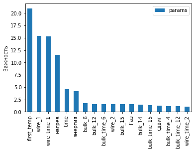
    


Видно, что наибольшее влияние кроме начальной температуры оказывает первая проволочная добавка, нагрев, время и энегрия.

В дальнейщем необходимо провести оценку важность признаков для лучшей модели и построим график важности с помощью метода SHAP.

Столбчатая диаграмма `shap.plots.bar` отражает общий вклад признаков в прогнозы модели. Она показывает средние SHAP-значения признака по всем наблюдениям. Для расчета средних берут значения Шепли по модулю, чтобы положительные и отрицательные значения не сводили друг друга к нулю.


```python
# создадим объект explainer
explainer = shap.TreeExplainer(cat.best_estimator_, X_test)
# получим имена признаков
feature_names = X_test.columns
```


```python
# посчитаем значения SHAP для тестовых данных
shap_values = explainer(X_test)
```

     98%|===================| 604/619 [00:26<00:00]        


```python
# столбчатый график
shap.plots.bar(shap_values,max_display=20)
```


    
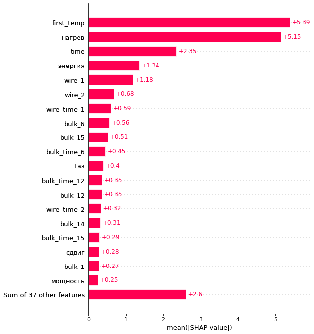
    


```python
# визуализируем значения SHAP в виде графика "осиное гнездо"
shap.plots.beeswarm(shap_values,max_display=20)
```


    
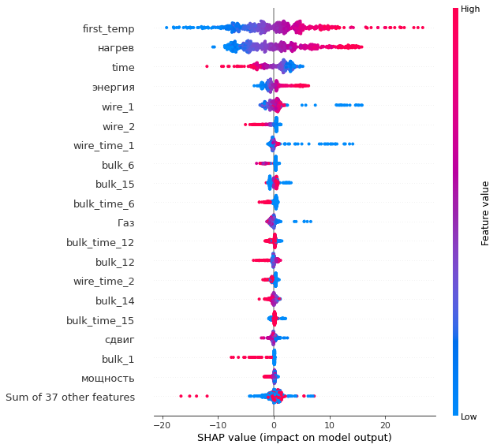
    


На графиках видно, что наибольшее влияние оказывает нагрев, чем дольше нагревают партию, тем выше температура. Но время наблюдение наоборот, чем меньше оно, тем выше температура. Энергия, тоже положительно влияет на температуру. Также видно, что при определенном количестве и времени добавления проволочной добавки наблюдается максимум, но его труднопределить.

* Вывод *: Из ходя их модели наибольшее влияние оказвает время нагрева, чем дольше нагревается сталь, тем выше температура, но перерывы снижают её.

## Вывод

Было получена 7 таблиц. В них содержалась информация об нагреве сталей, добавленых веществах, продувочных газах, а также наблюдения за температурой. В таблицах о добавках и наблюдений есть пропуски.

Всего у нас информация от 1 до 3241 партии стали, но некоторые были пропущены. В среднем на каждую партию приходиться 4,5 нагрева, минимум 1, максимум 16. Ни один нагрев не длился более более 15 минут. В среднем он длилися 2-3 минуты. Видно, что большая часть активная мощностей находиться между 0.4 и 0.8 максимкм 1.46, а минимум 0.25. Реактивная мощность 0.4-0.5 в среднем, минимкм 0.15 максимум 1.27. Был добавлен новый признак "Нагрев" (время нагрева), мощность, энергия и сдвиг и заменина реактивная мощность в партии 2116, т.к. в ней была ошибка.Время измерения в среднем состовляет 33 минуты, максимум 6 часов. В среднем делалось 5 измерений для партии, большая часть между 3 и 6, максимум 17. Температура зафиксирована от 1191 до 1705, в среднем 1590. В среднем продувают 7-13, минимум близок к 0, а максимум 77. Видно, что самым часто использумый сыпучий материал это 14_й, а 8-й использовали всего один раз, а для проволочного максимальный 1-й, а минимальный 5-й. Для таблиц с добавками пропуски и ключи у таблиц с объемом и временем добавки совпадают. Каждая партия подвергалась лишь одному циклу добавок. Есть 26 партий, где не используется продувочный газ.У 601 из замеренных партий не было сыпучих материалов, а у 867 - проволочных. Видно, что у 597 наблюдаемых сталей не было добавок. А вот нагревание было у всех.

Было произведено объединение таблиц. Таблица об нагреваниях отличалась по структуре от остальных, и её пришлось изменить создав новую таблицу, где каждая строчка соответствовала определенной партии. В дальнейщем все таблицы были объединены и на основе их была создана единая таблица данных, для каждого наблюдения за температурой. В результате получилась таблица в 118 столбцов и 2474 строк. Все пропуски были заменены на нули и дату начала 1970 года. В дальнейщем все значения времени были заменины на количество секунд и первого наблюдения за партией. Все значения времени нагрева которые меньше нуля или больше времени наблюдения были заменены на ноль и время наблюдения соответственно. Для добавок, которые были раньше перпого наблюдения время установленно на ноль, а для тех что после времени наблюдения добавка равна нулю.

Были замечаны следующие корреляции: между активной и реактивной мощностью обнаружена сильная корреляция, что может свидетельствовать о постоянности фазы; слабая корреляция между некоторыми добавками и сильная между всеменем добавления, что может быть связвно с тем, что многие из них признаны изначальными. На изменение температуры сильной корреляции нет, кроме начальной температуры, но и даже это можно объяснить тем, что в одних случаях нагрев наблюдается на более ранних стадиях, чем на других.

В полученной таблице целевым признаком является конечная температура,. Остальные, кроме номера партии, начального времени наблюдения и значение реактивной мощности являются входными параметрами. Тестовая и тренировочная выборка имеют соотношение 1 к 3. Для анализа данных использовались следующие модели: линейная модель, гребневая регрессия, дерево решений, Случайный лес,CatBoost, LGBM. Все модели кроме линейной регрессии оказались лучше константы.  Лучшая модель CatBoostRegressor чья метрика на тренировочных данных состовляет 6.01, а на тестовых 5.9,  что удовлетворяет требованиям

Был проведен анализ модели. Сам важным признаком является начальная температура. После него идет время начало и конца нагрева стали, чем дольше нагревается сталь тем выше разность температур, но чем дольше проходит времени между первым и конечным наблюдением, тем меньше температура, но нагрев все равно важнее. Это объясняется тем, что мощность установки редко меняется, а в перерывы между нагревами сталь охлаждается.

* Совет: уменьшить время смежу нагревами, в лучшем случае нагревать сталь за один раз.


<font color='blue'><b>Итоговый комментарий ментора:</b></font>
<br><font color='blue'>Можно проект улучшить:</font><strike>
<br><font color='darkorange'>⚠️ Использовать раздельный поиск модели, чтобы увидеть качество каждой </font></strike>


---
<br><font color='blue'>Что нужно исправить:</font><strike>
<br><font color='crimson'> ❌ Оформить начало проета</font>
<br><font color='crimson'> ❌ Проблемы с графиками 2/2</font>
<br><font color='crimson'> ❌ Правильно выделить признаки</font>
<br><font color='crimson'> ❌ Убрать партии с одинаковыми температурами начала и конца</font>
<br><font color='crimson'> ❌ Выбрать корректный таргет</font>
<br><font color='crimson'> ❌ Сгруппировать все партии по правилу одна запись - одна партия и объединить по правилу inner</font>
<br><font color='crimson'> ❌ Исправить RS</font>
<br><font color='crimson'> ❌ Правильно разделить выборки</font>
<br><font color='crimson'> ❌ Добавить проверку на адекватность</font></strike>

---
<font color='blue'>Советую просмотреть запись вебинара и многие проблемы уйдут</b></font>

<font color='blue'><b>Итоговый комментарий ментора V2:</b></font>
<br><font color='green'> ✔️ Данные подготовлены и объеденены
<br> ✔️ Модели обучены
<br> ✔️ Найдена лучшая модель
<br> ✔️ Проверена адекватность и определены значимые признаки
</font>

---
<br><font color='blue'>Что нужно исправить:</font><strike>
<br><font color='crimson'> ❌ Получить метрику ниже 6.8

<font color='blue' size=5><b>Итоговый комментарий ментора по проекту V3</b></font>

---
<font color='blue'> Евгений, было приятно смотреть твою работу, следить, как менялся твой код и становился проект лучше. 

<br> Что хочется отметить:
<br>    1. Логика повествования и объяснение результатов.
<br>    2. Оформление графиков для объяснения результатов. Визуальное представление проще распознается не-пограммистами. Правильные масштабы, названия и подписи показывают профессионализм аналитика.
<br>    3. Подбор гиперпараметров при кросс-валидации. При работе с моделями важно знать много парамтеров, так как можно сделать модель под конкретную задачу и знать, что ее можно не переобучить для оптимальной работы.
<br>    4. Создании функций для однотипных задач. Часто повторяющийся код можно обернуть в функцию, чтобы визуально было удобно работать с тетрадкой.

<br> Над чем нужно поработать:
<br>    1. Создании конвеера(pipeline) для моделей. Очень часто нужно сделать коробочное решение для предсказания, которое можно завернуть в pipeline модель с последующей конвертацией в pickle файл.

<br> До новых встреч на поле Data Science и возможно в ODS. Удачи! 
</font>
